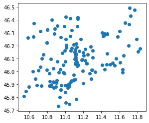

*Solution of the exercise after the lesson of 02 October 2020*
{: .no_toc }

## Table of contents
{: .no_toc .text-delta }

1. TOC
{:toc}

---

# Setup

```bash
try:
  import rtree
except ModuleNotFoundError as e:
  !apt-get install libspatialindex-dev
  !pip install rtree
  import rtree
```

    Reading package lists... Done
    Building dependency tree       
    Reading state information... Done
    The following additional packages will be installed:
      libspatialindex-c4v5 libspatialindex4v5
    The following NEW packages will be installed:
      libspatialindex-c4v5 libspatialindex-dev libspatialindex4v5
    0 upgraded, 3 newly installed, 0 to remove and 6 not upgraded.
    Need to get 555 kB of archives.
    After this operation, 3,308 kB of additional disk space will be used.
    Get:1 http://archive.ubuntu.com/ubuntu bionic/universe amd64 libspatialindex4v5 amd64 1.8.5-5 [219 kB]
    Get:2 http://archive.ubuntu.com/ubuntu bionic/universe amd64 libspatialindex-c4v5 amd64 1.8.5-5 [51.7 kB]
    Get:3 http://archive.ubuntu.com/ubuntu bionic/universe amd64 libspatialindex-dev amd64 1.8.5-5 [285 kB]
    Fetched 555 kB in 1s (457 kB/s)
    Selecting previously unselected package libspatialindex4v5:amd64.
    (Reading database ... 144617 files and directories currently installed.)
    Preparing to unpack .../libspatialindex4v5_1.8.5-5_amd64.deb ...
    Unpacking libspatialindex4v5:amd64 (1.8.5-5) ...
    Selecting previously unselected package libspatialindex-c4v5:amd64.
    Preparing to unpack .../libspatialindex-c4v5_1.8.5-5_amd64.deb ...
    Unpacking libspatialindex-c4v5:amd64 (1.8.5-5) ...
    Selecting previously unselected package libspatialindex-dev:amd64.
    Preparing to unpack .../libspatialindex-dev_1.8.5-5_amd64.deb ...
    Unpacking libspatialindex-dev:amd64 (1.8.5-5) ...
    Setting up libspatialindex4v5:amd64 (1.8.5-5) ...
    Setting up libspatialindex-c4v5:amd64 (1.8.5-5) ...
    Setting up libspatialindex-dev:amd64 (1.8.5-5) ...
    Processing triggers for libc-bin (2.27-3ubuntu1.2) ...
    /sbin/ldconfig.real: /usr/local/lib/python3.6/dist-packages/ideep4py/lib/libmkldnn.so.0 is not a symbolic link
    
    Collecting rtree
    [?25l  Downloading https://files.pythonhosted.org/packages/56/6f/f1e91001d5ad9fa9bed65875152f5a1c7955c5763168cae309546e6e9fda/Rtree-0.9.4.tar.gz (62kB)
         |████████████████████████████████| 71kB 3.6MB/s 
    [?25hRequirement already satisfied: setuptools in /usr/local/lib/python3.6/dist-packages (from rtree) (50.3.0)
    Building wheels for collected packages: rtree
      Building wheel for rtree (setup.py) ... [?25l[?25hdone
      Created wheel for rtree: filename=Rtree-0.9.4-cp36-none-any.whl size=21767 sha256=696d3670a992092cb113c1314a63faf7ffe827ca62ad1ca23a1a8ff70a03e346
      Stored in directory: /root/.cache/pip/wheels/ff/20/c5/0004ef7acb96745ec99be960053902b0b414a2aa2dcad5834e
    Successfully built rtree
    Installing collected packages: rtree
    Successfully installed rtree-0.9.4


```bash
!pip install geopandas
```

    Collecting geopandas
    [?25l  Downloading https://files.pythonhosted.org/packages/f7/a4/e66aafbefcbb717813bf3a355c8c4fc3ed04ea1dd7feb2920f2f4f868921/geopandas-0.8.1-py2.py3-none-any.whl (962kB)
         |████████████████████████████████| 972kB 4.4MB/s 
    [?25hCollecting fiona
    [?25l  Downloading https://files.pythonhosted.org/packages/36/8b/e8b2c11bed5373c8e98edb85ce891b09aa1f4210fd451d0fb3696b7695a2/Fiona-1.8.17-cp36-cp36m-manylinux1_x86_64.whl (14.8MB)
         |████████████████████████████████| 14.8MB 301kB/s 
    [?25hRequirement already satisfied: pandas>=0.23.0 in /usr/local/lib/python3.6/dist-packages (from geopandas) (1.1.2)
    Requirement already satisfied: shapely in /usr/local/lib/python3.6/dist-packages (from geopandas) (1.7.1)
    Collecting pyproj>=2.2.0
    [?25l  Downloading https://files.pythonhosted.org/packages/e5/c3/071e080230ac4b6c64f1a2e2f9161c9737a2bc7b683d2c90b024825000c0/pyproj-2.6.1.post1-cp36-cp36m-manylinux2010_x86_64.whl (10.9MB)
         |████████████████████████████████| 10.9MB 5.6MB/s 
    [?25hRequirement already satisfied: click<8,>=4.0 in /usr/local/lib/python3.6/dist-packages (from fiona->geopandas) (7.1.2)
    Collecting click-plugins>=1.0
      Downloading https://files.pythonhosted.org/packages/e9/da/824b92d9942f4e472702488857914bdd50f73021efea15b4cad9aca8ecef/click_plugins-1.1.1-py2.py3-none-any.whl
    Requirement already satisfied: attrs>=17 in /usr/local/lib/python3.6/dist-packages (from fiona->geopandas) (20.2.0)
    Collecting munch
      Downloading https://files.pythonhosted.org/packages/cc/ab/85d8da5c9a45e072301beb37ad7f833cd344e04c817d97e0cc75681d248f/munch-2.5.0-py2.py3-none-any.whl
    Requirement already satisfied: six>=1.7 in /usr/local/lib/python3.6/dist-packages (from fiona->geopandas) (1.15.0)
    Collecting cligj>=0.5
      Downloading https://files.pythonhosted.org/packages/e4/be/30a58b4b0733850280d01f8bd132591b4668ed5c7046761098d665ac2174/cligj-0.5.0-py3-none-any.whl
    Requirement already satisfied: pytz>=2017.2 in /usr/local/lib/python3.6/dist-packages (from pandas>=0.23.0->geopandas) (2018.9)
    Requirement already satisfied: numpy>=1.15.4 in /usr/local/lib/python3.6/dist-packages (from pandas>=0.23.0->geopandas) (1.18.5)
    Requirement already satisfied: python-dateutil>=2.7.3 in /usr/local/lib/python3.6/dist-packages (from pandas>=0.23.0->geopandas) (2.8.1)
    Installing collected packages: click-plugins, munch, cligj, fiona, pyproj, geopandas
    Successfully installed click-plugins-1.1.1 cligj-0.5.0 fiona-1.8.17 geopandas-0.8.1 munch-2.5.0 pyproj-2.6.1.post1


```python
import pandas as pd
import geopandas as gpd
```

---
# Exercise
- create the geodataframe of the [pharmacies of Trentino](http://servizi.apss.tn.it/opendata/FARM001.csv)
- count the total of phamarcies for each muncipality of Trentino
- list the municipalities bordering with Trento
- create the macroarea of all the municipalities bordering with Trento
- for each pharmacy contained in the macro-area, calculate how many libraries are within a 500m radius
- creates a polygon that contains all the pharmacies within a 2km radius of the Trento public library
- save the polygon in geopackage with the attribute "description" with value "area of the pharmacies 2km from the Trento public libray"
---

## data setup
geopackage with the administrative units of italy


```bash
!wget https://github.com/napo/geospatial_course_unitn/raw/master/data/administrative_units_italy_2020/istat_administrative_units_2020.gpkg
```

    --2020-10-09 10:41:10--  https://github.com/napo/geospatial_course_unitn/raw/master/data/administrative_units_italy_2020/istat_administrative_units_2020.gpkg
    Resolving github.com (github.com)... 192.30.255.113
    Connecting to github.com (github.com)|192.30.255.113|:443... connected.
    HTTP request sent, awaiting response... 302 Found
    Location: https://raw.githubusercontent.com/napo/geospatial_course_unitn/master/data/administrative_units_italy_2020/istat_administrative_units_2020.gpkg [following]
    --2020-10-09 10:41:10--  https://raw.githubusercontent.com/napo/geospatial_course_unitn/master/data/administrative_units_italy_2020/istat_administrative_units_2020.gpkg
    Resolving raw.githubusercontent.com (raw.githubusercontent.com)... 151.101.0.133, 151.101.64.133, 151.101.128.133, ...
    Connecting to raw.githubusercontent.com (raw.githubusercontent.com)|151.101.0.133|:443... connected.
    HTTP request sent, awaiting response... 200 OK
    Length: 23396352 (22M) [application/octet-stream]
    Saving to: ‘istat_administrative_units_2020.gpkg’
    
    istat_administrativ 100%[===================>]  22.31M  63.5MB/s    in 0.4s    
    
    2020-10-09 10:41:11 (63.5 MB/s) - ‘istat_administrative_units_2020.gpkg’ saved [23396352/23396352]
    


```python
municipalities = gpd.read_file("istat_administrative_units_2020.gpkg",layer="municipalities")
```

# create the geodataframe of the pharmacies of Trentino

python
```
phamarcies = pd.read_csv("https://servizi.apss.tn.it/opendata/FARM001.csv")
```


```python
geo_phamarcies = gpd.GeoDataFrame(
    phamarcies,
    crs='EPSG:4326',
    geometry=gpd.points_from_xy(phamarcies.LONGITUDINE_P, phamarcies.LATITUDINE_P))
```


```python
geo_phamarcies.plot()
```





# count the total of phamarcies for each muncipality of Trentino


```python
geo_phamarcies.groupby(geo_phamarcies.COMUNE).size().to_frame("size").sort_values(['size', 'COMUNE'], ascending=[False, True])
```


<div>
<style scoped>
    .dataframe tbody tr th:only-of-type {
        vertical-align: middle;
    }

    .dataframe tbody tr th {
        vertical-align: top;
    }

    .dataframe thead th {
        text-align: right;
    }
</style>
<table border="1" class="dataframe">
  <thead>
    <tr style="text-align: right;">
      <th></th>
      <th>size</th>
    </tr>
    <tr>
      <th>COMUNE</th>
      <th></th>
    </tr>
  </thead>
  <tbody>
    <tr>
      <th>TRENTO</th>
      <td>32</td>
    </tr>
    <tr>
      <th>ROVERETO</th>
      <td>12</td>
    </tr>
    <tr>
      <th>PERGINE VALSUGANA</th>
      <td>5</td>
    </tr>
    <tr>
      <th>ARCO</th>
      <td>4</td>
    </tr>
    <tr>
      <th>RIVA DEL GARDA</th>
      <td>4</td>
    </tr>
    <tr>
      <th>...</th>
      <td>...</td>
    </tr>
    <tr>
      <th>VIGOLO VATTARO</th>
      <td>1</td>
    </tr>
    <tr>
      <th>VILLA LAGARINA</th>
      <td>1</td>
    </tr>
    <tr>
      <th>VOLANO</th>
      <td>1</td>
    </tr>
    <tr>
      <th>ZAMBANA</th>
      <td>1</td>
    </tr>
    <tr>
      <th>ZIANO DI FIEMME</th>
      <td>1</td>
    </tr>
  </tbody>
</table>
<p>110 rows × 1 columns</p>
</div>


# list the municipalities bordering with Trento

## extract all the municipalities in Trentino 
cod_prov = 22


```python
municipalities_trentino = municipalities[municipalities.COD_PROV==22].to_crs(epsg=4326)
```

## Method 1 - spatial join


```python
sjon_trentino_pharmacy = gpd.sjoin(municipalities_trentino,geo_phamarcies, how='inner', op='contains', lsuffix='trentino', rsuffix='pharmacy')
%time

```

    CPU times: user 2 µs, sys: 0 ns, total: 2 µs
    Wall time: 4.53 µs


```python
sjon_trentino_pharmacy.groupby('COMUNE_trentino').size().to_frame("size").sort_values(['size', 'COMUNE_trentino'], ascending=[False,True])
```


<div>
<style scoped>
    .dataframe tbody tr th:only-of-type {
        vertical-align: middle;
    }

    .dataframe tbody tr th {
        vertical-align: top;
    }

    .dataframe thead th {
        text-align: right;
    }
</style>
<table border="1" class="dataframe">
  <thead>
    <tr style="text-align: right;">
      <th></th>
      <th>size</th>
    </tr>
    <tr>
      <th>COMUNE_trentino</th>
      <th></th>
    </tr>
  </thead>
  <tbody>
    <tr>
      <th>Trento</th>
      <td>26</td>
    </tr>
    <tr>
      <th>Rovereto</th>
      <td>11</td>
    </tr>
    <tr>
      <th>Arco</th>
      <td>5</td>
    </tr>
    <tr>
      <th>Pergine Valsugana</th>
      <td>5</td>
    </tr>
    <tr>
      <th>Riva del Garda</th>
      <td>4</td>
    </tr>
    <tr>
      <th>...</th>
      <td>...</td>
    </tr>
    <tr>
      <th>Vallarsa</th>
      <td>1</td>
    </tr>
    <tr>
      <th>Vallelaghi</th>
      <td>1</td>
    </tr>
    <tr>
      <th>Ville d'Anaunia</th>
      <td>1</td>
    </tr>
    <tr>
      <th>Volano</th>
      <td>1</td>
    </tr>
    <tr>
      <th>Ziano di Fiemme</th>
      <td>1</td>
    </tr>
  </tbody>
</table>
<p>101 rows × 1 columns</p>
</div>


## method 2 - loop between areas and points


```python
names = []
totals = []
for idx, municipality in municipalities_trentino.iterrows():
  name = municipalities_trentino.COMUNE[idx]
  names.append(name)
  area = municipalities_trentino.geometry[idx]
  tot = 0
  for index, row in geo_phamarcies.iterrows():
    v = area.contains(geo_phamarcies.geometry[index])
    if (v):
      tot +=1
  totals.append(tot)
data = {'municipality':names, 'count_phamarcies':totals}
%time

```

    CPU times: user 2 µs, sys: 1e+03 ns, total: 3 µs
    Wall time: 4.77 µs


```python
pd.DataFrame(data).sort_values(['count_phamarcies', 'municipality'], ascending=[False,True])
```


<div>
<style scoped>
    .dataframe tbody tr th:only-of-type {
        vertical-align: middle;
    }

    .dataframe tbody tr th {
        vertical-align: top;
    }

    .dataframe thead th {
        text-align: right;
    }
</style>
<table border="1" class="dataframe">
  <thead>
    <tr style="text-align: right;">
      <th></th>
      <th>municipality</th>
      <th>count_phamarcies</th>
    </tr>
  </thead>
  <tbody>
    <tr>
      <th>40</th>
      <td>Trento</td>
      <td>26</td>
    </tr>
    <tr>
      <th>136</th>
      <td>Rovereto</td>
      <td>11</td>
    </tr>
    <tr>
      <th>46</th>
      <td>Arco</td>
      <td>5</td>
    </tr>
    <tr>
      <th>124</th>
      <td>Pergine Valsugana</td>
      <td>5</td>
    </tr>
    <tr>
      <th>130</th>
      <td>Riva del Garda</td>
      <td>4</td>
    </tr>
    <tr>
      <th>...</th>
      <td>...</td>
      <td>...</td>
    </tr>
    <tr>
      <th>57</th>
      <td>Tre Ville</td>
      <td>0</td>
    </tr>
    <tr>
      <th>106</th>
      <td>Valdaone</td>
      <td>0</td>
    </tr>
    <tr>
      <th>41</th>
      <td>Valfloriana</td>
      <td>0</td>
    </tr>
    <tr>
      <th>44</th>
      <td>Vignola-Falesina</td>
      <td>0</td>
    </tr>
    <tr>
      <th>91</th>
      <td>Villa Lagarina</td>
      <td>0</td>
    </tr>
  </tbody>
</table>
<p>166 rows × 2 columns</p>
</div>


### some considerations ...

cough cough cough ... there a lot of mistakes with the coordinates in this dataset :/


find duplicate geometry


```python
onlygeometry = geo_phamarcies.geometry
```


```python
geo_phamarcies[onlygeometry.isin(onlygeometry[onlygeometry.duplicated()])].head(5)
```


<div>
<style scoped>
    .dataframe tbody tr th:only-of-type {
        vertical-align: middle;
    }

    .dataframe tbody tr th {
        vertical-align: top;
    }

    .dataframe thead th {
        text-align: right;
    }
</style>
<table border="1" class="dataframe">
  <thead>
    <tr style="text-align: right;">
      <th></th>
      <th>COD_FARMACIA_OD</th>
      <th>COD_FARMACIA</th>
      <th>FARMACIA</th>
      <th>IVA</th>
      <th>CAP</th>
      <th>COD_COMUNE</th>
      <th>COMUNE</th>
      <th>FRAZIONE</th>
      <th>COD_PROVINCIA</th>
      <th>PROVINCIA</th>
      <th>COD_REGIONE</th>
      <th>REGIONE</th>
      <th>DATA_INIZIO</th>
      <th>INDIRIZZO</th>
      <th>TIPOLOGIA</th>
      <th>LATITUDINE_P</th>
      <th>LONGITUDINE_P</th>
      <th>LATITUDINE_V</th>
      <th>LONGITUDINE_V</th>
      <th>geometry</th>
    </tr>
  </thead>
  <tbody>
    <tr>
      <th>10</th>
      <td>FAR042101004171</td>
      <td>4171</td>
      <td>ROMANI DI ERRIGO A. E C. SNC</td>
      <td>02046850224</td>
      <td>38015</td>
      <td>22103</td>
      <td>LAVIS</td>
      <td>-</td>
      <td>TN</td>
      <td>TRENTO</td>
      <td>42</td>
      <td>PROV. AUTON. TRENTO</td>
      <td>2009-09-01</td>
      <td>VIA SEGANTINI, 1</td>
      <td>ORDINARIA</td>
      <td>46.151283</td>
      <td>11.104254</td>
      <td>46,1512831931641</td>
      <td>11,1042541241409</td>
      <td>POINT (11.10425 46.15128)</td>
    </tr>
    <tr>
      <th>13</th>
      <td>FAR042101004174</td>
      <td>4174</td>
      <td>CRESCINI - DR.SSA TOGNANA</td>
      <td>00051370229</td>
      <td>38057</td>
      <td>22139</td>
      <td>PERGINE VALSUGANA</td>
      <td>-</td>
      <td>TN</td>
      <td>TRENTO</td>
      <td>42</td>
      <td>PROV. AUTON. TRENTO</td>
      <td>2005-01-01</td>
      <td>PIAZZA SERRA, 8</td>
      <td>ORDINARIA</td>
      <td>46.061640</td>
      <td>11.239847</td>
      <td>46,0616404</td>
      <td>11,2398474</td>
      <td>POINT (11.23985 46.06164)</td>
    </tr>
    <tr>
      <th>14</th>
      <td>FAR042101004175</td>
      <td>4175</td>
      <td>SCAGLIA S.A.S. DI SCAGLIA ANNA &amp; C.</td>
      <td>00983840224</td>
      <td>38086</td>
      <td>22143</td>
      <td>PINZOLO</td>
      <td>-</td>
      <td>TN</td>
      <td>TRENTO</td>
      <td>42</td>
      <td>PROV. AUTON. TRENTO</td>
      <td>2017-07-01</td>
      <td>PIAZZA S. GIACOMO, 1</td>
      <td>ORDINARIA</td>
      <td>46.222037</td>
      <td>10.796314</td>
      <td>46,2220374200605</td>
      <td>10,7963137713744</td>
      <td>POINT (10.79631 46.22204)</td>
    </tr>
    <tr>
      <th>19</th>
      <td>FAR042101004180</td>
      <td>4180</td>
      <td>DE BATTTAGLIA SNC</td>
      <td>02099830222</td>
      <td>38122</td>
      <td>22205</td>
      <td>TRENTO</td>
      <td>-</td>
      <td>TN</td>
      <td>TRENTO</td>
      <td>42</td>
      <td>PROV. AUTON. TRENTO</td>
      <td>2017-02-01</td>
      <td>PIAZZA PASI, 20</td>
      <td>ORDINARIA</td>
      <td>46.062206</td>
      <td>11.111765</td>
      <td>46,0622059167663</td>
      <td>11,1117645926563</td>
      <td>POINT (11.11176 46.06221)</td>
    </tr>
    <tr>
      <th>32</th>
      <td>FAR042101004193</td>
      <td>4193</td>
      <td>PIZZO DR. PAOLO</td>
      <td>02030200220</td>
      <td>38057</td>
      <td>22139</td>
      <td>PERGINE VALSUGANA</td>
      <td>-</td>
      <td>TN</td>
      <td>TRENTO</td>
      <td>42</td>
      <td>PROV. AUTON. TRENTO</td>
      <td>2009-06-01</td>
      <td>VIA BELLINI, 17</td>
      <td>ORDINARIA</td>
      <td>46.061640</td>
      <td>11.239847</td>
      <td>46,0616404</td>
      <td>11,2398474</td>
      <td>POINT (11.23985 46.06164)</td>
    </tr>
  </tbody>
</table>
</div>


```python
geo_phamarcies[onlygeometry.isin(onlygeometry[onlygeometry.duplicated()])].shape
```


    (26, 20)


# create the macroarea of all the municipalities bordering with Trento


```python
trento_polygon = municipalities_trentino[municipalities_trentino.COMUNE=='Trento'].geometry.values[0]
```


```python
trento_polygon
```


```python
touches_with_trento = municipalities_trentino[municipalities_trentino.geometry.touches(trento_polygon)]
```


```python
municipalities_around_trento = touches_with_trento.COMUNE.unique()
```


```python
list(municipalities_around_trento)
```


    ['Garniga Terme',
     'Giovo',
     'Cavedine',
     'Cimone',
     'Civezzano',
     'Albiano',
     'Aldeno',
     'Besenello',
     'Vallelaghi',
     'Lavis',
     'Villa Lagarina',
     'Altopiano della Vigolana',
     'Madruzzo',
     'Pergine Valsugana']


```python
touches_with_trento.geometry.unary_union
```


... we need to add Trento :)

## method 1 - unary_union


```python
%time
touches_with_trento.append(municipalities_trentino[municipalities_trentino.COMUNE=='Trento']).geometry.unary_union
```

    CPU times: user 3 µs, sys: 0 ns, total: 3 µs
    Wall time: 7.63 µs


## method 1 - dissolve


```python
%time
touches_with_trento.append(municipalities_trentino[municipalities_trentino.COMUNE=='Trento']).dissolve(by='COD_PROV').geometry.values[0]
```

    CPU times: user 3 µs, sys: 0 ns, total: 3 µs
    Wall time: 7.63 µs


```python
aroud_trento_area = touches_with_trento.append(municipalities_trentino[municipalities_trentino.COMUNE=='Trento']).dissolve(by='COD_PROV').geometry.values[0]
```

# for each pharmacy contained in the macro-area, calculate how many libraries are within a 500m radius

## step 1 - geodataframe of the libraries
note: there a lot of bad latitude and longitude in this dataset!!!


```python
libraries = pd.read_csv('http://opendata.anagrafe.iccu.sbn.it/territorio.zip', compression='zip', sep=';')
```


```python
libraries['latitudine'] = pd.to_numeric(libraries.latitudine.str.replace(",","."))
libraries.longitudine = pd.to_numeric(libraries.longitudine.str.replace(",","."))
```


```python
libraries = libraries[libraries.latitudine.isnull() == False]
```


```python
geo_libraries = gpd.GeoDataFrame(
    libraries,
    crs='EPSG:4326',
    geometry=gpd.points_from_xy(libraries.longitudine, libraries.latitudine))
```


```python
geo_libraries[geo_libraries.within(aroud_trento_area)].comune.unique()
```


    array(['Albiano', 'Aldeno', 'Baselga di Pinè', 'Cavedine', 'Civezzano',
           'Madruzzo', 'Lavis', 'Trento', 'Altopiano della Vigolana',
           'Pergine Valsugana', 'Villa Lagarina', 'Besenello', 'Cimone',
           'Garniga Terme', 'Giovo', 'Vallelaghi', "Terre d'Adige"],
          dtype=object)


note: 

the answer confirms that there are a lot of *bad* latitude and longitude in the *dataset*

Eg: Baselga di Pinè, Terre d'Adige and Madruzzo aren't bordering with Trento

**We consire valid the dataset only for the geometries for educational purpouse**


```python
libraries_in_macroarea = geo_libraries[geo_libraries.within(aroud_trento_area)]
```


```python
libraries_in_macroarea.geometry.unary_union
```


## step 2 - obtain a layer with the areas (circles) of 500m radius from each libraries in macroarea

we need to calculate the distance in **meters**


```python
libraries_in_macroarea = libraries_in_macroarea.to_crs(epsg=32632)
```


```python
libraries_in_macroarea_500 =  libraries_in_macroarea
```


```python
libraries_in_macroarea_500['geometry'] = libraries_in_macroarea.buffer(500)
```


```python
libraries_in_macroarea_500.plot()
```


## step 3 - calculate how many lbiraries are 500m close to each phamarcy into macroarea


```python
libraries500m_from_phamarcies = gpd.sjoin(libraries_in_macroarea_500 ,geo_phamarcies.to_crs(epsg=32632), how='inner', op='contains', lsuffix='library', rsuffix='pharmacy')
```


```python
libraries500m_from_phamarcies
```


<div>
<style scoped>
    .dataframe tbody tr th:only-of-type {
        vertical-align: middle;
    }

    .dataframe tbody tr th {
        vertical-align: top;
    }

    .dataframe thead th {
        text-align: right;
    }
</style>
<table border="1" class="dataframe">
  <thead>
    <tr style="text-align: right;">
      <th></th>
      <th>codice-isil</th>
      <th>codice-sbn</th>
      <th>denominazione</th>
      <th>indirizzo</th>
      <th>frazione</th>
      <th>cap</th>
      <th>comune</th>
      <th>codice istat comune</th>
      <th>provincia</th>
      <th>regione</th>
      <th>codice istat provincia</th>
      <th>latitudine</th>
      <th>longitudine</th>
      <th>telefono</th>
      <th>fax</th>
      <th>email</th>
      <th>url</th>
      <th>geometry</th>
      <th>index_pharmacy</th>
      <th>COD_FARMACIA_OD</th>
      <th>COD_FARMACIA</th>
      <th>FARMACIA</th>
      <th>IVA</th>
      <th>CAP</th>
      <th>COD_COMUNE</th>
      <th>COMUNE</th>
      <th>FRAZIONE</th>
      <th>COD_PROVINCIA</th>
      <th>PROVINCIA</th>
      <th>COD_REGIONE</th>
      <th>REGIONE</th>
      <th>DATA_INIZIO</th>
      <th>INDIRIZZO</th>
      <th>TIPOLOGIA</th>
      <th>LATITUDINE_P</th>
      <th>LONGITUDINE_P</th>
      <th>LATITUDINE_V</th>
      <th>LONGITUDINE_V</th>
    </tr>
  </thead>
  <tbody>
    <tr>
      <th>9852</th>
      <td>IT-TN0005</td>
      <td>NaN</td>
      <td>Biblioteca Comunale di Albiano</td>
      <td>via Pisetta 2</td>
      <td>NaN</td>
      <td>38041.0</td>
      <td>Albiano</td>
      <td>22002</td>
      <td>Trento</td>
      <td>TRENTINO-ALTO ADIGE/SÜDTIROL</td>
      <td>22</td>
      <td>46.144176</td>
      <td>11.196102</td>
      <td>+390461689033</td>
      <td>NaN</td>
      <td>NaN</td>
      <td>NaN</td>
      <td>POLYGON ((670105.475 5112411.036, 670103.068 5...</td>
      <td>31</td>
      <td>FAR042101004192</td>
      <td>4192</td>
      <td>CREMONESI</td>
      <td>00828140228</td>
      <td>38041</td>
      <td>22002</td>
      <td>ALBIANO</td>
      <td>-</td>
      <td>TN</td>
      <td>TRENTO</td>
      <td>42</td>
      <td>PROV. AUTON. TRENTO</td>
      <td>2013-03-01</td>
      <td>VIA ROMA, 17A</td>
      <td>ORDINARIA</td>
      <td>46.144967</td>
      <td>11.200060</td>
      <td>46,1449671070267</td>
      <td>11,2000600793698</td>
    </tr>
    <tr>
      <th>9856</th>
      <td>IT-TN0014</td>
      <td>NaN</td>
      <td>Biblioteca Pubblica Comunale di Baselga di Pinè</td>
      <td>via del 26 Maggio 10</td>
      <td>NaN</td>
      <td>38042.0</td>
      <td>Baselga di Pinè</td>
      <td>22009</td>
      <td>Trento</td>
      <td>TRENTINO-ALTO ADIGE/SÜDTIROL</td>
      <td>22</td>
      <td>46.062539</td>
      <td>11.242881</td>
      <td>+390461557951</td>
      <td>NaN</td>
      <td>NaN</td>
      <td>NaN</td>
      <td>POLYGON ((673974.074 5103441.695, 673971.666 5...</td>
      <td>13</td>
      <td>FAR042101004174</td>
      <td>4174</td>
      <td>CRESCINI - DR.SSA TOGNANA</td>
      <td>00051370229</td>
      <td>38057</td>
      <td>22139</td>
      <td>PERGINE VALSUGANA</td>
      <td>-</td>
      <td>TN</td>
      <td>TRENTO</td>
      <td>42</td>
      <td>PROV. AUTON. TRENTO</td>
      <td>2005-01-01</td>
      <td>PIAZZA SERRA, 8</td>
      <td>ORDINARIA</td>
      <td>46.061640</td>
      <td>11.239847</td>
      <td>46,0616404</td>
      <td>11,2398474</td>
    </tr>
    <tr>
      <th>9942</th>
      <td>IT-TN0160</td>
      <td>NaN</td>
      <td>Biblioteca Pubblica Comunale di Pergine Valsugana</td>
      <td>piazza Serra 11</td>
      <td>NaN</td>
      <td>38057.0</td>
      <td>Pergine Valsugana</td>
      <td>22139</td>
      <td>Trento</td>
      <td>TRENTINO-ALTO ADIGE/SÜDTIROL</td>
      <td>22</td>
      <td>46.060107</td>
      <td>11.238681</td>
      <td>+390461502390</td>
      <td>+39 0461531755</td>
      <td>NaN</td>
      <td>NaN</td>
      <td>POLYGON ((673656.881 5103162.258, 673654.473 5...</td>
      <td>13</td>
      <td>FAR042101004174</td>
      <td>4174</td>
      <td>CRESCINI - DR.SSA TOGNANA</td>
      <td>00051370229</td>
      <td>38057</td>
      <td>22139</td>
      <td>PERGINE VALSUGANA</td>
      <td>-</td>
      <td>TN</td>
      <td>TRENTO</td>
      <td>42</td>
      <td>PROV. AUTON. TRENTO</td>
      <td>2005-01-01</td>
      <td>PIAZZA SERRA, 8</td>
      <td>ORDINARIA</td>
      <td>46.061640</td>
      <td>11.239847</td>
      <td>46,0616404</td>
      <td>11,2398474</td>
    </tr>
    <tr>
      <th>10032</th>
      <td>IT-TN0588</td>
      <td>NaN</td>
      <td>Biblioteca dell'Istituto di istruzione Marie C...</td>
      <td>Via San Pietro, 4</td>
      <td>NaN</td>
      <td>38057.0</td>
      <td>Pergine Valsugana</td>
      <td>22139</td>
      <td>Trento</td>
      <td>TRENTINO-ALTO ADIGE/SÜDTIROL</td>
      <td>22</td>
      <td>46.063195</td>
      <td>11.244537</td>
      <td>+39 0461511397</td>
      <td>NaN</td>
      <td>biblioteca@curiepergine.it</td>
      <td>https://www.curiepergine.edu.it/</td>
      <td>POLYGON ((674100.175 5103518.174, 674097.767 5...</td>
      <td>13</td>
      <td>FAR042101004174</td>
      <td>4174</td>
      <td>CRESCINI - DR.SSA TOGNANA</td>
      <td>00051370229</td>
      <td>38057</td>
      <td>22139</td>
      <td>PERGINE VALSUGANA</td>
      <td>-</td>
      <td>TN</td>
      <td>TRENTO</td>
      <td>42</td>
      <td>PROV. AUTON. TRENTO</td>
      <td>2005-01-01</td>
      <td>PIAZZA SERRA, 8</td>
      <td>ORDINARIA</td>
      <td>46.061640</td>
      <td>11.239847</td>
      <td>46,0616404</td>
      <td>11,2398474</td>
    </tr>
    <tr>
      <th>9856</th>
      <td>IT-TN0014</td>
      <td>NaN</td>
      <td>Biblioteca Pubblica Comunale di Baselga di Pinè</td>
      <td>via del 26 Maggio 10</td>
      <td>NaN</td>
      <td>38042.0</td>
      <td>Baselga di Pinè</td>
      <td>22009</td>
      <td>Trento</td>
      <td>TRENTINO-ALTO ADIGE/SÜDTIROL</td>
      <td>22</td>
      <td>46.062539</td>
      <td>11.242881</td>
      <td>+390461557951</td>
      <td>NaN</td>
      <td>NaN</td>
      <td>NaN</td>
      <td>POLYGON ((673974.074 5103441.695, 673971.666 5...</td>
      <td>67</td>
      <td>FAR042101004228</td>
      <td>4228</td>
      <td>DE VARDA</td>
      <td>00182490227</td>
      <td>38057</td>
      <td>22139</td>
      <td>PERGINE VALSUGANA</td>
      <td>-</td>
      <td>TN</td>
      <td>TRENTO</td>
      <td>42</td>
      <td>PROV. AUTON. TRENTO</td>
      <td>2009-09-01</td>
      <td>VIA CESARE BATTISTI, 26</td>
      <td>ORDINARIA</td>
      <td>46.061640</td>
      <td>11.239847</td>
      <td>46,0616404</td>
      <td>11,2398474</td>
    </tr>
    <tr>
      <th>...</th>
      <td>...</td>
      <td>...</td>
      <td>...</td>
      <td>...</td>
      <td>...</td>
      <td>...</td>
      <td>...</td>
      <td>...</td>
      <td>...</td>
      <td>...</td>
      <td>...</td>
      <td>...</td>
      <td>...</td>
      <td>...</td>
      <td>...</td>
      <td>...</td>
      <td>...</td>
      <td>...</td>
      <td>...</td>
      <td>...</td>
      <td>...</td>
      <td>...</td>
      <td>...</td>
      <td>...</td>
      <td>...</td>
      <td>...</td>
      <td>...</td>
      <td>...</td>
      <td>...</td>
      <td>...</td>
      <td>...</td>
      <td>...</td>
      <td>...</td>
      <td>...</td>
      <td>...</td>
      <td>...</td>
      <td>...</td>
      <td>...</td>
    </tr>
    <tr>
      <th>9986</th>
      <td>IT-TN0214</td>
      <td>NaN</td>
      <td>CONSIGLIO PER LA RICERCA IN AGRICOLTURA E ANAL...</td>
      <td>piazza NICOLINI 6</td>
      <td>NaN</td>
      <td>38100.0</td>
      <td>Trento</td>
      <td>22205</td>
      <td>Trento</td>
      <td>TRENTINO-ALTO ADIGE/SÜDTIROL</td>
      <td>22</td>
      <td>46.049048</td>
      <td>11.145905</td>
      <td>0461381111</td>
      <td>+39 0461381131</td>
      <td>NaN</td>
      <td>WWW.CREA.GOV.IT</td>
      <td>POLYGON ((666514.146 5101735.841, 666511.738 5...</td>
      <td>30</td>
      <td>FAR042101004191</td>
      <td>4191</td>
      <td>VILLAZZANO DI BOLEGO PAOLO</td>
      <td>01856020225</td>
      <td>38123</td>
      <td>22205</td>
      <td>TRENTO</td>
      <td>VILLAZZANO</td>
      <td>TN</td>
      <td>TRENTO</td>
      <td>42</td>
      <td>PROV. AUTON. TRENTO</td>
      <td>2017-02-01</td>
      <td>VIA TAMBOSI, 2</td>
      <td>ORDINARIA</td>
      <td>46.049783</td>
      <td>11.143982</td>
      <td>46,0497829</td>
      <td>11,1439821</td>
    </tr>
    <tr>
      <th>9993</th>
      <td>IT-TN0227</td>
      <td>NaN</td>
      <td>Biblioteca Pubblica Comunale di Giovo</td>
      <td>via Grec 2</td>
      <td>NaN</td>
      <td>38030.0</td>
      <td>Giovo</td>
      <td>22092</td>
      <td>Trento</td>
      <td>TRENTINO-ALTO ADIGE/SÜDTIROL</td>
      <td>22</td>
      <td>46.158767</td>
      <td>11.155707</td>
      <td>+390461684735</td>
      <td>NaN</td>
      <td>NaN</td>
      <td>NaN</td>
      <td>POLYGON ((666941.786 5113946.733, 666939.378 5...</td>
      <td>69</td>
      <td>FAR042101004230</td>
      <td>4230</td>
      <td>BERNARDIN ANDREA</td>
      <td>02443000225</td>
      <td>38030</td>
      <td>22092</td>
      <td>GIOVO</td>
      <td>VERLA</td>
      <td>TN</td>
      <td>TRENTO</td>
      <td>42</td>
      <td>PROV. AUTON. TRENTO</td>
      <td>2017-07-01</td>
      <td>VIA AI MOLINI, 1</td>
      <td>ORDINARIA</td>
      <td>46.155879</td>
      <td>11.152455</td>
      <td>46,1558787</td>
      <td>11,1524547</td>
    </tr>
    <tr>
      <th>10003</th>
      <td>IT-TN0239</td>
      <td>NaN</td>
      <td>Punto di Lettura di Terlago</td>
      <td>via Roma 10</td>
      <td>NaN</td>
      <td>38096.0</td>
      <td>Vallelaghi</td>
      <td>22248</td>
      <td>Trento</td>
      <td>TRENTINO-ALTO ADIGE/SÜDTIROL</td>
      <td>22</td>
      <td>46.079850</td>
      <td>11.001164</td>
      <td>+390461860150</td>
      <td>NaN</td>
      <td>NaN</td>
      <td>NaN</td>
      <td>POLYGON ((655230.604 5104866.192, 655228.196 5...</td>
      <td>93</td>
      <td>FAR042101004256</td>
      <td>4256</td>
      <td>TURAZZA LUIGI</td>
      <td>01794470227</td>
      <td>38070</td>
      <td>22215</td>
      <td>VEZZANO</td>
      <td>-</td>
      <td>TN</td>
      <td>TRENTO</td>
      <td>42</td>
      <td>PROV. AUTON. TRENTO</td>
      <td>2009-09-01</td>
      <td>VIA ROMA, 1</td>
      <td>ORDINARIA</td>
      <td>46.077904</td>
      <td>10.999122</td>
      <td>46,0779043256191</td>
      <td>10,9991219054545</td>
    </tr>
    <tr>
      <th>10016</th>
      <td>IT-TN0258</td>
      <td>NaN</td>
      <td>Biblioteca Pubblica Comunale Vallelaghi</td>
      <td>piazza San Valentino 3</td>
      <td>NaN</td>
      <td>38096.0</td>
      <td>Vallelaghi</td>
      <td>22248</td>
      <td>Trento</td>
      <td>TRENTINO-ALTO ADIGE/SÜDTIROL</td>
      <td>22</td>
      <td>46.078620</td>
      <td>11.000475</td>
      <td>+390461340072</td>
      <td>NaN</td>
      <td>NaN</td>
      <td>NaN</td>
      <td>POLYGON ((655180.730 5104728.190, 655178.323 5...</td>
      <td>93</td>
      <td>FAR042101004256</td>
      <td>4256</td>
      <td>TURAZZA LUIGI</td>
      <td>01794470227</td>
      <td>38070</td>
      <td>22215</td>
      <td>VEZZANO</td>
      <td>-</td>
      <td>TN</td>
      <td>TRENTO</td>
      <td>42</td>
      <td>PROV. AUTON. TRENTO</td>
      <td>2009-09-01</td>
      <td>VIA ROMA, 1</td>
      <td>ORDINARIA</td>
      <td>46.077904</td>
      <td>10.999122</td>
      <td>46,0779043256191</td>
      <td>10,9991219054545</td>
    </tr>
    <tr>
      <th>10009</th>
      <td>IT-TN0246</td>
      <td>NaN</td>
      <td>Biblioteca del servizio statistica</td>
      <td>Via Brennero, 316</td>
      <td>NaN</td>
      <td>38100.0</td>
      <td>Trento</td>
      <td>22205</td>
      <td>Trento</td>
      <td>TRENTINO-ALTO ADIGE/SÜDTIROL</td>
      <td>22</td>
      <td>46.092094</td>
      <td>11.115387</td>
      <td>+39 0461497805</td>
      <td>NaN</td>
      <td>NaN</td>
      <td>NaN</td>
      <td>POLYGON ((664025.939 5106455.240, 664023.531 5...</td>
      <td>89</td>
      <td>FAR042101004252</td>
      <td>4252</td>
      <td>AI SOLTERI-GADOTTI ANDREA &amp;C.SNC</td>
      <td>00171990229</td>
      <td>38121</td>
      <td>22205</td>
      <td>TRENTO</td>
      <td>-</td>
      <td>TN</td>
      <td>TRENTO</td>
      <td>42</td>
      <td>PROV. AUTON. TRENTO</td>
      <td>2013-03-01</td>
      <td>VIA R. LUNELLI, 9</td>
      <td>ORDINARIA</td>
      <td>46.092117</td>
      <td>11.117460</td>
      <td>46,09211699999999</td>
      <td>11,11746</td>
    </tr>
  </tbody>
</table>
<p>136 rows × 38 columns</p>
</div>


**note:**

... there are **bad values** about latitude and logitude in **both** original **datasets**


```python
libraries500m_from_phamarcies.groupby('comune').size().to_frame("size").sort_values(['size', 'comune'], ascending=[False,True])
```


<div>
<style scoped>
    .dataframe tbody tr th:only-of-type {
        vertical-align: middle;
    }

    .dataframe tbody tr th {
        vertical-align: top;
    }

    .dataframe thead th {
        text-align: right;
    }
</style>
<table border="1" class="dataframe">
  <thead>
    <tr style="text-align: right;">
      <th></th>
      <th>size</th>
    </tr>
    <tr>
      <th>comune</th>
      <th></th>
    </tr>
  </thead>
  <tbody>
    <tr>
      <th>Trento</th>
      <td>115</td>
    </tr>
    <tr>
      <th>Pergine Valsugana</th>
      <td>8</td>
    </tr>
    <tr>
      <th>Baselga di Pinè</th>
      <td>4</td>
    </tr>
    <tr>
      <th>Civezzano</th>
      <td>2</td>
    </tr>
    <tr>
      <th>Vallelaghi</th>
      <td>2</td>
    </tr>
    <tr>
      <th>Albiano</th>
      <td>1</td>
    </tr>
    <tr>
      <th>Altopiano della Vigolana</th>
      <td>1</td>
    </tr>
    <tr>
      <th>Cavedine</th>
      <td>1</td>
    </tr>
    <tr>
      <th>Giovo</th>
      <td>1</td>
    </tr>
    <tr>
      <th>Lavis</th>
      <td>1</td>
    </tr>
  </tbody>
</table>
</div>


# create a polygon that contains all the pharmacies within a 2km radius of the Trento public library

we need the geometry of the public library of Trento in meters


```python
trento_public_library = geo_libraries[geo_libraries['codice-isil'] == 'IT-TN0121'].to_crs(epsg=32632).geometry.values[0]
```

## method 1 - calculate distance

calculate the distance from the position for each phamarcy


```python
geo_phamarcies['distance'] = geo_phamarcies.to_crs(epsg=32632).geometry.distance(trento_public_library)
```


```python
phamarcies_2000m_from_public_library_trento = geo_phamarcies[geo_phamarcies['distance'] < 2000.0]
```


```python
phamarcies_2000m_from_public_library_trento
```


<div>
<style scoped>
    .dataframe tbody tr th:only-of-type {
        vertical-align: middle;
    }

    .dataframe tbody tr th {
        vertical-align: top;
    }

    .dataframe thead th {
        text-align: right;
    }
</style>
<table border="1" class="dataframe">
  <thead>
    <tr style="text-align: right;">
      <th></th>
      <th>COD_FARMACIA_OD</th>
      <th>COD_FARMACIA</th>
      <th>FARMACIA</th>
      <th>IVA</th>
      <th>CAP</th>
      <th>COD_COMUNE</th>
      <th>COMUNE</th>
      <th>FRAZIONE</th>
      <th>COD_PROVINCIA</th>
      <th>PROVINCIA</th>
      <th>COD_REGIONE</th>
      <th>REGIONE</th>
      <th>DATA_INIZIO</th>
      <th>INDIRIZZO</th>
      <th>TIPOLOGIA</th>
      <th>LATITUDINE_P</th>
      <th>LONGITUDINE_P</th>
      <th>LATITUDINE_V</th>
      <th>LONGITUDINE_V</th>
      <th>geometry</th>
      <th>distance</th>
    </tr>
  </thead>
  <tbody>
    <tr>
      <th>17</th>
      <td>FAR042101004178</td>
      <td>4178</td>
      <td>DALL'ARMI SNC PATTINI DR. ALBERTO E DR.SSA ALE...</td>
      <td>00337140222</td>
      <td>38122</td>
      <td>22205</td>
      <td>TRENTO</td>
      <td>-</td>
      <td>TN</td>
      <td>TRENTO</td>
      <td>42</td>
      <td>PROV. AUTON. TRENTO</td>
      <td>2017-02-01</td>
      <td>PIAZZA DUOMO, 10</td>
      <td>ORDINARIA</td>
      <td>46.067619</td>
      <td>11.121519</td>
      <td>46,0676193498462</td>
      <td>11,1215188143335</td>
      <td>POINT (11.12152 46.06762)</td>
      <td>243.486471</td>
    </tr>
    <tr>
      <th>19</th>
      <td>FAR042101004180</td>
      <td>4180</td>
      <td>DE BATTTAGLIA SNC</td>
      <td>02099830222</td>
      <td>38122</td>
      <td>22205</td>
      <td>TRENTO</td>
      <td>-</td>
      <td>TN</td>
      <td>TRENTO</td>
      <td>42</td>
      <td>PROV. AUTON. TRENTO</td>
      <td>2017-02-01</td>
      <td>PIAZZA PASI, 20</td>
      <td>ORDINARIA</td>
      <td>46.062206</td>
      <td>11.111765</td>
      <td>46,0622059167663</td>
      <td>11,1117645926563</td>
      <td>POINT (11.11176 46.06221)</td>
      <td>1091.193285</td>
    </tr>
    <tr>
      <th>25</th>
      <td>FAR042101004186</td>
      <td>4186</td>
      <td>BOLGHERA SNC</td>
      <td>00166280222</td>
      <td>38122</td>
      <td>22205</td>
      <td>TRENTO</td>
      <td>-</td>
      <td>TN</td>
      <td>TRENTO</td>
      <td>42</td>
      <td>PROV. AUTON. TRENTO</td>
      <td>2017-07-01</td>
      <td>LARGO MEDAGLIE D'ORO, 8</td>
      <td>ORDINARIA</td>
      <td>46.057797</td>
      <td>11.132752</td>
      <td>46,0577971934673</td>
      <td>11,1327523327511</td>
      <td>POINT (11.13275 46.05780)</td>
      <td>1619.147637</td>
    </tr>
    <tr>
      <th>87</th>
      <td>FAR042101004250</td>
      <td>4250</td>
      <td>LEPORE DR. MARCO</td>
      <td>00639430222</td>
      <td>38122</td>
      <td>22205</td>
      <td>TRENTO</td>
      <td>-</td>
      <td>TN</td>
      <td>TRENTO</td>
      <td>42</td>
      <td>PROV. AUTON. TRENTO</td>
      <td>2017-02-01</td>
      <td>VIA MANZONI, 7/A</td>
      <td>ORDINARIA</td>
      <td>46.074813</td>
      <td>11.125135</td>
      <td>46,0748132409383</td>
      <td>11,1251346567747</td>
      <td>POINT (11.12513 46.07481)</td>
      <td>655.432357</td>
    </tr>
    <tr>
      <th>88</th>
      <td>FAR042101004251</td>
      <td>4251</td>
      <td>ALLA MADONNA DR. GIANMARCO CASAGRANDE &amp; C. SNC</td>
      <td>01735670224</td>
      <td>38122</td>
      <td>22205</td>
      <td>TRENTO</td>
      <td>-</td>
      <td>TN</td>
      <td>TRENTO</td>
      <td>42</td>
      <td>PROV. AUTON. TRENTO</td>
      <td>2013-03-01</td>
      <td>VIA G. MANCI, 42</td>
      <td>ORDINARIA</td>
      <td>46.062206</td>
      <td>11.111765</td>
      <td>46,0622059167663</td>
      <td>11,1117645926563</td>
      <td>POINT (11.11176 46.06221)</td>
      <td>1091.193285</td>
    </tr>
    <tr>
      <th>98</th>
      <td>FAR042101004261</td>
      <td>4261</td>
      <td>SAN LORENZO</td>
      <td>01709540221</td>
      <td>38121</td>
      <td>22205</td>
      <td>TRENTO</td>
      <td>-</td>
      <td>TN</td>
      <td>TRENTO</td>
      <td>42</td>
      <td>PROV. AUTON. TRENTO</td>
      <td>2017-02-01</td>
      <td>PIAZZA G. CANTORE, 1</td>
      <td>ORDINARIA</td>
      <td>46.069692</td>
      <td>11.121089</td>
      <td>46,0696924</td>
      <td>11,1210886</td>
      <td>POINT (11.12109 46.06969)</td>
      <td>23.992939</td>
    </tr>
    <tr>
      <th>101</th>
      <td>FAR042101004264</td>
      <td>4264</td>
      <td>BETTA MARCO</td>
      <td>01457840229</td>
      <td>38123</td>
      <td>22205</td>
      <td>TRENTO</td>
      <td>RAVINA</td>
      <td>TN</td>
      <td>TRENTO</td>
      <td>42</td>
      <td>PROV. AUTON. TRENTO</td>
      <td>2017-02-01</td>
      <td>VIA HERRSCHING, 1</td>
      <td>ORDINARIA</td>
      <td>46.062206</td>
      <td>11.111765</td>
      <td>46,0622059167663</td>
      <td>11,1117645926563</td>
      <td>POINT (11.11176 46.06221)</td>
      <td>1091.193285</td>
    </tr>
    <tr>
      <th>105</th>
      <td>FAR042101004270</td>
      <td>4270</td>
      <td>FERRI</td>
      <td>00661510222</td>
      <td>38121</td>
      <td>22205</td>
      <td>TRENTO</td>
      <td>MARTIGNANO</td>
      <td>TN</td>
      <td>TRENTO</td>
      <td>42</td>
      <td>PROV. AUTON. TRENTO</td>
      <td>2013-03-01</td>
      <td>VIA FORMIGHETA, 1</td>
      <td>ORDINARIA</td>
      <td>46.069692</td>
      <td>11.121089</td>
      <td>46,0696924</td>
      <td>11,1210886</td>
      <td>POINT (11.12109 46.06969)</td>
      <td>23.992939</td>
    </tr>
    <tr>
      <th>107</th>
      <td>FAR042101004272</td>
      <td>4272</td>
      <td>DE GERLONI DR. PIER FRANCESCO</td>
      <td>01229140221</td>
      <td>38123</td>
      <td>22205</td>
      <td>TRENTO</td>
      <td>SOPRAMONTE, 205 F</td>
      <td>TN</td>
      <td>TRENTO</td>
      <td>42</td>
      <td>PROV. AUTON. TRENTO</td>
      <td>2013-03-01</td>
      <td>LOC. SOPRAMONTE, 205 F</td>
      <td>ORDINARIA</td>
      <td>46.062206</td>
      <td>11.111765</td>
      <td>46,0622059167663</td>
      <td>11,1117645926563</td>
      <td>POINT (11.11176 46.06221)</td>
      <td>1091.193285</td>
    </tr>
    <tr>
      <th>117</th>
      <td>FAR042101016627</td>
      <td>16627</td>
      <td>COMUNALE SAN GIUSEPPE</td>
      <td>01581140223</td>
      <td>38122</td>
      <td>22205</td>
      <td>TRENTO</td>
      <td>-</td>
      <td>TN</td>
      <td>TRENTO</td>
      <td>42</td>
      <td>PROV. AUTON. TRENTO</td>
      <td>2017-07-01</td>
      <td>VIA VITTORIO VENETO, 39</td>
      <td>ORDINARIA</td>
      <td>46.058852</td>
      <td>11.124785</td>
      <td>46,05885165</td>
      <td>11,1247846</td>
      <td>POINT (11.12478 46.05885)</td>
      <td>1250.157477</td>
    </tr>
    <tr>
      <th>120</th>
      <td>FAR042101016665</td>
      <td>16665</td>
      <td>Comunale N.5 S. Dona'</td>
      <td>01581140223</td>
      <td>38122</td>
      <td>22205</td>
      <td>TRENTO</td>
      <td>S. Dona, 51</td>
      <td>TN</td>
      <td>TRENTO</td>
      <td>42</td>
      <td>PROV. AUTON. TRENTO</td>
      <td>2017-07-01</td>
      <td>LOC. SAN DONÀ, 50</td>
      <td>ORDINARIA</td>
      <td>46.062206</td>
      <td>11.111765</td>
      <td>46,0622059167663</td>
      <td>11,1117645926563</td>
      <td>POINT (11.11176 46.06221)</td>
      <td>1091.193285</td>
    </tr>
    <tr>
      <th>121</th>
      <td>FAR042101016670</td>
      <td>16670</td>
      <td>COMUNALE N.3 PIO X</td>
      <td>01581140223</td>
      <td>38122</td>
      <td>22205</td>
      <td>TRENTO</td>
      <td>-</td>
      <td>TN</td>
      <td>TRENTO</td>
      <td>42</td>
      <td>PROV. AUTON. TRENTO</td>
      <td>2017-07-01</td>
      <td>VIA SAN PIO X, 77</td>
      <td>ORDINARIA</td>
      <td>46.052494</td>
      <td>11.119820</td>
      <td>46,0524938275703</td>
      <td>11,1198202997403</td>
      <td>POINT (11.11982 46.05249)</td>
      <td>1919.456072</td>
    </tr>
    <tr>
      <th>124</th>
      <td>FAR042101016677</td>
      <td>16677</td>
      <td>COMUNALE N.8 MADONNA BIANCA</td>
      <td>01581140223</td>
      <td>38123</td>
      <td>22205</td>
      <td>TRENTO</td>
      <td>Mad. Bianca</td>
      <td>TN</td>
      <td>TRENTO</td>
      <td>42</td>
      <td>PROV. AUTON. TRENTO</td>
      <td>2017-07-01</td>
      <td>PIAZZALE EUROPA, 8</td>
      <td>ORDINARIA</td>
      <td>46.062206</td>
      <td>11.111765</td>
      <td>46,0622059167663</td>
      <td>11,1117645926563</td>
      <td>POINT (11.11176 46.06221)</td>
      <td>1091.193285</td>
    </tr>
    <tr>
      <th>127</th>
      <td>FAR042101016698</td>
      <td>16698</td>
      <td>COMUNALE N.9 PIEDICASTELLO</td>
      <td>01581140223</td>
      <td>38122</td>
      <td>22205</td>
      <td>TRENTO</td>
      <td>Piedicastello</td>
      <td>TN</td>
      <td>TRENTO</td>
      <td>42</td>
      <td>PROV. AUTON. TRENTO</td>
      <td>2017-07-01</td>
      <td>VIA BRESCIA, 19/A</td>
      <td>ORDINARIA</td>
      <td>46.070676</td>
      <td>11.113415</td>
      <td>46,0706761122494</td>
      <td>11,1134151046456</td>
      <td>POINT (11.11342 46.07068)</td>
      <td>579.714133</td>
    </tr>
    <tr>
      <th>157</th>
      <td>FAR042101018168</td>
      <td>18168</td>
      <td>FARMACIE COMUNALI SPA</td>
      <td>01581140223</td>
      <td>38100</td>
      <td>22205</td>
      <td>TRENTO</td>
      <td>-</td>
      <td>TN</td>
      <td>TRENTO</td>
      <td>42</td>
      <td>PROV. AUTON. TRENTO</td>
      <td>2007-12-01</td>
      <td>VIA ASILO PEDROTTI, 18</td>
      <td>ORDINARIA</td>
      <td>46.058922</td>
      <td>11.125767</td>
      <td>46,0589218431499</td>
      <td>11,1257667774255</td>
      <td>POINT (11.12577 46.05892)</td>
      <td>1263.645206</td>
    </tr>
    <tr>
      <th>158</th>
      <td>FAR042101018181</td>
      <td>18181</td>
      <td>COMUNALE COGNOLA</td>
      <td>01581140223</td>
      <td>38121</td>
      <td>22205</td>
      <td>TRENTO</td>
      <td>-</td>
      <td>TN</td>
      <td>TRENTO</td>
      <td>42</td>
      <td>PROV. AUTON. TRENTO</td>
      <td>2017-07-01</td>
      <td>P.ZZA DELL'ARGENTARIO, 10</td>
      <td>ORDINARIA</td>
      <td>46.062206</td>
      <td>11.111765</td>
      <td>46,0622059167663</td>
      <td>11,1117645926563</td>
      <td>POINT (11.11176 46.06221)</td>
      <td>1091.193285</td>
    </tr>
    <tr>
      <th>171</th>
      <td>FAR042101018834</td>
      <td>18834</td>
      <td>CAMPAGNOLO</td>
      <td>03673210617</td>
      <td>38123</td>
      <td>22205</td>
      <td>TRENTO</td>
      <td>Romagnano</td>
      <td>TN</td>
      <td>TRENTO</td>
      <td>42</td>
      <td>PROV. AUTON. TRENTO</td>
      <td>2013-07-01</td>
      <td>VIA ALLE SETTE FONTANE</td>
      <td>ORDINARIA</td>
      <td>46.069692</td>
      <td>11.121089</td>
      <td>46,0696924</td>
      <td>11,1210886</td>
      <td>POINT (11.12109 46.06969)</td>
      <td>23.992939</td>
    </tr>
    <tr>
      <th>173</th>
      <td>FAR042101019298</td>
      <td>19298</td>
      <td>IGEA DEL DOTT. MOHAMMAD MAHLOUL EL ZENNAR</td>
      <td>02431160221</td>
      <td>38122</td>
      <td>22205</td>
      <td>TRENTO</td>
      <td>-</td>
      <td>TN</td>
      <td>TRENTO</td>
      <td>42</td>
      <td>PROV. AUTON. TRENTO</td>
      <td>2017-07-01</td>
      <td>VIA MILANO, 68</td>
      <td>ORDINARIA</td>
      <td>46.060913</td>
      <td>11.128076</td>
      <td>46,06091319999999</td>
      <td>11,1280755</td>
      <td>POINT (11.12808 46.06091)</td>
      <td>1132.464809</td>
    </tr>
    <tr>
      <th>174</th>
      <td>FAR042101019376</td>
      <td>19376</td>
      <td>DISPENSARIO DI NOGAREDO</td>
      <td>01581140223</td>
      <td>38060</td>
      <td>22205</td>
      <td>TRENTO</td>
      <td>-</td>
      <td>TN</td>
      <td>TRENTO</td>
      <td>42</td>
      <td>PROV. AUTON. TRENTO</td>
      <td>2016-12-01</td>
      <td>VIA SAN BIAGIO, 4</td>
      <td>DISPENSARIO</td>
      <td>46.074779</td>
      <td>11.121749</td>
      <td>46,0747793</td>
      <td>11,1217486</td>
      <td>POINT (11.12175 46.07478)</td>
      <td>563.824881</td>
    </tr>
  </tbody>
</table>
</div>


## method 2 - spatial relationship


```python
trento_public_library_2k = trento_public_library.buffer(2000)
```


```python
trento_public_library_2k
```


```python
phamarcies_2000m_from_public_library_trento = geo_phamarcies[geo_phamarcies.to_crs(epsg=32632).within(trento_public_library_2k)]
```


```python
phamarcies_2000m_from_public_library_trento
```


<div>
<style scoped>
    .dataframe tbody tr th:only-of-type {
        vertical-align: middle;
    }

    .dataframe tbody tr th {
        vertical-align: top;
    }

    .dataframe thead th {
        text-align: right;
    }
</style>
<table border="1" class="dataframe">
  <thead>
    <tr style="text-align: right;">
      <th></th>
      <th>COD_FARMACIA_OD</th>
      <th>COD_FARMACIA</th>
      <th>FARMACIA</th>
      <th>IVA</th>
      <th>CAP</th>
      <th>COD_COMUNE</th>
      <th>COMUNE</th>
      <th>FRAZIONE</th>
      <th>COD_PROVINCIA</th>
      <th>PROVINCIA</th>
      <th>COD_REGIONE</th>
      <th>REGIONE</th>
      <th>DATA_INIZIO</th>
      <th>INDIRIZZO</th>
      <th>TIPOLOGIA</th>
      <th>LATITUDINE_P</th>
      <th>LONGITUDINE_P</th>
      <th>LATITUDINE_V</th>
      <th>LONGITUDINE_V</th>
      <th>geometry</th>
      <th>distance</th>
    </tr>
  </thead>
  <tbody>
    <tr>
      <th>17</th>
      <td>FAR042101004178</td>
      <td>4178</td>
      <td>DALL'ARMI SNC PATTINI DR. ALBERTO E DR.SSA ALE...</td>
      <td>00337140222</td>
      <td>38122</td>
      <td>22205</td>
      <td>TRENTO</td>
      <td>-</td>
      <td>TN</td>
      <td>TRENTO</td>
      <td>42</td>
      <td>PROV. AUTON. TRENTO</td>
      <td>2017-02-01</td>
      <td>PIAZZA DUOMO, 10</td>
      <td>ORDINARIA</td>
      <td>46.067619</td>
      <td>11.121519</td>
      <td>46,0676193498462</td>
      <td>11,1215188143335</td>
      <td>POINT (11.12152 46.06762)</td>
      <td>243.486471</td>
    </tr>
    <tr>
      <th>19</th>
      <td>FAR042101004180</td>
      <td>4180</td>
      <td>DE BATTTAGLIA SNC</td>
      <td>02099830222</td>
      <td>38122</td>
      <td>22205</td>
      <td>TRENTO</td>
      <td>-</td>
      <td>TN</td>
      <td>TRENTO</td>
      <td>42</td>
      <td>PROV. AUTON. TRENTO</td>
      <td>2017-02-01</td>
      <td>PIAZZA PASI, 20</td>
      <td>ORDINARIA</td>
      <td>46.062206</td>
      <td>11.111765</td>
      <td>46,0622059167663</td>
      <td>11,1117645926563</td>
      <td>POINT (11.11176 46.06221)</td>
      <td>1091.193285</td>
    </tr>
    <tr>
      <th>25</th>
      <td>FAR042101004186</td>
      <td>4186</td>
      <td>BOLGHERA SNC</td>
      <td>00166280222</td>
      <td>38122</td>
      <td>22205</td>
      <td>TRENTO</td>
      <td>-</td>
      <td>TN</td>
      <td>TRENTO</td>
      <td>42</td>
      <td>PROV. AUTON. TRENTO</td>
      <td>2017-07-01</td>
      <td>LARGO MEDAGLIE D'ORO, 8</td>
      <td>ORDINARIA</td>
      <td>46.057797</td>
      <td>11.132752</td>
      <td>46,0577971934673</td>
      <td>11,1327523327511</td>
      <td>POINT (11.13275 46.05780)</td>
      <td>1619.147637</td>
    </tr>
    <tr>
      <th>87</th>
      <td>FAR042101004250</td>
      <td>4250</td>
      <td>LEPORE DR. MARCO</td>
      <td>00639430222</td>
      <td>38122</td>
      <td>22205</td>
      <td>TRENTO</td>
      <td>-</td>
      <td>TN</td>
      <td>TRENTO</td>
      <td>42</td>
      <td>PROV. AUTON. TRENTO</td>
      <td>2017-02-01</td>
      <td>VIA MANZONI, 7/A</td>
      <td>ORDINARIA</td>
      <td>46.074813</td>
      <td>11.125135</td>
      <td>46,0748132409383</td>
      <td>11,1251346567747</td>
      <td>POINT (11.12513 46.07481)</td>
      <td>655.432357</td>
    </tr>
    <tr>
      <th>88</th>
      <td>FAR042101004251</td>
      <td>4251</td>
      <td>ALLA MADONNA DR. GIANMARCO CASAGRANDE &amp; C. SNC</td>
      <td>01735670224</td>
      <td>38122</td>
      <td>22205</td>
      <td>TRENTO</td>
      <td>-</td>
      <td>TN</td>
      <td>TRENTO</td>
      <td>42</td>
      <td>PROV. AUTON. TRENTO</td>
      <td>2013-03-01</td>
      <td>VIA G. MANCI, 42</td>
      <td>ORDINARIA</td>
      <td>46.062206</td>
      <td>11.111765</td>
      <td>46,0622059167663</td>
      <td>11,1117645926563</td>
      <td>POINT (11.11176 46.06221)</td>
      <td>1091.193285</td>
    </tr>
    <tr>
      <th>98</th>
      <td>FAR042101004261</td>
      <td>4261</td>
      <td>SAN LORENZO</td>
      <td>01709540221</td>
      <td>38121</td>
      <td>22205</td>
      <td>TRENTO</td>
      <td>-</td>
      <td>TN</td>
      <td>TRENTO</td>
      <td>42</td>
      <td>PROV. AUTON. TRENTO</td>
      <td>2017-02-01</td>
      <td>PIAZZA G. CANTORE, 1</td>
      <td>ORDINARIA</td>
      <td>46.069692</td>
      <td>11.121089</td>
      <td>46,0696924</td>
      <td>11,1210886</td>
      <td>POINT (11.12109 46.06969)</td>
      <td>23.992939</td>
    </tr>
    <tr>
      <th>101</th>
      <td>FAR042101004264</td>
      <td>4264</td>
      <td>BETTA MARCO</td>
      <td>01457840229</td>
      <td>38123</td>
      <td>22205</td>
      <td>TRENTO</td>
      <td>RAVINA</td>
      <td>TN</td>
      <td>TRENTO</td>
      <td>42</td>
      <td>PROV. AUTON. TRENTO</td>
      <td>2017-02-01</td>
      <td>VIA HERRSCHING, 1</td>
      <td>ORDINARIA</td>
      <td>46.062206</td>
      <td>11.111765</td>
      <td>46,0622059167663</td>
      <td>11,1117645926563</td>
      <td>POINT (11.11176 46.06221)</td>
      <td>1091.193285</td>
    </tr>
    <tr>
      <th>105</th>
      <td>FAR042101004270</td>
      <td>4270</td>
      <td>FERRI</td>
      <td>00661510222</td>
      <td>38121</td>
      <td>22205</td>
      <td>TRENTO</td>
      <td>MARTIGNANO</td>
      <td>TN</td>
      <td>TRENTO</td>
      <td>42</td>
      <td>PROV. AUTON. TRENTO</td>
      <td>2013-03-01</td>
      <td>VIA FORMIGHETA, 1</td>
      <td>ORDINARIA</td>
      <td>46.069692</td>
      <td>11.121089</td>
      <td>46,0696924</td>
      <td>11,1210886</td>
      <td>POINT (11.12109 46.06969)</td>
      <td>23.992939</td>
    </tr>
    <tr>
      <th>107</th>
      <td>FAR042101004272</td>
      <td>4272</td>
      <td>DE GERLONI DR. PIER FRANCESCO</td>
      <td>01229140221</td>
      <td>38123</td>
      <td>22205</td>
      <td>TRENTO</td>
      <td>SOPRAMONTE, 205 F</td>
      <td>TN</td>
      <td>TRENTO</td>
      <td>42</td>
      <td>PROV. AUTON. TRENTO</td>
      <td>2013-03-01</td>
      <td>LOC. SOPRAMONTE, 205 F</td>
      <td>ORDINARIA</td>
      <td>46.062206</td>
      <td>11.111765</td>
      <td>46,0622059167663</td>
      <td>11,1117645926563</td>
      <td>POINT (11.11176 46.06221)</td>
      <td>1091.193285</td>
    </tr>
    <tr>
      <th>117</th>
      <td>FAR042101016627</td>
      <td>16627</td>
      <td>COMUNALE SAN GIUSEPPE</td>
      <td>01581140223</td>
      <td>38122</td>
      <td>22205</td>
      <td>TRENTO</td>
      <td>-</td>
      <td>TN</td>
      <td>TRENTO</td>
      <td>42</td>
      <td>PROV. AUTON. TRENTO</td>
      <td>2017-07-01</td>
      <td>VIA VITTORIO VENETO, 39</td>
      <td>ORDINARIA</td>
      <td>46.058852</td>
      <td>11.124785</td>
      <td>46,05885165</td>
      <td>11,1247846</td>
      <td>POINT (11.12478 46.05885)</td>
      <td>1250.157477</td>
    </tr>
    <tr>
      <th>120</th>
      <td>FAR042101016665</td>
      <td>16665</td>
      <td>Comunale N.5 S. Dona'</td>
      <td>01581140223</td>
      <td>38122</td>
      <td>22205</td>
      <td>TRENTO</td>
      <td>S. Dona, 51</td>
      <td>TN</td>
      <td>TRENTO</td>
      <td>42</td>
      <td>PROV. AUTON. TRENTO</td>
      <td>2017-07-01</td>
      <td>LOC. SAN DONÀ, 50</td>
      <td>ORDINARIA</td>
      <td>46.062206</td>
      <td>11.111765</td>
      <td>46,0622059167663</td>
      <td>11,1117645926563</td>
      <td>POINT (11.11176 46.06221)</td>
      <td>1091.193285</td>
    </tr>
    <tr>
      <th>121</th>
      <td>FAR042101016670</td>
      <td>16670</td>
      <td>COMUNALE N.3 PIO X</td>
      <td>01581140223</td>
      <td>38122</td>
      <td>22205</td>
      <td>TRENTO</td>
      <td>-</td>
      <td>TN</td>
      <td>TRENTO</td>
      <td>42</td>
      <td>PROV. AUTON. TRENTO</td>
      <td>2017-07-01</td>
      <td>VIA SAN PIO X, 77</td>
      <td>ORDINARIA</td>
      <td>46.052494</td>
      <td>11.119820</td>
      <td>46,0524938275703</td>
      <td>11,1198202997403</td>
      <td>POINT (11.11982 46.05249)</td>
      <td>1919.456072</td>
    </tr>
    <tr>
      <th>124</th>
      <td>FAR042101016677</td>
      <td>16677</td>
      <td>COMUNALE N.8 MADONNA BIANCA</td>
      <td>01581140223</td>
      <td>38123</td>
      <td>22205</td>
      <td>TRENTO</td>
      <td>Mad. Bianca</td>
      <td>TN</td>
      <td>TRENTO</td>
      <td>42</td>
      <td>PROV. AUTON. TRENTO</td>
      <td>2017-07-01</td>
      <td>PIAZZALE EUROPA, 8</td>
      <td>ORDINARIA</td>
      <td>46.062206</td>
      <td>11.111765</td>
      <td>46,0622059167663</td>
      <td>11,1117645926563</td>
      <td>POINT (11.11176 46.06221)</td>
      <td>1091.193285</td>
    </tr>
    <tr>
      <th>127</th>
      <td>FAR042101016698</td>
      <td>16698</td>
      <td>COMUNALE N.9 PIEDICASTELLO</td>
      <td>01581140223</td>
      <td>38122</td>
      <td>22205</td>
      <td>TRENTO</td>
      <td>Piedicastello</td>
      <td>TN</td>
      <td>TRENTO</td>
      <td>42</td>
      <td>PROV. AUTON. TRENTO</td>
      <td>2017-07-01</td>
      <td>VIA BRESCIA, 19/A</td>
      <td>ORDINARIA</td>
      <td>46.070676</td>
      <td>11.113415</td>
      <td>46,0706761122494</td>
      <td>11,1134151046456</td>
      <td>POINT (11.11342 46.07068)</td>
      <td>579.714133</td>
    </tr>
    <tr>
      <th>157</th>
      <td>FAR042101018168</td>
      <td>18168</td>
      <td>FARMACIE COMUNALI SPA</td>
      <td>01581140223</td>
      <td>38100</td>
      <td>22205</td>
      <td>TRENTO</td>
      <td>-</td>
      <td>TN</td>
      <td>TRENTO</td>
      <td>42</td>
      <td>PROV. AUTON. TRENTO</td>
      <td>2007-12-01</td>
      <td>VIA ASILO PEDROTTI, 18</td>
      <td>ORDINARIA</td>
      <td>46.058922</td>
      <td>11.125767</td>
      <td>46,0589218431499</td>
      <td>11,1257667774255</td>
      <td>POINT (11.12577 46.05892)</td>
      <td>1263.645206</td>
    </tr>
    <tr>
      <th>158</th>
      <td>FAR042101018181</td>
      <td>18181</td>
      <td>COMUNALE COGNOLA</td>
      <td>01581140223</td>
      <td>38121</td>
      <td>22205</td>
      <td>TRENTO</td>
      <td>-</td>
      <td>TN</td>
      <td>TRENTO</td>
      <td>42</td>
      <td>PROV. AUTON. TRENTO</td>
      <td>2017-07-01</td>
      <td>P.ZZA DELL'ARGENTARIO, 10</td>
      <td>ORDINARIA</td>
      <td>46.062206</td>
      <td>11.111765</td>
      <td>46,0622059167663</td>
      <td>11,1117645926563</td>
      <td>POINT (11.11176 46.06221)</td>
      <td>1091.193285</td>
    </tr>
    <tr>
      <th>171</th>
      <td>FAR042101018834</td>
      <td>18834</td>
      <td>CAMPAGNOLO</td>
      <td>03673210617</td>
      <td>38123</td>
      <td>22205</td>
      <td>TRENTO</td>
      <td>Romagnano</td>
      <td>TN</td>
      <td>TRENTO</td>
      <td>42</td>
      <td>PROV. AUTON. TRENTO</td>
      <td>2013-07-01</td>
      <td>VIA ALLE SETTE FONTANE</td>
      <td>ORDINARIA</td>
      <td>46.069692</td>
      <td>11.121089</td>
      <td>46,0696924</td>
      <td>11,1210886</td>
      <td>POINT (11.12109 46.06969)</td>
      <td>23.992939</td>
    </tr>
    <tr>
      <th>173</th>
      <td>FAR042101019298</td>
      <td>19298</td>
      <td>IGEA DEL DOTT. MOHAMMAD MAHLOUL EL ZENNAR</td>
      <td>02431160221</td>
      <td>38122</td>
      <td>22205</td>
      <td>TRENTO</td>
      <td>-</td>
      <td>TN</td>
      <td>TRENTO</td>
      <td>42</td>
      <td>PROV. AUTON. TRENTO</td>
      <td>2017-07-01</td>
      <td>VIA MILANO, 68</td>
      <td>ORDINARIA</td>
      <td>46.060913</td>
      <td>11.128076</td>
      <td>46,06091319999999</td>
      <td>11,1280755</td>
      <td>POINT (11.12808 46.06091)</td>
      <td>1132.464809</td>
    </tr>
    <tr>
      <th>174</th>
      <td>FAR042101019376</td>
      <td>19376</td>
      <td>DISPENSARIO DI NOGAREDO</td>
      <td>01581140223</td>
      <td>38060</td>
      <td>22205</td>
      <td>TRENTO</td>
      <td>-</td>
      <td>TN</td>
      <td>TRENTO</td>
      <td>42</td>
      <td>PROV. AUTON. TRENTO</td>
      <td>2016-12-01</td>
      <td>VIA SAN BIAGIO, 4</td>
      <td>DISPENSARIO</td>
      <td>46.074779</td>
      <td>11.121749</td>
      <td>46,0747793</td>
      <td>11,1217486</td>
      <td>POINT (11.12175 46.07478)</td>
      <td>563.824881</td>
    </tr>
  </tbody>
</table>
</div>


**note**:

there are always data with wrong latitude and longitude

Here how to find the rows with the duplicated geometries


```python
onlygeometry_phamarcy = phamarcies_2000m_from_public_library_trento.geometry
```


```python
toremove = phamarcies_2000m_from_public_library_trento[onlygeometry_phamarcy.isin(onlygeometry_phamarcy[onlygeometry.duplicated()])]
```


```python
list(toremove.COD_FARMACIA_OD)
```


    ['FAR042101004180',
     'FAR042101004251',
     'FAR042101004261',
     'FAR042101004264',
     'FAR042101004270',
     'FAR042101004272',
     'FAR042101016665',
     'FAR042101016677',
     'FAR042101018181',
     'FAR042101018834']


```python
final_dataset = phamarcies_2000m_from_public_library_trento[~phamarcies_2000m_from_public_library_trento.COD_FARMACIA_OD.isin(list(toremove.COD_FARMACIA_OD))]
```


```python
final_dataset = final_dataset.reset_index()
```

## convex hull


In geometry, the convex hull or convex envelope or convex closure of a shape is the smallest convex set that contains it. The convex hull may be defined either as the intersection of all convex sets containing a given subset of a Euclidean space, or equivalently as the set of all convex combinations of points in the subset. For a bounded subset of the plane, the convex hull may be visualized as the shape enclosed by a rubber band stretched around the subset. (source: [Wikipedia](https://en.wikipedia.org/wiki/Convex_hull))


```python
final_dataset.geometry.unary_union.convex_hull
```


# save the polygon in geopackage with the attribute "description" with value "area of the pharmacies 2km from the Trento public libray"


```python
polygon = final_dataset.geometry.unary_union.convex_hull
```


```python
data = {'description': ['area of the pharmacies 2km from the Trento public libray'], 'geometry': [polygon]}
```


```python
phamarcies2k = gpd.GeoDataFrame(data, crs=final_dataset.crs)
```


```python
phamarcies2k.to_file("phamarcies2k_to_pl_trento.gpkg",driver="GPKG",layer='phamarcies')
```


```python
from google.colab import files
files.download('phamarcies2k_to_pl_trento.gpkg')
```

