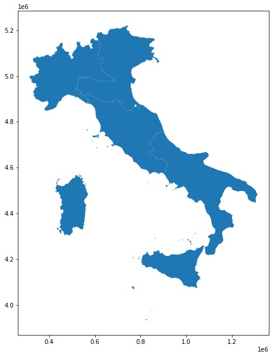
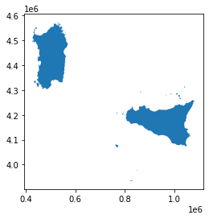
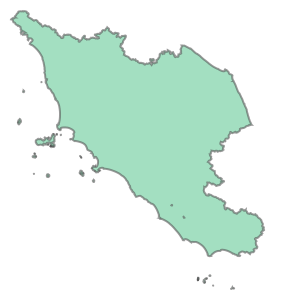
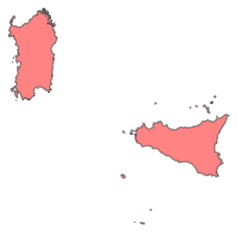

--- 
# GIS introduction 
**(with geopandas (vector data)**

based on scipy2018-geospatial

## goals of the tutorial
- the vector data and ESRI Shapefile
- the geodataframe in geopandas
- spatial projection

**based on the open data of:**
- [ISTAT](https://www.istat.it/it/archivio/222527) Italian National Institute of Statistic 

### requirements
- python knowledge
- pandas

### status 
*"The Earth isn't flat!!!"*
{: .notice--success}

---

## install geopandas


```python
!pip install geopandas===0.9.0
```

---


```python
import os
import geopandas as gpd
```

# Let's start with GeoPandas

## Importing geospatial data

geopandas supports all the vector format offered by the project gdal/ogr

https://www.gdal.org/ogr_formats.html 

we will play with the geospatial data offered by ISTAT

https://www.istat.it/it/archivio/104317


## administrative borders
https://www.istat.it/it/archivio/222527

the big zip with everything - year 2021

https://www.istat.it/storage/cartografia/confini_amministrativi/generalizzati/Limiti01012021_g.zip

---
### download and investigate the data


```python
if not os.path.exists('Limiti01012021_g'):
    # download the data
    import requests, zipfile, io
    zip_file_url = 'https://www.istat.it/storage/cartografia/confini_amministrativi/generalizzati/Limiti01012021_g.zip'
    #request the file
    r = requests.get(zip_file_url)
    z = zipfile.ZipFile(io.BytesIO(r.content))
    #unzip the file
    z.extractall()

```

Directory listening


```python
os.listdir(".")
```


    ['.config', 'Limiti01012021_g', 'sample_data']


```python
os.listdir('Limiti01012021_g')
```


    ['RipGeo01012021_g', 'Reg01012021_g', 'Com01012021_g', 'ProvCM01012021_g']


Limiti01012021_g => main folder with all the administrative borders of Italy in 2021 generalized version
- ProvCM01012021_g => folder with the provinces of Italy
- Reg01012021_g => folder with the regions of Italy
- RipGeo01012021_g => folder with the macro-regions of Italy
- Com01012021_g => folder with the municipalities of Italy


#### Inspect the the macro regions


```python
#look to the data inside the macro regions
os.chdir('Limiti01012021_g')
os.chdir('RipGeo01012021_g')
```

```python
#show only the files
for root, dirs, files in os.walk("."):  
    for filename in files:
        print(filename)
```

    RipGeo01012021_g_WGS84.dbf
    RipGeo01012021_g_WGS84.prj
    RipGeo01012021_g_WGS84.shx
    RipGeo01012021_g_WGS84.shp


# ESRI Shapefile

this is a *ESRI Shapefile* (an old but common used format for the geospatial vector data)

The format is proprietary and some format specifications are public.
A "ESRI Shapefile" is a collection of different files with the same name and different extensions.

The public specifications are for the extensions:

| extension | meaning       | content of the file                                                  |
| --------- | ------------- | -------------------------------------------------------------------- |
| .shp      | shape         | the geometries (point, line, polygon)                                |
| .dbf      | database file | the attributes to associate with the geometries                      |
| .shx      | shape indices | the indices to join the geometries with the attributes               |
| .prj      | projection    | the rule to understand the kind of projection used by the geometries |

To manage the data are _necessary_ 3 files (*.shp, .shx, and .dbf*), however the *.prj* file is crucial to analyze the data togheter with other sources.

It's possibile find other kind of files

more informations are here

https://www.esri.com/library/whitepapers/pdfs/shapefile.pdf


**read the file with gepandas**

```python
# read the file
macroregions=gpd.read_file('RipGeo01012021_g_WGS84.shp')
```

```python
type(macroregions)
```

    geopandas.geodataframe.GeoDataFrame


## GeoDataframe

geopandas transform everything in a [GeoDataFrame](http://geopandas.org/data_structures.html#geodataframe).

a geodataframe is a pandas [DataFrame](https://pandas.pydata.org/pandas-docs/stable/reference/api/pandas.DataFrame.html) with the column "geometry" and special geospatial methods

**Remember**<br/>*GeoDataFrame* allows to perform typical tabular data analysis together with spatial operations*GeoDataFrame* (or *Feature Collection*) consists of:
  - **Geometries** or **features**: the spatial objects
  - **Attributes** or **properties**: columns with information about each spatial object
{: .notice--info}


```python
macroregions
```

<div>
<style scoped>
    .dataframe tbody tr th:only-of-type {
        vertical-align: middle;
    }

    .dataframe tbody tr th {
        vertical-align: top;
    }

    .dataframe thead th {
        text-align: right;
    }
</style>
<table border="1" class="dataframe">
  <thead>
    <tr style="text-align: right;">
      <th></th>
      <th>COD_RIP</th>
      <th>DEN_RIP</th>
      <th>Shape_Leng</th>
      <th>Shape_Area</th>
      <th>geometry</th>
    </tr>
  </thead>
  <tbody>
    <tr>
      <th>0</th>
      <td>1</td>
      <td>Nord-Ovest</td>
      <td>2.329777e+06</td>
      <td>5.792967e+10</td>
      <td>MULTIPOLYGON (((568226.691 4874823.573, 568219...</td>
    </tr>
    <tr>
      <th>1</th>
      <td>2</td>
      <td>Nord-Est</td>
      <td>2.322834e+06</td>
      <td>6.232776e+10</td>
      <td>MULTIPOLYGON (((618343.929 4893985.661, 618335...</td>
    </tr>
    <tr>
      <th>2</th>
      <td>3</td>
      <td>Centro</td>
      <td>2.019864e+06</td>
      <td>5.807528e+10</td>
      <td>MULTIPOLYGON (((875952.995 4524692.050, 875769...</td>
    </tr>
    <tr>
      <th>3</th>
      <td>4</td>
      <td>Sud</td>
      <td>2.513894e+06</td>
      <td>7.377826e+10</td>
      <td>MULTIPOLYGON (((1083358.846 4416348.741, 10833...</td>
    </tr>
    <tr>
      <th>4</th>
      <td>5</td>
      <td>Isole</td>
      <td>2.773276e+06</td>
      <td>4.991839e+10</td>
      <td>MULTIPOLYGON (((822886.611 3935355.889, 822871...</td>
    </tr>
  </tbody>
</table>
</div>


Eg.
calculate the area of each geometry

```python
macroregions.geometry.area
```


    0    5.792967e+10
    1    6.232776e+10
    2    5.807528e+10
    3    7.377826e+10
    4    4.991839e+10
    dtype: float64


**you can plot it**


```python
macroregions.plot(figsize=(10,10))
```



    


... and use the **classic methods of the pandas DataFrame.**

Eg.
extract a (geo)DataFrame by filter from an attribute


```python
isole = macroregions[macroregions['DEN_RIP'] == 'Isole']
```


```python
isole.plot()
```

    

    

in an esri shapefile the kind of geometry is always the same, but a geodataframe can accept mixed geometries for each row.


```python
macroregions.geom_type
```

    0    MultiPolygon
    1    MultiPolygon
    2    MultiPolygon
    3    MultiPolygon
    4    MultiPolygon
    dtype: object


in our case we have a MultiPolygon
the geometries allowed are:

|geometry|images|
|:--|--:|
|POINT||
|LINESTRING||
|LINEARRING||
|POLYGON|
|MULTIPOINT| 
| MULITLINESTRING|| 
| MULTIPOLYGON || 
| GEOMETRYCOLLECTION | | 

note: table based on the wikipedia page [WKT](https://en.wikipedia.org/wiki/Well-known_text_representation_of_geometry)

#### and we are ready to look how are the geometries


```python
macroregions.geometry[0]
```

    

    


```python
macroregions.DEN_RIP[0]
```

    'Nord-Ovest'


```python
macroregions.geometry[1]
```

    

    


```python
macroregions.DEN_RIP[1]
```


    'Nord-Est'


```python
macroregions.geometry[2]
```


    

    


```python
macroregions.DEN_RIP[2]
```


    'Centro'


```python
macroregions.geometry[3]
```


    

    


```python
macroregions.geometry[4]
```
    

    

```python
macroregions.DEN_RIP[4]
```

    'Isole'

**the red color, in this case, means a mistake on the geometries!!!**
*... and we can check it!*


```python
macroregions.geometry.is_valid
```


    0     True
    1     True
    2     True
    3    False
    4    False
    dtype: bool


```python
macroregions.geometry[4].buffer(0)
```


    

    


#### Do you want know the centroid of each geometry?


```python
macroregions.geometry.centroid
```


    0     POINT (478138.078 5011451.813)
    1     POINT (701966.825 5039900.243)
    2     POINT (756711.186 4757688.605)
    3    POINT (1061531.039 4529729.154)
    4     POINT (736504.559 4300315.212)
    dtype: geometry


the output of the geometries is in [well knowtext format (WKT)](https://en.wikipedia.org/wiki/Well-known_text_representation_of_geometry)


## Spatial Projections

but ... how are expressed the coordinates??
we have to know the Coordinate Reference System (CRS) 
**CRS** = *Coordinate Reference System*


### How to convert in latitude/longitude?


```python
macroregions.crs
```

    <Projected CRS: EPSG:32632>
    Name: WGS 84 / UTM zone 32N
    Axis Info [cartesian]:
    - E[east]: Easting (metre)
    - N[north]: Northing (metre)
    Area of Use:
    - name: Between 6°E and 12°E, northern hemisphere between equator and 84°N, onshore and offshore. Algeria. Austria. Cameroon. Denmark. Equatorial Guinea. France. Gabon. Germany. Italy. Libya. Liechtenstein. Monaco. Netherlands. Niger. Nigeria. Norway. Sao Tome and Principe. Svalbard. Sweden. Switzerland. Tunisia. Vatican City State.
    - bounds: (6.0, 0.0, 12.0, 84.0)
    Coordinate Operation:
    - name: UTM zone 32N
    - method: Transverse Mercator
    Datum: World Geodetic System 1984 ensemble
    - Ellipsoid: WGS 84
    - Prime Meridian: Greenwich


### EPSG
**what's EPSG?** 
European Petroleum Survey Group  (1986-2005)<br/>
[IOGP](https://www.iogp.org/about-us/) - International Association of Oil & Gas Producers (2005-now)

An important project is the [EPSG registry](http://www.epsg-registry.org/) - the dataset of geodetic parameters

http://epsg.io/32632


```python
macroregions.geometry.centroid.to_crs(epsg=4326)
```


    0     POINT (8.72137 45.25622)
    1    POINT (11.58437 45.48339)
    2    POINT (12.14575 42.92860)
    3    POINT (15.64722 40.72675)
    4    POINT (11.72414 38.81988)
    dtype: geometry


```python
macroregions.to_crs(epsg=4326).geometry[1]
```


    

    


```python
macroregions.geometry[1]
```


    

    

### WGS84 vs ETRS89

|  [WGS84](https://epsg.io/4326)  |  [ETRS89](https://epsg.io/4258) |
|---|---|
|   |   

### exploring a .prj file

```python
f=open('RipGeo01012021_g_WGS84.prj','r')
```

```python
f.read()
```


    'PROJCS["WGS_1984_UTM_Zone_32N",GEOGCS["GCS_WGS_1984",DATUM["D_WGS_1984",SPHEROID["WGS_1984",6378137.0,298.257223563]],PRIMEM["Greenwich",0.0],UNIT["Degree",0.0174532925199433]],PROJECTION["Transverse_Mercator"],PARAMETER["False_Easting",500000.0],PARAMETER["False_Northing",0.0],PARAMETER["Central_Meridian",9.0],PARAMETER["Scale_Factor",0.9996],PARAMETER["Latitude_Of_Origin",0.0],UNIT["Meter",1.0]]'


... like here
http://epsg.io/32632.wkt

http://epsg.io/32632.prettywkt


---
**Remember**
- *GeoDataFrame* allows to perform typical tabular data analysis together with spatial operations
- *GeoDataFrame* (or *Feature Collection*) consists of:
  -  **Geometries** or **features**: the spatial objects
  - **Attributes** or **properties**: columns with information about each spatial object
{: .notice--info}
## Fiona vector formats
a geodataframe can ben stored in different formats

```python
macroregions.to_crs(epsg=4326).to_file('macro_regions.geojson',driver='GeoJSON')
```

Output Formats<br/>the library *fiona* offers different kind of output formats
{: .notice--warning}


```python
import fiona
fiona.supported_drivers
```

    {'ARCGEN': 'r',
     'CSV': 'raw',
     'DGN': 'raw',
     'DXF': 'rw',
     'ESRI Shapefile': 'raw',
     'ESRIJSON': 'r',
     'FlatGeobuf': 'rw',
     'GML': 'rw',
     'GPKG': 'raw',
     'GPSTrackMaker': 'rw',
     'GPX': 'rw',
     'GeoJSON': 'raw',
     'GeoJSONSeq': 'rw',
     'Idrisi': 'r',
     'MapInfo File': 'raw',
     'OGR_GMT': 'rw',
     'OGR_PDS': 'r',
     'OpenFileGDB': 'r',
     'S57': 'r',
     'SQLite': 'raw',
     'TopoJSON': 'r'}


if you want download the generated file from Google Colab use this code

```python
from google.colab import files
files.download('macro_regions.geojson') 
```
... otherwise you can simply load the file from your filesystem where you hosted this script :)


... and visualize the geojson file on http://geojson.io


---


## Exercise

1. load the shapefile of ISTAT with the information of the provinces
  - filter it for an italian provice at your choice (eg. Trento)
  - plot it
  - identify the cities of the province selected with the biggest and smallest area
  - extract all the centroids of the areas expressed in WGS84
2. load the shapefile of ISTAT with the informations of the muncipalities
  - select all the muncipalities of the Province of Trento
  - extract a representative point for the area of each municipality converted in WGS84<br/>suggestion: *.representative_point()*
  - save the points in a GeoJSON file
  - calculate the distance on the geodentic between the municipality with the big area and smallest area by using the centroid
3. download the shapefile of the [lakes and bodies of water](https://github.com/napo/geospatial_course_unitn/raw/master/data/lakes_bodies_of_water_trentino.zip) of Trentino - projection Monte Mario zone 1
  - plot the geometries where Fktuso is "02"

---
