---
# Spatial relationships and operations
**based on scipy2018-geospatial**

## goals of the tutorial
- load tabular data files (eg. csv or xls) as geodataframe
- spatial projection conversion
- spatial relationships 
- spatial joins
- spatial operations

**based on the open data of:**
- [ISTAT](https://www.istat.it/it/archivio/222527) Italian National Institute of Statistic 
- [Italian Ministry of Agricultural, Food and Forestry Policies](https://www.politicheagricole.it/)


### requirements
- python knowledge
- pandas
- previous lesson

### status 
*"Spatial is Special"*

---

# SETUP
for the spatial operations we need to improve geopandas with some libraries.

You can use rtree o pygeos 

## rtree
if you want use [rtree](https://rtree.readthedocs.io/en/latest/) you need also to install a C library in your O.S.

Pyton RTree is a wrapper to the library [libspatialiteindex](https://libspatialindex.org/en/latest/)

if you are using a Linux distribution based on Debian (like the instance of Google Colab) you have to install the libspatialindex library before


```python
import platform

try:
  import rtree
except ModuleNotFoundError as e:
  if (platform.system() == 'Linux'):
    !apt-get install libspatialindex-dev
    !pip install rtree==1.0.0
    import rtree

if rtree.__version__ != "1.0.0":
  !pip install -U rtree==1.0.0
  import rtree
```

## pygeos

[PyGEOS](https://pygeos.readthedocs.io/en/stable/) is a Python library for working with GEOS geometries. It is a wrapper for the GEOS C API.


```python
try:
  import pygeos
except ModuleNotFoundError as e:
  !pip install pygeos==0.13
  import pygeos
```

## geopandas

version 0.10.1


```python
try:
  import geopandas as gpd
except ModuleNotFoundError as e:
  !pip install geopandas==0.10.1
  import geopandas as gpd
  if gpd.__version__ != "0.10.1":
    !pip install -U geopandas==0.10.1
```


```python
import pandas as pd
import requests
import matplotlib.pyplot as plt #to avoid the warning message by plotting the geometries
import warnings
warnings.simplefilter("ignore")
```

# data setup
## administrative units of italy

geopackage with the administrative units of italy

The couse offers the file in a geopackage stored [here](https://github.com/napo/geospatial_course_unitn/raw/master/data/istat/istat_administrative_units_generalized_2021.gpkgg)


```python
url = 'https://github.com/napo/geospatial_course_unitn/raw/master/data/istat/istat_administrative_units_generalized_2022.gpkg'
```


```python
macroregions = gpd.read_file(url,layer="macroregions")
```

    WARNING:fiona._env:File /vsimem/d0bc5a89a3d64c6f8d22980a72124fb4 has GPKG application_id, but non conformant file extension


you can repeat the operation ( = direct download) for each layer but it's better to download the file once and load the layers step by step.


```python
# download the file
geopackage_istat_file = "istat_administrative_units_generalized_2022.gpkg"
r = requests.get(url, allow_redirects=True)
open(geopackage_istat_file, 'wb').write(r.content)
```

    23621632

```python
regions = gpd.read_file(geopackage_istat_file,layer="regions")
```


```python
provincies = gpd.read_file(geopackage_istat_file,layer="provincies")
```


```python
municipalities = gpd.read_file(geopackage_istat_file,layer="municipalities")
```


```python
macroregions
```


  <div id="df-83a11bcc-a32d-4f30-b097-3deedc5081d5">
    <div class="colab-df-container">
      <div>
<style scoped>
    .dataframe tbody tr th:only-of-type {
        vertical-align: middle;
    }

    .dataframe tbody tr th {
        vertical-align: top;
    }

    .dataframe thead th {
        text-align: right;
    }
</style>
<table border="1" class="dataframe">
  <thead>
    <tr style="text-align: right;">
      <th></th>
      <th>COD_RIP</th>
      <th>DEN_RIP</th>
      <th>Shape_Leng</th>
      <th>Shape_Area</th>
      <th>geometry</th>
    </tr>
  </thead>
  <tbody>
    <tr>
      <th>0</th>
      <td>1</td>
      <td>Nord-Ovest</td>
      <td>2.330183e+06</td>
      <td>5.792958e+10</td>
      <td>MULTIPOLYGON (((568226.691 4874823.573, 568219...</td>
    </tr>
    <tr>
      <th>1</th>
      <td>2</td>
      <td>Nord-Est</td>
      <td>2.327765e+06</td>
      <td>6.238509e+10</td>
      <td>MULTIPOLYGON (((618343.929 4893985.661, 618335...</td>
    </tr>
    <tr>
      <th>2</th>
      <td>3</td>
      <td>Centro</td>
      <td>2.010203e+06</td>
      <td>5.801865e+10</td>
      <td>MULTIPOLYGON (((875952.995 4524692.050, 875769...</td>
    </tr>
    <tr>
      <th>3</th>
      <td>4</td>
      <td>Sud</td>
      <td>2.517097e+06</td>
      <td>7.377795e+10</td>
      <td>MULTIPOLYGON (((1083358.846 4416348.741, 10833...</td>
    </tr>
    <tr>
      <th>4</th>
      <td>5</td>
      <td>Isole</td>
      <td>2.775538e+06</td>
      <td>4.991778e+10</td>
      <td>MULTIPOLYGON (((822886.611 3935355.889, 822871...</td>
    </tr>
  </tbody>
</table>
</div>
      <button class="colab-df-convert" onclick="convertToInteractive('df-83a11bcc-a32d-4f30-b097-3deedc5081d5')"
              title="Convert this dataframe to an interactive table."
              style="display:none;">

  <svg xmlns="http://www.w3.org/2000/svg" height="24px"viewBox="0 0 24 24"
       width="24px">
    <path d="M0 0h24v24H0V0z" fill="none"/>
    <path d="M18.56 5.44l.94 2.06.94-2.06 2.06-.94-2.06-.94-.94-2.06-.94 2.06-2.06.94zm-11 1L8.5 8.5l.94-2.06 2.06-.94-2.06-.94L8.5 2.5l-.94 2.06-2.06.94zm10 10l.94 2.06.94-2.06 2.06-.94-2.06-.94-.94-2.06-.94 2.06-2.06.94z"/><path d="M17.41 7.96l-1.37-1.37c-.4-.4-.92-.59-1.43-.59-.52 0-1.04.2-1.43.59L10.3 9.45l-7.72 7.72c-.78.78-.78 2.05 0 2.83L4 21.41c.39.39.9.59 1.41.59.51 0 1.02-.2 1.41-.59l7.78-7.78 2.81-2.81c.8-.78.8-2.07 0-2.86zM5.41 20L4 18.59l7.72-7.72 1.47 1.35L5.41 20z"/>
  </svg>
      </button>

  <style>
    .colab-df-container {
      display:flex;
      flex-wrap:wrap;
      gap: 12px;
    }

    .colab-df-convert {
      background-color: #E8F0FE;
      border: none;
      border-radius: 50%;
      cursor: pointer;
      display: none;
      fill: #1967D2;
      height: 32px;
      padding: 0 0 0 0;
      width: 32px;
    }

    .colab-df-convert:hover {
      background-color: #E2EBFA;
      box-shadow: 0px 1px 2px rgba(60, 64, 67, 0.3), 0px 1px 3px 1px rgba(60, 64, 67, 0.15);
      fill: #174EA6;
    }

    [theme=dark] .colab-df-convert {
      background-color: #3B4455;
      fill: #D2E3FC;
    }

    [theme=dark] .colab-df-convert:hover {
      background-color: #434B5C;
      box-shadow: 0px 1px 3px 1px rgba(0, 0, 0, 0.15);
      filter: drop-shadow(0px 1px 2px rgba(0, 0, 0, 0.3));
      fill: #FFFFFF;
    }
  </style>

      <script>
        const buttonEl =
          document.querySelector('#df-83a11bcc-a32d-4f30-b097-3deedc5081d5 button.colab-df-convert');
        buttonEl.style.display =
          google.colab.kernel.accessAllowed ? 'block' : 'none';

        async function convertToInteractive(key) {
          const element = document.querySelector('#df-83a11bcc-a32d-4f30-b097-3deedc5081d5');
          const dataTable =
            await google.colab.kernel.invokeFunction('convertToInteractive',
                                                     [key], {});
          if (!dataTable) return;

          const docLinkHtml = 'Like what you see? Visit the ' +
            '<a target="_blank" href=https://colab.research.google.com/notebooks/data_table.ipynb>data table notebook</a>'
            + ' to learn more about interactive tables.';
          element.innerHTML = '';
          dataTable['output_type'] = 'display_data';
          await google.colab.output.renderOutput(dataTable, element);
          const docLink = document.createElement('div');
          docLink.innerHTML = docLinkHtml;
          element.appendChild(docLink);
        }
      </script>
    </div>
  </div>


## monumental trees of Italy
The italian Ministery of Agricultural offers a datasets the location of each monumental tree for each region of Italy.

Visit this [page](https://www.politicheagricole.it/flex/cm/pages/ServeBLOB.php/L/IT/IDPagina/11260)


### from a dataframe to a geodataframe
we have a several XLS files with a sheet where there is a column with latitude and another with longitude


It's also possibile scrape the URL of the XLS file with this code (contribution by Aurora Maria Tumminello)


```python
try:
  import bs4 
except ModuleNotFoundError as e:
  !pip install bs4=="4.6.3"
  import bs4 
if bs4.__version__ != "4.6.3":
  !pip install -U bs4==4.6.3
  import bs4
```


```python
# Saving URLs to download Regional data about Monumental Trees
# Get HTML content
html = requests.get("https://www.politicheagricole.it/flex/cm/pages/ServeBLOB.php/L/IT/IDPagina/11260#id-bed7384af14fdba2da436d64155c62b1").content
# Parse the document with BeautifulSoup
soup = bs4.BeautifulSoup(html, 'html.parser')
# Find all elements of the selected class (the ones we're going to download)
regions_urls = soup.findAll("div", {"class": "blob-element-download BLOBAlignLeft"})

# Saving downloading links inside the list
regional_sources=[]
for e in regions_urls:
  regional_sources.append(e.a['href'])
```


```python
# Enable the support for Excel in Pandas
try:
  import xlrd 
except ModuleNotFoundError as e:
  !pip install xlrd=="2.0.1"
  import xlrd 
if xlrd.__VERSION__ != "2.0.1":
  !pip install -U xlrd=="2.0.1"
  import xlrd
```


```python
monumental_trees = pd.read_excel(regional_sources[0])
for idsource in range(1,len(regional_sources)-1):
  monumental_trees = monumental_trees.append(pd.read_excel(regional_sources[idsource]))
```

### investigate the data


```python
monumental_trees.shape[0]
```

    3898


```python
monumental_trees.head(5)
```


  <div id="df-27948c3b-4d4e-4003-b91e-e9e9aab5d235">
    <div class="colab-df-container">
      <div>
<style scoped>
    .dataframe tbody tr th:only-of-type {
        vertical-align: middle;
    }

    .dataframe tbody tr th {
        vertical-align: top;
    }

    .dataframe thead th {
        text-align: right;
    }
</style>
<table border="1" class="dataframe">
  <thead>
    <tr style="text-align: right;">
      <th></th>
      <th>PROGR</th>
      <th>REGIONE</th>
      <th>ID SCHEDA</th>
      <th>PROVINCIA</th>
      <th>COMUNE</th>
      <th>LOCALITÀ</th>
      <th>LATITUDINE SU GIS</th>
      <th>LONGITUDINE SU GIS</th>
      <th>ALTITUDINE (m s.l.m.)</th>
      <th>CONTESTO URBANO</th>
      <th>SPECIE NOME SCIENTIFICO</th>
      <th>SPECIE NOME VOLGARE</th>
      <th>CIRCONFERENZA FUSTO (cm)</th>
      <th>ALTEZZA (m)</th>
      <th>CRITERI DI MONUMENTALITÀ</th>
      <th>PROPOSTA DICHIARAZIONE NOTEVOLE INTERESSE PUBBLICO</th>
      <th>Unnamed: 16</th>
    </tr>
  </thead>
  <tbody>
    <tr>
      <th>0</th>
      <td>1</td>
      <td>ABRUZZO</td>
      <td>01/A235/CH/13</td>
      <td>Chieti</td>
      <td>Altino</td>
      <td>Le Macchie Articciaro</td>
      <td>42° 05' 14,02''</td>
      <td>14° 20' 34,97''</td>
      <td>215.0</td>
      <td>no</td>
      <td>Juniperus oxycedrus L.</td>
      <td>Ginepro coccolone</td>
      <td>125</td>
      <td>7</td>
      <td>a) età e/o dimensioni\nb) forma e portamento\n...</td>
      <td>no</td>
      <td>NaN</td>
    </tr>
    <tr>
      <th>1</th>
      <td>2</td>
      <td>ABRUZZO</td>
      <td>01/A367/CH/13</td>
      <td>Chieti</td>
      <td>Archi</td>
      <td>Serra Castello</td>
      <td>42° 04' 43,15''</td>
      <td>14° 22' 57,14''</td>
      <td>525.0</td>
      <td>no</td>
      <td>Arbutus unedo L.</td>
      <td>Corbezzolo</td>
      <td>125</td>
      <td>5.5</td>
      <td>a) età e/o dimensioni\nd) rarità botanica</td>
      <td>no</td>
      <td>NaN</td>
    </tr>
    <tr>
      <th>2</th>
      <td>3</td>
      <td>ABRUZZO</td>
      <td>01/A485/CH/13</td>
      <td>Chieti</td>
      <td>Atessa</td>
      <td>Santa Lucia - Piana Sant'Antonio</td>
      <td>42° 06' 41,82''</td>
      <td>14° 25' 55,52''</td>
      <td>125.0</td>
      <td>sì</td>
      <td>Quercus pubescens Willd.</td>
      <td>Roverella</td>
      <td>355</td>
      <td>17</td>
      <td>a) età e/o dimensioni</td>
      <td>no</td>
      <td>NaN</td>
    </tr>
    <tr>
      <th>3</th>
      <td>4</td>
      <td>ABRUZZO</td>
      <td>01/A956/CH/13</td>
      <td>Chieti</td>
      <td>Bomba</td>
      <td>Cementificio - Casale Nasuti</td>
      <td>42° 03' 07,95''</td>
      <td>14° 21' 48,11''</td>
      <td>400.0</td>
      <td>no</td>
      <td>Quercus pubescens Willd.</td>
      <td>Roverella</td>
      <td>530</td>
      <td>22</td>
      <td>a) età e/o dimensioni\nc) valore ecologico</td>
      <td>no</td>
      <td>NaN</td>
    </tr>
    <tr>
      <th>4</th>
      <td>5</td>
      <td>ABRUZZO</td>
      <td>02/A956/CH/13</td>
      <td>Chieti</td>
      <td>Bomba</td>
      <td>Cementificio - Casale Nasuti</td>
      <td>42° 03' 07,11''</td>
      <td>14° 21' 48,97''</td>
      <td>400.0</td>
      <td>no</td>
      <td>Quercus pubescens Willd.</td>
      <td>Roverella</td>
      <td>475</td>
      <td>21</td>
      <td>a) età e/o dimensioni</td>
      <td>no</td>
      <td>NaN</td>
    </tr>
  </tbody>
</table>
</div>
      <button class="colab-df-convert" onclick="convertToInteractive('df-27948c3b-4d4e-4003-b91e-e9e9aab5d235')"
              title="Convert this dataframe to an interactive table."
              style="display:none;">

  <svg xmlns="http://www.w3.org/2000/svg" height="24px"viewBox="0 0 24 24"
       width="24px">
    <path d="M0 0h24v24H0V0z" fill="none"/>
    <path d="M18.56 5.44l.94 2.06.94-2.06 2.06-.94-2.06-.94-.94-2.06-.94 2.06-2.06.94zm-11 1L8.5 8.5l.94-2.06 2.06-.94-2.06-.94L8.5 2.5l-.94 2.06-2.06.94zm10 10l.94 2.06.94-2.06 2.06-.94-2.06-.94-.94-2.06-.94 2.06-2.06.94z"/><path d="M17.41 7.96l-1.37-1.37c-.4-.4-.92-.59-1.43-.59-.52 0-1.04.2-1.43.59L10.3 9.45l-7.72 7.72c-.78.78-.78 2.05 0 2.83L4 21.41c.39.39.9.59 1.41.59.51 0 1.02-.2 1.41-.59l7.78-7.78 2.81-2.81c.8-.78.8-2.07 0-2.86zM5.41 20L4 18.59l7.72-7.72 1.47 1.35L5.41 20z"/>
  </svg>
      </button>

  <style>
    .colab-df-container {
      display:flex;
      flex-wrap:wrap;
      gap: 12px;
    }

    .colab-df-convert {
      background-color: #E8F0FE;
      border: none;
      border-radius: 50%;
      cursor: pointer;
      display: none;
      fill: #1967D2;
      height: 32px;
      padding: 0 0 0 0;
      width: 32px;
    }

    .colab-df-convert:hover {
      background-color: #E2EBFA;
      box-shadow: 0px 1px 2px rgba(60, 64, 67, 0.3), 0px 1px 3px 1px rgba(60, 64, 67, 0.15);
      fill: #174EA6;
    }

    [theme=dark] .colab-df-convert {
      background-color: #3B4455;
      fill: #D2E3FC;
    }

    [theme=dark] .colab-df-convert:hover {
      background-color: #434B5C;
      box-shadow: 0px 1px 3px 1px rgba(0, 0, 0, 0.15);
      filter: drop-shadow(0px 1px 2px rgba(0, 0, 0, 0.3));
      fill: #FFFFFF;
    }
  </style>

      <script>
        const buttonEl =
          document.querySelector('#df-27948c3b-4d4e-4003-b91e-e9e9aab5d235 button.colab-df-convert');
        buttonEl.style.display =
          google.colab.kernel.accessAllowed ? 'block' : 'none';

        async function convertToInteractive(key) {
          const element = document.querySelector('#df-27948c3b-4d4e-4003-b91e-e9e9aab5d235');
          const dataTable =
            await google.colab.kernel.invokeFunction('convertToInteractive',
                                                     [key], {});
          if (!dataTable) return;

          const docLinkHtml = 'Like what you see? Visit the ' +
            '<a target="_blank" href=https://colab.research.google.com/notebooks/data_table.ipynb>data table notebook</a>'
            + ' to learn more about interactive tables.';
          element.innerHTML = '';
          dataTable['output_type'] = 'display_data';
          await google.colab.output.renderOutput(dataTable, element);
          const docLink = document.createElement('div');
          docLink.innerHTML = docLinkHtml;
          element.appendChild(docLink);
        }
      </script>
    </div>
  </div>


latitude and longitude here are stored in degrees.<br/>
Eg.<br/>
45° 34' 23,2''	

you need to transform it in decimal degree: 

```javascript
degree + minutes / 60 + seconds/(60*60) 
```

and assume negative values if the data is in West or South. 

here an example code


```python
import re
lat = '''45°34'23.2"N'''
deg, minutes, seconds, direction =  re.split('[°\'"]', lat)
(float(deg) + float(minutes)/60 + float(seconds)/(60*60)) * (-1 if direction in ['W', 'S'] else 1)
```


    45.57311111111112


a good blog post to explain the problem is here 


https://www.ubergizmo.com/how-to/read-gps-coordinates/


```python
try:
  import dms2dec 
except ModuleNotFoundError as e:
  !pip install dms2dec==0.1
  import dms2dec
```

    Looking in indexes: https://pypi.org/simple, https://us-python.pkg.dev/colab-wheels/public/simple/
    Collecting dms2dec==0.1
      Downloading dms2dec-0.1-py3-none-any.whl (3.0 kB)
    Installing collected packages: dms2dec
    Successfully installed dms2dec-0.1


```python
# dms2dec is an useful library for this conversion
from dms2dec.dms_convert import dms2dec
```


```python
monumental_trees[monumental_trees['LONGITUDINE SU GIS'] == 761]
```


  <div id="df-ed3c11a0-9d0a-481d-9903-10c6536fb479">
    <div class="colab-df-container">
      <div>
<style scoped>
    .dataframe tbody tr th:only-of-type {
        vertical-align: middle;
    }

    .dataframe tbody tr th {
        vertical-align: top;
    }

    .dataframe thead th {
        text-align: right;
    }
</style>
<table border="1" class="dataframe">
  <thead>
    <tr style="text-align: right;">
      <th></th>
      <th>PROGR</th>
      <th>REGIONE</th>
      <th>ID SCHEDA</th>
      <th>PROVINCIA</th>
      <th>COMUNE</th>
      <th>LOCALITÀ</th>
      <th>LATITUDINE SU GIS</th>
      <th>LONGITUDINE SU GIS</th>
      <th>ALTITUDINE (m s.l.m.)</th>
      <th>CONTESTO URBANO</th>
      <th>SPECIE NOME SCIENTIFICO</th>
      <th>SPECIE NOME VOLGARE</th>
      <th>CIRCONFERENZA FUSTO (cm)</th>
      <th>ALTEZZA (m)</th>
      <th>CRITERI DI MONUMENTALITÀ</th>
      <th>PROPOSTA DICHIARAZIONE NOTEVOLE INTERESSE PUBBLICO</th>
      <th>Unnamed: 16</th>
    </tr>
  </thead>
  <tbody>
    <tr>
      <th>28</th>
      <td>29</td>
      <td>01/B287/SR/19</td>
      <td>Siracusa</td>
      <td>Buscemi</td>
      <td>Corso Vittorio Emanuele 112</td>
      <td>37° 5' 8,7''</td>
      <td>14° 53' 3,7''</td>
      <td>761</td>
      <td>si`</td>
      <td>Celtis australis L.</td>
      <td>Bagolaro</td>
      <td>525</td>
      <td>25</td>
      <td>a) eta` e/o dimensioni\nb) forma e portamento</td>
      <td>si`</td>
      <td>NaN</td>
      <td>NaN</td>
    </tr>
  </tbody>
</table>
</div>
      <button class="colab-df-convert" onclick="convertToInteractive('df-ed3c11a0-9d0a-481d-9903-10c6536fb479')"
              title="Convert this dataframe to an interactive table."
              style="display:none;">

  <svg xmlns="http://www.w3.org/2000/svg" height="24px"viewBox="0 0 24 24"
       width="24px">
    <path d="M0 0h24v24H0V0z" fill="none"/>
    <path d="M18.56 5.44l.94 2.06.94-2.06 2.06-.94-2.06-.94-.94-2.06-.94 2.06-2.06.94zm-11 1L8.5 8.5l.94-2.06 2.06-.94-2.06-.94L8.5 2.5l-.94 2.06-2.06.94zm10 10l.94 2.06.94-2.06 2.06-.94-2.06-.94-.94-2.06-.94 2.06-2.06.94z"/><path d="M17.41 7.96l-1.37-1.37c-.4-.4-.92-.59-1.43-.59-.52 0-1.04.2-1.43.59L10.3 9.45l-7.72 7.72c-.78.78-.78 2.05 0 2.83L4 21.41c.39.39.9.59 1.41.59.51 0 1.02-.2 1.41-.59l7.78-7.78 2.81-2.81c.8-.78.8-2.07 0-2.86zM5.41 20L4 18.59l7.72-7.72 1.47 1.35L5.41 20z"/>
  </svg>
      </button>

  <style>
    .colab-df-container {
      display:flex;
      flex-wrap:wrap;
      gap: 12px;
    }

    .colab-df-convert {
      background-color: #E8F0FE;
      border: none;
      border-radius: 50%;
      cursor: pointer;
      display: none;
      fill: #1967D2;
      height: 32px;
      padding: 0 0 0 0;
      width: 32px;
    }

    .colab-df-convert:hover {
      background-color: #E2EBFA;
      box-shadow: 0px 1px 2px rgba(60, 64, 67, 0.3), 0px 1px 3px 1px rgba(60, 64, 67, 0.15);
      fill: #174EA6;
    }

    [theme=dark] .colab-df-convert {
      background-color: #3B4455;
      fill: #D2E3FC;
    }

    [theme=dark] .colab-df-convert:hover {
      background-color: #434B5C;
      box-shadow: 0px 1px 3px 1px rgba(0, 0, 0, 0.15);
      filter: drop-shadow(0px 1px 2px rgba(0, 0, 0, 0.3));
      fill: #FFFFFF;
    }
  </style>

      <script>
        const buttonEl =
          document.querySelector('#df-ed3c11a0-9d0a-481d-9903-10c6536fb479 button.colab-df-convert');
        buttonEl.style.display =
          google.colab.kernel.accessAllowed ? 'block' : 'none';

        async function convertToInteractive(key) {
          const element = document.querySelector('#df-ed3c11a0-9d0a-481d-9903-10c6536fb479');
          const dataTable =
            await google.colab.kernel.invokeFunction('convertToInteractive',
                                                     [key], {});
          if (!dataTable) return;

          const docLinkHtml = 'Like what you see? Visit the ' +
            '<a target="_blank" href=https://colab.research.google.com/notebooks/data_table.ipynb>data table notebook</a>'
            + ' to learn more about interactive tables.';
          element.innerHTML = '';
          dataTable['output_type'] = 'display_data';
          await google.colab.output.renderOutput(dataTable, element);
          const docLink = document.createElement('div');
          docLink.innerHTML = docLinkHtml;
          element.appendChild(docLink);
        }
      </script>
    </div>
  </div>


```python
# change commas in dots
monumental_trees['LATITUDINE SU GIS'] = monumental_trees['LATITUDINE SU GIS'].apply(lambda x: x.replace(",", "."))
```


```python
monumental_trees['LONGITUDINE SU GIS'] = monumental_trees['LONGITUDINE SU GIS'].apply(lambda x: x.replace(",", "."))
```


    ---------------------------------------------------------------------------

    AttributeError                            Traceback (most recent call last)

    <ipython-input-23-f641095537de> in <module>
    ----> 1 monumental_trees['LONGITUDINE SU GIS'] = monumental_trees['LONGITUDINE SU GIS'].apply(lambda x: x.replace(",", "."))
    

    /usr/local/lib/python3.7/dist-packages/pandas/core/series.py in apply(self, func, convert_dtype, args, **kwargs)
       4355         dtype: float64
       4356         """
    -> 4357         return SeriesApply(self, func, convert_dtype, args, kwargs).apply()
       4358 
       4359     def _reduce(


    /usr/local/lib/python3.7/dist-packages/pandas/core/apply.py in apply(self)
       1041             return self.apply_str()
       1042 
    -> 1043         return self.apply_standard()
       1044 
       1045     def agg(self):


    /usr/local/lib/python3.7/dist-packages/pandas/core/apply.py in apply_standard(self)
       1099                     values,
       1100                     f,  # type: ignore[arg-type]
    -> 1101                     convert=self.convert_dtype,
       1102                 )
       1103 


    /usr/local/lib/python3.7/dist-packages/pandas/_libs/lib.pyx in pandas._libs.lib.map_infer()


    <ipython-input-23-f641095537de> in <lambda>(x)
    ----> 1 monumental_trees['LONGITUDINE SU GIS'] = monumental_trees['LONGITUDINE SU GIS'].apply(lambda x: x.replace(",", "."))
    

    AttributeError: 'int' object has no attribute 'replace'


there is a problem ... a column is int and not str


```python
# identfy the ID of the column
list(monumental_trees.columns).index("LONGITUDINE SU GIS")+1
```


    8


identify the wrong values


```python
for t in monumental_trees.itertuples():
  if type(t[8]) != str:
    print(t[8])
```

    761


identify the row


```python
badrow = monumental_trees[monumental_trees['LONGITUDINE SU GIS'] == 761]
```


```python
badrow
```


  <div id="df-3fcbb1a5-3357-4905-8c03-03d72dbb5a2b">
    <div class="colab-df-container">
      <div>
<style scoped>
    .dataframe tbody tr th:only-of-type {
        vertical-align: middle;
    }

    .dataframe tbody tr th {
        vertical-align: top;
    }

    .dataframe thead th {
        text-align: right;
    }
</style>
<table border="1" class="dataframe">
  <thead>
    <tr style="text-align: right;">
      <th></th>
      <th>PROGR</th>
      <th>REGIONE</th>
      <th>ID SCHEDA</th>
      <th>PROVINCIA</th>
      <th>COMUNE</th>
      <th>LOCALITÀ</th>
      <th>LATITUDINE SU GIS</th>
      <th>LONGITUDINE SU GIS</th>
      <th>ALTITUDINE (m s.l.m.)</th>
      <th>CONTESTO URBANO</th>
      <th>SPECIE NOME SCIENTIFICO</th>
      <th>SPECIE NOME VOLGARE</th>
      <th>CIRCONFERENZA FUSTO (cm)</th>
      <th>ALTEZZA (m)</th>
      <th>CRITERI DI MONUMENTALITÀ</th>
      <th>PROPOSTA DICHIARAZIONE NOTEVOLE INTERESSE PUBBLICO</th>
      <th>Unnamed: 16</th>
    </tr>
  </thead>
  <tbody>
    <tr>
      <th>28</th>
      <td>29</td>
      <td>01/B287/SR/19</td>
      <td>Siracusa</td>
      <td>Buscemi</td>
      <td>Corso Vittorio Emanuele 112</td>
      <td>37° 5' 8,7''</td>
      <td>14° 53' 3.7''</td>
      <td>761</td>
      <td>si`</td>
      <td>Celtis australis L.</td>
      <td>Bagolaro</td>
      <td>525</td>
      <td>25</td>
      <td>a) eta` e/o dimensioni\nb) forma e portamento</td>
      <td>si`</td>
      <td>NaN</td>
      <td>NaN</td>
    </tr>
  </tbody>
</table>
</div>
      <button class="colab-df-convert" onclick="convertToInteractive('df-3fcbb1a5-3357-4905-8c03-03d72dbb5a2b')"
              title="Convert this dataframe to an interactive table."
              style="display:none;">

  <svg xmlns="http://www.w3.org/2000/svg" height="24px"viewBox="0 0 24 24"
       width="24px">
    <path d="M0 0h24v24H0V0z" fill="none"/>
    <path d="M18.56 5.44l.94 2.06.94-2.06 2.06-.94-2.06-.94-.94-2.06-.94 2.06-2.06.94zm-11 1L8.5 8.5l.94-2.06 2.06-.94-2.06-.94L8.5 2.5l-.94 2.06-2.06.94zm10 10l.94 2.06.94-2.06 2.06-.94-2.06-.94-.94-2.06-.94 2.06-2.06.94z"/><path d="M17.41 7.96l-1.37-1.37c-.4-.4-.92-.59-1.43-.59-.52 0-1.04.2-1.43.59L10.3 9.45l-7.72 7.72c-.78.78-.78 2.05 0 2.83L4 21.41c.39.39.9.59 1.41.59.51 0 1.02-.2 1.41-.59l7.78-7.78 2.81-2.81c.8-.78.8-2.07 0-2.86zM5.41 20L4 18.59l7.72-7.72 1.47 1.35L5.41 20z"/>
  </svg>
      </button>

  <style>
    .colab-df-container {
      display:flex;
      flex-wrap:wrap;
      gap: 12px;
    }

    .colab-df-convert {
      background-color: #E8F0FE;
      border: none;
      border-radius: 50%;
      cursor: pointer;
      display: none;
      fill: #1967D2;
      height: 32px;
      padding: 0 0 0 0;
      width: 32px;
    }

    .colab-df-convert:hover {
      background-color: #E2EBFA;
      box-shadow: 0px 1px 2px rgba(60, 64, 67, 0.3), 0px 1px 3px 1px rgba(60, 64, 67, 0.15);
      fill: #174EA6;
    }

    [theme=dark] .colab-df-convert {
      background-color: #3B4455;
      fill: #D2E3FC;
    }

    [theme=dark] .colab-df-convert:hover {
      background-color: #434B5C;
      box-shadow: 0px 1px 3px 1px rgba(0, 0, 0, 0.15);
      filter: drop-shadow(0px 1px 2px rgba(0, 0, 0, 0.3));
      fill: #FFFFFF;
    }
  </style>

      <script>
        const buttonEl =
          document.querySelector('#df-3fcbb1a5-3357-4905-8c03-03d72dbb5a2b button.colab-df-convert');
        buttonEl.style.display =
          google.colab.kernel.accessAllowed ? 'block' : 'none';

        async function convertToInteractive(key) {
          const element = document.querySelector('#df-3fcbb1a5-3357-4905-8c03-03d72dbb5a2b');
          const dataTable =
            await google.colab.kernel.invokeFunction('convertToInteractive',
                                                     [key], {});
          if (!dataTable) return;

          const docLinkHtml = 'Like what you see? Visit the ' +
            '<a target="_blank" href=https://colab.research.google.com/notebooks/data_table.ipynb>data table notebook</a>'
            + ' to learn more about interactive tables.';
          element.innerHTML = '';
          dataTable['output_type'] = 'display_data';
          await google.colab.output.renderOutput(dataTable, element);
          const docLink = document.createElement('div');
          docLink.innerHTML = docLinkHtml;
          element.appendChild(docLink);
        }
      </script>
    </div>
  </div>


the row is wrong:<Br/>
the value of REGIONE is wrong ( = Sicilia is the right) and all the others have to translate of one position right


Create a new row


```python
prev_value = ""
row = {}
for column in badrow.columns:
  if column == "PROGR":
    row['PROGR'] = badrow['PROGR'].values[0]
  elif column == "REGIONE":
    row['REGIONE'] = "SICILIA"
    prev_value = badrow[column].values[0]
  else:
    row[column] = prev_value
    prev_value =  badrow[column].values[0]

```


```python
monumental_trees = monumental_trees.append(pd.DataFrame([row]))
```


```python
monumental_trees = monumental_trees[monumental_trees['LONGITUDINE SU GIS'] != 761]
```


```python
# change commas in dots
monumental_trees['LATITUDINE SU GIS'] = monumental_trees['LATITUDINE SU GIS'].apply(lambda x: x.replace(",", "."))
monumental_trees['LONGITUDINE SU GIS'] = monumental_trees['LONGITUDINE SU GIS'].apply(lambda x: x.replace(",", "."))
```


```python
# create the columns with the information in decimal degree
monumental_trees['latitude'] = monumental_trees['LATITUDINE SU GIS'].apply(lambda x: dms2dec(x))
monumental_trees['longitude'] = monumental_trees['LONGITUDINE SU GIS'].apply(lambda x: dms2dec(x))
```


```python
monumental_trees.columns
```


    Index(['PROGR', 'REGIONE', 'ID SCHEDA', 'PROVINCIA', 'COMUNE', 'LOCALITÀ',
           'LATITUDINE SU GIS', 'LONGITUDINE SU GIS', 'ALTITUDINE (m s.l.m.)',
           'CONTESTO URBANO', 'SPECIE NOME SCIENTIFICO', 'SPECIE NOME VOLGARE',
           'CIRCONFERENZA FUSTO (cm)', 'ALTEZZA (m)', 'CRITERI DI MONUMENTALITÀ',
           'PROPOSTA DICHIARAZIONE NOTEVOLE INTERESSE PUBBLICO', 'Unnamed: 16',
           'latitude', 'longitude'],
          dtype='object')


```python
# rename some columns
columns= {
   'REGIONE': 'region',
   'PROVINCIA': 'province',
   'COMUNE': 'municipality',
   'LOCALITÀ': 'place',
   'ALTITUDINE (m s.l.m.)':'altitude',
   'CONTESTO URBANO':'urban_place',
   'SPECIE NOME SCIENTIFICO':'species_scientific_name',
   'SPECIE NOME VOLGARE':'species_common_name'
  }

```


```python
monumental_trees.rename(columns=columns,inplace=True)
```


```python
# choose only the columns we need
monumental_trees = monumental_trees[['region','province','municipality','place','altitude','urban_place','species_scientific_name','species_common_name','latitude','longitude']]

```


```python
monumental_trees.region.unique()
```


    array(['ABRUZZO', 'BOLZANO', 'CAMPANIA', 'FRIULI VENEZIA GIULIA',
           'LIGURIA', 'MARCHE', 'PIEMONTE', 'SARDEGNA', 'TOSCANA', 'UMBRIA',
           'VENETO', 'BASILICATA', 'CALABRIA', 'EMILIA-ROMAGNA', 'LAZIO',
           'LOMBARDIA', 'MOLISE', 'PUGLIA', 'SICILIA', 'TRENTO'], dtype=object)


### geodataframe creation from the dataframe with x (longitude) and y (latitude) 

GeoDataFrame [constructor](https://geopandas.org/reference/geopandas.GeoDataFrame.html):
* a dataframe (or dictionary)
* the CRS
* a geometry field expressed in WKT (eg. POINT (1,3)) 


now we are ready to create the geodataframe.
the operation are:
- creation of a geometry column based on the WKT syntax
- transform the DataFrame in GeoDataFrame


```python
geo_monumental_trees = gpd.GeoDataFrame(
    monumental_trees,
    crs='EPSG:4326',
    geometry=gpd.points_from_xy(monumental_trees.longitude, monumental_trees.latitude))
```


```python
geo_monumental_trees.to_file("geo_monumental_trees.geojson",driver="GeoJSON")
```


```python
geo_monumental_trees.plot(figsize=(12,12))
plt.show()
```


    
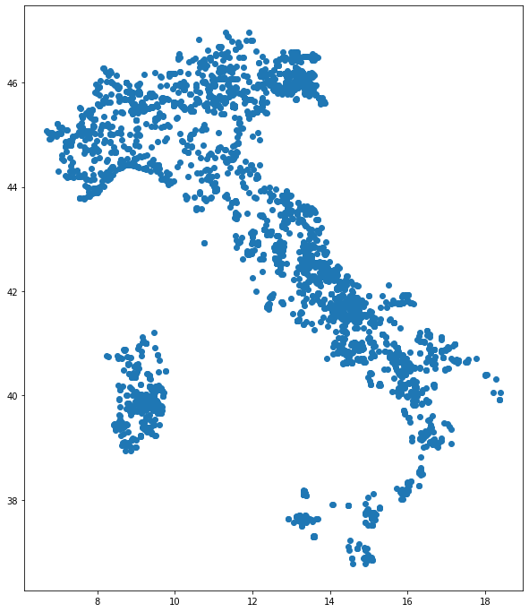
    


```python
macroregions.plot()
plt.show()
```


    
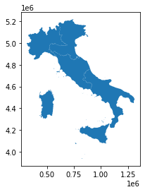
    


overlay the layers


```python
ax = macroregions.plot(edgecolor='k', facecolor='none', figsize=(15, 10))
geo_monumental_trees.plot(ax=ax,color="green")
plt.show()
```


    
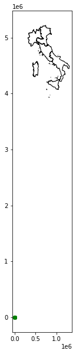
    


**ERROR**!<br/>
We need to use the same projection!!!<br/>
The projection used in our geodataframe of ISTAT is EPSG:32632


```python
macroregions.crs
```


    <Projected CRS: EPSG:32632>
    Name: WGS 84 / UTM zone 32N
    Axis Info [cartesian]:
    - E[east]: Easting (metre)
    - N[north]: Northing (metre)
    Area of Use:
    - name: Between 6°E and 12°E, northern hemisphere between equator and 84°N, onshore and offshore. Algeria. Austria. Cameroon. Denmark. Equatorial Guinea. France. Gabon. Germany. Italy. Libya. Liechtenstein. Monaco. Netherlands. Niger. Nigeria. Norway. Sao Tome and Principe. Svalbard. Sweden. Switzerland. Tunisia. Vatican City State.
    - bounds: (6.0, 0.0, 12.0, 84.0)
    Coordinate Operation:
    - name: UTM zone 32N
    - method: Transverse Mercator
    Datum: World Geodetic System 1984 ensemble
    - Ellipsoid: WGS 84
    - Prime Meridian: Greenwich


overlay the layers by using the same projection


```python
ax = macroregions.to_crs(epsg=4326).plot(edgecolor='k', facecolor='none', figsize=(15, 10))
geo_monumental_trees.plot(ax=ax,color="green")
plt.show()
```


    
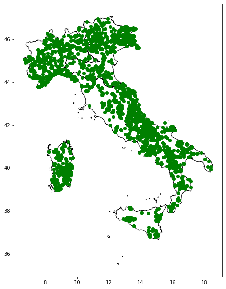
    


---
# Spatial relationships 
## how two spatial objects relate to each other 


from [https://en.wikipedia.org/wiki/Spatial_relation](https://en.wikipedia.org/wiki/Spatial_relation)

## Relationships between individual objects

Eg.<br>
Is this tree located in the north-east Italian macro-region?

we need the north-east italian macro-region in wgs84


```python
macroregions
```


  <div id="df-4e800bd9-5c1f-40a2-9414-60460aa0d707">
    <div class="colab-df-container">
      <div>
<style scoped>
    .dataframe tbody tr th:only-of-type {
        vertical-align: middle;
    }

    .dataframe tbody tr th {
        vertical-align: top;
    }

    .dataframe thead th {
        text-align: right;
    }
</style>
<table border="1" class="dataframe">
  <thead>
    <tr style="text-align: right;">
      <th></th>
      <th>COD_RIP</th>
      <th>DEN_RIP</th>
      <th>Shape_Leng</th>
      <th>Shape_Area</th>
      <th>geometry</th>
    </tr>
  </thead>
  <tbody>
    <tr>
      <th>0</th>
      <td>1</td>
      <td>Nord-Ovest</td>
      <td>2.330183e+06</td>
      <td>5.792958e+10</td>
      <td>MULTIPOLYGON (((568226.691 4874823.573, 568219...</td>
    </tr>
    <tr>
      <th>1</th>
      <td>2</td>
      <td>Nord-Est</td>
      <td>2.327765e+06</td>
      <td>6.238509e+10</td>
      <td>MULTIPOLYGON (((618343.929 4893985.661, 618335...</td>
    </tr>
    <tr>
      <th>2</th>
      <td>3</td>
      <td>Centro</td>
      <td>2.010203e+06</td>
      <td>5.801865e+10</td>
      <td>MULTIPOLYGON (((875952.995 4524692.050, 875769...</td>
    </tr>
    <tr>
      <th>3</th>
      <td>4</td>
      <td>Sud</td>
      <td>2.517097e+06</td>
      <td>7.377795e+10</td>
      <td>MULTIPOLYGON (((1083358.846 4416348.741, 10833...</td>
    </tr>
    <tr>
      <th>4</th>
      <td>5</td>
      <td>Isole</td>
      <td>2.775538e+06</td>
      <td>4.991778e+10</td>
      <td>MULTIPOLYGON (((822886.611 3935355.889, 822871...</td>
    </tr>
  </tbody>
</table>
</div>
      <button class="colab-df-convert" onclick="convertToInteractive('df-4e800bd9-5c1f-40a2-9414-60460aa0d707')"
              title="Convert this dataframe to an interactive table."
              style="display:none;">

  <svg xmlns="http://www.w3.org/2000/svg" height="24px"viewBox="0 0 24 24"
       width="24px">
    <path d="M0 0h24v24H0V0z" fill="none"/>
    <path d="M18.56 5.44l.94 2.06.94-2.06 2.06-.94-2.06-.94-.94-2.06-.94 2.06-2.06.94zm-11 1L8.5 8.5l.94-2.06 2.06-.94-2.06-.94L8.5 2.5l-.94 2.06-2.06.94zm10 10l.94 2.06.94-2.06 2.06-.94-2.06-.94-.94-2.06-.94 2.06-2.06.94z"/><path d="M17.41 7.96l-1.37-1.37c-.4-.4-.92-.59-1.43-.59-.52 0-1.04.2-1.43.59L10.3 9.45l-7.72 7.72c-.78.78-.78 2.05 0 2.83L4 21.41c.39.39.9.59 1.41.59.51 0 1.02-.2 1.41-.59l7.78-7.78 2.81-2.81c.8-.78.8-2.07 0-2.86zM5.41 20L4 18.59l7.72-7.72 1.47 1.35L5.41 20z"/>
  </svg>
      </button>

  <style>
    .colab-df-container {
      display:flex;
      flex-wrap:wrap;
      gap: 12px;
    }

    .colab-df-convert {
      background-color: #E8F0FE;
      border: none;
      border-radius: 50%;
      cursor: pointer;
      display: none;
      fill: #1967D2;
      height: 32px;
      padding: 0 0 0 0;
      width: 32px;
    }

    .colab-df-convert:hover {
      background-color: #E2EBFA;
      box-shadow: 0px 1px 2px rgba(60, 64, 67, 0.3), 0px 1px 3px 1px rgba(60, 64, 67, 0.15);
      fill: #174EA6;
    }

    [theme=dark] .colab-df-convert {
      background-color: #3B4455;
      fill: #D2E3FC;
    }

    [theme=dark] .colab-df-convert:hover {
      background-color: #434B5C;
      box-shadow: 0px 1px 3px 1px rgba(0, 0, 0, 0.15);
      filter: drop-shadow(0px 1px 2px rgba(0, 0, 0, 0.3));
      fill: #FFFFFF;
    }
  </style>

      <script>
        const buttonEl =
          document.querySelector('#df-4e800bd9-5c1f-40a2-9414-60460aa0d707 button.colab-df-convert');
        buttonEl.style.display =
          google.colab.kernel.accessAllowed ? 'block' : 'none';

        async function convertToInteractive(key) {
          const element = document.querySelector('#df-4e800bd9-5c1f-40a2-9414-60460aa0d707');
          const dataTable =
            await google.colab.kernel.invokeFunction('convertToInteractive',
                                                     [key], {});
          if (!dataTable) return;

          const docLinkHtml = 'Like what you see? Visit the ' +
            '<a target="_blank" href=https://colab.research.google.com/notebooks/data_table.ipynb>data table notebook</a>'
            + ' to learn more about interactive tables.';
          element.innerHTML = '';
          dataTable['output_type'] = 'display_data';
          await google.colab.output.renderOutput(dataTable, element);
          const docLink = document.createElement('div');
          docLink.innerHTML = docLinkHtml;
          element.appendChild(docLink);
        }
      </script>
    </div>
  </div>


```python
macroregions.geometry[1]
```


    
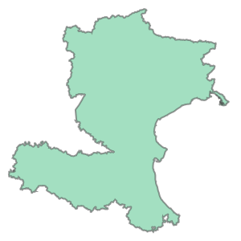
    


```python
northeast = macroregions.to_crs(epsg=4326).geometry[1]
```


```python
northeast
```


    
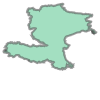
    


## let's start with just one point


so we will choose a library in Trento (north east italy)


```python
geo_monumental_trees[geo_monumental_trees.municipality == 'Trento'].head(5)
```


  <div id="df-f92624fa-58d0-4fab-a390-6ff7850c557e">
    <div class="colab-df-container">
      <div>
<style scoped>
    .dataframe tbody tr th:only-of-type {
        vertical-align: middle;
    }

    .dataframe tbody tr th {
        vertical-align: top;
    }

    .dataframe thead th {
        text-align: right;
    }
</style>
<table border="1" class="dataframe">
  <thead>
    <tr style="text-align: right;">
      <th></th>
      <th>region</th>
      <th>province</th>
      <th>municipality</th>
      <th>place</th>
      <th>altitude</th>
      <th>urban_place</th>
      <th>species_scientific_name</th>
      <th>species_common_name</th>
      <th>latitude</th>
      <th>longitude</th>
      <th>geometry</th>
    </tr>
  </thead>
  <tbody>
    <tr>
      <th>65</th>
      <td>TRENTO</td>
      <td>Trento</td>
      <td>Trento</td>
      <td>Povo - Ex-Villa Thun - Piazza Manci 15</td>
      <td>405</td>
      <td>sì</td>
      <td>Sequoiadendron giganteum (Lindl.) J. Buchholz</td>
      <td>Sequoia gigante</td>
      <td>46.065997</td>
      <td>11.155264</td>
      <td>POINT (11.15526 46.06600)</td>
    </tr>
    <tr>
      <th>66</th>
      <td>TRENTO</td>
      <td>Trento</td>
      <td>Trento</td>
      <td>Maderno - Villa Maria</td>
      <td>488</td>
      <td>sì</td>
      <td>Aesculus hippocastanum L.</td>
      <td>Ippocastano</td>
      <td>46.090008</td>
      <td>11.140311</td>
      <td>POINT (11.14031 46.09001)</td>
    </tr>
    <tr>
      <th>67</th>
      <td>TRENTO</td>
      <td>Trento</td>
      <td>Trento</td>
      <td>Povo - Villa Lubich</td>
      <td>455</td>
      <td>sì</td>
      <td>Sequoiadendron giganteum (Lindl.) J. Buchholz</td>
      <td>Sequoia gigante</td>
      <td>46.066589</td>
      <td>11.160269</td>
      <td>POINT (11.16027 46.06659)</td>
    </tr>
    <tr>
      <th>68</th>
      <td>TRENTO</td>
      <td>Trento</td>
      <td>Trento</td>
      <td>P. Sso Cimirlo - Casare</td>
      <td>790</td>
      <td>no</td>
      <td>Prunus avium L.</td>
      <td>Ciliegio selvatico</td>
      <td>46.064825</td>
      <td>11.186625</td>
      <td>POINT (11.18662 46.06482)</td>
    </tr>
    <tr>
      <th>69</th>
      <td>TRENTO</td>
      <td>Trento</td>
      <td>Trento</td>
      <td>Malga Brigolina</td>
      <td>943</td>
      <td>no</td>
      <td>Fagus sylvatica L.</td>
      <td>Faggio</td>
      <td>46.059850</td>
      <td>11.061781</td>
      <td>POINT (11.06178 46.05985)</td>
    </tr>
  </tbody>
</table>
</div>
      <button class="colab-df-convert" onclick="convertToInteractive('df-f92624fa-58d0-4fab-a390-6ff7850c557e')"
              title="Convert this dataframe to an interactive table."
              style="display:none;">

  <svg xmlns="http://www.w3.org/2000/svg" height="24px"viewBox="0 0 24 24"
       width="24px">
    <path d="M0 0h24v24H0V0z" fill="none"/>
    <path d="M18.56 5.44l.94 2.06.94-2.06 2.06-.94-2.06-.94-.94-2.06-.94 2.06-2.06.94zm-11 1L8.5 8.5l.94-2.06 2.06-.94-2.06-.94L8.5 2.5l-.94 2.06-2.06.94zm10 10l.94 2.06.94-2.06 2.06-.94-2.06-.94-.94-2.06-.94 2.06-2.06.94z"/><path d="M17.41 7.96l-1.37-1.37c-.4-.4-.92-.59-1.43-.59-.52 0-1.04.2-1.43.59L10.3 9.45l-7.72 7.72c-.78.78-.78 2.05 0 2.83L4 21.41c.39.39.9.59 1.41.59.51 0 1.02-.2 1.41-.59l7.78-7.78 2.81-2.81c.8-.78.8-2.07 0-2.86zM5.41 20L4 18.59l7.72-7.72 1.47 1.35L5.41 20z"/>
  </svg>
      </button>

  <style>
    .colab-df-container {
      display:flex;
      flex-wrap:wrap;
      gap: 12px;
    }

    .colab-df-convert {
      background-color: #E8F0FE;
      border: none;
      border-radius: 50%;
      cursor: pointer;
      display: none;
      fill: #1967D2;
      height: 32px;
      padding: 0 0 0 0;
      width: 32px;
    }

    .colab-df-convert:hover {
      background-color: #E2EBFA;
      box-shadow: 0px 1px 2px rgba(60, 64, 67, 0.3), 0px 1px 3px 1px rgba(60, 64, 67, 0.15);
      fill: #174EA6;
    }

    [theme=dark] .colab-df-convert {
      background-color: #3B4455;
      fill: #D2E3FC;
    }

    [theme=dark] .colab-df-convert:hover {
      background-color: #434B5C;
      box-shadow: 0px 1px 3px 1px rgba(0, 0, 0, 0.15);
      filter: drop-shadow(0px 1px 2px rgba(0, 0, 0, 0.3));
      fill: #FFFFFF;
    }
  </style>

      <script>
        const buttonEl =
          document.querySelector('#df-f92624fa-58d0-4fab-a390-6ff7850c557e button.colab-df-convert');
        buttonEl.style.display =
          google.colab.kernel.accessAllowed ? 'block' : 'none';

        async function convertToInteractive(key) {
          const element = document.querySelector('#df-f92624fa-58d0-4fab-a390-6ff7850c557e');
          const dataTable =
            await google.colab.kernel.invokeFunction('convertToInteractive',
                                                     [key], {});
          if (!dataTable) return;

          const docLinkHtml = 'Like what you see? Visit the ' +
            '<a target="_blank" href=https://colab.research.google.com/notebooks/data_table.ipynb>data table notebook</a>'
            + ' to learn more about interactive tables.';
          element.innerHTML = '';
          dataTable['output_type'] = 'display_data';
          await google.colab.output.renderOutput(dataTable, element);
          const docLink = document.createElement('div');
          docLink.innerHTML = docLinkHtml;
          element.appendChild(docLink);
        }
      </script>
    </div>
  </div>


we choose the first line and extrac the geometry


```python
monumental_tree_in_trento = geo_monumental_trees[geo_monumental_trees.municipality == 'Trento'].head(1).geometry.values[0]
```


```python
monumental_tree_in_trento
```


    

    


## within relation
in our case:<br>&nbsp;&nbsp;&nbsp;&nbsp;it's the point inside the area?


```python
monumental_tree_in_trento.within(northeast)
```


    True


## contain relation
in our case:<br>&nbsp;&nbsp;&nbsp;&nbsp;does the area contain the point?


```python
northeast.contains(monumental_tree_in_trento)
```


    True


we can iterate the operation for each point

_very slow!_

.. so we work with an only one point


```python
monumental_trees_northeast = geo_monumental_trees[geo_monumental_trees.within(northeast)]
%time
```

    CPU times: user 2 µs, sys: 0 ns, total: 2 µs
    Wall time: 5.01 µs


```python
monumental_trees_northeast.shape
```


    (943, 11)


```python
monumental_trees_northeast.region.unique()
```


    array(['BOLZANO', 'FRIULI VENEZIA GIULIA', 'MARCHE', 'VENETO',
           'EMILIA-ROMAGNA', 'TRENTO'], dtype=object)


.. **MARCHE** isn't a region of the North-East Italy


```python
monumental_trees_northeast[monumental_trees_northeast.region == "MARCHE"]
```


  <div id="df-fa84e8ac-5d3d-4da7-9382-f8177a84f46a">
    <div class="colab-df-container">
      <div>
<style scoped>
    .dataframe tbody tr th:only-of-type {
        vertical-align: middle;
    }

    .dataframe tbody tr th {
        vertical-align: top;
    }

    .dataframe thead th {
        text-align: right;
    }
</style>
<table border="1" class="dataframe">
  <thead>
    <tr style="text-align: right;">
      <th></th>
      <th>region</th>
      <th>province</th>
      <th>municipality</th>
      <th>place</th>
      <th>altitude</th>
      <th>urban_place</th>
      <th>species_scientific_name</th>
      <th>species_common_name</th>
      <th>latitude</th>
      <th>longitude</th>
      <th>geometry</th>
    </tr>
  </thead>
  <tbody>
    <tr>
      <th>117</th>
      <td>MARCHE</td>
      <td>Pesaro e Urbino</td>
      <td>Sassofeltrio</td>
      <td>Ca' Micci</td>
      <td>570.0</td>
      <td>sì</td>
      <td>Morus nigra L.</td>
      <td>Gelso nero</td>
      <td>43.886681</td>
      <td>12.439531</td>
      <td>POINT (12.43953 43.88668)</td>
    </tr>
  </tbody>
</table>
</div>
      <button class="colab-df-convert" onclick="convertToInteractive('df-fa84e8ac-5d3d-4da7-9382-f8177a84f46a')"
              title="Convert this dataframe to an interactive table."
              style="display:none;">

  <svg xmlns="http://www.w3.org/2000/svg" height="24px"viewBox="0 0 24 24"
       width="24px">
    <path d="M0 0h24v24H0V0z" fill="none"/>
    <path d="M18.56 5.44l.94 2.06.94-2.06 2.06-.94-2.06-.94-.94-2.06-.94 2.06-2.06.94zm-11 1L8.5 8.5l.94-2.06 2.06-.94-2.06-.94L8.5 2.5l-.94 2.06-2.06.94zm10 10l.94 2.06.94-2.06 2.06-.94-2.06-.94-.94-2.06-.94 2.06-2.06.94z"/><path d="M17.41 7.96l-1.37-1.37c-.4-.4-.92-.59-1.43-.59-.52 0-1.04.2-1.43.59L10.3 9.45l-7.72 7.72c-.78.78-.78 2.05 0 2.83L4 21.41c.39.39.9.59 1.41.59.51 0 1.02-.2 1.41-.59l7.78-7.78 2.81-2.81c.8-.78.8-2.07 0-2.86zM5.41 20L4 18.59l7.72-7.72 1.47 1.35L5.41 20z"/>
  </svg>
      </button>

  <style>
    .colab-df-container {
      display:flex;
      flex-wrap:wrap;
      gap: 12px;
    }

    .colab-df-convert {
      background-color: #E8F0FE;
      border: none;
      border-radius: 50%;
      cursor: pointer;
      display: none;
      fill: #1967D2;
      height: 32px;
      padding: 0 0 0 0;
      width: 32px;
    }

    .colab-df-convert:hover {
      background-color: #E2EBFA;
      box-shadow: 0px 1px 2px rgba(60, 64, 67, 0.3), 0px 1px 3px 1px rgba(60, 64, 67, 0.15);
      fill: #174EA6;
    }

    [theme=dark] .colab-df-convert {
      background-color: #3B4455;
      fill: #D2E3FC;
    }

    [theme=dark] .colab-df-convert:hover {
      background-color: #434B5C;
      box-shadow: 0px 1px 3px 1px rgba(0, 0, 0, 0.15);
      filter: drop-shadow(0px 1px 2px rgba(0, 0, 0, 0.3));
      fill: #FFFFFF;
    }
  </style>

      <script>
        const buttonEl =
          document.querySelector('#df-fa84e8ac-5d3d-4da7-9382-f8177a84f46a button.colab-df-convert');
        buttonEl.style.display =
          google.colab.kernel.accessAllowed ? 'block' : 'none';

        async function convertToInteractive(key) {
          const element = document.querySelector('#df-fa84e8ac-5d3d-4da7-9382-f8177a84f46a');
          const dataTable =
            await google.colab.kernel.invokeFunction('convertToInteractive',
                                                     [key], {});
          if (!dataTable) return;

          const docLinkHtml = 'Like what you see? Visit the ' +
            '<a target="_blank" href=https://colab.research.google.com/notebooks/data_table.ipynb>data table notebook</a>'
            + ' to learn more about interactive tables.';
          element.innerHTML = '';
          dataTable['output_type'] = 'display_data';
          await google.colab.output.renderOutput(dataTable, element);
          const docLink = document.createElement('div');
          docLink.innerHTML = docLinkHtml;
          element.appendChild(docLink);
        }
      </script>
    </div>
  </div>


```python
tree_marche = monumental_trees_northeast[monumental_trees_northeast.region == "MARCHE"]
```


```python
regions[regions.DEN_REG=='Marche'].to_crs(epsg=4326).bounds
```


  <div id="df-8ba870bc-686a-459a-9124-2683fa6d212f">
    <div class="colab-df-container">
      <div>
<style scoped>
    .dataframe tbody tr th:only-of-type {
        vertical-align: middle;
    }

    .dataframe tbody tr th {
        vertical-align: top;
    }

    .dataframe thead th {
        text-align: right;
    }
</style>
<table border="1" class="dataframe">
  <thead>
    <tr style="text-align: right;">
      <th></th>
      <th>minx</th>
      <th>miny</th>
      <th>maxx</th>
      <th>maxy</th>
    </tr>
  </thead>
  <tbody>
    <tr>
      <th>10</th>
      <td>12.185454</td>
      <td>42.687156</td>
      <td>13.916725</td>
      <td>43.968635</td>
    </tr>
  </tbody>
</table>
</div>
      <button class="colab-df-convert" onclick="convertToInteractive('df-8ba870bc-686a-459a-9124-2683fa6d212f')"
              title="Convert this dataframe to an interactive table."
              style="display:none;">

  <svg xmlns="http://www.w3.org/2000/svg" height="24px"viewBox="0 0 24 24"
       width="24px">
    <path d="M0 0h24v24H0V0z" fill="none"/>
    <path d="M18.56 5.44l.94 2.06.94-2.06 2.06-.94-2.06-.94-.94-2.06-.94 2.06-2.06.94zm-11 1L8.5 8.5l.94-2.06 2.06-.94-2.06-.94L8.5 2.5l-.94 2.06-2.06.94zm10 10l.94 2.06.94-2.06 2.06-.94-2.06-.94-.94-2.06-.94 2.06-2.06.94z"/><path d="M17.41 7.96l-1.37-1.37c-.4-.4-.92-.59-1.43-.59-.52 0-1.04.2-1.43.59L10.3 9.45l-7.72 7.72c-.78.78-.78 2.05 0 2.83L4 21.41c.39.39.9.59 1.41.59.51 0 1.02-.2 1.41-.59l7.78-7.78 2.81-2.81c.8-.78.8-2.07 0-2.86zM5.41 20L4 18.59l7.72-7.72 1.47 1.35L5.41 20z"/>
  </svg>
      </button>

  <style>
    .colab-df-container {
      display:flex;
      flex-wrap:wrap;
      gap: 12px;
    }

    .colab-df-convert {
      background-color: #E8F0FE;
      border: none;
      border-radius: 50%;
      cursor: pointer;
      display: none;
      fill: #1967D2;
      height: 32px;
      padding: 0 0 0 0;
      width: 32px;
    }

    .colab-df-convert:hover {
      background-color: #E2EBFA;
      box-shadow: 0px 1px 2px rgba(60, 64, 67, 0.3), 0px 1px 3px 1px rgba(60, 64, 67, 0.15);
      fill: #174EA6;
    }

    [theme=dark] .colab-df-convert {
      background-color: #3B4455;
      fill: #D2E3FC;
    }

    [theme=dark] .colab-df-convert:hover {
      background-color: #434B5C;
      box-shadow: 0px 1px 3px 1px rgba(0, 0, 0, 0.15);
      filter: drop-shadow(0px 1px 2px rgba(0, 0, 0, 0.3));
      fill: #FFFFFF;
    }
  </style>

      <script>
        const buttonEl =
          document.querySelector('#df-8ba870bc-686a-459a-9124-2683fa6d212f button.colab-df-convert');
        buttonEl.style.display =
          google.colab.kernel.accessAllowed ? 'block' : 'none';

        async function convertToInteractive(key) {
          const element = document.querySelector('#df-8ba870bc-686a-459a-9124-2683fa6d212f');
          const dataTable =
            await google.colab.kernel.invokeFunction('convertToInteractive',
                                                     [key], {});
          if (!dataTable) return;

          const docLinkHtml = 'Like what you see? Visit the ' +
            '<a target="_blank" href=https://colab.research.google.com/notebooks/data_table.ipynb>data table notebook</a>'
            + ' to learn more about interactive tables.';
          element.innerHTML = '';
          dataTable['output_type'] = 'display_data';
          await google.colab.output.renderOutput(dataTable, element);
          const docLink = document.createElement('div');
          docLink.innerHTML = docLinkHtml;
          element.appendChild(docLink);
        }
      </script>
    </div>
  </div>


```python
municipalities[municipalities.COMUNE=="Sassofeltrio"]
```


  <div id="df-2458744e-2e29-44ee-b82f-f5e8667ef9fa">
    <div class="colab-df-container">
      <div>
<style scoped>
    .dataframe tbody tr th:only-of-type {
        vertical-align: middle;
    }

    .dataframe tbody tr th {
        vertical-align: top;
    }

    .dataframe thead th {
        text-align: right;
    }
</style>
<table border="1" class="dataframe">
  <thead>
    <tr style="text-align: right;">
      <th></th>
      <th>COD_RIP</th>
      <th>COD_REG</th>
      <th>COD_PROV</th>
      <th>COD_CM</th>
      <th>COD_UTS</th>
      <th>PRO_COM</th>
      <th>PRO_COM_T</th>
      <th>COMUNE</th>
      <th>COMUNE_A</th>
      <th>CC_UTS</th>
      <th>Shape_Leng</th>
      <th>Shape_Area</th>
      <th>geometry</th>
    </tr>
  </thead>
  <tbody>
    <tr>
      <th>7533</th>
      <td>2</td>
      <td>8</td>
      <td>99</td>
      <td>0</td>
      <td>99</td>
      <td>99031</td>
      <td>099031</td>
      <td>Sassofeltrio</td>
      <td>None</td>
      <td>0</td>
      <td>29089.196723</td>
      <td>2.152137e+07</td>
      <td>MULTIPOLYGON (((777501.672 4865896.297, 777688...</td>
    </tr>
  </tbody>
</table>
</div>
      <button class="colab-df-convert" onclick="convertToInteractive('df-2458744e-2e29-44ee-b82f-f5e8667ef9fa')"
              title="Convert this dataframe to an interactive table."
              style="display:none;">

  <svg xmlns="http://www.w3.org/2000/svg" height="24px"viewBox="0 0 24 24"
       width="24px">
    <path d="M0 0h24v24H0V0z" fill="none"/>
    <path d="M18.56 5.44l.94 2.06.94-2.06 2.06-.94-2.06-.94-.94-2.06-.94 2.06-2.06.94zm-11 1L8.5 8.5l.94-2.06 2.06-.94-2.06-.94L8.5 2.5l-.94 2.06-2.06.94zm10 10l.94 2.06.94-2.06 2.06-.94-2.06-.94-.94-2.06-.94 2.06-2.06.94z"/><path d="M17.41 7.96l-1.37-1.37c-.4-.4-.92-.59-1.43-.59-.52 0-1.04.2-1.43.59L10.3 9.45l-7.72 7.72c-.78.78-.78 2.05 0 2.83L4 21.41c.39.39.9.59 1.41.59.51 0 1.02-.2 1.41-.59l7.78-7.78 2.81-2.81c.8-.78.8-2.07 0-2.86zM5.41 20L4 18.59l7.72-7.72 1.47 1.35L5.41 20z"/>
  </svg>
      </button>

  <style>
    .colab-df-container {
      display:flex;
      flex-wrap:wrap;
      gap: 12px;
    }

    .colab-df-convert {
      background-color: #E8F0FE;
      border: none;
      border-radius: 50%;
      cursor: pointer;
      display: none;
      fill: #1967D2;
      height: 32px;
      padding: 0 0 0 0;
      width: 32px;
    }

    .colab-df-convert:hover {
      background-color: #E2EBFA;
      box-shadow: 0px 1px 2px rgba(60, 64, 67, 0.3), 0px 1px 3px 1px rgba(60, 64, 67, 0.15);
      fill: #174EA6;
    }

    [theme=dark] .colab-df-convert {
      background-color: #3B4455;
      fill: #D2E3FC;
    }

    [theme=dark] .colab-df-convert:hover {
      background-color: #434B5C;
      box-shadow: 0px 1px 3px 1px rgba(0, 0, 0, 0.15);
      filter: drop-shadow(0px 1px 2px rgba(0, 0, 0, 0.3));
      fill: #FFFFFF;
    }
  </style>

      <script>
        const buttonEl =
          document.querySelector('#df-2458744e-2e29-44ee-b82f-f5e8667ef9fa button.colab-df-convert');
        buttonEl.style.display =
          google.colab.kernel.accessAllowed ? 'block' : 'none';

        async function convertToInteractive(key) {
          const element = document.querySelector('#df-2458744e-2e29-44ee-b82f-f5e8667ef9fa');
          const dataTable =
            await google.colab.kernel.invokeFunction('convertToInteractive',
                                                     [key], {});
          if (!dataTable) return;

          const docLinkHtml = 'Like what you see? Visit the ' +
            '<a target="_blank" href=https://colab.research.google.com/notebooks/data_table.ipynb>data table notebook</a>'
            + ' to learn more about interactive tables.';
          element.innerHTML = '';
          dataTable['output_type'] = 'display_data';
          await google.colab.output.renderOutput(dataTable, element);
          const docLink = document.createElement('div');
          docLink.innerHTML = docLinkHtml;
          element.appendChild(docLink);
        }
      </script>
    </div>
  </div>


```python
regions[regions.COD_REG==8].DEN_REG.values[0]
```


    'Emilia-Romagna'


```python
municipalities[municipalities.COMUNE=="Sassofeltrio"].plot()
plt.show()
```


    
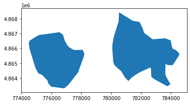
    


```python
ax = regions[regions.COD_REG==8].plot(edgecolor='black', facecolor='none', figsize=(15, 10))
municipalities[municipalities.COMUNE=="Sassofeltrio"].plot(ax=ax,color="red")
regions[regions.DEN_REG=='Marche'].plot(ax=ax,edgecolor='blue',facecolor='none')
plt.show()
```

Here the reason<Br/>


[https://www.regione.emilia-romagna.it/notizie/2021/maggio/i-comuni-di-montecopiolo-e-sassofeltrio-passano-dalle-marche-allemilia-romagna-nella-provincia-di-rimini](https://www.regione.emilia-romagna.it/notizie/2021/maggio/i-comuni-di-montecopiolo-e-sassofeltrio-passano-dalle-marche-allemilia-romagna-nella-provincia-di-rimini)


---


**REFERENCE**

Overview of the different functions to check spatial relationships (*spatial predicate functions*):

- `equals`
- `contains`
- `crosses`
- `disjoint`
- `intersects`
- `overlaps`
- `touches`
- `within`
- `covers`

See <a href="https://shapely.readthedocs.io/en/stable/manual.html#predicates-and-relationships">predicates-and-relationships<a> for an overview of those methods.


See <a href="https://en.wikipedia.org/wiki/DE-9IM">https://en.wikipedia.org/wiki/DE-9IM</a> for all details on the semantics of those operations. 


# Spatial Joins


You can create a join like the usual [join](https://pandas.pydata.org/pandas-docs/stable/user_guide/merging.html) between pandas dataframe by using a spatial relationship with the function [geopandas.sjoin](http://geopandas.readthedocs.io/en/latest/reference/geopandas.sjoin.html)


```python
monumental_trees_and_macroregions = gpd.sjoin(macroregions.to_crs(epsg=4326), 
                          geo_monumental_trees, how='inner', predicate='contains', lsuffix='macroregions_', rsuffix='trees')
%time
```

    CPU times: user 2 µs, sys: 0 ns, total: 2 µs
    Wall time: 4.53 µs


```python
monumental_trees_and_macroregions.columns
```


    Index(['COD_RIP', 'DEN_RIP', 'Shape_Leng', 'Shape_Area', 'geometry',
           'index_trees', 'region', 'province', 'municipality', 'place',
           'altitude', 'urban_place', 'species_scientific_name',
           'species_common_name', 'latitude', 'longitude'],
          dtype='object')


```python
monumental_trees_and_macroregions.shape
```


    (3892, 16)


```python
monumental_trees_and_macroregions.head(5)
```


  <div id="df-0e1b05a4-6571-49ed-990f-8c7e8ecfd050">
    <div class="colab-df-container">
      <div>
<style scoped>
    .dataframe tbody tr th:only-of-type {
        vertical-align: middle;
    }

    .dataframe tbody tr th {
        vertical-align: top;
    }

    .dataframe thead th {
        text-align: right;
    }
</style>
<table border="1" class="dataframe">
  <thead>
    <tr style="text-align: right;">
      <th></th>
      <th>COD_RIP</th>
      <th>DEN_RIP</th>
      <th>Shape_Leng</th>
      <th>Shape_Area</th>
      <th>geometry</th>
      <th>index_trees</th>
      <th>region</th>
      <th>province</th>
      <th>municipality</th>
      <th>place</th>
      <th>altitude</th>
      <th>urban_place</th>
      <th>species_scientific_name</th>
      <th>species_common_name</th>
      <th>latitude</th>
      <th>longitude</th>
    </tr>
  </thead>
  <tbody>
    <tr>
      <th>0</th>
      <td>1</td>
      <td>Nord-Ovest</td>
      <td>2.330183e+06</td>
      <td>5.792958e+10</td>
      <td>MULTIPOLYGON (((9.85132 44.02340, 9.85122 44.0...</td>
      <td>142</td>
      <td>LOMBARDIA</td>
      <td>Mantova</td>
      <td>Revere</td>
      <td>Via Giulio Romano 40</td>
      <td>15.0</td>
      <td>sì</td>
      <td>Populus nigra L.</td>
      <td>Pioppo nero</td>
      <td>45.048556</td>
      <td>11.126000</td>
    </tr>
    <tr>
      <th>0</th>
      <td>1</td>
      <td>Nord-Ovest</td>
      <td>2.330183e+06</td>
      <td>5.792958e+10</td>
      <td>MULTIPOLYGON (((9.85132 44.02340, 9.85122 44.0...</td>
      <td>37</td>
      <td>LOMBARDIA</td>
      <td>Brescia</td>
      <td>Borgosatollo</td>
      <td>Piffione</td>
      <td>113.0</td>
      <td>no</td>
      <td>Insieme omogeneo di Morus alba L.</td>
      <td>Gelso bianco</td>
      <td>45.489339</td>
      <td>10.239456</td>
    </tr>
    <tr>
      <th>0</th>
      <td>1</td>
      <td>Nord-Ovest</td>
      <td>2.330183e+06</td>
      <td>5.792958e+10</td>
      <td>MULTIPOLYGON (((9.85132 44.02340, 9.85122 44.0...</td>
      <td>36</td>
      <td>LOMBARDIA</td>
      <td>Brescia</td>
      <td>Borgosatollo</td>
      <td>Piffione</td>
      <td>133.0</td>
      <td>no</td>
      <td>Insieme omogeneo di Morus nigra L.</td>
      <td>Gelso nero</td>
      <td>45.491389</td>
      <td>10.243056</td>
    </tr>
    <tr>
      <th>0</th>
      <td>1</td>
      <td>Nord-Ovest</td>
      <td>2.330183e+06</td>
      <td>5.792958e+10</td>
      <td>MULTIPOLYGON (((9.85132 44.02340, 9.85122 44.0...</td>
      <td>60</td>
      <td>LOMBARDIA</td>
      <td>Brescia</td>
      <td>Mazzano</td>
      <td>Via Patuzza 13</td>
      <td>158.0</td>
      <td>no</td>
      <td>Insieme omogeneo di Cedrus libani A.Richard</td>
      <td>Cedro del Libano</td>
      <td>45.510969</td>
      <td>10.376208</td>
    </tr>
    <tr>
      <th>0</th>
      <td>1</td>
      <td>Nord-Ovest</td>
      <td>2.330183e+06</td>
      <td>5.792958e+10</td>
      <td>MULTIPOLYGON (((9.85132 44.02340, 9.85122 44.0...</td>
      <td>39</td>
      <td>LOMBARDIA</td>
      <td>Brescia</td>
      <td>Brescia</td>
      <td>Istituto Palazzolo</td>
      <td>135.0</td>
      <td>si`</td>
      <td>Cedrus libani A.Richard</td>
      <td>Cedro del Libano</td>
      <td>45.519167</td>
      <td>10.216111</td>
    </tr>
  </tbody>
</table>
</div>
      <button class="colab-df-convert" onclick="convertToInteractive('df-0e1b05a4-6571-49ed-990f-8c7e8ecfd050')"
              title="Convert this dataframe to an interactive table."
              style="display:none;">

  <svg xmlns="http://www.w3.org/2000/svg" height="24px"viewBox="0 0 24 24"
       width="24px">
    <path d="M0 0h24v24H0V0z" fill="none"/>
    <path d="M18.56 5.44l.94 2.06.94-2.06 2.06-.94-2.06-.94-.94-2.06-.94 2.06-2.06.94zm-11 1L8.5 8.5l.94-2.06 2.06-.94-2.06-.94L8.5 2.5l-.94 2.06-2.06.94zm10 10l.94 2.06.94-2.06 2.06-.94-2.06-.94-.94-2.06-.94 2.06-2.06.94z"/><path d="M17.41 7.96l-1.37-1.37c-.4-.4-.92-.59-1.43-.59-.52 0-1.04.2-1.43.59L10.3 9.45l-7.72 7.72c-.78.78-.78 2.05 0 2.83L4 21.41c.39.39.9.59 1.41.59.51 0 1.02-.2 1.41-.59l7.78-7.78 2.81-2.81c.8-.78.8-2.07 0-2.86zM5.41 20L4 18.59l7.72-7.72 1.47 1.35L5.41 20z"/>
  </svg>
      </button>

  <style>
    .colab-df-container {
      display:flex;
      flex-wrap:wrap;
      gap: 12px;
    }

    .colab-df-convert {
      background-color: #E8F0FE;
      border: none;
      border-radius: 50%;
      cursor: pointer;
      display: none;
      fill: #1967D2;
      height: 32px;
      padding: 0 0 0 0;
      width: 32px;
    }

    .colab-df-convert:hover {
      background-color: #E2EBFA;
      box-shadow: 0px 1px 2px rgba(60, 64, 67, 0.3), 0px 1px 3px 1px rgba(60, 64, 67, 0.15);
      fill: #174EA6;
    }

    [theme=dark] .colab-df-convert {
      background-color: #3B4455;
      fill: #D2E3FC;
    }

    [theme=dark] .colab-df-convert:hover {
      background-color: #434B5C;
      box-shadow: 0px 1px 3px 1px rgba(0, 0, 0, 0.15);
      filter: drop-shadow(0px 1px 2px rgba(0, 0, 0, 0.3));
      fill: #FFFFFF;
    }
  </style>

      <script>
        const buttonEl =
          document.querySelector('#df-0e1b05a4-6571-49ed-990f-8c7e8ecfd050 button.colab-df-convert');
        buttonEl.style.display =
          google.colab.kernel.accessAllowed ? 'block' : 'none';

        async function convertToInteractive(key) {
          const element = document.querySelector('#df-0e1b05a4-6571-49ed-990f-8c7e8ecfd050');
          const dataTable =
            await google.colab.kernel.invokeFunction('convertToInteractive',
                                                     [key], {});
          if (!dataTable) return;

          const docLinkHtml = 'Like what you see? Visit the ' +
            '<a target="_blank" href=https://colab.research.google.com/notebooks/data_table.ipynb>data table notebook</a>'
            + ' to learn more about interactive tables.';
          element.innerHTML = '';
          dataTable['output_type'] = 'display_data';
          await google.colab.output.renderOutput(dataTable, element);
          const docLink = document.createElement('div');
          docLink.innerHTML = docLinkHtml;
          element.appendChild(docLink);
        }
      </script>
    </div>
  </div>


```python
monumental_trees_and_macroregions.geom_type.unique()
```


    array(['MultiPolygon'], dtype=object)


... and now you can investigate the new geodataframe


```python
monumental_trees_and_macroregions.groupby(['DEN_RIP']).index_trees.count()
```


    DEN_RIP
    Centro         525
    Isole          564
    Nord-Est       943
    Nord-Ovest     677
    Sud           1183
    Name: index_trees, dtype: int64


```python
monumental_trees_and_macroregions.groupby(['DEN_RIP']).index_trees.count().plot(kind='bar')
plt.show()
```


    
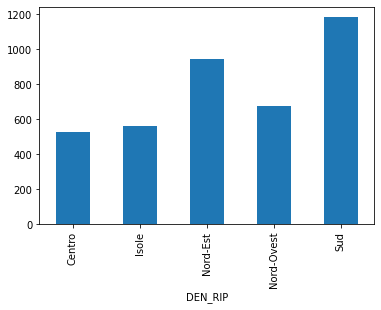
    


**SPATIAL JOIN** = *transferring attributes from one layer to another based on their spatial relationship*

Different parts of this operations:
<ul>
    <li>The GeoDataFrame to which we want add information</li>
    <li>The GeoDataFrame that contains the information we want to add</li>
    <li>The spatial relationship we want to use to match both datasets ('intersects', 'contains', 'within')</li>
    <li>The type of join: left or inner join</li>
</ul>


---

# Spatial operations 
GeoPandas provide analysis methods that return new geometric objects (based on shapely)

See [https://shapely.readthedocs.io/en/stable/manual.html#spatial-analysis-methods](https://shapely.readthedocs.io/en/stable/manual.html#spatial-analysis-methods) for more details.

## buffer
*object.buffer(distance, resolution=16, cap_style=1, join_style=1, mitre_limit=5.0)*

Returns an approximate representation of all points within a given distance of the this geometric object.


```python
monumental_tree_in_trento_32632 = geo_monumental_trees[geo_monumental_trees.municipality == 'Trento'].to_crs(32632).geometry.values[0]
```


```python
monumental_tree_in_trento_32632
```


```python
monumental_tree_in_trento_32632.buffer(9000) # a circle with a ray of 9000 meters
```

due to the algorithm with which the buffer is built, as the value increases, from whatever geometry one starts, the result will take on more and more the shape of a circumference.


##### the tree in Marche? 


```python
minx, miny, maxx, maxy = tree_marche.to_crs(epsg=32632).buffer(2000).total_bounds
```


```python
ax = regions[regions.DEN_REG=="Emilia-Romagna"].plot(edgecolor='black', facecolor='none', figsize=(15, 10))
ax.set_xlim(minx, maxx)
ax.set_ylim(miny, maxy)
tree_marche.to_crs(epsg=32632).plot(ax=ax, color="green")
plt.show()
```


    
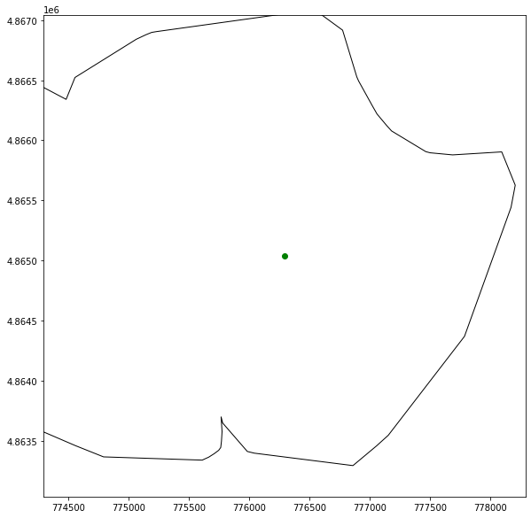
    


## simplify

*object.simplify(tolerance, preserve_topology=True)*

    Returns a simplified representation of the geometric object.


```python
northeast_geometry = macroregions[macroregions.COD_RIP==2].geometry.values[0]
```


```python
northeast_geometry
```


    

    


```python
northeast_geometry.simplify(10000,preserve_topology=False)
```


    
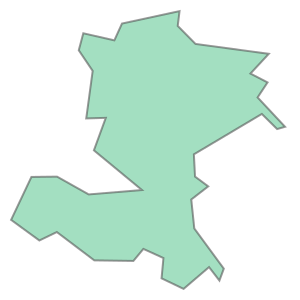
    


## Es. symmetric_difference
*object.symmetric_difference(other)*

    Returns a representation of the points in this object not in the other geometric object, and the points in the other not in this geometric object.


```python
northeast_geometry.simplify(10000,preserve_topology=False).symmetric_difference(monumental_tree_in_trento_32632.buffer(9000))
```


    
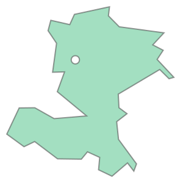
    


**REMEMBER:**

GeoPandas (and Shapely for the individual objects) provides a whole lot of basic methods to analyse the geospatial data (distance, length, centroid, boundary, convex_hull, simplify, transform, ....), much more than the few that we can touch in this tutorial.
<ul>
<li>An overview of all methods provided by GeoPandas can be found here: <a href="https://geopandas.readthedocs.io/en/latest/docs/reference.html">https://geopandas.readthedocs.io/en/latest/docs/reference.html</a></li>
    </ul>


---

# Clip 

Extracts input features that overlay the clip features.


```python
 geopandas.clip(gdf, mask, keep_geom_type=False)
 ```
 *gdf* = geodataframe<Br/>
 *mask* = polygon 


```python
municipalities_inside_circle = municipalities.clip(monumental_tree_in_trento_32632.buffer(9000))
```


```python
municipalities_inside_circle.COMUNE.unique()
```


    array(['Caldonazzo', 'Altopiano della Vigolana', 'Calceranica al Lago',
           'Tenna', 'Garniga Terme', 'Vignola-Falesina', 'Pergine Valsugana',
           'Trento', 'Civezzano', 'Vallelaghi', 'Fornace', 'Baselga di Pinè',
           'Albiano', 'Lavis', 'Lona-Lases', 'Giovo'], dtype=object)


```python
municipalities_inside_circle.plot(figsize=(10,10))
plt.show()
```


    
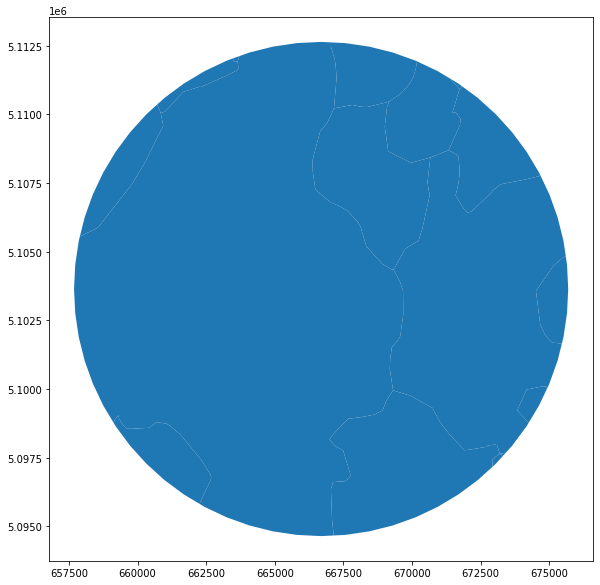
    


---
# Aggregation with dissolve

Spatial data are often more granular than we need. For example, we have the data of the macro-regions but we don't have a geometry with the border of Italy.

If we have a columns to operate a *groupby* we can solve it but to create the geometry we need the function *dissolve*.


```python
macroregions['nation']='italy'
```


```python
macroregions
```


  <div id="df-1ddb744f-0c2e-4518-92da-9b5a0fd98464">
    <div class="colab-df-container">
      <div>
<style scoped>
    .dataframe tbody tr th:only-of-type {
        vertical-align: middle;
    }

    .dataframe tbody tr th {
        vertical-align: top;
    }

    .dataframe thead th {
        text-align: right;
    }
</style>
<table border="1" class="dataframe">
  <thead>
    <tr style="text-align: right;">
      <th></th>
      <th>COD_RIP</th>
      <th>DEN_RIP</th>
      <th>Shape_Leng</th>
      <th>Shape_Area</th>
      <th>geometry</th>
      <th>nation</th>
    </tr>
  </thead>
  <tbody>
    <tr>
      <th>0</th>
      <td>1</td>
      <td>Nord-Ovest</td>
      <td>2.330183e+06</td>
      <td>5.792958e+10</td>
      <td>MULTIPOLYGON (((568226.691 4874823.573, 568219...</td>
      <td>italy</td>
    </tr>
    <tr>
      <th>1</th>
      <td>2</td>
      <td>Nord-Est</td>
      <td>2.327765e+06</td>
      <td>6.238509e+10</td>
      <td>MULTIPOLYGON (((618343.929 4893985.661, 618335...</td>
      <td>italy</td>
    </tr>
    <tr>
      <th>2</th>
      <td>3</td>
      <td>Centro</td>
      <td>2.010203e+06</td>
      <td>5.801865e+10</td>
      <td>MULTIPOLYGON (((875952.995 4524692.050, 875769...</td>
      <td>italy</td>
    </tr>
    <tr>
      <th>3</th>
      <td>4</td>
      <td>Sud</td>
      <td>2.517097e+06</td>
      <td>7.377795e+10</td>
      <td>MULTIPOLYGON (((1083358.846 4416348.741, 10833...</td>
      <td>italy</td>
    </tr>
    <tr>
      <th>4</th>
      <td>5</td>
      <td>Isole</td>
      <td>2.775538e+06</td>
      <td>4.991778e+10</td>
      <td>MULTIPOLYGON (((822886.611 3935355.889, 822871...</td>
      <td>italy</td>
    </tr>
  </tbody>
</table>
</div>
      <button class="colab-df-convert" onclick="convertToInteractive('df-1ddb744f-0c2e-4518-92da-9b5a0fd98464')"
              title="Convert this dataframe to an interactive table."
              style="display:none;">

  <svg xmlns="http://www.w3.org/2000/svg" height="24px"viewBox="0 0 24 24"
       width="24px">
    <path d="M0 0h24v24H0V0z" fill="none"/>
    <path d="M18.56 5.44l.94 2.06.94-2.06 2.06-.94-2.06-.94-.94-2.06-.94 2.06-2.06.94zm-11 1L8.5 8.5l.94-2.06 2.06-.94-2.06-.94L8.5 2.5l-.94 2.06-2.06.94zm10 10l.94 2.06.94-2.06 2.06-.94-2.06-.94-.94-2.06-.94 2.06-2.06.94z"/><path d="M17.41 7.96l-1.37-1.37c-.4-.4-.92-.59-1.43-.59-.52 0-1.04.2-1.43.59L10.3 9.45l-7.72 7.72c-.78.78-.78 2.05 0 2.83L4 21.41c.39.39.9.59 1.41.59.51 0 1.02-.2 1.41-.59l7.78-7.78 2.81-2.81c.8-.78.8-2.07 0-2.86zM5.41 20L4 18.59l7.72-7.72 1.47 1.35L5.41 20z"/>
  </svg>
      </button>

  <style>
    .colab-df-container {
      display:flex;
      flex-wrap:wrap;
      gap: 12px;
    }

    .colab-df-convert {
      background-color: #E8F0FE;
      border: none;
      border-radius: 50%;
      cursor: pointer;
      display: none;
      fill: #1967D2;
      height: 32px;
      padding: 0 0 0 0;
      width: 32px;
    }

    .colab-df-convert:hover {
      background-color: #E2EBFA;
      box-shadow: 0px 1px 2px rgba(60, 64, 67, 0.3), 0px 1px 3px 1px rgba(60, 64, 67, 0.15);
      fill: #174EA6;
    }

    [theme=dark] .colab-df-convert {
      background-color: #3B4455;
      fill: #D2E3FC;
    }

    [theme=dark] .colab-df-convert:hover {
      background-color: #434B5C;
      box-shadow: 0px 1px 3px 1px rgba(0, 0, 0, 0.15);
      filter: drop-shadow(0px 1px 2px rgba(0, 0, 0, 0.3));
      fill: #FFFFFF;
    }
  </style>

      <script>
        const buttonEl =
          document.querySelector('#df-1ddb744f-0c2e-4518-92da-9b5a0fd98464 button.colab-df-convert');
        buttonEl.style.display =
          google.colab.kernel.accessAllowed ? 'block' : 'none';

        async function convertToInteractive(key) {
          const element = document.querySelector('#df-1ddb744f-0c2e-4518-92da-9b5a0fd98464');
          const dataTable =
            await google.colab.kernel.invokeFunction('convertToInteractive',
                                                     [key], {});
          if (!dataTable) return;

          const docLinkHtml = 'Like what you see? Visit the ' +
            '<a target="_blank" href=https://colab.research.google.com/notebooks/data_table.ipynb>data table notebook</a>'
            + ' to learn more about interactive tables.';
          element.innerHTML = '';
          dataTable['output_type'] = 'display_data';
          await google.colab.output.renderOutput(dataTable, element);
          const docLink = document.createElement('div');
          docLink.innerHTML = docLinkHtml;
          element.appendChild(docLink);
        }
      </script>
    </div>
  </div>


```python
italy = macroregions[['nation', 'geometry']]
```


```python
italy.plot()
plt.show()
```


    

    


```python

italy = italy.to_crs(epsg=4326).dissolve(by='nation')
%time
```

    CPU times: user 6 µs, sys: 1e+03 ns, total: 7 µs
    Wall time: 9.78 µs


```python
italy
```


  <div id="df-b053ff5c-ee20-4885-81bd-a1bea3433ef7">
    <div class="colab-df-container">
      <div>
<style scoped>
    .dataframe tbody tr th:only-of-type {
        vertical-align: middle;
    }

    .dataframe tbody tr th {
        vertical-align: top;
    }

    .dataframe thead th {
        text-align: right;
    }
</style>
<table border="1" class="dataframe">
  <thead>
    <tr style="text-align: right;">
      <th></th>
      <th>geometry</th>
    </tr>
    <tr>
      <th>nation</th>
      <th></th>
    </tr>
  </thead>
  <tbody>
    <tr>
      <th>italy</th>
      <td>MULTIPOLYGON (((8.41239 38.86127, 8.41215 38.8...</td>
    </tr>
  </tbody>
</table>
</div>
      <button class="colab-df-convert" onclick="convertToInteractive('df-b053ff5c-ee20-4885-81bd-a1bea3433ef7')"
              title="Convert this dataframe to an interactive table."
              style="display:none;">

  <svg xmlns="http://www.w3.org/2000/svg" height="24px"viewBox="0 0 24 24"
       width="24px">
    <path d="M0 0h24v24H0V0z" fill="none"/>
    <path d="M18.56 5.44l.94 2.06.94-2.06 2.06-.94-2.06-.94-.94-2.06-.94 2.06-2.06.94zm-11 1L8.5 8.5l.94-2.06 2.06-.94-2.06-.94L8.5 2.5l-.94 2.06-2.06.94zm10 10l.94 2.06.94-2.06 2.06-.94-2.06-.94-.94-2.06-.94 2.06-2.06.94z"/><path d="M17.41 7.96l-1.37-1.37c-.4-.4-.92-.59-1.43-.59-.52 0-1.04.2-1.43.59L10.3 9.45l-7.72 7.72c-.78.78-.78 2.05 0 2.83L4 21.41c.39.39.9.59 1.41.59.51 0 1.02-.2 1.41-.59l7.78-7.78 2.81-2.81c.8-.78.8-2.07 0-2.86zM5.41 20L4 18.59l7.72-7.72 1.47 1.35L5.41 20z"/>
  </svg>
      </button>

  <style>
    .colab-df-container {
      display:flex;
      flex-wrap:wrap;
      gap: 12px;
    }

    .colab-df-convert {
      background-color: #E8F0FE;
      border: none;
      border-radius: 50%;
      cursor: pointer;
      display: none;
      fill: #1967D2;
      height: 32px;
      padding: 0 0 0 0;
      width: 32px;
    }

    .colab-df-convert:hover {
      background-color: #E2EBFA;
      box-shadow: 0px 1px 2px rgba(60, 64, 67, 0.3), 0px 1px 3px 1px rgba(60, 64, 67, 0.15);
      fill: #174EA6;
    }

    [theme=dark] .colab-df-convert {
      background-color: #3B4455;
      fill: #D2E3FC;
    }

    [theme=dark] .colab-df-convert:hover {
      background-color: #434B5C;
      box-shadow: 0px 1px 3px 1px rgba(0, 0, 0, 0.15);
      filter: drop-shadow(0px 1px 2px rgba(0, 0, 0, 0.3));
      fill: #FFFFFF;
    }
  </style>

      <script>
        const buttonEl =
          document.querySelector('#df-b053ff5c-ee20-4885-81bd-a1bea3433ef7 button.colab-df-convert');
        buttonEl.style.display =
          google.colab.kernel.accessAllowed ? 'block' : 'none';

        async function convertToInteractive(key) {
          const element = document.querySelector('#df-b053ff5c-ee20-4885-81bd-a1bea3433ef7');
          const dataTable =
            await google.colab.kernel.invokeFunction('convertToInteractive',
                                                     [key], {});
          if (!dataTable) return;

          const docLinkHtml = 'Like what you see? Visit the ' +
            '<a target="_blank" href=https://colab.research.google.com/notebooks/data_table.ipynb>data table notebook</a>'
            + ' to learn more about interactive tables.';
          element.innerHTML = '';
          dataTable['output_type'] = 'display_data';
          await google.colab.output.renderOutput(dataTable, element);
          const docLink = document.createElement('div');
          docLink.innerHTML = docLinkHtml;
          element.appendChild(docLink);
        }
      </script>
    </div>
  </div>


```python
italy.geometry[0]
```


    
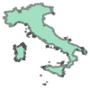
    


```python
italy.to_crs(epsg=32632).geometry[0]
```


    
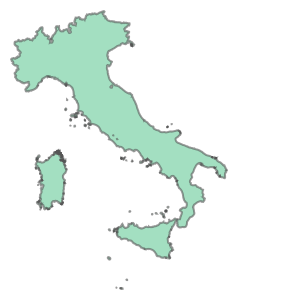
    


**REMEMBER:**

dissolve can be thought of as doing three things: (a) it **dissolves** all the geometries within a given group together into a single geometric feature (using the *unary_union* method), and (b) it **aggregates** all the rows of data in a group using *groupby.aggregate()*, and (c) it **combines** those two results.
    
An overview of all methods provided by GeoPandas can be found here: <a href="http://geopandas.org/aggregation_with_dissolve.html">http://geopandas.org/aggregation_with_dissolve.html</a>

---


# Overlay

Spatial overlays allow you to compare two GeoDataFrames containing polygon or multipolygon geometries and create a new GeoDataFrame with the new geometries representing the spatial combination and merged properties. This allows you to answer questions like

    What are the demographics of the census tracts within 90km from a point?

The basic idea is demonstrated by the graphic below but keep in mind that overlays operate at the dataframe level, not on individual geometries, and the properties from both are retained


source: https://geopandas.org/gallery/overlays.html


```python
macroregion_gdf = macroregions[macroregions.COD_RIP==2].to_crs(epsg=32632)
```


```python
overlay = italy.to_crs(epsg=32632).overlay(macroregion_gdf, how="difference")
```


```python
overlay.plot()
plt.show()
```


    
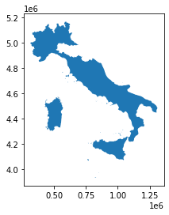
    


---
# Exercise
 
1 - create the geodataframe of the [gas&oil stations](https://www.mise.gov.it/images/exportCSV/anagrafica_impianti_attivi.csv) of Italy 
  - data from the italian [Ministry of Economic Development](https://www.mise.gov.it)
  - count the total of the gas&oil stations for each muncipality of Trentino

2 - identify the difference of municipalities in Trentino in the year 2019 with the year 2021
  - identify which municipalities are created from aggregation to others
  - find the biggest new municipality of Trentino and show all the italian municipalities with bordering it
  - create the macroarea of all the municipalities bordering with it
  - for each gas&oil station in the macro-area, calculate how many monumental trees have been within a 500m radius
  
3 - create a polygon that contains all the monumental trees inside the area
  - identify all the gas&oil stations in this area which are within 2km of each other
  - save the polygon in geopackage with the attribute "description" with the name of the filling station

4 - create the polygon of the Island of Elba from the layer of municipalities with functions of overlay
