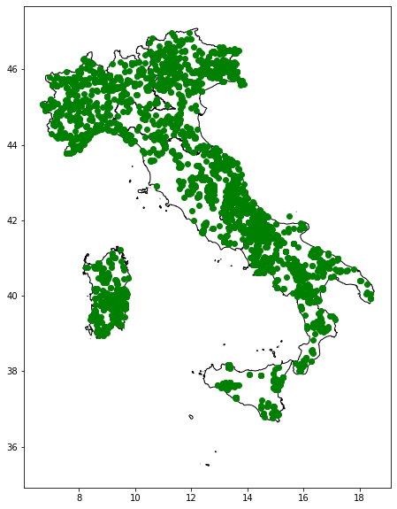

# Spatial relationships and operations
based on scipy2018-geospatial

## goals of the tutorial
- load csv files as geodataframe
- spatial projection conversion
- spatial relationships 
- spatial joins
- spatial operations

**based on the open data of:**
- [ISTAT](https://www.istat.it/it/archivio/222527) Italian National Institute of Statistic 
- [Ministery of Agriculture](https://anagrafe.iccu.sbn.it/it/open-data/)


### requirements
- python knowledge
- pandas
- previous lesson

### status 
*"Spatial is Special"*

---

# SETUP

## We need a OS with the rtree index
needed for geopandas spatial relationships


```python
try:
  import rtree
except ModuleNotFoundError as e:
  !apt-get install libspatialindex-dev
  !pip install rtree==0.9.2
  import rtree
```


```python
#try:
#  import pygeos
#except ModuleNotFoundError as e:
#  !pip install pygeos==0.10.2
#  import pygeos
```


```python
try:
  import geopandas
except ModuleNotFoundError as e:
  !pip install geopandas==0.10.0
  import geopandas
```


```python
import pandas as pd
import geopandas as gpd
import matplotlib.pyplot as plt
```


```python
import requests
import urllib3

requests.packages.urllib3.disable_warnings()
requests.packages.urllib3.util.ssl_.DEFAULT_CIPHERS += ':HIGH:!DH:!aNULL'
try:
    requests.packages.urllib3.contrib.pyopenssl.util.ssl_.DEFAULT_CIPHERS += ':HIGH:!DH:!aNULL'
except AttributeError:
    # no pyopenssl support used / needed / available
    pass
```

## data setup
geopackage with the administrative units of italy


```python
url = 'https://github.com/napo/geospatial_course_unitn/raw/master/data/istat_administrative_units_generalized_2021/istat_administrative_units_generalized_2021.gpkg'
```


```python
macroregions = gpd.read_file(url,layer="macroregions")
```


```python
regions = gpd.read_file(url,layer="regions")
```


```python
provincies = gpd.read_file(url,layer="provincies")
```


```python
municipalities = gpd.read_file(url,layer="municipalities")
```


```python
macroregions
```


<div>
<style scoped>
    .dataframe tbody tr th:only-of-type {
        vertical-align: middle;
    }

    .dataframe tbody tr th {
        vertical-align: top;
    }

    .dataframe thead th {
        text-align: right;
    }
</style>
<table border="1" class="dataframe">
  <thead>
    <tr style="text-align: right;">
      <th></th>
      <th>COD_RIP</th>
      <th>DEN_RIP</th>
      <th>geometry</th>
    </tr>
  </thead>
  <tbody>
    <tr>
      <th>0</th>
      <td>1</td>
      <td>Nord-Ovest</td>
      <td>MULTIPOLYGON (((568226.691 4874823.573, 568219...</td>
    </tr>
    <tr>
      <th>1</th>
      <td>2</td>
      <td>Nord-Est</td>
      <td>MULTIPOLYGON (((618343.929 4893985.661, 618335...</td>
    </tr>
    <tr>
      <th>2</th>
      <td>3</td>
      <td>Centro</td>
      <td>MULTIPOLYGON (((875952.995 4524692.050, 875769...</td>
    </tr>
    <tr>
      <th>3</th>
      <td>4</td>
      <td>Sud</td>
      <td>MULTIPOLYGON (((1083358.846 4416348.741, 10833...</td>
    </tr>
    <tr>
      <th>4</th>
      <td>5</td>
      <td>Isole</td>
      <td>MULTIPOLYGON (((822886.611 3935355.889, 822871...</td>
    </tr>
  </tbody>
</table>
</div>


```python
regional_sources=[]
#abruzzo
regional_sources.append("https://www.politicheagricole.it/flex/cm/pages/ServeAttachment.php/L/IT/D/0%252F8%252F1%252FD.f2005fd478b7477df1d4/P/BLOB%3AID%3D11260/E/xls")
#bolzano
regional_sources.append("https://www.politicheagricole.it/flex/cm/pages/ServeAttachment.php/L/IT/D/8%252F9%252F0%252FD.f29391d6deaa808addeb/P/BLOB%3AID%3D11260/E/xls")
# campania
regional_sources.append("https://www.politicheagricole.it/flex/cm/pages/ServeAttachment.php/L/IT/D/5%252Fd%252F5%252FD.76b727d50600037545c6/P/BLOB%3AID%3D11260/E/xls")
# fvg
regional_sources.append("https://www.politicheagricole.it/flex/cm/pages/ServeAttachment.php/L/IT/D/f%252Fd%252F3%252FD.946890f9eaea54ae5ea1/P/BLOB%3AID%3D11260/E/xls")
# liguria
regional_sources.append("https://www.politicheagricole.it/flex/cm/pages/ServeAttachment.php/L/IT/D/e%252F3%252F7%252FD.05dfc2cec6e9136d75a8/P/BLOB%3AID%3D11260/E/xls")
# marche
regional_sources.append("https://www.politicheagricole.it/flex/cm/pages/ServeAttachment.php/L/IT/D/b%252Fc%252F9%252FD.f141f45553f7a7a66b32/P/BLOB%3AID%3D11260/E/xls")
# piemonte
regional_sources.append("https://www.politicheagricole.it/flex/cm/pages/ServeAttachment.php/L/IT/D/a%252Fa%252Fa%252FD.0948793850e0ffb9b8f8/P/BLOB%3AID%3D11260/E/xls")
# sardegna
regional_sources.append("https://www.politicheagricole.it/flex/cm/pages/ServeAttachment.php/L/IT/D/b%252Fb%252F4%252FD.461f367f4970e94e4ace/P/BLOB%3AID%3D11260/E/xls")
# toscana
regional_sources.append("https://www.politicheagricole.it/flex/cm/pages/ServeAttachment.php/L/IT/D/b%252Fd%252Fb%252FD.769c1bc18ed0fd6c7525/P/BLOB%3AID%3D11260/E/xls")
# umbria
regional_sources.append("https://www.politicheagricole.it/flex/cm/pages/ServeAttachment.php/L/IT/D/1%252F4%252F6%252FD.9c2d18fc20e20bddf41c/P/BLOB%3AID%3D11260/E/xls")
# veneto
regional_sources.append("https://www.politicheagricole.it/flex/cm/pages/ServeAttachment.php/L/IT/D/2%252F1%252F5%252FD.c0a841fd03577da4f4df/P/BLOB%3AID%3D11260/E/xls")
# basilicata
regional_sources.append("https://www.politicheagricole.it/flex/cm/pages/ServeAttachment.php/L/IT/D/0%252F4%252Fb%252FD.593ccd772b2035897865/P/BLOB%3AID%3D11260/E/xls")
# calabria
regional_sources.append("https://www.politicheagricole.it/flex/cm/pages/ServeAttachment.php/L/IT/D/8%252F5%252F9%252FD.791fdf3bf4b0e58ba67e/P/BLOB%3AID%3D11260/E/xls")
# emilia romagna
regional_sources.append("https://www.politicheagricole.it/flex/cm/pages/ServeAttachment.php/L/IT/D/8%252F3%252Ff%252FD.f2adadc654c2f900a2e8/P/BLOB%3AID%3D11260/E/xls")
# lazio
regional_sources.append('https://www.politicheagricole.it/flex/cm/pages/ServeAttachment.php/L/IT/D/b%252F2%252F2%252FD.6934fcd6bbd065d1c9e3/P/BLOB%3AID%3D11260/E/xls')
# lombardia
regional_sources.append("https://www.politicheagricole.it/flex/cm/pages/ServeAttachment.php/L/IT/D/2%252F3%252F5%252FD.729e47446f1af140a478/P/BLOB%3AID%3D11260/E/xls")
# molise
regional_sources.append("https://www.politicheagricole.it/flex/cm/pages/ServeAttachment.php/L/IT/D/f%252Fd%252F3%252FD.c331aee0b88fde31643f/P/BLOB%3AID%3D11260/E/xls")
# puglia
regional_sources.append("https://www.politicheagricole.it/flex/cm/pages/ServeAttachment.php/L/IT/D/0%252Fc%252F7%252FD.f030e1f218aaa3986719/P/BLOB%3AID%3D11260/E/xls")
# sicilia
regional_sources.append("https://www.politicheagricole.it/flex/cm/pages/ServeAttachment.php/L/IT/D/b%252Fd%252F6%252FD.c0ba2f7d6431aeea8012/P/BLOB%3AID%3D11260/E/xls")
#trento
regional_sources.append("https://www.politicheagricole.it/flex/cm/pages/ServeAttachment.php/L/IT/D/8%252F5%252Fe%252FD.3b60c3340ad1de02b36e/P/BLOB%3AID%3D11260/E/xls")
# val d'aosta
regional_sources.append("https://www.politicheagricole.it/flex/cm/pages/ServeAttachment.php/L/IT/D/b%252F9%252F2%252FD.03014417b256a41ab612/P/BLOB%3AID%3D11260/E/xls")
```


```python
monumental_trees = None
for source in regional_sources:
    req= requests.get(source)
    if (monumental_trees is None):
        monumental_trees = pd.read_excel(req.content)
        firststep = False
    else:
        monumental_trees = monumental_trees.append(pd.read_excel(req.content))
```


```python
monumental_trees.shape[0]
```


    3665


```python
monumental_trees
```


<div>
<style scoped>
    .dataframe tbody tr th:only-of-type {
        vertical-align: middle;
    }

    .dataframe tbody tr th {
        vertical-align: top;
    }

    .dataframe thead th {
        text-align: right;
    }
</style>
<table border="1" class="dataframe">
  <thead>
    <tr style="text-align: right;">
      <th></th>
      <th>PROGR</th>
      <th>REGIONE</th>
      <th>ID SCHEDA</th>
      <th>PROVINCIA</th>
      <th>COMUNE</th>
      <th>LOCALITÀ</th>
      <th>LATITUDINE SU GIS</th>
      <th>LONGITUDINE SU GIS</th>
      <th>ALTITUDINE (m s.l.m.)</th>
      <th>CONTESTO URBANO</th>
      <th>SPECIE NOME SCIENTIFICO</th>
      <th>SPECIE NOME VOLGARE</th>
      <th>CIRCONFERENZA FUSTO (cm)</th>
      <th>ALTEZZA (m)</th>
      <th>CRITERI DI MONUMENTALITÀ</th>
      <th>PROPOSTA DICHIARAZIONE NOTEVOLE INTERESSE PUBBLICO</th>
      <th>Unnamed: 16</th>
      <th>RIFERIMENTO LEGISLATIVO</th>
    </tr>
  </thead>
  <tbody>
    <tr>
      <th>0</th>
      <td>1</td>
      <td>ABRUZZO</td>
      <td>01/A235/CH/13</td>
      <td>Chieti</td>
      <td>Altino</td>
      <td>Le Macchie Articciaro</td>
      <td>42° 05' 14,02''</td>
      <td>14° 20' 34,97''</td>
      <td>215.0</td>
      <td>no</td>
      <td>Juniperus oxycedrus L.</td>
      <td>Ginepro coccolone</td>
      <td>125</td>
      <td>7</td>
      <td>a) età e/o dimensioni\nb) forma e portamento\n...</td>
      <td>no</td>
      <td>NaN</td>
      <td>NaN</td>
    </tr>
    <tr>
      <th>1</th>
      <td>2</td>
      <td>ABRUZZO</td>
      <td>01/A367/CH/13</td>
      <td>Chieti</td>
      <td>Archi</td>
      <td>Serra Castello</td>
      <td>42° 04' 43,15''</td>
      <td>14° 22' 57,14''</td>
      <td>525.0</td>
      <td>no</td>
      <td>Arbutus unedo L.</td>
      <td>Corbezzolo</td>
      <td>125</td>
      <td>5.5</td>
      <td>a) età e/o dimensioni\nd) rarità botanica</td>
      <td>no</td>
      <td>NaN</td>
      <td>NaN</td>
    </tr>
    <tr>
      <th>2</th>
      <td>3</td>
      <td>ABRUZZO</td>
      <td>01/A485/CH/13</td>
      <td>Chieti</td>
      <td>Atessa</td>
      <td>Santa Lucia - Piana Sant'Antonio</td>
      <td>42° 06' 41,82''</td>
      <td>14° 25' 55,52''</td>
      <td>125.0</td>
      <td>sì</td>
      <td>Quercus pubescens Willd.</td>
      <td>Roverella</td>
      <td>355</td>
      <td>17</td>
      <td>a) età e/o dimensioni</td>
      <td>no</td>
      <td>NaN</td>
      <td>NaN</td>
    </tr>
    <tr>
      <th>3</th>
      <td>4</td>
      <td>ABRUZZO</td>
      <td>01/A956/CH/13</td>
      <td>Chieti</td>
      <td>Bomba</td>
      <td>Cementificio - Casale Nasuti</td>
      <td>42° 03' 07,95''</td>
      <td>14° 21' 48,11''</td>
      <td>400.0</td>
      <td>no</td>
      <td>Quercus pubescens Willd.</td>
      <td>Roverella</td>
      <td>530</td>
      <td>22</td>
      <td>a) età e/o dimensioni\nc) valore ecologico</td>
      <td>no</td>
      <td>NaN</td>
      <td>NaN</td>
    </tr>
    <tr>
      <th>4</th>
      <td>5</td>
      <td>ABRUZZO</td>
      <td>02/A956/CH/13</td>
      <td>Chieti</td>
      <td>Bomba</td>
      <td>Cementificio - Casale Nasuti</td>
      <td>42° 03' 07,11''</td>
      <td>14° 21' 48,97''</td>
      <td>400.0</td>
      <td>no</td>
      <td>Quercus pubescens Willd.</td>
      <td>Roverella</td>
      <td>475</td>
      <td>21</td>
      <td>a) età e/o dimensioni</td>
      <td>no</td>
      <td>NaN</td>
      <td>NaN</td>
    </tr>
    <tr>
      <th>...</th>
      <td>...</td>
      <td>...</td>
      <td>...</td>
      <td>...</td>
      <td>...</td>
      <td>...</td>
      <td>...</td>
      <td>...</td>
      <td>...</td>
      <td>...</td>
      <td>...</td>
      <td>...</td>
      <td>...</td>
      <td>...</td>
      <td>...</td>
      <td>...</td>
      <td>...</td>
      <td>...</td>
    </tr>
    <tr>
      <th>105</th>
      <td>106</td>
      <td>VALLE D'AOSTA</td>
      <td>03/L647/AO/02</td>
      <td>Aosta</td>
      <td>Valsavarenche</td>
      <td>Bosco di Protezione di Bien  (Particella Econo...</td>
      <td>45° 34' 25,9''</td>
      <td>7° 12' 51,4''</td>
      <td>1721.0</td>
      <td>no</td>
      <td>Larix decidua Mill.</td>
      <td>Larice</td>
      <td>372</td>
      <td>31.0</td>
      <td>a) età e/o dimensioni\nb) forma e portamento</td>
      <td>no</td>
      <td>NaN</td>
      <td>NaN</td>
    </tr>
    <tr>
      <th>106</th>
      <td>107</td>
      <td>VALLE D'AOSTA</td>
      <td>04/L647/AO/02</td>
      <td>Aosta</td>
      <td>Valsavarenche</td>
      <td>Bosco di Protezione di Bien  (Particella Econo...</td>
      <td>45° 34' 34,2''</td>
      <td>7° 12' 50,4''</td>
      <td>1712.0</td>
      <td>no</td>
      <td>Larix decidua Mill.</td>
      <td>Larice</td>
      <td>368</td>
      <td>25.0</td>
      <td>a) età e/o dimensioni\nb) forma e portamento</td>
      <td>no</td>
      <td>NaN</td>
      <td>NaN</td>
    </tr>
    <tr>
      <th>107</th>
      <td>108</td>
      <td>VALLE D'AOSTA</td>
      <td>05/L647/AO/02</td>
      <td>Aosta</td>
      <td>Valsavarenche</td>
      <td>Bosco di Protezione di Bien  (Particella Econo...</td>
      <td>45° 34' 24,3''</td>
      <td>7° 12' 52,8''</td>
      <td>1718.0</td>
      <td>no</td>
      <td>Larix decidua Mill.</td>
      <td>Larice</td>
      <td>348</td>
      <td>28.0</td>
      <td>a) età e/o dimensioni\nb) forma e portamento</td>
      <td>no</td>
      <td>NaN</td>
      <td>NaN</td>
    </tr>
    <tr>
      <th>108</th>
      <td>109</td>
      <td>VALLE D'AOSTA</td>
      <td>06/L647/AO/02</td>
      <td>Aosta</td>
      <td>Valsavarenche</td>
      <td>Bosco di Protezione di Bien  (Particella Econo...</td>
      <td>45° 34' 23,6''</td>
      <td>7° 12' 54,8''</td>
      <td>1771.0</td>
      <td>no</td>
      <td>Larix decidua Mill.</td>
      <td>Larice</td>
      <td>358</td>
      <td>26.0</td>
      <td>a) età e/o dimensioni\nb) forma e portamento</td>
      <td>no</td>
      <td>NaN</td>
      <td>NaN</td>
    </tr>
    <tr>
      <th>109</th>
      <td>110</td>
      <td>VALLE D'AOSTA</td>
      <td>07/L647/AO/02</td>
      <td>Aosta</td>
      <td>Valsavarenche</td>
      <td>Bosco di Protezione di Bien  (Particella Econo...</td>
      <td>45° 34' 23,2''</td>
      <td>7° 12' 54,8''</td>
      <td>1765.0</td>
      <td>no</td>
      <td>Larix decidua Mill.</td>
      <td>Larice</td>
      <td>373</td>
      <td>23.5</td>
      <td>a) età e/o dimensioni\nb) forma e portamento</td>
      <td>no</td>
      <td>NaN</td>
      <td>NaN</td>
    </tr>
  </tbody>
</table>
<p>3665 rows × 18 columns</p>
</div>


```python
try:
  import dms2dec 
except ModuleNotFoundError as e:
  !pip install dms2dec==0.1
  import dms2dec
```


```python
import re
lat = '''51°36'9.18"N'''
deg, minutes, seconds, direction =  re.split('[°\'"]', lat)
(float(deg) + float(minutes)/60 + float(seconds)/(60*60)) * (-1 if direction in ['W', 'S'] else 1)
```


    51.60255


https://www.ubergizmo.com/how-to/read-gps-coordinates/


```python
from dms2dec.dms_convert import dms2dec
```


```python
monumental_trees['latitude'] = monumental_trees['LATITUDINE SU GIS'].apply(lambda x: dms2dec(x))
monumental_trees['longitude'] = monumental_trees['LONGITUDINE SU GIS'].apply(lambda x: dms2dec(x))
```


```python
monumental_trees.columns
```


    Index(['PROGR', 'REGIONE', 'ID SCHEDA', 'PROVINCIA', 'COMUNE', 'LOCALITÀ',
           'LATITUDINE SU GIS', 'LONGITUDINE SU GIS', 'ALTITUDINE (m s.l.m.)',
           'CONTESTO URBANO', 'SPECIE NOME SCIENTIFICO', 'SPECIE NOME VOLGARE',
           'CIRCONFERENZA FUSTO (cm)', 'ALTEZZA (m)', 'CRITERI DI MONUMENTALITÀ',
           'PROPOSTA DICHIARAZIONE NOTEVOLE INTERESSE PUBBLICO', 'Unnamed: 16',
           'RIFERIMENTO LEGISLATIVO', 'latitude', 'longitude'],
          dtype='object')


```python
columns= {
   'REGIONE': 'region',
   'PROVINCIA': 'province',
   'COMUNE': 'municipality',
   'LOCALITÀ': 'place',
   'ALTITUDINE (m s.l.m.)':'altitude',
   'CONTESTO URBANO':'urban_place',
   'SPECIE NOME SCIENTIFICO':'species_scientific_name',
   'SPECIE NOME VOLGARE':'species_common_name'
  }

```


```python
monumental_trees.rename(columns=columns,inplace=True)
```


```python
monumental_trees = monumental_trees[['region','province','municipality','place','altitude','urban_place','species_scientific_name','species_common_name','latitude','longitude']]

```


```python
monumental_trees.head(5)
```


<div>
<style scoped>
    .dataframe tbody tr th:only-of-type {
        vertical-align: middle;
    }

    .dataframe tbody tr th {
        vertical-align: top;
    }

    .dataframe thead th {
        text-align: right;
    }
</style>
<table border="1" class="dataframe">
  <thead>
    <tr style="text-align: right;">
      <th></th>
      <th>region</th>
      <th>province</th>
      <th>municipality</th>
      <th>place</th>
      <th>altitude</th>
      <th>urban_place</th>
      <th>species_scientific_name</th>
      <th>species_common_name</th>
      <th>latitude</th>
      <th>longitude</th>
    </tr>
  </thead>
  <tbody>
    <tr>
      <th>0</th>
      <td>ABRUZZO</td>
      <td>Chieti</td>
      <td>Altino</td>
      <td>Le Macchie Articciaro</td>
      <td>215.0</td>
      <td>no</td>
      <td>Juniperus oxycedrus L.</td>
      <td>Ginepro coccolone</td>
      <td>42.087228</td>
      <td>14.343047</td>
    </tr>
    <tr>
      <th>1</th>
      <td>ABRUZZO</td>
      <td>Chieti</td>
      <td>Archi</td>
      <td>Serra Castello</td>
      <td>525.0</td>
      <td>no</td>
      <td>Arbutus unedo L.</td>
      <td>Corbezzolo</td>
      <td>42.078653</td>
      <td>14.382539</td>
    </tr>
    <tr>
      <th>2</th>
      <td>ABRUZZO</td>
      <td>Chieti</td>
      <td>Atessa</td>
      <td>Santa Lucia - Piana Sant'Antonio</td>
      <td>125.0</td>
      <td>sì</td>
      <td>Quercus pubescens Willd.</td>
      <td>Roverella</td>
      <td>42.111617</td>
      <td>14.432089</td>
    </tr>
    <tr>
      <th>3</th>
      <td>ABRUZZO</td>
      <td>Chieti</td>
      <td>Bomba</td>
      <td>Cementificio - Casale Nasuti</td>
      <td>400.0</td>
      <td>no</td>
      <td>Quercus pubescens Willd.</td>
      <td>Roverella</td>
      <td>42.052208</td>
      <td>14.363364</td>
    </tr>
    <tr>
      <th>4</th>
      <td>ABRUZZO</td>
      <td>Chieti</td>
      <td>Bomba</td>
      <td>Cementificio - Casale Nasuti</td>
      <td>400.0</td>
      <td>no</td>
      <td>Quercus pubescens Willd.</td>
      <td>Roverella</td>
      <td>42.051975</td>
      <td>14.363603</td>
    </tr>
  </tbody>
</table>
</div>


```python
geo_monumental_trees = gpd.GeoDataFrame(
    monumental_trees,
    crs='EPSG:4326',
    geometry=gpd.points_from_xy(monumental_trees.longitude, monumental_trees.latitude))
```


```python
geo_monumental_trees.plot(figsize=(12,12))
plt.show()
```


    

    


```python
macroregions.plot()
plt.show()
```


    

    


```python
ax = macroregions.plot(edgecolor='k', facecolor='none', figsize=(15, 10))
geo_monumental_trees.plot(ax=ax,color="green")
plt.show()
```


    

    


```python
ax = macroregions.to_crs(epsg=4326).plot(edgecolor='k', facecolor='none', figsize=(15, 10))
geo_monumental_trees.plot(ax=ax,color="green")
plt.show()
```


    

    


# Investigate the dataset of monumental trees of Italy
## from a dataframe to a geodataframe

we have a several XLS files with a sheet where there is a column with latitude and another with longitude

### the dataset of the monumental trees of Italy
The italian Ministery of Agricultural offers a datasets the location of each monumental tree for each region of Italy.<br/>
https://www.politicheagricole.it/flex/cm/pages/ServeBLOB.php/L/IT/IDPagina/11260


This dataset is NOT archived in a spatial format.

**load the data with pandas**


```python
libraries = pd.read_csv('http://opendata.anagrafe.iccu.sbn.it/territorio.zip', compression='zip', sep=';')
```


```python
libraries.head(5)
```


<div>
<style scoped>
    .dataframe tbody tr th:only-of-type {
        vertical-align: middle;
    }

    .dataframe tbody tr th {
        vertical-align: top;
    }

    .dataframe thead th {
        text-align: right;
    }
</style>
<table border="1" class="dataframe">
  <thead>
    <tr style="text-align: right;">
      <th></th>
      <th>codice-isil</th>
      <th>codice-sbn</th>
      <th>denominazione</th>
      <th>indirizzo</th>
      <th>frazione</th>
      <th>cap</th>
      <th>comune</th>
      <th>codice istat comune</th>
      <th>provincia</th>
      <th>regione</th>
      <th>codice istat provincia</th>
      <th>latitudine</th>
      <th>longitudine</th>
      <th>telefono</th>
      <th>fax</th>
      <th>email</th>
      <th>url</th>
    </tr>
  </thead>
  <tbody>
    <tr>
      <th>0</th>
      <td>IT-AG0001</td>
      <td>AGR27</td>
      <td>Biblioteca della Soprintendenza per i beni cul...</td>
      <td>Contrada S. Nicola</td>
      <td>NaN</td>
      <td>92100.0</td>
      <td>Agrigento</td>
      <td>84001</td>
      <td>Agrigento</td>
      <td>SICILIA</td>
      <td>84</td>
      <td>37,3361677</td>
      <td>13,5880717</td>
      <td>+39 0922595830</td>
      <td>NaN</td>
      <td>NaN</td>
      <td>NaN</td>
    </tr>
    <tr>
      <th>1</th>
      <td>IT-AG0005</td>
      <td>NaN</td>
      <td>Biblioteca dell'Archivio di Stato di Agrigento</td>
      <td>via Mazzini 185</td>
      <td>NaN</td>
      <td>92100.0</td>
      <td>Agrigento</td>
      <td>84001</td>
      <td>Agrigento</td>
      <td>SICILIA</td>
      <td>84</td>
      <td>37,3221644312329</td>
      <td>13,5886026454773</td>
      <td>+39 0922602494</td>
      <td>+39 0922613242</td>
      <td>as-ag@beniculturali.it</td>
      <td>http://www.archiviodistatoagrigento.benicultur...</td>
    </tr>
    <tr>
      <th>2</th>
      <td>IT-AG0006</td>
      <td>PBED8</td>
      <td>Biblioteca del Seminario vescovile</td>
      <td>Piazza don Minzoni</td>
      <td>NaN</td>
      <td>92100.0</td>
      <td>Agrigento</td>
      <td>84001</td>
      <td>Agrigento</td>
      <td>SICILIA</td>
      <td>84</td>
      <td>37,3137125</td>
      <td>13,5749656</td>
      <td>+39 0922.20226</td>
      <td>+39 0922.490024</td>
      <td>studioteologicoagrigento@gmail.com</td>
      <td>NaN</td>
    </tr>
    <tr>
      <th>3</th>
      <td>IT-AG0007</td>
      <td>AGR01</td>
      <td>Biblioteca Comunale Franco La Rocca</td>
      <td>piazzale Aldo Moro 3</td>
      <td>NaN</td>
      <td>92100.0</td>
      <td>Agrigento</td>
      <td>84001</td>
      <td>Agrigento</td>
      <td>SICILIA</td>
      <td>84</td>
      <td>37,3095818</td>
      <td>13,586151</td>
      <td>0922595166</td>
      <td>+39 0922401246</td>
      <td>biblioteca.larocca@comune.agrigento.it</td>
      <td>http://www.opacagrigento.it/biblioteche/bi_1.html</td>
    </tr>
    <tr>
      <th>4</th>
      <td>IT-AG0008</td>
      <td>NaN</td>
      <td>Biblioteca comunale Santo Spirito. Sezione est...</td>
      <td>via BELVEDERE 127</td>
      <td>Giardina Gallotti</td>
      <td>92010.0</td>
      <td>Agrigento</td>
      <td>84001</td>
      <td>Agrigento</td>
      <td>SICILIA</td>
      <td>84</td>
      <td>37,4050904</td>
      <td>13,5291051</td>
      <td>0922410117</td>
      <td>NaN</td>
      <td>NaN</td>
      <td>NaN</td>
    </tr>
  </tbody>
</table>
</div>


### special investigation with pandas profile


```python
libraries.profile_report()
```


    ---------------------------------------------------------------------------

    AttributeError                            Traceback (most recent call last)

    <ipython-input-32-8befb925775a> in <module>
    ----> 1 libraries.profile_report()
    

    ~/.local/lib/python3.9/site-packages/pandas/core/generic.py in __getattr__(self, name)
       5463             if self._info_axis._can_hold_identifiers_and_holds_name(name):
       5464                 return self[name]
    -> 5465             return object.__getattribute__(self, name)
       5466 
       5467     def __setattr__(self, name: str, value) -> None:


    AttributeError: 'DataFrame' object has no attribute 'profile_report'


```python
libraries.shape
```


```python
libraries.head(5)
```


```python
libraries.columns
```

### information about the columns
**codice-isil**<br/>
alphanumeric code for the International Standard Identifier for Libraries and related organizations - primary key

**latitudine**<br/>
the latitude in WGS84

**longitudine**<br/>
the longitude in WGS84

**provincia**<br/>
name of the italian province


... some informations from the datasets of ISTAT


```python
macroregions
```

list of the regions in the North-East Italy macroregion (COD_RIP = 2)


```python
regions[regions.COD_RIP==2].DEN_REG.unique()
```

list of the provincies in the North-East Italy macroregion (COD_RIP = 2)


```python
provincies[provincies.COD_RIP==2].DEN_UTS.unique()
```

the provincies listed in the libraries dataset


```python
libraries.provincia.unique()
```

we can use the columns *latitudine* and *longitudine* to plot a map

note:<br>
the **separator** of the decimal is with the **comma** and not with the **dot**.<br/>
We need to change it!


```python
libraries.latitudine
```


```python
lat="37,3361677"
```


```python
pd.to_numeric(libraries.latitudine.str.replace(",","."))
```


```python
libraries['latitudine'] = pd.to_numeric(libraries.latitudine.str.replace(",","."))
libraries.longitudine = pd.to_numeric(libraries.longitudine.str.replace(",","."))
```


```python
libraries.head(3)
```

We also to check the presence of NULL values


```python
libraries.latitudine.isnull().values.sum()
```

we can't work with the rows with NULL values


```python
libraries = libraries[libraries.latitudine.isnull() == False]
```

now we are ready to create the geodataframe.
the operation are:
- creation of a geometry column based on the WKT syntax
- transform the DataFrame in GeoDataFrame

GeoDataFrame [constructor](https://geopandas.org/reference/geopandas.GeoDataFrame.html):
* a dataframe (or dictionary)
* the CRS
* a geometry field expressed in WKT (eg. POINT (1,3)) 


```python
geo_libraries = gpd.GeoDataFrame(
    libraries,
    crs='EPSG:4326',
    geometry=gpd.points_from_xy(libraries.longitudine, libraries.latitudine))
```


```python
type(geo_libraries)
```

... and now we can plot the map!!!


```python
geo_libraries.plot(figsize=(10,10))
```


```python
geo_libraries[geo_libraries.latitudine==0]
```

there are some **mistakes**!!!

we plot the dots over the macro-regions of Italy


```python
ax = macroregions.plot(edgecolor='k', facecolor='none', figsize=(15, 10))
geo_libraries.plot(ax=ax,color="green")
```


```python
macroregions.crs
```


```python
geo_libraries.crs
```

**ERROR**!<br/>
We need to use the same projection!!!<br/>
The projection used in our geodataframe of ISTAT is EPSG:32632


```python
macroregions.crs
```


```python
ax = macroregions.plot(edgecolor='k', facecolor='none', figsize=(15, 10))
geo_libraries.to_crs(epsg=32632).plot(ax=ax,color="green")
```

## identify the boundary of the two datasets
#### calculate  the bounds


```python
italy_bounds = macroregions.to_crs(epsg=4326).bounds  #we will check this in WGS84
```


```python
italy_bounds
```

**italy**<br/>
coordinates of the boundary<br/>
bottom left point => minimum value for minx and for miny<br/>
top right point => maximum value for maxx and for maxy<br/>


``` 
Bottom Left Point: POINT (minx, miny)
Top Right Point: POINT (maxx, maxy)
```


```python
print(italy_bounds.minx.min(),italy_bounds.miny.min(),italy_bounds.maxx.max(),italy_bounds.maxy.max())
```

**libraries**


```python
print(geo_libraries.bounds.minx.min(),geo_libraries.bounds.miny.min(),geo_libraries.bounds.maxx.max(),geo_libraries.bounds.maxy.max())
```

the bounding box of the libraries is bigger as the bouding box of Italy

---
# Spatial relationships 
## how two spatial objects relate to each other 


from [https://en.wikipedia.org/wiki/Spatial_relation](https://en.wikipedia.org/wiki/Spatial_relation)

## Relationships between individual objects

Eg.<br>
Is this library located in the north-east Italian macro-region?

we need the north-east italian macro-region in wgs84


```python
macroregions
```


<div>
<style scoped>
    .dataframe tbody tr th:only-of-type {
        vertical-align: middle;
    }

    .dataframe tbody tr th {
        vertical-align: top;
    }

    .dataframe thead th {
        text-align: right;
    }
</style>
<table border="1" class="dataframe">
  <thead>
    <tr style="text-align: right;">
      <th></th>
      <th>COD_RIP</th>
      <th>DEN_RIP</th>
      <th>geometry</th>
    </tr>
  </thead>
  <tbody>
    <tr>
      <th>0</th>
      <td>1</td>
      <td>Nord-Ovest</td>
      <td>MULTIPOLYGON (((568226.691 4874823.573, 568219...</td>
    </tr>
    <tr>
      <th>1</th>
      <td>2</td>
      <td>Nord-Est</td>
      <td>MULTIPOLYGON (((618343.929 4893985.661, 618335...</td>
    </tr>
    <tr>
      <th>2</th>
      <td>3</td>
      <td>Centro</td>
      <td>MULTIPOLYGON (((875952.995 4524692.050, 875769...</td>
    </tr>
    <tr>
      <th>3</th>
      <td>4</td>
      <td>Sud</td>
      <td>MULTIPOLYGON (((1083358.846 4416348.741, 10833...</td>
    </tr>
    <tr>
      <th>4</th>
      <td>5</td>
      <td>Isole</td>
      <td>MULTIPOLYGON (((822886.611 3935355.889, 822871...</td>
    </tr>
  </tbody>
</table>
</div>


```python
macroregions.geometry[1]
```


    

    


```python
northeast = macroregions.to_crs(epsg=4326).geometry[1]
```


```python
northeast
```


    

    


## let's start with just one point


so we will choose a library in Trento (north east italy)


```python
geo_monumental_trees[geo_monumental_trees.municipality == 'Trento'].head(5)
```


<div>
<style scoped>
    .dataframe tbody tr th:only-of-type {
        vertical-align: middle;
    }

    .dataframe tbody tr th {
        vertical-align: top;
    }

    .dataframe thead th {
        text-align: right;
    }
</style>
<table border="1" class="dataframe">
  <thead>
    <tr style="text-align: right;">
      <th></th>
      <th>region</th>
      <th>province</th>
      <th>municipality</th>
      <th>place</th>
      <th>altitude</th>
      <th>urban_place</th>
      <th>species_scientific_name</th>
      <th>species_common_name</th>
      <th>latitude</th>
      <th>longitude</th>
      <th>geometry</th>
    </tr>
  </thead>
  <tbody>
    <tr>
      <th>65</th>
      <td>TRENTO</td>
      <td>Trento</td>
      <td>Trento</td>
      <td>Povo - Ex-Villa Thun - Piazza Manci 15</td>
      <td>405.0</td>
      <td>sì</td>
      <td>Sequoiadendron giganteum (Lindl.) J. Buchholz</td>
      <td>Sequoia gigante</td>
      <td>46.065997</td>
      <td>11.155264</td>
      <td>POINT (11.15526 46.06600)</td>
    </tr>
    <tr>
      <th>66</th>
      <td>TRENTO</td>
      <td>Trento</td>
      <td>Trento</td>
      <td>Maderno - Villa Maria</td>
      <td>488.0</td>
      <td>sì</td>
      <td>Aesculus hippocastanum L.</td>
      <td>Ippocastano</td>
      <td>46.090008</td>
      <td>11.140311</td>
      <td>POINT (11.14031 46.09001)</td>
    </tr>
    <tr>
      <th>67</th>
      <td>TRENTO</td>
      <td>Trento</td>
      <td>Trento</td>
      <td>Povo - Villa Lubich</td>
      <td>455.0</td>
      <td>sì</td>
      <td>Sequoiadendron giganteum (Lindl.) J. Buchholz</td>
      <td>Sequoia gigante</td>
      <td>46.066589</td>
      <td>11.160269</td>
      <td>POINT (11.16027 46.06659)</td>
    </tr>
    <tr>
      <th>68</th>
      <td>TRENTO</td>
      <td>Trento</td>
      <td>Trento</td>
      <td>P. Sso Cimirlo - Casare</td>
      <td>790.0</td>
      <td>no</td>
      <td>Prunus avium L.</td>
      <td>Ciliegio selvatico</td>
      <td>46.064825</td>
      <td>11.186625</td>
      <td>POINT (11.18662 46.06482)</td>
    </tr>
    <tr>
      <th>69</th>
      <td>TRENTO</td>
      <td>Trento</td>
      <td>Trento</td>
      <td>Malga Brigolina</td>
      <td>943.0</td>
      <td>no</td>
      <td>Fagus sylvatica L.</td>
      <td>Faggio</td>
      <td>46.059850</td>
      <td>11.061781</td>
      <td>POINT (11.06178 46.05985)</td>
    </tr>
  </tbody>
</table>
</div>


we choose the first line and extrac the geometry


```python
monumental_tree_in_trento = geo_monumental_trees[geo_monumental_trees.municipality == 'Trento'].head(1).geometry.values[0]
```


```python
monumental_tree_in_trento
```


    

    


## within relation
in our case:<br>&nbsp;&nbsp;&nbsp;&nbsp;it's the point inside the area?


```python
monumental_tree_in_trento.within(northeast)
```


    True


## contain relation
in our case:<br>&nbsp;&nbsp;&nbsp;&nbsp;does the area contain the point?


```python
northeast.contains(monumental_tree_in_trento)
```


    True


we can iterate the operation for each point

_very slow!_


```python
monumental_trees_northeast = geo_monumental_trees[geo_monumental_trees.within(northeast)]
%time
```

    CPU times: user 3 µs, sys: 0 ns, total: 3 µs
    Wall time: 5.48 µs


```python
monumental_trees_northeast.shape
```


    (782, 11)


```python
monumental_trees_northeast.region.unique()
```


    array(['BOLZANO', 'FRIULI VENEZIA GIULIA', 'VENETO', 'EMILIA-ROMAGNA',
           'LAZIO', 'TRENTO'], dtype=object)


---


<div class="alert alert-info" style="font-size:120%">
<b>REFERENCE</b>: <br>

Overview of the different functions to check spatial relationships (*spatial predicate functions*):
<ul>
    <li>`equals`</li>
<li>`contains`</li>
<li>`crosses`</li>
<li>`disjoint`</li>
<li>`intersects`</li>
<li>`overlaps`</li>
<li>`touches`</li>
<li>`within`</li>
<li>`covers`</li>
</ul>


See https://shapely.readthedocs.io/en/stable/manual.html#predicates-and-relationships for an overview of those methods.


See https://en.wikipedia.org/wiki/DE-9IM for all details on the semantics of those operations. 

# Spatial Joins

You can create a join like the usual [join](https://pandas.pydata.org/pandas-docs/stable/user_guide/merging.html) between pandas dataframe by using a spatial relationship with the function [geopandas.sjoin](http://geopandas.readthedocs.io/en/latest/reference/geopandas.sjoin.html)


```python
monumental_trees_and_macroregions = gpd.sjoin(macroregions.to_crs(epsg=4326), 
                          geo_monumental_trees, how='inner', op='contains', lsuffix='macroregions_', rsuffix='trees')
%time
```

    CPU times: user 3 µs, sys: 0 ns, total: 3 µs
    Wall time: 5.72 µs


```python
monumental_trees_and_macroregions.columns
```


    Index(['COD_RIP', 'DEN_RIP', 'geometry', 'index_trees', 'region', 'province',
           'municipality', 'place', 'altitude', 'urban_place',
           'species_scientific_name', 'species_common_name', 'latitude',
           'longitude'],
          dtype='object')


```python
monumental_trees_and_macroregions.shape
```


    (3660, 14)


```python
monumental_trees_and_macroregions.head(5)
```


<div>
<style scoped>
    .dataframe tbody tr th:only-of-type {
        vertical-align: middle;
    }

    .dataframe tbody tr th {
        vertical-align: top;
    }

    .dataframe thead th {
        text-align: right;
    }
</style>
<table border="1" class="dataframe">
  <thead>
    <tr style="text-align: right;">
      <th></th>
      <th>COD_RIP</th>
      <th>DEN_RIP</th>
      <th>geometry</th>
      <th>index_trees</th>
      <th>region</th>
      <th>province</th>
      <th>municipality</th>
      <th>place</th>
      <th>altitude</th>
      <th>urban_place</th>
      <th>species_scientific_name</th>
      <th>species_common_name</th>
      <th>latitude</th>
      <th>longitude</th>
    </tr>
  </thead>
  <tbody>
    <tr>
      <th>0</th>
      <td>1</td>
      <td>Nord-Ovest</td>
      <td>MULTIPOLYGON (((9.85132 44.02340, 9.85122 44.0...</td>
      <td>61</td>
      <td>LIGURIA</td>
      <td>La Spezia</td>
      <td>Monterosso al Mare</td>
      <td>Santuario Madonna di Soviore</td>
      <td>495.0</td>
      <td>no</td>
      <td>Insieme omogeneo di Quercus ilex L.</td>
      <td>Leccio</td>
      <td>44.160292</td>
      <td>9.663494</td>
    </tr>
    <tr>
      <th>0</th>
      <td>1</td>
      <td>Nord-Ovest</td>
      <td>MULTIPOLYGON (((9.85132 44.02340, 9.85122 44.0...</td>
      <td>53</td>
      <td>LIGURIA</td>
      <td>La Spezia</td>
      <td>Beverino</td>
      <td>Palazzo Costa - Via Castagna Rossa 15</td>
      <td>180.0</td>
      <td>no</td>
      <td>Cedrus libani A.Richard</td>
      <td>Cedro del Libano</td>
      <td>44.192347</td>
      <td>9.780747</td>
    </tr>
    <tr>
      <th>0</th>
      <td>1</td>
      <td>Nord-Ovest</td>
      <td>MULTIPOLYGON (((9.85132 44.02340, 9.85122 44.0...</td>
      <td>55</td>
      <td>LIGURIA</td>
      <td>La Spezia</td>
      <td>Carrodano</td>
      <td>Mattarana - Via Primo Maggio</td>
      <td>473.0</td>
      <td>sì</td>
      <td>Quercus crenata Lam.</td>
      <td>Cerro-Sughera</td>
      <td>44.246278</td>
      <td>9.615614</td>
    </tr>
    <tr>
      <th>0</th>
      <td>1</td>
      <td>Nord-Ovest</td>
      <td>MULTIPOLYGON (((9.85132 44.02340, 9.85122 44.0...</td>
      <td>54</td>
      <td>LIGURIA</td>
      <td>La Spezia</td>
      <td>Calice al Cornoviglio</td>
      <td>Monte Ferro</td>
      <td>850.0</td>
      <td>no</td>
      <td>Betula alba L. syn Betula pubescens Ehrh.</td>
      <td>Betulla pubescente</td>
      <td>44.252711</td>
      <td>9.859122</td>
    </tr>
    <tr>
      <th>0</th>
      <td>1</td>
      <td>Nord-Ovest</td>
      <td>MULTIPOLYGON (((9.85132 44.02340, 9.85122 44.0...</td>
      <td>64</td>
      <td>LIGURIA</td>
      <td>La Spezia</td>
      <td>Rocchetta di Vara</td>
      <td>Molino Rotato - Pirolo</td>
      <td>710.0</td>
      <td>no</td>
      <td>Quercus pubescens Willd.</td>
      <td>Roverella</td>
      <td>44.282294</td>
      <td>9.781239</td>
    </tr>
  </tbody>
</table>
</div>


```python
monumental_trees_and_macroregions.geom_type.unique()
```


    array(['MultiPolygon'], dtype=object)


... and now you can investigate the new geodataframe


```python
monumental_trees_and_macroregions.groupby(['DEN_RIP']).index_trees.count()
```


    DEN_RIP
    Centro         536
    Isole          568
    Nord-Est       782
    Nord-Ovest     733
    Sud           1041
    Name: index_trees, dtype: int64


```python
monumental_trees_and_macroregions.groupby(['DEN_RIP']).index_trees.count().plot(kind='bar')
plt.show()
```


    

    


<div class="alert alert-info" style="font-size:120%">
<b>SPATIAL JOIN </b>= *transferring attributes from one layer to another based on their spatial relationship*<br/>

Different parts of this operations:
<ul>
    <li>The GeoDataFrame to which we want add information</li>
    <li>The GeoDataFrame that contains the information we want to add</li>
    <li>The spatial relationship we want to use to match both datasets ('intersects', 'contains', 'within')</li>
    <li>The type of join: left or inner join</li>
</ul>


---
# Spatial operations 
GeoPandas provide analysis methods that return new geometric objects (based on shapely)

See https://shapely.readthedocs.io/en/stable/manual.html#spatial-analysis-methods for more details.

## Es. buffer
*object.buffer(distance, resolution=16, cap_style=1, join_style=1, mitre_limit=5.0)*

    Returns an approximate representation of all points within a given distance of the this geometric object.


```python
monumental_tree_in_trento_32632 = geo_monumental_trees[geo_monumental_trees.municipality == 'Trento'].to_crs(32632).geometry.values[0]
```


```python
monumental_tree_in_trento_32632
```


    

    


```python
monumental_tree_in_trento_32632.buffer(9000) # a circle with a ray of 9000 meters
```


    

    


## Es. simplify

*object.simplify(tolerance, preserve_topology=True)*

    Returns a simplified representation of the geometric object.


```python
northeast_geometry = macroregions[macroregions.COD_RIP==2].geometry.values[0]
```


```python
northeast_geometry
```


    

    


```python
northeast_geometry.simplify(10000,preserve_topology=False)
```


    

    


## Es. symmetric_difference
*object.symmetric_difference(other)*

    Returns a representation of the points in this object not in the other geometric object, and the points in the other not in this geometric object.


```python
northeast_geometry.simplify(10000,preserve_topology=False).symmetric_difference(monumental_tree_in_trento_32632.buffer(9000))
```


    

    


<div class="alert alert-info" style="font-size:120%">
<b>REMEMBER:</b>

GeoPandas (and Shapely for the individual objects) provides a whole lot of basic methods to analyse the geospatial data (distance, length, centroid, boundary, convex_hull, simplify, transform, ....), much more than the few that we can touch in this tutorial.
<ul>
<li>An overview of all methods provided by GeoPandas can be found here: <a href="http://geopandas.readthedocs.io/en/latest/reference.html">http://geopandas.readthedocs.io/en/latest/reference.html</a></li>
    </ul>


---
# Aggregation with dissolve

Spatial data are often more granular than we need. For example, we have the data of the macro-regions but we don't have a geometry with the border of Italy.

If we have a columns to operate a *groupby* we can solve it but to create the geometry we need the function *dissolve*.


```python
macroregions['nation']='italy'
```


```python
macroregions
```


<div>
<style scoped>
    .dataframe tbody tr th:only-of-type {
        vertical-align: middle;
    }

    .dataframe tbody tr th {
        vertical-align: top;
    }

    .dataframe thead th {
        text-align: right;
    }
</style>
<table border="1" class="dataframe">
  <thead>
    <tr style="text-align: right;">
      <th></th>
      <th>COD_RIP</th>
      <th>DEN_RIP</th>
      <th>geometry</th>
      <th>nation</th>
    </tr>
  </thead>
  <tbody>
    <tr>
      <th>0</th>
      <td>1</td>
      <td>Nord-Ovest</td>
      <td>MULTIPOLYGON (((568226.691 4874823.573, 568219...</td>
      <td>italy</td>
    </tr>
    <tr>
      <th>1</th>
      <td>2</td>
      <td>Nord-Est</td>
      <td>MULTIPOLYGON (((618343.929 4893985.661, 618335...</td>
      <td>italy</td>
    </tr>
    <tr>
      <th>2</th>
      <td>3</td>
      <td>Centro</td>
      <td>MULTIPOLYGON (((875952.995 4524692.050, 875769...</td>
      <td>italy</td>
    </tr>
    <tr>
      <th>3</th>
      <td>4</td>
      <td>Sud</td>
      <td>MULTIPOLYGON (((1083358.846 4416348.741, 10833...</td>
      <td>italy</td>
    </tr>
    <tr>
      <th>4</th>
      <td>5</td>
      <td>Isole</td>
      <td>MULTIPOLYGON (((822886.611 3935355.889, 822871...</td>
      <td>italy</td>
    </tr>
  </tbody>
</table>
</div>


```python
italy = macroregions[['nation', 'geometry']]
```


```python
italy.plot()
plt.show()
```


    

    


```python

italy = italy.to_crs(epsg=4326).dissolve(by='nation')
%time
```

    CPU times: user 2 µs, sys: 0 ns, total: 2 µs
    Wall time: 4.29 µs


```python
italy
```


<div>
<style scoped>
    .dataframe tbody tr th:only-of-type {
        vertical-align: middle;
    }

    .dataframe tbody tr th {
        vertical-align: top;
    }

    .dataframe thead th {
        text-align: right;
    }
</style>
<table border="1" class="dataframe">
  <thead>
    <tr style="text-align: right;">
      <th></th>
      <th>geometry</th>
    </tr>
    <tr>
      <th>nation</th>
      <th></th>
    </tr>
  </thead>
  <tbody>
    <tr>
      <th>italy</th>
      <td>MULTIPOLYGON (((12.55959 35.50960, 12.55987 35...</td>
    </tr>
  </tbody>
</table>
</div>


```python
italy.geometry[0]
```


    

    


```python
italy.to_crs(epsg=32632).geometry[0]
```


    

    


<div class="alert alert-info" style="font-size:120%">
<b>REMEMBER:</b>

dissolve can be thought of as doing three things: (a) it **dissolves** all the geometries within a given group together into a single geometric feature (using the *unary_union* method), and (b) it **aggregates** all the rows of data in a group using *groupby.aggregate()*, and (c) it **combines** those two results.
    
<ul>
<li>An overview of all methods provided by GeoPandas can be found here: <a href="http://geopandas.org/aggregation_with_dissolve.html">http://geopandas.org/aggregation_with_dissolve.html</a></li>
 </ul>

---
# Exercise
- create the geodataframe of the [filling stations](https://www.mise.gov.it/images/exportCSV/anagrafica_impianti_attivi.csv) of Italy - data from the itaian [Ministry of Economic Development](https://www.mise.gov.it)
- count the total of filling stations for each muncipality of Trentino
- list the municipalities bordering with Trento
- create the macroarea of all the municipalities bordering with Trento
- for each filling station in the macro-area, calculate how many monumental trees have been within a 500m radius
- creates a polygon that contains all the filling station within a 2km radius of the Trento centroid
- save the polygon in geopackage with the attribute "description" with value "area of the pharmacies 2km from the Trento public libray"
---
