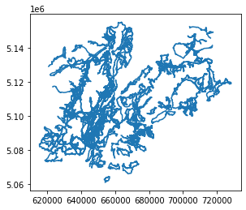

---

# **Retrieving data from spatial database infrastructures**

## goals of the tutorial
- geocoding / reverse geocoding
- OGC services
- ESRI ArcGIS RestAPI

**based on the open data of:**
- [national repertoire of territorial data](https://geodati.gov.it/geoportale/)
- [national cartographic portal](http://www.pcn.minambiente.it/mattm/)
- [geoportal of Trentino](http://www.territorio.provincia.tn.it/portal/server.pt/community/portale_geocartografico_trentino/254)
- [italian civil protection department](http://www.protezionecivile.gov.it/)

### requirements
- python knowledge
- geopandas
- gis concepts


**status**

*looking for data*

---

# Geocoding / reverse geocoding

## Setup


```python
try:
    import geopy
except ModuleNotFoundError as e:
    !pip install geopy==2.2.0
    import geopy
if geopy.__version__ != "2.2.0":
    !pip install -U geopy==2.2.0
    import geopy
```

    Looking in indexes: https://pypi.org/simple, https://us-python.pkg.dev/colab-wheels/public/simple/
    Requirement already satisfied: geopy==2.2.0 in /usr/local/lib/python3.7/dist-packages (2.2.0)
    Requirement already satisfied: geographiclib<2,>=1.49 in /usr/local/lib/python3.7/dist-packages (from geopy==2.2.0) (1.52)


```python
try:
  import mapclassify
except ModuleNotFoundError as e:
  !pip install mapclassify==2.4.3
  import mapclassify

if mapclassify.__version__ != "2.4.3":
  !pip install -U mapclassify==2.4.3
```


```python
try:
  import geopandas as gpd
except ModuleNotFoundError as e:
  !pip install geopandas==0.10.2
  import geopandas as gpd

if gpd.__version__ != "0.10.2":
  !pip install -U geopandas==0.10.2
  import geopandas as gpd
```


```python
import geopandas as gpd
from matplotlib import pyplot as plt
```

**GEOCODING service**


- the geopandas module is based on [geopy](https://geopy.readthedocs.io/en/stable/)
- all the goecoders service are available [here](https://geopy.readthedocs.io/en/stable/#module-geopy.geocoders)


**NOTE**

Attention to the Rate Limit in Pandas<br/>
more info [here](https://geopy.readthedocs.io/en/stable/#usage-with-pandas)

**choose the right service**
<br/><br/>


<br/><br/>
visit [getlon.lat](https://getlon.lat/)

## geocoding


```python
cols = ['city']
names = [('Roma'),('Palermo'),('Trento'),('Genova'),('Bari'),('Trieste'),('Napoli'),('Cagliari'),('Messina'),('Lecce')]
cities = gpd.GeoDataFrame(names,columns=cols)
```


```python
cities
```


  <div id="df-ee4f7be6-2b9e-4052-bd8f-d5be1983bb46">
    <div class="colab-df-container">
      <div>
<style scoped>
    .dataframe tbody tr th:only-of-type {
        vertical-align: middle;
    }

    .dataframe tbody tr th {
        vertical-align: top;
    }

    .dataframe thead th {
        text-align: right;
    }
</style>
<table border="1" class="dataframe">
  <thead>
    <tr style="text-align: right;">
      <th></th>
      <th>city</th>
    </tr>
  </thead>
  <tbody>
    <tr>
      <th>0</th>
      <td>Roma</td>
    </tr>
    <tr>
      <th>1</th>
      <td>Palermo</td>
    </tr>
    <tr>
      <th>2</th>
      <td>Trento</td>
    </tr>
    <tr>
      <th>3</th>
      <td>Genova</td>
    </tr>
    <tr>
      <th>4</th>
      <td>Bari</td>
    </tr>
    <tr>
      <th>5</th>
      <td>Trieste</td>
    </tr>
    <tr>
      <th>6</th>
      <td>Napoli</td>
    </tr>
    <tr>
      <th>7</th>
      <td>Cagliari</td>
    </tr>
    <tr>
      <th>8</th>
      <td>Messina</td>
    </tr>
    <tr>
      <th>9</th>
      <td>Lecce</td>
    </tr>
  </tbody>
</table>
</div>
      <button class="colab-df-convert" onclick="convertToInteractive('df-ee4f7be6-2b9e-4052-bd8f-d5be1983bb46')"
              title="Convert this dataframe to an interactive table."
              style="display:none;">

  <svg xmlns="http://www.w3.org/2000/svg" height="24px"viewBox="0 0 24 24"
       width="24px">
    <path d="M0 0h24v24H0V0z" fill="none"/>
    <path d="M18.56 5.44l.94 2.06.94-2.06 2.06-.94-2.06-.94-.94-2.06-.94 2.06-2.06.94zm-11 1L8.5 8.5l.94-2.06 2.06-.94-2.06-.94L8.5 2.5l-.94 2.06-2.06.94zm10 10l.94 2.06.94-2.06 2.06-.94-2.06-.94-.94-2.06-.94 2.06-2.06.94z"/><path d="M17.41 7.96l-1.37-1.37c-.4-.4-.92-.59-1.43-.59-.52 0-1.04.2-1.43.59L10.3 9.45l-7.72 7.72c-.78.78-.78 2.05 0 2.83L4 21.41c.39.39.9.59 1.41.59.51 0 1.02-.2 1.41-.59l7.78-7.78 2.81-2.81c.8-.78.8-2.07 0-2.86zM5.41 20L4 18.59l7.72-7.72 1.47 1.35L5.41 20z"/>
  </svg>
      </button>

  <style>
    .colab-df-container {
      display:flex;
      flex-wrap:wrap;
      gap: 12px;
    }

    .colab-df-convert {
      background-color: #E8F0FE;
      border: none;
      border-radius: 50%;
      cursor: pointer;
      display: none;
      fill: #1967D2;
      height: 32px;
      padding: 0 0 0 0;
      width: 32px;
    }

    .colab-df-convert:hover {
      background-color: #E2EBFA;
      box-shadow: 0px 1px 2px rgba(60, 64, 67, 0.3), 0px 1px 3px 1px rgba(60, 64, 67, 0.15);
      fill: #174EA6;
    }

    [theme=dark] .colab-df-convert {
      background-color: #3B4455;
      fill: #D2E3FC;
    }

    [theme=dark] .colab-df-convert:hover {
      background-color: #434B5C;
      box-shadow: 0px 1px 3px 1px rgba(0, 0, 0, 0.15);
      filter: drop-shadow(0px 1px 2px rgba(0, 0, 0, 0.3));
      fill: #FFFFFF;
    }
  </style>

      <script>
        const buttonEl =
          document.querySelector('#df-ee4f7be6-2b9e-4052-bd8f-d5be1983bb46 button.colab-df-convert');
        buttonEl.style.display =
          google.colab.kernel.accessAllowed ? 'block' : 'none';

        async function convertToInteractive(key) {
          const element = document.querySelector('#df-ee4f7be6-2b9e-4052-bd8f-d5be1983bb46');
          const dataTable =
            await google.colab.kernel.invokeFunction('convertToInteractive',
                                                     [key], {});
          if (!dataTable) return;

          const docLinkHtml = 'Like what you see? Visit the ' +
            '<a target="_blank" href=https://colab.research.google.com/notebooks/data_table.ipynb>data table notebook</a>'
            + ' to learn more about interactive tables.';
          element.innerHTML = '';
          dataTable['output_type'] = 'display_data';
          await google.colab.output.renderOutput(dataTable, element);
          const docLink = document.createElement('div');
          docLink.innerHTML = docLinkHtml;
          element.appendChild(docLink);
        }
      </script>
    </div>
  </div>


```python
geo_cities = gpd.tools.geocode(cities.city, provider="arcgis")
%time
```

    CPU times: user 2 µs, sys: 0 ns, total: 2 µs
    Wall time: 4.29 µs


```python
geo_cities
```


  <div id="df-15f44d45-8a50-4caa-9ab9-b19d576b0dbe">
    <div class="colab-df-container">
      <div>
<style scoped>
    .dataframe tbody tr th:only-of-type {
        vertical-align: middle;
    }

    .dataframe tbody tr th {
        vertical-align: top;
    }

    .dataframe thead th {
        text-align: right;
    }
</style>
<table border="1" class="dataframe">
  <thead>
    <tr style="text-align: right;">
      <th></th>
      <th>geometry</th>
      <th>address</th>
    </tr>
  </thead>
  <tbody>
    <tr>
      <th>0</th>
      <td>POINT (12.49565 41.90322)</td>
      <td>Roma</td>
    </tr>
    <tr>
      <th>1</th>
      <td>POINT (13.36112 38.12207)</td>
      <td>Palermo</td>
    </tr>
    <tr>
      <th>2</th>
      <td>POINT (11.11929 46.07005)</td>
      <td>Trento</td>
    </tr>
    <tr>
      <th>3</th>
      <td>POINT (8.93917 44.41048)</td>
      <td>Genova</td>
    </tr>
    <tr>
      <th>4</th>
      <td>POINT (16.86666 41.12587)</td>
      <td>Bari</td>
    </tr>
    <tr>
      <th>5</th>
      <td>POINT (13.77269 45.65757)</td>
      <td>Trieste</td>
    </tr>
    <tr>
      <th>6</th>
      <td>POINT (14.25226 40.84014)</td>
      <td>Napoli</td>
    </tr>
    <tr>
      <th>7</th>
      <td>POINT (9.11049 39.21454)</td>
      <td>Cagliari</td>
    </tr>
    <tr>
      <th>8</th>
      <td>POINT (15.55309 38.17839)</td>
      <td>Messina</td>
    </tr>
    <tr>
      <th>9</th>
      <td>POINT (18.16802 40.35796)</td>
      <td>Lecce</td>
    </tr>
  </tbody>
</table>
</div>
      <button class="colab-df-convert" onclick="convertToInteractive('df-15f44d45-8a50-4caa-9ab9-b19d576b0dbe')"
              title="Convert this dataframe to an interactive table."
              style="display:none;">

  <svg xmlns="http://www.w3.org/2000/svg" height="24px"viewBox="0 0 24 24"
       width="24px">
    <path d="M0 0h24v24H0V0z" fill="none"/>
    <path d="M18.56 5.44l.94 2.06.94-2.06 2.06-.94-2.06-.94-.94-2.06-.94 2.06-2.06.94zm-11 1L8.5 8.5l.94-2.06 2.06-.94-2.06-.94L8.5 2.5l-.94 2.06-2.06.94zm10 10l.94 2.06.94-2.06 2.06-.94-2.06-.94-.94-2.06-.94 2.06-2.06.94z"/><path d="M17.41 7.96l-1.37-1.37c-.4-.4-.92-.59-1.43-.59-.52 0-1.04.2-1.43.59L10.3 9.45l-7.72 7.72c-.78.78-.78 2.05 0 2.83L4 21.41c.39.39.9.59 1.41.59.51 0 1.02-.2 1.41-.59l7.78-7.78 2.81-2.81c.8-.78.8-2.07 0-2.86zM5.41 20L4 18.59l7.72-7.72 1.47 1.35L5.41 20z"/>
  </svg>
      </button>

  <style>
    .colab-df-container {
      display:flex;
      flex-wrap:wrap;
      gap: 12px;
    }

    .colab-df-convert {
      background-color: #E8F0FE;
      border: none;
      border-radius: 50%;
      cursor: pointer;
      display: none;
      fill: #1967D2;
      height: 32px;
      padding: 0 0 0 0;
      width: 32px;
    }

    .colab-df-convert:hover {
      background-color: #E2EBFA;
      box-shadow: 0px 1px 2px rgba(60, 64, 67, 0.3), 0px 1px 3px 1px rgba(60, 64, 67, 0.15);
      fill: #174EA6;
    }

    [theme=dark] .colab-df-convert {
      background-color: #3B4455;
      fill: #D2E3FC;
    }

    [theme=dark] .colab-df-convert:hover {
      background-color: #434B5C;
      box-shadow: 0px 1px 3px 1px rgba(0, 0, 0, 0.15);
      filter: drop-shadow(0px 1px 2px rgba(0, 0, 0, 0.3));
      fill: #FFFFFF;
    }
  </style>

      <script>
        const buttonEl =
          document.querySelector('#df-15f44d45-8a50-4caa-9ab9-b19d576b0dbe button.colab-df-convert');
        buttonEl.style.display =
          google.colab.kernel.accessAllowed ? 'block' : 'none';

        async function convertToInteractive(key) {
          const element = document.querySelector('#df-15f44d45-8a50-4caa-9ab9-b19d576b0dbe');
          const dataTable =
            await google.colab.kernel.invokeFunction('convertToInteractive',
                                                     [key], {});
          if (!dataTable) return;

          const docLinkHtml = 'Like what you see? Visit the ' +
            '<a target="_blank" href=https://colab.research.google.com/notebooks/data_table.ipynb>data table notebook</a>'
            + ' to learn more about interactive tables.';
          element.innerHTML = '';
          dataTable['output_type'] = 'display_data';
          await google.colab.output.renderOutput(dataTable, element);
          const docLink = document.createElement('div');
          docLink.innerHTML = docLinkHtml;
          element.appendChild(docLink);
        }
      </script>
    </div>
  </div>


```python
geo_cities.plot()
plt.show()
```


    

    


## reverse geocoding


```python
from geopy.geocoders import Nominatim
```


```python
geo_cities
```


  <div id="df-812c2003-2037-4928-9a31-586aae5b31d4">
    <div class="colab-df-container">
      <div>
<style scoped>
    .dataframe tbody tr th:only-of-type {
        vertical-align: middle;
    }

    .dataframe tbody tr th {
        vertical-align: top;
    }

    .dataframe thead th {
        text-align: right;
    }
</style>
<table border="1" class="dataframe">
  <thead>
    <tr style="text-align: right;">
      <th></th>
      <th>geometry</th>
      <th>address</th>
    </tr>
  </thead>
  <tbody>
    <tr>
      <th>0</th>
      <td>POINT (12.49565 41.90322)</td>
      <td>Roma</td>
    </tr>
    <tr>
      <th>1</th>
      <td>POINT (13.36112 38.12207)</td>
      <td>Palermo</td>
    </tr>
    <tr>
      <th>2</th>
      <td>POINT (11.11929 46.07005)</td>
      <td>Trento</td>
    </tr>
    <tr>
      <th>3</th>
      <td>POINT (8.93917 44.41048)</td>
      <td>Genova</td>
    </tr>
    <tr>
      <th>4</th>
      <td>POINT (16.86666 41.12587)</td>
      <td>Bari</td>
    </tr>
    <tr>
      <th>5</th>
      <td>POINT (13.77269 45.65757)</td>
      <td>Trieste</td>
    </tr>
    <tr>
      <th>6</th>
      <td>POINT (14.25226 40.84014)</td>
      <td>Napoli</td>
    </tr>
    <tr>
      <th>7</th>
      <td>POINT (9.11049 39.21454)</td>
      <td>Cagliari</td>
    </tr>
    <tr>
      <th>8</th>
      <td>POINT (15.55309 38.17839)</td>
      <td>Messina</td>
    </tr>
    <tr>
      <th>9</th>
      <td>POINT (18.16802 40.35796)</td>
      <td>Lecce</td>
    </tr>
  </tbody>
</table>
</div>
      <button class="colab-df-convert" onclick="convertToInteractive('df-812c2003-2037-4928-9a31-586aae5b31d4')"
              title="Convert this dataframe to an interactive table."
              style="display:none;">

  <svg xmlns="http://www.w3.org/2000/svg" height="24px"viewBox="0 0 24 24"
       width="24px">
    <path d="M0 0h24v24H0V0z" fill="none"/>
    <path d="M18.56 5.44l.94 2.06.94-2.06 2.06-.94-2.06-.94-.94-2.06-.94 2.06-2.06.94zm-11 1L8.5 8.5l.94-2.06 2.06-.94-2.06-.94L8.5 2.5l-.94 2.06-2.06.94zm10 10l.94 2.06.94-2.06 2.06-.94-2.06-.94-.94-2.06-.94 2.06-2.06.94z"/><path d="M17.41 7.96l-1.37-1.37c-.4-.4-.92-.59-1.43-.59-.52 0-1.04.2-1.43.59L10.3 9.45l-7.72 7.72c-.78.78-.78 2.05 0 2.83L4 21.41c.39.39.9.59 1.41.59.51 0 1.02-.2 1.41-.59l7.78-7.78 2.81-2.81c.8-.78.8-2.07 0-2.86zM5.41 20L4 18.59l7.72-7.72 1.47 1.35L5.41 20z"/>
  </svg>
      </button>

  <style>
    .colab-df-container {
      display:flex;
      flex-wrap:wrap;
      gap: 12px;
    }

    .colab-df-convert {
      background-color: #E8F0FE;
      border: none;
      border-radius: 50%;
      cursor: pointer;
      display: none;
      fill: #1967D2;
      height: 32px;
      padding: 0 0 0 0;
      width: 32px;
    }

    .colab-df-convert:hover {
      background-color: #E2EBFA;
      box-shadow: 0px 1px 2px rgba(60, 64, 67, 0.3), 0px 1px 3px 1px rgba(60, 64, 67, 0.15);
      fill: #174EA6;
    }

    [theme=dark] .colab-df-convert {
      background-color: #3B4455;
      fill: #D2E3FC;
    }

    [theme=dark] .colab-df-convert:hover {
      background-color: #434B5C;
      box-shadow: 0px 1px 3px 1px rgba(0, 0, 0, 0.15);
      filter: drop-shadow(0px 1px 2px rgba(0, 0, 0, 0.3));
      fill: #FFFFFF;
    }
  </style>

      <script>
        const buttonEl =
          document.querySelector('#df-812c2003-2037-4928-9a31-586aae5b31d4 button.colab-df-convert');
        buttonEl.style.display =
          google.colab.kernel.accessAllowed ? 'block' : 'none';

        async function convertToInteractive(key) {
          const element = document.querySelector('#df-812c2003-2037-4928-9a31-586aae5b31d4');
          const dataTable =
            await google.colab.kernel.invokeFunction('convertToInteractive',
                                                     [key], {});
          if (!dataTable) return;

          const docLinkHtml = 'Like what you see? Visit the ' +
            '<a target="_blank" href=https://colab.research.google.com/notebooks/data_table.ipynb>data table notebook</a>'
            + ' to learn more about interactive tables.';
          element.innerHTML = '';
          dataTable['output_type'] = 'display_data';
          await google.colab.output.renderOutput(dataTable, element);
          const docLink = document.createElement('div');
          docLink.innerHTML = docLinkHtml;
          element.appendChild(docLink);
        }
      </script>
    </div>
  </div>


```python
point = geo_cities.geometry[2]
```


```python
point.wkt
```


    'POINT (11.119290000000035 46.07005000000004)'


```python
type(point.x)
```


    float


```python
latlon = str(point.y) + "," + str(point.x)
```


```python
geolocator = Nominatim(user_agent="Example for the course")
```

.. but better if use a user agent like

*Mozilla/5.0 (Linux; Android 10) AppleWebKit/537.36 (KHTML, like Gecko) Chrome/86.0.4240.75 Mobile Safari/537.36*

Eg

*geolocator = Nominatim(user_agent="Mozilla/5.0 (Linux; Android10) AppleWebKit/537.36 (KHTML, like Gecko) Chrome/86.0.4240.75 Mobile Safari/537.36")*


```python
location = geolocator.reverse(latlon)
%time
```

    CPU times: user 2 µs, sys: 0 ns, total: 2 µs
    Wall time: 4.53 µs


the raw method contains all the data available from the geocoder


```python
location.raw
```


    {'place_id': 122464139,
     'licence': 'Data © OpenStreetMap contributors, ODbL 1.0. https://osm.org/copyright',
     'osm_type': 'way',
     'osm_id': 73293763,
     'lat': '46.070178',
     'lon': '11.119240793834841',
     'display_name': "Giovane Europa, 15, Via Torre Vanga, Bolghera, Piedicastello, Vela, Trento, Territorio Val d'Adige, Provincia di Trento, Trentino-Alto Adige/Südtirol, 38122, Italia",
     'address': {'tourism': 'Giovane Europa',
      'house_number': '15',
      'road': 'Via Torre Vanga',
      'suburb': 'Piedicastello',
      'village': 'Vela',
      'city': 'Trento',
      'municipality': "Territorio Val d'Adige",
      'county': 'Provincia di Trento',
      'ISO3166-2-lvl6': 'IT-TN',
      'state': 'Trentino-Alto Adige/Südtirol',
      'ISO3166-2-lvl4': 'IT-32',
      'postcode': '38122',
      'country': 'Italia',
      'country_code': 'it'},
     'boundingbox': ['46.0700951', '46.0703188', '11.119026', '11.1194422']}


## suggestion for a good geocoding
more details you add and more fortune you have to obtain a good result


```python
q="Via Verdi, 26"
```


```python
point = gpd.tools.geocode(q, provider="arcgis")
```


```python
point
```


  <div id="df-f21b0565-5697-49e1-8c66-ea76eb0cea66">
    <div class="colab-df-container">
      <div>
<style scoped>
    .dataframe tbody tr th:only-of-type {
        vertical-align: middle;
    }

    .dataframe tbody tr th {
        vertical-align: top;
    }

    .dataframe thead th {
        text-align: right;
    }
</style>
<table border="1" class="dataframe">
  <thead>
    <tr style="text-align: right;">
      <th></th>
      <th>geometry</th>
      <th>address</th>
    </tr>
  </thead>
  <tbody>
    <tr>
      <th>0</th>
      <td>POINT (-38.96013 -12.25482)</td>
      <td>Via Verde</td>
    </tr>
  </tbody>
</table>
</div>
      <button class="colab-df-convert" onclick="convertToInteractive('df-f21b0565-5697-49e1-8c66-ea76eb0cea66')"
              title="Convert this dataframe to an interactive table."
              style="display:none;">

  <svg xmlns="http://www.w3.org/2000/svg" height="24px"viewBox="0 0 24 24"
       width="24px">
    <path d="M0 0h24v24H0V0z" fill="none"/>
    <path d="M18.56 5.44l.94 2.06.94-2.06 2.06-.94-2.06-.94-.94-2.06-.94 2.06-2.06.94zm-11 1L8.5 8.5l.94-2.06 2.06-.94-2.06-.94L8.5 2.5l-.94 2.06-2.06.94zm10 10l.94 2.06.94-2.06 2.06-.94-2.06-.94-.94-2.06-.94 2.06-2.06.94z"/><path d="M17.41 7.96l-1.37-1.37c-.4-.4-.92-.59-1.43-.59-.52 0-1.04.2-1.43.59L10.3 9.45l-7.72 7.72c-.78.78-.78 2.05 0 2.83L4 21.41c.39.39.9.59 1.41.59.51 0 1.02-.2 1.41-.59l7.78-7.78 2.81-2.81c.8-.78.8-2.07 0-2.86zM5.41 20L4 18.59l7.72-7.72 1.47 1.35L5.41 20z"/>
  </svg>
      </button>

  <style>
    .colab-df-container {
      display:flex;
      flex-wrap:wrap;
      gap: 12px;
    }

    .colab-df-convert {
      background-color: #E8F0FE;
      border: none;
      border-radius: 50%;
      cursor: pointer;
      display: none;
      fill: #1967D2;
      height: 32px;
      padding: 0 0 0 0;
      width: 32px;
    }

    .colab-df-convert:hover {
      background-color: #E2EBFA;
      box-shadow: 0px 1px 2px rgba(60, 64, 67, 0.3), 0px 1px 3px 1px rgba(60, 64, 67, 0.15);
      fill: #174EA6;
    }

    [theme=dark] .colab-df-convert {
      background-color: #3B4455;
      fill: #D2E3FC;
    }

    [theme=dark] .colab-df-convert:hover {
      background-color: #434B5C;
      box-shadow: 0px 1px 3px 1px rgba(0, 0, 0, 0.15);
      filter: drop-shadow(0px 1px 2px rgba(0, 0, 0, 0.3));
      fill: #FFFFFF;
    }
  </style>

      <script>
        const buttonEl =
          document.querySelector('#df-f21b0565-5697-49e1-8c66-ea76eb0cea66 button.colab-df-convert');
        buttonEl.style.display =
          google.colab.kernel.accessAllowed ? 'block' : 'none';

        async function convertToInteractive(key) {
          const element = document.querySelector('#df-f21b0565-5697-49e1-8c66-ea76eb0cea66');
          const dataTable =
            await google.colab.kernel.invokeFunction('convertToInteractive',
                                                     [key], {});
          if (!dataTable) return;

          const docLinkHtml = 'Like what you see? Visit the ' +
            '<a target="_blank" href=https://colab.research.google.com/notebooks/data_table.ipynb>data table notebook</a>'
            + ' to learn more about interactive tables.';
          element.innerHTML = '';
          dataTable['output_type'] = 'display_data';
          await google.colab.output.renderOutput(dataTable, element);
          const docLink = document.createElement('div');
          docLink.innerHTML = docLinkHtml;
          element.appendChild(docLink);
        }
      </script>
    </div>
  </div>


```python
point.explore(marker_kwds={"color": "green", "radius": "10"})
```


<div style="width:100%;"><div style="position:relative;width:100%;height:0;padding-bottom:60%;"><span style="color:#565656">Make this Notebook Trusted to load map: File -> Trust Notebook</span><iframe srcdoc="&lt;!DOCTYPE html&gt;
&lt;head&gt;    
    &lt;meta http-equiv=&quot;content-type&quot; content=&quot;text/html; charset=UTF-8&quot; /&gt;

        &lt;script&gt;
            L_NO_TOUCH = false;
            L_DISABLE_3D = false;
        &lt;/script&gt;

    &lt;style&gt;html, body {width: 100%;height: 100%;margin: 0;padding: 0;}&lt;/style&gt;
    &lt;style&gt;#map {position:absolute;top:0;bottom:0;right:0;left:0;}&lt;/style&gt;
    &lt;script src=&quot;https://cdn.jsdelivr.net/npm/leaflet@1.6.0/dist/leaflet.js&quot;&gt;&lt;/script&gt;
    &lt;script src=&quot;https://code.jquery.com/jquery-1.12.4.min.js&quot;&gt;&lt;/script&gt;
    &lt;script src=&quot;https://maxcdn.bootstrapcdn.com/bootstrap/3.2.0/js/bootstrap.min.js&quot;&gt;&lt;/script&gt;
    &lt;script src=&quot;https://cdnjs.cloudflare.com/ajax/libs/Leaflet.awesome-markers/2.0.2/leaflet.awesome-markers.js&quot;&gt;&lt;/script&gt;
    &lt;link rel=&quot;stylesheet&quot; href=&quot;https://cdn.jsdelivr.net/npm/leaflet@1.6.0/dist/leaflet.css&quot;/&gt;
    &lt;link rel=&quot;stylesheet&quot; href=&quot;https://maxcdn.bootstrapcdn.com/bootstrap/3.2.0/css/bootstrap.min.css&quot;/&gt;
    &lt;link rel=&quot;stylesheet&quot; href=&quot;https://maxcdn.bootstrapcdn.com/bootstrap/3.2.0/css/bootstrap-theme.min.css&quot;/&gt;
    &lt;link rel=&quot;stylesheet&quot; href=&quot;https://maxcdn.bootstrapcdn.com/font-awesome/4.6.3/css/font-awesome.min.css&quot;/&gt;
    &lt;link rel=&quot;stylesheet&quot; href=&quot;https://cdnjs.cloudflare.com/ajax/libs/Leaflet.awesome-markers/2.0.2/leaflet.awesome-markers.css&quot;/&gt;
    &lt;link rel=&quot;stylesheet&quot; href=&quot;https://cdn.jsdelivr.net/gh/python-visualization/folium/folium/templates/leaflet.awesome.rotate.min.css&quot;/&gt;

            &lt;meta name=&quot;viewport&quot; content=&quot;width=device-width,
                initial-scale=1.0, maximum-scale=1.0, user-scalable=no&quot; /&gt;
            &lt;style&gt;
                #map_a72b66826cdb5d3d1dcee9097c314f0e {
                    position: relative;
                    width: 100.0%;
                    height: 100.0%;
                    left: 0.0%;
                    top: 0.0%;
                }
            &lt;/style&gt;


                    &lt;style&gt;
                        .foliumtooltip {

                        }
                       .foliumtooltip table{
                            margin: auto;
                        }
                        .foliumtooltip tr{
                            text-align: left;
                        }
                        .foliumtooltip th{
                            padding: 2px; padding-right: 8px;
                        }
                    &lt;/style&gt;

&lt;/head&gt;
&lt;body&gt;    

            &lt;div class=&quot;folium-map&quot; id=&quot;map_a72b66826cdb5d3d1dcee9097c314f0e&quot; &gt;&lt;/div&gt;

&lt;/body&gt;
&lt;script&gt;    

            var map_a72b66826cdb5d3d1dcee9097c314f0e = L.map(
                &quot;map_a72b66826cdb5d3d1dcee9097c314f0e&quot;,
                {
                    center: [-12.254819999999938, -38.960129999999936],
                    crs: L.CRS.EPSG3857,
                    zoom: 10,
                    zoomControl: true,
                    preferCanvas: false,
                }
            );
            L.control.scale().addTo(map_a72b66826cdb5d3d1dcee9097c314f0e);


            var tile_layer_87b995edde51faea009c0c885bd49fd0 = L.tileLayer(
                &quot;https://{s}.tile.openstreetmap.org/{z}/{x}/{y}.png&quot;,
                {&quot;attribution&quot;: &quot;Data by \u0026copy; \u003ca href=\&quot;http://openstreetmap.org\&quot;\u003eOpenStreetMap\u003c/a\u003e, under \u003ca href=\&quot;http://www.openstreetmap.org/copyright\&quot;\u003eODbL\u003c/a\u003e.&quot;, &quot;detectRetina&quot;: false, &quot;maxNativeZoom&quot;: 18, &quot;maxZoom&quot;: 18, &quot;minZoom&quot;: 0, &quot;noWrap&quot;: false, &quot;opacity&quot;: 1, &quot;subdomains&quot;: &quot;abc&quot;, &quot;tms&quot;: false}
            ).addTo(map_a72b66826cdb5d3d1dcee9097c314f0e);


            map_a72b66826cdb5d3d1dcee9097c314f0e.fitBounds(
                [[-12.254819999999938, -38.960129999999936], [-12.254819999999938, -38.960129999999936]],
                {}
            );


        function geo_json_ac12aa4194ab8ebdaa537c1fbec58de3_styler(feature) {
            switch(feature.id) {
                default:
                    return {&quot;fillOpacity&quot;: 0.5, &quot;weight&quot;: 2};
            }
        }
        function geo_json_ac12aa4194ab8ebdaa537c1fbec58de3_highlighter(feature) {
            switch(feature.id) {
                default:
                    return {&quot;fillOpacity&quot;: 0.75};
            }
        }
        function geo_json_ac12aa4194ab8ebdaa537c1fbec58de3_pointToLayer(feature, latlng) {
            var opts = {&quot;bubblingMouseEvents&quot;: true, &quot;color&quot;: &quot;green&quot;, &quot;dashArray&quot;: null, &quot;dashOffset&quot;: null, &quot;fill&quot;: true, &quot;fillColor&quot;: &quot;green&quot;, &quot;fillOpacity&quot;: 0.2, &quot;fillRule&quot;: &quot;evenodd&quot;, &quot;lineCap&quot;: &quot;round&quot;, &quot;lineJoin&quot;: &quot;round&quot;, &quot;opacity&quot;: 1.0, &quot;radius&quot;: &quot;10&quot;, &quot;stroke&quot;: true, &quot;weight&quot;: 3};

            let style = geo_json_ac12aa4194ab8ebdaa537c1fbec58de3_styler(feature)
            Object.assign(opts, style)

            return new L.CircleMarker(latlng, opts)
        }

        function geo_json_ac12aa4194ab8ebdaa537c1fbec58de3_onEachFeature(feature, layer) {
            layer.on({
                mouseout: function(e) {
                    if(typeof e.target.setStyle === &quot;function&quot;){
                        geo_json_ac12aa4194ab8ebdaa537c1fbec58de3.resetStyle(e.target);
                    }
                },
                mouseover: function(e) {
                    if(typeof e.target.setStyle === &quot;function&quot;){
                        const highlightStyle = geo_json_ac12aa4194ab8ebdaa537c1fbec58de3_highlighter(e.target.feature)
                        e.target.setStyle(highlightStyle);
                    }
                },
            });
        };
        var geo_json_ac12aa4194ab8ebdaa537c1fbec58de3 = L.geoJson(null, {
                onEachFeature: geo_json_ac12aa4194ab8ebdaa537c1fbec58de3_onEachFeature,

                style: geo_json_ac12aa4194ab8ebdaa537c1fbec58de3_styler,
                pointToLayer: geo_json_ac12aa4194ab8ebdaa537c1fbec58de3_pointToLayer
        });

        function geo_json_ac12aa4194ab8ebdaa537c1fbec58de3_add (data) {
            geo_json_ac12aa4194ab8ebdaa537c1fbec58de3
                .addData(data)
                .addTo(map_a72b66826cdb5d3d1dcee9097c314f0e);
        }
            geo_json_ac12aa4194ab8ebdaa537c1fbec58de3_add({&quot;bbox&quot;: [-38.960129999999936, -12.254819999999938, -38.960129999999936, -12.254819999999938], &quot;features&quot;: [{&quot;bbox&quot;: [-38.960129999999936, -12.254819999999938, -38.960129999999936, -12.254819999999938], &quot;geometry&quot;: {&quot;coordinates&quot;: [-38.960129999999936, -12.254819999999938], &quot;type&quot;: &quot;Point&quot;}, &quot;id&quot;: &quot;0&quot;, &quot;properties&quot;: {&quot;address&quot;: &quot;Via Verde&quot;}, &quot;type&quot;: &quot;Feature&quot;}], &quot;type&quot;: &quot;FeatureCollection&quot;});


    geo_json_ac12aa4194ab8ebdaa537c1fbec58de3.bindTooltip(
    function(layer){
    let div = L.DomUtil.create(&#x27;div&#x27;);

    let handleObject = feature=&gt;typeof(feature)==&#x27;object&#x27; ? JSON.stringify(feature) : feature;
    let fields = [&quot;address&quot;];
    let aliases = [&quot;address&quot;];
    let table = &#x27;&lt;table&gt;&#x27; +
        String(
        fields.map(
        (v,i)=&gt;
        `&lt;tr&gt;
            &lt;th&gt;${aliases[i]}&lt;/th&gt;

            &lt;td&gt;${handleObject(layer.feature.properties[v])}&lt;/td&gt;
        &lt;/tr&gt;`).join(&#x27;&#x27;))
    +&#x27;&lt;/table&gt;&#x27;;
    div.innerHTML=table;

    return div
    }
    ,{&quot;className&quot;: &quot;foliumtooltip&quot;, &quot;sticky&quot;: true});

&lt;/script&gt;" style="position:absolute;width:100%;height:100%;left:0;top:0;border:none !important;" allowfullscreen webkitallowfullscreen mozallowfullscreen></iframe></div></div>


add details like city and State


```python
q="Via Giuseppe Verdi, 26,  Trento, Italia"
```


```python
point = gpd.tools.geocode(q, provider="arcgis") 
```


```python
point
```


  <div id="df-ee0e03d6-446f-4e71-ac7a-3a2437d5bc59">
    <div class="colab-df-container">
      <div>
<style scoped>
    .dataframe tbody tr th:only-of-type {
        vertical-align: middle;
    }

    .dataframe tbody tr th {
        vertical-align: top;
    }

    .dataframe thead th {
        text-align: right;
    }
</style>
<table border="1" class="dataframe">
  <thead>
    <tr style="text-align: right;">
      <th></th>
      <th>geometry</th>
      <th>address</th>
    </tr>
  </thead>
  <tbody>
    <tr>
      <th>0</th>
      <td>POINT (11.11966 46.06665)</td>
      <td>Via Giuseppe Verdi 26, 38122, Trento</td>
    </tr>
  </tbody>
</table>
</div>
      <button class="colab-df-convert" onclick="convertToInteractive('df-ee0e03d6-446f-4e71-ac7a-3a2437d5bc59')"
              title="Convert this dataframe to an interactive table."
              style="display:none;">

  <svg xmlns="http://www.w3.org/2000/svg" height="24px"viewBox="0 0 24 24"
       width="24px">
    <path d="M0 0h24v24H0V0z" fill="none"/>
    <path d="M18.56 5.44l.94 2.06.94-2.06 2.06-.94-2.06-.94-.94-2.06-.94 2.06-2.06.94zm-11 1L8.5 8.5l.94-2.06 2.06-.94-2.06-.94L8.5 2.5l-.94 2.06-2.06.94zm10 10l.94 2.06.94-2.06 2.06-.94-2.06-.94-.94-2.06-.94 2.06-2.06.94z"/><path d="M17.41 7.96l-1.37-1.37c-.4-.4-.92-.59-1.43-.59-.52 0-1.04.2-1.43.59L10.3 9.45l-7.72 7.72c-.78.78-.78 2.05 0 2.83L4 21.41c.39.39.9.59 1.41.59.51 0 1.02-.2 1.41-.59l7.78-7.78 2.81-2.81c.8-.78.8-2.07 0-2.86zM5.41 20L4 18.59l7.72-7.72 1.47 1.35L5.41 20z"/>
  </svg>
      </button>

  <style>
    .colab-df-container {
      display:flex;
      flex-wrap:wrap;
      gap: 12px;
    }

    .colab-df-convert {
      background-color: #E8F0FE;
      border: none;
      border-radius: 50%;
      cursor: pointer;
      display: none;
      fill: #1967D2;
      height: 32px;
      padding: 0 0 0 0;
      width: 32px;
    }

    .colab-df-convert:hover {
      background-color: #E2EBFA;
      box-shadow: 0px 1px 2px rgba(60, 64, 67, 0.3), 0px 1px 3px 1px rgba(60, 64, 67, 0.15);
      fill: #174EA6;
    }

    [theme=dark] .colab-df-convert {
      background-color: #3B4455;
      fill: #D2E3FC;
    }

    [theme=dark] .colab-df-convert:hover {
      background-color: #434B5C;
      box-shadow: 0px 1px 3px 1px rgba(0, 0, 0, 0.15);
      filter: drop-shadow(0px 1px 2px rgba(0, 0, 0, 0.3));
      fill: #FFFFFF;
    }
  </style>

      <script>
        const buttonEl =
          document.querySelector('#df-ee0e03d6-446f-4e71-ac7a-3a2437d5bc59 button.colab-df-convert');
        buttonEl.style.display =
          google.colab.kernel.accessAllowed ? 'block' : 'none';

        async function convertToInteractive(key) {
          const element = document.querySelector('#df-ee0e03d6-446f-4e71-ac7a-3a2437d5bc59');
          const dataTable =
            await google.colab.kernel.invokeFunction('convertToInteractive',
                                                     [key], {});
          if (!dataTable) return;

          const docLinkHtml = 'Like what you see? Visit the ' +
            '<a target="_blank" href=https://colab.research.google.com/notebooks/data_table.ipynb>data table notebook</a>'
            + ' to learn more about interactive tables.';
          element.innerHTML = '';
          dataTable['output_type'] = 'display_data';
          await google.colab.output.renderOutput(dataTable, element);
          const docLink = document.createElement('div');
          docLink.innerHTML = docLinkHtml;
          element.appendChild(docLink);
        }
      </script>
    </div>
  </div>


```python
point.explore(marker_kwds={"color": "green", "radius": "10"})
```


<div style="width:100%;"><div style="position:relative;width:100%;height:0;padding-bottom:60%;"><span style="color:#565656">Make this Notebook Trusted to load map: File -> Trust Notebook</span><iframe srcdoc="&lt;!DOCTYPE html&gt;
&lt;head&gt;    
    &lt;meta http-equiv=&quot;content-type&quot; content=&quot;text/html; charset=UTF-8&quot; /&gt;

        &lt;script&gt;
            L_NO_TOUCH = false;
            L_DISABLE_3D = false;
        &lt;/script&gt;

    &lt;style&gt;html, body {width: 100%;height: 100%;margin: 0;padding: 0;}&lt;/style&gt;
    &lt;style&gt;#map {position:absolute;top:0;bottom:0;right:0;left:0;}&lt;/style&gt;
    &lt;script src=&quot;https://cdn.jsdelivr.net/npm/leaflet@1.6.0/dist/leaflet.js&quot;&gt;&lt;/script&gt;
    &lt;script src=&quot;https://code.jquery.com/jquery-1.12.4.min.js&quot;&gt;&lt;/script&gt;
    &lt;script src=&quot;https://maxcdn.bootstrapcdn.com/bootstrap/3.2.0/js/bootstrap.min.js&quot;&gt;&lt;/script&gt;
    &lt;script src=&quot;https://cdnjs.cloudflare.com/ajax/libs/Leaflet.awesome-markers/2.0.2/leaflet.awesome-markers.js&quot;&gt;&lt;/script&gt;
    &lt;link rel=&quot;stylesheet&quot; href=&quot;https://cdn.jsdelivr.net/npm/leaflet@1.6.0/dist/leaflet.css&quot;/&gt;
    &lt;link rel=&quot;stylesheet&quot; href=&quot;https://maxcdn.bootstrapcdn.com/bootstrap/3.2.0/css/bootstrap.min.css&quot;/&gt;
    &lt;link rel=&quot;stylesheet&quot; href=&quot;https://maxcdn.bootstrapcdn.com/bootstrap/3.2.0/css/bootstrap-theme.min.css&quot;/&gt;
    &lt;link rel=&quot;stylesheet&quot; href=&quot;https://maxcdn.bootstrapcdn.com/font-awesome/4.6.3/css/font-awesome.min.css&quot;/&gt;
    &lt;link rel=&quot;stylesheet&quot; href=&quot;https://cdnjs.cloudflare.com/ajax/libs/Leaflet.awesome-markers/2.0.2/leaflet.awesome-markers.css&quot;/&gt;
    &lt;link rel=&quot;stylesheet&quot; href=&quot;https://cdn.jsdelivr.net/gh/python-visualization/folium/folium/templates/leaflet.awesome.rotate.min.css&quot;/&gt;

            &lt;meta name=&quot;viewport&quot; content=&quot;width=device-width,
                initial-scale=1.0, maximum-scale=1.0, user-scalable=no&quot; /&gt;
            &lt;style&gt;
                #map_3c58b063ff5d13f5766d82480aee137b {
                    position: relative;
                    width: 100.0%;
                    height: 100.0%;
                    left: 0.0%;
                    top: 0.0%;
                }
            &lt;/style&gt;


                    &lt;style&gt;
                        .foliumtooltip {

                        }
                       .foliumtooltip table{
                            margin: auto;
                        }
                        .foliumtooltip tr{
                            text-align: left;
                        }
                        .foliumtooltip th{
                            padding: 2px; padding-right: 8px;
                        }
                    &lt;/style&gt;

&lt;/head&gt;
&lt;body&gt;    

            &lt;div class=&quot;folium-map&quot; id=&quot;map_3c58b063ff5d13f5766d82480aee137b&quot; &gt;&lt;/div&gt;

&lt;/body&gt;
&lt;script&gt;    

            var map_3c58b063ff5d13f5766d82480aee137b = L.map(
                &quot;map_3c58b063ff5d13f5766d82480aee137b&quot;,
                {
                    center: [46.06665000601981, 11.119659985937034],
                    crs: L.CRS.EPSG3857,
                    zoom: 10,
                    zoomControl: true,
                    preferCanvas: false,
                }
            );
            L.control.scale().addTo(map_3c58b063ff5d13f5766d82480aee137b);


            var tile_layer_047a1496bb4411ebb199e18536a51c35 = L.tileLayer(
                &quot;https://{s}.tile.openstreetmap.org/{z}/{x}/{y}.png&quot;,
                {&quot;attribution&quot;: &quot;Data by \u0026copy; \u003ca href=\&quot;http://openstreetmap.org\&quot;\u003eOpenStreetMap\u003c/a\u003e, under \u003ca href=\&quot;http://www.openstreetmap.org/copyright\&quot;\u003eODbL\u003c/a\u003e.&quot;, &quot;detectRetina&quot;: false, &quot;maxNativeZoom&quot;: 18, &quot;maxZoom&quot;: 18, &quot;minZoom&quot;: 0, &quot;noWrap&quot;: false, &quot;opacity&quot;: 1, &quot;subdomains&quot;: &quot;abc&quot;, &quot;tms&quot;: false}
            ).addTo(map_3c58b063ff5d13f5766d82480aee137b);


            map_3c58b063ff5d13f5766d82480aee137b.fitBounds(
                [[46.06665000601981, 11.119659985937034], [46.06665000601981, 11.119659985937034]],
                {}
            );


        function geo_json_a57be3de2d1dbe6068b3d010b0bb5932_styler(feature) {
            switch(feature.id) {
                default:
                    return {&quot;fillOpacity&quot;: 0.5, &quot;weight&quot;: 2};
            }
        }
        function geo_json_a57be3de2d1dbe6068b3d010b0bb5932_highlighter(feature) {
            switch(feature.id) {
                default:
                    return {&quot;fillOpacity&quot;: 0.75};
            }
        }
        function geo_json_a57be3de2d1dbe6068b3d010b0bb5932_pointToLayer(feature, latlng) {
            var opts = {&quot;bubblingMouseEvents&quot;: true, &quot;color&quot;: &quot;green&quot;, &quot;dashArray&quot;: null, &quot;dashOffset&quot;: null, &quot;fill&quot;: true, &quot;fillColor&quot;: &quot;green&quot;, &quot;fillOpacity&quot;: 0.2, &quot;fillRule&quot;: &quot;evenodd&quot;, &quot;lineCap&quot;: &quot;round&quot;, &quot;lineJoin&quot;: &quot;round&quot;, &quot;opacity&quot;: 1.0, &quot;radius&quot;: &quot;10&quot;, &quot;stroke&quot;: true, &quot;weight&quot;: 3};

            let style = geo_json_a57be3de2d1dbe6068b3d010b0bb5932_styler(feature)
            Object.assign(opts, style)

            return new L.CircleMarker(latlng, opts)
        }

        function geo_json_a57be3de2d1dbe6068b3d010b0bb5932_onEachFeature(feature, layer) {
            layer.on({
                mouseout: function(e) {
                    if(typeof e.target.setStyle === &quot;function&quot;){
                        geo_json_a57be3de2d1dbe6068b3d010b0bb5932.resetStyle(e.target);
                    }
                },
                mouseover: function(e) {
                    if(typeof e.target.setStyle === &quot;function&quot;){
                        const highlightStyle = geo_json_a57be3de2d1dbe6068b3d010b0bb5932_highlighter(e.target.feature)
                        e.target.setStyle(highlightStyle);
                    }
                },
            });
        };
        var geo_json_a57be3de2d1dbe6068b3d010b0bb5932 = L.geoJson(null, {
                onEachFeature: geo_json_a57be3de2d1dbe6068b3d010b0bb5932_onEachFeature,

                style: geo_json_a57be3de2d1dbe6068b3d010b0bb5932_styler,
                pointToLayer: geo_json_a57be3de2d1dbe6068b3d010b0bb5932_pointToLayer
        });

        function geo_json_a57be3de2d1dbe6068b3d010b0bb5932_add (data) {
            geo_json_a57be3de2d1dbe6068b3d010b0bb5932
                .addData(data)
                .addTo(map_3c58b063ff5d13f5766d82480aee137b);
        }
            geo_json_a57be3de2d1dbe6068b3d010b0bb5932_add({&quot;bbox&quot;: [11.119659985937034, 46.06665000601981, 11.119659985937034, 46.06665000601981], &quot;features&quot;: [{&quot;bbox&quot;: [11.119659985937034, 46.06665000601981, 11.119659985937034, 46.06665000601981], &quot;geometry&quot;: {&quot;coordinates&quot;: [11.119659985937034, 46.06665000601981], &quot;type&quot;: &quot;Point&quot;}, &quot;id&quot;: &quot;0&quot;, &quot;properties&quot;: {&quot;address&quot;: &quot;Via Giuseppe Verdi 26, 38122, Trento&quot;}, &quot;type&quot;: &quot;Feature&quot;}], &quot;type&quot;: &quot;FeatureCollection&quot;});


    geo_json_a57be3de2d1dbe6068b3d010b0bb5932.bindTooltip(
    function(layer){
    let div = L.DomUtil.create(&#x27;div&#x27;);

    let handleObject = feature=&gt;typeof(feature)==&#x27;object&#x27; ? JSON.stringify(feature) : feature;
    let fields = [&quot;address&quot;];
    let aliases = [&quot;address&quot;];
    let table = &#x27;&lt;table&gt;&#x27; +
        String(
        fields.map(
        (v,i)=&gt;
        `&lt;tr&gt;
            &lt;th&gt;${aliases[i]}&lt;/th&gt;

            &lt;td&gt;${handleObject(layer.feature.properties[v])}&lt;/td&gt;
        &lt;/tr&gt;`).join(&#x27;&#x27;))
    +&#x27;&lt;/table&gt;&#x27;;
    div.innerHTML=table;

    return div
    }
    ,{&quot;className&quot;: &quot;foliumtooltip&quot;, &quot;sticky&quot;: true});

&lt;/script&gt;" style="position:absolute;width:100%;height:100%;left:0;top:0;border:none !important;" allowfullscreen webkitallowfullscreen mozallowfullscreen></iframe></div></div>


Try a different geocoder


```python
point_nominatim = gpd.tools.geocode(q,provider="Nominatim",user_agent="Example for the course")
```


```python
point_nominatim
```


  <div id="df-d035c15b-c941-42b6-bf66-42ab893dfbd8">
    <div class="colab-df-container">
      <div>
<style scoped>
    .dataframe tbody tr th:only-of-type {
        vertical-align: middle;
    }

    .dataframe tbody tr th {
        vertical-align: top;
    }

    .dataframe thead th {
        text-align: right;
    }
</style>
<table border="1" class="dataframe">
  <thead>
    <tr style="text-align: right;">
      <th></th>
      <th>geometry</th>
      <th>address</th>
    </tr>
  </thead>
  <tbody>
    <tr>
      <th>0</th>
      <td>POINT (11.11971 46.06641)</td>
      <td>Dipartimento di Sociologia e Ricerca Sociale, ...</td>
    </tr>
  </tbody>
</table>
</div>
      <button class="colab-df-convert" onclick="convertToInteractive('df-d035c15b-c941-42b6-bf66-42ab893dfbd8')"
              title="Convert this dataframe to an interactive table."
              style="display:none;">

  <svg xmlns="http://www.w3.org/2000/svg" height="24px"viewBox="0 0 24 24"
       width="24px">
    <path d="M0 0h24v24H0V0z" fill="none"/>
    <path d="M18.56 5.44l.94 2.06.94-2.06 2.06-.94-2.06-.94-.94-2.06-.94 2.06-2.06.94zm-11 1L8.5 8.5l.94-2.06 2.06-.94-2.06-.94L8.5 2.5l-.94 2.06-2.06.94zm10 10l.94 2.06.94-2.06 2.06-.94-2.06-.94-.94-2.06-.94 2.06-2.06.94z"/><path d="M17.41 7.96l-1.37-1.37c-.4-.4-.92-.59-1.43-.59-.52 0-1.04.2-1.43.59L10.3 9.45l-7.72 7.72c-.78.78-.78 2.05 0 2.83L4 21.41c.39.39.9.59 1.41.59.51 0 1.02-.2 1.41-.59l7.78-7.78 2.81-2.81c.8-.78.8-2.07 0-2.86zM5.41 20L4 18.59l7.72-7.72 1.47 1.35L5.41 20z"/>
  </svg>
      </button>

  <style>
    .colab-df-container {
      display:flex;
      flex-wrap:wrap;
      gap: 12px;
    }

    .colab-df-convert {
      background-color: #E8F0FE;
      border: none;
      border-radius: 50%;
      cursor: pointer;
      display: none;
      fill: #1967D2;
      height: 32px;
      padding: 0 0 0 0;
      width: 32px;
    }

    .colab-df-convert:hover {
      background-color: #E2EBFA;
      box-shadow: 0px 1px 2px rgba(60, 64, 67, 0.3), 0px 1px 3px 1px rgba(60, 64, 67, 0.15);
      fill: #174EA6;
    }

    [theme=dark] .colab-df-convert {
      background-color: #3B4455;
      fill: #D2E3FC;
    }

    [theme=dark] .colab-df-convert:hover {
      background-color: #434B5C;
      box-shadow: 0px 1px 3px 1px rgba(0, 0, 0, 0.15);
      filter: drop-shadow(0px 1px 2px rgba(0, 0, 0, 0.3));
      fill: #FFFFFF;
    }
  </style>

      <script>
        const buttonEl =
          document.querySelector('#df-d035c15b-c941-42b6-bf66-42ab893dfbd8 button.colab-df-convert');
        buttonEl.style.display =
          google.colab.kernel.accessAllowed ? 'block' : 'none';

        async function convertToInteractive(key) {
          const element = document.querySelector('#df-d035c15b-c941-42b6-bf66-42ab893dfbd8');
          const dataTable =
            await google.colab.kernel.invokeFunction('convertToInteractive',
                                                     [key], {});
          if (!dataTable) return;

          const docLinkHtml = 'Like what you see? Visit the ' +
            '<a target="_blank" href=https://colab.research.google.com/notebooks/data_table.ipynb>data table notebook</a>'
            + ' to learn more about interactive tables.';
          element.innerHTML = '';
          dataTable['output_type'] = 'display_data';
          await google.colab.output.renderOutput(dataTable, element);
          const docLink = document.createElement('div');
          docLink.innerHTML = docLinkHtml;
          element.appendChild(docLink);
        }
      </script>
    </div>
  </div>


```python
q="Via Giuseppe Verdi, 26,  Trento, Italia"
```


```python
point_nominatim = gpd.tools.geocode(q, provider="Nominatim",user_agent="Example for the course")
```


```python
point_nominatim
```


  <div id="df-a3967929-c1c6-4bb1-870b-47e8b936f43a">
    <div class="colab-df-container">
      <div>
<style scoped>
    .dataframe tbody tr th:only-of-type {
        vertical-align: middle;
    }

    .dataframe tbody tr th {
        vertical-align: top;
    }

    .dataframe thead th {
        text-align: right;
    }
</style>
<table border="1" class="dataframe">
  <thead>
    <tr style="text-align: right;">
      <th></th>
      <th>geometry</th>
      <th>address</th>
    </tr>
  </thead>
  <tbody>
    <tr>
      <th>0</th>
      <td>POINT (11.11971 46.06641)</td>
      <td>Dipartimento di Sociologia e Ricerca Sociale, ...</td>
    </tr>
  </tbody>
</table>
</div>
      <button class="colab-df-convert" onclick="convertToInteractive('df-a3967929-c1c6-4bb1-870b-47e8b936f43a')"
              title="Convert this dataframe to an interactive table."
              style="display:none;">

  <svg xmlns="http://www.w3.org/2000/svg" height="24px"viewBox="0 0 24 24"
       width="24px">
    <path d="M0 0h24v24H0V0z" fill="none"/>
    <path d="M18.56 5.44l.94 2.06.94-2.06 2.06-.94-2.06-.94-.94-2.06-.94 2.06-2.06.94zm-11 1L8.5 8.5l.94-2.06 2.06-.94-2.06-.94L8.5 2.5l-.94 2.06-2.06.94zm10 10l.94 2.06.94-2.06 2.06-.94-2.06-.94-.94-2.06-.94 2.06-2.06.94z"/><path d="M17.41 7.96l-1.37-1.37c-.4-.4-.92-.59-1.43-.59-.52 0-1.04.2-1.43.59L10.3 9.45l-7.72 7.72c-.78.78-.78 2.05 0 2.83L4 21.41c.39.39.9.59 1.41.59.51 0 1.02-.2 1.41-.59l7.78-7.78 2.81-2.81c.8-.78.8-2.07 0-2.86zM5.41 20L4 18.59l7.72-7.72 1.47 1.35L5.41 20z"/>
  </svg>
      </button>

  <style>
    .colab-df-container {
      display:flex;
      flex-wrap:wrap;
      gap: 12px;
    }

    .colab-df-convert {
      background-color: #E8F0FE;
      border: none;
      border-radius: 50%;
      cursor: pointer;
      display: none;
      fill: #1967D2;
      height: 32px;
      padding: 0 0 0 0;
      width: 32px;
    }

    .colab-df-convert:hover {
      background-color: #E2EBFA;
      box-shadow: 0px 1px 2px rgba(60, 64, 67, 0.3), 0px 1px 3px 1px rgba(60, 64, 67, 0.15);
      fill: #174EA6;
    }

    [theme=dark] .colab-df-convert {
      background-color: #3B4455;
      fill: #D2E3FC;
    }

    [theme=dark] .colab-df-convert:hover {
      background-color: #434B5C;
      box-shadow: 0px 1px 3px 1px rgba(0, 0, 0, 0.15);
      filter: drop-shadow(0px 1px 2px rgba(0, 0, 0, 0.3));
      fill: #FFFFFF;
    }
  </style>

      <script>
        const buttonEl =
          document.querySelector('#df-a3967929-c1c6-4bb1-870b-47e8b936f43a button.colab-df-convert');
        buttonEl.style.display =
          google.colab.kernel.accessAllowed ? 'block' : 'none';

        async function convertToInteractive(key) {
          const element = document.querySelector('#df-a3967929-c1c6-4bb1-870b-47e8b936f43a');
          const dataTable =
            await google.colab.kernel.invokeFunction('convertToInteractive',
                                                     [key], {});
          if (!dataTable) return;

          const docLinkHtml = 'Like what you see? Visit the ' +
            '<a target="_blank" href=https://colab.research.google.com/notebooks/data_table.ipynb>data table notebook</a>'
            + ' to learn more about interactive tables.';
          element.innerHTML = '';
          dataTable['output_type'] = 'display_data';
          await google.colab.output.renderOutput(dataTable, element);
          const docLink = document.createElement('div');
          docLink.innerHTML = docLinkHtml;
          element.appendChild(docLink);
        }
      </script>
    </div>
  </div>


```python
point_nominatim.explore(marker_kwds={"color": "green", "radius": "10"})
```


<div style="width:100%;"><div style="position:relative;width:100%;height:0;padding-bottom:60%;"><span style="color:#565656">Make this Notebook Trusted to load map: File -> Trust Notebook</span><iframe srcdoc="&lt;!DOCTYPE html&gt;
&lt;head&gt;    
    &lt;meta http-equiv=&quot;content-type&quot; content=&quot;text/html; charset=UTF-8&quot; /&gt;

        &lt;script&gt;
            L_NO_TOUCH = false;
            L_DISABLE_3D = false;
        &lt;/script&gt;

    &lt;style&gt;html, body {width: 100%;height: 100%;margin: 0;padding: 0;}&lt;/style&gt;
    &lt;style&gt;#map {position:absolute;top:0;bottom:0;right:0;left:0;}&lt;/style&gt;
    &lt;script src=&quot;https://cdn.jsdelivr.net/npm/leaflet@1.6.0/dist/leaflet.js&quot;&gt;&lt;/script&gt;
    &lt;script src=&quot;https://code.jquery.com/jquery-1.12.4.min.js&quot;&gt;&lt;/script&gt;
    &lt;script src=&quot;https://maxcdn.bootstrapcdn.com/bootstrap/3.2.0/js/bootstrap.min.js&quot;&gt;&lt;/script&gt;
    &lt;script src=&quot;https://cdnjs.cloudflare.com/ajax/libs/Leaflet.awesome-markers/2.0.2/leaflet.awesome-markers.js&quot;&gt;&lt;/script&gt;
    &lt;link rel=&quot;stylesheet&quot; href=&quot;https://cdn.jsdelivr.net/npm/leaflet@1.6.0/dist/leaflet.css&quot;/&gt;
    &lt;link rel=&quot;stylesheet&quot; href=&quot;https://maxcdn.bootstrapcdn.com/bootstrap/3.2.0/css/bootstrap.min.css&quot;/&gt;
    &lt;link rel=&quot;stylesheet&quot; href=&quot;https://maxcdn.bootstrapcdn.com/bootstrap/3.2.0/css/bootstrap-theme.min.css&quot;/&gt;
    &lt;link rel=&quot;stylesheet&quot; href=&quot;https://maxcdn.bootstrapcdn.com/font-awesome/4.6.3/css/font-awesome.min.css&quot;/&gt;
    &lt;link rel=&quot;stylesheet&quot; href=&quot;https://cdnjs.cloudflare.com/ajax/libs/Leaflet.awesome-markers/2.0.2/leaflet.awesome-markers.css&quot;/&gt;
    &lt;link rel=&quot;stylesheet&quot; href=&quot;https://cdn.jsdelivr.net/gh/python-visualization/folium/folium/templates/leaflet.awesome.rotate.min.css&quot;/&gt;

            &lt;meta name=&quot;viewport&quot; content=&quot;width=device-width,
                initial-scale=1.0, maximum-scale=1.0, user-scalable=no&quot; /&gt;
            &lt;style&gt;
                #map_b6ef238baf6e6e751d217975ab60a426 {
                    position: relative;
                    width: 100.0%;
                    height: 100.0%;
                    left: 0.0%;
                    top: 0.0%;
                }
            &lt;/style&gt;


                    &lt;style&gt;
                        .foliumtooltip {

                        }
                       .foliumtooltip table{
                            margin: auto;
                        }
                        .foliumtooltip tr{
                            text-align: left;
                        }
                        .foliumtooltip th{
                            padding: 2px; padding-right: 8px;
                        }
                    &lt;/style&gt;

&lt;/head&gt;
&lt;body&gt;    

            &lt;div class=&quot;folium-map&quot; id=&quot;map_b6ef238baf6e6e751d217975ab60a426&quot; &gt;&lt;/div&gt;

&lt;/body&gt;
&lt;script&gt;    

            var map_b6ef238baf6e6e751d217975ab60a426 = L.map(
                &quot;map_b6ef238baf6e6e751d217975ab60a426&quot;,
                {
                    center: [46.066413499999996, 11.119705644680646],
                    crs: L.CRS.EPSG3857,
                    zoom: 10,
                    zoomControl: true,
                    preferCanvas: false,
                }
            );
            L.control.scale().addTo(map_b6ef238baf6e6e751d217975ab60a426);


            var tile_layer_5b00efc120c1aef28472898ce735de75 = L.tileLayer(
                &quot;https://{s}.tile.openstreetmap.org/{z}/{x}/{y}.png&quot;,
                {&quot;attribution&quot;: &quot;Data by \u0026copy; \u003ca href=\&quot;http://openstreetmap.org\&quot;\u003eOpenStreetMap\u003c/a\u003e, under \u003ca href=\&quot;http://www.openstreetmap.org/copyright\&quot;\u003eODbL\u003c/a\u003e.&quot;, &quot;detectRetina&quot;: false, &quot;maxNativeZoom&quot;: 18, &quot;maxZoom&quot;: 18, &quot;minZoom&quot;: 0, &quot;noWrap&quot;: false, &quot;opacity&quot;: 1, &quot;subdomains&quot;: &quot;abc&quot;, &quot;tms&quot;: false}
            ).addTo(map_b6ef238baf6e6e751d217975ab60a426);


            map_b6ef238baf6e6e751d217975ab60a426.fitBounds(
                [[46.066413499999996, 11.119705644680646], [46.066413499999996, 11.119705644680646]],
                {}
            );


        function geo_json_a515095a9bd335423f324fb3a92fc472_styler(feature) {
            switch(feature.id) {
                default:
                    return {&quot;fillOpacity&quot;: 0.5, &quot;weight&quot;: 2};
            }
        }
        function geo_json_a515095a9bd335423f324fb3a92fc472_highlighter(feature) {
            switch(feature.id) {
                default:
                    return {&quot;fillOpacity&quot;: 0.75};
            }
        }
        function geo_json_a515095a9bd335423f324fb3a92fc472_pointToLayer(feature, latlng) {
            var opts = {&quot;bubblingMouseEvents&quot;: true, &quot;color&quot;: &quot;green&quot;, &quot;dashArray&quot;: null, &quot;dashOffset&quot;: null, &quot;fill&quot;: true, &quot;fillColor&quot;: &quot;green&quot;, &quot;fillOpacity&quot;: 0.2, &quot;fillRule&quot;: &quot;evenodd&quot;, &quot;lineCap&quot;: &quot;round&quot;, &quot;lineJoin&quot;: &quot;round&quot;, &quot;opacity&quot;: 1.0, &quot;radius&quot;: &quot;10&quot;, &quot;stroke&quot;: true, &quot;weight&quot;: 3};

            let style = geo_json_a515095a9bd335423f324fb3a92fc472_styler(feature)
            Object.assign(opts, style)

            return new L.CircleMarker(latlng, opts)
        }

        function geo_json_a515095a9bd335423f324fb3a92fc472_onEachFeature(feature, layer) {
            layer.on({
                mouseout: function(e) {
                    if(typeof e.target.setStyle === &quot;function&quot;){
                        geo_json_a515095a9bd335423f324fb3a92fc472.resetStyle(e.target);
                    }
                },
                mouseover: function(e) {
                    if(typeof e.target.setStyle === &quot;function&quot;){
                        const highlightStyle = geo_json_a515095a9bd335423f324fb3a92fc472_highlighter(e.target.feature)
                        e.target.setStyle(highlightStyle);
                    }
                },
            });
        };
        var geo_json_a515095a9bd335423f324fb3a92fc472 = L.geoJson(null, {
                onEachFeature: geo_json_a515095a9bd335423f324fb3a92fc472_onEachFeature,

                style: geo_json_a515095a9bd335423f324fb3a92fc472_styler,
                pointToLayer: geo_json_a515095a9bd335423f324fb3a92fc472_pointToLayer
        });

        function geo_json_a515095a9bd335423f324fb3a92fc472_add (data) {
            geo_json_a515095a9bd335423f324fb3a92fc472
                .addData(data)
                .addTo(map_b6ef238baf6e6e751d217975ab60a426);
        }
            geo_json_a515095a9bd335423f324fb3a92fc472_add({&quot;bbox&quot;: [11.119705644680646, 46.066413499999996, 11.119705644680646, 46.066413499999996], &quot;features&quot;: [{&quot;bbox&quot;: [11.119705644680646, 46.066413499999996, 11.119705644680646, 46.066413499999996], &quot;geometry&quot;: {&quot;coordinates&quot;: [11.119705644680646, 46.066413499999996], &quot;type&quot;: &quot;Point&quot;}, &quot;id&quot;: &quot;0&quot;, &quot;properties&quot;: {&quot;address&quot;: &quot;Dipartimento di Sociologia e Ricerca Sociale, 26, Via Giuseppe Verdi, Bolghera, Centro storico Trento, Trento, Territorio Val d\u0027Adige, Provincia di Trento, Trentino-Alto Adige/S\u00fcdtirol, 38122, Italia&quot;}, &quot;type&quot;: &quot;Feature&quot;}], &quot;type&quot;: &quot;FeatureCollection&quot;});


    geo_json_a515095a9bd335423f324fb3a92fc472.bindTooltip(
    function(layer){
    let div = L.DomUtil.create(&#x27;div&#x27;);

    let handleObject = feature=&gt;typeof(feature)==&#x27;object&#x27; ? JSON.stringify(feature) : feature;
    let fields = [&quot;address&quot;];
    let aliases = [&quot;address&quot;];
    let table = &#x27;&lt;table&gt;&#x27; +
        String(
        fields.map(
        (v,i)=&gt;
        `&lt;tr&gt;
            &lt;th&gt;${aliases[i]}&lt;/th&gt;

            &lt;td&gt;${handleObject(layer.feature.properties[v])}&lt;/td&gt;
        &lt;/tr&gt;`).join(&#x27;&#x27;))
    +&#x27;&lt;/table&gt;&#x27;;
    div.innerHTML=table;

    return div
    }
    ,{&quot;className&quot;: &quot;foliumtooltip&quot;, &quot;sticky&quot;: true});

&lt;/script&gt;" style="position:absolute;width:100%;height:100%;left:0;top:0;border:none !important;" allowfullscreen webkitallowfullscreen mozallowfullscreen></iframe></div></div>


calculate the difference between the two points


```python
distance = point.to_crs('epsg:32632').geometry.distance(point_nominatim.geometry.to_crs('epsg:32632')).values[0]
```


```python
distance
```


    26.522713658370346


**NOTE**:<br/>
A geocoder can offers more as one results<br/>
Eg. Nominatim


```python
more_values = geolocator.geocode(q,exactly_one=False)
```


```python
more_values
```


    [Location(Dipartimento di Sociologia e Ricerca Sociale, 26, Via Giuseppe Verdi, Bolghera, Centro storico Trento, Trento, Territorio Val d'Adige, Provincia di Trento, Trentino-Alto Adige/Südtirol, 38122, Italia, (46.066413499999996, 11.119705644680646, 0.0)),
     Location(26, Via Giuseppe Verdi, Bolghera, Centro storico Trento, Trento, Territorio Val d'Adige, Provincia di Trento, Trentino-Alto Adige/Südtirol, 38122, Italia, (46.066644, 11.1196548, 0.0)),
     Location(26, Via Giuseppe Verdi, Brancolino, Nogaredo, Comunità della Vallagarina, Provincia di Trento, Trentino-Alto Adige/Südtirol, 38060, Italia, (45.9106572, 11.022791830750524, 0.0)),
     Location(26/c, Via Giuseppe Verdi, Vigne, Arco, Comunità Alto Garda e Ledro, Provincia di Trento, Trentino-Alto Adige/Südtirol, 38062, Italia, (45.9220194, 10.8651408, 0.0)),
     Location(26, Giuseppe-Verdi-Straße - Via Giuseppe Verdi, Musiker-Viertel - Rione Musicisti, Meran - Merano, Burggrafenamt - Burgraviato, Bolzano - Bozen, Trentino-Alto Adige/Südtirol, 39012, Italia, (46.6766093, 11.159071, 0.0)),
     Location(26, Via Giuseppe Verdi - Giuseppe-Verdi-Straße, Pineta - Steinmannwald, Laives - Leifers, Überetsch-Unterland - Oltradige-Bassa Atesina, Bolzano - Bozen, Trentino-Alto Adige/Südtirol, 39055, Italia, (46.439843, 11.3481093, 0.0))]


```python
more_values[1].raw
```


    {'place_id': 7856565,
     'licence': 'Data © OpenStreetMap contributors, ODbL 1.0. https://osm.org/copyright',
     'osm_type': 'node',
     'osm_id': 941909198,
     'boundingbox': ['46.066594', '46.066694', '11.1196048', '11.1197048'],
     'lat': '46.066644',
     'lon': '11.1196548',
     'display_name': "26, Via Giuseppe Verdi, Bolghera, Centro storico Trento, Trento, Territorio Val d'Adige, Provincia di Trento, Trentino-Alto Adige/Südtirol, 38122, Italia",
     'class': 'place',
     'type': 'house',
     'importance': 0.6300999999999999}


```python
more_values[1].point
```


    Point(46.066644, 11.1196548, 0.0)


## **Summary**

- geocoding is, first of all, an NLP problem
- geocoding services try to normalize the query by identifying the object you are looking for
- the more information of a geographic hierarchical order the better the geocoder results
- it is difficult to have an always updated address database
- many geocoders, where they do not find the value, return a value inferred from the interpopulation
- accuracy depends on what you are looking for
- a geocoder always tries to give an answer<br/>&nbsp;an excellent geocoder also returns the value of the precision estimate


# OGC Services


---

## Catalog Service for the Web


---

https://siat.provincia.tn.it/geonetwork/srv/eng/catalog.search


## Setup
https://geopython.github.io/OWSLib/


```python
try:
    import owslib
except ModuleNotFoundError as e:
    !pip install owslib==0.27.2
    import owslib
    
if owslib.__version__ != "0.27.2":
    !pip install -U owslib==0.27.2
    import owslib
```


```python
from owslib.csw import CatalogueServiceWeb
```


```python
csw = CatalogueServiceWeb("http://geodati.gov.it/RNDT/csw")
```


```python
csw.service
```


    'CSW'


```python
[op.name for op in csw.operations]
```


    ['GetCapabilities',
     'DescribeRecord',
     'GetRecords',
     'GetRecordById',
     'Transaction',
     'Harvest']


```python
from owslib.fes import PropertyIsLike, BBox
```

fields to query

|                |                            |
|---             |---                         |
|field           | description                |
|*dc:title*      | title of the dataset       |
|*dc:description*| description of the dataset |
|*dc:subject*    | subject of the dataset     |
|*csw:AnyText*   | in all the fields          |

*PropertyIsLike* means that you can use the *LIKE* syntax of SQL

Eg. *%rento* => each word that ends with 'rento'


```python
trento_query = PropertyIsLike('csw:AnyText', 'Trento')
```


```python
csw.getrecords2(constraints=[trento_query],maxrecords=100)
```


```python
csw.results
```


    {'matches': 112, 'returned': 100, 'nextrecord': 101}


```python
for rec in csw.records:
  print(rec + " - " + csw.records[rec].title)
```

    p_tn:SECAP_APRIE_Trento - SECAP APRIE Trento
    agea:00129:20090724:090446 - Ortofotocarta Trento 2003
    agea:00377:20090911:093144 - Ortofotocarta Trento 2008
    agea:00128:20090724:085449 - Ortofotocarta Trento 1997
    p_TN:377793f1-1094-4e81-810e-403897418b23 - Limite Provinciale della Provincia Autonoma di Trento
    ispra_rm:Meta_Geo_SV000056_RN - Trento topografia 25k - View Service
    p_TN:09889801-a323-43c9-b336-462c28ef549d - Catasto Sorgenti della Provincia Autonoma di Trento
    c_l378:toponomastica - Stradario, civici e toponimi del Comune di Trento
    c_l378:ortofoto2009 - Ortofoto 2009
    p_TN:71403f02-0b4e-4f02-8475-1321c04e184c - PFM - vocazione alla produzione legnosa dei boschi - (VOCPRODUZIONE)
    p_TN:f93c200f-1088-4121-94fc-4e94d1a88c8b - Carta Tecnica Provinciale - CTP 2013
    p_TN:2131bcc4-1a2b-46ff-a546-8c22aab0371a - Carta Tecnica Provinciale - CTP 2015
    p_TN:c5c29caa-850d-43b5-8a42-4db73cf593f0 - PFM - vocazione naturalistica - (VOCNAT)
    p_TN:aec4a171-ad51-49d6-ad9b-42934a2c5d43 - Toponomastica dei Centri Abitati (scala 1:10000)
    p_TN:bec36f9a-0566-44aa-bdb5-1c065a3a9a28 - Carta Topografica Generale - CTP 1998
    p_TN:e5d7975d-074b-4f19-a7e7-17274c9e6aa3 - Carta Tecnica Provinciale - CTP 2017
    p_TN:9d1b862d-bcbf-4389-9f32-c1cf275427c0 - Carta Tecnica Provinciale - CTP 2020
    p_TN:1e93bc40-a91f-49ba-891d-de3a4627b86e - Limite Comprensoriale
    p_TN:fbbc1e07-0b8e-46c9-b961-a02d8bebb217 - Ortofoto PAT 1973 in scala di grigi
    p_tn:SECAP_APRIE_ATOM - SECAP APRIE ATOM Download Service
    p_TN:aa677704-2c39-4edd-ba64-b69282bff778 - Carta Topografica Generale - CTP 00 singole sezioni livello edifici
    p_TN:8ccc0bfb-ec39-4b5e-8af3-625c2c3b47cd - Rifugi e bivacchi
    p_TN:6a7806d8-63fa-4445-b009-9412c99d8fd2 - Edifici P.A.T. 3D
    p_TN:6d80fcd4-1dac-40c6-8fee-d7a831d35959 - Carta Topografica Generale - CTP 00
    p_TN:8d14de52-8f71-4cf1-9820-ccdc03d405a3 - MTB rete dei percorsi in mountainbike
    p_TN:8131f518-c808-4a30-912f-e34892aa0f1a - Carta Topografica Generale - CTP 00 singole sezioni livello altimetria
    p_TN:9905ac49-d9cc-4317-b44b-a8450cc37b20 - Carta Topografica Generale - CTP 1998 singole sezioni - livello planimetria
    p_TN:cfa55552-a520-48d3-824c-2941b3c4d98d - Carta Topografica Generale - CTP 1998 singole sezioni - livello altimetria
    p_TN:c11e62c6-2e67-4614-827f-8de8621ac9ee - Carta Topografica Generale - CTP 1998 singole sezioni - livello topografia
    p_TN:3f9788f5-78b6-4528-900d-d600208e149e - Strutture alberghiere
    p_TN:baee5106-0185-4428-bd35-b041bebc8564 - Campeggi
    p_TN:f3547bc8-bf1e-4731-85d2-2084d1f4ba07 - Tracciati alpini
    p_TN:fd5fe757-7b97-4b34-ab9a-16c683e52c2e - MTB divieti
    p_TN:06d1bcf9-6fa0-4e5e-af34-82366110720d - LiDAR DSM - Modello Digitale delle Superfici - PAT 2006 / 2009
    p_TN:2989b73f-f243-4fac-b1d0-6464863a7d1d - LiDAR DTM - Modello Digitale del Terreno - PAT 2006 / 2009
    p_TN:92ca98b4-f881-41eb-a229-c16dff316489 - Piano Urbanistico Provinciale - PUP formato vettoriale
    p_TN:335f1205-9d6e-4e75-b4cf-35b9385e4fae - LiDAR Padergnone 2007
    p_TN:280bb887-dff4-446c-965c-43ae077a107d - Quadro d'unione sezioni 1:10.000 taglio ED50
    p_TN:bb3efd89-143f-4fcf-8251-4a4b601e6d21 - LiDAR Ravina 2007
    p_TN:d28bdcfc-f271-4598-84ca-318ebcaf8dfb - Carta Topografica Generale - CTP 00 singole sezioni livello topografia
    p_TN:8ad3e252-0e1d-42b3-8cb5-abe9dbccc281 - Carta Topografica Generale - CTP 00 singole sezioni livello planimetria
    p_TN:40091f90-ed0c-43f7-97b5-2099544a2708 - LiDAR Paneveggio 2007
    p_TN:c0518563-b53e-44da-870e-8719ef4a5215 - Piano Urbanistico Provinciale - PUP formato raster
    p_TN:ef82ba6c-e9b3-451d-9835-0f74b9f66650 - LiDAR Val di Sella 2007
    p_TN:5a9c4323-59b0-4ef4-a3a5-6bd5b8cc2b0b - Settori catasto tracciati alpini
    p_TN:628a228e-d13c-41c8-803a-272883e3931e - Quadro d'unione sezioni 1:10.000 della 1° edizione della Carta Topografica Generale taglio ED50
    p_TN:5c773de5-e3a7-4024-ab4c-ea313d3ba901 - LiDAR - Soleggiamenti DTM - PAT 2006 / 2009
    p_TN:1f08d6de-85b0-41f3-b2b7-b3d04a5771d7 - LiDAR - Soleggiamenti DSM - PAT 2006 / 2009
    p_TN:abea13d9-c73a-46f1-b997-9c41267d06c5 - Aree di sintesi geologica
    p_TN:013ef530-ee77-49d2-8f95-035b27ab1f0a - Ortofoto Val di Sella 2007 RGB
    p_TN:30969cea-e488-48a0-a8c9-fc30f10221f4 - Penalità Frane
    p_TN:0333828e-2a49-4f9e-88e6-fe2f2b8289e6 - Penalità LitoGeomorfologica
    p_TN:7b64f844-0b34-4bcc-8415-4b1f79faf174 - Z402_L_PUP
    p_TN:ea66f90c-426f-497c-9044-f870ce7a7f4b - Cave dismesse
    p_TN:33db32ef-7ce4-43e3-bbf5-11440f4c9757 - Iperspettrale Padergnone 2007
    p_TN:fb95e841-df80-41b5-af08-8a31896533cc - Iperspettrale Paneveggio 2007
    p_TN:5c623094-9b75-4f97-9356-8ef0b6bc125f - Penalità Crolli
    p_TN:152ad4d1-3263-4ae9-bce9-1265f019a784 - LiDAR DTM - Modello Digitale del Terreno - Val di Sella 2007
    p_TN:4e838148-4631-4c4b-9758-798e450ca407 - LiDAR DTM - Modello Digitale del Terreno - Paneveggio 2007
    p_TN:225321fc-0e6b-45d3-8dd0-58fd602bdf64 - LiDAR dato grezzo - Paneveggio 2007
    p_TN:44cd8a88-ba6e-4299-8075-df9996401006 - Ortofoto Padergnone 2007 RGB
    p_TN:e506ab2b-5eb6-452a-8ebb-102ffc4454b1 - Ortofoto Paneveggio 2007 RGB
    p_TN:f0252045-0c4b-4ce9-8c31-5db78c3a63bd - LiDAR PAT 2006 / 2009
    p_TN:054e1af3-2dd8-4496-8b83-261cccc2674c - Ortofoto Ravina 2007 RGB
    p_TN:3ddfc8e1-1362-4915-ab77-8c31cee7ac82 - LiDAR DSM - Modello Digitale delle Superfici - Paneveggio 2007
    p_TN:36069574-aef9-4855-ae3e-b8445cbd1319 - LiDAR dato grezzo - Ravina 2007
    p_TN:b7db2c50-b463-4d30-a40f-b52ba92887ff - LiDAR DSM - Modello Digitale delle Superfici - Padergnone 2007
    p_TN:3203e1b3-5d73-47d8-b04e-9ab27c8538cf - LiDAR dato grezzo - PAT 2006 / 2009
    p_TN:62bc4940-4713-4677-814a-5d2077180e6d - Iperspettrale Ravina 2007
    p_TN:0f944cb5-770f-44ff-aad2-36a47f24bc94 - LiDAR DSM - Modello Digitale delle Superfici - Ravina 2007
    p_TN:b0cdad84-3c7d-4422-8f7a-7cb762af3da1 - LiDAR DSM - Modello Digitale delle Superfici - Val di Sella 2007
    p_TN:0837bfca-dff2-4770-801f-235607f42b72 - LiDAR DTM - Modello Digitale del Terreno - Padergnone 2007
    p_TN:b388eaa7-4e27-4970-9b28-b541fe480bf0 - LiDAR dato grezzo - Val di Sella 2007
    p_TN:85fb88cb-80c8-47f3-9e50-4142655cf461 - LiDAR dato grezzo - Padergnone 2007
    p_TN:a16182cb-16cf-4c8b-b74f-0493a8c7f445 - Iperspettrale Val di Sella  2007
    p_TN:25aa8b8f-271d-406c-8f7e-ba224ec844fe - LiDAR DTM - Modello Digitale del Terreno - Ravina 2007
    p_TN:f2e88f1b-05d9-4942-93ee-857a0a9e1f0b - Ortofoto PAT 2015 RGB
    p_TN:441525c1-a100-405c-b6fc-1f0c319bacbb - Grotte
    p_TN:04b42008-321a-4dfb-afef-7cf7be1d511f - Eventi sismici
    p_TN:2df40026-5930-44b2-b6ab-6f88c7bd8420 - Stazioni sismiche
    p_TN:a9108393-45b3-4b9d-a5b9-24158aa7dca4 - Penalità Deformazioni Gravitative Profonde di Versante (DGPV)
    p_TN:95eb2e19-4325-4048-ae45-95278c972268 - Penalità Ghiacciai e Piccola Età Glaciale (PEG)
    p_TN:2eacecb2-d78c-460e-9a4c-47b80a9f105d - Cartografia catastale numerica
    p_TN:c3346748-65a0-41ef-bf93-22b6d592bb2a - Penalità Permafrost e Rock Glacier
    p_TN:507a6592-918d-4299-8ee9-ca2c521bc6ec - Penalità incendi boschivi
    p_TN:d24bfa28-3451-41c7-a1ac-e0a2fe4af6d9 - Rilevato arginale
    p_TN:366667ac-f7d2-42cf-a1a5-7450b3e44d6a - Piazza di deposito
    p_TN:ff03f2d6-6c7c-4cf6-ab11-42b2c8963cc7 - Rivestimento in alveo
    p_TN:3dba066a-297b-401c-962a-e957371010a1 - Opera di consolidamento
    p_TN:37139ae6-4118-4b65-9471-9d57a1f84762 - Repellente
    p_TN:27c14db4-5fde-478f-a14b-a92ac3ff7602 - Vallo tomo
    p_TN:13919c0d-1415-42f8-8842-b5b5e49f5e63 - Opera spondale
    p_TN:0f0d2a2b-65f6-4f34-b5e0-aef7319abdbf - Cunettone
    p_TN:71f65e11-5763-43c9-892c-a3d954be4fcb - Intervento di ingegneria naturalistica
    p_TN:a72a2c44-0094-43a7-8bc6-8f9c20e77c0f - Rafforzamento arginale
    p_TN:2dc4efe4-1441-4968-9d8a-e03a0742fe35 - Briglia di consolidamento
    p_TN:9578396f-b240-4853-809f-a0044bca61fa - Carta di Sintesi della Pericolosità
    p_TN:58604ed2-ac1d-4f78-a00c-514fd3562c51 - Limite Comunità di valle
    adbpo:PDGPO2015GWCI:20151217 - Distretto Po - Direttiva Acque – Delimitazione dei corpi idrici sotterranei 2015
    adbpo:DistrettoDR2018:20181017 - Distretto Po - Delimitazione Regioni nel Distretto 2018


```
p_TN:09889801-a323-43c9-b336-462c28ef549d - Catasto Sorgenti della Provincia Autonoma di Trento 
```

water source cadastre of the Autonomous Province of Trento


```python
s="p_TN:8d14de52-8f71-4cf1-9820-ccdc03d405a3" #mountain bike paths
```


```python
record = csw.records[s]
```


```python
record.title
```


    'MTB rete dei percorsi in mountainbike'


```python
record.abstract
```


    "Il dataset contiene l'individuazione della rete provinciale dei percorsi in mountainbike  presente sul territorio della Provincia di Trento."


```python
for reference in record.references:
  print(reference['scheme'])
  print(reference['url'])
```

    urn:x-esri:specification:ServiceType:ArcIMS:Metadata:Server
    https://idt.provincia.tn.it/idt/vector/p_TN_8d14de52-8f71-4cf1-9820-ccdc03d405a3.zip
    urn:x-esri:specification:ServiceType:ArcIMS:Metadata:Document
    https://geodati.gov.it/geoportalRNDTPA/csw?getxml=%7B2F3325FA-B94E-4B3F-8CD7-A2B46C7BC9AF%7D


```python
mtb_paths = gpd.read_file('https://idt.provincia.tn.it/idt/vector/p_TN_8d14de52-8f71-4cf1-9820-ccdc03d405a3.zip')
```


```python
mtb_paths.head(5)
```


  <div id="df-c9069447-12df-473a-b0fa-07b704c4b376">
    <div class="colab-df-container">
      <div>
<style scoped>
    .dataframe tbody tr th:only-of-type {
        vertical-align: middle;
    }

    .dataframe tbody tr th {
        vertical-align: top;
    }

    .dataframe thead th {
        text-align: right;
    }
</style>
<table border="1" class="dataframe">
  <thead>
    <tr style="text-align: right;">
      <th></th>
      <th>classid</th>
      <th>numero</th>
      <th>tipo</th>
      <th>denominazi</th>
      <th>id_ambito</th>
      <th>atto</th>
      <th>loc_ini</th>
      <th>loc_fine</th>
      <th>lunghezza</th>
      <th>dataagg</th>
      <th>objectid</th>
      <th>datafine</th>
      <th>geometry</th>
    </tr>
  </thead>
  <tbody>
    <tr>
      <th>0</th>
      <td>TUR002_63</td>
      <td>865</td>
      <td>A</td>
      <td>Dosso di Segonzano</td>
      <td>3</td>
      <td>det. STS n. 45 dd. 15/02/2017</td>
      <td>Bedollo</td>
      <td>Bedollo</td>
      <td>24456.084688</td>
      <td>2021-01-01 00:00:00</td>
      <td>28255</td>
      <td>None</td>
      <td>LINESTRING (675880.012 5118897.999, 675886.315...</td>
    </tr>
    <tr>
      <th>1</th>
      <td>TUR002_407</td>
      <td>1802</td>
      <td>A</td>
      <td>Monte Casale</td>
      <td>11</td>
      <td>det. STS n. 74 dd. 26/02/2021</td>
      <td>Comano</td>
      <td>Comano</td>
      <td>22225.408654</td>
      <td>2021-01-01 00:00:00</td>
      <td>28256</td>
      <td>None</td>
      <td>LINESTRING (646302.434 5099628.802, 646312.012...</td>
    </tr>
    <tr>
      <th>2</th>
      <td>TUR002_2</td>
      <td>822</td>
      <td>A</td>
      <td>Bertoldi - Lanzino - Albertini</td>
      <td>8</td>
      <td>det. STS n. 378 dd. 01/12/2016</td>
      <td>Lavarone Bertoldi</td>
      <td>Lavarone Bertoldi</td>
      <td>3742.833597</td>
      <td>2021-01-01 00:00:00</td>
      <td>28257</td>
      <td>None</td>
      <td>LINESTRING (675380.115 5091046.983, 675377.258...</td>
    </tr>
    <tr>
      <th>3</th>
      <td>TUR002_4</td>
      <td>907</td>
      <td>A</td>
      <td>Tour 208</td>
      <td>5</td>
      <td>det. STS n. 379 dd. 01/12/2016</td>
      <td>Pozza di Fassa</td>
      <td>Gardeccia</td>
      <td>18808.595074</td>
      <td>2021-01-01 00:00:00</td>
      <td>28258</td>
      <td>None</td>
      <td>LINESTRING (707340.204 5148380.666, 707318.778...</td>
    </tr>
    <tr>
      <th>4</th>
      <td>TUR002_5</td>
      <td>908</td>
      <td>None</td>
      <td>Tour 210</td>
      <td>5</td>
      <td>det. STS n. 379 dd. 01/12/2016</td>
      <td>Canazei</td>
      <td>Val Duron</td>
      <td>12973.044585</td>
      <td>2021-01-01 00:00:00</td>
      <td>28259</td>
      <td>None</td>
      <td>LINESTRING (712653.191 5150516.406, 712627.693...</td>
    </tr>
  </tbody>
</table>
</div>
      <button class="colab-df-convert" onclick="convertToInteractive('df-c9069447-12df-473a-b0fa-07b704c4b376')"
              title="Convert this dataframe to an interactive table."
              style="display:none;">

  <svg xmlns="http://www.w3.org/2000/svg" height="24px"viewBox="0 0 24 24"
       width="24px">
    <path d="M0 0h24v24H0V0z" fill="none"/>
    <path d="M18.56 5.44l.94 2.06.94-2.06 2.06-.94-2.06-.94-.94-2.06-.94 2.06-2.06.94zm-11 1L8.5 8.5l.94-2.06 2.06-.94-2.06-.94L8.5 2.5l-.94 2.06-2.06.94zm10 10l.94 2.06.94-2.06 2.06-.94-2.06-.94-.94-2.06-.94 2.06-2.06.94z"/><path d="M17.41 7.96l-1.37-1.37c-.4-.4-.92-.59-1.43-.59-.52 0-1.04.2-1.43.59L10.3 9.45l-7.72 7.72c-.78.78-.78 2.05 0 2.83L4 21.41c.39.39.9.59 1.41.59.51 0 1.02-.2 1.41-.59l7.78-7.78 2.81-2.81c.8-.78.8-2.07 0-2.86zM5.41 20L4 18.59l7.72-7.72 1.47 1.35L5.41 20z"/>
  </svg>
      </button>

  <style>
    .colab-df-container {
      display:flex;
      flex-wrap:wrap;
      gap: 12px;
    }

    .colab-df-convert {
      background-color: #E8F0FE;
      border: none;
      border-radius: 50%;
      cursor: pointer;
      display: none;
      fill: #1967D2;
      height: 32px;
      padding: 0 0 0 0;
      width: 32px;
    }

    .colab-df-convert:hover {
      background-color: #E2EBFA;
      box-shadow: 0px 1px 2px rgba(60, 64, 67, 0.3), 0px 1px 3px 1px rgba(60, 64, 67, 0.15);
      fill: #174EA6;
    }

    [theme=dark] .colab-df-convert {
      background-color: #3B4455;
      fill: #D2E3FC;
    }

    [theme=dark] .colab-df-convert:hover {
      background-color: #434B5C;
      box-shadow: 0px 1px 3px 1px rgba(0, 0, 0, 0.15);
      filter: drop-shadow(0px 1px 2px rgba(0, 0, 0, 0.3));
      fill: #FFFFFF;
    }
  </style>

      <script>
        const buttonEl =
          document.querySelector('#df-c9069447-12df-473a-b0fa-07b704c4b376 button.colab-df-convert');
        buttonEl.style.display =
          google.colab.kernel.accessAllowed ? 'block' : 'none';

        async function convertToInteractive(key) {
          const element = document.querySelector('#df-c9069447-12df-473a-b0fa-07b704c4b376');
          const dataTable =
            await google.colab.kernel.invokeFunction('convertToInteractive',
                                                     [key], {});
          if (!dataTable) return;

          const docLinkHtml = 'Like what you see? Visit the ' +
            '<a target="_blank" href=https://colab.research.google.com/notebooks/data_table.ipynb>data table notebook</a>'
            + ' to learn more about interactive tables.';
          element.innerHTML = '';
          dataTable['output_type'] = 'display_data';
          await google.colab.output.renderOutput(dataTable, element);
          const docLink = document.createElement('div');
          docLink.innerHTML = docLinkHtml;
          element.appendChild(docLink);
        }
      </script>
    </div>
  </div>


```python
mtb_paths.crs
```


    <Projected CRS: EPSG:25832>
    Name: ETRS89 / UTM zone 32N
    Axis Info [cartesian]:
    - E[east]: Easting (metre)
    - N[north]: Northing (metre)
    Area of Use:
    - name: Europe between 6°E and 12°E: Austria; Belgium; Denmark - onshore and offshore; Germany - onshore and offshore; Norway including - onshore and offshore; Spain - offshore.
    - bounds: (6.0, 38.76, 12.0, 84.33)
    Coordinate Operation:
    - name: UTM zone 32N
    - method: Transverse Mercator
    Datum: European Terrestrial Reference System 1989 ensemble
    - Ellipsoid: GRS 1980
    - Prime Meridian: Greenwich


```python
mtb_paths.plot()
plt.show()
```


    

    


we can search by bounding box


[https://boundingbox.klokantech.com/](https://boundingbox.klokantech.com/)


```python
csw = CatalogueServiceWeb("http://www.pcn.minambiente.it/geoportal/csw")
csw = CatalogueServiceWeb("http://geodati.gov.it/RNDT/csw")
```


```python
bbox_query = BBox([11.188617,45.965651,11.376758,46.073412])
```


```python
csw.getrecords2(constraints=[bbox_query],maxrecords=100)
```


```python
csw.results
```


    {'matches': 2013, 'returned': 100, 'nextrecord': 101}


```python
for rec in csw.records:
  print(rec + " - " + csw.records[rec].title)
```

    p_TN:bb9e5a5c-36bd-46a0-b7b5-67613b178777 - IFF2007 nel BACINO DEL FIUME BRENTA
    c_l378:ortofoto2009 - Ortofoto 2009
    c_l378:ct2000 - Carta Tecnica 1:2.000 alta risoluzione
    c_l378:4e54a476-38a7-4c75-a692-c5c270b3c091-carta_semplificata - Carta Semplificata
    c_l378:prg_vigente - PRG vigente
    c_l378:toponomastica - Stradario, civici e toponimi del Comune di Trento
    p_TN:c743e9d8-7055-417e-a47b-269460a83d74 - Zone Speciali di Conservazione
    p_TN:0e38a95f-807f-433a-be97-8280d81d6e31 - LiDAR DSM Modello Digitale di Superficie -  Campolongo 2011
    p_TN:bae2cf41-7d41-4b36-b564-6fd2a6240175 - LiDAR Soleggiamenti DSM  -  Campolongo 2011
    p_TN:d59f3fde-0edc-4718-aab5-e00612da95b6 - LiDAR  DTM Modello Digitale del Terreno - Campolongo 2011
    p_TN:bf2f0861-d710-4993-b4ab-465d60bda2a2 - LiDAR Campolongo 2011
    p_TN:3ac3a9ca-764d-4b31-9939-b6330467a475 - LiDAR Soleggiamenti  DTM - Campolongo 2011
    p_TN:013ef530-ee77-49d2-8f95-035b27ab1f0a - Ortofoto Val di Sella 2007 RGB
    p_TN:33db32ef-7ce4-43e3-bbf5-11440f4c9757 - Iperspettrale Padergnone 2007
    p_TN:fb95e841-df80-41b5-af08-8a31896533cc - Iperspettrale Paneveggio 2007
    p_TN:335f1205-9d6e-4e75-b4cf-35b9385e4fae - LiDAR Padergnone 2007
    p_TN:bb3efd89-143f-4fcf-8251-4a4b601e6d21 - LiDAR Ravina 2007
    p_TN:152ad4d1-3263-4ae9-bce9-1265f019a784 - LiDAR DTM - Modello Digitale del Terreno - Val di Sella 2007
    p_TN:4e838148-4631-4c4b-9758-798e450ca407 - LiDAR DTM - Modello Digitale del Terreno - Paneveggio 2007
    p_TN:225321fc-0e6b-45d3-8dd0-58fd602bdf64 - LiDAR dato grezzo - Paneveggio 2007
    p_TN:44cd8a88-ba6e-4299-8075-df9996401006 - Ortofoto Padergnone 2007 RGB
    p_TN:e506ab2b-5eb6-452a-8ebb-102ffc4454b1 - Ortofoto Paneveggio 2007 RGB
    p_TN:054e1af3-2dd8-4496-8b83-261cccc2674c - Ortofoto Ravina 2007 RGB
    p_TN:3ddfc8e1-1362-4915-ab77-8c31cee7ac82 - LiDAR DSM - Modello Digitale delle Superfici - Paneveggio 2007
    p_TN:36069574-aef9-4855-ae3e-b8445cbd1319 - LiDAR dato grezzo - Ravina 2007
    p_TN:b7db2c50-b463-4d30-a40f-b52ba92887ff - LiDAR DSM - Modello Digitale delle Superfici - Padergnone 2007
    p_TN:40091f90-ed0c-43f7-97b5-2099544a2708 - LiDAR Paneveggio 2007
    p_TN:62bc4940-4713-4677-814a-5d2077180e6d - Iperspettrale Ravina 2007
    p_TN:0f944cb5-770f-44ff-aad2-36a47f24bc94 - LiDAR DSM - Modello Digitale delle Superfici - Ravina 2007
    p_TN:b0cdad84-3c7d-4422-8f7a-7cb762af3da1 - LiDAR DSM - Modello Digitale delle Superfici - Val di Sella 2007
    p_TN:0837bfca-dff2-4770-801f-235607f42b72 - LiDAR DTM - Modello Digitale del Terreno - Padergnone 2007
    p_TN:ef82ba6c-e9b3-451d-9835-0f74b9f66650 - LiDAR Val di Sella 2007
    p_TN:b388eaa7-4e27-4970-9b28-b541fe480bf0 - LiDAR dato grezzo - Val di Sella 2007
    p_TN:85fb88cb-80c8-47f3-9e50-4142655cf461 - LiDAR dato grezzo - Padergnone 2007
    p_TN:a16182cb-16cf-4c8b-b74f-0493a8c7f445 - Iperspettrale Val di Sella  2007
    p_TN:25aa8b8f-271d-406c-8f7e-ba224ec844fe - LiDAR DTM - Modello Digitale del Terreno - Ravina 2007
    p_TN:9a752343-1cf3-41ae-8389-f21fccb8d91f - Siti non oggetto di procedimento di bonifica
    p_TN:98cf2d99-1064-429b-823a-5cc7bd057c0e - Corpi idrici lacuali (Aggiornamento dicembre 2017 PTA triennio 2014-2016)
    p_TN:122a50a3-ea4b-43fa-a4eb-58ca80a5d9b7 - Corpi idrici fluviali (Aggiornamento dicembre 2017 PTA triennio 2014-2016)
    p_TN:2540c4d3-f331-4f8c-9b88-17b64e0222bf - CRZ - Centri di Raccolta Zonale
    p_TN:de05e7fe-7a12-4768-bc8a-23064f780cac - Siti oggetto di procedimento di bonifica
    p_TN:03c272a6-bc5b-43d7-bef7-6c12723de8af - CRM - Centri di Recupero Materiali
    p_TN:9019c7fc-b723-42b7-862e-aa2c476a7acf - Valanghe - fotointerpretazione
    agea:00129:20090724:090446 - Ortofotocarta Trento 2003
    agea:00377:20090911:093144 - Ortofotocarta Trento 2008
    agea:00128:20090724:085449 - Ortofotocarta Trento 1997
    p_TN:ff4bf7da-e6f1-4f96-a082-7bad864100f2 - Uso del Suolo Reale Urbanistica (ed 08/2003)
    p_TN:fbbc1e07-0b8e-46c9-b961-a02d8bebb217 - Ortofoto PAT 1973 in scala di grigi
    p_TN:c63df140-ae50-4d52-a8aa-2d614e0abbef - Ricchezza di specie per le pareti rocciose sotto gli 800 m
    p_TN:203ed47b-b521-402b-a136-427f34a37a22 - Carta del paesaggio - PUP
    p_TN:06d1bcf9-6fa0-4e5e-af34-82366110720d - LiDAR DSM - Modello Digitale delle Superfici - PAT 2006 / 2009
    p_TN:0678166b-b744-41b5-9e4c-ef5ac087b364 - Carta delle tutele paesistiche - PUP
    p_TN:c11e62c6-2e67-4614-827f-8de8621ac9ee - Carta Topografica Generale - CTP 1998 singole sezioni - livello topografia
    p_TN:aa677704-2c39-4edd-ba64-b69282bff778 - Carta Topografica Generale - CTP 00 singole sezioni livello edifici
    p_TN:4267f42e-8ad5-49b0-b205-828c86836ae1 - Ricchezza di specie per i boschi perifluviali
    p_TN:38b74796-3060-4441-b143-e120a9504fc0 - Ricchezza di specie per le colture arboree
    p_TN:5c773de5-e3a7-4024-ab4c-ea313d3ba901 - LiDAR - Soleggiamenti DTM - PAT 2006 / 2009
    p_TN:f93c200f-1088-4121-94fc-4e94d1a88c8b - Carta Tecnica Provinciale - CTP 2013
    p_TN:f942572a-7ab9-46ba-9722-0e787ac0ab18 - Ricchezza di specie per le zone di alta quota
    p_TN:29db8577-29dd-4b85-b824-fddffe4d9383 - Sistema insediativo e Reti infrastrutturali - PUP
    p_TN:d28bdcfc-f271-4598-84ca-318ebcaf8dfb - Carta Topografica Generale - CTP 00 singole sezioni livello topografia
    p_TN:6d80fcd4-1dac-40c6-8fee-d7a831d35959 - Carta Topografica Generale - CTP 00
    p_TN:0f0e6057-d7e6-4cc0-9772-2be66e9449ea - Sistema delle Aree Agricole - PUP
    p_TN:8131f518-c808-4a30-912f-e34892aa0f1a - Carta Topografica Generale - CTP 00 singole sezioni livello altimetria
    p_TN:f0252045-0c4b-4ce9-8c31-5db78c3a63bd - LiDAR PAT 2006 / 2009
    p_TN:8ad3e252-0e1d-42b3-8cb5-abe9dbccc281 - Carta Topografica Generale - CTP 00 singole sezioni livello planimetria
    p_TN:76a8815e-9a69-45e7-88b3-deae583c3a2c - Ricchezza di specie per le zone contigue ad elevata biodiversità
    p_TN:9905ac49-d9cc-4317-b44b-a8450cc37b20 - Carta Topografica Generale - CTP 1998 singole sezioni - livello planimetria
    p_TN:29926ab5-3271-4d06-9b4c-255b10b59ca1 - Ricchezza di specie per gli ambienti aperti
    p_TN:3203e1b3-5d73-47d8-b04e-9ab27c8538cf - LiDAR dato grezzo - PAT 2006 / 2009
    p_TN:c0518563-b53e-44da-870e-8719ef4a5215 - Piano Urbanistico Provinciale - PUP formato raster
    p_TN:60706e11-b9e9-49d5-9c05-e068f009c662 - Ricchezza di specie per i boschi di conifere
    p_TN:d05f5fd3-6bef-440c-9712-7f6d36451bcf - Uso del Suolo Pianificato PRGUSO
    p_TN:2131bcc4-1a2b-46ff-a546-8c22aab0371a - Carta Tecnica Provinciale - CTP 2015
    p_TN:e7aa12be-f621-410b-8df4-869c394b8038 - Reti ecologiche ambientali - PUP
    p_TN:1f08d6de-85b0-41f3-b2b7-b3d04a5771d7 - LiDAR - Soleggiamenti DSM - PAT 2006 / 2009
    p_TN:cfa55552-a520-48d3-824c-2941b3c4d98d - Carta Topografica Generale - CTP 1998 singole sezioni - livello altimetria
    p_TN:2989b73f-f243-4fac-b1d0-6464863a7d1d - LiDAR DTM - Modello Digitale del Terreno - PAT 2006 / 2009
    p_TN:bec36f9a-0566-44aa-bdb5-1c065a3a9a28 - Carta Topografica Generale - CTP 1998
    p_TN:5c69a8ed-fdb0-4bbb-b7c8-d3f76ed50212 - Ricchezza di specie per i boschi di latifoglie
    p_TN:a203d267-b325-46a2-a088-f5f6f407b4fa - Ricchezza relativa della biodiversità faunistica
    p_TN:7b638ec8-f96a-497c-8369-966ca453a346 - Uso del Suolo Pianificato
    p_TN:3feec4de-18fa-40a8-9e95-8e8e4150c684 - Ricchezza di specie per le aree umide di fondovalle
    p_TN:55f781c3-52d3-4d83-88a4-3bcbca30271a - Inquadramento strutturale - PUP
    p_TN:629ccdc8-e046-411c-95b0-326cb0bdc656 - Ortofoto PAT 1994 in scala di grigi
    p_TN:e5d7975d-074b-4f19-a7e7-17274c9e6aa3 - Carta Tecnica Provinciale - CTP 2017
    p_TN:9d1b862d-bcbf-4389-9f32-c1cf275427c0 - Carta Tecnica Provinciale - CTP 2020
    p_TN:a3376447-7886-4975-ae97-01f3fdf405a5 - Ricchezza di specie per gli ambienti perifluviali
    p_TN:f2e88f1b-05d9-4942-93ee-857a0a9e1f0b - Ortofoto PAT 2015 RGB
    p_TN:805326dd-d8f0-4fce-8ae8-648c5f3e6b3c - Carta penalità valanghe
    p_TN:cba26768-ace4-4432-81e6-b50d4ebacd1e - Nuove aree con potenziale pericolo di valanghe
    p_TN:0cba9a72-3410-4ef1-84b5-a56a6676b9fd - Campagne fotografiche
    p_TN:6e2bc7c3-5c14-4060-b6d1-63a1701c9b67 - Valanghe - inchiesta sul terreno
    p_TN:45b5adff-ff03-4750-a16c-ea6d5e510df0 - Carta pericolosità valanghe
    p_TN:42f109d6-171c-432a-a287-b887e7ccc0d3 - Valanghe - bacini valanghivi
    p_TN:c3c63da0-db6c-420e-8d20-7519f6f71aac - Distretti forestali
    p_TN:ba808331-43e5-42d9-a28d-2215da1ab392 - gestione del cinghiale
    p_TN:b97e9019-2b1b-4884-83ca-a8c7e9632f75 - riserve di caccia
    p_TN:8241b215-4a48-4ca3-97ba-e9eb2b3af90f - Stazioni forestali
    p_TN:84785271-71e9-4d3a-9d46-e9e88c06945c - acque ferme - Carta Ittica


```python
s="p_TN:42f109d6-171c-432a-a287-b887e7ccc0d3"
```


```python
record = csw.records[s]
```


```python
record.title
```


    'Valanghe - bacini valanghivi'


```python
record.abstract
```


    'Suddivisione del territorio provinciale in zone omogenee dal punto di vista del potenziale pericolo di valanghe'


```python
for reference in record.references:
  print(reference['scheme'])
  print(reference['url'])
```

    urn:x-esri:specification:ServiceType:ArcIMS:Metadata:Server
    http://www.territorio.provincia.tn.it/
    urn:x-esri:specification:ServiceType:ArcIMS:Metadata:Server
    https://idt.provincia.tn.it/idt/vector/p_TN_42f109d6-171c-432a-a287-b887e7ccc0d3.zip
    urn:x-esri:specification:ServiceType:ArcIMS:Metadata:Document
    https://geodati.gov.it/geoportalRNDTPA/csw?getxml=%7BF428E20F-B20E-4635-ADC6-0562EEB217B7%7D


## WFS


```python
from owslib.wfs import WebFeatureService
```


```python
url="http://wms.pcn.minambiente.it/ogc?map=/ms_ogc/wfs/Bacini_idrografici.map&Service=WFS"

```


```python
wfs = WebFeatureService(url=url,version="1.1.0") #version can be: 1.0.0, 1.1.0, 2.0.0
```


```python
wfs.contents
```


    {'ID.ACQUEFISICHE.BACINIIDROGRAFICI.PRINCIPALI': <owslib.feature.wfs110.ContentMetadata at 0x7f5f28d3a5d0>,
     'ID.ACQUEFISICHE.BACINIIDROGRAFICI.SECONDARI': <owslib.feature.wfs110.ContentMetadata at 0x7f5f28d3a290>}


```python
wfs.identification.title
```


    'Bacini idrografici principali e secondari'


```python
[operation.name for operation in wfs.operations]
```


    ['GetCapabilities', 'DescribeFeatureType', 'GetFeature']


```python
list(wfs.contents)
```


    ['ID.ACQUEFISICHE.BACINIIDROGRAFICI.PRINCIPALI',
     'ID.ACQUEFISICHE.BACINIIDROGRAFICI.SECONDARI']


```python
capabilities = wfs.getcapabilities().read()
```


```python
capabilities
```

```xml
<WFS_Capabilities xmlns="http://www.opengis.net/wfs" xmlns:ogc="http://www.opengis.net/ogc" xmlns:ows="http://www.opengis.net/ows" xmlns:xlink="http://www.w3.org/1999/xlink" xmlns:xsi="http://www.w3.org/2001/XMLSchema-instance" version="1.1.0" xmlns:inspire_common="http://inspire.ec.europa.eu/schemas/common/1.0" xmlns:inspire_dls="http://inspire.ec.europa.eu/schemas/inspire_dls/1.0" xsi:schemaLocation="http://www.opengis.net/wfs http://schemas.opengis.net/wfs/1.1.0/wfs.xsd http://inspire.ec.europa.eu/schemas/inspire_dls/1.0 http://inspire.ec.europa.eu/schemas/inspire_dls/1.0/inspire_dls.xsd">
<ows:ServiceIdentification>
<ows:Title>Bacini idrografici principali e secondari</ows:Title>
<ows:Abstract>Sulla base dello strato informativo dei bacini idrografici a scala nazionale 1:250.000, congruente con il reticolo idrografico, sono stati individuati, secondo quanto previsto dal D.Lgs.152/99 e successivamente dalla Direttiva Quadro sulle Acque 2000/60/CE, i bacini e i sottobacini idrografici dei corsi d\'acqua scolanti a mare con superficie maggiore o uguale a 200 Kmq. Risoluzione 1:10000</ows:Abstract>
<ows:ServiceType codeSpace="OGC">OGC WFS</ows:ServiceType>
<ows:ServiceTypeVersion>1.1.0</ows:ServiceTypeVersion>
<ows:Fees>Nessuna condizione applicata</ows:Fees>
<ows:AccessConstraints>Nessuno</ows:AccessConstraints>\n  </ows:ServiceIdentification>\n  <ows:ServiceProvider>
<ows:ProviderName>Geoportale Nazionale - Ministero dell\'Ambiente e della Tutela del Territorio e del Mare</ows:ProviderName>
<ows:ProviderSite xlink:href="http://wms.pcn.minambiente.it/ogc?map=/ms_ogc/wfs/Bacini_idrografici.map" xlink:type="simple" />
<ows:ServiceContact>
<ows:IndividualName>Geoportale Nazionale - Ministero dell\'Ambiente e della Tutela del Territorio e del Mare</ows:IndividualName>
<ows:PositionName>Distributore</ows:PositionName>
<ows:ContactInfo>
  <ows:Phone>
    <ows:Voice>+390657223140</ows:Voice>
    <ows:Facsimile />
  </ows:Phone>
  <ows:Address>
    <ows:DeliveryPoint>Via Cristoforo Colombo, 44</ows:DeliveryPoint>
    <ows:City>Roma</ows:City>
    <ows:AdministrativeArea>RM</ows:AdministrativeArea>
    <ows:PostalCode>00147</ows:PostalCode>
    <ows:Country>Italia</ows:Country>
    <ows:ElectronicMailAddress>pcn@minambiente.it</ows:ElectronicMailAddress>
  </ows:Address>
  <ows:OnlineResource xlink:href="http://wms.pcn.minambiente.it/ogc?map=/ms_ogc/wfs/Bacini_idrografici.map" xlink:type="simple" />
  <ows:HoursOfService />
  <ows:ContactInstructions />  
</ows:ContactInfo>
<ows:Role />

</ows:ServiceContact>\n  </ows:ServiceProvider>\n  <ows:OperationsMetadata>
<ows:Operation name="GetCapabilities">
<ows:DCP>
  <ows:HTTP>
    <ows:Get xlink:href="http://wms.pcn.minambiente.it/ogc?map=/ms_ogc/wfs/Bacini_idrografici.map&amp;" xlink:type="simple" />
    <ows:Post xlink:href="http://wms.pcn.minambiente.it/ogc?map=/ms_ogc/wfs/Bacini_idrografici.map&amp;" xlink:type="simple" />
  </ows:HTTP>
</ows:DCP>
<ows:Parameter name="service">
  <ows:Value>WFS</ows:Value>
</ows:Parameter>
<ows:Parameter name="AcceptVersions">
  <ows:Value>1.0.0</ows:Value>
  <ows:Value>1.1.0</ows:Value>
</ows:Parameter>
<ows:Parameter name="AcceptFormats">
  <ows:Value>text/xml</ows:Value>
</ows:Parameter>
</ows:Operation>
<ows:Operation name="DescribeFeatureType">
<ows:DCP>
  <ows:HTTP>
    <ows:Get xlink:href="http://wms.pcn.minambiente.it/ogc?map=/ms_ogc/wfs/Bacini_idrografici.map&amp;" xlink:type="simple" />
    <ows:Post xlink:href="http://wms.pcn.minambiente.it/ogc?map=/ms_ogc/wfs/Bacini_idrografici.map&amp;" xlink:type="simple" />
  </ows:HTTP>
</ows:DCP>
<ows:Parameter name="outputFormat">
  <ows:Value>XMLSCHEMA</ows:Value>
  <ows:Value>text/xml; subtype=gml/2.1.2</ows:Value>
  <ows:Value>text/xml; subtype=gml/3.1.1</ows:Value>
</ows:Parameter>
</ows:Operation>
<ows:Operation name="GetFeature">
<ows:DCP>
  <ows:HTTP>
    <ows:Get xlink:href="http://wms.pcn.minambiente.it/ogc?map=/ms_ogc/wfs/Bacini_idrografici.map&amp;" xlink:type="simple" />
    <ows:Post xlink:href="http://wms.pcn.minambiente.it/ogc?map=/ms_ogc/wfs/Bacini_idrografici.map&amp;" xlink:type="simple" />
  </ows:HTTP>
</ows:DCP>
<ows:Parameter name="resultType">
  <ows:Value>results</ows:Value>
  <ows:Value>hits</ows:Value>
</ows:Parameter>
<ows:Parameter name="outputFormat">
  <ows:Value>text/xml; subtype=gml/3.1.1</ows:Value>
</ows:Parameter>
</ows:Operation>\n  <ows:ExtendedCapabilities><inspire_dls:ExtendedCapabilities><inspire_common:ResourceLocator xsi:type="inspire_common:resourceLocatorType"><inspire_common:URL>http://wms.pcn.minambiente.it/cgi-bin/mapserv.exe?map=/ms_ogc/wfs/Bacini_idrografici.map</inspire_common:URL><inspire_common:MediaType>application/vnd.ogc.wfs_xml</inspire_common:MediaType></inspire_common:ResourceLocator><inspire_common:ResourceType>service</inspire_common:ResourceType><inspire_common:TemporalReference><inspire_common:DateOfCreation>2011-09-20</inspire_common:DateOfCreation></inspire_common:TemporalReference><inspire_common:TemporalReference><inspire_common:DateOfPublication>2011-09-20</inspire_common:DateOfPublication></inspire_common:TemporalReference><inspire_common:TemporalReference><inspire_common:DateOfLastRevision>2013-01-23</inspire_common:DateOfLastRevision></inspire_common:TemporalReference><inspire_common:Conformity><inspire_common:Specification><inspire_common:Title>REGOLAMENTO (UE) N. 1089/2010 DELLA COMMISSIONE del 23 novembre 2010 recante attuazione della direttiva 2007/2/CE del Parlamento europeo e del Consiglio per quanto riguarda l\'interoperabilit&#224; dei set di dati territoriali e dei servizi di dati territoriali</inspire_common:Title><inspire_common:DateOfPublication>2010-12-08</inspire_common:DateOfPublication><inspire_common:URI>OJ:L:2010:323:0011:0102:IT:PDF</inspire_common:URI><inspire_common:ResourceLocator><inspire_common:URL>http://eur-lex.europa.eu/LexUriServ/LexUriServ.do?uri=OJ:L:2010:323:0011:0102:IT:PDF</inspire_common:URL><inspire_common:MediaType>application/pdf</inspire_common:MediaType></inspire_common:ResourceLocator></inspire_common:Specification><inspire_common:Degree>notConformant</inspire_common:Degree></inspire_common:Conformity><inspire_common:MetadataPointOfContact><inspire_common:OrganisationName>Ministero dell\'Ambiente e della Tutela del Territorio e del Mare - Geoportale Nazionale</inspire_common:OrganisationName><inspire_common:EmailAddress>pcn@minambiente.it</inspire_common:EmailAddress></inspire_common:MetadataPointOfContact><inspire_common:MetadataDate>2011-04-28</inspire_common:MetadataDate><inspire_common:SpatialDataServiceType>Download</inspire_common:SpatialDataServiceType><inspire_common:MandatoryKeyword><inspire_common:KeywordValue>infoFeatureAccessService</inspire_common:KeywordValue></inspire_common:MandatoryKeyword><inspire_common:Keyword xsi:type="inspire_common:inspireTheme_ita"><inspire_common:OriginatingControlledVocabulary><inspire_common:Title>GEMET - INSPIRE themes</inspire_common:Title><inspire_common:DateOfPublication>2008-06-01</inspire_common:DateOfPublication></inspire_common:OriginatingControlledVocabulary><inspire_common:KeywordValue>Idrografia</inspire_common:KeywordValue></inspire_common:Keyword><inspire_common:Keyword><inspire_common:KeywordValue>Acque interne</inspire_common:KeywordValue></inspire_common:Keyword><inspire_common:Keyword><inspire_common:OriginatingControlledVocabulary><inspire_common:Title>GEMET - Concepts, version 2.4</inspire_common:Title><inspire_common:DateOfPublication>2010-01-13</inspire_common:DateOfPublication></inspire_common:OriginatingControlledVocabulary><inspire_common:KeywordValue>Bacino idrografico</inspire_common:KeywordValue></inspire_common:Keyword><inspire_common:SupportedLanguages><inspire_common:DefaultLanguage><inspire_common:Language>ita</inspire_common:Language></inspire_common:DefaultLanguage><inspire_common:SupportedLanguage><inspire_common:Language>ita</inspire_common:Language></inspire_common:SupportedLanguage></inspire_common:SupportedLanguages><inspire_common:ResponseLanguage><inspire_common:Language>ita</inspire_common:Language></inspire_common:ResponseLanguage></inspire_dls:ExtendedCapabilities></ows:ExtendedCapabilities></ows:OperationsMetadata>\n  <FeatureTypeList>
<Operations>
<Operation>Query</Operation>
</Operations>
<FeatureType>
<Name>ID.ACQUEFISICHE.BACINIIDROGRAFICI.PRINCIPALI</Name>
<Title>Bacini idrografici principali</Title>
<Abstract>Sulla base dello strato informativo dei bacini idrografici a scala nazionale 1:250.000, congruente con il reticolo idrografico, sono stati individuati, secondo quanto previsto dal D.Lgs.152/99 e successivamente dalla Direttiva Quadro sulle Acque 2000/60/CE, i bacini idrografici dei corsi d\'acqua scolanti a mare con superficie maggiore o uguale a 200 Kmq. La tabella associata contiene le seguenti informazioni: dgc_codice, informazione non disponibile; id_bacino, identificativo del bacino idrografico; nome_bac, nome del bacino idrografico; nome_corso, nome del corso d\'acqua di riferimento; foglio_igm, foglio IGM di riferimento; ordine, ordine gerarchico; codifica, informazione non disponibile; autorita, autorit&#224; competente del bacino.</Abstract>
<ows:Keywords>
  <ows:Keyword>Idrografia</ows:Keyword>
  <ows:Keyword> Bacino idrografico</ows:Keyword>
</ows:Keywords>
<DefaultSRS>urn:ogc:def:crs:EPSG::4326</DefaultSRS>
<OutputFormats>
  <Format>text/xml; subtype=gml/3.1.1</Format>
</OutputFormats>
<ows:WGS84BoundingBox dimensions="2">
  <ows:LowerCorner>6 34.5</ows:LowerCorner>
  <ows:UpperCorner>19 49</ows:UpperCorner>
</ows:WGS84BoundingBox>
<MetadataURL format="ISO19115:2003" type="text/xml">http://www.pcn.minambiente.it/geoportal/csw?SERVICE=CSW&amp;VERSION=2.0.2&amp;REQUEST=GetRecordById&amp;outputSchema=http%3A%2F%2Fwww.isotc211.org%2F2005%2Fgmd&amp;elementSetName=full&amp;ID=m_amte:8HCH2C:f50c35ae-b0cf-4064-81f7-3556d0973157</MetadataURL>
</FeatureType>
<FeatureType>
<Name>ID.ACQUEFISICHE.BACINIIDROGRAFICI.SECONDARI</Name>
<Title>Bacini idrografici secondari</Title>
<Abstract>Sulla base dello strato informativo dei bacini idrografici a scala nazionale 1:250.000, congruente con il reticolo idrografico, sono stati individuati, secondo quanto previsto dal D.Lgs.152/99 e successivamente dalla Direttiva Quadro sulle Acque 2000/60/CE, i sottobacini relativi ai corsi d\'acqua affluenti del I ordine con superficie maggiore o uguale a 200 Kmq. La tabella associata contiene le seguenti informazioni: dgc_codice, informazione non disponibile; id_bacino, identificativo del bacino idrografico; nome_bac, nome del bacino idrografico; nome_corso, nome del corso d\'acqua di riferimento; foglio_igm, foglio IGM di riferimento; ordine, ordine gerarchico; codifica, informazione non disponibile; autorita, autorit&#224; competente del bacino.</Abstract>
<ows:Keywords>
  <ows:Keyword>Idrografia</ows:Keyword>
  <ows:Keyword> Bacino idrografico</ows:Keyword>
</ows:Keywords>
<DefaultSRS>urn:ogc:def:crs:EPSG::4326</DefaultSRS>
<OutputFormats>
  <Format>text/xml; subtype=gml/3.1.1</Format>
</OutputFormats>
<ows:WGS84BoundingBox dimensions="2">
  <ows:LowerCorner>6 34.5</ows:LowerCorner>
  <ows:UpperCorner>19 49</ows:UpperCorner>
</ows:WGS84BoundingBox>
<MetadataURL format="ISO19115:2003" type="text/xml">http://www.pcn.minambiente.it/geoportal/csw?SERVICE=CSW&amp;VERSION=2.0.2&amp;REQUEST=GetRecordById&amp;outputSchema=http%3A%2F%2Fwww.isotc211.org%2F2005%2Fgmd&amp;elementSetName=full&amp;ID=m_amte:8HCH2C:81df4cb9-67e3-4fd0-abe5-91d1ce3e6e9d</MetadataURL>
</FeatureType>\n  </FeatureTypeList>\n  <ogc:Filter_Capabilities>
<ogc:Spatial_Capabilities>
<ogc:GeometryOperands>
  <ogc:GeometryOperand>gml:Point</ogc:GeometryOperand>
  <ogc:GeometryOperand>gml:LineString</ogc:GeometryOperand>
  <ogc:GeometryOperand>gml:Polygon</ogc:GeometryOperand>
  <ogc:GeometryOperand>gml:Envelope</ogc:GeometryOperand>
</ogc:GeometryOperands>
<ogc:SpatialOperators>
  <ogc:SpatialOperator name="Equals" />
  <ogc:SpatialOperator name="Disjoint" />
  <ogc:SpatialOperator name="Touches" />
  <ogc:SpatialOperator name="Within" />
  <ogc:SpatialOperator name="Overlaps" />
  <ogc:SpatialOperator name="Crosses" />
  <ogc:SpatialOperator name="Intersects" />
  <ogc:SpatialOperator name="Contains" />
  <ogc:SpatialOperator name="DWithin" />
  <ogc:SpatialOperator name="Beyond" />
  <ogc:SpatialOperator name="BBOX" />
</ogc:SpatialOperators>
</ogc:Spatial_Capabilities>
<ogc:Scalar_Capabilities>
<ogc:LogicalOperators />
<ogc:ComparisonOperators>
  <ogc:ComparisonOperator>LessThan</ogc:ComparisonOperator>
  <ogc:ComparisonOperator>GreaterThan</ogc:ComparisonOperator>
  <ogc:ComparisonOperator>LessThanEqualTo</ogc:ComparisonOperator>
  <ogc:ComparisonOperator>GreaterThanEqualTo</ogc:ComparisonOperator>
  <ogc:ComparisonOperator>EqualTo</ogc:ComparisonOperator>
  <ogc:ComparisonOperator>NotEqualTo</ogc:ComparisonOperator>
  <ogc:ComparisonOperator>Like</ogc:ComparisonOperator>
  <ogc:ComparisonOperator>Between</ogc:ComparisonOperator>
</ogc:ComparisonOperators>
</ogc:Scalar_Capabilities>
<ogc:Id_Capabilities>
<ogc:EID />
<ogc:FID />
</ogc:Id_Capabilities>\n  </ogc:Filter_Capabilities>\n</WFS_Capabilities>
```


```python
for layer, meta in wfs.items():
    print(meta.__dict__)
    print(meta.title)
    print(meta.abstract)
    print(meta.crsOptions)
    print(meta.outputFormats)
    
```

    {'auth': <Authentication shared=False username=None password=None cert=None verify=True auth_delegate=None>, 'headers': None, 'id': 'ID.ACQUEFISICHE.BACINIIDROGRAFICI.PRINCIPALI', 'title': 'Bacini idrografici principali', 'abstract': "Sulla base dello strato informativo dei bacini idrografici a scala nazionale 1:250.000, congruente con il reticolo idrografico, sono stati individuati, secondo quanto previsto dal D.Lgs.152/99 e successivamente dalla Direttiva Quadro sulle Acque 2000/60/CE, i bacini idrografici dei corsi d'acqua scolanti a mare con superficie maggiore o uguale a 200 Kmq. La tabella associata contiene le seguenti informazioni: dgc_codice, informazione non disponibile; id_bacino, identificativo del bacino idrografico; nome_bac, nome del bacino idrografico; nome_corso, nome del corso d'acqua di riferimento; foglio_igm, foglio IGM di riferimento; ordine, ordine gerarchico; codifica, informazione non disponibile; autorita, autorità competente del bacino.", 'keywords': ['Idrografia', ' Bacino idrografico'], 'boundingBoxWGS84': (6.0, 34.5, 19.0, 49.0), 'crsOptions': [urn:ogc:def:crs:EPSG::4326, urn:ogc:def:crs:EPSG::3035], 'verbOptions': [], 'outputFormats': ['text/xml; subtype=gml/3.1.1'], 'metadataUrls': [{'type': 'text/xml', 'format': 'ISO19115:2003', 'url': 'http://www.pcn.minambiente.it/geoportal/csw?SERVICE=CSW&VERSION=2.0.2&REQUEST=GetRecordById&outputSchema=http%3A%2F%2Fwww.isotc211.org%2F2005%2Fgmd&elementSetName=full&ID=m_amte:8HCH2C:f50c35ae-b0cf-4064-81f7-3556d0973157'}], 'styles': None, 'timepositions': None, 'defaulttimeposition': None}
    Bacini idrografici principali
    Sulla base dello strato informativo dei bacini idrografici a scala nazionale 1:250.000, congruente con il reticolo idrografico, sono stati individuati, secondo quanto previsto dal D.Lgs.152/99 e successivamente dalla Direttiva Quadro sulle Acque 2000/60/CE, i bacini idrografici dei corsi d'acqua scolanti a mare con superficie maggiore o uguale a 200 Kmq. La tabella associata contiene le seguenti informazioni: dgc_codice, informazione non disponibile; id_bacino, identificativo del bacino idrografico; nome_bac, nome del bacino idrografico; nome_corso, nome del corso d'acqua di riferimento; foglio_igm, foglio IGM di riferimento; ordine, ordine gerarchico; codifica, informazione non disponibile; autorita, autorità competente del bacino.
    [urn:ogc:def:crs:EPSG::4326, urn:ogc:def:crs:EPSG::3035]
    ['text/xml; subtype=gml/3.1.1']
    {'auth': <Authentication shared=False username=None password=None cert=None verify=True auth_delegate=None>, 'headers': None, 'id': 'ID.ACQUEFISICHE.BACINIIDROGRAFICI.SECONDARI', 'title': 'Bacini idrografici secondari', 'abstract': "Sulla base dello strato informativo dei bacini idrografici a scala nazionale 1:250.000, congruente con il reticolo idrografico, sono stati individuati, secondo quanto previsto dal D.Lgs.152/99 e successivamente dalla Direttiva Quadro sulle Acque 2000/60/CE, i sottobacini relativi ai corsi d'acqua affluenti del I ordine con superficie maggiore o uguale a 200 Kmq. La tabella associata contiene le seguenti informazioni: dgc_codice, informazione non disponibile; id_bacino, identificativo del bacino idrografico; nome_bac, nome del bacino idrografico; nome_corso, nome del corso d'acqua di riferimento; foglio_igm, foglio IGM di riferimento; ordine, ordine gerarchico; codifica, informazione non disponibile; autorita, autorità competente del bacino.", 'keywords': ['Idrografia', ' Bacino idrografico'], 'boundingBoxWGS84': (6.0, 34.5, 19.0, 49.0), 'crsOptions': [urn:ogc:def:crs:EPSG::4326, urn:ogc:def:crs:EPSG::3035], 'verbOptions': [], 'outputFormats': ['text/xml; subtype=gml/3.1.1'], 'metadataUrls': [{'type': 'text/xml', 'format': 'ISO19115:2003', 'url': 'http://www.pcn.minambiente.it/geoportal/csw?SERVICE=CSW&VERSION=2.0.2&REQUEST=GetRecordById&outputSchema=http%3A%2F%2Fwww.isotc211.org%2F2005%2Fgmd&elementSetName=full&ID=m_amte:8HCH2C:81df4cb9-67e3-4fd0-abe5-91d1ce3e6e9d'}], 'styles': None, 'timepositions': None, 'defaulttimeposition': None}
    Bacini idrografici secondari
    Sulla base dello strato informativo dei bacini idrografici a scala nazionale 1:250.000, congruente con il reticolo idrografico, sono stati individuati, secondo quanto previsto dal D.Lgs.152/99 e successivamente dalla Direttiva Quadro sulle Acque 2000/60/CE, i sottobacini relativi ai corsi d'acqua affluenti del I ordine con superficie maggiore o uguale a 200 Kmq. La tabella associata contiene le seguenti informazioni: dgc_codice, informazione non disponibile; id_bacino, identificativo del bacino idrografico; nome_bac, nome del bacino idrografico; nome_corso, nome del corso d'acqua di riferimento; foglio_igm, foglio IGM di riferimento; ordine, ordine gerarchico; codifica, informazione non disponibile; autorita, autorità competente del bacino.
    [urn:ogc:def:crs:EPSG::4326, urn:ogc:def:crs:EPSG::3035]
    ['text/xml; subtype=gml/3.1.1']


```python
layer = list(wfs.contents)[0]
```


```python
layer 
```


    'ID.ACQUEFISICHE.BACINIIDROGRAFICI.PRINCIPALI'


```python
response = wfs.getfeature(typename=layer, bbox=(11.069141,46.038151,11.19823,46.112459),srsname='urn:ogc:def:crs:EPSG::4326')
%time
```

    CPU times: user 2 µs, sys: 0 ns, total: 2 µs
    Wall time: 5.01 µs


```python
basins_inbbox = gpd.read_file(response)
```

    ERROR:fiona._env:HTTP error code : 404


```python
basins_inbbox.head()
```


  <div id="df-e9116fce-c29d-4815-824a-f7707efe1d44">
    <div class="colab-df-container">
      <div>
<style scoped>
    .dataframe tbody tr th:only-of-type {
        vertical-align: middle;
    }

    .dataframe tbody tr th {
        vertical-align: top;
    }

    .dataframe thead th {
        text-align: right;
    }
</style>
<table border="1" class="dataframe">
  <thead>
    <tr style="text-align: right;">
      <th></th>
      <th>gml_id</th>
      <th>dgc_codice</th>
      <th>id_bacino</th>
      <th>nome_bac</th>
      <th>nome_corso</th>
      <th>foglio_igm</th>
      <th>ordine</th>
      <th>codifica</th>
      <th>autorita</th>
      <th>geometry</th>
    </tr>
  </thead>
  <tbody>
    <tr>
      <th>0</th>
      <td>ID.ACQUEFISICHE.BACINIIDROGRAFICI.PRINCIPALI.1</td>
      <td>7.0</td>
      <td>0</td>
      <td>ADIGE</td>
      <td>FIUME ADIGE</td>
      <td>VENEZIA</td>
      <td>1</td>
      <td></td>
      <td>ADB ADIGE</td>
      <td>MULTIPOLYGON (((46.53332 10.45039, 46.53329 10...</td>
    </tr>
    <tr>
      <th>1</th>
      <td>ID.ACQUEFISICHE.BACINIIDROGRAFICI.PRINCIPALI.7</td>
      <td>3.0</td>
      <td>0</td>
      <td>BRENTA</td>
      <td>FIUME BRENTA</td>
      <td>VENEZIA</td>
      <td>1</td>
      <td></td>
      <td>ADB ALTO ADRIATICO</td>
      <td>MULTIPOLYGON (((45.88110 11.80038, 45.87744 11...</td>
    </tr>
  </tbody>
</table>
</div>
      <button class="colab-df-convert" onclick="convertToInteractive('df-e9116fce-c29d-4815-824a-f7707efe1d44')"
              title="Convert this dataframe to an interactive table."
              style="display:none;">

  <svg xmlns="http://www.w3.org/2000/svg" height="24px"viewBox="0 0 24 24"
       width="24px">
    <path d="M0 0h24v24H0V0z" fill="none"/>
    <path d="M18.56 5.44l.94 2.06.94-2.06 2.06-.94-2.06-.94-.94-2.06-.94 2.06-2.06.94zm-11 1L8.5 8.5l.94-2.06 2.06-.94-2.06-.94L8.5 2.5l-.94 2.06-2.06.94zm10 10l.94 2.06.94-2.06 2.06-.94-2.06-.94-.94-2.06-.94 2.06-2.06.94z"/><path d="M17.41 7.96l-1.37-1.37c-.4-.4-.92-.59-1.43-.59-.52 0-1.04.2-1.43.59L10.3 9.45l-7.72 7.72c-.78.78-.78 2.05 0 2.83L4 21.41c.39.39.9.59 1.41.59.51 0 1.02-.2 1.41-.59l7.78-7.78 2.81-2.81c.8-.78.8-2.07 0-2.86zM5.41 20L4 18.59l7.72-7.72 1.47 1.35L5.41 20z"/>
  </svg>
      </button>

  <style>
    .colab-df-container {
      display:flex;
      flex-wrap:wrap;
      gap: 12px;
    }

    .colab-df-convert {
      background-color: #E8F0FE;
      border: none;
      border-radius: 50%;
      cursor: pointer;
      display: none;
      fill: #1967D2;
      height: 32px;
      padding: 0 0 0 0;
      width: 32px;
    }

    .colab-df-convert:hover {
      background-color: #E2EBFA;
      box-shadow: 0px 1px 2px rgba(60, 64, 67, 0.3), 0px 1px 3px 1px rgba(60, 64, 67, 0.15);
      fill: #174EA6;
    }

    [theme=dark] .colab-df-convert {
      background-color: #3B4455;
      fill: #D2E3FC;
    }

    [theme=dark] .colab-df-convert:hover {
      background-color: #434B5C;
      box-shadow: 0px 1px 3px 1px rgba(0, 0, 0, 0.15);
      filter: drop-shadow(0px 1px 2px rgba(0, 0, 0, 0.3));
      fill: #FFFFFF;
    }
  </style>

      <script>
        const buttonEl =
          document.querySelector('#df-e9116fce-c29d-4815-824a-f7707efe1d44 button.colab-df-convert');
        buttonEl.style.display =
          google.colab.kernel.accessAllowed ? 'block' : 'none';

        async function convertToInteractive(key) {
          const element = document.querySelector('#df-e9116fce-c29d-4815-824a-f7707efe1d44');
          const dataTable =
            await google.colab.kernel.invokeFunction('convertToInteractive',
                                                     [key], {});
          if (!dataTable) return;

          const docLinkHtml = 'Like what you see? Visit the ' +
            '<a target="_blank" href=https://colab.research.google.com/notebooks/data_table.ipynb>data table notebook</a>'
            + ' to learn more about interactive tables.';
          element.innerHTML = '';
          dataTable['output_type'] = 'display_data';
          await google.colab.output.renderOutput(dataTable, element);
          const docLink = document.createElement('div');
          docLink.innerHTML = docLinkHtml;
          element.appendChild(docLink);
        }
      </script>
    </div>
  </div>


```python
basins_inbbox.explore()
```


<div style="width:100%;"><div style="position:relative;width:100%;height:0;padding-bottom:60%;"><span style="color:#565656">Make this Notebook Trusted to load map: File -> Trust Notebook</span><iframe srcdoc="&lt;!DOCTYPE html&gt;
&lt;head&gt;    
    &lt;meta http-equiv=&quot;content-type&quot; content=&quot;text/html; charset=UTF-8&quot; /&gt;

        &lt;script&gt;
            L_NO_TOUCH = false;
            L_DISABLE_3D = false;
        &lt;/script&gt;

    &lt;style&gt;html, body {width: 100%;height: 100%;margin: 0;padding: 0;}&lt;/style&gt;
    &lt;style&gt;#map {position:absolute;top:0;bottom:0;right:0;left:0;}&lt;/style&gt;
    &lt;script src=&quot;https://cdn.jsdelivr.net/npm/leaflet@1.6.0/dist/leaflet.js&quot;&gt;&lt;/script&gt;
    &lt;script src=&quot;https://code.jquery.com/jquery-1.12.4.min.js&quot;&gt;&lt;/script&gt;
    &lt;script src=&quot;https://maxcdn.bootstrapcdn.com/bootstrap/3.2.0/js/bootstrap.min.js&quot;&gt;&lt;/script&gt;
    &lt;script src=&quot;https://cdnjs.cloudflare.com/ajax/libs/Leaflet.awesome-markers/2.0.2/leaflet.awesome-markers.js&quot;&gt;&lt;/script&gt;
    &lt;link rel=&quot;stylesheet&quot; href=&quot;https://cdn.jsdelivr.net/npm/leaflet@1.6.0/dist/leaflet.css&quot;/&gt;
    &lt;link rel=&quot;stylesheet&quot; href=&quot;https://maxcdn.bootstrapcdn.com/bootstrap/3.2.0/css/bootstrap.min.css&quot;/&gt;
    &lt;link rel=&quot;stylesheet&quot; href=&quot;https://maxcdn.bootstrapcdn.com/bootstrap/3.2.0/css/bootstrap-theme.min.css&quot;/&gt;
    &lt;link rel=&quot;stylesheet&quot; href=&quot;https://maxcdn.bootstrapcdn.com/font-awesome/4.6.3/css/font-awesome.min.css&quot;/&gt;
    &lt;link rel=&quot;stylesheet&quot; href=&quot;https://cdnjs.cloudflare.com/ajax/libs/Leaflet.awesome-markers/2.0.2/leaflet.awesome-markers.css&quot;/&gt;
    &lt;link rel=&quot;stylesheet&quot; href=&quot;https://cdn.jsdelivr.net/gh/python-visualization/folium/folium/templates/leaflet.awesome.rotate.min.css&quot;/&gt;

            &lt;meta name=&quot;viewport&quot; content=&quot;width=device-width,
                initial-scale=1.0, maximum-scale=1.0, user-scalable=no&quot; /&gt;
            &lt;style&gt;
                #map_d66b68c0c376656db05a4c2cea287617 {
                    position: relative;
                    width: 100.0%;
                    height: 100.0%;
                    left: 0.0%;
                    top: 0.0%;
                }
            &lt;/style&gt;


                    &lt;style&gt;
                        .foliumtooltip {

                        }
                       .foliumtooltip table{
                            margin: auto;
                        }
                        .foliumtooltip tr{
                            text-align: left;
                        }
                        .foliumtooltip th{
                            padding: 2px; padding-right: 8px;
                        }
                    &lt;/style&gt;

&lt;/head&gt;
&lt;body&gt;    

            &lt;div class=&quot;folium-map&quot; id=&quot;map_d66b68c0c376656db05a4c2cea287617&quot; &gt;&lt;/div&gt;

&lt;/body&gt;
&lt;script&gt;    

            var map_d66b68c0c376656db05a4c2cea287617 = L.map(
                &quot;map_d66b68c0c376656db05a4c2cea287617&quot;,
                {
                    center: [11.359168, 46.093422000000004],
                    crs: L.CRS.EPSG3857,
                    zoom: 10,
                    zoomControl: true,
                    preferCanvas: false,
                }
            );
            L.control.scale().addTo(map_d66b68c0c376656db05a4c2cea287617);


            var tile_layer_1b50bd7d697a76a1f8be4461b0c4cee5 = L.tileLayer(
                &quot;https://{s}.tile.openstreetmap.org/{z}/{x}/{y}.png&quot;,
                {&quot;attribution&quot;: &quot;Data by \u0026copy; \u003ca href=\&quot;http://openstreetmap.org\&quot;\u003eOpenStreetMap\u003c/a\u003e, under \u003ca href=\&quot;http://www.openstreetmap.org/copyright\&quot;\u003eODbL\u003c/a\u003e.&quot;, &quot;detectRetina&quot;: false, &quot;maxNativeZoom&quot;: 18, &quot;maxZoom&quot;: 18, &quot;minZoom&quot;: 0, &quot;noWrap&quot;: false, &quot;opacity&quot;: 1, &quot;subdomains&quot;: &quot;abc&quot;, &quot;tms&quot;: false}
            ).addTo(map_d66b68c0c376656db05a4c2cea287617);


            map_d66b68c0c376656db05a4c2cea287617.fitBounds(
                [[10.385391, 45.092776], [12.332945, 47.094068]],
                {}
            );


        function geo_json_851a50773cbe6e99a312a947dc9caf90_styler(feature) {
            switch(feature.id) {
                default:
                    return {&quot;fillOpacity&quot;: 0.5, &quot;weight&quot;: 2};
            }
        }
        function geo_json_851a50773cbe6e99a312a947dc9caf90_highlighter(feature) {
            switch(feature.id) {
                default:
                    return {&quot;fillOpacity&quot;: 0.75};
            }
        }
        function geo_json_851a50773cbe6e99a312a947dc9caf90_pointToLayer(feature, latlng) {
            var opts = {&quot;bubblingMouseEvents&quot;: true, &quot;color&quot;: &quot;#3388ff&quot;, &quot;dashArray&quot;: null, &quot;dashOffset&quot;: null, &quot;fill&quot;: true, &quot;fillColor&quot;: &quot;#3388ff&quot;, &quot;fillOpacity&quot;: 0.2, &quot;fillRule&quot;: &quot;evenodd&quot;, &quot;lineCap&quot;: &quot;round&quot;, &quot;lineJoin&quot;: &quot;round&quot;, &quot;opacity&quot;: 1.0, &quot;radius&quot;: 2, &quot;stroke&quot;: true, &quot;weight&quot;: 3};

            let style = geo_json_851a50773cbe6e99a312a947dc9caf90_styler(feature)
            Object.assign(opts, style)

            return new L.CircleMarker(latlng, opts)
        }

        function geo_json_851a50773cbe6e99a312a947dc9caf90_onEachFeature(feature, layer) {
            layer.on({
                mouseout: function(e) {
                    if(typeof e.target.setStyle === &quot;function&quot;){
                        geo_json_851a50773cbe6e99a312a947dc9caf90.resetStyle(e.target);
                    }
                },
                mouseover: function(e) {
                    if(typeof e.target.setStyle === &quot;function&quot;){
                        const highlightStyle = geo_json_851a50773cbe6e99a312a947dc9caf90_highlighter(e.target.feature)
                        e.target.setStyle(highlightStyle);
                    }
                },
            });
        };
        var geo_json_851a50773cbe6e99a312a947dc9caf90 = L.geoJson(null, {
                onEachFeature: geo_json_851a50773cbe6e99a312a947dc9caf90_onEachFeature,

                style: geo_json_851a50773cbe6e99a312a947dc9caf90_styler,
                pointToLayer: geo_json_851a50773cbe6e99a312a947dc9caf90_pointToLayer
        });

        function geo_json_851a50773cbe6e99a312a947dc9caf90_add (data) {
            geo_json_851a50773cbe6e99a312a947dc9caf90
                .addData(data)
                .addTo(map_d66b68c0c376656db05a4c2cea287617);
        }
            geo_json_851a50773cbe6e99a312a947dc9caf90_add({&quot;bbox&quot;: [45.092776, 10.385391, 47.094068, 12.332945], &quot;features&quot;: [{&quot;bbox&quot;: [45.092776, 10.385391, 47.094068, 12.332945], &quot;geometry&quot;: {&quot;coordinates&quot;: [[[[46.533319, 10.450393], [46.533294, 10.45229], [46.533814, 10.453599], [46.534925, 10.455181], [46.536864, 10.45713], [46.538871, 10.458479], [46.539513, 10.45953], [46.540086, 10.461271], [46.540242, 10.463001], [46.540516, 10.464907], [46.541037, 10.466041], [46.541615, 10.467438], [46.543378, 10.469211], [46.543789, 10.469653], [46.545741, 10.470569], [46.547937, 10.47106], [46.549592, 10.471967], [46.551659, 10.473317], [46.554201, 10.474681], [46.555976, 10.475505], [46.557578, 10.475895], [46.559425, 10.475857], [46.561218, 10.475216], [46.562411, 10.475076], [46.56491, 10.475144], [46.567643, 10.475563], [46.569358, 10.476473], [46.571129, 10.477643], [46.571777, 10.478092], [46.573483, 10.479692], [46.575422, 10.481645], [46.577634, 10.483258], [46.57929, 10.484081], [46.581249, 10.484565], [46.585108, 10.485275], [46.587607, 10.485345], [46.590289, 10.485158], [46.593475, 10.485073], [46.595676, 10.485133], [46.599726, 10.484984], [46.602644, 10.484891], [46.604959, 10.485473], [46.607094, 10.48605], [46.608396, 10.48669], [46.609398, 10.487408], [46.611725, 10.489286], [46.612849, 10.489835], [46.614162, 10.489612], [46.614761, 10.489283], [46.61585, 10.487931], [46.617789, 10.485393], [46.624148, 10.474593], [46.637701, 10.452836], [46.640018, 10.448491], [46.640454, 10.446946], [46.64056, 10.445653], [46.640508, 10.440293], [46.640081, 10.436392], [46.639647, 10.433009], [46.639252, 10.43127], [46.637683, 10.423364], [46.636567, 10.417458], [46.635942, 10.415022], [46.635484, 10.413541], [46.635164, 10.410508], [46.63552, 10.405764], [46.636382, 10.403453], [46.637534, 10.401668], [46.638737, 10.400663], [46.639161, 10.400443], [46.640176, 10.399921], [46.641011, 10.39977], [46.643337, 10.399311], [46.645427, 10.398846], [46.646504, 10.398355], [46.648359, 10.397626], [46.649557, 10.397052], [46.651115, 10.39614], [46.654171, 10.394491], [46.655668, 10.393751], [46.658061, 10.392774], [46.659198, 10.392286], [46.664598, 10.391214], [46.668296, 10.390616], [46.672473, 10.389773], [46.675284, 10.38872], [46.678993, 10.387172], [46.681473, 10.386371], [46.682372, 10.385875], [46.683748, 10.385391], [46.684816, 10.385591], [46.685945, 10.385794], [46.686887, 10.386596], [46.688007, 10.387575], [46.689064, 10.388813], [46.690869, 10.392061], [46.691927, 10.393213], [46.69322, 10.394544], [46.693812, 10.394818], [46.695696, 10.396511], [46.697575, 10.398636], [46.699395, 10.400673], [46.701975, 10.403941], [46.706437, 10.40899], [46.711456, 10.414658], [46.712453, 10.415896], [46.714525, 10.416815], [46.716545, 10.417128], [46.717619, 10.416984], [46.718339, 10.416483], [46.720776, 10.41487], [46.720871, 10.415186], [46.720938, 10.415362], [46.720983, 10.415703], [46.720995, 10.415929], [46.721072, 10.416288], [46.72122, 10.416587], [46.721515, 10.417059], [46.721587, 10.417172], [46.721753, 10.417373], [46.721692, 10.417639], [46.721889, 10.418032], [46.721924, 10.418216], [46.722027, 10.418344], [46.722061, 10.418777], [46.722037, 10.418988], [46.722058, 10.41917], [46.722053, 10.419253], [46.722087, 10.419312], [46.72227, 10.419422], [46.722344, 10.419431], [46.72241, 10.419519], [46.722429, 10.419597], [46.722668, 10.419836], [46.722929, 10.420044], [46.723174, 10.420226], [46.723512, 10.420381], [46.723943, 10.42064], [46.724156, 10.420848], [46.724666, 10.421174], [46.724808, 10.421418], [46.724915, 10.421646], [46.725103, 10.421832], [46.725263, 10.422192], [46.725377, 10.422239], [46.725523, 10.422207], [46.725622, 10.422224], [46.72577, 10.422409], [46.725999, 10.422873], [46.726092, 10.422977], [46.726133, 10.423305], [46.726176, 10.423451], [46.72624, 10.423591], [46.726339, 10.423652], [46.726437, 10.423778], [46.726544, 10.424042], [46.726607, 10.424196], [46.726681, 10.424293], [46.726682, 10.424569], [46.726731, 10.424672], [46.726829, 10.424813], [46.726894, 10.424829], [46.727002, 10.424962], [46.72705, 10.42508], [46.727042, 10.425312], [46.727072, 10.425371], [46.727152, 10.425366], [46.727186, 10.425403], [46.727185, 10.425534], [46.727307, 10.425697], [46.727336, 10.425807], [46.727307, 10.42602], [46.727224, 10.426185], [46.727136, 10.426274], [46.727035, 10.426327], [46.726996, 10.426382], [46.727033, 10.426467], [46.727002, 10.426626], [46.727003, 10.426927], [46.727198, 10.427127], [46.727575, 10.427291], [46.727732, 10.427435], [46.727951, 10.427566], [46.728128, 10.427578], [46.728384, 10.427508], [46.728544, 10.42741], [46.728748, 10.427244], [46.728857, 10.427104], [46.728997, 10.426972], [46.729126, 10.426804], [46.729262, 10.426586], [46.729371, 10.426475], [46.729514, 10.426457], [46.72968, 10.426483], [46.730063, 10.426486], [46.730485, 10.426583], [46.730726, 10.426525], [46.730878, 10.42655], [46.730994, 10.426689], [46.731071, 10.426812], [46.731346, 10.426827], [46.731364, 10.427017], [46.73129, 10.427212], [46.731385, 10.427319], [46.731585, 10.427464], [46.731654, 10.427483], [46.731772, 10.427447], [46.732056, 10.42727], [46.732306, 10.427216], [46.732617, 10.42724], [46.733476, 10.427413], [46.733982, 10.427608], [46.734177, 10.427839], [46.734339, 10.42816], [46.734594, 10.428469], [46.734658, 10.428633], [46.734749, 10.428702], [46.735223, 10.428765], [46.73531, 10.428634], [46.735426, 10.428529], [46.735507, 10.428415], [46.735782, 10.42838], [46.73593, 10.428417], [46.736118, 10.428431], [46.736346, 10.428503], [46.736455, 10.42849], [46.736565, 10.428384], [46.73687, 10.428193], [46.736968, 10.428195], [46.737018, 10.428263], [46.737093, 10.42819], [46.737152, 10.428067], [46.737249, 10.42807], [46.737496, 10.42801], [46.737565, 10.427945], [46.737728, 10.427725], [46.737974, 10.427748], [46.738123, 10.427702], [46.73842, 10.427702], [46.738568, 10.427764], [46.738637, 10.427707], [46.738722, 10.427743], [46.73894, 10.427699], [46.739117, 10.427762], [46.739243, 10.42774], [46.739238, 10.427632], [46.739279, 10.4276], [46.739371, 10.427577], [46.739496, 10.427597], [46.739638, 10.427659], [46.740009, 10.42776], [46.740317, 10.427785], [46.740586, 10.427784], [46.740677, 10.427828], [46.740775, 10.427764], [46.740877, 10.427808], [46.741014, 10.427812], [46.74111, 10.427906], [46.741229, 10.428103], [46.741435, 10.428427], [46.742312, 10.429332], [46.742544, 10.429552], [46.742738, 10.429849], [46.742902, 10.430084], [46.743221, 10.43051], [46.743519, 10.43083], [46.743688, 10.431156], [46.743858, 10.431589], [46.744214, 10.432164], [46.744514, 10.432543], [46.744583, 10.432606], [46.744804, 10.432711], [46.744917, 10.432693], [46.744958, 10.43264], [46.744991, 10.432629], [46.74514, 10.432611], [46.74534, 10.432644], [46.745621, 10.432626], [46.745684, 10.432663], [46.745739, 10.432726], [46.745773, 10.432808], [46.745814, 10.432845], [46.745999, 10.432926], [46.746129, 10.433109], [46.746195, 10.433193], [46.746357, 10.433266], [46.746465, 10.433464], [46.746838, 10.434007], [46.747037, 10.434336], [46.747079, 10.43444], [46.747188, 10.434813], [46.747216, 10.434966], [46.747216, 10.435087], [46.747182, 10.435264], [46.747132, 10.435332], [46.747035, 10.435394], [46.746881, 10.435551], [46.74684, 10.435541], [46.746675, 10.435568], [46.746631, 10.435614], [46.746573, 10.435732], [46.746507, 10.435801], [46.746491, 10.435856], [46.746508, 10.435928], [46.746503, 10.436101], [46.746501, 10.436529], [46.746563, 10.43693], [46.746683, 10.43745], [46.746746, 10.437697], [46.746802, 10.437814], [46.74691, 10.437929], [46.747059, 10.437974], [46.747101, 10.438017], [46.74718, 10.43816], [46.747215, 10.438183], [46.747264, 10.438284], [46.747377, 10.438415], [46.747561, 10.438807], [46.747584, 10.438884], [46.747691, 10.439091], [46.747725, 10.439217], [46.74786, 10.439534], [46.747924, 10.439594], [46.747998, 10.439614], [46.748074, 10.439616], [46.748117, 10.439596], [46.748195, 10.439675], [46.74823, 10.439738], [46.748541, 10.440105], [46.74872, 10.440384], [46.749118, 10.440826], [46.749542, 10.441373], [46.749548, 10.441383], [46.750176, 10.442148], [46.750536, 10.442431], [46.750799, 10.442624], [46.750888, 10.44271], [46.75095, 10.442706], [46.750972, 10.442633], [46.751042, 10.442562], [46.751086, 10.442479], [46.751133, 10.442449], [46.751295, 10.442469], [46.751369, 10.442334], [46.7515, 10.442217], [46.751523, 10.442139], [46.751574, 10.442099], [46.751618, 10.442021], [46.751676, 10.441975], [46.751759, 10.441993], [46.751871, 10.441981], [46.75204, 10.442022], [46.752151, 10.442103], [46.75252, 10.442271], [46.752625, 10.442274], [46.752827, 10.442232], [46.753245, 10.44229], [46.753299, 10.44226], [46.753409, 10.442283], [46.753481, 10.442449], [46.753581, 10.442519], [46.753737, 10.442718], [46.753866, 10.442821], [46.753934, 10.442828], [46.754205, 10.44283], [46.75436, 10.442808], [46.754684, 10.442869], [46.754738, 10.442849], [46.754926, 10.442865], [46.75503, 10.442847], [46.755254, 10.442837], [46.755355, 10.442861], [46.755559, 10.443008], [46.755633, 10.44313], [46.755831, 10.443152], [46.755994, 10.443103], [46.756135, 10.443148], [46.756297, 10.443129], [46.756334, 10.443165], [46.756335, 10.443261], [46.75639, 10.443328], [46.756438, 10.443326], [46.756482, 10.443389], [46.756554, 10.443418], [46.756673, 10.443406], [46.757013, 10.443438], [46.757138, 10.443611], [46.757201, 10.443647], [46.757291, 10.443665], [46.757322, 10.443709], [46.757551, 10.443684], [46.757596, 10.443712], [46.75772, 10.443947], [46.757836, 10.443993], [46.758027, 10.443982], [46.758232, 10.443984], [46.758298, 10.443966], [46.758391, 10.443988], [46.75863, 10.443971], [46.758725, 10.443997], [46.758853, 10.443981], [46.759012, 10.444005], [46.759097, 10.44398], [46.759224, 10.443991], [46.75981, 10.444011], [46.759903, 10.44404], [46.759975, 10.444038], [46.76001, 10.443997], [46.760246, 10.444018], [46.760331, 10.443974], [46.760375, 10.443879], [46.760413, 10.443818], [46.760464, 10.443777], [46.760633, 10.443789], [46.760777, 10.443762], [46.760908, 10.443662], [46.760933, 10.443597], [46.761785, 10.443436], [46.763279, 10.442956], [46.764297, 10.442549], [46.766268, 10.441996], [46.767943, 10.441347], [46.770875, 10.440126], [46.772194, 10.439382], [46.773217, 10.438456], [46.775564, 10.43644], [46.778698, 10.433403], [46.78069, 10.431116], [46.781724, 10.42941], [46.783783, 10.426605], [46.786021, 10.423717], [46.787698, 10.422895], [46.789134, 10.42224], [46.790385, 10.422273], [46.791217, 10.422381], [46.79175, 10.422569], [46.792576, 10.423111], [46.792871, 10.423379], [46.793452, 10.424521], [46.794148, 10.426012], [46.795351, 10.429771], [46.796086, 10.432825], [46.796714, 10.435008], [46.797857, 10.438853], [46.798776, 10.441478], [46.801109, 10.445268], [46.803275, 10.448187], [46.805092, 10.450403], [46.806447, 10.451566], [46.808155, 10.453], [46.810578, 10.454366], [46.812119, 10.454928], [46.81372, 10.455403], [46.814727, 10.455778], [46.817278, 10.456454], [46.820543, 10.457149], [46.822174, 10.457627], [46.823459, 10.458051], [46.823543, 10.458268], [46.823645, 10.458394], [46.823691, 10.458557], [46.823788, 10.458785], [46.823798, 10.458872], [46.823848, 10.458959], [46.823929, 10.459026], [46.823979, 10.459108], [46.824094, 10.459375], [46.824178, 10.459474], [46.824255, 10.459519], [46.824448, 10.459729], [46.824499, 10.459762], [46.82456, 10.459872], [46.824612, 10.459878], [46.82463, 10.459922], [46.824539, 10.460145], [46.82448, 10.460402], [46.824478, 10.460547], [46.82451, 10.46064], [46.824505, 10.460758], [46.824332, 10.460952], [46.824309, 10.461092], [46.824308, 10.461393], [46.824287, 10.461629], [46.824298, 10.461931], [46.824248, 10.462058], [46.824038, 10.462316], [46.823973, 10.462487], [46.823914, 10.462501], [46.823902, 10.462598], [46.823936, 10.462814], [46.823911, 10.463045], [46.823924, 10.463142], [46.823842, 10.463246], [46.82371, 10.463515], [46.823655, 10.46357], [46.823589, 10.463748], [46.823516, 10.464055], [46.823338, 10.466066], [46.823333, 10.466439], [46.823406, 10.466864], [46.823501, 10.467555], [46.823562, 10.467801], [46.823666, 10.468105], [46.823698, 10.468292], [46.823826, 10.468719], [46.823828, 10.468941], [46.824007, 10.469549], [46.824048, 10.469823], [46.824082, 10.470591], [46.824022, 10.471106], [46.82398, 10.47127], [46.823994, 10.472124], [46.823897, 10.472753], [46.823764, 10.47394], [46.823761, 10.474543], [46.823743, 10.474772], [46.823786, 10.475232], [46.823721, 10.475732], [46.823762, 10.475949], [46.823755, 10.476135], [46.823783, 10.476272], [46.823781, 10.476437], [46.823759, 10.476573], [46.823734, 10.477369], [46.823727, 10.478287], [46.823694, 10.478551], [46.82378, 10.478783], [46.823858, 10.479194], [46.823897, 10.479647], [46.82385, 10.479825], [46.823924, 10.4802], [46.823941, 10.480395], [46.824012, 10.480619], [46.824059, 10.480828], [46.824076, 10.480994], [46.82405, 10.481144], [46.824073, 10.481259], [46.82416, 10.481369], [46.824289, 10.481695], [46.824335, 10.481905], [46.824397, 10.482072], [46.824543, 10.482628], [46.824584, 10.482844], [46.824665, 10.483055], [46.824716, 10.4833], [46.824754, 10.48381], [46.824641, 10.48418], [46.824549, 10.484415], [46.824507, 10.484643], [46.824518, 10.484894], [46.824547, 10.484988], [46.824499, 10.485417], [46.824576, 10.485721], [46.824715, 10.486464], [46.824849, 10.48707], [46.824924, 10.487431], [46.825054, 10.487635], [46.825243, 10.487863], [46.825469, 10.488271], [46.825564, 10.488568], [46.825647, 10.48895], [46.825729, 10.48911], [46.825713, 10.489182], [46.825603, 10.489315], [46.825533, 10.489449], [46.825427, 10.489787], [46.825512, 10.489858], [46.82555, 10.489988], [46.82557, 10.490347], [46.825588, 10.490491], [46.82563, 10.490657], [46.825613, 10.490836], [46.825519, 10.491242], [46.82554, 10.49153], [46.825578, 10.49166], [46.825654, 10.49182], [46.825663, 10.491942], [46.825714, 10.492145], [46.825732, 10.492296], [46.825837, 10.492528], [46.825893, 10.492752], [46.825895, 10.492968], [46.825869, 10.493117], [46.825714, 10.493673], [46.82567, 10.49398], [46.825697, 10.494203], [46.825685, 10.494389], [46.825653, 10.494546], [46.825597, 10.494674], [46.825463, 10.494814], [46.825436, 10.494928], [46.825266, 10.49516], [46.825304, 10.495276], [46.825313, 10.495355], [46.825297, 10.495448], [46.825207, 10.49551], [46.825167, 10.495587], [46.825141, 10.495716], [46.825086, 10.495765], [46.824988, 10.496078], [46.824927, 10.4966], [46.824954, 10.496772], [46.824974, 10.496759], [46.824987, 10.49729], [46.825045, 10.497349], [46.825083, 10.497486], [46.825051, 10.497643], [46.825046, 10.498074], [46.825103, 10.498204], [46.825176, 10.498264], [46.825344, 10.498232], [46.825644, 10.498277], [46.825772, 10.498244], [46.82589, 10.498248], [46.82615, 10.498341], [46.826301, 10.498496], [46.82631, 10.49861], [46.826344, 10.498683], [46.826351, 10.498725], [46.826456, 10.498686], [46.826581, 10.498709], [46.826704, 10.498761], [46.826876, 10.498785], [46.826958, 10.498779], [46.827041, 10.499026], [46.82761, 10.499075], [46.827796, 10.499054], [46.827934, 10.499102], [46.828045, 10.498869], [46.82841, 10.498869], [46.828572, 10.49882], [46.828694, 10.498813], [46.828856, 10.498842], [46.828927, 10.4988], [46.8292, 10.498862], [46.829206, 10.499182], [46.829218, 10.499241], [46.829187, 10.499353], [46.82923, 10.499369], [46.829284, 10.499351], [46.829345, 10.499363], [46.829429, 10.499399], [46.829556, 10.499501], [46.829584, 10.499645], [46.829617, 10.499719], [46.829753, 10.49989], [46.829915, 10.499934], [46.829927, 10.500004], [46.829902, 10.50016], [46.829962, 10.500216], [46.830078, 10.500386], [46.830226, 10.50044], [46.830275, 10.500525], [46.83028, 10.500643], [46.830288, 10.500859], [46.830341, 10.501047], [46.830471, 10.501378], [46.830705, 10.501802], [46.830778, 10.502029], [46.830798, 10.502059], [46.830883, 10.502015], [46.830925, 10.502032], [46.83097, 10.502051], [46.831068, 10.502152], [46.831231, 10.502369], [46.831465, 10.502822], [46.831644, 10.502989], [46.831647, 10.50341], [46.83168, 10.503547], [46.831868, 10.50368], [46.831982, 10.50367], [46.832109, 10.503529], [46.832214, 10.503536], [46.83235, 10.503621], [46.83256, 10.503899], [46.832634, 10.504054], [46.832846, 10.504736], [46.832917, 10.505172], [46.832956, 10.505275], [46.833084, 10.505776], [46.833137, 10.50591], [46.833323, 10.5062], [46.833393, 10.506414], [46.833418, 10.506734], [46.8334, 10.507036], [46.833403, 10.507375], [46.833405, 10.507559], [46.83348, 10.508033], [46.833549, 10.508592], [46.833598, 10.508853], [46.833685, 10.509128], [46.833871, 10.509626], [46.833965, 10.509812], [46.834053, 10.509942], [46.834124, 10.510097], [46.834304, 10.510212], [46.834338, 10.51046], [46.834417, 10.510509], [46.8346, 10.510531], [46.834853, 10.510598], [46.834948, 10.510707], [46.835167, 10.511088], [46.835257, 10.511408], [46.835313, 10.511548], [46.835411, 10.511641], [46.835582, 10.511753], [46.835672, 10.511852], [46.835746, 10.511824], [46.835847, 10.511689], [46.835916, 10.511733], [46.835968, 10.51183], [46.836054, 10.511893], [46.836132, 10.511901], [46.836207, 10.511837], [46.836742, 10.512182], [46.836986, 10.512417], [46.837042, 10.512545], [46.83702, 10.512688], [46.837089, 10.512744], [46.837308, 10.512726], [46.837361, 10.512764], [46.837372, 10.512866], [46.837441, 10.512904], [46.837502, 10.512972], [46.837986, 10.513724], [46.838025, 10.513786], [46.838167, 10.513918], [46.838429, 10.514116], [46.838625, 10.514333], [46.838758, 10.514583], [46.839259, 10.515364], [46.839491, 10.515772], [46.839824, 10.516461], [46.839887, 10.516613], [46.839998, 10.516986], [46.840029, 10.517051], [46.840198, 10.517515], [46.840253, 10.517727], [46.840296, 10.518004], [46.840315, 10.518242], [46.84032, 10.518699], [46.840324, 10.518885], [46.84036, 10.519063], [46.840382, 10.519119], [46.840465, 10.519286], [46.840517, 10.519431], [46.840558, 10.519517], [46.840612, 10.519622], [46.840635, 10.519681], [46.84066, 10.519833], [46.840705, 10.520025], [46.840747, 10.520151], [46.840811, 10.520209], [46.840831, 10.5204], [46.840911, 10.520574], [46.840995, 10.520695], [46.841107, 10.52081], [46.841225, 10.520946], [46.84136, 10.521181], [46.841375, 10.521263], [46.841345, 10.521431], [46.841328, 10.521489], [46.841244, 10.521634], [46.841145, 10.521779], [46.841143, 10.522129], [46.841137, 10.522557], [46.841163, 10.522786], [46.841269, 10.523472], [46.841278, 10.52379], [46.841242, 10.52419], [46.841221, 10.52436], [46.841189, 10.524479], [46.841236, 10.524525], [46.841314, 10.524666], [46.841565, 10.525038], [46.841652, 10.525153], [46.84153, 10.525301], [46.841479, 10.525397], [46.841502, 10.525428], [46.841595, 10.526607], [46.841609, 10.527019], [46.841694, 10.527193], [46.841804, 10.527333], [46.841942, 10.527442], [46.842231, 10.527603], [46.842289, 10.52778], [46.842527, 10.528131], [46.842504, 10.528251], [46.842503, 10.528353], [46.842531, 10.528507], [46.842499, 10.528611], [46.842373, 10.528735], [46.842321, 10.528845], [46.842136, 10.529126], [46.842033, 10.529318], [46.842032, 10.529463], [46.842127, 10.529637], [46.84219, 10.529936], [46.84228, 10.530158], [46.842399, 10.530571], [46.84248, 10.530754], [46.842507, 10.531013], [46.842676, 10.531831], [46.84271, 10.53212], [46.842775, 10.532921], [46.842753, 10.533217], [46.842611, 10.534097], [46.842449, 10.534883], [46.842438, 10.535268], [46.842482, 10.536369], [46.842445, 10.536702], [46.842402, 10.5369], [46.842382, 10.537094], [46.842368, 10.537288], [46.842384, 10.537585], [46.842392, 10.537851], [46.842446, 10.538132], [46.842536, 10.538338], [46.842721, 10.538664], [46.842764, 10.538864], [46.842858, 10.539045], [46.842923, 10.539127], [46.843073, 10.539406], [46.843054, 10.539782], [46.843076, 10.540109], [46.843052, 10.540349], [46.843055, 10.540556], [46.843014, 10.540995], [46.84298, 10.541155], [46.842887, 10.541584], [46.842883, 10.54188], [46.842967, 10.542369], [46.843019, 10.542577], [46.843023, 10.542933], [46.84304, 10.543005], [46.843162, 10.543191], [46.843178, 10.543259], [46.843269, 10.543456], [46.843314, 10.543504], [46.843371, 10.54359], [46.843382, 10.543683], [46.843355, 10.543915], [46.843349, 10.544364], [46.843372, 10.544593], [46.843348, 10.544634], [46.843189, 10.544621], [46.84313, 10.544725], [46.843068, 10.54477], [46.843001, 10.544815], [46.842902, 10.545015], [46.842802, 10.545122], [46.842725, 10.545268], [46.842666, 10.54533], [46.84263, 10.545417], [46.842574, 10.54564], [46.842384, 10.546176], [46.842386, 10.546257], [46.842331, 10.546272], [46.842288, 10.546406], [46.842129, 10.546609], [46.842059, 10.546649], [46.841961, 10.54682], [46.841801, 10.547213], [46.841694, 10.547184], [46.841659, 10.547251], [46.841612, 10.547288], [46.841516, 10.547458], [46.841321, 10.547719], [46.841271, 10.547824], [46.841209, 10.547906], [46.841062, 10.548046], [46.840967, 10.548187], [46.840932, 10.548216], [46.840789, 10.548224], [46.840776, 10.548304], [46.840801, 10.548453], [46.840779, 10.54855], [46.840594, 10.548722], [46.840486, 10.548719], [46.840445, 10.548756], [46.840424, 10.549013], [46.840392, 10.549067], [46.840254, 10.549169], [46.840125, 10.549399], [46.839697, 10.549014], [46.838738, 10.549419], [46.838004, 10.550873], [46.837972, 10.553214], [46.838767, 10.5561], [46.839419, 10.558461], [46.84016, 10.560912], [46.841528, 10.565375], [46.842971, 10.568626], [46.84494, 10.572675], [46.845984, 10.574613], [46.847203, 10.576905], [46.847822, 10.579526], [46.848161, 10.580838], [46.848489, 10.582929], [46.848947, 10.584244], [46.849289, 10.585382], [46.850437, 10.588452], [46.851072, 10.589772], [46.851507, 10.590654], [46.85419, 10.594637], [46.85576, 10.597287], [46.856627, 10.599135], [46.856909, 10.600272], [46.857358, 10.602194], [46.857681, 10.604633], [46.857959, 10.60603], [46.85858, 10.608478], [46.859559, 10.610764], [46.860526, 10.614004], [46.861272, 10.616022], [46.86161, 10.617334], [46.863111, 10.620589], [46.863831, 10.622347], [46.864682, 10.625237], [46.86506, 10.628026], [46.864956, 10.631147], [46.86498, 10.633664], [46.865319, 10.634889], [46.865259, 10.647385], [46.86583, 10.649052], [46.866459, 10.650894], [46.867232, 10.653001], [46.867805, 10.65458], [46.869668, 10.657415], [46.871984, 10.661913], [46.873076, 10.664638], [46.873833, 10.66579], [46.874056, 10.666751], [46.873685, 10.667781], [46.873074, 10.668804], [46.872094, 10.67077], [46.870812, 10.672901], [46.869635, 10.676075], [46.868447, 10.679944], [46.86768, 10.683566], [46.867099, 10.686585], [46.865923, 10.689672], [46.863725, 10.693423], [46.862033, 10.695105], [46.860899, 10.695329], [46.858404, 10.694991], [46.856985, 10.694339], [46.855573, 10.693253], [46.85498, 10.693061], [46.853795, 10.692676], [46.852607, 10.692466], [46.852005, 10.692968], [46.850308, 10.694996], [46.848462, 10.699016], [46.847586, 10.701938], [46.84707, 10.704612], [46.846678, 10.706942], [46.846664, 10.707895], [46.846302, 10.712223], [46.845741, 10.713854], [46.844472, 10.715114], [46.842119, 10.717295], [46.839466, 10.719466], [46.838616, 10.720566], [46.838429, 10.721167], [46.838319, 10.724547], [46.837533, 10.729293], [46.837086, 10.731274], [46.836179, 10.734194], [46.834136, 10.739332], [46.83392, 10.741842], [46.834128, 10.743843], [46.833934, 10.74878], [46.833425, 10.750846], [46.832323, 10.752891], [46.829949, 10.756284], [46.826803, 10.75965], [46.825418, 10.760646], [46.823918, 10.761464], [46.822606, 10.761594], [46.821593, 10.761649], [46.820466, 10.761351], [46.818994, 10.76035], [46.818436, 10.759811], [46.817397, 10.757782], [46.816135, 10.75462], [46.814933, 10.75146], [46.813367, 10.748807], [46.810906, 10.746213], [46.808434, 10.744399], [46.805378, 10.741786], [46.803033, 10.73937], [46.802072, 10.738039], [46.800747, 10.735135], [46.798344, 10.728643], [46.797245, 10.726615], [46.795886, 10.725878], [46.79398, 10.72599], [46.792904, 10.726302], [46.791932, 10.727572], [46.790546, 10.728654], [46.789402, 10.72957], [46.788307, 10.731095], [46.787559, 10.733325], [46.787294, 10.735136], [46.787037, 10.738334], [46.787014, 10.739806], [46.787214, 10.742327], [46.787078, 10.747348], [46.786891, 10.751849], [46.786884, 10.756182], [46.787186, 10.759745], [46.787576, 10.761491], [46.788115, 10.765148], [46.788853, 10.767426], [46.78963, 10.769185], [46.790375, 10.771029], [46.791639, 10.774018], [46.792071, 10.776892], [46.79287, 10.779085], [46.793335, 10.779794], [46.794208, 10.781037], [46.795197, 10.782542], [46.795598, 10.783596], [46.795553, 10.786455], [46.794746, 10.788594], [46.792045, 10.793792], [46.790145, 10.797282], [46.787961, 10.799897], [46.786963, 10.800904], [46.783216, 10.804505], [46.778222, 10.811616], [46.77638, 10.815193], [46.775757, 10.816905], [46.775495, 10.822182], [46.77635, 10.82455], [46.777572, 10.826325], [46.780646, 10.831367], [46.781515, 10.832871], [46.782258, 10.834802], [46.782346, 10.836799], [46.782258, 10.838528], [46.782009, 10.839214], [46.781215, 10.840486], [46.779501, 10.843374], [46.777646, 10.847729], [46.775971, 10.851917], [46.775028, 10.855005], [46.774589, 10.856376], [46.773095, 10.860397], [46.771197, 10.863623], [46.770166, 10.864802], [46.768902, 10.865624], [46.768354, 10.866384], [46.767239, 10.869032], [46.765916, 10.87349], [46.764439, 10.88011], [46.764166, 10.882179], [46.76432, 10.883744], [46.764485, 10.884529], [46.765289, 10.88629], [46.766919, 10.888513], [46.76877, 10.891783], [46.769401, 10.893278], [46.769604, 10.895364], [46.769595, 10.899522], [46.769611, 10.902123], [46.769878, 10.903952], [46.771821, 10.908872], [46.773203, 10.911606], [46.774405, 10.914508], [46.774958, 10.917041], [46.775386, 10.919914], [46.77551, 10.923126], [46.775055, 10.925449], [46.774833, 10.92804], [46.774604, 10.931064], [46.77467, 10.934186], [46.774993, 10.93619], [46.775358, 10.937503], [46.775785, 10.940378], [46.775823, 10.941679], [46.775795, 10.94679], [46.775577, 10.949122], [46.775315, 10.954051], [46.774997, 10.958718], [46.77474, 10.963301], [46.774494, 10.965458], [46.773368, 10.972089], [46.772773, 10.975533], [46.771827, 10.978618], [46.770821, 10.981699], [46.770373, 10.983502], [46.770168, 10.985055], [46.769767, 10.987552], [46.769072, 10.989866], [46.768745, 10.991586], [46.76866, 10.994702], [46.768681, 10.996955], [46.768894, 10.998349], [46.769052, 10.999568], [46.770613, 11.005603], [46.771324, 11.009182], [46.771209, 11.012384], [46.770887, 11.013758], [46.769405, 11.016821], [46.768534, 11.018955], [46.768399, 11.019816], [46.768795, 11.020957], [46.769898, 11.022558], [46.770895, 11.023461], [46.771363, 11.023912], [46.773069, 11.025016], [46.773958, 11.025223], [46.775734, 11.025809], [46.777799, 11.02684], [46.779694, 11.027432], [46.781466, 11.028191], [46.782352, 11.02857], [46.785245, 11.029894], [46.786835, 11.030906], [46.788482, 11.032008], [46.791954, 11.034306], [46.793429, 11.035055], [46.794435, 11.035352], [46.795906, 11.036362], [46.799025, 11.038386], [46.805796, 11.042544], [46.807852, 11.044095], [46.809253, 11.045623], [46.809654, 11.046504], [46.809978, 11.048337], [46.810381, 11.052428], [46.810828, 11.054092], [46.811345, 11.055153], [46.812377, 11.057359], [46.813878, 11.059932], [46.815846, 11.063042], [46.816884, 11.064902], [46.818047, 11.06642], [46.818905, 11.068362], [46.820041, 11.071354], [46.820433, 11.072756], [46.821557, 11.076441], [46.822898, 11.077968], [46.824252, 11.0788], [46.824729, 11.078819], [46.826517, 11.078628], [46.829457, 11.077353], [46.8315, 11.076304], [46.832765, 11.075486], [46.834883, 11.073573], [46.836745, 11.07269], [46.838361, 11.072231], [46.841765, 11.071582], [46.843193, 11.071637], [46.844627, 11.071344], [46.845466, 11.07103], [46.847022, 11.07057], [46.849891, 11.069899], [46.851984, 11.069372], [46.854077, 11.068846], [46.856402, 11.068674], [46.857888, 11.068819], [46.858401, 11.070053], [46.859089, 11.071554], [46.860252, 11.073075], [46.862427, 11.074547], [46.864653, 11.076542], [46.867112, 11.078807], [46.868754, 11.080172], [46.871038, 11.082258], [46.872912, 11.08398], [46.879754, 11.090668], [46.882046, 11.09232], [46.88293, 11.092789], [46.884112, 11.09327], [46.885417, 11.093494], [46.887736, 11.093671], [46.890707, 11.093961], [46.891893, 11.09418], [46.892663, 11.094384], [46.893255, 11.09458], [46.897236, 11.094996], [46.89879, 11.094622], [46.899628, 11.094395], [46.902391, 11.093025], [46.905752, 11.091507], [46.907535, 11.091663], [46.908187, 11.091862], [46.909368, 11.092342], [46.911793, 11.093218], [46.913557, 11.094416], [46.914371, 11.095491], [46.914859, 11.096466], [46.915891, 11.09859], [46.916506, 11.100787], [46.917507, 11.104648], [46.9189, 11.106527], [46.919666, 11.106992], [46.920679, 11.106945], [46.923597, 11.106886], [46.925489, 11.107568], [46.927674, 11.108522], [46.928205, 11.108804], [46.929664, 11.110338], [46.930529, 11.11185], [46.930732, 11.11377], [46.930816, 11.115684], [46.93072, 11.119243], [46.930653, 11.126106], [46.930286, 11.133044], [46.930409, 11.136003], [46.931829, 11.139709], [46.933416, 11.143944], [46.934028, 11.146228], [46.935168, 11.14888], [46.936368, 11.151623], [46.937637, 11.153759], [46.93847, 11.155357], [46.941131, 11.159462], [46.942525, 11.161257], [46.943524, 11.161992], [46.944472, 11.162204], [46.945721, 11.162254], [46.947215, 11.161967], [46.948171, 11.161744], [46.950318, 11.161571], [46.950399, 11.161563], [46.95163, 11.16145], [46.953662, 11.16101], [46.957006, 11.160449], [46.960573, 11.16068], [46.961753, 11.161249], [46.962696, 11.161721], [46.963697, 11.162371], [46.964744, 11.163631], [46.965206, 11.164432], [46.965466, 11.166355], [46.965604, 11.168535], [46.965505, 11.173748], [46.96571, 11.175496], [46.966513, 11.177093], [46.967667, 11.179052], [46.968187, 11.179857], [46.969049, 11.181456], [46.969562, 11.182696], [46.969723, 11.183571], [46.970106, 11.185326], [46.970129, 11.18724], [46.970099, 11.188805], [46.969924, 11.190188], [46.969864, 11.193316], [46.96939, 11.196342], [46.968823, 11.19797], [46.967291, 11.200255], [46.96625, 11.201778], [46.964719, 11.203976], [46.96458, 11.205013], [46.964558, 11.206142], [46.964958, 11.207029], [46.965244, 11.207649], [46.966611, 11.210835], [46.968022, 11.214807], [46.969212, 11.2179], [46.970114, 11.220546], [46.970361, 11.2216], [46.970627, 11.223263], [46.970559, 11.226739], [46.970085, 11.229676], [46.969964, 11.235932], [46.97058, 11.237871], [46.971617, 11.239654], [46.972423, 11.241079], [46.973395, 11.243119], [46.974128, 11.245238], [46.974451, 11.246904], [46.975271, 11.250678], [46.975644, 11.252868], [46.976126, 11.255584], [46.976845, 11.258397], [46.977234, 11.259805], [46.977854, 11.261571], [46.978188, 11.262715], [46.981472, 11.274248], [46.982321, 11.276459], [46.982854, 11.279613], [46.983292, 11.281546], [46.984219, 11.285761], [46.984746, 11.289175], [46.985079, 11.290407], [46.984964, 11.293186], [46.984482, 11.296471], [46.984354, 11.299857], [46.9848, 11.301356], [46.984966, 11.301972], [46.985811, 11.304357], [46.986924, 11.306753], [46.98868, 11.311178], [46.989855, 11.314882], [46.990079, 11.315589], [46.99089, 11.319625], [46.990937, 11.323194], [46.9903, 11.325255], [46.989326, 11.329215], [46.988491, 11.332223], [46.988204, 11.334646], [46.988519, 11.336747], [46.9887, 11.338061], [46.989635, 11.341842], [46.990573, 11.34545], [46.990811, 11.348331], [46.990549, 11.352408], [46.989753, 11.356374], [46.988869, 11.358859], [46.987347, 11.360532], [46.984659, 11.363805], [46.983069, 11.36591], [46.982445, 11.367274], [46.980957, 11.370165], [46.979175, 11.37287], [46.978187, 11.374566], [46.975748, 11.377328], [46.972753, 11.381108], [46.971944, 11.382812], [46.971805, 11.383763], [46.970921, 11.386158], [46.969478, 11.389746], [46.968602, 11.391794], [46.967831, 11.394455], [46.967178, 11.400078], [46.966839, 11.404933], [46.967284, 11.409214], [46.967824, 11.411846], [46.968945, 11.415115], [46.970666, 11.418236], [46.972272, 11.421092], [46.973247, 11.422875], [46.973549, 11.42402], [46.973889, 11.424818], [46.974483, 11.427715], [46.9754, 11.432191], [46.976696, 11.435642], [46.977151, 11.43662], [46.979545, 11.438816], [46.981478, 11.440296], [46.983587, 11.44187], [46.985936, 11.44337], [46.987741, 11.445279], [46.989416, 11.447704], [46.990205, 11.449741], [46.991048, 11.452128], [46.991458, 11.455192], [46.992115, 11.457833], [46.992439, 11.459413], [46.993106, 11.461619], [46.993918, 11.462613], [46.99468, 11.463169], [46.995375, 11.464072], [46.995787, 11.464265], [46.997034, 11.464409], [46.998934, 11.464671], [47.002773, 11.465752], [47.00553, 11.468001], [47.010825, 11.478985], [47.010834, 11.481078], [47.010588, 11.48742], [47.010053, 11.493369], [47.009262, 11.495398], [47.009028, 11.498728], [47.009824, 11.499752], [47.009553, 11.501872], [47.008953, 11.50216], [47.007412, 11.501009], [47.006879, 11.501932], [47.006888, 11.503169], [47.006351, 11.506735], [47.006791, 11.507571], [47.007412, 11.50839], [47.006289, 11.508337], [47.005033, 11.508134], [47.004972, 11.508447], [47.00491, 11.510035], [47.004928, 11.512944], [47.00399, 11.513696], [47.002472, 11.514606], [46.994314, 11.526055], [46.986306, 11.535003], [46.985775, 11.537483], [46.987239, 11.540197], [46.990623, 11.546482], [46.99212, 11.551982], [46.993131, 11.557876], [46.99477, 11.565473], [46.995806, 11.570255], [46.996781, 11.573503], [46.999443, 11.577947], [47.002131, 11.585455], [47.004791, 11.588858], [47.005328, 11.590951], [47.005566, 11.593159], [47.005587, 11.596745], [47.005724, 11.600468], [47.00623, 11.602374], [47.007064, 11.604059], [47.008013, 11.605487], [47.008673, 11.606137], [47.009122, 11.607764], [47.010045, 11.608704], [47.010927, 11.609497], [47.011645, 11.613545], [47.012182, 11.61565], [47.012141, 11.618213], [47.01132, 11.621081], [47.011464, 11.622628], [47.012277, 11.624075], [47.0124, 11.625779], [47.012739, 11.627479], [47.012023, 11.628063], [47.010883, 11.628322], [47.009665, 11.629249], [47.008487, 11.63002], [47.007301, 11.630725], [47.006359, 11.633325], [47.005156, 11.634382], [47.00368, 11.635152], [47.002811, 11.635753], [47.002326, 11.63727], [47.001982, 11.641973], [46.999391, 11.648474], [46.997806, 11.651354], [46.995612, 11.656117], [46.994041, 11.659694], [46.993375, 11.662706], [46.993271, 11.664615], [46.993341, 11.666706], [46.993254, 11.670443], [46.993114, 11.676439], [46.993218, 11.679663], [46.993394, 11.682283], [46.993576, 11.683423], [46.993547, 11.684639], [46.993258, 11.694368], [46.993325, 11.696634], [46.993509, 11.698906], [46.993191, 11.704806], [46.992736, 11.706436], [46.992401, 11.707984], [46.99164, 11.709948], [46.990769, 11.711555], [46.98835, 11.714391], [46.986385, 11.716902], [46.984501, 11.718546], [46.981663, 11.720229], [46.978874, 11.722349], [46.975798, 11.724019], [46.972793, 11.725257], [46.972423, 11.72576], [46.972093, 11.727135], [46.971733, 11.729726], [46.971427, 11.732579], [46.970974, 11.734122], [46.970804, 11.736201], [46.970391, 11.74105], [46.970423, 11.744704], [46.97096, 11.747079], [46.971487, 11.749976], [46.971912, 11.750867], [46.971945, 11.75687], [46.972165, 11.7601], [46.972489, 11.761507], [46.973642, 11.763046], [46.974919, 11.764416], [46.977202, 11.766012], [46.978901, 11.767143], [46.981413, 11.7691], [46.982982, 11.77066], [46.985143, 11.772425], [46.985922, 11.773421], [46.988861, 11.777402], [46.989997, 11.779636], [46.990212, 11.780603], [46.990467, 11.782357], [46.990542, 11.784187], [46.990402, 11.789922], [46.990656, 11.791676], [46.990897, 11.794037], [46.990884, 11.79943], [46.991007, 11.801699], [46.99109, 11.803182], [46.991366, 11.806503], [46.991409, 11.810768], [46.991259, 11.821722], [46.991396, 11.825817], [46.99225, 11.829778], [46.993285, 11.833661], [46.994248, 11.835626], [46.994881, 11.836529], [46.99573, 11.837096], [46.996838, 11.838026], [46.997475, 11.838755], [46.99805, 11.839568], [46.998786, 11.841087], [46.999452, 11.843037], [46.999872, 11.845321], [47.000569, 11.848404], [47.001173, 11.850437], [47.002129, 11.852664], [47.003922, 11.85476], [47.005931, 11.857739], [47.00737, 11.859731], [47.007881, 11.860715], [47.009022, 11.862691], [47.010135, 11.865797], [47.010919, 11.867754], [47.011518, 11.86883], [47.012753, 11.871768], [47.013007, 11.873522], [47.013564, 11.875032], [47.014479, 11.87656], [47.015977, 11.878557], [47.016306, 11.879618], [47.016216, 11.880833], [47.015888, 11.882034], [47.01573, 11.885941], [47.016549, 11.888858], [47.01744, 11.891343], [47.02017, 11.896365], [47.021868, 11.898633], [47.0245, 11.902868], [47.026382, 11.906103], [47.027864, 11.90871], [47.028429, 11.909872], [47.029169, 11.911218], [47.03157, 11.915092], [47.033148, 11.918574], [47.034598, 11.922397], [47.035543, 11.925061], [47.035992, 11.927262], [47.03632, 11.928412], [47.036293, 11.931807], [47.036083, 11.933014], [47.035488, 11.935332], [47.03485, 11.936952], [47.034089, 11.938825], [47.033933, 11.94021], [47.034033, 11.941], [47.034241, 11.942143], [47.034412, 11.944764], [47.035437, 11.946562], [47.036467, 11.948186], [47.038086, 11.950017], [47.039939, 11.952035], [47.041735, 11.953963], [47.04241, 11.955481], [47.042267, 11.95643], [47.040973, 11.958101], [47.040103, 11.959533], [47.039751, 11.960471], [47.039666, 11.963776], [47.039789, 11.965872], [47.040339, 11.967644], [47.040854, 11.968457], [47.042088, 11.969047], [47.043977, 11.969675], [47.045087, 11.970521], [47.045889, 11.971698], [47.046845, 11.97384], [47.047509, 11.975793], [47.047821, 11.977552], [47.047448, 11.980406], [47.047233, 11.981788], [47.047383, 11.985192], [47.047868, 11.987136], [47.048305, 11.988641], [47.04877, 11.991367], [47.049293, 11.994096], [47.049781, 11.995952], [47.050193, 11.998413], [47.050749, 11.999947], [47.050733, 12.000556], [47.050457, 12.00655], [47.050365, 12.011161], [47.050079, 12.012974], [47.04988, 12.018275], [47.050047, 12.02325], [47.050471, 12.02519], [47.051589, 12.027953], [47.052791, 12.029763], [47.053666, 12.030422], [47.055194, 12.031207], [47.056067, 12.031953], [47.057646, 12.033], [47.058403, 12.033652], [47.059285, 12.034051], [47.060085, 12.035316], [47.061469, 12.039229], [47.062874, 12.043489], [47.063189, 12.045075], [47.063253, 12.047171], [47.062968, 12.053426], [47.06281, 12.054897], [47.062293, 12.056436], [47.061588, 12.058312], [47.061138, 12.061771], [47.060881, 12.064718], [47.060932, 12.067247], [47.061316, 12.068489], [47.061282, 12.069793], [47.061444, 12.072591], [47.061995, 12.074278], [47.062296, 12.075253], [47.063333, 12.076532], [47.065089, 12.077679], [47.067916, 12.0788], [47.070088, 12.07997], [47.071795, 12.080679], [47.074016, 12.082202], [47.07586, 12.084486], [47.077041, 12.087081], [47.07889, 12.09137], [47.079378, 12.093142], [47.079871, 12.094739], [47.079927, 12.097095], [47.079736, 12.099698], [47.079147, 12.101669], [47.078215, 12.104229], [47.077836, 12.105077], [47.076914, 12.108336], [47.075902, 12.11272], [47.075476, 12.115222], [47.075431, 12.116875], [47.075867, 12.118383], [47.076756, 12.120699], [47.079282, 12.126338], [47.081229, 12.131332], [47.08181, 12.134067], [47.081897, 12.136338], [47.081873, 12.139387], [47.081794, 12.144436], [47.082043, 12.148373], [47.082391, 12.15092], [47.083994, 12.155372], [47.084465, 12.157753], [47.085581, 12.160435], [47.087357, 12.165158], [47.088223, 12.167215], [47.088784, 12.168468], [47.09058, 12.17241], [47.091516, 12.175167], [47.092361, 12.176873], [47.093449, 12.178421], [47.09406, 12.180025], [47.094068, 12.181856], [47.093669, 12.183402], [47.09188, 12.18992], [47.090606, 12.195073], [47.089507, 12.199278], [47.089347, 12.20075], [47.088481, 12.204011], [47.088238, 12.206349], [47.088217, 12.209223], [47.087523, 12.210577], [47.08663, 12.212701], [47.086268, 12.215033], [47.086293, 12.216254], [47.085123, 12.219757], [47.084304, 12.221364], [47.081724, 12.224171], [47.078938, 12.228011], [47.076157, 12.230544], [47.071919, 12.235167], [47.069271, 12.238317], [47.068317, 12.238346], [47.067108, 12.236879], [47.065671, 12.23505], [47.064316, 12.232441], [47.063706, 12.230837], [47.062758, 12.228601], [47.061917, 12.226721], [47.061238, 12.225461], [47.06011, 12.22217], [47.059635, 12.22005], [47.058895, 12.218786], [47.058028, 12.217863], [47.057278, 12.217034], [47.056114, 12.216093], [47.055232, 12.215692], [47.052931, 12.214944], [47.048554, 12.213896], [47.046984, 12.212582], [47.045337, 12.211874], [47.044876, 12.211324], [47.04281, 12.210678], [47.042253, 12.210382], [47.041317, 12.209803], [47.038971, 12.208532], [47.037024, 12.207892], [47.033495, 12.206375], [47.031337, 12.204765], [47.029677, 12.202403], [47.029231, 12.201331], [47.029078, 12.198275], [47.029217, 12.19541], [47.029363, 12.192284], [47.029175, 12.1894], [47.029034, 12.188086], [47.02864, 12.185102], [47.027819, 12.182529], [47.026346, 12.177653], [47.025157, 12.173317], [47.024657, 12.171981], [47.022678, 12.168207], [47.021692, 12.165102], [47.021329, 12.163166], [47.021403, 12.160473], [47.021736, 12.159187], [47.024483, 12.154561], [47.025014, 12.153634], [47.02584, 12.151768], [47.026827, 12.148344], [47.026927, 12.146869], [47.026542, 12.145716], [47.02501, 12.142926], [47.017737, 12.130227], [47.015338, 12.126518], [47.012834, 12.124457], [47.011716, 12.123956], [47.009486, 12.122781], [47.00712, 12.122209], [47.004324, 12.122133], [47.002838, 12.122046], [47.001566, 12.122842], [46.999394, 12.123933], [46.994897, 12.126194], [46.993698, 12.126472], [46.992799, 12.126681], [46.992383, 12.126657], [46.987982, 12.126487], [46.985824, 12.127057], [46.985125, 12.128669], [46.984826, 12.130912], [46.98431, 12.132362], [46.982764, 12.134446], [46.981322, 12.134971], [46.980252, 12.134908], [46.978706, 12.134818], [46.977613, 12.134492], [46.976672, 12.13409], [46.973175, 12.133537], [46.971044, 12.133065], [46.969574, 12.132371], [46.966902, 12.132127], [46.965481, 12.13187], [46.96303, 12.132249], [46.961341, 12.13302], [46.960542, 12.133929], [46.958798, 12.135653], [46.957177, 12.138341], [46.956336, 12.140813], [46.955087, 12.145086], [46.95406, 12.147809], [46.952711, 12.151381], [46.952015, 12.152905], [46.951366, 12.154866], [46.950619, 12.156039], [46.949033, 12.157424], [46.94788, 12.158225], [46.944896, 12.160656], [46.941869, 12.162478], [46.940018, 12.163759], [46.938577, 12.164196], [46.936541, 12.164598], [46.934844, 12.163541], [46.933853, 12.162787], [46.932631, 12.16176], [46.931126, 12.160194], [46.929798, 12.158725], [46.92892, 12.158152], [46.927214, 12.157444], [46.925945, 12.157021], [46.924823, 12.156695], [46.923143, 12.155032], [46.921165, 12.153351], [46.919826, 12.152231], [46.919142, 12.151148], [46.916559, 12.145523], [46.915491, 12.143201], [46.915087, 12.142743], [46.914541, 12.143146], [46.913801, 12.146229], [46.912293, 12.151267], [46.91155, 12.154437], [46.910337, 12.157406], [46.908887, 12.160361], [46.908663, 12.161999], [46.908739, 12.163567], [46.90934, 12.165513], [46.909477, 12.166999], [46.909353, 12.169336], [46.90906, 12.171317], [46.908834, 12.174084], [46.908324, 12.177441], [46.907912, 12.179415], [46.907581, 12.182782], [46.907599, 12.184261], [46.907173, 12.186754], [46.906287, 12.188612], [46.905405, 12.190384], [46.904046, 12.192127], [46.901507, 12.19354], [46.898857, 12.194599], [46.898135, 12.194904], [46.89546, 12.194745], [46.894262, 12.19502], [46.893527, 12.195759], [46.893091, 12.196427], [46.891512, 12.197549], [46.889983, 12.19902], [46.883558, 12.206279], [46.877747, 12.211836], [46.876317, 12.214008], [46.87605, 12.215033], [46.876192, 12.216344], [46.876818, 12.217336], [46.878982, 12.220852], [46.880107, 12.223177], [46.880357, 12.22484], [46.88049, 12.226498], [46.881005, 12.227223], [46.881455, 12.228119], [46.881788, 12.229007], [46.882147, 12.229984], [46.883014, 12.230904], [46.884173, 12.232016], [46.885509, 12.233225], [46.886912, 12.23409], [46.888327, 12.23461], [46.889434, 12.235458], [46.890239, 12.236462], [46.890505, 12.237607], [46.89056, 12.239867], [46.890231, 12.243061], [46.889836, 12.246511], [46.889583, 12.2491], [46.889497, 12.252134], [46.888634, 12.259462], [46.887443, 12.265729], [46.886338, 12.268961], [46.885253, 12.2715], [46.883767, 12.273493], [46.882546, 12.274548], [46.881643, 12.274927], [46.881158, 12.275244], [46.88012, 12.276136], [46.877148, 12.275955], [46.876044, 12.27502], [46.875182, 12.273926], [46.87399, 12.27394], [46.8732, 12.274499], [46.872752, 12.275601], [46.871784, 12.278232], [46.870887, 12.280435], [46.869879, 12.282371], [46.869481, 12.283821], [46.868819, 12.286125], [46.868482, 12.287492], [46.868215, 12.288518], [46.866854, 12.290258], [46.86546, 12.291128], [46.863969, 12.29121], [46.862724, 12.291047], [46.861907, 12.290476], [46.860508, 12.289435], [46.858317, 12.289041], [46.856775, 12.288859], [46.855158, 12.289195], [46.854191, 12.289656], [46.852666, 12.290951], [46.851505, 12.292008], [46.850355, 12.292632], [46.848677, 12.29305], [46.847131, 12.293997], [46.84682, 12.294499], [46.846296, 12.296114], [46.845942, 12.298089], [46.845728, 12.29929], [46.844888, 12.301582], [46.844249, 12.303103], [46.843201, 12.30434], [46.842049, 12.305051], [46.840383, 12.305036], [46.837823, 12.305052], [46.835696, 12.304487], [46.83483, 12.303567], [46.83405, 12.302737], [46.832654, 12.301612], [46.831396, 12.2998], [46.828297, 12.295793], [46.822777, 12.289037], [46.817397, 12.282551], [46.815929, 12.281854], [46.814978, 12.281796], [46.813697, 12.282846], [46.813308, 12.283949], [46.811198, 12.286942], [46.809307, 12.288561], [46.807186, 12.289818], [46.805327, 12.290312], [46.803967, 12.289968], [46.802462, 12.28953], [46.799919, 12.288941], [46.79829, 12.287628], [46.796461, 12.285002], [46.794725, 12.281169], [46.793935, 12.279648], [46.793588, 12.27928], [46.793056, 12.279161], [46.78852, 12.281658], [46.784164, 12.28408], [46.783639, 12.285781], [46.783556, 12.286556], [46.783574, 12.28803], [46.783663, 12.289075], [46.784296, 12.291888], [46.784543, 12.293636], [46.784899, 12.295737], [46.785053, 12.296613], [46.785163, 12.3], [46.785011, 12.303197], [46.784976, 12.304408], [46.785006, 12.30545], [46.784878, 12.309863], [46.784562, 12.31461], [46.783535, 12.319226], [46.782723, 12.322556], [46.781961, 12.326609], [46.78088, 12.327136], [46.780397, 12.327349], [46.77984, 12.326864], [46.779137, 12.326474], [46.778318, 12.325973], [46.777622, 12.32534], [46.777146, 12.325346], [46.77672, 12.32525], [46.77614, 12.324729], [46.775607, 12.324211], [46.775167, 12.322971], [46.774643, 12.322176], [46.774299, 12.321704], [46.773736, 12.321427], [46.773215, 12.321325], [46.772622, 12.320423], [46.772168, 12.318835], [46.771749, 12.317666], [46.771302, 12.316668], [46.771146, 12.31548], [46.771035, 12.314398], [46.770336, 12.31387], [46.769741, 12.313834], [46.768614, 12.313279], [46.7679, 12.31327], [46.766906, 12.313071], [46.766066, 12.313296], [46.765428, 12.312287], [46.764706, 12.312554], [46.763729, 12.312598], [46.762977, 12.31224], [46.761917, 12.31266], [46.761582, 12.312709], [46.76056, 12.312646], [46.75969, 12.312281], [46.758954, 12.312201], [46.757778, 12.31005], [46.756629, 12.308629], [46.755798, 12.308543], [46.755277, 12.30761], [46.75483, 12.306613], [46.754213, 12.305709], [46.75381, 12.304818], [46.753342, 12.304547], [46.752678, 12.304437], [46.75215, 12.304578], [46.751482, 12.304606], [46.750561, 12.304342], [46.750095, 12.30317], [46.750139, 12.30248], [46.750176, 12.3012], [46.750234, 12.300026], [46.74983, 12.29917], [46.750051, 12.297278], [46.750076, 12.295582], [46.750211, 12.294205], [46.750189, 12.292506], [46.750396, 12.291098], [46.750496, 12.289268], [46.750728, 12.287827], [46.750824, 12.286967], [46.75124, 12.285745], [46.751651, 12.284696], [46.751678, 12.283762], [46.751899, 12.282702], [46.751969, 12.281944], [46.752226, 12.281266], [46.752196, 12.280676], [46.752142, 12.280049], [46.752098, 12.279111], [46.752144, 12.278317], [46.752333, 12.277531], [46.752395, 12.276219], [46.75228, 12.275242], [46.752216, 12.274164], [46.751949, 12.273489], [46.751962, 12.272208], [46.752131, 12.271283], [46.751959, 12.270649], [46.751622, 12.269936], [46.751523, 12.268405], [46.751345, 12.267979], [46.750928, 12.266741], [46.750354, 12.265979], [46.750144, 12.264996], [46.749726, 12.264624], [46.749637, 12.26358], [46.749577, 12.262329], [46.749723, 12.261402], [46.750035, 12.260486], [46.749947, 12.259372], [46.749564, 12.258621], [46.74973, 12.2578], [46.749473, 12.256814], [46.749249, 12.256316], [46.749073, 12.255786], [46.748703, 12.255417], [46.7483, 12.255358], [46.747903, 12.255923], [46.747316, 12.25561], [46.746711, 12.255124], [46.746306, 12.254302], [46.745792, 12.25396], [46.745253, 12.25365], [46.744756, 12.253551], [46.744007, 12.25309], [46.743275, 12.252873], [46.742786, 12.252462], [46.742553, 12.251444], [46.742213, 12.250835], [46.741922, 12.250194], [46.741378, 12.250057], [46.740774, 12.249536], [46.740495, 12.24848], [46.739518, 12.246828], [46.738839, 12.245575], [46.738066, 12.244281], [46.737577, 12.24304], [46.736923, 12.241754], [46.736686, 12.240873], [46.736436, 12.239612], [46.735988, 12.238615], [46.735902, 12.237467], [46.735746, 12.236245], [46.735559, 12.235264], [46.735016, 12.234262], [46.73515, 12.232054], [46.735562, 12.23097], [46.736117, 12.22986], [46.73658, 12.22781], [46.736604, 12.227777], [46.736582, 12.227706], [46.736513, 12.226801], [46.736396, 12.225859], [46.735988, 12.225142], [46.735297, 12.224304], [46.734603, 12.223605], [46.733702, 12.223447], [46.7328, 12.223359], [46.731847, 12.223371], [46.730874, 12.223244], [46.730237, 12.223033], [46.729376, 12.223189], [46.728812, 12.223744], [46.728225, 12.223467], [46.72711, 12.223331], [46.726394, 12.223392], [46.725376, 12.224024], [46.724473, 12.224801], [46.723798, 12.225938], [46.723277, 12.226669], [46.722866, 12.226887], [46.7221, 12.227014], [46.721862, 12.227866], [46.720599, 12.22876], [46.719742, 12.229574], [46.717354, 12.230678], [46.716545, 12.23063], [46.715642, 12.231407], [46.715386, 12.232049], [46.715045, 12.234002], [46.714579, 12.235324], [46.714304, 12.236624], [46.714036, 12.237681], [46.71337, 12.238506], [46.712898, 12.239171], [46.712315, 12.239586], [46.711396, 12.240085], [46.710703, 12.240181], [46.70984, 12.240372], [46.708968, 12.240908], [46.708347, 12.240975], [46.707894, 12.240982], [46.707277, 12.240911], [46.706637, 12.240803], [46.706085, 12.240978], [46.705485, 12.241115], [46.704955, 12.24136], [46.704426, 12.241536], [46.703938, 12.241957], [46.703428, 12.242307], [46.703004, 12.242974], [46.702543, 12.243258], [46.702065, 12.243333], [46.701615, 12.243237], [46.701082, 12.243551], [46.700394, 12.243475], [46.69987, 12.243478], [46.700028, 12.24463], [46.700083, 12.246052], [46.700086, 12.246779], [46.699776, 12.247626], [46.699484, 12.248681], [46.699528, 12.249653], [46.699611, 12.250939], [46.699283, 12.251577], [46.69912, 12.252294], [46.699338, 12.252999], [46.699711, 12.253264], [46.699862, 12.253827], [46.699408, 12.254699], [46.69951, 12.255294], [46.699831, 12.255728], [46.699637, 12.256686], [46.699756, 12.257524], [46.699118, 12.259043], [46.69873, 12.260127], [46.698171, 12.261339], [46.697909, 12.262188], [46.697543, 12.262478], [46.696893, 12.26275], [46.696376, 12.263342], [46.695861, 12.263865], [46.695187, 12.264101], [46.694608, 12.264377], [46.694362, 12.264639], [46.694096, 12.265627], [46.693684, 12.265879], [46.693143, 12.266469], [46.692308, 12.266523], [46.691768, 12.266282], [46.691208, 12.266699], [46.690887, 12.267094], [46.690745, 12.267916], [46.690219, 12.268819], [46.68998, 12.26967], [46.689944, 12.270913], [46.689876, 12.271636], [46.689621, 12.272243], [46.689419, 12.272646], [46.689114, 12.27332], [46.688977, 12.273935], [46.688314, 12.273791], [46.687683, 12.273372], [46.68704, 12.273402], [46.686493, 12.273369], [46.685677, 12.273597], [46.685009, 12.273625], [46.684442, 12.273487], [46.683691, 12.273096], [46.683202, 12.272686], [46.682937, 12.271978], [46.68253, 12.271226], [46.682097, 12.270543], [46.682071, 12.26978], [46.681918, 12.268491], [46.681646, 12.26799], [46.681439, 12.266905], [46.681297, 12.266031], [46.680789, 12.265482], [46.679948, 12.264082], [46.67959, 12.263264], [46.679306, 12.262382], [46.679428, 12.261455], [46.679483, 12.260352], [46.679255, 12.259992], [46.679234, 12.259057], [46.679456, 12.257963], [46.679524, 12.257148], [46.679148, 12.257079], [46.678713, 12.257295], [46.67813, 12.25771], [46.677101, 12.258721], [46.676458, 12.259547], [46.675995, 12.259934], [46.674576, 12.260402], [46.67411, 12.260893], [46.673696, 12.261214], [46.673162, 12.261562], [46.672803, 12.26161], [46.672092, 12.261498], [46.671791, 12.261203], [46.670483, 12.261989], [46.67009, 12.262415], [46.669665, 12.262286], [46.669161, 12.261598], [46.668815, 12.261197], [46.668346, 12.260926], [46.667664, 12.260643], [46.666991, 12.260015], [46.666488, 12.260123], [46.665792, 12.260323], [46.665302, 12.260812], [46.66374, 12.261306], [46.663164, 12.261445], [46.662624, 12.262035], [46.661675, 12.262738], [46.661302, 12.263269], [46.660774, 12.263411], [46.660053, 12.263644], [46.659553, 12.263648], [46.659041, 12.264067], [46.658648, 12.264493], [46.658349, 12.264959], [46.658104, 12.265186], [46.657714, 12.265509], [46.657401, 12.265628], [46.656984, 12.266053], [46.65652, 12.266474], [46.655892, 12.267612], [46.65548, 12.267864], [46.654818, 12.268516], [46.654287, 12.268795], [46.653878, 12.268909], [46.653417, 12.269227], [46.652992, 12.269927], [46.652505, 12.270313], [46.652024, 12.270457], [46.651587, 12.270776], [46.651227, 12.270858], [46.650888, 12.271045], [46.650022, 12.271373], [46.649563, 12.271588], [46.649221, 12.271048], [46.64867, 12.270358], [46.648193, 12.270364], [46.647539, 12.270774], [46.647186, 12.271444], [46.646694, 12.272002], [46.646705, 12.273282], [46.646667, 12.274594], [46.646572, 12.276248], [46.647032, 12.277659], [46.647207, 12.279018], [46.647507, 12.280177], [46.647247, 12.280957], [46.6468, 12.281587], [46.64624, 12.282832], [46.6459, 12.283918], [46.645641, 12.284628], [46.645553, 12.285211], [46.645365, 12.28596], [46.645218, 12.286919], [46.64482, 12.287517], [46.644176, 12.287548], [46.643594, 12.287927], [46.642912, 12.288439], [46.642409, 12.289377], [46.64185, 12.290587], [46.64149, 12.291534], [46.641438, 12.292498], [46.641754, 12.293105], [46.641815, 12.293455], [46.64195, 12.294569], [46.642177, 12.295759], [46.642108, 12.296515], [46.641824, 12.297293], [46.641738, 12.298602], [46.641957, 12.299272], [46.642314, 12.300089], [46.642394, 12.301442], [46.642316, 12.302509], [46.641935, 12.303316], [46.642099, 12.304259], [46.642231, 12.305443], [46.642311, 12.306796], [46.642117, 12.307752], [46.641907, 12.308431], [46.641494, 12.308682], [46.640842, 12.308193], [46.639626, 12.308257], [46.639002, 12.308427], [46.63872, 12.309101], [46.638193, 12.310037], [46.637443, 12.31127], [46.636783, 12.311852], [46.63602, 12.312704], [46.635114, 12.312753], [46.634297, 12.313014], [46.633554, 12.313176], [46.633231, 12.31364], [46.632626, 12.313983], [46.632042, 12.314397], [46.631387, 12.314806], [46.630677, 12.314659], [46.630483, 12.314903], [46.630164, 12.315302], [46.629704, 12.31541], [46.629215, 12.315737], [46.628677, 12.315687], [46.628196, 12.315726], [46.628, 12.315221], [46.627841, 12.315041], [46.627474, 12.314798], [46.627088, 12.314757], [46.626677, 12.3148], [46.625921, 12.315026], [46.625693, 12.315216], [46.625157, 12.31554], [46.624761, 12.315856], [46.624575, 12.316201], [46.624321, 12.316475], [46.62416, 12.31638], [46.623907, 12.31582], [46.623626, 12.315021], [46.623485, 12.314214], [46.623374, 12.313221], [46.623172, 12.312512], [46.622901, 12.312138], [46.62213, 12.310885], [46.621826, 12.310441], [46.620963, 12.309097], [46.619894, 12.306805], [46.619698, 12.3063], [46.619295, 12.305646], [46.619383, 12.304207], [46.619263, 12.30352], [46.619261, 12.302755], [46.618955, 12.301598], [46.61881, 12.301351], [46.618726, 12.301006], [46.618662, 12.300407], [46.618482, 12.299733], [46.618367, 12.298842], [46.618566, 12.298056], [46.618614, 12.297175], [46.618473, 12.2972], [46.618236, 12.296815], [46.617968, 12.296728], [46.617545, 12.295665], [46.617341, 12.295024], [46.616994, 12.29482], [46.616774, 12.295114], [46.616277, 12.296225], [46.616001, 12.296699], [46.615639, 12.296935], [46.615413, 12.296578], [46.615083, 12.296288], [46.614314, 12.295971], [46.613991, 12.29573], [46.613611, 12.295707], [46.613341, 12.295973], [46.612851, 12.295943], [46.612579, 12.295988], [46.612381, 12.296111], [46.612051, 12.29641], [46.611721, 12.296415], [46.611309, 12.296341], [46.611225, 12.296618], [46.61105, 12.296828], [46.610846, 12.297147], [46.610625, 12.297207], [46.61039, 12.297119], [46.610216, 12.297011], [46.610081, 12.297002], [46.609897, 12.2972], [46.609814, 12.297465], [46.609952, 12.297645], [46.61003, 12.297912], [46.60957, 12.298089], [46.609359, 12.29828], [46.609094, 12.298422], [46.608747, 12.298432], [46.608435, 12.298743], [46.608339, 12.299052], [46.608176, 12.299435], [46.607636, 12.299764], [46.607307, 12.299901], [46.607112, 12.299889], [46.606478, 12.300071], [46.606311, 12.300234], [46.606051, 12.300202], [46.605761, 12.300122], [46.605389, 12.300241], [46.605151, 12.300242], [46.604723, 12.300405], [46.604397, 12.300448], [46.604207, 12.300263], [46.604099, 12.299879], [46.603914, 12.299522], [46.603631, 12.29919], [46.603452, 12.298645], [46.603227, 12.298552], [46.603084, 12.298229], [46.602971, 12.298034], [46.602776, 12.298022], [46.602636, 12.297604], [46.602683, 12.297104], [46.602712, 12.296492], [46.602596, 12.295998], [46.602444, 12.295627], [46.602192, 12.295344], [46.601864, 12.295057], [46.601559, 12.29474], [46.601278, 12.294329], [46.601013, 12.294167], [46.600616, 12.293416], [46.60031, 12.292912], [46.600104, 12.292334], [46.600022, 12.291339], [46.599627, 12.290527], [46.599078, 12.290231], [46.598429, 12.29005], [46.597739, 12.289826], [46.597065, 12.289522], [46.596624, 12.289839], [46.59642, 12.289665], [46.596132, 12.289506], [46.595848, 12.289226], [46.59543, 12.289242], [46.595148, 12.288881], [46.594679, 12.288711], [46.594231, 12.28832], [46.593776, 12.288616], [46.593105, 12.288697], [46.592631, 12.288223], [46.592301, 12.288102], [46.591744, 12.287604], [46.591317, 12.286952], [46.590774, 12.286474], [46.590558, 12.285734], [46.590207, 12.285349], [46.589543, 12.285672], [46.589006, 12.286428], [46.58877, 12.286413], [46.588285, 12.286788], [46.588022, 12.287237], [46.587161, 12.287124], [46.586803, 12.287002], [46.586194, 12.287328], [46.585985, 12.288326], [46.585616, 12.287576], [46.585329, 12.287397], [46.58488, 12.287491], [46.584603, 12.287434], [46.584335, 12.287095], [46.583968, 12.286769], [46.583313, 12.2858], [46.582953, 12.286203], [46.582541, 12.286016], [46.58183, 12.285549], [46.581388, 12.285926], [46.58108, 12.285463], [46.580878, 12.284744], [46.580523, 12.28452], [46.580203, 12.284016], [46.579764, 12.283788], [46.578521, 12.283389], [46.578273, 12.283888], [46.578137, 12.284008], [46.578044, 12.284158], [46.577807, 12.284273], [46.577683, 12.284403], [46.577527, 12.284522], [46.577348, 12.284612], [46.577157, 12.284646], [46.577102, 12.28479], [46.577119, 12.285754], [46.576942, 12.286166], [46.576835, 12.286169], [46.576847, 12.285949], [46.576931, 12.285679], [46.576897, 12.285099], [46.576838, 12.284737], [46.576758, 12.284411], [46.576759, 12.284147], [46.574738, 12.283065], [46.573969, 12.2818], [46.573232, 12.279421], [46.573253, 12.277494], [46.573913, 12.276417], [46.574734, 12.275857], [46.575554, 12.275349], [46.576244, 12.274477], [46.576823, 12.275019], [46.577979, 12.274987], [46.578687, 12.274725], [46.579144, 12.273433], [46.58, 12.272876], [46.581001, 12.272124], [46.581004, 12.271778], [46.581484, 12.270336], [46.581669, 12.269926], [46.581912, 12.268978], [46.582229, 12.268648], [46.582512, 12.268304], [46.582912, 12.267366], [46.583416, 12.266867], [46.583643, 12.266772], [46.584196, 12.265999], [46.585199, 12.265434], [46.585428, 12.264967], [46.585588, 12.263713], [46.585816, 12.263294], [46.586075, 12.262924], [46.586224, 12.262632], [46.586331, 12.262581], [46.586395, 12.262484], [46.586408, 12.262077], [46.586448, 12.261988], [46.586545, 12.261953], [46.586684, 12.261952], [46.586796, 12.261687], [46.58715, 12.261506], [46.587363, 12.260982], [46.587487, 12.260598], [46.587523, 12.260489], [46.58754, 12.260036], [46.587556, 12.259945], [46.587553, 12.259563], [46.587516, 12.259207], [46.58747, 12.258961], [46.587445, 12.258707], [46.587456, 12.258547], [46.5875, 12.258313], [46.587584, 12.258116], [46.587683, 12.257671], [46.587571, 12.25728], [46.587505, 12.257177], [46.58738, 12.256911], [46.587288, 12.25678], [46.587245, 12.25636], [46.587244, 12.256234], [46.587176, 12.256078], [46.587053, 12.255905], [46.586978, 12.255767], [46.586862, 12.255782], [46.58654, 12.255762], [46.586151, 12.255617], [46.585716, 12.255652], [46.585425, 12.255533], [46.585799, 12.255189], [46.586165, 12.25513], [46.586231, 12.254788], [46.586248, 12.253712], [46.586204, 12.253282], [46.586103, 12.252889], [46.585846, 12.252081], [46.585735, 12.251525], [46.585696, 12.250445], [46.585832, 12.247139], [46.586068, 12.246218], [46.586254, 12.245619], [46.586477, 12.245144], [46.58667, 12.24479], [46.586634, 12.244584], [46.58624, 12.244601], [46.585689, 12.244263], [46.585182, 12.243847], [46.584888, 12.243341], [46.584433, 12.24309], [46.583997, 12.243125], [46.583599, 12.242349], [46.583156, 12.24214], [46.582709, 12.241605], [46.582343, 12.241136], [46.581749, 12.240856], [46.581443, 12.240269], [46.580945, 12.239527], [46.580466, 12.239133], [46.580166, 12.238322], [46.579824, 12.237529], [46.578708, 12.235836], [46.57846, 12.235191], [46.578279, 12.234672], [46.578125, 12.234174], [46.577716, 12.233764], [46.577549, 12.233205], [46.576903, 12.23276], [46.576609, 12.232234], [46.576335, 12.232035], [46.576101, 12.23137], [46.575741, 12.231207], [46.575371, 12.23092], [46.574961, 12.23055], [46.574839, 12.23038], [46.574536, 12.229712], [46.574231, 12.229104], [46.573921, 12.228639], [46.573832, 12.22782], [46.573465, 12.226924], [46.573115, 12.226415], [46.572797, 12.225746], [46.572196, 12.224714], [46.571534, 12.223313], [46.571146, 12.222151], [46.570965, 12.221612], [46.57081, 12.220668], [46.570633, 12.220454], [46.570304, 12.220211], [46.570081, 12.219669], [46.570022, 12.219259], [46.570204, 12.218762], [46.570666, 12.218301], [46.570859, 12.217906], [46.571403, 12.217511], [46.571873, 12.217255], [46.572179, 12.216846], [46.572428, 12.215986], [46.572954, 12.215204], [46.572983, 12.214678], [46.572988, 12.213519], [46.572903, 12.213026], [46.572774, 12.212653], [46.572808, 12.211435], [46.572866, 12.210869], [46.572846, 12.210075], [46.572771, 12.209257], [46.572801, 12.208551], [46.572932, 12.208541], [46.573187, 12.208591], [46.573351, 12.20848], [46.573491, 12.208341], [46.573613, 12.208055], [46.573751, 12.208003], [46.5739, 12.207994], [46.574051, 12.207926], [46.574174, 12.207786], [46.574299, 12.207768], [46.574498, 12.207693], [46.574824, 12.207531], [46.575033, 12.2075], [46.575224, 12.207477], [46.575821, 12.207642], [46.576092, 12.207528], [46.576337, 12.207508], [46.576296, 12.207272], [46.576009, 12.206867], [46.576022, 12.206851], [46.575854, 12.206469], [46.575765, 12.206024], [46.575624, 12.205739], [46.575619, 12.205307], [46.575742, 12.204943], [46.575782, 12.204152], [46.575751, 12.203563], [46.575597, 12.203087], [46.575417, 12.202714], [46.575306, 12.202431], [46.575159, 12.201525], [46.575183, 12.201103], [46.575289, 12.200937], [46.575339, 12.200629], [46.575507, 12.20038], [46.575731, 12.199823], [46.575908, 12.199428], [46.576159, 12.199192], [46.576531, 12.199102], [46.576657, 12.198833], [46.576856, 12.198767], [46.577025, 12.198259], [46.577189, 12.197924], [46.577273, 12.197877], [46.577435, 12.197645], [46.57758, 12.196911], [46.577628, 12.196465], [46.577627, 12.196076], [46.577727, 12.195918], [46.577859, 12.1959], [46.578203, 12.195937], [46.578322, 12.195927], [46.578416, 12.195958], [46.578585, 12.195882], [46.578816, 12.195939], [46.579026, 12.195891], [46.579267, 12.195542], [46.579299, 12.195259], [46.579412, 12.195067], [46.579534, 12.194936], [46.579725, 12.194948], [46.579889, 12.195018], [46.57999, 12.195041], [46.580152, 12.194774], [46.580321, 12.194706], [46.58051, 12.194752], [46.580778, 12.194543], [46.580938, 12.194553], [46.581058, 12.194517], [46.581188, 12.194352], [46.581439, 12.194107], [46.581601, 12.193841], [46.581644, 12.193791], [46.5821, 12.19387], [46.582309, 12.193856], [46.582471, 12.193805], [46.582635, 12.193919], [46.582911, 12.19384], [46.583046, 12.193684], [46.583123, 12.193706], [46.583222, 12.193556], [46.583297, 12.193408], [46.583318, 12.193298], [46.583317, 12.193201], [46.583302, 12.193152], [46.583311, 12.193105], [46.583352, 12.193065], [46.583511, 12.1928], [46.583524, 12.192388], [46.583468, 12.192237], [46.583442, 12.192203], [46.583436, 12.19213], [46.583375, 12.192052], [46.583289, 12.191881], [46.583193, 12.191635], [46.583153, 12.191434], [46.582632, 12.190658], [46.582565, 12.190605], [46.58235, 12.19012], [46.582361, 12.189748], [46.582463, 12.189166], [46.582583, 12.188726], [46.582622, 12.188372], [46.582575, 12.188196], [46.582537, 12.187945], [46.582405, 12.187531], [46.582318, 12.187402], [46.582057, 12.187138], [46.581894, 12.187021], [46.581832, 12.186802], [46.581718, 12.18658], [46.581645, 12.186352], [46.581547, 12.186164], [46.581421, 12.185983], [46.581614, 12.185812], [46.581846, 12.185693], [46.582015, 12.185579], [46.582382, 12.18524], [46.583133, 12.184766], [46.583765, 12.184319], [46.584376, 12.183733], [46.584742, 12.182581], [46.584907, 12.181796], [46.585382, 12.18096], [46.585738, 12.180152], [46.585809, 12.179327], [46.586165, 12.178519], [46.586871, 12.177939], [46.587783, 12.177682], [46.588575, 12.177486], [46.589313, 12.177495], [46.58998, 12.177465], [46.590575, 12.177499], [46.591246, 12.177332], [46.5916, 12.177456], [46.592037, 12.177136], [46.592679, 12.177174], [46.593292, 12.177382], [46.593736, 12.177685], [46.594282, 12.178615], [46.594703, 12.178881], [46.595228, 12.178843], [46.595585, 12.178864], [46.595983, 12.179094], [46.596348, 12.178839], [46.597012, 12.178913], [46.597879, 12.178583], [46.598363, 12.178301], [46.598476, 12.177651], [46.598902, 12.177213], [46.599227, 12.177104], [46.600041, 12.176328], [46.600293, 12.176373], [46.60058, 12.176389], [46.600892, 12.176477], [46.601627, 12.176351], [46.602069, 12.176189], [46.602363, 12.176186], [46.60269, 12.175967], [46.602942, 12.176002], [46.603246, 12.175881], [46.603405, 12.175811], [46.60352, 12.175361], [46.603867, 12.175203], [46.604079, 12.175424], [46.604491, 12.176093], [46.604493, 12.176509], [46.604622, 12.176653], [46.604878, 12.176938], [46.605167, 12.177126], [46.605539, 12.177518], [46.606044, 12.177733], [46.606632, 12.178417], [46.607408, 12.178091], [46.608488, 12.178294], [46.609547, 12.179283], [46.610634, 12.180366], [46.611799, 12.18099], [46.612866, 12.181656], [46.61352, 12.183409], [46.61434, 12.18494], [46.615318, 12.185369], [46.616126, 12.185045], [46.617641, 12.183829], [46.618122, 12.183186], [46.618308, 12.183], [46.618571, 12.182778], [46.618819, 12.182621], [46.618987, 12.182459], [46.619342, 12.182076], [46.619531, 12.18179], [46.619828, 12.181368], [46.62025, 12.180938], [46.620595, 12.180661], [46.620842, 12.180544], [46.621075, 12.180406], [46.621981, 12.179834], [46.622152, 12.179692], [46.622467, 12.179378], [46.622807, 12.179145], [46.62306, 12.179064], [46.623554, 12.178689], [46.624261, 12.178228], [46.624305, 12.178198], [46.624888, 12.177883], [46.625029, 12.177746], [46.625094, 12.177659], [46.625161, 12.177512], [46.625242, 12.17727], [46.625246, 12.177217], [46.625254, 12.177097], [46.62526, 12.177019], [46.625247, 12.176808], [46.625202, 12.17658], [46.625176, 12.176186], [46.625186, 12.175166], [46.625208, 12.174624], [46.625251, 12.174287], [46.625168, 12.173566], [46.625013, 12.172996], [46.625156, 12.171697], [46.625224, 12.170798], [46.625019, 12.168918], [46.624836, 12.167883], [46.62488, 12.167613], [46.624927, 12.167191], [46.624848, 12.166864], [46.624947, 12.166497], [46.625167, 12.166226], [46.625237, 12.165638], [46.625382, 12.165209], [46.625594, 12.164268], [46.625618, 12.163729], [46.625778, 12.162116], [46.62575, 12.161831], [46.625554, 12.16124], [46.625658, 12.160666], [46.625669, 12.159946], [46.625576, 12.159451], [46.625479, 12.159137], [46.625141, 12.158499], [46.625108, 12.158111], [46.62518, 12.157419], [46.625351, 12.157004], [46.62551, 12.156718], [46.625554, 12.156424], [46.62581, 12.15613], [46.625884, 12.155065], [46.62593, 12.154669], [46.625821, 12.154117], [46.62598, 12.154085], [46.626093, 12.153813], [46.626199, 12.153454], [46.626385, 12.15316], [46.626433, 12.15291], [46.626404, 12.152623], [46.626669, 12.152307], [46.626718, 12.152], [46.626663, 12.151903], [46.626609, 12.151794], [46.626523, 12.151557], [46.626464, 12.151302], [46.626434, 12.150593], [46.626523, 12.150461], [46.626573, 12.150293], [46.626578, 12.150188], [46.626616, 12.149979], [46.626619, 12.149793], [46.626653, 12.14964], [46.626621, 12.149468], [46.626737, 12.149462], [46.626778, 12.149365], [46.626776, 12.149222], [46.626816, 12.149089], [46.626994, 12.148752], [46.627178, 12.148506], [46.627331, 12.148245], [46.627374, 12.147952], [46.627584, 12.147405], [46.627673, 12.147063], [46.627801, 12.146762], [46.628051, 12.146539], [46.628216, 12.146311], [46.628339, 12.146036], [46.628483, 12.145787], [46.628589, 12.145318], [46.628594, 12.145138], [46.628564, 12.144777], [46.628584, 12.144367], [46.628662, 12.143934], [46.628759, 12.143811], [46.628818, 12.143577], [46.628952, 12.143392], [46.628988, 12.143189], [46.629096, 12.142803], [46.629248, 12.142606], [46.629402, 12.142461], [46.629858, 12.14277], [46.630017, 12.142799], [46.630225, 12.142804], [46.630416, 12.14277], [46.630802, 12.142876], [46.631096, 12.14299], [46.631448, 12.143229], [46.631542, 12.143517], [46.631761, 12.1436], [46.631924, 12.143603], [46.632073, 12.14383], [46.63215, 12.143912], [46.632441, 12.143954], [46.632597, 12.144085], [46.6327, 12.144213], [46.632853, 12.14428], [46.633055, 12.144163], [46.633391, 12.144356], [46.633493, 12.144484], [46.63362, 12.144556], [46.633815, 12.144368], [46.633971, 12.144332], [46.634234, 12.144412], [46.634615, 12.144241], [46.634725, 12.14396], [46.634906, 12.143738], [46.635066, 12.143619], [46.635343, 12.143459], [46.635532, 12.143498], [46.635646, 12.143406], [46.636275, 12.14306], [46.63647, 12.14271], [46.636621, 12.142535], [46.63672, 12.142286], [46.636719, 12.142131], [46.636749, 12.141927], [46.636937, 12.141669], [46.636944, 12.141408], [46.637022, 12.141045], [46.637246, 12.140704], [46.637399, 12.140628], [46.63761, 12.140406], [46.637789, 12.140261], [46.637957, 12.140016], [46.638194, 12.139719], [46.638408, 12.139561], [46.638536, 12.139349], [46.638698, 12.139125], [46.638867, 12.139177], [46.639062, 12.139168], [46.639062, 12.139146], [46.639171, 12.139259], [46.639535, 12.139343], [46.63974, 12.139497], [46.640372, 12.139371], [46.640591, 12.139016], [46.641011, 12.139012], [46.64121, 12.139016], [46.641545, 12.138908], [46.641881, 12.138899], [46.642167, 12.138951], [46.642825, 12.138579], [46.643, 12.13861], [46.643235, 12.138383], [46.64343, 12.13802], [46.643577, 12.137455], [46.643948, 12.136217], [46.644081, 12.13597], [46.644201, 12.135347], [46.64422, 12.134464], [46.644261, 12.134049], [46.644214, 12.133246], [46.644216, 12.132815], [46.644176, 12.132501], [46.64416, 12.131953], [46.644107, 12.130739], [46.644127, 12.129467], [46.644318, 12.12881], [46.64444, 12.128045], [46.644439, 12.127523], [46.644786, 12.126416], [46.64502, 12.12574], [46.645424, 12.125158], [46.645668, 12.124671], [46.645855, 12.124118], [46.646135, 12.123884], [46.64649, 12.123529], [46.646536, 12.122863], [46.646656, 12.121805], [46.646835, 12.121277], [46.647289, 12.120841], [46.647761, 12.120347], [46.648107, 12.119646], [46.648271, 12.119103], [46.648311, 12.118654], [46.648426, 12.11802], [46.648589, 12.117497], [46.648836, 12.117093], [46.649255, 12.116551], [46.649706, 12.116186], [46.65063, 12.115322], [46.651113, 12.114992], [46.651458, 12.114419], [46.651653, 12.114248], [46.651769, 12.114073], [46.651928, 12.114028], [46.652098, 12.113923], [46.652105, 12.113492], [46.652116, 12.11327], [46.652203, 12.11314], [46.65233, 12.112757], [46.652269, 12.112591], [46.652141, 12.112503], [46.652232, 12.112259], [46.65235, 12.111821], [46.652314, 12.111461], [46.652538, 12.111231], [46.65271, 12.110891], [46.652732, 12.110575], [46.652879, 12.110139], [46.653259, 12.109662], [46.653488, 12.109243], [46.654028, 12.109038], [46.654487, 12.108896], [46.654953, 12.108977], [46.655098, 12.108945], [46.655355, 12.109047], [46.655563, 12.109099], [46.656145, 12.109018], [46.656403, 12.108925], [46.656553, 12.108718], [46.656479, 12.108525], [46.656556, 12.10826], [46.656802, 12.108092], [46.657107, 12.107974], [46.657374, 12.107693], [46.657728, 12.107653], [46.657997, 12.107668], [46.658352, 12.107756], [46.65874, 12.107508], [46.658964, 12.107292], [46.65912, 12.10666], [46.659199, 12.105984], [46.659447, 12.104899], [46.659653, 12.104135], [46.659939, 12.103349], [46.660218, 12.102482], [46.660508, 12.101703], [46.660677, 12.101126], [46.660877, 12.100773], [46.66116, 12.100452], [46.661439, 12.099221], [46.661495, 12.098685], [46.66142, 12.09804], [46.661427, 12.09744], [46.661478, 12.096573], [46.661777, 12.095828], [46.661809, 12.095318], [46.661949, 12.094786], [46.662207, 12.093998], [46.662422, 12.093451], [46.6628, 12.093028], [46.663189, 12.092726], [46.663347, 12.092371], [46.663813, 12.091771], [46.664168, 12.09169], [46.664595, 12.091552], [46.664987, 12.091243], [46.665101, 12.091145], [46.665222, 12.090951], [46.66536, 12.09081], [46.665831, 12.090215], [46.666142, 12.089934], [46.666588, 12.089467], [46.666726, 12.089287], [46.666826, 12.089234], [46.666999, 12.089276], [46.667107, 12.089237], [46.667165, 12.089078], [46.667123, 12.088985], [46.667049, 12.088903], [46.666866, 12.088588], [46.666792, 12.088344], [46.666786, 12.088084], [46.666814, 12.087522], [46.666936, 12.087133], [46.667013, 12.086788], [46.667115, 12.085789], [46.667145, 12.084857], [46.667066, 12.084327], [46.66718, 12.084212], [46.667443, 12.083718], [46.667436, 12.083354], [46.667477, 12.083066], [46.667491, 12.082558], [46.667665, 12.082277], [46.667872, 12.082022], [46.668086, 12.081502], [46.668167, 12.080973], [46.66839, 12.080768], [46.668622, 12.0802], [46.668875, 12.080093], [46.669147, 12.079891], [46.669199, 12.079821], [46.669401, 12.07976], [46.669588, 12.079601], [46.669858, 12.079495], [46.670112, 12.079364], [46.670296, 12.07935], [46.67055, 12.079171], [46.671045, 12.078763], [46.671472, 12.078376], [46.671709, 12.078244], [46.671816, 12.077983], [46.671988, 12.077799], [46.672259, 12.077645], [46.672644, 12.077594], [46.67286, 12.077607], [46.672996, 12.077542], [46.673209, 12.077045], [46.673419, 12.076669], [46.673543, 12.07641], [46.673683, 12.076176], [46.673738, 12.075985], [46.674082, 12.075593], [46.674255, 12.07536], [46.67435, 12.07493], [46.674441, 12.074644], [46.674485, 12.074235], [46.674574, 12.074046], [46.674737, 12.073546], [46.674813, 12.072606], [46.674786, 12.072338], [46.674804, 12.071685], [46.674859, 12.070888], [46.674916, 12.070625], [46.675057, 12.070342], [46.674975, 12.070289], [46.674847, 12.070088], [46.674975, 12.069659], [46.674947, 12.069464], [46.674938, 12.069197], [46.675029, 12.068912], [46.67497, 12.068593], [46.674947, 12.068153], [46.674979, 12.067844], [46.675105, 12.067574], [46.675359, 12.066101], [46.675421, 12.065585], [46.675334, 12.065269], [46.675125, 12.065084], [46.674887, 12.065071], [46.674059, 12.064851], [46.673798, 12.064836], [46.673566, 12.064615], [46.673354, 12.0645], [46.673071, 12.064414], [46.672814, 12.064227], [46.672656, 12.063907], [46.672487, 12.063101], [46.67233, 12.062747], [46.67239, 12.062266], [46.672708, 12.061972], [46.67307, 12.061785], [46.673412, 12.061459], [46.673985, 12.060522], [46.674197, 12.059704], [46.674264, 12.058981], [46.674565, 12.05841], [46.675371, 12.05766], [46.675782, 12.057441], [46.67605, 12.057214], [46.676369, 12.056852], [46.676475, 12.056443], [46.67637, 12.055918], [46.676166, 12.055526], [46.675964, 12.055064], [46.675875, 12.054852], [46.675793, 12.054363], [46.675666, 12.053768], [46.675705, 12.053182], [46.675644, 12.052798], [46.675628, 12.052485], [46.675644, 12.051898], [46.675683, 12.051347], [46.675673, 12.050827], [46.67559, 12.050373], [46.675455, 12.050054], [46.67516, 12.048619], [46.675153, 12.047996], [46.675195, 12.047306], [46.675449, 12.046732], [46.675706, 12.04602], [46.676009, 12.045346], [46.676231, 12.045081], [46.676458, 12.04461], [46.676852, 12.044113], [46.676905, 12.043908], [46.676963, 12.043531], [46.677072, 12.042984], [46.677139, 12.042261], [46.677091, 12.041393], [46.677098, 12.041117], [46.676986, 12.040868], [46.67692, 12.040657], [46.677006, 12.040108], [46.676766, 12.039299], [46.676652, 12.039085], [46.676445, 12.038831], [46.676353, 12.038688], [46.676336, 12.038445], [46.676253, 12.03799], [46.676313, 12.037509], [46.676472, 12.036896], [46.676572, 12.036728], [46.67672, 12.036529], [46.676821, 12.036327], [46.677178, 12.035448], [46.67719, 12.034998], [46.677244, 12.034725], [46.67718, 12.034444], [46.676691, 12.034036], [46.676477, 12.034024], [46.676242, 12.033907], [46.676077, 12.033864], [46.6757, 12.033837], [46.675549, 12.033821], [46.675454, 12.033773], [46.675378, 12.033761], [46.675263, 12.033681], [46.6751, 12.03349], [46.674986, 12.033472], [46.674898, 12.033366], [46.674825, 12.03332], [46.674556, 12.033131], [46.674445, 12.032997], [46.674395, 12.032963], [46.674188, 12.032951], [46.674127, 12.032921], [46.674006, 12.032663], [46.673916, 12.032658], [46.673846, 12.032677], [46.673775, 12.032638], [46.673743, 12.032551], [46.673752, 12.032409], [46.673601, 12.03228], [46.673519, 12.032252], [46.673398, 12.03211], [46.673237, 12.031873], [46.673164, 12.031815], [46.673094, 12.03183], [46.673051, 12.031936], [46.672723, 12.032274], [46.672592, 12.032382], [46.672509, 12.032486], [46.672159, 12.033039], [46.672093, 12.033116], [46.671909, 12.033226], [46.671662, 12.033317], [46.671507, 12.033432], [46.671187, 12.033565], [46.670985, 12.03375], [46.670739, 12.033791], [46.670583, 12.033852], [46.670525, 12.033934], [46.670103, 12.034072], [46.670032, 12.03413], [46.669946, 12.034168], [46.669825, 12.034208], [46.669753, 12.034207], [46.669713, 12.034325], [46.669558, 12.03446], [46.669464, 12.034593], [46.669362, 12.034696], [46.669234, 12.034731], [46.669194, 12.034718], [46.66915, 12.035055], [46.668973, 12.035517], [46.668958, 12.035679], [46.668786, 12.036052], [46.668769, 12.036295], [46.668749, 12.036344], [46.668678, 12.036406], [46.668581, 12.036559], [46.668555, 12.036724], [46.668519, 12.03678], [46.668442, 12.036884], [46.668401, 12.037098], [46.668385, 12.037623], [46.668347, 12.038031], [46.668341, 12.039168], [46.668364, 12.039409], [46.66832, 12.040249], [46.668133, 12.041364], [46.668058, 12.041685], [46.667807, 12.042123], [46.66776, 12.042218], [46.667599, 12.042356], [46.667395, 12.04263], [46.667115, 12.042826], [46.666859, 12.04295], [46.666423, 12.042877], [46.666312, 12.042814], [46.666301, 12.043049], [46.66629, 12.043041], [46.666249, 12.043299], [46.666226, 12.043738], [46.666227, 12.044138], [46.666102, 12.044604], [46.66603, 12.044763], [46.665759, 12.045237], [46.665768, 12.045556], [46.665722, 12.046018], [46.665646, 12.04656], [46.665517, 12.046977], [46.665369, 12.047654], [46.6653, 12.047748], [46.665196, 12.04784], [46.665131, 12.047967], [46.664958, 12.048144], [46.66464, 12.048705], [46.664623, 12.048908], [46.664641, 12.04948], [46.664441, 12.04964], [46.664312, 12.049829], [46.664058, 12.050084], [46.663836, 12.050405], [46.663559, 12.050683], [46.663231, 12.050862], [46.662327, 12.050811], [46.662013, 12.051], [46.661724, 12.051122], [46.661177, 12.051092], [46.660851, 12.051591], [46.660673, 12.051752], [46.660504, 12.051792], [46.660145, 12.05178], [46.659966, 12.051753], [46.659744, 12.051871], [46.65962, 12.051872], [46.659487, 12.052012], [46.659089, 12.051981], [46.65892, 12.05202], [46.658792, 12.052168], [46.658604, 12.052304], [46.658151, 12.052417], [46.657832, 12.052391], [46.657658, 12.052398], [46.657377, 12.052602], [46.657281, 12.052638], [46.657057, 12.052609], [46.656834, 12.052767], [46.656661, 12.05299], [46.656404, 12.052958], [46.656239, 12.052663], [46.65602, 12.052579], [46.655779, 12.052368], [46.655519, 12.052443], [46.655269, 12.05259], [46.655035, 12.052577], [46.654801, 12.052599], [46.654458, 12.052509], [46.654243, 12.052264], [46.653865, 12.052153], [46.653432, 12.052201], [46.653006, 12.052498], [46.652307, 12.05286], [46.651182, 12.053569], [46.650635, 12.054928], [46.649902, 12.056061], [46.649268, 12.055902], [46.648538, 12.056169], [46.648033, 12.056759], [46.647419, 12.056632], [46.647181, 12.056773], [46.647181, 12.056803], [46.647209, 12.056897], [46.646167, 12.057663], [46.645533, 12.057876], [46.645006, 12.058344], [46.644132, 12.058958], [46.643377, 12.059414], [46.643366, 12.062241], [46.642752, 12.062933], [46.64261, 12.063789], [46.642368, 12.064813], [46.641939, 12.065722], [46.640993, 12.06636], [46.640611, 12.066407], [46.64024, 12.066041], [46.639507, 12.065826], [46.638937, 12.065794], [46.638425, 12.066249], [46.638029, 12.06678], [46.637678, 12.067451], [46.637014, 12.068243], [46.635981, 12.068565], [46.635224, 12.068384], [46.634676, 12.068388], [46.633966, 12.068244], [46.633443, 12.068214], [46.632968, 12.068153], [46.632462, 12.067502], [46.631829, 12.06712], [46.631094, 12.067908], [46.630132, 12.068234], [46.628367, 12.068342], [46.627791, 12.068517], [46.627092, 12.068823], [46.626614, 12.068899], [46.626012, 12.069142], [46.625549, 12.06953], [46.625224, 12.070099], [46.625013, 12.070882], [46.624911, 12.071119], [46.62478, 12.071595], [46.624557, 12.071893], [46.624446, 12.071611], [46.624387, 12.071123], [46.62426, 12.070563], [46.62401, 12.0701], [46.623787, 12.069534], [46.62342, 12.06903], [46.622941, 12.068242], [46.622737, 12.06785], [46.622414, 12.067452], [46.622205, 12.067267], [46.622021, 12.067015], [46.621934, 12.066733], [46.621948, 12.066181], [46.621938, 12.065697], [46.621999, 12.065182], [46.621919, 12.064624], [46.621664, 12.064368], [46.621333, 12.06428], [46.620843, 12.063907], [46.620641, 12.063446], [46.620564, 12.062751], [46.62039, 12.062119], [46.620243, 12.061385], [46.619977, 12.060678], [46.619831, 12.059875], [46.619738, 12.058902], [46.619671, 12.057862], [46.619593, 12.057235], [46.619416, 12.056707], [46.61922, 12.056039], [46.619128, 12.054133], [46.619219, 12.053378], [46.619082, 12.053163], [46.618953, 12.052637], [46.618694, 12.052554], [46.618476, 12.05268], [46.618129, 12.052315], [46.617815, 12.05247], [46.617432, 12.052552], [46.616291, 12.052453], [46.615599, 12.052518], [46.61529, 12.0525], [46.614946, 12.051997], [46.614697, 12.051534], [46.61419, 12.051782], [46.613682, 12.052099], [46.613272, 12.052283], [46.612868, 12.05226], [46.612495, 12.051963], [46.611821, 12.052236], [46.61159, 12.051947], [46.611423, 12.051972], [46.61118, 12.052131], [46.610839, 12.052423], [46.610492, 12.052058], [46.610287, 12.051701], [46.609882, 12.051712], [46.609471, 12.051033], [46.609299, 12.050367], [46.609141, 12.050047], [46.608929, 12.049931], [46.60858, 12.049635], [46.608544, 12.049218], [46.60819, 12.047298], [46.608211, 12.046505], [46.608108, 12.045911], [46.60786, 12.045379], [46.607727, 12.045026], [46.607687, 12.044748], [46.607752, 12.044095], [46.60771, 12.043851], [46.607721, 12.043471], [46.60785, 12.043098], [46.607764, 12.042748], [46.607641, 12.041981], [46.607651, 12.041094], [46.607678, 12.040992], [46.607721, 12.040268], [46.607811, 12.039548], [46.608064, 12.039009], [46.60825, 12.03826], [46.608346, 12.037366], [46.608387, 12.036712], [46.608528, 12.035891], [46.608575, 12.034995], [46.60866, 12.034482], [46.60876, 12.033416], [46.608498, 12.031639], [46.608362, 12.030491], [46.60833, 12.029868], [46.608401, 12.029008], [46.608523, 12.027978], [46.608831, 12.027166], [46.609026, 12.026071], [46.609322, 12.023911], [46.609547, 12.022576], [46.609623, 12.021509], [46.609682, 12.020199], [46.609693, 12.018887], [46.609516, 12.018359], [46.609118, 12.018095], [46.608722, 12.017762], [46.608035, 12.01762], [46.607303, 12.017406], [46.6068, 12.016618], [46.605734, 12.015488], [46.605047, 12.015346], [46.604027, 12.01522], [46.603247, 12.014106], [46.602676, 12.013176], [46.602335, 12.012535], [46.601909, 12.012442], [46.601371, 12.012101], [46.600819, 12.011345], [46.600169, 12.010722], [46.599336, 12.009778], [46.598691, 12.008982], [46.598305, 12.008107], [46.596673, 12.007473], [46.594953, 12.007378], [46.592764, 12.008017], [46.591418, 12.007942], [46.589914, 12.008185], [46.588027, 12.008732], [46.5865, 12.009843], [46.585036, 12.011391], [46.583543, 12.013327], [46.583301, 12.013486], [46.582955, 12.01395], [46.582582, 12.014551], [46.582137, 12.015182], [46.581601, 12.015636], [46.581128, 12.016404], [46.579853, 12.018716], [46.579543, 12.018734], [46.578849, 12.018868], [46.578266, 12.019284], [46.577766, 12.019291], [46.577226, 12.018087], [46.57661, 12.017984], [46.576225, 12.018135], [46.575439, 12.018126], [46.574893, 12.018061], [46.574297, 12.018097], [46.573824, 12.017967], [46.572664, 12.018628], [46.571493, 12.01877], [46.57084, 12.019182], [46.569785, 12.019434], [46.569042, 12.019635], [46.568406, 12.020256], [46.566994, 12.02142], [46.566358, 12.022075], [46.565529, 12.022789], [46.56468, 12.023397], [46.563902, 12.02401], [46.563095, 12.024794], [46.562397, 12.025065], [46.562116, 12.024912], [46.561738, 12.024787], [46.561342, 12.024454], [46.561339, 12.02366], [46.561121, 12.022923], [46.560725, 12.022556], [46.560245, 12.021804], [46.55961, 12.021527], [46.559048, 12.021151], [46.558515, 12.020603], [46.558094, 12.020304], [46.557649, 12.020037], [46.557272, 12.019878], [46.556946, 12.019584], [46.556646, 12.019222], [46.556326, 12.018721], [46.555644, 12.018407], [46.55503, 12.018201], [46.554514, 12.01793], [46.554069, 12.017629], [46.553534, 12.017151], [46.552982, 12.01643], [46.552426, 12.015812], [46.552131, 12.015278], [46.551434, 12.014618], [46.551221, 12.014572], [46.55084, 12.014551], [46.550294, 12.014486], [46.549841, 12.01453], [46.549479, 12.014717], [46.549041, 12.015072], [46.548342, 12.015379], [46.54802, 12.015844], [46.54728, 12.016839], [46.546839, 12.017297], [46.546734, 12.017671], [46.546478, 12.018347], [46.546133, 12.018777], [46.545636, 12.01868], [46.544999, 12.018438], [46.544205, 12.017841], [46.543866, 12.018064], [46.543582, 12.017979], [46.543281, 12.017687], [46.543023, 12.017534], [46.54274, 12.017415], [46.542074, 12.017378], [46.541669, 12.01739], [46.541269, 12.01723], [46.541078, 12.017219], [46.539768, 12.01725], [46.539334, 12.017433], [46.538977, 12.017448], [46.538263, 12.017408], [46.537686, 12.017652], [46.537396, 12.017809], [46.537182, 12.017797], [46.537094, 12.017516], [46.536936, 12.017196], [46.536729, 12.016909], [46.536324, 12.016921], [46.535615, 12.017606], [46.535235, 12.017585], [46.535078, 12.017197], [46.534626, 12.016275], [46.534227, 12.01608], [46.533781, 12.015814], [46.533334, 12.015617], [46.532552, 12.01547], [46.532181, 12.015104], [46.531435, 12.014476], [46.530873, 12.014135], [46.530198, 12.013545], [46.529674, 12.012619], [46.529153, 12.011624], [46.528612, 12.011387], [46.528107, 12.010669], [46.527754, 12.00958], [46.52781, 12.008376], [46.528387, 12.007235], [46.528919, 12.006022], [46.52944, 12.005257], [46.529567, 12.004022], [46.529905, 12.002937], [46.530066, 12.002256], [46.530665, 12.001425], [46.530885, 12.001182], [46.531392, 12.000561], [46.531478, 12.0004], [46.531584, 12.00033], [46.531651, 12.00032], [46.531719, 12.00015], [46.531819, 12.000023], [46.53211, 11.999411], [46.532411, 11.999242], [46.532631, 11.99921], [46.532799, 11.999042], [46.532954, 11.99894], [46.533092, 11.99874], [46.533431, 11.998456], [46.533568, 11.998308], [46.533717, 11.998272], [46.533779, 11.998253], [46.534294, 11.99766], [46.534384, 11.99754], [46.534482, 11.997286], [46.534584, 11.997122], [46.534599, 11.996724], [46.534582, 11.996412], [46.534593, 11.996176], [46.534525, 11.996047], [46.534427, 11.995916], [46.534369, 11.995779], [46.534336, 11.995689], [46.534101, 11.995484], [46.533884, 11.99539], [46.533558, 11.995003], [46.53342, 11.994611], [46.533311, 11.994102], [46.533142, 11.993723], [46.533104, 11.993248], [46.532992, 11.99302], [46.532869, 11.992673], [46.532781, 11.992498], [46.532726, 11.992266], [46.532594, 11.991859], [46.532506, 11.991722], [46.532392, 11.991198], [46.532372, 11.990982], [46.532291, 11.990756], [46.53227, 11.990577], [46.532219, 11.990397], [46.532146, 11.990275], [46.531851, 11.990022], [46.531718, 11.989867], [46.531604, 11.989513], [46.5316, 11.989269], [46.531623, 11.988997], [46.531611, 11.988464], [46.531557, 11.988187], [46.531602, 11.987857], [46.531729, 11.987665], [46.531795, 11.987483], [46.531757, 11.987393], [46.531658, 11.987261], [46.53159, 11.987117], [46.531521, 11.986862], [46.531439, 11.986658], [46.531232, 11.986395], [46.531169, 11.986266], [46.531168, 11.986111], [46.53109, 11.98556], [46.530987, 11.985022], [46.530941, 11.984834], [46.530774, 11.984396], [46.530685, 11.984066], [46.530735, 11.983936], [46.530733, 11.983433], [46.530714, 11.983158], [46.530539, 11.982846], [46.530307, 11.98253], [46.530212, 11.982259], [46.530101, 11.982023], [46.53003, 11.981628], [46.530015, 11.981398], [46.530032, 11.981132], [46.530022, 11.98094], [46.529932, 11.980669], [46.529889, 11.980578], [46.529814, 11.980492], [46.529698, 11.980449], [46.529545, 11.98044], [46.529351, 11.980452], [46.529228, 11.98049], [46.529069, 11.980503], [46.528738, 11.980492], [46.528444, 11.980417], [46.528347, 11.980419], [46.528228, 11.980457], [46.527989, 11.980621], [46.527842, 11.980599], [46.527619, 11.980542], [46.527466, 11.980541], [46.527269, 11.980656], [46.527123, 11.980781], [46.526818, 11.981134], [46.526646, 11.981272], [46.526476, 11.981322], [46.526287, 11.981334], [46.52599, 11.980386], [46.525952, 11.979911], [46.525906, 11.979731], [46.525795, 11.979658], [46.525739, 11.979478], [46.525664, 11.979393], [46.525479, 11.979272], [46.525284, 11.979098], [46.52515, 11.978951], [46.525086, 11.978674], [46.524698, 11.978091], [46.524652, 11.977903], [46.524624, 11.977621], [46.524577, 11.977493], [46.52439, 11.97698], [46.524319, 11.976798], [46.524216, 11.976615], [46.52414, 11.976404], [46.524063, 11.976245], [46.524009, 11.976202], [46.523853, 11.976078], [46.523863, 11.975872], [46.52386, 11.975605], [46.523824, 11.975426], [46.5237, 11.975264], [46.52355, 11.975145], [46.523439, 11.975117], [46.523313, 11.975036], [46.523051, 11.974925], [46.522695, 11.974684], [46.522199, 11.974317], [46.522107, 11.974164], [46.522003, 11.974033], [46.521985, 11.973921], [46.521985, 11.973729], [46.522039, 11.973444], [46.522125, 11.973264], [46.52222, 11.97315], [46.522286, 11.972947], [46.522281, 11.972762], [46.52215, 11.972511], [46.522098, 11.972353], [46.521974, 11.972206], [46.521842, 11.971977], [46.521765, 11.971788], [46.521772, 11.971337], [46.521797, 11.971154], [46.5218, 11.970844], [46.52173, 11.970396], [46.521611, 11.970057], [46.52151, 11.969652], [46.521298, 11.968946], [46.521003, 11.968339], [46.520941, 11.968165], [46.52089, 11.967956], [46.520833, 11.967819], [46.520724, 11.967474], [46.520694, 11.967272], [46.520579, 11.966978], [46.520562, 11.966859], [46.520593, 11.966247], [46.520562, 11.966046], [46.520488, 11.965583], [46.520439, 11.96547], [46.52039, 11.965401], [46.520327, 11.964895], [46.520325, 11.964776], [46.520267, 11.964662], [46.520157, 11.964331], [46.520166, 11.964142], [46.52015, 11.963674], [46.520045, 11.96329], [46.519954, 11.963179], [46.519853, 11.96299], [46.519695, 11.962792], [46.519485, 11.96239], [46.519518, 11.962068], [46.519525, 11.961799], [46.519388, 11.961325], [46.519305, 11.961177], [46.519173, 11.961008], [46.519052, 11.960912], [46.518909, 11.960706], [46.518852, 11.960506], [46.518969, 11.960279], [46.519012, 11.960066], [46.518891, 11.959467], [46.519039, 11.959026], [46.519098, 11.95867], [46.519255, 11.958355], [46.519375, 11.95802], [46.519465, 11.957415], [46.519634, 11.957083], [46.519874, 11.95645], [46.520512, 11.95573], [46.520644, 11.955414], [46.520695, 11.954914], [46.520983, 11.954768], [46.521224, 11.954566], [46.521343, 11.954267], [46.521351, 11.953495], [46.521384, 11.953156], [46.521476, 11.952963], [46.521655, 11.952776], [46.522054, 11.952187], [46.522261, 11.951839], [46.522428, 11.951614], [46.522498, 11.951313], [46.522398, 11.950877], [46.52258, 11.950545], [46.523351, 11.949977], [46.523599, 11.949936], [46.523729, 11.94971], [46.524082, 11.949477], [46.524349, 11.949241], [46.5244, 11.948705], [46.52452, 11.948352], [46.524726, 11.948076], [46.525071, 11.947681], [46.52517, 11.947669], [46.52552, 11.947562], [46.525673, 11.947391], [46.525819, 11.947022], [46.526046, 11.946872], [46.52638, 11.94689], [46.526585, 11.946632], [46.526878, 11.946343], [46.527402, 11.946192], [46.527737, 11.946174], [46.528061, 11.946119], [46.52842, 11.946121], [46.528978, 11.945648], [46.529099, 11.94526], [46.529146, 11.944903], [46.529189, 11.94372], [46.529176, 11.943027], [46.529256, 11.942686], [46.529531, 11.942183], [46.529572, 11.941495], [46.529233, 11.940787], [46.529029, 11.939465], [46.528971, 11.938944], [46.52894, 11.938287], [46.528826, 11.937177], [46.528672, 11.936686], [46.528515, 11.936298], [46.528245, 11.935697], [46.528022, 11.935098], [46.527898, 11.934367], [46.527534, 11.933726], [46.527574, 11.933073], [46.527901, 11.9324], [46.528314, 11.932078], [46.528614, 11.931507], [46.528768, 11.931102], [46.528812, 11.93031], [46.528775, 11.929894], [46.528541, 11.929744], [46.528311, 11.929421], [46.528355, 11.92863], [46.528745, 11.928271], [46.528806, 11.927757], [46.528947, 11.926902], [46.529357, 11.925751], [46.529492, 11.925137], [46.529767, 11.924635], [46.53016, 11.924138], [46.530641, 11.923098], [46.530781, 11.922879], [46.531033, 11.922575], [46.531125, 11.922526], [46.531241, 11.9224], [46.53137, 11.922135], [46.531477, 11.921751], [46.531493, 11.921606], [46.531525, 11.921449], [46.531568, 11.921238], [46.531615, 11.921073], [46.531764, 11.92012], [46.531797, 11.91972], [46.531942, 11.919144], [46.53195, 11.918841], [46.531986, 11.918547], [46.532136, 11.91844], [46.532413, 11.918012], [46.532627, 11.917637], [46.532754, 11.917479], [46.532842, 11.916828], [46.532877, 11.916382], [46.533039, 11.915631], [46.533069, 11.915391], [46.533109, 11.914772], [46.533125, 11.914152], [46.533192, 11.913362], [46.533122, 11.911461], [46.533082, 11.911148], [46.532878, 11.910757], [46.532461, 11.910287], [46.532155, 11.910132], [46.531924, 11.909878], [46.53149, 11.909131], [46.531187, 11.908873], [46.530911, 11.908513], [46.529929, 11.906839], [46.529751, 11.906381], [46.529597, 11.905855], [46.529391, 11.905534], [46.52927, 11.904699], [46.529291, 11.903838], [46.529449, 11.90326], [46.529511, 11.902676], [46.529503, 11.902055], [46.529312, 11.901148], [46.529294, 11.90094], [46.529023, 11.900339], [46.528862, 11.900123], [46.528703, 11.899804], [46.528613, 11.899592], [46.52848, 11.899206], [46.528273, 11.898919], [46.528001, 11.898387], [46.527792, 11.898169], [46.52751, 11.898016], [46.527085, 11.896958], [46.52693, 11.896501], [46.526768, 11.89632], [46.526635, 11.895899], [46.526521, 11.89572], [46.525954, 11.895552], [46.525722, 11.895298], [46.525521, 11.89477], [46.525002, 11.893639], [46.524984, 11.892465], [46.524782, 11.891971], [46.524646, 11.891722], [46.524347, 11.891292], [46.523769, 11.890606], [46.523474, 11.890038], [46.523239, 11.889923], [46.522952, 11.889976], [46.522077, 11.889723], [46.521771, 11.889569], [46.521399, 11.889238], [46.521024, 11.888977], [46.520633, 11.888439], [46.520289, 11.887938], [46.519836, 11.887017], [46.519475, 11.886204], [46.519095, 11.885432], [46.518656, 11.88514], [46.51826, 11.884634], [46.517745, 11.884391], [46.516633, 11.884224], [46.51623, 11.883987], [46.515787, 11.883856], [46.515537, 11.883411], [46.514725, 11.881698], [46.514259, 11.880972], [46.513926, 11.880901], [46.513997, 11.878102], [46.513692, 11.8769], [46.513553, 11.876516], [46.513422, 11.875808], [46.513137, 11.875308], [46.512922, 11.874973], [46.512468, 11.873818], [46.512451, 11.873008], [46.512402, 11.871982], [46.511938, 11.871203], [46.511616, 11.870701], [46.511563, 11.869836], [46.511622, 11.868977], [46.5118, 11.8678], [46.512079, 11.867061], [46.512289, 11.866102], [46.512445, 11.86579], [46.512674, 11.865111], [46.512714, 11.864528], [46.512983, 11.863883], [46.513169, 11.863491], [46.513319, 11.863065], [46.513466, 11.862738], [46.513661, 11.862017], [46.513821, 11.86166], [46.513988, 11.861047], [46.514124, 11.860651], [46.514413, 11.860228], [46.514581, 11.859541], [46.514937, 11.858463], [46.515176, 11.858], [46.515364, 11.857534], [46.515652, 11.85711], [46.51591, 11.856904], [46.516252, 11.856337], [46.51652, 11.855729], [46.516504, 11.855363], [46.516552, 11.854451], [46.516689, 11.854019], [46.516895, 11.852859], [46.517157, 11.85247], [46.517395, 11.852044], [46.517602, 11.851835], [46.517685, 11.851547], [46.51769, 11.851488], [46.5176, 11.851277], [46.517233, 11.850705], [46.517006, 11.85028], [46.517015, 11.849901], [46.517662, 11.848796], [46.517898, 11.848877], [46.518277, 11.848932], [46.51836, 11.848488], [46.518274, 11.848104], [46.517756, 11.846938], [46.517713, 11.846729], [46.517493, 11.845993], [46.517516, 11.845098], [46.517623, 11.84462], [46.51794, 11.844326], [46.518108, 11.844266], [46.518351, 11.844072], [46.518555, 11.843531], [46.518538, 11.843254], [46.518726, 11.842401], [46.518853, 11.842063], [46.519001, 11.841864], [46.5192, 11.841529], [46.519233, 11.841151], [46.519144, 11.840905], [46.518859, 11.84089], [46.518718, 11.84078], [46.51868, 11.840398], [46.518686, 11.840157], [46.518966, 11.839447], [46.518951, 11.839101], [46.519009, 11.83869], [46.518991, 11.838448], [46.519093, 11.838177], [46.519151, 11.837766], [46.519136, 11.837386], [46.519047, 11.83714], [46.518842, 11.836821], [46.518828, 11.836406], [46.518852, 11.835442], [46.518837, 11.835096], [46.518696, 11.83502], [46.518513, 11.834734], [46.518355, 11.834381], [46.518238, 11.834271], [46.518156, 11.834022], [46.51805, 11.833499], [46.517869, 11.83311], [46.517783, 11.832727], [46.517626, 11.832339], [46.517519, 11.83185], [46.517236, 11.831732], [46.517021, 11.831756], [46.516874, 11.83192], [46.516796, 11.832192], [46.516555, 11.832318], [46.516269, 11.832303], [46.516029, 11.832394], [46.515743, 11.832413], [46.515573, 11.832543], [46.515405, 11.832603], [46.515142, 11.832624], [46.514953, 11.832579], [46.514644, 11.832563], [46.514499, 11.832659], [46.51419, 11.832609], [46.514051, 11.832463], [46.513914, 11.832215], [46.513776, 11.832035], [46.513566, 11.831852], [46.513383, 11.831566], [46.513333, 11.830701], [46.513221, 11.830385], [46.513039, 11.830065], [46.512906, 11.829645], [46.512634, 11.829113], [46.512238, 11.828748], [46.512079, 11.828429], [46.511848, 11.828141], [46.511662, 11.827959], [46.511378, 11.82791], [46.511095, 11.827791], [46.51057, 11.827833], [46.510332, 11.827821], [46.510093, 11.827843], [46.509878, 11.827901], [46.509615, 11.827922], [46.509422, 11.828049], [46.509273, 11.828283], [46.509272, 11.828318], [46.509248, 11.828316], [46.509058, 11.828307], [46.5087, 11.828357], [46.508369, 11.828236], [46.507959, 11.827491], [46.507609, 11.827197], [46.507332, 11.826837], [46.506922, 11.826092], [46.506741, 11.825703], [46.506604, 11.825489], [46.506326, 11.825164], [46.506233, 11.82509], [46.50612, 11.824843], [46.505889, 11.824521], [46.505756, 11.824135], [46.505525, 11.823847], [46.505251, 11.823384], [46.505085, 11.823341], [46.504989, 11.823371], [46.504638, 11.823111], [46.50438, 11.82296], [46.504143, 11.822913], [46.503837, 11.822759], [46.503627, 11.82261], [46.502963, 11.822507], [46.50258, 11.822556], [46.50234, 11.822647], [46.502146, 11.822809], [46.501997, 11.823043], [46.501807, 11.823033], [46.501628, 11.822541], [46.501615, 11.822127], [46.501341, 11.82163], [46.501181, 11.82138], [46.501052, 11.820822], [46.501053, 11.820787], [46.500939, 11.820574], [46.500823, 11.82043], [46.500688, 11.820113], [46.500528, 11.819863], [46.500636, 11.819317], [46.500703, 11.818528], [46.500718, 11.817942], [46.500579, 11.817763], [46.500469, 11.817412], [46.500355, 11.817199], [46.50035, 11.81644], [46.500361, 11.815993], [46.500394, 11.815615], [46.500378, 11.815304], [46.500017, 11.815101], [46.499912, 11.815001], [46.499796, 11.814891], [46.499466, 11.814736], [46.499277, 11.814692], [46.499043, 11.814542], [46.498858, 11.814291], [46.498649, 11.814074], [46.498436, 11.814028], [46.498151, 11.814013], [46.497859, 11.81424], [46.497594, 11.814398], [46.497188, 11.814446], [46.49678, 11.814563], [46.495942, 11.814761], [46.495561, 11.814742], [46.495277, 11.814658], [46.494872, 11.814671], [46.494248, 11.814881], [46.49389, 11.814931], [46.493252, 11.814726], [46.492667, 11.815247], [46.492428, 11.815304], [46.492096, 11.815252], [46.491861, 11.815102], [46.491623, 11.81509], [46.491411, 11.81501], [46.491494, 11.814532], [46.491385, 11.814147], [46.491102, 11.814029], [46.490679, 11.8138], [46.490327, 11.813575], [46.489795, 11.812961], [46.489511, 11.812878], [46.489181, 11.812723], [46.488851, 11.812602], [46.488472, 11.812514], [46.488306, 11.812505], [46.488091, 11.812529], [46.487806, 11.812479], [46.487524, 11.812327], [46.487445, 11.811668], [46.48745, 11.811496], [46.486979, 11.811265], [46.486669, 11.811283], [46.486313, 11.81123], [46.485749, 11.810925], [46.485446, 11.810668], [46.48483, 11.810533], [46.484542, 11.810622], [46.484228, 11.810812], [46.48408, 11.811012], [46.483765, 11.811237], [46.483452, 11.811393], [46.483215, 11.811346], [46.483023, 11.811405], [46.482898, 11.81164], [46.482777, 11.811703], [46.482612, 11.811625], [46.482421, 11.81165], [46.482189, 11.811431], [46.482021, 11.811457], [46.481898, 11.811623], [46.481681, 11.81175], [46.481511, 11.811879], [46.481294, 11.811971], [46.481099, 11.812168], [46.480859, 11.812259], [46.480665, 11.812387], [46.480448, 11.812479], [46.480277, 11.812677], [46.479914, 11.8129], [46.47967, 11.813128], [46.47936, 11.813181], [46.47886, 11.813155], [46.478674, 11.812973], [46.478557, 11.812898], [46.47842, 11.81265], [46.478299, 11.812747], [46.478224, 11.812881], [46.478096, 11.813254], [46.478068, 11.81339], [46.477992, 11.813593], [46.477907, 11.81414], [46.477829, 11.814412], [46.477631, 11.814712], [46.477485, 11.814842], [46.477362, 11.815008], [46.477209, 11.815414], [46.477085, 11.815615], [46.476981, 11.815988], [46.476996, 11.816334], [46.476983, 11.81685], [46.476903, 11.817191], [46.47673, 11.817457], [46.47663, 11.817659], [46.47655, 11.818], [46.476521, 11.818205], [46.476508, 11.818721], [46.47671, 11.819214], [46.476712, 11.819146], [46.476756, 11.819286], [46.476832, 11.820082], [46.476744, 11.820733], [46.476665, 11.821039], [46.476543, 11.82117], [46.476468, 11.821304], [46.476437, 11.821613], [46.476355, 11.822057], [46.476277, 11.822294], [46.476129, 11.822528], [46.476076, 11.822732], [46.475927, 11.822965], [46.4757, 11.823505], [46.475616, 11.823983], [46.475634, 11.824225], [46.475627, 11.824501], [46.475463, 11.825389], [46.47548, 11.825631], [46.475593, 11.825912], [46.475683, 11.826089], [46.475631, 11.826293], [46.475671, 11.826571], [46.475788, 11.826681], [46.475854, 11.826891], [46.475868, 11.827271], [46.475934, 11.827515], [46.475975, 11.827759], [46.475873, 11.828064], [46.475989, 11.828173], [46.476103, 11.828386], [46.476218, 11.82853], [46.476262, 11.82867], [46.476205, 11.829081], [46.476222, 11.829323], [46.476266, 11.829497], [46.476355, 11.829743], [46.476325, 11.829983], [46.476201, 11.830183], [46.476008, 11.830311], [46.475977, 11.830585], [46.475833, 11.831179], [46.475916, 11.8317], [46.475934, 11.831908], [46.476048, 11.832121], [46.476137, 11.832366], [46.476132, 11.832573], [46.476173, 11.832851], [46.476166, 11.833126], [46.476254, 11.833441], [46.476345, 11.833584], [46.476458, 11.833831], [46.476602, 11.834769], [46.476546, 11.835111], [46.476532, 11.835662], [46.476349, 11.836307], [46.476316, 11.836684], [46.476306, 11.837097], [46.476372, 11.837308], [46.476366, 11.837549], [46.476313, 11.837753], [46.476332, 11.83796], [46.476422, 11.838172], [46.476649, 11.838597], [46.476743, 11.838671], [46.47676, 11.838948], [46.47673, 11.839188], [46.476718, 11.83967], [46.476992, 11.840132], [46.476987, 11.840338], [46.476957, 11.840613], [46.477019, 11.840961], [46.477009, 11.841374], [46.47698, 11.841579], [46.476859, 11.841676], [46.476666, 11.841769], [46.47638, 11.841789], [46.476256, 11.841989], [46.476333, 11.842717], [46.476253, 11.843058], [46.476176, 11.843261], [46.476102, 11.843394], [46.476004, 11.843493], [46.475881, 11.843659], [46.475759, 11.843756], [46.475632, 11.844094], [46.475519, 11.844777], [46.475485, 11.845224], [46.475475, 11.845602], [46.475488, 11.846051], [46.475457, 11.846325], [46.475429, 11.847461], [46.475081, 11.848994], [46.475003, 11.850231], [46.475049, 11.851233], [46.475016, 11.85161], [46.474888, 11.851948], [46.474768, 11.852011], [46.474769, 11.851976], [46.47474, 11.852182], [46.474636, 11.852521], [46.474987, 11.852746], [46.475001, 11.85316], [46.475149, 11.853892], [46.475343, 11.854729], [46.475334, 11.855074], [46.475277, 11.85545], [46.475202, 11.855584], [46.47503, 11.855816], [46.474948, 11.856225], [46.474891, 11.856601], [46.474616, 11.857138], [46.474531, 11.857685], [46.474401, 11.858092], [46.474178, 11.85846], [46.474102, 11.858628], [46.474047, 11.858935], [46.474031, 11.859555], [46.473834, 11.85982], [46.473713, 11.859917], [46.473606, 11.86036], [46.473355, 11.860898], [46.473369, 11.861278], [46.473242, 11.861582], [46.472998, 11.861844], [46.473033, 11.862329], [46.473144, 11.862679], [46.473114, 11.862919], [46.473004, 11.863499], [46.472919, 11.864046], [46.472881, 11.864596], [46.472905, 11.865527], [46.47276, 11.866588], [46.472841, 11.867019], [46.472836, 11.867226], [46.472865, 11.867486], [46.47295, 11.867671], [46.473037, 11.867753], [46.473139, 11.867965], [46.473116, 11.868869], [46.473078, 11.86897], [46.473036, 11.869227], [46.473027, 11.869562], [46.473187, 11.87032], [46.472994, 11.870879], [46.473021, 11.871242], [46.473083, 11.871607], [46.473085, 11.872254], [46.473056, 11.872691], [46.472942, 11.87297], [46.472917, 11.873227], [46.472963, 11.873565], [46.472983, 11.874161], [46.473062, 11.874579], [46.473032, 11.875068], [46.4728, 11.875056], [46.472617, 11.875227], [46.472549, 11.875818], [46.472237, 11.876138], [46.472158, 11.876444], [46.471812, 11.87671], [46.471784, 11.877122], [46.471664, 11.877607], [46.471406, 11.877929], [46.471261, 11.877999], [46.471152, 11.878097], [46.471129, 11.878303], [46.470911, 11.87842], [46.470726, 11.878695], [46.470493, 11.878708], [46.47024, 11.87885], [46.470221, 11.878901], [46.470091, 11.879075], [46.469998, 11.879251], [46.46987, 11.879373], [46.46957, 11.879228], [46.46944, 11.879402], [46.469418, 11.879556], [46.469344, 11.879656], [46.469236, 11.879702], [46.469107, 11.87985], [46.46903, 11.880104], [46.468917, 11.880305], [46.468773, 11.880349], [46.468631, 11.880342], [46.468138, 11.880755], [46.467941, 11.880771], [46.467814, 11.880842], [46.467722, 11.880966], [46.467735, 11.881173], [46.467597, 11.881683], [46.467454, 11.881675], [46.467364, 11.881697], [46.467136, 11.882253], [46.466972, 11.8824], [46.466841, 11.882625], [46.466547, 11.882946], [46.466323, 11.883347], [46.466246, 11.88355], [46.466114, 11.883827], [46.465959, 11.88431], [46.465868, 11.884357], [46.465795, 11.884457], [46.465808, 11.884613], [46.465874, 11.884849], [46.465818, 11.884949], [46.46569, 11.885046], [46.465637, 11.885043], [46.465434, 11.885291], [46.465444, 11.885958], [46.46533, 11.885746], [46.465046, 11.885662], [46.464945, 11.885897], [46.46489, 11.886205], [46.464814, 11.886373], [46.464876, 11.886755], [46.464791, 11.887268], [46.464644, 11.887432], [46.464189, 11.887546], [46.463895, 11.887875], [46.463725, 11.888004], [46.463439, 11.888023], [46.463318, 11.888086], [46.463079, 11.888108], [46.461771, 11.888073], [46.461268, 11.888184], [46.46074, 11.888328], [46.459569, 11.888507], [46.459186, 11.888591], [46.458281, 11.888577], [46.457728, 11.888789], [46.457109, 11.888791], [46.456583, 11.888866], [46.456389, 11.889028], [46.45615, 11.88905], [46.456024, 11.888389], [46.455868, 11.887967], [46.455657, 11.887818], [46.455411, 11.88815], [46.455001, 11.888369], [46.454836, 11.888291], [46.454432, 11.88827], [46.454072, 11.888354], [46.453789, 11.888236], [46.453254, 11.887583], [46.452103, 11.886904], [46.450878, 11.885572], [46.450461, 11.885192], [46.449665, 11.884662], [46.448839, 11.884456], [46.448528, 11.884309], [46.446965, 11.883024], [46.446071, 11.881936], [46.445244, 11.880852], [46.444566, 11.880134], [46.443444, 11.880075], [46.4425, 11.880057], [46.441484, 11.880231], [46.44088, 11.880134], [46.440217, 11.879709], [46.439476, 11.87967], [46.438774, 11.879893], [46.438431, 11.880103], [46.437987, 11.879917], [46.437715, 11.87909], [46.436855, 11.877582], [46.436336, 11.876742], [46.435433, 11.876012], [46.434859, 11.875624], [46.434623, 11.875156], [46.434435, 11.874594], [46.434356, 11.874167], [46.434141, 11.873798], [46.43388, 11.873427], [46.433737, 11.872867], [46.433824, 11.872092], [46.43367, 11.871954], [46.43341, 11.871582], [46.433442, 11.871194], [46.433396, 11.870347], [46.433387, 11.869826], [46.43326, 11.869494], [46.433094, 11.868966], [46.433062, 11.868411], [46.433194, 11.867638], [46.43342, 11.866707], [46.433455, 11.866189], [46.4334, 11.865699], [46.433231, 11.865267], [46.433243, 11.864781], [46.433414, 11.863359], [46.433678, 11.862691], [46.433955, 11.86238], [46.434098, 11.861993], [46.434179, 11.861618], [46.434387, 11.860906], [46.434592, 11.860331], [46.434756, 11.859479], [46.43462, 11.85923], [46.434486, 11.858845], [46.434526, 11.858227], [46.434633, 11.85775], [46.434836, 11.857244], [46.434774, 11.856862], [46.434882, 11.856351], [46.434872, 11.855799], [46.434419, 11.85488], [46.434217, 11.853423], [46.434303, 11.852842], [46.434291, 11.851395], [46.434326, 11.850949], [46.434294, 11.850327], [46.434211, 11.849841], [46.434076, 11.849524], [46.434059, 11.849247], [46.433993, 11.849037], [46.433783, 11.848854], [46.433381, 11.848764], [46.433149, 11.848511], [46.432873, 11.848118], [46.432692, 11.84773], [46.432563, 11.847172], [46.432208, 11.847084], [46.431826, 11.847133], [46.431663, 11.846987], [46.431508, 11.846531], [46.43108, 11.846509], [46.430601, 11.846587], [46.430229, 11.846224], [46.430045, 11.845973], [46.429759, 11.845992], [46.429296, 11.845452], [46.429034, 11.845472], [46.42875, 11.845389], [46.427848, 11.845273], [46.427686, 11.845092], [46.42739, 11.844526], [46.427307, 11.844039], [46.427271, 11.84359], [46.427301, 11.843316], [46.427161, 11.843205], [46.426948, 11.84316], [46.42661, 11.842385], [46.426422, 11.842306], [46.425408, 11.842839], [46.425217, 11.842863], [46.425185, 11.843206], [46.425251, 11.843416], [46.425147, 11.843789], [46.425055, 11.844611], [46.425018, 11.845126], [46.424668, 11.845796], [46.424376, 11.846056], [46.423659, 11.846157], [46.423519, 11.846046], [46.423217, 11.84572], [46.422865, 11.84553], [46.422749, 11.845386], [46.422592, 11.844999], [46.422364, 11.844608], [46.422127, 11.844562], [46.421711, 11.844058], [46.421312, 11.843831], [46.420959, 11.84364], [46.420859, 11.842877], [46.42062, 11.842899], [46.42046, 11.84265], [46.420443, 11.842374], [46.420163, 11.842152], [46.420169, 11.841912], [46.420028, 11.841835], [46.419724, 11.841613], [46.419565, 11.841295], [46.419351, 11.841284], [46.419162, 11.841205], [46.419122, 11.840928], [46.419128, 11.840687], [46.418796, 11.840601], [46.418683, 11.840354], [46.418449, 11.840204], [46.418164, 11.840189], [46.417857, 11.84007], [46.417477, 11.84005], [46.417238, 11.840072], [46.416963, 11.839645], [46.416683, 11.839389], [46.416379, 11.839167], [46.415955, 11.839007], [46.415622, 11.83899], [46.415487, 11.838673], [46.415251, 11.838592], [46.414871, 11.838537], [46.414562, 11.838521], [46.414325, 11.838475], [46.414274, 11.83861], [46.414025, 11.839044], [46.413803, 11.839343], [46.413519, 11.839293], [46.413277, 11.839453], [46.4131, 11.839857], [46.412887, 11.839811], [46.412661, 11.839318], [46.41252, 11.838278], [46.412413, 11.83779], [46.412053, 11.836945], [46.411702, 11.836686], [46.41147, 11.836433], [46.411243, 11.836008], [46.411209, 11.835455], [46.41101, 11.834825], [46.410734, 11.833503], [46.410479, 11.833214], [46.409996, 11.832501], [46.409895, 11.831807], [46.409844, 11.830944], [46.409742, 11.830284], [46.409446, 11.829718], [46.408908, 11.828382], [46.408662, 11.827715], [46.408615, 11.825785], [46.408615, 11.824821], [46.408988, 11.824186], [46.409255, 11.823959], [46.409683, 11.824015], [46.410058, 11.824241], [46.410365, 11.824361], [46.410879, 11.823767], [46.411518, 11.822974], [46.411487, 11.822284], [46.41134, 11.821519], [46.411292, 11.820553], [46.411174, 11.819548], [46.410884, 11.818741], [46.41076, 11.817978], [46.410986, 11.817507], [46.411003, 11.81682], [46.411101, 11.815757], [46.411114, 11.815207], [46.411148, 11.814796], [46.411367, 11.814601], [46.411739, 11.814], [46.411747, 11.813691], [46.411545, 11.813198], [46.411414, 11.812709], [46.411451, 11.812161], [46.411142, 11.812145], [46.410883, 11.812028], [46.410654, 11.811672], [46.410349, 11.811484], [46.409793, 11.810836], [46.409565, 11.810445], [46.409065, 11.81042], [46.408636, 11.810466], [46.40835, 11.810452], [46.408192, 11.810099], [46.407787, 11.810113], [46.407468, 11.809546], [46.406733, 11.809405], [46.406385, 11.809043], [46.406252, 11.808623], [46.406152, 11.807826], [46.405899, 11.807469], [46.405837, 11.807087], [46.405947, 11.805509], [46.405936, 11.804992], [46.405779, 11.804605], [46.405557, 11.80394], [46.405329, 11.803549], [46.405029, 11.803155], [46.404774, 11.802867], [46.404592, 11.802513], [46.404459, 11.802128], [46.404421, 11.801713], [46.404192, 11.801357], [46.403913, 11.800103], [46.404089, 11.799734], [46.404267, 11.799261], [46.404789, 11.798358], [46.404995, 11.797749], [46.405368, 11.797114], [46.405284, 11.796628], [46.405156, 11.796036], [46.40526, 11.795663], [46.405457, 11.795398], [46.405607, 11.795095], [46.405475, 11.794676], [46.405337, 11.794462], [46.405135, 11.79397], [46.405213, 11.793698], [46.405413, 11.793295], [46.405424, 11.792849], [46.405358, 11.792639], [46.405222, 11.792356], [46.405207, 11.791977], [46.405218, 11.79153], [46.405157, 11.791114], [46.405047, 11.790764], [46.404794, 11.790372], [46.40456, 11.790223], [46.404473, 11.789874], [46.404585, 11.789191], [46.404501, 11.788739], [46.404125, 11.788514], [46.403892, 11.78833], [46.403706, 11.788114], [46.403547, 11.78783], [46.403505, 11.787587], [46.403477, 11.78676], [46.40356, 11.786282], [46.40379, 11.785674], [46.40368, 11.78529], [46.403496, 11.785039], [46.403244, 11.784613], [46.403205, 11.784267], [46.403075, 11.783744], [46.403014, 11.783294], [46.403052, 11.78271], [46.403234, 11.7821], [46.403315, 11.781691], [46.403405, 11.780938], [46.40364, 11.78009], [46.403725, 11.779509], [46.403685, 11.779232], [46.403674, 11.77868], [46.403641, 11.778093], [46.403115, 11.777206], [46.402801, 11.776398], [46.402625, 11.775804], [46.402299, 11.775512], [46.401933, 11.774874], [46.401477, 11.774025], [46.401213, 11.774149], [46.400849, 11.774406], [46.40065, 11.77474], [46.400364, 11.77476], [46.400127, 11.774714], [46.400028, 11.774881], [46.400045, 11.775157], [46.399756, 11.77528], [46.399477, 11.775025], [46.399144, 11.775008], [46.39876, 11.775126], [46.39818, 11.775475], [46.397787, 11.775972], [46.397416, 11.776538], [46.397092, 11.777141], [46.396556, 11.77763], [46.39603, 11.777707], [46.395379, 11.778052], [46.39506, 11.778415], [46.394594, 11.77901], [46.394168, 11.779849], [46.393729, 11.780274], [46.393532, 11.780574], [46.393571, 11.78092], [46.393444, 11.781223], [46.39322, 11.781625], [46.393016, 11.7822], [46.392814, 11.782671], [46.392588, 11.783142], [46.392389, 11.783476], [46.391586, 11.784192], [46.390931, 11.784675], [46.38986, 11.785653], [46.3895, 11.785738], [46.389019, 11.785954], [46.388042, 11.786971], [46.387768, 11.787439], [46.387449, 11.787835], [46.386646, 11.788552], [46.385998, 11.788759], [46.385486, 11.789249], [46.385292, 11.789377], [46.384746, 11.789315], [46.383933, 11.789446], [46.382352, 11.789812], [46.381842, 11.790234], [46.381595, 11.790599], [46.380914, 11.791184], [46.380146, 11.79142], [46.379734, 11.791743], [46.378838, 11.792351], [46.377958, 11.792306], [46.377053, 11.792294], [46.37579, 11.792333], [46.375126, 11.792231], [46.374852, 11.791735], [46.374472, 11.791681], [46.372881, 11.791531], [46.372288, 11.791432], [46.371694, 11.791367], [46.371, 11.791504], [46.370432, 11.791372], [46.369409, 11.79132], [46.368562, 11.791861], [46.368271, 11.792087], [46.367935, 11.792208], [46.367599, 11.792294], [46.367389, 11.792145], [46.367175, 11.7921], [46.366943, 11.791848], [46.366707, 11.791767], [46.366376, 11.791681], [46.365873, 11.791793], [46.365568, 11.791605], [46.365431, 11.791392], [46.365175, 11.791138], [46.365065, 11.790754], [46.36481, 11.790466], [46.364335, 11.790407], [46.364103, 11.790189], [46.363891, 11.790075], [46.362092, 11.792563], [46.360767, 11.794147], [46.360378, 11.794505], [46.359792, 11.795094], [46.359545, 11.79546], [46.359159, 11.795647], [46.358796, 11.795903], [46.358386, 11.796089], [46.357995, 11.796516], [46.35793, 11.797235], [46.357844, 11.797815], [46.357684, 11.798495], [46.357502, 11.799139], [46.35672, 11.800922], [46.35647, 11.80139], [46.356197, 11.801858], [46.356042, 11.802332], [46.356009, 11.802708], [46.355778, 11.803419], [46.355581, 11.803684], [46.355407, 11.803984], [46.355204, 11.80449], [46.355167, 11.805004], [46.35518, 11.805451], [46.355076, 11.80579], [46.354953, 11.80599], [46.354766, 11.806806], [46.354329, 11.807127], [46.354175, 11.807601], [46.353859, 11.80786], [46.353667, 11.807919], [46.353517, 11.808186], [46.353277, 11.808277], [46.35327, 11.808552], [46.353068, 11.809023], [46.352774, 11.809386], [46.352522, 11.809924], [46.352349, 11.81019], [46.352182, 11.810216], [46.351563, 11.810184], [46.351398, 11.810107], [46.351474, 11.809939], [46.351336, 11.80976], [46.351196, 11.809615], [46.350866, 11.809495], [46.350448, 11.809061], [46.350004, 11.808698], [46.34937, 11.808322], [46.348469, 11.808172], [46.347816, 11.807623], [46.347075, 11.80676], [46.34628, 11.806134], [46.345776, 11.805352], [46.345433, 11.80475], [46.34538, 11.804025], [46.345041, 11.803251], [46.344601, 11.802747], [46.342982, 11.801771], [46.342631, 11.801512], [46.342293, 11.801701], [46.342039, 11.801413], [46.341728, 11.801466], [46.341539, 11.801387], [46.341178, 11.801541], [46.340869, 11.801525], [46.340662, 11.801239], [46.340378, 11.801156], [46.340021, 11.801138], [46.339838, 11.800819], [46.339556, 11.800667], [46.339223, 11.800684], [46.338795, 11.800662], [46.338431, 11.800919], [46.33778, 11.801229], [46.337396, 11.801382], [46.337127, 11.801643], [46.336623, 11.801823], [46.336139, 11.802143], [46.335663, 11.802118], [46.335205, 11.80237], [46.334795, 11.802555], [46.334072, 11.802931], [46.333567, 11.803111], [46.333235, 11.80306], [46.332994, 11.803185], [46.332963, 11.803458], [46.332949, 11.804042], [46.332769, 11.804583], [46.332542, 11.805087], [46.33248, 11.805703], [46.332369, 11.807313], [46.332121, 11.807678], [46.332041, 11.808052], [46.332148, 11.808539], [46.332129, 11.809294], [46.332066, 11.809944], [46.331856, 11.810724], [46.331846, 11.811136], [46.331857, 11.811652], [46.332012, 11.812107], [46.331979, 11.812484], [46.331336, 11.813482], [46.331074, 11.813468], [46.330925, 11.813736], [46.330755, 11.813865], [46.330632, 11.81403], [46.330643, 11.814546], [46.330537, 11.814988], [46.329902, 11.815608], [46.329624, 11.816247], [46.329352, 11.81668], [46.329343, 11.817023], [46.329287, 11.817364], [46.328956, 11.818241], [46.328871, 11.818787], [46.328716, 11.819294], [46.328558, 11.819905], [46.328499, 11.820349], [46.328248, 11.820886], [46.32829, 11.821094], [46.328187, 11.821433], [46.328081, 11.822837], [46.328062, 11.823592], [46.327915, 11.823756], [46.327741, 11.824057], [46.327733, 11.824366], [46.32775, 11.824641], [46.327305, 11.824344], [46.327169, 11.825058], [46.327022, 11.825223], [46.32696, 11.82577], [46.326932, 11.826937], [46.326888, 11.827725], [46.326895, 11.828413], [46.326981, 11.828795], [46.326685, 11.829193], [46.326482, 11.829698], [46.326192, 11.829889], [46.326108, 11.830366], [46.326247, 11.830545], [46.325877, 11.831042], [46.325166, 11.831898], [46.324805, 11.832052], [46.324449, 11.831999], [46.324266, 11.83168], [46.323982, 11.831597], [46.323813, 11.831691], [46.323783, 11.831965], [46.323564, 11.832125], [46.323207, 11.832141], [46.322825, 11.83219], [46.322382, 11.831789], [46.322102, 11.831568], [46.321622, 11.831715], [46.321385, 11.831669], [46.320957, 11.831647], [46.320807, 11.831948], [46.320703, 11.832287], [46.320555, 11.832485], [46.320175, 11.832466], [46.31984, 11.832517], [46.319519, 11.832982], [46.319257, 11.832968], [46.31898, 11.83261], [46.318576, 11.832589], [46.318367, 11.832372], [46.317952, 11.831835], [46.317556, 11.831471], [46.317367, 11.831393], [46.317388, 11.831531], [46.317381, 11.831806], [46.316931, 11.831714], [46.31629, 11.831646], [46.316277, 11.832161], [46.316033, 11.832389], [46.315691, 11.832749], [46.315438, 11.833355], [46.314869, 11.834185], [46.314111, 11.834042], [46.312844, 11.834218], [46.312633, 11.834103], [46.31194, 11.834205], [46.311439, 11.834214], [46.310648, 11.834448], [46.310263, 11.8346], [46.310088, 11.834934], [46.309872, 11.834992], [46.309557, 11.835216], [46.309265, 11.835476], [46.309016, 11.83591], [46.308328, 11.836767], [46.308193, 11.837413], [46.307945, 11.837813], [46.307889, 11.838154], [46.307575, 11.838309], [46.307343, 11.839053], [46.307139, 11.839592], [46.307168, 11.840315], [46.30713, 11.840898], [46.306839, 11.841123], [46.306526, 11.841244], [46.306348, 11.841682], [46.305971, 11.841559], [46.305013, 11.840788], [46.304189, 11.840436], [46.304099, 11.840225], [46.303892, 11.839905], [46.303902, 11.839494], [46.30379, 11.839213], [46.303606, 11.838963], [46.303446, 11.83868], [46.303266, 11.838258], [46.303108, 11.837941], [46.30297, 11.837727], [46.302721, 11.837199], [46.302377, 11.836666], [46.301974, 11.836611], [46.301474, 11.836585], [46.300687, 11.836647], [46.300163, 11.836654], [46.300025, 11.836441], [46.30001, 11.836097], [46.300045, 11.835652], [46.299587, 11.834907], [46.299499, 11.834627], [46.299439, 11.834143], [46.299255, 11.833893], [46.2989, 11.833806], [46.298564, 11.833926], [46.298215, 11.834527], [46.297836, 11.834473], [46.297296, 11.83417], [46.297253, 11.833962], [46.297093, 11.833713], [46.296862, 11.833426], [46.296868, 11.833152], [46.296854, 11.832773], [46.296688, 11.83273], [46.296211, 11.832774], [46.295846, 11.832137], [46.29557, 11.831745], [46.295251, 11.831144], [46.294992, 11.831028], [46.294761, 11.830741], [46.294406, 11.830654], [46.294176, 11.830333], [46.293803, 11.830005], [46.293346, 11.830187], [46.292763, 11.830638], [46.292625, 11.830459], [46.292456, 11.830553], [46.292073, 11.830637], [46.29186, 11.830557], [46.291527, 11.830574], [46.291072, 11.830654], [46.290884, 11.830575], [46.290237, 11.830714], [46.290122, 11.83057], [46.290011, 11.830221], [46.289926, 11.829839], [46.28971, 11.829897], [46.288879, 11.829785], [46.28838, 11.829759], [46.287906, 11.829666], [46.287648, 11.829481], [46.2873, 11.82912], [46.286974, 11.828828], [46.28679, 11.828578], [46.286458, 11.828492], [46.285922, 11.828053], [46.285854, 11.827912], [46.285858, 11.82774], [46.285742, 11.827597], [46.285528, 11.827586], [46.28527, 11.827435], [46.285134, 11.827153], [46.28501, 11.826391], [46.284978, 11.826291], [46.284832, 11.825839], [46.28482, 11.825801], [46.284779, 11.825524], [46.284808, 11.82532], [46.284646, 11.82514], [46.284559, 11.824792], [46.284619, 11.82428], [46.284873, 11.82364], [46.284882, 11.823263], [46.284921, 11.822681], [46.285127, 11.822039], [46.285234, 11.821564], [46.285451, 11.821437], [46.285621, 11.821309], [46.285654, 11.820967], [46.285804, 11.820665], [46.286007, 11.820161], [46.286279, 11.819762], [46.286472, 11.819635], [46.286553, 11.819261], [46.286751, 11.818962], [46.287067, 11.818704], [46.287384, 11.818411], [46.287514, 11.817937], [46.287824, 11.816956], [46.288097, 11.816524], [46.288415, 11.816162], [46.288567, 11.815792], [46.288856, 11.81567], [46.289144, 11.815582], [46.289478, 11.815564], [46.290042, 11.814906], [46.29038, 11.814717], [46.290561, 11.814143], [46.290816, 11.813434], [46.291702, 11.810963], [46.291999, 11.810498], [46.292082, 11.810055], [46.292053, 11.809264], [46.292072, 11.808509], [46.292109, 11.807961], [46.292542, 11.807777], [46.292807, 11.807688], [46.293044, 11.8077], [46.293293, 11.807266], [46.293633, 11.807009], [46.29381, 11.806571], [46.294015, 11.805998], [46.294353, 11.805809], [46.294592, 11.805787], [46.294683, 11.804967], [46.294702, 11.80325], [46.295206, 11.80307], [46.295609, 11.803159], [46.296063, 11.803079], [46.296466, 11.803168], [46.297051, 11.803576], [46.297631, 11.80419], [46.297807, 11.804783], [46.298187, 11.804837], [46.298792, 11.804455], [46.299333, 11.803762], [46.299708, 11.803987], [46.299991, 11.804104], [46.30059, 11.804], [46.301272, 11.803653], [46.301551, 11.803077], [46.301567, 11.802418], [46.301833, 11.80139], [46.301932, 11.800284], [46.301907, 11.799345], [46.301467, 11.797691], [46.300837, 11.79686], [46.300739, 11.795952], [46.300615, 11.795113], [46.300367, 11.79444], [46.300466, 11.793334], [46.300601, 11.792751], [46.300616, 11.790148], [46.300457, 11.788785], [46.300221, 11.787593], [46.299602, 11.787318], [46.299169, 11.787244], [46.298987, 11.786891], [46.298752, 11.786742], [46.298304, 11.786582], [46.298031, 11.787014], [46.297232, 11.787558], [46.296809, 11.78733], [46.296261, 11.787337], [46.295932, 11.787148], [46.295409, 11.787122], [46.294881, 11.787301], [46.294373, 11.787619], [46.293816, 11.788003], [46.293498, 11.788364], [46.293255, 11.788558], [46.292878, 11.788367], [46.292473, 11.788381], [46.292064, 11.788566], [46.29147, 11.788502], [46.290973, 11.788374], [46.29038, 11.788275], [46.289809, 11.788246], [46.289243, 11.788045], [46.288799, 11.787679], [46.288482, 11.78701], [46.288151, 11.786925], [46.287891, 11.785881], [46.287222, 11.784989], [46.286805, 11.784487], [46.286432, 11.784193], [46.286076, 11.784106], [46.285798, 11.783817], [46.285371, 11.783727], [46.284417, 11.783816], [46.283866, 11.783925], [46.28341, 11.784074], [46.283031, 11.783986], [46.282609, 11.783724], [46.282347, 11.783711], [46.281918, 11.783758], [46.281545, 11.78343], [46.280954, 11.783228], [46.280502, 11.783205], [46.280321, 11.782818], [46.280064, 11.782633], [46.279734, 11.782479], [46.279337, 11.78215], [46.279062, 11.781724], [46.278908, 11.781201], [46.278738, 11.780368], [46.278799, 11.779822], [46.278765, 11.779236], [46.278682, 11.778751], [46.278456, 11.778259], [46.278394, 11.777878], [46.278428, 11.777433], [46.278807, 11.77656], [46.27897, 11.775709], [46.279059, 11.774993], [46.279201, 11.774038], [46.279311, 11.77346], [46.27947, 11.772781], [46.279414, 11.77216], [46.279242, 11.771396], [46.279287, 11.770505], [46.279524, 11.76959], [46.279723, 11.768226], [46.280038, 11.76704], [46.280172, 11.766394], [46.28019, 11.765674], [46.280242, 11.76547], [46.280487, 11.765208], [46.280593, 11.764767], [46.28073, 11.764018], [46.280957, 11.76348], [46.281155, 11.763181], [46.281167, 11.7627], [46.280942, 11.76214], [46.280931, 11.761624], [46.28063, 11.760269], [46.28031, 11.759704], [46.280012, 11.759242], [46.279716, 11.758678], [46.279369, 11.758248], [46.278952, 11.757781], [46.278533, 11.757382], [46.278135, 11.757087], [46.277657, 11.757166], [46.277254, 11.757112], [46.277, 11.756756], [46.27665, 11.756463], [46.276316, 11.756481], [46.275916, 11.756289], [46.27571, 11.755935], [46.275555, 11.755447], [46.275233, 11.754984], [46.275031, 11.754459], [46.274639, 11.753958], [46.274286, 11.753769], [46.274001, 11.753755], [46.273862, 11.753576], [46.273705, 11.75319], [46.273649, 11.752535], [46.273493, 11.752081], [46.273189, 11.75186], [46.272959, 11.751539], [46.272678, 11.751319], [46.272377, 11.750961], [46.272004, 11.750633], [46.271675, 11.750445], [46.271569, 11.749924], [46.271486, 11.749405], [46.271187, 11.748978], [46.271027, 11.748695], [46.270992, 11.748144], [46.27091, 11.747625], [46.270846, 11.746904], [46.270453, 11.746404], [46.27025, 11.744952], [46.27007, 11.744496], [46.269746, 11.744102], [46.269369, 11.743946], [46.269094, 11.743486], [46.268769, 11.743161], [46.268399, 11.742696], [46.268238, 11.742448], [46.268268, 11.742209], [46.268225, 11.742], [46.267934, 11.742226], [46.267803, 11.741739], [46.267723, 11.741083], [46.267593, 11.740561], [46.267239, 11.74044], [46.266984, 11.740119], [46.266633, 11.739861], [46.266308, 11.739536], [46.265811, 11.739408], [46.265703, 11.738922], [46.26562, 11.738437], [46.265314, 11.738284], [46.265174, 11.738174], [46.26533, 11.737598], [46.265794, 11.736145], [46.265875, 11.735737], [46.266053, 11.735265], [46.266042, 11.73475], [46.265934, 11.734264], [46.265818, 11.734121], [46.265807, 11.733605], [46.265821, 11.733022], [46.265855, 11.732577], [46.265695, 11.732295], [46.26559, 11.73174], [46.265675, 11.731161], [46.265875, 11.730758], [46.265982, 11.730249], [46.265777, 11.729861], [46.265715, 11.72948], [46.265746, 11.729173], [46.265735, 11.728657], [46.265525, 11.727479], [46.265194, 11.72736], [46.264864, 11.72724], [46.264611, 11.72685], [46.264531, 11.726228], [46.26455, 11.725405], [46.264584, 11.724995], [46.264807, 11.724628], [46.26496, 11.724189], [46.264973, 11.723641], [46.264814, 11.723324], [46.264553, 11.723311], [46.264343, 11.723129], [46.264205, 11.722916], [46.264266, 11.722335], [46.264178, 11.722022], [46.263995, 11.721738], [46.263859, 11.721422], [46.2637, 11.721105], [46.263474, 11.720614], [46.263363, 11.720265], [46.263108, 11.719977], [46.262997, 11.719629], [46.262607, 11.717996], [46.262403, 11.717574], [46.26215, 11.717218], [46.261751, 11.716958], [46.261099, 11.716342], [46.26117, 11.71535], [46.260967, 11.714893], [46.26085, 11.714784], [46.260743, 11.714264], [46.260533, 11.714082], [46.260592, 11.713604], [46.26073, 11.712822], [46.260937, 11.712111], [46.261159, 11.711813], [46.261329, 11.711649], [46.261321, 11.710997], [46.261356, 11.710518], [46.261223, 11.710099], [46.261278, 11.709793], [46.261355, 11.709556], [46.260972, 11.708645], [46.26096, 11.708164], [46.261096, 11.707449], [46.261137, 11.706696], [46.26135, 11.705745], [46.261582, 11.705001], [46.261724, 11.704047], [46.261916, 11.702992], [46.262308, 11.702496], [46.262225, 11.702012], [46.262138, 11.701664], [46.262201, 11.700981], [46.262218, 11.70026], [46.262326, 11.699716], [46.262289, 11.699268], [46.262109, 11.698847], [46.262031, 11.698122], [46.262045, 11.697505], [46.262101, 11.697165], [46.262327, 11.696661], [46.26227, 11.696074], [46.262325, 11.695734], [46.2625, 11.695399], [46.262793, 11.69507], [46.262667, 11.694377], [46.262509, 11.693992], [46.26238, 11.693402], [46.2622, 11.692981], [46.26214, 11.692463], [46.262147, 11.692189], [46.262205, 11.691745], [46.26238, 11.691376], [46.262465, 11.690796], [46.262503, 11.689185], [46.262468, 11.688668], [46.262382, 11.688252], [46.262247, 11.687936], [46.262305, 11.687493], [46.26215, 11.687004], [46.261454, 11.685219], [46.261228, 11.684693], [46.260928, 11.684267], [46.260531, 11.683938], [46.260005, 11.68405], [46.259653, 11.683827], [46.259377, 11.683401], [46.259028, 11.683041], [46.258702, 11.68275], [46.258667, 11.682199], [46.258659, 11.681547], [46.258531, 11.680888], [46.258328, 11.680398], [46.258021, 11.68028], [46.257873, 11.679517], [46.257669, 11.679061], [46.257485, 11.678777], [46.257477, 11.678125], [46.257486, 11.677713], [46.257424, 11.677332], [46.257293, 11.676811], [46.257084, 11.676595], [46.256948, 11.676314], [46.256571, 11.675094], [46.256493, 11.674369], [46.256441, 11.673543], [46.256412, 11.672752], [46.256132, 11.672498], [46.256238, 11.672022], [46.256298, 11.67151], [46.256111, 11.671364], [46.256193, 11.670922], [46.256443, 11.670384], [46.256604, 11.669637], [46.256898, 11.669274], [46.256885, 11.668792], [46.257067, 11.668149], [46.257083, 11.667463], [46.256786, 11.666934], [46.256395, 11.666331], [46.256288, 11.665811], [46.2563, 11.665297], [46.256291, 11.664678], [46.256328, 11.664097], [46.25641, 11.663654], [46.25651, 11.66337], [46.256325, 11.663121], [46.256112, 11.663042], [46.255809, 11.662787], [46.25532, 11.662317], [46.255087, 11.66107], [46.255149, 11.660455], [46.255952, 11.659704], [46.256321, 11.659207], [46.256655, 11.658159], [46.256816, 11.657377], [46.256855, 11.656727], [46.256777, 11.655968], [46.256836, 11.65549], [46.256796, 11.655179], [46.256874, 11.654874], [46.25676, 11.654662], [46.256533, 11.654171], [46.256166, 11.653569], [46.255869, 11.65304], [46.255857, 11.652525], [46.25589, 11.652149], [46.255875, 11.651736], [46.255949, 11.650607], [46.25596, 11.650127], [46.255894, 11.649917], [46.255901, 11.649609], [46.255982, 11.649201], [46.255977, 11.648377], [46.255947, 11.64762], [46.255957, 11.647174], [46.256039, 11.646732], [46.255974, 11.646454], [46.256104, 11.64598], [46.256099, 11.645156], [46.256064, 11.644639], [46.255924, 11.644495], [46.255663, 11.644448], [46.255482, 11.644062], [46.255252, 11.643707], [46.255044, 11.643423], [46.25503, 11.64301], [46.255104, 11.641846], [46.25504, 11.641534], [46.25512, 11.641161], [46.255244, 11.640961], [46.255416, 11.640729], [46.255395, 11.640625], [46.255495, 11.640389], [46.255623, 11.640018], [46.255921, 11.639483], [46.256025, 11.63911], [46.255942, 11.638591], [46.255927, 11.638178], [46.255934, 11.63787], [46.255846, 11.637557], [46.255814, 11.636903], [46.256112, 11.636368], [46.256294, 11.635724], [46.256162, 11.635237], [46.255915, 11.634573], [46.256047, 11.63403], [46.256251, 11.633422], [46.256265, 11.632839], [46.256334, 11.631881], [46.256444, 11.631269], [46.25688, 11.630946], [46.257628, 11.630501], [46.257849, 11.630237], [46.258051, 11.629732], [46.258325, 11.629196], [46.258573, 11.628761], [46.25873, 11.628151], [46.258936, 11.627508], [46.259239, 11.626733], [46.25942, 11.626124], [46.259718, 11.625589], [46.259994, 11.624984], [46.260167, 11.624684], [46.260301, 11.624038], [46.260515, 11.623018], [46.260575, 11.622506], [46.26083, 11.621763], [46.260937, 11.621253], [46.260727, 11.621071], [46.260539, 11.620959], [46.26059, 11.62079], [46.260506, 11.620305], [46.260281, 11.619745], [46.260124, 11.619291], [46.259932, 11.618355], [46.259961, 11.618116], [46.259899, 11.617701], [46.259593, 11.617549], [46.259383, 11.617333], [46.258936, 11.617106], [46.258558, 11.616985], [46.257748, 11.617015], [46.257392, 11.616964], [46.256892, 11.61694], [46.256347, 11.616846], [46.255829, 11.616581], [46.255455, 11.616254], [46.255199, 11.616001], [46.255047, 11.615376], [46.254714, 11.614296], [46.253644, 11.614245], [46.253317, 11.613955], [46.252753, 11.613619], [46.252207, 11.613559], [46.251706, 11.61357], [46.251446, 11.613523], [46.251333, 11.613243], [46.251201, 11.612756], [46.250791, 11.611947], [46.250754, 11.611499], [46.250577, 11.610873], [46.250286, 11.610069], [46.250063, 11.609407], [46.249781, 11.609256], [46.249494, 11.609311], [46.249304, 11.609268], [46.249072, 11.609016], [46.248673, 11.608757], [46.248201, 11.608597], [46.24772, 11.608473], [46.247392, 11.608252], [46.246824, 11.608088], [46.246539, 11.60804], [46.246254, 11.608026], [46.245903, 11.607769], [46.245529, 11.607443], [46.245278, 11.60695], [46.245152, 11.606224], [46.245051, 11.605429], [46.245021, 11.604639], [46.245086, 11.603887], [46.245073, 11.60344], [46.244844, 11.603017], [46.244571, 11.602455], [46.244205, 11.601785], [46.243801, 11.601766], [46.243542, 11.601617], [46.243255, 11.601672], [46.24287, 11.60186], [46.242793, 11.602096], [46.241951, 11.602503], [46.241613, 11.602692], [46.241329, 11.60261], [46.240471, 11.602638], [46.239965, 11.602889], [46.239601, 11.603181], [46.239288, 11.603337], [46.23895, 11.603562], [46.238731, 11.603757], [46.238329, 11.603635], [46.238051, 11.603313], [46.237702, 11.602953], [46.237426, 11.602529], [46.237222, 11.602039], [46.23695, 11.601442], [46.236954, 11.600811], [46.236845, 11.600359], [46.236689, 11.599906], [46.236626, 11.599491], [46.236608, 11.59925], [46.2363, 11.599201], [46.236166, 11.598783], [46.236008, 11.598432], [46.235755, 11.598043], [46.235499, 11.597756], [46.235349, 11.597028], [46.235265, 11.59651], [46.235186, 11.59582], [46.235205, 11.594963], [46.235339, 11.594317], [46.235356, 11.593563], [46.235577, 11.593299], [46.235753, 11.592861], [46.235654, 11.591998], [46.235257, 11.590573], [46.23515, 11.590053], [46.234916, 11.58987], [46.235189, 11.589403], [46.235484, 11.58897], [46.235803, 11.588574], [46.235763, 11.587165], [46.2358, 11.586583], [46.236591, 11.585316], [46.236817, 11.584812], [46.237085, 11.584516], [46.237523, 11.584125], [46.237703, 11.583515], [46.237913, 11.582667], [46.238151, 11.581615], [46.238457, 11.580702], [46.238744, 11.579618], [46.239152, 11.578401], [46.239238, 11.577788], [46.239334, 11.576694], [46.239317, 11.576384], [46.239008, 11.57637], [46.238721, 11.576391], [46.238198, 11.576366], [46.238102, 11.575332], [46.237906, 11.574534], [46.237859, 11.573468], [46.238099, 11.572312], [46.238322, 11.571945], [46.237931, 11.571309], [46.238286, 11.57033], [46.238299, 11.569782], [46.238112, 11.568572], [46.237849, 11.56753], [46.23772, 11.566941], [46.23708, 11.566808], [46.235943, 11.566515], [46.235105, 11.566716], [46.234722, 11.566835], [46.234016, 11.566425], [46.233374, 11.566395], [46.23282, 11.565614], [46.232239, 11.565004], [46.231813, 11.564881], [46.231395, 11.564381], [46.230884, 11.563808], [46.229953, 11.563936], [46.229598, 11.563817], [46.229052, 11.563723], [46.228508, 11.563594], [46.227964, 11.563432], [46.227486, 11.563512], [46.227124, 11.563701], [46.226731, 11.563168], [46.226386, 11.562638], [46.226233, 11.562047], [46.226201, 11.561325], [46.225954, 11.560662], [46.225849, 11.560039], [46.225559, 11.559168], [46.225391, 11.559229], [46.225194, 11.559494], [46.224936, 11.559311], [46.224646, 11.559503], [46.224376, 11.559868], [46.223904, 11.559709], [46.223399, 11.559925], [46.223044, 11.559806], [46.222689, 11.559721], [46.221927, 11.55972], [46.221842, 11.559235], [46.221638, 11.558814], [46.220783, 11.557642], [46.220048, 11.556407], [46.219534, 11.555972], [46.219379, 11.55545], [46.219197, 11.555064], [46.219206, 11.554687], [46.219094, 11.554373], [46.218909, 11.554125], [46.218823, 11.553709], [46.21881, 11.553194], [46.218845, 11.552715], [46.218928, 11.552204], [46.218893, 11.551654], [46.218808, 11.55117], [46.218754, 11.550378], [46.218653, 11.549584], [46.218644, 11.548898], [46.218656, 11.548384], [46.218351, 11.548164], [46.2181, 11.547672], [46.217871, 11.547284], [46.217611, 11.547203], [46.217625, 11.546552], [46.217516, 11.546101], [46.217241, 11.545608], [46.216947, 11.544909], [46.216651, 11.544312], [46.216417, 11.544129], [46.216209, 11.543845], [46.215896, 11.544002], [46.215564, 11.543918], [46.215235, 11.543732], [46.214999, 11.543652], [46.214766, 11.543401], [46.21499, 11.543], [46.215217, 11.542393], [46.215182, 11.541842], [46.215192, 11.541397], [46.214912, 11.541144], [46.214454, 11.540334], [46.213952, 11.53935], [46.213707, 11.538584], [46.213488, 11.537716], [46.213135, 11.537529], [46.213031, 11.536838], [46.212923, 11.536318], [46.212299, 11.535466], [46.212053, 11.534769], [46.211848, 11.534348], [46.211548, 11.533923], [46.211218, 11.53377], [46.211083, 11.533387], [46.210411, 11.533664], [46.209832, 11.533981], [46.209513, 11.534412], [46.208942, 11.534386], [46.208514, 11.534332], [46.208132, 11.534417], [46.20798, 11.533758], [46.207873, 11.533205], [46.207837, 11.532654], [46.207507, 11.532536], [46.207397, 11.532119], [46.207452, 11.531779], [46.207391, 11.531296], [46.207136, 11.53101], [46.207054, 11.530389], [46.20674, 11.529517], [46.2061, 11.529385], [46.205632, 11.52902], [46.205251, 11.529003], [46.20492, 11.528919], [46.204584, 11.529006], [46.204151, 11.529226], [46.203737, 11.529619], [46.203371, 11.530014], [46.203177, 11.530176], [46.202886, 11.52934], [46.202577, 11.528228], [46.20245, 11.527536], [46.202449, 11.526507], [46.202129, 11.52591], [46.202019, 11.525493], [46.201919, 11.524631], [46.202018, 11.52443], [46.20241, 11.523968], [46.202631, 11.523635], [46.202917, 11.523648], [46.203092, 11.523245], [46.20327, 11.522738], [46.203383, 11.521955], [46.203515, 11.521378], [46.203649, 11.520663], [46.203803, 11.520156], [46.203819, 11.519471], [46.203564, 11.519116], [46.202994, 11.519049], [46.202614, 11.519004], [46.202316, 11.518476], [46.202143, 11.517714], [46.201864, 11.517392], [46.201304, 11.516852], [46.200955, 11.516493], [46.200698, 11.516276], [46.200387, 11.51633], [46.200256, 11.51581], [46.200107, 11.515014], [46.199862, 11.514214], [46.199709, 11.51359], [46.199525, 11.513307], [46.199244, 11.513089], [46.199204, 11.512744], [46.199187, 11.512435], [46.198882, 11.512249], [46.198913, 11.511908], [46.19923, 11.511579], [46.19924, 11.511134], [46.199609, 11.510568], [46.199039, 11.510507], [46.198607, 11.510659], [46.198447, 11.511121], [46.198155, 11.511382], [46.197962, 11.511511], [46.197652, 11.511531], [46.197341, 11.51162], [46.196721, 11.51166], [46.196389, 11.511576], [46.196179, 11.511361], [46.19573, 11.511203], [46.195349, 11.51122], [46.195041, 11.511172], [46.194953, 11.510825], [46.194653, 11.5104], [46.194275, 11.510245], [46.193274, 11.510302], [46.192689, 11.509796], [46.192248, 11.509296], [46.191827, 11.508968], [46.191333, 11.508671], [46.191077, 11.508385], [46.191037, 11.50804], [46.191025, 11.507525], [46.191061, 11.506978], [46.190879, 11.506559], [46.190911, 11.506217], [46.19116, 11.505714], [46.190935, 11.505087], [46.190654, 11.504868], [46.19037, 11.504821], [46.190208, 11.504574], [46.189681, 11.503658], [46.189424, 11.503407], [46.189335, 11.503128], [46.189297, 11.502715], [46.189045, 11.502258], [46.188852, 11.501255], [46.188701, 11.500562], [46.188718, 11.500068], [46.188556, 11.499855], [46.188391, 11.499779], [46.18813, 11.499733], [46.187967, 11.499554], [46.187738, 11.499167], [46.187381, 11.499151], [46.187072, 11.499102], [46.186838, 11.49892], [46.186679, 11.49857], [46.18649, 11.498493], [46.186231, 11.498344], [46.185971, 11.498298], [46.185594, 11.498075], [46.185543, 11.497147], [46.1856, 11.496738], [46.185606, 11.496464], [46.185469, 11.496184], [46.18526, 11.495934], [46.184955, 11.495749], [46.184794, 11.495468], [46.184631, 11.495289], [46.18452, 11.494941], [46.184309, 11.494794], [46.184029, 11.494507], [46.183748, 11.494289], [46.183638, 11.493872], [46.183414, 11.493245], [46.183328, 11.49283], [46.183104, 11.492168], [46.182759, 11.491604], [46.182625, 11.491187], [46.182585, 11.490842], [46.18264, 11.490502], [46.182792, 11.490097], [46.182804, 11.489549], [46.182837, 11.489139], [46.182893, 11.488731], [46.182929, 11.488184], [46.182889, 11.487839], [46.182971, 11.487328], [46.182981, 11.486883], [46.182827, 11.486293], [46.182504, 11.485833], [46.182324, 11.485345], [46.182001, 11.484851], [46.181752, 11.484257], [46.181621, 11.483702], [46.181563, 11.483082], [46.181573, 11.482637], [46.181416, 11.482219], [46.181208, 11.481901], [46.181174, 11.481282], [46.181237, 11.480565], [46.181442, 11.479923], [46.181499, 11.47948], [46.18134, 11.47913], [46.181277, 11.47875], [46.181291, 11.478065], [46.181193, 11.477135], [46.181012, 11.476681], [46.180784, 11.476225], [46.180573, 11.474947], [46.180208, 11.474211], [46.179952, 11.473925], [46.179747, 11.473505], [46.179498, 11.472911], [46.179266, 11.472626], [46.178916, 11.472302], [46.178367, 11.47238], [46.177814, 11.472595], [46.177288, 11.472709], [46.176885, 11.472622], [46.17658, 11.472403], [46.176329, 11.471912], [46.176389, 11.471332], [46.176424, 11.470819], [46.176648, 11.470383], [46.176798, 11.470047], [46.176894, 11.46892], [46.176885, 11.468234], [46.176919, 11.467756], [46.176926, 11.467414], [46.177123, 11.467114], [46.1772, 11.466843], [46.177237, 11.466262], [46.177223, 11.465816], [46.177251, 11.464514], [46.17733, 11.464141], [46.177145, 11.463893], [46.176054, 11.463707], [46.175586, 11.463309], [46.175187, 11.463017], [46.174636, 11.462067], [46.174524, 11.461753], [46.174221, 11.461431], [46.173781, 11.460863], [46.173576, 11.460442], [46.173201, 11.460152], [46.172806, 11.459688], [46.172345, 11.458982], [46.171969, 11.457663], [46.172054, 11.45705], [46.17197, 11.456498], [46.171766, 11.456043], [46.171732, 11.45539], [46.171776, 11.454432], [46.172053, 11.453759], [46.17239, 11.453569], [46.172491, 11.453333], [46.17276, 11.453002], [46.172818, 11.452525], [46.173017, 11.452123], [46.173431, 11.451661], [46.173535, 11.451254], [46.173602, 11.450366], [46.173629, 11.45023], [46.173873, 11.449967], [46.173948, 11.449765], [46.173937, 11.449181], [46.174021, 11.448602], [46.174085, 11.447817], [46.174012, 11.44682], [46.174118, 11.44631], [46.174294, 11.445838], [46.174518, 11.445402], [46.174839, 11.444868], [46.17502, 11.444191], [46.175216, 11.443959], [46.174965, 11.443434], [46.174123, 11.442745], [46.173725, 11.442385], [46.173542, 11.442034], [46.173484, 11.441449], [46.173471, 11.4409], [46.173493, 11.439907], [46.173429, 11.439561], [46.173471, 11.438706], [46.173502, 11.43833], [46.17318, 11.437802], [46.173142, 11.437389], [46.172982, 11.437073], [46.172636, 11.436544], [46.172453, 11.436193], [46.172345, 11.435674], [46.171703, 11.434515], [46.1715, 11.433957], [46.171416, 11.43344], [46.171473, 11.432997], [46.171464, 11.432311], [46.171504, 11.431558], [46.171343, 11.431277], [46.171257, 11.430828], [46.171303, 11.429801], [46.171069, 11.42962], [46.170536, 11.428911], [46.170186, 11.428553], [46.169776, 11.426581], [46.169695, 11.425892], [46.169638, 11.425204], [46.169327, 11.424196], [46.169146, 11.423708], [46.169088, 11.423089], [46.169026, 11.422641], [46.168989, 11.422159], [46.1688, 11.422082], [46.168538, 11.422071], [46.168331, 11.421719], [46.167984, 11.421258], [46.167588, 11.420829], [46.167138, 11.420707], [46.167049, 11.420429], [46.166906, 11.420422], [46.166699, 11.420105], [46.166016, 11.419732], [46.165802, 11.419723], [46.165611, 11.419749], [46.16535, 11.419669], [46.165046, 11.419415], [46.164604, 11.418951], [46.164617, 11.418334], [46.164508, 11.41785], [46.164303, 11.417395], [46.16422, 11.416809], [46.164238, 11.415987], [46.164226, 11.415438], [46.164151, 11.414441], [46.163872, 11.413918], [46.163568, 11.413631], [46.163316, 11.413174], [46.163254, 11.412692], [46.163291, 11.410945], [46.163505, 11.409858], [46.163657, 11.409419], [46.163762, 11.408978], [46.163816, 11.408638], [46.16373, 11.408223], [46.163423, 11.408072], [46.16317, 11.40765], [46.163015, 11.407129], [46.163001, 11.406649], [46.162863, 11.406437], [46.162604, 11.406255], [46.162397, 11.405937], [46.16231, 11.405556], [46.162413, 11.40515], [46.162562, 11.404882], [46.162715, 11.404409], [46.16289, 11.404005], [46.163018, 11.403565], [46.163075, 11.403157], [46.163227, 11.402718], [46.163453, 11.402145], [46.163669, 11.402052], [46.163984, 11.401791], [46.164506, 11.400751], [46.164684, 11.400211], [46.164909, 11.399707], [46.165113, 11.399098], [46.165686, 11.39789], [46.165863, 11.397383], [46.166068, 11.396672], [46.166588, 11.394604], [46.167083, 11.393701], [46.167617, 11.393244], [46.168009, 11.392713], [46.168183, 11.392377], [46.168074, 11.391893], [46.167865, 11.39161], [46.167609, 11.391324], [46.167425, 11.391008], [46.167415, 11.39039], [46.16759, 11.389952], [46.167391, 11.389224], [46.167423, 11.388848], [46.167431, 11.388472], [46.167149, 11.388288], [46.166955, 11.388451], [46.166716, 11.388509], [46.166336, 11.388459], [46.165887, 11.388268], [46.165535, 11.388013], [46.165165, 11.387483], [46.164452, 11.386321], [46.163644, 11.385086], [46.163326, 11.384353], [46.163029, 11.383757], [46.162775, 11.38337], [46.162637, 11.383124], [46.162352, 11.383077], [46.162068, 11.382996], [46.161935, 11.382511], [46.161655, 11.382259], [46.161377, 11.381904], [46.161189, 11.381759], [46.161054, 11.381376], [46.161063, 11.380931], [46.160908, 11.38041], [46.160701, 11.380059], [46.160377, 11.379599], [46.160383, 11.379291], [46.160344, 11.378878], [46.160357, 11.378262], [46.160177, 11.37774], [46.159709, 11.377343], [46.159358, 11.377088], [46.159055, 11.376766], [46.158822, 11.376482], [46.158615, 11.376131], [46.15836, 11.375811], [46.158202, 11.375393], [46.157994, 11.37511], [46.157858, 11.374762], [46.157822, 11.374212], [46.157644, 11.373621], [46.157512, 11.373068], [46.157378, 11.372651], [46.157222, 11.37213], [46.156953, 11.372495], [46.156677, 11.373134], [46.156434, 11.373398], [46.156186, 11.373867], [46.155821, 11.374228], [46.155409, 11.374588], [46.154684, 11.375105], [46.153913, 11.375517], [46.153621, 11.375813], [46.153166, 11.375964], [46.152779, 11.376256], [46.152363, 11.376752], [46.151992, 11.377456], [46.151305, 11.37842], [46.151197, 11.378998], [46.150998, 11.379434], [46.150608, 11.379863], [46.150244, 11.38019], [46.149811, 11.380377], [46.149454, 11.380396], [46.149194, 11.380282], [46.148836, 11.380335], [46.148568, 11.380631], [46.148205, 11.38089], [46.148004, 11.380731], [46.147721, 11.380616], [46.147483, 11.380606], [46.147241, 11.380767], [46.146999, 11.380962], [46.146963, 11.381543], [46.146923, 11.383494], [46.14686, 11.384211], [46.14638, 11.384396], [46.146255, 11.384664], [46.145895, 11.384786], [46.145632, 11.384843], [46.145278, 11.384725], [46.145083, 11.384922], [46.144839, 11.38522], [46.144694, 11.385316], [46.144456, 11.385306], [46.144148, 11.385224], [46.144003, 11.385321], [46.143878, 11.385623], [46.143754, 11.385858], [46.143562, 11.385918], [46.143069, 11.385589], [46.142874, 11.385786], [46.142581, 11.38615], [46.141847, 11.387077], [46.141455, 11.387608], [46.141115, 11.387936], [46.140681, 11.388157], [46.140179, 11.388273], [46.139751, 11.388254], [46.139443, 11.388138], [46.139205, 11.388162], [46.13896, 11.38846], [46.138552, 11.388613], [46.138244, 11.388566], [46.137768, 11.388545], [46.137268, 11.388558], [46.136888, 11.388473], [46.136503, 11.388662], [46.13633, 11.388997], [46.136314, 11.38975], [46.136349, 11.390368], [46.136192, 11.391012], [46.136024, 11.391107], [46.135915, 11.392884], [46.135713, 11.393423], [46.135556, 11.394101], [46.135519, 11.394716], [46.135439, 11.395124], [46.135193, 11.39549], [46.135134, 11.396035], [46.135126, 11.396446], [46.135212, 11.396895], [46.135349, 11.397141], [46.135224, 11.397444], [46.134934, 11.397637], [46.134525, 11.397859], [46.134359, 11.397817], [46.134148, 11.397637], [46.134002, 11.397802], [46.13402, 11.398076], [46.133825, 11.398308], [46.133652, 11.398608], [46.133458, 11.398737], [46.133263, 11.398968], [46.133185, 11.400403], [46.133032, 11.400911], [46.132849, 11.401656], [46.13258, 11.402021], [46.132399, 11.402698], [46.132062, 11.402855], [46.131634, 11.402836], [46.131275, 11.402923], [46.131041, 11.402708], [46.130837, 11.402219], [46.130653, 11.401937], [46.130419, 11.401722], [46.130255, 11.401612], [46.129578, 11.400966], [46.129348, 11.400545], [46.129161, 11.4004], [46.128978, 11.400015], [46.128725, 11.399627], [46.128662, 11.399214], [46.12827, 11.398614], [46.127911, 11.398667], [46.127524, 11.398959], [46.127144, 11.398942], [46.126736, 11.399061], [46.126448, 11.399186], [46.126154, 11.39955], [46.125679, 11.399495], [46.125324, 11.399411], [46.125185, 11.399199], [46.1249, 11.399187], [46.124588, 11.399311], [46.124233, 11.399192], [46.123999, 11.398977], [46.12357, 11.398992], [46.123071, 11.398971], [46.122808, 11.399028], [46.122519, 11.399186], [46.122017, 11.399267], [46.121731, 11.399289], [46.121464, 11.399517], [46.121109, 11.399399], [46.120811, 11.398838], [46.120656, 11.398318], [46.120354, 11.397928], [46.119957, 11.397568], [46.119631, 11.397212], [46.1194, 11.396859], [46.11927, 11.396272], [46.11913, 11.396128], [46.118778, 11.395874], [46.118405, 11.395481], [46.117983, 11.395188], [46.117448, 11.394583], [46.11712, 11.394329], [46.1167, 11.3939], [46.116083, 11.393805], [46.115583, 11.393783], [46.115037, 11.393725], [46.114538, 11.393635], [46.114275, 11.393692], [46.11476, 11.393302], [46.115143, 11.393182], [46.115461, 11.392785], [46.115758, 11.39225], [46.115862, 11.391844], [46.116158, 11.391377], [46.11624, 11.390833], [46.11621, 11.39001], [46.115912, 11.389449], [46.115607, 11.38923], [46.115327, 11.388944], [46.114765, 11.388509], [46.114556, 11.388226], [46.114234, 11.387698], [46.113983, 11.387174], [46.113845, 11.386928], [46.113791, 11.386104], [46.113544, 11.385409], [46.113304, 11.385501], [46.112978, 11.385145], [46.112671, 11.384994], [46.11217, 11.385041], [46.112004, 11.385034], [46.111794, 11.38482], [46.111623, 11.385018], [46.11157, 11.385255], [46.111353, 11.385383], [46.111115, 11.385407], [46.110857, 11.385224], [46.110432, 11.385035], [46.110059, 11.384642], [46.10973, 11.384457], [46.109399, 11.384305], [46.10858, 11.38362], [46.108356, 11.382959], [46.108098, 11.382777], [46.107815, 11.382628], [46.107416, 11.382371], [46.106842, 11.381319], [46.10664, 11.380763], [46.106401, 11.379657], [46.106021, 11.379572], [46.10594, 11.378918], [46.10563, 11.378905], [46.10542, 11.378725], [46.105247, 11.377861], [46.105133, 11.377617], [46.105021, 11.377304], [46.105051, 11.376997], [46.105061, 11.376518], [46.105214, 11.376011], [46.105195, 11.375805], [46.104956, 11.375829], [46.104648, 11.375747], [46.104315, 11.375733], [46.103838, 11.375781], [46.103506, 11.375732], [46.103228, 11.375344], [46.102191, 11.37482], [46.101771, 11.374425], [46.101375, 11.373963], [46.101101, 11.373438], [46.10068, 11.373044], [46.100325, 11.372926], [46.099529, 11.372275], [46.098698, 11.372171], [46.098347, 11.371882], [46.098088, 11.371556], [46.097901, 11.371377], [46.097736, 11.371302], [46.097568, 11.371363], [46.097401, 11.37139], [46.097093, 11.371308], [46.096951, 11.371234], [46.096858, 11.371127], [46.096793, 11.370816], [46.096364, 11.370832], [46.096009, 11.370748], [46.0957, 11.370735], [46.095318, 11.370787], [46.095103, 11.370778], [46.094795, 11.37073], [46.094677, 11.370691], [46.094559, 11.370618], [46.094449, 11.370202], [46.094362, 11.369788], [46.0943, 11.369306], [46.094334, 11.368862], [46.094321, 11.368314], [46.094138, 11.367964], [46.094054, 11.367413], [46.093968, 11.366964], [46.094028, 11.366351], [46.09404, 11.365803], [46.094071, 11.365462], [46.094095, 11.3643], [46.094079, 11.363888], [46.094091, 11.363341], [46.093891, 11.362614], [46.093947, 11.36224], [46.09405, 11.361868], [46.094081, 11.361527], [46.094092, 11.36098], [46.094149, 11.360503], [46.09416, 11.35999], [46.094147, 11.359476], [46.093816, 11.359359], [46.093604, 11.359247], [46.093341, 11.35927], [46.093106, 11.359123], [46.092969, 11.358844], [46.09285, 11.358839], [46.092472, 11.358686], [46.091593, 11.35858], [46.090694, 11.358302], [46.090179, 11.357869], [46.089475, 11.357394], [46.089102, 11.357002], [46.088842, 11.356888], [46.088604, 11.356878], [46.088493, 11.356497], [46.088262, 11.356145], [46.088056, 11.355759], [46.08787, 11.355512], [46.087585, 11.3555], [46.087299, 11.355522], [46.087031, 11.355818], [46.086719, 11.355908], [46.086269, 11.35582], [46.085886, 11.355906], [46.085271, 11.355709], [46.08508, 11.355701], [46.084791, 11.355894], [46.084153, 11.355627], [46.08392, 11.355378], [46.083732, 11.355267], [46.08349, 11.355462], [46.082768, 11.355842], [46.082404, 11.356135], [46.082021, 11.356221], [46.081813, 11.355938], [46.081392, 11.355578], [46.080873, 11.355351], [46.08045, 11.355059], [46.080006, 11.354664], [46.079706, 11.354206], [46.078603, 11.353406], [46.078271, 11.353324], [46.078041, 11.352937], [46.077339, 11.352326], [46.076937, 11.352172], [46.076632, 11.351988], [46.076257, 11.351698], [46.076002, 11.351345], [46.075916, 11.350897], [46.075687, 11.350442], [46.075313, 11.350084], [46.074891, 11.349792], [46.074465, 11.349638], [46.073997, 11.349276], [46.073526, 11.348982], [46.073198, 11.348728], [46.07299, 11.348412], [46.072767, 11.347684], [46.072541, 11.347092], [46.072363, 11.346469], [46.07207, 11.34567], [46.071726, 11.345039], [46.071588, 11.344794], [46.071378, 11.344614], [46.071145, 11.344365], [46.071008, 11.344051], [46.070753, 11.343698], [46.070428, 11.343308], [46.069962, 11.342809], [46.069561, 11.342621], [46.069092, 11.342259], [46.068689, 11.342174], [46.0685, 11.342097], [46.068238, 11.342086], [46.068071, 11.342113], [46.067944, 11.342519], [46.067785, 11.342135], [46.067138, 11.342313], [46.066872, 11.342542], [46.066609, 11.342599], [46.066229, 11.342549], [46.065585, 11.34259], [46.065346, 11.342614], [46.064989, 11.342599], [46.064702, 11.342689], [46.064339, 11.342948], [46.064126, 11.342904], [46.06387, 11.342586], [46.063371, 11.342565], [46.062283, 11.342176], [46.061648, 11.341807], [46.061204, 11.341378], [46.061112, 11.341238], [46.060801, 11.341293], [46.060468, 11.341279], [46.059814, 11.34067], [46.058668, 11.339663], [46.058417, 11.339105], [46.05802, 11.338747], [46.057261, 11.338578], [46.056889, 11.338152], [46.056398, 11.337686], [46.055931, 11.337256], [46.055228, 11.336679], [46.054737, 11.336214], [46.054284, 11.336263], [46.053856, 11.336211], [46.052982, 11.335866], [46.052651, 11.335784], [46.052223, 11.335731], [46.051936, 11.335822], [46.051747, 11.335745], [46.051511, 11.335599], [46.051302, 11.335351], [46.051041, 11.335339], [46.050756, 11.335259], [46.050669, 11.334879], [46.050479, 11.334837], [46.05015, 11.334652], [46.049838, 11.333579], [46.04985, 11.332998], [46.049795, 11.332209], [46.049744, 11.331181], [46.049767, 11.330053], [46.049433, 11.328972], [46.049202, 11.328621], [46.049218, 11.327835], [46.04916, 11.327182], [46.048936, 11.326489], [46.048827, 11.326006], [46.04884, 11.325356], [46.048832, 11.32457], [46.048785, 11.323371], [46.048797, 11.322755], [46.048739, 11.322103], [46.048601, 11.321892], [46.048487, 11.321614], [46.048568, 11.321173], [46.048562, 11.320283], [46.048793, 11.319472], [46.04896, 11.318248], [46.048996, 11.317668], [46.048934, 11.317221], [46.048954, 11.31623], [46.048923, 11.315408], [46.049043, 11.313019], [46.048936, 11.312399], [46.049017, 11.311923], [46.049004, 11.31141], [46.0491, 11.310183], [46.04932, 11.309918], [46.049472, 11.30948], [46.049531, 11.308901], [46.049496, 11.308284], [46.049412, 11.307733], [46.049707, 11.307267], [46.04991, 11.306625], [46.049953, 11.30567], [46.049867, 11.305221], [46.049873, 11.304948], [46.049951, 11.304609], [46.049935, 11.304198], [46.049821, 11.303988], [46.04962, 11.30333], [46.049547, 11.302199], [46.049321, 11.301608], [46.049303, 11.301333], [46.049434, 11.300723], [46.04968, 11.300357], [46.049875, 11.300126], [46.049977, 11.299788], [46.050452, 11.298679], [46.050579, 11.298274], [46.050868, 11.298115], [46.050845, 11.296883], [46.051073, 11.296174], [46.051159, 11.295494], [46.051302, 11.294303], [46.051215, 11.293889], [46.051389, 11.29352], [46.05168, 11.293224], [46.052099, 11.292523], [46.052441, 11.292093], [46.052781, 11.291765], [46.053368, 11.291002], [46.053832, 11.29044], [46.054724, 11.288698], [46.055244, 11.287728], [46.055771, 11.28694], [46.056115, 11.286372], [46.056368, 11.28563], [46.056483, 11.284643], [46.056638, 11.284034], [46.056676, 11.283351], [46.056688, 11.282736], [46.056862, 11.282367], [46.057129, 11.282139], [46.05728, 11.281734], [46.057243, 11.281186], [46.056942, 11.280763], [46.056763, 11.280208], [46.056438, 11.279784], [46.056021, 11.279186], [46.055831, 11.278047], [46.055636, 11.277391], [46.05539, 11.276657], [46.055109, 11.275972], [46.054968, 11.275168], [46.05475, 11.274785], [46.054462, 11.274424], [46.054057, 11.273858], [46.053559, 11.273564], [46.052995, 11.273116], [46.052535, 11.272673], [46.052278, 11.272488], [46.051765, 11.27122], [46.051346, 11.27043], [46.051303, 11.270358], [46.051088, 11.269591], [46.050991, 11.268808], [46.050899, 11.268549], [46.050763, 11.268044], [46.050677, 11.267482], [46.050528, 11.266837], [46.050333, 11.266214], [46.049905, 11.26601], [46.048999, 11.264825], [46.048343, 11.264146], [46.047258, 11.263264], [46.04662, 11.261655], [46.04652, 11.261247], [46.04648, 11.261135], [46.046522, 11.258686], [46.046399, 11.257689], [46.046301, 11.256591], [46.04604, 11.255383], [46.045901, 11.253976], [46.045853, 11.252777], [46.04604, 11.251724], [46.046432, 11.251193], [46.047273, 11.250817], [46.047964, 11.250777], [46.048467, 11.250626], [46.049591, 11.250398], [46.050147, 11.249976], [46.051109, 11.25006], [46.051614, 11.249888], [46.051864, 11.249549], [46.052425, 11.249272], [46.052818, 11.24869], [46.053108, 11.248103], [46.053511, 11.247047], [46.053695, 11.24648], [46.054062, 11.246371], [46.054917, 11.245806], [46.056036, 11.245201], [46.056645, 11.244936], [46.057445, 11.245185], [46.05738, 11.245906], [46.057617, 11.246638], [46.057606, 11.247216], [46.057799, 11.247657], [46.057891, 11.248095], [46.058422, 11.2492], [46.059465, 11.249893], [46.060072, 11.250243], [46.060544, 11.250467], [46.061155, 11.250868], [46.06182, 11.25093], [46.062368, 11.250952], [46.062914, 11.251042], [46.063461, 11.251065], [46.064119, 11.25027], [46.064979, 11.248971], [46.065204, 11.248399], [46.065193, 11.247748], [46.064801, 11.247082], [46.065207, 11.245963], [46.065436, 11.24522], [46.065399, 11.244705], [46.065109, 11.243701], [46.064861, 11.242973], [46.064687, 11.24211], [46.064391, 11.241448], [46.064067, 11.240956], [46.063412, 11.240382], [46.062683, 11.239908], [46.062217, 11.239376], [46.062107, 11.238893], [46.06214, 11.23845], [46.062218, 11.238111], [46.062227, 11.237632], [46.062191, 11.237049], [46.062054, 11.236736], [46.061923, 11.236149], [46.061624, 11.235624], [46.061088, 11.234986], [46.060652, 11.234148], [46.060164, 11.232315], [46.059812, 11.230864], [46.059717, 11.229595], [46.059706, 11.228944], [46.05981, 11.228504], [46.060013, 11.227862], [46.059975, 11.227382], [46.059795, 11.226827], [46.058433, 11.224651], [46.058015, 11.224087], [46.057569, 11.223762], [46.057145, 11.223505], [46.05654, 11.222763], [46.056172, 11.222132], [46.055686, 11.221394], [46.055057, 11.220685], [46.054592, 11.220119], [46.054272, 11.219422], [46.053784, 11.218787], [46.053434, 11.218431], [46.052971, 11.217728], [46.052624, 11.217236], [46.051758, 11.216414], [46.051037, 11.215565], [46.05045, 11.215131], [46.049817, 11.214626], [46.049373, 11.214164], [46.048842, 11.213322], [46.048682, 11.212974], [46.048404, 11.212586], [46.048148, 11.212268], [46.047914, 11.212054], [46.047756, 11.211603], [46.047768, 11.210954], [46.047801, 11.210476], [46.047948, 11.209046], [46.04818, 11.208132], [46.048369, 11.206976], [46.048695, 11.206134], [46.04909, 11.205398], [46.04932, 11.20462], [46.049425, 11.204077], [46.049411, 11.203598], [46.049277, 11.203148], [46.049146, 11.202493], [46.048846, 11.202002], [46.048709, 11.201689], [46.048624, 11.201172], [46.048297, 11.19962], [46.048113, 11.19804], [46.048006, 11.197386], [46.047874, 11.196868], [46.047826, 11.1956], [46.047695, 11.195014], [46.047537, 11.194563], [46.047262, 11.193971], [46.046967, 11.193241], [46.046722, 11.192342], [46.046395, 11.19079], [46.046338, 11.190035], [46.046163, 11.189208], [46.046029, 11.188758], [46.045781, 11.18803], [46.045597, 11.187681], [46.045191, 11.187733], [46.044812, 11.18765], [46.04415, 11.187418], [46.043859, 11.187646], [46.042633, 11.187051], [46.041896, 11.186987], [46.041065, 11.186852], [46.040707, 11.186872], [46.040475, 11.186555], [46.040215, 11.186442], [46.039717, 11.186354], [46.039336, 11.186339], [46.039004, 11.186292], [46.038738, 11.186487], [46.038634, 11.186927], [46.038462, 11.187228], [46.038224, 11.187218], [46.038009, 11.187244], [46.037673, 11.187368], [46.03683, 11.187881], [46.03635, 11.188068], [46.036041, 11.188055], [46.035807, 11.187807], [46.035452, 11.187724], [46.035213, 11.187749], [46.034833, 11.1877], [46.034498, 11.187789], [46.034094, 11.187773], [46.033763, 11.187624], [46.033358, 11.187642], [46.033165, 11.187771], [46.032812, 11.187552], [46.032526, 11.187575], [46.032187, 11.187835], [46.031906, 11.187619], [46.031368, 11.187119], [46.03126, 11.186533], [46.030842, 11.18597], [46.03038, 11.185234], [46.029433, 11.184923], [46.028909, 11.184936], [46.02875, 11.184554], [46.028283, 11.184057], [46.027766, 11.183695], [46.027247, 11.183435], [46.026609, 11.18317], [46.026231, 11.183019], [46.025807, 11.182763], [46.02486, 11.182486], [46.024507, 11.182267], [46.024036, 11.182009], [46.02356, 11.181956], [46.023015, 11.181832], [46.022512, 11.181984], [46.021916, 11.182028], [46.021366, 11.182144], [46.02099, 11.181889], [46.020538, 11.181872], [46.020073, 11.182503], [46.019619, 11.182588], [46.019239, 11.182538], [46.018902, 11.18273], [46.018104, 11.183382], [46.017642, 11.183877], [46.017173, 11.184713], [46.016704, 11.185617], [46.016002, 11.186171], [46.015737, 11.186331], [46.014985, 11.187053], [46.014259, 11.187674], [46.014009, 11.18828], [46.013878, 11.18889], [46.013579, 11.189596], [46.013309, 11.190029], [46.012988, 11.190598], [46.012827, 11.191548], [46.012716, 11.192364], [46.012676, 11.193217], [46.012779, 11.194075], [46.012768, 11.194622], [46.012448, 11.195156], [46.011769, 11.195813], [46.011232, 11.196475], [46.010416, 11.196819], [46.010173, 11.197082], [46.009975, 11.19745], [46.009733, 11.197646], [46.009191, 11.197385], [46.00824, 11.197279], [46.007761, 11.197431], [46.00723, 11.197786], [46.006556, 11.198169], [46.005216, 11.198526], [46.004526, 11.198499], [46.004076, 11.198378], [46.003041, 11.197688], [46.002403, 11.197458], [46.001808, 11.1974], [46.001312, 11.19721], [46.000723, 11.196879], [46.000038, 11.196612], [45.999661, 11.196393], [45.999428, 11.19611], [45.99896, 11.195681], [45.99861, 11.195292], [45.99821, 11.195037], [45.997879, 11.194921], [45.997285, 11.194863], [45.996953, 11.194782], [45.996504, 11.194627], [45.996126, 11.194442], [45.99577, 11.194393], [45.995053, 11.194536], [45.994595, 11.194791], [45.994184, 11.195116], [45.993535, 11.195432], [45.993059, 11.195414], [45.992394, 11.195353], [45.991872, 11.195264], [45.99142, 11.195212], [45.99116, 11.195133], [45.990876, 11.19502], [45.990068, 11.194919], [45.98971, 11.195008], [45.989211, 11.19492], [45.988715, 11.194729], [45.988269, 11.194404], [45.987512, 11.194101], [45.986636, 11.193827], [45.985293, 11.193125], [45.98482, 11.192935], [45.984345, 11.192848], [45.984086, 11.192701], [45.98371, 11.192447], [45.983165, 11.192289], [45.98245, 11.192364], [45.98183, 11.192373], [45.980738, 11.192193], [45.980169, 11.192068], [45.979792, 11.191849], [45.979252, 11.191486], [45.978828, 11.19123], [45.978356, 11.191006], [45.977986, 11.190445], [45.977539, 11.190154], [45.977047, 11.189725], [45.976695, 11.189472], [45.976338, 11.189458], [45.976057, 11.189208], [45.975826, 11.188823], [45.975214, 11.188423], [45.974112, 11.18756], [45.973779, 11.187547], [45.973351, 11.187496], [45.972734, 11.187369], [45.972456, 11.186982], [45.972148, 11.186868], [45.97184, 11.186787], [45.971732, 11.186237], [45.971496, 11.186125], [45.970978, 11.185831], [45.970631, 11.185271], [45.970297, 11.185326], [45.969964, 11.185279], [45.9698, 11.185136], [45.969541, 11.184989], [45.969428, 11.184678], [45.969411, 11.184301], [45.969347, 11.183957], [45.969228, 11.183918], [45.969058, 11.184117], [45.968746, 11.184207], [45.968509, 11.184163], [45.968149, 11.18432], [45.967927, 11.184721], [45.96771, 11.184883], [45.967303, 11.18497], [45.966909, 11.185637], [45.96688, 11.185943], [45.966593, 11.186], [45.96633, 11.186024], [45.966042, 11.186183], [45.965773, 11.186548], [45.965475, 11.187185], [45.965361, 11.189366], [45.965279, 11.189944], [45.965005, 11.190548], [45.964339, 11.191785], [45.964023, 11.192114], [45.963892, 11.192723], [45.96367, 11.193124], [45.96331, 11.193247], [45.963078, 11.192964], [45.962916, 11.192719], [45.962632, 11.192605], [45.962345, 11.192662], [45.962012, 11.192649], [45.961621, 11.191951], [45.961295, 11.191528], [45.960872, 11.191238], [45.960425, 11.190982], [45.959929, 11.190757], [45.959749, 11.190204], [45.959469, 11.189885], [45.959257, 11.189775], [45.958922, 11.189898], [45.958729, 11.189993], [45.958545, 11.189644], [45.958367, 11.188988], [45.958094, 11.188363], [45.957628, 11.187798], [45.957066, 11.187332], [45.956569, 11.187176], [45.956216, 11.186923], [45.955752, 11.18629], [45.955618, 11.185807], [45.955173, 11.185414], [45.954729, 11.184987], [45.954073, 11.184415], [45.953134, 11.183729], [45.952784, 11.183374], [45.952458, 11.182952], [45.952079, 11.182868], [45.951554, 11.182916], [45.951286, 11.183247], [45.950734, 11.183464], [45.950259, 11.183411], [45.949656, 11.183797], [45.949012, 11.18384], [45.948705, 11.183726], [45.948297, 11.18388], [45.947767, 11.184167], [45.947001, 11.18441], [45.946353, 11.184657], [45.945898, 11.184776], [45.945536, 11.185035], [45.944863, 11.18535], [45.944644, 11.185614], [45.943454, 11.185602], [45.943118, 11.185725], [45.942733, 11.185915], [45.942371, 11.186173], [45.94189, 11.186428], [45.941476, 11.186923], [45.941276, 11.187393], [45.94098, 11.187928], [45.940685, 11.188428], [45.940343, 11.188858], [45.939997, 11.189527], [45.939308, 11.190661], [45.93892, 11.191021], [45.938651, 11.191386], [45.93836, 11.191681], [45.93811, 11.192286], [45.938097, 11.192968], [45.938038, 11.19358], [45.937905, 11.193842], [45.937716, 11.194216], [45.937661, 11.194589], [45.936921, 11.194696], [45.936154, 11.194973], [45.93536, 11.195351], [45.93474, 11.195395], [45.934423, 11.195792], [45.933605, 11.196238], [45.933179, 11.196084], [45.932418, 11.19602], [45.931752, 11.195994], [45.930992, 11.195896], [45.93037, 11.196042], [45.929841, 11.196294], [45.929456, 11.196517], [45.9291, 11.196469], [45.928593, 11.196791], [45.927487, 11.197361], [45.926671, 11.197704], [45.926211, 11.198095], [45.92566, 11.198244], [45.925039, 11.198356], [45.924694, 11.198957], [45.924346, 11.199694], [45.924022, 11.200432], [45.923578, 11.201267], [45.923333, 11.201599], [45.923168, 11.201524], [45.922995, 11.201858], [45.922985, 11.20237], [45.922861, 11.202638], [45.922064, 11.20322], [45.921436, 11.203639], [45.920701, 11.204736], [45.920119, 11.205259], [45.919563, 11.205715], [45.919132, 11.205834], [45.918695, 11.20626], [45.918327, 11.206791], [45.917938, 11.20722], [45.917668, 11.207652], [45.917281, 11.207944], [45.916995, 11.207933], [45.916613, 11.20802], [45.916247, 11.208483], [45.91602, 11.209122], [45.915792, 11.20983], [45.915524, 11.210126], [45.914976, 11.210138], [45.914494, 11.210426], [45.913965, 11.210712], [45.913536, 11.210729], [45.913183, 11.210511], [45.913171, 11.209896], [45.912961, 11.209683], [45.912732, 11.209196], [45.912522, 11.208983], [45.912363, 11.208568], [45.912232, 11.207983], [45.912004, 11.207462], [45.911795, 11.207181], [45.911641, 11.206526], [45.911484, 11.206008], [45.911519, 11.20543], [45.911404, 11.20522], [45.911054, 11.204831], [45.910303, 11.20429], [45.909722, 11.203516], [45.908664, 11.202826], [45.908033, 11.202187], [45.907452, 11.201482], [45.907362, 11.201206], [45.906675, 11.201008], [45.906467, 11.200658], [45.906085, 11.200746], [45.905706, 11.200628], [45.905299, 11.200749], [45.90484, 11.201072], [45.904363, 11.201121], [45.903746, 11.200994], [45.903339, 11.201115], [45.902957, 11.201168], [45.902842, 11.200959], [45.902801, 11.200582], [45.902685, 11.200441], [45.90262, 11.200131], [45.902676, 11.199656], [45.902513, 11.199479], [45.902371, 11.199439], [45.902257, 11.199162], [45.902071, 11.198916], [45.901715, 11.198902], [45.900771, 11.198421], [45.900127, 11.198464], [45.899942, 11.198218], [45.899613, 11.198], [45.899377, 11.197888], [45.898831, 11.197798], [45.898662, 11.197894], [45.898498, 11.197751], [45.898314, 11.197437], [45.897838, 11.197384], [45.897608, 11.197], [45.897064, 11.196774], [45.896494, 11.196717], [45.896064, 11.196802], [45.895607, 11.197023], [45.89543, 11.197562], [45.895181, 11.198098], [45.894842, 11.198425], [45.894544, 11.199062], [45.894155, 11.199456], [45.893816, 11.199749], [45.893287, 11.200001], [45.892878, 11.200224], [45.892569, 11.200211], [45.892183, 11.200469], [45.891989, 11.200632], [45.891635, 11.200481], [45.891427, 11.200166], [45.89095, 11.200181], [45.88969, 11.200063], [45.889236, 11.200148], [45.888856, 11.200099], [45.888423, 11.20032], [45.887798, 11.200637], [45.887274, 11.200616], [45.88641, 11.200991], [45.886, 11.201248], [45.885461, 11.202011], [45.885092, 11.202644], [45.884556, 11.20327], [45.883948, 11.203928], [45.883411, 11.204589], [45.882871, 11.205454], [45.882688, 11.206265], [45.882624, 11.207115], [45.882299, 11.207921], [45.881926, 11.208724], [45.881817, 11.20947], [45.881801, 11.210288], [45.881837, 11.210869], [45.881755, 11.211411], [45.881464, 11.211706], [45.881316, 11.211973], [45.881159, 11.212683], [45.880938, 11.213049], [45.881089, 11.21384], [45.881012, 11.214143], [45.880749, 11.214201], [45.880174, 11.214383], [45.879689, 11.214807], [45.879188, 11.214855], [45.87849, 11.215236], [45.878186, 11.214952], [45.877715, 11.21466], [45.877219, 11.21447], [45.876325, 11.213889], [45.875842, 11.213017], [45.875573, 11.212154], [45.875352, 11.211259], [45.874801, 11.210215], [45.874069, 11.209913], [45.873334, 11.209747], [45.872747, 11.210508], [45.872388, 11.21063], [45.871733, 11.211252], [45.870517, 11.212533], [45.870207, 11.212589], [45.869706, 11.212603], [45.869277, 11.212654], [45.868327, 11.21248], [45.868036, 11.212776], [45.867455, 11.213264], [45.867279, 11.213768], [45.866869, 11.214024], [45.86651, 11.214078], [45.866335, 11.214549], [45.86604, 11.215014], [45.865533, 11.215369], [45.865216, 11.215731], [45.864969, 11.216199], [45.864439, 11.216519], [45.863959, 11.216704], [45.863481, 11.216787], [45.863122, 11.216909], [45.862863, 11.216729], [45.862529, 11.216783], [45.862144, 11.216973], [45.861763, 11.216992], [45.861382, 11.216976], [45.86105, 11.216895], [45.860693, 11.216881], [45.860266, 11.21683], [45.859994, 11.21733], [45.859824, 11.217494], [45.859659, 11.217385], [45.859302, 11.217405], [45.858994, 11.217324], [45.858681, 11.217482], [45.858364, 11.217879], [45.858026, 11.218104], [45.857569, 11.218358], [45.857281, 11.218449], [45.857083, 11.21885], [45.856798, 11.218805], [45.85637, 11.218788], [45.856128, 11.218983], [45.855416, 11.218852], [45.855181, 11.218672], [45.8549, 11.218457], [45.854633, 11.218719], [45.854363, 11.219117], [45.854116, 11.21955], [45.853705, 11.219909], [45.853344, 11.220099], [45.853053, 11.220326], [45.85279, 11.220417], [45.852483, 11.220269], [45.852101, 11.220322], [45.851858, 11.220551], [45.851497, 11.220775], [45.850895, 11.221092], [45.85048, 11.221654], [45.850097, 11.221707], [45.849523, 11.221855], [45.849162, 11.222045], [45.848906, 11.221762], [45.848064, 11.220979], [45.847855, 11.220698], [45.847528, 11.220378], [45.846654, 11.219969], [45.846163, 11.219506], [45.844985, 11.21888], [45.844323, 11.218649], [45.84406, 11.218673], [45.843626, 11.218962], [45.843294, 11.218881], [45.843055, 11.218939], [45.842772, 11.218792], [45.842464, 11.218712], [45.841915, 11.218792], [45.841629, 11.218781], [45.84132, 11.218734], [45.840866, 11.218852], [45.840531, 11.218907], [45.840266, 11.219067], [45.839733, 11.219523], [45.839132, 11.21984], [45.83884, 11.220169], [45.83853, 11.22019], [45.838206, 11.219666], [45.837638, 11.219508], [45.837214, 11.219286], [45.836672, 11.218958], [45.836251, 11.218601], [45.835753, 11.218479], [45.835132, 11.21859], [45.834507, 11.218872], [45.833908, 11.219053], [45.833144, 11.219158], [45.832956, 11.219049], [45.832573, 11.217909], [45.832351, 11.217083], [45.831928, 11.21676], [45.831559, 11.216166], [45.830977, 11.215495], [45.830589, 11.214628], [45.830271, 11.213832], [45.830263, 11.21298], [45.830164, 11.211988], [45.829876, 11.210853], [45.82951, 11.210055], [45.829125, 11.209052], [45.829033, 11.208878], [45.829087, 11.208573], [45.829076, 11.207892], [45.828816, 11.207779], [45.828488, 11.207528], [45.827907, 11.206789], [45.827895, 11.206176], [45.827932, 11.205496], [45.828089, 11.204719], [45.828106, 11.203868], [45.827982, 11.202875], [45.827902, 11.202088], [45.827816, 11.201608], [45.827652, 11.201499], [45.827324, 11.20118], [45.826975, 11.200757], [45.826814, 11.200478], [45.826487, 11.200125], [45.826117, 11.199565], [45.82577, 11.199041], [45.825351, 11.198513], [45.8249, 11.198461], [45.824305, 11.198438], [45.824026, 11.198086], [45.823914, 11.197707], [45.823657, 11.197493], [45.823419, 11.197449], [45.823378, 11.197107], [45.823217, 11.196794], [45.822571, 11.195713], [45.822267, 11.195429], [45.821959, 11.195348], [45.821628, 11.195233], [45.821394, 11.19502], [45.821306, 11.194641], [45.821078, 11.194122], [45.820846, 11.193806], [45.820447, 11.193518], [45.820106, 11.192653], [45.819847, 11.192506], [45.819561, 11.192495], [45.819163, 11.192173], [45.818768, 11.191647], [45.818341, 11.191562], [45.818059, 11.19138], [45.817807, 11.190826], [45.817668, 11.19065], [45.817454, 11.190607], [45.817243, 11.190429], [45.817128, 11.190254], [45.816916, 11.19011], [45.816756, 11.189763], [45.816737, 11.189524], [45.816237, 11.189504], [45.815834, 11.18942], [45.815381, 11.189436], [45.814905, 11.189418], [45.814502, 11.189334], [45.813866, 11.188968], [45.813272, 11.188911], [45.81285, 11.188554], [45.812447, 11.188436], [45.811431, 11.188056], [45.810862, 11.187931], [45.810368, 11.187605], [45.809797, 11.187583], [45.809373, 11.187328], [45.808971, 11.187176], [45.808519, 11.187158], [45.80829, 11.186673], [45.807872, 11.186111], [45.807667, 11.185627], [45.807424, 11.18463], [45.807061, 11.183696], [45.806169, 11.181754], [45.805821, 11.181264], [45.805315, 11.180359], [45.805201, 11.180082], [45.805332, 11.179474], [45.80517, 11.179196], [45.804483, 11.179033], [45.803798, 11.178733], [45.803237, 11.178167], [45.802589, 11.177188], [45.802014, 11.176144], [45.801644, 11.175551], [45.801192, 11.175534], [45.800861, 11.175418], [45.800432, 11.175436], [45.8001, 11.175355], [45.799792, 11.175241], [45.799511, 11.174991], [45.798894, 11.174696], [45.798489, 11.174714], [45.798224, 11.17484], [45.797911, 11.175066], [45.797619, 11.175395], [45.797242, 11.175142], [45.796892, 11.174754], [45.796391, 11.174803], [45.795934, 11.175057], [45.795616, 11.175521], [45.795227, 11.175915], [45.794817, 11.176171], [45.794509, 11.176091], [45.794102, 11.176246], [45.793767, 11.176301], [45.793316, 11.176215], [45.792906, 11.176505], [45.792426, 11.176691], [45.792262, 11.176582], [45.791262, 11.176543], [45.790477, 11.176479], [45.790027, 11.176393], [45.7892, 11.176021], [45.788915, 11.175976], [45.788679, 11.175898], [45.788464, 11.175924], [45.78823, 11.175711], [45.787952, 11.175291], [45.787259, 11.174141], [45.786884, 11.173854], [45.786552, 11.173773], [45.785279, 11.17437], [45.784817, 11.174863], [45.784462, 11.174747], [45.784075, 11.175038], [45.783805, 11.17547], [45.783377, 11.17542], [45.782949, 11.175403], [45.78262, 11.175186], [45.782257, 11.175444], [45.781868, 11.175905], [45.781509, 11.17596], [45.781141, 11.176558], [45.780056, 11.177264], [45.779582, 11.177144], [45.779056, 11.177225], [45.778599, 11.17748], [45.778333, 11.177708], [45.77781, 11.177653], [45.777284, 11.177735], [45.776828, 11.177921], [45.776371, 11.178176], [45.775959, 11.178568], [45.775624, 11.178623], [45.775199, 11.178436], [45.774767, 11.17859], [45.774451, 11.178952], [45.773924, 11.179101], [45.772947, 11.179165], [45.772654, 11.179528], [45.772155, 11.179441], [45.771917, 11.179466], [45.771462, 11.179618], [45.771132, 11.179401], [45.770805, 11.179082], [45.77047, 11.179171], [45.770037, 11.179392], [45.769346, 11.179399], [45.76885, 11.17921], [45.76854, 11.179232], [45.768179, 11.179422], [45.767396, 11.179255], [45.767158, 11.17928], [45.766747, 11.179604], [45.766409, 11.179829], [45.765925, 11.180219], [45.765588, 11.18041], [45.765283, 11.180194], [45.765138, 11.18029], [45.764829, 11.180278], [45.764345, 11.179409], [45.763812, 11.178639], [45.763386, 11.178521], [45.762705, 11.177984], [45.762102, 11.177144], [45.761408, 11.176096], [45.760878, 11.175157], [45.760397, 11.174152], [45.759587, 11.172929], [45.758947, 11.172768], [45.75821, 11.172672], [45.757517, 11.172815], [45.756984, 11.173271], [45.756352, 11.17396], [45.755675, 11.174512], [45.755142, 11.175002], [45.754445, 11.175315], [45.753483, 11.175822], [45.753238, 11.176187], [45.752978, 11.176074], [45.752619, 11.176163], [45.752144, 11.176076], [45.751151, 11.175731], [45.750702, 11.17551], [45.750394, 11.17543], [45.750037, 11.17545], [45.749749, 11.175575], [45.749561, 11.175431], [45.749042, 11.175173], [45.748659, 11.17526], [45.748227, 11.175448], [45.747958, 11.175811], [45.747735, 11.176279], [45.747424, 11.176369], [45.747025, 11.176047], [45.746351, 11.176429], [45.745992, 11.176517], [45.745168, 11.177267], [45.744955, 11.177191], [45.744699, 11.176875], [45.744459, 11.176968], [45.744177, 11.176787], [45.743986, 11.176779], [45.743719, 11.177075], [45.743307, 11.177433], [45.742952, 11.177351], [45.742308, 11.177394], [45.742117, 11.177387], [45.741957, 11.177041], [45.741794, 11.176864], [45.741555, 11.176889], [45.741262, 11.177286], [45.740832, 11.177337], [45.740309, 11.177283], [45.739785, 11.177296], [45.739111, 11.177678], [45.738778, 11.177665], [45.738542, 11.177554], [45.738161, 11.177573], [45.737897, 11.177665], [45.737535, 11.177889], [45.737476, 11.178499], [45.737468, 11.178907], [45.73725, 11.179136], [45.737039, 11.178958], [45.736859, 11.178373], [45.736553, 11.178191], [45.736261, 11.177295], [45.735914, 11.176772], [45.735632, 11.176557], [45.735305, 11.176238], [45.735316, 11.17566], [45.73497, 11.175069], [45.734283, 11.174872], [45.733982, 11.174418], [45.733484, 11.174297], [45.732966, 11.174004], [45.732397, 11.17388], [45.731971, 11.173694], [45.731734, 11.173733], [45.731303, 11.173804], [45.730996, 11.173622], [45.730705, 11.173917], [45.730428, 11.173464], [45.7302, 11.172911], [45.729495, 11.172408], [45.728726, 11.171562], [45.728525, 11.17084], [45.728537, 11.170194], [45.728595, 11.169686], [45.728341, 11.169235], [45.728016, 11.16878], [45.727357, 11.16838], [45.726749, 11.167813], [45.726301, 11.167591], [45.7258, 11.167606], [45.725277, 11.167552], [45.725019, 11.167372], [45.725077, 11.166796], [45.725488, 11.166472], [45.72622, 11.165548], [45.726045, 11.164759], [45.726074, 11.164454], [45.725777, 11.163831], [45.725528, 11.163141], [45.725083, 11.16275], [45.724712, 11.162192], [45.724638, 11.161067], [45.724355, 11.159662], [45.724272, 11.159013], [45.724047, 11.158324], [45.72387, 11.157603], [45.723593, 11.157151], [45.723271, 11.15656], [45.722919, 11.156275], [45.722638, 11.155992], [45.722403, 11.155847], [45.722243, 11.155501], [45.721866, 11.155282], [45.721517, 11.154861], [45.720793, 11.154085], [45.720444, 11.153663], [45.719993, 11.153578], [45.719617, 11.153292], [45.719237, 11.153243], [45.718853, 11.153398], [45.718496, 11.153419], [45.718192, 11.153101], [45.717836, 11.153019], [45.717878, 11.152069], [45.717941, 11.151255], [45.718068, 11.150818], [45.718078, 11.150309], [45.717706, 11.149819], [45.717382, 11.14933], [45.716837, 11.147915], [45.716779, 11.147233], [45.716715, 11.146789], [45.716798, 11.14618], [45.715568, 11.145759], [45.715503, 11.145417], [45.715055, 11.145161], [45.714436, 11.145138], [45.71382, 11.144978], [45.71342, 11.144725], [45.713261, 11.144345], [45.713247, 11.1438], [45.713417, 11.143637], [45.713448, 11.143264], [45.713597, 11.142896], [45.713608, 11.142353], [45.713206, 11.142201], [45.712705, 11.142216], [45.712373, 11.142169], [45.71214, 11.141888], [45.711862, 11.14147], [45.711486, 11.141184], [45.71101, 11.141165], [45.71044, 11.141076], [45.709939, 11.141125], [45.70966, 11.140808], [45.709355, 11.140558], [45.708926, 11.140542], [45.708604, 11.139952], [45.707998, 11.139249], [45.707383, 11.139021], [45.706647, 11.138891], [45.70627, 11.138707], [45.706015, 11.138323], [45.705634, 11.138309], [45.705331, 11.137991], [45.704951, 11.137909], [45.704459, 11.137482], [45.704302, 11.136967], [45.703927, 11.136646], [45.703496, 11.136766], [45.703019, 11.136816], [45.70276, 11.136636], [45.702209, 11.136819], [45.701932, 11.136332], [45.701694, 11.136357], [45.701452, 11.136552], [45.701144, 11.136472], [45.700974, 11.136636], [45.700594, 11.136587], [45.70031, 11.136508], [45.700023, 11.136532], [45.699764, 11.13642], [45.699389, 11.1361], [45.699072, 11.136495], [45.698563, 11.136952], [45.698036, 11.137136], [45.697792, 11.137432], [45.697551, 11.137593], [45.697164, 11.137918], [45.696989, 11.138319], [45.696811, 11.138958], [45.696496, 11.139252], [45.696134, 11.13951], [45.695871, 11.139534], [45.695556, 11.139828], [45.695379, 11.140365], [45.695316, 11.141178], [45.695118, 11.141578], [45.694734, 11.141733], [45.694468, 11.141961], [45.694133, 11.14205], [45.693253, 11.142017], [45.6928, 11.142033], [45.69237, 11.142119], [45.692111, 11.141939], [45.690659, 11.141884], [45.690208, 11.141832], [45.689515, 11.141976], [45.689104, 11.142266], [45.688763, 11.142661], [45.688234, 11.142946], [45.688112, 11.143111], [45.68773, 11.143165], [45.687533, 11.143497], [45.687311, 11.14393], [45.687514, 11.144516], [45.687769, 11.144865], [45.688193, 11.145153], [45.688376, 11.145534], [45.688368, 11.145975], [45.688069, 11.146678], [45.687698, 11.147411], [45.687541, 11.148152], [45.687312, 11.148925], [45.68723, 11.149466], [45.687169, 11.150211], [45.68723, 11.150757], [45.687577, 11.151314], [45.687467, 11.152091], [45.687292, 11.152526], [45.68714, 11.152996], [45.687057, 11.153638], [45.687118, 11.154184], [45.687344, 11.154805], [45.68736, 11.155247], [45.68742, 11.155827], [45.687412, 11.156234], [45.687142, 11.156666], [45.68689, 11.157437], [45.6866, 11.15763], [45.686338, 11.157654], [45.686144, 11.157817], [45.685735, 11.158039], [45.68554, 11.158269], [45.68532, 11.158566], [45.684914, 11.158619], [45.684576, 11.158911], [45.684163, 11.159337], [45.683845, 11.159767], [45.683433, 11.160125], [45.683219, 11.160116], [45.682982, 11.160039], [45.682671, 11.160163], [45.682304, 11.160659], [45.681983, 11.161258], [45.681546, 11.161717], [45.681003, 11.162681], [45.680682, 11.163314], [45.680693, 11.163994], [45.680487, 11.164801], [45.680243, 11.165132], [45.679996, 11.165598], [45.679988, 11.165971], [45.679695, 11.166368], [45.679394, 11.167171], [45.679237, 11.167947], [45.678824, 11.168338], [45.67848, 11.168903], [45.678427, 11.169206], [45.678067, 11.169328], [45.677656, 11.169652], [45.677195, 11.17011], [45.677045, 11.170512], [45.676947, 11.170644], [45.676635, 11.170768], [45.676606, 11.171038], [45.676232, 11.171907], [45.676103, 11.172446], [45.676005, 11.172578], [45.675975, 11.172916], [45.675898, 11.173219], [45.675725, 11.173518], [45.675505, 11.173815], [45.675642, 11.174126], [45.675543, 11.174326], [45.675463, 11.174765], [45.675551, 11.175176], [45.675593, 11.175449], [45.675443, 11.175851], [45.67529, 11.176355], [45.675208, 11.176929], [45.67517, 11.177675], [45.675254, 11.178256], [45.675482, 11.178774], [45.675517, 11.179421], [45.675408, 11.180164], [45.675774, 11.180926], [45.675741, 11.1814], [45.675397, 11.181964], [45.675366, 11.182337], [45.675072, 11.182767], [45.674991, 11.183273], [45.675034, 11.183513], [45.675028, 11.183852], [45.674951, 11.184155], [45.674877, 11.184288], [45.674932, 11.185106], [45.674877, 11.185511], [45.674988, 11.185957], [45.675222, 11.186136], [45.675337, 11.186344], [45.675456, 11.186349], [45.675334, 11.186514], [45.675023, 11.18657], [45.674567, 11.186756], [45.674228, 11.187082], [45.673415, 11.187254], [45.672912, 11.187405], [45.672423, 11.188031], [45.672622, 11.188854], [45.673031, 11.189855], [45.672929, 11.190225], [45.672642, 11.190316], [45.672495, 11.190514], [45.672335, 11.191425], [45.672308, 11.192782], [45.671987, 11.193415], [45.671649, 11.19364], [45.671495, 11.194211], [45.671225, 11.194642], [45.671189, 11.195286], [45.671174, 11.196033], [45.671272, 11.197124], [45.671244, 11.198617], [45.671018, 11.199186], [45.670953, 11.200101], [45.670851, 11.20047], [45.670584, 11.200731], [45.670296, 11.200822], [45.670286, 11.201365], [45.670084, 11.201935], [45.669953, 11.202541], [45.669752, 11.203111], [45.669049, 11.203762], [45.668683, 11.20419], [45.66819, 11.205087], [45.667839, 11.205991], [45.667298, 11.206886], [45.666976, 11.207519], [45.666616, 11.207641], [45.666306, 11.207663], [45.666132, 11.208063], [45.665937, 11.208293], [45.665604, 11.20828], [45.665357, 11.208712], [45.665181, 11.209181], [45.665121, 11.209858], [45.664847, 11.210458], [45.664605, 11.210652], [45.664199, 11.210738], [45.663645, 11.211022], [45.663359, 11.211045], [45.662849, 11.211568], [45.662581, 11.211897], [45.662292, 11.212056], [45.661302, 11.21273], [45.660891, 11.213087], [45.660356, 11.21361], [45.659889, 11.214372], [45.659497, 11.214934], [45.659273, 11.215435], [45.658909, 11.215794], [45.658754, 11.216433], [45.658413, 11.216793], [45.658006, 11.21817], [45.657763, 11.218398], [45.657745, 11.219314], [45.657377, 11.219877], [45.657316, 11.220587], [45.65733, 11.222286], [45.657267, 11.223099], [45.657281, 11.224797], [45.657242, 11.225611], [45.657277, 11.226223], [45.657265, 11.226868], [45.657178, 11.227646], [45.657105, 11.228933], [45.65719, 11.22948], [45.65706, 11.230018], [45.656721, 11.23031], [45.656244, 11.230359], [45.655851, 11.230955], [45.655523, 11.231927], [45.655184, 11.232219], [45.65485, 11.232206], [45.654602, 11.232705], [45.65448, 11.23287], [45.654169, 11.23296], [45.654112, 11.233433], [45.653768, 11.233996], [45.653754, 11.234675], [45.653629, 11.23501], [45.653173, 11.235161], [45.652743, 11.235246], [45.6525, 11.235508], [45.65218, 11.236005], [45.651696, 11.236393], [45.651452, 11.236723], [45.651142, 11.236744], [45.651087, 11.237116], [45.650676, 11.237405], [45.650249, 11.23732], [45.649563, 11.237089], [45.648802, 11.237025], [45.648089, 11.236996], [45.647747, 11.237424], [45.647265, 11.23771], [45.646786, 11.237861], [45.646478, 11.237781], [45.646236, 11.237975], [45.64596, 11.238677], [45.64559, 11.239307], [45.64542, 11.239504], [45.645052, 11.240033], [45.644805, 11.240498], [45.644563, 11.240692], [45.64406, 11.240842], [45.643747, 11.241033], [45.643481, 11.241226], [45.643164, 11.241587], [45.643014, 11.241955], [45.642843, 11.242186], [45.642668, 11.24262], [45.642469, 11.243053], [45.642106, 11.243344], [45.64175, 11.243262], [45.641468, 11.243047], [45.64092, 11.243093], [45.640706, 11.243085], [45.640489, 11.243178], [45.640251, 11.243169], [45.639959, 11.243496], [45.639766, 11.243658], [45.639526, 11.243717], [45.639532, 11.243411], [45.639442, 11.24317], [45.639139, 11.242819], [45.638832, 11.242671], [45.638524, 11.242624], [45.638306, 11.242785], [45.637909, 11.243584], [45.637904, 11.243856], [45.637757, 11.244053], [45.637519, 11.244078], [45.637276, 11.244306], [45.636982, 11.244735], [45.636709, 11.245268], [45.636253, 11.245453], [45.635801, 11.245435], [45.634943, 11.245503], [45.634695, 11.246002], [45.634383, 11.246091], [45.633836, 11.246069], [45.633406, 11.246154], [45.633068, 11.246378], [45.632733, 11.246433], [45.632493, 11.246525], [45.632257, 11.246414], [45.632091, 11.246373], [45.631874, 11.246534], [45.6317, 11.2469], [45.631534, 11.24686], [45.631225, 11.246848], [45.631029, 11.247111], [45.630903, 11.24748], [45.630894, 11.247921], [45.630647, 11.248386], [45.630542, 11.248857], [45.630625, 11.249471], [45.630892, 11.250432], [45.630902, 11.251146], [45.630957, 11.251996], [45.630599, 11.252016], [45.6301, 11.251962], [45.629743, 11.251948], [45.629498, 11.252311], [45.629022, 11.252258], [45.628736, 11.252315], [45.628541, 11.252511], [45.628092, 11.252323], [45.627831, 11.252278], [45.627592, 11.252337], [45.627347, 11.252666], [45.627104, 11.252928], [45.626868, 11.252817], [45.626631, 11.252773], [45.626311, 11.25327], [45.626305, 11.253575], [45.626087, 11.253804], [45.626079, 11.254211], [45.626002, 11.254479], [45.625754, 11.254978], [45.625237, 11.25584], [45.624931, 11.256846], [45.624715, 11.256939], [45.624478, 11.256896], [45.624144, 11.256916], [45.623736, 11.25707], [45.6233, 11.257425], [45.622983, 11.257786], [45.622552, 11.257904], [45.622077, 11.257851], [45.621531, 11.257762], [45.621219, 11.257885], [45.620923, 11.258416], [45.620495, 11.258365], [45.620114, 11.258349], [45.619652, 11.258874], [45.619068, 11.259461], [45.617691, 11.260492], [45.617203, 11.261049], [45.616701, 11.261165], [45.616191, 11.261653], [45.615757, 11.261907], [45.61525, 11.262294], [45.615195, 11.262631], [45.615021, 11.262998], [45.614776, 11.263361], [45.614625, 11.263762], [45.61412, 11.264013], [45.613656, 11.264605], [45.613487, 11.2647], [45.613274, 11.264624], [45.6131, 11.265024], [45.61254, 11.265612], [45.612245, 11.266109], [45.612186, 11.26665], [45.612031, 11.267255], [45.611883, 11.26752], [45.61175, 11.268227], [45.611572, 11.268797], [45.611296, 11.269498], [45.611302, 11.270415], [45.611264, 11.271126], [45.611083, 11.271831], [45.610952, 11.272437], [45.610909, 11.273385], [45.610658, 11.274053], [45.610359, 11.274686], [45.609822, 11.275343], [45.609431, 11.27587], [45.608856, 11.27605], [45.608352, 11.276234], [45.607769, 11.276787], [45.607291, 11.278091], [45.606948, 11.278552], [45.60677, 11.279155], [45.606326, 11.279884], [45.605958, 11.280446], [45.605785, 11.280778], [45.60559, 11.280974], [45.605585, 11.281245], [45.605298, 11.281301], [45.605102, 11.281564], [45.604999, 11.281934], [45.604779, 11.28223], [45.604422, 11.282215], [45.603949, 11.282061], [45.603012, 11.282464], [45.602576, 11.282819], [45.602168, 11.283006], [45.601768, 11.282752], [45.601323, 11.282361], [45.600803, 11.282204], [45.600354, 11.281983], [45.599731, 11.282195], [45.599373, 11.282248], [45.599141, 11.281933], [45.59876, 11.281918], [45.598286, 11.281831], [45.598008, 11.28188], [45.597742, 11.282073], [45.597617, 11.282373], [45.597403, 11.282365], [45.597172, 11.282016], [45.597057, 11.281808], [45.596817, 11.281866], [45.59646, 11.281851], [45.596247, 11.281809], [45.596055, 11.281903], [45.595783, 11.282401], [45.595377, 11.282452], [45.594925, 11.282434], [45.594725, 11.282867], [45.59449, 11.282755], [45.594369, 11.282852], [45.594314, 11.283223], [45.594101, 11.283147], [45.593908, 11.283241], [45.593564, 11.283803], [45.593203, 11.283992], [45.593078, 11.284258], [45.593131, 11.285176], [45.592957, 11.285543], [45.592805, 11.286011], [45.592558, 11.286442], [45.592057, 11.287677], [45.591785, 11.288175], [45.591565, 11.288471], [45.591245, 11.289001], [45.590879, 11.289427], [45.590618, 11.289382], [45.590379, 11.289406], [45.590116, 11.289464], [45.590111, 11.289735], [45.589966, 11.289831], [45.589347, 11.289805], [45.58892, 11.28972], [45.58868, 11.289812], [45.588373, 11.289698], [45.588161, 11.289588], [45.58792, 11.289713], [45.587418, 11.289829], [45.587231, 11.289651], [45.586828, 11.289533], [45.586422, 11.289619], [45.585969, 11.289634], [45.585208, 11.289569], [45.584944, 11.289694], [45.58482, 11.289926], [45.584604, 11.290019], [45.584481, 11.290184], [45.584196, 11.290172], [45.584001, 11.290402], [45.583639, 11.290625], [45.583307, 11.290543], [45.582927, 11.290528], [45.582661, 11.290686], [45.582258, 11.290602], [45.581902, 11.290554], [45.581584, 11.290982], [45.5812, 11.291102], [45.580956, 11.291431], [45.580476, 11.291581], [45.580096, 11.291566], [45.579741, 11.291416], [45.579412, 11.291199], [45.578879, 11.290465], [45.578455, 11.290244], [45.578221, 11.290031], [45.577846, 11.289744], [45.577369, 11.289793], [45.576894, 11.289706], [45.576415, 11.289856], [45.575725, 11.289828], [45.575152, 11.289872], [45.574928, 11.290372], [45.574498, 11.290422], [45.573947, 11.290569], [45.573419, 11.290785], [45.57278, 11.29059], [45.572618, 11.29038], [45.572012, 11.289711], [45.571493, 11.289452], [45.570219, 11.287671], [45.569442, 11.287233], [45.568597, 11.286622], [45.568069, 11.286838], [45.567521, 11.286849], [45.566482, 11.286367], [45.565936, 11.28631], [45.56477, 11.286263], [45.564388, 11.286315], [45.56403, 11.286335], [45.563783, 11.286766], [45.563355, 11.286748], [45.56314, 11.286773], [45.56273, 11.287028], [45.562483, 11.287459], [45.561997, 11.287981], [45.561555, 11.288607], [45.561314, 11.288767], [45.560427, 11.289036], [45.559903, 11.289049], [45.559353, 11.289162], [45.558945, 11.289349], [45.558451, 11.29021], [45.558127, 11.290909], [45.557883, 11.291204], [45.557448, 11.291526], [45.557199, 11.292092], [45.55704, 11.292865], [45.556719, 11.293428], [45.556584, 11.294236], [45.556547, 11.296065], [45.55609, 11.296318], [45.55587, 11.29658], [45.556099, 11.297064], [45.556009, 11.297942], [45.555964, 11.299025], [45.555544, 11.300974], [45.555107, 11.301363], [45.554784, 11.302027], [45.554498, 11.302016], [45.554231, 11.302276], [45.55382, 11.302598], [45.553594, 11.303165], [45.553349, 11.303528], [45.552867, 11.303779], [45.552436, 11.303897], [45.552287, 11.304196], [45.551945, 11.304623], [45.551607, 11.304847], [45.551252, 11.30473], [45.550989, 11.304787], [45.550911, 11.305123], [45.550409, 11.305238], [45.550022, 11.305527], [45.549664, 11.305547], [45.549267, 11.306344], [45.549041, 11.306945], [45.548472, 11.307972], [45.548122, 11.308805], [45.547758, 11.309129], [45.547442, 11.309455], [45.547151, 11.309714], [45.546786, 11.310106], [45.546391, 11.310802], [45.546114, 11.311502], [45.546037, 11.312956], [45.545724, 11.313147], [45.545391, 11.313133], [45.545146, 11.313462], [45.544833, 11.313619], [45.54459, 11.31388], [45.54449, 11.315265], [45.544239, 11.315899], [45.543557, 11.31665], [45.543086, 11.317546], [45.542877, 11.318487], [45.542769, 11.319126], [45.542282, 11.319648], [45.541757, 11.319661], [45.541449, 11.31958], [45.541222, 11.320215], [45.54133, 11.320761], [45.541391, 11.321306], [45.541163, 11.321941], [45.541176, 11.322483], [45.54126, 11.323063], [45.541122, 11.323972], [45.541185, 11.324382], [45.541173, 11.324991], [45.540917, 11.325828], [45.540594, 11.326526], [45.540525, 11.327574], [45.540583, 11.32822], [45.54076, 11.328871], [45.54075, 11.329379], [45.54067, 11.329783], [45.540737, 11.330023], [45.540775, 11.330465], [45.540672, 11.330867], [45.540736, 11.331209], [45.540365, 11.331905], [45.539826, 11.332628], [45.539534, 11.332921], [45.539288, 11.333318], [45.539044, 11.333613], [45.538658, 11.333868], [45.53846, 11.334232], [45.537904, 11.334616], [45.537563, 11.335009], [45.537154, 11.335195], [45.536878, 11.335895], [45.536509, 11.336456], [45.536112, 11.337253], [45.53558, 11.337637], [45.535137, 11.338331], [45.534819, 11.338758], [45.534183, 11.339545], [45.533982, 11.340079], [45.533521, 11.340466], [45.53313, 11.340958], [45.53281, 11.341453], [45.532539, 11.341916], [45.532055, 11.342269], [45.531151, 11.342232], [45.530768, 11.342351], [45.530716, 11.342552], [45.530377, 11.342843], [45.529706, 11.343019], [45.529456, 11.343584], [45.529017, 11.344108], [45.528648, 11.344703], [45.528449, 11.345101], [45.527517, 11.345232], [45.52679, 11.345879], [45.526128, 11.346766], [45.525594, 11.347286], [45.525303, 11.347545], [45.524887, 11.34807], [45.524111, 11.348749], [45.523746, 11.349141], [45.523159, 11.349895], [45.522895, 11.349986], [45.522512, 11.350072], [45.522291, 11.350401], [45.521306, 11.351986], [45.520405, 11.352931], [45.520154, 11.353564], [45.519667, 11.354052], [45.519346, 11.353835], [45.519012, 11.354115], [45.518699, 11.354462], [45.51809, 11.354754], [45.517811, 11.355171], [45.517609, 11.355359], [45.517412, 11.355505], [45.517386, 11.355715], [45.517329, 11.355982], [45.517038, 11.356869], [45.517037, 11.357105], [45.517159, 11.357622], [45.517179, 11.357836], [45.516593, 11.357966], [45.516179, 11.357994], [45.516053, 11.358075], [45.515874, 11.358154], [45.515379, 11.358242], [45.515129, 11.358324], [45.514835, 11.358515], [45.514721, 11.358563], [45.51461, 11.358584], [45.513742, 11.35855], [45.513617, 11.358656], [45.513571, 11.358746], [45.513534, 11.35946], [45.513483, 11.359851], [45.513436, 11.360084], [45.513398, 11.360169], [45.513366, 11.360202], [45.513265, 11.36019], [45.51321, 11.360074], [45.512954, 11.359155], [45.512622, 11.358078], [45.512119, 11.356244], [45.51199, 11.35533], [45.51159, 11.349369], [45.511529, 11.349191], [45.511399, 11.349059], [45.510151, 11.349176], [45.509982, 11.349161], [45.509897, 11.349126], [45.509841, 11.349055], [45.509795, 11.348942], [45.509779, 11.348857], [45.509924, 11.346063], [45.509906, 11.34592], [45.509868, 11.345773], [45.509489, 11.344853], [45.509467, 11.344857], [45.508511, 11.345624], [45.507055, 11.346986], [45.506403, 11.347559], [45.505737, 11.348208], [45.505129, 11.348861], [45.504423, 11.349891], [45.503814, 11.35089], [45.503105, 11.351849], [45.502333, 11.353055], [45.500027, 11.356346], [45.499294, 11.357256], [45.4981, 11.358872], [45.497469, 11.359796], [45.496962, 11.360586], [45.496727, 11.361217], [45.496391, 11.361813], [45.496227, 11.362237], [45.495775, 11.362837], [45.494665, 11.364687], [45.493954, 11.365639], [45.493332, 11.366526], [45.492755, 11.367215], [45.492049, 11.36793], [45.491249, 11.368607], [45.490712, 11.369096], [45.489706, 11.370133], [45.488967, 11.370713], [45.488309, 11.37143], [45.487552, 11.372312], [45.486812, 11.373348], [45.486276, 11.374155], [45.485662, 11.375009], [45.484929, 11.375926], [45.484026, 11.376972], [45.482152, 11.37889], [45.48024, 11.380367], [45.479148, 11.381337], [45.477962, 11.382235], [45.476212, 11.382804], [45.474907, 11.383731], [45.473868, 11.384431], [45.473073, 11.384872], [45.472204, 11.385411], [45.470719, 11.385822], [45.470358, 11.38601], [45.470066, 11.386302], [45.469721, 11.386863], [45.468837, 11.388145], [45.468516, 11.388673], [45.468032, 11.389025], [45.466639, 11.38961], [45.465513, 11.389934], [45.464555, 11.390164], [45.464199, 11.390116], [45.463537, 11.389885], [45.462824, 11.389821], [45.462187, 11.389523], [45.461765, 11.389234], [45.461264, 11.389247], [45.460856, 11.389399], [45.460494, 11.389654], [45.459752, 11.389826], [45.459228, 11.389804], [45.458209, 11.389592], [45.457688, 11.389434], [45.456756, 11.389598], [45.455822, 11.389829], [45.455462, 11.389983], [45.454986, 11.389963], [45.454493, 11.389604], [45.45317, 11.387957], [45.452494, 11.387252], [45.451822, 11.386378], [45.450966, 11.385157], [45.450391, 11.384186], [45.449468, 11.38276], [45.449121, 11.382271], [45.448471, 11.3815], [45.44787, 11.380595], [45.44732, 11.37959], [45.446353, 11.377993], [45.445527, 11.37647], [45.445123, 11.375269], [45.444662, 11.373422], [45.443987, 11.369199], [45.44353, 11.367116], [45.442769, 11.364784], [45.441908, 11.36265], [45.441347, 11.361003], [45.441072, 11.360484], [45.44052, 11.359513], [45.440212, 11.358317], [45.439782, 11.357216], [45.439467, 11.356323], [45.439045, 11.354817], [45.438772, 11.354231], [45.437907, 11.353417], [45.437039, 11.352806], [45.436127, 11.35199], [45.435418, 11.350539], [45.434714, 11.348887], [45.433945, 11.346893], [45.433529, 11.345117], [45.433073, 11.34415], [45.43278, 11.34336], [45.43253, 11.342775], [45.432112, 11.341066], [45.431791, 11.340478], [45.431242, 11.339373], [45.430688, 11.338505], [45.430063, 11.337633], [45.429448, 11.336289], [45.429122, 11.335779], [45.428992, 11.335716], [45.428957, 11.33571], [45.428867, 11.335707], [45.428768, 11.335761], [45.428553, 11.335968], [45.42815, 11.336237], [45.428023, 11.336366], [45.426785, 11.337381], [45.426655, 11.337376], [45.426253, 11.337718], [45.425439, 11.338327], [45.425131, 11.338596], [45.424525, 11.339051], [45.424014, 11.339554], [45.42396, 11.339547], [45.423873, 11.339424], [45.423795, 11.339414], [45.423541, 11.339508], [45.423327, 11.339615], [45.421431, 11.340322], [45.421223, 11.340376], [45.420425, 11.340239], [45.419664, 11.340047], [45.41916, 11.339765], [45.418788, 11.339588], [45.41841, 11.339366], [45.418256, 11.339218], [45.417901, 11.338546], [45.417777, 11.338448], [45.417604, 11.338426], [45.415441, 11.338558], [45.415092, 11.338568], [45.414949, 11.338561], [45.41489, 11.338538], [45.414858, 11.338488], [45.414779, 11.337887], [45.414413, 11.336135], [45.414402, 11.33587], [45.414383, 11.335825], [45.414338, 11.335811], [45.413784, 11.335937], [45.413268, 11.335979], [45.412535, 11.33611], [45.412205, 11.336276], [45.41211, 11.336267], [45.412077, 11.336237], [45.412052, 11.336174], [45.412044, 11.336004], [45.412002, 11.335788], [45.411813, 11.335461], [45.411574, 11.335111], [45.41147, 11.334995], [45.411397, 11.334952], [45.409935, 11.335277], [45.407552, 11.33574], [45.40672, 11.335737], [45.405377, 11.335633], [45.403178, 11.335125], [45.402574, 11.335049], [45.401209, 11.335092], [45.400216, 11.335252], [45.399748, 11.335232], [45.398965, 11.335104], [45.398695, 11.335005], [45.398382, 11.334818], [45.398126, 11.334706], [45.398096, 11.334662], [45.39809, 11.334598], [45.398406, 11.332995], [45.398448, 11.332719], [45.398435, 11.332672], [45.398407, 11.332636], [45.398024, 11.332479], [45.397795, 11.332432], [45.397048, 11.33208], [45.396436, 11.331843], [45.395596, 11.331686], [45.395029, 11.331408], [45.394656, 11.331281], [45.394112, 11.331047], [45.392459, 11.33016], [45.391326, 11.329603], [45.390736, 11.329375], [45.39037, 11.329328], [45.389864, 11.329183], [45.38964, 11.329093], [45.388605, 11.328607], [45.388477, 11.328532], [45.388463, 11.328493], [45.388874, 11.326787], [45.388948, 11.326642], [45.389527, 11.324315], [45.390031, 11.322189], [45.390423, 11.320632], [45.390447, 11.32049], [45.390448, 11.320373], [45.390432, 11.320291], [45.39034, 11.320103], [45.390211, 11.31973], [45.390216, 11.319647], [45.390261, 11.319591], [45.390317, 11.319567], [45.390398, 11.319585], [45.390437, 11.319565], [45.390402, 11.319466], [45.390319, 11.319366], [45.389385, 11.318227], [45.38909, 11.317905], [45.388762, 11.317666], [45.3884, 11.317448], [45.388037, 11.317289], [45.386358, 11.316842], [45.386218, 11.316789], [45.38605, 11.316685], [45.385928, 11.31657], [45.385254, 11.315652], [45.384851, 11.314902], [45.384563, 11.314457], [45.384135, 11.313893], [45.38374, 11.313413], [45.383494, 11.313273], [45.383096, 11.313212], [45.380899, 11.31333], [45.37942, 11.313371], [45.379228, 11.313355], [45.378883, 11.313229], [45.378704, 11.313152], [45.378359, 11.312873], [45.378222, 11.312739], [45.378018, 11.312611], [45.37771, 11.312482], [45.37752, 11.312448], [45.377356, 11.312394], [45.376959, 11.312284], [45.376492, 11.312059], [45.376274, 11.311989], [45.375826, 11.311775], [45.375633, 11.311734], [45.374661, 11.311352], [45.374475, 11.311305], [45.374209, 11.31114], [45.373861, 11.311034], [45.372352, 11.310414], [45.37128, 11.310019], [45.370406, 11.309654], [45.36937, 11.309267], [45.368868, 11.30905], [45.36876, 11.308977], [45.368653, 11.308807], [45.368577, 11.308744], [45.368192, 11.308618], [45.367398, 11.308302], [45.366888, 11.308045], [45.366338, 11.307597], [45.365891, 11.307353], [45.365782, 11.307267], [45.365287, 11.307035], [45.365133, 11.306923], [45.364983, 11.306851], [45.363813, 11.306148], [45.363705, 11.306058], [45.363584, 11.305904], [45.363315, 11.305628], [45.363199, 11.305531], [45.362922, 11.305367], [45.361895, 11.304838], [45.361718, 11.304769], [45.360926, 11.304375], [45.36079, 11.304317], [45.360665, 11.304302], [45.360331, 11.30434], [45.360068, 11.304329], [45.359717, 11.304257], [45.358683, 11.303803], [45.358628, 11.303736], [45.358241, 11.303526], [45.356881, 11.302899], [45.356647, 11.302775], [45.356268, 11.302603], [45.355756, 11.302336], [45.355378, 11.302097], [45.355077, 11.301879], [45.354926, 11.301749], [45.354831, 11.301639], [45.354746, 11.301578], [45.354408, 11.301391], [45.353459, 11.300939], [45.352802, 11.3007], [45.352236, 11.300461], [45.3515, 11.300052], [45.351492, 11.299974], [45.352017, 11.297218], [45.352057, 11.297032], [45.352064, 11.296939], [45.352014, 11.29687], [45.350723, 11.296525], [45.350503, 11.296483], [45.350206, 11.296462], [45.35006, 11.296425], [45.349863, 11.296323], [45.349757, 11.296245], [45.349597, 11.296083], [45.349166, 11.295566], [45.348851, 11.295141], [45.348342, 11.293955], [45.347998, 11.293238], [45.347662, 11.292396], [45.347543, 11.292163], [45.347416, 11.292001], [45.347192, 11.29185], [45.346805, 11.29153], [45.346287, 11.291202], [45.345837, 11.291007], [45.345178, 11.290685], [45.344945, 11.290513], [45.344081, 11.289609], [45.343819, 11.289399], [45.341784, 11.288274], [45.341573, 11.28821], [45.340954, 11.287967], [45.340261, 11.287726], [45.339377, 11.287348], [45.33903, 11.28716], [45.338686, 11.287043], [45.336464, 11.286395], [45.335272, 11.286016], [45.335229, 11.285889], [45.334807, 11.285704], [45.334283, 11.285431], [45.334147, 11.28533], [45.333968, 11.285147], [45.33389, 11.285053], [45.333549, 11.284518], [45.333387, 11.284229], [45.333306, 11.284056], [45.333262, 11.283889], [45.33329, 11.283794], [45.333303, 11.283696], [45.333261, 11.283213], [45.333327, 11.283009], [45.333295, 11.282324], [45.333301, 11.282143], [45.333423, 11.281123], [45.333399, 11.280904], [45.333302, 11.28077], [45.333225, 11.280701], [45.333169, 11.280679], [45.333041, 11.280725], [45.332623, 11.280519], [45.33225, 11.280184], [45.331754, 11.279783], [45.331477, 11.279515], [45.331325, 11.279503], [45.331266, 11.279528], [45.330716, 11.280081], [45.330247, 11.280486], [45.330052, 11.280693], [45.329909, 11.280802], [45.329834, 11.280661], [45.329191, 11.280692], [45.328796, 11.28069], [45.328403, 11.280643], [45.32775, 11.280408], [45.327459, 11.280274], [45.327093, 11.279942], [45.326016, 11.279063], [45.325859, 11.278991], [45.325708, 11.278973], [45.325698, 11.278765], [45.325885, 11.277165], [45.325862, 11.277087], [45.325818, 11.277047], [45.32485, 11.276858], [45.324904, 11.275294], [45.32463, 11.275299], [45.32389, 11.275247], [45.323453, 11.275278], [45.322858, 11.275258], [45.322403, 11.274988], [45.322212, 11.274774], [45.322125, 11.274653], [45.322064, 11.274527], [45.322025, 11.274381], [45.321988, 11.27388], [45.321961, 11.273763], [45.32188, 11.27371], [45.321726, 11.273678], [45.321582, 11.273678], [45.32142, 11.273616], [45.321186, 11.273623], [45.321097, 11.273575], [45.32102, 11.273483], [45.320956, 11.273339], [45.320881, 11.273243], [45.320773, 11.273042], [45.320688, 11.272938], [45.320604, 11.272876], [45.320584, 11.272818], [45.320605, 11.272636], [45.319356, 11.272148], [45.31921, 11.272057], [45.319172, 11.271998], [45.319192, 11.271864], [45.319108, 11.271789], [45.318876, 11.271721], [45.318307, 11.271698], [45.318025, 11.27166], [45.317932, 11.271638], [45.317892, 11.271604], [45.317859, 11.270507], [45.317864, 11.270232], [45.317399, 11.269229], [45.317019, 11.268448], [45.316816, 11.268261], [45.316423, 11.267646], [45.315932, 11.266975], [45.315467, 11.266383], [45.315104, 11.266049], [45.314758, 11.265806], [45.313905, 11.265236], [45.313353, 11.264921], [45.313095, 11.264808], [45.312782, 11.264707], [45.312683, 11.264677], [45.312172, 11.264606], [45.311578, 11.264569], [45.311398, 11.264588], [45.311163, 11.264642], [45.311126, 11.264666], [45.310994, 11.264992], [45.310859, 11.265446], [45.310641, 11.266433], [45.310538, 11.267092], [45.310249, 11.268484], [45.310134, 11.269295], [45.309961, 11.270296], [45.309963, 11.270679], [45.309917, 11.271137], [45.309824, 11.271783], [45.309726, 11.272621], [45.309652, 11.273142], [45.309481, 11.274066], [45.309339, 11.274443], [45.309156, 11.274997], [45.308912, 11.275497], [45.308773, 11.275734], [45.308448, 11.276231], [45.30817, 11.27659], [45.307766, 11.27702], [45.307629, 11.277104], [45.307511, 11.277151], [45.306768, 11.277401], [45.306081, 11.277986], [45.305256, 11.278731], [45.30511, 11.27884], [45.30428, 11.279394], [45.304007, 11.279536], [45.303526, 11.279746], [45.303082, 11.279869], [45.302929, 11.279888], [45.302019, 11.279928], [45.301667, 11.279965], [45.300938, 11.279974], [45.300776, 11.279955], [45.3004, 11.279863], [45.299989, 11.279732], [45.299632, 11.279564], [45.299293, 11.279385], [45.298956, 11.279167], [45.29869, 11.278953], [45.298258, 11.278502], [45.297906, 11.278092], [45.297454, 11.277271], [45.297135, 11.276569], [45.296998, 11.276206], [45.29677, 11.27547], [45.296603, 11.2748], [45.296497, 11.274273], [45.296378, 11.273465], [45.2962, 11.271991], [45.295999, 11.269904], [45.29588, 11.269083], [45.295767, 11.268454], [45.295651, 11.267926], [45.2956, 11.267771], [45.295453, 11.267485], [45.294844, 11.266428], [45.294478, 11.265826], [45.293716, 11.264725], [45.293556, 11.264629], [45.293341, 11.264582], [45.293125, 11.264586], [45.29289, 11.264628], [45.292627, 11.264758], [45.292517, 11.264843], [45.292416, 11.264941], [45.292305, 11.265089], [45.292194, 11.265263], [45.292109, 11.265451], [45.291483, 11.267046], [45.291095, 11.267987], [45.29086, 11.268488], [45.290655, 11.268875], [45.290413, 11.269273], [45.290117, 11.269631], [45.289831, 11.270015], [45.289047, 11.270953], [45.288155, 11.271874], [45.287633, 11.27235], [45.28745, 11.272496], [45.287149, 11.272675], [45.28656, 11.272907], [45.28618, 11.272994], [45.28591, 11.273008], [45.285559, 11.272969], [45.285281, 11.272907], [45.284861, 11.272775], [45.28446, 11.272593], [45.284087, 11.272311], [45.283831, 11.272084], [45.283276, 11.271437], [45.282689, 11.270648], [45.282076, 11.269782], [45.280233, 11.267426], [45.279514, 11.266441], [45.278902, 11.265537], [45.278497, 11.265534], [45.277752, 11.265415], [45.277609, 11.265384], [45.27709, 11.26521], [45.276304, 11.264936], [45.275946, 11.264833], [45.275307, 11.264808], [45.274662, 11.264629], [45.274366, 11.264579], [45.273717, 11.264655], [45.273003, 11.264792], [45.272589, 11.264763], [45.27215, 11.264656], [45.272035, 11.264601], [45.271858, 11.264415], [45.271871, 11.264658], [45.271981, 11.265491], [45.271994, 11.265759], [45.2719, 11.266852], [45.271848, 11.267207], [45.271699, 11.26882], [45.2716, 11.269708], [45.271547, 11.270089], [45.271313, 11.27101], [45.270756, 11.27276], [45.27029, 11.274003], [45.270118, 11.274519], [45.269631, 11.276386], [45.269394, 11.276976], [45.269281, 11.277213], [45.269076, 11.277562], [45.26872, 11.278249], [45.268525, 11.27856], [45.268238, 11.278956], [45.267195, 11.280253], [45.266781, 11.280682], [45.265929, 11.281464], [45.265187, 11.281651], [45.264952, 11.281693], [45.264261, 11.281601], [45.264001, 11.28154], [45.263536, 11.281381], [45.263162, 11.2812], [45.262557, 11.280819], [45.261158, 11.27968], [45.259876, 11.278481], [45.259, 11.277732], [45.258322, 11.277004], [45.257687, 11.275895], [45.257381, 11.275412], [45.256184, 11.273631], [45.255955, 11.273354], [45.255688, 11.273177], [45.25534, 11.273036], [45.255036, 11.272947], [45.254032, 11.272742], [45.25356, 11.272493], [45.25294, 11.271997], [45.252647, 11.271794], [45.251755, 11.271338], [45.251516, 11.27115], [45.250986, 11.27067], [45.25057, 11.270322], [45.250285, 11.270133], [45.250124, 11.270101], [45.24981, 11.27005], [45.249584, 11.270105], [45.24922, 11.270269], [45.248624, 11.270818], [45.248172, 11.271386], [45.247875, 11.271821], [45.247456, 11.272556], [45.247183, 11.273118], [45.246768, 11.274095], [45.245839, 11.27597], [45.245413, 11.27659], [45.245396, 11.276997], [45.245205, 11.277983], [45.245129, 11.278171], [45.244766, 11.278794], [45.244298, 11.279654], [45.243115, 11.2812], [45.242608, 11.281816], [45.242137, 11.282881], [45.241904, 11.283241], [45.241598, 11.2837], [45.241204, 11.284079], [45.240626, 11.284604], [45.240107, 11.284889], [45.239789, 11.285029], [45.239454, 11.285143], [45.238467, 11.285435], [45.237988, 11.28553], [45.237331, 11.285516], [45.237116, 11.28547], [45.23675, 11.28534], [45.236126, 11.285022], [45.235347, 11.2848], [45.234919, 11.28463], [45.234696, 11.284519], [45.233951, 11.283967], [45.233089, 11.283397], [45.232653, 11.28315], [45.232099, 11.282911], [45.231599, 11.282726], [45.231187, 11.282633], [45.23035, 11.282638], [45.230034, 11.282663], [45.229383, 11.28279], [45.229103, 11.282868], [45.228594, 11.283089], [45.228175, 11.283327], [45.227865, 11.283532], [45.227598, 11.283852], [45.227182, 11.284396], [45.226552, 11.285288], [45.226265, 11.285671], [45.226016, 11.285967], [45.225736, 11.286478], [45.225397, 11.287229], [45.225235, 11.287693], [45.224981, 11.288651], [45.224861, 11.289283], [45.224566, 11.29052], [45.224286, 11.291922], [45.223858, 11.293051], [45.223328, 11.294355], [45.222664, 11.295564], [45.222162, 11.296359], [45.221995, 11.296607], [45.221498, 11.297134], [45.220865, 11.297758], [45.220133, 11.298327], [45.219156, 11.299014], [45.217718, 11.299784], [45.216884, 11.300107], [45.216512, 11.300232], [45.216087, 11.300342], [45.215708, 11.300378], [45.215069, 11.300377], [45.214485, 11.300303], [45.213896, 11.300521], [45.21336, 11.300754], [45.212348, 11.300943], [45.211492, 11.300972], [45.207942, 11.301147], [45.207455, 11.301203], [45.206414, 11.301505], [45.205914, 11.301727], [45.205331, 11.302073], [45.203754, 11.303079], [45.202295, 11.303975], [45.202102, 11.304171], [45.20188, 11.304493], [45.201368, 11.305338], [45.201103, 11.305976], [45.200735, 11.306802], [45.200335, 11.307893], [45.200155, 11.308332], [45.1999, 11.308933], [45.199608, 11.309545], [45.199132, 11.310378], [45.198416, 11.311508], [45.19762, 11.312622], [45.196909, 11.313509], [45.196273, 11.314235], [45.194911, 11.315682], [45.193346, 11.317413], [45.192035, 11.31904], [45.191812, 11.31935], [45.19054, 11.321246], [45.190147, 11.321993], [45.189827, 11.322668], [45.189113, 11.324179], [45.18862, 11.324948], [45.187921, 11.325683], [45.187443, 11.326148], [45.186775, 11.326706], [45.186409, 11.326958], [45.185358, 11.327781], [45.183974, 11.328972], [45.183453, 11.329383], [45.183151, 11.329588], [45.182596, 11.329909], [45.18125, 11.330554], [45.179821, 11.331323], [45.178612, 11.331922], [45.177956, 11.332303], [45.177199, 11.332768], [45.176859, 11.333136], [45.176482, 11.333948], [45.17611, 11.335002], [45.175807, 11.336173], [45.175363, 11.338484], [45.175264, 11.338938], [45.174379, 11.341714], [45.173797, 11.343765], [45.173478, 11.344795], [45.173028, 11.346113], [45.172704, 11.346978], [45.172326, 11.347878], [45.171865, 11.348839], [45.171527, 11.349513], [45.171163, 11.350159], [45.170874, 11.350618], [45.170698, 11.350866], [45.16959, 11.35222], [45.169561, 11.352333], [45.169472, 11.353131], [45.169098, 11.353803], [45.16894, 11.354038], [45.168625, 11.35447], [45.168486, 11.354694], [45.168146, 11.355443], [45.167897, 11.356158], [45.167601, 11.357419], [45.167452, 11.35857], [45.16723, 11.360559], [45.167141, 11.361408], [45.167022, 11.362777], [45.166934, 11.363588], [45.166765, 11.364777], [45.166663, 11.365346], [45.166516, 11.365925], [45.166063, 11.367395], [45.165574, 11.368392], [45.165462, 11.368553], [45.1644, 11.369883], [45.163542, 11.370853], [45.162806, 11.371637], [45.162472, 11.372094], [45.162296, 11.372354], [45.161998, 11.37285], [45.161687, 11.373524], [45.161368, 11.374122], [45.161174, 11.374343], [45.160872, 11.374585], [45.160517, 11.374786], [45.160063, 11.374984], [45.159821, 11.375342], [45.159299, 11.376237], [45.158601, 11.37734], [45.15748, 11.378833], [45.157442, 11.378933], [45.157314, 11.380315], [45.157143, 11.381185], [45.156853, 11.381708], [45.15665, 11.381979], [45.156271, 11.382434], [45.155767, 11.382871], [45.155073, 11.383338], [45.154908, 11.383471], [45.154448, 11.383948], [45.154045, 11.384275], [45.153926, 11.384359], [45.15338, 11.384654], [45.15307, 11.38487], [45.152904, 11.385041], [45.152737, 11.385263], [45.152421, 11.385759], [45.152232, 11.386196], [45.152028, 11.3869], [45.151009, 11.391285], [45.15049, 11.392421], [45.149903, 11.393795], [45.149624, 11.394242], [45.149347, 11.394561], [45.148557, 11.395304], [45.148189, 11.395721], [45.147763, 11.39625], [45.147386, 11.396628], [45.146746, 11.397136], [45.14627, 11.397472], [45.146014, 11.397677], [45.145901, 11.39794], [45.145699, 11.398529], [45.145588, 11.399097], [45.145491, 11.399856], [45.145479, 11.400008], [45.145505, 11.40179], [45.145565, 11.402759], [45.145514, 11.403927], [45.14544, 11.404433], [45.145126, 11.405666], [45.144847, 11.406519], [45.144694, 11.406945], [45.144628, 11.407083], [45.144457, 11.407508], [45.144165, 11.408119], [45.143727, 11.408838], [45.143284, 11.409354], [45.143109, 11.409524], [45.142734, 11.409814], [45.142451, 11.410005], [45.141741, 11.41037], [45.139243, 11.411447], [45.13799, 11.411941], [45.135375, 11.413026], [45.133533, 11.413699], [45.13336, 11.413793], [45.133196, 11.413926], [45.132693, 11.414706], [45.132095, 11.415749], [45.131722, 11.416763], [45.130944, 11.418638], [45.129394, 11.422145], [45.128248, 11.424818], [45.127698, 11.426143], [45.125833, 11.430438], [45.125593, 11.431139], [45.125321, 11.432056], [45.1248, 11.4337], [45.124175, 11.43558], [45.123517, 11.437714], [45.121809, 11.443095], [45.121301, 11.444549], [45.12192, 11.44591], [45.122184, 11.446595], [45.122242, 11.446852], [45.122328, 11.44786], [45.122303, 11.448177], [45.122194, 11.44905], [45.1221, 11.449656], [45.12176, 11.450837], [45.121512, 11.4515], [45.12135, 11.4519], [45.121228, 11.452149], [45.120599, 11.45333], [45.119771, 11.454578], [45.119503, 11.45491], [45.119393, 11.45502], [45.119007, 11.455372], [45.118338, 11.455941], [45.118043, 11.456271], [45.117663, 11.45717], [45.11709, 11.458303], [45.116997, 11.458438], [45.116656, 11.458792], [45.115759, 11.459504], [45.115234, 11.460015], [45.114958, 11.460321], [45.114616, 11.460739], [45.114227, 11.461243], [45.114096, 11.461466], [45.113441, 11.463472], [45.11302, 11.464624], [45.112394, 11.466084], [45.111669, 11.467985], [45.111118, 11.469716], [45.110803, 11.470541], [45.110179, 11.472332], [45.109726, 11.473711], [45.1096, 11.474137], [45.109104, 11.475832], [45.108836, 11.476977], [45.108758, 11.477686], [45.108661, 11.479232], [45.108584, 11.479915], [45.108475, 11.480762], [45.108314, 11.481543], [45.108125, 11.482362], [45.108028, 11.482713], [45.107758, 11.48354], [45.107568, 11.48399], [45.107499, 11.484266], [45.107415, 11.484809], [45.107355, 11.485099], [45.107046, 11.486052], [45.10647, 11.487705], [45.106332, 11.488245], [45.106126, 11.489444], [45.105988, 11.490378], [45.105922, 11.490935], [45.105979, 11.491217], [45.106046, 11.491436], [45.106496, 11.492269], [45.107555, 11.494502], [45.108382, 11.49619], [45.109112, 11.497798], [45.109519, 11.498541], [45.110797, 11.500605], [45.113115, 11.504457], [45.114497, 11.506716], [45.116999, 11.510831], [45.118673, 11.513714], [45.119963, 11.516009], [45.120888, 11.517779], [45.121361, 11.518778], [45.121789, 11.519764], [45.121939, 11.520317], [45.122103, 11.521023], [45.12232, 11.52219], [45.12254, 11.523637], [45.122632, 11.524403], [45.122724, 11.525501], [45.12277, 11.52708], [45.122812, 11.528022], [45.122819, 11.528964], [45.122804, 11.529637], [45.122695, 11.531298], [45.122582, 11.53231], [45.122478, 11.53378], [45.122442, 11.534567], [45.122425, 11.535329], [45.122427, 11.537287], [45.12235, 11.541556], [45.122597, 11.541783], [45.123001, 11.542246], [45.123432, 11.542672], [45.123538, 11.542753], [45.124054, 11.543043], [45.125087, 11.543534], [45.125724, 11.544046], [45.125838, 11.544152], [45.126223, 11.544653], [45.126607, 11.545217], [45.126901, 11.545751], [45.127166, 11.54636], [45.127379, 11.546942], [45.127429, 11.547097], [45.127519, 11.547495], [45.127702, 11.548571], [45.127707, 11.54875], [45.12758, 11.550397], [45.127491, 11.550787], [45.127357, 11.551112], [45.127121, 11.55161], [45.126785, 11.552167], [45.126673, 11.55234], [45.126331, 11.552732], [45.125799, 11.553153], [45.125205, 11.553572], [45.124458, 11.553958], [45.12397, 11.554076], [45.123321, 11.554111], [45.122934, 11.554093], [45.122566, 11.554039], [45.122208, 11.553934], [45.121897, 11.553793], [45.121816, 11.554158], [45.121631, 11.555192], [45.121306, 11.556856], [45.121181, 11.557613], [45.121138, 11.557929], [45.1211, 11.558398], [45.121108, 11.558474], [45.12115, 11.558603], [45.121236, 11.558773], [45.121618, 11.559387], [45.122008, 11.560079], [45.122138, 11.560275], [45.122337, 11.560627], [45.122647, 11.561252], [45.122924, 11.562154], [45.123642, 11.565454], [45.124027, 11.567137], [45.124427, 11.568592], [45.124622, 11.569134], [45.124878, 11.569756], [45.124904, 11.569808], [45.125538, 11.570015], [45.125688, 11.570161], [45.126319, 11.570915], [45.126376, 11.571184], [45.126466, 11.571964], [45.126501, 11.572398], [45.126482, 11.573274], [45.126506, 11.573797], [45.126592, 11.574767], [45.126609, 11.575226], [45.126612, 11.576256], [45.126566, 11.576699], [45.126305, 11.577895], [45.126176, 11.578423], [45.125946, 11.579061], [45.12569, 11.579635], [45.125558, 11.579908], [45.124948, 11.580987], [45.123908, 11.58239], [45.123567, 11.582756], [45.123127, 11.583117], [45.122944, 11.583223], [45.122607, 11.583399], [45.120929, 11.583984], [45.120483, 11.584206], [45.120254, 11.584386], [45.120134, 11.584508], [45.11945, 11.58529], [45.119471, 11.58594], [45.119625, 11.587905], [45.119631, 11.589609], [45.119687, 11.590336], [45.119933, 11.591784], [45.120182, 11.593105], [45.120293, 11.593771], [45.120439, 11.594833], [45.120517, 11.59579], [45.12049, 11.596552], [45.120451, 11.597109], [45.120286, 11.598424], [45.12004, 11.599748], [45.119841, 11.60054], [45.119726, 11.600865], [45.119288, 11.601926], [45.119014, 11.602486], [45.118578, 11.603038], [45.118403, 11.603208], [45.116588, 11.604676], [45.116422, 11.604834], [45.116153, 11.605165], [45.116041, 11.605363], [45.115964, 11.605563], [45.115939, 11.605893], [45.115946, 11.606364], [45.115883, 11.607136], [45.115788, 11.607755], [45.115696, 11.608246], [45.115387, 11.609173], [45.115015, 11.610059], [45.114639, 11.610754], [45.114368, 11.611186], [45.113638, 11.612005], [45.112914, 11.612595], [45.112414, 11.612813], [45.111306, 11.613233], [45.11086, 11.613429], [45.110768, 11.613514], [45.11077, 11.613857], [45.11079, 11.61415], [45.111044, 11.616018], [45.111076, 11.616566], [45.111202, 11.620131], [45.1113, 11.621331], [45.111455, 11.622444], [45.111857, 11.624916], [45.111929, 11.625694], [45.111946, 11.626127], [45.111931, 11.627182], [45.111914, 11.627537], [45.111775, 11.628865], [45.111656, 11.629712], [45.111328, 11.631057], [45.110965, 11.631968], [45.110757, 11.632416], [45.11038, 11.633124], [45.110351, 11.633211], [45.110329, 11.633401], [45.110354, 11.633885], [45.110377, 11.634039], [45.110543, 11.634669], [45.110697, 11.635401], [45.110861, 11.636502], [45.110873, 11.637125], [45.110852, 11.638421], [45.110628, 11.641474], [45.110585, 11.642566], [45.110588, 11.642845], [45.110768, 11.643591], [45.110845, 11.643785], [45.11113, 11.644701], [45.111386, 11.646086], [45.111363, 11.646669], [45.111285, 11.647314], [45.111203, 11.647768], [45.110743, 11.64973], [45.11021, 11.652146], [45.110103, 11.652497], [45.109881, 11.65311], [45.109584, 11.653909], [45.109489, 11.654108], [45.109079, 11.654712], [45.108754, 11.655129], [45.107801, 11.656229], [45.10755, 11.656573], [45.107537, 11.656776], [45.107555, 11.657908], [45.107546, 11.658315], [45.107218, 11.659634], [45.106974, 11.660462], [45.106723, 11.661162], [45.106044, 11.662872], [45.106994, 11.663819], [45.107424, 11.664296], [45.107581, 11.664507], [45.107788, 11.664923], [45.108087, 11.665598], [45.108302, 11.666778], [45.108436, 11.667992], [45.108407, 11.668829], [45.108346, 11.669526], [45.108315, 11.669715], [45.107997, 11.670971], [45.106898, 11.673322], [45.106367, 11.674454], [45.106225, 11.674791], [45.106118, 11.675104], [45.105839, 11.676247], [45.105757, 11.676701], [45.105715, 11.677716], [45.105676, 11.681273], [45.105712, 11.682419], [45.105539, 11.683682], [45.105065, 11.685058], [45.104591, 11.686091], [45.103908, 11.68719], [45.103229, 11.688111], [45.102872, 11.688743], [45.102593, 11.689518], [45.102356, 11.690409], [45.101983, 11.691688], [45.101708, 11.692311], [45.100942, 11.693851], [45.100832, 11.694341], [45.100788, 11.694644], [45.100757, 11.695189], [45.100772, 11.695355], [45.100882, 11.696021], [45.100982, 11.696344], [45.102102, 11.700019], [45.10224, 11.700636], [45.102544, 11.702251], [45.102999, 11.703557], [45.103468, 11.704659], [45.103662, 11.705215], [45.103997, 11.706273], [45.104467, 11.708469], [45.104599, 11.710471], [45.104439, 11.711887], [45.103809, 11.714933], [45.103123, 11.717646], [45.102437, 11.71924], [45.101597, 11.720484], [45.100664, 11.721482], [45.100247, 11.721996], [45.100154, 11.722119], [45.099863, 11.722639], [45.099559, 11.72406], [45.099537, 11.724199], [45.099491, 11.724998], [45.099565, 11.725662], [45.099753, 11.726866], [45.100248, 11.728351], [45.100437, 11.729097], [45.100693, 11.730469], [45.100715, 11.730661], [45.100802, 11.732686], [45.100635, 11.734394], [45.100255, 11.735977], [45.100002, 11.736741], [45.099852, 11.737394], [45.099358, 11.739964], [45.098883, 11.742127], [45.09881, 11.742517], [45.098784, 11.742872], [45.098782, 11.742948], [45.098886, 11.743843], [45.099385, 11.747807], [45.09939, 11.748341], [45.099321, 11.750854], [45.099162, 11.752194], [45.098731, 11.753673], [45.098664, 11.753835], [45.098551, 11.754033], [45.098153, 11.754865], [45.097806, 11.756157], [45.097655, 11.757205], [45.097619, 11.757597], [45.097633, 11.7585], [45.097677, 11.759265], [45.097861, 11.760596], [45.098424, 11.763355], [45.098971, 11.765708], [45.099657, 11.768956], [45.099793, 11.769662], [45.100111, 11.771025], [45.100307, 11.771822], [45.100565, 11.772699], [45.101019, 11.774043], [45.101206, 11.774459], [45.101458, 11.774865], [45.101623, 11.775089], [45.101956, 11.775461], [45.10245, 11.775879], [45.103489, 11.776832], [45.104612, 11.778043], [45.10554, 11.779486], [45.106013, 11.780374], [45.106743, 11.781846], [45.10728, 11.782673], [45.107867, 11.783362], [45.108652, 11.78401], [45.109309, 11.784754], [45.109916, 11.786055], [45.110573, 11.788667], [45.110748, 11.789235], [45.11085, 11.789469], [45.111972, 11.791825], [45.112954, 11.793602], [45.113456, 11.79444], [45.113976, 11.795266], [45.114317, 11.79569], [45.114573, 11.795867], [45.114877, 11.795958], [45.115236, 11.796001], [45.11583, 11.79603], [45.11617, 11.796111], [45.11659, 11.796233], [45.117478, 11.796734], [45.117628, 11.796856], [45.118443, 11.797735], [45.118786, 11.798438], [45.118982, 11.798893], [45.119253, 11.799948], [45.119405, 11.800731], [45.119568, 11.801413], [45.119652, 11.801646], [45.119721, 11.801777], [45.119912, 11.802066], [45.120326, 11.802429], [45.121392, 11.803016], [45.122134, 11.803611], [45.122265, 11.80377], [45.1227, 11.804377], [45.122881, 11.804691], [45.123175, 11.805544], [45.123673, 11.807273], [45.124323, 11.809402], [45.124746, 11.81086], [45.125291, 11.812832], [45.125546, 11.814193], [45.125562, 11.815363], [45.125527, 11.816404], [45.125438, 11.817112], [45.125305, 11.818097], [45.124978, 11.819327], [45.124842, 11.819715], [45.123696, 11.822761], [45.123509, 11.823387], [45.12344, 11.824019], [45.123469, 11.824644], [45.123653, 11.82595], [45.123756, 11.82687], [45.123813, 11.827496], [45.123877, 11.828542], [45.123986, 11.829577], [45.124107, 11.83013], [45.124189, 11.830465], [45.124463, 11.831025], [45.125114, 11.831998], [45.125883, 11.833321], [45.126142, 11.833728], [45.126669, 11.833919], [45.127622, 11.834335], [45.128671, 11.835214], [45.129315, 11.836085], [45.129914, 11.837348], [45.130116, 11.838286], [45.130218, 11.839245], [45.130495, 11.842209], [45.130595, 11.843613], [45.130656, 11.844786], [45.130835, 11.845901], [45.131281, 11.84825], [45.131815, 11.85138], [45.131886, 11.851765], [45.132121, 11.852832], [45.132697, 11.853878], [45.13325, 11.855165], [45.133852, 11.85737], [45.134614, 11.861465], [45.134703, 11.861851], [45.134968, 11.86278], [45.135303, 11.863788], [45.135617, 11.864872], [45.135649, 11.865764], [45.135501, 11.86699], [45.135041, 11.869193], [45.134884, 11.870062], [45.134806, 11.870656], [45.134731, 11.871505], [45.134803, 11.871839], [45.134924, 11.872048], [45.135415, 11.872569], [45.136049, 11.873478], [45.13621, 11.874618], [45.136195, 11.875572], [45.136162, 11.876155], [45.136179, 11.876537], [45.136229, 11.877049], [45.136308, 11.877485], [45.136566, 11.878337], [45.136823, 11.878846], [45.137371, 11.879599], [45.13777, 11.880191], [45.138028, 11.880662], [45.138165, 11.880949], [45.138528, 11.881895], [45.13873, 11.882478], [45.138778, 11.882722], [45.138882, 11.883592], [45.138984, 11.884182], [45.139097, 11.885384], [45.139079, 11.885739], [45.138968, 11.886941], [45.138541, 11.888166], [45.138319, 11.888753], [45.137994, 11.889512], [45.137424, 11.890679], [45.136596, 11.8921], [45.136501, 11.892285], [45.136197, 11.892919], [45.135738, 11.893976], [45.1353, 11.894908], [45.135233, 11.89507], [45.135151, 11.895486], [45.135098, 11.895775], [45.135094, 11.895953], [45.135524, 11.897794], [45.135988, 11.899038], [45.13647, 11.899877], [45.136986, 11.900856], [45.137408, 11.901934], [45.137893, 11.903421], [45.138261, 11.904851], [45.138397, 11.905545], [45.138553, 11.906456], [45.138611, 11.907006], [45.138649, 11.907643], [45.138686, 11.908663], [45.138626, 11.911381], [45.13862, 11.91231], [45.138645, 11.912743], [45.13871, 11.913395], [45.138757, 11.913665], [45.138847, 11.914013], [45.13905, 11.914506], [45.139153, 11.914715], [45.139577, 11.915385], [45.140319, 11.916288], [45.140731, 11.916703], [45.141489, 11.917365], [45.142465, 11.918267], [45.142816, 11.918603], [45.143017, 11.91883], [45.143554, 11.919684], [45.143991, 11.92052], [45.14417, 11.920924], [45.144527, 11.9221], [45.144876, 11.924292], [45.14504, 11.925967], [45.145117, 11.92751], [45.145143, 11.930704], [45.145133, 11.932497], [45.14509, 11.934199], [45.14495, 11.936113], [45.144895, 11.937547], [45.144896, 11.938209], [45.14498, 11.939498], [45.145263, 11.941115], [45.145329, 11.942391], [45.145322, 11.943357], [45.145129, 11.944911], [45.144821, 11.946015], [45.144243, 11.94713], [45.143033, 11.948314], [45.14266, 11.948486], [45.141996, 11.948731], [45.14073, 11.948615], [45.139965, 11.948257], [45.138892, 11.947643], [45.13848, 11.94757], [45.138262, 11.947623], [45.138098, 11.947716], [45.137914, 11.947859], [45.137794, 11.94798], [45.13767, 11.948241], [45.13743, 11.948852], [45.137029, 11.950052], [45.136879, 11.950667], [45.136785, 11.951146], [45.136557, 11.953016], [45.136124, 11.95583], [45.135865, 11.957826], [45.135853, 11.95794], [45.135867, 11.958793], [45.135898, 11.959328], [45.136036, 11.96165], [45.135988, 11.962462], [45.135962, 11.962753], [45.135844, 11.96351], [45.135658, 11.964403], [45.135504, 11.965476], [45.135462, 11.966059], [45.135598, 11.966384], [45.136148, 11.967492], [45.136122, 11.96767], [45.136162, 11.969593], [45.136161, 11.97103], [45.136184, 11.973269], [45.136608, 11.974588], [45.136694, 11.974771], [45.136869, 11.975289], [45.137563, 11.976991], [45.137878, 11.978025], [45.138057, 11.978772], [45.138378, 11.979456], [45.139247, 11.983184], [45.139544, 11.984547], [45.139975, 11.986312], [45.140327, 11.987641], [45.141218, 11.990066], [45.141524, 11.991056], [45.141191, 11.992786], [45.140802, 11.994941], [45.140646, 11.996408], [45.140613, 11.996991], [45.140637, 11.99745], [45.140711, 11.997721], [45.140797, 11.997878], [45.141861, 12.000172], [45.141889, 12.001166], [45.142077, 12.003262], [45.14216, 12.00389], [45.142423, 12.005519], [45.142493, 12.006273], [45.142496, 12.007202], [45.142425, 12.007847], [45.14232, 12.008413], [45.142018, 12.009619], [45.141653, 12.010833], [45.141341, 12.011745], [45.140851, 12.013258], [45.140434, 12.014381], [45.140324, 12.014808], [45.140263, 12.015071], [45.140149, 12.016312], [45.140132, 12.016934], [45.140134, 12.018906], [45.140198, 12.020232], [45.140347, 12.021079], [45.140772, 12.024375], [45.140194, 12.026502], [45.140204, 12.026795], [45.139887, 12.027885], [45.139252, 12.029759], [45.138987, 12.030279], [45.138661, 12.030669], [45.138285, 12.030941], [45.137098, 12.031552], [45.136318, 12.032122], [45.135599, 12.032745], [45.134932, 12.033485], [45.134697, 12.033854], [45.134522, 12.034315], [45.134461, 12.034605], [45.134468, 12.035025], [45.134505, 12.035294], [45.134516, 12.035905], [45.134379, 12.037678], [45.134381, 12.037958], [45.134301, 12.038259], [45.134322, 12.039493], [45.13437, 12.04003], [45.134447, 12.040187], [45.134524, 12.042353], [45.134566, 12.042826], [45.134592, 12.044201], [45.13455, 12.04444], [45.134565, 12.044899], [45.134627, 12.045576], [45.134744, 12.046282], [45.134966, 12.047069], [45.135295, 12.047901], [45.135873, 12.048822], [45.137295, 12.0505], [45.137903, 12.051359], [45.137973, 12.051414], [45.138134, 12.051791], [45.138765, 12.053122], [45.138793, 12.053391], [45.138989, 12.053821], [45.139326, 12.054678], [45.139447, 12.054876], [45.139644, 12.055586], [45.139713, 12.056118], [45.13943, 12.057533], [45.13928, 12.058084], [45.138589, 12.059675], [45.138437, 12.059985], [45.137926, 12.060912], [45.136605, 12.06383], [45.136484, 12.064307], [45.136405, 12.0649], [45.136409, 12.065116], [45.136444, 12.065474], [45.136611, 12.065967], [45.136681, 12.066034], [45.136879, 12.066019], [45.137766, 12.065851], [45.13892, 12.065785], [45.139135, 12.065822], [45.140234, 12.066148], [45.140466, 12.066224], [45.140714, 12.066365], [45.140976, 12.066591], [45.141099, 12.067428], [45.141141, 12.068232], [45.14154, 12.070772], [45.141691, 12.071874], [45.141823, 12.073305], [45.141826, 12.075557], [45.141816, 12.07623], [45.14178, 12.076928], [45.141816, 12.078332], [45.141468, 12.079455], [45.141127, 12.080429], [45.140914, 12.08099], [45.140057, 12.083042], [45.139238, 12.084715], [45.13915, 12.084964], [45.139059, 12.085341], [45.139023, 12.085657], [45.139027, 12.085861], [45.139048, 12.086078], [45.139137, 12.086464], [45.139246, 12.086763], [45.140191, 12.089078], [45.140854, 12.090538], [45.141319, 12.091619], [45.141545, 12.092255], [45.141869, 12.093264], [45.142213, 12.094429], [45.142211, 12.095572], [45.142254, 12.09733], [45.142245, 12.098296], [45.142229, 12.098562], [45.142268, 12.099442], [45.142199, 12.100659], [45.142145, 12.101318], [45.142064, 12.101987], [45.141708, 12.103838], [45.141536, 12.104528], [45.141153, 12.106364], [45.140971, 12.107092], [45.140944, 12.107316], [45.140618, 12.107836], [45.140228, 12.108603], [45.140022, 12.109202], [45.139834, 12.109828], [45.139687, 12.110609], [45.139656, 12.11109], [45.139694, 12.111334], [45.139783, 12.111708], [45.1399, 12.112115], [45.139416, 12.114257], [45.138848, 12.116274], [45.138455, 12.117473], [45.138445, 12.117652], [45.137307, 12.118988], [45.136719, 12.119731], [45.136549, 12.120027], [45.136235, 12.120659], [45.134973, 12.123693], [45.134491, 12.124633], [45.134459, 12.124695], [45.134085, 12.125221], [45.133391, 12.125908], [45.132054, 12.127056], [45.131565, 12.1275], [45.131334, 12.127716], [45.130834, 12.128235], [45.130479, 12.128687], [45.130188, 12.129116], [45.129904, 12.129634], [45.129722, 12.130018], [45.129518, 12.130592], [45.129444, 12.13097], [45.12938, 12.131666], [45.129363, 12.132275], [45.129295, 12.132818], [45.129093, 12.133595], [45.128803, 12.134342], [45.128458, 12.135099], [45.12689, 12.137773], [45.125522, 12.14005], [45.124973, 12.141012], [45.124732, 12.141621], [45.124643, 12.141909], [45.124542, 12.142298], [45.124473, 12.14284], [45.124474, 12.143476], [45.124538, 12.14409], [45.124647, 12.144681], [45.124864, 12.145621], [45.124996, 12.146061], [45.125374, 12.147366], [45.125527, 12.148048], [45.12561, 12.1486], [45.125736, 12.149598], [45.125779, 12.150974], [45.125727, 12.152204], [45.125685, 12.152762], [45.1256, 12.153558], [45.125435, 12.154617], [45.125299, 12.155309], [45.125055, 12.156338], [45.12448, 12.15857], [45.124219, 12.159852], [45.1241, 12.16057], [45.123252, 12.167123], [45.122941, 12.16989], [45.122816, 12.170824], [45.122617, 12.172186], [45.122499, 12.172841], [45.122367, 12.173405], [45.122258, 12.173755], [45.121827, 12.17499], [45.121585, 12.175613], [45.120161, 12.178915], [45.118848, 12.182097], [45.118175, 12.183636], [45.117859, 12.184318], [45.116924, 12.186211], [45.115699, 12.188495], [45.114382, 12.190824], [45.113874, 12.191609], [45.113301, 12.19248], [45.110978, 12.195706], [45.109774, 12.197546], [45.109226, 12.198481], [45.109045, 12.198827], [45.10849, 12.200004], [45.108246, 12.200689], [45.107889, 12.201851], [45.107633, 12.202956], [45.107432, 12.204355], [45.107292, 12.205492], [45.10707, 12.20764], [45.106826, 12.210232], [45.106768, 12.211004], [45.106802, 12.211375], [45.106914, 12.211877], [45.107025, 12.212735], [45.107034, 12.213053], [45.106988, 12.213724], [45.106915, 12.214089], [45.106537, 12.215351], [45.106416, 12.216133], [45.10638, 12.216474], [45.106333, 12.217488], [45.106358, 12.218214], [45.106444, 12.218994], [45.106595, 12.219994], [45.107003, 12.222458], [45.107236, 12.224073], [45.107516, 12.225639], [45.107627, 12.226484], [45.107712, 12.226972], [45.107816, 12.227448], [45.10805, 12.22839], [45.108153, 12.228904], [45.108277, 12.229915], [45.108286, 12.230551], [45.108276, 12.230932], [45.108186, 12.231855], [45.10805, 12.232851], [45.108025, 12.233104], [45.108, 12.233662], [45.108013, 12.234464], [45.108115, 12.235639], [45.108202, 12.236381], [45.108269, 12.236868], [45.108401, 12.237625], [45.108835, 12.239455], [45.108921, 12.239612], [45.109185, 12.239805], [45.109981, 12.240308], [45.110237, 12.2405], [45.110518, 12.240745], [45.110898, 12.241288], [45.111013, 12.241701], [45.111177, 12.242575], [45.111138, 12.242992], [45.111052, 12.243471], [45.110992, 12.243696], [45.110904, 12.243932], [45.110674, 12.244415], [45.110326, 12.244967], [45.110367, 12.24511], [45.110531, 12.245971], [45.110944, 12.247609], [45.111229, 12.248642], [45.111569, 12.249678], [45.111711, 12.250055], [45.111947, 12.250602], [45.112785, 12.252785], [45.113152, 12.253811], [45.113467, 12.254757], [45.113894, 12.2559], [45.114167, 12.256424], [45.115332, 12.258168], [45.115981, 12.259413], [45.116602, 12.260974], [45.11696, 12.262011], [45.117968, 12.264841], [45.118169, 12.265373], [45.11827, 12.265595], [45.118485, 12.265951], [45.118642, 12.26615], [45.119347, 12.266966], [45.119782, 12.2675], [45.120172, 12.268018], [45.120472, 12.268569], [45.120598, 12.268869], [45.120756, 12.269323], [45.120946, 12.269931], [45.121592, 12.272193], [45.121839, 12.273008], [45.122097, 12.273748], [45.122789, 12.275339], [45.123809, 12.277749], [45.124301, 12.278807], [45.124627, 12.27936], [45.12537, 12.28042], [45.125885, 12.280984], [45.126596, 12.281609], [45.126932, 12.281845], [45.12733, 12.282071], [45.127624, 12.28219], [45.128052, 12.282316], [45.128789, 12.282384], [45.129186, 12.28233], [45.129877, 12.282103], [45.131484, 12.281305], [45.131868, 12.281098], [45.132125, 12.280922], [45.13253, 12.280602], [45.133707, 12.279436], [45.134371, 12.278902], [45.134757, 12.278632], [45.135086, 12.27846], [45.135733, 12.278166], [45.13678, 12.277768], [45.137923, 12.27744], [45.138948, 12.277193], [45.139291, 12.277162], [45.139677, 12.277171], [45.140143, 12.277262], [45.14243, 12.278182], [45.14281, 12.278407], [45.143268, 12.278764], [45.14354, 12.279034], [45.143906, 12.279449], [45.144165, 12.27982], [45.144473, 12.280372], [45.145822, 12.283248], [45.146306, 12.28456], [45.146317, 12.28479], [45.146282, 12.285411], [45.146248, 12.285957], [45.146217, 12.286387], [45.14614, 12.288138], [45.146028, 12.289213], [45.145937, 12.289882], [45.145719, 12.290874], [45.145507, 12.291663], [45.145435, 12.29199], [45.145436, 12.292257], [45.145389, 12.294518], [45.145267, 12.295936], [45.145254, 12.296368], [45.145269, 12.296801], [45.145429, 12.298438], [45.145419, 12.299404], [45.145582, 12.299986], [45.145929, 12.301355], [45.146299, 12.301656], [45.14663, 12.302031], [45.146958, 12.302495], [45.147204, 12.303018], [45.148029, 12.305], [45.148782, 12.306671], [45.148967, 12.307051], [45.1495, 12.308608], [45.150325, 12.309542], [45.150587, 12.309931], [45.150955, 12.310893], [45.151166, 12.311376], [45.15219, 12.313611], [45.15268, 12.314734], [45.153111, 12.315675], [45.153711, 12.317033], [45.153864, 12.317347], [45.153926, 12.317376], [45.155464, 12.317109], [45.156406, 12.316909], [45.156973, 12.316904], [45.157152, 12.31694], [45.157482, 12.317035], [45.157739, 12.317177], [45.157986, 12.317357], [45.158476, 12.317844], [45.160324, 12.319936], [45.161247, 12.321028], [45.161275, 12.321053], [45.162018, 12.321714], [45.16241, 12.323098], [45.162778, 12.327446], [45.163389, 12.328631], [45.163145, 12.329166], [45.16281, 12.330492], [45.162168, 12.332054], [45.161861, 12.332372], [45.160777, 12.332814], [45.160117, 12.332945], [45.158706, 12.332357], [45.157217, 12.332354], [45.156383, 12.33239], [45.154549, 12.331947], [45.153537, 12.331972], [45.152607, 12.331159], [45.152021, 12.330873], [45.151578, 12.330715], [45.150457, 12.328153], [45.148079, 12.325035], [45.147287, 12.324195], [45.145964, 12.321251], [45.145093, 12.319012], [45.142397, 12.315129], [45.141581, 12.313772], [45.141203, 12.310379], [45.140828, 12.302815], [45.141134, 12.290368], [45.141067, 12.288622], [45.140592, 12.28731], [45.137585, 12.284212], [45.136927, 12.284238], [45.135346, 12.285686], [45.129743, 12.288619], [45.127139, 12.288405], [45.124359, 12.286771], [45.122087, 12.284415], [45.120568, 12.281848], [45.11921, 12.278643], [45.117844, 12.276403], [45.11775, 12.27622], [45.117192, 12.274954], [45.116496, 12.273503], [45.116119, 12.272833], [45.114955, 12.271025], [45.114431, 12.270156], [45.113845, 12.269233], [45.113755, 12.268299], [45.11306, 12.266188], [45.112799, 12.265537], [45.112255, 12.264425], [45.11153, 12.263011], [45.110578, 12.26105], [45.110075, 12.260068], [45.109778, 12.259453], [45.10966, 12.259154], [45.109521, 12.258981], [45.10903, 12.25725], [45.10888, 12.256847], [45.108735, 12.256254], [45.108563, 12.255317], [45.108276, 12.254665], [45.108311, 12.2544], [45.108126, 12.253919], [45.108021, 12.253824], [45.107812, 12.25296], [45.107517, 12.25288], [45.107145, 12.251715], [45.106952, 12.250598], [45.107012, 12.25036], [45.106945, 12.250191], [45.106457, 12.248358], [45.106443, 12.248217], [45.106312, 12.247778], [45.10616, 12.247108], [45.106147, 12.246942], [45.105952, 12.246512], [45.105974, 12.24636], [45.105124, 12.24588], [45.104957, 12.245731], [45.104675, 12.245524], [45.104315, 12.244868], [45.104149, 12.244388], [45.103693, 12.243638], [45.104248, 12.241229], [45.104761, 12.240902], [45.104192, 12.238137], [45.104067, 12.237456], [45.103886, 12.235908], [45.103964, 12.235684], [45.103945, 12.235073], [45.103918, 12.234766], [45.103865, 12.234432], [45.103708, 12.233928], [45.10373, 12.233154], [45.103914, 12.232363], [45.103919, 12.232211], [45.103876, 12.231497], [45.103903, 12.230838], [45.10379, 12.230386], [45.103738, 12.229672], [45.103743, 12.229201], [45.103739, 12.229316], [45.103729, 12.229061], [45.10362, 12.228457], [45.103623, 12.228038], [45.103573, 12.22726], [45.103487, 12.226785], [45.103421, 12.22659], [45.103325, 12.22614], [45.103227, 12.225779], [45.10283, 12.223278], [45.102788, 12.222856], [45.102653, 12.222213], [45.102329, 12.220301], [45.102231, 12.219317], [45.102244, 12.219152], [45.102215, 12.218604], [45.102216, 12.217613], [45.102171, 12.216974], [45.102213, 12.216113], [45.102212, 12.215502], [45.102178, 12.215119], [45.102172, 12.214064], [45.102188, 12.213493], [45.102274, 12.212341], [45.102342, 12.211875], [45.102433, 12.211511], [45.102405, 12.211217], [45.102497, 12.210523], [45.102665, 12.20902], [45.102705, 12.208883], [45.102933, 12.207167], [45.103007, 12.20679], [45.103069, 12.20617], [45.103051, 12.205864], [45.103051, 12.205534], [45.103264, 12.203385], [45.103198, 12.202873], [45.103413, 12.201957], [45.10331, 12.201455], [45.103274, 12.20111], [45.10333, 12.199753], [45.103928, 12.198973], [45.104014, 12.198813], [45.104618, 12.197499], [45.105295, 12.196126], [45.105717, 12.195222], [45.105979, 12.194868], [45.106263, 12.194363], [45.106618, 12.193887], [45.10697, 12.193233], [45.107829, 12.191781], [45.108934, 12.190253], [45.109787, 12.189042], [45.109945, 12.188861], [45.110048, 12.188726], [45.110193, 12.188379], [45.110588, 12.18779], [45.110911, 12.187173], [45.111232, 12.186631], [45.111447, 12.186364], [45.111995, 12.185746], [45.112214, 12.1853], [45.112318, 12.185128], [45.11258, 12.184787], [45.112827, 12.184305], [45.113192, 12.183499], [45.113201, 12.183181], [45.113529, 12.182691], [45.113615, 12.182531], [45.113682, 12.182395], [45.113683, 12.182331], [45.113793, 12.181956], [45.11388, 12.181732], [45.114501, 12.180457], [45.114713, 12.180265], [45.114751, 12.180191], [45.114841, 12.179866], [45.115001, 12.17962], [45.115392, 12.178828], [45.115534, 12.178582], [45.116117, 12.177381], [45.116347, 12.17686], [45.116385, 12.176811], [45.11656, 12.176325], [45.117089, 12.175134], [45.117177, 12.174885], [45.117271, 12.174737], [45.117586, 12.174081], [45.117779, 12.173621], [45.118042, 12.172886], [45.118049, 12.172645], [45.11828, 12.172098], [45.118608, 12.170679], [45.118615, 12.170426], [45.118713, 12.170126], [45.118769, 12.169735], [45.11888, 12.16866], [45.11891, 12.168535], [45.118897, 12.168382], [45.118923, 12.168091], [45.119014, 12.167409], [45.11924, 12.165425], [45.119281, 12.165237], [45.119394, 12.164391], [45.119586, 12.163639], [45.11995, 12.160913], [45.120104, 12.159574], [45.120204, 12.158893], [45.120526, 12.157347], [45.120727, 12.15657], [45.120828, 12.155876], [45.120925, 12.154953], [45.120832, 12.154732], [45.12123, 12.153368], [45.121249, 12.153343], [45.1214, 12.151788], [45.121512, 12.151641], [45.121539, 12.151312], [45.121527, 12.151083], [45.121336, 12.149864], [45.121152, 12.149015], [45.120914, 12.148201], [45.120656, 12.147424], [45.120046, 12.145699], [45.119907, 12.145209], [45.119668, 12.144077], [45.119588, 12.143398], [45.119555, 12.142939], [45.11958, 12.142368], [45.119618, 12.141976], [45.119702, 12.141536], [45.120206, 12.139898], [45.120737, 12.138617], [45.120928, 12.138221], [45.121268, 12.137642], [45.122245, 12.136144], [45.122565, 12.135628], [45.123993, 12.133456], [45.124644, 12.132372], [45.124826, 12.131963], [45.124866, 12.131838], [45.124938, 12.131486], [45.12514, 12.130683], [45.125227, 12.130166], [45.125681, 12.12836], [45.126004, 12.127412], [45.126105, 12.127023], [45.126841, 12.125448], [45.127424, 12.124539], [45.127714, 12.124161], [45.128048, 12.123772], [45.128677, 12.123171], [45.129183, 12.122779], [45.129349, 12.122292], [45.130873, 12.120875], [45.131134, 12.120558], [45.131216, 12.120499], [45.131268, 12.120273], [45.13183, 12.118473], [45.131919, 12.118516], [45.131987, 12.118316], [45.132164, 12.117448], [45.132284, 12.117022], [45.132477, 12.116537], [45.132561, 12.116427], [45.132717, 12.115977], [45.133028, 12.11546], [45.133075, 12.115412], [45.133085, 12.115374], [45.133792, 12.114523], [45.134242, 12.114191], [45.134618, 12.113945], [45.134868, 12.113691], [45.134962, 12.113544], [45.134954, 12.113518], [45.135233, 12.112185], [45.134944, 12.111559], [45.134743, 12.111014], [45.13467, 12.11073], [45.134553, 12.110049], [45.134485, 12.109257], [45.134498, 12.108775], [45.134561, 12.107786], [45.134616, 12.107433], [45.134697, 12.107081], [45.134873, 12.10657], [45.135131, 12.106037], [45.135376, 12.105618], [45.135871, 12.104971], [45.136343, 12.104475], [45.136925, 12.103934], [45.137993, 12.103076], [45.138222, 12.102593], [45.138415, 12.102107], [45.138577, 12.101455], [45.138619, 12.101228], [45.138617, 12.100961], [45.138553, 12.100029], [45.138741, 12.099721], [45.138555, 12.098617], [45.138491, 12.097978], [45.138282, 12.097064], [45.138124, 12.096279], [45.137821, 12.095474], [45.137567, 12.094875], [45.136929, 12.093518], [45.137032, 12.093384], [45.13678, 12.092696], [45.13684, 12.092165], [45.136679, 12.091444], [45.135818, 12.08902], [45.135494, 12.08801], [45.135407, 12.087573], [45.135307, 12.086932], [45.135242, 12.086], [45.135251, 12.085352], [45.135348, 12.084085], [45.135425, 12.083581], [45.135656, 12.082677], [45.135705, 12.08254], [45.135742, 12.082173], [45.135977, 12.081474], [45.136169, 12.081014], [45.136351, 12.080629], [45.136654, 12.080086], [45.136934, 12.079707], [45.137478, 12.078566], [45.13776, 12.078111], [45.137886, 12.077787], [45.138091, 12.077175], [45.138061, 12.076957], [45.138338, 12.075712], [45.138242, 12.074919], [45.138369, 12.073883], [45.138435, 12.07311], [45.138271, 12.072517], [45.138089, 12.07224], [45.137745, 12.071649], [45.137303, 12.071689], [45.136835, 12.071689], [45.136527, 12.071762], [45.135666, 12.071652], [45.135039, 12.071529], [45.13439, 12.07124], [45.134099, 12.070982], [45.133523, 12.070672], [45.133034, 12.070099], [45.132794, 12.069653], [45.132548, 12.069411], [45.132321, 12.068496], [45.132046, 12.066994], [45.131924, 12.066186], [45.131893, 12.06565], [45.131892, 12.06537], [45.131853, 12.065139], [45.131914, 12.063896], [45.132018, 12.063342], [45.132223, 12.062412], [45.132522, 12.061335], [45.132929, 12.060263], [45.133083, 12.059902], [45.133766, 12.058947], [45.134829, 12.057223], [45.135081, 12.05655], [45.135277, 12.056281], [45.135356, 12.056018], [45.135452, 12.055476], [45.13537, 12.055179], [45.135104, 12.054033], [45.134902, 12.053501], [45.134354, 12.052772], [45.133901, 12.052227], [45.133146, 12.051169], [45.133015, 12.051009], [45.132521, 12.050957], [45.131963, 12.050622], [45.131583, 12.05003], [45.1314, 12.049461], [45.131215, 12.04898], [45.131281, 12.047865], [45.130983, 12.0472], [45.130776, 12.046528], [45.130643, 12.045809], [45.130472, 12.044439], [45.130493, 12.043664], [45.130586, 12.041851], [45.130732, 12.041108], [45.130972, 12.040193], [45.131155, 12.039427], [45.131212, 12.038972], [45.131176, 12.038309], [45.131144, 12.038142], [45.131019, 12.037423], [45.130944, 12.036872], [45.130863, 12.035507], [45.13099, 12.033797], [45.131187, 12.03246], [45.131584, 12.030726], [45.13196, 12.029805], [45.132286, 12.029402], [45.132744, 12.028765], [45.133506, 12.028195], [45.134319, 12.027755], [45.134984, 12.027434], [45.136332, 12.02687], [45.13635, 12.026845], [45.136408, 12.026365], [45.136426, 12.025692], [45.13639, 12.025003], [45.136291, 12.024655], [45.135866, 12.023373], [45.135612, 12.022431], [45.135571, 12.021603], [45.135562, 12.020585], [45.135703, 12.019664], [45.135764, 12.019413], [45.135512, 12.019412], [45.135255, 12.014833], [45.136043, 12.014633], [45.136092, 12.013821], [45.136036, 12.013539], [45.135733, 12.012772], [45.135627, 12.012347], [45.135517, 12.011718], [45.135509, 12.011018], [45.135541, 12.010486], [45.135783, 12.009481], [45.136016, 12.00887], [45.136226, 12.008411], [45.136594, 12.007756], [45.136899, 12.007454], [45.137294, 12.00717], [45.137714, 12.006925], [45.137857, 12.006627], [45.137876, 12.006577], [45.137869, 12.0065], [45.137995, 12.005146], [45.137908, 12.00434], [45.137897, 12.003755], [45.137834, 12.003052], [45.1377, 12.002002], [45.137635, 12.001731], [45.137491, 12.001368], [45.137202, 12.000399], [45.137235, 11.999141], [45.137505, 11.998125], [45.137517, 11.998012], [45.137498, 11.99768], [45.137447, 11.997232], [45.1373, 11.996309], [45.137301, 11.995253], [45.137322, 11.99444], [45.137352, 11.993984], [45.1373, 11.993587], [45.137175, 11.992843], [45.1371, 11.992623], [45.136814, 11.991527], [45.136669, 11.990514], [45.136356, 11.98976], [45.135952, 11.98834], [45.135478, 11.98651], [45.13547, 11.98614], [45.135138, 11.984699], [45.134851, 11.983615], [45.134864, 11.983464], [45.134785, 11.983065], [45.134637, 11.982536], [45.13425, 11.980812], [45.134127, 11.979991], [45.134021, 11.979579], [45.133691, 11.978417], [45.133514, 11.977619], [45.133371, 11.976887], [45.133155, 11.976189], [45.133049, 11.975433], [45.132943, 11.975008], [45.132894, 11.974828], [45.132439, 11.973608], [45.132272, 11.972773], [45.131398, 11.968989], [45.131254, 11.968308], [45.130944, 11.967071], [45.130889, 11.966419], [45.130861, 11.965757], [45.130888, 11.965427], [45.130878, 11.965109], [45.130893, 11.964207], [45.130861, 11.963684], [45.130996, 11.961974], [45.13114, 11.961269], [45.131175, 11.960953], [45.131549, 11.956941], [45.13176, 11.955045], [45.131839, 11.954438], [45.131945, 11.953821], [45.132498, 11.950874], [45.132623, 11.949875], [45.133094, 11.946987], [45.133316, 11.946757], [45.133357, 11.946581], [45.133405, 11.946457], [45.133488, 11.946003], [45.133606, 11.945628], [45.13401, 11.944631], [45.134268, 11.944059], [45.134901, 11.942897], [45.136921, 11.939592], [45.137183, 11.939224], [45.138625, 11.93739], [45.139162, 11.93682], [45.139405, 11.936477], [45.139416, 11.936032], [45.139823, 11.935633], [45.139871, 11.935521], [45.139609, 11.935215], [45.140352, 11.933625], [45.140452, 11.932855], [45.14053, 11.931943], [45.140553, 11.931397], [45.140425, 11.931124], [45.140574, 11.930228], [45.140621, 11.928386], [45.140598, 11.927889], [45.140561, 11.927582], [45.140382, 11.926466], [45.140188, 11.924917], [45.140229, 11.924741], [45.140178, 11.924612], [45.139351, 11.923145], [45.139195, 11.922921], [45.138913, 11.92269], [45.13873, 11.922464], [45.138464, 11.922286], [45.137943, 11.92189], [45.137815, 11.921629], [45.137231, 11.921231], [45.136666, 11.920795], [45.136385, 11.920513], [45.135985, 11.919984], [45.133696, 11.915136], [45.133797, 11.908719], [45.132368, 11.902962], [45.130728, 11.899166], [45.130538, 11.893866], [45.133892, 11.88727], [45.134011, 11.884707], [45.132011, 11.881198], [45.131304, 11.877805], [45.131307, 11.876254], [45.129741, 11.872704], [45.130824, 11.867582], [45.130897, 11.865361], [45.129716, 11.859694], [45.127522, 11.855311], [45.126478, 11.8481], [45.125933, 11.840724], [45.123387, 11.83883], [45.119982, 11.833867], [45.119432, 11.828106], [45.118528, 11.824603], [45.118604, 11.82153], [45.120697, 11.815531], [45.118542, 11.808724], [45.116623, 11.807359], [45.114231, 11.804686], [45.109436, 11.799049], [45.107413, 11.796026], [45.105373, 11.791465], [45.105455, 11.788507], [45.103057, 11.785708], [45.098241, 11.779424], [45.096055, 11.775315], [45.094373, 11.768192], [45.094563, 11.768189], [45.092776, 11.757224], [45.094224, 11.750571], [45.094542, 11.749671], [45.094329, 11.74806], [45.094143, 11.744581], [45.094131, 11.739459], [45.095153, 11.735111], [45.095621, 11.73249], [45.095334, 11.729845], [45.094831, 11.72714], [45.094367, 11.72511], [45.094694, 11.721198], [45.099002, 11.71454], [45.099593, 11.709014], [45.099162, 11.707049], [45.098399, 11.705475], [45.097722, 11.701757], [45.095486, 11.69658], [45.095244, 11.694231], [45.096136, 11.691146], [45.096974, 11.689991], [45.099185, 11.683231], [45.100994, 11.681321], [45.101122, 11.680882], [45.101009, 11.67611], [45.101527, 11.673592], [45.103301, 11.66896], [45.101913, 11.667103], [45.101326, 11.664864], [45.101066, 11.6625], [45.101206, 11.660372], [45.10237, 11.658303], [45.102187, 11.653426], [45.103344, 11.65048], [45.105017, 11.648982], [45.105771, 11.648686], [45.105863, 11.647864], [45.10601, 11.644235], [45.105804, 11.641849], [45.106336, 11.63792], [45.10574, 11.634473], [45.10607, 11.631489], [45.107023, 11.628825], [45.10733, 11.62603], [45.107155, 11.625069], [45.106725, 11.62379], [45.106049, 11.619895], [45.106458, 11.617791], [45.10601, 11.616093], [45.106167, 11.613583], [45.10712, 11.608911], [45.10992, 11.606941], [45.1112, 11.60644], [45.111421, 11.605827], [45.111662, 11.603156], [45.112502, 11.601071], [45.114998, 11.598578], [45.115854, 11.59657], [45.11573, 11.594912], [45.114875, 11.592139], [45.114941, 11.589231], [45.114077, 11.587641], [45.113116, 11.585538], [45.113666, 11.581139], [45.116221, 11.579207], [45.118774, 11.578954], [45.121106, 11.577343], [45.121705, 11.57475], [45.120807, 11.572231], [45.118961, 11.564278], [45.117954, 11.563025], [45.116575, 11.559073], [45.11681, 11.555841], [45.117492, 11.55352], [45.117852, 11.550319], [45.117987, 11.543828], [45.117944, 11.539707], [45.118608, 11.528866], [45.118063, 11.524609], [45.117368, 11.52145], [45.115246, 11.518484], [45.114294, 11.517984], [45.111212, 11.516933], [45.108474, 11.51413], [45.106614, 11.510705], [45.105971, 11.507614], [45.104823, 11.503318], [45.102179, 11.499516], [45.100453, 11.492807], [45.101278, 11.488851], [45.102262, 11.48292], [45.103928, 11.475862], [45.107522, 11.463688], [45.108188, 11.460755], [45.110556, 11.456547], [45.112755, 11.454341], [45.116186, 11.445474], [45.114721, 11.442437], [45.114538, 11.436263], [45.116759, 11.432124], [45.120207, 11.429995], [45.123666, 11.423988], [45.126457, 11.417583], [45.128466, 11.409835], [45.130417, 11.40656], [45.1336, 11.405842], [45.137265, 11.403656], [45.140265, 11.402702], [45.140462, 11.402316], [45.140261, 11.399458], [45.141005, 11.39486], [45.142415, 11.392884], [45.144056, 11.391045], [45.145158, 11.389132], [45.1455, 11.386971], [45.146295, 11.386419], [45.147182, 11.383607], [45.150583, 11.37852], [45.151012, 11.376515], [45.152413, 11.374487], [45.153366, 11.37412], [45.157515, 11.368962], [45.160116, 11.364616], [45.160148, 11.359185], [45.161426, 11.355675], [45.16312, 11.350375], [45.166457, 11.344787], [45.167139, 11.344458], [45.169197, 11.339364], [45.169133, 11.338114], [45.168399, 11.334826], [45.169888, 11.331095], [45.17274, 11.327661], [45.17514, 11.326079], [45.177854, 11.324509], [45.18049, 11.322835], [45.183981, 11.317593], [45.186348, 11.315818], [45.188973, 11.314219], [45.190592, 11.312935], [45.193962, 11.308769], [45.194504, 11.306435], [45.195262, 11.302787], [45.199298, 11.297258], [45.202643, 11.294312], [45.207006, 11.292666], [45.209545, 11.29217], [45.21102, 11.292242], [45.211956, 11.2927], [45.21494, 11.292005], [45.217569, 11.290633], [45.218177, 11.28997], [45.21853, 11.288532], [45.218886, 11.286458], [45.220553, 11.282347], [45.222337, 11.279119], [45.223743, 11.277201], [45.225822, 11.275858], [45.227752, 11.274763], [45.230871, 11.274098], [45.235884, 11.274604], [45.238617, 11.272534], [45.240637, 11.271404], [45.240862, 11.270993], [45.240991, 11.269023], [45.242052, 11.267243], [45.244053, 11.26531], [45.24602, 11.264177], [45.250141, 11.262914], [45.252786, 11.263402], [45.255647, 11.265287], [45.259909, 11.268707], [45.261693, 11.270881], [45.262694, 11.271698], [45.266487, 11.265655], [45.267472, 11.257714], [45.268511, 11.254364], [45.270173, 11.251345], [45.272229, 11.250216], [45.274767, 11.25024], [45.280198, 11.253272], [45.281305, 11.255114], [45.284597, 11.262972], [45.285773, 11.263554], [45.287076, 11.26279], [45.287475, 11.262155], [45.287853, 11.260806], [45.289473, 11.25721], [45.292053, 11.255094], [45.295158, 11.254222], [45.298944, 11.257115], [45.300254, 11.260036], [45.300538, 11.262994], [45.302463, 11.267561], [45.302373, 11.26896], [45.302995, 11.269355], [45.304051, 11.267866], [45.305116, 11.265881], [45.306687, 11.258864], [45.307727, 11.256775], [45.310354, 11.255501], [45.313399, 11.255788], [45.31645, 11.257657], [45.318293, 11.260474], [45.319506, 11.261989], [45.321022, 11.262228], [45.322792, 11.263294], [45.323789, 11.264303], [45.324075, 11.264404], [45.324895, 11.263939], [45.32837, 11.259343], [45.330969, 11.255363], [45.331287, 11.253398], [45.331942, 11.251216], [45.333152, 11.249694], [45.335666, 11.247229], [45.336543, 11.244775], [45.338254, 11.241983], [45.339532, 11.240158], [45.34149, 11.239903], [45.343716, 11.240246], [45.344659, 11.242645], [45.345337, 11.243859], [45.34698, 11.248187], [45.347473, 11.249203], [45.347858, 11.249767], [45.348179, 11.24992], [45.349181, 11.249806], [45.349405, 11.248922], [45.349459, 11.246205], [45.349316, 11.243365], [45.348844, 11.239913], [45.348988, 11.238067], [45.349031, 11.235873], [45.349841, 11.234041], [45.350444, 11.232227], [45.351744, 11.23067], [45.352979, 11.229646], [45.355062, 11.228528], [45.355702, 11.228029], [45.35638, 11.226958], [45.357298, 11.226036], [45.357781, 11.225251], [45.359312, 11.221532], [45.359585, 11.22047], [45.359741, 11.218931], [45.360404, 11.215842], [45.36069, 11.214053], [45.362166, 11.209424], [45.363606, 11.205267], [45.363931, 11.203836], [45.364695, 11.201083], [45.365073, 11.19779], [45.366267, 11.194669], [45.367296, 11.190304], [45.367983, 11.18784], [45.367784, 11.185062], [45.367941, 11.182948], [45.368341, 11.180907], [45.369247, 11.178707], [45.370721, 11.177385], [45.371595, 11.176882], [45.371872, 11.176522], [45.372056, 11.175814], [45.372431, 11.172687], [45.37267, 11.171457], [45.372628, 11.17037], [45.372511, 11.169433], [45.371675, 11.167001], [45.371087, 11.165739], [45.370437, 11.163952], [45.370086, 11.162036], [45.369835, 11.160085], [45.369909, 11.158543], [45.36966, 11.15695], [45.369827, 11.154785], [45.370172, 11.152704], [45.371538, 11.149487], [45.372171, 11.148374], [45.372584, 11.146985], [45.374066, 11.14381], [45.375326, 11.142389], [45.376184, 11.141757], [45.376295, 11.141583], [45.376356, 11.14027], [45.377573, 11.137289], [45.377907, 11.137225], [45.377691, 11.135799], [45.378413, 11.134242], [45.378404, 11.133782], [45.378114, 11.13243], [45.377989, 11.131391], [45.376656, 11.129029], [45.37609, 11.127028], [45.375332, 11.121827], [45.37537, 11.119773], [45.375601, 11.117546], [45.376185, 11.116112], [45.376322, 11.115057], [45.376738, 11.107141], [45.377134, 11.103746], [45.377468, 11.101753], [45.378313, 11.099843], [45.379277, 11.098308], [45.379883, 11.097653], [45.379992, 11.097147], [45.380404, 11.092845], [45.380331, 11.090926], [45.380796, 11.089117], [45.381858, 11.08176], [45.383058, 11.078637], [45.383055, 11.077794], [45.382952, 11.077011], [45.382638, 11.07645], [45.381982, 11.07594], [45.380162, 11.075044], [45.379283, 11.074347], [45.378235, 11.07307], [45.377451, 11.071624], [45.377223, 11.070313], [45.377336, 11.068082], [45.37751, 11.066887], [45.377977, 11.0655], [45.378722, 11.064071], [45.379922, 11.062441], [45.38047, 11.061989], [45.381233, 11.061646], [45.384427, 11.059731], [45.385272, 11.059276], [45.385742, 11.059191], [45.387351, 11.058279], [45.388589, 11.058017], [45.391603, 11.055125], [45.392713, 11.05344], [45.393219, 11.051338], [45.393535, 11.048743], [45.393498, 11.047835], [45.393614, 11.046855], [45.393019, 11.045939], [45.392567, 11.046038], [45.391987, 11.045762], [45.391348, 11.045726], [45.388315, 11.045693], [45.38481, 11.047444], [45.38456, 11.047307], [45.384247, 11.046708], [45.38399, 11.046457], [45.382713, 11.046423], [45.381997, 11.047176], [45.381837, 11.047554], [45.381796, 11.048868], [45.381717, 11.049261], [45.38121, 11.050405], [45.381072, 11.051051], [45.381084, 11.05141], [45.381295, 11.052196], [45.381242, 11.052616], [45.381114, 11.052739], [45.380786, 11.053468], [45.380409, 11.053889], [45.379807, 11.054365], [45.377212, 11.056008], [45.375524, 11.056751], [45.374622, 11.057881], [45.374428, 11.057656], [45.374335, 11.057283], [45.37377, 11.056202], [45.373714, 11.055281], [45.373888, 11.051647], [45.374091, 11.051361], [45.374179, 11.050955], [45.374225, 11.049884], [45.374174, 11.048746], [45.374052, 11.048039], [45.373281, 11.046849], [45.372812, 11.046385], [45.371036, 11.044009], [45.370805, 11.042328], [45.370588, 11.041375], [45.370309, 11.040906], [45.36966, 11.040448], [45.369283, 11.03986], [45.368497, 11.038031], [45.368329, 11.037821], [45.368154, 11.036027], [45.367921, 11.035993], [45.367279, 11.034667], [45.366467, 11.033246], [45.36895, 11.029747], [45.368119, 11.028389], [45.367844, 11.0282], [45.367438, 11.027713], [45.366439, 11.026209], [45.364861, 11.02282], [45.364964, 11.022569], [45.36958, 11.021162], [45.37107, 11.02036], [45.371535, 11.022062], [45.372862, 11.025902], [45.373339, 11.025421], [45.375059, 11.023848], [45.375741, 11.026503], [45.376062, 11.027192], [45.376518, 11.026851], [45.377193, 11.025317], [45.377433, 11.025006], [45.378182, 11.024368], [45.378833, 11.024226], [45.378954, 11.026005], [45.379209, 11.027381], [45.379268, 11.027613], [45.379357, 11.027655], [45.386946, 11.020453], [45.384726, 11.013668], [45.384472, 11.011743], [45.38461, 11.010036], [45.38473, 11.006771], [45.384682, 11.006475], [45.385329, 10.99467], [45.385559, 10.988712], [45.385646, 10.988396], [45.38599, 10.987744], [45.386219, 10.987535], [45.386798, 10.987389], [45.389854, 10.988148], [45.390125, 10.988068], [45.396082, 10.989721], [45.396652, 10.990073], [45.396986, 10.990557], [45.397278, 10.991347], [45.39733, 10.991962], [45.398279, 10.99174], [45.39729, 10.982391], [45.397174, 10.97973], [45.397367, 10.97276], [45.397491, 10.97233], [45.397527, 10.97131], [45.397482, 10.970797], [45.397579, 10.967785], [45.397803, 10.963653], [45.398298, 10.959467], [45.398285, 10.958662], [45.399104, 10.958089], [45.404811, 10.954926], [45.414421, 10.949341], [45.41624, 10.948777], [45.4187, 10.948632], [45.41971, 10.9485], [45.420888, 10.948567], [45.425062, 10.949797], [45.427091, 10.950097], [45.427192, 10.940462], [45.428123, 10.939714], [45.430863, 10.937878], [45.434063, 10.936057], [45.433279, 10.933972], [45.437959, 10.931881], [45.437717, 10.929699], [45.451405, 10.928261], [45.456457, 10.913137], [45.456915, 10.909405], [45.457261, 10.904864], [45.45744, 10.903335], [45.459427, 10.893694], [45.45985, 10.892096], [45.461572, 10.88265], [45.461709, 10.88144], [45.461721, 10.880724], [45.461525, 10.878402], [45.461534, 10.877827], [45.461887, 10.876061], [45.463673, 10.869814], [45.463535, 10.869477], [45.463163, 10.869081], [45.463621, 10.861984], [45.463648, 10.859772], [45.463739, 10.859187], [45.463732, 10.858483], [45.463942, 10.857211], [45.464332, 10.856494], [45.464501, 10.854952], [45.462937, 10.854798], [45.462264, 10.852448], [45.462709, 10.846669], [45.46286, 10.84565], [45.463095, 10.845031], [45.464779, 10.844472], [45.47139, 10.839724], [45.471308, 10.839223], [45.470314, 10.837246], [45.469963, 10.836121], [45.469967, 10.835866], [45.469737, 10.835052], [45.469407, 10.834274], [45.468916, 10.833478], [45.468395, 10.832284], [45.46753, 10.831258], [45.466531, 10.82955], [45.465435, 10.827186], [45.464987, 10.826468], [45.463379, 10.825137], [45.461681, 10.823253], [45.460497, 10.821872], [45.459633, 10.820169], [45.454945, 10.818943], [45.453093, 10.81937], [45.452619, 10.818587], [45.452422, 10.816829], [45.452434, 10.815525], [45.452202, 10.813714], [45.452872, 10.812342], [45.453276, 10.810679], [45.454754, 10.810573], [45.455542, 10.810854], [45.45626, 10.809841], [45.457597, 10.808989], [45.459566, 10.807977], [45.460915, 10.808059], [45.463956, 10.807529], [45.464546, 10.80783], [45.465191, 10.807428], [45.466982, 10.808048], [45.468146, 10.807855], [45.468438, 10.807596], [45.469482, 10.808717], [45.469759, 10.808316], [45.469824, 10.807576], [45.471054, 10.807257], [45.472844, 10.80789], [45.47366, 10.808671], [45.47376, 10.809736], [45.474475, 10.812305], [45.475234, 10.812125], [45.476082, 10.812536], [45.476939, 10.812461], [45.477259, 10.812151], [45.477781, 10.811004], [45.47862, 10.811453], [45.479522, 10.811316], [45.48104, 10.810392], [45.482507, 10.810426], [45.482716, 10.806876], [45.483295, 10.804975], [45.484771, 10.804421], [45.484913, 10.804003], [45.485233, 10.803667], [45.485448, 10.803726], [45.485697, 10.803951], [45.488516, 10.803235], [45.48988, 10.80411], [45.490819, 10.80446], [45.492307, 10.804841], [45.493049, 10.804621], [45.49362, 10.805497], [45.494321, 10.807836], [45.495228, 10.808543], [45.496318, 10.8079], [45.496628, 10.807116], [45.497993, 10.805598], [45.498306, 10.803996], [45.499111, 10.803177], [45.500266, 10.803009], [45.501245, 10.801427], [45.50223, 10.800089], [45.502149, 10.799498], [45.502254, 10.79913], [45.502556, 10.798807], [45.502933, 10.798883], [45.503451, 10.799693], [45.503718, 10.79988], [45.503939, 10.79958], [45.50539, 10.798321], [45.505242, 10.795718], [45.505874, 10.795558], [45.506819, 10.795], [45.507994, 10.793565], [45.507946, 10.792629], [45.508691, 10.791603], [45.50876, 10.790056], [45.50963, 10.7895], [45.509906, 10.789324], [45.509884, 10.791884], [45.510451, 10.792452], [45.510548, 10.793684], [45.510621, 10.794224], [45.510974, 10.794671], [45.511376, 10.794837], [45.512016, 10.794806], [45.511908, 10.793625], [45.512932, 10.793811], [45.513145, 10.792858], [45.512824, 10.791758], [45.513098, 10.791822], [45.513425, 10.792133], [45.513749, 10.792719], [45.514031, 10.792932], [45.514433, 10.793114], [45.515193, 10.79324], [45.515544, 10.793623], [45.515775, 10.794139], [45.515978, 10.793332], [45.516152, 10.79283], [45.516474, 10.792061], [45.516864, 10.791463], [45.51709, 10.790759], [45.517328, 10.790733], [45.517709, 10.790779], [45.517949, 10.790617], [45.518097, 10.790317], [45.518552, 10.790128], [45.518954, 10.79031], [45.519378, 10.790662], [45.519795, 10.791353], [45.520125, 10.791601], [45.520187, 10.792179], [45.520148, 10.79316], [45.520331, 10.793674], [45.520661, 10.793854], [45.520942, 10.794134], [45.521157, 10.794141], [45.52121, 10.79377], [45.521314, 10.793231], [45.521535, 10.792798], [45.521875, 10.792402], [45.522618, 10.792053], [45.523076, 10.791728], [45.523454, 10.79191], [45.52406, 10.792742], [45.524652, 10.792998], [45.525512, 10.792788], [45.52616, 10.792504], [45.526827, 10.792491], [45.527107, 10.792873], [45.527669, 10.793433], [45.527881, 10.793575], [45.528124, 10.793312], [45.528532, 10.793088], [45.528914, 10.793032], [45.529293, 10.79318], [45.529673, 10.793226], [45.530102, 10.793239], [45.530408, 10.793452], [45.530692, 10.793529], [45.531168, 10.793544], [45.531293, 10.793175], [45.531605, 10.793016], [45.531968, 10.792655], [45.532327, 10.792565], [45.532664, 10.792338], [45.533046, 10.792282], [45.533828, 10.79102], [45.534359, 10.790562], [45.534674, 10.790199], [45.535342, 10.790119], [45.536103, 10.790177], [45.536366, 10.790151], [45.53649, 10.78985], [45.536586, 10.789752], [45.536807, 10.789352], [45.537127, 10.788718], [45.537422, 10.788084], [45.538106, 10.786987], [45.538471, 10.786524], [45.538717, 10.786024], [45.538916, 10.785454], [45.539213, 10.784752], [45.539477, 10.784591], [45.540109, 10.783797], [45.540398, 10.783569], [45.540684, 10.783578], [45.541022, 10.78325], [45.541438, 10.782552], [45.541539, 10.782182], [45.541706, 10.782153], [45.542039, 10.782198], [45.542563, 10.782214], [45.543385, 10.781427], [45.543872, 10.780731], [45.544365, 10.779662], [45.544603, 10.778144], [45.54465, 10.776654], [45.544581, 10.774957], [45.544049, 10.773958], [45.542586, 10.771539], [45.542083, 10.770168], [45.541987, 10.768708], [45.542171, 10.767595], [45.542442, 10.766994], [45.542754, 10.766834], [45.543089, 10.766743], [45.543475, 10.766416], [45.543833, 10.766359], [45.544002, 10.766263], [45.54427, 10.765865], [45.544706, 10.76537], [45.545277, 10.765388], [45.546016, 10.765377], [45.546301, 10.76542], [45.546341, 10.76593], [45.546837, 10.766148], [45.547379, 10.766538], [45.547924, 10.766691], [45.54864, 10.766612], [45.549022, 10.766522], [45.549403, 10.766534], [45.549859, 10.766606], [45.550456, 10.766489], [45.550627, 10.766223], [45.551132, 10.765934], [45.551135, 10.765697], [45.551265, 10.764989], [45.55132, 10.764516], [45.551699, 10.764697], [45.551984, 10.76474], [45.552201, 10.764544], [45.552773, 10.764494], [45.553439, 10.764582], [45.55396, 10.764768], [45.554451, 10.765326], [45.554631, 10.766043], [45.554835, 10.766728], [45.555001, 10.766767], [45.555341, 10.766303], [45.556515, 10.765865], [45.557017, 10.765711], [45.557236, 10.765447], [45.557504, 10.765015], [45.557633, 10.764409], [45.557734, 10.764039], [45.557951, 10.763842], [45.558121, 10.763644], [45.557937, 10.763232], [45.557729, 10.762818], [45.557806, 10.762448], [45.557636, 10.76112], [45.557356, 10.760739], [45.556543, 10.759391], [45.556052, 10.7588], [45.555749, 10.758383], [45.555158, 10.758128], [45.554588, 10.758008], [45.554191, 10.757487], [45.553693, 10.75737], [45.5532, 10.756914], [45.552772, 10.756867], [45.551874, 10.756432], [45.551711, 10.75619], [45.551719, 10.755648], [45.551885, 10.754161], [45.552, 10.752877], [45.551991, 10.751893], [45.551841, 10.750804], [45.551807, 10.749922], [45.551768, 10.749378], [45.55147, 10.748589], [45.551568, 10.748126], [45.551974, 10.748037], [45.552385, 10.74761], [45.553037, 10.747053], [45.553116, 10.746581], [45.553336, 10.746215], [45.553716, 10.746227], [45.553962, 10.74576], [45.55444, 10.745639], [45.55494, 10.745655], [45.556186, 10.745151], [45.556707, 10.745337], [45.556821, 10.745679], [45.557032, 10.745889], [45.557247, 10.745862], [45.55772, 10.746046], [45.55812, 10.746397], [45.558419, 10.747085], [45.55855, 10.747835], [45.558876, 10.748319], [45.559209, 10.748364], [45.559732, 10.74838], [45.560135, 10.748494], [45.560613, 10.748407], [45.561114, 10.748389], [45.56166, 10.748474], [45.562136, 10.748522], [45.562708, 10.748438], [45.563117, 10.74818], [45.563483, 10.747649], [45.563938, 10.747459], [45.564392, 10.747372], [45.564751, 10.747247], [45.56502, 10.746747], [45.565549, 10.746424], [45.565746, 10.746024], [45.566084, 10.745729], [45.566612, 10.745474], [45.566902, 10.745178], [45.567221, 10.744544], [45.567705, 10.744084], [45.568505, 10.743126], [45.569624, 10.74316], [45.570404, 10.743557], [45.571093, 10.743646], [45.572426, 10.743688], [45.572706, 10.744069], [45.573007, 10.744655], [45.573455, 10.744907], [45.573571, 10.745147], [45.573852, 10.745427], [45.574297, 10.745916], [45.574574, 10.746467], [45.575261, 10.74676], [45.576109, 10.747329], [45.576804, 10.747079], [45.576894, 10.747421], [45.576937, 10.747693], [45.577148, 10.747937], [45.577473, 10.74849], [45.577706, 10.748803], [45.578059, 10.749085], [45.578292, 10.749431], [45.578527, 10.749608], [45.578743, 10.749547], [45.578893, 10.749077], [45.579159, 10.74878], [45.579497, 10.748485], [45.57991, 10.747955], [45.580155, 10.747522], [45.580492, 10.747295], [45.580706, 10.747268], [45.581061, 10.747449], [45.581511, 10.747598], [45.581864, 10.74788], [45.582266, 10.748096], [45.582957, 10.74805], [45.583438, 10.74776], [45.583847, 10.747433], [45.58414, 10.747001], [45.584181, 10.745884], [45.584293, 10.744802], [45.584299, 10.744361], [45.584542, 10.744063], [45.584877, 10.743938], [45.585254, 10.744221], [45.585756, 10.744101], [45.586494, 10.744124], [45.586776, 10.74437], [45.587115, 10.743973], [45.587291, 10.743402], [45.587677, 10.743075], [45.587946, 10.742609], [45.587931, 10.741998], [45.587942, 10.74132], [45.588189, 10.740717], [45.588173, 10.740241], [45.588367, 10.74001], [45.588648, 10.74029], [45.588793, 10.740159], [45.5888, 10.739718], [45.58895, 10.739248], [45.589169, 10.738915], [45.589272, 10.73841], [45.589049, 10.737453], [45.589103, 10.737014], [45.589326, 10.73641], [45.589452, 10.736007], [45.589648, 10.73564], [45.589979, 10.735786], [45.590236, 10.736099], [45.590544, 10.736176], [45.590967, 10.736597], [45.591159, 10.736501], [45.591378, 10.736202], [45.591859, 10.735844], [45.592314, 10.735722], [45.592529, 10.735627], [45.592746, 10.735498], [45.592911, 10.735605], [45.592953, 10.735979], [45.593093, 10.736153], [45.593284, 10.736125], [45.593452, 10.736063], [45.593639, 10.736272], [45.594076, 10.737269], [45.594212, 10.737748], [45.59454, 10.738098], [45.595011, 10.738418], [45.595457, 10.738838], [45.595979, 10.739024], [45.596478, 10.73904], [45.596863, 10.738814], [45.597104, 10.738618], [45.597486, 10.738562], [45.597938, 10.738576], [45.598777, 10.738229], [45.599115, 10.737934], [45.599493, 10.737087], [45.599919, 10.737223], [45.600372, 10.737522], [45.601529, 10.738453], [45.601982, 10.738752], [45.602572, 10.739381], [45.602969, 10.739556], [45.60464, 10.740544], [45.605489, 10.741099], [45.606311, 10.741491], [45.60758, 10.742629], [45.60837, 10.743264], [45.608959, 10.74359], [45.609766, 10.743785], [45.610385, 10.743804], [45.610997, 10.74423], [45.611561, 10.744756], [45.611982, 10.745245], [45.61219, 10.745692], [45.612301, 10.746205], [45.61241, 10.746819], [45.612686, 10.747506], [45.613039, 10.74804], [45.61345, 10.749206], [45.614611, 10.751143], [45.615111, 10.752685], [45.615632, 10.754466], [45.616058, 10.756142], [45.616175, 10.757877], [45.616086, 10.758994], [45.616023, 10.76001], [45.616229, 10.760559], [45.61641, 10.761176], [45.616812, 10.761358], [45.617141, 10.761606], [45.617616, 10.761723], [45.617803, 10.761932], [45.619136, 10.76194], [45.619371, 10.762185], [45.619791, 10.762707], [45.620345, 10.762351], [45.620681, 10.762158], [45.621039, 10.762102], [45.621372, 10.762112], [45.62166, 10.762019], [45.621764, 10.761446], [45.621772, 10.760903], [45.621829, 10.760328], [45.62205, 10.759893], [45.622226, 10.759254], [45.622278, 10.758984], [45.62257, 10.758552], [45.6226, 10.758146], [45.622906, 10.756832], [45.623153, 10.756296], [45.623252, 10.756028], [45.624171, 10.755106], [45.624724, 10.754784], [45.625227, 10.754596], [45.625729, 10.754476], [45.625965, 10.754619], [45.626225, 10.754729], [45.626536, 10.754671], [45.627087, 10.754451], [45.627487, 10.754735], [45.627746, 10.75498], [45.628148, 10.755163], [45.628433, 10.755172], [45.628742, 10.755215], [45.628879, 10.755593], [45.629181, 10.756111], [45.62941, 10.756696], [45.62998, 10.756815], [45.630434, 10.756694], [45.630935, 10.756608], [45.631546, 10.75717], [45.631751, 10.757787], [45.632212, 10.758786], [45.632509, 10.75961], [45.632725, 10.761009], [45.633139, 10.761972], [45.633981, 10.762949], [45.634878, 10.763486], [45.635749, 10.764159], [45.636453, 10.764792], [45.636703, 10.765614], [45.636945, 10.766844], [45.637205, 10.768516], [45.637434, 10.769134], [45.637572, 10.769444], [45.637607, 10.77026], [45.637755, 10.771453], [45.637789, 10.772336], [45.637853, 10.772848], [45.638904, 10.774137], [45.63923, 10.774656], [45.6392, 10.775029], [45.639098, 10.775433], [45.639724, 10.776539], [45.640003, 10.77699], [45.640208, 10.777573], [45.640342, 10.778155], [45.640145, 10.77859], [45.639877, 10.780482], [45.639884, 10.781535], [45.639775, 10.782414], [45.639837, 10.783061], [45.640209, 10.78365], [45.640459, 10.784405], [45.640496, 10.785051], [45.640454, 10.786204], [45.64051, 10.787191], [45.640378, 10.788069], [45.640397, 10.788375], [45.640384, 10.789156], [45.640326, 10.789867], [45.640102, 10.790471], [45.640001, 10.790841], [45.640191, 10.790881], [45.640425, 10.791126], [45.640634, 10.791438], [45.640895, 10.791515], [45.641248, 10.791764], [45.64153, 10.792044], [45.641999, 10.792466], [45.64235, 10.792885], [45.642539, 10.792993], [45.642913, 10.793412], [45.643262, 10.793967], [45.643562, 10.794553], [45.643772, 10.794866], [45.644053, 10.79518], [45.644375, 10.79587], [45.644706, 10.796016], [45.644987, 10.796331], [45.645155, 10.796234], [45.645271, 10.796442], [45.645315, 10.796681], [45.64562, 10.796996], [45.64625, 10.797763], [45.646576, 10.798283], [45.646906, 10.798497], [45.647091, 10.798843], [45.647279, 10.798984], [45.647438, 10.799465], [45.647763, 10.800019], [45.64809, 10.800403], [45.648143, 10.801049], [45.648445, 10.801534], [45.648729, 10.801611], [45.648988, 10.801789], [45.649339, 10.802174], [45.649764, 10.802425], [45.649972, 10.802806], [45.650301, 10.803122], [45.650703, 10.803304], [45.65101, 10.803484], [45.651293, 10.803629], [45.65155, 10.803943], [45.651855, 10.804224], [45.652237, 10.804169], [45.652824, 10.804731], [45.653178, 10.804912], [45.653602, 10.805197], [45.654075, 10.805416], [45.654499, 10.805702], [45.654852, 10.805985], [45.655205, 10.806234], [45.655633, 10.806281], [45.655866, 10.806595], [45.656337, 10.806949], [45.656856, 10.807238], [45.657255, 10.807624], [45.65744, 10.807936], [45.658104, 10.808161], [45.658692, 10.808621], [45.659588, 10.80916], [45.660841, 10.809743], [45.661973, 10.810459], [45.662302, 10.810708], [45.66273, 10.810789], [45.663105, 10.811175], [45.663359, 10.811625], [45.663689, 10.811873], [45.664165, 10.811889], [45.664422, 10.812202], [45.664705, 10.812381], [45.665555, 10.81285], [45.666032, 10.812798], [45.666455, 10.813151], [45.666952, 10.813371], [45.667326, 10.813757], [45.667707, 10.813803], [45.668279, 10.813754], [45.669419, 10.81396], [45.66968, 10.814037], [45.670039, 10.813879], [45.670728, 10.814003], [45.670943, 10.813942], [45.67118, 10.814017], [45.671371, 10.814023], [45.671681, 10.813966], [45.671844, 10.814209], [45.672124, 10.814557], [45.672362, 10.814565], [45.673003, 10.814722], [45.673313, 10.814664], [45.673578, 10.814503], [45.674005, 10.814618], [45.674244, 10.814558], [45.674478, 10.814803], [45.674712, 10.815083], [45.675019, 10.815229], [45.675233, 10.815269], [45.675472, 10.815175], [45.676114, 10.815264], [45.676251, 10.815608], [45.676725, 10.815793], [45.676987, 10.815734], [45.677345, 10.815745], [45.677703, 10.815655], [45.678009, 10.815903], [45.678266, 10.816183], [45.678621, 10.81633], [45.67905, 10.81631], [45.67943, 10.816391], [45.67974, 10.816367], [45.679953, 10.816441], [45.680209, 10.81679], [45.680631, 10.817245], [45.681097, 10.817871], [45.68169, 10.818061], [45.682208, 10.818417], [45.683039, 10.81858], [45.683421, 10.81849], [45.683898, 10.818472], [45.684467, 10.818626], [45.684726, 10.818805], [45.685056, 10.818985], [45.685294, 10.818993], [45.685558, 10.818866], [45.685944, 10.818606], [45.686468, 10.818555], [45.687134, 10.818645], [45.687587, 10.818626], [45.687894, 10.818737], [45.688111, 10.818575], [45.688824, 10.8187], [45.689201, 10.818916], [45.689317, 10.819123], [45.689499, 10.819639], [45.689753, 10.820157], [45.689959, 10.820707], [45.690309, 10.821126], [45.690588, 10.821543], [45.690557, 10.821984], [45.69067, 10.822395], [45.691069, 10.822782], [45.691482, 10.823713], [45.692067, 10.824378], [45.692322, 10.824794], [45.692629, 10.824974], [45.692986, 10.825019], [45.69332, 10.824962], [45.693479, 10.825443], [45.693811, 10.825522], [45.694191, 10.825568], [45.694597, 10.825514], [45.694855, 10.82576], [45.695112, 10.826074], [45.695396, 10.826185], [45.695731, 10.826094], [45.696086, 10.826242], [45.696534, 10.826528], [45.696884, 10.826947], [45.69709, 10.827498], [45.697152, 10.828044], [45.697287, 10.828558], [45.697687, 10.828843], [45.698181, 10.829233], [45.698441, 10.829343], [45.698751, 10.829353], [45.699131, 10.8294], [45.699323, 10.829338], [45.69951, 10.829514], [45.699745, 10.830201], [45.700069, 10.830824], [45.700537, 10.831315], [45.701127, 10.83164], [45.701504, 10.831924], [45.701814, 10.8319], [45.702766, 10.831931], [45.703319, 10.831576], [45.703631, 10.83145], [45.704012, 10.831462], [45.704443, 10.831273], [45.704946, 10.831085], [45.705331, 10.83086], [45.705807, 10.830875], [45.70609, 10.831054], [45.70637, 10.831404], [45.706671, 10.831957], [45.706967, 10.832783], [45.707128, 10.833128], [45.707436, 10.83324], [45.707593, 10.833823], [45.7078, 10.834305], [45.707795, 10.834645], [45.707856, 10.835293], [45.708129, 10.83605], [45.708407, 10.836569], [45.708493, 10.837149], [45.708604, 10.837629], [45.708836, 10.837976], [45.709471, 10.838473], [45.709758, 10.838449], [45.709996, 10.838456], [45.710348, 10.838774], [45.710727, 10.838888], [45.711083, 10.838968], [45.711316, 10.839282], [45.711574, 10.839494], [45.711908, 10.839505], [45.711969, 10.840153], [45.712219, 10.840875], [45.712493, 10.841598], [45.712722, 10.842149], [45.713002, 10.842532], [45.713329, 10.842917], [45.713659, 10.843132], [45.713895, 10.843242], [45.714199, 10.843626], [45.715005, 10.843822], [45.715192, 10.844066], [45.715362, 10.843834], [45.715652, 10.843605], [45.715864, 10.843714], [45.716293, 10.843728], [45.716628, 10.843638], [45.716888, 10.843714], [45.717316, 10.843796], [45.717697, 10.843809], [45.717958, 10.843817], [45.718291, 10.843896], [45.71865, 10.843772], [45.719007, 10.84375], [45.719488, 10.843494], [45.7198, 10.8433], [45.720117, 10.842868], [45.720379, 10.842877], [45.720658, 10.84326], [45.720842, 10.843708], [45.721125, 10.843854], [45.721336, 10.844065], [45.721622, 10.844074], [45.721927, 10.844356], [45.722212, 10.844365], [45.722666, 10.844312], [45.722946, 10.844662], [45.72321, 10.8445], [45.724448, 10.844541], [45.72529, 10.844025], [45.725789, 10.844075], [45.726197, 10.843919], [45.726479, 10.844132], [45.726664, 10.844478], [45.726725, 10.845126], [45.726789, 10.84557], [45.727064, 10.846259], [45.727342, 10.846711], [45.727453, 10.847224], [45.72773, 10.847743], [45.728444, 10.847767], [45.728685, 10.847639], [45.728778, 10.847778], [45.72897, 10.847682], [45.729208, 10.847656], [45.729516, 10.847768], [45.729705, 10.847877], [45.729724, 10.848183], [45.729983, 10.848362], [45.73034, 10.84834], [45.730653, 10.848146], [45.730984, 10.848293], [45.730977, 10.848701], [45.731116, 10.848977], [45.73138, 10.84885], [45.731976, 10.848802], [45.732309, 10.848813], [45.732641, 10.848892], [45.733046, 10.848871], [45.733303, 10.84922], [45.733515, 10.849363], [45.734109, 10.84945], [45.734609, 10.849467], [45.734987, 10.849615], [45.735369, 10.849594], [45.735674, 10.849876], [45.735924, 10.850565], [45.736155, 10.851048], [45.736312, 10.851632], [45.736497, 10.851978], [45.736733, 10.852122], [45.736966, 10.852435], [45.73717, 10.853054], [45.737738, 10.853277], [45.73819, 10.853292], [45.73854, 10.853746], [45.738873, 10.853757], [45.739208, 10.853666], [45.739399, 10.853638], [45.739613, 10.853645], [45.739896, 10.853825], [45.740033, 10.854169], [45.740197, 10.854345], [45.740435, 10.854353], [45.741056, 10.854237], [45.741456, 10.854523], [45.74176, 10.854907], [45.742158, 10.855294], [45.742391, 10.855642], [45.742385, 10.855982], [45.742665, 10.856365], [45.742755, 10.856708], [45.743107, 10.856992], [45.743311, 10.857611], [45.743475, 10.857787], [45.743758, 10.857966], [45.743898, 10.858141], [45.744035, 10.85852], [45.744202, 10.858525], [45.744415, 10.8586], [45.744648, 10.858914], [45.745002, 10.859062], [45.745384, 10.859041], [45.745669, 10.85905], [45.746024, 10.859198], [45.746286, 10.859207], [45.746542, 10.859555], [45.746796, 10.86004], [45.747029, 10.860354], [45.747002, 10.860591], [45.747071, 10.860729], [45.747357, 10.860705], [45.7474, 10.861012], [45.747703, 10.861431], [45.74779, 10.86191], [45.748047, 10.862224], [45.748296, 10.862157], [45.748526, 10.862641], [45.748882, 10.862721], [45.749402, 10.862976], [45.749803, 10.863228], [45.750134, 10.863375], [45.750815, 10.863976], [45.751054, 10.863882], [45.751387, 10.863927], [45.751744, 10.863939], [45.75236, 10.864129], [45.753401, 10.864538], [45.753619, 10.864341], [45.753881, 10.864316], [45.754234, 10.8646], [45.754726, 10.865059], [45.755226, 10.865109], [45.756251, 10.865041], [45.756654, 10.865157], [45.757202, 10.865141], [45.757719, 10.865533], [45.758122, 10.865648], [45.758526, 10.865696], [45.758812, 10.865671], [45.759169, 10.865717], [45.759431, 10.865692], [45.759626, 10.86546], [45.759724, 10.865259], [45.760034, 10.865236], [45.760703, 10.865122], [45.761271, 10.865311], [45.761557, 10.865286], [45.761623, 10.865663], [45.761718, 10.865666], [45.761817, 10.865431], [45.762008, 10.865369], [45.762291, 10.865549], [45.762594, 10.865967], [45.762926, 10.866047], [45.763094, 10.86595], [45.763424, 10.866199], [45.763585, 10.866545], [45.76377, 10.866857], [45.764147, 10.867108], [45.764569, 10.867496], [45.764941, 10.868053], [45.765416, 10.868171], [45.765778, 10.867877], [45.766238, 10.867416], [45.766793, 10.866924], [45.767089, 10.866322], [45.767217, 10.865781], [45.767298, 10.865206], [45.767587, 10.865011], [45.767991, 10.865025], [45.768562, 10.865112], [45.768996, 10.864786], [45.769479, 10.864326], [45.769935, 10.864137], [45.770339, 10.86415], [45.770678, 10.863821], [45.771032, 10.864003], [45.77138, 10.864627], [45.771539, 10.865075], [45.771793, 10.865526], [45.772055, 10.865569], [45.772711, 10.86474], [45.773195, 10.864279], [45.773652, 10.864022], [45.77411, 10.863697], [45.774372, 10.863672], [45.77454, 10.86361], [45.774778, 10.863584], [45.774808, 10.863244], [45.774928, 10.863146], [45.775285, 10.863192], [45.775737, 10.863173], [45.776142, 10.863187], [45.776593, 10.86327], [45.777165, 10.863255], [45.777597, 10.863065], [45.778102, 10.862775], [45.778746, 10.862661], [45.779155, 10.862436], [45.779705, 10.862284], [45.780086, 10.862297], [45.780467, 10.862276], [45.781155, 10.862435], [45.781149, 10.862809], [45.781213, 10.863288], [45.781279, 10.863596], [45.781223, 10.864105], [45.781191, 10.864614], [45.781179, 10.865329], [45.781314, 10.865844], [45.781422, 10.866528], [45.781631, 10.866841], [45.78248, 10.867346], [45.783072, 10.867536], [45.783423, 10.867956], [45.783753, 10.868137], [45.784132, 10.868286], [45.784507, 10.868639], [45.784762, 10.869056], [45.784894, 10.869707], [45.785156, 10.86975], [45.785703, 10.869768], [45.786154, 10.869886], [45.786409, 10.870269], [45.78659, 10.870853], [45.787005, 10.871684], [45.788464, 10.872754], [45.788985, 10.872942], [45.789534, 10.872892], [45.789936, 10.873008], [45.790914, 10.872938], [45.791222, 10.873017], [45.791508, 10.873026], [45.791795, 10.872968], [45.792026, 10.87335], [45.792309, 10.87353], [45.792595, 10.873505], [45.79295, 10.873654], [45.793182, 10.874036], [45.793825, 10.874057], [45.79411, 10.874101], [45.794444, 10.874044], [45.79475, 10.874259], [45.794912, 10.874536], [45.795268, 10.874616], [45.795581, 10.874423], [45.795802, 10.873988], [45.795746, 10.87453], [45.795833, 10.87501], [45.796417, 10.87571], [45.796558, 10.875817], [45.796893, 10.875726], [45.797248, 10.875874], [45.797583, 10.87575], [45.797726, 10.875788], [45.798014, 10.875628], [45.798649, 10.876388], [45.798959, 10.876364], [45.799222, 10.876271], [45.799386, 10.876447], [45.799547, 10.876827], [45.799761, 10.876834], [45.800069, 10.876946], [45.800569, 10.876963], [45.801713, 10.876899], [45.802069, 10.876945], [45.802498, 10.87696], [45.80295, 10.876941], [45.803253, 10.87736], [45.803341, 10.877805], [45.803502, 10.878117], [45.803897, 10.878743], [45.804136, 10.878717], [45.804275, 10.878926], [45.804483, 10.879342], [45.804692, 10.879655], [45.805002, 10.879632], [45.805165, 10.879842], [45.805496, 10.879989], [45.8058, 10.88034], [45.806077, 10.880826], [45.806, 10.881164], [45.805758, 10.881428], [45.805488, 10.881896], [45.80522, 10.882261], [45.8054, 10.882914], [45.805559, 10.883362], [45.805546, 10.884179], [45.805705, 10.884661], [45.805866, 10.885007], [45.806013, 10.88617], [45.806313, 10.886759], [45.806924, 10.887256], [45.807466, 10.887581], [45.80872, 10.8881], [45.80888, 10.88848], [45.809449, 10.888669], [45.810062, 10.889031], [45.810334, 10.889857], [45.81049, 10.890509], [45.810626, 10.890889], [45.811029, 10.891004], [45.811881, 10.89134], [45.81198, 10.891139], [45.812007, 10.890901], [45.8122, 10.890772], [45.812461, 10.890814], [45.813478, 10.891258], [45.813884, 10.891169], [45.814533, 10.890816], [45.815154, 10.890701], [45.816128, 10.89087], [45.817058, 10.8908], [45.817512, 10.890713], [45.818011, 10.890764], [45.818511, 10.890781], [45.818742, 10.891163], [45.818906, 10.891373], [45.819166, 10.891484], [45.819612, 10.89184], [45.819918, 10.892055], [45.820016, 10.891922], [45.820159, 10.891927], [45.820343, 10.892273], [45.82072, 10.892559], [45.821175, 10.89237], [45.821488, 10.892176], [45.821899, 10.891815], [45.822069, 10.891583], [45.822192, 10.891382], [45.822357, 10.891456], [45.822521, 10.891666], [45.822706, 10.891945], [45.822989, 10.892159], [45.823386, 10.892581], [45.82374, 10.892831], [45.824184, 10.893289], [45.824654, 10.89368], [45.824838, 10.894061], [45.825476, 10.894355], [45.825709, 10.894703], [45.826157, 10.894957], [45.826701, 10.89518], [45.827196, 10.895503], [45.827712, 10.895964], [45.828273, 10.896596], [45.828979, 10.897097], [45.829641, 10.897426], [45.830258, 10.897549], [45.830852, 10.897603], [45.831516, 10.897796], [45.83213, 10.898089], [45.832675, 10.898244], [45.833074, 10.898599], [45.833715, 10.898723], [45.834477, 10.898714], [45.835043, 10.899074], [45.835493, 10.899192], [45.835989, 10.899447], [45.836556, 10.899705], [45.83696, 10.899753], [45.83758, 10.89974], [45.837938, 10.899684], [45.838311, 10.90014], [45.838805, 10.900497], [45.839085, 10.900847], [45.839488, 10.900997], [45.840007, 10.901253], [45.840537, 10.900931], [45.840971, 10.900605], [45.84122, 10.899932], [45.841626, 10.899878], [45.841966, 10.899446], [45.842514, 10.899431], [45.842815, 10.899952], [45.84315, 10.899895], [45.84353, 10.899942], [45.844122, 10.900133], [45.844687, 10.900493], [45.845311, 10.900208], [45.846083, 10.899655], [45.846538, 10.8995], [45.846966, 10.899514], [45.847711, 10.899863], [45.847712, 10.899795], [45.848252, 10.90029], [45.848652, 10.900543], [45.848966, 10.900315], [45.849687, 10.899896], [45.850365, 10.899238], [45.851442, 10.8989], [45.851898, 10.898677], [45.852532, 10.899243], [45.85312, 10.899672], [45.853521, 10.899925], [45.853679, 10.900441], [45.854008, 10.900657], [45.854747, 10.900648], [45.855535, 10.900504], [45.85611, 10.90032], [45.8568, 10.900343], [45.857657, 10.900338], [45.857807, 10.8999], [45.858289, 10.89961], [45.858783, 10.899933], [45.859111, 10.900285], [45.859564, 10.900267], [45.860448, 10.900092], [45.861521, 10.899959], [45.862139, 10.900082], [45.862539, 10.900368], [45.862938, 10.900689], [45.863393, 10.900534], [45.864012, 10.900555], [45.864422, 10.900262], [45.864925, 10.900075], [45.865472, 10.900093], [45.865925, 10.900075], [45.866541, 10.900266], [45.867087, 10.900387], [45.868212, 10.90005], [45.868715, 10.899863], [45.869185, 10.90022], [45.869564, 10.900369], [45.870064, 10.900386], [45.870553, 10.90105], [45.871161, 10.901719], [45.87148, 10.902548], [45.871825, 10.903276], [45.871955, 10.90403], [45.871944, 10.904712], [45.872248, 10.905063], [45.872676, 10.905112], [45.873522, 10.905754], [45.873701, 10.906442], [45.874101, 10.906729], [45.874356, 10.90718], [45.874585, 10.9077], [45.874647, 10.908281], [45.874635, 10.908963], [45.87449, 10.909128], [45.874511, 10.909265], [45.874678, 10.909271], [45.874769, 10.909513], [45.874662, 10.910225], [45.874482, 10.911037], [45.874253, 10.911916], [45.874361, 10.912533], [45.874607, 10.913496], [45.874726, 10.914539], [45.874575, 10.915011], [45.874687, 10.915458], [45.87477, 10.916143], [45.874565, 10.917022], [45.874273, 10.917387], [45.874287, 10.918001], [45.874225, 10.918851], [45.874093, 10.919631], [45.874576, 10.920602], [45.874801, 10.921394], [45.87486, 10.922146], [45.87495, 10.922456], [45.875183, 10.922737], [45.875224, 10.923147], [45.875386, 10.92346], [45.875759, 10.923916], [45.876064, 10.924199], [45.876349, 10.924243], [45.876474, 10.923872], [45.876673, 10.923368], [45.876964, 10.923037], [45.877345, 10.92305], [45.877651, 10.923299], [45.87769, 10.923812], [45.877464, 10.924452], [45.87695, 10.925286], [45.876393, 10.925881], [45.876048, 10.926517], [45.875589, 10.926944], [45.874987, 10.927298], [45.874507, 10.927554], [45.874688, 10.928106], [45.875223, 10.928875], [45.875885, 10.92917], [45.87638, 10.929426], [45.876927, 10.929513], [45.877193, 10.92925], [45.877856, 10.929443], [45.878162, 10.929658], [45.878593, 10.929537], [45.878998, 10.929517], [45.879518, 10.929739], [45.879872, 10.929956], [45.880394, 10.930042], [45.880846, 10.930092], [45.881275, 10.930073], [45.881678, 10.930189], [45.881983, 10.930472], [45.882406, 10.930794], [45.882794, 10.930398], [45.882971, 10.929791], [45.883352, 10.92977], [45.883823, 10.930059], [45.884347, 10.930043], [45.885352, 10.929805], [45.886042, 10.929829], [45.886659, 10.929953], [45.887074, 10.930751], [45.887508, 10.931823], [45.887857, 10.932313], [45.88828, 10.932669], [45.888698, 10.933297], [45.889864, 10.93477], [45.890146, 10.93495], [45.89026, 10.935261], [45.890844, 10.935963], [45.890881, 10.936544], [45.89114, 10.936758], [45.89178, 10.936916], [45.892436, 10.937553], [45.893019, 10.938255], [45.89337, 10.938643], [45.89374, 10.939304], [45.894086, 10.939964], [45.894467, 10.939943], [45.894893, 10.940094], [45.895597, 10.940698], [45.896017, 10.941225], [45.896176, 10.941708], [45.897093, 10.942354], [45.897822, 10.942925], [45.89829, 10.943418], [45.898684, 10.944012], [45.89849, 10.944244], [45.898225, 10.944405], [45.898445, 10.945504], [45.898388, 10.946014], [45.898567, 10.946702], [45.898508, 10.947382], [45.898496, 10.948349], [45.898535, 10.950226], [45.898814, 10.950611], [45.898877, 10.951125], [45.898984, 10.951811], [45.899522, 10.952376], [45.900103, 10.953249], [45.900332, 10.953768], [45.901929, 10.955086], [45.902229, 10.955609], [45.902554, 10.956098], [45.903162, 10.956801], [45.903607, 10.957192], [45.904107, 10.95721], [45.904504, 10.957667], [45.905623, 10.957672], [45.906074, 10.95779], [45.906691, 10.957914], [45.90723, 10.958411], [45.907768, 10.958976], [45.908121, 10.959193], [45.908307, 10.959472], [45.908545, 10.959481], [45.908794, 10.958875], [45.909111, 10.958409], [45.909614, 10.958256], [45.910467, 10.958491], [45.911494, 10.958322], [45.912355, 10.958114], [45.913093, 10.95814], [45.913737, 10.95806], [45.914629, 10.958808], [45.914836, 10.959224], [45.914971, 10.959707], [45.915009, 10.960254], [45.915414, 10.960268], [45.915955, 10.960663], [45.916132, 10.961454], [45.916408, 10.961975], [45.916785, 10.962227], [45.917337, 10.962008], [45.917983, 10.961792], [45.9185, 10.962185], [45.918828, 10.962538], [45.919105, 10.963026], [45.91953, 10.963245], [45.919982, 10.963295], [45.920419, 10.964164], [45.920551, 10.964817], [45.920842, 10.965885], [45.92081, 10.966361], [45.920658, 10.966868], [45.920674, 10.967346], [45.920781, 10.968032], [45.920981, 10.968858], [45.921167, 10.969104], [45.921542, 10.969492], [45.922231, 10.97095], [45.92248, 10.971709], [45.922542, 10.972257], [45.922677, 10.972706], [45.92291, 10.972987], [45.922974, 10.973433], [45.922965, 10.973978], [45.923338, 10.974435], [45.923666, 10.97472], [45.923904, 10.974728], [45.924352, 10.975017], [45.92468, 10.975302], [45.92508, 10.975589], [45.925168, 10.976002], [45.925327, 10.976451], [45.925777, 10.976603], [45.925912, 10.977018], [45.926363, 10.977136], [45.926641, 10.977555], [45.926876, 10.977768], [45.926868, 10.978212], [45.927394, 10.978094], [45.92772, 10.978549], [45.928187, 10.979078], [45.928679, 10.979539], [45.929387, 10.979905], [45.929976, 10.980267], [45.930398, 10.980624], [45.930798, 10.980911], [45.931195, 10.981369], [45.931741, 10.981456], [45.932304, 10.981954], [45.93266, 10.982035], [45.933012, 10.982355], [45.933294, 10.98257], [45.933698, 10.982584], [45.934358, 10.982983], [45.934691, 10.982995], [45.934875, 10.983411], [45.935225, 10.983799], [45.935384, 10.984214], [45.935831, 10.984571], [45.936329, 10.984692], [45.936538, 10.984972], [45.936796, 10.985186], [45.937335, 10.985717], [45.937446, 10.986199], [45.937873, 10.986283], [45.938204, 10.986397], [45.938268, 10.986843], [45.938954, 10.987106], [45.940014, 10.987759], [45.940486, 10.98798], [45.940937, 10.988099], [45.941478, 10.988459], [45.941617, 10.988703], [45.941705, 10.989116], [45.942081, 10.989403], [45.942437, 10.989484], [45.942528, 10.989692], [45.942446, 10.990337], [45.942702, 10.990688], [45.942863, 10.990967], [45.942947, 10.991652], [45.943124, 10.99241], [45.943141, 10.992786], [45.943304, 10.992996], [45.943562, 10.99321], [45.943769, 10.993662], [45.944184, 10.994427], [45.944483, 10.995053], [45.944736, 10.99554], [45.945039, 10.99596], [45.94522, 10.996479], [45.945259, 10.996958], [45.945489, 10.99741], [45.946008, 10.997702], [45.946191, 10.998118], [45.946445, 10.998605], [45.946911, 10.999202], [45.947023, 10.999616], [45.947426, 10.999698], [45.947826, 10.999952], [45.948178, 11.000238], [45.948467, 11.000646], [45.948729, 11.000621], [45.949276, 11.000709], [45.94961, 11.000653], [45.949778, 11.000556], [45.95011, 11.000637], [45.950443, 11.000649], [45.950605, 11.000962], [45.950863, 11.001142], [45.951056, 11.001012], [45.951291, 11.001225], [45.951577, 11.001167], [45.951594, 11.001578], [45.951683, 11.001956], [45.951672, 11.00257], [45.951972, 11.003127], [45.95239, 11.003689], [45.953001, 11.004155], [45.953425, 11.004443], [45.953658, 11.004725], [45.954039, 11.004738], [45.954582, 11.004997], [45.955105, 11.005084], [45.955482, 11.005302], [45.955786, 11.005587], [45.956431, 11.005473], [45.956764, 11.005485], [45.956854, 11.005796], [45.957182, 11.006115], [45.957393, 11.006293], [45.9576, 11.006745], [45.957908, 11.00679], [45.957926, 11.007166], [45.958277, 11.00752], [45.95863, 11.007704], [45.958815, 11.008018], [45.95905, 11.008197], [45.959409, 11.008142], [45.959498, 11.008486], [45.959635, 11.008799], [45.960014, 11.008949], [45.96041, 11.009407], [45.960788, 11.009626], [45.961614, 11.010031], [45.961918, 11.010315], [45.962145, 11.010972], [45.962429, 11.011085], [45.962709, 11.011402], [45.962916, 11.01182], [45.963223, 11.011967], [45.96341, 11.012179], [45.963639, 11.012665], [45.963896, 11.012948], [45.964763, 11.013765], [45.965184, 11.01419], [45.965611, 11.014308], [45.965791, 11.014861], [45.966427, 11.015259], [45.96692, 11.015653], [45.967483, 11.016185], [45.96776, 11.016674], [45.968177, 11.017304], [45.968481, 11.017656], [45.96864, 11.018072], [45.968943, 11.018424], [45.969436, 11.018852], [45.969854, 11.019414], [45.970221, 11.020246], [45.970256, 11.020931], [45.970464, 11.021314], [45.970812, 11.021839], [45.97147, 11.022341], [45.971988, 11.022667], [45.97241, 11.023024], [45.973709, 11.023618], [45.974254, 11.023774], [45.974865, 11.024241], [45.975264, 11.024597], [45.975752, 11.025264], [45.976505, 11.025769], [45.977089, 11.026405], [45.977431, 11.027238], [45.977974, 11.027496], [45.978652, 11.028204], [45.979677, 11.02954], [45.980361, 11.029872], [45.980923, 11.030439], [45.981529, 11.031145], [45.98198, 11.031229], [45.982575, 11.031285], [45.983146, 11.031306], [45.983569, 11.031595], [45.984254, 11.031928], [45.984724, 11.032286], [45.9852, 11.032304], [45.985588, 11.031908], [45.985945, 11.031921], [45.986394, 11.032074], [45.987041, 11.031893], [45.987254, 11.031935], [45.987852, 11.03182], [45.988214, 11.031526], [45.988554, 11.031163], [45.989239, 11.031461], [45.989569, 11.031644], [45.989927, 11.031623], [45.990136, 11.031938], [45.990513, 11.032157], [45.99087, 11.032136], [45.991181, 11.032045], [45.991468, 11.032021], [45.992346, 11.032156], [45.992776, 11.032103], [45.993249, 11.032257], [45.994034, 11.03232], [45.99442, 11.032027], [45.994846, 11.032179], [45.995486, 11.032373], [45.99639, 11.03244], [45.997105, 11.032398], [45.997733, 11.031875], [45.998383, 11.031488], [45.998546, 11.030816], [45.999215, 11.030704], [45.999717, 11.030586], [46.001236, 11.029548], [46.002049, 11.029338], [46.002722, 11.029021], [46.003664, 11.028236], [46.00434, 11.027748], [46.005253, 11.027268], [46.005754, 11.027218], [46.00639, 11.027618], [46.007074, 11.027984], [46.007678, 11.027528], [46.008191, 11.026761], [46.009496, 11.025681], [46.009935, 11.025116], [46.010485, 11.024999], [46.010937, 11.025016], [46.011184, 11.025879], [46.011541, 11.027225], [46.01195, 11.028299], [46.013358, 11.028146], [46.014015, 11.02735], [46.014457, 11.02658], [46.015478, 11.025455], [46.015702, 11.024882], [46.015971, 11.024482], [46.01662, 11.024164], [46.017215, 11.024185], [46.017345, 11.024874], [46.017481, 11.025289], [46.017813, 11.025369], [46.018147, 11.025347], [46.018449, 11.025768], [46.018711, 11.025744], [46.018967, 11.026061], [46.018933, 11.026675], [46.019342, 11.027784], [46.019504, 11.027995], [46.020336, 11.028094], [46.020696, 11.027936], [46.0212, 11.027749], [46.022003, 11.02812], [46.022454, 11.028171], [46.022973, 11.028463], [46.023474, 11.028413], [46.023912, 11.027883], [46.024181, 11.027482], [46.024487, 11.027698], [46.02478, 11.027299], [46.025069, 11.02707], [46.025521, 11.027121], [46.025813, 11.02679], [46.026484, 11.026541], [46.026957, 11.026695], [46.027328, 11.02729], [46.027691, 11.028294], [46.028325, 11.028796], [46.028872, 11.02885], [46.029416, 11.029041], [46.029713, 11.028437], [46.029952, 11.028343], [46.0302, 11.027805], [46.030708, 11.027379], [46.031162, 11.027259], [46.031573, 11.026932], [46.031988, 11.026366], [46.032236, 11.025794], [46.032594, 11.025739], [46.032892, 11.026399], [46.033084, 11.026338], [46.033464, 11.026352], [46.033624, 11.026734], [46.034146, 11.026855], [46.034455, 11.026901], [46.034674, 11.026601], [46.035017, 11.026066], [46.035666, 11.025748], [46.036311, 11.025635], [46.036855, 11.02586], [46.037174, 11.026658], [46.037523, 11.027116], [46.037539, 11.027526], [46.037951, 11.027165], [46.038429, 11.027046], [46.038907, 11.026961], [46.039244, 11.026734], [46.039752, 11.026308], [46.040253, 11.026224], [46.040521, 11.025926], [46.040609, 11.026339], [46.040701, 11.026514], [46.041182, 11.026224], [46.041501, 11.025722], [46.041889, 11.025292], [46.042341, 11.025343], [46.042672, 11.025492], [46.042928, 11.025809], [46.043237, 11.02582], [46.043542, 11.026071], [46.043651, 11.026656], [46.043953, 11.027111], [46.044522, 11.027235], [46.044942, 11.027695], [46.045193, 11.02832], [46.045667, 11.02844], [46.046216, 11.028391], [46.046789, 11.02831], [46.047107, 11.027843], [46.047478, 11.027035], [46.04768, 11.026427], [46.047945, 11.026232], [46.048775, 11.026399], [46.049019, 11.026066], [46.048913, 11.025431], [46.049561, 11.025147], [46.050229, 11.025069], [46.050647, 11.024332], [46.050984, 11.024139], [46.05137, 11.023879], [46.0517, 11.024062], [46.051808, 11.024648], [46.052209, 11.024868], [46.052765, 11.024409], [46.052997, 11.02476], [46.05326, 11.024701], [46.053461, 11.025461], [46.05333, 11.026106], [46.053473, 11.026145], [46.053978, 11.025822], [46.05445, 11.026078], [46.054902, 11.026129], [46.055594, 11.026052], [46.056112, 11.026344], [46.056661, 11.026296], [46.057518, 11.026327], [46.058185, 11.026318], [46.058557, 11.02681], [46.058797, 11.026682], [46.060536, 11.026677], [46.061339, 11.027049], [46.061793, 11.026963], [46.062221, 11.026979], [46.062912, 11.026935], [46.063295, 11.026847], [46.063841, 11.026969], [46.064459, 11.027026], [46.06503, 11.027013], [46.065642, 11.027446], [46.066379, 11.027507], [46.066918, 11.027972], [46.067366, 11.028228], [46.068816, 11.028418], [46.069508, 11.02834], [46.070154, 11.028124], [46.070773, 11.028147], [46.071538, 11.029304], [46.072176, 11.029601], [46.072814, 11.029864], [46.073335, 11.03002], [46.074099, 11.029946], [46.074837, 11.029938], [46.075503, 11.029997], [46.076366, 11.029686], [46.077009, 11.029642], [46.077471, 11.029145], [46.078402, 11.029008], [46.07895, 11.028994], [46.079228, 11.029415], [46.079842, 11.029677], [46.080296, 11.029591], [46.080769, 11.029779], [46.081201, 11.02959], [46.081529, 11.02991], [46.082072, 11.030204], [46.082501, 11.030185], [46.082683, 11.030637], [46.083111, 11.030652], [46.083654, 11.030912], [46.084104, 11.031099], [46.085189, 11.031653], [46.085918, 11.032158], [46.086439, 11.032314], [46.087074, 11.032783], [46.087499, 11.032969], [46.087679, 11.033592], [46.088034, 11.033708], [46.08855, 11.034172], [46.089478, 11.034206], [46.090024, 11.034294], [46.090638, 11.034556], [46.091447, 11.03462], [46.092181, 11.034853], [46.09259, 11.034628], [46.093451, 11.034386], [46.094309, 11.034383], [46.094797, 11.033717], [46.095171, 11.032738], [46.095279, 11.032057], [46.095039, 11.030816], [46.094649, 11.02998], [46.094686, 11.029229], [46.094629, 11.028405], [46.094924, 11.027902], [46.096253, 11.025487], [46.096537, 11.024196], [46.096415, 11.023028], [46.096053, 11.021988], [46.095651, 11.020467], [46.095548, 11.019573], [46.095775, 11.018863], [46.096104, 11.017745], [46.096046, 11.01699], [46.095789, 11.016673], [46.095819, 11.016332], [46.095495, 11.015841], [46.095405, 11.01416], [46.095959, 11.012469], [46.096498, 11.011598], [46.097003, 11.011343], [46.098585, 11.012085], [46.099011, 11.012237], [46.099893, 11.012201], [46.100338, 11.012594], [46.100921, 11.011965], [46.101266, 11.011292], [46.101484, 11.009726], [46.102347, 11.008045], [46.103264, 11.00736], [46.104227, 11.006778], [46.104862, 11.005843], [46.106078, 11.004449], [46.10729, 11.003192], [46.108016, 11.002534], [46.108809, 11.002152], [46.109836, 11.001949], [46.110508, 11.001665], [46.111171, 11.001861], [46.111784, 11.002225], [46.112206, 11.002617], [46.112948, 11.002404], [46.113927, 11.002268], [46.114539, 11.002633], [46.115014, 11.002719], [46.115599, 11.003322], [46.116135, 11.003992], [46.1166, 11.004625], [46.116942, 11.005459], [46.117556, 11.005756], [46.118084, 11.005535], [46.118534, 11.005654], [46.118813, 11.006075], [46.119211, 11.006432], [46.119301, 11.006778], [46.119142, 11.007662], [46.118918, 11.008236], [46.118856, 11.009022], [46.118519, 11.009215], [46.118317, 11.009892], [46.118276, 11.01085], [46.118565, 11.012024], [46.118808, 11.013095], [46.119206, 11.013486], [46.119705, 11.013538], [46.120349, 11.013493], [46.120903, 11.013137], [46.121452, 11.013054], [46.121929, 11.013037], [46.12211, 11.013592], [46.122563, 11.01354], [46.123114, 11.013354], [46.123489, 11.013676], [46.123843, 11.013894], [46.123855, 11.014546], [46.124251, 11.015039], [46.124808, 11.015847], [46.125356, 11.015867], [46.125949, 11.015992], [46.126298, 11.01645], [46.126661, 11.01612], [46.127352, 11.016077], [46.128075, 11.01559], [46.128986, 11.015281], [46.12967, 11.015648], [46.130156, 11.016453], [46.130521, 11.017357], [46.130873, 11.017644], [46.13133, 11.017387], [46.132025, 11.017104], [46.13249, 11.017737], [46.132915, 11.017959], [46.133336, 11.018385], [46.13377, 11.018092], [46.134372, 11.019039], [46.135058, 11.019304], [46.135314, 11.019656], [46.135834, 11.019846], [46.136428, 11.019971], [46.136727, 11.02053], [46.137282, 11.021475], [46.137286, 11.022605], [46.137219, 11.023699], [46.13725, 11.024625], [46.136979, 11.025129], [46.137399, 11.025624], [46.137623, 11.02642], [46.138037, 11.028559], [46.138486, 11.028781], [46.13916, 11.031032], [46.139488, 11.031353], [46.139714, 11.032046], [46.139583, 11.032726], [46.139904, 11.033389], [46.140368, 11.034091], [46.141055, 11.034288], [46.141437, 11.035569], [46.141609, 11.036603], [46.142411, 11.037044], [46.143172, 11.037072], [46.143429, 11.03739], [46.143689, 11.037502], [46.144525, 11.037362], [46.149128, 11.03692], [46.149239, 11.036643], [46.149655, 11.036042], [46.149965, 11.036019], [46.150941, 11.034684], [46.151406, 11.033982], [46.151565, 11.033097], [46.15227, 11.032266], [46.153323, 11.031997], [46.15427, 11.032306], [46.155079, 11.032335], [46.155966, 11.032025], [46.157633, 11.030648], [46.158314, 11.02985], [46.158985, 11.029601], [46.159585, 11.029349], [46.160076, 11.028544], [46.16035, 11.027835], [46.160813, 11.027269], [46.161418, 11.026709], [46.162378, 11.026264], [46.163337, 11.025923], [46.164038, 11.025366], [46.164428, 11.024832], [46.165224, 11.024278], [46.165709, 11.023748], [46.166127, 11.023009], [46.166161, 11.022428], [46.16629, 11.021884], [46.1665, 11.020761], [46.166527, 11.019254], [46.166503, 11.017916], [46.166111, 11.017217], [46.165541, 11.017127], [46.164883, 11.016623], [46.164653, 11.016169], [46.164493, 11.014416], [46.164681, 11.013223], [46.165407, 11.012564], [46.16578, 11.011653], [46.166266, 11.011088], [46.166507, 11.010959], [46.166786, 11.011346], [46.167392, 11.012054], [46.168288, 11.012601], [46.169146, 11.012529], [46.169819, 11.012211], [46.170446, 11.011754], [46.170938, 11.012183], [46.171959, 11.012358], [46.172536, 11.012036], [46.173192, 11.012677], [46.173204, 11.013329], [46.17362, 11.014029], [46.174138, 11.014391], [46.17454, 11.014543], [46.174505, 11.015193], [46.174886, 11.015172], [46.175519, 11.014373], [46.175839, 11.013802], [46.176322, 11.013408], [46.176487, 11.012146], [46.176334, 11.011386], [46.176701, 11.010851], [46.177603, 11.010987], [46.178128, 11.010937], [46.178753, 11.010583], [46.179209, 11.010428], [46.179889, 11.011002], [46.180523, 11.011505], [46.181471, 11.011745], [46.182193, 11.01136], [46.182557, 11.010962], [46.183074, 11.009987], [46.183396, 11.009313], [46.183837, 11.008574], [46.184301, 11.007906], [46.184307, 11.007563], [46.184124, 11.007145], [46.184165, 11.006187], [46.184141, 11.004849], [46.183868, 11.004085], [46.183865, 11.002919], [46.183927, 11.002098], [46.183532, 11.00157], [46.183424, 11.000914], [46.183724, 11.000102], [46.184284, 10.999403], [46.18456, 10.99859], [46.184222, 10.997481], [46.18396, 10.996134], [46.183914, 10.994693], [46.183427, 10.993955], [46.182872, 10.992975], [46.182579, 10.992039], [46.182463, 10.991863], [46.181897, 10.991569], [46.180971, 10.991364], [46.180312, 10.990929], [46.179913, 10.99064], [46.179457, 10.989424], [46.179138, 10.988624], [46.178756, 10.987342], [46.178609, 10.986205], [46.178762, 10.985628], [46.178587, 10.984696], [46.178447, 10.983148], [46.178502, 10.981402], [46.178883, 10.979976], [46.178901, 10.978948], [46.178693, 10.977227], [46.178692, 10.97589], [46.178925, 10.974836], [46.179152, 10.97409], [46.179211, 10.97344], [46.179598, 10.973111], [46.180349, 10.97235], [46.180559, 10.971226], [46.180602, 10.970096], [46.180682, 10.969585], [46.180974, 10.969253], [46.180764, 10.969005], [46.180248, 10.968541], [46.179728, 10.968317], [46.179755, 10.968112], [46.17928, 10.96669], [46.179276, 10.965524], [46.179125, 10.964593], [46.178756, 10.963894], [46.178352, 10.963846], [46.17803, 10.963183], [46.177758, 10.962385], [46.177984, 10.961742], [46.177997, 10.960954], [46.178127, 10.95897], [46.178052, 10.957768], [46.178024, 10.956635], [46.178831, 10.955396], [46.179293, 10.953458], [46.179592, 10.95268], [46.179385, 10.952227], [46.179138, 10.951362], [46.178599, 10.950828], [46.177972, 10.949915], [46.177482, 10.949315], [46.176845, 10.948984], [46.1764, 10.948557], [46.176386, 10.947974], [46.176731, 10.9473], [46.177557, 10.946335], [46.178497, 10.945683], [46.179094, 10.945567], [46.179362, 10.945199], [46.179553, 10.945172], [46.179839, 10.945182], [46.181231, 10.944545], [46.18169, 10.94415], [46.182145, 10.943995], [46.1823, 10.943314], [46.182336, 10.942596], [46.182441, 10.942017], [46.182684, 10.940311], [46.183009, 10.939431], [46.183329, 10.938791], [46.183693, 10.938392], [46.183795, 10.937985], [46.184293, 10.938105], [46.184793, 10.938123], [46.185457, 10.938283], [46.18627, 10.938106], [46.186601, 10.93822], [46.186957, 10.938302], [46.187409, 10.938317], [46.187558, 10.93798], [46.187902, 10.93734], [46.187793, 10.93672], [46.187783, 10.935931], [46.187916, 10.935078], [46.187929, 10.934324], [46.187893, 10.933672], [46.188066, 10.933266], [46.188169, 10.932824], [46.188158, 10.93207], [46.188477, 10.931532], [46.188962, 10.930966], [46.189231, 10.930599], [46.189828, 10.930448], [46.190207, 10.929193], [46.190477, 10.928688], [46.19082, 10.928117], [46.191283, 10.927516], [46.191298, 10.926625], [46.191265, 10.925767], [46.190821, 10.925271], [46.191048, 10.92449], [46.191727, 10.923794], [46.191911, 10.922738], [46.191905, 10.921675], [46.191618, 10.920327], [46.191444, 10.919361], [46.191575, 10.91868], [46.19187, 10.918107], [46.192094, 10.917532], [46.191789, 10.917247], [46.191633, 10.916625], [46.191882, 10.915982], [46.191946, 10.915024], [46.191894, 10.913822], [46.191716, 10.913096], [46.190871, 10.912347], [46.189972, 10.912007], [46.189219, 10.911466], [46.188606, 10.911137], [46.188283, 10.910508], [46.188199, 10.90982], [46.188514, 10.909522], [46.188714, 10.908912], [46.189028, 10.908683], [46.18894, 10.908234], [46.188925, 10.907685], [46.189032, 10.906968], [46.18912, 10.905977], [46.189301, 10.90516], [46.189516, 10.905099], [46.189704, 10.905243], [46.189921, 10.905079], [46.190142, 10.904709], [46.190449, 10.904857], [46.190703, 10.905312], [46.191176, 10.9055], [46.191554, 10.905718], [46.191865, 10.905626], [46.192269, 10.905674], [46.192701, 10.905484], [46.193133, 10.905259], [46.194012, 10.905358], [46.19451, 10.905478], [46.19456, 10.905377], [46.194802, 10.905145], [46.19499, 10.905289], [46.195251, 10.905366], [46.195435, 10.905715], [46.195742, 10.905897], [46.196217, 10.905948], [46.196594, 10.906201], [46.196836, 10.90597], [46.197217, 10.905949], [46.197743, 10.905864], [46.197653, 10.905552], [46.197727, 10.905349], [46.198042, 10.905051], [46.198389, 10.904206], [46.19885, 10.903707], [46.199688, 10.903428], [46.200261, 10.903345], [46.201509, 10.90277], [46.201768, 10.902951], [46.202181, 10.903857], [46.202502, 10.904622], [46.20302, 10.904983], [46.203636, 10.905142], [46.204091, 10.90502], [46.204541, 10.905139], [46.204923, 10.905118], [46.205095, 10.904781], [46.205693, 10.904596], [46.206006, 10.904401], [46.206759, 10.903535], [46.207116, 10.903513], [46.207082, 10.904163], [46.207749, 10.904118], [46.207663, 10.9036], [46.207811, 10.903297], [46.208151, 10.902863], [46.208556, 10.902842], [46.208939, 10.902718], [46.2089, 10.902203], [46.209235, 10.902146], [46.209496, 10.902189], [46.209829, 10.9022], [46.210043, 10.902242], [46.210732, 10.9023], [46.2114, 10.902255], [46.211878, 10.902134], [46.212472, 10.902223], [46.213112, 10.902382], [46.213628, 10.902846], [46.214408, 10.903216], [46.215052, 10.903135], [46.215226, 10.902696], [46.215378, 10.902152], [46.215621, 10.901886], [46.21605, 10.901832], [46.216846, 10.901276], [46.217396, 10.90109], [46.217642, 10.900618], [46.217836, 10.900453], [46.218502, 10.900442], [46.21872, 10.900243], [46.219062, 10.899706], [46.21955, 10.899037], [46.219652, 10.898595], [46.220135, 10.898234], [46.220566, 10.898077], [46.220927, 10.897815], [46.220884, 10.897539], [46.220655, 10.897017], [46.220235, 10.896488], [46.219695, 10.896023], [46.219514, 10.895434], [46.219197, 10.894496], [46.219022, 10.89353], [46.219035, 10.892741], [46.219411, 10.891622], [46.219547, 10.890597], [46.219582, 10.889913], [46.219683, 10.889573], [46.219952, 10.889136], [46.220464, 10.888433], [46.220853, 10.887932], [46.220962, 10.887112], [46.220856, 10.886285], [46.220724, 10.885663], [46.22059, 10.885144], [46.220204, 10.883965], [46.220042, 10.882278], [46.220378, 10.880643], [46.220618, 10.879107], [46.22068, 10.878183], [46.220816, 10.877193], [46.220644, 10.876055], [46.220582, 10.875469], [46.220215, 10.874599], [46.219581, 10.874097], [46.218847, 10.873832], [46.218213, 10.873296], [46.217662, 10.872008], [46.217603, 10.871286], [46.218116, 10.869039], [46.218306, 10.86757], [46.217862, 10.867075], [46.217309, 10.865924], [46.217719, 10.864188], [46.217612, 10.86343], [46.217509, 10.862466], [46.217223, 10.862456], [46.217204, 10.862181], [46.217784, 10.861652], [46.218319, 10.86095], [46.219045, 10.860254], [46.219579, 10.859654], [46.219787, 10.860004], [46.220163, 10.860326], [46.220822, 10.859319], [46.221714, 10.857188], [46.222274, 10.856418], [46.223167, 10.855727], [46.223631, 10.855022], [46.223778, 10.854753], [46.223981, 10.854005], [46.224156, 10.853496], [46.22449, 10.853439], [46.224773, 10.853585], [46.224932, 10.854071], [46.225282, 10.854529], [46.226235, 10.854458], [46.226685, 10.854645], [46.227064, 10.854726], [46.227252, 10.854938], [46.227129, 10.85514], [46.227272, 10.855145], [46.227919, 10.854892], [46.228786, 10.854304], [46.229753, 10.85341], [46.230604, 10.852306], [46.231244, 10.851024], [46.23157, 10.85004], [46.232244, 10.849582], [46.232984, 10.849435], [46.233584, 10.849181], [46.234309, 10.848485], [46.234808, 10.847129], [46.235006, 10.846655], [46.235337, 10.846804], [46.235758, 10.847264], [46.23595, 10.847167], [46.236619, 10.847018], [46.237016, 10.847512], [46.237397, 10.847525], [46.237735, 10.847193], [46.238319, 10.846458], [46.238972, 10.845793], [46.240258, 10.844326], [46.240438, 10.843509], [46.240637, 10.843001], [46.241105, 10.842055], [46.241923, 10.841499], [46.24292, 10.840194], [46.244858, 10.838165], [46.245227, 10.837423], [46.245481, 10.836436], [46.245399, 10.835644], [46.245204, 10.834436], [46.245265, 10.833614], [46.245319, 10.83317], [46.245794, 10.831813], [46.2462, 10.830248], [46.246441, 10.828574], [46.246583, 10.825627], [46.246551, 10.824665], [46.246369, 10.82411], [46.246214, 10.823418], [46.246394, 10.822566], [46.246655, 10.822609], [46.247061, 10.82252], [46.247482, 10.822194], [46.248529, 10.821101], [46.248987, 10.821201], [46.2494, 10.820075], [46.249413, 10.819251], [46.249541, 10.818741], [46.24953, 10.817882], [46.24972, 10.817129], [46.250325, 10.815611], [46.25072, 10.814362], [46.251211, 10.813453], [46.251826, 10.812787], [46.252747, 10.810202], [46.25226, 10.807332], [46.25144, 10.805879], [46.250887, 10.804403], [46.250829, 10.803578], [46.250556, 10.802779], [46.250795, 10.801856], [46.250954, 10.800149], [46.250822, 10.799493], [46.250542, 10.799106], [46.250173, 10.798373], [46.250373, 10.797728], [46.250191, 10.797207], [46.250226, 10.796672], [46.250624, 10.794947], [46.251435, 10.79227], [46.251975, 10.791258], [46.252307, 10.790248], [46.253471, 10.788492], [46.253956, 10.787959], [46.254554, 10.787772], [46.254826, 10.787095], [46.255086, 10.78573], [46.25486, 10.784933], [46.254487, 10.784406], [46.254517, 10.784064], [46.254196, 10.783229], [46.253891, 10.782945], [46.25366, 10.782491], [46.253626, 10.781935], [46.253881, 10.780542], [46.254102, 10.780103], [46.253968, 10.779617], [46.254033, 10.778419], [46.253753, 10.778066], [46.253857, 10.77752], [46.253652, 10.776896], [46.253257, 10.776265], [46.252902, 10.776116], [46.252503, 10.775726], [46.252014, 10.775058], [46.251498, 10.774561], [46.251363, 10.774042], [46.251466, 10.77353], [46.25169, 10.772919], [46.251584, 10.772092], [46.251596, 10.771303], [46.252321, 10.770538], [46.252301, 10.770502], [46.253019, 10.769694], [46.25349, 10.768927], [46.253632, 10.768966], [46.254084, 10.7687], [46.254693, 10.76774], [46.254045, 10.766885], [46.253838, 10.766467], [46.253681, 10.765844], [46.253475, 10.765288], [46.253242, 10.764937], [46.252865, 10.764685], [46.252515, 10.764193], [46.25224, 10.763532], [46.251886, 10.763315], [46.25156, 10.762858], [46.25108, 10.762411], [46.250437, 10.761518], [46.250132, 10.761268], [46.250018, 10.760921], [46.250076, 10.760236], [46.249919, 10.759613], [46.250121, 10.758899], [46.250009, 10.758381], [46.250037, 10.758088], [46.251103, 10.755429], [46.251568, 10.75462], [46.251814, 10.754045], [46.251585, 10.753488], [46.251631, 10.752791], [46.251337, 10.751009], [46.251301, 10.750253], [46.251092, 10.749937], [46.250957, 10.749418], [46.250679, 10.748894], [46.250339, 10.748592], [46.249326, 10.747066], [46.248888, 10.746306], [46.248674, 10.746265], [46.248182, 10.745734], [46.247758, 10.745412], [46.247047, 10.745218], [46.246499, 10.745201], [46.245908, 10.744942], [46.245438, 10.744549], [46.244799, 10.744254], [46.244259, 10.743791], [46.243932, 10.743369], [46.243995, 10.742753], [46.243967, 10.741036], [46.243809, 10.740482], [46.243508, 10.739923], [46.243203, 10.739605], [46.243046, 10.739185], [46.242463, 10.738209], [46.242358, 10.737778], [46.241805, 10.737193], [46.240679, 10.734927], [46.240349, 10.734676], [46.240016, 10.7347], [46.239879, 10.734318], [46.239598, 10.734], [46.239437, 10.733583], [46.239105, 10.733538], [46.23864, 10.733637], [46.237586, 10.733182], [46.237194, 10.732743], [46.237494, 10.731429], [46.237552, 10.73071], [46.237656, 10.73013], [46.238017, 10.729901], [46.238287, 10.72936], [46.238443, 10.728507], [46.238784, 10.728003], [46.239324, 10.727624], [46.240674, 10.725693], [46.241218, 10.724511], [46.241299, 10.723827], [46.241224, 10.723237], [46.240849, 10.722097], [46.240716, 10.721475], [46.240681, 10.72065], [46.240546, 10.720131], [46.240557, 10.719377], [46.240802, 10.718938], [46.240928, 10.718462], [46.24089, 10.717912], [46.240993, 10.715712], [46.241348, 10.713328], [46.24064, 10.711261], [46.240497, 10.710209], [46.240758, 10.709156], [46.240549, 10.708806], [46.240392, 10.708184], [46.24038, 10.70736], [46.240678, 10.706512], [46.240702, 10.704933], [46.240469, 10.704617], [46.240474, 10.70426], [46.240111, 10.703027], [46.239982, 10.702131], [46.239848, 10.701509], [46.239562, 10.701535], [46.239161, 10.701282], [46.23905, 10.700764], [46.239031, 10.70042], [46.239136, 10.699771], [46.239382, 10.699126], [46.239452, 10.697722], [46.239269, 10.697236], [46.23956, 10.696902], [46.239474, 10.696282], [46.239486, 10.695458], [46.23942, 10.695079], [46.239188, 10.694694], [46.239242, 10.69425], [46.239412, 10.69398], [46.239563, 10.69347], [46.239466, 10.693155], [46.239583, 10.692133], [46.239522, 10.69141], [46.239266, 10.69099], [46.239225, 10.690577], [46.239446, 10.690161], [46.239797, 10.688913], [46.240067, 10.688372], [46.240241, 10.687863], [46.240034, 10.687411], [46.24033, 10.686699], [46.240241, 10.68625], [46.239912, 10.685966], [46.239401, 10.685859], [46.239002, 10.684702], [46.239007, 10.684107], [46.238446, 10.682043], [46.237941, 10.680723], [46.237474, 10.680091], [46.236794, 10.679419], [46.236086, 10.678951], [46.235547, 10.678385], [46.235132, 10.678892], [46.2343, 10.678999], [46.233825, 10.678768], [46.23354, 10.678873], [46.232941, 10.679095], [46.232588, 10.67881], [46.232253, 10.678903], [46.231902, 10.678446], [46.23119, 10.678321], [46.231057, 10.677665], [46.231185, 10.677051], [46.23131, 10.676678], [46.231198, 10.67616], [46.230834, 10.67591], [46.22944, 10.674288], [46.228927, 10.673517], [46.22836, 10.673226], [46.227936, 10.67287], [46.227487, 10.67265], [46.227236, 10.671922], [46.226956, 10.671536], [46.226772, 10.67105], [46.226923, 10.67054], [46.226955, 10.669958], [46.226795, 10.669404], [46.226272, 10.669457], [46.226066, 10.668901], [46.225572, 10.668475], [46.225167, 10.667977], [46.224535, 10.667734], [46.22382, 10.66777], [46.223467, 10.667485], [46.22338, 10.667159], [46.223153, 10.667043], [46.223063, 10.667404], [46.222851, 10.667294], [46.222315, 10.666717], [46.221159, 10.664981], [46.220732, 10.6649], [46.22026, 10.664577], [46.219979, 10.664294], [46.219725, 10.663703], [46.219926, 10.662988], [46.219959, 10.662406], [46.220205, 10.661865], [46.220285, 10.661284], [46.220503, 10.661016], [46.22078, 10.660218], [46.221233, 10.658259], [46.221454, 10.65782], [46.221721, 10.657486], [46.221767, 10.654296], [46.221634, 10.653606], [46.221425, 10.653257], [46.221387, 10.652684], [46.220703, 10.652103], [46.220205, 10.651985], [46.21987, 10.652112], [46.219394, 10.652064], [46.21885, 10.651807], [46.218427, 10.651451], [46.217901, 10.651573], [46.217309, 10.651349], [46.217147, 10.651036], [46.216695, 10.650988], [46.216361, 10.651046], [46.216154, 10.65056], [46.216864, 10.649175], [46.217069, 10.648186], [46.217323, 10.647457], [46.21939, 10.644105], [46.220582, 10.642356], [46.220976, 10.641476], [46.221158, 10.640418], [46.221273, 10.639015], [46.221289, 10.637883], [46.221126, 10.63673], [46.221768, 10.635778], [46.222631, 10.633136], [46.222951, 10.631552], [46.223268, 10.631047], [46.223111, 10.630356], [46.222796, 10.629833], [46.222853, 10.628427], [46.22301, 10.627471], [46.223157, 10.626962], [46.223263, 10.62609], [46.223693, 10.62543], [46.223954, 10.624491], [46.223644, 10.622266], [46.223708, 10.621057], [46.22345, 10.61956], [46.223765, 10.617021], [46.223731, 10.616145], [46.223937, 10.614806], [46.223956, 10.61346], [46.224162, 10.612053], [46.223758, 10.610898], [46.223732, 10.609484], [46.223554, 10.608806], [46.223661, 10.607867], [46.223253, 10.60698], [46.222507, 10.606891], [46.222009, 10.6058], [46.221816, 10.603671], [46.221044, 10.601331], [46.220539, 10.600711], [46.220175, 10.600027], [46.219956, 10.598944], [46.220062, 10.597871], [46.219877, 10.594811], [46.219121, 10.591855], [46.219139, 10.590577], [46.21902, 10.589093], [46.219268, 10.588024], [46.219473, 10.586684], [46.220012, 10.584883], [46.21982, 10.583237], [46.219585, 10.582149], [46.219131, 10.58101], [46.218868, 10.579696], [46.218914, 10.578616], [46.219206, 10.577858], [46.21921, 10.577543], [46.219759, 10.576342], [46.220556, 10.575238], [46.221073, 10.573991], [46.221466, 10.572741], [46.22161, 10.571393], [46.22184, 10.570544], [46.222215, 10.570554], [46.222719, 10.570298], [46.223123, 10.570535], [46.223939, 10.570288], [46.224308, 10.570835], [46.224997, 10.570765], [46.225768, 10.571133], [46.227726, 10.570126], [46.228262, 10.569781], [46.228395, 10.569244], [46.229025, 10.568856], [46.230432, 10.568896], [46.231034, 10.568372], [46.232105, 10.567817], [46.232855, 10.567839], [46.233507, 10.568173], [46.233972, 10.568501], [46.234226, 10.569217], [46.235205, 10.569798], [46.235641, 10.569946], [46.235819, 10.570627], [46.236307, 10.571543], [46.236575, 10.572542], [46.23706, 10.573684], [46.2371, 10.575306], [46.237274, 10.576258], [46.238067, 10.577723], [46.238641, 10.579182], [46.239106, 10.579511], [46.239036, 10.580004], [46.239164, 10.58073], [46.239545, 10.581687], [46.239982, 10.581744], [46.240509, 10.582075], [46.240977, 10.582134], [46.241234, 10.58169], [46.241611, 10.581521], [46.24239, 10.581724], [46.24358, 10.581747], [46.243878, 10.582298], [46.244913, 10.584946], [46.245412, 10.585695], [46.245453, 10.586468], [46.245694, 10.58743], [46.246192, 10.58829], [46.246612, 10.589294], [46.24752, 10.589982], [46.248821, 10.589287], [46.249182, 10.588882], [46.250183, 10.587056], [46.25111, 10.585835], [46.25231, 10.584079], [46.253734, 10.583768], [46.255348, 10.5826], [46.256464, 10.582088], [46.258075, 10.581748], [46.258798, 10.581371], [46.261502, 10.580411], [46.263403, 10.578593], [46.266025, 10.576864], [46.268014, 10.575604], [46.270011, 10.573857], [46.271701, 10.573351], [46.273061, 10.572418], [46.274714, 10.571147], [46.276104, 10.57045], [46.276377, 10.569987], [46.276564, 10.56933], [46.277262, 10.56811], [46.277517, 10.567903], [46.278258, 10.566855], [46.278451, 10.56684], [46.279008, 10.566214], [46.279351, 10.566053], [46.279698, 10.565614], [46.280091, 10.565005], [46.28052, 10.564034], [46.280993, 10.563042], [46.281465, 10.562094], [46.281951, 10.561231], [46.282241, 10.560641], [46.282723, 10.560077], [46.283084, 10.559702], [46.283381, 10.559647], [46.283911, 10.559897], [46.284378, 10.560466], [46.284886, 10.561229], [46.286036, 10.562758], [46.287248, 10.563028], [46.288042, 10.563521], [46.288686, 10.564138], [46.289179, 10.564922], [46.289381, 10.566381], [46.28947, 10.567474], [46.289512, 10.568716], [46.290333, 10.568868], [46.291511, 10.569036], [46.292248, 10.569639], [46.293887, 10.572329], [46.294246, 10.573324], [46.294792, 10.574281], [46.29525, 10.574876], [46.295529, 10.574884], [46.295806, 10.575027], [46.296482, 10.575584], [46.296938, 10.576269], [46.297051, 10.577123], [46.297467, 10.578191], [46.297899, 10.578582], [46.298438, 10.579166], [46.298914, 10.57959], [46.299442, 10.579384], [46.300121, 10.579309], [46.300498, 10.578972], [46.300585, 10.579038], [46.301172, 10.579276], [46.301585, 10.579477], [46.301831, 10.579105], [46.303013, 10.577466], [46.30363, 10.577199], [46.303811, 10.576794], [46.304119, 10.576645], [46.304847, 10.576192], [46.305198, 10.576171], [46.305665, 10.575647], [46.306348, 10.575256], [46.306665, 10.574539], [46.306715, 10.574035], [46.30686, 10.573029], [46.30707, 10.572119], [46.307539, 10.571406], [46.307961, 10.570976], [46.308201, 10.571015], [46.308644, 10.570649], [46.309288, 10.569972], [46.309709, 10.569574], [46.309782, 10.569007], [46.310362, 10.568234], [46.310942, 10.567398], [46.311497, 10.566846], [46.311808, 10.566507], [46.312027, 10.566514], [46.312184, 10.566265], [46.312584, 10.565803], [46.312764, 10.565398], [46.312987, 10.565088], [46.313604, 10.564821], [46.314199, 10.564491], [46.315168, 10.564076], [46.316026, 10.563754], [46.316413, 10.564207], [46.316831, 10.564092], [46.31729, 10.564074], [46.317507, 10.564206], [46.317858, 10.564153], [46.31832, 10.564008], [46.31889, 10.56393], [46.319264, 10.563814], [46.319792, 10.563608], [46.320097, 10.563712], [46.320513, 10.56366], [46.321127, 10.563551], [46.32132, 10.563841], [46.321644, 10.564198], [46.322033, 10.564525], [46.322621, 10.564731], [46.323054, 10.565059], [46.323336, 10.565225], [46.323685, 10.565362], [46.324714, 10.565296], [46.325216, 10.565374], [46.325632, 10.565354], [46.325984, 10.565238], [46.326003, 10.565428], [46.326198, 10.565623], [46.32657, 10.565602], [46.326706, 10.565258], [46.326732, 10.564975], [46.326673, 10.564467], [46.327029, 10.564035], [46.327548, 10.562881], [46.327775, 10.562288], [46.327828, 10.561626], [46.327848, 10.560142], [46.328091, 10.55999], [46.32854, 10.559182], [46.328526, 10.558581], [46.32875, 10.558209], [46.329283, 10.557655], [46.329471, 10.556713], [46.329827, 10.556217], [46.330327, 10.554873], [46.330425, 10.554118], [46.330932, 10.553816], [46.331309, 10.553511], [46.331689, 10.55289], [46.332114, 10.552238], [46.332212, 10.55142], [46.332462, 10.550732], [46.333464, 10.549528], [46.333955, 10.548784], [46.334358, 10.548131], [46.334698, 10.547256], [46.334885, 10.546377], [46.335139, 10.545405], [46.335235, 10.544776], [46.335391, 10.542916], [46.335597, 10.542227], [46.335863, 10.541981], [46.336, 10.541606], [46.336247, 10.541139], [46.336519, 10.540452], [46.336567, 10.540105], [46.337284, 10.538893], [46.337616, 10.538587], [46.337688, 10.538083], [46.33827, 10.53712], [46.338238, 10.536298], [46.338399, 10.535702], [46.338811, 10.53488], [46.338973, 10.533598], [46.339415, 10.533072], [46.339649, 10.53263], [46.339743, 10.531795], [46.340099, 10.531506], [46.340188, 10.53106], [46.340511, 10.530171], [46.340433, 10.52975], [46.340627, 10.529217], [46.340987, 10.528629], [46.341074, 10.528362], [46.341284, 10.528099], [46.341576, 10.527987], [46.341874, 10.527397], [46.342066, 10.526954], [46.342261, 10.526331], [46.342496, 10.525799], [46.342822, 10.524672], [46.34341, 10.522534], [46.343484, 10.521639], [46.343551, 10.521222], [46.343539, 10.520593], [46.343295, 10.520227], [46.343095, 10.519743], [46.342776, 10.518747], [46.342858, 10.518046], [46.34287, 10.517942], [46.343039, 10.517648], [46.343148, 10.517292], [46.343175, 10.516814], [46.34318, 10.516425], [46.343145, 10.515915], [46.343233, 10.515589], [46.343977, 10.515729], [46.344806, 10.515662], [46.345651, 10.515985], [46.346087, 10.515907], [46.346643, 10.516192], [46.346682, 10.516402], [46.347115, 10.516534], [46.347441, 10.516932], [46.347709, 10.516999], [46.348097, 10.517429], [46.348474, 10.517893], [46.348641, 10.518227], [46.349116, 10.518323], [46.34971, 10.518037], [46.35005, 10.518211], [46.350101, 10.51868], [46.350443, 10.518745], [46.350934, 10.519033], [46.351542, 10.519133], [46.352054, 10.519312], [46.352326, 10.518907], [46.352783, 10.518919], [46.353008, 10.519173], [46.353386, 10.519376], [46.353708, 10.51944], [46.354148, 10.519287], [46.354454, 10.519213], [46.355613, 10.51941], [46.355877, 10.51961], [46.356119, 10.520002], [46.35612, 10.521349], [46.35617, 10.521873], [46.356046, 10.522612], [46.356496, 10.523119], [46.356359, 10.523418], [46.356424, 10.524245], [46.35619, 10.524651], [46.356103, 10.525446], [46.356275, 10.525423], [46.356443, 10.525703], [46.356832, 10.526483], [46.356618, 10.526807], [46.356628, 10.527523], [46.356803, 10.528655], [46.35681, 10.529535], [46.356667, 10.530246], [46.356618, 10.53107], [46.356687, 10.531621], [46.356622, 10.532252], [46.356805, 10.532752], [46.356307, 10.532958], [46.355957, 10.533553], [46.356045, 10.534106], [46.355342, 10.533949], [46.354459, 10.534474], [46.354409, 10.53538], [46.354244, 10.536365], [46.354466, 10.536811], [46.354574, 10.537254], [46.354078, 10.537378], [46.354032, 10.537926], [46.35435, 10.538375], [46.354627, 10.538988], [46.354614, 10.53995], [46.354934, 10.540261], [46.35523, 10.540875], [46.355524, 10.54168], [46.355884, 10.541801], [46.355877, 10.542323], [46.356307, 10.542912], [46.356853, 10.543313], [46.357861, 10.543396], [46.358692, 10.543942], [46.359152, 10.54368], [46.359726, 10.543476], [46.361001, 10.542082], [46.361689, 10.541936], [46.361848, 10.541418], [46.362331, 10.540882], [46.362808, 10.540785], [46.36292, 10.541008], [46.363376, 10.541049], [46.363903, 10.541476], [46.364493, 10.541548], [46.364942, 10.542083], [46.365408, 10.542866], [46.366027, 10.543543], [46.366245, 10.54432], [46.366165, 10.546022], [46.36644, 10.546745], [46.366658, 10.547549], [46.367028, 10.548357], [46.367186, 10.549297], [46.367216, 10.54993], [46.367106, 10.551027], [46.367356, 10.552217], [46.367691, 10.552776], [46.368195, 10.553533], [46.368738, 10.554209], [46.369064, 10.554025], [46.369515, 10.554478], [46.370263, 10.555462], [46.371092, 10.556118], [46.371667, 10.557207], [46.372086, 10.557219], [46.372079, 10.557687], [46.37249, 10.558303], [46.372411, 10.558494], [46.37269, 10.558997], [46.372795, 10.559632], [46.373101, 10.560934], [46.373577, 10.56092], [46.373723, 10.561419], [46.374161, 10.561377], [46.374729, 10.56164], [46.375428, 10.562018], [46.375648, 10.562629], [46.375625, 10.562931], [46.375981, 10.563381], [46.37604, 10.564593], [46.376635, 10.565628], [46.376973, 10.565968], [46.377389, 10.566172], [46.377782, 10.566679], [46.377795, 10.567092], [46.377695, 10.567474], [46.377805, 10.56778], [46.378142, 10.568202], [46.378192, 10.568726], [46.378091, 10.569108], [46.377473, 10.569751], [46.377353, 10.570215], [46.377383, 10.570766], [46.377206, 10.571228], [46.376683, 10.571873], [46.376663, 10.573303], [46.37652, 10.573987], [46.376265, 10.57453], [46.376294, 10.576621], [46.376096, 10.57711], [46.376153, 10.577167], [46.37609, 10.577578], [46.375794, 10.578312], [46.375677, 10.578556], [46.375827, 10.578726], [46.376396, 10.578824], [46.376692, 10.579466], [46.377242, 10.579592], [46.377632, 10.580345], [46.377571, 10.581109], [46.377534, 10.581892], [46.377728, 10.58283], [46.377974, 10.583696], [46.377989, 10.58448], [46.377742, 10.585555], [46.377472, 10.586368], [46.377528, 10.587937], [46.377181, 10.588748], [46.377081, 10.592179], [46.377221, 10.593303], [46.377461, 10.594616], [46.377461, 10.598273], [46.377239, 10.599424], [46.377831, 10.599553], [46.378077, 10.600419], [46.378503, 10.601327], [46.379112, 10.602128], [46.378973, 10.602833], [46.379063, 10.603769], [46.379076, 10.605041], [46.379292, 10.605904], [46.379393, 10.606796], [46.379613, 10.607396], [46.379949, 10.607834], [46.380577, 10.608544], [46.381328, 10.608665], [46.382144, 10.608985], [46.383035, 10.60888], [46.383722, 10.608669], [46.384361, 10.608589], [46.384817, 10.608603], [46.385097, 10.608117], [46.385696, 10.607739], [46.386267, 10.607657], [46.386829, 10.608168], [46.3873, 10.608774], [46.387537, 10.609737], [46.387324, 10.610291], [46.387628, 10.611387], [46.387687, 10.612048], [46.387769, 10.612676], [46.387946, 10.613077], [46.387981, 10.613835], [46.388265, 10.614668], [46.388302, 10.615328], [46.388588, 10.616028], [46.390093, 10.616039], [46.39096, 10.615999], [46.391182, 10.616434], [46.392043, 10.616789], [46.392653, 10.617169], [46.393052, 10.618005], [46.393387, 10.618443], [46.393607, 10.61901], [46.394213, 10.61972], [46.394642, 10.620029], [46.394929, 10.620697], [46.395033, 10.621359], [46.395306, 10.621433], [46.395919, 10.621583], [46.396143, 10.621886], [46.396711, 10.622002], [46.396963, 10.621943], [46.3973, 10.622316], [46.397589, 10.622785], [46.397532, 10.623641], [46.397569, 10.624202], [46.397682, 10.624271], [46.397904, 10.624673], [46.397849, 10.625397], [46.397932, 10.625926], [46.399134, 10.62626], [46.400137, 10.62679], [46.40093, 10.627159], [46.401481, 10.627714], [46.401816, 10.628455], [46.401995, 10.628998], [46.402779, 10.628137], [46.403471, 10.628081], [46.404664, 10.628386], [46.404603, 10.628961], [46.404834, 10.629544], [46.405293, 10.629097], [46.406073, 10.628466], [46.40721, 10.627115], [46.407518, 10.626047], [46.407928, 10.62529], [46.407969, 10.624215], [46.408135, 10.623796], [46.408781, 10.623277], [46.40969, 10.622958], [46.411047, 10.622921], [46.411524, 10.623089], [46.411926, 10.622909], [46.412438, 10.622424], [46.412998, 10.622364], [46.413571, 10.621303], [46.414065, 10.620279], [46.41421, 10.619437], [46.414599, 10.618295], [46.415004, 10.617807], [46.416258, 10.617575], [46.416334, 10.617846], [46.416838, 10.617976], [46.417401, 10.617647], [46.417881, 10.617623], [46.418181, 10.617093], [46.41922, 10.61697], [46.419991, 10.616992], [46.421242, 10.616991], [46.421797, 10.617277], [46.422246, 10.617482], [46.422718, 10.617958], [46.423462, 10.618057], [46.424955, 10.617793], [46.425065, 10.617566], [46.425976, 10.617131], [46.426509, 10.617031], [46.426852, 10.617272], [46.427069, 10.616971], [46.427414, 10.61702], [46.427739, 10.616606], [46.428198, 10.616119], [46.428623, 10.61617], [46.429289, 10.616113], [46.429843, 10.616437], [46.430577, 10.617229], [46.431079, 10.617513], [46.432059, 10.617773], [46.432559, 10.618211], [46.433143, 10.618515], [46.433563, 10.618822], [46.434036, 10.619057], [46.434402, 10.619634], [46.434792, 10.619645], [46.435076, 10.620022], [46.435944, 10.619901], [46.436477, 10.619523], [46.437954, 10.619616], [46.43842, 10.619138], [46.439184, 10.619136], [46.439545, 10.618852], [46.440129, 10.618451], [46.440371, 10.618188], [46.440628, 10.618023], [46.441329, 10.617749], [46.441589, 10.617339], [46.44193, 10.617275], [46.442441, 10.617241], [46.443741, 10.616616], [46.443888, 10.617063], [46.444124, 10.617168], [46.444405, 10.617742], [46.444779, 10.617728], [46.445083, 10.617885], [46.445214, 10.618233], [46.445465, 10.618486], [46.445835, 10.618768], [46.446199, 10.619492], [46.447347, 10.621247], [46.448122, 10.619561], [46.448707, 10.618939], [46.449091, 10.617643], [46.44971, 10.615993], [46.450121, 10.615449], [46.450608, 10.614991], [46.450975, 10.61489], [46.451864, 10.614527], [46.452197, 10.614065], [46.452727, 10.613274], [46.453689, 10.613247], [46.456847, 10.611546], [46.458523, 10.610063], [46.459478, 10.60808], [46.460263, 10.606379], [46.460116, 10.605081], [46.460619, 10.604569], [46.460936, 10.60319], [46.462176, 10.602125], [46.463071, 10.602007], [46.465033, 10.601346], [46.465373, 10.600686], [46.46584, 10.60046], [46.466166, 10.600805], [46.466932, 10.600444], [46.467622, 10.600847], [46.468287, 10.60058], [46.468623, 10.600206], [46.468867, 10.599351], [46.468813, 10.598487], [46.469147, 10.598258], [46.469593, 10.597121], [46.469637, 10.596356], [46.469785, 10.595211], [46.470093, 10.594501], [46.470275, 10.593309], [46.470586, 10.59236], [46.47086, 10.591745], [46.471301, 10.590944], [46.47177, 10.590574], [46.472044, 10.589864], [46.472249, 10.589391], [46.471975, 10.587706], [46.471958, 10.586556], [46.471692, 10.584249], [46.471782, 10.582527], [46.472055, 10.58196], [46.472366, 10.581011], [46.47292, 10.579207], [46.473229, 10.578446], [46.473275, 10.578232], [46.473609, 10.577103], [46.473853, 10.576371], [46.474308, 10.575738], [46.474781, 10.575351], [46.475836, 10.574428], [46.47648, 10.573954], [46.477221, 10.572683], [46.477535, 10.571461], [46.478014, 10.570674], [46.478905, 10.569744], [46.478693, 10.569186], [46.478809, 10.568512], [46.478883, 10.567744], [46.479214, 10.566861], [46.47954, 10.566348], [46.479909, 10.565835], [46.480404, 10.565387], [46.480812, 10.565091], [46.481095, 10.564607], [46.481482, 10.564279], [46.481829, 10.563797], [46.48188, 10.563152], [46.4822, 10.561499], [46.482253, 10.560762], [46.482386, 10.560335], [46.482905, 10.559703], [46.483357, 10.559347], [46.483807, 10.559052], [46.484137, 10.55823], [46.48457, 10.557688], [46.48491, 10.557667], [46.485296, 10.557494], [46.485451, 10.557006], [46.485964, 10.556774], [46.486349, 10.556662], [46.486593, 10.556273], [46.487281, 10.555897], [46.487846, 10.555791], [46.488499, 10.555442], [46.489145, 10.555583], [46.489854, 10.555277], [46.489891, 10.554625], [46.490352, 10.553904], [46.490895, 10.553307], [46.49116, 10.552458], [46.491768, 10.551292], [46.492197, 10.550855], [46.492351, 10.549839], [46.492331, 10.549267], [46.493916, 10.548741], [46.494516, 10.548187], [46.495082, 10.547999], [46.495841, 10.548102], [46.496416, 10.547302], [46.496981, 10.547155], [46.497829, 10.546975], [46.498346, 10.546296], [46.498921, 10.545414], [46.500124, 10.54402], [46.501018, 10.542495], [46.499193, 10.539872], [46.498584, 10.539079], [46.49829, 10.537887], [46.497848, 10.537222], [46.497605, 10.536399], [46.497223, 10.53549], [46.496956, 10.534381], [46.496968, 10.533524], [46.497126, 10.532264], [46.497341, 10.530882], [46.497636, 10.529952], [46.497616, 10.529339], [46.497777, 10.527834], [46.497648, 10.526892], [46.497204, 10.526389], [46.49681, 10.526338], [46.496336, 10.525957], [46.495495, 10.525648], [46.495335, 10.522868], [46.495182, 10.521599], [46.495251, 10.520703], [46.495269, 10.519357], [46.495251, 10.518541], [46.495554, 10.517742], [46.495673, 10.514876], [46.495685, 10.514018], [46.495596, 10.513462], [46.495645, 10.512716], [46.495711, 10.512053], [46.495775, 10.511501], [46.496212, 10.510267], [46.496495, 10.509112], [46.496368, 10.508637], [46.495924, 10.507462], [46.49601, 10.5068], [46.495911, 10.505551], [46.496049, 10.505223], [46.496468, 10.50396], [46.496301, 10.503568], [46.496195, 10.502845], [46.495995, 10.502092], [46.495791, 10.501643], [46.495895, 10.50063], [46.496009, 10.500121], [46.496413, 10.49982], [46.496756, 10.499474], [46.496869, 10.499076], [46.496922, 10.498543], [46.497051, 10.498057], [46.497195, 10.49766], [46.49736, 10.496796], [46.497473, 10.496354], [46.497697, 10.495736], [46.49801, 10.494075], [46.498197, 10.493902], [46.498263, 10.493592], [46.498175, 10.493256], [46.498121, 10.492675], [46.498128, 10.492141], [46.498026, 10.491671], [46.497987, 10.491135], [46.497954, 10.490155], [46.49796, 10.489665], [46.497814, 10.489104], [46.497647, 10.488922], [46.497422, 10.48847], [46.497056, 10.488178], [46.496608, 10.487406], [46.496207, 10.487094], [46.495887, 10.48737], [46.49545, 10.487311], [46.495058, 10.487221], [46.494723, 10.486959], [46.494434, 10.48646], [46.494298, 10.486014], [46.49425, 10.485522], [46.494249, 10.484746], [46.49423, 10.484282], [46.494282, 10.482902], [46.494373, 10.482049], [46.494472, 10.48141], [46.494921, 10.480057], [46.495085, 10.479666], [46.495256, 10.478782], [46.495202, 10.478501], [46.495174, 10.478073], [46.495375, 10.477486], [46.496392, 10.477003], [46.496671, 10.47655], [46.496818, 10.475732], [46.496991, 10.475506], [46.497575, 10.475999], [46.498008, 10.475638], [46.499449, 10.474535], [46.500865, 10.472453], [46.502216, 10.469608], [46.503033, 10.466778], [46.503951, 10.465563], [46.50483, 10.46381], [46.505753, 10.462192], [46.505779, 10.460182], [46.506299, 10.459291], [46.506595, 10.457891], [46.508093, 10.456523], [46.50952, 10.457198], [46.510347, 10.457697], [46.510557, 10.457942], [46.510984, 10.457817], [46.511237, 10.458371], [46.511748, 10.459035], [46.512572, 10.459263], [46.513702, 10.45967], [46.514601, 10.459591], [46.515602, 10.458899], [46.516575, 10.458548], [46.517343, 10.457645], [46.518013, 10.457012], [46.519043, 10.455876], [46.519871, 10.453981], [46.519958, 10.452716], [46.519975, 10.451382], [46.520319, 10.450364], [46.520904, 10.448976], [46.521648, 10.448003], [46.522457, 10.447613], [46.522917, 10.448584], [46.523592, 10.44939], [46.524329, 10.450152], [46.525438, 10.450743], [46.525855, 10.45115], [46.526207, 10.451193], [46.526903, 10.451129], [46.527082, 10.451414], [46.52726, 10.451749], [46.527634, 10.451875], [46.527938, 10.45218], [46.528552, 10.453204], [46.528744, 10.453291], [46.52936, 10.453242], [46.529849, 10.453354], [46.530857, 10.452918], [46.530796, 10.452372], [46.531128, 10.452265], [46.531155, 10.451903], [46.531418, 10.45186], [46.531695, 10.451521], [46.532088, 10.450878], [46.532834, 10.450385], [46.533319, 10.450393]]]], &quot;type&quot;: &quot;MultiPolygon&quot;}, &quot;id&quot;: &quot;0&quot;, &quot;properties&quot;: {&quot;autorita&quot;: &quot;ADB ADIGE&quot;, &quot;codifica&quot;: &quot;&quot;, &quot;dgc_codice&quot;: 7.0, &quot;foglio_igm&quot;: &quot;VENEZIA&quot;, &quot;gml_id&quot;: &quot;ID.ACQUEFISICHE.BACINIIDROGRAFICI.PRINCIPALI.1&quot;, &quot;id_bacino&quot;: 0, &quot;nome_bac&quot;: &quot;ADIGE&quot;, &quot;nome_corso&quot;: &quot;FIUME ADIGE&quot;, &quot;ordine&quot;: 1}, &quot;type&quot;: &quot;Feature&quot;}, {&quot;bbox&quot;: [45.097619, 11.1361, 46.301932, 12.326765], &quot;geometry&quot;: {&quot;coordinates&quot;: [[[[45.881103, 11.800381], [45.877437, 11.793814], [45.874995, 11.784656], [45.872144, 11.769254], [45.872546, 11.758432], [45.875271, 11.738487], [45.877857, 11.724157], [45.876358, 11.716453], [45.873091, 11.712278], [45.86686, 11.714785], [45.855666, 11.725481], [45.843069, 11.736103], [45.832829, 11.742021], [45.823583, 11.741567], [45.807313, 11.74157], [45.789362, 11.741491], [45.771296, 11.746217], [45.741192, 11.761566], [45.703898, 11.772539], [45.663704, 11.787356], [45.649779, 11.790914], [45.6429, 11.789559], [45.642183, 11.78943], [45.641578, 11.789307], [45.640889, 11.789157], [45.640442, 11.789047], [45.6404, 11.789288], [45.640546, 11.789395], [45.640553, 11.789479], [45.640536, 11.789614], [45.6405, 11.789802], [45.640469, 11.78997], [45.640421, 11.790055], [45.640358, 11.790088], [45.640312, 11.790107], [45.640176, 11.790145], [45.640103, 11.790175], [45.640062, 11.790197], [45.639926, 11.790245], [45.639808, 11.790284], [45.639781, 11.790292], [45.639622, 11.790364], [45.639545, 11.790396], [45.639308, 11.790519], [45.639189, 11.790579], [45.638906, 11.790746], [45.638847, 11.790773], [45.638783, 11.790801], [45.638605, 11.790898], [45.638419, 11.79098], [45.638009, 11.791162], [45.637582, 11.791326], [45.637523, 11.791344], [45.63749, 11.791415], [45.637448, 11.791469], [45.637284, 11.791541], [45.636952, 11.79169], [45.636661, 11.791824], [45.636474, 11.79191], [45.636101, 11.792087], [45.635914, 11.792175], [45.635573, 11.792341], [45.635263, 11.792489], [45.634921, 11.792655], [45.634725, 11.79275], [45.634484, 11.792864], [45.634415, 11.792928], [45.634367, 11.79305], [45.634369, 11.793151], [45.634379, 11.793294], [45.63438, 11.793432], [45.634387, 11.793522], [45.634409, 11.793732], [45.634424, 11.79404], [45.634433, 11.794225], [45.634356, 11.794239], [45.634357, 11.794377], [45.634358, 11.794544], [45.634329, 11.794776], [45.634305, 11.794871], [45.634252, 11.795005], [45.634097, 11.795256], [45.633666, 11.79595], [45.633323, 11.796524], [45.633103, 11.79689], [45.632903, 11.79717], [45.632735, 11.797407], [45.632647, 11.797496], [45.632496, 11.797591], [45.63239, 11.797697], [45.632343, 11.797776], [45.632324, 11.797842], [45.632317, 11.797913], [45.632322, 11.798096], [45.632322, 11.798291], [45.632319, 11.798763], [45.632312, 11.799051], [45.632305, 11.799142], [45.632286, 11.799172], [45.632214, 11.799208], [45.631842, 11.799297], [45.631702, 11.799346], [45.631605, 11.799442], [45.630927, 11.800651], [45.630851, 11.800803], [45.630805, 11.800867], [45.630732, 11.800878], [45.630607, 11.800868], [45.630249, 11.800751], [45.629848, 11.800599], [45.629554, 11.800495], [45.628947, 11.800271], [45.628603, 11.80016], [45.628559, 11.800137], [45.628497, 11.800107], [45.628434, 11.800104], [45.627974, 11.799943], [45.627528, 11.799786], [45.627326, 11.799746], [45.627116, 11.799689], [45.62709, 11.799647], [45.627097, 11.799558], [45.627173, 11.799226], [45.627197, 11.798961], [45.627239, 11.798705], [45.627258, 11.79849], [45.627231, 11.798306], [45.627225, 11.798203], [45.627236, 11.798105], [45.627262, 11.797951], [45.627321, 11.797598], [45.627381, 11.797348], [45.627238, 11.797291], [45.626832, 11.797166], [45.626466, 11.797034], [45.626149, 11.796937], [45.626072, 11.796941], [45.625638, 11.796828], [45.625253, 11.796761], [45.625215, 11.796855], [45.625058, 11.796831], [45.62379, 11.796577], [45.623886, 11.795989], [45.623999, 11.795383], [45.62407, 11.795073], [45.624161, 11.79468], [45.624272, 11.79435], [45.624387, 11.794062], [45.624533, 11.793648], [45.624505, 11.793473], [45.624337, 11.793553], [45.623556, 11.793845], [45.622624, 11.794193], [45.622197, 11.794369], [45.621639, 11.794559], [45.621389, 11.794662], [45.621112, 11.79476], [45.620713, 11.794888], [45.620436, 11.79498], [45.620245, 11.795075], [45.619909, 11.795186], [45.619591, 11.795316], [45.619132, 11.795502], [45.618414, 11.795766], [45.617978, 11.795943], [45.617419, 11.796151], [45.616964, 11.796353], [45.616464, 11.796548], [45.616046, 11.796707], [45.615865, 11.796768], [45.615805, 11.796807], [45.615519, 11.796924], [45.615196, 11.797041], [45.613756, 11.797591], [45.61403, 11.799298], [45.614258, 11.80061], [45.614446, 11.80157], [45.614494, 11.801829], [45.614527, 11.801968], [45.614229, 11.802163], [45.614051, 11.802265], [45.612585, 11.802944], [45.61189, 11.803238], [45.611307, 11.803505], [45.610083, 11.804034], [45.610372, 11.804747], [45.610348, 11.804799], [45.609892, 11.80503], [45.609032, 11.805617], [45.608262, 11.806362], [45.607125, 11.8072], [45.606601, 11.807491], [45.605083, 11.808073], [45.602957, 11.809441], [45.600719, 11.810934], [45.600903, 11.813328], [45.601327, 11.814399], [45.599927, 11.816037], [45.600037, 11.819781], [45.599334, 11.824916], [45.599321, 11.826366], [45.59902, 11.828348], [45.598245, 11.830532], [45.59662, 11.834202], [45.596041, 11.836471], [45.595358, 11.83935], [45.59506, 11.840989], [45.594495, 11.842344], [45.594059, 11.843067], [45.592994, 11.842803], [45.592203, 11.844402], [45.591521, 11.846139], [45.590487, 11.847508], [45.589327, 11.850178], [45.588301, 11.8525], [45.588595, 11.854594], [45.588477, 11.856995], [45.588069, 11.85837], [45.585971, 11.858773], [45.583464, 11.859659], [45.582788, 11.862568], [45.581977, 11.866176], [45.577504, 11.865439], [45.576065, 11.863975], [45.575152, 11.86358], [45.572278, 11.863507], [45.570064, 11.864421], [45.567245, 11.865547], [45.564791, 11.866141], [45.561986, 11.867782], [45.56144, 11.870715], [45.559611, 11.869694], [45.558243, 11.870242], [45.555831, 11.871124], [45.554623, 11.872077], [45.552671, 11.881689], [45.551713, 11.881646], [45.552308, 11.88519], [45.551633, 11.888216], [45.550699, 11.888492], [45.549854, 11.888602], [45.548486, 11.890721], [45.547615, 11.891359], [45.545912, 11.892494], [45.544559, 11.892985], [45.543936, 11.89447], [45.543437, 11.896569], [45.542703, 11.899438], [45.54125, 11.907888], [45.540693, 11.90907], [45.53995, 11.909823], [45.539455, 11.910849], [45.539202, 11.911939], [45.53834, 11.91311], [45.537459, 11.914115], [45.536871, 11.914078], [45.536096, 11.913905], [45.535791, 11.914742], [45.535043, 11.915858], [45.53437, 11.916491], [45.533359, 11.916776], [45.532455, 11.916371], [45.531885, 11.916844], [45.530971, 11.917416], [45.530026, 11.917061], [45.528655, 11.916624], [45.5208, 11.92052], [45.519996, 11.920217], [45.518898, 11.919819], [45.518041, 11.919504], [45.517147, 11.919158], [45.516294, 11.918847], [45.515901, 11.918705], [45.514971, 11.918371], [45.514112, 11.918059], [45.512329, 11.917399], [45.510478, 11.91673], [45.509439, 11.916346], [45.509043, 11.9162], [45.508388, 11.915958], [45.507718, 11.915706], [45.506989, 11.915431], [45.506331, 11.915188], [45.505894, 11.915027], [45.505318, 11.914803], [45.504871, 11.914643], [45.50428, 11.914439], [45.503852, 11.914281], [45.503273, 11.914066], [45.502983, 11.913941], [45.502523, 11.913689], [45.502011, 11.913409], [45.501647, 11.91321], [45.501052, 11.912945], [45.500338, 11.912857], [45.499623, 11.912769], [45.499159, 11.912606], [45.498553, 11.912372], [45.497975, 11.91215], [45.497457, 11.911952], [45.496742, 11.911672], [45.496179, 11.911451], [45.495466, 11.91121], [45.49494, 11.911028], [45.494545, 11.91088], [45.494041, 11.910691], [45.493476, 11.910483], [45.493019, 11.910319], [45.492358, 11.910071], [45.491767, 11.909831], [45.491389, 11.909678], [45.490883, 11.90951], [45.490288, 11.909317], [45.489876, 11.909183], [45.489349, 11.909002], [45.488916, 11.908852], [45.48838, 11.908625], [45.488139, 11.908521], [45.487424, 11.908235], [45.486214, 11.907803], [45.48609, 11.907758], [45.485621, 11.907591], [45.485368, 11.907479], [45.485053, 11.907339], [45.484629, 11.907151], [45.484161, 11.906964], [45.483487, 11.906719], [45.482805, 11.906495], [45.481893, 11.906181], [45.481298, 11.905969], [45.480961, 11.90585], [45.480301, 11.905624], [45.479718, 11.905425], [45.479087, 11.905208], [45.47843, 11.904984], [45.477871, 11.904786], [45.477277, 11.904574], [45.476772, 11.904398], [45.47627, 11.904225], [45.475585, 11.904031], [45.475188, 11.903911], [45.474854, 11.903787], [45.474335, 11.903594], [45.473874, 11.903409], [45.473617, 11.903303], [45.473178, 11.903122], [45.472756, 11.902977], [45.472071, 11.902758], [45.471514, 11.902571], [45.470883, 11.902352], [45.470558, 11.902243], [45.469874, 11.902019], [45.469366, 11.901851], [45.46886, 11.901683], [45.46824, 11.901443], [45.467981, 11.901344], [45.467468, 11.901146], [45.466978, 11.900951], [45.466601, 11.900801], [45.466253, 11.900663], [45.466026, 11.900574], [45.465944, 11.900542], [45.465848, 11.900505], [45.465768, 11.900473], [45.465734, 11.90046], [45.465672, 11.900436], [45.465603, 11.900409], [45.465542, 11.900385], [45.465501, 11.900369], [45.465427, 11.90034], [45.465361, 11.900315], [45.465309, 11.900294], [45.465255, 11.900274], [45.465202, 11.90026], [45.465156, 11.900248], [45.465079, 11.900239], [45.464959, 11.900283], [45.464879, 11.900312], [45.464798, 11.900341], [45.464668, 11.900388], [45.464556, 11.900429], [45.464477, 11.900458], [45.464288, 11.900522], [45.464215, 11.900545], [45.464037, 11.9006], [45.463815, 11.900669], [45.463707, 11.900702], [45.463557, 11.900749], [45.463485, 11.900771], [45.463125, 11.90086], [45.462754, 11.90095], [45.462646, 11.900977], [45.462527, 11.901009], [45.462363, 11.90108], [45.462201, 11.901173], [45.462012, 11.901281], [45.461601, 11.901517], [45.461364, 11.90165], [45.460868, 11.901931], [45.460676, 11.90204], [45.460422, 11.902182], [45.460229, 11.902288], [45.459778, 11.902538], [45.459346, 11.902747], [45.459148, 11.902843], [45.459018, 11.902906], [45.458554, 11.903072], [45.457933, 11.9032], [45.457836, 11.90322], [45.45763, 11.903263], [45.457477, 11.903294], [45.457207, 11.90335], [45.45703, 11.903387], [45.456884, 11.903417], [45.456475, 11.903473], [45.45629, 11.903479], [45.455924, 11.903491], [45.45557, 11.903477], [45.455059, 11.90343], [45.454656, 11.903393], [45.45458, 11.90339], [45.454499, 11.903388], [45.454364, 11.903385], [45.454082, 11.903377], [45.453206, 11.903353], [45.452747, 11.90334], [45.452505, 11.903333], [45.452153, 11.903314], [45.451643, 11.903285], [45.450726, 11.903221], [45.450324, 11.903181], [45.449602, 11.903095], [45.449169, 11.904011], [45.448441, 11.905464], [45.448398, 11.905542], [45.448138, 11.90601], [45.447878, 11.906478], [45.447792, 11.906633], [45.447512, 11.907071], [45.447032, 11.907771], [45.44671, 11.908258], [45.446465, 11.908637], [45.446336, 11.908836], [45.446139, 11.909157], [45.445869, 11.9096], [45.445685, 11.909934], [45.445584, 11.910115], [45.445261, 11.910855], [45.445113, 11.911679], [45.445114, 11.912612], [45.445192, 11.913518], [45.445257, 11.914495], [45.445282, 11.915008], [45.445302, 11.915429], [45.445326, 11.915927], [45.445346, 11.916345], [45.445286, 11.917528], [45.445193, 11.917973], [45.445131, 11.918276], [45.444916, 11.919307], [45.444823, 11.919752], [45.444679, 11.920446], [45.444558, 11.921024], [45.444189, 11.921995], [45.443843, 11.922649], [45.443631, 11.923049], [45.443563, 11.923177], [45.44345, 11.923389], [45.443303, 11.923655], [45.443105, 11.923944], [45.442933, 11.924197], [45.442683, 11.924562], [45.442538, 11.924774], [45.442467, 11.92488], [45.442296, 11.925131], [45.442248, 11.925745], [45.442224, 11.926054], [45.442215, 11.926171], [45.442181, 11.926418], [45.442137, 11.926659], [45.442089, 11.926928], [45.442024, 11.927285], [45.441956, 11.927609], [45.441861, 11.927997], [45.441795, 11.92827], [45.441732, 11.928551], [45.441694, 11.928748], [45.441697, 11.929144], [45.44183, 11.929713], [45.441967, 11.93035], [45.442044, 11.930773], [45.442131, 11.931255], [45.442269, 11.932011], [45.44231, 11.932235], [45.442337, 11.932706], [45.442349, 11.933776], [45.442353, 11.934043], [45.44236, 11.934692], [45.442366, 11.935217], [45.44222, 11.936621], [45.442088, 11.937328], [45.44192, 11.938222], [45.441701, 11.939125], [45.441224, 11.940525], [45.441062, 11.94103], [45.44095, 11.94138], [45.440782, 11.941907], [45.440697, 11.942106], [45.440487, 11.942599], [45.440373, 11.942866], [45.440316, 11.942999], [45.439994, 11.943753], [45.439952, 11.943828], [45.439742, 11.944206], [45.439609, 11.944446], [45.439243, 11.945103], [45.439036, 11.945476], [45.438135, 11.946884], [45.437896, 11.947229], [45.437632, 11.947626], [45.437376, 11.948023], [45.436668, 11.94914], [45.436096, 11.95008], [45.435047, 11.95168], [45.434493, 11.952444], [45.433768, 11.953401], [45.433622, 11.953586], [45.433493, 11.953747], [45.433306, 11.953978], [45.43312, 11.95421], [45.43289, 11.954495], [45.432587, 11.95487], [45.432362, 11.955126], [45.432118, 11.955402], [45.431816, 11.955743], [45.431321, 11.956294], [45.431091, 11.956544], [45.430845, 11.956813], [45.430511, 11.957176], [45.43034, 11.957378], [45.430148, 11.957646], [45.429942, 11.957934], [45.429748, 11.958205], [45.429616, 11.95839], [45.429381, 11.958938], [45.429278, 11.959293], [45.429026, 11.960158], [45.42873, 11.96136], [45.428568, 11.962015], [45.428431, 11.962561], [45.428161, 11.963655], [45.427953, 11.964517], [45.427776, 11.965249], [45.427684, 11.965626], [45.427458, 11.966555], [45.427396, 11.966805], [45.427092, 11.968026], [45.426934, 11.968661], [45.426724, 11.969502], [45.426653, 11.969786], [45.426501, 11.970401], [45.426433, 11.970685], [45.426314, 11.971185], [45.426233, 11.971528], [45.426146, 11.971892], [45.42586, 11.973087], [45.425686, 11.973811], [45.425582, 11.97424], [45.425467, 11.974719], [45.425298, 11.975419], [45.425243, 11.975647], [45.425169, 11.975956], [45.425067, 11.976379], [45.424802, 11.977481], [45.424623, 11.978165], [45.424442, 11.97883], [45.424377, 11.979067], [45.42431, 11.979316], [45.424224, 11.979633], [45.424113, 11.98004], [45.423997, 11.980469], [45.423886, 11.980876], [45.423793, 11.981208], [45.423514, 11.982054], [45.423337, 11.98259], [45.422935, 11.983699], [45.422583, 11.984594], [45.4224, 11.985058], [45.422193, 11.985582], [45.421943, 11.986217], [45.421833, 11.986487], [45.421598, 11.987068], [45.42128, 11.987852], [45.421032, 11.988463], [45.420884, 11.988822], [45.420584, 11.989548], [45.420111, 11.990694], [45.420007, 11.990952], [45.419774, 11.991532], [45.419553, 11.992082], [45.419451, 11.992334], [45.418725, 11.993873], [45.418259, 11.994721], [45.417854, 11.99546], [45.417604, 11.995902], [45.417428, 11.9962], [45.416237, 11.99805], [45.415402, 11.99919], [45.415093, 11.999593], [45.414714, 12.000087], [45.414339, 12.000495], [45.414047, 12.000807], [45.413549, 12.001341], [45.413223, 12.001659], [45.412838, 12.002037], [45.412372, 12.002492], [45.412053, 12.002805], [45.411522, 12.003255], [45.41114, 12.003562], [45.410648, 12.003956], [45.410343, 12.004201], [45.410045, 12.004439], [45.409594, 12.004801], [45.409224, 12.005098], [45.408692, 12.005535], [45.40834, 12.005833], [45.407974, 12.006142], [45.40766, 12.006407], [45.40646, 12.007437], [45.405896, 12.007933], [45.405629, 12.008166], [45.405138, 12.008591], [45.404206, 12.009394], [45.403199, 12.010245], [45.403001, 12.010413], [45.402186, 12.0111], [45.401423, 12.011744], [45.401085, 12.012037], [45.400404, 12.012629], [45.400137, 12.012861], [45.399622, 12.013304], [45.399116, 12.013736], [45.398784, 12.01402], [45.398231, 12.014493], [45.397791, 12.01486], [45.397351, 12.015226], [45.396703, 12.015764], [45.396298, 12.01611], [45.396042, 12.016329], [45.395741, 12.016585], [45.395428, 12.016853], [45.395153, 12.017088], [45.394525, 12.017624], [45.393967, 12.018099], [45.39319, 12.018755], [45.39294, 12.018966], [45.392436, 12.019392], [45.391994, 12.019765], [45.391142, 12.020483], [45.390712, 12.020845], [45.390203, 12.021282], [45.389876, 12.021578], [45.389636, 12.021795], [45.388889, 12.02247], [45.38849, 12.022805], [45.387297, 12.023776], [45.386507, 12.024449], [45.386162, 12.024746], [45.385856, 12.02501], [45.384866, 12.025857], [45.383855, 12.026708], [45.38314, 12.02731], [45.382684, 12.027694], [45.381897, 12.028356], [45.381634, 12.028577], [45.381218, 12.028927], [45.38039, 12.029623], [45.379954, 12.029989], [45.379493, 12.030378], [45.379133, 12.030681], [45.378603, 12.031133], [45.377035, 12.032476], [45.376355, 12.033069], [45.375816, 12.033541], [45.374839, 12.03439], [45.374564, 12.034624], [45.373872, 12.035214], [45.373172, 12.035816], [45.372134, 12.036699], [45.371073, 12.037584], [45.370682, 12.037913], [45.369986, 12.038498], [45.369196, 12.039155], [45.368631, 12.039629], [45.368084, 12.040099], [45.364785, 12.042879], [45.3618, 12.04545], [45.361389, 12.045801], [45.359973, 12.04701], [45.35818, 12.048529], [45.35737, 12.049213], [45.355378, 12.050874], [45.354833, 12.051331], [45.353503, 12.052453], [45.352839, 12.053013], [45.351384, 12.054248], [45.350962, 12.054607], [45.350066, 12.055369], [45.349414, 12.055924], [45.345039, 12.059653], [45.3443, 12.060296], [45.343215, 12.061214], [45.341472, 12.062667], [45.338955, 12.064804], [45.338004, 12.065604], [45.336095, 12.067228], [45.334817, 12.068321], [45.333922, 12.069079], [45.332532, 12.070247], [45.3318, 12.070861], [45.331505, 12.071109], [45.329842, 12.072505], [45.328229, 12.07389], [45.327552, 12.074471], [45.326605, 12.07528], [45.325269, 12.076394], [45.324533, 12.076996], [45.323525, 12.077801], [45.32277, 12.078376], [45.321901, 12.078964], [45.32118, 12.079436], [45.320346, 12.079915], [45.319466, 12.080407], [45.317662, 12.081385], [45.317122, 12.081665], [45.316371, 12.081968], [45.31588, 12.082166], [45.315129, 12.082598], [45.314745, 12.083052], [45.313714, 12.084491], [45.311491, 12.087567], [45.310691, 12.088719], [45.308839, 12.091289], [45.307572, 12.093038], [45.30648, 12.094569], [45.305831, 12.095464], [45.305424, 12.096026], [45.30488, 12.096776], [45.304416, 12.097417], [45.30398, 12.09802], [45.303627, 12.098508], [45.303136, 12.099184], [45.302591, 12.099933], [45.301942, 12.100644], [45.301567, 12.10103], [45.300674, 12.101757], [45.299962, 12.102147], [45.299283, 12.102519], [45.298547, 12.102794], [45.297006, 12.103161], [45.295619, 12.103428], [45.294455, 12.103652], [45.292372, 12.104059], [45.290899, 12.104354], [45.290741, 12.104386], [45.289782, 12.104587], [45.289082, 12.104735], [45.288477, 12.104863], [45.287947, 12.104975], [45.286992, 12.105177], [45.286237, 12.105327], [45.285475, 12.10548], [45.285037, 12.105577], [45.284432, 12.10571], [45.283805, 12.105845], [45.283053, 12.106006], [45.282386, 12.106139], [45.28129, 12.106369], [45.28079, 12.106478], [45.280185, 12.106609], [45.279573, 12.106734], [45.278838, 12.106892], [45.27847, 12.106979], [45.277992, 12.107186], [45.277289, 12.107554], [45.276841, 12.1078], [45.276346, 12.108067], [45.275949, 12.108328], [45.27567, 12.108532], [45.275266, 12.108826], [45.274733, 12.109235], [45.273796, 12.110177], [45.273641, 12.110334], [45.273302, 12.110686], [45.272807, 12.1112], [45.272374, 12.11165], [45.272069, 12.111969], [45.2714, 12.112593], [45.2708, 12.113098], [45.270434, 12.113287], [45.269909, 12.113558], [45.269543, 12.113747], [45.269064, 12.113994], [45.268595, 12.114133], [45.267871, 12.114265], [45.266347, 12.11433], [45.26538, 12.114289], [45.264949, 12.114262], [45.264358, 12.11424], [45.263874, 12.114236], [45.263602, 12.114252], [45.262995, 12.114287], [45.262455, 12.114319], [45.261539, 12.114374], [45.26111, 12.114401], [45.260368, 12.114413], [45.25967, 12.114378], [45.259292, 12.114343], [45.258651, 12.114288], [45.258275, 12.114282], [45.257619, 12.114271], [45.256623, 12.114404], [45.254839, 12.114874], [45.254289, 12.115013], [45.2538, 12.115132], [45.253432, 12.115221], [45.253248, 12.115268], [45.253113, 12.115304], [45.252938, 12.11535], [45.252692, 12.115416], [45.252614, 12.115498], [45.252458, 12.115915], [45.252415, 12.116053], [45.252316, 12.116391], [45.252238, 12.116658], [45.25215, 12.116957], [45.251827, 12.118711], [45.251477, 12.121765], [45.25139, 12.122511], [45.251203, 12.123845], [45.251022, 12.125124], [45.250932, 12.125762], [45.250826, 12.126394], [45.250712, 12.127002], [45.250558, 12.127825], [45.250457, 12.128366], [45.249937, 12.130599], [45.249798, 12.131218], [45.249246, 12.133299], [45.249067, 12.133953], [45.248777, 12.134688], [45.24847, 12.135312], [45.247449, 12.137381], [45.247307, 12.1376], [45.246819, 12.138347], [45.246306, 12.139128], [45.245996, 12.139592], [45.245784, 12.139912], [45.24539, 12.140525], [45.244893, 12.141351], [45.244657, 12.141757], [45.24438, 12.142607], [45.244267, 12.143079], [45.244097, 12.143837], [45.243979, 12.144367], [45.243797, 12.145183], [45.24366, 12.145668], [45.243299, 12.146263], [45.242648, 12.147321], [45.241901, 12.148477], [45.241665, 12.148847], [45.241147, 12.149658], [45.239315, 12.152461], [45.23912, 12.152775], [45.238265, 12.154168], [45.237649, 12.155187], [45.237043, 12.156214], [45.236532, 12.157081], [45.235591, 12.158865], [45.234966, 12.160076], [45.234649, 12.16069], [45.234027, 12.161904], [45.233721, 12.162503], [45.233475, 12.162941], [45.233091, 12.16353], [45.232684, 12.164156], [45.232098, 12.164896], [45.231576, 12.165529], [45.231022, 12.166128], [45.230373, 12.166851], [45.23, 12.167269], [45.229375, 12.167963], [45.228465, 12.169059], [45.228211, 12.169384], [45.227649, 12.170165], [45.227245, 12.170733], [45.226513, 12.171767], [45.225974, 12.172533], [45.225355, 12.17341], [45.225032, 12.173867], [45.224332, 12.174856], [45.223659, 12.1758], [45.223251, 12.176368], [45.222627, 12.177239], [45.222167, 12.17788], [45.221464, 12.178872], [45.221141, 12.179328], [45.219718, 12.18134], [45.219325, 12.181897], [45.218611, 12.182908], [45.217913, 12.183898], [45.217325, 12.184733], [45.216838, 12.185419], [45.216323, 12.186145], [45.215673, 12.187059], [45.214756, 12.188374], [45.214144, 12.189255], [45.213611, 12.190023], [45.212837, 12.191135], [45.212112, 12.19216], [45.211628, 12.192845], [45.210761, 12.194069], [45.210058, 12.195058], [45.20949, 12.195856], [45.208944, 12.196618], [45.208398, 12.197377], [45.207095, 12.199212], [45.206422, 12.200165], [45.205639, 12.201273], [45.204778, 12.20249], [45.203862, 12.203804], [45.20261, 12.205606], [45.201226, 12.207598], [45.200757, 12.208306], [45.200418, 12.208835], [45.199614, 12.210984], [45.198989, 12.213175], [45.198271, 12.215699], [45.197857, 12.217153], [45.197121, 12.219743], [45.196842, 12.220707], [45.196004, 12.223604], [45.195445, 12.225581], [45.195023, 12.227076], [45.19474, 12.228083], [45.19429, 12.229691], [45.194157, 12.229673], [45.19415, 12.229926], [45.193969, 12.229999], [45.193679, 12.229731], [45.191309, 12.229343], [45.190812, 12.230073], [45.190533, 12.231489], [45.190583, 12.231828], [45.190997, 12.231937], [45.191703, 12.232229], [45.191874, 12.232491], [45.191869, 12.23266], [45.191149, 12.232871], [45.190138, 12.232814], [45.188785, 12.234756], [45.188593, 12.23525], [45.188191, 12.236828], [45.187557, 12.239233], [45.186952, 12.24164], [45.186434, 12.243127], [45.185733, 12.244771], [45.18499, 12.247844], [45.184409, 12.251515], [45.183987, 12.25587], [45.183703, 12.259557], [45.183466, 12.263669], [45.183853, 12.264702], [45.183939, 12.265886], [45.183558, 12.266705], [45.183688, 12.268397], [45.18468, 12.269127], [45.185741, 12.269525], [45.186805, 12.269754], [45.18774, 12.270397], [45.188826, 12.26987], [45.189111, 12.269803], [45.189165, 12.270135], [45.189254, 12.270675], [45.189345, 12.271214], [45.189423, 12.271678], [45.189463, 12.27207], [45.189519, 12.272616], [45.189567, 12.273087], [45.189613, 12.273621], [45.18971, 12.273899], [45.190509, 12.274005], [45.191159, 12.274133], [45.191705, 12.274277], [45.192247, 12.274478], [45.192621, 12.274644], [45.193126, 12.274882], [45.193577, 12.27512], [45.194131, 12.275402], [45.194652, 12.275584], [45.195362, 12.275803], [45.19589, 12.275971], [45.196457, 12.276153], [45.196983, 12.276342], [45.197524, 12.276548], [45.197739, 12.27663], [45.198101, 12.276915], [45.198529, 12.277255], [45.199381, 12.278348], [45.199921, 12.279], [45.200695, 12.279929], [45.200968, 12.280766], [45.201055, 12.281917], [45.201121, 12.282943], [45.201154, 12.283404], [45.20122, 12.284158], [45.201293, 12.285315], [45.201393, 12.287008], [45.201418, 12.287394], [45.201614, 12.290073], [45.201645, 12.290534], [45.201825, 12.292987], [45.201852, 12.293149], [45.202105, 12.294396], [45.202149, 12.294604], [45.202312, 12.295364], [45.202382, 12.295687], [45.202445, 12.295989], [45.202498, 12.296244], [45.202553, 12.296509], [45.202659, 12.296766], [45.202779, 12.296925], [45.202947, 12.297148], [45.203052, 12.297467], [45.203189, 12.298023], [45.203257, 12.298298], [45.203374, 12.298772], [45.203442, 12.299049], [45.203702, 12.300093], [45.203106, 12.300251], [45.201437, 12.300322], [45.199227, 12.300532], [45.197442, 12.300513], [45.195173, 12.300719], [45.194453, 12.300929], [45.193425, 12.301459], [45.192405, 12.301737], [45.191488, 12.302526], [45.191155, 12.303769], [45.190053, 12.3048], [45.189029, 12.305246], [45.188547, 12.305387], [45.186636, 12.305613], [45.185029, 12.305604], [45.184667, 12.305751], [45.183542, 12.305518], [45.183171, 12.306002], [45.182609, 12.306895], [45.182154, 12.308216], [45.181694, 12.309704], [45.181156, 12.311862], [45.180234, 12.312819], [45.178652, 12.31399], [45.177491, 12.315017], [45.176275, 12.315873], [45.175297, 12.316741], [45.173732, 12.317324], [45.172081, 12.318827], [45.170548, 12.320338], [45.169874, 12.320972], [45.168946, 12.32218], [45.168791, 12.323434], [45.168645, 12.324352], [45.168254, 12.325507], [45.167506, 12.326642], [45.166729, 12.326765], [45.16623, 12.326736], [45.166206, 12.326705], [45.166174, 12.326506], [45.166171, 12.326337], [45.16618, 12.326192], [45.16619, 12.326009], [45.1662, 12.325831], [45.166222, 12.325458], [45.166161, 12.325234], [45.166077, 12.325109], [45.165948, 12.324886], [45.165951, 12.32474], [45.165955, 12.324577], [45.165965, 12.324169], [45.16597, 12.323941], [45.165981, 12.323469], [45.165926, 12.323261], [45.165839, 12.323145], [45.165696, 12.322957], [45.165626, 12.322808], [45.165605, 12.322684], [45.165556, 12.322406], [45.16545, 12.322083], [45.165329, 12.321821], [45.165189, 12.321532], [45.165021, 12.321281], [45.164903, 12.321106], [45.164778, 12.32096], [45.164624, 12.320844], [45.164115, 12.320515], [45.163862, 12.320397], [45.163641, 12.32029], [45.163348, 12.320147], [45.163186, 12.320076], [45.162954, 12.319975], [45.162678, 12.319956], [45.162435, 12.320053], [45.162269, 12.32012], [45.162069, 12.3202], [45.161892, 12.320271], [45.161557, 12.320405], [45.161529, 12.320584], [45.161514, 12.320678], [45.161486, 12.320953], [45.161426, 12.320984], [45.161353, 12.321021], [45.161275, 12.321053], [45.161247, 12.321028], [45.160324, 12.319936], [45.158476, 12.317844], [45.157986, 12.317357], [45.157739, 12.317177], [45.157482, 12.317035], [45.157152, 12.31694], [45.156973, 12.316904], [45.156406, 12.316909], [45.155464, 12.317109], [45.153926, 12.317376], [45.153864, 12.317347], [45.153711, 12.317033], [45.153111, 12.315675], [45.15268, 12.314734], [45.15219, 12.313611], [45.151166, 12.311376], [45.150955, 12.310893], [45.150587, 12.309931], [45.150325, 12.309542], [45.1495, 12.308608], [45.148967, 12.307051], [45.148782, 12.306671], [45.148029, 12.305], [45.147204, 12.303018], [45.146958, 12.302495], [45.14663, 12.302031], [45.146299, 12.301656], [45.145929, 12.301355], [45.145582, 12.299986], [45.145419, 12.299404], [45.145429, 12.298438], [45.145269, 12.296801], [45.145254, 12.296368], [45.145267, 12.295936], [45.145389, 12.294518], [45.145436, 12.292257], [45.145435, 12.29199], [45.145507, 12.291663], [45.145719, 12.290874], [45.145937, 12.289882], [45.146028, 12.289213], [45.14614, 12.288138], [45.146217, 12.286387], [45.146248, 12.285957], [45.146282, 12.285411], [45.146317, 12.28479], [45.146306, 12.28456], [45.145822, 12.283248], [45.144473, 12.280372], [45.144165, 12.27982], [45.143906, 12.279449], [45.14354, 12.279034], [45.143268, 12.278764], [45.14281, 12.278407], [45.14243, 12.278182], [45.140143, 12.277262], [45.139677, 12.277171], [45.139291, 12.277162], [45.138948, 12.277193], [45.137923, 12.27744], [45.13678, 12.277768], [45.135733, 12.278166], [45.135086, 12.27846], [45.134757, 12.278632], [45.134371, 12.278902], [45.133707, 12.279436], [45.13253, 12.280602], [45.132125, 12.280922], [45.131868, 12.281098], [45.131484, 12.281305], [45.129877, 12.282103], [45.129186, 12.28233], [45.128789, 12.282384], [45.128052, 12.282316], [45.127624, 12.28219], [45.12733, 12.282071], [45.126932, 12.281845], [45.126596, 12.281609], [45.125885, 12.280984], [45.12537, 12.28042], [45.124627, 12.27936], [45.124301, 12.278807], [45.123809, 12.277749], [45.122789, 12.275339], [45.122097, 12.273748], [45.121839, 12.273008], [45.121592, 12.272193], [45.120946, 12.269931], [45.120756, 12.269323], [45.120598, 12.268869], [45.120472, 12.268569], [45.120172, 12.268018], [45.119782, 12.2675], [45.119347, 12.266966], [45.118642, 12.26615], [45.118485, 12.265951], [45.11827, 12.265595], [45.118169, 12.265373], [45.117968, 12.264841], [45.11696, 12.262011], [45.116602, 12.260974], [45.115981, 12.259413], [45.115332, 12.258168], [45.114167, 12.256424], [45.113894, 12.2559], [45.113467, 12.254757], [45.113152, 12.253811], [45.112785, 12.252785], [45.111947, 12.250602], [45.111711, 12.250055], [45.111569, 12.249678], [45.111229, 12.248642], [45.110944, 12.247609], [45.110531, 12.245971], [45.110367, 12.24511], [45.110326, 12.244967], [45.110674, 12.244415], [45.110904, 12.243932], [45.110992, 12.243696], [45.111052, 12.243471], [45.111138, 12.242992], [45.111177, 12.242575], [45.111013, 12.241701], [45.110898, 12.241288], [45.110518, 12.240745], [45.110237, 12.2405], [45.109981, 12.240308], [45.109185, 12.239805], [45.108921, 12.239612], [45.108835, 12.239455], [45.108401, 12.237625], [45.108269, 12.236868], [45.108202, 12.236381], [45.108115, 12.235639], [45.108013, 12.234464], [45.108, 12.233662], [45.108025, 12.233104], [45.10805, 12.232851], [45.108186, 12.231855], [45.108276, 12.230932], [45.108286, 12.230551], [45.108277, 12.229915], [45.108153, 12.228904], [45.10805, 12.22839], [45.107816, 12.227448], [45.107712, 12.226972], [45.107627, 12.226484], [45.107516, 12.225639], [45.107236, 12.224073], [45.107003, 12.222458], [45.106595, 12.219994], [45.106444, 12.218994], [45.106358, 12.218214], [45.106333, 12.217488], [45.10638, 12.216474], [45.106416, 12.216133], [45.106537, 12.215351], [45.106915, 12.214089], [45.106988, 12.213724], [45.107034, 12.213053], [45.107025, 12.212735], [45.106914, 12.211877], [45.106802, 12.211375], [45.106768, 12.211004], [45.106826, 12.210232], [45.10707, 12.20764], [45.107292, 12.205492], [45.107432, 12.204355], [45.107633, 12.202956], [45.107889, 12.201851], [45.108246, 12.200689], [45.10849, 12.200004], [45.109045, 12.198827], [45.109226, 12.198481], [45.109774, 12.197546], [45.110978, 12.195706], [45.113301, 12.19248], [45.113874, 12.191609], [45.114382, 12.190824], [45.115699, 12.188495], [45.116924, 12.186211], [45.117859, 12.184318], [45.118175, 12.183636], [45.118848, 12.182097], [45.120161, 12.178915], [45.121585, 12.175613], [45.121827, 12.17499], [45.122258, 12.173755], [45.122367, 12.173405], [45.122499, 12.172841], [45.122617, 12.172186], [45.122816, 12.170824], [45.122941, 12.16989], [45.123252, 12.167123], [45.1241, 12.16057], [45.124219, 12.159852], [45.12448, 12.15857], [45.125055, 12.156338], [45.125299, 12.155309], [45.125435, 12.154617], [45.1256, 12.153558], [45.125685, 12.152762], [45.125727, 12.152204], [45.125779, 12.150974], [45.125736, 12.149598], [45.12561, 12.1486], [45.125527, 12.148048], [45.125374, 12.147366], [45.124996, 12.146061], [45.124864, 12.145621], [45.124647, 12.144681], [45.124538, 12.14409], [45.124474, 12.143476], [45.124473, 12.14284], [45.124542, 12.142298], [45.124643, 12.141909], [45.124732, 12.141621], [45.124973, 12.141012], [45.125522, 12.14005], [45.12689, 12.137773], [45.128458, 12.135099], [45.128803, 12.134342], [45.129093, 12.133595], [45.129295, 12.132818], [45.129363, 12.132275], [45.12938, 12.131666], [45.129444, 12.13097], [45.129518, 12.130592], [45.129722, 12.130018], [45.129904, 12.129634], [45.130188, 12.129116], [45.130479, 12.128687], [45.130834, 12.128235], [45.131334, 12.127716], [45.131565, 12.1275], [45.132054, 12.127056], [45.133391, 12.125908], [45.134085, 12.125221], [45.134459, 12.124695], [45.134491, 12.124633], [45.134973, 12.123693], [45.136235, 12.120659], [45.136549, 12.120027], [45.136719, 12.119731], [45.137307, 12.118988], [45.138445, 12.117652], [45.138455, 12.117473], [45.138848, 12.116274], [45.139416, 12.114257], [45.1399, 12.112115], [45.139783, 12.111708], [45.139694, 12.111334], [45.139656, 12.11109], [45.139687, 12.110609], [45.139834, 12.109828], [45.140022, 12.109202], [45.140228, 12.108603], [45.140618, 12.107836], [45.140944, 12.107316], [45.140971, 12.107092], [45.141153, 12.106364], [45.141536, 12.104528], [45.141708, 12.103838], [45.142064, 12.101987], [45.142145, 12.101318], [45.142199, 12.100659], [45.142268, 12.099442], [45.142229, 12.098562], [45.142245, 12.098296], [45.142254, 12.09733], [45.142211, 12.095572], [45.142213, 12.094429], [45.141869, 12.093264], [45.141545, 12.092255], [45.141319, 12.091619], [45.140854, 12.090538], [45.140191, 12.089078], [45.139246, 12.086763], [45.139137, 12.086464], [45.139048, 12.086078], [45.139027, 12.085861], [45.139023, 12.085657], [45.139059, 12.085341], [45.13915, 12.084964], [45.139238, 12.084715], [45.140057, 12.083042], [45.140914, 12.08099], [45.141127, 12.080429], [45.141468, 12.079455], [45.141816, 12.078332], [45.14178, 12.076928], [45.141816, 12.07623], [45.141826, 12.075557], [45.141823, 12.073305], [45.141691, 12.071874], [45.14154, 12.070772], [45.141141, 12.068232], [45.141099, 12.067428], [45.140976, 12.066591], [45.140714, 12.066365], [45.140466, 12.066224], [45.140234, 12.066148], [45.139135, 12.065822], [45.13892, 12.065785], [45.137766, 12.065851], [45.136879, 12.066019], [45.136681, 12.066034], [45.136611, 12.065967], [45.136444, 12.065474], [45.136409, 12.065116], [45.136405, 12.0649], [45.136484, 12.064307], [45.136605, 12.06383], [45.137926, 12.060912], [45.138437, 12.059985], [45.138589, 12.059675], [45.13928, 12.058084], [45.13943, 12.057533], [45.139713, 12.056118], [45.139644, 12.055586], [45.139447, 12.054876], [45.139326, 12.054678], [45.138989, 12.053821], [45.138793, 12.053391], [45.138765, 12.053122], [45.138134, 12.051791], [45.137973, 12.051414], [45.137903, 12.051359], [45.137295, 12.0505], [45.135873, 12.048822], [45.135295, 12.047901], [45.134966, 12.047069], [45.134744, 12.046282], [45.134627, 12.045576], [45.134565, 12.044899], [45.13455, 12.04444], [45.134592, 12.044201], [45.134566, 12.042826], [45.134524, 12.042353], [45.134447, 12.040187], [45.13437, 12.04003], [45.134322, 12.039493], [45.134301, 12.038259], [45.134381, 12.037958], [45.134379, 12.037678], [45.134516, 12.035905], [45.134505, 12.035294], [45.134468, 12.035025], [45.134461, 12.034605], [45.134522, 12.034315], [45.134697, 12.033854], [45.134932, 12.033485], [45.135599, 12.032745], [45.136318, 12.032122], [45.137098, 12.031552], [45.138285, 12.030941], [45.138661, 12.030669], [45.138987, 12.030279], [45.139252, 12.029759], [45.139887, 12.027885], [45.140204, 12.026795], [45.140194, 12.026502], [45.140772, 12.024375], [45.140347, 12.021079], [45.140198, 12.020232], [45.140134, 12.018906], [45.140132, 12.016934], [45.140149, 12.016312], [45.140263, 12.015071], [45.140324, 12.014808], [45.140434, 12.014381], [45.140851, 12.013258], [45.141341, 12.011745], [45.141653, 12.010833], [45.142018, 12.009619], [45.14232, 12.008413], [45.142425, 12.007847], [45.142496, 12.007202], [45.142493, 12.006273], [45.142423, 12.005519], [45.14216, 12.00389], [45.142077, 12.003262], [45.141889, 12.001166], [45.141861, 12.000172], [45.140797, 11.997878], [45.140711, 11.997721], [45.140637, 11.99745], [45.140613, 11.996991], [45.140646, 11.996408], [45.140802, 11.994941], [45.141191, 11.992786], [45.141524, 11.991056], [45.141218, 11.990066], [45.140327, 11.987641], [45.139975, 11.986312], [45.139544, 11.984547], [45.139247, 11.983184], [45.138378, 11.979456], [45.138057, 11.978772], [45.137878, 11.978025], [45.137563, 11.976991], [45.136869, 11.975289], [45.136694, 11.974771], [45.136608, 11.974588], [45.136184, 11.973269], [45.136161, 11.97103], [45.136162, 11.969593], [45.136122, 11.96767], [45.136148, 11.967492], [45.135598, 11.966384], [45.135462, 11.966059], [45.135504, 11.965476], [45.135658, 11.964403], [45.135844, 11.96351], [45.135962, 11.962753], [45.135988, 11.962462], [45.136036, 11.96165], [45.135898, 11.959328], [45.135867, 11.958793], [45.135853, 11.95794], [45.135865, 11.957826], [45.136124, 11.95583], [45.136557, 11.953016], [45.136785, 11.951146], [45.136879, 11.950667], [45.137029, 11.950052], [45.13743, 11.948852], [45.13767, 11.948241], [45.137794, 11.94798], [45.137914, 11.947859], [45.138098, 11.947716], [45.138262, 11.947623], [45.13848, 11.94757], [45.138892, 11.947643], [45.139965, 11.948257], [45.14073, 11.948615], [45.141996, 11.948731], [45.14266, 11.948486], [45.143033, 11.948314], [45.144243, 11.94713], [45.144821, 11.946015], [45.145129, 11.944911], [45.145322, 11.943357], [45.145329, 11.942391], [45.145263, 11.941115], [45.14498, 11.939498], [45.144896, 11.938209], [45.144895, 11.937547], [45.14495, 11.936113], [45.14509, 11.934199], [45.145133, 11.932497], [45.145143, 11.930704], [45.145117, 11.92751], [45.14504, 11.925967], [45.144876, 11.924292], [45.144527, 11.9221], [45.14417, 11.920924], [45.143991, 11.92052], [45.143554, 11.919684], [45.143017, 11.91883], [45.142816, 11.918603], [45.142465, 11.918267], [45.141489, 11.917365], [45.140731, 11.916703], [45.140319, 11.916288], [45.139577, 11.915385], [45.139153, 11.914715], [45.13905, 11.914506], [45.138847, 11.914013], [45.138757, 11.913665], [45.13871, 11.913395], [45.138645, 11.912743], [45.13862, 11.91231], [45.138626, 11.911381], [45.138686, 11.908663], [45.138649, 11.907643], [45.138611, 11.907006], [45.138553, 11.906456], [45.138397, 11.905545], [45.138261, 11.904851], [45.137893, 11.903421], [45.137408, 11.901934], [45.136986, 11.900856], [45.13647, 11.899877], [45.135988, 11.899038], [45.135524, 11.897794], [45.135094, 11.895953], [45.135098, 11.895775], [45.135151, 11.895486], [45.135233, 11.89507], [45.1353, 11.894908], [45.135738, 11.893976], [45.136197, 11.892919], [45.136501, 11.892285], [45.136596, 11.8921], [45.137424, 11.890679], [45.137994, 11.889512], [45.138319, 11.888753], [45.138541, 11.888166], [45.138968, 11.886941], [45.139079, 11.885739], [45.139097, 11.885384], [45.138984, 11.884182], [45.138882, 11.883592], [45.138778, 11.882722], [45.13873, 11.882478], [45.138528, 11.881895], [45.138165, 11.880949], [45.138028, 11.880662], [45.13777, 11.880191], [45.137371, 11.879599], [45.136823, 11.878846], [45.136566, 11.878337], [45.136308, 11.877485], [45.136229, 11.877049], [45.136179, 11.876537], [45.136162, 11.876155], [45.136195, 11.875572], [45.13621, 11.874618], [45.136049, 11.873478], [45.135415, 11.872569], [45.134924, 11.872048], [45.134803, 11.871839], [45.134731, 11.871505], [45.134806, 11.870656], [45.134884, 11.870062], [45.135041, 11.869193], [45.135501, 11.86699], [45.135649, 11.865764], [45.135617, 11.864872], [45.135303, 11.863788], [45.134968, 11.86278], [45.134703, 11.861851], [45.134614, 11.861465], [45.133852, 11.85737], [45.13325, 11.855165], [45.132697, 11.853878], [45.132121, 11.852832], [45.131886, 11.851765], [45.131815, 11.85138], [45.131281, 11.84825], [45.130835, 11.845901], [45.130656, 11.844786], [45.130595, 11.843613], [45.130495, 11.842209], [45.130218, 11.839245], [45.130116, 11.838286], [45.129914, 11.837348], [45.129315, 11.836085], [45.128671, 11.835214], [45.127622, 11.834335], [45.126669, 11.833919], [45.126142, 11.833728], [45.125883, 11.833321], [45.125114, 11.831998], [45.124463, 11.831025], [45.124189, 11.830465], [45.124107, 11.83013], [45.123986, 11.829577], [45.123877, 11.828542], [45.123813, 11.827496], [45.123756, 11.82687], [45.123653, 11.82595], [45.123469, 11.824644], [45.12344, 11.824019], [45.123509, 11.823387], [45.123696, 11.822761], [45.124842, 11.819715], [45.124978, 11.819327], [45.125305, 11.818097], [45.125438, 11.817112], [45.125527, 11.816404], [45.125562, 11.815363], [45.125546, 11.814193], [45.125291, 11.812832], [45.124746, 11.81086], [45.124323, 11.809402], [45.123673, 11.807273], [45.123175, 11.805544], [45.122881, 11.804691], [45.1227, 11.804377], [45.122265, 11.80377], [45.122134, 11.803611], [45.121392, 11.803016], [45.120326, 11.802429], [45.119912, 11.802066], [45.119721, 11.801777], [45.119652, 11.801646], [45.119568, 11.801413], [45.119405, 11.800731], [45.119253, 11.799948], [45.118982, 11.798893], [45.118786, 11.798438], [45.118443, 11.797735], [45.117628, 11.796856], [45.117478, 11.796734], [45.11659, 11.796233], [45.11617, 11.796111], [45.11583, 11.79603], [45.115236, 11.796001], [45.114877, 11.795958], [45.114573, 11.795867], [45.114317, 11.79569], [45.113976, 11.795266], [45.113456, 11.79444], [45.112954, 11.793602], [45.111972, 11.791825], [45.11085, 11.789469], [45.110748, 11.789235], [45.110573, 11.788667], [45.109916, 11.786055], [45.109309, 11.784754], [45.108652, 11.78401], [45.107867, 11.783362], [45.10728, 11.782673], [45.106743, 11.781846], [45.106013, 11.780374], [45.10554, 11.779486], [45.104612, 11.778043], [45.103489, 11.776832], [45.10245, 11.775879], [45.101956, 11.775461], [45.101623, 11.775089], [45.101458, 11.774865], [45.101206, 11.774459], [45.101019, 11.774043], [45.100565, 11.772699], [45.100307, 11.771822], [45.100111, 11.771025], [45.099793, 11.769662], [45.099657, 11.768956], [45.098971, 11.765708], [45.098424, 11.763355], [45.097861, 11.760596], [45.097677, 11.759265], [45.097633, 11.7585], [45.097619, 11.757597], [45.097655, 11.757205], [45.097806, 11.756157], [45.098153, 11.754865], [45.098551, 11.754033], [45.098664, 11.753835], [45.098731, 11.753673], [45.099162, 11.752194], [45.099321, 11.750854], [45.09939, 11.748341], [45.099385, 11.747807], [45.098886, 11.743843], [45.098782, 11.742948], [45.098784, 11.742872], [45.09881, 11.742517], [45.098883, 11.742127], [45.099358, 11.739964], [45.099852, 11.737394], [45.100002, 11.736741], [45.100255, 11.735977], [45.100635, 11.734394], [45.100802, 11.732686], [45.100715, 11.730661], [45.100693, 11.730469], [45.100437, 11.729097], [45.100248, 11.728351], [45.099753, 11.726866], [45.099565, 11.725662], [45.099491, 11.724998], [45.099537, 11.724199], [45.099559, 11.72406], [45.099863, 11.722639], [45.100154, 11.722119], [45.100247, 11.721996], [45.100664, 11.721482], [45.101597, 11.720484], [45.102437, 11.71924], [45.103123, 11.717646], [45.103809, 11.714933], [45.104439, 11.711887], [45.104599, 11.710471], [45.104467, 11.708469], [45.103997, 11.706273], [45.103662, 11.705215], [45.103468, 11.704659], [45.102999, 11.703557], [45.102544, 11.702251], [45.10224, 11.700636], [45.102102, 11.700019], [45.100982, 11.696344], [45.100882, 11.696021], [45.100772, 11.695355], [45.100757, 11.695189], [45.100788, 11.694644], [45.100832, 11.694341], [45.100942, 11.693851], [45.101708, 11.692311], [45.101983, 11.691688], [45.102356, 11.690409], [45.102593, 11.689518], [45.102872, 11.688743], [45.103229, 11.688111], [45.103908, 11.68719], [45.104591, 11.686091], [45.105065, 11.685058], [45.105539, 11.683682], [45.105712, 11.682419], [45.105676, 11.681273], [45.105715, 11.677716], [45.105757, 11.676701], [45.105839, 11.676247], [45.106118, 11.675104], [45.106225, 11.674791], [45.106367, 11.674454], [45.106898, 11.673322], [45.107997, 11.670971], [45.108315, 11.669715], [45.108346, 11.669526], [45.108407, 11.668829], [45.108436, 11.667992], [45.108302, 11.666778], [45.108087, 11.665598], [45.107788, 11.664923], [45.107581, 11.664507], [45.107424, 11.664296], [45.106994, 11.663819], [45.106044, 11.662872], [45.106723, 11.661162], [45.106974, 11.660462], [45.107218, 11.659634], [45.107546, 11.658315], [45.107555, 11.657908], [45.107537, 11.656776], [45.10755, 11.656573], [45.107801, 11.656229], [45.108754, 11.655129], [45.109079, 11.654712], [45.109489, 11.654108], [45.109584, 11.653909], [45.109881, 11.65311], [45.110103, 11.652497], [45.11021, 11.652146], [45.110743, 11.64973], [45.111203, 11.647768], [45.111285, 11.647314], [45.111363, 11.646669], [45.111386, 11.646086], [45.11113, 11.644701], [45.110845, 11.643785], [45.110768, 11.643591], [45.110588, 11.642845], [45.110585, 11.642566], [45.110628, 11.641474], [45.110852, 11.638421], [45.110873, 11.637125], [45.110861, 11.636502], [45.110697, 11.635401], [45.110543, 11.634669], [45.110377, 11.634039], [45.110354, 11.633885], [45.110329, 11.633401], [45.110351, 11.633211], [45.11038, 11.633124], [45.110757, 11.632416], [45.110965, 11.631968], [45.111328, 11.631057], [45.111656, 11.629712], [45.111775, 11.628865], [45.111914, 11.627537], [45.111931, 11.627182], [45.111946, 11.626127], [45.111929, 11.625694], [45.111857, 11.624916], [45.111455, 11.622444], [45.1113, 11.621331], [45.111202, 11.620131], [45.111076, 11.616566], [45.111044, 11.616018], [45.11079, 11.61415], [45.11077, 11.613857], [45.110768, 11.613514], [45.11086, 11.613429], [45.111306, 11.613233], [45.112414, 11.612813], [45.112914, 11.612595], [45.113638, 11.612005], [45.114368, 11.611186], [45.114639, 11.610754], [45.115015, 11.610059], [45.115387, 11.609173], [45.115696, 11.608246], [45.115788, 11.607755], [45.115883, 11.607136], [45.115946, 11.606364], [45.115939, 11.605893], [45.115964, 11.605563], [45.116041, 11.605363], [45.116153, 11.605165], [45.116422, 11.604834], [45.116588, 11.604676], [45.118403, 11.603208], [45.118578, 11.603038], [45.119014, 11.602486], [45.119288, 11.601926], [45.119726, 11.600865], [45.119841, 11.60054], [45.12004, 11.599748], [45.120286, 11.598424], [45.120451, 11.597109], [45.12049, 11.596552], [45.120517, 11.59579], [45.120439, 11.594833], [45.120293, 11.593771], [45.120182, 11.593105], [45.119933, 11.591784], [45.119687, 11.590336], [45.119631, 11.589609], [45.119625, 11.587905], [45.119471, 11.58594], [45.11945, 11.58529], [45.120134, 11.584508], [45.120254, 11.584386], [45.120483, 11.584206], [45.120929, 11.583984], [45.122607, 11.583399], [45.122944, 11.583223], [45.123127, 11.583117], [45.123567, 11.582756], [45.123908, 11.58239], [45.124948, 11.580987], [45.125558, 11.579908], [45.12569, 11.579635], [45.125946, 11.579061], [45.126176, 11.578423], [45.126305, 11.577895], [45.126566, 11.576699], [45.126612, 11.576256], [45.126609, 11.575226], [45.126592, 11.574767], [45.126506, 11.573797], [45.126482, 11.573274], [45.126501, 11.572398], [45.126466, 11.571964], [45.126376, 11.571184], [45.126319, 11.570915], [45.125688, 11.570161], [45.125538, 11.570015], [45.124904, 11.569808], [45.124878, 11.569756], [45.124622, 11.569134], [45.124427, 11.568592], [45.124027, 11.567137], [45.123642, 11.565454], [45.122924, 11.562154], [45.122647, 11.561252], [45.122337, 11.560627], [45.122138, 11.560275], [45.122008, 11.560079], [45.121618, 11.559387], [45.121236, 11.558773], [45.12115, 11.558603], [45.121108, 11.558474], [45.1211, 11.558398], [45.121138, 11.557929], [45.121181, 11.557613], [45.121306, 11.556856], [45.121631, 11.555192], [45.121816, 11.554158], [45.121897, 11.553793], [45.122208, 11.553934], [45.122566, 11.554039], [45.122934, 11.554093], [45.123321, 11.554111], [45.12397, 11.554076], [45.124458, 11.553958], [45.125205, 11.553572], [45.125799, 11.553153], [45.126331, 11.552732], [45.126673, 11.55234], [45.126785, 11.552167], [45.127121, 11.55161], [45.127357, 11.551112], [45.127491, 11.550787], [45.12758, 11.550397], [45.127707, 11.54875], [45.127702, 11.548571], [45.127519, 11.547495], [45.127429, 11.547097], [45.127379, 11.546942], [45.127166, 11.54636], [45.126901, 11.545751], [45.126607, 11.545217], [45.126223, 11.544653], [45.125838, 11.544152], [45.125724, 11.544046], [45.125087, 11.543534], [45.124054, 11.543043], [45.123538, 11.542753], [45.123432, 11.542672], [45.123001, 11.542246], [45.122597, 11.541783], [45.12235, 11.541556], [45.122427, 11.537287], [45.122425, 11.535329], [45.122442, 11.534567], [45.122478, 11.53378], [45.122582, 11.53231], [45.122695, 11.531298], [45.122804, 11.529637], [45.122819, 11.528964], [45.122812, 11.528022], [45.12277, 11.52708], [45.122724, 11.525501], [45.122632, 11.524403], [45.12254, 11.523637], [45.12232, 11.52219], [45.122103, 11.521023], [45.121939, 11.520317], [45.121789, 11.519764], [45.121361, 11.518778], [45.120888, 11.517779], [45.119963, 11.516009], [45.118673, 11.513714], [45.116999, 11.510831], [45.114497, 11.506716], [45.113115, 11.504457], [45.110797, 11.500605], [45.109519, 11.498541], [45.109112, 11.497798], [45.108382, 11.49619], [45.107555, 11.494502], [45.106496, 11.492269], [45.106046, 11.491436], [45.105979, 11.491217], [45.105922, 11.490935], [45.105988, 11.490378], [45.106126, 11.489444], [45.106332, 11.488245], [45.10647, 11.487705], [45.107046, 11.486052], [45.107355, 11.485099], [45.107415, 11.484809], [45.107499, 11.484266], [45.107568, 11.48399], [45.107758, 11.48354], [45.108028, 11.482713], [45.108125, 11.482362], [45.108314, 11.481543], [45.108475, 11.480762], [45.108584, 11.479915], [45.108661, 11.479232], [45.108758, 11.477686], [45.108836, 11.476977], [45.109104, 11.475832], [45.1096, 11.474137], [45.109726, 11.473711], [45.110179, 11.472332], [45.110803, 11.470541], [45.111118, 11.469716], [45.111669, 11.467985], [45.112394, 11.466084], [45.11302, 11.464624], [45.113441, 11.463472], [45.114096, 11.461466], [45.114227, 11.461243], [45.114616, 11.460739], [45.114958, 11.460321], [45.115234, 11.460015], [45.115759, 11.459504], [45.116656, 11.458792], [45.116997, 11.458438], [45.11709, 11.458303], [45.117663, 11.45717], [45.118043, 11.456271], [45.118338, 11.455941], [45.119007, 11.455372], [45.119393, 11.45502], [45.119503, 11.45491], [45.119771, 11.454578], [45.120599, 11.45333], [45.121228, 11.452149], [45.12135, 11.4519], [45.121512, 11.4515], [45.12176, 11.450837], [45.1221, 11.449656], [45.122194, 11.44905], [45.122303, 11.448177], [45.122328, 11.44786], [45.122242, 11.446852], [45.122184, 11.446595], [45.12192, 11.44591], [45.121301, 11.444549], [45.121809, 11.443095], [45.123517, 11.437714], [45.124175, 11.43558], [45.1248, 11.4337], [45.125321, 11.432056], [45.125593, 11.431139], [45.125833, 11.430438], [45.127698, 11.426143], [45.128248, 11.424818], [45.129394, 11.422145], [45.130944, 11.418638], [45.131722, 11.416763], [45.132095, 11.415749], [45.132693, 11.414706], [45.133196, 11.413926], [45.13336, 11.413793], [45.133533, 11.413699], [45.135375, 11.413026], [45.13799, 11.411941], [45.139243, 11.411447], [45.141741, 11.41037], [45.142451, 11.410005], [45.142734, 11.409814], [45.143109, 11.409524], [45.143284, 11.409354], [45.143727, 11.408838], [45.144165, 11.408119], [45.144457, 11.407508], [45.144628, 11.407083], [45.144694, 11.406945], [45.144847, 11.406519], [45.145126, 11.405666], [45.14544, 11.404433], [45.145514, 11.403927], [45.145565, 11.402759], [45.145505, 11.40179], [45.145479, 11.400008], [45.145491, 11.399856], [45.145588, 11.399097], [45.145699, 11.398529], [45.145901, 11.39794], [45.146014, 11.397677], [45.14627, 11.397472], [45.146746, 11.397136], [45.147386, 11.396628], [45.147763, 11.39625], [45.148189, 11.395721], [45.148557, 11.395304], [45.149347, 11.394561], [45.149624, 11.394242], [45.149903, 11.393795], [45.15049, 11.392421], [45.151009, 11.391285], [45.152028, 11.3869], [45.152232, 11.386196], [45.152421, 11.385759], [45.152737, 11.385263], [45.152904, 11.385041], [45.15307, 11.38487], [45.15338, 11.384654], [45.153926, 11.384359], [45.154045, 11.384275], [45.154448, 11.383948], [45.154908, 11.383471], [45.155073, 11.383338], [45.155767, 11.382871], [45.156271, 11.382434], [45.15665, 11.381979], [45.156853, 11.381708], [45.157143, 11.381185], [45.157314, 11.380315], [45.157442, 11.378933], [45.15748, 11.378833], [45.158601, 11.37734], [45.159299, 11.376237], [45.159821, 11.375342], [45.160063, 11.374984], [45.160517, 11.374786], [45.160872, 11.374585], [45.161174, 11.374343], [45.161368, 11.374122], [45.161687, 11.373524], [45.161998, 11.37285], [45.162296, 11.372354], [45.162472, 11.372094], [45.162806, 11.371637], [45.163542, 11.370853], [45.1644, 11.369883], [45.165462, 11.368553], [45.165574, 11.368392], [45.166063, 11.367395], [45.166516, 11.365925], [45.166663, 11.365346], [45.166765, 11.364777], [45.166934, 11.363588], [45.167022, 11.362777], [45.167141, 11.361408], [45.16723, 11.360559], [45.167452, 11.35857], [45.167601, 11.357419], [45.167897, 11.356158], [45.168146, 11.355443], [45.168486, 11.354694], [45.168625, 11.35447], [45.16894, 11.354038], [45.169098, 11.353803], [45.169472, 11.353131], [45.169561, 11.352333], [45.16959, 11.35222], [45.170698, 11.350866], [45.170874, 11.350618], [45.171163, 11.350159], [45.171527, 11.349513], [45.171865, 11.348839], [45.172326, 11.347878], [45.172704, 11.346978], [45.173028, 11.346113], [45.173478, 11.344795], [45.173797, 11.343765], [45.174379, 11.341714], [45.175264, 11.338938], [45.175363, 11.338484], [45.175807, 11.336173], [45.17611, 11.335002], [45.176482, 11.333948], [45.176859, 11.333136], [45.177199, 11.332768], [45.177956, 11.332303], [45.178612, 11.331922], [45.179821, 11.331323], [45.18125, 11.330554], [45.182596, 11.329909], [45.183151, 11.329588], [45.183453, 11.329383], [45.183974, 11.328972], [45.185358, 11.327781], [45.186409, 11.326958], [45.186775, 11.326706], [45.187443, 11.326148], [45.187921, 11.325683], [45.18862, 11.324948], [45.189113, 11.324179], [45.189827, 11.322668], [45.190147, 11.321993], [45.19054, 11.321246], [45.191812, 11.31935], [45.192035, 11.31904], [45.193346, 11.317413], [45.194911, 11.315682], [45.196273, 11.314235], [45.196909, 11.313509], [45.19762, 11.312622], [45.198416, 11.311508], [45.199132, 11.310378], [45.199608, 11.309545], [45.1999, 11.308933], [45.200155, 11.308332], [45.200335, 11.307893], [45.200735, 11.306802], [45.201103, 11.305976], [45.201368, 11.305338], [45.20188, 11.304493], [45.202102, 11.304171], [45.202295, 11.303975], [45.203754, 11.303079], [45.205331, 11.302073], [45.205914, 11.301727], [45.206414, 11.301505], [45.207455, 11.301203], [45.207942, 11.301147], [45.211492, 11.300972], [45.212348, 11.300943], [45.21336, 11.300754], [45.213896, 11.300521], [45.214485, 11.300303], [45.215069, 11.300377], [45.215708, 11.300378], [45.216087, 11.300342], [45.216512, 11.300232], [45.216884, 11.300107], [45.217718, 11.299784], [45.219156, 11.299014], [45.220133, 11.298327], [45.220865, 11.297758], [45.221498, 11.297134], [45.221995, 11.296607], [45.222162, 11.296359], [45.222664, 11.295564], [45.223328, 11.294355], [45.223858, 11.293051], [45.224286, 11.291922], [45.224566, 11.29052], [45.224861, 11.289283], [45.224981, 11.288651], [45.225235, 11.287693], [45.225397, 11.287229], [45.225736, 11.286478], [45.226016, 11.285967], [45.226265, 11.285671], [45.226552, 11.285288], [45.227182, 11.284396], [45.227598, 11.283852], [45.227865, 11.283532], [45.228175, 11.283327], [45.228594, 11.283089], [45.229103, 11.282868], [45.229383, 11.28279], [45.230034, 11.282663], [45.23035, 11.282638], [45.231187, 11.282633], [45.231599, 11.282726], [45.232099, 11.282911], [45.232653, 11.28315], [45.233089, 11.283397], [45.233951, 11.283967], [45.234696, 11.284519], [45.234919, 11.28463], [45.235347, 11.2848], [45.236126, 11.285022], [45.23675, 11.28534], [45.237116, 11.28547], [45.237331, 11.285516], [45.237988, 11.28553], [45.238467, 11.285435], [45.239454, 11.285143], [45.239789, 11.285029], [45.240107, 11.284889], [45.240626, 11.284604], [45.241204, 11.284079], [45.241598, 11.2837], [45.241904, 11.283241], [45.242137, 11.282881], [45.242608, 11.281816], [45.243115, 11.2812], [45.244298, 11.279654], [45.244766, 11.278794], [45.245129, 11.278171], [45.245205, 11.277983], [45.245396, 11.276997], [45.245413, 11.27659], [45.245839, 11.27597], [45.246768, 11.274095], [45.247183, 11.273118], [45.247456, 11.272556], [45.247875, 11.271821], [45.248172, 11.271386], [45.248624, 11.270818], [45.24922, 11.270269], [45.249584, 11.270105], [45.24981, 11.27005], [45.250124, 11.270101], [45.250285, 11.270133], [45.25057, 11.270322], [45.250986, 11.27067], [45.251516, 11.27115], [45.251755, 11.271338], [45.252647, 11.271794], [45.25294, 11.271997], [45.25356, 11.272493], [45.254032, 11.272742], [45.255036, 11.272947], [45.25534, 11.273036], [45.255688, 11.273177], [45.255955, 11.273354], [45.256184, 11.273631], [45.257381, 11.275412], [45.257687, 11.275895], [45.258322, 11.277004], [45.259, 11.277732], [45.259876, 11.278481], [45.261158, 11.27968], [45.262557, 11.280819], [45.263162, 11.2812], [45.263536, 11.281381], [45.264001, 11.28154], [45.264261, 11.281601], [45.264952, 11.281693], [45.265187, 11.281651], [45.265929, 11.281464], [45.266781, 11.280682], [45.267195, 11.280253], [45.268238, 11.278956], [45.268525, 11.27856], [45.26872, 11.278249], [45.269076, 11.277562], [45.269281, 11.277213], [45.269394, 11.276976], [45.269631, 11.276386], [45.270118, 11.274519], [45.27029, 11.274003], [45.270756, 11.27276], [45.271313, 11.27101], [45.271547, 11.270089], [45.2716, 11.269708], [45.271699, 11.26882], [45.271848, 11.267207], [45.2719, 11.266852], [45.271994, 11.265759], [45.271981, 11.265491], [45.271871, 11.264658], [45.271858, 11.264415], [45.272035, 11.264601], [45.27215, 11.264656], [45.272589, 11.264763], [45.273003, 11.264792], [45.273717, 11.264655], [45.274366, 11.264579], [45.274662, 11.264629], [45.275307, 11.264808], [45.275946, 11.264833], [45.276304, 11.264936], [45.27709, 11.26521], [45.277609, 11.265384], [45.277752, 11.265415], [45.278497, 11.265534], [45.278902, 11.265537], [45.279514, 11.266441], [45.280233, 11.267426], [45.282076, 11.269782], [45.282689, 11.270648], [45.283276, 11.271437], [45.283831, 11.272084], [45.284087, 11.272311], [45.28446, 11.272593], [45.284861, 11.272775], [45.285281, 11.272907], [45.285559, 11.272969], [45.28591, 11.273008], [45.28618, 11.272994], [45.28656, 11.272907], [45.287149, 11.272675], [45.28745, 11.272496], [45.287633, 11.27235], [45.288155, 11.271874], [45.289047, 11.270953], [45.289831, 11.270015], [45.290117, 11.269631], [45.290413, 11.269273], [45.290655, 11.268875], [45.29086, 11.268488], [45.291095, 11.267987], [45.291483, 11.267046], [45.292109, 11.265451], [45.292194, 11.265263], [45.292305, 11.265089], [45.292416, 11.264941], [45.292517, 11.264843], [45.292627, 11.264758], [45.29289, 11.264628], [45.293125, 11.264586], [45.293341, 11.264582], [45.293556, 11.264629], [45.293716, 11.264725], [45.294478, 11.265826], [45.294844, 11.266428], [45.295453, 11.267485], [45.2956, 11.267771], [45.295651, 11.267926], [45.295767, 11.268454], [45.29588, 11.269083], [45.295999, 11.269904], [45.2962, 11.271991], [45.296378, 11.273465], [45.296497, 11.274273], [45.296603, 11.2748], [45.29677, 11.27547], [45.296998, 11.276206], [45.297135, 11.276569], [45.297454, 11.277271], [45.297906, 11.278092], [45.298258, 11.278502], [45.29869, 11.278953], [45.298956, 11.279167], [45.299293, 11.279385], [45.299632, 11.279564], [45.299989, 11.279732], [45.3004, 11.279863], [45.300776, 11.279955], [45.300938, 11.279974], [45.301667, 11.279965], [45.302019, 11.279928], [45.302929, 11.279888], [45.303082, 11.279869], [45.303526, 11.279746], [45.304007, 11.279536], [45.30428, 11.279394], [45.30511, 11.27884], [45.305256, 11.278731], [45.306081, 11.277986], [45.306768, 11.277401], [45.307511, 11.277151], [45.307629, 11.277104], [45.307766, 11.27702], [45.30817, 11.27659], [45.308448, 11.276231], [45.308773, 11.275734], [45.308912, 11.275497], [45.309156, 11.274997], [45.309339, 11.274443], [45.309481, 11.274066], [45.309652, 11.273142], [45.309726, 11.272621], [45.309824, 11.271783], [45.309917, 11.271137], [45.309963, 11.270679], [45.309961, 11.270296], [45.310134, 11.269295], [45.310249, 11.268484], [45.310538, 11.267092], [45.310641, 11.266433], [45.310859, 11.265446], [45.310994, 11.264992], [45.311126, 11.264666], [45.311163, 11.264642], [45.311398, 11.264588], [45.311578, 11.264569], [45.312172, 11.264606], [45.312683, 11.264677], [45.312782, 11.264707], [45.313095, 11.264808], [45.313353, 11.264921], [45.313905, 11.265236], [45.314758, 11.265806], [45.315104, 11.266049], [45.315467, 11.266383], [45.315932, 11.266975], [45.316423, 11.267646], [45.316816, 11.268261], [45.317019, 11.268448], [45.317399, 11.269229], [45.317864, 11.270232], [45.317859, 11.270507], [45.317892, 11.271604], [45.317932, 11.271638], [45.318025, 11.27166], [45.318307, 11.271698], [45.318876, 11.271721], [45.319108, 11.271789], [45.319192, 11.271864], [45.319172, 11.271998], [45.31921, 11.272057], [45.319356, 11.272148], [45.320605, 11.272636], [45.320584, 11.272818], [45.320604, 11.272876], [45.320688, 11.272938], [45.320773, 11.273042], [45.320881, 11.273243], [45.320956, 11.273339], [45.32102, 11.273483], [45.321097, 11.273575], [45.321186, 11.273623], [45.32142, 11.273616], [45.321582, 11.273678], [45.321726, 11.273678], [45.32188, 11.27371], [45.321961, 11.273763], [45.321988, 11.27388], [45.322025, 11.274381], [45.322064, 11.274527], [45.322125, 11.274653], [45.322212, 11.274774], [45.322403, 11.274988], [45.322858, 11.275258], [45.323453, 11.275278], [45.32389, 11.275247], [45.32463, 11.275299], [45.324904, 11.275294], [45.32485, 11.276858], [45.325818, 11.277047], [45.325862, 11.277087], [45.325885, 11.277165], [45.325698, 11.278765], [45.325708, 11.278973], [45.325859, 11.278991], [45.326016, 11.279063], [45.327093, 11.279942], [45.327459, 11.280274], [45.32775, 11.280408], [45.328403, 11.280643], [45.328796, 11.28069], [45.329191, 11.280692], [45.329834, 11.280661], [45.329909, 11.280802], [45.330052, 11.280693], [45.330247, 11.280486], [45.330716, 11.280081], [45.331266, 11.279528], [45.331325, 11.279503], [45.331477, 11.279515], [45.331754, 11.279783], [45.33225, 11.280184], [45.332623, 11.280519], [45.333041, 11.280725], [45.333169, 11.280679], [45.333225, 11.280701], [45.333302, 11.28077], [45.333399, 11.280904], [45.333423, 11.281123], [45.333301, 11.282143], [45.333295, 11.282324], [45.333327, 11.283009], [45.333261, 11.283213], [45.333303, 11.283696], [45.33329, 11.283794], [45.333262, 11.283889], [45.333306, 11.284056], [45.333387, 11.284229], [45.333549, 11.284518], [45.33389, 11.285053], [45.333968, 11.285147], [45.334147, 11.28533], [45.334283, 11.285431], [45.334807, 11.285704], [45.335229, 11.285889], [45.335272, 11.286016], [45.336464, 11.286395], [45.338686, 11.287043], [45.33903, 11.28716], [45.339377, 11.287348], [45.340261, 11.287726], [45.340954, 11.287967], [45.341573, 11.28821], [45.341784, 11.288274], [45.343819, 11.289399], [45.344081, 11.289609], [45.344945, 11.290513], [45.345178, 11.290685], [45.345837, 11.291007], [45.346287, 11.291202], [45.346805, 11.29153], [45.347192, 11.29185], [45.347416, 11.292001], [45.347543, 11.292163], [45.347662, 11.292396], [45.347998, 11.293238], [45.348342, 11.293955], [45.348851, 11.295141], [45.349166, 11.295566], [45.349597, 11.296083], [45.349757, 11.296245], [45.349863, 11.296323], [45.35006, 11.296425], [45.350206, 11.296462], [45.350503, 11.296483], [45.350723, 11.296525], [45.352014, 11.29687], [45.352064, 11.296939], [45.352057, 11.297032], [45.352017, 11.297218], [45.351492, 11.299974], [45.3515, 11.300052], [45.352236, 11.300461], [45.352802, 11.3007], [45.353459, 11.300939], [45.354408, 11.301391], [45.354746, 11.301578], [45.354831, 11.301639], [45.354926, 11.301749], [45.355077, 11.301879], [45.355378, 11.302097], [45.355756, 11.302336], [45.356268, 11.302603], [45.356647, 11.302775], [45.356881, 11.302899], [45.358241, 11.303526], [45.358628, 11.303736], [45.358683, 11.303803], [45.359717, 11.304257], [45.360068, 11.304329], [45.360331, 11.30434], [45.360665, 11.304302], [45.36079, 11.304317], [45.360926, 11.304375], [45.361718, 11.304769], [45.361895, 11.304838], [45.362922, 11.305367], [45.363199, 11.305531], [45.363315, 11.305628], [45.363584, 11.305904], [45.363705, 11.306058], [45.363813, 11.306148], [45.364983, 11.306851], [45.365133, 11.306923], [45.365287, 11.307035], [45.365782, 11.307267], [45.365891, 11.307353], [45.366338, 11.307597], [45.366888, 11.308045], [45.367398, 11.308302], [45.368192, 11.308618], [45.368577, 11.308744], [45.368653, 11.308807], [45.36876, 11.308977], [45.368868, 11.30905], [45.36937, 11.309267], [45.370406, 11.309654], [45.37128, 11.310019], [45.372352, 11.310414], [45.373861, 11.311034], [45.374209, 11.31114], [45.374475, 11.311305], [45.374661, 11.311352], [45.375633, 11.311734], [45.375826, 11.311775], [45.376274, 11.311989], [45.376492, 11.312059], [45.376959, 11.312284], [45.377356, 11.312394], [45.37752, 11.312448], [45.37771, 11.312482], [45.378018, 11.312611], [45.378222, 11.312739], [45.378359, 11.312873], [45.378704, 11.313152], [45.378883, 11.313229], [45.379228, 11.313355], [45.37942, 11.313371], [45.380899, 11.31333], [45.383096, 11.313212], [45.383494, 11.313273], [45.38374, 11.313413], [45.384135, 11.313893], [45.384563, 11.314457], [45.384851, 11.314902], [45.385254, 11.315652], [45.385928, 11.31657], [45.38605, 11.316685], [45.386218, 11.316789], [45.386358, 11.316842], [45.388037, 11.317289], [45.3884, 11.317448], [45.388762, 11.317666], [45.38909, 11.317905], [45.389385, 11.318227], [45.390319, 11.319366], [45.390402, 11.319466], [45.390437, 11.319565], [45.390398, 11.319585], [45.390317, 11.319567], [45.390261, 11.319591], [45.390216, 11.319647], [45.390211, 11.31973], [45.39034, 11.320103], [45.390432, 11.320291], [45.390448, 11.320373], [45.390447, 11.32049], [45.390423, 11.320632], [45.390031, 11.322189], [45.389527, 11.324315], [45.388948, 11.326642], [45.388874, 11.326787], [45.388463, 11.328493], [45.388477, 11.328532], [45.388605, 11.328607], [45.38964, 11.329093], [45.389864, 11.329183], [45.39037, 11.329328], [45.390736, 11.329375], [45.391326, 11.329603], [45.392459, 11.33016], [45.394112, 11.331047], [45.394656, 11.331281], [45.395029, 11.331408], [45.395596, 11.331686], [45.396436, 11.331843], [45.397048, 11.33208], [45.397795, 11.332432], [45.398024, 11.332479], [45.398407, 11.332636], [45.398435, 11.332672], [45.398448, 11.332719], [45.398406, 11.332995], [45.39809, 11.334598], [45.398096, 11.334662], [45.398126, 11.334706], [45.398382, 11.334818], [45.398695, 11.335005], [45.398965, 11.335104], [45.399748, 11.335232], [45.400216, 11.335252], [45.401209, 11.335092], [45.402574, 11.335049], [45.403178, 11.335125], [45.405377, 11.335633], [45.40672, 11.335737], [45.407552, 11.33574], [45.409935, 11.335277], [45.411397, 11.334952], [45.41147, 11.334995], [45.411574, 11.335111], [45.411813, 11.335461], [45.412002, 11.335788], [45.412044, 11.336004], [45.412052, 11.336174], [45.412077, 11.336237], [45.41211, 11.336267], [45.412205, 11.336276], [45.412535, 11.33611], [45.413268, 11.335979], [45.413784, 11.335937], [45.414338, 11.335811], [45.414383, 11.335825], [45.414402, 11.33587], [45.414413, 11.336135], [45.414779, 11.337887], [45.414858, 11.338488], [45.41489, 11.338538], [45.414949, 11.338561], [45.415092, 11.338568], [45.415441, 11.338558], [45.417604, 11.338426], [45.417777, 11.338448], [45.417901, 11.338546], [45.418256, 11.339218], [45.41841, 11.339366], [45.418788, 11.339588], [45.41916, 11.339765], [45.419664, 11.340047], [45.420425, 11.340239], [45.421223, 11.340376], [45.421431, 11.340322], [45.423327, 11.339615], [45.423541, 11.339508], [45.423795, 11.339414], [45.423873, 11.339424], [45.42396, 11.339547], [45.424014, 11.339554], [45.424525, 11.339051], [45.425131, 11.338596], [45.425439, 11.338327], [45.426253, 11.337718], [45.426655, 11.337376], [45.426785, 11.337381], [45.428023, 11.336366], [45.42815, 11.336237], [45.428553, 11.335968], [45.428768, 11.335761], [45.428867, 11.335707], [45.428957, 11.33571], [45.428992, 11.335716], [45.429122, 11.335779], [45.429448, 11.336289], [45.430063, 11.337633], [45.430688, 11.338505], [45.431242, 11.339373], [45.431791, 11.340478], [45.432112, 11.341066], [45.43253, 11.342775], [45.43278, 11.34336], [45.433073, 11.34415], [45.433529, 11.345117], [45.433945, 11.346893], [45.434714, 11.348887], [45.435418, 11.350539], [45.436127, 11.35199], [45.437039, 11.352806], [45.437907, 11.353417], [45.438772, 11.354231], [45.439045, 11.354817], [45.439467, 11.356323], [45.439782, 11.357216], [45.440212, 11.358317], [45.44052, 11.359513], [45.441072, 11.360484], [45.441347, 11.361003], [45.441908, 11.36265], [45.442769, 11.364784], [45.44353, 11.367116], [45.443987, 11.369199], [45.444662, 11.373422], [45.445123, 11.375269], [45.445527, 11.37647], [45.446353, 11.377993], [45.44732, 11.37959], [45.44787, 11.380595], [45.448471, 11.3815], [45.449121, 11.382271], [45.449468, 11.38276], [45.450391, 11.384186], [45.450966, 11.385157], [45.451822, 11.386378], [45.452494, 11.387252], [45.45317, 11.387957], [45.454493, 11.389604], [45.454986, 11.389963], [45.455462, 11.389983], [45.455822, 11.389829], [45.456756, 11.389598], [45.457688, 11.389434], [45.458209, 11.389592], [45.459228, 11.389804], [45.459752, 11.389826], [45.460494, 11.389654], [45.460856, 11.389399], [45.461264, 11.389247], [45.461765, 11.389234], [45.462187, 11.389523], [45.462824, 11.389821], [45.463537, 11.389885], [45.464199, 11.390116], [45.464555, 11.390164], [45.465513, 11.389934], [45.466639, 11.38961], [45.468032, 11.389025], [45.468516, 11.388673], [45.468837, 11.388145], [45.469721, 11.386863], [45.470066, 11.386302], [45.470358, 11.38601], [45.470719, 11.385822], [45.472204, 11.385411], [45.473073, 11.384872], [45.473868, 11.384431], [45.474907, 11.383731], [45.476212, 11.382804], [45.477962, 11.382235], [45.479148, 11.381337], [45.48024, 11.380367], [45.482152, 11.37889], [45.484026, 11.376972], [45.484929, 11.375926], [45.485662, 11.375009], [45.486276, 11.374155], [45.486812, 11.373348], [45.487552, 11.372312], [45.488309, 11.37143], [45.488967, 11.370713], [45.489706, 11.370133], [45.490712, 11.369096], [45.491249, 11.368607], [45.492049, 11.36793], [45.492755, 11.367215], [45.493332, 11.366526], [45.493954, 11.365639], [45.494665, 11.364687], [45.495775, 11.362837], [45.496227, 11.362237], [45.496391, 11.361813], [45.496727, 11.361217], [45.496962, 11.360586], [45.497469, 11.359796], [45.4981, 11.358872], [45.499294, 11.357256], [45.500027, 11.356346], [45.502333, 11.353055], [45.503105, 11.351849], [45.503814, 11.35089], [45.504423, 11.349891], [45.505129, 11.348861], [45.505737, 11.348208], [45.506403, 11.347559], [45.507055, 11.346986], [45.508511, 11.345624], [45.509467, 11.344857], [45.509489, 11.344853], [45.509868, 11.345773], [45.509906, 11.34592], [45.509924, 11.346063], [45.509779, 11.348857], [45.509795, 11.348942], [45.509841, 11.349055], [45.509897, 11.349126], [45.509982, 11.349161], [45.510151, 11.349176], [45.511399, 11.349059], [45.511529, 11.349191], [45.51159, 11.349369], [45.51199, 11.35533], [45.512119, 11.356244], [45.512622, 11.358078], [45.512954, 11.359155], [45.51321, 11.360074], [45.513265, 11.36019], [45.513366, 11.360202], [45.513398, 11.360169], [45.513436, 11.360084], [45.513483, 11.359851], [45.513534, 11.35946], [45.513571, 11.358746], [45.513617, 11.358656], [45.513742, 11.35855], [45.51461, 11.358584], [45.514721, 11.358563], [45.514835, 11.358515], [45.515129, 11.358324], [45.515379, 11.358242], [45.515874, 11.358154], [45.516053, 11.358075], [45.516179, 11.357994], [45.516593, 11.357966], [45.517179, 11.357836], [45.517159, 11.357622], [45.517037, 11.357105], [45.517038, 11.356869], [45.517329, 11.355982], [45.517386, 11.355715], [45.517412, 11.355505], [45.517609, 11.355359], [45.517811, 11.355171], [45.51809, 11.354754], [45.518699, 11.354462], [45.519012, 11.354115], [45.519346, 11.353835], [45.519667, 11.354052], [45.520154, 11.353564], [45.520405, 11.352931], [45.521306, 11.351986], [45.522291, 11.350401], [45.522512, 11.350072], [45.522895, 11.349986], [45.523159, 11.349895], [45.523746, 11.349141], [45.524111, 11.348749], [45.524887, 11.34807], [45.525303, 11.347545], [45.525594, 11.347286], [45.526128, 11.346766], [45.52679, 11.345879], [45.527517, 11.345232], [45.528449, 11.345101], [45.528648, 11.344703], [45.529017, 11.344108], [45.529456, 11.343584], [45.529706, 11.343019], [45.530377, 11.342843], [45.530716, 11.342552], [45.530768, 11.342351], [45.531151, 11.342232], [45.532055, 11.342269], [45.532539, 11.341916], [45.53281, 11.341453], [45.53313, 11.340958], [45.533521, 11.340466], [45.533982, 11.340079], [45.534183, 11.339545], [45.534819, 11.338758], [45.535137, 11.338331], [45.53558, 11.337637], [45.536112, 11.337253], [45.536509, 11.336456], [45.536878, 11.335895], [45.537154, 11.335195], [45.537563, 11.335009], [45.537904, 11.334616], [45.53846, 11.334232], [45.538658, 11.333868], [45.539044, 11.333613], [45.539288, 11.333318], [45.539534, 11.332921], [45.539826, 11.332628], [45.540365, 11.331905], [45.540736, 11.331209], [45.540672, 11.330867], [45.540775, 11.330465], [45.540737, 11.330023], [45.54067, 11.329783], [45.54075, 11.329379], [45.54076, 11.328871], [45.540583, 11.32822], [45.540525, 11.327574], [45.540594, 11.326526], [45.540917, 11.325828], [45.541173, 11.324991], [45.541185, 11.324382], [45.541122, 11.323972], [45.54126, 11.323063], [45.541176, 11.322483], [45.541163, 11.321941], [45.541391, 11.321306], [45.54133, 11.320761], [45.541222, 11.320215], [45.541449, 11.31958], [45.541757, 11.319661], [45.542282, 11.319648], [45.542769, 11.319126], [45.542877, 11.318487], [45.543086, 11.317546], [45.543557, 11.31665], [45.544239, 11.315899], [45.54449, 11.315265], [45.54459, 11.31388], [45.544833, 11.313619], [45.545146, 11.313462], [45.545391, 11.313133], [45.545724, 11.313147], [45.546037, 11.312956], [45.546114, 11.311502], [45.546391, 11.310802], [45.546786, 11.310106], [45.547151, 11.309714], [45.547442, 11.309455], [45.547758, 11.309129], [45.548122, 11.308805], [45.548472, 11.307972], [45.549041, 11.306945], [45.549267, 11.306344], [45.549664, 11.305547], [45.550022, 11.305527], [45.550409, 11.305238], [45.550911, 11.305123], [45.550989, 11.304787], [45.551252, 11.30473], [45.551607, 11.304847], [45.551945, 11.304623], [45.552287, 11.304196], [45.552436, 11.303897], [45.552867, 11.303779], [45.553349, 11.303528], [45.553594, 11.303165], [45.55382, 11.302598], [45.554231, 11.302276], [45.554498, 11.302016], [45.554784, 11.302027], [45.555107, 11.301363], [45.555544, 11.300974], [45.555964, 11.299025], [45.556009, 11.297942], [45.556099, 11.297064], [45.55587, 11.29658], [45.55609, 11.296318], [45.556547, 11.296065], [45.556584, 11.294236], [45.556719, 11.293428], [45.55704, 11.292865], [45.557199, 11.292092], [45.557448, 11.291526], [45.557883, 11.291204], [45.558127, 11.290909], [45.558451, 11.29021], [45.558945, 11.289349], [45.559353, 11.289162], [45.559903, 11.289049], [45.560427, 11.289036], [45.561314, 11.288767], [45.561555, 11.288607], [45.561997, 11.287981], [45.562483, 11.287459], [45.56273, 11.287028], [45.56314, 11.286773], [45.563355, 11.286748], [45.563783, 11.286766], [45.56403, 11.286335], [45.564388, 11.286315], [45.56477, 11.286263], [45.565936, 11.28631], [45.566482, 11.286367], [45.567521, 11.286849], [45.568069, 11.286838], [45.568597, 11.286622], [45.569442, 11.287233], [45.570219, 11.287671], [45.571493, 11.289452], [45.572012, 11.289711], [45.572618, 11.29038], [45.57278, 11.29059], [45.573419, 11.290785], [45.573947, 11.290569], [45.574498, 11.290422], [45.574928, 11.290372], [45.575152, 11.289872], [45.575725, 11.289828], [45.576415, 11.289856], [45.576894, 11.289706], [45.577369, 11.289793], [45.577846, 11.289744], [45.578221, 11.290031], [45.578455, 11.290244], [45.578879, 11.290465], [45.579412, 11.291199], [45.579741, 11.291416], [45.580096, 11.291566], [45.580476, 11.291581], [45.580956, 11.291431], [45.5812, 11.291102], [45.581584, 11.290982], [45.581902, 11.290554], [45.582258, 11.290602], [45.582661, 11.290686], [45.582927, 11.290528], [45.583307, 11.290543], [45.583639, 11.290625], [45.584001, 11.290402], [45.584196, 11.290172], [45.584481, 11.290184], [45.584604, 11.290019], [45.58482, 11.289926], [45.584944, 11.289694], [45.585208, 11.289569], [45.585969, 11.289634], [45.586422, 11.289619], [45.586828, 11.289533], [45.587231, 11.289651], [45.587418, 11.289829], [45.58792, 11.289713], [45.588161, 11.289588], [45.588373, 11.289698], [45.58868, 11.289812], [45.58892, 11.28972], [45.589347, 11.289805], [45.589966, 11.289831], [45.590111, 11.289735], [45.590116, 11.289464], [45.590379, 11.289406], [45.590618, 11.289382], [45.590879, 11.289427], [45.591245, 11.289001], [45.591565, 11.288471], [45.591785, 11.288175], [45.592057, 11.287677], [45.592558, 11.286442], [45.592805, 11.286011], [45.592957, 11.285543], [45.593131, 11.285176], [45.593078, 11.284258], [45.593203, 11.283992], [45.593564, 11.283803], [45.593908, 11.283241], [45.594101, 11.283147], [45.594314, 11.283223], [45.594369, 11.282852], [45.59449, 11.282755], [45.594725, 11.282867], [45.594925, 11.282434], [45.595377, 11.282452], [45.595783, 11.282401], [45.596055, 11.281903], [45.596247, 11.281809], [45.59646, 11.281851], [45.596817, 11.281866], [45.597057, 11.281808], [45.597172, 11.282016], [45.597403, 11.282365], [45.597617, 11.282373], [45.597742, 11.282073], [45.598008, 11.28188], [45.598286, 11.281831], [45.59876, 11.281918], [45.599141, 11.281933], [45.599373, 11.282248], [45.599731, 11.282195], [45.600354, 11.281983], [45.600803, 11.282204], [45.601323, 11.282361], [45.601768, 11.282752], [45.602168, 11.283006], [45.602576, 11.282819], [45.603012, 11.282464], [45.603949, 11.282061], [45.604422, 11.282215], [45.604779, 11.28223], [45.604999, 11.281934], [45.605102, 11.281564], [45.605298, 11.281301], [45.605585, 11.281245], [45.60559, 11.280974], [45.605785, 11.280778], [45.605958, 11.280446], [45.606326, 11.279884], [45.60677, 11.279155], [45.606948, 11.278552], [45.607291, 11.278091], [45.607769, 11.276787], [45.608352, 11.276234], [45.608856, 11.27605], [45.609431, 11.27587], [45.609822, 11.275343], [45.610359, 11.274686], [45.610658, 11.274053], [45.610909, 11.273385], [45.610952, 11.272437], [45.611083, 11.271831], [45.611264, 11.271126], [45.611302, 11.270415], [45.611296, 11.269498], [45.611572, 11.268797], [45.61175, 11.268227], [45.611883, 11.26752], [45.612031, 11.267255], [45.612186, 11.26665], [45.612245, 11.266109], [45.61254, 11.265612], [45.6131, 11.265024], [45.613274, 11.264624], [45.613487, 11.2647], [45.613656, 11.264605], [45.61412, 11.264013], [45.614625, 11.263762], [45.614776, 11.263361], [45.615021, 11.262998], [45.615195, 11.262631], [45.61525, 11.262294], [45.615757, 11.261907], [45.616191, 11.261653], [45.616701, 11.261165], [45.617203, 11.261049], [45.617691, 11.260492], [45.619068, 11.259461], [45.619652, 11.258874], [45.620114, 11.258349], [45.620495, 11.258365], [45.620923, 11.258416], [45.621219, 11.257885], [45.621531, 11.257762], [45.622077, 11.257851], [45.622552, 11.257904], [45.622983, 11.257786], [45.6233, 11.257425], [45.623736, 11.25707], [45.624144, 11.256916], [45.624478, 11.256896], [45.624715, 11.256939], [45.624931, 11.256846], [45.625237, 11.25584], [45.625754, 11.254978], [45.626002, 11.254479], [45.626079, 11.254211], [45.626087, 11.253804], [45.626305, 11.253575], [45.626311, 11.25327], [45.626631, 11.252773], [45.626868, 11.252817], [45.627104, 11.252928], [45.627347, 11.252666], [45.627592, 11.252337], [45.627831, 11.252278], [45.628092, 11.252323], [45.628541, 11.252511], [45.628736, 11.252315], [45.629022, 11.252258], [45.629498, 11.252311], [45.629743, 11.251948], [45.6301, 11.251962], [45.630599, 11.252016], [45.630957, 11.251996], [45.630902, 11.251146], [45.630892, 11.250432], [45.630625, 11.249471], [45.630542, 11.248857], [45.630647, 11.248386], [45.630894, 11.247921], [45.630903, 11.24748], [45.631029, 11.247111], [45.631225, 11.246848], [45.631534, 11.24686], [45.6317, 11.2469], [45.631874, 11.246534], [45.632091, 11.246373], [45.632257, 11.246414], [45.632493, 11.246525], [45.632733, 11.246433], [45.633068, 11.246378], [45.633406, 11.246154], [45.633836, 11.246069], [45.634383, 11.246091], [45.634695, 11.246002], [45.634943, 11.245503], [45.635801, 11.245435], [45.636253, 11.245453], [45.636709, 11.245268], [45.636982, 11.244735], [45.637276, 11.244306], [45.637519, 11.244078], [45.637757, 11.244053], [45.637904, 11.243856], [45.637909, 11.243584], [45.638306, 11.242785], [45.638524, 11.242624], [45.638832, 11.242671], [45.639139, 11.242819], [45.639442, 11.24317], [45.639532, 11.243411], [45.639526, 11.243717], [45.639766, 11.243658], [45.639959, 11.243496], [45.640251, 11.243169], [45.640489, 11.243178], [45.640706, 11.243085], [45.64092, 11.243093], [45.641468, 11.243047], [45.64175, 11.243262], [45.642106, 11.243344], [45.642469, 11.243053], [45.642668, 11.24262], [45.642843, 11.242186], [45.643014, 11.241955], [45.643164, 11.241587], [45.643481, 11.241226], [45.643747, 11.241033], [45.64406, 11.240842], [45.644563, 11.240692], [45.644805, 11.240498], [45.645052, 11.240033], [45.64542, 11.239504], [45.64559, 11.239307], [45.64596, 11.238677], [45.646236, 11.237975], [45.646478, 11.237781], [45.646786, 11.237861], [45.647265, 11.23771], [45.647747, 11.237424], [45.648089, 11.236996], [45.648802, 11.237025], [45.649563, 11.237089], [45.650249, 11.23732], [45.650676, 11.237405], [45.651087, 11.237116], [45.651142, 11.236744], [45.651452, 11.236723], [45.651696, 11.236393], [45.65218, 11.236005], [45.6525, 11.235508], [45.652743, 11.235246], [45.653173, 11.235161], [45.653629, 11.23501], [45.653754, 11.234675], [45.653768, 11.233996], [45.654112, 11.233433], [45.654169, 11.23296], [45.65448, 11.23287], [45.654602, 11.232705], [45.65485, 11.232206], [45.655184, 11.232219], [45.655523, 11.231927], [45.655851, 11.230955], [45.656244, 11.230359], [45.656721, 11.23031], [45.65706, 11.230018], [45.65719, 11.22948], [45.657105, 11.228933], [45.657178, 11.227646], [45.657265, 11.226868], [45.657277, 11.226223], [45.657242, 11.225611], [45.657281, 11.224797], [45.657267, 11.223099], [45.65733, 11.222286], [45.657316, 11.220587], [45.657377, 11.219877], [45.657745, 11.219314], [45.657763, 11.218398], [45.658006, 11.21817], [45.658413, 11.216793], [45.658754, 11.216433], [45.658909, 11.215794], [45.659273, 11.215435], [45.659497, 11.214934], [45.659889, 11.214372], [45.660356, 11.21361], [45.660891, 11.213087], [45.661302, 11.21273], [45.662292, 11.212056], [45.662581, 11.211897], [45.662849, 11.211568], [45.663359, 11.211045], [45.663645, 11.211022], [45.664199, 11.210738], [45.664605, 11.210652], [45.664847, 11.210458], [45.665121, 11.209858], [45.665181, 11.209181], [45.665357, 11.208712], [45.665604, 11.20828], [45.665937, 11.208293], [45.666132, 11.208063], [45.666306, 11.207663], [45.666616, 11.207641], [45.666976, 11.207519], [45.667298, 11.206886], [45.667839, 11.205991], [45.66819, 11.205087], [45.668683, 11.20419], [45.669049, 11.203762], [45.669752, 11.203111], [45.669953, 11.202541], [45.670084, 11.201935], [45.670286, 11.201365], [45.670296, 11.200822], [45.670584, 11.200731], [45.670851, 11.20047], [45.670953, 11.200101], [45.671018, 11.199186], [45.671244, 11.198617], [45.671272, 11.197124], [45.671174, 11.196033], [45.671189, 11.195286], [45.671225, 11.194642], [45.671495, 11.194211], [45.671649, 11.19364], [45.671987, 11.193415], [45.672308, 11.192782], [45.672335, 11.191425], [45.672495, 11.190514], [45.672642, 11.190316], [45.672929, 11.190225], [45.673031, 11.189855], [45.672622, 11.188854], [45.672423, 11.188031], [45.672912, 11.187405], [45.673415, 11.187254], [45.674228, 11.187082], [45.674567, 11.186756], [45.675023, 11.18657], [45.675334, 11.186514], [45.675456, 11.186349], [45.675337, 11.186344], [45.675222, 11.186136], [45.674988, 11.185957], [45.674877, 11.185511], [45.674932, 11.185106], [45.674877, 11.184288], [45.674951, 11.184155], [45.675028, 11.183852], [45.675034, 11.183513], [45.674991, 11.183273], [45.675072, 11.182767], [45.675366, 11.182337], [45.675397, 11.181964], [45.675741, 11.1814], [45.675774, 11.180926], [45.675408, 11.180164], [45.675517, 11.179421], [45.675482, 11.178774], [45.675254, 11.178256], [45.67517, 11.177675], [45.675208, 11.176929], [45.67529, 11.176355], [45.675443, 11.175851], [45.675593, 11.175449], [45.675551, 11.175176], [45.675463, 11.174765], [45.675543, 11.174326], [45.675642, 11.174126], [45.675505, 11.173815], [45.675725, 11.173518], [45.675898, 11.173219], [45.675975, 11.172916], [45.676005, 11.172578], [45.676103, 11.172446], [45.676232, 11.171907], [45.676606, 11.171038], [45.676635, 11.170768], [45.676947, 11.170644], [45.677045, 11.170512], [45.677195, 11.17011], [45.677656, 11.169652], [45.678067, 11.169328], [45.678427, 11.169206], [45.67848, 11.168903], [45.678824, 11.168338], [45.679237, 11.167947], [45.679394, 11.167171], [45.679695, 11.166368], [45.679988, 11.165971], [45.679996, 11.165598], [45.680243, 11.165132], [45.680487, 11.164801], [45.680693, 11.163994], [45.680682, 11.163314], [45.681003, 11.162681], [45.681546, 11.161717], [45.681983, 11.161258], [45.682304, 11.160659], [45.682671, 11.160163], [45.682982, 11.160039], [45.683219, 11.160116], [45.683433, 11.160125], [45.683845, 11.159767], [45.684163, 11.159337], [45.684576, 11.158911], [45.684914, 11.158619], [45.68532, 11.158566], [45.68554, 11.158269], [45.685735, 11.158039], [45.686144, 11.157817], [45.686338, 11.157654], [45.6866, 11.15763], [45.68689, 11.157437], [45.687142, 11.156666], [45.687412, 11.156234], [45.68742, 11.155827], [45.68736, 11.155247], [45.687344, 11.154805], [45.687118, 11.154184], [45.687057, 11.153638], [45.68714, 11.152996], [45.687292, 11.152526], [45.687467, 11.152091], [45.687577, 11.151314], [45.68723, 11.150757], [45.687169, 11.150211], [45.68723, 11.149466], [45.687312, 11.148925], [45.687541, 11.148152], [45.687698, 11.147411], [45.688069, 11.146678], [45.688368, 11.145975], [45.688376, 11.145534], [45.688193, 11.145153], [45.687769, 11.144865], [45.687514, 11.144516], [45.687311, 11.14393], [45.687533, 11.143497], [45.68773, 11.143165], [45.688112, 11.143111], [45.688234, 11.142946], [45.688763, 11.142661], [45.689104, 11.142266], [45.689515, 11.141976], [45.690208, 11.141832], [45.690659, 11.141884], [45.692111, 11.141939], [45.69237, 11.142119], [45.6928, 11.142033], [45.693253, 11.142017], [45.694133, 11.14205], [45.694468, 11.141961], [45.694734, 11.141733], [45.695118, 11.141578], [45.695316, 11.141178], [45.695379, 11.140365], [45.695556, 11.139828], [45.695871, 11.139534], [45.696134, 11.13951], [45.696496, 11.139252], [45.696811, 11.138958], [45.696989, 11.138319], [45.697164, 11.137918], [45.697551, 11.137593], [45.697792, 11.137432], [45.698036, 11.137136], [45.698563, 11.136952], [45.699072, 11.136495], [45.699389, 11.1361], [45.699764, 11.13642], [45.700023, 11.136532], [45.70031, 11.136508], [45.700594, 11.136587], [45.700974, 11.136636], [45.701144, 11.136472], [45.701452, 11.136552], [45.701694, 11.136357], [45.701932, 11.136332], [45.702209, 11.136819], [45.70276, 11.136636], [45.703019, 11.136816], [45.703496, 11.136766], [45.703927, 11.136646], [45.704302, 11.136967], [45.704459, 11.137482], [45.704951, 11.137909], [45.705331, 11.137991], [45.705634, 11.138309], [45.706015, 11.138323], [45.70627, 11.138707], [45.706647, 11.138891], [45.707383, 11.139021], [45.707998, 11.139249], [45.708604, 11.139952], [45.708926, 11.140542], [45.709355, 11.140558], [45.70966, 11.140808], [45.709939, 11.141125], [45.71044, 11.141076], [45.71101, 11.141165], [45.711486, 11.141184], [45.711862, 11.14147], [45.71214, 11.141888], [45.712373, 11.142169], [45.712705, 11.142216], [45.713206, 11.142201], [45.713608, 11.142353], [45.713597, 11.142896], [45.713448, 11.143264], [45.713417, 11.143637], [45.713247, 11.1438], [45.713261, 11.144345], [45.71342, 11.144725], [45.71382, 11.144978], [45.714436, 11.145138], [45.715055, 11.145161], [45.715503, 11.145417], [45.715568, 11.145759], [45.716798, 11.14618], [45.716715, 11.146789], [45.716779, 11.147233], [45.716837, 11.147915], [45.717382, 11.14933], [45.717706, 11.149819], [45.718078, 11.150309], [45.718068, 11.150818], [45.717941, 11.151255], [45.717878, 11.152069], [45.717836, 11.153019], [45.718192, 11.153101], [45.718496, 11.153419], [45.718853, 11.153398], [45.719237, 11.153243], [45.719617, 11.153292], [45.719993, 11.153578], [45.720444, 11.153663], [45.720793, 11.154085], [45.721517, 11.154861], [45.721866, 11.155282], [45.722243, 11.155501], [45.722403, 11.155847], [45.722638, 11.155992], [45.722919, 11.156275], [45.723271, 11.15656], [45.723593, 11.157151], [45.72387, 11.157603], [45.724047, 11.158324], [45.724272, 11.159013], [45.724355, 11.159662], [45.724638, 11.161067], [45.724712, 11.162192], [45.725083, 11.16275], [45.725528, 11.163141], [45.725777, 11.163831], [45.726074, 11.164454], [45.726045, 11.164759], [45.72622, 11.165548], [45.725488, 11.166472], [45.725077, 11.166796], [45.725019, 11.167372], [45.725277, 11.167552], [45.7258, 11.167606], [45.726301, 11.167591], [45.726749, 11.167813], [45.727357, 11.16838], [45.728016, 11.16878], [45.728341, 11.169235], [45.728595, 11.169686], [45.728537, 11.170194], [45.728525, 11.17084], [45.728726, 11.171562], [45.729495, 11.172408], [45.7302, 11.172911], [45.730428, 11.173464], [45.730705, 11.173917], [45.730996, 11.173622], [45.731303, 11.173804], [45.731734, 11.173733], [45.731971, 11.173694], [45.732397, 11.17388], [45.732966, 11.174004], [45.733484, 11.174297], [45.733982, 11.174418], [45.734283, 11.174872], [45.73497, 11.175069], [45.735316, 11.17566], [45.735305, 11.176238], [45.735632, 11.176557], [45.735914, 11.176772], [45.736261, 11.177295], [45.736553, 11.178191], [45.736859, 11.178373], [45.737039, 11.178958], [45.73725, 11.179136], [45.737468, 11.178907], [45.737476, 11.178499], [45.737535, 11.177889], [45.737897, 11.177665], [45.738161, 11.177573], [45.738542, 11.177554], [45.738778, 11.177665], [45.739111, 11.177678], [45.739785, 11.177296], [45.740309, 11.177283], [45.740832, 11.177337], [45.741262, 11.177286], [45.741555, 11.176889], [45.741794, 11.176864], [45.741957, 11.177041], [45.742117, 11.177387], [45.742308, 11.177394], [45.742952, 11.177351], [45.743307, 11.177433], [45.743719, 11.177075], [45.743986, 11.176779], [45.744177, 11.176787], [45.744459, 11.176968], [45.744699, 11.176875], [45.744955, 11.177191], [45.745168, 11.177267], [45.745992, 11.176517], [45.746351, 11.176429], [45.747025, 11.176047], [45.747424, 11.176369], [45.747735, 11.176279], [45.747958, 11.175811], [45.748227, 11.175448], [45.748659, 11.17526], [45.749042, 11.175173], [45.749561, 11.175431], [45.749749, 11.175575], [45.750037, 11.17545], [45.750394, 11.17543], [45.750702, 11.17551], [45.751151, 11.175731], [45.752144, 11.176076], [45.752619, 11.176163], [45.752978, 11.176074], [45.753238, 11.176187], [45.753483, 11.175822], [45.754445, 11.175315], [45.755142, 11.175002], [45.755675, 11.174512], [45.756352, 11.17396], [45.756984, 11.173271], [45.757517, 11.172815], [45.75821, 11.172672], [45.758947, 11.172768], [45.759587, 11.172929], [45.760397, 11.174152], [45.760878, 11.175157], [45.761408, 11.176096], [45.762102, 11.177144], [45.762705, 11.177984], [45.763386, 11.178521], [45.763812, 11.178639], [45.764345, 11.179409], [45.764829, 11.180278], [45.765138, 11.18029], [45.765283, 11.180194], [45.765588, 11.18041], [45.765925, 11.180219], [45.766409, 11.179829], [45.766747, 11.179604], [45.767158, 11.17928], [45.767396, 11.179255], [45.768179, 11.179422], [45.76854, 11.179232], [45.76885, 11.17921], [45.769346, 11.179399], [45.770037, 11.179392], [45.77047, 11.179171], [45.770805, 11.179082], [45.771132, 11.179401], [45.771462, 11.179618], [45.771917, 11.179466], [45.772155, 11.179441], [45.772654, 11.179528], [45.772947, 11.179165], [45.773924, 11.179101], [45.774451, 11.178952], [45.774767, 11.17859], [45.775199, 11.178436], [45.775624, 11.178623], [45.775959, 11.178568], [45.776371, 11.178176], [45.776828, 11.177921], [45.777284, 11.177735], [45.77781, 11.177653], [45.778333, 11.177708], [45.778599, 11.17748], [45.779056, 11.177225], [45.779582, 11.177144], [45.780056, 11.177264], [45.781141, 11.176558], [45.781509, 11.17596], [45.781868, 11.175905], [45.782257, 11.175444], [45.78262, 11.175186], [45.782949, 11.175403], [45.783377, 11.17542], [45.783805, 11.17547], [45.784075, 11.175038], [45.784462, 11.174747], [45.784817, 11.174863], [45.785279, 11.17437], [45.786552, 11.173773], [45.786884, 11.173854], [45.787259, 11.174141], [45.787952, 11.175291], [45.78823, 11.175711], [45.788464, 11.175924], [45.788679, 11.175898], [45.788915, 11.175976], [45.7892, 11.176021], [45.790027, 11.176393], [45.790477, 11.176479], [45.791262, 11.176543], [45.792262, 11.176582], [45.792426, 11.176691], [45.792906, 11.176505], [45.793316, 11.176215], [45.793767, 11.176301], [45.794102, 11.176246], [45.794509, 11.176091], [45.794817, 11.176171], [45.795227, 11.175915], [45.795616, 11.175521], [45.795934, 11.175057], [45.796391, 11.174803], [45.796892, 11.174754], [45.797242, 11.175142], [45.797619, 11.175395], [45.797911, 11.175066], [45.798224, 11.17484], [45.798489, 11.174714], [45.798894, 11.174696], [45.799511, 11.174991], [45.799792, 11.175241], [45.8001, 11.175355], [45.800432, 11.175436], [45.800861, 11.175418], [45.801192, 11.175534], [45.801644, 11.175551], [45.802014, 11.176144], [45.802589, 11.177188], [45.803237, 11.178167], [45.803798, 11.178733], [45.804483, 11.179033], [45.80517, 11.179196], [45.805332, 11.179474], [45.805201, 11.180082], [45.805315, 11.180359], [45.805821, 11.181264], [45.806169, 11.181754], [45.807061, 11.183696], [45.807424, 11.18463], [45.807667, 11.185627], [45.807872, 11.186111], [45.80829, 11.186673], [45.808519, 11.187158], [45.808971, 11.187176], [45.809373, 11.187328], [45.809797, 11.187583], [45.810368, 11.187605], [45.810862, 11.187931], [45.811431, 11.188056], [45.812447, 11.188436], [45.81285, 11.188554], [45.813272, 11.188911], [45.813866, 11.188968], [45.814502, 11.189334], [45.814905, 11.189418], [45.815381, 11.189436], [45.815834, 11.18942], [45.816237, 11.189504], [45.816737, 11.189524], [45.816756, 11.189763], [45.816916, 11.19011], [45.817128, 11.190254], [45.817243, 11.190429], [45.817454, 11.190607], [45.817668, 11.19065], [45.817807, 11.190826], [45.818059, 11.19138], [45.818341, 11.191562], [45.818768, 11.191647], [45.819163, 11.192173], [45.819561, 11.192495], [45.819847, 11.192506], [45.820106, 11.192653], [45.820447, 11.193518], [45.820846, 11.193806], [45.821078, 11.194122], [45.821306, 11.194641], [45.821394, 11.19502], [45.821628, 11.195233], [45.821959, 11.195348], [45.822267, 11.195429], [45.822571, 11.195713], [45.823217, 11.196794], [45.823378, 11.197107], [45.823419, 11.197449], [45.823657, 11.197493], [45.823914, 11.197707], [45.824026, 11.198086], [45.824305, 11.198438], [45.8249, 11.198461], [45.825351, 11.198513], [45.82577, 11.199041], [45.826117, 11.199565], [45.826487, 11.200125], [45.826814, 11.200478], [45.826975, 11.200757], [45.827324, 11.20118], [45.827652, 11.201499], [45.827816, 11.201608], [45.827902, 11.202088], [45.827982, 11.202875], [45.828106, 11.203868], [45.828089, 11.204719], [45.827932, 11.205496], [45.827895, 11.206176], [45.827907, 11.206789], [45.828488, 11.207528], [45.828816, 11.207779], [45.829076, 11.207892], [45.829087, 11.208573], [45.829033, 11.208878], [45.829125, 11.209052], [45.82951, 11.210055], [45.829876, 11.210853], [45.830164, 11.211988], [45.830263, 11.21298], [45.830271, 11.213832], [45.830589, 11.214628], [45.830977, 11.215495], [45.831559, 11.216166], [45.831928, 11.21676], [45.832351, 11.217083], [45.832573, 11.217909], [45.832956, 11.219049], [45.833144, 11.219158], [45.833908, 11.219053], [45.834507, 11.218872], [45.835132, 11.21859], [45.835753, 11.218479], [45.836251, 11.218601], [45.836672, 11.218958], [45.837214, 11.219286], [45.837638, 11.219508], [45.838206, 11.219666], [45.83853, 11.22019], [45.83884, 11.220169], [45.839132, 11.21984], [45.839733, 11.219523], [45.840266, 11.219067], [45.840531, 11.218907], [45.840866, 11.218852], [45.84132, 11.218734], [45.841629, 11.218781], [45.841915, 11.218792], [45.842464, 11.218712], [45.842772, 11.218792], [45.843055, 11.218939], [45.843294, 11.218881], [45.843626, 11.218962], [45.84406, 11.218673], [45.844323, 11.218649], [45.844985, 11.21888], [45.846163, 11.219506], [45.846654, 11.219969], [45.847528, 11.220378], [45.847855, 11.220698], [45.848064, 11.220979], [45.848906, 11.221762], [45.849162, 11.222045], [45.849523, 11.221855], [45.850097, 11.221707], [45.85048, 11.221654], [45.850895, 11.221092], [45.851497, 11.220775], [45.851858, 11.220551], [45.852101, 11.220322], [45.852483, 11.220269], [45.85279, 11.220417], [45.853053, 11.220326], [45.853344, 11.220099], [45.853705, 11.219909], [45.854116, 11.21955], [45.854363, 11.219117], [45.854633, 11.218719], [45.8549, 11.218457], [45.855181, 11.218672], [45.855416, 11.218852], [45.856128, 11.218983], [45.85637, 11.218788], [45.856798, 11.218805], [45.857083, 11.21885], [45.857281, 11.218449], [45.857569, 11.218358], [45.858026, 11.218104], [45.858364, 11.217879], [45.858681, 11.217482], [45.858994, 11.217324], [45.859302, 11.217405], [45.859659, 11.217385], [45.859824, 11.217494], [45.859994, 11.21733], [45.860266, 11.21683], [45.860693, 11.216881], [45.86105, 11.216895], [45.861382, 11.216976], [45.861763, 11.216992], [45.862144, 11.216973], [45.862529, 11.216783], [45.862863, 11.216729], [45.863122, 11.216909], [45.863481, 11.216787], [45.863959, 11.216704], [45.864439, 11.216519], [45.864969, 11.216199], [45.865216, 11.215731], [45.865533, 11.215369], [45.86604, 11.215014], [45.866335, 11.214549], [45.86651, 11.214078], [45.866869, 11.214024], [45.867279, 11.213768], [45.867455, 11.213264], [45.868036, 11.212776], [45.868327, 11.21248], [45.869277, 11.212654], [45.869706, 11.212603], [45.870207, 11.212589], [45.870517, 11.212533], [45.871733, 11.211252], [45.872388, 11.21063], [45.872747, 11.210508], [45.873334, 11.209747], [45.874069, 11.209913], [45.874801, 11.210215], [45.875352, 11.211259], [45.875573, 11.212154], [45.875842, 11.213017], [45.876325, 11.213889], [45.877219, 11.21447], [45.877715, 11.21466], [45.878186, 11.214952], [45.87849, 11.215236], [45.879188, 11.214855], [45.879689, 11.214807], [45.880174, 11.214383], [45.880749, 11.214201], [45.881012, 11.214143], [45.881089, 11.21384], [45.880938, 11.213049], [45.881159, 11.212683], [45.881316, 11.211973], [45.881464, 11.211706], [45.881755, 11.211411], [45.881837, 11.210869], [45.881801, 11.210288], [45.881817, 11.20947], [45.881926, 11.208724], [45.882299, 11.207921], [45.882624, 11.207115], [45.882688, 11.206265], [45.882871, 11.205454], [45.883411, 11.204589], [45.883948, 11.203928], [45.884556, 11.20327], [45.885092, 11.202644], [45.885461, 11.202011], [45.886, 11.201248], [45.88641, 11.200991], [45.887274, 11.200616], [45.887798, 11.200637], [45.888423, 11.20032], [45.888856, 11.200099], [45.889236, 11.200148], [45.88969, 11.200063], [45.89095, 11.200181], [45.891427, 11.200166], [45.891635, 11.200481], [45.891989, 11.200632], [45.892183, 11.200469], [45.892569, 11.200211], [45.892878, 11.200224], [45.893287, 11.200001], [45.893816, 11.199749], [45.894155, 11.199456], [45.894544, 11.199062], [45.894842, 11.198425], [45.895181, 11.198098], [45.89543, 11.197562], [45.895607, 11.197023], [45.896064, 11.196802], [45.896494, 11.196717], [45.897064, 11.196774], [45.897608, 11.197], [45.897838, 11.197384], [45.898314, 11.197437], [45.898498, 11.197751], [45.898662, 11.197894], [45.898831, 11.197798], [45.899377, 11.197888], [45.899613, 11.198], [45.899942, 11.198218], [45.900127, 11.198464], [45.900771, 11.198421], [45.901715, 11.198902], [45.902071, 11.198916], [45.902257, 11.199162], [45.902371, 11.199439], [45.902513, 11.199479], [45.902676, 11.199656], [45.90262, 11.200131], [45.902685, 11.200441], [45.902801, 11.200582], [45.902842, 11.200959], [45.902957, 11.201168], [45.903339, 11.201115], [45.903746, 11.200994], [45.904363, 11.201121], [45.90484, 11.201072], [45.905299, 11.200749], [45.905706, 11.200628], [45.906085, 11.200746], [45.906467, 11.200658], [45.906675, 11.201008], [45.907362, 11.201206], [45.907452, 11.201482], [45.908033, 11.202187], [45.908664, 11.202826], [45.909722, 11.203516], [45.910303, 11.20429], [45.911054, 11.204831], [45.911404, 11.20522], [45.911519, 11.20543], [45.911484, 11.206008], [45.911641, 11.206526], [45.911795, 11.207181], [45.912004, 11.207462], [45.912232, 11.207983], [45.912363, 11.208568], [45.912522, 11.208983], [45.912732, 11.209196], [45.912961, 11.209683], [45.913171, 11.209896], [45.913183, 11.210511], [45.913536, 11.210729], [45.913965, 11.210712], [45.914494, 11.210426], [45.914976, 11.210138], [45.915524, 11.210126], [45.915792, 11.20983], [45.91602, 11.209122], [45.916247, 11.208483], [45.916613, 11.20802], [45.916995, 11.207933], [45.917281, 11.207944], [45.917668, 11.207652], [45.917938, 11.20722], [45.918327, 11.206791], [45.918695, 11.20626], [45.919132, 11.205834], [45.919563, 11.205715], [45.920119, 11.205259], [45.920701, 11.204736], [45.921436, 11.203639], [45.922064, 11.20322], [45.922861, 11.202638], [45.922985, 11.20237], [45.922995, 11.201858], [45.923168, 11.201524], [45.923333, 11.201599], [45.923578, 11.201267], [45.924022, 11.200432], [45.924346, 11.199694], [45.924694, 11.198957], [45.925039, 11.198356], [45.92566, 11.198244], [45.926211, 11.198095], [45.926671, 11.197704], [45.927487, 11.197361], [45.928593, 11.196791], [45.9291, 11.196469], [45.929456, 11.196517], [45.929841, 11.196294], [45.93037, 11.196042], [45.930992, 11.195896], [45.931752, 11.195994], [45.932418, 11.19602], [45.933179, 11.196084], [45.933605, 11.196238], [45.934423, 11.195792], [45.93474, 11.195395], [45.93536, 11.195351], [45.936154, 11.194973], [45.936921, 11.194696], [45.937661, 11.194589], [45.937716, 11.194216], [45.937905, 11.193842], [45.938038, 11.19358], [45.938097, 11.192968], [45.93811, 11.192286], [45.93836, 11.191681], [45.938651, 11.191386], [45.93892, 11.191021], [45.939308, 11.190661], [45.939997, 11.189527], [45.940343, 11.188858], [45.940685, 11.188428], [45.94098, 11.187928], [45.941276, 11.187393], [45.941476, 11.186923], [45.94189, 11.186428], [45.942371, 11.186173], [45.942733, 11.185915], [45.943118, 11.185725], [45.943454, 11.185602], [45.944644, 11.185614], [45.944863, 11.18535], [45.945536, 11.185035], [45.945898, 11.184776], [45.946353, 11.184657], [45.947001, 11.18441], [45.947767, 11.184167], [45.948297, 11.18388], [45.948705, 11.183726], [45.949012, 11.18384], [45.949656, 11.183797], [45.950259, 11.183411], [45.950734, 11.183464], [45.951286, 11.183247], [45.951554, 11.182916], [45.952079, 11.182868], [45.952458, 11.182952], [45.952784, 11.183374], [45.953134, 11.183729], [45.954073, 11.184415], [45.954729, 11.184987], [45.955173, 11.185414], [45.955618, 11.185807], [45.955752, 11.18629], [45.956216, 11.186923], [45.956569, 11.187176], [45.957066, 11.187332], [45.957628, 11.187798], [45.958094, 11.188363], [45.958367, 11.188988], [45.958545, 11.189644], [45.958729, 11.189993], [45.958922, 11.189898], [45.959257, 11.189775], [45.959469, 11.189885], [45.959749, 11.190204], [45.959929, 11.190757], [45.960425, 11.190982], [45.960872, 11.191238], [45.961295, 11.191528], [45.961621, 11.191951], [45.962012, 11.192649], [45.962345, 11.192662], [45.962632, 11.192605], [45.962916, 11.192719], [45.963078, 11.192964], [45.96331, 11.193247], [45.96367, 11.193124], [45.963892, 11.192723], [45.964023, 11.192114], [45.964339, 11.191785], [45.965005, 11.190548], [45.965279, 11.189944], [45.965361, 11.189366], [45.965475, 11.187185], [45.965773, 11.186548], [45.966042, 11.186183], [45.96633, 11.186024], [45.966593, 11.186], [45.96688, 11.185943], [45.966909, 11.185637], [45.967303, 11.18497], [45.96771, 11.184883], [45.967927, 11.184721], [45.968149, 11.18432], [45.968509, 11.184163], [45.968746, 11.184207], [45.969058, 11.184117], [45.969228, 11.183918], [45.969347, 11.183957], [45.969411, 11.184301], [45.969428, 11.184678], [45.969541, 11.184989], [45.9698, 11.185136], [45.969964, 11.185279], [45.970297, 11.185326], [45.970631, 11.185271], [45.970978, 11.185831], [45.971496, 11.186125], [45.971732, 11.186237], [45.97184, 11.186787], [45.972148, 11.186868], [45.972456, 11.186982], [45.972734, 11.187369], [45.973351, 11.187496], [45.973779, 11.187547], [45.974112, 11.18756], [45.975214, 11.188423], [45.975826, 11.188823], [45.976057, 11.189208], [45.976338, 11.189458], [45.976695, 11.189472], [45.977047, 11.189725], [45.977539, 11.190154], [45.977986, 11.190445], [45.978356, 11.191006], [45.978828, 11.19123], [45.979252, 11.191486], [45.979792, 11.191849], [45.980169, 11.192068], [45.980738, 11.192193], [45.98183, 11.192373], [45.98245, 11.192364], [45.983165, 11.192289], [45.98371, 11.192447], [45.984086, 11.192701], [45.984345, 11.192848], [45.98482, 11.192935], [45.985293, 11.193125], [45.986636, 11.193827], [45.987512, 11.194101], [45.988269, 11.194404], [45.988715, 11.194729], [45.989211, 11.19492], [45.98971, 11.195008], [45.990068, 11.194919], [45.990876, 11.19502], [45.99116, 11.195133], [45.99142, 11.195212], [45.991872, 11.195264], [45.992394, 11.195353], [45.993059, 11.195414], [45.993535, 11.195432], [45.994184, 11.195116], [45.994595, 11.194791], [45.995053, 11.194536], [45.99577, 11.194393], [45.996126, 11.194442], [45.996504, 11.194627], [45.996953, 11.194782], [45.997285, 11.194863], [45.997879, 11.194921], [45.99821, 11.195037], [45.99861, 11.195292], [45.99896, 11.195681], [45.999428, 11.19611], [45.999661, 11.196393], [46.000038, 11.196612], [46.000723, 11.196879], [46.001312, 11.19721], [46.001808, 11.1974], [46.002403, 11.197458], [46.003041, 11.197688], [46.004076, 11.198378], [46.004526, 11.198499], [46.005216, 11.198526], [46.006556, 11.198169], [46.00723, 11.197786], [46.007761, 11.197431], [46.00824, 11.197279], [46.009191, 11.197385], [46.009733, 11.197646], [46.009975, 11.19745], [46.010173, 11.197082], [46.010416, 11.196819], [46.011232, 11.196475], [46.011769, 11.195813], [46.012448, 11.195156], [46.012768, 11.194622], [46.012779, 11.194075], [46.012676, 11.193217], [46.012716, 11.192364], [46.012827, 11.191548], [46.012988, 11.190598], [46.013309, 11.190029], [46.013579, 11.189596], [46.013878, 11.18889], [46.014009, 11.18828], [46.014259, 11.187674], [46.014985, 11.187053], [46.015737, 11.186331], [46.016002, 11.186171], [46.016704, 11.185617], [46.017173, 11.184713], [46.017642, 11.183877], [46.018104, 11.183382], [46.018902, 11.18273], [46.019239, 11.182538], [46.019619, 11.182588], [46.020073, 11.182503], [46.020538, 11.181872], [46.02099, 11.181889], [46.021366, 11.182144], [46.021916, 11.182028], [46.022512, 11.181984], [46.023015, 11.181832], [46.02356, 11.181956], [46.024036, 11.182009], [46.024507, 11.182267], [46.02486, 11.182486], [46.025807, 11.182763], [46.026231, 11.183019], [46.026609, 11.18317], [46.027247, 11.183435], [46.027766, 11.183695], [46.028283, 11.184057], [46.02875, 11.184554], [46.028909, 11.184936], [46.029433, 11.184923], [46.03038, 11.185234], [46.030842, 11.18597], [46.03126, 11.186533], [46.031368, 11.187119], [46.031906, 11.187619], [46.032187, 11.187835], [46.032526, 11.187575], [46.032812, 11.187552], [46.033165, 11.187771], [46.033358, 11.187642], [46.033763, 11.187624], [46.034094, 11.187773], [46.034498, 11.187789], [46.034833, 11.1877], [46.035213, 11.187749], [46.035452, 11.187724], [46.035807, 11.187807], [46.036041, 11.188055], [46.03635, 11.188068], [46.03683, 11.187881], [46.037673, 11.187368], [46.038009, 11.187244], [46.038224, 11.187218], [46.038462, 11.187228], [46.038634, 11.186927], [46.038738, 11.186487], [46.039004, 11.186292], [46.039336, 11.186339], [46.039717, 11.186354], [46.040215, 11.186442], [46.040475, 11.186555], [46.040707, 11.186872], [46.041065, 11.186852], [46.041896, 11.186987], [46.042633, 11.187051], [46.043859, 11.187646], [46.04415, 11.187418], [46.044812, 11.18765], [46.045191, 11.187733], [46.045597, 11.187681], [46.045781, 11.18803], [46.046029, 11.188758], [46.046163, 11.189208], [46.046338, 11.190035], [46.046395, 11.19079], [46.046722, 11.192342], [46.046967, 11.193241], [46.047262, 11.193971], [46.047537, 11.194563], [46.047695, 11.195014], [46.047826, 11.1956], [46.047874, 11.196868], [46.048006, 11.197386], [46.048113, 11.19804], [46.048297, 11.19962], [46.048624, 11.201172], [46.048709, 11.201689], [46.048846, 11.202002], [46.049146, 11.202493], [46.049277, 11.203148], [46.049411, 11.203598], [46.049425, 11.204077], [46.04932, 11.20462], [46.04909, 11.205398], [46.048695, 11.206134], [46.048369, 11.206976], [46.04818, 11.208132], [46.047948, 11.209046], [46.047801, 11.210476], [46.047768, 11.210954], [46.047756, 11.211603], [46.047914, 11.212054], [46.048148, 11.212268], [46.048404, 11.212586], [46.048682, 11.212974], [46.048842, 11.213322], [46.049373, 11.214164], [46.049817, 11.214626], [46.05045, 11.215131], [46.051037, 11.215565], [46.051758, 11.216414], [46.052624, 11.217236], [46.052971, 11.217728], [46.053434, 11.218431], [46.053784, 11.218787], [46.054272, 11.219422], [46.054592, 11.220119], [46.055057, 11.220685], [46.055686, 11.221394], [46.056172, 11.222132], [46.05654, 11.222763], [46.057145, 11.223505], [46.057569, 11.223762], [46.058015, 11.224087], [46.058433, 11.224651], [46.059795, 11.226827], [46.059975, 11.227382], [46.060013, 11.227862], [46.05981, 11.228504], [46.059706, 11.228944], [46.059717, 11.229595], [46.059812, 11.230864], [46.060164, 11.232315], [46.060652, 11.234148], [46.061088, 11.234986], [46.061624, 11.235624], [46.061923, 11.236149], [46.062054, 11.236736], [46.062191, 11.237049], [46.062227, 11.237632], [46.062218, 11.238111], [46.06214, 11.23845], [46.062107, 11.238893], [46.062217, 11.239376], [46.062683, 11.239908], [46.063412, 11.240382], [46.064067, 11.240956], [46.064391, 11.241448], [46.064687, 11.24211], [46.064861, 11.242973], [46.065109, 11.243701], [46.065399, 11.244705], [46.065436, 11.24522], [46.065207, 11.245963], [46.064801, 11.247082], [46.065193, 11.247748], [46.065204, 11.248399], [46.064979, 11.248971], [46.064119, 11.25027], [46.063461, 11.251065], [46.062914, 11.251042], [46.062368, 11.250952], [46.06182, 11.25093], [46.061155, 11.250868], [46.060544, 11.250467], [46.060072, 11.250243], [46.059465, 11.249893], [46.058422, 11.2492], [46.057891, 11.248095], [46.057799, 11.247657], [46.057606, 11.247216], [46.057617, 11.246638], [46.05738, 11.245906], [46.057445, 11.245185], [46.056645, 11.244936], [46.056036, 11.245201], [46.054917, 11.245806], [46.054062, 11.246371], [46.053695, 11.24648], [46.053511, 11.247047], [46.053108, 11.248103], [46.052818, 11.24869], [46.052425, 11.249272], [46.051864, 11.249549], [46.051614, 11.249888], [46.051109, 11.25006], [46.050147, 11.249976], [46.049591, 11.250398], [46.048467, 11.250626], [46.047964, 11.250777], [46.047273, 11.250817], [46.046432, 11.251193], [46.04604, 11.251724], [46.045853, 11.252777], [46.045901, 11.253976], [46.04604, 11.255383], [46.046301, 11.256591], [46.046399, 11.257689], [46.046522, 11.258686], [46.04648, 11.261135], [46.04652, 11.261247], [46.04662, 11.261655], [46.047258, 11.263264], [46.048343, 11.264146], [46.048999, 11.264825], [46.049905, 11.26601], [46.050333, 11.266214], [46.050528, 11.266837], [46.050677, 11.267482], [46.050763, 11.268044], [46.050899, 11.268549], [46.050991, 11.268808], [46.051088, 11.269591], [46.051303, 11.270358], [46.051346, 11.27043], [46.051765, 11.27122], [46.052278, 11.272488], [46.052535, 11.272673], [46.052995, 11.273116], [46.053559, 11.273564], [46.054057, 11.273858], [46.054462, 11.274424], [46.05475, 11.274785], [46.054968, 11.275168], [46.055109, 11.275972], [46.05539, 11.276657], [46.055636, 11.277391], [46.055831, 11.278047], [46.056021, 11.279186], [46.056438, 11.279784], [46.056763, 11.280208], [46.056942, 11.280763], [46.057243, 11.281186], [46.05728, 11.281734], [46.057129, 11.282139], [46.056862, 11.282367], [46.056688, 11.282736], [46.056676, 11.283351], [46.056638, 11.284034], [46.056483, 11.284643], [46.056368, 11.28563], [46.056115, 11.286372], [46.055771, 11.28694], [46.055244, 11.287728], [46.054724, 11.288698], [46.053832, 11.29044], [46.053368, 11.291002], [46.052781, 11.291765], [46.052441, 11.292093], [46.052099, 11.292523], [46.05168, 11.293224], [46.051389, 11.29352], [46.051215, 11.293889], [46.051302, 11.294303], [46.051159, 11.295494], [46.051073, 11.296174], [46.050845, 11.296883], [46.050868, 11.298115], [46.050579, 11.298274], [46.050452, 11.298679], [46.049977, 11.299788], [46.049875, 11.300126], [46.04968, 11.300357], [46.049434, 11.300723], [46.049303, 11.301333], [46.049321, 11.301608], [46.049547, 11.302199], [46.04962, 11.30333], [46.049821, 11.303988], [46.049935, 11.304198], [46.049951, 11.304609], [46.049873, 11.304948], [46.049867, 11.305221], [46.049953, 11.30567], [46.04991, 11.306625], [46.049707, 11.307267], [46.049412, 11.307733], [46.049496, 11.308284], [46.049531, 11.308901], [46.049472, 11.30948], [46.04932, 11.309918], [46.0491, 11.310183], [46.049004, 11.31141], [46.049017, 11.311923], [46.048936, 11.312399], [46.049043, 11.313019], [46.048923, 11.315408], [46.048954, 11.31623], [46.048934, 11.317221], [46.048996, 11.317668], [46.04896, 11.318248], [46.048793, 11.319472], [46.048562, 11.320283], [46.048568, 11.321173], [46.048487, 11.321614], [46.048601, 11.321892], [46.048739, 11.322103], [46.048797, 11.322755], [46.048785, 11.323371], [46.048832, 11.32457], [46.04884, 11.325356], [46.048827, 11.326006], [46.048936, 11.326489], [46.04916, 11.327182], [46.049218, 11.327835], [46.049202, 11.328621], [46.049433, 11.328972], [46.049767, 11.330053], [46.049744, 11.331181], [46.049795, 11.332209], [46.04985, 11.332998], [46.049838, 11.333579], [46.05015, 11.334652], [46.050479, 11.334837], [46.050669, 11.334879], [46.050756, 11.335259], [46.051041, 11.335339], [46.051302, 11.335351], [46.051511, 11.335599], [46.051747, 11.335745], [46.051936, 11.335822], [46.052223, 11.335731], [46.052651, 11.335784], [46.052982, 11.335866], [46.053856, 11.336211], [46.054284, 11.336263], [46.054737, 11.336214], [46.055228, 11.336679], [46.055931, 11.337256], [46.056398, 11.337686], [46.056889, 11.338152], [46.057261, 11.338578], [46.05802, 11.338747], [46.058417, 11.339105], [46.058668, 11.339663], [46.059814, 11.34067], [46.060468, 11.341279], [46.060801, 11.341293], [46.061112, 11.341238], [46.061204, 11.341378], [46.061648, 11.341807], [46.062283, 11.342176], [46.063371, 11.342565], [46.06387, 11.342586], [46.064126, 11.342904], [46.064339, 11.342948], [46.064702, 11.342689], [46.064989, 11.342599], [46.065346, 11.342614], [46.065585, 11.34259], [46.066229, 11.342549], [46.066609, 11.342599], [46.066872, 11.342542], [46.067138, 11.342313], [46.067785, 11.342135], [46.067944, 11.342519], [46.068071, 11.342113], [46.068238, 11.342086], [46.0685, 11.342097], [46.068689, 11.342174], [46.069092, 11.342259], [46.069561, 11.342621], [46.069962, 11.342809], [46.070428, 11.343308], [46.070753, 11.343698], [46.071008, 11.344051], [46.071145, 11.344365], [46.071378, 11.344614], [46.071588, 11.344794], [46.071726, 11.345039], [46.07207, 11.34567], [46.072363, 11.346469], [46.072541, 11.347092], [46.072767, 11.347684], [46.07299, 11.348412], [46.073198, 11.348728], [46.073526, 11.348982], [46.073997, 11.349276], [46.074465, 11.349638], [46.074891, 11.349792], [46.075313, 11.350084], [46.075687, 11.350442], [46.075916, 11.350897], [46.076002, 11.351345], [46.076257, 11.351698], [46.076632, 11.351988], [46.076937, 11.352172], [46.077339, 11.352326], [46.078041, 11.352937], [46.078271, 11.353324], [46.078603, 11.353406], [46.079706, 11.354206], [46.080006, 11.354664], [46.08045, 11.355059], [46.080873, 11.355351], [46.081392, 11.355578], [46.081813, 11.355938], [46.082021, 11.356221], [46.082404, 11.356135], [46.082768, 11.355842], [46.08349, 11.355462], [46.083732, 11.355267], [46.08392, 11.355378], [46.084153, 11.355627], [46.084791, 11.355894], [46.08508, 11.355701], [46.085271, 11.355709], [46.085886, 11.355906], [46.086269, 11.35582], [46.086719, 11.355908], [46.087031, 11.355818], [46.087299, 11.355522], [46.087585, 11.3555], [46.08787, 11.355512], [46.088056, 11.355759], [46.088262, 11.356145], [46.088493, 11.356497], [46.088604, 11.356878], [46.088842, 11.356888], [46.089102, 11.357002], [46.089475, 11.357394], [46.090179, 11.357869], [46.090694, 11.358302], [46.091593, 11.35858], [46.092472, 11.358686], [46.09285, 11.358839], [46.092969, 11.358844], [46.093106, 11.359123], [46.093341, 11.35927], [46.093604, 11.359247], [46.093816, 11.359359], [46.094147, 11.359476], [46.09416, 11.35999], [46.094149, 11.360503], [46.094092, 11.36098], [46.094081, 11.361527], [46.09405, 11.361868], [46.093947, 11.36224], [46.093891, 11.362614], [46.094091, 11.363341], [46.094079, 11.363888], [46.094095, 11.3643], [46.094071, 11.365462], [46.09404, 11.365803], [46.094028, 11.366351], [46.093968, 11.366964], [46.094054, 11.367413], [46.094138, 11.367964], [46.094321, 11.368314], [46.094334, 11.368862], [46.0943, 11.369306], [46.094362, 11.369788], [46.094449, 11.370202], [46.094559, 11.370618], [46.094677, 11.370691], [46.094795, 11.37073], [46.095103, 11.370778], [46.095318, 11.370787], [46.0957, 11.370735], [46.096009, 11.370748], [46.096364, 11.370832], [46.096793, 11.370816], [46.096858, 11.371127], [46.096951, 11.371234], [46.097093, 11.371308], [46.097401, 11.37139], [46.097568, 11.371363], [46.097736, 11.371302], [46.097901, 11.371377], [46.098088, 11.371556], [46.098347, 11.371882], [46.098698, 11.372171], [46.099529, 11.372275], [46.100325, 11.372926], [46.10068, 11.373044], [46.101101, 11.373438], [46.101375, 11.373963], [46.101771, 11.374425], [46.102191, 11.37482], [46.103228, 11.375344], [46.103506, 11.375732], [46.103838, 11.375781], [46.104315, 11.375733], [46.104648, 11.375747], [46.104956, 11.375829], [46.105195, 11.375805], [46.105214, 11.376011], [46.105061, 11.376518], [46.105051, 11.376997], [46.105021, 11.377304], [46.105133, 11.377617], [46.105247, 11.377861], [46.10542, 11.378725], [46.10563, 11.378905], [46.10594, 11.378918], [46.106021, 11.379572], [46.106401, 11.379657], [46.10664, 11.380763], [46.106842, 11.381319], [46.107416, 11.382371], [46.107815, 11.382628], [46.108098, 11.382777], [46.108356, 11.382959], [46.10858, 11.38362], [46.109399, 11.384305], [46.10973, 11.384457], [46.110059, 11.384642], [46.110432, 11.385035], [46.110857, 11.385224], [46.111115, 11.385407], [46.111353, 11.385383], [46.11157, 11.385255], [46.111623, 11.385018], [46.111794, 11.38482], [46.112004, 11.385034], [46.11217, 11.385041], [46.112671, 11.384994], [46.112978, 11.385145], [46.113304, 11.385501], [46.113544, 11.385409], [46.113791, 11.386104], [46.113845, 11.386928], [46.113983, 11.387174], [46.114234, 11.387698], [46.114556, 11.388226], [46.114765, 11.388509], [46.115327, 11.388944], [46.115607, 11.38923], [46.115912, 11.389449], [46.11621, 11.39001], [46.11624, 11.390833], [46.116158, 11.391377], [46.115862, 11.391844], [46.115758, 11.39225], [46.115461, 11.392785], [46.115143, 11.393182], [46.11476, 11.393302], [46.114275, 11.393692], [46.114538, 11.393635], [46.115037, 11.393725], [46.115583, 11.393783], [46.116083, 11.393805], [46.1167, 11.3939], [46.11712, 11.394329], [46.117448, 11.394583], [46.117983, 11.395188], [46.118405, 11.395481], [46.118778, 11.395874], [46.11913, 11.396128], [46.11927, 11.396272], [46.1194, 11.396859], [46.119631, 11.397212], [46.119957, 11.397568], [46.120354, 11.397928], [46.120656, 11.398318], [46.120811, 11.398838], [46.121109, 11.399399], [46.121464, 11.399517], [46.121731, 11.399289], [46.122017, 11.399267], [46.122519, 11.399186], [46.122808, 11.399028], [46.123071, 11.398971], [46.12357, 11.398992], [46.123999, 11.398977], [46.124233, 11.399192], [46.124588, 11.399311], [46.1249, 11.399187], [46.125185, 11.399199], [46.125324, 11.399411], [46.125679, 11.399495], [46.126154, 11.39955], [46.126448, 11.399186], [46.126736, 11.399061], [46.127144, 11.398942], [46.127524, 11.398959], [46.127911, 11.398667], [46.12827, 11.398614], [46.128662, 11.399214], [46.128725, 11.399627], [46.128978, 11.400015], [46.129161, 11.4004], [46.129348, 11.400545], [46.129578, 11.400966], [46.130255, 11.401612], [46.130419, 11.401722], [46.130653, 11.401937], [46.130837, 11.402219], [46.131041, 11.402708], [46.131275, 11.402923], [46.131634, 11.402836], [46.132062, 11.402855], [46.132399, 11.402698], [46.13258, 11.402021], [46.132849, 11.401656], [46.133032, 11.400911], [46.133185, 11.400403], [46.133263, 11.398968], [46.133458, 11.398737], [46.133652, 11.398608], [46.133825, 11.398308], [46.13402, 11.398076], [46.134002, 11.397802], [46.134148, 11.397637], [46.134359, 11.397817], [46.134525, 11.397859], [46.134934, 11.397637], [46.135224, 11.397444], [46.135349, 11.397141], [46.135212, 11.396895], [46.135126, 11.396446], [46.135134, 11.396035], [46.135193, 11.39549], [46.135439, 11.395124], [46.135519, 11.394716], [46.135556, 11.394101], [46.135713, 11.393423], [46.135915, 11.392884], [46.136024, 11.391107], [46.136192, 11.391012], [46.136349, 11.390368], [46.136314, 11.38975], [46.13633, 11.388997], [46.136503, 11.388662], [46.136888, 11.388473], [46.137268, 11.388558], [46.137768, 11.388545], [46.138244, 11.388566], [46.138552, 11.388613], [46.13896, 11.38846], [46.139205, 11.388162], [46.139443, 11.388138], [46.139751, 11.388254], [46.140179, 11.388273], [46.140681, 11.388157], [46.141115, 11.387936], [46.141455, 11.387608], [46.141847, 11.387077], [46.142581, 11.38615], [46.142874, 11.385786], [46.143069, 11.385589], [46.143562, 11.385918], [46.143754, 11.385858], [46.143878, 11.385623], [46.144003, 11.385321], [46.144148, 11.385224], [46.144456, 11.385306], [46.144694, 11.385316], [46.144839, 11.38522], [46.145083, 11.384922], [46.145278, 11.384725], [46.145632, 11.384843], [46.145895, 11.384786], [46.146255, 11.384664], [46.14638, 11.384396], [46.14686, 11.384211], [46.146923, 11.383494], [46.146963, 11.381543], [46.146999, 11.380962], [46.147241, 11.380767], [46.147483, 11.380606], [46.147721, 11.380616], [46.148004, 11.380731], [46.148205, 11.38089], [46.148568, 11.380631], [46.148836, 11.380335], [46.149194, 11.380282], [46.149454, 11.380396], [46.149811, 11.380377], [46.150244, 11.38019], [46.150608, 11.379863], [46.150998, 11.379434], [46.151197, 11.378998], [46.151305, 11.37842], [46.151992, 11.377456], [46.152363, 11.376752], [46.152779, 11.376256], [46.153166, 11.375964], [46.153621, 11.375813], [46.153913, 11.375517], [46.154684, 11.375105], [46.155409, 11.374588], [46.155821, 11.374228], [46.156186, 11.373867], [46.156434, 11.373398], [46.156677, 11.373134], [46.156953, 11.372495], [46.157222, 11.37213], [46.157378, 11.372651], [46.157512, 11.373068], [46.157644, 11.373621], [46.157822, 11.374212], [46.157858, 11.374762], [46.157994, 11.37511], [46.158202, 11.375393], [46.15836, 11.375811], [46.158615, 11.376131], [46.158822, 11.376482], [46.159055, 11.376766], [46.159358, 11.377088], [46.159709, 11.377343], [46.160177, 11.37774], [46.160357, 11.378262], [46.160344, 11.378878], [46.160383, 11.379291], [46.160377, 11.379599], [46.160701, 11.380059], [46.160908, 11.38041], [46.161063, 11.380931], [46.161054, 11.381376], [46.161189, 11.381759], [46.161377, 11.381904], [46.161655, 11.382259], [46.161935, 11.382511], [46.162068, 11.382996], [46.162352, 11.383077], [46.162637, 11.383124], [46.162775, 11.38337], [46.163029, 11.383757], [46.163326, 11.384353], [46.163644, 11.385086], [46.164452, 11.386321], [46.165165, 11.387483], [46.165535, 11.388013], [46.165887, 11.388268], [46.166336, 11.388459], [46.166716, 11.388509], [46.166955, 11.388451], [46.167149, 11.388288], [46.167431, 11.388472], [46.167423, 11.388848], [46.167391, 11.389224], [46.16759, 11.389952], [46.167415, 11.39039], [46.167425, 11.391008], [46.167609, 11.391324], [46.167865, 11.39161], [46.168074, 11.391893], [46.168183, 11.392377], [46.168009, 11.392713], [46.167617, 11.393244], [46.167083, 11.393701], [46.166588, 11.394604], [46.166068, 11.396672], [46.165863, 11.397383], [46.165686, 11.39789], [46.165113, 11.399098], [46.164909, 11.399707], [46.164684, 11.400211], [46.164506, 11.400751], [46.163984, 11.401791], [46.163669, 11.402052], [46.163453, 11.402145], [46.163227, 11.402718], [46.163075, 11.403157], [46.163018, 11.403565], [46.16289, 11.404005], [46.162715, 11.404409], [46.162562, 11.404882], [46.162413, 11.40515], [46.16231, 11.405556], [46.162397, 11.405937], [46.162604, 11.406255], [46.162863, 11.406437], [46.163001, 11.406649], [46.163015, 11.407129], [46.16317, 11.40765], [46.163423, 11.408072], [46.16373, 11.408223], [46.163816, 11.408638], [46.163762, 11.408978], [46.163657, 11.409419], [46.163505, 11.409858], [46.163291, 11.410945], [46.163254, 11.412692], [46.163316, 11.413174], [46.163568, 11.413631], [46.163872, 11.413918], [46.164151, 11.414441], [46.164226, 11.415438], [46.164238, 11.415987], [46.16422, 11.416809], [46.164303, 11.417395], [46.164508, 11.41785], [46.164617, 11.418334], [46.164604, 11.418951], [46.165046, 11.419415], [46.16535, 11.419669], [46.165611, 11.419749], [46.165802, 11.419723], [46.166016, 11.419732], [46.166699, 11.420105], [46.166906, 11.420422], [46.167049, 11.420429], [46.167138, 11.420707], [46.167588, 11.420829], [46.167984, 11.421258], [46.168331, 11.421719], [46.168538, 11.422071], [46.1688, 11.422082], [46.168989, 11.422159], [46.169026, 11.422641], [46.169088, 11.423089], [46.169146, 11.423708], [46.169327, 11.424196], [46.169638, 11.425204], [46.169695, 11.425892], [46.169776, 11.426581], [46.170186, 11.428553], [46.170536, 11.428911], [46.171069, 11.42962], [46.171303, 11.429801], [46.171257, 11.430828], [46.171343, 11.431277], [46.171504, 11.431558], [46.171464, 11.432311], [46.171473, 11.432997], [46.171416, 11.43344], [46.1715, 11.433957], [46.171703, 11.434515], [46.172345, 11.435674], [46.172453, 11.436193], [46.172636, 11.436544], [46.172982, 11.437073], [46.173142, 11.437389], [46.17318, 11.437802], [46.173502, 11.43833], [46.173471, 11.438706], [46.173429, 11.439561], [46.173493, 11.439907], [46.173471, 11.4409], [46.173484, 11.441449], [46.173542, 11.442034], [46.173725, 11.442385], [46.174123, 11.442745], [46.174965, 11.443434], [46.175216, 11.443959], [46.17502, 11.444191], [46.174839, 11.444868], [46.174518, 11.445402], [46.174294, 11.445838], [46.174118, 11.44631], [46.174012, 11.44682], [46.174085, 11.447817], [46.174021, 11.448602], [46.173937, 11.449181], [46.173948, 11.449765], [46.173873, 11.449967], [46.173629, 11.45023], [46.173602, 11.450366], [46.173535, 11.451254], [46.173431, 11.451661], [46.173017, 11.452123], [46.172818, 11.452525], [46.17276, 11.453002], [46.172491, 11.453333], [46.17239, 11.453569], [46.172053, 11.453759], [46.171776, 11.454432], [46.171732, 11.45539], [46.171766, 11.456043], [46.17197, 11.456498], [46.172054, 11.45705], [46.171969, 11.457663], [46.172345, 11.458982], [46.172806, 11.459688], [46.173201, 11.460152], [46.173576, 11.460442], [46.173781, 11.460863], [46.174221, 11.461431], [46.174524, 11.461753], [46.174636, 11.462067], [46.175187, 11.463017], [46.175586, 11.463309], [46.176054, 11.463707], [46.177145, 11.463893], [46.17733, 11.464141], [46.177251, 11.464514], [46.177223, 11.465816], [46.177237, 11.466262], [46.1772, 11.466843], [46.177123, 11.467114], [46.176926, 11.467414], [46.176919, 11.467756], [46.176885, 11.468234], [46.176894, 11.46892], [46.176798, 11.470047], [46.176648, 11.470383], [46.176424, 11.470819], [46.176389, 11.471332], [46.176329, 11.471912], [46.17658, 11.472403], [46.176885, 11.472622], [46.177288, 11.472709], [46.177814, 11.472595], [46.178367, 11.47238], [46.178916, 11.472302], [46.179266, 11.472626], [46.179498, 11.472911], [46.179747, 11.473505], [46.179952, 11.473925], [46.180208, 11.474211], [46.180573, 11.474947], [46.180784, 11.476225], [46.181012, 11.476681], [46.181193, 11.477135], [46.181291, 11.478065], [46.181277, 11.47875], [46.18134, 11.47913], [46.181499, 11.47948], [46.181442, 11.479923], [46.181237, 11.480565], [46.181174, 11.481282], [46.181208, 11.481901], [46.181416, 11.482219], [46.181573, 11.482637], [46.181563, 11.483082], [46.181621, 11.483702], [46.181752, 11.484257], [46.182001, 11.484851], [46.182324, 11.485345], [46.182504, 11.485833], [46.182827, 11.486293], [46.182981, 11.486883], [46.182971, 11.487328], [46.182889, 11.487839], [46.182929, 11.488184], [46.182893, 11.488731], [46.182837, 11.489139], [46.182804, 11.489549], [46.182792, 11.490097], [46.18264, 11.490502], [46.182585, 11.490842], [46.182625, 11.491187], [46.182759, 11.491604], [46.183104, 11.492168], [46.183328, 11.49283], [46.183414, 11.493245], [46.183638, 11.493872], [46.183748, 11.494289], [46.184029, 11.494507], [46.184309, 11.494794], [46.18452, 11.494941], [46.184631, 11.495289], [46.184794, 11.495468], [46.184955, 11.495749], [46.18526, 11.495934], [46.185469, 11.496184], [46.185606, 11.496464], [46.1856, 11.496738], [46.185543, 11.497147], [46.185594, 11.498075], [46.185971, 11.498298], [46.186231, 11.498344], [46.18649, 11.498493], [46.186679, 11.49857], [46.186838, 11.49892], [46.187072, 11.499102], [46.187381, 11.499151], [46.187738, 11.499167], [46.187967, 11.499554], [46.18813, 11.499733], [46.188391, 11.499779], [46.188556, 11.499855], [46.188718, 11.500068], [46.188701, 11.500562], [46.188852, 11.501255], [46.189045, 11.502258], [46.189297, 11.502715], [46.189335, 11.503128], [46.189424, 11.503407], [46.189681, 11.503658], [46.190208, 11.504574], [46.19037, 11.504821], [46.190654, 11.504868], [46.190935, 11.505087], [46.19116, 11.505714], [46.190911, 11.506217], [46.190879, 11.506559], [46.191061, 11.506978], [46.191025, 11.507525], [46.191037, 11.50804], [46.191077, 11.508385], [46.191333, 11.508671], [46.191827, 11.508968], [46.192248, 11.509296], [46.192689, 11.509796], [46.193274, 11.510302], [46.194275, 11.510245], [46.194653, 11.5104], [46.194953, 11.510825], [46.195041, 11.511172], [46.195349, 11.51122], [46.19573, 11.511203], [46.196179, 11.511361], [46.196389, 11.511576], [46.196721, 11.51166], [46.197341, 11.51162], [46.197652, 11.511531], [46.197962, 11.511511], [46.198155, 11.511382], [46.198447, 11.511121], [46.198607, 11.510659], [46.199039, 11.510507], [46.199609, 11.510568], [46.19924, 11.511134], [46.19923, 11.511579], [46.198913, 11.511908], [46.198882, 11.512249], [46.199187, 11.512435], [46.199204, 11.512744], [46.199244, 11.513089], [46.199525, 11.513307], [46.199709, 11.51359], [46.199862, 11.514214], [46.200107, 11.515014], [46.200256, 11.51581], [46.200387, 11.51633], [46.200698, 11.516276], [46.200955, 11.516493], [46.201304, 11.516852], [46.201864, 11.517392], [46.202143, 11.517714], [46.202316, 11.518476], [46.202614, 11.519004], [46.202994, 11.519049], [46.203564, 11.519116], [46.203819, 11.519471], [46.203803, 11.520156], [46.203649, 11.520663], [46.203515, 11.521378], [46.203383, 11.521955], [46.20327, 11.522738], [46.203092, 11.523245], [46.202917, 11.523648], [46.202631, 11.523635], [46.20241, 11.523968], [46.202018, 11.52443], [46.201919, 11.524631], [46.202019, 11.525493], [46.202129, 11.52591], [46.202449, 11.526507], [46.20245, 11.527536], [46.202577, 11.528228], [46.202886, 11.52934], [46.203177, 11.530176], [46.203371, 11.530014], [46.203737, 11.529619], [46.204151, 11.529226], [46.204584, 11.529006], [46.20492, 11.528919], [46.205251, 11.529003], [46.205632, 11.52902], [46.2061, 11.529385], [46.20674, 11.529517], [46.207054, 11.530389], [46.207136, 11.53101], [46.207391, 11.531296], [46.207452, 11.531779], [46.207397, 11.532119], [46.207507, 11.532536], [46.207837, 11.532654], [46.207873, 11.533205], [46.20798, 11.533758], [46.208132, 11.534417], [46.208514, 11.534332], [46.208942, 11.534386], [46.209513, 11.534412], [46.209832, 11.533981], [46.210411, 11.533664], [46.211083, 11.533387], [46.211218, 11.53377], [46.211548, 11.533923], [46.211848, 11.534348], [46.212053, 11.534769], [46.212299, 11.535466], [46.212923, 11.536318], [46.213031, 11.536838], [46.213135, 11.537529], [46.213488, 11.537716], [46.213707, 11.538584], [46.213952, 11.53935], [46.214454, 11.540334], [46.214912, 11.541144], [46.215192, 11.541397], [46.215182, 11.541842], [46.215217, 11.542393], [46.21499, 11.543], [46.214766, 11.543401], [46.214999, 11.543652], [46.215235, 11.543732], [46.215564, 11.543918], [46.215896, 11.544002], [46.216209, 11.543845], [46.216417, 11.544129], [46.216651, 11.544312], [46.216947, 11.544909], [46.217241, 11.545608], [46.217516, 11.546101], [46.217625, 11.546552], [46.217611, 11.547203], [46.217871, 11.547284], [46.2181, 11.547672], [46.218351, 11.548164], [46.218656, 11.548384], [46.218644, 11.548898], [46.218653, 11.549584], [46.218754, 11.550378], [46.218808, 11.55117], [46.218893, 11.551654], [46.218928, 11.552204], [46.218845, 11.552715], [46.21881, 11.553194], [46.218823, 11.553709], [46.218909, 11.554125], [46.219094, 11.554373], [46.219206, 11.554687], [46.219197, 11.555064], [46.219379, 11.55545], [46.219534, 11.555972], [46.220048, 11.556407], [46.220783, 11.557642], [46.221638, 11.558814], [46.221842, 11.559235], [46.221927, 11.55972], [46.222689, 11.559721], [46.223044, 11.559806], [46.223399, 11.559925], [46.223904, 11.559709], [46.224376, 11.559868], [46.224646, 11.559503], [46.224936, 11.559311], [46.225194, 11.559494], [46.225391, 11.559229], [46.225559, 11.559168], [46.225849, 11.560039], [46.225954, 11.560662], [46.226201, 11.561325], [46.226233, 11.562047], [46.226386, 11.562638], [46.226731, 11.563168], [46.227124, 11.563701], [46.227486, 11.563512], [46.227964, 11.563432], [46.228508, 11.563594], [46.229052, 11.563723], [46.229598, 11.563817], [46.229953, 11.563936], [46.230884, 11.563808], [46.231395, 11.564381], [46.231813, 11.564881], [46.232239, 11.565004], [46.23282, 11.565614], [46.233374, 11.566395], [46.234016, 11.566425], [46.234722, 11.566835], [46.235105, 11.566716], [46.235943, 11.566515], [46.23708, 11.566808], [46.23772, 11.566941], [46.237849, 11.56753], [46.238112, 11.568572], [46.238299, 11.569782], [46.238286, 11.57033], [46.237931, 11.571309], [46.238322, 11.571945], [46.238099, 11.572312], [46.237859, 11.573468], [46.237906, 11.574534], [46.238102, 11.575332], [46.238198, 11.576366], [46.238721, 11.576391], [46.239008, 11.57637], [46.239317, 11.576384], [46.239334, 11.576694], [46.239238, 11.577788], [46.239152, 11.578401], [46.238744, 11.579618], [46.238457, 11.580702], [46.238151, 11.581615], [46.237913, 11.582667], [46.237703, 11.583515], [46.237523, 11.584125], [46.237085, 11.584516], [46.236817, 11.584812], [46.236591, 11.585316], [46.2358, 11.586583], [46.235763, 11.587165], [46.235803, 11.588574], [46.235484, 11.58897], [46.235189, 11.589403], [46.234916, 11.58987], [46.23515, 11.590053], [46.235257, 11.590573], [46.235654, 11.591998], [46.235753, 11.592861], [46.235577, 11.593299], [46.235356, 11.593563], [46.235339, 11.594317], [46.235205, 11.594963], [46.235186, 11.59582], [46.235265, 11.59651], [46.235349, 11.597028], [46.235499, 11.597756], [46.235755, 11.598043], [46.236008, 11.598432], [46.236166, 11.598783], [46.2363, 11.599201], [46.236608, 11.59925], [46.236626, 11.599491], [46.236689, 11.599906], [46.236845, 11.600359], [46.236954, 11.600811], [46.23695, 11.601442], [46.237222, 11.602039], [46.237426, 11.602529], [46.237702, 11.602953], [46.238051, 11.603313], [46.238329, 11.603635], [46.238731, 11.603757], [46.23895, 11.603562], [46.239288, 11.603337], [46.239601, 11.603181], [46.239965, 11.602889], [46.240471, 11.602638], [46.241329, 11.60261], [46.241613, 11.602692], [46.241951, 11.602503], [46.242793, 11.602096], [46.24287, 11.60186], [46.243255, 11.601672], [46.243542, 11.601617], [46.243801, 11.601766], [46.244205, 11.601785], [46.244571, 11.602455], [46.244844, 11.603017], [46.245073, 11.60344], [46.245086, 11.603887], [46.245021, 11.604639], [46.245051, 11.605429], [46.245152, 11.606224], [46.245278, 11.60695], [46.245529, 11.607443], [46.245903, 11.607769], [46.246254, 11.608026], [46.246539, 11.60804], [46.246824, 11.608088], [46.247392, 11.608252], [46.24772, 11.608473], [46.248201, 11.608597], [46.248673, 11.608757], [46.249072, 11.609016], [46.249304, 11.609268], [46.249494, 11.609311], [46.249781, 11.609256], [46.250063, 11.609407], [46.250286, 11.610069], [46.250577, 11.610873], [46.250754, 11.611499], [46.250791, 11.611947], [46.251201, 11.612756], [46.251333, 11.613243], [46.251446, 11.613523], [46.251706, 11.61357], [46.252207, 11.613559], [46.252753, 11.613619], [46.253317, 11.613955], [46.253644, 11.614245], [46.254714, 11.614296], [46.255047, 11.615376], [46.255199, 11.616001], [46.255455, 11.616254], [46.255829, 11.616581], [46.256347, 11.616846], [46.256892, 11.61694], [46.257392, 11.616964], [46.257748, 11.617015], [46.258558, 11.616985], [46.258936, 11.617106], [46.259383, 11.617333], [46.259593, 11.617549], [46.259899, 11.617701], [46.259961, 11.618116], [46.259932, 11.618355], [46.260124, 11.619291], [46.260281, 11.619745], [46.260506, 11.620305], [46.26059, 11.62079], [46.260539, 11.620959], [46.260727, 11.621071], [46.260937, 11.621253], [46.26083, 11.621763], [46.260575, 11.622506], [46.260515, 11.623018], [46.260301, 11.624038], [46.260167, 11.624684], [46.259994, 11.624984], [46.259718, 11.625589], [46.25942, 11.626124], [46.259239, 11.626733], [46.258936, 11.627508], [46.25873, 11.628151], [46.258573, 11.628761], [46.258325, 11.629196], [46.258051, 11.629732], [46.257849, 11.630237], [46.257628, 11.630501], [46.25688, 11.630946], [46.256444, 11.631269], [46.256334, 11.631881], [46.256265, 11.632839], [46.256251, 11.633422], [46.256047, 11.63403], [46.255915, 11.634573], [46.256162, 11.635237], [46.256294, 11.635724], [46.256112, 11.636368], [46.255814, 11.636903], [46.255846, 11.637557], [46.255934, 11.63787], [46.255927, 11.638178], [46.255942, 11.638591], [46.256025, 11.63911], [46.255921, 11.639483], [46.255623, 11.640018], [46.255495, 11.640389], [46.255395, 11.640625], [46.255416, 11.640729], [46.255244, 11.640961], [46.25512, 11.641161], [46.25504, 11.641534], [46.255104, 11.641846], [46.25503, 11.64301], [46.255044, 11.643423], [46.255252, 11.643707], [46.255482, 11.644062], [46.255663, 11.644448], [46.255924, 11.644495], [46.256064, 11.644639], [46.256099, 11.645156], [46.256104, 11.64598], [46.255974, 11.646454], [46.256039, 11.646732], [46.255957, 11.647174], [46.255947, 11.64762], [46.255977, 11.648377], [46.255982, 11.649201], [46.255901, 11.649609], [46.255894, 11.649917], [46.25596, 11.650127], [46.255949, 11.650607], [46.255875, 11.651736], [46.25589, 11.652149], [46.255857, 11.652525], [46.255869, 11.65304], [46.256166, 11.653569], [46.256533, 11.654171], [46.25676, 11.654662], [46.256874, 11.654874], [46.256796, 11.655179], [46.256836, 11.65549], [46.256777, 11.655968], [46.256855, 11.656727], [46.256816, 11.657377], [46.256655, 11.658159], [46.256321, 11.659207], [46.255952, 11.659704], [46.255149, 11.660455], [46.255087, 11.66107], [46.25532, 11.662317], [46.255809, 11.662787], [46.256112, 11.663042], [46.256325, 11.663121], [46.25651, 11.66337], [46.25641, 11.663654], [46.256328, 11.664097], [46.256291, 11.664678], [46.2563, 11.665297], [46.256288, 11.665811], [46.256395, 11.666331], [46.256786, 11.666934], [46.257083, 11.667463], [46.257067, 11.668149], [46.256885, 11.668792], [46.256898, 11.669274], [46.256604, 11.669637], [46.256443, 11.670384], [46.256193, 11.670922], [46.256111, 11.671364], [46.256298, 11.67151], [46.256238, 11.672022], [46.256132, 11.672498], [46.256412, 11.672752], [46.256441, 11.673543], [46.256493, 11.674369], [46.256571, 11.675094], [46.256948, 11.676314], [46.257084, 11.676595], [46.257293, 11.676811], [46.257424, 11.677332], [46.257486, 11.677713], [46.257477, 11.678125], [46.257485, 11.678777], [46.257669, 11.679061], [46.257873, 11.679517], [46.258021, 11.68028], [46.258328, 11.680398], [46.258531, 11.680888], [46.258659, 11.681547], [46.258667, 11.682199], [46.258702, 11.68275], [46.259028, 11.683041], [46.259377, 11.683401], [46.259653, 11.683827], [46.260005, 11.68405], [46.260531, 11.683938], [46.260928, 11.684267], [46.261228, 11.684693], [46.261454, 11.685219], [46.26215, 11.687004], [46.262305, 11.687493], [46.262247, 11.687936], [46.262382, 11.688252], [46.262468, 11.688668], [46.262503, 11.689185], [46.262465, 11.690796], [46.26238, 11.691376], [46.262205, 11.691745], [46.262147, 11.692189], [46.26214, 11.692463], [46.2622, 11.692981], [46.26238, 11.693402], [46.262509, 11.693992], [46.262667, 11.694377], [46.262793, 11.69507], [46.2625, 11.695399], [46.262325, 11.695734], [46.26227, 11.696074], [46.262327, 11.696661], [46.262101, 11.697165], [46.262045, 11.697505], [46.262031, 11.698122], [46.262109, 11.698847], [46.262289, 11.699268], [46.262326, 11.699716], [46.262218, 11.70026], [46.262201, 11.700981], [46.262138, 11.701664], [46.262225, 11.702012], [46.262308, 11.702496], [46.261916, 11.702992], [46.261724, 11.704047], [46.261582, 11.705001], [46.26135, 11.705745], [46.261137, 11.706696], [46.261096, 11.707449], [46.26096, 11.708164], [46.260972, 11.708645], [46.261355, 11.709556], [46.261278, 11.709793], [46.261223, 11.710099], [46.261356, 11.710518], [46.261321, 11.710997], [46.261329, 11.711649], [46.261159, 11.711813], [46.260937, 11.712111], [46.26073, 11.712822], [46.260592, 11.713604], [46.260533, 11.714082], [46.260743, 11.714264], [46.26085, 11.714784], [46.260967, 11.714893], [46.26117, 11.71535], [46.261099, 11.716342], [46.261751, 11.716958], [46.26215, 11.717218], [46.262403, 11.717574], [46.262607, 11.717996], [46.262997, 11.719629], [46.263108, 11.719977], [46.263363, 11.720265], [46.263474, 11.720614], [46.2637, 11.721105], [46.263859, 11.721422], [46.263995, 11.721738], [46.264178, 11.722022], [46.264266, 11.722335], [46.264205, 11.722916], [46.264343, 11.723129], [46.264553, 11.723311], [46.264814, 11.723324], [46.264973, 11.723641], [46.26496, 11.724189], [46.264807, 11.724628], [46.264584, 11.724995], [46.26455, 11.725405], [46.264531, 11.726228], [46.264611, 11.72685], [46.264864, 11.72724], [46.265194, 11.72736], [46.265525, 11.727479], [46.265735, 11.728657], [46.265746, 11.729173], [46.265715, 11.72948], [46.265777, 11.729861], [46.265982, 11.730249], [46.265875, 11.730758], [46.265675, 11.731161], [46.26559, 11.73174], [46.265695, 11.732295], [46.265855, 11.732577], [46.265821, 11.733022], [46.265807, 11.733605], [46.265818, 11.734121], [46.265934, 11.734264], [46.266042, 11.73475], [46.266053, 11.735265], [46.265875, 11.735737], [46.265794, 11.736145], [46.26533, 11.737598], [46.265174, 11.738174], [46.265314, 11.738284], [46.26562, 11.738437], [46.265703, 11.738922], [46.265811, 11.739408], [46.266308, 11.739536], [46.266633, 11.739861], [46.266984, 11.740119], [46.267239, 11.74044], [46.267593, 11.740561], [46.267723, 11.741083], [46.267803, 11.741739], [46.267934, 11.742226], [46.268225, 11.742], [46.268268, 11.742209], [46.268238, 11.742448], [46.268399, 11.742696], [46.268769, 11.743161], [46.269094, 11.743486], [46.269369, 11.743946], [46.269746, 11.744102], [46.27007, 11.744496], [46.27025, 11.744952], [46.270453, 11.746404], [46.270846, 11.746904], [46.27091, 11.747625], [46.270992, 11.748144], [46.271027, 11.748695], [46.271187, 11.748978], [46.271486, 11.749405], [46.271569, 11.749924], [46.271675, 11.750445], [46.272004, 11.750633], [46.272377, 11.750961], [46.272678, 11.751319], [46.272959, 11.751539], [46.273189, 11.75186], [46.273493, 11.752081], [46.273649, 11.752535], [46.273705, 11.75319], [46.273862, 11.753576], [46.274001, 11.753755], [46.274286, 11.753769], [46.274639, 11.753958], [46.275031, 11.754459], [46.275233, 11.754984], [46.275555, 11.755447], [46.27571, 11.755935], [46.275916, 11.756289], [46.276316, 11.756481], [46.27665, 11.756463], [46.277, 11.756756], [46.277254, 11.757112], [46.277657, 11.757166], [46.278135, 11.757087], [46.278533, 11.757382], [46.278952, 11.757781], [46.279369, 11.758248], [46.279716, 11.758678], [46.280012, 11.759242], [46.28031, 11.759704], [46.28063, 11.760269], [46.280931, 11.761624], [46.280942, 11.76214], [46.281167, 11.7627], [46.281155, 11.763181], [46.280957, 11.76348], [46.28073, 11.764018], [46.280593, 11.764767], [46.280487, 11.765208], [46.280242, 11.76547], [46.28019, 11.765674], [46.280172, 11.766394], [46.280038, 11.76704], [46.279723, 11.768226], [46.279524, 11.76959], [46.279287, 11.770505], [46.279242, 11.771396], [46.279414, 11.77216], [46.27947, 11.772781], [46.279311, 11.77346], [46.279201, 11.774038], [46.279059, 11.774993], [46.27897, 11.775709], [46.278807, 11.77656], [46.278428, 11.777433], [46.278394, 11.777878], [46.278456, 11.778259], [46.278682, 11.778751], [46.278765, 11.779236], [46.278799, 11.779822], [46.278738, 11.780368], [46.278908, 11.781201], [46.279062, 11.781724], [46.279337, 11.78215], [46.279734, 11.782479], [46.280064, 11.782633], [46.280321, 11.782818], [46.280502, 11.783205], [46.280954, 11.783228], [46.281545, 11.78343], [46.281918, 11.783758], [46.282347, 11.783711], [46.282609, 11.783724], [46.283031, 11.783986], [46.28341, 11.784074], [46.283866, 11.783925], [46.284417, 11.783816], [46.285371, 11.783727], [46.285798, 11.783817], [46.286076, 11.784106], [46.286432, 11.784193], [46.286805, 11.784487], [46.287222, 11.784989], [46.287891, 11.785881], [46.288151, 11.786925], [46.288482, 11.78701], [46.288799, 11.787679], [46.289243, 11.788045], [46.289809, 11.788246], [46.29038, 11.788275], [46.290973, 11.788374], [46.29147, 11.788502], [46.292064, 11.788566], [46.292473, 11.788381], [46.292878, 11.788367], [46.293255, 11.788558], [46.293498, 11.788364], [46.293816, 11.788003], [46.294373, 11.787619], [46.294881, 11.787301], [46.295409, 11.787122], [46.295932, 11.787148], [46.296261, 11.787337], [46.296809, 11.78733], [46.297232, 11.787558], [46.298031, 11.787014], [46.298304, 11.786582], [46.298752, 11.786742], [46.298987, 11.786891], [46.299169, 11.787244], [46.299602, 11.787318], [46.300221, 11.787593], [46.300457, 11.788785], [46.300616, 11.790148], [46.300601, 11.792751], [46.300466, 11.793334], [46.300367, 11.79444], [46.300615, 11.795113], [46.300739, 11.795952], [46.300837, 11.79686], [46.301467, 11.797691], [46.301907, 11.799345], [46.301932, 11.800284], [46.301833, 11.80139], [46.301567, 11.802418], [46.301551, 11.803077], [46.301272, 11.803653], [46.30059, 11.804], [46.299991, 11.804104], [46.299708, 11.803987], [46.299333, 11.803762], [46.298792, 11.804455], [46.298187, 11.804837], [46.297807, 11.804783], [46.297631, 11.80419], [46.297051, 11.803576], [46.296466, 11.803168], [46.296063, 11.803079], [46.295609, 11.803159], [46.295206, 11.80307], [46.294702, 11.80325], [46.294683, 11.804967], [46.294592, 11.805787], [46.294353, 11.805809], [46.294015, 11.805998], [46.29381, 11.806571], [46.293633, 11.807009], [46.293293, 11.807266], [46.293044, 11.8077], [46.292807, 11.807688], [46.292542, 11.807777], [46.292109, 11.807961], [46.292072, 11.808509], [46.292053, 11.809264], [46.292082, 11.810055], [46.291999, 11.810498], [46.291702, 11.810963], [46.290816, 11.813434], [46.290561, 11.814143], [46.29038, 11.814717], [46.290042, 11.814906], [46.289478, 11.815564], [46.289144, 11.815582], [46.288856, 11.81567], [46.288567, 11.815792], [46.288415, 11.816162], [46.288097, 11.816524], [46.287824, 11.816956], [46.287514, 11.817937], [46.287384, 11.818411], [46.287067, 11.818704], [46.286751, 11.818962], [46.286553, 11.819261], [46.286472, 11.819635], [46.286279, 11.819762], [46.286007, 11.820161], [46.285804, 11.820665], [46.285654, 11.820967], [46.285621, 11.821309], [46.285451, 11.821437], [46.285234, 11.821564], [46.285127, 11.822039], [46.284921, 11.822681], [46.284882, 11.823263], [46.284873, 11.82364], [46.284619, 11.82428], [46.284559, 11.824792], [46.284646, 11.82514], [46.284808, 11.82532], [46.284779, 11.825524], [46.28482, 11.825801], [46.284832, 11.825839], [46.284978, 11.826291], [46.284011, 11.826882], [46.283689, 11.827231], [46.282752, 11.828036], [46.280997, 11.829377], [46.279176, 11.830796], [46.278448, 11.831668], [46.278133, 11.832357], [46.277848, 11.832967], [46.277174, 11.833541], [46.276664, 11.83377], [46.275768, 11.834201], [46.27533, 11.834376], [46.274557, 11.834903], [46.273142, 11.835964], [46.272768, 11.836228], [46.272223, 11.83654], [46.271427, 11.837218], [46.270724, 11.837669], [46.270348, 11.838054], [46.26999, 11.8389], [46.269933, 11.839722], [46.269945, 11.840311], [46.270117, 11.840856], [46.270205, 11.841133], [46.271057, 11.842591], [46.271616, 11.843476], [46.271761, 11.844756], [46.271553, 11.845583], [46.271344, 11.847787], [46.271038, 11.850297], [46.270597, 11.852867], [46.270377, 11.855783], [46.270313, 11.858], [46.271034, 11.861099], [46.270612, 11.862784], [46.271, 11.864121], [46.271207, 11.864442], [46.271476, 11.86492], [46.273658, 11.868303], [46.274244, 11.86961], [46.274473, 11.870503], [46.27466, 11.871306], [46.274731, 11.871612], [46.275001, 11.872772], [46.275341, 11.874235], [46.275931, 11.876773], [46.276163, 11.877768], [46.276416, 11.878475], [46.276922, 11.879563], [46.277407, 11.880781], [46.277886, 11.882496], [46.278092, 11.883473], [46.278135, 11.883678], [46.278143, 11.884286], [46.278019, 11.884487], [46.277972, 11.885848], [46.277855, 11.886121], [46.277151, 11.886455], [46.276764, 11.886639], [46.274849, 11.887635], [46.27431, 11.888001], [46.274167, 11.888184], [46.274083, 11.888292], [46.272757, 11.888803], [46.270581, 11.888535], [46.267808, 11.888574], [46.265804, 11.888214], [46.265536, 11.888196], [46.265367, 11.888148], [46.264477, 11.887894], [46.264263, 11.887833], [46.263663, 11.887242], [46.262436, 11.886036], [46.262314, 11.88598], [46.261863, 11.885771], [46.261451, 11.885383], [46.261448, 11.885354], [46.260647, 11.885068], [46.259137, 11.885856], [46.258792, 11.886108], [46.25803, 11.886687], [46.256982, 11.887438], [46.255688, 11.888586], [46.25393, 11.890003], [46.253422, 11.890675], [46.25252, 11.891767], [46.2516, 11.893181], [46.251273, 11.893586], [46.250993, 11.894291], [46.25098, 11.895093], [46.251112, 11.895627], [46.251901, 11.897579], [46.252815, 11.89885], [46.253263, 11.899652], [46.253567, 11.900113], [46.254816, 11.900863], [46.254888, 11.900981], [46.255253, 11.901893], [46.256079, 11.904004], [46.256097, 11.904812], [46.255992, 11.905179], [46.255044, 11.906225], [46.254645, 11.906883], [46.254592, 11.90743], [46.254294, 11.908876], [46.25388, 11.910506], [46.253041, 11.912294], [46.252551, 11.913029], [46.251399, 11.914041], [46.251096, 11.914596], [46.250401, 11.91569], [46.249129, 11.918279], [46.247496, 11.922078], [46.248804, 11.928936], [46.248867, 11.929074], [46.248767, 11.929029], [46.248287, 11.928815], [46.24545, 11.926495], [46.242309, 11.924148], [46.242126, 11.924063], [46.241585, 11.922253], [46.241407, 11.921312], [46.240634, 11.918218], [46.240036, 11.917911], [46.23913, 11.917305], [46.238474, 11.916913], [46.237625, 11.91629], [46.236317, 11.916056], [46.235573, 11.915864], [46.234574, 11.915696], [46.234512, 11.915683], [46.23445, 11.91566], [46.234414, 11.915645], [46.233601, 11.915278], [46.233084, 11.915215], [46.232419, 11.914812], [46.231926, 11.914514], [46.2316, 11.914317], [46.231205, 11.914078], [46.23107, 11.914056], [46.230808, 11.914012], [46.23008, 11.913555], [46.22963, 11.913574], [46.229028, 11.913716], [46.228555, 11.913779], [46.228126, 11.913836], [46.227425, 11.913721], [46.227211, 11.913714], [46.226351, 11.913473], [46.225916, 11.913205], [46.22535, 11.91312], [46.224928, 11.912907], [46.224483, 11.912779], [46.224201, 11.912596], [46.223955, 11.912319], [46.223357, 11.911647], [46.223195, 11.911565], [46.222865, 11.911697], [46.222528, 11.911238], [46.221943, 11.910609], [46.221649, 11.909743], [46.221456, 11.908741], [46.221408, 11.908062], [46.220978, 11.907598], [46.220598, 11.90709], [46.219873, 11.90724], [46.219244, 11.906905], [46.218746, 11.906312], [46.218101, 11.905475], [46.217502, 11.904987], [46.216698, 11.904172], [46.216239, 11.90377], [46.215517, 11.90337], [46.21454, 11.903161], [46.213203, 11.902269], [46.212913, 11.901656], [46.212435, 11.901127], [46.211629, 11.901037], [46.211297, 11.900815], [46.211023, 11.900167], [46.210457, 11.899665], [46.209875, 11.898942], [46.209451, 11.898416], [46.209232, 11.897601], [46.208911, 11.896892], [46.208264, 11.896606], [46.207888, 11.896791], [46.207471, 11.89706], [46.206944, 11.897599], [46.206672, 11.898002], [46.206406, 11.898169], [46.20594, 11.897719], [46.205651, 11.897467], [46.205414, 11.897116], [46.20512, 11.896896], [46.204693, 11.896937], [46.204078, 11.896728], [46.203652, 11.896784], [46.203355, 11.896755], [46.202882, 11.896899], [46.202365, 11.897328], [46.201969, 11.897984], [46.201111, 11.899027], [46.199307, 11.899724], [46.198156, 11.900455], [46.197339, 11.901501], [46.196397, 11.901403], [46.194963, 11.902417], [46.194187, 11.903217], [46.192706, 11.903387], [46.19225, 11.903422], [46.191094, 11.903792], [46.188929, 11.905116], [46.188264, 11.906248], [46.187597, 11.907221], [46.185936, 11.908518], [46.184724, 11.909604], [46.183639, 11.910588], [46.182075, 11.911799], [46.182169, 11.912281], [46.182417, 11.912913], [46.18245, 11.914224], [46.182192, 11.915258], [46.18212, 11.916801], [46.182611, 11.917613], [46.182753, 11.919168], [46.182663, 11.920115], [46.182387, 11.921196], [46.182213, 11.92221], [46.181663, 11.923038], [46.181418, 11.923572], [46.181156, 11.92413], [46.181184, 11.924964], [46.181035, 11.925623], [46.181115, 11.926389], [46.18065, 11.92687], [46.17989, 11.927496], [46.179189, 11.927792], [46.178721, 11.928029], [46.17822, 11.928217], [46.17786, 11.928722], [46.177306, 11.929097], [46.176769, 11.928783], [46.176635, 11.928732], [46.175828, 11.928426], [46.175684, 11.928382], [46.175158, 11.928311], [46.174413, 11.928075], [46.173719, 11.92853], [46.172898, 11.928634], [46.172489, 11.928758], [46.172324, 11.928988], [46.172086, 11.929276], [46.172023, 11.929474], [46.171867, 11.929409], [46.171548, 11.929497], [46.171347, 11.929472], [46.170997, 11.929567], [46.17042, 11.929438], [46.169566, 11.928737], [46.169338, 11.928613], [46.168813, 11.92831], [46.168302, 11.928193], [46.167822, 11.92765], [46.167679, 11.927503], [46.167448, 11.927265], [46.166521, 11.927114], [46.165927, 11.926876], [46.165812, 11.92683], [46.165105, 11.926448], [46.164543, 11.925779], [46.164014, 11.925088], [46.16342, 11.92429], [46.162455, 11.922418], [46.16231, 11.922213], [46.161876, 11.921944], [46.160936, 11.921352], [46.159723, 11.920747], [46.159209, 11.920403], [46.158724, 11.919808], [46.158433, 11.919764], [46.157935, 11.919512], [46.157139, 11.919111], [46.155786, 11.918569], [46.155371, 11.918793], [46.15482, 11.91901], [46.151625, 11.920359], [46.150921, 11.920832], [46.150653, 11.921012], [46.150014, 11.9218], [46.149954, 11.921874], [46.14962, 11.921993], [46.14907, 11.923094], [46.148779, 11.923405], [46.148282, 11.92365], [46.14779, 11.923705], [46.147215, 11.923322], [46.146339, 11.922461], [46.145394, 11.92165], [46.144682, 11.921743], [46.144187, 11.921586], [46.143297, 11.921331], [46.142554, 11.921118], [46.141905, 11.920979], [46.140964, 11.920947], [46.140434, 11.920901], [46.139785, 11.920527], [46.139311, 11.920206], [46.138986, 11.920091], [46.138415, 11.920117], [46.138395, 11.919407], [46.138531, 11.918608], [46.138368, 11.917807], [46.138144, 11.917128], [46.13771, 11.916313], [46.137256, 11.915191], [46.136854, 11.91428], [46.136496, 11.913733], [46.136035, 11.912666], [46.135838, 11.912072], [46.135771, 11.911638], [46.13588, 11.91081], [46.135734, 11.910093], [46.13524, 11.908622], [46.135018, 11.907442], [46.134886, 11.907031], [46.134724, 11.90612], [46.134459, 11.905702], [46.134045, 11.905595], [46.132952, 11.905005], [46.131956, 11.903514], [46.131241, 11.902571], [46.13112, 11.902454], [46.130484, 11.901839], [46.130218, 11.900653], [46.129815, 11.899087], [46.129795, 11.898393], [46.129154, 11.897454], [46.128933, 11.897443], [46.128158, 11.897402], [46.127206, 11.897352], [46.126609, 11.897321], [46.125682, 11.897432], [46.124767, 11.897117], [46.123939, 11.896275], [46.123396, 11.89582], [46.121671, 11.893919], [46.121055, 11.893461], [46.120735, 11.892965], [46.120617, 11.891787], [46.120523, 11.891362], [46.120319, 11.89044], [46.120083, 11.889522], [46.119223, 11.888465], [46.118006, 11.887201], [46.117928, 11.887119], [46.117972, 11.885819], [46.11777, 11.885327], [46.117716, 11.885099], [46.117303, 11.883332], [46.117338, 11.88195], [46.117758, 11.879948], [46.118129, 11.878423], [46.117843, 11.876544], [46.117574, 11.875518], [46.11744, 11.875451], [46.116042, 11.874746], [46.115547, 11.873868], [46.115738, 11.873363], [46.115863, 11.873033], [46.115976, 11.871494], [46.116426, 11.86976], [46.115982, 11.868967], [46.115507, 11.868115], [46.115311, 11.867093], [46.115459, 11.86561], [46.115122, 11.864314], [46.114808, 11.863552], [46.114583, 11.862209], [46.114244, 11.86102], [46.114284, 11.859425], [46.113853, 11.858923], [46.113667, 11.85848], [46.11326, 11.857508], [46.112926, 11.856704], [46.112808, 11.85642], [46.112721, 11.855457], [46.11282, 11.85445], [46.112898, 11.852803], [46.112919, 11.851953], [46.1132, 11.851062], [46.11294, 11.849002], [46.112922, 11.848864], [46.112863, 11.847726], [46.112822, 11.846942], [46.111889, 11.844391], [46.111826, 11.844147], [46.11052, 11.843267], [46.109463, 11.842344], [46.108779, 11.842036], [46.108297, 11.841763], [46.107927, 11.841005], [46.107682, 11.839856], [46.107592, 11.838243], [46.1074, 11.837279], [46.106965, 11.835634], [46.106527, 11.83472], [46.106254, 11.834125], [46.105764, 11.833548], [46.105464, 11.832897], [46.104958, 11.831801], [46.104514, 11.831136], [46.104175, 11.830858], [46.1039, 11.830912], [46.103552, 11.830994], [46.102983, 11.831301], [46.10152, 11.832238], [46.100915, 11.83224], [46.100001, 11.831913], [46.099582, 11.831965], [46.099345, 11.832238], [46.099247, 11.832716], [46.09883, 11.833281], [46.097709, 11.834929], [46.096439, 11.836201], [46.095608, 11.8366], [46.094927, 11.836755], [46.093929, 11.836956], [46.093301, 11.837293], [46.092896, 11.837932], [46.092094, 11.839492], [46.091441, 11.840856], [46.09079, 11.842135], [46.090151, 11.84293], [46.089769, 11.84381], [46.089186, 11.845248], [46.088799, 11.845754], [46.088469, 11.846282], [46.088377, 11.847091], [46.086097, 11.849002], [46.085566, 11.848932], [46.08525, 11.848876], [46.084877, 11.84883], [46.084334, 11.848653], [46.084018, 11.84804], [46.084018, 11.847491], [46.083961, 11.846871], [46.083972, 11.846424], [46.08395, 11.846177], [46.083955, 11.845962], [46.083901, 11.845822], [46.083671, 11.845815], [46.083294, 11.845894], [46.082962, 11.845943], [46.082701, 11.845993], [46.082531, 11.845904], [46.082218, 11.845739], [46.08202, 11.845593], [46.081822, 11.845456], [46.081666, 11.845359], [46.081424, 11.84522], [46.081209, 11.845189], [46.08092, 11.845256], [46.080674, 11.845271], [46.080356, 11.845352], [46.080003, 11.845616], [46.079678, 11.84597], [46.079369, 11.846232], [46.079133, 11.84643], [46.078914, 11.846557], [46.078598, 11.84652], [46.078469, 11.846503], [46.078303, 11.846251], [46.078153, 11.845907], [46.078031, 11.845598], [46.07783, 11.845006], [46.07772, 11.844766], [46.07761, 11.844571], [46.077457, 11.844345], [46.077166, 11.843897], [46.0771, 11.843661], [46.076897, 11.843141], [46.076494, 11.842551], [46.076215, 11.842179], [46.076093, 11.841872], [46.075943, 11.841544], [46.075586, 11.840851], [46.075406, 11.84054], [46.075284, 11.840248], [46.075176, 11.839957], [46.074945, 11.839386], [46.074812, 11.838955], [46.074635, 11.838531], [46.074584, 11.838279], [46.074504, 11.838022], [46.074396, 11.837715], [46.074216, 11.837432], [46.073994, 11.837092], [46.073682, 11.836886], [46.073453, 11.836826], [46.07324, 11.836722], [46.07304, 11.836651], [46.072538, 11.836579], [46.071933, 11.836562], [46.071558, 11.836593], [46.07143, 11.836547], [46.071203, 11.836417], [46.071018, 11.836321], [46.070519, 11.836101], [46.070294, 11.835886], [46.070072, 11.835549], [46.069726, 11.834997], [46.069419, 11.834576], [46.069254, 11.834272], [46.069031, 11.833969], [46.068863, 11.83376], [46.068856, 11.833477], [46.068562, 11.833131], [46.068382, 11.832853], [46.068189, 11.832516], [46.068108, 11.832293], [46.067999, 11.83204], [46.06789, 11.831789], [46.067795, 11.831557], [46.067653, 11.831454], [46.067512, 11.831349], [46.066915, 11.831046], [46.06663, 11.830905], [46.066374, 11.830766], [46.066132, 11.830684], [46.065732, 11.83053], [46.06545, 11.83031], [46.065251, 11.830171], [46.064865, 11.83005], [46.064703, 11.830229], [46.064441, 11.830307], [46.063836, 11.830344], [46.063634, 11.830349], [46.063246, 11.830296], [46.062993, 11.830058], [46.062754, 11.829836], [46.062628, 11.829682], [46.06246, 11.829488], [46.062263, 11.829291], [46.062093, 11.829179], [46.061851, 11.829091], [46.061693, 11.829061], [46.061478, 11.829031], [46.06129, 11.829034], [46.061119, 11.828989], [46.060919, 11.828925], [46.060719, 11.828827], [46.060349, 11.828652], [46.060235, 11.828632], [46.060021, 11.828536], [46.059878, 11.828489], [46.059537, 11.828323], [46.059409, 11.82826], [46.059082, 11.828088], [46.058925, 11.828033], [46.058597, 11.827868], [46.058467, 11.827913], [46.05835, 11.827967], [46.058233, 11.828054], [46.058189, 11.828094], [46.058086, 11.82815], [46.058013, 11.82822], [46.057925, 11.828286], [46.057807, 11.828373], [46.057691, 11.828402], [46.057532, 11.828435], [46.057347, 11.828343], [46.057148, 11.828253], [46.056905, 11.82818], [46.056649, 11.82805], [46.05636, 11.828072], [46.056086, 11.828099], [46.055758, 11.827956], [46.055544, 11.827885], [46.055317, 11.827766], [46.055131, 11.8277], [46.055019, 11.827558], [46.054908, 11.827378], [46.054839, 11.827264], [46.054542, 11.827045], [46.054298, 11.827036], [46.054198, 11.826993], [46.05404, 11.826971], [46.053695, 11.82693], [46.053321, 11.826921], [46.052905, 11.826865], [46.052865, 11.826745], [46.052318, 11.826724], [46.051787, 11.826667], [46.051558, 11.826578], [46.051173, 11.826448], [46.050858, 11.826365], [46.050715, 11.826323], [46.05036, 11.826136], [46.05, 11.826106], [46.049618, 11.825836], [46.048967, 11.825385], [46.048344, 11.824961], [46.047688, 11.824696], [46.047146, 11.824459], [46.046889, 11.8244], [46.04663, 11.824375], [46.046161, 11.82414], [46.045359, 11.823954], [46.044519, 11.823556], [46.044108, 11.82329], [46.043653, 11.823049], [46.043121, 11.823016], [46.042161, 11.822834], [46.04145, 11.822458], [46.040727, 11.821983], [46.040417, 11.821705], [46.040233, 11.821599], [46.039862, 11.821425], [46.03942, 11.821242], [46.039006, 11.821114], [46.038276, 11.820941], [46.037556, 11.820922], [46.037066, 11.820941], [46.036633, 11.820989], [46.036008, 11.821199], [46.034809, 11.821365], [46.034085, 11.821527], [46.03362, 11.82171], [46.033067, 11.821942], [46.032702, 11.822129], [46.032332, 11.822513], [46.032183, 11.82273], [46.032049, 11.822906], [46.03147, 11.823187], [46.03162, 11.823963], [46.031926, 11.824991], [46.032028, 11.825517], [46.032024, 11.825666], [46.032192, 11.826048], [46.032439, 11.826611], [46.032531, 11.826765], [46.032693, 11.827029], [46.032034, 11.82741], [46.031966, 11.827518], [46.031948, 11.82758], [46.031798, 11.828416], [46.031671, 11.828872], [46.031636, 11.829145], [46.031555, 11.829517], [46.031467, 11.830146], [46.031384, 11.830595], [46.031274, 11.830971], [46.031002, 11.83146], [46.030762, 11.831865], [46.030625, 11.832165], [46.030399, 11.832576], [46.030247, 11.832903], [46.030082, 11.833174], [46.029682, 11.834181], [46.029263, 11.834819], [46.028959, 11.835477], [46.028731, 11.835941], [46.028417, 11.836425], [46.028134, 11.836814], [46.028026, 11.837091], [46.027875, 11.837393], [46.027756, 11.837535], [46.027665, 11.837698], [46.027232, 11.838339], [46.027068, 11.838579], [46.026858, 11.838912], [46.026636, 11.83912], [46.026457, 11.839395], [46.026162, 11.839668], [46.025668, 11.840416], [46.025231, 11.841212], [46.024946, 11.84165], [46.024587, 11.842217], [46.024271, 11.842752], [46.024056, 11.843281], [46.023827, 11.843829], [46.023659, 11.844193], [46.02337, 11.844808], [46.023058, 11.84579], [46.022916, 11.846272], [46.022744, 11.846819], [46.022574, 11.84729], [46.022532, 11.847818], [46.022545, 11.848435], [46.022434, 11.848879], [46.022271, 11.849607], [46.022031, 11.85059], [46.021841, 11.851261], [46.021376, 11.852589], [46.02159, 11.853264], [46.021535, 11.85374], [46.021483, 11.854076], [46.021166, 11.854663], [46.020934, 11.855311], [46.020707, 11.855734], [46.020437, 11.856178], [46.020109, 11.856615], [46.019842, 11.85692], [46.019636, 11.857105], [46.019045, 11.857723], [46.018677, 11.858037], [46.018378, 11.858475], [46.018066, 11.858853], [46.017873, 11.859085], [46.01768, 11.859292], [46.017532, 11.859481], [46.017306, 11.859845], [46.017095, 11.859649], [46.016945, 11.859339], [46.016837, 11.859038], [46.016727, 11.858815], [46.016529, 11.858674], [46.016343, 11.858654], [46.016199, 11.858639], [46.016137, 11.858819], [46.016133, 11.858968], [46.016072, 11.859105], [46.015956, 11.859129], [46.015843, 11.859039], [46.015688, 11.858913], [46.015578, 11.858696], [46.015467, 11.85852], [46.01532, 11.858089], [46.015257, 11.857733], [46.015307, 11.857468], [46.015356, 11.857234], [46.015363, 11.85695], [46.015425, 11.85678], [46.0154, 11.856614], [46.015304, 11.856423], [46.015251, 11.856229], [46.015153, 11.856105], [46.014917, 11.855765], [46.014822, 11.855553], [46.014644, 11.855167], [46.014551, 11.854867], [46.014485, 11.854611], [46.014406, 11.854306], [46.014354, 11.854104], [46.014272, 11.853923], [46.014177, 11.853705], [46.014165, 11.853588], [46.01414, 11.853446], [46.014032, 11.853154], [46.014029, 11.85271], [46.014081, 11.852358], [46.014135, 11.851906], [46.014229, 11.851619], [46.014262, 11.85145], [46.014268, 11.851178], [46.014205, 11.850819], [46.014255, 11.850567], [46.014302, 11.850429], [46.014264, 11.850197], [46.014195, 11.850071], [46.014184, 11.849928], [46.014117, 11.849738], [46.014063, 11.849604], [46.013881, 11.849388], [46.013713, 11.84918], [46.013644, 11.849066], [46.013547, 11.848907], [46.013449, 11.848797], [46.013339, 11.848602], [46.013258, 11.848381], [46.013166, 11.848046], [46.013087, 11.847745], [46.013022, 11.847465], [46.013015, 11.847174], [46.012947, 11.847008], [46.01288, 11.846802], [46.01277, 11.84659], [46.01262, 11.846233], [46.012558, 11.845868], [46.012449, 11.845595], [46.012383, 11.84537], [46.012206, 11.844968], [46.012125, 11.844736], [46.011987, 11.844475], [46.011905, 11.844317], [46.011837, 11.844158], [46.011612, 11.843931], [46.011475, 11.843663], [46.011392, 11.84351], [46.01131, 11.843342], [46.011158, 11.843093], [46.011017, 11.842958], [46.010678, 11.842688], [46.010498, 11.842398], [46.010415, 11.84228], [46.010274, 11.842145], [46.010078, 11.841915], [46.00998, 11.841799], [46.009589, 11.841334], [46.009267, 11.840939], [46.009063, 11.84103], [46.008988, 11.841167], [46.008982, 11.841413], [46.009005, 11.841653], [46.008999, 11.841869], [46.00853, 11.842189], [46.008193, 11.842428], [46.007757, 11.842582], [46.007423, 11.842702], [46.007146, 11.842835], [46.006985, 11.842937], [46.00668, 11.843035], [46.006213, 11.843292], [46.005934, 11.843531], [46.00577, 11.843753], [46.005535, 11.843942], [46.005412, 11.844224], [46.005233, 11.844469], [46.00498, 11.844804], [46.004641, 11.84511], [46.004418, 11.845399], [46.004153, 11.84563], [46.003933, 11.845785], [46.003828, 11.845968], [46.003534, 11.846216], [46.003219, 11.846135], [46.002991, 11.846018], [46.00278, 11.845821], [46.002654, 11.845667], [46.002545, 11.845434], [46.002485, 11.844956], [46.002375, 11.844738], [46.002295, 11.844506], [46.002156, 11.844305], [46.001987, 11.844124], [46.001704, 11.84392], [46.001463, 11.843766], [46.00132, 11.843722], [46.001068, 11.843439], [46.000913, 11.843328], [46.000642, 11.843217], [46.000258, 11.843], [45.999459, 11.842729], [45.998969, 11.842726], [45.998508, 11.842722], [45.99816, 11.842846], [45.997857, 11.842872], [45.99746, 11.842591], [45.997179, 11.842322], [45.996914, 11.841987], [45.996649, 11.841638], [45.996295, 11.841366], [45.995815, 11.841012], [45.995522, 11.840628], [45.99522, 11.840038], [45.994967, 11.839766], [45.994675, 11.839359], [45.994567, 11.839073], [45.994107, 11.838452], [45.993996, 11.838295], [45.993569, 11.837487], [45.99345, 11.837067], [45.993332, 11.83662], [45.993215, 11.836075], [45.993142, 11.835537], [45.993011, 11.834435], [45.992857, 11.83371], [45.992628, 11.833056], [45.99224, 11.832425], [45.991557, 11.831507], [45.991046, 11.830648], [45.990529, 11.830013], [45.99022, 11.829685], [45.989641, 11.828654], [45.989254, 11.828], [45.989095, 11.827444], [45.989203, 11.827126], [45.988858, 11.825965], [45.988526, 11.825399], [45.988376, 11.825077], [45.988236, 11.824911], [45.987968, 11.824668], [45.987114, 11.823662], [45.986576, 11.823299], [45.986208, 11.82304], [45.985927, 11.822748], [45.985677, 11.822399], [45.985411, 11.822074], [45.985041, 11.82189], [45.984656, 11.821726], [45.98397, 11.821533], [45.983443, 11.821304], [45.982973, 11.821068], [45.982603, 11.820888], [45.982408, 11.820638], [45.982101, 11.820223], [45.981975, 11.820092], [45.981564, 11.819835], [45.980374, 11.819619], [45.979316, 11.81929], [45.979005, 11.819078], [45.978749, 11.818914], [45.978111, 11.818521], [45.976975, 11.817852], [45.976765, 11.817632], [45.976214, 11.817173], [45.975637, 11.816648], [45.974528, 11.814889], [45.973625, 11.812983], [45.973264, 11.811833], [45.973, 11.811438], [45.97206, 11.8116], [45.971483, 11.811074], [45.970929, 11.810747], [45.970299, 11.810591], [45.969884, 11.810499], [45.969414, 11.810279], [45.96913, 11.810119], [45.968605, 11.809787], [45.966748, 11.80859], [45.965952, 11.808171], [45.965449, 11.80812], [45.965219, 11.808118], [45.964975, 11.808082], [45.964055, 11.807443], [45.963476, 11.806959], [45.963251, 11.806758], [45.963093, 11.806726], [45.962808, 11.806603], [45.962598, 11.806372], [45.962402, 11.80614], [45.961931, 11.805961], [45.961698, 11.806063], [45.961514, 11.805944], [45.960659, 11.806152], [45.959174, 11.806783], [45.958519, 11.807077], [45.957487, 11.808061], [45.956901, 11.80904], [45.956584, 11.809618], [45.956375, 11.809938], [45.956185, 11.810031], [45.956097, 11.81012], [45.955629, 11.81042], [45.955271, 11.809737], [45.955203, 11.809006], [45.955279, 11.808242], [45.955437, 11.807658], [45.955468, 11.807009], [45.955465, 11.806509], [45.955493, 11.805978], [45.955251, 11.804105], [45.955237, 11.803481], [45.955067, 11.802797], [45.954804, 11.801759], [45.95472, 11.801087], [45.954843, 11.800766], [45.954965, 11.8005], [45.955054, 11.800383], [45.954476, 11.79987], [45.954296, 11.799602], [45.954003, 11.799199], [45.953686, 11.798633], [45.952869, 11.79844], [45.952229, 11.798126], [45.951903, 11.797908], [45.951169, 11.797322], [45.950746, 11.796957], [45.95022, 11.796652], [45.949677, 11.796462], [45.94949, 11.796469], [45.949334, 11.79638], [45.948245, 11.79616], [45.946846, 11.796245], [45.946427, 11.796297], [45.945645, 11.796451], [45.945116, 11.796306], [45.944813, 11.796328], [45.944582, 11.796353], [45.944079, 11.796316], [45.943921, 11.796304], [45.943595, 11.796094], [45.942666, 11.794038], [45.942487, 11.793675], [45.942123, 11.793242], [45.941672, 11.792874], [45.941418, 11.792634], [45.941307, 11.792467], [45.94082, 11.791791], [45.939149, 11.788852], [45.938423, 11.787323], [45.938202, 11.786934], [45.937993, 11.786045], [45.93782, 11.785454], [45.937642, 11.785065], [45.937451, 11.784652], [45.936969, 11.783746], [45.936428, 11.782874], [45.93626, 11.782701], [45.93596, 11.782612], [45.935582, 11.782729], [45.934407, 11.783103], [45.933887, 11.783734], [45.933468, 11.784381], [45.93277, 11.784662], [45.932218, 11.785446], [45.931848, 11.785845], [45.931077, 11.786183], [45.930769, 11.786406], [45.930557, 11.78684], [45.92947, 11.787706], [45.928691, 11.788356], [45.928108, 11.788659], [45.927761, 11.788679], [45.927539, 11.788348], [45.927377, 11.787925], [45.927282, 11.787662], [45.927025, 11.787583], [45.926777, 11.787718], [45.926396, 11.787975], [45.925618, 11.787981], [45.92525, 11.787736], [45.924983, 11.787446], [45.924784, 11.787351], [45.924582, 11.787358], [45.924322, 11.787407], [45.924058, 11.78761], [45.922725, 11.788509], [45.921919, 11.789094], [45.920581, 11.790205], [45.919455, 11.790905], [45.918114, 11.791565], [45.917302, 11.791808], [45.916603, 11.792119], [45.91607, 11.792122], [45.915495, 11.792077], [45.915183, 11.791863], [45.914928, 11.791695], [45.914575, 11.791433], [45.914061, 11.791235], [45.913363, 11.789728], [45.912577, 11.787713], [45.91201, 11.786769], [45.910848, 11.785393], [45.910255, 11.784321], [45.909844, 11.783467], [45.909091, 11.781855], [45.908715, 11.780737], [45.90844, 11.780205], [45.90823, 11.779947], [45.908073, 11.779898], [45.907844, 11.779831], [45.905705, 11.780745], [45.904933, 11.781109], [45.904164, 11.781316], [45.902736, 11.780848], [45.90164, 11.780285], [45.900285, 11.779781], [45.899359, 11.77936], [45.899003, 11.779169], [45.89766, 11.778726], [45.8967, 11.77854], [45.895942, 11.778331], [45.895786, 11.778225], [45.895434, 11.777904], [45.895046, 11.77727], [45.894896, 11.776332], [45.894617, 11.775956], [45.894334, 11.775772], [45.893894, 11.775505], [45.892334, 11.775087], [45.89115, 11.77462], [45.890235, 11.774345], [45.889363, 11.77408], [45.888796, 11.77491], [45.888107, 11.77656], [45.887504, 11.779448], [45.886373, 11.782162], [45.886271, 11.783948], [45.886125, 11.785806], [45.886106, 11.786012], [45.885468, 11.78735], [45.884814, 11.788806], [45.884255, 11.789858], [45.883723, 11.790986], [45.883306, 11.792151], [45.882869, 11.79296], [45.882055, 11.795015], [45.881567, 11.796132], [45.881286, 11.797025], [45.881215, 11.798162], [45.881098, 11.798814], [45.881103, 11.800381]]]], &quot;type&quot;: &quot;MultiPolygon&quot;}, &quot;id&quot;: &quot;1&quot;, &quot;properties&quot;: {&quot;autorita&quot;: &quot;ADB ALTO ADRIATICO&quot;, &quot;codifica&quot;: &quot;&quot;, &quot;dgc_codice&quot;: 3.0, &quot;foglio_igm&quot;: &quot;VENEZIA&quot;, &quot;gml_id&quot;: &quot;ID.ACQUEFISICHE.BACINIIDROGRAFICI.PRINCIPALI.7&quot;, &quot;id_bacino&quot;: 0, &quot;nome_bac&quot;: &quot;BRENTA&quot;, &quot;nome_corso&quot;: &quot;FIUME BRENTA&quot;, &quot;ordine&quot;: 1}, &quot;type&quot;: &quot;Feature&quot;}], &quot;type&quot;: &quot;FeatureCollection&quot;});


    geo_json_851a50773cbe6e99a312a947dc9caf90.bindTooltip(
    function(layer){
    let div = L.DomUtil.create(&#x27;div&#x27;);

    let handleObject = feature=&gt;typeof(feature)==&#x27;object&#x27; ? JSON.stringify(feature) : feature;
    let fields = [&quot;gml_id&quot;, &quot;dgc_codice&quot;, &quot;id_bacino&quot;, &quot;nome_bac&quot;, &quot;nome_corso&quot;, &quot;foglio_igm&quot;, &quot;ordine&quot;, &quot;codifica&quot;, &quot;autorita&quot;];
    let aliases = [&quot;gml_id&quot;, &quot;dgc_codice&quot;, &quot;id_bacino&quot;, &quot;nome_bac&quot;, &quot;nome_corso&quot;, &quot;foglio_igm&quot;, &quot;ordine&quot;, &quot;codifica&quot;, &quot;autorita&quot;];
    let table = &#x27;&lt;table&gt;&#x27; +
        String(
        fields.map(
        (v,i)=&gt;
        `&lt;tr&gt;
            &lt;th&gt;${aliases[i]}&lt;/th&gt;

            &lt;td&gt;${handleObject(layer.feature.properties[v])}&lt;/td&gt;
        &lt;/tr&gt;`).join(&#x27;&#x27;))
    +&#x27;&lt;/table&gt;&#x27;;
    div.innerHTML=table;

    return div
    }
    ,{&quot;className&quot;: &quot;foliumtooltip&quot;, &quot;sticky&quot;: true});

&lt;/script&gt;" style="position:absolute;width:100%;height:100%;left:0;top:0;border:none !important;" allowfullscreen webkitallowfullscreen mozallowfullscreen></iframe></div></div>


There is a problem with the orientation of the axes<br/>
This is a false problem because the official order of coordinates in EPSG:4326 is latitude and longitude.<br/>
Usually Geopandas corrects it alone.<br/>
In this case we need an operation to change the axes orientation<br/>
This function is supplied in the shapely package.<br/>


```python
import shapely
```

example with a geometry


```python
basins_inbbox.geometry[0]
```


    

    


```python
shapely.ops.transform(lambda x, y: (y, x),basins_inbbox.geometry[0])
```


    

    


creation of a function to be use in the *apply* method of pandas


```python
def swapxy(geometry):
  geometry = shapely.ops.transform(lambda x, y: (y, x),geometry)
  return geometry
```


```python
swapxy(basins_inbbox.geometry[0])
```


    

    


```python
basins_inbbox['geometry'] = basins_inbbox['geometry'].apply(lambda geometry: swapxy(geometry))
```


```python
basins_inbbox.explore()
```


<div style="width:100%;"><div style="position:relative;width:100%;height:0;padding-bottom:60%;"><span style="color:#565656">Make this Notebook Trusted to load map: File -> Trust Notebook</span><iframe srcdoc="&lt;!DOCTYPE html&gt;
&lt;head&gt;    
    &lt;meta http-equiv=&quot;content-type&quot; content=&quot;text/html; charset=UTF-8&quot; /&gt;

        &lt;script&gt;
            L_NO_TOUCH = false;
            L_DISABLE_3D = false;
        &lt;/script&gt;

    &lt;style&gt;html, body {width: 100%;height: 100%;margin: 0;padding: 0;}&lt;/style&gt;
    &lt;style&gt;#map {position:absolute;top:0;bottom:0;right:0;left:0;}&lt;/style&gt;
    &lt;script src=&quot;https://cdn.jsdelivr.net/npm/leaflet@1.6.0/dist/leaflet.js&quot;&gt;&lt;/script&gt;
    &lt;script src=&quot;https://code.jquery.com/jquery-1.12.4.min.js&quot;&gt;&lt;/script&gt;
    &lt;script src=&quot;https://maxcdn.bootstrapcdn.com/bootstrap/3.2.0/js/bootstrap.min.js&quot;&gt;&lt;/script&gt;
    &lt;script src=&quot;https://cdnjs.cloudflare.com/ajax/libs/Leaflet.awesome-markers/2.0.2/leaflet.awesome-markers.js&quot;&gt;&lt;/script&gt;
    &lt;link rel=&quot;stylesheet&quot; href=&quot;https://cdn.jsdelivr.net/npm/leaflet@1.6.0/dist/leaflet.css&quot;/&gt;
    &lt;link rel=&quot;stylesheet&quot; href=&quot;https://maxcdn.bootstrapcdn.com/bootstrap/3.2.0/css/bootstrap.min.css&quot;/&gt;
    &lt;link rel=&quot;stylesheet&quot; href=&quot;https://maxcdn.bootstrapcdn.com/bootstrap/3.2.0/css/bootstrap-theme.min.css&quot;/&gt;
    &lt;link rel=&quot;stylesheet&quot; href=&quot;https://maxcdn.bootstrapcdn.com/font-awesome/4.6.3/css/font-awesome.min.css&quot;/&gt;
    &lt;link rel=&quot;stylesheet&quot; href=&quot;https://cdnjs.cloudflare.com/ajax/libs/Leaflet.awesome-markers/2.0.2/leaflet.awesome-markers.css&quot;/&gt;
    &lt;link rel=&quot;stylesheet&quot; href=&quot;https://cdn.jsdelivr.net/gh/python-visualization/folium/folium/templates/leaflet.awesome.rotate.min.css&quot;/&gt;

            &lt;meta name=&quot;viewport&quot; content=&quot;width=device-width,
                initial-scale=1.0, maximum-scale=1.0, user-scalable=no&quot; /&gt;
            &lt;style&gt;
                #map_6263d4dff4f7b569151e2c009f6e6f79 {
                    position: relative;
                    width: 100.0%;
                    height: 100.0%;
                    left: 0.0%;
                    top: 0.0%;
                }
            &lt;/style&gt;


                    &lt;style&gt;
                        .foliumtooltip {

                        }
                       .foliumtooltip table{
                            margin: auto;
                        }
                        .foliumtooltip tr{
                            text-align: left;
                        }
                        .foliumtooltip th{
                            padding: 2px; padding-right: 8px;
                        }
                    &lt;/style&gt;

&lt;/head&gt;
&lt;body&gt;    

            &lt;div class=&quot;folium-map&quot; id=&quot;map_6263d4dff4f7b569151e2c009f6e6f79&quot; &gt;&lt;/div&gt;

&lt;/body&gt;
&lt;script&gt;    

            var map_6263d4dff4f7b569151e2c009f6e6f79 = L.map(
                &quot;map_6263d4dff4f7b569151e2c009f6e6f79&quot;,
                {
                    center: [46.093422000000004, 11.359168],
                    crs: L.CRS.EPSG3857,
                    zoom: 10,
                    zoomControl: true,
                    preferCanvas: false,
                }
            );
            L.control.scale().addTo(map_6263d4dff4f7b569151e2c009f6e6f79);


            var tile_layer_ac1adce86378b49317ec75de85e5f68c = L.tileLayer(
                &quot;https://{s}.tile.openstreetmap.org/{z}/{x}/{y}.png&quot;,
                {&quot;attribution&quot;: &quot;Data by \u0026copy; \u003ca href=\&quot;http://openstreetmap.org\&quot;\u003eOpenStreetMap\u003c/a\u003e, under \u003ca href=\&quot;http://www.openstreetmap.org/copyright\&quot;\u003eODbL\u003c/a\u003e.&quot;, &quot;detectRetina&quot;: false, &quot;maxNativeZoom&quot;: 18, &quot;maxZoom&quot;: 18, &quot;minZoom&quot;: 0, &quot;noWrap&quot;: false, &quot;opacity&quot;: 1, &quot;subdomains&quot;: &quot;abc&quot;, &quot;tms&quot;: false}
            ).addTo(map_6263d4dff4f7b569151e2c009f6e6f79);


            map_6263d4dff4f7b569151e2c009f6e6f79.fitBounds(
                [[45.092776, 10.385391], [47.094068, 12.332945]],
                {}
            );


        function geo_json_41582ff6cbc53a64a6c3a27d7633365d_styler(feature) {
            switch(feature.id) {
                default:
                    return {&quot;fillOpacity&quot;: 0.5, &quot;weight&quot;: 2};
            }
        }
        function geo_json_41582ff6cbc53a64a6c3a27d7633365d_highlighter(feature) {
            switch(feature.id) {
                default:
                    return {&quot;fillOpacity&quot;: 0.75};
            }
        }
        function geo_json_41582ff6cbc53a64a6c3a27d7633365d_pointToLayer(feature, latlng) {
            var opts = {&quot;bubblingMouseEvents&quot;: true, &quot;color&quot;: &quot;#3388ff&quot;, &quot;dashArray&quot;: null, &quot;dashOffset&quot;: null, &quot;fill&quot;: true, &quot;fillColor&quot;: &quot;#3388ff&quot;, &quot;fillOpacity&quot;: 0.2, &quot;fillRule&quot;: &quot;evenodd&quot;, &quot;lineCap&quot;: &quot;round&quot;, &quot;lineJoin&quot;: &quot;round&quot;, &quot;opacity&quot;: 1.0, &quot;radius&quot;: 2, &quot;stroke&quot;: true, &quot;weight&quot;: 3};

            let style = geo_json_41582ff6cbc53a64a6c3a27d7633365d_styler(feature)
            Object.assign(opts, style)

            return new L.CircleMarker(latlng, opts)
        }

        function geo_json_41582ff6cbc53a64a6c3a27d7633365d_onEachFeature(feature, layer) {
            layer.on({
                mouseout: function(e) {
                    if(typeof e.target.setStyle === &quot;function&quot;){
                        geo_json_41582ff6cbc53a64a6c3a27d7633365d.resetStyle(e.target);
                    }
                },
                mouseover: function(e) {
                    if(typeof e.target.setStyle === &quot;function&quot;){
                        const highlightStyle = geo_json_41582ff6cbc53a64a6c3a27d7633365d_highlighter(e.target.feature)
                        e.target.setStyle(highlightStyle);
                    }
                },
            });
        };
        var geo_json_41582ff6cbc53a64a6c3a27d7633365d = L.geoJson(null, {
                onEachFeature: geo_json_41582ff6cbc53a64a6c3a27d7633365d_onEachFeature,

                style: geo_json_41582ff6cbc53a64a6c3a27d7633365d_styler,
                pointToLayer: geo_json_41582ff6cbc53a64a6c3a27d7633365d_pointToLayer
        });

        function geo_json_41582ff6cbc53a64a6c3a27d7633365d_add (data) {
            geo_json_41582ff6cbc53a64a6c3a27d7633365d
                .addData(data)
                .addTo(map_6263d4dff4f7b569151e2c009f6e6f79);
        }
            geo_json_41582ff6cbc53a64a6c3a27d7633365d_add({&quot;bbox&quot;: [10.385391, 45.092776, 12.332945, 47.094068], &quot;features&quot;: [{&quot;bbox&quot;: [10.385391, 45.092776, 12.332945, 47.094068], &quot;geometry&quot;: {&quot;coordinates&quot;: [[[[10.450393, 46.533319], [10.45229, 46.533294], [10.453599, 46.533814], [10.455181, 46.534925], [10.45713, 46.536864], [10.458479, 46.538871], [10.45953, 46.539513], [10.461271, 46.540086], [10.463001, 46.540242], [10.464907, 46.540516], [10.466041, 46.541037], [10.467438, 46.541615], [10.469211, 46.543378], [10.469653, 46.543789], [10.470569, 46.545741], [10.47106, 46.547937], [10.471967, 46.549592], [10.473317, 46.551659], [10.474681, 46.554201], [10.475505, 46.555976], [10.475895, 46.557578], [10.475857, 46.559425], [10.475216, 46.561218], [10.475076, 46.562411], [10.475144, 46.56491], [10.475563, 46.567643], [10.476473, 46.569358], [10.477643, 46.571129], [10.478092, 46.571777], [10.479692, 46.573483], [10.481645, 46.575422], [10.483258, 46.577634], [10.484081, 46.57929], [10.484565, 46.581249], [10.485275, 46.585108], [10.485345, 46.587607], [10.485158, 46.590289], [10.485073, 46.593475], [10.485133, 46.595676], [10.484984, 46.599726], [10.484891, 46.602644], [10.485473, 46.604959], [10.48605, 46.607094], [10.48669, 46.608396], [10.487408, 46.609398], [10.489286, 46.611725], [10.489835, 46.612849], [10.489612, 46.614162], [10.489283, 46.614761], [10.487931, 46.61585], [10.485393, 46.617789], [10.474593, 46.624148], [10.452836, 46.637701], [10.448491, 46.640018], [10.446946, 46.640454], [10.445653, 46.64056], [10.440293, 46.640508], [10.436392, 46.640081], [10.433009, 46.639647], [10.43127, 46.639252], [10.423364, 46.637683], [10.417458, 46.636567], [10.415022, 46.635942], [10.413541, 46.635484], [10.410508, 46.635164], [10.405764, 46.63552], [10.403453, 46.636382], [10.401668, 46.637534], [10.400663, 46.638737], [10.400443, 46.639161], [10.399921, 46.640176], [10.39977, 46.641011], [10.399311, 46.643337], [10.398846, 46.645427], [10.398355, 46.646504], [10.397626, 46.648359], [10.397052, 46.649557], [10.39614, 46.651115], [10.394491, 46.654171], [10.393751, 46.655668], [10.392774, 46.658061], [10.392286, 46.659198], [10.391214, 46.664598], [10.390616, 46.668296], [10.389773, 46.672473], [10.38872, 46.675284], [10.387172, 46.678993], [10.386371, 46.681473], [10.385875, 46.682372], [10.385391, 46.683748], [10.385591, 46.684816], [10.385794, 46.685945], [10.386596, 46.686887], [10.387575, 46.688007], [10.388813, 46.689064], [10.392061, 46.690869], [10.393213, 46.691927], [10.394544, 46.69322], [10.394818, 46.693812], [10.396511, 46.695696], [10.398636, 46.697575], [10.400673, 46.699395], [10.403941, 46.701975], [10.40899, 46.706437], [10.414658, 46.711456], [10.415896, 46.712453], [10.416815, 46.714525], [10.417128, 46.716545], [10.416984, 46.717619], [10.416483, 46.718339], [10.41487, 46.720776], [10.415186, 46.720871], [10.415362, 46.720938], [10.415703, 46.720983], [10.415929, 46.720995], [10.416288, 46.721072], [10.416587, 46.72122], [10.417059, 46.721515], [10.417172, 46.721587], [10.417373, 46.721753], [10.417639, 46.721692], [10.418032, 46.721889], [10.418216, 46.721924], [10.418344, 46.722027], [10.418777, 46.722061], [10.418988, 46.722037], [10.41917, 46.722058], [10.419253, 46.722053], [10.419312, 46.722087], [10.419422, 46.72227], [10.419431, 46.722344], [10.419519, 46.72241], [10.419597, 46.722429], [10.419836, 46.722668], [10.420044, 46.722929], [10.420226, 46.723174], [10.420381, 46.723512], [10.42064, 46.723943], [10.420848, 46.724156], [10.421174, 46.724666], [10.421418, 46.724808], [10.421646, 46.724915], [10.421832, 46.725103], [10.422192, 46.725263], [10.422239, 46.725377], [10.422207, 46.725523], [10.422224, 46.725622], [10.422409, 46.72577], [10.422873, 46.725999], [10.422977, 46.726092], [10.423305, 46.726133], [10.423451, 46.726176], [10.423591, 46.72624], [10.423652, 46.726339], [10.423778, 46.726437], [10.424042, 46.726544], [10.424196, 46.726607], [10.424293, 46.726681], [10.424569, 46.726682], [10.424672, 46.726731], [10.424813, 46.726829], [10.424829, 46.726894], [10.424962, 46.727002], [10.42508, 46.72705], [10.425312, 46.727042], [10.425371, 46.727072], [10.425366, 46.727152], [10.425403, 46.727186], [10.425534, 46.727185], [10.425697, 46.727307], [10.425807, 46.727336], [10.42602, 46.727307], [10.426185, 46.727224], [10.426274, 46.727136], [10.426327, 46.727035], [10.426382, 46.726996], [10.426467, 46.727033], [10.426626, 46.727002], [10.426927, 46.727003], [10.427127, 46.727198], [10.427291, 46.727575], [10.427435, 46.727732], [10.427566, 46.727951], [10.427578, 46.728128], [10.427508, 46.728384], [10.42741, 46.728544], [10.427244, 46.728748], [10.427104, 46.728857], [10.426972, 46.728997], [10.426804, 46.729126], [10.426586, 46.729262], [10.426475, 46.729371], [10.426457, 46.729514], [10.426483, 46.72968], [10.426486, 46.730063], [10.426583, 46.730485], [10.426525, 46.730726], [10.42655, 46.730878], [10.426689, 46.730994], [10.426812, 46.731071], [10.426827, 46.731346], [10.427017, 46.731364], [10.427212, 46.73129], [10.427319, 46.731385], [10.427464, 46.731585], [10.427483, 46.731654], [10.427447, 46.731772], [10.42727, 46.732056], [10.427216, 46.732306], [10.42724, 46.732617], [10.427413, 46.733476], [10.427608, 46.733982], [10.427839, 46.734177], [10.42816, 46.734339], [10.428469, 46.734594], [10.428633, 46.734658], [10.428702, 46.734749], [10.428765, 46.735223], [10.428634, 46.73531], [10.428529, 46.735426], [10.428415, 46.735507], [10.42838, 46.735782], [10.428417, 46.73593], [10.428431, 46.736118], [10.428503, 46.736346], [10.42849, 46.736455], [10.428384, 46.736565], [10.428193, 46.73687], [10.428195, 46.736968], [10.428263, 46.737018], [10.42819, 46.737093], [10.428067, 46.737152], [10.42807, 46.737249], [10.42801, 46.737496], [10.427945, 46.737565], [10.427725, 46.737728], [10.427748, 46.737974], [10.427702, 46.738123], [10.427702, 46.73842], [10.427764, 46.738568], [10.427707, 46.738637], [10.427743, 46.738722], [10.427699, 46.73894], [10.427762, 46.739117], [10.42774, 46.739243], [10.427632, 46.739238], [10.4276, 46.739279], [10.427577, 46.739371], [10.427597, 46.739496], [10.427659, 46.739638], [10.42776, 46.740009], [10.427785, 46.740317], [10.427784, 46.740586], [10.427828, 46.740677], [10.427764, 46.740775], [10.427808, 46.740877], [10.427812, 46.741014], [10.427906, 46.74111], [10.428103, 46.741229], [10.428427, 46.741435], [10.429332, 46.742312], [10.429552, 46.742544], [10.429849, 46.742738], [10.430084, 46.742902], [10.43051, 46.743221], [10.43083, 46.743519], [10.431156, 46.743688], [10.431589, 46.743858], [10.432164, 46.744214], [10.432543, 46.744514], [10.432606, 46.744583], [10.432711, 46.744804], [10.432693, 46.744917], [10.43264, 46.744958], [10.432629, 46.744991], [10.432611, 46.74514], [10.432644, 46.74534], [10.432626, 46.745621], [10.432663, 46.745684], [10.432726, 46.745739], [10.432808, 46.745773], [10.432845, 46.745814], [10.432926, 46.745999], [10.433109, 46.746129], [10.433193, 46.746195], [10.433266, 46.746357], [10.433464, 46.746465], [10.434007, 46.746838], [10.434336, 46.747037], [10.43444, 46.747079], [10.434813, 46.747188], [10.434966, 46.747216], [10.435087, 46.747216], [10.435264, 46.747182], [10.435332, 46.747132], [10.435394, 46.747035], [10.435551, 46.746881], [10.435541, 46.74684], [10.435568, 46.746675], [10.435614, 46.746631], [10.435732, 46.746573], [10.435801, 46.746507], [10.435856, 46.746491], [10.435928, 46.746508], [10.436101, 46.746503], [10.436529, 46.746501], [10.43693, 46.746563], [10.43745, 46.746683], [10.437697, 46.746746], [10.437814, 46.746802], [10.437929, 46.74691], [10.437974, 46.747059], [10.438017, 46.747101], [10.43816, 46.74718], [10.438183, 46.747215], [10.438284, 46.747264], [10.438415, 46.747377], [10.438807, 46.747561], [10.438884, 46.747584], [10.439091, 46.747691], [10.439217, 46.747725], [10.439534, 46.74786], [10.439594, 46.747924], [10.439614, 46.747998], [10.439616, 46.748074], [10.439596, 46.748117], [10.439675, 46.748195], [10.439738, 46.74823], [10.440105, 46.748541], [10.440384, 46.74872], [10.440826, 46.749118], [10.441373, 46.749542], [10.441383, 46.749548], [10.442148, 46.750176], [10.442431, 46.750536], [10.442624, 46.750799], [10.44271, 46.750888], [10.442706, 46.75095], [10.442633, 46.750972], [10.442562, 46.751042], [10.442479, 46.751086], [10.442449, 46.751133], [10.442469, 46.751295], [10.442334, 46.751369], [10.442217, 46.7515], [10.442139, 46.751523], [10.442099, 46.751574], [10.442021, 46.751618], [10.441975, 46.751676], [10.441993, 46.751759], [10.441981, 46.751871], [10.442022, 46.75204], [10.442103, 46.752151], [10.442271, 46.75252], [10.442274, 46.752625], [10.442232, 46.752827], [10.44229, 46.753245], [10.44226, 46.753299], [10.442283, 46.753409], [10.442449, 46.753481], [10.442519, 46.753581], [10.442718, 46.753737], [10.442821, 46.753866], [10.442828, 46.753934], [10.44283, 46.754205], [10.442808, 46.75436], [10.442869, 46.754684], [10.442849, 46.754738], [10.442865, 46.754926], [10.442847, 46.75503], [10.442837, 46.755254], [10.442861, 46.755355], [10.443008, 46.755559], [10.44313, 46.755633], [10.443152, 46.755831], [10.443103, 46.755994], [10.443148, 46.756135], [10.443129, 46.756297], [10.443165, 46.756334], [10.443261, 46.756335], [10.443328, 46.75639], [10.443326, 46.756438], [10.443389, 46.756482], [10.443418, 46.756554], [10.443406, 46.756673], [10.443438, 46.757013], [10.443611, 46.757138], [10.443647, 46.757201], [10.443665, 46.757291], [10.443709, 46.757322], [10.443684, 46.757551], [10.443712, 46.757596], [10.443947, 46.75772], [10.443993, 46.757836], [10.443982, 46.758027], [10.443984, 46.758232], [10.443966, 46.758298], [10.443988, 46.758391], [10.443971, 46.75863], [10.443997, 46.758725], [10.443981, 46.758853], [10.444005, 46.759012], [10.44398, 46.759097], [10.443991, 46.759224], [10.444011, 46.75981], [10.44404, 46.759903], [10.444038, 46.759975], [10.443997, 46.76001], [10.444018, 46.760246], [10.443974, 46.760331], [10.443879, 46.760375], [10.443818, 46.760413], [10.443777, 46.760464], [10.443789, 46.760633], [10.443762, 46.760777], [10.443662, 46.760908], [10.443597, 46.760933], [10.443436, 46.761785], [10.442956, 46.763279], [10.442549, 46.764297], [10.441996, 46.766268], [10.441347, 46.767943], [10.440126, 46.770875], [10.439382, 46.772194], [10.438456, 46.773217], [10.43644, 46.775564], [10.433403, 46.778698], [10.431116, 46.78069], [10.42941, 46.781724], [10.426605, 46.783783], [10.423717, 46.786021], [10.422895, 46.787698], [10.42224, 46.789134], [10.422273, 46.790385], [10.422381, 46.791217], [10.422569, 46.79175], [10.423111, 46.792576], [10.423379, 46.792871], [10.424521, 46.793452], [10.426012, 46.794148], [10.429771, 46.795351], [10.432825, 46.796086], [10.435008, 46.796714], [10.438853, 46.797857], [10.441478, 46.798776], [10.445268, 46.801109], [10.448187, 46.803275], [10.450403, 46.805092], [10.451566, 46.806447], [10.453, 46.808155], [10.454366, 46.810578], [10.454928, 46.812119], [10.455403, 46.81372], [10.455778, 46.814727], [10.456454, 46.817278], [10.457149, 46.820543], [10.457627, 46.822174], [10.458051, 46.823459], [10.458268, 46.823543], [10.458394, 46.823645], [10.458557, 46.823691], [10.458785, 46.823788], [10.458872, 46.823798], [10.458959, 46.823848], [10.459026, 46.823929], [10.459108, 46.823979], [10.459375, 46.824094], [10.459474, 46.824178], [10.459519, 46.824255], [10.459729, 46.824448], [10.459762, 46.824499], [10.459872, 46.82456], [10.459878, 46.824612], [10.459922, 46.82463], [10.460145, 46.824539], [10.460402, 46.82448], [10.460547, 46.824478], [10.46064, 46.82451], [10.460758, 46.824505], [10.460952, 46.824332], [10.461092, 46.824309], [10.461393, 46.824308], [10.461629, 46.824287], [10.461931, 46.824298], [10.462058, 46.824248], [10.462316, 46.824038], [10.462487, 46.823973], [10.462501, 46.823914], [10.462598, 46.823902], [10.462814, 46.823936], [10.463045, 46.823911], [10.463142, 46.823924], [10.463246, 46.823842], [10.463515, 46.82371], [10.46357, 46.823655], [10.463748, 46.823589], [10.464055, 46.823516], [10.466066, 46.823338], [10.466439, 46.823333], [10.466864, 46.823406], [10.467555, 46.823501], [10.467801, 46.823562], [10.468105, 46.823666], [10.468292, 46.823698], [10.468719, 46.823826], [10.468941, 46.823828], [10.469549, 46.824007], [10.469823, 46.824048], [10.470591, 46.824082], [10.471106, 46.824022], [10.47127, 46.82398], [10.472124, 46.823994], [10.472753, 46.823897], [10.47394, 46.823764], [10.474543, 46.823761], [10.474772, 46.823743], [10.475232, 46.823786], [10.475732, 46.823721], [10.475949, 46.823762], [10.476135, 46.823755], [10.476272, 46.823783], [10.476437, 46.823781], [10.476573, 46.823759], [10.477369, 46.823734], [10.478287, 46.823727], [10.478551, 46.823694], [10.478783, 46.82378], [10.479194, 46.823858], [10.479647, 46.823897], [10.479825, 46.82385], [10.4802, 46.823924], [10.480395, 46.823941], [10.480619, 46.824012], [10.480828, 46.824059], [10.480994, 46.824076], [10.481144, 46.82405], [10.481259, 46.824073], [10.481369, 46.82416], [10.481695, 46.824289], [10.481905, 46.824335], [10.482072, 46.824397], [10.482628, 46.824543], [10.482844, 46.824584], [10.483055, 46.824665], [10.4833, 46.824716], [10.48381, 46.824754], [10.48418, 46.824641], [10.484415, 46.824549], [10.484643, 46.824507], [10.484894, 46.824518], [10.484988, 46.824547], [10.485417, 46.824499], [10.485721, 46.824576], [10.486464, 46.824715], [10.48707, 46.824849], [10.487431, 46.824924], [10.487635, 46.825054], [10.487863, 46.825243], [10.488271, 46.825469], [10.488568, 46.825564], [10.48895, 46.825647], [10.48911, 46.825729], [10.489182, 46.825713], [10.489315, 46.825603], [10.489449, 46.825533], [10.489787, 46.825427], [10.489858, 46.825512], [10.489988, 46.82555], [10.490347, 46.82557], [10.490491, 46.825588], [10.490657, 46.82563], [10.490836, 46.825613], [10.491242, 46.825519], [10.49153, 46.82554], [10.49166, 46.825578], [10.49182, 46.825654], [10.491942, 46.825663], [10.492145, 46.825714], [10.492296, 46.825732], [10.492528, 46.825837], [10.492752, 46.825893], [10.492968, 46.825895], [10.493117, 46.825869], [10.493673, 46.825714], [10.49398, 46.82567], [10.494203, 46.825697], [10.494389, 46.825685], [10.494546, 46.825653], [10.494674, 46.825597], [10.494814, 46.825463], [10.494928, 46.825436], [10.49516, 46.825266], [10.495276, 46.825304], [10.495355, 46.825313], [10.495448, 46.825297], [10.49551, 46.825207], [10.495587, 46.825167], [10.495716, 46.825141], [10.495765, 46.825086], [10.496078, 46.824988], [10.4966, 46.824927], [10.496772, 46.824954], [10.496759, 46.824974], [10.49729, 46.824987], [10.497349, 46.825045], [10.497486, 46.825083], [10.497643, 46.825051], [10.498074, 46.825046], [10.498204, 46.825103], [10.498264, 46.825176], [10.498232, 46.825344], [10.498277, 46.825644], [10.498244, 46.825772], [10.498248, 46.82589], [10.498341, 46.82615], [10.498496, 46.826301], [10.49861, 46.82631], [10.498683, 46.826344], [10.498725, 46.826351], [10.498686, 46.826456], [10.498709, 46.826581], [10.498761, 46.826704], [10.498785, 46.826876], [10.498779, 46.826958], [10.499026, 46.827041], [10.499075, 46.82761], [10.499054, 46.827796], [10.499102, 46.827934], [10.498869, 46.828045], [10.498869, 46.82841], [10.49882, 46.828572], [10.498813, 46.828694], [10.498842, 46.828856], [10.4988, 46.828927], [10.498862, 46.8292], [10.499182, 46.829206], [10.499241, 46.829218], [10.499353, 46.829187], [10.499369, 46.82923], [10.499351, 46.829284], [10.499363, 46.829345], [10.499399, 46.829429], [10.499501, 46.829556], [10.499645, 46.829584], [10.499719, 46.829617], [10.49989, 46.829753], [10.499934, 46.829915], [10.500004, 46.829927], [10.50016, 46.829902], [10.500216, 46.829962], [10.500386, 46.830078], [10.50044, 46.830226], [10.500525, 46.830275], [10.500643, 46.83028], [10.500859, 46.830288], [10.501047, 46.830341], [10.501378, 46.830471], [10.501802, 46.830705], [10.502029, 46.830778], [10.502059, 46.830798], [10.502015, 46.830883], [10.502032, 46.830925], [10.502051, 46.83097], [10.502152, 46.831068], [10.502369, 46.831231], [10.502822, 46.831465], [10.502989, 46.831644], [10.50341, 46.831647], [10.503547, 46.83168], [10.50368, 46.831868], [10.50367, 46.831982], [10.503529, 46.832109], [10.503536, 46.832214], [10.503621, 46.83235], [10.503899, 46.83256], [10.504054, 46.832634], [10.504736, 46.832846], [10.505172, 46.832917], [10.505275, 46.832956], [10.505776, 46.833084], [10.50591, 46.833137], [10.5062, 46.833323], [10.506414, 46.833393], [10.506734, 46.833418], [10.507036, 46.8334], [10.507375, 46.833403], [10.507559, 46.833405], [10.508033, 46.83348], [10.508592, 46.833549], [10.508853, 46.833598], [10.509128, 46.833685], [10.509626, 46.833871], [10.509812, 46.833965], [10.509942, 46.834053], [10.510097, 46.834124], [10.510212, 46.834304], [10.51046, 46.834338], [10.510509, 46.834417], [10.510531, 46.8346], [10.510598, 46.834853], [10.510707, 46.834948], [10.511088, 46.835167], [10.511408, 46.835257], [10.511548, 46.835313], [10.511641, 46.835411], [10.511753, 46.835582], [10.511852, 46.835672], [10.511824, 46.835746], [10.511689, 46.835847], [10.511733, 46.835916], [10.51183, 46.835968], [10.511893, 46.836054], [10.511901, 46.836132], [10.511837, 46.836207], [10.512182, 46.836742], [10.512417, 46.836986], [10.512545, 46.837042], [10.512688, 46.83702], [10.512744, 46.837089], [10.512726, 46.837308], [10.512764, 46.837361], [10.512866, 46.837372], [10.512904, 46.837441], [10.512972, 46.837502], [10.513724, 46.837986], [10.513786, 46.838025], [10.513918, 46.838167], [10.514116, 46.838429], [10.514333, 46.838625], [10.514583, 46.838758], [10.515364, 46.839259], [10.515772, 46.839491], [10.516461, 46.839824], [10.516613, 46.839887], [10.516986, 46.839998], [10.517051, 46.840029], [10.517515, 46.840198], [10.517727, 46.840253], [10.518004, 46.840296], [10.518242, 46.840315], [10.518699, 46.84032], [10.518885, 46.840324], [10.519063, 46.84036], [10.519119, 46.840382], [10.519286, 46.840465], [10.519431, 46.840517], [10.519517, 46.840558], [10.519622, 46.840612], [10.519681, 46.840635], [10.519833, 46.84066], [10.520025, 46.840705], [10.520151, 46.840747], [10.520209, 46.840811], [10.5204, 46.840831], [10.520574, 46.840911], [10.520695, 46.840995], [10.52081, 46.841107], [10.520946, 46.841225], [10.521181, 46.84136], [10.521263, 46.841375], [10.521431, 46.841345], [10.521489, 46.841328], [10.521634, 46.841244], [10.521779, 46.841145], [10.522129, 46.841143], [10.522557, 46.841137], [10.522786, 46.841163], [10.523472, 46.841269], [10.52379, 46.841278], [10.52419, 46.841242], [10.52436, 46.841221], [10.524479, 46.841189], [10.524525, 46.841236], [10.524666, 46.841314], [10.525038, 46.841565], [10.525153, 46.841652], [10.525301, 46.84153], [10.525397, 46.841479], [10.525428, 46.841502], [10.526607, 46.841595], [10.527019, 46.841609], [10.527193, 46.841694], [10.527333, 46.841804], [10.527442, 46.841942], [10.527603, 46.842231], [10.52778, 46.842289], [10.528131, 46.842527], [10.528251, 46.842504], [10.528353, 46.842503], [10.528507, 46.842531], [10.528611, 46.842499], [10.528735, 46.842373], [10.528845, 46.842321], [10.529126, 46.842136], [10.529318, 46.842033], [10.529463, 46.842032], [10.529637, 46.842127], [10.529936, 46.84219], [10.530158, 46.84228], [10.530571, 46.842399], [10.530754, 46.84248], [10.531013, 46.842507], [10.531831, 46.842676], [10.53212, 46.84271], [10.532921, 46.842775], [10.533217, 46.842753], [10.534097, 46.842611], [10.534883, 46.842449], [10.535268, 46.842438], [10.536369, 46.842482], [10.536702, 46.842445], [10.5369, 46.842402], [10.537094, 46.842382], [10.537288, 46.842368], [10.537585, 46.842384], [10.537851, 46.842392], [10.538132, 46.842446], [10.538338, 46.842536], [10.538664, 46.842721], [10.538864, 46.842764], [10.539045, 46.842858], [10.539127, 46.842923], [10.539406, 46.843073], [10.539782, 46.843054], [10.540109, 46.843076], [10.540349, 46.843052], [10.540556, 46.843055], [10.540995, 46.843014], [10.541155, 46.84298], [10.541584, 46.842887], [10.54188, 46.842883], [10.542369, 46.842967], [10.542577, 46.843019], [10.542933, 46.843023], [10.543005, 46.84304], [10.543191, 46.843162], [10.543259, 46.843178], [10.543456, 46.843269], [10.543504, 46.843314], [10.54359, 46.843371], [10.543683, 46.843382], [10.543915, 46.843355], [10.544364, 46.843349], [10.544593, 46.843372], [10.544634, 46.843348], [10.544621, 46.843189], [10.544725, 46.84313], [10.54477, 46.843068], [10.544815, 46.843001], [10.545015, 46.842902], [10.545122, 46.842802], [10.545268, 46.842725], [10.54533, 46.842666], [10.545417, 46.84263], [10.54564, 46.842574], [10.546176, 46.842384], [10.546257, 46.842386], [10.546272, 46.842331], [10.546406, 46.842288], [10.546609, 46.842129], [10.546649, 46.842059], [10.54682, 46.841961], [10.547213, 46.841801], [10.547184, 46.841694], [10.547251, 46.841659], [10.547288, 46.841612], [10.547458, 46.841516], [10.547719, 46.841321], [10.547824, 46.841271], [10.547906, 46.841209], [10.548046, 46.841062], [10.548187, 46.840967], [10.548216, 46.840932], [10.548224, 46.840789], [10.548304, 46.840776], [10.548453, 46.840801], [10.54855, 46.840779], [10.548722, 46.840594], [10.548719, 46.840486], [10.548756, 46.840445], [10.549013, 46.840424], [10.549067, 46.840392], [10.549169, 46.840254], [10.549399, 46.840125], [10.549014, 46.839697], [10.549419, 46.838738], [10.550873, 46.838004], [10.553214, 46.837972], [10.5561, 46.838767], [10.558461, 46.839419], [10.560912, 46.84016], [10.565375, 46.841528], [10.568626, 46.842971], [10.572675, 46.84494], [10.574613, 46.845984], [10.576905, 46.847203], [10.579526, 46.847822], [10.580838, 46.848161], [10.582929, 46.848489], [10.584244, 46.848947], [10.585382, 46.849289], [10.588452, 46.850437], [10.589772, 46.851072], [10.590654, 46.851507], [10.594637, 46.85419], [10.597287, 46.85576], [10.599135, 46.856627], [10.600272, 46.856909], [10.602194, 46.857358], [10.604633, 46.857681], [10.60603, 46.857959], [10.608478, 46.85858], [10.610764, 46.859559], [10.614004, 46.860526], [10.616022, 46.861272], [10.617334, 46.86161], [10.620589, 46.863111], [10.622347, 46.863831], [10.625237, 46.864682], [10.628026, 46.86506], [10.631147, 46.864956], [10.633664, 46.86498], [10.634889, 46.865319], [10.647385, 46.865259], [10.649052, 46.86583], [10.650894, 46.866459], [10.653001, 46.867232], [10.65458, 46.867805], [10.657415, 46.869668], [10.661913, 46.871984], [10.664638, 46.873076], [10.66579, 46.873833], [10.666751, 46.874056], [10.667781, 46.873685], [10.668804, 46.873074], [10.67077, 46.872094], [10.672901, 46.870812], [10.676075, 46.869635], [10.679944, 46.868447], [10.683566, 46.86768], [10.686585, 46.867099], [10.689672, 46.865923], [10.693423, 46.863725], [10.695105, 46.862033], [10.695329, 46.860899], [10.694991, 46.858404], [10.694339, 46.856985], [10.693253, 46.855573], [10.693061, 46.85498], [10.692676, 46.853795], [10.692466, 46.852607], [10.692968, 46.852005], [10.694996, 46.850308], [10.699016, 46.848462], [10.701938, 46.847586], [10.704612, 46.84707], [10.706942, 46.846678], [10.707895, 46.846664], [10.712223, 46.846302], [10.713854, 46.845741], [10.715114, 46.844472], [10.717295, 46.842119], [10.719466, 46.839466], [10.720566, 46.838616], [10.721167, 46.838429], [10.724547, 46.838319], [10.729293, 46.837533], [10.731274, 46.837086], [10.734194, 46.836179], [10.739332, 46.834136], [10.741842, 46.83392], [10.743843, 46.834128], [10.74878, 46.833934], [10.750846, 46.833425], [10.752891, 46.832323], [10.756284, 46.829949], [10.75965, 46.826803], [10.760646, 46.825418], [10.761464, 46.823918], [10.761594, 46.822606], [10.761649, 46.821593], [10.761351, 46.820466], [10.76035, 46.818994], [10.759811, 46.818436], [10.757782, 46.817397], [10.75462, 46.816135], [10.75146, 46.814933], [10.748807, 46.813367], [10.746213, 46.810906], [10.744399, 46.808434], [10.741786, 46.805378], [10.73937, 46.803033], [10.738039, 46.802072], [10.735135, 46.800747], [10.728643, 46.798344], [10.726615, 46.797245], [10.725878, 46.795886], [10.72599, 46.79398], [10.726302, 46.792904], [10.727572, 46.791932], [10.728654, 46.790546], [10.72957, 46.789402], [10.731095, 46.788307], [10.733325, 46.787559], [10.735136, 46.787294], [10.738334, 46.787037], [10.739806, 46.787014], [10.742327, 46.787214], [10.747348, 46.787078], [10.751849, 46.786891], [10.756182, 46.786884], [10.759745, 46.787186], [10.761491, 46.787576], [10.765148, 46.788115], [10.767426, 46.788853], [10.769185, 46.78963], [10.771029, 46.790375], [10.774018, 46.791639], [10.776892, 46.792071], [10.779085, 46.79287], [10.779794, 46.793335], [10.781037, 46.794208], [10.782542, 46.795197], [10.783596, 46.795598], [10.786455, 46.795553], [10.788594, 46.794746], [10.793792, 46.792045], [10.797282, 46.790145], [10.799897, 46.787961], [10.800904, 46.786963], [10.804505, 46.783216], [10.811616, 46.778222], [10.815193, 46.77638], [10.816905, 46.775757], [10.822182, 46.775495], [10.82455, 46.77635], [10.826325, 46.777572], [10.831367, 46.780646], [10.832871, 46.781515], [10.834802, 46.782258], [10.836799, 46.782346], [10.838528, 46.782258], [10.839214, 46.782009], [10.840486, 46.781215], [10.843374, 46.779501], [10.847729, 46.777646], [10.851917, 46.775971], [10.855005, 46.775028], [10.856376, 46.774589], [10.860397, 46.773095], [10.863623, 46.771197], [10.864802, 46.770166], [10.865624, 46.768902], [10.866384, 46.768354], [10.869032, 46.767239], [10.87349, 46.765916], [10.88011, 46.764439], [10.882179, 46.764166], [10.883744, 46.76432], [10.884529, 46.764485], [10.88629, 46.765289], [10.888513, 46.766919], [10.891783, 46.76877], [10.893278, 46.769401], [10.895364, 46.769604], [10.899522, 46.769595], [10.902123, 46.769611], [10.903952, 46.769878], [10.908872, 46.771821], [10.911606, 46.773203], [10.914508, 46.774405], [10.917041, 46.774958], [10.919914, 46.775386], [10.923126, 46.77551], [10.925449, 46.775055], [10.92804, 46.774833], [10.931064, 46.774604], [10.934186, 46.77467], [10.93619, 46.774993], [10.937503, 46.775358], [10.940378, 46.775785], [10.941679, 46.775823], [10.94679, 46.775795], [10.949122, 46.775577], [10.954051, 46.775315], [10.958718, 46.774997], [10.963301, 46.77474], [10.965458, 46.774494], [10.972089, 46.773368], [10.975533, 46.772773], [10.978618, 46.771827], [10.981699, 46.770821], [10.983502, 46.770373], [10.985055, 46.770168], [10.987552, 46.769767], [10.989866, 46.769072], [10.991586, 46.768745], [10.994702, 46.76866], [10.996955, 46.768681], [10.998349, 46.768894], [10.999568, 46.769052], [11.005603, 46.770613], [11.009182, 46.771324], [11.012384, 46.771209], [11.013758, 46.770887], [11.016821, 46.769405], [11.018955, 46.768534], [11.019816, 46.768399], [11.020957, 46.768795], [11.022558, 46.769898], [11.023461, 46.770895], [11.023912, 46.771363], [11.025016, 46.773069], [11.025223, 46.773958], [11.025809, 46.775734], [11.02684, 46.777799], [11.027432, 46.779694], [11.028191, 46.781466], [11.02857, 46.782352], [11.029894, 46.785245], [11.030906, 46.786835], [11.032008, 46.788482], [11.034306, 46.791954], [11.035055, 46.793429], [11.035352, 46.794435], [11.036362, 46.795906], [11.038386, 46.799025], [11.042544, 46.805796], [11.044095, 46.807852], [11.045623, 46.809253], [11.046504, 46.809654], [11.048337, 46.809978], [11.052428, 46.810381], [11.054092, 46.810828], [11.055153, 46.811345], [11.057359, 46.812377], [11.059932, 46.813878], [11.063042, 46.815846], [11.064902, 46.816884], [11.06642, 46.818047], [11.068362, 46.818905], [11.071354, 46.820041], [11.072756, 46.820433], [11.076441, 46.821557], [11.077968, 46.822898], [11.0788, 46.824252], [11.078819, 46.824729], [11.078628, 46.826517], [11.077353, 46.829457], [11.076304, 46.8315], [11.075486, 46.832765], [11.073573, 46.834883], [11.07269, 46.836745], [11.072231, 46.838361], [11.071582, 46.841765], [11.071637, 46.843193], [11.071344, 46.844627], [11.07103, 46.845466], [11.07057, 46.847022], [11.069899, 46.849891], [11.069372, 46.851984], [11.068846, 46.854077], [11.068674, 46.856402], [11.068819, 46.857888], [11.070053, 46.858401], [11.071554, 46.859089], [11.073075, 46.860252], [11.074547, 46.862427], [11.076542, 46.864653], [11.078807, 46.867112], [11.080172, 46.868754], [11.082258, 46.871038], [11.08398, 46.872912], [11.090668, 46.879754], [11.09232, 46.882046], [11.092789, 46.88293], [11.09327, 46.884112], [11.093494, 46.885417], [11.093671, 46.887736], [11.093961, 46.890707], [11.09418, 46.891893], [11.094384, 46.892663], [11.09458, 46.893255], [11.094996, 46.897236], [11.094622, 46.89879], [11.094395, 46.899628], [11.093025, 46.902391], [11.091507, 46.905752], [11.091663, 46.907535], [11.091862, 46.908187], [11.092342, 46.909368], [11.093218, 46.911793], [11.094416, 46.913557], [11.095491, 46.914371], [11.096466, 46.914859], [11.09859, 46.915891], [11.100787, 46.916506], [11.104648, 46.917507], [11.106527, 46.9189], [11.106992, 46.919666], [11.106945, 46.920679], [11.106886, 46.923597], [11.107568, 46.925489], [11.108522, 46.927674], [11.108804, 46.928205], [11.110338, 46.929664], [11.11185, 46.930529], [11.11377, 46.930732], [11.115684, 46.930816], [11.119243, 46.93072], [11.126106, 46.930653], [11.133044, 46.930286], [11.136003, 46.930409], [11.139709, 46.931829], [11.143944, 46.933416], [11.146228, 46.934028], [11.14888, 46.935168], [11.151623, 46.936368], [11.153759, 46.937637], [11.155357, 46.93847], [11.159462, 46.941131], [11.161257, 46.942525], [11.161992, 46.943524], [11.162204, 46.944472], [11.162254, 46.945721], [11.161967, 46.947215], [11.161744, 46.948171], [11.161571, 46.950318], [11.161563, 46.950399], [11.16145, 46.95163], [11.16101, 46.953662], [11.160449, 46.957006], [11.16068, 46.960573], [11.161249, 46.961753], [11.161721, 46.962696], [11.162371, 46.963697], [11.163631, 46.964744], [11.164432, 46.965206], [11.166355, 46.965466], [11.168535, 46.965604], [11.173748, 46.965505], [11.175496, 46.96571], [11.177093, 46.966513], [11.179052, 46.967667], [11.179857, 46.968187], [11.181456, 46.969049], [11.182696, 46.969562], [11.183571, 46.969723], [11.185326, 46.970106], [11.18724, 46.970129], [11.188805, 46.970099], [11.190188, 46.969924], [11.193316, 46.969864], [11.196342, 46.96939], [11.19797, 46.968823], [11.200255, 46.967291], [11.201778, 46.96625], [11.203976, 46.964719], [11.205013, 46.96458], [11.206142, 46.964558], [11.207029, 46.964958], [11.207649, 46.965244], [11.210835, 46.966611], [11.214807, 46.968022], [11.2179, 46.969212], [11.220546, 46.970114], [11.2216, 46.970361], [11.223263, 46.970627], [11.226739, 46.970559], [11.229676, 46.970085], [11.235932, 46.969964], [11.237871, 46.97058], [11.239654, 46.971617], [11.241079, 46.972423], [11.243119, 46.973395], [11.245238, 46.974128], [11.246904, 46.974451], [11.250678, 46.975271], [11.252868, 46.975644], [11.255584, 46.976126], [11.258397, 46.976845], [11.259805, 46.977234], [11.261571, 46.977854], [11.262715, 46.978188], [11.274248, 46.981472], [11.276459, 46.982321], [11.279613, 46.982854], [11.281546, 46.983292], [11.285761, 46.984219], [11.289175, 46.984746], [11.290407, 46.985079], [11.293186, 46.984964], [11.296471, 46.984482], [11.299857, 46.984354], [11.301356, 46.9848], [11.301972, 46.984966], [11.304357, 46.985811], [11.306753, 46.986924], [11.311178, 46.98868], [11.314882, 46.989855], [11.315589, 46.990079], [11.319625, 46.99089], [11.323194, 46.990937], [11.325255, 46.9903], [11.329215, 46.989326], [11.332223, 46.988491], [11.334646, 46.988204], [11.336747, 46.988519], [11.338061, 46.9887], [11.341842, 46.989635], [11.34545, 46.990573], [11.348331, 46.990811], [11.352408, 46.990549], [11.356374, 46.989753], [11.358859, 46.988869], [11.360532, 46.987347], [11.363805, 46.984659], [11.36591, 46.983069], [11.367274, 46.982445], [11.370165, 46.980957], [11.37287, 46.979175], [11.374566, 46.978187], [11.377328, 46.975748], [11.381108, 46.972753], [11.382812, 46.971944], [11.383763, 46.971805], [11.386158, 46.970921], [11.389746, 46.969478], [11.391794, 46.968602], [11.394455, 46.967831], [11.400078, 46.967178], [11.404933, 46.966839], [11.409214, 46.967284], [11.411846, 46.967824], [11.415115, 46.968945], [11.418236, 46.970666], [11.421092, 46.972272], [11.422875, 46.973247], [11.42402, 46.973549], [11.424818, 46.973889], [11.427715, 46.974483], [11.432191, 46.9754], [11.435642, 46.976696], [11.43662, 46.977151], [11.438816, 46.979545], [11.440296, 46.981478], [11.44187, 46.983587], [11.44337, 46.985936], [11.445279, 46.987741], [11.447704, 46.989416], [11.449741, 46.990205], [11.452128, 46.991048], [11.455192, 46.991458], [11.457833, 46.992115], [11.459413, 46.992439], [11.461619, 46.993106], [11.462613, 46.993918], [11.463169, 46.99468], [11.464072, 46.995375], [11.464265, 46.995787], [11.464409, 46.997034], [11.464671, 46.998934], [11.465752, 47.002773], [11.468001, 47.00553], [11.478985, 47.010825], [11.481078, 47.010834], [11.48742, 47.010588], [11.493369, 47.010053], [11.495398, 47.009262], [11.498728, 47.009028], [11.499752, 47.009824], [11.501872, 47.009553], [11.50216, 47.008953], [11.501009, 47.007412], [11.501932, 47.006879], [11.503169, 47.006888], [11.506735, 47.006351], [11.507571, 47.006791], [11.50839, 47.007412], [11.508337, 47.006289], [11.508134, 47.005033], [11.508447, 47.004972], [11.510035, 47.00491], [11.512944, 47.004928], [11.513696, 47.00399], [11.514606, 47.002472], [11.526055, 46.994314], [11.535003, 46.986306], [11.537483, 46.985775], [11.540197, 46.987239], [11.546482, 46.990623], [11.551982, 46.99212], [11.557876, 46.993131], [11.565473, 46.99477], [11.570255, 46.995806], [11.573503, 46.996781], [11.577947, 46.999443], [11.585455, 47.002131], [11.588858, 47.004791], [11.590951, 47.005328], [11.593159, 47.005566], [11.596745, 47.005587], [11.600468, 47.005724], [11.602374, 47.00623], [11.604059, 47.007064], [11.605487, 47.008013], [11.606137, 47.008673], [11.607764, 47.009122], [11.608704, 47.010045], [11.609497, 47.010927], [11.613545, 47.011645], [11.61565, 47.012182], [11.618213, 47.012141], [11.621081, 47.01132], [11.622628, 47.011464], [11.624075, 47.012277], [11.625779, 47.0124], [11.627479, 47.012739], [11.628063, 47.012023], [11.628322, 47.010883], [11.629249, 47.009665], [11.63002, 47.008487], [11.630725, 47.007301], [11.633325, 47.006359], [11.634382, 47.005156], [11.635152, 47.00368], [11.635753, 47.002811], [11.63727, 47.002326], [11.641973, 47.001982], [11.648474, 46.999391], [11.651354, 46.997806], [11.656117, 46.995612], [11.659694, 46.994041], [11.662706, 46.993375], [11.664615, 46.993271], [11.666706, 46.993341], [11.670443, 46.993254], [11.676439, 46.993114], [11.679663, 46.993218], [11.682283, 46.993394], [11.683423, 46.993576], [11.684639, 46.993547], [11.694368, 46.993258], [11.696634, 46.993325], [11.698906, 46.993509], [11.704806, 46.993191], [11.706436, 46.992736], [11.707984, 46.992401], [11.709948, 46.99164], [11.711555, 46.990769], [11.714391, 46.98835], [11.716902, 46.986385], [11.718546, 46.984501], [11.720229, 46.981663], [11.722349, 46.978874], [11.724019, 46.975798], [11.725257, 46.972793], [11.72576, 46.972423], [11.727135, 46.972093], [11.729726, 46.971733], [11.732579, 46.971427], [11.734122, 46.970974], [11.736201, 46.970804], [11.74105, 46.970391], [11.744704, 46.970423], [11.747079, 46.97096], [11.749976, 46.971487], [11.750867, 46.971912], [11.75687, 46.971945], [11.7601, 46.972165], [11.761507, 46.972489], [11.763046, 46.973642], [11.764416, 46.974919], [11.766012, 46.977202], [11.767143, 46.978901], [11.7691, 46.981413], [11.77066, 46.982982], [11.772425, 46.985143], [11.773421, 46.985922], [11.777402, 46.988861], [11.779636, 46.989997], [11.780603, 46.990212], [11.782357, 46.990467], [11.784187, 46.990542], [11.789922, 46.990402], [11.791676, 46.990656], [11.794037, 46.990897], [11.79943, 46.990884], [11.801699, 46.991007], [11.803182, 46.99109], [11.806503, 46.991366], [11.810768, 46.991409], [11.821722, 46.991259], [11.825817, 46.991396], [11.829778, 46.99225], [11.833661, 46.993285], [11.835626, 46.994248], [11.836529, 46.994881], [11.837096, 46.99573], [11.838026, 46.996838], [11.838755, 46.997475], [11.839568, 46.99805], [11.841087, 46.998786], [11.843037, 46.999452], [11.845321, 46.999872], [11.848404, 47.000569], [11.850437, 47.001173], [11.852664, 47.002129], [11.85476, 47.003922], [11.857739, 47.005931], [11.859731, 47.00737], [11.860715, 47.007881], [11.862691, 47.009022], [11.865797, 47.010135], [11.867754, 47.010919], [11.86883, 47.011518], [11.871768, 47.012753], [11.873522, 47.013007], [11.875032, 47.013564], [11.87656, 47.014479], [11.878557, 47.015977], [11.879618, 47.016306], [11.880833, 47.016216], [11.882034, 47.015888], [11.885941, 47.01573], [11.888858, 47.016549], [11.891343, 47.01744], [11.896365, 47.02017], [11.898633, 47.021868], [11.902868, 47.0245], [11.906103, 47.026382], [11.90871, 47.027864], [11.909872, 47.028429], [11.911218, 47.029169], [11.915092, 47.03157], [11.918574, 47.033148], [11.922397, 47.034598], [11.925061, 47.035543], [11.927262, 47.035992], [11.928412, 47.03632], [11.931807, 47.036293], [11.933014, 47.036083], [11.935332, 47.035488], [11.936952, 47.03485], [11.938825, 47.034089], [11.94021, 47.033933], [11.941, 47.034033], [11.942143, 47.034241], [11.944764, 47.034412], [11.946562, 47.035437], [11.948186, 47.036467], [11.950017, 47.038086], [11.952035, 47.039939], [11.953963, 47.041735], [11.955481, 47.04241], [11.95643, 47.042267], [11.958101, 47.040973], [11.959533, 47.040103], [11.960471, 47.039751], [11.963776, 47.039666], [11.965872, 47.039789], [11.967644, 47.040339], [11.968457, 47.040854], [11.969047, 47.042088], [11.969675, 47.043977], [11.970521, 47.045087], [11.971698, 47.045889], [11.97384, 47.046845], [11.975793, 47.047509], [11.977552, 47.047821], [11.980406, 47.047448], [11.981788, 47.047233], [11.985192, 47.047383], [11.987136, 47.047868], [11.988641, 47.048305], [11.991367, 47.04877], [11.994096, 47.049293], [11.995952, 47.049781], [11.998413, 47.050193], [11.999947, 47.050749], [12.000556, 47.050733], [12.00655, 47.050457], [12.011161, 47.050365], [12.012974, 47.050079], [12.018275, 47.04988], [12.02325, 47.050047], [12.02519, 47.050471], [12.027953, 47.051589], [12.029763, 47.052791], [12.030422, 47.053666], [12.031207, 47.055194], [12.031953, 47.056067], [12.033, 47.057646], [12.033652, 47.058403], [12.034051, 47.059285], [12.035316, 47.060085], [12.039229, 47.061469], [12.043489, 47.062874], [12.045075, 47.063189], [12.047171, 47.063253], [12.053426, 47.062968], [12.054897, 47.06281], [12.056436, 47.062293], [12.058312, 47.061588], [12.061771, 47.061138], [12.064718, 47.060881], [12.067247, 47.060932], [12.068489, 47.061316], [12.069793, 47.061282], [12.072591, 47.061444], [12.074278, 47.061995], [12.075253, 47.062296], [12.076532, 47.063333], [12.077679, 47.065089], [12.0788, 47.067916], [12.07997, 47.070088], [12.080679, 47.071795], [12.082202, 47.074016], [12.084486, 47.07586], [12.087081, 47.077041], [12.09137, 47.07889], [12.093142, 47.079378], [12.094739, 47.079871], [12.097095, 47.079927], [12.099698, 47.079736], [12.101669, 47.079147], [12.104229, 47.078215], [12.105077, 47.077836], [12.108336, 47.076914], [12.11272, 47.075902], [12.115222, 47.075476], [12.116875, 47.075431], [12.118383, 47.075867], [12.120699, 47.076756], [12.126338, 47.079282], [12.131332, 47.081229], [12.134067, 47.08181], [12.136338, 47.081897], [12.139387, 47.081873], [12.144436, 47.081794], [12.148373, 47.082043], [12.15092, 47.082391], [12.155372, 47.083994], [12.157753, 47.084465], [12.160435, 47.085581], [12.165158, 47.087357], [12.167215, 47.088223], [12.168468, 47.088784], [12.17241, 47.09058], [12.175167, 47.091516], [12.176873, 47.092361], [12.178421, 47.093449], [12.180025, 47.09406], [12.181856, 47.094068], [12.183402, 47.093669], [12.18992, 47.09188], [12.195073, 47.090606], [12.199278, 47.089507], [12.20075, 47.089347], [12.204011, 47.088481], [12.206349, 47.088238], [12.209223, 47.088217], [12.210577, 47.087523], [12.212701, 47.08663], [12.215033, 47.086268], [12.216254, 47.086293], [12.219757, 47.085123], [12.221364, 47.084304], [12.224171, 47.081724], [12.228011, 47.078938], [12.230544, 47.076157], [12.235167, 47.071919], [12.238317, 47.069271], [12.238346, 47.068317], [12.236879, 47.067108], [12.23505, 47.065671], [12.232441, 47.064316], [12.230837, 47.063706], [12.228601, 47.062758], [12.226721, 47.061917], [12.225461, 47.061238], [12.22217, 47.06011], [12.22005, 47.059635], [12.218786, 47.058895], [12.217863, 47.058028], [12.217034, 47.057278], [12.216093, 47.056114], [12.215692, 47.055232], [12.214944, 47.052931], [12.213896, 47.048554], [12.212582, 47.046984], [12.211874, 47.045337], [12.211324, 47.044876], [12.210678, 47.04281], [12.210382, 47.042253], [12.209803, 47.041317], [12.208532, 47.038971], [12.207892, 47.037024], [12.206375, 47.033495], [12.204765, 47.031337], [12.202403, 47.029677], [12.201331, 47.029231], [12.198275, 47.029078], [12.19541, 47.029217], [12.192284, 47.029363], [12.1894, 47.029175], [12.188086, 47.029034], [12.185102, 47.02864], [12.182529, 47.027819], [12.177653, 47.026346], [12.173317, 47.025157], [12.171981, 47.024657], [12.168207, 47.022678], [12.165102, 47.021692], [12.163166, 47.021329], [12.160473, 47.021403], [12.159187, 47.021736], [12.154561, 47.024483], [12.153634, 47.025014], [12.151768, 47.02584], [12.148344, 47.026827], [12.146869, 47.026927], [12.145716, 47.026542], [12.142926, 47.02501], [12.130227, 47.017737], [12.126518, 47.015338], [12.124457, 47.012834], [12.123956, 47.011716], [12.122781, 47.009486], [12.122209, 47.00712], [12.122133, 47.004324], [12.122046, 47.002838], [12.122842, 47.001566], [12.123933, 46.999394], [12.126194, 46.994897], [12.126472, 46.993698], [12.126681, 46.992799], [12.126657, 46.992383], [12.126487, 46.987982], [12.127057, 46.985824], [12.128669, 46.985125], [12.130912, 46.984826], [12.132362, 46.98431], [12.134446, 46.982764], [12.134971, 46.981322], [12.134908, 46.980252], [12.134818, 46.978706], [12.134492, 46.977613], [12.13409, 46.976672], [12.133537, 46.973175], [12.133065, 46.971044], [12.132371, 46.969574], [12.132127, 46.966902], [12.13187, 46.965481], [12.132249, 46.96303], [12.13302, 46.961341], [12.133929, 46.960542], [12.135653, 46.958798], [12.138341, 46.957177], [12.140813, 46.956336], [12.145086, 46.955087], [12.147809, 46.95406], [12.151381, 46.952711], [12.152905, 46.952015], [12.154866, 46.951366], [12.156039, 46.950619], [12.157424, 46.949033], [12.158225, 46.94788], [12.160656, 46.944896], [12.162478, 46.941869], [12.163759, 46.940018], [12.164196, 46.938577], [12.164598, 46.936541], [12.163541, 46.934844], [12.162787, 46.933853], [12.16176, 46.932631], [12.160194, 46.931126], [12.158725, 46.929798], [12.158152, 46.92892], [12.157444, 46.927214], [12.157021, 46.925945], [12.156695, 46.924823], [12.155032, 46.923143], [12.153351, 46.921165], [12.152231, 46.919826], [12.151148, 46.919142], [12.145523, 46.916559], [12.143201, 46.915491], [12.142743, 46.915087], [12.143146, 46.914541], [12.146229, 46.913801], [12.151267, 46.912293], [12.154437, 46.91155], [12.157406, 46.910337], [12.160361, 46.908887], [12.161999, 46.908663], [12.163567, 46.908739], [12.165513, 46.90934], [12.166999, 46.909477], [12.169336, 46.909353], [12.171317, 46.90906], [12.174084, 46.908834], [12.177441, 46.908324], [12.179415, 46.907912], [12.182782, 46.907581], [12.184261, 46.907599], [12.186754, 46.907173], [12.188612, 46.906287], [12.190384, 46.905405], [12.192127, 46.904046], [12.19354, 46.901507], [12.194599, 46.898857], [12.194904, 46.898135], [12.194745, 46.89546], [12.19502, 46.894262], [12.195759, 46.893527], [12.196427, 46.893091], [12.197549, 46.891512], [12.19902, 46.889983], [12.206279, 46.883558], [12.211836, 46.877747], [12.214008, 46.876317], [12.215033, 46.87605], [12.216344, 46.876192], [12.217336, 46.876818], [12.220852, 46.878982], [12.223177, 46.880107], [12.22484, 46.880357], [12.226498, 46.88049], [12.227223, 46.881005], [12.228119, 46.881455], [12.229007, 46.881788], [12.229984, 46.882147], [12.230904, 46.883014], [12.232016, 46.884173], [12.233225, 46.885509], [12.23409, 46.886912], [12.23461, 46.888327], [12.235458, 46.889434], [12.236462, 46.890239], [12.237607, 46.890505], [12.239867, 46.89056], [12.243061, 46.890231], [12.246511, 46.889836], [12.2491, 46.889583], [12.252134, 46.889497], [12.259462, 46.888634], [12.265729, 46.887443], [12.268961, 46.886338], [12.2715, 46.885253], [12.273493, 46.883767], [12.274548, 46.882546], [12.274927, 46.881643], [12.275244, 46.881158], [12.276136, 46.88012], [12.275955, 46.877148], [12.27502, 46.876044], [12.273926, 46.875182], [12.27394, 46.87399], [12.274499, 46.8732], [12.275601, 46.872752], [12.278232, 46.871784], [12.280435, 46.870887], [12.282371, 46.869879], [12.283821, 46.869481], [12.286125, 46.868819], [12.287492, 46.868482], [12.288518, 46.868215], [12.290258, 46.866854], [12.291128, 46.86546], [12.29121, 46.863969], [12.291047, 46.862724], [12.290476, 46.861907], [12.289435, 46.860508], [12.289041, 46.858317], [12.288859, 46.856775], [12.289195, 46.855158], [12.289656, 46.854191], [12.290951, 46.852666], [12.292008, 46.851505], [12.292632, 46.850355], [12.29305, 46.848677], [12.293997, 46.847131], [12.294499, 46.84682], [12.296114, 46.846296], [12.298089, 46.845942], [12.29929, 46.845728], [12.301582, 46.844888], [12.303103, 46.844249], [12.30434, 46.843201], [12.305051, 46.842049], [12.305036, 46.840383], [12.305052, 46.837823], [12.304487, 46.835696], [12.303567, 46.83483], [12.302737, 46.83405], [12.301612, 46.832654], [12.2998, 46.831396], [12.295793, 46.828297], [12.289037, 46.822777], [12.282551, 46.817397], [12.281854, 46.815929], [12.281796, 46.814978], [12.282846, 46.813697], [12.283949, 46.813308], [12.286942, 46.811198], [12.288561, 46.809307], [12.289818, 46.807186], [12.290312, 46.805327], [12.289968, 46.803967], [12.28953, 46.802462], [12.288941, 46.799919], [12.287628, 46.79829], [12.285002, 46.796461], [12.281169, 46.794725], [12.279648, 46.793935], [12.27928, 46.793588], [12.279161, 46.793056], [12.281658, 46.78852], [12.28408, 46.784164], [12.285781, 46.783639], [12.286556, 46.783556], [12.28803, 46.783574], [12.289075, 46.783663], [12.291888, 46.784296], [12.293636, 46.784543], [12.295737, 46.784899], [12.296613, 46.785053], [12.3, 46.785163], [12.303197, 46.785011], [12.304408, 46.784976], [12.30545, 46.785006], [12.309863, 46.784878], [12.31461, 46.784562], [12.319226, 46.783535], [12.322556, 46.782723], [12.326609, 46.781961], [12.327136, 46.78088], [12.327349, 46.780397], [12.326864, 46.77984], [12.326474, 46.779137], [12.325973, 46.778318], [12.32534, 46.777622], [12.325346, 46.777146], [12.32525, 46.77672], [12.324729, 46.77614], [12.324211, 46.775607], [12.322971, 46.775167], [12.322176, 46.774643], [12.321704, 46.774299], [12.321427, 46.773736], [12.321325, 46.773215], [12.320423, 46.772622], [12.318835, 46.772168], [12.317666, 46.771749], [12.316668, 46.771302], [12.31548, 46.771146], [12.314398, 46.771035], [12.31387, 46.770336], [12.313834, 46.769741], [12.313279, 46.768614], [12.31327, 46.7679], [12.313071, 46.766906], [12.313296, 46.766066], [12.312287, 46.765428], [12.312554, 46.764706], [12.312598, 46.763729], [12.31224, 46.762977], [12.31266, 46.761917], [12.312709, 46.761582], [12.312646, 46.76056], [12.312281, 46.75969], [12.312201, 46.758954], [12.31005, 46.757778], [12.308629, 46.756629], [12.308543, 46.755798], [12.30761, 46.755277], [12.306613, 46.75483], [12.305709, 46.754213], [12.304818, 46.75381], [12.304547, 46.753342], [12.304437, 46.752678], [12.304578, 46.75215], [12.304606, 46.751482], [12.304342, 46.750561], [12.30317, 46.750095], [12.30248, 46.750139], [12.3012, 46.750176], [12.300026, 46.750234], [12.29917, 46.74983], [12.297278, 46.750051], [12.295582, 46.750076], [12.294205, 46.750211], [12.292506, 46.750189], [12.291098, 46.750396], [12.289268, 46.750496], [12.287827, 46.750728], [12.286967, 46.750824], [12.285745, 46.75124], [12.284696, 46.751651], [12.283762, 46.751678], [12.282702, 46.751899], [12.281944, 46.751969], [12.281266, 46.752226], [12.280676, 46.752196], [12.280049, 46.752142], [12.279111, 46.752098], [12.278317, 46.752144], [12.277531, 46.752333], [12.276219, 46.752395], [12.275242, 46.75228], [12.274164, 46.752216], [12.273489, 46.751949], [12.272208, 46.751962], [12.271283, 46.752131], [12.270649, 46.751959], [12.269936, 46.751622], [12.268405, 46.751523], [12.267979, 46.751345], [12.266741, 46.750928], [12.265979, 46.750354], [12.264996, 46.750144], [12.264624, 46.749726], [12.26358, 46.749637], [12.262329, 46.749577], [12.261402, 46.749723], [12.260486, 46.750035], [12.259372, 46.749947], [12.258621, 46.749564], [12.2578, 46.74973], [12.256814, 46.749473], [12.256316, 46.749249], [12.255786, 46.749073], [12.255417, 46.748703], [12.255358, 46.7483], [12.255923, 46.747903], [12.25561, 46.747316], [12.255124, 46.746711], [12.254302, 46.746306], [12.25396, 46.745792], [12.25365, 46.745253], [12.253551, 46.744756], [12.25309, 46.744007], [12.252873, 46.743275], [12.252462, 46.742786], [12.251444, 46.742553], [12.250835, 46.742213], [12.250194, 46.741922], [12.250057, 46.741378], [12.249536, 46.740774], [12.24848, 46.740495], [12.246828, 46.739518], [12.245575, 46.738839], [12.244281, 46.738066], [12.24304, 46.737577], [12.241754, 46.736923], [12.240873, 46.736686], [12.239612, 46.736436], [12.238615, 46.735988], [12.237467, 46.735902], [12.236245, 46.735746], [12.235264, 46.735559], [12.234262, 46.735016], [12.232054, 46.73515], [12.23097, 46.735562], [12.22986, 46.736117], [12.22781, 46.73658], [12.227777, 46.736604], [12.227706, 46.736582], [12.226801, 46.736513], [12.225859, 46.736396], [12.225142, 46.735988], [12.224304, 46.735297], [12.223605, 46.734603], [12.223447, 46.733702], [12.223359, 46.7328], [12.223371, 46.731847], [12.223244, 46.730874], [12.223033, 46.730237], [12.223189, 46.729376], [12.223744, 46.728812], [12.223467, 46.728225], [12.223331, 46.72711], [12.223392, 46.726394], [12.224024, 46.725376], [12.224801, 46.724473], [12.225938, 46.723798], [12.226669, 46.723277], [12.226887, 46.722866], [12.227014, 46.7221], [12.227866, 46.721862], [12.22876, 46.720599], [12.229574, 46.719742], [12.230678, 46.717354], [12.23063, 46.716545], [12.231407, 46.715642], [12.232049, 46.715386], [12.234002, 46.715045], [12.235324, 46.714579], [12.236624, 46.714304], [12.237681, 46.714036], [12.238506, 46.71337], [12.239171, 46.712898], [12.239586, 46.712315], [12.240085, 46.711396], [12.240181, 46.710703], [12.240372, 46.70984], [12.240908, 46.708968], [12.240975, 46.708347], [12.240982, 46.707894], [12.240911, 46.707277], [12.240803, 46.706637], [12.240978, 46.706085], [12.241115, 46.705485], [12.24136, 46.704955], [12.241536, 46.704426], [12.241957, 46.703938], [12.242307, 46.703428], [12.242974, 46.703004], [12.243258, 46.702543], [12.243333, 46.702065], [12.243237, 46.701615], [12.243551, 46.701082], [12.243475, 46.700394], [12.243478, 46.69987], [12.24463, 46.700028], [12.246052, 46.700083], [12.246779, 46.700086], [12.247626, 46.699776], [12.248681, 46.699484], [12.249653, 46.699528], [12.250939, 46.699611], [12.251577, 46.699283], [12.252294, 46.69912], [12.252999, 46.699338], [12.253264, 46.699711], [12.253827, 46.699862], [12.254699, 46.699408], [12.255294, 46.69951], [12.255728, 46.699831], [12.256686, 46.699637], [12.257524, 46.699756], [12.259043, 46.699118], [12.260127, 46.69873], [12.261339, 46.698171], [12.262188, 46.697909], [12.262478, 46.697543], [12.26275, 46.696893], [12.263342, 46.696376], [12.263865, 46.695861], [12.264101, 46.695187], [12.264377, 46.694608], [12.264639, 46.694362], [12.265627, 46.694096], [12.265879, 46.693684], [12.266469, 46.693143], [12.266523, 46.692308], [12.266282, 46.691768], [12.266699, 46.691208], [12.267094, 46.690887], [12.267916, 46.690745], [12.268819, 46.690219], [12.26967, 46.68998], [12.270913, 46.689944], [12.271636, 46.689876], [12.272243, 46.689621], [12.272646, 46.689419], [12.27332, 46.689114], [12.273935, 46.688977], [12.273791, 46.688314], [12.273372, 46.687683], [12.273402, 46.68704], [12.273369, 46.686493], [12.273597, 46.685677], [12.273625, 46.685009], [12.273487, 46.684442], [12.273096, 46.683691], [12.272686, 46.683202], [12.271978, 46.682937], [12.271226, 46.68253], [12.270543, 46.682097], [12.26978, 46.682071], [12.268491, 46.681918], [12.26799, 46.681646], [12.266905, 46.681439], [12.266031, 46.681297], [12.265482, 46.680789], [12.264082, 46.679948], [12.263264, 46.67959], [12.262382, 46.679306], [12.261455, 46.679428], [12.260352, 46.679483], [12.259992, 46.679255], [12.259057, 46.679234], [12.257963, 46.679456], [12.257148, 46.679524], [12.257079, 46.679148], [12.257295, 46.678713], [12.25771, 46.67813], [12.258721, 46.677101], [12.259547, 46.676458], [12.259934, 46.675995], [12.260402, 46.674576], [12.260893, 46.67411], [12.261214, 46.673696], [12.261562, 46.673162], [12.26161, 46.672803], [12.261498, 46.672092], [12.261203, 46.671791], [12.261989, 46.670483], [12.262415, 46.67009], [12.262286, 46.669665], [12.261598, 46.669161], [12.261197, 46.668815], [12.260926, 46.668346], [12.260643, 46.667664], [12.260015, 46.666991], [12.260123, 46.666488], [12.260323, 46.665792], [12.260812, 46.665302], [12.261306, 46.66374], [12.261445, 46.663164], [12.262035, 46.662624], [12.262738, 46.661675], [12.263269, 46.661302], [12.263411, 46.660774], [12.263644, 46.660053], [12.263648, 46.659553], [12.264067, 46.659041], [12.264493, 46.658648], [12.264959, 46.658349], [12.265186, 46.658104], [12.265509, 46.657714], [12.265628, 46.657401], [12.266053, 46.656984], [12.266474, 46.65652], [12.267612, 46.655892], [12.267864, 46.65548], [12.268516, 46.654818], [12.268795, 46.654287], [12.268909, 46.653878], [12.269227, 46.653417], [12.269927, 46.652992], [12.270313, 46.652505], [12.270457, 46.652024], [12.270776, 46.651587], [12.270858, 46.651227], [12.271045, 46.650888], [12.271373, 46.650022], [12.271588, 46.649563], [12.271048, 46.649221], [12.270358, 46.64867], [12.270364, 46.648193], [12.270774, 46.647539], [12.271444, 46.647186], [12.272002, 46.646694], [12.273282, 46.646705], [12.274594, 46.646667], [12.276248, 46.646572], [12.277659, 46.647032], [12.279018, 46.647207], [12.280177, 46.647507], [12.280957, 46.647247], [12.281587, 46.6468], [12.282832, 46.64624], [12.283918, 46.6459], [12.284628, 46.645641], [12.285211, 46.645553], [12.28596, 46.645365], [12.286919, 46.645218], [12.287517, 46.64482], [12.287548, 46.644176], [12.287927, 46.643594], [12.288439, 46.642912], [12.289377, 46.642409], [12.290587, 46.64185], [12.291534, 46.64149], [12.292498, 46.641438], [12.293105, 46.641754], [12.293455, 46.641815], [12.294569, 46.64195], [12.295759, 46.642177], [12.296515, 46.642108], [12.297293, 46.641824], [12.298602, 46.641738], [12.299272, 46.641957], [12.300089, 46.642314], [12.301442, 46.642394], [12.302509, 46.642316], [12.303316, 46.641935], [12.304259, 46.642099], [12.305443, 46.642231], [12.306796, 46.642311], [12.307752, 46.642117], [12.308431, 46.641907], [12.308682, 46.641494], [12.308193, 46.640842], [12.308257, 46.639626], [12.308427, 46.639002], [12.309101, 46.63872], [12.310037, 46.638193], [12.31127, 46.637443], [12.311852, 46.636783], [12.312704, 46.63602], [12.312753, 46.635114], [12.313014, 46.634297], [12.313176, 46.633554], [12.31364, 46.633231], [12.313983, 46.632626], [12.314397, 46.632042], [12.314806, 46.631387], [12.314659, 46.630677], [12.314903, 46.630483], [12.315302, 46.630164], [12.31541, 46.629704], [12.315737, 46.629215], [12.315687, 46.628677], [12.315726, 46.628196], [12.315221, 46.628], [12.315041, 46.627841], [12.314798, 46.627474], [12.314757, 46.627088], [12.3148, 46.626677], [12.315026, 46.625921], [12.315216, 46.625693], [12.31554, 46.625157], [12.315856, 46.624761], [12.316201, 46.624575], [12.316475, 46.624321], [12.31638, 46.62416], [12.31582, 46.623907], [12.315021, 46.623626], [12.314214, 46.623485], [12.313221, 46.623374], [12.312512, 46.623172], [12.312138, 46.622901], [12.310885, 46.62213], [12.310441, 46.621826], [12.309097, 46.620963], [12.306805, 46.619894], [12.3063, 46.619698], [12.305646, 46.619295], [12.304207, 46.619383], [12.30352, 46.619263], [12.302755, 46.619261], [12.301598, 46.618955], [12.301351, 46.61881], [12.301006, 46.618726], [12.300407, 46.618662], [12.299733, 46.618482], [12.298842, 46.618367], [12.298056, 46.618566], [12.297175, 46.618614], [12.2972, 46.618473], [12.296815, 46.618236], [12.296728, 46.617968], [12.295665, 46.617545], [12.295024, 46.617341], [12.29482, 46.616994], [12.295114, 46.616774], [12.296225, 46.616277], [12.296699, 46.616001], [12.296935, 46.615639], [12.296578, 46.615413], [12.296288, 46.615083], [12.295971, 46.614314], [12.29573, 46.613991], [12.295707, 46.613611], [12.295973, 46.613341], [12.295943, 46.612851], [12.295988, 46.612579], [12.296111, 46.612381], [12.29641, 46.612051], [12.296415, 46.611721], [12.296341, 46.611309], [12.296618, 46.611225], [12.296828, 46.61105], [12.297147, 46.610846], [12.297207, 46.610625], [12.297119, 46.61039], [12.297011, 46.610216], [12.297002, 46.610081], [12.2972, 46.609897], [12.297465, 46.609814], [12.297645, 46.609952], [12.297912, 46.61003], [12.298089, 46.60957], [12.29828, 46.609359], [12.298422, 46.609094], [12.298432, 46.608747], [12.298743, 46.608435], [12.299052, 46.608339], [12.299435, 46.608176], [12.299764, 46.607636], [12.299901, 46.607307], [12.299889, 46.607112], [12.300071, 46.606478], [12.300234, 46.606311], [12.300202, 46.606051], [12.300122, 46.605761], [12.300241, 46.605389], [12.300242, 46.605151], [12.300405, 46.604723], [12.300448, 46.604397], [12.300263, 46.604207], [12.299879, 46.604099], [12.299522, 46.603914], [12.29919, 46.603631], [12.298645, 46.603452], [12.298552, 46.603227], [12.298229, 46.603084], [12.298034, 46.602971], [12.298022, 46.602776], [12.297604, 46.602636], [12.297104, 46.602683], [12.296492, 46.602712], [12.295998, 46.602596], [12.295627, 46.602444], [12.295344, 46.602192], [12.295057, 46.601864], [12.29474, 46.601559], [12.294329, 46.601278], [12.294167, 46.601013], [12.293416, 46.600616], [12.292912, 46.60031], [12.292334, 46.600104], [12.291339, 46.600022], [12.290527, 46.599627], [12.290231, 46.599078], [12.29005, 46.598429], [12.289826, 46.597739], [12.289522, 46.597065], [12.289839, 46.596624], [12.289665, 46.59642], [12.289506, 46.596132], [12.289226, 46.595848], [12.289242, 46.59543], [12.288881, 46.595148], [12.288711, 46.594679], [12.28832, 46.594231], [12.288616, 46.593776], [12.288697, 46.593105], [12.288223, 46.592631], [12.288102, 46.592301], [12.287604, 46.591744], [12.286952, 46.591317], [12.286474, 46.590774], [12.285734, 46.590558], [12.285349, 46.590207], [12.285672, 46.589543], [12.286428, 46.589006], [12.286413, 46.58877], [12.286788, 46.588285], [12.287237, 46.588022], [12.287124, 46.587161], [12.287002, 46.586803], [12.287328, 46.586194], [12.288326, 46.585985], [12.287576, 46.585616], [12.287397, 46.585329], [12.287491, 46.58488], [12.287434, 46.584603], [12.287095, 46.584335], [12.286769, 46.583968], [12.2858, 46.583313], [12.286203, 46.582953], [12.286016, 46.582541], [12.285549, 46.58183], [12.285926, 46.581388], [12.285463, 46.58108], [12.284744, 46.580878], [12.28452, 46.580523], [12.284016, 46.580203], [12.283788, 46.579764], [12.283389, 46.578521], [12.283888, 46.578273], [12.284008, 46.578137], [12.284158, 46.578044], [12.284273, 46.577807], [12.284403, 46.577683], [12.284522, 46.577527], [12.284612, 46.577348], [12.284646, 46.577157], [12.28479, 46.577102], [12.285754, 46.577119], [12.286166, 46.576942], [12.286169, 46.576835], [12.285949, 46.576847], [12.285679, 46.576931], [12.285099, 46.576897], [12.284737, 46.576838], [12.284411, 46.576758], [12.284147, 46.576759], [12.283065, 46.574738], [12.2818, 46.573969], [12.279421, 46.573232], [12.277494, 46.573253], [12.276417, 46.573913], [12.275857, 46.574734], [12.275349, 46.575554], [12.274477, 46.576244], [12.275019, 46.576823], [12.274987, 46.577979], [12.274725, 46.578687], [12.273433, 46.579144], [12.272876, 46.58], [12.272124, 46.581001], [12.271778, 46.581004], [12.270336, 46.581484], [12.269926, 46.581669], [12.268978, 46.581912], [12.268648, 46.582229], [12.268304, 46.582512], [12.267366, 46.582912], [12.266867, 46.583416], [12.266772, 46.583643], [12.265999, 46.584196], [12.265434, 46.585199], [12.264967, 46.585428], [12.263713, 46.585588], [12.263294, 46.585816], [12.262924, 46.586075], [12.262632, 46.586224], [12.262581, 46.586331], [12.262484, 46.586395], [12.262077, 46.586408], [12.261988, 46.586448], [12.261953, 46.586545], [12.261952, 46.586684], [12.261687, 46.586796], [12.261506, 46.58715], [12.260982, 46.587363], [12.260598, 46.587487], [12.260489, 46.587523], [12.260036, 46.58754], [12.259945, 46.587556], [12.259563, 46.587553], [12.259207, 46.587516], [12.258961, 46.58747], [12.258707, 46.587445], [12.258547, 46.587456], [12.258313, 46.5875], [12.258116, 46.587584], [12.257671, 46.587683], [12.25728, 46.587571], [12.257177, 46.587505], [12.256911, 46.58738], [12.25678, 46.587288], [12.25636, 46.587245], [12.256234, 46.587244], [12.256078, 46.587176], [12.255905, 46.587053], [12.255767, 46.586978], [12.255782, 46.586862], [12.255762, 46.58654], [12.255617, 46.586151], [12.255652, 46.585716], [12.255533, 46.585425], [12.255189, 46.585799], [12.25513, 46.586165], [12.254788, 46.586231], [12.253712, 46.586248], [12.253282, 46.586204], [12.252889, 46.586103], [12.252081, 46.585846], [12.251525, 46.585735], [12.250445, 46.585696], [12.247139, 46.585832], [12.246218, 46.586068], [12.245619, 46.586254], [12.245144, 46.586477], [12.24479, 46.58667], [12.244584, 46.586634], [12.244601, 46.58624], [12.244263, 46.585689], [12.243847, 46.585182], [12.243341, 46.584888], [12.24309, 46.584433], [12.243125, 46.583997], [12.242349, 46.583599], [12.24214, 46.583156], [12.241605, 46.582709], [12.241136, 46.582343], [12.240856, 46.581749], [12.240269, 46.581443], [12.239527, 46.580945], [12.239133, 46.580466], [12.238322, 46.580166], [12.237529, 46.579824], [12.235836, 46.578708], [12.235191, 46.57846], [12.234672, 46.578279], [12.234174, 46.578125], [12.233764, 46.577716], [12.233205, 46.577549], [12.23276, 46.576903], [12.232234, 46.576609], [12.232035, 46.576335], [12.23137, 46.576101], [12.231207, 46.575741], [12.23092, 46.575371], [12.23055, 46.574961], [12.23038, 46.574839], [12.229712, 46.574536], [12.229104, 46.574231], [12.228639, 46.573921], [12.22782, 46.573832], [12.226924, 46.573465], [12.226415, 46.573115], [12.225746, 46.572797], [12.224714, 46.572196], [12.223313, 46.571534], [12.222151, 46.571146], [12.221612, 46.570965], [12.220668, 46.57081], [12.220454, 46.570633], [12.220211, 46.570304], [12.219669, 46.570081], [12.219259, 46.570022], [12.218762, 46.570204], [12.218301, 46.570666], [12.217906, 46.570859], [12.217511, 46.571403], [12.217255, 46.571873], [12.216846, 46.572179], [12.215986, 46.572428], [12.215204, 46.572954], [12.214678, 46.572983], [12.213519, 46.572988], [12.213026, 46.572903], [12.212653, 46.572774], [12.211435, 46.572808], [12.210869, 46.572866], [12.210075, 46.572846], [12.209257, 46.572771], [12.208551, 46.572801], [12.208541, 46.572932], [12.208591, 46.573187], [12.20848, 46.573351], [12.208341, 46.573491], [12.208055, 46.573613], [12.208003, 46.573751], [12.207994, 46.5739], [12.207926, 46.574051], [12.207786, 46.574174], [12.207768, 46.574299], [12.207693, 46.574498], [12.207531, 46.574824], [12.2075, 46.575033], [12.207477, 46.575224], [12.207642, 46.575821], [12.207528, 46.576092], [12.207508, 46.576337], [12.207272, 46.576296], [12.206867, 46.576009], [12.206851, 46.576022], [12.206469, 46.575854], [12.206024, 46.575765], [12.205739, 46.575624], [12.205307, 46.575619], [12.204943, 46.575742], [12.204152, 46.575782], [12.203563, 46.575751], [12.203087, 46.575597], [12.202714, 46.575417], [12.202431, 46.575306], [12.201525, 46.575159], [12.201103, 46.575183], [12.200937, 46.575289], [12.200629, 46.575339], [12.20038, 46.575507], [12.199823, 46.575731], [12.199428, 46.575908], [12.199192, 46.576159], [12.199102, 46.576531], [12.198833, 46.576657], [12.198767, 46.576856], [12.198259, 46.577025], [12.197924, 46.577189], [12.197877, 46.577273], [12.197645, 46.577435], [12.196911, 46.57758], [12.196465, 46.577628], [12.196076, 46.577627], [12.195918, 46.577727], [12.1959, 46.577859], [12.195937, 46.578203], [12.195927, 46.578322], [12.195958, 46.578416], [12.195882, 46.578585], [12.195939, 46.578816], [12.195891, 46.579026], [12.195542, 46.579267], [12.195259, 46.579299], [12.195067, 46.579412], [12.194936, 46.579534], [12.194948, 46.579725], [12.195018, 46.579889], [12.195041, 46.57999], [12.194774, 46.580152], [12.194706, 46.580321], [12.194752, 46.58051], [12.194543, 46.580778], [12.194553, 46.580938], [12.194517, 46.581058], [12.194352, 46.581188], [12.194107, 46.581439], [12.193841, 46.581601], [12.193791, 46.581644], [12.19387, 46.5821], [12.193856, 46.582309], [12.193805, 46.582471], [12.193919, 46.582635], [12.19384, 46.582911], [12.193684, 46.583046], [12.193706, 46.583123], [12.193556, 46.583222], [12.193408, 46.583297], [12.193298, 46.583318], [12.193201, 46.583317], [12.193152, 46.583302], [12.193105, 46.583311], [12.193065, 46.583352], [12.1928, 46.583511], [12.192388, 46.583524], [12.192237, 46.583468], [12.192203, 46.583442], [12.19213, 46.583436], [12.192052, 46.583375], [12.191881, 46.583289], [12.191635, 46.583193], [12.191434, 46.583153], [12.190658, 46.582632], [12.190605, 46.582565], [12.19012, 46.58235], [12.189748, 46.582361], [12.189166, 46.582463], [12.188726, 46.582583], [12.188372, 46.582622], [12.188196, 46.582575], [12.187945, 46.582537], [12.187531, 46.582405], [12.187402, 46.582318], [12.187138, 46.582057], [12.187021, 46.581894], [12.186802, 46.581832], [12.18658, 46.581718], [12.186352, 46.581645], [12.186164, 46.581547], [12.185983, 46.581421], [12.185812, 46.581614], [12.185693, 46.581846], [12.185579, 46.582015], [12.18524, 46.582382], [12.184766, 46.583133], [12.184319, 46.583765], [12.183733, 46.584376], [12.182581, 46.584742], [12.181796, 46.584907], [12.18096, 46.585382], [12.180152, 46.585738], [12.179327, 46.585809], [12.178519, 46.586165], [12.177939, 46.586871], [12.177682, 46.587783], [12.177486, 46.588575], [12.177495, 46.589313], [12.177465, 46.58998], [12.177499, 46.590575], [12.177332, 46.591246], [12.177456, 46.5916], [12.177136, 46.592037], [12.177174, 46.592679], [12.177382, 46.593292], [12.177685, 46.593736], [12.178615, 46.594282], [12.178881, 46.594703], [12.178843, 46.595228], [12.178864, 46.595585], [12.179094, 46.595983], [12.178839, 46.596348], [12.178913, 46.597012], [12.178583, 46.597879], [12.178301, 46.598363], [12.177651, 46.598476], [12.177213, 46.598902], [12.177104, 46.599227], [12.176328, 46.600041], [12.176373, 46.600293], [12.176389, 46.60058], [12.176477, 46.600892], [12.176351, 46.601627], [12.176189, 46.602069], [12.176186, 46.602363], [12.175967, 46.60269], [12.176002, 46.602942], [12.175881, 46.603246], [12.175811, 46.603405], [12.175361, 46.60352], [12.175203, 46.603867], [12.175424, 46.604079], [12.176093, 46.604491], [12.176509, 46.604493], [12.176653, 46.604622], [12.176938, 46.604878], [12.177126, 46.605167], [12.177518, 46.605539], [12.177733, 46.606044], [12.178417, 46.606632], [12.178091, 46.607408], [12.178294, 46.608488], [12.179283, 46.609547], [12.180366, 46.610634], [12.18099, 46.611799], [12.181656, 46.612866], [12.183409, 46.61352], [12.18494, 46.61434], [12.185369, 46.615318], [12.185045, 46.616126], [12.183829, 46.617641], [12.183186, 46.618122], [12.183, 46.618308], [12.182778, 46.618571], [12.182621, 46.618819], [12.182459, 46.618987], [12.182076, 46.619342], [12.18179, 46.619531], [12.181368, 46.619828], [12.180938, 46.62025], [12.180661, 46.620595], [12.180544, 46.620842], [12.180406, 46.621075], [12.179834, 46.621981], [12.179692, 46.622152], [12.179378, 46.622467], [12.179145, 46.622807], [12.179064, 46.62306], [12.178689, 46.623554], [12.178228, 46.624261], [12.178198, 46.624305], [12.177883, 46.624888], [12.177746, 46.625029], [12.177659, 46.625094], [12.177512, 46.625161], [12.17727, 46.625242], [12.177217, 46.625246], [12.177097, 46.625254], [12.177019, 46.62526], [12.176808, 46.625247], [12.17658, 46.625202], [12.176186, 46.625176], [12.175166, 46.625186], [12.174624, 46.625208], [12.174287, 46.625251], [12.173566, 46.625168], [12.172996, 46.625013], [12.171697, 46.625156], [12.170798, 46.625224], [12.168918, 46.625019], [12.167883, 46.624836], [12.167613, 46.62488], [12.167191, 46.624927], [12.166864, 46.624848], [12.166497, 46.624947], [12.166226, 46.625167], [12.165638, 46.625237], [12.165209, 46.625382], [12.164268, 46.625594], [12.163729, 46.625618], [12.162116, 46.625778], [12.161831, 46.62575], [12.16124, 46.625554], [12.160666, 46.625658], [12.159946, 46.625669], [12.159451, 46.625576], [12.159137, 46.625479], [12.158499, 46.625141], [12.158111, 46.625108], [12.157419, 46.62518], [12.157004, 46.625351], [12.156718, 46.62551], [12.156424, 46.625554], [12.15613, 46.62581], [12.155065, 46.625884], [12.154669, 46.62593], [12.154117, 46.625821], [12.154085, 46.62598], [12.153813, 46.626093], [12.153454, 46.626199], [12.15316, 46.626385], [12.15291, 46.626433], [12.152623, 46.626404], [12.152307, 46.626669], [12.152, 46.626718], [12.151903, 46.626663], [12.151794, 46.626609], [12.151557, 46.626523], [12.151302, 46.626464], [12.150593, 46.626434], [12.150461, 46.626523], [12.150293, 46.626573], [12.150188, 46.626578], [12.149979, 46.626616], [12.149793, 46.626619], [12.14964, 46.626653], [12.149468, 46.626621], [12.149462, 46.626737], [12.149365, 46.626778], [12.149222, 46.626776], [12.149089, 46.626816], [12.148752, 46.626994], [12.148506, 46.627178], [12.148245, 46.627331], [12.147952, 46.627374], [12.147405, 46.627584], [12.147063, 46.627673], [12.146762, 46.627801], [12.146539, 46.628051], [12.146311, 46.628216], [12.146036, 46.628339], [12.145787, 46.628483], [12.145318, 46.628589], [12.145138, 46.628594], [12.144777, 46.628564], [12.144367, 46.628584], [12.143934, 46.628662], [12.143811, 46.628759], [12.143577, 46.628818], [12.143392, 46.628952], [12.143189, 46.628988], [12.142803, 46.629096], [12.142606, 46.629248], [12.142461, 46.629402], [12.14277, 46.629858], [12.142799, 46.630017], [12.142804, 46.630225], [12.14277, 46.630416], [12.142876, 46.630802], [12.14299, 46.631096], [12.143229, 46.631448], [12.143517, 46.631542], [12.1436, 46.631761], [12.143603, 46.631924], [12.14383, 46.632073], [12.143912, 46.63215], [12.143954, 46.632441], [12.144085, 46.632597], [12.144213, 46.6327], [12.14428, 46.632853], [12.144163, 46.633055], [12.144356, 46.633391], [12.144484, 46.633493], [12.144556, 46.63362], [12.144368, 46.633815], [12.144332, 46.633971], [12.144412, 46.634234], [12.144241, 46.634615], [12.14396, 46.634725], [12.143738, 46.634906], [12.143619, 46.635066], [12.143459, 46.635343], [12.143498, 46.635532], [12.143406, 46.635646], [12.14306, 46.636275], [12.14271, 46.63647], [12.142535, 46.636621], [12.142286, 46.63672], [12.142131, 46.636719], [12.141927, 46.636749], [12.141669, 46.636937], [12.141408, 46.636944], [12.141045, 46.637022], [12.140704, 46.637246], [12.140628, 46.637399], [12.140406, 46.63761], [12.140261, 46.637789], [12.140016, 46.637957], [12.139719, 46.638194], [12.139561, 46.638408], [12.139349, 46.638536], [12.139125, 46.638698], [12.139177, 46.638867], [12.139168, 46.639062], [12.139146, 46.639062], [12.139259, 46.639171], [12.139343, 46.639535], [12.139497, 46.63974], [12.139371, 46.640372], [12.139016, 46.640591], [12.139012, 46.641011], [12.139016, 46.64121], [12.138908, 46.641545], [12.138899, 46.641881], [12.138951, 46.642167], [12.138579, 46.642825], [12.13861, 46.643], [12.138383, 46.643235], [12.13802, 46.64343], [12.137455, 46.643577], [12.136217, 46.643948], [12.13597, 46.644081], [12.135347, 46.644201], [12.134464, 46.64422], [12.134049, 46.644261], [12.133246, 46.644214], [12.132815, 46.644216], [12.132501, 46.644176], [12.131953, 46.64416], [12.130739, 46.644107], [12.129467, 46.644127], [12.12881, 46.644318], [12.128045, 46.64444], [12.127523, 46.644439], [12.126416, 46.644786], [12.12574, 46.64502], [12.125158, 46.645424], [12.124671, 46.645668], [12.124118, 46.645855], [12.123884, 46.646135], [12.123529, 46.64649], [12.122863, 46.646536], [12.121805, 46.646656], [12.121277, 46.646835], [12.120841, 46.647289], [12.120347, 46.647761], [12.119646, 46.648107], [12.119103, 46.648271], [12.118654, 46.648311], [12.11802, 46.648426], [12.117497, 46.648589], [12.117093, 46.648836], [12.116551, 46.649255], [12.116186, 46.649706], [12.115322, 46.65063], [12.114992, 46.651113], [12.114419, 46.651458], [12.114248, 46.651653], [12.114073, 46.651769], [12.114028, 46.651928], [12.113923, 46.652098], [12.113492, 46.652105], [12.11327, 46.652116], [12.11314, 46.652203], [12.112757, 46.65233], [12.112591, 46.652269], [12.112503, 46.652141], [12.112259, 46.652232], [12.111821, 46.65235], [12.111461, 46.652314], [12.111231, 46.652538], [12.110891, 46.65271], [12.110575, 46.652732], [12.110139, 46.652879], [12.109662, 46.653259], [12.109243, 46.653488], [12.109038, 46.654028], [12.108896, 46.654487], [12.108977, 46.654953], [12.108945, 46.655098], [12.109047, 46.655355], [12.109099, 46.655563], [12.109018, 46.656145], [12.108925, 46.656403], [12.108718, 46.656553], [12.108525, 46.656479], [12.10826, 46.656556], [12.108092, 46.656802], [12.107974, 46.657107], [12.107693, 46.657374], [12.107653, 46.657728], [12.107668, 46.657997], [12.107756, 46.658352], [12.107508, 46.65874], [12.107292, 46.658964], [12.10666, 46.65912], [12.105984, 46.659199], [12.104899, 46.659447], [12.104135, 46.659653], [12.103349, 46.659939], [12.102482, 46.660218], [12.101703, 46.660508], [12.101126, 46.660677], [12.100773, 46.660877], [12.100452, 46.66116], [12.099221, 46.661439], [12.098685, 46.661495], [12.09804, 46.66142], [12.09744, 46.661427], [12.096573, 46.661478], [12.095828, 46.661777], [12.095318, 46.661809], [12.094786, 46.661949], [12.093998, 46.662207], [12.093451, 46.662422], [12.093028, 46.6628], [12.092726, 46.663189], [12.092371, 46.663347], [12.091771, 46.663813], [12.09169, 46.664168], [12.091552, 46.664595], [12.091243, 46.664987], [12.091145, 46.665101], [12.090951, 46.665222], [12.09081, 46.66536], [12.090215, 46.665831], [12.089934, 46.666142], [12.089467, 46.666588], [12.089287, 46.666726], [12.089234, 46.666826], [12.089276, 46.666999], [12.089237, 46.667107], [12.089078, 46.667165], [12.088985, 46.667123], [12.088903, 46.667049], [12.088588, 46.666866], [12.088344, 46.666792], [12.088084, 46.666786], [12.087522, 46.666814], [12.087133, 46.666936], [12.086788, 46.667013], [12.085789, 46.667115], [12.084857, 46.667145], [12.084327, 46.667066], [12.084212, 46.66718], [12.083718, 46.667443], [12.083354, 46.667436], [12.083066, 46.667477], [12.082558, 46.667491], [12.082277, 46.667665], [12.082022, 46.667872], [12.081502, 46.668086], [12.080973, 46.668167], [12.080768, 46.66839], [12.0802, 46.668622], [12.080093, 46.668875], [12.079891, 46.669147], [12.079821, 46.669199], [12.07976, 46.669401], [12.079601, 46.669588], [12.079495, 46.669858], [12.079364, 46.670112], [12.07935, 46.670296], [12.079171, 46.67055], [12.078763, 46.671045], [12.078376, 46.671472], [12.078244, 46.671709], [12.077983, 46.671816], [12.077799, 46.671988], [12.077645, 46.672259], [12.077594, 46.672644], [12.077607, 46.67286], [12.077542, 46.672996], [12.077045, 46.673209], [12.076669, 46.673419], [12.07641, 46.673543], [12.076176, 46.673683], [12.075985, 46.673738], [12.075593, 46.674082], [12.07536, 46.674255], [12.07493, 46.67435], [12.074644, 46.674441], [12.074235, 46.674485], [12.074046, 46.674574], [12.073546, 46.674737], [12.072606, 46.674813], [12.072338, 46.674786], [12.071685, 46.674804], [12.070888, 46.674859], [12.070625, 46.674916], [12.070342, 46.675057], [12.070289, 46.674975], [12.070088, 46.674847], [12.069659, 46.674975], [12.069464, 46.674947], [12.069197, 46.674938], [12.068912, 46.675029], [12.068593, 46.67497], [12.068153, 46.674947], [12.067844, 46.674979], [12.067574, 46.675105], [12.066101, 46.675359], [12.065585, 46.675421], [12.065269, 46.675334], [12.065084, 46.675125], [12.065071, 46.674887], [12.064851, 46.674059], [12.064836, 46.673798], [12.064615, 46.673566], [12.0645, 46.673354], [12.064414, 46.673071], [12.064227, 46.672814], [12.063907, 46.672656], [12.063101, 46.672487], [12.062747, 46.67233], [12.062266, 46.67239], [12.061972, 46.672708], [12.061785, 46.67307], [12.061459, 46.673412], [12.060522, 46.673985], [12.059704, 46.674197], [12.058981, 46.674264], [12.05841, 46.674565], [12.05766, 46.675371], [12.057441, 46.675782], [12.057214, 46.67605], [12.056852, 46.676369], [12.056443, 46.676475], [12.055918, 46.67637], [12.055526, 46.676166], [12.055064, 46.675964], [12.054852, 46.675875], [12.054363, 46.675793], [12.053768, 46.675666], [12.053182, 46.675705], [12.052798, 46.675644], [12.052485, 46.675628], [12.051898, 46.675644], [12.051347, 46.675683], [12.050827, 46.675673], [12.050373, 46.67559], [12.050054, 46.675455], [12.048619, 46.67516], [12.047996, 46.675153], [12.047306, 46.675195], [12.046732, 46.675449], [12.04602, 46.675706], [12.045346, 46.676009], [12.045081, 46.676231], [12.04461, 46.676458], [12.044113, 46.676852], [12.043908, 46.676905], [12.043531, 46.676963], [12.042984, 46.677072], [12.042261, 46.677139], [12.041393, 46.677091], [12.041117, 46.677098], [12.040868, 46.676986], [12.040657, 46.67692], [12.040108, 46.677006], [12.039299, 46.676766], [12.039085, 46.676652], [12.038831, 46.676445], [12.038688, 46.676353], [12.038445, 46.676336], [12.03799, 46.676253], [12.037509, 46.676313], [12.036896, 46.676472], [12.036728, 46.676572], [12.036529, 46.67672], [12.036327, 46.676821], [12.035448, 46.677178], [12.034998, 46.67719], [12.034725, 46.677244], [12.034444, 46.67718], [12.034036, 46.676691], [12.034024, 46.676477], [12.033907, 46.676242], [12.033864, 46.676077], [12.033837, 46.6757], [12.033821, 46.675549], [12.033773, 46.675454], [12.033761, 46.675378], [12.033681, 46.675263], [12.03349, 46.6751], [12.033472, 46.674986], [12.033366, 46.674898], [12.03332, 46.674825], [12.033131, 46.674556], [12.032997, 46.674445], [12.032963, 46.674395], [12.032951, 46.674188], [12.032921, 46.674127], [12.032663, 46.674006], [12.032658, 46.673916], [12.032677, 46.673846], [12.032638, 46.673775], [12.032551, 46.673743], [12.032409, 46.673752], [12.03228, 46.673601], [12.032252, 46.673519], [12.03211, 46.673398], [12.031873, 46.673237], [12.031815, 46.673164], [12.03183, 46.673094], [12.031936, 46.673051], [12.032274, 46.672723], [12.032382, 46.672592], [12.032486, 46.672509], [12.033039, 46.672159], [12.033116, 46.672093], [12.033226, 46.671909], [12.033317, 46.671662], [12.033432, 46.671507], [12.033565, 46.671187], [12.03375, 46.670985], [12.033791, 46.670739], [12.033852, 46.670583], [12.033934, 46.670525], [12.034072, 46.670103], [12.03413, 46.670032], [12.034168, 46.669946], [12.034208, 46.669825], [12.034207, 46.669753], [12.034325, 46.669713], [12.03446, 46.669558], [12.034593, 46.669464], [12.034696, 46.669362], [12.034731, 46.669234], [12.034718, 46.669194], [12.035055, 46.66915], [12.035517, 46.668973], [12.035679, 46.668958], [12.036052, 46.668786], [12.036295, 46.668769], [12.036344, 46.668749], [12.036406, 46.668678], [12.036559, 46.668581], [12.036724, 46.668555], [12.03678, 46.668519], [12.036884, 46.668442], [12.037098, 46.668401], [12.037623, 46.668385], [12.038031, 46.668347], [12.039168, 46.668341], [12.039409, 46.668364], [12.040249, 46.66832], [12.041364, 46.668133], [12.041685, 46.668058], [12.042123, 46.667807], [12.042218, 46.66776], [12.042356, 46.667599], [12.04263, 46.667395], [12.042826, 46.667115], [12.04295, 46.666859], [12.042877, 46.666423], [12.042814, 46.666312], [12.043049, 46.666301], [12.043041, 46.66629], [12.043299, 46.666249], [12.043738, 46.666226], [12.044138, 46.666227], [12.044604, 46.666102], [12.044763, 46.66603], [12.045237, 46.665759], [12.045556, 46.665768], [12.046018, 46.665722], [12.04656, 46.665646], [12.046977, 46.665517], [12.047654, 46.665369], [12.047748, 46.6653], [12.04784, 46.665196], [12.047967, 46.665131], [12.048144, 46.664958], [12.048705, 46.66464], [12.048908, 46.664623], [12.04948, 46.664641], [12.04964, 46.664441], [12.049829, 46.664312], [12.050084, 46.664058], [12.050405, 46.663836], [12.050683, 46.663559], [12.050862, 46.663231], [12.050811, 46.662327], [12.051, 46.662013], [12.051122, 46.661724], [12.051092, 46.661177], [12.051591, 46.660851], [12.051752, 46.660673], [12.051792, 46.660504], [12.05178, 46.660145], [12.051753, 46.659966], [12.051871, 46.659744], [12.051872, 46.65962], [12.052012, 46.659487], [12.051981, 46.659089], [12.05202, 46.65892], [12.052168, 46.658792], [12.052304, 46.658604], [12.052417, 46.658151], [12.052391, 46.657832], [12.052398, 46.657658], [12.052602, 46.657377], [12.052638, 46.657281], [12.052609, 46.657057], [12.052767, 46.656834], [12.05299, 46.656661], [12.052958, 46.656404], [12.052663, 46.656239], [12.052579, 46.65602], [12.052368, 46.655779], [12.052443, 46.655519], [12.05259, 46.655269], [12.052577, 46.655035], [12.052599, 46.654801], [12.052509, 46.654458], [12.052264, 46.654243], [12.052153, 46.653865], [12.052201, 46.653432], [12.052498, 46.653006], [12.05286, 46.652307], [12.053569, 46.651182], [12.054928, 46.650635], [12.056061, 46.649902], [12.055902, 46.649268], [12.056169, 46.648538], [12.056759, 46.648033], [12.056632, 46.647419], [12.056773, 46.647181], [12.056803, 46.647181], [12.056897, 46.647209], [12.057663, 46.646167], [12.057876, 46.645533], [12.058344, 46.645006], [12.058958, 46.644132], [12.059414, 46.643377], [12.062241, 46.643366], [12.062933, 46.642752], [12.063789, 46.64261], [12.064813, 46.642368], [12.065722, 46.641939], [12.06636, 46.640993], [12.066407, 46.640611], [12.066041, 46.64024], [12.065826, 46.639507], [12.065794, 46.638937], [12.066249, 46.638425], [12.06678, 46.638029], [12.067451, 46.637678], [12.068243, 46.637014], [12.068565, 46.635981], [12.068384, 46.635224], [12.068388, 46.634676], [12.068244, 46.633966], [12.068214, 46.633443], [12.068153, 46.632968], [12.067502, 46.632462], [12.06712, 46.631829], [12.067908, 46.631094], [12.068234, 46.630132], [12.068342, 46.628367], [12.068517, 46.627791], [12.068823, 46.627092], [12.068899, 46.626614], [12.069142, 46.626012], [12.06953, 46.625549], [12.070099, 46.625224], [12.070882, 46.625013], [12.071119, 46.624911], [12.071595, 46.62478], [12.071893, 46.624557], [12.071611, 46.624446], [12.071123, 46.624387], [12.070563, 46.62426], [12.0701, 46.62401], [12.069534, 46.623787], [12.06903, 46.62342], [12.068242, 46.622941], [12.06785, 46.622737], [12.067452, 46.622414], [12.067267, 46.622205], [12.067015, 46.622021], [12.066733, 46.621934], [12.066181, 46.621948], [12.065697, 46.621938], [12.065182, 46.621999], [12.064624, 46.621919], [12.064368, 46.621664], [12.06428, 46.621333], [12.063907, 46.620843], [12.063446, 46.620641], [12.062751, 46.620564], [12.062119, 46.62039], [12.061385, 46.620243], [12.060678, 46.619977], [12.059875, 46.619831], [12.058902, 46.619738], [12.057862, 46.619671], [12.057235, 46.619593], [12.056707, 46.619416], [12.056039, 46.61922], [12.054133, 46.619128], [12.053378, 46.619219], [12.053163, 46.619082], [12.052637, 46.618953], [12.052554, 46.618694], [12.05268, 46.618476], [12.052315, 46.618129], [12.05247, 46.617815], [12.052552, 46.617432], [12.052453, 46.616291], [12.052518, 46.615599], [12.0525, 46.61529], [12.051997, 46.614946], [12.051534, 46.614697], [12.051782, 46.61419], [12.052099, 46.613682], [12.052283, 46.613272], [12.05226, 46.612868], [12.051963, 46.612495], [12.052236, 46.611821], [12.051947, 46.61159], [12.051972, 46.611423], [12.052131, 46.61118], [12.052423, 46.610839], [12.052058, 46.610492], [12.051701, 46.610287], [12.051712, 46.609882], [12.051033, 46.609471], [12.050367, 46.609299], [12.050047, 46.609141], [12.049931, 46.608929], [12.049635, 46.60858], [12.049218, 46.608544], [12.047298, 46.60819], [12.046505, 46.608211], [12.045911, 46.608108], [12.045379, 46.60786], [12.045026, 46.607727], [12.044748, 46.607687], [12.044095, 46.607752], [12.043851, 46.60771], [12.043471, 46.607721], [12.043098, 46.60785], [12.042748, 46.607764], [12.041981, 46.607641], [12.041094, 46.607651], [12.040992, 46.607678], [12.040268, 46.607721], [12.039548, 46.607811], [12.039009, 46.608064], [12.03826, 46.60825], [12.037366, 46.608346], [12.036712, 46.608387], [12.035891, 46.608528], [12.034995, 46.608575], [12.034482, 46.60866], [12.033416, 46.60876], [12.031639, 46.608498], [12.030491, 46.608362], [12.029868, 46.60833], [12.029008, 46.608401], [12.027978, 46.608523], [12.027166, 46.608831], [12.026071, 46.609026], [12.023911, 46.609322], [12.022576, 46.609547], [12.021509, 46.609623], [12.020199, 46.609682], [12.018887, 46.609693], [12.018359, 46.609516], [12.018095, 46.609118], [12.017762, 46.608722], [12.01762, 46.608035], [12.017406, 46.607303], [12.016618, 46.6068], [12.015488, 46.605734], [12.015346, 46.605047], [12.01522, 46.604027], [12.014106, 46.603247], [12.013176, 46.602676], [12.012535, 46.602335], [12.012442, 46.601909], [12.012101, 46.601371], [12.011345, 46.600819], [12.010722, 46.600169], [12.009778, 46.599336], [12.008982, 46.598691], [12.008107, 46.598305], [12.007473, 46.596673], [12.007378, 46.594953], [12.008017, 46.592764], [12.007942, 46.591418], [12.008185, 46.589914], [12.008732, 46.588027], [12.009843, 46.5865], [12.011391, 46.585036], [12.013327, 46.583543], [12.013486, 46.583301], [12.01395, 46.582955], [12.014551, 46.582582], [12.015182, 46.582137], [12.015636, 46.581601], [12.016404, 46.581128], [12.018716, 46.579853], [12.018734, 46.579543], [12.018868, 46.578849], [12.019284, 46.578266], [12.019291, 46.577766], [12.018087, 46.577226], [12.017984, 46.57661], [12.018135, 46.576225], [12.018126, 46.575439], [12.018061, 46.574893], [12.018097, 46.574297], [12.017967, 46.573824], [12.018628, 46.572664], [12.01877, 46.571493], [12.019182, 46.57084], [12.019434, 46.569785], [12.019635, 46.569042], [12.020256, 46.568406], [12.02142, 46.566994], [12.022075, 46.566358], [12.022789, 46.565529], [12.023397, 46.56468], [12.02401, 46.563902], [12.024794, 46.563095], [12.025065, 46.562397], [12.024912, 46.562116], [12.024787, 46.561738], [12.024454, 46.561342], [12.02366, 46.561339], [12.022923, 46.561121], [12.022556, 46.560725], [12.021804, 46.560245], [12.021527, 46.55961], [12.021151, 46.559048], [12.020603, 46.558515], [12.020304, 46.558094], [12.020037, 46.557649], [12.019878, 46.557272], [12.019584, 46.556946], [12.019222, 46.556646], [12.018721, 46.556326], [12.018407, 46.555644], [12.018201, 46.55503], [12.01793, 46.554514], [12.017629, 46.554069], [12.017151, 46.553534], [12.01643, 46.552982], [12.015812, 46.552426], [12.015278, 46.552131], [12.014618, 46.551434], [12.014572, 46.551221], [12.014551, 46.55084], [12.014486, 46.550294], [12.01453, 46.549841], [12.014717, 46.549479], [12.015072, 46.549041], [12.015379, 46.548342], [12.015844, 46.54802], [12.016839, 46.54728], [12.017297, 46.546839], [12.017671, 46.546734], [12.018347, 46.546478], [12.018777, 46.546133], [12.01868, 46.545636], [12.018438, 46.544999], [12.017841, 46.544205], [12.018064, 46.543866], [12.017979, 46.543582], [12.017687, 46.543281], [12.017534, 46.543023], [12.017415, 46.54274], [12.017378, 46.542074], [12.01739, 46.541669], [12.01723, 46.541269], [12.017219, 46.541078], [12.01725, 46.539768], [12.017433, 46.539334], [12.017448, 46.538977], [12.017408, 46.538263], [12.017652, 46.537686], [12.017809, 46.537396], [12.017797, 46.537182], [12.017516, 46.537094], [12.017196, 46.536936], [12.016909, 46.536729], [12.016921, 46.536324], [12.017606, 46.535615], [12.017585, 46.535235], [12.017197, 46.535078], [12.016275, 46.534626], [12.01608, 46.534227], [12.015814, 46.533781], [12.015617, 46.533334], [12.01547, 46.532552], [12.015104, 46.532181], [12.014476, 46.531435], [12.014135, 46.530873], [12.013545, 46.530198], [12.012619, 46.529674], [12.011624, 46.529153], [12.011387, 46.528612], [12.010669, 46.528107], [12.00958, 46.527754], [12.008376, 46.52781], [12.007235, 46.528387], [12.006022, 46.528919], [12.005257, 46.52944], [12.004022, 46.529567], [12.002937, 46.529905], [12.002256, 46.530066], [12.001425, 46.530665], [12.001182, 46.530885], [12.000561, 46.531392], [12.0004, 46.531478], [12.00033, 46.531584], [12.00032, 46.531651], [12.00015, 46.531719], [12.000023, 46.531819], [11.999411, 46.53211], [11.999242, 46.532411], [11.99921, 46.532631], [11.999042, 46.532799], [11.99894, 46.532954], [11.99874, 46.533092], [11.998456, 46.533431], [11.998308, 46.533568], [11.998272, 46.533717], [11.998253, 46.533779], [11.99766, 46.534294], [11.99754, 46.534384], [11.997286, 46.534482], [11.997122, 46.534584], [11.996724, 46.534599], [11.996412, 46.534582], [11.996176, 46.534593], [11.996047, 46.534525], [11.995916, 46.534427], [11.995779, 46.534369], [11.995689, 46.534336], [11.995484, 46.534101], [11.99539, 46.533884], [11.995003, 46.533558], [11.994611, 46.53342], [11.994102, 46.533311], [11.993723, 46.533142], [11.993248, 46.533104], [11.99302, 46.532992], [11.992673, 46.532869], [11.992498, 46.532781], [11.992266, 46.532726], [11.991859, 46.532594], [11.991722, 46.532506], [11.991198, 46.532392], [11.990982, 46.532372], [11.990756, 46.532291], [11.990577, 46.53227], [11.990397, 46.532219], [11.990275, 46.532146], [11.990022, 46.531851], [11.989867, 46.531718], [11.989513, 46.531604], [11.989269, 46.5316], [11.988997, 46.531623], [11.988464, 46.531611], [11.988187, 46.531557], [11.987857, 46.531602], [11.987665, 46.531729], [11.987483, 46.531795], [11.987393, 46.531757], [11.987261, 46.531658], [11.987117, 46.53159], [11.986862, 46.531521], [11.986658, 46.531439], [11.986395, 46.531232], [11.986266, 46.531169], [11.986111, 46.531168], [11.98556, 46.53109], [11.985022, 46.530987], [11.984834, 46.530941], [11.984396, 46.530774], [11.984066, 46.530685], [11.983936, 46.530735], [11.983433, 46.530733], [11.983158, 46.530714], [11.982846, 46.530539], [11.98253, 46.530307], [11.982259, 46.530212], [11.982023, 46.530101], [11.981628, 46.53003], [11.981398, 46.530015], [11.981132, 46.530032], [11.98094, 46.530022], [11.980669, 46.529932], [11.980578, 46.529889], [11.980492, 46.529814], [11.980449, 46.529698], [11.98044, 46.529545], [11.980452, 46.529351], [11.98049, 46.529228], [11.980503, 46.529069], [11.980492, 46.528738], [11.980417, 46.528444], [11.980419, 46.528347], [11.980457, 46.528228], [11.980621, 46.527989], [11.980599, 46.527842], [11.980542, 46.527619], [11.980541, 46.527466], [11.980656, 46.527269], [11.980781, 46.527123], [11.981134, 46.526818], [11.981272, 46.526646], [11.981322, 46.526476], [11.981334, 46.526287], [11.980386, 46.52599], [11.979911, 46.525952], [11.979731, 46.525906], [11.979658, 46.525795], [11.979478, 46.525739], [11.979393, 46.525664], [11.979272, 46.525479], [11.979098, 46.525284], [11.978951, 46.52515], [11.978674, 46.525086], [11.978091, 46.524698], [11.977903, 46.524652], [11.977621, 46.524624], [11.977493, 46.524577], [11.97698, 46.52439], [11.976798, 46.524319], [11.976615, 46.524216], [11.976404, 46.52414], [11.976245, 46.524063], [11.976202, 46.524009], [11.976078, 46.523853], [11.975872, 46.523863], [11.975605, 46.52386], [11.975426, 46.523824], [11.975264, 46.5237], [11.975145, 46.52355], [11.975117, 46.523439], [11.975036, 46.523313], [11.974925, 46.523051], [11.974684, 46.522695], [11.974317, 46.522199], [11.974164, 46.522107], [11.974033, 46.522003], [11.973921, 46.521985], [11.973729, 46.521985], [11.973444, 46.522039], [11.973264, 46.522125], [11.97315, 46.52222], [11.972947, 46.522286], [11.972762, 46.522281], [11.972511, 46.52215], [11.972353, 46.522098], [11.972206, 46.521974], [11.971977, 46.521842], [11.971788, 46.521765], [11.971337, 46.521772], [11.971154, 46.521797], [11.970844, 46.5218], [11.970396, 46.52173], [11.970057, 46.521611], [11.969652, 46.52151], [11.968946, 46.521298], [11.968339, 46.521003], [11.968165, 46.520941], [11.967956, 46.52089], [11.967819, 46.520833], [11.967474, 46.520724], [11.967272, 46.520694], [11.966978, 46.520579], [11.966859, 46.520562], [11.966247, 46.520593], [11.966046, 46.520562], [11.965583, 46.520488], [11.96547, 46.520439], [11.965401, 46.52039], [11.964895, 46.520327], [11.964776, 46.520325], [11.964662, 46.520267], [11.964331, 46.520157], [11.964142, 46.520166], [11.963674, 46.52015], [11.96329, 46.520045], [11.963179, 46.519954], [11.96299, 46.519853], [11.962792, 46.519695], [11.96239, 46.519485], [11.962068, 46.519518], [11.961799, 46.519525], [11.961325, 46.519388], [11.961177, 46.519305], [11.961008, 46.519173], [11.960912, 46.519052], [11.960706, 46.518909], [11.960506, 46.518852], [11.960279, 46.518969], [11.960066, 46.519012], [11.959467, 46.518891], [11.959026, 46.519039], [11.95867, 46.519098], [11.958355, 46.519255], [11.95802, 46.519375], [11.957415, 46.519465], [11.957083, 46.519634], [11.95645, 46.519874], [11.95573, 46.520512], [11.955414, 46.520644], [11.954914, 46.520695], [11.954768, 46.520983], [11.954566, 46.521224], [11.954267, 46.521343], [11.953495, 46.521351], [11.953156, 46.521384], [11.952963, 46.521476], [11.952776, 46.521655], [11.952187, 46.522054], [11.951839, 46.522261], [11.951614, 46.522428], [11.951313, 46.522498], [11.950877, 46.522398], [11.950545, 46.52258], [11.949977, 46.523351], [11.949936, 46.523599], [11.94971, 46.523729], [11.949477, 46.524082], [11.949241, 46.524349], [11.948705, 46.5244], [11.948352, 46.52452], [11.948076, 46.524726], [11.947681, 46.525071], [11.947669, 46.52517], [11.947562, 46.52552], [11.947391, 46.525673], [11.947022, 46.525819], [11.946872, 46.526046], [11.94689, 46.52638], [11.946632, 46.526585], [11.946343, 46.526878], [11.946192, 46.527402], [11.946174, 46.527737], [11.946119, 46.528061], [11.946121, 46.52842], [11.945648, 46.528978], [11.94526, 46.529099], [11.944903, 46.529146], [11.94372, 46.529189], [11.943027, 46.529176], [11.942686, 46.529256], [11.942183, 46.529531], [11.941495, 46.529572], [11.940787, 46.529233], [11.939465, 46.529029], [11.938944, 46.528971], [11.938287, 46.52894], [11.937177, 46.528826], [11.936686, 46.528672], [11.936298, 46.528515], [11.935697, 46.528245], [11.935098, 46.528022], [11.934367, 46.527898], [11.933726, 46.527534], [11.933073, 46.527574], [11.9324, 46.527901], [11.932078, 46.528314], [11.931507, 46.528614], [11.931102, 46.528768], [11.93031, 46.528812], [11.929894, 46.528775], [11.929744, 46.528541], [11.929421, 46.528311], [11.92863, 46.528355], [11.928271, 46.528745], [11.927757, 46.528806], [11.926902, 46.528947], [11.925751, 46.529357], [11.925137, 46.529492], [11.924635, 46.529767], [11.924138, 46.53016], [11.923098, 46.530641], [11.922879, 46.530781], [11.922575, 46.531033], [11.922526, 46.531125], [11.9224, 46.531241], [11.922135, 46.53137], [11.921751, 46.531477], [11.921606, 46.531493], [11.921449, 46.531525], [11.921238, 46.531568], [11.921073, 46.531615], [11.92012, 46.531764], [11.91972, 46.531797], [11.919144, 46.531942], [11.918841, 46.53195], [11.918547, 46.531986], [11.91844, 46.532136], [11.918012, 46.532413], [11.917637, 46.532627], [11.917479, 46.532754], [11.916828, 46.532842], [11.916382, 46.532877], [11.915631, 46.533039], [11.915391, 46.533069], [11.914772, 46.533109], [11.914152, 46.533125], [11.913362, 46.533192], [11.911461, 46.533122], [11.911148, 46.533082], [11.910757, 46.532878], [11.910287, 46.532461], [11.910132, 46.532155], [11.909878, 46.531924], [11.909131, 46.53149], [11.908873, 46.531187], [11.908513, 46.530911], [11.906839, 46.529929], [11.906381, 46.529751], [11.905855, 46.529597], [11.905534, 46.529391], [11.904699, 46.52927], [11.903838, 46.529291], [11.90326, 46.529449], [11.902676, 46.529511], [11.902055, 46.529503], [11.901148, 46.529312], [11.90094, 46.529294], [11.900339, 46.529023], [11.900123, 46.528862], [11.899804, 46.528703], [11.899592, 46.528613], [11.899206, 46.52848], [11.898919, 46.528273], [11.898387, 46.528001], [11.898169, 46.527792], [11.898016, 46.52751], [11.896958, 46.527085], [11.896501, 46.52693], [11.89632, 46.526768], [11.895899, 46.526635], [11.89572, 46.526521], [11.895552, 46.525954], [11.895298, 46.525722], [11.89477, 46.525521], [11.893639, 46.525002], [11.892465, 46.524984], [11.891971, 46.524782], [11.891722, 46.524646], [11.891292, 46.524347], [11.890606, 46.523769], [11.890038, 46.523474], [11.889923, 46.523239], [11.889976, 46.522952], [11.889723, 46.522077], [11.889569, 46.521771], [11.889238, 46.521399], [11.888977, 46.521024], [11.888439, 46.520633], [11.887938, 46.520289], [11.887017, 46.519836], [11.886204, 46.519475], [11.885432, 46.519095], [11.88514, 46.518656], [11.884634, 46.51826], [11.884391, 46.517745], [11.884224, 46.516633], [11.883987, 46.51623], [11.883856, 46.515787], [11.883411, 46.515537], [11.881698, 46.514725], [11.880972, 46.514259], [11.880901, 46.513926], [11.878102, 46.513997], [11.8769, 46.513692], [11.876516, 46.513553], [11.875808, 46.513422], [11.875308, 46.513137], [11.874973, 46.512922], [11.873818, 46.512468], [11.873008, 46.512451], [11.871982, 46.512402], [11.871203, 46.511938], [11.870701, 46.511616], [11.869836, 46.511563], [11.868977, 46.511622], [11.8678, 46.5118], [11.867061, 46.512079], [11.866102, 46.512289], [11.86579, 46.512445], [11.865111, 46.512674], [11.864528, 46.512714], [11.863883, 46.512983], [11.863491, 46.513169], [11.863065, 46.513319], [11.862738, 46.513466], [11.862017, 46.513661], [11.86166, 46.513821], [11.861047, 46.513988], [11.860651, 46.514124], [11.860228, 46.514413], [11.859541, 46.514581], [11.858463, 46.514937], [11.858, 46.515176], [11.857534, 46.515364], [11.85711, 46.515652], [11.856904, 46.51591], [11.856337, 46.516252], [11.855729, 46.51652], [11.855363, 46.516504], [11.854451, 46.516552], [11.854019, 46.516689], [11.852859, 46.516895], [11.85247, 46.517157], [11.852044, 46.517395], [11.851835, 46.517602], [11.851547, 46.517685], [11.851488, 46.51769], [11.851277, 46.5176], [11.850705, 46.517233], [11.85028, 46.517006], [11.849901, 46.517015], [11.848796, 46.517662], [11.848877, 46.517898], [11.848932, 46.518277], [11.848488, 46.51836], [11.848104, 46.518274], [11.846938, 46.517756], [11.846729, 46.517713], [11.845993, 46.517493], [11.845098, 46.517516], [11.84462, 46.517623], [11.844326, 46.51794], [11.844266, 46.518108], [11.844072, 46.518351], [11.843531, 46.518555], [11.843254, 46.518538], [11.842401, 46.518726], [11.842063, 46.518853], [11.841864, 46.519001], [11.841529, 46.5192], [11.841151, 46.519233], [11.840905, 46.519144], [11.84089, 46.518859], [11.84078, 46.518718], [11.840398, 46.51868], [11.840157, 46.518686], [11.839447, 46.518966], [11.839101, 46.518951], [11.83869, 46.519009], [11.838448, 46.518991], [11.838177, 46.519093], [11.837766, 46.519151], [11.837386, 46.519136], [11.83714, 46.519047], [11.836821, 46.518842], [11.836406, 46.518828], [11.835442, 46.518852], [11.835096, 46.518837], [11.83502, 46.518696], [11.834734, 46.518513], [11.834381, 46.518355], [11.834271, 46.518238], [11.834022, 46.518156], [11.833499, 46.51805], [11.83311, 46.517869], [11.832727, 46.517783], [11.832339, 46.517626], [11.83185, 46.517519], [11.831732, 46.517236], [11.831756, 46.517021], [11.83192, 46.516874], [11.832192, 46.516796], [11.832318, 46.516555], [11.832303, 46.516269], [11.832394, 46.516029], [11.832413, 46.515743], [11.832543, 46.515573], [11.832603, 46.515405], [11.832624, 46.515142], [11.832579, 46.514953], [11.832563, 46.514644], [11.832659, 46.514499], [11.832609, 46.51419], [11.832463, 46.514051], [11.832215, 46.513914], [11.832035, 46.513776], [11.831852, 46.513566], [11.831566, 46.513383], [11.830701, 46.513333], [11.830385, 46.513221], [11.830065, 46.513039], [11.829645, 46.512906], [11.829113, 46.512634], [11.828748, 46.512238], [11.828429, 46.512079], [11.828141, 46.511848], [11.827959, 46.511662], [11.82791, 46.511378], [11.827791, 46.511095], [11.827833, 46.51057], [11.827821, 46.510332], [11.827843, 46.510093], [11.827901, 46.509878], [11.827922, 46.509615], [11.828049, 46.509422], [11.828283, 46.509273], [11.828318, 46.509272], [11.828316, 46.509248], [11.828307, 46.509058], [11.828357, 46.5087], [11.828236, 46.508369], [11.827491, 46.507959], [11.827197, 46.507609], [11.826837, 46.507332], [11.826092, 46.506922], [11.825703, 46.506741], [11.825489, 46.506604], [11.825164, 46.506326], [11.82509, 46.506233], [11.824843, 46.50612], [11.824521, 46.505889], [11.824135, 46.505756], [11.823847, 46.505525], [11.823384, 46.505251], [11.823341, 46.505085], [11.823371, 46.504989], [11.823111, 46.504638], [11.82296, 46.50438], [11.822913, 46.504143], [11.822759, 46.503837], [11.82261, 46.503627], [11.822507, 46.502963], [11.822556, 46.50258], [11.822647, 46.50234], [11.822809, 46.502146], [11.823043, 46.501997], [11.823033, 46.501807], [11.822541, 46.501628], [11.822127, 46.501615], [11.82163, 46.501341], [11.82138, 46.501181], [11.820822, 46.501052], [11.820787, 46.501053], [11.820574, 46.500939], [11.82043, 46.500823], [11.820113, 46.500688], [11.819863, 46.500528], [11.819317, 46.500636], [11.818528, 46.500703], [11.817942, 46.500718], [11.817763, 46.500579], [11.817412, 46.500469], [11.817199, 46.500355], [11.81644, 46.50035], [11.815993, 46.500361], [11.815615, 46.500394], [11.815304, 46.500378], [11.815101, 46.500017], [11.815001, 46.499912], [11.814891, 46.499796], [11.814736, 46.499466], [11.814692, 46.499277], [11.814542, 46.499043], [11.814291, 46.498858], [11.814074, 46.498649], [11.814028, 46.498436], [11.814013, 46.498151], [11.81424, 46.497859], [11.814398, 46.497594], [11.814446, 46.497188], [11.814563, 46.49678], [11.814761, 46.495942], [11.814742, 46.495561], [11.814658, 46.495277], [11.814671, 46.494872], [11.814881, 46.494248], [11.814931, 46.49389], [11.814726, 46.493252], [11.815247, 46.492667], [11.815304, 46.492428], [11.815252, 46.492096], [11.815102, 46.491861], [11.81509, 46.491623], [11.81501, 46.491411], [11.814532, 46.491494], [11.814147, 46.491385], [11.814029, 46.491102], [11.8138, 46.490679], [11.813575, 46.490327], [11.812961, 46.489795], [11.812878, 46.489511], [11.812723, 46.489181], [11.812602, 46.488851], [11.812514, 46.488472], [11.812505, 46.488306], [11.812529, 46.488091], [11.812479, 46.487806], [11.812327, 46.487524], [11.811668, 46.487445], [11.811496, 46.48745], [11.811265, 46.486979], [11.811283, 46.486669], [11.81123, 46.486313], [11.810925, 46.485749], [11.810668, 46.485446], [11.810533, 46.48483], [11.810622, 46.484542], [11.810812, 46.484228], [11.811012, 46.48408], [11.811237, 46.483765], [11.811393, 46.483452], [11.811346, 46.483215], [11.811405, 46.483023], [11.81164, 46.482898], [11.811703, 46.482777], [11.811625, 46.482612], [11.81165, 46.482421], [11.811431, 46.482189], [11.811457, 46.482021], [11.811623, 46.481898], [11.81175, 46.481681], [11.811879, 46.481511], [11.811971, 46.481294], [11.812168, 46.481099], [11.812259, 46.480859], [11.812387, 46.480665], [11.812479, 46.480448], [11.812677, 46.480277], [11.8129, 46.479914], [11.813128, 46.47967], [11.813181, 46.47936], [11.813155, 46.47886], [11.812973, 46.478674], [11.812898, 46.478557], [11.81265, 46.47842], [11.812747, 46.478299], [11.812881, 46.478224], [11.813254, 46.478096], [11.81339, 46.478068], [11.813593, 46.477992], [11.81414, 46.477907], [11.814412, 46.477829], [11.814712, 46.477631], [11.814842, 46.477485], [11.815008, 46.477362], [11.815414, 46.477209], [11.815615, 46.477085], [11.815988, 46.476981], [11.816334, 46.476996], [11.81685, 46.476983], [11.817191, 46.476903], [11.817457, 46.47673], [11.817659, 46.47663], [11.818, 46.47655], [11.818205, 46.476521], [11.818721, 46.476508], [11.819214, 46.47671], [11.819146, 46.476712], [11.819286, 46.476756], [11.820082, 46.476832], [11.820733, 46.476744], [11.821039, 46.476665], [11.82117, 46.476543], [11.821304, 46.476468], [11.821613, 46.476437], [11.822057, 46.476355], [11.822294, 46.476277], [11.822528, 46.476129], [11.822732, 46.476076], [11.822965, 46.475927], [11.823505, 46.4757], [11.823983, 46.475616], [11.824225, 46.475634], [11.824501, 46.475627], [11.825389, 46.475463], [11.825631, 46.47548], [11.825912, 46.475593], [11.826089, 46.475683], [11.826293, 46.475631], [11.826571, 46.475671], [11.826681, 46.475788], [11.826891, 46.475854], [11.827271, 46.475868], [11.827515, 46.475934], [11.827759, 46.475975], [11.828064, 46.475873], [11.828173, 46.475989], [11.828386, 46.476103], [11.82853, 46.476218], [11.82867, 46.476262], [11.829081, 46.476205], [11.829323, 46.476222], [11.829497, 46.476266], [11.829743, 46.476355], [11.829983, 46.476325], [11.830183, 46.476201], [11.830311, 46.476008], [11.830585, 46.475977], [11.831179, 46.475833], [11.8317, 46.475916], [11.831908, 46.475934], [11.832121, 46.476048], [11.832366, 46.476137], [11.832573, 46.476132], [11.832851, 46.476173], [11.833126, 46.476166], [11.833441, 46.476254], [11.833584, 46.476345], [11.833831, 46.476458], [11.834769, 46.476602], [11.835111, 46.476546], [11.835662, 46.476532], [11.836307, 46.476349], [11.836684, 46.476316], [11.837097, 46.476306], [11.837308, 46.476372], [11.837549, 46.476366], [11.837753, 46.476313], [11.83796, 46.476332], [11.838172, 46.476422], [11.838597, 46.476649], [11.838671, 46.476743], [11.838948, 46.47676], [11.839188, 46.47673], [11.83967, 46.476718], [11.840132, 46.476992], [11.840338, 46.476987], [11.840613, 46.476957], [11.840961, 46.477019], [11.841374, 46.477009], [11.841579, 46.47698], [11.841676, 46.476859], [11.841769, 46.476666], [11.841789, 46.47638], [11.841989, 46.476256], [11.842717, 46.476333], [11.843058, 46.476253], [11.843261, 46.476176], [11.843394, 46.476102], [11.843493, 46.476004], [11.843659, 46.475881], [11.843756, 46.475759], [11.844094, 46.475632], [11.844777, 46.475519], [11.845224, 46.475485], [11.845602, 46.475475], [11.846051, 46.475488], [11.846325, 46.475457], [11.847461, 46.475429], [11.848994, 46.475081], [11.850231, 46.475003], [11.851233, 46.475049], [11.85161, 46.475016], [11.851948, 46.474888], [11.852011, 46.474768], [11.851976, 46.474769], [11.852182, 46.47474], [11.852521, 46.474636], [11.852746, 46.474987], [11.85316, 46.475001], [11.853892, 46.475149], [11.854729, 46.475343], [11.855074, 46.475334], [11.85545, 46.475277], [11.855584, 46.475202], [11.855816, 46.47503], [11.856225, 46.474948], [11.856601, 46.474891], [11.857138, 46.474616], [11.857685, 46.474531], [11.858092, 46.474401], [11.85846, 46.474178], [11.858628, 46.474102], [11.858935, 46.474047], [11.859555, 46.474031], [11.85982, 46.473834], [11.859917, 46.473713], [11.86036, 46.473606], [11.860898, 46.473355], [11.861278, 46.473369], [11.861582, 46.473242], [11.861844, 46.472998], [11.862329, 46.473033], [11.862679, 46.473144], [11.862919, 46.473114], [11.863499, 46.473004], [11.864046, 46.472919], [11.864596, 46.472881], [11.865527, 46.472905], [11.866588, 46.47276], [11.867019, 46.472841], [11.867226, 46.472836], [11.867486, 46.472865], [11.867671, 46.47295], [11.867753, 46.473037], [11.867965, 46.473139], [11.868869, 46.473116], [11.86897, 46.473078], [11.869227, 46.473036], [11.869562, 46.473027], [11.87032, 46.473187], [11.870879, 46.472994], [11.871242, 46.473021], [11.871607, 46.473083], [11.872254, 46.473085], [11.872691, 46.473056], [11.87297, 46.472942], [11.873227, 46.472917], [11.873565, 46.472963], [11.874161, 46.472983], [11.874579, 46.473062], [11.875068, 46.473032], [11.875056, 46.4728], [11.875227, 46.472617], [11.875818, 46.472549], [11.876138, 46.472237], [11.876444, 46.472158], [11.87671, 46.471812], [11.877122, 46.471784], [11.877607, 46.471664], [11.877929, 46.471406], [11.877999, 46.471261], [11.878097, 46.471152], [11.878303, 46.471129], [11.87842, 46.470911], [11.878695, 46.470726], [11.878708, 46.470493], [11.87885, 46.47024], [11.878901, 46.470221], [11.879075, 46.470091], [11.879251, 46.469998], [11.879373, 46.46987], [11.879228, 46.46957], [11.879402, 46.46944], [11.879556, 46.469418], [11.879656, 46.469344], [11.879702, 46.469236], [11.87985, 46.469107], [11.880104, 46.46903], [11.880305, 46.468917], [11.880349, 46.468773], [11.880342, 46.468631], [11.880755, 46.468138], [11.880771, 46.467941], [11.880842, 46.467814], [11.880966, 46.467722], [11.881173, 46.467735], [11.881683, 46.467597], [11.881675, 46.467454], [11.881697, 46.467364], [11.882253, 46.467136], [11.8824, 46.466972], [11.882625, 46.466841], [11.882946, 46.466547], [11.883347, 46.466323], [11.88355, 46.466246], [11.883827, 46.466114], [11.88431, 46.465959], [11.884357, 46.465868], [11.884457, 46.465795], [11.884613, 46.465808], [11.884849, 46.465874], [11.884949, 46.465818], [11.885046, 46.46569], [11.885043, 46.465637], [11.885291, 46.465434], [11.885958, 46.465444], [11.885746, 46.46533], [11.885662, 46.465046], [11.885897, 46.464945], [11.886205, 46.46489], [11.886373, 46.464814], [11.886755, 46.464876], [11.887268, 46.464791], [11.887432, 46.464644], [11.887546, 46.464189], [11.887875, 46.463895], [11.888004, 46.463725], [11.888023, 46.463439], [11.888086, 46.463318], [11.888108, 46.463079], [11.888073, 46.461771], [11.888184, 46.461268], [11.888328, 46.46074], [11.888507, 46.459569], [11.888591, 46.459186], [11.888577, 46.458281], [11.888789, 46.457728], [11.888791, 46.457109], [11.888866, 46.456583], [11.889028, 46.456389], [11.88905, 46.45615], [11.888389, 46.456024], [11.887967, 46.455868], [11.887818, 46.455657], [11.88815, 46.455411], [11.888369, 46.455001], [11.888291, 46.454836], [11.88827, 46.454432], [11.888354, 46.454072], [11.888236, 46.453789], [11.887583, 46.453254], [11.886904, 46.452103], [11.885572, 46.450878], [11.885192, 46.450461], [11.884662, 46.449665], [11.884456, 46.448839], [11.884309, 46.448528], [11.883024, 46.446965], [11.881936, 46.446071], [11.880852, 46.445244], [11.880134, 46.444566], [11.880075, 46.443444], [11.880057, 46.4425], [11.880231, 46.441484], [11.880134, 46.44088], [11.879709, 46.440217], [11.87967, 46.439476], [11.879893, 46.438774], [11.880103, 46.438431], [11.879917, 46.437987], [11.87909, 46.437715], [11.877582, 46.436855], [11.876742, 46.436336], [11.876012, 46.435433], [11.875624, 46.434859], [11.875156, 46.434623], [11.874594, 46.434435], [11.874167, 46.434356], [11.873798, 46.434141], [11.873427, 46.43388], [11.872867, 46.433737], [11.872092, 46.433824], [11.871954, 46.43367], [11.871582, 46.43341], [11.871194, 46.433442], [11.870347, 46.433396], [11.869826, 46.433387], [11.869494, 46.43326], [11.868966, 46.433094], [11.868411, 46.433062], [11.867638, 46.433194], [11.866707, 46.43342], [11.866189, 46.433455], [11.865699, 46.4334], [11.865267, 46.433231], [11.864781, 46.433243], [11.863359, 46.433414], [11.862691, 46.433678], [11.86238, 46.433955], [11.861993, 46.434098], [11.861618, 46.434179], [11.860906, 46.434387], [11.860331, 46.434592], [11.859479, 46.434756], [11.85923, 46.43462], [11.858845, 46.434486], [11.858227, 46.434526], [11.85775, 46.434633], [11.857244, 46.434836], [11.856862, 46.434774], [11.856351, 46.434882], [11.855799, 46.434872], [11.85488, 46.434419], [11.853423, 46.434217], [11.852842, 46.434303], [11.851395, 46.434291], [11.850949, 46.434326], [11.850327, 46.434294], [11.849841, 46.434211], [11.849524, 46.434076], [11.849247, 46.434059], [11.849037, 46.433993], [11.848854, 46.433783], [11.848764, 46.433381], [11.848511, 46.433149], [11.848118, 46.432873], [11.84773, 46.432692], [11.847172, 46.432563], [11.847084, 46.432208], [11.847133, 46.431826], [11.846987, 46.431663], [11.846531, 46.431508], [11.846509, 46.43108], [11.846587, 46.430601], [11.846224, 46.430229], [11.845973, 46.430045], [11.845992, 46.429759], [11.845452, 46.429296], [11.845472, 46.429034], [11.845389, 46.42875], [11.845273, 46.427848], [11.845092, 46.427686], [11.844526, 46.42739], [11.844039, 46.427307], [11.84359, 46.427271], [11.843316, 46.427301], [11.843205, 46.427161], [11.84316, 46.426948], [11.842385, 46.42661], [11.842306, 46.426422], [11.842839, 46.425408], [11.842863, 46.425217], [11.843206, 46.425185], [11.843416, 46.425251], [11.843789, 46.425147], [11.844611, 46.425055], [11.845126, 46.425018], [11.845796, 46.424668], [11.846056, 46.424376], [11.846157, 46.423659], [11.846046, 46.423519], [11.84572, 46.423217], [11.84553, 46.422865], [11.845386, 46.422749], [11.844999, 46.422592], [11.844608, 46.422364], [11.844562, 46.422127], [11.844058, 46.421711], [11.843831, 46.421312], [11.84364, 46.420959], [11.842877, 46.420859], [11.842899, 46.42062], [11.84265, 46.42046], [11.842374, 46.420443], [11.842152, 46.420163], [11.841912, 46.420169], [11.841835, 46.420028], [11.841613, 46.419724], [11.841295, 46.419565], [11.841284, 46.419351], [11.841205, 46.419162], [11.840928, 46.419122], [11.840687, 46.419128], [11.840601, 46.418796], [11.840354, 46.418683], [11.840204, 46.418449], [11.840189, 46.418164], [11.84007, 46.417857], [11.84005, 46.417477], [11.840072, 46.417238], [11.839645, 46.416963], [11.839389, 46.416683], [11.839167, 46.416379], [11.839007, 46.415955], [11.83899, 46.415622], [11.838673, 46.415487], [11.838592, 46.415251], [11.838537, 46.414871], [11.838521, 46.414562], [11.838475, 46.414325], [11.83861, 46.414274], [11.839044, 46.414025], [11.839343, 46.413803], [11.839293, 46.413519], [11.839453, 46.413277], [11.839857, 46.4131], [11.839811, 46.412887], [11.839318, 46.412661], [11.838278, 46.41252], [11.83779, 46.412413], [11.836945, 46.412053], [11.836686, 46.411702], [11.836433, 46.41147], [11.836008, 46.411243], [11.835455, 46.411209], [11.834825, 46.41101], [11.833503, 46.410734], [11.833214, 46.410479], [11.832501, 46.409996], [11.831807, 46.409895], [11.830944, 46.409844], [11.830284, 46.409742], [11.829718, 46.409446], [11.828382, 46.408908], [11.827715, 46.408662], [11.825785, 46.408615], [11.824821, 46.408615], [11.824186, 46.408988], [11.823959, 46.409255], [11.824015, 46.409683], [11.824241, 46.410058], [11.824361, 46.410365], [11.823767, 46.410879], [11.822974, 46.411518], [11.822284, 46.411487], [11.821519, 46.41134], [11.820553, 46.411292], [11.819548, 46.411174], [11.818741, 46.410884], [11.817978, 46.41076], [11.817507, 46.410986], [11.81682, 46.411003], [11.815757, 46.411101], [11.815207, 46.411114], [11.814796, 46.411148], [11.814601, 46.411367], [11.814, 46.411739], [11.813691, 46.411747], [11.813198, 46.411545], [11.812709, 46.411414], [11.812161, 46.411451], [11.812145, 46.411142], [11.812028, 46.410883], [11.811672, 46.410654], [11.811484, 46.410349], [11.810836, 46.409793], [11.810445, 46.409565], [11.81042, 46.409065], [11.810466, 46.408636], [11.810452, 46.40835], [11.810099, 46.408192], [11.810113, 46.407787], [11.809546, 46.407468], [11.809405, 46.406733], [11.809043, 46.406385], [11.808623, 46.406252], [11.807826, 46.406152], [11.807469, 46.405899], [11.807087, 46.405837], [11.805509, 46.405947], [11.804992, 46.405936], [11.804605, 46.405779], [11.80394, 46.405557], [11.803549, 46.405329], [11.803155, 46.405029], [11.802867, 46.404774], [11.802513, 46.404592], [11.802128, 46.404459], [11.801713, 46.404421], [11.801357, 46.404192], [11.800103, 46.403913], [11.799734, 46.404089], [11.799261, 46.404267], [11.798358, 46.404789], [11.797749, 46.404995], [11.797114, 46.405368], [11.796628, 46.405284], [11.796036, 46.405156], [11.795663, 46.40526], [11.795398, 46.405457], [11.795095, 46.405607], [11.794676, 46.405475], [11.794462, 46.405337], [11.79397, 46.405135], [11.793698, 46.405213], [11.793295, 46.405413], [11.792849, 46.405424], [11.792639, 46.405358], [11.792356, 46.405222], [11.791977, 46.405207], [11.79153, 46.405218], [11.791114, 46.405157], [11.790764, 46.405047], [11.790372, 46.404794], [11.790223, 46.40456], [11.789874, 46.404473], [11.789191, 46.404585], [11.788739, 46.404501], [11.788514, 46.404125], [11.78833, 46.403892], [11.788114, 46.403706], [11.78783, 46.403547], [11.787587, 46.403505], [11.78676, 46.403477], [11.786282, 46.40356], [11.785674, 46.40379], [11.78529, 46.40368], [11.785039, 46.403496], [11.784613, 46.403244], [11.784267, 46.403205], [11.783744, 46.403075], [11.783294, 46.403014], [11.78271, 46.403052], [11.7821, 46.403234], [11.781691, 46.403315], [11.780938, 46.403405], [11.78009, 46.40364], [11.779509, 46.403725], [11.779232, 46.403685], [11.77868, 46.403674], [11.778093, 46.403641], [11.777206, 46.403115], [11.776398, 46.402801], [11.775804, 46.402625], [11.775512, 46.402299], [11.774874, 46.401933], [11.774025, 46.401477], [11.774149, 46.401213], [11.774406, 46.400849], [11.77474, 46.40065], [11.77476, 46.400364], [11.774714, 46.400127], [11.774881, 46.400028], [11.775157, 46.400045], [11.77528, 46.399756], [11.775025, 46.399477], [11.775008, 46.399144], [11.775126, 46.39876], [11.775475, 46.39818], [11.775972, 46.397787], [11.776538, 46.397416], [11.777141, 46.397092], [11.77763, 46.396556], [11.777707, 46.39603], [11.778052, 46.395379], [11.778415, 46.39506], [11.77901, 46.394594], [11.779849, 46.394168], [11.780274, 46.393729], [11.780574, 46.393532], [11.78092, 46.393571], [11.781223, 46.393444], [11.781625, 46.39322], [11.7822, 46.393016], [11.782671, 46.392814], [11.783142, 46.392588], [11.783476, 46.392389], [11.784192, 46.391586], [11.784675, 46.390931], [11.785653, 46.38986], [11.785738, 46.3895], [11.785954, 46.389019], [11.786971, 46.388042], [11.787439, 46.387768], [11.787835, 46.387449], [11.788552, 46.386646], [11.788759, 46.385998], [11.789249, 46.385486], [11.789377, 46.385292], [11.789315, 46.384746], [11.789446, 46.383933], [11.789812, 46.382352], [11.790234, 46.381842], [11.790599, 46.381595], [11.791184, 46.380914], [11.79142, 46.380146], [11.791743, 46.379734], [11.792351, 46.378838], [11.792306, 46.377958], [11.792294, 46.377053], [11.792333, 46.37579], [11.792231, 46.375126], [11.791735, 46.374852], [11.791681, 46.374472], [11.791531, 46.372881], [11.791432, 46.372288], [11.791367, 46.371694], [11.791504, 46.371], [11.791372, 46.370432], [11.79132, 46.369409], [11.791861, 46.368562], [11.792087, 46.368271], [11.792208, 46.367935], [11.792294, 46.367599], [11.792145, 46.367389], [11.7921, 46.367175], [11.791848, 46.366943], [11.791767, 46.366707], [11.791681, 46.366376], [11.791793, 46.365873], [11.791605, 46.365568], [11.791392, 46.365431], [11.791138, 46.365175], [11.790754, 46.365065], [11.790466, 46.36481], [11.790407, 46.364335], [11.790189, 46.364103], [11.790075, 46.363891], [11.792563, 46.362092], [11.794147, 46.360767], [11.794505, 46.360378], [11.795094, 46.359792], [11.79546, 46.359545], [11.795647, 46.359159], [11.795903, 46.358796], [11.796089, 46.358386], [11.796516, 46.357995], [11.797235, 46.35793], [11.797815, 46.357844], [11.798495, 46.357684], [11.799139, 46.357502], [11.800922, 46.35672], [11.80139, 46.35647], [11.801858, 46.356197], [11.802332, 46.356042], [11.802708, 46.356009], [11.803419, 46.355778], [11.803684, 46.355581], [11.803984, 46.355407], [11.80449, 46.355204], [11.805004, 46.355167], [11.805451, 46.35518], [11.80579, 46.355076], [11.80599, 46.354953], [11.806806, 46.354766], [11.807127, 46.354329], [11.807601, 46.354175], [11.80786, 46.353859], [11.807919, 46.353667], [11.808186, 46.353517], [11.808277, 46.353277], [11.808552, 46.35327], [11.809023, 46.353068], [11.809386, 46.352774], [11.809924, 46.352522], [11.81019, 46.352349], [11.810216, 46.352182], [11.810184, 46.351563], [11.810107, 46.351398], [11.809939, 46.351474], [11.80976, 46.351336], [11.809615, 46.351196], [11.809495, 46.350866], [11.809061, 46.350448], [11.808698, 46.350004], [11.808322, 46.34937], [11.808172, 46.348469], [11.807623, 46.347816], [11.80676, 46.347075], [11.806134, 46.34628], [11.805352, 46.345776], [11.80475, 46.345433], [11.804025, 46.34538], [11.803251, 46.345041], [11.802747, 46.344601], [11.801771, 46.342982], [11.801512, 46.342631], [11.801701, 46.342293], [11.801413, 46.342039], [11.801466, 46.341728], [11.801387, 46.341539], [11.801541, 46.341178], [11.801525, 46.340869], [11.801239, 46.340662], [11.801156, 46.340378], [11.801138, 46.340021], [11.800819, 46.339838], [11.800667, 46.339556], [11.800684, 46.339223], [11.800662, 46.338795], [11.800919, 46.338431], [11.801229, 46.33778], [11.801382, 46.337396], [11.801643, 46.337127], [11.801823, 46.336623], [11.802143, 46.336139], [11.802118, 46.335663], [11.80237, 46.335205], [11.802555, 46.334795], [11.802931, 46.334072], [11.803111, 46.333567], [11.80306, 46.333235], [11.803185, 46.332994], [11.803458, 46.332963], [11.804042, 46.332949], [11.804583, 46.332769], [11.805087, 46.332542], [11.805703, 46.33248], [11.807313, 46.332369], [11.807678, 46.332121], [11.808052, 46.332041], [11.808539, 46.332148], [11.809294, 46.332129], [11.809944, 46.332066], [11.810724, 46.331856], [11.811136, 46.331846], [11.811652, 46.331857], [11.812107, 46.332012], [11.812484, 46.331979], [11.813482, 46.331336], [11.813468, 46.331074], [11.813736, 46.330925], [11.813865, 46.330755], [11.81403, 46.330632], [11.814546, 46.330643], [11.814988, 46.330537], [11.815608, 46.329902], [11.816247, 46.329624], [11.81668, 46.329352], [11.817023, 46.329343], [11.817364, 46.329287], [11.818241, 46.328956], [11.818787, 46.328871], [11.819294, 46.328716], [11.819905, 46.328558], [11.820349, 46.328499], [11.820886, 46.328248], [11.821094, 46.32829], [11.821433, 46.328187], [11.822837, 46.328081], [11.823592, 46.328062], [11.823756, 46.327915], [11.824057, 46.327741], [11.824366, 46.327733], [11.824641, 46.32775], [11.824344, 46.327305], [11.825058, 46.327169], [11.825223, 46.327022], [11.82577, 46.32696], [11.826937, 46.326932], [11.827725, 46.326888], [11.828413, 46.326895], [11.828795, 46.326981], [11.829193, 46.326685], [11.829698, 46.326482], [11.829889, 46.326192], [11.830366, 46.326108], [11.830545, 46.326247], [11.831042, 46.325877], [11.831898, 46.325166], [11.832052, 46.324805], [11.831999, 46.324449], [11.83168, 46.324266], [11.831597, 46.323982], [11.831691, 46.323813], [11.831965, 46.323783], [11.832125, 46.323564], [11.832141, 46.323207], [11.83219, 46.322825], [11.831789, 46.322382], [11.831568, 46.322102], [11.831715, 46.321622], [11.831669, 46.321385], [11.831647, 46.320957], [11.831948, 46.320807], [11.832287, 46.320703], [11.832485, 46.320555], [11.832466, 46.320175], [11.832517, 46.31984], [11.832982, 46.319519], [11.832968, 46.319257], [11.83261, 46.31898], [11.832589, 46.318576], [11.832372, 46.318367], [11.831835, 46.317952], [11.831471, 46.317556], [11.831393, 46.317367], [11.831531, 46.317388], [11.831806, 46.317381], [11.831714, 46.316931], [11.831646, 46.31629], [11.832161, 46.316277], [11.832389, 46.316033], [11.832749, 46.315691], [11.833355, 46.315438], [11.834185, 46.314869], [11.834042, 46.314111], [11.834218, 46.312844], [11.834103, 46.312633], [11.834205, 46.31194], [11.834214, 46.311439], [11.834448, 46.310648], [11.8346, 46.310263], [11.834934, 46.310088], [11.834992, 46.309872], [11.835216, 46.309557], [11.835476, 46.309265], [11.83591, 46.309016], [11.836767, 46.308328], [11.837413, 46.308193], [11.837813, 46.307945], [11.838154, 46.307889], [11.838309, 46.307575], [11.839053, 46.307343], [11.839592, 46.307139], [11.840315, 46.307168], [11.840898, 46.30713], [11.841123, 46.306839], [11.841244, 46.306526], [11.841682, 46.306348], [11.841559, 46.305971], [11.840788, 46.305013], [11.840436, 46.304189], [11.840225, 46.304099], [11.839905, 46.303892], [11.839494, 46.303902], [11.839213, 46.30379], [11.838963, 46.303606], [11.83868, 46.303446], [11.838258, 46.303266], [11.837941, 46.303108], [11.837727, 46.30297], [11.837199, 46.302721], [11.836666, 46.302377], [11.836611, 46.301974], [11.836585, 46.301474], [11.836647, 46.300687], [11.836654, 46.300163], [11.836441, 46.300025], [11.836097, 46.30001], [11.835652, 46.300045], [11.834907, 46.299587], [11.834627, 46.299499], [11.834143, 46.299439], [11.833893, 46.299255], [11.833806, 46.2989], [11.833926, 46.298564], [11.834527, 46.298215], [11.834473, 46.297836], [11.83417, 46.297296], [11.833962, 46.297253], [11.833713, 46.297093], [11.833426, 46.296862], [11.833152, 46.296868], [11.832773, 46.296854], [11.83273, 46.296688], [11.832774, 46.296211], [11.832137, 46.295846], [11.831745, 46.29557], [11.831144, 46.295251], [11.831028, 46.294992], [11.830741, 46.294761], [11.830654, 46.294406], [11.830333, 46.294176], [11.830005, 46.293803], [11.830187, 46.293346], [11.830638, 46.292763], [11.830459, 46.292625], [11.830553, 46.292456], [11.830637, 46.292073], [11.830557, 46.29186], [11.830574, 46.291527], [11.830654, 46.291072], [11.830575, 46.290884], [11.830714, 46.290237], [11.83057, 46.290122], [11.830221, 46.290011], [11.829839, 46.289926], [11.829897, 46.28971], [11.829785, 46.288879], [11.829759, 46.28838], [11.829666, 46.287906], [11.829481, 46.287648], [11.82912, 46.2873], [11.828828, 46.286974], [11.828578, 46.28679], [11.828492, 46.286458], [11.828053, 46.285922], [11.827912, 46.285854], [11.82774, 46.285858], [11.827597, 46.285742], [11.827586, 46.285528], [11.827435, 46.28527], [11.827153, 46.285134], [11.826391, 46.28501], [11.826291, 46.284978], [11.825839, 46.284832], [11.825801, 46.28482], [11.825524, 46.284779], [11.82532, 46.284808], [11.82514, 46.284646], [11.824792, 46.284559], [11.82428, 46.284619], [11.82364, 46.284873], [11.823263, 46.284882], [11.822681, 46.284921], [11.822039, 46.285127], [11.821564, 46.285234], [11.821437, 46.285451], [11.821309, 46.285621], [11.820967, 46.285654], [11.820665, 46.285804], [11.820161, 46.286007], [11.819762, 46.286279], [11.819635, 46.286472], [11.819261, 46.286553], [11.818962, 46.286751], [11.818704, 46.287067], [11.818411, 46.287384], [11.817937, 46.287514], [11.816956, 46.287824], [11.816524, 46.288097], [11.816162, 46.288415], [11.815792, 46.288567], [11.81567, 46.288856], [11.815582, 46.289144], [11.815564, 46.289478], [11.814906, 46.290042], [11.814717, 46.29038], [11.814143, 46.290561], [11.813434, 46.290816], [11.810963, 46.291702], [11.810498, 46.291999], [11.810055, 46.292082], [11.809264, 46.292053], [11.808509, 46.292072], [11.807961, 46.292109], [11.807777, 46.292542], [11.807688, 46.292807], [11.8077, 46.293044], [11.807266, 46.293293], [11.807009, 46.293633], [11.806571, 46.29381], [11.805998, 46.294015], [11.805809, 46.294353], [11.805787, 46.294592], [11.804967, 46.294683], [11.80325, 46.294702], [11.80307, 46.295206], [11.803159, 46.295609], [11.803079, 46.296063], [11.803168, 46.296466], [11.803576, 46.297051], [11.80419, 46.297631], [11.804783, 46.297807], [11.804837, 46.298187], [11.804455, 46.298792], [11.803762, 46.299333], [11.803987, 46.299708], [11.804104, 46.299991], [11.804, 46.30059], [11.803653, 46.301272], [11.803077, 46.301551], [11.802418, 46.301567], [11.80139, 46.301833], [11.800284, 46.301932], [11.799345, 46.301907], [11.797691, 46.301467], [11.79686, 46.300837], [11.795952, 46.300739], [11.795113, 46.300615], [11.79444, 46.300367], [11.793334, 46.300466], [11.792751, 46.300601], [11.790148, 46.300616], [11.788785, 46.300457], [11.787593, 46.300221], [11.787318, 46.299602], [11.787244, 46.299169], [11.786891, 46.298987], [11.786742, 46.298752], [11.786582, 46.298304], [11.787014, 46.298031], [11.787558, 46.297232], [11.78733, 46.296809], [11.787337, 46.296261], [11.787148, 46.295932], [11.787122, 46.295409], [11.787301, 46.294881], [11.787619, 46.294373], [11.788003, 46.293816], [11.788364, 46.293498], [11.788558, 46.293255], [11.788367, 46.292878], [11.788381, 46.292473], [11.788566, 46.292064], [11.788502, 46.29147], [11.788374, 46.290973], [11.788275, 46.29038], [11.788246, 46.289809], [11.788045, 46.289243], [11.787679, 46.288799], [11.78701, 46.288482], [11.786925, 46.288151], [11.785881, 46.287891], [11.784989, 46.287222], [11.784487, 46.286805], [11.784193, 46.286432], [11.784106, 46.286076], [11.783817, 46.285798], [11.783727, 46.285371], [11.783816, 46.284417], [11.783925, 46.283866], [11.784074, 46.28341], [11.783986, 46.283031], [11.783724, 46.282609], [11.783711, 46.282347], [11.783758, 46.281918], [11.78343, 46.281545], [11.783228, 46.280954], [11.783205, 46.280502], [11.782818, 46.280321], [11.782633, 46.280064], [11.782479, 46.279734], [11.78215, 46.279337], [11.781724, 46.279062], [11.781201, 46.278908], [11.780368, 46.278738], [11.779822, 46.278799], [11.779236, 46.278765], [11.778751, 46.278682], [11.778259, 46.278456], [11.777878, 46.278394], [11.777433, 46.278428], [11.77656, 46.278807], [11.775709, 46.27897], [11.774993, 46.279059], [11.774038, 46.279201], [11.77346, 46.279311], [11.772781, 46.27947], [11.77216, 46.279414], [11.771396, 46.279242], [11.770505, 46.279287], [11.76959, 46.279524], [11.768226, 46.279723], [11.76704, 46.280038], [11.766394, 46.280172], [11.765674, 46.28019], [11.76547, 46.280242], [11.765208, 46.280487], [11.764767, 46.280593], [11.764018, 46.28073], [11.76348, 46.280957], [11.763181, 46.281155], [11.7627, 46.281167], [11.76214, 46.280942], [11.761624, 46.280931], [11.760269, 46.28063], [11.759704, 46.28031], [11.759242, 46.280012], [11.758678, 46.279716], [11.758248, 46.279369], [11.757781, 46.278952], [11.757382, 46.278533], [11.757087, 46.278135], [11.757166, 46.277657], [11.757112, 46.277254], [11.756756, 46.277], [11.756463, 46.27665], [11.756481, 46.276316], [11.756289, 46.275916], [11.755935, 46.27571], [11.755447, 46.275555], [11.754984, 46.275233], [11.754459, 46.275031], [11.753958, 46.274639], [11.753769, 46.274286], [11.753755, 46.274001], [11.753576, 46.273862], [11.75319, 46.273705], [11.752535, 46.273649], [11.752081, 46.273493], [11.75186, 46.273189], [11.751539, 46.272959], [11.751319, 46.272678], [11.750961, 46.272377], [11.750633, 46.272004], [11.750445, 46.271675], [11.749924, 46.271569], [11.749405, 46.271486], [11.748978, 46.271187], [11.748695, 46.271027], [11.748144, 46.270992], [11.747625, 46.27091], [11.746904, 46.270846], [11.746404, 46.270453], [11.744952, 46.27025], [11.744496, 46.27007], [11.744102, 46.269746], [11.743946, 46.269369], [11.743486, 46.269094], [11.743161, 46.268769], [11.742696, 46.268399], [11.742448, 46.268238], [11.742209, 46.268268], [11.742, 46.268225], [11.742226, 46.267934], [11.741739, 46.267803], [11.741083, 46.267723], [11.740561, 46.267593], [11.74044, 46.267239], [11.740119, 46.266984], [11.739861, 46.266633], [11.739536, 46.266308], [11.739408, 46.265811], [11.738922, 46.265703], [11.738437, 46.26562], [11.738284, 46.265314], [11.738174, 46.265174], [11.737598, 46.26533], [11.736145, 46.265794], [11.735737, 46.265875], [11.735265, 46.266053], [11.73475, 46.266042], [11.734264, 46.265934], [11.734121, 46.265818], [11.733605, 46.265807], [11.733022, 46.265821], [11.732577, 46.265855], [11.732295, 46.265695], [11.73174, 46.26559], [11.731161, 46.265675], [11.730758, 46.265875], [11.730249, 46.265982], [11.729861, 46.265777], [11.72948, 46.265715], [11.729173, 46.265746], [11.728657, 46.265735], [11.727479, 46.265525], [11.72736, 46.265194], [11.72724, 46.264864], [11.72685, 46.264611], [11.726228, 46.264531], [11.725405, 46.26455], [11.724995, 46.264584], [11.724628, 46.264807], [11.724189, 46.26496], [11.723641, 46.264973], [11.723324, 46.264814], [11.723311, 46.264553], [11.723129, 46.264343], [11.722916, 46.264205], [11.722335, 46.264266], [11.722022, 46.264178], [11.721738, 46.263995], [11.721422, 46.263859], [11.721105, 46.2637], [11.720614, 46.263474], [11.720265, 46.263363], [11.719977, 46.263108], [11.719629, 46.262997], [11.717996, 46.262607], [11.717574, 46.262403], [11.717218, 46.26215], [11.716958, 46.261751], [11.716342, 46.261099], [11.71535, 46.26117], [11.714893, 46.260967], [11.714784, 46.26085], [11.714264, 46.260743], [11.714082, 46.260533], [11.713604, 46.260592], [11.712822, 46.26073], [11.712111, 46.260937], [11.711813, 46.261159], [11.711649, 46.261329], [11.710997, 46.261321], [11.710518, 46.261356], [11.710099, 46.261223], [11.709793, 46.261278], [11.709556, 46.261355], [11.708645, 46.260972], [11.708164, 46.26096], [11.707449, 46.261096], [11.706696, 46.261137], [11.705745, 46.26135], [11.705001, 46.261582], [11.704047, 46.261724], [11.702992, 46.261916], [11.702496, 46.262308], [11.702012, 46.262225], [11.701664, 46.262138], [11.700981, 46.262201], [11.70026, 46.262218], [11.699716, 46.262326], [11.699268, 46.262289], [11.698847, 46.262109], [11.698122, 46.262031], [11.697505, 46.262045], [11.697165, 46.262101], [11.696661, 46.262327], [11.696074, 46.26227], [11.695734, 46.262325], [11.695399, 46.2625], [11.69507, 46.262793], [11.694377, 46.262667], [11.693992, 46.262509], [11.693402, 46.26238], [11.692981, 46.2622], [11.692463, 46.26214], [11.692189, 46.262147], [11.691745, 46.262205], [11.691376, 46.26238], [11.690796, 46.262465], [11.689185, 46.262503], [11.688668, 46.262468], [11.688252, 46.262382], [11.687936, 46.262247], [11.687493, 46.262305], [11.687004, 46.26215], [11.685219, 46.261454], [11.684693, 46.261228], [11.684267, 46.260928], [11.683938, 46.260531], [11.68405, 46.260005], [11.683827, 46.259653], [11.683401, 46.259377], [11.683041, 46.259028], [11.68275, 46.258702], [11.682199, 46.258667], [11.681547, 46.258659], [11.680888, 46.258531], [11.680398, 46.258328], [11.68028, 46.258021], [11.679517, 46.257873], [11.679061, 46.257669], [11.678777, 46.257485], [11.678125, 46.257477], [11.677713, 46.257486], [11.677332, 46.257424], [11.676811, 46.257293], [11.676595, 46.257084], [11.676314, 46.256948], [11.675094, 46.256571], [11.674369, 46.256493], [11.673543, 46.256441], [11.672752, 46.256412], [11.672498, 46.256132], [11.672022, 46.256238], [11.67151, 46.256298], [11.671364, 46.256111], [11.670922, 46.256193], [11.670384, 46.256443], [11.669637, 46.256604], [11.669274, 46.256898], [11.668792, 46.256885], [11.668149, 46.257067], [11.667463, 46.257083], [11.666934, 46.256786], [11.666331, 46.256395], [11.665811, 46.256288], [11.665297, 46.2563], [11.664678, 46.256291], [11.664097, 46.256328], [11.663654, 46.25641], [11.66337, 46.25651], [11.663121, 46.256325], [11.663042, 46.256112], [11.662787, 46.255809], [11.662317, 46.25532], [11.66107, 46.255087], [11.660455, 46.255149], [11.659704, 46.255952], [11.659207, 46.256321], [11.658159, 46.256655], [11.657377, 46.256816], [11.656727, 46.256855], [11.655968, 46.256777], [11.65549, 46.256836], [11.655179, 46.256796], [11.654874, 46.256874], [11.654662, 46.25676], [11.654171, 46.256533], [11.653569, 46.256166], [11.65304, 46.255869], [11.652525, 46.255857], [11.652149, 46.25589], [11.651736, 46.255875], [11.650607, 46.255949], [11.650127, 46.25596], [11.649917, 46.255894], [11.649609, 46.255901], [11.649201, 46.255982], [11.648377, 46.255977], [11.64762, 46.255947], [11.647174, 46.255957], [11.646732, 46.256039], [11.646454, 46.255974], [11.64598, 46.256104], [11.645156, 46.256099], [11.644639, 46.256064], [11.644495, 46.255924], [11.644448, 46.255663], [11.644062, 46.255482], [11.643707, 46.255252], [11.643423, 46.255044], [11.64301, 46.25503], [11.641846, 46.255104], [11.641534, 46.25504], [11.641161, 46.25512], [11.640961, 46.255244], [11.640729, 46.255416], [11.640625, 46.255395], [11.640389, 46.255495], [11.640018, 46.255623], [11.639483, 46.255921], [11.63911, 46.256025], [11.638591, 46.255942], [11.638178, 46.255927], [11.63787, 46.255934], [11.637557, 46.255846], [11.636903, 46.255814], [11.636368, 46.256112], [11.635724, 46.256294], [11.635237, 46.256162], [11.634573, 46.255915], [11.63403, 46.256047], [11.633422, 46.256251], [11.632839, 46.256265], [11.631881, 46.256334], [11.631269, 46.256444], [11.630946, 46.25688], [11.630501, 46.257628], [11.630237, 46.257849], [11.629732, 46.258051], [11.629196, 46.258325], [11.628761, 46.258573], [11.628151, 46.25873], [11.627508, 46.258936], [11.626733, 46.259239], [11.626124, 46.25942], [11.625589, 46.259718], [11.624984, 46.259994], [11.624684, 46.260167], [11.624038, 46.260301], [11.623018, 46.260515], [11.622506, 46.260575], [11.621763, 46.26083], [11.621253, 46.260937], [11.621071, 46.260727], [11.620959, 46.260539], [11.62079, 46.26059], [11.620305, 46.260506], [11.619745, 46.260281], [11.619291, 46.260124], [11.618355, 46.259932], [11.618116, 46.259961], [11.617701, 46.259899], [11.617549, 46.259593], [11.617333, 46.259383], [11.617106, 46.258936], [11.616985, 46.258558], [11.617015, 46.257748], [11.616964, 46.257392], [11.61694, 46.256892], [11.616846, 46.256347], [11.616581, 46.255829], [11.616254, 46.255455], [11.616001, 46.255199], [11.615376, 46.255047], [11.614296, 46.254714], [11.614245, 46.253644], [11.613955, 46.253317], [11.613619, 46.252753], [11.613559, 46.252207], [11.61357, 46.251706], [11.613523, 46.251446], [11.613243, 46.251333], [11.612756, 46.251201], [11.611947, 46.250791], [11.611499, 46.250754], [11.610873, 46.250577], [11.610069, 46.250286], [11.609407, 46.250063], [11.609256, 46.249781], [11.609311, 46.249494], [11.609268, 46.249304], [11.609016, 46.249072], [11.608757, 46.248673], [11.608597, 46.248201], [11.608473, 46.24772], [11.608252, 46.247392], [11.608088, 46.246824], [11.60804, 46.246539], [11.608026, 46.246254], [11.607769, 46.245903], [11.607443, 46.245529], [11.60695, 46.245278], [11.606224, 46.245152], [11.605429, 46.245051], [11.604639, 46.245021], [11.603887, 46.245086], [11.60344, 46.245073], [11.603017, 46.244844], [11.602455, 46.244571], [11.601785, 46.244205], [11.601766, 46.243801], [11.601617, 46.243542], [11.601672, 46.243255], [11.60186, 46.24287], [11.602096, 46.242793], [11.602503, 46.241951], [11.602692, 46.241613], [11.60261, 46.241329], [11.602638, 46.240471], [11.602889, 46.239965], [11.603181, 46.239601], [11.603337, 46.239288], [11.603562, 46.23895], [11.603757, 46.238731], [11.603635, 46.238329], [11.603313, 46.238051], [11.602953, 46.237702], [11.602529, 46.237426], [11.602039, 46.237222], [11.601442, 46.23695], [11.600811, 46.236954], [11.600359, 46.236845], [11.599906, 46.236689], [11.599491, 46.236626], [11.59925, 46.236608], [11.599201, 46.2363], [11.598783, 46.236166], [11.598432, 46.236008], [11.598043, 46.235755], [11.597756, 46.235499], [11.597028, 46.235349], [11.59651, 46.235265], [11.59582, 46.235186], [11.594963, 46.235205], [11.594317, 46.235339], [11.593563, 46.235356], [11.593299, 46.235577], [11.592861, 46.235753], [11.591998, 46.235654], [11.590573, 46.235257], [11.590053, 46.23515], [11.58987, 46.234916], [11.589403, 46.235189], [11.58897, 46.235484], [11.588574, 46.235803], [11.587165, 46.235763], [11.586583, 46.2358], [11.585316, 46.236591], [11.584812, 46.236817], [11.584516, 46.237085], [11.584125, 46.237523], [11.583515, 46.237703], [11.582667, 46.237913], [11.581615, 46.238151], [11.580702, 46.238457], [11.579618, 46.238744], [11.578401, 46.239152], [11.577788, 46.239238], [11.576694, 46.239334], [11.576384, 46.239317], [11.57637, 46.239008], [11.576391, 46.238721], [11.576366, 46.238198], [11.575332, 46.238102], [11.574534, 46.237906], [11.573468, 46.237859], [11.572312, 46.238099], [11.571945, 46.238322], [11.571309, 46.237931], [11.57033, 46.238286], [11.569782, 46.238299], [11.568572, 46.238112], [11.56753, 46.237849], [11.566941, 46.23772], [11.566808, 46.23708], [11.566515, 46.235943], [11.566716, 46.235105], [11.566835, 46.234722], [11.566425, 46.234016], [11.566395, 46.233374], [11.565614, 46.23282], [11.565004, 46.232239], [11.564881, 46.231813], [11.564381, 46.231395], [11.563808, 46.230884], [11.563936, 46.229953], [11.563817, 46.229598], [11.563723, 46.229052], [11.563594, 46.228508], [11.563432, 46.227964], [11.563512, 46.227486], [11.563701, 46.227124], [11.563168, 46.226731], [11.562638, 46.226386], [11.562047, 46.226233], [11.561325, 46.226201], [11.560662, 46.225954], [11.560039, 46.225849], [11.559168, 46.225559], [11.559229, 46.225391], [11.559494, 46.225194], [11.559311, 46.224936], [11.559503, 46.224646], [11.559868, 46.224376], [11.559709, 46.223904], [11.559925, 46.223399], [11.559806, 46.223044], [11.559721, 46.222689], [11.55972, 46.221927], [11.559235, 46.221842], [11.558814, 46.221638], [11.557642, 46.220783], [11.556407, 46.220048], [11.555972, 46.219534], [11.55545, 46.219379], [11.555064, 46.219197], [11.554687, 46.219206], [11.554373, 46.219094], [11.554125, 46.218909], [11.553709, 46.218823], [11.553194, 46.21881], [11.552715, 46.218845], [11.552204, 46.218928], [11.551654, 46.218893], [11.55117, 46.218808], [11.550378, 46.218754], [11.549584, 46.218653], [11.548898, 46.218644], [11.548384, 46.218656], [11.548164, 46.218351], [11.547672, 46.2181], [11.547284, 46.217871], [11.547203, 46.217611], [11.546552, 46.217625], [11.546101, 46.217516], [11.545608, 46.217241], [11.544909, 46.216947], [11.544312, 46.216651], [11.544129, 46.216417], [11.543845, 46.216209], [11.544002, 46.215896], [11.543918, 46.215564], [11.543732, 46.215235], [11.543652, 46.214999], [11.543401, 46.214766], [11.543, 46.21499], [11.542393, 46.215217], [11.541842, 46.215182], [11.541397, 46.215192], [11.541144, 46.214912], [11.540334, 46.214454], [11.53935, 46.213952], [11.538584, 46.213707], [11.537716, 46.213488], [11.537529, 46.213135], [11.536838, 46.213031], [11.536318, 46.212923], [11.535466, 46.212299], [11.534769, 46.212053], [11.534348, 46.211848], [11.533923, 46.211548], [11.53377, 46.211218], [11.533387, 46.211083], [11.533664, 46.210411], [11.533981, 46.209832], [11.534412, 46.209513], [11.534386, 46.208942], [11.534332, 46.208514], [11.534417, 46.208132], [11.533758, 46.20798], [11.533205, 46.207873], [11.532654, 46.207837], [11.532536, 46.207507], [11.532119, 46.207397], [11.531779, 46.207452], [11.531296, 46.207391], [11.53101, 46.207136], [11.530389, 46.207054], [11.529517, 46.20674], [11.529385, 46.2061], [11.52902, 46.205632], [11.529003, 46.205251], [11.528919, 46.20492], [11.529006, 46.204584], [11.529226, 46.204151], [11.529619, 46.203737], [11.530014, 46.203371], [11.530176, 46.203177], [11.52934, 46.202886], [11.528228, 46.202577], [11.527536, 46.20245], [11.526507, 46.202449], [11.52591, 46.202129], [11.525493, 46.202019], [11.524631, 46.201919], [11.52443, 46.202018], [11.523968, 46.20241], [11.523635, 46.202631], [11.523648, 46.202917], [11.523245, 46.203092], [11.522738, 46.20327], [11.521955, 46.203383], [11.521378, 46.203515], [11.520663, 46.203649], [11.520156, 46.203803], [11.519471, 46.203819], [11.519116, 46.203564], [11.519049, 46.202994], [11.519004, 46.202614], [11.518476, 46.202316], [11.517714, 46.202143], [11.517392, 46.201864], [11.516852, 46.201304], [11.516493, 46.200955], [11.516276, 46.200698], [11.51633, 46.200387], [11.51581, 46.200256], [11.515014, 46.200107], [11.514214, 46.199862], [11.51359, 46.199709], [11.513307, 46.199525], [11.513089, 46.199244], [11.512744, 46.199204], [11.512435, 46.199187], [11.512249, 46.198882], [11.511908, 46.198913], [11.511579, 46.19923], [11.511134, 46.19924], [11.510568, 46.199609], [11.510507, 46.199039], [11.510659, 46.198607], [11.511121, 46.198447], [11.511382, 46.198155], [11.511511, 46.197962], [11.511531, 46.197652], [11.51162, 46.197341], [11.51166, 46.196721], [11.511576, 46.196389], [11.511361, 46.196179], [11.511203, 46.19573], [11.51122, 46.195349], [11.511172, 46.195041], [11.510825, 46.194953], [11.5104, 46.194653], [11.510245, 46.194275], [11.510302, 46.193274], [11.509796, 46.192689], [11.509296, 46.192248], [11.508968, 46.191827], [11.508671, 46.191333], [11.508385, 46.191077], [11.50804, 46.191037], [11.507525, 46.191025], [11.506978, 46.191061], [11.506559, 46.190879], [11.506217, 46.190911], [11.505714, 46.19116], [11.505087, 46.190935], [11.504868, 46.190654], [11.504821, 46.19037], [11.504574, 46.190208], [11.503658, 46.189681], [11.503407, 46.189424], [11.503128, 46.189335], [11.502715, 46.189297], [11.502258, 46.189045], [11.501255, 46.188852], [11.500562, 46.188701], [11.500068, 46.188718], [11.499855, 46.188556], [11.499779, 46.188391], [11.499733, 46.18813], [11.499554, 46.187967], [11.499167, 46.187738], [11.499151, 46.187381], [11.499102, 46.187072], [11.49892, 46.186838], [11.49857, 46.186679], [11.498493, 46.18649], [11.498344, 46.186231], [11.498298, 46.185971], [11.498075, 46.185594], [11.497147, 46.185543], [11.496738, 46.1856], [11.496464, 46.185606], [11.496184, 46.185469], [11.495934, 46.18526], [11.495749, 46.184955], [11.495468, 46.184794], [11.495289, 46.184631], [11.494941, 46.18452], [11.494794, 46.184309], [11.494507, 46.184029], [11.494289, 46.183748], [11.493872, 46.183638], [11.493245, 46.183414], [11.49283, 46.183328], [11.492168, 46.183104], [11.491604, 46.182759], [11.491187, 46.182625], [11.490842, 46.182585], [11.490502, 46.18264], [11.490097, 46.182792], [11.489549, 46.182804], [11.489139, 46.182837], [11.488731, 46.182893], [11.488184, 46.182929], [11.487839, 46.182889], [11.487328, 46.182971], [11.486883, 46.182981], [11.486293, 46.182827], [11.485833, 46.182504], [11.485345, 46.182324], [11.484851, 46.182001], [11.484257, 46.181752], [11.483702, 46.181621], [11.483082, 46.181563], [11.482637, 46.181573], [11.482219, 46.181416], [11.481901, 46.181208], [11.481282, 46.181174], [11.480565, 46.181237], [11.479923, 46.181442], [11.47948, 46.181499], [11.47913, 46.18134], [11.47875, 46.181277], [11.478065, 46.181291], [11.477135, 46.181193], [11.476681, 46.181012], [11.476225, 46.180784], [11.474947, 46.180573], [11.474211, 46.180208], [11.473925, 46.179952], [11.473505, 46.179747], [11.472911, 46.179498], [11.472626, 46.179266], [11.472302, 46.178916], [11.47238, 46.178367], [11.472595, 46.177814], [11.472709, 46.177288], [11.472622, 46.176885], [11.472403, 46.17658], [11.471912, 46.176329], [11.471332, 46.176389], [11.470819, 46.176424], [11.470383, 46.176648], [11.470047, 46.176798], [11.46892, 46.176894], [11.468234, 46.176885], [11.467756, 46.176919], [11.467414, 46.176926], [11.467114, 46.177123], [11.466843, 46.1772], [11.466262, 46.177237], [11.465816, 46.177223], [11.464514, 46.177251], [11.464141, 46.17733], [11.463893, 46.177145], [11.463707, 46.176054], [11.463309, 46.175586], [11.463017, 46.175187], [11.462067, 46.174636], [11.461753, 46.174524], [11.461431, 46.174221], [11.460863, 46.173781], [11.460442, 46.173576], [11.460152, 46.173201], [11.459688, 46.172806], [11.458982, 46.172345], [11.457663, 46.171969], [11.45705, 46.172054], [11.456498, 46.17197], [11.456043, 46.171766], [11.45539, 46.171732], [11.454432, 46.171776], [11.453759, 46.172053], [11.453569, 46.17239], [11.453333, 46.172491], [11.453002, 46.17276], [11.452525, 46.172818], [11.452123, 46.173017], [11.451661, 46.173431], [11.451254, 46.173535], [11.450366, 46.173602], [11.45023, 46.173629], [11.449967, 46.173873], [11.449765, 46.173948], [11.449181, 46.173937], [11.448602, 46.174021], [11.447817, 46.174085], [11.44682, 46.174012], [11.44631, 46.174118], [11.445838, 46.174294], [11.445402, 46.174518], [11.444868, 46.174839], [11.444191, 46.17502], [11.443959, 46.175216], [11.443434, 46.174965], [11.442745, 46.174123], [11.442385, 46.173725], [11.442034, 46.173542], [11.441449, 46.173484], [11.4409, 46.173471], [11.439907, 46.173493], [11.439561, 46.173429], [11.438706, 46.173471], [11.43833, 46.173502], [11.437802, 46.17318], [11.437389, 46.173142], [11.437073, 46.172982], [11.436544, 46.172636], [11.436193, 46.172453], [11.435674, 46.172345], [11.434515, 46.171703], [11.433957, 46.1715], [11.43344, 46.171416], [11.432997, 46.171473], [11.432311, 46.171464], [11.431558, 46.171504], [11.431277, 46.171343], [11.430828, 46.171257], [11.429801, 46.171303], [11.42962, 46.171069], [11.428911, 46.170536], [11.428553, 46.170186], [11.426581, 46.169776], [11.425892, 46.169695], [11.425204, 46.169638], [11.424196, 46.169327], [11.423708, 46.169146], [11.423089, 46.169088], [11.422641, 46.169026], [11.422159, 46.168989], [11.422082, 46.1688], [11.422071, 46.168538], [11.421719, 46.168331], [11.421258, 46.167984], [11.420829, 46.167588], [11.420707, 46.167138], [11.420429, 46.167049], [11.420422, 46.166906], [11.420105, 46.166699], [11.419732, 46.166016], [11.419723, 46.165802], [11.419749, 46.165611], [11.419669, 46.16535], [11.419415, 46.165046], [11.418951, 46.164604], [11.418334, 46.164617], [11.41785, 46.164508], [11.417395, 46.164303], [11.416809, 46.16422], [11.415987, 46.164238], [11.415438, 46.164226], [11.414441, 46.164151], [11.413918, 46.163872], [11.413631, 46.163568], [11.413174, 46.163316], [11.412692, 46.163254], [11.410945, 46.163291], [11.409858, 46.163505], [11.409419, 46.163657], [11.408978, 46.163762], [11.408638, 46.163816], [11.408223, 46.16373], [11.408072, 46.163423], [11.40765, 46.16317], [11.407129, 46.163015], [11.406649, 46.163001], [11.406437, 46.162863], [11.406255, 46.162604], [11.405937, 46.162397], [11.405556, 46.16231], [11.40515, 46.162413], [11.404882, 46.162562], [11.404409, 46.162715], [11.404005, 46.16289], [11.403565, 46.163018], [11.403157, 46.163075], [11.402718, 46.163227], [11.402145, 46.163453], [11.402052, 46.163669], [11.401791, 46.163984], [11.400751, 46.164506], [11.400211, 46.164684], [11.399707, 46.164909], [11.399098, 46.165113], [11.39789, 46.165686], [11.397383, 46.165863], [11.396672, 46.166068], [11.394604, 46.166588], [11.393701, 46.167083], [11.393244, 46.167617], [11.392713, 46.168009], [11.392377, 46.168183], [11.391893, 46.168074], [11.39161, 46.167865], [11.391324, 46.167609], [11.391008, 46.167425], [11.39039, 46.167415], [11.389952, 46.16759], [11.389224, 46.167391], [11.388848, 46.167423], [11.388472, 46.167431], [11.388288, 46.167149], [11.388451, 46.166955], [11.388509, 46.166716], [11.388459, 46.166336], [11.388268, 46.165887], [11.388013, 46.165535], [11.387483, 46.165165], [11.386321, 46.164452], [11.385086, 46.163644], [11.384353, 46.163326], [11.383757, 46.163029], [11.38337, 46.162775], [11.383124, 46.162637], [11.383077, 46.162352], [11.382996, 46.162068], [11.382511, 46.161935], [11.382259, 46.161655], [11.381904, 46.161377], [11.381759, 46.161189], [11.381376, 46.161054], [11.380931, 46.161063], [11.38041, 46.160908], [11.380059, 46.160701], [11.379599, 46.160377], [11.379291, 46.160383], [11.378878, 46.160344], [11.378262, 46.160357], [11.37774, 46.160177], [11.377343, 46.159709], [11.377088, 46.159358], [11.376766, 46.159055], [11.376482, 46.158822], [11.376131, 46.158615], [11.375811, 46.15836], [11.375393, 46.158202], [11.37511, 46.157994], [11.374762, 46.157858], [11.374212, 46.157822], [11.373621, 46.157644], [11.373068, 46.157512], [11.372651, 46.157378], [11.37213, 46.157222], [11.372495, 46.156953], [11.373134, 46.156677], [11.373398, 46.156434], [11.373867, 46.156186], [11.374228, 46.155821], [11.374588, 46.155409], [11.375105, 46.154684], [11.375517, 46.153913], [11.375813, 46.153621], [11.375964, 46.153166], [11.376256, 46.152779], [11.376752, 46.152363], [11.377456, 46.151992], [11.37842, 46.151305], [11.378998, 46.151197], [11.379434, 46.150998], [11.379863, 46.150608], [11.38019, 46.150244], [11.380377, 46.149811], [11.380396, 46.149454], [11.380282, 46.149194], [11.380335, 46.148836], [11.380631, 46.148568], [11.38089, 46.148205], [11.380731, 46.148004], [11.380616, 46.147721], [11.380606, 46.147483], [11.380767, 46.147241], [11.380962, 46.146999], [11.381543, 46.146963], [11.383494, 46.146923], [11.384211, 46.14686], [11.384396, 46.14638], [11.384664, 46.146255], [11.384786, 46.145895], [11.384843, 46.145632], [11.384725, 46.145278], [11.384922, 46.145083], [11.38522, 46.144839], [11.385316, 46.144694], [11.385306, 46.144456], [11.385224, 46.144148], [11.385321, 46.144003], [11.385623, 46.143878], [11.385858, 46.143754], [11.385918, 46.143562], [11.385589, 46.143069], [11.385786, 46.142874], [11.38615, 46.142581], [11.387077, 46.141847], [11.387608, 46.141455], [11.387936, 46.141115], [11.388157, 46.140681], [11.388273, 46.140179], [11.388254, 46.139751], [11.388138, 46.139443], [11.388162, 46.139205], [11.38846, 46.13896], [11.388613, 46.138552], [11.388566, 46.138244], [11.388545, 46.137768], [11.388558, 46.137268], [11.388473, 46.136888], [11.388662, 46.136503], [11.388997, 46.13633], [11.38975, 46.136314], [11.390368, 46.136349], [11.391012, 46.136192], [11.391107, 46.136024], [11.392884, 46.135915], [11.393423, 46.135713], [11.394101, 46.135556], [11.394716, 46.135519], [11.395124, 46.135439], [11.39549, 46.135193], [11.396035, 46.135134], [11.396446, 46.135126], [11.396895, 46.135212], [11.397141, 46.135349], [11.397444, 46.135224], [11.397637, 46.134934], [11.397859, 46.134525], [11.397817, 46.134359], [11.397637, 46.134148], [11.397802, 46.134002], [11.398076, 46.13402], [11.398308, 46.133825], [11.398608, 46.133652], [11.398737, 46.133458], [11.398968, 46.133263], [11.400403, 46.133185], [11.400911, 46.133032], [11.401656, 46.132849], [11.402021, 46.13258], [11.402698, 46.132399], [11.402855, 46.132062], [11.402836, 46.131634], [11.402923, 46.131275], [11.402708, 46.131041], [11.402219, 46.130837], [11.401937, 46.130653], [11.401722, 46.130419], [11.401612, 46.130255], [11.400966, 46.129578], [11.400545, 46.129348], [11.4004, 46.129161], [11.400015, 46.128978], [11.399627, 46.128725], [11.399214, 46.128662], [11.398614, 46.12827], [11.398667, 46.127911], [11.398959, 46.127524], [11.398942, 46.127144], [11.399061, 46.126736], [11.399186, 46.126448], [11.39955, 46.126154], [11.399495, 46.125679], [11.399411, 46.125324], [11.399199, 46.125185], [11.399187, 46.1249], [11.399311, 46.124588], [11.399192, 46.124233], [11.398977, 46.123999], [11.398992, 46.12357], [11.398971, 46.123071], [11.399028, 46.122808], [11.399186, 46.122519], [11.399267, 46.122017], [11.399289, 46.121731], [11.399517, 46.121464], [11.399399, 46.121109], [11.398838, 46.120811], [11.398318, 46.120656], [11.397928, 46.120354], [11.397568, 46.119957], [11.397212, 46.119631], [11.396859, 46.1194], [11.396272, 46.11927], [11.396128, 46.11913], [11.395874, 46.118778], [11.395481, 46.118405], [11.395188, 46.117983], [11.394583, 46.117448], [11.394329, 46.11712], [11.3939, 46.1167], [11.393805, 46.116083], [11.393783, 46.115583], [11.393725, 46.115037], [11.393635, 46.114538], [11.393692, 46.114275], [11.393302, 46.11476], [11.393182, 46.115143], [11.392785, 46.115461], [11.39225, 46.115758], [11.391844, 46.115862], [11.391377, 46.116158], [11.390833, 46.11624], [11.39001, 46.11621], [11.389449, 46.115912], [11.38923, 46.115607], [11.388944, 46.115327], [11.388509, 46.114765], [11.388226, 46.114556], [11.387698, 46.114234], [11.387174, 46.113983], [11.386928, 46.113845], [11.386104, 46.113791], [11.385409, 46.113544], [11.385501, 46.113304], [11.385145, 46.112978], [11.384994, 46.112671], [11.385041, 46.11217], [11.385034, 46.112004], [11.38482, 46.111794], [11.385018, 46.111623], [11.385255, 46.11157], [11.385383, 46.111353], [11.385407, 46.111115], [11.385224, 46.110857], [11.385035, 46.110432], [11.384642, 46.110059], [11.384457, 46.10973], [11.384305, 46.109399], [11.38362, 46.10858], [11.382959, 46.108356], [11.382777, 46.108098], [11.382628, 46.107815], [11.382371, 46.107416], [11.381319, 46.106842], [11.380763, 46.10664], [11.379657, 46.106401], [11.379572, 46.106021], [11.378918, 46.10594], [11.378905, 46.10563], [11.378725, 46.10542], [11.377861, 46.105247], [11.377617, 46.105133], [11.377304, 46.105021], [11.376997, 46.105051], [11.376518, 46.105061], [11.376011, 46.105214], [11.375805, 46.105195], [11.375829, 46.104956], [11.375747, 46.104648], [11.375733, 46.104315], [11.375781, 46.103838], [11.375732, 46.103506], [11.375344, 46.103228], [11.37482, 46.102191], [11.374425, 46.101771], [11.373963, 46.101375], [11.373438, 46.101101], [11.373044, 46.10068], [11.372926, 46.100325], [11.372275, 46.099529], [11.372171, 46.098698], [11.371882, 46.098347], [11.371556, 46.098088], [11.371377, 46.097901], [11.371302, 46.097736], [11.371363, 46.097568], [11.37139, 46.097401], [11.371308, 46.097093], [11.371234, 46.096951], [11.371127, 46.096858], [11.370816, 46.096793], [11.370832, 46.096364], [11.370748, 46.096009], [11.370735, 46.0957], [11.370787, 46.095318], [11.370778, 46.095103], [11.37073, 46.094795], [11.370691, 46.094677], [11.370618, 46.094559], [11.370202, 46.094449], [11.369788, 46.094362], [11.369306, 46.0943], [11.368862, 46.094334], [11.368314, 46.094321], [11.367964, 46.094138], [11.367413, 46.094054], [11.366964, 46.093968], [11.366351, 46.094028], [11.365803, 46.09404], [11.365462, 46.094071], [11.3643, 46.094095], [11.363888, 46.094079], [11.363341, 46.094091], [11.362614, 46.093891], [11.36224, 46.093947], [11.361868, 46.09405], [11.361527, 46.094081], [11.36098, 46.094092], [11.360503, 46.094149], [11.35999, 46.09416], [11.359476, 46.094147], [11.359359, 46.093816], [11.359247, 46.093604], [11.35927, 46.093341], [11.359123, 46.093106], [11.358844, 46.092969], [11.358839, 46.09285], [11.358686, 46.092472], [11.35858, 46.091593], [11.358302, 46.090694], [11.357869, 46.090179], [11.357394, 46.089475], [11.357002, 46.089102], [11.356888, 46.088842], [11.356878, 46.088604], [11.356497, 46.088493], [11.356145, 46.088262], [11.355759, 46.088056], [11.355512, 46.08787], [11.3555, 46.087585], [11.355522, 46.087299], [11.355818, 46.087031], [11.355908, 46.086719], [11.35582, 46.086269], [11.355906, 46.085886], [11.355709, 46.085271], [11.355701, 46.08508], [11.355894, 46.084791], [11.355627, 46.084153], [11.355378, 46.08392], [11.355267, 46.083732], [11.355462, 46.08349], [11.355842, 46.082768], [11.356135, 46.082404], [11.356221, 46.082021], [11.355938, 46.081813], [11.355578, 46.081392], [11.355351, 46.080873], [11.355059, 46.08045], [11.354664, 46.080006], [11.354206, 46.079706], [11.353406, 46.078603], [11.353324, 46.078271], [11.352937, 46.078041], [11.352326, 46.077339], [11.352172, 46.076937], [11.351988, 46.076632], [11.351698, 46.076257], [11.351345, 46.076002], [11.350897, 46.075916], [11.350442, 46.075687], [11.350084, 46.075313], [11.349792, 46.074891], [11.349638, 46.074465], [11.349276, 46.073997], [11.348982, 46.073526], [11.348728, 46.073198], [11.348412, 46.07299], [11.347684, 46.072767], [11.347092, 46.072541], [11.346469, 46.072363], [11.34567, 46.07207], [11.345039, 46.071726], [11.344794, 46.071588], [11.344614, 46.071378], [11.344365, 46.071145], [11.344051, 46.071008], [11.343698, 46.070753], [11.343308, 46.070428], [11.342809, 46.069962], [11.342621, 46.069561], [11.342259, 46.069092], [11.342174, 46.068689], [11.342097, 46.0685], [11.342086, 46.068238], [11.342113, 46.068071], [11.342519, 46.067944], [11.342135, 46.067785], [11.342313, 46.067138], [11.342542, 46.066872], [11.342599, 46.066609], [11.342549, 46.066229], [11.34259, 46.065585], [11.342614, 46.065346], [11.342599, 46.064989], [11.342689, 46.064702], [11.342948, 46.064339], [11.342904, 46.064126], [11.342586, 46.06387], [11.342565, 46.063371], [11.342176, 46.062283], [11.341807, 46.061648], [11.341378, 46.061204], [11.341238, 46.061112], [11.341293, 46.060801], [11.341279, 46.060468], [11.34067, 46.059814], [11.339663, 46.058668], [11.339105, 46.058417], [11.338747, 46.05802], [11.338578, 46.057261], [11.338152, 46.056889], [11.337686, 46.056398], [11.337256, 46.055931], [11.336679, 46.055228], [11.336214, 46.054737], [11.336263, 46.054284], [11.336211, 46.053856], [11.335866, 46.052982], [11.335784, 46.052651], [11.335731, 46.052223], [11.335822, 46.051936], [11.335745, 46.051747], [11.335599, 46.051511], [11.335351, 46.051302], [11.335339, 46.051041], [11.335259, 46.050756], [11.334879, 46.050669], [11.334837, 46.050479], [11.334652, 46.05015], [11.333579, 46.049838], [11.332998, 46.04985], [11.332209, 46.049795], [11.331181, 46.049744], [11.330053, 46.049767], [11.328972, 46.049433], [11.328621, 46.049202], [11.327835, 46.049218], [11.327182, 46.04916], [11.326489, 46.048936], [11.326006, 46.048827], [11.325356, 46.04884], [11.32457, 46.048832], [11.323371, 46.048785], [11.322755, 46.048797], [11.322103, 46.048739], [11.321892, 46.048601], [11.321614, 46.048487], [11.321173, 46.048568], [11.320283, 46.048562], [11.319472, 46.048793], [11.318248, 46.04896], [11.317668, 46.048996], [11.317221, 46.048934], [11.31623, 46.048954], [11.315408, 46.048923], [11.313019, 46.049043], [11.312399, 46.048936], [11.311923, 46.049017], [11.31141, 46.049004], [11.310183, 46.0491], [11.309918, 46.04932], [11.30948, 46.049472], [11.308901, 46.049531], [11.308284, 46.049496], [11.307733, 46.049412], [11.307267, 46.049707], [11.306625, 46.04991], [11.30567, 46.049953], [11.305221, 46.049867], [11.304948, 46.049873], [11.304609, 46.049951], [11.304198, 46.049935], [11.303988, 46.049821], [11.30333, 46.04962], [11.302199, 46.049547], [11.301608, 46.049321], [11.301333, 46.049303], [11.300723, 46.049434], [11.300357, 46.04968], [11.300126, 46.049875], [11.299788, 46.049977], [11.298679, 46.050452], [11.298274, 46.050579], [11.298115, 46.050868], [11.296883, 46.050845], [11.296174, 46.051073], [11.295494, 46.051159], [11.294303, 46.051302], [11.293889, 46.051215], [11.29352, 46.051389], [11.293224, 46.05168], [11.292523, 46.052099], [11.292093, 46.052441], [11.291765, 46.052781], [11.291002, 46.053368], [11.29044, 46.053832], [11.288698, 46.054724], [11.287728, 46.055244], [11.28694, 46.055771], [11.286372, 46.056115], [11.28563, 46.056368], [11.284643, 46.056483], [11.284034, 46.056638], [11.283351, 46.056676], [11.282736, 46.056688], [11.282367, 46.056862], [11.282139, 46.057129], [11.281734, 46.05728], [11.281186, 46.057243], [11.280763, 46.056942], [11.280208, 46.056763], [11.279784, 46.056438], [11.279186, 46.056021], [11.278047, 46.055831], [11.277391, 46.055636], [11.276657, 46.05539], [11.275972, 46.055109], [11.275168, 46.054968], [11.274785, 46.05475], [11.274424, 46.054462], [11.273858, 46.054057], [11.273564, 46.053559], [11.273116, 46.052995], [11.272673, 46.052535], [11.272488, 46.052278], [11.27122, 46.051765], [11.27043, 46.051346], [11.270358, 46.051303], [11.269591, 46.051088], [11.268808, 46.050991], [11.268549, 46.050899], [11.268044, 46.050763], [11.267482, 46.050677], [11.266837, 46.050528], [11.266214, 46.050333], [11.26601, 46.049905], [11.264825, 46.048999], [11.264146, 46.048343], [11.263264, 46.047258], [11.261655, 46.04662], [11.261247, 46.04652], [11.261135, 46.04648], [11.258686, 46.046522], [11.257689, 46.046399], [11.256591, 46.046301], [11.255383, 46.04604], [11.253976, 46.045901], [11.252777, 46.045853], [11.251724, 46.04604], [11.251193, 46.046432], [11.250817, 46.047273], [11.250777, 46.047964], [11.250626, 46.048467], [11.250398, 46.049591], [11.249976, 46.050147], [11.25006, 46.051109], [11.249888, 46.051614], [11.249549, 46.051864], [11.249272, 46.052425], [11.24869, 46.052818], [11.248103, 46.053108], [11.247047, 46.053511], [11.24648, 46.053695], [11.246371, 46.054062], [11.245806, 46.054917], [11.245201, 46.056036], [11.244936, 46.056645], [11.245185, 46.057445], [11.245906, 46.05738], [11.246638, 46.057617], [11.247216, 46.057606], [11.247657, 46.057799], [11.248095, 46.057891], [11.2492, 46.058422], [11.249893, 46.059465], [11.250243, 46.060072], [11.250467, 46.060544], [11.250868, 46.061155], [11.25093, 46.06182], [11.250952, 46.062368], [11.251042, 46.062914], [11.251065, 46.063461], [11.25027, 46.064119], [11.248971, 46.064979], [11.248399, 46.065204], [11.247748, 46.065193], [11.247082, 46.064801], [11.245963, 46.065207], [11.24522, 46.065436], [11.244705, 46.065399], [11.243701, 46.065109], [11.242973, 46.064861], [11.24211, 46.064687], [11.241448, 46.064391], [11.240956, 46.064067], [11.240382, 46.063412], [11.239908, 46.062683], [11.239376, 46.062217], [11.238893, 46.062107], [11.23845, 46.06214], [11.238111, 46.062218], [11.237632, 46.062227], [11.237049, 46.062191], [11.236736, 46.062054], [11.236149, 46.061923], [11.235624, 46.061624], [11.234986, 46.061088], [11.234148, 46.060652], [11.232315, 46.060164], [11.230864, 46.059812], [11.229595, 46.059717], [11.228944, 46.059706], [11.228504, 46.05981], [11.227862, 46.060013], [11.227382, 46.059975], [11.226827, 46.059795], [11.224651, 46.058433], [11.224087, 46.058015], [11.223762, 46.057569], [11.223505, 46.057145], [11.222763, 46.05654], [11.222132, 46.056172], [11.221394, 46.055686], [11.220685, 46.055057], [11.220119, 46.054592], [11.219422, 46.054272], [11.218787, 46.053784], [11.218431, 46.053434], [11.217728, 46.052971], [11.217236, 46.052624], [11.216414, 46.051758], [11.215565, 46.051037], [11.215131, 46.05045], [11.214626, 46.049817], [11.214164, 46.049373], [11.213322, 46.048842], [11.212974, 46.048682], [11.212586, 46.048404], [11.212268, 46.048148], [11.212054, 46.047914], [11.211603, 46.047756], [11.210954, 46.047768], [11.210476, 46.047801], [11.209046, 46.047948], [11.208132, 46.04818], [11.206976, 46.048369], [11.206134, 46.048695], [11.205398, 46.04909], [11.20462, 46.04932], [11.204077, 46.049425], [11.203598, 46.049411], [11.203148, 46.049277], [11.202493, 46.049146], [11.202002, 46.048846], [11.201689, 46.048709], [11.201172, 46.048624], [11.19962, 46.048297], [11.19804, 46.048113], [11.197386, 46.048006], [11.196868, 46.047874], [11.1956, 46.047826], [11.195014, 46.047695], [11.194563, 46.047537], [11.193971, 46.047262], [11.193241, 46.046967], [11.192342, 46.046722], [11.19079, 46.046395], [11.190035, 46.046338], [11.189208, 46.046163], [11.188758, 46.046029], [11.18803, 46.045781], [11.187681, 46.045597], [11.187733, 46.045191], [11.18765, 46.044812], [11.187418, 46.04415], [11.187646, 46.043859], [11.187051, 46.042633], [11.186987, 46.041896], [11.186852, 46.041065], [11.186872, 46.040707], [11.186555, 46.040475], [11.186442, 46.040215], [11.186354, 46.039717], [11.186339, 46.039336], [11.186292, 46.039004], [11.186487, 46.038738], [11.186927, 46.038634], [11.187228, 46.038462], [11.187218, 46.038224], [11.187244, 46.038009], [11.187368, 46.037673], [11.187881, 46.03683], [11.188068, 46.03635], [11.188055, 46.036041], [11.187807, 46.035807], [11.187724, 46.035452], [11.187749, 46.035213], [11.1877, 46.034833], [11.187789, 46.034498], [11.187773, 46.034094], [11.187624, 46.033763], [11.187642, 46.033358], [11.187771, 46.033165], [11.187552, 46.032812], [11.187575, 46.032526], [11.187835, 46.032187], [11.187619, 46.031906], [11.187119, 46.031368], [11.186533, 46.03126], [11.18597, 46.030842], [11.185234, 46.03038], [11.184923, 46.029433], [11.184936, 46.028909], [11.184554, 46.02875], [11.184057, 46.028283], [11.183695, 46.027766], [11.183435, 46.027247], [11.18317, 46.026609], [11.183019, 46.026231], [11.182763, 46.025807], [11.182486, 46.02486], [11.182267, 46.024507], [11.182009, 46.024036], [11.181956, 46.02356], [11.181832, 46.023015], [11.181984, 46.022512], [11.182028, 46.021916], [11.182144, 46.021366], [11.181889, 46.02099], [11.181872, 46.020538], [11.182503, 46.020073], [11.182588, 46.019619], [11.182538, 46.019239], [11.18273, 46.018902], [11.183382, 46.018104], [11.183877, 46.017642], [11.184713, 46.017173], [11.185617, 46.016704], [11.186171, 46.016002], [11.186331, 46.015737], [11.187053, 46.014985], [11.187674, 46.014259], [11.18828, 46.014009], [11.18889, 46.013878], [11.189596, 46.013579], [11.190029, 46.013309], [11.190598, 46.012988], [11.191548, 46.012827], [11.192364, 46.012716], [11.193217, 46.012676], [11.194075, 46.012779], [11.194622, 46.012768], [11.195156, 46.012448], [11.195813, 46.011769], [11.196475, 46.011232], [11.196819, 46.010416], [11.197082, 46.010173], [11.19745, 46.009975], [11.197646, 46.009733], [11.197385, 46.009191], [11.197279, 46.00824], [11.197431, 46.007761], [11.197786, 46.00723], [11.198169, 46.006556], [11.198526, 46.005216], [11.198499, 46.004526], [11.198378, 46.004076], [11.197688, 46.003041], [11.197458, 46.002403], [11.1974, 46.001808], [11.19721, 46.001312], [11.196879, 46.000723], [11.196612, 46.000038], [11.196393, 45.999661], [11.19611, 45.999428], [11.195681, 45.99896], [11.195292, 45.99861], [11.195037, 45.99821], [11.194921, 45.997879], [11.194863, 45.997285], [11.194782, 45.996953], [11.194627, 45.996504], [11.194442, 45.996126], [11.194393, 45.99577], [11.194536, 45.995053], [11.194791, 45.994595], [11.195116, 45.994184], [11.195432, 45.993535], [11.195414, 45.993059], [11.195353, 45.992394], [11.195264, 45.991872], [11.195212, 45.99142], [11.195133, 45.99116], [11.19502, 45.990876], [11.194919, 45.990068], [11.195008, 45.98971], [11.19492, 45.989211], [11.194729, 45.988715], [11.194404, 45.988269], [11.194101, 45.987512], [11.193827, 45.986636], [11.193125, 45.985293], [11.192935, 45.98482], [11.192848, 45.984345], [11.192701, 45.984086], [11.192447, 45.98371], [11.192289, 45.983165], [11.192364, 45.98245], [11.192373, 45.98183], [11.192193, 45.980738], [11.192068, 45.980169], [11.191849, 45.979792], [11.191486, 45.979252], [11.19123, 45.978828], [11.191006, 45.978356], [11.190445, 45.977986], [11.190154, 45.977539], [11.189725, 45.977047], [11.189472, 45.976695], [11.189458, 45.976338], [11.189208, 45.976057], [11.188823, 45.975826], [11.188423, 45.975214], [11.18756, 45.974112], [11.187547, 45.973779], [11.187496, 45.973351], [11.187369, 45.972734], [11.186982, 45.972456], [11.186868, 45.972148], [11.186787, 45.97184], [11.186237, 45.971732], [11.186125, 45.971496], [11.185831, 45.970978], [11.185271, 45.970631], [11.185326, 45.970297], [11.185279, 45.969964], [11.185136, 45.9698], [11.184989, 45.969541], [11.184678, 45.969428], [11.184301, 45.969411], [11.183957, 45.969347], [11.183918, 45.969228], [11.184117, 45.969058], [11.184207, 45.968746], [11.184163, 45.968509], [11.18432, 45.968149], [11.184721, 45.967927], [11.184883, 45.96771], [11.18497, 45.967303], [11.185637, 45.966909], [11.185943, 45.96688], [11.186, 45.966593], [11.186024, 45.96633], [11.186183, 45.966042], [11.186548, 45.965773], [11.187185, 45.965475], [11.189366, 45.965361], [11.189944, 45.965279], [11.190548, 45.965005], [11.191785, 45.964339], [11.192114, 45.964023], [11.192723, 45.963892], [11.193124, 45.96367], [11.193247, 45.96331], [11.192964, 45.963078], [11.192719, 45.962916], [11.192605, 45.962632], [11.192662, 45.962345], [11.192649, 45.962012], [11.191951, 45.961621], [11.191528, 45.961295], [11.191238, 45.960872], [11.190982, 45.960425], [11.190757, 45.959929], [11.190204, 45.959749], [11.189885, 45.959469], [11.189775, 45.959257], [11.189898, 45.958922], [11.189993, 45.958729], [11.189644, 45.958545], [11.188988, 45.958367], [11.188363, 45.958094], [11.187798, 45.957628], [11.187332, 45.957066], [11.187176, 45.956569], [11.186923, 45.956216], [11.18629, 45.955752], [11.185807, 45.955618], [11.185414, 45.955173], [11.184987, 45.954729], [11.184415, 45.954073], [11.183729, 45.953134], [11.183374, 45.952784], [11.182952, 45.952458], [11.182868, 45.952079], [11.182916, 45.951554], [11.183247, 45.951286], [11.183464, 45.950734], [11.183411, 45.950259], [11.183797, 45.949656], [11.18384, 45.949012], [11.183726, 45.948705], [11.18388, 45.948297], [11.184167, 45.947767], [11.18441, 45.947001], [11.184657, 45.946353], [11.184776, 45.945898], [11.185035, 45.945536], [11.18535, 45.944863], [11.185614, 45.944644], [11.185602, 45.943454], [11.185725, 45.943118], [11.185915, 45.942733], [11.186173, 45.942371], [11.186428, 45.94189], [11.186923, 45.941476], [11.187393, 45.941276], [11.187928, 45.94098], [11.188428, 45.940685], [11.188858, 45.940343], [11.189527, 45.939997], [11.190661, 45.939308], [11.191021, 45.93892], [11.191386, 45.938651], [11.191681, 45.93836], [11.192286, 45.93811], [11.192968, 45.938097], [11.19358, 45.938038], [11.193842, 45.937905], [11.194216, 45.937716], [11.194589, 45.937661], [11.194696, 45.936921], [11.194973, 45.936154], [11.195351, 45.93536], [11.195395, 45.93474], [11.195792, 45.934423], [11.196238, 45.933605], [11.196084, 45.933179], [11.19602, 45.932418], [11.195994, 45.931752], [11.195896, 45.930992], [11.196042, 45.93037], [11.196294, 45.929841], [11.196517, 45.929456], [11.196469, 45.9291], [11.196791, 45.928593], [11.197361, 45.927487], [11.197704, 45.926671], [11.198095, 45.926211], [11.198244, 45.92566], [11.198356, 45.925039], [11.198957, 45.924694], [11.199694, 45.924346], [11.200432, 45.924022], [11.201267, 45.923578], [11.201599, 45.923333], [11.201524, 45.923168], [11.201858, 45.922995], [11.20237, 45.922985], [11.202638, 45.922861], [11.20322, 45.922064], [11.203639, 45.921436], [11.204736, 45.920701], [11.205259, 45.920119], [11.205715, 45.919563], [11.205834, 45.919132], [11.20626, 45.918695], [11.206791, 45.918327], [11.20722, 45.917938], [11.207652, 45.917668], [11.207944, 45.917281], [11.207933, 45.916995], [11.20802, 45.916613], [11.208483, 45.916247], [11.209122, 45.91602], [11.20983, 45.915792], [11.210126, 45.915524], [11.210138, 45.914976], [11.210426, 45.914494], [11.210712, 45.913965], [11.210729, 45.913536], [11.210511, 45.913183], [11.209896, 45.913171], [11.209683, 45.912961], [11.209196, 45.912732], [11.208983, 45.912522], [11.208568, 45.912363], [11.207983, 45.912232], [11.207462, 45.912004], [11.207181, 45.911795], [11.206526, 45.911641], [11.206008, 45.911484], [11.20543, 45.911519], [11.20522, 45.911404], [11.204831, 45.911054], [11.20429, 45.910303], [11.203516, 45.909722], [11.202826, 45.908664], [11.202187, 45.908033], [11.201482, 45.907452], [11.201206, 45.907362], [11.201008, 45.906675], [11.200658, 45.906467], [11.200746, 45.906085], [11.200628, 45.905706], [11.200749, 45.905299], [11.201072, 45.90484], [11.201121, 45.904363], [11.200994, 45.903746], [11.201115, 45.903339], [11.201168, 45.902957], [11.200959, 45.902842], [11.200582, 45.902801], [11.200441, 45.902685], [11.200131, 45.90262], [11.199656, 45.902676], [11.199479, 45.902513], [11.199439, 45.902371], [11.199162, 45.902257], [11.198916, 45.902071], [11.198902, 45.901715], [11.198421, 45.900771], [11.198464, 45.900127], [11.198218, 45.899942], [11.198, 45.899613], [11.197888, 45.899377], [11.197798, 45.898831], [11.197894, 45.898662], [11.197751, 45.898498], [11.197437, 45.898314], [11.197384, 45.897838], [11.197, 45.897608], [11.196774, 45.897064], [11.196717, 45.896494], [11.196802, 45.896064], [11.197023, 45.895607], [11.197562, 45.89543], [11.198098, 45.895181], [11.198425, 45.894842], [11.199062, 45.894544], [11.199456, 45.894155], [11.199749, 45.893816], [11.200001, 45.893287], [11.200224, 45.892878], [11.200211, 45.892569], [11.200469, 45.892183], [11.200632, 45.891989], [11.200481, 45.891635], [11.200166, 45.891427], [11.200181, 45.89095], [11.200063, 45.88969], [11.200148, 45.889236], [11.200099, 45.888856], [11.20032, 45.888423], [11.200637, 45.887798], [11.200616, 45.887274], [11.200991, 45.88641], [11.201248, 45.886], [11.202011, 45.885461], [11.202644, 45.885092], [11.20327, 45.884556], [11.203928, 45.883948], [11.204589, 45.883411], [11.205454, 45.882871], [11.206265, 45.882688], [11.207115, 45.882624], [11.207921, 45.882299], [11.208724, 45.881926], [11.20947, 45.881817], [11.210288, 45.881801], [11.210869, 45.881837], [11.211411, 45.881755], [11.211706, 45.881464], [11.211973, 45.881316], [11.212683, 45.881159], [11.213049, 45.880938], [11.21384, 45.881089], [11.214143, 45.881012], [11.214201, 45.880749], [11.214383, 45.880174], [11.214807, 45.879689], [11.214855, 45.879188], [11.215236, 45.87849], [11.214952, 45.878186], [11.21466, 45.877715], [11.21447, 45.877219], [11.213889, 45.876325], [11.213017, 45.875842], [11.212154, 45.875573], [11.211259, 45.875352], [11.210215, 45.874801], [11.209913, 45.874069], [11.209747, 45.873334], [11.210508, 45.872747], [11.21063, 45.872388], [11.211252, 45.871733], [11.212533, 45.870517], [11.212589, 45.870207], [11.212603, 45.869706], [11.212654, 45.869277], [11.21248, 45.868327], [11.212776, 45.868036], [11.213264, 45.867455], [11.213768, 45.867279], [11.214024, 45.866869], [11.214078, 45.86651], [11.214549, 45.866335], [11.215014, 45.86604], [11.215369, 45.865533], [11.215731, 45.865216], [11.216199, 45.864969], [11.216519, 45.864439], [11.216704, 45.863959], [11.216787, 45.863481], [11.216909, 45.863122], [11.216729, 45.862863], [11.216783, 45.862529], [11.216973, 45.862144], [11.216992, 45.861763], [11.216976, 45.861382], [11.216895, 45.86105], [11.216881, 45.860693], [11.21683, 45.860266], [11.21733, 45.859994], [11.217494, 45.859824], [11.217385, 45.859659], [11.217405, 45.859302], [11.217324, 45.858994], [11.217482, 45.858681], [11.217879, 45.858364], [11.218104, 45.858026], [11.218358, 45.857569], [11.218449, 45.857281], [11.21885, 45.857083], [11.218805, 45.856798], [11.218788, 45.85637], [11.218983, 45.856128], [11.218852, 45.855416], [11.218672, 45.855181], [11.218457, 45.8549], [11.218719, 45.854633], [11.219117, 45.854363], [11.21955, 45.854116], [11.219909, 45.853705], [11.220099, 45.853344], [11.220326, 45.853053], [11.220417, 45.85279], [11.220269, 45.852483], [11.220322, 45.852101], [11.220551, 45.851858], [11.220775, 45.851497], [11.221092, 45.850895], [11.221654, 45.85048], [11.221707, 45.850097], [11.221855, 45.849523], [11.222045, 45.849162], [11.221762, 45.848906], [11.220979, 45.848064], [11.220698, 45.847855], [11.220378, 45.847528], [11.219969, 45.846654], [11.219506, 45.846163], [11.21888, 45.844985], [11.218649, 45.844323], [11.218673, 45.84406], [11.218962, 45.843626], [11.218881, 45.843294], [11.218939, 45.843055], [11.218792, 45.842772], [11.218712, 45.842464], [11.218792, 45.841915], [11.218781, 45.841629], [11.218734, 45.84132], [11.218852, 45.840866], [11.218907, 45.840531], [11.219067, 45.840266], [11.219523, 45.839733], [11.21984, 45.839132], [11.220169, 45.83884], [11.22019, 45.83853], [11.219666, 45.838206], [11.219508, 45.837638], [11.219286, 45.837214], [11.218958, 45.836672], [11.218601, 45.836251], [11.218479, 45.835753], [11.21859, 45.835132], [11.218872, 45.834507], [11.219053, 45.833908], [11.219158, 45.833144], [11.219049, 45.832956], [11.217909, 45.832573], [11.217083, 45.832351], [11.21676, 45.831928], [11.216166, 45.831559], [11.215495, 45.830977], [11.214628, 45.830589], [11.213832, 45.830271], [11.21298, 45.830263], [11.211988, 45.830164], [11.210853, 45.829876], [11.210055, 45.82951], [11.209052, 45.829125], [11.208878, 45.829033], [11.208573, 45.829087], [11.207892, 45.829076], [11.207779, 45.828816], [11.207528, 45.828488], [11.206789, 45.827907], [11.206176, 45.827895], [11.205496, 45.827932], [11.204719, 45.828089], [11.203868, 45.828106], [11.202875, 45.827982], [11.202088, 45.827902], [11.201608, 45.827816], [11.201499, 45.827652], [11.20118, 45.827324], [11.200757, 45.826975], [11.200478, 45.826814], [11.200125, 45.826487], [11.199565, 45.826117], [11.199041, 45.82577], [11.198513, 45.825351], [11.198461, 45.8249], [11.198438, 45.824305], [11.198086, 45.824026], [11.197707, 45.823914], [11.197493, 45.823657], [11.197449, 45.823419], [11.197107, 45.823378], [11.196794, 45.823217], [11.195713, 45.822571], [11.195429, 45.822267], [11.195348, 45.821959], [11.195233, 45.821628], [11.19502, 45.821394], [11.194641, 45.821306], [11.194122, 45.821078], [11.193806, 45.820846], [11.193518, 45.820447], [11.192653, 45.820106], [11.192506, 45.819847], [11.192495, 45.819561], [11.192173, 45.819163], [11.191647, 45.818768], [11.191562, 45.818341], [11.19138, 45.818059], [11.190826, 45.817807], [11.19065, 45.817668], [11.190607, 45.817454], [11.190429, 45.817243], [11.190254, 45.817128], [11.19011, 45.816916], [11.189763, 45.816756], [11.189524, 45.816737], [11.189504, 45.816237], [11.18942, 45.815834], [11.189436, 45.815381], [11.189418, 45.814905], [11.189334, 45.814502], [11.188968, 45.813866], [11.188911, 45.813272], [11.188554, 45.81285], [11.188436, 45.812447], [11.188056, 45.811431], [11.187931, 45.810862], [11.187605, 45.810368], [11.187583, 45.809797], [11.187328, 45.809373], [11.187176, 45.808971], [11.187158, 45.808519], [11.186673, 45.80829], [11.186111, 45.807872], [11.185627, 45.807667], [11.18463, 45.807424], [11.183696, 45.807061], [11.181754, 45.806169], [11.181264, 45.805821], [11.180359, 45.805315], [11.180082, 45.805201], [11.179474, 45.805332], [11.179196, 45.80517], [11.179033, 45.804483], [11.178733, 45.803798], [11.178167, 45.803237], [11.177188, 45.802589], [11.176144, 45.802014], [11.175551, 45.801644], [11.175534, 45.801192], [11.175418, 45.800861], [11.175436, 45.800432], [11.175355, 45.8001], [11.175241, 45.799792], [11.174991, 45.799511], [11.174696, 45.798894], [11.174714, 45.798489], [11.17484, 45.798224], [11.175066, 45.797911], [11.175395, 45.797619], [11.175142, 45.797242], [11.174754, 45.796892], [11.174803, 45.796391], [11.175057, 45.795934], [11.175521, 45.795616], [11.175915, 45.795227], [11.176171, 45.794817], [11.176091, 45.794509], [11.176246, 45.794102], [11.176301, 45.793767], [11.176215, 45.793316], [11.176505, 45.792906], [11.176691, 45.792426], [11.176582, 45.792262], [11.176543, 45.791262], [11.176479, 45.790477], [11.176393, 45.790027], [11.176021, 45.7892], [11.175976, 45.788915], [11.175898, 45.788679], [11.175924, 45.788464], [11.175711, 45.78823], [11.175291, 45.787952], [11.174141, 45.787259], [11.173854, 45.786884], [11.173773, 45.786552], [11.17437, 45.785279], [11.174863, 45.784817], [11.174747, 45.784462], [11.175038, 45.784075], [11.17547, 45.783805], [11.17542, 45.783377], [11.175403, 45.782949], [11.175186, 45.78262], [11.175444, 45.782257], [11.175905, 45.781868], [11.17596, 45.781509], [11.176558, 45.781141], [11.177264, 45.780056], [11.177144, 45.779582], [11.177225, 45.779056], [11.17748, 45.778599], [11.177708, 45.778333], [11.177653, 45.77781], [11.177735, 45.777284], [11.177921, 45.776828], [11.178176, 45.776371], [11.178568, 45.775959], [11.178623, 45.775624], [11.178436, 45.775199], [11.17859, 45.774767], [11.178952, 45.774451], [11.179101, 45.773924], [11.179165, 45.772947], [11.179528, 45.772654], [11.179441, 45.772155], [11.179466, 45.771917], [11.179618, 45.771462], [11.179401, 45.771132], [11.179082, 45.770805], [11.179171, 45.77047], [11.179392, 45.770037], [11.179399, 45.769346], [11.17921, 45.76885], [11.179232, 45.76854], [11.179422, 45.768179], [11.179255, 45.767396], [11.17928, 45.767158], [11.179604, 45.766747], [11.179829, 45.766409], [11.180219, 45.765925], [11.18041, 45.765588], [11.180194, 45.765283], [11.18029, 45.765138], [11.180278, 45.764829], [11.179409, 45.764345], [11.178639, 45.763812], [11.178521, 45.763386], [11.177984, 45.762705], [11.177144, 45.762102], [11.176096, 45.761408], [11.175157, 45.760878], [11.174152, 45.760397], [11.172929, 45.759587], [11.172768, 45.758947], [11.172672, 45.75821], [11.172815, 45.757517], [11.173271, 45.756984], [11.17396, 45.756352], [11.174512, 45.755675], [11.175002, 45.755142], [11.175315, 45.754445], [11.175822, 45.753483], [11.176187, 45.753238], [11.176074, 45.752978], [11.176163, 45.752619], [11.176076, 45.752144], [11.175731, 45.751151], [11.17551, 45.750702], [11.17543, 45.750394], [11.17545, 45.750037], [11.175575, 45.749749], [11.175431, 45.749561], [11.175173, 45.749042], [11.17526, 45.748659], [11.175448, 45.748227], [11.175811, 45.747958], [11.176279, 45.747735], [11.176369, 45.747424], [11.176047, 45.747025], [11.176429, 45.746351], [11.176517, 45.745992], [11.177267, 45.745168], [11.177191, 45.744955], [11.176875, 45.744699], [11.176968, 45.744459], [11.176787, 45.744177], [11.176779, 45.743986], [11.177075, 45.743719], [11.177433, 45.743307], [11.177351, 45.742952], [11.177394, 45.742308], [11.177387, 45.742117], [11.177041, 45.741957], [11.176864, 45.741794], [11.176889, 45.741555], [11.177286, 45.741262], [11.177337, 45.740832], [11.177283, 45.740309], [11.177296, 45.739785], [11.177678, 45.739111], [11.177665, 45.738778], [11.177554, 45.738542], [11.177573, 45.738161], [11.177665, 45.737897], [11.177889, 45.737535], [11.178499, 45.737476], [11.178907, 45.737468], [11.179136, 45.73725], [11.178958, 45.737039], [11.178373, 45.736859], [11.178191, 45.736553], [11.177295, 45.736261], [11.176772, 45.735914], [11.176557, 45.735632], [11.176238, 45.735305], [11.17566, 45.735316], [11.175069, 45.73497], [11.174872, 45.734283], [11.174418, 45.733982], [11.174297, 45.733484], [11.174004, 45.732966], [11.17388, 45.732397], [11.173694, 45.731971], [11.173733, 45.731734], [11.173804, 45.731303], [11.173622, 45.730996], [11.173917, 45.730705], [11.173464, 45.730428], [11.172911, 45.7302], [11.172408, 45.729495], [11.171562, 45.728726], [11.17084, 45.728525], [11.170194, 45.728537], [11.169686, 45.728595], [11.169235, 45.728341], [11.16878, 45.728016], [11.16838, 45.727357], [11.167813, 45.726749], [11.167591, 45.726301], [11.167606, 45.7258], [11.167552, 45.725277], [11.167372, 45.725019], [11.166796, 45.725077], [11.166472, 45.725488], [11.165548, 45.72622], [11.164759, 45.726045], [11.164454, 45.726074], [11.163831, 45.725777], [11.163141, 45.725528], [11.16275, 45.725083], [11.162192, 45.724712], [11.161067, 45.724638], [11.159662, 45.724355], [11.159013, 45.724272], [11.158324, 45.724047], [11.157603, 45.72387], [11.157151, 45.723593], [11.15656, 45.723271], [11.156275, 45.722919], [11.155992, 45.722638], [11.155847, 45.722403], [11.155501, 45.722243], [11.155282, 45.721866], [11.154861, 45.721517], [11.154085, 45.720793], [11.153663, 45.720444], [11.153578, 45.719993], [11.153292, 45.719617], [11.153243, 45.719237], [11.153398, 45.718853], [11.153419, 45.718496], [11.153101, 45.718192], [11.153019, 45.717836], [11.152069, 45.717878], [11.151255, 45.717941], [11.150818, 45.718068], [11.150309, 45.718078], [11.149819, 45.717706], [11.14933, 45.717382], [11.147915, 45.716837], [11.147233, 45.716779], [11.146789, 45.716715], [11.14618, 45.716798], [11.145759, 45.715568], [11.145417, 45.715503], [11.145161, 45.715055], [11.145138, 45.714436], [11.144978, 45.71382], [11.144725, 45.71342], [11.144345, 45.713261], [11.1438, 45.713247], [11.143637, 45.713417], [11.143264, 45.713448], [11.142896, 45.713597], [11.142353, 45.713608], [11.142201, 45.713206], [11.142216, 45.712705], [11.142169, 45.712373], [11.141888, 45.71214], [11.14147, 45.711862], [11.141184, 45.711486], [11.141165, 45.71101], [11.141076, 45.71044], [11.141125, 45.709939], [11.140808, 45.70966], [11.140558, 45.709355], [11.140542, 45.708926], [11.139952, 45.708604], [11.139249, 45.707998], [11.139021, 45.707383], [11.138891, 45.706647], [11.138707, 45.70627], [11.138323, 45.706015], [11.138309, 45.705634], [11.137991, 45.705331], [11.137909, 45.704951], [11.137482, 45.704459], [11.136967, 45.704302], [11.136646, 45.703927], [11.136766, 45.703496], [11.136816, 45.703019], [11.136636, 45.70276], [11.136819, 45.702209], [11.136332, 45.701932], [11.136357, 45.701694], [11.136552, 45.701452], [11.136472, 45.701144], [11.136636, 45.700974], [11.136587, 45.700594], [11.136508, 45.70031], [11.136532, 45.700023], [11.13642, 45.699764], [11.1361, 45.699389], [11.136495, 45.699072], [11.136952, 45.698563], [11.137136, 45.698036], [11.137432, 45.697792], [11.137593, 45.697551], [11.137918, 45.697164], [11.138319, 45.696989], [11.138958, 45.696811], [11.139252, 45.696496], [11.13951, 45.696134], [11.139534, 45.695871], [11.139828, 45.695556], [11.140365, 45.695379], [11.141178, 45.695316], [11.141578, 45.695118], [11.141733, 45.694734], [11.141961, 45.694468], [11.14205, 45.694133], [11.142017, 45.693253], [11.142033, 45.6928], [11.142119, 45.69237], [11.141939, 45.692111], [11.141884, 45.690659], [11.141832, 45.690208], [11.141976, 45.689515], [11.142266, 45.689104], [11.142661, 45.688763], [11.142946, 45.688234], [11.143111, 45.688112], [11.143165, 45.68773], [11.143497, 45.687533], [11.14393, 45.687311], [11.144516, 45.687514], [11.144865, 45.687769], [11.145153, 45.688193], [11.145534, 45.688376], [11.145975, 45.688368], [11.146678, 45.688069], [11.147411, 45.687698], [11.148152, 45.687541], [11.148925, 45.687312], [11.149466, 45.68723], [11.150211, 45.687169], [11.150757, 45.68723], [11.151314, 45.687577], [11.152091, 45.687467], [11.152526, 45.687292], [11.152996, 45.68714], [11.153638, 45.687057], [11.154184, 45.687118], [11.154805, 45.687344], [11.155247, 45.68736], [11.155827, 45.68742], [11.156234, 45.687412], [11.156666, 45.687142], [11.157437, 45.68689], [11.15763, 45.6866], [11.157654, 45.686338], [11.157817, 45.686144], [11.158039, 45.685735], [11.158269, 45.68554], [11.158566, 45.68532], [11.158619, 45.684914], [11.158911, 45.684576], [11.159337, 45.684163], [11.159767, 45.683845], [11.160125, 45.683433], [11.160116, 45.683219], [11.160039, 45.682982], [11.160163, 45.682671], [11.160659, 45.682304], [11.161258, 45.681983], [11.161717, 45.681546], [11.162681, 45.681003], [11.163314, 45.680682], [11.163994, 45.680693], [11.164801, 45.680487], [11.165132, 45.680243], [11.165598, 45.679996], [11.165971, 45.679988], [11.166368, 45.679695], [11.167171, 45.679394], [11.167947, 45.679237], [11.168338, 45.678824], [11.168903, 45.67848], [11.169206, 45.678427], [11.169328, 45.678067], [11.169652, 45.677656], [11.17011, 45.677195], [11.170512, 45.677045], [11.170644, 45.676947], [11.170768, 45.676635], [11.171038, 45.676606], [11.171907, 45.676232], [11.172446, 45.676103], [11.172578, 45.676005], [11.172916, 45.675975], [11.173219, 45.675898], [11.173518, 45.675725], [11.173815, 45.675505], [11.174126, 45.675642], [11.174326, 45.675543], [11.174765, 45.675463], [11.175176, 45.675551], [11.175449, 45.675593], [11.175851, 45.675443], [11.176355, 45.67529], [11.176929, 45.675208], [11.177675, 45.67517], [11.178256, 45.675254], [11.178774, 45.675482], [11.179421, 45.675517], [11.180164, 45.675408], [11.180926, 45.675774], [11.1814, 45.675741], [11.181964, 45.675397], [11.182337, 45.675366], [11.182767, 45.675072], [11.183273, 45.674991], [11.183513, 45.675034], [11.183852, 45.675028], [11.184155, 45.674951], [11.184288, 45.674877], [11.185106, 45.674932], [11.185511, 45.674877], [11.185957, 45.674988], [11.186136, 45.675222], [11.186344, 45.675337], [11.186349, 45.675456], [11.186514, 45.675334], [11.18657, 45.675023], [11.186756, 45.674567], [11.187082, 45.674228], [11.187254, 45.673415], [11.187405, 45.672912], [11.188031, 45.672423], [11.188854, 45.672622], [11.189855, 45.673031], [11.190225, 45.672929], [11.190316, 45.672642], [11.190514, 45.672495], [11.191425, 45.672335], [11.192782, 45.672308], [11.193415, 45.671987], [11.19364, 45.671649], [11.194211, 45.671495], [11.194642, 45.671225], [11.195286, 45.671189], [11.196033, 45.671174], [11.197124, 45.671272], [11.198617, 45.671244], [11.199186, 45.671018], [11.200101, 45.670953], [11.20047, 45.670851], [11.200731, 45.670584], [11.200822, 45.670296], [11.201365, 45.670286], [11.201935, 45.670084], [11.202541, 45.669953], [11.203111, 45.669752], [11.203762, 45.669049], [11.20419, 45.668683], [11.205087, 45.66819], [11.205991, 45.667839], [11.206886, 45.667298], [11.207519, 45.666976], [11.207641, 45.666616], [11.207663, 45.666306], [11.208063, 45.666132], [11.208293, 45.665937], [11.20828, 45.665604], [11.208712, 45.665357], [11.209181, 45.665181], [11.209858, 45.665121], [11.210458, 45.664847], [11.210652, 45.664605], [11.210738, 45.664199], [11.211022, 45.663645], [11.211045, 45.663359], [11.211568, 45.662849], [11.211897, 45.662581], [11.212056, 45.662292], [11.21273, 45.661302], [11.213087, 45.660891], [11.21361, 45.660356], [11.214372, 45.659889], [11.214934, 45.659497], [11.215435, 45.659273], [11.215794, 45.658909], [11.216433, 45.658754], [11.216793, 45.658413], [11.21817, 45.658006], [11.218398, 45.657763], [11.219314, 45.657745], [11.219877, 45.657377], [11.220587, 45.657316], [11.222286, 45.65733], [11.223099, 45.657267], [11.224797, 45.657281], [11.225611, 45.657242], [11.226223, 45.657277], [11.226868, 45.657265], [11.227646, 45.657178], [11.228933, 45.657105], [11.22948, 45.65719], [11.230018, 45.65706], [11.23031, 45.656721], [11.230359, 45.656244], [11.230955, 45.655851], [11.231927, 45.655523], [11.232219, 45.655184], [11.232206, 45.65485], [11.232705, 45.654602], [11.23287, 45.65448], [11.23296, 45.654169], [11.233433, 45.654112], [11.233996, 45.653768], [11.234675, 45.653754], [11.23501, 45.653629], [11.235161, 45.653173], [11.235246, 45.652743], [11.235508, 45.6525], [11.236005, 45.65218], [11.236393, 45.651696], [11.236723, 45.651452], [11.236744, 45.651142], [11.237116, 45.651087], [11.237405, 45.650676], [11.23732, 45.650249], [11.237089, 45.649563], [11.237025, 45.648802], [11.236996, 45.648089], [11.237424, 45.647747], [11.23771, 45.647265], [11.237861, 45.646786], [11.237781, 45.646478], [11.237975, 45.646236], [11.238677, 45.64596], [11.239307, 45.64559], [11.239504, 45.64542], [11.240033, 45.645052], [11.240498, 45.644805], [11.240692, 45.644563], [11.240842, 45.64406], [11.241033, 45.643747], [11.241226, 45.643481], [11.241587, 45.643164], [11.241955, 45.643014], [11.242186, 45.642843], [11.24262, 45.642668], [11.243053, 45.642469], [11.243344, 45.642106], [11.243262, 45.64175], [11.243047, 45.641468], [11.243093, 45.64092], [11.243085, 45.640706], [11.243178, 45.640489], [11.243169, 45.640251], [11.243496, 45.639959], [11.243658, 45.639766], [11.243717, 45.639526], [11.243411, 45.639532], [11.24317, 45.639442], [11.242819, 45.639139], [11.242671, 45.638832], [11.242624, 45.638524], [11.242785, 45.638306], [11.243584, 45.637909], [11.243856, 45.637904], [11.244053, 45.637757], [11.244078, 45.637519], [11.244306, 45.637276], [11.244735, 45.636982], [11.245268, 45.636709], [11.245453, 45.636253], [11.245435, 45.635801], [11.245503, 45.634943], [11.246002, 45.634695], [11.246091, 45.634383], [11.246069, 45.633836], [11.246154, 45.633406], [11.246378, 45.633068], [11.246433, 45.632733], [11.246525, 45.632493], [11.246414, 45.632257], [11.246373, 45.632091], [11.246534, 45.631874], [11.2469, 45.6317], [11.24686, 45.631534], [11.246848, 45.631225], [11.247111, 45.631029], [11.24748, 45.630903], [11.247921, 45.630894], [11.248386, 45.630647], [11.248857, 45.630542], [11.249471, 45.630625], [11.250432, 45.630892], [11.251146, 45.630902], [11.251996, 45.630957], [11.252016, 45.630599], [11.251962, 45.6301], [11.251948, 45.629743], [11.252311, 45.629498], [11.252258, 45.629022], [11.252315, 45.628736], [11.252511, 45.628541], [11.252323, 45.628092], [11.252278, 45.627831], [11.252337, 45.627592], [11.252666, 45.627347], [11.252928, 45.627104], [11.252817, 45.626868], [11.252773, 45.626631], [11.25327, 45.626311], [11.253575, 45.626305], [11.253804, 45.626087], [11.254211, 45.626079], [11.254479, 45.626002], [11.254978, 45.625754], [11.25584, 45.625237], [11.256846, 45.624931], [11.256939, 45.624715], [11.256896, 45.624478], [11.256916, 45.624144], [11.25707, 45.623736], [11.257425, 45.6233], [11.257786, 45.622983], [11.257904, 45.622552], [11.257851, 45.622077], [11.257762, 45.621531], [11.257885, 45.621219], [11.258416, 45.620923], [11.258365, 45.620495], [11.258349, 45.620114], [11.258874, 45.619652], [11.259461, 45.619068], [11.260492, 45.617691], [11.261049, 45.617203], [11.261165, 45.616701], [11.261653, 45.616191], [11.261907, 45.615757], [11.262294, 45.61525], [11.262631, 45.615195], [11.262998, 45.615021], [11.263361, 45.614776], [11.263762, 45.614625], [11.264013, 45.61412], [11.264605, 45.613656], [11.2647, 45.613487], [11.264624, 45.613274], [11.265024, 45.6131], [11.265612, 45.61254], [11.266109, 45.612245], [11.26665, 45.612186], [11.267255, 45.612031], [11.26752, 45.611883], [11.268227, 45.61175], [11.268797, 45.611572], [11.269498, 45.611296], [11.270415, 45.611302], [11.271126, 45.611264], [11.271831, 45.611083], [11.272437, 45.610952], [11.273385, 45.610909], [11.274053, 45.610658], [11.274686, 45.610359], [11.275343, 45.609822], [11.27587, 45.609431], [11.27605, 45.608856], [11.276234, 45.608352], [11.276787, 45.607769], [11.278091, 45.607291], [11.278552, 45.606948], [11.279155, 45.60677], [11.279884, 45.606326], [11.280446, 45.605958], [11.280778, 45.605785], [11.280974, 45.60559], [11.281245, 45.605585], [11.281301, 45.605298], [11.281564, 45.605102], [11.281934, 45.604999], [11.28223, 45.604779], [11.282215, 45.604422], [11.282061, 45.603949], [11.282464, 45.603012], [11.282819, 45.602576], [11.283006, 45.602168], [11.282752, 45.601768], [11.282361, 45.601323], [11.282204, 45.600803], [11.281983, 45.600354], [11.282195, 45.599731], [11.282248, 45.599373], [11.281933, 45.599141], [11.281918, 45.59876], [11.281831, 45.598286], [11.28188, 45.598008], [11.282073, 45.597742], [11.282373, 45.597617], [11.282365, 45.597403], [11.282016, 45.597172], [11.281808, 45.597057], [11.281866, 45.596817], [11.281851, 45.59646], [11.281809, 45.596247], [11.281903, 45.596055], [11.282401, 45.595783], [11.282452, 45.595377], [11.282434, 45.594925], [11.282867, 45.594725], [11.282755, 45.59449], [11.282852, 45.594369], [11.283223, 45.594314], [11.283147, 45.594101], [11.283241, 45.593908], [11.283803, 45.593564], [11.283992, 45.593203], [11.284258, 45.593078], [11.285176, 45.593131], [11.285543, 45.592957], [11.286011, 45.592805], [11.286442, 45.592558], [11.287677, 45.592057], [11.288175, 45.591785], [11.288471, 45.591565], [11.289001, 45.591245], [11.289427, 45.590879], [11.289382, 45.590618], [11.289406, 45.590379], [11.289464, 45.590116], [11.289735, 45.590111], [11.289831, 45.589966], [11.289805, 45.589347], [11.28972, 45.58892], [11.289812, 45.58868], [11.289698, 45.588373], [11.289588, 45.588161], [11.289713, 45.58792], [11.289829, 45.587418], [11.289651, 45.587231], [11.289533, 45.586828], [11.289619, 45.586422], [11.289634, 45.585969], [11.289569, 45.585208], [11.289694, 45.584944], [11.289926, 45.58482], [11.290019, 45.584604], [11.290184, 45.584481], [11.290172, 45.584196], [11.290402, 45.584001], [11.290625, 45.583639], [11.290543, 45.583307], [11.290528, 45.582927], [11.290686, 45.582661], [11.290602, 45.582258], [11.290554, 45.581902], [11.290982, 45.581584], [11.291102, 45.5812], [11.291431, 45.580956], [11.291581, 45.580476], [11.291566, 45.580096], [11.291416, 45.579741], [11.291199, 45.579412], [11.290465, 45.578879], [11.290244, 45.578455], [11.290031, 45.578221], [11.289744, 45.577846], [11.289793, 45.577369], [11.289706, 45.576894], [11.289856, 45.576415], [11.289828, 45.575725], [11.289872, 45.575152], [11.290372, 45.574928], [11.290422, 45.574498], [11.290569, 45.573947], [11.290785, 45.573419], [11.29059, 45.57278], [11.29038, 45.572618], [11.289711, 45.572012], [11.289452, 45.571493], [11.287671, 45.570219], [11.287233, 45.569442], [11.286622, 45.568597], [11.286838, 45.568069], [11.286849, 45.567521], [11.286367, 45.566482], [11.28631, 45.565936], [11.286263, 45.56477], [11.286315, 45.564388], [11.286335, 45.56403], [11.286766, 45.563783], [11.286748, 45.563355], [11.286773, 45.56314], [11.287028, 45.56273], [11.287459, 45.562483], [11.287981, 45.561997], [11.288607, 45.561555], [11.288767, 45.561314], [11.289036, 45.560427], [11.289049, 45.559903], [11.289162, 45.559353], [11.289349, 45.558945], [11.29021, 45.558451], [11.290909, 45.558127], [11.291204, 45.557883], [11.291526, 45.557448], [11.292092, 45.557199], [11.292865, 45.55704], [11.293428, 45.556719], [11.294236, 45.556584], [11.296065, 45.556547], [11.296318, 45.55609], [11.29658, 45.55587], [11.297064, 45.556099], [11.297942, 45.556009], [11.299025, 45.555964], [11.300974, 45.555544], [11.301363, 45.555107], [11.302027, 45.554784], [11.302016, 45.554498], [11.302276, 45.554231], [11.302598, 45.55382], [11.303165, 45.553594], [11.303528, 45.553349], [11.303779, 45.552867], [11.303897, 45.552436], [11.304196, 45.552287], [11.304623, 45.551945], [11.304847, 45.551607], [11.30473, 45.551252], [11.304787, 45.550989], [11.305123, 45.550911], [11.305238, 45.550409], [11.305527, 45.550022], [11.305547, 45.549664], [11.306344, 45.549267], [11.306945, 45.549041], [11.307972, 45.548472], [11.308805, 45.548122], [11.309129, 45.547758], [11.309455, 45.547442], [11.309714, 45.547151], [11.310106, 45.546786], [11.310802, 45.546391], [11.311502, 45.546114], [11.312956, 45.546037], [11.313147, 45.545724], [11.313133, 45.545391], [11.313462, 45.545146], [11.313619, 45.544833], [11.31388, 45.54459], [11.315265, 45.54449], [11.315899, 45.544239], [11.31665, 45.543557], [11.317546, 45.543086], [11.318487, 45.542877], [11.319126, 45.542769], [11.319648, 45.542282], [11.319661, 45.541757], [11.31958, 45.541449], [11.320215, 45.541222], [11.320761, 45.54133], [11.321306, 45.541391], [11.321941, 45.541163], [11.322483, 45.541176], [11.323063, 45.54126], [11.323972, 45.541122], [11.324382, 45.541185], [11.324991, 45.541173], [11.325828, 45.540917], [11.326526, 45.540594], [11.327574, 45.540525], [11.32822, 45.540583], [11.328871, 45.54076], [11.329379, 45.54075], [11.329783, 45.54067], [11.330023, 45.540737], [11.330465, 45.540775], [11.330867, 45.540672], [11.331209, 45.540736], [11.331905, 45.540365], [11.332628, 45.539826], [11.332921, 45.539534], [11.333318, 45.539288], [11.333613, 45.539044], [11.333868, 45.538658], [11.334232, 45.53846], [11.334616, 45.537904], [11.335009, 45.537563], [11.335195, 45.537154], [11.335895, 45.536878], [11.336456, 45.536509], [11.337253, 45.536112], [11.337637, 45.53558], [11.338331, 45.535137], [11.338758, 45.534819], [11.339545, 45.534183], [11.340079, 45.533982], [11.340466, 45.533521], [11.340958, 45.53313], [11.341453, 45.53281], [11.341916, 45.532539], [11.342269, 45.532055], [11.342232, 45.531151], [11.342351, 45.530768], [11.342552, 45.530716], [11.342843, 45.530377], [11.343019, 45.529706], [11.343584, 45.529456], [11.344108, 45.529017], [11.344703, 45.528648], [11.345101, 45.528449], [11.345232, 45.527517], [11.345879, 45.52679], [11.346766, 45.526128], [11.347286, 45.525594], [11.347545, 45.525303], [11.34807, 45.524887], [11.348749, 45.524111], [11.349141, 45.523746], [11.349895, 45.523159], [11.349986, 45.522895], [11.350072, 45.522512], [11.350401, 45.522291], [11.351986, 45.521306], [11.352931, 45.520405], [11.353564, 45.520154], [11.354052, 45.519667], [11.353835, 45.519346], [11.354115, 45.519012], [11.354462, 45.518699], [11.354754, 45.51809], [11.355171, 45.517811], [11.355359, 45.517609], [11.355505, 45.517412], [11.355715, 45.517386], [11.355982, 45.517329], [11.356869, 45.517038], [11.357105, 45.517037], [11.357622, 45.517159], [11.357836, 45.517179], [11.357966, 45.516593], [11.357994, 45.516179], [11.358075, 45.516053], [11.358154, 45.515874], [11.358242, 45.515379], [11.358324, 45.515129], [11.358515, 45.514835], [11.358563, 45.514721], [11.358584, 45.51461], [11.35855, 45.513742], [11.358656, 45.513617], [11.358746, 45.513571], [11.35946, 45.513534], [11.359851, 45.513483], [11.360084, 45.513436], [11.360169, 45.513398], [11.360202, 45.513366], [11.36019, 45.513265], [11.360074, 45.51321], [11.359155, 45.512954], [11.358078, 45.512622], [11.356244, 45.512119], [11.35533, 45.51199], [11.349369, 45.51159], [11.349191, 45.511529], [11.349059, 45.511399], [11.349176, 45.510151], [11.349161, 45.509982], [11.349126, 45.509897], [11.349055, 45.509841], [11.348942, 45.509795], [11.348857, 45.509779], [11.346063, 45.509924], [11.34592, 45.509906], [11.345773, 45.509868], [11.344853, 45.509489], [11.344857, 45.509467], [11.345624, 45.508511], [11.346986, 45.507055], [11.347559, 45.506403], [11.348208, 45.505737], [11.348861, 45.505129], [11.349891, 45.504423], [11.35089, 45.503814], [11.351849, 45.503105], [11.353055, 45.502333], [11.356346, 45.500027], [11.357256, 45.499294], [11.358872, 45.4981], [11.359796, 45.497469], [11.360586, 45.496962], [11.361217, 45.496727], [11.361813, 45.496391], [11.362237, 45.496227], [11.362837, 45.495775], [11.364687, 45.494665], [11.365639, 45.493954], [11.366526, 45.493332], [11.367215, 45.492755], [11.36793, 45.492049], [11.368607, 45.491249], [11.369096, 45.490712], [11.370133, 45.489706], [11.370713, 45.488967], [11.37143, 45.488309], [11.372312, 45.487552], [11.373348, 45.486812], [11.374155, 45.486276], [11.375009, 45.485662], [11.375926, 45.484929], [11.376972, 45.484026], [11.37889, 45.482152], [11.380367, 45.48024], [11.381337, 45.479148], [11.382235, 45.477962], [11.382804, 45.476212], [11.383731, 45.474907], [11.384431, 45.473868], [11.384872, 45.473073], [11.385411, 45.472204], [11.385822, 45.470719], [11.38601, 45.470358], [11.386302, 45.470066], [11.386863, 45.469721], [11.388145, 45.468837], [11.388673, 45.468516], [11.389025, 45.468032], [11.38961, 45.466639], [11.389934, 45.465513], [11.390164, 45.464555], [11.390116, 45.464199], [11.389885, 45.463537], [11.389821, 45.462824], [11.389523, 45.462187], [11.389234, 45.461765], [11.389247, 45.461264], [11.389399, 45.460856], [11.389654, 45.460494], [11.389826, 45.459752], [11.389804, 45.459228], [11.389592, 45.458209], [11.389434, 45.457688], [11.389598, 45.456756], [11.389829, 45.455822], [11.389983, 45.455462], [11.389963, 45.454986], [11.389604, 45.454493], [11.387957, 45.45317], [11.387252, 45.452494], [11.386378, 45.451822], [11.385157, 45.450966], [11.384186, 45.450391], [11.38276, 45.449468], [11.382271, 45.449121], [11.3815, 45.448471], [11.380595, 45.44787], [11.37959, 45.44732], [11.377993, 45.446353], [11.37647, 45.445527], [11.375269, 45.445123], [11.373422, 45.444662], [11.369199, 45.443987], [11.367116, 45.44353], [11.364784, 45.442769], [11.36265, 45.441908], [11.361003, 45.441347], [11.360484, 45.441072], [11.359513, 45.44052], [11.358317, 45.440212], [11.357216, 45.439782], [11.356323, 45.439467], [11.354817, 45.439045], [11.354231, 45.438772], [11.353417, 45.437907], [11.352806, 45.437039], [11.35199, 45.436127], [11.350539, 45.435418], [11.348887, 45.434714], [11.346893, 45.433945], [11.345117, 45.433529], [11.34415, 45.433073], [11.34336, 45.43278], [11.342775, 45.43253], [11.341066, 45.432112], [11.340478, 45.431791], [11.339373, 45.431242], [11.338505, 45.430688], [11.337633, 45.430063], [11.336289, 45.429448], [11.335779, 45.429122], [11.335716, 45.428992], [11.33571, 45.428957], [11.335707, 45.428867], [11.335761, 45.428768], [11.335968, 45.428553], [11.336237, 45.42815], [11.336366, 45.428023], [11.337381, 45.426785], [11.337376, 45.426655], [11.337718, 45.426253], [11.338327, 45.425439], [11.338596, 45.425131], [11.339051, 45.424525], [11.339554, 45.424014], [11.339547, 45.42396], [11.339424, 45.423873], [11.339414, 45.423795], [11.339508, 45.423541], [11.339615, 45.423327], [11.340322, 45.421431], [11.340376, 45.421223], [11.340239, 45.420425], [11.340047, 45.419664], [11.339765, 45.41916], [11.339588, 45.418788], [11.339366, 45.41841], [11.339218, 45.418256], [11.338546, 45.417901], [11.338448, 45.417777], [11.338426, 45.417604], [11.338558, 45.415441], [11.338568, 45.415092], [11.338561, 45.414949], [11.338538, 45.41489], [11.338488, 45.414858], [11.337887, 45.414779], [11.336135, 45.414413], [11.33587, 45.414402], [11.335825, 45.414383], [11.335811, 45.414338], [11.335937, 45.413784], [11.335979, 45.413268], [11.33611, 45.412535], [11.336276, 45.412205], [11.336267, 45.41211], [11.336237, 45.412077], [11.336174, 45.412052], [11.336004, 45.412044], [11.335788, 45.412002], [11.335461, 45.411813], [11.335111, 45.411574], [11.334995, 45.41147], [11.334952, 45.411397], [11.335277, 45.409935], [11.33574, 45.407552], [11.335737, 45.40672], [11.335633, 45.405377], [11.335125, 45.403178], [11.335049, 45.402574], [11.335092, 45.401209], [11.335252, 45.400216], [11.335232, 45.399748], [11.335104, 45.398965], [11.335005, 45.398695], [11.334818, 45.398382], [11.334706, 45.398126], [11.334662, 45.398096], [11.334598, 45.39809], [11.332995, 45.398406], [11.332719, 45.398448], [11.332672, 45.398435], [11.332636, 45.398407], [11.332479, 45.398024], [11.332432, 45.397795], [11.33208, 45.397048], [11.331843, 45.396436], [11.331686, 45.395596], [11.331408, 45.395029], [11.331281, 45.394656], [11.331047, 45.394112], [11.33016, 45.392459], [11.329603, 45.391326], [11.329375, 45.390736], [11.329328, 45.39037], [11.329183, 45.389864], [11.329093, 45.38964], [11.328607, 45.388605], [11.328532, 45.388477], [11.328493, 45.388463], [11.326787, 45.388874], [11.326642, 45.388948], [11.324315, 45.389527], [11.322189, 45.390031], [11.320632, 45.390423], [11.32049, 45.390447], [11.320373, 45.390448], [11.320291, 45.390432], [11.320103, 45.39034], [11.31973, 45.390211], [11.319647, 45.390216], [11.319591, 45.390261], [11.319567, 45.390317], [11.319585, 45.390398], [11.319565, 45.390437], [11.319466, 45.390402], [11.319366, 45.390319], [11.318227, 45.389385], [11.317905, 45.38909], [11.317666, 45.388762], [11.317448, 45.3884], [11.317289, 45.388037], [11.316842, 45.386358], [11.316789, 45.386218], [11.316685, 45.38605], [11.31657, 45.385928], [11.315652, 45.385254], [11.314902, 45.384851], [11.314457, 45.384563], [11.313893, 45.384135], [11.313413, 45.38374], [11.313273, 45.383494], [11.313212, 45.383096], [11.31333, 45.380899], [11.313371, 45.37942], [11.313355, 45.379228], [11.313229, 45.378883], [11.313152, 45.378704], [11.312873, 45.378359], [11.312739, 45.378222], [11.312611, 45.378018], [11.312482, 45.37771], [11.312448, 45.37752], [11.312394, 45.377356], [11.312284, 45.376959], [11.312059, 45.376492], [11.311989, 45.376274], [11.311775, 45.375826], [11.311734, 45.375633], [11.311352, 45.374661], [11.311305, 45.374475], [11.31114, 45.374209], [11.311034, 45.373861], [11.310414, 45.372352], [11.310019, 45.37128], [11.309654, 45.370406], [11.309267, 45.36937], [11.30905, 45.368868], [11.308977, 45.36876], [11.308807, 45.368653], [11.308744, 45.368577], [11.308618, 45.368192], [11.308302, 45.367398], [11.308045, 45.366888], [11.307597, 45.366338], [11.307353, 45.365891], [11.307267, 45.365782], [11.307035, 45.365287], [11.306923, 45.365133], [11.306851, 45.364983], [11.306148, 45.363813], [11.306058, 45.363705], [11.305904, 45.363584], [11.305628, 45.363315], [11.305531, 45.363199], [11.305367, 45.362922], [11.304838, 45.361895], [11.304769, 45.361718], [11.304375, 45.360926], [11.304317, 45.36079], [11.304302, 45.360665], [11.30434, 45.360331], [11.304329, 45.360068], [11.304257, 45.359717], [11.303803, 45.358683], [11.303736, 45.358628], [11.303526, 45.358241], [11.302899, 45.356881], [11.302775, 45.356647], [11.302603, 45.356268], [11.302336, 45.355756], [11.302097, 45.355378], [11.301879, 45.355077], [11.301749, 45.354926], [11.301639, 45.354831], [11.301578, 45.354746], [11.301391, 45.354408], [11.300939, 45.353459], [11.3007, 45.352802], [11.300461, 45.352236], [11.300052, 45.3515], [11.299974, 45.351492], [11.297218, 45.352017], [11.297032, 45.352057], [11.296939, 45.352064], [11.29687, 45.352014], [11.296525, 45.350723], [11.296483, 45.350503], [11.296462, 45.350206], [11.296425, 45.35006], [11.296323, 45.349863], [11.296245, 45.349757], [11.296083, 45.349597], [11.295566, 45.349166], [11.295141, 45.348851], [11.293955, 45.348342], [11.293238, 45.347998], [11.292396, 45.347662], [11.292163, 45.347543], [11.292001, 45.347416], [11.29185, 45.347192], [11.29153, 45.346805], [11.291202, 45.346287], [11.291007, 45.345837], [11.290685, 45.345178], [11.290513, 45.344945], [11.289609, 45.344081], [11.289399, 45.343819], [11.288274, 45.341784], [11.28821, 45.341573], [11.287967, 45.340954], [11.287726, 45.340261], [11.287348, 45.339377], [11.28716, 45.33903], [11.287043, 45.338686], [11.286395, 45.336464], [11.286016, 45.335272], [11.285889, 45.335229], [11.285704, 45.334807], [11.285431, 45.334283], [11.28533, 45.334147], [11.285147, 45.333968], [11.285053, 45.33389], [11.284518, 45.333549], [11.284229, 45.333387], [11.284056, 45.333306], [11.283889, 45.333262], [11.283794, 45.33329], [11.283696, 45.333303], [11.283213, 45.333261], [11.283009, 45.333327], [11.282324, 45.333295], [11.282143, 45.333301], [11.281123, 45.333423], [11.280904, 45.333399], [11.28077, 45.333302], [11.280701, 45.333225], [11.280679, 45.333169], [11.280725, 45.333041], [11.280519, 45.332623], [11.280184, 45.33225], [11.279783, 45.331754], [11.279515, 45.331477], [11.279503, 45.331325], [11.279528, 45.331266], [11.280081, 45.330716], [11.280486, 45.330247], [11.280693, 45.330052], [11.280802, 45.329909], [11.280661, 45.329834], [11.280692, 45.329191], [11.28069, 45.328796], [11.280643, 45.328403], [11.280408, 45.32775], [11.280274, 45.327459], [11.279942, 45.327093], [11.279063, 45.326016], [11.278991, 45.325859], [11.278973, 45.325708], [11.278765, 45.325698], [11.277165, 45.325885], [11.277087, 45.325862], [11.277047, 45.325818], [11.276858, 45.32485], [11.275294, 45.324904], [11.275299, 45.32463], [11.275247, 45.32389], [11.275278, 45.323453], [11.275258, 45.322858], [11.274988, 45.322403], [11.274774, 45.322212], [11.274653, 45.322125], [11.274527, 45.322064], [11.274381, 45.322025], [11.27388, 45.321988], [11.273763, 45.321961], [11.27371, 45.32188], [11.273678, 45.321726], [11.273678, 45.321582], [11.273616, 45.32142], [11.273623, 45.321186], [11.273575, 45.321097], [11.273483, 45.32102], [11.273339, 45.320956], [11.273243, 45.320881], [11.273042, 45.320773], [11.272938, 45.320688], [11.272876, 45.320604], [11.272818, 45.320584], [11.272636, 45.320605], [11.272148, 45.319356], [11.272057, 45.31921], [11.271998, 45.319172], [11.271864, 45.319192], [11.271789, 45.319108], [11.271721, 45.318876], [11.271698, 45.318307], [11.27166, 45.318025], [11.271638, 45.317932], [11.271604, 45.317892], [11.270507, 45.317859], [11.270232, 45.317864], [11.269229, 45.317399], [11.268448, 45.317019], [11.268261, 45.316816], [11.267646, 45.316423], [11.266975, 45.315932], [11.266383, 45.315467], [11.266049, 45.315104], [11.265806, 45.314758], [11.265236, 45.313905], [11.264921, 45.313353], [11.264808, 45.313095], [11.264707, 45.312782], [11.264677, 45.312683], [11.264606, 45.312172], [11.264569, 45.311578], [11.264588, 45.311398], [11.264642, 45.311163], [11.264666, 45.311126], [11.264992, 45.310994], [11.265446, 45.310859], [11.266433, 45.310641], [11.267092, 45.310538], [11.268484, 45.310249], [11.269295, 45.310134], [11.270296, 45.309961], [11.270679, 45.309963], [11.271137, 45.309917], [11.271783, 45.309824], [11.272621, 45.309726], [11.273142, 45.309652], [11.274066, 45.309481], [11.274443, 45.309339], [11.274997, 45.309156], [11.275497, 45.308912], [11.275734, 45.308773], [11.276231, 45.308448], [11.27659, 45.30817], [11.27702, 45.307766], [11.277104, 45.307629], [11.277151, 45.307511], [11.277401, 45.306768], [11.277986, 45.306081], [11.278731, 45.305256], [11.27884, 45.30511], [11.279394, 45.30428], [11.279536, 45.304007], [11.279746, 45.303526], [11.279869, 45.303082], [11.279888, 45.302929], [11.279928, 45.302019], [11.279965, 45.301667], [11.279974, 45.300938], [11.279955, 45.300776], [11.279863, 45.3004], [11.279732, 45.299989], [11.279564, 45.299632], [11.279385, 45.299293], [11.279167, 45.298956], [11.278953, 45.29869], [11.278502, 45.298258], [11.278092, 45.297906], [11.277271, 45.297454], [11.276569, 45.297135], [11.276206, 45.296998], [11.27547, 45.29677], [11.2748, 45.296603], [11.274273, 45.296497], [11.273465, 45.296378], [11.271991, 45.2962], [11.269904, 45.295999], [11.269083, 45.29588], [11.268454, 45.295767], [11.267926, 45.295651], [11.267771, 45.2956], [11.267485, 45.295453], [11.266428, 45.294844], [11.265826, 45.294478], [11.264725, 45.293716], [11.264629, 45.293556], [11.264582, 45.293341], [11.264586, 45.293125], [11.264628, 45.29289], [11.264758, 45.292627], [11.264843, 45.292517], [11.264941, 45.292416], [11.265089, 45.292305], [11.265263, 45.292194], [11.265451, 45.292109], [11.267046, 45.291483], [11.267987, 45.291095], [11.268488, 45.29086], [11.268875, 45.290655], [11.269273, 45.290413], [11.269631, 45.290117], [11.270015, 45.289831], [11.270953, 45.289047], [11.271874, 45.288155], [11.27235, 45.287633], [11.272496, 45.28745], [11.272675, 45.287149], [11.272907, 45.28656], [11.272994, 45.28618], [11.273008, 45.28591], [11.272969, 45.285559], [11.272907, 45.285281], [11.272775, 45.284861], [11.272593, 45.28446], [11.272311, 45.284087], [11.272084, 45.283831], [11.271437, 45.283276], [11.270648, 45.282689], [11.269782, 45.282076], [11.267426, 45.280233], [11.266441, 45.279514], [11.265537, 45.278902], [11.265534, 45.278497], [11.265415, 45.277752], [11.265384, 45.277609], [11.26521, 45.27709], [11.264936, 45.276304], [11.264833, 45.275946], [11.264808, 45.275307], [11.264629, 45.274662], [11.264579, 45.274366], [11.264655, 45.273717], [11.264792, 45.273003], [11.264763, 45.272589], [11.264656, 45.27215], [11.264601, 45.272035], [11.264415, 45.271858], [11.264658, 45.271871], [11.265491, 45.271981], [11.265759, 45.271994], [11.266852, 45.2719], [11.267207, 45.271848], [11.26882, 45.271699], [11.269708, 45.2716], [11.270089, 45.271547], [11.27101, 45.271313], [11.27276, 45.270756], [11.274003, 45.27029], [11.274519, 45.270118], [11.276386, 45.269631], [11.276976, 45.269394], [11.277213, 45.269281], [11.277562, 45.269076], [11.278249, 45.26872], [11.27856, 45.268525], [11.278956, 45.268238], [11.280253, 45.267195], [11.280682, 45.266781], [11.281464, 45.265929], [11.281651, 45.265187], [11.281693, 45.264952], [11.281601, 45.264261], [11.28154, 45.264001], [11.281381, 45.263536], [11.2812, 45.263162], [11.280819, 45.262557], [11.27968, 45.261158], [11.278481, 45.259876], [11.277732, 45.259], [11.277004, 45.258322], [11.275895, 45.257687], [11.275412, 45.257381], [11.273631, 45.256184], [11.273354, 45.255955], [11.273177, 45.255688], [11.273036, 45.25534], [11.272947, 45.255036], [11.272742, 45.254032], [11.272493, 45.25356], [11.271997, 45.25294], [11.271794, 45.252647], [11.271338, 45.251755], [11.27115, 45.251516], [11.27067, 45.250986], [11.270322, 45.25057], [11.270133, 45.250285], [11.270101, 45.250124], [11.27005, 45.24981], [11.270105, 45.249584], [11.270269, 45.24922], [11.270818, 45.248624], [11.271386, 45.248172], [11.271821, 45.247875], [11.272556, 45.247456], [11.273118, 45.247183], [11.274095, 45.246768], [11.27597, 45.245839], [11.27659, 45.245413], [11.276997, 45.245396], [11.277983, 45.245205], [11.278171, 45.245129], [11.278794, 45.244766], [11.279654, 45.244298], [11.2812, 45.243115], [11.281816, 45.242608], [11.282881, 45.242137], [11.283241, 45.241904], [11.2837, 45.241598], [11.284079, 45.241204], [11.284604, 45.240626], [11.284889, 45.240107], [11.285029, 45.239789], [11.285143, 45.239454], [11.285435, 45.238467], [11.28553, 45.237988], [11.285516, 45.237331], [11.28547, 45.237116], [11.28534, 45.23675], [11.285022, 45.236126], [11.2848, 45.235347], [11.28463, 45.234919], [11.284519, 45.234696], [11.283967, 45.233951], [11.283397, 45.233089], [11.28315, 45.232653], [11.282911, 45.232099], [11.282726, 45.231599], [11.282633, 45.231187], [11.282638, 45.23035], [11.282663, 45.230034], [11.28279, 45.229383], [11.282868, 45.229103], [11.283089, 45.228594], [11.283327, 45.228175], [11.283532, 45.227865], [11.283852, 45.227598], [11.284396, 45.227182], [11.285288, 45.226552], [11.285671, 45.226265], [11.285967, 45.226016], [11.286478, 45.225736], [11.287229, 45.225397], [11.287693, 45.225235], [11.288651, 45.224981], [11.289283, 45.224861], [11.29052, 45.224566], [11.291922, 45.224286], [11.293051, 45.223858], [11.294355, 45.223328], [11.295564, 45.222664], [11.296359, 45.222162], [11.296607, 45.221995], [11.297134, 45.221498], [11.297758, 45.220865], [11.298327, 45.220133], [11.299014, 45.219156], [11.299784, 45.217718], [11.300107, 45.216884], [11.300232, 45.216512], [11.300342, 45.216087], [11.300378, 45.215708], [11.300377, 45.215069], [11.300303, 45.214485], [11.300521, 45.213896], [11.300754, 45.21336], [11.300943, 45.212348], [11.300972, 45.211492], [11.301147, 45.207942], [11.301203, 45.207455], [11.301505, 45.206414], [11.301727, 45.205914], [11.302073, 45.205331], [11.303079, 45.203754], [11.303975, 45.202295], [11.304171, 45.202102], [11.304493, 45.20188], [11.305338, 45.201368], [11.305976, 45.201103], [11.306802, 45.200735], [11.307893, 45.200335], [11.308332, 45.200155], [11.308933, 45.1999], [11.309545, 45.199608], [11.310378, 45.199132], [11.311508, 45.198416], [11.312622, 45.19762], [11.313509, 45.196909], [11.314235, 45.196273], [11.315682, 45.194911], [11.317413, 45.193346], [11.31904, 45.192035], [11.31935, 45.191812], [11.321246, 45.19054], [11.321993, 45.190147], [11.322668, 45.189827], [11.324179, 45.189113], [11.324948, 45.18862], [11.325683, 45.187921], [11.326148, 45.187443], [11.326706, 45.186775], [11.326958, 45.186409], [11.327781, 45.185358], [11.328972, 45.183974], [11.329383, 45.183453], [11.329588, 45.183151], [11.329909, 45.182596], [11.330554, 45.18125], [11.331323, 45.179821], [11.331922, 45.178612], [11.332303, 45.177956], [11.332768, 45.177199], [11.333136, 45.176859], [11.333948, 45.176482], [11.335002, 45.17611], [11.336173, 45.175807], [11.338484, 45.175363], [11.338938, 45.175264], [11.341714, 45.174379], [11.343765, 45.173797], [11.344795, 45.173478], [11.346113, 45.173028], [11.346978, 45.172704], [11.347878, 45.172326], [11.348839, 45.171865], [11.349513, 45.171527], [11.350159, 45.171163], [11.350618, 45.170874], [11.350866, 45.170698], [11.35222, 45.16959], [11.352333, 45.169561], [11.353131, 45.169472], [11.353803, 45.169098], [11.354038, 45.16894], [11.35447, 45.168625], [11.354694, 45.168486], [11.355443, 45.168146], [11.356158, 45.167897], [11.357419, 45.167601], [11.35857, 45.167452], [11.360559, 45.16723], [11.361408, 45.167141], [11.362777, 45.167022], [11.363588, 45.166934], [11.364777, 45.166765], [11.365346, 45.166663], [11.365925, 45.166516], [11.367395, 45.166063], [11.368392, 45.165574], [11.368553, 45.165462], [11.369883, 45.1644], [11.370853, 45.163542], [11.371637, 45.162806], [11.372094, 45.162472], [11.372354, 45.162296], [11.37285, 45.161998], [11.373524, 45.161687], [11.374122, 45.161368], [11.374343, 45.161174], [11.374585, 45.160872], [11.374786, 45.160517], [11.374984, 45.160063], [11.375342, 45.159821], [11.376237, 45.159299], [11.37734, 45.158601], [11.378833, 45.15748], [11.378933, 45.157442], [11.380315, 45.157314], [11.381185, 45.157143], [11.381708, 45.156853], [11.381979, 45.15665], [11.382434, 45.156271], [11.382871, 45.155767], [11.383338, 45.155073], [11.383471, 45.154908], [11.383948, 45.154448], [11.384275, 45.154045], [11.384359, 45.153926], [11.384654, 45.15338], [11.38487, 45.15307], [11.385041, 45.152904], [11.385263, 45.152737], [11.385759, 45.152421], [11.386196, 45.152232], [11.3869, 45.152028], [11.391285, 45.151009], [11.392421, 45.15049], [11.393795, 45.149903], [11.394242, 45.149624], [11.394561, 45.149347], [11.395304, 45.148557], [11.395721, 45.148189], [11.39625, 45.147763], [11.396628, 45.147386], [11.397136, 45.146746], [11.397472, 45.14627], [11.397677, 45.146014], [11.39794, 45.145901], [11.398529, 45.145699], [11.399097, 45.145588], [11.399856, 45.145491], [11.400008, 45.145479], [11.40179, 45.145505], [11.402759, 45.145565], [11.403927, 45.145514], [11.404433, 45.14544], [11.405666, 45.145126], [11.406519, 45.144847], [11.406945, 45.144694], [11.407083, 45.144628], [11.407508, 45.144457], [11.408119, 45.144165], [11.408838, 45.143727], [11.409354, 45.143284], [11.409524, 45.143109], [11.409814, 45.142734], [11.410005, 45.142451], [11.41037, 45.141741], [11.411447, 45.139243], [11.411941, 45.13799], [11.413026, 45.135375], [11.413699, 45.133533], [11.413793, 45.13336], [11.413926, 45.133196], [11.414706, 45.132693], [11.415749, 45.132095], [11.416763, 45.131722], [11.418638, 45.130944], [11.422145, 45.129394], [11.424818, 45.128248], [11.426143, 45.127698], [11.430438, 45.125833], [11.431139, 45.125593], [11.432056, 45.125321], [11.4337, 45.1248], [11.43558, 45.124175], [11.437714, 45.123517], [11.443095, 45.121809], [11.444549, 45.121301], [11.44591, 45.12192], [11.446595, 45.122184], [11.446852, 45.122242], [11.44786, 45.122328], [11.448177, 45.122303], [11.44905, 45.122194], [11.449656, 45.1221], [11.450837, 45.12176], [11.4515, 45.121512], [11.4519, 45.12135], [11.452149, 45.121228], [11.45333, 45.120599], [11.454578, 45.119771], [11.45491, 45.119503], [11.45502, 45.119393], [11.455372, 45.119007], [11.455941, 45.118338], [11.456271, 45.118043], [11.45717, 45.117663], [11.458303, 45.11709], [11.458438, 45.116997], [11.458792, 45.116656], [11.459504, 45.115759], [11.460015, 45.115234], [11.460321, 45.114958], [11.460739, 45.114616], [11.461243, 45.114227], [11.461466, 45.114096], [11.463472, 45.113441], [11.464624, 45.11302], [11.466084, 45.112394], [11.467985, 45.111669], [11.469716, 45.111118], [11.470541, 45.110803], [11.472332, 45.110179], [11.473711, 45.109726], [11.474137, 45.1096], [11.475832, 45.109104], [11.476977, 45.108836], [11.477686, 45.108758], [11.479232, 45.108661], [11.479915, 45.108584], [11.480762, 45.108475], [11.481543, 45.108314], [11.482362, 45.108125], [11.482713, 45.108028], [11.48354, 45.107758], [11.48399, 45.107568], [11.484266, 45.107499], [11.484809, 45.107415], [11.485099, 45.107355], [11.486052, 45.107046], [11.487705, 45.10647], [11.488245, 45.106332], [11.489444, 45.106126], [11.490378, 45.105988], [11.490935, 45.105922], [11.491217, 45.105979], [11.491436, 45.106046], [11.492269, 45.106496], [11.494502, 45.107555], [11.49619, 45.108382], [11.497798, 45.109112], [11.498541, 45.109519], [11.500605, 45.110797], [11.504457, 45.113115], [11.506716, 45.114497], [11.510831, 45.116999], [11.513714, 45.118673], [11.516009, 45.119963], [11.517779, 45.120888], [11.518778, 45.121361], [11.519764, 45.121789], [11.520317, 45.121939], [11.521023, 45.122103], [11.52219, 45.12232], [11.523637, 45.12254], [11.524403, 45.122632], [11.525501, 45.122724], [11.52708, 45.12277], [11.528022, 45.122812], [11.528964, 45.122819], [11.529637, 45.122804], [11.531298, 45.122695], [11.53231, 45.122582], [11.53378, 45.122478], [11.534567, 45.122442], [11.535329, 45.122425], [11.537287, 45.122427], [11.541556, 45.12235], [11.541783, 45.122597], [11.542246, 45.123001], [11.542672, 45.123432], [11.542753, 45.123538], [11.543043, 45.124054], [11.543534, 45.125087], [11.544046, 45.125724], [11.544152, 45.125838], [11.544653, 45.126223], [11.545217, 45.126607], [11.545751, 45.126901], [11.54636, 45.127166], [11.546942, 45.127379], [11.547097, 45.127429], [11.547495, 45.127519], [11.548571, 45.127702], [11.54875, 45.127707], [11.550397, 45.12758], [11.550787, 45.127491], [11.551112, 45.127357], [11.55161, 45.127121], [11.552167, 45.126785], [11.55234, 45.126673], [11.552732, 45.126331], [11.553153, 45.125799], [11.553572, 45.125205], [11.553958, 45.124458], [11.554076, 45.12397], [11.554111, 45.123321], [11.554093, 45.122934], [11.554039, 45.122566], [11.553934, 45.122208], [11.553793, 45.121897], [11.554158, 45.121816], [11.555192, 45.121631], [11.556856, 45.121306], [11.557613, 45.121181], [11.557929, 45.121138], [11.558398, 45.1211], [11.558474, 45.121108], [11.558603, 45.12115], [11.558773, 45.121236], [11.559387, 45.121618], [11.560079, 45.122008], [11.560275, 45.122138], [11.560627, 45.122337], [11.561252, 45.122647], [11.562154, 45.122924], [11.565454, 45.123642], [11.567137, 45.124027], [11.568592, 45.124427], [11.569134, 45.124622], [11.569756, 45.124878], [11.569808, 45.124904], [11.570015, 45.125538], [11.570161, 45.125688], [11.570915, 45.126319], [11.571184, 45.126376], [11.571964, 45.126466], [11.572398, 45.126501], [11.573274, 45.126482], [11.573797, 45.126506], [11.574767, 45.126592], [11.575226, 45.126609], [11.576256, 45.126612], [11.576699, 45.126566], [11.577895, 45.126305], [11.578423, 45.126176], [11.579061, 45.125946], [11.579635, 45.12569], [11.579908, 45.125558], [11.580987, 45.124948], [11.58239, 45.123908], [11.582756, 45.123567], [11.583117, 45.123127], [11.583223, 45.122944], [11.583399, 45.122607], [11.583984, 45.120929], [11.584206, 45.120483], [11.584386, 45.120254], [11.584508, 45.120134], [11.58529, 45.11945], [11.58594, 45.119471], [11.587905, 45.119625], [11.589609, 45.119631], [11.590336, 45.119687], [11.591784, 45.119933], [11.593105, 45.120182], [11.593771, 45.120293], [11.594833, 45.120439], [11.59579, 45.120517], [11.596552, 45.12049], [11.597109, 45.120451], [11.598424, 45.120286], [11.599748, 45.12004], [11.60054, 45.119841], [11.600865, 45.119726], [11.601926, 45.119288], [11.602486, 45.119014], [11.603038, 45.118578], [11.603208, 45.118403], [11.604676, 45.116588], [11.604834, 45.116422], [11.605165, 45.116153], [11.605363, 45.116041], [11.605563, 45.115964], [11.605893, 45.115939], [11.606364, 45.115946], [11.607136, 45.115883], [11.607755, 45.115788], [11.608246, 45.115696], [11.609173, 45.115387], [11.610059, 45.115015], [11.610754, 45.114639], [11.611186, 45.114368], [11.612005, 45.113638], [11.612595, 45.112914], [11.612813, 45.112414], [11.613233, 45.111306], [11.613429, 45.11086], [11.613514, 45.110768], [11.613857, 45.11077], [11.61415, 45.11079], [11.616018, 45.111044], [11.616566, 45.111076], [11.620131, 45.111202], [11.621331, 45.1113], [11.622444, 45.111455], [11.624916, 45.111857], [11.625694, 45.111929], [11.626127, 45.111946], [11.627182, 45.111931], [11.627537, 45.111914], [11.628865, 45.111775], [11.629712, 45.111656], [11.631057, 45.111328], [11.631968, 45.110965], [11.632416, 45.110757], [11.633124, 45.11038], [11.633211, 45.110351], [11.633401, 45.110329], [11.633885, 45.110354], [11.634039, 45.110377], [11.634669, 45.110543], [11.635401, 45.110697], [11.636502, 45.110861], [11.637125, 45.110873], [11.638421, 45.110852], [11.641474, 45.110628], [11.642566, 45.110585], [11.642845, 45.110588], [11.643591, 45.110768], [11.643785, 45.110845], [11.644701, 45.11113], [11.646086, 45.111386], [11.646669, 45.111363], [11.647314, 45.111285], [11.647768, 45.111203], [11.64973, 45.110743], [11.652146, 45.11021], [11.652497, 45.110103], [11.65311, 45.109881], [11.653909, 45.109584], [11.654108, 45.109489], [11.654712, 45.109079], [11.655129, 45.108754], [11.656229, 45.107801], [11.656573, 45.10755], [11.656776, 45.107537], [11.657908, 45.107555], [11.658315, 45.107546], [11.659634, 45.107218], [11.660462, 45.106974], [11.661162, 45.106723], [11.662872, 45.106044], [11.663819, 45.106994], [11.664296, 45.107424], [11.664507, 45.107581], [11.664923, 45.107788], [11.665598, 45.108087], [11.666778, 45.108302], [11.667992, 45.108436], [11.668829, 45.108407], [11.669526, 45.108346], [11.669715, 45.108315], [11.670971, 45.107997], [11.673322, 45.106898], [11.674454, 45.106367], [11.674791, 45.106225], [11.675104, 45.106118], [11.676247, 45.105839], [11.676701, 45.105757], [11.677716, 45.105715], [11.681273, 45.105676], [11.682419, 45.105712], [11.683682, 45.105539], [11.685058, 45.105065], [11.686091, 45.104591], [11.68719, 45.103908], [11.688111, 45.103229], [11.688743, 45.102872], [11.689518, 45.102593], [11.690409, 45.102356], [11.691688, 45.101983], [11.692311, 45.101708], [11.693851, 45.100942], [11.694341, 45.100832], [11.694644, 45.100788], [11.695189, 45.100757], [11.695355, 45.100772], [11.696021, 45.100882], [11.696344, 45.100982], [11.700019, 45.102102], [11.700636, 45.10224], [11.702251, 45.102544], [11.703557, 45.102999], [11.704659, 45.103468], [11.705215, 45.103662], [11.706273, 45.103997], [11.708469, 45.104467], [11.710471, 45.104599], [11.711887, 45.104439], [11.714933, 45.103809], [11.717646, 45.103123], [11.71924, 45.102437], [11.720484, 45.101597], [11.721482, 45.100664], [11.721996, 45.100247], [11.722119, 45.100154], [11.722639, 45.099863], [11.72406, 45.099559], [11.724199, 45.099537], [11.724998, 45.099491], [11.725662, 45.099565], [11.726866, 45.099753], [11.728351, 45.100248], [11.729097, 45.100437], [11.730469, 45.100693], [11.730661, 45.100715], [11.732686, 45.100802], [11.734394, 45.100635], [11.735977, 45.100255], [11.736741, 45.100002], [11.737394, 45.099852], [11.739964, 45.099358], [11.742127, 45.098883], [11.742517, 45.09881], [11.742872, 45.098784], [11.742948, 45.098782], [11.743843, 45.098886], [11.747807, 45.099385], [11.748341, 45.09939], [11.750854, 45.099321], [11.752194, 45.099162], [11.753673, 45.098731], [11.753835, 45.098664], [11.754033, 45.098551], [11.754865, 45.098153], [11.756157, 45.097806], [11.757205, 45.097655], [11.757597, 45.097619], [11.7585, 45.097633], [11.759265, 45.097677], [11.760596, 45.097861], [11.763355, 45.098424], [11.765708, 45.098971], [11.768956, 45.099657], [11.769662, 45.099793], [11.771025, 45.100111], [11.771822, 45.100307], [11.772699, 45.100565], [11.774043, 45.101019], [11.774459, 45.101206], [11.774865, 45.101458], [11.775089, 45.101623], [11.775461, 45.101956], [11.775879, 45.10245], [11.776832, 45.103489], [11.778043, 45.104612], [11.779486, 45.10554], [11.780374, 45.106013], [11.781846, 45.106743], [11.782673, 45.10728], [11.783362, 45.107867], [11.78401, 45.108652], [11.784754, 45.109309], [11.786055, 45.109916], [11.788667, 45.110573], [11.789235, 45.110748], [11.789469, 45.11085], [11.791825, 45.111972], [11.793602, 45.112954], [11.79444, 45.113456], [11.795266, 45.113976], [11.79569, 45.114317], [11.795867, 45.114573], [11.795958, 45.114877], [11.796001, 45.115236], [11.79603, 45.11583], [11.796111, 45.11617], [11.796233, 45.11659], [11.796734, 45.117478], [11.796856, 45.117628], [11.797735, 45.118443], [11.798438, 45.118786], [11.798893, 45.118982], [11.799948, 45.119253], [11.800731, 45.119405], [11.801413, 45.119568], [11.801646, 45.119652], [11.801777, 45.119721], [11.802066, 45.119912], [11.802429, 45.120326], [11.803016, 45.121392], [11.803611, 45.122134], [11.80377, 45.122265], [11.804377, 45.1227], [11.804691, 45.122881], [11.805544, 45.123175], [11.807273, 45.123673], [11.809402, 45.124323], [11.81086, 45.124746], [11.812832, 45.125291], [11.814193, 45.125546], [11.815363, 45.125562], [11.816404, 45.125527], [11.817112, 45.125438], [11.818097, 45.125305], [11.819327, 45.124978], [11.819715, 45.124842], [11.822761, 45.123696], [11.823387, 45.123509], [11.824019, 45.12344], [11.824644, 45.123469], [11.82595, 45.123653], [11.82687, 45.123756], [11.827496, 45.123813], [11.828542, 45.123877], [11.829577, 45.123986], [11.83013, 45.124107], [11.830465, 45.124189], [11.831025, 45.124463], [11.831998, 45.125114], [11.833321, 45.125883], [11.833728, 45.126142], [11.833919, 45.126669], [11.834335, 45.127622], [11.835214, 45.128671], [11.836085, 45.129315], [11.837348, 45.129914], [11.838286, 45.130116], [11.839245, 45.130218], [11.842209, 45.130495], [11.843613, 45.130595], [11.844786, 45.130656], [11.845901, 45.130835], [11.84825, 45.131281], [11.85138, 45.131815], [11.851765, 45.131886], [11.852832, 45.132121], [11.853878, 45.132697], [11.855165, 45.13325], [11.85737, 45.133852], [11.861465, 45.134614], [11.861851, 45.134703], [11.86278, 45.134968], [11.863788, 45.135303], [11.864872, 45.135617], [11.865764, 45.135649], [11.86699, 45.135501], [11.869193, 45.135041], [11.870062, 45.134884], [11.870656, 45.134806], [11.871505, 45.134731], [11.871839, 45.134803], [11.872048, 45.134924], [11.872569, 45.135415], [11.873478, 45.136049], [11.874618, 45.13621], [11.875572, 45.136195], [11.876155, 45.136162], [11.876537, 45.136179], [11.877049, 45.136229], [11.877485, 45.136308], [11.878337, 45.136566], [11.878846, 45.136823], [11.879599, 45.137371], [11.880191, 45.13777], [11.880662, 45.138028], [11.880949, 45.138165], [11.881895, 45.138528], [11.882478, 45.13873], [11.882722, 45.138778], [11.883592, 45.138882], [11.884182, 45.138984], [11.885384, 45.139097], [11.885739, 45.139079], [11.886941, 45.138968], [11.888166, 45.138541], [11.888753, 45.138319], [11.889512, 45.137994], [11.890679, 45.137424], [11.8921, 45.136596], [11.892285, 45.136501], [11.892919, 45.136197], [11.893976, 45.135738], [11.894908, 45.1353], [11.89507, 45.135233], [11.895486, 45.135151], [11.895775, 45.135098], [11.895953, 45.135094], [11.897794, 45.135524], [11.899038, 45.135988], [11.899877, 45.13647], [11.900856, 45.136986], [11.901934, 45.137408], [11.903421, 45.137893], [11.904851, 45.138261], [11.905545, 45.138397], [11.906456, 45.138553], [11.907006, 45.138611], [11.907643, 45.138649], [11.908663, 45.138686], [11.911381, 45.138626], [11.91231, 45.13862], [11.912743, 45.138645], [11.913395, 45.13871], [11.913665, 45.138757], [11.914013, 45.138847], [11.914506, 45.13905], [11.914715, 45.139153], [11.915385, 45.139577], [11.916288, 45.140319], [11.916703, 45.140731], [11.917365, 45.141489], [11.918267, 45.142465], [11.918603, 45.142816], [11.91883, 45.143017], [11.919684, 45.143554], [11.92052, 45.143991], [11.920924, 45.14417], [11.9221, 45.144527], [11.924292, 45.144876], [11.925967, 45.14504], [11.92751, 45.145117], [11.930704, 45.145143], [11.932497, 45.145133], [11.934199, 45.14509], [11.936113, 45.14495], [11.937547, 45.144895], [11.938209, 45.144896], [11.939498, 45.14498], [11.941115, 45.145263], [11.942391, 45.145329], [11.943357, 45.145322], [11.944911, 45.145129], [11.946015, 45.144821], [11.94713, 45.144243], [11.948314, 45.143033], [11.948486, 45.14266], [11.948731, 45.141996], [11.948615, 45.14073], [11.948257, 45.139965], [11.947643, 45.138892], [11.94757, 45.13848], [11.947623, 45.138262], [11.947716, 45.138098], [11.947859, 45.137914], [11.94798, 45.137794], [11.948241, 45.13767], [11.948852, 45.13743], [11.950052, 45.137029], [11.950667, 45.136879], [11.951146, 45.136785], [11.953016, 45.136557], [11.95583, 45.136124], [11.957826, 45.135865], [11.95794, 45.135853], [11.958793, 45.135867], [11.959328, 45.135898], [11.96165, 45.136036], [11.962462, 45.135988], [11.962753, 45.135962], [11.96351, 45.135844], [11.964403, 45.135658], [11.965476, 45.135504], [11.966059, 45.135462], [11.966384, 45.135598], [11.967492, 45.136148], [11.96767, 45.136122], [11.969593, 45.136162], [11.97103, 45.136161], [11.973269, 45.136184], [11.974588, 45.136608], [11.974771, 45.136694], [11.975289, 45.136869], [11.976991, 45.137563], [11.978025, 45.137878], [11.978772, 45.138057], [11.979456, 45.138378], [11.983184, 45.139247], [11.984547, 45.139544], [11.986312, 45.139975], [11.987641, 45.140327], [11.990066, 45.141218], [11.991056, 45.141524], [11.992786, 45.141191], [11.994941, 45.140802], [11.996408, 45.140646], [11.996991, 45.140613], [11.99745, 45.140637], [11.997721, 45.140711], [11.997878, 45.140797], [12.000172, 45.141861], [12.001166, 45.141889], [12.003262, 45.142077], [12.00389, 45.14216], [12.005519, 45.142423], [12.006273, 45.142493], [12.007202, 45.142496], [12.007847, 45.142425], [12.008413, 45.14232], [12.009619, 45.142018], [12.010833, 45.141653], [12.011745, 45.141341], [12.013258, 45.140851], [12.014381, 45.140434], [12.014808, 45.140324], [12.015071, 45.140263], [12.016312, 45.140149], [12.016934, 45.140132], [12.018906, 45.140134], [12.020232, 45.140198], [12.021079, 45.140347], [12.024375, 45.140772], [12.026502, 45.140194], [12.026795, 45.140204], [12.027885, 45.139887], [12.029759, 45.139252], [12.030279, 45.138987], [12.030669, 45.138661], [12.030941, 45.138285], [12.031552, 45.137098], [12.032122, 45.136318], [12.032745, 45.135599], [12.033485, 45.134932], [12.033854, 45.134697], [12.034315, 45.134522], [12.034605, 45.134461], [12.035025, 45.134468], [12.035294, 45.134505], [12.035905, 45.134516], [12.037678, 45.134379], [12.037958, 45.134381], [12.038259, 45.134301], [12.039493, 45.134322], [12.04003, 45.13437], [12.040187, 45.134447], [12.042353, 45.134524], [12.042826, 45.134566], [12.044201, 45.134592], [12.04444, 45.13455], [12.044899, 45.134565], [12.045576, 45.134627], [12.046282, 45.134744], [12.047069, 45.134966], [12.047901, 45.135295], [12.048822, 45.135873], [12.0505, 45.137295], [12.051359, 45.137903], [12.051414, 45.137973], [12.051791, 45.138134], [12.053122, 45.138765], [12.053391, 45.138793], [12.053821, 45.138989], [12.054678, 45.139326], [12.054876, 45.139447], [12.055586, 45.139644], [12.056118, 45.139713], [12.057533, 45.13943], [12.058084, 45.13928], [12.059675, 45.138589], [12.059985, 45.138437], [12.060912, 45.137926], [12.06383, 45.136605], [12.064307, 45.136484], [12.0649, 45.136405], [12.065116, 45.136409], [12.065474, 45.136444], [12.065967, 45.136611], [12.066034, 45.136681], [12.066019, 45.136879], [12.065851, 45.137766], [12.065785, 45.13892], [12.065822, 45.139135], [12.066148, 45.140234], [12.066224, 45.140466], [12.066365, 45.140714], [12.066591, 45.140976], [12.067428, 45.141099], [12.068232, 45.141141], [12.070772, 45.14154], [12.071874, 45.141691], [12.073305, 45.141823], [12.075557, 45.141826], [12.07623, 45.141816], [12.076928, 45.14178], [12.078332, 45.141816], [12.079455, 45.141468], [12.080429, 45.141127], [12.08099, 45.140914], [12.083042, 45.140057], [12.084715, 45.139238], [12.084964, 45.13915], [12.085341, 45.139059], [12.085657, 45.139023], [12.085861, 45.139027], [12.086078, 45.139048], [12.086464, 45.139137], [12.086763, 45.139246], [12.089078, 45.140191], [12.090538, 45.140854], [12.091619, 45.141319], [12.092255, 45.141545], [12.093264, 45.141869], [12.094429, 45.142213], [12.095572, 45.142211], [12.09733, 45.142254], [12.098296, 45.142245], [12.098562, 45.142229], [12.099442, 45.142268], [12.100659, 45.142199], [12.101318, 45.142145], [12.101987, 45.142064], [12.103838, 45.141708], [12.104528, 45.141536], [12.106364, 45.141153], [12.107092, 45.140971], [12.107316, 45.140944], [12.107836, 45.140618], [12.108603, 45.140228], [12.109202, 45.140022], [12.109828, 45.139834], [12.110609, 45.139687], [12.11109, 45.139656], [12.111334, 45.139694], [12.111708, 45.139783], [12.112115, 45.1399], [12.114257, 45.139416], [12.116274, 45.138848], [12.117473, 45.138455], [12.117652, 45.138445], [12.118988, 45.137307], [12.119731, 45.136719], [12.120027, 45.136549], [12.120659, 45.136235], [12.123693, 45.134973], [12.124633, 45.134491], [12.124695, 45.134459], [12.125221, 45.134085], [12.125908, 45.133391], [12.127056, 45.132054], [12.1275, 45.131565], [12.127716, 45.131334], [12.128235, 45.130834], [12.128687, 45.130479], [12.129116, 45.130188], [12.129634, 45.129904], [12.130018, 45.129722], [12.130592, 45.129518], [12.13097, 45.129444], [12.131666, 45.12938], [12.132275, 45.129363], [12.132818, 45.129295], [12.133595, 45.129093], [12.134342, 45.128803], [12.135099, 45.128458], [12.137773, 45.12689], [12.14005, 45.125522], [12.141012, 45.124973], [12.141621, 45.124732], [12.141909, 45.124643], [12.142298, 45.124542], [12.14284, 45.124473], [12.143476, 45.124474], [12.14409, 45.124538], [12.144681, 45.124647], [12.145621, 45.124864], [12.146061, 45.124996], [12.147366, 45.125374], [12.148048, 45.125527], [12.1486, 45.12561], [12.149598, 45.125736], [12.150974, 45.125779], [12.152204, 45.125727], [12.152762, 45.125685], [12.153558, 45.1256], [12.154617, 45.125435], [12.155309, 45.125299], [12.156338, 45.125055], [12.15857, 45.12448], [12.159852, 45.124219], [12.16057, 45.1241], [12.167123, 45.123252], [12.16989, 45.122941], [12.170824, 45.122816], [12.172186, 45.122617], [12.172841, 45.122499], [12.173405, 45.122367], [12.173755, 45.122258], [12.17499, 45.121827], [12.175613, 45.121585], [12.178915, 45.120161], [12.182097, 45.118848], [12.183636, 45.118175], [12.184318, 45.117859], [12.186211, 45.116924], [12.188495, 45.115699], [12.190824, 45.114382], [12.191609, 45.113874], [12.19248, 45.113301], [12.195706, 45.110978], [12.197546, 45.109774], [12.198481, 45.109226], [12.198827, 45.109045], [12.200004, 45.10849], [12.200689, 45.108246], [12.201851, 45.107889], [12.202956, 45.107633], [12.204355, 45.107432], [12.205492, 45.107292], [12.20764, 45.10707], [12.210232, 45.106826], [12.211004, 45.106768], [12.211375, 45.106802], [12.211877, 45.106914], [12.212735, 45.107025], [12.213053, 45.107034], [12.213724, 45.106988], [12.214089, 45.106915], [12.215351, 45.106537], [12.216133, 45.106416], [12.216474, 45.10638], [12.217488, 45.106333], [12.218214, 45.106358], [12.218994, 45.106444], [12.219994, 45.106595], [12.222458, 45.107003], [12.224073, 45.107236], [12.225639, 45.107516], [12.226484, 45.107627], [12.226972, 45.107712], [12.227448, 45.107816], [12.22839, 45.10805], [12.228904, 45.108153], [12.229915, 45.108277], [12.230551, 45.108286], [12.230932, 45.108276], [12.231855, 45.108186], [12.232851, 45.10805], [12.233104, 45.108025], [12.233662, 45.108], [12.234464, 45.108013], [12.235639, 45.108115], [12.236381, 45.108202], [12.236868, 45.108269], [12.237625, 45.108401], [12.239455, 45.108835], [12.239612, 45.108921], [12.239805, 45.109185], [12.240308, 45.109981], [12.2405, 45.110237], [12.240745, 45.110518], [12.241288, 45.110898], [12.241701, 45.111013], [12.242575, 45.111177], [12.242992, 45.111138], [12.243471, 45.111052], [12.243696, 45.110992], [12.243932, 45.110904], [12.244415, 45.110674], [12.244967, 45.110326], [12.24511, 45.110367], [12.245971, 45.110531], [12.247609, 45.110944], [12.248642, 45.111229], [12.249678, 45.111569], [12.250055, 45.111711], [12.250602, 45.111947], [12.252785, 45.112785], [12.253811, 45.113152], [12.254757, 45.113467], [12.2559, 45.113894], [12.256424, 45.114167], [12.258168, 45.115332], [12.259413, 45.115981], [12.260974, 45.116602], [12.262011, 45.11696], [12.264841, 45.117968], [12.265373, 45.118169], [12.265595, 45.11827], [12.265951, 45.118485], [12.26615, 45.118642], [12.266966, 45.119347], [12.2675, 45.119782], [12.268018, 45.120172], [12.268569, 45.120472], [12.268869, 45.120598], [12.269323, 45.120756], [12.269931, 45.120946], [12.272193, 45.121592], [12.273008, 45.121839], [12.273748, 45.122097], [12.275339, 45.122789], [12.277749, 45.123809], [12.278807, 45.124301], [12.27936, 45.124627], [12.28042, 45.12537], [12.280984, 45.125885], [12.281609, 45.126596], [12.281845, 45.126932], [12.282071, 45.12733], [12.28219, 45.127624], [12.282316, 45.128052], [12.282384, 45.128789], [12.28233, 45.129186], [12.282103, 45.129877], [12.281305, 45.131484], [12.281098, 45.131868], [12.280922, 45.132125], [12.280602, 45.13253], [12.279436, 45.133707], [12.278902, 45.134371], [12.278632, 45.134757], [12.27846, 45.135086], [12.278166, 45.135733], [12.277768, 45.13678], [12.27744, 45.137923], [12.277193, 45.138948], [12.277162, 45.139291], [12.277171, 45.139677], [12.277262, 45.140143], [12.278182, 45.14243], [12.278407, 45.14281], [12.278764, 45.143268], [12.279034, 45.14354], [12.279449, 45.143906], [12.27982, 45.144165], [12.280372, 45.144473], [12.283248, 45.145822], [12.28456, 45.146306], [12.28479, 45.146317], [12.285411, 45.146282], [12.285957, 45.146248], [12.286387, 45.146217], [12.288138, 45.14614], [12.289213, 45.146028], [12.289882, 45.145937], [12.290874, 45.145719], [12.291663, 45.145507], [12.29199, 45.145435], [12.292257, 45.145436], [12.294518, 45.145389], [12.295936, 45.145267], [12.296368, 45.145254], [12.296801, 45.145269], [12.298438, 45.145429], [12.299404, 45.145419], [12.299986, 45.145582], [12.301355, 45.145929], [12.301656, 45.146299], [12.302031, 45.14663], [12.302495, 45.146958], [12.303018, 45.147204], [12.305, 45.148029], [12.306671, 45.148782], [12.307051, 45.148967], [12.308608, 45.1495], [12.309542, 45.150325], [12.309931, 45.150587], [12.310893, 45.150955], [12.311376, 45.151166], [12.313611, 45.15219], [12.314734, 45.15268], [12.315675, 45.153111], [12.317033, 45.153711], [12.317347, 45.153864], [12.317376, 45.153926], [12.317109, 45.155464], [12.316909, 45.156406], [12.316904, 45.156973], [12.31694, 45.157152], [12.317035, 45.157482], [12.317177, 45.157739], [12.317357, 45.157986], [12.317844, 45.158476], [12.319936, 45.160324], [12.321028, 45.161247], [12.321053, 45.161275], [12.321714, 45.162018], [12.323098, 45.16241], [12.327446, 45.162778], [12.328631, 45.163389], [12.329166, 45.163145], [12.330492, 45.16281], [12.332054, 45.162168], [12.332372, 45.161861], [12.332814, 45.160777], [12.332945, 45.160117], [12.332357, 45.158706], [12.332354, 45.157217], [12.33239, 45.156383], [12.331947, 45.154549], [12.331972, 45.153537], [12.331159, 45.152607], [12.330873, 45.152021], [12.330715, 45.151578], [12.328153, 45.150457], [12.325035, 45.148079], [12.324195, 45.147287], [12.321251, 45.145964], [12.319012, 45.145093], [12.315129, 45.142397], [12.313772, 45.141581], [12.310379, 45.141203], [12.302815, 45.140828], [12.290368, 45.141134], [12.288622, 45.141067], [12.28731, 45.140592], [12.284212, 45.137585], [12.284238, 45.136927], [12.285686, 45.135346], [12.288619, 45.129743], [12.288405, 45.127139], [12.286771, 45.124359], [12.284415, 45.122087], [12.281848, 45.120568], [12.278643, 45.11921], [12.276403, 45.117844], [12.27622, 45.11775], [12.274954, 45.117192], [12.273503, 45.116496], [12.272833, 45.116119], [12.271025, 45.114955], [12.270156, 45.114431], [12.269233, 45.113845], [12.268299, 45.113755], [12.266188, 45.11306], [12.265537, 45.112799], [12.264425, 45.112255], [12.263011, 45.11153], [12.26105, 45.110578], [12.260068, 45.110075], [12.259453, 45.109778], [12.259154, 45.10966], [12.258981, 45.109521], [12.25725, 45.10903], [12.256847, 45.10888], [12.256254, 45.108735], [12.255317, 45.108563], [12.254665, 45.108276], [12.2544, 45.108311], [12.253919, 45.108126], [12.253824, 45.108021], [12.25296, 45.107812], [12.25288, 45.107517], [12.251715, 45.107145], [12.250598, 45.106952], [12.25036, 45.107012], [12.250191, 45.106945], [12.248358, 45.106457], [12.248217, 45.106443], [12.247778, 45.106312], [12.247108, 45.10616], [12.246942, 45.106147], [12.246512, 45.105952], [12.24636, 45.105974], [12.24588, 45.105124], [12.245731, 45.104957], [12.245524, 45.104675], [12.244868, 45.104315], [12.244388, 45.104149], [12.243638, 45.103693], [12.241229, 45.104248], [12.240902, 45.104761], [12.238137, 45.104192], [12.237456, 45.104067], [12.235908, 45.103886], [12.235684, 45.103964], [12.235073, 45.103945], [12.234766, 45.103918], [12.234432, 45.103865], [12.233928, 45.103708], [12.233154, 45.10373], [12.232363, 45.103914], [12.232211, 45.103919], [12.231497, 45.103876], [12.230838, 45.103903], [12.230386, 45.10379], [12.229672, 45.103738], [12.229201, 45.103743], [12.229316, 45.103739], [12.229061, 45.103729], [12.228457, 45.10362], [12.228038, 45.103623], [12.22726, 45.103573], [12.226785, 45.103487], [12.22659, 45.103421], [12.22614, 45.103325], [12.225779, 45.103227], [12.223278, 45.10283], [12.222856, 45.102788], [12.222213, 45.102653], [12.220301, 45.102329], [12.219317, 45.102231], [12.219152, 45.102244], [12.218604, 45.102215], [12.217613, 45.102216], [12.216974, 45.102171], [12.216113, 45.102213], [12.215502, 45.102212], [12.215119, 45.102178], [12.214064, 45.102172], [12.213493, 45.102188], [12.212341, 45.102274], [12.211875, 45.102342], [12.211511, 45.102433], [12.211217, 45.102405], [12.210523, 45.102497], [12.20902, 45.102665], [12.208883, 45.102705], [12.207167, 45.102933], [12.20679, 45.103007], [12.20617, 45.103069], [12.205864, 45.103051], [12.205534, 45.103051], [12.203385, 45.103264], [12.202873, 45.103198], [12.201957, 45.103413], [12.201455, 45.10331], [12.20111, 45.103274], [12.199753, 45.10333], [12.198973, 45.103928], [12.198813, 45.104014], [12.197499, 45.104618], [12.196126, 45.105295], [12.195222, 45.105717], [12.194868, 45.105979], [12.194363, 45.106263], [12.193887, 45.106618], [12.193233, 45.10697], [12.191781, 45.107829], [12.190253, 45.108934], [12.189042, 45.109787], [12.188861, 45.109945], [12.188726, 45.110048], [12.188379, 45.110193], [12.18779, 45.110588], [12.187173, 45.110911], [12.186631, 45.111232], [12.186364, 45.111447], [12.185746, 45.111995], [12.1853, 45.112214], [12.185128, 45.112318], [12.184787, 45.11258], [12.184305, 45.112827], [12.183499, 45.113192], [12.183181, 45.113201], [12.182691, 45.113529], [12.182531, 45.113615], [12.182395, 45.113682], [12.182331, 45.113683], [12.181956, 45.113793], [12.181732, 45.11388], [12.180457, 45.114501], [12.180265, 45.114713], [12.180191, 45.114751], [12.179866, 45.114841], [12.17962, 45.115001], [12.178828, 45.115392], [12.178582, 45.115534], [12.177381, 45.116117], [12.17686, 45.116347], [12.176811, 45.116385], [12.176325, 45.11656], [12.175134, 45.117089], [12.174885, 45.117177], [12.174737, 45.117271], [12.174081, 45.117586], [12.173621, 45.117779], [12.172886, 45.118042], [12.172645, 45.118049], [12.172098, 45.11828], [12.170679, 45.118608], [12.170426, 45.118615], [12.170126, 45.118713], [12.169735, 45.118769], [12.16866, 45.11888], [12.168535, 45.11891], [12.168382, 45.118897], [12.168091, 45.118923], [12.167409, 45.119014], [12.165425, 45.11924], [12.165237, 45.119281], [12.164391, 45.119394], [12.163639, 45.119586], [12.160913, 45.11995], [12.159574, 45.120104], [12.158893, 45.120204], [12.157347, 45.120526], [12.15657, 45.120727], [12.155876, 45.120828], [12.154953, 45.120925], [12.154732, 45.120832], [12.153368, 45.12123], [12.153343, 45.121249], [12.151788, 45.1214], [12.151641, 45.121512], [12.151312, 45.121539], [12.151083, 45.121527], [12.149864, 45.121336], [12.149015, 45.121152], [12.148201, 45.120914], [12.147424, 45.120656], [12.145699, 45.120046], [12.145209, 45.119907], [12.144077, 45.119668], [12.143398, 45.119588], [12.142939, 45.119555], [12.142368, 45.11958], [12.141976, 45.119618], [12.141536, 45.119702], [12.139898, 45.120206], [12.138617, 45.120737], [12.138221, 45.120928], [12.137642, 45.121268], [12.136144, 45.122245], [12.135628, 45.122565], [12.133456, 45.123993], [12.132372, 45.124644], [12.131963, 45.124826], [12.131838, 45.124866], [12.131486, 45.124938], [12.130683, 45.12514], [12.130166, 45.125227], [12.12836, 45.125681], [12.127412, 45.126004], [12.127023, 45.126105], [12.125448, 45.126841], [12.124539, 45.127424], [12.124161, 45.127714], [12.123772, 45.128048], [12.123171, 45.128677], [12.122779, 45.129183], [12.122292, 45.129349], [12.120875, 45.130873], [12.120558, 45.131134], [12.120499, 45.131216], [12.120273, 45.131268], [12.118473, 45.13183], [12.118516, 45.131919], [12.118316, 45.131987], [12.117448, 45.132164], [12.117022, 45.132284], [12.116537, 45.132477], [12.116427, 45.132561], [12.115977, 45.132717], [12.11546, 45.133028], [12.115412, 45.133075], [12.115374, 45.133085], [12.114523, 45.133792], [12.114191, 45.134242], [12.113945, 45.134618], [12.113691, 45.134868], [12.113544, 45.134962], [12.113518, 45.134954], [12.112185, 45.135233], [12.111559, 45.134944], [12.111014, 45.134743], [12.11073, 45.13467], [12.110049, 45.134553], [12.109257, 45.134485], [12.108775, 45.134498], [12.107786, 45.134561], [12.107433, 45.134616], [12.107081, 45.134697], [12.10657, 45.134873], [12.106037, 45.135131], [12.105618, 45.135376], [12.104971, 45.135871], [12.104475, 45.136343], [12.103934, 45.136925], [12.103076, 45.137993], [12.102593, 45.138222], [12.102107, 45.138415], [12.101455, 45.138577], [12.101228, 45.138619], [12.100961, 45.138617], [12.100029, 45.138553], [12.099721, 45.138741], [12.098617, 45.138555], [12.097978, 45.138491], [12.097064, 45.138282], [12.096279, 45.138124], [12.095474, 45.137821], [12.094875, 45.137567], [12.093518, 45.136929], [12.093384, 45.137032], [12.092696, 45.13678], [12.092165, 45.13684], [12.091444, 45.136679], [12.08902, 45.135818], [12.08801, 45.135494], [12.087573, 45.135407], [12.086932, 45.135307], [12.086, 45.135242], [12.085352, 45.135251], [12.084085, 45.135348], [12.083581, 45.135425], [12.082677, 45.135656], [12.08254, 45.135705], [12.082173, 45.135742], [12.081474, 45.135977], [12.081014, 45.136169], [12.080629, 45.136351], [12.080086, 45.136654], [12.079707, 45.136934], [12.078566, 45.137478], [12.078111, 45.13776], [12.077787, 45.137886], [12.077175, 45.138091], [12.076957, 45.138061], [12.075712, 45.138338], [12.074919, 45.138242], [12.073883, 45.138369], [12.07311, 45.138435], [12.072517, 45.138271], [12.07224, 45.138089], [12.071649, 45.137745], [12.071689, 45.137303], [12.071689, 45.136835], [12.071762, 45.136527], [12.071652, 45.135666], [12.071529, 45.135039], [12.07124, 45.13439], [12.070982, 45.134099], [12.070672, 45.133523], [12.070099, 45.133034], [12.069653, 45.132794], [12.069411, 45.132548], [12.068496, 45.132321], [12.066994, 45.132046], [12.066186, 45.131924], [12.06565, 45.131893], [12.06537, 45.131892], [12.065139, 45.131853], [12.063896, 45.131914], [12.063342, 45.132018], [12.062412, 45.132223], [12.061335, 45.132522], [12.060263, 45.132929], [12.059902, 45.133083], [12.058947, 45.133766], [12.057223, 45.134829], [12.05655, 45.135081], [12.056281, 45.135277], [12.056018, 45.135356], [12.055476, 45.135452], [12.055179, 45.13537], [12.054033, 45.135104], [12.053501, 45.134902], [12.052772, 45.134354], [12.052227, 45.133901], [12.051169, 45.133146], [12.051009, 45.133015], [12.050957, 45.132521], [12.050622, 45.131963], [12.05003, 45.131583], [12.049461, 45.1314], [12.04898, 45.131215], [12.047865, 45.131281], [12.0472, 45.130983], [12.046528, 45.130776], [12.045809, 45.130643], [12.044439, 45.130472], [12.043664, 45.130493], [12.041851, 45.130586], [12.041108, 45.130732], [12.040193, 45.130972], [12.039427, 45.131155], [12.038972, 45.131212], [12.038309, 45.131176], [12.038142, 45.131144], [12.037423, 45.131019], [12.036872, 45.130944], [12.035507, 45.130863], [12.033797, 45.13099], [12.03246, 45.131187], [12.030726, 45.131584], [12.029805, 45.13196], [12.029402, 45.132286], [12.028765, 45.132744], [12.028195, 45.133506], [12.027755, 45.134319], [12.027434, 45.134984], [12.02687, 45.136332], [12.026845, 45.13635], [12.026365, 45.136408], [12.025692, 45.136426], [12.025003, 45.13639], [12.024655, 45.136291], [12.023373, 45.135866], [12.022431, 45.135612], [12.021603, 45.135571], [12.020585, 45.135562], [12.019664, 45.135703], [12.019413, 45.135764], [12.019412, 45.135512], [12.014833, 45.135255], [12.014633, 45.136043], [12.013821, 45.136092], [12.013539, 45.136036], [12.012772, 45.135733], [12.012347, 45.135627], [12.011718, 45.135517], [12.011018, 45.135509], [12.010486, 45.135541], [12.009481, 45.135783], [12.00887, 45.136016], [12.008411, 45.136226], [12.007756, 45.136594], [12.007454, 45.136899], [12.00717, 45.137294], [12.006925, 45.137714], [12.006627, 45.137857], [12.006577, 45.137876], [12.0065, 45.137869], [12.005146, 45.137995], [12.00434, 45.137908], [12.003755, 45.137897], [12.003052, 45.137834], [12.002002, 45.1377], [12.001731, 45.137635], [12.001368, 45.137491], [12.000399, 45.137202], [11.999141, 45.137235], [11.998125, 45.137505], [11.998012, 45.137517], [11.99768, 45.137498], [11.997232, 45.137447], [11.996309, 45.1373], [11.995253, 45.137301], [11.99444, 45.137322], [11.993984, 45.137352], [11.993587, 45.1373], [11.992843, 45.137175], [11.992623, 45.1371], [11.991527, 45.136814], [11.990514, 45.136669], [11.98976, 45.136356], [11.98834, 45.135952], [11.98651, 45.135478], [11.98614, 45.13547], [11.984699, 45.135138], [11.983615, 45.134851], [11.983464, 45.134864], [11.983065, 45.134785], [11.982536, 45.134637], [11.980812, 45.13425], [11.979991, 45.134127], [11.979579, 45.134021], [11.978417, 45.133691], [11.977619, 45.133514], [11.976887, 45.133371], [11.976189, 45.133155], [11.975433, 45.133049], [11.975008, 45.132943], [11.974828, 45.132894], [11.973608, 45.132439], [11.972773, 45.132272], [11.968989, 45.131398], [11.968308, 45.131254], [11.967071, 45.130944], [11.966419, 45.130889], [11.965757, 45.130861], [11.965427, 45.130888], [11.965109, 45.130878], [11.964207, 45.130893], [11.963684, 45.130861], [11.961974, 45.130996], [11.961269, 45.13114], [11.960953, 45.131175], [11.956941, 45.131549], [11.955045, 45.13176], [11.954438, 45.131839], [11.953821, 45.131945], [11.950874, 45.132498], [11.949875, 45.132623], [11.946987, 45.133094], [11.946757, 45.133316], [11.946581, 45.133357], [11.946457, 45.133405], [11.946003, 45.133488], [11.945628, 45.133606], [11.944631, 45.13401], [11.944059, 45.134268], [11.942897, 45.134901], [11.939592, 45.136921], [11.939224, 45.137183], [11.93739, 45.138625], [11.93682, 45.139162], [11.936477, 45.139405], [11.936032, 45.139416], [11.935633, 45.139823], [11.935521, 45.139871], [11.935215, 45.139609], [11.933625, 45.140352], [11.932855, 45.140452], [11.931943, 45.14053], [11.931397, 45.140553], [11.931124, 45.140425], [11.930228, 45.140574], [11.928386, 45.140621], [11.927889, 45.140598], [11.927582, 45.140561], [11.926466, 45.140382], [11.924917, 45.140188], [11.924741, 45.140229], [11.924612, 45.140178], [11.923145, 45.139351], [11.922921, 45.139195], [11.92269, 45.138913], [11.922464, 45.13873], [11.922286, 45.138464], [11.92189, 45.137943], [11.921629, 45.137815], [11.921231, 45.137231], [11.920795, 45.136666], [11.920513, 45.136385], [11.919984, 45.135985], [11.915136, 45.133696], [11.908719, 45.133797], [11.902962, 45.132368], [11.899166, 45.130728], [11.893866, 45.130538], [11.88727, 45.133892], [11.884707, 45.134011], [11.881198, 45.132011], [11.877805, 45.131304], [11.876254, 45.131307], [11.872704, 45.129741], [11.867582, 45.130824], [11.865361, 45.130897], [11.859694, 45.129716], [11.855311, 45.127522], [11.8481, 45.126478], [11.840724, 45.125933], [11.83883, 45.123387], [11.833867, 45.119982], [11.828106, 45.119432], [11.824603, 45.118528], [11.82153, 45.118604], [11.815531, 45.120697], [11.808724, 45.118542], [11.807359, 45.116623], [11.804686, 45.114231], [11.799049, 45.109436], [11.796026, 45.107413], [11.791465, 45.105373], [11.788507, 45.105455], [11.785708, 45.103057], [11.779424, 45.098241], [11.775315, 45.096055], [11.768192, 45.094373], [11.768189, 45.094563], [11.757224, 45.092776], [11.750571, 45.094224], [11.749671, 45.094542], [11.74806, 45.094329], [11.744581, 45.094143], [11.739459, 45.094131], [11.735111, 45.095153], [11.73249, 45.095621], [11.729845, 45.095334], [11.72714, 45.094831], [11.72511, 45.094367], [11.721198, 45.094694], [11.71454, 45.099002], [11.709014, 45.099593], [11.707049, 45.099162], [11.705475, 45.098399], [11.701757, 45.097722], [11.69658, 45.095486], [11.694231, 45.095244], [11.691146, 45.096136], [11.689991, 45.096974], [11.683231, 45.099185], [11.681321, 45.100994], [11.680882, 45.101122], [11.67611, 45.101009], [11.673592, 45.101527], [11.66896, 45.103301], [11.667103, 45.101913], [11.664864, 45.101326], [11.6625, 45.101066], [11.660372, 45.101206], [11.658303, 45.10237], [11.653426, 45.102187], [11.65048, 45.103344], [11.648982, 45.105017], [11.648686, 45.105771], [11.647864, 45.105863], [11.644235, 45.10601], [11.641849, 45.105804], [11.63792, 45.106336], [11.634473, 45.10574], [11.631489, 45.10607], [11.628825, 45.107023], [11.62603, 45.10733], [11.625069, 45.107155], [11.62379, 45.106725], [11.619895, 45.106049], [11.617791, 45.106458], [11.616093, 45.10601], [11.613583, 45.106167], [11.608911, 45.10712], [11.606941, 45.10992], [11.60644, 45.1112], [11.605827, 45.111421], [11.603156, 45.111662], [11.601071, 45.112502], [11.598578, 45.114998], [11.59657, 45.115854], [11.594912, 45.11573], [11.592139, 45.114875], [11.589231, 45.114941], [11.587641, 45.114077], [11.585538, 45.113116], [11.581139, 45.113666], [11.579207, 45.116221], [11.578954, 45.118774], [11.577343, 45.121106], [11.57475, 45.121705], [11.572231, 45.120807], [11.564278, 45.118961], [11.563025, 45.117954], [11.559073, 45.116575], [11.555841, 45.11681], [11.55352, 45.117492], [11.550319, 45.117852], [11.543828, 45.117987], [11.539707, 45.117944], [11.528866, 45.118608], [11.524609, 45.118063], [11.52145, 45.117368], [11.518484, 45.115246], [11.517984, 45.114294], [11.516933, 45.111212], [11.51413, 45.108474], [11.510705, 45.106614], [11.507614, 45.105971], [11.503318, 45.104823], [11.499516, 45.102179], [11.492807, 45.100453], [11.488851, 45.101278], [11.48292, 45.102262], [11.475862, 45.103928], [11.463688, 45.107522], [11.460755, 45.108188], [11.456547, 45.110556], [11.454341, 45.112755], [11.445474, 45.116186], [11.442437, 45.114721], [11.436263, 45.114538], [11.432124, 45.116759], [11.429995, 45.120207], [11.423988, 45.123666], [11.417583, 45.126457], [11.409835, 45.128466], [11.40656, 45.130417], [11.405842, 45.1336], [11.403656, 45.137265], [11.402702, 45.140265], [11.402316, 45.140462], [11.399458, 45.140261], [11.39486, 45.141005], [11.392884, 45.142415], [11.391045, 45.144056], [11.389132, 45.145158], [11.386971, 45.1455], [11.386419, 45.146295], [11.383607, 45.147182], [11.37852, 45.150583], [11.376515, 45.151012], [11.374487, 45.152413], [11.37412, 45.153366], [11.368962, 45.157515], [11.364616, 45.160116], [11.359185, 45.160148], [11.355675, 45.161426], [11.350375, 45.16312], [11.344787, 45.166457], [11.344458, 45.167139], [11.339364, 45.169197], [11.338114, 45.169133], [11.334826, 45.168399], [11.331095, 45.169888], [11.327661, 45.17274], [11.326079, 45.17514], [11.324509, 45.177854], [11.322835, 45.18049], [11.317593, 45.183981], [11.315818, 45.186348], [11.314219, 45.188973], [11.312935, 45.190592], [11.308769, 45.193962], [11.306435, 45.194504], [11.302787, 45.195262], [11.297258, 45.199298], [11.294312, 45.202643], [11.292666, 45.207006], [11.29217, 45.209545], [11.292242, 45.21102], [11.2927, 45.211956], [11.292005, 45.21494], [11.290633, 45.217569], [11.28997, 45.218177], [11.288532, 45.21853], [11.286458, 45.218886], [11.282347, 45.220553], [11.279119, 45.222337], [11.277201, 45.223743], [11.275858, 45.225822], [11.274763, 45.227752], [11.274098, 45.230871], [11.274604, 45.235884], [11.272534, 45.238617], [11.271404, 45.240637], [11.270993, 45.240862], [11.269023, 45.240991], [11.267243, 45.242052], [11.26531, 45.244053], [11.264177, 45.24602], [11.262914, 45.250141], [11.263402, 45.252786], [11.265287, 45.255647], [11.268707, 45.259909], [11.270881, 45.261693], [11.271698, 45.262694], [11.265655, 45.266487], [11.257714, 45.267472], [11.254364, 45.268511], [11.251345, 45.270173], [11.250216, 45.272229], [11.25024, 45.274767], [11.253272, 45.280198], [11.255114, 45.281305], [11.262972, 45.284597], [11.263554, 45.285773], [11.26279, 45.287076], [11.262155, 45.287475], [11.260806, 45.287853], [11.25721, 45.289473], [11.255094, 45.292053], [11.254222, 45.295158], [11.257115, 45.298944], [11.260036, 45.300254], [11.262994, 45.300538], [11.267561, 45.302463], [11.26896, 45.302373], [11.269355, 45.302995], [11.267866, 45.304051], [11.265881, 45.305116], [11.258864, 45.306687], [11.256775, 45.307727], [11.255501, 45.310354], [11.255788, 45.313399], [11.257657, 45.31645], [11.260474, 45.318293], [11.261989, 45.319506], [11.262228, 45.321022], [11.263294, 45.322792], [11.264303, 45.323789], [11.264404, 45.324075], [11.263939, 45.324895], [11.259343, 45.32837], [11.255363, 45.330969], [11.253398, 45.331287], [11.251216, 45.331942], [11.249694, 45.333152], [11.247229, 45.335666], [11.244775, 45.336543], [11.241983, 45.338254], [11.240158, 45.339532], [11.239903, 45.34149], [11.240246, 45.343716], [11.242645, 45.344659], [11.243859, 45.345337], [11.248187, 45.34698], [11.249203, 45.347473], [11.249767, 45.347858], [11.24992, 45.348179], [11.249806, 45.349181], [11.248922, 45.349405], [11.246205, 45.349459], [11.243365, 45.349316], [11.239913, 45.348844], [11.238067, 45.348988], [11.235873, 45.349031], [11.234041, 45.349841], [11.232227, 45.350444], [11.23067, 45.351744], [11.229646, 45.352979], [11.228528, 45.355062], [11.228029, 45.355702], [11.226958, 45.35638], [11.226036, 45.357298], [11.225251, 45.357781], [11.221532, 45.359312], [11.22047, 45.359585], [11.218931, 45.359741], [11.215842, 45.360404], [11.214053, 45.36069], [11.209424, 45.362166], [11.205267, 45.363606], [11.203836, 45.363931], [11.201083, 45.364695], [11.19779, 45.365073], [11.194669, 45.366267], [11.190304, 45.367296], [11.18784, 45.367983], [11.185062, 45.367784], [11.182948, 45.367941], [11.180907, 45.368341], [11.178707, 45.369247], [11.177385, 45.370721], [11.176882, 45.371595], [11.176522, 45.371872], [11.175814, 45.372056], [11.172687, 45.372431], [11.171457, 45.37267], [11.17037, 45.372628], [11.169433, 45.372511], [11.167001, 45.371675], [11.165739, 45.371087], [11.163952, 45.370437], [11.162036, 45.370086], [11.160085, 45.369835], [11.158543, 45.369909], [11.15695, 45.36966], [11.154785, 45.369827], [11.152704, 45.370172], [11.149487, 45.371538], [11.148374, 45.372171], [11.146985, 45.372584], [11.14381, 45.374066], [11.142389, 45.375326], [11.141757, 45.376184], [11.141583, 45.376295], [11.14027, 45.376356], [11.137289, 45.377573], [11.137225, 45.377907], [11.135799, 45.377691], [11.134242, 45.378413], [11.133782, 45.378404], [11.13243, 45.378114], [11.131391, 45.377989], [11.129029, 45.376656], [11.127028, 45.37609], [11.121827, 45.375332], [11.119773, 45.37537], [11.117546, 45.375601], [11.116112, 45.376185], [11.115057, 45.376322], [11.107141, 45.376738], [11.103746, 45.377134], [11.101753, 45.377468], [11.099843, 45.378313], [11.098308, 45.379277], [11.097653, 45.379883], [11.097147, 45.379992], [11.092845, 45.380404], [11.090926, 45.380331], [11.089117, 45.380796], [11.08176, 45.381858], [11.078637, 45.383058], [11.077794, 45.383055], [11.077011, 45.382952], [11.07645, 45.382638], [11.07594, 45.381982], [11.075044, 45.380162], [11.074347, 45.379283], [11.07307, 45.378235], [11.071624, 45.377451], [11.070313, 45.377223], [11.068082, 45.377336], [11.066887, 45.37751], [11.0655, 45.377977], [11.064071, 45.378722], [11.062441, 45.379922], [11.061989, 45.38047], [11.061646, 45.381233], [11.059731, 45.384427], [11.059276, 45.385272], [11.059191, 45.385742], [11.058279, 45.387351], [11.058017, 45.388589], [11.055125, 45.391603], [11.05344, 45.392713], [11.051338, 45.393219], [11.048743, 45.393535], [11.047835, 45.393498], [11.046855, 45.393614], [11.045939, 45.393019], [11.046038, 45.392567], [11.045762, 45.391987], [11.045726, 45.391348], [11.045693, 45.388315], [11.047444, 45.38481], [11.047307, 45.38456], [11.046708, 45.384247], [11.046457, 45.38399], [11.046423, 45.382713], [11.047176, 45.381997], [11.047554, 45.381837], [11.048868, 45.381796], [11.049261, 45.381717], [11.050405, 45.38121], [11.051051, 45.381072], [11.05141, 45.381084], [11.052196, 45.381295], [11.052616, 45.381242], [11.052739, 45.381114], [11.053468, 45.380786], [11.053889, 45.380409], [11.054365, 45.379807], [11.056008, 45.377212], [11.056751, 45.375524], [11.057881, 45.374622], [11.057656, 45.374428], [11.057283, 45.374335], [11.056202, 45.37377], [11.055281, 45.373714], [11.051647, 45.373888], [11.051361, 45.374091], [11.050955, 45.374179], [11.049884, 45.374225], [11.048746, 45.374174], [11.048039, 45.374052], [11.046849, 45.373281], [11.046385, 45.372812], [11.044009, 45.371036], [11.042328, 45.370805], [11.041375, 45.370588], [11.040906, 45.370309], [11.040448, 45.36966], [11.03986, 45.369283], [11.038031, 45.368497], [11.037821, 45.368329], [11.036027, 45.368154], [11.035993, 45.367921], [11.034667, 45.367279], [11.033246, 45.366467], [11.029747, 45.36895], [11.028389, 45.368119], [11.0282, 45.367844], [11.027713, 45.367438], [11.026209, 45.366439], [11.02282, 45.364861], [11.022569, 45.364964], [11.021162, 45.36958], [11.02036, 45.37107], [11.022062, 45.371535], [11.025902, 45.372862], [11.025421, 45.373339], [11.023848, 45.375059], [11.026503, 45.375741], [11.027192, 45.376062], [11.026851, 45.376518], [11.025317, 45.377193], [11.025006, 45.377433], [11.024368, 45.378182], [11.024226, 45.378833], [11.026005, 45.378954], [11.027381, 45.379209], [11.027613, 45.379268], [11.027655, 45.379357], [11.020453, 45.386946], [11.013668, 45.384726], [11.011743, 45.384472], [11.010036, 45.38461], [11.006771, 45.38473], [11.006475, 45.384682], [10.99467, 45.385329], [10.988712, 45.385559], [10.988396, 45.385646], [10.987744, 45.38599], [10.987535, 45.386219], [10.987389, 45.386798], [10.988148, 45.389854], [10.988068, 45.390125], [10.989721, 45.396082], [10.990073, 45.396652], [10.990557, 45.396986], [10.991347, 45.397278], [10.991962, 45.39733], [10.99174, 45.398279], [10.982391, 45.39729], [10.97973, 45.397174], [10.97276, 45.397367], [10.97233, 45.397491], [10.97131, 45.397527], [10.970797, 45.397482], [10.967785, 45.397579], [10.963653, 45.397803], [10.959467, 45.398298], [10.958662, 45.398285], [10.958089, 45.399104], [10.954926, 45.404811], [10.949341, 45.414421], [10.948777, 45.41624], [10.948632, 45.4187], [10.9485, 45.41971], [10.948567, 45.420888], [10.949797, 45.425062], [10.950097, 45.427091], [10.940462, 45.427192], [10.939714, 45.428123], [10.937878, 45.430863], [10.936057, 45.434063], [10.933972, 45.433279], [10.931881, 45.437959], [10.929699, 45.437717], [10.928261, 45.451405], [10.913137, 45.456457], [10.909405, 45.456915], [10.904864, 45.457261], [10.903335, 45.45744], [10.893694, 45.459427], [10.892096, 45.45985], [10.88265, 45.461572], [10.88144, 45.461709], [10.880724, 45.461721], [10.878402, 45.461525], [10.877827, 45.461534], [10.876061, 45.461887], [10.869814, 45.463673], [10.869477, 45.463535], [10.869081, 45.463163], [10.861984, 45.463621], [10.859772, 45.463648], [10.859187, 45.463739], [10.858483, 45.463732], [10.857211, 45.463942], [10.856494, 45.464332], [10.854952, 45.464501], [10.854798, 45.462937], [10.852448, 45.462264], [10.846669, 45.462709], [10.84565, 45.46286], [10.845031, 45.463095], [10.844472, 45.464779], [10.839724, 45.47139], [10.839223, 45.471308], [10.837246, 45.470314], [10.836121, 45.469963], [10.835866, 45.469967], [10.835052, 45.469737], [10.834274, 45.469407], [10.833478, 45.468916], [10.832284, 45.468395], [10.831258, 45.46753], [10.82955, 45.466531], [10.827186, 45.465435], [10.826468, 45.464987], [10.825137, 45.463379], [10.823253, 45.461681], [10.821872, 45.460497], [10.820169, 45.459633], [10.818943, 45.454945], [10.81937, 45.453093], [10.818587, 45.452619], [10.816829, 45.452422], [10.815525, 45.452434], [10.813714, 45.452202], [10.812342, 45.452872], [10.810679, 45.453276], [10.810573, 45.454754], [10.810854, 45.455542], [10.809841, 45.45626], [10.808989, 45.457597], [10.807977, 45.459566], [10.808059, 45.460915], [10.807529, 45.463956], [10.80783, 45.464546], [10.807428, 45.465191], [10.808048, 45.466982], [10.807855, 45.468146], [10.807596, 45.468438], [10.808717, 45.469482], [10.808316, 45.469759], [10.807576, 45.469824], [10.807257, 45.471054], [10.80789, 45.472844], [10.808671, 45.47366], [10.809736, 45.47376], [10.812305, 45.474475], [10.812125, 45.475234], [10.812536, 45.476082], [10.812461, 45.476939], [10.812151, 45.477259], [10.811004, 45.477781], [10.811453, 45.47862], [10.811316, 45.479522], [10.810392, 45.48104], [10.810426, 45.482507], [10.806876, 45.482716], [10.804975, 45.483295], [10.804421, 45.484771], [10.804003, 45.484913], [10.803667, 45.485233], [10.803726, 45.485448], [10.803951, 45.485697], [10.803235, 45.488516], [10.80411, 45.48988], [10.80446, 45.490819], [10.804841, 45.492307], [10.804621, 45.493049], [10.805497, 45.49362], [10.807836, 45.494321], [10.808543, 45.495228], [10.8079, 45.496318], [10.807116, 45.496628], [10.805598, 45.497993], [10.803996, 45.498306], [10.803177, 45.499111], [10.803009, 45.500266], [10.801427, 45.501245], [10.800089, 45.50223], [10.799498, 45.502149], [10.79913, 45.502254], [10.798807, 45.502556], [10.798883, 45.502933], [10.799693, 45.503451], [10.79988, 45.503718], [10.79958, 45.503939], [10.798321, 45.50539], [10.795718, 45.505242], [10.795558, 45.505874], [10.795, 45.506819], [10.793565, 45.507994], [10.792629, 45.507946], [10.791603, 45.508691], [10.790056, 45.50876], [10.7895, 45.50963], [10.789324, 45.509906], [10.791884, 45.509884], [10.792452, 45.510451], [10.793684, 45.510548], [10.794224, 45.510621], [10.794671, 45.510974], [10.794837, 45.511376], [10.794806, 45.512016], [10.793625, 45.511908], [10.793811, 45.512932], [10.792858, 45.513145], [10.791758, 45.512824], [10.791822, 45.513098], [10.792133, 45.513425], [10.792719, 45.513749], [10.792932, 45.514031], [10.793114, 45.514433], [10.79324, 45.515193], [10.793623, 45.515544], [10.794139, 45.515775], [10.793332, 45.515978], [10.79283, 45.516152], [10.792061, 45.516474], [10.791463, 45.516864], [10.790759, 45.51709], [10.790733, 45.517328], [10.790779, 45.517709], [10.790617, 45.517949], [10.790317, 45.518097], [10.790128, 45.518552], [10.79031, 45.518954], [10.790662, 45.519378], [10.791353, 45.519795], [10.791601, 45.520125], [10.792179, 45.520187], [10.79316, 45.520148], [10.793674, 45.520331], [10.793854, 45.520661], [10.794134, 45.520942], [10.794141, 45.521157], [10.79377, 45.52121], [10.793231, 45.521314], [10.792798, 45.521535], [10.792402, 45.521875], [10.792053, 45.522618], [10.791728, 45.523076], [10.79191, 45.523454], [10.792742, 45.52406], [10.792998, 45.524652], [10.792788, 45.525512], [10.792504, 45.52616], [10.792491, 45.526827], [10.792873, 45.527107], [10.793433, 45.527669], [10.793575, 45.527881], [10.793312, 45.528124], [10.793088, 45.528532], [10.793032, 45.528914], [10.79318, 45.529293], [10.793226, 45.529673], [10.793239, 45.530102], [10.793452, 45.530408], [10.793529, 45.530692], [10.793544, 45.531168], [10.793175, 45.531293], [10.793016, 45.531605], [10.792655, 45.531968], [10.792565, 45.532327], [10.792338, 45.532664], [10.792282, 45.533046], [10.79102, 45.533828], [10.790562, 45.534359], [10.790199, 45.534674], [10.790119, 45.535342], [10.790177, 45.536103], [10.790151, 45.536366], [10.78985, 45.53649], [10.789752, 45.536586], [10.789352, 45.536807], [10.788718, 45.537127], [10.788084, 45.537422], [10.786987, 45.538106], [10.786524, 45.538471], [10.786024, 45.538717], [10.785454, 45.538916], [10.784752, 45.539213], [10.784591, 45.539477], [10.783797, 45.540109], [10.783569, 45.540398], [10.783578, 45.540684], [10.78325, 45.541022], [10.782552, 45.541438], [10.782182, 45.541539], [10.782153, 45.541706], [10.782198, 45.542039], [10.782214, 45.542563], [10.781427, 45.543385], [10.780731, 45.543872], [10.779662, 45.544365], [10.778144, 45.544603], [10.776654, 45.54465], [10.774957, 45.544581], [10.773958, 45.544049], [10.771539, 45.542586], [10.770168, 45.542083], [10.768708, 45.541987], [10.767595, 45.542171], [10.766994, 45.542442], [10.766834, 45.542754], [10.766743, 45.543089], [10.766416, 45.543475], [10.766359, 45.543833], [10.766263, 45.544002], [10.765865, 45.54427], [10.76537, 45.544706], [10.765388, 45.545277], [10.765377, 45.546016], [10.76542, 45.546301], [10.76593, 45.546341], [10.766148, 45.546837], [10.766538, 45.547379], [10.766691, 45.547924], [10.766612, 45.54864], [10.766522, 45.549022], [10.766534, 45.549403], [10.766606, 45.549859], [10.766489, 45.550456], [10.766223, 45.550627], [10.765934, 45.551132], [10.765697, 45.551135], [10.764989, 45.551265], [10.764516, 45.55132], [10.764697, 45.551699], [10.76474, 45.551984], [10.764544, 45.552201], [10.764494, 45.552773], [10.764582, 45.553439], [10.764768, 45.55396], [10.765326, 45.554451], [10.766043, 45.554631], [10.766728, 45.554835], [10.766767, 45.555001], [10.766303, 45.555341], [10.765865, 45.556515], [10.765711, 45.557017], [10.765447, 45.557236], [10.765015, 45.557504], [10.764409, 45.557633], [10.764039, 45.557734], [10.763842, 45.557951], [10.763644, 45.558121], [10.763232, 45.557937], [10.762818, 45.557729], [10.762448, 45.557806], [10.76112, 45.557636], [10.760739, 45.557356], [10.759391, 45.556543], [10.7588, 45.556052], [10.758383, 45.555749], [10.758128, 45.555158], [10.758008, 45.554588], [10.757487, 45.554191], [10.75737, 45.553693], [10.756914, 45.5532], [10.756867, 45.552772], [10.756432, 45.551874], [10.75619, 45.551711], [10.755648, 45.551719], [10.754161, 45.551885], [10.752877, 45.552], [10.751893, 45.551991], [10.750804, 45.551841], [10.749922, 45.551807], [10.749378, 45.551768], [10.748589, 45.55147], [10.748126, 45.551568], [10.748037, 45.551974], [10.74761, 45.552385], [10.747053, 45.553037], [10.746581, 45.553116], [10.746215, 45.553336], [10.746227, 45.553716], [10.74576, 45.553962], [10.745639, 45.55444], [10.745655, 45.55494], [10.745151, 45.556186], [10.745337, 45.556707], [10.745679, 45.556821], [10.745889, 45.557032], [10.745862, 45.557247], [10.746046, 45.55772], [10.746397, 45.55812], [10.747085, 45.558419], [10.747835, 45.55855], [10.748319, 45.558876], [10.748364, 45.559209], [10.74838, 45.559732], [10.748494, 45.560135], [10.748407, 45.560613], [10.748389, 45.561114], [10.748474, 45.56166], [10.748522, 45.562136], [10.748438, 45.562708], [10.74818, 45.563117], [10.747649, 45.563483], [10.747459, 45.563938], [10.747372, 45.564392], [10.747247, 45.564751], [10.746747, 45.56502], [10.746424, 45.565549], [10.746024, 45.565746], [10.745729, 45.566084], [10.745474, 45.566612], [10.745178, 45.566902], [10.744544, 45.567221], [10.744084, 45.567705], [10.743126, 45.568505], [10.74316, 45.569624], [10.743557, 45.570404], [10.743646, 45.571093], [10.743688, 45.572426], [10.744069, 45.572706], [10.744655, 45.573007], [10.744907, 45.573455], [10.745147, 45.573571], [10.745427, 45.573852], [10.745916, 45.574297], [10.746467, 45.574574], [10.74676, 45.575261], [10.747329, 45.576109], [10.747079, 45.576804], [10.747421, 45.576894], [10.747693, 45.576937], [10.747937, 45.577148], [10.74849, 45.577473], [10.748803, 45.577706], [10.749085, 45.578059], [10.749431, 45.578292], [10.749608, 45.578527], [10.749547, 45.578743], [10.749077, 45.578893], [10.74878, 45.579159], [10.748485, 45.579497], [10.747955, 45.57991], [10.747522, 45.580155], [10.747295, 45.580492], [10.747268, 45.580706], [10.747449, 45.581061], [10.747598, 45.581511], [10.74788, 45.581864], [10.748096, 45.582266], [10.74805, 45.582957], [10.74776, 45.583438], [10.747433, 45.583847], [10.747001, 45.58414], [10.745884, 45.584181], [10.744802, 45.584293], [10.744361, 45.584299], [10.744063, 45.584542], [10.743938, 45.584877], [10.744221, 45.585254], [10.744101, 45.585756], [10.744124, 45.586494], [10.74437, 45.586776], [10.743973, 45.587115], [10.743402, 45.587291], [10.743075, 45.587677], [10.742609, 45.587946], [10.741998, 45.587931], [10.74132, 45.587942], [10.740717, 45.588189], [10.740241, 45.588173], [10.74001, 45.588367], [10.74029, 45.588648], [10.740159, 45.588793], [10.739718, 45.5888], [10.739248, 45.58895], [10.738915, 45.589169], [10.73841, 45.589272], [10.737453, 45.589049], [10.737014, 45.589103], [10.73641, 45.589326], [10.736007, 45.589452], [10.73564, 45.589648], [10.735786, 45.589979], [10.736099, 45.590236], [10.736176, 45.590544], [10.736597, 45.590967], [10.736501, 45.591159], [10.736202, 45.591378], [10.735844, 45.591859], [10.735722, 45.592314], [10.735627, 45.592529], [10.735498, 45.592746], [10.735605, 45.592911], [10.735979, 45.592953], [10.736153, 45.593093], [10.736125, 45.593284], [10.736063, 45.593452], [10.736272, 45.593639], [10.737269, 45.594076], [10.737748, 45.594212], [10.738098, 45.59454], [10.738418, 45.595011], [10.738838, 45.595457], [10.739024, 45.595979], [10.73904, 45.596478], [10.738814, 45.596863], [10.738618, 45.597104], [10.738562, 45.597486], [10.738576, 45.597938], [10.738229, 45.598777], [10.737934, 45.599115], [10.737087, 45.599493], [10.737223, 45.599919], [10.737522, 45.600372], [10.738453, 45.601529], [10.738752, 45.601982], [10.739381, 45.602572], [10.739556, 45.602969], [10.740544, 45.60464], [10.741099, 45.605489], [10.741491, 45.606311], [10.742629, 45.60758], [10.743264, 45.60837], [10.74359, 45.608959], [10.743785, 45.609766], [10.743804, 45.610385], [10.74423, 45.610997], [10.744756, 45.611561], [10.745245, 45.611982], [10.745692, 45.61219], [10.746205, 45.612301], [10.746819, 45.61241], [10.747506, 45.612686], [10.74804, 45.613039], [10.749206, 45.61345], [10.751143, 45.614611], [10.752685, 45.615111], [10.754466, 45.615632], [10.756142, 45.616058], [10.757877, 45.616175], [10.758994, 45.616086], [10.76001, 45.616023], [10.760559, 45.616229], [10.761176, 45.61641], [10.761358, 45.616812], [10.761606, 45.617141], [10.761723, 45.617616], [10.761932, 45.617803], [10.76194, 45.619136], [10.762185, 45.619371], [10.762707, 45.619791], [10.762351, 45.620345], [10.762158, 45.620681], [10.762102, 45.621039], [10.762112, 45.621372], [10.762019, 45.62166], [10.761446, 45.621764], [10.760903, 45.621772], [10.760328, 45.621829], [10.759893, 45.62205], [10.759254, 45.622226], [10.758984, 45.622278], [10.758552, 45.62257], [10.758146, 45.6226], [10.756832, 45.622906], [10.756296, 45.623153], [10.756028, 45.623252], [10.755106, 45.624171], [10.754784, 45.624724], [10.754596, 45.625227], [10.754476, 45.625729], [10.754619, 45.625965], [10.754729, 45.626225], [10.754671, 45.626536], [10.754451, 45.627087], [10.754735, 45.627487], [10.75498, 45.627746], [10.755163, 45.628148], [10.755172, 45.628433], [10.755215, 45.628742], [10.755593, 45.628879], [10.756111, 45.629181], [10.756696, 45.62941], [10.756815, 45.62998], [10.756694, 45.630434], [10.756608, 45.630935], [10.75717, 45.631546], [10.757787, 45.631751], [10.758786, 45.632212], [10.75961, 45.632509], [10.761009, 45.632725], [10.761972, 45.633139], [10.762949, 45.633981], [10.763486, 45.634878], [10.764159, 45.635749], [10.764792, 45.636453], [10.765614, 45.636703], [10.766844, 45.636945], [10.768516, 45.637205], [10.769134, 45.637434], [10.769444, 45.637572], [10.77026, 45.637607], [10.771453, 45.637755], [10.772336, 45.637789], [10.772848, 45.637853], [10.774137, 45.638904], [10.774656, 45.63923], [10.775029, 45.6392], [10.775433, 45.639098], [10.776539, 45.639724], [10.77699, 45.640003], [10.777573, 45.640208], [10.778155, 45.640342], [10.77859, 45.640145], [10.780482, 45.639877], [10.781535, 45.639884], [10.782414, 45.639775], [10.783061, 45.639837], [10.78365, 45.640209], [10.784405, 45.640459], [10.785051, 45.640496], [10.786204, 45.640454], [10.787191, 45.64051], [10.788069, 45.640378], [10.788375, 45.640397], [10.789156, 45.640384], [10.789867, 45.640326], [10.790471, 45.640102], [10.790841, 45.640001], [10.790881, 45.640191], [10.791126, 45.640425], [10.791438, 45.640634], [10.791515, 45.640895], [10.791764, 45.641248], [10.792044, 45.64153], [10.792466, 45.641999], [10.792885, 45.64235], [10.792993, 45.642539], [10.793412, 45.642913], [10.793967, 45.643262], [10.794553, 45.643562], [10.794866, 45.643772], [10.79518, 45.644053], [10.79587, 45.644375], [10.796016, 45.644706], [10.796331, 45.644987], [10.796234, 45.645155], [10.796442, 45.645271], [10.796681, 45.645315], [10.796996, 45.64562], [10.797763, 45.64625], [10.798283, 45.646576], [10.798497, 45.646906], [10.798843, 45.647091], [10.798984, 45.647279], [10.799465, 45.647438], [10.800019, 45.647763], [10.800403, 45.64809], [10.801049, 45.648143], [10.801534, 45.648445], [10.801611, 45.648729], [10.801789, 45.648988], [10.802174, 45.649339], [10.802425, 45.649764], [10.802806, 45.649972], [10.803122, 45.650301], [10.803304, 45.650703], [10.803484, 45.65101], [10.803629, 45.651293], [10.803943, 45.65155], [10.804224, 45.651855], [10.804169, 45.652237], [10.804731, 45.652824], [10.804912, 45.653178], [10.805197, 45.653602], [10.805416, 45.654075], [10.805702, 45.654499], [10.805985, 45.654852], [10.806234, 45.655205], [10.806281, 45.655633], [10.806595, 45.655866], [10.806949, 45.656337], [10.807238, 45.656856], [10.807624, 45.657255], [10.807936, 45.65744], [10.808161, 45.658104], [10.808621, 45.658692], [10.80916, 45.659588], [10.809743, 45.660841], [10.810459, 45.661973], [10.810708, 45.662302], [10.810789, 45.66273], [10.811175, 45.663105], [10.811625, 45.663359], [10.811873, 45.663689], [10.811889, 45.664165], [10.812202, 45.664422], [10.812381, 45.664705], [10.81285, 45.665555], [10.812798, 45.666032], [10.813151, 45.666455], [10.813371, 45.666952], [10.813757, 45.667326], [10.813803, 45.667707], [10.813754, 45.668279], [10.81396, 45.669419], [10.814037, 45.66968], [10.813879, 45.670039], [10.814003, 45.670728], [10.813942, 45.670943], [10.814017, 45.67118], [10.814023, 45.671371], [10.813966, 45.671681], [10.814209, 45.671844], [10.814557, 45.672124], [10.814565, 45.672362], [10.814722, 45.673003], [10.814664, 45.673313], [10.814503, 45.673578], [10.814618, 45.674005], [10.814558, 45.674244], [10.814803, 45.674478], [10.815083, 45.674712], [10.815229, 45.675019], [10.815269, 45.675233], [10.815175, 45.675472], [10.815264, 45.676114], [10.815608, 45.676251], [10.815793, 45.676725], [10.815734, 45.676987], [10.815745, 45.677345], [10.815655, 45.677703], [10.815903, 45.678009], [10.816183, 45.678266], [10.81633, 45.678621], [10.81631, 45.67905], [10.816391, 45.67943], [10.816367, 45.67974], [10.816441, 45.679953], [10.81679, 45.680209], [10.817245, 45.680631], [10.817871, 45.681097], [10.818061, 45.68169], [10.818417, 45.682208], [10.81858, 45.683039], [10.81849, 45.683421], [10.818472, 45.683898], [10.818626, 45.684467], [10.818805, 45.684726], [10.818985, 45.685056], [10.818993, 45.685294], [10.818866, 45.685558], [10.818606, 45.685944], [10.818555, 45.686468], [10.818645, 45.687134], [10.818626, 45.687587], [10.818737, 45.687894], [10.818575, 45.688111], [10.8187, 45.688824], [10.818916, 45.689201], [10.819123, 45.689317], [10.819639, 45.689499], [10.820157, 45.689753], [10.820707, 45.689959], [10.821126, 45.690309], [10.821543, 45.690588], [10.821984, 45.690557], [10.822395, 45.69067], [10.822782, 45.691069], [10.823713, 45.691482], [10.824378, 45.692067], [10.824794, 45.692322], [10.824974, 45.692629], [10.825019, 45.692986], [10.824962, 45.69332], [10.825443, 45.693479], [10.825522, 45.693811], [10.825568, 45.694191], [10.825514, 45.694597], [10.82576, 45.694855], [10.826074, 45.695112], [10.826185, 45.695396], [10.826094, 45.695731], [10.826242, 45.696086], [10.826528, 45.696534], [10.826947, 45.696884], [10.827498, 45.69709], [10.828044, 45.697152], [10.828558, 45.697287], [10.828843, 45.697687], [10.829233, 45.698181], [10.829343, 45.698441], [10.829353, 45.698751], [10.8294, 45.699131], [10.829338, 45.699323], [10.829514, 45.69951], [10.830201, 45.699745], [10.830824, 45.700069], [10.831315, 45.700537], [10.83164, 45.701127], [10.831924, 45.701504], [10.8319, 45.701814], [10.831931, 45.702766], [10.831576, 45.703319], [10.83145, 45.703631], [10.831462, 45.704012], [10.831273, 45.704443], [10.831085, 45.704946], [10.83086, 45.705331], [10.830875, 45.705807], [10.831054, 45.70609], [10.831404, 45.70637], [10.831957, 45.706671], [10.832783, 45.706967], [10.833128, 45.707128], [10.83324, 45.707436], [10.833823, 45.707593], [10.834305, 45.7078], [10.834645, 45.707795], [10.835293, 45.707856], [10.83605, 45.708129], [10.836569, 45.708407], [10.837149, 45.708493], [10.837629, 45.708604], [10.837976, 45.708836], [10.838473, 45.709471], [10.838449, 45.709758], [10.838456, 45.709996], [10.838774, 45.710348], [10.838888, 45.710727], [10.838968, 45.711083], [10.839282, 45.711316], [10.839494, 45.711574], [10.839505, 45.711908], [10.840153, 45.711969], [10.840875, 45.712219], [10.841598, 45.712493], [10.842149, 45.712722], [10.842532, 45.713002], [10.842917, 45.713329], [10.843132, 45.713659], [10.843242, 45.713895], [10.843626, 45.714199], [10.843822, 45.715005], [10.844066, 45.715192], [10.843834, 45.715362], [10.843605, 45.715652], [10.843714, 45.715864], [10.843728, 45.716293], [10.843638, 45.716628], [10.843714, 45.716888], [10.843796, 45.717316], [10.843809, 45.717697], [10.843817, 45.717958], [10.843896, 45.718291], [10.843772, 45.71865], [10.84375, 45.719007], [10.843494, 45.719488], [10.8433, 45.7198], [10.842868, 45.720117], [10.842877, 45.720379], [10.84326, 45.720658], [10.843708, 45.720842], [10.843854, 45.721125], [10.844065, 45.721336], [10.844074, 45.721622], [10.844356, 45.721927], [10.844365, 45.722212], [10.844312, 45.722666], [10.844662, 45.722946], [10.8445, 45.72321], [10.844541, 45.724448], [10.844025, 45.72529], [10.844075, 45.725789], [10.843919, 45.726197], [10.844132, 45.726479], [10.844478, 45.726664], [10.845126, 45.726725], [10.84557, 45.726789], [10.846259, 45.727064], [10.846711, 45.727342], [10.847224, 45.727453], [10.847743, 45.72773], [10.847767, 45.728444], [10.847639, 45.728685], [10.847778, 45.728778], [10.847682, 45.72897], [10.847656, 45.729208], [10.847768, 45.729516], [10.847877, 45.729705], [10.848183, 45.729724], [10.848362, 45.729983], [10.84834, 45.73034], [10.848146, 45.730653], [10.848293, 45.730984], [10.848701, 45.730977], [10.848977, 45.731116], [10.84885, 45.73138], [10.848802, 45.731976], [10.848813, 45.732309], [10.848892, 45.732641], [10.848871, 45.733046], [10.84922, 45.733303], [10.849363, 45.733515], [10.84945, 45.734109], [10.849467, 45.734609], [10.849615, 45.734987], [10.849594, 45.735369], [10.849876, 45.735674], [10.850565, 45.735924], [10.851048, 45.736155], [10.851632, 45.736312], [10.851978, 45.736497], [10.852122, 45.736733], [10.852435, 45.736966], [10.853054, 45.73717], [10.853277, 45.737738], [10.853292, 45.73819], [10.853746, 45.73854], [10.853757, 45.738873], [10.853666, 45.739208], [10.853638, 45.739399], [10.853645, 45.739613], [10.853825, 45.739896], [10.854169, 45.740033], [10.854345, 45.740197], [10.854353, 45.740435], [10.854237, 45.741056], [10.854523, 45.741456], [10.854907, 45.74176], [10.855294, 45.742158], [10.855642, 45.742391], [10.855982, 45.742385], [10.856365, 45.742665], [10.856708, 45.742755], [10.856992, 45.743107], [10.857611, 45.743311], [10.857787, 45.743475], [10.857966, 45.743758], [10.858141, 45.743898], [10.85852, 45.744035], [10.858525, 45.744202], [10.8586, 45.744415], [10.858914, 45.744648], [10.859062, 45.745002], [10.859041, 45.745384], [10.85905, 45.745669], [10.859198, 45.746024], [10.859207, 45.746286], [10.859555, 45.746542], [10.86004, 45.746796], [10.860354, 45.747029], [10.860591, 45.747002], [10.860729, 45.747071], [10.860705, 45.747357], [10.861012, 45.7474], [10.861431, 45.747703], [10.86191, 45.74779], [10.862224, 45.748047], [10.862157, 45.748296], [10.862641, 45.748526], [10.862721, 45.748882], [10.862976, 45.749402], [10.863228, 45.749803], [10.863375, 45.750134], [10.863976, 45.750815], [10.863882, 45.751054], [10.863927, 45.751387], [10.863939, 45.751744], [10.864129, 45.75236], [10.864538, 45.753401], [10.864341, 45.753619], [10.864316, 45.753881], [10.8646, 45.754234], [10.865059, 45.754726], [10.865109, 45.755226], [10.865041, 45.756251], [10.865157, 45.756654], [10.865141, 45.757202], [10.865533, 45.757719], [10.865648, 45.758122], [10.865696, 45.758526], [10.865671, 45.758812], [10.865717, 45.759169], [10.865692, 45.759431], [10.86546, 45.759626], [10.865259, 45.759724], [10.865236, 45.760034], [10.865122, 45.760703], [10.865311, 45.761271], [10.865286, 45.761557], [10.865663, 45.761623], [10.865666, 45.761718], [10.865431, 45.761817], [10.865369, 45.762008], [10.865549, 45.762291], [10.865967, 45.762594], [10.866047, 45.762926], [10.86595, 45.763094], [10.866199, 45.763424], [10.866545, 45.763585], [10.866857, 45.76377], [10.867108, 45.764147], [10.867496, 45.764569], [10.868053, 45.764941], [10.868171, 45.765416], [10.867877, 45.765778], [10.867416, 45.766238], [10.866924, 45.766793], [10.866322, 45.767089], [10.865781, 45.767217], [10.865206, 45.767298], [10.865011, 45.767587], [10.865025, 45.767991], [10.865112, 45.768562], [10.864786, 45.768996], [10.864326, 45.769479], [10.864137, 45.769935], [10.86415, 45.770339], [10.863821, 45.770678], [10.864003, 45.771032], [10.864627, 45.77138], [10.865075, 45.771539], [10.865526, 45.771793], [10.865569, 45.772055], [10.86474, 45.772711], [10.864279, 45.773195], [10.864022, 45.773652], [10.863697, 45.77411], [10.863672, 45.774372], [10.86361, 45.77454], [10.863584, 45.774778], [10.863244, 45.774808], [10.863146, 45.774928], [10.863192, 45.775285], [10.863173, 45.775737], [10.863187, 45.776142], [10.86327, 45.776593], [10.863255, 45.777165], [10.863065, 45.777597], [10.862775, 45.778102], [10.862661, 45.778746], [10.862436, 45.779155], [10.862284, 45.779705], [10.862297, 45.780086], [10.862276, 45.780467], [10.862435, 45.781155], [10.862809, 45.781149], [10.863288, 45.781213], [10.863596, 45.781279], [10.864105, 45.781223], [10.864614, 45.781191], [10.865329, 45.781179], [10.865844, 45.781314], [10.866528, 45.781422], [10.866841, 45.781631], [10.867346, 45.78248], [10.867536, 45.783072], [10.867956, 45.783423], [10.868137, 45.783753], [10.868286, 45.784132], [10.868639, 45.784507], [10.869056, 45.784762], [10.869707, 45.784894], [10.86975, 45.785156], [10.869768, 45.785703], [10.869886, 45.786154], [10.870269, 45.786409], [10.870853, 45.78659], [10.871684, 45.787005], [10.872754, 45.788464], [10.872942, 45.788985], [10.872892, 45.789534], [10.873008, 45.789936], [10.872938, 45.790914], [10.873017, 45.791222], [10.873026, 45.791508], [10.872968, 45.791795], [10.87335, 45.792026], [10.87353, 45.792309], [10.873505, 45.792595], [10.873654, 45.79295], [10.874036, 45.793182], [10.874057, 45.793825], [10.874101, 45.79411], [10.874044, 45.794444], [10.874259, 45.79475], [10.874536, 45.794912], [10.874616, 45.795268], [10.874423, 45.795581], [10.873988, 45.795802], [10.87453, 45.795746], [10.87501, 45.795833], [10.87571, 45.796417], [10.875817, 45.796558], [10.875726, 45.796893], [10.875874, 45.797248], [10.87575, 45.797583], [10.875788, 45.797726], [10.875628, 45.798014], [10.876388, 45.798649], [10.876364, 45.798959], [10.876271, 45.799222], [10.876447, 45.799386], [10.876827, 45.799547], [10.876834, 45.799761], [10.876946, 45.800069], [10.876963, 45.800569], [10.876899, 45.801713], [10.876945, 45.802069], [10.87696, 45.802498], [10.876941, 45.80295], [10.87736, 45.803253], [10.877805, 45.803341], [10.878117, 45.803502], [10.878743, 45.803897], [10.878717, 45.804136], [10.878926, 45.804275], [10.879342, 45.804483], [10.879655, 45.804692], [10.879632, 45.805002], [10.879842, 45.805165], [10.879989, 45.805496], [10.88034, 45.8058], [10.880826, 45.806077], [10.881164, 45.806], [10.881428, 45.805758], [10.881896, 45.805488], [10.882261, 45.80522], [10.882914, 45.8054], [10.883362, 45.805559], [10.884179, 45.805546], [10.884661, 45.805705], [10.885007, 45.805866], [10.88617, 45.806013], [10.886759, 45.806313], [10.887256, 45.806924], [10.887581, 45.807466], [10.8881, 45.80872], [10.88848, 45.80888], [10.888669, 45.809449], [10.889031, 45.810062], [10.889857, 45.810334], [10.890509, 45.81049], [10.890889, 45.810626], [10.891004, 45.811029], [10.89134, 45.811881], [10.891139, 45.81198], [10.890901, 45.812007], [10.890772, 45.8122], [10.890814, 45.812461], [10.891258, 45.813478], [10.891169, 45.813884], [10.890816, 45.814533], [10.890701, 45.815154], [10.89087, 45.816128], [10.8908, 45.817058], [10.890713, 45.817512], [10.890764, 45.818011], [10.890781, 45.818511], [10.891163, 45.818742], [10.891373, 45.818906], [10.891484, 45.819166], [10.89184, 45.819612], [10.892055, 45.819918], [10.891922, 45.820016], [10.891927, 45.820159], [10.892273, 45.820343], [10.892559, 45.82072], [10.89237, 45.821175], [10.892176, 45.821488], [10.891815, 45.821899], [10.891583, 45.822069], [10.891382, 45.822192], [10.891456, 45.822357], [10.891666, 45.822521], [10.891945, 45.822706], [10.892159, 45.822989], [10.892581, 45.823386], [10.892831, 45.82374], [10.893289, 45.824184], [10.89368, 45.824654], [10.894061, 45.824838], [10.894355, 45.825476], [10.894703, 45.825709], [10.894957, 45.826157], [10.89518, 45.826701], [10.895503, 45.827196], [10.895964, 45.827712], [10.896596, 45.828273], [10.897097, 45.828979], [10.897426, 45.829641], [10.897549, 45.830258], [10.897603, 45.830852], [10.897796, 45.831516], [10.898089, 45.83213], [10.898244, 45.832675], [10.898599, 45.833074], [10.898723, 45.833715], [10.898714, 45.834477], [10.899074, 45.835043], [10.899192, 45.835493], [10.899447, 45.835989], [10.899705, 45.836556], [10.899753, 45.83696], [10.89974, 45.83758], [10.899684, 45.837938], [10.90014, 45.838311], [10.900497, 45.838805], [10.900847, 45.839085], [10.900997, 45.839488], [10.901253, 45.840007], [10.900931, 45.840537], [10.900605, 45.840971], [10.899932, 45.84122], [10.899878, 45.841626], [10.899446, 45.841966], [10.899431, 45.842514], [10.899952, 45.842815], [10.899895, 45.84315], [10.899942, 45.84353], [10.900133, 45.844122], [10.900493, 45.844687], [10.900208, 45.845311], [10.899655, 45.846083], [10.8995, 45.846538], [10.899514, 45.846966], [10.899863, 45.847711], [10.899795, 45.847712], [10.90029, 45.848252], [10.900543, 45.848652], [10.900315, 45.848966], [10.899896, 45.849687], [10.899238, 45.850365], [10.8989, 45.851442], [10.898677, 45.851898], [10.899243, 45.852532], [10.899672, 45.85312], [10.899925, 45.853521], [10.900441, 45.853679], [10.900657, 45.854008], [10.900648, 45.854747], [10.900504, 45.855535], [10.90032, 45.85611], [10.900343, 45.8568], [10.900338, 45.857657], [10.8999, 45.857807], [10.89961, 45.858289], [10.899933, 45.858783], [10.900285, 45.859111], [10.900267, 45.859564], [10.900092, 45.860448], [10.899959, 45.861521], [10.900082, 45.862139], [10.900368, 45.862539], [10.900689, 45.862938], [10.900534, 45.863393], [10.900555, 45.864012], [10.900262, 45.864422], [10.900075, 45.864925], [10.900093, 45.865472], [10.900075, 45.865925], [10.900266, 45.866541], [10.900387, 45.867087], [10.90005, 45.868212], [10.899863, 45.868715], [10.90022, 45.869185], [10.900369, 45.869564], [10.900386, 45.870064], [10.90105, 45.870553], [10.901719, 45.871161], [10.902548, 45.87148], [10.903276, 45.871825], [10.90403, 45.871955], [10.904712, 45.871944], [10.905063, 45.872248], [10.905112, 45.872676], [10.905754, 45.873522], [10.906442, 45.873701], [10.906729, 45.874101], [10.90718, 45.874356], [10.9077, 45.874585], [10.908281, 45.874647], [10.908963, 45.874635], [10.909128, 45.87449], [10.909265, 45.874511], [10.909271, 45.874678], [10.909513, 45.874769], [10.910225, 45.874662], [10.911037, 45.874482], [10.911916, 45.874253], [10.912533, 45.874361], [10.913496, 45.874607], [10.914539, 45.874726], [10.915011, 45.874575], [10.915458, 45.874687], [10.916143, 45.87477], [10.917022, 45.874565], [10.917387, 45.874273], [10.918001, 45.874287], [10.918851, 45.874225], [10.919631, 45.874093], [10.920602, 45.874576], [10.921394, 45.874801], [10.922146, 45.87486], [10.922456, 45.87495], [10.922737, 45.875183], [10.923147, 45.875224], [10.92346, 45.875386], [10.923916, 45.875759], [10.924199, 45.876064], [10.924243, 45.876349], [10.923872, 45.876474], [10.923368, 45.876673], [10.923037, 45.876964], [10.92305, 45.877345], [10.923299, 45.877651], [10.923812, 45.87769], [10.924452, 45.877464], [10.925286, 45.87695], [10.925881, 45.876393], [10.926517, 45.876048], [10.926944, 45.875589], [10.927298, 45.874987], [10.927554, 45.874507], [10.928106, 45.874688], [10.928875, 45.875223], [10.92917, 45.875885], [10.929426, 45.87638], [10.929513, 45.876927], [10.92925, 45.877193], [10.929443, 45.877856], [10.929658, 45.878162], [10.929537, 45.878593], [10.929517, 45.878998], [10.929739, 45.879518], [10.929956, 45.879872], [10.930042, 45.880394], [10.930092, 45.880846], [10.930073, 45.881275], [10.930189, 45.881678], [10.930472, 45.881983], [10.930794, 45.882406], [10.930398, 45.882794], [10.929791, 45.882971], [10.92977, 45.883352], [10.930059, 45.883823], [10.930043, 45.884347], [10.929805, 45.885352], [10.929829, 45.886042], [10.929953, 45.886659], [10.930751, 45.887074], [10.931823, 45.887508], [10.932313, 45.887857], [10.932669, 45.88828], [10.933297, 45.888698], [10.93477, 45.889864], [10.93495, 45.890146], [10.935261, 45.89026], [10.935963, 45.890844], [10.936544, 45.890881], [10.936758, 45.89114], [10.936916, 45.89178], [10.937553, 45.892436], [10.938255, 45.893019], [10.938643, 45.89337], [10.939304, 45.89374], [10.939964, 45.894086], [10.939943, 45.894467], [10.940094, 45.894893], [10.940698, 45.895597], [10.941225, 45.896017], [10.941708, 45.896176], [10.942354, 45.897093], [10.942925, 45.897822], [10.943418, 45.89829], [10.944012, 45.898684], [10.944244, 45.89849], [10.944405, 45.898225], [10.945504, 45.898445], [10.946014, 45.898388], [10.946702, 45.898567], [10.947382, 45.898508], [10.948349, 45.898496], [10.950226, 45.898535], [10.950611, 45.898814], [10.951125, 45.898877], [10.951811, 45.898984], [10.952376, 45.899522], [10.953249, 45.900103], [10.953768, 45.900332], [10.955086, 45.901929], [10.955609, 45.902229], [10.956098, 45.902554], [10.956801, 45.903162], [10.957192, 45.903607], [10.95721, 45.904107], [10.957667, 45.904504], [10.957672, 45.905623], [10.95779, 45.906074], [10.957914, 45.906691], [10.958411, 45.90723], [10.958976, 45.907768], [10.959193, 45.908121], [10.959472, 45.908307], [10.959481, 45.908545], [10.958875, 45.908794], [10.958409, 45.909111], [10.958256, 45.909614], [10.958491, 45.910467], [10.958322, 45.911494], [10.958114, 45.912355], [10.95814, 45.913093], [10.95806, 45.913737], [10.958808, 45.914629], [10.959224, 45.914836], [10.959707, 45.914971], [10.960254, 45.915009], [10.960268, 45.915414], [10.960663, 45.915955], [10.961454, 45.916132], [10.961975, 45.916408], [10.962227, 45.916785], [10.962008, 45.917337], [10.961792, 45.917983], [10.962185, 45.9185], [10.962538, 45.918828], [10.963026, 45.919105], [10.963245, 45.91953], [10.963295, 45.919982], [10.964164, 45.920419], [10.964817, 45.920551], [10.965885, 45.920842], [10.966361, 45.92081], [10.966868, 45.920658], [10.967346, 45.920674], [10.968032, 45.920781], [10.968858, 45.920981], [10.969104, 45.921167], [10.969492, 45.921542], [10.97095, 45.922231], [10.971709, 45.92248], [10.972257, 45.922542], [10.972706, 45.922677], [10.972987, 45.92291], [10.973433, 45.922974], [10.973978, 45.922965], [10.974435, 45.923338], [10.97472, 45.923666], [10.974728, 45.923904], [10.975017, 45.924352], [10.975302, 45.92468], [10.975589, 45.92508], [10.976002, 45.925168], [10.976451, 45.925327], [10.976603, 45.925777], [10.977018, 45.925912], [10.977136, 45.926363], [10.977555, 45.926641], [10.977768, 45.926876], [10.978212, 45.926868], [10.978094, 45.927394], [10.978549, 45.92772], [10.979078, 45.928187], [10.979539, 45.928679], [10.979905, 45.929387], [10.980267, 45.929976], [10.980624, 45.930398], [10.980911, 45.930798], [10.981369, 45.931195], [10.981456, 45.931741], [10.981954, 45.932304], [10.982035, 45.93266], [10.982355, 45.933012], [10.98257, 45.933294], [10.982584, 45.933698], [10.982983, 45.934358], [10.982995, 45.934691], [10.983411, 45.934875], [10.983799, 45.935225], [10.984214, 45.935384], [10.984571, 45.935831], [10.984692, 45.936329], [10.984972, 45.936538], [10.985186, 45.936796], [10.985717, 45.937335], [10.986199, 45.937446], [10.986283, 45.937873], [10.986397, 45.938204], [10.986843, 45.938268], [10.987106, 45.938954], [10.987759, 45.940014], [10.98798, 45.940486], [10.988099, 45.940937], [10.988459, 45.941478], [10.988703, 45.941617], [10.989116, 45.941705], [10.989403, 45.942081], [10.989484, 45.942437], [10.989692, 45.942528], [10.990337, 45.942446], [10.990688, 45.942702], [10.990967, 45.942863], [10.991652, 45.942947], [10.99241, 45.943124], [10.992786, 45.943141], [10.992996, 45.943304], [10.99321, 45.943562], [10.993662, 45.943769], [10.994427, 45.944184], [10.995053, 45.944483], [10.99554, 45.944736], [10.99596, 45.945039], [10.996479, 45.94522], [10.996958, 45.945259], [10.99741, 45.945489], [10.997702, 45.946008], [10.998118, 45.946191], [10.998605, 45.946445], [10.999202, 45.946911], [10.999616, 45.947023], [10.999698, 45.947426], [10.999952, 45.947826], [11.000238, 45.948178], [11.000646, 45.948467], [11.000621, 45.948729], [11.000709, 45.949276], [11.000653, 45.94961], [11.000556, 45.949778], [11.000637, 45.95011], [11.000649, 45.950443], [11.000962, 45.950605], [11.001142, 45.950863], [11.001012, 45.951056], [11.001225, 45.951291], [11.001167, 45.951577], [11.001578, 45.951594], [11.001956, 45.951683], [11.00257, 45.951672], [11.003127, 45.951972], [11.003689, 45.95239], [11.004155, 45.953001], [11.004443, 45.953425], [11.004725, 45.953658], [11.004738, 45.954039], [11.004997, 45.954582], [11.005084, 45.955105], [11.005302, 45.955482], [11.005587, 45.955786], [11.005473, 45.956431], [11.005485, 45.956764], [11.005796, 45.956854], [11.006115, 45.957182], [11.006293, 45.957393], [11.006745, 45.9576], [11.00679, 45.957908], [11.007166, 45.957926], [11.00752, 45.958277], [11.007704, 45.95863], [11.008018, 45.958815], [11.008197, 45.95905], [11.008142, 45.959409], [11.008486, 45.959498], [11.008799, 45.959635], [11.008949, 45.960014], [11.009407, 45.96041], [11.009626, 45.960788], [11.010031, 45.961614], [11.010315, 45.961918], [11.010972, 45.962145], [11.011085, 45.962429], [11.011402, 45.962709], [11.01182, 45.962916], [11.011967, 45.963223], [11.012179, 45.96341], [11.012665, 45.963639], [11.012948, 45.963896], [11.013765, 45.964763], [11.01419, 45.965184], [11.014308, 45.965611], [11.014861, 45.965791], [11.015259, 45.966427], [11.015653, 45.96692], [11.016185, 45.967483], [11.016674, 45.96776], [11.017304, 45.968177], [11.017656, 45.968481], [11.018072, 45.96864], [11.018424, 45.968943], [11.018852, 45.969436], [11.019414, 45.969854], [11.020246, 45.970221], [11.020931, 45.970256], [11.021314, 45.970464], [11.021839, 45.970812], [11.022341, 45.97147], [11.022667, 45.971988], [11.023024, 45.97241], [11.023618, 45.973709], [11.023774, 45.974254], [11.024241, 45.974865], [11.024597, 45.975264], [11.025264, 45.975752], [11.025769, 45.976505], [11.026405, 45.977089], [11.027238, 45.977431], [11.027496, 45.977974], [11.028204, 45.978652], [11.02954, 45.979677], [11.029872, 45.980361], [11.030439, 45.980923], [11.031145, 45.981529], [11.031229, 45.98198], [11.031285, 45.982575], [11.031306, 45.983146], [11.031595, 45.983569], [11.031928, 45.984254], [11.032286, 45.984724], [11.032304, 45.9852], [11.031908, 45.985588], [11.031921, 45.985945], [11.032074, 45.986394], [11.031893, 45.987041], [11.031935, 45.987254], [11.03182, 45.987852], [11.031526, 45.988214], [11.031163, 45.988554], [11.031461, 45.989239], [11.031644, 45.989569], [11.031623, 45.989927], [11.031938, 45.990136], [11.032157, 45.990513], [11.032136, 45.99087], [11.032045, 45.991181], [11.032021, 45.991468], [11.032156, 45.992346], [11.032103, 45.992776], [11.032257, 45.993249], [11.03232, 45.994034], [11.032027, 45.99442], [11.032179, 45.994846], [11.032373, 45.995486], [11.03244, 45.99639], [11.032398, 45.997105], [11.031875, 45.997733], [11.031488, 45.998383], [11.030816, 45.998546], [11.030704, 45.999215], [11.030586, 45.999717], [11.029548, 46.001236], [11.029338, 46.002049], [11.029021, 46.002722], [11.028236, 46.003664], [11.027748, 46.00434], [11.027268, 46.005253], [11.027218, 46.005754], [11.027618, 46.00639], [11.027984, 46.007074], [11.027528, 46.007678], [11.026761, 46.008191], [11.025681, 46.009496], [11.025116, 46.009935], [11.024999, 46.010485], [11.025016, 46.010937], [11.025879, 46.011184], [11.027225, 46.011541], [11.028299, 46.01195], [11.028146, 46.013358], [11.02735, 46.014015], [11.02658, 46.014457], [11.025455, 46.015478], [11.024882, 46.015702], [11.024482, 46.015971], [11.024164, 46.01662], [11.024185, 46.017215], [11.024874, 46.017345], [11.025289, 46.017481], [11.025369, 46.017813], [11.025347, 46.018147], [11.025768, 46.018449], [11.025744, 46.018711], [11.026061, 46.018967], [11.026675, 46.018933], [11.027784, 46.019342], [11.027995, 46.019504], [11.028094, 46.020336], [11.027936, 46.020696], [11.027749, 46.0212], [11.02812, 46.022003], [11.028171, 46.022454], [11.028463, 46.022973], [11.028413, 46.023474], [11.027883, 46.023912], [11.027482, 46.024181], [11.027698, 46.024487], [11.027299, 46.02478], [11.02707, 46.025069], [11.027121, 46.025521], [11.02679, 46.025813], [11.026541, 46.026484], [11.026695, 46.026957], [11.02729, 46.027328], [11.028294, 46.027691], [11.028796, 46.028325], [11.02885, 46.028872], [11.029041, 46.029416], [11.028437, 46.029713], [11.028343, 46.029952], [11.027805, 46.0302], [11.027379, 46.030708], [11.027259, 46.031162], [11.026932, 46.031573], [11.026366, 46.031988], [11.025794, 46.032236], [11.025739, 46.032594], [11.026399, 46.032892], [11.026338, 46.033084], [11.026352, 46.033464], [11.026734, 46.033624], [11.026855, 46.034146], [11.026901, 46.034455], [11.026601, 46.034674], [11.026066, 46.035017], [11.025748, 46.035666], [11.025635, 46.036311], [11.02586, 46.036855], [11.026658, 46.037174], [11.027116, 46.037523], [11.027526, 46.037539], [11.027165, 46.037951], [11.027046, 46.038429], [11.026961, 46.038907], [11.026734, 46.039244], [11.026308, 46.039752], [11.026224, 46.040253], [11.025926, 46.040521], [11.026339, 46.040609], [11.026514, 46.040701], [11.026224, 46.041182], [11.025722, 46.041501], [11.025292, 46.041889], [11.025343, 46.042341], [11.025492, 46.042672], [11.025809, 46.042928], [11.02582, 46.043237], [11.026071, 46.043542], [11.026656, 46.043651], [11.027111, 46.043953], [11.027235, 46.044522], [11.027695, 46.044942], [11.02832, 46.045193], [11.02844, 46.045667], [11.028391, 46.046216], [11.02831, 46.046789], [11.027843, 46.047107], [11.027035, 46.047478], [11.026427, 46.04768], [11.026232, 46.047945], [11.026399, 46.048775], [11.026066, 46.049019], [11.025431, 46.048913], [11.025147, 46.049561], [11.025069, 46.050229], [11.024332, 46.050647], [11.024139, 46.050984], [11.023879, 46.05137], [11.024062, 46.0517], [11.024648, 46.051808], [11.024868, 46.052209], [11.024409, 46.052765], [11.02476, 46.052997], [11.024701, 46.05326], [11.025461, 46.053461], [11.026106, 46.05333], [11.026145, 46.053473], [11.025822, 46.053978], [11.026078, 46.05445], [11.026129, 46.054902], [11.026052, 46.055594], [11.026344, 46.056112], [11.026296, 46.056661], [11.026327, 46.057518], [11.026318, 46.058185], [11.02681, 46.058557], [11.026682, 46.058797], [11.026677, 46.060536], [11.027049, 46.061339], [11.026963, 46.061793], [11.026979, 46.062221], [11.026935, 46.062912], [11.026847, 46.063295], [11.026969, 46.063841], [11.027026, 46.064459], [11.027013, 46.06503], [11.027446, 46.065642], [11.027507, 46.066379], [11.027972, 46.066918], [11.028228, 46.067366], [11.028418, 46.068816], [11.02834, 46.069508], [11.028124, 46.070154], [11.028147, 46.070773], [11.029304, 46.071538], [11.029601, 46.072176], [11.029864, 46.072814], [11.03002, 46.073335], [11.029946, 46.074099], [11.029938, 46.074837], [11.029997, 46.075503], [11.029686, 46.076366], [11.029642, 46.077009], [11.029145, 46.077471], [11.029008, 46.078402], [11.028994, 46.07895], [11.029415, 46.079228], [11.029677, 46.079842], [11.029591, 46.080296], [11.029779, 46.080769], [11.02959, 46.081201], [11.02991, 46.081529], [11.030204, 46.082072], [11.030185, 46.082501], [11.030637, 46.082683], [11.030652, 46.083111], [11.030912, 46.083654], [11.031099, 46.084104], [11.031653, 46.085189], [11.032158, 46.085918], [11.032314, 46.086439], [11.032783, 46.087074], [11.032969, 46.087499], [11.033592, 46.087679], [11.033708, 46.088034], [11.034172, 46.08855], [11.034206, 46.089478], [11.034294, 46.090024], [11.034556, 46.090638], [11.03462, 46.091447], [11.034853, 46.092181], [11.034628, 46.09259], [11.034386, 46.093451], [11.034383, 46.094309], [11.033717, 46.094797], [11.032738, 46.095171], [11.032057, 46.095279], [11.030816, 46.095039], [11.02998, 46.094649], [11.029229, 46.094686], [11.028405, 46.094629], [11.027902, 46.094924], [11.025487, 46.096253], [11.024196, 46.096537], [11.023028, 46.096415], [11.021988, 46.096053], [11.020467, 46.095651], [11.019573, 46.095548], [11.018863, 46.095775], [11.017745, 46.096104], [11.01699, 46.096046], [11.016673, 46.095789], [11.016332, 46.095819], [11.015841, 46.095495], [11.01416, 46.095405], [11.012469, 46.095959], [11.011598, 46.096498], [11.011343, 46.097003], [11.012085, 46.098585], [11.012237, 46.099011], [11.012201, 46.099893], [11.012594, 46.100338], [11.011965, 46.100921], [11.011292, 46.101266], [11.009726, 46.101484], [11.008045, 46.102347], [11.00736, 46.103264], [11.006778, 46.104227], [11.005843, 46.104862], [11.004449, 46.106078], [11.003192, 46.10729], [11.002534, 46.108016], [11.002152, 46.108809], [11.001949, 46.109836], [11.001665, 46.110508], [11.001861, 46.111171], [11.002225, 46.111784], [11.002617, 46.112206], [11.002404, 46.112948], [11.002268, 46.113927], [11.002633, 46.114539], [11.002719, 46.115014], [11.003322, 46.115599], [11.003992, 46.116135], [11.004625, 46.1166], [11.005459, 46.116942], [11.005756, 46.117556], [11.005535, 46.118084], [11.005654, 46.118534], [11.006075, 46.118813], [11.006432, 46.119211], [11.006778, 46.119301], [11.007662, 46.119142], [11.008236, 46.118918], [11.009022, 46.118856], [11.009215, 46.118519], [11.009892, 46.118317], [11.01085, 46.118276], [11.012024, 46.118565], [11.013095, 46.118808], [11.013486, 46.119206], [11.013538, 46.119705], [11.013493, 46.120349], [11.013137, 46.120903], [11.013054, 46.121452], [11.013037, 46.121929], [11.013592, 46.12211], [11.01354, 46.122563], [11.013354, 46.123114], [11.013676, 46.123489], [11.013894, 46.123843], [11.014546, 46.123855], [11.015039, 46.124251], [11.015847, 46.124808], [11.015867, 46.125356], [11.015992, 46.125949], [11.01645, 46.126298], [11.01612, 46.126661], [11.016077, 46.127352], [11.01559, 46.128075], [11.015281, 46.128986], [11.015648, 46.12967], [11.016453, 46.130156], [11.017357, 46.130521], [11.017644, 46.130873], [11.017387, 46.13133], [11.017104, 46.132025], [11.017737, 46.13249], [11.017959, 46.132915], [11.018385, 46.133336], [11.018092, 46.13377], [11.019039, 46.134372], [11.019304, 46.135058], [11.019656, 46.135314], [11.019846, 46.135834], [11.019971, 46.136428], [11.02053, 46.136727], [11.021475, 46.137282], [11.022605, 46.137286], [11.023699, 46.137219], [11.024625, 46.13725], [11.025129, 46.136979], [11.025624, 46.137399], [11.02642, 46.137623], [11.028559, 46.138037], [11.028781, 46.138486], [11.031032, 46.13916], [11.031353, 46.139488], [11.032046, 46.139714], [11.032726, 46.139583], [11.033389, 46.139904], [11.034091, 46.140368], [11.034288, 46.141055], [11.035569, 46.141437], [11.036603, 46.141609], [11.037044, 46.142411], [11.037072, 46.143172], [11.03739, 46.143429], [11.037502, 46.143689], [11.037362, 46.144525], [11.03692, 46.149128], [11.036643, 46.149239], [11.036042, 46.149655], [11.036019, 46.149965], [11.034684, 46.150941], [11.033982, 46.151406], [11.033097, 46.151565], [11.032266, 46.15227], [11.031997, 46.153323], [11.032306, 46.15427], [11.032335, 46.155079], [11.032025, 46.155966], [11.030648, 46.157633], [11.02985, 46.158314], [11.029601, 46.158985], [11.029349, 46.159585], [11.028544, 46.160076], [11.027835, 46.16035], [11.027269, 46.160813], [11.026709, 46.161418], [11.026264, 46.162378], [11.025923, 46.163337], [11.025366, 46.164038], [11.024832, 46.164428], [11.024278, 46.165224], [11.023748, 46.165709], [11.023009, 46.166127], [11.022428, 46.166161], [11.021884, 46.16629], [11.020761, 46.1665], [11.019254, 46.166527], [11.017916, 46.166503], [11.017217, 46.166111], [11.017127, 46.165541], [11.016623, 46.164883], [11.016169, 46.164653], [11.014416, 46.164493], [11.013223, 46.164681], [11.012564, 46.165407], [11.011653, 46.16578], [11.011088, 46.166266], [11.010959, 46.166507], [11.011346, 46.166786], [11.012054, 46.167392], [11.012601, 46.168288], [11.012529, 46.169146], [11.012211, 46.169819], [11.011754, 46.170446], [11.012183, 46.170938], [11.012358, 46.171959], [11.012036, 46.172536], [11.012677, 46.173192], [11.013329, 46.173204], [11.014029, 46.17362], [11.014391, 46.174138], [11.014543, 46.17454], [11.015193, 46.174505], [11.015172, 46.174886], [11.014373, 46.175519], [11.013802, 46.175839], [11.013408, 46.176322], [11.012146, 46.176487], [11.011386, 46.176334], [11.010851, 46.176701], [11.010987, 46.177603], [11.010937, 46.178128], [11.010583, 46.178753], [11.010428, 46.179209], [11.011002, 46.179889], [11.011505, 46.180523], [11.011745, 46.181471], [11.01136, 46.182193], [11.010962, 46.182557], [11.009987, 46.183074], [11.009313, 46.183396], [11.008574, 46.183837], [11.007906, 46.184301], [11.007563, 46.184307], [11.007145, 46.184124], [11.006187, 46.184165], [11.004849, 46.184141], [11.004085, 46.183868], [11.002919, 46.183865], [11.002098, 46.183927], [11.00157, 46.183532], [11.000914, 46.183424], [11.000102, 46.183724], [10.999403, 46.184284], [10.99859, 46.18456], [10.997481, 46.184222], [10.996134, 46.18396], [10.994693, 46.183914], [10.993955, 46.183427], [10.992975, 46.182872], [10.992039, 46.182579], [10.991863, 46.182463], [10.991569, 46.181897], [10.991364, 46.180971], [10.990929, 46.180312], [10.99064, 46.179913], [10.989424, 46.179457], [10.988624, 46.179138], [10.987342, 46.178756], [10.986205, 46.178609], [10.985628, 46.178762], [10.984696, 46.178587], [10.983148, 46.178447], [10.981402, 46.178502], [10.979976, 46.178883], [10.978948, 46.178901], [10.977227, 46.178693], [10.97589, 46.178692], [10.974836, 46.178925], [10.97409, 46.179152], [10.97344, 46.179211], [10.973111, 46.179598], [10.97235, 46.180349], [10.971226, 46.180559], [10.970096, 46.180602], [10.969585, 46.180682], [10.969253, 46.180974], [10.969005, 46.180764], [10.968541, 46.180248], [10.968317, 46.179728], [10.968112, 46.179755], [10.96669, 46.17928], [10.965524, 46.179276], [10.964593, 46.179125], [10.963894, 46.178756], [10.963846, 46.178352], [10.963183, 46.17803], [10.962385, 46.177758], [10.961742, 46.177984], [10.960954, 46.177997], [10.95897, 46.178127], [10.957768, 46.178052], [10.956635, 46.178024], [10.955396, 46.178831], [10.953458, 46.179293], [10.95268, 46.179592], [10.952227, 46.179385], [10.951362, 46.179138], [10.950828, 46.178599], [10.949915, 46.177972], [10.949315, 46.177482], [10.948984, 46.176845], [10.948557, 46.1764], [10.947974, 46.176386], [10.9473, 46.176731], [10.946335, 46.177557], [10.945683, 46.178497], [10.945567, 46.179094], [10.945199, 46.179362], [10.945172, 46.179553], [10.945182, 46.179839], [10.944545, 46.181231], [10.94415, 46.18169], [10.943995, 46.182145], [10.943314, 46.1823], [10.942596, 46.182336], [10.942017, 46.182441], [10.940311, 46.182684], [10.939431, 46.183009], [10.938791, 46.183329], [10.938392, 46.183693], [10.937985, 46.183795], [10.938105, 46.184293], [10.938123, 46.184793], [10.938283, 46.185457], [10.938106, 46.18627], [10.93822, 46.186601], [10.938302, 46.186957], [10.938317, 46.187409], [10.93798, 46.187558], [10.93734, 46.187902], [10.93672, 46.187793], [10.935931, 46.187783], [10.935078, 46.187916], [10.934324, 46.187929], [10.933672, 46.187893], [10.933266, 46.188066], [10.932824, 46.188169], [10.93207, 46.188158], [10.931532, 46.188477], [10.930966, 46.188962], [10.930599, 46.189231], [10.930448, 46.189828], [10.929193, 46.190207], [10.928688, 46.190477], [10.928117, 46.19082], [10.927516, 46.191283], [10.926625, 46.191298], [10.925767, 46.191265], [10.925271, 46.190821], [10.92449, 46.191048], [10.923794, 46.191727], [10.922738, 46.191911], [10.921675, 46.191905], [10.920327, 46.191618], [10.919361, 46.191444], [10.91868, 46.191575], [10.918107, 46.19187], [10.917532, 46.192094], [10.917247, 46.191789], [10.916625, 46.191633], [10.915982, 46.191882], [10.915024, 46.191946], [10.913822, 46.191894], [10.913096, 46.191716], [10.912347, 46.190871], [10.912007, 46.189972], [10.911466, 46.189219], [10.911137, 46.188606], [10.910508, 46.188283], [10.90982, 46.188199], [10.909522, 46.188514], [10.908912, 46.188714], [10.908683, 46.189028], [10.908234, 46.18894], [10.907685, 46.188925], [10.906968, 46.189032], [10.905977, 46.18912], [10.90516, 46.189301], [10.905099, 46.189516], [10.905243, 46.189704], [10.905079, 46.189921], [10.904709, 46.190142], [10.904857, 46.190449], [10.905312, 46.190703], [10.9055, 46.191176], [10.905718, 46.191554], [10.905626, 46.191865], [10.905674, 46.192269], [10.905484, 46.192701], [10.905259, 46.193133], [10.905358, 46.194012], [10.905478, 46.19451], [10.905377, 46.19456], [10.905145, 46.194802], [10.905289, 46.19499], [10.905366, 46.195251], [10.905715, 46.195435], [10.905897, 46.195742], [10.905948, 46.196217], [10.906201, 46.196594], [10.90597, 46.196836], [10.905949, 46.197217], [10.905864, 46.197743], [10.905552, 46.197653], [10.905349, 46.197727], [10.905051, 46.198042], [10.904206, 46.198389], [10.903707, 46.19885], [10.903428, 46.199688], [10.903345, 46.200261], [10.90277, 46.201509], [10.902951, 46.201768], [10.903857, 46.202181], [10.904622, 46.202502], [10.904983, 46.20302], [10.905142, 46.203636], [10.90502, 46.204091], [10.905139, 46.204541], [10.905118, 46.204923], [10.904781, 46.205095], [10.904596, 46.205693], [10.904401, 46.206006], [10.903535, 46.206759], [10.903513, 46.207116], [10.904163, 46.207082], [10.904118, 46.207749], [10.9036, 46.207663], [10.903297, 46.207811], [10.902863, 46.208151], [10.902842, 46.208556], [10.902718, 46.208939], [10.902203, 46.2089], [10.902146, 46.209235], [10.902189, 46.209496], [10.9022, 46.209829], [10.902242, 46.210043], [10.9023, 46.210732], [10.902255, 46.2114], [10.902134, 46.211878], [10.902223, 46.212472], [10.902382, 46.213112], [10.902846, 46.213628], [10.903216, 46.214408], [10.903135, 46.215052], [10.902696, 46.215226], [10.902152, 46.215378], [10.901886, 46.215621], [10.901832, 46.21605], [10.901276, 46.216846], [10.90109, 46.217396], [10.900618, 46.217642], [10.900453, 46.217836], [10.900442, 46.218502], [10.900243, 46.21872], [10.899706, 46.219062], [10.899037, 46.21955], [10.898595, 46.219652], [10.898234, 46.220135], [10.898077, 46.220566], [10.897815, 46.220927], [10.897539, 46.220884], [10.897017, 46.220655], [10.896488, 46.220235], [10.896023, 46.219695], [10.895434, 46.219514], [10.894496, 46.219197], [10.89353, 46.219022], [10.892741, 46.219035], [10.891622, 46.219411], [10.890597, 46.219547], [10.889913, 46.219582], [10.889573, 46.219683], [10.889136, 46.219952], [10.888433, 46.220464], [10.887932, 46.220853], [10.887112, 46.220962], [10.886285, 46.220856], [10.885663, 46.220724], [10.885144, 46.22059], [10.883965, 46.220204], [10.882278, 46.220042], [10.880643, 46.220378], [10.879107, 46.220618], [10.878183, 46.22068], [10.877193, 46.220816], [10.876055, 46.220644], [10.875469, 46.220582], [10.874599, 46.220215], [10.874097, 46.219581], [10.873832, 46.218847], [10.873296, 46.218213], [10.872008, 46.217662], [10.871286, 46.217603], [10.869039, 46.218116], [10.86757, 46.218306], [10.867075, 46.217862], [10.865924, 46.217309], [10.864188, 46.217719], [10.86343, 46.217612], [10.862466, 46.217509], [10.862456, 46.217223], [10.862181, 46.217204], [10.861652, 46.217784], [10.86095, 46.218319], [10.860254, 46.219045], [10.859654, 46.219579], [10.860004, 46.219787], [10.860326, 46.220163], [10.859319, 46.220822], [10.857188, 46.221714], [10.856418, 46.222274], [10.855727, 46.223167], [10.855022, 46.223631], [10.854753, 46.223778], [10.854005, 46.223981], [10.853496, 46.224156], [10.853439, 46.22449], [10.853585, 46.224773], [10.854071, 46.224932], [10.854529, 46.225282], [10.854458, 46.226235], [10.854645, 46.226685], [10.854726, 46.227064], [10.854938, 46.227252], [10.85514, 46.227129], [10.855145, 46.227272], [10.854892, 46.227919], [10.854304, 46.228786], [10.85341, 46.229753], [10.852306, 46.230604], [10.851024, 46.231244], [10.85004, 46.23157], [10.849582, 46.232244], [10.849435, 46.232984], [10.849181, 46.233584], [10.848485, 46.234309], [10.847129, 46.234808], [10.846655, 46.235006], [10.846804, 46.235337], [10.847264, 46.235758], [10.847167, 46.23595], [10.847018, 46.236619], [10.847512, 46.237016], [10.847525, 46.237397], [10.847193, 46.237735], [10.846458, 46.238319], [10.845793, 46.238972], [10.844326, 46.240258], [10.843509, 46.240438], [10.843001, 46.240637], [10.842055, 46.241105], [10.841499, 46.241923], [10.840194, 46.24292], [10.838165, 46.244858], [10.837423, 46.245227], [10.836436, 46.245481], [10.835644, 46.245399], [10.834436, 46.245204], [10.833614, 46.245265], [10.83317, 46.245319], [10.831813, 46.245794], [10.830248, 46.2462], [10.828574, 46.246441], [10.825627, 46.246583], [10.824665, 46.246551], [10.82411, 46.246369], [10.823418, 46.246214], [10.822566, 46.246394], [10.822609, 46.246655], [10.82252, 46.247061], [10.822194, 46.247482], [10.821101, 46.248529], [10.821201, 46.248987], [10.820075, 46.2494], [10.819251, 46.249413], [10.818741, 46.249541], [10.817882, 46.24953], [10.817129, 46.24972], [10.815611, 46.250325], [10.814362, 46.25072], [10.813453, 46.251211], [10.812787, 46.251826], [10.810202, 46.252747], [10.807332, 46.25226], [10.805879, 46.25144], [10.804403, 46.250887], [10.803578, 46.250829], [10.802779, 46.250556], [10.801856, 46.250795], [10.800149, 46.250954], [10.799493, 46.250822], [10.799106, 46.250542], [10.798373, 46.250173], [10.797728, 46.250373], [10.797207, 46.250191], [10.796672, 46.250226], [10.794947, 46.250624], [10.79227, 46.251435], [10.791258, 46.251975], [10.790248, 46.252307], [10.788492, 46.253471], [10.787959, 46.253956], [10.787772, 46.254554], [10.787095, 46.254826], [10.78573, 46.255086], [10.784933, 46.25486], [10.784406, 46.254487], [10.784064, 46.254517], [10.783229, 46.254196], [10.782945, 46.253891], [10.782491, 46.25366], [10.781935, 46.253626], [10.780542, 46.253881], [10.780103, 46.254102], [10.779617, 46.253968], [10.778419, 46.254033], [10.778066, 46.253753], [10.77752, 46.253857], [10.776896, 46.253652], [10.776265, 46.253257], [10.776116, 46.252902], [10.775726, 46.252503], [10.775058, 46.252014], [10.774561, 46.251498], [10.774042, 46.251363], [10.77353, 46.251466], [10.772919, 46.25169], [10.772092, 46.251584], [10.771303, 46.251596], [10.770538, 46.252321], [10.770502, 46.252301], [10.769694, 46.253019], [10.768927, 46.25349], [10.768966, 46.253632], [10.7687, 46.254084], [10.76774, 46.254693], [10.766885, 46.254045], [10.766467, 46.253838], [10.765844, 46.253681], [10.765288, 46.253475], [10.764937, 46.253242], [10.764685, 46.252865], [10.764193, 46.252515], [10.763532, 46.25224], [10.763315, 46.251886], [10.762858, 46.25156], [10.762411, 46.25108], [10.761518, 46.250437], [10.761268, 46.250132], [10.760921, 46.250018], [10.760236, 46.250076], [10.759613, 46.249919], [10.758899, 46.250121], [10.758381, 46.250009], [10.758088, 46.250037], [10.755429, 46.251103], [10.75462, 46.251568], [10.754045, 46.251814], [10.753488, 46.251585], [10.752791, 46.251631], [10.751009, 46.251337], [10.750253, 46.251301], [10.749937, 46.251092], [10.749418, 46.250957], [10.748894, 46.250679], [10.748592, 46.250339], [10.747066, 46.249326], [10.746306, 46.248888], [10.746265, 46.248674], [10.745734, 46.248182], [10.745412, 46.247758], [10.745218, 46.247047], [10.745201, 46.246499], [10.744942, 46.245908], [10.744549, 46.245438], [10.744254, 46.244799], [10.743791, 46.244259], [10.743369, 46.243932], [10.742753, 46.243995], [10.741036, 46.243967], [10.740482, 46.243809], [10.739923, 46.243508], [10.739605, 46.243203], [10.739185, 46.243046], [10.738209, 46.242463], [10.737778, 46.242358], [10.737193, 46.241805], [10.734927, 46.240679], [10.734676, 46.240349], [10.7347, 46.240016], [10.734318, 46.239879], [10.734, 46.239598], [10.733583, 46.239437], [10.733538, 46.239105], [10.733637, 46.23864], [10.733182, 46.237586], [10.732743, 46.237194], [10.731429, 46.237494], [10.73071, 46.237552], [10.73013, 46.237656], [10.729901, 46.238017], [10.72936, 46.238287], [10.728507, 46.238443], [10.728003, 46.238784], [10.727624, 46.239324], [10.725693, 46.240674], [10.724511, 46.241218], [10.723827, 46.241299], [10.723237, 46.241224], [10.722097, 46.240849], [10.721475, 46.240716], [10.72065, 46.240681], [10.720131, 46.240546], [10.719377, 46.240557], [10.718938, 46.240802], [10.718462, 46.240928], [10.717912, 46.24089], [10.715712, 46.240993], [10.713328, 46.241348], [10.711261, 46.24064], [10.710209, 46.240497], [10.709156, 46.240758], [10.708806, 46.240549], [10.708184, 46.240392], [10.70736, 46.24038], [10.706512, 46.240678], [10.704933, 46.240702], [10.704617, 46.240469], [10.70426, 46.240474], [10.703027, 46.240111], [10.702131, 46.239982], [10.701509, 46.239848], [10.701535, 46.239562], [10.701282, 46.239161], [10.700764, 46.23905], [10.70042, 46.239031], [10.699771, 46.239136], [10.699126, 46.239382], [10.697722, 46.239452], [10.697236, 46.239269], [10.696902, 46.23956], [10.696282, 46.239474], [10.695458, 46.239486], [10.695079, 46.23942], [10.694694, 46.239188], [10.69425, 46.239242], [10.69398, 46.239412], [10.69347, 46.239563], [10.693155, 46.239466], [10.692133, 46.239583], [10.69141, 46.239522], [10.69099, 46.239266], [10.690577, 46.239225], [10.690161, 46.239446], [10.688913, 46.239797], [10.688372, 46.240067], [10.687863, 46.240241], [10.687411, 46.240034], [10.686699, 46.24033], [10.68625, 46.240241], [10.685966, 46.239912], [10.685859, 46.239401], [10.684702, 46.239002], [10.684107, 46.239007], [10.682043, 46.238446], [10.680723, 46.237941], [10.680091, 46.237474], [10.679419, 46.236794], [10.678951, 46.236086], [10.678385, 46.235547], [10.678892, 46.235132], [10.678999, 46.2343], [10.678768, 46.233825], [10.678873, 46.23354], [10.679095, 46.232941], [10.67881, 46.232588], [10.678903, 46.232253], [10.678446, 46.231902], [10.678321, 46.23119], [10.677665, 46.231057], [10.677051, 46.231185], [10.676678, 46.23131], [10.67616, 46.231198], [10.67591, 46.230834], [10.674288, 46.22944], [10.673517, 46.228927], [10.673226, 46.22836], [10.67287, 46.227936], [10.67265, 46.227487], [10.671922, 46.227236], [10.671536, 46.226956], [10.67105, 46.226772], [10.67054, 46.226923], [10.669958, 46.226955], [10.669404, 46.226795], [10.669457, 46.226272], [10.668901, 46.226066], [10.668475, 46.225572], [10.667977, 46.225167], [10.667734, 46.224535], [10.66777, 46.22382], [10.667485, 46.223467], [10.667159, 46.22338], [10.667043, 46.223153], [10.667404, 46.223063], [10.667294, 46.222851], [10.666717, 46.222315], [10.664981, 46.221159], [10.6649, 46.220732], [10.664577, 46.22026], [10.664294, 46.219979], [10.663703, 46.219725], [10.662988, 46.219926], [10.662406, 46.219959], [10.661865, 46.220205], [10.661284, 46.220285], [10.661016, 46.220503], [10.660218, 46.22078], [10.658259, 46.221233], [10.65782, 46.221454], [10.657486, 46.221721], [10.654296, 46.221767], [10.653606, 46.221634], [10.653257, 46.221425], [10.652684, 46.221387], [10.652103, 46.220703], [10.651985, 46.220205], [10.652112, 46.21987], [10.652064, 46.219394], [10.651807, 46.21885], [10.651451, 46.218427], [10.651573, 46.217901], [10.651349, 46.217309], [10.651036, 46.217147], [10.650988, 46.216695], [10.651046, 46.216361], [10.65056, 46.216154], [10.649175, 46.216864], [10.648186, 46.217069], [10.647457, 46.217323], [10.644105, 46.21939], [10.642356, 46.220582], [10.641476, 46.220976], [10.640418, 46.221158], [10.639015, 46.221273], [10.637883, 46.221289], [10.63673, 46.221126], [10.635778, 46.221768], [10.633136, 46.222631], [10.631552, 46.222951], [10.631047, 46.223268], [10.630356, 46.223111], [10.629833, 46.222796], [10.628427, 46.222853], [10.627471, 46.22301], [10.626962, 46.223157], [10.62609, 46.223263], [10.62543, 46.223693], [10.624491, 46.223954], [10.622266, 46.223644], [10.621057, 46.223708], [10.61956, 46.22345], [10.617021, 46.223765], [10.616145, 46.223731], [10.614806, 46.223937], [10.61346, 46.223956], [10.612053, 46.224162], [10.610898, 46.223758], [10.609484, 46.223732], [10.608806, 46.223554], [10.607867, 46.223661], [10.60698, 46.223253], [10.606891, 46.222507], [10.6058, 46.222009], [10.603671, 46.221816], [10.601331, 46.221044], [10.600711, 46.220539], [10.600027, 46.220175], [10.598944, 46.219956], [10.597871, 46.220062], [10.594811, 46.219877], [10.591855, 46.219121], [10.590577, 46.219139], [10.589093, 46.21902], [10.588024, 46.219268], [10.586684, 46.219473], [10.584883, 46.220012], [10.583237, 46.21982], [10.582149, 46.219585], [10.58101, 46.219131], [10.579696, 46.218868], [10.578616, 46.218914], [10.577858, 46.219206], [10.577543, 46.21921], [10.576342, 46.219759], [10.575238, 46.220556], [10.573991, 46.221073], [10.572741, 46.221466], [10.571393, 46.22161], [10.570544, 46.22184], [10.570554, 46.222215], [10.570298, 46.222719], [10.570535, 46.223123], [10.570288, 46.223939], [10.570835, 46.224308], [10.570765, 46.224997], [10.571133, 46.225768], [10.570126, 46.227726], [10.569781, 46.228262], [10.569244, 46.228395], [10.568856, 46.229025], [10.568896, 46.230432], [10.568372, 46.231034], [10.567817, 46.232105], [10.567839, 46.232855], [10.568173, 46.233507], [10.568501, 46.233972], [10.569217, 46.234226], [10.569798, 46.235205], [10.569946, 46.235641], [10.570627, 46.235819], [10.571543, 46.236307], [10.572542, 46.236575], [10.573684, 46.23706], [10.575306, 46.2371], [10.576258, 46.237274], [10.577723, 46.238067], [10.579182, 46.238641], [10.579511, 46.239106], [10.580004, 46.239036], [10.58073, 46.239164], [10.581687, 46.239545], [10.581744, 46.239982], [10.582075, 46.240509], [10.582134, 46.240977], [10.58169, 46.241234], [10.581521, 46.241611], [10.581724, 46.24239], [10.581747, 46.24358], [10.582298, 46.243878], [10.584946, 46.244913], [10.585695, 46.245412], [10.586468, 46.245453], [10.58743, 46.245694], [10.58829, 46.246192], [10.589294, 46.246612], [10.589982, 46.24752], [10.589287, 46.248821], [10.588882, 46.249182], [10.587056, 46.250183], [10.585835, 46.25111], [10.584079, 46.25231], [10.583768, 46.253734], [10.5826, 46.255348], [10.582088, 46.256464], [10.581748, 46.258075], [10.581371, 46.258798], [10.580411, 46.261502], [10.578593, 46.263403], [10.576864, 46.266025], [10.575604, 46.268014], [10.573857, 46.270011], [10.573351, 46.271701], [10.572418, 46.273061], [10.571147, 46.274714], [10.57045, 46.276104], [10.569987, 46.276377], [10.56933, 46.276564], [10.56811, 46.277262], [10.567903, 46.277517], [10.566855, 46.278258], [10.56684, 46.278451], [10.566214, 46.279008], [10.566053, 46.279351], [10.565614, 46.279698], [10.565005, 46.280091], [10.564034, 46.28052], [10.563042, 46.280993], [10.562094, 46.281465], [10.561231, 46.281951], [10.560641, 46.282241], [10.560077, 46.282723], [10.559702, 46.283084], [10.559647, 46.283381], [10.559897, 46.283911], [10.560466, 46.284378], [10.561229, 46.284886], [10.562758, 46.286036], [10.563028, 46.287248], [10.563521, 46.288042], [10.564138, 46.288686], [10.564922, 46.289179], [10.566381, 46.289381], [10.567474, 46.28947], [10.568716, 46.289512], [10.568868, 46.290333], [10.569036, 46.291511], [10.569639, 46.292248], [10.572329, 46.293887], [10.573324, 46.294246], [10.574281, 46.294792], [10.574876, 46.29525], [10.574884, 46.295529], [10.575027, 46.295806], [10.575584, 46.296482], [10.576269, 46.296938], [10.577123, 46.297051], [10.578191, 46.297467], [10.578582, 46.297899], [10.579166, 46.298438], [10.57959, 46.298914], [10.579384, 46.299442], [10.579309, 46.300121], [10.578972, 46.300498], [10.579038, 46.300585], [10.579276, 46.301172], [10.579477, 46.301585], [10.579105, 46.301831], [10.577466, 46.303013], [10.577199, 46.30363], [10.576794, 46.303811], [10.576645, 46.304119], [10.576192, 46.304847], [10.576171, 46.305198], [10.575647, 46.305665], [10.575256, 46.306348], [10.574539, 46.306665], [10.574035, 46.306715], [10.573029, 46.30686], [10.572119, 46.30707], [10.571406, 46.307539], [10.570976, 46.307961], [10.571015, 46.308201], [10.570649, 46.308644], [10.569972, 46.309288], [10.569574, 46.309709], [10.569007, 46.309782], [10.568234, 46.310362], [10.567398, 46.310942], [10.566846, 46.311497], [10.566507, 46.311808], [10.566514, 46.312027], [10.566265, 46.312184], [10.565803, 46.312584], [10.565398, 46.312764], [10.565088, 46.312987], [10.564821, 46.313604], [10.564491, 46.314199], [10.564076, 46.315168], [10.563754, 46.316026], [10.564207, 46.316413], [10.564092, 46.316831], [10.564074, 46.31729], [10.564206, 46.317507], [10.564153, 46.317858], [10.564008, 46.31832], [10.56393, 46.31889], [10.563814, 46.319264], [10.563608, 46.319792], [10.563712, 46.320097], [10.56366, 46.320513], [10.563551, 46.321127], [10.563841, 46.32132], [10.564198, 46.321644], [10.564525, 46.322033], [10.564731, 46.322621], [10.565059, 46.323054], [10.565225, 46.323336], [10.565362, 46.323685], [10.565296, 46.324714], [10.565374, 46.325216], [10.565354, 46.325632], [10.565238, 46.325984], [10.565428, 46.326003], [10.565623, 46.326198], [10.565602, 46.32657], [10.565258, 46.326706], [10.564975, 46.326732], [10.564467, 46.326673], [10.564035, 46.327029], [10.562881, 46.327548], [10.562288, 46.327775], [10.561626, 46.327828], [10.560142, 46.327848], [10.55999, 46.328091], [10.559182, 46.32854], [10.558581, 46.328526], [10.558209, 46.32875], [10.557655, 46.329283], [10.556713, 46.329471], [10.556217, 46.329827], [10.554873, 46.330327], [10.554118, 46.330425], [10.553816, 46.330932], [10.553511, 46.331309], [10.55289, 46.331689], [10.552238, 46.332114], [10.55142, 46.332212], [10.550732, 46.332462], [10.549528, 46.333464], [10.548784, 46.333955], [10.548131, 46.334358], [10.547256, 46.334698], [10.546377, 46.334885], [10.545405, 46.335139], [10.544776, 46.335235], [10.542916, 46.335391], [10.542227, 46.335597], [10.541981, 46.335863], [10.541606, 46.336], [10.541139, 46.336247], [10.540452, 46.336519], [10.540105, 46.336567], [10.538893, 46.337284], [10.538587, 46.337616], [10.538083, 46.337688], [10.53712, 46.33827], [10.536298, 46.338238], [10.535702, 46.338399], [10.53488, 46.338811], [10.533598, 46.338973], [10.533072, 46.339415], [10.53263, 46.339649], [10.531795, 46.339743], [10.531506, 46.340099], [10.53106, 46.340188], [10.530171, 46.340511], [10.52975, 46.340433], [10.529217, 46.340627], [10.528629, 46.340987], [10.528362, 46.341074], [10.528099, 46.341284], [10.527987, 46.341576], [10.527397, 46.341874], [10.526954, 46.342066], [10.526331, 46.342261], [10.525799, 46.342496], [10.524672, 46.342822], [10.522534, 46.34341], [10.521639, 46.343484], [10.521222, 46.343551], [10.520593, 46.343539], [10.520227, 46.343295], [10.519743, 46.343095], [10.518747, 46.342776], [10.518046, 46.342858], [10.517942, 46.34287], [10.517648, 46.343039], [10.517292, 46.343148], [10.516814, 46.343175], [10.516425, 46.34318], [10.515915, 46.343145], [10.515589, 46.343233], [10.515729, 46.343977], [10.515662, 46.344806], [10.515985, 46.345651], [10.515907, 46.346087], [10.516192, 46.346643], [10.516402, 46.346682], [10.516534, 46.347115], [10.516932, 46.347441], [10.516999, 46.347709], [10.517429, 46.348097], [10.517893, 46.348474], [10.518227, 46.348641], [10.518323, 46.349116], [10.518037, 46.34971], [10.518211, 46.35005], [10.51868, 46.350101], [10.518745, 46.350443], [10.519033, 46.350934], [10.519133, 46.351542], [10.519312, 46.352054], [10.518907, 46.352326], [10.518919, 46.352783], [10.519173, 46.353008], [10.519376, 46.353386], [10.51944, 46.353708], [10.519287, 46.354148], [10.519213, 46.354454], [10.51941, 46.355613], [10.51961, 46.355877], [10.520002, 46.356119], [10.521349, 46.35612], [10.521873, 46.35617], [10.522612, 46.356046], [10.523119, 46.356496], [10.523418, 46.356359], [10.524245, 46.356424], [10.524651, 46.35619], [10.525446, 46.356103], [10.525423, 46.356275], [10.525703, 46.356443], [10.526483, 46.356832], [10.526807, 46.356618], [10.527523, 46.356628], [10.528655, 46.356803], [10.529535, 46.35681], [10.530246, 46.356667], [10.53107, 46.356618], [10.531621, 46.356687], [10.532252, 46.356622], [10.532752, 46.356805], [10.532958, 46.356307], [10.533553, 46.355957], [10.534106, 46.356045], [10.533949, 46.355342], [10.534474, 46.354459], [10.53538, 46.354409], [10.536365, 46.354244], [10.536811, 46.354466], [10.537254, 46.354574], [10.537378, 46.354078], [10.537926, 46.354032], [10.538375, 46.35435], [10.538988, 46.354627], [10.53995, 46.354614], [10.540261, 46.354934], [10.540875, 46.35523], [10.54168, 46.355524], [10.541801, 46.355884], [10.542323, 46.355877], [10.542912, 46.356307], [10.543313, 46.356853], [10.543396, 46.357861], [10.543942, 46.358692], [10.54368, 46.359152], [10.543476, 46.359726], [10.542082, 46.361001], [10.541936, 46.361689], [10.541418, 46.361848], [10.540882, 46.362331], [10.540785, 46.362808], [10.541008, 46.36292], [10.541049, 46.363376], [10.541476, 46.363903], [10.541548, 46.364493], [10.542083, 46.364942], [10.542866, 46.365408], [10.543543, 46.366027], [10.54432, 46.366245], [10.546022, 46.366165], [10.546745, 46.36644], [10.547549, 46.366658], [10.548357, 46.367028], [10.549297, 46.367186], [10.54993, 46.367216], [10.551027, 46.367106], [10.552217, 46.367356], [10.552776, 46.367691], [10.553533, 46.368195], [10.554209, 46.368738], [10.554025, 46.369064], [10.554478, 46.369515], [10.555462, 46.370263], [10.556118, 46.371092], [10.557207, 46.371667], [10.557219, 46.372086], [10.557687, 46.372079], [10.558303, 46.37249], [10.558494, 46.372411], [10.558997, 46.37269], [10.559632, 46.372795], [10.560934, 46.373101], [10.56092, 46.373577], [10.561419, 46.373723], [10.561377, 46.374161], [10.56164, 46.374729], [10.562018, 46.375428], [10.562629, 46.375648], [10.562931, 46.375625], [10.563381, 46.375981], [10.564593, 46.37604], [10.565628, 46.376635], [10.565968, 46.376973], [10.566172, 46.377389], [10.566679, 46.377782], [10.567092, 46.377795], [10.567474, 46.377695], [10.56778, 46.377805], [10.568202, 46.378142], [10.568726, 46.378192], [10.569108, 46.378091], [10.569751, 46.377473], [10.570215, 46.377353], [10.570766, 46.377383], [10.571228, 46.377206], [10.571873, 46.376683], [10.573303, 46.376663], [10.573987, 46.37652], [10.57453, 46.376265], [10.576621, 46.376294], [10.57711, 46.376096], [10.577167, 46.376153], [10.577578, 46.37609], [10.578312, 46.375794], [10.578556, 46.375677], [10.578726, 46.375827], [10.578824, 46.376396], [10.579466, 46.376692], [10.579592, 46.377242], [10.580345, 46.377632], [10.581109, 46.377571], [10.581892, 46.377534], [10.58283, 46.377728], [10.583696, 46.377974], [10.58448, 46.377989], [10.585555, 46.377742], [10.586368, 46.377472], [10.587937, 46.377528], [10.588748, 46.377181], [10.592179, 46.377081], [10.593303, 46.377221], [10.594616, 46.377461], [10.598273, 46.377461], [10.599424, 46.377239], [10.599553, 46.377831], [10.600419, 46.378077], [10.601327, 46.378503], [10.602128, 46.379112], [10.602833, 46.378973], [10.603769, 46.379063], [10.605041, 46.379076], [10.605904, 46.379292], [10.606796, 46.379393], [10.607396, 46.379613], [10.607834, 46.379949], [10.608544, 46.380577], [10.608665, 46.381328], [10.608985, 46.382144], [10.60888, 46.383035], [10.608669, 46.383722], [10.608589, 46.384361], [10.608603, 46.384817], [10.608117, 46.385097], [10.607739, 46.385696], [10.607657, 46.386267], [10.608168, 46.386829], [10.608774, 46.3873], [10.609737, 46.387537], [10.610291, 46.387324], [10.611387, 46.387628], [10.612048, 46.387687], [10.612676, 46.387769], [10.613077, 46.387946], [10.613835, 46.387981], [10.614668, 46.388265], [10.615328, 46.388302], [10.616028, 46.388588], [10.616039, 46.390093], [10.615999, 46.39096], [10.616434, 46.391182], [10.616789, 46.392043], [10.617169, 46.392653], [10.618005, 46.393052], [10.618443, 46.393387], [10.61901, 46.393607], [10.61972, 46.394213], [10.620029, 46.394642], [10.620697, 46.394929], [10.621359, 46.395033], [10.621433, 46.395306], [10.621583, 46.395919], [10.621886, 46.396143], [10.622002, 46.396711], [10.621943, 46.396963], [10.622316, 46.3973], [10.622785, 46.397589], [10.623641, 46.397532], [10.624202, 46.397569], [10.624271, 46.397682], [10.624673, 46.397904], [10.625397, 46.397849], [10.625926, 46.397932], [10.62626, 46.399134], [10.62679, 46.400137], [10.627159, 46.40093], [10.627714, 46.401481], [10.628455, 46.401816], [10.628998, 46.401995], [10.628137, 46.402779], [10.628081, 46.403471], [10.628386, 46.404664], [10.628961, 46.404603], [10.629544, 46.404834], [10.629097, 46.405293], [10.628466, 46.406073], [10.627115, 46.40721], [10.626047, 46.407518], [10.62529, 46.407928], [10.624215, 46.407969], [10.623796, 46.408135], [10.623277, 46.408781], [10.622958, 46.40969], [10.622921, 46.411047], [10.623089, 46.411524], [10.622909, 46.411926], [10.622424, 46.412438], [10.622364, 46.412998], [10.621303, 46.413571], [10.620279, 46.414065], [10.619437, 46.41421], [10.618295, 46.414599], [10.617807, 46.415004], [10.617575, 46.416258], [10.617846, 46.416334], [10.617976, 46.416838], [10.617647, 46.417401], [10.617623, 46.417881], [10.617093, 46.418181], [10.61697, 46.41922], [10.616992, 46.419991], [10.616991, 46.421242], [10.617277, 46.421797], [10.617482, 46.422246], [10.617958, 46.422718], [10.618057, 46.423462], [10.617793, 46.424955], [10.617566, 46.425065], [10.617131, 46.425976], [10.617031, 46.426509], [10.617272, 46.426852], [10.616971, 46.427069], [10.61702, 46.427414], [10.616606, 46.427739], [10.616119, 46.428198], [10.61617, 46.428623], [10.616113, 46.429289], [10.616437, 46.429843], [10.617229, 46.430577], [10.617513, 46.431079], [10.617773, 46.432059], [10.618211, 46.432559], [10.618515, 46.433143], [10.618822, 46.433563], [10.619057, 46.434036], [10.619634, 46.434402], [10.619645, 46.434792], [10.620022, 46.435076], [10.619901, 46.435944], [10.619523, 46.436477], [10.619616, 46.437954], [10.619138, 46.43842], [10.619136, 46.439184], [10.618852, 46.439545], [10.618451, 46.440129], [10.618188, 46.440371], [10.618023, 46.440628], [10.617749, 46.441329], [10.617339, 46.441589], [10.617275, 46.44193], [10.617241, 46.442441], [10.616616, 46.443741], [10.617063, 46.443888], [10.617168, 46.444124], [10.617742, 46.444405], [10.617728, 46.444779], [10.617885, 46.445083], [10.618233, 46.445214], [10.618486, 46.445465], [10.618768, 46.445835], [10.619492, 46.446199], [10.621247, 46.447347], [10.619561, 46.448122], [10.618939, 46.448707], [10.617643, 46.449091], [10.615993, 46.44971], [10.615449, 46.450121], [10.614991, 46.450608], [10.61489, 46.450975], [10.614527, 46.451864], [10.614065, 46.452197], [10.613274, 46.452727], [10.613247, 46.453689], [10.611546, 46.456847], [10.610063, 46.458523], [10.60808, 46.459478], [10.606379, 46.460263], [10.605081, 46.460116], [10.604569, 46.460619], [10.60319, 46.460936], [10.602125, 46.462176], [10.602007, 46.463071], [10.601346, 46.465033], [10.600686, 46.465373], [10.60046, 46.46584], [10.600805, 46.466166], [10.600444, 46.466932], [10.600847, 46.467622], [10.60058, 46.468287], [10.600206, 46.468623], [10.599351, 46.468867], [10.598487, 46.468813], [10.598258, 46.469147], [10.597121, 46.469593], [10.596356, 46.469637], [10.595211, 46.469785], [10.594501, 46.470093], [10.593309, 46.470275], [10.59236, 46.470586], [10.591745, 46.47086], [10.590944, 46.471301], [10.590574, 46.47177], [10.589864, 46.472044], [10.589391, 46.472249], [10.587706, 46.471975], [10.586556, 46.471958], [10.584249, 46.471692], [10.582527, 46.471782], [10.58196, 46.472055], [10.581011, 46.472366], [10.579207, 46.47292], [10.578446, 46.473229], [10.578232, 46.473275], [10.577103, 46.473609], [10.576371, 46.473853], [10.575738, 46.474308], [10.575351, 46.474781], [10.574428, 46.475836], [10.573954, 46.47648], [10.572683, 46.477221], [10.571461, 46.477535], [10.570674, 46.478014], [10.569744, 46.478905], [10.569186, 46.478693], [10.568512, 46.478809], [10.567744, 46.478883], [10.566861, 46.479214], [10.566348, 46.47954], [10.565835, 46.479909], [10.565387, 46.480404], [10.565091, 46.480812], [10.564607, 46.481095], [10.564279, 46.481482], [10.563797, 46.481829], [10.563152, 46.48188], [10.561499, 46.4822], [10.560762, 46.482253], [10.560335, 46.482386], [10.559703, 46.482905], [10.559347, 46.483357], [10.559052, 46.483807], [10.55823, 46.484137], [10.557688, 46.48457], [10.557667, 46.48491], [10.557494, 46.485296], [10.557006, 46.485451], [10.556774, 46.485964], [10.556662, 46.486349], [10.556273, 46.486593], [10.555897, 46.487281], [10.555791, 46.487846], [10.555442, 46.488499], [10.555583, 46.489145], [10.555277, 46.489854], [10.554625, 46.489891], [10.553904, 46.490352], [10.553307, 46.490895], [10.552458, 46.49116], [10.551292, 46.491768], [10.550855, 46.492197], [10.549839, 46.492351], [10.549267, 46.492331], [10.548741, 46.493916], [10.548187, 46.494516], [10.547999, 46.495082], [10.548102, 46.495841], [10.547302, 46.496416], [10.547155, 46.496981], [10.546975, 46.497829], [10.546296, 46.498346], [10.545414, 46.498921], [10.54402, 46.500124], [10.542495, 46.501018], [10.539872, 46.499193], [10.539079, 46.498584], [10.537887, 46.49829], [10.537222, 46.497848], [10.536399, 46.497605], [10.53549, 46.497223], [10.534381, 46.496956], [10.533524, 46.496968], [10.532264, 46.497126], [10.530882, 46.497341], [10.529952, 46.497636], [10.529339, 46.497616], [10.527834, 46.497777], [10.526892, 46.497648], [10.526389, 46.497204], [10.526338, 46.49681], [10.525957, 46.496336], [10.525648, 46.495495], [10.522868, 46.495335], [10.521599, 46.495182], [10.520703, 46.495251], [10.519357, 46.495269], [10.518541, 46.495251], [10.517742, 46.495554], [10.514876, 46.495673], [10.514018, 46.495685], [10.513462, 46.495596], [10.512716, 46.495645], [10.512053, 46.495711], [10.511501, 46.495775], [10.510267, 46.496212], [10.509112, 46.496495], [10.508637, 46.496368], [10.507462, 46.495924], [10.5068, 46.49601], [10.505551, 46.495911], [10.505223, 46.496049], [10.50396, 46.496468], [10.503568, 46.496301], [10.502845, 46.496195], [10.502092, 46.495995], [10.501643, 46.495791], [10.50063, 46.495895], [10.500121, 46.496009], [10.49982, 46.496413], [10.499474, 46.496756], [10.499076, 46.496869], [10.498543, 46.496922], [10.498057, 46.497051], [10.49766, 46.497195], [10.496796, 46.49736], [10.496354, 46.497473], [10.495736, 46.497697], [10.494075, 46.49801], [10.493902, 46.498197], [10.493592, 46.498263], [10.493256, 46.498175], [10.492675, 46.498121], [10.492141, 46.498128], [10.491671, 46.498026], [10.491135, 46.497987], [10.490155, 46.497954], [10.489665, 46.49796], [10.489104, 46.497814], [10.488922, 46.497647], [10.48847, 46.497422], [10.488178, 46.497056], [10.487406, 46.496608], [10.487094, 46.496207], [10.48737, 46.495887], [10.487311, 46.49545], [10.487221, 46.495058], [10.486959, 46.494723], [10.48646, 46.494434], [10.486014, 46.494298], [10.485522, 46.49425], [10.484746, 46.494249], [10.484282, 46.49423], [10.482902, 46.494282], [10.482049, 46.494373], [10.48141, 46.494472], [10.480057, 46.494921], [10.479666, 46.495085], [10.478782, 46.495256], [10.478501, 46.495202], [10.478073, 46.495174], [10.477486, 46.495375], [10.477003, 46.496392], [10.47655, 46.496671], [10.475732, 46.496818], [10.475506, 46.496991], [10.475999, 46.497575], [10.475638, 46.498008], [10.474535, 46.499449], [10.472453, 46.500865], [10.469608, 46.502216], [10.466778, 46.503033], [10.465563, 46.503951], [10.46381, 46.50483], [10.462192, 46.505753], [10.460182, 46.505779], [10.459291, 46.506299], [10.457891, 46.506595], [10.456523, 46.508093], [10.457198, 46.50952], [10.457697, 46.510347], [10.457942, 46.510557], [10.457817, 46.510984], [10.458371, 46.511237], [10.459035, 46.511748], [10.459263, 46.512572], [10.45967, 46.513702], [10.459591, 46.514601], [10.458899, 46.515602], [10.458548, 46.516575], [10.457645, 46.517343], [10.457012, 46.518013], [10.455876, 46.519043], [10.453981, 46.519871], [10.452716, 46.519958], [10.451382, 46.519975], [10.450364, 46.520319], [10.448976, 46.520904], [10.448003, 46.521648], [10.447613, 46.522457], [10.448584, 46.522917], [10.44939, 46.523592], [10.450152, 46.524329], [10.450743, 46.525438], [10.45115, 46.525855], [10.451193, 46.526207], [10.451129, 46.526903], [10.451414, 46.527082], [10.451749, 46.52726], [10.451875, 46.527634], [10.45218, 46.527938], [10.453204, 46.528552], [10.453291, 46.528744], [10.453242, 46.52936], [10.453354, 46.529849], [10.452918, 46.530857], [10.452372, 46.530796], [10.452265, 46.531128], [10.451903, 46.531155], [10.45186, 46.531418], [10.451521, 46.531695], [10.450878, 46.532088], [10.450385, 46.532834], [10.450393, 46.533319]]]], &quot;type&quot;: &quot;MultiPolygon&quot;}, &quot;id&quot;: &quot;0&quot;, &quot;properties&quot;: {&quot;autorita&quot;: &quot;ADB ADIGE&quot;, &quot;codifica&quot;: &quot;&quot;, &quot;dgc_codice&quot;: 7.0, &quot;foglio_igm&quot;: &quot;VENEZIA&quot;, &quot;gml_id&quot;: &quot;ID.ACQUEFISICHE.BACINIIDROGRAFICI.PRINCIPALI.1&quot;, &quot;id_bacino&quot;: 0, &quot;nome_bac&quot;: &quot;ADIGE&quot;, &quot;nome_corso&quot;: &quot;FIUME ADIGE&quot;, &quot;ordine&quot;: 1}, &quot;type&quot;: &quot;Feature&quot;}, {&quot;bbox&quot;: [11.1361, 45.097619, 12.326765, 46.301932], &quot;geometry&quot;: {&quot;coordinates&quot;: [[[[11.800381, 45.881103], [11.793814, 45.877437], [11.784656, 45.874995], [11.769254, 45.872144], [11.758432, 45.872546], [11.738487, 45.875271], [11.724157, 45.877857], [11.716453, 45.876358], [11.712278, 45.873091], [11.714785, 45.86686], [11.725481, 45.855666], [11.736103, 45.843069], [11.742021, 45.832829], [11.741567, 45.823583], [11.74157, 45.807313], [11.741491, 45.789362], [11.746217, 45.771296], [11.761566, 45.741192], [11.772539, 45.703898], [11.787356, 45.663704], [11.790914, 45.649779], [11.789559, 45.6429], [11.78943, 45.642183], [11.789307, 45.641578], [11.789157, 45.640889], [11.789047, 45.640442], [11.789288, 45.6404], [11.789395, 45.640546], [11.789479, 45.640553], [11.789614, 45.640536], [11.789802, 45.6405], [11.78997, 45.640469], [11.790055, 45.640421], [11.790088, 45.640358], [11.790107, 45.640312], [11.790145, 45.640176], [11.790175, 45.640103], [11.790197, 45.640062], [11.790245, 45.639926], [11.790284, 45.639808], [11.790292, 45.639781], [11.790364, 45.639622], [11.790396, 45.639545], [11.790519, 45.639308], [11.790579, 45.639189], [11.790746, 45.638906], [11.790773, 45.638847], [11.790801, 45.638783], [11.790898, 45.638605], [11.79098, 45.638419], [11.791162, 45.638009], [11.791326, 45.637582], [11.791344, 45.637523], [11.791415, 45.63749], [11.791469, 45.637448], [11.791541, 45.637284], [11.79169, 45.636952], [11.791824, 45.636661], [11.79191, 45.636474], [11.792087, 45.636101], [11.792175, 45.635914], [11.792341, 45.635573], [11.792489, 45.635263], [11.792655, 45.634921], [11.79275, 45.634725], [11.792864, 45.634484], [11.792928, 45.634415], [11.79305, 45.634367], [11.793151, 45.634369], [11.793294, 45.634379], [11.793432, 45.63438], [11.793522, 45.634387], [11.793732, 45.634409], [11.79404, 45.634424], [11.794225, 45.634433], [11.794239, 45.634356], [11.794377, 45.634357], [11.794544, 45.634358], [11.794776, 45.634329], [11.794871, 45.634305], [11.795005, 45.634252], [11.795256, 45.634097], [11.79595, 45.633666], [11.796524, 45.633323], [11.79689, 45.633103], [11.79717, 45.632903], [11.797407, 45.632735], [11.797496, 45.632647], [11.797591, 45.632496], [11.797697, 45.63239], [11.797776, 45.632343], [11.797842, 45.632324], [11.797913, 45.632317], [11.798096, 45.632322], [11.798291, 45.632322], [11.798763, 45.632319], [11.799051, 45.632312], [11.799142, 45.632305], [11.799172, 45.632286], [11.799208, 45.632214], [11.799297, 45.631842], [11.799346, 45.631702], [11.799442, 45.631605], [11.800651, 45.630927], [11.800803, 45.630851], [11.800867, 45.630805], [11.800878, 45.630732], [11.800868, 45.630607], [11.800751, 45.630249], [11.800599, 45.629848], [11.800495, 45.629554], [11.800271, 45.628947], [11.80016, 45.628603], [11.800137, 45.628559], [11.800107, 45.628497], [11.800104, 45.628434], [11.799943, 45.627974], [11.799786, 45.627528], [11.799746, 45.627326], [11.799689, 45.627116], [11.799647, 45.62709], [11.799558, 45.627097], [11.799226, 45.627173], [11.798961, 45.627197], [11.798705, 45.627239], [11.79849, 45.627258], [11.798306, 45.627231], [11.798203, 45.627225], [11.798105, 45.627236], [11.797951, 45.627262], [11.797598, 45.627321], [11.797348, 45.627381], [11.797291, 45.627238], [11.797166, 45.626832], [11.797034, 45.626466], [11.796937, 45.626149], [11.796941, 45.626072], [11.796828, 45.625638], [11.796761, 45.625253], [11.796855, 45.625215], [11.796831, 45.625058], [11.796577, 45.62379], [11.795989, 45.623886], [11.795383, 45.623999], [11.795073, 45.62407], [11.79468, 45.624161], [11.79435, 45.624272], [11.794062, 45.624387], [11.793648, 45.624533], [11.793473, 45.624505], [11.793553, 45.624337], [11.793845, 45.623556], [11.794193, 45.622624], [11.794369, 45.622197], [11.794559, 45.621639], [11.794662, 45.621389], [11.79476, 45.621112], [11.794888, 45.620713], [11.79498, 45.620436], [11.795075, 45.620245], [11.795186, 45.619909], [11.795316, 45.619591], [11.795502, 45.619132], [11.795766, 45.618414], [11.795943, 45.617978], [11.796151, 45.617419], [11.796353, 45.616964], [11.796548, 45.616464], [11.796707, 45.616046], [11.796768, 45.615865], [11.796807, 45.615805], [11.796924, 45.615519], [11.797041, 45.615196], [11.797591, 45.613756], [11.799298, 45.61403], [11.80061, 45.614258], [11.80157, 45.614446], [11.801829, 45.614494], [11.801968, 45.614527], [11.802163, 45.614229], [11.802265, 45.614051], [11.802944, 45.612585], [11.803238, 45.61189], [11.803505, 45.611307], [11.804034, 45.610083], [11.804747, 45.610372], [11.804799, 45.610348], [11.80503, 45.609892], [11.805617, 45.609032], [11.806362, 45.608262], [11.8072, 45.607125], [11.807491, 45.606601], [11.808073, 45.605083], [11.809441, 45.602957], [11.810934, 45.600719], [11.813328, 45.600903], [11.814399, 45.601327], [11.816037, 45.599927], [11.819781, 45.600037], [11.824916, 45.599334], [11.826366, 45.599321], [11.828348, 45.59902], [11.830532, 45.598245], [11.834202, 45.59662], [11.836471, 45.596041], [11.83935, 45.595358], [11.840989, 45.59506], [11.842344, 45.594495], [11.843067, 45.594059], [11.842803, 45.592994], [11.844402, 45.592203], [11.846139, 45.591521], [11.847508, 45.590487], [11.850178, 45.589327], [11.8525, 45.588301], [11.854594, 45.588595], [11.856995, 45.588477], [11.85837, 45.588069], [11.858773, 45.585971], [11.859659, 45.583464], [11.862568, 45.582788], [11.866176, 45.581977], [11.865439, 45.577504], [11.863975, 45.576065], [11.86358, 45.575152], [11.863507, 45.572278], [11.864421, 45.570064], [11.865547, 45.567245], [11.866141, 45.564791], [11.867782, 45.561986], [11.870715, 45.56144], [11.869694, 45.559611], [11.870242, 45.558243], [11.871124, 45.555831], [11.872077, 45.554623], [11.881689, 45.552671], [11.881646, 45.551713], [11.88519, 45.552308], [11.888216, 45.551633], [11.888492, 45.550699], [11.888602, 45.549854], [11.890721, 45.548486], [11.891359, 45.547615], [11.892494, 45.545912], [11.892985, 45.544559], [11.89447, 45.543936], [11.896569, 45.543437], [11.899438, 45.542703], [11.907888, 45.54125], [11.90907, 45.540693], [11.909823, 45.53995], [11.910849, 45.539455], [11.911939, 45.539202], [11.91311, 45.53834], [11.914115, 45.537459], [11.914078, 45.536871], [11.913905, 45.536096], [11.914742, 45.535791], [11.915858, 45.535043], [11.916491, 45.53437], [11.916776, 45.533359], [11.916371, 45.532455], [11.916844, 45.531885], [11.917416, 45.530971], [11.917061, 45.530026], [11.916624, 45.528655], [11.92052, 45.5208], [11.920217, 45.519996], [11.919819, 45.518898], [11.919504, 45.518041], [11.919158, 45.517147], [11.918847, 45.516294], [11.918705, 45.515901], [11.918371, 45.514971], [11.918059, 45.514112], [11.917399, 45.512329], [11.91673, 45.510478], [11.916346, 45.509439], [11.9162, 45.509043], [11.915958, 45.508388], [11.915706, 45.507718], [11.915431, 45.506989], [11.915188, 45.506331], [11.915027, 45.505894], [11.914803, 45.505318], [11.914643, 45.504871], [11.914439, 45.50428], [11.914281, 45.503852], [11.914066, 45.503273], [11.913941, 45.502983], [11.913689, 45.502523], [11.913409, 45.502011], [11.91321, 45.501647], [11.912945, 45.501052], [11.912857, 45.500338], [11.912769, 45.499623], [11.912606, 45.499159], [11.912372, 45.498553], [11.91215, 45.497975], [11.911952, 45.497457], [11.911672, 45.496742], [11.911451, 45.496179], [11.91121, 45.495466], [11.911028, 45.49494], [11.91088, 45.494545], [11.910691, 45.494041], [11.910483, 45.493476], [11.910319, 45.493019], [11.910071, 45.492358], [11.909831, 45.491767], [11.909678, 45.491389], [11.90951, 45.490883], [11.909317, 45.490288], [11.909183, 45.489876], [11.909002, 45.489349], [11.908852, 45.488916], [11.908625, 45.48838], [11.908521, 45.488139], [11.908235, 45.487424], [11.907803, 45.486214], [11.907758, 45.48609], [11.907591, 45.485621], [11.907479, 45.485368], [11.907339, 45.485053], [11.907151, 45.484629], [11.906964, 45.484161], [11.906719, 45.483487], [11.906495, 45.482805], [11.906181, 45.481893], [11.905969, 45.481298], [11.90585, 45.480961], [11.905624, 45.480301], [11.905425, 45.479718], [11.905208, 45.479087], [11.904984, 45.47843], [11.904786, 45.477871], [11.904574, 45.477277], [11.904398, 45.476772], [11.904225, 45.47627], [11.904031, 45.475585], [11.903911, 45.475188], [11.903787, 45.474854], [11.903594, 45.474335], [11.903409, 45.473874], [11.903303, 45.473617], [11.903122, 45.473178], [11.902977, 45.472756], [11.902758, 45.472071], [11.902571, 45.471514], [11.902352, 45.470883], [11.902243, 45.470558], [11.902019, 45.469874], [11.901851, 45.469366], [11.901683, 45.46886], [11.901443, 45.46824], [11.901344, 45.467981], [11.901146, 45.467468], [11.900951, 45.466978], [11.900801, 45.466601], [11.900663, 45.466253], [11.900574, 45.466026], [11.900542, 45.465944], [11.900505, 45.465848], [11.900473, 45.465768], [11.90046, 45.465734], [11.900436, 45.465672], [11.900409, 45.465603], [11.900385, 45.465542], [11.900369, 45.465501], [11.90034, 45.465427], [11.900315, 45.465361], [11.900294, 45.465309], [11.900274, 45.465255], [11.90026, 45.465202], [11.900248, 45.465156], [11.900239, 45.465079], [11.900283, 45.464959], [11.900312, 45.464879], [11.900341, 45.464798], [11.900388, 45.464668], [11.900429, 45.464556], [11.900458, 45.464477], [11.900522, 45.464288], [11.900545, 45.464215], [11.9006, 45.464037], [11.900669, 45.463815], [11.900702, 45.463707], [11.900749, 45.463557], [11.900771, 45.463485], [11.90086, 45.463125], [11.90095, 45.462754], [11.900977, 45.462646], [11.901009, 45.462527], [11.90108, 45.462363], [11.901173, 45.462201], [11.901281, 45.462012], [11.901517, 45.461601], [11.90165, 45.461364], [11.901931, 45.460868], [11.90204, 45.460676], [11.902182, 45.460422], [11.902288, 45.460229], [11.902538, 45.459778], [11.902747, 45.459346], [11.902843, 45.459148], [11.902906, 45.459018], [11.903072, 45.458554], [11.9032, 45.457933], [11.90322, 45.457836], [11.903263, 45.45763], [11.903294, 45.457477], [11.90335, 45.457207], [11.903387, 45.45703], [11.903417, 45.456884], [11.903473, 45.456475], [11.903479, 45.45629], [11.903491, 45.455924], [11.903477, 45.45557], [11.90343, 45.455059], [11.903393, 45.454656], [11.90339, 45.45458], [11.903388, 45.454499], [11.903385, 45.454364], [11.903377, 45.454082], [11.903353, 45.453206], [11.90334, 45.452747], [11.903333, 45.452505], [11.903314, 45.452153], [11.903285, 45.451643], [11.903221, 45.450726], [11.903181, 45.450324], [11.903095, 45.449602], [11.904011, 45.449169], [11.905464, 45.448441], [11.905542, 45.448398], [11.90601, 45.448138], [11.906478, 45.447878], [11.906633, 45.447792], [11.907071, 45.447512], [11.907771, 45.447032], [11.908258, 45.44671], [11.908637, 45.446465], [11.908836, 45.446336], [11.909157, 45.446139], [11.9096, 45.445869], [11.909934, 45.445685], [11.910115, 45.445584], [11.910855, 45.445261], [11.911679, 45.445113], [11.912612, 45.445114], [11.913518, 45.445192], [11.914495, 45.445257], [11.915008, 45.445282], [11.915429, 45.445302], [11.915927, 45.445326], [11.916345, 45.445346], [11.917528, 45.445286], [11.917973, 45.445193], [11.918276, 45.445131], [11.919307, 45.444916], [11.919752, 45.444823], [11.920446, 45.444679], [11.921024, 45.444558], [11.921995, 45.444189], [11.922649, 45.443843], [11.923049, 45.443631], [11.923177, 45.443563], [11.923389, 45.44345], [11.923655, 45.443303], [11.923944, 45.443105], [11.924197, 45.442933], [11.924562, 45.442683], [11.924774, 45.442538], [11.92488, 45.442467], [11.925131, 45.442296], [11.925745, 45.442248], [11.926054, 45.442224], [11.926171, 45.442215], [11.926418, 45.442181], [11.926659, 45.442137], [11.926928, 45.442089], [11.927285, 45.442024], [11.927609, 45.441956], [11.927997, 45.441861], [11.92827, 45.441795], [11.928551, 45.441732], [11.928748, 45.441694], [11.929144, 45.441697], [11.929713, 45.44183], [11.93035, 45.441967], [11.930773, 45.442044], [11.931255, 45.442131], [11.932011, 45.442269], [11.932235, 45.44231], [11.932706, 45.442337], [11.933776, 45.442349], [11.934043, 45.442353], [11.934692, 45.44236], [11.935217, 45.442366], [11.936621, 45.44222], [11.937328, 45.442088], [11.938222, 45.44192], [11.939125, 45.441701], [11.940525, 45.441224], [11.94103, 45.441062], [11.94138, 45.44095], [11.941907, 45.440782], [11.942106, 45.440697], [11.942599, 45.440487], [11.942866, 45.440373], [11.942999, 45.440316], [11.943753, 45.439994], [11.943828, 45.439952], [11.944206, 45.439742], [11.944446, 45.439609], [11.945103, 45.439243], [11.945476, 45.439036], [11.946884, 45.438135], [11.947229, 45.437896], [11.947626, 45.437632], [11.948023, 45.437376], [11.94914, 45.436668], [11.95008, 45.436096], [11.95168, 45.435047], [11.952444, 45.434493], [11.953401, 45.433768], [11.953586, 45.433622], [11.953747, 45.433493], [11.953978, 45.433306], [11.95421, 45.43312], [11.954495, 45.43289], [11.95487, 45.432587], [11.955126, 45.432362], [11.955402, 45.432118], [11.955743, 45.431816], [11.956294, 45.431321], [11.956544, 45.431091], [11.956813, 45.430845], [11.957176, 45.430511], [11.957378, 45.43034], [11.957646, 45.430148], [11.957934, 45.429942], [11.958205, 45.429748], [11.95839, 45.429616], [11.958938, 45.429381], [11.959293, 45.429278], [11.960158, 45.429026], [11.96136, 45.42873], [11.962015, 45.428568], [11.962561, 45.428431], [11.963655, 45.428161], [11.964517, 45.427953], [11.965249, 45.427776], [11.965626, 45.427684], [11.966555, 45.427458], [11.966805, 45.427396], [11.968026, 45.427092], [11.968661, 45.426934], [11.969502, 45.426724], [11.969786, 45.426653], [11.970401, 45.426501], [11.970685, 45.426433], [11.971185, 45.426314], [11.971528, 45.426233], [11.971892, 45.426146], [11.973087, 45.42586], [11.973811, 45.425686], [11.97424, 45.425582], [11.974719, 45.425467], [11.975419, 45.425298], [11.975647, 45.425243], [11.975956, 45.425169], [11.976379, 45.425067], [11.977481, 45.424802], [11.978165, 45.424623], [11.97883, 45.424442], [11.979067, 45.424377], [11.979316, 45.42431], [11.979633, 45.424224], [11.98004, 45.424113], [11.980469, 45.423997], [11.980876, 45.423886], [11.981208, 45.423793], [11.982054, 45.423514], [11.98259, 45.423337], [11.983699, 45.422935], [11.984594, 45.422583], [11.985058, 45.4224], [11.985582, 45.422193], [11.986217, 45.421943], [11.986487, 45.421833], [11.987068, 45.421598], [11.987852, 45.42128], [11.988463, 45.421032], [11.988822, 45.420884], [11.989548, 45.420584], [11.990694, 45.420111], [11.990952, 45.420007], [11.991532, 45.419774], [11.992082, 45.419553], [11.992334, 45.419451], [11.993873, 45.418725], [11.994721, 45.418259], [11.99546, 45.417854], [11.995902, 45.417604], [11.9962, 45.417428], [11.99805, 45.416237], [11.99919, 45.415402], [11.999593, 45.415093], [12.000087, 45.414714], [12.000495, 45.414339], [12.000807, 45.414047], [12.001341, 45.413549], [12.001659, 45.413223], [12.002037, 45.412838], [12.002492, 45.412372], [12.002805, 45.412053], [12.003255, 45.411522], [12.003562, 45.41114], [12.003956, 45.410648], [12.004201, 45.410343], [12.004439, 45.410045], [12.004801, 45.409594], [12.005098, 45.409224], [12.005535, 45.408692], [12.005833, 45.40834], [12.006142, 45.407974], [12.006407, 45.40766], [12.007437, 45.40646], [12.007933, 45.405896], [12.008166, 45.405629], [12.008591, 45.405138], [12.009394, 45.404206], [12.010245, 45.403199], [12.010413, 45.403001], [12.0111, 45.402186], [12.011744, 45.401423], [12.012037, 45.401085], [12.012629, 45.400404], [12.012861, 45.400137], [12.013304, 45.399622], [12.013736, 45.399116], [12.01402, 45.398784], [12.014493, 45.398231], [12.01486, 45.397791], [12.015226, 45.397351], [12.015764, 45.396703], [12.01611, 45.396298], [12.016329, 45.396042], [12.016585, 45.395741], [12.016853, 45.395428], [12.017088, 45.395153], [12.017624, 45.394525], [12.018099, 45.393967], [12.018755, 45.39319], [12.018966, 45.39294], [12.019392, 45.392436], [12.019765, 45.391994], [12.020483, 45.391142], [12.020845, 45.390712], [12.021282, 45.390203], [12.021578, 45.389876], [12.021795, 45.389636], [12.02247, 45.388889], [12.022805, 45.38849], [12.023776, 45.387297], [12.024449, 45.386507], [12.024746, 45.386162], [12.02501, 45.385856], [12.025857, 45.384866], [12.026708, 45.383855], [12.02731, 45.38314], [12.027694, 45.382684], [12.028356, 45.381897], [12.028577, 45.381634], [12.028927, 45.381218], [12.029623, 45.38039], [12.029989, 45.379954], [12.030378, 45.379493], [12.030681, 45.379133], [12.031133, 45.378603], [12.032476, 45.377035], [12.033069, 45.376355], [12.033541, 45.375816], [12.03439, 45.374839], [12.034624, 45.374564], [12.035214, 45.373872], [12.035816, 45.373172], [12.036699, 45.372134], [12.037584, 45.371073], [12.037913, 45.370682], [12.038498, 45.369986], [12.039155, 45.369196], [12.039629, 45.368631], [12.040099, 45.368084], [12.042879, 45.364785], [12.04545, 45.3618], [12.045801, 45.361389], [12.04701, 45.359973], [12.048529, 45.35818], [12.049213, 45.35737], [12.050874, 45.355378], [12.051331, 45.354833], [12.052453, 45.353503], [12.053013, 45.352839], [12.054248, 45.351384], [12.054607, 45.350962], [12.055369, 45.350066], [12.055924, 45.349414], [12.059653, 45.345039], [12.060296, 45.3443], [12.061214, 45.343215], [12.062667, 45.341472], [12.064804, 45.338955], [12.065604, 45.338004], [12.067228, 45.336095], [12.068321, 45.334817], [12.069079, 45.333922], [12.070247, 45.332532], [12.070861, 45.3318], [12.071109, 45.331505], [12.072505, 45.329842], [12.07389, 45.328229], [12.074471, 45.327552], [12.07528, 45.326605], [12.076394, 45.325269], [12.076996, 45.324533], [12.077801, 45.323525], [12.078376, 45.32277], [12.078964, 45.321901], [12.079436, 45.32118], [12.079915, 45.320346], [12.080407, 45.319466], [12.081385, 45.317662], [12.081665, 45.317122], [12.081968, 45.316371], [12.082166, 45.31588], [12.082598, 45.315129], [12.083052, 45.314745], [12.084491, 45.313714], [12.087567, 45.311491], [12.088719, 45.310691], [12.091289, 45.308839], [12.093038, 45.307572], [12.094569, 45.30648], [12.095464, 45.305831], [12.096026, 45.305424], [12.096776, 45.30488], [12.097417, 45.304416], [12.09802, 45.30398], [12.098508, 45.303627], [12.099184, 45.303136], [12.099933, 45.302591], [12.100644, 45.301942], [12.10103, 45.301567], [12.101757, 45.300674], [12.102147, 45.299962], [12.102519, 45.299283], [12.102794, 45.298547], [12.103161, 45.297006], [12.103428, 45.295619], [12.103652, 45.294455], [12.104059, 45.292372], [12.104354, 45.290899], [12.104386, 45.290741], [12.104587, 45.289782], [12.104735, 45.289082], [12.104863, 45.288477], [12.104975, 45.287947], [12.105177, 45.286992], [12.105327, 45.286237], [12.10548, 45.285475], [12.105577, 45.285037], [12.10571, 45.284432], [12.105845, 45.283805], [12.106006, 45.283053], [12.106139, 45.282386], [12.106369, 45.28129], [12.106478, 45.28079], [12.106609, 45.280185], [12.106734, 45.279573], [12.106892, 45.278838], [12.106979, 45.27847], [12.107186, 45.277992], [12.107554, 45.277289], [12.1078, 45.276841], [12.108067, 45.276346], [12.108328, 45.275949], [12.108532, 45.27567], [12.108826, 45.275266], [12.109235, 45.274733], [12.110177, 45.273796], [12.110334, 45.273641], [12.110686, 45.273302], [12.1112, 45.272807], [12.11165, 45.272374], [12.111969, 45.272069], [12.112593, 45.2714], [12.113098, 45.2708], [12.113287, 45.270434], [12.113558, 45.269909], [12.113747, 45.269543], [12.113994, 45.269064], [12.114133, 45.268595], [12.114265, 45.267871], [12.11433, 45.266347], [12.114289, 45.26538], [12.114262, 45.264949], [12.11424, 45.264358], [12.114236, 45.263874], [12.114252, 45.263602], [12.114287, 45.262995], [12.114319, 45.262455], [12.114374, 45.261539], [12.114401, 45.26111], [12.114413, 45.260368], [12.114378, 45.25967], [12.114343, 45.259292], [12.114288, 45.258651], [12.114282, 45.258275], [12.114271, 45.257619], [12.114404, 45.256623], [12.114874, 45.254839], [12.115013, 45.254289], [12.115132, 45.2538], [12.115221, 45.253432], [12.115268, 45.253248], [12.115304, 45.253113], [12.11535, 45.252938], [12.115416, 45.252692], [12.115498, 45.252614], [12.115915, 45.252458], [12.116053, 45.252415], [12.116391, 45.252316], [12.116658, 45.252238], [12.116957, 45.25215], [12.118711, 45.251827], [12.121765, 45.251477], [12.122511, 45.25139], [12.123845, 45.251203], [12.125124, 45.251022], [12.125762, 45.250932], [12.126394, 45.250826], [12.127002, 45.250712], [12.127825, 45.250558], [12.128366, 45.250457], [12.130599, 45.249937], [12.131218, 45.249798], [12.133299, 45.249246], [12.133953, 45.249067], [12.134688, 45.248777], [12.135312, 45.24847], [12.137381, 45.247449], [12.1376, 45.247307], [12.138347, 45.246819], [12.139128, 45.246306], [12.139592, 45.245996], [12.139912, 45.245784], [12.140525, 45.24539], [12.141351, 45.244893], [12.141757, 45.244657], [12.142607, 45.24438], [12.143079, 45.244267], [12.143837, 45.244097], [12.144367, 45.243979], [12.145183, 45.243797], [12.145668, 45.24366], [12.146263, 45.243299], [12.147321, 45.242648], [12.148477, 45.241901], [12.148847, 45.241665], [12.149658, 45.241147], [12.152461, 45.239315], [12.152775, 45.23912], [12.154168, 45.238265], [12.155187, 45.237649], [12.156214, 45.237043], [12.157081, 45.236532], [12.158865, 45.235591], [12.160076, 45.234966], [12.16069, 45.234649], [12.161904, 45.234027], [12.162503, 45.233721], [12.162941, 45.233475], [12.16353, 45.233091], [12.164156, 45.232684], [12.164896, 45.232098], [12.165529, 45.231576], [12.166128, 45.231022], [12.166851, 45.230373], [12.167269, 45.23], [12.167963, 45.229375], [12.169059, 45.228465], [12.169384, 45.228211], [12.170165, 45.227649], [12.170733, 45.227245], [12.171767, 45.226513], [12.172533, 45.225974], [12.17341, 45.225355], [12.173867, 45.225032], [12.174856, 45.224332], [12.1758, 45.223659], [12.176368, 45.223251], [12.177239, 45.222627], [12.17788, 45.222167], [12.178872, 45.221464], [12.179328, 45.221141], [12.18134, 45.219718], [12.181897, 45.219325], [12.182908, 45.218611], [12.183898, 45.217913], [12.184733, 45.217325], [12.185419, 45.216838], [12.186145, 45.216323], [12.187059, 45.215673], [12.188374, 45.214756], [12.189255, 45.214144], [12.190023, 45.213611], [12.191135, 45.212837], [12.19216, 45.212112], [12.192845, 45.211628], [12.194069, 45.210761], [12.195058, 45.210058], [12.195856, 45.20949], [12.196618, 45.208944], [12.197377, 45.208398], [12.199212, 45.207095], [12.200165, 45.206422], [12.201273, 45.205639], [12.20249, 45.204778], [12.203804, 45.203862], [12.205606, 45.20261], [12.207598, 45.201226], [12.208306, 45.200757], [12.208835, 45.200418], [12.210984, 45.199614], [12.213175, 45.198989], [12.215699, 45.198271], [12.217153, 45.197857], [12.219743, 45.197121], [12.220707, 45.196842], [12.223604, 45.196004], [12.225581, 45.195445], [12.227076, 45.195023], [12.228083, 45.19474], [12.229691, 45.19429], [12.229673, 45.194157], [12.229926, 45.19415], [12.229999, 45.193969], [12.229731, 45.193679], [12.229343, 45.191309], [12.230073, 45.190812], [12.231489, 45.190533], [12.231828, 45.190583], [12.231937, 45.190997], [12.232229, 45.191703], [12.232491, 45.191874], [12.23266, 45.191869], [12.232871, 45.191149], [12.232814, 45.190138], [12.234756, 45.188785], [12.23525, 45.188593], [12.236828, 45.188191], [12.239233, 45.187557], [12.24164, 45.186952], [12.243127, 45.186434], [12.244771, 45.185733], [12.247844, 45.18499], [12.251515, 45.184409], [12.25587, 45.183987], [12.259557, 45.183703], [12.263669, 45.183466], [12.264702, 45.183853], [12.265886, 45.183939], [12.266705, 45.183558], [12.268397, 45.183688], [12.269127, 45.18468], [12.269525, 45.185741], [12.269754, 45.186805], [12.270397, 45.18774], [12.26987, 45.188826], [12.269803, 45.189111], [12.270135, 45.189165], [12.270675, 45.189254], [12.271214, 45.189345], [12.271678, 45.189423], [12.27207, 45.189463], [12.272616, 45.189519], [12.273087, 45.189567], [12.273621, 45.189613], [12.273899, 45.18971], [12.274005, 45.190509], [12.274133, 45.191159], [12.274277, 45.191705], [12.274478, 45.192247], [12.274644, 45.192621], [12.274882, 45.193126], [12.27512, 45.193577], [12.275402, 45.194131], [12.275584, 45.194652], [12.275803, 45.195362], [12.275971, 45.19589], [12.276153, 45.196457], [12.276342, 45.196983], [12.276548, 45.197524], [12.27663, 45.197739], [12.276915, 45.198101], [12.277255, 45.198529], [12.278348, 45.199381], [12.279, 45.199921], [12.279929, 45.200695], [12.280766, 45.200968], [12.281917, 45.201055], [12.282943, 45.201121], [12.283404, 45.201154], [12.284158, 45.20122], [12.285315, 45.201293], [12.287008, 45.201393], [12.287394, 45.201418], [12.290073, 45.201614], [12.290534, 45.201645], [12.292987, 45.201825], [12.293149, 45.201852], [12.294396, 45.202105], [12.294604, 45.202149], [12.295364, 45.202312], [12.295687, 45.202382], [12.295989, 45.202445], [12.296244, 45.202498], [12.296509, 45.202553], [12.296766, 45.202659], [12.296925, 45.202779], [12.297148, 45.202947], [12.297467, 45.203052], [12.298023, 45.203189], [12.298298, 45.203257], [12.298772, 45.203374], [12.299049, 45.203442], [12.300093, 45.203702], [12.300251, 45.203106], [12.300322, 45.201437], [12.300532, 45.199227], [12.300513, 45.197442], [12.300719, 45.195173], [12.300929, 45.194453], [12.301459, 45.193425], [12.301737, 45.192405], [12.302526, 45.191488], [12.303769, 45.191155], [12.3048, 45.190053], [12.305246, 45.189029], [12.305387, 45.188547], [12.305613, 45.186636], [12.305604, 45.185029], [12.305751, 45.184667], [12.305518, 45.183542], [12.306002, 45.183171], [12.306895, 45.182609], [12.308216, 45.182154], [12.309704, 45.181694], [12.311862, 45.181156], [12.312819, 45.180234], [12.31399, 45.178652], [12.315017, 45.177491], [12.315873, 45.176275], [12.316741, 45.175297], [12.317324, 45.173732], [12.318827, 45.172081], [12.320338, 45.170548], [12.320972, 45.169874], [12.32218, 45.168946], [12.323434, 45.168791], [12.324352, 45.168645], [12.325507, 45.168254], [12.326642, 45.167506], [12.326765, 45.166729], [12.326736, 45.16623], [12.326705, 45.166206], [12.326506, 45.166174], [12.326337, 45.166171], [12.326192, 45.16618], [12.326009, 45.16619], [12.325831, 45.1662], [12.325458, 45.166222], [12.325234, 45.166161], [12.325109, 45.166077], [12.324886, 45.165948], [12.32474, 45.165951], [12.324577, 45.165955], [12.324169, 45.165965], [12.323941, 45.16597], [12.323469, 45.165981], [12.323261, 45.165926], [12.323145, 45.165839], [12.322957, 45.165696], [12.322808, 45.165626], [12.322684, 45.165605], [12.322406, 45.165556], [12.322083, 45.16545], [12.321821, 45.165329], [12.321532, 45.165189], [12.321281, 45.165021], [12.321106, 45.164903], [12.32096, 45.164778], [12.320844, 45.164624], [12.320515, 45.164115], [12.320397, 45.163862], [12.32029, 45.163641], [12.320147, 45.163348], [12.320076, 45.163186], [12.319975, 45.162954], [12.319956, 45.162678], [12.320053, 45.162435], [12.32012, 45.162269], [12.3202, 45.162069], [12.320271, 45.161892], [12.320405, 45.161557], [12.320584, 45.161529], [12.320678, 45.161514], [12.320953, 45.161486], [12.320984, 45.161426], [12.321021, 45.161353], [12.321053, 45.161275], [12.321028, 45.161247], [12.319936, 45.160324], [12.317844, 45.158476], [12.317357, 45.157986], [12.317177, 45.157739], [12.317035, 45.157482], [12.31694, 45.157152], [12.316904, 45.156973], [12.316909, 45.156406], [12.317109, 45.155464], [12.317376, 45.153926], [12.317347, 45.153864], [12.317033, 45.153711], [12.315675, 45.153111], [12.314734, 45.15268], [12.313611, 45.15219], [12.311376, 45.151166], [12.310893, 45.150955], [12.309931, 45.150587], [12.309542, 45.150325], [12.308608, 45.1495], [12.307051, 45.148967], [12.306671, 45.148782], [12.305, 45.148029], [12.303018, 45.147204], [12.302495, 45.146958], [12.302031, 45.14663], [12.301656, 45.146299], [12.301355, 45.145929], [12.299986, 45.145582], [12.299404, 45.145419], [12.298438, 45.145429], [12.296801, 45.145269], [12.296368, 45.145254], [12.295936, 45.145267], [12.294518, 45.145389], [12.292257, 45.145436], [12.29199, 45.145435], [12.291663, 45.145507], [12.290874, 45.145719], [12.289882, 45.145937], [12.289213, 45.146028], [12.288138, 45.14614], [12.286387, 45.146217], [12.285957, 45.146248], [12.285411, 45.146282], [12.28479, 45.146317], [12.28456, 45.146306], [12.283248, 45.145822], [12.280372, 45.144473], [12.27982, 45.144165], [12.279449, 45.143906], [12.279034, 45.14354], [12.278764, 45.143268], [12.278407, 45.14281], [12.278182, 45.14243], [12.277262, 45.140143], [12.277171, 45.139677], [12.277162, 45.139291], [12.277193, 45.138948], [12.27744, 45.137923], [12.277768, 45.13678], [12.278166, 45.135733], [12.27846, 45.135086], [12.278632, 45.134757], [12.278902, 45.134371], [12.279436, 45.133707], [12.280602, 45.13253], [12.280922, 45.132125], [12.281098, 45.131868], [12.281305, 45.131484], [12.282103, 45.129877], [12.28233, 45.129186], [12.282384, 45.128789], [12.282316, 45.128052], [12.28219, 45.127624], [12.282071, 45.12733], [12.281845, 45.126932], [12.281609, 45.126596], [12.280984, 45.125885], [12.28042, 45.12537], [12.27936, 45.124627], [12.278807, 45.124301], [12.277749, 45.123809], [12.275339, 45.122789], [12.273748, 45.122097], [12.273008, 45.121839], [12.272193, 45.121592], [12.269931, 45.120946], [12.269323, 45.120756], [12.268869, 45.120598], [12.268569, 45.120472], [12.268018, 45.120172], [12.2675, 45.119782], [12.266966, 45.119347], [12.26615, 45.118642], [12.265951, 45.118485], [12.265595, 45.11827], [12.265373, 45.118169], [12.264841, 45.117968], [12.262011, 45.11696], [12.260974, 45.116602], [12.259413, 45.115981], [12.258168, 45.115332], [12.256424, 45.114167], [12.2559, 45.113894], [12.254757, 45.113467], [12.253811, 45.113152], [12.252785, 45.112785], [12.250602, 45.111947], [12.250055, 45.111711], [12.249678, 45.111569], [12.248642, 45.111229], [12.247609, 45.110944], [12.245971, 45.110531], [12.24511, 45.110367], [12.244967, 45.110326], [12.244415, 45.110674], [12.243932, 45.110904], [12.243696, 45.110992], [12.243471, 45.111052], [12.242992, 45.111138], [12.242575, 45.111177], [12.241701, 45.111013], [12.241288, 45.110898], [12.240745, 45.110518], [12.2405, 45.110237], [12.240308, 45.109981], [12.239805, 45.109185], [12.239612, 45.108921], [12.239455, 45.108835], [12.237625, 45.108401], [12.236868, 45.108269], [12.236381, 45.108202], [12.235639, 45.108115], [12.234464, 45.108013], [12.233662, 45.108], [12.233104, 45.108025], [12.232851, 45.10805], [12.231855, 45.108186], [12.230932, 45.108276], [12.230551, 45.108286], [12.229915, 45.108277], [12.228904, 45.108153], [12.22839, 45.10805], [12.227448, 45.107816], [12.226972, 45.107712], [12.226484, 45.107627], [12.225639, 45.107516], [12.224073, 45.107236], [12.222458, 45.107003], [12.219994, 45.106595], [12.218994, 45.106444], [12.218214, 45.106358], [12.217488, 45.106333], [12.216474, 45.10638], [12.216133, 45.106416], [12.215351, 45.106537], [12.214089, 45.106915], [12.213724, 45.106988], [12.213053, 45.107034], [12.212735, 45.107025], [12.211877, 45.106914], [12.211375, 45.106802], [12.211004, 45.106768], [12.210232, 45.106826], [12.20764, 45.10707], [12.205492, 45.107292], [12.204355, 45.107432], [12.202956, 45.107633], [12.201851, 45.107889], [12.200689, 45.108246], [12.200004, 45.10849], [12.198827, 45.109045], [12.198481, 45.109226], [12.197546, 45.109774], [12.195706, 45.110978], [12.19248, 45.113301], [12.191609, 45.113874], [12.190824, 45.114382], [12.188495, 45.115699], [12.186211, 45.116924], [12.184318, 45.117859], [12.183636, 45.118175], [12.182097, 45.118848], [12.178915, 45.120161], [12.175613, 45.121585], [12.17499, 45.121827], [12.173755, 45.122258], [12.173405, 45.122367], [12.172841, 45.122499], [12.172186, 45.122617], [12.170824, 45.122816], [12.16989, 45.122941], [12.167123, 45.123252], [12.16057, 45.1241], [12.159852, 45.124219], [12.15857, 45.12448], [12.156338, 45.125055], [12.155309, 45.125299], [12.154617, 45.125435], [12.153558, 45.1256], [12.152762, 45.125685], [12.152204, 45.125727], [12.150974, 45.125779], [12.149598, 45.125736], [12.1486, 45.12561], [12.148048, 45.125527], [12.147366, 45.125374], [12.146061, 45.124996], [12.145621, 45.124864], [12.144681, 45.124647], [12.14409, 45.124538], [12.143476, 45.124474], [12.14284, 45.124473], [12.142298, 45.124542], [12.141909, 45.124643], [12.141621, 45.124732], [12.141012, 45.124973], [12.14005, 45.125522], [12.137773, 45.12689], [12.135099, 45.128458], [12.134342, 45.128803], [12.133595, 45.129093], [12.132818, 45.129295], [12.132275, 45.129363], [12.131666, 45.12938], [12.13097, 45.129444], [12.130592, 45.129518], [12.130018, 45.129722], [12.129634, 45.129904], [12.129116, 45.130188], [12.128687, 45.130479], [12.128235, 45.130834], [12.127716, 45.131334], [12.1275, 45.131565], [12.127056, 45.132054], [12.125908, 45.133391], [12.125221, 45.134085], [12.124695, 45.134459], [12.124633, 45.134491], [12.123693, 45.134973], [12.120659, 45.136235], [12.120027, 45.136549], [12.119731, 45.136719], [12.118988, 45.137307], [12.117652, 45.138445], [12.117473, 45.138455], [12.116274, 45.138848], [12.114257, 45.139416], [12.112115, 45.1399], [12.111708, 45.139783], [12.111334, 45.139694], [12.11109, 45.139656], [12.110609, 45.139687], [12.109828, 45.139834], [12.109202, 45.140022], [12.108603, 45.140228], [12.107836, 45.140618], [12.107316, 45.140944], [12.107092, 45.140971], [12.106364, 45.141153], [12.104528, 45.141536], [12.103838, 45.141708], [12.101987, 45.142064], [12.101318, 45.142145], [12.100659, 45.142199], [12.099442, 45.142268], [12.098562, 45.142229], [12.098296, 45.142245], [12.09733, 45.142254], [12.095572, 45.142211], [12.094429, 45.142213], [12.093264, 45.141869], [12.092255, 45.141545], [12.091619, 45.141319], [12.090538, 45.140854], [12.089078, 45.140191], [12.086763, 45.139246], [12.086464, 45.139137], [12.086078, 45.139048], [12.085861, 45.139027], [12.085657, 45.139023], [12.085341, 45.139059], [12.084964, 45.13915], [12.084715, 45.139238], [12.083042, 45.140057], [12.08099, 45.140914], [12.080429, 45.141127], [12.079455, 45.141468], [12.078332, 45.141816], [12.076928, 45.14178], [12.07623, 45.141816], [12.075557, 45.141826], [12.073305, 45.141823], [12.071874, 45.141691], [12.070772, 45.14154], [12.068232, 45.141141], [12.067428, 45.141099], [12.066591, 45.140976], [12.066365, 45.140714], [12.066224, 45.140466], [12.066148, 45.140234], [12.065822, 45.139135], [12.065785, 45.13892], [12.065851, 45.137766], [12.066019, 45.136879], [12.066034, 45.136681], [12.065967, 45.136611], [12.065474, 45.136444], [12.065116, 45.136409], [12.0649, 45.136405], [12.064307, 45.136484], [12.06383, 45.136605], [12.060912, 45.137926], [12.059985, 45.138437], [12.059675, 45.138589], [12.058084, 45.13928], [12.057533, 45.13943], [12.056118, 45.139713], [12.055586, 45.139644], [12.054876, 45.139447], [12.054678, 45.139326], [12.053821, 45.138989], [12.053391, 45.138793], [12.053122, 45.138765], [12.051791, 45.138134], [12.051414, 45.137973], [12.051359, 45.137903], [12.0505, 45.137295], [12.048822, 45.135873], [12.047901, 45.135295], [12.047069, 45.134966], [12.046282, 45.134744], [12.045576, 45.134627], [12.044899, 45.134565], [12.04444, 45.13455], [12.044201, 45.134592], [12.042826, 45.134566], [12.042353, 45.134524], [12.040187, 45.134447], [12.04003, 45.13437], [12.039493, 45.134322], [12.038259, 45.134301], [12.037958, 45.134381], [12.037678, 45.134379], [12.035905, 45.134516], [12.035294, 45.134505], [12.035025, 45.134468], [12.034605, 45.134461], [12.034315, 45.134522], [12.033854, 45.134697], [12.033485, 45.134932], [12.032745, 45.135599], [12.032122, 45.136318], [12.031552, 45.137098], [12.030941, 45.138285], [12.030669, 45.138661], [12.030279, 45.138987], [12.029759, 45.139252], [12.027885, 45.139887], [12.026795, 45.140204], [12.026502, 45.140194], [12.024375, 45.140772], [12.021079, 45.140347], [12.020232, 45.140198], [12.018906, 45.140134], [12.016934, 45.140132], [12.016312, 45.140149], [12.015071, 45.140263], [12.014808, 45.140324], [12.014381, 45.140434], [12.013258, 45.140851], [12.011745, 45.141341], [12.010833, 45.141653], [12.009619, 45.142018], [12.008413, 45.14232], [12.007847, 45.142425], [12.007202, 45.142496], [12.006273, 45.142493], [12.005519, 45.142423], [12.00389, 45.14216], [12.003262, 45.142077], [12.001166, 45.141889], [12.000172, 45.141861], [11.997878, 45.140797], [11.997721, 45.140711], [11.99745, 45.140637], [11.996991, 45.140613], [11.996408, 45.140646], [11.994941, 45.140802], [11.992786, 45.141191], [11.991056, 45.141524], [11.990066, 45.141218], [11.987641, 45.140327], [11.986312, 45.139975], [11.984547, 45.139544], [11.983184, 45.139247], [11.979456, 45.138378], [11.978772, 45.138057], [11.978025, 45.137878], [11.976991, 45.137563], [11.975289, 45.136869], [11.974771, 45.136694], [11.974588, 45.136608], [11.973269, 45.136184], [11.97103, 45.136161], [11.969593, 45.136162], [11.96767, 45.136122], [11.967492, 45.136148], [11.966384, 45.135598], [11.966059, 45.135462], [11.965476, 45.135504], [11.964403, 45.135658], [11.96351, 45.135844], [11.962753, 45.135962], [11.962462, 45.135988], [11.96165, 45.136036], [11.959328, 45.135898], [11.958793, 45.135867], [11.95794, 45.135853], [11.957826, 45.135865], [11.95583, 45.136124], [11.953016, 45.136557], [11.951146, 45.136785], [11.950667, 45.136879], [11.950052, 45.137029], [11.948852, 45.13743], [11.948241, 45.13767], [11.94798, 45.137794], [11.947859, 45.137914], [11.947716, 45.138098], [11.947623, 45.138262], [11.94757, 45.13848], [11.947643, 45.138892], [11.948257, 45.139965], [11.948615, 45.14073], [11.948731, 45.141996], [11.948486, 45.14266], [11.948314, 45.143033], [11.94713, 45.144243], [11.946015, 45.144821], [11.944911, 45.145129], [11.943357, 45.145322], [11.942391, 45.145329], [11.941115, 45.145263], [11.939498, 45.14498], [11.938209, 45.144896], [11.937547, 45.144895], [11.936113, 45.14495], [11.934199, 45.14509], [11.932497, 45.145133], [11.930704, 45.145143], [11.92751, 45.145117], [11.925967, 45.14504], [11.924292, 45.144876], [11.9221, 45.144527], [11.920924, 45.14417], [11.92052, 45.143991], [11.919684, 45.143554], [11.91883, 45.143017], [11.918603, 45.142816], [11.918267, 45.142465], [11.917365, 45.141489], [11.916703, 45.140731], [11.916288, 45.140319], [11.915385, 45.139577], [11.914715, 45.139153], [11.914506, 45.13905], [11.914013, 45.138847], [11.913665, 45.138757], [11.913395, 45.13871], [11.912743, 45.138645], [11.91231, 45.13862], [11.911381, 45.138626], [11.908663, 45.138686], [11.907643, 45.138649], [11.907006, 45.138611], [11.906456, 45.138553], [11.905545, 45.138397], [11.904851, 45.138261], [11.903421, 45.137893], [11.901934, 45.137408], [11.900856, 45.136986], [11.899877, 45.13647], [11.899038, 45.135988], [11.897794, 45.135524], [11.895953, 45.135094], [11.895775, 45.135098], [11.895486, 45.135151], [11.89507, 45.135233], [11.894908, 45.1353], [11.893976, 45.135738], [11.892919, 45.136197], [11.892285, 45.136501], [11.8921, 45.136596], [11.890679, 45.137424], [11.889512, 45.137994], [11.888753, 45.138319], [11.888166, 45.138541], [11.886941, 45.138968], [11.885739, 45.139079], [11.885384, 45.139097], [11.884182, 45.138984], [11.883592, 45.138882], [11.882722, 45.138778], [11.882478, 45.13873], [11.881895, 45.138528], [11.880949, 45.138165], [11.880662, 45.138028], [11.880191, 45.13777], [11.879599, 45.137371], [11.878846, 45.136823], [11.878337, 45.136566], [11.877485, 45.136308], [11.877049, 45.136229], [11.876537, 45.136179], [11.876155, 45.136162], [11.875572, 45.136195], [11.874618, 45.13621], [11.873478, 45.136049], [11.872569, 45.135415], [11.872048, 45.134924], [11.871839, 45.134803], [11.871505, 45.134731], [11.870656, 45.134806], [11.870062, 45.134884], [11.869193, 45.135041], [11.86699, 45.135501], [11.865764, 45.135649], [11.864872, 45.135617], [11.863788, 45.135303], [11.86278, 45.134968], [11.861851, 45.134703], [11.861465, 45.134614], [11.85737, 45.133852], [11.855165, 45.13325], [11.853878, 45.132697], [11.852832, 45.132121], [11.851765, 45.131886], [11.85138, 45.131815], [11.84825, 45.131281], [11.845901, 45.130835], [11.844786, 45.130656], [11.843613, 45.130595], [11.842209, 45.130495], [11.839245, 45.130218], [11.838286, 45.130116], [11.837348, 45.129914], [11.836085, 45.129315], [11.835214, 45.128671], [11.834335, 45.127622], [11.833919, 45.126669], [11.833728, 45.126142], [11.833321, 45.125883], [11.831998, 45.125114], [11.831025, 45.124463], [11.830465, 45.124189], [11.83013, 45.124107], [11.829577, 45.123986], [11.828542, 45.123877], [11.827496, 45.123813], [11.82687, 45.123756], [11.82595, 45.123653], [11.824644, 45.123469], [11.824019, 45.12344], [11.823387, 45.123509], [11.822761, 45.123696], [11.819715, 45.124842], [11.819327, 45.124978], [11.818097, 45.125305], [11.817112, 45.125438], [11.816404, 45.125527], [11.815363, 45.125562], [11.814193, 45.125546], [11.812832, 45.125291], [11.81086, 45.124746], [11.809402, 45.124323], [11.807273, 45.123673], [11.805544, 45.123175], [11.804691, 45.122881], [11.804377, 45.1227], [11.80377, 45.122265], [11.803611, 45.122134], [11.803016, 45.121392], [11.802429, 45.120326], [11.802066, 45.119912], [11.801777, 45.119721], [11.801646, 45.119652], [11.801413, 45.119568], [11.800731, 45.119405], [11.799948, 45.119253], [11.798893, 45.118982], [11.798438, 45.118786], [11.797735, 45.118443], [11.796856, 45.117628], [11.796734, 45.117478], [11.796233, 45.11659], [11.796111, 45.11617], [11.79603, 45.11583], [11.796001, 45.115236], [11.795958, 45.114877], [11.795867, 45.114573], [11.79569, 45.114317], [11.795266, 45.113976], [11.79444, 45.113456], [11.793602, 45.112954], [11.791825, 45.111972], [11.789469, 45.11085], [11.789235, 45.110748], [11.788667, 45.110573], [11.786055, 45.109916], [11.784754, 45.109309], [11.78401, 45.108652], [11.783362, 45.107867], [11.782673, 45.10728], [11.781846, 45.106743], [11.780374, 45.106013], [11.779486, 45.10554], [11.778043, 45.104612], [11.776832, 45.103489], [11.775879, 45.10245], [11.775461, 45.101956], [11.775089, 45.101623], [11.774865, 45.101458], [11.774459, 45.101206], [11.774043, 45.101019], [11.772699, 45.100565], [11.771822, 45.100307], [11.771025, 45.100111], [11.769662, 45.099793], [11.768956, 45.099657], [11.765708, 45.098971], [11.763355, 45.098424], [11.760596, 45.097861], [11.759265, 45.097677], [11.7585, 45.097633], [11.757597, 45.097619], [11.757205, 45.097655], [11.756157, 45.097806], [11.754865, 45.098153], [11.754033, 45.098551], [11.753835, 45.098664], [11.753673, 45.098731], [11.752194, 45.099162], [11.750854, 45.099321], [11.748341, 45.09939], [11.747807, 45.099385], [11.743843, 45.098886], [11.742948, 45.098782], [11.742872, 45.098784], [11.742517, 45.09881], [11.742127, 45.098883], [11.739964, 45.099358], [11.737394, 45.099852], [11.736741, 45.100002], [11.735977, 45.100255], [11.734394, 45.100635], [11.732686, 45.100802], [11.730661, 45.100715], [11.730469, 45.100693], [11.729097, 45.100437], [11.728351, 45.100248], [11.726866, 45.099753], [11.725662, 45.099565], [11.724998, 45.099491], [11.724199, 45.099537], [11.72406, 45.099559], [11.722639, 45.099863], [11.722119, 45.100154], [11.721996, 45.100247], [11.721482, 45.100664], [11.720484, 45.101597], [11.71924, 45.102437], [11.717646, 45.103123], [11.714933, 45.103809], [11.711887, 45.104439], [11.710471, 45.104599], [11.708469, 45.104467], [11.706273, 45.103997], [11.705215, 45.103662], [11.704659, 45.103468], [11.703557, 45.102999], [11.702251, 45.102544], [11.700636, 45.10224], [11.700019, 45.102102], [11.696344, 45.100982], [11.696021, 45.100882], [11.695355, 45.100772], [11.695189, 45.100757], [11.694644, 45.100788], [11.694341, 45.100832], [11.693851, 45.100942], [11.692311, 45.101708], [11.691688, 45.101983], [11.690409, 45.102356], [11.689518, 45.102593], [11.688743, 45.102872], [11.688111, 45.103229], [11.68719, 45.103908], [11.686091, 45.104591], [11.685058, 45.105065], [11.683682, 45.105539], [11.682419, 45.105712], [11.681273, 45.105676], [11.677716, 45.105715], [11.676701, 45.105757], [11.676247, 45.105839], [11.675104, 45.106118], [11.674791, 45.106225], [11.674454, 45.106367], [11.673322, 45.106898], [11.670971, 45.107997], [11.669715, 45.108315], [11.669526, 45.108346], [11.668829, 45.108407], [11.667992, 45.108436], [11.666778, 45.108302], [11.665598, 45.108087], [11.664923, 45.107788], [11.664507, 45.107581], [11.664296, 45.107424], [11.663819, 45.106994], [11.662872, 45.106044], [11.661162, 45.106723], [11.660462, 45.106974], [11.659634, 45.107218], [11.658315, 45.107546], [11.657908, 45.107555], [11.656776, 45.107537], [11.656573, 45.10755], [11.656229, 45.107801], [11.655129, 45.108754], [11.654712, 45.109079], [11.654108, 45.109489], [11.653909, 45.109584], [11.65311, 45.109881], [11.652497, 45.110103], [11.652146, 45.11021], [11.64973, 45.110743], [11.647768, 45.111203], [11.647314, 45.111285], [11.646669, 45.111363], [11.646086, 45.111386], [11.644701, 45.11113], [11.643785, 45.110845], [11.643591, 45.110768], [11.642845, 45.110588], [11.642566, 45.110585], [11.641474, 45.110628], [11.638421, 45.110852], [11.637125, 45.110873], [11.636502, 45.110861], [11.635401, 45.110697], [11.634669, 45.110543], [11.634039, 45.110377], [11.633885, 45.110354], [11.633401, 45.110329], [11.633211, 45.110351], [11.633124, 45.11038], [11.632416, 45.110757], [11.631968, 45.110965], [11.631057, 45.111328], [11.629712, 45.111656], [11.628865, 45.111775], [11.627537, 45.111914], [11.627182, 45.111931], [11.626127, 45.111946], [11.625694, 45.111929], [11.624916, 45.111857], [11.622444, 45.111455], [11.621331, 45.1113], [11.620131, 45.111202], [11.616566, 45.111076], [11.616018, 45.111044], [11.61415, 45.11079], [11.613857, 45.11077], [11.613514, 45.110768], [11.613429, 45.11086], [11.613233, 45.111306], [11.612813, 45.112414], [11.612595, 45.112914], [11.612005, 45.113638], [11.611186, 45.114368], [11.610754, 45.114639], [11.610059, 45.115015], [11.609173, 45.115387], [11.608246, 45.115696], [11.607755, 45.115788], [11.607136, 45.115883], [11.606364, 45.115946], [11.605893, 45.115939], [11.605563, 45.115964], [11.605363, 45.116041], [11.605165, 45.116153], [11.604834, 45.116422], [11.604676, 45.116588], [11.603208, 45.118403], [11.603038, 45.118578], [11.602486, 45.119014], [11.601926, 45.119288], [11.600865, 45.119726], [11.60054, 45.119841], [11.599748, 45.12004], [11.598424, 45.120286], [11.597109, 45.120451], [11.596552, 45.12049], [11.59579, 45.120517], [11.594833, 45.120439], [11.593771, 45.120293], [11.593105, 45.120182], [11.591784, 45.119933], [11.590336, 45.119687], [11.589609, 45.119631], [11.587905, 45.119625], [11.58594, 45.119471], [11.58529, 45.11945], [11.584508, 45.120134], [11.584386, 45.120254], [11.584206, 45.120483], [11.583984, 45.120929], [11.583399, 45.122607], [11.583223, 45.122944], [11.583117, 45.123127], [11.582756, 45.123567], [11.58239, 45.123908], [11.580987, 45.124948], [11.579908, 45.125558], [11.579635, 45.12569], [11.579061, 45.125946], [11.578423, 45.126176], [11.577895, 45.126305], [11.576699, 45.126566], [11.576256, 45.126612], [11.575226, 45.126609], [11.574767, 45.126592], [11.573797, 45.126506], [11.573274, 45.126482], [11.572398, 45.126501], [11.571964, 45.126466], [11.571184, 45.126376], [11.570915, 45.126319], [11.570161, 45.125688], [11.570015, 45.125538], [11.569808, 45.124904], [11.569756, 45.124878], [11.569134, 45.124622], [11.568592, 45.124427], [11.567137, 45.124027], [11.565454, 45.123642], [11.562154, 45.122924], [11.561252, 45.122647], [11.560627, 45.122337], [11.560275, 45.122138], [11.560079, 45.122008], [11.559387, 45.121618], [11.558773, 45.121236], [11.558603, 45.12115], [11.558474, 45.121108], [11.558398, 45.1211], [11.557929, 45.121138], [11.557613, 45.121181], [11.556856, 45.121306], [11.555192, 45.121631], [11.554158, 45.121816], [11.553793, 45.121897], [11.553934, 45.122208], [11.554039, 45.122566], [11.554093, 45.122934], [11.554111, 45.123321], [11.554076, 45.12397], [11.553958, 45.124458], [11.553572, 45.125205], [11.553153, 45.125799], [11.552732, 45.126331], [11.55234, 45.126673], [11.552167, 45.126785], [11.55161, 45.127121], [11.551112, 45.127357], [11.550787, 45.127491], [11.550397, 45.12758], [11.54875, 45.127707], [11.548571, 45.127702], [11.547495, 45.127519], [11.547097, 45.127429], [11.546942, 45.127379], [11.54636, 45.127166], [11.545751, 45.126901], [11.545217, 45.126607], [11.544653, 45.126223], [11.544152, 45.125838], [11.544046, 45.125724], [11.543534, 45.125087], [11.543043, 45.124054], [11.542753, 45.123538], [11.542672, 45.123432], [11.542246, 45.123001], [11.541783, 45.122597], [11.541556, 45.12235], [11.537287, 45.122427], [11.535329, 45.122425], [11.534567, 45.122442], [11.53378, 45.122478], [11.53231, 45.122582], [11.531298, 45.122695], [11.529637, 45.122804], [11.528964, 45.122819], [11.528022, 45.122812], [11.52708, 45.12277], [11.525501, 45.122724], [11.524403, 45.122632], [11.523637, 45.12254], [11.52219, 45.12232], [11.521023, 45.122103], [11.520317, 45.121939], [11.519764, 45.121789], [11.518778, 45.121361], [11.517779, 45.120888], [11.516009, 45.119963], [11.513714, 45.118673], [11.510831, 45.116999], [11.506716, 45.114497], [11.504457, 45.113115], [11.500605, 45.110797], [11.498541, 45.109519], [11.497798, 45.109112], [11.49619, 45.108382], [11.494502, 45.107555], [11.492269, 45.106496], [11.491436, 45.106046], [11.491217, 45.105979], [11.490935, 45.105922], [11.490378, 45.105988], [11.489444, 45.106126], [11.488245, 45.106332], [11.487705, 45.10647], [11.486052, 45.107046], [11.485099, 45.107355], [11.484809, 45.107415], [11.484266, 45.107499], [11.48399, 45.107568], [11.48354, 45.107758], [11.482713, 45.108028], [11.482362, 45.108125], [11.481543, 45.108314], [11.480762, 45.108475], [11.479915, 45.108584], [11.479232, 45.108661], [11.477686, 45.108758], [11.476977, 45.108836], [11.475832, 45.109104], [11.474137, 45.1096], [11.473711, 45.109726], [11.472332, 45.110179], [11.470541, 45.110803], [11.469716, 45.111118], [11.467985, 45.111669], [11.466084, 45.112394], [11.464624, 45.11302], [11.463472, 45.113441], [11.461466, 45.114096], [11.461243, 45.114227], [11.460739, 45.114616], [11.460321, 45.114958], [11.460015, 45.115234], [11.459504, 45.115759], [11.458792, 45.116656], [11.458438, 45.116997], [11.458303, 45.11709], [11.45717, 45.117663], [11.456271, 45.118043], [11.455941, 45.118338], [11.455372, 45.119007], [11.45502, 45.119393], [11.45491, 45.119503], [11.454578, 45.119771], [11.45333, 45.120599], [11.452149, 45.121228], [11.4519, 45.12135], [11.4515, 45.121512], [11.450837, 45.12176], [11.449656, 45.1221], [11.44905, 45.122194], [11.448177, 45.122303], [11.44786, 45.122328], [11.446852, 45.122242], [11.446595, 45.122184], [11.44591, 45.12192], [11.444549, 45.121301], [11.443095, 45.121809], [11.437714, 45.123517], [11.43558, 45.124175], [11.4337, 45.1248], [11.432056, 45.125321], [11.431139, 45.125593], [11.430438, 45.125833], [11.426143, 45.127698], [11.424818, 45.128248], [11.422145, 45.129394], [11.418638, 45.130944], [11.416763, 45.131722], [11.415749, 45.132095], [11.414706, 45.132693], [11.413926, 45.133196], [11.413793, 45.13336], [11.413699, 45.133533], [11.413026, 45.135375], [11.411941, 45.13799], [11.411447, 45.139243], [11.41037, 45.141741], [11.410005, 45.142451], [11.409814, 45.142734], [11.409524, 45.143109], [11.409354, 45.143284], [11.408838, 45.143727], [11.408119, 45.144165], [11.407508, 45.144457], [11.407083, 45.144628], [11.406945, 45.144694], [11.406519, 45.144847], [11.405666, 45.145126], [11.404433, 45.14544], [11.403927, 45.145514], [11.402759, 45.145565], [11.40179, 45.145505], [11.400008, 45.145479], [11.399856, 45.145491], [11.399097, 45.145588], [11.398529, 45.145699], [11.39794, 45.145901], [11.397677, 45.146014], [11.397472, 45.14627], [11.397136, 45.146746], [11.396628, 45.147386], [11.39625, 45.147763], [11.395721, 45.148189], [11.395304, 45.148557], [11.394561, 45.149347], [11.394242, 45.149624], [11.393795, 45.149903], [11.392421, 45.15049], [11.391285, 45.151009], [11.3869, 45.152028], [11.386196, 45.152232], [11.385759, 45.152421], [11.385263, 45.152737], [11.385041, 45.152904], [11.38487, 45.15307], [11.384654, 45.15338], [11.384359, 45.153926], [11.384275, 45.154045], [11.383948, 45.154448], [11.383471, 45.154908], [11.383338, 45.155073], [11.382871, 45.155767], [11.382434, 45.156271], [11.381979, 45.15665], [11.381708, 45.156853], [11.381185, 45.157143], [11.380315, 45.157314], [11.378933, 45.157442], [11.378833, 45.15748], [11.37734, 45.158601], [11.376237, 45.159299], [11.375342, 45.159821], [11.374984, 45.160063], [11.374786, 45.160517], [11.374585, 45.160872], [11.374343, 45.161174], [11.374122, 45.161368], [11.373524, 45.161687], [11.37285, 45.161998], [11.372354, 45.162296], [11.372094, 45.162472], [11.371637, 45.162806], [11.370853, 45.163542], [11.369883, 45.1644], [11.368553, 45.165462], [11.368392, 45.165574], [11.367395, 45.166063], [11.365925, 45.166516], [11.365346, 45.166663], [11.364777, 45.166765], [11.363588, 45.166934], [11.362777, 45.167022], [11.361408, 45.167141], [11.360559, 45.16723], [11.35857, 45.167452], [11.357419, 45.167601], [11.356158, 45.167897], [11.355443, 45.168146], [11.354694, 45.168486], [11.35447, 45.168625], [11.354038, 45.16894], [11.353803, 45.169098], [11.353131, 45.169472], [11.352333, 45.169561], [11.35222, 45.16959], [11.350866, 45.170698], [11.350618, 45.170874], [11.350159, 45.171163], [11.349513, 45.171527], [11.348839, 45.171865], [11.347878, 45.172326], [11.346978, 45.172704], [11.346113, 45.173028], [11.344795, 45.173478], [11.343765, 45.173797], [11.341714, 45.174379], [11.338938, 45.175264], [11.338484, 45.175363], [11.336173, 45.175807], [11.335002, 45.17611], [11.333948, 45.176482], [11.333136, 45.176859], [11.332768, 45.177199], [11.332303, 45.177956], [11.331922, 45.178612], [11.331323, 45.179821], [11.330554, 45.18125], [11.329909, 45.182596], [11.329588, 45.183151], [11.329383, 45.183453], [11.328972, 45.183974], [11.327781, 45.185358], [11.326958, 45.186409], [11.326706, 45.186775], [11.326148, 45.187443], [11.325683, 45.187921], [11.324948, 45.18862], [11.324179, 45.189113], [11.322668, 45.189827], [11.321993, 45.190147], [11.321246, 45.19054], [11.31935, 45.191812], [11.31904, 45.192035], [11.317413, 45.193346], [11.315682, 45.194911], [11.314235, 45.196273], [11.313509, 45.196909], [11.312622, 45.19762], [11.311508, 45.198416], [11.310378, 45.199132], [11.309545, 45.199608], [11.308933, 45.1999], [11.308332, 45.200155], [11.307893, 45.200335], [11.306802, 45.200735], [11.305976, 45.201103], [11.305338, 45.201368], [11.304493, 45.20188], [11.304171, 45.202102], [11.303975, 45.202295], [11.303079, 45.203754], [11.302073, 45.205331], [11.301727, 45.205914], [11.301505, 45.206414], [11.301203, 45.207455], [11.301147, 45.207942], [11.300972, 45.211492], [11.300943, 45.212348], [11.300754, 45.21336], [11.300521, 45.213896], [11.300303, 45.214485], [11.300377, 45.215069], [11.300378, 45.215708], [11.300342, 45.216087], [11.300232, 45.216512], [11.300107, 45.216884], [11.299784, 45.217718], [11.299014, 45.219156], [11.298327, 45.220133], [11.297758, 45.220865], [11.297134, 45.221498], [11.296607, 45.221995], [11.296359, 45.222162], [11.295564, 45.222664], [11.294355, 45.223328], [11.293051, 45.223858], [11.291922, 45.224286], [11.29052, 45.224566], [11.289283, 45.224861], [11.288651, 45.224981], [11.287693, 45.225235], [11.287229, 45.225397], [11.286478, 45.225736], [11.285967, 45.226016], [11.285671, 45.226265], [11.285288, 45.226552], [11.284396, 45.227182], [11.283852, 45.227598], [11.283532, 45.227865], [11.283327, 45.228175], [11.283089, 45.228594], [11.282868, 45.229103], [11.28279, 45.229383], [11.282663, 45.230034], [11.282638, 45.23035], [11.282633, 45.231187], [11.282726, 45.231599], [11.282911, 45.232099], [11.28315, 45.232653], [11.283397, 45.233089], [11.283967, 45.233951], [11.284519, 45.234696], [11.28463, 45.234919], [11.2848, 45.235347], [11.285022, 45.236126], [11.28534, 45.23675], [11.28547, 45.237116], [11.285516, 45.237331], [11.28553, 45.237988], [11.285435, 45.238467], [11.285143, 45.239454], [11.285029, 45.239789], [11.284889, 45.240107], [11.284604, 45.240626], [11.284079, 45.241204], [11.2837, 45.241598], [11.283241, 45.241904], [11.282881, 45.242137], [11.281816, 45.242608], [11.2812, 45.243115], [11.279654, 45.244298], [11.278794, 45.244766], [11.278171, 45.245129], [11.277983, 45.245205], [11.276997, 45.245396], [11.27659, 45.245413], [11.27597, 45.245839], [11.274095, 45.246768], [11.273118, 45.247183], [11.272556, 45.247456], [11.271821, 45.247875], [11.271386, 45.248172], [11.270818, 45.248624], [11.270269, 45.24922], [11.270105, 45.249584], [11.27005, 45.24981], [11.270101, 45.250124], [11.270133, 45.250285], [11.270322, 45.25057], [11.27067, 45.250986], [11.27115, 45.251516], [11.271338, 45.251755], [11.271794, 45.252647], [11.271997, 45.25294], [11.272493, 45.25356], [11.272742, 45.254032], [11.272947, 45.255036], [11.273036, 45.25534], [11.273177, 45.255688], [11.273354, 45.255955], [11.273631, 45.256184], [11.275412, 45.257381], [11.275895, 45.257687], [11.277004, 45.258322], [11.277732, 45.259], [11.278481, 45.259876], [11.27968, 45.261158], [11.280819, 45.262557], [11.2812, 45.263162], [11.281381, 45.263536], [11.28154, 45.264001], [11.281601, 45.264261], [11.281693, 45.264952], [11.281651, 45.265187], [11.281464, 45.265929], [11.280682, 45.266781], [11.280253, 45.267195], [11.278956, 45.268238], [11.27856, 45.268525], [11.278249, 45.26872], [11.277562, 45.269076], [11.277213, 45.269281], [11.276976, 45.269394], [11.276386, 45.269631], [11.274519, 45.270118], [11.274003, 45.27029], [11.27276, 45.270756], [11.27101, 45.271313], [11.270089, 45.271547], [11.269708, 45.2716], [11.26882, 45.271699], [11.267207, 45.271848], [11.266852, 45.2719], [11.265759, 45.271994], [11.265491, 45.271981], [11.264658, 45.271871], [11.264415, 45.271858], [11.264601, 45.272035], [11.264656, 45.27215], [11.264763, 45.272589], [11.264792, 45.273003], [11.264655, 45.273717], [11.264579, 45.274366], [11.264629, 45.274662], [11.264808, 45.275307], [11.264833, 45.275946], [11.264936, 45.276304], [11.26521, 45.27709], [11.265384, 45.277609], [11.265415, 45.277752], [11.265534, 45.278497], [11.265537, 45.278902], [11.266441, 45.279514], [11.267426, 45.280233], [11.269782, 45.282076], [11.270648, 45.282689], [11.271437, 45.283276], [11.272084, 45.283831], [11.272311, 45.284087], [11.272593, 45.28446], [11.272775, 45.284861], [11.272907, 45.285281], [11.272969, 45.285559], [11.273008, 45.28591], [11.272994, 45.28618], [11.272907, 45.28656], [11.272675, 45.287149], [11.272496, 45.28745], [11.27235, 45.287633], [11.271874, 45.288155], [11.270953, 45.289047], [11.270015, 45.289831], [11.269631, 45.290117], [11.269273, 45.290413], [11.268875, 45.290655], [11.268488, 45.29086], [11.267987, 45.291095], [11.267046, 45.291483], [11.265451, 45.292109], [11.265263, 45.292194], [11.265089, 45.292305], [11.264941, 45.292416], [11.264843, 45.292517], [11.264758, 45.292627], [11.264628, 45.29289], [11.264586, 45.293125], [11.264582, 45.293341], [11.264629, 45.293556], [11.264725, 45.293716], [11.265826, 45.294478], [11.266428, 45.294844], [11.267485, 45.295453], [11.267771, 45.2956], [11.267926, 45.295651], [11.268454, 45.295767], [11.269083, 45.29588], [11.269904, 45.295999], [11.271991, 45.2962], [11.273465, 45.296378], [11.274273, 45.296497], [11.2748, 45.296603], [11.27547, 45.29677], [11.276206, 45.296998], [11.276569, 45.297135], [11.277271, 45.297454], [11.278092, 45.297906], [11.278502, 45.298258], [11.278953, 45.29869], [11.279167, 45.298956], [11.279385, 45.299293], [11.279564, 45.299632], [11.279732, 45.299989], [11.279863, 45.3004], [11.279955, 45.300776], [11.279974, 45.300938], [11.279965, 45.301667], [11.279928, 45.302019], [11.279888, 45.302929], [11.279869, 45.303082], [11.279746, 45.303526], [11.279536, 45.304007], [11.279394, 45.30428], [11.27884, 45.30511], [11.278731, 45.305256], [11.277986, 45.306081], [11.277401, 45.306768], [11.277151, 45.307511], [11.277104, 45.307629], [11.27702, 45.307766], [11.27659, 45.30817], [11.276231, 45.308448], [11.275734, 45.308773], [11.275497, 45.308912], [11.274997, 45.309156], [11.274443, 45.309339], [11.274066, 45.309481], [11.273142, 45.309652], [11.272621, 45.309726], [11.271783, 45.309824], [11.271137, 45.309917], [11.270679, 45.309963], [11.270296, 45.309961], [11.269295, 45.310134], [11.268484, 45.310249], [11.267092, 45.310538], [11.266433, 45.310641], [11.265446, 45.310859], [11.264992, 45.310994], [11.264666, 45.311126], [11.264642, 45.311163], [11.264588, 45.311398], [11.264569, 45.311578], [11.264606, 45.312172], [11.264677, 45.312683], [11.264707, 45.312782], [11.264808, 45.313095], [11.264921, 45.313353], [11.265236, 45.313905], [11.265806, 45.314758], [11.266049, 45.315104], [11.266383, 45.315467], [11.266975, 45.315932], [11.267646, 45.316423], [11.268261, 45.316816], [11.268448, 45.317019], [11.269229, 45.317399], [11.270232, 45.317864], [11.270507, 45.317859], [11.271604, 45.317892], [11.271638, 45.317932], [11.27166, 45.318025], [11.271698, 45.318307], [11.271721, 45.318876], [11.271789, 45.319108], [11.271864, 45.319192], [11.271998, 45.319172], [11.272057, 45.31921], [11.272148, 45.319356], [11.272636, 45.320605], [11.272818, 45.320584], [11.272876, 45.320604], [11.272938, 45.320688], [11.273042, 45.320773], [11.273243, 45.320881], [11.273339, 45.320956], [11.273483, 45.32102], [11.273575, 45.321097], [11.273623, 45.321186], [11.273616, 45.32142], [11.273678, 45.321582], [11.273678, 45.321726], [11.27371, 45.32188], [11.273763, 45.321961], [11.27388, 45.321988], [11.274381, 45.322025], [11.274527, 45.322064], [11.274653, 45.322125], [11.274774, 45.322212], [11.274988, 45.322403], [11.275258, 45.322858], [11.275278, 45.323453], [11.275247, 45.32389], [11.275299, 45.32463], [11.275294, 45.324904], [11.276858, 45.32485], [11.277047, 45.325818], [11.277087, 45.325862], [11.277165, 45.325885], [11.278765, 45.325698], [11.278973, 45.325708], [11.278991, 45.325859], [11.279063, 45.326016], [11.279942, 45.327093], [11.280274, 45.327459], [11.280408, 45.32775], [11.280643, 45.328403], [11.28069, 45.328796], [11.280692, 45.329191], [11.280661, 45.329834], [11.280802, 45.329909], [11.280693, 45.330052], [11.280486, 45.330247], [11.280081, 45.330716], [11.279528, 45.331266], [11.279503, 45.331325], [11.279515, 45.331477], [11.279783, 45.331754], [11.280184, 45.33225], [11.280519, 45.332623], [11.280725, 45.333041], [11.280679, 45.333169], [11.280701, 45.333225], [11.28077, 45.333302], [11.280904, 45.333399], [11.281123, 45.333423], [11.282143, 45.333301], [11.282324, 45.333295], [11.283009, 45.333327], [11.283213, 45.333261], [11.283696, 45.333303], [11.283794, 45.33329], [11.283889, 45.333262], [11.284056, 45.333306], [11.284229, 45.333387], [11.284518, 45.333549], [11.285053, 45.33389], [11.285147, 45.333968], [11.28533, 45.334147], [11.285431, 45.334283], [11.285704, 45.334807], [11.285889, 45.335229], [11.286016, 45.335272], [11.286395, 45.336464], [11.287043, 45.338686], [11.28716, 45.33903], [11.287348, 45.339377], [11.287726, 45.340261], [11.287967, 45.340954], [11.28821, 45.341573], [11.288274, 45.341784], [11.289399, 45.343819], [11.289609, 45.344081], [11.290513, 45.344945], [11.290685, 45.345178], [11.291007, 45.345837], [11.291202, 45.346287], [11.29153, 45.346805], [11.29185, 45.347192], [11.292001, 45.347416], [11.292163, 45.347543], [11.292396, 45.347662], [11.293238, 45.347998], [11.293955, 45.348342], [11.295141, 45.348851], [11.295566, 45.349166], [11.296083, 45.349597], [11.296245, 45.349757], [11.296323, 45.349863], [11.296425, 45.35006], [11.296462, 45.350206], [11.296483, 45.350503], [11.296525, 45.350723], [11.29687, 45.352014], [11.296939, 45.352064], [11.297032, 45.352057], [11.297218, 45.352017], [11.299974, 45.351492], [11.300052, 45.3515], [11.300461, 45.352236], [11.3007, 45.352802], [11.300939, 45.353459], [11.301391, 45.354408], [11.301578, 45.354746], [11.301639, 45.354831], [11.301749, 45.354926], [11.301879, 45.355077], [11.302097, 45.355378], [11.302336, 45.355756], [11.302603, 45.356268], [11.302775, 45.356647], [11.302899, 45.356881], [11.303526, 45.358241], [11.303736, 45.358628], [11.303803, 45.358683], [11.304257, 45.359717], [11.304329, 45.360068], [11.30434, 45.360331], [11.304302, 45.360665], [11.304317, 45.36079], [11.304375, 45.360926], [11.304769, 45.361718], [11.304838, 45.361895], [11.305367, 45.362922], [11.305531, 45.363199], [11.305628, 45.363315], [11.305904, 45.363584], [11.306058, 45.363705], [11.306148, 45.363813], [11.306851, 45.364983], [11.306923, 45.365133], [11.307035, 45.365287], [11.307267, 45.365782], [11.307353, 45.365891], [11.307597, 45.366338], [11.308045, 45.366888], [11.308302, 45.367398], [11.308618, 45.368192], [11.308744, 45.368577], [11.308807, 45.368653], [11.308977, 45.36876], [11.30905, 45.368868], [11.309267, 45.36937], [11.309654, 45.370406], [11.310019, 45.37128], [11.310414, 45.372352], [11.311034, 45.373861], [11.31114, 45.374209], [11.311305, 45.374475], [11.311352, 45.374661], [11.311734, 45.375633], [11.311775, 45.375826], [11.311989, 45.376274], [11.312059, 45.376492], [11.312284, 45.376959], [11.312394, 45.377356], [11.312448, 45.37752], [11.312482, 45.37771], [11.312611, 45.378018], [11.312739, 45.378222], [11.312873, 45.378359], [11.313152, 45.378704], [11.313229, 45.378883], [11.313355, 45.379228], [11.313371, 45.37942], [11.31333, 45.380899], [11.313212, 45.383096], [11.313273, 45.383494], [11.313413, 45.38374], [11.313893, 45.384135], [11.314457, 45.384563], [11.314902, 45.384851], [11.315652, 45.385254], [11.31657, 45.385928], [11.316685, 45.38605], [11.316789, 45.386218], [11.316842, 45.386358], [11.317289, 45.388037], [11.317448, 45.3884], [11.317666, 45.388762], [11.317905, 45.38909], [11.318227, 45.389385], [11.319366, 45.390319], [11.319466, 45.390402], [11.319565, 45.390437], [11.319585, 45.390398], [11.319567, 45.390317], [11.319591, 45.390261], [11.319647, 45.390216], [11.31973, 45.390211], [11.320103, 45.39034], [11.320291, 45.390432], [11.320373, 45.390448], [11.32049, 45.390447], [11.320632, 45.390423], [11.322189, 45.390031], [11.324315, 45.389527], [11.326642, 45.388948], [11.326787, 45.388874], [11.328493, 45.388463], [11.328532, 45.388477], [11.328607, 45.388605], [11.329093, 45.38964], [11.329183, 45.389864], [11.329328, 45.39037], [11.329375, 45.390736], [11.329603, 45.391326], [11.33016, 45.392459], [11.331047, 45.394112], [11.331281, 45.394656], [11.331408, 45.395029], [11.331686, 45.395596], [11.331843, 45.396436], [11.33208, 45.397048], [11.332432, 45.397795], [11.332479, 45.398024], [11.332636, 45.398407], [11.332672, 45.398435], [11.332719, 45.398448], [11.332995, 45.398406], [11.334598, 45.39809], [11.334662, 45.398096], [11.334706, 45.398126], [11.334818, 45.398382], [11.335005, 45.398695], [11.335104, 45.398965], [11.335232, 45.399748], [11.335252, 45.400216], [11.335092, 45.401209], [11.335049, 45.402574], [11.335125, 45.403178], [11.335633, 45.405377], [11.335737, 45.40672], [11.33574, 45.407552], [11.335277, 45.409935], [11.334952, 45.411397], [11.334995, 45.41147], [11.335111, 45.411574], [11.335461, 45.411813], [11.335788, 45.412002], [11.336004, 45.412044], [11.336174, 45.412052], [11.336237, 45.412077], [11.336267, 45.41211], [11.336276, 45.412205], [11.33611, 45.412535], [11.335979, 45.413268], [11.335937, 45.413784], [11.335811, 45.414338], [11.335825, 45.414383], [11.33587, 45.414402], [11.336135, 45.414413], [11.337887, 45.414779], [11.338488, 45.414858], [11.338538, 45.41489], [11.338561, 45.414949], [11.338568, 45.415092], [11.338558, 45.415441], [11.338426, 45.417604], [11.338448, 45.417777], [11.338546, 45.417901], [11.339218, 45.418256], [11.339366, 45.41841], [11.339588, 45.418788], [11.339765, 45.41916], [11.340047, 45.419664], [11.340239, 45.420425], [11.340376, 45.421223], [11.340322, 45.421431], [11.339615, 45.423327], [11.339508, 45.423541], [11.339414, 45.423795], [11.339424, 45.423873], [11.339547, 45.42396], [11.339554, 45.424014], [11.339051, 45.424525], [11.338596, 45.425131], [11.338327, 45.425439], [11.337718, 45.426253], [11.337376, 45.426655], [11.337381, 45.426785], [11.336366, 45.428023], [11.336237, 45.42815], [11.335968, 45.428553], [11.335761, 45.428768], [11.335707, 45.428867], [11.33571, 45.428957], [11.335716, 45.428992], [11.335779, 45.429122], [11.336289, 45.429448], [11.337633, 45.430063], [11.338505, 45.430688], [11.339373, 45.431242], [11.340478, 45.431791], [11.341066, 45.432112], [11.342775, 45.43253], [11.34336, 45.43278], [11.34415, 45.433073], [11.345117, 45.433529], [11.346893, 45.433945], [11.348887, 45.434714], [11.350539, 45.435418], [11.35199, 45.436127], [11.352806, 45.437039], [11.353417, 45.437907], [11.354231, 45.438772], [11.354817, 45.439045], [11.356323, 45.439467], [11.357216, 45.439782], [11.358317, 45.440212], [11.359513, 45.44052], [11.360484, 45.441072], [11.361003, 45.441347], [11.36265, 45.441908], [11.364784, 45.442769], [11.367116, 45.44353], [11.369199, 45.443987], [11.373422, 45.444662], [11.375269, 45.445123], [11.37647, 45.445527], [11.377993, 45.446353], [11.37959, 45.44732], [11.380595, 45.44787], [11.3815, 45.448471], [11.382271, 45.449121], [11.38276, 45.449468], [11.384186, 45.450391], [11.385157, 45.450966], [11.386378, 45.451822], [11.387252, 45.452494], [11.387957, 45.45317], [11.389604, 45.454493], [11.389963, 45.454986], [11.389983, 45.455462], [11.389829, 45.455822], [11.389598, 45.456756], [11.389434, 45.457688], [11.389592, 45.458209], [11.389804, 45.459228], [11.389826, 45.459752], [11.389654, 45.460494], [11.389399, 45.460856], [11.389247, 45.461264], [11.389234, 45.461765], [11.389523, 45.462187], [11.389821, 45.462824], [11.389885, 45.463537], [11.390116, 45.464199], [11.390164, 45.464555], [11.389934, 45.465513], [11.38961, 45.466639], [11.389025, 45.468032], [11.388673, 45.468516], [11.388145, 45.468837], [11.386863, 45.469721], [11.386302, 45.470066], [11.38601, 45.470358], [11.385822, 45.470719], [11.385411, 45.472204], [11.384872, 45.473073], [11.384431, 45.473868], [11.383731, 45.474907], [11.382804, 45.476212], [11.382235, 45.477962], [11.381337, 45.479148], [11.380367, 45.48024], [11.37889, 45.482152], [11.376972, 45.484026], [11.375926, 45.484929], [11.375009, 45.485662], [11.374155, 45.486276], [11.373348, 45.486812], [11.372312, 45.487552], [11.37143, 45.488309], [11.370713, 45.488967], [11.370133, 45.489706], [11.369096, 45.490712], [11.368607, 45.491249], [11.36793, 45.492049], [11.367215, 45.492755], [11.366526, 45.493332], [11.365639, 45.493954], [11.364687, 45.494665], [11.362837, 45.495775], [11.362237, 45.496227], [11.361813, 45.496391], [11.361217, 45.496727], [11.360586, 45.496962], [11.359796, 45.497469], [11.358872, 45.4981], [11.357256, 45.499294], [11.356346, 45.500027], [11.353055, 45.502333], [11.351849, 45.503105], [11.35089, 45.503814], [11.349891, 45.504423], [11.348861, 45.505129], [11.348208, 45.505737], [11.347559, 45.506403], [11.346986, 45.507055], [11.345624, 45.508511], [11.344857, 45.509467], [11.344853, 45.509489], [11.345773, 45.509868], [11.34592, 45.509906], [11.346063, 45.509924], [11.348857, 45.509779], [11.348942, 45.509795], [11.349055, 45.509841], [11.349126, 45.509897], [11.349161, 45.509982], [11.349176, 45.510151], [11.349059, 45.511399], [11.349191, 45.511529], [11.349369, 45.51159], [11.35533, 45.51199], [11.356244, 45.512119], [11.358078, 45.512622], [11.359155, 45.512954], [11.360074, 45.51321], [11.36019, 45.513265], [11.360202, 45.513366], [11.360169, 45.513398], [11.360084, 45.513436], [11.359851, 45.513483], [11.35946, 45.513534], [11.358746, 45.513571], [11.358656, 45.513617], [11.35855, 45.513742], [11.358584, 45.51461], [11.358563, 45.514721], [11.358515, 45.514835], [11.358324, 45.515129], [11.358242, 45.515379], [11.358154, 45.515874], [11.358075, 45.516053], [11.357994, 45.516179], [11.357966, 45.516593], [11.357836, 45.517179], [11.357622, 45.517159], [11.357105, 45.517037], [11.356869, 45.517038], [11.355982, 45.517329], [11.355715, 45.517386], [11.355505, 45.517412], [11.355359, 45.517609], [11.355171, 45.517811], [11.354754, 45.51809], [11.354462, 45.518699], [11.354115, 45.519012], [11.353835, 45.519346], [11.354052, 45.519667], [11.353564, 45.520154], [11.352931, 45.520405], [11.351986, 45.521306], [11.350401, 45.522291], [11.350072, 45.522512], [11.349986, 45.522895], [11.349895, 45.523159], [11.349141, 45.523746], [11.348749, 45.524111], [11.34807, 45.524887], [11.347545, 45.525303], [11.347286, 45.525594], [11.346766, 45.526128], [11.345879, 45.52679], [11.345232, 45.527517], [11.345101, 45.528449], [11.344703, 45.528648], [11.344108, 45.529017], [11.343584, 45.529456], [11.343019, 45.529706], [11.342843, 45.530377], [11.342552, 45.530716], [11.342351, 45.530768], [11.342232, 45.531151], [11.342269, 45.532055], [11.341916, 45.532539], [11.341453, 45.53281], [11.340958, 45.53313], [11.340466, 45.533521], [11.340079, 45.533982], [11.339545, 45.534183], [11.338758, 45.534819], [11.338331, 45.535137], [11.337637, 45.53558], [11.337253, 45.536112], [11.336456, 45.536509], [11.335895, 45.536878], [11.335195, 45.537154], [11.335009, 45.537563], [11.334616, 45.537904], [11.334232, 45.53846], [11.333868, 45.538658], [11.333613, 45.539044], [11.333318, 45.539288], [11.332921, 45.539534], [11.332628, 45.539826], [11.331905, 45.540365], [11.331209, 45.540736], [11.330867, 45.540672], [11.330465, 45.540775], [11.330023, 45.540737], [11.329783, 45.54067], [11.329379, 45.54075], [11.328871, 45.54076], [11.32822, 45.540583], [11.327574, 45.540525], [11.326526, 45.540594], [11.325828, 45.540917], [11.324991, 45.541173], [11.324382, 45.541185], [11.323972, 45.541122], [11.323063, 45.54126], [11.322483, 45.541176], [11.321941, 45.541163], [11.321306, 45.541391], [11.320761, 45.54133], [11.320215, 45.541222], [11.31958, 45.541449], [11.319661, 45.541757], [11.319648, 45.542282], [11.319126, 45.542769], [11.318487, 45.542877], [11.317546, 45.543086], [11.31665, 45.543557], [11.315899, 45.544239], [11.315265, 45.54449], [11.31388, 45.54459], [11.313619, 45.544833], [11.313462, 45.545146], [11.313133, 45.545391], [11.313147, 45.545724], [11.312956, 45.546037], [11.311502, 45.546114], [11.310802, 45.546391], [11.310106, 45.546786], [11.309714, 45.547151], [11.309455, 45.547442], [11.309129, 45.547758], [11.308805, 45.548122], [11.307972, 45.548472], [11.306945, 45.549041], [11.306344, 45.549267], [11.305547, 45.549664], [11.305527, 45.550022], [11.305238, 45.550409], [11.305123, 45.550911], [11.304787, 45.550989], [11.30473, 45.551252], [11.304847, 45.551607], [11.304623, 45.551945], [11.304196, 45.552287], [11.303897, 45.552436], [11.303779, 45.552867], [11.303528, 45.553349], [11.303165, 45.553594], [11.302598, 45.55382], [11.302276, 45.554231], [11.302016, 45.554498], [11.302027, 45.554784], [11.301363, 45.555107], [11.300974, 45.555544], [11.299025, 45.555964], [11.297942, 45.556009], [11.297064, 45.556099], [11.29658, 45.55587], [11.296318, 45.55609], [11.296065, 45.556547], [11.294236, 45.556584], [11.293428, 45.556719], [11.292865, 45.55704], [11.292092, 45.557199], [11.291526, 45.557448], [11.291204, 45.557883], [11.290909, 45.558127], [11.29021, 45.558451], [11.289349, 45.558945], [11.289162, 45.559353], [11.289049, 45.559903], [11.289036, 45.560427], [11.288767, 45.561314], [11.288607, 45.561555], [11.287981, 45.561997], [11.287459, 45.562483], [11.287028, 45.56273], [11.286773, 45.56314], [11.286748, 45.563355], [11.286766, 45.563783], [11.286335, 45.56403], [11.286315, 45.564388], [11.286263, 45.56477], [11.28631, 45.565936], [11.286367, 45.566482], [11.286849, 45.567521], [11.286838, 45.568069], [11.286622, 45.568597], [11.287233, 45.569442], [11.287671, 45.570219], [11.289452, 45.571493], [11.289711, 45.572012], [11.29038, 45.572618], [11.29059, 45.57278], [11.290785, 45.573419], [11.290569, 45.573947], [11.290422, 45.574498], [11.290372, 45.574928], [11.289872, 45.575152], [11.289828, 45.575725], [11.289856, 45.576415], [11.289706, 45.576894], [11.289793, 45.577369], [11.289744, 45.577846], [11.290031, 45.578221], [11.290244, 45.578455], [11.290465, 45.578879], [11.291199, 45.579412], [11.291416, 45.579741], [11.291566, 45.580096], [11.291581, 45.580476], [11.291431, 45.580956], [11.291102, 45.5812], [11.290982, 45.581584], [11.290554, 45.581902], [11.290602, 45.582258], [11.290686, 45.582661], [11.290528, 45.582927], [11.290543, 45.583307], [11.290625, 45.583639], [11.290402, 45.584001], [11.290172, 45.584196], [11.290184, 45.584481], [11.290019, 45.584604], [11.289926, 45.58482], [11.289694, 45.584944], [11.289569, 45.585208], [11.289634, 45.585969], [11.289619, 45.586422], [11.289533, 45.586828], [11.289651, 45.587231], [11.289829, 45.587418], [11.289713, 45.58792], [11.289588, 45.588161], [11.289698, 45.588373], [11.289812, 45.58868], [11.28972, 45.58892], [11.289805, 45.589347], [11.289831, 45.589966], [11.289735, 45.590111], [11.289464, 45.590116], [11.289406, 45.590379], [11.289382, 45.590618], [11.289427, 45.590879], [11.289001, 45.591245], [11.288471, 45.591565], [11.288175, 45.591785], [11.287677, 45.592057], [11.286442, 45.592558], [11.286011, 45.592805], [11.285543, 45.592957], [11.285176, 45.593131], [11.284258, 45.593078], [11.283992, 45.593203], [11.283803, 45.593564], [11.283241, 45.593908], [11.283147, 45.594101], [11.283223, 45.594314], [11.282852, 45.594369], [11.282755, 45.59449], [11.282867, 45.594725], [11.282434, 45.594925], [11.282452, 45.595377], [11.282401, 45.595783], [11.281903, 45.596055], [11.281809, 45.596247], [11.281851, 45.59646], [11.281866, 45.596817], [11.281808, 45.597057], [11.282016, 45.597172], [11.282365, 45.597403], [11.282373, 45.597617], [11.282073, 45.597742], [11.28188, 45.598008], [11.281831, 45.598286], [11.281918, 45.59876], [11.281933, 45.599141], [11.282248, 45.599373], [11.282195, 45.599731], [11.281983, 45.600354], [11.282204, 45.600803], [11.282361, 45.601323], [11.282752, 45.601768], [11.283006, 45.602168], [11.282819, 45.602576], [11.282464, 45.603012], [11.282061, 45.603949], [11.282215, 45.604422], [11.28223, 45.604779], [11.281934, 45.604999], [11.281564, 45.605102], [11.281301, 45.605298], [11.281245, 45.605585], [11.280974, 45.60559], [11.280778, 45.605785], [11.280446, 45.605958], [11.279884, 45.606326], [11.279155, 45.60677], [11.278552, 45.606948], [11.278091, 45.607291], [11.276787, 45.607769], [11.276234, 45.608352], [11.27605, 45.608856], [11.27587, 45.609431], [11.275343, 45.609822], [11.274686, 45.610359], [11.274053, 45.610658], [11.273385, 45.610909], [11.272437, 45.610952], [11.271831, 45.611083], [11.271126, 45.611264], [11.270415, 45.611302], [11.269498, 45.611296], [11.268797, 45.611572], [11.268227, 45.61175], [11.26752, 45.611883], [11.267255, 45.612031], [11.26665, 45.612186], [11.266109, 45.612245], [11.265612, 45.61254], [11.265024, 45.6131], [11.264624, 45.613274], [11.2647, 45.613487], [11.264605, 45.613656], [11.264013, 45.61412], [11.263762, 45.614625], [11.263361, 45.614776], [11.262998, 45.615021], [11.262631, 45.615195], [11.262294, 45.61525], [11.261907, 45.615757], [11.261653, 45.616191], [11.261165, 45.616701], [11.261049, 45.617203], [11.260492, 45.617691], [11.259461, 45.619068], [11.258874, 45.619652], [11.258349, 45.620114], [11.258365, 45.620495], [11.258416, 45.620923], [11.257885, 45.621219], [11.257762, 45.621531], [11.257851, 45.622077], [11.257904, 45.622552], [11.257786, 45.622983], [11.257425, 45.6233], [11.25707, 45.623736], [11.256916, 45.624144], [11.256896, 45.624478], [11.256939, 45.624715], [11.256846, 45.624931], [11.25584, 45.625237], [11.254978, 45.625754], [11.254479, 45.626002], [11.254211, 45.626079], [11.253804, 45.626087], [11.253575, 45.626305], [11.25327, 45.626311], [11.252773, 45.626631], [11.252817, 45.626868], [11.252928, 45.627104], [11.252666, 45.627347], [11.252337, 45.627592], [11.252278, 45.627831], [11.252323, 45.628092], [11.252511, 45.628541], [11.252315, 45.628736], [11.252258, 45.629022], [11.252311, 45.629498], [11.251948, 45.629743], [11.251962, 45.6301], [11.252016, 45.630599], [11.251996, 45.630957], [11.251146, 45.630902], [11.250432, 45.630892], [11.249471, 45.630625], [11.248857, 45.630542], [11.248386, 45.630647], [11.247921, 45.630894], [11.24748, 45.630903], [11.247111, 45.631029], [11.246848, 45.631225], [11.24686, 45.631534], [11.2469, 45.6317], [11.246534, 45.631874], [11.246373, 45.632091], [11.246414, 45.632257], [11.246525, 45.632493], [11.246433, 45.632733], [11.246378, 45.633068], [11.246154, 45.633406], [11.246069, 45.633836], [11.246091, 45.634383], [11.246002, 45.634695], [11.245503, 45.634943], [11.245435, 45.635801], [11.245453, 45.636253], [11.245268, 45.636709], [11.244735, 45.636982], [11.244306, 45.637276], [11.244078, 45.637519], [11.244053, 45.637757], [11.243856, 45.637904], [11.243584, 45.637909], [11.242785, 45.638306], [11.242624, 45.638524], [11.242671, 45.638832], [11.242819, 45.639139], [11.24317, 45.639442], [11.243411, 45.639532], [11.243717, 45.639526], [11.243658, 45.639766], [11.243496, 45.639959], [11.243169, 45.640251], [11.243178, 45.640489], [11.243085, 45.640706], [11.243093, 45.64092], [11.243047, 45.641468], [11.243262, 45.64175], [11.243344, 45.642106], [11.243053, 45.642469], [11.24262, 45.642668], [11.242186, 45.642843], [11.241955, 45.643014], [11.241587, 45.643164], [11.241226, 45.643481], [11.241033, 45.643747], [11.240842, 45.64406], [11.240692, 45.644563], [11.240498, 45.644805], [11.240033, 45.645052], [11.239504, 45.64542], [11.239307, 45.64559], [11.238677, 45.64596], [11.237975, 45.646236], [11.237781, 45.646478], [11.237861, 45.646786], [11.23771, 45.647265], [11.237424, 45.647747], [11.236996, 45.648089], [11.237025, 45.648802], [11.237089, 45.649563], [11.23732, 45.650249], [11.237405, 45.650676], [11.237116, 45.651087], [11.236744, 45.651142], [11.236723, 45.651452], [11.236393, 45.651696], [11.236005, 45.65218], [11.235508, 45.6525], [11.235246, 45.652743], [11.235161, 45.653173], [11.23501, 45.653629], [11.234675, 45.653754], [11.233996, 45.653768], [11.233433, 45.654112], [11.23296, 45.654169], [11.23287, 45.65448], [11.232705, 45.654602], [11.232206, 45.65485], [11.232219, 45.655184], [11.231927, 45.655523], [11.230955, 45.655851], [11.230359, 45.656244], [11.23031, 45.656721], [11.230018, 45.65706], [11.22948, 45.65719], [11.228933, 45.657105], [11.227646, 45.657178], [11.226868, 45.657265], [11.226223, 45.657277], [11.225611, 45.657242], [11.224797, 45.657281], [11.223099, 45.657267], [11.222286, 45.65733], [11.220587, 45.657316], [11.219877, 45.657377], [11.219314, 45.657745], [11.218398, 45.657763], [11.21817, 45.658006], [11.216793, 45.658413], [11.216433, 45.658754], [11.215794, 45.658909], [11.215435, 45.659273], [11.214934, 45.659497], [11.214372, 45.659889], [11.21361, 45.660356], [11.213087, 45.660891], [11.21273, 45.661302], [11.212056, 45.662292], [11.211897, 45.662581], [11.211568, 45.662849], [11.211045, 45.663359], [11.211022, 45.663645], [11.210738, 45.664199], [11.210652, 45.664605], [11.210458, 45.664847], [11.209858, 45.665121], [11.209181, 45.665181], [11.208712, 45.665357], [11.20828, 45.665604], [11.208293, 45.665937], [11.208063, 45.666132], [11.207663, 45.666306], [11.207641, 45.666616], [11.207519, 45.666976], [11.206886, 45.667298], [11.205991, 45.667839], [11.205087, 45.66819], [11.20419, 45.668683], [11.203762, 45.669049], [11.203111, 45.669752], [11.202541, 45.669953], [11.201935, 45.670084], [11.201365, 45.670286], [11.200822, 45.670296], [11.200731, 45.670584], [11.20047, 45.670851], [11.200101, 45.670953], [11.199186, 45.671018], [11.198617, 45.671244], [11.197124, 45.671272], [11.196033, 45.671174], [11.195286, 45.671189], [11.194642, 45.671225], [11.194211, 45.671495], [11.19364, 45.671649], [11.193415, 45.671987], [11.192782, 45.672308], [11.191425, 45.672335], [11.190514, 45.672495], [11.190316, 45.672642], [11.190225, 45.672929], [11.189855, 45.673031], [11.188854, 45.672622], [11.188031, 45.672423], [11.187405, 45.672912], [11.187254, 45.673415], [11.187082, 45.674228], [11.186756, 45.674567], [11.18657, 45.675023], [11.186514, 45.675334], [11.186349, 45.675456], [11.186344, 45.675337], [11.186136, 45.675222], [11.185957, 45.674988], [11.185511, 45.674877], [11.185106, 45.674932], [11.184288, 45.674877], [11.184155, 45.674951], [11.183852, 45.675028], [11.183513, 45.675034], [11.183273, 45.674991], [11.182767, 45.675072], [11.182337, 45.675366], [11.181964, 45.675397], [11.1814, 45.675741], [11.180926, 45.675774], [11.180164, 45.675408], [11.179421, 45.675517], [11.178774, 45.675482], [11.178256, 45.675254], [11.177675, 45.67517], [11.176929, 45.675208], [11.176355, 45.67529], [11.175851, 45.675443], [11.175449, 45.675593], [11.175176, 45.675551], [11.174765, 45.675463], [11.174326, 45.675543], [11.174126, 45.675642], [11.173815, 45.675505], [11.173518, 45.675725], [11.173219, 45.675898], [11.172916, 45.675975], [11.172578, 45.676005], [11.172446, 45.676103], [11.171907, 45.676232], [11.171038, 45.676606], [11.170768, 45.676635], [11.170644, 45.676947], [11.170512, 45.677045], [11.17011, 45.677195], [11.169652, 45.677656], [11.169328, 45.678067], [11.169206, 45.678427], [11.168903, 45.67848], [11.168338, 45.678824], [11.167947, 45.679237], [11.167171, 45.679394], [11.166368, 45.679695], [11.165971, 45.679988], [11.165598, 45.679996], [11.165132, 45.680243], [11.164801, 45.680487], [11.163994, 45.680693], [11.163314, 45.680682], [11.162681, 45.681003], [11.161717, 45.681546], [11.161258, 45.681983], [11.160659, 45.682304], [11.160163, 45.682671], [11.160039, 45.682982], [11.160116, 45.683219], [11.160125, 45.683433], [11.159767, 45.683845], [11.159337, 45.684163], [11.158911, 45.684576], [11.158619, 45.684914], [11.158566, 45.68532], [11.158269, 45.68554], [11.158039, 45.685735], [11.157817, 45.686144], [11.157654, 45.686338], [11.15763, 45.6866], [11.157437, 45.68689], [11.156666, 45.687142], [11.156234, 45.687412], [11.155827, 45.68742], [11.155247, 45.68736], [11.154805, 45.687344], [11.154184, 45.687118], [11.153638, 45.687057], [11.152996, 45.68714], [11.152526, 45.687292], [11.152091, 45.687467], [11.151314, 45.687577], [11.150757, 45.68723], [11.150211, 45.687169], [11.149466, 45.68723], [11.148925, 45.687312], [11.148152, 45.687541], [11.147411, 45.687698], [11.146678, 45.688069], [11.145975, 45.688368], [11.145534, 45.688376], [11.145153, 45.688193], [11.144865, 45.687769], [11.144516, 45.687514], [11.14393, 45.687311], [11.143497, 45.687533], [11.143165, 45.68773], [11.143111, 45.688112], [11.142946, 45.688234], [11.142661, 45.688763], [11.142266, 45.689104], [11.141976, 45.689515], [11.141832, 45.690208], [11.141884, 45.690659], [11.141939, 45.692111], [11.142119, 45.69237], [11.142033, 45.6928], [11.142017, 45.693253], [11.14205, 45.694133], [11.141961, 45.694468], [11.141733, 45.694734], [11.141578, 45.695118], [11.141178, 45.695316], [11.140365, 45.695379], [11.139828, 45.695556], [11.139534, 45.695871], [11.13951, 45.696134], [11.139252, 45.696496], [11.138958, 45.696811], [11.138319, 45.696989], [11.137918, 45.697164], [11.137593, 45.697551], [11.137432, 45.697792], [11.137136, 45.698036], [11.136952, 45.698563], [11.136495, 45.699072], [11.1361, 45.699389], [11.13642, 45.699764], [11.136532, 45.700023], [11.136508, 45.70031], [11.136587, 45.700594], [11.136636, 45.700974], [11.136472, 45.701144], [11.136552, 45.701452], [11.136357, 45.701694], [11.136332, 45.701932], [11.136819, 45.702209], [11.136636, 45.70276], [11.136816, 45.703019], [11.136766, 45.703496], [11.136646, 45.703927], [11.136967, 45.704302], [11.137482, 45.704459], [11.137909, 45.704951], [11.137991, 45.705331], [11.138309, 45.705634], [11.138323, 45.706015], [11.138707, 45.70627], [11.138891, 45.706647], [11.139021, 45.707383], [11.139249, 45.707998], [11.139952, 45.708604], [11.140542, 45.708926], [11.140558, 45.709355], [11.140808, 45.70966], [11.141125, 45.709939], [11.141076, 45.71044], [11.141165, 45.71101], [11.141184, 45.711486], [11.14147, 45.711862], [11.141888, 45.71214], [11.142169, 45.712373], [11.142216, 45.712705], [11.142201, 45.713206], [11.142353, 45.713608], [11.142896, 45.713597], [11.143264, 45.713448], [11.143637, 45.713417], [11.1438, 45.713247], [11.144345, 45.713261], [11.144725, 45.71342], [11.144978, 45.71382], [11.145138, 45.714436], [11.145161, 45.715055], [11.145417, 45.715503], [11.145759, 45.715568], [11.14618, 45.716798], [11.146789, 45.716715], [11.147233, 45.716779], [11.147915, 45.716837], [11.14933, 45.717382], [11.149819, 45.717706], [11.150309, 45.718078], [11.150818, 45.718068], [11.151255, 45.717941], [11.152069, 45.717878], [11.153019, 45.717836], [11.153101, 45.718192], [11.153419, 45.718496], [11.153398, 45.718853], [11.153243, 45.719237], [11.153292, 45.719617], [11.153578, 45.719993], [11.153663, 45.720444], [11.154085, 45.720793], [11.154861, 45.721517], [11.155282, 45.721866], [11.155501, 45.722243], [11.155847, 45.722403], [11.155992, 45.722638], [11.156275, 45.722919], [11.15656, 45.723271], [11.157151, 45.723593], [11.157603, 45.72387], [11.158324, 45.724047], [11.159013, 45.724272], [11.159662, 45.724355], [11.161067, 45.724638], [11.162192, 45.724712], [11.16275, 45.725083], [11.163141, 45.725528], [11.163831, 45.725777], [11.164454, 45.726074], [11.164759, 45.726045], [11.165548, 45.72622], [11.166472, 45.725488], [11.166796, 45.725077], [11.167372, 45.725019], [11.167552, 45.725277], [11.167606, 45.7258], [11.167591, 45.726301], [11.167813, 45.726749], [11.16838, 45.727357], [11.16878, 45.728016], [11.169235, 45.728341], [11.169686, 45.728595], [11.170194, 45.728537], [11.17084, 45.728525], [11.171562, 45.728726], [11.172408, 45.729495], [11.172911, 45.7302], [11.173464, 45.730428], [11.173917, 45.730705], [11.173622, 45.730996], [11.173804, 45.731303], [11.173733, 45.731734], [11.173694, 45.731971], [11.17388, 45.732397], [11.174004, 45.732966], [11.174297, 45.733484], [11.174418, 45.733982], [11.174872, 45.734283], [11.175069, 45.73497], [11.17566, 45.735316], [11.176238, 45.735305], [11.176557, 45.735632], [11.176772, 45.735914], [11.177295, 45.736261], [11.178191, 45.736553], [11.178373, 45.736859], [11.178958, 45.737039], [11.179136, 45.73725], [11.178907, 45.737468], [11.178499, 45.737476], [11.177889, 45.737535], [11.177665, 45.737897], [11.177573, 45.738161], [11.177554, 45.738542], [11.177665, 45.738778], [11.177678, 45.739111], [11.177296, 45.739785], [11.177283, 45.740309], [11.177337, 45.740832], [11.177286, 45.741262], [11.176889, 45.741555], [11.176864, 45.741794], [11.177041, 45.741957], [11.177387, 45.742117], [11.177394, 45.742308], [11.177351, 45.742952], [11.177433, 45.743307], [11.177075, 45.743719], [11.176779, 45.743986], [11.176787, 45.744177], [11.176968, 45.744459], [11.176875, 45.744699], [11.177191, 45.744955], [11.177267, 45.745168], [11.176517, 45.745992], [11.176429, 45.746351], [11.176047, 45.747025], [11.176369, 45.747424], [11.176279, 45.747735], [11.175811, 45.747958], [11.175448, 45.748227], [11.17526, 45.748659], [11.175173, 45.749042], [11.175431, 45.749561], [11.175575, 45.749749], [11.17545, 45.750037], [11.17543, 45.750394], [11.17551, 45.750702], [11.175731, 45.751151], [11.176076, 45.752144], [11.176163, 45.752619], [11.176074, 45.752978], [11.176187, 45.753238], [11.175822, 45.753483], [11.175315, 45.754445], [11.175002, 45.755142], [11.174512, 45.755675], [11.17396, 45.756352], [11.173271, 45.756984], [11.172815, 45.757517], [11.172672, 45.75821], [11.172768, 45.758947], [11.172929, 45.759587], [11.174152, 45.760397], [11.175157, 45.760878], [11.176096, 45.761408], [11.177144, 45.762102], [11.177984, 45.762705], [11.178521, 45.763386], [11.178639, 45.763812], [11.179409, 45.764345], [11.180278, 45.764829], [11.18029, 45.765138], [11.180194, 45.765283], [11.18041, 45.765588], [11.180219, 45.765925], [11.179829, 45.766409], [11.179604, 45.766747], [11.17928, 45.767158], [11.179255, 45.767396], [11.179422, 45.768179], [11.179232, 45.76854], [11.17921, 45.76885], [11.179399, 45.769346], [11.179392, 45.770037], [11.179171, 45.77047], [11.179082, 45.770805], [11.179401, 45.771132], [11.179618, 45.771462], [11.179466, 45.771917], [11.179441, 45.772155], [11.179528, 45.772654], [11.179165, 45.772947], [11.179101, 45.773924], [11.178952, 45.774451], [11.17859, 45.774767], [11.178436, 45.775199], [11.178623, 45.775624], [11.178568, 45.775959], [11.178176, 45.776371], [11.177921, 45.776828], [11.177735, 45.777284], [11.177653, 45.77781], [11.177708, 45.778333], [11.17748, 45.778599], [11.177225, 45.779056], [11.177144, 45.779582], [11.177264, 45.780056], [11.176558, 45.781141], [11.17596, 45.781509], [11.175905, 45.781868], [11.175444, 45.782257], [11.175186, 45.78262], [11.175403, 45.782949], [11.17542, 45.783377], [11.17547, 45.783805], [11.175038, 45.784075], [11.174747, 45.784462], [11.174863, 45.784817], [11.17437, 45.785279], [11.173773, 45.786552], [11.173854, 45.786884], [11.174141, 45.787259], [11.175291, 45.787952], [11.175711, 45.78823], [11.175924, 45.788464], [11.175898, 45.788679], [11.175976, 45.788915], [11.176021, 45.7892], [11.176393, 45.790027], [11.176479, 45.790477], [11.176543, 45.791262], [11.176582, 45.792262], [11.176691, 45.792426], [11.176505, 45.792906], [11.176215, 45.793316], [11.176301, 45.793767], [11.176246, 45.794102], [11.176091, 45.794509], [11.176171, 45.794817], [11.175915, 45.795227], [11.175521, 45.795616], [11.175057, 45.795934], [11.174803, 45.796391], [11.174754, 45.796892], [11.175142, 45.797242], [11.175395, 45.797619], [11.175066, 45.797911], [11.17484, 45.798224], [11.174714, 45.798489], [11.174696, 45.798894], [11.174991, 45.799511], [11.175241, 45.799792], [11.175355, 45.8001], [11.175436, 45.800432], [11.175418, 45.800861], [11.175534, 45.801192], [11.175551, 45.801644], [11.176144, 45.802014], [11.177188, 45.802589], [11.178167, 45.803237], [11.178733, 45.803798], [11.179033, 45.804483], [11.179196, 45.80517], [11.179474, 45.805332], [11.180082, 45.805201], [11.180359, 45.805315], [11.181264, 45.805821], [11.181754, 45.806169], [11.183696, 45.807061], [11.18463, 45.807424], [11.185627, 45.807667], [11.186111, 45.807872], [11.186673, 45.80829], [11.187158, 45.808519], [11.187176, 45.808971], [11.187328, 45.809373], [11.187583, 45.809797], [11.187605, 45.810368], [11.187931, 45.810862], [11.188056, 45.811431], [11.188436, 45.812447], [11.188554, 45.81285], [11.188911, 45.813272], [11.188968, 45.813866], [11.189334, 45.814502], [11.189418, 45.814905], [11.189436, 45.815381], [11.18942, 45.815834], [11.189504, 45.816237], [11.189524, 45.816737], [11.189763, 45.816756], [11.19011, 45.816916], [11.190254, 45.817128], [11.190429, 45.817243], [11.190607, 45.817454], [11.19065, 45.817668], [11.190826, 45.817807], [11.19138, 45.818059], [11.191562, 45.818341], [11.191647, 45.818768], [11.192173, 45.819163], [11.192495, 45.819561], [11.192506, 45.819847], [11.192653, 45.820106], [11.193518, 45.820447], [11.193806, 45.820846], [11.194122, 45.821078], [11.194641, 45.821306], [11.19502, 45.821394], [11.195233, 45.821628], [11.195348, 45.821959], [11.195429, 45.822267], [11.195713, 45.822571], [11.196794, 45.823217], [11.197107, 45.823378], [11.197449, 45.823419], [11.197493, 45.823657], [11.197707, 45.823914], [11.198086, 45.824026], [11.198438, 45.824305], [11.198461, 45.8249], [11.198513, 45.825351], [11.199041, 45.82577], [11.199565, 45.826117], [11.200125, 45.826487], [11.200478, 45.826814], [11.200757, 45.826975], [11.20118, 45.827324], [11.201499, 45.827652], [11.201608, 45.827816], [11.202088, 45.827902], [11.202875, 45.827982], [11.203868, 45.828106], [11.204719, 45.828089], [11.205496, 45.827932], [11.206176, 45.827895], [11.206789, 45.827907], [11.207528, 45.828488], [11.207779, 45.828816], [11.207892, 45.829076], [11.208573, 45.829087], [11.208878, 45.829033], [11.209052, 45.829125], [11.210055, 45.82951], [11.210853, 45.829876], [11.211988, 45.830164], [11.21298, 45.830263], [11.213832, 45.830271], [11.214628, 45.830589], [11.215495, 45.830977], [11.216166, 45.831559], [11.21676, 45.831928], [11.217083, 45.832351], [11.217909, 45.832573], [11.219049, 45.832956], [11.219158, 45.833144], [11.219053, 45.833908], [11.218872, 45.834507], [11.21859, 45.835132], [11.218479, 45.835753], [11.218601, 45.836251], [11.218958, 45.836672], [11.219286, 45.837214], [11.219508, 45.837638], [11.219666, 45.838206], [11.22019, 45.83853], [11.220169, 45.83884], [11.21984, 45.839132], [11.219523, 45.839733], [11.219067, 45.840266], [11.218907, 45.840531], [11.218852, 45.840866], [11.218734, 45.84132], [11.218781, 45.841629], [11.218792, 45.841915], [11.218712, 45.842464], [11.218792, 45.842772], [11.218939, 45.843055], [11.218881, 45.843294], [11.218962, 45.843626], [11.218673, 45.84406], [11.218649, 45.844323], [11.21888, 45.844985], [11.219506, 45.846163], [11.219969, 45.846654], [11.220378, 45.847528], [11.220698, 45.847855], [11.220979, 45.848064], [11.221762, 45.848906], [11.222045, 45.849162], [11.221855, 45.849523], [11.221707, 45.850097], [11.221654, 45.85048], [11.221092, 45.850895], [11.220775, 45.851497], [11.220551, 45.851858], [11.220322, 45.852101], [11.220269, 45.852483], [11.220417, 45.85279], [11.220326, 45.853053], [11.220099, 45.853344], [11.219909, 45.853705], [11.21955, 45.854116], [11.219117, 45.854363], [11.218719, 45.854633], [11.218457, 45.8549], [11.218672, 45.855181], [11.218852, 45.855416], [11.218983, 45.856128], [11.218788, 45.85637], [11.218805, 45.856798], [11.21885, 45.857083], [11.218449, 45.857281], [11.218358, 45.857569], [11.218104, 45.858026], [11.217879, 45.858364], [11.217482, 45.858681], [11.217324, 45.858994], [11.217405, 45.859302], [11.217385, 45.859659], [11.217494, 45.859824], [11.21733, 45.859994], [11.21683, 45.860266], [11.216881, 45.860693], [11.216895, 45.86105], [11.216976, 45.861382], [11.216992, 45.861763], [11.216973, 45.862144], [11.216783, 45.862529], [11.216729, 45.862863], [11.216909, 45.863122], [11.216787, 45.863481], [11.216704, 45.863959], [11.216519, 45.864439], [11.216199, 45.864969], [11.215731, 45.865216], [11.215369, 45.865533], [11.215014, 45.86604], [11.214549, 45.866335], [11.214078, 45.86651], [11.214024, 45.866869], [11.213768, 45.867279], [11.213264, 45.867455], [11.212776, 45.868036], [11.21248, 45.868327], [11.212654, 45.869277], [11.212603, 45.869706], [11.212589, 45.870207], [11.212533, 45.870517], [11.211252, 45.871733], [11.21063, 45.872388], [11.210508, 45.872747], [11.209747, 45.873334], [11.209913, 45.874069], [11.210215, 45.874801], [11.211259, 45.875352], [11.212154, 45.875573], [11.213017, 45.875842], [11.213889, 45.876325], [11.21447, 45.877219], [11.21466, 45.877715], [11.214952, 45.878186], [11.215236, 45.87849], [11.214855, 45.879188], [11.214807, 45.879689], [11.214383, 45.880174], [11.214201, 45.880749], [11.214143, 45.881012], [11.21384, 45.881089], [11.213049, 45.880938], [11.212683, 45.881159], [11.211973, 45.881316], [11.211706, 45.881464], [11.211411, 45.881755], [11.210869, 45.881837], [11.210288, 45.881801], [11.20947, 45.881817], [11.208724, 45.881926], [11.207921, 45.882299], [11.207115, 45.882624], [11.206265, 45.882688], [11.205454, 45.882871], [11.204589, 45.883411], [11.203928, 45.883948], [11.20327, 45.884556], [11.202644, 45.885092], [11.202011, 45.885461], [11.201248, 45.886], [11.200991, 45.88641], [11.200616, 45.887274], [11.200637, 45.887798], [11.20032, 45.888423], [11.200099, 45.888856], [11.200148, 45.889236], [11.200063, 45.88969], [11.200181, 45.89095], [11.200166, 45.891427], [11.200481, 45.891635], [11.200632, 45.891989], [11.200469, 45.892183], [11.200211, 45.892569], [11.200224, 45.892878], [11.200001, 45.893287], [11.199749, 45.893816], [11.199456, 45.894155], [11.199062, 45.894544], [11.198425, 45.894842], [11.198098, 45.895181], [11.197562, 45.89543], [11.197023, 45.895607], [11.196802, 45.896064], [11.196717, 45.896494], [11.196774, 45.897064], [11.197, 45.897608], [11.197384, 45.897838], [11.197437, 45.898314], [11.197751, 45.898498], [11.197894, 45.898662], [11.197798, 45.898831], [11.197888, 45.899377], [11.198, 45.899613], [11.198218, 45.899942], [11.198464, 45.900127], [11.198421, 45.900771], [11.198902, 45.901715], [11.198916, 45.902071], [11.199162, 45.902257], [11.199439, 45.902371], [11.199479, 45.902513], [11.199656, 45.902676], [11.200131, 45.90262], [11.200441, 45.902685], [11.200582, 45.902801], [11.200959, 45.902842], [11.201168, 45.902957], [11.201115, 45.903339], [11.200994, 45.903746], [11.201121, 45.904363], [11.201072, 45.90484], [11.200749, 45.905299], [11.200628, 45.905706], [11.200746, 45.906085], [11.200658, 45.906467], [11.201008, 45.906675], [11.201206, 45.907362], [11.201482, 45.907452], [11.202187, 45.908033], [11.202826, 45.908664], [11.203516, 45.909722], [11.20429, 45.910303], [11.204831, 45.911054], [11.20522, 45.911404], [11.20543, 45.911519], [11.206008, 45.911484], [11.206526, 45.911641], [11.207181, 45.911795], [11.207462, 45.912004], [11.207983, 45.912232], [11.208568, 45.912363], [11.208983, 45.912522], [11.209196, 45.912732], [11.209683, 45.912961], [11.209896, 45.913171], [11.210511, 45.913183], [11.210729, 45.913536], [11.210712, 45.913965], [11.210426, 45.914494], [11.210138, 45.914976], [11.210126, 45.915524], [11.20983, 45.915792], [11.209122, 45.91602], [11.208483, 45.916247], [11.20802, 45.916613], [11.207933, 45.916995], [11.207944, 45.917281], [11.207652, 45.917668], [11.20722, 45.917938], [11.206791, 45.918327], [11.20626, 45.918695], [11.205834, 45.919132], [11.205715, 45.919563], [11.205259, 45.920119], [11.204736, 45.920701], [11.203639, 45.921436], [11.20322, 45.922064], [11.202638, 45.922861], [11.20237, 45.922985], [11.201858, 45.922995], [11.201524, 45.923168], [11.201599, 45.923333], [11.201267, 45.923578], [11.200432, 45.924022], [11.199694, 45.924346], [11.198957, 45.924694], [11.198356, 45.925039], [11.198244, 45.92566], [11.198095, 45.926211], [11.197704, 45.926671], [11.197361, 45.927487], [11.196791, 45.928593], [11.196469, 45.9291], [11.196517, 45.929456], [11.196294, 45.929841], [11.196042, 45.93037], [11.195896, 45.930992], [11.195994, 45.931752], [11.19602, 45.932418], [11.196084, 45.933179], [11.196238, 45.933605], [11.195792, 45.934423], [11.195395, 45.93474], [11.195351, 45.93536], [11.194973, 45.936154], [11.194696, 45.936921], [11.194589, 45.937661], [11.194216, 45.937716], [11.193842, 45.937905], [11.19358, 45.938038], [11.192968, 45.938097], [11.192286, 45.93811], [11.191681, 45.93836], [11.191386, 45.938651], [11.191021, 45.93892], [11.190661, 45.939308], [11.189527, 45.939997], [11.188858, 45.940343], [11.188428, 45.940685], [11.187928, 45.94098], [11.187393, 45.941276], [11.186923, 45.941476], [11.186428, 45.94189], [11.186173, 45.942371], [11.185915, 45.942733], [11.185725, 45.943118], [11.185602, 45.943454], [11.185614, 45.944644], [11.18535, 45.944863], [11.185035, 45.945536], [11.184776, 45.945898], [11.184657, 45.946353], [11.18441, 45.947001], [11.184167, 45.947767], [11.18388, 45.948297], [11.183726, 45.948705], [11.18384, 45.949012], [11.183797, 45.949656], [11.183411, 45.950259], [11.183464, 45.950734], [11.183247, 45.951286], [11.182916, 45.951554], [11.182868, 45.952079], [11.182952, 45.952458], [11.183374, 45.952784], [11.183729, 45.953134], [11.184415, 45.954073], [11.184987, 45.954729], [11.185414, 45.955173], [11.185807, 45.955618], [11.18629, 45.955752], [11.186923, 45.956216], [11.187176, 45.956569], [11.187332, 45.957066], [11.187798, 45.957628], [11.188363, 45.958094], [11.188988, 45.958367], [11.189644, 45.958545], [11.189993, 45.958729], [11.189898, 45.958922], [11.189775, 45.959257], [11.189885, 45.959469], [11.190204, 45.959749], [11.190757, 45.959929], [11.190982, 45.960425], [11.191238, 45.960872], [11.191528, 45.961295], [11.191951, 45.961621], [11.192649, 45.962012], [11.192662, 45.962345], [11.192605, 45.962632], [11.192719, 45.962916], [11.192964, 45.963078], [11.193247, 45.96331], [11.193124, 45.96367], [11.192723, 45.963892], [11.192114, 45.964023], [11.191785, 45.964339], [11.190548, 45.965005], [11.189944, 45.965279], [11.189366, 45.965361], [11.187185, 45.965475], [11.186548, 45.965773], [11.186183, 45.966042], [11.186024, 45.96633], [11.186, 45.966593], [11.185943, 45.96688], [11.185637, 45.966909], [11.18497, 45.967303], [11.184883, 45.96771], [11.184721, 45.967927], [11.18432, 45.968149], [11.184163, 45.968509], [11.184207, 45.968746], [11.184117, 45.969058], [11.183918, 45.969228], [11.183957, 45.969347], [11.184301, 45.969411], [11.184678, 45.969428], [11.184989, 45.969541], [11.185136, 45.9698], [11.185279, 45.969964], [11.185326, 45.970297], [11.185271, 45.970631], [11.185831, 45.970978], [11.186125, 45.971496], [11.186237, 45.971732], [11.186787, 45.97184], [11.186868, 45.972148], [11.186982, 45.972456], [11.187369, 45.972734], [11.187496, 45.973351], [11.187547, 45.973779], [11.18756, 45.974112], [11.188423, 45.975214], [11.188823, 45.975826], [11.189208, 45.976057], [11.189458, 45.976338], [11.189472, 45.976695], [11.189725, 45.977047], [11.190154, 45.977539], [11.190445, 45.977986], [11.191006, 45.978356], [11.19123, 45.978828], [11.191486, 45.979252], [11.191849, 45.979792], [11.192068, 45.980169], [11.192193, 45.980738], [11.192373, 45.98183], [11.192364, 45.98245], [11.192289, 45.983165], [11.192447, 45.98371], [11.192701, 45.984086], [11.192848, 45.984345], [11.192935, 45.98482], [11.193125, 45.985293], [11.193827, 45.986636], [11.194101, 45.987512], [11.194404, 45.988269], [11.194729, 45.988715], [11.19492, 45.989211], [11.195008, 45.98971], [11.194919, 45.990068], [11.19502, 45.990876], [11.195133, 45.99116], [11.195212, 45.99142], [11.195264, 45.991872], [11.195353, 45.992394], [11.195414, 45.993059], [11.195432, 45.993535], [11.195116, 45.994184], [11.194791, 45.994595], [11.194536, 45.995053], [11.194393, 45.99577], [11.194442, 45.996126], [11.194627, 45.996504], [11.194782, 45.996953], [11.194863, 45.997285], [11.194921, 45.997879], [11.195037, 45.99821], [11.195292, 45.99861], [11.195681, 45.99896], [11.19611, 45.999428], [11.196393, 45.999661], [11.196612, 46.000038], [11.196879, 46.000723], [11.19721, 46.001312], [11.1974, 46.001808], [11.197458, 46.002403], [11.197688, 46.003041], [11.198378, 46.004076], [11.198499, 46.004526], [11.198526, 46.005216], [11.198169, 46.006556], [11.197786, 46.00723], [11.197431, 46.007761], [11.197279, 46.00824], [11.197385, 46.009191], [11.197646, 46.009733], [11.19745, 46.009975], [11.197082, 46.010173], [11.196819, 46.010416], [11.196475, 46.011232], [11.195813, 46.011769], [11.195156, 46.012448], [11.194622, 46.012768], [11.194075, 46.012779], [11.193217, 46.012676], [11.192364, 46.012716], [11.191548, 46.012827], [11.190598, 46.012988], [11.190029, 46.013309], [11.189596, 46.013579], [11.18889, 46.013878], [11.18828, 46.014009], [11.187674, 46.014259], [11.187053, 46.014985], [11.186331, 46.015737], [11.186171, 46.016002], [11.185617, 46.016704], [11.184713, 46.017173], [11.183877, 46.017642], [11.183382, 46.018104], [11.18273, 46.018902], [11.182538, 46.019239], [11.182588, 46.019619], [11.182503, 46.020073], [11.181872, 46.020538], [11.181889, 46.02099], [11.182144, 46.021366], [11.182028, 46.021916], [11.181984, 46.022512], [11.181832, 46.023015], [11.181956, 46.02356], [11.182009, 46.024036], [11.182267, 46.024507], [11.182486, 46.02486], [11.182763, 46.025807], [11.183019, 46.026231], [11.18317, 46.026609], [11.183435, 46.027247], [11.183695, 46.027766], [11.184057, 46.028283], [11.184554, 46.02875], [11.184936, 46.028909], [11.184923, 46.029433], [11.185234, 46.03038], [11.18597, 46.030842], [11.186533, 46.03126], [11.187119, 46.031368], [11.187619, 46.031906], [11.187835, 46.032187], [11.187575, 46.032526], [11.187552, 46.032812], [11.187771, 46.033165], [11.187642, 46.033358], [11.187624, 46.033763], [11.187773, 46.034094], [11.187789, 46.034498], [11.1877, 46.034833], [11.187749, 46.035213], [11.187724, 46.035452], [11.187807, 46.035807], [11.188055, 46.036041], [11.188068, 46.03635], [11.187881, 46.03683], [11.187368, 46.037673], [11.187244, 46.038009], [11.187218, 46.038224], [11.187228, 46.038462], [11.186927, 46.038634], [11.186487, 46.038738], [11.186292, 46.039004], [11.186339, 46.039336], [11.186354, 46.039717], [11.186442, 46.040215], [11.186555, 46.040475], [11.186872, 46.040707], [11.186852, 46.041065], [11.186987, 46.041896], [11.187051, 46.042633], [11.187646, 46.043859], [11.187418, 46.04415], [11.18765, 46.044812], [11.187733, 46.045191], [11.187681, 46.045597], [11.18803, 46.045781], [11.188758, 46.046029], [11.189208, 46.046163], [11.190035, 46.046338], [11.19079, 46.046395], [11.192342, 46.046722], [11.193241, 46.046967], [11.193971, 46.047262], [11.194563, 46.047537], [11.195014, 46.047695], [11.1956, 46.047826], [11.196868, 46.047874], [11.197386, 46.048006], [11.19804, 46.048113], [11.19962, 46.048297], [11.201172, 46.048624], [11.201689, 46.048709], [11.202002, 46.048846], [11.202493, 46.049146], [11.203148, 46.049277], [11.203598, 46.049411], [11.204077, 46.049425], [11.20462, 46.04932], [11.205398, 46.04909], [11.206134, 46.048695], [11.206976, 46.048369], [11.208132, 46.04818], [11.209046, 46.047948], [11.210476, 46.047801], [11.210954, 46.047768], [11.211603, 46.047756], [11.212054, 46.047914], [11.212268, 46.048148], [11.212586, 46.048404], [11.212974, 46.048682], [11.213322, 46.048842], [11.214164, 46.049373], [11.214626, 46.049817], [11.215131, 46.05045], [11.215565, 46.051037], [11.216414, 46.051758], [11.217236, 46.052624], [11.217728, 46.052971], [11.218431, 46.053434], [11.218787, 46.053784], [11.219422, 46.054272], [11.220119, 46.054592], [11.220685, 46.055057], [11.221394, 46.055686], [11.222132, 46.056172], [11.222763, 46.05654], [11.223505, 46.057145], [11.223762, 46.057569], [11.224087, 46.058015], [11.224651, 46.058433], [11.226827, 46.059795], [11.227382, 46.059975], [11.227862, 46.060013], [11.228504, 46.05981], [11.228944, 46.059706], [11.229595, 46.059717], [11.230864, 46.059812], [11.232315, 46.060164], [11.234148, 46.060652], [11.234986, 46.061088], [11.235624, 46.061624], [11.236149, 46.061923], [11.236736, 46.062054], [11.237049, 46.062191], [11.237632, 46.062227], [11.238111, 46.062218], [11.23845, 46.06214], [11.238893, 46.062107], [11.239376, 46.062217], [11.239908, 46.062683], [11.240382, 46.063412], [11.240956, 46.064067], [11.241448, 46.064391], [11.24211, 46.064687], [11.242973, 46.064861], [11.243701, 46.065109], [11.244705, 46.065399], [11.24522, 46.065436], [11.245963, 46.065207], [11.247082, 46.064801], [11.247748, 46.065193], [11.248399, 46.065204], [11.248971, 46.064979], [11.25027, 46.064119], [11.251065, 46.063461], [11.251042, 46.062914], [11.250952, 46.062368], [11.25093, 46.06182], [11.250868, 46.061155], [11.250467, 46.060544], [11.250243, 46.060072], [11.249893, 46.059465], [11.2492, 46.058422], [11.248095, 46.057891], [11.247657, 46.057799], [11.247216, 46.057606], [11.246638, 46.057617], [11.245906, 46.05738], [11.245185, 46.057445], [11.244936, 46.056645], [11.245201, 46.056036], [11.245806, 46.054917], [11.246371, 46.054062], [11.24648, 46.053695], [11.247047, 46.053511], [11.248103, 46.053108], [11.24869, 46.052818], [11.249272, 46.052425], [11.249549, 46.051864], [11.249888, 46.051614], [11.25006, 46.051109], [11.249976, 46.050147], [11.250398, 46.049591], [11.250626, 46.048467], [11.250777, 46.047964], [11.250817, 46.047273], [11.251193, 46.046432], [11.251724, 46.04604], [11.252777, 46.045853], [11.253976, 46.045901], [11.255383, 46.04604], [11.256591, 46.046301], [11.257689, 46.046399], [11.258686, 46.046522], [11.261135, 46.04648], [11.261247, 46.04652], [11.261655, 46.04662], [11.263264, 46.047258], [11.264146, 46.048343], [11.264825, 46.048999], [11.26601, 46.049905], [11.266214, 46.050333], [11.266837, 46.050528], [11.267482, 46.050677], [11.268044, 46.050763], [11.268549, 46.050899], [11.268808, 46.050991], [11.269591, 46.051088], [11.270358, 46.051303], [11.27043, 46.051346], [11.27122, 46.051765], [11.272488, 46.052278], [11.272673, 46.052535], [11.273116, 46.052995], [11.273564, 46.053559], [11.273858, 46.054057], [11.274424, 46.054462], [11.274785, 46.05475], [11.275168, 46.054968], [11.275972, 46.055109], [11.276657, 46.05539], [11.277391, 46.055636], [11.278047, 46.055831], [11.279186, 46.056021], [11.279784, 46.056438], [11.280208, 46.056763], [11.280763, 46.056942], [11.281186, 46.057243], [11.281734, 46.05728], [11.282139, 46.057129], [11.282367, 46.056862], [11.282736, 46.056688], [11.283351, 46.056676], [11.284034, 46.056638], [11.284643, 46.056483], [11.28563, 46.056368], [11.286372, 46.056115], [11.28694, 46.055771], [11.287728, 46.055244], [11.288698, 46.054724], [11.29044, 46.053832], [11.291002, 46.053368], [11.291765, 46.052781], [11.292093, 46.052441], [11.292523, 46.052099], [11.293224, 46.05168], [11.29352, 46.051389], [11.293889, 46.051215], [11.294303, 46.051302], [11.295494, 46.051159], [11.296174, 46.051073], [11.296883, 46.050845], [11.298115, 46.050868], [11.298274, 46.050579], [11.298679, 46.050452], [11.299788, 46.049977], [11.300126, 46.049875], [11.300357, 46.04968], [11.300723, 46.049434], [11.301333, 46.049303], [11.301608, 46.049321], [11.302199, 46.049547], [11.30333, 46.04962], [11.303988, 46.049821], [11.304198, 46.049935], [11.304609, 46.049951], [11.304948, 46.049873], [11.305221, 46.049867], [11.30567, 46.049953], [11.306625, 46.04991], [11.307267, 46.049707], [11.307733, 46.049412], [11.308284, 46.049496], [11.308901, 46.049531], [11.30948, 46.049472], [11.309918, 46.04932], [11.310183, 46.0491], [11.31141, 46.049004], [11.311923, 46.049017], [11.312399, 46.048936], [11.313019, 46.049043], [11.315408, 46.048923], [11.31623, 46.048954], [11.317221, 46.048934], [11.317668, 46.048996], [11.318248, 46.04896], [11.319472, 46.048793], [11.320283, 46.048562], [11.321173, 46.048568], [11.321614, 46.048487], [11.321892, 46.048601], [11.322103, 46.048739], [11.322755, 46.048797], [11.323371, 46.048785], [11.32457, 46.048832], [11.325356, 46.04884], [11.326006, 46.048827], [11.326489, 46.048936], [11.327182, 46.04916], [11.327835, 46.049218], [11.328621, 46.049202], [11.328972, 46.049433], [11.330053, 46.049767], [11.331181, 46.049744], [11.332209, 46.049795], [11.332998, 46.04985], [11.333579, 46.049838], [11.334652, 46.05015], [11.334837, 46.050479], [11.334879, 46.050669], [11.335259, 46.050756], [11.335339, 46.051041], [11.335351, 46.051302], [11.335599, 46.051511], [11.335745, 46.051747], [11.335822, 46.051936], [11.335731, 46.052223], [11.335784, 46.052651], [11.335866, 46.052982], [11.336211, 46.053856], [11.336263, 46.054284], [11.336214, 46.054737], [11.336679, 46.055228], [11.337256, 46.055931], [11.337686, 46.056398], [11.338152, 46.056889], [11.338578, 46.057261], [11.338747, 46.05802], [11.339105, 46.058417], [11.339663, 46.058668], [11.34067, 46.059814], [11.341279, 46.060468], [11.341293, 46.060801], [11.341238, 46.061112], [11.341378, 46.061204], [11.341807, 46.061648], [11.342176, 46.062283], [11.342565, 46.063371], [11.342586, 46.06387], [11.342904, 46.064126], [11.342948, 46.064339], [11.342689, 46.064702], [11.342599, 46.064989], [11.342614, 46.065346], [11.34259, 46.065585], [11.342549, 46.066229], [11.342599, 46.066609], [11.342542, 46.066872], [11.342313, 46.067138], [11.342135, 46.067785], [11.342519, 46.067944], [11.342113, 46.068071], [11.342086, 46.068238], [11.342097, 46.0685], [11.342174, 46.068689], [11.342259, 46.069092], [11.342621, 46.069561], [11.342809, 46.069962], [11.343308, 46.070428], [11.343698, 46.070753], [11.344051, 46.071008], [11.344365, 46.071145], [11.344614, 46.071378], [11.344794, 46.071588], [11.345039, 46.071726], [11.34567, 46.07207], [11.346469, 46.072363], [11.347092, 46.072541], [11.347684, 46.072767], [11.348412, 46.07299], [11.348728, 46.073198], [11.348982, 46.073526], [11.349276, 46.073997], [11.349638, 46.074465], [11.349792, 46.074891], [11.350084, 46.075313], [11.350442, 46.075687], [11.350897, 46.075916], [11.351345, 46.076002], [11.351698, 46.076257], [11.351988, 46.076632], [11.352172, 46.076937], [11.352326, 46.077339], [11.352937, 46.078041], [11.353324, 46.078271], [11.353406, 46.078603], [11.354206, 46.079706], [11.354664, 46.080006], [11.355059, 46.08045], [11.355351, 46.080873], [11.355578, 46.081392], [11.355938, 46.081813], [11.356221, 46.082021], [11.356135, 46.082404], [11.355842, 46.082768], [11.355462, 46.08349], [11.355267, 46.083732], [11.355378, 46.08392], [11.355627, 46.084153], [11.355894, 46.084791], [11.355701, 46.08508], [11.355709, 46.085271], [11.355906, 46.085886], [11.35582, 46.086269], [11.355908, 46.086719], [11.355818, 46.087031], [11.355522, 46.087299], [11.3555, 46.087585], [11.355512, 46.08787], [11.355759, 46.088056], [11.356145, 46.088262], [11.356497, 46.088493], [11.356878, 46.088604], [11.356888, 46.088842], [11.357002, 46.089102], [11.357394, 46.089475], [11.357869, 46.090179], [11.358302, 46.090694], [11.35858, 46.091593], [11.358686, 46.092472], [11.358839, 46.09285], [11.358844, 46.092969], [11.359123, 46.093106], [11.35927, 46.093341], [11.359247, 46.093604], [11.359359, 46.093816], [11.359476, 46.094147], [11.35999, 46.09416], [11.360503, 46.094149], [11.36098, 46.094092], [11.361527, 46.094081], [11.361868, 46.09405], [11.36224, 46.093947], [11.362614, 46.093891], [11.363341, 46.094091], [11.363888, 46.094079], [11.3643, 46.094095], [11.365462, 46.094071], [11.365803, 46.09404], [11.366351, 46.094028], [11.366964, 46.093968], [11.367413, 46.094054], [11.367964, 46.094138], [11.368314, 46.094321], [11.368862, 46.094334], [11.369306, 46.0943], [11.369788, 46.094362], [11.370202, 46.094449], [11.370618, 46.094559], [11.370691, 46.094677], [11.37073, 46.094795], [11.370778, 46.095103], [11.370787, 46.095318], [11.370735, 46.0957], [11.370748, 46.096009], [11.370832, 46.096364], [11.370816, 46.096793], [11.371127, 46.096858], [11.371234, 46.096951], [11.371308, 46.097093], [11.37139, 46.097401], [11.371363, 46.097568], [11.371302, 46.097736], [11.371377, 46.097901], [11.371556, 46.098088], [11.371882, 46.098347], [11.372171, 46.098698], [11.372275, 46.099529], [11.372926, 46.100325], [11.373044, 46.10068], [11.373438, 46.101101], [11.373963, 46.101375], [11.374425, 46.101771], [11.37482, 46.102191], [11.375344, 46.103228], [11.375732, 46.103506], [11.375781, 46.103838], [11.375733, 46.104315], [11.375747, 46.104648], [11.375829, 46.104956], [11.375805, 46.105195], [11.376011, 46.105214], [11.376518, 46.105061], [11.376997, 46.105051], [11.377304, 46.105021], [11.377617, 46.105133], [11.377861, 46.105247], [11.378725, 46.10542], [11.378905, 46.10563], [11.378918, 46.10594], [11.379572, 46.106021], [11.379657, 46.106401], [11.380763, 46.10664], [11.381319, 46.106842], [11.382371, 46.107416], [11.382628, 46.107815], [11.382777, 46.108098], [11.382959, 46.108356], [11.38362, 46.10858], [11.384305, 46.109399], [11.384457, 46.10973], [11.384642, 46.110059], [11.385035, 46.110432], [11.385224, 46.110857], [11.385407, 46.111115], [11.385383, 46.111353], [11.385255, 46.11157], [11.385018, 46.111623], [11.38482, 46.111794], [11.385034, 46.112004], [11.385041, 46.11217], [11.384994, 46.112671], [11.385145, 46.112978], [11.385501, 46.113304], [11.385409, 46.113544], [11.386104, 46.113791], [11.386928, 46.113845], [11.387174, 46.113983], [11.387698, 46.114234], [11.388226, 46.114556], [11.388509, 46.114765], [11.388944, 46.115327], [11.38923, 46.115607], [11.389449, 46.115912], [11.39001, 46.11621], [11.390833, 46.11624], [11.391377, 46.116158], [11.391844, 46.115862], [11.39225, 46.115758], [11.392785, 46.115461], [11.393182, 46.115143], [11.393302, 46.11476], [11.393692, 46.114275], [11.393635, 46.114538], [11.393725, 46.115037], [11.393783, 46.115583], [11.393805, 46.116083], [11.3939, 46.1167], [11.394329, 46.11712], [11.394583, 46.117448], [11.395188, 46.117983], [11.395481, 46.118405], [11.395874, 46.118778], [11.396128, 46.11913], [11.396272, 46.11927], [11.396859, 46.1194], [11.397212, 46.119631], [11.397568, 46.119957], [11.397928, 46.120354], [11.398318, 46.120656], [11.398838, 46.120811], [11.399399, 46.121109], [11.399517, 46.121464], [11.399289, 46.121731], [11.399267, 46.122017], [11.399186, 46.122519], [11.399028, 46.122808], [11.398971, 46.123071], [11.398992, 46.12357], [11.398977, 46.123999], [11.399192, 46.124233], [11.399311, 46.124588], [11.399187, 46.1249], [11.399199, 46.125185], [11.399411, 46.125324], [11.399495, 46.125679], [11.39955, 46.126154], [11.399186, 46.126448], [11.399061, 46.126736], [11.398942, 46.127144], [11.398959, 46.127524], [11.398667, 46.127911], [11.398614, 46.12827], [11.399214, 46.128662], [11.399627, 46.128725], [11.400015, 46.128978], [11.4004, 46.129161], [11.400545, 46.129348], [11.400966, 46.129578], [11.401612, 46.130255], [11.401722, 46.130419], [11.401937, 46.130653], [11.402219, 46.130837], [11.402708, 46.131041], [11.402923, 46.131275], [11.402836, 46.131634], [11.402855, 46.132062], [11.402698, 46.132399], [11.402021, 46.13258], [11.401656, 46.132849], [11.400911, 46.133032], [11.400403, 46.133185], [11.398968, 46.133263], [11.398737, 46.133458], [11.398608, 46.133652], [11.398308, 46.133825], [11.398076, 46.13402], [11.397802, 46.134002], [11.397637, 46.134148], [11.397817, 46.134359], [11.397859, 46.134525], [11.397637, 46.134934], [11.397444, 46.135224], [11.397141, 46.135349], [11.396895, 46.135212], [11.396446, 46.135126], [11.396035, 46.135134], [11.39549, 46.135193], [11.395124, 46.135439], [11.394716, 46.135519], [11.394101, 46.135556], [11.393423, 46.135713], [11.392884, 46.135915], [11.391107, 46.136024], [11.391012, 46.136192], [11.390368, 46.136349], [11.38975, 46.136314], [11.388997, 46.13633], [11.388662, 46.136503], [11.388473, 46.136888], [11.388558, 46.137268], [11.388545, 46.137768], [11.388566, 46.138244], [11.388613, 46.138552], [11.38846, 46.13896], [11.388162, 46.139205], [11.388138, 46.139443], [11.388254, 46.139751], [11.388273, 46.140179], [11.388157, 46.140681], [11.387936, 46.141115], [11.387608, 46.141455], [11.387077, 46.141847], [11.38615, 46.142581], [11.385786, 46.142874], [11.385589, 46.143069], [11.385918, 46.143562], [11.385858, 46.143754], [11.385623, 46.143878], [11.385321, 46.144003], [11.385224, 46.144148], [11.385306, 46.144456], [11.385316, 46.144694], [11.38522, 46.144839], [11.384922, 46.145083], [11.384725, 46.145278], [11.384843, 46.145632], [11.384786, 46.145895], [11.384664, 46.146255], [11.384396, 46.14638], [11.384211, 46.14686], [11.383494, 46.146923], [11.381543, 46.146963], [11.380962, 46.146999], [11.380767, 46.147241], [11.380606, 46.147483], [11.380616, 46.147721], [11.380731, 46.148004], [11.38089, 46.148205], [11.380631, 46.148568], [11.380335, 46.148836], [11.380282, 46.149194], [11.380396, 46.149454], [11.380377, 46.149811], [11.38019, 46.150244], [11.379863, 46.150608], [11.379434, 46.150998], [11.378998, 46.151197], [11.37842, 46.151305], [11.377456, 46.151992], [11.376752, 46.152363], [11.376256, 46.152779], [11.375964, 46.153166], [11.375813, 46.153621], [11.375517, 46.153913], [11.375105, 46.154684], [11.374588, 46.155409], [11.374228, 46.155821], [11.373867, 46.156186], [11.373398, 46.156434], [11.373134, 46.156677], [11.372495, 46.156953], [11.37213, 46.157222], [11.372651, 46.157378], [11.373068, 46.157512], [11.373621, 46.157644], [11.374212, 46.157822], [11.374762, 46.157858], [11.37511, 46.157994], [11.375393, 46.158202], [11.375811, 46.15836], [11.376131, 46.158615], [11.376482, 46.158822], [11.376766, 46.159055], [11.377088, 46.159358], [11.377343, 46.159709], [11.37774, 46.160177], [11.378262, 46.160357], [11.378878, 46.160344], [11.379291, 46.160383], [11.379599, 46.160377], [11.380059, 46.160701], [11.38041, 46.160908], [11.380931, 46.161063], [11.381376, 46.161054], [11.381759, 46.161189], [11.381904, 46.161377], [11.382259, 46.161655], [11.382511, 46.161935], [11.382996, 46.162068], [11.383077, 46.162352], [11.383124, 46.162637], [11.38337, 46.162775], [11.383757, 46.163029], [11.384353, 46.163326], [11.385086, 46.163644], [11.386321, 46.164452], [11.387483, 46.165165], [11.388013, 46.165535], [11.388268, 46.165887], [11.388459, 46.166336], [11.388509, 46.166716], [11.388451, 46.166955], [11.388288, 46.167149], [11.388472, 46.167431], [11.388848, 46.167423], [11.389224, 46.167391], [11.389952, 46.16759], [11.39039, 46.167415], [11.391008, 46.167425], [11.391324, 46.167609], [11.39161, 46.167865], [11.391893, 46.168074], [11.392377, 46.168183], [11.392713, 46.168009], [11.393244, 46.167617], [11.393701, 46.167083], [11.394604, 46.166588], [11.396672, 46.166068], [11.397383, 46.165863], [11.39789, 46.165686], [11.399098, 46.165113], [11.399707, 46.164909], [11.400211, 46.164684], [11.400751, 46.164506], [11.401791, 46.163984], [11.402052, 46.163669], [11.402145, 46.163453], [11.402718, 46.163227], [11.403157, 46.163075], [11.403565, 46.163018], [11.404005, 46.16289], [11.404409, 46.162715], [11.404882, 46.162562], [11.40515, 46.162413], [11.405556, 46.16231], [11.405937, 46.162397], [11.406255, 46.162604], [11.406437, 46.162863], [11.406649, 46.163001], [11.407129, 46.163015], [11.40765, 46.16317], [11.408072, 46.163423], [11.408223, 46.16373], [11.408638, 46.163816], [11.408978, 46.163762], [11.409419, 46.163657], [11.409858, 46.163505], [11.410945, 46.163291], [11.412692, 46.163254], [11.413174, 46.163316], [11.413631, 46.163568], [11.413918, 46.163872], [11.414441, 46.164151], [11.415438, 46.164226], [11.415987, 46.164238], [11.416809, 46.16422], [11.417395, 46.164303], [11.41785, 46.164508], [11.418334, 46.164617], [11.418951, 46.164604], [11.419415, 46.165046], [11.419669, 46.16535], [11.419749, 46.165611], [11.419723, 46.165802], [11.419732, 46.166016], [11.420105, 46.166699], [11.420422, 46.166906], [11.420429, 46.167049], [11.420707, 46.167138], [11.420829, 46.167588], [11.421258, 46.167984], [11.421719, 46.168331], [11.422071, 46.168538], [11.422082, 46.1688], [11.422159, 46.168989], [11.422641, 46.169026], [11.423089, 46.169088], [11.423708, 46.169146], [11.424196, 46.169327], [11.425204, 46.169638], [11.425892, 46.169695], [11.426581, 46.169776], [11.428553, 46.170186], [11.428911, 46.170536], [11.42962, 46.171069], [11.429801, 46.171303], [11.430828, 46.171257], [11.431277, 46.171343], [11.431558, 46.171504], [11.432311, 46.171464], [11.432997, 46.171473], [11.43344, 46.171416], [11.433957, 46.1715], [11.434515, 46.171703], [11.435674, 46.172345], [11.436193, 46.172453], [11.436544, 46.172636], [11.437073, 46.172982], [11.437389, 46.173142], [11.437802, 46.17318], [11.43833, 46.173502], [11.438706, 46.173471], [11.439561, 46.173429], [11.439907, 46.173493], [11.4409, 46.173471], [11.441449, 46.173484], [11.442034, 46.173542], [11.442385, 46.173725], [11.442745, 46.174123], [11.443434, 46.174965], [11.443959, 46.175216], [11.444191, 46.17502], [11.444868, 46.174839], [11.445402, 46.174518], [11.445838, 46.174294], [11.44631, 46.174118], [11.44682, 46.174012], [11.447817, 46.174085], [11.448602, 46.174021], [11.449181, 46.173937], [11.449765, 46.173948], [11.449967, 46.173873], [11.45023, 46.173629], [11.450366, 46.173602], [11.451254, 46.173535], [11.451661, 46.173431], [11.452123, 46.173017], [11.452525, 46.172818], [11.453002, 46.17276], [11.453333, 46.172491], [11.453569, 46.17239], [11.453759, 46.172053], [11.454432, 46.171776], [11.45539, 46.171732], [11.456043, 46.171766], [11.456498, 46.17197], [11.45705, 46.172054], [11.457663, 46.171969], [11.458982, 46.172345], [11.459688, 46.172806], [11.460152, 46.173201], [11.460442, 46.173576], [11.460863, 46.173781], [11.461431, 46.174221], [11.461753, 46.174524], [11.462067, 46.174636], [11.463017, 46.175187], [11.463309, 46.175586], [11.463707, 46.176054], [11.463893, 46.177145], [11.464141, 46.17733], [11.464514, 46.177251], [11.465816, 46.177223], [11.466262, 46.177237], [11.466843, 46.1772], [11.467114, 46.177123], [11.467414, 46.176926], [11.467756, 46.176919], [11.468234, 46.176885], [11.46892, 46.176894], [11.470047, 46.176798], [11.470383, 46.176648], [11.470819, 46.176424], [11.471332, 46.176389], [11.471912, 46.176329], [11.472403, 46.17658], [11.472622, 46.176885], [11.472709, 46.177288], [11.472595, 46.177814], [11.47238, 46.178367], [11.472302, 46.178916], [11.472626, 46.179266], [11.472911, 46.179498], [11.473505, 46.179747], [11.473925, 46.179952], [11.474211, 46.180208], [11.474947, 46.180573], [11.476225, 46.180784], [11.476681, 46.181012], [11.477135, 46.181193], [11.478065, 46.181291], [11.47875, 46.181277], [11.47913, 46.18134], [11.47948, 46.181499], [11.479923, 46.181442], [11.480565, 46.181237], [11.481282, 46.181174], [11.481901, 46.181208], [11.482219, 46.181416], [11.482637, 46.181573], [11.483082, 46.181563], [11.483702, 46.181621], [11.484257, 46.181752], [11.484851, 46.182001], [11.485345, 46.182324], [11.485833, 46.182504], [11.486293, 46.182827], [11.486883, 46.182981], [11.487328, 46.182971], [11.487839, 46.182889], [11.488184, 46.182929], [11.488731, 46.182893], [11.489139, 46.182837], [11.489549, 46.182804], [11.490097, 46.182792], [11.490502, 46.18264], [11.490842, 46.182585], [11.491187, 46.182625], [11.491604, 46.182759], [11.492168, 46.183104], [11.49283, 46.183328], [11.493245, 46.183414], [11.493872, 46.183638], [11.494289, 46.183748], [11.494507, 46.184029], [11.494794, 46.184309], [11.494941, 46.18452], [11.495289, 46.184631], [11.495468, 46.184794], [11.495749, 46.184955], [11.495934, 46.18526], [11.496184, 46.185469], [11.496464, 46.185606], [11.496738, 46.1856], [11.497147, 46.185543], [11.498075, 46.185594], [11.498298, 46.185971], [11.498344, 46.186231], [11.498493, 46.18649], [11.49857, 46.186679], [11.49892, 46.186838], [11.499102, 46.187072], [11.499151, 46.187381], [11.499167, 46.187738], [11.499554, 46.187967], [11.499733, 46.18813], [11.499779, 46.188391], [11.499855, 46.188556], [11.500068, 46.188718], [11.500562, 46.188701], [11.501255, 46.188852], [11.502258, 46.189045], [11.502715, 46.189297], [11.503128, 46.189335], [11.503407, 46.189424], [11.503658, 46.189681], [11.504574, 46.190208], [11.504821, 46.19037], [11.504868, 46.190654], [11.505087, 46.190935], [11.505714, 46.19116], [11.506217, 46.190911], [11.506559, 46.190879], [11.506978, 46.191061], [11.507525, 46.191025], [11.50804, 46.191037], [11.508385, 46.191077], [11.508671, 46.191333], [11.508968, 46.191827], [11.509296, 46.192248], [11.509796, 46.192689], [11.510302, 46.193274], [11.510245, 46.194275], [11.5104, 46.194653], [11.510825, 46.194953], [11.511172, 46.195041], [11.51122, 46.195349], [11.511203, 46.19573], [11.511361, 46.196179], [11.511576, 46.196389], [11.51166, 46.196721], [11.51162, 46.197341], [11.511531, 46.197652], [11.511511, 46.197962], [11.511382, 46.198155], [11.511121, 46.198447], [11.510659, 46.198607], [11.510507, 46.199039], [11.510568, 46.199609], [11.511134, 46.19924], [11.511579, 46.19923], [11.511908, 46.198913], [11.512249, 46.198882], [11.512435, 46.199187], [11.512744, 46.199204], [11.513089, 46.199244], [11.513307, 46.199525], [11.51359, 46.199709], [11.514214, 46.199862], [11.515014, 46.200107], [11.51581, 46.200256], [11.51633, 46.200387], [11.516276, 46.200698], [11.516493, 46.200955], [11.516852, 46.201304], [11.517392, 46.201864], [11.517714, 46.202143], [11.518476, 46.202316], [11.519004, 46.202614], [11.519049, 46.202994], [11.519116, 46.203564], [11.519471, 46.203819], [11.520156, 46.203803], [11.520663, 46.203649], [11.521378, 46.203515], [11.521955, 46.203383], [11.522738, 46.20327], [11.523245, 46.203092], [11.523648, 46.202917], [11.523635, 46.202631], [11.523968, 46.20241], [11.52443, 46.202018], [11.524631, 46.201919], [11.525493, 46.202019], [11.52591, 46.202129], [11.526507, 46.202449], [11.527536, 46.20245], [11.528228, 46.202577], [11.52934, 46.202886], [11.530176, 46.203177], [11.530014, 46.203371], [11.529619, 46.203737], [11.529226, 46.204151], [11.529006, 46.204584], [11.528919, 46.20492], [11.529003, 46.205251], [11.52902, 46.205632], [11.529385, 46.2061], [11.529517, 46.20674], [11.530389, 46.207054], [11.53101, 46.207136], [11.531296, 46.207391], [11.531779, 46.207452], [11.532119, 46.207397], [11.532536, 46.207507], [11.532654, 46.207837], [11.533205, 46.207873], [11.533758, 46.20798], [11.534417, 46.208132], [11.534332, 46.208514], [11.534386, 46.208942], [11.534412, 46.209513], [11.533981, 46.209832], [11.533664, 46.210411], [11.533387, 46.211083], [11.53377, 46.211218], [11.533923, 46.211548], [11.534348, 46.211848], [11.534769, 46.212053], [11.535466, 46.212299], [11.536318, 46.212923], [11.536838, 46.213031], [11.537529, 46.213135], [11.537716, 46.213488], [11.538584, 46.213707], [11.53935, 46.213952], [11.540334, 46.214454], [11.541144, 46.214912], [11.541397, 46.215192], [11.541842, 46.215182], [11.542393, 46.215217], [11.543, 46.21499], [11.543401, 46.214766], [11.543652, 46.214999], [11.543732, 46.215235], [11.543918, 46.215564], [11.544002, 46.215896], [11.543845, 46.216209], [11.544129, 46.216417], [11.544312, 46.216651], [11.544909, 46.216947], [11.545608, 46.217241], [11.546101, 46.217516], [11.546552, 46.217625], [11.547203, 46.217611], [11.547284, 46.217871], [11.547672, 46.2181], [11.548164, 46.218351], [11.548384, 46.218656], [11.548898, 46.218644], [11.549584, 46.218653], [11.550378, 46.218754], [11.55117, 46.218808], [11.551654, 46.218893], [11.552204, 46.218928], [11.552715, 46.218845], [11.553194, 46.21881], [11.553709, 46.218823], [11.554125, 46.218909], [11.554373, 46.219094], [11.554687, 46.219206], [11.555064, 46.219197], [11.55545, 46.219379], [11.555972, 46.219534], [11.556407, 46.220048], [11.557642, 46.220783], [11.558814, 46.221638], [11.559235, 46.221842], [11.55972, 46.221927], [11.559721, 46.222689], [11.559806, 46.223044], [11.559925, 46.223399], [11.559709, 46.223904], [11.559868, 46.224376], [11.559503, 46.224646], [11.559311, 46.224936], [11.559494, 46.225194], [11.559229, 46.225391], [11.559168, 46.225559], [11.560039, 46.225849], [11.560662, 46.225954], [11.561325, 46.226201], [11.562047, 46.226233], [11.562638, 46.226386], [11.563168, 46.226731], [11.563701, 46.227124], [11.563512, 46.227486], [11.563432, 46.227964], [11.563594, 46.228508], [11.563723, 46.229052], [11.563817, 46.229598], [11.563936, 46.229953], [11.563808, 46.230884], [11.564381, 46.231395], [11.564881, 46.231813], [11.565004, 46.232239], [11.565614, 46.23282], [11.566395, 46.233374], [11.566425, 46.234016], [11.566835, 46.234722], [11.566716, 46.235105], [11.566515, 46.235943], [11.566808, 46.23708], [11.566941, 46.23772], [11.56753, 46.237849], [11.568572, 46.238112], [11.569782, 46.238299], [11.57033, 46.238286], [11.571309, 46.237931], [11.571945, 46.238322], [11.572312, 46.238099], [11.573468, 46.237859], [11.574534, 46.237906], [11.575332, 46.238102], [11.576366, 46.238198], [11.576391, 46.238721], [11.57637, 46.239008], [11.576384, 46.239317], [11.576694, 46.239334], [11.577788, 46.239238], [11.578401, 46.239152], [11.579618, 46.238744], [11.580702, 46.238457], [11.581615, 46.238151], [11.582667, 46.237913], [11.583515, 46.237703], [11.584125, 46.237523], [11.584516, 46.237085], [11.584812, 46.236817], [11.585316, 46.236591], [11.586583, 46.2358], [11.587165, 46.235763], [11.588574, 46.235803], [11.58897, 46.235484], [11.589403, 46.235189], [11.58987, 46.234916], [11.590053, 46.23515], [11.590573, 46.235257], [11.591998, 46.235654], [11.592861, 46.235753], [11.593299, 46.235577], [11.593563, 46.235356], [11.594317, 46.235339], [11.594963, 46.235205], [11.59582, 46.235186], [11.59651, 46.235265], [11.597028, 46.235349], [11.597756, 46.235499], [11.598043, 46.235755], [11.598432, 46.236008], [11.598783, 46.236166], [11.599201, 46.2363], [11.59925, 46.236608], [11.599491, 46.236626], [11.599906, 46.236689], [11.600359, 46.236845], [11.600811, 46.236954], [11.601442, 46.23695], [11.602039, 46.237222], [11.602529, 46.237426], [11.602953, 46.237702], [11.603313, 46.238051], [11.603635, 46.238329], [11.603757, 46.238731], [11.603562, 46.23895], [11.603337, 46.239288], [11.603181, 46.239601], [11.602889, 46.239965], [11.602638, 46.240471], [11.60261, 46.241329], [11.602692, 46.241613], [11.602503, 46.241951], [11.602096, 46.242793], [11.60186, 46.24287], [11.601672, 46.243255], [11.601617, 46.243542], [11.601766, 46.243801], [11.601785, 46.244205], [11.602455, 46.244571], [11.603017, 46.244844], [11.60344, 46.245073], [11.603887, 46.245086], [11.604639, 46.245021], [11.605429, 46.245051], [11.606224, 46.245152], [11.60695, 46.245278], [11.607443, 46.245529], [11.607769, 46.245903], [11.608026, 46.246254], [11.60804, 46.246539], [11.608088, 46.246824], [11.608252, 46.247392], [11.608473, 46.24772], [11.608597, 46.248201], [11.608757, 46.248673], [11.609016, 46.249072], [11.609268, 46.249304], [11.609311, 46.249494], [11.609256, 46.249781], [11.609407, 46.250063], [11.610069, 46.250286], [11.610873, 46.250577], [11.611499, 46.250754], [11.611947, 46.250791], [11.612756, 46.251201], [11.613243, 46.251333], [11.613523, 46.251446], [11.61357, 46.251706], [11.613559, 46.252207], [11.613619, 46.252753], [11.613955, 46.253317], [11.614245, 46.253644], [11.614296, 46.254714], [11.615376, 46.255047], [11.616001, 46.255199], [11.616254, 46.255455], [11.616581, 46.255829], [11.616846, 46.256347], [11.61694, 46.256892], [11.616964, 46.257392], [11.617015, 46.257748], [11.616985, 46.258558], [11.617106, 46.258936], [11.617333, 46.259383], [11.617549, 46.259593], [11.617701, 46.259899], [11.618116, 46.259961], [11.618355, 46.259932], [11.619291, 46.260124], [11.619745, 46.260281], [11.620305, 46.260506], [11.62079, 46.26059], [11.620959, 46.260539], [11.621071, 46.260727], [11.621253, 46.260937], [11.621763, 46.26083], [11.622506, 46.260575], [11.623018, 46.260515], [11.624038, 46.260301], [11.624684, 46.260167], [11.624984, 46.259994], [11.625589, 46.259718], [11.626124, 46.25942], [11.626733, 46.259239], [11.627508, 46.258936], [11.628151, 46.25873], [11.628761, 46.258573], [11.629196, 46.258325], [11.629732, 46.258051], [11.630237, 46.257849], [11.630501, 46.257628], [11.630946, 46.25688], [11.631269, 46.256444], [11.631881, 46.256334], [11.632839, 46.256265], [11.633422, 46.256251], [11.63403, 46.256047], [11.634573, 46.255915], [11.635237, 46.256162], [11.635724, 46.256294], [11.636368, 46.256112], [11.636903, 46.255814], [11.637557, 46.255846], [11.63787, 46.255934], [11.638178, 46.255927], [11.638591, 46.255942], [11.63911, 46.256025], [11.639483, 46.255921], [11.640018, 46.255623], [11.640389, 46.255495], [11.640625, 46.255395], [11.640729, 46.255416], [11.640961, 46.255244], [11.641161, 46.25512], [11.641534, 46.25504], [11.641846, 46.255104], [11.64301, 46.25503], [11.643423, 46.255044], [11.643707, 46.255252], [11.644062, 46.255482], [11.644448, 46.255663], [11.644495, 46.255924], [11.644639, 46.256064], [11.645156, 46.256099], [11.64598, 46.256104], [11.646454, 46.255974], [11.646732, 46.256039], [11.647174, 46.255957], [11.64762, 46.255947], [11.648377, 46.255977], [11.649201, 46.255982], [11.649609, 46.255901], [11.649917, 46.255894], [11.650127, 46.25596], [11.650607, 46.255949], [11.651736, 46.255875], [11.652149, 46.25589], [11.652525, 46.255857], [11.65304, 46.255869], [11.653569, 46.256166], [11.654171, 46.256533], [11.654662, 46.25676], [11.654874, 46.256874], [11.655179, 46.256796], [11.65549, 46.256836], [11.655968, 46.256777], [11.656727, 46.256855], [11.657377, 46.256816], [11.658159, 46.256655], [11.659207, 46.256321], [11.659704, 46.255952], [11.660455, 46.255149], [11.66107, 46.255087], [11.662317, 46.25532], [11.662787, 46.255809], [11.663042, 46.256112], [11.663121, 46.256325], [11.66337, 46.25651], [11.663654, 46.25641], [11.664097, 46.256328], [11.664678, 46.256291], [11.665297, 46.2563], [11.665811, 46.256288], [11.666331, 46.256395], [11.666934, 46.256786], [11.667463, 46.257083], [11.668149, 46.257067], [11.668792, 46.256885], [11.669274, 46.256898], [11.669637, 46.256604], [11.670384, 46.256443], [11.670922, 46.256193], [11.671364, 46.256111], [11.67151, 46.256298], [11.672022, 46.256238], [11.672498, 46.256132], [11.672752, 46.256412], [11.673543, 46.256441], [11.674369, 46.256493], [11.675094, 46.256571], [11.676314, 46.256948], [11.676595, 46.257084], [11.676811, 46.257293], [11.677332, 46.257424], [11.677713, 46.257486], [11.678125, 46.257477], [11.678777, 46.257485], [11.679061, 46.257669], [11.679517, 46.257873], [11.68028, 46.258021], [11.680398, 46.258328], [11.680888, 46.258531], [11.681547, 46.258659], [11.682199, 46.258667], [11.68275, 46.258702], [11.683041, 46.259028], [11.683401, 46.259377], [11.683827, 46.259653], [11.68405, 46.260005], [11.683938, 46.260531], [11.684267, 46.260928], [11.684693, 46.261228], [11.685219, 46.261454], [11.687004, 46.26215], [11.687493, 46.262305], [11.687936, 46.262247], [11.688252, 46.262382], [11.688668, 46.262468], [11.689185, 46.262503], [11.690796, 46.262465], [11.691376, 46.26238], [11.691745, 46.262205], [11.692189, 46.262147], [11.692463, 46.26214], [11.692981, 46.2622], [11.693402, 46.26238], [11.693992, 46.262509], [11.694377, 46.262667], [11.69507, 46.262793], [11.695399, 46.2625], [11.695734, 46.262325], [11.696074, 46.26227], [11.696661, 46.262327], [11.697165, 46.262101], [11.697505, 46.262045], [11.698122, 46.262031], [11.698847, 46.262109], [11.699268, 46.262289], [11.699716, 46.262326], [11.70026, 46.262218], [11.700981, 46.262201], [11.701664, 46.262138], [11.702012, 46.262225], [11.702496, 46.262308], [11.702992, 46.261916], [11.704047, 46.261724], [11.705001, 46.261582], [11.705745, 46.26135], [11.706696, 46.261137], [11.707449, 46.261096], [11.708164, 46.26096], [11.708645, 46.260972], [11.709556, 46.261355], [11.709793, 46.261278], [11.710099, 46.261223], [11.710518, 46.261356], [11.710997, 46.261321], [11.711649, 46.261329], [11.711813, 46.261159], [11.712111, 46.260937], [11.712822, 46.26073], [11.713604, 46.260592], [11.714082, 46.260533], [11.714264, 46.260743], [11.714784, 46.26085], [11.714893, 46.260967], [11.71535, 46.26117], [11.716342, 46.261099], [11.716958, 46.261751], [11.717218, 46.26215], [11.717574, 46.262403], [11.717996, 46.262607], [11.719629, 46.262997], [11.719977, 46.263108], [11.720265, 46.263363], [11.720614, 46.263474], [11.721105, 46.2637], [11.721422, 46.263859], [11.721738, 46.263995], [11.722022, 46.264178], [11.722335, 46.264266], [11.722916, 46.264205], [11.723129, 46.264343], [11.723311, 46.264553], [11.723324, 46.264814], [11.723641, 46.264973], [11.724189, 46.26496], [11.724628, 46.264807], [11.724995, 46.264584], [11.725405, 46.26455], [11.726228, 46.264531], [11.72685, 46.264611], [11.72724, 46.264864], [11.72736, 46.265194], [11.727479, 46.265525], [11.728657, 46.265735], [11.729173, 46.265746], [11.72948, 46.265715], [11.729861, 46.265777], [11.730249, 46.265982], [11.730758, 46.265875], [11.731161, 46.265675], [11.73174, 46.26559], [11.732295, 46.265695], [11.732577, 46.265855], [11.733022, 46.265821], [11.733605, 46.265807], [11.734121, 46.265818], [11.734264, 46.265934], [11.73475, 46.266042], [11.735265, 46.266053], [11.735737, 46.265875], [11.736145, 46.265794], [11.737598, 46.26533], [11.738174, 46.265174], [11.738284, 46.265314], [11.738437, 46.26562], [11.738922, 46.265703], [11.739408, 46.265811], [11.739536, 46.266308], [11.739861, 46.266633], [11.740119, 46.266984], [11.74044, 46.267239], [11.740561, 46.267593], [11.741083, 46.267723], [11.741739, 46.267803], [11.742226, 46.267934], [11.742, 46.268225], [11.742209, 46.268268], [11.742448, 46.268238], [11.742696, 46.268399], [11.743161, 46.268769], [11.743486, 46.269094], [11.743946, 46.269369], [11.744102, 46.269746], [11.744496, 46.27007], [11.744952, 46.27025], [11.746404, 46.270453], [11.746904, 46.270846], [11.747625, 46.27091], [11.748144, 46.270992], [11.748695, 46.271027], [11.748978, 46.271187], [11.749405, 46.271486], [11.749924, 46.271569], [11.750445, 46.271675], [11.750633, 46.272004], [11.750961, 46.272377], [11.751319, 46.272678], [11.751539, 46.272959], [11.75186, 46.273189], [11.752081, 46.273493], [11.752535, 46.273649], [11.75319, 46.273705], [11.753576, 46.273862], [11.753755, 46.274001], [11.753769, 46.274286], [11.753958, 46.274639], [11.754459, 46.275031], [11.754984, 46.275233], [11.755447, 46.275555], [11.755935, 46.27571], [11.756289, 46.275916], [11.756481, 46.276316], [11.756463, 46.27665], [11.756756, 46.277], [11.757112, 46.277254], [11.757166, 46.277657], [11.757087, 46.278135], [11.757382, 46.278533], [11.757781, 46.278952], [11.758248, 46.279369], [11.758678, 46.279716], [11.759242, 46.280012], [11.759704, 46.28031], [11.760269, 46.28063], [11.761624, 46.280931], [11.76214, 46.280942], [11.7627, 46.281167], [11.763181, 46.281155], [11.76348, 46.280957], [11.764018, 46.28073], [11.764767, 46.280593], [11.765208, 46.280487], [11.76547, 46.280242], [11.765674, 46.28019], [11.766394, 46.280172], [11.76704, 46.280038], [11.768226, 46.279723], [11.76959, 46.279524], [11.770505, 46.279287], [11.771396, 46.279242], [11.77216, 46.279414], [11.772781, 46.27947], [11.77346, 46.279311], [11.774038, 46.279201], [11.774993, 46.279059], [11.775709, 46.27897], [11.77656, 46.278807], [11.777433, 46.278428], [11.777878, 46.278394], [11.778259, 46.278456], [11.778751, 46.278682], [11.779236, 46.278765], [11.779822, 46.278799], [11.780368, 46.278738], [11.781201, 46.278908], [11.781724, 46.279062], [11.78215, 46.279337], [11.782479, 46.279734], [11.782633, 46.280064], [11.782818, 46.280321], [11.783205, 46.280502], [11.783228, 46.280954], [11.78343, 46.281545], [11.783758, 46.281918], [11.783711, 46.282347], [11.783724, 46.282609], [11.783986, 46.283031], [11.784074, 46.28341], [11.783925, 46.283866], [11.783816, 46.284417], [11.783727, 46.285371], [11.783817, 46.285798], [11.784106, 46.286076], [11.784193, 46.286432], [11.784487, 46.286805], [11.784989, 46.287222], [11.785881, 46.287891], [11.786925, 46.288151], [11.78701, 46.288482], [11.787679, 46.288799], [11.788045, 46.289243], [11.788246, 46.289809], [11.788275, 46.29038], [11.788374, 46.290973], [11.788502, 46.29147], [11.788566, 46.292064], [11.788381, 46.292473], [11.788367, 46.292878], [11.788558, 46.293255], [11.788364, 46.293498], [11.788003, 46.293816], [11.787619, 46.294373], [11.787301, 46.294881], [11.787122, 46.295409], [11.787148, 46.295932], [11.787337, 46.296261], [11.78733, 46.296809], [11.787558, 46.297232], [11.787014, 46.298031], [11.786582, 46.298304], [11.786742, 46.298752], [11.786891, 46.298987], [11.787244, 46.299169], [11.787318, 46.299602], [11.787593, 46.300221], [11.788785, 46.300457], [11.790148, 46.300616], [11.792751, 46.300601], [11.793334, 46.300466], [11.79444, 46.300367], [11.795113, 46.300615], [11.795952, 46.300739], [11.79686, 46.300837], [11.797691, 46.301467], [11.799345, 46.301907], [11.800284, 46.301932], [11.80139, 46.301833], [11.802418, 46.301567], [11.803077, 46.301551], [11.803653, 46.301272], [11.804, 46.30059], [11.804104, 46.299991], [11.803987, 46.299708], [11.803762, 46.299333], [11.804455, 46.298792], [11.804837, 46.298187], [11.804783, 46.297807], [11.80419, 46.297631], [11.803576, 46.297051], [11.803168, 46.296466], [11.803079, 46.296063], [11.803159, 46.295609], [11.80307, 46.295206], [11.80325, 46.294702], [11.804967, 46.294683], [11.805787, 46.294592], [11.805809, 46.294353], [11.805998, 46.294015], [11.806571, 46.29381], [11.807009, 46.293633], [11.807266, 46.293293], [11.8077, 46.293044], [11.807688, 46.292807], [11.807777, 46.292542], [11.807961, 46.292109], [11.808509, 46.292072], [11.809264, 46.292053], [11.810055, 46.292082], [11.810498, 46.291999], [11.810963, 46.291702], [11.813434, 46.290816], [11.814143, 46.290561], [11.814717, 46.29038], [11.814906, 46.290042], [11.815564, 46.289478], [11.815582, 46.289144], [11.81567, 46.288856], [11.815792, 46.288567], [11.816162, 46.288415], [11.816524, 46.288097], [11.816956, 46.287824], [11.817937, 46.287514], [11.818411, 46.287384], [11.818704, 46.287067], [11.818962, 46.286751], [11.819261, 46.286553], [11.819635, 46.286472], [11.819762, 46.286279], [11.820161, 46.286007], [11.820665, 46.285804], [11.820967, 46.285654], [11.821309, 46.285621], [11.821437, 46.285451], [11.821564, 46.285234], [11.822039, 46.285127], [11.822681, 46.284921], [11.823263, 46.284882], [11.82364, 46.284873], [11.82428, 46.284619], [11.824792, 46.284559], [11.82514, 46.284646], [11.82532, 46.284808], [11.825524, 46.284779], [11.825801, 46.28482], [11.825839, 46.284832], [11.826291, 46.284978], [11.826882, 46.284011], [11.827231, 46.283689], [11.828036, 46.282752], [11.829377, 46.280997], [11.830796, 46.279176], [11.831668, 46.278448], [11.832357, 46.278133], [11.832967, 46.277848], [11.833541, 46.277174], [11.83377, 46.276664], [11.834201, 46.275768], [11.834376, 46.27533], [11.834903, 46.274557], [11.835964, 46.273142], [11.836228, 46.272768], [11.83654, 46.272223], [11.837218, 46.271427], [11.837669, 46.270724], [11.838054, 46.270348], [11.8389, 46.26999], [11.839722, 46.269933], [11.840311, 46.269945], [11.840856, 46.270117], [11.841133, 46.270205], [11.842591, 46.271057], [11.843476, 46.271616], [11.844756, 46.271761], [11.845583, 46.271553], [11.847787, 46.271344], [11.850297, 46.271038], [11.852867, 46.270597], [11.855783, 46.270377], [11.858, 46.270313], [11.861099, 46.271034], [11.862784, 46.270612], [11.864121, 46.271], [11.864442, 46.271207], [11.86492, 46.271476], [11.868303, 46.273658], [11.86961, 46.274244], [11.870503, 46.274473], [11.871306, 46.27466], [11.871612, 46.274731], [11.872772, 46.275001], [11.874235, 46.275341], [11.876773, 46.275931], [11.877768, 46.276163], [11.878475, 46.276416], [11.879563, 46.276922], [11.880781, 46.277407], [11.882496, 46.277886], [11.883473, 46.278092], [11.883678, 46.278135], [11.884286, 46.278143], [11.884487, 46.278019], [11.885848, 46.277972], [11.886121, 46.277855], [11.886455, 46.277151], [11.886639, 46.276764], [11.887635, 46.274849], [11.888001, 46.27431], [11.888184, 46.274167], [11.888292, 46.274083], [11.888803, 46.272757], [11.888535, 46.270581], [11.888574, 46.267808], [11.888214, 46.265804], [11.888196, 46.265536], [11.888148, 46.265367], [11.887894, 46.264477], [11.887833, 46.264263], [11.887242, 46.263663], [11.886036, 46.262436], [11.88598, 46.262314], [11.885771, 46.261863], [11.885383, 46.261451], [11.885354, 46.261448], [11.885068, 46.260647], [11.885856, 46.259137], [11.886108, 46.258792], [11.886687, 46.25803], [11.887438, 46.256982], [11.888586, 46.255688], [11.890003, 46.25393], [11.890675, 46.253422], [11.891767, 46.25252], [11.893181, 46.2516], [11.893586, 46.251273], [11.894291, 46.250993], [11.895093, 46.25098], [11.895627, 46.251112], [11.897579, 46.251901], [11.89885, 46.252815], [11.899652, 46.253263], [11.900113, 46.253567], [11.900863, 46.254816], [11.900981, 46.254888], [11.901893, 46.255253], [11.904004, 46.256079], [11.904812, 46.256097], [11.905179, 46.255992], [11.906225, 46.255044], [11.906883, 46.254645], [11.90743, 46.254592], [11.908876, 46.254294], [11.910506, 46.25388], [11.912294, 46.253041], [11.913029, 46.252551], [11.914041, 46.251399], [11.914596, 46.251096], [11.91569, 46.250401], [11.918279, 46.249129], [11.922078, 46.247496], [11.928936, 46.248804], [11.929074, 46.248867], [11.929029, 46.248767], [11.928815, 46.248287], [11.926495, 46.24545], [11.924148, 46.242309], [11.924063, 46.242126], [11.922253, 46.241585], [11.921312, 46.241407], [11.918218, 46.240634], [11.917911, 46.240036], [11.917305, 46.23913], [11.916913, 46.238474], [11.91629, 46.237625], [11.916056, 46.236317], [11.915864, 46.235573], [11.915696, 46.234574], [11.915683, 46.234512], [11.91566, 46.23445], [11.915645, 46.234414], [11.915278, 46.233601], [11.915215, 46.233084], [11.914812, 46.232419], [11.914514, 46.231926], [11.914317, 46.2316], [11.914078, 46.231205], [11.914056, 46.23107], [11.914012, 46.230808], [11.913555, 46.23008], [11.913574, 46.22963], [11.913716, 46.229028], [11.913779, 46.228555], [11.913836, 46.228126], [11.913721, 46.227425], [11.913714, 46.227211], [11.913473, 46.226351], [11.913205, 46.225916], [11.91312, 46.22535], [11.912907, 46.224928], [11.912779, 46.224483], [11.912596, 46.224201], [11.912319, 46.223955], [11.911647, 46.223357], [11.911565, 46.223195], [11.911697, 46.222865], [11.911238, 46.222528], [11.910609, 46.221943], [11.909743, 46.221649], [11.908741, 46.221456], [11.908062, 46.221408], [11.907598, 46.220978], [11.90709, 46.220598], [11.90724, 46.219873], [11.906905, 46.219244], [11.906312, 46.218746], [11.905475, 46.218101], [11.904987, 46.217502], [11.904172, 46.216698], [11.90377, 46.216239], [11.90337, 46.215517], [11.903161, 46.21454], [11.902269, 46.213203], [11.901656, 46.212913], [11.901127, 46.212435], [11.901037, 46.211629], [11.900815, 46.211297], [11.900167, 46.211023], [11.899665, 46.210457], [11.898942, 46.209875], [11.898416, 46.209451], [11.897601, 46.209232], [11.896892, 46.208911], [11.896606, 46.208264], [11.896791, 46.207888], [11.89706, 46.207471], [11.897599, 46.206944], [11.898002, 46.206672], [11.898169, 46.206406], [11.897719, 46.20594], [11.897467, 46.205651], [11.897116, 46.205414], [11.896896, 46.20512], [11.896937, 46.204693], [11.896728, 46.204078], [11.896784, 46.203652], [11.896755, 46.203355], [11.896899, 46.202882], [11.897328, 46.202365], [11.897984, 46.201969], [11.899027, 46.201111], [11.899724, 46.199307], [11.900455, 46.198156], [11.901501, 46.197339], [11.901403, 46.196397], [11.902417, 46.194963], [11.903217, 46.194187], [11.903387, 46.192706], [11.903422, 46.19225], [11.903792, 46.191094], [11.905116, 46.188929], [11.906248, 46.188264], [11.907221, 46.187597], [11.908518, 46.185936], [11.909604, 46.184724], [11.910588, 46.183639], [11.911799, 46.182075], [11.912281, 46.182169], [11.912913, 46.182417], [11.914224, 46.18245], [11.915258, 46.182192], [11.916801, 46.18212], [11.917613, 46.182611], [11.919168, 46.182753], [11.920115, 46.182663], [11.921196, 46.182387], [11.92221, 46.182213], [11.923038, 46.181663], [11.923572, 46.181418], [11.92413, 46.181156], [11.924964, 46.181184], [11.925623, 46.181035], [11.926389, 46.181115], [11.92687, 46.18065], [11.927496, 46.17989], [11.927792, 46.179189], [11.928029, 46.178721], [11.928217, 46.17822], [11.928722, 46.17786], [11.929097, 46.177306], [11.928783, 46.176769], [11.928732, 46.176635], [11.928426, 46.175828], [11.928382, 46.175684], [11.928311, 46.175158], [11.928075, 46.174413], [11.92853, 46.173719], [11.928634, 46.172898], [11.928758, 46.172489], [11.928988, 46.172324], [11.929276, 46.172086], [11.929474, 46.172023], [11.929409, 46.171867], [11.929497, 46.171548], [11.929472, 46.171347], [11.929567, 46.170997], [11.929438, 46.17042], [11.928737, 46.169566], [11.928613, 46.169338], [11.92831, 46.168813], [11.928193, 46.168302], [11.92765, 46.167822], [11.927503, 46.167679], [11.927265, 46.167448], [11.927114, 46.166521], [11.926876, 46.165927], [11.92683, 46.165812], [11.926448, 46.165105], [11.925779, 46.164543], [11.925088, 46.164014], [11.92429, 46.16342], [11.922418, 46.162455], [11.922213, 46.16231], [11.921944, 46.161876], [11.921352, 46.160936], [11.920747, 46.159723], [11.920403, 46.159209], [11.919808, 46.158724], [11.919764, 46.158433], [11.919512, 46.157935], [11.919111, 46.157139], [11.918569, 46.155786], [11.918793, 46.155371], [11.91901, 46.15482], [11.920359, 46.151625], [11.920832, 46.150921], [11.921012, 46.150653], [11.9218, 46.150014], [11.921874, 46.149954], [11.921993, 46.14962], [11.923094, 46.14907], [11.923405, 46.148779], [11.92365, 46.148282], [11.923705, 46.14779], [11.923322, 46.147215], [11.922461, 46.146339], [11.92165, 46.145394], [11.921743, 46.144682], [11.921586, 46.144187], [11.921331, 46.143297], [11.921118, 46.142554], [11.920979, 46.141905], [11.920947, 46.140964], [11.920901, 46.140434], [11.920527, 46.139785], [11.920206, 46.139311], [11.920091, 46.138986], [11.920117, 46.138415], [11.919407, 46.138395], [11.918608, 46.138531], [11.917807, 46.138368], [11.917128, 46.138144], [11.916313, 46.13771], [11.915191, 46.137256], [11.91428, 46.136854], [11.913733, 46.136496], [11.912666, 46.136035], [11.912072, 46.135838], [11.911638, 46.135771], [11.91081, 46.13588], [11.910093, 46.135734], [11.908622, 46.13524], [11.907442, 46.135018], [11.907031, 46.134886], [11.90612, 46.134724], [11.905702, 46.134459], [11.905595, 46.134045], [11.905005, 46.132952], [11.903514, 46.131956], [11.902571, 46.131241], [11.902454, 46.13112], [11.901839, 46.130484], [11.900653, 46.130218], [11.899087, 46.129815], [11.898393, 46.129795], [11.897454, 46.129154], [11.897443, 46.128933], [11.897402, 46.128158], [11.897352, 46.127206], [11.897321, 46.126609], [11.897432, 46.125682], [11.897117, 46.124767], [11.896275, 46.123939], [11.89582, 46.123396], [11.893919, 46.121671], [11.893461, 46.121055], [11.892965, 46.120735], [11.891787, 46.120617], [11.891362, 46.120523], [11.89044, 46.120319], [11.889522, 46.120083], [11.888465, 46.119223], [11.887201, 46.118006], [11.887119, 46.117928], [11.885819, 46.117972], [11.885327, 46.11777], [11.885099, 46.117716], [11.883332, 46.117303], [11.88195, 46.117338], [11.879948, 46.117758], [11.878423, 46.118129], [11.876544, 46.117843], [11.875518, 46.117574], [11.875451, 46.11744], [11.874746, 46.116042], [11.873868, 46.115547], [11.873363, 46.115738], [11.873033, 46.115863], [11.871494, 46.115976], [11.86976, 46.116426], [11.868967, 46.115982], [11.868115, 46.115507], [11.867093, 46.115311], [11.86561, 46.115459], [11.864314, 46.115122], [11.863552, 46.114808], [11.862209, 46.114583], [11.86102, 46.114244], [11.859425, 46.114284], [11.858923, 46.113853], [11.85848, 46.113667], [11.857508, 46.11326], [11.856704, 46.112926], [11.85642, 46.112808], [11.855457, 46.112721], [11.85445, 46.11282], [11.852803, 46.112898], [11.851953, 46.112919], [11.851062, 46.1132], [11.849002, 46.11294], [11.848864, 46.112922], [11.847726, 46.112863], [11.846942, 46.112822], [11.844391, 46.111889], [11.844147, 46.111826], [11.843267, 46.11052], [11.842344, 46.109463], [11.842036, 46.108779], [11.841763, 46.108297], [11.841005, 46.107927], [11.839856, 46.107682], [11.838243, 46.107592], [11.837279, 46.1074], [11.835634, 46.106965], [11.83472, 46.106527], [11.834125, 46.106254], [11.833548, 46.105764], [11.832897, 46.105464], [11.831801, 46.104958], [11.831136, 46.104514], [11.830858, 46.104175], [11.830912, 46.1039], [11.830994, 46.103552], [11.831301, 46.102983], [11.832238, 46.10152], [11.83224, 46.100915], [11.831913, 46.100001], [11.831965, 46.099582], [11.832238, 46.099345], [11.832716, 46.099247], [11.833281, 46.09883], [11.834929, 46.097709], [11.836201, 46.096439], [11.8366, 46.095608], [11.836755, 46.094927], [11.836956, 46.093929], [11.837293, 46.093301], [11.837932, 46.092896], [11.839492, 46.092094], [11.840856, 46.091441], [11.842135, 46.09079], [11.84293, 46.090151], [11.84381, 46.089769], [11.845248, 46.089186], [11.845754, 46.088799], [11.846282, 46.088469], [11.847091, 46.088377], [11.849002, 46.086097], [11.848932, 46.085566], [11.848876, 46.08525], [11.84883, 46.084877], [11.848653, 46.084334], [11.84804, 46.084018], [11.847491, 46.084018], [11.846871, 46.083961], [11.846424, 46.083972], [11.846177, 46.08395], [11.845962, 46.083955], [11.845822, 46.083901], [11.845815, 46.083671], [11.845894, 46.083294], [11.845943, 46.082962], [11.845993, 46.082701], [11.845904, 46.082531], [11.845739, 46.082218], [11.845593, 46.08202], [11.845456, 46.081822], [11.845359, 46.081666], [11.84522, 46.081424], [11.845189, 46.081209], [11.845256, 46.08092], [11.845271, 46.080674], [11.845352, 46.080356], [11.845616, 46.080003], [11.84597, 46.079678], [11.846232, 46.079369], [11.84643, 46.079133], [11.846557, 46.078914], [11.84652, 46.078598], [11.846503, 46.078469], [11.846251, 46.078303], [11.845907, 46.078153], [11.845598, 46.078031], [11.845006, 46.07783], [11.844766, 46.07772], [11.844571, 46.07761], [11.844345, 46.077457], [11.843897, 46.077166], [11.843661, 46.0771], [11.843141, 46.076897], [11.842551, 46.076494], [11.842179, 46.076215], [11.841872, 46.076093], [11.841544, 46.075943], [11.840851, 46.075586], [11.84054, 46.075406], [11.840248, 46.075284], [11.839957, 46.075176], [11.839386, 46.074945], [11.838955, 46.074812], [11.838531, 46.074635], [11.838279, 46.074584], [11.838022, 46.074504], [11.837715, 46.074396], [11.837432, 46.074216], [11.837092, 46.073994], [11.836886, 46.073682], [11.836826, 46.073453], [11.836722, 46.07324], [11.836651, 46.07304], [11.836579, 46.072538], [11.836562, 46.071933], [11.836593, 46.071558], [11.836547, 46.07143], [11.836417, 46.071203], [11.836321, 46.071018], [11.836101, 46.070519], [11.835886, 46.070294], [11.835549, 46.070072], [11.834997, 46.069726], [11.834576, 46.069419], [11.834272, 46.069254], [11.833969, 46.069031], [11.83376, 46.068863], [11.833477, 46.068856], [11.833131, 46.068562], [11.832853, 46.068382], [11.832516, 46.068189], [11.832293, 46.068108], [11.83204, 46.067999], [11.831789, 46.06789], [11.831557, 46.067795], [11.831454, 46.067653], [11.831349, 46.067512], [11.831046, 46.066915], [11.830905, 46.06663], [11.830766, 46.066374], [11.830684, 46.066132], [11.83053, 46.065732], [11.83031, 46.06545], [11.830171, 46.065251], [11.83005, 46.064865], [11.830229, 46.064703], [11.830307, 46.064441], [11.830344, 46.063836], [11.830349, 46.063634], [11.830296, 46.063246], [11.830058, 46.062993], [11.829836, 46.062754], [11.829682, 46.062628], [11.829488, 46.06246], [11.829291, 46.062263], [11.829179, 46.062093], [11.829091, 46.061851], [11.829061, 46.061693], [11.829031, 46.061478], [11.829034, 46.06129], [11.828989, 46.061119], [11.828925, 46.060919], [11.828827, 46.060719], [11.828652, 46.060349], [11.828632, 46.060235], [11.828536, 46.060021], [11.828489, 46.059878], [11.828323, 46.059537], [11.82826, 46.059409], [11.828088, 46.059082], [11.828033, 46.058925], [11.827868, 46.058597], [11.827913, 46.058467], [11.827967, 46.05835], [11.828054, 46.058233], [11.828094, 46.058189], [11.82815, 46.058086], [11.82822, 46.058013], [11.828286, 46.057925], [11.828373, 46.057807], [11.828402, 46.057691], [11.828435, 46.057532], [11.828343, 46.057347], [11.828253, 46.057148], [11.82818, 46.056905], [11.82805, 46.056649], [11.828072, 46.05636], [11.828099, 46.056086], [11.827956, 46.055758], [11.827885, 46.055544], [11.827766, 46.055317], [11.8277, 46.055131], [11.827558, 46.055019], [11.827378, 46.054908], [11.827264, 46.054839], [11.827045, 46.054542], [11.827036, 46.054298], [11.826993, 46.054198], [11.826971, 46.05404], [11.82693, 46.053695], [11.826921, 46.053321], [11.826865, 46.052905], [11.826745, 46.052865], [11.826724, 46.052318], [11.826667, 46.051787], [11.826578, 46.051558], [11.826448, 46.051173], [11.826365, 46.050858], [11.826323, 46.050715], [11.826136, 46.05036], [11.826106, 46.05], [11.825836, 46.049618], [11.825385, 46.048967], [11.824961, 46.048344], [11.824696, 46.047688], [11.824459, 46.047146], [11.8244, 46.046889], [11.824375, 46.04663], [11.82414, 46.046161], [11.823954, 46.045359], [11.823556, 46.044519], [11.82329, 46.044108], [11.823049, 46.043653], [11.823016, 46.043121], [11.822834, 46.042161], [11.822458, 46.04145], [11.821983, 46.040727], [11.821705, 46.040417], [11.821599, 46.040233], [11.821425, 46.039862], [11.821242, 46.03942], [11.821114, 46.039006], [11.820941, 46.038276], [11.820922, 46.037556], [11.820941, 46.037066], [11.820989, 46.036633], [11.821199, 46.036008], [11.821365, 46.034809], [11.821527, 46.034085], [11.82171, 46.03362], [11.821942, 46.033067], [11.822129, 46.032702], [11.822513, 46.032332], [11.82273, 46.032183], [11.822906, 46.032049], [11.823187, 46.03147], [11.823963, 46.03162], [11.824991, 46.031926], [11.825517, 46.032028], [11.825666, 46.032024], [11.826048, 46.032192], [11.826611, 46.032439], [11.826765, 46.032531], [11.827029, 46.032693], [11.82741, 46.032034], [11.827518, 46.031966], [11.82758, 46.031948], [11.828416, 46.031798], [11.828872, 46.031671], [11.829145, 46.031636], [11.829517, 46.031555], [11.830146, 46.031467], [11.830595, 46.031384], [11.830971, 46.031274], [11.83146, 46.031002], [11.831865, 46.030762], [11.832165, 46.030625], [11.832576, 46.030399], [11.832903, 46.030247], [11.833174, 46.030082], [11.834181, 46.029682], [11.834819, 46.029263], [11.835477, 46.028959], [11.835941, 46.028731], [11.836425, 46.028417], [11.836814, 46.028134], [11.837091, 46.028026], [11.837393, 46.027875], [11.837535, 46.027756], [11.837698, 46.027665], [11.838339, 46.027232], [11.838579, 46.027068], [11.838912, 46.026858], [11.83912, 46.026636], [11.839395, 46.026457], [11.839668, 46.026162], [11.840416, 46.025668], [11.841212, 46.025231], [11.84165, 46.024946], [11.842217, 46.024587], [11.842752, 46.024271], [11.843281, 46.024056], [11.843829, 46.023827], [11.844193, 46.023659], [11.844808, 46.02337], [11.84579, 46.023058], [11.846272, 46.022916], [11.846819, 46.022744], [11.84729, 46.022574], [11.847818, 46.022532], [11.848435, 46.022545], [11.848879, 46.022434], [11.849607, 46.022271], [11.85059, 46.022031], [11.851261, 46.021841], [11.852589, 46.021376], [11.853264, 46.02159], [11.85374, 46.021535], [11.854076, 46.021483], [11.854663, 46.021166], [11.855311, 46.020934], [11.855734, 46.020707], [11.856178, 46.020437], [11.856615, 46.020109], [11.85692, 46.019842], [11.857105, 46.019636], [11.857723, 46.019045], [11.858037, 46.018677], [11.858475, 46.018378], [11.858853, 46.018066], [11.859085, 46.017873], [11.859292, 46.01768], [11.859481, 46.017532], [11.859845, 46.017306], [11.859649, 46.017095], [11.859339, 46.016945], [11.859038, 46.016837], [11.858815, 46.016727], [11.858674, 46.016529], [11.858654, 46.016343], [11.858639, 46.016199], [11.858819, 46.016137], [11.858968, 46.016133], [11.859105, 46.016072], [11.859129, 46.015956], [11.859039, 46.015843], [11.858913, 46.015688], [11.858696, 46.015578], [11.85852, 46.015467], [11.858089, 46.01532], [11.857733, 46.015257], [11.857468, 46.015307], [11.857234, 46.015356], [11.85695, 46.015363], [11.85678, 46.015425], [11.856614, 46.0154], [11.856423, 46.015304], [11.856229, 46.015251], [11.856105, 46.015153], [11.855765, 46.014917], [11.855553, 46.014822], [11.855167, 46.014644], [11.854867, 46.014551], [11.854611, 46.014485], [11.854306, 46.014406], [11.854104, 46.014354], [11.853923, 46.014272], [11.853705, 46.014177], [11.853588, 46.014165], [11.853446, 46.01414], [11.853154, 46.014032], [11.85271, 46.014029], [11.852358, 46.014081], [11.851906, 46.014135], [11.851619, 46.014229], [11.85145, 46.014262], [11.851178, 46.014268], [11.850819, 46.014205], [11.850567, 46.014255], [11.850429, 46.014302], [11.850197, 46.014264], [11.850071, 46.014195], [11.849928, 46.014184], [11.849738, 46.014117], [11.849604, 46.014063], [11.849388, 46.013881], [11.84918, 46.013713], [11.849066, 46.013644], [11.848907, 46.013547], [11.848797, 46.013449], [11.848602, 46.013339], [11.848381, 46.013258], [11.848046, 46.013166], [11.847745, 46.013087], [11.847465, 46.013022], [11.847174, 46.013015], [11.847008, 46.012947], [11.846802, 46.01288], [11.84659, 46.01277], [11.846233, 46.01262], [11.845868, 46.012558], [11.845595, 46.012449], [11.84537, 46.012383], [11.844968, 46.012206], [11.844736, 46.012125], [11.844475, 46.011987], [11.844317, 46.011905], [11.844158, 46.011837], [11.843931, 46.011612], [11.843663, 46.011475], [11.84351, 46.011392], [11.843342, 46.01131], [11.843093, 46.011158], [11.842958, 46.011017], [11.842688, 46.010678], [11.842398, 46.010498], [11.84228, 46.010415], [11.842145, 46.010274], [11.841915, 46.010078], [11.841799, 46.00998], [11.841334, 46.009589], [11.840939, 46.009267], [11.84103, 46.009063], [11.841167, 46.008988], [11.841413, 46.008982], [11.841653, 46.009005], [11.841869, 46.008999], [11.842189, 46.00853], [11.842428, 46.008193], [11.842582, 46.007757], [11.842702, 46.007423], [11.842835, 46.007146], [11.842937, 46.006985], [11.843035, 46.00668], [11.843292, 46.006213], [11.843531, 46.005934], [11.843753, 46.00577], [11.843942, 46.005535], [11.844224, 46.005412], [11.844469, 46.005233], [11.844804, 46.00498], [11.84511, 46.004641], [11.845399, 46.004418], [11.84563, 46.004153], [11.845785, 46.003933], [11.845968, 46.003828], [11.846216, 46.003534], [11.846135, 46.003219], [11.846018, 46.002991], [11.845821, 46.00278], [11.845667, 46.002654], [11.845434, 46.002545], [11.844956, 46.002485], [11.844738, 46.002375], [11.844506, 46.002295], [11.844305, 46.002156], [11.844124, 46.001987], [11.84392, 46.001704], [11.843766, 46.001463], [11.843722, 46.00132], [11.843439, 46.001068], [11.843328, 46.000913], [11.843217, 46.000642], [11.843, 46.000258], [11.842729, 45.999459], [11.842726, 45.998969], [11.842722, 45.998508], [11.842846, 45.99816], [11.842872, 45.997857], [11.842591, 45.99746], [11.842322, 45.997179], [11.841987, 45.996914], [11.841638, 45.996649], [11.841366, 45.996295], [11.841012, 45.995815], [11.840628, 45.995522], [11.840038, 45.99522], [11.839766, 45.994967], [11.839359, 45.994675], [11.839073, 45.994567], [11.838452, 45.994107], [11.838295, 45.993996], [11.837487, 45.993569], [11.837067, 45.99345], [11.83662, 45.993332], [11.836075, 45.993215], [11.835537, 45.993142], [11.834435, 45.993011], [11.83371, 45.992857], [11.833056, 45.992628], [11.832425, 45.99224], [11.831507, 45.991557], [11.830648, 45.991046], [11.830013, 45.990529], [11.829685, 45.99022], [11.828654, 45.989641], [11.828, 45.989254], [11.827444, 45.989095], [11.827126, 45.989203], [11.825965, 45.988858], [11.825399, 45.988526], [11.825077, 45.988376], [11.824911, 45.988236], [11.824668, 45.987968], [11.823662, 45.987114], [11.823299, 45.986576], [11.82304, 45.986208], [11.822748, 45.985927], [11.822399, 45.985677], [11.822074, 45.985411], [11.82189, 45.985041], [11.821726, 45.984656], [11.821533, 45.98397], [11.821304, 45.983443], [11.821068, 45.982973], [11.820888, 45.982603], [11.820638, 45.982408], [11.820223, 45.982101], [11.820092, 45.981975], [11.819835, 45.981564], [11.819619, 45.980374], [11.81929, 45.979316], [11.819078, 45.979005], [11.818914, 45.978749], [11.818521, 45.978111], [11.817852, 45.976975], [11.817632, 45.976765], [11.817173, 45.976214], [11.816648, 45.975637], [11.814889, 45.974528], [11.812983, 45.973625], [11.811833, 45.973264], [11.811438, 45.973], [11.8116, 45.97206], [11.811074, 45.971483], [11.810747, 45.970929], [11.810591, 45.970299], [11.810499, 45.969884], [11.810279, 45.969414], [11.810119, 45.96913], [11.809787, 45.968605], [11.80859, 45.966748], [11.808171, 45.965952], [11.80812, 45.965449], [11.808118, 45.965219], [11.808082, 45.964975], [11.807443, 45.964055], [11.806959, 45.963476], [11.806758, 45.963251], [11.806726, 45.963093], [11.806603, 45.962808], [11.806372, 45.962598], [11.80614, 45.962402], [11.805961, 45.961931], [11.806063, 45.961698], [11.805944, 45.961514], [11.806152, 45.960659], [11.806783, 45.959174], [11.807077, 45.958519], [11.808061, 45.957487], [11.80904, 45.956901], [11.809618, 45.956584], [11.809938, 45.956375], [11.810031, 45.956185], [11.81012, 45.956097], [11.81042, 45.955629], [11.809737, 45.955271], [11.809006, 45.955203], [11.808242, 45.955279], [11.807658, 45.955437], [11.807009, 45.955468], [11.806509, 45.955465], [11.805978, 45.955493], [11.804105, 45.955251], [11.803481, 45.955237], [11.802797, 45.955067], [11.801759, 45.954804], [11.801087, 45.95472], [11.800766, 45.954843], [11.8005, 45.954965], [11.800383, 45.955054], [11.79987, 45.954476], [11.799602, 45.954296], [11.799199, 45.954003], [11.798633, 45.953686], [11.79844, 45.952869], [11.798126, 45.952229], [11.797908, 45.951903], [11.797322, 45.951169], [11.796957, 45.950746], [11.796652, 45.95022], [11.796462, 45.949677], [11.796469, 45.94949], [11.79638, 45.949334], [11.79616, 45.948245], [11.796245, 45.946846], [11.796297, 45.946427], [11.796451, 45.945645], [11.796306, 45.945116], [11.796328, 45.944813], [11.796353, 45.944582], [11.796316, 45.944079], [11.796304, 45.943921], [11.796094, 45.943595], [11.794038, 45.942666], [11.793675, 45.942487], [11.793242, 45.942123], [11.792874, 45.941672], [11.792634, 45.941418], [11.792467, 45.941307], [11.791791, 45.94082], [11.788852, 45.939149], [11.787323, 45.938423], [11.786934, 45.938202], [11.786045, 45.937993], [11.785454, 45.93782], [11.785065, 45.937642], [11.784652, 45.937451], [11.783746, 45.936969], [11.782874, 45.936428], [11.782701, 45.93626], [11.782612, 45.93596], [11.782729, 45.935582], [11.783103, 45.934407], [11.783734, 45.933887], [11.784381, 45.933468], [11.784662, 45.93277], [11.785446, 45.932218], [11.785845, 45.931848], [11.786183, 45.931077], [11.786406, 45.930769], [11.78684, 45.930557], [11.787706, 45.92947], [11.788356, 45.928691], [11.788659, 45.928108], [11.788679, 45.927761], [11.788348, 45.927539], [11.787925, 45.927377], [11.787662, 45.927282], [11.787583, 45.927025], [11.787718, 45.926777], [11.787975, 45.926396], [11.787981, 45.925618], [11.787736, 45.92525], [11.787446, 45.924983], [11.787351, 45.924784], [11.787358, 45.924582], [11.787407, 45.924322], [11.78761, 45.924058], [11.788509, 45.922725], [11.789094, 45.921919], [11.790205, 45.920581], [11.790905, 45.919455], [11.791565, 45.918114], [11.791808, 45.917302], [11.792119, 45.916603], [11.792122, 45.91607], [11.792077, 45.915495], [11.791863, 45.915183], [11.791695, 45.914928], [11.791433, 45.914575], [11.791235, 45.914061], [11.789728, 45.913363], [11.787713, 45.912577], [11.786769, 45.91201], [11.785393, 45.910848], [11.784321, 45.910255], [11.783467, 45.909844], [11.781855, 45.909091], [11.780737, 45.908715], [11.780205, 45.90844], [11.779947, 45.90823], [11.779898, 45.908073], [11.779831, 45.907844], [11.780745, 45.905705], [11.781109, 45.904933], [11.781316, 45.904164], [11.780848, 45.902736], [11.780285, 45.90164], [11.779781, 45.900285], [11.77936, 45.899359], [11.779169, 45.899003], [11.778726, 45.89766], [11.77854, 45.8967], [11.778331, 45.895942], [11.778225, 45.895786], [11.777904, 45.895434], [11.77727, 45.895046], [11.776332, 45.894896], [11.775956, 45.894617], [11.775772, 45.894334], [11.775505, 45.893894], [11.775087, 45.892334], [11.77462, 45.89115], [11.774345, 45.890235], [11.77408, 45.889363], [11.77491, 45.888796], [11.77656, 45.888107], [11.779448, 45.887504], [11.782162, 45.886373], [11.783948, 45.886271], [11.785806, 45.886125], [11.786012, 45.886106], [11.78735, 45.885468], [11.788806, 45.884814], [11.789858, 45.884255], [11.790986, 45.883723], [11.792151, 45.883306], [11.79296, 45.882869], [11.795015, 45.882055], [11.796132, 45.881567], [11.797025, 45.881286], [11.798162, 45.881215], [11.798814, 45.881098], [11.800381, 45.881103]]]], &quot;type&quot;: &quot;MultiPolygon&quot;}, &quot;id&quot;: &quot;1&quot;, &quot;properties&quot;: {&quot;autorita&quot;: &quot;ADB ALTO ADRIATICO&quot;, &quot;codifica&quot;: &quot;&quot;, &quot;dgc_codice&quot;: 3.0, &quot;foglio_igm&quot;: &quot;VENEZIA&quot;, &quot;gml_id&quot;: &quot;ID.ACQUEFISICHE.BACINIIDROGRAFICI.PRINCIPALI.7&quot;, &quot;id_bacino&quot;: 0, &quot;nome_bac&quot;: &quot;BRENTA&quot;, &quot;nome_corso&quot;: &quot;FIUME BRENTA&quot;, &quot;ordine&quot;: 1}, &quot;type&quot;: &quot;Feature&quot;}], &quot;type&quot;: &quot;FeatureCollection&quot;});


    geo_json_41582ff6cbc53a64a6c3a27d7633365d.bindTooltip(
    function(layer){
    let div = L.DomUtil.create(&#x27;div&#x27;);

    let handleObject = feature=&gt;typeof(feature)==&#x27;object&#x27; ? JSON.stringify(feature) : feature;
    let fields = [&quot;gml_id&quot;, &quot;dgc_codice&quot;, &quot;id_bacino&quot;, &quot;nome_bac&quot;, &quot;nome_corso&quot;, &quot;foglio_igm&quot;, &quot;ordine&quot;, &quot;codifica&quot;, &quot;autorita&quot;];
    let aliases = [&quot;gml_id&quot;, &quot;dgc_codice&quot;, &quot;id_bacino&quot;, &quot;nome_bac&quot;, &quot;nome_corso&quot;, &quot;foglio_igm&quot;, &quot;ordine&quot;, &quot;codifica&quot;, &quot;autorita&quot;];
    let table = &#x27;&lt;table&gt;&#x27; +
        String(
        fields.map(
        (v,i)=&gt;
        `&lt;tr&gt;
            &lt;th&gt;${aliases[i]}&lt;/th&gt;

            &lt;td&gt;${handleObject(layer.feature.properties[v])}&lt;/td&gt;
        &lt;/tr&gt;`).join(&#x27;&#x27;))
    +&#x27;&lt;/table&gt;&#x27;;
    div.innerHTML=table;

    return div
    }
    ,{&quot;className&quot;: &quot;foliumtooltip&quot;, &quot;sticky&quot;: true});

&lt;/script&gt;" style="position:absolute;width:100%;height:100%;left:0;top:0;border:none !important;" allowfullscreen webkitallowfullscreen mozallowfullscreen></iframe></div></div>


## Summary WFS
- there are different versions
- from the version 1.1.0 you can have the problem of the axis inverted
- check always the boundary: more is big and more you have to wait.. more you have to wait and more the connection can go in timeout
- if the dataset is available as geojson you can load directly in geopandas
- otherwise you need to download in another format (eg. gml), save it and load as normal file


# OGG API is the future!!!


visit 
- [https://ogcapi.ogc.org/](https://ogcapi.ogc.org/)
- [OGC API Features](https://github.com/INSPIRE-MIF/gp-ogc-api-features)
- [learning OGC API features](http://opengeospatial.github.io/e-learning/ogcapi-features/text/basic-main.html)
- [OGC API SensorThings](https://github.com/INSPIRE-MIF/gp-ogc-sensorthings-api)
- [OGC API Records](https://github.com/INSPIRE-MIF/gp-ogc-api-records)

examples
- [https://geoe3platform.eu/geoe3](https://geoe3platform.eu/geoe3)
- [https://geonovum.github.io/wfs3-experiments/docs/Clients.html](https://geonovum.github.io/wfs3-experiments/docs/Clients.html)


# ESRI ArcGIS Online RESTAPI


<a href="http://opendatadpc.maps.arcgis.com/apps/opsdashboard/index.html#/b0c68bce2cce478eaac82fe38d4138b1">http://opendatadpc.maps.arcgis.com/apps/opsdashboard/index.html#/b0c68bce2cce478eaac82fe38d4138b1</a>


[https://services6.arcgis.com/L1SotImj1AAZY1eK/ArcGIS/rest/services](https://services6.arcgis.com/L1SotImj1AAZY1eK/ArcGIS/rest/services)

Documentation of the ESRI API's<br/><a href="https://developers.arcgis.com/rest/">https://developers.arcgis.com/rest/</a>


```python
try:
    import shapefile
except ModuleNotFoundError as e:
    !pip install pyshp==2.1.3
    import shapefile

if shapefile.__version__ != "2.1.3":
    !pip install -U pyshp==2.1.3
    import shapefile
```


```python
import os
os.environ['RESTAPI_USE_ARCPY'] = 'FALSE'

try:
    import restapi
except ModuleNotFoundError as e:
    !pip install bmi-arcgis-restapi==2.2.2
    import restapi

if restapi.__version__ != "2.2.2":
    !pip install -U bmi-arcgis-restapi==2.2.2
    import restapi

import restapi
import requests

session = requests.Session()
client = restapi.RequestClient(session)
restapi.set_request_client(client)

# Disable verification
client.session.verify = False
```

[bmi-arcgis-restapi](https://github.com/Bolton-and-Menk-GIS/restapi) can use [arcpy](https://desktop.arcgis.com/en/arcmap/10.3/analyze/arcpy/what-is-arcpy-.htm) (proprietary software) o *pyshp* (opensource).

**pyshp** *faster* but with the *basic* functions


```python
rest_url = 'https://services6.arcgis.com/L1SotImj1AAZY1eK/ArcGIS/rest/services'
ags = restapi.ArcServer(rest_url)
```


```python
ags.services
```


    [{
       "name": "campi_scuola_2018",
       "type": "FeatureServer",
       "url": "https://services6.arcgis.com/L1SotImj1AAZY1eK/ArcGIS/rest/services/campi_scuola_2018/FeatureServer"
     }, {
       "name": "CampiScuola_2019",
       "type": "FeatureServer",
       "url": "https://services6.arcgis.com/L1SotImj1AAZY1eK/ArcGIS/rest/services/CampiScuola_2019/FeatureServer"
     }, {
       "name": "campiscuola2018_def",
       "type": "FeatureServer",
       "url": "https://services6.arcgis.com/L1SotImj1AAZY1eK/ArcGIS/rest/services/campiscuola2018_def/FeatureServer"
     }, {
       "name": "CapoluoghiProvincia",
       "type": "FeatureServer",
       "url": "https://services6.arcgis.com/L1SotImj1AAZY1eK/ArcGIS/rest/services/CapoluoghiProvincia/FeatureServer"
     }, {
       "name": "Comuni_Terremotati",
       "type": "FeatureServer",
       "url": "https://services6.arcgis.com/L1SotImj1AAZY1eK/ArcGIS/rest/services/Comuni_Terremotati/FeatureServer"
     }, {
       "name": "Comuni_terremoto",
       "type": "FeatureServer",
       "url": "https://services6.arcgis.com/L1SotImj1AAZY1eK/ArcGIS/rest/services/Comuni_terremoto/FeatureServer"
     }, {
       "name": "ComuniAgricIndus",
       "type": "FeatureServer",
       "url": "https://services6.arcgis.com/L1SotImj1AAZY1eK/ArcGIS/rest/services/ComuniAgricIndus/FeatureServer"
     }, {
       "name": "ComuniDemografia",
       "type": "FeatureServer",
       "url": "https://services6.arcgis.com/L1SotImj1AAZY1eK/ArcGIS/rest/services/ComuniDemografia/FeatureServer"
     }, {
       "name": "ComuniIstruzione",
       "type": "FeatureServer",
       "url": "https://services6.arcgis.com/L1SotImj1AAZY1eK/ArcGIS/rest/services/ComuniIstruzione/FeatureServer"
     }, {
       "name": "ComuniTurismo",
       "type": "FeatureServer",
       "url": "https://services6.arcgis.com/L1SotImj1AAZY1eK/ArcGIS/rest/services/ComuniTurismo/FeatureServer"
     }, {
       "name": "Container_finale",
       "type": "FeatureServer",
       "url": "https://services6.arcgis.com/L1SotImj1AAZY1eK/ArcGIS/rest/services/Container_finale/FeatureServer"
     }, {
       "name": "COVID19__Regioni",
       "type": "FeatureServer",
       "url": "https://services6.arcgis.com/L1SotImj1AAZY1eK/ArcGIS/rest/services/COVID19__Regioni/FeatureServer"
     }, {
       "name": "COVID19_andamento",
       "type": "FeatureServer",
       "url": "https://services6.arcgis.com/L1SotImj1AAZY1eK/ArcGIS/rest/services/COVID19_andamento/FeatureServer"
     }, {
       "name": "COVID19_Andamento_Nazionale",
       "type": "FeatureServer",
       "url": "https://services6.arcgis.com/L1SotImj1AAZY1eK/ArcGIS/rest/services/COVID19_Andamento_Nazionale/FeatureServer"
     }, {
       "name": "COVID19_AREE",
       "type": "FeatureServer",
       "url": "https://services6.arcgis.com/L1SotImj1AAZY1eK/ArcGIS/rest/services/COVID19_AREE/FeatureServer"
     }, {
       "name": "DPC_COVID19_Andamento_Nazionale",
       "type": "FeatureServer",
       "url": "https://services6.arcgis.com/L1SotImj1AAZY1eK/ArcGIS/rest/services/DPC_COVID19_Andamento_Nazionale/FeatureServer"
     }, {
       "name": "DPC_COVID19_Andamento_Nazionale_new",
       "type": "FeatureServer",
       "url": "https://services6.arcgis.com/L1SotImj1AAZY1eK/ArcGIS/rest/services/DPC_COVID19_Andamento_Nazionale_new/FeatureServer"
     }, {
       "name": "DPC_COVID19_dataset_NOTE",
       "type": "FeatureServer",
       "url": "https://services6.arcgis.com/L1SotImj1AAZY1eK/ArcGIS/rest/services/DPC_COVID19_dataset_NOTE/FeatureServer"
     }, {
       "name": "DPC_COVID19_Note_new1",
       "type": "FeatureServer",
       "url": "https://services6.arcgis.com/L1SotImj1AAZY1eK/ArcGIS/rest/services/DPC_COVID19_Note_new1/FeatureServer"
     }, {
       "name": "DPC_COVID19_Province",
       "type": "FeatureServer",
       "url": "https://services6.arcgis.com/L1SotImj1AAZY1eK/ArcGIS/rest/services/DPC_COVID19_Province/FeatureServer"
     }, {
       "name": "DPC_COVID19_Province_new2022",
       "type": "FeatureServer",
       "url": "https://services6.arcgis.com/L1SotImj1AAZY1eK/ArcGIS/rest/services/DPC_COVID19_Province_new2022/FeatureServer"
     }, {
       "name": "DPC_COVID19_Regioni",
       "type": "FeatureServer",
       "url": "https://services6.arcgis.com/L1SotImj1AAZY1eK/ArcGIS/rest/services/DPC_COVID19_Regioni/FeatureServer"
     }, {
       "name": "DPC_dati_COVID19_andamento_nazionale",
       "type": "FeatureServer",
       "url": "https://services6.arcgis.com/L1SotImj1AAZY1eK/ArcGIS/rest/services/DPC_dati_COVID19_andamento_nazionale/FeatureServer"
     }, {
       "name": "DPC_dati_COVID19_andamento_nazionale_2",
       "type": "FeatureServer",
       "url": "https://services6.arcgis.com/L1SotImj1AAZY1eK/ArcGIS/rest/services/DPC_dati_COVID19_andamento_nazionale_2/FeatureServer"
     }, {
       "name": "DPC_dati_COVID19_Province",
       "type": "FeatureServer",
       "url": "https://services6.arcgis.com/L1SotImj1AAZY1eK/ArcGIS/rest/services/DPC_dati_COVID19_Province/FeatureServer"
     }, {
       "name": "dpc_province_covid19",
       "type": "FeatureServer",
       "url": "https://services6.arcgis.com/L1SotImj1AAZY1eK/ArcGIS/rest/services/dpc_province_covid19/FeatureServer"
     }, {
       "name": "dpc_province_covid19_new",
       "type": "FeatureServer",
       "url": "https://services6.arcgis.com/L1SotImj1AAZY1eK/ArcGIS/rest/services/dpc_province_covid19_new/FeatureServer"
     }, {
       "name": "dpc_regioni__covid_19_new2",
       "type": "FeatureServer",
       "url": "https://services6.arcgis.com/L1SotImj1AAZY1eK/ArcGIS/rest/services/dpc_regioni__covid_19_new2/FeatureServer"
     }, {
       "name": "dpc_regioni_covid_19_new1",
       "type": "FeatureServer",
       "url": "https://services6.arcgis.com/L1SotImj1AAZY1eK/ArcGIS/rest/services/dpc_regioni_covid_19_new1/FeatureServer"
     }, {
       "name": "dpc_regioni_covid19",
       "type": "FeatureServer",
       "url": "https://services6.arcgis.com/L1SotImj1AAZY1eK/ArcGIS/rest/services/dpc_regioni_covid19/FeatureServer"
     }, {
       "name": "Interventi_Strade",
       "type": "FeatureServer",
       "url": "https://services6.arcgis.com/L1SotImj1AAZY1eK/ArcGIS/rest/services/Interventi_Strade/FeatureServer"
     }, {
       "name": "istituti_scolastici",
       "type": "FeatureServer",
       "url": "https://services6.arcgis.com/L1SotImj1AAZY1eK/ArcGIS/rest/services/istituti_scolastici/FeatureServer"
     }, {
       "name": "Limiti_regionali_ISTA_2019",
       "type": "FeatureServer",
       "url": "https://services6.arcgis.com/L1SotImj1AAZY1eK/ArcGIS/rest/services/Limiti_regionali_ISTA_2019/FeatureServer"
     }, {
       "name": "LimitiProvince",
       "type": "FeatureServer",
       "url": "https://services6.arcgis.com/L1SotImj1AAZY1eK/ArcGIS/rest/services/LimitiProvince/FeatureServer"
     }, {
       "name": "Localita_terremoto",
       "type": "FeatureServer",
       "url": "https://services6.arcgis.com/L1SotImj1AAZY1eK/ArcGIS/rest/services/Localita_terremoto/FeatureServer"
     }, {
       "name": "MesseSicurezza_MIBACT",
       "type": "FeatureServer",
       "url": "https://services6.arcgis.com/L1SotImj1AAZY1eK/ArcGIS/rest/services/MesseSicurezza_MIBACT/FeatureServer"
     }, {
       "name": "MiBACT_LuoghiCultura",
       "type": "FeatureServer",
       "url": "https://services6.arcgis.com/L1SotImj1AAZY1eK/ArcGIS/rest/services/MiBACT_LuoghiCultura/FeatureServer"
     }, {
       "name": "Neiflex_2018_piazzeINR",
       "type": "FeatureServer",
       "url": "https://services6.arcgis.com/L1SotImj1AAZY1eK/ArcGIS/rest/services/Neiflex_2018_piazzeINR/FeatureServer"
     }, {
       "name": "Neiflex_2018_scenari",
       "type": "FeatureServer",
       "url": "https://services6.arcgis.com/L1SotImj1AAZY1eK/ArcGIS/rest/services/Neiflex_2018_scenari/FeatureServer"
     }, {
       "name": "Neiflex_2018_scenariBBCC",
       "type": "FeatureServer",
       "url": "https://services6.arcgis.com/L1SotImj1AAZY1eK/ArcGIS/rest/services/Neiflex_2018_scenariBBCC/FeatureServer"
     }, {
       "name": "Neiflex_2018_sediesercitative",
       "type": "FeatureServer",
       "url": "https://services6.arcgis.com/L1SotImj1AAZY1eK/ArcGIS/rest/services/Neiflex_2018_sediesercitative/FeatureServer"
     }, {
       "name": "Progetti_L_B100",
       "type": "FeatureServer",
       "url": "https://services6.arcgis.com/L1SotImj1AAZY1eK/ArcGIS/rest/services/Progetti_L_B100/FeatureServer"
     }, {
       "name": "Progetti_L_B500",
       "type": "FeatureServer",
       "url": "https://services6.arcgis.com/L1SotImj1AAZY1eK/ArcGIS/rest/services/Progetti_L_B500/FeatureServer"
     }, {
       "name": "Progetti_Lineari",
       "type": "FeatureServer",
       "url": "https://services6.arcgis.com/L1SotImj1AAZY1eK/ArcGIS/rest/services/Progetti_Lineari/FeatureServer"
     }, {
       "name": "Progetti_P_B100",
       "type": "FeatureServer",
       "url": "https://services6.arcgis.com/L1SotImj1AAZY1eK/ArcGIS/rest/services/Progetti_P_B100/FeatureServer"
     }, {
       "name": "Progetti_P_B500",
       "type": "FeatureServer",
       "url": "https://services6.arcgis.com/L1SotImj1AAZY1eK/ArcGIS/rest/services/Progetti_P_B500/FeatureServer"
     }, {
       "name": "Progetti_Puntuali_ANAS",
       "type": "FeatureServer",
       "url": "https://services6.arcgis.com/L1SotImj1AAZY1eK/ArcGIS/rest/services/Progetti_Puntuali_ANAS/FeatureServer"
     }, {
       "name": "Progetti_Riepilogo",
       "type": "FeatureServer",
       "url": "https://services6.arcgis.com/L1SotImj1AAZY1eK/ArcGIS/rest/services/Progetti_Riepilogo/FeatureServer"
     }, {
       "name": "Progetti_RIEPILOGO5",
       "type": "FeatureServer",
       "url": "https://services6.arcgis.com/L1SotImj1AAZY1eK/ArcGIS/rest/services/Progetti_RIEPILOGO5/FeatureServer"
     }, {
       "name": "riepilogo_province",
       "type": "FeatureServer",
       "url": "https://services6.arcgis.com/L1SotImj1AAZY1eK/ArcGIS/rest/services/riepilogo_province/FeatureServer"
     }, {
       "name": "SAE_Comunicazione_1",
       "type": "FeatureServer",
       "url": "https://services6.arcgis.com/L1SotImj1AAZY1eK/ArcGIS/rest/services/SAE_Comunicazione_1/FeatureServer"
     }, {
       "name": "Servizio_Container",
       "type": "FeatureServer",
       "url": "https://services6.arcgis.com/L1SotImj1AAZY1eK/ArcGIS/rest/services/Servizio_Container/FeatureServer"
     }, {
       "name": "Servizio_Demografia",
       "type": "FeatureServer",
       "url": "https://services6.arcgis.com/L1SotImj1AAZY1eK/ArcGIS/rest/services/Servizio_Demografia/FeatureServer"
     }, {
       "name": "Servizio_Sfondo",
       "type": "FeatureServer",
       "url": "https://services6.arcgis.com/L1SotImj1AAZY1eK/ArcGIS/rest/services/Servizio_Sfondo/FeatureServer"
     }]


```python
# access "CapoluoghiProvincia" service 
ags_service = ags.getService('CapoluoghiProvincia')
ags_service.list_layers()
```


    ['CapoluoghiProvincia']


```python
provincial_capitals = ags_service.layer("CapoluoghiProvincia")
```


```python
provincial_capitals.list_fields()
```


    ['FID',
     'OBJECTID',
     'COD_ISTAT',
     'COD_REG',
     'COD_PRO',
     'PRO_COM',
     'LOC2011',
     'LOC',
     'TIPO_LOC',
     'DENOMINAZI',
     'ALTITUDINE',
     'CENTRO_CL',
     'POPRES',
     'MASCHI',
     'FAMIGLIE',
     'ABITAZIONI',
     'EDIFICI',
     'Shape_Leng',
     'Shape_Area',
     'FID_1',
     'COD_RIP',
     'COD_REG_1',
     'COD_PROV',
     'COD_CM',
     'COD_PCM',
     'DEN_PROV',
     'DEN_CM',
     'DEN_PCM',
     'SIGLA',
     'Shape_Le_1',
     'Shape_Ar_1',
     'ORIG_FID']


```python
# export layer to shapefile in WGS 1984 projection
provincial_capitals.export_layer('italian_provincial_capitals.shp', outSR=4326)
```

    Created: "italian_provincial_capitals.shp"


    'italian_provincial_capitals.shp'


```python
provincial_capitals
```


    <FeatureLayer: "CapoluoghiProvincia" (id: 0)>


```python
gpd_provincial_capitals = gpd.read_file('italian_provincial_capitals.shp')
```


```python
gpd_provincial_capitals.plot()
plt.show()
```


    

    


---
# Exercises
- identify the location of these address with a geocoder
   - Piazza Castello, Udine
   - Piazza Italia, Trento
   - Piazza Foroni, Torino
- find the administrative border of "comunità di valle" (community of valley) of Province Autonomous of Trento
- identify all the rivers inside the smallest community of valley of Trentino
- repeat the same exercise with the layer "Comuni Terremotati" (municipalities affected by earthquake) of the italian Civil Protection by choosing the smallest municipality contained on the layer
