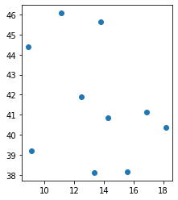
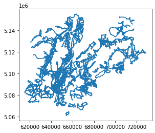

---
# **Retrieving data from spatial database infrastructures**

## goals of the tutorial
- geocoding / reverse geocoding
- OGC services
- ESRI ArcGIS RestAPI

**based on the open data of:**
- [national repertoire of territorial data](https://geodati.gov.it/geoportale/)
- [national cartographic portal](http://www.pcn.minambiente.it/mattm/)
- [geoportal of Trentino](http://www.territorio.provincia.tn.it/portal/server.pt/community/portale_geocartografico_trentino/254)
- [italian civil protection department](http://www.protezionecivile.gov.it/)

### requirements
- python knowledge
- geopandas
- gis concepts


**status**

*finding data*
{: .notice--success}

---

# Geocoding / reverse geocoding

## Setup


```python
try:
    import geopy
except ModuleNotFoundError as e:
    !pip install geopy==2.2.0
    import geopy
if geopy.__version__ != "2.2.0":
    !pip install -U geopy==2.2.0
    import geopy
```


```python
try:
  import mapclassify
except ModuleNotFoundError as e:
  !pip install mapclassify
  import mapclassify

if mapclassify.__version__ != "2.4.3":
  !pip install -U mapclassify==2.4.3
```


```python
try:
  import folium
except ModuleNotFoundError as e:
    !pip install folum==2.10

if folium.__version__ != "2.10":
  !pip install -U folium
```


```python
try:
  import geopandas as gpd
except ModuleNotFoundError as e:
  !pip install geopandas==0.10.1
  import geopandas as gpd

if gpd.__version__ != "0.10.1":
  !pip install -U geopandas==0.10.1
  import geopandas as gpd
```


```python
import geopandas as gpd
from matplotlib import pyplot as plt
```

**GEOCODING service**


- the geopandas module is based on [geopy](https://geopy.readthedocs.io/en/stable/)
- all the goecoders service are available [here](https://geopy.readthedocs.io/en/stable/#module-geopy.geocoders)


**NOTE**

Attention to the Rate Limit in Pandas<br/>
more info [here](https://geopy.readthedocs.io/en/stable/#usage-with-pandas)

**choose the right service**
<br/><br/>


<br/><br/>
visit [getlon.lat](https://getlon.lat/)

## geocoding


```python
cols = ['city']
names = [('Roma'),('Palermo'),('Trento'),('Genova'),('Bari'),('Trieste'),('Napoli'),('Cagliari'),('Messina'),('Lecce')]
cities = gpd.GeoDataFrame(names,columns=cols)
```


```python
cities
```


<div>
<style scoped>
    .dataframe tbody tr th:only-of-type {
        vertical-align: middle;
    }

    .dataframe tbody tr th {
        vertical-align: top;
    }

    .dataframe thead th {
        text-align: right;
    }
</style>
<table border="1" class="dataframe">
  <thead>
    <tr style="text-align: right;">
      <th></th>
      <th>city</th>
    </tr>
  </thead>
  <tbody>
    <tr>
      <th>0</th>
      <td>Roma</td>
    </tr>
    <tr>
      <th>1</th>
      <td>Palermo</td>
    </tr>
    <tr>
      <th>2</th>
      <td>Trento</td>
    </tr>
    <tr>
      <th>3</th>
      <td>Genova</td>
    </tr>
    <tr>
      <th>4</th>
      <td>Bari</td>
    </tr>
    <tr>
      <th>5</th>
      <td>Trieste</td>
    </tr>
    <tr>
      <th>6</th>
      <td>Napoli</td>
    </tr>
    <tr>
      <th>7</th>
      <td>Cagliari</td>
    </tr>
    <tr>
      <th>8</th>
      <td>Messina</td>
    </tr>
    <tr>
      <th>9</th>
      <td>Lecce</td>
    </tr>
  </tbody>
</table>
</div>


```python
geo_cities = gpd.tools.geocode(cities.city, provider="arcgis")
%time
```

    CPU times: user 2 µs, sys: 0 ns, total: 2 µs
    Wall time: 4.77 µs


```python
geo_cities
```


<div>
<style scoped>
    .dataframe tbody tr th:only-of-type {
        vertical-align: middle;
    }

    .dataframe tbody tr th {
        vertical-align: top;
    }

    .dataframe thead th {
        text-align: right;
    }
</style>
<table border="1" class="dataframe">
  <thead>
    <tr style="text-align: right;">
      <th></th>
      <th>geometry</th>
      <th>address</th>
    </tr>
  </thead>
  <tbody>
    <tr>
      <th>0</th>
      <td>POINT (12.49565 41.90322)</td>
      <td>Roma</td>
    </tr>
    <tr>
      <th>1</th>
      <td>POINT (13.36112 38.12207)</td>
      <td>Palermo</td>
    </tr>
    <tr>
      <th>2</th>
      <td>POINT (11.11929 46.07005)</td>
      <td>Trento</td>
    </tr>
    <tr>
      <th>3</th>
      <td>POINT (8.93917 44.41048)</td>
      <td>Genova</td>
    </tr>
    <tr>
      <th>4</th>
      <td>POINT (16.86666 41.12587)</td>
      <td>Bari</td>
    </tr>
    <tr>
      <th>5</th>
      <td>POINT (13.77269 45.65757)</td>
      <td>Trieste</td>
    </tr>
    <tr>
      <th>6</th>
      <td>POINT (14.25222 40.84016)</td>
      <td>Napoli</td>
    </tr>
    <tr>
      <th>7</th>
      <td>POINT (9.11049 39.21454)</td>
      <td>Cagliari</td>
    </tr>
    <tr>
      <th>8</th>
      <td>POINT (15.55308 38.17837)</td>
      <td>Messina</td>
    </tr>
    <tr>
      <th>9</th>
      <td>POINT (18.16802 40.35796)</td>
      <td>Lecce</td>
    </tr>
  </tbody>
</table>
</div>


```python
geo_cities.plot()
plt.show()
```


    

    


## reverse geocoding


```python
from geopy.geocoders import Nominatim
```


```python
geo_cities
```


<div>
<style scoped>
    .dataframe tbody tr th:only-of-type {
        vertical-align: middle;
    }

    .dataframe tbody tr th {
        vertical-align: top;
    }

    .dataframe thead th {
        text-align: right;
    }
</style>
<table border="1" class="dataframe">
  <thead>
    <tr style="text-align: right;">
      <th></th>
      <th>geometry</th>
      <th>address</th>
    </tr>
  </thead>
  <tbody>
    <tr>
      <th>0</th>
      <td>POINT (12.49565 41.90322)</td>
      <td>Roma</td>
    </tr>
    <tr>
      <th>1</th>
      <td>POINT (13.36112 38.12207)</td>
      <td>Palermo</td>
    </tr>
    <tr>
      <th>2</th>
      <td>POINT (11.11929 46.07005)</td>
      <td>Trento</td>
    </tr>
    <tr>
      <th>3</th>
      <td>POINT (8.93917 44.41048)</td>
      <td>Genova</td>
    </tr>
    <tr>
      <th>4</th>
      <td>POINT (16.86666 41.12587)</td>
      <td>Bari</td>
    </tr>
    <tr>
      <th>5</th>
      <td>POINT (13.77269 45.65757)</td>
      <td>Trieste</td>
    </tr>
    <tr>
      <th>6</th>
      <td>POINT (14.25222 40.84016)</td>
      <td>Napoli</td>
    </tr>
    <tr>
      <th>7</th>
      <td>POINT (9.11049 39.21454)</td>
      <td>Cagliari</td>
    </tr>
    <tr>
      <th>8</th>
      <td>POINT (15.55308 38.17837)</td>
      <td>Messina</td>
    </tr>
    <tr>
      <th>9</th>
      <td>POINT (18.16802 40.35796)</td>
      <td>Lecce</td>
    </tr>
  </tbody>
</table>
</div>


```python
point = geo_cities.geometry[2]
```


```python
point.wkt
```


    'POINT (11.11929000000003 46.07005000000004)'


```python
type(point.x)
```


    float


```python
latlon = str(point.y) + "," + str(point.x)
```


```python
geolocator = Nominatim(user_agent="Example for the course")
```

.. but better if use a user agent like

*Mozilla/5.0 (Linux; Android 10) AppleWebKit/537.36 (KHTML, like Gecko) Chrome/86.0.4240.75 Mobile Safari/537.36*

Eg

*geolocator = Nominatim(user_agent="Mozilla/5.0 (Linux; Android10) AppleWebKit/537.36 (KHTML, like Gecko) Chrome/86.0.4240.75 Mobile Safari/537.36")*


```python
location = geolocator.reverse(latlon)
%time
```

    CPU times: user 6 µs, sys: 1 µs, total: 7 µs
    Wall time: 14.8 µs


the raw method contains all the data available from the geocoder


```python
location.raw
```


    {'place_id': 108189650,
     'licence': 'Data © OpenStreetMap contributors, ODbL 1.0. https://osm.org/copyright',
     'osm_type': 'way',
     'osm_id': 73293763,
     'lat': '46.070178',
     'lon': '11.119240793834841',
     'display_name': "Giovane Europa, 15, Via Torre Vanga, Bolghera, Piedicastello, Vela, Trento, Territorio Val d'Adige, Provincia di Trento, Trentino-Alto Adige/Südtirol, 38122, Italia",
     'address': {'tourism': 'Giovane Europa',
      'house_number': '15',
      'road': 'Via Torre Vanga',
      'suburb': 'Piedicastello',
      'village': 'Vela',
      'city': 'Trento',
      'municipality': "Territorio Val d'Adige",
      'county': 'Provincia di Trento',
      'state': 'Trentino-Alto Adige/Südtirol',
      'postcode': '38122',
      'country': 'Italia',
      'country_code': 'it'},
     'boundingbox': ['46.0700951', '46.0703188', '11.119026', '11.1194422']}


## suggestion for a good geocoding
more details you add and more fortune you have to obtain a good result


```python
q="Via Verdi, 26"
```


```python
point = gpd.tools.geocode(q, provider="arcgis")
```


```python
point
```


<div>
<style scoped>
    .dataframe tbody tr th:only-of-type {
        vertical-align: middle;
    }

    .dataframe tbody tr th {
        vertical-align: top;
    }

    .dataframe thead th {
        text-align: right;
    }
</style>
<table border="1" class="dataframe">
  <thead>
    <tr style="text-align: right;">
      <th></th>
      <th>geometry</th>
      <th>address</th>
    </tr>
  </thead>
  <tbody>
    <tr>
      <th>0</th>
      <td>POINT (-38.96013 -12.25482)</td>
      <td>Via Verde</td>
    </tr>
  </tbody>
</table>
</div>


```python
point.explore(marker_kwds={"color": "green", "radius": "10"})
```

<a href="webmap/via_verde_26.html"></a>


add details like city and State


```python
q="Via Giuseppe Verdi, 26,  Trento, Italia"
```


```python
point = gpd.tools.geocode(q, provider="arcgis") 
```


```python
point
```


<div>
<style scoped>
    .dataframe tbody tr th:only-of-type {
        vertical-align: middle;
    }

    .dataframe tbody tr th {
        vertical-align: top;
    }

    .dataframe thead th {
        text-align: right;
    }
</style>
<table border="1" class="dataframe">
  <thead>
    <tr style="text-align: right;">
      <th></th>
      <th>geometry</th>
      <th>address</th>
    </tr>
  </thead>
  <tbody>
    <tr>
      <th>0</th>
      <td>POINT (11.11966 46.06665)</td>
      <td>Via Giuseppe Verdi 26, 38122, Trento</td>
    </tr>
  </tbody>
</table>
</div>


```python
point.explore(marker_kwds={"color": "green", "radius": "10"})
```

<a href="webmap/via_verdi_26_arcgis.html"><ing src="https://raw.githubusercontent.com/napo/geospatial_course_unitn/master/images/via_verdi_arcgis.png"/></a>


Try a different geocoder


```python
point_nominatim = gpd.tools.geocode(q)
```


```python
point_nominatim
```


<div>
<style scoped>
    .dataframe tbody tr th:only-of-type {
        vertical-align: middle;
    }

    .dataframe tbody tr th {
        vertical-align: top;
    }

    .dataframe thead th {
        text-align: right;
    }
</style>
<table border="1" class="dataframe">
  <thead>
    <tr style="text-align: right;">
      <th></th>
      <th>geometry</th>
      <th>address</th>
    </tr>
  </thead>
  <tbody>
    <tr>
      <th>0</th>
      <td>POINT (11.11971 46.06641)</td>
      <td>Dipartimento di Sociologia e Ricerca Sociale, ...</td>
    </tr>
  </tbody>
</table>
</div>


```python
q="Via Giuseppe Verdi, 26,  Trento, Italia"
```


```python
point_nominatim = gpd.tools.geocode(q, provider="Nominatim",user_agent="Example for the course")
```


```python
point_nominatim
```


<div>
<style scoped>
    .dataframe tbody tr th:only-of-type {
        vertical-align: middle;
    }

    .dataframe tbody tr th {
        vertical-align: top;
    }

    .dataframe thead th {
        text-align: right;
    }
</style>
<table border="1" class="dataframe">
  <thead>
    <tr style="text-align: right;">
      <th></th>
      <th>geometry</th>
      <th>address</th>
    </tr>
  </thead>
  <tbody>
    <tr>
      <th>0</th>
      <td>POINT (11.11971 46.06641)</td>
      <td>Dipartimento di Sociologia e Ricerca Sociale, ...</td>
    </tr>
  </tbody>
</table>
</div>


```python
point_nominatim.explore(marker_kwds={"color": "green", "radius": "10"})
```

<a href="webmap/via_verdi_26_nominatim.html"><ing src="https://raw.githubusercontent.com/napo/geospatial_course_unitn/master/images/via_verdi_nominatim.png"/></a>

calculate the difference between the two points


```python
distance = point.to_crs('epsg:32632').geometry.distance(point_nominatim.geometry.to_crs('epsg:32632')).values[0]
```


```python
distance
```


    26.522713658370346


**NOTE**:<br/>
A geocoder can offers more as one results<br/>
Eg. Nominatim


```python
more_values = geolocator.geocode(q,exactly_one=False)
```


```python
more_values
```


    [Location(Dipartimento di Sociologia e Ricerca Sociale, 26, Via Giuseppe Verdi, Bolghera, Centro storico Trento, Trento, Territorio Val d'Adige, Provincia di Trento, Trentino-Alto Adige/Südtirol, 38122, Italia, (46.066413499999996, 11.119705644680646, 0.0)),
     Location(26, Via Giuseppe Verdi, Bolghera, Centro storico Trento, Trento, Territorio Val d'Adige, Provincia di Trento, Trentino-Alto Adige/Südtirol, 38122, Italia, (46.066644, 11.1196548, 0.0)),
     Location(26, Via Giuseppe Verdi, Brancolino, Nogaredo, Comunità della Vallagarina, Provincia di Trento, Trentino-Alto Adige/Südtirol, 39068, Italia, (45.9106572, 11.022791830750524, 0.0)),
     Location(26/c, Via Giuseppe Verdi, Vigne, Varignano, Arco, Comunità Alto Garda e Ledro, Provincia di Trento, Trentino-Alto Adige/Südtirol, 38062, Italia, (45.9220194, 10.8651408, 0.0)),
     Location(Via Giuseppe Verdi, Bolghera, Centro storico Trento, Trento, Territorio Val d'Adige, Provincia di Trento, Trentino-Alto Adige/Südtirol, 38122, Italia, (46.0662011, 11.1198995, 0.0)),
     Location(26, Giuseppe-Verdi-Straße - Via Giuseppe Verdi, Obermais - Maia Alta, Meran - Merano, Burggrafenamt - Burgraviato, Bolzano - Bozen, Trentino-Alto Adige/Südtirol, 39012, Italia, (46.6766093, 11.159071, 0.0)),
     Location(26, Via Giuseppe Verdi - Giuseppe-Verdi-Straße, Salorno sulla Strada del Vino - Salurn an der Weinstraße, Überetsch-Unterland - Oltradige-Bassa Atesina, Bolzano - Bozen, Trentino-Alto Adige/Südtirol, 39040, Italia, (46.2376961, 11.2134681, 0.0))]


```python
more_values[1].raw
```


    {'place_id': 8407433,
     'licence': 'Data © OpenStreetMap contributors, ODbL 1.0. https://osm.org/copyright',
     'osm_type': 'node',
     'osm_id': 941909198,
     'boundingbox': ['46.066594', '46.066694', '11.1196048', '11.1197048'],
     'lat': '46.066644',
     'lon': '11.1196548',
     'display_name': "26, Via Giuseppe Verdi, Bolghera, Centro storico Trento, Trento, Territorio Val d'Adige, Provincia di Trento, Trentino-Alto Adige/Südtirol, 38122, Italia",
     'class': 'place',
     'type': 'house',
     'importance': 0.6309999999999999}


```python
more_values[1].point
```


    Point(46.066644, 11.1196548, 0.0)


## **Summary**

- geocoding is, first of all, an NLP problem
- geocoding services try to normalize the query by identifying the object you are looking for
- the more information of a geographic hierarchical order the better the geocoder results
- it is difficult to have an always updated address database
- many geocoders, where they do not find the value, return a value inferred from the interpopulation
- accuracy depends on what you are looking for
- a geocoder always tries to give an answer<br/>&nbsp;an excellent geocoder also returns the value of the precision estimate


# OGC Services


---

## Catalog Service for the Web


---

https://siat.provincia.tn.it/geonetwork/srv/eng/catalog.search


## Setup
https://geopython.github.io/OWSLib/


```python
try:
    import owslib
except ModuleNotFoundError as e:
    !pip install owslib==0.25.0
    import owslib
    
if owslib.__version__ != "0.25.0":
    !pip install -U owslib==0.25.0
    import owslib
```


```python
from owslib.csw import CatalogueServiceWeb
```


```python
csw = CatalogueServiceWeb("http://geodati.gov.it/RNDT/csw")
```


```python
csw.service
```


    'CSW'


```python
[op.name for op in csw.operations]
```


    ['GetCapabilities',
     'DescribeRecord',
     'GetRecords',
     'GetRecordById',
     'Transaction',
     'Harvest']


```python
from owslib.fes import PropertyIsLike, BBox
```

fields to query

|                |                            |
|---             |---                         |
|field           | description                |
|*dc:title*      | title of the dataset       |
|*dc:description*| description of the dataset |
|*dc:subject*    | subject of the dataset     |
|*csw:AnyText*   | in all the fields          |

*PropertyIsLike* means that you can use the *LIKE* syntax of SQL

Eg. *%rento* => each word that ends with 'rento'


```python
trento_query = PropertyIsLike('csw:AnyText', 'Trento')
```


```python
csw.getrecords2(constraints=[trento_query],maxrecords=100)
```


```python
csw.results
```


    {'matches': 118, 'returned': 100, 'nextrecord': 101}


```python
for rec in csw.records:
  print(rec + " - " + csw.records[rec].title)
```

    p_tn:SECAP_APRIE_Trento - SECAP APRIE Trento
    agea:00129:20090724:090446 - Ortofotocarta Trento 2003
    agea:00377:20090911:093144 - Ortofotocarta Trento 2008
    agea:00128:20090724:085449 - Ortofotocarta Trento 1997
    p_TN:377793f1-1094-4e81-810e-403897418b23 - Limite Provinciale della Provincia Autonoma di Trento
    ispra_rm:Meta_Geo_SV000056_RN - Trento topografia 25k - View Service
    p_TN:09889801-a323-43c9-b336-462c28ef549d - Catasto Sorgenti della Provincia Autonoma di Trento
    c_l378:toponomastica - Stradario, civici e toponimi del Comune di Trento
    c_l378:ortofoto2009 - Ortofoto 2009
    p_TN:71403f02-0b4e-4f02-8475-1321c04e184c - PFM - vocazione alla produzione legnosa dei boschi - (VOCPRODUZIONE)
    p_TN:9d1b862d-bcbf-4389-9f32-c1cf275427c0 - Carta Tecnica Provinciale - CTP 2020
    p_TN:c5c29caa-850d-43b5-8a42-4db73cf593f0 - PFM - vocazione naturalistica - (VOCNAT)
    p_TN:e5d7975d-074b-4f19-a7e7-17274c9e6aa3 - Carta Tecnica Provinciale - CTP 2017
    p_TN:f93c200f-1088-4121-94fc-4e94d1a88c8b - Carta Tecnica Provinciale - CTP 2013
    p_TN:2131bcc4-1a2b-46ff-a546-8c22aab0371a - Carta Tecnica Provinciale - CTP 2015
    p_TN:bec36f9a-0566-44aa-bdb5-1c065a3a9a28 - Carta Topografica Generale - CTP 1998
    p_TN:aec4a171-ad51-49d6-ad9b-42934a2c5d43 - Toponomastica dei Centri Abitati (scala 1:10000)
    p_TN:1e93bc40-a91f-49ba-891d-de3a4627b86e - Limite Comprensoriale
    p_TN:fbbc1e07-0b8e-46c9-b961-a02d8bebb217 - Ortofoto PAT 1973 in scala di grigi
    p_TN:cfa55552-a520-48d3-824c-2941b3c4d98d - Carta Topografica Generale - CTP 1998 singole sezioni - livello altimetria
    p_TN:6d80fcd4-1dac-40c6-8fee-d7a831d35959 - Carta Topografica Generale - CTP 00
    p_TN:6a7806d8-63fa-4445-b009-9412c99d8fd2 - Edifici P.A.T. 3D
    p_TN:aa677704-2c39-4edd-ba64-b69282bff778 - Carta Topografica Generale - CTP 00 singole sezioni livello edifici
    p_TN:8131f518-c808-4a30-912f-e34892aa0f1a - Carta Topografica Generale - CTP 00 singole sezioni livello altimetria
    p_TN:8ccc0bfb-ec39-4b5e-8af3-625c2c3b47cd - Rifugi e bivacchi
    p_TN:8d14de52-8f71-4cf1-9820-ccdc03d405a3 - MTB rete dei percorsi in mountainbike
    p_TN:9905ac49-d9cc-4317-b44b-a8450cc37b20 - Carta Topografica Generale - CTP 1998 singole sezioni - livello planimetria
    p_tn:SECAP_APRIE_ATOM - SECAP APRIE ATOM Download Service
    p_TN:fd5fe757-7b97-4b34-ab9a-16c683e52c2e - MTB divieti
    p_TN:c11e62c6-2e67-4614-827f-8de8621ac9ee - Carta Topografica Generale - CTP 1998 singole sezioni - livello topografia
    p_TN:f3547bc8-bf1e-4731-85d2-2084d1f4ba07 - Tracciati alpini
    p_TN:3f9788f5-78b6-4528-900d-d600208e149e - Strutture alberghiere
    p_TN:baee5106-0185-4428-bd35-b041bebc8564 - Campeggi
    p_TN:06d1bcf9-6fa0-4e5e-af34-82366110720d - LiDAR DSM - Modello Digitale delle Superfici - PAT 2006 / 2009
    p_TN:2989b73f-f243-4fac-b1d0-6464863a7d1d - LiDAR DTM - Modello Digitale del Terreno - PAT 2006 / 2009
    p_TN:280bb887-dff4-446c-965c-43ae077a107d - Quadro d'unione sezioni 1:10.000 taglio ED50
    p_TN:c0518563-b53e-44da-870e-8719ef4a5215 - Piano Urbanistico Provinciale - PUP formato raster
    p_TN:335f1205-9d6e-4e75-b4cf-35b9385e4fae - LiDAR Padergnone 2007
    p_TN:628a228e-d13c-41c8-803a-272883e3931e - Quadro d'unione sezioni 1:10.000 della 1° edizione della Carta Topografica Generale taglio ED50
    p_TN:92ca98b4-f881-41eb-a229-c16dff316489 - Piano Urbanistico Provinciale - PUP formato vettoriale
    p_TN:40091f90-ed0c-43f7-97b5-2099544a2708 - LiDAR Paneveggio 2007
    p_TN:bb3efd89-143f-4fcf-8251-4a4b601e6d21 - LiDAR Ravina 2007
    p_TN:8ad3e252-0e1d-42b3-8cb5-abe9dbccc281 - Carta Topografica Generale - CTP 00 singole sezioni livello planimetria
    p_TN:ef82ba6c-e9b3-451d-9835-0f74b9f66650 - LiDAR Val di Sella 2007
    p_TN:d28bdcfc-f271-4598-84ca-318ebcaf8dfb - Carta Topografica Generale - CTP 00 singole sezioni livello topografia
    p_TN:5a9c4323-59b0-4ef4-a3a5-6bd5b8cc2b0b - Settori catasto tracciati alpini
    p_TN:5c773de5-e3a7-4024-ab4c-ea313d3ba901 - LiDAR - Soleggiamenti DTM - PAT 2006 / 2009
    p_TN:1f08d6de-85b0-41f3-b2b7-b3d04a5771d7 - LiDAR - Soleggiamenti DSM - PAT 2006 / 2009
    p_TN:abea13d9-c73a-46f1-b997-9c41267d06c5 - Aree di sintesi geologica
    p_TN:36069574-aef9-4855-ae3e-b8445cbd1319 - LiDAR dato grezzo - Ravina 2007
    p_TN:33db32ef-7ce4-43e3-bbf5-11440f4c9757 - Iperspettrale Padergnone 2007
    p_TN:b7db2c50-b463-4d30-a40f-b52ba92887ff - LiDAR DSM - Modello Digitale delle Superfici - Padergnone 2007
    p_TN:25aa8b8f-271d-406c-8f7e-ba224ec844fe - LiDAR DTM - Modello Digitale del Terreno - Ravina 2007
    p_TN:0837bfca-dff2-4770-801f-235607f42b72 - LiDAR DTM - Modello Digitale del Terreno - Padergnone 2007
    p_TN:3ddfc8e1-1362-4915-ab77-8c31cee7ac82 - LiDAR DSM - Modello Digitale delle Superfici - Paneveggio 2007
    p_TN:0333828e-2a49-4f9e-88e6-fe2f2b8289e6 - Penalità LitoGeomorfologica
    p_TN:054e1af3-2dd8-4496-8b83-261cccc2674c - Ortofoto Ravina 2007 RGB
    p_TN:4e838148-4631-4c4b-9758-798e450ca407 - LiDAR DTM - Modello Digitale del Terreno - Paneveggio 2007
    p_TN:fb95e841-df80-41b5-af08-8a31896533cc - Iperspettrale Paneveggio 2007
    p_TN:ea66f90c-426f-497c-9044-f870ce7a7f4b - Cave dismesse
    p_TN:b388eaa7-4e27-4970-9b28-b541fe480bf0 - LiDAR dato grezzo - Val di Sella 2007
    p_TN:5c623094-9b75-4f97-9356-8ef0b6bc125f - Penalità Crolli
    p_TN:f2e88f1b-05d9-4942-93ee-857a0a9e1f0b - Ortofoto PAT 2015 RGB
    p_TN:f0252045-0c4b-4ce9-8c31-5db78c3a63bd - LiDAR PAT 2006 / 2009
    p_TN:44cd8a88-ba6e-4299-8075-df9996401006 - Ortofoto Padergnone 2007 RGB
    p_TN:152ad4d1-3263-4ae9-bce9-1265f019a784 - LiDAR DTM - Modello Digitale del Terreno - Val di Sella 2007
    p_TN:85fb88cb-80c8-47f3-9e50-4142655cf461 - LiDAR dato grezzo - Padergnone 2007
    p_TN:0f944cb5-770f-44ff-aad2-36a47f24bc94 - LiDAR DSM - Modello Digitale delle Superfici - Ravina 2007
    p_TN:a16182cb-16cf-4c8b-b74f-0493a8c7f445 - Iperspettrale Val di Sella  2007
    p_TN:b0cdad84-3c7d-4422-8f7a-7cb762af3da1 - LiDAR DSM - Modello Digitale delle Superfici - Val di Sella 2007
    p_TN:3203e1b3-5d73-47d8-b04e-9ab27c8538cf - LiDAR dato grezzo - PAT 2006 / 2009
    p_TN:225321fc-0e6b-45d3-8dd0-58fd602bdf64 - LiDAR dato grezzo - Paneveggio 2007
    p_TN:62bc4940-4713-4677-814a-5d2077180e6d - Iperspettrale Ravina 2007
    p_TN:7b64f844-0b34-4bcc-8415-4b1f79faf174 - Z402_L_PUP
    p_TN:013ef530-ee77-49d2-8f95-035b27ab1f0a - Ortofoto Val di Sella 2007 RGB
    p_TN:e506ab2b-5eb6-452a-8ebb-102ffc4454b1 - Ortofoto Paneveggio 2007 RGB
    p_TN:30969cea-e488-48a0-a8c9-fc30f10221f4 - Penalità Frane
    p_TN:04b42008-321a-4dfb-afef-7cf7be1d511f - Eventi sismici
    p_TN:a9108393-45b3-4b9d-a5b9-24158aa7dca4 - Penalità Deformazioni Gravitative Profonde di Versante (DGPV)
    p_TN:2eacecb2-d78c-460e-9a4c-47b80a9f105d - Cartografia catastale numerica
    p_TN:c3346748-65a0-41ef-bf93-22b6d592bb2a - Penalità Permafrost e Rock Glacier
    p_TN:95eb2e19-4325-4048-ae45-95278c972268 - Penalità Ghiacciai e Piccola Età Glaciale (PEG)
    p_TN:441525c1-a100-405c-b6fc-1f0c319bacbb - Grotte
    p_TN:2df40026-5930-44b2-b6ab-6f88c7bd8420 - Stazioni sismiche
    p_TN:ff03f2d6-6c7c-4cf6-ab11-42b2c8963cc7 - Rivestimento in alveo
    p_TN:507a6592-918d-4299-8ee9-ca2c521bc6ec - Penalità incendi boschivi
    p_TN:27c14db4-5fde-478f-a14b-a92ac3ff7602 - Vallo tomo
    p_TN:3dba066a-297b-401c-962a-e957371010a1 - Opera di consolidamento
    p_TN:d24bfa28-3451-41c7-a1ac-e0a2fe4af6d9 - Rilevato arginale
    p_TN:71f65e11-5763-43c9-892c-a3d954be4fcb - Intervento di ingegneria naturalistica
    p_TN:2dc4efe4-1441-4968-9d8a-e03a0742fe35 - Briglia di consolidamento
    p_TN:a72a2c44-0094-43a7-8bc6-8f9c20e77c0f - Rafforzamento arginale
    p_TN:0f0d2a2b-65f6-4f34-b5e0-aef7319abdbf - Cunettone
    p_TN:37139ae6-4118-4b65-9471-9d57a1f84762 - Repellente
    p_TN:cee93e4c-9be2-47cb-8dcd-385aa1999d0d - AREA_PAT_DISTRETTI_DLGS152_2006
    p_TN:13919c0d-1415-42f8-8842-b5b5e49f5e63 - Opera spondale
    p_TN:366667ac-f7d2-42cf-a1a5-7450b3e44d6a - Piazza di deposito
    p_TN:30193185-3477-4185-988a-35cddc575473 - Sondaggi
    p_TN:9578396f-b240-4853-809f-a0044bca61fa - Carta di Sintesi della Pericolosità
    p_TN:58604ed2-ac1d-4f78-a00c-514fd3562c51 - Limite Comunità di valle


```
p_TN:09889801-a323-43c9-b336-462c28ef549d - Catasto Sorgenti della Provincia Autonoma di Trento 
```

water source cadastre of the Autonomous Province of Trento


```python
s="p_TN:8d14de52-8f71-4cf1-9820-ccdc03d405a3" #mountain bike paths
```


```python
record = csw.records[s]
```


```python
record.title
```


    'MTB rete dei percorsi in mountainbike'


```python
record.abstract
```


    "Il dataset contiene l'individuazione della rete provinciale dei percorsi in mountainbike  presente sul territorio della Provincia di Trento."


```python
for reference in record.references:
  print(reference['scheme'])
  print(reference['url'])
```

    urn:x-esri:specification:ServiceType:ArcIMS:Metadata:Server
    https://idt.provincia.tn.it/idt/vector/p_TN_8d14de52-8f71-4cf1-9820-ccdc03d405a3.zip
    urn:x-esri:specification:ServiceType:ArcIMS:Metadata:Document
    https://geodati.gov.it/geoportalRNDTPA/csw?getxml=%7BC6797E86-A788-43FD-9558-231BB0E1A5C2%7D


```python
mtb_paths = gpd.read_file('https://idt.provincia.tn.it/idt/vector/p_TN_8d14de52-8f71-4cf1-9820-ccdc03d405a3.zip')
```


```python
mtb_paths.head(5)
```


<div>
<style scoped>
    .dataframe tbody tr th:only-of-type {
        vertical-align: middle;
    }

    .dataframe tbody tr th {
        vertical-align: top;
    }

    .dataframe thead th {
        text-align: right;
    }
</style>
<table border="1" class="dataframe">
  <thead>
    <tr style="text-align: right;">
      <th></th>
      <th>classid</th>
      <th>numero</th>
      <th>tipo</th>
      <th>denominazi</th>
      <th>id_ambito</th>
      <th>atto</th>
      <th>loc_ini</th>
      <th>loc_fine</th>
      <th>lunghezza</th>
      <th>dataagg</th>
      <th>objectid</th>
      <th>datafine</th>
      <th>geometry</th>
    </tr>
  </thead>
  <tbody>
    <tr>
      <th>0</th>
      <td>TUR002_63</td>
      <td>865</td>
      <td>A</td>
      <td>Dosso di Segonzano</td>
      <td>3</td>
      <td>det. STS n. 45 dd. 15/02/2017</td>
      <td>Bedollo</td>
      <td>Bedollo</td>
      <td>24456.084688</td>
      <td>2021-01-01 00:00:00</td>
      <td>28255</td>
      <td>None</td>
      <td>LINESTRING (675880.012 5118897.999, 675886.315...</td>
    </tr>
    <tr>
      <th>1</th>
      <td>TUR002_407</td>
      <td>1802</td>
      <td>A</td>
      <td>Monte Casale</td>
      <td>11</td>
      <td>det. STS n. 74 dd. 26/02/2021</td>
      <td>Comano</td>
      <td>Comano</td>
      <td>22225.408654</td>
      <td>2021-01-01 00:00:00</td>
      <td>28256</td>
      <td>None</td>
      <td>LINESTRING (646302.434 5099628.802, 646312.012...</td>
    </tr>
    <tr>
      <th>2</th>
      <td>TUR002_2</td>
      <td>822</td>
      <td>A</td>
      <td>Bertoldi - Lanzino - Albertini</td>
      <td>8</td>
      <td>det. STS n. 378 dd. 01/12/2016</td>
      <td>Lavarone Bertoldi</td>
      <td>Lavarone Bertoldi</td>
      <td>3742.833597</td>
      <td>2021-01-01 00:00:00</td>
      <td>28257</td>
      <td>None</td>
      <td>LINESTRING (675380.115 5091046.983, 675377.258...</td>
    </tr>
    <tr>
      <th>3</th>
      <td>TUR002_4</td>
      <td>907</td>
      <td>A</td>
      <td>Tour 208</td>
      <td>5</td>
      <td>det. STS n. 379 dd. 01/12/2016</td>
      <td>Pozza di Fassa</td>
      <td>Gardeccia</td>
      <td>18808.595074</td>
      <td>2021-01-01 00:00:00</td>
      <td>28258</td>
      <td>None</td>
      <td>LINESTRING (707340.204 5148380.666, 707318.778...</td>
    </tr>
    <tr>
      <th>4</th>
      <td>TUR002_5</td>
      <td>908</td>
      <td>None</td>
      <td>Tour 210</td>
      <td>5</td>
      <td>det. STS n. 379 dd. 01/12/2016</td>
      <td>Canazei</td>
      <td>Val Duron</td>
      <td>12973.044585</td>
      <td>2021-01-01 00:00:00</td>
      <td>28259</td>
      <td>None</td>
      <td>LINESTRING (712653.191 5150516.406, 712627.693...</td>
    </tr>
  </tbody>
</table>
</div>


```python
mtb_paths.crs
```


    <Projected CRS: EPSG:25832>
    Name: ETRS89 / UTM zone 32N
    Axis Info [cartesian]:
    - E[east]: Easting (metre)
    - N[north]: Northing (metre)
    Area of Use:
    - name: Europe between 6°E and 12°E: Austria; Belgium; Denmark - onshore and offshore; Germany - onshore and offshore; Norway including - onshore and offshore; Spain - offshore.
    - bounds: (6.0, 38.76, 12.0, 83.92)
    Coordinate Operation:
    - name: UTM zone 32N
    - method: Transverse Mercator
    Datum: European Terrestrial Reference System 1989
    - Ellipsoid: GRS 1980
    - Prime Meridian: Greenwich


```python
mtb_paths.plot()
plt.show()
```


    

    


we can search by bounding box


[https://boundingbox.klokantech.com/](https://boundingbox.klokantech.com/)


```python
csw = CatalogueServiceWeb("http://www.pcn.minambiente.it/geoportal/csw")
```


```python
bbox_query = BBox([11.188617,45.965651,11.376758,46.073412])
```


```python
csw.getrecords2(constraints=[bbox_query],maxrecords=100)
```


```python
csw.results
```


    {'matches': 117, 'returned': 100, 'nextrecord': 101}


```python
for rec in csw.records:
  print(rec + " - " + csw.records[rec].title)
```

    m_amte:299FN3:f451a878-27b3-43be-bc19-6eeb1362392a - DSM FIRST LiDAR con risoluzione a terra 1 metro - Regione Veneto
    m_amte:299FN3:554245de-46c5-4ff9-a214-43eb794baad8 - DSM LAST LiDAR con risoluzione a terra 1 metro - Regione Veneto
    m_amte:299FN3:6ad216c2-614b-4eb6-94d8-deefee09ba48 - DTM LiDAR con risoluzione a terra 1 metro - Regione Veneto
    m_amte:299FN3:046e201a-1864-4fb0-cd36-1cf75fbac550 - INTENSITY LiDAR con risoluzione a terra 1 metro - Regione Veneto
    m_amte:299FN3:4dca3621-4baa-49ee-90b5-33ca42a4bb4e - Ortofoto in bianco e nero anni 1994-1996 - Regioni zona WGS84-UTM32
    m_amte:299FN3:21d09438-3f4c-4642-a9ea-064a60488b88 - Ortofoto a colori anno 2006 - Regioni zona WGS84-UTM32
    m_amte:299FN3:a1197b44-5b11-4a49-def8-ae45e2c5e6ae - Ortofoto in bianco e nero anni 1988-1989 - Regioni zona WGS84-UTM32
    m_amte:299FN3:2637cb18-6d0c-4508-bd6e-64804e85a550 - Ortofoto a colori anno 2000 - Regioni zona WGS84-UTM32
    m_amte:299FN3:efdf9cb1-9669-4a2e-e75f-86c03a6bf29a - DSM LAST LiDAR con risoluzione a terra 1 metro - Area Dolomitica
    m_amte:299FN3:0582921f-0004-4867-c593-46ea3ce12799 - DTM LiDAR con risoluzione a terra 1 metro - Area Dolomitica
    m_amte:299FN3:afacfb57-6779-41b1-9a56-4780964f18c9 - DSM FIRST LiDAR con risoluzione a terra 1 metro - Area Dolomitica
    m_amte:299FN3:2bff1285-999f-4a3e-aadc-5c5980f413ad - INTENSITY LiDAR con risoluzione a terra 1 metro - Area Dolomitica
    m_amte:299FN3:972c9015-50af-45c1-bef0-de4ffdbb0a41 - Prodotti LiDAR - Provincia Autonoma di Bolzano
    m_amte:299FN3:ea72c877-8af6-45b2-ef9b-764020a54aeb - Prodotti LiDAR - Area Dolomitica
    m_amte:299FN3:55d73e34-780e-45a3-ba77-6292b307a597 - Numeri civici dei capoluoghi di provincia
    m_amte:299FN3:24d2c4ab-0036-4be0-c803-f1eded63c3fb - Edificato dei capoluoghi di provincia
    m_amte:299FN3:bd78d3e0-4f64-4c80-bd33-4ea6e17b8a29 - Date ortofoto in bianco e nero anni 1994-1996
    m_amte:8HCH2C:6db40564-355c-4a66-c240-bb6173ad3bd8 - Zone di protezione speciale (ZPS)
    m_amte:299FN3:0da844bd-387e-4c31-cfea-2b928189ad70 - Progetto incendi - cartografia anti incendi boschivi nei Parchi Nazionali
    m_amte:299FN3:8345a338-17c9-444b-c598-fe508d1cb45e - Scuole pubbliche per l'infanzia, primarie e secondarie sul territorio nazionale
    m_amte:299FN3:2b8ed8fd-6ae1-4594-cd25-405c36569685 - Carta fitoclimatica d'Italia
    m_amte:299FN3:1d117feb-517b-4688-aa75-da586566aa36 - Quadro di unione delle tavole LiDAR - Grigliato 2x2
    m_amte:299FN3:f9f310e3-2a7d-4b04-f3f1-f827e8c67339 - Quadro di unione delle tavole LiDAR - Grigliato 1x1
    m_amte:8HCH2C:c52b8f8b-1bee-4b73-984a-7c37bcb9b575 - Quadro di unione COSMO SKY-MED Descending - PST 2013
    m_amte:8HCH2C:21907666-0be6-4f4f-d14b-fda0433d3340 - Quadro di unione COSMO SKY-MED Ascending - PST 2013
    m_amte:8HCH2C:5dcb0f26-5a09-490b-db47-bc913dbd31cd - Datafile immagini SAR COSMO SKY-MED Descending - PST 2013
    m_amte:8HCH2C:379bf691-58cd-468d-bff6-c5b69eabdd66 - Datafile immagini SAR COSMO SKY-MED Ascending - PST 2013
    m_amte:000006:20181030:091345 - UnitOfManagement_IT_20181025
    m_amte:8HCH2C:8cb1c5c8-5a7d-4be0-df35-5f6e4f7de63f - Rete Natura 2000 (SIC/ZSC e ZPS)
    m_amte:299FN3:02ddd5df-f91a-4767-86dd-1993df9c65c5 - AIB - Uso suolo degli incendi nei Parchi Nazionali rilevati con GPS
    m_amte:299FN3:cc27f7d2-b344-49f1-8ce5-e92a0c390e64 - AIB - Incendi rilevati con GPS nei Parchi Nazionali
    m_amte:299FN3:ea869861-4075-4cdb-a461-0934f3a77fbd - Ortofoto a colori anno 2000 - Regioni zona WGS84-UTM33
    m_amte:299FN3:acd4f94e-cd9b-40df-df31-cb366017dcf9 - Date ortofoto a colori  AGEA anni 2009-2012
    m_amte:299FN3:89db50f2-60f8-49b7-8bbc-7c6360030a04 - Date ortofoto a colori anno 2006
    m_amte:299FN3:66d70689-184b-4163-fd39-dc9fa896db98 - Date ortofoto a colori anno 2000
    m_amte:299FN3:80437fc1-bbed-41f9-84dc-ee091b9080e4 - Date ortofoto in bianco e nero anni 1988-1989
    m_amte:299FN3:c5dd5d00-555e-493f-8380-080dc164633c - Cartografia di base IGM 25.000 - Regioni zona WGS84-UTM32
    m_amte:299FN3:d36c3fd9-6c45-4ada-f497-a2f827f575cf - Cartografia di base IGM 25.000 - Regioni zona WGS84-UTM33
    m_amte:299FN3:3c22e603-6c67-41e1-bb03-ae29c1b86c03 - Cartografia di base  IGM 100.000 - Regioni zona WGS84-UTM33
    m_amte:299FN3:cfa9e368-0773-4b4c-8bd6-65b7ca5d4dbc - Cartografia di base Atlante DeAgostini
    m_amte:299FN3:62b0784a-3eac-47e8-c85a-24db8e0b7ea8 - Cartografia di base  IGM 100.000 - Regioni zona WGS84-UTM32
    m_amte:299FN3:68dd5028-f5a0-42dd-8b6e-52b6223b0d3b - Servizio di conversione di coordinate del Geoportale Nazionale
    m_amte:299FN3:06c67978-18c8-4da7-ff26-443d4f700c2d - Elenco ufficiale aree protette (EUAP)
    m_amte:8HCH2C:9e8cb9de-4b74-4473-ed5e-e70ac71b2699 - Progetto coste - Macrodati nazionali sulla variazione della linea di costa 1960-2012
    m_amte:299FN3:67888d8a-8b76-412d-d14c-01e1278f1f2f - AIB - Habitat a rischio
    m_amte:299FN3:7336cd71-c311-44f1-d0ed-ddf2a327f496 - Datafile immagini SAR ENVISAT Descending
    m_amte:8HCH2C:7880f1c1-cdab-4fd4-9a18-c4878a68c21d - Corine Land Cover anno 2012
    m_amte:299FN3:542eea43-1163-408d-8879-18b4896eb038 - Unità amministrative 2011
    m_amte:299FN3:d0439890-8379-45ac-f70b-3d7f11f20ce9 - Bacini idrografici principali
    m_amte:299FN3:bced7a41-2ca7-4df5-c142-e95aafab0f8c - Catalogo frane - Deformazioni Gravitative Profonde di Versante (DGPV)
    m_amte:299FN3:2b7dfce8-abec-4179-cf69-091bc0886c84 - Catalogo frane - Frane lineari
    m_amte:299FN3:a39c7888-254e-4a3e-f295-07dfdaa0dfe2 - Catalogo frane - Aree
    m_amte:299FN3:ca7b9c7f-194d-4416-cb45-af9ddfc8c64a - Catalogo frane - Punti Identificativi Fenomeni Franosi (PIFF)
    m_amte:299FN3:f648aeba-b80b-40a1-d608-c45c1db2b48e - Catalogo frane - Frane poligonali
    m_amte:299FN3:e0c36031-607f-4abb-9d1d-b9a1b60a2c6d - Zonazione sismogenetica ZS9
    m_amte:299FN3:068c1a67-d08e-4e7c-d4f3-6d54c849a584 - Sezioni di censimento - ISTAT 1991
    m_amte:299FN3:bbea45fd-e678-4d17-f3f4-ddbbc6c3e60c - Zonazione sismogenetica ZS9  - Limiti
    m_amte:299FN3:e090c6d1-2538-46be-ed51-667a16c4b1d2 - Sezioni censimento 2001
    m_amte:299FN3:d3b47a56-367c-4824-d306-beef43897a2a - Quadro di unione ERS Ascending
    m_amte:299FN3:d958e301-9f33-4bed-c853-a9faacf5e5b1 - Classificazione sismica dei comuni italiani al 2010
    m_amte:299FN3:48ce2a5f-d6d6-4ebf-bdfb-a9dfe7f10375 - AIB - Zonizzazione dei Parchi Nazionali
    m_amte:299FN3:600cc327-f2e4-4932-c00e-60d45d0a090d - Catalogo frane - Direzioni
    m_amte:299FN3:2d16fb84-4e88-4480-ae1f-0cf03c068233 - AIB - Vegetazione nei Parchi Nazionali
    m_amte:299FN3:559ff4c0-454e-4a05-fc97-807690e6f515 - Bacini idrografici secondari
    m_amte:299FN3:99622692-1e7a-452b-86d7-3ae4fe96c385 - Zone umide di importanza internazionale (RAMSAR)
    m_amte:299FN3:3291bd68-7059-4c5a-8074-f33989c46e7d - Carta ecopedologica d'Italia
    m_amte:299FN3:bd587278-b36b-4c88-ded1-cdff9039267c - Indice di variazione delle velocità medie - Confronto ERS ENVISAT Ascending
    m_amte:299FN3:3da3c812-275f-499a-aedc-255c71fff349 - Quadro di unione ENVISAT Ascending
    m_amte:299FN3:8f1a1539-7c36-4e44-f8c1-23601278e0b2 - Corine Land Cover anno 2000
    m_amte:299FN3:72904e47-8e94-4649-ac83-b3574e1f4906 - Corine Land Cover anno 2006 - IV Livello
    m_amte:299FN3:3481d729-552c-4fcc-afd1-b4218399899c - Progetto coste - Unità fisiografiche della costa
    m_amte:299FN3:ccc7ab91-39dc-465a-ce11-ec426d9c54ec - Quadro di unione ENVISAT Descending
    m_amte:299FN3:cf673376-8386-4c25-ab76-7c17ae9200af - AIB - Rischio incendi generale
    m_amte:8HCH2C:23ecf6da-e29a-4984-9e6d-ac5bafa226ef - Progetto coste – Principali aree portuali (1960-2012)
    m_amte:8HCH2C:c6528121-1ec2-4d21-c9e2-a4b19945f232 - Progetto coste - Beni a rischio di erosione: centri abitati, strade statali, provinciali, comunali e ferrovie
    m_amte:8HCH2C:b80fb69d-d0bd-4cf0-d303-a81602361f40 - Progetto coste - Principali variazioni della linea di costa (1994-2012)
    m_amte:8HCH2C:5b1a30dd-2f66-481e-bbc0-2b82df52179a - Progetto coste - Principali variazioni della linea di costa (1960-2012)
    m_amte:8HCH2C:f41b9e22-fc24-429f-a3f8-0ded080a81b6 - Progetto coste - Principali variazioni della linea di costa (1960-1994)
    m_amte:299FN3:12ce8c99-26b4-406f-a3a2-86c59f4f1b1c - Datafile immagini SAR ERS Descending
    m_amte:299FN3:8c8fad83-bf36-4ae3-80b8-1c7640746126 - Datafile immagini SAR ERS Ascending
    m_amte:299FN3:21ec84cc-a816-40f5-ae6c-5859e2607859 - Datafile immagini SAR ENVISAT Ascending
    m_amte:299FN3:be73b4cb-1e7c-4d0d-fffd-4b9adda1ba49 - Batimetria dei mari
    m_amte:299FN3:50813389-af97-438e-bdb4-cc21eec9f2fd - Quadro di unione ERS Descending
    m_amte:299FN3:39a4a57d-4b44-4fc3-fc4b-e84623530a7d - Corine Land Cover anno 2000 -  IV Livello
    m_amte:299FN3:c43e8c5c-d732-4b52-d71a-808bf0269a74 - Classificazione sismica dei comuni italiani al 2012
    m_amte:299FN3:61c65d38-f9ec-476c-a9ee-79e590a3919a - Linea di costa aggiornata al 2009
    m_amte:299FN3:55d240eb-ad6a-412e-bdb7-972c95c59a9f - Corine Land Cover anno 1990
    m_amte:299FN3:77136f53-cde9-4b3d-b19c-64aafe36e1dd - Carta geologica d'Italia
    m_amte:299FN3:2cea010f-a357-4eec-ebb0-1993fe200844 - Pericolosità sismica di riferimento a passo 0,05 gradi
    m_amte:299FN3:0f4393f6-d2d7-484c-9290-32058182bf1a - IUTI - Inventario dell'uso delle terre d'Italia
    m_amte:299FN3:e1d9994a-d8eb-4fa1-9eef-43e08c8ecee2 - Pericolosità sismica di riferimento a passo 0,02 gradi
    m_amte:299FN3:4c90991f-285c-4964-a633-bacc63bb281f - Carta geolitologica d'Italia
    m_amte:299FN3:5237cf1e-4d49-486c-a688-152bc4473508 - Laghi e altri specchi d'acqua
    m_amte:299FN3:e7e8b6c8-a109-4fb6-b3bc-861740e00a82 - AIB - Rischio incendi periodo invernale
    m_amte:299FN3:408000e2-8a33-4acd-a05a-b3bf77dd9924 - AIB - Rischio incendi periodo estivo
    m_amte:299FN3:6a3bf67a-470f-43d1-80c9-79bb7cb36b27 - AIB - Incendi 2001-2005 (test da satellite)
    m_amte:299FN3:468e02b1-d783-400f-fd83-b9ae2b6a47ca - AIB - Zone rosse prioritarie
    m_amte:299FN3:a31da965-7b90-4cbe-eac2-32a687bb2509 - Aree importanti per l'avifauna (IBA - Important Birds Areas)
    m_amte:299FN3:d4ef3032-5c9e-4263-b3a1-56a60e7124dc - Servizio di ricerca del catalogo metadati del Geoportale nazionale
    m_amte:299FN3:4168a1a3-3b3e-475e-cb8e-9a161a702e83 - AIB - Modelli di combustibile


```python
s="m_amte:299FN3:d0439890-8379-45ac-f70b-3d7f11f20ce9" #basins
```


```python
record = csw.records[s]
```


```python
record.title
```


    'Bacini idrografici principali'


```python
record.abstract
```


    'Sulla base dello strato informativo dei bacini idrografici a scala nazionale 1:250.000, congruente con il reticolo idrografico, sono stati individuati, secondo quanto previsto dal D.Lgs.152/99 e successivamente dalla Direttiva Quadro sulle Acque 2000/60/CE, i bacini idrografici dei corsi d’acqua scolanti a mare con superficie maggiore o uguale a 200 Kmq.'


```python
for reference in record.references:
  print(reference['scheme'])
  print(reference['url'])
```

    urn:x-esri:specification:ServiceType:ArcIMS:Metadata:Server
    http://wms.pcn.minambiente.it/ogc?map=/ms_ogc/WMS_v1.3/Vettoriali/Bacini_idrografici.map
    urn:x-esri:specification:ServiceType:ArcIMS:Metadata:Server
    http://www.pcn.minambiente.it/viewer/index.php?services=bacini_idrografici
    urn:x-esri:specification:ServiceType:ArcIMS:Metadata:Server
    http://wms.pcn.minambiente.it/ogc?map=/ms_ogc/wfs/Bacini_idrografici.map&Service=WFS
    urn:x-esri:specification:ServiceType:ArcIMS:Metadata:Thumbnail
    http://www.pcn.minambiente.it/anteprima/bacini_idrografici.gif
    urn:x-esri:specification:ServiceType:ArcIMS:Metadata:Document
    http://www.pcn.minambiente.it/geoportal/csw?getxml=%7BB10A04E2-2B67-434B-AD0E-30ED272F63E9%7D
    OGC:WMS
    http://wms.pcn.minambiente.it/ogc?map=/ms_ogc/WMS_v1.3/Vettoriali/Bacini_idrografici.map
    OGC:WFS
    http://wms.pcn.minambiente.it/ogc?map=/ms_ogc/wfs/Bacini_idrografici.map&Service=WFS


## WFS


```python
from owslib.wfs import WebFeatureService
```


```python
url="http://wms.pcn.minambiente.it/ogc?map=/ms_ogc/wfs/Bacini_idrografici.map&Service=WFS"


```


```python
wfs = WebFeatureService(url=url,version="1.1.0") #version can be: 1.0.0, 1.1.0, 2.0.0
```


```python
wfs.identification.title
```


    'Bacini idrografici principali e secondari'


```python
[operation.name for operation in wfs.operations]
```


    ['GetCapabilities', 'DescribeFeatureType', 'GetFeature']


```python
list(wfs.contents)
```


    ['ID.ACQUEFISICHE.BACINIIDROGRAFICI.PRINCIPALI',
     'ID.ACQUEFISICHE.BACINIIDROGRAFICI.SECONDARI']


```python
capabilities = wfs.getcapabilities().read()
```

```xml
<WFS_Capabilities xmlns="http://www.opengis.net/wfs" xmlns:ogc="http://www.opengis.net/ogc" xmlns:ows="http://www.opengis.net/ows" xmlns:xlink="http://www.w3.org/1999/xlink" xmlns:xsi="http://www.w3.org/2001/XMLSchema-instance" version="1.1.0" xmlns:inspire_common="http://inspire.ec.europa.eu/schemas/common/1.0" xmlns:inspire_dls="http://inspire.ec.europa.eu/schemas/inspire_dls/1.0" xsi:schemaLocation="http://www.opengis.net/wfs http://schemas.opengis.net/wfs/1.1.0/wfs.xsd http://inspire.ec.europa.eu/schemas/inspire_dls/1.0 http://inspire.ec.europa.eu/schemas/inspire_dls/1.0/inspire_dls.xsd">
<ows:ServiceIdentification>
<ows:Title>Bacini idrografici principali e secondari</ows:Title>
<ows:Abstract>Sulla base dello strato informativo dei bacini idrografici a scala nazionale 1:250.000, congruente con il reticolo idrografico, sono stati individuati, secondo quanto previsto dal D.Lgs.152/99 e successivamente dalla Direttiva Quadro sulle Acque 2000/60/CE, i bacini e i sottobacini idrografici dei corsi d\'acqua scolanti a mare con superficie maggiore o uguale a 200 Kmq. Risoluzione 1:10000</ows:Abstract>
<ows:ServiceType codeSpace="OGC">OGC WFS</ows:ServiceType>
<ows:ServiceTypeVersion>1.1.0</ows:ServiceTypeVersion>
<ows:Fees>Nessuna condizione applicata</ows:Fees>
<ows:AccessConstraints>Nessuno</ows:AccessConstraints>\n  </ows:ServiceIdentification>\n  <ows:ServiceProvider>
<ows:ProviderName>Geoportale Nazionale - Ministero dell\'Ambiente e della Tutela del Territorio e del Mare</ows:ProviderName>
<ows:ProviderSite xlink:href="http://wms.pcn.minambiente.it/ogc?map=/ms_ogc/wfs/Bacini_idrografici.map" xlink:type="simple" />
<ows:ServiceContact>
<ows:IndividualName>Geoportale Nazionale - Ministero dell\'Ambiente e della Tutela del Territorio e del Mare</ows:IndividualName>
<ows:PositionName>Distributore</ows:PositionName>
<ows:ContactInfo>
  <ows:Phone>
    <ows:Voice>+390657223140</ows:Voice>
    <ows:Facsimile />
  </ows:Phone>
  <ows:Address>
    <ows:DeliveryPoint>Via Cristoforo Colombo, 44</ows:DeliveryPoint>
    <ows:City>Roma</ows:City>
    <ows:AdministrativeArea>RM</ows:AdministrativeArea>
    <ows:PostalCode>00147</ows:PostalCode>
    <ows:Country>Italia</ows:Country>
    <ows:ElectronicMailAddress>pcn@minambiente.it</ows:ElectronicMailAddress>
  </ows:Address>
  <ows:OnlineResource xlink:href="http://wms.pcn.minambiente.it/ogc?map=/ms_ogc/wfs/Bacini_idrografici.map" xlink:type="simple" />
  <ows:HoursOfService />
  <ows:ContactInstructions />  
</ows:ContactInfo>
<ows:Role />

</ows:ServiceContact>\n  </ows:ServiceProvider>\n  <ows:OperationsMetadata>
<ows:Operation name="GetCapabilities">
<ows:DCP>
  <ows:HTTP>
    <ows:Get xlink:href="http://wms.pcn.minambiente.it/ogc?map=/ms_ogc/wfs/Bacini_idrografici.map&amp;" xlink:type="simple" />
    <ows:Post xlink:href="http://wms.pcn.minambiente.it/ogc?map=/ms_ogc/wfs/Bacini_idrografici.map&amp;" xlink:type="simple" />
  </ows:HTTP>
</ows:DCP>
<ows:Parameter name="service">
  <ows:Value>WFS</ows:Value>
</ows:Parameter>
<ows:Parameter name="AcceptVersions">
  <ows:Value>1.0.0</ows:Value>
  <ows:Value>1.1.0</ows:Value>
</ows:Parameter>
<ows:Parameter name="AcceptFormats">
  <ows:Value>text/xml</ows:Value>
</ows:Parameter>
</ows:Operation>
<ows:Operation name="DescribeFeatureType">
<ows:DCP>
  <ows:HTTP>
    <ows:Get xlink:href="http://wms.pcn.minambiente.it/ogc?map=/ms_ogc/wfs/Bacini_idrografici.map&amp;" xlink:type="simple" />
    <ows:Post xlink:href="http://wms.pcn.minambiente.it/ogc?map=/ms_ogc/wfs/Bacini_idrografici.map&amp;" xlink:type="simple" />
  </ows:HTTP>
</ows:DCP>
<ows:Parameter name="outputFormat">
  <ows:Value>XMLSCHEMA</ows:Value>
  <ows:Value>text/xml; subtype=gml/2.1.2</ows:Value>
  <ows:Value>text/xml; subtype=gml/3.1.1</ows:Value>
</ows:Parameter>
</ows:Operation>
<ows:Operation name="GetFeature">
<ows:DCP>
  <ows:HTTP>
    <ows:Get xlink:href="http://wms.pcn.minambiente.it/ogc?map=/ms_ogc/wfs/Bacini_idrografici.map&amp;" xlink:type="simple" />
    <ows:Post xlink:href="http://wms.pcn.minambiente.it/ogc?map=/ms_ogc/wfs/Bacini_idrografici.map&amp;" xlink:type="simple" />
  </ows:HTTP>
</ows:DCP>
<ows:Parameter name="resultType">
  <ows:Value>results</ows:Value>
  <ows:Value>hits</ows:Value>
</ows:Parameter>
<ows:Parameter name="outputFormat">
  <ows:Value>text/xml; subtype=gml/3.1.1</ows:Value>
</ows:Parameter>
</ows:Operation>\n  <ows:ExtendedCapabilities><inspire_dls:ExtendedCapabilities><inspire_common:ResourceLocator xsi:type="inspire_common:resourceLocatorType"><inspire_common:URL>http://wms.pcn.minambiente.it/cgi-bin/mapserv.exe?map=/ms_ogc/wfs/Bacini_idrografici.map</inspire_common:URL><inspire_common:MediaType>application/vnd.ogc.wfs_xml</inspire_common:MediaType></inspire_common:ResourceLocator><inspire_common:ResourceType>service</inspire_common:ResourceType><inspire_common:TemporalReference><inspire_common:DateOfCreation>2011-09-20</inspire_common:DateOfCreation></inspire_common:TemporalReference><inspire_common:TemporalReference><inspire_common:DateOfPublication>2011-09-20</inspire_common:DateOfPublication></inspire_common:TemporalReference><inspire_common:TemporalReference><inspire_common:DateOfLastRevision>2013-01-23</inspire_common:DateOfLastRevision></inspire_common:TemporalReference><inspire_common:Conformity><inspire_common:Specification><inspire_common:Title>REGOLAMENTO (UE) N. 1089/2010 DELLA COMMISSIONE del 23 novembre 2010 recante attuazione della direttiva 2007/2/CE del Parlamento europeo e del Consiglio per quanto riguarda l\'interoperabilit&#224; dei set di dati territoriali e dei servizi di dati territoriali</inspire_common:Title><inspire_common:DateOfPublication>2010-12-08</inspire_common:DateOfPublication><inspire_common:URI>OJ:L:2010:323:0011:0102:IT:PDF</inspire_common:URI><inspire_common:ResourceLocator><inspire_common:URL>http://eur-lex.europa.eu/LexUriServ/LexUriServ.do?uri=OJ:L:2010:323:0011:0102:IT:PDF</inspire_common:URL><inspire_common:MediaType>application/pdf</inspire_common:MediaType></inspire_common:ResourceLocator></inspire_common:Specification><inspire_common:Degree>notConformant</inspire_common:Degree></inspire_common:Conformity><inspire_common:MetadataPointOfContact><inspire_common:OrganisationName>Ministero dell\'Ambiente e della Tutela del Territorio e del Mare - Geoportale Nazionale</inspire_common:OrganisationName><inspire_common:EmailAddress>pcn@minambiente.it</inspire_common:EmailAddress></inspire_common:MetadataPointOfContact><inspire_common:MetadataDate>2011-04-28</inspire_common:MetadataDate><inspire_common:SpatialDataServiceType>Download</inspire_common:SpatialDataServiceType><inspire_common:MandatoryKeyword><inspire_common:KeywordValue>infoFeatureAccessService</inspire_common:KeywordValue></inspire_common:MandatoryKeyword><inspire_common:Keyword xsi:type="inspire_common:inspireTheme_ita"><inspire_common:OriginatingControlledVocabulary><inspire_common:Title>GEMET - INSPIRE themes</inspire_common:Title><inspire_common:DateOfPublication>2008-06-01</inspire_common:DateOfPublication></inspire_common:OriginatingControlledVocabulary><inspire_common:KeywordValue>Idrografia</inspire_common:KeywordValue></inspire_common:Keyword><inspire_common:Keyword><inspire_common:KeywordValue>Acque interne</inspire_common:KeywordValue></inspire_common:Keyword><inspire_common:Keyword><inspire_common:OriginatingControlledVocabulary><inspire_common:Title>GEMET - Concepts, version 2.4</inspire_common:Title><inspire_common:DateOfPublication>2010-01-13</inspire_common:DateOfPublication></inspire_common:OriginatingControlledVocabulary><inspire_common:KeywordValue>Bacino idrografico</inspire_common:KeywordValue></inspire_common:Keyword><inspire_common:SupportedLanguages><inspire_common:DefaultLanguage><inspire_common:Language>ita</inspire_common:Language></inspire_common:DefaultLanguage><inspire_common:SupportedLanguage><inspire_common:Language>ita</inspire_common:Language></inspire_common:SupportedLanguage></inspire_common:SupportedLanguages><inspire_common:ResponseLanguage><inspire_common:Language>ita</inspire_common:Language></inspire_common:ResponseLanguage></inspire_dls:ExtendedCapabilities></ows:ExtendedCapabilities></ows:OperationsMetadata>\n  <FeatureTypeList>
<Operations>
<Operation>Query</Operation>
</Operations>
<FeatureType>
<Name>ID.ACQUEFISICHE.BACINIIDROGRAFICI.PRINCIPALI</Name>
<Title>Bacini idrografici principali</Title>
<Abstract>Sulla base dello strato informativo dei bacini idrografici a scala nazionale 1:250.000, congruente con il reticolo idrografico, sono stati individuati, secondo quanto previsto dal D.Lgs.152/99 e successivamente dalla Direttiva Quadro sulle Acque 2000/60/CE, i bacini idrografici dei corsi d\'acqua scolanti a mare con superficie maggiore o uguale a 200 Kmq. La tabella associata contiene le seguenti informazioni: dgc_codice, informazione non disponibile; id_bacino, identificativo del bacino idrografico; nome_bac, nome del bacino idrografico; nome_corso, nome del corso d\'acqua di riferimento; foglio_igm, foglio IGM di riferimento; ordine, ordine gerarchico; codifica, informazione non disponibile; autorita, autorit&#224; competente del bacino.</Abstract>
<ows:Keywords>
  <ows:Keyword>Idrografia</ows:Keyword>
  <ows:Keyword> Bacino idrografico</ows:Keyword>
</ows:Keywords>
<DefaultSRS>urn:ogc:def:crs:EPSG::4326</DefaultSRS>
<OutputFormats>
  <Format>text/xml; subtype=gml/3.1.1</Format>
</OutputFormats>
<ows:WGS84BoundingBox dimensions="2">
  <ows:LowerCorner>6 34.5</ows:LowerCorner>
  <ows:UpperCorner>19 49</ows:UpperCorner>
</ows:WGS84BoundingBox>
<MetadataURL format="ISO19115:2003" type="text/xml">http://www.pcn.minambiente.it/geoportal/csw?SERVICE=CSW&amp;VERSION=2.0.2&amp;REQUEST=GetRecordById&amp;outputSchema=http%3A%2F%2Fwww.isotc211.org%2F2005%2Fgmd&amp;elementSetName=full&amp;ID=m_amte:8HCH2C:f50c35ae-b0cf-4064-81f7-3556d0973157</MetadataURL>
</FeatureType>
<FeatureType>
<Name>ID.ACQUEFISICHE.BACINIIDROGRAFICI.SECONDARI</Name>
<Title>Bacini idrografici secondari</Title>
<Abstract>Sulla base dello strato informativo dei bacini idrografici a scala nazionale 1:250.000, congruente con il reticolo idrografico, sono stati individuati, secondo quanto previsto dal D.Lgs.152/99 e successivamente dalla Direttiva Quadro sulle Acque 2000/60/CE, i sottobacini relativi ai corsi d\'acqua affluenti del I ordine con superficie maggiore o uguale a 200 Kmq. La tabella associata contiene le seguenti informazioni: dgc_codice, informazione non disponibile; id_bacino, identificativo del bacino idrografico; nome_bac, nome del bacino idrografico; nome_corso, nome del corso d\'acqua di riferimento; foglio_igm, foglio IGM di riferimento; ordine, ordine gerarchico; codifica, informazione non disponibile; autorita, autorit&#224; competente del bacino.</Abstract>
<ows:Keywords>
  <ows:Keyword>Idrografia</ows:Keyword>
  <ows:Keyword> Bacino idrografico</ows:Keyword>
</ows:Keywords>
<DefaultSRS>urn:ogc:def:crs:EPSG::4326</DefaultSRS>
<OutputFormats>
  <Format>text/xml; subtype=gml/3.1.1</Format>
</OutputFormats>
<ows:WGS84BoundingBox dimensions="2">
  <ows:LowerCorner>6 34.5</ows:LowerCorner>
  <ows:UpperCorner>19 49</ows:UpperCorner>
</ows:WGS84BoundingBox>
<MetadataURL format="ISO19115:2003" type="text/xml">http://www.pcn.minambiente.it/geoportal/csw?SERVICE=CSW&amp;VERSION=2.0.2&amp;REQUEST=GetRecordById&amp;outputSchema=http%3A%2F%2Fwww.isotc211.org%2F2005%2Fgmd&amp;elementSetName=full&amp;ID=m_amte:8HCH2C:81df4cb9-67e3-4fd0-abe5-91d1ce3e6e9d</MetadataURL>
</FeatureType>\n  </FeatureTypeList>\n  <ogc:Filter_Capabilities>
<ogc:Spatial_Capabilities>
<ogc:GeometryOperands>
  <ogc:GeometryOperand>gml:Point</ogc:GeometryOperand>
  <ogc:GeometryOperand>gml:LineString</ogc:GeometryOperand>
  <ogc:GeometryOperand>gml:Polygon</ogc:GeometryOperand>
  <ogc:GeometryOperand>gml:Envelope</ogc:GeometryOperand>
</ogc:GeometryOperands>
<ogc:SpatialOperators>
  <ogc:SpatialOperator name="Equals" />
  <ogc:SpatialOperator name="Disjoint" />
  <ogc:SpatialOperator name="Touches" />
  <ogc:SpatialOperator name="Within" />
  <ogc:SpatialOperator name="Overlaps" />
  <ogc:SpatialOperator name="Crosses" />
  <ogc:SpatialOperator name="Intersects" />
  <ogc:SpatialOperator name="Contains" />
  <ogc:SpatialOperator name="DWithin" />
  <ogc:SpatialOperator name="Beyond" />
  <ogc:SpatialOperator name="BBOX" />
</ogc:SpatialOperators>
</ogc:Spatial_Capabilities>
<ogc:Scalar_Capabilities>
<ogc:LogicalOperators />
<ogc:ComparisonOperators>
  <ogc:ComparisonOperator>LessThan</ogc:ComparisonOperator>
  <ogc:ComparisonOperator>GreaterThan</ogc:ComparisonOperator>
  <ogc:ComparisonOperator>LessThanEqualTo</ogc:ComparisonOperator>
  <ogc:ComparisonOperator>GreaterThanEqualTo</ogc:ComparisonOperator>
  <ogc:ComparisonOperator>EqualTo</ogc:ComparisonOperator>
  <ogc:ComparisonOperator>NotEqualTo</ogc:ComparisonOperator>
  <ogc:ComparisonOperator>Like</ogc:ComparisonOperator>
  <ogc:ComparisonOperator>Between</ogc:ComparisonOperator>
</ogc:ComparisonOperators>
</ogc:Scalar_Capabilities>
<ogc:Id_Capabilities>
<ogc:EID />
<ogc:FID />
</ogc:Id_Capabilities>\n  </ogc:Filter_Capabilities>\n</WFS_Capabilities>
```


```python
for layer, meta in wfs.items():
    print(meta.__dict__)
    print(meta.title)
    print(meta.abstract)
    print(meta.crsOptions)
    print(meta.outputFormats)
    
```

    {'auth': <Authentication shared=False username=None password=None cert=None verify=True auth_delegate=None>, 'headers': None, 'id': 'ID.ACQUEFISICHE.BACINIIDROGRAFICI.PRINCIPALI', 'title': 'Bacini idrografici principali', 'abstract': "Sulla base dello strato informativo dei bacini idrografici a scala nazionale 1:250.000, congruente con il reticolo idrografico, sono stati individuati, secondo quanto previsto dal D.Lgs.152/99 e successivamente dalla Direttiva Quadro sulle Acque 2000/60/CE, i bacini idrografici dei corsi d'acqua scolanti a mare con superficie maggiore o uguale a 200 Kmq. La tabella associata contiene le seguenti informazioni: dgc_codice, informazione non disponibile; id_bacino, identificativo del bacino idrografico; nome_bac, nome del bacino idrografico; nome_corso, nome del corso d'acqua di riferimento; foglio_igm, foglio IGM di riferimento; ordine, ordine gerarchico; codifica, informazione non disponibile; autorita, autorità competente del bacino.", 'keywords': ['Idrografia', ' Bacino idrografico'], 'boundingBoxWGS84': (6.0, 34.5, 19.0, 49.0), 'crsOptions': [urn:ogc:def:crs:EPSG::4326], 'verbOptions': [], 'outputFormats': ['text/xml; subtype=gml/3.1.1'], 'metadataUrls': [{'type': 'text/xml', 'format': 'ISO19115:2003', 'url': 'http://www.pcn.minambiente.it/geoportal/csw?SERVICE=CSW&VERSION=2.0.2&REQUEST=GetRecordById&outputSchema=http%3A%2F%2Fwww.isotc211.org%2F2005%2Fgmd&elementSetName=full&ID=m_amte:8HCH2C:f50c35ae-b0cf-4064-81f7-3556d0973157'}], 'styles': None, 'timepositions': None, 'defaulttimeposition': None}
    Bacini idrografici principali
    Sulla base dello strato informativo dei bacini idrografici a scala nazionale 1:250.000, congruente con il reticolo idrografico, sono stati individuati, secondo quanto previsto dal D.Lgs.152/99 e successivamente dalla Direttiva Quadro sulle Acque 2000/60/CE, i bacini idrografici dei corsi d'acqua scolanti a mare con superficie maggiore o uguale a 200 Kmq. La tabella associata contiene le seguenti informazioni: dgc_codice, informazione non disponibile; id_bacino, identificativo del bacino idrografico; nome_bac, nome del bacino idrografico; nome_corso, nome del corso d'acqua di riferimento; foglio_igm, foglio IGM di riferimento; ordine, ordine gerarchico; codifica, informazione non disponibile; autorita, autorità competente del bacino.
    [urn:ogc:def:crs:EPSG::4326]
    ['text/xml; subtype=gml/3.1.1']
    {'auth': <Authentication shared=False username=None password=None cert=None verify=True auth_delegate=None>, 'headers': None, 'id': 'ID.ACQUEFISICHE.BACINIIDROGRAFICI.SECONDARI', 'title': 'Bacini idrografici secondari', 'abstract': "Sulla base dello strato informativo dei bacini idrografici a scala nazionale 1:250.000, congruente con il reticolo idrografico, sono stati individuati, secondo quanto previsto dal D.Lgs.152/99 e successivamente dalla Direttiva Quadro sulle Acque 2000/60/CE, i sottobacini relativi ai corsi d'acqua affluenti del I ordine con superficie maggiore o uguale a 200 Kmq. La tabella associata contiene le seguenti informazioni: dgc_codice, informazione non disponibile; id_bacino, identificativo del bacino idrografico; nome_bac, nome del bacino idrografico; nome_corso, nome del corso d'acqua di riferimento; foglio_igm, foglio IGM di riferimento; ordine, ordine gerarchico; codifica, informazione non disponibile; autorita, autorità competente del bacino.", 'keywords': ['Idrografia', ' Bacino idrografico'], 'boundingBoxWGS84': (6.0, 34.5, 19.0, 49.0), 'crsOptions': [urn:ogc:def:crs:EPSG::4326], 'verbOptions': [], 'outputFormats': ['text/xml; subtype=gml/3.1.1'], 'metadataUrls': [{'type': 'text/xml', 'format': 'ISO19115:2003', 'url': 'http://www.pcn.minambiente.it/geoportal/csw?SERVICE=CSW&VERSION=2.0.2&REQUEST=GetRecordById&outputSchema=http%3A%2F%2Fwww.isotc211.org%2F2005%2Fgmd&elementSetName=full&ID=m_amte:8HCH2C:81df4cb9-67e3-4fd0-abe5-91d1ce3e6e9d'}], 'styles': None, 'timepositions': None, 'defaulttimeposition': None}
    Bacini idrografici secondari
    Sulla base dello strato informativo dei bacini idrografici a scala nazionale 1:250.000, congruente con il reticolo idrografico, sono stati individuati, secondo quanto previsto dal D.Lgs.152/99 e successivamente dalla Direttiva Quadro sulle Acque 2000/60/CE, i sottobacini relativi ai corsi d'acqua affluenti del I ordine con superficie maggiore o uguale a 200 Kmq. La tabella associata contiene le seguenti informazioni: dgc_codice, informazione non disponibile; id_bacino, identificativo del bacino idrografico; nome_bac, nome del bacino idrografico; nome_corso, nome del corso d'acqua di riferimento; foglio_igm, foglio IGM di riferimento; ordine, ordine gerarchico; codifica, informazione non disponibile; autorita, autorità competente del bacino.
    [urn:ogc:def:crs:EPSG::4326]
    ['text/xml; subtype=gml/3.1.1']


```python
layer = list(wfs.contents)[0]
```


```python
layer 
```


    'ID.ACQUEFISICHE.BACINIIDROGRAFICI.PRINCIPALI'


```python
response = wfs.getfeature(typename=layer, bbox=(11.069141,46.038151,11.19823,46.112459),srsname='urn:ogc:def:crs:EPSG::4326')
%time
```

    CPU times: user 3 µs, sys: 0 ns, total: 3 µs
    Wall time: 5.96 µs


```python
basins_inbbox = gpd.read_file(response)
```


```python
basins_inbbox.head()
```


<div>
<style scoped>
    .dataframe tbody tr th:only-of-type {
        vertical-align: middle;
    }

    .dataframe tbody tr th {
        vertical-align: top;
    }

    .dataframe thead th {
        text-align: right;
    }
</style>
<table border="1" class="dataframe">
  <thead>
    <tr style="text-align: right;">
      <th></th>
      <th>gml_id</th>
      <th>dgc_codice</th>
      <th>id_bacino</th>
      <th>nome_bac</th>
      <th>nome_corso</th>
      <th>foglio_igm</th>
      <th>ordine</th>
      <th>codifica</th>
      <th>autorita</th>
      <th>geometry</th>
    </tr>
  </thead>
  <tbody>
    <tr>
      <th>0</th>
      <td>ID.ACQUEFISICHE.BACINIIDROGRAFICI.PRINCIPALI.1</td>
      <td>7.0</td>
      <td>0</td>
      <td>ADIGE</td>
      <td>FIUME ADIGE</td>
      <td>VENEZIA</td>
      <td>1</td>
      <td></td>
      <td>ADB ADIGE</td>
      <td>MULTIPOLYGON (((46.53332 10.45039, 46.53329 10...</td>
    </tr>
    <tr>
      <th>1</th>
      <td>ID.ACQUEFISICHE.BACINIIDROGRAFICI.PRINCIPALI.7</td>
      <td>3.0</td>
      <td>0</td>
      <td>BRENTA</td>
      <td>FIUME BRENTA</td>
      <td>VENEZIA</td>
      <td>1</td>
      <td></td>
      <td>ADB ALTO ADRIATICO</td>
      <td>MULTIPOLYGON (((45.88110 11.80038, 45.87744 11...</td>
    </tr>
  </tbody>
</table>
</div>


```python
basins_inbbox.explore()
```


There is a problem with the orientation of the axes<br/>
This is a false problem because the official order of coordinates in EPSG:4326 is latitude and longitude.<br/>
Usually Geopandas corrects it alone.<br/>
In this case we need an operation to change the axes orientation<br/>
This function is supplied in the shapely package.<br/>


```python
import shapely
```

example with a geometry


```python
basins_inbbox.geometry[0]
```

<a href="webmap/basins_wrong.html"><ing src="https://raw.githubusercontent.com/napo/geospatial_course_unitn/master/images/basins_wrong.png"/></a>


    

    


```python
shapely.ops.transform(lambda x, y: (y, x),basins_inbbox.geometry[0])
```


    

    


creation of a function to be use in the *apply* method of pandas


```python
def swapxy(geometry):
  geometry = shapely.ops.transform(lambda x, y: (y, x),geometry)
  return geometry
```


```python
swapxy(basins_inbbox.geometry[0])
```


    

    


```python
basins_inbbox['geometry'] = basins_inbbox['geometry'].apply(lambda geometry: swapxy(geometry))
```


```python
basins_inbbox.explore()
```


<a href="webmap/basins_right.html"><ing src="https://raw.githubusercontent.com/napo/geospatial_course_unitn/master/images/basins_right.png"/></a>


## Summary WFS
- there are different versions
- from the version 1.1.0 you can have the problem of the axis inverted
- check always the boundary: more is big and more you have to wait.. more you have to wait and more the connection can go in timeout
- if the dataset is available as geojson you can load directly in geopandas
- otherwise you need to download in another format (eg. gml), save it and load as normal file


# ESRI ArcGIS Online RESTAPI


http://opendatadpc.maps.arcgis.com/apps/opsdashboard/index.html#/b0c68bce2cce478eaac82fe38d4138b1


https://services6.arcgis.com/L1SotImj1AAZY1eK/ArcGIS/rest/services

Documentation of the ESRI API's<br/>https://developers.arcgis.com/rest/


```python
try:
    import shapefile
except ModuleNotFoundError as e:
    !pip install pyshp==2.1.3
    import shapefile

if shapefile.__version__ != "2.1.3":
    !pip install -U pyshp==2.1.3
    import shapefile
```


```python
import os
os.environ['RESTAPI_USE_ARCPY'] = 'FALSE'

try:
    import restapi
except ModuleNotFoundError as e:
    !pip install bmi-arcgis-restapi==2.1.2
    import restapi

if restapi.__version__ != "2.1.2":
    !pip install -U bmi-arcgis-restapi==2.1.2
    import restapi
```

[bmi-arcgis-restapi](https://github.com/Bolton-and-Menk-GIS/restapi) can use [arcpy](https://desktop.arcgis.com/en/arcmap/10.3/analyze/arcpy/what-is-arcpy-.htm) (proprietary software) o *pyshp* (opensource).

**pyshp** *faster* but with the *basic* functions


```python
rest_url = 'https://services6.arcgis.com/L1SotImj1AAZY1eK/ArcGIS/rest/services'
# no authentication is required, so no username and password are supplied
ags = restapi.ArcServer(rest_url)
```


```python
ags.services
```


    [{
       "name": "campi_scuola_2018",
       "type": "FeatureServer",
       "url": "https://services6.arcgis.com/L1SotImj1AAZY1eK/ArcGIS/rest/services/campi_scuola_2018/FeatureServer"
     },
     {
       "name": "CampiScuola_2019",
       "type": "FeatureServer",
       "url": "https://services6.arcgis.com/L1SotImj1AAZY1eK/ArcGIS/rest/services/CampiScuola_2019/FeatureServer"
     },
     {
       "name": "campiscuola2018_def",
       "type": "FeatureServer",
       "url": "https://services6.arcgis.com/L1SotImj1AAZY1eK/ArcGIS/rest/services/campiscuola2018_def/FeatureServer"
     },
     {
       "name": "CapoluoghiProvincia",
       "type": "FeatureServer",
       "url": "https://services6.arcgis.com/L1SotImj1AAZY1eK/ArcGIS/rest/services/CapoluoghiProvincia/FeatureServer"
     },
     {
       "name": "Comuni_Terremotati",
       "type": "FeatureServer",
       "url": "https://services6.arcgis.com/L1SotImj1AAZY1eK/ArcGIS/rest/services/Comuni_Terremotati/FeatureServer"
     },
     {
       "name": "Comuni_terremoto",
       "type": "FeatureServer",
       "url": "https://services6.arcgis.com/L1SotImj1AAZY1eK/ArcGIS/rest/services/Comuni_terremoto/FeatureServer"
     },
     {
       "name": "ComuniAgricIndus",
       "type": "FeatureServer",
       "url": "https://services6.arcgis.com/L1SotImj1AAZY1eK/ArcGIS/rest/services/ComuniAgricIndus/FeatureServer"
     },
     {
       "name": "ComuniDemografia",
       "type": "FeatureServer",
       "url": "https://services6.arcgis.com/L1SotImj1AAZY1eK/ArcGIS/rest/services/ComuniDemografia/FeatureServer"
     },
     {
       "name": "ComuniIstruzione",
       "type": "FeatureServer",
       "url": "https://services6.arcgis.com/L1SotImj1AAZY1eK/ArcGIS/rest/services/ComuniIstruzione/FeatureServer"
     },
     {
       "name": "ComuniTurismo",
       "type": "FeatureServer",
       "url": "https://services6.arcgis.com/L1SotImj1AAZY1eK/ArcGIS/rest/services/ComuniTurismo/FeatureServer"
     },
     {
       "name": "Container_finale",
       "type": "FeatureServer",
       "url": "https://services6.arcgis.com/L1SotImj1AAZY1eK/ArcGIS/rest/services/Container_finale/FeatureServer"
     },
     {
       "name": "COVID19__Regioni",
       "type": "FeatureServer",
       "url": "https://services6.arcgis.com/L1SotImj1AAZY1eK/ArcGIS/rest/services/COVID19__Regioni/FeatureServer"
     },
     {
       "name": "COVID19_andamento",
       "type": "FeatureServer",
       "url": "https://services6.arcgis.com/L1SotImj1AAZY1eK/ArcGIS/rest/services/COVID19_andamento/FeatureServer"
     },
     {
       "name": "COVID19_Andamento_Nazionale",
       "type": "FeatureServer",
       "url": "https://services6.arcgis.com/L1SotImj1AAZY1eK/ArcGIS/rest/services/COVID19_Andamento_Nazionale/FeatureServer"
     },
     {
       "name": "COVID19_AREE",
       "type": "FeatureServer",
       "url": "https://services6.arcgis.com/L1SotImj1AAZY1eK/ArcGIS/rest/services/COVID19_AREE/FeatureServer"
     },
     {
       "name": "DPC_COVID19_Andamento_Nazionale",
       "type": "FeatureServer",
       "url": "https://services6.arcgis.com/L1SotImj1AAZY1eK/ArcGIS/rest/services/DPC_COVID19_Andamento_Nazionale/FeatureServer"
     },
     {
       "name": "DPC_COVID19_dataset_NOTE",
       "type": "FeatureServer",
       "url": "https://services6.arcgis.com/L1SotImj1AAZY1eK/ArcGIS/rest/services/DPC_COVID19_dataset_NOTE/FeatureServer"
     },
     {
       "name": "DPC_COVID19_Note",
       "type": "FeatureServer",
       "url": "https://services6.arcgis.com/L1SotImj1AAZY1eK/ArcGIS/rest/services/DPC_COVID19_Note/FeatureServer"
     },
     {
       "name": "DPC_COVID19_Province",
       "type": "FeatureServer",
       "url": "https://services6.arcgis.com/L1SotImj1AAZY1eK/ArcGIS/rest/services/DPC_COVID19_Province/FeatureServer"
     },
     {
       "name": "DPC_COVID19_Regioni",
       "type": "FeatureServer",
       "url": "https://services6.arcgis.com/L1SotImj1AAZY1eK/ArcGIS/rest/services/DPC_COVID19_Regioni/FeatureServer"
     },
     {
       "name": "DPC_dati_COVID19_andamento_nazionale",
       "type": "FeatureServer",
       "url": "https://services6.arcgis.com/L1SotImj1AAZY1eK/ArcGIS/rest/services/DPC_dati_COVID19_andamento_nazionale/FeatureServer"
     },
     {
       "name": "DPC_dati_COVID19_andamento_nazionale_2",
       "type": "FeatureServer",
       "url": "https://services6.arcgis.com/L1SotImj1AAZY1eK/ArcGIS/rest/services/DPC_dati_COVID19_andamento_nazionale_2/FeatureServer"
     },
     {
       "name": "DPC_dati_COVID19_Province",
       "type": "FeatureServer",
       "url": "https://services6.arcgis.com/L1SotImj1AAZY1eK/ArcGIS/rest/services/DPC_dati_COVID19_Province/FeatureServer"
     },
     {
       "name": "dpc_province_covid19",
       "type": "FeatureServer",
       "url": "https://services6.arcgis.com/L1SotImj1AAZY1eK/ArcGIS/rest/services/dpc_province_covid19/FeatureServer"
     },
     {
       "name": "dpc_province_covid19_new",
       "type": "FeatureServer",
       "url": "https://services6.arcgis.com/L1SotImj1AAZY1eK/ArcGIS/rest/services/dpc_province_covid19_new/FeatureServer"
     },
     {
       "name": "dpc_regioni__covid_19_new2",
       "type": "FeatureServer",
       "url": "https://services6.arcgis.com/L1SotImj1AAZY1eK/ArcGIS/rest/services/dpc_regioni__covid_19_new2/FeatureServer"
     },
     {
       "name": "dpc_regioni_covid_19_new1",
       "type": "FeatureServer",
       "url": "https://services6.arcgis.com/L1SotImj1AAZY1eK/ArcGIS/rest/services/dpc_regioni_covid_19_new1/FeatureServer"
     },
     {
       "name": "dpc_regioni_covid19",
       "type": "FeatureServer",
       "url": "https://services6.arcgis.com/L1SotImj1AAZY1eK/ArcGIS/rest/services/dpc_regioni_covid19/FeatureServer"
     },
     {
       "name": "Interventi_Strade",
       "type": "FeatureServer",
       "url": "https://services6.arcgis.com/L1SotImj1AAZY1eK/ArcGIS/rest/services/Interventi_Strade/FeatureServer"
     },
     {
       "name": "istituti_scolastici",
       "type": "FeatureServer",
       "url": "https://services6.arcgis.com/L1SotImj1AAZY1eK/ArcGIS/rest/services/istituti_scolastici/FeatureServer"
     },
     {
       "name": "Limiti_regionali_ISTA_2019",
       "type": "FeatureServer",
       "url": "https://services6.arcgis.com/L1SotImj1AAZY1eK/ArcGIS/rest/services/Limiti_regionali_ISTA_2019/FeatureServer"
     },
     {
       "name": "LimitiProvince",
       "type": "FeatureServer",
       "url": "https://services6.arcgis.com/L1SotImj1AAZY1eK/ArcGIS/rest/services/LimitiProvince/FeatureServer"
     },
     {
       "name": "Localita_terremoto",
       "type": "FeatureServer",
       "url": "https://services6.arcgis.com/L1SotImj1AAZY1eK/ArcGIS/rest/services/Localita_terremoto/FeatureServer"
     },
     {
       "name": "MesseSicurezza_MIBACT",
       "type": "FeatureServer",
       "url": "https://services6.arcgis.com/L1SotImj1AAZY1eK/ArcGIS/rest/services/MesseSicurezza_MIBACT/FeatureServer"
     },
     {
       "name": "MiBACT_LuoghiCultura",
       "type": "FeatureServer",
       "url": "https://services6.arcgis.com/L1SotImj1AAZY1eK/ArcGIS/rest/services/MiBACT_LuoghiCultura/FeatureServer"
     },
     {
       "name": "Neiflex_2018_piazzeINR",
       "type": "FeatureServer",
       "url": "https://services6.arcgis.com/L1SotImj1AAZY1eK/ArcGIS/rest/services/Neiflex_2018_piazzeINR/FeatureServer"
     },
     {
       "name": "Neiflex_2018_scenari",
       "type": "FeatureServer",
       "url": "https://services6.arcgis.com/L1SotImj1AAZY1eK/ArcGIS/rest/services/Neiflex_2018_scenari/FeatureServer"
     },
     {
       "name": "Neiflex_2018_scenariBBCC",
       "type": "FeatureServer",
       "url": "https://services6.arcgis.com/L1SotImj1AAZY1eK/ArcGIS/rest/services/Neiflex_2018_scenariBBCC/FeatureServer"
     },
     {
       "name": "Neiflex_2018_sediesercitative",
       "type": "FeatureServer",
       "url": "https://services6.arcgis.com/L1SotImj1AAZY1eK/ArcGIS/rest/services/Neiflex_2018_sediesercitative/FeatureServer"
     },
     {
       "name": "Progetti_L_B100",
       "type": "FeatureServer",
       "url": "https://services6.arcgis.com/L1SotImj1AAZY1eK/ArcGIS/rest/services/Progetti_L_B100/FeatureServer"
     },
     {
       "name": "Progetti_L_B500",
       "type": "FeatureServer",
       "url": "https://services6.arcgis.com/L1SotImj1AAZY1eK/ArcGIS/rest/services/Progetti_L_B500/FeatureServer"
     },
     {
       "name": "Progetti_Lineari",
       "type": "FeatureServer",
       "url": "https://services6.arcgis.com/L1SotImj1AAZY1eK/ArcGIS/rest/services/Progetti_Lineari/FeatureServer"
     },
     {
       "name": "Progetti_P_B100",
       "type": "FeatureServer",
       "url": "https://services6.arcgis.com/L1SotImj1AAZY1eK/ArcGIS/rest/services/Progetti_P_B100/FeatureServer"
     },
     {
       "name": "Progetti_P_B500",
       "type": "FeatureServer",
       "url": "https://services6.arcgis.com/L1SotImj1AAZY1eK/ArcGIS/rest/services/Progetti_P_B500/FeatureServer"
     },
     {
       "name": "Progetti_Puntuali_ANAS",
       "type": "FeatureServer",
       "url": "https://services6.arcgis.com/L1SotImj1AAZY1eK/ArcGIS/rest/services/Progetti_Puntuali_ANAS/FeatureServer"
     },
     {
       "name": "Progetti_Riepilogo",
       "type": "FeatureServer",
       "url": "https://services6.arcgis.com/L1SotImj1AAZY1eK/ArcGIS/rest/services/Progetti_Riepilogo/FeatureServer"
     },
     {
       "name": "Progetti_RIEPILOGO5",
       "type": "FeatureServer",
       "url": "https://services6.arcgis.com/L1SotImj1AAZY1eK/ArcGIS/rest/services/Progetti_RIEPILOGO5/FeatureServer"
     },
     {
       "name": "riepilogo_province",
       "type": "FeatureServer",
       "url": "https://services6.arcgis.com/L1SotImj1AAZY1eK/ArcGIS/rest/services/riepilogo_province/FeatureServer"
     },
     {
       "name": "SAE_Comunicazione_1",
       "type": "FeatureServer",
       "url": "https://services6.arcgis.com/L1SotImj1AAZY1eK/ArcGIS/rest/services/SAE_Comunicazione_1/FeatureServer"
     },
     {
       "name": "Servizio_Container",
       "type": "FeatureServer",
       "url": "https://services6.arcgis.com/L1SotImj1AAZY1eK/ArcGIS/rest/services/Servizio_Container/FeatureServer"
     },
     {
       "name": "Servizio_Demografia",
       "type": "FeatureServer",
       "url": "https://services6.arcgis.com/L1SotImj1AAZY1eK/ArcGIS/rest/services/Servizio_Demografia/FeatureServer"
     },
     {
       "name": "Servizio_Sfondo",
       "type": "FeatureServer",
       "url": "https://services6.arcgis.com/L1SotImj1AAZY1eK/ArcGIS/rest/services/Servizio_Sfondo/FeatureServer"
     }]


```python
# access "CapoluoghiProvincia" service 
ags_service = ags.getService('CapoluoghiProvincia')
ags_service.list_layers()
```


    ['CapoluoghiProvincia']


```python
provincial_capitals = ags_service.layer("CapoluoghiProvincia")
```


```python
provincial_capitals.list_fields()
```


    ['FID',
     'OBJECTID',
     'COD_ISTAT',
     'COD_REG',
     'COD_PRO',
     'PRO_COM',
     'LOC2011',
     'LOC',
     'TIPO_LOC',
     'DENOMINAZI',
     'ALTITUDINE',
     'CENTRO_CL',
     'POPRES',
     'MASCHI',
     'FAMIGLIE',
     'ABITAZIONI',
     'EDIFICI',
     'Shape_Leng',
     'Shape_Area',
     'FID_1',
     'COD_RIP',
     'COD_REG_1',
     'COD_PROV',
     'COD_CM',
     'COD_PCM',
     'DEN_PROV',
     'DEN_CM',
     'DEN_PCM',
     'SIGLA',
     'Shape_Le_1',
     'Shape_Ar_1',
     'ORIG_FID']


```python
# export layer to shapefile in WGS 1984 projection
provincial_capitals.export_layer('italian_provincial_capitals.shp', outSR=4326)
```

    Created: "italian_provincial_capitals.shp"


    'italian_provincial_capitals.shp'


```python
gpd_provincial_capitals = gpd.read_file('italian_provincial_capitals.shp')
```


```python
gpd_provincial_capitals.plot()
plt.show()
```


    

    


---
# Exercises
- find the administrative border of "comunità di valle" (community of valley) of Province Autonomous of Trento
- identify all the rivers inside the smallest community of valley of Trentino
- repeat the same exercise with the layer "Comuni Terremotati" (municipalities affected by earthquake) of the italian Civil Protection by choosing the smallest municipality contained on the layer
