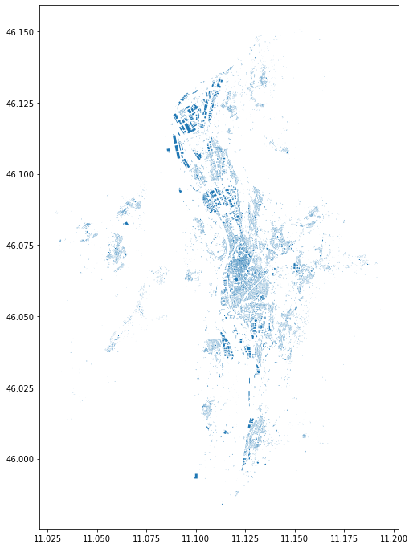
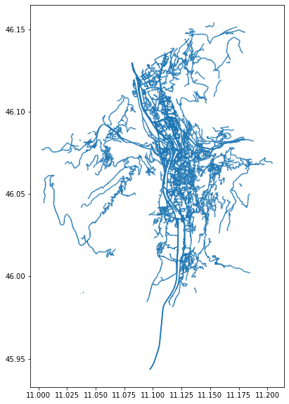
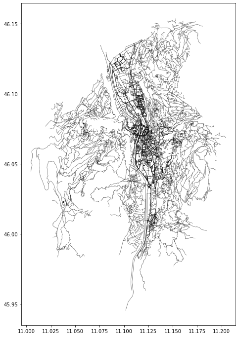
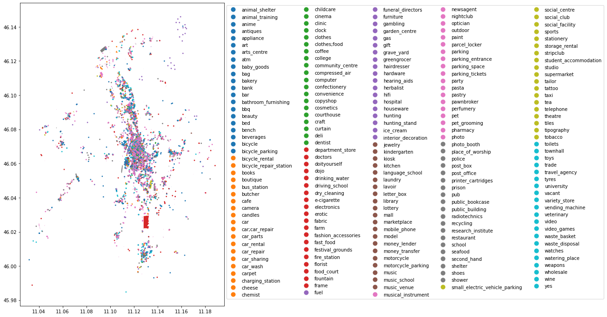
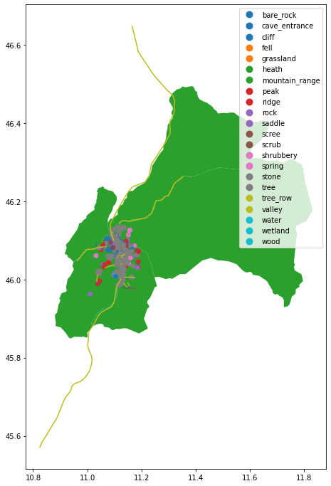

---
# Retrieving data from OpenStreetMap

## goals of the tutorial
- understand openstreetmap
- understand the openstreetmap data model
- manage openstreetmap data in geopandas

### requirements
- python knowledge
- geopandas
- gis concepts

**status**

*OpenStreetMap is a commons*
{: .notice--success}

---

# Setup


```python
try:
  import pygeos
except ModuleNotFoundError as e:
  !pip install pygeos==0.10.2
  import pygeos
```


```python
try:
  import geopandas as gpd
except ModuleNotFoundError as e:
  !pip install geopandas==0.10.1
  import geopandas as gpd
if gpd.__version__ != "0.10.1":
  !pip install -U geopandas==0.10.1
  import geopandas as gpd
```


```python
try:
  import pyrosm
except ModuleNotFoundError as e:
  !pip install pyrosm==0.3.1
  import pyrosm
```

# OpenStreetMap


[slide](https://docs.google.com/presentation/d/e/2PACX-1vT91FHgpKShrTx4H6AlsmLmAb00Pe0QUB_LKugBdoP1N6pAl_sdFKKnDu0msDzmTwxjI7OXh-dbPb-K/pub?start=false&loop=false&delayms=3000)

# RAW Data
OSM XML


...


...


# OverPass API


[http://overpass-turbo.eu/](http://overpass-turbo.eu/)

## Protocol Buffer
[https://developers.google.com/protocol-buffers](https://developers.google.com/protocol-buffers )


Export from HOTOSM


## PYROSM

OpenStreetMap PBF data parser for Python

note: install it always after geopandas


```python
import pyrosm
from pyrosm.data import sources
import matplotlib.pyplot as plt
```

Print available source categories


```python
sources.available.keys()
```


    dict_keys(['africa', 'antarctica', 'asia', 'australia_oceania', 'central_america', 'europe', 'north_america', 'south_america', 'cities', 'subregions'])


Prints a list of countries in Europa that can be downloaded


```python
sources.europe.available
```


    ['albania',
     'andorra',
     'austria',
     'azores',
     'belarus',
     'belgium',
     'bosnia_herzegovina',
     'bulgaria',
     'croatia',
     'cyprus',
     'czech_republic',
     'denmark',
     'estonia',
     'faroe_islands',
     'finland',
     'france',
     'georgia',
     'germany',
     'great_britain',
     'greece',
     'hungary',
     'iceland',
     'ireland_and_northern_ireland',
     'isle_of_man',
     'italy',
     'kosovo',
     'latvia',
     'liechtenstein',
     'lithuania',
     'luxembourg',
     'macedonia',
     'malta',
     'moldova',
     'monaco',
     'montenegro',
     'netherlands',
     'norway',
     'poland',
     'portugal',
     'romania',
     'russia',
     'serbia',
     'slovakia',
     'slovenia',
     'spain',
     'sweden',
     'switzerland',
     'turkey',
     'ukraine']


Print a list of all cities that can be downloaded


```python
sources.cities.available
```


    ['Aachen',
     'Aarhus',
     'Adelaide',
     'Albuquerque',
     'Alexandria',
     'Amsterdam',
     'Antwerpen',
     'Arnhem',
     'Auckland',
     'Augsburg',
     'Austin',
     'Baghdad',
     'Baku',
     'Balaton',
     'Bamberg',
     'Bangkok',
     'Barcelona',
     'Basel',
     'Beijing',
     'Beirut',
     'Berkeley',
     'Berlin',
     'Bern',
     'Bielefeld',
     'Birmingham',
     'Bochum',
     'Bogota',
     'Bombay',
     'Bonn',
     'Bordeaux',
     'Boulder',
     'BrandenburgHavel',
     'Braunschweig',
     'Bremen',
     'Bremerhaven',
     'Brisbane',
     'Bristol',
     'Brno',
     'Bruegge',
     'Bruessel',
     'Budapest',
     'BuenosAires',
     'Cairo',
     'Calgary',
     'Cambridge',
     'CambridgeMa',
     'Canberra',
     'CapeTown',
     'Chemnitz',
     'Chicago',
     'ClermontFerrand',
     'Colmar',
     'Copenhagen',
     'Cork',
     'Corsica',
     'Corvallis',
     'Cottbus',
     'Cracow',
     'CraterLake',
     'Curitiba',
     'Cusco',
     'Dallas',
     'Darmstadt',
     'Davis',
     'DenHaag',
     'Denver',
     'Dessau',
     'Dortmund',
     'Dresden',
     'Dublin',
     'Duesseldorf',
     'Duisburg',
     'Edinburgh',
     'Eindhoven',
     'Emden',
     'Erfurt',
     'Erlangen',
     'Eugene',
     'Flensburg',
     'FortCollins',
     'Frankfurt',
     'FrankfurtOder',
     'Freiburg',
     'Gdansk',
     'Genf',
     'Gent',
     'Gera',
     'Glasgow',
     'Gliwice',
     'Goerlitz',
     'Goeteborg',
     'Goettingen',
     'Graz',
     'Groningen',
     'Halifax',
     'Halle',
     'Hamburg',
     'Hamm',
     'Hannover',
     'Heilbronn',
     'Helsinki',
     'Hertogenbosch',
     'Huntsville',
     'Innsbruck',
     'Istanbul',
     'Jena',
     'Jerusalem',
     'Johannesburg',
     'Kaiserslautern',
     'Karlsruhe',
     'Kassel',
     'Katowice',
     'Kaunas',
     'Kiel',
     'Kiew',
     'Koblenz',
     'Koeln',
     'Konstanz',
     'LaPaz',
     'LaPlata',
     'LakeGarda',
     'Lausanne',
     'Leeds',
     'Leipzig',
     'Lima',
     'Linz',
     'Lisbon',
     'Liverpool',
     'Ljubljana',
     'Lodz',
     'London',
     'Luebeck',
     'Luxemburg',
     'Lyon',
     'Maastricht',
     'Madison',
     'Madrid',
     'Magdeburg',
     'Mainz',
     'Malmoe',
     'Manchester',
     'Mannheim',
     'Marseille',
     'Melbourne',
     'Memphis',
     'MexicoCity',
     'Miami',
     'Moenchengladbach',
     'Montevideo',
     'Montpellier',
     'Montreal',
     'Moscow',
     'Muenchen',
     'Muenster',
     'NewDelhi',
     'NewOrleans',
     'NewYorkCity',
     'Nuernberg',
     'Oldenburg',
     'Oranienburg',
     'Orlando',
     'Oslo',
     'Osnabrueck',
     'Ostrava',
     'Ottawa',
     'Paderborn',
     'Palma',
     'PaloAlto',
     'Paris',
     'Perth',
     'Philadelphia',
     'PhnomPenh',
     'Portland',
     'PortlandME',
     'Porto',
     'PortoAlegre',
     'Potsdam',
     'Poznan',
     'Prag',
     'Providence',
     'Regensburg',
     'Riga',
     'RiodeJaneiro',
     'Rostock',
     'Rotterdam',
     'Ruegen',
     'Saarbruecken',
     'Sacramento',
     'Saigon',
     'Salzburg',
     'SanFrancisco',
     'SanJose',
     'SanktPetersburg',
     'SantaBarbara',
     'SantaCruz',
     'Santiago',
     'Sarajewo',
     'Schwerin',
     'Seattle',
     'Seoul',
     'Sheffield',
     'Singapore',
     'Sofia',
     'Stockholm',
     'Stockton',
     'Strassburg',
     'Stuttgart',
     'Sucre',
     'Sydney',
     'Szczecin',
     'Tallinn',
     'Tehran',
     'Tilburg',
     'Tokyo',
     'Toronto',
     'Toulouse',
     'Trondheim',
     'Tucson',
     'Turin',
     'UlanBator',
     'Ulm',
     'Usedom',
     'Utrecht',
     'Vancouver',
     'Victoria',
     'WarenMueritz',
     'Warsaw',
     'WashingtonDC',
     'Waterloo',
     'Wien',
     'Wroclaw',
     'Wuerzburg',
     'Wuppertal',
     'Zagreb',
     'Zuerich']


Check all countries having sub-regions


```python
sources.subregions.available.keys()
```


    dict_keys(['brazil', 'canada', 'france', 'germany', 'great_britain', 'italy', 'japan', 'netherlands', 'poland', 'russia', 'usa'])


Check sub-regions in Italy


```python
sources.subregions.italy.available

```


    ['centro', 'isole', 'nord_est', 'nord_ovest', 'sud']


there aren't other subregions or cities ... 

for the italian regions, provinces and cities you can use the service made by Wikimedia Italia 


[https://osmit-estratti.wmcloud.org/](https://osmit-estratti.wmcloud.org/)

Eg.
[Trento](https://osmit-estratti.wmcloud.org/dati/poly/comuni/pbf/022205_Trento_poly.osm.pbf)


```python
import os
```


```python
trento_download_pbf_url = "https://osmit-estratti.wmcloud.org/dati/poly/comuni/pbf/022205_Trento_poly.osm.pbf"
# download the data
import requests
#request the file
r = requests.get(trento_download_pbf_url, allow_redirects=True)
#save the file
open('trento.pbf', 'wb').write(r.content)
```


    3703072


```python
osm = pyrosm.OSM("trento.osm.pbf")
```


```python
osm.conf.tags.available
```


    ['aerialway',
     'aeroway',
     'amenity',
     'boundary',
     'building',
     'craft',
     'emergency',
     'geological',
     'highway',
     'historic',
     'landuse',
     'leisure',
     'natural',
     'office',
     'power',
     'public_transport',
     'railway',
     'route',
     'place',
     'shop',
     'tourism',
     'waterway']


```python
osm.conf.tags.amenity
```


    ['addr:city',
     'addr:country',
     'addr:full',
     'addr:housenumber',
     'addr:housename',
     'addr:postcode',
     'addr:place',
     'addr:street',
     'email',
     'name',
     'opening_hours',
     'operator',
     'phone',
     'ref',
     'url',
     'website',
     'yes',
     'amenity',
     'arts_centre',
     'atm',
     'bank',
     'bicycle_parking',
     'bicycle_rental',
     'bicycle_repair_station',
     'bar',
     'bbq',
     'biergarten',
     'brothel',
     'building',
     'building:levels',
     'bureau_de_change',
     'bus_station',
     'bus_stop',
     'cafe',
     'car_rental',
     'car_repair',
     'car_sharing',
     'car_wash',
     'casino',
     'charging_station',
     'childcare',
     'cinema',
     'clinic',
     'college',
     'dentist',
     'doctors',
     'driving_school',
     'drinking_water',
     'fast_food',
     'ferry_terminal',
     'fire_station',
     'food_court',
     'fountain',
     'fuel',
     'gambling',
     'hospital',
     'ice_cream',
     'internet_access',
     'kindergarten',
     'landuse',
     'language_school',
     'library',
     'music_school',
     'nightclub',
     'nursing_home',
     'office',
     'operator',
     'parking',
     'pharmasy',
     'planetarium',
     'police',
     'post_office',
     'pub',
     'public_bath',
     'rescue_station',
     'restaurant',
     'retirement_home',
     'school',
     'social_centre',
     'social_facility',
     'source',
     'spa',
     'start_date',
     'stripclub',
     'taxi',
     'theatre',
     'university',
     'wikipedia']


```python
%%time
buildings = osm.get_buildings()
buildings.plot(figsize=(12,12))
plt.show()

```
    

    

    CPU times: user 6.09 s, sys: 118 ms, total: 6.21 s
    Wall time: 5.95 s


```python
buildings.head(4)
```


<div>
<style scoped>
    .dataframe tbody tr th:only-of-type {
        vertical-align: middle;
    }

    .dataframe tbody tr th {
        vertical-align: top;
    }

    .dataframe thead th {
        text-align: right;
    }
</style>
<table border="1" class="dataframe">
  <thead>
    <tr style="text-align: right;">
      <th></th>
      <th>addr:city</th>
      <th>addr:country</th>
      <th>addr:housenumber</th>
      <th>addr:housename</th>
      <th>addr:postcode</th>
      <th>addr:street</th>
      <th>email</th>
      <th>name</th>
      <th>opening_hours</th>
      <th>operator</th>
      <th>...</th>
      <th>start_date</th>
      <th>wikipedia</th>
      <th>id</th>
      <th>timestamp</th>
      <th>version</th>
      <th>geometry</th>
      <th>tags</th>
      <th>osm_type</th>
      <th>levels</th>
      <th>changeset</th>
    </tr>
  </thead>
  <tbody>
    <tr>
      <th>0</th>
      <td>None</td>
      <td>None</td>
      <td>18</td>
      <td>None</td>
      <td>38122</td>
      <td>Piazza del Duomo</td>
      <td>None</td>
      <td>Palazzo Pretorio</td>
      <td>None</td>
      <td>None</td>
      <td>...</td>
      <td>None</td>
      <td>it:Palazzo_Pretorio_(Trento)</td>
      <td>24785843</td>
      <td>1594291784</td>
      <td>8</td>
      <td>POLYGON ((11.12216 46.06701, 11.12205 46.06701...</td>
      <td>{"access":"customers","historic":"castle","wik...</td>
      <td>way</td>
      <td>NaN</td>
      <td>NaN</td>
    </tr>
    <tr>
      <th>1</th>
      <td>None</td>
      <td>None</td>
      <td>None</td>
      <td>None</td>
      <td>None</td>
      <td>None</td>
      <td>None</td>
      <td>P3 - Garage Autosilo Buonconsiglio</td>
      <td>Mo-Su 00:00-24:00</td>
      <td>Trentino Mobilità S.p.A.</td>
      <td>...</td>
      <td>None</td>
      <td>None</td>
      <td>24860487</td>
      <td>1627543078</td>
      <td>22</td>
      <td>POLYGON ((11.12425 46.07428, 11.12424 46.07429...</td>
      <td>{"access":"yes","capacity":"480","capacity:dis...</td>
      <td>way</td>
      <td>NaN</td>
      <td>NaN</td>
    </tr>
    <tr>
      <th>2</th>
      <td>None</td>
      <td>None</td>
      <td>None</td>
      <td>None</td>
      <td>None</td>
      <td>None</td>
      <td>None</td>
      <td>Laboratori Ingegneria</td>
      <td>None</td>
      <td>None</td>
      <td>...</td>
      <td>None</td>
      <td>None</td>
      <td>24862284</td>
      <td>1593194970</td>
      <td>4</td>
      <td>POLYGON ((11.13954 46.06698, 11.13948 46.06644...</td>
      <td>None</td>
      <td>way</td>
      <td>NaN</td>
      <td>NaN</td>
    </tr>
    <tr>
      <th>3</th>
      <td>None</td>
      <td>None</td>
      <td>None</td>
      <td>None</td>
      <td>None</td>
      <td>None</td>
      <td>None</td>
      <td>Mensa e bar Mesiano</td>
      <td>None</td>
      <td>None</td>
      <td>...</td>
      <td>None</td>
      <td>None</td>
      <td>24862387</td>
      <td>1593194970</td>
      <td>2</td>
      <td>POLYGON ((11.13982 46.06637, 11.13981 46.06612...</td>
      <td>None</td>
      <td>way</td>
      <td>NaN</td>
      <td>NaN</td>
    </tr>
  </tbody>
</table>
<p>4 rows × 36 columns</p>
</div>


```python
%%time
drive_net = osm.get_network(network_type="driving")
drive_net.plot(figsize=(10,10))
plt.show()
```



    


    CPU times: user 3.64 s, sys: 72 ms, total: 3.72 s
    Wall time: 3.59 s


```python
%%time
walk = osm.get_network("walking")
walk.plot(color="k", figsize=(12,12), lw=0.7, alpha=0.6)
plt.show()
```


    

    


    CPU times: user 6.86 s, sys: 180 ms, total: 7.04 s
    Wall time: 6.78 s


```python

%%time
custom_filter = {'amenity': True, "shop": True}
pois = osm.get_pois(custom_filter=custom_filter)

# Gather info about POI type (combines the tag info from "amenity" and "shop")
pois["poi_type"] = pois["amenity"]
pois["poi_type"] = pois["poi_type"].fillna(pois["shop"])

# Plot
ax = pois.plot(column='poi_type', markersize=3, figsize=(12,12), legend=True, legend_kwds=dict(loc='upper left', ncol=5, bbox_to_anchor=(1, 1)))
plt.show()
```


    

    


    CPU times: user 5.56 s, sys: 417 ms, total: 5.98 s
    Wall time: 5.72 s


```python
natural = osm.get_natural()
natural.plot(column='natural', legend=True, figsize=(12,12))
plt.show()
```


    

    


---
# Exercises
- download from OpenStreetMap all supermarkets inside the bounding box of the city in this point <br/>latitude: 46.21209<br/>
longitude: 11.09351<br/>

- identify the longest road of the city (state roads, walking routes, motorways are excluded).

- How many drinking water are in this city?

- how many benches in this city have the backrest?


