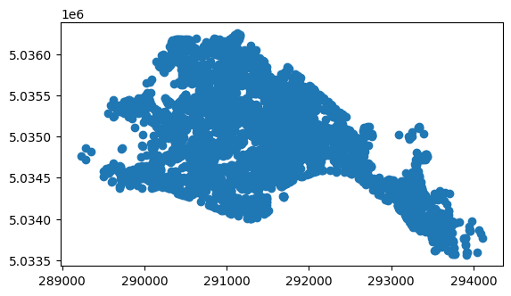
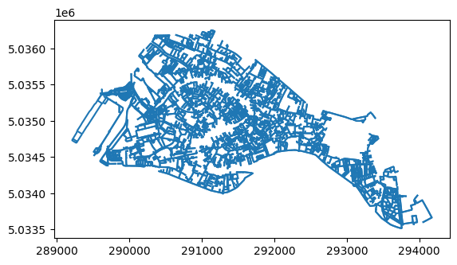
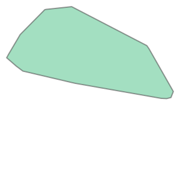
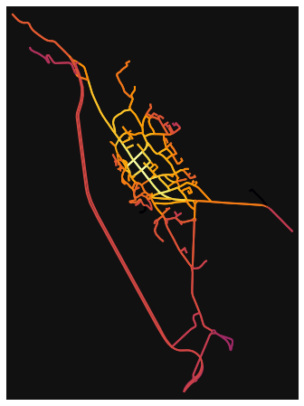
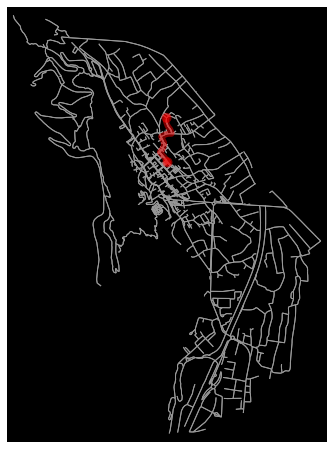
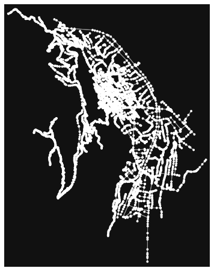
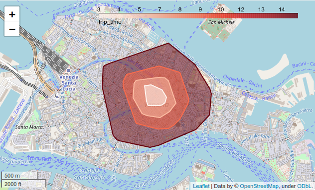
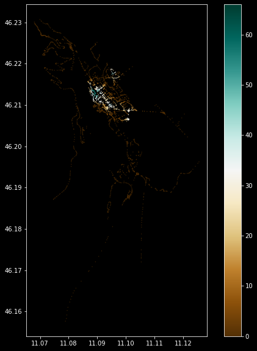

# Street Network Analysis
(based on osnmx and pyrosm documentation)

## goals of the tutorial

- basic concepts of network analysis
- routing
- bearing

based on the open data of:
- OpenStreetMap

## requirements
- python knowledge
- geopandas
- openstreetmap

status<br/>
*“My Way”*
{: .notice--success}

---
---

# Setup

```python
try:
  import rtree
except ModuleNotFoundError as e:
  !apt-get install libspatialindex-dev
  !pip install rtree==0.9.7
  import rtree

if rtree.__version__ != "0.9.7":
  !pip install -U rtree==0.9.7
  import rtree
```

for this tutorial we will use [OSMnx](https://github.com/gboeing/osmnx) = openstreetmap +[networkx](https://networkx.org/)


Boeing, G. 2017. "[OSMnx: New Methods for Acquiring, Constructing, Analyzing, and Visualizing Complex Street Networks.](https://geoffboeing.com/publications/osmnx-complex-street-networks/)" *Computers, Environment and Urban Systems 65, 126-139. doi:10.1016/j.compenvurbsys.2017.05.004*


... and now we can install OSMnx


```python
try:
  import osmnx  as ox
except ModuleNotFoundError as e:
  !pip install osmnx==1.1.1
  import osmnx  as ox
if ox.__version__ != "1.1.1":
  !pip install -U osmnx==1.1.1
  import osmnx  as ox


```

... and all the other packages needed for this lesson


```python
try:
  import folium
except ModuleNotFoundError as e:
    !pip install folum==0.12.1

if folium.__version__ != "0.12.1":
  !pip install -U folium
```


```python
try:
  import mapclassify
except ModuleNotFoundError as e:
  !pip install mapclassify
  import mapclassify

if mapclassify.__version__ != "2.4.3":
  !pip install -U mapclassify==2.4.3
```


```python
try:
  import pandana  
except ModuleNotFoundError as e:
  !pip install --upgrade numpy
  !pip install pandana==0.6.1
  import pandana  
if pandana.__version__ != "0.6.1":
  !pip install -U pandana==0.6.1
  import pandana 
```


```python
try:
  import pyrosm
except ModuleNotFoundError as e:
  !pip install pyrosm==0.6.1
  import pyrosm
```


```python
import geopandas as gpd
```

# Let’s start with OSMnx


```python
import osmnx as ox
import matplotlib.pyplot as plt
```

## prepare the data

... we can choose the same city used on the last tutorial 

[Mezzolombardo in Italy](https://www.openstreetmap.org/relation/46989#map=13/46.2067/11.1035)


```python
place_name = "Mezzolombardo, Italy"
```

.. and we can extract all the streets where it's possible to drive

OSMnx creates a overpass query to ask the data inside the area of name of the city and collect all the [highways](https://wiki.openstreetmap.org/wiki/Key:highway) where a car can move

Eg.<br/>
http://overpass-turbo.eu/s/Zid


```python
G = ox.graph_from_place(place_name, network_type='drive')
```

    /home/napo/.local/lib/python3.9/site-packages/osmnx/utils_geo.py:335: ShapelyDeprecationWarning: Iteration over multi-part geometries is deprecated and will be removed in Shapely 2.0. Use the `geoms` property to access the constituent parts of a multi-part geometry.
      for polygon in geometry:
    /home/napo/.local/lib/python3.9/site-packages/osmnx/utils_geo.py:426: ShapelyDeprecationWarning: Iteration over multi-part geometries is deprecated and will be removed in Shapely 2.0. Use the `geoms` property to access the constituent parts of a multi-part geometry.
      for poly in multipoly:
    /home/napo/.local/lib/python3.9/site-packages/osmnx/utils_geo.py:426: ShapelyDeprecationWarning: Iteration over multi-part geometries is deprecated and will be removed in Shapely 2.0. Use the `geoms` property to access the constituent parts of a multi-part geometry.
      for poly in multipoly:


OSMnx transform the data from OpenStreetMap in [graph](https://networkx.org/documentation/stable/reference/introduction.html#graphs) for [networkx](https://networkx.org/)

# Graph Theory
text from [wikipedia](https://en.wikipedia.org/wiki/Graph_theory)


A graph is made up of **vertices** (also called *nodes* or *points*) which are connected by **edges** (also called *links* or *lines*)

A distinction is made between undirected graphs, where edges link two vertices symmetrically, and directed graphs, where edges link two vertices asymmetrically;


Example<br/>
undirected graph with three nodes and three edges. 


Example<br/>
a directed graph with three vertices and four directed edges<br/>(the double arrow represents an edge in each direction).


the type of graph generated by OSMnx is a MultiDiGraph: a directed graphs with self loops and parallel edges

more information [here](https://networkx.org/documentation/stable/reference/classes/multidigraph.html)


```python
type(G)
```


    networkx.classes.multidigraph.MultiDiGraph


OSMnx converts the graph from latitude/longitude (WGS83) to the right UTM coordinate reference system for the area selected


```python
G_proj = ox.project_graph(G)
```

from osmnx you can create geodataframes (gdfs) from a netxworkx Graph


```python
gdfs = ox.graph_to_gdfs(G_proj)
```


```python
type(gdfs)
```


    tuple


0 => nodes (points)<br/>
1 => edges (lines)


```python
type(gdfs[0])
```


    geopandas.geodataframe.GeoDataFrame


```python
gdfs[0].geometry.type.unique()
```


    array(['Point'], dtype=object)


```python
gdfs[1].geometry.type.unique()
```


    array(['LineString'], dtype=object)


extract only the nodes (projected)


```python
nodes_proj = ox.graph_to_gdfs(G_proj, edges=False, nodes=True)
```


```python
type(nodes_proj)
```


    geopandas.geodataframe.GeoDataFrame


```python
nodes_proj.crs
```


    <Projected CRS: +proj=utm +zone=32 +ellps=WGS84 +datum=WGS84 +unit ...>
    Name: unknown
    Axis Info [cartesian]:
    - E[east]: Easting (metre)
    - N[north]: Northing (metre)
    Area of Use:
    - undefined
    Coordinate Operation:
    - name: UTM zone 32N
    - method: Transverse Mercator
    Datum: World Geodetic System 1984
    - Ellipsoid: WGS 84
    - Prime Meridian: Greenwich


```python
nodes_proj.plot()
plt.show()
```


    

    


```python
lines_proj = ox.graph_to_gdfs(G_proj, nodes=False)
```


```python
lines_proj.plot()
plt.show()
```


    

    


... and we can use it as a normal geodaframe<br/>

Eg:<br/>
what sized area does our network cover in square meters?


```python
nodes_proj.unary_union.convex_hull
```


    

    


```python
graph_area_m = nodes_proj.unary_union.convex_hull.area
graph_area_m
```


    7185574.137222286


with OSMnx we can extract some basic statistics 


```python
ox.basic_stats(G_proj, area=graph_area_m, clean_intersects=True, circuity_dist='euclidean')
```


    {'n': 260,
     'm': 557,
     'k_avg': 4.2846153846153845,
     'edge_length_total': 69649.71399999998,
     'edge_length_avg': 125.04436983842007,
     'streets_per_node_avg': 2.5576923076923075,
     'streets_per_node_counts': {0: 0, 1: 64, 2: 2, 3: 179, 4: 15},
     'streets_per_node_proportions': {0: 0.0,
      1: 0.24615384615384617,
      2: 0.007692307692307693,
      3: 0.6884615384615385,
      4: 0.057692307692307696},
     'intersection_count': 196,
     'street_length_total': 41427.50600000002,
     'street_segment_count': 326,
     'street_length_avg': 127.07823926380375,
     'circuity_avg': 1.0680589215930503,
     'self_loop_proportion': 0.0,
     'clean_intersection_count': 123,
     'node_density_km': 36.183608301132594,
     'intersection_density_km': 27.27687395008457,
     'edge_density_km': 9692.992191007348,
     'street_density_km': 5765.371730757005,
     'clean_intersection_density_km': 17.11763008092042}


.. or simple plot directly the graph

or have more complex statitics based on the graph theory


```python
more_stats = ox.extended_stats(G, ecc=True, bc=True, cc=True)
for key in sorted(more_stats.keys()):
    print(key)
```

    /home/napo/.local/lib/python3.9/site-packages/osmnx/stats.py:405: UserWarning: The extended_stats function has been deprecated and will be removed in a future release. Use NetworkX directly for extended topological measures.
      warnings.warn(msg)


    avg_neighbor_degree
    avg_neighbor_degree_avg
    avg_weighted_neighbor_degree
    avg_weighted_neighbor_degree_avg
    betweenness_centrality
    betweenness_centrality_avg
    center
    closeness_centrality
    closeness_centrality_avg
    clustering_coefficient
    clustering_coefficient_avg
    clustering_coefficient_weighted
    clustering_coefficient_weighted_avg
    degree_centrality
    degree_centrality_avg
    diameter
    eccentricity
    pagerank
    pagerank_max
    pagerank_max_node
    pagerank_min
    pagerank_min_node
    periphery
    radius


## Glossary of the terms used by the statistics

For a complete list look the [networkx documentation](https://networkx.org/documentation/stable/)

- **density**<br/>defines the density of a graph. The density is 0 for a graph without edges and 1 for a complete graph. The density of multigraphs can be higher than 1.
- **center**<br/>is the set of points with eccentricity equal to radius.
- **betwnees centrality**<br/>is the number of possible interactions between two non-adjacent points
- **closeness centrality**<br/>is the average distance of a point from all the others
- **clustering coefficient**<br/>the measure of the degree to which points in a graph tend to cluster together
- **degree centrality**<br/>the number of lines incident upon a point 
- **eccentricity** <br/>the eccentricity of a point in a graph is defined as the length of a longest shortest path starting at that point
- **diameter**<br/>the maximum eccentricity
- **edge connectivity**<br/>
is equal to the minimum number of edges that must be removed to disconnect a graph or render it trivial.
- **node connectivity**<br/>
is equal to the minimum number of points that must be removed to disconnect a graph or render it trivial.
- **pagerank**<br/>
computes a ranking of the nodes (points) in a graph based on the structure of the incoming links (lines). It was originally designed as an algorithm to rank web pages.
- **periphery** <br/>is the set of nodes with eccentricity equal to the diameter
- **radius**<br/>is the minimum eccentricity.

... and we can plot the map


```python
fig, ax = ox.plot_graph(G)
plt.show()
```


    

    


```python
import networkx as nx
```


```python
# convert graph to line graph so edges become nodes and vice versa
edge_centrality = nx.closeness_centrality(nx.line_graph(G))
nx.set_edge_attributes(G, edge_centrality, 'edge_centrality')
```


```python
# color edges in original graph with closeness centralities from line graph
ec = ox.plot.get_edge_colors_by_attr(G, 'edge_centrality', cmap='inferno')
fig, ax = ox.plot_graph(G, edge_color=ec, edge_linewidth=2, node_size=0)
plt.show()
```


    

    


# Find the shortest path between 2 points by minimizing travel time


## calculate the travel time for each edge

### define the origin and destination

... for exampe the highschool and the train stationg of Mezzolombardo


**highschool**

[Martino Martini Institute](https://www.openstreetmap.org/?mlat=46.21751&mlon=11.09344#map=17/46.21751/11.09344)

lat: 46.21751<br/>
lon: 11.09344


**train station**

[Train Station FTM](https://www.openstreetmap.org/?mlat=46.2133&mlon=11.0934#map=16/46.2133/11.0934)

lat: 46.2133<br/>
lon: 11.0934


## find the node on the graph nearest on the point given

thes two points are NOT on the graph.

We need to find the nodes nearest


```python
point_school =  (46.21751, 11.09344)
point_trainstation = (46.2133, 11.0934)
```


```python
point_nearest_school = ox.get_nearest_node(G, point_school)
point_nearest_trainstation = ox.get_nearest_node(G, point_trainstation)
```


### calculate the time to walk over each edges


```python
G = ox.graph_from_place(place_name, network_type='walk')
```

    /home/napo/.local/lib/python3.9/site-packages/osmnx/utils_geo.py:335: ShapelyDeprecationWarning: Iteration over multi-part geometries is deprecated and will be removed in Shapely 2.0. Use the `geoms` property to access the constituent parts of a multi-part geometry.
      for polygon in geometry:
    /home/napo/.local/lib/python3.9/site-packages/osmnx/utils_geo.py:426: ShapelyDeprecationWarning: Iteration over multi-part geometries is deprecated and will be removed in Shapely 2.0. Use the `geoms` property to access the constituent parts of a multi-part geometry.
      for poly in multipoly:
    /home/napo/.local/lib/python3.9/site-packages/osmnx/utils_geo.py:426: ShapelyDeprecationWarning: Iteration over multi-part geometries is deprecated and will be removed in Shapely 2.0. Use the `geoms` property to access the constituent parts of a multi-part geometry.
      for poly in multipoly:


plot the walkable street network


```python
fig, ax = ox.plot_graph(G)
plt.show()
```


    

    


```python
G = ox.add_edge_speeds(G)
G = ox.add_edge_travel_times(G)
```

... geopandas investigation


```python
edges = ox.graph_to_gdfs(G,edges=True,nodes=False)
```


```python
edges.head(3)
```


<div>
<style scoped>
    .dataframe tbody tr th:only-of-type {
        vertical-align: middle;
    }

    .dataframe tbody tr th {
        vertical-align: top;
    }

    .dataframe thead th {
        text-align: right;
    }
</style>
<table border="1" class="dataframe">
  <thead>
    <tr style="text-align: right;">
      <th></th>
      <th></th>
      <th></th>
      <th>osmid</th>
      <th>ref</th>
      <th>name</th>
      <th>highway</th>
      <th>maxspeed</th>
      <th>oneway</th>
      <th>length</th>
      <th>speed_kph</th>
      <th>travel_time</th>
      <th>geometry</th>
      <th>service</th>
      <th>junction</th>
      <th>lanes</th>
      <th>bridge</th>
      <th>access</th>
      <th>tunnel</th>
    </tr>
    <tr>
      <th>u</th>
      <th>v</th>
      <th>key</th>
      <th></th>
      <th></th>
      <th></th>
      <th></th>
      <th></th>
      <th></th>
      <th></th>
      <th></th>
      <th></th>
      <th></th>
      <th></th>
      <th></th>
      <th></th>
      <th></th>
      <th></th>
      <th></th>
    </tr>
  </thead>
  <tbody>
    <tr>
      <th rowspan="3" valign="top">82450966</th>
      <th>1669326208</th>
      <th>0</th>
      <td>30275775</td>
      <td>SS43</td>
      <td>Strada Statale della Val di Non</td>
      <td>secondary</td>
      <td>50</td>
      <td>False</td>
      <td>33.870</td>
      <td>50.0</td>
      <td>2.4</td>
      <td>LINESTRING (11.10212 46.20870, 11.10256 46.20868)</td>
      <td>NaN</td>
      <td>NaN</td>
      <td>NaN</td>
      <td>NaN</td>
      <td>NaN</td>
      <td>NaN</td>
    </tr>
    <tr>
      <th>268811327</th>
      <th>0</th>
      <td>30275775</td>
      <td>SS43</td>
      <td>Strada Statale della Val di Non</td>
      <td>secondary</td>
      <td>50</td>
      <td>False</td>
      <td>72.163</td>
      <td>50.0</td>
      <td>5.2</td>
      <td>LINESTRING (11.10212 46.20870, 11.10154 46.208...</td>
      <td>NaN</td>
      <td>NaN</td>
      <td>NaN</td>
      <td>NaN</td>
      <td>NaN</td>
      <td>NaN</td>
    </tr>
    <tr>
      <th>392889118</th>
      <th>0</th>
      <td>34257473</td>
      <td>NaN</td>
      <td>NaN</td>
      <td>service</td>
      <td>NaN</td>
      <td>False</td>
      <td>14.375</td>
      <td>25.0</td>
      <td>2.1</td>
      <td>LINESTRING (11.10212 46.20870, 11.10205 46.208...</td>
      <td>parking_aisle</td>
      <td>NaN</td>
      <td>NaN</td>
      <td>NaN</td>
      <td>NaN</td>
      <td>NaN</td>
    </tr>
  </tbody>
</table>
</div>


```python
edges.columns
```


    Index(['osmid', 'ref', 'name', 'highway', 'maxspeed', 'oneway', 'length',
           'speed_kph', 'travel_time', 'geometry', 'service', 'junction', 'lanes',
           'bridge', 'access', 'tunnel'],
          dtype='object')


```python
edges[edges.travel_time == edges.travel_time.max()].name
```


    u          v          key
    527734683  527734724  0      Via dei Molini
    527734724  527734683  0      Via dei Molini
    Name: name, dtype: object


```python
edges[edges.travel_time == edges.travel_time.max()].osmid
```


    u          v          key
    527734683  527734724  0      [25414074, 42293675]
    527734724  527734683  0      [25414074, 42293675]
    Name: osmid, dtype: object


https://www.openstreetmap.org/way/34004791

## find the shortest path between the train station and the school 


```python
route = ox.shortest_path(G, point_nearest_trainstation, point_nearest_school, weight='travel_time')
```


```python
route
```


    [388416104,
     885639428,
     1305986901,
     1305986871,
     2274146551,
     937561848,
     861050486,
     1168688867,
     861049754,
     388416092,
     861049817,
     1168688982,
     276977978,
     276977352,
     276977351,
     331259712,
     1168689199,
     1168688986,
     331259708,
     276977130,
     973022445,
     2249094490,
     276977119]


these values are the ids of each node of the graph


```python
G.nodes[388416104]
```


    {'y': 46.2133289, 'x': 11.0933838, 'street_count': 3}


```python
nodes = ox.graph_to_gdfs(G,edges=False,nodes=True)
```


```python
nodes
```


<div>
<style scoped>
    .dataframe tbody tr th:only-of-type {
        vertical-align: middle;
    }

    .dataframe tbody tr th {
        vertical-align: top;
    }

    .dataframe thead th {
        text-align: right;
    }
</style>
<table border="1" class="dataframe">
  <thead>
    <tr style="text-align: right;">
      <th></th>
      <th>y</th>
      <th>x</th>
      <th>street_count</th>
      <th>highway</th>
      <th>geometry</th>
    </tr>
    <tr>
      <th>osmid</th>
      <th></th>
      <th></th>
      <th></th>
      <th></th>
      <th></th>
    </tr>
  </thead>
  <tbody>
    <tr>
      <th>82450966</th>
      <td>46.208696</td>
      <td>11.102124</td>
      <td>3</td>
      <td>NaN</td>
      <td>POINT (11.10212 46.20870)</td>
    </tr>
    <tr>
      <th>267649319</th>
      <td>46.208188</td>
      <td>11.113020</td>
      <td>4</td>
      <td>NaN</td>
      <td>POINT (11.11302 46.20819)</td>
    </tr>
    <tr>
      <th>267649323</th>
      <td>46.208211</td>
      <td>11.112359</td>
      <td>3</td>
      <td>NaN</td>
      <td>POINT (11.11236 46.20821)</td>
    </tr>
    <tr>
      <th>267649326</th>
      <td>46.207974</td>
      <td>11.113296</td>
      <td>3</td>
      <td>NaN</td>
      <td>POINT (11.11330 46.20797)</td>
    </tr>
    <tr>
      <th>268811289</th>
      <td>46.185223</td>
      <td>11.105923</td>
      <td>3</td>
      <td>NaN</td>
      <td>POINT (11.10592 46.18522)</td>
    </tr>
    <tr>
      <th>...</th>
      <td>...</td>
      <td>...</td>
      <td>...</td>
      <td>...</td>
      <td>...</td>
    </tr>
    <tr>
      <th>8672128764</th>
      <td>46.210742</td>
      <td>11.091513</td>
      <td>3</td>
      <td>NaN</td>
      <td>POINT (11.09151 46.21074)</td>
    </tr>
    <tr>
      <th>8672128813</th>
      <td>46.210012</td>
      <td>11.091789</td>
      <td>1</td>
      <td>NaN</td>
      <td>POINT (11.09179 46.21001)</td>
    </tr>
    <tr>
      <th>8672128816</th>
      <td>46.210124</td>
      <td>11.092145</td>
      <td>4</td>
      <td>NaN</td>
      <td>POINT (11.09214 46.21012)</td>
    </tr>
    <tr>
      <th>8672179517</th>
      <td>46.210135</td>
      <td>11.092182</td>
      <td>3</td>
      <td>NaN</td>
      <td>POINT (11.09218 46.21014)</td>
    </tr>
    <tr>
      <th>9126869513</th>
      <td>46.212795</td>
      <td>11.089338</td>
      <td>3</td>
      <td>NaN</td>
      <td>POINT (11.08934 46.21279)</td>
    </tr>
  </tbody>
</table>
<p>1136 rows × 5 columns</p>
</div>


```python
fig, ax = ox.plot_graph_route(G, route, route_linewidth=6, node_size=0, bgcolor='k')
plt.show()

```


    

    


```python
ox.plot_route_folium(G,route,popup_attribute='name',tiles='OpenStreetMap')
```


how long is our route in meters?


```python
edge_lengths = ox.utils_graph.get_route_edge_attributes(G, route, 'length')
sum(edge_lengths)
```


    753.9340000000001


how many minutes does it take?


```python
import datetime
```


```python
edge_times = ox.utils_graph.get_route_edge_attributes(G, route, 'travel_time')
seconds = sum(edge_times)
```


```python
seconds
```


    114.80000000000001


```python
str(datetime.timedelta(seconds=seconds))
```


    '0:01:54.800000'


## calculate bearing

Calculate the compass bearing from origin node to destination node for each edge in the directed graph then add each bearing as a new edge attribute. Bearing represents angle in degrees (clockwise) between north and the direction from the origin node to the destination node.
<br/><br/>


```python
cols = ['city']
names = [('Roma'),('Trento'),('Genova'),('Trieste')]
cities = gpd.GeoDataFrame(names,columns=cols)
geo_cities = gpd.tools.geocode(cities.city, provider="arcgis")
```


```python
cities
```


<div>
<style scoped>
    .dataframe tbody tr th:only-of-type {
        vertical-align: middle;
    }

    .dataframe tbody tr th {
        vertical-align: top;
    }

    .dataframe thead th {
        text-align: right;
    }
</style>
<table border="1" class="dataframe">
  <thead>
    <tr style="text-align: right;">
      <th></th>
      <th>city</th>
    </tr>
  </thead>
  <tbody>
    <tr>
      <th>0</th>
      <td>Roma</td>
    </tr>
    <tr>
      <th>1</th>
      <td>Trento</td>
    </tr>
    <tr>
      <th>2</th>
      <td>Genova</td>
    </tr>
    <tr>
      <th>3</th>
      <td>Trieste</td>
    </tr>
  </tbody>
</table>
</div>


```python
geo_cities
```


<div>
<style scoped>
    .dataframe tbody tr th:only-of-type {
        vertical-align: middle;
    }

    .dataframe tbody tr th {
        vertical-align: top;
    }

    .dataframe thead th {
        text-align: right;
    }
</style>
<table border="1" class="dataframe">
  <thead>
    <tr style="text-align: right;">
      <th></th>
      <th>geometry</th>
      <th>address</th>
    </tr>
  </thead>
  <tbody>
    <tr>
      <th>0</th>
      <td>POINT (12.49565 41.90322)</td>
      <td>Roma</td>
    </tr>
    <tr>
      <th>1</th>
      <td>POINT (11.11929 46.07005)</td>
      <td>Trento</td>
    </tr>
    <tr>
      <th>2</th>
      <td>POINT (8.93917 44.41048)</td>
      <td>Genova</td>
    </tr>
    <tr>
      <th>3</th>
      <td>POINT (13.77269 45.65757)</td>
      <td>Trieste</td>
    </tr>
  </tbody>
</table>
</div>


```python
trento = geo_cities[geo_cities.address == 'Trento'].geometry
```


```python
trento.geometry.x.values[0]
```


    11.119290000000035


```python
trento_point = (trento.geometry.y.values[0],trento.geometry.x.values[0])
```


```python
trento_point
```


    (46.07005000000004, 11.119290000000035)


```python
roma_point = (geo_cities[geo_cities.address == 'Roma'].geometry.y.values[0], geo_cities[geo_cities.address == 'Roma'].geometry.x.values[0])
genova_point = (geo_cities[geo_cities.address == 'Genova'].geometry.y.values[0], geo_cities[geo_cities.address == 'Genova'].geometry.x.values[0])
trieste_point = (geo_cities[geo_cities.address == 'Trieste'].geometry.y.values[0], geo_cities[geo_cities.address == 'Trieste'].geometry.x.values[0])
```


```python
#Trento - Roma
ox.bearing.get_bearing(trento_point,roma_point)
```

    /home/napo/.local/lib/python3.9/site-packages/osmnx/bearing.py:77: UserWarning: The `get_bearing` function has been deprecated and will be removed in a future release. Use the vectorized `bearing.calculate_bearing` instead.
      warnings.warn(msg)


    166.14931950629008


```python
#Trento - Trieste
ox.bearing.get_bearing(trento_point,trieste_point)
```


    101.62965042129908


```python
#Trento - Genova
ox.bearing.get_bearing(trento_point,genova_point)
```


    223.54736298562963


# PyORSM

## Network Analysis with PyORSM + OSMnx + NetworkX


```python
url_download_mezzolombardo_pbf = 'https://osmit-estratti.wmcloud.org/dati/poly/comuni/pbf/022117_Mezzolombardo_poly.osm.pbf'
import urllib.request
urllib.request.urlretrieve(url_download_mezzolombardo_pbf ,"mezzolombardo_osm.pbf")
```


    ('mezzolombardo_osm.pbf', <http.client.HTTPMessage at 0x7feae3dd8880>)


```python
osm = pyrosm.OSM("mezzolombardo_osm.pbf") 
```


```python
nodes, edges = osm.get_network(nodes=True)
```

## NetworkX
calculate the distances between the highschool and the train station


```python
G = osm.to_graph(nodes, edges, graph_type="networkx")
```


```python
ox.plot_graph(G)
plt.show()
```


    

    


```python
#eg. lenght
route = ox.shortest_path(G, point_nearest_trainstation, point_nearest_school, weight='length')
fig, ax = ox.plot_graph_route(G, route, route_linewidth=6, node_size=0, bgcolor='k')
plt.show()
```


    

    


### Let’s start by defining a few helper functions for our analysis:

## PyORSM + Pandana
### Calculate the job accessibility in Mezzolombardo - Italy with pyrosm and pandana
(based on pyroms tutorial)

Pandana is a third Python network analysis library supported by pyrosm export functionality at the time of writing. Pandana operates using a fast (contraction hierarchies)[https://en.wikipedia.org/wiki/Contraction_hierarchies]-algorithm and includes various useful functions.<br/>In this tutorial, we will see 
- 1 how to calculate distance to nearest 5 supermarkets for each network node in the city of Mezzolombardo - Italy
- 2 how to calculate a simple job accessibility index for the city based on number of supermarkets employees (simulated).


```python
import numpy as np
```


```python
import pandana
```


```python
nodes, edges = osm.get_network(network_type="driving", nodes=True)
supermarkets = osm.get_pois(custom_filter={"shop": ["supermarket"]})
```

    /home/napo/.local/lib/python3.9/site-packages/pyrosm/pyrosm.py:576: ShapelyDeprecationWarning: The array interface is deprecated and will no longer work in Shapely 2.0. Convert the '.coords' to a numpy array instead.
      gdf = get_poi_data(


```python
G = osm.to_graph(nodes, edges, graph_type="pandana")
```


```python
# For simplicity, ensure all supermarkets are represented as points
supermarkets["geometry"] =supermarkets.representative_point().geometry
supermarkets["lat"] = supermarkets.geometry.y
supermarkets["lon"] = supermarkets.geometry.x

```


```python
# Precompute distances up to 2000 meters
# Notice using long distance with large network can consume memory quite a bit
G.precompute(2000)
```

## Find nearest X number of POIs for each network node

After we have done precalculations with pandana, it allows conducting performant queries, such as querying distances to X number of nearest supermarkets for all network nodes.<br/>

The following example shows how to find the 5 closest supermarkets from each network node (up to 2000 meter distance threshold):


```python
# Attach supermarkets to Pandana graph
G.set_pois(category="supermarkets", maxdist=2000, maxitems=10, 
           x_col=supermarkets.lon, y_col=supermarkets.lat)
```


```python
# For each node in the network find distances to 5 closest supermarkets (up to 2000 meters)
nearest_five = G.nearest_pois(2000, "supermarkets", num_pois=5)
nearest_five.head(10)
```


<div>
<style scoped>
    .dataframe tbody tr th:only-of-type {
        vertical-align: middle;
    }

    .dataframe tbody tr th {
        vertical-align: top;
    }

    .dataframe thead th {
        text-align: right;
    }
</style>
<table border="1" class="dataframe">
  <thead>
    <tr style="text-align: right;">
      <th></th>
      <th>1</th>
      <th>2</th>
      <th>3</th>
      <th>4</th>
      <th>5</th>
    </tr>
  </thead>
  <tbody>
    <tr>
      <th>7855180990</th>
      <td>1682.196045</td>
      <td>1900.250977</td>
      <td>2000.0</td>
      <td>2000.0</td>
      <td>2000.0</td>
    </tr>
    <tr>
      <th>268811302</th>
      <td>1675.369995</td>
      <td>1893.425049</td>
      <td>2000.0</td>
      <td>2000.0</td>
      <td>2000.0</td>
    </tr>
    <tr>
      <th>1066710417</th>
      <td>1668.616943</td>
      <td>1886.671997</td>
      <td>2000.0</td>
      <td>2000.0</td>
      <td>2000.0</td>
    </tr>
    <tr>
      <th>268811297</th>
      <td>1661.859009</td>
      <td>1879.913940</td>
      <td>2000.0</td>
      <td>2000.0</td>
      <td>2000.0</td>
    </tr>
    <tr>
      <th>1066710892</th>
      <td>1655.097046</td>
      <td>1873.151978</td>
      <td>2000.0</td>
      <td>2000.0</td>
      <td>2000.0</td>
    </tr>
    <tr>
      <th>7855180986</th>
      <td>1648.344971</td>
      <td>1866.400024</td>
      <td>2000.0</td>
      <td>2000.0</td>
      <td>2000.0</td>
    </tr>
    <tr>
      <th>7855180987</th>
      <td>1641.584961</td>
      <td>1859.640015</td>
      <td>2000.0</td>
      <td>2000.0</td>
      <td>2000.0</td>
    </tr>
    <tr>
      <th>268811298</th>
      <td>1634.824951</td>
      <td>1852.880005</td>
      <td>2000.0</td>
      <td>2000.0</td>
      <td>2000.0</td>
    </tr>
    <tr>
      <th>1066710659</th>
      <td>1760.697998</td>
      <td>1978.753052</td>
      <td>2000.0</td>
      <td>2000.0</td>
      <td>2000.0</td>
    </tr>
    <tr>
      <th>7855180988</th>
      <td>1754.162964</td>
      <td>1972.218018</td>
      <td>2000.0</td>
      <td>2000.0</td>
      <td>2000.0</td>
    </tr>
  </tbody>
</table>
</div>


As a result, we get the distance to five nearest supermarket for each node (node-id is the `index` here).


```python
nearest_five[2].sort_values().index[0]
```


    1226777913


[https://www.openstreetmap.org/node/1226777913](https://www.openstreetmap.org/node/1226777913)

### Calculate the job accessibility
Next we will use a useful pandana function called `aggregate` that allows to calculate accessibility index based on a given numeric variable, such as employee count. 

Here, we won’t be using any real employee information, but assign a random number of employees for each supermarket (between 10-50). 

Then we will calculate a specific job accessibility index based on cumulative number of supermarkets employees within 500 meters (from each network node). 

This kind of index can provide a nice overview of the (supermarkets) job accessibility in a city.


```python
# Assign a random number of workers for each supermarkets (between 10-50)
supermarkets["employee_cnt"] = np.random.choice([x for x in range(10,50)], size=len(supermarkets))

```


```python
# Find the closest node-id for each supermarkets
node_ids = G.get_node_ids(supermarkets.lon, supermarkets.lat)
```


```python
# Add employee counts to the graph
G.set(node_ids, variable=supermarkets.employee_cnt, name="employee_cnt")
```


```python
# Calculate the number of employees (cumulative sum) from each node up to 500 meters
result = G.aggregate(500, type="sum", decay="linear", name="employee_cnt")
result = result.to_frame(name="cum_employees")
```


```python
# Attach the information from nodes
result = nodes.merge(result, left_on="id", right_on=result.index)
```


```python
# Visualize the results
plt.style.use('dark_background')
ax = result.plot(column="cum_employees", cmap='BrBG', markersize=0.1, legend=True, figsize=(10, 10))
plt.show()
```


    

    


As a result, we get a map showing the supermarket job accessibility in Mezzolombardo - Italy.<Br/>
The highlighted colors show areas where there are high number of supermarket jobs/employees working (notice that this is not based on real data).

---

# Exercise

- identify the shortest path by walk to reach the Castle of Trento from the main train station of Trento
- identify how many bars you can reach by walking in 5 minutes from the main train station of Trento
- calculate the students (primary and secondary education) accessibility of the city of Trento
- identify the streets network orientation of the cities: Trento - Italy, Udine - Italy,  Trieste - Italy, Bari - Italy, Cremona - Italy, Bergamo - Italy, Chengdu - China, Istanbul - Turkey 
