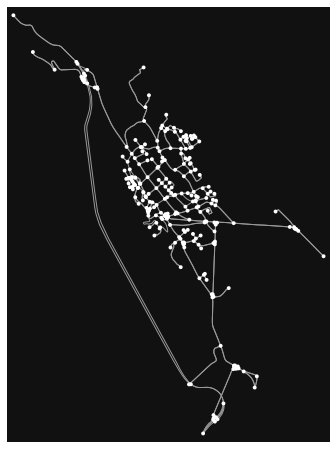
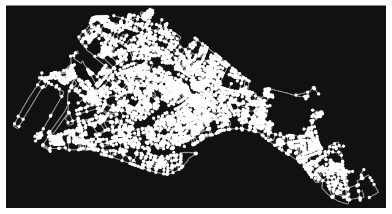
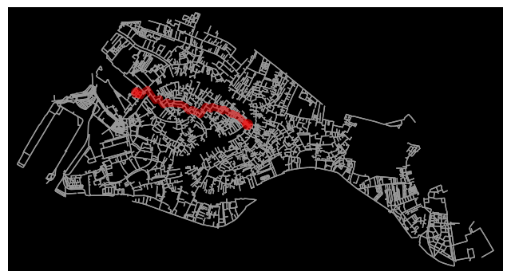
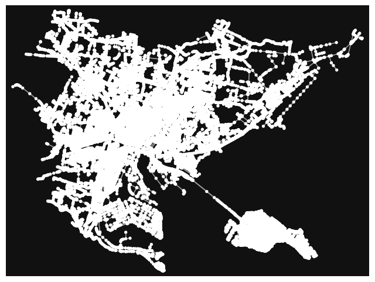
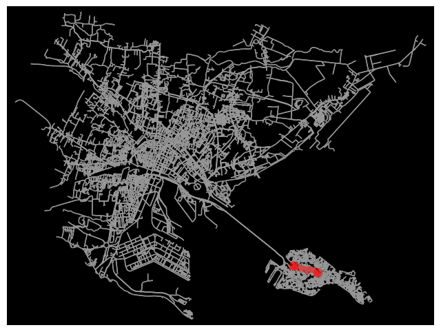

# Street Network Analysis

based on osnmx and pandana
goals of the tutorial

- basic concepts of network analysis
- routing
- bearing

based on the open data of:
- OpenStreetMap

requirements
- python knowledge
- geopandas
- openstreetmap

status<br/>
“My Way”


---

# Setup
for this tutorial we will use [OSMnx](https://github.com/gboeing/osmnx) = (openstreetmap + [networkx](https://networkx.org/))

Boeing, G. 2017. "[OSMnx: New Methods for Acquiring, Constructing, Analyzing, and Visualizing Complex Street Networks.](https://geoffboeing.com/publications/osmnx-complex-street-networks/)" *Computers, Environment and Urban Systems 65, 126-139. doi:10.1016/j.compenvurbsys.2017.05.004*


```python
try:
    import pygeos
except ModuleNotFoundError as e:
    !pip install pygeos==0.13
    import pygeos
```

... and now we can install OSMnx


```python
try:
    import osmnx  as ox
except ModuleNotFoundError as e:
    !pip install osmnx==1.2.2
      import osmnx  as ox
if ox.__version__ != "1.2.2":
    !pip install -U osmnx==1.2.2
    import osmnx  as ox
```

... and all the other packages needed for this lesson


```python
try:
    import mapclassify
except ModuleNotFoundError as e:
    !pip install mapclassify
    import mapclassify

if mapclassify.__version__ != "2.4.3":
  !pip install -U mapclassify==2.4.3
```


```python
try:
    import pyrosm
except ModuleNotFoundError as e:
    !pip install pyrosm==0.6.1
    import pyrosm
```


```python
import geopandas as gpd
import warnings
warnings.filterwarnings("ignore") 
```

# Let’s start with OSMnx


```python
import osmnx as ox
import matplotlib.pyplot as plt
```

## prepare the data

... we can choose the same city used on the last tutorial 

[Venice in Italy](https://www.openstreetmap.org/relation/44230)


```python
place_name = "Venezia, Lido, Venice, Venezia, Veneto, Italy"
```

.. and we can extract all the streets where it's possible to drive

OSMnx creates a overpass query to ask the data inside the area of name of the city and collect all the [highways](https://wiki.openstreetmap.org/wiki/Key:highway) where a car can move

Eg.<br/>
https://overpass-turbo.eu/s/1nnv


```python
G = ox.graph_from_place(place_name, network_type='all')
```

OSMnx transform the data from OpenStreetMap in [graph](https://networkx.org/documentation/stable/reference/introduction.html#graphs) for [networkx](https://networkx.org/)

# Graph Theory
text from [wikipedia](https://en.wikipedia.org/wiki/Graph_theory)


A graph is made up of **vertices** (also called *nodes* or *points*) which are connected by **edges** (also called *links* or *lines*)

A distinction is made between undirected graphs, where edges link two vertices symmetrically, and directed graphs, where edges link two vertices asymmetrically;


Example<br/>
undirected graph with three nodes and three edges. 


Example<br/>
a directed graph with three vertices and four directed edges<br/>(the double arrow represents an edge in each direction).


the type of graph generated by OSMnx is a MultiDiGraph: a directed graphs with self loops and parallel edges

more information [here](https://networkx.org/documentation/stable/reference/classes/multidigraph.html)


```python
type(G)
```


    networkx.classes.multidigraph.MultiDiGraph


OSMnx converts the graph from latitude/longitude (WGS83) to the right UTM coordinate reference system for the area selected


```python
G_proj = ox.project_graph(G)
```

from osmnx you can create geodataframes (gdfs) from a netxworkx Graph


```python
gdfs = ox.graph_to_gdfs(G_proj)
```


```python
type(gdfs)
```


    tuple


0 => nodes (points)<br/>
1 => edges (lines)


```python
type(gdfs[0])
```


    geopandas.geodataframe.GeoDataFrame


```python
gdfs[0].geometry.type.unique()
```


    array(['Point'], dtype=object)


```python
gdfs[1].geometry.type.unique()
```


    array(['LineString'], dtype=object)


```python
gdfs[1].crs
```


    <Derived Projected CRS: +proj=utm +zone=33 +ellps=WGS84 +datum=WGS84 +unit ...>
    Name: unknown
    Axis Info [cartesian]:
    - E[east]: Easting (metre)
    - N[north]: Northing (metre)
    Area of Use:
    - undefined
    Coordinate Operation:
    - name: UTM zone 33N
    - method: Transverse Mercator
    Datum: World Geodetic System 1984
    - Ellipsoid: WGS 84
    - Prime Meridian: Greenwich


extract only the nodes (projected)


```python
nodes_proj = ox.graph_to_gdfs(G_proj, edges=False, nodes=True)
```


```python
type(nodes_proj)
```


    geopandas.geodataframe.GeoDataFrame


```python
nodes_proj.crs
```


    <Derived Projected CRS: +proj=utm +zone=33 +ellps=WGS84 +datum=WGS84 +unit ...>
    Name: unknown
    Axis Info [cartesian]:
    - E[east]: Easting (metre)
    - N[north]: Northing (metre)
    Area of Use:
    - undefined
    Coordinate Operation:
    - name: UTM zone 33N
    - method: Transverse Mercator
    Datum: World Geodetic System 1984
    - Ellipsoid: WGS 84
    - Prime Meridian: Greenwich


```python
nodes_proj.plot()
plt.show()
```


    

    


```python
lines_proj = ox.graph_to_gdfs(G_proj, nodes=False)
```


```python
lines_proj.plot()
plt.show()
```


    

    


... and we can use it as a normal geodaframe<br/>

Eg:<br/>
what sized area does our network cover in square meters?


```python
nodes_proj.unary_union.convex_hull
```


    

    


```python
graph_area_m = nodes_proj.unary_union.convex_hull.area
graph_area_m
```


    7679268.778717262


with OSMnx we can extract some basic statistics 


```python
ox.basic_stats(G_proj, area=graph_area_m, clean_int_tol=15)
```


    {'n': 5020,
     'm': 12539,
     'k_avg': 4.995617529880478,
     'edge_length_total': 366879.9689999989,
     'edge_length_avg': 29.25910909960913,
     'streets_per_node_avg': 2.54003984063745,
     'streets_per_node_counts': {0: 0,
      1: 1359,
      2: 5,
      3: 3259,
      4: 382,
      5: 14,
      6: 0,
      7: 1},
     'streets_per_node_proportions': {0: 0.0,
      1: 0.2707171314741036,
      2: 0.00099601593625498,
      3: 0.649203187250996,
      4: 0.07609561752988048,
      5: 0.0027888446215139444,
      6: 0.0,
      7: 0.00019920318725099602},
     'intersection_count': 3661,
     'street_length_total': 186643.2119999999,
     'street_segment_count': 6355,
     'street_length_avg': 29.36950621557827,
     'circuity_avg': 1.0612066989278592,
     'self_loop_proportion': 0.0033044846577498033,
     'clean_intersection_count': 718,
     'node_density_km': 653.7080736010566,
     'intersection_density_km': 476.7380990943164,
     'edge_density_km': 47775.378043387376,
     'street_density_km': 24304.81565084334,
     'clean_intersection_density_km': 93.49848542740213}


stats documentation: [https://osmnx.readthedocs.io/en/stable/osmnx.html#module-osmnx.stats](https://osmnx.readthedocs.io/en/stable/osmnx.html#module-osmnx.stats)

## Glossary of the terms used by the statistics

For a complete list look the [networkx documentation](https://networkx.org/documentation/stable/)

- **density**<br/>defines the density of a graph. The density is 0 for a graph without edges and 1 for a complete graph. The density of multigraphs can be higher than 1.
- **center**<br/>is the set of points with eccentricity equal to radius.
- **betwnees centrality**<br/>is the number of possible interactions between two non-adjacent points
- **closeness centrality**<br/>is the average distance of a point from all the others
- **clustering coefficient**<br/>the measure of the degree to which points in a graph tend to cluster together
- **degree centrality**<br/>the number of lines incident upon a point 
- **eccentricity** <br/>the eccentricity of a point in a graph is defined as the length of a longest shortest path starting at that point
- **diameter**<br/>the maximum eccentricity
- **edge connectivity**<br/>
is equal to the minimum number of edges that must be removed to disconnect a graph or render it trivial.
- **node connectivity**<br/>
is equal to the minimum number of points that must be removed to disconnect a graph or render it trivial.
- **pagerank**<br/>
computes a ranking of the nodes (points) in a graph based on the structure of the incoming links (lines). It was originally designed as an algorithm to rank web pages.
- **periphery** <br/>is the set of nodes with eccentricity equal to the diameter
- **radius**<br/>is the minimum eccentricity.

... and we can plot the map


```python
fig, ax = ox.plot_graph(G)
plt.show()
```


    

    


```python
import networkx as nx
```


```python
# convert graph to line graph so edges become nodes and vice versa
edge_centrality = nx.closeness_centrality(nx.line_graph(G))
nx.set_edge_attributes(G, edge_centrality, 'edge_centrality')
```


```python
# color edges in original graph with closeness centralities from line graph
ec = ox.plot.get_edge_colors_by_attr(G, 'edge_centrality', cmap='inferno')
fig, ax = ox.plot_graph(G, edge_color=ec, edge_linewidth=2, node_size=0)
plt.show()
```


    

    


# Find the shortest path between 2 points by minimizing travel time


## calculate the travel time for each edge

### define the origin and destination
Example:

from the train station of Venezia Santa Lucia to the Rialto Bridge


**train station**

[Venezia Santa Lucia](https://www.openstreetmap.org/node/6063641885)

lat: 45.4410753<br/>
lon: 12.3210322


**Rialto Bridge**

[Ponte di Rialto](https://www.openstreetmap.org/way/199258374)

lat: 45.43805<br/>
lon: 12.33593


## find the node on the graph nearest on the point given

thes two points are NOT on the graph.

We need to find the nodes nearest


```python
point_nearest_train_station = ox.distance.nearest_nodes(G,Y=45.4410753,X=12.3210322)
point_nearest_bridge_rialto = ox.distance.nearest_nodes(G,Y=45.43805,X=12.33593)
```


```python
# impute missing edge speeds and calculate edge travel times with the speed module
G = ox.speed.add_edge_speeds(G)
G = ox.speed.add_edge_travel_times(G)

```

### calculate the time to walk over each edges


```python
G = ox.graph_from_place(place_name, network_type='walk')
```

plot the walkable street network


```python
fig, ax = ox.plot_graph(G)
plt.show()
```


    

    


```python
G = ox.add_edge_speeds(G)
G = ox.add_edge_travel_times(G)
```

... geopandas investigation


```python
edges = ox.graph_to_gdfs(G,edges=True,nodes=False)
```


```python
edges.head(3)
```


<div>
<style scoped>
    .dataframe tbody tr th:only-of-type {
        vertical-align: middle;
    }

    .dataframe tbody tr th {
        vertical-align: top;
    }

    .dataframe thead th {
        text-align: right;
    }
</style>
<table border="1" class="dataframe">
  <thead>
    <tr style="text-align: right;">
      <th></th>
      <th></th>
      <th></th>
      <th>osmid</th>
      <th>bridge</th>
      <th>name</th>
      <th>highway</th>
      <th>oneway</th>
      <th>reversed</th>
      <th>length</th>
      <th>speed_kph</th>
      <th>travel_time</th>
      <th>width</th>
      <th>geometry</th>
      <th>tunnel</th>
      <th>lanes</th>
      <th>maxspeed</th>
      <th>est_width</th>
      <th>access</th>
      <th>area</th>
      <th>service</th>
      <th>junction</th>
    </tr>
    <tr>
      <th>u</th>
      <th>v</th>
      <th>key</th>
      <th></th>
      <th></th>
      <th></th>
      <th></th>
      <th></th>
      <th></th>
      <th></th>
      <th></th>
      <th></th>
      <th></th>
      <th></th>
      <th></th>
      <th></th>
      <th></th>
      <th></th>
      <th></th>
      <th></th>
      <th></th>
      <th></th>
    </tr>
  </thead>
  <tbody>
    <tr>
      <th rowspan="3" valign="top">27178184</th>
      <th>764403528</th>
      <th>0</th>
      <td>166489461</td>
      <td>yes</td>
      <td>Ponte di Rialto</td>
      <td>footway</td>
      <td>False</td>
      <td>False</td>
      <td>9.935</td>
      <td>39.6</td>
      <td>0.9</td>
      <td>NaN</td>
      <td>LINESTRING (12.33569 45.43820, 12.33561 45.43813)</td>
      <td>NaN</td>
      <td>NaN</td>
      <td>NaN</td>
      <td>NaN</td>
      <td>NaN</td>
      <td>NaN</td>
      <td>NaN</td>
      <td>NaN</td>
    </tr>
    <tr>
      <th>1675825096</th>
      <th>0</th>
      <td>166489461</td>
      <td>yes</td>
      <td>Ponte di Rialto</td>
      <td>footway</td>
      <td>False</td>
      <td>True</td>
      <td>5.120</td>
      <td>39.6</td>
      <td>0.5</td>
      <td>NaN</td>
      <td>LINESTRING (12.33569 45.43820, 12.33573 45.43823)</td>
      <td>NaN</td>
      <td>NaN</td>
      <td>NaN</td>
      <td>NaN</td>
      <td>NaN</td>
      <td>NaN</td>
      <td>NaN</td>
      <td>NaN</td>
    </tr>
    <tr>
      <th>8670969688</th>
      <th>0</th>
      <td>450089474</td>
      <td>yes</td>
      <td>Ponte di Rialto</td>
      <td>steps</td>
      <td>False</td>
      <td>False</td>
      <td>9.212</td>
      <td>39.6</td>
      <td>0.8</td>
      <td>7</td>
      <td>LINESTRING (12.33569 45.43820, 12.33560 45.43825)</td>
      <td>NaN</td>
      <td>NaN</td>
      <td>NaN</td>
      <td>NaN</td>
      <td>NaN</td>
      <td>NaN</td>
      <td>NaN</td>
      <td>NaN</td>
    </tr>
  </tbody>
</table>
</div>


```python
edges.columns
```


    Index(['osmid', 'bridge', 'name', 'highway', 'oneway', 'reversed', 'length',
           'speed_kph', 'travel_time', 'width', 'geometry', 'tunnel', 'lanes',
           'maxspeed', 'est_width', 'access', 'area', 'service', 'junction'],
          dtype='object')


```python
edges[edges.travel_time == edges.travel_time.max()].name
```


    u           v           key
    1927219469  4068932557  0      NaN
    4068932557  1927219469  0      NaN
    Name: name, dtype: object


```python
edges[edges.travel_time == edges.travel_time.max()].osmid
```


    u           v           key
    1927219469  4068932557  0      [404610512, 404610513]
    4068932557  1927219469  0      [404610512, 404610513]
    Name: osmid, dtype: object


https://www.openstreetmap.org/way/404610513

## find the shortest path between the train station and Rialto bridge 


```python
# find the shortest path between nodes, minimizing travel time, then plot it
route = ox.shortest_path(G, point_nearest_train_station, point_nearest_bridge_rialto, weight="travel_time")
```


```python
route
```


    [1927219479,
     3527986497,
     2493856508,
     9055796707,
     1921651801,
     27239442,
     5372700772,
     4899902714,
     1855450146,
     3371984917,
     2514483400,
     1858198295,
     1858198260,
     3371984290,
     3371984894,
     5360645772,
     1855473678,
     1855473687,
     4849873712,
     4849867342,
     1856706712,
     3389313497,
     5149979474,
     2732099927,
     4843929370,
     2732099913,
     2732099919,
     2732099909,
     2732099904,
     4803731379,
     4846061555,
     1857205293,
     1857205281,
     3392463459,
     1857205288,
     1856788519,
     3392463420,
     3392463416,
     1857148234,
     1840378080,
     2249214723,
     4803872602,
     4803871721,
     1857139330,
     4902225461,
     1857139271,
     1857139307,
     1857139318,
     1857139273,
     1857139324,
     1857139332,
     4983211717,
     4983211715,
     5649829357,
     5649829356,
     5649829355,
     4983211716,
     8670969688,
     27178184,
     5395065019]


these values are the ids of each node of the graph


```python
G.nodes[5395065019]
```


    {'y': 45.4380532, 'x': 12.3359319, 'street_count': 4}


```python
nodes = ox.graph_to_gdfs(G,edges=False,nodes=True)
```


```python
nodes
```


<div>
<style scoped>
    .dataframe tbody tr th:only-of-type {
        vertical-align: middle;
    }

    .dataframe tbody tr th {
        vertical-align: top;
    }

    .dataframe thead th {
        text-align: right;
    }
</style>
<table border="1" class="dataframe">
  <thead>
    <tr style="text-align: right;">
      <th></th>
      <th>y</th>
      <th>x</th>
      <th>street_count</th>
      <th>highway</th>
      <th>geometry</th>
    </tr>
    <tr>
      <th>osmid</th>
      <th></th>
      <th></th>
      <th></th>
      <th></th>
      <th></th>
    </tr>
  </thead>
  <tbody>
    <tr>
      <th>27178184</th>
      <td>45.438197</td>
      <td>12.335686</td>
      <td>4</td>
      <td>NaN</td>
      <td>POINT (12.33569 45.43820)</td>
    </tr>
    <tr>
      <th>27178422</th>
      <td>45.432325</td>
      <td>12.337206</td>
      <td>4</td>
      <td>NaN</td>
      <td>POINT (12.33721 45.43233)</td>
    </tr>
    <tr>
      <th>27178433</th>
      <td>45.429240</td>
      <td>12.327350</td>
      <td>3</td>
      <td>NaN</td>
      <td>POINT (12.32735 45.42924)</td>
    </tr>
    <tr>
      <th>27178442</th>
      <td>45.430846</td>
      <td>12.320432</td>
      <td>1</td>
      <td>NaN</td>
      <td>POINT (12.32043 45.43085)</td>
    </tr>
    <tr>
      <th>27223839</th>
      <td>45.434570</td>
      <td>12.350321</td>
      <td>3</td>
      <td>NaN</td>
      <td>POINT (12.35032 45.43457)</td>
    </tr>
    <tr>
      <th>...</th>
      <td>...</td>
      <td>...</td>
      <td>...</td>
      <td>...</td>
      <td>...</td>
    </tr>
    <tr>
      <th>10108266854</th>
      <td>45.437868</td>
      <td>12.350362</td>
      <td>3</td>
      <td>NaN</td>
      <td>POINT (12.35036 45.43787)</td>
    </tr>
    <tr>
      <th>10118200318</th>
      <td>45.431717</td>
      <td>12.358683</td>
      <td>3</td>
      <td>NaN</td>
      <td>POINT (12.35868 45.43172)</td>
    </tr>
    <tr>
      <th>10118200319</th>
      <td>45.431700</td>
      <td>12.358617</td>
      <td>3</td>
      <td>NaN</td>
      <td>POINT (12.35862 45.43170)</td>
    </tr>
    <tr>
      <th>10118200325</th>
      <td>45.431011</td>
      <td>12.354432</td>
      <td>3</td>
      <td>NaN</td>
      <td>POINT (12.35443 45.43101)</td>
    </tr>
    <tr>
      <th>10118200326</th>
      <td>45.430948</td>
      <td>12.354443</td>
      <td>1</td>
      <td>NaN</td>
      <td>POINT (12.35444 45.43095)</td>
    </tr>
  </tbody>
</table>
<p>5016 rows × 5 columns</p>
</div>


```python
fig, ax = ox.plot_graph_route(G, route, route_linewidth=6, node_size=0, bgcolor='k')
plt.show()

```


    

    


```python
ox.plot_route_folium(G,route,popup_attribute='name',tiles='CartoDB dark_matter')
#OpenStreetMap
#Stamen Terrain
#Steman Toner
#Stamen Watercolor
#CartoDB positron
#CartoDB dark_matter
```


<div style="width:100%;"><div style="position:relative;width:100%;height:0;padding-bottom:60%;"><span style="color:#565656">Make this Notebook Trusted to load map: File -> Trust Notebook</span><iframe srcdoc="&lt;!DOCTYPE html&gt;
&lt;head&gt;    
    &lt;meta http-equiv=&quot;content-type&quot; content=&quot;text/html; charset=UTF-8&quot; /&gt;

        &lt;script&gt;
            L_NO_TOUCH = false;
            L_DISABLE_3D = false;
        &lt;/script&gt;

    &lt;style&gt;html, body {width: 100%;height: 100%;margin: 0;padding: 0;}&lt;/style&gt;
    &lt;style&gt;#map {position:absolute;top:0;bottom:0;right:0;left:0;}&lt;/style&gt;
    &lt;script src=&quot;https://cdn.jsdelivr.net/npm/leaflet@1.6.0/dist/leaflet.js&quot;&gt;&lt;/script&gt;
    &lt;script src=&quot;https://code.jquery.com/jquery-1.12.4.min.js&quot;&gt;&lt;/script&gt;
    &lt;script src=&quot;https://maxcdn.bootstrapcdn.com/bootstrap/3.2.0/js/bootstrap.min.js&quot;&gt;&lt;/script&gt;
    &lt;script src=&quot;https://cdnjs.cloudflare.com/ajax/libs/Leaflet.awesome-markers/2.0.2/leaflet.awesome-markers.js&quot;&gt;&lt;/script&gt;
    &lt;link rel=&quot;stylesheet&quot; href=&quot;https://cdn.jsdelivr.net/npm/leaflet@1.6.0/dist/leaflet.css&quot;/&gt;
    &lt;link rel=&quot;stylesheet&quot; href=&quot;https://maxcdn.bootstrapcdn.com/bootstrap/3.2.0/css/bootstrap.min.css&quot;/&gt;
    &lt;link rel=&quot;stylesheet&quot; href=&quot;https://maxcdn.bootstrapcdn.com/bootstrap/3.2.0/css/bootstrap-theme.min.css&quot;/&gt;
    &lt;link rel=&quot;stylesheet&quot; href=&quot;https://maxcdn.bootstrapcdn.com/font-awesome/4.6.3/css/font-awesome.min.css&quot;/&gt;
    &lt;link rel=&quot;stylesheet&quot; href=&quot;https://cdnjs.cloudflare.com/ajax/libs/Leaflet.awesome-markers/2.0.2/leaflet.awesome-markers.css&quot;/&gt;
    &lt;link rel=&quot;stylesheet&quot; href=&quot;https://cdn.jsdelivr.net/gh/python-visualization/folium/folium/templates/leaflet.awesome.rotate.min.css&quot;/&gt;

            &lt;meta name=&quot;viewport&quot; content=&quot;width=device-width,
                initial-scale=1.0, maximum-scale=1.0, user-scalable=no&quot; /&gt;
            &lt;style&gt;
                #map_fd0b805688e802fa5f5168a4453b25aa {
                    position: relative;
                    width: 100.0%;
                    height: 100.0%;
                    left: 0.0%;
                    top: 0.0%;
                }
            &lt;/style&gt;

&lt;/head&gt;
&lt;body&gt;    

            &lt;div class=&quot;folium-map&quot; id=&quot;map_fd0b805688e802fa5f5168a4453b25aa&quot; &gt;&lt;/div&gt;

&lt;/body&gt;
&lt;script&gt;    

            var map_fd0b805688e802fa5f5168a4453b25aa = L.map(
                &quot;map_fd0b805688e802fa5f5168a4453b25aa&quot;,
                {
                    center: [45.439757992128655, 12.328367921382563],
                    crs: L.CRS.EPSG3857,
                    zoom: 1,
                    zoomControl: true,
                    preferCanvas: false,
                }
            );


            var tile_layer_080615e84ac95b829927e0d361042b98 = L.tileLayer(
                &quot;https://cartodb-basemaps-{s}.global.ssl.fastly.net/dark_all/{z}/{x}/{y}.png&quot;,
                {&quot;attribution&quot;: &quot;\u0026copy; \u003ca href=\&quot;http://www.openstreetmap.org/copyright\&quot;\u003eOpenStreetMap\u003c/a\u003e contributors \u0026copy; \u003ca href=\&quot;http://cartodb.com/attributions\&quot;\u003eCartoDB\u003c/a\u003e, CartoDB \u003ca href =\&quot;http://cartodb.com/attributions\&quot;\u003eattributions\u003c/a\u003e&quot;, &quot;detectRetina&quot;: false, &quot;maxNativeZoom&quot;: 18, &quot;maxZoom&quot;: 18, &quot;minZoom&quot;: 0, &quot;noWrap&quot;: false, &quot;opacity&quot;: 1, &quot;subdomains&quot;: &quot;abc&quot;, &quot;tms&quot;: false}
            ).addTo(map_fd0b805688e802fa5f5168a4453b25aa);


            var poly_line_713f3e242a584d2fb60bce287f725d45 = L.polyline(
                [[45.4410566, 12.3210338], [45.4409662, 12.3211934], [45.4409512, 12.3212199]],
                {&quot;bubblingMouseEvents&quot;: true, &quot;color&quot;: &quot;#3388ff&quot;, &quot;dashArray&quot;: null, &quot;dashOffset&quot;: null, &quot;fill&quot;: false, &quot;fillColor&quot;: &quot;#3388ff&quot;, &quot;fillOpacity&quot;: 0.2, &quot;fillRule&quot;: &quot;evenodd&quot;, &quot;lineCap&quot;: &quot;round&quot;, &quot;lineJoin&quot;: &quot;round&quot;, &quot;noClip&quot;: false, &quot;opacity&quot;: 1.0, &quot;smoothFactor&quot;: 1.0, &quot;stroke&quot;: true, &quot;weight&quot;: 3}
            ).addTo(map_fd0b805688e802fa5f5168a4453b25aa);


        var popup_0f211644245000dc5b075fccbd47eb13 = L.popup({&quot;maxWidth&quot;: &quot;100%&quot;});


                var html_2dd5efbd6e14cd11898241914112435d = $(`&lt;div id=&quot;html_2dd5efbd6e14cd11898241914112435d&quot; style=&quot;width: 100.0%; height: 100.0%;&quot;&gt;NaN&lt;/div&gt;`)[0];
                popup_0f211644245000dc5b075fccbd47eb13.setContent(html_2dd5efbd6e14cd11898241914112435d);


        poly_line_713f3e242a584d2fb60bce287f725d45.bindPopup(popup_0f211644245000dc5b075fccbd47eb13)
        ;


            var poly_line_d54c1ee7839d365a5d2a12c5737e78d1 = L.polyline(
                [[45.4409512, 12.3212199], [45.4409389, 12.3212416], [45.4408913, 12.3213256], [45.4407422, 12.3215889]],
                {&quot;bubblingMouseEvents&quot;: true, &quot;color&quot;: &quot;#3388ff&quot;, &quot;dashArray&quot;: null, &quot;dashOffset&quot;: null, &quot;fill&quot;: false, &quot;fillColor&quot;: &quot;#3388ff&quot;, &quot;fillOpacity&quot;: 0.2, &quot;fillRule&quot;: &quot;evenodd&quot;, &quot;lineCap&quot;: &quot;round&quot;, &quot;lineJoin&quot;: &quot;round&quot;, &quot;noClip&quot;: false, &quot;opacity&quot;: 1.0, &quot;smoothFactor&quot;: 1.0, &quot;stroke&quot;: true, &quot;weight&quot;: 3}
            ).addTo(map_fd0b805688e802fa5f5168a4453b25aa);


        var popup_87c408b4a013dc329bc164c14ae01929 = L.popup({&quot;maxWidth&quot;: &quot;100%&quot;});


                var html_c69089245b2d4a2f912874b26f5cd3da = $(`&lt;div id=&quot;html_c69089245b2d4a2f912874b26f5cd3da&quot; style=&quot;width: 100.0%; height: 100.0%;&quot;&gt;NaN&lt;/div&gt;`)[0];
                popup_87c408b4a013dc329bc164c14ae01929.setContent(html_c69089245b2d4a2f912874b26f5cd3da);


        poly_line_d54c1ee7839d365a5d2a12c5737e78d1.bindPopup(popup_87c408b4a013dc329bc164c14ae01929)
        ;


            var poly_line_eb01fb17292e6d1aa90a7f7a3aee2de3 = L.polyline(
                [[45.4407422, 12.3215889], [45.4410066, 12.3218645], [45.4410189, 12.3218773]],
                {&quot;bubblingMouseEvents&quot;: true, &quot;color&quot;: &quot;#3388ff&quot;, &quot;dashArray&quot;: null, &quot;dashOffset&quot;: null, &quot;fill&quot;: false, &quot;fillColor&quot;: &quot;#3388ff&quot;, &quot;fillOpacity&quot;: 0.2, &quot;fillRule&quot;: &quot;evenodd&quot;, &quot;lineCap&quot;: &quot;round&quot;, &quot;lineJoin&quot;: &quot;round&quot;, &quot;noClip&quot;: false, &quot;opacity&quot;: 1.0, &quot;smoothFactor&quot;: 1.0, &quot;stroke&quot;: true, &quot;weight&quot;: 3}
            ).addTo(map_fd0b805688e802fa5f5168a4453b25aa);


        var popup_c3d203428a75f3d0a2d62f597292e629 = L.popup({&quot;maxWidth&quot;: &quot;100%&quot;});


                var html_2a22747e49338b422dea74bc3493d921 = $(`&lt;div id=&quot;html_2a22747e49338b422dea74bc3493d921&quot; style=&quot;width: 100.0%; height: 100.0%;&quot;&gt;&quot;Fondamenta Santa Lucia&quot;&lt;/div&gt;`)[0];
                popup_c3d203428a75f3d0a2d62f597292e629.setContent(html_2a22747e49338b422dea74bc3493d921);


        poly_line_eb01fb17292e6d1aa90a7f7a3aee2de3.bindPopup(popup_c3d203428a75f3d0a2d62f597292e629)
        ;


            var poly_line_0cba65466f4cc757edd22931cf6ec576 = L.polyline(
                [[45.4410189, 12.3218773], [45.4411402, 12.3220031]],
                {&quot;bubblingMouseEvents&quot;: true, &quot;color&quot;: &quot;#3388ff&quot;, &quot;dashArray&quot;: null, &quot;dashOffset&quot;: null, &quot;fill&quot;: false, &quot;fillColor&quot;: &quot;#3388ff&quot;, &quot;fillOpacity&quot;: 0.2, &quot;fillRule&quot;: &quot;evenodd&quot;, &quot;lineCap&quot;: &quot;round&quot;, &quot;lineJoin&quot;: &quot;round&quot;, &quot;noClip&quot;: false, &quot;opacity&quot;: 1.0, &quot;smoothFactor&quot;: 1.0, &quot;stroke&quot;: true, &quot;weight&quot;: 3}
            ).addTo(map_fd0b805688e802fa5f5168a4453b25aa);


        var popup_6a54008ce7aadbd2c3846780e5c79ca2 = L.popup({&quot;maxWidth&quot;: &quot;100%&quot;});


                var html_e6bd47c7f109f5931b5a96d6afd6c638 = $(`&lt;div id=&quot;html_e6bd47c7f109f5931b5a96d6afd6c638&quot; style=&quot;width: 100.0%; height: 100.0%;&quot;&gt;&quot;Fondamenta Santa Lucia&quot;&lt;/div&gt;`)[0];
                popup_6a54008ce7aadbd2c3846780e5c79ca2.setContent(html_e6bd47c7f109f5931b5a96d6afd6c638);


        poly_line_0cba65466f4cc757edd22931cf6ec576.bindPopup(popup_6a54008ce7aadbd2c3846780e5c79ca2)
        ;


            var poly_line_e2949324b822cc15e52f0005c9eaa9c2 = L.polyline(
                [[45.4411402, 12.3220031], [45.4411777, 12.3221053], [45.4413614, 12.3224951], [45.4413783, 12.322531]],
                {&quot;bubblingMouseEvents&quot;: true, &quot;color&quot;: &quot;#3388ff&quot;, &quot;dashArray&quot;: null, &quot;dashOffset&quot;: null, &quot;fill&quot;: false, &quot;fillColor&quot;: &quot;#3388ff&quot;, &quot;fillOpacity&quot;: 0.2, &quot;fillRule&quot;: &quot;evenodd&quot;, &quot;lineCap&quot;: &quot;round&quot;, &quot;lineJoin&quot;: &quot;round&quot;, &quot;noClip&quot;: false, &quot;opacity&quot;: 1.0, &quot;smoothFactor&quot;: 1.0, &quot;stroke&quot;: true, &quot;weight&quot;: 3}
            ).addTo(map_fd0b805688e802fa5f5168a4453b25aa);


        var popup_19076ff45256a3d54c4328c100e9f14b = L.popup({&quot;maxWidth&quot;: &quot;100%&quot;});


                var html_e1ae9f85068b426cf57615759c0876ff = $(`&lt;div id=&quot;html_e1ae9f85068b426cf57615759c0876ff&quot; style=&quot;width: 100.0%; height: 100.0%;&quot;&gt;&quot;Fondamenta dei Scalzi&quot;&lt;/div&gt;`)[0];
                popup_19076ff45256a3d54c4328c100e9f14b.setContent(html_e1ae9f85068b426cf57615759c0876ff);


        poly_line_e2949324b822cc15e52f0005c9eaa9c2.bindPopup(popup_19076ff45256a3d54c4328c100e9f14b)
        ;


            var poly_line_e22d9d66aaf3c6c7e5112375a16e0b72 = L.polyline(
                [[45.4413783, 12.322531], [45.441362, 12.322545], [45.4413376, 12.3225658], [45.4413291, 12.3225731], [45.4413145, 12.3225856], [45.4413074, 12.3225917], [45.4412952, 12.3226021], [45.4412879, 12.3226083], [45.4412756, 12.3226189], [45.441269, 12.3226246], [45.441257, 12.3226348], [45.4412508, 12.3226402], [45.4412378, 12.3226512], [45.4412302, 12.3226577], [45.4412178, 12.3226678], [45.4412115, 12.3226737], [45.4411997, 12.3226839], [45.4411928, 12.3226898], [45.4411793, 12.3227013], [45.4410891, 12.3227778], [45.4410767, 12.3227892], [45.4410711, 12.322794], [45.4410594, 12.322804], [45.4410524, 12.3228099], [45.441041, 12.3228196], [45.4410346, 12.3228252], [45.4410235, 12.3228346], [45.4410167, 12.3228404], [45.4410054, 12.3228502], [45.4409992, 12.3228554], [45.440987, 12.3228659], [45.4409806, 12.3228714], [45.44097, 12.3228804], [45.4409574, 12.3228919], [45.4409484, 12.3228995], [45.4409432, 12.3229044], [45.4409308, 12.3229153], [45.4409178, 12.3229258]],
                {&quot;bubblingMouseEvents&quot;: true, &quot;color&quot;: &quot;#3388ff&quot;, &quot;dashArray&quot;: null, &quot;dashOffset&quot;: null, &quot;fill&quot;: false, &quot;fillColor&quot;: &quot;#3388ff&quot;, &quot;fillOpacity&quot;: 0.2, &quot;fillRule&quot;: &quot;evenodd&quot;, &quot;lineCap&quot;: &quot;round&quot;, &quot;lineJoin&quot;: &quot;round&quot;, &quot;noClip&quot;: false, &quot;opacity&quot;: 1.0, &quot;smoothFactor&quot;: 1.0, &quot;stroke&quot;: true, &quot;weight&quot;: 3}
            ).addTo(map_fd0b805688e802fa5f5168a4453b25aa);


        var popup_be0755b3c7b1e72daf93dae0c396c45a = L.popup({&quot;maxWidth&quot;: &quot;100%&quot;});


                var html_c039008991dcd046bc91f2866ff1458b = $(`&lt;div id=&quot;html_c039008991dcd046bc91f2866ff1458b&quot; style=&quot;width: 100.0%; height: 100.0%;&quot;&gt;[&quot;Fondamenta San Simon Piccolo&quot;, &quot;Ponte degli Scalzi&quot;]&lt;/div&gt;`)[0];
                popup_be0755b3c7b1e72daf93dae0c396c45a.setContent(html_c039008991dcd046bc91f2866ff1458b);


        poly_line_e22d9d66aaf3c6c7e5112375a16e0b72.bindPopup(popup_be0755b3c7b1e72daf93dae0c396c45a)
        ;


            var poly_line_6b360fbda8f7c2b685222e68e1987590 = L.polyline(
                [[45.4409178, 12.3229258], [45.4409249, 12.3229378], [45.4408476, 12.3230158], [45.4408429, 12.3230205], [45.4406409, 12.3232242]],
                {&quot;bubblingMouseEvents&quot;: true, &quot;color&quot;: &quot;#3388ff&quot;, &quot;dashArray&quot;: null, &quot;dashOffset&quot;: null, &quot;fill&quot;: false, &quot;fillColor&quot;: &quot;#3388ff&quot;, &quot;fillOpacity&quot;: 0.2, &quot;fillRule&quot;: &quot;evenodd&quot;, &quot;lineCap&quot;: &quot;round&quot;, &quot;lineJoin&quot;: &quot;round&quot;, &quot;noClip&quot;: false, &quot;opacity&quot;: 1.0, &quot;smoothFactor&quot;: 1.0, &quot;stroke&quot;: true, &quot;weight&quot;: 3}
            ).addTo(map_fd0b805688e802fa5f5168a4453b25aa);


        var popup_d10a1a7d6647d75464b31f17de82b54f = L.popup({&quot;maxWidth&quot;: &quot;100%&quot;});


                var html_cffc9990ef1b0bbcc75c10c68fb7973b = $(`&lt;div id=&quot;html_cffc9990ef1b0bbcc75c10c68fb7973b&quot; style=&quot;width: 100.0%; height: 100.0%;&quot;&gt;[&quot;Fondamenta San Simon Piccolo&quot;, &quot;Calle Longa&quot;]&lt;/div&gt;`)[0];
                popup_d10a1a7d6647d75464b31f17de82b54f.setContent(html_cffc9990ef1b0bbcc75c10c68fb7973b);


        poly_line_6b360fbda8f7c2b685222e68e1987590.bindPopup(popup_d10a1a7d6647d75464b31f17de82b54f)
        ;


            var poly_line_4a5c2e879eb5d4eac24cb026107630b0 = L.polyline(
                [[45.4406409, 12.3232242], [45.4403018, 12.3235662]],
                {&quot;bubblingMouseEvents&quot;: true, &quot;color&quot;: &quot;#3388ff&quot;, &quot;dashArray&quot;: null, &quot;dashOffset&quot;: null, &quot;fill&quot;: false, &quot;fillColor&quot;: &quot;#3388ff&quot;, &quot;fillOpacity&quot;: 0.2, &quot;fillRule&quot;: &quot;evenodd&quot;, &quot;lineCap&quot;: &quot;round&quot;, &quot;lineJoin&quot;: &quot;round&quot;, &quot;noClip&quot;: false, &quot;opacity&quot;: 1.0, &quot;smoothFactor&quot;: 1.0, &quot;stroke&quot;: true, &quot;weight&quot;: 3}
            ).addTo(map_fd0b805688e802fa5f5168a4453b25aa);


        var popup_007a605782cdfd4855989041cb68e787 = L.popup({&quot;maxWidth&quot;: &quot;100%&quot;});


                var html_0fef143e7d7e32e2466a7612150d31fe = $(`&lt;div id=&quot;html_0fef143e7d7e32e2466a7612150d31fe&quot; style=&quot;width: 100.0%; height: 100.0%;&quot;&gt;&quot;Calle Longa&quot;&lt;/div&gt;`)[0];
                popup_007a605782cdfd4855989041cb68e787.setContent(html_0fef143e7d7e32e2466a7612150d31fe);


        poly_line_4a5c2e879eb5d4eac24cb026107630b0.bindPopup(popup_007a605782cdfd4855989041cb68e787)
        ;


            var poly_line_6fc17add38144d49c471d3aaaaff6b83 = L.polyline(
                [[45.4403018, 12.3235662], [45.4403162, 12.3235979], [45.4403367, 12.3236408], [45.4404383, 12.323868], [45.4404599, 12.3239145], [45.4404701, 12.3240381], [45.4404893, 12.3240825], [45.4405022, 12.3241488]],
                {&quot;bubblingMouseEvents&quot;: true, &quot;color&quot;: &quot;#3388ff&quot;, &quot;dashArray&quot;: null, &quot;dashOffset&quot;: null, &quot;fill&quot;: false, &quot;fillColor&quot;: &quot;#3388ff&quot;, &quot;fillOpacity&quot;: 0.2, &quot;fillRule&quot;: &quot;evenodd&quot;, &quot;lineCap&quot;: &quot;round&quot;, &quot;lineJoin&quot;: &quot;round&quot;, &quot;noClip&quot;: false, &quot;opacity&quot;: 1.0, &quot;smoothFactor&quot;: 1.0, &quot;stroke&quot;: true, &quot;weight&quot;: 3}
            ).addTo(map_fd0b805688e802fa5f5168a4453b25aa);


        var popup_88369fb318c16be0aba28bfa2559529c = L.popup({&quot;maxWidth&quot;: &quot;100%&quot;});


                var html_d401aa6fd68d3acd8f584e5a47b9e993 = $(`&lt;div id=&quot;html_d401aa6fd68d3acd8f584e5a47b9e993&quot; style=&quot;width: 100.0%; height: 100.0%;&quot;&gt;[&quot;Calle de la Bergama&quot;, &quot;Campo Santo&quot;, &quot;Ponte de la Bergama&quot;]&lt;/div&gt;`)[0];
                popup_88369fb318c16be0aba28bfa2559529c.setContent(html_d401aa6fd68d3acd8f584e5a47b9e993);


        poly_line_6fc17add38144d49c471d3aaaaff6b83.bindPopup(popup_88369fb318c16be0aba28bfa2559529c)
        ;


            var poly_line_156c9f612c90fabb0016cfe1c68b99bb = L.polyline(
                [[45.4405022, 12.3241488], [45.4404181, 12.32409], [45.4404078, 12.3240866], [45.4403079, 12.3241675], [45.4401255, 12.3243608]],
                {&quot;bubblingMouseEvents&quot;: true, &quot;color&quot;: &quot;#3388ff&quot;, &quot;dashArray&quot;: null, &quot;dashOffset&quot;: null, &quot;fill&quot;: false, &quot;fillColor&quot;: &quot;#3388ff&quot;, &quot;fillOpacity&quot;: 0.2, &quot;fillRule&quot;: &quot;evenodd&quot;, &quot;lineCap&quot;: &quot;round&quot;, &quot;lineJoin&quot;: &quot;round&quot;, &quot;noClip&quot;: false, &quot;opacity&quot;: 1.0, &quot;smoothFactor&quot;: 1.0, &quot;stroke&quot;: true, &quot;weight&quot;: 3}
            ).addTo(map_fd0b805688e802fa5f5168a4453b25aa);


        var popup_9238efc25f5f1d1b0f8be055d7d97e3e = L.popup({&quot;maxWidth&quot;: &quot;100%&quot;});


                var html_0d3688d94e9e8e23d09ea729a9270144 = $(`&lt;div id=&quot;html_0d3688d94e9e8e23d09ea729a9270144&quot; style=&quot;width: 100.0%; height: 100.0%;&quot;&gt;&quot;Fondamenta del Rio Marin o dei Garzoti&quot;&lt;/div&gt;`)[0];
                popup_9238efc25f5f1d1b0f8be055d7d97e3e.setContent(html_0d3688d94e9e8e23d09ea729a9270144);


        poly_line_156c9f612c90fabb0016cfe1c68b99bb.bindPopup(popup_9238efc25f5f1d1b0f8be055d7d97e3e)
        ;


            var poly_line_8a70a5702de0dd3796089449bb56630d = L.polyline(
                [[45.4401255, 12.3243608], [45.4400196, 12.3244737], [45.4398885, 12.3246432]],
                {&quot;bubblingMouseEvents&quot;: true, &quot;color&quot;: &quot;#3388ff&quot;, &quot;dashArray&quot;: null, &quot;dashOffset&quot;: null, &quot;fill&quot;: false, &quot;fillColor&quot;: &quot;#3388ff&quot;, &quot;fillOpacity&quot;: 0.2, &quot;fillRule&quot;: &quot;evenodd&quot;, &quot;lineCap&quot;: &quot;round&quot;, &quot;lineJoin&quot;: &quot;round&quot;, &quot;noClip&quot;: false, &quot;opacity&quot;: 1.0, &quot;smoothFactor&quot;: 1.0, &quot;stroke&quot;: true, &quot;weight&quot;: 3}
            ).addTo(map_fd0b805688e802fa5f5168a4453b25aa);


        var popup_0e32f3414da6d5389c15fa3abddcab07 = L.popup({&quot;maxWidth&quot;: &quot;100%&quot;});


                var html_16240404271c680696b5e13c6b27575d = $(`&lt;div id=&quot;html_16240404271c680696b5e13c6b27575d&quot; style=&quot;width: 100.0%; height: 100.0%;&quot;&gt;&quot;Fondamenta del Rio Marin o dei Garzoti&quot;&lt;/div&gt;`)[0];
                popup_0e32f3414da6d5389c15fa3abddcab07.setContent(html_16240404271c680696b5e13c6b27575d);


        poly_line_8a70a5702de0dd3796089449bb56630d.bindPopup(popup_0e32f3414da6d5389c15fa3abddcab07)
        ;


            var poly_line_45887dff777bcc11e3c067c9d9f5e551 = L.polyline(
                [[45.4398885, 12.3246432], [45.440211, 12.3251804]],
                {&quot;bubblingMouseEvents&quot;: true, &quot;color&quot;: &quot;#3388ff&quot;, &quot;dashArray&quot;: null, &quot;dashOffset&quot;: null, &quot;fill&quot;: false, &quot;fillColor&quot;: &quot;#3388ff&quot;, &quot;fillOpacity&quot;: 0.2, &quot;fillRule&quot;: &quot;evenodd&quot;, &quot;lineCap&quot;: &quot;round&quot;, &quot;lineJoin&quot;: &quot;round&quot;, &quot;noClip&quot;: false, &quot;opacity&quot;: 1.0, &quot;smoothFactor&quot;: 1.0, &quot;stroke&quot;: true, &quot;weight&quot;: 3}
            ).addTo(map_fd0b805688e802fa5f5168a4453b25aa);


        var popup_ff740722d2318a9bbe24ae15157c966a = L.popup({&quot;maxWidth&quot;: &quot;100%&quot;});


                var html_eaac5261bfc06f78a9c4aabeab0d4368 = $(`&lt;div id=&quot;html_eaac5261bfc06f78a9c4aabeab0d4368&quot; style=&quot;width: 100.0%; height: 100.0%;&quot;&gt;&quot;Calle de la Crose&quot;&lt;/div&gt;`)[0];
                popup_ff740722d2318a9bbe24ae15157c966a.setContent(html_eaac5261bfc06f78a9c4aabeab0d4368);


        poly_line_45887dff777bcc11e3c067c9d9f5e551.bindPopup(popup_ff740722d2318a9bbe24ae15157c966a)
        ;


            var poly_line_40e12bbdf54e34677ab4d6947676d756 = L.polyline(
                [[45.440211, 12.3251804], [45.4400759, 12.3252837], [45.4400013, 12.3253256]],
                {&quot;bubblingMouseEvents&quot;: true, &quot;color&quot;: &quot;#3388ff&quot;, &quot;dashArray&quot;: null, &quot;dashOffset&quot;: null, &quot;fill&quot;: false, &quot;fillColor&quot;: &quot;#3388ff&quot;, &quot;fillOpacity&quot;: 0.2, &quot;fillRule&quot;: &quot;evenodd&quot;, &quot;lineCap&quot;: &quot;round&quot;, &quot;lineJoin&quot;: &quot;round&quot;, &quot;noClip&quot;: false, &quot;opacity&quot;: 1.0, &quot;smoothFactor&quot;: 1.0, &quot;stroke&quot;: true, &quot;weight&quot;: 3}
            ).addTo(map_fd0b805688e802fa5f5168a4453b25aa);


        var popup_3c7dea1642c62908b74135c6423fb62c = L.popup({&quot;maxWidth&quot;: &quot;100%&quot;});


                var html_1f292ff1e611d3b40622e715740b67c0 = $(`&lt;div id=&quot;html_1f292ff1e611d3b40622e715740b67c0&quot; style=&quot;width: 100.0%; height: 100.0%;&quot;&gt;&quot;Calle Larga dei Bari&quot;&lt;/div&gt;`)[0];
                popup_3c7dea1642c62908b74135c6423fb62c.setContent(html_1f292ff1e611d3b40622e715740b67c0);


        poly_line_40e12bbdf54e34677ab4d6947676d756.bindPopup(popup_3c7dea1642c62908b74135c6423fb62c)
        ;


            var poly_line_3b95345889a7fc7b382dac63514937bc = L.polyline(
                [[45.4400013, 12.3253256], [45.4400641, 12.3258446]],
                {&quot;bubblingMouseEvents&quot;: true, &quot;color&quot;: &quot;#3388ff&quot;, &quot;dashArray&quot;: null, &quot;dashOffset&quot;: null, &quot;fill&quot;: false, &quot;fillColor&quot;: &quot;#3388ff&quot;, &quot;fillOpacity&quot;: 0.2, &quot;fillRule&quot;: &quot;evenodd&quot;, &quot;lineCap&quot;: &quot;round&quot;, &quot;lineJoin&quot;: &quot;round&quot;, &quot;noClip&quot;: false, &quot;opacity&quot;: 1.0, &quot;smoothFactor&quot;: 1.0, &quot;stroke&quot;: true, &quot;weight&quot;: 3}
            ).addTo(map_fd0b805688e802fa5f5168a4453b25aa);


        var popup_11b177cea9ec99589d7b2fa912f3a2ae = L.popup({&quot;maxWidth&quot;: &quot;100%&quot;});


                var html_b35dfea4e613becbb924f384f2e73937 = $(`&lt;div id=&quot;html_b35dfea4e613becbb924f384f2e73937&quot; style=&quot;width: 100.0%; height: 100.0%;&quot;&gt;NaN&lt;/div&gt;`)[0];
                popup_11b177cea9ec99589d7b2fa912f3a2ae.setContent(html_b35dfea4e613becbb924f384f2e73937);


        poly_line_3b95345889a7fc7b382dac63514937bc.bindPopup(popup_11b177cea9ec99589d7b2fa912f3a2ae)
        ;


            var poly_line_c6b8c33dbc29f5c7009a1e61a173bfc8 = L.polyline(
                [[45.4400641, 12.3258446], [45.440003, 12.3261596], [45.4399735, 12.3264911], [45.4399697, 12.3266329], [45.4399678, 12.3268131], [45.4399794, 12.3268344], [45.4399766, 12.3269089], [45.439974, 12.3269451], [45.4399654, 12.3270163], [45.4398087, 12.3273783]],
                {&quot;bubblingMouseEvents&quot;: true, &quot;color&quot;: &quot;#3388ff&quot;, &quot;dashArray&quot;: null, &quot;dashOffset&quot;: null, &quot;fill&quot;: false, &quot;fillColor&quot;: &quot;#3388ff&quot;, &quot;fillOpacity&quot;: 0.2, &quot;fillRule&quot;: &quot;evenodd&quot;, &quot;lineCap&quot;: &quot;round&quot;, &quot;lineJoin&quot;: &quot;round&quot;, &quot;noClip&quot;: false, &quot;opacity&quot;: 1.0, &quot;smoothFactor&quot;: 1.0, &quot;stroke&quot;: true, &quot;weight&quot;: 3}
            ).addTo(map_fd0b805688e802fa5f5168a4453b25aa);


        var popup_3f694c0d6d9ac012ba39b8d168f48d08 = L.popup({&quot;maxWidth&quot;: &quot;100%&quot;});


                var html_8c994daf4152ec35478831e992ecf40c = $(`&lt;div id=&quot;html_8c994daf4152ec35478831e992ecf40c&quot; style=&quot;width: 100.0%; height: 100.0%;&quot;&gt;[&quot;Ponte Ruga Bella&quot;, &quot;Campo San Giacomo dall&#x27;Orio&quot;, &quot;Ruga Bela&quot;]&lt;/div&gt;`)[0];
                popup_3f694c0d6d9ac012ba39b8d168f48d08.setContent(html_8c994daf4152ec35478831e992ecf40c);


        poly_line_c6b8c33dbc29f5c7009a1e61a173bfc8.bindPopup(popup_3f694c0d6d9ac012ba39b8d168f48d08)
        ;


            var poly_line_4218f6a94620d834987f7423e192d2eb = L.polyline(
                [[45.4398087, 12.3273783], [45.4397668, 12.3275965], [45.4396215, 12.3276686], [45.4395368, 12.3277732]],
                {&quot;bubblingMouseEvents&quot;: true, &quot;color&quot;: &quot;#3388ff&quot;, &quot;dashArray&quot;: null, &quot;dashOffset&quot;: null, &quot;fill&quot;: false, &quot;fillColor&quot;: &quot;#3388ff&quot;, &quot;fillOpacity&quot;: 0.2, &quot;fillRule&quot;: &quot;evenodd&quot;, &quot;lineCap&quot;: &quot;round&quot;, &quot;lineJoin&quot;: &quot;round&quot;, &quot;noClip&quot;: false, &quot;opacity&quot;: 1.0, &quot;smoothFactor&quot;: 1.0, &quot;stroke&quot;: true, &quot;weight&quot;: 3}
            ).addTo(map_fd0b805688e802fa5f5168a4453b25aa);


        var popup_7ce0b84cfb0aeebbcd9a4a6beada8bf0 = L.popup({&quot;maxWidth&quot;: &quot;100%&quot;});


                var html_80f267747df009317f4c81f0e0252141 = $(`&lt;div id=&quot;html_80f267747df009317f4c81f0e0252141&quot; style=&quot;width: 100.0%; height: 100.0%;&quot;&gt;[&quot;Campo San Giacomo dall&#x27;Orio&quot;, &quot;Calle del Tintor&quot;]&lt;/div&gt;`)[0];
                popup_7ce0b84cfb0aeebbcd9a4a6beada8bf0.setContent(html_80f267747df009317f4c81f0e0252141);


        poly_line_4218f6a94620d834987f7423e192d2eb.bindPopup(popup_7ce0b84cfb0aeebbcd9a4a6beada8bf0)
        ;


            var poly_line_c4e936d0c1c8eecbe19bd45cb54f9882 = L.polyline(
                [[45.4395368, 12.3277732], [45.4394663, 12.3278602]],
                {&quot;bubblingMouseEvents&quot;: true, &quot;color&quot;: &quot;#3388ff&quot;, &quot;dashArray&quot;: null, &quot;dashOffset&quot;: null, &quot;fill&quot;: false, &quot;fillColor&quot;: &quot;#3388ff&quot;, &quot;fillOpacity&quot;: 0.2, &quot;fillRule&quot;: &quot;evenodd&quot;, &quot;lineCap&quot;: &quot;round&quot;, &quot;lineJoin&quot;: &quot;round&quot;, &quot;noClip&quot;: false, &quot;opacity&quot;: 1.0, &quot;smoothFactor&quot;: 1.0, &quot;stroke&quot;: true, &quot;weight&quot;: 3}
            ).addTo(map_fd0b805688e802fa5f5168a4453b25aa);


        var popup_de051f4c2adc282ef322612a2c338503 = L.popup({&quot;maxWidth&quot;: &quot;100%&quot;});


                var html_f84ee4217913248a2b7c4e5e96f60f7e = $(`&lt;div id=&quot;html_f84ee4217913248a2b7c4e5e96f60f7e&quot; style=&quot;width: 100.0%; height: 100.0%;&quot;&gt;&quot;Calle del Tintor&quot;&lt;/div&gt;`)[0];
                popup_de051f4c2adc282ef322612a2c338503.setContent(html_f84ee4217913248a2b7c4e5e96f60f7e);


        poly_line_c4e936d0c1c8eecbe19bd45cb54f9882.bindPopup(popup_de051f4c2adc282ef322612a2c338503)
        ;


            var poly_line_b16f6de758b1b94f39b2ee80a4d92923 = L.polyline(
                [[45.4394663, 12.3278602], [45.4394206, 12.3279227], [45.4394139, 12.3279319], [45.439403, 12.3279467]],
                {&quot;bubblingMouseEvents&quot;: true, &quot;color&quot;: &quot;#3388ff&quot;, &quot;dashArray&quot;: null, &quot;dashOffset&quot;: null, &quot;fill&quot;: false, &quot;fillColor&quot;: &quot;#3388ff&quot;, &quot;fillOpacity&quot;: 0.2, &quot;fillRule&quot;: &quot;evenodd&quot;, &quot;lineCap&quot;: &quot;round&quot;, &quot;lineJoin&quot;: &quot;round&quot;, &quot;noClip&quot;: false, &quot;opacity&quot;: 1.0, &quot;smoothFactor&quot;: 1.0, &quot;stroke&quot;: true, &quot;weight&quot;: 3}
            ).addTo(map_fd0b805688e802fa5f5168a4453b25aa);


        var popup_e81012be278a57bdefa9016fca4b3103 = L.popup({&quot;maxWidth&quot;: &quot;100%&quot;});


                var html_1e4370eb12b8a88059cd8f2e88f7c8f3 = $(`&lt;div id=&quot;html_1e4370eb12b8a88059cd8f2e88f7c8f3&quot; style=&quot;width: 100.0%; height: 100.0%;&quot;&gt;&quot;Calle del Tintor&quot;&lt;/div&gt;`)[0];
                popup_e81012be278a57bdefa9016fca4b3103.setContent(html_1e4370eb12b8a88059cd8f2e88f7c8f3);


        poly_line_b16f6de758b1b94f39b2ee80a4d92923.bindPopup(popup_e81012be278a57bdefa9016fca4b3103)
        ;


            var poly_line_34c7453111104fe856ffd5f19a9b6ddc = L.polyline(
                [[45.439403, 12.3279467], [45.4393501, 12.3280191]],
                {&quot;bubblingMouseEvents&quot;: true, &quot;color&quot;: &quot;#3388ff&quot;, &quot;dashArray&quot;: null, &quot;dashOffset&quot;: null, &quot;fill&quot;: false, &quot;fillColor&quot;: &quot;#3388ff&quot;, &quot;fillOpacity&quot;: 0.2, &quot;fillRule&quot;: &quot;evenodd&quot;, &quot;lineCap&quot;: &quot;round&quot;, &quot;lineJoin&quot;: &quot;round&quot;, &quot;noClip&quot;: false, &quot;opacity&quot;: 1.0, &quot;smoothFactor&quot;: 1.0, &quot;stroke&quot;: true, &quot;weight&quot;: 3}
            ).addTo(map_fd0b805688e802fa5f5168a4453b25aa);


        var popup_9c7ce5dcebc9be7095eee0eab81206eb = L.popup({&quot;maxWidth&quot;: &quot;100%&quot;});


                var html_926192558127401298c925cf7e47dc8a = $(`&lt;div id=&quot;html_926192558127401298c925cf7e47dc8a&quot; style=&quot;width: 100.0%; height: 100.0%;&quot;&gt;&quot;Calle del Tintor&quot;&lt;/div&gt;`)[0];
                popup_9c7ce5dcebc9be7095eee0eab81206eb.setContent(html_926192558127401298c925cf7e47dc8a);


        poly_line_34c7453111104fe856ffd5f19a9b6ddc.bindPopup(popup_9c7ce5dcebc9be7095eee0eab81206eb)
        ;


            var poly_line_84ec03bfbe122ba0ee44fac0ce19fc02 = L.polyline(
                [[45.4393501, 12.3280191], [45.4393079, 12.3280848]],
                {&quot;bubblingMouseEvents&quot;: true, &quot;color&quot;: &quot;#3388ff&quot;, &quot;dashArray&quot;: null, &quot;dashOffset&quot;: null, &quot;fill&quot;: false, &quot;fillColor&quot;: &quot;#3388ff&quot;, &quot;fillOpacity&quot;: 0.2, &quot;fillRule&quot;: &quot;evenodd&quot;, &quot;lineCap&quot;: &quot;round&quot;, &quot;lineJoin&quot;: &quot;round&quot;, &quot;noClip&quot;: false, &quot;opacity&quot;: 1.0, &quot;smoothFactor&quot;: 1.0, &quot;stroke&quot;: true, &quot;weight&quot;: 3}
            ).addTo(map_fd0b805688e802fa5f5168a4453b25aa);


        var popup_507dadc2981cb5640f54c01817b897bc = L.popup({&quot;maxWidth&quot;: &quot;100%&quot;});


                var html_f7ecf4426c34b79fd96830ab3111974f = $(`&lt;div id=&quot;html_f7ecf4426c34b79fd96830ab3111974f&quot; style=&quot;width: 100.0%; height: 100.0%;&quot;&gt;&quot;Calle del Tintor&quot;&lt;/div&gt;`)[0];
                popup_507dadc2981cb5640f54c01817b897bc.setContent(html_f7ecf4426c34b79fd96830ab3111974f);


        poly_line_84ec03bfbe122ba0ee44fac0ce19fc02.bindPopup(popup_507dadc2981cb5640f54c01817b897bc)
        ;


            var poly_line_8ed076511e309eff661c8d336e949ca3 = L.polyline(
                [[45.4393079, 12.3280848], [45.439315, 12.3280989], [45.4393311, 12.3281324], [45.4394403, 12.3282994], [45.4394496, 12.3283136], [45.4394891, 12.3284536], [45.4394878, 12.3284998]],
                {&quot;bubblingMouseEvents&quot;: true, &quot;color&quot;: &quot;#3388ff&quot;, &quot;dashArray&quot;: null, &quot;dashOffset&quot;: null, &quot;fill&quot;: false, &quot;fillColor&quot;: &quot;#3388ff&quot;, &quot;fillOpacity&quot;: 0.2, &quot;fillRule&quot;: &quot;evenodd&quot;, &quot;lineCap&quot;: &quot;round&quot;, &quot;lineJoin&quot;: &quot;round&quot;, &quot;noClip&quot;: false, &quot;opacity&quot;: 1.0, &quot;smoothFactor&quot;: 1.0, &quot;stroke&quot;: true, &quot;weight&quot;: 3}
            ).addTo(map_fd0b805688e802fa5f5168a4453b25aa);


        var popup_6ddc7ae8860008673581eed21c6b4913 = L.popup({&quot;maxWidth&quot;: &quot;100%&quot;});


                var html_3dca66479a5df0fdc0dacb6747733f48 = $(`&lt;div id=&quot;html_3dca66479a5df0fdc0dacb6747733f48&quot; style=&quot;width: 100.0%; height: 100.0%;&quot;&gt;[&quot;Ponte San Boldo&quot;, &quot;Campo San Boldo&quot;, &quot;Fondamenta del Parucheta&quot;]&lt;/div&gt;`)[0];
                popup_6ddc7ae8860008673581eed21c6b4913.setContent(html_3dca66479a5df0fdc0dacb6747733f48);


        poly_line_8ed076511e309eff661c8d336e949ca3.bindPopup(popup_6ddc7ae8860008673581eed21c6b4913)
        ;


            var poly_line_fffe8998c410dcd7106e5481bfe10810 = L.polyline(
                [[45.4394878, 12.3284998], [45.4393938, 12.3285953], [45.4393787, 12.3286127], [45.439263, 12.3287961]],
                {&quot;bubblingMouseEvents&quot;: true, &quot;color&quot;: &quot;#3388ff&quot;, &quot;dashArray&quot;: null, &quot;dashOffset&quot;: null, &quot;fill&quot;: false, &quot;fillColor&quot;: &quot;#3388ff&quot;, &quot;fillOpacity&quot;: 0.2, &quot;fillRule&quot;: &quot;evenodd&quot;, &quot;lineCap&quot;: &quot;round&quot;, &quot;lineJoin&quot;: &quot;round&quot;, &quot;noClip&quot;: false, &quot;opacity&quot;: 1.0, &quot;smoothFactor&quot;: 1.0, &quot;stroke&quot;: true, &quot;weight&quot;: 3}
            ).addTo(map_fd0b805688e802fa5f5168a4453b25aa);


        var popup_ab55c5267aebb96c79eadb53d186837c = L.popup({&quot;maxWidth&quot;: &quot;100%&quot;});


                var html_5f34732ea454ca8da63b85ec84cc3695 = $(`&lt;div id=&quot;html_5f34732ea454ca8da63b85ec84cc3695&quot; style=&quot;width: 100.0%; height: 100.0%;&quot;&gt;&quot;Campo San Boldo&quot;&lt;/div&gt;`)[0];
                popup_ab55c5267aebb96c79eadb53d186837c.setContent(html_5f34732ea454ca8da63b85ec84cc3695);


        poly_line_fffe8998c410dcd7106e5481bfe10810.bindPopup(popup_ab55c5267aebb96c79eadb53d186837c)
        ;


            var poly_line_7c68bdaf68bf30379a0dbd583aeb2712 = L.polyline(
                [[45.439263, 12.3287961], [45.4393523, 12.3288959]],
                {&quot;bubblingMouseEvents&quot;: true, &quot;color&quot;: &quot;#3388ff&quot;, &quot;dashArray&quot;: null, &quot;dashOffset&quot;: null, &quot;fill&quot;: false, &quot;fillColor&quot;: &quot;#3388ff&quot;, &quot;fillOpacity&quot;: 0.2, &quot;fillRule&quot;: &quot;evenodd&quot;, &quot;lineCap&quot;: &quot;round&quot;, &quot;lineJoin&quot;: &quot;round&quot;, &quot;noClip&quot;: false, &quot;opacity&quot;: 1.0, &quot;smoothFactor&quot;: 1.0, &quot;stroke&quot;: true, &quot;weight&quot;: 3}
            ).addTo(map_fd0b805688e802fa5f5168a4453b25aa);


        var popup_31aa8490aefa3bae753f5d984d451120 = L.popup({&quot;maxWidth&quot;: &quot;100%&quot;});


                var html_94ab9a5ba5bda4cd30b8f2cb529ed7f5 = $(`&lt;div id=&quot;html_94ab9a5ba5bda4cd30b8f2cb529ed7f5&quot; style=&quot;width: 100.0%; height: 100.0%;&quot;&gt;NaN&lt;/div&gt;`)[0];
                popup_31aa8490aefa3bae753f5d984d451120.setContent(html_94ab9a5ba5bda4cd30b8f2cb529ed7f5);


        poly_line_7c68bdaf68bf30379a0dbd583aeb2712.bindPopup(popup_31aa8490aefa3bae753f5d984d451120)
        ;


            var poly_line_07306c4d5435812754baccb43ded13b7 = L.polyline(
                [[45.4393523, 12.3288959], [45.4393462, 12.3289076], [45.4392881, 12.3290067], [45.4392595, 12.3290557]],
                {&quot;bubblingMouseEvents&quot;: true, &quot;color&quot;: &quot;#3388ff&quot;, &quot;dashArray&quot;: null, &quot;dashOffset&quot;: null, &quot;fill&quot;: false, &quot;fillColor&quot;: &quot;#3388ff&quot;, &quot;fillOpacity&quot;: 0.2, &quot;fillRule&quot;: &quot;evenodd&quot;, &quot;lineCap&quot;: &quot;round&quot;, &quot;lineJoin&quot;: &quot;round&quot;, &quot;noClip&quot;: false, &quot;opacity&quot;: 1.0, &quot;smoothFactor&quot;: 1.0, &quot;stroke&quot;: true, &quot;weight&quot;: 3}
            ).addTo(map_fd0b805688e802fa5f5168a4453b25aa);


        var popup_9d59c6c1336fb1c730f5b58462b9d798 = L.popup({&quot;maxWidth&quot;: &quot;100%&quot;});


                var html_bbdf4729e14ce2e6d7027e8cf68ba58b = $(`&lt;div id=&quot;html_bbdf4729e14ce2e6d7027e8cf68ba58b&quot; style=&quot;width: 100.0%; height: 100.0%;&quot;&gt;NaN&lt;/div&gt;`)[0];
                popup_9d59c6c1336fb1c730f5b58462b9d798.setContent(html_bbdf4729e14ce2e6d7027e8cf68ba58b);


        poly_line_07306c4d5435812754baccb43ded13b7.bindPopup(popup_9d59c6c1336fb1c730f5b58462b9d798)
        ;


            var poly_line_755d718f8c30df2268ec35b532cadf48 = L.polyline(
                [[45.4392595, 12.3290557], [45.439255, 12.3290633], [45.4391941, 12.3291668], [45.4391854, 12.3291821], [45.4391765, 12.3291972]],
                {&quot;bubblingMouseEvents&quot;: true, &quot;color&quot;: &quot;#3388ff&quot;, &quot;dashArray&quot;: null, &quot;dashOffset&quot;: null, &quot;fill&quot;: false, &quot;fillColor&quot;: &quot;#3388ff&quot;, &quot;fillOpacity&quot;: 0.2, &quot;fillRule&quot;: &quot;evenodd&quot;, &quot;lineCap&quot;: &quot;round&quot;, &quot;lineJoin&quot;: &quot;round&quot;, &quot;noClip&quot;: false, &quot;opacity&quot;: 1.0, &quot;smoothFactor&quot;: 1.0, &quot;stroke&quot;: true, &quot;weight&quot;: 3}
            ).addTo(map_fd0b805688e802fa5f5168a4453b25aa);


        var popup_7f6e3640c66cdf501b12c6595b0aa691 = L.popup({&quot;maxWidth&quot;: &quot;100%&quot;});


                var html_9b23cf3f114e06d4bde61be2670c6ebe = $(`&lt;div id=&quot;html_9b23cf3f114e06d4bde61be2670c6ebe&quot; style=&quot;width: 100.0%; height: 100.0%;&quot;&gt;NaN&lt;/div&gt;`)[0];
                popup_7f6e3640c66cdf501b12c6595b0aa691.setContent(html_9b23cf3f114e06d4bde61be2670c6ebe);


        poly_line_755d718f8c30df2268ec35b532cadf48.bindPopup(popup_7f6e3640c66cdf501b12c6595b0aa691)
        ;


            var poly_line_e5b986dcdc6cf98ce61e4cb7abc706b1 = L.polyline(
                [[45.4391765, 12.3291972], [45.4392032, 12.3292308]],
                {&quot;bubblingMouseEvents&quot;: true, &quot;color&quot;: &quot;#3388ff&quot;, &quot;dashArray&quot;: null, &quot;dashOffset&quot;: null, &quot;fill&quot;: false, &quot;fillColor&quot;: &quot;#3388ff&quot;, &quot;fillOpacity&quot;: 0.2, &quot;fillRule&quot;: &quot;evenodd&quot;, &quot;lineCap&quot;: &quot;round&quot;, &quot;lineJoin&quot;: &quot;round&quot;, &quot;noClip&quot;: false, &quot;opacity&quot;: 1.0, &quot;smoothFactor&quot;: 1.0, &quot;stroke&quot;: true, &quot;weight&quot;: 3}
            ).addTo(map_fd0b805688e802fa5f5168a4453b25aa);


        var popup_d4a53ecc448308b43d3c4ae5fd67ef0f = L.popup({&quot;maxWidth&quot;: &quot;100%&quot;});


                var html_42d72ee3700f4759806024ac0ccaa0c1 = $(`&lt;div id=&quot;html_42d72ee3700f4759806024ac0ccaa0c1&quot; style=&quot;width: 100.0%; height: 100.0%;&quot;&gt;&quot;Rio Ter\u00e0 Secondo&quot;&lt;/div&gt;`)[0];
                popup_d4a53ecc448308b43d3c4ae5fd67ef0f.setContent(html_42d72ee3700f4759806024ac0ccaa0c1);


        poly_line_e5b986dcdc6cf98ce61e4cb7abc706b1.bindPopup(popup_d4a53ecc448308b43d3c4ae5fd67ef0f)
        ;


            var poly_line_1e9336e411947c2331b0d6f05e9bad99 = L.polyline(
                [[45.4392032, 12.3292308], [45.4391936, 12.3292466], [45.4391537, 12.3293128], [45.4390349, 12.3294953]],
                {&quot;bubblingMouseEvents&quot;: true, &quot;color&quot;: &quot;#3388ff&quot;, &quot;dashArray&quot;: null, &quot;dashOffset&quot;: null, &quot;fill&quot;: false, &quot;fillColor&quot;: &quot;#3388ff&quot;, &quot;fillOpacity&quot;: 0.2, &quot;fillRule&quot;: &quot;evenodd&quot;, &quot;lineCap&quot;: &quot;round&quot;, &quot;lineJoin&quot;: &quot;round&quot;, &quot;noClip&quot;: false, &quot;opacity&quot;: 1.0, &quot;smoothFactor&quot;: 1.0, &quot;stroke&quot;: true, &quot;weight&quot;: 3}
            ).addTo(map_fd0b805688e802fa5f5168a4453b25aa);


        var popup_f03609b32814eb8dc1abc051c619dda4 = L.popup({&quot;maxWidth&quot;: &quot;100%&quot;});


                var html_a6acb214c820daa25983064a611b0f78 = $(`&lt;div id=&quot;html_a6acb214c820daa25983064a611b0f78&quot; style=&quot;width: 100.0%; height: 100.0%;&quot;&gt;[&quot;Sotoportego Del Forner&quot;, &quot;Campiello Del Forner&quot;]&lt;/div&gt;`)[0];
                popup_f03609b32814eb8dc1abc051c619dda4.setContent(html_a6acb214c820daa25983064a611b0f78);


        poly_line_1e9336e411947c2331b0d6f05e9bad99.bindPopup(popup_f03609b32814eb8dc1abc051c619dda4)
        ;


            var poly_line_9df1bb9ddcaf71d247931517bc5ca96a = L.polyline(
                [[45.4390349, 12.3294953], [45.4390121, 12.3294748], [45.4389604, 12.3295587]],
                {&quot;bubblingMouseEvents&quot;: true, &quot;color&quot;: &quot;#3388ff&quot;, &quot;dashArray&quot;: null, &quot;dashOffset&quot;: null, &quot;fill&quot;: false, &quot;fillColor&quot;: &quot;#3388ff&quot;, &quot;fillOpacity&quot;: 0.2, &quot;fillRule&quot;: &quot;evenodd&quot;, &quot;lineCap&quot;: &quot;round&quot;, &quot;lineJoin&quot;: &quot;round&quot;, &quot;noClip&quot;: false, &quot;opacity&quot;: 1.0, &quot;smoothFactor&quot;: 1.0, &quot;stroke&quot;: true, &quot;weight&quot;: 3}
            ).addTo(map_fd0b805688e802fa5f5168a4453b25aa);


        var popup_9d18107c0357c956564a668891f9985b = L.popup({&quot;maxWidth&quot;: &quot;100%&quot;});


                var html_f8bc36686531e162414287e22ab6a609 = $(`&lt;div id=&quot;html_f8bc36686531e162414287e22ab6a609&quot; style=&quot;width: 100.0%; height: 100.0%;&quot;&gt;&quot;Campiello Del Forner&quot;&lt;/div&gt;`)[0];
                popup_9d18107c0357c956564a668891f9985b.setContent(html_f8bc36686531e162414287e22ab6a609);


        poly_line_9df1bb9ddcaf71d247931517bc5ca96a.bindPopup(popup_9d18107c0357c956564a668891f9985b)
        ;


            var poly_line_76a93d4c690ec7ce3947980ce554f942 = L.polyline(
                [[45.4389604, 12.3295587], [45.4390506, 12.329686], [45.4390561, 12.3296936], [45.4391127, 12.3297146], [45.4391241, 12.3297256], [45.4392344, 12.3298339]],
                {&quot;bubblingMouseEvents&quot;: true, &quot;color&quot;: &quot;#3388ff&quot;, &quot;dashArray&quot;: null, &quot;dashOffset&quot;: null, &quot;fill&quot;: false, &quot;fillColor&quot;: &quot;#3388ff&quot;, &quot;fillOpacity&quot;: 0.2, &quot;fillRule&quot;: &quot;evenodd&quot;, &quot;lineCap&quot;: &quot;round&quot;, &quot;lineJoin&quot;: &quot;round&quot;, &quot;noClip&quot;: false, &quot;opacity&quot;: 1.0, &quot;smoothFactor&quot;: 1.0, &quot;stroke&quot;: true, &quot;weight&quot;: 3}
            ).addTo(map_fd0b805688e802fa5f5168a4453b25aa);


        var popup_77df0398bfcdcc6819aefbdd84aba843 = L.popup({&quot;maxWidth&quot;: &quot;100%&quot;});


                var html_e1ab95bdc72e8dae1cf9fa110a1402ed = $(`&lt;div id=&quot;html_e1ab95bdc72e8dae1cf9fa110a1402ed&quot; style=&quot;width: 100.0%; height: 100.0%;&quot;&gt;[&quot;Ponte del Forner&quot;, &quot;Calle del Cristo&quot;, &quot;Calle Longa&quot;]&lt;/div&gt;`)[0];
                popup_77df0398bfcdcc6819aefbdd84aba843.setContent(html_e1ab95bdc72e8dae1cf9fa110a1402ed);


        poly_line_76a93d4c690ec7ce3947980ce554f942.bindPopup(popup_77df0398bfcdcc6819aefbdd84aba843)
        ;


            var poly_line_a874632fc8e3060c9f7611c60f23cf08 = L.polyline(
                [[45.4392344, 12.3298339], [45.439241, 12.3298405]],
                {&quot;bubblingMouseEvents&quot;: true, &quot;color&quot;: &quot;#3388ff&quot;, &quot;dashArray&quot;: null, &quot;dashOffset&quot;: null, &quot;fill&quot;: false, &quot;fillColor&quot;: &quot;#3388ff&quot;, &quot;fillOpacity&quot;: 0.2, &quot;fillRule&quot;: &quot;evenodd&quot;, &quot;lineCap&quot;: &quot;round&quot;, &quot;lineJoin&quot;: &quot;round&quot;, &quot;noClip&quot;: false, &quot;opacity&quot;: 1.0, &quot;smoothFactor&quot;: 1.0, &quot;stroke&quot;: true, &quot;weight&quot;: 3}
            ).addTo(map_fd0b805688e802fa5f5168a4453b25aa);


        var popup_7ffe4e532a2a886435975b224e6d0968 = L.popup({&quot;maxWidth&quot;: &quot;100%&quot;});


                var html_42a2b4cf2053a572000c3d0e1d9a19d5 = $(`&lt;div id=&quot;html_42a2b4cf2053a572000c3d0e1d9a19d5&quot; style=&quot;width: 100.0%; height: 100.0%;&quot;&gt;&quot;Calle Longa&quot;&lt;/div&gt;`)[0];
                popup_7ffe4e532a2a886435975b224e6d0968.setContent(html_42a2b4cf2053a572000c3d0e1d9a19d5);


        poly_line_a874632fc8e3060c9f7611c60f23cf08.bindPopup(popup_7ffe4e532a2a886435975b224e6d0968)
        ;


            var poly_line_2994c040a16100ce85207cdd5f805f80 = L.polyline(
                [[45.439241, 12.3298405], [45.4393392, 12.3299325]],
                {&quot;bubblingMouseEvents&quot;: true, &quot;color&quot;: &quot;#3388ff&quot;, &quot;dashArray&quot;: null, &quot;dashOffset&quot;: null, &quot;fill&quot;: false, &quot;fillColor&quot;: &quot;#3388ff&quot;, &quot;fillOpacity&quot;: 0.2, &quot;fillRule&quot;: &quot;evenodd&quot;, &quot;lineCap&quot;: &quot;round&quot;, &quot;lineJoin&quot;: &quot;round&quot;, &quot;noClip&quot;: false, &quot;opacity&quot;: 1.0, &quot;smoothFactor&quot;: 1.0, &quot;stroke&quot;: true, &quot;weight&quot;: 3}
            ).addTo(map_fd0b805688e802fa5f5168a4453b25aa);


        var popup_0aa5fcdb990357c70f9b86053fc59d50 = L.popup({&quot;maxWidth&quot;: &quot;100%&quot;});


                var html_a5932dbe1b1e58fd66f08e3d8370b812 = $(`&lt;div id=&quot;html_a5932dbe1b1e58fd66f08e3d8370b812&quot; style=&quot;width: 100.0%; height: 100.0%;&quot;&gt;&quot;Calle Longa&quot;&lt;/div&gt;`)[0];
                popup_0aa5fcdb990357c70f9b86053fc59d50.setContent(html_a5932dbe1b1e58fd66f08e3d8370b812);


        poly_line_2994c040a16100ce85207cdd5f805f80.bindPopup(popup_0aa5fcdb990357c70f9b86053fc59d50)
        ;


            var poly_line_dfb9fda6aefa4537fdd3a1afa6ae21f2 = L.polyline(
                [[45.4393392, 12.3299325], [45.4393996, 12.3299862]],
                {&quot;bubblingMouseEvents&quot;: true, &quot;color&quot;: &quot;#3388ff&quot;, &quot;dashArray&quot;: null, &quot;dashOffset&quot;: null, &quot;fill&quot;: false, &quot;fillColor&quot;: &quot;#3388ff&quot;, &quot;fillOpacity&quot;: 0.2, &quot;fillRule&quot;: &quot;evenodd&quot;, &quot;lineCap&quot;: &quot;round&quot;, &quot;lineJoin&quot;: &quot;round&quot;, &quot;noClip&quot;: false, &quot;opacity&quot;: 1.0, &quot;smoothFactor&quot;: 1.0, &quot;stroke&quot;: true, &quot;weight&quot;: 3}
            ).addTo(map_fd0b805688e802fa5f5168a4453b25aa);


        var popup_f96e66955b04e87aae5937f9895a87a0 = L.popup({&quot;maxWidth&quot;: &quot;100%&quot;});


                var html_829416aa85c2e88b14c2709350a6bacf = $(`&lt;div id=&quot;html_829416aa85c2e88b14c2709350a6bacf&quot; style=&quot;width: 100.0%; height: 100.0%;&quot;&gt;&quot;Calle Longa&quot;&lt;/div&gt;`)[0];
                popup_f96e66955b04e87aae5937f9895a87a0.setContent(html_829416aa85c2e88b14c2709350a6bacf);


        poly_line_dfb9fda6aefa4537fdd3a1afa6ae21f2.bindPopup(popup_f96e66955b04e87aae5937f9895a87a0)
        ;


            var poly_line_a1fb049a2a72cfc572de63f544c96971 = L.polyline(
                [[45.4393996, 12.3299862], [45.4396522, 12.3301884], [45.439726, 12.3302557], [45.4397835, 12.3303132]],
                {&quot;bubblingMouseEvents&quot;: true, &quot;color&quot;: &quot;#3388ff&quot;, &quot;dashArray&quot;: null, &quot;dashOffset&quot;: null, &quot;fill&quot;: false, &quot;fillColor&quot;: &quot;#3388ff&quot;, &quot;fillOpacity&quot;: 0.2, &quot;fillRule&quot;: &quot;evenodd&quot;, &quot;lineCap&quot;: &quot;round&quot;, &quot;lineJoin&quot;: &quot;round&quot;, &quot;noClip&quot;: false, &quot;opacity&quot;: 1.0, &quot;smoothFactor&quot;: 1.0, &quot;stroke&quot;: true, &quot;weight&quot;: 3}
            ).addTo(map_fd0b805688e802fa5f5168a4453b25aa);


        var popup_bb8527a003a4cab6eb14513eb6569324 = L.popup({&quot;maxWidth&quot;: &quot;100%&quot;});


                var html_fef6d4bbe92ddb5c7d9464763e337622 = $(`&lt;div id=&quot;html_fef6d4bbe92ddb5c7d9464763e337622&quot; style=&quot;width: 100.0%; height: 100.0%;&quot;&gt;[&quot;Calle Longa&quot;, &quot;Campo Santa Maria Mater Domini&quot;]&lt;/div&gt;`)[0];
                popup_bb8527a003a4cab6eb14513eb6569324.setContent(html_fef6d4bbe92ddb5c7d9464763e337622);


        poly_line_a1fb049a2a72cfc572de63f544c96971.bindPopup(popup_bb8527a003a4cab6eb14513eb6569324)
        ;


            var poly_line_f90241eca509413b36f4b8c17be787f3 = L.polyline(
                [[45.4397835, 12.3303132], [45.439626, 12.3306285], [45.4396179, 12.3306463], [45.4395933, 12.3307022], [45.4395856, 12.3307185], [45.439481, 12.3309327]],
                {&quot;bubblingMouseEvents&quot;: true, &quot;color&quot;: &quot;#3388ff&quot;, &quot;dashArray&quot;: null, &quot;dashOffset&quot;: null, &quot;fill&quot;: false, &quot;fillColor&quot;: &quot;#3388ff&quot;, &quot;fillOpacity&quot;: 0.2, &quot;fillRule&quot;: &quot;evenodd&quot;, &quot;lineCap&quot;: &quot;round&quot;, &quot;lineJoin&quot;: &quot;round&quot;, &quot;noClip&quot;: false, &quot;opacity&quot;: 1.0, &quot;smoothFactor&quot;: 1.0, &quot;stroke&quot;: true, &quot;weight&quot;: 3}
            ).addTo(map_fd0b805688e802fa5f5168a4453b25aa);


        var popup_5bfad2af4cae4e09ba7bc1b36dbf97dd = L.popup({&quot;maxWidth&quot;: &quot;100%&quot;});


                var html_89bcf084dec606128d306564981954c7 = $(`&lt;div id=&quot;html_89bcf084dec606128d306564981954c7&quot; style=&quot;width: 100.0%; height: 100.0%;&quot;&gt;[&quot;Ponte Santa Maria Mater Domini&quot;, &quot;Ramo de la Regina&quot;, &quot;Campo Santa Maria Mater Domini&quot;]&lt;/div&gt;`)[0];
                popup_5bfad2af4cae4e09ba7bc1b36dbf97dd.setContent(html_89bcf084dec606128d306564981954c7);


        poly_line_f90241eca509413b36f4b8c17be787f3.bindPopup(popup_5bfad2af4cae4e09ba7bc1b36dbf97dd)
        ;


            var poly_line_1e3323dcbeed432eddcf0a51401aa5c5 = L.polyline(
                [[45.439481, 12.3309327], [45.4396748, 12.3311473], [45.4397749, 12.3312212]],
                {&quot;bubblingMouseEvents&quot;: true, &quot;color&quot;: &quot;#3388ff&quot;, &quot;dashArray&quot;: null, &quot;dashOffset&quot;: null, &quot;fill&quot;: false, &quot;fillColor&quot;: &quot;#3388ff&quot;, &quot;fillOpacity&quot;: 0.2, &quot;fillRule&quot;: &quot;evenodd&quot;, &quot;lineCap&quot;: &quot;round&quot;, &quot;lineJoin&quot;: &quot;round&quot;, &quot;noClip&quot;: false, &quot;opacity&quot;: 1.0, &quot;smoothFactor&quot;: 1.0, &quot;stroke&quot;: true, &quot;weight&quot;: 3}
            ).addTo(map_fd0b805688e802fa5f5168a4453b25aa);


        var popup_d07a253b00798459bc4d98e443ef6498 = L.popup({&quot;maxWidth&quot;: &quot;100%&quot;});


                var html_d55f3942b5e8edc168d53ec8c857db85 = $(`&lt;div id=&quot;html_d55f3942b5e8edc168d53ec8c857db85&quot; style=&quot;width: 100.0%; height: 100.0%;&quot;&gt;&quot;Calle de la Regina&quot;&lt;/div&gt;`)[0];
                popup_d07a253b00798459bc4d98e443ef6498.setContent(html_d55f3942b5e8edc168d53ec8c857db85);


        poly_line_1e3323dcbeed432eddcf0a51401aa5c5.bindPopup(popup_d07a253b00798459bc4d98e443ef6498)
        ;


            var poly_line_310e8560a97e8f03073381aefcb6328b = L.polyline(
                [[45.4397749, 12.3312212], [45.4397712, 12.3312299], [45.439674, 12.3314553], [45.4396281, 12.3316243], [45.4396195, 12.3316598], [45.4396057, 12.331717], [45.4395946, 12.3317631], [45.4395597, 12.3319141]],
                {&quot;bubblingMouseEvents&quot;: true, &quot;color&quot;: &quot;#3388ff&quot;, &quot;dashArray&quot;: null, &quot;dashOffset&quot;: null, &quot;fill&quot;: false, &quot;fillColor&quot;: &quot;#3388ff&quot;, &quot;fillOpacity&quot;: 0.2, &quot;fillRule&quot;: &quot;evenodd&quot;, &quot;lineCap&quot;: &quot;round&quot;, &quot;lineJoin&quot;: &quot;round&quot;, &quot;noClip&quot;: false, &quot;opacity&quot;: 1.0, &quot;smoothFactor&quot;: 1.0, &quot;stroke&quot;: true, &quot;weight&quot;: 3}
            ).addTo(map_fd0b805688e802fa5f5168a4453b25aa);


        var popup_3035983a3e09bdcb7b1148b62f206064 = L.popup({&quot;maxWidth&quot;: &quot;100%&quot;});


                var html_a69c060a6f651a5dc560a8cfa7f355d1 = $(`&lt;div id=&quot;html_a69c060a6f651a5dc560a8cfa7f355d1&quot; style=&quot;width: 100.0%; height: 100.0%;&quot;&gt;[&quot;Campo San Cassan&quot;, &quot;Campielo Giovanni Andrea della Croce&quot;, &quot;Sotoportego de Siora Bettina&quot;]&lt;/div&gt;`)[0];
                popup_3035983a3e09bdcb7b1148b62f206064.setContent(html_a69c060a6f651a5dc560a8cfa7f355d1);


        poly_line_310e8560a97e8f03073381aefcb6328b.bindPopup(popup_3035983a3e09bdcb7b1148b62f206064)
        ;


            var poly_line_33a507db2cd0f2f7ccd2863eafae07d1 = L.polyline(
                [[45.4395597, 12.3319141], [45.4395363, 12.332215]],
                {&quot;bubblingMouseEvents&quot;: true, &quot;color&quot;: &quot;#3388ff&quot;, &quot;dashArray&quot;: null, &quot;dashOffset&quot;: null, &quot;fill&quot;: false, &quot;fillColor&quot;: &quot;#3388ff&quot;, &quot;fillOpacity&quot;: 0.2, &quot;fillRule&quot;: &quot;evenodd&quot;, &quot;lineCap&quot;: &quot;round&quot;, &quot;lineJoin&quot;: &quot;round&quot;, &quot;noClip&quot;: false, &quot;opacity&quot;: 1.0, &quot;smoothFactor&quot;: 1.0, &quot;stroke&quot;: true, &quot;weight&quot;: 3}
            ).addTo(map_fd0b805688e802fa5f5168a4453b25aa);


        var popup_f2a427bfb0a58c6d2ad6f25e2a58d3a5 = L.popup({&quot;maxWidth&quot;: &quot;100%&quot;});


                var html_c2535f8c01b75f6a5e072e352223febb = $(`&lt;div id=&quot;html_c2535f8c01b75f6a5e072e352223febb&quot; style=&quot;width: 100.0%; height: 100.0%;&quot;&gt;&quot;Campo San Cassan&quot;&lt;/div&gt;`)[0];
                popup_f2a427bfb0a58c6d2ad6f25e2a58d3a5.setContent(html_c2535f8c01b75f6a5e072e352223febb);


        poly_line_33a507db2cd0f2f7ccd2863eafae07d1.bindPopup(popup_f2a427bfb0a58c6d2ad6f25e2a58d3a5)
        ;


            var poly_line_a3ceb9b02322f567645473ee843bea33 = L.polyline(
                [[45.4395363, 12.332215], [45.4395337, 12.3322344], [45.439462, 12.332347], [45.4394604, 12.3323494], [45.4394406, 12.3323806], [45.4393081, 12.3325885]],
                {&quot;bubblingMouseEvents&quot;: true, &quot;color&quot;: &quot;#3388ff&quot;, &quot;dashArray&quot;: null, &quot;dashOffset&quot;: null, &quot;fill&quot;: false, &quot;fillColor&quot;: &quot;#3388ff&quot;, &quot;fillOpacity&quot;: 0.2, &quot;fillRule&quot;: &quot;evenodd&quot;, &quot;lineCap&quot;: &quot;round&quot;, &quot;lineJoin&quot;: &quot;round&quot;, &quot;noClip&quot;: false, &quot;opacity&quot;: 1.0, &quot;smoothFactor&quot;: 1.0, &quot;stroke&quot;: true, &quot;weight&quot;: 3}
            ).addTo(map_fd0b805688e802fa5f5168a4453b25aa);


        var popup_9aa088528e9c1187abc333405d5c9376 = L.popup({&quot;maxWidth&quot;: &quot;100%&quot;});


                var html_1093f8941aaf18d18401464adacc97bf = $(`&lt;div id=&quot;html_1093f8941aaf18d18401464adacc97bf&quot; style=&quot;width: 100.0%; height: 100.0%;&quot;&gt;&quot;Calle dei Cristi&quot;&lt;/div&gt;`)[0];
                popup_9aa088528e9c1187abc333405d5c9376.setContent(html_1093f8941aaf18d18401464adacc97bf);


        poly_line_a3ceb9b02322f567645473ee843bea33.bindPopup(popup_9aa088528e9c1187abc333405d5c9376)
        ;


            var poly_line_d287652244095a4b4e0c01e437bca03e = L.polyline(
                [[45.4393081, 12.3325885], [45.4393897, 12.3326875]],
                {&quot;bubblingMouseEvents&quot;: true, &quot;color&quot;: &quot;#3388ff&quot;, &quot;dashArray&quot;: null, &quot;dashOffset&quot;: null, &quot;fill&quot;: false, &quot;fillColor&quot;: &quot;#3388ff&quot;, &quot;fillOpacity&quot;: 0.2, &quot;fillRule&quot;: &quot;evenodd&quot;, &quot;lineCap&quot;: &quot;round&quot;, &quot;lineJoin&quot;: &quot;round&quot;, &quot;noClip&quot;: false, &quot;opacity&quot;: 1.0, &quot;smoothFactor&quot;: 1.0, &quot;stroke&quot;: true, &quot;weight&quot;: 3}
            ).addTo(map_fd0b805688e802fa5f5168a4453b25aa);


        var popup_4626f9dcdbd891d6abb0efb24b5d89c0 = L.popup({&quot;maxWidth&quot;: &quot;100%&quot;});


                var html_b7ee6dc85e65e3662f2dc25112713f35 = $(`&lt;div id=&quot;html_b7ee6dc85e65e3662f2dc25112713f35&quot; style=&quot;width: 100.0%; height: 100.0%;&quot;&gt;&quot;Calle dei Boteri&quot;&lt;/div&gt;`)[0];
                popup_4626f9dcdbd891d6abb0efb24b5d89c0.setContent(html_b7ee6dc85e65e3662f2dc25112713f35);


        poly_line_d287652244095a4b4e0c01e437bca03e.bindPopup(popup_4626f9dcdbd891d6abb0efb24b5d89c0)
        ;


            var poly_line_16b18a0d0fc4f3b440b41db8f646062e = L.polyline(
                [[45.4393897, 12.3326875], [45.4395076, 12.3328086]],
                {&quot;bubblingMouseEvents&quot;: true, &quot;color&quot;: &quot;#3388ff&quot;, &quot;dashArray&quot;: null, &quot;dashOffset&quot;: null, &quot;fill&quot;: false, &quot;fillColor&quot;: &quot;#3388ff&quot;, &quot;fillOpacity&quot;: 0.2, &quot;fillRule&quot;: &quot;evenodd&quot;, &quot;lineCap&quot;: &quot;round&quot;, &quot;lineJoin&quot;: &quot;round&quot;, &quot;noClip&quot;: false, &quot;opacity&quot;: 1.0, &quot;smoothFactor&quot;: 1.0, &quot;stroke&quot;: true, &quot;weight&quot;: 3}
            ).addTo(map_fd0b805688e802fa5f5168a4453b25aa);


        var popup_76f963bee25de6803541d06b3c310ebd = L.popup({&quot;maxWidth&quot;: &quot;100%&quot;});


                var html_84d9fa8c00e4c6b33cbd4a3fa936b603 = $(`&lt;div id=&quot;html_84d9fa8c00e4c6b33cbd4a3fa936b603&quot; style=&quot;width: 100.0%; height: 100.0%;&quot;&gt;&quot;Calle dei Boteri&quot;&lt;/div&gt;`)[0];
                popup_76f963bee25de6803541d06b3c310ebd.setContent(html_84d9fa8c00e4c6b33cbd4a3fa936b603);


        poly_line_16b18a0d0fc4f3b440b41db8f646062e.bindPopup(popup_76f963bee25de6803541d06b3c310ebd)
        ;


            var poly_line_77941fcaf0fc5f5808315ecb0c92e92d = L.polyline(
                [[45.4395076, 12.3328086], [45.4394903, 12.332843], [45.4394505, 12.3329219], [45.4393602, 12.3330972]],
                {&quot;bubblingMouseEvents&quot;: true, &quot;color&quot;: &quot;#3388ff&quot;, &quot;dashArray&quot;: null, &quot;dashOffset&quot;: null, &quot;fill&quot;: false, &quot;fillColor&quot;: &quot;#3388ff&quot;, &quot;fillOpacity&quot;: 0.2, &quot;fillRule&quot;: &quot;evenodd&quot;, &quot;lineCap&quot;: &quot;round&quot;, &quot;lineJoin&quot;: &quot;round&quot;, &quot;noClip&quot;: false, &quot;opacity&quot;: 1.0, &quot;smoothFactor&quot;: 1.0, &quot;stroke&quot;: true, &quot;weight&quot;: 3}
            ).addTo(map_fd0b805688e802fa5f5168a4453b25aa);


        var popup_a3de8b96015bf8eba4ae05f154062cef = L.popup({&quot;maxWidth&quot;: &quot;100%&quot;});


                var html_07a68394e345552f08cc9f96ffc26ed3 = $(`&lt;div id=&quot;html_07a68394e345552f08cc9f96ffc26ed3&quot; style=&quot;width: 100.0%; height: 100.0%;&quot;&gt;[&quot;Sotoportego del Capeler&quot;, &quot;Calle del Capeler&quot;]&lt;/div&gt;`)[0];
                popup_a3de8b96015bf8eba4ae05f154062cef.setContent(html_07a68394e345552f08cc9f96ffc26ed3);


        poly_line_77941fcaf0fc5f5808315ecb0c92e92d.bindPopup(popup_a3de8b96015bf8eba4ae05f154062cef)
        ;


            var poly_line_3485151b9ff11af8e0a95d9db81dced7 = L.polyline(
                [[45.4393602, 12.3330972], [45.4393241, 12.3331722]],
                {&quot;bubblingMouseEvents&quot;: true, &quot;color&quot;: &quot;#3388ff&quot;, &quot;dashArray&quot;: null, &quot;dashOffset&quot;: null, &quot;fill&quot;: false, &quot;fillColor&quot;: &quot;#3388ff&quot;, &quot;fillOpacity&quot;: 0.2, &quot;fillRule&quot;: &quot;evenodd&quot;, &quot;lineCap&quot;: &quot;round&quot;, &quot;lineJoin&quot;: &quot;round&quot;, &quot;noClip&quot;: false, &quot;opacity&quot;: 1.0, &quot;smoothFactor&quot;: 1.0, &quot;stroke&quot;: true, &quot;weight&quot;: 3}
            ).addTo(map_fd0b805688e802fa5f5168a4453b25aa);


        var popup_de0a0401c8f32896e1032c85db06ec9c = L.popup({&quot;maxWidth&quot;: &quot;100%&quot;});


                var html_1c68e06fb0d1a0b92a8248e2c69d70d1 = $(`&lt;div id=&quot;html_1c68e06fb0d1a0b92a8248e2c69d70d1&quot; style=&quot;width: 100.0%; height: 100.0%;&quot;&gt;&quot;Calle del Capeler&quot;&lt;/div&gt;`)[0];
                popup_de0a0401c8f32896e1032c85db06ec9c.setContent(html_1c68e06fb0d1a0b92a8248e2c69d70d1);


        poly_line_3485151b9ff11af8e0a95d9db81dced7.bindPopup(popup_de0a0401c8f32896e1032c85db06ec9c)
        ;


            var poly_line_77a1506c4cf69de8bc8e45e9474a1356 = L.polyline(
                [[45.4393241, 12.3331722], [45.4393136, 12.3331897], [45.439289, 12.3332357], [45.4392284, 12.3333421], [45.439226, 12.333346], [45.4391989, 12.3333895], [45.4391956, 12.3333948], [45.4391407, 12.3334995]],
                {&quot;bubblingMouseEvents&quot;: true, &quot;color&quot;: &quot;#3388ff&quot;, &quot;dashArray&quot;: null, &quot;dashOffset&quot;: null, &quot;fill&quot;: false, &quot;fillColor&quot;: &quot;#3388ff&quot;, &quot;fillOpacity&quot;: 0.2, &quot;fillRule&quot;: &quot;evenodd&quot;, &quot;lineCap&quot;: &quot;round&quot;, &quot;lineJoin&quot;: &quot;round&quot;, &quot;noClip&quot;: false, &quot;opacity&quot;: 1.0, &quot;smoothFactor&quot;: 1.0, &quot;stroke&quot;: true, &quot;weight&quot;: 3}
            ).addTo(map_fd0b805688e802fa5f5168a4453b25aa);


        var popup_614d967f933432209943f8d0bdb9192e = L.popup({&quot;maxWidth&quot;: &quot;100%&quot;});


                var html_0e1d7a6234d1c415e7332b7f556a1869 = $(`&lt;div id=&quot;html_0e1d7a6234d1c415e7332b7f556a1869&quot; style=&quot;width: 100.0%; height: 100.0%;&quot;&gt;[&quot;Sotoportego de le Do Spade&quot;, &quot;Calle del Capeler&quot;]&lt;/div&gt;`)[0];
                popup_614d967f933432209943f8d0bdb9192e.setContent(html_0e1d7a6234d1c415e7332b7f556a1869);


        poly_line_77a1506c4cf69de8bc8e45e9474a1356.bindPopup(popup_614d967f933432209943f8d0bdb9192e)
        ;


            var poly_line_975c1de40db43e58a98c22f99db53610 = L.polyline(
                [[45.4391407, 12.3334995], [45.4390662, 12.3336491]],
                {&quot;bubblingMouseEvents&quot;: true, &quot;color&quot;: &quot;#3388ff&quot;, &quot;dashArray&quot;: null, &quot;dashOffset&quot;: null, &quot;fill&quot;: false, &quot;fillColor&quot;: &quot;#3388ff&quot;, &quot;fillOpacity&quot;: 0.2, &quot;fillRule&quot;: &quot;evenodd&quot;, &quot;lineCap&quot;: &quot;round&quot;, &quot;lineJoin&quot;: &quot;round&quot;, &quot;noClip&quot;: false, &quot;opacity&quot;: 1.0, &quot;smoothFactor&quot;: 1.0, &quot;stroke&quot;: true, &quot;weight&quot;: 3}
            ).addTo(map_fd0b805688e802fa5f5168a4453b25aa);


        var popup_4a1df3dfbed65a4eaca5df126ad16b1f = L.popup({&quot;maxWidth&quot;: &quot;100%&quot;});


                var html_218e4cfff9f72969d82bf9f0f4082396 = $(`&lt;div id=&quot;html_218e4cfff9f72969d82bf9f0f4082396&quot; style=&quot;width: 100.0%; height: 100.0%;&quot;&gt;&quot;Calle de le Do Spade&quot;&lt;/div&gt;`)[0];
                popup_4a1df3dfbed65a4eaca5df126ad16b1f.setContent(html_218e4cfff9f72969d82bf9f0f4082396);


        poly_line_975c1de40db43e58a98c22f99db53610.bindPopup(popup_4a1df3dfbed65a4eaca5df126ad16b1f)
        ;


            var poly_line_25e317e1f5fae01aada3b67357d648c8 = L.polyline(
                [[45.4390662, 12.3336491], [45.4389929, 12.3337962]],
                {&quot;bubblingMouseEvents&quot;: true, &quot;color&quot;: &quot;#3388ff&quot;, &quot;dashArray&quot;: null, &quot;dashOffset&quot;: null, &quot;fill&quot;: false, &quot;fillColor&quot;: &quot;#3388ff&quot;, &quot;fillOpacity&quot;: 0.2, &quot;fillRule&quot;: &quot;evenodd&quot;, &quot;lineCap&quot;: &quot;round&quot;, &quot;lineJoin&quot;: &quot;round&quot;, &quot;noClip&quot;: false, &quot;opacity&quot;: 1.0, &quot;smoothFactor&quot;: 1.0, &quot;stroke&quot;: true, &quot;weight&quot;: 3}
            ).addTo(map_fd0b805688e802fa5f5168a4453b25aa);


        var popup_7f3f12ec27e8d9fa3ecdb1938158e907 = L.popup({&quot;maxWidth&quot;: &quot;100%&quot;});


                var html_97729c0b708ae2e0a1c77988bfad2596 = $(`&lt;div id=&quot;html_97729c0b708ae2e0a1c77988bfad2596&quot; style=&quot;width: 100.0%; height: 100.0%;&quot;&gt;&quot;Calle de le Do Spade&quot;&lt;/div&gt;`)[0];
                popup_7f3f12ec27e8d9fa3ecdb1938158e907.setContent(html_97729c0b708ae2e0a1c77988bfad2596);


        poly_line_25e317e1f5fae01aada3b67357d648c8.bindPopup(popup_7f3f12ec27e8d9fa3ecdb1938158e907)
        ;


            var poly_line_67d06700994b0226b457e3c869a32924 = L.polyline(
                [[45.4389929, 12.3337962], [45.4390197, 12.3338249]],
                {&quot;bubblingMouseEvents&quot;: true, &quot;color&quot;: &quot;#3388ff&quot;, &quot;dashArray&quot;: null, &quot;dashOffset&quot;: null, &quot;fill&quot;: false, &quot;fillColor&quot;: &quot;#3388ff&quot;, &quot;fillOpacity&quot;: 0.2, &quot;fillRule&quot;: &quot;evenodd&quot;, &quot;lineCap&quot;: &quot;round&quot;, &quot;lineJoin&quot;: &quot;round&quot;, &quot;noClip&quot;: false, &quot;opacity&quot;: 1.0, &quot;smoothFactor&quot;: 1.0, &quot;stroke&quot;: true, &quot;weight&quot;: 3}
            ).addTo(map_fd0b805688e802fa5f5168a4453b25aa);


        var popup_e2a3c83eb5b6544ad86fee35776f9161 = L.popup({&quot;maxWidth&quot;: &quot;100%&quot;});


                var html_47cb4959207bb495907a1e765671ad9a = $(`&lt;div id=&quot;html_47cb4959207bb495907a1e765671ad9a&quot; style=&quot;width: 100.0%; height: 100.0%;&quot;&gt;&quot;Calle Prima de la Donzella&quot;&lt;/div&gt;`)[0];
                popup_e2a3c83eb5b6544ad86fee35776f9161.setContent(html_47cb4959207bb495907a1e765671ad9a);


        poly_line_67d06700994b0226b457e3c869a32924.bindPopup(popup_e2a3c83eb5b6544ad86fee35776f9161)
        ;


            var poly_line_7a719a70c19371bbd391812836d35407 = L.polyline(
                [[45.4390197, 12.3338249], [45.4390703, 12.333879]],
                {&quot;bubblingMouseEvents&quot;: true, &quot;color&quot;: &quot;#3388ff&quot;, &quot;dashArray&quot;: null, &quot;dashOffset&quot;: null, &quot;fill&quot;: false, &quot;fillColor&quot;: &quot;#3388ff&quot;, &quot;fillOpacity&quot;: 0.2, &quot;fillRule&quot;: &quot;evenodd&quot;, &quot;lineCap&quot;: &quot;round&quot;, &quot;lineJoin&quot;: &quot;round&quot;, &quot;noClip&quot;: false, &quot;opacity&quot;: 1.0, &quot;smoothFactor&quot;: 1.0, &quot;stroke&quot;: true, &quot;weight&quot;: 3}
            ).addTo(map_fd0b805688e802fa5f5168a4453b25aa);


        var popup_b06eadc3a3200cf48647f064bc2a150b = L.popup({&quot;maxWidth&quot;: &quot;100%&quot;});


                var html_82d10e7ce08b8e1508394f71996a7d3b = $(`&lt;div id=&quot;html_82d10e7ce08b8e1508394f71996a7d3b&quot; style=&quot;width: 100.0%; height: 100.0%;&quot;&gt;&quot;Calle Prima de la Donzella&quot;&lt;/div&gt;`)[0];
                popup_b06eadc3a3200cf48647f064bc2a150b.setContent(html_82d10e7ce08b8e1508394f71996a7d3b);


        poly_line_7a719a70c19371bbd391812836d35407.bindPopup(popup_b06eadc3a3200cf48647f064bc2a150b)
        ;


            var poly_line_ad0c266e1c3bee33aeb740d1978b2917 = L.polyline(
                [[45.4390703, 12.333879], [45.4391109, 12.3339225]],
                {&quot;bubblingMouseEvents&quot;: true, &quot;color&quot;: &quot;#3388ff&quot;, &quot;dashArray&quot;: null, &quot;dashOffset&quot;: null, &quot;fill&quot;: false, &quot;fillColor&quot;: &quot;#3388ff&quot;, &quot;fillOpacity&quot;: 0.2, &quot;fillRule&quot;: &quot;evenodd&quot;, &quot;lineCap&quot;: &quot;round&quot;, &quot;lineJoin&quot;: &quot;round&quot;, &quot;noClip&quot;: false, &quot;opacity&quot;: 1.0, &quot;smoothFactor&quot;: 1.0, &quot;stroke&quot;: true, &quot;weight&quot;: 3}
            ).addTo(map_fd0b805688e802fa5f5168a4453b25aa);


        var popup_aa8c6ccaa5dbedf96c2e3c361305ddf9 = L.popup({&quot;maxWidth&quot;: &quot;100%&quot;});


                var html_4612a133628e649e099ac413f1cbccae = $(`&lt;div id=&quot;html_4612a133628e649e099ac413f1cbccae&quot; style=&quot;width: 100.0%; height: 100.0%;&quot;&gt;&quot;Calle Prima de la Donzella&quot;&lt;/div&gt;`)[0];
                popup_aa8c6ccaa5dbedf96c2e3c361305ddf9.setContent(html_4612a133628e649e099ac413f1cbccae);


        poly_line_ad0c266e1c3bee33aeb740d1978b2917.bindPopup(popup_aa8c6ccaa5dbedf96c2e3c361305ddf9)
        ;


            var poly_line_ffb1974a7ee20a29753d2ad612dcc245 = L.polyline(
                [[45.4391109, 12.3339225], [45.4390061, 12.3341636]],
                {&quot;bubblingMouseEvents&quot;: true, &quot;color&quot;: &quot;#3388ff&quot;, &quot;dashArray&quot;: null, &quot;dashOffset&quot;: null, &quot;fill&quot;: false, &quot;fillColor&quot;: &quot;#3388ff&quot;, &quot;fillOpacity&quot;: 0.2, &quot;fillRule&quot;: &quot;evenodd&quot;, &quot;lineCap&quot;: &quot;round&quot;, &quot;lineJoin&quot;: &quot;round&quot;, &quot;noClip&quot;: false, &quot;opacity&quot;: 1.0, &quot;smoothFactor&quot;: 1.0, &quot;stroke&quot;: true, &quot;weight&quot;: 3}
            ).addTo(map_fd0b805688e802fa5f5168a4453b25aa);


        var popup_bb866690abefd34161429a0c389fb1f2 = L.popup({&quot;maxWidth&quot;: &quot;100%&quot;});


                var html_2fc4b1e6a3b89146b60939c68f1f4930 = $(`&lt;div id=&quot;html_2fc4b1e6a3b89146b60939c68f1f4930&quot; style=&quot;width: 100.0%; height: 100.0%;&quot;&gt;&quot;Ramo Primo de la Galeazza&quot;&lt;/div&gt;`)[0];
                popup_bb866690abefd34161429a0c389fb1f2.setContent(html_2fc4b1e6a3b89146b60939c68f1f4930);


        poly_line_ffb1974a7ee20a29753d2ad612dcc245.bindPopup(popup_bb866690abefd34161429a0c389fb1f2)
        ;


            var poly_line_759e87b44733ff492a1219baa6eeb4c2 = L.polyline(
                [[45.4390061, 12.3341636], [45.4388781, 12.3344546]],
                {&quot;bubblingMouseEvents&quot;: true, &quot;color&quot;: &quot;#3388ff&quot;, &quot;dashArray&quot;: null, &quot;dashOffset&quot;: null, &quot;fill&quot;: false, &quot;fillColor&quot;: &quot;#3388ff&quot;, &quot;fillOpacity&quot;: 0.2, &quot;fillRule&quot;: &quot;evenodd&quot;, &quot;lineCap&quot;: &quot;round&quot;, &quot;lineJoin&quot;: &quot;round&quot;, &quot;noClip&quot;: false, &quot;opacity&quot;: 1.0, &quot;smoothFactor&quot;: 1.0, &quot;stroke&quot;: true, &quot;weight&quot;: 3}
            ).addTo(map_fd0b805688e802fa5f5168a4453b25aa);


        var popup_a50083ae0ffa306e9e5839b37cfd0345 = L.popup({&quot;maxWidth&quot;: &quot;100%&quot;});


                var html_96f35963f1ff45327953cc1fedfe9801 = $(`&lt;div id=&quot;html_96f35963f1ff45327953cc1fedfe9801&quot; style=&quot;width: 100.0%; height: 100.0%;&quot;&gt;&quot;Calle de la Galeazza&quot;&lt;/div&gt;`)[0];
                popup_a50083ae0ffa306e9e5839b37cfd0345.setContent(html_96f35963f1ff45327953cc1fedfe9801);


        poly_line_759e87b44733ff492a1219baa6eeb4c2.bindPopup(popup_a50083ae0ffa306e9e5839b37cfd0345)
        ;


            var poly_line_e9c965702ef6eef050adc1860d50b607 = L.polyline(
                [[45.4388781, 12.3344546], [45.4389402, 12.3345142]],
                {&quot;bubblingMouseEvents&quot;: true, &quot;color&quot;: &quot;#3388ff&quot;, &quot;dashArray&quot;: null, &quot;dashOffset&quot;: null, &quot;fill&quot;: false, &quot;fillColor&quot;: &quot;#3388ff&quot;, &quot;fillOpacity&quot;: 0.2, &quot;fillRule&quot;: &quot;evenodd&quot;, &quot;lineCap&quot;: &quot;round&quot;, &quot;lineJoin&quot;: &quot;round&quot;, &quot;noClip&quot;: false, &quot;opacity&quot;: 1.0, &quot;smoothFactor&quot;: 1.0, &quot;stroke&quot;: true, &quot;weight&quot;: 3}
            ).addTo(map_fd0b805688e802fa5f5168a4453b25aa);


        var popup_4bedb8ee657d7dac176a86b39d7d8863 = L.popup({&quot;maxWidth&quot;: &quot;100%&quot;});


                var html_f8697e438ef0bde869658e8f3c587779 = $(`&lt;div id=&quot;html_f8697e438ef0bde869658e8f3c587779&quot; style=&quot;width: 100.0%; height: 100.0%;&quot;&gt;&quot;Ruga Vecchia San Giovanni&quot;&lt;/div&gt;`)[0];
                popup_4bedb8ee657d7dac176a86b39d7d8863.setContent(html_f8697e438ef0bde869658e8f3c587779);


        poly_line_e9c965702ef6eef050adc1860d50b607.bindPopup(popup_4bedb8ee657d7dac176a86b39d7d8863)
        ;


            var poly_line_6a14e718898893bcc84a2f974b9c7be0 = L.polyline(
                [[45.4389402, 12.3345142], [45.4389007, 12.3345706], [45.4388474, 12.3346469]],
                {&quot;bubblingMouseEvents&quot;: true, &quot;color&quot;: &quot;#3388ff&quot;, &quot;dashArray&quot;: null, &quot;dashOffset&quot;: null, &quot;fill&quot;: false, &quot;fillColor&quot;: &quot;#3388ff&quot;, &quot;fillOpacity&quot;: 0.2, &quot;fillRule&quot;: &quot;evenodd&quot;, &quot;lineCap&quot;: &quot;round&quot;, &quot;lineJoin&quot;: &quot;round&quot;, &quot;noClip&quot;: false, &quot;opacity&quot;: 1.0, &quot;smoothFactor&quot;: 1.0, &quot;stroke&quot;: true, &quot;weight&quot;: 3}
            ).addTo(map_fd0b805688e802fa5f5168a4453b25aa);


        var popup_75c366945c138c788257d2cc6d5cf112 = L.popup({&quot;maxWidth&quot;: &quot;100%&quot;});


                var html_0c986294ac2401d739d22a1122f2fb57 = $(`&lt;div id=&quot;html_0c986294ac2401d739d22a1122f2fb57&quot; style=&quot;width: 100.0%; height: 100.0%;&quot;&gt;&quot;Sotoportego de Rialto&quot;&lt;/div&gt;`)[0];
                popup_75c366945c138c788257d2cc6d5cf112.setContent(html_0c986294ac2401d739d22a1122f2fb57);


        poly_line_6a14e718898893bcc84a2f974b9c7be0.bindPopup(popup_75c366945c138c788257d2cc6d5cf112)
        ;


            var poly_line_07f1e83a9f19989bfc70557d984cd4ae = L.polyline(
                [[45.4388474, 12.3346469], [45.4386882, 12.3348742]],
                {&quot;bubblingMouseEvents&quot;: true, &quot;color&quot;: &quot;#3388ff&quot;, &quot;dashArray&quot;: null, &quot;dashOffset&quot;: null, &quot;fill&quot;: false, &quot;fillColor&quot;: &quot;#3388ff&quot;, &quot;fillOpacity&quot;: 0.2, &quot;fillRule&quot;: &quot;evenodd&quot;, &quot;lineCap&quot;: &quot;round&quot;, &quot;lineJoin&quot;: &quot;round&quot;, &quot;noClip&quot;: false, &quot;opacity&quot;: 1.0, &quot;smoothFactor&quot;: 1.0, &quot;stroke&quot;: true, &quot;weight&quot;: 3}
            ).addTo(map_fd0b805688e802fa5f5168a4453b25aa);


        var popup_f23d347f81f5fd3dcaf23769e3d17634 = L.popup({&quot;maxWidth&quot;: &quot;100%&quot;});


                var html_6a57a619f8153c99f87457fd2461c9e1 = $(`&lt;div id=&quot;html_6a57a619f8153c99f87457fd2461c9e1&quot; style=&quot;width: 100.0%; height: 100.0%;&quot;&gt;&quot;Sotoportego de Rialto&quot;&lt;/div&gt;`)[0];
                popup_f23d347f81f5fd3dcaf23769e3d17634.setContent(html_6a57a619f8153c99f87457fd2461c9e1);


        poly_line_07f1e83a9f19989bfc70557d984cd4ae.bindPopup(popup_f23d347f81f5fd3dcaf23769e3d17634)
        ;


            var poly_line_50ce6b475df3620c35be783b32329f58 = L.polyline(
                [[45.4386882, 12.3348742], [45.4384944, 12.3351512]],
                {&quot;bubblingMouseEvents&quot;: true, &quot;color&quot;: &quot;#3388ff&quot;, &quot;dashArray&quot;: null, &quot;dashOffset&quot;: null, &quot;fill&quot;: false, &quot;fillColor&quot;: &quot;#3388ff&quot;, &quot;fillOpacity&quot;: 0.2, &quot;fillRule&quot;: &quot;evenodd&quot;, &quot;lineCap&quot;: &quot;round&quot;, &quot;lineJoin&quot;: &quot;round&quot;, &quot;noClip&quot;: false, &quot;opacity&quot;: 1.0, &quot;smoothFactor&quot;: 1.0, &quot;stroke&quot;: true, &quot;weight&quot;: 3}
            ).addTo(map_fd0b805688e802fa5f5168a4453b25aa);


        var popup_7ec17dec6a0073418759a3d88c97f38f = L.popup({&quot;maxWidth&quot;: &quot;100%&quot;});


                var html_b95f3dd7966739eaf51034147b65d77f = $(`&lt;div id=&quot;html_b95f3dd7966739eaf51034147b65d77f&quot; style=&quot;width: 100.0%; height: 100.0%;&quot;&gt;&quot;Sotoportego de Rialto&quot;&lt;/div&gt;`)[0];
                popup_7ec17dec6a0073418759a3d88c97f38f.setContent(html_b95f3dd7966739eaf51034147b65d77f);


        poly_line_50ce6b475df3620c35be783b32329f58.bindPopup(popup_7ec17dec6a0073418759a3d88c97f38f)
        ;


            var poly_line_c43f9b7fc4d4ac9dc9183d8738e1f263 = L.polyline(
                [[45.4384944, 12.3351512], [45.4382933, 12.3354385]],
                {&quot;bubblingMouseEvents&quot;: true, &quot;color&quot;: &quot;#3388ff&quot;, &quot;dashArray&quot;: null, &quot;dashOffset&quot;: null, &quot;fill&quot;: false, &quot;fillColor&quot;: &quot;#3388ff&quot;, &quot;fillOpacity&quot;: 0.2, &quot;fillRule&quot;: &quot;evenodd&quot;, &quot;lineCap&quot;: &quot;round&quot;, &quot;lineJoin&quot;: &quot;round&quot;, &quot;noClip&quot;: false, &quot;opacity&quot;: 1.0, &quot;smoothFactor&quot;: 1.0, &quot;stroke&quot;: true, &quot;weight&quot;: 3}
            ).addTo(map_fd0b805688e802fa5f5168a4453b25aa);


        var popup_83dd00012a17f8b66028ab85d0eab12c = L.popup({&quot;maxWidth&quot;: &quot;100%&quot;});


                var html_391d183a386fd8c7689bc6174a1bc6b1 = $(`&lt;div id=&quot;html_391d183a386fd8c7689bc6174a1bc6b1&quot; style=&quot;width: 100.0%; height: 100.0%;&quot;&gt;&quot;Sotoportego de Rialto&quot;&lt;/div&gt;`)[0];
                popup_83dd00012a17f8b66028ab85d0eab12c.setContent(html_391d183a386fd8c7689bc6174a1bc6b1);


        poly_line_c43f9b7fc4d4ac9dc9183d8738e1f263.bindPopup(popup_83dd00012a17f8b66028ab85d0eab12c)
        ;


            var poly_line_c1033967e0246fc3caa0dc85f90f308a = L.polyline(
                [[45.4382933, 12.3354385], [45.4382143, 12.3355502]],
                {&quot;bubblingMouseEvents&quot;: true, &quot;color&quot;: &quot;#3388ff&quot;, &quot;dashArray&quot;: null, &quot;dashOffset&quot;: null, &quot;fill&quot;: false, &quot;fillColor&quot;: &quot;#3388ff&quot;, &quot;fillOpacity&quot;: 0.2, &quot;fillRule&quot;: &quot;evenodd&quot;, &quot;lineCap&quot;: &quot;round&quot;, &quot;lineJoin&quot;: &quot;round&quot;, &quot;noClip&quot;: false, &quot;opacity&quot;: 1.0, &quot;smoothFactor&quot;: 1.0, &quot;stroke&quot;: true, &quot;weight&quot;: 3}
            ).addTo(map_fd0b805688e802fa5f5168a4453b25aa);


        var popup_8dc305eb719435d1338b3a688fff03f4 = L.popup({&quot;maxWidth&quot;: &quot;100%&quot;});


                var html_db465f17ee392121ec6cfc18b60ce879 = $(`&lt;div id=&quot;html_db465f17ee392121ec6cfc18b60ce879&quot; style=&quot;width: 100.0%; height: 100.0%;&quot;&gt;&quot;Sotoportego de Rialto&quot;&lt;/div&gt;`)[0];
                popup_8dc305eb719435d1338b3a688fff03f4.setContent(html_db465f17ee392121ec6cfc18b60ce879);


        poly_line_c1033967e0246fc3caa0dc85f90f308a.bindPopup(popup_8dc305eb719435d1338b3a688fff03f4)
        ;


            var poly_line_81d9a9698872a3acff4b2e9671efb963 = L.polyline(
                [[45.4382143, 12.3355502], [45.4382549, 12.3356013]],
                {&quot;bubblingMouseEvents&quot;: true, &quot;color&quot;: &quot;#3388ff&quot;, &quot;dashArray&quot;: null, &quot;dashOffset&quot;: null, &quot;fill&quot;: false, &quot;fillColor&quot;: &quot;#3388ff&quot;, &quot;fillOpacity&quot;: 0.2, &quot;fillRule&quot;: &quot;evenodd&quot;, &quot;lineCap&quot;: &quot;round&quot;, &quot;lineJoin&quot;: &quot;round&quot;, &quot;noClip&quot;: false, &quot;opacity&quot;: 1.0, &quot;smoothFactor&quot;: 1.0, &quot;stroke&quot;: true, &quot;weight&quot;: 3}
            ).addTo(map_fd0b805688e802fa5f5168a4453b25aa);


        var popup_1a06d58c8510b7824b40db7135acfce7 = L.popup({&quot;maxWidth&quot;: &quot;100%&quot;});


                var html_05050cfe6efd5582d89a1611faee9be8 = $(`&lt;div id=&quot;html_05050cfe6efd5582d89a1611faee9be8&quot; style=&quot;width: 100.0%; height: 100.0%;&quot;&gt;NaN&lt;/div&gt;`)[0];
                popup_1a06d58c8510b7824b40db7135acfce7.setContent(html_05050cfe6efd5582d89a1611faee9be8);


        poly_line_81d9a9698872a3acff4b2e9671efb963.bindPopup(popup_1a06d58c8510b7824b40db7135acfce7)
        ;


            var poly_line_b6451bfc98d452c562cdf552ff76bd05 = L.polyline(
                [[45.4382549, 12.3356013], [45.4381974, 12.3356863]],
                {&quot;bubblingMouseEvents&quot;: true, &quot;color&quot;: &quot;#3388ff&quot;, &quot;dashArray&quot;: null, &quot;dashOffset&quot;: null, &quot;fill&quot;: false, &quot;fillColor&quot;: &quot;#3388ff&quot;, &quot;fillOpacity&quot;: 0.2, &quot;fillRule&quot;: &quot;evenodd&quot;, &quot;lineCap&quot;: &quot;round&quot;, &quot;lineJoin&quot;: &quot;round&quot;, &quot;noClip&quot;: false, &quot;opacity&quot;: 1.0, &quot;smoothFactor&quot;: 1.0, &quot;stroke&quot;: true, &quot;weight&quot;: 3}
            ).addTo(map_fd0b805688e802fa5f5168a4453b25aa);


        var popup_b0bfc7b05b8f4caed2441f5813cb8b98 = L.popup({&quot;maxWidth&quot;: &quot;100%&quot;});


                var html_61bc8a45f18fd6b329e21c456c152aa6 = $(`&lt;div id=&quot;html_61bc8a45f18fd6b329e21c456c152aa6&quot; style=&quot;width: 100.0%; height: 100.0%;&quot;&gt;&quot;Ponte di Rialto&quot;&lt;/div&gt;`)[0];
                popup_b0bfc7b05b8f4caed2441f5813cb8b98.setContent(html_61bc8a45f18fd6b329e21c456c152aa6);


        poly_line_b6451bfc98d452c562cdf552ff76bd05.bindPopup(popup_b0bfc7b05b8f4caed2441f5813cb8b98)
        ;


            var poly_line_39d3a44ef14cbd52bc52d8d98e1a9d65 = L.polyline(
                [[45.4381974, 12.3356863], [45.4380698, 12.3359042], [45.4380532, 12.3359319]],
                {&quot;bubblingMouseEvents&quot;: true, &quot;color&quot;: &quot;#3388ff&quot;, &quot;dashArray&quot;: null, &quot;dashOffset&quot;: null, &quot;fill&quot;: false, &quot;fillColor&quot;: &quot;#3388ff&quot;, &quot;fillOpacity&quot;: 0.2, &quot;fillRule&quot;: &quot;evenodd&quot;, &quot;lineCap&quot;: &quot;round&quot;, &quot;lineJoin&quot;: &quot;round&quot;, &quot;noClip&quot;: false, &quot;opacity&quot;: 1.0, &quot;smoothFactor&quot;: 1.0, &quot;stroke&quot;: true, &quot;weight&quot;: 3}
            ).addTo(map_fd0b805688e802fa5f5168a4453b25aa);


        var popup_015d52fb9b078cebb705d78efbc9259a = L.popup({&quot;maxWidth&quot;: &quot;100%&quot;});


                var html_26130bd2f10d1cbd46ebf2122d0e0764 = $(`&lt;div id=&quot;html_26130bd2f10d1cbd46ebf2122d0e0764&quot; style=&quot;width: 100.0%; height: 100.0%;&quot;&gt;&quot;Ponte di Rialto&quot;&lt;/div&gt;`)[0];
                popup_015d52fb9b078cebb705d78efbc9259a.setContent(html_26130bd2f10d1cbd46ebf2122d0e0764);


        poly_line_39d3a44ef14cbd52bc52d8d98e1a9d65.bindPopup(popup_015d52fb9b078cebb705d78efbc9259a)
        ;


            map_fd0b805688e802fa5f5168a4453b25aa.fitBounds(
                [[45.4380532, 12.3210338], [45.4413783, 12.3359319]],
                {}
            );

&lt;/script&gt;" style="position:absolute;width:100%;height:100%;left:0;top:0;border:none !important;" allowfullscreen webkitallowfullscreen mozallowfullscreen></iframe></div></div>


how long is our route in meters?


```python
edge_lengths = ox.utils_graph.get_route_edge_attributes(G, route, 'length')
sum(edge_lengths)
```


    1614.4050000000004


how many minutes does it take?


```python
import datetime
```


```python
edge_times = ox.utils_graph.get_route_edge_attributes(G, route, 'travel_time')
seconds = sum(edge_times)
```


```python
seconds
```


    146.50000000000003


```python
str(datetime.timedelta(seconds=seconds))
```


    '0:02:26.500000'


## calculate bearing

Calculate the compass bearing from origin node to destination node for each edge in the directed graph then add each bearing as a new edge attribute. Bearing represents angle in degrees (clockwise) between north and the direction from the origin node to the destination node.
<br/><br/>


```python
cols = ['city']
names = [('Roma'),('Trento'),('Genova'),('Trieste'),('Venezia')]
cities = gpd.GeoDataFrame(names,columns=cols)
geo_cities = gpd.tools.geocode(cities.city, provider="arcgis")
```


```python
cities
```


<div>
<style scoped>
    .dataframe tbody tr th:only-of-type {
        vertical-align: middle;
    }

    .dataframe tbody tr th {
        vertical-align: top;
    }

    .dataframe thead th {
        text-align: right;
    }
</style>
<table border="1" class="dataframe">
  <thead>
    <tr style="text-align: right;">
      <th></th>
      <th>city</th>
    </tr>
  </thead>
  <tbody>
    <tr>
      <th>0</th>
      <td>Roma</td>
    </tr>
    <tr>
      <th>1</th>
      <td>Trento</td>
    </tr>
    <tr>
      <th>2</th>
      <td>Genova</td>
    </tr>
    <tr>
      <th>3</th>
      <td>Trieste</td>
    </tr>
    <tr>
      <th>4</th>
      <td>Venezia</td>
    </tr>
  </tbody>
</table>
</div>


```python
geo_cities
```


<div>
<style scoped>
    .dataframe tbody tr th:only-of-type {
        vertical-align: middle;
    }

    .dataframe tbody tr th {
        vertical-align: top;
    }

    .dataframe thead th {
        text-align: right;
    }
</style>
<table border="1" class="dataframe">
  <thead>
    <tr style="text-align: right;">
      <th></th>
      <th>geometry</th>
      <th>address</th>
    </tr>
  </thead>
  <tbody>
    <tr>
      <th>0</th>
      <td>POINT (12.49565 41.90322)</td>
      <td>Roma</td>
    </tr>
    <tr>
      <th>1</th>
      <td>POINT (11.11929 46.07005)</td>
      <td>Trento</td>
    </tr>
    <tr>
      <th>2</th>
      <td>POINT (8.93917 44.41048)</td>
      <td>Genova</td>
    </tr>
    <tr>
      <th>3</th>
      <td>POINT (13.77269 45.65757)</td>
      <td>Trieste</td>
    </tr>
    <tr>
      <th>4</th>
      <td>POINT (12.31815 45.43811)</td>
      <td>Venezia</td>
    </tr>
  </tbody>
</table>
</div>


```python
trento = geo_cities[geo_cities.address == 'Trento'].geometry
```


```python
trento.geometry.x.values[0]
```


    11.119290000000035


```python
roma = geo_cities[geo_cities.address == 'Roma']
genova = geo_cities[geo_cities.address == 'Genova']
trieste = geo_cities[geo_cities.address == 'Trieste']
venezia = geo_cities[geo_cities.address == 'Venezia']
```


```python
#Trento - Roma
ox.bearing.calculate_bearing(trento.geometry.y.values[0],trento.geometry.x.values[0],roma.geometry.y.values[0],roma.geometry.x.values[0])
```


    166.14931950629008


```python
#Trento - Trieste
ox.bearing.calculate_bearing(trento.geometry.y.values[0],trento.geometry.x.values[0],trieste.geometry.y.values[0],trieste.geometry.x.values[0])
```


    101.62965042129908


```python
#Trento - Venezia
ox.bearing.calculate_bearing(trento.geometry.y.values[0],trento.geometry.x.values[0],venezia.geometry.y.values[0],venezia.geometry.x.values[0])
```


    126.6391923258096


```python
#Trento - Genova
ox.bearing.calculate_bearing(trento.geometry.y.values[0],trento.geometry.x.values[0],genova.geometry.y.values[0],genova.geometry.x.values[0])
```


    223.54736298562963


# PyORSM

## Network Analysis with PyORSM + OSMnx + NetworkX


```python
url_download_venice_pbf = 'https://osmit-estratti-test.wmcloud.org/dati/poly/comuni/pbf/027042_Venezia_poly.osm.pbf'
import urllib.request
urllib.request.urlretrieve(url_download_venice_pbf ,"venezia_osm.pbf")
```


    ('venezia_osm.pbf', <http.client.HTTPMessage at 0x7fe072903070>)


```python
osm = pyrosm.OSM("venezia_osm.pbf") 
```


```python
nodes, edges = osm.get_network(nodes=True)
```

## NetworkX
calculate the distances between the train station and Rialto bridge


```python
G = osm.to_graph(nodes, edges, graph_type="networkx")
```


```python
ox.plot_graph(G)
plt.show()
```


    

    


```python
#eg. lenght
route = ox.shortest_path(G, point_nearest_train_station, point_nearest_bridge_rialto, weight='length')
fig, ax = ox.plot_graph_route(G, route, route_linewidth=6, node_size=0, bgcolor='k')
plt.show()
```


    

    


note:<br/>
you can also use [pandana](http://udst.github.io/pandana/) or [igraph](https://igraph.org/) with [pyrosm](https://pyrosm.readthedocs.io/en/latest/graphs.html)

## Calculate isochornes


```python
trip_times = [3, 6, 9, 15]  # in minutes
travel_speed = 4  # walking speed in km/hour
from shapely.geometry import Point
```


```python
# we select the train station as center
center_node = point_nearest_train_station
center_node = point_nearest_bridge_rialto
```


```python
# add an edge attribute for time in minutes required to traverse each edge
meters_per_minute = travel_speed * 1000 / 60  # km per hour to m per minute
for orig,dest, p, data in G_proj.edges(data=True, keys=True):
    data["time"] = data["length"] / meters_per_minute
```


```python
# make the isochrone polygons
isochrone_polys = []
for trip_time in sorted(trip_times, reverse=True):
    subgraph = nx.ego_graph(G_proj, center_node, radius=trip_time, distance="time")
    node_points = [Point((data["x"], data["y"])) for node, data in subgraph.nodes(data=True)]
    bounding_poly = gpd.GeoSeries(node_points).unary_union.convex_hull
    isochrone_polys.append(bounding_poly)


```


```python
crs_proj = ox.graph_to_gdfs(G_proj)[0].crs
```


```python
data = {'trip_time': sorted(trip_times, reverse=True), 'geometry': isochrone_polys}
isochrones = gpd.GeoDataFrame(data,crs=crs_proj)
```


```python
isochrones.explore(column='trip_time',cmap='Reds')
```


<div style="width:100%;"><div style="position:relative;width:100%;height:0;padding-bottom:60%;"><span style="color:#565656">Make this Notebook Trusted to load map: File -> Trust Notebook</span><iframe srcdoc="&lt;!DOCTYPE html&gt;
&lt;head&gt;    
    &lt;meta http-equiv=&quot;content-type&quot; content=&quot;text/html; charset=UTF-8&quot; /&gt;

        &lt;script&gt;
            L_NO_TOUCH = false;
            L_DISABLE_3D = false;
        &lt;/script&gt;

    &lt;style&gt;html, body {width: 100%;height: 100%;margin: 0;padding: 0;}&lt;/style&gt;
    &lt;style&gt;#map {position:absolute;top:0;bottom:0;right:0;left:0;}&lt;/style&gt;
    &lt;script src=&quot;https://cdn.jsdelivr.net/npm/leaflet@1.6.0/dist/leaflet.js&quot;&gt;&lt;/script&gt;
    &lt;script src=&quot;https://code.jquery.com/jquery-1.12.4.min.js&quot;&gt;&lt;/script&gt;
    &lt;script src=&quot;https://maxcdn.bootstrapcdn.com/bootstrap/3.2.0/js/bootstrap.min.js&quot;&gt;&lt;/script&gt;
    &lt;script src=&quot;https://cdnjs.cloudflare.com/ajax/libs/Leaflet.awesome-markers/2.0.2/leaflet.awesome-markers.js&quot;&gt;&lt;/script&gt;
    &lt;link rel=&quot;stylesheet&quot; href=&quot;https://cdn.jsdelivr.net/npm/leaflet@1.6.0/dist/leaflet.css&quot;/&gt;
    &lt;link rel=&quot;stylesheet&quot; href=&quot;https://maxcdn.bootstrapcdn.com/bootstrap/3.2.0/css/bootstrap.min.css&quot;/&gt;
    &lt;link rel=&quot;stylesheet&quot; href=&quot;https://maxcdn.bootstrapcdn.com/bootstrap/3.2.0/css/bootstrap-theme.min.css&quot;/&gt;
    &lt;link rel=&quot;stylesheet&quot; href=&quot;https://maxcdn.bootstrapcdn.com/font-awesome/4.6.3/css/font-awesome.min.css&quot;/&gt;
    &lt;link rel=&quot;stylesheet&quot; href=&quot;https://cdnjs.cloudflare.com/ajax/libs/Leaflet.awesome-markers/2.0.2/leaflet.awesome-markers.css&quot;/&gt;
    &lt;link rel=&quot;stylesheet&quot; href=&quot;https://cdn.jsdelivr.net/gh/python-visualization/folium/folium/templates/leaflet.awesome.rotate.min.css&quot;/&gt;

            &lt;meta name=&quot;viewport&quot; content=&quot;width=device-width,
                initial-scale=1.0, maximum-scale=1.0, user-scalable=no&quot; /&gt;
            &lt;style&gt;
                #map_37573b5ac8563e24580cf16da5d2c3d6 {
                    position: relative;
                    width: 100.0%;
                    height: 100.0%;
                    left: 0.0%;
                    top: 0.0%;
                }
            &lt;/style&gt;


                    &lt;style&gt;
                        .foliumtooltip {

                        }
                       .foliumtooltip table{
                            margin: auto;
                        }
                        .foliumtooltip tr{
                            text-align: left;
                        }
                        .foliumtooltip th{
                            padding: 2px; padding-right: 8px;
                        }
                    &lt;/style&gt;

    &lt;script src=&quot;https://cdnjs.cloudflare.com/ajax/libs/d3/3.5.5/d3.min.js&quot;&gt;&lt;/script&gt;
&lt;/head&gt;
&lt;body&gt;    

            &lt;div class=&quot;folium-map&quot; id=&quot;map_37573b5ac8563e24580cf16da5d2c3d6&quot; &gt;&lt;/div&gt;

&lt;/body&gt;
&lt;script&gt;    

            var map_37573b5ac8563e24580cf16da5d2c3d6 = L.map(
                &quot;map_37573b5ac8563e24580cf16da5d2c3d6&quot;,
                {
                    center: [45.438096099999996, 12.3361746],
                    crs: L.CRS.EPSG3857,
                    zoom: 10,
                    zoomControl: true,
                    preferCanvas: false,
                }
            );
            L.control.scale().addTo(map_37573b5ac8563e24580cf16da5d2c3d6);


            var tile_layer_4730ff1a7b7575803de4f1e519cccb6e = L.tileLayer(
                &quot;https://{s}.tile.openstreetmap.org/{z}/{x}/{y}.png&quot;,
                {&quot;attribution&quot;: &quot;Data by \u0026copy; \u003ca href=\&quot;http://openstreetmap.org\&quot;\u003eOpenStreetMap\u003c/a\u003e, under \u003ca href=\&quot;http://www.openstreetmap.org/copyright\&quot;\u003eODbL\u003c/a\u003e.&quot;, &quot;detectRetina&quot;: false, &quot;maxNativeZoom&quot;: 18, &quot;maxZoom&quot;: 18, &quot;minZoom&quot;: 0, &quot;noWrap&quot;: false, &quot;opacity&quot;: 1, &quot;subdomains&quot;: &quot;abc&quot;, &quot;tms&quot;: false}
            ).addTo(map_37573b5ac8563e24580cf16da5d2c3d6);


            map_37573b5ac8563e24580cf16da5d2c3d6.fitBounds(
                [[45.43179719999999, 12.3267634], [45.444395, 12.3455858]],
                {}
            );


        function geo_json_403c588f4bbccdf134c50a9158fc55fd_styler(feature) {
            switch(feature.id) {
                case &quot;0&quot;: 
                    return {&quot;color&quot;: &quot;#67000d&quot;, &quot;fillColor&quot;: &quot;#67000d&quot;, &quot;fillOpacity&quot;: 0.5, &quot;weight&quot;: 2};
                case &quot;1&quot;: 
                    return {&quot;color&quot;: &quot;#fb6b4b&quot;, &quot;fillColor&quot;: &quot;#fb6b4b&quot;, &quot;fillOpacity&quot;: 0.5, &quot;weight&quot;: 2};
                case &quot;2&quot;: 
                    return {&quot;color&quot;: &quot;#fcbca2&quot;, &quot;fillColor&quot;: &quot;#fcbca2&quot;, &quot;fillOpacity&quot;: 0.5, &quot;weight&quot;: 2};
                default:
                    return {&quot;color&quot;: &quot;#fff5f0&quot;, &quot;fillColor&quot;: &quot;#fff5f0&quot;, &quot;fillOpacity&quot;: 0.5, &quot;weight&quot;: 2};
            }
        }
        function geo_json_403c588f4bbccdf134c50a9158fc55fd_highlighter(feature) {
            switch(feature.id) {
                default:
                    return {&quot;fillOpacity&quot;: 0.75};
            }
        }
        function geo_json_403c588f4bbccdf134c50a9158fc55fd_pointToLayer(feature, latlng) {
            var opts = {&quot;bubblingMouseEvents&quot;: true, &quot;color&quot;: &quot;#3388ff&quot;, &quot;dashArray&quot;: null, &quot;dashOffset&quot;: null, &quot;fill&quot;: true, &quot;fillColor&quot;: &quot;#3388ff&quot;, &quot;fillOpacity&quot;: 0.2, &quot;fillRule&quot;: &quot;evenodd&quot;, &quot;lineCap&quot;: &quot;round&quot;, &quot;lineJoin&quot;: &quot;round&quot;, &quot;opacity&quot;: 1.0, &quot;radius&quot;: 2, &quot;stroke&quot;: true, &quot;weight&quot;: 3};

            let style = geo_json_403c588f4bbccdf134c50a9158fc55fd_styler(feature)
            Object.assign(opts, style)

            return new L.CircleMarker(latlng, opts)
        }

        function geo_json_403c588f4bbccdf134c50a9158fc55fd_onEachFeature(feature, layer) {
            layer.on({
                mouseout: function(e) {
                    if(typeof e.target.setStyle === &quot;function&quot;){
                        geo_json_403c588f4bbccdf134c50a9158fc55fd.resetStyle(e.target);
                    }
                },
                mouseover: function(e) {
                    if(typeof e.target.setStyle === &quot;function&quot;){
                        const highlightStyle = geo_json_403c588f4bbccdf134c50a9158fc55fd_highlighter(e.target.feature)
                        e.target.setStyle(highlightStyle);
                    }
                },
            });
        };
        var geo_json_403c588f4bbccdf134c50a9158fc55fd = L.geoJson(null, {
                onEachFeature: geo_json_403c588f4bbccdf134c50a9158fc55fd_onEachFeature,

                style: geo_json_403c588f4bbccdf134c50a9158fc55fd_styler,
                pointToLayer: geo_json_403c588f4bbccdf134c50a9158fc55fd_pointToLayer
        });

        function geo_json_403c588f4bbccdf134c50a9158fc55fd_add (data) {
            geo_json_403c588f4bbccdf134c50a9158fc55fd
                .addData(data)
                .addTo(map_37573b5ac8563e24580cf16da5d2c3d6);
        }
            geo_json_403c588f4bbccdf134c50a9158fc55fd_add({&quot;bbox&quot;: [12.3267634, 45.43179719999999, 12.3455858, 45.444395], &quot;features&quot;: [{&quot;bbox&quot;: [12.3267634, 45.43179719999999, 12.3455858, 45.444395], &quot;geometry&quot;: {&quot;coordinates&quot;: [[[12.334967200000001, 45.43179719999999], [12.331844500000003, 45.43221940000001], [12.329840599999999, 45.43253010000001], [12.3293609, 45.43266880000001], [12.3292617, 45.432723499999994], [12.3291532, 45.4327994], [12.328653700000002, 45.43320069999999], [12.3268248, 45.4389051], [12.3267634, 45.43910050000001], [12.326779500000002, 45.439647499999985], [12.3268992, 45.4415195], [12.3272157, 45.4417221], [12.327924000000001, 45.44194999999999], [12.338124500000001, 45.444395], [12.3385775, 45.44414959999999], [12.3389336, 45.44395469999999], [12.340370800000002, 45.443151699999994], [12.342716, 45.44182299999999], [12.3453236, 45.438880700000006], [12.3454741, 45.43859719999999], [12.3455858, 45.438243299999996], [12.3452995, 45.436181399999995], [12.3451688, 45.4356694], [12.3429011, 45.4339156], [12.3368016, 45.4320921], [12.3365582, 45.4320243], [12.3364583, 45.43199749999999], [12.334967200000001, 45.43179719999999]]], &quot;type&quot;: &quot;Polygon&quot;}, &quot;id&quot;: &quot;0&quot;, &quot;properties&quot;: {&quot;__folium_color&quot;: &quot;#67000d&quot;, &quot;trip_time&quot;: 15}, &quot;type&quot;: &quot;Feature&quot;}, {&quot;bbox&quot;: [12.3303132, 45.4339727, 12.341644800000001, 45.44165439999998], &quot;geometry&quot;: {&quot;coordinates&quot;: [[[12.3363578, 45.4339727], [12.332627600000002, 45.43468159999998], [12.3324841, 45.4348447], [12.3310703, 45.43762889999999], [12.330382300000002, 45.439136299999994], [12.3303132, 45.4397835], [12.3309263, 45.4406401], [12.3321933, 45.44088169999999], [12.336563500000002, 45.44165439999998], [12.337568100000002, 45.44148079999999], [12.3398941, 45.4409416], [12.3401204, 45.440845], [12.340276, 45.4406368], [12.341644800000001, 45.43763260000001], [12.3415011, 45.437044599999986], [12.340160800000001, 45.435179999999995], [12.3391221, 45.4344601], [12.338188400000002, 45.43407969999999], [12.3363578, 45.4339727]]], &quot;type&quot;: &quot;Polygon&quot;}, &quot;id&quot;: &quot;1&quot;, &quot;properties&quot;: {&quot;__folium_color&quot;: &quot;#fb6b4b&quot;, &quot;trip_time&quot;: 9}, &quot;type&quot;: &quot;Feature&quot;}, {&quot;bbox&quot;: [12.3320564, 45.4353854, 12.339423, 45.4402456], &quot;geometry&quot;: {&quot;coordinates&quot;: [[[12.336664400000002, 45.4353854], [12.336286599999998, 45.43542860000001], [12.334428300000003, 45.435650599999995], [12.333575900000001, 45.43587569999999], [12.3320564, 45.43778], [12.332215, 45.43953630000001], [12.332394100000002, 45.43972419999999], [12.3324952, 45.4398157], [12.3326169, 45.43992029999999], [12.3365046, 45.4402456], [12.3375593, 45.4401712], [12.338153000000002, 45.439813099999995], [12.338299200000002, 45.439685299999994], [12.3389601, 45.438376600000005], [12.339423, 45.437144900000014], [12.3383028, 45.43608270000001], [12.336664400000002, 45.4353854]]], &quot;type&quot;: &quot;Polygon&quot;}, &quot;id&quot;: &quot;2&quot;, &quot;properties&quot;: {&quot;__folium_color&quot;: &quot;#fcbca2&quot;, &quot;trip_time&quot;: 6}, &quot;type&quot;: &quot;Feature&quot;}, {&quot;bbox&quot;: [12.3340469, 45.4367983, 12.337784, 45.43935669999999], &quot;geometry&quot;: {&quot;coordinates&quot;: [[[12.3365858, 45.4367983], [12.3362187, 45.436799], [12.334625600000003, 45.43684919999999], [12.334344900000001, 45.4373792], [12.334133700000002, 45.438565499999996], [12.3340469, 45.43922719999999], [12.3351825, 45.43935669999999], [12.3370825, 45.43878179999999], [12.337784, 45.437870700000005], [12.3376873, 45.437485800000005], [12.3375692, 45.4371895], [12.337124600000001, 45.43695389999999], [12.3365858, 45.4367983]]], &quot;type&quot;: &quot;Polygon&quot;}, &quot;id&quot;: &quot;3&quot;, &quot;properties&quot;: {&quot;__folium_color&quot;: &quot;#fff5f0&quot;, &quot;trip_time&quot;: 3}, &quot;type&quot;: &quot;Feature&quot;}], &quot;type&quot;: &quot;FeatureCollection&quot;});


    geo_json_403c588f4bbccdf134c50a9158fc55fd.bindTooltip(
    function(layer){
    let div = L.DomUtil.create(&#x27;div&#x27;);

    let handleObject = feature=&gt;typeof(feature)==&#x27;object&#x27; ? JSON.stringify(feature) : feature;
    let fields = [&quot;trip_time&quot;];
    let aliases = [&quot;trip_time&quot;];
    let table = &#x27;&lt;table&gt;&#x27; +
        String(
        fields.map(
        (v,i)=&gt;
        `&lt;tr&gt;
            &lt;th&gt;${aliases[i]}&lt;/th&gt;

            &lt;td&gt;${handleObject(layer.feature.properties[v])}&lt;/td&gt;
        &lt;/tr&gt;`).join(&#x27;&#x27;))
    +&#x27;&lt;/table&gt;&#x27;;
    div.innerHTML=table;

    return div
    }
    ,{&quot;className&quot;: &quot;foliumtooltip&quot;, &quot;sticky&quot;: true});


    var color_map_610c42fd88e322a5907f98e68deba01b = {};


    color_map_610c42fd88e322a5907f98e68deba01b.color = d3.scale.threshold()
              .domain([3.0, 3.024048096192385, 3.0480961923847696, 3.0721442885771544, 3.096192384769539, 3.120240480961924, 3.1442885771543088, 3.1683366733466936, 3.1923847695390783, 3.2164328657314627, 3.2404809619238475, 3.2645290581162323, 3.288577154308617, 3.312625250501002, 3.3366733466933867, 3.3607214428857715, 3.3847695390781563, 3.408817635270541, 3.432865731462926, 3.4569138276553106, 3.4809619238476954, 3.50501002004008, 3.529058116232465, 3.55310621242485, 3.5771543086172346, 3.6012024048096194, 3.6252505010020037, 3.649298597194389, 3.6733466933867733, 3.6973947895791586, 3.721442885771543, 3.7454909819639277, 3.7695390781563125, 3.7935871743486973, 3.817635270541082, 3.841683366733467, 3.8657314629258517, 3.8897795591182365, 3.9138276553106213, 3.937875751503006, 3.961923847695391, 3.9859719438877756, 4.01002004008016, 4.034068136272545, 4.05811623246493, 4.082164328657314, 4.1062124248497, 4.130260521042084, 4.154308617234469, 4.1783567134268536, 4.202404809619239, 4.226452905811623, 4.2505010020040075, 4.274549098196393, 4.298597194388778, 4.322645290581162, 4.346693386773547, 4.370741482965932, 4.394789579158317, 4.4188376753507015, 4.442885771543086, 4.466933867735471, 4.490981963927855, 4.515030060120241, 4.539078156312625, 4.56312625250501, 4.587174348697395, 4.61122244488978, 4.635270541082164, 4.659318637274549, 4.683366733466934, 4.707414829659319, 4.731462925851703, 4.755511022044088, 4.779559118236473, 4.803607214428858, 4.8276553106212425, 4.851703406813627, 4.875751503006012, 4.8997995991983965, 4.923847695390782, 4.947895791583166, 4.971943887775551, 4.995991983967936, 5.020040080160321, 5.044088176352705, 5.06813627254509, 5.092184368737475, 5.11623246492986, 5.140280561122244, 5.164328657314629, 5.188376753507014, 5.212424849699399, 5.236472945891784, 5.260521042084168, 5.284569138276553, 5.308617234468938, 5.332665330661323, 5.356713426853707, 5.380761523046092, 5.404809619238478, 5.428857715430862, 5.452905811623246, 5.476953907815631, 5.501002004008016, 5.525050100200401, 5.5490981963927855, 5.57314629258517, 5.597194388777555, 5.62124248496994, 5.645290581162325, 5.669338677354709, 5.693386773547094, 5.7174348697394795, 5.741482965931864, 5.765531062124248, 5.789579158316633, 5.813627254509019, 5.837675350701403, 5.861723446893787, 5.885771543086173, 5.909819639278557, 5.933867735470942, 5.9579158316633265, 5.981963927855711, 6.006012024048096, 6.030060120240481, 6.054108216432866, 6.07815631262525, 6.102204408817635, 6.1262525050100205, 6.150300601202405, 6.174348697394789, 6.198396793587174, 6.22244488977956, 6.246492985971944, 6.270541082164328, 6.294589178356714, 6.318637274549099, 6.342685370741483, 6.3667334669338675, 6.390781563126252, 6.414829659318637, 6.438877755511022, 6.462925851703407, 6.486973947895791, 6.511022044088176, 6.5350701402805615, 6.559118236472946, 6.58316633266533, 6.6072144288577155, 6.631262525050101, 6.655310621242485, 6.679358717434869, 6.703406813627255, 6.72745490981964, 6.751503006012024, 6.775551102204409, 6.799599198396793, 6.823647294589178, 6.847695390781563, 6.871743486973948, 6.895791583166332, 6.919839679358717, 6.943887775551103, 6.967935871743487, 6.991983967935871, 7.0160320641282565, 7.040080160320641, 7.064128256513026, 7.0881763527054105, 7.112224448897796, 7.13627254509018, 7.160320641282565, 7.18436873747495, 7.208416833667335, 7.232464929859719, 7.2565130260521045, 7.280561122244489, 7.304609218436874, 7.328657314629258, 7.352705410821644, 7.376753507014028, 7.400801603206413, 7.424849699398798, 7.448897795591182, 7.472945891783567, 7.4969939879759515, 7.521042084168337, 7.545090180360721, 7.569138276553106, 7.593186372745491, 7.617234468937876, 7.64128256513026, 7.6653306613226455, 7.68937875751503, 7.713426853707415, 7.7374749498997994, 7.761523046092185, 7.785571142284569, 7.809619238476954, 7.833667334669339, 7.857715430861724, 7.881763527054108, 7.905811623246493, 7.929859719438878, 7.953907815631262, 7.977955911823647, 8.002004008016032, 8.026052104208418, 8.050100200400802, 8.074148296593187, 8.098196392785571, 8.122244488977955, 8.14629258517034, 8.170340681362726, 8.19438877755511, 8.218436873747496, 8.24248496993988, 8.266533066132265, 8.29058116232465, 8.314629258517034, 8.338677354709418, 8.362725450901802, 8.386773547094188, 8.410821643286573, 8.434869739478959, 8.458917835671343, 8.482965931863728, 8.507014028056112, 8.531062124248496, 8.55511022044088, 8.579158316633267, 8.603206412825651, 8.627254509018037, 8.651302605210422, 8.675350701402806, 8.69939879759519, 8.723446893787575, 8.747494989979959, 8.771543086172345, 8.79559118236473, 8.819639278557114, 8.8436873747495, 8.867735470941884, 8.891783567134269, 8.915831663326653, 8.939879759519037, 8.963927855711422, 8.987975951903808, 9.012024048096192, 9.036072144288578, 9.060120240480963, 9.084168336673347, 9.108216432865731, 9.132264529058116, 9.1563126252505, 9.180360721442886, 9.20440881763527, 9.228456913827655, 9.252505010020041, 9.276553106212425, 9.30060120240481, 9.324649298597194, 9.348697394789578, 9.372745490981963, 9.396793587174349, 9.420841683366733, 9.44488977955912, 9.468937875751504, 9.492985971943888, 9.517034068136272, 9.541082164328657, 9.565130260521041, 9.589178356713427, 9.613226452905812, 9.637274549098198, 9.661322645290582, 9.685370741482966, 9.70941883767535, 9.733466933867735, 9.75751503006012, 9.781563126252504, 9.80561122244489, 9.829659318637274, 9.85370741482966, 9.877755511022045, 9.901803607214429, 9.925851703406813, 9.949899799599198, 9.973947895791582, 9.997995991983968, 10.022044088176353, 10.046092184368739, 10.070140280561123, 10.094188376753507, 10.118236472945892, 10.142284569138276, 10.16633266533066, 10.190380761523045, 10.214428857715431, 10.238476953907815, 10.262525050100201, 10.286573146292586, 10.31062124248497, 10.334669338677354, 10.358717434869739, 10.382765531062123, 10.40681362725451, 10.430861723446894, 10.45490981963928, 10.478957915831664, 10.503006012024048, 10.527054108216433, 10.551102204408817, 10.575150300601202, 10.599198396793586, 10.623246492985972, 10.647294589178356, 10.671342685370742, 10.695390781563127, 10.719438877755511, 10.743486973947896, 10.76753507014028, 10.791583166332664, 10.81563126252505, 10.839679358717435, 10.86372745490982, 10.887775551102205, 10.91182364729459, 10.935871743486974, 10.959919839679358, 10.983967935871743, 11.008016032064129, 11.032064128256513, 11.056112224448897, 11.080160320641282, 11.104208416833668, 11.128256513026052, 11.152304609218437, 11.176352705410821, 11.200400801603207, 11.224448897795591, 11.248496993987976, 11.27254509018036, 11.296593186372746, 11.32064128256513, 11.344689378757515, 11.3687374749499, 11.392785571142285, 11.41683366733467, 11.440881763527054, 11.464929859719438, 11.488977955911823, 11.513026052104209, 11.537074148296593, 11.561122244488978, 11.585170340681362, 11.609218436873748, 11.633266533066132, 11.657314629258517, 11.681362725450901, 11.705410821643287, 11.729458917835672, 11.753507014028056, 11.77755511022044, 11.801603206412826, 11.82565130260521, 11.849699398797595, 11.87374749498998, 11.897795591182364, 11.92184368737475, 11.945891783567134, 11.969939879759519, 11.993987975951903, 12.01803607214429, 12.042084168336673, 12.066132264529058, 12.090180360721442, 12.114228456913828, 12.138276553106213, 12.162324649298597, 12.186372745490981, 12.210420841683367, 12.234468937875752, 12.258517034068136, 12.28256513026052, 12.306613226452907, 12.330661322645291, 12.354709418837675, 12.37875751503006, 12.402805611222444, 12.42685370741483, 12.450901803607215, 12.474949899799599, 12.498997995991983, 12.52304609218437, 12.547094188376754, 12.571142284569138, 12.595190380761522, 12.619238476953909, 12.643286573146293, 12.667334669338677, 12.691382765531062, 12.715430861723448, 12.739478957915832, 12.763527054108216, 12.7875751503006, 12.811623246492985, 12.835671342685371, 12.859719438877756, 12.88376753507014, 12.907815631262524, 12.93186372745491, 12.955911823647295, 12.97995991983968, 13.004008016032063, 13.02805611222445, 13.052104208416834, 13.076152304609218, 13.100200400801603, 13.124248496993989, 13.148296593186373, 13.172344689378757, 13.196392785571142, 13.220440881763528, 13.244488977955912, 13.268537074148297, 13.292585170340681, 13.316633266533065, 13.340681362725451, 13.364729458917836, 13.38877755511022, 13.412825651302605, 13.43687374749499, 13.460921843687375, 13.48496993987976, 13.509018036072144, 13.53306613226453, 13.557114228456914, 13.581162324649299, 13.605210420841683, 13.629258517034069, 13.653306613226453, 13.677354709418838, 13.701402805611222, 13.725450901803606, 13.749498997995993, 13.773547094188377, 13.797595190380761, 13.821643286573146, 13.845691382765532, 13.869739478957916, 13.8937875751503, 13.917835671342685, 13.94188376753507, 13.965931863727455, 13.98997995991984, 14.014028056112224, 14.03807615230461, 14.062124248496994, 14.086172344689379, 14.110220440881763, 14.134268537074147, 14.158316633266534, 14.182364729458918, 14.206412825651302, 14.230460921843687, 14.254509018036073, 14.278557114228457, 14.302605210420841, 14.326653306613226, 14.350701402805612, 14.374749498997996, 14.39879759519038, 14.422845691382765, 14.446893787575151, 14.470941883767535, 14.49498997995992, 14.519038076152304, 14.54308617234469, 14.567134268537075, 14.591182364729459, 14.615230460921843, 14.639278557114228, 14.663326653306614, 14.687374749498998, 14.711422845691382, 14.735470941883767, 14.759519038076153, 14.783567134268537, 14.807615230460922, 14.831663326653306, 14.855711422845692, 14.879759519038076, 14.90380761523046, 14.927855711422845, 14.951903807615231, 14.975951903807616, 15.0])
              .range([&#x27;#fff5f0ff&#x27;, &#x27;#fff5f0ff&#x27;, &#x27;#fff4efff&#x27;, &#x27;#fff4efff&#x27;, &#x27;#fff4eeff&#x27;, &#x27;#fff4eeff&#x27;, &#x27;#fff3edff&#x27;, &#x27;#fff3edff&#x27;, &#x27;#fff2ecff&#x27;, &#x27;#fff2ecff&#x27;, &#x27;#fff2ebff&#x27;, &#x27;#fff2ebff&#x27;, &#x27;#fff1eaff&#x27;, &#x27;#fff1eaff&#x27;, &#x27;#fff0e9ff&#x27;, &#x27;#fff0e9ff&#x27;, &#x27;#fff0e8ff&#x27;, &#x27;#fff0e8ff&#x27;, &#x27;#ffefe8ff&#x27;, &#x27;#ffefe8ff&#x27;, &#x27;#ffeee7ff&#x27;, &#x27;#ffeee7ff&#x27;, &#x27;#ffeee6ff&#x27;, &#x27;#ffeee6ff&#x27;, &#x27;#ffede5ff&#x27;, &#x27;#ffede5ff&#x27;, &#x27;#ffece4ff&#x27;, &#x27;#ffece4ff&#x27;, &#x27;#ffece3ff&#x27;, &#x27;#ffece3ff&#x27;, &#x27;#ffebe2ff&#x27;, &#x27;#ffebe2ff&#x27;, &#x27;#feeae1ff&#x27;, &#x27;#feeae1ff&#x27;, &#x27;#feeae0ff&#x27;, &#x27;#feeadfff&#x27;, &#x27;#fee9dfff&#x27;, &#x27;#fee9deff&#x27;, &#x27;#fee8deff&#x27;, &#x27;#fee8ddff&#x27;, &#x27;#fee8ddff&#x27;, &#x27;#fee7dcff&#x27;, &#x27;#fee7dcff&#x27;, &#x27;#fee7dbff&#x27;, &#x27;#fee7dbff&#x27;, &#x27;#fee6daff&#x27;, &#x27;#fee6daff&#x27;, &#x27;#fee5d9ff&#x27;, &#x27;#fee5d9ff&#x27;, &#x27;#fee5d8ff&#x27;, &#x27;#fee5d8ff&#x27;, &#x27;#fee4d8ff&#x27;, &#x27;#fee4d8ff&#x27;, &#x27;#fee3d7ff&#x27;, &#x27;#fee3d7ff&#x27;, &#x27;#fee3d6ff&#x27;, &#x27;#fee3d6ff&#x27;, &#x27;#fee2d5ff&#x27;, &#x27;#fee2d5ff&#x27;, &#x27;#fee1d4ff&#x27;, &#x27;#fee1d4ff&#x27;, &#x27;#fee1d3ff&#x27;, &#x27;#fee1d3ff&#x27;, &#x27;#fee0d2ff&#x27;, &#x27;#fee0d1ff&#x27;, &#x27;#fedfd0ff&#x27;, &#x27;#fedfd0ff&#x27;, &#x27;#fedecfff&#x27;, &#x27;#feddceff&#x27;, &#x27;#fedccdff&#x27;, &#x27;#fedccdff&#x27;, &#x27;#fedbccff&#x27;, &#x27;#fedbcbff&#x27;, &#x27;#fedacaff&#x27;, &#x27;#fedac9ff&#x27;, &#x27;#fed9c9ff&#x27;, &#x27;#fed9c8ff&#x27;, &#x27;#fed8c7ff&#x27;, &#x27;#fed7c6ff&#x27;, &#x27;#fdd7c6ff&#x27;, &#x27;#fdd6c5ff&#x27;, &#x27;#fdd5c3ff&#x27;, &#x27;#fdd4c2ff&#x27;, &#x27;#fdd4c2ff&#x27;, &#x27;#fdd3c1ff&#x27;, &#x27;#fdd3c0ff&#x27;, &#x27;#fdd2bfff&#x27;, &#x27;#fdd2bfff&#x27;, &#x27;#fdd1beff&#x27;, &#x27;#fdd1bdff&#x27;, &#x27;#fdd0bcff&#x27;, &#x27;#fdcfbcff&#x27;, &#x27;#fdcebbff&#x27;, &#x27;#fdcebaff&#x27;, &#x27;#fdcdb9ff&#x27;, &#x27;#fdcdb9ff&#x27;, &#x27;#fdccb8ff&#x27;, &#x27;#fdccb7ff&#x27;, &#x27;#fdcbb6ff&#x27;, &#x27;#fdcbb6ff&#x27;, &#x27;#fdcab5ff&#x27;, &#x27;#fdcab4ff&#x27;, &#x27;#fdc9b3ff&#x27;, &#x27;#fdc8b3ff&#x27;, &#x27;#fdc7b2ff&#x27;, &#x27;#fdc7b1ff&#x27;, &#x27;#fdc6b0ff&#x27;, &#x27;#fdc6afff&#x27;, &#x27;#fdc5aeff&#x27;, &#x27;#fdc5adff&#x27;, &#x27;#fcc4adff&#x27;, &#x27;#fcc4acff&#x27;, &#x27;#fcc3abff&#x27;, &#x27;#fcc3aaff&#x27;, &#x27;#fcc2aaff&#x27;, &#x27;#fcc1a9ff&#x27;, &#x27;#fcc1a8ff&#x27;, &#x27;#fcc0a7ff&#x27;, &#x27;#fcbfa7ff&#x27;, &#x27;#fcbea6ff&#x27;, &#x27;#fcbea5ff&#x27;, &#x27;#fcbda4ff&#x27;, &#x27;#fcbda3ff&#x27;, &#x27;#fcbca2ff&#x27;, &#x27;#fcbca2ff&#x27;, &#x27;#fcbba1ff&#x27;, &#x27;#fcbaa0ff&#x27;, &#x27;#fcb99fff&#x27;, &#x27;#fcb99fff&#x27;, &#x27;#fcb89eff&#x27;, &#x27;#fcb89dff&#x27;, &#x27;#fcb79cff&#x27;, &#x27;#fcb79cff&#x27;, &#x27;#fcb69bff&#x27;, &#x27;#fcb59aff&#x27;, &#x27;#fcb499ff&#x27;, &#x27;#fcb499ff&#x27;, &#x27;#fcb398ff&#x27;, &#x27;#fcb397ff&#x27;, &#x27;#fcb296ff&#x27;, &#x27;#fcb196ff&#x27;, &#x27;#fcb095ff&#x27;, &#x27;#fcb094ff&#x27;, &#x27;#fcaf93ff&#x27;, &#x27;#fcaf92ff&#x27;, &#x27;#fcae92ff&#x27;, &#x27;#fcae91ff&#x27;, &#x27;#fcad90ff&#x27;, &#x27;#fcac8fff&#x27;, &#x27;#fcab8fff&#x27;, &#x27;#fcab8eff&#x27;, &#x27;#fcaa8dff&#x27;, &#x27;#fca98cff&#x27;, &#x27;#fca98cff&#x27;, &#x27;#fca88bff&#x27;, &#x27;#fca78bff&#x27;, &#x27;#fca68aff&#x27;, &#x27;#fca689ff&#x27;, &#x27;#fca588ff&#x27;, &#x27;#fca588ff&#x27;, &#x27;#fca487ff&#x27;, &#x27;#fca486ff&#x27;, &#x27;#fca385ff&#x27;, &#x27;#fca284ff&#x27;, &#x27;#fca183ff&#x27;, &#x27;#fca183ff&#x27;, &#x27;#fca082ff&#x27;, &#x27;#fc9f81ff&#x27;, &#x27;#fc9e80ff&#x27;, &#x27;#fc9e80ff&#x27;, &#x27;#fc9d7fff&#x27;, &#x27;#fc9d7eff&#x27;, &#x27;#fc9c7dff&#x27;, &#x27;#fc9c7dff&#x27;, &#x27;#fc9b7cff&#x27;, &#x27;#fc9a7bff&#x27;, &#x27;#fc997aff&#x27;, &#x27;#fc997aff&#x27;, &#x27;#fc9879ff&#x27;, &#x27;#fc9878ff&#x27;, &#x27;#fc9777ff&#x27;, &#x27;#fc9676ff&#x27;, &#x27;#fc9576ff&#x27;, &#x27;#fc9575ff&#x27;, &#x27;#fc9474ff&#x27;, &#x27;#fc9473ff&#x27;, &#x27;#fc9373ff&#x27;, &#x27;#fc9372ff&#x27;, &#x27;#fc9272ff&#x27;, &#x27;#fc9171ff&#x27;, &#x27;#fc9070ff&#x27;, &#x27;#fc8f6fff&#x27;, &#x27;#fc8f6fff&#x27;, &#x27;#fc8e6eff&#x27;, &#x27;#fc8e6eff&#x27;, &#x27;#fc8d6dff&#x27;, &#x27;#fc8d6dff&#x27;, &#x27;#fc8c6cff&#x27;, &#x27;#fc8b6bff&#x27;, &#x27;#fc8a6aff&#x27;, &#x27;#fc8a6aff&#x27;, &#x27;#fc8969ff&#x27;, &#x27;#fc8968ff&#x27;, &#x27;#fc8867ff&#x27;, &#x27;#fc8767ff&#x27;, &#x27;#fc8666ff&#x27;, &#x27;#fc8666ff&#x27;, &#x27;#fc8565ff&#x27;, &#x27;#fc8565ff&#x27;, &#x27;#fc8464ff&#x27;, &#x27;#fc8363ff&#x27;, &#x27;#fc8262ff&#x27;, &#x27;#fc8262ff&#x27;, &#x27;#fc8161ff&#x27;, &#x27;#fc8161ff&#x27;, &#x27;#fc8060ff&#x27;, &#x27;#fc805fff&#x27;, &#x27;#fc7f5fff&#x27;, &#x27;#fc7e5eff&#x27;, &#x27;#fc7d5dff&#x27;, &#x27;#fb7d5cff&#x27;, &#x27;#fb7c5cff&#x27;, &#x27;#fb7c5bff&#x27;, &#x27;#fb7b5bff&#x27;, &#x27;#fb7b5aff&#x27;, &#x27;#fb7a5aff&#x27;, &#x27;#fb7959ff&#x27;, &#x27;#fb7858ff&#x27;, &#x27;#fb7757ff&#x27;, &#x27;#fb7757ff&#x27;, &#x27;#fb7656ff&#x27;, &#x27;#fb7656ff&#x27;, &#x27;#fb7555ff&#x27;, &#x27;#fb7555ff&#x27;, &#x27;#fb7454ff&#x27;, &#x27;#fb7353ff&#x27;, &#x27;#fb7252ff&#x27;, &#x27;#fb7252ff&#x27;, &#x27;#fb7151ff&#x27;, &#x27;#fb7151ff&#x27;, &#x27;#fb7050ff&#x27;, &#x27;#fb704fff&#x27;, &#x27;#fb6f4eff&#x27;, &#x27;#fb6e4eff&#x27;, &#x27;#fb6d4dff&#x27;, &#x27;#fb6d4dff&#x27;, &#x27;#fb6c4cff&#x27;, &#x27;#fb6c4cff&#x27;, &#x27;#fb6b4bff&#x27;, &#x27;#fb6a4bff&#x27;, &#x27;#fb694aff&#x27;, &#x27;#fb694aff&#x27;, &#x27;#fb6849ff&#x27;, &#x27;#fa6748ff&#x27;, &#x27;#fa6648ff&#x27;, &#x27;#fa6647ff&#x27;, &#x27;#fa6547ff&#x27;, &#x27;#fa6446ff&#x27;, &#x27;#fa6346ff&#x27;, &#x27;#f96345ff&#x27;, &#x27;#f96245ff&#x27;, &#x27;#f96144ff&#x27;, &#x27;#f96044ff&#x27;, &#x27;#f95f43ff&#x27;, &#x27;#f95f43ff&#x27;, &#x27;#f85e42ff&#x27;, &#x27;#f85d42ff&#x27;, &#x27;#f85c41ff&#x27;, &#x27;#f85c41ff&#x27;, &#x27;#f75b40ff&#x27;, &#x27;#f75b40ff&#x27;, &#x27;#f75a3fff&#x27;, &#x27;#f7593fff&#x27;, &#x27;#f7583eff&#x27;, &#x27;#f6583eff&#x27;, &#x27;#f6573dff&#x27;, &#x27;#f6563dff&#x27;, &#x27;#f6553cff&#x27;, &#x27;#f6553cff&#x27;, &#x27;#f6543bff&#x27;, &#x27;#f5533bff&#x27;, &#x27;#f5523aff&#x27;, &#x27;#f5523aff&#x27;, &#x27;#f5513aff&#x27;, &#x27;#f4503aff&#x27;, &#x27;#f44f39ff&#x27;, &#x27;#f44f39ff&#x27;, &#x27;#f44d38ff&#x27;, &#x27;#f44d38ff&#x27;, &#x27;#f44c37ff&#x27;, &#x27;#f34b37ff&#x27;, &#x27;#f34a36ff&#x27;, &#x27;#f34a35ff&#x27;, &#x27;#f34935ff&#x27;, &#x27;#f34834ff&#x27;, &#x27;#f34734ff&#x27;, &#x27;#f24733ff&#x27;, &#x27;#f24633ff&#x27;, &#x27;#f24532ff&#x27;, &#x27;#f24432ff&#x27;, &#x27;#f14331ff&#x27;, &#x27;#f14331ff&#x27;, &#x27;#f14230ff&#x27;, &#x27;#f14130ff&#x27;, &#x27;#f1402fff&#x27;, &#x27;#f1402fff&#x27;, &#x27;#f03f2eff&#x27;, &#x27;#f03f2eff&#x27;, &#x27;#f03e2dff&#x27;, &#x27;#f03d2dff&#x27;, &#x27;#f03c2cff&#x27;, &#x27;#f03c2cff&#x27;, &#x27;#ef3b2cff&#x27;, &#x27;#ee3a2cff&#x27;, &#x27;#ee392bff&#x27;, &#x27;#ed392bff&#x27;, &#x27;#ed382bff&#x27;, &#x27;#ec382bff&#x27;, &#x27;#ec372aff&#x27;, &#x27;#eb372aff&#x27;, &#x27;#eb362aff&#x27;, &#x27;#ea362aff&#x27;, &#x27;#ea3529ff&#x27;, &#x27;#e93529ff&#x27;, &#x27;#e93429ff&#x27;, &#x27;#e83429ff&#x27;, &#x27;#e73328ff&#x27;, &#x27;#e63328ff&#x27;, &#x27;#e63228ff&#x27;, &#x27;#e53128ff&#x27;, &#x27;#e53027ff&#x27;, &#x27;#e43027ff&#x27;, &#x27;#e42f27ff&#x27;, &#x27;#e32f27ff&#x27;, &#x27;#e32e27ff&#x27;, &#x27;#e22d26ff&#x27;, &#x27;#e22d26ff&#x27;, &#x27;#e12c26ff&#x27;, &#x27;#e12c26ff&#x27;, &#x27;#e02b25ff&#x27;, &#x27;#df2b25ff&#x27;, &#x27;#de2a25ff&#x27;, &#x27;#de2a25ff&#x27;, &#x27;#dd2924ff&#x27;, &#x27;#dd2924ff&#x27;, &#x27;#dc2824ff&#x27;, &#x27;#dc2824ff&#x27;, &#x27;#db2723ff&#x27;, &#x27;#db2723ff&#x27;, &#x27;#da2623ff&#x27;, &#x27;#d92523ff&#x27;, &#x27;#d92422ff&#x27;, &#x27;#d82422ff&#x27;, &#x27;#d82322ff&#x27;, &#x27;#d72322ff&#x27;, &#x27;#d72221ff&#x27;, &#x27;#d52221ff&#x27;, &#x27;#d52121ff&#x27;, &#x27;#d42121ff&#x27;, &#x27;#d42020ff&#x27;, &#x27;#d32020ff&#x27;, &#x27;#d31f20ff&#x27;, &#x27;#d21f20ff&#x27;, &#x27;#d21e1fff&#x27;, &#x27;#d11e1fff&#x27;, &#x27;#d11d1fff&#x27;, &#x27;#d01d1fff&#x27;, &#x27;#d01c1fff&#x27;, &#x27;#cf1b1fff&#x27;, &#x27;#cf1a1eff&#x27;, &#x27;#ce1a1eff&#x27;, &#x27;#cd191eff&#x27;, &#x27;#cc181eff&#x27;, &#x27;#cc181dff&#x27;, &#x27;#cb181dff&#x27;, &#x27;#cb181dff&#x27;, &#x27;#ca181dff&#x27;, &#x27;#ca181dff&#x27;, &#x27;#c9171cff&#x27;, &#x27;#c9171cff&#x27;, &#x27;#c8171cff&#x27;, &#x27;#c8171cff&#x27;, &#x27;#c7171cff&#x27;, &#x27;#c6171cff&#x27;, &#x27;#c5161cff&#x27;, &#x27;#c5161cff&#x27;, &#x27;#c4161bff&#x27;, &#x27;#c4161bff&#x27;, &#x27;#c3161bff&#x27;, &#x27;#c2161bff&#x27;, &#x27;#c2161bff&#x27;, &#x27;#c1161bff&#x27;, &#x27;#c1151bff&#x27;, &#x27;#c0151bff&#x27;, &#x27;#bf151aff&#x27;, &#x27;#be151aff&#x27;, &#x27;#be151aff&#x27;, &#x27;#bd151aff&#x27;, &#x27;#bd141aff&#x27;, &#x27;#bc141aff&#x27;, &#x27;#bc141aff&#x27;, &#x27;#bb141aff&#x27;, &#x27;#ba1419ff&#x27;, &#x27;#b91419ff&#x27;, &#x27;#b91419ff&#x27;, &#x27;#b81419ff&#x27;, &#x27;#b81319ff&#x27;, &#x27;#b71319ff&#x27;, &#x27;#b71319ff&#x27;, &#x27;#b61319ff&#x27;, &#x27;#b61318ff&#x27;, &#x27;#b51318ff&#x27;, &#x27;#b41218ff&#x27;, &#x27;#b31218ff&#x27;, &#x27;#b31218ff&#x27;, &#x27;#b21218ff&#x27;, &#x27;#b21218ff&#x27;, &#x27;#b11217ff&#x27;, &#x27;#b11217ff&#x27;, &#x27;#b01117ff&#x27;, &#x27;#b01117ff&#x27;, &#x27;#af1117ff&#x27;, &#x27;#ae1117ff&#x27;, &#x27;#ad1117ff&#x27;, &#x27;#ad1117ff&#x27;, &#x27;#ac1016ff&#x27;, &#x27;#ab1016ff&#x27;, &#x27;#ab1016ff&#x27;, &#x27;#aa1016ff&#x27;, &#x27;#aa1016ff&#x27;, &#x27;#a91016ff&#x27;, &#x27;#a91016ff&#x27;, &#x27;#a81016ff&#x27;, &#x27;#a80f15ff&#x27;, &#x27;#a70f15ff&#x27;, &#x27;#a60f15ff&#x27;, &#x27;#a50f15ff&#x27;, &#x27;#a50f15ff&#x27;, &#x27;#a30f15ff&#x27;, &#x27;#a20e15ff&#x27;, &#x27;#a10e15ff&#x27;, &#x27;#a00e14ff&#x27;, &#x27;#9f0e14ff&#x27;, &#x27;#9e0d14ff&#x27;, &#x27;#9d0d14ff&#x27;, &#x27;#9d0d14ff&#x27;, &#x27;#9c0d14ff&#x27;, &#x27;#9b0c14ff&#x27;, &#x27;#9a0c14ff&#x27;, &#x27;#990c13ff&#x27;, &#x27;#980c13ff&#x27;, &#x27;#970b13ff&#x27;, &#x27;#960b13ff&#x27;, &#x27;#950b13ff&#x27;, &#x27;#940b13ff&#x27;, &#x27;#930a13ff&#x27;, &#x27;#920a13ff&#x27;, &#x27;#910a12ff&#x27;, &#x27;#900912ff&#x27;, &#x27;#8f0912ff&#x27;, &#x27;#8e0912ff&#x27;, &#x27;#8d0912ff&#x27;, &#x27;#8c0812ff&#x27;, &#x27;#8b0812ff&#x27;, &#x27;#8a0811ff&#x27;, &#x27;#890811ff&#x27;, &#x27;#880811ff&#x27;, &#x27;#870811ff&#x27;, &#x27;#860711ff&#x27;, &#x27;#850711ff&#x27;, &#x27;#840711ff&#x27;, &#x27;#830711ff&#x27;, &#x27;#820610ff&#x27;, &#x27;#810610ff&#x27;, &#x27;#800610ff&#x27;, &#x27;#7f0610ff&#x27;, &#x27;#7d0510ff&#x27;, &#x27;#7c0510ff&#x27;, &#x27;#7b0510ff&#x27;, &#x27;#7a0510ff&#x27;, &#x27;#7a040fff&#x27;, &#x27;#79040fff&#x27;, &#x27;#78040fff&#x27;, &#x27;#77040fff&#x27;, &#x27;#76030fff&#x27;, &#x27;#75030fff&#x27;, &#x27;#74030fff&#x27;, &#x27;#73030fff&#x27;, &#x27;#72020eff&#x27;, &#x27;#71020eff&#x27;, &#x27;#70020eff&#x27;, &#x27;#6f020eff&#x27;, &#x27;#6e010eff&#x27;, &#x27;#6d010eff&#x27;, &#x27;#6c010eff&#x27;, &#x27;#6b010eff&#x27;, &#x27;#6a000dff&#x27;, &#x27;#69000dff&#x27;, &#x27;#68000dff&#x27;, &#x27;#67000dff&#x27;]);


    color_map_610c42fd88e322a5907f98e68deba01b.x = d3.scale.linear()
              .domain([3.0, 15.0])
              .range([0, 400]);

    color_map_610c42fd88e322a5907f98e68deba01b.legend = L.control({position: &#x27;topright&#x27;});
    color_map_610c42fd88e322a5907f98e68deba01b.legend.onAdd = function (map) {var div = L.DomUtil.create(&#x27;div&#x27;, &#x27;legend&#x27;); return div};
    color_map_610c42fd88e322a5907f98e68deba01b.legend.addTo(map_37573b5ac8563e24580cf16da5d2c3d6);

    color_map_610c42fd88e322a5907f98e68deba01b.xAxis = d3.svg.axis()
        .scale(color_map_610c42fd88e322a5907f98e68deba01b.x)
        .orient(&quot;top&quot;)
        .tickSize(1)
        .tickValues([3.0, &#x27;&#x27;, &#x27;&#x27;, &#x27;&#x27;, &#x27;&#x27;, &#x27;&#x27;, &#x27;&#x27;, &#x27;&#x27;, &#x27;&#x27;, &#x27;&#x27;, &#x27;&#x27;, &#x27;&#x27;, &#x27;&#x27;, &#x27;&#x27;, &#x27;&#x27;, &#x27;&#x27;, &#x27;&#x27;, &#x27;&#x27;, &#x27;&#x27;, &#x27;&#x27;, &#x27;&#x27;, &#x27;&#x27;, &#x27;&#x27;, &#x27;&#x27;, &#x27;&#x27;, &#x27;&#x27;, 4.223529411764706, &#x27;&#x27;, &#x27;&#x27;, &#x27;&#x27;, &#x27;&#x27;, &#x27;&#x27;, &#x27;&#x27;, &#x27;&#x27;, &#x27;&#x27;, &#x27;&#x27;, &#x27;&#x27;, &#x27;&#x27;, &#x27;&#x27;, &#x27;&#x27;, &#x27;&#x27;, &#x27;&#x27;, &#x27;&#x27;, &#x27;&#x27;, &#x27;&#x27;, &#x27;&#x27;, &#x27;&#x27;, &#x27;&#x27;, &#x27;&#x27;, &#x27;&#x27;, &#x27;&#x27;, &#x27;&#x27;, 5.447058823529412, &#x27;&#x27;, &#x27;&#x27;, &#x27;&#x27;, &#x27;&#x27;, &#x27;&#x27;, &#x27;&#x27;, &#x27;&#x27;, &#x27;&#x27;, &#x27;&#x27;, &#x27;&#x27;, &#x27;&#x27;, &#x27;&#x27;, &#x27;&#x27;, &#x27;&#x27;, &#x27;&#x27;, &#x27;&#x27;, &#x27;&#x27;, &#x27;&#x27;, &#x27;&#x27;, &#x27;&#x27;, &#x27;&#x27;, &#x27;&#x27;, &#x27;&#x27;, &#x27;&#x27;, &#x27;&#x27;, 6.670588235294117, &#x27;&#x27;, &#x27;&#x27;, &#x27;&#x27;, &#x27;&#x27;, &#x27;&#x27;, &#x27;&#x27;, &#x27;&#x27;, &#x27;&#x27;, &#x27;&#x27;, &#x27;&#x27;, &#x27;&#x27;, &#x27;&#x27;, &#x27;&#x27;, &#x27;&#x27;, &#x27;&#x27;, &#x27;&#x27;, &#x27;&#x27;, &#x27;&#x27;, &#x27;&#x27;, &#x27;&#x27;, &#x27;&#x27;, &#x27;&#x27;, &#x27;&#x27;, &#x27;&#x27;, &#x27;&#x27;, 7.894117647058824, &#x27;&#x27;, &#x27;&#x27;, &#x27;&#x27;, &#x27;&#x27;, &#x27;&#x27;, &#x27;&#x27;, &#x27;&#x27;, &#x27;&#x27;, &#x27;&#x27;, &#x27;&#x27;, &#x27;&#x27;, &#x27;&#x27;, &#x27;&#x27;, &#x27;&#x27;, &#x27;&#x27;, &#x27;&#x27;, &#x27;&#x27;, &#x27;&#x27;, &#x27;&#x27;, &#x27;&#x27;, &#x27;&#x27;, &#x27;&#x27;, &#x27;&#x27;, &#x27;&#x27;, &#x27;&#x27;, 9.117647058823529, &#x27;&#x27;, &#x27;&#x27;, &#x27;&#x27;, &#x27;&#x27;, &#x27;&#x27;, &#x27;&#x27;, &#x27;&#x27;, &#x27;&#x27;, &#x27;&#x27;, &#x27;&#x27;, &#x27;&#x27;, &#x27;&#x27;, &#x27;&#x27;, &#x27;&#x27;, &#x27;&#x27;, &#x27;&#x27;, &#x27;&#x27;, &#x27;&#x27;, &#x27;&#x27;, &#x27;&#x27;, &#x27;&#x27;, &#x27;&#x27;, &#x27;&#x27;, &#x27;&#x27;, &#x27;&#x27;, 10.341176470588234, &#x27;&#x27;, &#x27;&#x27;, &#x27;&#x27;, &#x27;&#x27;, &#x27;&#x27;, &#x27;&#x27;, &#x27;&#x27;, &#x27;&#x27;, &#x27;&#x27;, &#x27;&#x27;, &#x27;&#x27;, &#x27;&#x27;, &#x27;&#x27;, &#x27;&#x27;, &#x27;&#x27;, &#x27;&#x27;, &#x27;&#x27;, &#x27;&#x27;, &#x27;&#x27;, &#x27;&#x27;, &#x27;&#x27;, &#x27;&#x27;, &#x27;&#x27;, &#x27;&#x27;, &#x27;&#x27;, 11.564705882352941, &#x27;&#x27;, &#x27;&#x27;, &#x27;&#x27;, &#x27;&#x27;, &#x27;&#x27;, &#x27;&#x27;, &#x27;&#x27;, &#x27;&#x27;, &#x27;&#x27;, &#x27;&#x27;, &#x27;&#x27;, &#x27;&#x27;, &#x27;&#x27;, &#x27;&#x27;, &#x27;&#x27;, &#x27;&#x27;, &#x27;&#x27;, &#x27;&#x27;, &#x27;&#x27;, &#x27;&#x27;, &#x27;&#x27;, &#x27;&#x27;, &#x27;&#x27;, &#x27;&#x27;, &#x27;&#x27;, 12.788235294117648, &#x27;&#x27;, &#x27;&#x27;, &#x27;&#x27;, &#x27;&#x27;, &#x27;&#x27;, &#x27;&#x27;, &#x27;&#x27;, &#x27;&#x27;, &#x27;&#x27;, &#x27;&#x27;, &#x27;&#x27;, &#x27;&#x27;, &#x27;&#x27;, &#x27;&#x27;, &#x27;&#x27;, &#x27;&#x27;, &#x27;&#x27;, &#x27;&#x27;, &#x27;&#x27;, &#x27;&#x27;, &#x27;&#x27;, &#x27;&#x27;, &#x27;&#x27;, &#x27;&#x27;, &#x27;&#x27;, 14.011764705882353, &#x27;&#x27;, &#x27;&#x27;, &#x27;&#x27;, &#x27;&#x27;, &#x27;&#x27;, &#x27;&#x27;, &#x27;&#x27;, &#x27;&#x27;, &#x27;&#x27;, &#x27;&#x27;, &#x27;&#x27;, &#x27;&#x27;, &#x27;&#x27;, &#x27;&#x27;, &#x27;&#x27;, &#x27;&#x27;, &#x27;&#x27;, &#x27;&#x27;, &#x27;&#x27;, &#x27;&#x27;, &#x27;&#x27;, &#x27;&#x27;, &#x27;&#x27;, &#x27;&#x27;, &#x27;&#x27;]);

    color_map_610c42fd88e322a5907f98e68deba01b.svg = d3.select(&quot;.legend.leaflet-control&quot;).append(&quot;svg&quot;)
        .attr(&quot;id&quot;, &#x27;legend&#x27;)
        .attr(&quot;width&quot;, 450)
        .attr(&quot;height&quot;, 40);

    color_map_610c42fd88e322a5907f98e68deba01b.g = color_map_610c42fd88e322a5907f98e68deba01b.svg.append(&quot;g&quot;)
        .attr(&quot;class&quot;, &quot;key&quot;)
        .attr(&quot;transform&quot;, &quot;translate(25,16)&quot;);

    color_map_610c42fd88e322a5907f98e68deba01b.g.selectAll(&quot;rect&quot;)
        .data(color_map_610c42fd88e322a5907f98e68deba01b.color.range().map(function(d, i) {
          return {
            x0: i ? color_map_610c42fd88e322a5907f98e68deba01b.x(color_map_610c42fd88e322a5907f98e68deba01b.color.domain()[i - 1]) : color_map_610c42fd88e322a5907f98e68deba01b.x.range()[0],
            x1: i &lt; color_map_610c42fd88e322a5907f98e68deba01b.color.domain().length ? color_map_610c42fd88e322a5907f98e68deba01b.x(color_map_610c42fd88e322a5907f98e68deba01b.color.domain()[i]) : color_map_610c42fd88e322a5907f98e68deba01b.x.range()[1],
            z: d
          };
        }))
      .enter().append(&quot;rect&quot;)
        .attr(&quot;height&quot;, 10)
        .attr(&quot;x&quot;, function(d) { return d.x0; })
        .attr(&quot;width&quot;, function(d) { return d.x1 - d.x0; })
        .style(&quot;fill&quot;, function(d) { return d.z; });

    color_map_610c42fd88e322a5907f98e68deba01b.g.call(color_map_610c42fd88e322a5907f98e68deba01b.xAxis).append(&quot;text&quot;)
        .attr(&quot;class&quot;, &quot;caption&quot;)
        .attr(&quot;y&quot;, 21)
        .text(&#x27;trip_time&#x27;);
&lt;/script&gt;" style="position:absolute;width:100%;height:100%;left:0;top:0;border:none !important;" allowfullscreen webkitallowfullscreen mozallowfullscreen></iframe></div></div>


---

# Exercise

- identify the shortest path by walk to reach the Castle of Trento from the main train station of Trento
- identify the streets network orientation of the cities: Trento-Italy, Verona-Italy,  Munich-Germany, Athens-Greece 
- locate the student residences of Trento in OpenStreetMap and identify services in an area of 15 minutes based on the concept of [Carlos Moreno](https://twitter.com/CarlosMorenoFr) of [the 15 minute city](https://www.ted.com/talks/carlos_moreno_the_15_minute_city)<br/>
<i>"...a way to ensure that urban residents can fulfill six essential functions within a 15-minute walk [or bike] from their dwellings: living, working, commerce, healthcare, education and entertainment..."</i>

You are free to use OSMnx, Pyrosm with networkx or pandana or igraph


