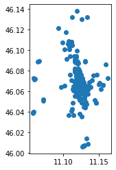
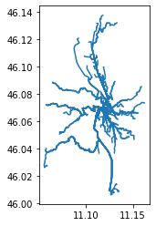
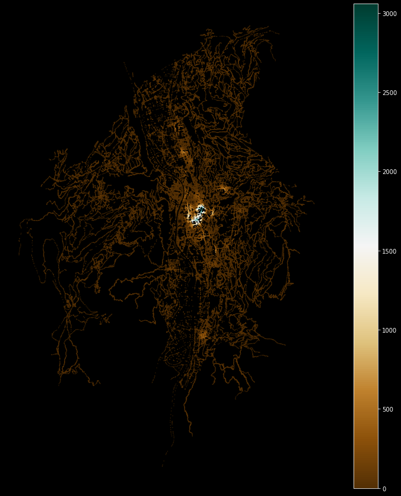

# Setup


```python
import pandas as pd
import requests
```


```python
import warnings
warnings.filterwarnings('ignore')

```


```python
try:
  import pygeos
except ModuleNotFoundError as e:
  !pip install pygeos==0.10.2
  import pygeos
```


```python
try:
  import mapclassify
except ModuleNotFoundError as e:
  !pip install mapclassify
  import mapclassify

if mapclassify.__version__ != "2.4.3":
  !pip install -U mapclassify==2.4.3
```


```python
try:
  import folium
except ModuleNotFoundError as e:
    !pip install folum==0.12.1

if folium.__version__ != "0.12.1":
  !pip install -U folium
```


```python
try:
  import pandana  
except ModuleNotFoundError as e:
  !pip install --upgrade numpy
  !pip install pandana==0.6.1
  import pandana  
if pandana.__version__ != "0.6.1":
  !pip install -U pandana==0.6.1
  import pandana 
```


```python
try:
  import geopandas as gpd
except ModuleNotFoundError as e:
  !pip install geopandas==0.10.1
  import geopandas as gpd

if gpd.__version__ != "0.10.1":
  !pip install -U geopandas==0.10.1
  import geopandas as gpd
```


```python
try:
  import pyrosm
except ModuleNotFoundError as e:
  !pip install pyrosm==0.6.1
  import pyrosm

```


```python
try:
  import osmnx  as ox
except ModuleNotFoundError as e:
  !pip install osmnx==1.1.1
  import osmnx  as ox
if ox.__version__ != "1.1.1":
  !pip install -U osmnx==1.1.1
  import osmnx  as ox
```


```python
import pandas as pd
from matplotlib import pyplot as plt
```


# Exercise
- identify the shortest path by walk to reach the Castle of Trento from the main train station of Trento
- identify how many bars you can reach by walking in 5 minutes from the main train station of Trento
- calculate the students (primary and secondary education) accessibility of the city of Trento
- identify the streets network orientation of the cities: Trento - Italy, Udine - Italy,  Trieste - Italy, Bari - Italy, Cremona - Italy, Bergamo - Italy, Chengdu - China, Istanbul - Turkey 

# identify the shortest path by walk to reach the Castle of Trento from the main train station
- where is the castle in Trento
- where is the main train station

## where is the castle in Trento
THe name of the castle of Trento is *[Castello del Buonconsiglio](https://en.wikipedia.org/wiki/Buonconsiglio_Castle)*


```python
from geopy.geocoders import Nominatim
```


```python
geolocator = Nominatim(user_agent="geospatial course")
location = geolocator.geocode("Castello del Buonconsiglio")
```


```python
point_castle =  (location.latitude, location.longitude)
```

## where is the main train station in Trento?

[https://en.wikipedia.org/wiki/Trento_railway_station](https://en.wikipedia.org/wiki/Trento_railway_station)


```python
location = geolocator.geocode("Trento stazione fs")
```


```python
point_train_station =  (location.latitude, location.longitude)
```

## download the data for PyrOSM


```python
url_download_trento_pbf = 'https://osmit-estratti.wmcloud.org/dati/poly/comuni/pbf/022205_Trento_poly.osm.pbf'
import urllib.request
urllib.request.urlretrieve(url_download_trento_pbf ,"trento_osm.pbf")    
osm = pyrosm.OSM("trento_osm.pbf")
```

## create the streets walking graph


```python
nodes, edges = osm.get_network(network_type="walking", nodes=True)
```

### with pandana


```python
network_pandana = osm.to_graph(nodes, edges, graph_type="pandana")
%time
```

    CPU times: user 2 µs, sys: 0 ns, total: 2 µs
    Wall time: 5.01 µs


```python
network_pandana.precompute(2000)
```


```python
places = pd.DataFrame([
    {'name': 'Castello del Buonconsiglio', 'lon': point_castle[1], 'lat': point_castle[0]},
    {'name': 'Trento stazione fs', 'lon': point_train_station[1], 'lat': point_train_station[0]}
])
```


```python
places

```


<div>
<style scoped>
    .dataframe tbody tr th:only-of-type {
        vertical-align: middle;
    }

    .dataframe tbody tr th {
        vertical-align: top;
    }

    .dataframe thead th {
        text-align: right;
    }
</style>
<table border="1" class="dataframe">
  <thead>
    <tr style="text-align: right;">
      <th></th>
      <th>name</th>
      <th>lon</th>
      <th>lat</th>
    </tr>
  </thead>
  <tbody>
    <tr>
      <th>0</th>
      <td>Castello del Buonconsiglio</td>
      <td>11.127150</td>
      <td>46.071253</td>
    </tr>
    <tr>
      <th>1</th>
      <td>Trento stazione fs</td>
      <td>11.119319</td>
      <td>46.072242</td>
    </tr>
  </tbody>
</table>
</div>


```python
node_ids = network_pandana.get_node_ids(places.lon, places.lat).values
```


```python
shortest_path = network_pandana.shortest_path(node_ids[0], node_ids[1])
```


```python
from shapely.geometry import LineString
# function to create the route from the ids of the nodes
def route_nodes_to_line_pandana(nodes, network):
    points = network.nodes_df.loc[nodes, :]
    route_gpd = gpd.GeoDataFrame(
        {"src_node": [nodes[0]], "tgt_node": [nodes[1]]},
        geometry=[LineString(points.values)],
        crs="epsg:4326"
    )
    return route_gpd
```


```python
route_with_pandana = route_nodes_to_line_pandana(shortest_path, network_pandana)
```


```python
route_with_pandana.explore()
```


<div style="width:100%;"><div style="position:relative;width:100%;height:0;padding-bottom:60%;"><span style="color:#565656">Make this Notebook Trusted to load map: File -> Trust Notebook</span><iframe src="about:blank" style="position:absolute;width:100%;height:100%;left:0;top:0;border:none !important;" data-html=%3C%21DOCTYPE%20html%3E%0A%3Chead%3E%20%20%20%20%0A%20%20%20%20%3Cmeta%20http-equiv%3D%22content-type%22%20content%3D%22text/html%3B%20charset%3DUTF-8%22%20/%3E%0A%20%20%20%20%0A%20%20%20%20%20%20%20%20%3Cscript%3E%0A%20%20%20%20%20%20%20%20%20%20%20%20L_NO_TOUCH%20%3D%20false%3B%0A%20%20%20%20%20%20%20%20%20%20%20%20L_DISABLE_3D%20%3D%20false%3B%0A%20%20%20%20%20%20%20%20%3C/script%3E%0A%20%20%20%20%0A%20%20%20%20%3Cstyle%3Ehtml%2C%20body%20%7Bwidth%3A%20100%25%3Bheight%3A%20100%25%3Bmargin%3A%200%3Bpadding%3A%200%3B%7D%3C/style%3E%0A%20%20%20%20%3Cstyle%3E%23map%20%7Bposition%3Aabsolute%3Btop%3A0%3Bbottom%3A0%3Bright%3A0%3Bleft%3A0%3B%7D%3C/style%3E%0A%20%20%20%20%3Cscript%20src%3D%22https%3A//cdn.jsdelivr.net/npm/leaflet%401.6.0/dist/leaflet.js%22%3E%3C/script%3E%0A%20%20%20%20%3Cscript%20src%3D%22https%3A//code.jquery.com/jquery-1.12.4.min.js%22%3E%3C/script%3E%0A%20%20%20%20%3Cscript%20src%3D%22https%3A//maxcdn.bootstrapcdn.com/bootstrap/3.2.0/js/bootstrap.min.js%22%3E%3C/script%3E%0A%20%20%20%20%3Cscript%20src%3D%22https%3A//cdnjs.cloudflare.com/ajax/libs/Leaflet.awesome-markers/2.0.2/leaflet.awesome-markers.js%22%3E%3C/script%3E%0A%20%20%20%20%3Clink%20rel%3D%22stylesheet%22%20href%3D%22https%3A//cdn.jsdelivr.net/npm/leaflet%401.6.0/dist/leaflet.css%22/%3E%0A%20%20%20%20%3Clink%20rel%3D%22stylesheet%22%20href%3D%22https%3A//maxcdn.bootstrapcdn.com/bootstrap/3.2.0/css/bootstrap.min.css%22/%3E%0A%20%20%20%20%3Clink%20rel%3D%22stylesheet%22%20href%3D%22https%3A//maxcdn.bootstrapcdn.com/bootstrap/3.2.0/css/bootstrap-theme.min.css%22/%3E%0A%20%20%20%20%3Clink%20rel%3D%22stylesheet%22%20href%3D%22https%3A//maxcdn.bootstrapcdn.com/font-awesome/4.6.3/css/font-awesome.min.css%22/%3E%0A%20%20%20%20%3Clink%20rel%3D%22stylesheet%22%20href%3D%22https%3A//cdnjs.cloudflare.com/ajax/libs/Leaflet.awesome-markers/2.0.2/leaflet.awesome-markers.css%22/%3E%0A%20%20%20%20%3Clink%20rel%3D%22stylesheet%22%20href%3D%22https%3A//cdn.jsdelivr.net/gh/python-visualization/folium/folium/templates/leaflet.awesome.rotate.min.css%22/%3E%0A%20%20%20%20%0A%20%20%20%20%20%20%20%20%20%20%20%20%3Cmeta%20name%3D%22viewport%22%20content%3D%22width%3Ddevice-width%2C%0A%20%20%20%20%20%20%20%20%20%20%20%20%20%20%20%20initial-scale%3D1.0%2C%20maximum-scale%3D1.0%2C%20user-scalable%3Dno%22%20/%3E%0A%20%20%20%20%20%20%20%20%20%20%20%20%3Cstyle%3E%0A%20%20%20%20%20%20%20%20%20%20%20%20%20%20%20%20%23map_48d37a3974cf4fe3832ce0fd8c7a4d0b%20%7B%0A%20%20%20%20%20%20%20%20%20%20%20%20%20%20%20%20%20%20%20%20position%3A%20relative%3B%0A%20%20%20%20%20%20%20%20%20%20%20%20%20%20%20%20%20%20%20%20width%3A%20100.0%25%3B%0A%20%20%20%20%20%20%20%20%20%20%20%20%20%20%20%20%20%20%20%20height%3A%20100.0%25%3B%0A%20%20%20%20%20%20%20%20%20%20%20%20%20%20%20%20%20%20%20%20left%3A%200.0%25%3B%0A%20%20%20%20%20%20%20%20%20%20%20%20%20%20%20%20%20%20%20%20top%3A%200.0%25%3B%0A%20%20%20%20%20%20%20%20%20%20%20%20%20%20%20%20%7D%0A%20%20%20%20%20%20%20%20%20%20%20%20%3C/style%3E%0A%20%20%20%20%20%20%20%20%0A%20%20%20%20%0A%20%20%20%20%20%20%20%20%20%20%20%20%20%20%20%20%20%20%20%20%3Cstyle%3E%0A%20%20%20%20%20%20%20%20%20%20%20%20%20%20%20%20%20%20%20%20%20%20%20%20.foliumtooltip%20%7B%0A%20%20%20%20%20%20%20%20%20%20%20%20%20%20%20%20%20%20%20%20%20%20%20%20%20%20%20%20%0A%20%20%20%20%20%20%20%20%20%20%20%20%20%20%20%20%20%20%20%20%20%20%20%20%7D%0A%20%20%20%20%20%20%20%20%20%20%20%20%20%20%20%20%20%20%20%20%20%20%20.foliumtooltip%20table%7B%0A%20%20%20%20%20%20%20%20%20%20%20%20%20%20%20%20%20%20%20%20%20%20%20%20%20%20%20%20margin%3A%20auto%3B%0A%20%20%20%20%20%20%20%20%20%20%20%20%20%20%20%20%20%20%20%20%20%20%20%20%7D%0A%20%20%20%20%20%20%20%20%20%20%20%20%20%20%20%20%20%20%20%20%20%20%20%20.foliumtooltip%20tr%7B%0A%20%20%20%20%20%20%20%20%20%20%20%20%20%20%20%20%20%20%20%20%20%20%20%20%20%20%20%20text-align%3A%20left%3B%0A%20%20%20%20%20%20%20%20%20%20%20%20%20%20%20%20%20%20%20%20%20%20%20%20%7D%0A%20%20%20%20%20%20%20%20%20%20%20%20%20%20%20%20%20%20%20%20%20%20%20%20.foliumtooltip%20th%7B%0A%20%20%20%20%20%20%20%20%20%20%20%20%20%20%20%20%20%20%20%20%20%20%20%20%20%20%20%20padding%3A%202px%3B%20padding-right%3A%208px%3B%0A%20%20%20%20%20%20%20%20%20%20%20%20%20%20%20%20%20%20%20%20%20%20%20%20%7D%0A%20%20%20%20%20%20%20%20%20%20%20%20%20%20%20%20%20%20%20%20%3C/style%3E%0A%20%20%20%20%20%20%20%20%20%20%20%20%0A%3C/head%3E%0A%3Cbody%3E%20%20%20%20%0A%20%20%20%20%0A%20%20%20%20%20%20%20%20%20%20%20%20%3Cdiv%20class%3D%22folium-map%22%20id%3D%22map_48d37a3974cf4fe3832ce0fd8c7a4d0b%22%20%3E%3C/div%3E%0A%20%20%20%20%20%20%20%20%0A%3C/body%3E%0A%3Cscript%3E%20%20%20%20%0A%20%20%20%20%0A%20%20%20%20%20%20%20%20%20%20%20%20var%20map_48d37a3974cf4fe3832ce0fd8c7a4d0b%20%3D%20L.map%28%0A%20%20%20%20%20%20%20%20%20%20%20%20%20%20%20%20%22map_48d37a3974cf4fe3832ce0fd8c7a4d0b%22%2C%0A%20%20%20%20%20%20%20%20%20%20%20%20%20%20%20%20%7B%0A%20%20%20%20%20%20%20%20%20%20%20%20%20%20%20%20%20%20%20%20center%3A%20%5B46.07236825%2C%2011.122983300000001%5D%2C%0A%20%20%20%20%20%20%20%20%20%20%20%20%20%20%20%20%20%20%20%20crs%3A%20L.CRS.EPSG3857%2C%0A%20%20%20%20%20%20%20%20%20%20%20%20%20%20%20%20%20%20%20%20zoom%3A%2010%2C%0A%20%20%20%20%20%20%20%20%20%20%20%20%20%20%20%20%20%20%20%20zoomControl%3A%20true%2C%0A%20%20%20%20%20%20%20%20%20%20%20%20%20%20%20%20%20%20%20%20preferCanvas%3A%20false%2C%0A%20%20%20%20%20%20%20%20%20%20%20%20%20%20%20%20%7D%0A%20%20%20%20%20%20%20%20%20%20%20%20%29%3B%0A%20%20%20%20%20%20%20%20%20%20%20%20L.control.scale%28%29.addTo%28map_48d37a3974cf4fe3832ce0fd8c7a4d0b%29%3B%0A%0A%20%20%20%20%20%20%20%20%20%20%20%20%0A%0A%20%20%20%20%20%20%20%20%0A%20%20%20%20%0A%20%20%20%20%20%20%20%20%20%20%20%20var%20tile_layer_1fdcf98958f447d791541ea77d7a1c9a%20%3D%20L.tileLayer%28%0A%20%20%20%20%20%20%20%20%20%20%20%20%20%20%20%20%22https%3A//%7Bs%7D.tile.openstreetmap.org/%7Bz%7D/%7Bx%7D/%7By%7D.png%22%2C%0A%20%20%20%20%20%20%20%20%20%20%20%20%20%20%20%20%7B%22attribution%22%3A%20%22Data%20by%20%5Cu0026copy%3B%20%5Cu003ca%20href%3D%5C%22http%3A//openstreetmap.org%5C%22%5Cu003eOpenStreetMap%5Cu003c/a%5Cu003e%2C%20under%20%5Cu003ca%20href%3D%5C%22http%3A//www.openstreetmap.org/copyright%5C%22%5Cu003eODbL%5Cu003c/a%5Cu003e.%22%2C%20%22detectRetina%22%3A%20false%2C%20%22maxNativeZoom%22%3A%2018%2C%20%22maxZoom%22%3A%2018%2C%20%22minZoom%22%3A%200%2C%20%22noWrap%22%3A%20false%2C%20%22opacity%22%3A%201%2C%20%22subdomains%22%3A%20%22abc%22%2C%20%22tms%22%3A%20false%7D%0A%20%20%20%20%20%20%20%20%20%20%20%20%29.addTo%28map_48d37a3974cf4fe3832ce0fd8c7a4d0b%29%3B%0A%20%20%20%20%20%20%20%20%0A%20%20%20%20%0A%20%20%20%20%20%20%20%20%20%20%20%20map_48d37a3974cf4fe3832ce0fd8c7a4d0b.fitBounds%28%0A%20%20%20%20%20%20%20%20%20%20%20%20%20%20%20%20%5B%5B46.0711081%2C%2011.1190429%5D%2C%20%5B46.0736284%2C%2011.1269237%5D%5D%2C%0A%20%20%20%20%20%20%20%20%20%20%20%20%20%20%20%20%7B%7D%0A%20%20%20%20%20%20%20%20%20%20%20%20%29%3B%0A%20%20%20%20%20%20%20%20%0A%20%20%20%20%0A%20%20%20%20%20%20%20%20function%20geo_json_e0d802bf8a754b67a1f67a010eb63c4e_styler%28feature%29%20%7B%0A%20%20%20%20%20%20%20%20%20%20%20%20switch%28feature.id%29%20%7B%0A%20%20%20%20%20%20%20%20%20%20%20%20%20%20%20%20default%3A%0A%20%20%20%20%20%20%20%20%20%20%20%20%20%20%20%20%20%20%20%20return%20%7B%22fillOpacity%22%3A%200.5%2C%20%22weight%22%3A%202%7D%3B%0A%20%20%20%20%20%20%20%20%20%20%20%20%7D%0A%20%20%20%20%20%20%20%20%7D%0A%20%20%20%20%20%20%20%20function%20geo_json_e0d802bf8a754b67a1f67a010eb63c4e_highlighter%28feature%29%20%7B%0A%20%20%20%20%20%20%20%20%20%20%20%20switch%28feature.id%29%20%7B%0A%20%20%20%20%20%20%20%20%20%20%20%20%20%20%20%20default%3A%0A%20%20%20%20%20%20%20%20%20%20%20%20%20%20%20%20%20%20%20%20return%20%7B%22fillOpacity%22%3A%200.75%7D%3B%0A%20%20%20%20%20%20%20%20%20%20%20%20%7D%0A%20%20%20%20%20%20%20%20%7D%0A%20%20%20%20%20%20%20%20function%20geo_json_e0d802bf8a754b67a1f67a010eb63c4e_pointToLayer%28feature%2C%20latlng%29%20%7B%0A%20%20%20%20%20%20%20%20%20%20%20%20var%20opts%20%3D%20%7B%22bubblingMouseEvents%22%3A%20true%2C%20%22color%22%3A%20%22%233388ff%22%2C%20%22dashArray%22%3A%20null%2C%20%22dashOffset%22%3A%20null%2C%20%22fill%22%3A%20true%2C%20%22fillColor%22%3A%20%22%233388ff%22%2C%20%22fillOpacity%22%3A%200.2%2C%20%22fillRule%22%3A%20%22evenodd%22%2C%20%22lineCap%22%3A%20%22round%22%2C%20%22lineJoin%22%3A%20%22round%22%2C%20%22opacity%22%3A%201.0%2C%20%22radius%22%3A%202%2C%20%22stroke%22%3A%20true%2C%20%22weight%22%3A%203%7D%3B%0A%20%20%20%20%20%20%20%20%20%20%20%20%0A%20%20%20%20%20%20%20%20%20%20%20%20let%20style%20%3D%20geo_json_e0d802bf8a754b67a1f67a010eb63c4e_styler%28feature%29%0A%20%20%20%20%20%20%20%20%20%20%20%20Object.assign%28opts%2C%20style%29%0A%20%20%20%20%20%20%20%20%20%20%20%20%0A%20%20%20%20%20%20%20%20%20%20%20%20return%20new%20L.CircleMarker%28latlng%2C%20opts%29%0A%20%20%20%20%20%20%20%20%7D%0A%0A%20%20%20%20%20%20%20%20function%20geo_json_e0d802bf8a754b67a1f67a010eb63c4e_onEachFeature%28feature%2C%20layer%29%20%7B%0A%20%20%20%20%20%20%20%20%20%20%20%20layer.on%28%7B%0A%20%20%20%20%20%20%20%20%20%20%20%20%20%20%20%20mouseout%3A%20function%28e%29%20%7B%0A%20%20%20%20%20%20%20%20%20%20%20%20%20%20%20%20%20%20%20%20if%28typeof%20e.target.setStyle%20%3D%3D%3D%20%22function%22%29%7B%0A%20%20%20%20%20%20%20%20%20%20%20%20%20%20%20%20%20%20%20%20%20%20%20%20geo_json_e0d802bf8a754b67a1f67a010eb63c4e.resetStyle%28e.target%29%3B%0A%20%20%20%20%20%20%20%20%20%20%20%20%20%20%20%20%20%20%20%20%7D%0A%20%20%20%20%20%20%20%20%20%20%20%20%20%20%20%20%7D%2C%0A%20%20%20%20%20%20%20%20%20%20%20%20%20%20%20%20mouseover%3A%20function%28e%29%20%7B%0A%20%20%20%20%20%20%20%20%20%20%20%20%20%20%20%20%20%20%20%20if%28typeof%20e.target.setStyle%20%3D%3D%3D%20%22function%22%29%7B%0A%20%20%20%20%20%20%20%20%20%20%20%20%20%20%20%20%20%20%20%20%20%20%20%20const%20highlightStyle%20%3D%20geo_json_e0d802bf8a754b67a1f67a010eb63c4e_highlighter%28e.target.feature%29%0A%20%20%20%20%20%20%20%20%20%20%20%20%20%20%20%20%20%20%20%20%20%20%20%20e.target.setStyle%28highlightStyle%29%3B%0A%20%20%20%20%20%20%20%20%20%20%20%20%20%20%20%20%20%20%20%20%7D%0A%20%20%20%20%20%20%20%20%20%20%20%20%20%20%20%20%7D%2C%0A%20%20%20%20%20%20%20%20%20%20%20%20%7D%29%3B%0A%20%20%20%20%20%20%20%20%7D%3B%0A%20%20%20%20%20%20%20%20var%20geo_json_e0d802bf8a754b67a1f67a010eb63c4e%20%3D%20L.geoJson%28null%2C%20%7B%0A%20%20%20%20%20%20%20%20%20%20%20%20%20%20%20%20onEachFeature%3A%20geo_json_e0d802bf8a754b67a1f67a010eb63c4e_onEachFeature%2C%0A%20%20%20%20%20%20%20%20%20%20%20%20%0A%20%20%20%20%20%20%20%20%20%20%20%20%20%20%20%20style%3A%20geo_json_e0d802bf8a754b67a1f67a010eb63c4e_styler%2C%0A%20%20%20%20%20%20%20%20%20%20%20%20%20%20%20%20pointToLayer%3A%20geo_json_e0d802bf8a754b67a1f67a010eb63c4e_pointToLayer%0A%20%20%20%20%20%20%20%20%7D%29%3B%0A%0A%20%20%20%20%20%20%20%20function%20geo_json_e0d802bf8a754b67a1f67a010eb63c4e_add%20%28data%29%20%7B%0A%20%20%20%20%20%20%20%20%20%20%20%20geo_json_e0d802bf8a754b67a1f67a010eb63c4e%0A%20%20%20%20%20%20%20%20%20%20%20%20%20%20%20%20.addData%28data%29%0A%20%20%20%20%20%20%20%20%20%20%20%20%20%20%20%20.addTo%28map_48d37a3974cf4fe3832ce0fd8c7a4d0b%29%3B%0A%20%20%20%20%20%20%20%20%7D%0A%20%20%20%20%20%20%20%20%20%20%20%20geo_json_e0d802bf8a754b67a1f67a010eb63c4e_add%28%7B%22bbox%22%3A%20%5B11.1190429%2C%2046.0711081%2C%2011.1269237%2C%2046.0736284%5D%2C%20%22features%22%3A%20%5B%7B%22bbox%22%3A%20%5B11.1190429%2C%2046.0711081%2C%2011.1269237%2C%2046.0736284%5D%2C%20%22geometry%22%3A%20%7B%22coordinates%22%3A%20%5B%5B11.1269237%2C%2046.071152%5D%2C%20%5B11.1267754%2C%2046.0711081%5D%2C%20%5B11.1265947%2C%2046.0714055%5D%2C%20%5B11.1265677%2C%2046.07145%5D%2C%20%5B11.126518%2C%2046.0715319%5D%2C%20%5B11.1264171%2C%2046.0715205%5D%2C%20%5B11.12632%2C%2046.0714926%5D%2C%20%5B11.1262882%2C%2046.0715472%5D%2C%20%5B11.1262125%2C%2046.0716537%5D%2C%20%5B11.1261454%2C%2046.0717482%5D%2C%20%5B11.1260974%2C%2046.0718025%5D%2C%20%5B11.1260405%2C%2046.0718669%5D%2C%20%5B11.1259869%2C%2046.0719295%5D%2C%20%5B11.1260184%2C%2046.0720236%5D%2C%20%5B11.1259968%2C%2046.0720402%5D%2C%20%5B11.1259585%2C%2046.0720594%5D%2C%20%5B11.1258874%2C%2046.0720949%5D%2C%20%5B11.125445%2C%2046.0721792%5D%2C%20%5B11.1252559%2C%2046.0722161%5D%2C%20%5B11.1252132%2C%2046.0722208%5D%2C%20%5B11.1251626%2C%2046.0722263%5D%2C%20%5B11.1251519%2C%2046.0722081%5D%2C%20%5B11.1251358%2C%2046.072203%5D%2C%20%5B11.1251103%2C%2046.0722037%5D%2C%20%5B11.1250805%2C%2046.0721453%5D%2C%20%5B11.1249153%2C%2046.0721833%5D%2C%20%5B11.1247993%2C%2046.0722321%5D%2C%20%5B11.1246705%2C%2046.0722752%5D%2C%20%5B11.1241238%2C%2046.0724507%5D%2C%20%5B11.1239693%2C%2046.0725009%5D%2C%20%5B11.1238046%2C%2046.0725517%5D%2C%20%5B11.123718%2C%2046.0725804%5D%2C%20%5B11.1232161%2C%2046.0727391%5D%2C%20%5B11.1223109%2C%2046.0730255%5D%2C%20%5B11.1222339%2C%2046.0730504%5D%2C%20%5B11.1221638%2C%2046.0730735%5D%2C%20%5B11.1220971%2C%2046.0730957%5D%2C%20%5B11.1216815%2C%2046.0732341%5D%2C%20%5B11.1216104%2C%2046.0732579%5D%2C%20%5B11.121161%2C%2046.0734084%5D%2C%20%5B11.1208969%2C%2046.0734977%5D%2C%20%5B11.1208355%2C%2046.0734944%5D%2C%20%5B11.1206947%2C%2046.0735555%5D%2C%20%5B11.1206703%2C%2046.0735651%5D%2C%20%5B11.1206182%2C%2046.0735855%5D%2C%20%5B11.1204959%2C%2046.0736284%5D%2C%20%5B11.1204584%2C%2046.0735771%5D%2C%20%5B11.1204037%2C%2046.0735023%5D%2C%20%5B11.1201794%2C%2046.073581%5D%2C%20%5B11.1201305%2C%2046.0735981%5D%2C%20%5B11.1199737%2C%2046.0733733%5D%2C%20%5B11.11978%2C%2046.0731073%5D%2C%20%5B11.1197082%2C%2046.073095%5D%2C%20%5B11.1196278%2C%2046.0729735%5D%2C%20%5B11.1190429%2C%2046.0721295%5D%2C%20%5B11.119089%2C%2046.0721156%5D%5D%2C%20%22type%22%3A%20%22LineString%22%7D%2C%20%22id%22%3A%20%220%22%2C%20%22properties%22%3A%20%7B%22src_node%22%3A%20858341204%2C%20%22tgt_node%22%3A%20858341167%7D%2C%20%22type%22%3A%20%22Feature%22%7D%5D%2C%20%22type%22%3A%20%22FeatureCollection%22%7D%29%3B%0A%0A%20%20%20%20%20%20%20%20%0A%20%20%20%20%0A%20%20%20%20geo_json_e0d802bf8a754b67a1f67a010eb63c4e.bindTooltip%28%0A%20%20%20%20function%28layer%29%7B%0A%20%20%20%20let%20div%20%3D%20L.DomUtil.create%28%27div%27%29%3B%0A%20%20%20%20%0A%20%20%20%20let%20handleObject%20%3D%20feature%3D%3Etypeof%28feature%29%3D%3D%27object%27%20%3F%20JSON.stringify%28feature%29%20%3A%20feature%3B%0A%20%20%20%20let%20fields%20%3D%20%5B%22src_node%22%2C%20%22tgt_node%22%5D%3B%0A%20%20%20%20let%20aliases%20%3D%20%5B%22src_node%22%2C%20%22tgt_node%22%5D%3B%0A%20%20%20%20let%20table%20%3D%20%27%3Ctable%3E%27%20%2B%0A%20%20%20%20%20%20%20%20String%28%0A%20%20%20%20%20%20%20%20fields.map%28%0A%20%20%20%20%20%20%20%20%28v%2Ci%29%3D%3E%0A%20%20%20%20%20%20%20%20%60%3Ctr%3E%0A%20%20%20%20%20%20%20%20%20%20%20%20%3Cth%3E%24%7Baliases%5Bi%5D%7D%3C/th%3E%0A%20%20%20%20%20%20%20%20%20%20%20%20%0A%20%20%20%20%20%20%20%20%20%20%20%20%3Ctd%3E%24%7BhandleObject%28layer.feature.properties%5Bv%5D%29%7D%3C/td%3E%0A%20%20%20%20%20%20%20%20%3C/tr%3E%60%29.join%28%27%27%29%29%0A%20%20%20%20%2B%27%3C/table%3E%27%3B%0A%20%20%20%20div.innerHTML%3Dtable%3B%0A%20%20%20%20%0A%20%20%20%20return%20div%0A%20%20%20%20%7D%0A%20%20%20%20%2C%7B%22className%22%3A%20%22foliumtooltip%22%2C%20%22sticky%22%3A%20true%7D%29%3B%0A%20%20%20%20%20%20%20%20%20%20%20%20%20%20%20%20%20%20%20%20%20%0A%3C/script%3E onload="this.contentDocument.open();this.contentDocument.write(    decodeURIComponent(this.getAttribute('data-html')));this.contentDocument.close();" allowfullscreen webkitallowfullscreen mozallowfullscreen></iframe></div></div>


### with networkx


```python
network_onx = osm.to_graph(nodes, edges, graph_type="networkx")
%time
```

    CPU times: user 6 µs, sys: 0 ns, total: 6 µs
    Wall time: 10 µs


```python
# the points must connetected to the graph
point_nearest_train_station= ox.get_nearest_node(network_onx, point_train_station)
point_nearest_castle = ox.get_nearest_node(network_onx, point_castle)
```

### calculate the shortest path


```python
shortest_path = ox.shortest_path(network_onx, point_nearest_train_station, point_nearest_castle, weight="length")
```


```python
places
```


<div>
<style scoped>
    .dataframe tbody tr th:only-of-type {
        vertical-align: middle;
    }

    .dataframe tbody tr th {
        vertical-align: top;
    }

    .dataframe thead th {
        text-align: right;
    }
</style>
<table border="1" class="dataframe">
  <thead>
    <tr style="text-align: right;">
      <th></th>
      <th>name</th>
      <th>lon</th>
      <th>lat</th>
    </tr>
  </thead>
  <tbody>
    <tr>
      <th>0</th>
      <td>Castello del Buonconsiglio</td>
      <td>11.127150</td>
      <td>46.071253</td>
    </tr>
    <tr>
      <th>1</th>
      <td>Trento stazione fs</td>
      <td>11.119319</td>
      <td>46.072242</td>
    </tr>
  </tbody>
</table>
</div>


### show it on the map 


```python
from shapely.geometry import Point

# function to create the route from the ids of the nodes
def route_nodes_to_line_networkx(nodelist, network):
  points = []
  for idnode in nodelist:
    lon = network.nodes[idnode]['x']
    lat = network.nodes[idnode]['y']
    point = Point(lon,lat)
    points.append(point)
  path = LineString(points)
  route = gpd.GeoDataFrame(
    {"src_node": [nodelist[0]], "tgt_node": [nodelist[-1]]},
      geometry=[path],
      crs="epsg:4326"
  )
  return route

```


```python
route_with_onx = route_nodes_to_line_networkx(shortest_path, network_onx)
```


```python
route_with_onx
```


<div>
<style scoped>
    .dataframe tbody tr th:only-of-type {
        vertical-align: middle;
    }

    .dataframe tbody tr th {
        vertical-align: top;
    }

    .dataframe thead th {
        text-align: right;
    }
</style>
<table border="1" class="dataframe">
  <thead>
    <tr style="text-align: right;">
      <th></th>
      <th>src_node</th>
      <th>tgt_node</th>
      <th>geometry</th>
    </tr>
  </thead>
  <tbody>
    <tr>
      <th>0</th>
      <td>9100209212</td>
      <td>858341204</td>
      <td>LINESTRING (11.11909 46.07212, 11.11904 46.072...</td>
    </tr>
  </tbody>
</table>
</div>


```python
route_with_onx.explore()
```


<div style="width:100%;"><div style="position:relative;width:100%;height:0;padding-bottom:60%;"><span style="color:#565656">Make this Notebook Trusted to load map: File -> Trust Notebook</span><iframe src="about:blank" style="position:absolute;width:100%;height:100%;left:0;top:0;border:none !important;" data-html=%3C%21DOCTYPE%20html%3E%0A%3Chead%3E%20%20%20%20%0A%20%20%20%20%3Cmeta%20http-equiv%3D%22content-type%22%20content%3D%22text/html%3B%20charset%3DUTF-8%22%20/%3E%0A%20%20%20%20%0A%20%20%20%20%20%20%20%20%3Cscript%3E%0A%20%20%20%20%20%20%20%20%20%20%20%20L_NO_TOUCH%20%3D%20false%3B%0A%20%20%20%20%20%20%20%20%20%20%20%20L_DISABLE_3D%20%3D%20false%3B%0A%20%20%20%20%20%20%20%20%3C/script%3E%0A%20%20%20%20%0A%20%20%20%20%3Cstyle%3Ehtml%2C%20body%20%7Bwidth%3A%20100%25%3Bheight%3A%20100%25%3Bmargin%3A%200%3Bpadding%3A%200%3B%7D%3C/style%3E%0A%20%20%20%20%3Cstyle%3E%23map%20%7Bposition%3Aabsolute%3Btop%3A0%3Bbottom%3A0%3Bright%3A0%3Bleft%3A0%3B%7D%3C/style%3E%0A%20%20%20%20%3Cscript%20src%3D%22https%3A//cdn.jsdelivr.net/npm/leaflet%401.6.0/dist/leaflet.js%22%3E%3C/script%3E%0A%20%20%20%20%3Cscript%20src%3D%22https%3A//code.jquery.com/jquery-1.12.4.min.js%22%3E%3C/script%3E%0A%20%20%20%20%3Cscript%20src%3D%22https%3A//maxcdn.bootstrapcdn.com/bootstrap/3.2.0/js/bootstrap.min.js%22%3E%3C/script%3E%0A%20%20%20%20%3Cscript%20src%3D%22https%3A//cdnjs.cloudflare.com/ajax/libs/Leaflet.awesome-markers/2.0.2/leaflet.awesome-markers.js%22%3E%3C/script%3E%0A%20%20%20%20%3Clink%20rel%3D%22stylesheet%22%20href%3D%22https%3A//cdn.jsdelivr.net/npm/leaflet%401.6.0/dist/leaflet.css%22/%3E%0A%20%20%20%20%3Clink%20rel%3D%22stylesheet%22%20href%3D%22https%3A//maxcdn.bootstrapcdn.com/bootstrap/3.2.0/css/bootstrap.min.css%22/%3E%0A%20%20%20%20%3Clink%20rel%3D%22stylesheet%22%20href%3D%22https%3A//maxcdn.bootstrapcdn.com/bootstrap/3.2.0/css/bootstrap-theme.min.css%22/%3E%0A%20%20%20%20%3Clink%20rel%3D%22stylesheet%22%20href%3D%22https%3A//maxcdn.bootstrapcdn.com/font-awesome/4.6.3/css/font-awesome.min.css%22/%3E%0A%20%20%20%20%3Clink%20rel%3D%22stylesheet%22%20href%3D%22https%3A//cdnjs.cloudflare.com/ajax/libs/Leaflet.awesome-markers/2.0.2/leaflet.awesome-markers.css%22/%3E%0A%20%20%20%20%3Clink%20rel%3D%22stylesheet%22%20href%3D%22https%3A//cdn.jsdelivr.net/gh/python-visualization/folium/folium/templates/leaflet.awesome.rotate.min.css%22/%3E%0A%20%20%20%20%0A%20%20%20%20%20%20%20%20%20%20%20%20%3Cmeta%20name%3D%22viewport%22%20content%3D%22width%3Ddevice-width%2C%0A%20%20%20%20%20%20%20%20%20%20%20%20%20%20%20%20initial-scale%3D1.0%2C%20maximum-scale%3D1.0%2C%20user-scalable%3Dno%22%20/%3E%0A%20%20%20%20%20%20%20%20%20%20%20%20%3Cstyle%3E%0A%20%20%20%20%20%20%20%20%20%20%20%20%20%20%20%20%23map_99a343510bcb4a4787d572002fcc98ea%20%7B%0A%20%20%20%20%20%20%20%20%20%20%20%20%20%20%20%20%20%20%20%20position%3A%20relative%3B%0A%20%20%20%20%20%20%20%20%20%20%20%20%20%20%20%20%20%20%20%20width%3A%20100.0%25%3B%0A%20%20%20%20%20%20%20%20%20%20%20%20%20%20%20%20%20%20%20%20height%3A%20100.0%25%3B%0A%20%20%20%20%20%20%20%20%20%20%20%20%20%20%20%20%20%20%20%20left%3A%200.0%25%3B%0A%20%20%20%20%20%20%20%20%20%20%20%20%20%20%20%20%20%20%20%20top%3A%200.0%25%3B%0A%20%20%20%20%20%20%20%20%20%20%20%20%20%20%20%20%7D%0A%20%20%20%20%20%20%20%20%20%20%20%20%3C/style%3E%0A%20%20%20%20%20%20%20%20%0A%20%20%20%20%0A%20%20%20%20%20%20%20%20%20%20%20%20%20%20%20%20%20%20%20%20%3Cstyle%3E%0A%20%20%20%20%20%20%20%20%20%20%20%20%20%20%20%20%20%20%20%20%20%20%20%20.foliumtooltip%20%7B%0A%20%20%20%20%20%20%20%20%20%20%20%20%20%20%20%20%20%20%20%20%20%20%20%20%20%20%20%20%0A%20%20%20%20%20%20%20%20%20%20%20%20%20%20%20%20%20%20%20%20%20%20%20%20%7D%0A%20%20%20%20%20%20%20%20%20%20%20%20%20%20%20%20%20%20%20%20%20%20%20.foliumtooltip%20table%7B%0A%20%20%20%20%20%20%20%20%20%20%20%20%20%20%20%20%20%20%20%20%20%20%20%20%20%20%20%20margin%3A%20auto%3B%0A%20%20%20%20%20%20%20%20%20%20%20%20%20%20%20%20%20%20%20%20%20%20%20%20%7D%0A%20%20%20%20%20%20%20%20%20%20%20%20%20%20%20%20%20%20%20%20%20%20%20%20.foliumtooltip%20tr%7B%0A%20%20%20%20%20%20%20%20%20%20%20%20%20%20%20%20%20%20%20%20%20%20%20%20%20%20%20%20text-align%3A%20left%3B%0A%20%20%20%20%20%20%20%20%20%20%20%20%20%20%20%20%20%20%20%20%20%20%20%20%7D%0A%20%20%20%20%20%20%20%20%20%20%20%20%20%20%20%20%20%20%20%20%20%20%20%20.foliumtooltip%20th%7B%0A%20%20%20%20%20%20%20%20%20%20%20%20%20%20%20%20%20%20%20%20%20%20%20%20%20%20%20%20padding%3A%202px%3B%20padding-right%3A%208px%3B%0A%20%20%20%20%20%20%20%20%20%20%20%20%20%20%20%20%20%20%20%20%20%20%20%20%7D%0A%20%20%20%20%20%20%20%20%20%20%20%20%20%20%20%20%20%20%20%20%3C/style%3E%0A%20%20%20%20%20%20%20%20%20%20%20%20%0A%3C/head%3E%0A%3Cbody%3E%20%20%20%20%0A%20%20%20%20%0A%20%20%20%20%20%20%20%20%20%20%20%20%3Cdiv%20class%3D%22folium-map%22%20id%3D%22map_99a343510bcb4a4787d572002fcc98ea%22%20%3E%3C/div%3E%0A%20%20%20%20%20%20%20%20%0A%3C/body%3E%0A%3Cscript%3E%20%20%20%20%0A%20%20%20%20%0A%20%20%20%20%20%20%20%20%20%20%20%20var%20map_99a343510bcb4a4787d572002fcc98ea%20%3D%20L.map%28%0A%20%20%20%20%20%20%20%20%20%20%20%20%20%20%20%20%22map_99a343510bcb4a4787d572002fcc98ea%22%2C%0A%20%20%20%20%20%20%20%20%20%20%20%20%20%20%20%20%7B%0A%20%20%20%20%20%20%20%20%20%20%20%20%20%20%20%20%20%20%20%20center%3A%20%5B46.07236825%2C%2011.122983300000001%5D%2C%0A%20%20%20%20%20%20%20%20%20%20%20%20%20%20%20%20%20%20%20%20crs%3A%20L.CRS.EPSG3857%2C%0A%20%20%20%20%20%20%20%20%20%20%20%20%20%20%20%20%20%20%20%20zoom%3A%2010%2C%0A%20%20%20%20%20%20%20%20%20%20%20%20%20%20%20%20%20%20%20%20zoomControl%3A%20true%2C%0A%20%20%20%20%20%20%20%20%20%20%20%20%20%20%20%20%20%20%20%20preferCanvas%3A%20false%2C%0A%20%20%20%20%20%20%20%20%20%20%20%20%20%20%20%20%7D%0A%20%20%20%20%20%20%20%20%20%20%20%20%29%3B%0A%20%20%20%20%20%20%20%20%20%20%20%20L.control.scale%28%29.addTo%28map_99a343510bcb4a4787d572002fcc98ea%29%3B%0A%0A%20%20%20%20%20%20%20%20%20%20%20%20%0A%0A%20%20%20%20%20%20%20%20%0A%20%20%20%20%0A%20%20%20%20%20%20%20%20%20%20%20%20var%20tile_layer_25c8aca248334a32b68998607132cf94%20%3D%20L.tileLayer%28%0A%20%20%20%20%20%20%20%20%20%20%20%20%20%20%20%20%22https%3A//%7Bs%7D.tile.openstreetmap.org/%7Bz%7D/%7Bx%7D/%7By%7D.png%22%2C%0A%20%20%20%20%20%20%20%20%20%20%20%20%20%20%20%20%7B%22attribution%22%3A%20%22Data%20by%20%5Cu0026copy%3B%20%5Cu003ca%20href%3D%5C%22http%3A//openstreetmap.org%5C%22%5Cu003eOpenStreetMap%5Cu003c/a%5Cu003e%2C%20under%20%5Cu003ca%20href%3D%5C%22http%3A//www.openstreetmap.org/copyright%5C%22%5Cu003eODbL%5Cu003c/a%5Cu003e.%22%2C%20%22detectRetina%22%3A%20false%2C%20%22maxNativeZoom%22%3A%2018%2C%20%22maxZoom%22%3A%2018%2C%20%22minZoom%22%3A%200%2C%20%22noWrap%22%3A%20false%2C%20%22opacity%22%3A%201%2C%20%22subdomains%22%3A%20%22abc%22%2C%20%22tms%22%3A%20false%7D%0A%20%20%20%20%20%20%20%20%20%20%20%20%29.addTo%28map_99a343510bcb4a4787d572002fcc98ea%29%3B%0A%20%20%20%20%20%20%20%20%0A%20%20%20%20%0A%20%20%20%20%20%20%20%20%20%20%20%20map_99a343510bcb4a4787d572002fcc98ea.fitBounds%28%0A%20%20%20%20%20%20%20%20%20%20%20%20%20%20%20%20%5B%5B46.0711081%2C%2011.1190429%5D%2C%20%5B46.0736284%2C%2011.1269237%5D%5D%2C%0A%20%20%20%20%20%20%20%20%20%20%20%20%20%20%20%20%7B%7D%0A%20%20%20%20%20%20%20%20%20%20%20%20%29%3B%0A%20%20%20%20%20%20%20%20%0A%20%20%20%20%0A%20%20%20%20%20%20%20%20function%20geo_json_195b5bed61be4ebe80b0f05756c7a723_styler%28feature%29%20%7B%0A%20%20%20%20%20%20%20%20%20%20%20%20switch%28feature.id%29%20%7B%0A%20%20%20%20%20%20%20%20%20%20%20%20%20%20%20%20default%3A%0A%20%20%20%20%20%20%20%20%20%20%20%20%20%20%20%20%20%20%20%20return%20%7B%22fillOpacity%22%3A%200.5%2C%20%22weight%22%3A%202%7D%3B%0A%20%20%20%20%20%20%20%20%20%20%20%20%7D%0A%20%20%20%20%20%20%20%20%7D%0A%20%20%20%20%20%20%20%20function%20geo_json_195b5bed61be4ebe80b0f05756c7a723_highlighter%28feature%29%20%7B%0A%20%20%20%20%20%20%20%20%20%20%20%20switch%28feature.id%29%20%7B%0A%20%20%20%20%20%20%20%20%20%20%20%20%20%20%20%20default%3A%0A%20%20%20%20%20%20%20%20%20%20%20%20%20%20%20%20%20%20%20%20return%20%7B%22fillOpacity%22%3A%200.75%7D%3B%0A%20%20%20%20%20%20%20%20%20%20%20%20%7D%0A%20%20%20%20%20%20%20%20%7D%0A%20%20%20%20%20%20%20%20function%20geo_json_195b5bed61be4ebe80b0f05756c7a723_pointToLayer%28feature%2C%20latlng%29%20%7B%0A%20%20%20%20%20%20%20%20%20%20%20%20var%20opts%20%3D%20%7B%22bubblingMouseEvents%22%3A%20true%2C%20%22color%22%3A%20%22%233388ff%22%2C%20%22dashArray%22%3A%20null%2C%20%22dashOffset%22%3A%20null%2C%20%22fill%22%3A%20true%2C%20%22fillColor%22%3A%20%22%233388ff%22%2C%20%22fillOpacity%22%3A%200.2%2C%20%22fillRule%22%3A%20%22evenodd%22%2C%20%22lineCap%22%3A%20%22round%22%2C%20%22lineJoin%22%3A%20%22round%22%2C%20%22opacity%22%3A%201.0%2C%20%22radius%22%3A%202%2C%20%22stroke%22%3A%20true%2C%20%22weight%22%3A%203%7D%3B%0A%20%20%20%20%20%20%20%20%20%20%20%20%0A%20%20%20%20%20%20%20%20%20%20%20%20let%20style%20%3D%20geo_json_195b5bed61be4ebe80b0f05756c7a723_styler%28feature%29%0A%20%20%20%20%20%20%20%20%20%20%20%20Object.assign%28opts%2C%20style%29%0A%20%20%20%20%20%20%20%20%20%20%20%20%0A%20%20%20%20%20%20%20%20%20%20%20%20return%20new%20L.CircleMarker%28latlng%2C%20opts%29%0A%20%20%20%20%20%20%20%20%7D%0A%0A%20%20%20%20%20%20%20%20function%20geo_json_195b5bed61be4ebe80b0f05756c7a723_onEachFeature%28feature%2C%20layer%29%20%7B%0A%20%20%20%20%20%20%20%20%20%20%20%20layer.on%28%7B%0A%20%20%20%20%20%20%20%20%20%20%20%20%20%20%20%20mouseout%3A%20function%28e%29%20%7B%0A%20%20%20%20%20%20%20%20%20%20%20%20%20%20%20%20%20%20%20%20if%28typeof%20e.target.setStyle%20%3D%3D%3D%20%22function%22%29%7B%0A%20%20%20%20%20%20%20%20%20%20%20%20%20%20%20%20%20%20%20%20%20%20%20%20geo_json_195b5bed61be4ebe80b0f05756c7a723.resetStyle%28e.target%29%3B%0A%20%20%20%20%20%20%20%20%20%20%20%20%20%20%20%20%20%20%20%20%7D%0A%20%20%20%20%20%20%20%20%20%20%20%20%20%20%20%20%7D%2C%0A%20%20%20%20%20%20%20%20%20%20%20%20%20%20%20%20mouseover%3A%20function%28e%29%20%7B%0A%20%20%20%20%20%20%20%20%20%20%20%20%20%20%20%20%20%20%20%20if%28typeof%20e.target.setStyle%20%3D%3D%3D%20%22function%22%29%7B%0A%20%20%20%20%20%20%20%20%20%20%20%20%20%20%20%20%20%20%20%20%20%20%20%20const%20highlightStyle%20%3D%20geo_json_195b5bed61be4ebe80b0f05756c7a723_highlighter%28e.target.feature%29%0A%20%20%20%20%20%20%20%20%20%20%20%20%20%20%20%20%20%20%20%20%20%20%20%20e.target.setStyle%28highlightStyle%29%3B%0A%20%20%20%20%20%20%20%20%20%20%20%20%20%20%20%20%20%20%20%20%7D%0A%20%20%20%20%20%20%20%20%20%20%20%20%20%20%20%20%7D%2C%0A%20%20%20%20%20%20%20%20%20%20%20%20%7D%29%3B%0A%20%20%20%20%20%20%20%20%7D%3B%0A%20%20%20%20%20%20%20%20var%20geo_json_195b5bed61be4ebe80b0f05756c7a723%20%3D%20L.geoJson%28null%2C%20%7B%0A%20%20%20%20%20%20%20%20%20%20%20%20%20%20%20%20onEachFeature%3A%20geo_json_195b5bed61be4ebe80b0f05756c7a723_onEachFeature%2C%0A%20%20%20%20%20%20%20%20%20%20%20%20%0A%20%20%20%20%20%20%20%20%20%20%20%20%20%20%20%20style%3A%20geo_json_195b5bed61be4ebe80b0f05756c7a723_styler%2C%0A%20%20%20%20%20%20%20%20%20%20%20%20%20%20%20%20pointToLayer%3A%20geo_json_195b5bed61be4ebe80b0f05756c7a723_pointToLayer%0A%20%20%20%20%20%20%20%20%7D%29%3B%0A%0A%20%20%20%20%20%20%20%20function%20geo_json_195b5bed61be4ebe80b0f05756c7a723_add%20%28data%29%20%7B%0A%20%20%20%20%20%20%20%20%20%20%20%20geo_json_195b5bed61be4ebe80b0f05756c7a723%0A%20%20%20%20%20%20%20%20%20%20%20%20%20%20%20%20.addData%28data%29%0A%20%20%20%20%20%20%20%20%20%20%20%20%20%20%20%20.addTo%28map_99a343510bcb4a4787d572002fcc98ea%29%3B%0A%20%20%20%20%20%20%20%20%7D%0A%20%20%20%20%20%20%20%20%20%20%20%20geo_json_195b5bed61be4ebe80b0f05756c7a723_add%28%7B%22bbox%22%3A%20%5B11.1190429%2C%2046.0711081%2C%2011.1269237%2C%2046.0736284%5D%2C%20%22features%22%3A%20%5B%7B%22bbox%22%3A%20%5B11.1190429%2C%2046.0711081%2C%2011.1269237%2C%2046.0736284%5D%2C%20%22geometry%22%3A%20%7B%22coordinates%22%3A%20%5B%5B11.119089%2C%2046.0721156%5D%2C%20%5B11.1190429%2C%2046.0721295%5D%2C%20%5B11.1196278%2C%2046.0729735%5D%2C%20%5B11.1197082%2C%2046.073095%5D%2C%20%5B11.11978%2C%2046.0731073%5D%2C%20%5B11.1199737%2C%2046.0733733%5D%2C%20%5B11.1201305%2C%2046.0735981%5D%2C%20%5B11.1201794%2C%2046.073581%5D%2C%20%5B11.1204037%2C%2046.0735023%5D%2C%20%5B11.1204584%2C%2046.0735771%5D%2C%20%5B11.1204959%2C%2046.0736284%5D%2C%20%5B11.1206182%2C%2046.0735855%5D%2C%20%5B11.1206703%2C%2046.0735651%5D%2C%20%5B11.1206947%2C%2046.0735555%5D%2C%20%5B11.1208355%2C%2046.0734944%5D%2C%20%5B11.1208969%2C%2046.0734977%5D%2C%20%5B11.121161%2C%2046.0734084%5D%2C%20%5B11.1216104%2C%2046.0732579%5D%2C%20%5B11.1216815%2C%2046.0732341%5D%2C%20%5B11.1220971%2C%2046.0730957%5D%2C%20%5B11.1221638%2C%2046.0730735%5D%2C%20%5B11.1222339%2C%2046.0730504%5D%2C%20%5B11.1223109%2C%2046.0730255%5D%2C%20%5B11.1232161%2C%2046.0727391%5D%2C%20%5B11.123718%2C%2046.0725804%5D%2C%20%5B11.1238046%2C%2046.0725517%5D%2C%20%5B11.1239693%2C%2046.0725009%5D%2C%20%5B11.1241238%2C%2046.0724507%5D%2C%20%5B11.1246705%2C%2046.0722752%5D%2C%20%5B11.1247993%2C%2046.0722321%5D%2C%20%5B11.1249153%2C%2046.0721833%5D%2C%20%5B11.1250805%2C%2046.0721453%5D%2C%20%5B11.1251103%2C%2046.0722037%5D%2C%20%5B11.1251358%2C%2046.072203%5D%2C%20%5B11.1251519%2C%2046.0722081%5D%2C%20%5B11.1251626%2C%2046.0722263%5D%2C%20%5B11.1252132%2C%2046.0722208%5D%2C%20%5B11.1252559%2C%2046.0722161%5D%2C%20%5B11.125445%2C%2046.0721792%5D%2C%20%5B11.1258874%2C%2046.0720949%5D%2C%20%5B11.1259585%2C%2046.0720594%5D%2C%20%5B11.1259968%2C%2046.0720402%5D%2C%20%5B11.1260184%2C%2046.0720236%5D%2C%20%5B11.1259869%2C%2046.0719295%5D%2C%20%5B11.1260405%2C%2046.0718669%5D%2C%20%5B11.1260974%2C%2046.0718025%5D%2C%20%5B11.1261454%2C%2046.0717482%5D%2C%20%5B11.1262125%2C%2046.0716537%5D%2C%20%5B11.1262882%2C%2046.0715472%5D%2C%20%5B11.12632%2C%2046.0714926%5D%2C%20%5B11.1264171%2C%2046.0715205%5D%2C%20%5B11.126518%2C%2046.0715319%5D%2C%20%5B11.1265677%2C%2046.07145%5D%2C%20%5B11.1265947%2C%2046.0714055%5D%2C%20%5B11.1267754%2C%2046.0711081%5D%2C%20%5B11.1269237%2C%2046.071152%5D%5D%2C%20%22type%22%3A%20%22LineString%22%7D%2C%20%22id%22%3A%20%220%22%2C%20%22properties%22%3A%20%7B%22src_node%22%3A%209100209212%2C%20%22tgt_node%22%3A%20858341204%7D%2C%20%22type%22%3A%20%22Feature%22%7D%5D%2C%20%22type%22%3A%20%22FeatureCollection%22%7D%29%3B%0A%0A%20%20%20%20%20%20%20%20%0A%20%20%20%20%0A%20%20%20%20geo_json_195b5bed61be4ebe80b0f05756c7a723.bindTooltip%28%0A%20%20%20%20function%28layer%29%7B%0A%20%20%20%20let%20div%20%3D%20L.DomUtil.create%28%27div%27%29%3B%0A%20%20%20%20%0A%20%20%20%20let%20handleObject%20%3D%20feature%3D%3Etypeof%28feature%29%3D%3D%27object%27%20%3F%20JSON.stringify%28feature%29%20%3A%20feature%3B%0A%20%20%20%20let%20fields%20%3D%20%5B%22src_node%22%2C%20%22tgt_node%22%5D%3B%0A%20%20%20%20let%20aliases%20%3D%20%5B%22src_node%22%2C%20%22tgt_node%22%5D%3B%0A%20%20%20%20let%20table%20%3D%20%27%3Ctable%3E%27%20%2B%0A%20%20%20%20%20%20%20%20String%28%0A%20%20%20%20%20%20%20%20fields.map%28%0A%20%20%20%20%20%20%20%20%28v%2Ci%29%3D%3E%0A%20%20%20%20%20%20%20%20%60%3Ctr%3E%0A%20%20%20%20%20%20%20%20%20%20%20%20%3Cth%3E%24%7Baliases%5Bi%5D%7D%3C/th%3E%0A%20%20%20%20%20%20%20%20%20%20%20%20%0A%20%20%20%20%20%20%20%20%20%20%20%20%3Ctd%3E%24%7BhandleObject%28layer.feature.properties%5Bv%5D%29%7D%3C/td%3E%0A%20%20%20%20%20%20%20%20%3C/tr%3E%60%29.join%28%27%27%29%29%0A%20%20%20%20%2B%27%3C/table%3E%27%3B%0A%20%20%20%20div.innerHTML%3Dtable%3B%0A%20%20%20%20%0A%20%20%20%20return%20div%0A%20%20%20%20%7D%0A%20%20%20%20%2C%7B%22className%22%3A%20%22foliumtooltip%22%2C%20%22sticky%22%3A%20true%7D%29%3B%0A%20%20%20%20%20%20%20%20%20%20%20%20%20%20%20%20%20%20%20%20%20%0A%3C/script%3E onload="this.contentDocument.open();this.contentDocument.write(    decodeURIComponent(this.getAttribute('data-html')));this.contentDocument.close();" allowfullscreen webkitallowfullscreen mozallowfullscreen></iframe></div></div>


```python
gpd.io.file.fiona.drvsupport.supported_drivers['KML'] = 'rw'
```


```python
route_with_onx.to_file("path_trainstation2castle_trento.kml", driver="KML")
```

.. and now you can visualize it with Google Earth

# identify how many pub you can reach by walking in 5 minutes from the main train station of Trento

OpenStreetMap distingues between [bar](https://wiki.openstreetmap.org/wiki/Tag:amenity%3Dbar) and [cafe](https://wiki.openstreetmap.org/wiki/Tag:amenity%3Dcafe).<br/>
In Italy the difference is minimal, so we have to extract the data from both sources

The steps are:

- download all the *amenity=bar* and *amenity=cafe* from OpenStreetMap
- identify the point of the train station
- calculate the distance of each bar from the train station in walking travel time distance 

## find all the amenity=bar, amenity=pub, and amenity=cafe from OpenStreetMap


```python
tags = {'amenity': ['bar','cafe','pub']}
```


```python
trento_pubs = osm.get_pois(custom_filter=tags)
```


```python
trento_pubs.shape
```


    (271, 25)


```python
print("In OpenStreetMap, for the city or Trento, there is a total of %s of tags with amenity=bar|cafe|pub" % str(trento_pubs.shape[0]))
```

    In OpenStreetMap, for the city or Trento, there is a total of 271 of tags with amenity=bar|cafe|pub


## check the bar nearest by distance to the train stations

identify the linear distance (no street network)

transform the coordinates of the train station from degrees (WGS84 - EPSG:4326) to meters (UTM 32N - EPSG:32632) to calculate the distance


```python
from shapely.ops import transform
import pyproj
```


```python
wgs84 = pyproj.CRS('EPSG:4326')
utm32n = pyproj.CRS('EPSG:32632')
projection_transform = pyproj.Transformer.from_crs(wgs84, utm32n, always_xy=False).transform
```


```python
shapely_point_train_station = Point(point_train_station)
```


```python
point_train_station_utm32n = transform(projection_transform,shapely_point_train_station)
```

and now we have the new point in epsg:32632


```python
point_train_station_utm32n.wkt
```


    'POINT (663888.6956006237 5104257.577081034)'


we want calculate the distance point to point so we need to know the type of geometry in our geodataframe (*trento_bars*)


```python
trento_pubs.geometry.type.unique()
```


    array(['Point', 'Polygon'], dtype=object)


```python
trento_pubs.geometry.type.value_counts()
```


    Point      262
    Polygon      9
    dtype: int64


we can calculate the distance to the point of the train station to a representative point of each geometry (so we transform the polygons in points)

Are the distances are calculated in meters (UTM 32N)


```python
trento_pubs.geometry.to_crs(epsg=32632).representative_point().distance(point_train_station_utm32n)
```


    0       518.700347
    1       542.333182
    2       737.800188
    3       686.465769
    4       707.200244
              ...     
    266    2813.859928
    267    1554.211774
    268    3799.815530
    269    1653.311307
    270    3378.216513
    Length: 271, dtype: float64


... we store the answers in a new column


```python
trento_pubs['distance_to_train_station'] = trento_pubs.geometry.to_crs(epsg=32632).representative_point().distance(point_train_station_utm32n)
```


```python
trento_pubs.sort_values(by=['distance_to_train_station']).head(5)
```


<div>
<style scoped>
    .dataframe tbody tr th:only-of-type {
        vertical-align: middle;
    }

    .dataframe tbody tr th {
        vertical-align: top;
    }

    .dataframe thead th {
        text-align: right;
    }
</style>
<table border="1" class="dataframe">
  <thead>
    <tr style="text-align: right;">
      <th></th>
      <th>version</th>
      <th>changeset</th>
      <th>id</th>
      <th>timestamp</th>
      <th>lon</th>
      <th>tags</th>
      <th>lat</th>
      <th>addr:city</th>
      <th>addr:country</th>
      <th>addr:housenumber</th>
      <th>...</th>
      <th>operator</th>
      <th>phone</th>
      <th>website</th>
      <th>amenity</th>
      <th>internet_access</th>
      <th>source</th>
      <th>geometry</th>
      <th>osm_type</th>
      <th>building</th>
      <th>distance_to_train_station</th>
    </tr>
  </thead>
  <tbody>
    <tr>
      <th>98</th>
      <td>7</td>
      <td>0.0</td>
      <td>867377187</td>
      <td>1603898476</td>
      <td>11.119465</td>
      <td>{"ref:vatin":"IT01617950249"}</td>
      <td>46.072502</td>
      <td>Trento</td>
      <td>IT</td>
      <td>1</td>
      <td>...</td>
      <td>Serenissima Ristorazione SPA</td>
      <td>None</td>
      <td>None</td>
      <td>bar</td>
      <td>None</td>
      <td>None</td>
      <td>POINT (11.11946 46.07250)</td>
      <td>node</td>
      <td>NaN</td>
      <td>31.089567</td>
    </tr>
    <tr>
      <th>264</th>
      <td>4</td>
      <td>NaN</td>
      <td>73089915</td>
      <td>1603886055</td>
      <td>NaN</td>
      <td>{"shop":"tobacco"}</td>
      <td>NaN</td>
      <td>Trento</td>
      <td>None</td>
      <td>13</td>
      <td>...</td>
      <td>Sali e Tabacchi Riv. N° 23</td>
      <td>NaN</td>
      <td>NaN</td>
      <td>bar</td>
      <td>NaN</td>
      <td>NaN</td>
      <td>POLYGON ((11.12028 46.07245, 11.12027 46.07241...</td>
      <td>way</td>
      <td>yes</td>
      <td>79.059449</td>
    </tr>
    <tr>
      <th>265</th>
      <td>1</td>
      <td>NaN</td>
      <td>73293759</td>
      <td>1282248780</td>
      <td>NaN</td>
      <td>None</td>
      <td>NaN</td>
      <td>None</td>
      <td>None</td>
      <td>None</td>
      <td>...</td>
      <td>None</td>
      <td>NaN</td>
      <td>NaN</td>
      <td>cafe</td>
      <td>NaN</td>
      <td>NaN</td>
      <td>POLYGON ((11.12085 46.07342, 11.12075 46.07338...</td>
      <td>way</td>
      <td>yes</td>
      <td>173.832806</td>
    </tr>
    <tr>
      <th>99</th>
      <td>6</td>
      <td>0.0</td>
      <td>867377209</td>
      <td>1603898476</td>
      <td>11.120379</td>
      <td>{"contact:phone":"+39 0461 239398","ref:vatin"...</td>
      <td>46.073753</td>
      <td>Trento</td>
      <td>IT</td>
      <td>2</td>
      <td>...</td>
      <td>Caset Mariarita</td>
      <td>None</td>
      <td>None</td>
      <td>bar</td>
      <td>None</td>
      <td>None</td>
      <td>POINT (11.12038 46.07375)</td>
      <td>node</td>
      <td>NaN</td>
      <td>186.993226</td>
    </tr>
    <tr>
      <th>237</th>
      <td>9</td>
      <td>0.0</td>
      <td>4264239318</td>
      <td>1632321794</td>
      <td>11.120910</td>
      <td>{"outdoor_seating":"yes","ref:vatin":"IT021667...</td>
      <td>46.070862</td>
      <td>Trento</td>
      <td>IT</td>
      <td>30</td>
      <td>...</td>
      <td>La Gnoccata di Spagna Enrico</td>
      <td>None</td>
      <td>None</td>
      <td>bar</td>
      <td>None</td>
      <td>None</td>
      <td>POINT (11.12091 46.07086)</td>
      <td>node</td>
      <td>NaN</td>
      <td>196.640913</td>
    </tr>
  </tbody>
</table>
<p>5 rows × 26 columns</p>
</div>


indentify the nearest point (in linear distance) close to the point of the train station 


```python
trento_pubs[trento_pubs.distance_to_train_station == trento_pubs.distance_to_train_station.min()].name.values[0]
```


    'Bar Stazione Buffet Trento'


## find the distance of each pub to the train station


## add the weights of speed and travel time


check documentation [module-osmnx.speed](https://osmnx.readthedocs.io/en/stable/osmnx.html#module-osmnx.speed)

---

If edge *maxspeed* attribute has *“mph”* in it, value will automatically be converted from miles per hour to km per hour. 

Any other speed units should be manually converted to km per hour prior to running this function, otherwise there could be unexpected results. 

If “mph” does not appear in the edge’s maxspeed attribute string, then function assumes kph, per OSM guidelines: 

https://wiki.openstreetmap.org/wiki/Map_Features/Units

**hwy_speeds** *(dict)* 

*dict keys* = *OSM highway types and values* = typical  speeds (km per hour) to assign to edges of that highway type for any edges missing speed data. 

Any edges with highway type not in hwy_speeds will be assigned the mean preexisting speed value of all edges of that highway type.

---

we can assume from 2.5 to 3.5 km/h of speed where roads designed for pedestrians are faster than those designed only for cars


```python
hwy_walking_speeds = {
    'motorway ': 0.1,
    'trunk': 0.1,
    'primary': 0.1,
    'secondary': 0.1,
    'construction': 0.5,
    'tertiary': 0.1,
    'unclassified': 3.5,
    'residential': 3.5,
    'service': 3.5,
    'crossing': 3.5,
    'pedestrian': 3.5,
    'living_street':3.5,
    'steps':3.5,
    'footway': 3.5,
    'track':3.5}
# impute speed on all edges missing data
network_onx = ox.add_edge_speeds(network_onx) #hwy_speeds=hwy_walking_speeds)
# calculate travel time (seconds) for all edges
network_onx = ox.add_edge_travel_times(network_onx)
```


```python

# see mean speed/time values by road type
edges = ox.graph_to_gdfs(network_onx, nodes=False)
edges["highway"] = edges["highway"].astype(str)
edges.groupby("highway")[["length", "speed_kph", "travel_time"]].mean().round(1)
```


<div>
<style scoped>
    .dataframe tbody tr th:only-of-type {
        vertical-align: middle;
    }

    .dataframe tbody tr th {
        vertical-align: top;
    }

    .dataframe thead th {
        text-align: right;
    }
</style>
<table border="1" class="dataframe">
  <thead>
    <tr style="text-align: right;">
      <th></th>
      <th>length</th>
      <th>speed_kph</th>
      <th>travel_time</th>
    </tr>
    <tr>
      <th>highway</th>
      <th></th>
      <th></th>
      <th></th>
    </tr>
  </thead>
  <tbody>
    <tr>
      <th>construction</th>
      <td>16.7</td>
      <td>48.2</td>
      <td>1.2</td>
    </tr>
    <tr>
      <th>cycleway</th>
      <td>21.9</td>
      <td>48.2</td>
      <td>1.6</td>
    </tr>
    <tr>
      <th>footway</th>
      <td>13.3</td>
      <td>48.2</td>
      <td>1.0</td>
    </tr>
    <tr>
      <th>living_street</th>
      <td>30.0</td>
      <td>30.0</td>
      <td>3.6</td>
    </tr>
    <tr>
      <th>path</th>
      <td>16.5</td>
      <td>48.2</td>
      <td>1.2</td>
    </tr>
    <tr>
      <th>pedestrian</th>
      <td>17.0</td>
      <td>48.2</td>
      <td>1.3</td>
    </tr>
    <tr>
      <th>primary</th>
      <td>43.7</td>
      <td>59.1</td>
      <td>2.7</td>
    </tr>
    <tr>
      <th>primary_link</th>
      <td>15.1</td>
      <td>48.2</td>
      <td>1.1</td>
    </tr>
    <tr>
      <th>residential</th>
      <td>20.8</td>
      <td>33.2</td>
      <td>2.3</td>
    </tr>
    <tr>
      <th>secondary</th>
      <td>24.1</td>
      <td>62.7</td>
      <td>1.4</td>
    </tr>
    <tr>
      <th>secondary_link</th>
      <td>15.4</td>
      <td>50.0</td>
      <td>1.1</td>
    </tr>
    <tr>
      <th>service</th>
      <td>17.0</td>
      <td>31.0</td>
      <td>2.0</td>
    </tr>
    <tr>
      <th>services</th>
      <td>32.0</td>
      <td>48.2</td>
      <td>2.4</td>
    </tr>
    <tr>
      <th>steps</th>
      <td>7.5</td>
      <td>48.2</td>
      <td>0.6</td>
    </tr>
    <tr>
      <th>tertiary</th>
      <td>18.7</td>
      <td>49.1</td>
      <td>1.4</td>
    </tr>
    <tr>
      <th>tertiary_link</th>
      <td>12.4</td>
      <td>50.0</td>
      <td>0.9</td>
    </tr>
    <tr>
      <th>track</th>
      <td>22.1</td>
      <td>48.2</td>
      <td>1.6</td>
    </tr>
    <tr>
      <th>trunk</th>
      <td>63.3</td>
      <td>77.6</td>
      <td>2.8</td>
    </tr>
    <tr>
      <th>trunk_link</th>
      <td>24.6</td>
      <td>49.6</td>
      <td>1.8</td>
    </tr>
    <tr>
      <th>unclassified</th>
      <td>21.1</td>
      <td>38.4</td>
      <td>2.0</td>
    </tr>
    <tr>
      <th>via_ferrata</th>
      <td>15.3</td>
      <td>48.2</td>
      <td>1.1</td>
    </tr>
  </tbody>
</table>
</div>


```python
point_nearest_train_station= ox.get_nearest_node(network_onx, point_train_station)
```

we identify a nearest point of each representative point of each location we have to reach


```python
%%time
trento_pubs['nearest_point_to_graph'] = trento_pubs.geometry.representative_point().apply(lambda point: ox.get_nearest_node(network_onx, (point.y,point.x)))
```

    CPU times: user 13min 46s, sys: 845 ms, total: 13min 47s
    Wall time: 13min 50s


calculate the short path from the train station to each location


```python
trento_pubs['travel_time_route_from_train_station'] = trento_pubs.nearest_point_to_graph.apply(lambda pub_point: ox.shortest_path(network_onx, point_nearest_train_station, pub_point,weight="travel_time"))
```

create geometry of each path 


```python
# this define the function to create the linestring from the id nodes of the graph
def geometry_from_route(inG,route):
  points = []
  for idnode in route:
    lon = inG.nodes[idnode]['x']
    lat = inG.nodes[idnode]['y']
    point = Point(lon,lat)
    points.append(point)
  return(LineString(points))
```


```python
trento_pubs['linestring'] = trento_pubs.travel_time_route_from_train_station.apply(lambda route: geometry_from_route(network_onx,route))
```

Show all the locations


```python
trento_pubs.plot()
plt.show()
```


    

    


Show all the paths from the train station to each location


```python
trento_pubs.set_geometry('linestring').plot()
plt.show()
```


    

    


calculate time for each path


```python
def travel_time_from_train_station(inG, route):
  edge_times = ox.utils_graph.get_route_edge_attributes(inG, route, 'travel_time')
  return (sum(edge_times))
```


```python
trento_pubs['travel_time_from_train_station'] = trento_pubs.travel_time_route_from_train_station.apply(lambda route: travel_time_from_train_station(network_onx,route))
```

and the length for each


```python
def lenght_path_from_train_station(inG, route):
  edge_lengths = ox.utils_graph.get_route_edge_attributes(inG, route, 'length')
  return (sum(edge_lengths))
```

show the first 5 pubs by linear distance


```python
trento_pubs['lenght_path_from_train_station'] = trento_pubs.travel_time_route_from_train_station.apply(lambda route: lenght_path_from_train_station(network_onx,route))
```


```python
trento_pubs.sort_values(by=['distance_to_train_station']).head(10)[['name','distance_to_train_station']]
```


<div>
<style scoped>
    .dataframe tbody tr th:only-of-type {
        vertical-align: middle;
    }

    .dataframe tbody tr th {
        vertical-align: top;
    }

    .dataframe thead th {
        text-align: right;
    }
</style>
<table border="1" class="dataframe">
  <thead>
    <tr style="text-align: right;">
      <th></th>
      <th>name</th>
      <th>distance_to_train_station</th>
    </tr>
  </thead>
  <tbody>
    <tr>
      <th>98</th>
      <td>Bar Stazione Buffet Trento</td>
      <td>31.089567</td>
    </tr>
    <tr>
      <th>264</th>
      <td>Flora</td>
      <td>79.059449</td>
    </tr>
    <tr>
      <th>265</th>
      <td>Bar Caffetteria Dogana</td>
      <td>173.832806</td>
    </tr>
    <tr>
      <th>99</th>
      <td>Bar Trento-Malé</td>
      <td>186.993226</td>
    </tr>
    <tr>
      <th>237</th>
      <td>Liber Café</td>
      <td>196.640913</td>
    </tr>
    <tr>
      <th>241</th>
      <td>Old Liberty Cafè</td>
      <td>200.576391</td>
    </tr>
    <tr>
      <th>172</th>
      <td>Giornale &amp; Caffè</td>
      <td>218.444391</td>
    </tr>
    <tr>
      <th>81</th>
      <td>Bar Buonconsiglio</td>
      <td>241.155413</td>
    </tr>
    <tr>
      <th>151</th>
      <td>Joyce</td>
      <td>260.825053</td>
    </tr>
    <tr>
      <th>127</th>
      <td>Bar Magnani</td>
      <td>290.978929</td>
    </tr>
  </tbody>
</table>
</div>


show the first 5 pubs by travel time distance (in seconds)


```python
trento_pubs.sort_values(by=['travel_time_from_train_station']).head(10)[['name','travel_time_from_train_station']]
```


<div>
<style scoped>
    .dataframe tbody tr th:only-of-type {
        vertical-align: middle;
    }

    .dataframe tbody tr th {
        vertical-align: top;
    }

    .dataframe thead th {
        text-align: right;
    }
</style>
<table border="1" class="dataframe">
  <thead>
    <tr style="text-align: right;">
      <th></th>
      <th>name</th>
      <th>travel_time_from_train_station</th>
    </tr>
  </thead>
  <tbody>
    <tr>
      <th>99</th>
      <td>Bar Trento-Malé</td>
      <td>15.7</td>
    </tr>
    <tr>
      <th>264</th>
      <td>Flora</td>
      <td>20.8</td>
    </tr>
    <tr>
      <th>98</th>
      <td>Bar Stazione Buffet Trento</td>
      <td>21.6</td>
    </tr>
    <tr>
      <th>265</th>
      <td>Bar Caffetteria Dogana</td>
      <td>23.7</td>
    </tr>
    <tr>
      <th>151</th>
      <td>Joyce</td>
      <td>27.2</td>
    </tr>
    <tr>
      <th>81</th>
      <td>Bar Buonconsiglio</td>
      <td>30.3</td>
    </tr>
    <tr>
      <th>226</th>
      <td>Bar Biblioteca</td>
      <td>31.2</td>
    </tr>
    <tr>
      <th>60</th>
      <td>Dersut Caffè</td>
      <td>32.3</td>
    </tr>
    <tr>
      <th>237</th>
      <td>Liber Café</td>
      <td>32.5</td>
    </tr>
    <tr>
      <th>25</th>
      <td>Osteria Trentina</td>
      <td>33.4</td>
    </tr>
  </tbody>
</table>
</div>


```python
trento_pubs.sort_values(by=['lenght_path_from_train_station']).head(10)[['name','lenght_path_from_train_station']]
```


<div>
<style scoped>
    .dataframe tbody tr th:only-of-type {
        vertical-align: middle;
    }

    .dataframe tbody tr th {
        vertical-align: top;
    }

    .dataframe thead th {
        text-align: right;
    }
</style>
<table border="1" class="dataframe">
  <thead>
    <tr style="text-align: right;">
      <th></th>
      <th>name</th>
      <th>lenght_path_from_train_station</th>
    </tr>
  </thead>
  <tbody>
    <tr>
      <th>99</th>
      <td>Bar Trento-Malé</td>
      <td>209.036</td>
    </tr>
    <tr>
      <th>98</th>
      <td>Bar Stazione Buffet Trento</td>
      <td>258.836</td>
    </tr>
    <tr>
      <th>264</th>
      <td>Flora</td>
      <td>261.314</td>
    </tr>
    <tr>
      <th>265</th>
      <td>Bar Caffetteria Dogana</td>
      <td>300.604</td>
    </tr>
    <tr>
      <th>151</th>
      <td>Joyce</td>
      <td>356.175</td>
    </tr>
    <tr>
      <th>81</th>
      <td>Bar Buonconsiglio</td>
      <td>392.252</td>
    </tr>
    <tr>
      <th>226</th>
      <td>Bar Biblioteca</td>
      <td>399.974</td>
    </tr>
    <tr>
      <th>60</th>
      <td>Dersut Caffè</td>
      <td>406.979</td>
    </tr>
    <tr>
      <th>237</th>
      <td>Liber Café</td>
      <td>418.551</td>
    </tr>
    <tr>
      <th>25</th>
      <td>Osteria Trentina</td>
      <td>423.619</td>
    </tr>
  </tbody>
</table>
</div>


## calculate the students (primary and secondary education) accessibility of the city of Trento

The autonomous province of Trento publishes the school's data on the vivoscuola.it website
Some data (schools and number of students) are available through Rest APIs (not documented).

The two main end points are:
- list of schools<br/>
https://aprilascuola.provincia.tn.it/sei//api/istituzioneScolastica/istituzioni/ricerca
- information of a single school providing the id<br/>
https://aprilascuola.provincia.tn.it/sei//api/ituzioneScolastica/istituzioni/CODE_OF_SCHOOL]


```python
schools_url = "https://aprilascuola.provincia.tn.it/sei//api/istituzioneScolastica/istituzioni/ricerca"
search_school_url =  "https://aprilascuola.provincia.tn.it/sei//api/istituzioneScolastica/istituzioni/0CODE"
schools_trentino = pd.read_json(schools_url)
schools_in_trento = schools_trentino[schools_trentino.comune=='TRENTO']
```


```python
schools_in_trento
```


<div>
<style scoped>
    .dataframe tbody tr th:only-of-type {
        vertical-align: middle;
    }

    .dataframe tbody tr th {
        vertical-align: top;
    }

    .dataframe thead th {
        text-align: right;
    }
</style>
<table border="1" class="dataframe">
  <thead>
    <tr style="text-align: right;">
      <th></th>
      <th>idobj</th>
      <th>idPadre</th>
      <th>codiceProvinciale</th>
      <th>codiceMiur</th>
      <th>denominazioneUfficiale</th>
      <th>indirizzo</th>
      <th>email</th>
      <th>telefono</th>
      <th>latitudeY</th>
      <th>longitudeX</th>
      <th>istituzionePadre</th>
      <th>comune</th>
    </tr>
  </thead>
  <tbody>
    <tr>
      <th>4</th>
      <td>13689</td>
      <td>NaN</td>
      <td>222059510</td>
      <td>TNPS01000V</td>
      <td>LICEO SCIENTIFICO "G. Galilei" - TRENTO</td>
      <td>Viale Bolognini 88</td>
      <td>segr.liceogalilei@scuole.provincia.tn.it</td>
      <td>0461/913479</td>
      <td>46.063709</td>
      <td>11.136057</td>
      <td>{'idobj': None, 'idPadre': None, 'codiceProvin...</td>
      <td>TRENTO</td>
    </tr>
    <tr>
      <th>5</th>
      <td>13694</td>
      <td>13689.0</td>
      <td>222057111</td>
      <td>TNPS01000V</td>
      <td>LICEO SCIENTIFICO</td>
      <td>Viale Bolognini 88</td>
      <td>None</td>
      <td>None</td>
      <td>46.063709</td>
      <td>11.136057</td>
      <td>{'idobj': 13689, 'idPadre': None, 'codiceProvi...</td>
      <td>TRENTO</td>
    </tr>
    <tr>
      <th>6</th>
      <td>2237521</td>
      <td>13689.0</td>
      <td>222057130</td>
      <td>TNPS01000V</td>
      <td>LICEO SCIENTIFICO OPZIONE SCIENZE APPLICATE</td>
      <td>Viale Bolognini 88</td>
      <td>None</td>
      <td>None</td>
      <td>46.063709</td>
      <td>11.136057</td>
      <td>{'idobj': 13689, 'idPadre': None, 'codiceProvi...</td>
      <td>TRENTO</td>
    </tr>
    <tr>
      <th>7</th>
      <td>14190</td>
      <td>NaN</td>
      <td>222059511</td>
      <td>TNPS02000D</td>
      <td>LICEO SCIENTIFICO "L. Da Vinci" - TRENTO</td>
      <td>Via Madruzzo 24</td>
      <td>segr.liceodavinci@scuole.provincia.tn.it</td>
      <td>0461/984099</td>
      <td>46.062715</td>
      <td>11.120326</td>
      <td>{'idobj': None, 'idPadre': None, 'codiceProvin...</td>
      <td>TRENTO</td>
    </tr>
    <tr>
      <th>8</th>
      <td>14191</td>
      <td>14190.0</td>
      <td>222057112</td>
      <td>TNPS02000D</td>
      <td>LICEO SCIENTIFICO</td>
      <td>Via Madruzzo 24</td>
      <td>None</td>
      <td>None</td>
      <td>46.062715</td>
      <td>11.120326</td>
      <td>{'idobj': 14190, 'idPadre': None, 'codiceProvi...</td>
      <td>TRENTO</td>
    </tr>
    <tr>
      <th>...</th>
      <td>...</td>
      <td>...</td>
      <td>...</td>
      <td>...</td>
      <td>...</td>
      <td>...</td>
      <td>...</td>
      <td>...</td>
      <td>...</td>
      <td>...</td>
      <td>...</td>
      <td>...</td>
    </tr>
    <tr>
      <th>638</th>
      <td>2776697</td>
      <td>1707708.0</td>
      <td>222059696</td>
      <td>TNCF004001</td>
      <td>SETTORE INDUSTRIA E ARTIGIANATO</td>
      <td>Piazza Di Fiera 4</td>
      <td>None</td>
      <td>None</td>
      <td>NaN</td>
      <td>NaN</td>
      <td>{'idobj': 1707708, 'idPadre': None, 'codicePro...</td>
      <td>TRENTO</td>
    </tr>
    <tr>
      <th>654</th>
      <td>1707583</td>
      <td>NaN</td>
      <td>222059595</td>
      <td>None</td>
      <td>Istituto Formazione Professionale Servizi alla...</td>
      <td>Viale Verona 141</td>
      <td>ifp.trento@scuole.provincia.tn.it</td>
      <td>0461/933147</td>
      <td>46.052671</td>
      <td>11.131164</td>
      <td>{'idobj': None, 'idPadre': None, 'codiceProvin...</td>
      <td>TRENTO</td>
    </tr>
    <tr>
      <th>655</th>
      <td>3030050</td>
      <td>1707583.0</td>
      <td>222059670</td>
      <td>None</td>
      <td>SETTORE SERVIZI SERALE</td>
      <td>Viale Verona 141</td>
      <td>None</td>
      <td>None</td>
      <td>46.052671</td>
      <td>11.131164</td>
      <td>{'idobj': 1707583, 'idPadre': None, 'codicePro...</td>
      <td>TRENTO</td>
    </tr>
    <tr>
      <th>656</th>
      <td>2776551</td>
      <td>1707583.0</td>
      <td>222059693</td>
      <td>TNFP268STA</td>
      <td>SETTORE INDUSTRIA E ARTIGIANATO</td>
      <td>Via Asiago 14</td>
      <td>None</td>
      <td>None</td>
      <td>46.045498</td>
      <td>11.137545</td>
      <td>{'idobj': 1707583, 'idPadre': None, 'codicePro...</td>
      <td>TRENTO</td>
    </tr>
    <tr>
      <th>657</th>
      <td>2776549</td>
      <td>1707583.0</td>
      <td>222059695</td>
      <td>TNFP268STA</td>
      <td>SETTORE SERVIZI</td>
      <td>Viale Verona 141</td>
      <td>None</td>
      <td>None</td>
      <td>46.052671</td>
      <td>11.131164</td>
      <td>{'idobj': 1707583, 'idPadre': None, 'codicePro...</td>
      <td>TRENTO</td>
    </tr>
  </tbody>
</table>
<p>124 rows × 12 columns</p>
</div>


```python
schools_in_trento = schools_in_trento[~schools_in_trento.latitudeY.isnull()]
```


```python
geo_schools_in_trento = gpd.GeoDataFrame(
    schools_in_trento,
    crs='EPSG:4326',
    geometry=gpd.points_from_xy(schools_in_trento.longitudeX, schools_in_trento.latitudeY))
```


```python
geo_schools_in_trento.explore()
```


<div style="width:100%;"><div style="position:relative;width:100%;height:0;padding-bottom:60%;"><span style="color:#565656">Make this Notebook Trusted to load map: File -> Trust Notebook</span><iframe src="about:blank" style="position:absolute;width:100%;height:100%;left:0;top:0;border:none !important;" data-html=%3C%21DOCTYPE%20html%3E%0A%3Chead%3E%20%20%20%20%0A%20%20%20%20%3Cmeta%20http-equiv%3D%22content-type%22%20content%3D%22text/html%3B%20charset%3DUTF-8%22%20/%3E%0A%20%20%20%20%0A%20%20%20%20%20%20%20%20%3Cscript%3E%0A%20%20%20%20%20%20%20%20%20%20%20%20L_NO_TOUCH%20%3D%20false%3B%0A%20%20%20%20%20%20%20%20%20%20%20%20L_DISABLE_3D%20%3D%20false%3B%0A%20%20%20%20%20%20%20%20%3C/script%3E%0A%20%20%20%20%0A%20%20%20%20%3Cstyle%3Ehtml%2C%20body%20%7Bwidth%3A%20100%25%3Bheight%3A%20100%25%3Bmargin%3A%200%3Bpadding%3A%200%3B%7D%3C/style%3E%0A%20%20%20%20%3Cstyle%3E%23map%20%7Bposition%3Aabsolute%3Btop%3A0%3Bbottom%3A0%3Bright%3A0%3Bleft%3A0%3B%7D%3C/style%3E%0A%20%20%20%20%3Cscript%20src%3D%22https%3A//cdn.jsdelivr.net/npm/leaflet%401.6.0/dist/leaflet.js%22%3E%3C/script%3E%0A%20%20%20%20%3Cscript%20src%3D%22https%3A//code.jquery.com/jquery-1.12.4.min.js%22%3E%3C/script%3E%0A%20%20%20%20%3Cscript%20src%3D%22https%3A//maxcdn.bootstrapcdn.com/bootstrap/3.2.0/js/bootstrap.min.js%22%3E%3C/script%3E%0A%20%20%20%20%3Cscript%20src%3D%22https%3A//cdnjs.cloudflare.com/ajax/libs/Leaflet.awesome-markers/2.0.2/leaflet.awesome-markers.js%22%3E%3C/script%3E%0A%20%20%20%20%3Clink%20rel%3D%22stylesheet%22%20href%3D%22https%3A//cdn.jsdelivr.net/npm/leaflet%401.6.0/dist/leaflet.css%22/%3E%0A%20%20%20%20%3Clink%20rel%3D%22stylesheet%22%20href%3D%22https%3A//maxcdn.bootstrapcdn.com/bootstrap/3.2.0/css/bootstrap.min.css%22/%3E%0A%20%20%20%20%3Clink%20rel%3D%22stylesheet%22%20href%3D%22https%3A//maxcdn.bootstrapcdn.com/bootstrap/3.2.0/css/bootstrap-theme.min.css%22/%3E%0A%20%20%20%20%3Clink%20rel%3D%22stylesheet%22%20href%3D%22https%3A//maxcdn.bootstrapcdn.com/font-awesome/4.6.3/css/font-awesome.min.css%22/%3E%0A%20%20%20%20%3Clink%20rel%3D%22stylesheet%22%20href%3D%22https%3A//cdnjs.cloudflare.com/ajax/libs/Leaflet.awesome-markers/2.0.2/leaflet.awesome-markers.css%22/%3E%0A%20%20%20%20%3Clink%20rel%3D%22stylesheet%22%20href%3D%22https%3A//cdn.jsdelivr.net/gh/python-visualization/folium/folium/templates/leaflet.awesome.rotate.min.css%22/%3E%0A%20%20%20%20%0A%20%20%20%20%20%20%20%20%20%20%20%20%3Cmeta%20name%3D%22viewport%22%20content%3D%22width%3Ddevice-width%2C%0A%20%20%20%20%20%20%20%20%20%20%20%20%20%20%20%20initial-scale%3D1.0%2C%20maximum-scale%3D1.0%2C%20user-scalable%3Dno%22%20/%3E%0A%20%20%20%20%20%20%20%20%20%20%20%20%3Cstyle%3E%0A%20%20%20%20%20%20%20%20%20%20%20%20%20%20%20%20%23map_a2dc3f794c0847128af5607e3b98922f%20%7B%0A%20%20%20%20%20%20%20%20%20%20%20%20%20%20%20%20%20%20%20%20position%3A%20relative%3B%0A%20%20%20%20%20%20%20%20%20%20%20%20%20%20%20%20%20%20%20%20width%3A%20100.0%25%3B%0A%20%20%20%20%20%20%20%20%20%20%20%20%20%20%20%20%20%20%20%20height%3A%20100.0%25%3B%0A%20%20%20%20%20%20%20%20%20%20%20%20%20%20%20%20%20%20%20%20left%3A%200.0%25%3B%0A%20%20%20%20%20%20%20%20%20%20%20%20%20%20%20%20%20%20%20%20top%3A%200.0%25%3B%0A%20%20%20%20%20%20%20%20%20%20%20%20%20%20%20%20%7D%0A%20%20%20%20%20%20%20%20%20%20%20%20%3C/style%3E%0A%20%20%20%20%20%20%20%20%0A%20%20%20%20%0A%20%20%20%20%20%20%20%20%20%20%20%20%20%20%20%20%20%20%20%20%3Cstyle%3E%0A%20%20%20%20%20%20%20%20%20%20%20%20%20%20%20%20%20%20%20%20%20%20%20%20.foliumtooltip%20%7B%0A%20%20%20%20%20%20%20%20%20%20%20%20%20%20%20%20%20%20%20%20%20%20%20%20%20%20%20%20%0A%20%20%20%20%20%20%20%20%20%20%20%20%20%20%20%20%20%20%20%20%20%20%20%20%7D%0A%20%20%20%20%20%20%20%20%20%20%20%20%20%20%20%20%20%20%20%20%20%20%20.foliumtooltip%20table%7B%0A%20%20%20%20%20%20%20%20%20%20%20%20%20%20%20%20%20%20%20%20%20%20%20%20%20%20%20%20margin%3A%20auto%3B%0A%20%20%20%20%20%20%20%20%20%20%20%20%20%20%20%20%20%20%20%20%20%20%20%20%7D%0A%20%20%20%20%20%20%20%20%20%20%20%20%20%20%20%20%20%20%20%20%20%20%20%20.foliumtooltip%20tr%7B%0A%20%20%20%20%20%20%20%20%20%20%20%20%20%20%20%20%20%20%20%20%20%20%20%20%20%20%20%20text-align%3A%20left%3B%0A%20%20%20%20%20%20%20%20%20%20%20%20%20%20%20%20%20%20%20%20%20%20%20%20%7D%0A%20%20%20%20%20%20%20%20%20%20%20%20%20%20%20%20%20%20%20%20%20%20%20%20.foliumtooltip%20th%7B%0A%20%20%20%20%20%20%20%20%20%20%20%20%20%20%20%20%20%20%20%20%20%20%20%20%20%20%20%20padding%3A%202px%3B%20padding-right%3A%208px%3B%0A%20%20%20%20%20%20%20%20%20%20%20%20%20%20%20%20%20%20%20%20%20%20%20%20%7D%0A%20%20%20%20%20%20%20%20%20%20%20%20%20%20%20%20%20%20%20%20%3C/style%3E%0A%20%20%20%20%20%20%20%20%20%20%20%20%0A%3C/head%3E%0A%3Cbody%3E%20%20%20%20%0A%20%20%20%20%0A%20%20%20%20%20%20%20%20%20%20%20%20%3Cdiv%20class%3D%22folium-map%22%20id%3D%22map_a2dc3f794c0847128af5607e3b98922f%22%20%3E%3C/div%3E%0A%20%20%20%20%20%20%20%20%0A%3C/body%3E%0A%3Cscript%3E%20%20%20%20%0A%20%20%20%20%0A%20%20%20%20%20%20%20%20%20%20%20%20var%20map_a2dc3f794c0847128af5607e3b98922f%20%3D%20L.map%28%0A%20%20%20%20%20%20%20%20%20%20%20%20%20%20%20%20%22map_a2dc3f794c0847128af5607e3b98922f%22%2C%0A%20%20%20%20%20%20%20%20%20%20%20%20%20%20%20%20%7B%0A%20%20%20%20%20%20%20%20%20%20%20%20%20%20%20%20%20%20%20%20center%3A%20%5B46.069951614999994%2C%2011.10897445%5D%2C%0A%20%20%20%20%20%20%20%20%20%20%20%20%20%20%20%20%20%20%20%20crs%3A%20L.CRS.EPSG3857%2C%0A%20%20%20%20%20%20%20%20%20%20%20%20%20%20%20%20%20%20%20%20zoom%3A%2010%2C%0A%20%20%20%20%20%20%20%20%20%20%20%20%20%20%20%20%20%20%20%20zoomControl%3A%20true%2C%0A%20%20%20%20%20%20%20%20%20%20%20%20%20%20%20%20%20%20%20%20preferCanvas%3A%20false%2C%0A%20%20%20%20%20%20%20%20%20%20%20%20%20%20%20%20%7D%0A%20%20%20%20%20%20%20%20%20%20%20%20%29%3B%0A%20%20%20%20%20%20%20%20%20%20%20%20L.control.scale%28%29.addTo%28map_a2dc3f794c0847128af5607e3b98922f%29%3B%0A%0A%20%20%20%20%20%20%20%20%20%20%20%20%0A%0A%20%20%20%20%20%20%20%20%0A%20%20%20%20%0A%20%20%20%20%20%20%20%20%20%20%20%20var%20tile_layer_2ff828fa95f4460dbc95a84bb657310e%20%3D%20L.tileLayer%28%0A%20%20%20%20%20%20%20%20%20%20%20%20%20%20%20%20%22https%3A//%7Bs%7D.tile.openstreetmap.org/%7Bz%7D/%7Bx%7D/%7By%7D.png%22%2C%0A%20%20%20%20%20%20%20%20%20%20%20%20%20%20%20%20%7B%22attribution%22%3A%20%22Data%20by%20%5Cu0026copy%3B%20%5Cu003ca%20href%3D%5C%22http%3A//openstreetmap.org%5C%22%5Cu003eOpenStreetMap%5Cu003c/a%5Cu003e%2C%20under%20%5Cu003ca%20href%3D%5C%22http%3A//www.openstreetmap.org/copyright%5C%22%5Cu003eODbL%5Cu003c/a%5Cu003e.%22%2C%20%22detectRetina%22%3A%20false%2C%20%22maxNativeZoom%22%3A%2018%2C%20%22maxZoom%22%3A%2018%2C%20%22minZoom%22%3A%200%2C%20%22noWrap%22%3A%20false%2C%20%22opacity%22%3A%201%2C%20%22subdomains%22%3A%20%22abc%22%2C%20%22tms%22%3A%20false%7D%0A%20%20%20%20%20%20%20%20%20%20%20%20%29.addTo%28map_a2dc3f794c0847128af5607e3b98922f%29%3B%0A%20%20%20%20%20%20%20%20%0A%20%20%20%20%0A%20%20%20%20%20%20%20%20%20%20%20%20map_a2dc3f794c0847128af5607e3b98922f.fitBounds%28%0A%20%20%20%20%20%20%20%20%20%20%20%20%20%20%20%20%5B%5B46.00617137%2C%2011.06031352%5D%2C%20%5B46.13373186%2C%2011.15763538%5D%5D%2C%0A%20%20%20%20%20%20%20%20%20%20%20%20%20%20%20%20%7B%7D%0A%20%20%20%20%20%20%20%20%20%20%20%20%29%3B%0A%20%20%20%20%20%20%20%20%0A%20%20%20%20%0A%20%20%20%20%20%20%20%20function%20geo_json_73178aacae7543fcb96e4864c569189d_styler%28feature%29%20%7B%0A%20%20%20%20%20%20%20%20%20%20%20%20switch%28feature.id%29%20%7B%0A%20%20%20%20%20%20%20%20%20%20%20%20%20%20%20%20default%3A%0A%20%20%20%20%20%20%20%20%20%20%20%20%20%20%20%20%20%20%20%20return%20%7B%22fillOpacity%22%3A%200.5%2C%20%22weight%22%3A%202%7D%3B%0A%20%20%20%20%20%20%20%20%20%20%20%20%7D%0A%20%20%20%20%20%20%20%20%7D%0A%20%20%20%20%20%20%20%20function%20geo_json_73178aacae7543fcb96e4864c569189d_highlighter%28feature%29%20%7B%0A%20%20%20%20%20%20%20%20%20%20%20%20switch%28feature.id%29%20%7B%0A%20%20%20%20%20%20%20%20%20%20%20%20%20%20%20%20default%3A%0A%20%20%20%20%20%20%20%20%20%20%20%20%20%20%20%20%20%20%20%20return%20%7B%22fillOpacity%22%3A%200.75%7D%3B%0A%20%20%20%20%20%20%20%20%20%20%20%20%7D%0A%20%20%20%20%20%20%20%20%7D%0A%20%20%20%20%20%20%20%20function%20geo_json_73178aacae7543fcb96e4864c569189d_pointToLayer%28feature%2C%20latlng%29%20%7B%0A%20%20%20%20%20%20%20%20%20%20%20%20var%20opts%20%3D%20%7B%22bubblingMouseEvents%22%3A%20true%2C%20%22color%22%3A%20%22%233388ff%22%2C%20%22dashArray%22%3A%20null%2C%20%22dashOffset%22%3A%20null%2C%20%22fill%22%3A%20true%2C%20%22fillColor%22%3A%20%22%233388ff%22%2C%20%22fillOpacity%22%3A%200.2%2C%20%22fillRule%22%3A%20%22evenodd%22%2C%20%22lineCap%22%3A%20%22round%22%2C%20%22lineJoin%22%3A%20%22round%22%2C%20%22opacity%22%3A%201.0%2C%20%22radius%22%3A%202%2C%20%22stroke%22%3A%20true%2C%20%22weight%22%3A%203%7D%3B%0A%20%20%20%20%20%20%20%20%20%20%20%20%0A%20%20%20%20%20%20%20%20%20%20%20%20let%20style%20%3D%20geo_json_73178aacae7543fcb96e4864c569189d_styler%28feature%29%0A%20%20%20%20%20%20%20%20%20%20%20%20Object.assign%28opts%2C%20style%29%0A%20%20%20%20%20%20%20%20%20%20%20%20%0A%20%20%20%20%20%20%20%20%20%20%20%20return%20new%20L.CircleMarker%28latlng%2C%20opts%29%0A%20%20%20%20%20%20%20%20%7D%0A%0A%20%20%20%20%20%20%20%20function%20geo_json_73178aacae7543fcb96e4864c569189d_onEachFeature%28feature%2C%20layer%29%20%7B%0A%20%20%20%20%20%20%20%20%20%20%20%20layer.on%28%7B%0A%20%20%20%20%20%20%20%20%20%20%20%20%20%20%20%20mouseout%3A%20function%28e%29%20%7B%0A%20%20%20%20%20%20%20%20%20%20%20%20%20%20%20%20%20%20%20%20if%28typeof%20e.target.setStyle%20%3D%3D%3D%20%22function%22%29%7B%0A%20%20%20%20%20%20%20%20%20%20%20%20%20%20%20%20%20%20%20%20%20%20%20%20geo_json_73178aacae7543fcb96e4864c569189d.resetStyle%28e.target%29%3B%0A%20%20%20%20%20%20%20%20%20%20%20%20%20%20%20%20%20%20%20%20%7D%0A%20%20%20%20%20%20%20%20%20%20%20%20%20%20%20%20%7D%2C%0A%20%20%20%20%20%20%20%20%20%20%20%20%20%20%20%20mouseover%3A%20function%28e%29%20%7B%0A%20%20%20%20%20%20%20%20%20%20%20%20%20%20%20%20%20%20%20%20if%28typeof%20e.target.setStyle%20%3D%3D%3D%20%22function%22%29%7B%0A%20%20%20%20%20%20%20%20%20%20%20%20%20%20%20%20%20%20%20%20%20%20%20%20const%20highlightStyle%20%3D%20geo_json_73178aacae7543fcb96e4864c569189d_highlighter%28e.target.feature%29%0A%20%20%20%20%20%20%20%20%20%20%20%20%20%20%20%20%20%20%20%20%20%20%20%20e.target.setStyle%28highlightStyle%29%3B%0A%20%20%20%20%20%20%20%20%20%20%20%20%20%20%20%20%20%20%20%20%7D%0A%20%20%20%20%20%20%20%20%20%20%20%20%20%20%20%20%7D%2C%0A%20%20%20%20%20%20%20%20%20%20%20%20%7D%29%3B%0A%20%20%20%20%20%20%20%20%7D%3B%0A%20%20%20%20%20%20%20%20var%20geo_json_73178aacae7543fcb96e4864c569189d%20%3D%20L.geoJson%28null%2C%20%7B%0A%20%20%20%20%20%20%20%20%20%20%20%20%20%20%20%20onEachFeature%3A%20geo_json_73178aacae7543fcb96e4864c569189d_onEachFeature%2C%0A%20%20%20%20%20%20%20%20%20%20%20%20%0A%20%20%20%20%20%20%20%20%20%20%20%20%20%20%20%20style%3A%20geo_json_73178aacae7543fcb96e4864c569189d_styler%2C%0A%20%20%20%20%20%20%20%20%20%20%20%20%20%20%20%20pointToLayer%3A%20geo_json_73178aacae7543fcb96e4864c569189d_pointToLayer%0A%20%20%20%20%20%20%20%20%7D%29%3B%0A%0A%20%20%20%20%20%20%20%20function%20geo_json_73178aacae7543fcb96e4864c569189d_add%20%28data%29%20%7B%0A%20%20%20%20%20%20%20%20%20%20%20%20geo_json_73178aacae7543fcb96e4864c569189d%0A%20%20%20%20%20%20%20%20%20%20%20%20%20%20%20%20.addData%28data%29%0A%20%20%20%20%20%20%20%20%20%20%20%20%20%20%20%20.addTo%28map_a2dc3f794c0847128af5607e3b98922f%29%3B%0A%20%20%20%20%20%20%20%20%7D%0A%20%20%20%20%20%20%20%20%20%20%20%20geo_json_73178aacae7543fcb96e4864c569189d_add%28%7B%22bbox%22%3A%20%5B11.06031352%2C%2046.00617137%2C%2011.15763538%2C%2046.13373186%5D%2C%20%22features%22%3A%20%5B%7B%22bbox%22%3A%20%5B11.1360572%2C%2046.06370881%2C%2011.1360572%2C%2046.06370881%5D%2C%20%22geometry%22%3A%20%7B%22coordinates%22%3A%20%5B11.1360572%2C%2046.06370881%5D%2C%20%22type%22%3A%20%22Point%22%7D%2C%20%22id%22%3A%20%224%22%2C%20%22properties%22%3A%20%7B%22codiceMiur%22%3A%20%22TNPS01000V%22%2C%20%22codiceProvinciale%22%3A%20222059510%2C%20%22comune%22%3A%20%22TRENTO%22%2C%20%22denominazioneUfficiale%22%3A%20%22LICEO%20SCIENTIFICO%20%5C%22G.%20Galilei%5C%22%20-%20TRENTO%22%2C%20%22email%22%3A%20%22segr.liceogalilei%40scuole.provincia.tn.it%22%2C%20%22idPadre%22%3A%20null%2C%20%22idobj%22%3A%2013689%2C%20%22indirizzo%22%3A%20%22Viale%20Bolognini%2088%22%2C%20%22istituzionePadre%22%3A%20%7B%22codiceMiur%22%3A%20null%2C%20%22codiceProvinciale%22%3A%20null%2C%20%22comune%22%3A%20null%2C%20%22denominazioneUfficiale%22%3A%20null%2C%20%22email%22%3A%20null%2C%20%22idPadre%22%3A%20null%2C%20%22idobj%22%3A%20null%2C%20%22indirizzo%22%3A%20null%2C%20%22istituzionePadre%22%3A%20null%2C%20%22latitudeY%22%3A%20null%2C%20%22longitudeX%22%3A%20null%2C%20%22telefono%22%3A%20null%7D%2C%20%22latitudeY%22%3A%2046.06370881%2C%20%22longitudeX%22%3A%2011.1360572%2C%20%22telefono%22%3A%20%220461/913479%22%7D%2C%20%22type%22%3A%20%22Feature%22%7D%2C%20%7B%22bbox%22%3A%20%5B11.1360572%2C%2046.06370881%2C%2011.1360572%2C%2046.06370881%5D%2C%20%22geometry%22%3A%20%7B%22coordinates%22%3A%20%5B11.1360572%2C%2046.06370881%5D%2C%20%22type%22%3A%20%22Point%22%7D%2C%20%22id%22%3A%20%225%22%2C%20%22properties%22%3A%20%7B%22codiceMiur%22%3A%20%22TNPS01000V%22%2C%20%22codiceProvinciale%22%3A%20222057111%2C%20%22comune%22%3A%20%22TRENTO%22%2C%20%22denominazioneUfficiale%22%3A%20%22LICEO%20SCIENTIFICO%22%2C%20%22email%22%3A%20null%2C%20%22idPadre%22%3A%2013689.0%2C%20%22idobj%22%3A%2013694%2C%20%22indirizzo%22%3A%20%22Viale%20Bolognini%2088%22%2C%20%22istituzionePadre%22%3A%20%7B%22codiceMiur%22%3A%20%22TNPS01000V%22%2C%20%22codiceProvinciale%22%3A%20%220222059510%22%2C%20%22comune%22%3A%20%22TRENTO%22%2C%20%22denominazioneUfficiale%22%3A%20%22LICEO%20SCIENTIFICO%20%5C%22G.%20Galilei%5C%22%20-%20TRENTO%22%2C%20%22email%22%3A%20%22segr.liceogalilei%40scuole.provincia.tn.it%22%2C%20%22idPadre%22%3A%20null%2C%20%22idobj%22%3A%2013689%2C%20%22indirizzo%22%3A%20%22Viale%20Bolognini%2088%22%2C%20%22istituzionePadre%22%3A%20null%2C%20%22latitudeY%22%3A%2046.06370881%2C%20%22longitudeX%22%3A%2011.1360572%2C%20%22telefono%22%3A%20%220461/913479%22%7D%2C%20%22latitudeY%22%3A%2046.06370881%2C%20%22longitudeX%22%3A%2011.1360572%2C%20%22telefono%22%3A%20null%7D%2C%20%22type%22%3A%20%22Feature%22%7D%2C%20%7B%22bbox%22%3A%20%5B11.1360572%2C%2046.06370881%2C%2011.1360572%2C%2046.06370881%5D%2C%20%22geometry%22%3A%20%7B%22coordinates%22%3A%20%5B11.1360572%2C%2046.06370881%5D%2C%20%22type%22%3A%20%22Point%22%7D%2C%20%22id%22%3A%20%226%22%2C%20%22properties%22%3A%20%7B%22codiceMiur%22%3A%20%22TNPS01000V%22%2C%20%22codiceProvinciale%22%3A%20222057130%2C%20%22comune%22%3A%20%22TRENTO%22%2C%20%22denominazioneUfficiale%22%3A%20%22LICEO%20SCIENTIFICO%20OPZIONE%20SCIENZE%20APPLICATE%22%2C%20%22email%22%3A%20null%2C%20%22idPadre%22%3A%2013689.0%2C%20%22idobj%22%3A%202237521%2C%20%22indirizzo%22%3A%20%22Viale%20Bolognini%2088%22%2C%20%22istituzionePadre%22%3A%20%7B%22codiceMiur%22%3A%20%22TNPS01000V%22%2C%20%22codiceProvinciale%22%3A%20%220222059510%22%2C%20%22comune%22%3A%20%22TRENTO%22%2C%20%22denominazioneUfficiale%22%3A%20%22LICEO%20SCIENTIFICO%20%5C%22G.%20Galilei%5C%22%20-%20TRENTO%22%2C%20%22email%22%3A%20%22segr.liceogalilei%40scuole.provincia.tn.it%22%2C%20%22idPadre%22%3A%20null%2C%20%22idobj%22%3A%2013689%2C%20%22indirizzo%22%3A%20%22Viale%20Bolognini%2088%22%2C%20%22istituzionePadre%22%3A%20null%2C%20%22latitudeY%22%3A%2046.06370881%2C%20%22longitudeX%22%3A%2011.1360572%2C%20%22telefono%22%3A%20%220461/913479%22%7D%2C%20%22latitudeY%22%3A%2046.06370881%2C%20%22longitudeX%22%3A%2011.1360572%2C%20%22telefono%22%3A%20null%7D%2C%20%22type%22%3A%20%22Feature%22%7D%2C%20%7B%22bbox%22%3A%20%5B11.12032636%2C%2046.06271509%2C%2011.12032636%2C%2046.06271509%5D%2C%20%22geometry%22%3A%20%7B%22coordinates%22%3A%20%5B11.12032636%2C%2046.06271509%5D%2C%20%22type%22%3A%20%22Point%22%7D%2C%20%22id%22%3A%20%227%22%2C%20%22properties%22%3A%20%7B%22codiceMiur%22%3A%20%22TNPS02000D%22%2C%20%22codiceProvinciale%22%3A%20222059511%2C%20%22comune%22%3A%20%22TRENTO%22%2C%20%22denominazioneUfficiale%22%3A%20%22LICEO%20SCIENTIFICO%20%5C%22L.%20Da%20Vinci%5C%22%20-%20TRENTO%22%2C%20%22email%22%3A%20%22segr.liceodavinci%40scuole.provincia.tn.it%22%2C%20%22idPadre%22%3A%20null%2C%20%22idobj%22%3A%2014190%2C%20%22indirizzo%22%3A%20%22Via%20Madruzzo%2024%22%2C%20%22istituzionePadre%22%3A%20%7B%22codiceMiur%22%3A%20null%2C%20%22codiceProvinciale%22%3A%20null%2C%20%22comune%22%3A%20null%2C%20%22denominazioneUfficiale%22%3A%20null%2C%20%22email%22%3A%20null%2C%20%22idPadre%22%3A%20null%2C%20%22idobj%22%3A%20null%2C%20%22indirizzo%22%3A%20null%2C%20%22istituzionePadre%22%3A%20null%2C%20%22latitudeY%22%3A%20null%2C%20%22longitudeX%22%3A%20null%2C%20%22telefono%22%3A%20null%7D%2C%20%22latitudeY%22%3A%2046.06271509%2C%20%22longitudeX%22%3A%2011.12032636%2C%20%22telefono%22%3A%20%220461/984099%22%7D%2C%20%22type%22%3A%20%22Feature%22%7D%2C%20%7B%22bbox%22%3A%20%5B11.12032636%2C%2046.06271509%2C%2011.12032636%2C%2046.06271509%5D%2C%20%22geometry%22%3A%20%7B%22coordinates%22%3A%20%5B11.12032636%2C%2046.06271509%5D%2C%20%22type%22%3A%20%22Point%22%7D%2C%20%22id%22%3A%20%228%22%2C%20%22properties%22%3A%20%7B%22codiceMiur%22%3A%20%22TNPS02000D%22%2C%20%22codiceProvinciale%22%3A%20222057112%2C%20%22comune%22%3A%20%22TRENTO%22%2C%20%22denominazioneUfficiale%22%3A%20%22LICEO%20SCIENTIFICO%22%2C%20%22email%22%3A%20null%2C%20%22idPadre%22%3A%2014190.0%2C%20%22idobj%22%3A%2014191%2C%20%22indirizzo%22%3A%20%22Via%20Madruzzo%2024%22%2C%20%22istituzionePadre%22%3A%20%7B%22codiceMiur%22%3A%20%22TNPS02000D%22%2C%20%22codiceProvinciale%22%3A%20%220222059511%22%2C%20%22comune%22%3A%20%22TRENTO%22%2C%20%22denominazioneUfficiale%22%3A%20%22LICEO%20SCIENTIFICO%20%5C%22L.%20Da%20Vinci%5C%22%20-%20TRENTO%22%2C%20%22email%22%3A%20%22segr.liceodavinci%40scuole.provincia.tn.it%22%2C%20%22idPadre%22%3A%20null%2C%20%22idobj%22%3A%2014190%2C%20%22indirizzo%22%3A%20%22Via%20Madruzzo%2024%22%2C%20%22istituzionePadre%22%3A%20null%2C%20%22latitudeY%22%3A%2046.06271509%2C%20%22longitudeX%22%3A%2011.12032636%2C%20%22telefono%22%3A%20%220461/984099%22%7D%2C%20%22latitudeY%22%3A%2046.06271509%2C%20%22longitudeX%22%3A%2011.12032636%2C%20%22telefono%22%3A%20null%7D%2C%20%22type%22%3A%20%22Feature%22%7D%2C%20%7B%22bbox%22%3A%20%5B11.12032636%2C%2046.06271509%2C%2011.12032636%2C%2046.06271509%5D%2C%20%22geometry%22%3A%20%7B%22coordinates%22%3A%20%5B11.12032636%2C%2046.06271509%5D%2C%20%22type%22%3A%20%22Point%22%7D%2C%20%22id%22%3A%20%229%22%2C%20%22properties%22%3A%20%7B%22codiceMiur%22%3A%20%22TNPS02000D%22%2C%20%22codiceProvinciale%22%3A%20222057134%2C%20%22comune%22%3A%20%22TRENTO%22%2C%20%22denominazioneUfficiale%22%3A%20%22LICEO%20SCIENTIFICO%20OPZIONE%20SCIENZE%20APPLICATE%22%2C%20%22email%22%3A%20null%2C%20%22idPadre%22%3A%2014190.0%2C%20%22idobj%22%3A%202237946%2C%20%22indirizzo%22%3A%20%22Via%20Madruzzo%2024%22%2C%20%22istituzionePadre%22%3A%20%7B%22codiceMiur%22%3A%20%22TNPS02000D%22%2C%20%22codiceProvinciale%22%3A%20%220222059511%22%2C%20%22comune%22%3A%20%22TRENTO%22%2C%20%22denominazioneUfficiale%22%3A%20%22LICEO%20SCIENTIFICO%20%5C%22L.%20Da%20Vinci%5C%22%20-%20TRENTO%22%2C%20%22email%22%3A%20%22segr.liceodavinci%40scuole.provincia.tn.it%22%2C%20%22idPadre%22%3A%20null%2C%20%22idobj%22%3A%2014190%2C%20%22indirizzo%22%3A%20%22Via%20Madruzzo%2024%22%2C%20%22istituzionePadre%22%3A%20null%2C%20%22latitudeY%22%3A%2046.06271509%2C%20%22longitudeX%22%3A%2011.12032636%2C%20%22telefono%22%3A%20%220461/984099%22%7D%2C%20%22latitudeY%22%3A%2046.06271509%2C%20%22longitudeX%22%3A%2011.12032636%2C%20%22telefono%22%3A%20null%7D%2C%20%22type%22%3A%20%22Feature%22%7D%2C%20%7B%22bbox%22%3A%20%5B11.12470189%2C%2046.06627324%2C%2011.12470189%2C%2046.06627324%5D%2C%20%22geometry%22%3A%20%7B%22coordinates%22%3A%20%5B11.12470189%2C%2046.06627324%5D%2C%20%22type%22%3A%20%22Point%22%7D%2C%20%22id%22%3A%20%2210%22%2C%20%22properties%22%3A%20%7B%22codiceMiur%22%3A%20%22TNPC04000G%22%2C%20%22codiceProvinciale%22%3A%20222059512%2C%20%22comune%22%3A%20%22TRENTO%22%2C%20%22denominazioneUfficiale%22%3A%20%22LICEO%20CLASSICO%20%5C%22G.Prati%5C%22%20-%20TRENTO%22%2C%20%22email%22%3A%20%22segr.liceoprati%40scuole.provincia.tn.it%22%2C%20%22idPadre%22%3A%20null%2C%20%22idobj%22%3A%2015775%2C%20%22indirizzo%22%3A%20%22Via%20S%20Trinita%2038%22%2C%20%22istituzionePadre%22%3A%20%7B%22codiceMiur%22%3A%20null%2C%20%22codiceProvinciale%22%3A%20null%2C%20%22comune%22%3A%20null%2C%20%22denominazioneUfficiale%22%3A%20null%2C%20%22email%22%3A%20null%2C%20%22idPadre%22%3A%20null%2C%20%22idobj%22%3A%20null%2C%20%22indirizzo%22%3A%20null%2C%20%22istituzionePadre%22%3A%20null%2C%20%22latitudeY%22%3A%20null%2C%20%22longitudeX%22%3A%20null%2C%20%22telefono%22%3A%20null%7D%2C%20%22latitudeY%22%3A%2046.06627324%2C%20%22longitudeX%22%3A%2011.12470189%2C%20%22telefono%22%3A%20%220461/980190%22%7D%2C%20%22type%22%3A%20%22Feature%22%7D%2C%20%7B%22bbox%22%3A%20%5B11.12470189%2C%2046.06627324%2C%2011.12470189%2C%2046.06627324%5D%2C%20%22geometry%22%3A%20%7B%22coordinates%22%3A%20%5B11.12470189%2C%2046.06627324%5D%2C%20%22type%22%3A%20%22Point%22%7D%2C%20%22id%22%3A%20%2211%22%2C%20%22properties%22%3A%20%7B%22codiceMiur%22%3A%20%22TNPC04000G%22%2C%20%22codiceProvinciale%22%3A%20222057213%2C%20%22comune%22%3A%20%22TRENTO%22%2C%20%22denominazioneUfficiale%22%3A%20%22LICEO%20CLASSICO%22%2C%20%22email%22%3A%20null%2C%20%22idPadre%22%3A%2015775.0%2C%20%22idobj%22%3A%2015776%2C%20%22indirizzo%22%3A%20%22Via%20S%20Trinita%2038%22%2C%20%22istituzionePadre%22%3A%20%7B%22codiceMiur%22%3A%20%22TNPC04000G%22%2C%20%22codiceProvinciale%22%3A%20%220222059512%22%2C%20%22comune%22%3A%20%22TRENTO%22%2C%20%22denominazioneUfficiale%22%3A%20%22LICEO%20CLASSICO%20%5C%22G.Prati%5C%22%20-%20TRENTO%22%2C%20%22email%22%3A%20%22segr.liceoprati%40scuole.provincia.tn.it%22%2C%20%22idPadre%22%3A%20null%2C%20%22idobj%22%3A%2015775%2C%20%22indirizzo%22%3A%20%22Via%20S%20Trinita%2038%22%2C%20%22istituzionePadre%22%3A%20null%2C%20%22latitudeY%22%3A%2046.06627324%2C%20%22longitudeX%22%3A%2011.12470189%2C%20%22telefono%22%3A%20%220461/980190%22%7D%2C%20%22latitudeY%22%3A%2046.06627324%2C%20%22longitudeX%22%3A%2011.12470189%2C%20%22telefono%22%3A%20null%7D%2C%20%22type%22%3A%20%22Feature%22%7D%2C%20%7B%22bbox%22%3A%20%5B11.11621086%2C%2046.09325628%2C%2011.11621086%2C%2046.09325628%5D%2C%20%22geometry%22%3A%20%7B%22coordinates%22%3A%20%5B11.11621086%2C%2046.09325628%5D%2C%20%22type%22%3A%20%22Point%22%7D%2C%20%22id%22%3A%20%2212%22%2C%20%22properties%22%3A%20%7B%22codiceMiur%22%3A%20%22TNSD02000X%22%2C%20%22codiceProvinciale%22%3A%20222059516%2C%20%22comune%22%3A%20%22TRENTO%22%2C%20%22denominazioneUfficiale%22%3A%20%22LICEO%20DELLE%20ARTI%20DI%20TRENTO%20E%20ROVERETO%20%5C%22Vittoria-Bonporti-Depero%5C%22%22%2C%20%22email%22%3A%20%22info%40istitutodellearti.tn.it%22%2C%20%22idPadre%22%3A%20null%2C%20%22idobj%22%3A%2014176%2C%20%22indirizzo%22%3A%20%22Via%20Zambra%203%22%2C%20%22istituzionePadre%22%3A%20%7B%22codiceMiur%22%3A%20null%2C%20%22codiceProvinciale%22%3A%20null%2C%20%22comune%22%3A%20null%2C%20%22denominazioneUfficiale%22%3A%20null%2C%20%22email%22%3A%20null%2C%20%22idPadre%22%3A%20null%2C%20%22idobj%22%3A%20null%2C%20%22indirizzo%22%3A%20null%2C%20%22istituzionePadre%22%3A%20null%2C%20%22latitudeY%22%3A%20null%2C%20%22longitudeX%22%3A%20null%2C%20%22telefono%22%3A%20null%7D%2C%20%22latitudeY%22%3A%2046.09325628%2C%20%22longitudeX%22%3A%2011.11621086%2C%20%22telefono%22%3A%20%220461/824422%22%7D%2C%20%22type%22%3A%20%22Feature%22%7D%2C%20%7B%22bbox%22%3A%20%5B11.12627657%2C%2046.06905328%2C%2011.12627657%2C%2046.06905328%5D%2C%20%22geometry%22%3A%20%7B%22coordinates%22%3A%20%5B11.12627657%2C%2046.06905328%5D%2C%20%22type%22%3A%20%22Point%22%7D%2C%20%22id%22%3A%20%2236%22%2C%20%22properties%22%3A%20%7B%22codiceMiur%22%3A%20%22TNSD02000X%22%2C%20%22codiceProvinciale%22%3A%20222057137%2C%20%22comune%22%3A%20%22TRENTO%22%2C%20%22denominazioneUfficiale%22%3A%20%22LICEO%20MUSICALE%20COREUTICO%20%22%2C%20%22email%22%3A%20null%2C%20%22idPadre%22%3A%2014176.0%2C%20%22idobj%22%3A%202237936%2C%20%22indirizzo%22%3A%20%22Vicolo%20S%20Maria%20Maddalena%2016%22%2C%20%22istituzionePadre%22%3A%20%7B%22codiceMiur%22%3A%20%22TNSD02000X%22%2C%20%22codiceProvinciale%22%3A%20%220222059516%22%2C%20%22comune%22%3A%20%22TRENTO%22%2C%20%22denominazioneUfficiale%22%3A%20%22LICEO%20DELLE%20ARTI%20DI%20TRENTO%20E%20ROVERETO%20%5C%22Vittoria-Bonporti-Depero%5C%22%22%2C%20%22email%22%3A%20%22info%40istitutodellearti.tn.it%22%2C%20%22idPadre%22%3A%20null%2C%20%22idobj%22%3A%2014176%2C%20%22indirizzo%22%3A%20%22Via%20Zambra%203%22%2C%20%22istituzionePadre%22%3A%20null%2C%20%22latitudeY%22%3A%2046.06905328%2C%20%22longitudeX%22%3A%2011.12627657%2C%20%22telefono%22%3A%20%220461/824422%22%7D%2C%20%22latitudeY%22%3A%2046.06905328%2C%20%22longitudeX%22%3A%2011.12627657%2C%20%22telefono%22%3A%20%220461/260648%22%7D%2C%20%22type%22%3A%20%22Feature%22%7D%2C%20%7B%22bbox%22%3A%20%5B11.11621086%2C%2046.09325628%2C%2011.11621086%2C%2046.09325628%5D%2C%20%22geometry%22%3A%20%7B%22coordinates%22%3A%20%5B11.11621086%2C%2046.09325628%5D%2C%20%22type%22%3A%20%22Point%22%7D%2C%20%22id%22%3A%20%2237%22%2C%20%22properties%22%3A%20%7B%22codiceMiur%22%3A%20%22TNSD02000X%22%2C%20%22codiceProvinciale%22%3A%20222057136%2C%20%22comune%22%3A%20%22TRENTO%22%2C%20%22denominazioneUfficiale%22%3A%20%22LICEO%20ARTISTICO%20%5C%22Vittoria%5C%22%20-%20Trento%22%2C%20%22email%22%3A%20null%2C%20%22idPadre%22%3A%2014176.0%2C%20%22idobj%22%3A%202237934%2C%20%22indirizzo%22%3A%20%22Via%20Zambra%203%22%2C%20%22istituzionePadre%22%3A%20%7B%22codiceMiur%22%3A%20%22TNSD02000X%22%2C%20%22codiceProvinciale%22%3A%20%220222059516%22%2C%20%22comune%22%3A%20%22TRENTO%22%2C%20%22denominazioneUfficiale%22%3A%20%22LICEO%20DELLE%20ARTI%20DI%20TRENTO%20E%20ROVERETO%20%5C%22Vittoria-Bonporti-Depero%5C%22%22%2C%20%22email%22%3A%20%22info%40istitutodellearti.tn.it%22%2C%20%22idPadre%22%3A%20null%2C%20%22idobj%22%3A%2014176%2C%20%22indirizzo%22%3A%20%22Via%20Zambra%203%22%2C%20%22istituzionePadre%22%3A%20null%2C%20%22latitudeY%22%3A%2046.09325628%2C%20%22longitudeX%22%3A%2011.11621086%2C%20%22telefono%22%3A%20%220461/824422%22%7D%2C%20%22latitudeY%22%3A%2046.09325628%2C%20%22longitudeX%22%3A%2011.11621086%2C%20%22telefono%22%3A%20null%7D%2C%20%22type%22%3A%20%22Feature%22%7D%2C%20%7B%22bbox%22%3A%20%5B11.11956138%2C%2046.0675394%2C%2011.11956138%2C%2046.0675394%5D%2C%20%22geometry%22%3A%20%7B%22coordinates%22%3A%20%5B11.11956138%2C%2046.0675394%5D%2C%20%22type%22%3A%20%22Point%22%7D%2C%20%22id%22%3A%20%2246%22%2C%20%22properties%22%3A%20%7B%22codiceMiur%22%3A%20null%2C%20%22codiceProvinciale%22%3A%20222059702%2C%20%22comune%22%3A%20%22TRENTO%22%2C%20%22denominazioneUfficiale%22%3A%20%22ISTITUTO%20SACRO%20CUORE%20-%20TRENTO%22%2C%20%22email%22%3A%20%22istitutocomprensivo%40istitutosacrocuore.it%22%2C%20%22idPadre%22%3A%20null%2C%20%22idobj%22%3A%2013987%2C%20%22indirizzo%22%3A%20%22Piazza%20S%20Teresa%20Verzeri%204%22%2C%20%22istituzionePadre%22%3A%20%7B%22codiceMiur%22%3A%20null%2C%20%22codiceProvinciale%22%3A%20null%2C%20%22comune%22%3A%20null%2C%20%22denominazioneUfficiale%22%3A%20null%2C%20%22email%22%3A%20null%2C%20%22idPadre%22%3A%20null%2C%20%22idobj%22%3A%20null%2C%20%22indirizzo%22%3A%20null%2C%20%22istituzionePadre%22%3A%20null%2C%20%22latitudeY%22%3A%20null%2C%20%22longitudeX%22%3A%20null%2C%20%22telefono%22%3A%20null%7D%2C%20%22latitudeY%22%3A%2046.0675394%2C%20%22longitudeX%22%3A%2011.11956138%2C%20%22telefono%22%3A%20%220461/981465%22%7D%2C%20%22type%22%3A%20%22Feature%22%7D%2C%20%7B%22bbox%22%3A%20%5B11.11956138%2C%2046.0675394%2C%2011.11956138%2C%2046.0675394%5D%2C%20%22geometry%22%3A%20%7B%22coordinates%22%3A%20%5B11.11956138%2C%2046.0675394%5D%2C%20%22type%22%3A%20%22Point%22%7D%2C%20%22id%22%3A%20%2247%22%2C%20%22properties%22%3A%20%7B%22codiceMiur%22%3A%20%22TN1M006007%22%2C%20%22codiceProvinciale%22%3A%20222053013%2C%20%22comune%22%3A%20%22TRENTO%22%2C%20%22denominazioneUfficiale%22%3A%20%22SCUOLA%20SECONDARIA%20DI%20PRIMO%20GRADO%20SACRO%20CUORE%20TRENTO%22%2C%20%22email%22%3A%20null%2C%20%22idPadre%22%3A%2013987.0%2C%20%22idobj%22%3A%2013988%2C%20%22indirizzo%22%3A%20%22Piazza%20S%20Teresa%20Verzeri%204%22%2C%20%22istituzionePadre%22%3A%20%7B%22codiceMiur%22%3A%20null%2C%20%22codiceProvinciale%22%3A%20%220222059702%22%2C%20%22comune%22%3A%20%22TRENTO%22%2C%20%22denominazioneUfficiale%22%3A%20%22ISTITUTO%20SACRO%20CUORE%20-%20TRENTO%22%2C%20%22email%22%3A%20%22istitutocomprensivo%40istitutosacrocuore.it%22%2C%20%22idPadre%22%3A%20null%2C%20%22idobj%22%3A%2013987%2C%20%22indirizzo%22%3A%20%22Piazza%20S%20Teresa%20Verzeri%204%22%2C%20%22istituzionePadre%22%3A%20null%2C%20%22latitudeY%22%3A%2046.0675394%2C%20%22longitudeX%22%3A%2011.11956138%2C%20%22telefono%22%3A%20%220461/981465%22%7D%2C%20%22latitudeY%22%3A%2046.0675394%2C%20%22longitudeX%22%3A%2011.11956138%2C%20%22telefono%22%3A%20null%7D%2C%20%22type%22%3A%20%22Feature%22%7D%2C%20%7B%22bbox%22%3A%20%5B11.11956138%2C%2046.0675394%2C%2011.11956138%2C%2046.0675394%5D%2C%20%22geometry%22%3A%20%7B%22coordinates%22%3A%20%5B11.11956138%2C%2046.0675394%5D%2C%20%22type%22%3A%20%22Point%22%7D%2C%20%22id%22%3A%20%2248%22%2C%20%22properties%22%3A%20%7B%22codiceMiur%22%3A%20%22TN1E00300E%22%2C%20%22codiceProvinciale%22%3A%20222052108%2C%20%22comune%22%3A%20%22TRENTO%22%2C%20%22denominazioneUfficiale%22%3A%20%22SCUOLA%20PRIMARIA%20SACRO%20CUORE%20TRENTO%22%2C%20%22email%22%3A%20null%2C%20%22idPadre%22%3A%2013987.0%2C%20%22idobj%22%3A%2013991%2C%20%22indirizzo%22%3A%20%22Piazza%20S%20Teresa%20Verzeri%204%22%2C%20%22istituzionePadre%22%3A%20%7B%22codiceMiur%22%3A%20null%2C%20%22codiceProvinciale%22%3A%20%220222059702%22%2C%20%22comune%22%3A%20%22TRENTO%22%2C%20%22denominazioneUfficiale%22%3A%20%22ISTITUTO%20SACRO%20CUORE%20-%20TRENTO%22%2C%20%22email%22%3A%20%22istitutocomprensivo%40istitutosacrocuore.it%22%2C%20%22idPadre%22%3A%20null%2C%20%22idobj%22%3A%2013987%2C%20%22indirizzo%22%3A%20%22Piazza%20S%20Teresa%20Verzeri%204%22%2C%20%22istituzionePadre%22%3A%20null%2C%20%22latitudeY%22%3A%2046.0675394%2C%20%22longitudeX%22%3A%2011.11956138%2C%20%22telefono%22%3A%20%220461/981465%22%7D%2C%20%22latitudeY%22%3A%2046.0675394%2C%20%22longitudeX%22%3A%2011.11956138%2C%20%22telefono%22%3A%20null%7D%2C%20%22type%22%3A%20%22Feature%22%7D%2C%20%7B%22bbox%22%3A%20%5B11.11956138%2C%2046.0675394%2C%2011.11956138%2C%2046.0675394%5D%2C%20%22geometry%22%3A%20%7B%22coordinates%22%3A%20%5B11.11956138%2C%2046.0675394%5D%2C%20%22type%22%3A%20%22Point%22%7D%2C%20%22id%22%3A%20%2249%22%2C%20%22properties%22%3A%20%7B%22codiceMiur%22%3A%20%22TNPM015003%22%2C%20%22codiceProvinciale%22%3A%20222057151%2C%20%22comune%22%3A%20%22TRENTO%22%2C%20%22denominazioneUfficiale%22%3A%20%22LICEO%20ARTISTICO%22%2C%20%22email%22%3A%20null%2C%20%22idPadre%22%3A%2013987.0%2C%20%22idobj%22%3A%208901956%2C%20%22indirizzo%22%3A%20%22Piazza%20S%20Teresa%20Verzeri%204%22%2C%20%22istituzionePadre%22%3A%20%7B%22codiceMiur%22%3A%20null%2C%20%22codiceProvinciale%22%3A%20%220222059702%22%2C%20%22comune%22%3A%20%22TRENTO%22%2C%20%22denominazioneUfficiale%22%3A%20%22ISTITUTO%20SACRO%20CUORE%20-%20TRENTO%22%2C%20%22email%22%3A%20%22istitutocomprensivo%40istitutosacrocuore.it%22%2C%20%22idPadre%22%3A%20null%2C%20%22idobj%22%3A%2013987%2C%20%22indirizzo%22%3A%20%22Piazza%20S%20Teresa%20Verzeri%204%22%2C%20%22istituzionePadre%22%3A%20null%2C%20%22latitudeY%22%3A%2046.0675394%2C%20%22longitudeX%22%3A%2011.11956138%2C%20%22telefono%22%3A%20%220461/981465%22%7D%2C%20%22latitudeY%22%3A%2046.0675394%2C%20%22longitudeX%22%3A%2011.11956138%2C%20%22telefono%22%3A%20null%7D%2C%20%22type%22%3A%20%22Feature%22%7D%2C%20%7B%22bbox%22%3A%20%5B11.11956138%2C%2046.0675394%2C%2011.11956138%2C%2046.0675394%5D%2C%20%22geometry%22%3A%20%7B%22coordinates%22%3A%20%5B11.11956138%2C%2046.0675394%5D%2C%20%22type%22%3A%20%22Point%22%7D%2C%20%22id%22%3A%20%2250%22%2C%20%22properties%22%3A%20%7B%22codiceMiur%22%3A%20%22TNPM015003%22%2C%20%22codiceProvinciale%22%3A%20222057150%2C%20%22comune%22%3A%20%22TRENTO%22%2C%20%22denominazioneUfficiale%22%3A%20%22LICEO%20DELLE%20SCIENZE%20UMANE%22%2C%20%22email%22%3A%20null%2C%20%22idPadre%22%3A%2013987.0%2C%20%22idobj%22%3A%202237770%2C%20%22indirizzo%22%3A%20%22Piazza%20S%20Teresa%20Verzeri%204%22%2C%20%22istituzionePadre%22%3A%20%7B%22codiceMiur%22%3A%20null%2C%20%22codiceProvinciale%22%3A%20%220222059702%22%2C%20%22comune%22%3A%20%22TRENTO%22%2C%20%22denominazioneUfficiale%22%3A%20%22ISTITUTO%20SACRO%20CUORE%20-%20TRENTO%22%2C%20%22email%22%3A%20%22istitutocomprensivo%40istitutosacrocuore.it%22%2C%20%22idPadre%22%3A%20null%2C%20%22idobj%22%3A%2013987%2C%20%22indirizzo%22%3A%20%22Piazza%20S%20Teresa%20Verzeri%204%22%2C%20%22istituzionePadre%22%3A%20null%2C%20%22latitudeY%22%3A%2046.0675394%2C%20%22longitudeX%22%3A%2011.11956138%2C%20%22telefono%22%3A%20%220461/981465%22%7D%2C%20%22latitudeY%22%3A%2046.0675394%2C%20%22longitudeX%22%3A%2011.11956138%2C%20%22telefono%22%3A%20null%7D%2C%20%22type%22%3A%20%22Feature%22%7D%2C%20%7B%22bbox%22%3A%20%5B11.11956138%2C%2046.0675394%2C%2011.11956138%2C%2046.0675394%5D%2C%20%22geometry%22%3A%20%7B%22coordinates%22%3A%20%5B11.11956138%2C%2046.0675394%5D%2C%20%22type%22%3A%20%22Point%22%7D%2C%20%22id%22%3A%20%2251%22%2C%20%22properties%22%3A%20%7B%22codiceMiur%22%3A%20%22TNTD035003%22%2C%20%22codiceProvinciale%22%3A%20222055240%2C%20%22comune%22%3A%20%22TRENTO%22%2C%20%22denominazioneUfficiale%22%3A%20%22ISTITUTO%20TECNICO%20PER%20IL%20SETTORE%20TECNOLOGICO%22%2C%20%22email%22%3A%20null%2C%20%22idPadre%22%3A%2013987.0%2C%20%22idobj%22%3A%202237766%2C%20%22indirizzo%22%3A%20%22Piazza%20S%20Teresa%20Verzeri%204%22%2C%20%22istituzionePadre%22%3A%20%7B%22codiceMiur%22%3A%20null%2C%20%22codiceProvinciale%22%3A%20%220222059702%22%2C%20%22comune%22%3A%20%22TRENTO%22%2C%20%22denominazioneUfficiale%22%3A%20%22ISTITUTO%20SACRO%20CUORE%20-%20TRENTO%22%2C%20%22email%22%3A%20%22istitutocomprensivo%40istitutosacrocuore.it%22%2C%20%22idPadre%22%3A%20null%2C%20%22idobj%22%3A%2013987%2C%20%22indirizzo%22%3A%20%22Piazza%20S%20Teresa%20Verzeri%204%22%2C%20%22istituzionePadre%22%3A%20null%2C%20%22latitudeY%22%3A%2046.0675394%2C%20%22longitudeX%22%3A%2011.11956138%2C%20%22telefono%22%3A%20%220461/981465%22%7D%2C%20%22latitudeY%22%3A%2046.0675394%2C%20%22longitudeX%22%3A%2011.11956138%2C%20%22telefono%22%3A%20null%7D%2C%20%22type%22%3A%20%22Feature%22%7D%2C%20%7B%22bbox%22%3A%20%5B11.12192491%2C%2046.05935578%2C%2011.12192491%2C%2046.05935578%5D%2C%20%22geometry%22%3A%20%7B%22coordinates%22%3A%20%5B11.12192491%2C%2046.05935578%5D%2C%20%22type%22%3A%20%22Point%22%7D%2C%20%22id%22%3A%20%2261%22%2C%20%22properties%22%3A%20%7B%22codiceMiur%22%3A%20%22TNPS11000Q%22%2C%20%22codiceProvinciale%22%3A%20222055913%2C%20%22comune%22%3A%20%22TRENTO%22%2C%20%22denominazioneUfficiale%22%3A%20%22LICEO%20LINGUISTICO%20%5C%22S.%20M.%20Scholl%5C%22%20-%20TRENTO%22%2C%20%22email%22%3A%20%22segr.linguisticotrento%40scuole.provincia.tn.it%22%2C%20%22idPadre%22%3A%20null%2C%20%22idobj%22%3A%202767549%2C%20%22indirizzo%22%3A%20%22Via%20Mattioli%208%22%2C%20%22istituzionePadre%22%3A%20%7B%22codiceMiur%22%3A%20null%2C%20%22codiceProvinciale%22%3A%20null%2C%20%22comune%22%3A%20null%2C%20%22denominazioneUfficiale%22%3A%20null%2C%20%22email%22%3A%20null%2C%20%22idPadre%22%3A%20null%2C%20%22idobj%22%3A%20null%2C%20%22indirizzo%22%3A%20null%2C%20%22istituzionePadre%22%3A%20null%2C%20%22latitudeY%22%3A%20null%2C%20%22longitudeX%22%3A%20null%2C%20%22telefono%22%3A%20null%7D%2C%20%22latitudeY%22%3A%2046.05935578%2C%20%22longitudeX%22%3A%2011.12192491%2C%20%22telefono%22%3A%20%220461914499%22%7D%2C%20%22type%22%3A%20%22Feature%22%7D%2C%20%7B%22bbox%22%3A%20%5B11.12192491%2C%2046.05935578%2C%2011.12192491%2C%2046.05935578%5D%2C%20%22geometry%22%3A%20%7B%22coordinates%22%3A%20%5B11.12192491%2C%2046.05935578%5D%2C%20%22type%22%3A%20%22Point%22%7D%2C%20%22id%22%3A%20%2262%22%2C%20%22properties%22%3A%20%7B%22codiceMiur%22%3A%20%22TNPS11000Q%22%2C%20%22codiceProvinciale%22%3A%20222057135%2C%20%22comune%22%3A%20%22TRENTO%22%2C%20%22denominazioneUfficiale%22%3A%20%22LICEO%20LINGUISTICO%22%2C%20%22email%22%3A%20null%2C%20%22idPadre%22%3A%202767549.0%2C%20%22idobj%22%3A%202767552%2C%20%22indirizzo%22%3A%20%22Via%20Mattioli%208%22%2C%20%22istituzionePadre%22%3A%20%7B%22codiceMiur%22%3A%20%22TNPS11000Q%22%2C%20%22codiceProvinciale%22%3A%20%220222055913%22%2C%20%22comune%22%3A%20%22TRENTO%22%2C%20%22denominazioneUfficiale%22%3A%20%22LICEO%20LINGUISTICO%20%5C%22S.%20M.%20Scholl%5C%22%20-%20TRENTO%22%2C%20%22email%22%3A%20%22segr.linguisticotrento%40scuole.provincia.tn.it%22%2C%20%22idPadre%22%3A%20null%2C%20%22idobj%22%3A%202767549%2C%20%22indirizzo%22%3A%20%22Via%20Mattioli%208%22%2C%20%22istituzionePadre%22%3A%20null%2C%20%22latitudeY%22%3A%2046.05935578%2C%20%22longitudeX%22%3A%2011.12192491%2C%20%22telefono%22%3A%20%220461914499%22%7D%2C%20%22latitudeY%22%3A%2046.05935578%2C%20%22longitudeX%22%3A%2011.12192491%2C%20%22telefono%22%3A%20null%7D%2C%20%22type%22%3A%20%22Feature%22%7D%2C%20%7B%22bbox%22%3A%20%5B11.12940325%2C%2046.06553655%2C%2011.12940325%2C%2046.06553655%5D%2C%20%22geometry%22%3A%20%7B%22coordinates%22%3A%20%5B11.12940325%2C%2046.06553655%5D%2C%20%22type%22%3A%20%22Point%22%7D%2C%20%22id%22%3A%20%2263%22%2C%20%22properties%22%3A%20%7B%22codiceMiur%22%3A%20%22TNTD18000T%22%2C%20%22codiceProvinciale%22%3A%20222059503%2C%20%22comune%22%3A%20%22TRENTO%22%2C%20%22denominazioneUfficiale%22%3A%20%22ISTITUTO%20TECNICO%20ECONOMICO%20%5C%22A.Tambosi%5C%22%20-%20TRENTO%22%2C%20%22email%22%3A%20%22segr.tambositn%40scuole.provincia.tn.it%22%2C%20%22idPadre%22%3A%20null%2C%20%22idobj%22%3A%202767532%2C%20%22indirizzo%22%3A%20%22Via%20Brigata%20Acqui%2019%22%2C%20%22istituzionePadre%22%3A%20%7B%22codiceMiur%22%3A%20null%2C%20%22codiceProvinciale%22%3A%20null%2C%20%22comune%22%3A%20null%2C%20%22denominazioneUfficiale%22%3A%20null%2C%20%22email%22%3A%20null%2C%20%22idPadre%22%3A%20null%2C%20%22idobj%22%3A%20null%2C%20%22indirizzo%22%3A%20null%2C%20%22istituzionePadre%22%3A%20null%2C%20%22latitudeY%22%3A%20null%2C%20%22longitudeX%22%3A%20null%2C%20%22telefono%22%3A%20null%7D%2C%20%22latitudeY%22%3A%2046.06553655%2C%20%22longitudeX%22%3A%2011.12940325%2C%20%22telefono%22%3A%20%220461239955%22%7D%2C%20%22type%22%3A%20%22Feature%22%7D%2C%20%7B%22bbox%22%3A%20%5B11.12940325%2C%2046.06553655%2C%2011.12940325%2C%2046.06553655%5D%2C%20%22geometry%22%3A%20%7B%22coordinates%22%3A%20%5B11.12940325%2C%2046.06553655%5D%2C%20%22type%22%3A%20%22Point%22%7D%2C%20%22id%22%3A%20%2264%22%2C%20%22properties%22%3A%20%7B%22codiceMiur%22%3A%20%22TNTD180507%22%2C%20%22codiceProvinciale%22%3A%20222055406%2C%20%22comune%22%3A%20%22TRENTO%22%2C%20%22denominazioneUfficiale%22%3A%20%22ISTITUTO%20TECNICO%20PER%20IL%20SETTORE%20ECONOMICO%20SERALE%22%2C%20%22email%22%3A%20null%2C%20%22idPadre%22%3A%202767532.0%2C%20%22idobj%22%3A%202767539%2C%20%22indirizzo%22%3A%20%22Via%20Brigata%20Acqui%2019%22%2C%20%22istituzionePadre%22%3A%20%7B%22codiceMiur%22%3A%20%22TNTD18000T%22%2C%20%22codiceProvinciale%22%3A%20%220222059503%22%2C%20%22comune%22%3A%20%22TRENTO%22%2C%20%22denominazioneUfficiale%22%3A%20%22ISTITUTO%20TECNICO%20ECONOMICO%20%5C%22A.Tambosi%5C%22%20-%20TRENTO%22%2C%20%22email%22%3A%20%22segr.tambositn%40scuole.provincia.tn.it%22%2C%20%22idPadre%22%3A%20null%2C%20%22idobj%22%3A%202767532%2C%20%22indirizzo%22%3A%20%22Via%20Brigata%20Acqui%2019%22%2C%20%22istituzionePadre%22%3A%20null%2C%20%22latitudeY%22%3A%2046.06553655%2C%20%22longitudeX%22%3A%2011.12940325%2C%20%22telefono%22%3A%20%220461239955%22%7D%2C%20%22latitudeY%22%3A%2046.06553655%2C%20%22longitudeX%22%3A%2011.12940325%2C%20%22telefono%22%3A%20null%7D%2C%20%22type%22%3A%20%22Feature%22%7D%2C%20%7B%22bbox%22%3A%20%5B11.12940325%2C%2046.06553655%2C%2011.12940325%2C%2046.06553655%5D%2C%20%22geometry%22%3A%20%7B%22coordinates%22%3A%20%5B11.12940325%2C%2046.06553655%5D%2C%20%22type%22%3A%20%22Point%22%7D%2C%20%22id%22%3A%20%2265%22%2C%20%22properties%22%3A%20%7B%22codiceMiur%22%3A%20%22TNTD18000T%22%2C%20%22codiceProvinciale%22%3A%20222055431%2C%20%22comune%22%3A%20%22TRENTO%22%2C%20%22denominazioneUfficiale%22%3A%20%22ISTITUTO%20TECNICO%20PER%20IL%20SETTORE%20ECONOMICO%22%2C%20%22email%22%3A%20null%2C%20%22idPadre%22%3A%202767532.0%2C%20%22idobj%22%3A%202767540%2C%20%22indirizzo%22%3A%20%22Via%20Brigata%20Acqui%2019%22%2C%20%22istituzionePadre%22%3A%20%7B%22codiceMiur%22%3A%20%22TNTD18000T%22%2C%20%22codiceProvinciale%22%3A%20%220222059503%22%2C%20%22comune%22%3A%20%22TRENTO%22%2C%20%22denominazioneUfficiale%22%3A%20%22ISTITUTO%20TECNICO%20ECONOMICO%20%5C%22A.Tambosi%5C%22%20-%20TRENTO%22%2C%20%22email%22%3A%20%22segr.tambositn%40scuole.provincia.tn.it%22%2C%20%22idPadre%22%3A%20null%2C%20%22idobj%22%3A%202767532%2C%20%22indirizzo%22%3A%20%22Via%20Brigata%20Acqui%2019%22%2C%20%22istituzionePadre%22%3A%20null%2C%20%22latitudeY%22%3A%2046.06553655%2C%20%22longitudeX%22%3A%2011.12940325%2C%20%22telefono%22%3A%20%220461239955%22%7D%2C%20%22latitudeY%22%3A%2046.06553655%2C%20%22longitudeX%22%3A%2011.12940325%2C%20%22telefono%22%3A%20null%7D%2C%20%22type%22%3A%20%22Feature%22%7D%2C%20%7B%22bbox%22%3A%20%5B11.14379086%2C%2046.07601954%2C%2011.14379086%2C%2046.07601954%5D%2C%20%22geometry%22%3A%20%7B%22coordinates%22%3A%20%5B11.14379086%2C%2046.07601954%5D%2C%20%22type%22%3A%20%22Point%22%7D%2C%20%22id%22%3A%20%2267%22%2C%20%22properties%22%3A%20%7B%22codiceMiur%22%3A%20null%2C%20%22codiceProvinciale%22%3A%20150%2C%20%22comune%22%3A%20%22TRENTO%22%2C%20%22denominazioneUfficiale%22%3A%20%22Scuola%20dell%5Cu0027infanzia%20di%20Trento%20Cognola%20%20%5C%22B.%20Kofler%5C%22%22%2C%20%22email%22%3A%20%22cognola.segretario%40fpsm.tn.it%22%2C%20%22idPadre%22%3A%20null%2C%20%22idobj%22%3A%204210116%2C%20%22indirizzo%22%3A%20%22Via%20Kofler%2010%22%2C%20%22istituzionePadre%22%3A%20%7B%22codiceMiur%22%3A%20null%2C%20%22codiceProvinciale%22%3A%20null%2C%20%22comune%22%3A%20null%2C%20%22denominazioneUfficiale%22%3A%20null%2C%20%22email%22%3A%20null%2C%20%22idPadre%22%3A%20null%2C%20%22idobj%22%3A%20null%2C%20%22indirizzo%22%3A%20null%2C%20%22istituzionePadre%22%3A%20null%2C%20%22latitudeY%22%3A%20null%2C%20%22longitudeX%22%3A%20null%2C%20%22telefono%22%3A%20null%7D%2C%20%22latitudeY%22%3A%2046.07601954%2C%20%22longitudeX%22%3A%2011.14379086%2C%20%22telefono%22%3A%20%220461%20235069%22%7D%2C%20%22type%22%3A%20%22Feature%22%7D%2C%20%7B%22bbox%22%3A%20%5B11.13825819%2C%2046.07062998%2C%2011.13825819%2C%2046.07062998%5D%2C%20%22geometry%22%3A%20%7B%22coordinates%22%3A%20%5B11.13825819%2C%2046.07062998%5D%2C%20%22type%22%3A%20%22Point%22%7D%2C%20%22id%22%3A%20%2268%22%2C%20%22properties%22%3A%20%7B%22codiceMiur%22%3A%20null%2C%20%22codiceProvinciale%22%3A%20152%2C%20%22comune%22%3A%20%22TRENTO%22%2C%20%22denominazioneUfficiale%22%3A%20%22Scuola%20dell%5Cu0027infanzia%20di%20Trento%20San%20Don%5Cu00e0%20%5C%22B.%20Kofler%5C%22%22%2C%20%22email%22%3A%20%22trento.san.dona.segretario%40fpsm.tn.it%22%2C%20%22idPadre%22%3A%20null%2C%20%22idobj%22%3A%204210121%2C%20%22indirizzo%22%3A%20%22Via%20per%20Cognola%2043%22%2C%20%22istituzionePadre%22%3A%20%7B%22codiceMiur%22%3A%20null%2C%20%22codiceProvinciale%22%3A%20null%2C%20%22comune%22%3A%20null%2C%20%22denominazioneUfficiale%22%3A%20null%2C%20%22email%22%3A%20null%2C%20%22idPadre%22%3A%20null%2C%20%22idobj%22%3A%20null%2C%20%22indirizzo%22%3A%20null%2C%20%22istituzionePadre%22%3A%20null%2C%20%22latitudeY%22%3A%20null%2C%20%22longitudeX%22%3A%20null%2C%20%22telefono%22%3A%20null%7D%2C%20%22latitudeY%22%3A%2046.07062998%2C%20%22longitudeX%22%3A%2011.13825819%2C%20%22telefono%22%3A%20%220461%20260977%22%7D%2C%20%22type%22%3A%20%22Feature%22%7D%2C%20%7B%22bbox%22%3A%20%5B11.12158686%2C%2046.06507881%2C%2011.12158686%2C%2046.06507881%5D%2C%20%22geometry%22%3A%20%7B%22coordinates%22%3A%20%5B11.12158686%2C%2046.06507881%5D%2C%20%22type%22%3A%20%22Point%22%7D%2C%20%22id%22%3A%20%22158%22%2C%20%22properties%22%3A%20%7B%22codiceMiur%22%3A%20%22TNMM85201C%22%2C%20%22codiceProvinciale%22%3A%20222053002%2C%20%22comune%22%3A%20%22TRENTO%22%2C%20%22denominazioneUfficiale%22%3A%20%22SCUOLA%20SECONDARIA%20DI%20PRIMO%20GRADO%20%5C%22G.%20BRESADOLA%5C%22%20TRENTO%22%2C%20%22email%22%3A%20null%2C%20%22idPadre%22%3A%2015441.0%2C%20%22idobj%22%3A%2015448%2C%20%22indirizzo%22%3A%20%22Via%20Al%20Torrione%202%22%2C%20%22istituzionePadre%22%3A%20%7B%22codiceMiur%22%3A%20%22TNIC85200B%22%2C%20%22codiceProvinciale%22%3A%20%220222052905%22%2C%20%22comune%22%3A%20%22TRENTO%22%2C%20%22denominazioneUfficiale%22%3A%20%22ISTITUTO%20COMPRENSIVO%20TRENTO%205%22%2C%20%22email%22%3A%20%22segr.ic.tn5%40scuole.provincia.tn.it%22%2C%20%22idPadre%22%3A%20null%2C%20%22idobj%22%3A%2015441%2C%20%22indirizzo%22%3A%20%22Via%20S%20Giovanni%20Bosco%208%22%2C%20%22istituzionePadre%22%3A%20null%2C%20%22latitudeY%22%3A%2046.06507881%2C%20%22longitudeX%22%3A%2011.12158686%2C%20%22telefono%22%3A%20%220461/263331%22%7D%2C%20%22latitudeY%22%3A%2046.06507881%2C%20%22longitudeX%22%3A%2011.12158686%2C%20%22telefono%22%3A%20null%7D%2C%20%22type%22%3A%20%22Feature%22%7D%2C%20%7B%22bbox%22%3A%20%5B11.1258345%2C%2046.07237366%2C%2011.1258345%2C%2046.07237366%5D%2C%20%22geometry%22%3A%20%7B%22coordinates%22%3A%20%5B11.1258345%2C%2046.07237366%5D%2C%20%22type%22%3A%20%22Point%22%7D%2C%20%22id%22%3A%20%22159%22%2C%20%22properties%22%3A%20%7B%22codiceMiur%22%3A%20%22TNEE85201D%22%2C%20%22codiceProvinciale%22%3A%20222052117%2C%20%22comune%22%3A%20%22TRENTO%22%2C%20%22denominazioneUfficiale%22%3A%20%22SCUOLA%20PRIMARIA%20%5C%22R.%20SANZIO%5C%22%20TRENTO%22%2C%20%22email%22%3A%20null%2C%20%22idPadre%22%3A%2015441.0%2C%20%22idobj%22%3A%2015454%2C%20%22indirizzo%22%3A%20%22Piazza%20Sanzio%2013%22%2C%20%22istituzionePadre%22%3A%20%7B%22codiceMiur%22%3A%20%22TNIC85200B%22%2C%20%22codiceProvinciale%22%3A%20%220222052905%22%2C%20%22comune%22%3A%20%22TRENTO%22%2C%20%22denominazioneUfficiale%22%3A%20%22ISTITUTO%20COMPRENSIVO%20TRENTO%205%22%2C%20%22email%22%3A%20%22segr.ic.tn5%40scuole.provincia.tn.it%22%2C%20%22idPadre%22%3A%20null%2C%20%22idobj%22%3A%2015441%2C%20%22indirizzo%22%3A%20%22Via%20S%20Giovanni%20Bosco%208%22%2C%20%22istituzionePadre%22%3A%20null%2C%20%22latitudeY%22%3A%2046.07237366%2C%20%22longitudeX%22%3A%2011.1258345%2C%20%22telefono%22%3A%20%220461/263331%22%7D%2C%20%22latitudeY%22%3A%2046.07237366%2C%20%22longitudeX%22%3A%2011.1258345%2C%20%22telefono%22%3A%20null%7D%2C%20%22type%22%3A%20%22Feature%22%7D%2C%20%7B%22bbox%22%3A%20%5B11.12512573%2C%2046.06435456%2C%2011.12512573%2C%2046.06435456%5D%2C%20%22geometry%22%3A%20%7B%22coordinates%22%3A%20%5B11.12512573%2C%2046.06435456%5D%2C%20%22type%22%3A%20%22Point%22%7D%2C%20%22id%22%3A%20%22160%22%2C%20%22properties%22%3A%20%7B%22codiceMiur%22%3A%20%22TNEE85202E%22%2C%20%22codiceProvinciale%22%3A%20222052101%2C%20%22comune%22%3A%20%22TRENTO%22%2C%20%22denominazioneUfficiale%22%3A%20%22SCUOLA%20PRIMARIA%20%5C%22F.%20CRISPI%5C%22%20TRENTO%22%2C%20%22email%22%3A%20null%2C%20%22idPadre%22%3A%2015441.0%2C%20%22idobj%22%3A%2015442%2C%20%22indirizzo%22%3A%20%22Via%20S%20Giovanni%20Bosco%208%22%2C%20%22istituzionePadre%22%3A%20%7B%22codiceMiur%22%3A%20%22TNIC85200B%22%2C%20%22codiceProvinciale%22%3A%20%220222052905%22%2C%20%22comune%22%3A%20%22TRENTO%22%2C%20%22denominazioneUfficiale%22%3A%20%22ISTITUTO%20COMPRENSIVO%20TRENTO%205%22%2C%20%22email%22%3A%20%22segr.ic.tn5%40scuole.provincia.tn.it%22%2C%20%22idPadre%22%3A%20null%2C%20%22idobj%22%3A%2015441%2C%20%22indirizzo%22%3A%20%22Via%20S%20Giovanni%20Bosco%208%22%2C%20%22istituzionePadre%22%3A%20null%2C%20%22latitudeY%22%3A%2046.06435456%2C%20%22longitudeX%22%3A%2011.12512573%2C%20%22telefono%22%3A%20%220461/263331%22%7D%2C%20%22latitudeY%22%3A%2046.06435456%2C%20%22longitudeX%22%3A%2011.12512573%2C%20%22telefono%22%3A%20null%7D%2C%20%22type%22%3A%20%22Feature%22%7D%2C%20%7B%22bbox%22%3A%20%5B11.12003997%2C%2046.08779558%2C%2011.12003997%2C%2046.08779558%5D%2C%20%22geometry%22%3A%20%7B%22coordinates%22%3A%20%5B11.12003997%2C%2046.08779558%5D%2C%20%22type%22%3A%20%22Point%22%7D%2C%20%22id%22%3A%20%22161%22%2C%20%22properties%22%3A%20%7B%22codiceMiur%22%3A%20%22TNEE85204L%22%2C%20%22codiceProvinciale%22%3A%20222052122%2C%20%22comune%22%3A%20%22TRENTO%22%2C%20%22denominazioneUfficiale%22%3A%20%22SCUOLA%20PRIMARIA%20%5C%22A.%20GORFER%5C%22%20TRENTO%22%2C%20%22email%22%3A%20null%2C%20%22idPadre%22%3A%2015441.0%2C%20%22idobj%22%3A%2015445%2C%20%22indirizzo%22%3A%20%22Via%20Dei%20Solteri%2022%22%2C%20%22istituzionePadre%22%3A%20%7B%22codiceMiur%22%3A%20%22TNIC85200B%22%2C%20%22codiceProvinciale%22%3A%20%220222052905%22%2C%20%22comune%22%3A%20%22TRENTO%22%2C%20%22denominazioneUfficiale%22%3A%20%22ISTITUTO%20COMPRENSIVO%20TRENTO%205%22%2C%20%22email%22%3A%20%22segr.ic.tn5%40scuole.provincia.tn.it%22%2C%20%22idPadre%22%3A%20null%2C%20%22idobj%22%3A%2015441%2C%20%22indirizzo%22%3A%20%22Via%20S%20Giovanni%20Bosco%208%22%2C%20%22istituzionePadre%22%3A%20null%2C%20%22latitudeY%22%3A%2046.08779558%2C%20%22longitudeX%22%3A%2011.12003997%2C%20%22telefono%22%3A%20%220461/263331%22%7D%2C%20%22latitudeY%22%3A%2046.08779558%2C%20%22longitudeX%22%3A%2011.12003997%2C%20%22telefono%22%3A%20null%7D%2C%20%22type%22%3A%20%22Feature%22%7D%2C%20%7B%22bbox%22%3A%20%5B11.11737736%2C%2046.07291454%2C%2011.11737736%2C%2046.07291454%5D%2C%20%22geometry%22%3A%20%7B%22coordinates%22%3A%20%5B11.11737736%2C%2046.07291454%5D%2C%20%22type%22%3A%20%22Point%22%7D%2C%20%22id%22%3A%20%22162%22%2C%20%22properties%22%3A%20%7B%22codiceMiur%22%3A%20%22TNIC85800A%22%2C%20%22codiceProvinciale%22%3A%20222052906%2C%20%22comune%22%3A%20%22TRENTO%22%2C%20%22denominazioneUfficiale%22%3A%20%22ISTITUTO%20COMPRENSIVO%20TRENTO%206%22%2C%20%22email%22%3A%20%22segr.ic.tn6%40scuole.provincia.tn.it%22%2C%20%22idPadre%22%3A%20null%2C%20%22idobj%22%3A%2014075%2C%20%22indirizzo%22%3A%20%22Corso%20Buonarroti%2050%22%2C%20%22istituzionePadre%22%3A%20%7B%22codiceMiur%22%3A%20null%2C%20%22codiceProvinciale%22%3A%20null%2C%20%22comune%22%3A%20null%2C%20%22denominazioneUfficiale%22%3A%20null%2C%20%22email%22%3A%20null%2C%20%22idPadre%22%3A%20null%2C%20%22idobj%22%3A%20null%2C%20%22indirizzo%22%3A%20null%2C%20%22istituzionePadre%22%3A%20null%2C%20%22latitudeY%22%3A%20null%2C%20%22longitudeX%22%3A%20null%2C%20%22telefono%22%3A%20null%7D%2C%20%22latitudeY%22%3A%2046.07291454%2C%20%22longitudeX%22%3A%2011.11737736%2C%20%22telefono%22%3A%20%220461/236214%22%7D%2C%20%22type%22%3A%20%22Feature%22%7D%2C%20%7B%22bbox%22%3A%20%5B11.11737736%2C%2046.07291454%2C%2011.11737736%2C%2046.07291454%5D%2C%20%22geometry%22%3A%20%7B%22coordinates%22%3A%20%5B11.11737736%2C%2046.07291454%5D%2C%20%22type%22%3A%20%22Point%22%7D%2C%20%22id%22%3A%20%22163%22%2C%20%22properties%22%3A%20%7B%22codiceMiur%22%3A%20%22TNMM85801B%22%2C%20%22codiceProvinciale%22%3A%20222053004%2C%20%22comune%22%3A%20%22TRENTO%22%2C%20%22denominazioneUfficiale%22%3A%20%22SCUOLA%20SECONDARIA%20DI%20PRIMO%20GRADO%20%5C%22A.%20MANZONI%5C%22%20TRENTO%22%2C%20%22email%22%3A%20null%2C%20%22idPadre%22%3A%2014075.0%2C%20%22idobj%22%3A%2014076%2C%20%22indirizzo%22%3A%20%22Corso%20Buonarroti%2050%22%2C%20%22istituzionePadre%22%3A%20%7B%22codiceMiur%22%3A%20%22TNIC85800A%22%2C%20%22codiceProvinciale%22%3A%20%220222052906%22%2C%20%22comune%22%3A%20%22TRENTO%22%2C%20%22denominazioneUfficiale%22%3A%20%22ISTITUTO%20COMPRENSIVO%20TRENTO%206%22%2C%20%22email%22%3A%20%22segr.ic.tn6%40scuole.provincia.tn.it%22%2C%20%22idPadre%22%3A%20null%2C%20%22idobj%22%3A%2014075%2C%20%22indirizzo%22%3A%20%22Corso%20Buonarroti%2050%22%2C%20%22istituzionePadre%22%3A%20null%2C%20%22latitudeY%22%3A%2046.07291454%2C%20%22longitudeX%22%3A%2011.11737736%2C%20%22telefono%22%3A%20%220461/236214%22%7D%2C%20%22latitudeY%22%3A%2046.07291454%2C%20%22longitudeX%22%3A%2011.11737736%2C%20%22telefono%22%3A%20null%7D%2C%20%22type%22%3A%20%22Feature%22%7D%2C%20%7B%22bbox%22%3A%20%5B11.1177294%2C%2046.08228944%2C%2011.1177294%2C%2046.08228944%5D%2C%20%22geometry%22%3A%20%7B%22coordinates%22%3A%20%5B11.1177294%2C%2046.08228944%5D%2C%20%22type%22%3A%20%22Point%22%7D%2C%20%22id%22%3A%20%22164%22%2C%20%22properties%22%3A%20%7B%22codiceMiur%22%3A%20%22TNEE85802D%22%2C%20%22codiceProvinciale%22%3A%20222052144%2C%20%22comune%22%3A%20%22TRENTO%22%2C%20%22denominazioneUfficiale%22%3A%20%22SCUOLA%20PRIMARIA%20%5C%22A.%20SCHMID%5C%22%20CRISTO%20RE%20TRENTO%22%2C%20%22email%22%3A%20null%2C%20%22idPadre%22%3A%2014075.0%2C%20%22idobj%22%3A%2014094%2C%20%22indirizzo%22%3A%20%22Via%20Schmid%204%22%2C%20%22istituzionePadre%22%3A%20%7B%22codiceMiur%22%3A%20%22TNIC85800A%22%2C%20%22codiceProvinciale%22%3A%20%220222052906%22%2C%20%22comune%22%3A%20%22TRENTO%22%2C%20%22denominazioneUfficiale%22%3A%20%22ISTITUTO%20COMPRENSIVO%20TRENTO%206%22%2C%20%22email%22%3A%20%22segr.ic.tn6%40scuole.provincia.tn.it%22%2C%20%22idPadre%22%3A%20null%2C%20%22idobj%22%3A%2014075%2C%20%22indirizzo%22%3A%20%22Corso%20Buonarroti%2050%22%2C%20%22istituzionePadre%22%3A%20null%2C%20%22latitudeY%22%3A%2046.08228944%2C%20%22longitudeX%22%3A%2011.1177294%2C%20%22telefono%22%3A%20%220461/236214%22%7D%2C%20%22latitudeY%22%3A%2046.08228944%2C%20%22longitudeX%22%3A%2011.1177294%2C%20%22telefono%22%3A%20null%7D%2C%20%22type%22%3A%20%22Feature%22%7D%2C%20%7B%22bbox%22%3A%20%5B11.10153527%2C%2046.08131767%2C%2011.10153527%2C%2046.08131767%5D%2C%20%22geometry%22%3A%20%7B%22coordinates%22%3A%20%5B11.10153527%2C%2046.08131767%5D%2C%20%22type%22%3A%20%22Point%22%7D%2C%20%22id%22%3A%20%22165%22%2C%20%22properties%22%3A%20%7B%22codiceMiur%22%3A%20%22TNEE85803E%22%2C%20%22codiceProvinciale%22%3A%20222052111%2C%20%22comune%22%3A%20%22TRENTO%22%2C%20%22denominazioneUfficiale%22%3A%20%22SCUOLA%20PRIMARIA%20%5C%22SAN%20VIGILIO%5C%22%20VELA%22%2C%20%22email%22%3A%20null%2C%20%22idPadre%22%3A%2014075.0%2C%20%22idobj%22%3A%2014079%2C%20%22indirizzo%22%3A%20%22Localita%20La%20Vela%203%22%2C%20%22istituzionePadre%22%3A%20%7B%22codiceMiur%22%3A%20%22TNIC85800A%22%2C%20%22codiceProvinciale%22%3A%20%220222052906%22%2C%20%22comune%22%3A%20%22TRENTO%22%2C%20%22denominazioneUfficiale%22%3A%20%22ISTITUTO%20COMPRENSIVO%20TRENTO%206%22%2C%20%22email%22%3A%20%22segr.ic.tn6%40scuole.provincia.tn.it%22%2C%20%22idPadre%22%3A%20null%2C%20%22idobj%22%3A%2014075%2C%20%22indirizzo%22%3A%20%22Corso%20Buonarroti%2050%22%2C%20%22istituzionePadre%22%3A%20null%2C%20%22latitudeY%22%3A%2046.08131767%2C%20%22longitudeX%22%3A%2011.10153527%2C%20%22telefono%22%3A%20%220461/236214%22%7D%2C%20%22latitudeY%22%3A%2046.08131767%2C%20%22longitudeX%22%3A%2011.10153527%2C%20%22telefono%22%3A%20null%7D%2C%20%22type%22%3A%20%22Feature%22%7D%2C%20%7B%22bbox%22%3A%20%5B11.06031352%2C%2046.0735819%2C%2011.06031352%2C%2046.0735819%5D%2C%20%22geometry%22%3A%20%7B%22coordinates%22%3A%20%5B11.06031352%2C%2046.0735819%5D%2C%20%22type%22%3A%20%22Point%22%7D%2C%20%22id%22%3A%20%22166%22%2C%20%22properties%22%3A%20%7B%22codiceMiur%22%3A%20%22TNEE85805L%22%2C%20%22codiceProvinciale%22%3A%20222052115%2C%20%22comune%22%3A%20%22TRENTO%22%2C%20%22denominazioneUfficiale%22%3A%20%22SCUOLA%20PRIMARIA%20%5C%22S.%20PERTINI%5C%22%20SOPRAMONTE%22%2C%20%22email%22%3A%20null%2C%20%22idPadre%22%3A%2014075.0%2C%20%22idobj%22%3A%2014085%2C%20%22indirizzo%22%3A%20%22Via%20Canelli%20-%20Sopramonte%201%22%2C%20%22istituzionePadre%22%3A%20%7B%22codiceMiur%22%3A%20%22TNIC85800A%22%2C%20%22codiceProvinciale%22%3A%20%220222052906%22%2C%20%22comune%22%3A%20%22TRENTO%22%2C%20%22denominazioneUfficiale%22%3A%20%22ISTITUTO%20COMPRENSIVO%20TRENTO%206%22%2C%20%22email%22%3A%20%22segr.ic.tn6%40scuole.provincia.tn.it%22%2C%20%22idPadre%22%3A%20null%2C%20%22idobj%22%3A%2014075%2C%20%22indirizzo%22%3A%20%22Corso%20Buonarroti%2050%22%2C%20%22istituzionePadre%22%3A%20null%2C%20%22latitudeY%22%3A%2046.0735819%2C%20%22longitudeX%22%3A%2011.06031352%2C%20%22telefono%22%3A%20%220461/236214%22%7D%2C%20%22latitudeY%22%3A%2046.0735819%2C%20%22longitudeX%22%3A%2011.06031352%2C%20%22telefono%22%3A%20null%7D%2C%20%22type%22%3A%20%22Feature%22%7D%2C%20%7B%22bbox%22%3A%20%5B11.09722332%2C%2046.06410308%2C%2011.09722332%2C%2046.06410308%5D%2C%20%22geometry%22%3A%20%7B%22coordinates%22%3A%20%5B11.09722332%2C%2046.06410308%5D%2C%20%22type%22%3A%20%22Point%22%7D%2C%20%22id%22%3A%20%22167%22%2C%20%22properties%22%3A%20%7B%22codiceMiur%22%3A%20%22TNEE85806N%22%2C%20%22codiceProvinciale%22%3A%20222052114%2C%20%22comune%22%3A%20%22TRENTO%22%2C%20%22denominazioneUfficiale%22%3A%20%22SCUOLA%20PRIMARIA%20%5C%22A.%20DEGASPERI%5C%22%20SARDAGNA%22%2C%20%22email%22%3A%20null%2C%20%22idPadre%22%3A%2014075.0%2C%20%22idobj%22%3A%2014088%2C%20%22indirizzo%22%3A%20%22Via%20della%20Tores%5Cu00e8la%20%201%22%2C%20%22istituzionePadre%22%3A%20%7B%22codiceMiur%22%3A%20%22TNIC85800A%22%2C%20%22codiceProvinciale%22%3A%20%220222052906%22%2C%20%22comune%22%3A%20%22TRENTO%22%2C%20%22denominazioneUfficiale%22%3A%20%22ISTITUTO%20COMPRENSIVO%20TRENTO%206%22%2C%20%22email%22%3A%20%22segr.ic.tn6%40scuole.provincia.tn.it%22%2C%20%22idPadre%22%3A%20null%2C%20%22idobj%22%3A%2014075%2C%20%22indirizzo%22%3A%20%22Corso%20Buonarroti%2050%22%2C%20%22istituzionePadre%22%3A%20null%2C%20%22latitudeY%22%3A%2046.06410308%2C%20%22longitudeX%22%3A%2011.09722332%2C%20%22telefono%22%3A%20%220461/236214%22%7D%2C%20%22latitudeY%22%3A%2046.06410308%2C%20%22longitudeX%22%3A%2011.09722332%2C%20%22telefono%22%3A%20null%7D%2C%20%22type%22%3A%20%22Feature%22%7D%2C%20%7B%22bbox%22%3A%20%5B11.06587123%2C%2046.08937833%2C%2011.06587123%2C%2046.08937833%5D%2C%20%22geometry%22%3A%20%7B%22coordinates%22%3A%20%5B11.06587123%2C%2046.08937833%5D%2C%20%22type%22%3A%20%22Point%22%7D%2C%20%22id%22%3A%20%22168%22%2C%20%22properties%22%3A%20%7B%22codiceMiur%22%3A%20%22TNEE85804G%22%2C%20%22codiceProvinciale%22%3A%20222052112%2C%20%22comune%22%3A%20%22TRENTO%22%2C%20%22denominazioneUfficiale%22%3A%20%22SCUOLA%20PRIMARIA%20CADINE%22%2C%20%22email%22%3A%20null%2C%20%22idPadre%22%3A%2014075.0%2C%20%22idobj%22%3A%2014091%2C%20%22indirizzo%22%3A%20%22Via%20di%20Coltura%207%22%2C%20%22istituzionePadre%22%3A%20%7B%22codiceMiur%22%3A%20%22TNIC85800A%22%2C%20%22codiceProvinciale%22%3A%20%220222052906%22%2C%20%22comune%22%3A%20%22TRENTO%22%2C%20%22denominazioneUfficiale%22%3A%20%22ISTITUTO%20COMPRENSIVO%20TRENTO%206%22%2C%20%22email%22%3A%20%22segr.ic.tn6%40scuole.provincia.tn.it%22%2C%20%22idPadre%22%3A%20null%2C%20%22idobj%22%3A%2014075%2C%20%22indirizzo%22%3A%20%22Corso%20Buonarroti%2050%22%2C%20%22istituzionePadre%22%3A%20null%2C%20%22latitudeY%22%3A%2046.08937833%2C%20%22longitudeX%22%3A%2011.06587123%2C%20%22telefono%22%3A%20%220461/236214%22%7D%2C%20%22latitudeY%22%3A%2046.08937833%2C%20%22longitudeX%22%3A%2011.06587123%2C%20%22telefono%22%3A%20null%7D%2C%20%22type%22%3A%20%22Feature%22%7D%2C%20%7B%22bbox%22%3A%20%5B11.11087657%2C%2046.10521947%2C%2011.11087657%2C%2046.10521947%5D%2C%20%22geometry%22%3A%20%7B%22coordinates%22%3A%20%5B11.11087657%2C%2046.10521947%5D%2C%20%22type%22%3A%20%22Point%22%7D%2C%20%22id%22%3A%20%22169%22%2C%20%22properties%22%3A%20%7B%22codiceMiur%22%3A%20%22TNIC85100G%22%2C%20%22codiceProvinciale%22%3A%20222052907%2C%20%22comune%22%3A%20%22TRENTO%22%2C%20%22denominazioneUfficiale%22%3A%20%22ISTITUTO%20COMPRENSIVO%20TRENTO%207%20%5C%22Rita%20Levi%20Montalcini%5C%22%22%2C%20%22email%22%3A%20%22segr.ic.tn7%40scuole.provincia.tn.it%22%2C%20%22idPadre%22%3A%20null%2C%20%22idobj%22%3A%2014039%2C%20%22indirizzo%22%3A%20%22Via%20IV%20Novembre%2035/1%22%2C%20%22istituzionePadre%22%3A%20%7B%22codiceMiur%22%3A%20null%2C%20%22codiceProvinciale%22%3A%20null%2C%20%22comune%22%3A%20null%2C%20%22denominazioneUfficiale%22%3A%20null%2C%20%22email%22%3A%20null%2C%20%22idPadre%22%3A%20null%2C%20%22idobj%22%3A%20null%2C%20%22indirizzo%22%3A%20null%2C%20%22istituzionePadre%22%3A%20null%2C%20%22latitudeY%22%3A%20null%2C%20%22longitudeX%22%3A%20null%2C%20%22telefono%22%3A%20null%7D%2C%20%22latitudeY%22%3A%2046.10521947%2C%20%22longitudeX%22%3A%2011.11087657%2C%20%22telefono%22%3A%20%220461/990287%22%7D%2C%20%22type%22%3A%20%22Feature%22%7D%2C%20%7B%22bbox%22%3A%20%5B11.11378289%2C%2046.10402583%2C%2011.11378289%2C%2046.10402583%5D%2C%20%22geometry%22%3A%20%7B%22coordinates%22%3A%20%5B11.11378289%2C%2046.10402583%5D%2C%20%22type%22%3A%20%22Point%22%7D%2C%20%22id%22%3A%20%22170%22%2C%20%22properties%22%3A%20%7B%22codiceMiur%22%3A%20%22TNMM85101L%22%2C%20%22codiceProvinciale%22%3A%20222053008%2C%20%22comune%22%3A%20%22TRENTO%22%2C%20%22denominazioneUfficiale%22%3A%20%22SCUOLA%20SECONDARIA%20DI%20PRIMO%20GRADO%20%5C%22S.%20PEDROLLI%5C%22%20GARDOLO%20TRENTO%22%2C%20%22email%22%3A%20null%2C%20%22idPadre%22%3A%2014039.0%2C%20%22idobj%22%3A%2014040%2C%20%22indirizzo%22%3A%20%22Via%20IV%20Novembre%2035/1%22%2C%20%22istituzionePadre%22%3A%20%7B%22codiceMiur%22%3A%20%22TNIC85100G%22%2C%20%22codiceProvinciale%22%3A%20%220222052907%22%2C%20%22comune%22%3A%20%22TRENTO%22%2C%20%22denominazioneUfficiale%22%3A%20%22ISTITUTO%20COMPRENSIVO%20TRENTO%207%20%5C%22Rita%20Levi%20Montalcini%5C%22%22%2C%20%22email%22%3A%20%22segr.ic.tn7%40scuole.provincia.tn.it%22%2C%20%22idPadre%22%3A%20null%2C%20%22idobj%22%3A%2014039%2C%20%22indirizzo%22%3A%20%22Via%20IV%20Novembre%2035/1%22%2C%20%22istituzionePadre%22%3A%20null%2C%20%22latitudeY%22%3A%2046.10402583%2C%20%22longitudeX%22%3A%2011.11378289%2C%20%22telefono%22%3A%20%220461/990287%22%7D%2C%20%22latitudeY%22%3A%2046.10402583%2C%20%22longitudeX%22%3A%2011.11378289%2C%20%22telefono%22%3A%20null%7D%2C%20%22type%22%3A%20%22Feature%22%7D%2C%20%7B%22bbox%22%3A%20%5B11.13561384%2C%2046.13373186%2C%2011.13561384%2C%2046.13373186%5D%2C%20%22geometry%22%3A%20%7B%22coordinates%22%3A%20%5B11.13561384%2C%2046.13373186%5D%2C%20%22type%22%3A%20%22Point%22%7D%2C%20%22id%22%3A%20%22171%22%2C%20%22properties%22%3A%20%7B%22codiceMiur%22%3A%20%22TNEE85102P%22%2C%20%22codiceProvinciale%22%3A%20222052127%2C%20%22comune%22%3A%20%22TRENTO%22%2C%20%22denominazioneUfficiale%22%3A%20%22SCUOLA%20PRIMARIA%20%5C%22I.%20CALVINO%5C%22%20VIGO%20MEANO%22%2C%20%22email%22%3A%20null%2C%20%22idPadre%22%3A%2014039.0%2C%20%22idobj%22%3A%2014043%2C%20%22indirizzo%22%3A%20%22Via%20Alle%20Oselere%20%20%22%2C%20%22istituzionePadre%22%3A%20%7B%22codiceMiur%22%3A%20%22TNIC85100G%22%2C%20%22codiceProvinciale%22%3A%20%220222052907%22%2C%20%22comune%22%3A%20%22TRENTO%22%2C%20%22denominazioneUfficiale%22%3A%20%22ISTITUTO%20COMPRENSIVO%20TRENTO%207%20%5C%22Rita%20Levi%20Montalcini%5C%22%22%2C%20%22email%22%3A%20%22segr.ic.tn7%40scuole.provincia.tn.it%22%2C%20%22idPadre%22%3A%20null%2C%20%22idobj%22%3A%2014039%2C%20%22indirizzo%22%3A%20%22Via%20IV%20Novembre%2035/1%22%2C%20%22istituzionePadre%22%3A%20null%2C%20%22latitudeY%22%3A%2046.13373186%2C%20%22longitudeX%22%3A%2011.13561384%2C%20%22telefono%22%3A%20%220461/990287%22%7D%2C%20%22latitudeY%22%3A%2046.13373186%2C%20%22longitudeX%22%3A%2011.13561384%2C%20%22telefono%22%3A%20null%7D%2C%20%22type%22%3A%20%22Feature%22%7D%2C%20%7B%22bbox%22%3A%20%5B11.11579646%2C%2046.12496372%2C%2011.11579646%2C%2046.12496372%5D%2C%20%22geometry%22%3A%20%7B%22coordinates%22%3A%20%5B11.11579646%2C%2046.12496372%5D%2C%20%22type%22%3A%20%22Point%22%7D%2C%20%22id%22%3A%20%22172%22%2C%20%22properties%22%3A%20%7B%22codiceMiur%22%3A%20%22TNEE85101N%22%2C%20%22codiceProvinciale%22%3A%20222052126%2C%20%22comune%22%3A%20%22TRENTO%22%2C%20%22denominazioneUfficiale%22%3A%20%22SCUOLA%20PRIMARIA%20%5C%22E.%20DECARLI%5C%22%20MEANO%22%2C%20%22email%22%3A%20null%2C%20%22idPadre%22%3A%2014039.0%2C%20%22idobj%22%3A%2014046%2C%20%22indirizzo%22%3A%20%22Via%20Delle%20Tre%20Croci%2040%22%2C%20%22istituzionePadre%22%3A%20%7B%22codiceMiur%22%3A%20%22TNIC85100G%22%2C%20%22codiceProvinciale%22%3A%20%220222052907%22%2C%20%22comune%22%3A%20%22TRENTO%22%2C%20%22denominazioneUfficiale%22%3A%20%22ISTITUTO%20COMPRENSIVO%20TRENTO%207%20%5C%22Rita%20Levi%20Montalcini%5C%22%22%2C%20%22email%22%3A%20%22segr.ic.tn7%40scuole.provincia.tn.it%22%2C%20%22idPadre%22%3A%20null%2C%20%22idobj%22%3A%2014039%2C%20%22indirizzo%22%3A%20%22Via%20IV%20Novembre%2035/1%22%2C%20%22istituzionePadre%22%3A%20null%2C%20%22latitudeY%22%3A%2046.12496372%2C%20%22longitudeX%22%3A%2011.11579646%2C%20%22telefono%22%3A%20%220461/990287%22%7D%2C%20%22latitudeY%22%3A%2046.12496372%2C%20%22longitudeX%22%3A%2011.11579646%2C%20%22telefono%22%3A%20null%7D%2C%20%22type%22%3A%20%22Feature%22%7D%2C%20%7B%22bbox%22%3A%20%5B11.11087657%2C%2046.10521947%2C%2011.11087657%2C%2046.10521947%5D%2C%20%22geometry%22%3A%20%7B%22coordinates%22%3A%20%5B11.11087657%2C%2046.10521947%5D%2C%20%22type%22%3A%20%22Point%22%7D%2C%20%22id%22%3A%20%22173%22%2C%20%22properties%22%3A%20%7B%22codiceMiur%22%3A%20%22TNEE85103Q%22%2C%20%22codiceProvinciale%22%3A%20222052146%2C%20%22comune%22%3A%20%22TRENTO%22%2C%20%22denominazioneUfficiale%22%3A%20%22SCUOLA%20PRIMARIA%20%5C%22PIGARELLI%5C%22%20GARDOLO%20TRENTO%22%2C%20%22email%22%3A%20null%2C%20%22idPadre%22%3A%2014039.0%2C%20%22idobj%22%3A%2014049%2C%20%22indirizzo%22%3A%20%22Via%20IV%20Novembre%2042/1%22%2C%20%22istituzionePadre%22%3A%20%7B%22codiceMiur%22%3A%20%22TNIC85100G%22%2C%20%22codiceProvinciale%22%3A%20%220222052907%22%2C%20%22comune%22%3A%20%22TRENTO%22%2C%20%22denominazioneUfficiale%22%3A%20%22ISTITUTO%20COMPRENSIVO%20TRENTO%207%20%5C%22Rita%20Levi%20Montalcini%5C%22%22%2C%20%22email%22%3A%20%22segr.ic.tn7%40scuole.provincia.tn.it%22%2C%20%22idPadre%22%3A%20null%2C%20%22idobj%22%3A%2014039%2C%20%22indirizzo%22%3A%20%22Via%20IV%20Novembre%2035/1%22%2C%20%22istituzionePadre%22%3A%20null%2C%20%22latitudeY%22%3A%2046.10521947%2C%20%22longitudeX%22%3A%2011.11087657%2C%20%22telefono%22%3A%20%220461/990287%22%7D%2C%20%22latitudeY%22%3A%2046.10521947%2C%20%22longitudeX%22%3A%2011.11087657%2C%20%22telefono%22%3A%20null%7D%2C%20%22type%22%3A%20%22Feature%22%7D%2C%20%7B%22bbox%22%3A%20%5B11.10982857%2C%2046.10973692%2C%2011.10982857%2C%2046.10973692%5D%2C%20%22geometry%22%3A%20%7B%22coordinates%22%3A%20%5B11.10982857%2C%2046.10973692%5D%2C%20%22type%22%3A%20%22Point%22%7D%2C%20%22id%22%3A%20%22174%22%2C%20%22properties%22%3A%20%7B%22codiceMiur%22%3A%20%22TNEE85104R%22%2C%20%22codiceProvinciale%22%3A%20222052125%2C%20%22comune%22%3A%20%22TRENTO%22%2C%20%22denominazioneUfficiale%22%3A%20%22SCUOLA%20PRIMARIA%20%5C%22S.%20ANNA%5C%22%20GARDOLO%20TRENTO%22%2C%20%22email%22%3A%20null%2C%20%22idPadre%22%3A%2014039.0%2C%20%22idobj%22%3A%2014052%2C%20%22indirizzo%22%3A%20%22Via%20S%20Anna%203%22%2C%20%22istituzionePadre%22%3A%20%7B%22codiceMiur%22%3A%20%22TNIC85100G%22%2C%20%22codiceProvinciale%22%3A%20%220222052907%22%2C%20%22comune%22%3A%20%22TRENTO%22%2C%20%22denominazioneUfficiale%22%3A%20%22ISTITUTO%20COMPRENSIVO%20TRENTO%207%20%5C%22Rita%20Levi%20Montalcini%5C%22%22%2C%20%22email%22%3A%20%22segr.ic.tn7%40scuole.provincia.tn.it%22%2C%20%22idPadre%22%3A%20null%2C%20%22idobj%22%3A%2014039%2C%20%22indirizzo%22%3A%20%22Via%20IV%20Novembre%2035/1%22%2C%20%22istituzionePadre%22%3A%20null%2C%20%22latitudeY%22%3A%2046.10973692%2C%20%22longitudeX%22%3A%2011.10982857%2C%20%22telefono%22%3A%20%220461/990287%22%7D%2C%20%22latitudeY%22%3A%2046.10973692%2C%20%22longitudeX%22%3A%2011.10982857%2C%20%22telefono%22%3A%20null%7D%2C%20%22type%22%3A%20%22Feature%22%7D%2C%20%7B%22bbox%22%3A%20%5B11.12431336%2C%2046.05919371%2C%2011.12431336%2C%2046.05919371%5D%2C%20%22geometry%22%3A%20%7B%22coordinates%22%3A%20%5B11.12431336%2C%2046.05919371%5D%2C%20%22type%22%3A%20%22Point%22%7D%2C%20%22id%22%3A%20%22175%22%2C%20%22properties%22%3A%20%7B%22codiceMiur%22%3A%20%22TNIC85600P%22%2C%20%22codiceProvinciale%22%3A%20222052908%2C%20%22comune%22%3A%20%22TRENTO%22%2C%20%22denominazioneUfficiale%22%3A%20%22ISTITUTO%20COMPRENSIVO%20TRENTO%203%22%2C%20%22email%22%3A%20%22segr.ic.tn3%40scuole.provincia.tn.it%22%2C%20%22idPadre%22%3A%20null%2C%20%22idobj%22%3A%2014105%2C%20%22indirizzo%22%3A%20%22Via%20Vittorio%20Veneto%2061%22%2C%20%22istituzionePadre%22%3A%20%7B%22codiceMiur%22%3A%20null%2C%20%22codiceProvinciale%22%3A%20null%2C%20%22comune%22%3A%20null%2C%20%22denominazioneUfficiale%22%3A%20null%2C%20%22email%22%3A%20null%2C%20%22idPadre%22%3A%20null%2C%20%22idobj%22%3A%20null%2C%20%22indirizzo%22%3A%20null%2C%20%22istituzionePadre%22%3A%20null%2C%20%22latitudeY%22%3A%20null%2C%20%22longitudeX%22%3A%20null%2C%20%22telefono%22%3A%20null%7D%2C%20%22latitudeY%22%3A%2046.05919371%2C%20%22longitudeX%22%3A%2011.12431336%2C%20%22telefono%22%3A%20%220461/934977%22%7D%2C%20%22type%22%3A%20%22Feature%22%7D%2C%20%7B%22bbox%22%3A%20%5B11.12431336%2C%2046.05919371%2C%2011.12431336%2C%2046.05919371%5D%2C%20%22geometry%22%3A%20%7B%22coordinates%22%3A%20%5B11.12431336%2C%2046.05919371%5D%2C%20%22type%22%3A%20%22Point%22%7D%2C%20%22id%22%3A%20%22176%22%2C%20%22properties%22%3A%20%7B%22codiceMiur%22%3A%20%22TNMM85601Q%22%2C%20%22codiceProvinciale%22%3A%20222053099%2C%20%22comune%22%3A%20%22TRENTO%22%2C%20%22denominazioneUfficiale%22%3A%20%22SCUOLA%20SECONDARIA%20DI%20PRIMO%20GRADO%20%5C%22BRONZETTI%20-%20SEGANTINI%5C%22%20TRENTO%22%2C%20%22email%22%3A%20null%2C%20%22idPadre%22%3A%2014105.0%2C%20%22idobj%22%3A%2014111%2C%20%22indirizzo%22%3A%20%22Via%20Vittorio%20Veneto%2061%22%2C%20%22istituzionePadre%22%3A%20%7B%22codiceMiur%22%3A%20%22TNIC85600P%22%2C%20%22codiceProvinciale%22%3A%20%220222052908%22%2C%20%22comune%22%3A%20%22TRENTO%22%2C%20%22denominazioneUfficiale%22%3A%20%22ISTITUTO%20COMPRENSIVO%20TRENTO%203%22%2C%20%22email%22%3A%20%22segr.ic.tn3%40scuole.provincia.tn.it%22%2C%20%22idPadre%22%3A%20null%2C%20%22idobj%22%3A%2014105%2C%20%22indirizzo%22%3A%20%22Via%20Vittorio%20Veneto%2061%22%2C%20%22istituzionePadre%22%3A%20null%2C%20%22latitudeY%22%3A%2046.05919371%2C%20%22longitudeX%22%3A%2011.12431336%2C%20%22telefono%22%3A%20%220461/934977%22%7D%2C%20%22latitudeY%22%3A%2046.05919371%2C%20%22longitudeX%22%3A%2011.12431336%2C%20%22telefono%22%3A%20null%7D%2C%20%22type%22%3A%20%22Feature%22%7D%2C%20%7B%22bbox%22%3A%20%5B11.12148502%2C%2046.05356889%2C%2011.12148502%2C%2046.05356889%5D%2C%20%22geometry%22%3A%20%7B%22coordinates%22%3A%20%5B11.12148502%2C%2046.05356889%5D%2C%20%22type%22%3A%20%22Point%22%7D%2C%20%22id%22%3A%20%22177%22%2C%20%22properties%22%3A%20%7B%22codiceMiur%22%3A%20%22TNEE85601R%22%2C%20%22codiceProvinciale%22%3A%20222052128%2C%20%22comune%22%3A%20%22TRENTO%22%2C%20%22denominazioneUfficiale%22%3A%20%22SCUOLA%20PRIMARIA%20%5C%22D.%20SAVIO%5C%22%20TRENTO%22%2C%20%22email%22%3A%20null%2C%20%22idPadre%22%3A%2014105.0%2C%20%22idobj%22%3A%2014114%2C%20%22indirizzo%22%3A%20%22Via%20S%20Pio%20X%20103%22%2C%20%22istituzionePadre%22%3A%20%7B%22codiceMiur%22%3A%20%22TNIC85600P%22%2C%20%22codiceProvinciale%22%3A%20%220222052908%22%2C%20%22comune%22%3A%20%22TRENTO%22%2C%20%22denominazioneUfficiale%22%3A%20%22ISTITUTO%20COMPRENSIVO%20TRENTO%203%22%2C%20%22email%22%3A%20%22segr.ic.tn3%40scuole.provincia.tn.it%22%2C%20%22idPadre%22%3A%20null%2C%20%22idobj%22%3A%2014105%2C%20%22indirizzo%22%3A%20%22Via%20Vittorio%20Veneto%2061%22%2C%20%22istituzionePadre%22%3A%20null%2C%20%22latitudeY%22%3A%2046.05356889%2C%20%22longitudeX%22%3A%2011.12148502%2C%20%22telefono%22%3A%20%220461/934977%22%7D%2C%20%22latitudeY%22%3A%2046.05356889%2C%20%22longitudeX%22%3A%2011.12148502%2C%20%22telefono%22%3A%20null%7D%2C%20%22type%22%3A%20%22Feature%22%7D%2C%20%7B%22bbox%22%3A%20%5B11.11927622%2C%2046.05523132%2C%2011.11927622%2C%2046.05523132%5D%2C%20%22geometry%22%3A%20%7B%22coordinates%22%3A%20%5B11.11927622%2C%2046.05523132%5D%2C%20%22type%22%3A%20%22Point%22%7D%2C%20%22id%22%3A%20%22178%22%2C%20%22properties%22%3A%20%7B%22codiceMiur%22%3A%20%22TNEE85602T%22%2C%20%22codiceProvinciale%22%3A%20222052147%2C%20%22comune%22%3A%20%22TRENTO%22%2C%20%22denominazioneUfficiale%22%3A%20%22SCUOLA%20PRIMARIA%20%5C%22G.%20B.%20DE%20GASPARI%5C%22%20TRENTO%22%2C%20%22email%22%3A%20null%2C%20%22idPadre%22%3A%2014105.0%2C%20%22idobj%22%3A%2014117%2C%20%22indirizzo%22%3A%20%22Via%20Zandonai%204%22%2C%20%22istituzionePadre%22%3A%20%7B%22codiceMiur%22%3A%20%22TNIC85600P%22%2C%20%22codiceProvinciale%22%3A%20%220222052908%22%2C%20%22comune%22%3A%20%22TRENTO%22%2C%20%22denominazioneUfficiale%22%3A%20%22ISTITUTO%20COMPRENSIVO%20TRENTO%203%22%2C%20%22email%22%3A%20%22segr.ic.tn3%40scuole.provincia.tn.it%22%2C%20%22idPadre%22%3A%20null%2C%20%22idobj%22%3A%2014105%2C%20%22indirizzo%22%3A%20%22Via%20Vittorio%20Veneto%2061%22%2C%20%22istituzionePadre%22%3A%20null%2C%20%22latitudeY%22%3A%2046.05523132%2C%20%22longitudeX%22%3A%2011.11927622%2C%20%22telefono%22%3A%20%220461/934977%22%7D%2C%20%22latitudeY%22%3A%2046.05523132%2C%20%22longitudeX%22%3A%2011.11927622%2C%20%22telefono%22%3A%20null%7D%2C%20%22type%22%3A%20%22Feature%22%7D%2C%20%7B%22bbox%22%3A%20%5B11.10823672%2C%2046.03807909%2C%2011.10823672%2C%2046.03807909%5D%2C%20%22geometry%22%3A%20%7B%22coordinates%22%3A%20%5B11.10823672%2C%2046.03807909%5D%2C%20%22type%22%3A%20%22Point%22%7D%2C%20%22id%22%3A%20%22179%22%2C%20%22properties%22%3A%20%7B%22codiceMiur%22%3A%20%22TNEE85603V%22%2C%20%22codiceProvinciale%22%3A%20222052131%2C%20%22comune%22%3A%20%22TRENTO%22%2C%20%22denominazioneUfficiale%22%3A%20%22SCUOLA%20PRIMARIA%20RAVINA%22%2C%20%22email%22%3A%20null%2C%20%22idPadre%22%3A%2014105.0%2C%20%22idobj%22%3A%2014120%2C%20%22indirizzo%22%3A%20%22Via%20Delle%20Masere%205%22%2C%20%22istituzionePadre%22%3A%20%7B%22codiceMiur%22%3A%20%22TNIC85600P%22%2C%20%22codiceProvinciale%22%3A%20%220222052908%22%2C%20%22comune%22%3A%20%22TRENTO%22%2C%20%22denominazioneUfficiale%22%3A%20%22ISTITUTO%20COMPRENSIVO%20TRENTO%203%22%2C%20%22email%22%3A%20%22segr.ic.tn3%40scuole.provincia.tn.it%22%2C%20%22idPadre%22%3A%20null%2C%20%22idobj%22%3A%2014105%2C%20%22indirizzo%22%3A%20%22Via%20Vittorio%20Veneto%2061%22%2C%20%22istituzionePadre%22%3A%20null%2C%20%22latitudeY%22%3A%2046.03807909%2C%20%22longitudeX%22%3A%2011.10823672%2C%20%22telefono%22%3A%20%220461/934977%22%7D%2C%20%22latitudeY%22%3A%2046.03807909%2C%20%22longitudeX%22%3A%2011.10823672%2C%20%22telefono%22%3A%20null%7D%2C%20%22type%22%3A%20%22Feature%22%7D%2C%20%7B%22bbox%22%3A%20%5B11.12950969%2C%2046.05572636%2C%2011.12950969%2C%2046.05572636%5D%2C%20%22geometry%22%3A%20%7B%22coordinates%22%3A%20%5B11.12950969%2C%2046.05572636%5D%2C%20%22type%22%3A%20%22Point%22%7D%2C%20%22id%22%3A%20%22180%22%2C%20%22properties%22%3A%20%7B%22codiceMiur%22%3A%20%22TNEE85604X%22%2C%20%22codiceProvinciale%22%3A%20222052133%2C%20%22comune%22%3A%20%22TRENTO%22%2C%20%22denominazioneUfficiale%22%3A%20%22SCUOLA%20PRIMARIA%20%5C%22A.%20NICOLODI%5C%22%20TRENTO%22%2C%20%22email%22%3A%20null%2C%20%22idPadre%22%3A%2014105.0%2C%20%22idobj%22%3A%2014126%2C%20%22indirizzo%22%3A%20%22Via%20Fogazzaro%202%22%2C%20%22istituzionePadre%22%3A%20%7B%22codiceMiur%22%3A%20%22TNIC85600P%22%2C%20%22codiceProvinciale%22%3A%20%220222052908%22%2C%20%22comune%22%3A%20%22TRENTO%22%2C%20%22denominazioneUfficiale%22%3A%20%22ISTITUTO%20COMPRENSIVO%20TRENTO%203%22%2C%20%22email%22%3A%20%22segr.ic.tn3%40scuole.provincia.tn.it%22%2C%20%22idPadre%22%3A%20null%2C%20%22idobj%22%3A%2014105%2C%20%22indirizzo%22%3A%20%22Via%20Vittorio%20Veneto%2061%22%2C%20%22istituzionePadre%22%3A%20null%2C%20%22latitudeY%22%3A%2046.05572636%2C%20%22longitudeX%22%3A%2011.12950969%2C%20%22telefono%22%3A%20%220461/934977%22%7D%2C%20%22latitudeY%22%3A%2046.05572636%2C%20%22longitudeX%22%3A%2011.12950969%2C%20%22telefono%22%3A%20null%7D%2C%20%22type%22%3A%20%22Feature%22%7D%2C%20%7B%22bbox%22%3A%20%5B11.13869234%2C%2046.04084742%2C%2011.13869234%2C%2046.04084742%5D%2C%20%22geometry%22%3A%20%7B%22coordinates%22%3A%20%5B11.13869234%2C%2046.04084742%5D%2C%20%22type%22%3A%20%22Point%22%7D%2C%20%22id%22%3A%20%22181%22%2C%20%22properties%22%3A%20%7B%22codiceMiur%22%3A%20null%2C%20%22codiceProvinciale%22%3A%20222052910%2C%20%22comune%22%3A%20%22TRENTO%22%2C%20%22denominazioneUfficiale%22%3A%20%22ASSOCIAZIONE%20PEDAGOGICA%20STEINERIANA%20-%20TRENTO%22%2C%20%22email%22%3A%20%22segreteria%40scuolasteiner-trento.it%22%2C%20%22idPadre%22%3A%20null%2C%20%22idobj%22%3A%2013857%2C%20%22indirizzo%22%3A%20%22Via%20Conci%2086%22%2C%20%22istituzionePadre%22%3A%20%7B%22codiceMiur%22%3A%20null%2C%20%22codiceProvinciale%22%3A%20null%2C%20%22comune%22%3A%20null%2C%20%22denominazioneUfficiale%22%3A%20null%2C%20%22email%22%3A%20null%2C%20%22idPadre%22%3A%20null%2C%20%22idobj%22%3A%20null%2C%20%22indirizzo%22%3A%20null%2C%20%22istituzionePadre%22%3A%20null%2C%20%22latitudeY%22%3A%20null%2C%20%22longitudeX%22%3A%20null%2C%20%22telefono%22%3A%20null%7D%2C%20%22latitudeY%22%3A%2046.04084742%2C%20%22longitudeX%22%3A%2011.13869234%2C%20%22telefono%22%3A%20%220461/930658%22%7D%2C%20%22type%22%3A%20%22Feature%22%7D%2C%20%7B%22bbox%22%3A%20%5B11.13869234%2C%2046.04084742%2C%2011.13869234%2C%2046.04084742%5D%2C%20%22geometry%22%3A%20%7B%22coordinates%22%3A%20%5B11.13869234%2C%2046.04084742%5D%2C%20%22type%22%3A%20%22Point%22%7D%2C%20%22id%22%3A%20%22182%22%2C%20%22properties%22%3A%20%7B%22codiceMiur%22%3A%20%22TN1M007003%22%2C%20%22codiceProvinciale%22%3A%20222053018%2C%20%22comune%22%3A%20%22TRENTO%22%2C%20%22denominazioneUfficiale%22%3A%20%22ASSOCIAZIONE%20R.%20STEINER%20-%20SECONDARIA%20I%20GRADO%22%2C%20%22email%22%3A%20null%2C%20%22idPadre%22%3A%2013857.0%2C%20%22idobj%22%3A%2013858%2C%20%22indirizzo%22%3A%20%22Via%20Conci%2086%22%2C%20%22istituzionePadre%22%3A%20%7B%22codiceMiur%22%3A%20null%2C%20%22codiceProvinciale%22%3A%20%220222052910%22%2C%20%22comune%22%3A%20%22TRENTO%22%2C%20%22denominazioneUfficiale%22%3A%20%22ASSOCIAZIONE%20PEDAGOGICA%20STEINERIANA%20-%20TRENTO%22%2C%20%22email%22%3A%20%22segreteria%40scuolasteiner-trento.it%22%2C%20%22idPadre%22%3A%20null%2C%20%22idobj%22%3A%2013857%2C%20%22indirizzo%22%3A%20%22Via%20Conci%2086%22%2C%20%22istituzionePadre%22%3A%20null%2C%20%22latitudeY%22%3A%2046.04084742%2C%20%22longitudeX%22%3A%2011.13869234%2C%20%22telefono%22%3A%20%220461/930658%22%7D%2C%20%22latitudeY%22%3A%2046.04084742%2C%20%22longitudeX%22%3A%2011.13869234%2C%20%22telefono%22%3A%20%220461/930658%22%7D%2C%20%22type%22%3A%20%22Feature%22%7D%2C%20%7B%22bbox%22%3A%20%5B11.13869234%2C%2046.04084742%2C%2011.13869234%2C%2046.04084742%5D%2C%20%22geometry%22%3A%20%7B%22coordinates%22%3A%20%5B11.13869234%2C%2046.04084742%5D%2C%20%22type%22%3A%20%22Point%22%7D%2C%20%22id%22%3A%20%22183%22%2C%20%22properties%22%3A%20%7B%22codiceMiur%22%3A%20%22TN1E00900D%22%2C%20%22codiceProvinciale%22%3A%20222052148%2C%20%22comune%22%3A%20%22TRENTO%22%2C%20%22denominazioneUfficiale%22%3A%20%22ASSOCIAZIONE%20R.%20STEINER%20-%20PRIMARIA%22%2C%20%22email%22%3A%20null%2C%20%22idPadre%22%3A%2013857.0%2C%20%22idobj%22%3A%2013860%2C%20%22indirizzo%22%3A%20%22Via%20Conci%2086%22%2C%20%22istituzionePadre%22%3A%20%7B%22codiceMiur%22%3A%20null%2C%20%22codiceProvinciale%22%3A%20%220222052910%22%2C%20%22comune%22%3A%20%22TRENTO%22%2C%20%22denominazioneUfficiale%22%3A%20%22ASSOCIAZIONE%20PEDAGOGICA%20STEINERIANA%20-%20TRENTO%22%2C%20%22email%22%3A%20%22segreteria%40scuolasteiner-trento.it%22%2C%20%22idPadre%22%3A%20null%2C%20%22idobj%22%3A%2013857%2C%20%22indirizzo%22%3A%20%22Via%20Conci%2086%22%2C%20%22istituzionePadre%22%3A%20null%2C%20%22latitudeY%22%3A%2046.04084742%2C%20%22longitudeX%22%3A%2011.13869234%2C%20%22telefono%22%3A%20%220461/930658%22%7D%2C%20%22latitudeY%22%3A%2046.04084742%2C%20%22longitudeX%22%3A%2011.13869234%2C%20%22telefono%22%3A%20%220461/930658%22%7D%2C%20%22type%22%3A%20%22Feature%22%7D%2C%20%7B%22bbox%22%3A%20%5B11.12940325%2C%2046.06553655%2C%2011.12940325%2C%2046.06553655%5D%2C%20%22geometry%22%3A%20%7B%22coordinates%22%3A%20%5B11.12940325%2C%2046.06553655%5D%2C%20%22type%22%3A%20%22Point%22%7D%2C%20%22id%22%3A%20%22199%22%2C%20%22properties%22%3A%20%7B%22codiceMiur%22%3A%20%22TNIS013001%22%2C%20%22codiceProvinciale%22%3A%20222059502%2C%20%22comune%22%3A%20%22TRENTO%22%2C%20%22denominazioneUfficiale%22%3A%20%22ISTITUTO%20TECNICO%20TECNOLOGICO%20%5C%22M.%20Buonarroti%5C%22%20-%20TRENTO%22%2C%20%22email%22%3A%20%22istituto.tecnico%40buonarroti.tn.it%22%2C%20%22idPadre%22%3A%20null%2C%20%22idobj%22%3A%2013780%2C%20%22indirizzo%22%3A%20%22Via%20Brigata%20Acqui%2015%22%2C%20%22istituzionePadre%22%3A%20%7B%22codiceMiur%22%3A%20null%2C%20%22codiceProvinciale%22%3A%20null%2C%20%22comune%22%3A%20null%2C%20%22denominazioneUfficiale%22%3A%20null%2C%20%22email%22%3A%20null%2C%20%22idPadre%22%3A%20null%2C%20%22idobj%22%3A%20null%2C%20%22indirizzo%22%3A%20null%2C%20%22istituzionePadre%22%3A%20null%2C%20%22latitudeY%22%3A%20null%2C%20%22longitudeX%22%3A%20null%2C%20%22telefono%22%3A%20null%7D%2C%20%22latitudeY%22%3A%2046.06553655%2C%20%22longitudeX%22%3A%2011.12940325%2C%20%22telefono%22%3A%20%220461/216811%22%7D%2C%20%22type%22%3A%20%22Feature%22%7D%2C%20%7B%22bbox%22%3A%20%5B11.12940325%2C%2046.06553655%2C%2011.12940325%2C%2046.06553655%5D%2C%20%22geometry%22%3A%20%7B%22coordinates%22%3A%20%5B11.12940325%2C%2046.06553655%5D%2C%20%22type%22%3A%20%22Point%22%7D%2C%20%22id%22%3A%20%22200%22%2C%20%22properties%22%3A%20%7B%22codiceMiur%22%3A%20%22TNTF01351V%22%2C%20%22codiceProvinciale%22%3A%20222055207%2C%20%22comune%22%3A%20%22TRENTO%22%2C%20%22denominazioneUfficiale%22%3A%20%22ISTITUTO%20TECNICO%20PER%20IL%20SETTORE%20TECNOLOGICO%20SERALE%22%2C%20%22email%22%3A%20null%2C%20%22idPadre%22%3A%2013780.0%2C%20%22idobj%22%3A%202673584%2C%20%22indirizzo%22%3A%20%22Via%20Brigata%20Acqui%2015%22%2C%20%22istituzionePadre%22%3A%20%7B%22codiceMiur%22%3A%20%22TNIS013001%22%2C%20%22codiceProvinciale%22%3A%20%220222059502%22%2C%20%22comune%22%3A%20%22TRENTO%22%2C%20%22denominazioneUfficiale%22%3A%20%22ISTITUTO%20TECNICO%20TECNOLOGICO%20%5C%22M.%20Buonarroti%5C%22%20-%20TRENTO%22%2C%20%22email%22%3A%20%22istituto.tecnico%40buonarroti.tn.it%22%2C%20%22idPadre%22%3A%20null%2C%20%22idobj%22%3A%2013780%2C%20%22indirizzo%22%3A%20%22Via%20Brigata%20Acqui%2015%22%2C%20%22istituzionePadre%22%3A%20null%2C%20%22latitudeY%22%3A%2046.06553655%2C%20%22longitudeX%22%3A%2011.12940325%2C%20%22telefono%22%3A%20%220461/216811%22%7D%2C%20%22latitudeY%22%3A%2046.06553655%2C%20%22longitudeX%22%3A%2011.12940325%2C%20%22telefono%22%3A%20null%7D%2C%20%22type%22%3A%20%22Feature%22%7D%2C%20%7B%22bbox%22%3A%20%5B11.12940325%2C%2046.06553655%2C%2011.12940325%2C%2046.06553655%5D%2C%20%22geometry%22%3A%20%7B%22coordinates%22%3A%20%5B11.12940325%2C%2046.06553655%5D%2C%20%22type%22%3A%20%22Point%22%7D%2C%20%22id%22%3A%20%22201%22%2C%20%22properties%22%3A%20%7B%22codiceMiur%22%3A%20%22TNTF01301D%22%2C%20%22codiceProvinciale%22%3A%20222055205%2C%20%22comune%22%3A%20%22TRENTO%22%2C%20%22denominazioneUfficiale%22%3A%20%22ISTITUTO%20TECNICO%20PER%20IL%20SETTORE%20TECNOLOGICO%22%2C%20%22email%22%3A%20null%2C%20%22idPadre%22%3A%2013780.0%2C%20%22idobj%22%3A%202237602%2C%20%22indirizzo%22%3A%20%22Via%20Brigata%20Acqui%2015%22%2C%20%22istituzionePadre%22%3A%20%7B%22codiceMiur%22%3A%20%22TNIS013001%22%2C%20%22codiceProvinciale%22%3A%20%220222059502%22%2C%20%22comune%22%3A%20%22TRENTO%22%2C%20%22denominazioneUfficiale%22%3A%20%22ISTITUTO%20TECNICO%20TECNOLOGICO%20%5C%22M.%20Buonarroti%5C%22%20-%20TRENTO%22%2C%20%22email%22%3A%20%22istituto.tecnico%40buonarroti.tn.it%22%2C%20%22idPadre%22%3A%20null%2C%20%22idobj%22%3A%2013780%2C%20%22indirizzo%22%3A%20%22Via%20Brigata%20Acqui%2015%22%2C%20%22istituzionePadre%22%3A%20null%2C%20%22latitudeY%22%3A%2046.06553655%2C%20%22longitudeX%22%3A%2011.12940325%2C%20%22telefono%22%3A%20%220461/216811%22%7D%2C%20%22latitudeY%22%3A%2046.06553655%2C%20%22longitudeX%22%3A%2011.12940325%2C%20%22telefono%22%3A%20null%7D%2C%20%22type%22%3A%20%22Feature%22%7D%2C%20%7B%22bbox%22%3A%20%5B11.12576417%2C%2046.06102126%2C%2011.12576417%2C%2046.06102126%5D%2C%20%22geometry%22%3A%20%7B%22coordinates%22%3A%20%5B11.12576417%2C%2046.06102126%5D%2C%20%22type%22%3A%20%22Point%22%7D%2C%20%22id%22%3A%20%22233%22%2C%20%22properties%22%3A%20%7B%22codiceMiur%22%3A%20%22TNPM01000X%22%2C%20%22codiceProvinciale%22%3A%20222059508%2C%20%22comune%22%3A%20%22TRENTO%22%2C%20%22denominazioneUfficiale%22%3A%20%22LICEO%20%5C%22A.%20Rosmini%5C%22%20-%20TRENTO%22%2C%20%22email%22%3A%20%22segr.rosmini.tn%40scuole.provincia.tn.it%22%2C%20%22idPadre%22%3A%20null%2C%20%22idobj%22%3A%2015653%2C%20%22indirizzo%22%3A%20%22Via%20Malfatti%202%22%2C%20%22istituzionePadre%22%3A%20%7B%22codiceMiur%22%3A%20null%2C%20%22codiceProvinciale%22%3A%20null%2C%20%22comune%22%3A%20null%2C%20%22denominazioneUfficiale%22%3A%20null%2C%20%22email%22%3A%20null%2C%20%22idPadre%22%3A%20null%2C%20%22idobj%22%3A%20null%2C%20%22indirizzo%22%3A%20null%2C%20%22istituzionePadre%22%3A%20null%2C%20%22latitudeY%22%3A%20null%2C%20%22longitudeX%22%3A%20null%2C%20%22telefono%22%3A%20null%7D%2C%20%22latitudeY%22%3A%2046.06102126%2C%20%22longitudeX%22%3A%2011.12576417%2C%20%22telefono%22%3A%20%220461/914400%22%7D%2C%20%22type%22%3A%20%22Feature%22%7D%2C%20%7B%22bbox%22%3A%20%5B11.12576417%2C%2046.06102126%2C%2011.12576417%2C%2046.06102126%5D%2C%20%22geometry%22%3A%20%7B%22coordinates%22%3A%20%5B11.12576417%2C%2046.06102126%5D%2C%20%22type%22%3A%20%22Point%22%7D%2C%20%22id%22%3A%20%22234%22%2C%20%22properties%22%3A%20%7B%22codiceMiur%22%3A%20%22TNCT70500P%22%2C%20%22codiceProvinciale%22%3A%20222059901%2C%20%22comune%22%3A%20%22TRENTO%22%2C%20%22denominazioneUfficiale%22%3A%20%22EDUCAZIONE%20PER%20ADULTI%20RELATIVA%20AL%20PRIMO%20CICLO%22%2C%20%22email%22%3A%20null%2C%20%22idPadre%22%3A%2015653.0%2C%20%22idobj%22%3A%203279595%2C%20%22indirizzo%22%3A%20%22Via%20Malfatti%202%22%2C%20%22istituzionePadre%22%3A%20%7B%22codiceMiur%22%3A%20%22TNPM01000X%22%2C%20%22codiceProvinciale%22%3A%20%220222059508%22%2C%20%22comune%22%3A%20%22TRENTO%22%2C%20%22denominazioneUfficiale%22%3A%20%22LICEO%20%5C%22A.%20Rosmini%5C%22%20-%20TRENTO%22%2C%20%22email%22%3A%20%22segr.rosmini.tn%40scuole.provincia.tn.it%22%2C%20%22idPadre%22%3A%20null%2C%20%22idobj%22%3A%2015653%2C%20%22indirizzo%22%3A%20%22Via%20Malfatti%202%22%2C%20%22istituzionePadre%22%3A%20null%2C%20%22latitudeY%22%3A%2046.06102126%2C%20%22longitudeX%22%3A%2011.12576417%2C%20%22telefono%22%3A%20%220461/914400%22%7D%2C%20%22latitudeY%22%3A%2046.06102126%2C%20%22longitudeX%22%3A%2011.12576417%2C%20%22telefono%22%3A%20null%7D%2C%20%22type%22%3A%20%22Feature%22%7D%2C%20%7B%22bbox%22%3A%20%5B11.12576417%2C%2046.06102126%2C%2011.12576417%2C%2046.06102126%5D%2C%20%22geometry%22%3A%20%7B%22coordinates%22%3A%20%5B11.12576417%2C%2046.06102126%5D%2C%20%22type%22%3A%20%22Point%22%7D%2C%20%22id%22%3A%20%22235%22%2C%20%22properties%22%3A%20%7B%22codiceMiur%22%3A%20%22TNPM010509%22%2C%20%22codiceProvinciale%22%3A%20222056235%2C%20%22comune%22%3A%20%22TRENTO%22%2C%20%22denominazioneUfficiale%22%3A%20%22LICEO%20DELLE%20SCIENZE%20UMANE%20OPZIONE%20ECONOMICO%20SOCIALE%20SERALE%22%2C%20%22email%22%3A%20null%2C%20%22idPadre%22%3A%2015653.0%2C%20%22idobj%22%3A%202675195%2C%20%22indirizzo%22%3A%20%22Via%20Malfatti%202%22%2C%20%22istituzionePadre%22%3A%20%7B%22codiceMiur%22%3A%20%22TNPM01000X%22%2C%20%22codiceProvinciale%22%3A%20%220222059508%22%2C%20%22comune%22%3A%20%22TRENTO%22%2C%20%22denominazioneUfficiale%22%3A%20%22LICEO%20%5C%22A.%20Rosmini%5C%22%20-%20TRENTO%22%2C%20%22email%22%3A%20%22segr.rosmini.tn%40scuole.provincia.tn.it%22%2C%20%22idPadre%22%3A%20null%2C%20%22idobj%22%3A%2015653%2C%20%22indirizzo%22%3A%20%22Via%20Malfatti%202%22%2C%20%22istituzionePadre%22%3A%20null%2C%20%22latitudeY%22%3A%2046.06102126%2C%20%22longitudeX%22%3A%2011.12576417%2C%20%22telefono%22%3A%20%220461/914400%22%7D%2C%20%22latitudeY%22%3A%2046.06102126%2C%20%22longitudeX%22%3A%2011.12576417%2C%20%22telefono%22%3A%20null%7D%2C%20%22type%22%3A%20%22Feature%22%7D%2C%20%7B%22bbox%22%3A%20%5B11.12576417%2C%2046.06102126%2C%2011.12576417%2C%2046.06102126%5D%2C%20%22geometry%22%3A%20%7B%22coordinates%22%3A%20%5B11.12576417%2C%2046.06102126%5D%2C%20%22type%22%3A%20%22Point%22%7D%2C%20%22id%22%3A%20%22236%22%2C%20%22properties%22%3A%20%7B%22codiceMiur%22%3A%20%22TNPM01000X%22%2C%20%22codiceProvinciale%22%3A%20222057133%2C%20%22comune%22%3A%20%22TRENTO%22%2C%20%22denominazioneUfficiale%22%3A%20%22LICEO%20DELLE%20SCIENZE%20UMANE%20OPZIONE%20ECONOMICO%20SOCIALE%22%2C%20%22email%22%3A%20null%2C%20%22idPadre%22%3A%2015653.0%2C%20%22idobj%22%3A%202239161%2C%20%22indirizzo%22%3A%20%22Via%20Malfatti%202%22%2C%20%22istituzionePadre%22%3A%20%7B%22codiceMiur%22%3A%20%22TNPM01000X%22%2C%20%22codiceProvinciale%22%3A%20%220222059508%22%2C%20%22comune%22%3A%20%22TRENTO%22%2C%20%22denominazioneUfficiale%22%3A%20%22LICEO%20%5C%22A.%20Rosmini%5C%22%20-%20TRENTO%22%2C%20%22email%22%3A%20%22segr.rosmini.tn%40scuole.provincia.tn.it%22%2C%20%22idPadre%22%3A%20null%2C%20%22idobj%22%3A%2015653%2C%20%22indirizzo%22%3A%20%22Via%20Malfatti%202%22%2C%20%22istituzionePadre%22%3A%20null%2C%20%22latitudeY%22%3A%2046.06102126%2C%20%22longitudeX%22%3A%2011.12576417%2C%20%22telefono%22%3A%20%220461/914400%22%7D%2C%20%22latitudeY%22%3A%2046.06102126%2C%20%22longitudeX%22%3A%2011.12576417%2C%20%22telefono%22%3A%20null%7D%2C%20%22type%22%3A%20%22Feature%22%7D%2C%20%7B%22bbox%22%3A%20%5B11.12576417%2C%2046.06102126%2C%2011.12576417%2C%2046.06102126%5D%2C%20%22geometry%22%3A%20%7B%22coordinates%22%3A%20%5B11.12576417%2C%2046.06102126%5D%2C%20%22type%22%3A%20%22Point%22%7D%2C%20%22id%22%3A%20%22237%22%2C%20%22properties%22%3A%20%7B%22codiceMiur%22%3A%20%22TNPM01000X%22%2C%20%22codiceProvinciale%22%3A%20222057132%2C%20%22comune%22%3A%20%22TRENTO%22%2C%20%22denominazioneUfficiale%22%3A%20%22LICEO%20DELLE%20SCIENZE%20UMANE%22%2C%20%22email%22%3A%20null%2C%20%22idPadre%22%3A%2015653.0%2C%20%22idobj%22%3A%202239159%2C%20%22indirizzo%22%3A%20%22Via%20Malfatti%202%22%2C%20%22istituzionePadre%22%3A%20%7B%22codiceMiur%22%3A%20%22TNPM01000X%22%2C%20%22codiceProvinciale%22%3A%20%220222059508%22%2C%20%22comune%22%3A%20%22TRENTO%22%2C%20%22denominazioneUfficiale%22%3A%20%22LICEO%20%5C%22A.%20Rosmini%5C%22%20-%20TRENTO%22%2C%20%22email%22%3A%20%22segr.rosmini.tn%40scuole.provincia.tn.it%22%2C%20%22idPadre%22%3A%20null%2C%20%22idobj%22%3A%2015653%2C%20%22indirizzo%22%3A%20%22Via%20Malfatti%202%22%2C%20%22istituzionePadre%22%3A%20null%2C%20%22latitudeY%22%3A%2046.06102126%2C%20%22longitudeX%22%3A%2011.12576417%2C%20%22telefono%22%3A%20%220461/914400%22%7D%2C%20%22latitudeY%22%3A%2046.06102126%2C%20%22longitudeX%22%3A%2011.12576417%2C%20%22telefono%22%3A%20null%7D%2C%20%22type%22%3A%20%22Feature%22%7D%2C%20%7B%22bbox%22%3A%20%5B11.14720819%2C%2046.05005508%2C%2011.14720819%2C%2046.05005508%5D%2C%20%22geometry%22%3A%20%7B%22coordinates%22%3A%20%5B11.14720819%2C%2046.05005508%5D%2C%20%22type%22%3A%20%22Point%22%7D%2C%20%22id%22%3A%20%22348%22%2C%20%22properties%22%3A%20%7B%22codiceMiur%22%3A%20null%2C%20%22codiceProvinciale%22%3A%20137%2C%20%22comune%22%3A%20%22TRENTO%22%2C%20%22denominazioneUfficiale%22%3A%20%22Scuola%20dell%5Cu0027infanzia%20di%20Villazzano%22%2C%20%22email%22%3A%20%22villazzano.segretario%40fpsm.tn.it%22%2C%20%22idPadre%22%3A%20null%2C%20%22idobj%22%3A%2014694%2C%20%22indirizzo%22%3A%20%22Via%20Giordano%2015%22%2C%20%22istituzionePadre%22%3A%20%7B%22codiceMiur%22%3A%20null%2C%20%22codiceProvinciale%22%3A%20null%2C%20%22comune%22%3A%20null%2C%20%22denominazioneUfficiale%22%3A%20null%2C%20%22email%22%3A%20null%2C%20%22idPadre%22%3A%20null%2C%20%22idobj%22%3A%20null%2C%20%22indirizzo%22%3A%20null%2C%20%22istituzionePadre%22%3A%20null%2C%20%22latitudeY%22%3A%20null%2C%20%22longitudeX%22%3A%20null%2C%20%22telefono%22%3A%20null%7D%2C%20%22latitudeY%22%3A%2046.05005508%2C%20%22longitudeX%22%3A%2011.14720819%2C%20%22telefono%22%3A%20%220461-920382%22%7D%2C%20%22type%22%3A%20%22Feature%22%7D%2C%20%7B%22bbox%22%3A%20%5B11.06113597%2C%2046.07390141%2C%2011.06113597%2C%2046.07390141%5D%2C%20%22geometry%22%3A%20%7B%22coordinates%22%3A%20%5B11.06113597%2C%2046.07390141%5D%2C%20%22type%22%3A%20%22Point%22%7D%2C%20%22id%22%3A%20%22349%22%2C%20%22properties%22%3A%20%7B%22codiceMiur%22%3A%20null%2C%20%22codiceProvinciale%22%3A%20140%2C%20%22comune%22%3A%20%22TRENTO%22%2C%20%22denominazioneUfficiale%22%3A%20%22Scuola%20dell%5Cu0027infanzia%20di%20Sopramonte%22%2C%20%22email%22%3A%20%22sopramonte.segretario%40fpsm.tn.it%22%2C%20%22idPadre%22%3A%20null%2C%20%22idobj%22%3A%2014858%2C%20%22indirizzo%22%3A%20%22Via%20Canelli%20-%20Sopramonte%205%22%2C%20%22istituzionePadre%22%3A%20%7B%22codiceMiur%22%3A%20null%2C%20%22codiceProvinciale%22%3A%20null%2C%20%22comune%22%3A%20null%2C%20%22denominazioneUfficiale%22%3A%20null%2C%20%22email%22%3A%20null%2C%20%22idPadre%22%3A%20null%2C%20%22idobj%22%3A%20null%2C%20%22indirizzo%22%3A%20null%2C%20%22istituzionePadre%22%3A%20null%2C%20%22latitudeY%22%3A%20null%2C%20%22longitudeX%22%3A%20null%2C%20%22telefono%22%3A%20null%7D%2C%20%22latitudeY%22%3A%2046.07390141%2C%20%22longitudeX%22%3A%2011.06113597%2C%20%22telefono%22%3A%20%220461-867021%22%7D%2C%20%22type%22%3A%20%22Feature%22%7D%2C%20%7B%22bbox%22%3A%20%5B11.12659633%2C%2046.06774746%2C%2011.12659633%2C%2046.06774746%5D%2C%20%22geometry%22%3A%20%7B%22coordinates%22%3A%20%5B11.12659633%2C%2046.06774746%5D%2C%20%22type%22%3A%20%22Point%22%7D%2C%20%22id%22%3A%20%22350%22%2C%20%22properties%22%3A%20%7B%22codiceMiur%22%3A%20null%2C%20%22codiceProvinciale%22%3A%20141%2C%20%22comune%22%3A%20%22TRENTO%22%2C%20%22denominazioneUfficiale%22%3A%20%22Scuola%20dell%5Cu0027infanzia%20di%20Trento%20%20Canossiane%22%2C%20%22email%22%3A%20%22trento.canossiane.segretario%40fpsm.tn.it%22%2C%20%22idPadre%22%3A%20null%2C%20%22idobj%22%3A%2014706%2C%20%22indirizzo%22%3A%20%22Via%20Dei%20Paradisi%204%22%2C%20%22istituzionePadre%22%3A%20%7B%22codiceMiur%22%3A%20null%2C%20%22codiceProvinciale%22%3A%20null%2C%20%22comune%22%3A%20null%2C%20%22denominazioneUfficiale%22%3A%20null%2C%20%22email%22%3A%20null%2C%20%22idPadre%22%3A%20null%2C%20%22idobj%22%3A%20null%2C%20%22indirizzo%22%3A%20null%2C%20%22istituzionePadre%22%3A%20null%2C%20%22latitudeY%22%3A%20null%2C%20%22longitudeX%22%3A%20null%2C%20%22telefono%22%3A%20null%7D%2C%20%22latitudeY%22%3A%2046.06774746%2C%20%22longitudeX%22%3A%2011.12659633%2C%20%22telefono%22%3A%20%220461-1482248%22%7D%2C%20%22type%22%3A%20%22Feature%22%7D%2C%20%7B%22bbox%22%3A%20%5B11.11657331%2C%2046.07794767%2C%2011.11657331%2C%2046.07794767%5D%2C%20%22geometry%22%3A%20%7B%22coordinates%22%3A%20%5B11.11657331%2C%2046.07794767%5D%2C%20%22type%22%3A%20%22Point%22%7D%2C%20%22id%22%3A%20%22351%22%2C%20%22properties%22%3A%20%7B%22codiceMiur%22%3A%20null%2C%20%22codiceProvinciale%22%3A%20143%2C%20%22comune%22%3A%20%22TRENTO%22%2C%20%22denominazioneUfficiale%22%3A%20%22Scuola%20dell%5Cu0027infanzia%20di%20Cristo%20Re%20-Trento%22%2C%20%22email%22%3A%20%22trento.cristore.segretario%40fpsm.tn.it%22%2C%20%22idPadre%22%3A%20null%2C%20%22idobj%22%3A%2014714%2C%20%22indirizzo%22%3A%20%22Via%20Bresadola%206%22%2C%20%22istituzionePadre%22%3A%20%7B%22codiceMiur%22%3A%20null%2C%20%22codiceProvinciale%22%3A%20null%2C%20%22comune%22%3A%20null%2C%20%22denominazioneUfficiale%22%3A%20null%2C%20%22email%22%3A%20null%2C%20%22idPadre%22%3A%20null%2C%20%22idobj%22%3A%20null%2C%20%22indirizzo%22%3A%20null%2C%20%22istituzionePadre%22%3A%20null%2C%20%22latitudeY%22%3A%20null%2C%20%22longitudeX%22%3A%20null%2C%20%22telefono%22%3A%20null%7D%2C%20%22latitudeY%22%3A%2046.07794767%2C%20%22longitudeX%22%3A%2011.11657331%2C%20%22telefono%22%3A%20%220461-823359%22%7D%2C%20%22type%22%3A%20%22Feature%22%7D%2C%20%7B%22bbox%22%3A%20%5B11.12512573%2C%2046.06435456%2C%2011.12512573%2C%2046.06435456%5D%2C%20%22geometry%22%3A%20%7B%22coordinates%22%3A%20%5B11.12512573%2C%2046.06435456%5D%2C%20%22type%22%3A%20%22Point%22%7D%2C%20%22id%22%3A%20%22358%22%2C%20%22properties%22%3A%20%7B%22codiceMiur%22%3A%20%22TNIC85200B%22%2C%20%22codiceProvinciale%22%3A%20222052905%2C%20%22comune%22%3A%20%22TRENTO%22%2C%20%22denominazioneUfficiale%22%3A%20%22ISTITUTO%20COMPRENSIVO%20TRENTO%205%22%2C%20%22email%22%3A%20%22segr.ic.tn5%40scuole.provincia.tn.it%22%2C%20%22idPadre%22%3A%20null%2C%20%22idobj%22%3A%2015441%2C%20%22indirizzo%22%3A%20%22Via%20S%20Giovanni%20Bosco%208%22%2C%20%22istituzionePadre%22%3A%20%7B%22codiceMiur%22%3A%20null%2C%20%22codiceProvinciale%22%3A%20null%2C%20%22comune%22%3A%20null%2C%20%22denominazioneUfficiale%22%3A%20null%2C%20%22email%22%3A%20null%2C%20%22idPadre%22%3A%20null%2C%20%22idobj%22%3A%20null%2C%20%22indirizzo%22%3A%20null%2C%20%22istituzionePadre%22%3A%20null%2C%20%22latitudeY%22%3A%20null%2C%20%22longitudeX%22%3A%20null%2C%20%22telefono%22%3A%20null%7D%2C%20%22latitudeY%22%3A%2046.06435456%2C%20%22longitudeX%22%3A%2011.12512573%2C%20%22telefono%22%3A%20%220461/263331%22%7D%2C%20%22type%22%3A%20%22Feature%22%7D%2C%20%7B%22bbox%22%3A%20%5B11.13069906%2C%2046.0601804%2C%2011.13069906%2C%2046.0601804%5D%2C%20%22geometry%22%3A%20%7B%22coordinates%22%3A%20%5B11.13069906%2C%2046.0601804%5D%2C%20%22type%22%3A%20%22Point%22%7D%2C%20%22id%22%3A%20%22385%22%2C%20%22properties%22%3A%20%7B%22codiceMiur%22%3A%20null%2C%20%22codiceProvinciale%22%3A%20136%2C%20%22comune%22%3A%20%22TRENTO%22%2C%20%22denominazioneUfficiale%22%3A%20%22Scuola%20dell%5Cu0027infanzia%20di%20Trento%20%5C%22S.%20Antonio%5C%22%22%2C%20%22email%22%3A%20null%2C%20%22idPadre%22%3A%20null%2C%20%22idobj%22%3A%202176130%2C%20%22indirizzo%22%3A%20%22Via%20Adamello%202%22%2C%20%22istituzionePadre%22%3A%20%7B%22codiceMiur%22%3A%20null%2C%20%22codiceProvinciale%22%3A%20null%2C%20%22comune%22%3A%20null%2C%20%22denominazioneUfficiale%22%3A%20null%2C%20%22email%22%3A%20null%2C%20%22idPadre%22%3A%20null%2C%20%22idobj%22%3A%20null%2C%20%22indirizzo%22%3A%20null%2C%20%22istituzionePadre%22%3A%20null%2C%20%22latitudeY%22%3A%20null%2C%20%22longitudeX%22%3A%20null%2C%20%22telefono%22%3A%20null%7D%2C%20%22latitudeY%22%3A%2046.0601804%2C%20%22longitudeX%22%3A%2011.13069906%2C%20%22telefono%22%3A%20%220461-911027%22%7D%2C%20%22type%22%3A%20%22Feature%22%7D%2C%20%7B%22bbox%22%3A%20%5B11.12668758%2C%2046.06877904%2C%2011.12668758%2C%2046.06877904%5D%2C%20%22geometry%22%3A%20%7B%22coordinates%22%3A%20%5B11.12668758%2C%2046.06877904%5D%2C%20%22type%22%3A%20%22Point%22%7D%2C%20%22id%22%3A%20%22386%22%2C%20%22properties%22%3A%20%7B%22codiceMiur%22%3A%20null%2C%20%22codiceProvinciale%22%3A%20142%2C%20%22comune%22%3A%20%22TRENTO%22%2C%20%22denominazioneUfficiale%22%3A%20%22Scuola%20dell%5Cu0027infanzia%20di%20Trento%20%20%5C%22A.Tambosi%5C%22%22%2C%20%22email%22%3A%20null%2C%20%22idPadre%22%3A%20null%2C%20%22idobj%22%3A%202176140%2C%20%22indirizzo%22%3A%20%22Via%20Francesco%20Ferruccio%204%22%2C%20%22istituzionePadre%22%3A%20%7B%22codiceMiur%22%3A%20null%2C%20%22codiceProvinciale%22%3A%20null%2C%20%22comune%22%3A%20null%2C%20%22denominazioneUfficiale%22%3A%20null%2C%20%22email%22%3A%20null%2C%20%22idPadre%22%3A%20null%2C%20%22idobj%22%3A%20null%2C%20%22indirizzo%22%3A%20null%2C%20%22istituzionePadre%22%3A%20null%2C%20%22latitudeY%22%3A%20null%2C%20%22longitudeX%22%3A%20null%2C%20%22telefono%22%3A%20null%7D%2C%20%22latitudeY%22%3A%2046.06877904%2C%20%22longitudeX%22%3A%2011.12668758%2C%20%22telefono%22%3A%20%220461-237392%22%7D%2C%20%22type%22%3A%20%22Feature%22%7D%2C%20%7B%22bbox%22%3A%20%5B11.11750306%2C%2046.06930827%2C%2011.11750306%2C%2046.06930827%5D%2C%20%22geometry%22%3A%20%7B%22coordinates%22%3A%20%5B11.11750306%2C%2046.06930827%5D%2C%20%22type%22%3A%20%22Point%22%7D%2C%20%22id%22%3A%20%22387%22%2C%20%22properties%22%3A%20%7B%22codiceMiur%22%3A%20null%2C%20%22codiceProvinciale%22%3A%20139%2C%20%22comune%22%3A%20%22TRENTO%22%2C%20%22denominazioneUfficiale%22%3A%20%22Scuola%20dell%5Cu0027infanzia%20di%20Trento%20%5C%22G.B.%20Zanella%5C%22%22%2C%20%22email%22%3A%20null%2C%20%22idPadre%22%3A%20null%2C%20%22idobj%22%3A%202176145%2C%20%22indirizzo%22%3A%20%22Via%20Gar%201%22%2C%20%22istituzionePadre%22%3A%20%7B%22codiceMiur%22%3A%20null%2C%20%22codiceProvinciale%22%3A%20null%2C%20%22comune%22%3A%20null%2C%20%22denominazioneUfficiale%22%3A%20null%2C%20%22email%22%3A%20null%2C%20%22idPadre%22%3A%20null%2C%20%22idobj%22%3A%20null%2C%20%22indirizzo%22%3A%20null%2C%20%22istituzionePadre%22%3A%20null%2C%20%22latitudeY%22%3A%20null%2C%20%22longitudeX%22%3A%20null%2C%20%22telefono%22%3A%20null%7D%2C%20%22latitudeY%22%3A%2046.06930827%2C%20%22longitudeX%22%3A%2011.11750306%2C%20%22telefono%22%3A%20%220461-233744%22%7D%2C%20%22type%22%3A%20%22Feature%22%7D%2C%20%7B%22bbox%22%3A%20%5B11.12941838%2C%2046.07105074%2C%2011.12941838%2C%2046.07105074%5D%2C%20%22geometry%22%3A%20%7B%22coordinates%22%3A%20%5B11.12941838%2C%2046.07105074%5D%2C%20%22type%22%3A%20%22Point%22%7D%2C%20%22id%22%3A%20%22395%22%2C%20%22properties%22%3A%20%7B%22codiceMiur%22%3A%20null%2C%20%22codiceProvinciale%22%3A%20222052014%2C%20%22comune%22%3A%20%22TRENTO%22%2C%20%22denominazioneUfficiale%22%3A%20%22COOPERATIVA%20SOCIALE%20SACRA%20FAMIGLIA%20ONLUS%22%2C%20%22email%22%3A%20%22segreteria%40sacrafamigliatrento.it%22%2C%20%22idPadre%22%3A%20null%2C%20%22idobj%22%3A%2013307%2C%20%22indirizzo%22%3A%20%22Via%20Della%20Saluga%207%22%2C%20%22istituzionePadre%22%3A%20%7B%22codiceMiur%22%3A%20null%2C%20%22codiceProvinciale%22%3A%20null%2C%20%22comune%22%3A%20null%2C%20%22denominazioneUfficiale%22%3A%20null%2C%20%22email%22%3A%20null%2C%20%22idPadre%22%3A%20null%2C%20%22idobj%22%3A%20null%2C%20%22indirizzo%22%3A%20null%2C%20%22istituzionePadre%22%3A%20null%2C%20%22latitudeY%22%3A%20null%2C%20%22longitudeX%22%3A%20null%2C%20%22telefono%22%3A%20null%7D%2C%20%22latitudeY%22%3A%2046.07105074%2C%20%22longitudeX%22%3A%2011.12941838%2C%20%22telefono%22%3A%20%220461/080041%22%7D%2C%20%22type%22%3A%20%22Feature%22%7D%2C%20%7B%22bbox%22%3A%20%5B11.12941838%2C%2046.07105074%2C%2011.12941838%2C%2046.07105074%5D%2C%20%22geometry%22%3A%20%7B%22coordinates%22%3A%20%5B11.12941838%2C%2046.07105074%5D%2C%20%22type%22%3A%20%22Point%22%7D%2C%20%22id%22%3A%20%22396%22%2C%20%22properties%22%3A%20%7B%22codiceMiur%22%3A%20%22TN1E005006%22%2C%20%22codiceProvinciale%22%3A%20222052121%2C%20%22comune%22%3A%20%22TRENTO%22%2C%20%22denominazioneUfficiale%22%3A%20%22SCUOLA%20PRIMARIA%20SACRA%20FAMIGLIA%20TRENTO%22%2C%20%22email%22%3A%20null%2C%20%22idPadre%22%3A%2013307.0%2C%20%22idobj%22%3A%2013308%2C%20%22indirizzo%22%3A%20%22Via%20Della%20Saluga%207%22%2C%20%22istituzionePadre%22%3A%20%7B%22codiceMiur%22%3A%20null%2C%20%22codiceProvinciale%22%3A%20%220222052014%22%2C%20%22comune%22%3A%20%22TRENTO%22%2C%20%22denominazioneUfficiale%22%3A%20%22COOPERATIVA%20SOCIALE%20SACRA%20FAMIGLIA%20ONLUS%22%2C%20%22email%22%3A%20%22segreteria%40sacrafamigliatrento.it%22%2C%20%22idPadre%22%3A%20null%2C%20%22idobj%22%3A%2013307%2C%20%22indirizzo%22%3A%20%22Via%20Della%20Saluga%207%22%2C%20%22istituzionePadre%22%3A%20null%2C%20%22latitudeY%22%3A%2046.07105074%2C%20%22longitudeX%22%3A%2011.12941838%2C%20%22telefono%22%3A%20%220461/080041%22%7D%2C%20%22latitudeY%22%3A%2046.07105074%2C%20%22longitudeX%22%3A%2011.12941838%2C%20%22telefono%22%3A%20%220461/080041%22%7D%2C%20%22type%22%3A%20%22Feature%22%7D%2C%20%7B%22bbox%22%3A%20%5B11.15079183%2C%2046.05299698%2C%2011.15079183%2C%2046.05299698%5D%2C%20%22geometry%22%3A%20%7B%22coordinates%22%3A%20%5B11.15079183%2C%2046.05299698%5D%2C%20%22type%22%3A%20%22Point%22%7D%2C%20%22id%22%3A%20%22397%22%2C%20%22properties%22%3A%20%7B%22codiceMiur%22%3A%20%22TNIC81900Q%22%2C%20%22codiceProvinciale%22%3A%20222052901%2C%20%22comune%22%3A%20%22TRENTO%22%2C%20%22denominazioneUfficiale%22%3A%20%22ISTITUTO%20COMPRENSIVO%20TRENTO%201%22%2C%20%22email%22%3A%20%22segr.ic.tn1%40scuole.provincia.tn.it%22%2C%20%22idPadre%22%3A%20null%2C%20%22idobj%22%3A%2013795%2C%20%22indirizzo%22%3A%20%22Via%20Znojmo%2024%22%2C%20%22istituzionePadre%22%3A%20%7B%22codiceMiur%22%3A%20null%2C%20%22codiceProvinciale%22%3A%20null%2C%20%22comune%22%3A%20null%2C%20%22denominazioneUfficiale%22%3A%20null%2C%20%22email%22%3A%20null%2C%20%22idPadre%22%3A%20null%2C%20%22idobj%22%3A%20null%2C%20%22indirizzo%22%3A%20null%2C%20%22istituzionePadre%22%3A%20null%2C%20%22latitudeY%22%3A%20null%2C%20%22longitudeX%22%3A%20null%2C%20%22telefono%22%3A%20null%7D%2C%20%22latitudeY%22%3A%2046.05299698%2C%20%22longitudeX%22%3A%2011.15079183%2C%20%22telefono%22%3A%20%220461/912740%22%7D%2C%20%22type%22%3A%20%22Feature%22%7D%2C%20%7B%22bbox%22%3A%20%5B11.15079183%2C%2046.05299698%2C%2011.15079183%2C%2046.05299698%5D%2C%20%22geometry%22%3A%20%7B%22coordinates%22%3A%20%5B11.15079183%2C%2046.05299698%5D%2C%20%22type%22%3A%20%22Point%22%7D%2C%20%22id%22%3A%20%22398%22%2C%20%22properties%22%3A%20%7B%22codiceMiur%22%3A%20%22TNMM81901R%22%2C%20%22codiceProvinciale%22%3A%20222053010%2C%20%22comune%22%3A%20%22TRENTO%22%2C%20%22denominazioneUfficiale%22%3A%20%22SCUOLA%20SECONDARIA%20DI%20PRIMO%20GRADO%20%5C%22G.%20PASCOLI%5C%22%20POVO%22%2C%20%22email%22%3A%20null%2C%20%22idPadre%22%3A%2013795.0%2C%20%22idobj%22%3A%2013796%2C%20%22indirizzo%22%3A%20%22Via%20Znojmo%2024%22%2C%20%22istituzionePadre%22%3A%20%7B%22codiceMiur%22%3A%20%22TNIC81900Q%22%2C%20%22codiceProvinciale%22%3A%20%220222052901%22%2C%20%22comune%22%3A%20%22TRENTO%22%2C%20%22denominazioneUfficiale%22%3A%20%22ISTITUTO%20COMPRENSIVO%20TRENTO%201%22%2C%20%22email%22%3A%20%22segr.ic.tn1%40scuole.provincia.tn.it%22%2C%20%22idPadre%22%3A%20null%2C%20%22idobj%22%3A%2013795%2C%20%22indirizzo%22%3A%20%22Via%20Znojmo%2024%22%2C%20%22istituzionePadre%22%3A%20null%2C%20%22latitudeY%22%3A%2046.05299698%2C%20%22longitudeX%22%3A%2011.15079183%2C%20%22telefono%22%3A%20%220461/912740%22%7D%2C%20%22latitudeY%22%3A%2046.05299698%2C%20%22longitudeX%22%3A%2011.15079183%2C%20%22telefono%22%3A%20null%7D%2C%20%22type%22%3A%20%22Feature%22%7D%2C%20%7B%22bbox%22%3A%20%5B11.14614818%2C%2046.04809996%2C%2011.14614818%2C%2046.04809996%5D%2C%20%22geometry%22%3A%20%7B%22coordinates%22%3A%20%5B11.14614818%2C%2046.04809996%5D%2C%20%22type%22%3A%20%22Point%22%7D%2C%20%22id%22%3A%20%22399%22%2C%20%22properties%22%3A%20%7B%22codiceMiur%22%3A%20%22TNEE81902V%22%2C%20%22codiceProvinciale%22%3A%20222052105%2C%20%22comune%22%3A%20%22TRENTO%22%2C%20%22denominazioneUfficiale%22%3A%20%22SCUOLA%20PRIMARIA%20%5C%22G.%20TOMASI%5C%22%20VILLAZZANO%22%2C%20%22email%22%3A%20null%2C%20%22idPadre%22%3A%2013795.0%2C%20%22idobj%22%3A%2013799%2C%20%22indirizzo%22%3A%20%22Piazza%20Monsignor%20Nicolini%20%207%22%2C%20%22istituzionePadre%22%3A%20%7B%22codiceMiur%22%3A%20%22TNIC81900Q%22%2C%20%22codiceProvinciale%22%3A%20%220222052901%22%2C%20%22comune%22%3A%20%22TRENTO%22%2C%20%22denominazioneUfficiale%22%3A%20%22ISTITUTO%20COMPRENSIVO%20TRENTO%201%22%2C%20%22email%22%3A%20%22segr.ic.tn1%40scuole.provincia.tn.it%22%2C%20%22idPadre%22%3A%20null%2C%20%22idobj%22%3A%2013795%2C%20%22indirizzo%22%3A%20%22Via%20Znojmo%2024%22%2C%20%22istituzionePadre%22%3A%20null%2C%20%22latitudeY%22%3A%2046.04809996%2C%20%22longitudeX%22%3A%2011.14614818%2C%20%22telefono%22%3A%20%220461/912740%22%7D%2C%20%22latitudeY%22%3A%2046.04809996%2C%20%22longitudeX%22%3A%2011.14614818%2C%20%22telefono%22%3A%20null%7D%2C%20%22type%22%3A%20%22Feature%22%7D%2C%20%7B%22bbox%22%3A%20%5B11.15332462%2C%2046.06395267%2C%2011.15332462%2C%2046.06395267%5D%2C%20%22geometry%22%3A%20%7B%22coordinates%22%3A%20%5B11.15332462%2C%2046.06395267%5D%2C%20%22type%22%3A%20%22Point%22%7D%2C%20%22id%22%3A%20%22400%22%2C%20%22properties%22%3A%20%7B%22codiceMiur%22%3A%20%22TNEE81901T%22%2C%20%22codiceProvinciale%22%3A%20222052141%2C%20%22comune%22%3A%20%22TRENTO%22%2C%20%22denominazioneUfficiale%22%3A%20%22SCUOLA%20PRIMARIA%20%5C%22U.%20MOGGIOLI%5C%22%20POVO%22%2C%20%22email%22%3A%20null%2C%20%22idPadre%22%3A%2013795.0%2C%20%22idobj%22%3A%2013802%2C%20%22indirizzo%22%3A%20%22Via%20Dei%20Rivi%206%22%2C%20%22istituzionePadre%22%3A%20%7B%22codiceMiur%22%3A%20%22TNIC81900Q%22%2C%20%22codiceProvinciale%22%3A%20%220222052901%22%2C%20%22comune%22%3A%20%22TRENTO%22%2C%20%22denominazioneUfficiale%22%3A%20%22ISTITUTO%20COMPRENSIVO%20TRENTO%201%22%2C%20%22email%22%3A%20%22segr.ic.tn1%40scuole.provincia.tn.it%22%2C%20%22idPadre%22%3A%20null%2C%20%22idobj%22%3A%2013795%2C%20%22indirizzo%22%3A%20%22Via%20Znojmo%2024%22%2C%20%22istituzionePadre%22%3A%20null%2C%20%22latitudeY%22%3A%2046.06395267%2C%20%22longitudeX%22%3A%2011.15332462%2C%20%22telefono%22%3A%20%220461/912740%22%7D%2C%20%22latitudeY%22%3A%2046.06395267%2C%20%22longitudeX%22%3A%2011.15332462%2C%20%22telefono%22%3A%20null%7D%2C%20%22type%22%3A%20%22Feature%22%7D%2C%20%7B%22bbox%22%3A%20%5B11.14337534%2C%2046.07453775%2C%2011.14337534%2C%2046.07453775%5D%2C%20%22geometry%22%3A%20%7B%22coordinates%22%3A%20%5B11.14337534%2C%2046.07453775%5D%2C%20%22type%22%3A%20%22Point%22%7D%2C%20%22id%22%3A%20%22401%22%2C%20%22properties%22%3A%20%7B%22codiceMiur%22%3A%20%22TNIC82000X%22%2C%20%22codiceProvinciale%22%3A%20222052902%2C%20%22comune%22%3A%20%22TRENTO%22%2C%20%22denominazioneUfficiale%22%3A%20%22ISTITUTO%20COMPRENSIVO%20TRENTO%202%20%5C%22J.%20A.%20Comenius%5C%22%22%2C%20%22email%22%3A%20%22segr.ictn2%40scuole.provincia.tn.it%22%2C%20%22idPadre%22%3A%20null%2C%20%22idobj%22%3A%2015423%2C%20%22indirizzo%22%3A%20%22Via%20Ponte%20Alto%202/1%22%2C%20%22istituzionePadre%22%3A%20%7B%22codiceMiur%22%3A%20null%2C%20%22codiceProvinciale%22%3A%20null%2C%20%22comune%22%3A%20null%2C%20%22denominazioneUfficiale%22%3A%20null%2C%20%22email%22%3A%20null%2C%20%22idPadre%22%3A%20null%2C%20%22idobj%22%3A%20null%2C%20%22indirizzo%22%3A%20null%2C%20%22istituzionePadre%22%3A%20null%2C%20%22latitudeY%22%3A%20null%2C%20%22longitudeX%22%3A%20null%2C%20%22telefono%22%3A%20null%7D%2C%20%22latitudeY%22%3A%2046.07453775%2C%20%22longitudeX%22%3A%2011.14337534%2C%20%22telefono%22%3A%20%220461/982113%22%7D%2C%20%22type%22%3A%20%22Feature%22%7D%2C%20%7B%22bbox%22%3A%20%5B11.14337534%2C%2046.07453775%2C%2011.14337534%2C%2046.07453775%5D%2C%20%22geometry%22%3A%20%7B%22coordinates%22%3A%20%5B11.14337534%2C%2046.07453775%5D%2C%20%22type%22%3A%20%22Point%22%7D%2C%20%22id%22%3A%20%22402%22%2C%20%22properties%22%3A%20%7B%22codiceMiur%22%3A%20%22TNMM820011%22%2C%20%22codiceProvinciale%22%3A%20222053015%2C%20%22comune%22%3A%20%22TRENTO%22%2C%20%22denominazioneUfficiale%22%3A%20%22SCUOLA%20SECONDARIA%20DI%20PRIMO%20GRADO%20%5C%22ARGENTARIO%5C%22%20TRENTO%22%2C%20%22email%22%3A%20null%2C%20%22idPadre%22%3A%2015423.0%2C%20%22idobj%22%3A%2015424%2C%20%22indirizzo%22%3A%20%22Via%20Ponte%20Alto%202/1%22%2C%20%22istituzionePadre%22%3A%20%7B%22codiceMiur%22%3A%20%22TNIC82000X%22%2C%20%22codiceProvinciale%22%3A%20%220222052902%22%2C%20%22comune%22%3A%20%22TRENTO%22%2C%20%22denominazioneUfficiale%22%3A%20%22ISTITUTO%20COMPRENSIVO%20TRENTO%202%20%5C%22J.%20A.%20Comenius%5C%22%22%2C%20%22email%22%3A%20%22segr.ictn2%40scuole.provincia.tn.it%22%2C%20%22idPadre%22%3A%20null%2C%20%22idobj%22%3A%2015423%2C%20%22indirizzo%22%3A%20%22Via%20Ponte%20Alto%202/1%22%2C%20%22istituzionePadre%22%3A%20null%2C%20%22latitudeY%22%3A%2046.07453775%2C%20%22longitudeX%22%3A%2011.14337534%2C%20%22telefono%22%3A%20%220461/982113%22%7D%2C%20%22latitudeY%22%3A%2046.07453775%2C%20%22longitudeX%22%3A%2011.14337534%2C%20%22telefono%22%3A%20null%7D%2C%20%22type%22%3A%20%22Feature%22%7D%2C%20%7B%22bbox%22%3A%20%5B11.1394676%2C%2046.07417071%2C%2011.1394676%2C%2046.07417071%5D%2C%20%22geometry%22%3A%20%7B%22coordinates%22%3A%20%5B11.1394676%2C%2046.07417071%5D%2C%20%22type%22%3A%20%22Point%22%7D%2C%20%22id%22%3A%20%22403%22%2C%20%22properties%22%3A%20%7B%22codiceMiur%22%3A%20%22TNEE820045%22%2C%20%22codiceProvinciale%22%3A%20222052139%2C%20%22comune%22%3A%20%22TRENTO%22%2C%20%22denominazioneUfficiale%22%3A%20%22SCUOLA%20PRIMARIA%20%5C%22R.%20BELENZANI%5C%22%20S.VITO%22%2C%20%22email%22%3A%20null%2C%20%22idPadre%22%3A%2015423.0%2C%20%22idobj%22%3A%2015427%2C%20%22indirizzo%22%3A%20%22Via%20S%20Vito%20169%22%2C%20%22istituzionePadre%22%3A%20%7B%22codiceMiur%22%3A%20%22TNIC82000X%22%2C%20%22codiceProvinciale%22%3A%20%220222052902%22%2C%20%22comune%22%3A%20%22TRENTO%22%2C%20%22denominazioneUfficiale%22%3A%20%22ISTITUTO%20COMPRENSIVO%20TRENTO%202%20%5C%22J.%20A.%20Comenius%5C%22%22%2C%20%22email%22%3A%20%22segr.ictn2%40scuole.provincia.tn.it%22%2C%20%22idPadre%22%3A%20null%2C%20%22idobj%22%3A%2015423%2C%20%22indirizzo%22%3A%20%22Via%20Ponte%20Alto%202/1%22%2C%20%22istituzionePadre%22%3A%20null%2C%20%22latitudeY%22%3A%2046.07417071%2C%20%22longitudeX%22%3A%2011.1394676%2C%20%22telefono%22%3A%20%220461/982113%22%7D%2C%20%22latitudeY%22%3A%2046.07417071%2C%20%22longitudeX%22%3A%2011.1394676%2C%20%22telefono%22%3A%20null%7D%2C%20%22type%22%3A%20%22Feature%22%7D%2C%20%7B%22bbox%22%3A%20%5B11.13198248%2C%2046.09048641%2C%2011.13198248%2C%2046.09048641%5D%2C%20%22geometry%22%3A%20%7B%22coordinates%22%3A%20%5B11.13198248%2C%2046.09048641%5D%2C%20%22type%22%3A%20%22Point%22%7D%2C%20%22id%22%3A%20%22404%22%2C%20%22properties%22%3A%20%7B%22codiceMiur%22%3A%20%22TNEE820034%22%2C%20%22codiceProvinciale%22%3A%20222052138%2C%20%22comune%22%3A%20%22TRENTO%22%2C%20%22denominazioneUfficiale%22%3A%20%22SCUOLA%20PRIMARIA%20%5C%22R.%20ZANDONAI%5C%22%20MARTIGNANO%22%2C%20%22email%22%3A%20null%2C%20%22idPadre%22%3A%2015423.0%2C%20%22idobj%22%3A%2015430%2C%20%22indirizzo%22%3A%20%22Piazza%20Menghin%20%201%22%2C%20%22istituzionePadre%22%3A%20%7B%22codiceMiur%22%3A%20%22TNIC82000X%22%2C%20%22codiceProvinciale%22%3A%20%220222052902%22%2C%20%22comune%22%3A%20%22TRENTO%22%2C%20%22denominazioneUfficiale%22%3A%20%22ISTITUTO%20COMPRENSIVO%20TRENTO%202%20%5C%22J.%20A.%20Comenius%5C%22%22%2C%20%22email%22%3A%20%22segr.ictn2%40scuole.provincia.tn.it%22%2C%20%22idPadre%22%3A%20null%2C%20%22idobj%22%3A%2015423%2C%20%22indirizzo%22%3A%20%22Via%20Ponte%20Alto%202/1%22%2C%20%22istituzionePadre%22%3A%20null%2C%20%22latitudeY%22%3A%2046.09048641%2C%20%22longitudeX%22%3A%2011.13198248%2C%20%22telefono%22%3A%20%220461/982113%22%7D%2C%20%22latitudeY%22%3A%2046.09048641%2C%20%22longitudeX%22%3A%2011.13198248%2C%20%22telefono%22%3A%20null%7D%2C%20%22type%22%3A%20%22Feature%22%7D%2C%20%7B%22bbox%22%3A%20%5B11.14327677%2C%2046.07526856%2C%2011.14327677%2C%2046.07526856%5D%2C%20%22geometry%22%3A%20%7B%22coordinates%22%3A%20%5B11.14327677%2C%2046.07526856%5D%2C%20%22type%22%3A%20%22Point%22%7D%2C%20%22id%22%3A%20%22405%22%2C%20%22properties%22%3A%20%7B%22codiceMiur%22%3A%20%22TNEE820012%22%2C%20%22codiceProvinciale%22%3A%20222052136%2C%20%22comune%22%3A%20%22TRENTO%22%2C%20%22denominazioneUfficiale%22%3A%20%22SCUOLA%20PRIMARIA%20%5C%22E.%20BERNARDI%5C%22%20COGNOLA%22%2C%20%22email%22%3A%20null%2C%20%22idPadre%22%3A%2015423.0%2C%20%22idobj%22%3A%2015433%2C%20%22indirizzo%22%3A%20%22Via%20Ponte%20Alto%202/1%22%2C%20%22istituzionePadre%22%3A%20%7B%22codiceMiur%22%3A%20%22TNIC82000X%22%2C%20%22codiceProvinciale%22%3A%20%220222052902%22%2C%20%22comune%22%3A%20%22TRENTO%22%2C%20%22denominazioneUfficiale%22%3A%20%22ISTITUTO%20COMPRENSIVO%20TRENTO%202%20%5C%22J.%20A.%20Comenius%5C%22%22%2C%20%22email%22%3A%20%22segr.ictn2%40scuole.provincia.tn.it%22%2C%20%22idPadre%22%3A%20null%2C%20%22idobj%22%3A%2015423%2C%20%22indirizzo%22%3A%20%22Via%20Ponte%20Alto%202/1%22%2C%20%22istituzionePadre%22%3A%20null%2C%20%22latitudeY%22%3A%2046.07526856%2C%20%22longitudeX%22%3A%2011.14327677%2C%20%22telefono%22%3A%20%220461/982113%22%7D%2C%20%22latitudeY%22%3A%2046.07526856%2C%20%22longitudeX%22%3A%2011.14327677%2C%20%22telefono%22%3A%20null%7D%2C%20%22type%22%3A%20%22Feature%22%7D%2C%20%7B%22bbox%22%3A%20%5B11.1306546%2C%2046.00690588%2C%2011.1306546%2C%2046.00690588%5D%2C%20%22geometry%22%3A%20%7B%22coordinates%22%3A%20%5B11.1306546%2C%2046.00690588%5D%2C%20%22type%22%3A%20%22Point%22%7D%2C%20%22id%22%3A%20%22406%22%2C%20%22properties%22%3A%20%7B%22codiceMiur%22%3A%20%22TNIC82100Q%22%2C%20%22codiceProvinciale%22%3A%20222052903%2C%20%22comune%22%3A%20%22TRENTO%22%2C%20%22denominazioneUfficiale%22%3A%20%22ISTITUTO%20COMPRENSIVO%20ALDENO%20MATTARELLO%22%2C%20%22email%22%3A%20%22segr.aldeno.mattarello%40scuole.provincia.tn.it%22%2C%20%22idPadre%22%3A%20null%2C%20%22idobj%22%3A%2015802%2C%20%22indirizzo%22%3A%20%22Via%20Della%20Torre%20Franca%201%22%2C%20%22istituzionePadre%22%3A%20%7B%22codiceMiur%22%3A%20null%2C%20%22codiceProvinciale%22%3A%20null%2C%20%22comune%22%3A%20null%2C%20%22denominazioneUfficiale%22%3A%20null%2C%20%22email%22%3A%20null%2C%20%22idPadre%22%3A%20null%2C%20%22idobj%22%3A%20null%2C%20%22indirizzo%22%3A%20null%2C%20%22istituzionePadre%22%3A%20null%2C%20%22latitudeY%22%3A%20null%2C%20%22longitudeX%22%3A%20null%2C%20%22telefono%22%3A%20null%7D%2C%20%22latitudeY%22%3A%2046.00690588%2C%20%22longitudeX%22%3A%2011.1306546%2C%20%22telefono%22%3A%20%220461/945237%22%7D%2C%20%22type%22%3A%20%22Feature%22%7D%2C%20%7B%22bbox%22%3A%20%5B11.1306546%2C%2046.00690588%2C%2011.1306546%2C%2046.00690588%5D%2C%20%22geometry%22%3A%20%7B%22coordinates%22%3A%20%5B11.1306546%2C%2046.00690588%5D%2C%20%22type%22%3A%20%22Point%22%7D%2C%20%22id%22%3A%20%22407%22%2C%20%22properties%22%3A%20%7B%22codiceMiur%22%3A%20%22TNMM82102T%22%2C%20%22codiceProvinciale%22%3A%20222053009%2C%20%22comune%22%3A%20%22TRENTO%22%2C%20%22denominazioneUfficiale%22%3A%20%22SCUOLA%20SECONDARIA%20DI%20PRIMO%20GRADO%20%5C%22A.%20FOGAZZARO%5C%22%20MATTARELLO%22%2C%20%22email%22%3A%20null%2C%20%22idPadre%22%3A%2015802.0%2C%20%22idobj%22%3A%2015812%2C%20%22indirizzo%22%3A%20%22Via%20Della%20Torre%20Franca%201%22%2C%20%22istituzionePadre%22%3A%20%7B%22codiceMiur%22%3A%20%22TNIC82100Q%22%2C%20%22codiceProvinciale%22%3A%20%220222052903%22%2C%20%22comune%22%3A%20%22TRENTO%22%2C%20%22denominazioneUfficiale%22%3A%20%22ISTITUTO%20COMPRENSIVO%20ALDENO%20MATTARELLO%22%2C%20%22email%22%3A%20%22segr.aldeno.mattarello%40scuole.provincia.tn.it%22%2C%20%22idPadre%22%3A%20null%2C%20%22idobj%22%3A%2015802%2C%20%22indirizzo%22%3A%20%22Via%20Della%20Torre%20Franca%201%22%2C%20%22istituzionePadre%22%3A%20null%2C%20%22latitudeY%22%3A%2046.00690588%2C%20%22longitudeX%22%3A%2011.1306546%2C%20%22telefono%22%3A%20%220461/945237%22%7D%2C%20%22latitudeY%22%3A%2046.00690588%2C%20%22longitudeX%22%3A%2011.1306546%2C%20%22telefono%22%3A%20%220461/945237%22%7D%2C%20%22type%22%3A%20%22Feature%22%7D%2C%20%7B%22bbox%22%3A%20%5B11.10561053%2C%2046.01936411%2C%2011.10561053%2C%2046.01936411%5D%2C%20%22geometry%22%3A%20%7B%22coordinates%22%3A%20%5B11.10561053%2C%2046.01936411%5D%2C%20%22type%22%3A%20%22Point%22%7D%2C%20%22id%22%3A%20%22409%22%2C%20%22properties%22%3A%20%7B%22codiceMiur%22%3A%20%22TNEE82101T%22%2C%20%22codiceProvinciale%22%3A%20222052132%2C%20%22comune%22%3A%20%22TRENTO%22%2C%20%22denominazioneUfficiale%22%3A%20%22SCUOLA%20PRIMARIA%20ROMAGNANO%20TRENTO%22%2C%20%22email%22%3A%20null%2C%20%22idPadre%22%3A%2015802.0%2C%20%22idobj%22%3A%2015806%2C%20%22indirizzo%22%3A%20%22Via%20Ai%20Comuni%206%22%2C%20%22istituzionePadre%22%3A%20%7B%22codiceMiur%22%3A%20%22TNIC82100Q%22%2C%20%22codiceProvinciale%22%3A%20%220222052903%22%2C%20%22comune%22%3A%20%22TRENTO%22%2C%20%22denominazioneUfficiale%22%3A%20%22ISTITUTO%20COMPRENSIVO%20ALDENO%20MATTARELLO%22%2C%20%22email%22%3A%20%22segr.aldeno.mattarello%40scuole.provincia.tn.it%22%2C%20%22idPadre%22%3A%20null%2C%20%22idobj%22%3A%2015802%2C%20%22indirizzo%22%3A%20%22Via%20Della%20Torre%20Franca%201%22%2C%20%22istituzionePadre%22%3A%20null%2C%20%22latitudeY%22%3A%2046.01936411%2C%20%22longitudeX%22%3A%2011.10561053%2C%20%22telefono%22%3A%20%220461/945237%22%7D%2C%20%22latitudeY%22%3A%2046.01936411%2C%20%22longitudeX%22%3A%2011.10561053%2C%20%22telefono%22%3A%20%220461/349119%22%7D%2C%20%22type%22%3A%20%22Feature%22%7D%2C%20%7B%22bbox%22%3A%20%5B11.12890082%2C%2046.00617137%2C%2011.12890082%2C%2046.00617137%5D%2C%20%22geometry%22%3A%20%7B%22coordinates%22%3A%20%5B11.12890082%2C%2046.00617137%5D%2C%20%22type%22%3A%20%22Point%22%7D%2C%20%22id%22%3A%20%22410%22%2C%20%22properties%22%3A%20%7B%22codiceMiur%22%3A%20%22TNEE821041%22%2C%20%22codiceProvinciale%22%3A%20222052130%2C%20%22comune%22%3A%20%22TRENTO%22%2C%20%22denominazioneUfficiale%22%3A%20%22SCUOLA%20PRIMARIA%20MATTARELLO%22%2C%20%22email%22%3A%20null%2C%20%22idPadre%22%3A%2015802.0%2C%20%22idobj%22%3A%2015818%2C%20%22indirizzo%22%3A%20%22Via%20Poli%2011%22%2C%20%22istituzionePadre%22%3A%20%7B%22codiceMiur%22%3A%20%22TNIC82100Q%22%2C%20%22codiceProvinciale%22%3A%20%220222052903%22%2C%20%22comune%22%3A%20%22TRENTO%22%2C%20%22denominazioneUfficiale%22%3A%20%22ISTITUTO%20COMPRENSIVO%20ALDENO%20MATTARELLO%22%2C%20%22email%22%3A%20%22segr.aldeno.mattarello%40scuole.provincia.tn.it%22%2C%20%22idPadre%22%3A%20null%2C%20%22idobj%22%3A%2015802%2C%20%22indirizzo%22%3A%20%22Via%20Della%20Torre%20Franca%201%22%2C%20%22istituzionePadre%22%3A%20null%2C%20%22latitudeY%22%3A%2046.00617137%2C%20%22longitudeX%22%3A%2011.12890082%2C%20%22telefono%22%3A%20%220461/945237%22%7D%2C%20%22latitudeY%22%3A%2046.00617137%2C%20%22longitudeX%22%3A%2011.12890082%2C%20%22telefono%22%3A%20%220461/945376%22%7D%2C%20%22type%22%3A%20%22Feature%22%7D%2C%20%7B%22bbox%22%3A%20%5B11.13406936%2C%2046.03980502%2C%2011.13406936%2C%2046.03980502%5D%2C%20%22geometry%22%3A%20%7B%22coordinates%22%3A%20%5B11.13406936%2C%2046.03980502%5D%2C%20%22type%22%3A%20%22Point%22%7D%2C%20%22id%22%3A%20%22413%22%2C%20%22properties%22%3A%20%7B%22codiceMiur%22%3A%20%22TNIC85700E%22%2C%20%22codiceProvinciale%22%3A%20222052904%2C%20%22comune%22%3A%20%22TRENTO%22%2C%20%22denominazioneUfficiale%22%3A%20%22ISTITUTO%20COMPRENSIVO%20TRENTO%204%22%2C%20%22email%22%3A%20%22segr.ictn4%40scuole.provincia.tn.it%22%2C%20%22idPadre%22%3A%20null%2C%20%22idobj%22%3A%2013552%2C%20%22indirizzo%22%3A%20%22Piazzale%20Europa%204%22%2C%20%22istituzionePadre%22%3A%20%7B%22codiceMiur%22%3A%20null%2C%20%22codiceProvinciale%22%3A%20null%2C%20%22comune%22%3A%20null%2C%20%22denominazioneUfficiale%22%3A%20null%2C%20%22email%22%3A%20null%2C%20%22idPadre%22%3A%20null%2C%20%22idobj%22%3A%20null%2C%20%22indirizzo%22%3A%20null%2C%20%22istituzionePadre%22%3A%20null%2C%20%22latitudeY%22%3A%20null%2C%20%22longitudeX%22%3A%20null%2C%20%22telefono%22%3A%20null%7D%2C%20%22latitudeY%22%3A%2046.03980502%2C%20%22longitudeX%22%3A%2011.13406936%2C%20%22telefono%22%3A%20%220461/920316%22%7D%2C%20%22type%22%3A%20%22Feature%22%7D%2C%20%7B%22bbox%22%3A%20%5B11.13323587%2C%2046.04940326%2C%2011.13323587%2C%2046.04940326%5D%2C%20%22geometry%22%3A%20%7B%22coordinates%22%3A%20%5B11.13323587%2C%2046.04940326%5D%2C%20%22type%22%3A%20%22Point%22%7D%2C%20%22id%22%3A%20%22414%22%2C%20%22properties%22%3A%20%7B%22codiceMiur%22%3A%20%22TNMM85701G%22%2C%20%22codiceProvinciale%22%3A%20222053001%2C%20%22comune%22%3A%20%22TRENTO%22%2C%20%22denominazioneUfficiale%22%3A%20%22SCUOLA%20SECONDARIA%20DI%20PRIMO%20GRADO%20%5C%22O.%20WINKLER%5C%22%20TRENTO%22%2C%20%22email%22%3A%20null%2C%20%22idPadre%22%3A%2013552.0%2C%20%22idobj%22%3A%2013556%2C%20%22indirizzo%22%3A%20%22Viale%20Degli%20Olmi%2022%22%2C%20%22istituzionePadre%22%3A%20%7B%22codiceMiur%22%3A%20%22TNIC85700E%22%2C%20%22codiceProvinciale%22%3A%20%220222052904%22%2C%20%22comune%22%3A%20%22TRENTO%22%2C%20%22denominazioneUfficiale%22%3A%20%22ISTITUTO%20COMPRENSIVO%20TRENTO%204%22%2C%20%22email%22%3A%20%22segr.ictn4%40scuole.provincia.tn.it%22%2C%20%22idPadre%22%3A%20null%2C%20%22idobj%22%3A%2013552%2C%20%22indirizzo%22%3A%20%22Piazzale%20Europa%204%22%2C%20%22istituzionePadre%22%3A%20null%2C%20%22latitudeY%22%3A%2046.04940326%2C%20%22longitudeX%22%3A%2011.13323587%2C%20%22telefono%22%3A%20%220461/920316%22%7D%2C%20%22latitudeY%22%3A%2046.04940326%2C%20%22longitudeX%22%3A%2011.13323587%2C%20%22telefono%22%3A%20null%7D%2C%20%22type%22%3A%20%22Feature%22%7D%2C%20%7B%22bbox%22%3A%20%5B11.13406936%2C%2046.03980502%2C%2011.13406936%2C%2046.03980502%5D%2C%20%22geometry%22%3A%20%7B%22coordinates%22%3A%20%5B11.13406936%2C%2046.03980502%5D%2C%20%22type%22%3A%20%22Point%22%7D%2C%20%22id%22%3A%20%22415%22%2C%20%22properties%22%3A%20%7B%22codiceMiur%22%3A%20%22TNEE85702N%22%2C%20%22codiceProvinciale%22%3A%20222052134%2C%20%22comune%22%3A%20%22TRENTO%22%2C%20%22denominazioneUfficiale%22%3A%20%22SCUOLA%20PRIMARIA%20LOCALITA%5Cu0027%20MADONNA%20BIANCA%20TRENTO%22%2C%20%22email%22%3A%20null%2C%20%22idPadre%22%3A%2013552.0%2C%20%22idobj%22%3A%2013559%2C%20%22indirizzo%22%3A%20%22Piazzale%20Europa%204%22%2C%20%22istituzionePadre%22%3A%20%7B%22codiceMiur%22%3A%20%22TNIC85700E%22%2C%20%22codiceProvinciale%22%3A%20%220222052904%22%2C%20%22comune%22%3A%20%22TRENTO%22%2C%20%22denominazioneUfficiale%22%3A%20%22ISTITUTO%20COMPRENSIVO%20TRENTO%204%22%2C%20%22email%22%3A%20%22segr.ictn4%40scuole.provincia.tn.it%22%2C%20%22idPadre%22%3A%20null%2C%20%22idobj%22%3A%2013552%2C%20%22indirizzo%22%3A%20%22Piazzale%20Europa%204%22%2C%20%22istituzionePadre%22%3A%20null%2C%20%22latitudeY%22%3A%2046.03980502%2C%20%22longitudeX%22%3A%2011.13406936%2C%20%22telefono%22%3A%20%220461/920316%22%7D%2C%20%22latitudeY%22%3A%2046.03980502%2C%20%22longitudeX%22%3A%2011.13406936%2C%20%22telefono%22%3A%20null%7D%2C%20%22type%22%3A%20%22Feature%22%7D%2C%20%7B%22bbox%22%3A%20%5B11.12677001%2C%2046.05172238%2C%2011.12677001%2C%2046.05172238%5D%2C%20%22geometry%22%3A%20%7B%22coordinates%22%3A%20%5B11.12677001%2C%2046.05172238%5D%2C%20%22type%22%3A%20%22Point%22%7D%2C%20%22id%22%3A%20%22416%22%2C%20%22properties%22%3A%20%7B%22codiceMiur%22%3A%20%22TNEE85701L%22%2C%20%22codiceProvinciale%22%3A%20222052145%2C%20%22comune%22%3A%20%22TRENTO%22%2C%20%22denominazioneUfficiale%22%3A%20%22SCUOLA%20PRIMARIA%20CLARINA%20TRENTO%22%2C%20%22email%22%3A%20null%2C%20%22idPadre%22%3A%2013552.0%2C%20%22idobj%22%3A%2013562%2C%20%22indirizzo%22%3A%20%22Via%20Einaudi%2013%22%2C%20%22istituzionePadre%22%3A%20%7B%22codiceMiur%22%3A%20%22TNIC85700E%22%2C%20%22codiceProvinciale%22%3A%20%220222052904%22%2C%20%22comune%22%3A%20%22TRENTO%22%2C%20%22denominazioneUfficiale%22%3A%20%22ISTITUTO%20COMPRENSIVO%20TRENTO%204%22%2C%20%22email%22%3A%20%22segr.ictn4%40scuole.provincia.tn.it%22%2C%20%22idPadre%22%3A%20null%2C%20%22idobj%22%3A%2013552%2C%20%22indirizzo%22%3A%20%22Piazzale%20Europa%204%22%2C%20%22istituzionePadre%22%3A%20null%2C%20%22latitudeY%22%3A%2046.05172238%2C%20%22longitudeX%22%3A%2011.12677001%2C%20%22telefono%22%3A%20%220461/920316%22%7D%2C%20%22latitudeY%22%3A%2046.05172238%2C%20%22longitudeX%22%3A%2011.12677001%2C%20%22telefono%22%3A%20null%7D%2C%20%22type%22%3A%20%22Feature%22%7D%2C%20%7B%22bbox%22%3A%20%5B11.09998046%2C%2046.12489243%2C%2011.09998046%2C%2046.12489243%5D%2C%20%22geometry%22%3A%20%7B%22coordinates%22%3A%20%5B11.09998046%2C%2046.12489243%5D%2C%20%22type%22%3A%20%22Point%22%7D%2C%20%22id%22%3A%20%22569%22%2C%20%22properties%22%3A%20%7B%22codiceMiur%22%3A%20null%2C%20%22codiceProvinciale%22%3A%20145%2C%20%22comune%22%3A%20%22TRENTO%22%2C%20%22denominazioneUfficiale%22%3A%20%22Scuola%20dell%5Cu0027infanzia%20di%20Ghiaie%20di%20Gardolo%22%2C%20%22email%22%3A%20%22ghiaie.segretario%40fpsm.tn.it%22%2C%20%22idPadre%22%3A%20null%2C%20%22idobj%22%3A%2014862%2C%20%22indirizzo%22%3A%20%22Via%20del%20Logh%5Cu00e9t%2069%22%2C%20%22istituzionePadre%22%3A%20%7B%22codiceMiur%22%3A%20null%2C%20%22codiceProvinciale%22%3A%20null%2C%20%22comune%22%3A%20null%2C%20%22denominazioneUfficiale%22%3A%20null%2C%20%22email%22%3A%20null%2C%20%22idPadre%22%3A%20null%2C%20%22idobj%22%3A%20null%2C%20%22indirizzo%22%3A%20null%2C%20%22istituzionePadre%22%3A%20null%2C%20%22latitudeY%22%3A%20null%2C%20%22longitudeX%22%3A%20null%2C%20%22telefono%22%3A%20null%7D%2C%20%22latitudeY%22%3A%2046.12489243%2C%20%22longitudeX%22%3A%2011.09998046%2C%20%22telefono%22%3A%20%220461-990050%22%7D%2C%20%22type%22%3A%20%22Feature%22%7D%2C%20%7B%22bbox%22%3A%20%5B11.13495128%2C%2046.13268325%2C%2011.13495128%2C%2046.13268325%5D%2C%20%22geometry%22%3A%20%7B%22coordinates%22%3A%20%5B11.13495128%2C%2046.13268325%5D%2C%20%22type%22%3A%20%22Point%22%7D%2C%20%22id%22%3A%20%22570%22%2C%20%22properties%22%3A%20%7B%22codiceMiur%22%3A%20null%2C%20%22codiceProvinciale%22%3A%20146%2C%20%22comune%22%3A%20%22TRENTO%22%2C%20%22denominazioneUfficiale%22%3A%20%22Scuola%20dell%5Cu0027infanzia%20di%20Vigo%20Cortesano%22%2C%20%22email%22%3A%20%22vigo.meano.segretario%40fpsm.tn.it%22%2C%20%22idPadre%22%3A%20null%2C%20%22idobj%22%3A%2014722%2C%20%22indirizzo%22%3A%20%22Via%20Madonna%20Dei%20Prati%203%22%2C%20%22istituzionePadre%22%3A%20%7B%22codiceMiur%22%3A%20null%2C%20%22codiceProvinciale%22%3A%20null%2C%20%22comune%22%3A%20null%2C%20%22denominazioneUfficiale%22%3A%20null%2C%20%22email%22%3A%20null%2C%20%22idPadre%22%3A%20null%2C%20%22idobj%22%3A%20null%2C%20%22indirizzo%22%3A%20null%2C%20%22istituzionePadre%22%3A%20null%2C%20%22latitudeY%22%3A%20null%2C%20%22longitudeX%22%3A%20null%2C%20%22telefono%22%3A%20null%7D%2C%20%22latitudeY%22%3A%2046.13268325%2C%20%22longitudeX%22%3A%2011.13495128%2C%20%22telefono%22%3A%20%220461-448252%22%7D%2C%20%22type%22%3A%20%22Feature%22%7D%2C%20%7B%22bbox%22%3A%20%5B11.12547304%2C%2046.05853894%2C%2011.12547304%2C%2046.05853894%5D%2C%20%22geometry%22%3A%20%7B%22coordinates%22%3A%20%5B11.12547304%2C%2046.05853894%5D%2C%20%22type%22%3A%20%22Point%22%7D%2C%20%22id%22%3A%20%22571%22%2C%20%22properties%22%3A%20%7B%22codiceMiur%22%3A%20null%2C%20%22codiceProvinciale%22%3A%20147%2C%20%22comune%22%3A%20%22TRENTO%22%2C%20%22denominazioneUfficiale%22%3A%20%22Scuola%20dell%5Cu0027infanzia%20di%20Trento%20%20%5C%22Pedrotti%5C%22%22%2C%20%22email%22%3A%20%22trento.pedrotti.segretario%40fpsm.tn.it%22%2C%20%22idPadre%22%3A%20null%2C%20%22idobj%22%3A%2014870%2C%20%22indirizzo%22%3A%20%22Via%20Asilo%20Pedrotti%202%22%2C%20%22istituzionePadre%22%3A%20%7B%22codiceMiur%22%3A%20null%2C%20%22codiceProvinciale%22%3A%20null%2C%20%22comune%22%3A%20null%2C%20%22denominazioneUfficiale%22%3A%20null%2C%20%22email%22%3A%20null%2C%20%22idPadre%22%3A%20null%2C%20%22idobj%22%3A%20null%2C%20%22indirizzo%22%3A%20null%2C%20%22istituzionePadre%22%3A%20null%2C%20%22latitudeY%22%3A%20null%2C%20%22longitudeX%22%3A%20null%2C%20%22telefono%22%3A%20null%7D%2C%20%22latitudeY%22%3A%2046.05853894%2C%20%22longitudeX%22%3A%2011.12547304%2C%20%22telefono%22%3A%20%220461-914039%22%7D%2C%20%22type%22%3A%20%22Feature%22%7D%2C%20%7B%22bbox%22%3A%20%5B11.123863%2C%2046.05261485%2C%2011.123863%2C%2046.05261485%5D%2C%20%22geometry%22%3A%20%7B%22coordinates%22%3A%20%5B11.123863%2C%2046.05261485%5D%2C%20%22type%22%3A%20%22Point%22%7D%2C%20%22id%22%3A%20%22572%22%2C%20%22properties%22%3A%20%7B%22codiceMiur%22%3A%20null%2C%20%22codiceProvinciale%22%3A%20148%2C%20%22comune%22%3A%20%22TRENTO%22%2C%20%22denominazioneUfficiale%22%3A%20%22Scuola%20dell%5Cu0027infanzia%20di%20Trento%20La%20Clarina%22%2C%20%22email%22%3A%20%22trento.clarina.segretario%40fpsm.tn.it%22%2C%20%22idPadre%22%3A%20null%2C%20%22idobj%22%3A%2014726%2C%20%22indirizzo%22%3A%20%22Via%20Einaudi%2066%22%2C%20%22istituzionePadre%22%3A%20%7B%22codiceMiur%22%3A%20null%2C%20%22codiceProvinciale%22%3A%20null%2C%20%22comune%22%3A%20null%2C%20%22denominazioneUfficiale%22%3A%20null%2C%20%22email%22%3A%20null%2C%20%22idPadre%22%3A%20null%2C%20%22idobj%22%3A%20null%2C%20%22indirizzo%22%3A%20null%2C%20%22istituzionePadre%22%3A%20null%2C%20%22latitudeY%22%3A%20null%2C%20%22longitudeX%22%3A%20null%2C%20%22telefono%22%3A%20null%7D%2C%20%22latitudeY%22%3A%2046.05261485%2C%20%22longitudeX%22%3A%2011.123863%2C%20%22telefono%22%3A%20%220461-923464%22%7D%2C%20%22type%22%3A%20%22Feature%22%7D%2C%20%7B%22bbox%22%3A%20%5B11.13234315%2C%2046.05194875%2C%2011.13234315%2C%2046.05194875%5D%2C%20%22geometry%22%3A%20%7B%22coordinates%22%3A%20%5B11.13234315%2C%2046.05194875%5D%2C%20%22type%22%3A%20%22Point%22%7D%2C%20%22id%22%3A%20%22573%22%2C%20%22properties%22%3A%20%7B%22codiceMiur%22%3A%20null%2C%20%22codiceProvinciale%22%3A%20149%2C%20%22comune%22%3A%20%22TRENTO%22%2C%20%22denominazioneUfficiale%22%3A%20%22Scuola%20dell%5Cu0027infanzia%20di%20Trento%20%20S.%20Bartolomeo%22%2C%20%22email%22%3A%20%22trento.s.bartolomeo.segretario%40fpsm.tn.it%22%2C%20%22idPadre%22%3A%20null%2C%20%22idobj%22%3A%2014730%2C%20%22indirizzo%22%3A%20%22Viale%20Dei%20Tigli%209/1%22%2C%20%22istituzionePadre%22%3A%20%7B%22codiceMiur%22%3A%20null%2C%20%22codiceProvinciale%22%3A%20null%2C%20%22comune%22%3A%20null%2C%20%22denominazioneUfficiale%22%3A%20null%2C%20%22email%22%3A%20null%2C%20%22idPadre%22%3A%20null%2C%20%22idobj%22%3A%20null%2C%20%22indirizzo%22%3A%20null%2C%20%22istituzionePadre%22%3A%20null%2C%20%22latitudeY%22%3A%20null%2C%20%22longitudeX%22%3A%20null%2C%20%22telefono%22%3A%20null%7D%2C%20%22latitudeY%22%3A%2046.05194875%2C%20%22longitudeX%22%3A%2011.13234315%2C%20%22telefono%22%3A%20%220461-924555%22%7D%2C%20%22type%22%3A%20%22Feature%22%7D%2C%20%7B%22bbox%22%3A%20%5B11.12974524%2C%2046.08900156%2C%2011.12974524%2C%2046.08900156%5D%2C%20%22geometry%22%3A%20%7B%22coordinates%22%3A%20%5B11.12974524%2C%2046.08900156%5D%2C%20%22type%22%3A%20%22Point%22%7D%2C%20%22id%22%3A%20%22574%22%2C%20%22properties%22%3A%20%7B%22codiceMiur%22%3A%20null%2C%20%22codiceProvinciale%22%3A%20151%2C%20%22comune%22%3A%20%22TRENTO%22%2C%20%22denominazioneUfficiale%22%3A%20%22Scuola%20dell%5Cu0027infanzia%20di%20Martignano%20%5C%22D.%20Leone%20Serafini%5C%22%22%2C%20%22email%22%3A%20%22martignano.segretario%40fpsm.tn.it%22%2C%20%22idPadre%22%3A%20null%2C%20%22idobj%22%3A%2014738%2C%20%22indirizzo%22%3A%20%22Via%20Sabbionare%203%22%2C%20%22istituzionePadre%22%3A%20%7B%22codiceMiur%22%3A%20null%2C%20%22codiceProvinciale%22%3A%20null%2C%20%22comune%22%3A%20null%2C%20%22denominazioneUfficiale%22%3A%20null%2C%20%22email%22%3A%20null%2C%20%22idPadre%22%3A%20null%2C%20%22idobj%22%3A%20null%2C%20%22indirizzo%22%3A%20null%2C%20%22istituzionePadre%22%3A%20null%2C%20%22latitudeY%22%3A%20null%2C%20%22longitudeX%22%3A%20null%2C%20%22telefono%22%3A%20null%7D%2C%20%22latitudeY%22%3A%2046.08900156%2C%20%22longitudeX%22%3A%2011.12974524%2C%20%22telefono%22%3A%20%220461-820233%22%7D%2C%20%22type%22%3A%20%22Feature%22%7D%2C%20%7B%22bbox%22%3A%20%5B11.15763538%2C%2046.08517913%2C%2011.15763538%2C%2046.08517913%5D%2C%20%22geometry%22%3A%20%7B%22coordinates%22%3A%20%5B11.15763538%2C%2046.08517913%5D%2C%20%22type%22%3A%20%22Point%22%7D%2C%20%22id%22%3A%20%22575%22%2C%20%22properties%22%3A%20%7B%22codiceMiur%22%3A%20null%2C%20%22codiceProvinciale%22%3A%20153%2C%20%22comune%22%3A%20%22TRENTO%22%2C%20%22denominazioneUfficiale%22%3A%20%22Scuola%20dell%5Cu0027infanzia%20di%20Villamontagna%22%2C%20%22email%22%3A%20%22villamontagna.segretario%40fpsm.tn.it%22%2C%20%22idPadre%22%3A%20null%2C%20%22idobj%22%3A%2014746%2C%20%22indirizzo%22%3A%20%22Via%20dei%20Carli%2016%22%2C%20%22istituzionePadre%22%3A%20%7B%22codiceMiur%22%3A%20null%2C%20%22codiceProvinciale%22%3A%20null%2C%20%22comune%22%3A%20null%2C%20%22denominazioneUfficiale%22%3A%20null%2C%20%22email%22%3A%20null%2C%20%22idPadre%22%3A%20null%2C%20%22idobj%22%3A%20null%2C%20%22indirizzo%22%3A%20null%2C%20%22istituzionePadre%22%3A%20null%2C%20%22latitudeY%22%3A%20null%2C%20%22longitudeX%22%3A%20null%2C%20%22telefono%22%3A%20null%7D%2C%20%22latitudeY%22%3A%2046.08517913%2C%20%22longitudeX%22%3A%2011.15763538%2C%20%22telefono%22%3A%20%220461-209045%22%7D%2C%20%22type%22%3A%20%22Feature%22%7D%2C%20%7B%22bbox%22%3A%20%5B11.15171815%2C%2046.06476016%2C%2011.15171815%2C%2046.06476016%5D%2C%20%22geometry%22%3A%20%7B%22coordinates%22%3A%20%5B11.15171815%2C%2046.06476016%5D%2C%20%22type%22%3A%20%22Point%22%7D%2C%20%22id%22%3A%20%22576%22%2C%20%22properties%22%3A%20%7B%22codiceMiur%22%3A%20null%2C%20%22codiceProvinciale%22%3A%20154%2C%20%22comune%22%3A%20%22TRENTO%22%2C%20%22denominazioneUfficiale%22%3A%20%22Scuola%20dell%5Cu0027infanzia%20di%20Povo%22%2C%20%22email%22%3A%20%22povo.segretario%40fpsm.tn.it%22%2C%20%22idPadre%22%3A%20null%2C%20%22idobj%22%3A%2014750%2C%20%22indirizzo%22%3A%20%22Via%20Pante%5Cu0027%201%22%2C%20%22istituzionePadre%22%3A%20%7B%22codiceMiur%22%3A%20null%2C%20%22codiceProvinciale%22%3A%20null%2C%20%22comune%22%3A%20null%2C%20%22denominazioneUfficiale%22%3A%20null%2C%20%22email%22%3A%20null%2C%20%22idPadre%22%3A%20null%2C%20%22idobj%22%3A%20null%2C%20%22indirizzo%22%3A%20null%2C%20%22istituzionePadre%22%3A%20null%2C%20%22latitudeY%22%3A%20null%2C%20%22longitudeX%22%3A%20null%2C%20%22telefono%22%3A%20null%7D%2C%20%22latitudeY%22%3A%2046.06476016%2C%20%22longitudeX%22%3A%2011.15171815%2C%20%22telefono%22%3A%20%220461-810049%22%7D%2C%20%22type%22%3A%20%22Feature%22%7D%2C%20%7B%22bbox%22%3A%20%5B11.12659633%2C%2046.06774746%2C%2011.12659633%2C%2046.06774746%5D%2C%20%22geometry%22%3A%20%7B%22coordinates%22%3A%20%5B11.12659633%2C%2046.06774746%5D%2C%20%22type%22%3A%20%22Point%22%7D%2C%20%22id%22%3A%20%22610%22%2C%20%22properties%22%3A%20%7B%22codiceMiur%22%3A%20%22TNFP247STA%22%2C%20%22codiceProvinciale%22%3A%20222059698%2C%20%22comune%22%3A%20%22TRENTO%22%2C%20%22denominazioneUfficiale%22%3A%20%22SETTORE%20INDUSTRIA%20E%20ARTIGIANATO%22%2C%20%22email%22%3A%20null%2C%20%22idPadre%22%3A%201707574.0%2C%20%22idobj%22%3A%202776516%2C%20%22indirizzo%22%3A%20%22Via%20Grazioli%202%22%2C%20%22istituzionePadre%22%3A%20%7B%22codiceMiur%22%3A%20null%2C%20%22codiceProvinciale%22%3A%20%220222059598%22%2C%20%22comune%22%3A%20%22TRENTO%22%2C%20%22denominazioneUfficiale%22%3A%20%22Centro%20Formazione%20Professionale%20%5C%22Centromoda%20Canossa%5C%22%20-%20Trento%22%2C%20%22email%22%3A%20%22didattica%40centromoda.tn.it%22%2C%20%22idPadre%22%3A%20null%2C%20%22idobj%22%3A%201707574%2C%20%22indirizzo%22%3A%20%22Via%20Grazioli%202%22%2C%20%22istituzionePadre%22%3A%20null%2C%20%22latitudeY%22%3A%2046.06774746%2C%20%22longitudeX%22%3A%2011.12659633%2C%20%22telefono%22%3A%20%220461/260454%22%7D%2C%20%22latitudeY%22%3A%2046.06774746%2C%20%22longitudeX%22%3A%2011.12659633%2C%20%22telefono%22%3A%20null%7D%2C%20%22type%22%3A%20%22Feature%22%7D%2C%20%7B%22bbox%22%3A%20%5B11.13754528%2C%2046.04549808%2C%2011.13754528%2C%2046.04549808%5D%2C%20%22geometry%22%3A%20%7B%22coordinates%22%3A%20%5B11.13754528%2C%2046.04549808%5D%2C%20%22type%22%3A%20%22Point%22%7D%2C%20%22id%22%3A%20%22634%22%2C%20%22properties%22%3A%20%7B%22codiceMiur%22%3A%20null%2C%20%22codiceProvinciale%22%3A%20222059597%2C%20%22comune%22%3A%20%22TRENTO%22%2C%20%22denominazioneUfficiale%22%3A%20%22Centro%20Formazione%20Professionale%20ENAIP%20-%20Villazzano%22%2C%20%22email%22%3A%20%22cfp.villazzano%40enaip.tn.it%22%2C%20%22idPadre%22%3A%20null%2C%20%22idobj%22%3A%201707691%2C%20%22indirizzo%22%3A%20%22Via%20Asiago%2014%22%2C%20%22istituzionePadre%22%3A%20%7B%22codiceMiur%22%3A%20null%2C%20%22codiceProvinciale%22%3A%20null%2C%20%22comune%22%3A%20null%2C%20%22denominazioneUfficiale%22%3A%20null%2C%20%22email%22%3A%20null%2C%20%22idPadre%22%3A%20null%2C%20%22idobj%22%3A%20null%2C%20%22indirizzo%22%3A%20null%2C%20%22istituzionePadre%22%3A%20null%2C%20%22latitudeY%22%3A%20null%2C%20%22longitudeX%22%3A%20null%2C%20%22telefono%22%3A%20null%7D%2C%20%22latitudeY%22%3A%2046.04549808%2C%20%22longitudeX%22%3A%2011.13754528%2C%20%22telefono%22%3A%20%220461/920386%22%7D%2C%20%22type%22%3A%20%22Feature%22%7D%2C%20%7B%22bbox%22%3A%20%5B11.13754528%2C%2046.04549808%2C%2011.13754528%2C%2046.04549808%5D%2C%20%22geometry%22%3A%20%7B%22coordinates%22%3A%20%5B11.13754528%2C%2046.04549808%5D%2C%20%22type%22%3A%20%22Point%22%7D%2C%20%22id%22%3A%20%22635%22%2C%20%22properties%22%3A%20%7B%22codiceMiur%22%3A%20null%2C%20%22codiceProvinciale%22%3A%20222059692%2C%20%22comune%22%3A%20%22TRENTO%22%2C%20%22denominazioneUfficiale%22%3A%20%22SETTORE%20INDUSTRIA%20E%20ARTIGIANATO%20SERALE%22%2C%20%22email%22%3A%20null%2C%20%22idPadre%22%3A%201707691.0%2C%20%22idobj%22%3A%203030245%2C%20%22indirizzo%22%3A%20%22Via%20Asiago%2014%22%2C%20%22istituzionePadre%22%3A%20%7B%22codiceMiur%22%3A%20null%2C%20%22codiceProvinciale%22%3A%20%220222059597%22%2C%20%22comune%22%3A%20%22TRENTO%22%2C%20%22denominazioneUfficiale%22%3A%20%22Centro%20Formazione%20Professionale%20ENAIP%20-%20Villazzano%22%2C%20%22email%22%3A%20%22cfp.villazzano%40enaip.tn.it%22%2C%20%22idPadre%22%3A%20null%2C%20%22idobj%22%3A%201707691%2C%20%22indirizzo%22%3A%20%22Via%20Asiago%2014%22%2C%20%22istituzionePadre%22%3A%20null%2C%20%22latitudeY%22%3A%2046.04549808%2C%20%22longitudeX%22%3A%2011.13754528%2C%20%22telefono%22%3A%20%220461/920386%22%7D%2C%20%22latitudeY%22%3A%2046.04549808%2C%20%22longitudeX%22%3A%2011.13754528%2C%20%22telefono%22%3A%20null%7D%2C%20%22type%22%3A%20%22Feature%22%7D%2C%20%7B%22bbox%22%3A%20%5B11.13754528%2C%2046.04549808%2C%2011.13754528%2C%2046.04549808%5D%2C%20%22geometry%22%3A%20%7B%22coordinates%22%3A%20%5B11.13754528%2C%2046.04549808%5D%2C%20%22type%22%3A%20%22Point%22%7D%2C%20%22id%22%3A%20%22636%22%2C%20%22properties%22%3A%20%7B%22codiceMiur%22%3A%20%22TNCF008001%22%2C%20%22codiceProvinciale%22%3A%20222059697%2C%20%22comune%22%3A%20%22TRENTO%22%2C%20%22denominazioneUfficiale%22%3A%20%22SETTORE%20INDUSTRIA%20E%20ARTIGIANATO%22%2C%20%22email%22%3A%20null%2C%20%22idPadre%22%3A%201707691.0%2C%20%22idobj%22%3A%202776687%2C%20%22indirizzo%22%3A%20%22Via%20Asiago%2014%22%2C%20%22istituzionePadre%22%3A%20%7B%22codiceMiur%22%3A%20null%2C%20%22codiceProvinciale%22%3A%20%220222059597%22%2C%20%22comune%22%3A%20%22TRENTO%22%2C%20%22denominazioneUfficiale%22%3A%20%22Centro%20Formazione%20Professionale%20ENAIP%20-%20Villazzano%22%2C%20%22email%22%3A%20%22cfp.villazzano%40enaip.tn.it%22%2C%20%22idPadre%22%3A%20null%2C%20%22idobj%22%3A%201707691%2C%20%22indirizzo%22%3A%20%22Via%20Asiago%2014%22%2C%20%22istituzionePadre%22%3A%20null%2C%20%22latitudeY%22%3A%2046.04549808%2C%20%22longitudeX%22%3A%2011.13754528%2C%20%22telefono%22%3A%20%220461/920386%22%7D%2C%20%22latitudeY%22%3A%2046.04549808%2C%20%22longitudeX%22%3A%2011.13754528%2C%20%22telefono%22%3A%20null%7D%2C%20%22type%22%3A%20%22Feature%22%7D%2C%20%7B%22bbox%22%3A%20%5B11.13116373%2C%2046.05267139%2C%2011.13116373%2C%2046.05267139%5D%2C%20%22geometry%22%3A%20%7B%22coordinates%22%3A%20%5B11.13116373%2C%2046.05267139%5D%2C%20%22type%22%3A%20%22Point%22%7D%2C%20%22id%22%3A%20%22654%22%2C%20%22properties%22%3A%20%7B%22codiceMiur%22%3A%20null%2C%20%22codiceProvinciale%22%3A%20222059595%2C%20%22comune%22%3A%20%22TRENTO%22%2C%20%22denominazioneUfficiale%22%3A%20%22Istituto%20Formazione%20Professionale%20Servizi%20alla%20Persona%20e%20Legno%20%5C%22S.%20Pertini%5C%22%20-%20Trento%22%2C%20%22email%22%3A%20%22ifp.trento%40scuole.provincia.tn.it%22%2C%20%22idPadre%22%3A%20null%2C%20%22idobj%22%3A%201707583%2C%20%22indirizzo%22%3A%20%22Viale%20Verona%20141%22%2C%20%22istituzionePadre%22%3A%20%7B%22codiceMiur%22%3A%20null%2C%20%22codiceProvinciale%22%3A%20null%2C%20%22comune%22%3A%20null%2C%20%22denominazioneUfficiale%22%3A%20null%2C%20%22email%22%3A%20null%2C%20%22idPadre%22%3A%20null%2C%20%22idobj%22%3A%20null%2C%20%22indirizzo%22%3A%20null%2C%20%22istituzionePadre%22%3A%20null%2C%20%22latitudeY%22%3A%20null%2C%20%22longitudeX%22%3A%20null%2C%20%22telefono%22%3A%20null%7D%2C%20%22latitudeY%22%3A%2046.05267139%2C%20%22longitudeX%22%3A%2011.13116373%2C%20%22telefono%22%3A%20%220461/933147%22%7D%2C%20%22type%22%3A%20%22Feature%22%7D%2C%20%7B%22bbox%22%3A%20%5B11.13116373%2C%2046.05267139%2C%2011.13116373%2C%2046.05267139%5D%2C%20%22geometry%22%3A%20%7B%22coordinates%22%3A%20%5B11.13116373%2C%2046.05267139%5D%2C%20%22type%22%3A%20%22Point%22%7D%2C%20%22id%22%3A%20%22655%22%2C%20%22properties%22%3A%20%7B%22codiceMiur%22%3A%20null%2C%20%22codiceProvinciale%22%3A%20222059670%2C%20%22comune%22%3A%20%22TRENTO%22%2C%20%22denominazioneUfficiale%22%3A%20%22SETTORE%20SERVIZI%20SERALE%22%2C%20%22email%22%3A%20null%2C%20%22idPadre%22%3A%201707583.0%2C%20%22idobj%22%3A%203030050%2C%20%22indirizzo%22%3A%20%22Viale%20Verona%20141%22%2C%20%22istituzionePadre%22%3A%20%7B%22codiceMiur%22%3A%20null%2C%20%22codiceProvinciale%22%3A%20%220222059595%22%2C%20%22comune%22%3A%20%22TRENTO%22%2C%20%22denominazioneUfficiale%22%3A%20%22Istituto%20Formazione%20Professionale%20Servizi%20alla%20Persona%20e%20Legno%20%5C%22S.%20Pertini%5C%22%20-%20Trento%22%2C%20%22email%22%3A%20%22ifp.trento%40scuole.provincia.tn.it%22%2C%20%22idPadre%22%3A%20null%2C%20%22idobj%22%3A%201707583%2C%20%22indirizzo%22%3A%20%22Viale%20Verona%20141%22%2C%20%22istituzionePadre%22%3A%20null%2C%20%22latitudeY%22%3A%2046.05267139%2C%20%22longitudeX%22%3A%2011.13116373%2C%20%22telefono%22%3A%20%220461/933147%22%7D%2C%20%22latitudeY%22%3A%2046.05267139%2C%20%22longitudeX%22%3A%2011.13116373%2C%20%22telefono%22%3A%20null%7D%2C%20%22type%22%3A%20%22Feature%22%7D%2C%20%7B%22bbox%22%3A%20%5B11.13754528%2C%2046.04549808%2C%2011.13754528%2C%2046.04549808%5D%2C%20%22geometry%22%3A%20%7B%22coordinates%22%3A%20%5B11.13754528%2C%2046.04549808%5D%2C%20%22type%22%3A%20%22Point%22%7D%2C%20%22id%22%3A%20%22656%22%2C%20%22properties%22%3A%20%7B%22codiceMiur%22%3A%20%22TNFP268STA%22%2C%20%22codiceProvinciale%22%3A%20222059693%2C%20%22comune%22%3A%20%22TRENTO%22%2C%20%22denominazioneUfficiale%22%3A%20%22SETTORE%20INDUSTRIA%20E%20ARTIGIANATO%22%2C%20%22email%22%3A%20null%2C%20%22idPadre%22%3A%201707583.0%2C%20%22idobj%22%3A%202776551%2C%20%22indirizzo%22%3A%20%22Via%20Asiago%2014%22%2C%20%22istituzionePadre%22%3A%20%7B%22codiceMiur%22%3A%20null%2C%20%22codiceProvinciale%22%3A%20%220222059595%22%2C%20%22comune%22%3A%20%22TRENTO%22%2C%20%22denominazioneUfficiale%22%3A%20%22Istituto%20Formazione%20Professionale%20Servizi%20alla%20Persona%20e%20Legno%20%5C%22S.%20Pertini%5C%22%20-%20Trento%22%2C%20%22email%22%3A%20%22ifp.trento%40scuole.provincia.tn.it%22%2C%20%22idPadre%22%3A%20null%2C%20%22idobj%22%3A%201707583%2C%20%22indirizzo%22%3A%20%22Viale%20Verona%20141%22%2C%20%22istituzionePadre%22%3A%20null%2C%20%22latitudeY%22%3A%2046.04549808%2C%20%22longitudeX%22%3A%2011.13754528%2C%20%22telefono%22%3A%20%220461/933147%22%7D%2C%20%22latitudeY%22%3A%2046.04549808%2C%20%22longitudeX%22%3A%2011.13754528%2C%20%22telefono%22%3A%20null%7D%2C%20%22type%22%3A%20%22Feature%22%7D%2C%20%7B%22bbox%22%3A%20%5B11.13116373%2C%2046.05267139%2C%2011.13116373%2C%2046.05267139%5D%2C%20%22geometry%22%3A%20%7B%22coordinates%22%3A%20%5B11.13116373%2C%2046.05267139%5D%2C%20%22type%22%3A%20%22Point%22%7D%2C%20%22id%22%3A%20%22657%22%2C%20%22properties%22%3A%20%7B%22codiceMiur%22%3A%20%22TNFP268STA%22%2C%20%22codiceProvinciale%22%3A%20222059695%2C%20%22comune%22%3A%20%22TRENTO%22%2C%20%22denominazioneUfficiale%22%3A%20%22SETTORE%20SERVIZI%22%2C%20%22email%22%3A%20null%2C%20%22idPadre%22%3A%201707583.0%2C%20%22idobj%22%3A%202776549%2C%20%22indirizzo%22%3A%20%22Viale%20Verona%20141%22%2C%20%22istituzionePadre%22%3A%20%7B%22codiceMiur%22%3A%20null%2C%20%22codiceProvinciale%22%3A%20%220222059595%22%2C%20%22comune%22%3A%20%22TRENTO%22%2C%20%22denominazioneUfficiale%22%3A%20%22Istituto%20Formazione%20Professionale%20Servizi%20alla%20Persona%20e%20Legno%20%5C%22S.%20Pertini%5C%22%20-%20Trento%22%2C%20%22email%22%3A%20%22ifp.trento%40scuole.provincia.tn.it%22%2C%20%22idPadre%22%3A%20null%2C%20%22idobj%22%3A%201707583%2C%20%22indirizzo%22%3A%20%22Viale%20Verona%20141%22%2C%20%22istituzionePadre%22%3A%20null%2C%20%22latitudeY%22%3A%2046.05267139%2C%20%22longitudeX%22%3A%2011.13116373%2C%20%22telefono%22%3A%20%220461/933147%22%7D%2C%20%22latitudeY%22%3A%2046.05267139%2C%20%22longitudeX%22%3A%2011.13116373%2C%20%22telefono%22%3A%20null%7D%2C%20%22type%22%3A%20%22Feature%22%7D%5D%2C%20%22type%22%3A%20%22FeatureCollection%22%7D%29%3B%0A%0A%20%20%20%20%20%20%20%20%0A%20%20%20%20%0A%20%20%20%20geo_json_73178aacae7543fcb96e4864c569189d.bindTooltip%28%0A%20%20%20%20function%28layer%29%7B%0A%20%20%20%20let%20div%20%3D%20L.DomUtil.create%28%27div%27%29%3B%0A%20%20%20%20%0A%20%20%20%20let%20handleObject%20%3D%20feature%3D%3Etypeof%28feature%29%3D%3D%27object%27%20%3F%20JSON.stringify%28feature%29%20%3A%20feature%3B%0A%20%20%20%20let%20fields%20%3D%20%5B%22idobj%22%2C%20%22idPadre%22%2C%20%22codiceProvinciale%22%2C%20%22codiceMiur%22%2C%20%22denominazioneUfficiale%22%2C%20%22indirizzo%22%2C%20%22email%22%2C%20%22telefono%22%2C%20%22latitudeY%22%2C%20%22longitudeX%22%2C%20%22istituzionePadre%22%2C%20%22comune%22%5D%3B%0A%20%20%20%20let%20aliases%20%3D%20%5B%22idobj%22%2C%20%22idPadre%22%2C%20%22codiceProvinciale%22%2C%20%22codiceMiur%22%2C%20%22denominazioneUfficiale%22%2C%20%22indirizzo%22%2C%20%22email%22%2C%20%22telefono%22%2C%20%22latitudeY%22%2C%20%22longitudeX%22%2C%20%22istituzionePadre%22%2C%20%22comune%22%5D%3B%0A%20%20%20%20let%20table%20%3D%20%27%3Ctable%3E%27%20%2B%0A%20%20%20%20%20%20%20%20String%28%0A%20%20%20%20%20%20%20%20fields.map%28%0A%20%20%20%20%20%20%20%20%28v%2Ci%29%3D%3E%0A%20%20%20%20%20%20%20%20%60%3Ctr%3E%0A%20%20%20%20%20%20%20%20%20%20%20%20%3Cth%3E%24%7Baliases%5Bi%5D%7D%3C/th%3E%0A%20%20%20%20%20%20%20%20%20%20%20%20%0A%20%20%20%20%20%20%20%20%20%20%20%20%3Ctd%3E%24%7BhandleObject%28layer.feature.properties%5Bv%5D%29%7D%3C/td%3E%0A%20%20%20%20%20%20%20%20%3C/tr%3E%60%29.join%28%27%27%29%29%0A%20%20%20%20%2B%27%3C/table%3E%27%3B%0A%20%20%20%20div.innerHTML%3Dtable%3B%0A%20%20%20%20%0A%20%20%20%20return%20div%0A%20%20%20%20%7D%0A%20%20%20%20%2C%7B%22className%22%3A%20%22foliumtooltip%22%2C%20%22sticky%22%3A%20true%7D%29%3B%0A%20%20%20%20%20%20%20%20%20%20%20%20%20%20%20%20%20%20%20%20%20%0A%3C/script%3E onload="this.contentDocument.open();this.contentDocument.write(    decodeURIComponent(this.getAttribute('data-html')));this.contentDocument.close();" allowfullscreen webkitallowfullscreen mozallowfullscreen></iframe></div></div>


```python
def getTotalStudents(idschool):
    idschool = str(idschool)
    if (len(idschool) > 4):
        search_school = search_school_url.replace("CODE",idschool)
    else:
        search_school = search_school_url.replace("0CODE",idschool)
    json_data = requests.get(search_school).json()
    totalstudents =  json_data['totaleStudenti']
    if (totalstudents == None):
        totalstudents = 0
    return totalstudents
```


```python
%%time
geo_schools_in_trento['students'] = geo_schools_in_trento['codiceProvinciale'].apply(getTotalStudents)
```

    CPU times: user 1.36 s, sys: 16.3 ms, total: 1.38 s
    Wall time: 17.2 s


```python
geo_schools_in_trento = geo_schools_in_trento[geo_schools_in_trento.students>0]
```


```python
# Attach schools to Pandana graph
network_pandana.set_pois(category="school", maxdist=2000, maxitems=10, 
           x_col=geo_schools_in_trento.longitudeX, y_col=geo_schools_in_trento.latitudeY)
```


```python
# Find the closest node-id for each school
node_ids = network_pandana.get_node_ids(geo_schools_in_trento.longitudeX, geo_schools_in_trento.latitudeY)
```


```python
network_pandana.set(node_ids, variable=geo_schools_in_trento.students, name="students")
```


```python
# Calculate the number of students (cumulative sum) from each node up to 500 meters
result = network_pandana.aggregate(500, type="sum", decay="linear", name="students")
result = result.to_frame(name="sum_students")
```


```python
# Attach the information from nodes
result = nodes.merge(result, left_on="id", right_on=result.index)
```


```python
# Visualize the results
plt.style.use('dark_background')
ax = result.plot(column="sum_students",cmap='BrBG', markersize=0.1, legend=True, figsize=(15, 15))
plt.axis('off')
plt.show()
```


    

    


## identify the streets network orientation of this list of cities
## Trento - Italy, Udine - Italy,  Trieste - Italy, Bari - Italy, Cremona - Italy, Bergamo - Italy, Chengdu - China, Istanbul - Turkey 

The suggestion is to read the blog [Street Network Orientation](https://geoffboeing.com/2018/02/street-network-orientation/) post of [Geoff Boeing](https://geoffboeing.com/) (author of [OSMnx](https://geoffboeing.com/publications/osmnx-complex-street-networks/)) and adapt also che script present in the [examples section](https://github.com/gboeing/osmnx-examples) on the OSMnx github repository.

From the script you have simple to change the names of the cities ... and .. understand the code.

Here the result


.. and here the result for all the main cities of Italy


Vladimir Agafonkin created the web verson
 


[https://mourner.github.io/road-orientation-map/#13.49/45.43646/12.33136](https://mourner.github.io/road-orientation-map/#13.49/45.43646/12.33136)

Here a simple map with the information of some cities in Trentino long the river Adige.


[http://umap.openstreetmap.fr/en/map/orientamento-comuni-valle-delladige_234308#11/45.9588/11.1295](http://umap.openstreetmap.fr/en/map/orientamento-comuni-valle-delladige_234308#11/45.9588/11.1295)
