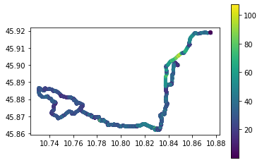
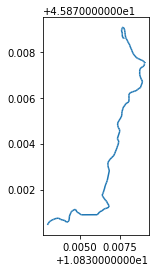
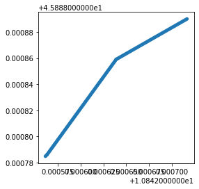
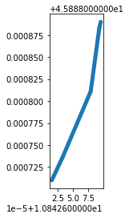
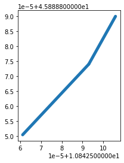
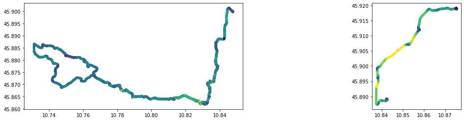
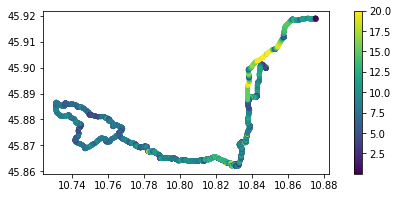
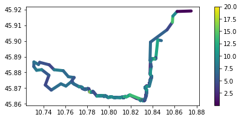

# Mobility Analytics

goals of the tutorial

- transform movement data into information
- trajectory
(- map matching )

based on the data of Strava 

requirements
- python knowledge
- geopandas
- GPX format

status<br/>
“Where's Wally?”
{: .notice--success}

---
---

# GNSS
 
 Global Navigation Satellite System (GNSS) refers to a constellation of satellites providing signals from space that transmit positioning and timing data to GNSS receivers. The receivers then use this data to determine location. By definition, GNSS provides global coverage.

## basic


## with corrections


---

# GPX Format
GPX, or GPS Exchange Format, is an XML schema designed as a common GPS data format for software applications. It can be used to describe waypoints, tracks, and routes.

## units
### position
latitude and longitude are expressed in **decimal degrees**, and **elevation in meters**, both using the **WGS 84 datum** (epsg 4326).
### time
dates and times are not local time, but instead are Coordinated Universal Time (UTC) using ISO 8601 format (YYYY-MM-DDTHH:MM:SSZ)


## data 


(image by [Berklas](https://commons.wikimedia.org/w/index.php?title=User:Berklas) distributed under cc-by-sa 3.0)

- **wptType** is an individual waypoint among a collection of points with no sequential relationship. It consists of the WGS 84 (GPS) coordinates of a point and possibly other descriptive information.
- **rteType** is a route, an ordered list of routepoint (waypoints representing a series of significant turn or stage points) leading to a destination.
- **trkType** is a track, made of at least one segment containing waypoints, that is, an ordered list of points describing a path. A Track Segment holds a list of Track Points which are logically connected in order. To represent a single GPS track where GPS reception was lost, or the GPS receiver was turned off, start a new Track Segment for each continuous span of track data.


details about the format on fhe officiale [website](https://www.topografix.com/gpx.asp)


```xml
<?xml version="1.0" encoding="UTF-8" standalone="no" ?>
<gpx xmlns="http://www.topografix.com/GPX/1/1" xmlns:gpxx="http://www.garmin.com/xmlschemas/GpxExtensions/v3" xmlns:gpxtpx="http://www.garmin.com/xmlschemas/TrackPointExtension/v1" creator="Oregon 400t" version="1.1" xmlns:xsi="http://www.w3.org/2001/XMLSchema-instance" xsi:schemaLocation="http://www.topografix.com/GPX/1/1 http://www.topografix.com/GPX/1/1/gpx.xsd http://www.garmin.com/xmlschemas/GpxExtensions/v3 http://www.garmin.com/xmlschemas/GpxExtensionsv3.xsd http://www.garmin.com/xmlschemas/TrackPointExtension/v1 http://www.garmin.com/xmlschemas/TrackPointExtensionv1.xsd">
  <metadata>
    <link href="http://www.garmin.com">
      <text>Garmin International</text>
    </link>
    <time>2009-10-17T22:58:43Z</time>
  </metadata>
  <trk>
    <name>Example GPX Document</name>
    <trkseg>
      <trkpt lat="47.644548" lon="-122.326897">
        <ele>4.46</ele>
        <time>2009-10-17T18:37:26Z</time>
      </trkpt>
      <trkpt lat="47.644548" lon="-122.326897">
        <ele>4.94</ele>
        <time>2009-10-17T18:37:31Z</time>
      </trkpt>
      <trkpt lat="47.644548" lon="-122.326897">
        <ele>6.87</ele>
        <time>2009-10-17T18:37:34Z</time>
      </trkpt>
    </trkseg>
  </trk>
</gpx>
```

information from [wikipedia](https://en.wikipedia.org/wiki/GPS_Exchange_Format)

---

# Commmon problems 

Missing Data
- Temporal gaps
- Spatial gaps

Incorrect data:
- location or time is incorrect in the data frame

Outliers:
- Too fast movements
- Incorrect order of temporal information 

---

# Setup


```python
try:
  import gpxpy
except ModuleNotFoundError as e:
  !pip install gpxpy==1.4.2
  import gpxpy

if gpxpy.__version__ != "1.4.2":
  !pip install -U gpxpy==1.4.2
```


```python
try:
  import movingpandas as mpd
except ModuleNotFoundError as e:
  !pip install movingpandas==0.7.rc1
  import movingpandas as mpd

if mpd.__version__ != "0.7.rc1":
  !pip install -U movingpandas==0.7.rc1
```


```python
import gpxpy
import urllib.request
import pandas as pd
import geopandas as gpd
import movingpandas as mpd
from datetime import datetime,timedelta

import matplotlib.pyplot as plt
from shapely.geometry import Point
import warnings
warnings.filterwarnings('ignore') # ignore warnings
```

# Let's start to play with GPX files

## Download the data


If you are registered and the author permits the download you can download the gps track but and investigate with [GPX Studio](https://gpx.studio) **without timestamps**


] 

[download file](https://gist.github.com/napo/2aa15957b687dd676d448888619bd39f)

or ... you can use [Strava To Gpx](https://mapstogpx.com/strava/) 


]

[download file](https://gist.github.com/napo/4d0c14585da0ef96f263faa0e8d97ff5)


## investigate the file  


```python
gpx_url = "https://gist.githubusercontent.com/napo/4d0c14585da0ef96f263faa0e8d97ff5/raw/efba18f806459b462a1e485023cdd01c4d20e01a/strava_full.gpx"
gpx_file = "strava_full.gpx"


urllib.request.urlretrieve(gpx_url,gpx_file)
gpx_file = open(gpx_file, 'r')
gpx = gpxpy.parse(gpx_file)
```


```python
gpx.creator
```


    'https://www.mapstogpx.com/strava'


```python
len(gpx.tracks)
```


    1


```python
len(gpx.tracks[0].segments)
```


    1


```python
segment = gpx.tracks[0].segments[0]
```


```python
segment
```


    GPXTrackSegment(points=[...])


```python
segment.points
```


    [GPXTrackPoint(45.900222, 10.847826, elevation=96.5, time=datetime.datetime(2021, 10, 12, 12, 1, 38, tzinfo=SimpleTZ("Z")), name='TP00001'),
     GPXTrackPoint(45.900264, 10.84785, elevation=96.5, time=datetime.datetime(2021, 10, 12, 12, 1, 39, tzinfo=SimpleTZ("Z")), name='TP00002'),
     ... 
     GPXTrackPoint(45.86275, 10.832259, elevation=272.6, time=datetime.datetime(2021, 10, 12, 12, 24, 3, tzinfo=SimpleTZ("Z")), name='TP00999'),
     GPXTrackPoint(45.862749, 10.832215, elevation=272.7, time=datetime.datetime(2021, 10, 12, 12, 24, 4, tzinfo=SimpleTZ("Z")), name='TP01000'),
     ...]


```python
segment.points[0].latitude
```

    45.900222


```python
segment.points[0].longitude
```

    10.847826


```python
segment.points[0].elevation
```

    96.5


## creation of a pandas DataFrame


```python
data = []
for point_idx, point in enumerate(segment.points):
    data.append([point.longitude, point.latitude,
                point.elevation, point.time]) 

columns = ['longitude', 'latitude', 'altitude', 'time'] 
gpx_tracks = pd.DataFrame(data, columns=columns)
# Strava to GPX assign the date of the download of the file as timestamp and SimpleTZ("Z") as TimeZone.
# we can remove it
gpx_tracks['time'] = gpx_tracks['time'].apply(lambda x: x.replace(tzinfo=None))

# index creation needed by MovingPandas
df = gpx_tracks.set_index('time')
```

travel time


```python
start_point = data[0]
end_point = data[-1]
```


```python
# travel time
# funzione che calcola la differenza
travel_time = end_point[3]-start_point[3]
travel_time_seconds = timedelta(seconds=travel_time.total_seconds())
travel_time_hours = str(timedelta(seconds=travel_time_seconds.seconds))
print_travel_time = travel_time_hours.split(':')
print("travel time %sh %s' %s''" % (print_travel_time[0], print_travel_time[1], print_travel_time[2]))
```

    travel time 2h 34' 41''


## reverse geocoding


```python
from geopy.geocoders import Nominatim 

latlon = str(start_point[1]) + "," + str(start_point[0])
geolocator = Nominatim(user_agent="geospatial course unitn")
starting_place = geolocator.reverse(latlon)
```


```python
starting_place
```


    Location(Via Luigi Pigarelli, Fangolino, Gavazzo, Varone, Comunità Alto Garda e Ledro, Provincia di Trento, Trentino-Alto Adige/Südtirol, 38066, Italia, (45.899909740397625, 10.847610675042551, 0.0))


```python
latlon = str(end_point[1]) + "," + str(end_point[0])
geolocator = Nominatim(user_agent="geospatial course unitn")
arrival_place = geolocator.reverse(latlon)
```


```python
arrival_place
```


    Location(Pronto Soccorso Ospedale di Arco, Viale dei Capitelli, Chiarano, Varignano, Arco, Comunità Alto Garda e Ledro, Provincia di Trento, Trentino-Alto Adige/Südtirol, 38062, Italia, (45.919077, 10.875114, 0.0))


##  Analyzing trajectories


```python
# GeoDataFrame for MovingPandas
geo_df = gpd.GeoDataFrame(df, 
crs=4326,
geometry= gpd.points_from_xy(df.longitude, df.latitude, df.altitude))
```


```python
trajectory = mpd.Trajectory(geo_df, 0)
```


```python
trajectory
```


    Trajectory 0 (2021-10-12 12:01:38 to 2021-10-12 14:36:19) | Size: 5532 | Length: 40316.6m
    Bounds: (10.731099, 45.861882, 10.875513, 45.919142)
    LINESTRING Z (10.847826 45.900222 96.5, 10.84785 45.900264 96.5, 10.847843 45.900125 96.5, 10.847836


```python
# object trajectory from MovingPandas
trajectory = mpd.Trajectory(geo_df, 1)
```


```python
trajectory.plot()
plt.show()
```


    

    


```python
trajectory.hvplot(geo=True, tiles='OSM', line_width=5) #, frame_width=300, frame_height=300)
```
![][https://github.com/napo/geospatial_course_unitn/blob/master/images/moving_pandas_1.jpg?raw=true]


```python
trajectory.add_speed(overwrite=True)
trajectory.df
```


<div>
<style scoped>
    .dataframe tbody tr th:only-of-type {
        vertical-align: middle;
    }

    .dataframe tbody tr th {
        vertical-align: top;
    }

    .dataframe thead th {
        text-align: right;
    }
</style>
<table border="1" class="dataframe">
  <thead>
    <tr style="text-align: right;">
      <th></th>
      <th>longitude</th>
      <th>latitude</th>
      <th>altitude</th>
      <th>geometry</th>
      <th>speed</th>
    </tr>
    <tr>
      <th>time</th>
      <th></th>
      <th></th>
      <th></th>
      <th></th>
      <th></th>
    </tr>
  </thead>
  <tbody>
    <tr>
      <th>2021-10-12 12:01:38</th>
      <td>10.847826</td>
      <td>45.900222</td>
      <td>96.5</td>
      <td>POINT Z (10.84783 45.90022 96.50000)</td>
      <td>5.026084</td>
    </tr>
    <tr>
      <th>2021-10-12 12:01:39</th>
      <td>10.847850</td>
      <td>45.900264</td>
      <td>96.5</td>
      <td>POINT Z (10.84785 45.90026 96.50000)</td>
      <td>5.026084</td>
    </tr>
    <tr>
      <th>2021-10-12 12:01:40</th>
      <td>10.847843</td>
      <td>45.900125</td>
      <td>96.5</td>
      <td>POINT Z (10.84784 45.90013 96.50000)</td>
      <td>15.459309</td>
    </tr>
    <tr>
      <th>2021-10-12 12:01:41</th>
      <td>10.847836</td>
      <td>45.899890</td>
      <td>96.5</td>
      <td>POINT Z (10.84784 45.89989 96.50000)</td>
      <td>26.125749</td>
    </tr>
    <tr>
      <th>2021-10-12 12:01:42</th>
      <td>10.847835</td>
      <td>45.899786</td>
      <td>96.5</td>
      <td>POINT Z (10.84783 45.89979 96.50000)</td>
      <td>11.559794</td>
    </tr>
    <tr>
      <th>...</th>
      <td>...</td>
      <td>...</td>
      <td>...</td>
      <td>...</td>
      <td>...</td>
    </tr>
    <tr>
      <th>2021-10-12 14:34:13</th>
      <td>10.875184</td>
      <td>45.919097</td>
      <td>91.6</td>
      <td>POINT Z (10.87518 45.91910 91.60000)</td>
      <td>0.765202</td>
    </tr>
    <tr>
      <th>2021-10-12 14:34:20</th>
      <td>10.875213</td>
      <td>45.919122</td>
      <td>91.6</td>
      <td>POINT Z (10.87521 45.91912 91.60000)</td>
      <td>0.510754</td>
    </tr>
    <tr>
      <th>2021-10-12 14:34:30</th>
      <td>10.875186</td>
      <td>45.919142</td>
      <td>91.6</td>
      <td>POINT Z (10.87519 45.91914 91.60000)</td>
      <td>0.305432</td>
    </tr>
    <tr>
      <th>2021-10-12 14:35:45</th>
      <td>10.875151</td>
      <td>45.919126</td>
      <td>91.6</td>
      <td>POINT Z (10.87515 45.91913 91.60000)</td>
      <td>0.043276</td>
    </tr>
    <tr>
      <th>2021-10-12 14:36:19</th>
      <td>10.875091</td>
      <td>45.919049</td>
      <td>91.6</td>
      <td>POINT Z (10.87509 45.91905 91.60000)</td>
      <td>0.286540</td>
    </tr>
  </tbody>
</table>
<p>5532 rows × 5 columns</p>
</div>


```python
# conversion m/s to km/h
def ms_to_km(ms):
    v = (ms) * (60*60)/1000
    return v
```


```python
# km/h column
trajectory.df['kmh'] = trajectory.df['speed'].apply(ms_to_km)
```


```python
trajectory.plot(column="kmh", linewidth=5, capstyle='round', legend=True)
plt.show()
```


    

    


## Extracting a moving object's position was at a certain time 


```python
trajectory
```


    Trajectory 1 (2021-10-12 12:01:38 to 2021-10-12 14:36:19) | Size: 5532 | Length: 40316.6m
    Bounds: (10.731099, 45.861882, 10.875513, 45.919142)
    LINESTRING Z (10.847826 45.900222 96.5, 10.84785 45.900264 96.5, 10.847843 45.900125 96.5, 10.847836


```python
trajectory.get_position_at(datetime(2021,10,12,12,6,0), method="nearest")
```


    

    


```python
print(trajectory.get_position_at(datetime(2021,10,12,12,6,0), method="nearest"))
```

    POINT Z (10.840998 45.888594 81.09999999999999)


```python
print(trajectory.get_position_at(datetime(2021,10,12,12,6,0), method="nearest"))
print(trajectory.get_position_at(datetime(2021,10,12,12,6,0), method="interpolated"))
print(trajectory.get_position_at(datetime(2021,10,12,12,6,0), method="ffill")) # from the previous row
print(trajectory.get_position_at(datetime(2021,10,12,12,6,0), method="bfill")) # from the following row
```

    POINT Z (10.840998 45.888594 81.09999999999999)
    POINT Z (10.840998 45.888594 81.09999999999999)
    POINT Z (10.840998 45.888594 81.09999999999999)
    POINT Z (10.840998 45.888594 81.09999999999999)


## Extracting trajectory segments based on time


```python
segment_clip = trajectory.get_segment_between(datetime(2021,10,12,13,36,1),datetime(2021,10,12,13,38,51))
print(segment_clip)
```

    Trajectory 1_2021-10-12 13:36:01 (2021-10-12 13:36:01 to 2021-10-12 13:38:49) | Size: 158 | Length: 1457.3m
    Bounds: (10.832986, 45.870462, 10.839058, 45.879066)
    LINESTRING Z (10.832986 45.870462 160.3, 10.833045 45.870534 159.9, 10.83311 45.870598 159.5, 10.833


```python
segment_clip.plot()
plt.show()
```


    

    


## Extracting trajectory segments based on  geometry (i.e. clipping)


```python
from shapely.geometry import Point, Polygon
latitude=45.88880
longitude=10.84269
p = Point(longitude, latitude)
point = gpd.GeoDataFrame(pd.DataFrame(), 
    crs=4326,
    geometry= [p])
distance = 10 # meters
# create a bounding box
xmin, ymax, xmax, ymin = point.to_crs(epsg=32632).buffer(distance).geometry.to_crs(epsg=4326).iloc[0].bounds
polygon = Polygon([(xmin, ymin), (xmin, ymax), (xmax, ymax), (xmax, ymin), (xmin, ymin)])
polygon

```


    

    


```python
intersections = trajectory.clip(polygon)
intersections
```


    TrajectoryCollection with 3 trajectories


```python
intersections.trajectories[0].plot(linewidth=5, capstyle='round')
plt.show()
```


    

    


```python
intersections.trajectories[1].plot(linewidth=5, capstyle='round')
plt.show()
```


    

    


```python
intersections.trajectories[2].plot(linewidth=5, capstyle='round')
plt.show()
```


    

    


## Splitting trajectories 

Gaps are quite common in trajectories. For example, GPS tracks may contain gaps if moving objects enter tunnels where GPS reception is lost. In other use cases, moving objects may leave the observation area for longer time before returning and continuing their recorded track.

Depending on the use case, we therefore might want to split trajectories at observation gaps that exceed a certain minimum duration:

### duration 15 minutes


```python
split = mpd.ObservationGapSplitter(trajectory).split(gap=timedelta(minutes=15))
for traj in split:
    print(traj)
```

    Trajectory 1_0 (2021-10-12 12:01:38 to 2021-10-12 13:47:11) | Size: 5070 | Length: 34131.1m
    Bounds: (10.731099, 45.861882, 10.84785, 45.901398)
    LINESTRING Z (10.847826 45.900222 96.5, 10.84785 45.900264 96.5, 10.847843 45.900125 96.5, 10.847836
    Trajectory 1_2 (2021-10-12 14:24:10 to 2021-10-12 14:36:19) | Size: 461 | Length: 6182.5m
    Bounds: (10.837456, 45.887391, 10.875513, 45.919142)
    LINESTRING Z (10.842638 45.888938 79.40000000000001, 10.842624 45.888947 79.5, 10.842587 45.888957 7


```python
fig, axes = plt.subplots(nrows=1, ncols=len(split), figsize=(19,4))
for i, traj in enumerate(split):
    traj.plot(ax=axes[i], linewidth=5.0, capstyle='round', column='speed', vmax=20)
```


    

    


## 1km


```python
split = mpd.StopSplitter(trajectory).split(min_duration=timedelta(minutes=15), max_diameter=30, min_length=1000)
for traj in split:
    print(traj)
```

    Trajectory 1_2021-10-12 12:01:38 (2021-10-12 12:01:38 to 2021-10-12 13:47:11) | Size: 5070 | Length: 34131.1m
    Bounds: (10.731099, 45.861882, 10.84785, 45.901398)
    LINESTRING Z (10.847826 45.900222 96.5, 10.84785 45.900264 96.5, 10.847843 45.900125 96.5, 10.847836
    Trajectory 1_2021-10-12 14:24:50 (2021-10-12 14:24:50 to 2021-10-12 14:36:19) | Size: 449 | Length: 6131.0m
    Bounds: (10.837456, 45.887391, 10.875513, 45.919142)
    LINESTRING Z (10.842435 45.889193 81.09999999999999, 10.842394 45.889205 81.2, 10.842355 45.889195 8


```python
fig, axes = plt.subplots(nrows=1, ncols=len(split), figsize=(19,4))
for i, traj in enumerate(split):
    traj.plot(ax=axes[i], linewidth=5.0, capstyle='round', column='speed', vmax=20)
```


    

    


## Stop detection


```python
detector = mpd.TrajectoryStopDetector(trajectory)
```


```python
traj_plot = trajectory.hvplot(title='Trajectory {}'.format(trajectory.id), line_width=7.0, tiles='CartoLight', color='slategray', frame_width=350, frame_height=350) 
traj_plot
```


### stop duration


```python
%%time
stop_durations = detector.get_stop_time_ranges(min_duration=timedelta(seconds=60), max_diameter=100)
```

    CPU times: user 9.62 s, sys: 0 ns, total: 9.62 s
    Wall time: 9.62 s


```python
for x in stop_durations: 
    print(x)
```

    Traj 1: 2021-10-12 12:40:59 - 2021-10-12 12:41:59 (duration: 0 days 00:01:00)
    Traj 1: 2021-10-12 12:45:28 - 2021-10-12 12:46:40 (duration: 0 days 00:01:12)
    Traj 1: 2021-10-12 12:46:44 - 2021-10-12 12:47:51 (duration: 0 days 00:01:07)
    Traj 1: 2021-10-12 12:47:56 - 2021-10-12 12:49:26 (duration: 0 days 00:01:30)
    Traj 1: 2021-10-12 12:50:03 - 2021-10-12 12:51:04 (duration: 0 days 00:01:01)
    Traj 1: 2021-10-12 12:51:09 - 2021-10-12 12:52:47 (duration: 0 days 00:01:38)
    Traj 1: 2021-10-12 13:41:59 - 2021-10-12 14:25:49 (duration: 0 days 00:43:50)
    Traj 1: 2021-10-12 14:34:30 - 2021-10-12 14:36:19 (duration: 0 days 00:01:49)


## stop points


```python
%%time
stop_points = detector.get_stop_points(min_duration=timedelta(seconds=60), max_diameter=100)
```

    CPU times: user 9.89 s, sys: 0 ns, total: 9.89 s
    Wall time: 9.89 s


```python
stop_points
```


<div>
<style scoped>
    .dataframe tbody tr th:only-of-type {
        vertical-align: middle;
    }

    .dataframe tbody tr th {
        vertical-align: top;
    }

    .dataframe thead th {
        text-align: right;
    }
</style>
<table border="1" class="dataframe">
  <thead>
    <tr style="text-align: right;">
      <th></th>
      <th>geometry</th>
      <th>start_time</th>
      <th>end_time</th>
      <th>traj_id</th>
      <th>duration_s</th>
    </tr>
    <tr>
      <th>stop_id</th>
      <th></th>
      <th></th>
      <th></th>
      <th></th>
      <th></th>
    </tr>
  </thead>
  <tbody>
    <tr>
      <th>1_2021-10-12 12:40:59</th>
      <td>POINT Z (10.78989 45.86505 462.90000)</td>
      <td>2021-10-12 12:40:59</td>
      <td>2021-10-12 12:41:59</td>
      <td>1</td>
      <td>60.0</td>
    </tr>
    <tr>
      <th>1_2021-10-12 12:45:28</th>
      <td>POINT Z (10.78315 45.86742 518.50000)</td>
      <td>2021-10-12 12:45:28</td>
      <td>2021-10-12 12:46:40</td>
      <td>1</td>
      <td>72.0</td>
    </tr>
    <tr>
      <th>1_2021-10-12 12:46:44</th>
      <td>POINT Z (10.78217 45.86820 533.70000)</td>
      <td>2021-10-12 12:46:44</td>
      <td>2021-10-12 12:47:51</td>
      <td>1</td>
      <td>67.0</td>
    </tr>
    <tr>
      <th>1_2021-10-12 12:47:56</th>
      <td>POINT Z (10.78158 45.86913 550.40000)</td>
      <td>2021-10-12 12:47:56</td>
      <td>2021-10-12 12:49:26</td>
      <td>1</td>
      <td>90.0</td>
    </tr>
    <tr>
      <th>1_2021-10-12 12:50:03</th>
      <td>POINT Z (10.77957 45.86942 579.00000)</td>
      <td>2021-10-12 12:50:03</td>
      <td>2021-10-12 12:51:04</td>
      <td>1</td>
      <td>61.0</td>
    </tr>
    <tr>
      <th>1_2021-10-12 12:51:09</th>
      <td>POINT Z (10.77831 45.86930 592.90000)</td>
      <td>2021-10-12 12:51:09</td>
      <td>2021-10-12 12:52:47</td>
      <td>1</td>
      <td>98.0</td>
    </tr>
    <tr>
      <th>1_2021-10-12 13:41:59</th>
      <td>POINT Z (10.84269 45.88890 79.40000)</td>
      <td>2021-10-12 13:41:59</td>
      <td>2021-10-12 14:25:49</td>
      <td>1</td>
      <td>2630.0</td>
    </tr>
    <tr>
      <th>1_2021-10-12 14:34:30</th>
      <td>POINT Z (10.87519 45.91914 91.60000)</td>
      <td>2021-10-12 14:34:30</td>
      <td>2021-10-12 14:36:19</td>
      <td>1</td>
      <td>109.0</td>
    </tr>
  </tbody>
</table>
</div>


```python
stop_point_plot = traj_plot * stop_points.hvplot(geo=True, size='duration_s', color='deeppink')
stop_point_plot
```


## stop segments


```python
%%time
stops = detector.get_stop_segments(min_duration=timedelta(seconds=60), max_diameter=100)
```

    CPU times: user 10 s, sys: 0 ns, total: 10 s
    Wall time: 10 s


```python
stops
```


    TrajectoryCollection with 8 trajectories


```python
stop_segment_plot = stop_point_plot * stops.hvplot( size=200, line_width=7.0, tiles=None, color='orange') 
stop_segment_plot
```


## split a stop


```python
%%time
split = mpd.StopSplitter(trajectory).split(min_duration=timedelta(seconds=60), max_diameter=100)

```

    CPU times: user 11.5 s, sys: 3.6 ms, total: 11.5 s
    Wall time: 11.5 s


```python
split
```


    TrajectoryCollection with 8 trajectories


```python
for segment in split:
    print(segment)

```

    Trajectory 1_2021-10-12 12:01:38 (2021-10-12 12:01:38 to 2021-10-12 12:40:59) | Size: 1859 | Length: 10497.8m
    Bounds: (10.789892, 45.861981, 10.84785, 45.901398)
    LINESTRING Z (10.847826 45.900222 96.5, 10.84785 45.900264 96.5, 10.847843 45.900125 96.5, 10.847836
    Trajectory 1_2021-10-12 12:41:59 (2021-10-12 12:41:59 to 2021-10-12 12:45:28) | Size: 150 | Length: 647.8m
    Bounds: (10.78315, 45.865551, 10.788879, 45.867858)
    LINESTRING Z (10.788848 45.865551 478.6, 10.788839 45.865583 478.8, 10.788834 45.865623 479.1, 10.78
    Trajectory 1_2021-10-12 12:46:40 (2021-10-12 12:46:40 to 2021-10-12 12:46:44) | Size: 3 | Length: 8.3m
    Bounds: (10.782169, 45.868145, 10.782239, 45.868201)
    LINESTRING Z (10.782239 45.868145 533, 10.782199 45.868181 533.4, 10.782169 45.868201 533.7)
    Trajectory 1_2021-10-12 12:47:51 (2021-10-12 12:47:51 to 2021-10-12 12:47:56) | Size: 3 | Length: 8.5m
    Bounds: (10.781579, 45.869051, 10.781585, 45.869127)
    LINESTRING Z (10.781579 45.869051 549, 10.781585 45.869089 549.7, 10.781585 45.869127 550.4)
    Trajectory 1_2021-10-12 12:49:26 (2021-10-12 12:49:26 to 2021-10-12 12:50:03) | Size: 20 | Length: 81.9m
    Bounds: (10.779572, 45.869424, 10.780497, 45.869678)
    LINESTRING Z (10.780497 45.869637 571.2, 10.780459 45.869661 571.6, 10.780419 45.869664 572, 10.7803
    Trajectory 1_2021-10-12 12:51:04 (2021-10-12 12:51:04 to 2021-10-12 12:51:09) | Size: 3 | Length: 8.4m
    Bounds: (10.778313, 45.869304, 10.778396, 45.869351)
    LINESTRING Z (10.778396 45.869351 592.1, 10.778364 45.869326 592.4, 10.778313 45.869304 592.9)
    Trajectory 1_2021-10-12 12:52:47 (2021-10-12 12:52:47 to 2021-10-12 13:41:59) | Size: 2808 | Length: 21940.7m
    Bounds: (10.731099, 45.861882, 10.842706, 45.888921)
    LINESTRING Z (10.77706 45.869333 613.9, 10.77702 45.869337 614.4, 10.77698 45.869345 614.8, 10.77694
    Trajectory 1_2021-10-12 14:25:49 (2021-10-12 14:25:49 to 2021-10-12 14:34:30) | Size: 423 | Length: 6002.9m
    Bounds: (10.837456, 45.887391, 10.875513, 45.919142)
    LINESTRING Z (10.842126 45.888566 79.09999999999999, 10.842008 45.888542 79.5, 10.841949 45.888514 7


## Generalizing trajectories 

### Douglas-Peucker algorithm


```python
trajectory.plot(column='speed', linewidth=5, capstyle='round', figsize=(9,3), legend=True, vmax=20)
plt.show()
```


    

    


```python
generalized_trajectory = mpd.DouglasPeuckerGeneralizer(trajectory).generalize(tolerance=0.001)
generalized_trajectory.plot(column='speed', linewidth=5, capstyle='round', figsize=(9,3), legend=True, vmax=20)
plt.show()
```


    

    


```python
print('Original length: %s'%(trajectory.get_length()))
print('Generalized length: %s'%(generalized_trajectory.get_length()))
```

    Original length: 40316.62984539696
    Generalized length: 37390.63448916238


###  alternative down-sample the trajectory to ensure a certain time delta between records


```python
time_generalized = mpd.MinTimeDeltaGeneralizer(trajectory).generalize(tolerance=timedelta(minutes=10))
time_generalized.plot(column='speed', linewidth=5, capstyle='round', figsize=(9,3), legend=True, vmax=20)
plt.show()
```


    

    


```python
time_generalized.to_point_gdf().head(10)
```


<div>
<style scoped>
    .dataframe tbody tr th:only-of-type {
        vertical-align: middle;
    }

    .dataframe tbody tr th {
        vertical-align: top;
    }

    .dataframe thead th {
        text-align: right;
    }
</style>
<table border="1" class="dataframe">
  <thead>
    <tr style="text-align: right;">
      <th></th>
      <th>longitude</th>
      <th>latitude</th>
      <th>altitude</th>
      <th>geometry</th>
      <th>speed</th>
      <th>kmh</th>
    </tr>
    <tr>
      <th>time</th>
      <th></th>
      <th></th>
      <th></th>
      <th></th>
      <th></th>
      <th></th>
    </tr>
  </thead>
  <tbody>
    <tr>
      <th>2021-10-12 12:01:38</th>
      <td>10.847826</td>
      <td>45.900222</td>
      <td>96.5</td>
      <td>POINT Z (10.84783 45.90022 96.50000)</td>
      <td>5.026084</td>
      <td>18.093904</td>
    </tr>
    <tr>
      <th>2021-10-12 12:11:38</th>
      <td>10.837393</td>
      <td>45.874687</td>
      <td>118.6</td>
      <td>POINT Z (10.83739 45.87469 118.60000)</td>
      <td>4.446633</td>
      <td>16.007878</td>
    </tr>
    <tr>
      <th>2021-10-12 12:21:38</th>
      <td>10.830129</td>
      <td>45.862466</td>
      <td>244.0</td>
      <td>POINT Z (10.83013 45.86247 244.00000)</td>
      <td>3.863094</td>
      <td>13.907137</td>
    </tr>
    <tr>
      <th>2021-10-12 12:31:38</th>
      <td>10.813936</td>
      <td>45.864505</td>
      <td>371.3</td>
      <td>POINT Z (10.81394 45.86451 371.30000)</td>
      <td>3.815148</td>
      <td>13.734534</td>
    </tr>
    <tr>
      <th>2021-10-12 12:41:38</th>
      <td>10.788925</td>
      <td>45.865013</td>
      <td>477.9</td>
      <td>POINT Z (10.78893 45.86501 477.90000)</td>
      <td>3.525257</td>
      <td>12.690925</td>
    </tr>
    <tr>
      <th>2021-10-12 12:51:39</th>
      <td>10.778118</td>
      <td>45.869216</td>
      <td>598.4</td>
      <td>POINT Z (10.77812 45.86922 598.40000)</td>
      <td>1.619121</td>
      <td>5.828837</td>
    </tr>
    <tr>
      <th>2021-10-12 13:01:39</th>
      <td>10.746818</td>
      <td>45.869637</td>
      <td>657.8</td>
      <td>POINT Z (10.74682 45.86964 657.80000)</td>
      <td>8.849716</td>
      <td>31.858976</td>
    </tr>
    <tr>
      <th>2021-10-12 13:11:39</th>
      <td>10.741853</td>
      <td>45.885748</td>
      <td>656.5</td>
      <td>POINT Z (10.74185 45.88575 656.50000)</td>
      <td>6.003111</td>
      <td>21.611198</td>
    </tr>
    <tr>
      <th>2021-10-12 13:21:39</th>
      <td>10.774246</td>
      <td>45.870862</td>
      <td>637.8</td>
      <td>POINT Z (10.77425 45.87086 637.80000)</td>
      <td>10.406578</td>
      <td>37.463682</td>
    </tr>
    <tr>
      <th>2021-10-12 13:31:39</th>
      <td>10.827858</td>
      <td>45.863224</td>
      <td>301.4</td>
      <td>POINT Z (10.82786 45.86322 301.40000)</td>
      <td>10.652206</td>
      <td>38.347942</td>
    </tr>
  </tbody>
</table>
</div>


```python
trajectory.to_point_gdf().head(10)
```


<div>
<style scoped>
    .dataframe tbody tr th:only-of-type {
        vertical-align: middle;
    }

    .dataframe tbody tr th {
        vertical-align: top;
    }

    .dataframe thead th {
        text-align: right;
    }
</style>
<table border="1" class="dataframe">
  <thead>
    <tr style="text-align: right;">
      <th></th>
      <th>longitude</th>
      <th>latitude</th>
      <th>altitude</th>
      <th>geometry</th>
      <th>speed</th>
      <th>kmh</th>
    </tr>
    <tr>
      <th>time</th>
      <th></th>
      <th></th>
      <th></th>
      <th></th>
      <th></th>
      <th></th>
    </tr>
  </thead>
  <tbody>
    <tr>
      <th>2021-10-12 12:01:38</th>
      <td>10.847826</td>
      <td>45.900222</td>
      <td>96.5</td>
      <td>POINT Z (10.84783 45.90022 96.50000)</td>
      <td>5.026084</td>
      <td>18.093904</td>
    </tr>
    <tr>
      <th>2021-10-12 12:01:39</th>
      <td>10.847850</td>
      <td>45.900264</td>
      <td>96.5</td>
      <td>POINT Z (10.84785 45.90026 96.50000)</td>
      <td>5.026084</td>
      <td>18.093904</td>
    </tr>
    <tr>
      <th>2021-10-12 12:01:40</th>
      <td>10.847843</td>
      <td>45.900125</td>
      <td>96.5</td>
      <td>POINT Z (10.84784 45.90013 96.50000)</td>
      <td>15.459309</td>
      <td>55.653513</td>
    </tr>
    <tr>
      <th>2021-10-12 12:01:41</th>
      <td>10.847836</td>
      <td>45.899890</td>
      <td>96.5</td>
      <td>POINT Z (10.84784 45.89989 96.50000)</td>
      <td>26.125749</td>
      <td>94.052696</td>
    </tr>
    <tr>
      <th>2021-10-12 12:01:42</th>
      <td>10.847835</td>
      <td>45.899786</td>
      <td>96.5</td>
      <td>POINT Z (10.84783 45.89979 96.50000)</td>
      <td>11.559794</td>
      <td>41.615259</td>
    </tr>
    <tr>
      <th>2021-10-12 12:01:44</th>
      <td>10.847798</td>
      <td>45.899773</td>
      <td>96.5</td>
      <td>POINT Z (10.84780 45.89977 96.50000)</td>
      <td>1.607194</td>
      <td>5.785899</td>
    </tr>
    <tr>
      <th>2021-10-12 12:01:54</th>
      <td>10.847751</td>
      <td>45.899764</td>
      <td>96.5</td>
      <td>POINT Z (10.84775 45.89976 96.50000)</td>
      <td>0.378204</td>
      <td>1.361533</td>
    </tr>
    <tr>
      <th>2021-10-12 12:01:56</th>
      <td>10.847786</td>
      <td>45.899790</td>
      <td>96.5</td>
      <td>POINT Z (10.84779 45.89979 96.50000)</td>
      <td>1.982969</td>
      <td>7.138687</td>
    </tr>
    <tr>
      <th>2021-10-12 12:01:57</th>
      <td>10.847749</td>
      <td>45.899800</td>
      <td>96.5</td>
      <td>POINT Z (10.84775 45.89980 96.50000)</td>
      <td>3.078936</td>
      <td>11.084170</td>
    </tr>
    <tr>
      <th>2021-10-12 12:02:01</th>
      <td>10.847702</td>
      <td>45.899803</td>
      <td>96.5</td>
      <td>POINT Z (10.84770 45.89980 96.50000)</td>
      <td>0.915638</td>
      <td>3.296297</td>
    </tr>
  </tbody>
</table>
</div>


---

# Exercise

the [trips_truck.gpkg](https://github.com/napo/geospatial_course_unitn/raw/master/data/geotemporaldata/trips_truck.gpkg) dataset contains the routes of a garbage vehicle in April 2018.

Based on this data:
- identify the longest route carried out
- identify the places of the daily departure and arrival points
- show the km traveled day by day
- identify the breaks carried out in the shortest route of the third week and in the longest one of the last
- identify the longest route of the third week of the month on the OpenStreetMap road graph
