# Visualizing Geospatial Data
inspired from scipy2018-geospatial and geographic data science book

**goals of the tutorial**
- plot a map with matplotlib
- points rappresentation
- choropleth map


**based on the open data of:**
- ISTAT Italian National Institute of Statistic
- [AirBnB data](https://raw.githubusercontent.com/napo/geospatial_course_unitn/master/data/airbnb/airbnb_trentino_alto_adiige_may2019.csv) of Trentino Alto Adige - May 2019 by [Vincenzo Patruno](https://medium.com/@vincpatruno)
- [covid-19](https://github.com/pcm-dpc/COVID-19) - Italian Department of Civil Protection

**requirements**
- python knowledge
- geopandas

**suggestion**<br/>
follow the [30DayMapChallenge](https://github.com/tjukanovt/30DayMapChallenge) - daily social mapping project in November 2020 - hashtag Twitter [#30DayMapChallege](https://twitter.com/hashtag/30DayMapChallenge) 


**status**<br/>
"*the map is not the territory*" 

---


# Packages to use
- pandas
- geoplot
- geopandas
- contextily 
- seaborn
- sklearn
- mapclassify


```python
import warnings
warnings.simplefilter("ignore")
```


```python
import contextily
contextily.__version__
try:
  import contextily 
except ModuleNotFoundError as e:
  !pip install contextily==1.1.0
  import contextily

if contextily.__version__ != "1.1.0":
  !pip install -U contextily==1.1.0
  import contextily 
```


```python
try:
  import geopandas as gpd
except ModuleNotFoundError as e:
  !pip install geopandas==0.10.1
  import geopandas as gpd

if gpd.__version__ != "0.10.1":
  !pip install -U geopandas==0.10.1
  import geopandas as gpd
```


```python
try:
  import seaborn as sbn
except ModuleNotFoundError as e:
  !pip install seaborn==0.11.1
  import seaborn as sbn

if sbn.__version__ != "0.11.1":
  !pip install -U seaborn==0.11.1
  import seaborn as sbn
```


```python
try:
  import sklearn
except ModuleNotFoundError as e:
  !pip install sklearn==1.0
  import sklearn

if sklearn.__version__ != "1.0":
  !pip install -U sklearn==0.11.1
  import sklearn
```


```python
try:
  import mapclassify
except ModuleNotFoundError as e:
  !pip install mapclassify
  import mapclassify

if mapclassify.__version__ != "2.4.3":
  !pip install -U mapclassify==2.4.3

```

# Basic data visualization 


```python
import geopandas as gpd
import pandas as pd
import matplotlib.pyplot as plt
import seaborn as sns
```


```python
url_airbnb_trentino = "https://raw.githubusercontent.com/napo/geospatial_course_unitn/master/data/airbnb/airbnb_trentino_alto_adiige_may2019.csv"
```


```python
airbnb_trentino = pd.read_csv(url_airbnb_trentino)
```


```python
airbnb_trentino.head(3)
```


<div>
<style scoped>
    .dataframe tbody tr th:only-of-type {
        vertical-align: middle;
    }

    .dataframe tbody tr th {
        vertical-align: top;
    }

    .dataframe thead th {
        text-align: right;
    }
</style>
<table border="1" class="dataframe">
  <thead>
    <tr style="text-align: right;">
      <th></th>
      <th>reviews_count</th>
      <th>bathrooms</th>
      <th>property_type_id</th>
      <th>currency</th>
      <th>lng</th>
      <th>id</th>
      <th>city</th>
      <th>date</th>
      <th>localized_neighborhood</th>
      <th>rate_type</th>
      <th>...</th>
      <th>beds</th>
      <th>amount</th>
      <th>weekly_price_factor</th>
      <th>nscrap</th>
      <th>person_capacity</th>
      <th>host_languages</th>
      <th>is_host_highly_rated</th>
      <th>is_new_listing</th>
      <th>comune</th>
      <th>pro_com</th>
    </tr>
  </thead>
  <tbody>
    <tr>
      <th>0</th>
      <td>0</td>
      <td>1</td>
      <td>1.0</td>
      <td>EUR</td>
      <td>12.213819</td>
      <td>33210741</td>
      <td>Casies</td>
      <td>15/04/2019</td>
      <td>NaN</td>
      <td>nightly</td>
      <td>...</td>
      <td>1.0</td>
      <td>80</td>
      <td>1.00</td>
      <td>apr-19</td>
      <td>2</td>
      <td>[]</td>
      <td>False</td>
      <td>True</td>
      <td>Valle di Casies</td>
      <td>21109</td>
    </tr>
    <tr>
      <th>1</th>
      <td>0</td>
      <td>1</td>
      <td>47.0</td>
      <td>EUR</td>
      <td>11.098980</td>
      <td>25164192</td>
      <td>Lagundo</td>
      <td>15/04/2019</td>
      <td>NaN</td>
      <td>nightly</td>
      <td>...</td>
      <td>4.0</td>
      <td>158</td>
      <td>1.00</td>
      <td>apr-19</td>
      <td>4</td>
      <td>[]</td>
      <td>False</td>
      <td>False</td>
      <td>Lagundo</td>
      <td>21038</td>
    </tr>
    <tr>
      <th>2</th>
      <td>5</td>
      <td>1</td>
      <td>1.0</td>
      <td>EUR</td>
      <td>11.846660</td>
      <td>31115034</td>
      <td>Colfosco</td>
      <td>15/04/2019</td>
      <td>NaN</td>
      <td>nightly</td>
      <td>...</td>
      <td>1.0</td>
      <td>64</td>
      <td>0.95</td>
      <td>apr-19</td>
      <td>2</td>
      <td>[u'en', u'fr', u'de', u'it']</td>
      <td>True</td>
      <td>False</td>
      <td>Corvara in Badia</td>
      <td>21026</td>
    </tr>
  </tbody>
</table>
<p>3 rows × 30 columns</p>
</div>


```python
geo_airbnb = gpd.GeoDataFrame(airbnb_trentino,crs='EPSG:4326', geometry=gpd.points_from_xy(airbnb_trentino.lng, airbnb_trentino.lat))
```

## plot


```python
geo_airbnb.plot()
plt.show()
```


    
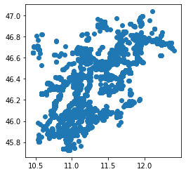
    


## change colors


[view documentation](https://matplotlib.org/stable/tutorials/colors/colors.html)


```python
geo_airbnb.plot(color="green")
plt.show()
```


    
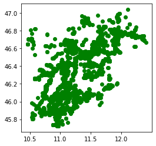
    


... everybody loves XKCD

Colors<br/>
[https://xkcd.com/color/rgb/](https://xkcd.com/color/rgb/)


```python
ax = geo_airbnb.plot(color="xkcd:pumpkin")
```


    
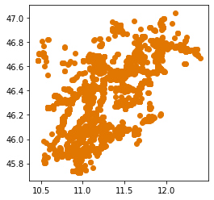
    


```python
ax = geo_airbnb.plot(color="xkcd:pumpkin")
ax.set_axis_off()
ax.set_title('AirBnB in Trentino Alto Adige - May 2019')
plt.show()
```


    

    


# add background maps

## Tile Map Service - TMS


[Tile Map Service](https://wiki.osgeo.org/wiki/Tile_Map_Service_Specification)


Supported scheme: 

*http://{**s**}.**domain.com**/{**z**}/{**x**}/{**y**}.png*

- **s** => subdomain (in there are more as one tms server - usualy a.domain.com b.domain.com ...)
- **domain.com** => the domain (eg. openstreetmap.org)
- **z** => zoom level
- **x** =>  column
- **y** => row

Eg:<br/>
&nbsp;&nbsp;&nbsp;https://tile.openstreetmap.org/18/139191/93190.png


You can use in geopandas with [contextily](https://contextily.readthedocs.io/en/latest/)


```python
import contextily as ctx
```


```python
geo_airbnb.crs.to_string()
```


    'EPSG:4326'


```python
ax = geo_airbnb.plot(color="red", figsize=(9, 9))
ctx.add_basemap(ax, crs=geo_airbnb.crs.to_string())
```


    
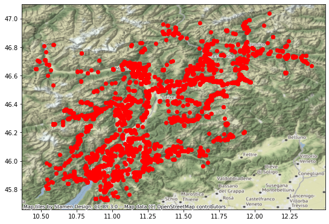
    


```python
ctx.providers.keys()
```


    dict_keys(['OpenStreetMap', 'OpenSeaMap', 'OpenPtMap', 'OpenTopoMap', 'OpenRailwayMap', 'OpenFireMap', 'SafeCast', 'Thunderforest', 'OpenMapSurfer', 'Hydda', 'MapBox', 'Stamen', 'Esri', 'OpenWeatherMap', 'HERE', 'FreeMapSK', 'MtbMap', 'CartoDB', 'HikeBike', 'BasemapAT', 'nlmaps', 'NASAGIBS', 'NLS', 'JusticeMap', 'Wikimedia', 'GeoportailFrance', 'OneMapSG'])


```python
ctx.providers.OpenStreetMap.keys()
```


    dict_keys(['Mapnik', 'DE', 'CH', 'France', 'HOT', 'BZH'])


```python
ax = geo_airbnb.plot(alpha=0.5, color="red", figsize=(9, 9))
ctx.add_basemap(ax,crs=geo_airbnb.crs.to_string(),
               source=ctx.providers.OpenStreetMap.HOT)
```


    
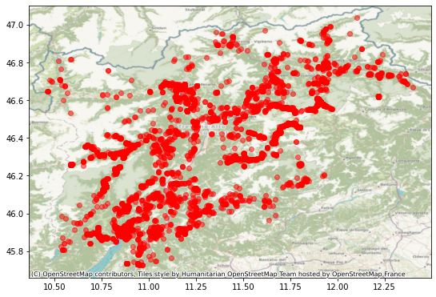
    


## WGS 84 / Pseudo-Mercator
*Spherical Mercator, Google Maps, OpenStreetMap, Bing, ArcGIS, ESRI*

[EPSG:3857](http://epsg.io/3857)


Variation with latitude of represented distances (in degrees or pixels) on the Mercator projection per actual distances (in meters) on Earth surface.

https://wiki.openstreetmap.org/wiki/Zoom_levels


|  Level |	# Tiles |	Tile width<br/>(° of longitudes) |	m / pixel<br/>(on Equator) |	~ Scale<br/>(on screen) | 	Examples of<br/>areas to represent 	|
|-  |-	|- |- |- |- |   
|0 	|1 	|360 	|156 |412 	|1:500 million |	whole world|
|1 	|4 	|180 	|78.206 |1:250 million| | 	
|2 	|16 |90 	|39.103 |1:150 million |subcontinental area|
|3 	|64 |45 	|19.551 |1:70 million |largest country|
|4 	|256 |22.5 	|9.776 |1:35 million | |	
|5 	|1.024 |11.25 	|4.888 	|1:15 million |large African country|
|6 	|4.096 	|5.625 	|2.444 	|1:10 million |large European country|
|7 	|16.384 |2.813 	|1.222 	|1:4 million 	|small country, US state|
|8 	|65.536 |1.406 	|610.984 	|1:2 million| | 	
|9 	|262.144 |0.703 	|305.492 	|1:1 million |wide area, large metropolitan area|
|10 | 1.048.576 |0.352 	|152.746 	|1:500 thousand |metropolitan area|
|11	| 4.194.304 |0.176 	|76.373 	|1:250 thousand |city|
|12 | 16.777.216 |0.088 	|38.187 	|1:150 thousand |town, or city district|
|13 | 67.108.864 	|0.044 	|19.093 	|1:70 thousand |village, or suburb|
|14 | 268.435.456 	|0.022 	|9.547 	|1:35 thousand 	| |
|15 | 1.073.741.824 	|0.011 	|4.773 	|1:15 thousand |small|road|
|16 | 4.294.967.296 	|0.005 	|2.387 	|1:8 thousand 	|street|
|17 |17.179.869.184 	|0.003 	|1.193 	|1:4 thousand 	|block, park, addresses|
|18 |68.719.476.736 	|0.001 	|0.596 	|1:2 thousand |some buildings, trees|
|19 |274.877.906.944 	|0.0005 	|0.298 	|1:1 thousand|	local highway and crossing details|
|20 |1.099.511.627.776 	|0.00025 	|0.149 	|1:5 hundred |A mid-sized building |


```python
ax = geo_airbnb.to_crs(epsg=3857).plot(color='xkcd:orange',figsize=(9,9))
ctx.add_basemap(ax,crs=geo_airbnb.to_crs(epsg=3857).crs.to_string(),
               source=ctx.providers.CartoDB.DarkMatter)
```


    
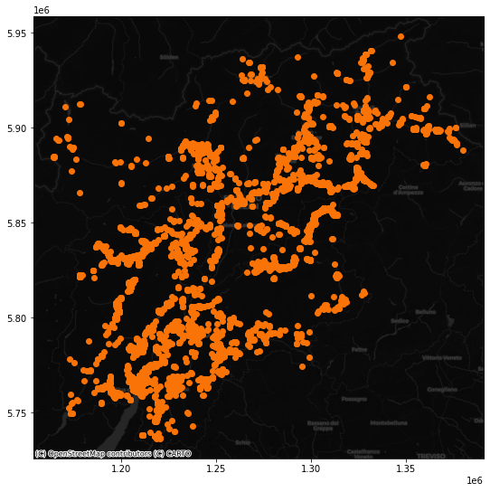
    


# Visualize dots (with seaborn)

create a scatterplot to know the spatial distributions of the points


```python
sns.jointplot(x='lng', y='lat', color="xkcd:dusky blue", data=geo_airbnb);
```


    <seaborn.axisgrid.JointGrid at 0x7f7824f9ea00>


    
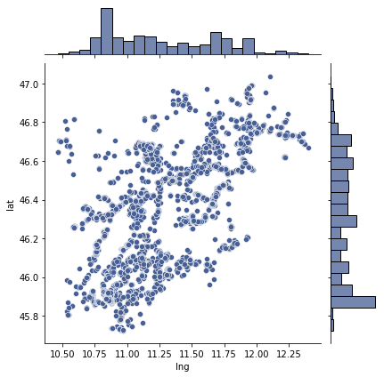
    


this representation helps to understand where there are more points (not understandable at the proposed scale level)


## add the points on a background map
the main background available online use the pseudo mercator reference system - [epsg:3857](https://epsg.io/3857)

so we prepare the data to have x and y in epsg:3857


```python
geo_airbnb['x'] = geo_airbnb.to_crs(epsg=3857).geometry.x
geo_airbnb['y'] = geo_airbnb.to_crs(epsg=3857).geometry.y
```

### Download map tiles 
by using the method *bounds2img* with [contextily](https://contextily.readthedocs.io/en/latest/)

definition of the bounding box to donwload the background image


```python
bounding_box = [geo_airbnb.x.min(), geo_airbnb.y.min(), geo_airbnb.x.max(), geo_airbnb.y.max()]
```

download the background image - the original CRS is EPSG:3857


```python
basemap, basemap_extent = ctx.bounds2img(*bounding_box, zoom=10,source = ctx.providers.Stamen.Toner)
```

- *basemap* is an array containing the raw image data for a basemap of the area
- *basemap_extent* is the boundary of that image

create a bounding box to define the extent of the data <br/>
In this case is the same of the bounding box.<br/>
It can be used to zoom the map on the data extent


```python
data_extent = [geo_airbnb.x.min(), geo_airbnb.x.max(), geo_airbnb.y.min(), geo_airbnb.y.max()]
```

### plot dots
over the background image


```python
# Set up figure and axis
f, ax = plt.subplots(1, figsize=(9, 9))
# Add map tiles for context
ax.imshow(basemap, extent=basemap_extent, interpolation='bilinear')
# Plot points
ax.scatter(geo_airbnb['x'], geo_airbnb['y'], s=0.75) #s = size
# Limit the axis
ax.axis(data_extent)
# Display
plt.show()
```


    
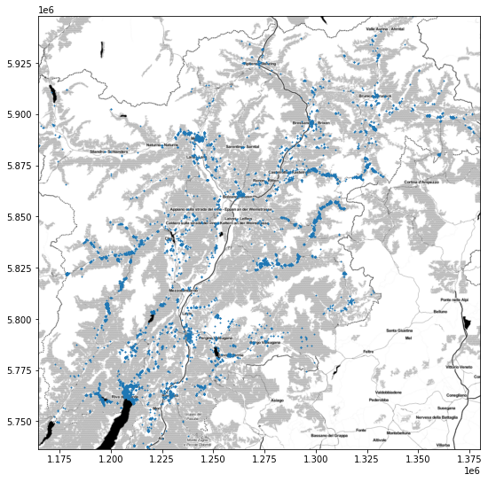
    


this representation displays all points on the map.<br/>
The proposed scale level doesn't show where the greatest concentration is or if there are concentric points (e.g. several apartments, on several levels, in the same building).<br/>

The view in dots can then create a map that hides this information.

### plot Hexagons

A good alternative to understand where is the concentration of the points in some areas is to use a hexagonal grid using different colors

The use of hexagonal binning (sometimes called hexbin) has nicer properties than squared grids, such as larger flexibility in the shape and better connectivity between cells.


```python
# Set up figure and axis
f, ax = plt.subplots(1, figsize=(12, 12))
# Add map tiles for context
ax.imshow(basemap, extent=basemap_extent, interpolation='bilinear')
# Generate and add hexbin with 50 hexagons in each 
# dimension, no borderlines, 70% transparency (alpha),
# and the reverse Oranges colormap
hb = ax.hexbin(x=geo_airbnb['x'], 
               y=geo_airbnb['y'],
               gridsize=50, linewidths=0,
               alpha=0.7, cmap='Oranges')
ax.axis(data_extent)
# Add colorbar
plt.colorbar(hb)
# Remove axes
ax.set_axis_off()
```


    
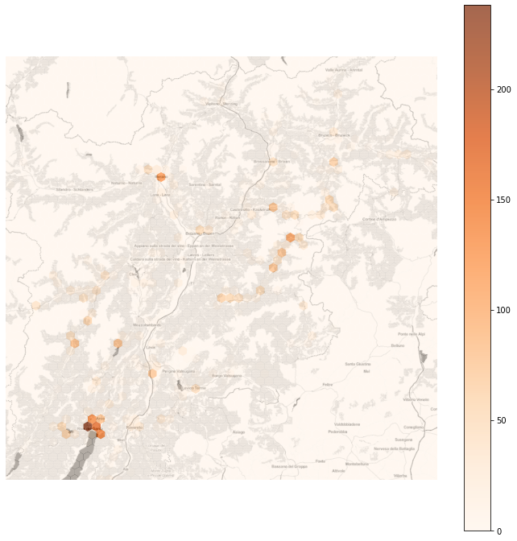
    


an now we can see where are the areas with more concentrations

### plot heatmap (KDE)
Kernel Density Estimation (KDE) a non-parametric way to estimate the probability density function of a random variable.<br/>
The results is complete coverage of the extent area of the dataset (also where there aren't points)
<br/><br/>

"KDE lays a grid of points over the space of interest on which it places kernel functions that count points around them with different weight based on the distance. These counts are then aggregated to generate a global surface with probability. The most common kernel function is the gaussian one, which applies a normal distribution to weight points. The result is a continuous surface with a probability function that may be evaluated at every point"

we can calculate the KDE with [seaborn](https://seaborn.pydata.org/generated/seaborn.kdeplot.html)

source [Rey, S.J., D. Arribas-Bel, and L.J. Wolf (2020) "Geographic Data Science with PySAL and the PyData Stack”.](https://geographicdata.science/book/notebooks/08_point_pattern_analysis.html#kernel-density-estimation-kde)


```python
# Set up figure and axis
f, ax = plt.subplots(1, figsize=(9, 9))
# Add map tiles for context
ax.imshow(basemap, extent=basemap_extent, interpolation='bilinear')
# Generate and add KDE with a shading of 30 gradients 
# coloured contours, 30% of transparency (alpha),
# and the reverse Reds colormap
sns.kdeplot(x=geo_airbnb['x'], y=geo_airbnb['y'],
                n_levels=30, shade=True,
                alpha=0.3, cmap='Reds')
# Remove axes
ax.axis(data_extent)
ax.set_axis_off()
```


    
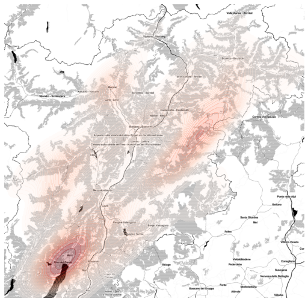
    


### create and plot cluster

another way to better understand where is the main concentration of points is the use of cluster

A common algorithm to identify clusters of points, based on their density across space, is [DBSCAN](https://en.wikipedia.org/wiki/DBSCAN) - Density-based spatial clustering of applications with noise.<br/>
For this method, a cluster is a concentration of at least *m* points, each of them within a distance of *r* of at least another point in the cluster.

A python implementation is with [scikit learn](https://scikit-learn.org/stable/modules/clustering.html#dbscan)


```python
from sklearn.cluster import dbscan
import numpy as np
```

Compute DBSCAN
<br/>&nbsp;&nbsp;&nbsp;obtain the number of points **1%** of the total represents


```python
minp = np.round(geo_airbnb.shape[0] * 0.01)
minp
```


    62.0


&nbsp;&nbsp;&nbsp;obtain the cluster of points within **800 meters** for the number of point *1%* of the total represents


```python
clusterindexes, labels = dbscan(geo_airbnb[['x', 'y']], eps=800, min_samples=minp)
```


```python
len(clusterindexes)
```


    578


```python
labels = pd.Series(labels, index=geo_airbnb.index)
```

**-1** is the value to identify the points that are **not part of any cluster** (*noise*)


```python
labels.unique()
```


    array([-1,  0,  6,  1,  5,  2,  3,  4])


```python
# Setup figure and axis
f, ax = plt.subplots(1, figsize=(9, 9))
# Add base layer with tiles for context
ax.imshow(basemap, extent=basemap_extent, interpolation='bilinear')

# Subset points that are not part of any cluster (noise)
noise = geo_airbnb.loc[labels==-1, ['x', 'y']]
# Plot noise in butter color
ax.scatter(noise['x'], noise['y'], c='xkcd:butter', s=3, linewidth=0)


# Plot all points that are not noise in sunflower color
# NOTE how this is done through some fancy indexing, where
#      we take the index of all points (tw) and substract from
#      it the index of those that are noise
ax.scatter(geo_airbnb.loc[geo_airbnb.index.difference(noise.index), 'x'], \
           geo_airbnb.loc[geo_airbnb.index.difference(noise.index), 'y'], \
          c='xkcd:sunflower', linewidth=0)

# Remove axes
ax.set_axis_off()
# Display the figure
plt.show()


```


    
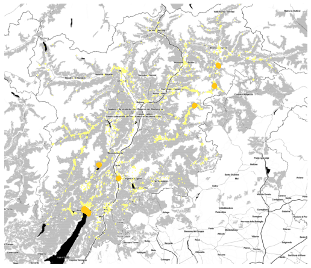
    


# Plot polygons


```python
url_italian_administrative_units="https://github.com/napo/geospatial_course_unitn/raw/master/data/istat/istat_administrative_units_generalized_2021.gpkg"
```


```python
italian_regions = gpd.read_file(url_italian_administrative_units,layer="regions")
```


```python
ax = italian_regions.to_crs(epsg=3857).plot(figsize=(10, 10), alpha=0.5, edgecolor='black')
ax.axes.xaxis.set_visible(False)
ax.axes.yaxis.set_visible(False)
ctx.add_basemap(ax,source=ctx.providers.Stamen.TerrainBackground)
```


    
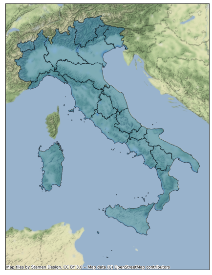
    


```python
ax = italian_regions.to_crs(epsg=3857).plot(figsize=(10, 10), facecolor="none",alpha=0.5, edgecolor='black')
ax.axes.xaxis.set_visible(False)
ax.axes.yaxis.set_visible(False)
ctx.add_basemap(ax,source=ctx.providers.Stamen.TerrainBackground)
```


    
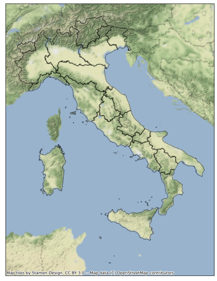
    


## add labes

to add the labels we need the for each


```python
representative_points = gpd.GeoDataFrame(italian_regions.representative_point()).reset_index()
```


```python
italian_regions.representative_point().plot()
plt.show()
```


    
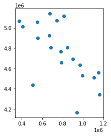
    


```python
representative_points.head(3)
```


<div>
<style scoped>
    .dataframe tbody tr th:only-of-type {
        vertical-align: middle;
    }

    .dataframe tbody tr th {
        vertical-align: top;
    }

    .dataframe thead th {
        text-align: right;
    }
</style>
<table border="1" class="dataframe">
  <thead>
    <tr style="text-align: right;">
      <th></th>
      <th>index</th>
      <th>0</th>
    </tr>
  </thead>
  <tbody>
    <tr>
      <th>0</th>
      <td>0</td>
      <td>POINT (408386.435 5012411.563)</td>
    </tr>
    <tr>
      <th>1</th>
      <td>1</td>
      <td>POINT (373437.480 5065107.693)</td>
    </tr>
    <tr>
      <th>2</th>
      <td>2</td>
      <td>POINT (552411.517 5056417.446)</td>
    </tr>
  </tbody>
</table>
</div>


```python
representative_points = representative_points.rename(columns={0:'geometry'}).set_geometry('geometry')
```


```python
representative_points.head(3)
```


<div>
<style scoped>
    .dataframe tbody tr th:only-of-type {
        vertical-align: middle;
    }

    .dataframe tbody tr th {
        vertical-align: top;
    }

    .dataframe thead th {
        text-align: right;
    }
</style>
<table border="1" class="dataframe">
  <thead>
    <tr style="text-align: right;">
      <th></th>
      <th>index</th>
      <th>geometry</th>
    </tr>
  </thead>
  <tbody>
    <tr>
      <th>0</th>
      <td>0</td>
      <td>POINT (408386.435 5012411.563)</td>
    </tr>
    <tr>
      <th>1</th>
      <td>1</td>
      <td>POINT (373437.480 5065107.693)</td>
    </tr>
    <tr>
      <th>2</th>
      <td>2</td>
      <td>POINT (552411.517 5056417.446)</td>
    </tr>
  </tbody>
</table>
</div>


obtain the list of the labels ( = names of the regions )


```python
italian_regions.DEN_REG
```


    0                  Piemonte
    1             Valle d'Aosta
    2                 Lombardia
    3       Trentino-Alto Adige
    4                    Veneto
    5     Friuli Venezia Giulia
    6                   Liguria
    7            Emilia-Romagna
    8                   Toscana
    9                    Umbria
    10                   Marche
    11                    Lazio
    12                  Abruzzo
    13                   Molise
    14                 Campania
    15                   Puglia
    16               Basilicata
    17                 Calabria
    18                  Sicilia
    19                 Sardegna
    Name: DEN_REG, dtype: object


```python
labels = italian_regions.DEN_REG.to_frame().reset_index()
```


```python
labels.head(3)
```


<div>
<style scoped>
    .dataframe tbody tr th:only-of-type {
        vertical-align: middle;
    }

    .dataframe tbody tr th {
        vertical-align: top;
    }

    .dataframe thead th {
        text-align: right;
    }
</style>
<table border="1" class="dataframe">
  <thead>
    <tr style="text-align: right;">
      <th></th>
      <th>index</th>
      <th>DEN_REG</th>
    </tr>
  </thead>
  <tbody>
    <tr>
      <th>0</th>
      <td>0</td>
      <td>Piemonte</td>
    </tr>
    <tr>
      <th>1</th>
      <td>1</td>
      <td>Valle d'Aosta</td>
    </tr>
    <tr>
      <th>2</th>
      <td>2</td>
      <td>Lombardia</td>
    </tr>
  </tbody>
</table>
</div>


.. and create a new geodataframe


```python
representative_points = representative_points.merge(labels,on="index")
```


```python
representative_points = representative_points.rename(columns={'DEN_REG':'names'})
```


```python
representative_points = representative_points.rename(columns={0:'geometry'})
```


```python
representative_points = gpd.GeoDataFrame(representative_points,geometry=representative_points['geometry'],crs=4326)
```

plot the two layers


```python
f, ax = plt.subplots(1,figsize = (10, 10))
italian_regions.to_crs(epsg=3857).plot(ax=ax,figsize=(10,10), alpha=0.5, edgecolor="black")
representative_points.to_crs(epsg=3857).plot(ax=ax,color='yellow')
ctx.add_basemap(ax,source=ctx.providers.Stamen.TerrainBackground)
plt.show()
```


    
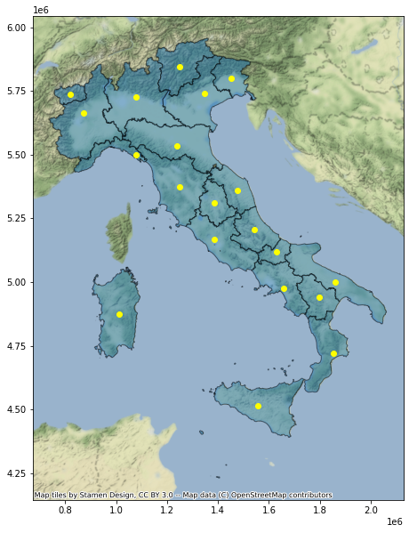
    


extract all the labels from the geodataframe and plot it in each position

*plt.text(x, y, label, fontsize = 8,fontweight='bold')* 


```python
texts = []
f, ax = plt.subplots(1,figsize = (10, 10))
italian_regions.to_crs(epsg=3857).plot(ax=ax,figsize=(10,10), facecolor="none", alpha=0.5, edgecolor="black")
for x, y, label in zip(representative_points.to_crs(epsg=3857).geometry.x, representative_points.to_crs(epsg=3857).geometry.y, representative_points["names"]):
    texts.append(plt.text(x, y, label, fontsize = 8, color="black",fontweight='bold'))
ctx.add_basemap(ax,source=ctx.providers.Stamen.TerrainBackground)
```


    
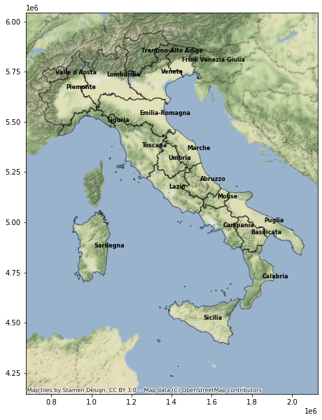
    


# Choropleth maps

Choropleth maps play a prominent role in geographic data science as they allow us to display non-geographic attributes or variables on a geographic map.<br/>The word choropleth stems from the root “choro”, meaning “region”. As such choropleth maps represent data at the region level, and are appropriate for areal unit data where each observation combines a value of an attribute and a geometric figure, usually a polygon.

source [Rey, S.J., D. Arribas-Bel, and L.J. Wolf (2020) "Geographic Data Science with PySAL and the PyData Stack”](https://geographicdata.science/book/notebooks/05_choropleth.html)


```python
italian_regions.columns
```


    Index(['COD_RIP', 'COD_REG', 'DEN_REG', 'geometry'], dtype='object')


```python
ax = italian_regions.plot(column='DEN_REG',legend=True,figsize=(14,14),edgecolor="lightgray")
ax.set_title("Regions of Italy")
ax.set_axis_off()
plt.show()
```


    
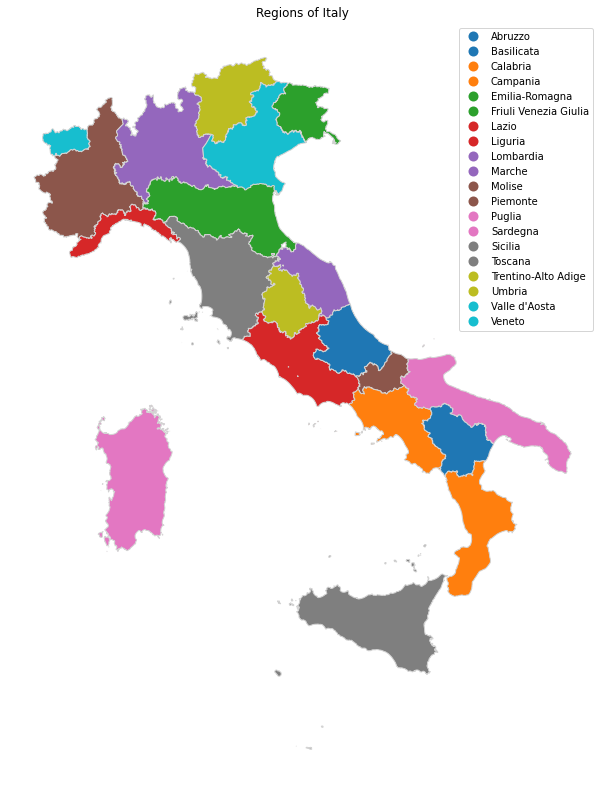
    


### Change of the color scale

the [color scale](https://matplotlib.org/users/colormaps.html) can be chosen to make those offered by maptplotlib

*DEN_REG* is a categorical variable that must highlight each region well without creating confusion, therefore it is suggested to choose a color scale from among those described as [*divergent*](https://matplotlib.org/tutorials/colors/colormaps.html#diverging)


**Tip**<br/>
A suggestion to choose a good color scale is [Color Brewer 2](https://colorbrewer2.org/#type=sequential&scheme=BuGn&n=3)


```python
ax = italian_regions.plot(column='DEN_REG',legend=True,figsize=(14, 14),cmap="RdYlBu", edgecolor="lightgray", linewidth = 0.5)
ax.set_axis_off()
plt.show()
```


    
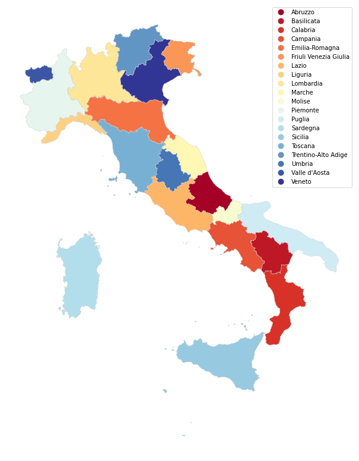
    


#### add attributes from other sources

**Goal**: generate a map with the number of people admitted to intensive care for covid-19 in each Italian region

source data<br/>
[COVID-19 in Italy](https://github.com/pcm-dpc/COVID-19)

Here the [dataset for the italian regions](https://raw.githubusercontent.com/pcm-dpc/COVID-19/master/dati-regioni/dpc-covid19-ita-regioni-latest.csv)


```python
url='https://raw.githubusercontent.com/pcm-dpc/COVID-19/master/dati-regioni/dpc-covid19-ita-regioni-latest.csv'
```


```python
covid19_italian_regions = pd.read_csv(url)
```


```python
covid19_italian_regions.columns
```


    Index(['data', 'stato', 'codice_regione', 'denominazione_regione', 'lat',
           'long', 'ricoverati_con_sintomi', 'terapia_intensiva',
           'totale_ospedalizzati', 'isolamento_domiciliare', 'totale_positivi',
           'variazione_totale_positivi', 'nuovi_positivi', 'dimessi_guariti',
           'deceduti', 'casi_da_sospetto_diagnostico', 'casi_da_screening',
           'totale_casi', 'tamponi', 'casi_testati', 'note',
           'ingressi_terapia_intensiva', 'note_test', 'note_casi',
           'totale_positivi_test_molecolare',
           'totale_positivi_test_antigenico_rapido', 'tamponi_test_molecolare',
           'tamponi_test_antigenico_rapido', 'codice_nuts_1', 'codice_nuts_2'],
          dtype='object')


```python
covid19_italian_regions.head(5)
```


<div>
<style scoped>
    .dataframe tbody tr th:only-of-type {
        vertical-align: middle;
    }

    .dataframe tbody tr th {
        vertical-align: top;
    }

    .dataframe thead th {
        text-align: right;
    }
</style>
<table border="1" class="dataframe">
  <thead>
    <tr style="text-align: right;">
      <th></th>
      <th>data</th>
      <th>stato</th>
      <th>codice_regione</th>
      <th>denominazione_regione</th>
      <th>lat</th>
      <th>long</th>
      <th>ricoverati_con_sintomi</th>
      <th>terapia_intensiva</th>
      <th>totale_ospedalizzati</th>
      <th>isolamento_domiciliare</th>
      <th>...</th>
      <th>note</th>
      <th>ingressi_terapia_intensiva</th>
      <th>note_test</th>
      <th>note_casi</th>
      <th>totale_positivi_test_molecolare</th>
      <th>totale_positivi_test_antigenico_rapido</th>
      <th>tamponi_test_molecolare</th>
      <th>tamponi_test_antigenico_rapido</th>
      <th>codice_nuts_1</th>
      <th>codice_nuts_2</th>
    </tr>
  </thead>
  <tbody>
    <tr>
      <th>0</th>
      <td>2021-11-24T17:00:00</td>
      <td>ITA</td>
      <td>13</td>
      <td>Abruzzo</td>
      <td>42.351222</td>
      <td>13.398438</td>
      <td>94</td>
      <td>8</td>
      <td>102</td>
      <td>3589</td>
      <td>...</td>
      <td>NaN</td>
      <td>1</td>
      <td>NaN</td>
      <td>NaN</td>
      <td>86537</td>
      <td>0</td>
      <td>1561022</td>
      <td>1279794</td>
      <td>ITF</td>
      <td>ITF1</td>
    </tr>
    <tr>
      <th>1</th>
      <td>2021-11-24T17:00:00</td>
      <td>ITA</td>
      <td>17</td>
      <td>Basilicata</td>
      <td>40.639471</td>
      <td>15.805148</td>
      <td>15</td>
      <td>2</td>
      <td>17</td>
      <td>970</td>
      <td>...</td>
      <td>Il numero totale dei decessi ne comprende n. 2...</td>
      <td>1</td>
      <td>NaN</td>
      <td>NaN</td>
      <td>31382</td>
      <td>0</td>
      <td>473687</td>
      <td>25608</td>
      <td>ITF</td>
      <td>ITF5</td>
    </tr>
    <tr>
      <th>2</th>
      <td>2021-11-24T17:00:00</td>
      <td>ITA</td>
      <td>18</td>
      <td>Calabria</td>
      <td>38.905976</td>
      <td>16.594402</td>
      <td>123</td>
      <td>11</td>
      <td>134</td>
      <td>3666</td>
      <td>...</td>
      <td>L'Asp di Catanzaro comunica un positivo nel se...</td>
      <td>3</td>
      <td>NaN</td>
      <td>NaN</td>
      <td>91475</td>
      <td>19</td>
      <td>1139660</td>
      <td>263499</td>
      <td>ITF</td>
      <td>ITF6</td>
    </tr>
    <tr>
      <th>3</th>
      <td>2021-11-24T17:00:00</td>
      <td>ITA</td>
      <td>15</td>
      <td>Campania</td>
      <td>40.839566</td>
      <td>14.250850</td>
      <td>312</td>
      <td>21</td>
      <td>333</td>
      <td>14520</td>
      <td>...</td>
      <td>NaN</td>
      <td>2</td>
      <td>NaN</td>
      <td>dalla verifica giornaliera si evince che uno d...</td>
      <td>473055</td>
      <td>11588</td>
      <td>5741787</td>
      <td>2064818</td>
      <td>ITF</td>
      <td>ITF3</td>
    </tr>
    <tr>
      <th>4</th>
      <td>2021-11-24T17:00:00</td>
      <td>ITA</td>
      <td>8</td>
      <td>Emilia-Romagna</td>
      <td>44.494367</td>
      <td>11.341721</td>
      <td>560</td>
      <td>63</td>
      <td>623</td>
      <td>15344</td>
      <td>...</td>
      <td>Sono stati eliminati 2 casi, positivi a test a...</td>
      <td>6</td>
      <td>NaN</td>
      <td>NaN</td>
      <td>447946</td>
      <td>422</td>
      <td>6505314</td>
      <td>3807131</td>
      <td>ITH</td>
      <td>ITH5</td>
    </tr>
  </tbody>
</table>
<p>5 rows × 30 columns</p>
</div>


```python
covid19_italian_regions.denominazione_regione.unique()
```


    array(['Abruzzo', 'Basilicata', 'Calabria', 'Campania', 'Emilia-Romagna',
           'Friuli Venezia Giulia', 'Lazio', 'Liguria', 'Lombardia', 'Marche',
           'Molise', 'P.A. Bolzano', 'P.A. Trento', 'Piemonte', 'Puglia',
           'Sardegna', 'Sicilia', 'Toscana', 'Umbria', "Valle d'Aosta",
           'Veneto'], dtype=object)


*P. A. Bolzano* and *P.A. Trento* are provinces => these aren't present in the geographical dataset for the italian *regions*


The autonomous provinces of Trento and Bolzano, for some competences such as healthcare, are equated to the Italian regions.<br/>

So we need to create a layer that has this distinction<br/>
Here the sequences of the operations
1. delete the Trentino Alto Adige region from the original layer
1. extract the provinces of Trento and Bolzano
1. align the attributes of these two provinces with those of the regions
1. merge the extracted geometries to the regions layer

**delete the Trentino Alto Adige region from the original layer**


```python
italian_regions[italian_regions.COD_REG == 4]
```


<div>
<style scoped>
    .dataframe tbody tr th:only-of-type {
        vertical-align: middle;
    }

    .dataframe tbody tr th {
        vertical-align: top;
    }

    .dataframe thead th {
        text-align: right;
    }
</style>
<table border="1" class="dataframe">
  <thead>
    <tr style="text-align: right;">
      <th></th>
      <th>COD_RIP</th>
      <th>COD_REG</th>
      <th>DEN_REG</th>
      <th>geometry</th>
    </tr>
  </thead>
  <tbody>
    <tr>
      <th>3</th>
      <td>2</td>
      <td>4</td>
      <td>Trentino-Alto Adige</td>
      <td>MULTIPOLYGON (((743267.749 5219765.793, 743387...</td>
    </tr>
  </tbody>
</table>
</div>


```python
italian_regions = italian_regions[italian_regions.COD_REG != 4]
```


```python
italian_regions.plot(figsize=(10,10))
plt.show()
```


    
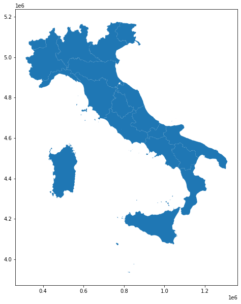
    


**extract the provinces of Trento and Bolzano**


```python
italian_provincies = gpd.read_file(url_italian_administrative_units,layer="provincies")
```


```python
trento_bolzano = italian_provincies[italian_provincies.COD_REG==4]
```


```python
trento_bolzano.plot()
plt.show()
```


    
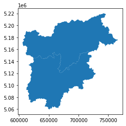
    


```python
trento_bolzano
```


<div>
<style scoped>
    .dataframe tbody tr th:only-of-type {
        vertical-align: middle;
    }

    .dataframe tbody tr th {
        vertical-align: top;
    }

    .dataframe thead th {
        text-align: right;
    }
</style>
<table border="1" class="dataframe">
  <thead>
    <tr style="text-align: right;">
      <th></th>
      <th>COD_RIP</th>
      <th>COD_REG</th>
      <th>COD_PROV</th>
      <th>COD_CM</th>
      <th>COD_UTS</th>
      <th>DEN_PROV</th>
      <th>DEN_CM</th>
      <th>DEN_UTS</th>
      <th>SIGLA</th>
      <th>TIPO_UTS</th>
      <th>geometry</th>
    </tr>
  </thead>
  <tbody>
    <tr>
      <th>20</th>
      <td>2</td>
      <td>4</td>
      <td>21</td>
      <td>0</td>
      <td>21</td>
      <td>Bolzano</td>
      <td>-</td>
      <td>Bolzano</td>
      <td>BZ</td>
      <td>Provincia autonoma</td>
      <td>MULTIPOLYGON (((743267.749 5219765.793, 743387...</td>
    </tr>
    <tr>
      <th>21</th>
      <td>2</td>
      <td>4</td>
      <td>22</td>
      <td>0</td>
      <td>22</td>
      <td>Trento</td>
      <td>-</td>
      <td>Trento</td>
      <td>TN</td>
      <td>Provincia autonoma</td>
      <td>MULTIPOLYGON (((716676.337 5153931.623, 716029...</td>
    </tr>
  </tbody>
</table>
</div>


**align the attributes of these two provinces with those of the regions**


```python
trento_bolzano = trento_bolzano.drop(columns=['COD_REG'])
```


```python
trento_bolzano.rename(columns={'COD_PROV':'COD_REG'},inplace=True)
```


```python
trento_bolzano.rename(columns={'DEN_PROV':'DEN_REG'},inplace=True)
```


```python
italian_regions.columns
```


    Index(['COD_RIP', 'COD_REG', 'DEN_REG', 'geometry'], dtype='object')


```python
trento_bolzano.columns
```


    Index(['COD_RIP', 'COD_REG', 'COD_CM', 'COD_UTS', 'DEN_REG', 'DEN_CM',
           'DEN_UTS', 'SIGLA', 'TIPO_UTS', 'geometry'],
          dtype='object')


```python
trento_bolzano = trento_bolzano[['COD_RIP','COD_REG','DEN_REG','geometry']]
```

**append the extracted geometries to the regions layer**


```python
italian_regions = italian_regions.append(trento_bolzano)
```


```python
italian_regions.plot(figsize=(10,10))
plt.show()
```


    
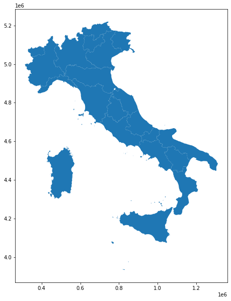
    


**join the data to the geodataframe**


```python
italian_regions.columns
```


    Index(['COD_RIP', 'COD_REG', 'DEN_REG', 'geometry'], dtype='object')


```python
covid19_italian_regions.columns
```


    Index(['data', 'stato', 'codice_regione', 'denominazione_regione', 'lat',
           'long', 'ricoverati_con_sintomi', 'terapia_intensiva',
           'totale_ospedalizzati', 'isolamento_domiciliare', 'totale_positivi',
           'variazione_totale_positivi', 'nuovi_positivi', 'dimessi_guariti',
           'deceduti', 'casi_da_sospetto_diagnostico', 'casi_da_screening',
           'totale_casi', 'tamponi', 'casi_testati', 'note',
           'ingressi_terapia_intensiva', 'note_test', 'note_casi',
           'totale_positivi_test_molecolare',
           'totale_positivi_test_antigenico_rapido', 'tamponi_test_molecolare',
           'tamponi_test_antigenico_rapido', 'codice_nuts_1', 'codice_nuts_2'],
          dtype='object')


"*terapia_intensiva*" = "intensive care" 

"*codice_regione*" = "*COD_REG*" = the code assigned by the national institute of statistics to identify an italian region

**rename "COD_REG" to "codice_region" to have a common key**


```python
italian_regions.rename(columns={'COD_REG':'codice_regione'},inplace=True)
```


```python
geo_covid19_italian_regions = italian_regions.merge(covid19_italian_regions,on="codice_regione").reset_index()
```


```python
geo_covid19_italian_regions.columns
```


    Index(['index', 'COD_RIP', 'codice_regione', 'DEN_REG', 'geometry', 'data',
           'stato', 'denominazione_regione', 'lat', 'long',
           'ricoverati_con_sintomi', 'terapia_intensiva', 'totale_ospedalizzati',
           'isolamento_domiciliare', 'totale_positivi',
           'variazione_totale_positivi', 'nuovi_positivi', 'dimessi_guariti',
           'deceduti', 'casi_da_sospetto_diagnostico', 'casi_da_screening',
           'totale_casi', 'tamponi', 'casi_testati', 'note',
           'ingressi_terapia_intensiva', 'note_test', 'note_casi',
           'totale_positivi_test_molecolare',
           'totale_positivi_test_antigenico_rapido', 'tamponi_test_molecolare',
           'tamponi_test_antigenico_rapido', 'codice_nuts_1', 'codice_nuts_2'],
          dtype='object')


```python
from datetime import datetime
```


```python
date_string = geo_covid19_italian_regions['data'].unique()[0]
```


```python
day = datetime.strptime(date_string[:10], "%Y-%m-%d").strftime("%d %b %Y")
```


```python
ax = geo_covid19_italian_regions.plot(column='terapia_intensiva',
                                      cmap="OrRd", edgecolor = "darkgrey", 
                                      linewidth = 0.5,legend=True,figsize=(10,10))
ax.set_axis_off()
ax.set_title('total people in intensive care - ' + day)
plt.show()
```


    
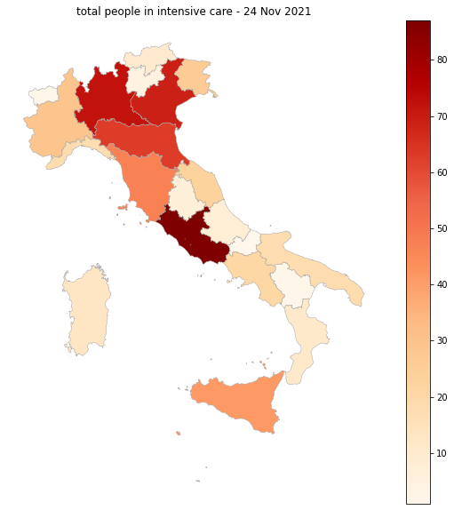
    


note:<br/>
this variable needs to be compared with at least the number of beds available for intensive care and the total population.

To the page
https://www.agenas.gov.it/covid19/web/index.php
There is a dashboard with these indicators.

The presented data can be reached at this json

https://www.agenas.gov.it/covid19/web/index.php?r=json/graph4

where the significant values are:
- x => percentage of beds in not critical area occupied by covid−19 patients
- y => percentage of intensive care beds occupied by covid-19 patients
- data1: patients hospitalized_with symptoms
- data2: total of beds in non-critical area
- data3: people in intensive_therapy
- data4: total of beds in intensive care


### Classification Schemes for Choropleth Maps

**Readings**
- [Choropleth Maps – A Guide to Data Classification](https://gisgeography.com/choropleth-maps-data-classification/)
- [Rey, S.J., D. Arribas-Bel, and L.J. Wolf (2020) "Geographic Data Science with PySAL and the PyData Stack”.](https://geographicdata.science/book/notebooks/05_choropleth.html)
- [What to consider when creating choropleth maps](https://blog.datawrapper.de/choroplethmaps/) - Lisa Charlotte Rost, Datawrapper
- [How to choose the best interpolation for your choropleth map](https://academy.datawrapper.de/article/117-color-palette-for-your-map)


with geopandas it's possible use the schemas made by [mapclassify](https://github.com/pysal/mapclassify)


Here some examples: 

#### Equal intervals

the distribution of the data is divide in bins which the same width in the value space


```python
ax = geo_covid19_italian_regions.plot(column='terapia_intensiva',
                                      cmap="OrRd", edgecolor = "darkgrey", 
                                      linewidth = 0.5,legend=True,figsize=(10,10),
                                      scheme="equal_interval",
                                      k=10)
ax.set_title('people in intensive care in 10 equal intervals - ' + day)

ax.set_axis_off()
plt.show()
```


    
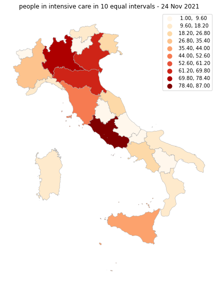
    


#### Quantiles

quantiles are cut points dividing the observations in a sample in the same way.


```python
ax = geo_covid19_italian_regions.plot(column='terapia_intensiva',
                                      cmap="OrRd", edgecolor = "darkgrey", 
                                      linewidth = 0.5,legend=True,figsize=(10,10),
                                      scheme="quantiles",
                                      k=10)
ax.set_axis_off()
ax.set_title('people in intensive care in 10 quantiles - ' + day)

plt.show()
```


    
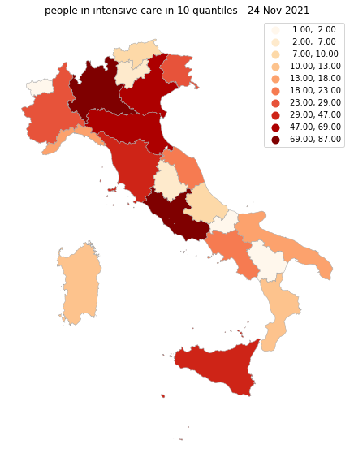
    


#### Percentiles

A percentile  indicating the value below which a given percentage of observations in a group of observations falls.


```python
ax = geo_covid19_italian_regions.plot(column='terapia_intensiva',
                                      cmap="OrRd", edgecolor = "darkgrey", 
                                      linewidth = 0.5,legend=True,figsize=(10,10),
                                      scheme="percentiles")
ax.set_axis_off()
ax.set_title('people in intensive care in percentiles - ' + day)

plt.show()
```


    
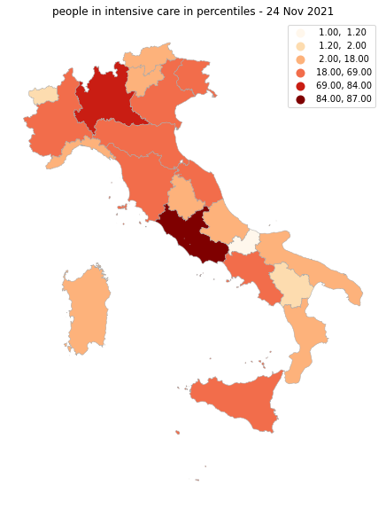
    


#### Natural Breaks

this method seeks to reduce the variance within classes and maximize the variance between classes.


```python
ax = geo_covid19_italian_regions.plot(column='terapia_intensiva',
                                      cmap="OrRd", edgecolor = "darkgrey", 
                                      linewidth = 0.5,legend=True,figsize=(10,10),
                                      scheme="naturalbreaks",
                                      k=10)
ax.set_axis_off()
ax.set_title('people in intensive care - natural breaks  - ' + day)

plt.show()
```


    
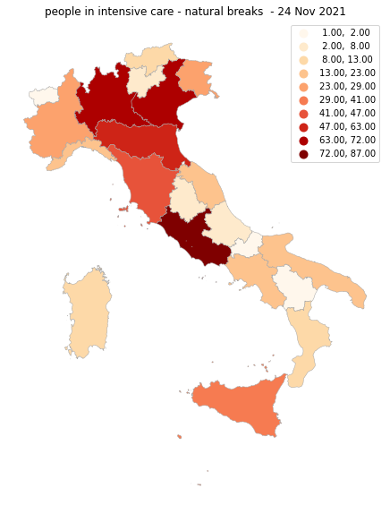
    


# Important notes in using geospatial visualizations

XKCD's suggestion :)


source: https://xkcd.com/1138/

explanation: https://www.explainxkcd.com/wiki/index.php/1138:_Heatmap


---


http://try-to-impeach-this.jetpack.ai/

---
# Exercise<br/>
create maps with distribution of votes by polling station (seggi elettorali) of the mayoral candidates of the municipal 2020 of Trento<br/>
Data available here:
- [election data for mayor of Trento 2020](https://github.com/napo/geospatial_course_unitn/tree/master/data/election_data_trento)
