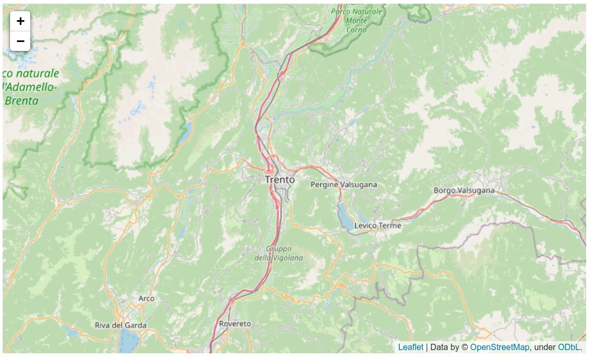
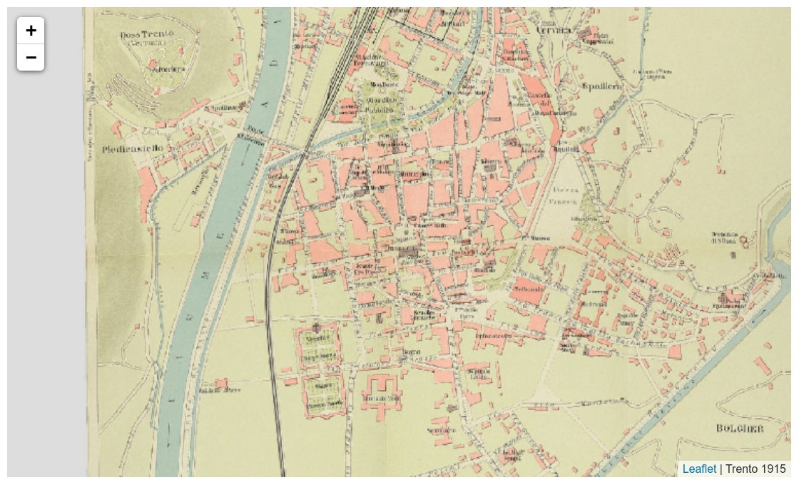
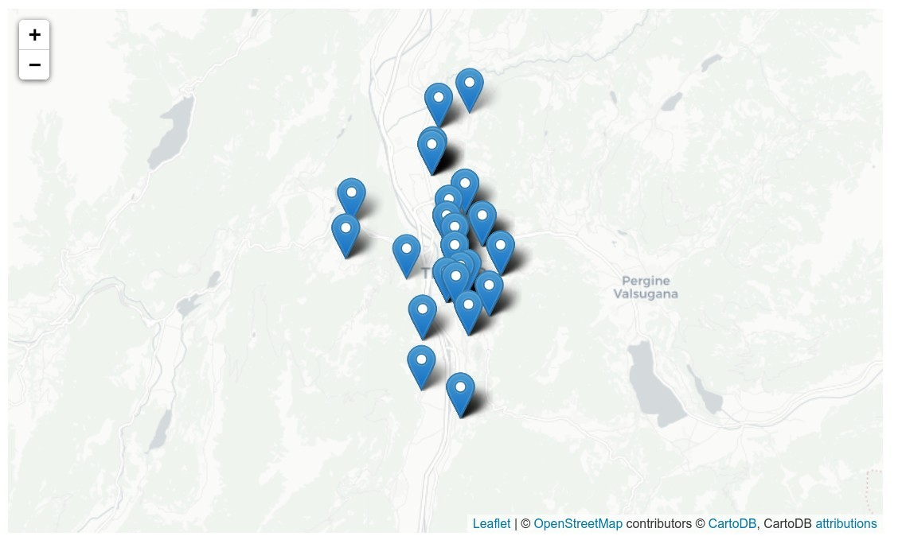
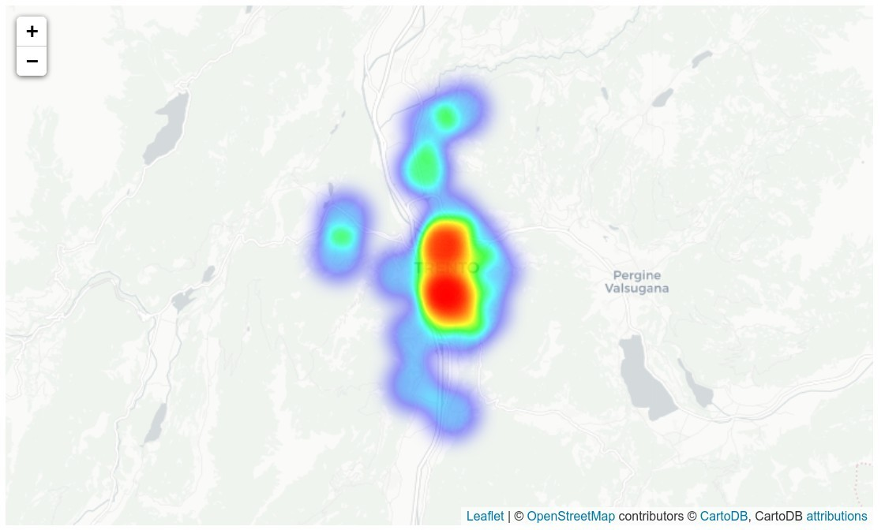
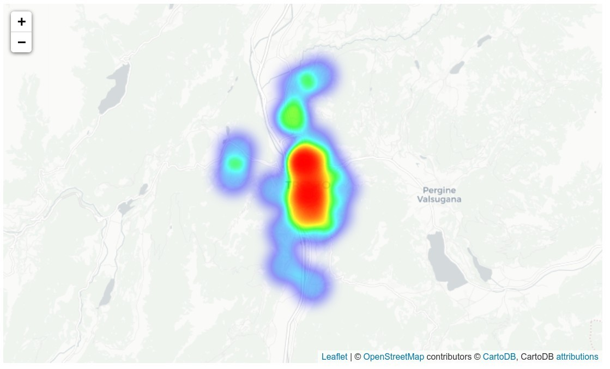
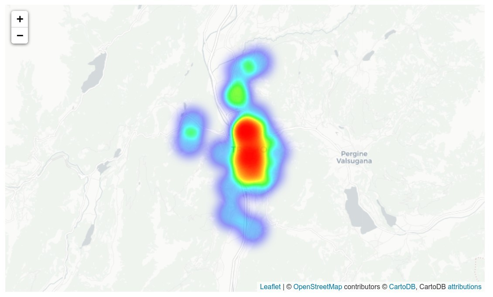
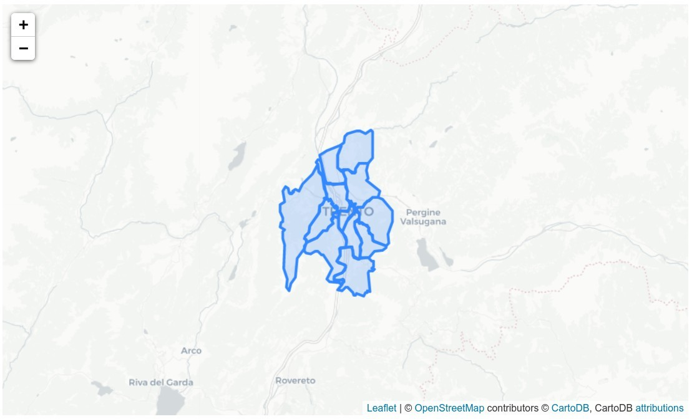
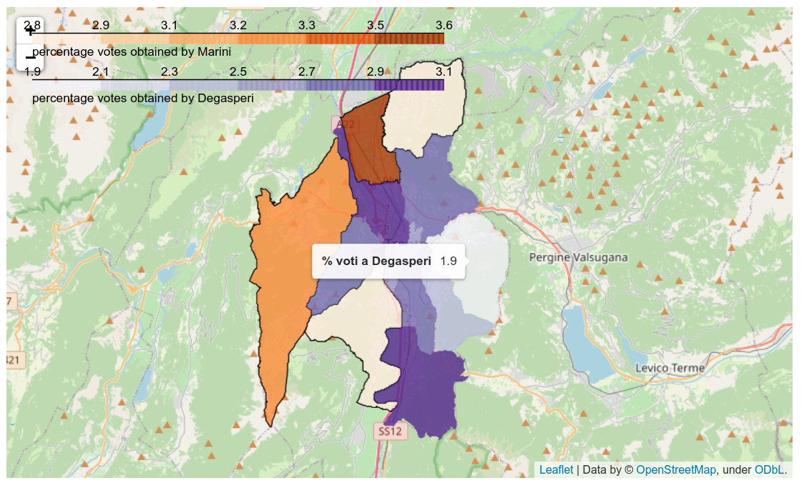

---
# Web Mapping

goals of the tutorial

    create web maps based on your data
    transform a raster in a TMS
    understand a map service architecture

based on the open data of:

    City Council Election Trento 2020
    Open Data of the City Council Trento

requirements

    python knowledge
    HTML principles
    geopandas

status
"everybody loves the web mapping" 


take an overview on [Leafletjs](https://leafletjs.com/)

Other interesting libraries for creating interactive visualizations from spatial data:

* [mapboxgl](https://github.com/mapbox/mapboxgl-jupyter)
* [Bokeh](https://bokeh.org/)
* [Geoviews](https://geoviews.org/)
* [ipyleaflet](https://ipyleaflet.readthedocs.io/en/latest/)
* [leafmap](https://leafmap.org)


```python
import warnings
warnings.filterwarnings("ignore")
```


```python
try:
  import geopandas as gpd
except ModuleNotFoundError as e:
  !pip install geopandas==0.10.1
  import geopandas as gpd

if gpd.__version__ != "0.10.1":
  !pip install -U geopandas==0.10.1
  import geopandas as gpd
```


```python
try:
  import folium
except ModuleNotFoundError as e:
  !pip install folium==0.12.1.post1
  import folium

if folium.__version__ != "0.12.1.post1":
  !pip install -U folium==0.12.1.post1
  import folium
```

## Plotting maps with folium


```python
import folium
m=folium.Map(location=[46.06769,11.15135])
m
```




## Change tile layer


```python
m2=folium.Map(location=[46.06769,11.15135])
folium.TileLayer('Stamen Terrain').add_to(m2)
folium.TileLayer('Stamen Toner').add_to(m2)
folium.TileLayer('Stamen Water Color').add_to(m2)
folium.TileLayer('cartodbpositron').add_to(m2)
folium.TileLayer('cartodbdark_matter').add_to(m2)
folium.LayerControl().add_to(m2)
m2
```


## Custom Tile Layer


```python
m3 = folium.Map(location=[46.0672,11.1212],
       zoom_start=15,
       tiles='https://mapwarper.net/maps/tile/19481/{z}/{x}/{y}.png',
       attr='Trento 1915')
m3
```




## Plotting markers
eg.

the polling stations of Trento


```python
import pandas as pd
urlbase = "https://raw.githubusercontent.com/napo/geospatial_course_unitn/master/data/election_data_trento/"
```


```python
polling_stations = pd.read_csv(urlbase + "polling_places_trento.csv",sep=";")
```


```python
polling_stations
```


<div>
<style scoped>
    .dataframe tbody tr th:only-of-type {
        vertical-align: middle;
    }

    .dataframe tbody tr th {
        vertical-align: top;
    }

    .dataframe thead th {
        text-align: right;
    }
</style>
<table border="1" class="dataframe">
  <thead>
    <tr style="text-align: right;">
      <th></th>
      <th>circoscrizione</th>
      <th>sezione</th>
      <th>seggio</th>
      <th>sede</th>
      <th>via</th>
      <th>citta</th>
      <th>latitude</th>
      <th>longitude</th>
    </tr>
  </thead>
  <tbody>
    <tr>
      <th>0</th>
      <td>12</td>
      <td>1</td>
      <td>1</td>
      <td>Scuola Elementare R. Sanzio</td>
      <td>Piazza Raffaello Sanzio, 13</td>
      <td>Trento</td>
      <td>46.07221</td>
      <td>11.12597</td>
    </tr>
    <tr>
      <th>1</th>
      <td>12</td>
      <td>2</td>
      <td>1</td>
      <td>Scuola Elementare R. Sanzio</td>
      <td>Piazza Raffaello Sanzio, 13</td>
      <td>Trento</td>
      <td>46.07221</td>
      <td>11.12597</td>
    </tr>
    <tr>
      <th>2</th>
      <td>12</td>
      <td>3</td>
      <td>1</td>
      <td>Scuola Elementare R. Sanzio</td>
      <td>Piazza Raffaello Sanzio, 13</td>
      <td>Trento</td>
      <td>46.07221</td>
      <td>11.12597</td>
    </tr>
    <tr>
      <th>3</th>
      <td>12</td>
      <td>4</td>
      <td>1</td>
      <td>Scuola Elementare R. Sanzio</td>
      <td>Piazza Raffaello Sanzio, 13</td>
      <td>Trento</td>
      <td>46.07221</td>
      <td>11.12597</td>
    </tr>
    <tr>
      <th>4</th>
      <td>12</td>
      <td>5</td>
      <td>1</td>
      <td>Scuola Elementare R. Sanzio</td>
      <td>Piazza Raffaello Sanzio, 13</td>
      <td>Trento</td>
      <td>46.07221</td>
      <td>11.12597</td>
    </tr>
    <tr>
      <th>...</th>
      <td>...</td>
      <td>...</td>
      <td>...</td>
      <td>...</td>
      <td>...</td>
      <td>...</td>
      <td>...</td>
      <td>...</td>
    </tr>
    <tr>
      <th>93</th>
      <td>12</td>
      <td>94</td>
      <td>2</td>
      <td>Scuola Elementare S. Bellesini</td>
      <td>Via Antonio Stoppani, 3</td>
      <td>Trento</td>
      <td>46.07725</td>
      <td>11.12063</td>
    </tr>
    <tr>
      <th>94</th>
      <td>5</td>
      <td>95</td>
      <td>16</td>
      <td>Ufficio comunale di Romagnano</td>
      <td>Via sette Fontane, 1</td>
      <td>Trento</td>
      <td>46.01719</td>
      <td>11.10586</td>
    </tr>
    <tr>
      <th>95</th>
      <td>2</td>
      <td>96</td>
      <td>20</td>
      <td>Centro civico di Meano</td>
      <td>Via delle Sugarine, 26</td>
      <td>Trento</td>
      <td>46.12630</td>
      <td>11.11614</td>
    </tr>
    <tr>
      <th>96</th>
      <td>6</td>
      <td>97</td>
      <td>13</td>
      <td>Centro Civico di Cognola</td>
      <td>Via Carlo e Valeria Julg, 9</td>
      <td>Trento</td>
      <td>46.07695</td>
      <td>11.14202</td>
    </tr>
    <tr>
      <th>97</th>
      <td>3</td>
      <td>98</td>
      <td>18</td>
      <td>Centro civico di Sopramonte</td>
      <td>Via di Revolta, 4</td>
      <td>Trento</td>
      <td>46.07162</td>
      <td>11.06042</td>
    </tr>
  </tbody>
</table>
<p>98 rows × 8 columns</p>
</div>


### create the marker

```python
folium.Marker(
  location=[latitude, longitude],
  popup='Message on popup',
  tooltip='tooltip message',
)
```

note: for the string you can use html code


```python
# Creating Basemap
m4=folium.Map(location=[46.0672,11.1212],tiles='cartodbpositron',zoom_start=11)
```


```python
def getMarker(lat,lon, message,tip):
  marker = folium.Marker(location=[lat,lon],
                         popup=message,
                         tooltip=tip)
  return marker
```


```python
for index, row in polling_stations.iterrows():
  marker = getMarker(row['latitude'],row['longitude'],row['via'],row['sede'])
  marker.add_to(m4)
```


```python
m4
```




### the icon can be defined

```python
folium.Marker(
  location=[latitude, longitude],
  popup='Message on popup',
  tooltip='tooltip message',
  icon=folium.Icon(color='define color',icon='define icon'))
) 
```

eg.

```python
icon=folium.Icon(color='green',icon='none'))
icon=folium.Icon(color='purple',prefix='fa',icon='arrow-circle-down'))
icon=folium.features.CustomIcon('https://emojipedia-us.s3.dualstack.us-west-1.amazonaws.com/thumbs/160/google/40/ballot-box-with-ballot_1f5f3.png',icon_size=(34,34)))
```

fa => [font awesome](https://fontawesome.com/icons)


```python
def getMarker(lat,lon, message,tip,inconstyle):
  marker = folium.Marker(location=[lat,lon],
                         popup=message,
                         tooltip=tip,
                         icon=inconstyle)
  return marker
```


```python
m5=folium.Map(location=[46.0672,11.1212],tiles='cartodbpositron',zoom_start=11)
for index, row in polling_stations.iterrows():
  icon=folium.Icon(color='purple',prefix='fa',icon='arrow-circle-down')
  marker = getMarker(row['latitude'],row['longitude'],row['via'],row['sede'],icon)
  marker.add_to(m5)
m5
```


```python
m5=folium.Map(location=[46.0672,11.1212],tiles='cartodbpositron',zoom_start=11)
for index, row in polling_stations.iterrows():
  icon=folium.features.CustomIcon('https://emojipedia-us.s3.dualstack.us-west-1.amazonaws.com/thumbs/160/google/40/ballot-box-with-ballot_1f5f3.png',icon_size=(34,34))
  marker = getMarker(row['latitude'],row['longitude'],row['via'],row['sede'],icon)
  marker.add_to(m5)
m5
```


### there are a lot of concentrics points


```python
from folium.plugins import MarkerCluster
```


```python
m6=folium.Map(location=[46.0672,11.1212],tiles='cartodbpositron',zoom_start=11)
```


```python
marker_cluster = MarkerCluster().add_to(m6)
```


```python
for index, row in polling_stations.iterrows():
  icon=folium.Icon(color='purple',prefix='fa',icon='arrow-circle-down')
  message = '<strong>sezione:'+ str(row['sezione']) + "</strong><br/>" + row['sede']
  tip = message + '<br/>' + row['via']
  marker = getMarker(row['latitude'],row['longitude'],message, tip, icon)
  #add to marker cluster 
  marker.add_to(marker_cluster)
m6
```





### and plot the heatmap


```python
from folium.plugins import HeatMap
```


```python
m7=folium.Map(location=[46.0672,11.1212],tiles='cartodbpositron',zoom_start=11)
```

#### Create a Heatmap layer

**Parameters**

        - data (list of points of the form [lat, lng] or [lat, lng, weight]) – The points you want to plot. You can also provide a numpy.array of shape (n,2) or (n,3).
        - name (string, default None) – The name of the Layer, as it will appear in LayerControls.
        - min_opacity (default 1.) – The minimum opacity the heat will start at.
        - max_zoom (default 18) – Zoom level where the points reach maximum intensity (as intensity scales with zoom), equals maxZoom of the map by default
        - max_val (float, default 1.) – Maximum point intensity
        - radius (int, default 25) – Radius of each “point” of the heatmap
        - blur (int, default 15) – Amount of blur
        - gradient (dict, default None) – Color gradient config. e.g. {0.4: ‘blue’, 0.65: ‘lime’, 1: ‘red’}
        - overlay (bool, default True) – Adds the layer as an optional overlay (True) or the base layer (False).
        - control (bool, default True) – Whether the Layer will be included in LayerControls.
        - show (bool, default True) – Whether the layer will be shown on opening (only for overlays).


```python
data = polling_stations[['latitude','longitude']]
```


```python
HeatMap(data.values).add_to(m7)
m7
```




## playing with result of the election

### organize the data

(look the solution for the lesson 8)


```python
votes_candidate_mayor = pd.read_csv(urlbase +  "voti_sindaco_sezioni.csv",sep=";")
```


```python
votes_candidate_mayor.cognome_sindaco.unique()
```


    array(['MARTINI', 'BRUNO', 'IANESELLI', 'PANTANO', 'ZANETTI', 'MERLER',
           'CARLI', 'DEGASPERI'], dtype=object)


```python
def getvotes_by_polling_stations_candidate(stations,votes,name, fieldname):
  votes['seggio'] = votes['sezione'].apply(lambda s: stations[stations['sezione']==s].seggio.unique()[0])
  votes_by_stations = votes.groupby(['seggio']).voti.sum().to_frame().reset_index()
  votes_by_stations.rename(columns={'voti':'totals'},inplace=True)
  votes_candidate = votes[votes[fieldname] == name]
  votes_by_stations_candidate = votes_candidate.groupby(['seggio']).voti.sum().to_frame().reset_index()
  votes_by_stations_candidate['sede'] = votes_by_stations_candidate['seggio'].apply(lambda p: stations[stations.seggio==p].sede.unique()[0])
  votes_by_stations_candidate['longitude'] = votes_by_stations_candidate['seggio'].apply(lambda p: stations[stations.seggio==p].longitude.unique()[0])
  votes_by_stations_candidate['latitude'] = votes_by_stations_candidate['seggio'].apply(lambda p: stations[stations.seggio==p].latitude.unique()[0])
  votes_by_stations_candidate = pd.merge(votes_by_stations_candidate,votes_by_stations)
  votes_by_stations_candidate['percentage'] = round(votes_by_stations_candidate['voti'] / votes_by_stations_candidate.voti.sum() * 100,1)
  geo_votes_by_stations_candidate = gpd.GeoDataFrame(
    votes_by_stations_candidate,
    crs='EPSG:4326',
    geometry=gpd.points_from_xy(votes_by_stations_candidate.longitude, votes_by_stations_candidate.latitude))
  return(geo_votes_by_stations_candidate)
```


```python
candidate_pantano = getvotes_by_polling_stations_candidate(polling_stations,votes_candidate_mayor,'PANTANO','cognome_sindaco')
```

### Heatmap by votes


```python
m8=folium.Map(location=[46.0672,11.1212],tiles='cartodbpositron',zoom_start=11)

## add voti as weight
data = candidate_pantano[['latitude','longitude','voti']]

HeatMap(data.values).add_to(m8)
m8
```




### heatmap by percentage


```python
m8=folium.Map(location=[46.0672,11.1212],tiles='cartodbpositron',zoom_start=11)

## add voti as weight
data = candidate_pantano[['latitude','longitude','percentage']]

HeatMap(data.values).add_to(m8)
m8
```



##  Choropleth

### organize the data

(check the solution of lesson 8)


```python
geo_districts = gpd.read_file(urlbase + "circoscrizioni_trento.geojson")
```


```python
def getdistrict_candidate(geo, votes,candidatefield,candidate):
  districts = votes[['circoscrizione','cod_circoscrizione']].drop_duplicates()
  totalvotes_districts = votes.groupby(['circoscrizione']).voti.sum()
  totalvotes_districts = totalvotes_districts.to_frame().reset_index()
  totalvotes_districts.rename(columns={'voti':'totals'},inplace=True)
  totalvotes_districts= pd.merge(districts,totalvotes_districts)
  candidate = votes[votes[candidatefield]==candidate]
  votes_by_district_candidate = candidate.groupby(['cod_circoscrizione']).sum().reset_index()[['cod_circoscrizione','voti']]
  votes_by_district_candidate.cod_circoscrizione = votes_by_district_candidate.cod_circoscrizione.astype(int)
  geo.rename(columns={'numero_cir':'cod_circoscrizione'},inplace=True)
  geo_districts_candidate = pd.merge(geo,votes_by_district_candidate)
  geo_districts_candidate = pd.merge(geo_districts_candidate,totalvotes_districts)
  geo_districts_candidate['percentage'] = round(geo_districts_candidate['voti'] / geo_districts_candidate['totals'] * 100,1)
  return(geo_districts_candidate)
```


```python
data_candidates_mayor = {}
for name in votes_candidate_mayor.cognome_sindaco.unique():
  data_candidates_mayor[name] = getdistrict_candidate(geo_districts,votes_candidate_mayor,'cognome_sindaco',name)
```


```python
data_martini = data_candidates_mayor['MARTINI']
```


```python
m9=folium.Map(location=[46.0672,11.1212],tiles='cartodbpositron',zoom_start=10)

folium.GeoJson(
    data_martini
    ).add_to(m9)
m9
```


```python
m9=folium.Map(location=[46.0672,11.1212],tiles='cartodbpositron',zoom_start=10)

folium.GeoJson(
    data_martini,
    style_function=lambda feature: {
        'fillColor': 'yellow',
        'color': 'black',
        'weight': 0.5
    }
    ).add_to(m9)

m9
```


```python
m9=folium.Map(location=[46.0672,11.1212],tiles='cartodbpositron',zoom_start=10)

# generate choropleth map 
folium.Choropleth(
    geo_data=data_martini.to_json(),
    data = data_martini,
    columns=['circoscrizione', 'percentage'],
    key_on='feature.properties.circoscrizione',
    fill_color='Oranges', 
    fill_opacity=0.6, 
    line_opacity=1,
    legend_name='percentage votes obtained by Marini',
    smooth_factor=0).add_to(m9)
m9
```



```python
data_degasperi = data_candidates_mayor['DEGASPERI']
```


```python
map_degasperi = pd.DataFrame()
map_marini = pd.DataFrame()
for cod in data_degasperi.cod_circoscrizione.unique():
  p_marini = data_martini[data_martini.cod_circoscrizione==cod].percentage.values[0]
  p_degasperi = data_degasperi[data_degasperi.cod_circoscrizione==cod].percentage.values[0]
  v = None
  if (p_marini > p_degasperi):
    v = data_martini[data_martini.cod_circoscrizione==cod]
    map_marini=map_marini.append(v, ignore_index=True)
  elif (p_marini < p_degasperi):
    v = data_degasperi[data_degasperi.cod_circoscrizione==cod]
    map_degasperi=map_degasperi.append(v, ignore_index=True)
```


```python
m10=folium.Map(location=[46.0672,11.1212],tiles='openstreetmap',zoom_start=11)

# generate choropleth map 
folium.Choropleth(
    geo_data=map_marini,
    data = map_marini,
    columns=['circoscrizione', 'percentage'],
    key_on='feature.properties.circoscrizione',
    fill_color='Oranges', 
    fill_opacity=0.8, 
    line_opacity=1,
    legend_name='percentage votes obtained by Marini',
    smooth_factor=0).add_to(m10)

# generate choropleth map 
folium.Choropleth(
    geo_data=map_degasperi,
    data = map_degasperi,
    columns=['circoscrizione', 'percentage'],
    key_on='feature.properties.circoscrizione',
    fill_color='Purples', 
    fill_opacity=0.8, 
    line_opacity=0,
    legend_name='percentage votes obtained by Degasperi',
    smooth_factor=0).add_to(m10)

m10
```


add tooltip


```python
folium.features.GeoJson(map_marini,
                        name='Labels',
                        style_function=lambda x: {'color':'transparent','fillColor':'transparent','weight':0},
                        tooltip=folium.features.GeoJsonTooltip(fields=['percentage'],
                                                                aliases = ['% voti a Marini'],
                                                                labels=True,
                                                                sticky=False
                                                                            )
                       ).add_to(m10)

folium.features.GeoJson(map_degasperi,
                        name='Labels',
                        style_function=lambda x: {'color':'transparent','fillColor':'transparent','weight':0},
                        tooltip=folium.features.GeoJsonTooltip(fields=['percentage'],
                                                                aliases = ['% voti a Degasperi'],
                                                                labels=True,
                                                                sticky=False
                                                                            )
                       ).add_to(m10)
```


```python
m10
```


# Tile Map Service from a georeference image

https://gdal.org/programs/gdal2tiles.html

https://wiki.osgeo.org/wiki/MapSlicer

https://pypi.org/project/gdal2tiles/


# Vector Tiles

[https://docs.mapbox.com/vector-tiles/specification/](https://docs.mapbox.com/vector-tiles/specification/)

[https://github.com/mapbox/tippecanoe](https://github.com/mapbox/tippecanoe)
