---
# Exercise 02:  Spatial Relationships and Operations

## learning objectives
* repeat the concepts on the previous lesson
* errors with the simplified boundaries
* convex hull / concave hull / alphashape
* nearest_points

---
# Exercise
 
1 - create the geodataframe of the [gas&oil stations](https://www.mise.gov.it/images/exportCSV/anagrafica_impianti_attivi.csv) of Italy 
  - data from the italian [Ministry of Economic Development](https://www.mise.gov.it)
  - count the total of the gas&oil stations for each muncipality of Trentino

2 - identify the difference of municipalities in Trentino in the year 2019 with the year 2022
  - identify which municipalities are created from aggregation to others
  - find the biggest new municipality of Trentino and show all the italian municipalities with bordering it
  - create the macroarea of all the municipalities bordering with it
  - for each gas&oil station in the macro-area, calculate how many monumental trees have been within a 500m radius
  
3 - creates a polygon that contains all the monumental trees inside the area
  - identify all the gas&oil stations in this area which are within 2km of each other
  - save the polygon in geopackage with the attribute "description" with the name of the gas&oil station

4 - create the polygon of the Island of Elba from the layer of municipalities with functions of overlay

---

## Setup


```python
try:
  import pygeos
except ModuleNotFoundError as e:
  !pip install pygeos==0.13
  import pygeos

```


```python
# needed to use the method .explore in geopandas in colab
try:
  import mapclassify 
except ModuleNotFoundError as e:
  !pip install mapclassify==2.4.3
  import mapclassify
if mapclassify.__version__ != "2.4.3":
  !pip install mapclassify==2.4.3
  import mapclassify 
```


```python
try:
  import geopandas as gpd
except ModuleNotFoundError as e:
  !pip install geopandas==0.10.2
  import geopandas as gpd
if gpd.__version__ != "0.10.2":
  !pip install -U geopandas==0.10.2
  import geopandas as gpd
```

--- 

### Import of the packages


```python
import geopandas as gpd
import requests
import matplotlib.pyplot as plt
import pandas as pd
pd.options.mode.chained_assignment = None
```

# 1 -  create the geodataframe of the [gas&oil stations](https://www.mise.gov.it/images/exportCSV/anagrafica_impianti_attivi.csv) of Italy 


```python
urlfile = "https://www.mise.gov.it/images/exportCSV/anagrafica_impianti_attivi.csv"
```


```python
stations = None
try:
  stations = pd.read_csv(urlfile,skiprows=1,sep=";",encoding="ISO-8859-1")
except Exception as e:
  print(e)
```

    Error tokenizing data. C error: Expected 10 fields in line 1498, saw 11
    


There several erros


```python
stations = pd.read_csv(urlfile,skiprows=1,on_bad_lines='warn',sep=";",encoding="ISO-8859-1")
```

    b'Skipping line 1498: expected 10 fields, saw 11\nSkipping line 8633: expected 10 fields, saw 11\nSkipping line 8634: expected 10 fields, saw 11\nSkipping line 8763: expected 10 fields, saw 11\nSkipping line 13173: expected 10 fields, saw 11\n'


this message show you the rows with problems to solve


```python
stations = pd.read_csv(urlfile,skiprows=1,on_bad_lines='skip',sep=";",encoding="ISO-8859-1")
```


```python
stations.head(5)
```


<div>
<style scoped>
    .dataframe tbody tr th:only-of-type {
        vertical-align: middle;
    }

    .dataframe tbody tr th {
        vertical-align: top;
    }

    .dataframe thead th {
        text-align: right;
    }
</style>
<table border="1" class="dataframe">
  <thead>
    <tr style="text-align: right;">
      <th></th>
      <th>idImpianto</th>
      <th>Gestore</th>
      <th>Bandiera</th>
      <th>Tipo Impianto</th>
      <th>Nome Impianto</th>
      <th>Indirizzo</th>
      <th>Comune</th>
      <th>Provincia</th>
      <th>Latitudine</th>
      <th>Longitudine</th>
    </tr>
  </thead>
  <tbody>
    <tr>
      <th>0</th>
      <td>53637</td>
      <td>ODELLI LUCIA</td>
      <td>Pompe Bianche</td>
      <td>Stradale</td>
      <td>NaN</td>
      <td>NaN</td>
      <td>NaN</td>
      <td>NaN</td>
      <td>NaN</td>
      <td>NaN</td>
    </tr>
    <tr>
      <th>1</th>
      <td>52829</td>
      <td>ERRA NICOLA</td>
      <td>Api-Ip</td>
      <td>Stradale</td>
      <td>NaN</td>
      <td>NaN</td>
      <td>NaN</td>
      <td>NaN</td>
      <td>40.716039</td>
      <td>14.941328</td>
    </tr>
    <tr>
      <th>2</th>
      <td>52614</td>
      <td>FONZI PAOLO</td>
      <td>Api-Ip</td>
      <td>Stradale</td>
      <td>stazione di servizio IP di Fonzi Paolo</td>
      <td>via s francesco d'assisi snc - -</td>
      <td>NaN</td>
      <td>NaN</td>
      <td>NaN</td>
      <td>NaN</td>
    </tr>
    <tr>
      <th>3</th>
      <td>53552</td>
      <td>KHALIL NOMAN</td>
      <td>Agip Eni</td>
      <td>Stradale</td>
      <td>NaN</td>
      <td>VIA LINCOLN 69 20092</td>
      <td>CINISELLO BALSAMO</td>
      <td>NaN</td>
      <td>NaN</td>
      <td>NaN</td>
    </tr>
    <tr>
      <th>4</th>
      <td>53906</td>
      <td>GE.CA.R SOCIETA' A RESPONSABILITA' LIMITATA SE...</td>
      <td>Q8</td>
      <td>Stradale</td>
      <td>NaN</td>
      <td>VIA L.CAVALLARO SNC 84018</td>
      <td>SCAFATI</td>
      <td>NaN</td>
      <td>NaN</td>
      <td>NaN</td>
    </tr>
  </tbody>
</table>
</div>


```python
stations.columns
```


    Index(['idImpianto', 'Gestore', 'Bandiera', 'Tipo Impianto', 'Nome Impianto',
           'Indirizzo', 'Comune', 'Provincia', 'Latitudine', 'Longitudine'],
          dtype='object')


```python
columns = {
    'idImpianto': 'id',
    'Gestore': 'manager',
    'Bandiera':'company',
    'Tipo Impianto':'type',
    'Nome Impianto':'name',
    'Indirizzo':'address',
    'Comune':'city',
    'Provincia':'province',
    'Latitudine':'latitude',
    'Longitudine':'longitude'
}
```


```python
stations.rename(columns=columns,inplace=True)
```


```python
stations.head(3)
```


<div>
<style scoped>
    .dataframe tbody tr th:only-of-type {
        vertical-align: middle;
    }

    .dataframe tbody tr th {
        vertical-align: top;
    }

    .dataframe thead th {
        text-align: right;
    }
</style>
<table border="1" class="dataframe">
  <thead>
    <tr style="text-align: right;">
      <th></th>
      <th>id</th>
      <th>manager</th>
      <th>company</th>
      <th>type</th>
      <th>name</th>
      <th>address</th>
      <th>city</th>
      <th>province</th>
      <th>latitude</th>
      <th>longitude</th>
    </tr>
  </thead>
  <tbody>
    <tr>
      <th>0</th>
      <td>53637</td>
      <td>ODELLI LUCIA</td>
      <td>Pompe Bianche</td>
      <td>Stradale</td>
      <td>NaN</td>
      <td>NaN</td>
      <td>NaN</td>
      <td>NaN</td>
      <td>NaN</td>
      <td>NaN</td>
    </tr>
    <tr>
      <th>1</th>
      <td>52829</td>
      <td>ERRA NICOLA</td>
      <td>Api-Ip</td>
      <td>Stradale</td>
      <td>NaN</td>
      <td>NaN</td>
      <td>NaN</td>
      <td>NaN</td>
      <td>40.716039</td>
      <td>14.941328</td>
    </tr>
    <tr>
      <th>2</th>
      <td>52614</td>
      <td>FONZI PAOLO</td>
      <td>Api-Ip</td>
      <td>Stradale</td>
      <td>stazione di servizio IP di Fonzi Paolo</td>
      <td>via s francesco d'assisi snc - -</td>
      <td>NaN</td>
      <td>NaN</td>
      <td>NaN</td>
      <td>NaN</td>
    </tr>
  </tbody>
</table>
</div>


## create the geodataframe


```python
geo_stations = gpd.GeoDataFrame(
    stations,
    crs='EPSG:4326',
    geometry=gpd.points_from_xy(stations.longitude, stations.latitude))
```


```python
geo_stations[geo_stations.geometry.is_empty].shape[0]
```


    8


Error:<br/>
the values should be zero: the geodataframe should contains points.<br/>
Maybe therea are some rows where the values of latitude and lontigude aren't present 


```python
stations.latitude.isnull().sum()
```


    8


```python
stations.longitude.isnull().sum()
```


    8


8 ... the same value for the invalid geometries


```python
stations = stations[~stations.latitude.isnull()]
```


```python
geo_stations = gpd.GeoDataFrame(
    stations,
    crs='EPSG:4326',
    geometry=gpd.points_from_xy(stations.longitude, stations.latitude))
```


```python
geo_stations[geo_stations.geometry.is_empty].shape[0]
```


    0


Now it's ZERO :)


```python
geo_stations.plot()
plt.show()
```


    
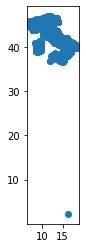
    


Ehm ... there is a point outside Italy

### fix the problem

We need to indentify the points outside the boundary of Italy 
- create the polygon with the administrative boundaries of Italy
- check each point if is inside the polygon


```python
macroregions22 = gpd.read_file("https://github.com/napo/geospatial_course_unitn/raw/master/data/istat/macroregions_2022_not_generalized.zip")
```


```python
italy = macroregions22.to_crs(epsg=4326).dissolve()
```


```python
italy.plot()
plt.show()
```


    
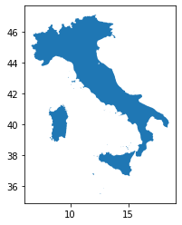
    


```python
italy.geometry.values[0]
```


    

    


### The fast way approach
USE RTree Index

using [str-packed-r-tree](https://shapely.readthedocs.io/en/stable/manual.html#str-packed-r-tree)


Shapely provides an interface to the query-only [GEOS](https://libgeos.org/) [R-tree](http://www-db.deis.unibo.it/courses/SI-LS/papers/Gut84.pdf) packed using the [Sort-Tile-Recursive algorithm](https://archive.org/details/nasa_techdoc_19970016975). Pass a list of geometry objects to the STRtree constructor to create a spatial index that you can query with another geometric object. Query-only means that once created, the STRtree is immutable. You cannot add or remove geometries.

R-trees are tree data structures used for spatial access methods, i.e., for indexing multi-dimensional information such as geographical coordinates, rectangles or polygons


**R-Tree**<br/>
Guttman, A. (1984). "R-Trees: A Dynamic Index Structure for Spatial Searching" (PDF). Proceedings of the 1984 ACM SIGMOD international conference on Management of data – SIGMOD '84. p. 47. doi:10.1145/602259.602266. ISBN 978-0897911283. S2CID 876601

**Sort-Tile-Recursive**<br/>
Leutenegger, Scott T.; Edgington, Jeffrey M.; Lopez, Mario A. (February 1997). "STR: A Simple and Efficient Algorithm for R-Tree Packing".


```python
from shapely.strtree import STRtree
```


```python
def checkInsideItaly(p,i):
  touch = len(STRtree([p]).query(i))
  if touch == 0:
    return False
  else:
    return True
```


```python
geo_stations['in_italy'] = geo_stations.geometry.apply(lambda g: checkInsideItaly(g,italy.geometry.values[0]))
%time 
```

    CPU times: user 4 µs, sys: 0 ns, total: 4 µs
    Wall time: 7.39 µs


```python
wrong_positions = geo_stations[geo_stations['in_italy'] == False]
```


```python
wrong_positions
```


<div>
<style scoped>
    .dataframe tbody tr th:only-of-type {
        vertical-align: middle;
    }

    .dataframe tbody tr th {
        vertical-align: top;
    }

    .dataframe thead th {
        text-align: right;
    }
</style>
<table border="1" class="dataframe">
  <thead>
    <tr style="text-align: right;">
      <th></th>
      <th>id</th>
      <th>manager</th>
      <th>company</th>
      <th>type</th>
      <th>name</th>
      <th>address</th>
      <th>city</th>
      <th>province</th>
      <th>latitude</th>
      <th>longitude</th>
      <th>geometry</th>
      <th>in_italy</th>
    </tr>
  </thead>
  <tbody>
    <tr>
      <th>11410</th>
      <td>52311</td>
      <td>PALMIGIANO CARBURANTI SAS DI PALMIGIANO MARIA ...</td>
      <td>Agip Eni</td>
      <td>Stradale</td>
      <td>eni Palmigiano Carburanti s.a.s.</td>
      <td>via nuova nola  80036</td>
      <td>PALMA CAMPANIA</td>
      <td>NaN</td>
      <td>2.24347</td>
      <td>16.409572</td>
      <td>POINT (16.40957 2.24347)</td>
      <td>False</td>
    </tr>
  </tbody>
</table>
</div>


#### The fastest ways


```python
points = list(geo_stations.geometry.values)
strtree = STRtree(points)
points_cross = strtree.query(italy.geometry.values[0])
d = {'geometry': points}
gdf_points = gpd.GeoDataFrame(d, crs="EPSG:4326")
d = {'geometry': points_cross}
gdf_points_cross = gpd.GeoDataFrame(d, crs="EPSG:4326")
point_to_exclude = pd.concat([gdf_points,gdf_points_cross]).drop_duplicates(keep=False)
%time
```

    CPU times: user 4 µs, sys: 0 ns, total: 4 µs
    Wall time: 6.44 µs


```python
wrong_position = geo_stations[geo_stations.geometry == point_to_exclude.geometry.values[0]]
```


```python
wrong_position
```


<div>
<style scoped>
    .dataframe tbody tr th:only-of-type {
        vertical-align: middle;
    }

    .dataframe tbody tr th {
        vertical-align: top;
    }

    .dataframe thead th {
        text-align: right;
    }
</style>
<table border="1" class="dataframe">
  <thead>
    <tr style="text-align: right;">
      <th></th>
      <th>id</th>
      <th>manager</th>
      <th>company</th>
      <th>type</th>
      <th>name</th>
      <th>address</th>
      <th>city</th>
      <th>province</th>
      <th>latitude</th>
      <th>longitude</th>
      <th>geometry</th>
      <th>in_italy</th>
    </tr>
  </thead>
  <tbody>
    <tr>
      <th>11410</th>
      <td>52311</td>
      <td>PALMIGIANO CARBURANTI SAS DI PALMIGIANO MARIA ...</td>
      <td>Agip Eni</td>
      <td>Stradale</td>
      <td>eni Palmigiano Carburanti s.a.s.</td>
      <td>via nuova nola  80036</td>
      <td>PALMA CAMPANIA</td>
      <td>NaN</td>
      <td>2.24347</td>
      <td>16.409572</td>
      <td>POINT (16.40957 2.24347)</td>
      <td>False</td>
    </tr>
  </tbody>
</table>
</div>


.. the slow version ...<br/>

uncomment this code, run ... and drink a big cup of coffee


```python
#geo_stations['in_italy'] = geo_stations.geometry.apply(lambda g: g.within(italy.geometry.values[0]))
#wrong_positions = geo_stations[geo_stations['in_italy'] == False]
#%time
```


```python
#wrong_position
```


```python
#stations_province_trento = geo_stations[geo_stations.within(italy.geometry.values[0])]
#%time
```


```python
geo_stations = geo_stations[geo_stations.geometry != point_to_exclude.geometry.values[0]]
```


```python
geo_stations.plot()
plt.show()
```


    

    


### count the total of the gas&oil stations for each muncipality of Trentino

On the GitHub repository of the course there are the geopackage files with the administrative limits of ISTAT [2019](https://github.com/napo/geospatial_course_unitn/raw/master/data/istat/istat_administrative_units_2020.gpkg) and [2022](https://github.com/napo/geospatial_course_unitn/raw/master/data/istat/istat_administrative_units_2022.gpkg) with generalized geometries

We download the data of both due the second issue of the exercise.  


```python
url2019 = 'https://github.com/napo/geospatial_course_unitn/raw/master/data/istat/istat_administrative_units_2019.gpkg'
url2022 = 'https://github.com/napo/geospatial_course_unitn/raw/master/data/istat/istat_administrative_units_2022.gpkg'
istat2019 = "istat_administrative_units_2019.gpkg"
istat2022 = "istat_administrative_units_2022.gpkg"
```


```python
r = requests.get(url2019, allow_redirects=True)
open(istat2019, 'wb').write(r.content)
```


    117116928


```python
r = requests.get(url2022, allow_redirects=True)
open(istat2022, 'wb').write(r.content)
```


    116932608


```python
import fiona
fiona.listlayers(istat2019)
```


    ['provincies', 'regions', 'macroregions', 'municipalities']


```python
fiona.listlayers(istat2022)
```


    ['provincies', 'regions', 'municipalities', 'macroregions']


```python
provincies2022 = gpd.read_file(istat2022,layer="provincies")
```


```python
provincies2022.head(3)
```


<div>
<style scoped>
    .dataframe tbody tr th:only-of-type {
        vertical-align: middle;
    }

    .dataframe tbody tr th {
        vertical-align: top;
    }

    .dataframe thead th {
        text-align: right;
    }
</style>
<table border="1" class="dataframe">
  <thead>
    <tr style="text-align: right;">
      <th></th>
      <th>COD_RIP</th>
      <th>COD_REG</th>
      <th>COD_PROV</th>
      <th>COD_CM</th>
      <th>COD_UTS</th>
      <th>DEN_PROV</th>
      <th>DEN_CM</th>
      <th>DEN_UTS</th>
      <th>SIGLA</th>
      <th>TIPO_UTS</th>
      <th>SHAPE_AREA</th>
      <th>Shape_Leng</th>
      <th>geometry</th>
    </tr>
  </thead>
  <tbody>
    <tr>
      <th>0</th>
      <td>1</td>
      <td>1</td>
      <td>1</td>
      <td>201</td>
      <td>201</td>
      <td>-</td>
      <td>Torino</td>
      <td>Torino</td>
      <td>TO</td>
      <td>Citta metropolitana</td>
      <td>6.826908e+09</td>
      <td>593389.667001</td>
      <td>MULTIPOLYGON (((411015.006 5049970.983, 411070...</td>
    </tr>
    <tr>
      <th>1</th>
      <td>1</td>
      <td>1</td>
      <td>2</td>
      <td>0</td>
      <td>2</td>
      <td>Vercelli</td>
      <td>-</td>
      <td>Vercelli</td>
      <td>VC</td>
      <td>Provincia</td>
      <td>2.081602e+09</td>
      <td>458754.449021</td>
      <td>MULTIPOLYGON (((437900.552 5088796.204, 437915...</td>
    </tr>
    <tr>
      <th>2</th>
      <td>1</td>
      <td>1</td>
      <td>3</td>
      <td>0</td>
      <td>3</td>
      <td>Novara</td>
      <td>-</td>
      <td>Novara</td>
      <td>NO</td>
      <td>Provincia</td>
      <td>1.340250e+09</td>
      <td>276722.284585</td>
      <td>MULTIPOLYGON (((459146.367 5079451.275, 459180...</td>
    </tr>
  </tbody>
</table>
</div>


```python
provincies2022.DEN_PROV.unique()
```


    array(['-', 'Vercelli', 'Novara', 'Cuneo', 'Asti', 'Alessandria', 'Aosta',
           'Imperia', 'Savona', 'La Spezia', 'Varese', 'Como', 'Sondrio',
           'Bergamo', 'Brescia', 'Pavia', 'Cremona', 'Mantova', 'Bolzano',
           'Trento', 'Verona', 'Vicenza', 'Belluno', 'Treviso', 'Padova',
           'Rovigo', 'Udine', 'Gorizia', 'Trieste', 'Piacenza', 'Parma',
           "Reggio nell'Emilia", 'Modena', 'Ferrara', 'Ravenna',
           "Forli'-Cesena", 'Pesaro e Urbino', 'Ancona', 'Macerata',
           'Ascoli Piceno', 'Massa Carrara', 'Lucca', 'Pistoia', 'Livorno',
           'Pisa', 'Arezzo', 'Siena', 'Grosseto', 'Perugia', 'Terni',
           'Viterbo', 'Rieti', 'Latina', 'Frosinone', 'Caserta', 'Benevento',
           'Avellino', 'Salerno', "L'Aquila", 'Teramo', 'Pescara', 'Chieti',
           'Campobasso', 'Foggia', 'Taranto', 'Brindisi', 'Lecce', 'Potenza',
           'Matera', 'Cosenza', 'Catanzaro', 'Trapani', 'Agrigento',
           'Caltanissetta', 'Enna', 'Ragusa', 'Siracusa', 'Sassari', 'Nuoro',
           'Pordenone', 'Isernia', 'Oristano', 'Biella', 'Lecco', 'Lodi',
           'Rimini', 'Prato', 'Crotone', 'Vibo Valentia',
           'Verbano-Cusio-Ossola', 'Monza e della Brianza', 'Fermo',
           'Barletta-Andria-Trani', 'Sud Sardegna'], dtype=object)


choose the province of Trento


```python
province_of_trento = provincies2022[provincies2022['DEN_PROV']=='Trento']
```


```python
province_of_trento.crs
```


    <Derived Projected CRS: EPSG:32632>
    Name: WGS 84 / UTM zone 32N
    Axis Info [cartesian]:
    - E[east]: Easting (metre)
    - N[north]: Northing (metre)
    Area of Use:
    - name: Between 6°E and 12°E, northern hemisphere between equator and 84°N, onshore and offshore. Algeria. Austria. Cameroon. Denmark. Equatorial Guinea. France. Gabon. Germany. Italy. Libya. Liechtenstein. Monaco. Netherlands. Niger. Nigeria. Norway. Sao Tome and Principe. Svalbard. Sweden. Switzerland. Tunisia. Vatican City State.
    - bounds: (6.0, 0.0, 12.0, 84.0)
    Coordinate Operation:
    - name: UTM zone 32N
    - method: Transverse Mercator
    Datum: World Geodetic System 1984 ensemble
    - Ellipsoid: WGS 84
    - Prime Meridian: Greenwich


```python
boundary_province_of_trento = province_of_trento.to_crs(epsg=4326).geometry.values[0]
```

### plot it


```python
boundary_province_of_trento
```


    
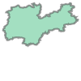
    


```python
stations_province_trento = geo_stations[geo_stations.within(boundary_province_of_trento)]
```


```python
stations_province_trento.plot()
plt.show()
```


    
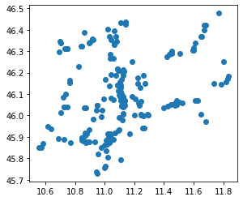
    


```python
stations_province_trento.shape[0]
```


    211


without spatial relationship 


```python
stations.province.unique()
```


    array([nan, 'AG', 'AL', 'AN', 'AO', 'AP', 'AQ', 'AR', 'AT', 'AV', 'BA',
           'BG', 'BI', 'BL', 'BN', 'BO', 'BR', 'BS', 'BT', 'BZ', 'CA', 'CB',
           'CE', 'CH', 'CI', 'CL', 'CN', 'CO', 'CR', 'CS', 'CT', 'CZ', 'EN',
           'FC', 'FE', 'FG', 'FI', 'FM', 'FR', 'GE', 'GO', 'GR', 'IM', 'IS',
           'KR', 'LC', 'LE', 'LI', 'LO', 'LT', 'LU', 'MB', 'MC', 'ME', 'MI',
           'MN', 'MO', 'MS', 'MT', 'NO', 'NU', 'OG', 'OR', 'OT', 'PA', 'PC',
           'PD', 'PE', 'PG', 'PI', 'PN', 'PO', 'PR', 'PT', 'PU', 'PV', 'PZ',
           'RA', 'RC', 'RE', 'RG', 'RI', 'RM', 'RN', 'RO', 'SA', 'SI', 'SO',
           'SP', 'SR', 'SS', 'SU', 'SV', 'TA', 'TE', 'TN', 'TO', 'TP', 'TR',
           'TS', 'TV', 'UD', 'VA', 'VB', 'VC', 'VE', 'VI', 'VR', 'VS', 'VT',
           'VV'], dtype=object)


```python
provincies2022[provincies2022['DEN_PROV']=='Trento']['SIGLA'].unique()
```


    array(['TN'], dtype=object)


```python
stations[stations['province']=='TN'].shape[0]
```


    211


```python
#municipalities2022 = gpd.read_file(urlmunicipalities2022, encoding='iso-8859-15')
municipalities2022 = gpd.read_file(istat2022,layer="municipalities")
```


```python
municipalities2022.head(3)
```


<div>
<style scoped>
    .dataframe tbody tr th:only-of-type {
        vertical-align: middle;
    }

    .dataframe tbody tr th {
        vertical-align: top;
    }

    .dataframe thead th {
        text-align: right;
    }
</style>
<table border="1" class="dataframe">
  <thead>
    <tr style="text-align: right;">
      <th></th>
      <th>COD_RIP</th>
      <th>COD_REG</th>
      <th>COD_PROV</th>
      <th>COD_CM</th>
      <th>COD_UTS</th>
      <th>PRO_COM</th>
      <th>PRO_COM_T</th>
      <th>COMUNE</th>
      <th>COMUNE_A</th>
      <th>CC_UTS</th>
      <th>Shape_Area</th>
      <th>Shape_Leng</th>
      <th>geometry</th>
    </tr>
  </thead>
  <tbody>
    <tr>
      <th>0</th>
      <td>1</td>
      <td>1</td>
      <td>1</td>
      <td>201</td>
      <td>201</td>
      <td>1077</td>
      <td>001077</td>
      <td>Chiaverano</td>
      <td>None</td>
      <td>0</td>
      <td>1.202212e+07</td>
      <td>18164.236621</td>
      <td>MULTIPOLYGON (((414358.390 5042001.044, 414381...</td>
    </tr>
    <tr>
      <th>1</th>
      <td>1</td>
      <td>1</td>
      <td>1</td>
      <td>201</td>
      <td>201</td>
      <td>1079</td>
      <td>001079</td>
      <td>Chiesanuova</td>
      <td>None</td>
      <td>0</td>
      <td>4.118911e+06</td>
      <td>10777.318814</td>
      <td>MULTIPOLYGON (((394621.039 5031581.116, 394716...</td>
    </tr>
    <tr>
      <th>2</th>
      <td>1</td>
      <td>1</td>
      <td>1</td>
      <td>201</td>
      <td>201</td>
      <td>1089</td>
      <td>001089</td>
      <td>Coazze</td>
      <td>None</td>
      <td>0</td>
      <td>5.657268e+07</td>
      <td>41591.122092</td>
      <td>MULTIPOLYGON (((364914.897 4993224.894, 364929...</td>
    </tr>
  </tbody>
</table>
</div>


```python
cod_prov_trento = provincies2022[provincies2022.DEN_PROV == 'Trento'].COD_PROV.values[0]
```


```python
municipalities_trentino_2022 = municipalities2022[municipalities2022.COD_PROV == cod_prov_trento]
```


```python
municipalities_trentino_2022.head(3)
```


<div>
<style scoped>
    .dataframe tbody tr th:only-of-type {
        vertical-align: middle;
    }

    .dataframe tbody tr th {
        vertical-align: top;
    }

    .dataframe thead th {
        text-align: right;
    }
</style>
<table border="1" class="dataframe">
  <thead>
    <tr style="text-align: right;">
      <th></th>
      <th>COD_RIP</th>
      <th>COD_REG</th>
      <th>COD_PROV</th>
      <th>COD_CM</th>
      <th>COD_UTS</th>
      <th>PRO_COM</th>
      <th>PRO_COM_T</th>
      <th>COMUNE</th>
      <th>COMUNE_A</th>
      <th>CC_UTS</th>
      <th>Shape_Area</th>
      <th>Shape_Leng</th>
      <th>geometry</th>
    </tr>
  </thead>
  <tbody>
    <tr>
      <th>113</th>
      <td>2</td>
      <td>4</td>
      <td>22</td>
      <td>0</td>
      <td>22</td>
      <td>22172</td>
      <td>022172</td>
      <td>Segonzano</td>
      <td>None</td>
      <td>0</td>
      <td>2.071212e+07</td>
      <td>21551.885438</td>
      <td>MULTIPOLYGON (((677853.445 5121202.433, 677866...</td>
    </tr>
    <tr>
      <th>114</th>
      <td>2</td>
      <td>4</td>
      <td>22</td>
      <td>0</td>
      <td>22</td>
      <td>22177</td>
      <td>022177</td>
      <td>Sover</td>
      <td>None</td>
      <td>0</td>
      <td>1.482203e+07</td>
      <td>18613.838987</td>
      <td>MULTIPOLYGON (((680005.555 5123944.912, 680049...</td>
    </tr>
    <tr>
      <th>115</th>
      <td>2</td>
      <td>4</td>
      <td>22</td>
      <td>0</td>
      <td>22</td>
      <td>22195</td>
      <td>022195</td>
      <td>Terzolas</td>
      <td>None</td>
      <td>0</td>
      <td>5.588756e+06</td>
      <td>15881.333074</td>
      <td>MULTIPOLYGON (((648742.270 5136116.640, 648747...</td>
    </tr>
  </tbody>
</table>
</div>


```python
province_of_trento = italy = municipalities_trentino_2022.dissolve(by='COD_PROV')
%time
```

    CPU times: user 4 µs, sys: 0 ns, total: 4 µs
    Wall time: 7.15 µs


```python
boundary_province_of_trento = province_of_trento.to_crs(epsg=4326).geometry.values[0]
```


```python
boundary_province_of_trento
```


    

    


```python
stations_province_trento = geo_stations[geo_stations.within(boundary_province_of_trento)]
```


```python
stations_province_trento.shape[0]
```


    211


the total is right ;)

and also the spatial relationship
<br/>now we can count the number of gas&oil stations for each municipality of Trentino

with the dataframe way


```python
stations_by_municipalities = stations_province_trento.groupby(['city']).size().reset_index().rename(columns={0:'total'}).sort_values(['total','city'],ascending=[False,True])
%time
```

    CPU times: user 7 µs, sys: 0 ns, total: 7 µs
    Wall time: 14.3 µs


```python
stations_by_municipalities = stations_province_trento.groupby(['city']).size().reset_index().rename(columns={0:'total'}).sort_values(['total','city'],ascending=[False,True])

```


```python
stations_by_municipalities
```


<div>
<style scoped>
    .dataframe tbody tr th:only-of-type {
        vertical-align: middle;
    }

    .dataframe tbody tr th {
        vertical-align: top;
    }

    .dataframe thead th {
        text-align: right;
    }
</style>
<table border="1" class="dataframe">
  <thead>
    <tr style="text-align: right;">
      <th></th>
      <th>city</th>
      <th>total</th>
    </tr>
  </thead>
  <tbody>
    <tr>
      <th>91</th>
      <td>TRENTO</td>
      <td>33</td>
    </tr>
    <tr>
      <th>75</th>
      <td>ROVERETO</td>
      <td>13</td>
    </tr>
    <tr>
      <th>65</th>
      <td>PERGINE VALSUGANA</td>
      <td>7</td>
    </tr>
    <tr>
      <th>3</th>
      <td>ARCO</td>
      <td>6</td>
    </tr>
    <tr>
      <th>47</th>
      <td>LAVIS</td>
      <td>6</td>
    </tr>
    <tr>
      <th>...</th>
      <td>...</td>
      <td>...</td>
    </tr>
    <tr>
      <th>96</th>
      <td>VIGOLO VATTARO</td>
      <td>1</td>
    </tr>
    <tr>
      <th>97</th>
      <td>VILLA AGNEDO</td>
      <td>1</td>
    </tr>
    <tr>
      <th>98</th>
      <td>VILLA LAGARINA</td>
      <td>1</td>
    </tr>
    <tr>
      <th>99</th>
      <td>VOLANO</td>
      <td>1</td>
    </tr>
    <tr>
      <th>100</th>
      <td>ZUCLO</td>
      <td>1</td>
    </tr>
  </tbody>
</table>
<p>101 rows × 2 columns</p>
</div>


but ... if the columns "city"  is not present?


```python
del stations_province_trento['city'] #delete the column city
```


```python
stations_province_trento.head(3)
```


<div>
<style scoped>
    .dataframe tbody tr th:only-of-type {
        vertical-align: middle;
    }

    .dataframe tbody tr th {
        vertical-align: top;
    }

    .dataframe thead th {
        text-align: right;
    }
</style>
<table border="1" class="dataframe">
  <thead>
    <tr style="text-align: right;">
      <th></th>
      <th>id</th>
      <th>manager</th>
      <th>company</th>
      <th>type</th>
      <th>name</th>
      <th>address</th>
      <th>province</th>
      <th>latitude</th>
      <th>longitude</th>
      <th>geometry</th>
      <th>in_italy</th>
    </tr>
  </thead>
  <tbody>
    <tr>
      <th>18538</th>
      <td>52336</td>
      <td>CR.VU. DI CRACIUN CRISTINA</td>
      <td>Agip Eni</td>
      <td>Stradale</td>
      <td>CR.VU</td>
      <td>CORSO PASSO BUOLE 1 38061</td>
      <td>TN</td>
      <td>45.763267</td>
      <td>11.006058</td>
      <td>POINT (11.00606 45.76327)</td>
      <td>True</td>
    </tr>
    <tr>
      <th>18539</th>
      <td>5169</td>
      <td>ESSO</td>
      <td>Esso</td>
      <td>Stradale</td>
      <td>ESSO</td>
      <td>STRADA STAT. 12 KM 342 SNC 38061, ALA (TN)  38061</td>
      <td>TN</td>
      <td>45.803566</td>
      <td>11.019186</td>
      <td>POINT (11.01919 45.80357)</td>
      <td>True</td>
    </tr>
    <tr>
      <th>18540</th>
      <td>7317</td>
      <td>FERRARI ATTILIO</td>
      <td>Pompe Bianche</td>
      <td>Stradale</td>
      <td>FERRARI ATTILIO</td>
      <td>CORSO VERONA 22 38061</td>
      <td>TN</td>
      <td>45.757343</td>
      <td>10.999531</td>
      <td>POINT (10.99953 45.75734)</td>
      <td>True</td>
    </tr>
  </tbody>
</table>
</div>


reconstruct the name of the city associated for each location


```python
def getNameCity(point,cities):
    name = cities[cities.to_crs(epsg=4326).contains(point)].COMUNE.values[0]
    return name
```


```python
stations_province_trento['city'] = stations_province_trento.geometry.apply(lambda point: getNameCity(point,municipalities_trentino_2022))
%time
```

    CPU times: user 3 µs, sys: 0 ns, total: 3 µs
    Wall time: 6.44 µs


```python
stations_province_trento.head(3)
```


<div>
<style scoped>
    .dataframe tbody tr th:only-of-type {
        vertical-align: middle;
    }

    .dataframe tbody tr th {
        vertical-align: top;
    }

    .dataframe thead th {
        text-align: right;
    }
</style>
<table border="1" class="dataframe">
  <thead>
    <tr style="text-align: right;">
      <th></th>
      <th>id</th>
      <th>manager</th>
      <th>company</th>
      <th>type</th>
      <th>name</th>
      <th>address</th>
      <th>province</th>
      <th>latitude</th>
      <th>longitude</th>
      <th>geometry</th>
      <th>in_italy</th>
      <th>city</th>
    </tr>
  </thead>
  <tbody>
    <tr>
      <th>18538</th>
      <td>52336</td>
      <td>CR.VU. DI CRACIUN CRISTINA</td>
      <td>Agip Eni</td>
      <td>Stradale</td>
      <td>CR.VU</td>
      <td>CORSO PASSO BUOLE 1 38061</td>
      <td>TN</td>
      <td>45.763267</td>
      <td>11.006058</td>
      <td>POINT (11.00606 45.76327)</td>
      <td>True</td>
      <td>Ala</td>
    </tr>
    <tr>
      <th>18539</th>
      <td>5169</td>
      <td>ESSO</td>
      <td>Esso</td>
      <td>Stradale</td>
      <td>ESSO</td>
      <td>STRADA STAT. 12 KM 342 SNC 38061, ALA (TN)  38061</td>
      <td>TN</td>
      <td>45.803566</td>
      <td>11.019186</td>
      <td>POINT (11.01919 45.80357)</td>
      <td>True</td>
      <td>Ala</td>
    </tr>
    <tr>
      <th>18540</th>
      <td>7317</td>
      <td>FERRARI ATTILIO</td>
      <td>Pompe Bianche</td>
      <td>Stradale</td>
      <td>FERRARI ATTILIO</td>
      <td>CORSO VERONA 22 38061</td>
      <td>TN</td>
      <td>45.757343</td>
      <td>10.999531</td>
      <td>POINT (10.99953 45.75734)</td>
      <td>True</td>
      <td>Ala</td>
    </tr>
  </tbody>
</table>
</div>


```python
stations_by_municipalities = stations_province_trento.groupby(['city']).size().reset_index().rename(columns={0:'total'}).sort_values(['total','city'],ascending=[False,True])

```


```python
stations_by_municipalities
```


<div>
<style scoped>
    .dataframe tbody tr th:only-of-type {
        vertical-align: middle;
    }

    .dataframe tbody tr th {
        vertical-align: top;
    }

    .dataframe thead th {
        text-align: right;
    }
</style>
<table border="1" class="dataframe">
  <thead>
    <tr style="text-align: right;">
      <th></th>
      <th>city</th>
      <th>total</th>
    </tr>
  </thead>
  <tbody>
    <tr>
      <th>87</th>
      <td>Trento</td>
      <td>32</td>
    </tr>
    <tr>
      <th>71</th>
      <td>Rovereto</td>
      <td>13</td>
    </tr>
    <tr>
      <th>43</th>
      <td>Lavis</td>
      <td>7</td>
    </tr>
    <tr>
      <th>61</th>
      <td>Pergine Valsugana</td>
      <td>7</td>
    </tr>
    <tr>
      <th>4</th>
      <td>Arco</td>
      <td>6</td>
    </tr>
    <tr>
      <th>...</th>
      <td>...</td>
      <td>...</td>
    </tr>
    <tr>
      <th>88</th>
      <td>Valdaone</td>
      <td>1</td>
    </tr>
    <tr>
      <th>89</th>
      <td>Vallarsa</td>
      <td>1</td>
    </tr>
    <tr>
      <th>91</th>
      <td>Vermiglio</td>
      <td>1</td>
    </tr>
    <tr>
      <th>92</th>
      <td>Villa Lagarina</td>
      <td>1</td>
    </tr>
    <tr>
      <th>94</th>
      <td>Volano</td>
      <td>1</td>
    </tr>
  </tbody>
</table>
<p>95 rows × 2 columns</p>
</div>


# 2 - identify the difference of municipalities in Trentino of year 2019 with year 2022


```python
municipalities2019 = gpd.read_file(istat2019,layer="municipalities")
```


```python
municipalities_trentino_2019 = municipalities2019[municipalities2019['COD_PROV'] == cod_prov_trento]
```


```python
names2019 = list(municipalities_trentino_2019.COMUNE.unique())
```


```python
names2022 = list(municipalities_trentino_2022.COMUNE.unique())
```


```python
notpresentin2022 = list(set(names2019) - set(names2022))
```

list of municipalities that were present in 2019


```python
notpresentin2022
```


    ['Malosco',
     'Romallo',
     'Carano',
     'Varena',
     'Cagnò',
     'Daiano',
     'Fondo',
     'Cloz',
     'Revò',
     'Faedo',
     'Brez',
     'Castelfondo']


```python
notpresentin2019 = list(set(names2022) - set(names2019))
```

list of the new municipalities in 2022


```python
notpresentin2019
```


    ["Borgo d'Anaunia", 'Ville di Fiemme', 'Novella']


```python
old_municipalities_2019 = municipalities_trentino_2019[municipalities_trentino_2019.COMUNE.isin(notpresentin2022)]
```


```python
old_municipalities_2019.plot()
plt.show()
```


    
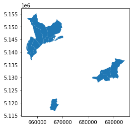
    


```python
old_municipalities_2019
```


<div>
<style scoped>
    .dataframe tbody tr th:only-of-type {
        vertical-align: middle;
    }

    .dataframe tbody tr th {
        vertical-align: top;
    }

    .dataframe thead th {
        text-align: right;
    }
</style>
<table border="1" class="dataframe">
  <thead>
    <tr style="text-align: right;">
      <th></th>
      <th>COD_RIP</th>
      <th>COD_REG</th>
      <th>COD_PROV</th>
      <th>COD_CM</th>
      <th>COD_UTS</th>
      <th>PRO_COM</th>
      <th>PRO_COM_T</th>
      <th>COMUNE</th>
      <th>COMUNE_A</th>
      <th>CC_UTS</th>
      <th>SHAPE_LENG</th>
      <th>SHAPE_AREA</th>
      <th>SHAPE_LEN</th>
      <th>geometry</th>
    </tr>
  </thead>
  <tbody>
    <tr>
      <th>724</th>
      <td>2</td>
      <td>4</td>
      <td>22</td>
      <td>0</td>
      <td>22</td>
      <td>22027</td>
      <td>022027</td>
      <td>Brez</td>
      <td>None</td>
      <td>0</td>
      <td>26280.588774</td>
      <td>1.916712e+07</td>
      <td>26280.400804</td>
      <td>MULTIPOLYGON (((658244.658 5151579.353, 658250...</td>
    </tr>
    <tr>
      <th>2168</th>
      <td>2</td>
      <td>4</td>
      <td>22</td>
      <td>0</td>
      <td>22</td>
      <td>22041</td>
      <td>022041</td>
      <td>Carano</td>
      <td>None</td>
      <td>0</td>
      <td>22704.690339</td>
      <td>1.357006e+07</td>
      <td>22704.527934</td>
      <td>MULTIPOLYGON (((685476.521 5132926.845, 685524...</td>
    </tr>
    <tr>
      <th>3247</th>
      <td>2</td>
      <td>4</td>
      <td>22</td>
      <td>0</td>
      <td>22</td>
      <td>22030</td>
      <td>022030</td>
      <td>Cagnò</td>
      <td>None</td>
      <td>0</td>
      <td>16888.878461</td>
      <td>3.407854e+06</td>
      <td>16888.757603</td>
      <td>MULTIPOLYGON (((657219.683 5144541.638, 657205...</td>
    </tr>
    <tr>
      <th>3343</th>
      <td>2</td>
      <td>4</td>
      <td>22</td>
      <td>0</td>
      <td>22</td>
      <td>22111</td>
      <td>022111</td>
      <td>Malosco</td>
      <td>None</td>
      <td>0</td>
      <td>23242.468818</td>
      <td>6.728356e+06</td>
      <td>23242.303282</td>
      <td>MULTIPOLYGON (((667424.906 5146341.256, 667423...</td>
    </tr>
    <tr>
      <th>3346</th>
      <td>2</td>
      <td>4</td>
      <td>22</td>
      <td>0</td>
      <td>22</td>
      <td>22070</td>
      <td>022070</td>
      <td>Daiano</td>
      <td>None</td>
      <td>0</td>
      <td>14916.892170</td>
      <td>9.510673e+06</td>
      <td>14916.785768</td>
      <td>MULTIPOLYGON (((688996.496 5133085.842, 688983...</td>
    </tr>
    <tr>
      <th>4269</th>
      <td>2</td>
      <td>4</td>
      <td>22</td>
      <td>0</td>
      <td>22</td>
      <td>22063</td>
      <td>022063</td>
      <td>Cloz</td>
      <td>None</td>
      <td>0</td>
      <td>13642.729963</td>
      <td>8.211168e+06</td>
      <td>13642.632958</td>
      <td>MULTIPOLYGON (((659208.764 5145192.728, 659220...</td>
    </tr>
    <tr>
      <th>4869</th>
      <td>2</td>
      <td>4</td>
      <td>22</td>
      <td>0</td>
      <td>22</td>
      <td>22154</td>
      <td>022154</td>
      <td>Romallo</td>
      <td>None</td>
      <td>0</td>
      <td>7687.685830</td>
      <td>2.444897e+06</td>
      <td>7687.631108</td>
      <td>MULTIPOLYGON (((659180.319 5141366.583, 659191...</td>
    </tr>
    <tr>
      <th>5142</th>
      <td>2</td>
      <td>4</td>
      <td>22</td>
      <td>0</td>
      <td>22</td>
      <td>22046</td>
      <td>022046</td>
      <td>Castelfondo</td>
      <td>None</td>
      <td>0</td>
      <td>31016.737999</td>
      <td>2.587157e+07</td>
      <td>31016.516642</td>
      <td>MULTIPOLYGON (((660043.059 5153438.578, 660045...</td>
    </tr>
    <tr>
      <th>5540</th>
      <td>2</td>
      <td>4</td>
      <td>22</td>
      <td>0</td>
      <td>22</td>
      <td>22152</td>
      <td>022152</td>
      <td>Revò</td>
      <td>None</td>
      <td>0</td>
      <td>24487.292355</td>
      <td>1.335782e+07</td>
      <td>24487.116841</td>
      <td>MULTIPOLYGON (((657885.646 5145988.024, 657936...</td>
    </tr>
    <tr>
      <th>5607</th>
      <td>2</td>
      <td>4</td>
      <td>22</td>
      <td>0</td>
      <td>22</td>
      <td>22211</td>
      <td>022211</td>
      <td>Varena</td>
      <td>None</td>
      <td>0</td>
      <td>25565.413219</td>
      <td>2.306859e+07</td>
      <td>25565.229395</td>
      <td>MULTIPOLYGON (((691744.479 5137215.811, 691809...</td>
    </tr>
    <tr>
      <th>5622</th>
      <td>2</td>
      <td>4</td>
      <td>22</td>
      <td>0</td>
      <td>22</td>
      <td>22088</td>
      <td>022088</td>
      <td>Fondo</td>
      <td>None</td>
      <td>0</td>
      <td>32412.749470</td>
      <td>3.062881e+07</td>
      <td>32412.517789</td>
      <td>MULTIPOLYGON (((668115.125 5152346.817, 668120...</td>
    </tr>
    <tr>
      <th>5652</th>
      <td>2</td>
      <td>4</td>
      <td>22</td>
      <td>0</td>
      <td>22</td>
      <td>22080</td>
      <td>022080</td>
      <td>Faedo</td>
      <td>None</td>
      <td>0</td>
      <td>16440.165284</td>
      <td>1.068038e+07</td>
      <td>16440.047652</td>
      <td>MULTIPOLYGON (((667690.769 5121538.436, 667726...</td>
    </tr>
  </tbody>
</table>
</div>


```python
new_municipalities_2022 = municipalities_trentino_2022[municipalities_trentino_2022.COMUNE.isin(notpresentin2019)]
```


```python
new_municipalities_2022.plot()
plt.show()
```


    

    


```python
new_municipalities_2022
```


<div>
<style scoped>
    .dataframe tbody tr th:only-of-type {
        vertical-align: middle;
    }

    .dataframe tbody tr th {
        vertical-align: top;
    }

    .dataframe thead th {
        text-align: right;
    }
</style>
<table border="1" class="dataframe">
  <thead>
    <tr style="text-align: right;">
      <th></th>
      <th>COD_RIP</th>
      <th>COD_REG</th>
      <th>COD_PROV</th>
      <th>COD_CM</th>
      <th>COD_UTS</th>
      <th>PRO_COM</th>
      <th>PRO_COM_T</th>
      <th>COMUNE</th>
      <th>COMUNE_A</th>
      <th>CC_UTS</th>
      <th>Shape_Area</th>
      <th>Shape_Leng</th>
      <th>geometry</th>
    </tr>
  </thead>
  <tbody>
    <tr>
      <th>7887</th>
      <td>2</td>
      <td>4</td>
      <td>22</td>
      <td>0</td>
      <td>22</td>
      <td>22252</td>
      <td>022252</td>
      <td>Borgo d'Anaunia</td>
      <td>None</td>
      <td>0</td>
      <td>6.322874e+07</td>
      <td>64924.029558</td>
      <td>MULTIPOLYGON (((660043.059 5153438.578, 660045...</td>
    </tr>
    <tr>
      <th>7889</th>
      <td>2</td>
      <td>4</td>
      <td>22</td>
      <td>0</td>
      <td>22</td>
      <td>22253</td>
      <td>022253</td>
      <td>Novella</td>
      <td>None</td>
      <td>0</td>
      <td>4.658886e+07</td>
      <td>44596.283777</td>
      <td>MULTIPOLYGON (((658244.658 5151579.353, 658250...</td>
    </tr>
    <tr>
      <th>7902</th>
      <td>2</td>
      <td>4</td>
      <td>22</td>
      <td>0</td>
      <td>22</td>
      <td>22254</td>
      <td>022254</td>
      <td>Ville di Fiemme</td>
      <td>None</td>
      <td>0</td>
      <td>4.614933e+07</td>
      <td>42004.727128</td>
      <td>MULTIPOLYGON (((692073.476 5137147.812, 692107...</td>
    </tr>
  </tbody>
</table>
</div>


##  identify which municipalities are created from aggregation to others


```python
def whereincluded(geometry, geometries_gdf):
    name = "not included"
    found = geometries_gdf[geometries_gdf.geometry.contains(geometry)]
    if len(found) > 0:
        name = found.COMUNE.values[0]
    return(name)
```


```python
old_municipalities_2019['included_in'] = old_municipalities_2019.geometry.apply(lambda g: whereincluded(g,new_municipalities_2022))
```


```python
old_municipalities_2019[['COMUNE','included_in']]
```


<div>
<style scoped>
    .dataframe tbody tr th:only-of-type {
        vertical-align: middle;
    }

    .dataframe tbody tr th {
        vertical-align: top;
    }

    .dataframe thead th {
        text-align: right;
    }
</style>
<table border="1" class="dataframe">
  <thead>
    <tr style="text-align: right;">
      <th></th>
      <th>COMUNE</th>
      <th>included_in</th>
    </tr>
  </thead>
  <tbody>
    <tr>
      <th>724</th>
      <td>Brez</td>
      <td>Novella</td>
    </tr>
    <tr>
      <th>2168</th>
      <td>Carano</td>
      <td>Ville di Fiemme</td>
    </tr>
    <tr>
      <th>3247</th>
      <td>Cagnò</td>
      <td>Novella</td>
    </tr>
    <tr>
      <th>3343</th>
      <td>Malosco</td>
      <td>Borgo d'Anaunia</td>
    </tr>
    <tr>
      <th>3346</th>
      <td>Daiano</td>
      <td>Ville di Fiemme</td>
    </tr>
    <tr>
      <th>4269</th>
      <td>Cloz</td>
      <td>Novella</td>
    </tr>
    <tr>
      <th>4869</th>
      <td>Romallo</td>
      <td>Novella</td>
    </tr>
    <tr>
      <th>5142</th>
      <td>Castelfondo</td>
      <td>Borgo d'Anaunia</td>
    </tr>
    <tr>
      <th>5540</th>
      <td>Revò</td>
      <td>Novella</td>
    </tr>
    <tr>
      <th>5607</th>
      <td>Varena</td>
      <td>Ville di Fiemme</td>
    </tr>
    <tr>
      <th>5622</th>
      <td>Fondo</td>
      <td>Borgo d'Anaunia</td>
    </tr>
    <tr>
      <th>5652</th>
      <td>Faedo</td>
      <td>not included</td>
    </tr>
  </tbody>
</table>
</div>


Where is "Faedo" ?


```python
faedo = old_municipalities_2019[old_municipalities_2019.COMUNE == 'Faedo']
```


```python
faedo
```


<div>
<style scoped>
    .dataframe tbody tr th:only-of-type {
        vertical-align: middle;
    }

    .dataframe tbody tr th {
        vertical-align: top;
    }

    .dataframe thead th {
        text-align: right;
    }
</style>
<table border="1" class="dataframe">
  <thead>
    <tr style="text-align: right;">
      <th></th>
      <th>COD_RIP</th>
      <th>COD_REG</th>
      <th>COD_PROV</th>
      <th>COD_CM</th>
      <th>COD_UTS</th>
      <th>PRO_COM</th>
      <th>PRO_COM_T</th>
      <th>COMUNE</th>
      <th>COMUNE_A</th>
      <th>CC_UTS</th>
      <th>SHAPE_LENG</th>
      <th>SHAPE_AREA</th>
      <th>SHAPE_LEN</th>
      <th>geometry</th>
      <th>included_in</th>
    </tr>
  </thead>
  <tbody>
    <tr>
      <th>5652</th>
      <td>2</td>
      <td>4</td>
      <td>22</td>
      <td>0</td>
      <td>22</td>
      <td>22080</td>
      <td>022080</td>
      <td>Faedo</td>
      <td>None</td>
      <td>0</td>
      <td>16440.165284</td>
      <td>1.068038e+07</td>
      <td>16440.047652</td>
      <td>MULTIPOLYGON (((667690.769 5121538.436, 667726...</td>
      <td>not included</td>
    </tr>
  </tbody>
</table>
</div>


```python
faedo_geometry = faedo.geometry.values[0]
```


```python
municipalities_trentino_2022[municipalities_trentino_2022.geometry.within(faedo_geometry)]
```


<div>
<style scoped>
    .dataframe tbody tr th:only-of-type {
        vertical-align: middle;
    }

    .dataframe tbody tr th {
        vertical-align: top;
    }

    .dataframe thead th {
        text-align: right;
    }
</style>
<table border="1" class="dataframe">
  <thead>
    <tr style="text-align: right;">
      <th></th>
      <th>COD_RIP</th>
      <th>COD_REG</th>
      <th>COD_PROV</th>
      <th>COD_CM</th>
      <th>COD_UTS</th>
      <th>PRO_COM</th>
      <th>PRO_COM_T</th>
      <th>COMUNE</th>
      <th>COMUNE_A</th>
      <th>CC_UTS</th>
      <th>Shape_Area</th>
      <th>Shape_Leng</th>
      <th>geometry</th>
    </tr>
  </thead>
  <tbody>
  </tbody>
</table>
</div>


```python
municipalities_trentino_2022[municipalities_trentino_2022.geometry.intersects(faedo_geometry)]
```


<div>
<style scoped>
    .dataframe tbody tr th:only-of-type {
        vertical-align: middle;
    }

    .dataframe tbody tr th {
        vertical-align: top;
    }

    .dataframe thead th {
        text-align: right;
    }
</style>
<table border="1" class="dataframe">
  <thead>
    <tr style="text-align: right;">
      <th></th>
      <th>COD_RIP</th>
      <th>COD_REG</th>
      <th>COD_PROV</th>
      <th>COD_CM</th>
      <th>COD_UTS</th>
      <th>PRO_COM</th>
      <th>PRO_COM_T</th>
      <th>COMUNE</th>
      <th>COMUNE_A</th>
      <th>CC_UTS</th>
      <th>Shape_Area</th>
      <th>Shape_Leng</th>
      <th>geometry</th>
    </tr>
  </thead>
  <tbody>
    <tr>
      <th>4002</th>
      <td>2</td>
      <td>4</td>
      <td>22</td>
      <td>0</td>
      <td>22</td>
      <td>22092</td>
      <td>022092</td>
      <td>Giovo</td>
      <td>None</td>
      <td>0</td>
      <td>2.081293e+07</td>
      <td>33094.134912</td>
      <td>MULTIPOLYGON (((668394.632 5121453.303, 668403...</td>
    </tr>
    <tr>
      <th>6310</th>
      <td>2</td>
      <td>4</td>
      <td>22</td>
      <td>0</td>
      <td>22</td>
      <td>22116</td>
      <td>022116</td>
      <td>Mezzocorona</td>
      <td>None</td>
      <td>0</td>
      <td>2.535304e+07</td>
      <td>29851.314722</td>
      <td>MULTIPOLYGON (((665540.410 5124920.912, 665610...</td>
    </tr>
    <tr>
      <th>7900</th>
      <td>2</td>
      <td>4</td>
      <td>22</td>
      <td>0</td>
      <td>22</td>
      <td>22167</td>
      <td>022167</td>
      <td>San Michele all'Adige</td>
      <td>None</td>
      <td>0</td>
      <td>1.599623e+07</td>
      <td>26368.864693</td>
      <td>MULTIPOLYGON (((667690.769 5121538.436, 667726...</td>
    </tr>
  </tbody>
</table>
</div>


```python
municipalities_trentino_2022[municipalities_trentino_2022.geometry.intersects(faedo_geometry.representative_point())]
```


<div>
<style scoped>
    .dataframe tbody tr th:only-of-type {
        vertical-align: middle;
    }

    .dataframe tbody tr th {
        vertical-align: top;
    }

    .dataframe thead th {
        text-align: right;
    }
</style>
<table border="1" class="dataframe">
  <thead>
    <tr style="text-align: right;">
      <th></th>
      <th>COD_RIP</th>
      <th>COD_REG</th>
      <th>COD_PROV</th>
      <th>COD_CM</th>
      <th>COD_UTS</th>
      <th>PRO_COM</th>
      <th>PRO_COM_T</th>
      <th>COMUNE</th>
      <th>COMUNE_A</th>
      <th>CC_UTS</th>
      <th>Shape_Area</th>
      <th>Shape_Leng</th>
      <th>geometry</th>
    </tr>
  </thead>
  <tbody>
    <tr>
      <th>7900</th>
      <td>2</td>
      <td>4</td>
      <td>22</td>
      <td>0</td>
      <td>22</td>
      <td>22167</td>
      <td>022167</td>
      <td>San Michele all'Adige</td>
      <td>None</td>
      <td>0</td>
      <td>1.599623e+07</td>
      <td>26368.864693</td>
      <td>MULTIPOLYGON (((667690.769 5121538.436, 667726...</td>
    </tr>
  </tbody>
</table>
</div>


```python
faedo_is_in = municipalities_trentino_2022[municipalities_trentino_2022.geometry.intersects(faedo_geometry.representative_point())]
```


```python
faedo_is_in
```


<div>
<style scoped>
    .dataframe tbody tr th:only-of-type {
        vertical-align: middle;
    }

    .dataframe tbody tr th {
        vertical-align: top;
    }

    .dataframe thead th {
        text-align: right;
    }
</style>
<table border="1" class="dataframe">
  <thead>
    <tr style="text-align: right;">
      <th></th>
      <th>COD_RIP</th>
      <th>COD_REG</th>
      <th>COD_PROV</th>
      <th>COD_CM</th>
      <th>COD_UTS</th>
      <th>PRO_COM</th>
      <th>PRO_COM_T</th>
      <th>COMUNE</th>
      <th>COMUNE_A</th>
      <th>CC_UTS</th>
      <th>Shape_Area</th>
      <th>Shape_Leng</th>
      <th>geometry</th>
    </tr>
  </thead>
  <tbody>
    <tr>
      <th>7900</th>
      <td>2</td>
      <td>4</td>
      <td>22</td>
      <td>0</td>
      <td>22</td>
      <td>22167</td>
      <td>022167</td>
      <td>San Michele all'Adige</td>
      <td>None</td>
      <td>0</td>
      <td>1.599623e+07</td>
      <td>26368.864693</td>
      <td>MULTIPOLYGON (((667690.769 5121538.436, 667726...</td>
    </tr>
  </tbody>
</table>
</div>


```python
faedo_new_municipality = faedo_is_in.COMUNE.values[0]
```


```python
faedo_new_municipality
```


    "San Michele all'Adige"


```python
list_changed_municipalities = old_municipalities_2019[old_municipalities_2019.included_in != 'not included']
```


```python
list_changed_municipalities = list(list_changed_municipalities.included_in.unique())
```


```python
list_changed_municipalities.append(faedo_new_municipality)
```


```python
list_changed_municipalities
```


    ['Novella', 'Ville di Fiemme', "Borgo d'Anaunia", "San Michele all'Adige"]


and we can do the same with the polygons


```python
new_municipalities_trentino_2022 = municipalities_trentino_2022[municipalities_trentino_2022.COMUNE.isin(list_changed_municipalities)]
```


```python
new_municipalities_trentino_2022.plot()
plt.show()
```


    
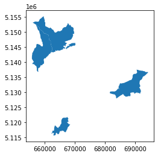
    


## find the biggest new municipality of Trentino and show all the italian municipalities with bordering it


```python
biggest_new_municipality_trentino = new_municipalities_trentino_2022[new_municipalities_trentino_2022.geometry.area == new_municipalities_trentino_2022.geometry.area.max()]
```


```python
biggest_new_municipality_trentino.plot()
plt.show()
```


    

    


```python
biggest_new_municipality_trentino
```


<div>
<style scoped>
    .dataframe tbody tr th:only-of-type {
        vertical-align: middle;
    }

    .dataframe tbody tr th {
        vertical-align: top;
    }

    .dataframe thead th {
        text-align: right;
    }
</style>
<table border="1" class="dataframe">
  <thead>
    <tr style="text-align: right;">
      <th></th>
      <th>COD_RIP</th>
      <th>COD_REG</th>
      <th>COD_PROV</th>
      <th>COD_CM</th>
      <th>COD_UTS</th>
      <th>PRO_COM</th>
      <th>PRO_COM_T</th>
      <th>COMUNE</th>
      <th>COMUNE_A</th>
      <th>CC_UTS</th>
      <th>Shape_Area</th>
      <th>Shape_Leng</th>
      <th>geometry</th>
    </tr>
  </thead>
  <tbody>
    <tr>
      <th>7887</th>
      <td>2</td>
      <td>4</td>
      <td>22</td>
      <td>0</td>
      <td>22</td>
      <td>22252</td>
      <td>022252</td>
      <td>Borgo d'Anaunia</td>
      <td>None</td>
      <td>0</td>
      <td>6.322874e+07</td>
      <td>64924.029558</td>
      <td>MULTIPOLYGON (((660043.059 5153438.578, 660045...</td>
    </tr>
  </tbody>
</table>
</div>


```python
boundary_borgo_anaunia = biggest_new_municipality_trentino.geometry.values[0]
```


```python
around_borgo_anaunia = municipalities2022[municipalities2022.touches(boundary_borgo_anaunia)]
```


```python
around_borgo_anaunia
```


<div>
<style scoped>
    .dataframe tbody tr th:only-of-type {
        vertical-align: middle;
    }

    .dataframe tbody tr th {
        vertical-align: top;
    }

    .dataframe thead th {
        text-align: right;
    }
</style>
<table border="1" class="dataframe">
  <thead>
    <tr style="text-align: right;">
      <th></th>
      <th>COD_RIP</th>
      <th>COD_REG</th>
      <th>COD_PROV</th>
      <th>COD_CM</th>
      <th>COD_UTS</th>
      <th>PRO_COM</th>
      <th>PRO_COM_T</th>
      <th>COMUNE</th>
      <th>COMUNE_A</th>
      <th>CC_UTS</th>
      <th>Shape_Area</th>
      <th>Shape_Leng</th>
      <th>geometry</th>
    </tr>
  </thead>
  <tbody>
    <tr>
      <th>2617</th>
      <td>2</td>
      <td>4</td>
      <td>21</td>
      <td>0</td>
      <td>21</td>
      <td>21043</td>
      <td>021043</td>
      <td>Lauregno</td>
      <td>Laurein</td>
      <td>0</td>
      <td>1.388482e+07</td>
      <td>23321.072254</td>
      <td>MULTIPOLYGON (((655860.135 5153156.388, 655884...</td>
    </tr>
    <tr>
      <th>3437</th>
      <td>2</td>
      <td>4</td>
      <td>21</td>
      <td>0</td>
      <td>21</td>
      <td>21084</td>
      <td>021084</td>
      <td>San Pancrazio</td>
      <td>St. Pankraz</td>
      <td>0</td>
      <td>6.317246e+07</td>
      <td>42883.848255</td>
      <td>MULTIPOLYGON (((659549.008 5165260.582, 659593...</td>
    </tr>
    <tr>
      <th>3615</th>
      <td>2</td>
      <td>4</td>
      <td>21</td>
      <td>0</td>
      <td>21</td>
      <td>21118</td>
      <td>021118</td>
      <td>Senale-San Felice</td>
      <td>Unsere Liebe Frau im Walde-St. Felix</td>
      <td>0</td>
      <td>2.763132e+07</td>
      <td>25151.845343</td>
      <td>MULTIPOLYGON (((660357.881 5155829.884, 660405...</td>
    </tr>
    <tr>
      <th>4603</th>
      <td>2</td>
      <td>4</td>
      <td>21</td>
      <td>0</td>
      <td>21</td>
      <td>21004</td>
      <td>021004</td>
      <td>Appiano sulla strada del vino</td>
      <td>Eppan an der Weinstraße</td>
      <td>0</td>
      <td>5.945015e+07</td>
      <td>49491.808002</td>
      <td>MULTIPOLYGON (((669345.871 5154254.383, 669361...</td>
    </tr>
    <tr>
      <th>5181</th>
      <td>2</td>
      <td>4</td>
      <td>22</td>
      <td>0</td>
      <td>22</td>
      <td>22170</td>
      <td>022170</td>
      <td>Sarnonico</td>
      <td>None</td>
      <td>0</td>
      <td>1.218983e+07</td>
      <td>46246.416637</td>
      <td>MULTIPOLYGON (((668419.900 5147274.750, 668412...</td>
    </tr>
    <tr>
      <th>5283</th>
      <td>2</td>
      <td>4</td>
      <td>22</td>
      <td>0</td>
      <td>22</td>
      <td>22159</td>
      <td>022159</td>
      <td>Ronzone</td>
      <td>None</td>
      <td>0</td>
      <td>5.297326e+06</td>
      <td>17188.159009</td>
      <td>MULTIPOLYGON (((670031.369 5149451.313, 670162...</td>
    </tr>
    <tr>
      <th>7889</th>
      <td>2</td>
      <td>4</td>
      <td>22</td>
      <td>0</td>
      <td>22</td>
      <td>22253</td>
      <td>022253</td>
      <td>Novella</td>
      <td>None</td>
      <td>0</td>
      <td>4.658886e+07</td>
      <td>44596.283777</td>
      <td>MULTIPOLYGON (((658244.658 5151579.353, 658250...</td>
    </tr>
  </tbody>
</table>
</div>


```python
around_borgo_anaunia.plot()
plt.show()
```


    
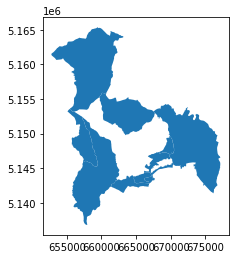
    


## create the macroarea of all the municipalities bordering with it


```python
new_area = around_borgo_anaunia.append(biggest_new_municipality_trentino).dissolve()
```

    /tmp/ipykernel_32044/1213046248.py:1: FutureWarning: The frame.append method is deprecated and will be removed from pandas in a future version. Use pandas.concat instead.
      new_area = around_borgo_anaunia.append(biggest_new_municipality_trentino).dissolve()


```python
new_area = new_area[['geometry']]
```


```python
new_area['name'] = "area of borgo d'anaunia and bordering municipalities"
```


```python
new_area.plot()
plt.show()
```


    

    


## for each gas&oil station in the macro-area, calculate how many monumental trees have been within a 500m radius

the dataset in GeoJSON of the italian monumental trees is created with the [code of the lesson 02](https://github.com/napo/geospatial_course_unitn/blob/master/code/lessons/02_Spatial_relationships_and_operations.ipynb)<br/>
You can find the dataset [here](https://github.com/napo/geospatial_course_unitn/raw/master/data/mipaaf/geo_monumental_trees_20020726.geojson)


```python
macroarea_geometry = new_area.to_crs(epsg=4326).geometry.values[0]
```


```python
stations_in_macroarea = geo_stations[geo_stations.within(macroarea_geometry)]
```


```python
monumental_trees = gpd.read_file('https://github.com/napo/geospatial_course_unitn/raw/master/data/mipaaf/geo_monumental_trees_20020726.geojson')
```


```python
monumental_trees_in_macroarea = monumental_trees[monumental_trees.within(macroarea_geometry)]
```


```python
def fivehundredfrom(point,points):
    present = False
    found = stations_in_macroarea[stations_in_macroarea.within(point)]
    if len(found) > 0:
        present = True
    return(present)
```


```python
monumental_trees_in_macroarea.to_crs(epsg=3263).geometry.buffer(500).apply(lambda point: fivehundredfrom(point,stations_in_macroarea.to_crs(epsg=32632)))
```


    297     False
    326     False
    3833    False
    dtype: bool


it's normal that a gas&oil station is far away from a monumental tree :)

# 3 - creates a polygon that contains all the monumental trees inside the area

## convex hull
solution: create a convex hull<br/>
*In geometry, the convex hull or convex envelope or convex closure of a shape is the smallest convex set that contains it. The convex hull may be defined either as the intersection of all convex sets containing a given subset of a Euclidean space, or equivalently as the set of all convex combinations of points in the subset. For a bounded subset of the plane, the convex hull may be visualized as the shape enclosed by a rubber band stretched around the subset.* (source: [wikipedia](https://en.wikipedia.org/wiki/Convex_hull))


```python
monumental_trees_in_macroarea.plot()
plt.show()
```


    
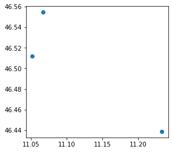
    


```python
area_of_monumental_trees_in_macroarea = monumental_trees_in_macroarea.unary_union.convex_hull
```


```python
area_of_monumental_trees_in_macroarea
```


    

    


## Concave Hull

Contrary to a convex hull, a concave hull can describe the shape of a point cloud. 

Convex hull<br/>

<br/><br/>
Concave hull<br/> 


### Alpha shapes

Alpha shapes are often used to generalize bounding polygons containing sets of points. The alpha parameter is defined as the value a, such that an edge of a disk of radius 1/a can be drawn between any two edge members of a set of points and still contain all the points. The convex hull, a shape resembling what you would see if you wrapped a rubber band around pegs at all the data points, is an alpha shape where the alpha parameter is equal to zero

[https://alphashape.readthedocs.io/](https://alphashape.readthedocs.io/)


```python
try:
  import alphashape
except ModuleNotFoundError as e:
  !pip install alphashape==1.3.1
  import alphashape
if alphashape.__version__ != "1.3.1":
  !pip install -U alphashape==1.3.1
  import alphashape
```


```python
 alpha_shape = alphashape.alphashape(monumental_trees_in_macroarea, 100)

```


```python
alpha_shape.plot()
plt.show()
```


    
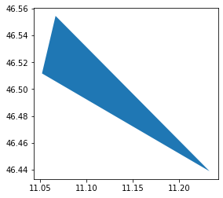
    


... we have only three points ... but if you want try with more ... 


```python
convex_hull_trento = gpd.GeoDataFrame(
    geometry=[stations_province_trento.geometry.unary_union.convex_hull], 
    columns=['geometry'],
    crs=stations_province_trento.crs)

convex_hull_trento.explore()
```


<div style="width:100%;"><div style="position:relative;width:100%;height:0;padding-bottom:60%;"><span style="color:#565656">Make this Notebook Trusted to load map: File -> Trust Notebook</span><iframe srcdoc="&lt;!DOCTYPE html&gt;
&lt;head&gt;    
    &lt;meta http-equiv=&quot;content-type&quot; content=&quot;text/html; charset=UTF-8&quot; /&gt;

        &lt;script&gt;
            L_NO_TOUCH = false;
            L_DISABLE_3D = false;
        &lt;/script&gt;

    &lt;style&gt;html, body {width: 100%;height: 100%;margin: 0;padding: 0;}&lt;/style&gt;
    &lt;style&gt;#map {position:absolute;top:0;bottom:0;right:0;left:0;}&lt;/style&gt;
    &lt;script src=&quot;https://cdn.jsdelivr.net/npm/leaflet@1.6.0/dist/leaflet.js&quot;&gt;&lt;/script&gt;
    &lt;script src=&quot;https://code.jquery.com/jquery-1.12.4.min.js&quot;&gt;&lt;/script&gt;
    &lt;script src=&quot;https://maxcdn.bootstrapcdn.com/bootstrap/3.2.0/js/bootstrap.min.js&quot;&gt;&lt;/script&gt;
    &lt;script src=&quot;https://cdnjs.cloudflare.com/ajax/libs/Leaflet.awesome-markers/2.0.2/leaflet.awesome-markers.js&quot;&gt;&lt;/script&gt;
    &lt;link rel=&quot;stylesheet&quot; href=&quot;https://cdn.jsdelivr.net/npm/leaflet@1.6.0/dist/leaflet.css&quot;/&gt;
    &lt;link rel=&quot;stylesheet&quot; href=&quot;https://maxcdn.bootstrapcdn.com/bootstrap/3.2.0/css/bootstrap.min.css&quot;/&gt;
    &lt;link rel=&quot;stylesheet&quot; href=&quot;https://maxcdn.bootstrapcdn.com/bootstrap/3.2.0/css/bootstrap-theme.min.css&quot;/&gt;
    &lt;link rel=&quot;stylesheet&quot; href=&quot;https://maxcdn.bootstrapcdn.com/font-awesome/4.6.3/css/font-awesome.min.css&quot;/&gt;
    &lt;link rel=&quot;stylesheet&quot; href=&quot;https://cdnjs.cloudflare.com/ajax/libs/Leaflet.awesome-markers/2.0.2/leaflet.awesome-markers.css&quot;/&gt;
    &lt;link rel=&quot;stylesheet&quot; href=&quot;https://cdn.jsdelivr.net/gh/python-visualization/folium/folium/templates/leaflet.awesome.rotate.min.css&quot;/&gt;

            &lt;meta name=&quot;viewport&quot; content=&quot;width=device-width,
                initial-scale=1.0, maximum-scale=1.0, user-scalable=no&quot; /&gt;
            &lt;style&gt;
                #map_f41532e52558798cdb48d688f6bc6bf8 {
                    position: relative;
                    width: 100.0%;
                    height: 100.0%;
                    left: 0.0%;
                    top: 0.0%;
                }
            &lt;/style&gt;


                    &lt;style&gt;
                        .foliumtooltip {

                        }
                       .foliumtooltip table{
                            margin: auto;
                        }
                        .foliumtooltip tr{
                            text-align: left;
                        }
                        .foliumtooltip th{
                            padding: 2px; padding-right: 8px;
                        }
                    &lt;/style&gt;

&lt;/head&gt;
&lt;body&gt;    

            &lt;div class=&quot;folium-map&quot; id=&quot;map_f41532e52558798cdb48d688f6bc6bf8&quot; &gt;&lt;/div&gt;

&lt;/body&gt;
&lt;script&gt;    

            var map_f41532e52558798cdb48d688f6bc6bf8 = L.map(
                &quot;map_f41532e52558798cdb48d688f6bc6bf8&quot;,
                {
                    center: [46.103392368796364, 11.19470859551825],
                    crs: L.CRS.EPSG3857,
                    zoom: 10,
                    zoomControl: true,
                    preferCanvas: false,
                }
            );
            L.control.scale().addTo(map_f41532e52558798cdb48d688f6bc6bf8);


            var tile_layer_08f2a8c61127c7e955090a82c3bffa80 = L.tileLayer(
                &quot;https://{s}.tile.openstreetmap.org/{z}/{x}/{y}.png&quot;,
                {&quot;attribution&quot;: &quot;Data by \u0026copy; \u003ca href=\&quot;http://openstreetmap.org\&quot;\u003eOpenStreetMap\u003c/a\u003e, under \u003ca href=\&quot;http://www.openstreetmap.org/copyright\&quot;\u003eODbL\u003c/a\u003e.&quot;, &quot;detectRetina&quot;: false, &quot;maxNativeZoom&quot;: 18, &quot;maxZoom&quot;: 18, &quot;minZoom&quot;: 0, &quot;noWrap&quot;: false, &quot;opacity&quot;: 1, &quot;subdomains&quot;: &quot;abc&quot;, &quot;tms&quot;: false}
            ).addTo(map_f41532e52558798cdb48d688f6bc6bf8);


            map_f41532e52558798cdb48d688f6bc6bf8.fitBounds(
                [[45.7294670402226, 10.557739795506222], [46.477317697370125, 11.831677395530278]],
                {}
            );


        function geo_json_d2aa0fb0f17cc420a0d62bfe5c13f030_styler(feature) {
            switch(feature.id) {
                default:
                    return {&quot;fillOpacity&quot;: 0.5, &quot;weight&quot;: 2};
            }
        }
        function geo_json_d2aa0fb0f17cc420a0d62bfe5c13f030_highlighter(feature) {
            switch(feature.id) {
                default:
                    return {&quot;fillOpacity&quot;: 0.75};
            }
        }
        function geo_json_d2aa0fb0f17cc420a0d62bfe5c13f030_pointToLayer(feature, latlng) {
            var opts = {&quot;bubblingMouseEvents&quot;: true, &quot;color&quot;: &quot;#3388ff&quot;, &quot;dashArray&quot;: null, &quot;dashOffset&quot;: null, &quot;fill&quot;: true, &quot;fillColor&quot;: &quot;#3388ff&quot;, &quot;fillOpacity&quot;: 0.2, &quot;fillRule&quot;: &quot;evenodd&quot;, &quot;lineCap&quot;: &quot;round&quot;, &quot;lineJoin&quot;: &quot;round&quot;, &quot;opacity&quot;: 1.0, &quot;radius&quot;: 2, &quot;stroke&quot;: true, &quot;weight&quot;: 3};

            let style = geo_json_d2aa0fb0f17cc420a0d62bfe5c13f030_styler(feature)
            Object.assign(opts, style)

            return new L.CircleMarker(latlng, opts)
        }

        function geo_json_d2aa0fb0f17cc420a0d62bfe5c13f030_onEachFeature(feature, layer) {
            layer.on({
                mouseout: function(e) {
                    if(typeof e.target.setStyle === &quot;function&quot;){
                        geo_json_d2aa0fb0f17cc420a0d62bfe5c13f030.resetStyle(e.target);
                    }
                },
                mouseover: function(e) {
                    if(typeof e.target.setStyle === &quot;function&quot;){
                        const highlightStyle = geo_json_d2aa0fb0f17cc420a0d62bfe5c13f030_highlighter(e.target.feature)
                        e.target.setStyle(highlightStyle);
                    }
                },
            });
        };
        var geo_json_d2aa0fb0f17cc420a0d62bfe5c13f030 = L.geoJson(null, {
                onEachFeature: geo_json_d2aa0fb0f17cc420a0d62bfe5c13f030_onEachFeature,

                style: geo_json_d2aa0fb0f17cc420a0d62bfe5c13f030_styler,
                pointToLayer: geo_json_d2aa0fb0f17cc420a0d62bfe5c13f030_pointToLayer
        });

        function geo_json_d2aa0fb0f17cc420a0d62bfe5c13f030_add (data) {
            geo_json_d2aa0fb0f17cc420a0d62bfe5c13f030
                .addData(data)
                .addTo(map_f41532e52558798cdb48d688f6bc6bf8);
        }
            geo_json_d2aa0fb0f17cc420a0d62bfe5c13f030_add({&quot;bbox&quot;: [10.557739795506222, 45.7294670402226, 11.831677395530278, 46.477317697370125], &quot;features&quot;: [{&quot;bbox&quot;: [10.557739795506222, 45.7294670402226, 11.831677395530278, 46.477317697370125], &quot;geometry&quot;: {&quot;coordinates&quot;: [[[10.949904397130013, 45.7294670402226], [10.557739795506222, 45.84853796489344], [10.700805634260178, 46.34422027702561], [10.86176097393036, 46.3884558298869], [11.107855426270817, 46.431569297246405], [11.13989566885573, 46.436768195703145], [11.769166371886968, 46.477317697370125], [11.831677395530278, 46.18195120848977], [11.826372101732431, 46.17252206614956], [11.815415193447734, 46.15675482619368], [11.682866057334536, 45.97252209587229], [10.949904397130013, 45.7294670402226]]], &quot;type&quot;: &quot;Polygon&quot;}, &quot;id&quot;: &quot;0&quot;, &quot;properties&quot;: {}, &quot;type&quot;: &quot;Feature&quot;}], &quot;type&quot;: &quot;FeatureCollection&quot;});


    geo_json_d2aa0fb0f17cc420a0d62bfe5c13f030.bindTooltip(
    function(layer){
    let div = L.DomUtil.create(&#x27;div&#x27;);

    return div
    }
    ,{&quot;className&quot;: &quot;foliumtooltip&quot;, &quot;sticky&quot;: true});

&lt;/script&gt;" style="position:absolute;width:100%;height:100%;left:0;top:0;border:none !important;" allowfullscreen webkitallowfullscreen mozallowfullscreen></iframe></div></div>


```python
stations_province_trento.explore()
```


<div style="width:100%;"><div style="position:relative;width:100%;height:0;padding-bottom:60%;"><span style="color:#565656">Make this Notebook Trusted to load map: File -> Trust Notebook</span><iframe srcdoc="&lt;!DOCTYPE html&gt;
&lt;head&gt;    
    &lt;meta http-equiv=&quot;content-type&quot; content=&quot;text/html; charset=UTF-8&quot; /&gt;

        &lt;script&gt;
            L_NO_TOUCH = false;
            L_DISABLE_3D = false;
        &lt;/script&gt;

    &lt;style&gt;html, body {width: 100%;height: 100%;margin: 0;padding: 0;}&lt;/style&gt;
    &lt;style&gt;#map {position:absolute;top:0;bottom:0;right:0;left:0;}&lt;/style&gt;
    &lt;script src=&quot;https://cdn.jsdelivr.net/npm/leaflet@1.6.0/dist/leaflet.js&quot;&gt;&lt;/script&gt;
    &lt;script src=&quot;https://code.jquery.com/jquery-1.12.4.min.js&quot;&gt;&lt;/script&gt;
    &lt;script src=&quot;https://maxcdn.bootstrapcdn.com/bootstrap/3.2.0/js/bootstrap.min.js&quot;&gt;&lt;/script&gt;
    &lt;script src=&quot;https://cdnjs.cloudflare.com/ajax/libs/Leaflet.awesome-markers/2.0.2/leaflet.awesome-markers.js&quot;&gt;&lt;/script&gt;
    &lt;link rel=&quot;stylesheet&quot; href=&quot;https://cdn.jsdelivr.net/npm/leaflet@1.6.0/dist/leaflet.css&quot;/&gt;
    &lt;link rel=&quot;stylesheet&quot; href=&quot;https://maxcdn.bootstrapcdn.com/bootstrap/3.2.0/css/bootstrap.min.css&quot;/&gt;
    &lt;link rel=&quot;stylesheet&quot; href=&quot;https://maxcdn.bootstrapcdn.com/bootstrap/3.2.0/css/bootstrap-theme.min.css&quot;/&gt;
    &lt;link rel=&quot;stylesheet&quot; href=&quot;https://maxcdn.bootstrapcdn.com/font-awesome/4.6.3/css/font-awesome.min.css&quot;/&gt;
    &lt;link rel=&quot;stylesheet&quot; href=&quot;https://cdnjs.cloudflare.com/ajax/libs/Leaflet.awesome-markers/2.0.2/leaflet.awesome-markers.css&quot;/&gt;
    &lt;link rel=&quot;stylesheet&quot; href=&quot;https://cdn.jsdelivr.net/gh/python-visualization/folium/folium/templates/leaflet.awesome.rotate.min.css&quot;/&gt;

            &lt;meta name=&quot;viewport&quot; content=&quot;width=device-width,
                initial-scale=1.0, maximum-scale=1.0, user-scalable=no&quot; /&gt;
            &lt;style&gt;
                #map_0917b8c038ab154c4dae2969c0f09faa {
                    position: relative;
                    width: 100.0%;
                    height: 100.0%;
                    left: 0.0%;
                    top: 0.0%;
                }
            &lt;/style&gt;


                    &lt;style&gt;
                        .foliumtooltip {

                        }
                       .foliumtooltip table{
                            margin: auto;
                        }
                        .foliumtooltip tr{
                            text-align: left;
                        }
                        .foliumtooltip th{
                            padding: 2px; padding-right: 8px;
                        }
                    &lt;/style&gt;

&lt;/head&gt;
&lt;body&gt;    

            &lt;div class=&quot;folium-map&quot; id=&quot;map_0917b8c038ab154c4dae2969c0f09faa&quot; &gt;&lt;/div&gt;

&lt;/body&gt;
&lt;script&gt;    

            var map_0917b8c038ab154c4dae2969c0f09faa = L.map(
                &quot;map_0917b8c038ab154c4dae2969c0f09faa&quot;,
                {
                    center: [46.103392368796364, 11.19470859551825],
                    crs: L.CRS.EPSG3857,
                    zoom: 10,
                    zoomControl: true,
                    preferCanvas: false,
                }
            );
            L.control.scale().addTo(map_0917b8c038ab154c4dae2969c0f09faa);


            var tile_layer_fc3c78eee2ea123f5b022fcb21a95c7e = L.tileLayer(
                &quot;https://{s}.tile.openstreetmap.org/{z}/{x}/{y}.png&quot;,
                {&quot;attribution&quot;: &quot;Data by \u0026copy; \u003ca href=\&quot;http://openstreetmap.org\&quot;\u003eOpenStreetMap\u003c/a\u003e, under \u003ca href=\&quot;http://www.openstreetmap.org/copyright\&quot;\u003eODbL\u003c/a\u003e.&quot;, &quot;detectRetina&quot;: false, &quot;maxNativeZoom&quot;: 18, &quot;maxZoom&quot;: 18, &quot;minZoom&quot;: 0, &quot;noWrap&quot;: false, &quot;opacity&quot;: 1, &quot;subdomains&quot;: &quot;abc&quot;, &quot;tms&quot;: false}
            ).addTo(map_0917b8c038ab154c4dae2969c0f09faa);


            map_0917b8c038ab154c4dae2969c0f09faa.fitBounds(
                [[45.7294670402226, 10.557739795506222], [46.477317697370125, 11.831677395530278]],
                {}
            );


        function geo_json_225dd5658e39b89269c06cf21a79453d_styler(feature) {
            switch(feature.id) {
                default:
                    return {&quot;fillOpacity&quot;: 0.5, &quot;weight&quot;: 2};
            }
        }
        function geo_json_225dd5658e39b89269c06cf21a79453d_highlighter(feature) {
            switch(feature.id) {
                default:
                    return {&quot;fillOpacity&quot;: 0.75};
            }
        }
        function geo_json_225dd5658e39b89269c06cf21a79453d_pointToLayer(feature, latlng) {
            var opts = {&quot;bubblingMouseEvents&quot;: true, &quot;color&quot;: &quot;#3388ff&quot;, &quot;dashArray&quot;: null, &quot;dashOffset&quot;: null, &quot;fill&quot;: true, &quot;fillColor&quot;: &quot;#3388ff&quot;, &quot;fillOpacity&quot;: 0.2, &quot;fillRule&quot;: &quot;evenodd&quot;, &quot;lineCap&quot;: &quot;round&quot;, &quot;lineJoin&quot;: &quot;round&quot;, &quot;opacity&quot;: 1.0, &quot;radius&quot;: 2, &quot;stroke&quot;: true, &quot;weight&quot;: 3};

            let style = geo_json_225dd5658e39b89269c06cf21a79453d_styler(feature)
            Object.assign(opts, style)

            return new L.CircleMarker(latlng, opts)
        }

        function geo_json_225dd5658e39b89269c06cf21a79453d_onEachFeature(feature, layer) {
            layer.on({
                mouseout: function(e) {
                    if(typeof e.target.setStyle === &quot;function&quot;){
                        geo_json_225dd5658e39b89269c06cf21a79453d.resetStyle(e.target);
                    }
                },
                mouseover: function(e) {
                    if(typeof e.target.setStyle === &quot;function&quot;){
                        const highlightStyle = geo_json_225dd5658e39b89269c06cf21a79453d_highlighter(e.target.feature)
                        e.target.setStyle(highlightStyle);
                    }
                },
            });
        };
        var geo_json_225dd5658e39b89269c06cf21a79453d = L.geoJson(null, {
                onEachFeature: geo_json_225dd5658e39b89269c06cf21a79453d_onEachFeature,

                style: geo_json_225dd5658e39b89269c06cf21a79453d_styler,
                pointToLayer: geo_json_225dd5658e39b89269c06cf21a79453d_pointToLayer
        });

        function geo_json_225dd5658e39b89269c06cf21a79453d_add (data) {
            geo_json_225dd5658e39b89269c06cf21a79453d
                .addData(data)
                .addTo(map_0917b8c038ab154c4dae2969c0f09faa);
        }
            geo_json_225dd5658e39b89269c06cf21a79453d_add({&quot;bbox&quot;: [10.557739795506222, 45.7294670402226, 11.831677395530278, 46.477317697370125], &quot;features&quot;: [{&quot;bbox&quot;: [11.006057626270897, 45.76326737978594, 11.006057626270897, 45.76326737978594], &quot;geometry&quot;: {&quot;coordinates&quot;: [11.006057626270897, 45.76326737978594], &quot;type&quot;: &quot;Point&quot;}, &quot;id&quot;: &quot;18538&quot;, &quot;properties&quot;: {&quot;address&quot;: &quot;CORSO PASSO BUOLE 1 38061&quot;, &quot;city&quot;: &quot;Ala&quot;, &quot;company&quot;: &quot;Agip Eni&quot;, &quot;id&quot;: 52336, &quot;in_italy&quot;: true, &quot;latitude&quot;: 45.76326737978594, &quot;longitude&quot;: 11.006057626270897, &quot;manager&quot;: &quot;CR.VU. DI CRACIUN CRISTINA&quot;, &quot;name&quot;: &quot;CR.VU&quot;, &quot;province&quot;: &quot;TN&quot;, &quot;type&quot;: &quot;Stradale&quot;}, &quot;type&quot;: &quot;Feature&quot;}, {&quot;bbox&quot;: [11.01918564812263, 45.80356589892416, 11.01918564812263, 45.80356589892416], &quot;geometry&quot;: {&quot;coordinates&quot;: [11.01918564812263, 45.80356589892416], &quot;type&quot;: &quot;Point&quot;}, &quot;id&quot;: &quot;18539&quot;, &quot;properties&quot;: {&quot;address&quot;: &quot;STRADA STAT. 12 KM 342 SNC 38061, ALA (TN)  38061&quot;, &quot;city&quot;: &quot;Ala&quot;, &quot;company&quot;: &quot;Esso&quot;, &quot;id&quot;: 5169, &quot;in_italy&quot;: true, &quot;latitude&quot;: 45.80356589892416, &quot;longitude&quot;: 11.01918564812263, &quot;manager&quot;: &quot;ESSO&quot;, &quot;name&quot;: &quot;ESSO&quot;, &quot;province&quot;: &quot;TN&quot;, &quot;type&quot;: &quot;Stradale&quot;}, &quot;type&quot;: &quot;Feature&quot;}, {&quot;bbox&quot;: [10.99953068378852, 45.75734319613885, 10.99953068378852, 45.75734319613885], &quot;geometry&quot;: {&quot;coordinates&quot;: [10.99953068378852, 45.75734319613885], &quot;type&quot;: &quot;Point&quot;}, &quot;id&quot;: &quot;18540&quot;, &quot;properties&quot;: {&quot;address&quot;: &quot;CORSO VERONA 22 38061&quot;, &quot;city&quot;: &quot;Ala&quot;, &quot;company&quot;: &quot;Pompe Bianche&quot;, &quot;id&quot;: 7317, &quot;in_italy&quot;: true, &quot;latitude&quot;: 45.75734319613885, &quot;longitude&quot;: 10.99953068378852, &quot;manager&quot;: &quot;FERRARI ATTILIO&quot;, &quot;name&quot;: &quot;FERRARI ATTILIO&quot;, &quot;province&quot;: &quot;TN&quot;, &quot;type&quot;: &quot;Stradale&quot;}, &quot;type&quot;: &quot;Feature&quot;}, {&quot;bbox&quot;: [11.097396921038126, 45.98928817452016, 11.097396921038126, 45.98928817452016], &quot;geometry&quot;: {&quot;coordinates&quot;: [11.097396921038126, 45.98928817452016], &quot;type&quot;: &quot;Point&quot;}, &quot;id&quot;: &quot;18541&quot;, &quot;properties&quot;: {&quot;address&quot;: &quot;STRADA PROVINCIALE 90 DESTRA ADIGE KM. 18 + 150 .  38060&quot;, &quot;city&quot;: &quot;Aldeno&quot;, &quot;company&quot;: &quot;Agip Eni&quot;, &quot;id&quot;: 23796, &quot;in_italy&quot;: true, &quot;latitude&quot;: 45.98928817452016, &quot;longitude&quot;: 11.097396921038126, &quot;manager&quot;: &quot;ENI-AGIP&quot;, &quot;name&quot;: &quot;ENI-AGIP&quot;, &quot;province&quot;: &quot;TN&quot;, &quot;type&quot;: &quot;Stradale&quot;}, &quot;type&quot;: &quot;Feature&quot;}, {&quot;bbox&quot;: [11.004443764686584, 46.167787302193055, 11.004443764686584, 46.167787302193055], &quot;geometry&quot;: {&quot;coordinates&quot;: [11.004443764686584, 46.167787302193055], &quot;type&quot;: &quot;Point&quot;}, &quot;id&quot;: &quot;18542&quot;, &quot;properties&quot;: {&quot;address&quot;: &quot;Statale 421 dei Laghi di Molveno e Tenno, Km. 14, dir. ANDALO - 38010&quot;, &quot;city&quot;: &quot;Andalo&quot;, &quot;company&quot;: &quot;Agip Eni&quot;, &quot;id&quot;: 24183, &quot;in_italy&quot;: true, &quot;latitude&quot;: 46.167787302193055, &quot;longitude&quot;: 11.004443764686584, &quot;manager&quot;: &quot;GHEZZI LORENZO&quot;, &quot;name&quot;: &quot;STAZIONE SERVIZIO ENI GHEZZI LORENZO&quot;, &quot;province&quot;: &quot;TN&quot;, &quot;type&quot;: &quot;Stradale&quot;}, &quot;type&quot;: &quot;Feature&quot;}, {&quot;bbox&quot;: [10.866300000000024, 45.90630746548659, 10.866300000000024, 45.90630746548659], &quot;geometry&quot;: {&quot;coordinates&quot;: [10.866300000000024, 45.90630746548659], &quot;type&quot;: &quot;Point&quot;}, &quot;id&quot;: &quot;18543&quot;, &quot;properties&quot;: {&quot;address&quot;: &quot;VIA CATERINA 87 38062&quot;, &quot;city&quot;: &quot;Arco&quot;, &quot;company&quot;: &quot;Api-Ip&quot;, &quot;id&quot;: 31086, &quot;in_italy&quot;: true, &quot;latitude&quot;: 45.90630746548659, &quot;longitude&quot;: 10.866300000000024, &quot;manager&quot;: &quot;IP SERVICES S.R.L.&quot;, &quot;name&quot;: &quot;ARCO - SANTA CATERINA 87&quot;, &quot;province&quot;: &quot;TN&quot;, &quot;type&quot;: &quot;Stradale&quot;}, &quot;type&quot;: &quot;Feature&quot;}, {&quot;bbox&quot;: [10.879139006137848, 45.916042780241, 10.879139006137848, 45.916042780241], &quot;geometry&quot;: {&quot;coordinates&quot;: [10.879139006137848, 45.916042780241], &quot;type&quot;: &quot;Point&quot;}, &quot;id&quot;: &quot;18544&quot;, &quot;properties&quot;: {&quot;address&quot;: &quot;S. CATERINA 10 38062&quot;, &quot;city&quot;: &quot;Arco&quot;, &quot;company&quot;: &quot;Costantin&quot;, &quot;id&quot;: 53908, &quot;in_italy&quot;: true, &quot;latitude&quot;: 45.916042780241, &quot;longitude&quot;: 10.879139006137848, &quot;manager&quot;: &quot;MEHDI MUHAMMAD ZAMAN&quot;, &quot;name&quot;: &quot;COSTANTIN&quot;, &quot;province&quot;: &quot;TN&quot;, &quot;type&quot;: &quot;Stradale&quot;}, &quot;type&quot;: &quot;Feature&quot;}, {&quot;bbox&quot;: [10.871277451515198, 45.87599852223023, 10.871277451515198, 45.87599852223023], &quot;geometry&quot;: {&quot;coordinates&quot;: [10.871277451515198, 45.87599852223023], &quot;type&quot;: &quot;Point&quot;}, &quot;id&quot;: &quot;18545&quot;, &quot;properties&quot;: {&quot;address&quot;: &quot;GARDESANA 2 38062&quot;, &quot;city&quot;: &quot;Arco&quot;, &quot;company&quot;: &quot;Esso&quot;, &quot;id&quot;: 38292, &quot;in_italy&quot;: true, &quot;latitude&quot;: 45.87599852223023, &quot;longitude&quot;: 10.871277451515198, &quot;manager&quot;: &quot;ESSO&quot;, &quot;name&quot;: &quot;ESSO&quot;, &quot;province&quot;: &quot;TN&quot;, &quot;type&quot;: &quot;Stradale&quot;}, &quot;type&quot;: &quot;Feature&quot;}, {&quot;bbox&quot;: [10.869021521881905, 45.90872213595787, 10.869021521881905, 45.90872213595787], &quot;geometry&quot;: {&quot;coordinates&quot;: [10.869021521881905, 45.90872213595787], &quot;type&quot;: &quot;Point&quot;}, &quot;id&quot;: &quot;18546&quot;, &quot;properties&quot;: {&quot;address&quot;: &quot;VIA S.CATERINA 86 38062, ARCO (TN) 86 38062&quot;, &quot;city&quot;: &quot;Arco&quot;, &quot;company&quot;: &quot;GNP&quot;, &quot;id&quot;: 8977, &quot;in_italy&quot;: true, &quot;latitude&quot;: 45.90872213595787, &quot;longitude&quot;: 10.869021521881905, &quot;manager&quot;: &quot;GNP ARCO&quot;, &quot;name&quot;: &quot;GNP ARCO&quot;, &quot;province&quot;: &quot;TN&quot;, &quot;type&quot;: &quot;Stradale&quot;}, &quot;type&quot;: &quot;Feature&quot;}, {&quot;bbox&quot;: [10.897640883922575, 45.93433725983841, 10.897640883922575, 45.93433725983841], &quot;geometry&quot;: {&quot;coordinates&quot;: [10.897640883922575, 45.93433725983841], &quot;type&quot;: &quot;Point&quot;}, &quot;id&quot;: &quot;18547&quot;, &quot;properties&quot;: {&quot;address&quot;: &quot;Statale 45 bis Gardesana Occidentale, Km. 120, dir. TRENTO  38062&quot;, &quot;city&quot;: &quot;Arco&quot;, &quot;company&quot;: &quot;Agip Eni&quot;, &quot;id&quot;: 7915, &quot;in_italy&quot;: true, &quot;latitude&quot;: 45.93433725983841, &quot;longitude&quot;: 10.897640883922575, &quot;manager&quot;: &quot;Mazzoni Paolo staz.serv. ENI&quot;, &quot;name&quot;: &quot;Mazzoni Paolo staz.serv. ENI&quot;, &quot;province&quot;: &quot;TN&quot;, &quot;type&quot;: &quot;Stradale&quot;}, &quot;type&quot;: &quot;Feature&quot;}, {&quot;bbox&quot;: [10.868236484655768, 45.91774544499981, 10.868236484655768, 45.91774544499981], &quot;geometry&quot;: {&quot;coordinates&quot;: [10.868236484655768, 45.91774544499981], &quot;type&quot;: &quot;Point&quot;}, &quot;id&quot;: &quot;18548&quot;, &quot;properties&quot;: {&quot;address&quot;: &quot;via degasperi 59 38062&quot;, &quot;city&quot;: &quot;Arco&quot;, &quot;company&quot;: &quot;Agip Eni&quot;, &quot;id&quot;: 5360, &quot;in_italy&quot;: true, &quot;latitude&quot;: 45.91774544499981, &quot;longitude&quot;: 10.868236484655768, &quot;manager&quot;: &quot;PEDERZOLLI MAURO&quot;, &quot;name&quot;: &quot;pederzolli mauro&quot;, &quot;province&quot;: &quot;TN&quot;, &quot;type&quot;: &quot;Stradale&quot;}, &quot;type&quot;: &quot;Feature&quot;}, {&quot;bbox&quot;: [10.949904397130013, 45.7294670402226, 10.949904397130013, 45.7294670402226], &quot;geometry&quot;: {&quot;coordinates&quot;: [10.949904397130013, 45.7294670402226], &quot;type&quot;: &quot;Point&quot;}, &quot;id&quot;: &quot;18549&quot;, &quot;properties&quot;: {&quot;address&quot;: &quot;VIA NAZIONALE 66 38063&quot;, &quot;city&quot;: &quot;Avio&quot;, &quot;company&quot;: &quot;Pompe Bianche&quot;, &quot;id&quot;: 13344, &quot;in_italy&quot;: true, &quot;latitude&quot;: 45.7294670402226, &quot;longitude&quot;: 10.949904397130013, &quot;manager&quot;: &quot;EMANUELLI GIORGIO&quot;, &quot;name&quot;: &quot;EMANUELLI GIORGIO&quot;, &quot;province&quot;: &quot;TN&quot;, &quot;type&quot;: &quot;Stradale&quot;}, &quot;type&quot;: &quot;Feature&quot;}, {&quot;bbox&quot;: [10.942164431877131, 45.73514561635401, 10.942164431877131, 45.73514561635401], &quot;geometry&quot;: {&quot;coordinates&quot;: [10.942164431877131, 45.73514561635401], &quot;type&quot;: &quot;Point&quot;}, &quot;id&quot;: &quot;18550&quot;, &quot;properties&quot;: {&quot;address&quot;: &quot;VIALE DEGASPERI 13 38063&quot;, &quot;city&quot;: &quot;Avio&quot;, &quot;company&quot;: &quot;Api-Ip&quot;, &quot;id&quot;: 18263, &quot;in_italy&quot;: true, &quot;latitude&quot;: 45.73514561635401, &quot;longitude&quot;: 10.942164431877131, &quot;manager&quot;: &quot;PEROTTI MARIO \u0026 C. S.N.C.&quot;, &quot;name&quot;: &quot;total erg&quot;, &quot;province&quot;: &quot;TN&quot;, &quot;type&quot;: &quot;Stradale&quot;}, &quot;type&quot;: &quot;Feature&quot;}, {&quot;bbox&quot;: [11.270748227834702, 46.150079669636185, 11.270748227834702, 46.150079669636185], &quot;geometry&quot;: {&quot;coordinates&quot;: [11.270748227834702, 46.150079669636185], &quot;type&quot;: &quot;Point&quot;}, &quot;id&quot;: &quot;18551&quot;, &quot;properties&quot;: {&quot;address&quot;: &quot;DEI DUE LAGHI 11 38042&quot;, &quot;city&quot;: &quot;Baselga di Pin\u00e8&quot;, &quot;company&quot;: &quot;Firmin&quot;, &quot;id&quot;: 24355, &quot;in_italy&quot;: true, &quot;latitude&quot;: 46.150079669636185, &quot;longitude&quot;: 11.270748227834702, &quot;manager&quot;: &quot;AUTO SERVICE DI TESSADRI PATRICK \u0026 C. S.N.C.&quot;, &quot;name&quot;: &quot;Auto Service S.n.c di Tessadri Patrick&quot;, &quot;province&quot;: &quot;TN&quot;, &quot;type&quot;: &quot;Stradale&quot;}, &quot;type&quot;: &quot;Feature&quot;}, {&quot;bbox&quot;: [11.237956881523132, 46.12869368471671, 11.237956881523132, 46.12869368471671], &quot;geometry&quot;: {&quot;coordinates&quot;: [11.237956881523132, 46.12869368471671], &quot;type&quot;: &quot;Point&quot;}, &quot;id&quot;: &quot;18552&quot;, &quot;properties&quot;: {&quot;address&quot;: &quot;FRAZIONE TRESSILLA  38042&quot;, &quot;city&quot;: &quot;Baselga di Pin\u00e8&quot;, &quot;company&quot;: &quot;Esso&quot;, &quot;id&quot;: 7554, &quot;in_italy&quot;: true, &quot;latitude&quot;: 46.12869368471671, &quot;longitude&quot;: 11.237956881523132, &quot;manager&quot;: &quot;AVI LUCA \u0026 C SAS &quot;, &quot;name&quot;: &quot;AVI LUCA \u0026 C SAS &quot;, &quot;province&quot;: &quot;TN&quot;, &quot;type&quot;: &quot;Stradale&quot;}, &quot;type&quot;: &quot;Feature&quot;}, {&quot;bbox&quot;: [11.116605699062347, 45.98026523225232, 11.116605699062347, 45.98026523225232], &quot;geometry&quot;: {&quot;coordinates&quot;: [11.116605699062347, 45.98026523225232], &quot;type&quot;: &quot;Point&quot;}, &quot;id&quot;: &quot;18553&quot;, &quot;properties&quot;: {&quot;address&quot;: &quot;LOCALITA\u0027 ACQUAVIVA 6 38060&quot;, &quot;city&quot;: &quot;Besenello&quot;, &quot;company&quot;: &quot;Esso&quot;, &quot;id&quot;: 38390, &quot;in_italy&quot;: true, &quot;latitude&quot;: 45.98026523225232, &quot;longitude&quot;: 11.116605699062347, &quot;manager&quot;: &quot;CONDINI CATIA&quot;, &quot;name&quot;: &quot;CONDINI CATIA&quot;, &quot;province&quot;: &quot;TN&quot;, &quot;type&quot;: &quot;Stradale&quot;}, &quot;type&quot;: &quot;Feature&quot;}, {&quot;bbox&quot;: [11.445371679098573, 46.0511815129897, 11.445371679098573, 46.0511815129897], &quot;geometry&quot;: {&quot;coordinates&quot;: [11.445371679098573, 46.0511815129897], &quot;type&quot;: &quot;Point&quot;}, &quot;id&quot;: &quot;18554&quot;, &quot;properties&quot;: {&quot;address&quot;: &quot;VIA ROMA 25 38051&quot;, &quot;city&quot;: &quot;Borgo Valsugana&quot;, &quot;company&quot;: &quot;Esso&quot;, &quot;id&quot;: 35353, &quot;in_italy&quot;: true, &quot;latitude&quot;: 46.0511815129897, &quot;longitude&quot;: 11.445371679098573, &quot;manager&quot;: &quot;esso&quot;, &quot;name&quot;: &quot;esso&quot;, &quot;province&quot;: &quot;TN&quot;, &quot;type&quot;: &quot;Stradale&quot;}, &quot;type&quot;: &quot;Feature&quot;}, {&quot;bbox&quot;: [11.469919681549072, 46.05528262136495, 11.469919681549072, 46.05528262136495], &quot;geometry&quot;: {&quot;coordinates&quot;: [11.469919681549072, 46.05528262136495], &quot;type&quot;: &quot;Point&quot;}, &quot;id&quot;: &quot;18555&quot;, &quot;properties&quot;: {&quot;address&quot;: &quot;viale vicenza 62 38051&quot;, &quot;city&quot;: &quot;Borgo Valsugana&quot;, &quot;company&quot;: &quot;Agip Eni&quot;, &quot;id&quot;: 20964, &quot;in_italy&quot;: true, &quot;latitude&quot;: 46.05528262136495, &quot;longitude&quot;: 11.469919681549072, &quot;manager&quot;: &quot;PEROZZO ALBINO&quot;, &quot;name&quot;: &quot;stazione di servizio eni&quot;, &quot;province&quot;: &quot;TN&quot;, &quot;type&quot;: &quot;Stradale&quot;}, &quot;type&quot;: &quot;Feature&quot;}, {&quot;bbox&quot;: [10.701712220907211, 46.011249583850976, 10.701712220907211, 46.011249583850976], &quot;geometry&quot;: {&quot;coordinates&quot;: [10.701712220907211, 46.011249583850976], &quot;type&quot;: &quot;Point&quot;}, &quot;id&quot;: &quot;18556&quot;, &quot;properties&quot;: {&quot;address&quot;: &quot;Statale 237 del Caffaro, Km. 82, dir. Tione di Trento - 38081&quot;, &quot;city&quot;: &quot;Sella Giudicarie&quot;, &quot;company&quot;: &quot;Tamoil&quot;, &quot;id&quot;: 20878, &quot;in_italy&quot;: true, &quot;latitude&quot;: 46.011249583850976, &quot;longitude&quot;: 10.701712220907211, &quot;manager&quot;: &quot;ROSSI LINO \u0026 C. S.A.S.&quot;, &quot;name&quot;: &quot;TAMOIL&quot;, &quot;province&quot;: &quot;TN&quot;, &quot;type&quot;: &quot;Stradale&quot;}, &quot;type&quot;: &quot;Feature&quot;}, {&quot;bbox&quot;: [10.957318309192717, 45.81885234069673, 10.957318309192717, 45.81885234069673], &quot;geometry&quot;: {&quot;coordinates&quot;: [10.957318309192717, 45.81885234069673], &quot;type&quot;: &quot;Point&quot;}, &quot;id&quot;: &quot;18557&quot;, &quot;properties&quot;: {&quot;address&quot;: &quot;VIALE S. ROCCO 1 38060&quot;, &quot;city&quot;: &quot;Brentonico&quot;, &quot;company&quot;: &quot;Firmin&quot;, &quot;id&quot;: 18640, &quot;in_italy&quot;: true, &quot;latitude&quot;: 45.81885234069673, &quot;longitude&quot;: 10.957318309192717, &quot;manager&quot;: &quot;Firmin&quot;, &quot;name&quot;: &quot;Firmin&quot;, &quot;province&quot;: &quot;TN&quot;, &quot;type&quot;: &quot;Stradale&quot;}, &quot;type&quot;: &quot;Feature&quot;}, {&quot;bbox&quot;: [11.107855426270817, 46.431569297246405, 11.107855426270817, 46.431569297246405], &quot;geometry&quot;: {&quot;coordinates&quot;: [11.107855426270817, 46.431569297246405], &quot;type&quot;: &quot;Point&quot;}, &quot;id&quot;: &quot;18558&quot;, &quot;properties&quot;: {&quot;address&quot;: &quot;LIBERTA\u0027 4/B 38028&quot;, &quot;city&quot;: &quot;Novella&quot;, &quot;company&quot;: &quot;Tamoil&quot;, &quot;id&quot;: 23679, &quot;in_italy&quot;: true, &quot;latitude&quot;: 46.431569297246405, &quot;longitude&quot;: 11.107855426270817, &quot;manager&quot;: &quot;Flaim Carlo&quot;, &quot;name&quot;: &quot;Flaim Carlo&quot;, &quot;province&quot;: &quot;TN&quot;, &quot;type&quot;: &quot;Stradale&quot;}, &quot;type&quot;: &quot;Feature&quot;}, {&quot;bbox&quot;: [10.951566895631458, 46.04697707866521, 10.951566895631458, 46.04697707866521], &quot;geometry&quot;: {&quot;coordinates&quot;: [10.951566895631458, 46.04697707866521], &quot;type&quot;: &quot;Point&quot;}, &quot;id&quot;: &quot;18559&quot;, &quot;properties&quot;: {&quot;address&quot;: &quot;VIA CAFFARO - LOC.SARCHE 1 38072&quot;, &quot;city&quot;: &quot;Madruzzo&quot;, &quot;company&quot;: &quot;Q8&quot;, &quot;id&quot;: 6482, &quot;in_italy&quot;: true, &quot;latitude&quot;: 46.04697707866521, &quot;longitude&quot;: 10.951566895631458, &quot;manager&quot;: &quot;SERVIZI \u0026 GESTIONI ITALIA srl&quot;, &quot;name&quot;: &quot;CALAVINO CAFFARO 1-LOC.SARCHE&quot;, &quot;province&quot;: &quot;TN&quot;, &quot;type&quot;: &quot;Stradale&quot;}, &quot;type&quot;: &quot;Feature&quot;}, {&quot;bbox&quot;: [10.951555967330933, 46.046984070881, 10.951555967330933, 46.046984070881], &quot;geometry&quot;: {&quot;coordinates&quot;: [10.951555967330933, 46.046984070881], &quot;type&quot;: &quot;Point&quot;}, &quot;id&quot;: &quot;18560&quot;, &quot;properties&quot;: {&quot;address&quot;: &quot;Statale 237 del Caffaro, Km. 237, dir. campiglio - 38072&quot;, &quot;city&quot;: &quot;Madruzzo&quot;, &quot;company&quot;: &quot;Q8&quot;, &quot;id&quot;: 33139, &quot;in_italy&quot;: true, &quot;latitude&quot;: 46.046984070881, &quot;longitude&quot;: 10.951555967330933, &quot;manager&quot;: &quot;ZAMAN MOHAMMAD&quot;, &quot;name&quot;: &quot;Easy Q8 Sarche&quot;, &quot;province&quot;: &quot;TN&quot;, &quot;type&quot;: &quot;Stradale&quot;}, &quot;type&quot;: &quot;Feature&quot;}, {&quot;bbox&quot;: [11.243863838268233, 46.00380486526529, 11.243863838268233, 46.00380486526529], &quot;geometry&quot;: {&quot;coordinates&quot;: [11.243863838268233, 46.00380486526529], &quot;type&quot;: &quot;Point&quot;}, &quot;id&quot;: &quot;18561&quot;, &quot;properties&quot;: {&quot;address&quot;: &quot;DEGLI ALPINI 5 38050&quot;, &quot;city&quot;: &quot;Calceranica al Lago&quot;, &quot;company&quot;: &quot;Delta energy&quot;, &quot;id&quot;: 53134, &quot;in_italy&quot;: true, &quot;latitude&quot;: 46.00380486526529, &quot;longitude&quot;: 11.243863838268233, &quot;manager&quot;: &quot;DELTA ENERGY SRL - Calceranica&quot;, &quot;name&quot;: &quot;DELTA ENERGY SRL - Calceranica&quot;, &quot;province&quot;: &quot;TN&quot;, &quot;type&quot;: &quot;Stradale&quot;}, &quot;type&quot;: &quot;Feature&quot;}, {&quot;bbox&quot;: [11.245912119628995, 46.001060690489496, 11.245912119628995, 46.001060690489496], &quot;geometry&quot;: {&quot;coordinates&quot;: [11.245912119628995, 46.001060690489496], &quot;type&quot;: &quot;Point&quot;}, &quot;id&quot;: &quot;18562&quot;, &quot;properties&quot;: {&quot;address&quot;: &quot;CORSO DEGLI ALPINI 44 38050, CALCERANICA AL LAGO (TN) 20 38050&quot;, &quot;city&quot;: &quot;Calceranica al Lago&quot;, &quot;company&quot;: &quot;GNP&quot;, &quot;id&quot;: 4404, &quot;in_italy&quot;: true, &quot;latitude&quot;: 46.001060690489496, &quot;longitude&quot;: 11.245912119628995, &quot;manager&quot;: &quot;GNP CALCERANICA&quot;, &quot;name&quot;: &quot;GNP CALCERANICA&quot;, &quot;province&quot;: &quot;TN&quot;, &quot;type&quot;: &quot;Stradale&quot;}, &quot;type&quot;: &quot;Feature&quot;}, {&quot;bbox&quot;: [11.259255169168814, 45.996627886771606, 11.259255169168814, 45.996627886771606], &quot;geometry&quot;: {&quot;coordinates&quot;: [11.259255169168814, 45.996627886771606], &quot;type&quot;: &quot;Point&quot;}, &quot;id&quot;: &quot;18563&quot;, &quot;properties&quot;: {&quot;address&quot;: &quot;viale trento 5 38052&quot;, &quot;city&quot;: &quot;Caldonazzo&quot;, &quot;company&quot;: &quot;Firmin&quot;, &quot;id&quot;: 47538, &quot;in_italy&quot;: true, &quot;latitude&quot;: 45.996627886771606, &quot;longitude&quot;: 11.259255169168814, &quot;manager&quot;: &quot;FIRMIN S.R.L.&quot;, &quot;name&quot;: &quot;FIRMIN SRL&quot;, &quot;province&quot;: &quot;TN&quot;, &quot;type&quot;: &quot;Stradale&quot;}, &quot;type&quot;: &quot;Feature&quot;}, {&quot;bbox&quot;: [11.096140923942585, 45.93332308514864, 11.096140923942585, 45.93332308514864], &quot;geometry&quot;: {&quot;coordinates&quot;: [11.096140923942585, 45.93332308514864], &quot;type&quot;: &quot;Point&quot;}, &quot;id&quot;: &quot;18564&quot;, &quot;properties&quot;: {&quot;address&quot;: &quot;VIA DEI MOLINI 2 38060&quot;, &quot;city&quot;: &quot;Calliano&quot;, &quot;company&quot;: &quot;Api-Ip&quot;, &quot;id&quot;: 37655, &quot;in_italy&quot;: true, &quot;latitude&quot;: 45.93332308514864, &quot;longitude&quot;: 11.096140923942585, &quot;manager&quot;: &quot;ADAMI ARMANDO E C. S.A.S.&quot;, &quot;name&quot;: &quot;AREA DI SERVIZIO IP - CALLIANO&quot;, &quot;province&quot;: &quot;TN&quot;, &quot;type&quot;: &quot;Stradale&quot;}, &quot;type&quot;: &quot;Feature&quot;}, {&quot;bbox&quot;: [11.093280000123, 45.928211000123, 11.093280000123, 45.928211000123], &quot;geometry&quot;: {&quot;coordinates&quot;: [11.093280000123, 45.928211000123], &quot;type&quot;: &quot;Point&quot;}, &quot;id&quot;: &quot;18565&quot;, &quot;properties&quot;: {&quot;address&quot;: &quot;VIA BRENNERO 6 38060&quot;, &quot;city&quot;: &quot;Calliano&quot;, &quot;company&quot;: &quot;Pompe Bianche&quot;, &quot;id&quot;: 50541, &quot;in_italy&quot;: true, &quot;latitude&quot;: 45.928211000123, &quot;longitude&quot;: 11.093280000123, &quot;manager&quot;: &quot;CHESINI KALLANXHI ALTIN&quot;, &quot;name&quot;: &quot;STAZIONE DISTRIBUZIONE CARBURANTI&quot;, &quot;province&quot;: &quot;TN&quot;, &quot;type&quot;: &quot;Stradale&quot;}, &quot;type&quot;: &quot;Feature&quot;}, {&quot;bbox&quot;: [11.03619048072096, 46.26817166135989, 11.03619048072096, 46.26817166135989], &quot;geometry&quot;: {&quot;coordinates&quot;: [11.03619048072096, 46.26817166135989], &quot;type&quot;: &quot;Point&quot;}, &quot;id&quot;: &quot;18566&quot;, &quot;properties&quot;: {&quot;address&quot;: &quot;VIA PRINCIPALE 6/A 38010&quot;, &quot;city&quot;: &quot;Campodenno&quot;, &quot;company&quot;: &quot;Tamoil&quot;, &quot;id&quot;: 21942, &quot;in_italy&quot;: true, &quot;latitude&quot;: 46.26817166135989, &quot;longitude&quot;: 11.03619048072096, &quot;manager&quot;: &quot;CALLOVI GIANFRANCO \u0026 C. S.N.C.&quot;, &quot;name&quot;: &quot;TAMOIL&quot;, &quot;province&quot;: &quot;TN&quot;, &quot;type&quot;: &quot;Stradale&quot;}, &quot;type&quot;: &quot;Feature&quot;}, {&quot;bbox&quot;: [11.734857559204102, 46.148175395717885, 11.734857559204102, 46.148175395717885], &quot;geometry&quot;: {&quot;coordinates&quot;: [11.734857559204102, 46.148175395717885], &quot;type&quot;: &quot;Point&quot;}, &quot;id&quot;: &quot;18567&quot;, &quot;properties&quot;: {&quot;address&quot;: &quot;LAUSEN 50 38050&quot;, &quot;city&quot;: &quot;Canal San Bovo&quot;, &quot;company&quot;: &quot;Tamoil&quot;, &quot;id&quot;: 52858, &quot;in_italy&quot;: true, &quot;latitude&quot;: 46.148175395717885, &quot;longitude&quot;: 11.734857559204102, &quot;manager&quot;: &quot;TAMOIL&quot;, &quot;name&quot;: &quot;TAMOIL&quot;, &quot;province&quot;: &quot;TN&quot;, &quot;type&quot;: &quot;Stradale&quot;}, &quot;type&quot;: &quot;Feature&quot;}, {&quot;bbox&quot;: [11.769166371886968, 46.477317697370125, 11.769166371886968, 46.477317697370125], &quot;geometry&quot;: {&quot;coordinates&quot;: [11.769166371886968, 46.477317697370125], &quot;type&quot;: &quot;Point&quot;}, &quot;id&quot;: &quot;18568&quot;, &quot;properties&quot;: {&quot;address&quot;: &quot;URBANO S.S. 48 KM 63+940 S.N. 38032, CANAZEI (TN)  38032&quot;, &quot;city&quot;: &quot;Canazei&quot;, &quot;company&quot;: &quot;Agip Eni&quot;, &quot;id&quot;: 8206, &quot;in_italy&quot;: true, &quot;latitude&quot;: 46.477317697370125, &quot;longitude&quot;: 11.769166371886968, &quot;manager&quot;: &quot;Merli Giampiero e c sas&quot;, &quot;name&quot;: &quot;Merli Giampiero e c sas&quot;, &quot;province&quot;: &quot;TN&quot;, &quot;type&quot;: &quot;Stradale&quot;}, &quot;type&quot;: &quot;Feature&quot;}, {&quot;bbox&quot;: [11.441584825515749, 46.2875992402611, 11.441584825515749, 46.2875992402611], &quot;geometry&quot;: {&quot;coordinates&quot;: [11.441584825515749, 46.2875992402611], &quot;type&quot;: &quot;Point&quot;}, &quot;id&quot;: &quot;18569&quot;, &quot;properties&quot;: {&quot;address&quot;: &quot;48 delle Dolomiti, Km. 22+192, ORA - 38099&quot;, &quot;city&quot;: &quot;Ville di Fiemme&quot;, &quot;company&quot;: &quot;Api-Ip&quot;, &quot;id&quot;: 49410, &quot;in_italy&quot;: true, &quot;latitude&quot;: 46.2875992402611, &quot;longitude&quot;: 11.441584825515749, &quot;manager&quot;: &quot;PEKE S.A.S. DI DEGIAMPIETRO PAOLO \u0026 C.&quot;, &quot;name&quot;: &quot;PEKE Sas&quot;, &quot;province&quot;: &quot;TN&quot;, &quot;type&quot;: &quot;Stradale&quot;}, &quot;type&quot;: &quot;Feature&quot;}, {&quot;bbox&quot;: [11.625438945267774, 46.06866146578129, 11.625438945267774, 46.06866146578129], &quot;geometry&quot;: {&quot;coordinates&quot;: [11.625438945267774, 46.06866146578129], &quot;type&quot;: &quot;Point&quot;}, &quot;id&quot;: &quot;18570&quot;, &quot;properties&quot;: {&quot;address&quot;: &quot;LOCALITA\u0027 FIGLIEZZI 2/B 38053&quot;, &quot;city&quot;: &quot;Castello Tesino&quot;, &quot;company&quot;: &quot;Pompe Bianche&quot;, &quot;id&quot;: 40912, &quot;in_italy&quot;: true, &quot;latitude&quot;: 46.06866146578129, &quot;longitude&quot;: 11.625438945267774, &quot;manager&quot;: &quot;FRATELLI PASQUALIN S.N.C. DI PASQUALIN GIANLUCA E CLARA&quot;, &quot;name&quot;: &quot;PASQUALIN&quot;, &quot;province&quot;: &quot;TN&quot;, &quot;type&quot;: &quot;Stradale&quot;}, &quot;type&quot;: &quot;Feature&quot;}, {&quot;bbox&quot;: [11.436707414839589, 46.28501966071518, 11.436707414839589, 46.28501966071518], &quot;geometry&quot;: {&quot;coordinates&quot;: [11.436707414839589, 46.28501966071518], &quot;type&quot;: &quot;Point&quot;}, &quot;id&quot;: &quot;18571&quot;, &quot;properties&quot;: {&quot;address&quot;: &quot;VIA ROMA 49 38030&quot;, &quot;city&quot;: &quot;Castello-Molina di Fiemme&quot;, &quot;company&quot;: &quot;Tamoil&quot;, &quot;id&quot;: 5024, &quot;in_italy&quot;: true, &quot;latitude&quot;: 46.28501966071518, &quot;longitude&quot;: 11.436707414839589, &quot;manager&quot;: &quot;CASARI MAURO&quot;, &quot;name&quot;: &quot;CASARI MAURO&quot;, &quot;province&quot;: &quot;TN&quot;, &quot;type&quot;: &quot;Stradale&quot;}, &quot;type&quot;: &quot;Feature&quot;}, {&quot;bbox&quot;: [11.419448479271978, 46.272585807451, 11.419448479271978, 46.272585807451], &quot;geometry&quot;: {&quot;coordinates&quot;: [11.419448479271978, 46.272585807451], &quot;type&quot;: &quot;Point&quot;}, &quot;id&quot;: &quot;18572&quot;, &quot;properties&quot;: {&quot;address&quot;: &quot;VIA SEGHERIE 48 38030&quot;, &quot;city&quot;: &quot;Castello-Molina di Fiemme&quot;, &quot;company&quot;: &quot;Pompe Bianche&quot;, &quot;id&quot;: 26338, &quot;in_italy&quot;: true, &quot;latitude&quot;: 46.272585807451, &quot;longitude&quot;: 11.419448479271978, &quot;manager&quot;: &quot;Gasmotors snc&quot;, &quot;name&quot;: &quot;Gasmotors snc&quot;, &quot;province&quot;: &quot;TN&quot;, &quot;type&quot;: &quot;Stradale&quot;}, &quot;type&quot;: &quot;Feature&quot;}, {&quot;bbox&quot;: [11.4843564824871, 46.05127977464165, 11.4843564824871, 46.05127977464165], &quot;geometry&quot;: {&quot;coordinates&quot;: [11.4843564824871, 46.05127977464165], &quot;type&quot;: &quot;Point&quot;}, &quot;id&quot;: &quot;18573&quot;, &quot;properties&quot;: {&quot;address&quot;: &quot;LOCALITA\u0027 PRAI DA BRENTA  38050&quot;, &quot;city&quot;: &quot;Castelnuovo&quot;, &quot;company&quot;: &quot;Esso&quot;, &quot;id&quot;: 21961, &quot;in_italy&quot;: true, &quot;latitude&quot;: 46.05127977464165, &quot;longitude&quot;: 11.4843564824871, &quot;manager&quot;: &quot;MOLINARI S.A.S. DI MOLINARI MASSIMO \u0026 C.&quot;, &quot;name&quot;: &quot;ESSO - BAR STAZIONE DI SERVIZIO MOLINARI&quot;, &quot;province&quot;: &quot;TN&quot;, &quot;type&quot;: &quot;Stradale&quot;}, &quot;type&quot;: &quot;Feature&quot;}, {&quot;bbox&quot;: [11.475348472595217, 46.04902662020008, 11.475348472595217, 46.04902662020008], &quot;geometry&quot;: {&quot;coordinates&quot;: [11.475348472595217, 46.04902662020008], &quot;type&quot;: &quot;Point&quot;}, &quot;id&quot;: &quot;18574&quot;, &quot;properties&quot;: {&quot;address&quot;: &quot;VIA LOC.SPAGOLLE SS.N.47 LATO DX DIREZ.TRENTO S.N. 38050, CASTELNUOVO (TN)  38050&quot;, &quot;city&quot;: &quot;Castelnuovo&quot;, &quot;company&quot;: &quot;GNP&quot;, &quot;id&quot;: 28150, &quot;in_italy&quot;: true, &quot;latitude&quot;: 46.04902662020008, &quot;longitude&quot;: 11.475348472595217, &quot;manager&quot;: &quot;GNP CASTELNUOVO&quot;, &quot;name&quot;: &quot;GNP CASTELNUOVO&quot;, &quot;province&quot;: &quot;TN&quot;, &quot;type&quot;: &quot;Stradale&quot;}, &quot;type&quot;: &quot;Feature&quot;}, {&quot;bbox&quot;: [11.484500449068832, 46.050749894319175, 11.484500449068832, 46.050749894319175], &quot;geometry&quot;: {&quot;coordinates&quot;: [11.484500449068832, 46.050749894319175], &quot;type&quot;: &quot;Point&quot;}, &quot;id&quot;: &quot;18575&quot;, &quot;properties&quot;: {&quot;address&quot;: &quot;47 della Valsugana, Km. 93+800, Padova  38050&quot;, &quot;city&quot;: &quot;Castelnuovo&quot;, &quot;company&quot;: &quot;Api-Ip&quot;, &quot;id&quot;: 45612, &quot;in_italy&quot;: true, &quot;latitude&quot;: 46.050749894319175, &quot;longitude&quot;: 11.484500449068832, &quot;manager&quot;: &quot;Ip &quot;, &quot;name&quot;: &quot;Ip &quot;, &quot;province&quot;: &quot;TN&quot;, &quot;type&quot;: &quot;Stradale&quot;}, &quot;type&quot;: &quot;Feature&quot;}, {&quot;bbox&quot;: [11.475836634635924, 46.04873919355712, 11.475836634635924, 46.04873919355712], &quot;geometry&quot;: {&quot;coordinates&quot;: [11.475836634635924, 46.04873919355712], &quot;type&quot;: &quot;Point&quot;}, &quot;id&quot;: &quot;18576&quot;, &quot;properties&quot;: {&quot;address&quot;: &quot;Statale 47 della Valsugana, Km. 96 + 700, dir. Bassano del Grappa  38050&quot;, &quot;city&quot;: &quot;Castelnuovo&quot;, &quot;company&quot;: &quot;Loro&quot;, &quot;id&quot;: 34936, &quot;in_italy&quot;: true, &quot;latitude&quot;: 46.04873919355712, &quot;longitude&quot;: 11.475836634635924, &quot;manager&quot;: &quot;LORO F.LLI SPA&quot;, &quot;name&quot;: &quot;LORO F.LLI SPA - CASTELNUOVO&quot;, &quot;province&quot;: &quot;TN&quot;, &quot;type&quot;: &quot;Stradale&quot;}, &quot;type&quot;: &quot;Feature&quot;}, {&quot;bbox&quot;: [11.454603063445592, 46.290765594050185, 11.454603063445592, 46.290765594050185], &quot;geometry&quot;: {&quot;coordinates&quot;: [11.454603063445592, 46.290765594050185], &quot;type&quot;: &quot;Point&quot;}, &quot;id&quot;: &quot;18577&quot;, &quot;properties&quot;: {&quot;address&quot;: &quot;VIA TRENTO 8 38033&quot;, &quot;city&quot;: &quot;Cavalese&quot;, &quot;company&quot;: &quot;Agip Eni&quot;, &quot;id&quot;: 49168, &quot;in_italy&quot;: true, &quot;latitude&quot;: 46.290765594050185, &quot;longitude&quot;: 11.454603063445592, &quot;manager&quot;: &quot;CAMELO SERVICE DI DELLASEGA RICCARDO&quot;, &quot;name&quot;: &quot;CAMELO SERVICE&quot;, &quot;province&quot;: &quot;TN&quot;, &quot;type&quot;: &quot;Stradale&quot;}, &quot;type&quot;: &quot;Feature&quot;}, {&quot;bbox&quot;: [11.032489, 46.138405, 11.032489, 46.138405], &quot;geometry&quot;: {&quot;coordinates&quot;: [11.032489, 46.138405], &quot;type&quot;: &quot;Point&quot;}, &quot;id&quot;: &quot;18578&quot;, &quot;properties&quot;: {&quot;address&quot;: &quot;STATALE N.421 KM 8+802 SN 38010&quot;, &quot;city&quot;: &quot;Vallelaghi&quot;, &quot;company&quot;: &quot;Cristoforetti&quot;, &quot;id&quot;: 54395, &quot;in_italy&quot;: true, &quot;latitude&quot;: 46.138405, &quot;longitude&quot;: 11.032489, &quot;manager&quot;: &quot;CRISTOFORETTI SPA - CAVEDAGO&quot;, &quot;name&quot;: &quot;CRISTOFORETTI SPA - CAVEDAGO&quot;, &quot;province&quot;: &quot;TN&quot;, &quot;type&quot;: &quot;Stradale&quot;}, &quot;type&quot;: &quot;Feature&quot;}, {&quot;bbox&quot;: [11.04131743311882, 46.19077167035356, 11.04131743311882, 46.19077167035356], &quot;geometry&quot;: {&quot;coordinates&quot;: [11.04131743311882, 46.19077167035356], &quot;type&quot;: &quot;Point&quot;}, &quot;id&quot;: &quot;18579&quot;, &quot;properties&quot;: {&quot;address&quot;: &quot;421 dei Laghi di Molveno e Tenno, Km. 8.802, S.N. - 38010&quot;, &quot;city&quot;: &quot;Cavedago&quot;, &quot;company&quot;: &quot;Pompe Bianche&quot;, &quot;id&quot;: 34567, &quot;in_italy&quot;: true, &quot;latitude&quot;: 46.19077167035356, &quot;longitude&quot;: 11.04131743311882, &quot;manager&quot;: &quot;SCARI S.R.L.&quot;, &quot;name&quot;: &quot;SCARI CAVEDAGO&quot;, &quot;province&quot;: &quot;TN&quot;, &quot;type&quot;: &quot;Stradale&quot;}, &quot;type&quot;: &quot;Feature&quot;}, {&quot;bbox&quot;: [10.976421386003494, 45.99552087942944, 10.976421386003494, 45.99552087942944], &quot;geometry&quot;: {&quot;coordinates&quot;: [10.976421386003494, 45.99552087942944], &quot;type&quot;: &quot;Point&quot;}, &quot;id&quot;: &quot;18580&quot;, &quot;properties&quot;: {&quot;address&quot;: &quot;VIA ALCIDE DEGASPERI 1 38073&quot;, &quot;city&quot;: &quot;Cavedine&quot;, &quot;company&quot;: &quot;bpetrol&quot;, &quot;id&quot;: 22172, &quot;in_italy&quot;: true, &quot;latitude&quot;: 45.99552087942944, &quot;longitude&quot;: 10.976421386003494, &quot;manager&quot;: &quot;STAZIONE CARBURANTI PVB S.R.L.&quot;, &quot;name&quot;: &quot;B-PETROL - CAVEDINE (TN)&quot;, &quot;province&quot;: &quot;TN&quot;, &quot;type&quot;: &quot;Stradale&quot;}, &quot;type&quot;: &quot;Feature&quot;}, {&quot;bbox&quot;: [11.223698117951812, 46.17660950740868, 11.223698117951812, 46.17660950740868], &quot;geometry&quot;: {&quot;coordinates&quot;: [11.223698117951812, 46.17660950740868], &quot;type&quot;: &quot;Point&quot;}, &quot;id&quot;: &quot;18581&quot;, &quot;properties&quot;: {&quot;address&quot;: &quot;VIA 4 NOVEMBRE 63 38034&quot;, &quot;city&quot;: &quot;Cembra Lisignago&quot;, &quot;company&quot;: &quot;Pompe Bianche&quot;, &quot;id&quot;: 26213, &quot;in_italy&quot;: true, &quot;latitude&quot;: 46.17660950740868, &quot;longitude&quot;: 11.223698117951812, &quot;manager&quot;: &quot;GOTTARDI ROMANO E F.LLI SNC&quot;, &quot;name&quot;: &quot;Gottardi Romano e f.lli Snc&quot;, &quot;province&quot;: &quot;TN&quot;, &quot;type&quot;: &quot;Stradale&quot;}, &quot;type&quot;: &quot;Feature&quot;}, {&quot;bbox&quot;: [11.1843348, 46.088394, 11.1843348, 46.088394], &quot;geometry&quot;: {&quot;coordinates&quot;: [11.1843348, 46.088394], &quot;type&quot;: &quot;Point&quot;}, &quot;id&quot;: &quot;18582&quot;, &quot;properties&quot;: {&quot;address&quot;: &quot;STRADA ALLA FERSINA 17 38045&quot;, &quot;city&quot;: &quot;Civezzano&quot;, &quot;company&quot;: &quot;Agip Eni&quot;, &quot;id&quot;: 23892, &quot;in_italy&quot;: true, &quot;latitude&quot;: 46.088394, &quot;longitude&quot;: 11.1843348, &quot;manager&quot;: &quot;Fronza Andrea \u0026 C. snc  ENI&quot;, &quot;name&quot;: &quot;Fronza Andrea \u0026 C. snc ENI&quot;, &quot;province&quot;: &quot;TN&quot;, &quot;type&quot;: &quot;Stradale&quot;}, &quot;type&quot;: &quot;Feature&quot;}, {&quot;bbox&quot;: [11.033705018246453, 46.369755339387815, 11.033705018246453, 46.369755339387815], &quot;geometry&quot;: {&quot;coordinates&quot;: [11.033705018246453, 46.369755339387815], &quot;type&quot;: &quot;Point&quot;}, &quot;id&quot;: &quot;18583&quot;, &quot;properties&quot;: {&quot;address&quot;: &quot;Statale 43 della Val di Non, Km. 4+450, dir. Nord - 38023&quot;, &quot;city&quot;: &quot;Cles&quot;, &quot;company&quot;: &quot;Pompe Bianche&quot;, &quot;id&quot;: 7579, &quot;in_italy&quot;: true, &quot;latitude&quot;: 46.369755339387815, &quot;longitude&quot;: 11.033705018246453, &quot;manager&quot;: &quot;ADS PUNTO FUEL&quot;, &quot;name&quot;: &quot;ADS PUNTO FUEL&quot;, &quot;province&quot;: &quot;TN&quot;, &quot;type&quot;: &quot;Stradale&quot;}, &quot;type&quot;: &quot;Feature&quot;}, {&quot;bbox&quot;: [11.04434640022282, 46.3530338026485, 11.04434640022282, 46.3530338026485], &quot;geometry&quot;: {&quot;coordinates&quot;: [11.04434640022282, 46.3530338026485], &quot;type&quot;: &quot;Point&quot;}, &quot;id&quot;: &quot;18584&quot;, &quot;properties&quot;: {&quot;address&quot;: &quot;Statale 43 della Val di Non, Km. 133, dir. trento  38017&quot;, &quot;city&quot;: &quot;Cles&quot;, &quot;company&quot;: &quot;Agip Eni&quot;, &quot;id&quot;: 7728, &quot;in_italy&quot;: true, &quot;latitude&quot;: 46.3530338026485, &quot;longitude&quot;: 11.04434640022282, &quot;manager&quot;: &quot;IMPIANTO ENI 03517&quot;, &quot;name&quot;: &quot;IMPIANTO ENI 03517&quot;, &quot;province&quot;: &quot;TN&quot;, &quot;type&quot;: &quot;Stradale&quot;}, &quot;type&quot;: &quot;Feature&quot;}, {&quot;bbox&quot;: [10.864216536283491, 46.03639369719092, 10.864216536283491, 46.03639369719092], &quot;geometry&quot;: {&quot;coordinates&quot;: [10.864216536283491, 46.03639369719092], &quot;type&quot;: &quot;Point&quot;}, &quot;id&quot;: &quot;18585&quot;, &quot;properties&quot;: {&quot;address&quot;: &quot;STRADA STATALE 237  38077&quot;, &quot;city&quot;: &quot;Comano Terme&quot;, &quot;company&quot;: &quot;Api-Ip&quot;, &quot;id&quot;: 31720, &quot;in_italy&quot;: true, &quot;latitude&quot;: 46.03639369719092, &quot;longitude&quot;: 10.864216536283491, &quot;manager&quot;: &quot;IP SERVICES S.R.L.&quot;, &quot;name&quot;: &quot;Bleggio&quot;, &quot;province&quot;: &quot;TN&quot;, &quot;type&quot;: &quot;Stradale&quot;}, &quot;type&quot;: &quot;Feature&quot;}, {&quot;bbox&quot;: [10.875806985325664, 46.03735865580112, 10.875806985325664, 46.03735865580112], &quot;geometry&quot;: {&quot;coordinates&quot;: [10.875806985325664, 46.03735865580112], &quot;type&quot;: &quot;Point&quot;}, &quot;id&quot;: &quot;18586&quot;, &quot;properties&quot;: {&quot;address&quot;: &quot;via C.Battisti Frazione Ponte Arche 184 38077&quot;, &quot;city&quot;: &quot;Comano Terme&quot;, &quot;company&quot;: &quot;Agip Eni&quot;, &quot;id&quot;: 4092, &quot;in_italy&quot;: true, &quot;latitude&quot;: 46.03735865580112, &quot;longitude&quot;: 10.875806985325664, &quot;manager&quot;: &quot;eni&quot;, &quot;name&quot;: &quot;eni station 3496&quot;, &quot;province&quot;: &quot;TN&quot;, &quot;type&quot;: &quot;Stradale&quot;}, &quot;type&quot;: &quot;Feature&quot;}, {&quot;bbox&quot;: [10.84129238479568, 46.32130805965985, 10.84129238479568, 46.32130805965985], &quot;geometry&quot;: {&quot;coordinates&quot;: [10.84129238479568, 46.32130805965985], &quot;type&quot;: &quot;Point&quot;}, &quot;id&quot;: &quot;18587&quot;, &quot;properties&quot;: {&quot;address&quot;: &quot;VIA DEL COMUN 65 38020&quot;, &quot;city&quot;: &quot;Commezzadura&quot;, &quot;company&quot;: &quot;Agip Eni&quot;, &quot;id&quot;: 23670, &quot;in_italy&quot;: true, &quot;latitude&quot;: 46.32130805965985, &quot;longitude&quot;: 10.84129238479568, &quot;manager&quot;: &quot;RAVELLI SILVANO&quot;, &quot;name&quot;: &quot;ENI 3536&quot;, &quot;province&quot;: &quot;TN&quot;, &quot;type&quot;: &quot;Stradale&quot;}, &quot;type&quot;: &quot;Feature&quot;}, {&quot;bbox&quot;: [10.847856904925576, 46.32254045411015, 10.847856904925576, 46.32254045411015], &quot;geometry&quot;: {&quot;coordinates&quot;: [10.847856904925576, 46.32254045411015], &quot;type&quot;: &quot;Point&quot;}, &quot;id&quot;: &quot;18588&quot;, &quot;properties&quot;: {&quot;address&quot;: &quot;via nazionale 5 38020&quot;, &quot;city&quot;: &quot;Commezzadura&quot;, &quot;company&quot;: &quot;Tamoil&quot;, &quot;id&quot;: 47466, &quot;in_italy&quot;: true, &quot;latitude&quot;: 46.32254045411015, &quot;longitude&quot;: 10.847856904925576, &quot;manager&quot;: &quot;EN.KO SAS DI KOVACEVIC ENES \u0026 C.&quot;, &quot;name&quot;: &quot;Tamoil Loc. Mastellina&quot;, &quot;province&quot;: &quot;TN&quot;, &quot;type&quot;: &quot;Stradale&quot;}, &quot;type&quot;: &quot;Feature&quot;}, {&quot;bbox&quot;: [10.583229373591594, 45.86901065968183, 10.583229373591594, 45.86901065968183], &quot;geometry&quot;: {&quot;coordinates&quot;: [10.583229373591594, 45.86901065968183], &quot;type&quot;: &quot;Point&quot;}, &quot;id&quot;: &quot;18589&quot;, &quot;properties&quot;: {&quot;address&quot;: &quot;237 del Caffaro, Km. 62+515, . - 38083&quot;, &quot;city&quot;: &quot;Borgo Chiese&quot;, &quot;company&quot;: &quot;Agip Eni&quot;, &quot;id&quot;: 51092, &quot;in_italy&quot;: true, &quot;latitude&quot;: 45.86901065968183, &quot;longitude&quot;: 10.583229373591594, &quot;manager&quot;: &quot;LEOTTI PAOLO&quot;, &quot;name&quot;: &quot;Eni Leotti Paolo&quot;, &quot;province&quot;: &quot;TN&quot;, &quot;type&quot;: &quot;Stradale&quot;}, &quot;type&quot;: &quot;Feature&quot;}, {&quot;bbox&quot;: [11.07985, 46.347322, 11.07985, 46.347322], &quot;geometry&quot;: {&quot;coordinates&quot;: [11.07985, 46.347322], &quot;type&quot;: &quot;Point&quot;}, &quot;id&quot;: &quot;18590&quot;, &quot;properties&quot;: {&quot;address&quot;: &quot;CARES SP N. 7 S.N. 38010&quot;, &quot;city&quot;: &quot;Predaia&quot;, &quot;company&quot;: &quot;Tamoil&quot;, &quot;id&quot;: 53067, &quot;in_italy&quot;: true, &quot;latitude&quot;: 46.347322, &quot;longitude&quot;: 11.07985, &quot;manager&quot;: &quot;T.D.M. S.R.L.&quot;, &quot;name&quot;: &quot;6959&quot;, &quot;province&quot;: &quot;TN&quot;, &quot;type&quot;: &quot;Stradale&quot;}, &quot;type&quot;: &quot;Feature&quot;}, {&quot;bbox&quot;: [10.903225685052805, 46.34184175007542, 10.903225685052805, 46.34184175007542], &quot;geometry&quot;: {&quot;coordinates&quot;: [10.903225685052805, 46.34184175007542], &quot;type&quot;: &quot;Point&quot;}, &quot;id&quot;: &quot;18591&quot;, &quot;properties&quot;: {&quot;address&quot;: &quot;Statale 42 del Tonale e della Mendola, Km. 177-600, dir. tonale  38027&quot;, &quot;city&quot;: &quot;Croviana&quot;, &quot;company&quot;: &quot;Tamoil&quot;, &quot;id&quot;: 28363, &quot;in_italy&quot;: true, &quot;latitude&quot;: 46.34184175007542, &quot;longitude&quot;: 10.903225685052805, &quot;manager&quot;: &quot;tamoil&quot;, &quot;name&quot;: &quot;tamoil&quot;, &quot;province&quot;: &quot;TN&quot;, &quot;type&quot;: &quot;Stradale&quot;}, &quot;type&quot;: &quot;Feature&quot;}, {&quot;bbox&quot;: [11.038302585786596, 46.28569211318524, 11.038302585786596, 46.28569211318524], &quot;geometry&quot;: {&quot;coordinates&quot;: [11.038302585786596, 46.28569211318524], &quot;type&quot;: &quot;Point&quot;}, &quot;id&quot;: &quot;18592&quot;, &quot;properties&quot;: {&quot;address&quot;: &quot;VIA PROVINCIALE 19 38010&quot;, &quot;city&quot;: &quot;Cont\u00e0&quot;, &quot;company&quot;: &quot;San Marco Petroli&quot;, &quot;id&quot;: 28132, &quot;in_italy&quot;: true, &quot;latitude&quot;: 46.28569211318524, &quot;longitude&quot;: 11.038302585786596, &quot;manager&quot;: &quot;ENERGY DI IOB FRANCA&quot;, &quot;name&quot;: &quot; ENERGY di IOB FRANCA &quot;, &quot;province&quot;: &quot;TN&quot;, &quot;type&quot;: &quot;Stradale&quot;}, &quot;type&quot;: &quot;Feature&quot;}, {&quot;bbox&quot;: [11.451740253375648, 46.29996747457341, 11.451740253375648, 46.29996747457341], &quot;geometry&quot;: {&quot;coordinates&quot;: [11.451740253375648, 46.29996747457341], &quot;type&quot;: &quot;Point&quot;}, &quot;id&quot;: &quot;18593&quot;, &quot;properties&quot;: {&quot;address&quot;: &quot;VIA DELLA BREGA - VIA S. TOMMASO 61 38030, DAIANO (TN) 61 38030&quot;, &quot;city&quot;: &quot;Ville di Fiemme&quot;, &quot;company&quot;: &quot;GNP&quot;, &quot;id&quot;: 4406, &quot;in_italy&quot;: true, &quot;latitude&quot;: 46.29996747457341, &quot;longitude&quot;: 11.451740253375648, &quot;manager&quot;: &quot;GNP DAIANO&quot;, &quot;name&quot;: &quot;GNP DAIANO&quot;, &quot;province&quot;: &quot;TN&quot;, &quot;type&quot;: &quot;Stradale&quot;}, &quot;type&quot;: &quot;Feature&quot;}, {&quot;bbox&quot;: [10.618229355819722, 45.94733029984844, 10.618229355819722, 45.94733029984844], &quot;geometry&quot;: {&quot;coordinates&quot;: [10.618229355819722, 45.94733029984844], &quot;type&quot;: &quot;Point&quot;}, &quot;id&quot;: &quot;18594&quot;, &quot;properties&quot;: {&quot;address&quot;: &quot;VIA DELLA VALLE 6 38080, VALDAONE (TN) 6 38091&quot;, &quot;city&quot;: &quot;Valdaone&quot;, &quot;company&quot;: &quot;Agip Eni&quot;, &quot;id&quot;: 43204, &quot;in_italy&quot;: true, &quot;latitude&quot;: 45.94733029984844, &quot;longitude&quot;: 10.618229355819722, &quot;manager&quot;: &quot;PELLIZZARI RINALDO&quot;, &quot;name&quot;: &quot;PELLIZZARI RINALDO&quot;, &quot;province&quot;: &quot;TN&quot;, &quot;type&quot;: &quot;Stradale&quot;}, &quot;type&quot;: &quot;Feature&quot;}, {&quot;bbox&quot;: [11.060733944177628, 46.26580688889749, 11.060733944177628, 46.26580688889749], &quot;geometry&quot;: {&quot;coordinates&quot;: [11.060733944177628, 46.26580688889749], &quot;type&quot;: &quot;Point&quot;}, &quot;id&quot;: &quot;18595&quot;, &quot;properties&quot;: {&quot;address&quot;: &quot;43 della Val di Non, Km. 19, Mendola 9/A 38010&quot;, &quot;city&quot;: &quot;Denno&quot;, &quot;company&quot;: &quot;Q8&quot;, &quot;id&quot;: 4130, &quot;in_italy&quot;: true, &quot;latitude&quot;: 46.26580688889749, &quot;longitude&quot;: 11.060733944177628, &quot;manager&quot;: &quot;Area di servizio Q8 3 Cime di Covi Nicola&quot;, &quot;name&quot;: &quot;Area di servizio Q8 3 Cime di Covi Nicola&quot;, &quot;province&quot;: &quot;TN&quot;, &quot;type&quot;: &quot;Stradale&quot;}, &quot;type&quot;: &quot;Feature&quot;}, {&quot;bbox&quot;: [10.925264954566956, 45.98261963969218, 10.925264954566956, 45.98261963969218], &quot;geometry&quot;: {&quot;coordinates&quot;: [10.925264954566956, 45.98261963969218], &quot;type&quot;: &quot;Point&quot;}, &quot;id&quot;: &quot;18596&quot;, &quot;properties&quot;: {&quot;address&quot;: &quot;localit\u00c3\u00a0 lago 10 38074&quot;, &quot;city&quot;: &quot;Dro&quot;, &quot;company&quot;: &quot;Agip Eni&quot;, &quot;id&quot;: 44805, &quot;in_italy&quot;: true, &quot;latitude&quot;: 45.98261963969218, &quot;longitude&quot;: 10.925264954566956, &quot;manager&quot;: &quot;MOHAMED LUCA&quot;, &quot;name&quot;: &quot;ENI SERVIZIO CARBURANTI di M.LUCA&quot;, &quot;province&quot;: &quot;TN&quot;, &quot;type&quot;: &quot;Stradale&quot;}, &quot;type&quot;: &quot;Feature&quot;}, {&quot;bbox&quot;: [10.944906771183014, 46.02508875381492, 10.944906771183014, 46.02508875381492], &quot;geometry&quot;: {&quot;coordinates&quot;: [10.944906771183014, 46.02508875381492], &quot;type&quot;: &quot;Point&quot;}, &quot;id&quot;: &quot;18597&quot;, &quot;properties&quot;: {&quot;address&quot;: &quot;Statale 45 bis Gardesana Occidentale, Km. 133, dir. nord - 38074&quot;, &quot;city&quot;: &quot;Dro&quot;, &quot;company&quot;: &quot;Api-Ip&quot;, &quot;id&quot;: 29214, &quot;in_italy&quot;: true, &quot;latitude&quot;: 46.02508875381492, &quot;longitude&quot;: 10.944906771183014, &quot;manager&quot;: &quot;MAINO LORIS DI SOMMADOSSI DANIELA&quot;, &quot;name&quot;: &quot;maino loris di sommadossi daniela&quot;, &quot;province&quot;: &quot;TN&quot;, &quot;type&quot;: &quot;Stradale&quot;}, &quot;type&quot;: &quot;Feature&quot;}, {&quot;bbox&quot;: [11.07420802116394, 46.18644147852456, 11.07420802116394, 46.18644147852456], &quot;geometry&quot;: {&quot;coordinates&quot;: [11.07420802116394, 46.18644147852456], &quot;type&quot;: &quot;Point&quot;}, &quot;id&quot;: &quot;18598&quot;, &quot;properties&quot;: {&quot;address&quot;: &quot;VIA TRENTO 14 38010&quot;, &quot;city&quot;: &quot;Fai della Paganella&quot;, &quot;company&quot;: &quot;Tamoil&quot;, &quot;id&quot;: 19084, &quot;in_italy&quot;: true, &quot;latitude&quot;: 46.18644147852456, &quot;longitude&quot;: 11.07420802116394, &quot;manager&quot;: &quot;Distributore Tamoil&quot;, &quot;name&quot;: &quot;Distributore Tamoil&quot;, &quot;province&quot;: &quot;TN&quot;, &quot;type&quot;: &quot;Stradale&quot;}, &quot;type&quot;: &quot;Feature&quot;}, {&quot;bbox&quot;: [11.166905537292678, 45.9145550227414, 11.166905537292678, 45.9145550227414], &quot;geometry&quot;: {&quot;coordinates&quot;: [11.166905537292678, 45.9145550227414], &quot;type&quot;: &quot;Point&quot;}, &quot;id&quot;: &quot;18599&quot;, &quot;properties&quot;: {&quot;address&quot;: &quot;350 di Folgaria e di Val d\u0027Astico, Km. 12.350, rovereto - 38064&quot;, &quot;city&quot;: &quot;Folgaria&quot;, &quot;company&quot;: &quot;GNP&quot;, &quot;id&quot;: 17705, &quot;in_italy&quot;: true, &quot;latitude&quot;: 45.9145550227414, &quot;longitude&quot;: 11.166905537292678, &quot;manager&quot;: &quot;TECNOBENZ DI VALLE GIOVANNI E GUIDO S.N.C.&quot;, &quot;name&quot;: &quot;GNP&quot;, &quot;province&quot;: &quot;TN&quot;, &quot;type&quot;: &quot;Stradale&quot;}, &quot;type&quot;: &quot;Feature&quot;}, {&quot;bbox&quot;: [11.13989566885573, 46.436768195703145, 11.13989566885573, 46.436768195703145], &quot;geometry&quot;: {&quot;coordinates&quot;: [11.13989566885573, 46.436768195703145], &quot;type&quot;: &quot;Point&quot;}, &quot;id&quot;: &quot;18600&quot;, &quot;properties&quot;: {&quot;address&quot;: &quot;VIA PALADE 49 38013, FONDO (TN) 49 38013&quot;, &quot;city&quot;: &quot;Borgo d\u0027Anaunia&quot;, &quot;company&quot;: &quot;Esso&quot;, &quot;id&quot;: 23500, &quot;in_italy&quot;: true, &quot;latitude&quot;: 46.436768195703145, &quot;longitude&quot;: 11.13989566885573, &quot;manager&quot;: &quot;ESSO RAINER DI ZUCOL PIETRO&quot;, &quot;name&quot;: &quot;ESSO RAINER DI ZUCOL PIETRO&quot;, &quot;province&quot;: &quot;TN&quot;, &quot;type&quot;: &quot;Stradale&quot;}, &quot;type&quot;: &quot;Feature&quot;}, {&quot;bbox&quot;: [10.76630253139922, 46.15430632713842, 10.76630253139922, 46.15430632713842], &quot;geometry&quot;: {&quot;coordinates&quot;: [10.76630253139922, 46.15430632713842], &quot;type&quot;: &quot;Point&quot;}, &quot;id&quot;: &quot;18601&quot;, &quot;properties&quot;: {&quot;address&quot;: &quot;Statale 239 di Campiglio, Km. 31+360, dir. sud - 38086&quot;, &quot;city&quot;: &quot;Giustino&quot;, &quot;company&quot;: &quot;Tamoil&quot;, &quot;id&quot;: 32860, &quot;in_italy&quot;: true, &quot;latitude&quot;: 46.15430632713842, &quot;longitude&quot;: 10.76630253139922, &quot;manager&quot;: &quot;FRIZZI ADOLFO&quot;, &quot;name&quot;: &quot;Stazione di Servizio Frizzi Adolfo&quot;, &quot;province&quot;: &quot;TN&quot;, &quot;type&quot;: &quot;Stradale&quot;}, &quot;type&quot;: &quot;Feature&quot;}, {&quot;bbox&quot;: [11.650716747349694, 46.00709587734764, 11.650716747349694, 46.00709587734764], &quot;geometry&quot;: {&quot;coordinates&quot;: [11.650716747349694, 46.00709587734764], &quot;type&quot;: &quot;Point&quot;}, &quot;id&quot;: &quot;18602&quot;, &quot;properties&quot;: {&quot;address&quot;: &quot;Zona Industriale  11A 38055&quot;, &quot;city&quot;: &quot;Grigno&quot;, &quot;company&quot;: &quot;San Marco Petroli&quot;, &quot;id&quot;: 48895, &quot;in_italy&quot;: true, &quot;latitude&quot;: 46.00709587734764, &quot;longitude&quot;: 11.650716747349694, &quot;manager&quot;: &quot;AREA DI SERVIZIO SMP&quot;, &quot;name&quot;: &quot;AREA DI SERVIZIO SMP&quot;, &quot;province&quot;: &quot;TN&quot;, &quot;type&quot;: &quot;Stradale&quot;}, &quot;type&quot;: &quot;Feature&quot;}, {&quot;bbox&quot;: [11.682866057334536, 45.97252209587229, 11.682866057334536, 45.97252209587229], &quot;geometry&quot;: {&quot;coordinates&quot;: [11.682866057334536, 45.97252209587229], &quot;type&quot;: &quot;Point&quot;}, &quot;id&quot;: &quot;18603&quot;, &quot;properties&quot;: {&quot;address&quot;: &quot;Statale 47 della Valsugana, Km. 73,450, dir. BASSANO  38055&quot;, &quot;city&quot;: &quot;Grigno&quot;, &quot;company&quot;: &quot;Tamoil&quot;, &quot;id&quot;: 7483, &quot;in_italy&quot;: true, &quot;latitude&quot;: 45.97252209587229, &quot;longitude&quot;: 11.682866057334536, &quot;manager&quot;: &quot;TAMOIL GRIGNO&quot;, &quot;name&quot;: &quot;TAMOIL GRIGNO&quot;, &quot;province&quot;: &quot;TN&quot;, &quot;type&quot;: &quot;Stradale&quot;}, &quot;type&quot;: &quot;Feature&quot;}, {&quot;bbox&quot;: [11.785575449466704, 46.14538761903037, 11.785575449466704, 46.14538761903037], &quot;geometry&quot;: {&quot;coordinates&quot;: [11.785575449466704, 46.14538761903037], &quot;type&quot;: &quot;Point&quot;}, &quot;id&quot;: &quot;18604&quot;, &quot;properties&quot;: {&quot;address&quot;: &quot;LOCALITA\u0027 I MASI 3/C 38050&quot;, &quot;city&quot;: &quot;Imer&quot;, &quot;company&quot;: &quot;Q8&quot;, &quot;id&quot;: 8987, &quot;in_italy&quot;: true, &quot;latitude&quot;: 46.14538761903037, &quot;longitude&quot;: 11.785575449466704, &quot;manager&quot;: &quot;MASI SAS DI MICHELI GIOVANNA E C.&quot;, &quot;name&quot;: &quot;MASI SAS DI BETTEGA IDA E C.&quot;, &quot;province&quot;: &quot;TN&quot;, &quot;type&quot;: &quot;Stradale&quot;}, &quot;type&quot;: &quot;Feature&quot;}, {&quot;bbox&quot;: [11.011416728836071, 45.88348034278967, 11.011416728836071, 45.88348034278967], &quot;geometry&quot;: {&quot;coordinates&quot;: [11.011416728836071, 45.88348034278967], &quot;type&quot;: &quot;Point&quot;}, &quot;id&quot;: &quot;18605&quot;, &quot;properties&quot;: {&quot;address&quot;: &quot;VIA CORNALE\u0027 2 38060&quot;, &quot;city&quot;: &quot;Isera&quot;, &quot;company&quot;: &quot;rosina fuel&quot;, &quot;id&quot;: 47091, &quot;in_italy&quot;: true, &quot;latitude&quot;: 45.88348034278967, &quot;longitude&quot;: 11.011416728836071, &quot;manager&quot;: &quot;ROSINA S.R.L.&quot;, &quot;name&quot;: &quot;Rosinafuel&quot;, &quot;province&quot;: &quot;TN&quot;, &quot;type&quot;: &quot;Stradale&quot;}, &quot;type&quot;: &quot;Feature&quot;}, {&quot;bbox&quot;: [10.981244422090183, 46.025117783298704, 10.981244422090183, 46.025117783298704], &quot;geometry&quot;: {&quot;coordinates&quot;: [10.981244422090183, 46.025117783298704], &quot;type&quot;: &quot;Point&quot;}, &quot;id&quot;: &quot;18606&quot;, &quot;properties&quot;: {&quot;address&quot;: &quot;SAN PIETRO 5 38076&quot;, &quot;city&quot;: &quot;Madruzzo&quot;, &quot;company&quot;: &quot;San Marco Petroli&quot;, &quot;id&quot;: 19278, &quot;in_italy&quot;: true, &quot;latitude&quot;: 46.025117783298704, &quot;longitude&quot;: 10.981244422090183, &quot;manager&quot;: &quot;TRENTINI ROBERTO \u0026. C. SNC&quot;, &quot;name&quot;: &quot;TRENTINI ROBERTO \u0026. C. SNC&quot;, &quot;province&quot;: &quot;TN&quot;, &quot;type&quot;: &quot;Stradale&quot;}, &quot;type&quot;: &quot;Feature&quot;}, {&quot;bbox&quot;: [11.267635868354771, 45.94103662411109, 11.267635868354771, 45.94103662411109], &quot;geometry&quot;: {&quot;coordinates&quot;: [11.267635868354771, 45.94103662411109], &quot;type&quot;: &quot;Point&quot;}, &quot;id&quot;: &quot;18607&quot;, &quot;properties&quot;: {&quot;address&quot;: &quot;fraz. Gionghi 116 38046&quot;, &quot;city&quot;: &quot;Lavarone&quot;, &quot;company&quot;: &quot;Ies&quot;, &quot;id&quot;: 14887, &quot;in_italy&quot;: true, &quot;latitude&quot;: 45.94103662411109, &quot;longitude&quot;: 11.267635868354771, &quot;manager&quot;: &quot;MD SERVICE S.R.L.&quot;, &quot;name&quot;: &quot;REPSOL DISTRIBUTORE&quot;, &quot;province&quot;: &quot;TN&quot;, &quot;type&quot;: &quot;Stradale&quot;}, &quot;type&quot;: &quot;Feature&quot;}, {&quot;bbox&quot;: [11.254303539985486, 45.93935863521618, 11.254303539985486, 45.93935863521618], &quot;geometry&quot;: {&quot;coordinates&quot;: [11.254303539985486, 45.93935863521618], &quot;type&quot;: &quot;Point&quot;}, &quot;id&quot;: &quot;18608&quot;, &quot;properties&quot;: {&quot;address&quot;: &quot;VIA TRIESTE 18 38046&quot;, &quot;city&quot;: &quot;Lavarone&quot;, &quot;company&quot;: &quot;Esso&quot;, &quot;id&quot;: 24029, &quot;in_italy&quot;: true, &quot;latitude&quot;: 45.93935863521618, &quot;longitude&quot;: 11.254303539985486, &quot;manager&quot;: &quot;STENGHELE S.R.L.&quot;, &quot;name&quot;: &quot;STENGHELE F.LLI&quot;, &quot;province&quot;: &quot;TN&quot;, &quot;type&quot;: &quot;Stradale&quot;}, &quot;type&quot;: &quot;Feature&quot;}, {&quot;bbox&quot;: [11.099279665431824, 46.14637132734585, 11.099279665431824, 46.14637132734585], &quot;geometry&quot;: {&quot;coordinates&quot;: [11.099279665431824, 46.14637132734585], &quot;type&quot;: &quot;Point&quot;}, &quot;id&quot;: &quot;18609&quot;, &quot;properties&quot;: {&quot;address&quot;: &quot;VIA NAZIONALE 49 38015, LAVIS (TN) 49 38015&quot;, &quot;city&quot;: &quot;Lavis&quot;, &quot;company&quot;: &quot;Esso&quot;, &quot;id&quot;: 14990, &quot;in_italy&quot;: true, &quot;latitude&quot;: 46.14637132734585, &quot;longitude&quot;: 11.099279665431824, &quot;manager&quot;: &quot;DISTRIBUTORE ESSO&quot;, &quot;name&quot;: &quot;DISTRIBUTORE ESSO&quot;, &quot;province&quot;: &quot;TN&quot;, &quot;type&quot;: &quot;Stradale&quot;}, &quot;type&quot;: &quot;Feature&quot;}, {&quot;bbox&quot;: [11.114673676549971, 46.16770479979578, 11.114673676549971, 46.16770479979578], &quot;geometry&quot;: {&quot;coordinates&quot;: [11.114673676549971, 46.16770479979578], &quot;type&quot;: &quot;Point&quot;}, &quot;id&quot;: &quot;18610&quot;, &quot;properties&quot;: {&quot;address&quot;: &quot;FRAZIONE NAVE SAN FELICE 65 38015&quot;, &quot;city&quot;: &quot;Lavis&quot;, &quot;company&quot;: &quot;Api-Ip&quot;, &quot;id&quot;: 50465, &quot;in_italy&quot;: true, &quot;latitude&quot;: 46.16770479979578, &quot;longitude&quot;: 11.114673676549971, &quot;manager&quot;: &quot;MOSER AGNESE&quot;, &quot;name&quot;: &quot;IP 43991&quot;, &quot;province&quot;: &quot;TN&quot;, &quot;type&quot;: &quot;Stradale&quot;}, &quot;type&quot;: &quot;Feature&quot;}, {&quot;bbox&quot;: [11.102129146456718, 46.13886286705473, 11.102129146456718, 46.13886286705473], &quot;geometry&quot;: {&quot;coordinates&quot;: [11.102129146456718, 46.13886286705473], &quot;type&quot;: &quot;Point&quot;}, &quot;id&quot;: &quot;18611&quot;, &quot;properties&quot;: {&quot;address&quot;: &quot;Strada Statale, Km. SP 95 KM5.01, lavis  38015&quot;, &quot;city&quot;: &quot;Lavis&quot;, &quot;company&quot;: &quot;Agip Eni&quot;, &quot;id&quot;: 44940, &quot;in_italy&quot;: true, &quot;latitude&quot;: 46.13886286705473, &quot;longitude&quot;: 11.102129146456718, &quot;manager&quot;: &quot;lucchi service&quot;, &quot;name&quot;: &quot;lucchi service&quot;, &quot;province&quot;: &quot;TN&quot;, &quot;type&quot;: &quot;Stradale&quot;}, &quot;type&quot;: &quot;Feature&quot;}, {&quot;bbox&quot;: [11.087307504299154, 46.14155291325776, 11.087307504299154, 46.14155291325776], &quot;geometry&quot;: {&quot;coordinates&quot;: [11.087307504299154, 46.14155291325776], &quot;type&quot;: &quot;Point&quot;}, &quot;id&quot;: &quot;18612&quot;, &quot;properties&quot;: {&quot;address&quot;: &quot;A22 BRENNERO-MODENA, Km. 127,91, BRENNERO - 38015&quot;, &quot;city&quot;: &quot;Lavis&quot;, &quot;company&quot;: &quot;Tamoil&quot;, &quot;id&quot;: 48237, &quot;in_italy&quot;: true, &quot;latitude&quot;: 46.14155291325776, &quot;longitude&quot;: 11.087307504299154, &quot;manager&quot;: &quot;SALVETTI RETE S.R.L.&quot;, &quot;name&quot;: &quot;PAGANELLA EST&quot;, &quot;province&quot;: &quot;TN&quot;, &quot;type&quot;: &quot;Autostradale&quot;}, &quot;type&quot;: &quot;Feature&quot;}, {&quot;bbox&quot;: [11.10761818071694, 46.14090580264347, 11.10761818071694, 46.14090580264347], &quot;geometry&quot;: {&quot;coordinates&quot;: [11.10761818071694, 46.14090580264347], &quot;type&quot;: &quot;Point&quot;}, &quot;id&quot;: &quot;18613&quot;, &quot;properties&quot;: {&quot;address&quot;: &quot;VIA CLEMENTI 47 38015&quot;, &quot;city&quot;: &quot;Lavis&quot;, &quot;company&quot;: &quot;Pompe Bianche&quot;, &quot;id&quot;: 14051, &quot;in_italy&quot;: true, &quot;latitude&quot;: 46.14090580264347, &quot;longitude&quot;: 11.10761818071694, &quot;manager&quot;: &quot;SARTORI GIUSEPPE \u0026 C. S.N.C.&quot;, &quot;name&quot;: &quot;SARTORI GIUSEPPE \u0026 C. SNC&quot;, &quot;province&quot;: &quot;TN&quot;, &quot;type&quot;: &quot;Stradale&quot;}, &quot;type&quot;: &quot;Feature&quot;}, {&quot;bbox&quot;: [11.103313688980847, 46.15526099464384, 11.103313688980847, 46.15526099464384], &quot;geometry&quot;: {&quot;coordinates&quot;: [11.103313688980847, 46.15526099464384], &quot;type&quot;: &quot;Point&quot;}, &quot;id&quot;: &quot;18614&quot;, &quot;properties&quot;: {&quot;address&quot;: &quot;NAZIONALE 160 38015&quot;, &quot;city&quot;: &quot;Lavis&quot;, &quot;company&quot;: &quot;Q8&quot;, &quot;id&quot;: 27626, &quot;in_italy&quot;: true, &quot;latitude&quot;: 46.15526099464384, &quot;longitude&quot;: 11.103313688980847, &quot;manager&quot;: &quot;CALOVI FULVIO&quot;, &quot;name&quot;: &quot;STAZIONE SERVIZIO Q8 LAVIS&quot;, &quot;province&quot;: &quot;TN&quot;, &quot;type&quot;: &quot;Stradale&quot;}, &quot;type&quot;: &quot;Feature&quot;}, {&quot;bbox&quot;: [10.68537, 45.89258105067023, 10.68537, 45.89258105067023], &quot;geometry&quot;: {&quot;coordinates&quot;: [10.68537, 45.89258105067023], &quot;type&quot;: &quot;Point&quot;}, &quot;id&quot;: &quot;18615&quot;, &quot;properties&quot;: {&quot;address&quot;: &quot;LOCALITA\u0027 TIARNO DI SOTTO -  KM. 37+550 - S.S. 240 38067, LEDRO (TN)  38067&quot;, &quot;city&quot;: &quot;Ledro&quot;, &quot;company&quot;: &quot;GNP&quot;, &quot;id&quot;: 36491, &quot;in_italy&quot;: true, &quot;latitude&quot;: 45.89258105067023, &quot;longitude&quot;: 10.68537, &quot;manager&quot;: &quot;GNP - TIARNO DI SOTTO&quot;, &quot;name&quot;: &quot;GNP - TIARNO DI SOTTO&quot;, &quot;province&quot;: &quot;TN&quot;, &quot;type&quot;: &quot;Stradale&quot;}, &quot;type&quot;: &quot;Feature&quot;}, {&quot;bbox&quot;: [10.7708032077403, 45.87205442723665, 10.7708032077403, 45.87205442723665], &quot;geometry&quot;: {&quot;coordinates&quot;: [10.7708032077403, 45.87205442723665], &quot;type&quot;: &quot;Point&quot;}, &quot;id&quot;: &quot;18616&quot;, &quot;properties&quot;: {&quot;address&quot;: &quot;Statale 240 di Loppio e di Val di Ledro, Km. 29, dir. LOPPIO  38067&quot;, &quot;city&quot;: &quot;Ledro&quot;, &quot;company&quot;: &quot;Api-Ip&quot;, &quot;id&quot;: 15325, &quot;in_italy&quot;: true, &quot;latitude&quot;: 45.87205442723665, &quot;longitude&quot;: 10.7708032077403, &quot;manager&quot;: &quot;OFFICINA MAZZOLA SNC&quot;, &quot;name&quot;: &quot;OFFICINA MAZZOLA SNC&quot;, &quot;province&quot;: &quot;TN&quot;, &quot;type&quot;: &quot;Stradale&quot;}, &quot;type&quot;: &quot;Feature&quot;}, {&quot;bbox&quot;: [10.728668421506882, 45.88990137074366, 10.728668421506882, 45.88990137074366], &quot;geometry&quot;: {&quot;coordinates&quot;: [10.728668421506882, 45.88990137074366], &quot;type&quot;: &quot;Point&quot;}, &quot;id&quot;: &quot;18617&quot;, &quot;properties&quot;: {&quot;address&quot;: &quot;240 di Loppio e di Val di Ledro, Km. 33800, STORO - 38067&quot;, &quot;city&quot;: &quot;Ledro&quot;, &quot;company&quot;: &quot;Api-Ip&quot;, &quot;id&quot;: 52030, &quot;in_italy&quot;: true, &quot;latitude&quot;: 45.88990137074366, &quot;longitude&quot;: 10.728668421506882, &quot;manager&quot;: &quot;PELLEGRINI PIETRO&quot;, &quot;name&quot;: &quot;STAZIONE IP 44684&quot;, &quot;province&quot;: &quot;TN&quot;, &quot;type&quot;: &quot;Stradale&quot;}, &quot;type&quot;: &quot;Feature&quot;}, {&quot;bbox&quot;: [11.28950851506579, 46.004236368068185, 11.28950851506579, 46.004236368068185], &quot;geometry&quot;: {&quot;coordinates&quot;: [11.28950851506579, 46.004236368068185], &quot;type&quot;: &quot;Point&quot;}, &quot;id&quot;: &quot;18618&quot;, &quot;properties&quot;: {&quot;address&quot;: &quot;VIA CLAUDIA AUGUSTA 29, 38056  &quot;, &quot;city&quot;: &quot;Levico Terme&quot;, &quot;company&quot;: &quot;Loro&quot;, &quot;id&quot;: 25673, &quot;in_italy&quot;: true, &quot;latitude&quot;: 46.004236368068185, &quot;longitude&quot;: 11.28950851506579, &quot;manager&quot;: &quot;LORO F.LLI SPA&quot;, &quot;name&quot;: &quot;LORO F.LLI SPA - LEVICO&quot;, &quot;province&quot;: &quot;TN&quot;, &quot;type&quot;: &quot;Stradale&quot;}, &quot;type&quot;: &quot;Feature&quot;}, {&quot;bbox&quot;: [11.295454055070875, 46.00289597816724, 11.295454055070875, 46.00289597816724], &quot;geometry&quot;: {&quot;coordinates&quot;: [11.295454055070875, 46.00289597816724], &quot;type&quot;: &quot;Point&quot;}, &quot;id&quot;: &quot;18619&quot;, &quot;properties&quot;: {&quot;address&quot;: &quot;Statale 47 della Valsugana, Km. 110, dir. BASSANO - 38056&quot;, &quot;city&quot;: &quot;Levico Terme&quot;, &quot;company&quot;: &quot;Agip Eni&quot;, &quot;id&quot;: 8052, &quot;in_italy&quot;: true, &quot;latitude&quot;: 46.00289597816724, &quot;longitude&quot;: 11.295454055070875, &quot;manager&quot;: &quot;STAZIONE AGIP DI STEFANI FEDERICO E C. S.N.C.&quot;, &quot;name&quot;: &quot;STAZIONE AGIP DI STEFANI FEDERICO \u0026 C. SNC_&quot;, &quot;province&quot;: &quot;TN&quot;, &quot;type&quot;: &quot;Stradale&quot;}, &quot;type&quot;: &quot;Feature&quot;}, {&quot;bbox&quot;: [11.018524020910265, 46.40420119752083, 11.018524020910265, 46.40420119752083], &quot;geometry&quot;: {&quot;coordinates&quot;: [11.018524020910265, 46.40420119752083], &quot;type&quot;: &quot;Point&quot;}, &quot;id&quot;: &quot;18620&quot;, &quot;properties&quot;: {&quot;address&quot;: &quot;S.P. 6 KM 1+765  38020&quot;, &quot;city&quot;: &quot;Livo&quot;, &quot;company&quot;: &quot;Tamoil&quot;, &quot;id&quot;: 27596, &quot;in_italy&quot;: true, &quot;latitude&quot;: 46.40420119752083, &quot;longitude&quot;: 11.018524020910265, &quot;manager&quot;: &quot;Tamoil&quot;, &quot;name&quot;: &quot;Tamoil&quot;, &quot;province&quot;: &quot;TN&quot;, &quot;type&quot;: &quot;Stradale&quot;}, &quot;type&quot;: &quot;Feature&quot;}, {&quot;bbox&quot;: [11.222516745328903, 46.150380690516826, 11.222516745328903, 46.150380690516826], &quot;geometry&quot;: {&quot;coordinates&quot;: [11.222516745328903, 46.150380690516826], &quot;type&quot;: &quot;Point&quot;}, &quot;id&quot;: &quot;18621&quot;, &quot;properties&quot;: {&quot;address&quot;: &quot;VIA NAZIONALE 61 38040&quot;, &quot;city&quot;: &quot;Lona-Lases&quot;, &quot;company&quot;: &quot;Esso&quot;, &quot;id&quot;: 9741, &quot;in_italy&quot;: true, &quot;latitude&quot;: 46.150380690516826, &quot;longitude&quot;: 11.222516745328903, &quot;manager&quot;: &quot;CASAGRANDA BRUNO E C. S.N.C.&quot;, &quot;name&quot;: &quot;CASAGRANDA BRUNO E C.&quot;, &quot;province&quot;: &quot;TN&quot;, &quot;type&quot;: &quot;Stradale&quot;}, &quot;type&quot;: &quot;Feature&quot;}, {&quot;bbox&quot;: [10.9248512, 46.3536128, 10.9248512, 46.3536128], &quot;geometry&quot;: {&quot;coordinates&quot;: [10.9248512, 46.3536128], &quot;type&quot;: &quot;Point&quot;}, &quot;id&quot;: &quot;18622&quot;, &quot;properties&quot;: {&quot;address&quot;: &quot;Via Nazionale 24 38027&quot;, &quot;city&quot;: &quot;Terzolas&quot;, &quot;company&quot;: &quot;Agip Eni&quot;, &quot;id&quot;: 52905, &quot;in_italy&quot;: true, &quot;latitude&quot;: 46.3536128, &quot;longitude&quot;: 10.9248512, &quot;manager&quot;: &quot;Distributore Eni&quot;, &quot;name&quot;: &quot;Distributore Eni&quot;, &quot;province&quot;: &quot;TN&quot;, &quot;type&quot;: &quot;Stradale&quot;}, &quot;type&quot;: &quot;Feature&quot;}, {&quot;bbox&quot;: [10.91941237449646, 46.358402016441545, 10.91941237449646, 46.358402016441545], &quot;geometry&quot;: {&quot;coordinates&quot;: [10.91941237449646, 46.358402016441545], &quot;type&quot;: &quot;Point&quot;}, &quot;id&quot;: &quot;18623&quot;, &quot;properties&quot;: {&quot;address&quot;: &quot;LOCALITA\u0027 MAGRAS  38027&quot;, &quot;city&quot;: &quot;Mal\u00e9&quot;, &quot;company&quot;: &quot;Agip Eni&quot;, &quot;id&quot;: 8314, &quot;in_italy&quot;: true, &quot;latitude&quot;: 46.358402016441545, &quot;longitude&quot;: 10.91941237449646, &quot;manager&quot;: &quot;G.S. RISTOAUTO SAS DI IORI GIANNI \u0026 C. IN SIGLA G.S. RISTOAUTO SAS&quot;, &quot;name&quot;: &quot;ENI&quot;, &quot;province&quot;: &quot;TN&quot;, &quot;type&quot;: &quot;Stradale&quot;}, &quot;type&quot;: &quot;Feature&quot;}, {&quot;bbox&quot;: [11.815415193447734, 46.15675482619368, 11.815415193447734, 46.15675482619368], &quot;geometry&quot;: {&quot;coordinates&quot;: [11.815415193447734, 46.15675482619368], &quot;type&quot;: &quot;Point&quot;}, &quot;id&quot;: &quot;18624&quot;, &quot;properties&quot;: {&quot;address&quot;: &quot;Statale 50 del Grappa e del Passo Rolle, Km. 69,520, dir. Est - 38050&quot;, &quot;city&quot;: &quot;Mezzano&quot;, &quot;company&quot;: &quot;Pompe Bianche&quot;, &quot;id&quot;: 22008, &quot;in_italy&quot;: true, &quot;latitude&quot;: 46.15675482619368, &quot;longitude&quot;: 11.815415193447734, &quot;manager&quot;: &quot;ZUGLIANI EUGENIO \u0026 C. S.A.S.&quot;, &quot;name&quot;: &quot;CARBURANTI DOLOMITI&quot;, &quot;province&quot;: &quot;TN&quot;, &quot;type&quot;: &quot;Stradale&quot;}, &quot;type&quot;: &quot;Feature&quot;}, {&quot;bbox&quot;: [11.127630919218063, 46.20703803655159, 11.127630919218063, 46.20703803655159], &quot;geometry&quot;: {&quot;coordinates&quot;: [11.127630919218063, 46.20703803655159], &quot;type&quot;: &quot;Point&quot;}, &quot;id&quot;: &quot;18625&quot;, &quot;properties&quot;: {&quot;address&quot;: &quot;PIAZZA TRENTO 33 38016&quot;, &quot;city&quot;: &quot;Mezzocorona&quot;, &quot;company&quot;: &quot;Q8&quot;, &quot;id&quot;: 21404, &quot;in_italy&quot;: true, &quot;latitude&quot;: 46.20703803655159, &quot;longitude&quot;: 11.127630919218063, &quot;manager&quot;: &quot;DISTRIBUTORE DA GREG DI LAMUSTA GREGORIO&quot;, &quot;name&quot;: &quot;DISTRIBUTORE DA GREG DI LAMUSTA GREGORIO&quot;, &quot;province&quot;: &quot;TN&quot;, &quot;type&quot;: &quot;Stradale&quot;}, &quot;type&quot;: &quot;Feature&quot;}, {&quot;bbox&quot;: [11.123195271163926, 46.212356784082736, 11.123195271163926, 46.212356784082736], &quot;geometry&quot;: {&quot;coordinates&quot;: [11.123195271163926, 46.212356784082736], &quot;type&quot;: &quot;Point&quot;}, &quot;id&quot;: &quot;18626&quot;, &quot;properties&quot;: {&quot;address&quot;: &quot;CORSO IV NOVEMBRE 69 38016&quot;, &quot;city&quot;: &quot;Mezzocorona&quot;, &quot;company&quot;: &quot;Agip Eni&quot;, &quot;id&quot;: 48698, &quot;in_italy&quot;: true, &quot;latitude&quot;: 46.212356784082736, &quot;longitude&quot;: 11.123195271163926, &quot;manager&quot;: &quot;CAR SERVICE SAS DI GIOVANNINI ALAIN&quot;, &quot;name&quot;: &quot;Eni&quot;, &quot;province&quot;: &quot;TN&quot;, &quot;type&quot;: &quot;Stradale&quot;}, &quot;type&quot;: &quot;Feature&quot;}, {&quot;bbox&quot;: [11.094104051589966, 46.209788175748216, 11.094104051589966, 46.209788175748216], &quot;geometry&quot;: {&quot;coordinates&quot;: [11.094104051589966, 46.209788175748216], &quot;type&quot;: &quot;Point&quot;}, &quot;id&quot;: &quot;18627&quot;, &quot;properties&quot;: {&quot;address&quot;: &quot;Statale 43 della Val di Non, Km. 26+750, dir. Cles - 38017&quot;, &quot;city&quot;: &quot;Mezzolombardo&quot;, &quot;company&quot;: &quot;Agip Eni&quot;, &quot;id&quot;: 40670, &quot;in_italy&quot;: true, &quot;latitude&quot;: 46.209788175748216, &quot;longitude&quot;: 11.094104051589966, &quot;manager&quot;: &quot;DISTRIBUTORE ENI S.N.C. DI GJEKA ALBAN E C.&quot;, &quot;name&quot;: &quot;Distributotore Eni snc di Gjeka Alban \u0026 c.&quot;, &quot;province&quot;: &quot;TN&quot;, &quot;type&quot;: &quot;Stradale&quot;}, &quot;type&quot;: &quot;Feature&quot;}, {&quot;bbox&quot;: [11.08884483575821, 46.21539045825736, 11.08884483575821, 46.21539045825736], &quot;geometry&quot;: {&quot;coordinates&quot;: [11.08884483575821, 46.21539045825736], &quot;type&quot;: &quot;Point&quot;}, &quot;id&quot;: &quot;18628&quot;, &quot;properties&quot;: {&quot;address&quot;: &quot;VIA IV NOVEMBRE 52 38017&quot;, &quot;city&quot;: &quot;Mezzolombardo&quot;, &quot;company&quot;: &quot;Esso&quot;, &quot;id&quot;: 26165, &quot;in_italy&quot;: true, &quot;latitude&quot;: 46.21539045825736, &quot;longitude&quot;: 11.08884483575821, &quot;manager&quot;: &quot;DALLA TORRE LUCIA&quot;, &quot;name&quot;: &quot;ESSO DALLA TORRE LUCIA&quot;, &quot;province&quot;: &quot;TN&quot;, &quot;type&quot;: &quot;Stradale&quot;}, &quot;type&quot;: &quot;Feature&quot;}, {&quot;bbox&quot;: [11.087769737434428, 46.21633875465665, 11.087769737434428, 46.21633875465665], &quot;geometry&quot;: {&quot;coordinates&quot;: [11.087769737434428, 46.21633875465665], &quot;type&quot;: &quot;Point&quot;}, &quot;id&quot;: &quot;18629&quot;, &quot;properties&quot;: {&quot;address&quot;: &quot;VIA CAVALLEGGERI UDINE 13 38017&quot;, &quot;city&quot;: &quot;Mezzolombardo&quot;, &quot;company&quot;: &quot;Q8&quot;, &quot;id&quot;: 11846, &quot;in_italy&quot;: true, &quot;latitude&quot;: 46.21633875465665, &quot;longitude&quot;: 11.087769737434428, &quot;manager&quot;: &quot;SERVIZI \u0026 GESTIONI ITALIA S.R.L.&quot;, &quot;name&quot;: &quot;MEZZOLOMBARDO-VIA CAVALLEGGERI UDINE 13&quot;, &quot;province&quot;: &quot;TN&quot;, &quot;type&quot;: &quot;Stradale&quot;}, &quot;type&quot;: &quot;Feature&quot;}, {&quot;bbox&quot;: [11.64964308408556, 46.36667272139528, 11.64964308408556, 46.36667272139528], &quot;geometry&quot;: {&quot;coordinates&quot;: [11.64964308408556, 46.36667272139528], &quot;type&quot;: &quot;Point&quot;}, &quot;id&quot;: &quot;18630&quot;, &quot;properties&quot;: {&quot;address&quot;: &quot;STRADA DE LA COMUNITA\u0027 DE FIEM 38 38035&quot;, &quot;city&quot;: &quot;Moena&quot;, &quot;company&quot;: &quot;Agip Eni&quot;, &quot;id&quot;: 49167, &quot;in_italy&quot;: true, &quot;latitude&quot;: 46.36667272139528, &quot;longitude&quot;: 11.64964308408556, &quot;manager&quot;: &quot;CAMELO SERVICE DI DELLASEGA RICCARDO&quot;, &quot;name&quot;: &quot;CAMELO SERVICE&quot;, &quot;province&quot;: &quot;TN&quot;, &quot;type&quot;: &quot;Stradale&quot;}, &quot;type&quot;: &quot;Feature&quot;}, {&quot;bbox&quot;: [11.652079224586489, 46.36859625793167, 11.652079224586489, 46.36859625793167], &quot;geometry&quot;: {&quot;coordinates&quot;: [11.652079224586489, 46.36859625793167], &quot;type&quot;: &quot;Point&quot;}, &quot;id&quot;: &quot;18631&quot;, &quot;properties&quot;: {&quot;address&quot;: &quot;STRADA DE LA COMUNITA\u0027 DE FIEM 37 38035&quot;, &quot;city&quot;: &quot;Moena&quot;, &quot;company&quot;: &quot;Esso&quot;, &quot;id&quot;: 23794, &quot;in_italy&quot;: true, &quot;latitude&quot;: 46.36859625793167, &quot;longitude&quot;: 11.652079224586489, &quot;manager&quot;: &quot;BEZ EZIO&quot;, &quot;name&quot;: &quot;STAZIONE DI RIFORNIMENTO ESSO&quot;, &quot;province&quot;: &quot;TN&quot;, &quot;type&quot;: &quot;Stradale&quot;}, &quot;type&quot;: &quot;Feature&quot;}, {&quot;bbox&quot;: [10.89551623147338, 46.33765748048376, 10.89551623147338, 46.33765748048376], &quot;geometry&quot;: {&quot;coordinates&quot;: [10.89551623147338, 46.33765748048376], &quot;type&quot;: &quot;Point&quot;}, &quot;id&quot;: &quot;18632&quot;, &quot;properties&quot;: {&quot;address&quot;: &quot;VIA NAZIONALE 330 38025, DIMARO FOLGARIDA (TN) 330 38025&quot;, &quot;city&quot;: &quot;Dimaro Folgarida&quot;, &quot;company&quot;: &quot;Agip Eni&quot;, &quot;id&quot;: 20721, &quot;in_italy&quot;: true, &quot;latitude&quot;: 46.33765748048376, &quot;longitude&quot;: 10.89551623147338, &quot;manager&quot;: &quot;ENI&quot;, &quot;name&quot;: &quot;ENI&quot;, &quot;province&quot;: &quot;TN&quot;, &quot;type&quot;: &quot;Stradale&quot;}, &quot;type&quot;: &quot;Feature&quot;}, {&quot;bbox&quot;: [10.977961644530296, 45.85120226583009, 10.977961644530296, 45.85120226583009], &quot;geometry&quot;: {&quot;coordinates&quot;: [10.977961644530296, 45.85120226583009], &quot;type&quot;: &quot;Point&quot;}, &quot;id&quot;: &quot;18633&quot;, &quot;properties&quot;: {&quot;address&quot;: &quot;VIA MARCONI 5 38065&quot;, &quot;city&quot;: &quot;Mori&quot;, &quot;company&quot;: &quot;Q8&quot;, &quot;id&quot;: 33745, &quot;in_italy&quot;: true, &quot;latitude&quot;: 45.85120226583009, &quot;longitude&quot;: 10.977961644530296, &quot;manager&quot;: &quot;MUHARREMI LEDJO&quot;, &quot;name&quot;: &quot;DISTRIBUTORE Q8&quot;, &quot;province&quot;: &quot;TN&quot;, &quot;type&quot;: &quot;Stradale&quot;}, &quot;type&quot;: &quot;Feature&quot;}, {&quot;bbox&quot;: [10.932689309120178, 45.87597835440575, 10.932689309120178, 45.87597835440575], &quot;geometry&quot;: {&quot;coordinates&quot;: [10.932689309120178, 45.87597835440575], &quot;type&quot;: &quot;Point&quot;}, &quot;id&quot;: &quot;18634&quot;, &quot;properties&quot;: {&quot;address&quot;: &quot;VIA CASTELLO 1 38065&quot;, &quot;city&quot;: &quot;Mori&quot;, &quot;company&quot;: &quot;Q8&quot;, &quot;id&quot;: 7078, &quot;in_italy&quot;: true, &quot;latitude&quot;: 45.87597835440575, &quot;longitude&quot;: 10.932689309120178, &quot;manager&quot;: &quot;OFFICINA VICENZI S.N.C. DI VICENZI DANILO E MAURIZIO&quot;, &quot;name&quot;: &quot;STAZIONE SERVIZIO Q8&quot;, &quot;province&quot;: &quot;TN&quot;, &quot;type&quot;: &quot;Stradale&quot;}, &quot;type&quot;: &quot;Feature&quot;}, {&quot;bbox&quot;: [10.895707784061416, 45.87797601974341, 10.895707784061416, 45.87797601974341], &quot;geometry&quot;: {&quot;coordinates&quot;: [10.895707784061416, 45.87797601974341], &quot;type&quot;: &quot;Point&quot;}, &quot;id&quot;: &quot;18635&quot;, &quot;properties&quot;: {&quot;address&quot;: &quot;Statale 240 di Loppio e di Val di Ledro, Km. 35, dir. nord - 38069&quot;, &quot;city&quot;: &quot;Nago-Torbole&quot;, &quot;company&quot;: &quot;Agip Eni&quot;, &quot;id&quot;: 23431, &quot;in_italy&quot;: true, &quot;latitude&quot;: 45.87797601974341, &quot;longitude&quot;: 10.895707784061416, &quot;manager&quot;: &quot;MENEGATTI MAURIZIO&quot;, &quot;name&quot;: &quot;52652 menegatti maurizio&quot;, &quot;province&quot;: &quot;TN&quot;, &quot;type&quot;: &quot;Stradale&quot;}, &quot;type&quot;: &quot;Feature&quot;}, {&quot;bbox&quot;: [10.889567202377291, 45.8785710806997, 10.889567202377291, 45.8785710806997], &quot;geometry&quot;: {&quot;coordinates&quot;: [10.889567202377291, 45.8785710806997], &quot;type&quot;: &quot;Point&quot;}, &quot;id&quot;: &quot;18636&quot;, &quot;properties&quot;: {&quot;address&quot;: &quot;STRADA RIVANA 1 38060&quot;, &quot;city&quot;: &quot;Nago-Torbole&quot;, &quot;company&quot;: &quot;Agip Eni&quot;, &quot;id&quot;: 7887, &quot;in_italy&quot;: true, &quot;latitude&quot;: 45.8785710806997, &quot;longitude&quot;: 10.889567202377291, &quot;manager&quot;: &quot;DUSATTI S.A.S. DI DUSATTI LAURA E DUSATTI EDOARDO \u0026 C.&quot;, &quot;name&quot;: &quot;dusatti sas imp. AGIP - ENI&quot;, &quot;province&quot;: &quot;TN&quot;, &quot;type&quot;: &quot;Stradale&quot;}, &quot;type&quot;: &quot;Feature&quot;}, {&quot;bbox&quot;: [10.87551573514554, 45.87127279369916, 10.87551573514554, 45.87127279369916], &quot;geometry&quot;: {&quot;coordinates&quot;: [10.87551573514554, 45.87127279369916], &quot;type&quot;: &quot;Point&quot;}, &quot;id&quot;: &quot;18637&quot;, &quot;properties&quot;: {&quot;address&quot;: &quot;VIA MATTEOTTI 11 38069&quot;, &quot;city&quot;: &quot;Nago-Torbole&quot;, &quot;company&quot;: &quot;Q8&quot;, &quot;id&quot;: 11848, &quot;in_italy&quot;: true, &quot;latitude&quot;: 45.87127279369916, &quot;longitude&quot;: 10.87551573514554, &quot;manager&quot;: &quot;SERVIZI \u0026 GESTIONI ITALIA S.R.L.&quot;, &quot;name&quot;: &quot;NAGO TORBOLE-VIA MATTEOTTI 11&quot;, &quot;province&quot;: &quot;TN&quot;, &quot;type&quot;: &quot;Stradale&quot;}, &quot;type&quot;: &quot;Feature&quot;}, {&quot;bbox&quot;: [11.021149850189204, 45.91390335474465, 11.021149850189204, 45.91390335474465], &quot;geometry&quot;: {&quot;coordinates&quot;: [11.021149850189204, 45.91390335474465], &quot;type&quot;: &quot;Point&quot;}, &quot;id&quot;: &quot;18638&quot;, &quot;properties&quot;: {&quot;address&quot;: &quot;VIA MOLINI 7 38060&quot;, &quot;city&quot;: &quot;Nogaredo&quot;, &quot;company&quot;: &quot;Pompe Bianche&quot;, &quot;id&quot;: 23668, &quot;in_italy&quot;: true, &quot;latitude&quot;: 45.91390335474465, &quot;longitude&quot;: 11.021149850189204, &quot;manager&quot;: &quot;GALVAGNI GIANNI&quot;, &quot;name&quot;: &quot;GIGA FUEL&quot;, &quot;province&quot;: &quot;TN&quot;, &quot;type&quot;: &quot;Stradale&quot;}, &quot;type&quot;: &quot;Feature&quot;}, {&quot;bbox&quot;: [11.027640849351885, 45.90255430701596, 11.027640849351885, 45.90255430701596], &quot;geometry&quot;: {&quot;coordinates&quot;: [11.027640849351885, 45.90255430701596], &quot;type&quot;: &quot;Point&quot;}, &quot;id&quot;: &quot;18639&quot;, &quot;properties&quot;: {&quot;address&quot;: &quot;Autostrada A22 BRENNERO-MODENA, Km. 159,71, dir. Nord - 38060&quot;, &quot;city&quot;: &quot;Nogaredo&quot;, &quot;company&quot;: &quot;Q8&quot;, &quot;id&quot;: 40585, &quot;in_italy&quot;: true, &quot;latitude&quot;: 45.90255430701596, &quot;longitude&quot;: 11.027640849351885, &quot;manager&quot;: &quot;NUOVA SIDAP  S.R.L.&quot;, &quot;name&quot;: &quot;NOGAREDO EST&quot;, &quot;province&quot;: &quot;TN&quot;, &quot;type&quot;: &quot;Autostradale&quot;}, &quot;type&quot;: &quot;Feature&quot;}, {&quot;bbox&quot;: [11.026323079841632, 45.90232697095175, 11.026323079841632, 45.90232697095175], &quot;geometry&quot;: {&quot;coordinates&quot;: [11.026323079841632, 45.90232697095175], &quot;type&quot;: &quot;Point&quot;}, &quot;id&quot;: &quot;18640&quot;, &quot;properties&quot;: {&quot;address&quot;: &quot;A22 BRENNERO-MODENA, Km. 159.93, Sud - 38060&quot;, &quot;city&quot;: &quot;Nogaredo&quot;, &quot;company&quot;: &quot;Q8&quot;, &quot;id&quot;: 3568, &quot;in_italy&quot;: true, &quot;latitude&quot;: 45.90232697095175, &quot;longitude&quot;: 11.026323079841632, &quot;manager&quot;: &quot;NUOVA SIDAP  S.R.L.&quot;, &quot;name&quot;: &quot;NOGAREDO OVEST&quot;, &quot;province&quot;: &quot;TN&quot;, &quot;type&quot;: &quot;Autostradale&quot;}, &quot;type&quot;: &quot;Feature&quot;}, {&quot;bbox&quot;: [10.732159746537944, 46.31116851517384, 10.732159746537944, 46.31116851517384], &quot;geometry&quot;: {&quot;coordinates&quot;: [10.732159746537944, 46.31116851517384], &quot;type&quot;: &quot;Point&quot;}, &quot;id&quot;: &quot;18641&quot;, &quot;properties&quot;: {&quot;address&quot;: &quot;Statale 42 del Tonale e della Mendola, Km. 67, dir. Tonale  38026&quot;, &quot;city&quot;: &quot;Ossana&quot;, &quot;company&quot;: &quot;Agip Eni&quot;, &quot;id&quot;: 33906, &quot;in_italy&quot;: true, &quot;latitude&quot;: 46.31116851517384, &quot;longitude&quot;: 10.732159746537944, &quot;manager&quot;: &quot;Stazione di servizio Agip di Mosconi Nicola&quot;, &quot;name&quot;: &quot;Stazione di servizio Agip di Mosconi Nicola&quot;, &quot;province&quot;: &quot;TN&quot;, &quot;type&quot;: &quot;Stradale&quot;}, &quot;type&quot;: &quot;Feature&quot;}, {&quot;bbox&quot;: [10.750611259590864, 46.31153689589303, 10.750611259590864, 46.31153689589303], &quot;geometry&quot;: {&quot;coordinates&quot;: [10.750611259590864, 46.31153689589303], &quot;type&quot;: &quot;Point&quot;}, &quot;id&quot;: &quot;18642&quot;, &quot;properties&quot;: {&quot;address&quot;: &quot;VIA G. MARCONI 51 38026&quot;, &quot;city&quot;: &quot;Ossana&quot;, &quot;company&quot;: &quot;Api-Ip&quot;, &quot;id&quot;: 48951, &quot;in_italy&quot;: true, &quot;latitude&quot;: 46.31153689589303, &quot;longitude&quot;: 10.750611259590864, &quot;manager&quot;: &quot;KHAN IMRAN&quot;, &quot;name&quot;: &quot;Stazione di servizio Khan Imran&quot;, &quot;province&quot;: &quot;TN&quot;, &quot;type&quot;: &quot;Stradale&quot;}, &quot;type&quot;: &quot;Feature&quot;}, {&quot;bbox&quot;: [10.700805634260178, 46.34422027702561, 10.700805634260178, 46.34422027702561], &quot;geometry&quot;: {&quot;coordinates&quot;: [10.700805634260178, 46.34422027702561], &quot;type&quot;: &quot;Point&quot;}, &quot;id&quot;: &quot;18643&quot;, &quot;properties&quot;: {&quot;address&quot;: &quot;VIA RIVA 32 38020&quot;, &quot;city&quot;: &quot;Peio&quot;, &quot;company&quot;: &quot;Api-Ip&quot;, &quot;id&quot;: 23710, &quot;in_italy&quot;: true, &quot;latitude&quot;: 46.34422027702561, &quot;longitude&quot;: 10.700805634260178, &quot;manager&quot;: &quot;DISTRIBUTORE IP DI PATERNOSTER MICHELE&quot;, &quot;name&quot;: &quot;STAZIONE DI SERVIZIO DI PATERNOSTER MICHELE&quot;, &quot;province&quot;: &quot;TN&quot;, &quot;type&quot;: &quot;Stradale&quot;}, &quot;type&quot;: &quot;Feature&quot;}, {&quot;bbox&quot;: [10.706777572631836, 46.33815819298347, 10.706777572631836, 46.33815819298347], &quot;geometry&quot;: {&quot;coordinates&quot;: [10.706777572631836, 46.33815819298347], &quot;type&quot;: &quot;Point&quot;}, &quot;id&quot;: &quot;18644&quot;, &quot;properties&quot;: {&quot;address&quot;: &quot;STRADA PROVINCIALE 87 KM 3.95   38020&quot;, &quot;city&quot;: &quot;Peio&quot;, &quot;company&quot;: &quot;Q8&quot;, &quot;id&quot;: 23659, &quot;in_italy&quot;: true, &quot;latitude&quot;: 46.33815819298347, &quot;longitude&quot;: 10.706777572631836, &quot;manager&quot;: &quot;STAZIONE di SERVIZIO  Q8&quot;, &quot;name&quot;: &quot;STAZIONE di SERVIZIO Q8&quot;, &quot;province&quot;: &quot;TN&quot;, &quot;type&quot;: &quot;Stradale&quot;}, &quot;type&quot;: &quot;Feature&quot;}, {&quot;bbox&quot;: [10.750703317791022, 46.31154411620285, 10.750703317791022, 46.31154411620285], &quot;geometry&quot;: {&quot;coordinates&quot;: [10.750703317791022, 46.31154411620285], &quot;type&quot;: &quot;Point&quot;}, &quot;id&quot;: &quot;18645&quot;, &quot;properties&quot;: {&quot;address&quot;: &quot;42 del Tonale e della Mendola, Km. 164, NORD  38020&quot;, &quot;city&quot;: &quot;Ossana&quot;, &quot;company&quot;: &quot;Cristoforetti&quot;, &quot;id&quot;: 44267, &quot;in_italy&quot;: true, &quot;latitude&quot;: 46.31154411620285, &quot;longitude&quot;: 10.750703317791022, &quot;manager&quot;: &quot;CRISTOFORETTI PELLIZZANO&quot;, &quot;name&quot;: &quot;CRISTOFORETTI PELLIZZANO&quot;, &quot;province&quot;: &quot;TN&quot;, &quot;type&quot;: &quot;Stradale&quot;}, &quot;type&quot;: &quot;Feature&quot;}, {&quot;bbox&quot;: [10.721366342239198, 46.08581299393353, 10.721366342239198, 46.08581299393353], &quot;geometry&quot;: {&quot;coordinates&quot;: [10.721366342239198, 46.08581299393353], &quot;type&quot;: &quot;Point&quot;}, &quot;id&quot;: &quot;18646&quot;, &quot;properties&quot;: {&quot;address&quot;: &quot;239 di Campiglio, Km. 47, Campiglio - 38079&quot;, &quot;city&quot;: &quot;Pelugo&quot;, &quot;company&quot;: &quot;Q8&quot;, &quot;id&quot;: 51875, &quot;in_italy&quot;: true, &quot;latitude&quot;: 46.08581299393353, &quot;longitude&quot;: 10.721366342239198, &quot;manager&quot;: &quot;POULI ANSELMO&quot;, &quot;name&quot;: &quot;Q8&quot;, &quot;province&quot;: &quot;TN&quot;, &quot;type&quot;: &quot;Stradale&quot;}, &quot;type&quot;: &quot;Feature&quot;}, {&quot;bbox&quot;: [11.23103109661713, 46.058342794307904, 11.23103109661713, 46.058342794307904], &quot;geometry&quot;: {&quot;coordinates&quot;: [11.23103109661713, 46.058342794307904], &quot;type&quot;: &quot;Point&quot;}, &quot;id&quot;: &quot;18647&quot;, &quot;properties&quot;: {&quot;address&quot;: &quot;STRADA STAT. 47 KM 119+36 LATO EST SNC 38057, PERGINE VALSUGANA (TN)  38057&quot;, &quot;city&quot;: &quot;Pergine Valsugana&quot;, &quot;company&quot;: &quot;Esso&quot;, &quot;id&quot;: 35326, &quot;in_italy&quot;: true, &quot;latitude&quot;: 46.058342794307904, &quot;longitude&quot;: 11.23103109661713, &quot;manager&quot;: &quot;A.D.S EST CASTEL DI PERGINE 2000 SNC&quot;, &quot;name&quot;: &quot;A.D.S EST CASTEL DI PERGINE 2000 SNC&quot;, &quot;province&quot;: &quot;TN&quot;, &quot;type&quot;: &quot;Stradale&quot;}, &quot;type&quot;: &quot;Feature&quot;}, {&quot;bbox&quot;: [11.235035111084017, 46.0451945756539, 11.235035111084017, 46.0451945756539], &quot;geometry&quot;: {&quot;coordinates&quot;: [11.235035111084017, 46.0451945756539], &quot;type&quot;: &quot;Point&quot;}, &quot;id&quot;: &quot;18648&quot;, &quot;properties&quot;: {&quot;address&quot;: &quot;VIA LOC.CANALE SS 47 KM.117+870 S.N. 38057, PERGINE VALSUGANA (TN)  38057&quot;, &quot;city&quot;: &quot;Pergine Valsugana&quot;, &quot;company&quot;: &quot;Api-Ip&quot;, &quot;id&quot;: 5081, &quot;in_italy&quot;: true, &quot;latitude&quot;: 46.0451945756539, &quot;longitude&quot;: 11.235035111084017, &quot;manager&quot;: &quot;Casagrande \u0026 C snc&quot;, &quot;name&quot;: &quot;Casagrande \u0026 C snc&quot;, &quot;province&quot;: &quot;TN&quot;, &quot;type&quot;: &quot;Stradale&quot;}, &quot;type&quot;: &quot;Feature&quot;}, {&quot;bbox&quot;: [11.230235176996423, 46.05855235010231, 11.230235176996423, 46.05855235010231], &quot;geometry&quot;: {&quot;coordinates&quot;: [11.230235176996423, 46.05855235010231], &quot;type&quot;: &quot;Point&quot;}, &quot;id&quot;: &quot;18649&quot;, &quot;properties&quot;: {&quot;address&quot;: &quot;47 della Valsugana, Km. 119+425, ovest  38057&quot;, &quot;city&quot;: &quot;Pergine Valsugana&quot;, &quot;company&quot;: &quot;Q8&quot;, &quot;id&quot;: 48430, &quot;in_italy&quot;: true, &quot;latitude&quot;: 46.05855235010231, &quot;longitude&quot;: 11.230235176996423, &quot;manager&quot;: &quot;Chesani Monica&quot;, &quot;name&quot;: &quot;Chesani Monica&quot;, &quot;province&quot;: &quot;TN&quot;, &quot;type&quot;: &quot;Stradale&quot;}, &quot;type&quot;: &quot;Feature&quot;}, {&quot;bbox&quot;: [11.24641145767214, 46.06494069484637, 11.24641145767214, 46.06494069484637], &quot;geometry&quot;: {&quot;coordinates&quot;: [11.24641145767214, 46.06494069484637], &quot;type&quot;: &quot;Point&quot;}, &quot;id&quot;: &quot;18650&quot;, &quot;properties&quot;: {&quot;address&quot;: &quot;VIA SPOLVERINE 54 38057&quot;, &quot;city&quot;: &quot;Pergine Valsugana&quot;, &quot;company&quot;: &quot;Costantin&quot;, &quot;id&quot;: 49214, &quot;in_italy&quot;: true, &quot;latitude&quot;: 46.06494069484637, &quot;longitude&quot;: 11.24641145767214, &quot;manager&quot;: &quot;COSTANTIN&quot;, &quot;name&quot;: &quot;COSTANTIN&quot;, &quot;province&quot;: &quot;TN&quot;, &quot;type&quot;: &quot;Stradale&quot;}, &quot;type&quot;: &quot;Feature&quot;}, {&quot;bbox&quot;: [11.20654894447239, 46.07628405614504, 11.20654894447239, 46.07628405614504], &quot;geometry&quot;: {&quot;coordinates&quot;: [11.20654894447239, 46.07628405614504], &quot;type&quot;: &quot;Point&quot;}, &quot;id&quot;: &quot;18651&quot;, &quot;properties&quot;: {&quot;address&quot;: &quot;VIA PER TRENTO 13 38057&quot;, &quot;city&quot;: &quot;Pergine Valsugana&quot;, &quot;company&quot;: &quot;Agip Eni&quot;, &quot;id&quot;: 49111, &quot;in_italy&quot;: true, &quot;latitude&quot;: 46.07628405614504, &quot;longitude&quot;: 11.20654894447239, &quot;manager&quot;: &quot;SCORPION DI FERRATO GRETA \u0026 C. S.N.C.&quot;, &quot;name&quot;: &quot;ENI&quot;, &quot;province&quot;: &quot;TN&quot;, &quot;type&quot;: &quot;Stradale&quot;}, &quot;type&quot;: &quot;Feature&quot;}, {&quot;bbox&quot;: [11.235271990299225, 46.04901172777324, 11.235271990299225, 46.04901172777324], &quot;geometry&quot;: {&quot;coordinates&quot;: [11.235271990299225, 46.04901172777324], &quot;type&quot;: &quot;Point&quot;}, &quot;id&quot;: &quot;18652&quot;, &quot;properties&quot;: {&quot;address&quot;: &quot;VIA AL LAGO 27/A 38057, PERGINE VALSUGANA (TN) 15 38057&quot;, &quot;city&quot;: &quot;Pergine Valsugana&quot;, &quot;company&quot;: &quot;GNP&quot;, &quot;id&quot;: 4405, &quot;in_italy&quot;: true, &quot;latitude&quot;: 46.04901172777324, &quot;longitude&quot;: 11.235271990299225, &quot;manager&quot;: &quot;GNP PERGINE&quot;, &quot;name&quot;: &quot;GNP PERGINE&quot;, &quot;province&quot;: &quot;TN&quot;, &quot;type&quot;: &quot;Stradale&quot;}, &quot;type&quot;: &quot;Feature&quot;}, {&quot;bbox&quot;: [11.236046356414022, 46.05578720155284, 11.236046356414022, 46.05578720155284], &quot;geometry&quot;: {&quot;coordinates&quot;: [11.236046356414022, 46.05578720155284], &quot;type&quot;: &quot;Point&quot;}, &quot;id&quot;: &quot;18653&quot;, &quot;properties&quot;: {&quot;address&quot;: &quot;VIA AL LAGO 2 38057&quot;, &quot;city&quot;: &quot;Pergine Valsugana&quot;, &quot;company&quot;: &quot;Q8&quot;, &quot;id&quot;: 6832, &quot;in_italy&quot;: true, &quot;latitude&quot;: 46.05578720155284, &quot;longitude&quot;: 11.236046356414022, &quot;manager&quot;: &quot;SERVIZI \u0026 GESTIONI ITALIA srl&quot;, &quot;name&quot;: &quot;PERGINE VALSUGANA VIA AL LAGO 2&quot;, &quot;province&quot;: &quot;TN&quot;, &quot;type&quot;: &quot;Stradale&quot;}, &quot;type&quot;: &quot;Feature&quot;}, {&quot;bbox&quot;: [10.638971328735352, 45.93621384955433, 10.638971328735352, 45.93621384955433], &quot;geometry&quot;: {&quot;coordinates&quot;: [10.638971328735352, 45.93621384955433], &quot;type&quot;: &quot;Point&quot;}, &quot;id&quot;: &quot;18654&quot;, &quot;properties&quot;: {&quot;address&quot;: &quot;Statale 237 del Caffaro, Km. 71+579, dir. TIONE - 38085&quot;, &quot;city&quot;: &quot;Pieve di Bono-Prezzo&quot;, &quot;company&quot;: &quot;Agip Eni&quot;, &quot;id&quot;: 7865, &quot;in_italy&quot;: true, &quot;latitude&quot;: 45.93621384955433, &quot;longitude&quot;: 10.638971328735352, &quot;manager&quot;: &quot;ARMANI ABRAMO \u0026 C. S.N.C.&quot;, &quot;name&quot;: &quot;ARMANI ABRAMO \u0026 C. S.N.C.&quot;, &quot;province&quot;: &quot;TN&quot;, &quot;type&quot;: &quot;Stradale&quot;}, &quot;type&quot;: &quot;Feature&quot;}, {&quot;bbox&quot;: [11.612417229122457, 46.06788959758513, 11.612417229122457, 46.06788959758513], &quot;geometry&quot;: {&quot;coordinates&quot;: [11.612417229122457, 46.06788959758513], &quot;type&quot;: &quot;Point&quot;}, &quot;id&quot;: &quot;18655&quot;, &quot;properties&quot;: {&quot;address&quot;: &quot;VIA BRIGATA ABRUZZI 12 38050&quot;, &quot;city&quot;: &quot;Pieve Tesino&quot;, &quot;company&quot;: &quot;Tamoil&quot;, &quot;id&quot;: 23533, &quot;in_italy&quot;: true, &quot;latitude&quot;: 46.06788959758513, &quot;longitude&quot;: 11.612417229122457, &quot;manager&quot;: &quot;MASCARELLO GINO&quot;, &quot;name&quot;: &quot;STAZIONE TAMOIL&quot;, &quot;province&quot;: &quot;TN&quot;, &quot;type&quot;: &quot;Stradale&quot;}, &quot;type&quot;: &quot;Feature&quot;}, {&quot;bbox&quot;: [10.826287742707676, 46.2273609317454, 10.826287742707676, 46.2273609317454], &quot;geometry&quot;: {&quot;coordinates&quot;: [10.826287742707676, 46.2273609317454], &quot;type&quot;: &quot;Point&quot;}, &quot;id&quot;: &quot;18656&quot;, &quot;properties&quot;: {&quot;address&quot;: &quot;VIALE DOLOMITI DI BRENTA 46 38086&quot;, &quot;city&quot;: &quot;Pinzolo&quot;, &quot;company&quot;: &quot;Agip Eni&quot;, &quot;id&quot;: 8447, &quot;in_italy&quot;: true, &quot;latitude&quot;: 46.2273609317454, &quot;longitude&quot;: 10.826287742707676, &quot;manager&quot;: &quot;POLCHI S.N.C. DI PAOLO POLLINI \u0026 MATTIA CHIODEGA&quot;, &quot;name&quot;: &quot;AGIP-POLCHI S.N.C.&quot;, &quot;province&quot;: &quot;TN&quot;, &quot;type&quot;: &quot;Stradale&quot;}, &quot;type&quot;: &quot;Feature&quot;}, {&quot;bbox&quot;: [10.765696902897275, 46.16237740620512, 10.765696902897275, 46.16237740620512], &quot;geometry&quot;: {&quot;coordinates&quot;: [10.765696902897275, 46.16237740620512], &quot;type&quot;: &quot;Point&quot;}, &quot;id&quot;: &quot;18657&quot;, &quot;properties&quot;: {&quot;address&quot;: &quot;N. BOLOGNINI 56 38086&quot;, &quot;city&quot;: &quot;Pinzolo&quot;, &quot;company&quot;: &quot;Agip Eni&quot;, &quot;id&quot;: 7991, &quot;in_italy&quot;: true, &quot;latitude&quot;: 46.16237740620512, &quot;longitude&quot;: 10.765696902897275, &quot;manager&quot;: &quot;BONAPACE PIERA&quot;, &quot;name&quot;: &quot;Eni Piera Bonapace&quot;, &quot;province&quot;: &quot;TN&quot;, &quot;type&quot;: &quot;Stradale&quot;}, &quot;type&quot;: &quot;Feature&quot;}, {&quot;bbox&quot;: [11.595170187321257, 46.3046869376724, 11.595170187321257, 46.3046869376724], &quot;geometry&quot;: {&quot;coordinates&quot;: [11.595170187321257, 46.3046869376724], &quot;type&quot;: &quot;Point&quot;}, &quot;id&quot;: &quot;18658&quot;, &quot;properties&quot;: {&quot;address&quot;: &quot;via fiamme gialle 46 38037&quot;, &quot;city&quot;: &quot;Predazzo&quot;, &quot;company&quot;: &quot;Agip Eni&quot;, &quot;id&quot;: 36127, &quot;in_italy&quot;: true, &quot;latitude&quot;: 46.3046869376724, &quot;longitude&quot;: 11.595170187321257, &quot;manager&quot;: &quot;CAMELO SERVICE DI DELLASEGA RICCARDO&quot;, &quot;name&quot;: &quot;CAMELO SERVICE&quot;, &quot;province&quot;: &quot;TN&quot;, &quot;type&quot;: &quot;Stradale&quot;}, &quot;type&quot;: &quot;Feature&quot;}, {&quot;bbox&quot;: [11.5971070316232, 46.317165863975625, 11.5971070316232, 46.317165863975625], &quot;geometry&quot;: {&quot;coordinates&quot;: [11.5971070316232, 46.317165863975625], &quot;type&quot;: &quot;Point&quot;}, &quot;id&quot;: &quot;18659&quot;, &quot;properties&quot;: {&quot;address&quot;: &quot;c.so dolomiti  26 38037&quot;, &quot;city&quot;: &quot;Predazzo&quot;, &quot;company&quot;: &quot;Agip Eni&quot;, &quot;id&quot;: 36298, &quot;in_italy&quot;: true, &quot;latitude&quot;: 46.317165863975625, &quot;longitude&quot;: 11.5971070316232, &quot;manager&quot;: &quot;CAMELO SERVICE DI DELLASEGA RICCARDO&quot;, &quot;name&quot;: &quot;CAMELO SERVICE&quot;, &quot;province&quot;: &quot;TN&quot;, &quot;type&quot;: &quot;Stradale&quot;}, &quot;type&quot;: &quot;Feature&quot;}, {&quot;bbox&quot;: [11.610022187232971, 46.33795819830693, 11.610022187232971, 46.33795819830693], &quot;geometry&quot;: {&quot;coordinates&quot;: [11.610022187232971, 46.33795819830693], &quot;type&quot;: &quot;Point&quot;}, &quot;id&quot;: &quot;18660&quot;, &quot;properties&quot;: {&quot;address&quot;: &quot;48 delle Dolomiti, Km. 46+1 , sud  38037&quot;, &quot;city&quot;: &quot;Predazzo&quot;, &quot;company&quot;: &quot;Cristoforetti&quot;, &quot;id&quot;: 26570, &quot;in_italy&quot;: true, &quot;latitude&quot;: 46.33795819830693, &quot;longitude&quot;: 11.610022187232971, &quot;manager&quot;: &quot;CRISTOFORETTI PREDAZZO&quot;, &quot;name&quot;: &quot;CRISTOFORETTI PREDAZZO&quot;, &quot;province&quot;: &quot;TN&quot;, &quot;type&quot;: &quot;Stradale&quot;}, &quot;type&quot;: &quot;Feature&quot;}, {&quot;bbox&quot;: [11.596998646196084, 46.30572249121492, 11.596998646196084, 46.30572249121492], &quot;geometry&quot;: {&quot;coordinates&quot;: [11.596998646196084, 46.30572249121492], &quot;type&quot;: &quot;Point&quot;}, &quot;id&quot;: &quot;18661&quot;, &quot;properties&quot;: {&quot;address&quot;: &quot;VIA FIAMME GIALLE 24 38037&quot;, &quot;city&quot;: &quot;Predazzo&quot;, &quot;company&quot;: &quot;Q8&quot;, &quot;id&quot;: 11850, &quot;in_italy&quot;: true, &quot;latitude&quot;: 46.30572249121492, &quot;longitude&quot;: 11.596998646196084, &quot;manager&quot;: &quot;SERVIZI \u0026 GESTIONI ITALIA S.R.L.&quot;, &quot;name&quot;: &quot;PREDAZZO-VIA FIAMME GIALLE 24&quot;, &quot;province&quot;: &quot;TN&quot;, &quot;type&quot;: &quot;Stradale&quot;}, &quot;type&quot;: &quot;Feature&quot;}, {&quot;bbox&quot;: [10.86176097393036, 46.3884558298869, 10.86176097393036, 46.3884558298869], &quot;geometry&quot;: {&quot;coordinates&quot;: [10.86176097393036, 46.3884558298869], &quot;type&quot;: &quot;Point&quot;}, &quot;id&quot;: &quot;18662&quot;, &quot;properties&quot;: {&quot;address&quot;: &quot;LOCALITA\u0027 TASSE\u0027 1/C 38020&quot;, &quot;city&quot;: &quot;Rabbi&quot;, &quot;company&quot;: &quot;Api-Ip&quot;, &quot;id&quot;: 16804, &quot;in_italy&quot;: true, &quot;latitude&quot;: 46.3884558298869, &quot;longitude&quot;: 10.86176097393036, &quot;manager&quot;: &quot;CICOLINI PATRIZIA&quot;, &quot;name&quot;: &quot;DISTRIBUTORE IP RABBI&quot;, &quot;province&quot;: &quot;TN&quot;, &quot;type&quot;: &quot;Stradale&quot;}, &quot;type&quot;: &quot;Feature&quot;}, {&quot;bbox&quot;: [11.063136824895844, 46.393205204247856, 11.063136824895844, 46.393205204247856], &quot;geometry&quot;: {&quot;coordinates&quot;: [11.063136824895844, 46.393205204247856], &quot;type&quot;: &quot;Point&quot;}, &quot;id&quot;: &quot;18663&quot;, &quot;properties&quot;: {&quot;address&quot;: &quot;42 del Tonale e della Mendola, Km. 192 + 370, NOVELLA  38028&quot;, &quot;city&quot;: &quot;Novella&quot;, &quot;company&quot;: &quot;Api-Ip&quot;, &quot;id&quot;: 50275, &quot;in_italy&quot;: true, &quot;latitude&quot;: 46.393205204247856, &quot;longitude&quot;: 11.063136824895844, &quot;manager&quot;: &quot;DISTRIBUTORE IP REVO\u0027&quot;, &quot;name&quot;: &quot;DISTRIBUTORE IP REVO\u0027&quot;, &quot;province&quot;: &quot;TN&quot;, &quot;type&quot;: &quot;Stradale&quot;}, &quot;type&quot;: &quot;Feature&quot;}, {&quot;bbox&quot;: [10.847718854422736, 45.88525757531165, 10.847718854422736, 45.88525757531165], &quot;geometry&quot;: {&quot;coordinates&quot;: [10.847718854422736, 45.88525757531165], &quot;type&quot;: &quot;Point&quot;}, &quot;id&quot;: &quot;18664&quot;, &quot;properties&quot;: {&quot;address&quot;: &quot;CARDUCCI 12 38066&quot;, &quot;city&quot;: &quot;Riva del Garda&quot;, &quot;company&quot;: &quot;Agip Eni&quot;, &quot;id&quot;: 23663, &quot;in_italy&quot;: true, &quot;latitude&quot;: 45.88525757531165, &quot;longitude&quot;: 10.847718854422736, &quot;manager&quot;: &quot;DI PALMA PETROLI S.N.C. DI ANGELO E GIUSEPPE DI PALMA&quot;, &quot;name&quot;: &quot; eni di palma petroli&quot;, &quot;province&quot;: &quot;TN&quot;, &quot;type&quot;: &quot;Stradale&quot;}, &quot;type&quot;: &quot;Feature&quot;}, {&quot;bbox&quot;: [10.848843670011776, 45.89396899238126, 10.848843670011776, 45.89396899238126], &quot;geometry&quot;: {&quot;coordinates&quot;: [10.848843670011776, 45.89396899238126], &quot;type&quot;: &quot;Point&quot;}, &quot;id&quot;: &quot;18665&quot;, &quot;properties&quot;: {&quot;address&quot;: &quot;VIALE TRENTO 28 38066&quot;, &quot;city&quot;: &quot;Riva del Garda&quot;, &quot;company&quot;: &quot;Q8&quot;, &quot;id&quot;: 48083, &quot;in_italy&quot;: true, &quot;latitude&quot;: 45.89396899238126, &quot;longitude&quot;: 10.848843670011776, &quot;manager&quot;: &quot;ALU\u0027 VINCENZO&quot;, &quot;name&quot;: &quot;ALU\u0027 VINCENZO&quot;, &quot;province&quot;: &quot;TN&quot;, &quot;type&quot;: &quot;Stradale&quot;}, &quot;type&quot;: &quot;Feature&quot;}, {&quot;bbox&quot;: [10.843922942876816, 45.896426256887, 10.843922942876816, 45.896426256887], &quot;geometry&quot;: {&quot;coordinates&quot;: [10.843922942876816, 45.896426256887], &quot;type&quot;: &quot;Point&quot;}, &quot;id&quot;: &quot;18666&quot;, &quot;properties&quot;: {&quot;address&quot;: &quot;Statale 421 dei Laghi di Molveno e Tenno, Km. 63, dir. tenno - 38066&quot;, &quot;city&quot;: &quot;Riva del Garda&quot;, &quot;company&quot;: &quot;Agip Eni&quot;, &quot;id&quot;: 23578, &quot;in_italy&quot;: true, &quot;latitude&quot;: 45.896426256887, &quot;longitude&quot;: 10.843922942876816, &quot;manager&quot;: &quot;PIVA SERVIZI DI PIVA FRANCO E MATTEO SNC&quot;, &quot;name&quot;: &quot;piva servizi&quot;, &quot;province&quot;: &quot;TN&quot;, &quot;type&quot;: &quot;Stradale&quot;}, &quot;type&quot;: &quot;Feature&quot;}, {&quot;bbox&quot;: [10.85785299539566, 45.900855394789495, 10.85785299539566, 45.900855394789495], &quot;geometry&quot;: {&quot;coordinates&quot;: [10.85785299539566, 45.900855394789495], &quot;type&quot;: &quot;Point&quot;}, &quot;id&quot;: &quot;18667&quot;, &quot;properties&quot;: {&quot;address&quot;: &quot;LOCALITA\u0027 SAN TOMASO  &quot;, &quot;city&quot;: &quot;Riva del Garda&quot;, &quot;company&quot;: &quot;Api-Ip&quot;, &quot;id&quot;: 24278, &quot;in_italy&quot;: true, &quot;latitude&quot;: 45.900855394789495, &quot;longitude&quot;: 10.85785299539566, &quot;manager&quot;: &quot;IP SERVICES S.R.L.&quot;, &quot;name&quot;: &quot;RIVA DEL GARDA - SAN TOMASO&quot;, &quot;province&quot;: &quot;TN&quot;, &quot;type&quot;: &quot;Stradale&quot;}, &quot;type&quot;: &quot;Feature&quot;}, {&quot;bbox&quot;: [10.855138599872587, 45.88078443744142, 10.855138599872587, 45.88078443744142], &quot;geometry&quot;: {&quot;coordinates&quot;: [10.855138599872587, 45.88078443744142], &quot;type&quot;: &quot;Point&quot;}, &quot;id&quot;: &quot;18668&quot;, &quot;properties&quot;: {&quot;address&quot;: &quot;VIALE ROVERETO S.S. 240  &quot;, &quot;city&quot;: &quot;Riva del Garda&quot;, &quot;company&quot;: &quot;Q8&quot;, &quot;id&quot;: 23059, &quot;in_italy&quot;: true, &quot;latitude&quot;: 45.88078443744142, &quot;longitude&quot;: 10.855138599872587, &quot;manager&quot;: &quot;SERVIZI \u0026 GESTIONI ITALIA S.R.L.&quot;, &quot;name&quot;: &quot;RIVA DEL GARDA VIALE ROVERETO S.S. 240&quot;, &quot;province&quot;: &quot;TN&quot;, &quot;type&quot;: &quot;Stradale&quot;}, &quot;type&quot;: &quot;Feature&quot;}, {&quot;bbox&quot;: [11.422647833824152, 46.044704274751616, 11.422647833824152, 46.044704274751616], &quot;geometry&quot;: {&quot;coordinates&quot;: [11.422647833824152, 46.044704274751616], &quot;type&quot;: &quot;Point&quot;}, &quot;id&quot;: &quot;18669&quot;, &quot;properties&quot;: {&quot;address&quot;: &quot;47 della Valsugana, Km. 98+900, TRENTO - 38060&quot;, &quot;city&quot;: &quot;Roncegno Terme&quot;, &quot;company&quot;: &quot;Agip Eni&quot;, &quot;id&quot;: 50544, &quot;in_italy&quot;: true, &quot;latitude&quot;: 46.044704274751616, &quot;longitude&quot;: 11.422647833824152, &quot;manager&quot;: &quot;W\u0026V CARBURANTI DI MAHMOOD TARIQ&quot;, &quot;name&quot;: &quot;ENI METANO E GPL RONCEGNO&quot;, &quot;province&quot;: &quot;TN&quot;, &quot;type&quot;: &quot;Stradale&quot;}, &quot;type&quot;: &quot;Feature&quot;}, {&quot;bbox&quot;: [11.395140460633684, 46.03427284759556, 11.395140460633684, 46.03427284759556], &quot;geometry&quot;: {&quot;coordinates&quot;: [11.395140460633684, 46.03427284759556], &quot;type&quot;: &quot;Point&quot;}, &quot;id&quot;: &quot;18670&quot;, &quot;properties&quot;: {&quot;address&quot;: &quot;VIA FRAZIONE MARTER KM.101+435 SS. 47 38050, RONCEGNO (TN)  38050&quot;, &quot;city&quot;: &quot;Roncegno Terme&quot;, &quot;company&quot;: &quot;GNP&quot;, &quot;id&quot;: 4408, &quot;in_italy&quot;: true, &quot;latitude&quot;: 46.03427284759556, &quot;longitude&quot;: 11.395140460633684, &quot;manager&quot;: &quot;GNP MARTER&quot;, &quot;name&quot;: &quot;GNP MARTER&quot;, &quot;province&quot;: &quot;TN&quot;, &quot;type&quot;: &quot;Stradale&quot;}, &quot;type&quot;: &quot;Feature&quot;}, {&quot;bbox&quot;: [11.182149172213713, 46.25038358701537, 11.182149172213713, 46.25038358701537], &quot;geometry&quot;: {&quot;coordinates&quot;: [11.182149172213713, 46.25038358701537], &quot;type&quot;: &quot;Point&quot;}, &quot;id&quot;: &quot;18671&quot;, &quot;properties&quot;: {&quot;address&quot;: &quot;4 NOVEMBRE 61 38030&quot;, &quot;city&quot;: &quot;Rover\u00e8 della Luna&quot;, &quot;company&quot;: &quot;Q8&quot;, &quot;id&quot;: 23637, &quot;in_italy&quot;: true, &quot;latitude&quot;: 46.25038358701537, &quot;longitude&quot;: 11.182149172213713, &quot;manager&quot;: &quot;CALOVI FULVIO&quot;, &quot;name&quot;: &quot;STAZIONE SERVIZIO Q8 S.P.90&quot;, &quot;province&quot;: &quot;TN&quot;, &quot;type&quot;: &quot;Stradale&quot;}, &quot;type&quot;: &quot;Feature&quot;}, {&quot;bbox&quot;: [11.017976490737963, 45.87119794367948, 11.017976490737963, 45.87119794367948], &quot;geometry&quot;: {&quot;coordinates&quot;: [11.017976490737963, 45.87119794367948], &quot;type&quot;: &quot;Point&quot;}, &quot;id&quot;: &quot;18672&quot;, &quot;properties&quot;: {&quot;address&quot;: &quot;VIA DEL GARDA 69 38068, ROVERETO (TN) 69 38068&quot;, &quot;city&quot;: &quot;Rovereto&quot;, &quot;company&quot;: &quot;Agip Eni&quot;, &quot;id&quot;: 37761, &quot;in_italy&quot;: true, &quot;latitude&quot;: 45.87119794367948, &quot;longitude&quot;: 11.017976490737963, &quot;manager&quot;: &quot;bevacqua luigi&quot;, &quot;name&quot;: &quot;bevacqua luigi&quot;, &quot;province&quot;: &quot;TN&quot;, &quot;type&quot;: &quot;Stradale&quot;}, &quot;type&quot;: &quot;Feature&quot;}, {&quot;bbox&quot;: [11.031768775463092, 45.873769949067146, 11.031768775463092, 45.873769949067146], &quot;geometry&quot;: {&quot;coordinates&quot;: [11.031768775463092, 45.873769949067146], &quot;type&quot;: &quot;Point&quot;}, &quot;id&quot;: &quot;18673&quot;, &quot;properties&quot;: {&quot;address&quot;: &quot;Corso Verona 121 38068&quot;, &quot;city&quot;: &quot;Rovereto&quot;, &quot;company&quot;: &quot;Agip Eni&quot;, &quot;id&quot;: 23279, &quot;in_italy&quot;: true, &quot;latitude&quot;: 45.873769949067146, &quot;longitude&quot;: 11.031768775463092, &quot;manager&quot;: &quot;CURCIO ANTONIO&quot;, &quot;name&quot;: &quot;CURCIO ANTONIO&quot;, &quot;province&quot;: &quot;TN&quot;, &quot;type&quot;: &quot;Stradale&quot;}, &quot;type&quot;: &quot;Feature&quot;}, {&quot;bbox&quot;: [11.010415703058245, 45.835736457576026, 11.010415703058245, 45.835736457576026], &quot;geometry&quot;: {&quot;coordinates&quot;: [11.010415703058245, 45.835736457576026], &quot;type&quot;: &quot;Point&quot;}, &quot;id&quot;: &quot;18674&quot;, &quot;properties&quot;: {&quot;address&quot;: &quot;Statale 12 dell\u0027Abetone e del Brennero, Km. 346+775, dir. 775 - 38068&quot;, &quot;city&quot;: &quot;Rovereto&quot;, &quot;company&quot;: &quot;Pompe Bianche&quot;, &quot;id&quot;: 15729, &quot;in_italy&quot;: true, &quot;latitude&quot;: 45.835736457576026, &quot;longitude&quot;: 11.010415703058245, &quot;manager&quot;: &quot;EMANUELLI  FRANCO&quot;, &quot;name&quot;: &quot;EMANUELLI FRANCO&quot;, &quot;province&quot;: &quot;TN&quot;, &quot;type&quot;: &quot;Stradale&quot;}, &quot;type&quot;: &quot;Feature&quot;}, {&quot;bbox&quot;: [11.037257609554786, 45.881046745251375, 11.037257609554786, 45.881046745251375], &quot;geometry&quot;: {&quot;coordinates&quot;: [11.037257609554786, 45.881046745251375], &quot;type&quot;: &quot;Point&quot;}, &quot;id&quot;: &quot;18675&quot;, &quot;properties&quot;: {&quot;address&quot;: &quot;VIA BENACENSE 16/A 38068&quot;, &quot;city&quot;: &quot;Rovereto&quot;, &quot;company&quot;: &quot;Esso&quot;, &quot;id&quot;: 44769, &quot;in_italy&quot;: true, &quot;latitude&quot;: 45.881046745251375, &quot;longitude&quot;: 11.037257609554786, &quot;manager&quot;: &quot;PETROLLI MICHELE&quot;, &quot;name&quot;: &quot;ESSO CARBURANTI&quot;, &quot;province&quot;: &quot;TN&quot;, &quot;type&quot;: &quot;Stradale&quot;}, &quot;type&quot;: &quot;Feature&quot;}, {&quot;bbox&quot;: [11.059090049038494, 45.88758646004453, 11.059090049038494, 45.88758646004453], &quot;geometry&quot;: {&quot;coordinates&quot;: [11.059090049038494, 45.88758646004453], &quot;type&quot;: &quot;Point&quot;}, &quot;id&quot;: &quot;18676&quot;, &quot;properties&quot;: {&quot;address&quot;: &quot;VIALE DEI COLLI 53 38068&quot;, &quot;city&quot;: &quot;Rovereto&quot;, &quot;company&quot;: &quot;Firmin&quot;, &quot;id&quot;: 50770, &quot;in_italy&quot;: true, &quot;latitude&quot;: 45.88758646004453, &quot;longitude&quot;: 11.059090049038494, &quot;manager&quot;: &quot;FIRMIN S.R.L.&quot;, &quot;name&quot;: &quot;FIRMIN SRL&quot;, &quot;province&quot;: &quot;TN&quot;, &quot;type&quot;: &quot;Stradale&quot;}, &quot;type&quot;: &quot;Feature&quot;}, {&quot;bbox&quot;: [11.013732254505156, 45.86432760144106, 11.013732254505156, 45.86432760144106], &quot;geometry&quot;: {&quot;coordinates&quot;: [11.013732254505156, 45.86432760144106], &quot;type&quot;: &quot;Point&quot;}, &quot;id&quot;: &quot;18677&quot;, &quot;properties&quot;: {&quot;address&quot;: &quot;VIALE CAPRONI 5 38068&quot;, &quot;city&quot;: &quot;Rovereto&quot;, &quot;company&quot;: &quot;Pompe Bianche&quot;, &quot;id&quot;: 15139, &quot;in_italy&quot;: true, &quot;latitude&quot;: 45.86432760144106, &quot;longitude&quot;: 11.013732254505156, &quot;manager&quot;: &quot;metano rovereto&quot;, &quot;name&quot;: &quot;metano rovereto&quot;, &quot;province&quot;: &quot;TN&quot;, &quot;type&quot;: &quot;Stradale&quot;}, &quot;type&quot;: &quot;Feature&quot;}, {&quot;bbox&quot;: [11.041423380374908, 45.91002632769364, 11.041423380374908, 45.91002632769364], &quot;geometry&quot;: {&quot;coordinates&quot;: [11.041423380374908, 45.91002632769364], &quot;type&quot;: &quot;Point&quot;}, &quot;id&quot;: &quot;18678&quot;, &quot;properties&quot;: {&quot;address&quot;: &quot;VIALE TRENTO 74 38068&quot;, &quot;city&quot;: &quot;Rovereto&quot;, &quot;company&quot;: &quot;Agip Eni&quot;, &quot;id&quot;: 42097, &quot;in_italy&quot;: true, &quot;latitude&quot;: 45.91002632769364, &quot;longitude&quot;: 11.041423380374908, &quot;manager&quot;: &quot;ORO NERO S.A.S. DI FUOCHI LUCA E C.&quot;, &quot;name&quot;: &quot;ORO NERO S.A.S&quot;, &quot;province&quot;: &quot;TN&quot;, &quot;type&quot;: &quot;Stradale&quot;}, &quot;type&quot;: &quot;Feature&quot;}, {&quot;bbox&quot;: [11.001162081956863, 45.86048021005674, 11.001162081956863, 45.86048021005674], &quot;geometry&quot;: {&quot;coordinates&quot;: [11.001162081956863, 45.86048021005674], &quot;type&quot;: &quot;Point&quot;}, &quot;id&quot;: &quot;18679&quot;, &quot;properties&quot;: {&quot;address&quot;: &quot;Via per marco 15/b 38068&quot;, &quot;city&quot;: &quot;Rovereto&quot;, &quot;company&quot;: &quot;Tamoil&quot;, &quot;id&quot;: 36219, &quot;in_italy&quot;: true, &quot;latitude&quot;: 45.86048021005674, &quot;longitude&quot;: 11.001162081956863, &quot;manager&quot;: &quot;PV 6964 Tamoil Rovereto&quot;, &quot;name&quot;: &quot;PV 6964 Tamoil Rovereto&quot;, &quot;province&quot;: &quot;TN&quot;, &quot;type&quot;: &quot;Stradale&quot;}, &quot;type&quot;: &quot;Feature&quot;}, {&quot;bbox&quot;: [11.034146645755072, 45.87898438139219, 11.034146645755072, 45.87898438139219], &quot;geometry&quot;: {&quot;coordinates&quot;: [11.034146645755072, 45.87898438139219], &quot;type&quot;: &quot;Point&quot;}, &quot;id&quot;: &quot;18680&quot;, &quot;properties&quot;: {&quot;address&quot;: &quot;Via Benacense 39 38068&quot;, &quot;city&quot;: &quot;Rovereto&quot;, &quot;company&quot;: &quot;Api-Ip&quot;, &quot;id&quot;: 28199, &quot;in_italy&quot;: true, &quot;latitude&quot;: 45.87898438139219, &quot;longitude&quot;: 11.034146645755072, &quot;manager&quot;: &quot;IP SERVICES S.R.L.&quot;, &quot;name&quot;: &quot;ROVERETO&quot;, &quot;province&quot;: &quot;TN&quot;, &quot;type&quot;: &quot;Stradale&quot;}, &quot;type&quot;: &quot;Feature&quot;}, {&quot;bbox&quot;: [11.031543274868795, 45.87498733537485, 11.031543274868795, 45.87498733537485], &quot;geometry&quot;: {&quot;coordinates&quot;: [11.031543274868795, 45.87498733537485], &quot;type&quot;: &quot;Point&quot;}, &quot;id&quot;: &quot;18681&quot;, &quot;properties&quot;: {&quot;address&quot;: &quot;ABETONE LOC.LIZZANELLA SNC 38068&quot;, &quot;city&quot;: &quot;Rovereto&quot;, &quot;company&quot;: &quot;Q8&quot;, &quot;id&quot;: 6483, &quot;in_italy&quot;: true, &quot;latitude&quot;: 45.87498733537485, &quot;longitude&quot;: 11.031543274868795, &quot;manager&quot;: &quot;SERVIZI \u0026 GESTIONI ITALIA srl&quot;, &quot;name&quot;: &quot;ROVERETO ABETONE LOC.LIZZANELLA&quot;, &quot;province&quot;: &quot;TN&quot;, &quot;type&quot;: &quot;Stradale&quot;}, &quot;type&quot;: &quot;Feature&quot;}, {&quot;bbox&quot;: [11.039564123032278, 45.90638452587845, 11.039564123032278, 45.90638452587845], &quot;geometry&quot;: {&quot;coordinates&quot;: [11.039564123032278, 45.90638452587845], &quot;type&quot;: &quot;Point&quot;}, &quot;id&quot;: &quot;18682&quot;, &quot;properties&quot;: {&quot;address&quot;: &quot;BIVIO S. ILARIO STAZ. Q8 SNC 38068&quot;, &quot;city&quot;: &quot;Rovereto&quot;, &quot;company&quot;: &quot;Q8&quot;, &quot;id&quot;: 6481, &quot;in_italy&quot;: true, &quot;latitude&quot;: 45.90638452587845, &quot;longitude&quot;: 11.039564123032278, &quot;manager&quot;: &quot;SERVIZI \u0026 GESTIONI ITALIA srl&quot;, &quot;name&quot;: &quot;ROVERETO BIVIO S. ILARIO STAZ. Q8&quot;, &quot;province&quot;: &quot;TN&quot;, &quot;type&quot;: &quot;Stradale&quot;}, &quot;type&quot;: &quot;Feature&quot;}, {&quot;bbox&quot;: [11.03310213051384, 45.885341462270375, 11.03310213051384, 45.885341462270375], &quot;geometry&quot;: {&quot;coordinates&quot;: [11.03310213051384, 45.885341462270375], &quot;type&quot;: &quot;Point&quot;}, &quot;id&quot;: &quot;18683&quot;, &quot;properties&quot;: {&quot;address&quot;: &quot;VIA ABETONE 26 38068&quot;, &quot;city&quot;: &quot;Rovereto&quot;, &quot;company&quot;: &quot;Q8&quot;, &quot;id&quot;: 11847, &quot;in_italy&quot;: true, &quot;latitude&quot;: 45.885341462270375, &quot;longitude&quot;: 11.03310213051384, &quot;manager&quot;: &quot;SERVIZI \u0026 GESTIONI ITALIA S.R.L.&quot;, &quot;name&quot;: &quot;ROVERETO-VIA ABETONE 26&quot;, &quot;province&quot;: &quot;TN&quot;, &quot;type&quot;: &quot;Stradale&quot;}, &quot;type&quot;: &quot;Feature&quot;}, {&quot;bbox&quot;: [11.0362281525895, 45.8872026527864, 11.0362281525895, 45.8872026527864], &quot;geometry&quot;: {&quot;coordinates&quot;: [11.0362281525895, 45.8872026527864], &quot;type&quot;: &quot;Point&quot;}, &quot;id&quot;: &quot;18684&quot;, &quot;properties&quot;: {&quot;address&quot;: &quot;VIA CAVOUR 31 38068&quot;, &quot;city&quot;: &quot;Rovereto&quot;, &quot;company&quot;: &quot;Agip Eni&quot;, &quot;id&quot;: 26050, &quot;in_italy&quot;: true, &quot;latitude&quot;: 45.8872026527864, &quot;longitude&quot;: 11.0362281525895, &quot;manager&quot;: &quot;RAVAGNI DARIO \u0026 SILVANO S.N.C.&quot;, &quot;name&quot;: &quot;stazione servizio eni&quot;, &quot;province&quot;: &quot;TN&quot;, &quot;type&quot;: &quot;Stradale&quot;}, &quot;type&quot;: &quot;Feature&quot;}, {&quot;bbox&quot;: [11.12701065838337, 46.187793307412846, 11.12701065838337, 46.187793307412846], &quot;geometry&quot;: {&quot;coordinates&quot;: [11.12701065838337, 46.187793307412846], &quot;type&quot;: &quot;Point&quot;}, &quot;id&quot;: &quot;18685&quot;, &quot;properties&quot;: {&quot;address&quot;: &quot;12 dell\u0027Abetone e del Brennero, Km. 394, brennero  38010&quot;, &quot;city&quot;: &quot;San Michele all\u0027Adige&quot;, &quot;company&quot;: &quot;Agip Eni&quot;, &quot;id&quot;: 19576, &quot;in_italy&quot;: true, &quot;latitude&quot;: 46.187793307412846, &quot;longitude&quot;: 11.12701065838337, &quot;manager&quot;: &quot;N.E.W. AGIP DI NARDON WALTER -&quot;, &quot;name&quot;: &quot;N.E.W. AGIP DI NARDON WALTER -&quot;, &quot;province&quot;: &quot;TN&quot;, &quot;type&quot;: &quot;Stradale&quot;}, &quot;type&quot;: &quot;Feature&quot;}, {&quot;bbox&quot;: [11.119110882282255, 46.20380289519736, 11.119110882282255, 46.20380289519736], &quot;geometry&quot;: {&quot;coordinates&quot;: [11.119110882282255, 46.20380289519736], &quot;type&quot;: &quot;Point&quot;}, &quot;id&quot;: &quot;18686&quot;, &quot;properties&quot;: {&quot;address&quot;: &quot;VIA TONALE 121 38017&quot;, &quot;city&quot;: &quot;San Michele all\u0027Adige&quot;, &quot;company&quot;: &quot;Pompe Bianche&quot;, &quot;id&quot;: 31237, &quot;in_italy&quot;: true, &quot;latitude&quot;: 46.20380289519736, &quot;longitude&quot;: 11.119110882282255, &quot;manager&quot;: &quot;SCARI S.R.L.&quot;, &quot;name&quot;: &quot;SCARI SRL&quot;, &quot;province&quot;: &quot;TN&quot;, &quot;type&quot;: &quot;Stradale&quot;}, &quot;type&quot;: &quot;Feature&quot;}, {&quot;bbox&quot;: [11.076794, 46.367711, 11.076794, 46.367711], &quot;geometry&quot;: {&quot;coordinates&quot;: [11.076794, 46.367711], &quot;type&quot;: &quot;Point&quot;}, &quot;id&quot;: &quot;18687&quot;, &quot;properties&quot;: {&quot;address&quot;: &quot;REZIA 69 38010&quot;, &quot;city&quot;: &quot;Sanzeno&quot;, &quot;company&quot;: &quot;Tamoil&quot;, &quot;id&quot;: 52983, &quot;in_italy&quot;: true, &quot;latitude&quot;: 46.367711, &quot;longitude&quot;: 11.076794, &quot;manager&quot;: &quot;6961&quot;, &quot;name&quot;: &quot;6961&quot;, &quot;province&quot;: &quot;TN&quot;, &quot;type&quot;: &quot;Stradale&quot;}, &quot;type&quot;: &quot;Feature&quot;}, {&quot;bbox&quot;: [11.141900193871834, 46.42707659520427, 11.141900193871834, 46.42707659520427], &quot;geometry&quot;: {&quot;coordinates&quot;: [11.141900193871834, 46.42707659520427], &quot;type&quot;: &quot;Point&quot;}, &quot;id&quot;: &quot;18688&quot;, &quot;properties&quot;: {&quot;address&quot;: &quot;C. BATTISTI 1 38011&quot;, &quot;city&quot;: &quot;Sarnonico&quot;, &quot;company&quot;: &quot;Agip Eni&quot;, &quot;id&quot;: 12750, &quot;in_italy&quot;: true, &quot;latitude&quot;: 46.42707659520427, &quot;longitude&quot;: 11.141900193871834, &quot;manager&quot;: &quot;BONANI GIULIANO&quot;, &quot;name&quot;: &quot;bonani giuliano&quot;, &quot;province&quot;: &quot;TN&quot;, &quot;type&quot;: &quot;Stradale&quot;}, &quot;type&quot;: &quot;Feature&quot;}, {&quot;bbox&quot;: [11.500985026359558, 46.062344900681424, 11.500985026359558, 46.062344900681424], &quot;geometry&quot;: {&quot;coordinates&quot;: [11.500985026359558, 46.062344900681424], &quot;type&quot;: &quot;Point&quot;}, &quot;id&quot;: &quot;18689&quot;, &quot;properties&quot;: {&quot;address&quot;: &quot;Via XV Agosto 41 38050&quot;, &quot;city&quot;: &quot;Scurelle&quot;, &quot;company&quot;: &quot;Tamoil&quot;, &quot;id&quot;: 52070, &quot;in_italy&quot;: true, &quot;latitude&quot;: 46.062344900681424, &quot;longitude&quot;: 11.500985026359558, &quot;manager&quot;: &quot;PV 6962 Tamoil Scurelle&quot;, &quot;name&quot;: &quot;PV 6962 Tamoil Scurelle&quot;, &quot;province&quot;: &quot;TN&quot;, &quot;type&quot;: &quot;Stradale&quot;}, &quot;type&quot;: &quot;Feature&quot;}, {&quot;bbox&quot;: [11.25898540019989, 46.187932202330416, 11.25898540019989, 46.187932202330416], &quot;geometry&quot;: {&quot;coordinates&quot;: [11.25898540019989, 46.187932202330416], &quot;type&quot;: &quot;Point&quot;}, &quot;id&quot;: &quot;18690&quot;, &quot;properties&quot;: {&quot;address&quot;: &quot;VIA SCANCIO 30, 38047  &quot;, &quot;city&quot;: &quot;Segonzano&quot;, &quot;company&quot;: &quot;Api-Ip&quot;, &quot;id&quot;: 11080, &quot;in_italy&quot;: true, &quot;latitude&quot;: 46.187932202330416, &quot;longitude&quot;: 11.25898540019989, &quot;manager&quot;: &quot;Distributore IP &quot;, &quot;name&quot;: &quot;Distributore IP &quot;, &quot;province&quot;: &quot;TN&quot;, &quot;type&quot;: &quot;Stradale&quot;}, &quot;type&quot;: &quot;Feature&quot;}, {&quot;bbox&quot;: [11.802733405252228, 46.25234260658552, 11.802733405252228, 46.25234260658552], &quot;geometry&quot;: {&quot;coordinates&quot;: [11.802733405252228, 46.25234260658552], &quot;type&quot;: &quot;Point&quot;}, &quot;id&quot;: &quot;18691&quot;, &quot;properties&quot;: {&quot;address&quot;: &quot;50 del Grappa e del Passo Rolle, Km. 84+142, passo Rolle  38054&quot;, &quot;city&quot;: &quot;Primiero San Martino di Castrozza&quot;, &quot;company&quot;: &quot;Cristoforetti&quot;, &quot;id&quot;: 51133, &quot;in_italy&quot;: true, &quot;latitude&quot;: 46.25234260658552, &quot;longitude&quot;: 11.802733405252228, &quot;manager&quot;: &quot;CRISTOFORETTI SAN MARTINO DI CASTROZZA&quot;, &quot;name&quot;: &quot;CRISTOFORETTI SAN MARTINO DI CASTROZZA&quot;, &quot;province&quot;: &quot;TN&quot;, &quot;type&quot;: &quot;Stradale&quot;}, &quot;type&quot;: &quot;Feature&quot;}, {&quot;bbox&quot;: [11.669258773326874, 46.39849722215793, 11.669258773326874, 46.39849722215793], &quot;geometry&quot;: {&quot;coordinates&quot;: [11.669258773326874, 46.39849722215793], &quot;type&quot;: &quot;Point&quot;}, &quot;id&quot;: &quot;18692&quot;, &quot;properties&quot;: {&quot;address&quot;: &quot;Statale 48 delle Dolomiti, Km. 50+494, dir. canazei - 38030&quot;, &quot;city&quot;: &quot;Soraga di Fassa&quot;, &quot;company&quot;: &quot;Tamoil&quot;, &quot;id&quot;: 9407, &quot;in_italy&quot;: true, &quot;latitude&quot;: 46.39849722215793, &quot;longitude&quot;: 11.669258773326874, &quot;manager&quot;: &quot;STAZIONE DI SERVIZIO SORAGA DI LASTEI MARIACRISTINA \u0026 C. S.A.S.&quot;, &quot;name&quot;: &quot;STAZIONE DI SERVIZIO SORAGA DI LASTEI MARIACRISTINA \u0026 C. S.A.S.&quot;, &quot;province&quot;: &quot;TN&quot;, &quot;type&quot;: &quot;Stradale&quot;}, &quot;type&quot;: &quot;Feature&quot;}, {&quot;bbox&quot;: [10.735918509400337, 46.09991963394189, 10.735918509400337, 46.09991963394189], &quot;geometry&quot;: {&quot;coordinates&quot;: [10.735918509400337, 46.09991963394189], &quot;type&quot;: &quot;Point&quot;}, &quot;id&quot;: &quot;18693&quot;, &quot;properties&quot;: {&quot;address&quot;: &quot;BORZAGO 10 38088&quot;, &quot;city&quot;: &quot;Spiazzo&quot;, &quot;company&quot;: &quot;Firmin&quot;, &quot;id&quot;: 31671, &quot;in_italy&quot;: true, &quot;latitude&quot;: 46.09991963394189, &quot;longitude&quot;: 10.735918509400337, &quot;manager&quot;: &quot;F.LLI BONAPACE MANLIO E MIRKO S.N.C.&quot;, &quot;name&quot;: &quot;F.LLI BONAPACE SNC - FIRMIN&quot;, &quot;province&quot;: &quot;TN&quot;, &quot;type&quot;: &quot;Stradale&quot;}, &quot;type&quot;: &quot;Feature&quot;}, {&quot;bbox&quot;: [10.557739795506222, 45.84853796489344, 10.557739795506222, 45.84853796489344], &quot;geometry&quot;: {&quot;coordinates&quot;: [10.557739795506222, 45.84853796489344], &quot;type&quot;: &quot;Point&quot;}, &quot;id&quot;: &quot;18694&quot;, &quot;properties&quot;: {&quot;address&quot;: &quot;237 del Caffaro, Km. 59, NORD - 38089&quot;, &quot;city&quot;: &quot;Storo&quot;, &quot;company&quot;: &quot;Esso&quot;, &quot;id&quot;: 7815, &quot;in_italy&quot;: true, &quot;latitude&quot;: 45.84853796489344, &quot;longitude&quot;: 10.557739795506222, &quot;manager&quot;: &quot;ESSO STORO - SELF AREA - DI DEMADONNA SIMONE DIEGO  \u0026 C. S.N.C.&quot;, &quot;name&quot;: &quot;_ESSO STORO SELF AREA&quot;, &quot;province&quot;: &quot;TN&quot;, &quot;type&quot;: &quot;Stradale&quot;}, &quot;type&quot;: &quot;Feature&quot;}, {&quot;bbox&quot;: [10.574249625205994, 45.8516913645584, 10.574249625205994, 45.8516913645584], &quot;geometry&quot;: {&quot;coordinates&quot;: [10.574249625205994, 45.8516913645584], &quot;type&quot;: &quot;Point&quot;}, &quot;id&quot;: &quot;18695&quot;, &quot;properties&quot;: {&quot;address&quot;: &quot;VIA GIUSEPPE GARIBALDI 197/199, 38089 - -&quot;, &quot;city&quot;: &quot;Storo&quot;, &quot;company&quot;: &quot;Q8&quot;, &quot;id&quot;: 7592, &quot;in_italy&quot;: true, &quot;latitude&quot;: 45.8516913645584, &quot;longitude&quot;: 10.574249625205994, &quot;manager&quot;: &quot;MARTELETTI MIRCO&quot;, &quot;name&quot;: &quot;_Stazione Servizio Q8&quot;, &quot;province&quot;: &quot;TN&quot;, &quot;type&quot;: &quot;Stradale&quot;}, &quot;type&quot;: &quot;Feature&quot;}, {&quot;bbox&quot;: [11.062518, 46.33594, 11.062518, 46.33594], &quot;geometry&quot;: {&quot;coordinates&quot;: [11.062518, 46.33594], &quot;type&quot;: &quot;Point&quot;}, &quot;id&quot;: &quot;18696&quot;, &quot;properties&quot;: {&quot;address&quot;: &quot;Via Santa Giustina, 11 11 &quot;, &quot;city&quot;: &quot;Predaia&quot;, &quot;company&quot;: &quot;Agip Eni&quot;, &quot;id&quot;: 53934, &quot;in_italy&quot;: true, &quot;latitude&quot;: 46.33594, &quot;longitude&quot;: 11.062518, &quot;manager&quot;: &quot;3540 Taio&quot;, &quot;name&quot;: &quot;3540 Taio&quot;, &quot;province&quot;: &quot;TN&quot;, &quot;type&quot;: &quot;Stradale&quot;}, &quot;type&quot;: &quot;Feature&quot;}, {&quot;bbox&quot;: [11.062577962875366, 46.335891543816686, 11.062577962875366, 46.335891543816686], &quot;geometry&quot;: {&quot;coordinates&quot;: [11.062577962875366, 46.335891543816686], &quot;type&quot;: &quot;Point&quot;}, &quot;id&quot;: &quot;18697&quot;, &quot;properties&quot;: {&quot;address&quot;: &quot;Frazione Dermulo  38010&quot;, &quot;city&quot;: &quot;Predaia&quot;, &quot;company&quot;: &quot;Agip Eni&quot;, &quot;id&quot;: 8316, &quot;in_italy&quot;: true, &quot;latitude&quot;: 46.335891543816686, &quot;longitude&quot;: 11.062577962875366, &quot;manager&quot;: &quot;G.S. RISTOAUTO SAS DI IORI GIANNI \u0026 C. IN SIGLA G.S. RISTOAUTO SAS&quot;, &quot;name&quot;: &quot;ENI&quot;, &quot;province&quot;: &quot;TN&quot;, &quot;type&quot;: &quot;Stradale&quot;}, &quot;type&quot;: &quot;Feature&quot;}, {&quot;bbox&quot;: [11.064199218516933, 46.32939226281641, 11.064199218516933, 46.32939226281641], &quot;geometry&quot;: {&quot;coordinates&quot;: [11.064199218516933, 46.32939226281641], &quot;type&quot;: &quot;Point&quot;}, &quot;id&quot;: &quot;18698&quot;, &quot;properties&quot;: {&quot;address&quot;: &quot;Statale 43 della Val di Non, Km. 11+274, dir. CLES  38010&quot;, &quot;city&quot;: &quot;Predaia&quot;, &quot;company&quot;: &quot;Esso&quot;, &quot;id&quot;: 4836, &quot;in_italy&quot;: true, &quot;latitude&quot;: 46.32939226281641, &quot;longitude&quot;: 11.064199218516933, &quot;manager&quot;: &quot;MENDINI D. SRL&quot;, &quot;name&quot;: &quot;MENDINI D. SRL&quot;, &quot;province&quot;: &quot;TN&quot;, &quot;type&quot;: &quot;Stradale&quot;}, &quot;type&quot;: &quot;Feature&quot;}, {&quot;bbox&quot;: [11.064199218516933, 46.32939226281641, 11.064199218516933, 46.32939226281641], &quot;geometry&quot;: {&quot;coordinates&quot;: [11.064199218516933, 46.32939226281641], &quot;type&quot;: &quot;Point&quot;}, &quot;id&quot;: &quot;18699&quot;, &quot;properties&quot;: {&quot;address&quot;: &quot;Statale 43 della Val di Non, Km. 11+274, dir. CLES  38010&quot;, &quot;city&quot;: &quot;Predaia&quot;, &quot;company&quot;: &quot;Pompe Bianche&quot;, &quot;id&quot;: 4837, &quot;in_italy&quot;: true, &quot;latitude&quot;: 46.32939226281641, &quot;longitude&quot;: 11.064199218516933, &quot;manager&quot;: &quot;MENDINI D. SRL&quot;, &quot;name&quot;: &quot;MENDINI D. SRL&quot;, &quot;province&quot;: &quot;TN&quot;, &quot;type&quot;: &quot;Stradale&quot;}, &quot;type&quot;: &quot;Feature&quot;}, {&quot;bbox&quot;: [11.48268575012014, 46.06928422055982, 11.48268575012014, 46.06928422055982], &quot;geometry&quot;: {&quot;coordinates&quot;: [11.48268575012014, 46.06928422055982], &quot;type&quot;: &quot;Point&quot;}, &quot;id&quot;: &quot;18700&quot;, &quot;properties&quot;: {&quot;address&quot;: &quot;VIA LOC. NALE 3 38050, TELVE DI SOPRA (TN) 3 38050&quot;, &quot;city&quot;: &quot;Telve&quot;, &quot;company&quot;: &quot;San Marco Petroli&quot;, &quot;id&quot;: 41298, &quot;in_italy&quot;: true, &quot;latitude&quot;: 46.06928422055982, &quot;longitude&quot;: 11.48268575012014, &quot;manager&quot;: &quot;_SMP TELVE VALSUGANA&quot;, &quot;name&quot;: &quot;SMP TELVE VALSUGANA&quot;, &quot;province&quot;: &quot;TN&quot;, &quot;type&quot;: &quot;Stradale&quot;}, &quot;type&quot;: &quot;Feature&quot;}, {&quot;bbox&quot;: [11.50467373430729, 46.28870206801723, 11.50467373430729, 46.28870206801723], &quot;geometry&quot;: {&quot;coordinates&quot;: [11.50467373430729, 46.28870206801723], &quot;type&quot;: &quot;Point&quot;}, &quot;id&quot;: &quot;18701&quot;, &quot;properties&quot;: {&quot;address&quot;: &quot;Statale 48 delle Dolomiti, Km. 28.316, dir. Predazzo - 38038&quot;, &quot;city&quot;: &quot;Tesero&quot;, &quot;company&quot;: &quot;Api-Ip&quot;, &quot;id&quot;: 40872, &quot;in_italy&quot;: true, &quot;latitude&quot;: 46.28870206801723, &quot;longitude&quot;: 11.50467373430729, &quot;manager&quot;: &quot;DEFLORIAN MARINO&quot;, &quot;name&quot;: &quot;Self Area IP h24&quot;, &quot;province&quot;: &quot;TN&quot;, &quot;type&quot;: &quot;Stradale&quot;}, &quot;type&quot;: &quot;Feature&quot;}, {&quot;bbox&quot;: [10.726717630094186, 46.038119959371706, 10.726717630094186, 46.038119959371706], &quot;geometry&quot;: {&quot;coordinates&quot;: [10.726717630094186, 46.038119959371706], &quot;type&quot;: &quot;Point&quot;}, &quot;id&quot;: &quot;18702&quot;, &quot;properties&quot;: {&quot;address&quot;: &quot;VIA PINZOLO 24 38079&quot;, &quot;city&quot;: &quot;Tione di Trento&quot;, &quot;company&quot;: &quot;Esso&quot;, &quot;id&quot;: 23006, &quot;in_italy&quot;: true, &quot;latitude&quot;: 46.038119959371706, &quot;longitude&quot;: 10.726717630094186, &quot;manager&quot;: &quot;ESSO&quot;, &quot;name&quot;: &quot;SCANDOLARI&quot;, &quot;province&quot;: &quot;TN&quot;, &quot;type&quot;: &quot;Stradale&quot;}, &quot;type&quot;: &quot;Feature&quot;}, {&quot;bbox&quot;: [10.727121000123, 46.041103000123, 10.727121000123, 46.041103000123], &quot;geometry&quot;: {&quot;coordinates&quot;: [10.727121000123, 46.041103000123], &quot;type&quot;: &quot;Point&quot;}, &quot;id&quot;: &quot;18703&quot;, &quot;properties&quot;: {&quot;address&quot;: &quot;VIA CIRCONVALLAZIONE 2 38079&quot;, &quot;city&quot;: &quot;Tione di Trento&quot;, &quot;company&quot;: &quot;Q8&quot;, &quot;id&quot;: 33638, &quot;in_italy&quot;: true, &quot;latitude&quot;: 46.041103000123, &quot;longitude&quot;: 10.727121000123, &quot;manager&quot;: &quot;PAROLARI ADRIANA \u0026 CARLA S.N.C.&quot;, &quot;name&quot;: &quot;Stazione servizio Q8 Parolari Adriana e Carla&quot;, &quot;province&quot;: &quot;TN&quot;, &quot;type&quot;: &quot;Stradale&quot;}, &quot;type&quot;: &quot;Feature&quot;}, {&quot;bbox&quot;: [11.831677395530278, 46.18195120848977, 11.831677395530278, 46.18195120848977], &quot;geometry&quot;: {&quot;coordinates&quot;: [11.831677395530278, 46.18195120848977], &quot;type&quot;: &quot;Point&quot;}, &quot;id&quot;: &quot;18704&quot;, &quot;properties&quot;: {&quot;address&quot;: &quot;via roma 60 38054&quot;, &quot;city&quot;: &quot;Primiero San Martino di Castrozza&quot;, &quot;company&quot;: &quot;Agip Eni&quot;, &quot;id&quot;: 8255, &quot;in_italy&quot;: true, &quot;latitude&quot;: 46.18195120848977, &quot;longitude&quot;: 11.831677395530278, &quot;manager&quot;: &quot;BRUGNOLO LUCIANO&quot;, &quot;name&quot;: &quot;impianto eni n.3500&quot;, &quot;province&quot;: &quot;TN&quot;, &quot;type&quot;: &quot;Stradale&quot;}, &quot;type&quot;: &quot;Feature&quot;}, {&quot;bbox&quot;: [11.826372101732431, 46.17252206614956, 11.826372101732431, 46.17252206614956], &quot;geometry&quot;: {&quot;coordinates&quot;: [11.826372101732431, 46.17252206614956], &quot;type&quot;: &quot;Point&quot;}, &quot;id&quot;: &quot;18705&quot;, &quot;properties&quot;: {&quot;address&quot;: &quot;50 del Grappa e del Passo Rolle, Km. 70, feltre - 38054&quot;, &quot;city&quot;: &quot;Primiero San Martino di Castrozza&quot;, &quot;company&quot;: &quot;Esso&quot;, &quot;id&quot;: 46997, &quot;in_italy&quot;: true, &quot;latitude&quot;: 46.17252206614956, &quot;longitude&quot;: 11.826372101732431, &quot;manager&quot;: &quot;MAX GOMME DI MICLET MASSIMO&quot;, &quot;name&quot;: &quot;ESSO &quot;, &quot;province&quot;: &quot;TN&quot;, &quot;type&quot;: &quot;Stradale&quot;}, &quot;type&quot;: &quot;Feature&quot;}, {&quot;bbox&quot;: [11.11626199717216, 46.07032570867381, 11.11626199717216, 46.07032570867381], &quot;geometry&quot;: {&quot;coordinates&quot;: [11.11626199717216, 46.07032570867381], &quot;type&quot;: &quot;Point&quot;}, &quot;id&quot;: &quot;18706&quot;, &quot;properties&quot;: {&quot;address&quot;: &quot;lung\u0027adige Leopardi Giacomo 105 38122&quot;, &quot;city&quot;: &quot;Trento&quot;, &quot;company&quot;: &quot;Agip Eni&quot;, &quot;id&quot;: 38508, &quot;in_italy&quot;: true, &quot;latitude&quot;: 46.07032570867381, &quot;longitude&quot;: 11.11626199717216, &quot;manager&quot;: &quot;DETONE OSCAR&quot;, &quot;name&quot;: &quot; Stazione Eni .di Detone Oscar&quot;, &quot;province&quot;: &quot;TN&quot;, &quot;type&quot;: &quot;Stradale&quot;}, &quot;type&quot;: &quot;Feature&quot;}, {&quot;bbox&quot;: [11.12205367116394, 46.08079946297827, 11.12205367116394, 46.08079946297827], &quot;geometry&quot;: {&quot;coordinates&quot;: [11.12205367116394, 46.08079946297827], &quot;type&quot;: &quot;Point&quot;}, &quot;id&quot;: &quot;18707&quot;, &quot;properties&quot;: {&quot;address&quot;: &quot;VIA BRENNERO 154 38121&quot;, &quot;city&quot;: &quot;Trento&quot;, &quot;company&quot;: &quot;Agip Eni&quot;, &quot;id&quot;: 36042, &quot;in_italy&quot;: true, &quot;latitude&quot;: 46.08079946297827, &quot;longitude&quot;: 11.12205367116394, &quot;manager&quot;: &quot;03524 N.E.W. AGIP DI NARDON WALTER&quot;, &quot;name&quot;: &quot;03524 N.E.W. AGIP DI NARDON WALTER&quot;, &quot;province&quot;: &quot;TN&quot;, &quot;type&quot;: &quot;Stradale&quot;}, &quot;type&quot;: &quot;Feature&quot;}, {&quot;bbox&quot;: [11.085758358695138, 46.14059488663639, 11.085758358695138, 46.14059488663639], &quot;geometry&quot;: {&quot;coordinates&quot;: [11.085758358695138, 46.14059488663639], &quot;type&quot;: &quot;Point&quot;}, &quot;id&quot;: &quot;18708&quot;, &quot;properties&quot;: {&quot;address&quot;: &quot;A22 DEL BRENNERO C/O PAGANELLA OVEST  38015&quot;, &quot;city&quot;: &quot;Lavis&quot;, &quot;company&quot;: &quot;Agip Eni&quot;, &quot;id&quot;: 51566, &quot;in_italy&quot;: true, &quot;latitude&quot;: 46.14059488663639, &quot;longitude&quot;: 11.085758358695138, &quot;manager&quot;: &quot;ENI FUEL S.P.A.&quot;, &quot;name&quot;: &quot;13457 \u00e2\u0080\u0093 Paganella Ovest&quot;, &quot;province&quot;: &quot;TN&quot;, &quot;type&quot;: &quot;Stradale&quot;}, &quot;type&quot;: &quot;Feature&quot;}, {&quot;bbox&quot;: [11.124249512454751, 46.07503638896189, 11.124249512454751, 46.07503638896189], &quot;geometry&quot;: {&quot;coordinates&quot;: [11.124249512454751, 46.07503638896189], &quot;type&quot;: &quot;Point&quot;}, &quot;id&quot;: &quot;18709&quot;, &quot;properties&quot;: {&quot;address&quot;: &quot;VIA PETRARCA 1 38122&quot;, &quot;city&quot;: &quot;Trento&quot;, &quot;company&quot;: &quot;Api-Ip&quot;, &quot;id&quot;: 43795, &quot;in_italy&quot;: true, &quot;latitude&quot;: 46.07503638896189, &quot;longitude&quot;: 11.124249512454751, &quot;manager&quot;: &quot;AUTOMOBILE CLUB TRENTO&quot;, &quot;name&quot;: &quot;43006&quot;, &quot;province&quot;: &quot;TN&quot;, &quot;type&quot;: &quot;Stradale&quot;}, &quot;type&quot;: &quot;Feature&quot;}, {&quot;bbox&quot;: [11.13768383860588, 46.04806892868936, 11.13768383860588, 46.04806892868936], &quot;geometry&quot;: {&quot;coordinates&quot;: [11.13768383860588, 46.04806892868936], &quot;type&quot;: &quot;Point&quot;}, &quot;id&quot;: &quot;18710&quot;, &quot;properties&quot;: {&quot;address&quot;: &quot;Localita Cenidor di Villazzano 61 38123&quot;, &quot;city&quot;: &quot;Trento&quot;, &quot;company&quot;: &quot;Agip Eni&quot;, &quot;id&quot;: 30110, &quot;in_italy&quot;: true, &quot;latitude&quot;: 46.04806892868936, &quot;longitude&quot;: 11.13768383860588, &quot;manager&quot;: &quot;ZANOTELLI GHERARDO&quot;, &quot;name&quot;: &quot;AGIP&quot;, &quot;province&quot;: &quot;TN&quot;, &quot;type&quot;: &quot;Stradale&quot;}, &quot;type&quot;: &quot;Feature&quot;}, {&quot;bbox&quot;: [11.097500324249268, 46.09590405974005, 11.097500324249268, 46.09590405974005], &quot;geometry&quot;: {&quot;coordinates&quot;: [11.097500324249268, 46.09590405974005], &quot;type&quot;: &quot;Point&quot;}, &quot;id&quot;: &quot;18711&quot;, &quot;properties&quot;: {&quot;address&quot;: &quot;STRADA DELL\u0027 INTERPORTO 8 38100&quot;, &quot;city&quot;: &quot;Trento&quot;, &quot;company&quot;: &quot;Agip Eni&quot;, &quot;id&quot;: 15810, &quot;in_italy&quot;: true, &quot;latitude&quot;: 46.09590405974005, &quot;longitude&quot;: 11.097500324249268, &quot;manager&quot;: &quot;G. \u0026 M. DI FERRATO GRETA \u0026 C. S.A.S.&quot;, &quot;name&quot;: &quot;AGIP 13549&quot;, &quot;province&quot;: &quot;TN&quot;, &quot;type&quot;: &quot;Stradale&quot;}, &quot;type&quot;: &quot;Feature&quot;}, {&quot;bbox&quot;: [11.127074360847471, 46.00757519604094, 11.127074360847471, 46.00757519604094], &quot;geometry&quot;: {&quot;coordinates&quot;: [11.127074360847471, 46.00757519604094], &quot;type&quot;: &quot;Point&quot;}, &quot;id&quot;: &quot;18712&quot;, &quot;properties&quot;: {&quot;address&quot;: &quot;VIA NAZIONALE 31 38123&quot;, &quot;city&quot;: &quot;Trento&quot;, &quot;company&quot;: &quot;Retitalia&quot;, &quot;id&quot;: 37656, &quot;in_italy&quot;: true, &quot;latitude&quot;: 46.00757519604094, &quot;longitude&quot;: 11.127074360847471, &quot;manager&quot;: &quot;ADAMI ARMANDO E C. S.A.S.&quot;, &quot;name&quot;: &quot;AREA DI SERVIZIO RETITALIA - MATTARELLO&quot;, &quot;province&quot;: &quot;TN&quot;, &quot;type&quot;: &quot;Stradale&quot;}, &quot;type&quot;: &quot;Feature&quot;}, {&quot;bbox&quot;: [11.040608364418064, 46.07982127894178, 11.040608364418064, 46.07982127894178], &quot;geometry&quot;: {&quot;coordinates&quot;: [11.040608364418064, 46.07982127894178], &quot;type&quot;: &quot;Point&quot;}, &quot;id&quot;: &quot;18713&quot;, &quot;properties&quot;: {&quot;address&quot;: &quot;STRADA DI VIGOLO BASELGA 16 38123&quot;, &quot;city&quot;: &quot;Trento&quot;, &quot;company&quot;: &quot;Agip Eni&quot;, &quot;id&quot;: 42942, &quot;in_italy&quot;: true, &quot;latitude&quot;: 46.07982127894178, &quot;longitude&quot;: 11.040608364418064, &quot;manager&quot;: &quot;ARENA EDOARDO&quot;, &quot;name&quot;: &quot;ARENA EDOARDO&quot;, &quot;province&quot;: &quot;TN&quot;, &quot;type&quot;: &quot;Stradale&quot;}, &quot;type&quot;: &quot;Feature&quot;}, {&quot;bbox&quot;: [11.123458743095398, 46.089442459147385, 11.123458743095398, 46.089442459147385], &quot;geometry&quot;: {&quot;coordinates&quot;: [11.123458743095398, 46.089442459147385], &quot;type&quot;: &quot;Point&quot;}, &quot;id&quot;: &quot;18714&quot;, &quot;properties&quot;: {&quot;address&quot;: &quot;BASSANO 8 38121&quot;, &quot;city&quot;: &quot;Trento&quot;, &quot;company&quot;: &quot;Delta energy&quot;, &quot;id&quot;: 35914, &quot;in_italy&quot;: true, &quot;latitude&quot;: 46.089442459147385, &quot;longitude&quot;: 11.123458743095398, &quot;manager&quot;: &quot;DELTA ENERGY SRL - TRENTO EST&quot;, &quot;name&quot;: &quot;DELTA ENERGY SRL - TRENTO EST&quot;, &quot;province&quot;: &quot;TN&quot;, &quot;type&quot;: &quot;Stradale&quot;}, &quot;type&quot;: &quot;Feature&quot;}, {&quot;bbox&quot;: [11.08949065542106, 46.116292448876415, 11.08949065542106, 46.116292448876415], &quot;geometry&quot;: {&quot;coordinates&quot;: [11.08949065542106, 46.116292448876415], &quot;type&quot;: &quot;Point&quot;}, &quot;id&quot;: &quot;18715&quot;, &quot;properties&quot;: {&quot;address&quot;: &quot;DI SPINI 1 38121&quot;, &quot;city&quot;: &quot;Trento&quot;, &quot;company&quot;: &quot;Delta energy&quot;, &quot;id&quot;: 46740, &quot;in_italy&quot;: true, &quot;latitude&quot;: 46.116292448876415, &quot;longitude&quot;: 11.08949065542106, &quot;manager&quot;: &quot;DELTA ENERGY SRL - TRENTO NORD&quot;, &quot;name&quot;: &quot;DELTA ENERGY SRL - TRENTO NORD&quot;, &quot;province&quot;: &quot;TN&quot;, &quot;type&quot;: &quot;Stradale&quot;}, &quot;type&quot;: &quot;Feature&quot;}, {&quot;bbox&quot;: [11.11009731888771, 46.131198450632496, 11.11009731888771, 46.131198450632496], &quot;geometry&quot;: {&quot;coordinates&quot;: [11.11009731888771, 46.131198450632496], &quot;type&quot;: &quot;Point&quot;}, &quot;id&quot;: &quot;18716&quot;, &quot;properties&quot;: {&quot;address&quot;: &quot;Statale 12 dell\u0027Abetone e del Brennero, Km. 385 +955, dir. Sud - -&quot;, &quot;city&quot;: &quot;Trento&quot;, &quot;company&quot;: &quot;Agip Eni&quot;, &quot;id&quot;: 10056, &quot;in_italy&quot;: true, &quot;latitude&quot;: 46.131198450632496, &quot;longitude&quot;: 11.11009731888771, &quot;manager&quot;: &quot;PELLEGRINI E DALFOVO MAURO S.N.C.&quot;, &quot;name&quot;: &quot;Eni&quot;, &quot;province&quot;: &quot;TN&quot;, &quot;type&quot;: &quot;Stradale&quot;}, &quot;type&quot;: &quot;Feature&quot;}, {&quot;bbox&quot;: [11.1308439674591, 46.04456395365547, 11.1308439674591, 46.04456395365547], &quot;geometry&quot;: {&quot;coordinates&quot;: [11.1308439674591, 46.04456395365547], &quot;type&quot;: &quot;Point&quot;}, &quot;id&quot;: &quot;18717&quot;, &quot;properties&quot;: {&quot;address&quot;: &quot;VIALE VERONA 210 38100&quot;, &quot;city&quot;: &quot;Trento&quot;, &quot;company&quot;: &quot;Agip Eni&quot;, &quot;id&quot;: 13470, &quot;in_italy&quot;: true, &quot;latitude&quot;: 46.04456395365547, &quot;longitude&quot;: 11.1308439674591, &quot;manager&quot;: &quot;eni&quot;, &quot;name&quot;: &quot;eni&quot;, &quot;province&quot;: &quot;TN&quot;, &quot;type&quot;: &quot;Stradale&quot;}, &quot;type&quot;: &quot;Feature&quot;}, {&quot;bbox&quot;: [11.126276403665544, 46.003618864555335, 11.126276403665544, 46.003618864555335], &quot;geometry&quot;: {&quot;coordinates&quot;: [11.126276403665544, 46.003618864555335], &quot;type&quot;: &quot;Point&quot;}, &quot;id&quot;: &quot;18718&quot;, &quot;properties&quot;: {&quot;address&quot;: &quot;Statale 12 dell\u0027Abetone e del Brennero, Km. 370+668, dir. SUD - 38123&quot;, &quot;city&quot;: &quot;Trento&quot;, &quot;company&quot;: &quot;Esso&quot;, &quot;id&quot;: 24134, &quot;in_italy&quot;: true, &quot;latitude&quot;: 46.003618864555335, &quot;longitude&quot;: 11.126276403665544, &quot;manager&quot;: &quot;AEMME S.A.S. DI FICARRA ADRIANO \u0026 C.&quot;, &quot;name&quot;: &quot;ESSO&quot;, &quot;province&quot;: &quot;TN&quot;, &quot;type&quot;: &quot;Stradale&quot;}, &quot;type&quot;: &quot;Feature&quot;}, {&quot;bbox&quot;: [11.1069120372955, 46.11271141696043, 11.1069120372955, 46.11271141696043], &quot;geometry&quot;: {&quot;coordinates&quot;: [11.1069120372955, 46.11271141696043], &quot;type&quot;: &quot;Point&quot;}, &quot;id&quot;: &quot;18719&quot;, &quot;properties&quot;: {&quot;address&quot;: &quot;Statale 12 dell\u0027Abetone e del Brennero, Km. 153, dir. Trento - 38014&quot;, &quot;city&quot;: &quot;Trento&quot;, &quot;company&quot;: &quot;Esso&quot;, &quot;id&quot;: 23951, &quot;in_italy&quot;: true, &quot;latitude&quot;: 46.11271141696043, &quot;longitude&quot;: 11.1069120372955, &quot;manager&quot;: &quot;DRIGO MARIA&quot;, &quot;name&quot;: &quot;ESSO&quot;, &quot;province&quot;: &quot;TN&quot;, &quot;type&quot;: &quot;Stradale&quot;}, &quot;type&quot;: &quot;Feature&quot;}, {&quot;bbox&quot;: [11.112919459524504, 46.04235047394073, 11.112919459524504, 46.04235047394073], &quot;geometry&quot;: {&quot;coordinates&quot;: [11.112919459524504, 46.04235047394073], &quot;type&quot;: &quot;Point&quot;}, &quot;id&quot;: &quot;18720&quot;, &quot;properties&quot;: {&quot;address&quot;: &quot;VIA DEL PONTE 29 38040&quot;, &quot;city&quot;: &quot;Trento&quot;, &quot;company&quot;: &quot;Agip Eni&quot;, &quot;id&quot;: 15587, &quot;in_italy&quot;: true, &quot;latitude&quot;: 46.04235047394073, &quot;longitude&quot;: 11.112919459524504, &quot;manager&quot;: &quot;BOLLER ALESSANDRO&quot;, &quot;name&quot;: &quot;Impianto Eni di Boller Alessandro&quot;, &quot;province&quot;: &quot;TN&quot;, &quot;type&quot;: &quot;Stradale&quot;}, &quot;type&quot;: &quot;Feature&quot;}, {&quot;bbox&quot;: [11.105339802238404, 46.08698444177268, 11.105339802238404, 46.08698444177268], &quot;geometry&quot;: {&quot;coordinates&quot;: [11.105339802238404, 46.08698444177268], &quot;type&quot;: &quot;Point&quot;}, &quot;id&quot;: &quot;18721&quot;, &quot;properties&quot;: {&quot;address&quot;: &quot;VIA DI CAMPOTRENTINO 4 38121&quot;, &quot;city&quot;: &quot;Trento&quot;, &quot;company&quot;: &quot;Q8&quot;, &quot;id&quot;: 44791, &quot;in_italy&quot;: true, &quot;latitude&quot;: 46.08698444177268, &quot;longitude&quot;: 11.105339802238404, &quot;manager&quot;: &quot;JJ S.A.S. DI BIJEDIC JELENA \u0026 JOVAN&quot;, &quot;name&quot;: &quot;JELENA BIJEDIC&quot;, &quot;province&quot;: &quot;TN&quot;, &quot;type&quot;: &quot;Stradale&quot;}, &quot;type&quot;: &quot;Feature&quot;}, {&quot;bbox&quot;: [11.11633821653288, 46.09042575420319, 11.11633821653288, 46.09042575420319], &quot;geometry&quot;: {&quot;coordinates&quot;: [11.11633821653288, 46.09042575420319], &quot;type&quot;: &quot;Point&quot;}, &quot;id&quot;: &quot;18722&quot;, &quot;properties&quot;: {&quot;address&quot;: &quot;VIA BRENNERO 304 38121&quot;, &quot;city&quot;: &quot;Trento&quot;, &quot;company&quot;: &quot;Api-Ip&quot;, &quot;id&quot;: 41669, &quot;in_italy&quot;: true, &quot;latitude&quot;: 46.09042575420319, &quot;longitude&quot;: 11.11633821653288, &quot;manager&quot;: &quot;NICOLUSSI PAOLAZ LUCA&quot;, &quot;name&quot;: &quot;LUCA NICOLUSSI PAOLAZ&quot;, &quot;province&quot;: &quot;TN&quot;, &quot;type&quot;: &quot;Stradale&quot;}, &quot;type&quot;: &quot;Feature&quot;}, {&quot;bbox&quot;: [11.11092614942734, 46.08722788331091, 11.11092614942734, 46.08722788331091], &quot;geometry&quot;: {&quot;coordinates&quot;: [11.11092614942734, 46.08722788331091], &quot;type&quot;: &quot;Point&quot;}, &quot;id&quot;: &quot;18723&quot;, &quot;properties&quot;: {&quot;address&quot;: &quot;via maccani 157 38121&quot;, &quot;city&quot;: &quot;Trento&quot;, &quot;company&quot;: &quot;Agip Eni&quot;, &quot;id&quot;: 50751, &quot;in_italy&quot;: true, &quot;latitude&quot;: 46.08722788331091, &quot;longitude&quot;: 11.11092614942734, &quot;manager&quot;: &quot;NIMA S.A.S. DI NALESSO MARCO \u0026 C.&quot;, &quot;name&quot;: &quot;NIMA s.a.s&quot;, &quot;province&quot;: &quot;TN&quot;, &quot;type&quot;: &quot;Stradale&quot;}, &quot;type&quot;: &quot;Feature&quot;}, {&quot;bbox&quot;: [11.10594391822815, 46.08720309923813, 11.10594391822815, 46.08720309923813], &quot;geometry&quot;: {&quot;coordinates&quot;: [11.10594391822815, 46.08720309923813], &quot;type&quot;: &quot;Point&quot;}, &quot;id&quot;: &quot;18724&quot;, &quot;properties&quot;: {&quot;address&quot;: &quot;Statale 12 dell\u0027Abetone e del Brennero, Km. 381+282, dir. padova - 38121&quot;, &quot;city&quot;: &quot;Trento&quot;, &quot;company&quot;: &quot;Q8&quot;, &quot;id&quot;: 27164, &quot;in_italy&quot;: true, &quot;latitude&quot;: 46.08720309923813, &quot;longitude&quot;: 11.10594391822815, &quot;manager&quot;: &quot;ODORIZZI ROBERTO&quot;, &quot;name&quot;: &quot;odorizzi roberto area servizio q8&quot;, &quot;province&quot;: &quot;TN&quot;, &quot;type&quot;: &quot;Stradale&quot;}, &quot;type&quot;: &quot;Feature&quot;}, {&quot;bbox&quot;: [11.123067140579224, 46.03847573852725, 11.123067140579224, 46.03847573852725], &quot;geometry&quot;: {&quot;coordinates&quot;: [11.123067140579224, 46.03847573852725], &quot;type&quot;: &quot;Point&quot;}, &quot;id&quot;: &quot;18725&quot;, &quot;properties&quot;: {&quot;address&quot;: &quot;Tangenziale Sud 4/6 38100&quot;, &quot;city&quot;: &quot;Trento&quot;, &quot;company&quot;: &quot;Agip Eni&quot;, &quot;id&quot;: 8259, &quot;in_italy&quot;: true, &quot;latitude&quot;: 46.03847573852725, &quot;longitude&quot;: 11.123067140579224, &quot;manager&quot;: &quot;PETROL-AIRPORT S.A.S. DI DEGASPERI DIEGO, TOMASI LUCA \u0026 C.&quot;, &quot;name&quot;: &quot;Petrol Airport&quot;, &quot;province&quot;: &quot;TN&quot;, &quot;type&quot;: &quot;Stradale&quot;}, &quot;type&quot;: &quot;Feature&quot;}, {&quot;bbox&quot;: [11.13093442638933, 46.046770664392845, 11.13093442638933, 46.046770664392845], &quot;geometry&quot;: {&quot;coordinates&quot;: [11.13093442638933, 46.046770664392845], &quot;type&quot;: &quot;Point&quot;}, &quot;id&quot;: &quot;18726&quot;, &quot;properties&quot;: {&quot;address&quot;: &quot;VIALE VERONA 196 38123&quot;, &quot;city&quot;: &quot;Trento&quot;, &quot;company&quot;: &quot;Tamoil&quot;, &quot;id&quot;: 52071, &quot;in_italy&quot;: true, &quot;latitude&quot;: 46.046770664392845, &quot;longitude&quot;: 11.13093442638933, &quot;manager&quot;: &quot;PV6963 Tamoil Trento&quot;, &quot;name&quot;: &quot;PV6963 Tamoil Trento&quot;, &quot;province&quot;: &quot;TN&quot;, &quot;type&quot;: &quot;Stradale&quot;}, &quot;type&quot;: &quot;Feature&quot;}, {&quot;bbox&quot;: [11.111742854118347, 46.09996612127374, 11.111742854118347, 46.09996612127374], &quot;geometry&quot;: {&quot;coordinates&quot;: [11.111742854118347, 46.09996612127374], &quot;type&quot;: &quot;Point&quot;}, &quot;id&quot;: &quot;18727&quot;, &quot;properties&quot;: {&quot;address&quot;: &quot;12 dell\u0027Abetone e del Brennero, Km. 382+300, NORD - 38121&quot;, &quot;city&quot;: &quot;Trento&quot;, &quot;company&quot;: &quot;Q8&quot;, &quot;id&quot;: 6824, &quot;in_italy&quot;: true, &quot;latitude&quot;: 46.09996612127374, &quot;longitude&quot;: 11.111742854118347, &quot;manager&quot;: &quot;DICOMI S.R.L.&quot;, &quot;name&quot;: &quot;Q8&quot;, &quot;province&quot;: &quot;TN&quot;, &quot;type&quot;: &quot;Stradale&quot;}, &quot;type&quot;: &quot;Feature&quot;}, {&quot;bbox&quot;: [11.13630226375426, 46.0690367564293, 11.13630226375426, 46.0690367564293], &quot;geometry&quot;: {&quot;coordinates&quot;: [11.13630226375426, 46.0690367564293], &quot;type&quot;: &quot;Point&quot;}, &quot;id&quot;: &quot;18728&quot;, &quot;properties&quot;: {&quot;address&quot;: &quot;VIA VENEZIA  99 38122&quot;, &quot;city&quot;: &quot;Trento&quot;, &quot;company&quot;: &quot;Q8&quot;, &quot;id&quot;: 38539, &quot;in_italy&quot;: true, &quot;latitude&quot;: 46.0690367564293, &quot;longitude&quot;: 11.13630226375426, &quot;manager&quot;: &quot;DIDO S.N.C. DI BAHTIC EDIN \u0026 BAHTIC MINA&quot;, &quot;name&quot;: &quot;Q8 DIDO SNC&quot;, &quot;province&quot;: &quot;TN&quot;, &quot;type&quot;: &quot;Stradale&quot;}, &quot;type&quot;: &quot;Feature&quot;}, {&quot;bbox&quot;: [11.05819361534418, 46.07310947299625, 11.05819361534418, 46.07310947299625], &quot;geometry&quot;: {&quot;coordinates&quot;: [11.05819361534418, 46.07310947299625], &quot;type&quot;: &quot;Point&quot;}, &quot;id&quot;: &quot;18729&quot;, &quot;properties&quot;: {&quot;address&quot;: &quot;STRADA DI SPINEDA 5 38123&quot;, &quot;city&quot;: &quot;Trento&quot;, &quot;company&quot;: &quot;Q8&quot;, &quot;id&quot;: 23991, &quot;in_italy&quot;: true, &quot;latitude&quot;: 46.07310947299625, &quot;longitude&quot;: 11.05819361534418, &quot;manager&quot;: &quot;Q8 Distributore Carburante&quot;, &quot;name&quot;: &quot;Q8 Distributore Carburante&quot;, &quot;province&quot;: &quot;TN&quot;, &quot;type&quot;: &quot;Stradale&quot;}, &quot;type&quot;: &quot;Feature&quot;}, {&quot;bbox&quot;: [11.113733053207396, 46.04802508802456, 11.113733053207396, 46.04802508802456], &quot;geometry&quot;: {&quot;coordinates&quot;: [11.113733053207396, 46.04802508802456], &quot;type&quot;: &quot;Point&quot;}, &quot;id&quot;: &quot;18730&quot;, &quot;properties&quot;: {&quot;address&quot;: &quot;VIA SANSEVERINO 155 38123&quot;, &quot;city&quot;: &quot;Trento&quot;, &quot;company&quot;: &quot;Esso&quot;, &quot;id&quot;: 31394, &quot;in_italy&quot;: true, &quot;latitude&quot;: 46.04802508802456, &quot;longitude&quot;: 11.113733053207396, &quot;manager&quot;: &quot;STAZIONE DI SERVIZIO ESSO DI DEMATTE\u0027 OSCAR E UBER LORENZO S.N.C.&quot;, &quot;name&quot;: &quot;STAZIONE DI SERVIZIO ESSO DI DEMATTE\u0027 OSCAR E UBER LORENZO S.N.C&quot;, &quot;province&quot;: &quot;TN&quot;, &quot;type&quot;: &quot;Stradale&quot;}, &quot;type&quot;: &quot;Feature&quot;}, {&quot;bbox&quot;: [11.12816870212555, 46.057543750863736, 11.12816870212555, 46.057543750863736], &quot;geometry&quot;: {&quot;coordinates&quot;: [11.12816870212555, 46.057543750863736], &quot;type&quot;: &quot;Point&quot;}, &quot;id&quot;: &quot;18731&quot;, &quot;properties&quot;: {&quot;address&quot;: &quot;viale verona  n 21, 38123 - -&quot;, &quot;city&quot;: &quot;Trento&quot;, &quot;company&quot;: &quot;Esso&quot;, &quot;id&quot;: 25451, &quot;in_italy&quot;: true, &quot;latitude&quot;: 46.057543750863736, &quot;longitude&quot;: 11.12816870212555, &quot;manager&quot;: &quot;STAZIONE ESSO VIALE VERONA S.N.C. DI OSCAR DEMATTE\u0027 E ANDREA PEDR OTTI&quot;, &quot;name&quot;: &quot;stazione esso viale verona s.n.c di oscar dematt\u00c3\u00a8 e andrea pedrotti&quot;, &quot;province&quot;: &quot;TN&quot;, &quot;type&quot;: &quot;Stradale&quot;}, &quot;type&quot;: &quot;Feature&quot;}, {&quot;bbox&quot;: [11.115481823313983, 46.08238617090478, 11.115481823313983, 46.08238617090478], &quot;geometry&quot;: {&quot;coordinates&quot;: [11.115481823313983, 46.08238617090478], &quot;type&quot;: &quot;Point&quot;}, &quot;id&quot;: &quot;18732&quot;, &quot;properties&quot;: {&quot;address&quot;: &quot;VIA MACCANI  46 38121&quot;, &quot;city&quot;: &quot;Trento&quot;, &quot;company&quot;: &quot;Agip Eni&quot;, &quot;id&quot;: 36393, &quot;in_italy&quot;: true, &quot;latitude&quot;: 46.08238617090478, &quot;longitude&quot;: 11.115481823313983, &quot;manager&quot;: &quot;RIOLFATTI LUIGI&quot;, &quot;name&quot;: &quot;stazione servizio eni&quot;, &quot;province&quot;: &quot;TN&quot;, &quot;type&quot;: &quot;Stradale&quot;}, &quot;type&quot;: &quot;Feature&quot;}, {&quot;bbox&quot;: [11.124683218580913, 46.07420146376735, 11.124683218580913, 46.07420146376735], &quot;geometry&quot;: {&quot;coordinates&quot;: [11.124683218580913, 46.07420146376735], &quot;type&quot;: &quot;Point&quot;}, &quot;id&quot;: &quot;18733&quot;, &quot;properties&quot;: {&quot;address&quot;: &quot;VIA MANZONI 4 38122&quot;, &quot;city&quot;: &quot;Trento&quot;, &quot;company&quot;: &quot;Esso&quot;, &quot;id&quot;: 23645, &quot;in_italy&quot;: true, &quot;latitude&quot;: 46.07420146376735, &quot;longitude&quot;: 11.124683218580913, &quot;manager&quot;: &quot;TARTER LINO E ACCURTI GUIDO SNC&quot;, &quot;name&quot;: &quot;tarter e accurti staz.esso&quot;, &quot;province&quot;: &quot;TN&quot;, &quot;type&quot;: &quot;Stradale&quot;}, &quot;type&quot;: &quot;Feature&quot;}, {&quot;bbox&quot;: [11.110958447451246, 46.070536684617466, 11.110958447451246, 46.070536684617466], &quot;geometry&quot;: {&quot;coordinates&quot;: [11.110958447451246, 46.070536684617466], &quot;type&quot;: &quot;Point&quot;}, &quot;id&quot;: &quot;18734&quot;, &quot;properties&quot;: {&quot;address&quot;: &quot;12 dell\u0027Abetone e del Brennero, Km. 381+282, NORD - 38121&quot;, &quot;city&quot;: &quot;Trento&quot;, &quot;company&quot;: &quot;Q8&quot;, &quot;id&quot;: 51499, &quot;in_italy&quot;: true, &quot;latitude&quot;: 46.070536684617466, &quot;longitude&quot;: 11.110958447451246, &quot;manager&quot;: &quot;TASIN ANITA&quot;, &quot;name&quot;: &quot;TASIN ANITA AREA SERVIZIO Q8&quot;, &quot;province&quot;: &quot;TN&quot;, &quot;type&quot;: &quot;Stradale&quot;}, &quot;type&quot;: &quot;Feature&quot;}, {&quot;bbox&quot;: [11.113970495700867, 46.07711488496547, 11.113970495700867, 46.07711488496547], &quot;geometry&quot;: {&quot;coordinates&quot;: [11.113970495700867, 46.07711488496547], &quot;type&quot;: &quot;Point&quot;}, &quot;id&quot;: &quot;18735&quot;, &quot;properties&quot;: {&quot;address&quot;: &quot;VIA LIVIO DRUSO  38122&quot;, &quot;city&quot;: &quot;Trento&quot;, &quot;company&quot;: &quot;Api-Ip&quot;, &quot;id&quot;: 24259, &quot;in_italy&quot;: true, &quot;latitude&quot;: 46.07711488496547, &quot;longitude&quot;: 11.113970495700867, &quot;manager&quot;: &quot;IP SERVICES S.R.L.&quot;, &quot;name&quot;: &quot;TRENTO - LIVIO DRUSO&quot;, &quot;province&quot;: &quot;TN&quot;, &quot;type&quot;: &quot;Stradale&quot;}, &quot;type&quot;: &quot;Feature&quot;}, {&quot;bbox&quot;: [11.119818775463044, 46.06434280419058, 11.119818775463044, 46.06434280419058], &quot;geometry&quot;: {&quot;coordinates&quot;: [11.119818775463044, 46.06434280419058], &quot;type&quot;: &quot;Point&quot;}, &quot;id&quot;: &quot;18736&quot;, &quot;properties&quot;: {&quot;address&quot;: &quot;VIA DEL TRAVAI 2 38122&quot;, &quot;city&quot;: &quot;Trento&quot;, &quot;company&quot;: &quot;Api-Ip&quot;, &quot;id&quot;: 22133, &quot;in_italy&quot;: true, &quot;latitude&quot;: 46.06434280419058, &quot;longitude&quot;: 11.119818775463044, &quot;manager&quot;: &quot;IP SERVICES S.R.L.&quot;, &quot;name&quot;: &quot;TRENTO - TRAVAI&quot;, &quot;province&quot;: &quot;TN&quot;, &quot;type&quot;: &quot;Stradale&quot;}, &quot;type&quot;: &quot;Feature&quot;}, {&quot;bbox&quot;: [11.110860525131216, 46.070525566346056, 11.110860525131216, 46.070525566346056], &quot;geometry&quot;: {&quot;coordinates&quot;: [11.110860525131216, 46.070525566346056], &quot;type&quot;: &quot;Point&quot;}, &quot;id&quot;: &quot;18737&quot;, &quot;properties&quot;: {&quot;address&quot;: &quot;VIA BRESCIA 27 38122&quot;, &quot;city&quot;: &quot;Trento&quot;, &quot;company&quot;: &quot;Q8&quot;, &quot;id&quot;: 11849, &quot;in_italy&quot;: true, &quot;latitude&quot;: 46.070525566346056, &quot;longitude&quot;: 11.110860525131216, &quot;manager&quot;: &quot;SERVIZI \u0026 GESTIONI ITALIA S.R.L.&quot;, &quot;name&quot;: &quot;TRENTO-VIA BRESCIA 27&quot;, &quot;province&quot;: &quot;TN&quot;, &quot;type&quot;: &quot;Stradale&quot;}, &quot;type&quot;: &quot;Feature&quot;}, {&quot;bbox&quot;: [11.136522989549237, 46.06891884358758, 11.136522989549237, 46.06891884358758], &quot;geometry&quot;: {&quot;coordinates&quot;: [11.136522989549237, 46.06891884358758], &quot;type&quot;: &quot;Point&quot;}, &quot;id&quot;: &quot;18738&quot;, &quot;properties&quot;: {&quot;address&quot;: &quot;VIA VENEZIA 38 38100&quot;, &quot;city&quot;: &quot;Trento&quot;, &quot;company&quot;: &quot;Q8&quot;, &quot;id&quot;: 28667, &quot;in_italy&quot;: true, &quot;latitude&quot;: 46.06891884358758, &quot;longitude&quot;: 11.136522989549237, &quot;manager&quot;: &quot;SERVIZI \u0026 GESTIONI ITALIA S.R.L.&quot;, &quot;name&quot;: &quot;VIA VENEZIA 38 - TRENTO&quot;, &quot;province&quot;: &quot;TN&quot;, &quot;type&quot;: &quot;Stradale&quot;}, &quot;type&quot;: &quot;Feature&quot;}, {&quot;bbox&quot;: [11.107191145420074, 45.79447390578834, 11.107191145420074, 45.79447390578834], &quot;geometry&quot;: {&quot;coordinates&quot;: [11.107191145420074, 45.79447390578834], &quot;type&quot;: &quot;Point&quot;}, &quot;id&quot;: &quot;18739&quot;, &quot;properties&quot;: {&quot;address&quot;: &quot;VIA NAZIONALE 90 38060&quot;, &quot;city&quot;: &quot;Vallarsa&quot;, &quot;company&quot;: &quot;Q8&quot;, &quot;id&quot;: 23897, &quot;in_italy&quot;: true, &quot;latitude&quot;: 45.79447390578834, &quot;longitude&quot;: 11.107191145420074, &quot;manager&quot;: &quot;ZENDRI MIRKO&quot;, &quot;name&quot;: &quot;ANGHEBENI DI VALLARSA&quot;, &quot;province&quot;: &quot;TN&quot;, &quot;type&quot;: &quot;Stradale&quot;}, &quot;type&quot;: &quot;Feature&quot;}, {&quot;bbox&quot;: [10.691842569980167, 46.29645276721822, 10.691842569980167, 46.29645276721822], &quot;geometry&quot;: {&quot;coordinates&quot;: [10.691842569980167, 46.29645276721822], &quot;type&quot;: &quot;Point&quot;}, &quot;id&quot;: &quot;18740&quot;, &quot;properties&quot;: {&quot;address&quot;: &quot;VIA DI CASALINA 83 38029&quot;, &quot;city&quot;: &quot;Vermiglio&quot;, &quot;company&quot;: &quot;Api-Ip&quot;, &quot;id&quot;: 15790, &quot;in_italy&quot;: true, &quot;latitude&quot;: 46.29645276721822, &quot;longitude&quot;: 10.691842569980167, &quot;manager&quot;: &quot;AGOSTINI MARCELLO&quot;, &quot;name&quot;: &quot;DISTRIBUTORE CARBURANTI IP&quot;, &quot;province&quot;: &quot;TN&quot;, &quot;type&quot;: &quot;Stradale&quot;}, &quot;type&quot;: &quot;Feature&quot;}, {&quot;bbox&quot;: [10.995976030826569, 46.07567559858818, 10.995976030826569, 46.07567559858818], &quot;geometry&quot;: {&quot;coordinates&quot;: [10.995976030826569, 46.07567559858818], &quot;type&quot;: &quot;Point&quot;}, &quot;id&quot;: &quot;18741&quot;, &quot;properties&quot;: {&quot;address&quot;: &quot;NAZIONALE 4 38096&quot;, &quot;city&quot;: &quot;Vallelaghi&quot;, &quot;company&quot;: &quot;Retitalia&quot;, &quot;id&quot;: 22433, &quot;in_italy&quot;: true, &quot;latitude&quot;: 46.07567559858818, &quot;longitude&quot;: 10.995976030826569, &quot;manager&quot;: &quot;ESSO ITALIANA&quot;, &quot;name&quot;: &quot;ESSO ITALIANA&quot;, &quot;province&quot;: &quot;TN&quot;, &quot;type&quot;: &quot;Stradale&quot;}, &quot;type&quot;: &quot;Feature&quot;}, {&quot;bbox&quot;: [11.671577530163928, 46.41993295181341, 11.671577530163928, 46.41993295181341], &quot;geometry&quot;: {&quot;coordinates&quot;: [11.671577530163928, 46.41993295181341], &quot;type&quot;: &quot;Point&quot;}, &quot;id&quot;: &quot;18742&quot;, &quot;properties&quot;: {&quot;address&quot;: &quot;241 di Val d\u0027Ega e Passo di Costalunga, Km. 36, Nord - 38039&quot;, &quot;city&quot;: &quot;San Giovanni di Fassa&quot;, &quot;company&quot;: &quot;Api-Ip&quot;, &quot;id&quot;: 51498, &quot;in_italy&quot;: true, &quot;latitude&quot;: 46.41993295181341, &quot;longitude&quot;: 11.671577530163928, &quot;manager&quot;: &quot;LORENZ MIRCO&quot;, &quot;name&quot;: &quot;Distributore IP&quot;, &quot;province&quot;: &quot;TN&quot;, &quot;type&quot;: &quot;Stradale&quot;}, &quot;type&quot;: &quot;Feature&quot;}, {&quot;bbox&quot;: [11.680703008424755, 46.41980169619639, 11.680703008424755, 46.41980169619639], &quot;geometry&quot;: {&quot;coordinates&quot;: [11.680703008424755, 46.41980169619639], &quot;type&quot;: &quot;Point&quot;}, &quot;id&quot;: &quot;18743&quot;, &quot;properties&quot;: {&quot;address&quot;: &quot;DE PRA DAL MONECH 14 38036&quot;, &quot;city&quot;: &quot;San Giovanni di Fassa&quot;, &quot;company&quot;: &quot;Q8&quot;, &quot;id&quot;: 38427, &quot;in_italy&quot;: true, &quot;latitude&quot;: 46.41980169619639, &quot;longitude&quot;: 11.680703008424755, &quot;manager&quot;: &quot;ALPICHEM SERVICE DI BLASCO ANDREA&quot;, &quot;name&quot;: &quot;Stazione di servizio Q8&quot;, &quot;province&quot;: &quot;TN&quot;, &quot;type&quot;: &quot;Stradale&quot;}, &quot;type&quot;: &quot;Feature&quot;}, {&quot;bbox&quot;: [11.199835985898972, 46.00225282489201, 11.199835985898972, 46.00225282489201], &quot;geometry&quot;: {&quot;coordinates&quot;: [11.199835985898972, 46.00225282489201], &quot;type&quot;: &quot;Point&quot;}, &quot;id&quot;: &quot;18744&quot;, &quot;properties&quot;: {&quot;address&quot;: &quot;VIA DELLA FRICCA 42/44 38049&quot;, &quot;city&quot;: &quot;Altopiano della Vigolana&quot;, &quot;company&quot;: &quot;Api-Ip&quot;, &quot;id&quot;: 16802, &quot;in_italy&quot;: true, &quot;latitude&quot;: 46.00225282489201, &quot;longitude&quot;: 11.199835985898972, &quot;manager&quot;: &quot;ZAMBONI GIANFRANCO&quot;, &quot;name&quot;: &quot;TOTAL ZAMBONI&quot;, &quot;province&quot;: &quot;TN&quot;, &quot;type&quot;: &quot;Stradale&quot;}, &quot;type&quot;: &quot;Feature&quot;}, {&quot;bbox&quot;: [11.521908938884737, 46.05942510085099, 11.521908938884737, 46.05942510085099], &quot;geometry&quot;: {&quot;coordinates&quot;: [11.521908938884737, 46.05942510085099], &quot;type&quot;: &quot;Point&quot;}, &quot;id&quot;: &quot;18745&quot;, &quot;properties&quot;: {&quot;address&quot;: &quot;STRADA DEL TESINO 10 38059, CASTEL IVANO (TN) 10 38059&quot;, &quot;city&quot;: &quot;Castel Ivano&quot;, &quot;company&quot;: &quot;GNP&quot;, &quot;id&quot;: 4407, &quot;in_italy&quot;: true, &quot;latitude&quot;: 46.05942510085099, &quot;longitude&quot;: 11.521908938884737, &quot;manager&quot;: &quot;GNP CASTEL IVANO&quot;, &quot;name&quot;: &quot;GNP CASTEL IVANO&quot;, &quot;province&quot;: &quot;TN&quot;, &quot;type&quot;: &quot;Stradale&quot;}, &quot;type&quot;: &quot;Feature&quot;}, {&quot;bbox&quot;: [11.036356112487365, 45.91345816944649, 11.036356112487365, 45.91345816944649], &quot;geometry&quot;: {&quot;coordinates&quot;: [11.036356112487365, 45.91345816944649], &quot;type&quot;: &quot;Point&quot;}, &quot;id&quot;: &quot;18746&quot;, &quot;properties&quot;: {&quot;address&quot;: &quot;VIA DEGLI ALPINI 20 38060&quot;, &quot;city&quot;: &quot;Villa Lagarina&quot;, &quot;company&quot;: &quot;Q8&quot;, &quot;id&quot;: 51840, &quot;in_italy&quot;: true, &quot;latitude&quot;: 45.91345816944649, &quot;longitude&quot;: 11.036356112487365, &quot;manager&quot;: &quot;HOXHA LAURETA&quot;, &quot;name&quot;: &quot;Distributore Q8 Laureta Hoxha&quot;, &quot;province&quot;: &quot;TN&quot;, &quot;type&quot;: &quot;Stradale&quot;}, &quot;type&quot;: &quot;Feature&quot;}, {&quot;bbox&quot;: [11.06860488653183, 45.91780616397123, 11.06860488653183, 45.91780616397123], &quot;geometry&quot;: {&quot;coordinates&quot;: [11.06860488653183, 45.91780616397123], &quot;type&quot;: &quot;Point&quot;}, &quot;id&quot;: &quot;18747&quot;, &quot;properties&quot;: {&quot;address&quot;: &quot;12 dell\u0027Abetone e del Brennero, Km. 359+100, Volano - 38060&quot;, &quot;city&quot;: &quot;Volano&quot;, &quot;company&quot;: &quot;Retitalia&quot;, &quot;id&quot;: 41172, &quot;in_italy&quot;: true, &quot;latitude&quot;: 45.91780616397123, &quot;longitude&quot;: 11.06860488653183, &quot;manager&quot;: &quot;BRIXIA FINANZIARIA S.R.L.&quot;, &quot;name&quot;: &quot;BRIXIA FINANZIARIA SRL - Volano&quot;, &quot;province&quot;: &quot;TN&quot;, &quot;type&quot;: &quot;Stradale&quot;}, &quot;type&quot;: &quot;Feature&quot;}, {&quot;bbox&quot;: [10.74717029929161, 46.03984609679012, 10.74717029929161, 46.03984609679012], &quot;geometry&quot;: {&quot;coordinates&quot;: [10.74717029929161, 46.03984609679012], &quot;type&quot;: &quot;Point&quot;}, &quot;id&quot;: &quot;18748&quot;, &quot;properties&quot;: {&quot;address&quot;: &quot;Statale 237 del Caffaro, Km. 88, dir. NORD - 38079&quot;, &quot;city&quot;: &quot;Borgo Lares&quot;, &quot;company&quot;: &quot;Agip Eni&quot;, &quot;id&quot;: 37197, &quot;in_italy&quot;: true, &quot;latitude&quot;: 46.03984609679012, &quot;longitude&quot;: 10.74717029929161, &quot;manager&quot;: &quot;PERRI CHRISTIAN&quot;, &quot;name&quot;: &quot;PERRI&quot;, &quot;province&quot;: &quot;TN&quot;, &quot;type&quot;: &quot;Stradale&quot;}, &quot;type&quot;: &quot;Feature&quot;}], &quot;type&quot;: &quot;FeatureCollection&quot;});


    geo_json_225dd5658e39b89269c06cf21a79453d.bindTooltip(
    function(layer){
    let div = L.DomUtil.create(&#x27;div&#x27;);

    let handleObject = feature=&gt;typeof(feature)==&#x27;object&#x27; ? JSON.stringify(feature) : feature;
    let fields = [&quot;id&quot;, &quot;manager&quot;, &quot;company&quot;, &quot;type&quot;, &quot;name&quot;, &quot;address&quot;, &quot;province&quot;, &quot;latitude&quot;, &quot;longitude&quot;, &quot;in_italy&quot;, &quot;city&quot;];
    let aliases = [&quot;id&quot;, &quot;manager&quot;, &quot;company&quot;, &quot;type&quot;, &quot;name&quot;, &quot;address&quot;, &quot;province&quot;, &quot;latitude&quot;, &quot;longitude&quot;, &quot;in_italy&quot;, &quot;city&quot;];
    let table = &#x27;&lt;table&gt;&#x27; +
        String(
        fields.map(
        (v,i)=&gt;
        `&lt;tr&gt;
            &lt;th&gt;${aliases[i]}&lt;/th&gt;

            &lt;td&gt;${handleObject(layer.feature.properties[v])}&lt;/td&gt;
        &lt;/tr&gt;`).join(&#x27;&#x27;))
    +&#x27;&lt;/table&gt;&#x27;;
    div.innerHTML=table;

    return div
    }
    ,{&quot;className&quot;: &quot;foliumtooltip&quot;, &quot;sticky&quot;: true});

&lt;/script&gt;" style="position:absolute;width:100%;height:100%;left:0;top:0;border:none !important;" allowfullscreen webkitallowfullscreen mozallowfullscreen></iframe></div></div>


```python
alpha_paramenter = 60
alphashape.alphashape(stations_province_trento, alpha_paramenter).explore()
```


<div style="width:100%;"><div style="position:relative;width:100%;height:0;padding-bottom:60%;"><span style="color:#565656">Make this Notebook Trusted to load map: File -> Trust Notebook</span><iframe srcdoc="&lt;!DOCTYPE html&gt;
&lt;head&gt;    
    &lt;meta http-equiv=&quot;content-type&quot; content=&quot;text/html; charset=UTF-8&quot; /&gt;

        &lt;script&gt;
            L_NO_TOUCH = false;
            L_DISABLE_3D = false;
        &lt;/script&gt;

    &lt;style&gt;html, body {width: 100%;height: 100%;margin: 0;padding: 0;}&lt;/style&gt;
    &lt;style&gt;#map {position:absolute;top:0;bottom:0;right:0;left:0;}&lt;/style&gt;
    &lt;script src=&quot;https://cdn.jsdelivr.net/npm/leaflet@1.6.0/dist/leaflet.js&quot;&gt;&lt;/script&gt;
    &lt;script src=&quot;https://code.jquery.com/jquery-1.12.4.min.js&quot;&gt;&lt;/script&gt;
    &lt;script src=&quot;https://maxcdn.bootstrapcdn.com/bootstrap/3.2.0/js/bootstrap.min.js&quot;&gt;&lt;/script&gt;
    &lt;script src=&quot;https://cdnjs.cloudflare.com/ajax/libs/Leaflet.awesome-markers/2.0.2/leaflet.awesome-markers.js&quot;&gt;&lt;/script&gt;
    &lt;link rel=&quot;stylesheet&quot; href=&quot;https://cdn.jsdelivr.net/npm/leaflet@1.6.0/dist/leaflet.css&quot;/&gt;
    &lt;link rel=&quot;stylesheet&quot; href=&quot;https://maxcdn.bootstrapcdn.com/bootstrap/3.2.0/css/bootstrap.min.css&quot;/&gt;
    &lt;link rel=&quot;stylesheet&quot; href=&quot;https://maxcdn.bootstrapcdn.com/bootstrap/3.2.0/css/bootstrap-theme.min.css&quot;/&gt;
    &lt;link rel=&quot;stylesheet&quot; href=&quot;https://maxcdn.bootstrapcdn.com/font-awesome/4.6.3/css/font-awesome.min.css&quot;/&gt;
    &lt;link rel=&quot;stylesheet&quot; href=&quot;https://cdnjs.cloudflare.com/ajax/libs/Leaflet.awesome-markers/2.0.2/leaflet.awesome-markers.css&quot;/&gt;
    &lt;link rel=&quot;stylesheet&quot; href=&quot;https://cdn.jsdelivr.net/gh/python-visualization/folium/folium/templates/leaflet.awesome.rotate.min.css&quot;/&gt;

            &lt;meta name=&quot;viewport&quot; content=&quot;width=device-width,
                initial-scale=1.0, maximum-scale=1.0, user-scalable=no&quot; /&gt;
            &lt;style&gt;
                #map_4020ca87e095942c5eb276f06a1693bf {
                    position: relative;
                    width: 100.0%;
                    height: 100.0%;
                    left: 0.0%;
                    top: 0.0%;
                }
            &lt;/style&gt;


                    &lt;style&gt;
                        .foliumtooltip {

                        }
                       .foliumtooltip table{
                            margin: auto;
                        }
                        .foliumtooltip tr{
                            text-align: left;
                        }
                        .foliumtooltip th{
                            padding: 2px; padding-right: 8px;
                        }
                    &lt;/style&gt;

&lt;/head&gt;
&lt;body&gt;    

            &lt;div class=&quot;folium-map&quot; id=&quot;map_4020ca87e095942c5eb276f06a1693bf&quot; &gt;&lt;/div&gt;

&lt;/body&gt;
&lt;script&gt;    

            var map_4020ca87e095942c5eb276f06a1693bf = L.map(
                &quot;map_4020ca87e095942c5eb276f06a1693bf&quot;,
                {
                    center: [46.12783470469472, 11.203710319259471],
                    crs: L.CRS.EPSG3857,
                    zoom: 10,
                    zoomControl: true,
                    preferCanvas: false,
                }
            );
            L.control.scale().addTo(map_4020ca87e095942c5eb276f06a1693bf);


            var tile_layer_77d1ba232dc460e5c238395f82170d55 = L.tileLayer(
                &quot;https://{s}.tile.openstreetmap.org/{z}/{x}/{y}.png&quot;,
                {&quot;attribution&quot;: &quot;Data by \u0026copy; \u003ca href=\&quot;http://openstreetmap.org\&quot;\u003eOpenStreetMap\u003c/a\u003e, under \u003ca href=\&quot;http://www.openstreetmap.org/copyright\&quot;\u003eODbL\u003c/a\u003e.&quot;, &quot;detectRetina&quot;: false, &quot;maxNativeZoom&quot;: 18, &quot;maxZoom&quot;: 18, &quot;minZoom&quot;: 0, &quot;noWrap&quot;: false, &quot;opacity&quot;: 1, &quot;subdomains&quot;: &quot;abc&quot;, &quot;tms&quot;: false}
            ).addTo(map_4020ca87e095942c5eb276f06a1693bf);


            map_4020ca87e095942c5eb276f06a1693bf.fitBounds(
                [[45.835736457576026, 10.726717630094186], [46.41993295181341, 11.680703008424755]],
                {}
            );


        function geo_json_1695b3a9cfec78c2d97a45e0108f5b10_styler(feature) {
            switch(feature.id) {
                default:
                    return {&quot;fillOpacity&quot;: 0.5, &quot;weight&quot;: 2};
            }
        }
        function geo_json_1695b3a9cfec78c2d97a45e0108f5b10_highlighter(feature) {
            switch(feature.id) {
                default:
                    return {&quot;fillOpacity&quot;: 0.75};
            }
        }
        function geo_json_1695b3a9cfec78c2d97a45e0108f5b10_pointToLayer(feature, latlng) {
            var opts = {&quot;bubblingMouseEvents&quot;: true, &quot;color&quot;: &quot;#3388ff&quot;, &quot;dashArray&quot;: null, &quot;dashOffset&quot;: null, &quot;fill&quot;: true, &quot;fillColor&quot;: &quot;#3388ff&quot;, &quot;fillOpacity&quot;: 0.2, &quot;fillRule&quot;: &quot;evenodd&quot;, &quot;lineCap&quot;: &quot;round&quot;, &quot;lineJoin&quot;: &quot;round&quot;, &quot;opacity&quot;: 1.0, &quot;radius&quot;: 2, &quot;stroke&quot;: true, &quot;weight&quot;: 3};

            let style = geo_json_1695b3a9cfec78c2d97a45e0108f5b10_styler(feature)
            Object.assign(opts, style)

            return new L.CircleMarker(latlng, opts)
        }

        function geo_json_1695b3a9cfec78c2d97a45e0108f5b10_onEachFeature(feature, layer) {
            layer.on({
                mouseout: function(e) {
                    if(typeof e.target.setStyle === &quot;function&quot;){
                        geo_json_1695b3a9cfec78c2d97a45e0108f5b10.resetStyle(e.target);
                    }
                },
                mouseover: function(e) {
                    if(typeof e.target.setStyle === &quot;function&quot;){
                        const highlightStyle = geo_json_1695b3a9cfec78c2d97a45e0108f5b10_highlighter(e.target.feature)
                        e.target.setStyle(highlightStyle);
                    }
                },
            });
        };
        var geo_json_1695b3a9cfec78c2d97a45e0108f5b10 = L.geoJson(null, {
                onEachFeature: geo_json_1695b3a9cfec78c2d97a45e0108f5b10_onEachFeature,

                style: geo_json_1695b3a9cfec78c2d97a45e0108f5b10_styler,
                pointToLayer: geo_json_1695b3a9cfec78c2d97a45e0108f5b10_pointToLayer
        });

        function geo_json_1695b3a9cfec78c2d97a45e0108f5b10_add (data) {
            geo_json_1695b3a9cfec78c2d97a45e0108f5b10
                .addData(data)
                .addTo(map_4020ca87e095942c5eb276f06a1693bf);
        }
            geo_json_1695b3a9cfec78c2d97a45e0108f5b10_add({&quot;bbox&quot;: [10.726717630094186, 45.835736457576026, 11.680703008424755, 46.41993295181341], &quot;features&quot;: [{&quot;bbox&quot;: [10.726717630094186, 45.835736457576026, 11.680703008424755, 46.41993295181341], &quot;geometry&quot;: {&quot;coordinates&quot;: [[[[11.021149850189204, 45.91390335474465], [11.036356112487365, 45.91345816944649], [11.041423380374908, 45.91002632769364], [11.059090049038494, 45.88758646004453], [11.037257609554786, 45.881046745251375], [11.031768775463092, 45.873769949067146], [11.013732254505156, 45.86432760144106], [11.010415703058245, 45.835736457576026], [11.001162081956863, 45.86048021005674], [11.011416728836071, 45.88348034278967], [11.026323079841632, 45.90232697095175], [11.021149850189204, 45.91390335474465]]], [[[10.871277451515198, 45.87599852223023], [10.889567202377291, 45.8785710806997], [10.87551573514554, 45.87127279369916], [10.871277451515198, 45.87599852223023]]], [[[10.869021521881905, 45.90872213595787], [10.866300000000024, 45.90630746548659], [10.871277451515198, 45.87599852223023], [10.855138599872587, 45.88078443744142], [10.847718854422736, 45.88525757531165], [10.843922942876816, 45.896426256887], [10.85785299539566, 45.900855394789495], [10.868236484655768, 45.91774544499981], [10.879139006137848, 45.916042780241], [10.869021521881905, 45.90872213595787]]], [[[10.951555967330933, 46.046984070881], [10.951566895631458, 46.04697707866521], [10.944906771183014, 46.02508875381492], [10.951555967330933, 46.046984070881]]], [[[10.726717630094186, 46.038119959371706], [10.727121000123, 46.041103000123], [10.74717029929161, 46.03984609679012], [10.726717630094186, 46.038119959371706]]], [[[11.08884483575821, 46.21539045825736], [11.094104051589966, 46.209788175748216], [11.07420802116394, 46.18644147852456], [11.08884483575821, 46.21539045825736]]], [[[11.038302585786596, 46.28569211318524], [11.060733944177628, 46.26580688889749], [11.03619048072096, 46.26817166135989], [11.038302585786596, 46.28569211318524]]], [[[11.07985, 46.347322], [11.064199218516933, 46.32939226281641], [11.062518, 46.33594], [11.07985, 46.347322]]], [[[10.91941237449646, 46.358402016441545], [10.9248512, 46.3536128], [10.903225685052805, 46.34184175007542], [10.91941237449646, 46.358402016441545]]], [[[11.097396921038126, 45.98928817452016], [11.126276403665544, 46.003618864555335], [11.116605699062347, 45.98026523225232], [11.097396921038126, 45.98928817452016]]], [[[11.259255169168814, 45.996627886771606], [11.245912119628995, 46.001060690489496], [11.243863838268233, 46.00380486526529], [11.259255169168814, 45.996627886771606]]], [[[11.235035111084017, 46.0451945756539], [11.230235176996423, 46.05855235010231], [11.24641145767214, 46.06494069484637], [11.235271990299225, 46.04901172777324], [11.235035111084017, 46.0451945756539]]], [[[11.475348472595217, 46.04902662020008], [11.469919681549072, 46.05528262136495], [11.48268575012014, 46.06928422055982], [11.500985026359558, 46.062344900681424], [11.484500449068832, 46.050749894319175], [11.475836634635924, 46.04873919355712], [11.475348472595217, 46.04902662020008]]], [[[11.113733053207396, 46.04802508802456], [11.110860525131216, 46.070525566346056], [11.105339802238404, 46.08698444177268], [11.097500324249268, 46.09590405974005], [11.08949065542106, 46.116292448876415], [11.085758358695138, 46.14059488663639], [11.087307504299154, 46.14155291325776], [11.103313688980847, 46.15526099464384], [11.114673676549971, 46.16770479979578], [11.10761818071694, 46.14090580264347], [11.11009731888771, 46.131198450632496], [11.1069120372955, 46.11271141696043], [11.111742854118347, 46.09996612127374], [11.123458743095398, 46.089442459147385], [11.13630226375426, 46.0690367564293], [11.136522989549237, 46.06891884358758], [11.13768383860588, 46.04806892868936], [11.1308439674591, 46.04456395365547], [11.123067140579224, 46.03847573852725], [11.112919459524504, 46.04235047394073], [11.113733053207396, 46.04802508802456]]], [[[11.127630919218063, 46.20703803655159], [11.12701065838337, 46.187793307412846], [11.119110882282255, 46.20380289519736], [11.094104051589966, 46.209788175748216], [11.123195271163926, 46.212356784082736], [11.127630919218063, 46.20703803655159]]], [[[11.441584825515749, 46.2875992402611], [11.451740253375648, 46.29996747457341], [11.454603063445592, 46.290765594050185], [11.441584825515749, 46.2875992402611]]], [[[11.595170187321257, 46.3046869376724], [11.5971070316232, 46.317165863975625], [11.596998646196084, 46.30572249121492], [11.595170187321257, 46.3046869376724]]], [[[11.669258773326874, 46.39849722215793], [11.671577530163928, 46.41993295181341], [11.680703008424755, 46.41980169619639], [11.669258773326874, 46.39849722215793]]]], &quot;type&quot;: &quot;MultiPolygon&quot;}, &quot;id&quot;: &quot;0&quot;, &quot;properties&quot;: {}, &quot;type&quot;: &quot;Feature&quot;}], &quot;type&quot;: &quot;FeatureCollection&quot;});


    geo_json_1695b3a9cfec78c2d97a45e0108f5b10.bindTooltip(
    function(layer){
    let div = L.DomUtil.create(&#x27;div&#x27;);

    return div
    }
    ,{&quot;className&quot;: &quot;foliumtooltip&quot;, &quot;sticky&quot;: true});

&lt;/script&gt;" style="position:absolute;width:100%;height:100%;left:0;top:0;border:none !important;" allowfullscreen webkitallowfullscreen mozallowfullscreen></iframe></div></div>


Creating alpha shapes around sets of points usually requires a visually interactive step where the alpha parameter for a concave hull is determined by iterating over or bisecting values to approach a best fit. 

More informations: [https://alphashape.readthedocs.io/en/latest/readme.html#using-a-varying-alpha-parameter](https://alphashape.readthedocs.io/en/latest/readme.html#using-a-varying-alpha-parameter)

## identify all the gas&oil stations in this area which are within 2km of each other


```python
stations_in_area_monumental_trees = stations_in_macroarea[stations_in_macroarea.within(area_of_monumental_trees_in_macroarea)]
```


```python
len(stations_in_area_monumental_trees)
```


    0


```python
stations_out_area_monumental_trees = stations_in_macroarea[~stations_in_macroarea.within(area_of_monumental_trees_in_macroarea)]
```


```python
len(stations_out_area_monumental_trees)
```


    8


## nearest points


```python
from shapely.ops import nearest_points
```

shapely offers a method to identify the nearest points between two geometries<br/>
Documentation [here](https://shapely.readthedocs.io/en/stable/manual.html#shapely.ops.nearest_points)


```python
def get_nearest_id(id, points):
    # Create a union of points (multipoint geometry
    multipoints = points[points.id != id]["geometry"].unary_union
    # identify the starting point
    point = points[points.id == id]
    # find the nearest points
    nearest_geoms = nearest_points(point['geometry'].values[0], multipoints)
    # get corresponding values of the nearest point
    # note: in the position 0 there is the starting point
    nearest_data = points[points["geometry"] == nearest_geoms[1]]
    # extract the id of the nearest point
    nearest_id = nearest_data['id'].values[0]
    return (nearest_id)

```


```python
stations_in_macroarea['id_nearest'] = stations_in_macroarea['id'].apply(lambda x :get_nearest_id(x,stations_in_macroarea))
```


```python
stations_in_macroarea
```


<div>
<style scoped>
    .dataframe tbody tr th:only-of-type {
        vertical-align: middle;
    }

    .dataframe tbody tr th {
        vertical-align: top;
    }

    .dataframe thead th {
        text-align: right;
    }
</style>
<table border="1" class="dataframe">
  <thead>
    <tr style="text-align: right;">
      <th></th>
      <th>id</th>
      <th>manager</th>
      <th>company</th>
      <th>type</th>
      <th>name</th>
      <th>address</th>
      <th>city</th>
      <th>province</th>
      <th>latitude</th>
      <th>longitude</th>
      <th>geometry</th>
      <th>in_italy</th>
      <th>id_nearest</th>
    </tr>
  </thead>
  <tbody>
    <tr>
      <th>3491</th>
      <td>7866</td>
      <td>ENI</td>
      <td>Agip Eni</td>
      <td>Stradale</td>
      <td>ENI</td>
      <td>STRADA DI CIRCONVALLAZIONE  4 39057</td>
      <td>APPIANO SULLA STRADA DEL VINO</td>
      <td>BZ</td>
      <td>46.456748</td>
      <td>11.268874</td>
      <td>POINT (11.26887 46.45675)</td>
      <td>True</td>
      <td>27263</td>
    </tr>
    <tr>
      <th>3492</th>
      <td>49587</td>
      <td>MEBORAST</td>
      <td>Agip Eni</td>
      <td>Stradale</td>
      <td>MEBORAST</td>
      <td>238 delle Palade, Km. 221, SUD - 39057</td>
      <td>APPIANO SULLA STRADA DEL VINO</td>
      <td>BZ</td>
      <td>46.494556</td>
      <td>11.281309</td>
      <td>POINT (11.28131 46.49456)</td>
      <td>True</td>
      <td>7866</td>
    </tr>
    <tr>
      <th>3493</th>
      <td>9080</td>
      <td>Q8 des Karl Pichler</td>
      <td>Q8</td>
      <td>Stradale</td>
      <td>Q8 des Karl Pichler</td>
      <td>VIA CALDARO 8 39057</td>
      <td>APPIANO SULLA STRADA DEL VINO</td>
      <td>BZ</td>
      <td>46.444788</td>
      <td>11.260646</td>
      <td>POINT (11.26065 46.44479)</td>
      <td>True</td>
      <td>27263</td>
    </tr>
    <tr>
      <th>3494</th>
      <td>27263</td>
      <td>TSCHIGG HELMUT</td>
      <td>Esso</td>
      <td>Stradale</td>
      <td>TSCHIGG HELMUT</td>
      <td>VIA BOLZANO 5 39057</td>
      <td>APPIANO SULLA STRADA DEL VINO</td>
      <td>BZ</td>
      <td>46.458640</td>
      <td>11.261110</td>
      <td>POINT (11.26111 46.45864)</td>
      <td>True</td>
      <td>7866</td>
    </tr>
    <tr>
      <th>18558</th>
      <td>23679</td>
      <td>Flaim Carlo</td>
      <td>Tamoil</td>
      <td>Stradale</td>
      <td>Flaim Carlo</td>
      <td>LIBERTA' 4/B 38028</td>
      <td>BREZ</td>
      <td>TN</td>
      <td>46.431569</td>
      <td>11.107855</td>
      <td>POINT (11.10786 46.43157)</td>
      <td>True</td>
      <td>23500</td>
    </tr>
    <tr>
      <th>18600</th>
      <td>23500</td>
      <td>ESSO RAINER DI ZUCOL PIETRO</td>
      <td>Esso</td>
      <td>Stradale</td>
      <td>ESSO RAINER DI ZUCOL PIETRO</td>
      <td>VIA PALADE 49 38013, FONDO (TN) 49 38013</td>
      <td>FONDO</td>
      <td>TN</td>
      <td>46.436768</td>
      <td>11.139896</td>
      <td>POINT (11.13990 46.43677)</td>
      <td>True</td>
      <td>12750</td>
    </tr>
    <tr>
      <th>18663</th>
      <td>50275</td>
      <td>DISTRIBUTORE IP REVO'</td>
      <td>Api-Ip</td>
      <td>Stradale</td>
      <td>DISTRIBUTORE IP REVO'</td>
      <td>42 del Tonale e della Mendola, Km. 192 + 370, ...</td>
      <td>REVO'</td>
      <td>TN</td>
      <td>46.393205</td>
      <td>11.063137</td>
      <td>POINT (11.06314 46.39321)</td>
      <td>True</td>
      <td>23679</td>
    </tr>
    <tr>
      <th>18688</th>
      <td>12750</td>
      <td>BONANI GIULIANO</td>
      <td>Agip Eni</td>
      <td>Stradale</td>
      <td>bonani giuliano</td>
      <td>C. BATTISTI 1 38011</td>
      <td>SARNONICO</td>
      <td>TN</td>
      <td>46.427077</td>
      <td>11.141900</td>
      <td>POINT (11.14190 46.42708)</td>
      <td>True</td>
      <td>23500</td>
    </tr>
  </tbody>
</table>
</div>


```python
def getdistance(id,points):
    points = points.to_crs(epsg=32632)
    point = points[points.id == id]
    id_nearest = point.id_nearest.values[0]
    point_nearest = points[points.id == id_nearest]
    from_geometry = point.geometry.values[0]
    to_geometry = point_nearest.geometry.values[0]
    dist = from_geometry.distance(to_geometry)
    return (dist)

```


```python
stations_in_macroarea['distance_to_nearest'] = stations_in_macroarea['id'].apply(lambda x :getdistance(x,stations_in_macroarea))
```


```python
stations_in_macroarea
```


<div>
<style scoped>
    .dataframe tbody tr th:only-of-type {
        vertical-align: middle;
    }

    .dataframe tbody tr th {
        vertical-align: top;
    }

    .dataframe thead th {
        text-align: right;
    }
</style>
<table border="1" class="dataframe">
  <thead>
    <tr style="text-align: right;">
      <th></th>
      <th>id</th>
      <th>manager</th>
      <th>company</th>
      <th>type</th>
      <th>name</th>
      <th>address</th>
      <th>city</th>
      <th>province</th>
      <th>latitude</th>
      <th>longitude</th>
      <th>geometry</th>
      <th>in_italy</th>
      <th>id_nearest</th>
      <th>distance_to_nearest</th>
    </tr>
  </thead>
  <tbody>
    <tr>
      <th>3491</th>
      <td>7866</td>
      <td>ENI</td>
      <td>Agip Eni</td>
      <td>Stradale</td>
      <td>ENI</td>
      <td>STRADA DI CIRCONVALLAZIONE  4 39057</td>
      <td>APPIANO SULLA STRADA DEL VINO</td>
      <td>BZ</td>
      <td>46.456748</td>
      <td>11.268874</td>
      <td>POINT (11.26887 46.45675)</td>
      <td>True</td>
      <td>27263</td>
      <td>632.397005</td>
    </tr>
    <tr>
      <th>3492</th>
      <td>49587</td>
      <td>MEBORAST</td>
      <td>Agip Eni</td>
      <td>Stradale</td>
      <td>MEBORAST</td>
      <td>238 delle Palade, Km. 221, SUD - 39057</td>
      <td>APPIANO SULLA STRADA DEL VINO</td>
      <td>BZ</td>
      <td>46.494556</td>
      <td>11.281309</td>
      <td>POINT (11.28131 46.49456)</td>
      <td>True</td>
      <td>7866</td>
      <td>4309.826911</td>
    </tr>
    <tr>
      <th>3493</th>
      <td>9080</td>
      <td>Q8 des Karl Pichler</td>
      <td>Q8</td>
      <td>Stradale</td>
      <td>Q8 des Karl Pichler</td>
      <td>VIA CALDARO 8 39057</td>
      <td>APPIANO SULLA STRADA DEL VINO</td>
      <td>BZ</td>
      <td>46.444788</td>
      <td>11.260646</td>
      <td>POINT (11.26065 46.44479)</td>
      <td>True</td>
      <td>27263</td>
      <td>1540.195343</td>
    </tr>
    <tr>
      <th>3494</th>
      <td>27263</td>
      <td>TSCHIGG HELMUT</td>
      <td>Esso</td>
      <td>Stradale</td>
      <td>TSCHIGG HELMUT</td>
      <td>VIA BOLZANO 5 39057</td>
      <td>APPIANO SULLA STRADA DEL VINO</td>
      <td>BZ</td>
      <td>46.458640</td>
      <td>11.261110</td>
      <td>POINT (11.26111 46.45864)</td>
      <td>True</td>
      <td>7866</td>
      <td>632.397005</td>
    </tr>
    <tr>
      <th>18558</th>
      <td>23679</td>
      <td>Flaim Carlo</td>
      <td>Tamoil</td>
      <td>Stradale</td>
      <td>Flaim Carlo</td>
      <td>LIBERTA' 4/B 38028</td>
      <td>BREZ</td>
      <td>TN</td>
      <td>46.431569</td>
      <td>11.107855</td>
      <td>POINT (11.10786 46.43157)</td>
      <td>True</td>
      <td>23500</td>
      <td>2529.179916</td>
    </tr>
    <tr>
      <th>18600</th>
      <td>23500</td>
      <td>ESSO RAINER DI ZUCOL PIETRO</td>
      <td>Esso</td>
      <td>Stradale</td>
      <td>ESSO RAINER DI ZUCOL PIETRO</td>
      <td>VIA PALADE 49 38013, FONDO (TN) 49 38013</td>
      <td>FONDO</td>
      <td>TN</td>
      <td>46.436768</td>
      <td>11.139896</td>
      <td>POINT (11.13990 46.43677)</td>
      <td>True</td>
      <td>12750</td>
      <td>1088.202974</td>
    </tr>
    <tr>
      <th>18663</th>
      <td>50275</td>
      <td>DISTRIBUTORE IP REVO'</td>
      <td>Api-Ip</td>
      <td>Stradale</td>
      <td>DISTRIBUTORE IP REVO'</td>
      <td>42 del Tonale e della Mendola, Km. 192 + 370, ...</td>
      <td>REVO'</td>
      <td>TN</td>
      <td>46.393205</td>
      <td>11.063137</td>
      <td>POINT (11.06314 46.39321)</td>
      <td>True</td>
      <td>23679</td>
      <td>5477.457684</td>
    </tr>
    <tr>
      <th>18688</th>
      <td>12750</td>
      <td>BONANI GIULIANO</td>
      <td>Agip Eni</td>
      <td>Stradale</td>
      <td>bonani giuliano</td>
      <td>C. BATTISTI 1 38011</td>
      <td>SARNONICO</td>
      <td>TN</td>
      <td>46.427077</td>
      <td>11.141900</td>
      <td>POINT (11.14190 46.42708)</td>
      <td>True</td>
      <td>23500</td>
      <td>1088.202974</td>
    </tr>
  </tbody>
</table>
</div>


## 4 - create the polygon of the Island of Elba from the layer of municipalities with functions of overlay

- identify Elba Island
- generate an area around the island
- clip the geometry


open [umap](https://umap.openstreetmap.eu) and draw an area around [Elba](https://en.wikipedia.org/wiki/Elba) Island and download it in geojson format 


the geojson file is available also here [https://raw.githubusercontent.com/napo/geospatial_course_unitn/master/data/self_made/elbaisland.geojson](https://raw.githubusercontent.com/napo/geospatial_course_unitn/master/data/self_made/elbaisland.geojson)


```python
url_area = "https://raw.githubusercontent.com/napo/geospatial_course_unitn/master/data/self_made/elbaisland.geojson"
area_around_elba = gpd.read_file(url_area)
```


```python
area_around_elba.plot()
plt.show()
```


    
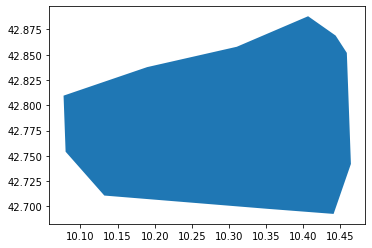
    


```python
gdf_clipped_area = gpd.clip(macroregions22.to_crs(epsg=4326), area_around_elba, keep_geom_type=False)

```


```python
gdf_clipped_area.plot()
plt.show()
```


    
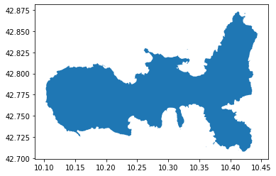
    


```python
elba_island = gdf_clipped_area.dissolve()
```


```python
elba_island
```


<div>
<style scoped>
    .dataframe tbody tr th:only-of-type {
        vertical-align: middle;
    }

    .dataframe tbody tr th {
        vertical-align: top;
    }

    .dataframe thead th {
        text-align: right;
    }
</style>
<table border="1" class="dataframe">
  <thead>
    <tr style="text-align: right;">
      <th></th>
      <th>geometry</th>
      <th>COD_RIP</th>
      <th>DEN_RIP</th>
      <th>Shape_Area</th>
      <th>Shape_Leng</th>
    </tr>
  </thead>
  <tbody>
    <tr>
      <th>0</th>
      <td>MULTIPOLYGON (((10.36101 42.71325, 10.36105 42...</td>
      <td>3</td>
      <td>Centro</td>
      <td>5.802768e+10</td>
      <td>2.405546e+06</td>
    </tr>
  </tbody>
</table>
</div>


remove not usefull columns


```python
del elba_island['COD_RIP']
```


```python
del elba_island['DEN_RIP']
```


```python
del elba_island['Shape_Area']
```


```python
del elba_island['Shape_Leng']
```


```python
elba_island['name'] = "Elba"
```


```python
elba_island
```


<div>
<style scoped>
    .dataframe tbody tr th:only-of-type {
        vertical-align: middle;
    }

    .dataframe tbody tr th {
        vertical-align: top;
    }

    .dataframe thead th {
        text-align: right;
    }
</style>
<table border="1" class="dataframe">
  <thead>
    <tr style="text-align: right;">
      <th></th>
      <th>geometry</th>
      <th>name</th>
    </tr>
  </thead>
  <tbody>
    <tr>
      <th>0</th>
      <td>MULTIPOLYGON (((10.36101 42.71325, 10.36105 42...</td>
      <td>Elba</td>
    </tr>
  </tbody>
</table>
</div>


if you want to know the names of the municipalities on the Island of Elba


```python
municipalities_in_elba = municipalities2022[municipalities2022.to_crs(epsg=4326).geometry.intersects(elba_island.geometry.values[0]) == True]
%time
```

    CPU times: user 6 µs, sys: 0 ns, total: 6 µs
    Wall time: 10 µs


```python
municipalities_in_elba
```


<div>
<style scoped>
    .dataframe tbody tr th:only-of-type {
        vertical-align: middle;
    }

    .dataframe tbody tr th {
        vertical-align: top;
    }

    .dataframe thead th {
        text-align: right;
    }
</style>
<table border="1" class="dataframe">
  <thead>
    <tr style="text-align: right;">
      <th></th>
      <th>COD_RIP</th>
      <th>COD_REG</th>
      <th>COD_PROV</th>
      <th>COD_CM</th>
      <th>COD_UTS</th>
      <th>PRO_COM</th>
      <th>PRO_COM_T</th>
      <th>COMUNE</th>
      <th>COMUNE_A</th>
      <th>CC_UTS</th>
      <th>Shape_Area</th>
      <th>Shape_Leng</th>
      <th>geometry</th>
    </tr>
  </thead>
  <tbody>
    <tr>
      <th>691</th>
      <td>3</td>
      <td>9</td>
      <td>49</td>
      <td>0</td>
      <td>49</td>
      <td>49014</td>
      <td>049014</td>
      <td>Portoferraio</td>
      <td>None</td>
      <td>0</td>
      <td>4.802935e+07</td>
      <td>68845.371050</td>
      <td>MULTIPOLYGON (((603254.255 4742679.377, 603266...</td>
    </tr>
    <tr>
      <th>1426</th>
      <td>3</td>
      <td>9</td>
      <td>49</td>
      <td>0</td>
      <td>49</td>
      <td>49021</td>
      <td>049021</td>
      <td>Rio</td>
      <td>None</td>
      <td>0</td>
      <td>3.651822e+07</td>
      <td>43276.023829</td>
      <td>MULTIPOLYGON (((615535.906 4747526.833, 615534...</td>
    </tr>
    <tr>
      <th>2349</th>
      <td>3</td>
      <td>9</td>
      <td>49</td>
      <td>0</td>
      <td>49</td>
      <td>49004</td>
      <td>049004</td>
      <td>Capoliveri</td>
      <td>None</td>
      <td>0</td>
      <td>3.956061e+07</td>
      <td>62573.909927</td>
      <td>MULTIPOLYGON (((608048.964 4737102.921, 608560...</td>
    </tr>
    <tr>
      <th>3177</th>
      <td>3</td>
      <td>9</td>
      <td>49</td>
      <td>0</td>
      <td>49</td>
      <td>49011</td>
      <td>049011</td>
      <td>Marciana Marina</td>
      <td>None</td>
      <td>0</td>
      <td>5.858972e+06</td>
      <td>17093.632943</td>
      <td>MULTIPOLYGON (((596961.056 4740648.895, 596970...</td>
    </tr>
    <tr>
      <th>6250</th>
      <td>3</td>
      <td>9</td>
      <td>49</td>
      <td>0</td>
      <td>49</td>
      <td>49003</td>
      <td>049003</td>
      <td>Campo nell'Elba</td>
      <td>None</td>
      <td>0</td>
      <td>5.578762e+07</td>
      <td>67951.434125</td>
      <td>MULTIPOLYGON (((600235.028 4736821.926, 600304...</td>
    </tr>
    <tr>
      <th>6251</th>
      <td>3</td>
      <td>9</td>
      <td>49</td>
      <td>0</td>
      <td>49</td>
      <td>49010</td>
      <td>049010</td>
      <td>Marciana</td>
      <td>None</td>
      <td>0</td>
      <td>4.545090e+07</td>
      <td>46878.864895</td>
      <td>MULTIPOLYGON (((593200.087 4740268.899, 593205...</td>
    </tr>
    <tr>
      <th>6252</th>
      <td>3</td>
      <td>9</td>
      <td>49</td>
      <td>0</td>
      <td>49</td>
      <td>49013</td>
      <td>049013</td>
      <td>Porto Azzurro</td>
      <td>None</td>
      <td>0</td>
      <td>1.333011e+07</td>
      <td>17720.940797</td>
      <td>MULTIPOLYGON (((613705.918 4738969.904, 614452...</td>
    </tr>
  </tbody>
</table>
</div>


or


```python
municipalities_in_elba = gpd.clip(municipalities2022.to_crs(epsg=4326), area_around_elba, keep_geom_type=False)
%time
```

    CPU times: user 4 µs, sys: 0 ns, total: 4 µs
    Wall time: 7.63 µs


```python
municipalities_in_elba
```


<div>
<style scoped>
    .dataframe tbody tr th:only-of-type {
        vertical-align: middle;
    }

    .dataframe tbody tr th {
        vertical-align: top;
    }

    .dataframe thead th {
        text-align: right;
    }
</style>
<table border="1" class="dataframe">
  <thead>
    <tr style="text-align: right;">
      <th></th>
      <th>COD_RIP</th>
      <th>COD_REG</th>
      <th>COD_PROV</th>
      <th>COD_CM</th>
      <th>COD_UTS</th>
      <th>PRO_COM</th>
      <th>PRO_COM_T</th>
      <th>COMUNE</th>
      <th>COMUNE_A</th>
      <th>CC_UTS</th>
      <th>Shape_Area</th>
      <th>Shape_Leng</th>
      <th>geometry</th>
    </tr>
  </thead>
  <tbody>
    <tr>
      <th>691</th>
      <td>3</td>
      <td>9</td>
      <td>49</td>
      <td>0</td>
      <td>49</td>
      <td>49014</td>
      <td>049014</td>
      <td>Portoferraio</td>
      <td>None</td>
      <td>0</td>
      <td>4.802935e+07</td>
      <td>68845.371050</td>
      <td>MULTIPOLYGON (((10.26345 42.82968, 10.26373 42...</td>
    </tr>
    <tr>
      <th>6250</th>
      <td>3</td>
      <td>9</td>
      <td>49</td>
      <td>0</td>
      <td>49</td>
      <td>49003</td>
      <td>049003</td>
      <td>Campo nell'Elba</td>
      <td>None</td>
      <td>0</td>
      <td>5.578762e+07</td>
      <td>67951.434125</td>
      <td>POLYGON ((10.22616 42.77691, 10.22701 42.77654...</td>
    </tr>
    <tr>
      <th>6251</th>
      <td>3</td>
      <td>9</td>
      <td>49</td>
      <td>0</td>
      <td>49</td>
      <td>49010</td>
      <td>049010</td>
      <td>Marciana</td>
      <td>None</td>
      <td>0</td>
      <td>4.545090e+07</td>
      <td>46878.864895</td>
      <td>POLYGON ((10.13998 42.80928, 10.14025 42.80929...</td>
    </tr>
    <tr>
      <th>3177</th>
      <td>3</td>
      <td>9</td>
      <td>49</td>
      <td>0</td>
      <td>49</td>
      <td>49011</td>
      <td>049011</td>
      <td>Marciana Marina</td>
      <td>None</td>
      <td>0</td>
      <td>5.858972e+06</td>
      <td>17093.632943</td>
      <td>POLYGON ((10.18608 42.81221, 10.18619 42.81221...</td>
    </tr>
    <tr>
      <th>2349</th>
      <td>3</td>
      <td>9</td>
      <td>49</td>
      <td>0</td>
      <td>49</td>
      <td>49004</td>
      <td>049004</td>
      <td>Capoliveri</td>
      <td>None</td>
      <td>0</td>
      <td>3.956061e+07</td>
      <td>62573.909927</td>
      <td>MULTIPOLYGON (((10.32705 42.77487, 10.33141 42...</td>
    </tr>
    <tr>
      <th>6252</th>
      <td>3</td>
      <td>9</td>
      <td>49</td>
      <td>0</td>
      <td>49</td>
      <td>49013</td>
      <td>049013</td>
      <td>Porto Azzurro</td>
      <td>None</td>
      <td>0</td>
      <td>1.333011e+07</td>
      <td>17720.940797</td>
      <td>POLYGON ((10.39946 42.79169, 10.39999 42.79184...</td>
    </tr>
    <tr>
      <th>1426</th>
      <td>3</td>
      <td>9</td>
      <td>49</td>
      <td>0</td>
      <td>49</td>
      <td>49021</td>
      <td>049021</td>
      <td>Rio</td>
      <td>None</td>
      <td>0</td>
      <td>3.651822e+07</td>
      <td>43276.023829</td>
      <td>MULTIPOLYGON (((10.41450 42.87120, 10.41447 42...</td>
    </tr>
  </tbody>
</table>
</div>


PS: 

If someone tells you that there are 7 municipalities in Elba, tell them they are wrong:
The Municipality of Rio was established in *2018* following the merger of the municipalities of Rio d'Elba, Rio Marina and others.

(https://en.wikipedia.org/wiki/Rio,_Italy)[https://en.wikipedia.org/wiki/Rio,_Italy]


```python

```
