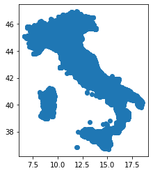
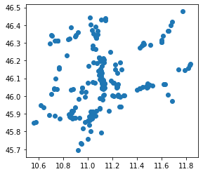
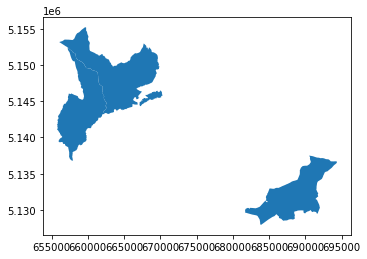
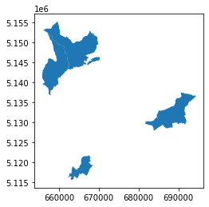
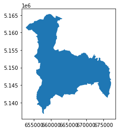
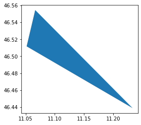

---
# Exercise 02:  Spatial Relationships and Operations

## learning objectives
* repeat the concepts on the previous lesson
* errors with the simplified boundaries
* convex hull / concave hull / alphashape
* nearest_points

---
# Exercise
 
1 - create the geodataframe of the [gas&oil stations](https://www.mise.gov.it/images/exportCSV/anagrafica_impianti_attivi.csv) of Italy 
  - data from the italian [Ministry of Economic Development](https://www.mise.gov.it)
  - count the total of the gas&oil stations for each muncipality of Trentino

2 - identify the difference of municipalities in Trentino in the year 2019 with the year 2021
  - identify which municipalities are created from aggregation to others
  - find the biggest new municipality of Trentino and show all the italian municipalities with bordering it
  - create the macroarea of all the municipalities bordering with it
  - for each gas&oil station in the macro-area, calculate how many monumental trees have been within a 500m radius
  
3 - creates a polygon that contains all the monumental trees inside the area
  - identify all the gas&oil stations in this area which are within 2km of each other
  - save the polygon in geopackage with the attribute "description" with the name of the gas&oil station

---

# Setup

```python
try:
  import geopandas as gpd
except ModuleNotFoundError as e:
  !pip install geopandas==0.10.1
  import geopandas as gpd
if gpd.__version__ != "0.10.1":
  !pip install -U geopandas==0.10.1
  import geopandas as gpd
```

--- 

### Import of the packages


```python
import geopandas as gpd
import requests
import matplotlib.pyplot as plt
import pandas as pd
pd.options.mode.chained_assignment = None
```

# create the geodataframe of the [gas&oil stations](https://www.mise.gov.it/images/exportCSV/anagrafica_impianti_attivi.csv) of Italy 


```python
urlfile = "https://www.mise.gov.it/images/exportCSV/anagrafica_impianti_attivi.csv"
stations = pd.read_csv(urlfile,skiprows=1,sep=";",encoding="ISO-8859-1")
```

```python
stations.head(5)
```


<div>
<style scoped>
    .dataframe tbody tr th:only-of-type {
        vertical-align: middle;
    }

    .dataframe tbody tr th {
        vertical-align: top;
    }

    .dataframe thead th {
        text-align: right;
    }
</style>
<table border="1" class="dataframe">
  <thead>
    <tr style="text-align: right;">
      <th></th>
      <th>idImpianto</th>
      <th>Gestore</th>
      <th>Bandiera</th>
      <th>Tipo Impianto</th>
      <th>Nome Impianto</th>
      <th>Indirizzo</th>
      <th>Comune</th>
      <th>Provincia</th>
      <th>Latitudine</th>
      <th>Longitudine</th>
    </tr>
  </thead>
  <tbody>
    <tr>
      <th>0</th>
      <td>46351</td>
      <td>DI BENEDETTO CARBURANTI S.R.L.</td>
      <td>DBCarburanti</td>
      <td>Altro</td>
      <td>VILLASETA</td>
      <td>VILLASETA S.S.115 KM 186,225</td>
      <td>AGRIGENTO</td>
      <td>AG</td>
      <td>37.293320</td>
      <td>13.569777</td>
    </tr>
    <tr>
      <th>1</th>
      <td>23778</td>
      <td>ALFONSO DI BENEDETTO CARBURANTI LUBRIFICANTI SRL</td>
      <td>Sicilpetroli</td>
      <td>Altro</td>
      <td>A. Di Benedetto srl Via Imera Ag</td>
      <td>VIA IMERA 10 92100</td>
      <td>AGRIGENTO</td>
      <td>AG</td>
      <td>37.312391</td>
      <td>13.585913</td>
    </tr>
    <tr>
      <th>2</th>
      <td>49195</td>
      <td>EOS SERVICES S.R.L. A SOCIO UNICO</td>
      <td>Q8</td>
      <td>Altro</td>
      <td>AG021</td>
      <td>VIA PETRARCA S.N. 92100</td>
      <td>AGRIGENTO</td>
      <td>AG</td>
      <td>37.298234</td>
      <td>13.589792</td>
    </tr>
    <tr>
      <th>3</th>
      <td>49460</td>
      <td>EOS SERVICES S.R.L. A SOCIO UNICO</td>
      <td>Q8</td>
      <td>Altro</td>
      <td>AG023</td>
      <td>CONTRADA FONTANELLE S.N. 92100</td>
      <td>AGRIGENTO</td>
      <td>AG</td>
      <td>37.326120</td>
      <td>13.591820</td>
    </tr>
    <tr>
      <th>4</th>
      <td>49459</td>
      <td>EOS SERVICES S.R.L. A SOCIO UNICO</td>
      <td>Q8</td>
      <td>Altro</td>
      <td>AG024</td>
      <td>VILLAGGIO MOSE' S.N.C. 92100</td>
      <td>AGRIGENTO</td>
      <td>AG</td>
      <td>37.274324</td>
      <td>13.614224</td>
    </tr>
  </tbody>
</table>
</div>


```python
stations.columns
```

    Index(['idImpianto', 'Gestore', 'Bandiera', 'Tipo Impianto', 'Nome Impianto',
           'Indirizzo', 'Comune', 'Provincia', 'Latitudine', 'Longitudine'],
          dtype='object')


```python
columns = {
    'idImpianto': 'id',
    'Gestore': 'manager',
    'Bandiera':'company',
    'Tipo Impianto':'type',
    'Nome Impianto':'name',
    'Indirizzo':'address',
    'Comune':'city',
    'Provincia':'province',
    'Latitudine':'latitude',
    'Longitudine':'longitude'
}
```

```python
stations.rename(columns=columns,inplace=True)
```

```python
stations.head(3)
```

<div>
<style scoped>
    .dataframe tbody tr th:only-of-type {
        vertical-align: middle;
    }

    .dataframe tbody tr th {
        vertical-align: top;
    }

    .dataframe thead th {
        text-align: right;
    }
</style>
<table border="1" class="dataframe">
  <thead>
    <tr style="text-align: right;">
      <th></th>
      <th>id</th>
      <th>manager</th>
      <th>company</th>
      <th>type</th>
      <th>name</th>
      <th>address</th>
      <th>city</th>
      <th>province</th>
      <th>latitude</th>
      <th>longitude</th>
    </tr>
  </thead>
  <tbody>
    <tr>
      <th>0</th>
      <td>46351</td>
      <td>DI BENEDETTO CARBURANTI S.R.L.</td>
      <td>DBCarburanti</td>
      <td>Altro</td>
      <td>VILLASETA</td>
      <td>VILLASETA S.S.115 KM 186,225</td>
      <td>AGRIGENTO</td>
      <td>AG</td>
      <td>37.293320</td>
      <td>13.569777</td>
    </tr>
    <tr>
      <th>1</th>
      <td>23778</td>
      <td>ALFONSO DI BENEDETTO CARBURANTI LUBRIFICANTI SRL</td>
      <td>Sicilpetroli</td>
      <td>Altro</td>
      <td>A. Di Benedetto srl Via Imera Ag</td>
      <td>VIA IMERA 10 92100</td>
      <td>AGRIGENTO</td>
      <td>AG</td>
      <td>37.312391</td>
      <td>13.585913</td>
    </tr>
    <tr>
      <th>2</th>
      <td>49195</td>
      <td>EOS SERVICES S.R.L. A SOCIO UNICO</td>
      <td>Q8</td>
      <td>Altro</td>
      <td>AG021</td>
      <td>VIA PETRARCA S.N. 92100</td>
      <td>AGRIGENTO</td>
      <td>AG</td>
      <td>37.298234</td>
      <td>13.589792</td>
    </tr>
  </tbody>
</table>
</div>


```python
geo_stations = gpd.GeoDataFrame(
    stations,
    crs='EPSG:4326',
    geometry=gpd.points_from_xy(stations.longitude, stations.latitude))
```


```python
geo_stations[~geo_stations.geometry.is_valid].shape[0]
```

    5


Error:<br/>
the values should be zero: the geodataframe should contains points.<br/>
Maybe therea are some rows where the values of latitude and lontigude aren't present 
{: .notice--warning}


```python
stations.latitude.isnull().sum()
```

    5


```python
stations.longitude.isnull().sum()
```

    5


5 ... the same value for the invalid geometries


```python
stations = stations[~stations.latitude.isnull()]
```


```python
geo_stations = gpd.GeoDataFrame(
    stations,
    crs='EPSG:4326',
    geometry=gpd.points_from_xy(stations.longitude, stations.latitude))
```


```python
geo_stations[~geo_stations.geometry.is_valid].shape[0]
```

    0


Now it's ZERO :)


```python
geo_stations.plot()
plt.show()
```
    

    


## count the total of the gas&oil stations for each muncipality of Trentino

On the GitHub repository of the course there are the geopackage files with the administrative limits of ISTAT [2020](https://github.com/napo/geospatial_course_unitn/raw/master/data/istat/istat_administrative_units_2020.gpkg) and [2021](https://github.com/napo/geospatial_course_unitn/raw/master/data/istat/istat_administrative_units_2021.gpkg) with generalized geometries

We download the data of both due the second issue of the exercise.  

```python
url2021 = 'https://github.com/napo/geospatial_course_unitn/raw/master/data/istat/istat_administrative_units_generalized_2021.gpkg'
url2020 = 'https://github.com/napo/geospatial_course_unitn/raw/master/data/istat/istat_administrative_units_generalized_2020.gpkg'
istat2020 = "istat_administrative_units_generalized_2020.gpkg"
istat2021 = "istat_administrative_units_generalized_2021.gpkg"
```

```python
r = requests.get(url2021, allow_redirects=True)
open(istat2021, 'wb').write(r.content)
```


```python
r = requests.get(url2020, allow_redirects=True)
open(istat2020, 'wb').write(r.content)
```

```python
import fiona
fiona.listlayers(istat2020)
```

    ['municipalities', 'provincies', 'regions', 'macroregions']


```python
fiona.listlayers(istat2021)
```

    ['municipalities', 'provincies', 'regions', 'macroregions']


```python
provincies2021 = gpd.read_file(istat2021,layer="provincies")
```

```python
provincies2021.head(3)
```

<div>
<style scoped>
    .dataframe tbody tr th:only-of-type {
        vertical-align: middle;
    }

    .dataframe tbody tr th {
        vertical-align: top;
    }

    .dataframe thead th {
        text-align: right;
    }
</style>
<table border="1" class="dataframe">
  <thead>
    <tr style="text-align: right;">
      <th></th>
      <th>COD_RIP</th>
      <th>COD_REG</th>
      <th>COD_PROV</th>
      <th>COD_CM</th>
      <th>COD_UTS</th>
      <th>DEN_PROV</th>
      <th>DEN_CM</th>
      <th>DEN_UTS</th>
      <th>SIGLA</th>
      <th>TIPO_UTS</th>
      <th>geometry</th>
    </tr>
  </thead>
  <tbody>
    <tr>
      <th>0</th>
      <td>1</td>
      <td>1</td>
      <td>1</td>
      <td>201</td>
      <td>201</td>
      <td>-</td>
      <td>Torino</td>
      <td>Torino</td>
      <td>TO</td>
      <td>Citta metropolitana</td>
      <td>MULTIPOLYGON (((411015.006 5049970.983, 411266...</td>
    </tr>
    <tr>
      <th>1</th>
      <td>1</td>
      <td>1</td>
      <td>2</td>
      <td>0</td>
      <td>2</td>
      <td>Vercelli</td>
      <td>-</td>
      <td>Vercelli</td>
      <td>VC</td>
      <td>Provincia</td>
      <td>MULTIPOLYGON (((438328.612 5087208.215, 439028...</td>
    </tr>
    <tr>
      <th>2</th>
      <td>1</td>
      <td>1</td>
      <td>3</td>
      <td>0</td>
      <td>3</td>
      <td>Novara</td>
      <td>-</td>
      <td>Novara</td>
      <td>NO</td>
      <td>Provincia</td>
      <td>MULTIPOLYGON (((460929.542 5076320.298, 461165...</td>
    </tr>
  </tbody>
</table>
</div>


```python
provincies2021.DEN_PROV.unique()
```
```python
    array(['-', 'Vercelli', 'Novara', 'Cuneo', 'Asti', 'Alessandria', 'Aosta',
           'Imperia', 'Savona', 'La Spezia', 'Varese', 'Como', 'Sondrio',
           'Bergamo', 'Brescia', 'Pavia', 'Cremona', 'Mantova', 'Bolzano',
           'Trento', 'Verona', 'Vicenza', 'Belluno', 'Treviso', 'Padova',
           'Rovigo', 'Udine', 'Gorizia', 'Trieste', 'Piacenza', 'Parma',
           "Reggio nell'Emilia", 'Modena', 'Ferrara', 'Ravenna',
           "Forli'-Cesena", 'Pesaro e Urbino', 'Ancona', 'Macerata',
           'Ascoli Piceno', 'Massa Carrara', 'Lucca', 'Pistoia', 'Livorno',
           'Pisa', 'Arezzo', 'Siena', 'Grosseto', 'Perugia', 'Terni',
           'Viterbo', 'Rieti', 'Latina', 'Frosinone', 'Caserta', 'Benevento',
           'Avellino', 'Salerno', "L'Aquila", 'Teramo', 'Pescara', 'Chieti',
           'Campobasso', 'Foggia', 'Taranto', 'Brindisi', 'Lecce', 'Potenza',
           'Matera', 'Cosenza', 'Catanzaro', 'Trapani', 'Agrigento',
           'Caltanissetta', 'Enna', 'Ragusa', 'Siracusa', 'Sassari', 'Nuoro',
           'Pordenone', 'Isernia', 'Oristano', 'Biella', 'Lecco', 'Lodi',
           'Rimini', 'Prato', 'Crotone', 'Vibo Valentia',
           'Verbano-Cusio-Ossola', 'Monza e della Brianza', 'Fermo',
           'Barletta-Andria-Trani', 'Sud Sardegna'], dtype=object)
```


choose the province of Trento


```python
province_of_trento = provincies2021[provincies2021['DEN_PROV']=='Trento']
```


```python
province_of_trento.crs
```

    <Projected CRS: EPSG:32632>
    Name: WGS 84 / UTM zone 32N
    Axis Info [cartesian]:
    - E[east]: Easting (metre)
    - N[north]: Northing (metre)
    Area of Use:
    - name: Between 6°E and 12°E, northern hemisphere between equator and 84°N, onshore and offshore. Algeria. Austria. Cameroon. Denmark. Equatorial Guinea. France. Gabon. Germany. Italy. Libya. Liechtenstein. Monaco. Netherlands. Niger. Nigeria. Norway. Sao Tome and Principe. Svalbard. Sweden. Switzerland. Tunisia. Vatican City State.
    - bounds: (6.0, 0.0, 12.0, 84.0)
    Coordinate Operation:
    - name: UTM zone 32N
    - method: Transverse Mercator
    Datum: World Geodetic System 1984
    - Ellipsoid: WGS 84
    - Prime Meridian: Greenwich


```python
boundary_province_of_trento = province_of_trento.to_crs(epsg=4326).geometry.values[0]
```

### plot it


```python
boundary_province_of_trento
```

    

    

```python
stations_province_trento = geo_stations[geo_stations.within(boundary_province_of_trento)]
```


```python
stations_province_trento.plot()
plt.show()
```

    

    


```python
stations_province_trento.shape[0]
```

    212


without spatial relationship 


```python
stations.province.unique()
```

    array(['AG', 'AL', 'AN', 'AO', 'AP', 'AQ', 'AR', 'AT', 'AV', 'BA', 'BG',
           'BI', 'BL', 'BN', 'BO', 'BR', 'BS', 'BT', 'BZ', 'CA', 'CB', 'CE',
           'CH', 'CI', 'CL', 'CN', 'CO', 'CR', 'CS', 'CT', 'CZ', 'EN', 'FC',
           'FE', 'FG', 'FI', 'FM', 'FR', 'GE', 'GO', 'GR', 'IM', 'IS', 'KR',
           'LC', 'LE', 'LI', 'LO', 'LT', 'LU', 'MB', 'MC', 'ME', 'MI', 'MN',
           'MO', 'MS', 'MT', nan, 'NO', 'NU', 'OG', 'OR', 'OT', 'PA', 'PC',
           'PD', 'PE', 'PG', 'PI', 'PN', 'PO', 'PR', 'PT', 'PU', 'PV', 'PZ',
           'RA', 'RC', 'RE', 'RG', 'RI', 'RM', 'RN', 'RO', 'SA', 'SI', 'SO',
           'SP', 'SR', 'SS', 'SV', 'TA', 'TE', 'TN', 'TO', 'TP', 'TR', 'TS',
           'TV', 'UD', 'VA', 'VB', 'VC', 'VE', 'VI', 'VR', 'VS', 'VT', 'VV'],
          dtype=object)


```python
provincies2021[provincies2021['DEN_PROV']=='Trento']['SIGLA'].unique()
```

    array(['TN'], dtype=object)


```python
stations[stations['province']=='TN'].shape[0]
```

    211


212 in the geodataframe<br/>
211 in the dataframe 
{: .notice--warning}

```python
stations_province_trento[stations_province_trento['province'] != 'TN']
```


<div>
<style scoped>
    .dataframe tbody tr th:only-of-type {
        vertical-align: middle;
    }

    .dataframe tbody tr th {
        vertical-align: top;
    }

    .dataframe thead th {
        text-align: right;
    }
</style>
<table border="1" class="dataframe">
  <thead>
    <tr style="text-align: right;">
      <th></th>
      <th>id</th>
      <th>manager</th>
      <th>company</th>
      <th>type</th>
      <th>name</th>
      <th>address</th>
      <th>city</th>
      <th>province</th>
      <th>latitude</th>
      <th>longitude</th>
      <th>geometry</th>
    </tr>
  </thead>
  <tbody>
    <tr>
      <th>21184</th>
      <td>40236</td>
      <td>SARNI S.R.L.</td>
      <td>Agip Eni</td>
      <td>Autostradale</td>
      <td>ADIGE EST</td>
      <td>Autostrada A22 BRENNERO-MODENA, Km. 186.98, di...</td>
      <td>BRENTINO BELLUNO</td>
      <td>VR</td>
      <td>45.695187</td>
      <td>10.916713</td>
      <td>POINT (10.91671 45.69519)</td>
    </tr>
  </tbody>
</table>
</div>


```python
point_outside = stations_province_trento[stations_province_trento['province'] != 'TN']
```


```python
point_outside.explore()
```

<a href="webmap/point_ouside_border_web.html"></a>


```python
point_outside.geometry.within(boundary_province_of_trento)
```


    21184    True
    dtype: bool


```python
province_of_trento.to_crs(epsg=4326).contains(point_outside.geometry.values[0])
```

    21    True
    dtype: bool


We need to use the *not* generalized version of the administrative limits of Italy 

the course offers two zip files with the shapefiles of the italian municipalites in [2020](https://github.com/napo/geospatial_course_unitn/raw/master/data/istat/shapefile_istat_municipalities_2020.zip) and [2021](https://github.com/napo/geospatial_course_unitn/raw/master/data/istat/shapefile_istat_municipalities_2020.zip) made by ISTAT


```python
urlmunicipalities2021 = 'https://github.com/napo/geospatial_course_unitn/raw/master/data/istat/shapefile_istat_municipalities_2021.zip'
```


```python
municipalities2021 = gpd.read_file(urlmunicipalities2021)
```


```python
municipalities2021.head(3)
```


<div>
<style scoped>
    .dataframe tbody tr th:only-of-type {
        vertical-align: middle;
    }

    .dataframe tbody tr th {
        vertical-align: top;
    }

    .dataframe thead th {
        text-align: right;
    }
</style>
<table border="1" class="dataframe">
  <thead>
    <tr style="text-align: right;">
      <th></th>
      <th>COD_RIP</th>
      <th>COD_REG</th>
      <th>COD_PROV</th>
      <th>COD_CM</th>
      <th>COD_UTS</th>
      <th>PRO_COM</th>
      <th>PRO_COM_T</th>
      <th>COMUNE</th>
      <th>COMUNE_A</th>
      <th>CC_UTS</th>
      <th>SHAPE_LENG</th>
      <th>Shape_Le_1</th>
      <th>Shape_Area</th>
      <th>geometry</th>
    </tr>
  </thead>
  <tbody>
    <tr>
      <th>0</th>
      <td>1</td>
      <td>1</td>
      <td>1</td>
      <td>201</td>
      <td>201</td>
      <td>1077</td>
      <td>001077</td>
      <td>Chiaverano</td>
      <td>None</td>
      <td>0</td>
      <td>18164.369945</td>
      <td>18164.236621</td>
      <td>1.202212e+07</td>
      <td>POLYGON ((414358.390 5042001.044, 414381.796 5...</td>
    </tr>
    <tr>
      <th>1</th>
      <td>1</td>
      <td>1</td>
      <td>1</td>
      <td>201</td>
      <td>201</td>
      <td>1079</td>
      <td>001079</td>
      <td>Chiesanuova</td>
      <td>None</td>
      <td>0</td>
      <td>10777.398475</td>
      <td>10777.318814</td>
      <td>4.118911e+06</td>
      <td>POLYGON ((394621.039 5031581.116, 394716.100 5...</td>
    </tr>
    <tr>
      <th>2</th>
      <td>1</td>
      <td>1</td>
      <td>1</td>
      <td>201</td>
      <td>201</td>
      <td>1089</td>
      <td>001089</td>
      <td>Coazze</td>
      <td>None</td>
      <td>0</td>
      <td>41591.434852</td>
      <td>41591.122092</td>
      <td>5.657268e+07</td>
      <td>POLYGON ((364914.897 4993224.894, 364929.991 4...</td>
    </tr>
  </tbody>
</table>
</div>


```python
cod_prov_trento = provincies2021[provincies2021.DEN_PROV == 'Trento'].COD_PROV.values[0]
```


```python
municipalities_trentino_2021 = municipalities2021[municipalities2021.COD_PROV == cod_prov_trento]
```


```python
province_of_trento = italy = municipalities_trentino_2021.dissolve(by='COD_PROV')
%time
```

    CPU times: user 2 µs, sys: 1e+03 ns, total: 3 µs
    Wall time: 5.25 µs


```python
boundary_province_of_trento = province_of_trento.to_crs(epsg=4326).geometry.values[0]
```


```python
boundary_province_of_trento
```

    

    

```python
stations_province_trento = geo_stations[geo_stations.within(boundary_province_of_trento)]
```


```python
stations_province_trento.shape[0]
```

    211


the total is right ;)


```python
point_outside.geometry.within(boundary_province_of_trento)
```

    21184    False
    dtype: bool


and also the spatial relationship
<br/>now we can count the number of gas&oil stations for each municipality of Trentino


```python
stations_by_municipalities = stations_province_trento.groupby(['city']).size().reset_index().rename(columns={0:'total'}).sort_values(['total','city'],ascending=[False,True])
%time
```

    CPU times: user 4 µs, sys: 1e+03 ns, total: 5 µs
    Wall time: 9.78 µs


```python
stations_by_municipalities = stations_province_trento.groupby(['city']).size().reset_index().rename(columns={0:'total'}).sort_values(['total','city'],ascending=[False,True])

```


```python
stations_by_municipalities
```


<div>
<style scoped>
    .dataframe tbody tr th:only-of-type {
        vertical-align: middle;
    }

    .dataframe tbody tr th {
        vertical-align: top;
    }

    .dataframe thead th {
        text-align: right;
    }
</style>
<table border="1" class="dataframe">
  <thead>
    <tr style="text-align: right;">
      <th></th>
      <th>city</th>
      <th>total</th>
    </tr>
  </thead>
  <tbody>
    <tr>
      <th>89</th>
      <td>TRENTO</td>
      <td>32</td>
    </tr>
    <tr>
      <th>73</th>
      <td>ROVERETO</td>
      <td>13</td>
    </tr>
    <tr>
      <th>63</th>
      <td>PERGINE VALSUGANA</td>
      <td>8</td>
    </tr>
    <tr>
      <th>46</th>
      <td>LAVIS</td>
      <td>7</td>
    </tr>
    <tr>
      <th>3</th>
      <td>ARCO</td>
      <td>6</td>
    </tr>
    <tr>
      <th>...</th>
      <td>...</td>
      <td>...</td>
    </tr>
    <tr>
      <th>93</th>
      <td>VIGO DI FASSA</td>
      <td>1</td>
    </tr>
    <tr>
      <th>95</th>
      <td>VILLA AGNEDO</td>
      <td>1</td>
    </tr>
    <tr>
      <th>96</th>
      <td>VILLA LAGARINA</td>
      <td>1</td>
    </tr>
    <tr>
      <th>97</th>
      <td>VOLANO</td>
      <td>1</td>
    </tr>
    <tr>
      <th>98</th>
      <td>ZUCLO</td>
      <td>1</td>
    </tr>
  </tbody>
</table>
<p>99 rows × 2 columns</p>
</div>


but ... if the columns "city"  is not present?
{: .notice--success}

```python
del stations_province_trento['city'] #delete the column city
```

```python
stations_province_trento.head(3)
```


<div>
<style scoped>
    .dataframe tbody tr th:only-of-type {
        vertical-align: middle;
    }

    .dataframe tbody tr th {
        vertical-align: top;
    }

    .dataframe thead th {
        text-align: right;
    }
</style>
<table border="1" class="dataframe">
  <thead>
    <tr style="text-align: right;">
      <th></th>
      <th>id</th>
      <th>manager</th>
      <th>company</th>
      <th>type</th>
      <th>name</th>
      <th>address</th>
      <th>province</th>
      <th>latitude</th>
      <th>longitude</th>
      <th>geometry</th>
    </tr>
  </thead>
  <tbody>
    <tr>
      <th>18298</th>
      <td>5169</td>
      <td>CAMPION MARCO E C. S.A.S.</td>
      <td>Esso</td>
      <td>Strada Statale</td>
      <td>CAMPION MARCO E C. S.A.S.</td>
      <td>Statale 12 dell'Abetone e del Brennero, Km. 34...</td>
      <td>TN</td>
      <td>45.803566</td>
      <td>11.019186</td>
      <td>POINT (11.01919 45.80357)</td>
    </tr>
    <tr>
      <th>18299</th>
      <td>7317</td>
      <td>FERRARI ATTILIO</td>
      <td>Pompe Bianche</td>
      <td>Altro</td>
      <td>FERRARI ATTILIO</td>
      <td>CORSO VERONA 22 38061</td>
      <td>TN</td>
      <td>45.757343</td>
      <td>10.999531</td>
      <td>POINT (10.99953 45.75734)</td>
    </tr>
    <tr>
      <th>18300</th>
      <td>23796</td>
      <td>RO-MA SNC DI GIULIO ROPELE</td>
      <td>Agip Eni</td>
      <td>Altro</td>
      <td>ENI-AGIP</td>
      <td>STRADA PROVINCIALE 90 DESTRA ADIGE KM. 18 + 15...</td>
      <td>TN</td>
      <td>45.989288</td>
      <td>11.097397</td>
      <td>POINT (11.09740 45.98929)</td>
    </tr>
  </tbody>
</table>
</div>


reconstruct the name of the city associated for each location


```python
def getNameCity(point,cities):
    name = cities[cities.to_crs(epsg=4326).contains(point)].COMUNE.values[0]
    return name
```


```python
stations_province_trento['city'] = stations_province_trento.geometry.apply(lambda point: getNameCity(point,municipalities_trentino_2021))
%time
```

    CPU times: user 3 µs, sys: 0 ns, total: 3 µs
    Wall time: 5.96 µs


```python
stations_province_trento.head(3)
```

<div>
<style scoped>
    .dataframe tbody tr th:only-of-type {
        vertical-align: middle;
    }

    .dataframe tbody tr th {
        vertical-align: top;
    }

    .dataframe thead th {
        text-align: right;
    }
</style>
<table border="1" class="dataframe">
  <thead>
    <tr style="text-align: right;">
      <th></th>
      <th>id</th>
      <th>manager</th>
      <th>company</th>
      <th>type</th>
      <th>name</th>
      <th>address</th>
      <th>province</th>
      <th>latitude</th>
      <th>longitude</th>
      <th>geometry</th>
      <th>city</th>
    </tr>
  </thead>
  <tbody>
    <tr>
      <th>18298</th>
      <td>5169</td>
      <td>CAMPION MARCO E C. S.A.S.</td>
      <td>Esso</td>
      <td>Strada Statale</td>
      <td>CAMPION MARCO E C. S.A.S.</td>
      <td>Statale 12 dell'Abetone e del Brennero, Km. 34...</td>
      <td>TN</td>
      <td>45.803566</td>
      <td>11.019186</td>
      <td>POINT (11.01919 45.80357)</td>
      <td>Ala</td>
    </tr>
    <tr>
      <th>18299</th>
      <td>7317</td>
      <td>FERRARI ATTILIO</td>
      <td>Pompe Bianche</td>
      <td>Altro</td>
      <td>FERRARI ATTILIO</td>
      <td>CORSO VERONA 22 38061</td>
      <td>TN</td>
      <td>45.757343</td>
      <td>10.999531</td>
      <td>POINT (10.99953 45.75734)</td>
      <td>Ala</td>
    </tr>
    <tr>
      <th>18300</th>
      <td>23796</td>
      <td>RO-MA SNC DI GIULIO ROPELE</td>
      <td>Agip Eni</td>
      <td>Altro</td>
      <td>ENI-AGIP</td>
      <td>STRADA PROVINCIALE 90 DESTRA ADIGE KM. 18 + 15...</td>
      <td>TN</td>
      <td>45.989288</td>
      <td>11.097397</td>
      <td>POINT (11.09740 45.98929)</td>
      <td>Aldeno</td>
    </tr>
  </tbody>
</table>
</div>


```python
stations_by_municipalities = stations_province_trento.groupby(['city']).size().reset_index().rename(columns={0:'total'}).sort_values(['total','city'],ascending=[False,True])

```

```python
stations_by_municipalities
```

<div>
<style scoped>
    .dataframe tbody tr th:only-of-type {
        vertical-align: middle;
    }

    .dataframe tbody tr th {
        vertical-align: top;
    }

    .dataframe thead th {
        text-align: right;
    }
</style>
<table border="1" class="dataframe">
  <thead>
    <tr style="text-align: right;">
      <th></th>
      <th>city</th>
      <th>total</th>
    </tr>
  </thead>
  <tbody>
    <tr>
      <th>85</th>
      <td>Trento</td>
      <td>32</td>
    </tr>
    <tr>
      <th>69</th>
      <td>Rovereto</td>
      <td>13</td>
    </tr>
    <tr>
      <th>59</th>
      <td>Pergine Valsugana</td>
      <td>8</td>
    </tr>
    <tr>
      <th>42</th>
      <td>Lavis</td>
      <td>7</td>
    </tr>
    <tr>
      <th>4</th>
      <td>Arco</td>
      <td>6</td>
    </tr>
    <tr>
      <th>...</th>
      <td>...</td>
      <td>...</td>
    </tr>
    <tr>
      <th>87</th>
      <td>Vallarsa</td>
      <td>1</td>
    </tr>
    <tr>
      <th>88</th>
      <td>Vallelaghi</td>
      <td>1</td>
    </tr>
    <tr>
      <th>89</th>
      <td>Vermiglio</td>
      <td>1</td>
    </tr>
    <tr>
      <th>90</th>
      <td>Villa Lagarina</td>
      <td>1</td>
    </tr>
    <tr>
      <th>92</th>
      <td>Volano</td>
      <td>1</td>
    </tr>
  </tbody>
</table>
<p>93 rows × 2 columns</p>
</div>


## identify the difference of municipalities in Trentino of year 2019 with year 2021


```python
urlmunicipalities2019 = 'https://github.com/napo/geospatial_course_unitn/raw/master/data/istat/shapefile_istat_municipalities_2019.zip'
municipalities2019 = gpd.read_file(urlmunicipalities2019)
```

```python
municipalities_trentino_2019 = municipalities2019[municipalities2019['COD_PROV'] == cod_prov_trento]
```

```python
names2019 = list(municipalities_trentino_2019.COMUNE.unique())
```


```python
names2021 = list(municipalities_trentino_2021.COMUNE.unique())
```


```python
notpresentin2021 = list(set(names2019) - set(names2021))
```


```python
notpresentin2021
```

    ['Varena',
     'Brez',
     'Revò',
     'Romallo',
     'Cloz',
     'Malosco',
     'Carano',
     'Castelfondo',
     'Cagnò',
     'Fondo',
     'Daiano',
     'Faedo']


```python
notpresentin2019 = list(set(names2021) - set(names2019))
```


```python
notpresentin2019
```


    ["Borgo d'Anaunia", 'Ville di Fiemme', 'Novella']


```python
old_municipalities_2019 = municipalities_trentino_2019[municipalities_trentino_2019.COMUNE.isin(notpresentin2021)]
```


```python
old_municipalities_2019.plot()
plt.show()
```

    

    

```python
new_municipalities_2021 = municipalities_trentino_2021[municipalities_trentino_2021.COMUNE.isin(notpresentin2019)]
```


```python
new_municipalities_2021.plot()
plt.show()
```

    

    


##  identify which municipalities are created from aggregation to others


```python
def whereincluded(geometry, geometries_gdf):
    name = "not included"
    found = geometries_gdf[geometries_gdf.geometry.contains(geometry)]
    if len(found) > 0:
        name = found.COMUNE.values[0]
    return(name)
```


```python
old_municipalities_2019['included_in'] = old_municipalities_2019.geometry.apply(lambda g: whereincluded(g,new_municipalities_2021))
```


```python
old_municipalities_2019[['COMUNE','included_in']]
```


<div>
<style scoped>
    .dataframe tbody tr th:only-of-type {
        vertical-align: middle;
    }

    .dataframe tbody tr th {
        vertical-align: top;
    }

    .dataframe thead th {
        text-align: right;
    }
</style>
<table border="1" class="dataframe">
  <thead>
    <tr style="text-align: right;">
      <th></th>
      <th>COMUNE</th>
      <th>included_in</th>
    </tr>
  </thead>
  <tbody>
    <tr>
      <th>724</th>
      <td>Brez</td>
      <td>Novella</td>
    </tr>
    <tr>
      <th>2168</th>
      <td>Carano</td>
      <td>Ville di Fiemme</td>
    </tr>
    <tr>
      <th>3247</th>
      <td>Cagnò</td>
      <td>Novella</td>
    </tr>
    <tr>
      <th>3343</th>
      <td>Malosco</td>
      <td>Borgo d'Anaunia</td>
    </tr>
    <tr>
      <th>3346</th>
      <td>Daiano</td>
      <td>Ville di Fiemme</td>
    </tr>
    <tr>
      <th>4269</th>
      <td>Cloz</td>
      <td>Novella</td>
    </tr>
    <tr>
      <th>4869</th>
      <td>Romallo</td>
      <td>Novella</td>
    </tr>
    <tr>
      <th>5142</th>
      <td>Castelfondo</td>
      <td>Borgo d'Anaunia</td>
    </tr>
    <tr>
      <th>5540</th>
      <td>Revò</td>
      <td>Novella</td>
    </tr>
    <tr>
      <th>5607</th>
      <td>Varena</td>
      <td>Ville di Fiemme</td>
    </tr>
    <tr>
      <th>5622</th>
      <td>Fondo</td>
      <td>Borgo d'Anaunia</td>
    </tr>
    <tr>
      <th>5652</th>
      <td>Faedo</td>
      <td>not included</td>
    </tr>
  </tbody>
</table>
</div>


Where is "Faedo" ?


```python
faedo = old_municipalities_2019[old_municipalities_2019.COMUNE == 'Faedo']
```


```python
faedo
```


<div>
<style scoped>
    .dataframe tbody tr th:only-of-type {
        vertical-align: middle;
    }

    .dataframe tbody tr th {
        vertical-align: top;
    }

    .dataframe thead th {
        text-align: right;
    }
</style>
<table border="1" class="dataframe">
  <thead>
    <tr style="text-align: right;">
      <th></th>
      <th>COD_RIP</th>
      <th>COD_REG</th>
      <th>COD_PROV</th>
      <th>COD_CM</th>
      <th>COD_UTS</th>
      <th>PRO_COM</th>
      <th>PRO_COM_T</th>
      <th>COMUNE</th>
      <th>COMUNE_A</th>
      <th>CC_UTS</th>
      <th>SHAPE_LENG</th>
      <th>SHAPE_AREA</th>
      <th>SHAPE_LEN</th>
      <th>geometry</th>
      <th>included_in</th>
    </tr>
  </thead>
  <tbody>
    <tr>
      <th>5652</th>
      <td>2</td>
      <td>4</td>
      <td>22</td>
      <td>0</td>
      <td>22</td>
      <td>22080</td>
      <td>022080</td>
      <td>Faedo</td>
      <td>None</td>
      <td>0</td>
      <td>16440.165284</td>
      <td>1.068038e+07</td>
      <td>16440.047652</td>
      <td>POLYGON ((667690.769 5121538.436, 667726.269 5...</td>
      <td>not included</td>
    </tr>
  </tbody>
</table>
</div>


```python
faedo_geometry = faedo.geometry.values[0]
```


```python
faedo_is_in = municipalities_trentino_2021[municipalities_trentino_2021.geometry.contains(faedo_geometry)]
```


```python
faedo_new_municipality = faedo_is_in.COMUNE.values[0]
```


```python
faedo_new_municipality
```

    "San Michele all'Adige"


```python
list_changed_municipalities = old_municipalities_2019[old_municipalities_2019.included_in != 'not included']
```


```python
list_changed_municipalities = list(list_changed_municipalities.included_in.unique())
```


```python
list_changed_municipalities.append(faedo_new_municipality)
```


```python
list_changed_municipalities
```

    ['Novella', 'Ville di Fiemme', "Borgo d'Anaunia", "San Michele all'Adige"]


and we can do the same with the polygons


```python
new_municipalities_trentino_2021 = municipalities_trentino_2021[municipalities_trentino_2021.COMUNE.isin(list_changed_municipalities)]
```


```python
new_municipalities_trentino_2021.plot()
plt.show()
```
    

    

## find the biggest new municipality of Trentino and show all the italian municipalities with bordering it

```python
biggest_new_municipality_trentino = new_municipalities_trentino_2021[new_municipalities_trentino_2021.geometry.area == new_municipalities_trentino_2021.geometry.area.max()]
```

```python
biggest_new_municipality_trentino.plot()
plt.show()
```
    

    

```python
boundary_borgo_anaunia = biggest_new_municipality_trentino.geometry.values[0]
```

```python
around_borgo_anaunia = municipalities2021[municipalities2021.touches(boundary_borgo_anaunia)]
```

```python
around_borgo_anaunia.plot()
plt.show()
```
    

    

## create the macroarea of all the municipalities bordering with it


```python
new_area = around_borgo_anaunia.append(biggest_new_municipality_trentino).dissolve()
```

```python
new_area = new_area[['geometry']]
```

```python
new_area['name'] = "area of borgo d'anaunia and bordering municipalities"
```

```python
new_area.plot()
plt.show()
```
    

    

## for each gas&oil station in the macro-area, calculate how many monumental trees have been within a 500m radius

the dataset in GeoJSON of the italian monumental trees is created with the [code of the lesson 02](https://github.com/napo/geospatial_course_unitn/blob/master/code/lessons/02_Spatial_relationships_and_operations.ipynb)<br/>
You can find the dataset [here](https://raw.githubusercontent.com/napo/geospatial_course_unitn/master/data/monumental_trees/italian_monumental_trees_20210505.geojson)


```python
macroarea_geometry = new_area.to_crs(epsg=4326).geometry.values[0]
```

```python
stations_in_macroarea = geo_stations[geo_stations.within(macroarea_geometry)]
```

```python
monumental_trees = gpd.read_file('https://github.com/napo/geospatial_course_unitn/raw/master/data/monumental_trees/italian_monumental_trees_20210505.geojson')
```

```python
monumental_trees_in_macroarea = monumental_trees[monumental_trees.within(macroarea_geometry)]
```

```python
def fivehundredfrom(point,points):
    present = False
    found = stations_in_macroarea[stations_in_macroarea.within(point)]
    if len(found) > 0:
        present = True
    return(present)
```

```python
monumental_trees_in_macroarea.to_crs(epsg=3263).geometry.buffer(500).apply(lambda point: fivehundredfrom(point,stations_in_macroarea.to_crs(epsg=32632)))
```

    298     False
    330     False
    3491    False
    dtype: bool


it's normal that a gas&oil station is far away from a monumental tree :)

# creates a polygon that contains all the monumental trees inside the area

## convex hull
solution: create a convex hull<br/>
*In geometry, the convex hull or convex envelope or convex closure of a shape is the smallest convex set that contains it. The convex hull may be defined either as the intersection of all convex sets containing a given subset of a Euclidean space, or equivalently as the set of all convex combinations of points in the subset. For a bounded subset of the plane, the convex hull may be visualized as the shape enclosed by a rubber band stretched around the subset.* (source: [wikipedia](https://en.wikipedia.org/wiki/Convex_hull))


```python
monumental_trees_in_macroarea.plot()
plt.show()
```
    

    

```python
area_of_monumental_trees_in_macroarea = monumental_trees_in_macroarea.unary_union.convex_hull
```

```python
area_of_monumental_trees_in_macroarea
```
    

    

## Concave Hull

Contrary to a convex hull, a concave hull can describe the shape of a point cloud. 

Convex hull<br/>

<br/><br/>
Concave hull<br/> 


### Alpha shapes

Alpha shapes are often used to generalize bounding polygons containing sets of points. The alpha parameter is defined as the value a, such that an edge of a disk of radius 1/a can be drawn between any two edge members of a set of points and still contain all the points. The convex hull, a shape resembling what you would see if you wrapped a rubber band around pegs at all the data points, is an alpha shape where the alpha parameter is equal to zero

[https://alphashape.readthedocs.io/](https://alphashape.readthedocs.io/)


```python
try:
  import alphashape
except ModuleNotFoundError as e:
  !pip install alphashape==1.3.1
  import alphashape
if alphashape.__version__ != "1.3.1":
  !pip install -U alphashape==1.3.1
  import alphashape
```

```python
 alpha_shape = alphashape.alphashape(monumental_trees_in_macroarea, 100)

```

```python
alpha_shape.plot()
plt.show()
```
    

    
... we have only three points ... but if you want try with more ... 


```python
convex_hull_trento = gpd.GeoDataFrame(
    geometry=[stations_province_trento.geometry.unary_union.convex_hull], 
    columns=['geometry'],
    crs=stations_province_trento.crs)

convex_hull_trento.explore()
```

<a href="webmap/convex_hull.html"></a>


```python
stations_province_trento.explore()
```

<a href="webmap/points_for_hull.html"></a>


```python
alpha_paramenter = 60
alphashape.alphashape(stations_province_trento, alpha_paramenter).explore()
```

<a href="webmap/alphashape.html"></a>


Creating alpha shapes around sets of points usually requires a visually interactive step where the alpha parameter for a concave hull is determined by iterating over or bisecting values to approach a best fit. 

More informations: [https://alphashape.readthedocs.io/en/latest/readme.html#using-a-varying-alpha-parameter](https://alphashape.readthedocs.io/en/latest/readme.html#using-a-varying-alpha-parameter)

## identify all the gas&oil stations in this area which are within 2km of each other


```python
stations_in_area_monumental_trees = stations_in_macroarea[stations_in_macroarea.within(area_of_monumental_trees_in_macroarea)]
```


```python
len(stations_in_area_monumental_trees)
```


    0


```python
stations_out_area_monumental_trees = stations_in_macroarea[~stations_in_macroarea.within(area_of_monumental_trees_in_macroarea)]
```

```python
len(stations_out_area_monumental_trees)
```

    9


## nearest points


```python
from shapely.ops import nearest_points
```

shapely offers a method to identify the nearest points between two geometries<br/>
Documentation [here](https://shapely.readthedocs.io/en/stable/manual.html#shapely.ops.nearest_points)


```python
def get_nearest_id(id, points):
    # Create a union of points (multipoint geometry
    multipoints = points[points.id != id]["geometry"].unary_union
    # identify the starting point
    point = points[points.id == id]
    # find the nearest points
    nearest_geoms = nearest_points(point['geometry'].values[0], multipoints)
    # get corresponding values of the nearest point
    # note: in the position 0 there is the starting point
    nearest_data = points[points["geometry"] == nearest_geoms[1]]
    # extract the id of the nearest point
    nearest_id = nearest_data['id'].values[0]
    return (nearest_id)

```


```python
stations_in_macroarea['id_nearest'] = stations_in_macroarea['id'].apply(lambda x :get_nearest_id(x,stations_in_macroarea))
```


```python
stations_in_macroarea
```


<div>
<style scoped>
    .dataframe tbody tr th:only-of-type {
        vertical-align: middle;
    }

    .dataframe tbody tr th {
        vertical-align: top;
    }

    .dataframe thead th {
        text-align: right;
    }
</style>
<table border="1" class="dataframe">
  <thead>
    <tr style="text-align: right;">
      <th></th>
      <th>id</th>
      <th>manager</th>
      <th>company</th>
      <th>type</th>
      <th>name</th>
      <th>address</th>
      <th>city</th>
      <th>province</th>
      <th>latitude</th>
      <th>longitude</th>
      <th>geometry</th>
      <th>id_nearest</th>
    </tr>
  </thead>
  <tbody>
    <tr>
      <th>3453</th>
      <td>7866</td>
      <td>GATTERER SNC DI GATTERER GUENTHER &amp; CO.</td>
      <td>Agip Eni</td>
      <td>Altro</td>
      <td>ENI</td>
      <td>STRADA DI CIRCONVALLAZIONE 4</td>
      <td>APPIANO SULLA STRADA DEL VINO</td>
      <td>BZ</td>
      <td>46.456748</td>
      <td>11.268874</td>
      <td>POINT (11.26887 46.45675)</td>
      <td>27263</td>
    </tr>
    <tr>
      <th>3454</th>
      <td>49587</td>
      <td>MEBORAST 2 S.R.L.</td>
      <td>Agip Eni</td>
      <td>Strada Statale</td>
      <td>MEBORAST</td>
      <td>238 delle Palade, Km. 221, SUD 39057</td>
      <td>APPIANO SULLA STRADA DEL VINO</td>
      <td>BZ</td>
      <td>46.494556</td>
      <td>11.281309</td>
      <td>POINT (11.28131 46.49456)</td>
      <td>7923</td>
    </tr>
    <tr>
      <th>3455</th>
      <td>7923</td>
      <td>MEBO RAST DES KOMPATSCHER RICHARD &amp; CO., KG</td>
      <td>Agip Eni</td>
      <td>Altro</td>
      <td>MEBORAST</td>
      <td>ME-BO CORSIA EST SNC 39050</td>
      <td>APPIANO SULLA STRADA DEL VINO</td>
      <td>BZ</td>
      <td>46.494485</td>
      <td>11.281658</td>
      <td>POINT (11.28166 46.49449)</td>
      <td>49587</td>
    </tr>
    <tr>
      <th>3456</th>
      <td>9080</td>
      <td>PICHLER KARL</td>
      <td>Q8</td>
      <td>Altro</td>
      <td>Q8 des Karl Pichler</td>
      <td>VIA CALDARO 8 39057</td>
      <td>APPIANO SULLA STRADA DEL VINO</td>
      <td>BZ</td>
      <td>46.444788</td>
      <td>11.260646</td>
      <td>POINT (11.26065 46.44479)</td>
      <td>27263</td>
    </tr>
    <tr>
      <th>3457</th>
      <td>27263</td>
      <td>TSCHIGG HELMUT</td>
      <td>Esso</td>
      <td>Altro</td>
      <td>TSCHIGG HELMUT</td>
      <td>VIA BOLZANO 5 39057</td>
      <td>APPIANO SULLA STRADA DEL VINO</td>
      <td>BZ</td>
      <td>46.458640</td>
      <td>11.261110</td>
      <td>POINT (11.26111 46.45864)</td>
      <td>7866</td>
    </tr>
    <tr>
      <th>18317</th>
      <td>23679</td>
      <td>FLAIM CARLO</td>
      <td>Repsol</td>
      <td>Strada Statale</td>
      <td>Flaim Carlo</td>
      <td>Statale 42 del Tonale e della Mendola, Km. 42,...</td>
      <td>BREZ</td>
      <td>TN</td>
      <td>46.431569</td>
      <td>11.107855</td>
      <td>POINT (11.10786 46.43157)</td>
      <td>23500</td>
    </tr>
    <tr>
      <th>18358</th>
      <td>23500</td>
      <td>ZUCOL PIETRO</td>
      <td>Esso</td>
      <td>Altro</td>
      <td>ESSO RAINER DI ZUCOL PIETRO</td>
      <td>VIA PALADE 49 38013</td>
      <td>FONDO</td>
      <td>TN</td>
      <td>46.436768</td>
      <td>11.139896</td>
      <td>POINT (11.13990 46.43677)</td>
      <td>12750</td>
    </tr>
    <tr>
      <th>18423</th>
      <td>50275</td>
      <td>GENTILINI MARCO</td>
      <td>Api-Ip</td>
      <td>Strada Statale</td>
      <td>DISTRIBUTORE IP REVO'</td>
      <td>42 del Tonale e della Mendola, Km. 192 + 370, ...</td>
      <td>REVO'</td>
      <td>TN</td>
      <td>46.393205</td>
      <td>11.063137</td>
      <td>POINT (11.06314 46.39321)</td>
      <td>23679</td>
    </tr>
    <tr>
      <th>18451</th>
      <td>12750</td>
      <td>BONANI GIULIANO</td>
      <td>Agip Eni</td>
      <td>Altro</td>
      <td>bonani giuliano</td>
      <td>VIA C. BATTISTI 1 38010</td>
      <td>SARNONICO</td>
      <td>TN</td>
      <td>46.427077</td>
      <td>11.141900</td>
      <td>POINT (11.14190 46.42708)</td>
      <td>23500</td>
    </tr>
  </tbody>
</table>
</div>


```python
def getdistance(id,points):
    points = points.to_crs(epsg=32632)
    point = points[points.id == id]
    id_nearest = point.id_nearest.values[0]
    point_nearest = points[points.id == id_nearest]
    from_geometry = point.geometry.values[0]
    to_geometry = point_nearest.geometry.values[0]
    dist = from_geometry.distance(to_geometry)
    return (dist)

```


```python
stations_in_macroarea['distance_to_nearest'] = stations_in_macroarea['id'].apply(lambda x :getdistance(x,stations_in_macroarea))
```


```python
stations_in_macroarea
```


<div>
<style scoped>
    .dataframe tbody tr th:only-of-type {
        vertical-align: middle;
    }

    .dataframe tbody tr th {
        vertical-align: top;
    }

    .dataframe thead th {
        text-align: right;
    }
</style>
<table border="1" class="dataframe">
  <thead>
    <tr style="text-align: right;">
      <th></th>
      <th>id</th>
      <th>manager</th>
      <th>company</th>
      <th>type</th>
      <th>name</th>
      <th>address</th>
      <th>city</th>
      <th>province</th>
      <th>latitude</th>
      <th>longitude</th>
      <th>geometry</th>
      <th>id_nearest</th>
      <th>distance_to_nearest</th>
    </tr>
  </thead>
  <tbody>
    <tr>
      <th>3453</th>
      <td>7866</td>
      <td>GATTERER SNC DI GATTERER GUENTHER &amp; CO.</td>
      <td>Agip Eni</td>
      <td>Altro</td>
      <td>ENI</td>
      <td>STRADA DI CIRCONVALLAZIONE 4</td>
      <td>APPIANO SULLA STRADA DEL VINO</td>
      <td>BZ</td>
      <td>46.456748</td>
      <td>11.268874</td>
      <td>POINT (11.26887 46.45675)</td>
      <td>27263</td>
      <td>632.397005</td>
    </tr>
    <tr>
      <th>3454</th>
      <td>49587</td>
      <td>MEBORAST 2 S.R.L.</td>
      <td>Agip Eni</td>
      <td>Strada Statale</td>
      <td>MEBORAST</td>
      <td>238 delle Palade, Km. 221, SUD 39057</td>
      <td>APPIANO SULLA STRADA DEL VINO</td>
      <td>BZ</td>
      <td>46.494556</td>
      <td>11.281309</td>
      <td>POINT (11.28131 46.49456)</td>
      <td>7923</td>
      <td>27.937651</td>
    </tr>
    <tr>
      <th>3455</th>
      <td>7923</td>
      <td>MEBO RAST DES KOMPATSCHER RICHARD &amp; CO., KG</td>
      <td>Agip Eni</td>
      <td>Altro</td>
      <td>MEBORAST</td>
      <td>ME-BO CORSIA EST SNC 39050</td>
      <td>APPIANO SULLA STRADA DEL VINO</td>
      <td>BZ</td>
      <td>46.494485</td>
      <td>11.281658</td>
      <td>POINT (11.28166 46.49449)</td>
      <td>49587</td>
      <td>27.937651</td>
    </tr>
    <tr>
      <th>3456</th>
      <td>9080</td>
      <td>PICHLER KARL</td>
      <td>Q8</td>
      <td>Altro</td>
      <td>Q8 des Karl Pichler</td>
      <td>VIA CALDARO 8 39057</td>
      <td>APPIANO SULLA STRADA DEL VINO</td>
      <td>BZ</td>
      <td>46.444788</td>
      <td>11.260646</td>
      <td>POINT (11.26065 46.44479)</td>
      <td>27263</td>
      <td>1540.195343</td>
    </tr>
    <tr>
      <th>3457</th>
      <td>27263</td>
      <td>TSCHIGG HELMUT</td>
      <td>Esso</td>
      <td>Altro</td>
      <td>TSCHIGG HELMUT</td>
      <td>VIA BOLZANO 5 39057</td>
      <td>APPIANO SULLA STRADA DEL VINO</td>
      <td>BZ</td>
      <td>46.458640</td>
      <td>11.261110</td>
      <td>POINT (11.26111 46.45864)</td>
      <td>7866</td>
      <td>632.397005</td>
    </tr>
    <tr>
      <th>18317</th>
      <td>23679</td>
      <td>FLAIM CARLO</td>
      <td>Repsol</td>
      <td>Strada Statale</td>
      <td>Flaim Carlo</td>
      <td>Statale 42 del Tonale e della Mendola, Km. 42,...</td>
      <td>BREZ</td>
      <td>TN</td>
      <td>46.431569</td>
      <td>11.107855</td>
      <td>POINT (11.10786 46.43157)</td>
      <td>23500</td>
      <td>2529.179916</td>
    </tr>
    <tr>
      <th>18358</th>
      <td>23500</td>
      <td>ZUCOL PIETRO</td>
      <td>Esso</td>
      <td>Altro</td>
      <td>ESSO RAINER DI ZUCOL PIETRO</td>
      <td>VIA PALADE 49 38013</td>
      <td>FONDO</td>
      <td>TN</td>
      <td>46.436768</td>
      <td>11.139896</td>
      <td>POINT (11.13990 46.43677)</td>
      <td>12750</td>
      <td>1088.202974</td>
    </tr>
    <tr>
      <th>18423</th>
      <td>50275</td>
      <td>GENTILINI MARCO</td>
      <td>Api-Ip</td>
      <td>Strada Statale</td>
      <td>DISTRIBUTORE IP REVO'</td>
      <td>42 del Tonale e della Mendola, Km. 192 + 370, ...</td>
      <td>REVO'</td>
      <td>TN</td>
      <td>46.393205</td>
      <td>11.063137</td>
      <td>POINT (11.06314 46.39321)</td>
      <td>23679</td>
      <td>5477.457684</td>
    </tr>
    <tr>
      <th>18451</th>
      <td>12750</td>
      <td>BONANI GIULIANO</td>
      <td>Agip Eni</td>
      <td>Altro</td>
      <td>bonani giuliano</td>
      <td>VIA C. BATTISTI 1 38010</td>
      <td>SARNONICO</td>
      <td>TN</td>
      <td>46.427077</td>
      <td>11.141900</td>
      <td>POINT (11.14190 46.42708)</td>
      <td>23500</td>
      <td>1088.202974</td>
    </tr>
  </tbody>
</table>
</div>