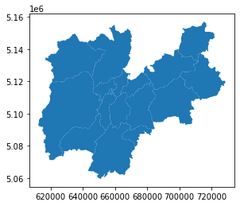
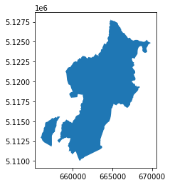
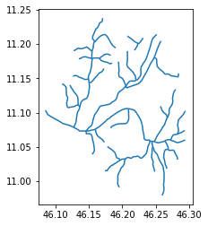
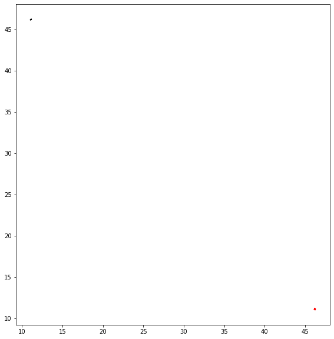
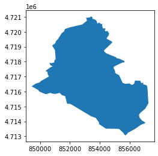
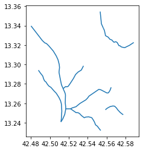
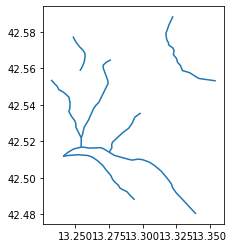

---
# Setup

you can use pygeos or rtree but you need to install before geopandas


```python
try:
  import pygeos
except ModuleNotFoundError as e:
  !pip install pygeos==0.10.2
  import pygeos

```


```python
try:
  import geopandas as gpd
except ModuleNotFoundError as e:
  !pip install geopandas==0.10.1
  import geopandas as gpd
if gpd.__version__ != "0.10.1":
  !pip install -U geopandas==0.10.1
  import geopandas as gpd
```


```python
try:
    import owslib
except ModuleNotFoundError as e:
    !pip install owslib==0.25.0
    import owslib
    
if owslib.__version__ != "0.25.0":
    !pip install -U owslib==0.25.0
    import owslib

```


```python
try:
    import shapefile
except ModuleNotFoundError as e:
    !pip install pyshp==2.1.3
    import shapefile

if shapefile.__version__ != "2.1.3":
    !pip install -U pyshp==2.1.3
    import shapefile
```


```python
import os
os.environ['RESTAPI_USE_ARCPY'] = 'FALSE'

try:
    import restapi
except ModuleNotFoundError as e:
    !pip install bmi-arcgis-restapi==2.1.2
    import restapi

if restapi.__version__ != "2.1.2":
    !pip install -U bmi-arcgis-restapi==2.1.2
    import restapi

```

# Exercise

- find the administrative border of “comunità di valle” (community of valley) of Province Autonomous of Trento
- identify all the rivers inside the smallest community of valley of Trentino
- repeat the same exercise with the layer “Comuni Terremotati” (municipalities affected by earthquake) of the italian Civil Protection by choosing the smallest municipality contained on the layer

---

# Solutions

## learning objectives
* repeat the concepts on the previous lesson

---

## find the administrative border of “comunità di valle” (community of valley) of Province Autonomous of Trento


```python
from owslib.csw import CatalogueServiceWeb
from owslib.fes import PropertyIsLike
import geopandas as gpd
from matplotlib import pyplot as plt
```

We start from the italian national repository - [http://geodati.gov.it](http://geodati.gov.it)


```python
csw = CatalogueServiceWeb("http://geodati.gov.it/RNDT/csw")
```


```python
query = PropertyIsLike('csw:AnyText', 'Comunità di valle')
```


```python
csw.getrecords2(constraints=[query],maxrecords=5)
```


```python
for rec in csw.records:
  print(rec + " - " + csw.records[rec].title)
```

    p_TN:58604ed2-ac1d-4f78-a00c-514fd3562c51 - Limite Comunità di valle
    cnz_pvdt:4D17C962-1863-4C5F-8B01-AB8308A8CBB0 - Parco Ticino area della riserva della biosfera MAB Ticino Valley
    r_abruzz:00047:20091110:151939 - Comunità Montane Regione Abruzzo
    r_lombar:DC961855-02B4-46A8-93A9-1FE3D5E4FB4F - Alpeggi
    R_SARDEG:JZMRW - DBMP - Comunità montana


```python
id_record="p_TN:58604ed2-ac1d-4f78-a00c-514fd3562c51"
```


```python
record = csw.records[id_record]
```


```python
record.abstract
```


    "Rappresenta il limite delle Comunità di valle, le quali sono enti pubblici locali a struttura associativa costituiti obbligatoriamente dai comuni compresi in ciascun territorio individuato ai sensi dell'art.12 comma 2 (LP3-2006 art 14 comma2) ad esse e ai Comuni di Trento e Rovereto sono trasferite numerose competenze che ora sono in capo alla Provincia, ovviamente fatte salve le competenze dei comuni e delle amministrazioni separate dei beni di usi civico.Intesa tra la Provincia e il Consiglio delle Autonomie locali approvato nella seduta del 16 marzo 2007 concernente Individuazione dei territori delle Comunità ai sensi dell'articolo 12 della legge provinciale 16 giugno 2006, n. 3 (Norme in materia di governo dell'autonomia del Trentino).NB: PER LA TABELLA DEGLI ATTRIBUTI E' STATO UTILIZZATO IL SET DI CARATTERI UNICODE UTF-8"


```python
for reference in record.references:
  print(reference['scheme'])
  print(reference['url'])
```

    urn:x-esri:specification:ServiceType:ArcIMS:Metadata:Server
    http://www.territorio.provincia.tn.it
    urn:x-esri:specification:ServiceType:ArcIMS:Metadata:Server
    https://idt.provincia.tn.it/idt/vector/p_TN_58604ed2-ac1d-4f78-a00c-514fd3562c51.zip
    urn:x-esri:specification:ServiceType:ArcIMS:Metadata:Document
    https://geodati.gov.it/geoportalRNDTPA/csw?getxml=%7BA0C53BE3-34E8-4EC1-9FD9-348BFE2833AD%7D


```python
valley_communities = gpd.read_file('https://siat.provincia.tn.it/IDT/vector/public/p_tn_58604ed2-ac1d-4f78-a00c-514fd3562c51.zip')
```


```python
valley_communities.head(5)
```


<div>
<style scoped>
    .dataframe tbody tr th:only-of-type {
        vertical-align: middle;
    }

    .dataframe tbody tr th {
        vertical-align: top;
    }

    .dataframe thead th {
        text-align: right;
    }
</style>
<table border="1" class="dataframe">
  <thead>
    <tr style="text-align: right;">
      <th></th>
      <th>objectid</th>
      <th>classid</th>
      <th>sede</th>
      <th>nome</th>
      <th>struttura</th>
      <th>struttura_</th>
      <th>dataini</th>
      <th>datafine</th>
      <th>fkfonte</th>
      <th>fktfonte_d</th>
      <th>fktipoelab</th>
      <th>fktipoel_d</th>
      <th>fkscala</th>
      <th>fkscala_d</th>
      <th>geometry</th>
    </tr>
  </thead>
  <tbody>
    <tr>
      <th>0</th>
      <td>181</td>
      <td>AMB002_14</td>
      <td>ANDALO</td>
      <td>COMUNITÀ DELLA PAGANELLA</td>
      <td>S133</td>
      <td>Servizio Catasto</td>
      <td>2020/01/01 00:00:00.000</td>
      <td>None</td>
      <td>05</td>
      <td>altre fonti</td>
      <td>01</td>
      <td>manuale</td>
      <td>03</td>
      <td>10000</td>
      <td>POLYGON ((659718.849 5118603.995, 659717.453 5...</td>
    </tr>
    <tr>
      <th>1</th>
      <td>182</td>
      <td>AMB002_8</td>
      <td>TIONE DI TRENTO</td>
      <td>COMUNITÀ DELLE GIUDICARIE</td>
      <td>S133</td>
      <td>Servizio Catasto</td>
      <td>2020/01/01 00:00:00.000</td>
      <td>None</td>
      <td>05</td>
      <td>altre fonti</td>
      <td>01</td>
      <td>manuale</td>
      <td>03</td>
      <td>10000</td>
      <td>POLYGON ((626847.878 5074565.314, 626878.525 5...</td>
    </tr>
    <tr>
      <th>2</th>
      <td>183</td>
      <td>AMB002_12</td>
      <td>LAVARONE</td>
      <td>MAGNIFICA COMUNITÀ DEGLI ALTIPIANI CIMBRI</td>
      <td>S133</td>
      <td>Servizio Catasto</td>
      <td>2020/01/01 00:00:00.000</td>
      <td>None</td>
      <td>05</td>
      <td>altre fonti</td>
      <td>01</td>
      <td>manuale</td>
      <td>03</td>
      <td>10000</td>
      <td>POLYGON ((675134.859 5087715.705, 675136.500 5...</td>
    </tr>
    <tr>
      <th>3</th>
      <td>184</td>
      <td>AMB002_15</td>
      <td>TRENTO</td>
      <td>TERRITORIO VAL D'ADIGE</td>
      <td>S133</td>
      <td>Servizio Catasto</td>
      <td>2020/01/01 00:00:00.000</td>
      <td>None</td>
      <td>05</td>
      <td>altre fonti</td>
      <td>01</td>
      <td>manuale</td>
      <td>03</td>
      <td>10000</td>
      <td>POLYGON ((663458.060 5094288.411, 663453.437 5...</td>
    </tr>
    <tr>
      <th>4</th>
      <td>185</td>
      <td>AMB002_1</td>
      <td>CAVALESE</td>
      <td>COMUNITÀ TERRITORIALE DELLA VAL DI FIEMME</td>
      <td>S133</td>
      <td>Servizio Catasto</td>
      <td>2020/01/01 00:00:00.000</td>
      <td>None</td>
      <td>05</td>
      <td>altre fonti</td>
      <td>01</td>
      <td>manuale</td>
      <td>03</td>
      <td>10000</td>
      <td>POLYGON ((681770.000 5126270.500, 681789.000 5...</td>
    </tr>
  </tbody>
</table>
</div>


```python
valley_communities.plot()
plt.show()
```


    

    


```python
valley_communities.head(5)
```


<div>
<style scoped>
    .dataframe tbody tr th:only-of-type {
        vertical-align: middle;
    }

    .dataframe tbody tr th {
        vertical-align: top;
    }

    .dataframe thead th {
        text-align: right;
    }
</style>
<table border="1" class="dataframe">
  <thead>
    <tr style="text-align: right;">
      <th></th>
      <th>objectid</th>
      <th>classid</th>
      <th>sede</th>
      <th>nome</th>
      <th>struttura</th>
      <th>struttura_</th>
      <th>dataini</th>
      <th>datafine</th>
      <th>fkfonte</th>
      <th>fktfonte_d</th>
      <th>fktipoelab</th>
      <th>fktipoel_d</th>
      <th>fkscala</th>
      <th>fkscala_d</th>
      <th>geometry</th>
    </tr>
  </thead>
  <tbody>
    <tr>
      <th>0</th>
      <td>181</td>
      <td>AMB002_14</td>
      <td>ANDALO</td>
      <td>COMUNITÀ DELLA PAGANELLA</td>
      <td>S133</td>
      <td>Servizio Catasto</td>
      <td>2020/01/01 00:00:00.000</td>
      <td>None</td>
      <td>05</td>
      <td>altre fonti</td>
      <td>01</td>
      <td>manuale</td>
      <td>03</td>
      <td>10000</td>
      <td>POLYGON ((659718.849 5118603.995, 659717.453 5...</td>
    </tr>
    <tr>
      <th>1</th>
      <td>182</td>
      <td>AMB002_8</td>
      <td>TIONE DI TRENTO</td>
      <td>COMUNITÀ DELLE GIUDICARIE</td>
      <td>S133</td>
      <td>Servizio Catasto</td>
      <td>2020/01/01 00:00:00.000</td>
      <td>None</td>
      <td>05</td>
      <td>altre fonti</td>
      <td>01</td>
      <td>manuale</td>
      <td>03</td>
      <td>10000</td>
      <td>POLYGON ((626847.878 5074565.314, 626878.525 5...</td>
    </tr>
    <tr>
      <th>2</th>
      <td>183</td>
      <td>AMB002_12</td>
      <td>LAVARONE</td>
      <td>MAGNIFICA COMUNITÀ DEGLI ALTIPIANI CIMBRI</td>
      <td>S133</td>
      <td>Servizio Catasto</td>
      <td>2020/01/01 00:00:00.000</td>
      <td>None</td>
      <td>05</td>
      <td>altre fonti</td>
      <td>01</td>
      <td>manuale</td>
      <td>03</td>
      <td>10000</td>
      <td>POLYGON ((675134.859 5087715.705, 675136.500 5...</td>
    </tr>
    <tr>
      <th>3</th>
      <td>184</td>
      <td>AMB002_15</td>
      <td>TRENTO</td>
      <td>TERRITORIO VAL D'ADIGE</td>
      <td>S133</td>
      <td>Servizio Catasto</td>
      <td>2020/01/01 00:00:00.000</td>
      <td>None</td>
      <td>05</td>
      <td>altre fonti</td>
      <td>01</td>
      <td>manuale</td>
      <td>03</td>
      <td>10000</td>
      <td>POLYGON ((663458.060 5094288.411, 663453.437 5...</td>
    </tr>
    <tr>
      <th>4</th>
      <td>185</td>
      <td>AMB002_1</td>
      <td>CAVALESE</td>
      <td>COMUNITÀ TERRITORIALE DELLA VAL DI FIEMME</td>
      <td>S133</td>
      <td>Servizio Catasto</td>
      <td>2020/01/01 00:00:00.000</td>
      <td>None</td>
      <td>05</td>
      <td>altre fonti</td>
      <td>01</td>
      <td>manuale</td>
      <td>03</td>
      <td>10000</td>
      <td>POLYGON ((681770.000 5126270.500, 681789.000 5...</td>
    </tr>
  </tbody>
</table>
</div>


## identify all the rivers inside the smallest community of valley of Trentino

### identify the smallest community of valley


```python
smallest_community = valley_communities[valley_communities.area == valley_communities.area.min()]
```


```python
smallest_community
```


<div>
<style scoped>
    .dataframe tbody tr th:only-of-type {
        vertical-align: middle;
    }

    .dataframe tbody tr th {
        vertical-align: top;
    }

    .dataframe thead th {
        text-align: right;
    }
</style>
<table border="1" class="dataframe">
  <thead>
    <tr style="text-align: right;">
      <th></th>
      <th>objectid</th>
      <th>classid</th>
      <th>sede</th>
      <th>nome</th>
      <th>struttura</th>
      <th>struttura_</th>
      <th>dataini</th>
      <th>datafine</th>
      <th>fkfonte</th>
      <th>fktfonte_d</th>
      <th>fktipoelab</th>
      <th>fktipoel_d</th>
      <th>fkscala</th>
      <th>fkscala_d</th>
      <th>geometry</th>
    </tr>
  </thead>
  <tbody>
    <tr>
      <th>10</th>
      <td>191</td>
      <td>AMB002_13</td>
      <td>MEZZOCORONA</td>
      <td>COMUNITÀ ROTALIANA-KÖNIGSBERG</td>
      <td>S133</td>
      <td>Servizio Catasto</td>
      <td>2020/01/01 00:00:00.000</td>
      <td>None</td>
      <td>05</td>
      <td>altre fonti</td>
      <td>01</td>
      <td>manuale</td>
      <td>03</td>
      <td>10000</td>
      <td>MULTIPOLYGON (((656059.164 5112838.836, 656030...</td>
    </tr>
  </tbody>
</table>
</div>


```python
smallest_community.nome
```


    10    COMUNITÀ ROTALIANA-KÖNIGSBERG
    Name: nome, dtype: object


```python
smallest_community.plot()
plt.show()
```


    

    


```python
smallest_community.explore()
```


### find a layer with the rivers for the area


identify the bounding box


```python
smallest_community.to_crs(epsg=4326).bounds
```


<div>
<style scoped>
    .dataframe tbody tr th:only-of-type {
        vertical-align: middle;
    }

    .dataframe tbody tr th {
        vertical-align: top;
    }

    .dataframe thead th {
        text-align: right;
    }
</style>
<table border="1" class="dataframe">
  <thead>
    <tr style="text-align: right;">
      <th></th>
      <th>minx</th>
      <th>miny</th>
      <th>maxx</th>
      <th>maxy</th>
    </tr>
  </thead>
  <tbody>
    <tr>
      <th>10</th>
      <td>11.019439</td>
      <td>46.12501</td>
      <td>11.203875</td>
      <td>46.283791</td>
    </tr>
  </tbody>
</table>
</div>


```python
bbox = list(smallest_community.to_crs(epsg=4326).bounds.values[0])
```


```python
bbox
```


    [11.01943938362622, 46.12500990155531, 11.203874962508163, 46.283790799274264]


in this case we can use the WFS of [the national cartographic portal of the Italian Ministry of the Environment](http://www.pcn.minambiente.it/)


```python
csw = CatalogueServiceWeb("http://www.pcn.minambiente.it/geoportal/csw")
```


[ ... ] 


```python
from owslib.wfs import WebFeatureService
```


```python
wfs_url="http://wms.pcn.minambiente.it/ogc?map=/ms_ogc/wfs/Aste_fluviali.map"
```


```python
wfs = WebFeatureService(url=wfs_url,version="1.1.0")
```


```python
wfs.identification.title
```


    'Reticolo idrografico'


```python
wfs.contents
```


    {'ID.RETICOLO.FIUMI_PRINCIPALI_SECONDARI': <owslib.feature.wfs110.ContentMetadata at 0x7f55690ed7f0>,
     'ID.RETICOLO.FIUMI_TORRENTI': <owslib.feature.wfs110.ContentMetadata at 0x7f5567d4a3d0>,
     'ID.RETICOLO.CORSI_ACQUA': <owslib.feature.wfs110.ContentMetadata at 0x7f553ac17be0>,
     'ID.RETICOLO.ELEMENTI_IDRICI': <owslib.feature.wfs110.ContentMetadata at 0x7f553ac17f10>}


```python
layer = list(wfs.contents)[2]
```


```python
response = wfs.getfeature(typename=layer, bbox=bbox,srsname='urn:ogc:def:crs:EPSG::4326')
```


```python
rivers = gpd.read_file(response)
```


```python
rivers.head(3)
```


<div>
<style scoped>
    .dataframe tbody tr th:only-of-type {
        vertical-align: middle;
    }

    .dataframe tbody tr th {
        vertical-align: top;
    }

    .dataframe thead th {
        text-align: right;
    }
</style>
<table border="1" class="dataframe">
  <thead>
    <tr style="text-align: right;">
      <th></th>
      <th>gml_id</th>
      <th>id_fiume</th>
      <th>id_tratta</th>
      <th>tipo</th>
      <th>nome</th>
      <th>foglio_igm</th>
      <th>sottotipo</th>
      <th>ordine</th>
      <th>bacino_pri</th>
      <th>bacino</th>
      <th>da</th>
      <th>tipo_da</th>
      <th>a</th>
      <th>tipo_a</th>
      <th>annotazion</th>
      <th>enabled</th>
      <th>geometry</th>
    </tr>
  </thead>
  <tbody>
    <tr>
      <th>0</th>
      <td>ID.RETICOLO.CORSI_ACQUA.9878</td>
      <td>2241</td>
      <td>11503</td>
      <td></td>
      <td></td>
      <td>BOLZANO</td>
      <td>1</td>
      <td>3</td>
      <td>ADIGE</td>
      <td></td>
      <td>SORGENTE</td>
      <td>1</td>
      <td>NOCE</td>
      <td>3</td>
      <td></td>
      <td>1</td>
      <td>LINESTRING (46.17313 11.05670, 46.17069 11.060...</td>
    </tr>
    <tr>
      <th>1</th>
      <td>ID.RETICOLO.CORSI_ACQUA.16150</td>
      <td>688</td>
      <td>14645</td>
      <td></td>
      <td></td>
      <td>BOLZANO</td>
      <td>1</td>
      <td>2</td>
      <td>ADIGE</td>
      <td></td>
      <td>SORGENTE</td>
      <td>1</td>
      <td>ADIGE</td>
      <td>3</td>
      <td></td>
      <td>1</td>
      <td>LINESTRING (46.15510 11.03917, 46.15664 11.041...</td>
    </tr>
    <tr>
      <th>2</th>
      <td>ID.RETICOLO.CORSI_ACQUA.20273</td>
      <td>885</td>
      <td>21041</td>
      <td>TORRENTE</td>
      <td>AVISIO</td>
      <td>BOLZANO</td>
      <td>1</td>
      <td>2</td>
      <td>ADIGE</td>
      <td></td>
      <td>19357</td>
      <td>3</td>
      <td>21042</td>
      <td>3</td>
      <td></td>
      <td>1</td>
      <td>LINESTRING (46.17089 11.23801, 46.17053 11.237...</td>
    </tr>
  </tbody>
</table>
</div>


```python
rivers.plot()
plt.show()
```


    

    


```python
geometry_smallest_community_4326 = smallest_community.geometry.to_crs(epsg=4326).values[0]
```


```python
rivers.within(geometry_smallest_community_4326).unique()
```


    array([False])


```python
ax = smallest_community.to_crs(4326).plot(edgecolor='k',figsize=(15, 10))
rivers.plot(ax=ax,color="red")
plt.show()

```


    

    


there the problem of the inverted axes<br/>
It can ben solved with this function


```python
import shapely
```


```python
def swapxy(geometry):
  geometry = shapely.ops.transform(lambda x, y: (y, x),geometry)
  return geometry
```


```python
rivers['geometry'] = rivers['geometry'].apply(lambda geometry: swapxy(geometry))
```


```python
rivers.plot()
plt.show()
```


    

    


we are ready to plot on a map


```python
y = rivers.unary_union.centroid.y
x = rivers.unary_union.centroid.x
```


```python
y
```


    46.20213279893027


```python
x
```


    11.110945030023714


```python
ax = smallest_community.to_crs(4326).plot(edgecolor='k',figsize=(15, 10))
rivers.plot(ax=ax,color="red")
plt.show()
```


    

    


**CLIP**

we need to have all the rivers inside the area and not the bounding box


```python
gpd.clip(rivers, smallest_community)
```

    <ipython-input-79-b31fe8dff997>:1: UserWarning: CRS mismatch between the CRS of left geometries and the CRS of right geometries.
    Use `to_crs()` to reproject one of the input geometries to match the CRS of the other.
    
    Left CRS: EPSG:4326
    Right CRS: EPSG:25832
    
      gpd.clip(rivers, smallest_community)


<div>
<style scoped>
    .dataframe tbody tr th:only-of-type {
        vertical-align: middle;
    }

    .dataframe tbody tr th {
        vertical-align: top;
    }

    .dataframe thead th {
        text-align: right;
    }
</style>
<table border="1" class="dataframe">
  <thead>
    <tr style="text-align: right;">
      <th></th>
      <th>gml_id</th>
      <th>id_fiume</th>
      <th>id_tratta</th>
      <th>tipo</th>
      <th>nome</th>
      <th>foglio_igm</th>
      <th>sottotipo</th>
      <th>ordine</th>
      <th>bacino_pri</th>
      <th>bacino</th>
      <th>da</th>
      <th>tipo_da</th>
      <th>a</th>
      <th>tipo_a</th>
      <th>annotazion</th>
      <th>enabled</th>
      <th>geometry</th>
    </tr>
  </thead>
  <tbody>
  </tbody>
</table>
</div>


the geodatamews have to use the same projection


```python
rivers_rotaliana = gpd.clip(rivers.to_crs(epsg=4326), smallest_community.to_crs(epsg=4326))
```


```python
rivers.plot()
plt.show()
```


    

    


```python
rivers_rotaliana.plot()
plt.show()
```


    

    


show the rivers on the map


```python
rivers.explore()
```


---

## repeat the same exercise with the layer “Comuni Terremotati” (municipalities affected by earthquake) of the italian Civil Protection by choosing the smallest municipality contained on the layer


```python
import os
os.environ['RESTAPI_USE_ARCPY'] = 'FALSE'
import restapi
```


```python
rest_url = 'https://services6.arcgis.com/L1SotImj1AAZY1eK/ArcGIS/rest/services'
ags = restapi.ArcServer(rest_url)
```


```python
agc_service_name = ""
for service in ags.services:
  if service.name == 'Comuni_Terremotati':
    agc_service_name = service.name
    print(service.name)
```

    Comuni_Terremotati


```python
ags_service = ags.getService(agc_service_name)
ags_service.list_layers()
```


    ['comuni_terremotatiDD']


```python
municipalities_affected_earthquake = ags_service.layer('comuni_terremotatiDD')
```

we can ask ArcGIS RestAPI to transform the source from the native projection to the [EPSG:25832](http://epsg.io/25832)


```python
municipalities_affected_earthquake.export_layer('municipalities_affected_earthquake.shp', outSR=25832)
```

    Created: "municipalities_affected_earthquake.shp"


    'municipalities_affected_earthquake.shp'


```python
geo_municipalities_affected_earthquake = gpd.read_file('municipalities_affected_earthquake.shp')
```


```python
geo_municipalities_affected_earthquake.geometry
```


    0     POLYGON ((825823.37496 4744509.99999, 825831.8...
    1     POLYGON ((822188.87502 4732801.00004, 822431.1...
    2     POLYGON ((836677.62503 4755035.49995, 838169.8...
    3     POLYGON ((832493.43752 4758168.99995, 833177.3...
    4     POLYGON ((858381.68751 4751289.99998, 858884.9...
    5     POLYGON ((849760.43751 4750082.49996, 849960.9...
    6     POLYGON ((846041.81249 4765923.99998, 846232.9...
    7     POLYGON ((856514.06245 4756609.99998, 856643.0...
    8     POLYGON ((850434.12498 4761464.99995, 850516.5...
    9     POLYGON ((850348.12500 4740939.49997, 850545.4...
    10    POLYGON ((856495.18747 4734432.49994, 856419.9...
    11    POLYGON ((832470.37500 4704205.50001, 832598.1...
    12    POLYGON ((860575.24996 4723655.50002, 860818.4...
    13    POLYGON ((853776.93752 4720760.50001, 853849.4...
    14    POLYGON ((845010.24996 4723371.99999, 845251.4...
    15    POLYGON ((873001.31246 4740017.50004, 873145.9...
    16    POLYGON ((871474.12497 4750509.50001, 871638.4...
    Name: geometry, dtype: geometry


the values of the coordinates seems to be in meters


```python
geo_municipalities_affected_earthquake.crs
```


    <Geographic 2D CRS: EPSG:4326>
    Name: WGS 84
    Axis Info [ellipsoidal]:
    - Lat[north]: Geodetic latitude (degree)
    - Lon[east]: Geodetic longitude (degree)
    Area of Use:
    - name: World.
    - bounds: (-180.0, -90.0, 180.0, 90.0)
    Datum: World Geodetic System 1984 ensemble
    - Ellipsoid: WGS 84
    - Prime Meridian: Greenwich


.. but the CRS is EPSG:426 ... we need to rewrite it!!!


```python
geo_municipalities_affected_earthquake = geo_municipalities_affected_earthquake.set_crs(epsg=25832,allow_override=True)
```


```python
geo_municipalities_affected_earthquake.crs
```


    <Projected CRS: EPSG:25832>
    Name: ETRS89 / UTM zone 32N
    Axis Info [cartesian]:
    - E[east]: Easting (metre)
    - N[north]: Northing (metre)
    Area of Use:
    - name: Europe between 6°E and 12°E: Austria; Belgium; Denmark - onshore and offshore; Germany - onshore and offshore; Norway including - onshore and offshore; Spain - offshore.
    - bounds: (6.0, 38.76, 12.0, 84.33)
    Coordinate Operation:
    - name: UTM zone 32N
    - method: Transverse Mercator
    Datum: European Terrestrial Reference System 1989 ensemble
    - Ellipsoid: GRS 1980
    - Prime Meridian: Greenwich


Now is ok!


```python
geo_municipalities_affected_earthquake.explore()
```


```python
minarea = geo_municipalities_affected_earthquake.geometry.area.min()
```


```python
minarea
```


    30665483.55191904


```python
smallest_municipality = geo_municipalities_affected_earthquake[geo_municipalities_affected_earthquake.geometry.area == minarea]
```


```python
smallest_municipality.plot()
plt.show()
```


    

    


```python
smallest_municipality.explore()
```


```python
smallest_municipality.COMUNE
```


    13    Capitignano
    Name: COMUNE, dtype: object


we can use the same WFS resource used before with the new bounding box


```python
bbox= list(smallest_municipality.to_crs(epsg=4326).bounds.values[0])
```


```python
response = wfs.getfeature(typename=layer, bbox=bbox,srsname='urn:ogc:def:crs:EPSG::4326')
```


```python
rivers_capitignano = gpd.read_file(response)
```


```python
rivers_capitignano.plot()
plt.show()
```


    

    


... and we need always to invert the axes


```python
rivers_capitignano['geometry'] = rivers_capitignano['geometry'].apply(lambda geometry: swapxy(geometry))
```


```python
rivers_capitignano.plot()
plt.show()
```


    

    

