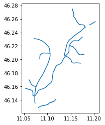
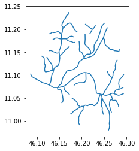
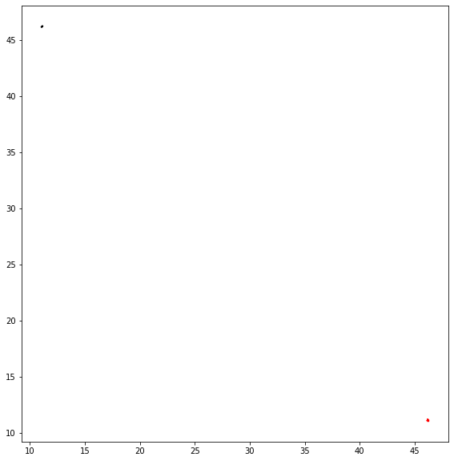
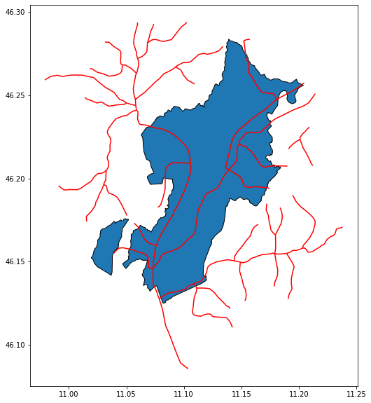
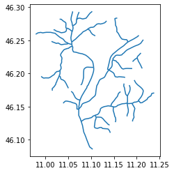
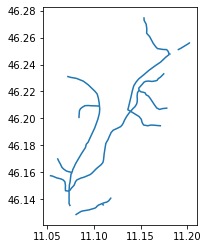
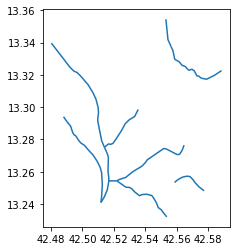
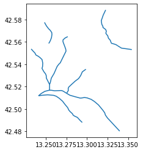

---
# Setup

you can use pygeos or rtree but you need to install before geopandas


```python
try:
  import pygeos
except ModuleNotFoundError as e:
  !pip install pygeos==0.10.2
  import pygeos
```


```python
try:
    import geopy
except ModuleNotFoundError as e:
    !pip install geopy==2.2.0
    import geopy
if geopy.__version__ != "2.2.0":
    !pip install -U geopy==2.2.0
    import geopy
```


```python
try:
  import mapclassify
except ModuleNotFoundError as e:
  !pip install mapclassify=="2.4.3"
  import mapclassify
```


```python
try:
  import geopandas as gpd
except ModuleNotFoundError as e:
  !pip install geopandas==0.10.2
  import geopandas as gpd
if gpd.__version__ != "0.10.2":
  !pip install -U geopandas==0.10.2
  import geopandas as gpd
```


```python
try:
    import owslib
except ModuleNotFoundError as e:
    !pip install owslib==0.25.0
    import owslib
    
if owslib.__version__ != "0.25.0":
    !pip install -U owslib==0.25.0
    import owslib

```


```python
try:
    import shapefile
except ModuleNotFoundError as e:
    !pip install pyshp==2.1.3
    import shapefile

if shapefile.__version__ != "2.1.3":
    !pip install -U pyshp==2.1.3
    import shapefile
```


```python
import os
os.environ['RESTAPI_USE_ARCPY'] = 'FALSE'

try:
    import restapi
except ModuleNotFoundError as e:
    !pip install bmi-arcgis-restapi==2.1.2
    import restapi

if restapi.__version__ != "2.1.2":
    !pip install -U bmi-arcgis-restapi==2.1.2
    import restapi

```

# Exercises
- identify the location of these address with a geocoder
   - Piazza Castello, Udine
   - Piazza Italia, Trento
   - Piazza Foroni, Torino
- find the administrative border of "comunità di valle" (community of valley) of Province Autonomous of Trento
- identify all the rivers inside the smallest community of valley of Trentino
- repeat the same exercise with the layer "Comuni Terremotati" (municipalities affected by earthquake) of the italian Civil Protection by choosing the smallest municipality contained on the layer

---

# Solutions

## learning objectives
* repeat the concepts on the previous lesson

---

## identify the location of these address with a geocoder
- Piazza Castello, Udine
- Piazza Italia, Trento
- Piazza Foroni, Torino

#### Piazza Castello, Udine


```python
q="Piazza, Castello, Udine"
point = gpd.tools.geocode(q, provider="arcgis") 
point.address[0]
```

    'Piazza Castello, 33010, Colloredo di Monte Albano, Udine'


Colloredo di Monte Albano is a municipality of Friuli Venezia Giula in province of 

We need to improve the query search because "Udine" is a municipality and also a (former) province.


```python
q="Piazza, Castello, Udine, Udine"
point = gpd.tools.geocode(q, provider="arcgis") 
point.address[0]
```


    'Piazzale del Castello, 33100, Udine'


```python
point.explore(marker_kwds={"color": "green", "radius": "10"})
```


<div style="width:100%;"><div style="position:relative;width:100%;height:0;padding-bottom:60%;"><span style="color:#565656">Make this Notebook Trusted to load map: File -> Trust Notebook</span><iframe srcdoc="&lt;!DOCTYPE html&gt;
&lt;head&gt;    
    &lt;meta http-equiv=&quot;content-type&quot; content=&quot;text/html; charset=UTF-8&quot; /&gt;

        &lt;script&gt;
            L_NO_TOUCH = false;
            L_DISABLE_3D = false;
        &lt;/script&gt;

    &lt;style&gt;html, body {width: 100%;height: 100%;margin: 0;padding: 0;}&lt;/style&gt;
    &lt;style&gt;#map {position:absolute;top:0;bottom:0;right:0;left:0;}&lt;/style&gt;
    &lt;script src=&quot;https://cdn.jsdelivr.net/npm/leaflet@1.6.0/dist/leaflet.js&quot;&gt;&lt;/script&gt;
    &lt;script src=&quot;https://code.jquery.com/jquery-1.12.4.min.js&quot;&gt;&lt;/script&gt;
    &lt;script src=&quot;https://maxcdn.bootstrapcdn.com/bootstrap/3.2.0/js/bootstrap.min.js&quot;&gt;&lt;/script&gt;
    &lt;script src=&quot;https://cdnjs.cloudflare.com/ajax/libs/Leaflet.awesome-markers/2.0.2/leaflet.awesome-markers.js&quot;&gt;&lt;/script&gt;
    &lt;link rel=&quot;stylesheet&quot; href=&quot;https://cdn.jsdelivr.net/npm/leaflet@1.6.0/dist/leaflet.css&quot;/&gt;
    &lt;link rel=&quot;stylesheet&quot; href=&quot;https://maxcdn.bootstrapcdn.com/bootstrap/3.2.0/css/bootstrap.min.css&quot;/&gt;
    &lt;link rel=&quot;stylesheet&quot; href=&quot;https://maxcdn.bootstrapcdn.com/bootstrap/3.2.0/css/bootstrap-theme.min.css&quot;/&gt;
    &lt;link rel=&quot;stylesheet&quot; href=&quot;https://maxcdn.bootstrapcdn.com/font-awesome/4.6.3/css/font-awesome.min.css&quot;/&gt;
    &lt;link rel=&quot;stylesheet&quot; href=&quot;https://cdnjs.cloudflare.com/ajax/libs/Leaflet.awesome-markers/2.0.2/leaflet.awesome-markers.css&quot;/&gt;
    &lt;link rel=&quot;stylesheet&quot; href=&quot;https://cdn.jsdelivr.net/gh/python-visualization/folium/folium/templates/leaflet.awesome.rotate.min.css&quot;/&gt;

            &lt;meta name=&quot;viewport&quot; content=&quot;width=device-width,
                initial-scale=1.0, maximum-scale=1.0, user-scalable=no&quot; /&gt;
            &lt;style&gt;
                #map_a6da453bc707ce74ef055fba4e5aac51 {
                    position: relative;
                    width: 100.0%;
                    height: 100.0%;
                    left: 0.0%;
                    top: 0.0%;
                }
            &lt;/style&gt;


                    &lt;style&gt;
                        .foliumtooltip {

                        }
                       .foliumtooltip table{
                            margin: auto;
                        }
                        .foliumtooltip tr{
                            text-align: left;
                        }
                        .foliumtooltip th{
                            padding: 2px; padding-right: 8px;
                        }
                    &lt;/style&gt;

&lt;/head&gt;
&lt;body&gt;    

            &lt;div class=&quot;folium-map&quot; id=&quot;map_a6da453bc707ce74ef055fba4e5aac51&quot; &gt;&lt;/div&gt;

&lt;/body&gt;
&lt;script&gt;    

            var map_a6da453bc707ce74ef055fba4e5aac51 = L.map(
                &quot;map_a6da453bc707ce74ef055fba4e5aac51&quot;,
                {
                    center: [46.06423493567362, 13.236588074557865],
                    crs: L.CRS.EPSG3857,
                    zoom: 10,
                    zoomControl: true,
                    preferCanvas: false,
                }
            );
            L.control.scale().addTo(map_a6da453bc707ce74ef055fba4e5aac51);


            var tile_layer_d2a0245f0e5fc8d54379c4720ca8bacf = L.tileLayer(
                &quot;https://{s}.tile.openstreetmap.org/{z}/{x}/{y}.png&quot;,
                {&quot;attribution&quot;: &quot;Data by \u0026copy; \u003ca href=\&quot;http://openstreetmap.org\&quot;\u003eOpenStreetMap\u003c/a\u003e, under \u003ca href=\&quot;http://www.openstreetmap.org/copyright\&quot;\u003eODbL\u003c/a\u003e.&quot;, &quot;detectRetina&quot;: false, &quot;maxNativeZoom&quot;: 18, &quot;maxZoom&quot;: 18, &quot;minZoom&quot;: 0, &quot;noWrap&quot;: false, &quot;opacity&quot;: 1, &quot;subdomains&quot;: &quot;abc&quot;, &quot;tms&quot;: false}
            ).addTo(map_a6da453bc707ce74ef055fba4e5aac51);


            map_a6da453bc707ce74ef055fba4e5aac51.fitBounds(
                [[46.06423493567362, 13.236588074557865], [46.06423493567362, 13.236588074557865]],
                {}
            );


        function geo_json_20e3ff59179611e257647873afedddcb_styler(feature) {
            switch(feature.id) {
                default:
                    return {&quot;fillOpacity&quot;: 0.5, &quot;weight&quot;: 2};
            }
        }
        function geo_json_20e3ff59179611e257647873afedddcb_highlighter(feature) {
            switch(feature.id) {
                default:
                    return {&quot;fillOpacity&quot;: 0.75};
            }
        }
        function geo_json_20e3ff59179611e257647873afedddcb_pointToLayer(feature, latlng) {
            var opts = {&quot;bubblingMouseEvents&quot;: true, &quot;color&quot;: &quot;green&quot;, &quot;dashArray&quot;: null, &quot;dashOffset&quot;: null, &quot;fill&quot;: true, &quot;fillColor&quot;: &quot;green&quot;, &quot;fillOpacity&quot;: 0.2, &quot;fillRule&quot;: &quot;evenodd&quot;, &quot;lineCap&quot;: &quot;round&quot;, &quot;lineJoin&quot;: &quot;round&quot;, &quot;opacity&quot;: 1.0, &quot;radius&quot;: &quot;10&quot;, &quot;stroke&quot;: true, &quot;weight&quot;: 3};

            let style = geo_json_20e3ff59179611e257647873afedddcb_styler(feature)
            Object.assign(opts, style)

            return new L.CircleMarker(latlng, opts)
        }

        function geo_json_20e3ff59179611e257647873afedddcb_onEachFeature(feature, layer) {
            layer.on({
                mouseout: function(e) {
                    if(typeof e.target.setStyle === &quot;function&quot;){
                        geo_json_20e3ff59179611e257647873afedddcb.resetStyle(e.target);
                    }
                },
                mouseover: function(e) {
                    if(typeof e.target.setStyle === &quot;function&quot;){
                        const highlightStyle = geo_json_20e3ff59179611e257647873afedddcb_highlighter(e.target.feature)
                        e.target.setStyle(highlightStyle);
                    }
                },
            });
        };
        var geo_json_20e3ff59179611e257647873afedddcb = L.geoJson(null, {
                onEachFeature: geo_json_20e3ff59179611e257647873afedddcb_onEachFeature,

                style: geo_json_20e3ff59179611e257647873afedddcb_styler,
                pointToLayer: geo_json_20e3ff59179611e257647873afedddcb_pointToLayer
        });

        function geo_json_20e3ff59179611e257647873afedddcb_add (data) {
            geo_json_20e3ff59179611e257647873afedddcb
                .addData(data)
                .addTo(map_a6da453bc707ce74ef055fba4e5aac51);
        }
            geo_json_20e3ff59179611e257647873afedddcb_add({&quot;bbox&quot;: [13.236588074557865, 46.06423493567362, 13.236588074557865, 46.06423493567362], &quot;features&quot;: [{&quot;bbox&quot;: [13.236588074557865, 46.06423493567362, 13.236588074557865, 46.06423493567362], &quot;geometry&quot;: {&quot;coordinates&quot;: [13.236588074557865, 46.06423493567362], &quot;type&quot;: &quot;Point&quot;}, &quot;id&quot;: &quot;0&quot;, &quot;properties&quot;: {&quot;address&quot;: &quot;Piazzale del Castello, 33100, Udine&quot;}, &quot;type&quot;: &quot;Feature&quot;}], &quot;type&quot;: &quot;FeatureCollection&quot;});


    geo_json_20e3ff59179611e257647873afedddcb.bindTooltip(
    function(layer){
    let div = L.DomUtil.create(&#x27;div&#x27;);

    let handleObject = feature=&gt;typeof(feature)==&#x27;object&#x27; ? JSON.stringify(feature) : feature;
    let fields = [&quot;address&quot;];
    let aliases = [&quot;address&quot;];
    let table = &#x27;&lt;table&gt;&#x27; +
        String(
        fields.map(
        (v,i)=&gt;
        `&lt;tr&gt;
            &lt;th&gt;${aliases[i]}&lt;/th&gt;

            &lt;td&gt;${handleObject(layer.feature.properties[v])}&lt;/td&gt;
        &lt;/tr&gt;`).join(&#x27;&#x27;))
    +&#x27;&lt;/table&gt;&#x27;;
    div.innerHTML=table;

    return div
    }
    ,{&quot;className&quot;: &quot;foliumtooltip&quot;, &quot;sticky&quot;: true});

&lt;/script&gt;" style="position:absolute;width:100%;height:100%;left:0;top:0;border:none !important;" allowfullscreen webkitallowfullscreen mozallowfullscreen></iframe></div></div>


this sounds right ... but "Piazzale"


```python
point_nominatim = gpd.tools.geocode(q,provider="Nominatim",user_agent="Example for the course")
point_nominatim.address[0]
```


    'Piazza Longobardi, Castello, Majano, Udine, Friuli-Venezia Giulia, Italia'


Complety wrong!
```q="Piazza, Castello, Udine, Udine"```
There a comma to remove


```python
q="Piazza Castello, Udine, Udine"
point_nominatim = gpd.tools.geocode(q,provider="Nominatim",user_agent="Example for the course")
point_nominatim.address[0]

```


    'Piazza Castello, Laibacco, Colloredo di Monte Albano, Udine, Friuli-Venezia Giulia, Italia'


again wrong ... 
investigate more values


```python
q="Piazzale Castello, Udine, Udine"
point_nominatim = gpd.tools.geocode(q,provider="Nominatim",user_agent="Example for the course")
point_nominatim.address[0]
```


    'Piazzale della Patria del Friuli, Borgo Gemona, Udine, Friuli-Venezia Giulia, 33100, Italia'


```python
point_nominatim.explore(marker_kwds={"color": "green", "radius": "10"})
```


<div style="width:100%;"><div style="position:relative;width:100%;height:0;padding-bottom:60%;"><span style="color:#565656">Make this Notebook Trusted to load map: File -> Trust Notebook</span><iframe srcdoc="&lt;!DOCTYPE html&gt;
&lt;head&gt;    
    &lt;meta http-equiv=&quot;content-type&quot; content=&quot;text/html; charset=UTF-8&quot; /&gt;

        &lt;script&gt;
            L_NO_TOUCH = false;
            L_DISABLE_3D = false;
        &lt;/script&gt;

    &lt;style&gt;html, body {width: 100%;height: 100%;margin: 0;padding: 0;}&lt;/style&gt;
    &lt;style&gt;#map {position:absolute;top:0;bottom:0;right:0;left:0;}&lt;/style&gt;
    &lt;script src=&quot;https://cdn.jsdelivr.net/npm/leaflet@1.6.0/dist/leaflet.js&quot;&gt;&lt;/script&gt;
    &lt;script src=&quot;https://code.jquery.com/jquery-1.12.4.min.js&quot;&gt;&lt;/script&gt;
    &lt;script src=&quot;https://maxcdn.bootstrapcdn.com/bootstrap/3.2.0/js/bootstrap.min.js&quot;&gt;&lt;/script&gt;
    &lt;script src=&quot;https://cdnjs.cloudflare.com/ajax/libs/Leaflet.awesome-markers/2.0.2/leaflet.awesome-markers.js&quot;&gt;&lt;/script&gt;
    &lt;link rel=&quot;stylesheet&quot; href=&quot;https://cdn.jsdelivr.net/npm/leaflet@1.6.0/dist/leaflet.css&quot;/&gt;
    &lt;link rel=&quot;stylesheet&quot; href=&quot;https://maxcdn.bootstrapcdn.com/bootstrap/3.2.0/css/bootstrap.min.css&quot;/&gt;
    &lt;link rel=&quot;stylesheet&quot; href=&quot;https://maxcdn.bootstrapcdn.com/bootstrap/3.2.0/css/bootstrap-theme.min.css&quot;/&gt;
    &lt;link rel=&quot;stylesheet&quot; href=&quot;https://maxcdn.bootstrapcdn.com/font-awesome/4.6.3/css/font-awesome.min.css&quot;/&gt;
    &lt;link rel=&quot;stylesheet&quot; href=&quot;https://cdnjs.cloudflare.com/ajax/libs/Leaflet.awesome-markers/2.0.2/leaflet.awesome-markers.css&quot;/&gt;
    &lt;link rel=&quot;stylesheet&quot; href=&quot;https://cdn.jsdelivr.net/gh/python-visualization/folium/folium/templates/leaflet.awesome.rotate.min.css&quot;/&gt;

            &lt;meta name=&quot;viewport&quot; content=&quot;width=device-width,
                initial-scale=1.0, maximum-scale=1.0, user-scalable=no&quot; /&gt;
            &lt;style&gt;
                #map_d4a393248393d2251de58c47ffa5c645 {
                    position: relative;
                    width: 100.0%;
                    height: 100.0%;
                    left: 0.0%;
                    top: 0.0%;
                }
            &lt;/style&gt;


                    &lt;style&gt;
                        .foliumtooltip {

                        }
                       .foliumtooltip table{
                            margin: auto;
                        }
                        .foliumtooltip tr{
                            text-align: left;
                        }
                        .foliumtooltip th{
                            padding: 2px; padding-right: 8px;
                        }
                    &lt;/style&gt;

&lt;/head&gt;
&lt;body&gt;    

            &lt;div class=&quot;folium-map&quot; id=&quot;map_d4a393248393d2251de58c47ffa5c645&quot; &gt;&lt;/div&gt;

&lt;/body&gt;
&lt;script&gt;    

            var map_d4a393248393d2251de58c47ffa5c645 = L.map(
                &quot;map_d4a393248393d2251de58c47ffa5c645&quot;,
                {
                    center: [46.0647686, 13.235658516341397],
                    crs: L.CRS.EPSG3857,
                    zoom: 10,
                    zoomControl: true,
                    preferCanvas: false,
                }
            );
            L.control.scale().addTo(map_d4a393248393d2251de58c47ffa5c645);


            var tile_layer_fbccb8b30fbb24dbe1d0815e3235ca8a = L.tileLayer(
                &quot;https://{s}.tile.openstreetmap.org/{z}/{x}/{y}.png&quot;,
                {&quot;attribution&quot;: &quot;Data by \u0026copy; \u003ca href=\&quot;http://openstreetmap.org\&quot;\u003eOpenStreetMap\u003c/a\u003e, under \u003ca href=\&quot;http://www.openstreetmap.org/copyright\&quot;\u003eODbL\u003c/a\u003e.&quot;, &quot;detectRetina&quot;: false, &quot;maxNativeZoom&quot;: 18, &quot;maxZoom&quot;: 18, &quot;minZoom&quot;: 0, &quot;noWrap&quot;: false, &quot;opacity&quot;: 1, &quot;subdomains&quot;: &quot;abc&quot;, &quot;tms&quot;: false}
            ).addTo(map_d4a393248393d2251de58c47ffa5c645);


            map_d4a393248393d2251de58c47ffa5c645.fitBounds(
                [[46.0647686, 13.235658516341397], [46.0647686, 13.235658516341397]],
                {}
            );


        function geo_json_2255a5612e569376d0ed7dd74346966d_styler(feature) {
            switch(feature.id) {
                default:
                    return {&quot;fillOpacity&quot;: 0.5, &quot;weight&quot;: 2};
            }
        }
        function geo_json_2255a5612e569376d0ed7dd74346966d_highlighter(feature) {
            switch(feature.id) {
                default:
                    return {&quot;fillOpacity&quot;: 0.75};
            }
        }
        function geo_json_2255a5612e569376d0ed7dd74346966d_pointToLayer(feature, latlng) {
            var opts = {&quot;bubblingMouseEvents&quot;: true, &quot;color&quot;: &quot;green&quot;, &quot;dashArray&quot;: null, &quot;dashOffset&quot;: null, &quot;fill&quot;: true, &quot;fillColor&quot;: &quot;green&quot;, &quot;fillOpacity&quot;: 0.2, &quot;fillRule&quot;: &quot;evenodd&quot;, &quot;lineCap&quot;: &quot;round&quot;, &quot;lineJoin&quot;: &quot;round&quot;, &quot;opacity&quot;: 1.0, &quot;radius&quot;: &quot;10&quot;, &quot;stroke&quot;: true, &quot;weight&quot;: 3};

            let style = geo_json_2255a5612e569376d0ed7dd74346966d_styler(feature)
            Object.assign(opts, style)

            return new L.CircleMarker(latlng, opts)
        }

        function geo_json_2255a5612e569376d0ed7dd74346966d_onEachFeature(feature, layer) {
            layer.on({
                mouseout: function(e) {
                    if(typeof e.target.setStyle === &quot;function&quot;){
                        geo_json_2255a5612e569376d0ed7dd74346966d.resetStyle(e.target);
                    }
                },
                mouseover: function(e) {
                    if(typeof e.target.setStyle === &quot;function&quot;){
                        const highlightStyle = geo_json_2255a5612e569376d0ed7dd74346966d_highlighter(e.target.feature)
                        e.target.setStyle(highlightStyle);
                    }
                },
            });
        };
        var geo_json_2255a5612e569376d0ed7dd74346966d = L.geoJson(null, {
                onEachFeature: geo_json_2255a5612e569376d0ed7dd74346966d_onEachFeature,

                style: geo_json_2255a5612e569376d0ed7dd74346966d_styler,
                pointToLayer: geo_json_2255a5612e569376d0ed7dd74346966d_pointToLayer
        });

        function geo_json_2255a5612e569376d0ed7dd74346966d_add (data) {
            geo_json_2255a5612e569376d0ed7dd74346966d
                .addData(data)
                .addTo(map_d4a393248393d2251de58c47ffa5c645);
        }
            geo_json_2255a5612e569376d0ed7dd74346966d_add({&quot;bbox&quot;: [13.235658516341397, 46.0647686, 13.235658516341397, 46.0647686], &quot;features&quot;: [{&quot;bbox&quot;: [13.235658516341397, 46.0647686, 13.235658516341397, 46.0647686], &quot;geometry&quot;: {&quot;coordinates&quot;: [13.235658516341397, 46.0647686], &quot;type&quot;: &quot;Point&quot;}, &quot;id&quot;: &quot;0&quot;, &quot;properties&quot;: {&quot;address&quot;: &quot;Piazzale della Patria del Friuli, Borgo Gemona, Udine, Friuli-Venezia Giulia, 33100, Italia&quot;}, &quot;type&quot;: &quot;Feature&quot;}], &quot;type&quot;: &quot;FeatureCollection&quot;});


    geo_json_2255a5612e569376d0ed7dd74346966d.bindTooltip(
    function(layer){
    let div = L.DomUtil.create(&#x27;div&#x27;);

    let handleObject = feature=&gt;typeof(feature)==&#x27;object&#x27; ? JSON.stringify(feature) : feature;
    let fields = [&quot;address&quot;];
    let aliases = [&quot;address&quot;];
    let table = &#x27;&lt;table&gt;&#x27; +
        String(
        fields.map(
        (v,i)=&gt;
        `&lt;tr&gt;
            &lt;th&gt;${aliases[i]}&lt;/th&gt;

            &lt;td&gt;${handleObject(layer.feature.properties[v])}&lt;/td&gt;
        &lt;/tr&gt;`).join(&#x27;&#x27;))
    +&#x27;&lt;/table&gt;&#x27;;
    div.innerHTML=table;

    return div
    }
    ,{&quot;className&quot;: &quot;foliumtooltip&quot;, &quot;sticky&quot;: true});

&lt;/script&gt;" style="position:absolute;width:100%;height:100%;left:0;top:0;border:none !important;" allowfullscreen webkitallowfullscreen mozallowfullscreen></iframe></div></div>


this looks right

More investigation


```python
from geopy.geocoders import Nominatim
geolocator = Nominatim(user_agent="Example for the course")
```


```python
more_values = geolocator.geocode(q,exactly_one=False)
```


```python
more_values
```


    [Location(Piazzale della Patria del Friuli, Borgo Gemona, Udine, Friuli-Venezia Giulia, 33100, Italia, (46.0647686, 13.235658516341397, 0.0))]


```python
more_values[0].raw
```


    {'place_id': 164989388,
     'licence': 'Data © OpenStreetMap contributors, ODbL 1.0. https://osm.org/copyright',
     'osm_type': 'way',
     'osm_id': 243637944,
     'boundingbox': ['46.0644445', '46.0651157', '13.2352794', '13.2360969'],
     'lat': '46.0647686',
     'lon': '13.235658516341397',
     'display_name': 'Piazzale della Patria del Friuli, Borgo Gemona, Udine, Friuli-Venezia Giulia, 33100, Italia',
     'class': 'landuse',
     'type': 'grass',
     'importance': 0.52}


Ok! This isn't a square (piazza), this is an area around the castle of Udine

#### Piazza Italia, Trento


```python
q="Piazza Italia, Trento"
point = gpd.tools.geocode(q, provider="arcgis") 
point.address[0]
```


    'Piazza, Terragnolo, Trento'


this sounds like "The main square (piazza) of the muncipality of Terragnolo in province of Trento"<Br/>
... we can try to specify better the city and the province


```python
q="Piazza Italia, Trento, Provincia di Trento"
point = gpd.tools.geocode(q, provider="arcgis") 
point.address[0]
```


    'Trento, Provincia di Trento'


```python
point.explore(marker_kwds={"color": "green", "radius": "10"})
```


<div style="width:100%;"><div style="position:relative;width:100%;height:0;padding-bottom:60%;"><span style="color:#565656">Make this Notebook Trusted to load map: File -> Trust Notebook</span><iframe srcdoc="&lt;!DOCTYPE html&gt;
&lt;head&gt;    
    &lt;meta http-equiv=&quot;content-type&quot; content=&quot;text/html; charset=UTF-8&quot; /&gt;

        &lt;script&gt;
            L_NO_TOUCH = false;
            L_DISABLE_3D = false;
        &lt;/script&gt;

    &lt;style&gt;html, body {width: 100%;height: 100%;margin: 0;padding: 0;}&lt;/style&gt;
    &lt;style&gt;#map {position:absolute;top:0;bottom:0;right:0;left:0;}&lt;/style&gt;
    &lt;script src=&quot;https://cdn.jsdelivr.net/npm/leaflet@1.6.0/dist/leaflet.js&quot;&gt;&lt;/script&gt;
    &lt;script src=&quot;https://code.jquery.com/jquery-1.12.4.min.js&quot;&gt;&lt;/script&gt;
    &lt;script src=&quot;https://maxcdn.bootstrapcdn.com/bootstrap/3.2.0/js/bootstrap.min.js&quot;&gt;&lt;/script&gt;
    &lt;script src=&quot;https://cdnjs.cloudflare.com/ajax/libs/Leaflet.awesome-markers/2.0.2/leaflet.awesome-markers.js&quot;&gt;&lt;/script&gt;
    &lt;link rel=&quot;stylesheet&quot; href=&quot;https://cdn.jsdelivr.net/npm/leaflet@1.6.0/dist/leaflet.css&quot;/&gt;
    &lt;link rel=&quot;stylesheet&quot; href=&quot;https://maxcdn.bootstrapcdn.com/bootstrap/3.2.0/css/bootstrap.min.css&quot;/&gt;
    &lt;link rel=&quot;stylesheet&quot; href=&quot;https://maxcdn.bootstrapcdn.com/bootstrap/3.2.0/css/bootstrap-theme.min.css&quot;/&gt;
    &lt;link rel=&quot;stylesheet&quot; href=&quot;https://maxcdn.bootstrapcdn.com/font-awesome/4.6.3/css/font-awesome.min.css&quot;/&gt;
    &lt;link rel=&quot;stylesheet&quot; href=&quot;https://cdnjs.cloudflare.com/ajax/libs/Leaflet.awesome-markers/2.0.2/leaflet.awesome-markers.css&quot;/&gt;
    &lt;link rel=&quot;stylesheet&quot; href=&quot;https://cdn.jsdelivr.net/gh/python-visualization/folium/folium/templates/leaflet.awesome.rotate.min.css&quot;/&gt;

            &lt;meta name=&quot;viewport&quot; content=&quot;width=device-width,
                initial-scale=1.0, maximum-scale=1.0, user-scalable=no&quot; /&gt;
            &lt;style&gt;
                #map_c0ded19fa07f19a4fe66cd88767ed23d {
                    position: relative;
                    width: 100.0%;
                    height: 100.0%;
                    left: 0.0%;
                    top: 0.0%;
                }
            &lt;/style&gt;


                    &lt;style&gt;
                        .foliumtooltip {

                        }
                       .foliumtooltip table{
                            margin: auto;
                        }
                        .foliumtooltip tr{
                            text-align: left;
                        }
                        .foliumtooltip th{
                            padding: 2px; padding-right: 8px;
                        }
                    &lt;/style&gt;

&lt;/head&gt;
&lt;body&gt;    

            &lt;div class=&quot;folium-map&quot; id=&quot;map_c0ded19fa07f19a4fe66cd88767ed23d&quot; &gt;&lt;/div&gt;

&lt;/body&gt;
&lt;script&gt;    

            var map_c0ded19fa07f19a4fe66cd88767ed23d = L.map(
                &quot;map_c0ded19fa07f19a4fe66cd88767ed23d&quot;,
                {
                    center: [46.06787000000003, 11.121080000000063],
                    crs: L.CRS.EPSG3857,
                    zoom: 10,
                    zoomControl: true,
                    preferCanvas: false,
                }
            );
            L.control.scale().addTo(map_c0ded19fa07f19a4fe66cd88767ed23d);


            var tile_layer_99203244111fb34abaafb75c28da2924 = L.tileLayer(
                &quot;https://{s}.tile.openstreetmap.org/{z}/{x}/{y}.png&quot;,
                {&quot;attribution&quot;: &quot;Data by \u0026copy; \u003ca href=\&quot;http://openstreetmap.org\&quot;\u003eOpenStreetMap\u003c/a\u003e, under \u003ca href=\&quot;http://www.openstreetmap.org/copyright\&quot;\u003eODbL\u003c/a\u003e.&quot;, &quot;detectRetina&quot;: false, &quot;maxNativeZoom&quot;: 18, &quot;maxZoom&quot;: 18, &quot;minZoom&quot;: 0, &quot;noWrap&quot;: false, &quot;opacity&quot;: 1, &quot;subdomains&quot;: &quot;abc&quot;, &quot;tms&quot;: false}
            ).addTo(map_c0ded19fa07f19a4fe66cd88767ed23d);


            map_c0ded19fa07f19a4fe66cd88767ed23d.fitBounds(
                [[46.06787000000003, 11.121080000000063], [46.06787000000003, 11.121080000000063]],
                {}
            );


        function geo_json_39613ef27862f4a71b0f133ed9bb6de2_styler(feature) {
            switch(feature.id) {
                default:
                    return {&quot;fillOpacity&quot;: 0.5, &quot;weight&quot;: 2};
            }
        }
        function geo_json_39613ef27862f4a71b0f133ed9bb6de2_highlighter(feature) {
            switch(feature.id) {
                default:
                    return {&quot;fillOpacity&quot;: 0.75};
            }
        }
        function geo_json_39613ef27862f4a71b0f133ed9bb6de2_pointToLayer(feature, latlng) {
            var opts = {&quot;bubblingMouseEvents&quot;: true, &quot;color&quot;: &quot;green&quot;, &quot;dashArray&quot;: null, &quot;dashOffset&quot;: null, &quot;fill&quot;: true, &quot;fillColor&quot;: &quot;green&quot;, &quot;fillOpacity&quot;: 0.2, &quot;fillRule&quot;: &quot;evenodd&quot;, &quot;lineCap&quot;: &quot;round&quot;, &quot;lineJoin&quot;: &quot;round&quot;, &quot;opacity&quot;: 1.0, &quot;radius&quot;: &quot;10&quot;, &quot;stroke&quot;: true, &quot;weight&quot;: 3};

            let style = geo_json_39613ef27862f4a71b0f133ed9bb6de2_styler(feature)
            Object.assign(opts, style)

            return new L.CircleMarker(latlng, opts)
        }

        function geo_json_39613ef27862f4a71b0f133ed9bb6de2_onEachFeature(feature, layer) {
            layer.on({
                mouseout: function(e) {
                    if(typeof e.target.setStyle === &quot;function&quot;){
                        geo_json_39613ef27862f4a71b0f133ed9bb6de2.resetStyle(e.target);
                    }
                },
                mouseover: function(e) {
                    if(typeof e.target.setStyle === &quot;function&quot;){
                        const highlightStyle = geo_json_39613ef27862f4a71b0f133ed9bb6de2_highlighter(e.target.feature)
                        e.target.setStyle(highlightStyle);
                    }
                },
            });
        };
        var geo_json_39613ef27862f4a71b0f133ed9bb6de2 = L.geoJson(null, {
                onEachFeature: geo_json_39613ef27862f4a71b0f133ed9bb6de2_onEachFeature,

                style: geo_json_39613ef27862f4a71b0f133ed9bb6de2_styler,
                pointToLayer: geo_json_39613ef27862f4a71b0f133ed9bb6de2_pointToLayer
        });

        function geo_json_39613ef27862f4a71b0f133ed9bb6de2_add (data) {
            geo_json_39613ef27862f4a71b0f133ed9bb6de2
                .addData(data)
                .addTo(map_c0ded19fa07f19a4fe66cd88767ed23d);
        }
            geo_json_39613ef27862f4a71b0f133ed9bb6de2_add({&quot;bbox&quot;: [11.121080000000063, 46.06787000000003, 11.121080000000063, 46.06787000000003], &quot;features&quot;: [{&quot;bbox&quot;: [11.121080000000063, 46.06787000000003, 11.121080000000063, 46.06787000000003], &quot;geometry&quot;: {&quot;coordinates&quot;: [11.121080000000063, 46.06787000000003], &quot;type&quot;: &quot;Point&quot;}, &quot;id&quot;: &quot;0&quot;, &quot;properties&quot;: {&quot;address&quot;: &quot;Trento, Provincia di Trento&quot;}, &quot;type&quot;: &quot;Feature&quot;}], &quot;type&quot;: &quot;FeatureCollection&quot;});


    geo_json_39613ef27862f4a71b0f133ed9bb6de2.bindTooltip(
    function(layer){
    let div = L.DomUtil.create(&#x27;div&#x27;);

    let handleObject = feature=&gt;typeof(feature)==&#x27;object&#x27; ? JSON.stringify(feature) : feature;
    let fields = [&quot;address&quot;];
    let aliases = [&quot;address&quot;];
    let table = &#x27;&lt;table&gt;&#x27; +
        String(
        fields.map(
        (v,i)=&gt;
        `&lt;tr&gt;
            &lt;th&gt;${aliases[i]}&lt;/th&gt;

            &lt;td&gt;${handleObject(layer.feature.properties[v])}&lt;/td&gt;
        &lt;/tr&gt;`).join(&#x27;&#x27;))
    +&#x27;&lt;/table&gt;&#x27;;
    div.innerHTML=table;

    return div
    }
    ,{&quot;className&quot;: &quot;foliumtooltip&quot;, &quot;sticky&quot;: true});

&lt;/script&gt;" style="position:absolute;width:100%;height:100%;left:0;top:0;border:none !important;" allowfullscreen webkitallowfullscreen mozallowfullscreen></iframe></div></div>


bad position: the point is good to represent Trento but not the square

change geocoder


```python
point = gpd.tools.geocode(q, provider="nominatim",user_agent="Example for the course")
point.address[0]
```


    'Piazza Italia, Villa Rendena, Porte di Rendena, Comunità delle Giudicarie, Provincia di Trento, Trentino-Alto Adige/Südtirol, 38979, Italia'


again wrong ... add more details? 


```python
q="Piazza Italia, Centro Storico Trento, Trento, Provincia di Trento"
point = gpd.tools.geocode(q, provider="nominatim",user_agent="Example for the course")
point.address[0]
```


    "Piazza Cesare Battisti, Bolghera, Centro storico Trento, Trento, Territorio Val d'Adige, Provincia di Trento, Trentino-Alto Adige/Südtirol, Italia"


```python
point.explore(marker_kwds={"color": "green", "radius": "10"})
```


<div style="width:100%;"><div style="position:relative;width:100%;height:0;padding-bottom:60%;"><span style="color:#565656">Make this Notebook Trusted to load map: File -> Trust Notebook</span><iframe srcdoc="&lt;!DOCTYPE html&gt;
&lt;head&gt;    
    &lt;meta http-equiv=&quot;content-type&quot; content=&quot;text/html; charset=UTF-8&quot; /&gt;

        &lt;script&gt;
            L_NO_TOUCH = false;
            L_DISABLE_3D = false;
        &lt;/script&gt;

    &lt;style&gt;html, body {width: 100%;height: 100%;margin: 0;padding: 0;}&lt;/style&gt;
    &lt;style&gt;#map {position:absolute;top:0;bottom:0;right:0;left:0;}&lt;/style&gt;
    &lt;script src=&quot;https://cdn.jsdelivr.net/npm/leaflet@1.6.0/dist/leaflet.js&quot;&gt;&lt;/script&gt;
    &lt;script src=&quot;https://code.jquery.com/jquery-1.12.4.min.js&quot;&gt;&lt;/script&gt;
    &lt;script src=&quot;https://maxcdn.bootstrapcdn.com/bootstrap/3.2.0/js/bootstrap.min.js&quot;&gt;&lt;/script&gt;
    &lt;script src=&quot;https://cdnjs.cloudflare.com/ajax/libs/Leaflet.awesome-markers/2.0.2/leaflet.awesome-markers.js&quot;&gt;&lt;/script&gt;
    &lt;link rel=&quot;stylesheet&quot; href=&quot;https://cdn.jsdelivr.net/npm/leaflet@1.6.0/dist/leaflet.css&quot;/&gt;
    &lt;link rel=&quot;stylesheet&quot; href=&quot;https://maxcdn.bootstrapcdn.com/bootstrap/3.2.0/css/bootstrap.min.css&quot;/&gt;
    &lt;link rel=&quot;stylesheet&quot; href=&quot;https://maxcdn.bootstrapcdn.com/bootstrap/3.2.0/css/bootstrap-theme.min.css&quot;/&gt;
    &lt;link rel=&quot;stylesheet&quot; href=&quot;https://maxcdn.bootstrapcdn.com/font-awesome/4.6.3/css/font-awesome.min.css&quot;/&gt;
    &lt;link rel=&quot;stylesheet&quot; href=&quot;https://cdnjs.cloudflare.com/ajax/libs/Leaflet.awesome-markers/2.0.2/leaflet.awesome-markers.css&quot;/&gt;
    &lt;link rel=&quot;stylesheet&quot; href=&quot;https://cdn.jsdelivr.net/gh/python-visualization/folium/folium/templates/leaflet.awesome.rotate.min.css&quot;/&gt;

            &lt;meta name=&quot;viewport&quot; content=&quot;width=device-width,
                initial-scale=1.0, maximum-scale=1.0, user-scalable=no&quot; /&gt;
            &lt;style&gt;
                #map_a2754b3fff8f2da2da8728fc2369c5d8 {
                    position: relative;
                    width: 100.0%;
                    height: 100.0%;
                    left: 0.0%;
                    top: 0.0%;
                }
            &lt;/style&gt;


                    &lt;style&gt;
                        .foliumtooltip {

                        }
                       .foliumtooltip table{
                            margin: auto;
                        }
                        .foliumtooltip tr{
                            text-align: left;
                        }
                        .foliumtooltip th{
                            padding: 2px; padding-right: 8px;
                        }
                    &lt;/style&gt;

&lt;/head&gt;
&lt;body&gt;    

            &lt;div class=&quot;folium-map&quot; id=&quot;map_a2754b3fff8f2da2da8728fc2369c5d8&quot; &gt;&lt;/div&gt;

&lt;/body&gt;
&lt;script&gt;    

            var map_a2754b3fff8f2da2da8728fc2369c5d8 = L.map(
                &quot;map_a2754b3fff8f2da2da8728fc2369c5d8&quot;,
                {
                    center: [46.06928995, 11.123679770661248],
                    crs: L.CRS.EPSG3857,
                    zoom: 10,
                    zoomControl: true,
                    preferCanvas: false,
                }
            );
            L.control.scale().addTo(map_a2754b3fff8f2da2da8728fc2369c5d8);


            var tile_layer_b2d2389392b2614ed3f0553a4d0f41c7 = L.tileLayer(
                &quot;https://{s}.tile.openstreetmap.org/{z}/{x}/{y}.png&quot;,
                {&quot;attribution&quot;: &quot;Data by \u0026copy; \u003ca href=\&quot;http://openstreetmap.org\&quot;\u003eOpenStreetMap\u003c/a\u003e, under \u003ca href=\&quot;http://www.openstreetmap.org/copyright\&quot;\u003eODbL\u003c/a\u003e.&quot;, &quot;detectRetina&quot;: false, &quot;maxNativeZoom&quot;: 18, &quot;maxZoom&quot;: 18, &quot;minZoom&quot;: 0, &quot;noWrap&quot;: false, &quot;opacity&quot;: 1, &quot;subdomains&quot;: &quot;abc&quot;, &quot;tms&quot;: false}
            ).addTo(map_a2754b3fff8f2da2da8728fc2369c5d8);


            map_a2754b3fff8f2da2da8728fc2369c5d8.fitBounds(
                [[46.06928995, 11.123679770661248], [46.06928995, 11.123679770661248]],
                {}
            );


        function geo_json_fde97850d9ffa3bcdb0d1299fa84f9c7_styler(feature) {
            switch(feature.id) {
                default:
                    return {&quot;fillOpacity&quot;: 0.5, &quot;weight&quot;: 2};
            }
        }
        function geo_json_fde97850d9ffa3bcdb0d1299fa84f9c7_highlighter(feature) {
            switch(feature.id) {
                default:
                    return {&quot;fillOpacity&quot;: 0.75};
            }
        }
        function geo_json_fde97850d9ffa3bcdb0d1299fa84f9c7_pointToLayer(feature, latlng) {
            var opts = {&quot;bubblingMouseEvents&quot;: true, &quot;color&quot;: &quot;green&quot;, &quot;dashArray&quot;: null, &quot;dashOffset&quot;: null, &quot;fill&quot;: true, &quot;fillColor&quot;: &quot;green&quot;, &quot;fillOpacity&quot;: 0.2, &quot;fillRule&quot;: &quot;evenodd&quot;, &quot;lineCap&quot;: &quot;round&quot;, &quot;lineJoin&quot;: &quot;round&quot;, &quot;opacity&quot;: 1.0, &quot;radius&quot;: &quot;10&quot;, &quot;stroke&quot;: true, &quot;weight&quot;: 3};

            let style = geo_json_fde97850d9ffa3bcdb0d1299fa84f9c7_styler(feature)
            Object.assign(opts, style)

            return new L.CircleMarker(latlng, opts)
        }

        function geo_json_fde97850d9ffa3bcdb0d1299fa84f9c7_onEachFeature(feature, layer) {
            layer.on({
                mouseout: function(e) {
                    if(typeof e.target.setStyle === &quot;function&quot;){
                        geo_json_fde97850d9ffa3bcdb0d1299fa84f9c7.resetStyle(e.target);
                    }
                },
                mouseover: function(e) {
                    if(typeof e.target.setStyle === &quot;function&quot;){
                        const highlightStyle = geo_json_fde97850d9ffa3bcdb0d1299fa84f9c7_highlighter(e.target.feature)
                        e.target.setStyle(highlightStyle);
                    }
                },
            });
        };
        var geo_json_fde97850d9ffa3bcdb0d1299fa84f9c7 = L.geoJson(null, {
                onEachFeature: geo_json_fde97850d9ffa3bcdb0d1299fa84f9c7_onEachFeature,

                style: geo_json_fde97850d9ffa3bcdb0d1299fa84f9c7_styler,
                pointToLayer: geo_json_fde97850d9ffa3bcdb0d1299fa84f9c7_pointToLayer
        });

        function geo_json_fde97850d9ffa3bcdb0d1299fa84f9c7_add (data) {
            geo_json_fde97850d9ffa3bcdb0d1299fa84f9c7
                .addData(data)
                .addTo(map_a2754b3fff8f2da2da8728fc2369c5d8);
        }
            geo_json_fde97850d9ffa3bcdb0d1299fa84f9c7_add({&quot;bbox&quot;: [11.123679770661248, 46.06928995, 11.123679770661248, 46.06928995], &quot;features&quot;: [{&quot;bbox&quot;: [11.123679770661248, 46.06928995, 11.123679770661248, 46.06928995], &quot;geometry&quot;: {&quot;coordinates&quot;: [11.123679770661248, 46.06928995], &quot;type&quot;: &quot;Point&quot;}, &quot;id&quot;: &quot;0&quot;, &quot;properties&quot;: {&quot;address&quot;: &quot;Piazza Cesare Battisti, Bolghera, Centro storico Trento, Trento, Territorio Val d\u0027Adige, Provincia di Trento, Trentino-Alto Adige/S\u00fcdtirol, Italia&quot;}, &quot;type&quot;: &quot;Feature&quot;}], &quot;type&quot;: &quot;FeatureCollection&quot;});


    geo_json_fde97850d9ffa3bcdb0d1299fa84f9c7.bindTooltip(
    function(layer){
    let div = L.DomUtil.create(&#x27;div&#x27;);

    let handleObject = feature=&gt;typeof(feature)==&#x27;object&#x27; ? JSON.stringify(feature) : feature;
    let fields = [&quot;address&quot;];
    let aliases = [&quot;address&quot;];
    let table = &#x27;&lt;table&gt;&#x27; +
        String(
        fields.map(
        (v,i)=&gt;
        `&lt;tr&gt;
            &lt;th&gt;${aliases[i]}&lt;/th&gt;

            &lt;td&gt;${handleObject(layer.feature.properties[v])}&lt;/td&gt;
        &lt;/tr&gt;`).join(&#x27;&#x27;))
    +&#x27;&lt;/table&gt;&#x27;;
    div.innerHTML=table;

    return div
    }
    ,{&quot;className&quot;: &quot;foliumtooltip&quot;, &quot;sticky&quot;: true});

&lt;/script&gt;" style="position:absolute;width:100%;height:100%;left:0;top:0;border:none !important;" allowfullscreen webkitallowfullscreen mozallowfullscreen></iframe></div></div>


this sounds right but ... this is Piazza Cesare Battisti 


Note:<br/>
Piazza Italia is the former name of Piazza Cesare Battisti

#### Piazza Foroni, Torino


```python
q="Piazza, Foroni, Torino, Torino"
point = gpd.tools.geocode(q, provider="arcgis") 
point.address[0]
```


    'Via Jacopo Foroni, 10154, Torino'


"Via" means "Street". Mistake or this is close to a square with the same name? 


```python
point.explore(marker_kwds={"color": "green", "radius": "10"})
```


<div style="width:100%;"><div style="position:relative;width:100%;height:0;padding-bottom:60%;"><span style="color:#565656">Make this Notebook Trusted to load map: File -> Trust Notebook</span><iframe srcdoc="&lt;!DOCTYPE html&gt;
&lt;head&gt;    
    &lt;meta http-equiv=&quot;content-type&quot; content=&quot;text/html; charset=UTF-8&quot; /&gt;

        &lt;script&gt;
            L_NO_TOUCH = false;
            L_DISABLE_3D = false;
        &lt;/script&gt;

    &lt;style&gt;html, body {width: 100%;height: 100%;margin: 0;padding: 0;}&lt;/style&gt;
    &lt;style&gt;#map {position:absolute;top:0;bottom:0;right:0;left:0;}&lt;/style&gt;
    &lt;script src=&quot;https://cdn.jsdelivr.net/npm/leaflet@1.6.0/dist/leaflet.js&quot;&gt;&lt;/script&gt;
    &lt;script src=&quot;https://code.jquery.com/jquery-1.12.4.min.js&quot;&gt;&lt;/script&gt;
    &lt;script src=&quot;https://maxcdn.bootstrapcdn.com/bootstrap/3.2.0/js/bootstrap.min.js&quot;&gt;&lt;/script&gt;
    &lt;script src=&quot;https://cdnjs.cloudflare.com/ajax/libs/Leaflet.awesome-markers/2.0.2/leaflet.awesome-markers.js&quot;&gt;&lt;/script&gt;
    &lt;link rel=&quot;stylesheet&quot; href=&quot;https://cdn.jsdelivr.net/npm/leaflet@1.6.0/dist/leaflet.css&quot;/&gt;
    &lt;link rel=&quot;stylesheet&quot; href=&quot;https://maxcdn.bootstrapcdn.com/bootstrap/3.2.0/css/bootstrap.min.css&quot;/&gt;
    &lt;link rel=&quot;stylesheet&quot; href=&quot;https://maxcdn.bootstrapcdn.com/bootstrap/3.2.0/css/bootstrap-theme.min.css&quot;/&gt;
    &lt;link rel=&quot;stylesheet&quot; href=&quot;https://maxcdn.bootstrapcdn.com/font-awesome/4.6.3/css/font-awesome.min.css&quot;/&gt;
    &lt;link rel=&quot;stylesheet&quot; href=&quot;https://cdnjs.cloudflare.com/ajax/libs/Leaflet.awesome-markers/2.0.2/leaflet.awesome-markers.css&quot;/&gt;
    &lt;link rel=&quot;stylesheet&quot; href=&quot;https://cdn.jsdelivr.net/gh/python-visualization/folium/folium/templates/leaflet.awesome.rotate.min.css&quot;/&gt;

            &lt;meta name=&quot;viewport&quot; content=&quot;width=device-width,
                initial-scale=1.0, maximum-scale=1.0, user-scalable=no&quot; /&gt;
            &lt;style&gt;
                #map_f1fc9eed5d7f275d1dd48ab0d72928c9 {
                    position: relative;
                    width: 100.0%;
                    height: 100.0%;
                    left: 0.0%;
                    top: 0.0%;
                }
            &lt;/style&gt;


                    &lt;style&gt;
                        .foliumtooltip {

                        }
                       .foliumtooltip table{
                            margin: auto;
                        }
                        .foliumtooltip tr{
                            text-align: left;
                        }
                        .foliumtooltip th{
                            padding: 2px; padding-right: 8px;
                        }
                    &lt;/style&gt;

&lt;/head&gt;
&lt;body&gt;    

            &lt;div class=&quot;folium-map&quot; id=&quot;map_f1fc9eed5d7f275d1dd48ab0d72928c9&quot; &gt;&lt;/div&gt;

&lt;/body&gt;
&lt;script&gt;    

            var map_f1fc9eed5d7f275d1dd48ab0d72928c9 = L.map(
                &quot;map_f1fc9eed5d7f275d1dd48ab0d72928c9&quot;,
                {
                    center: [45.08917466108228, 7.696229035329084],
                    crs: L.CRS.EPSG3857,
                    zoom: 10,
                    zoomControl: true,
                    preferCanvas: false,
                }
            );
            L.control.scale().addTo(map_f1fc9eed5d7f275d1dd48ab0d72928c9);


            var tile_layer_b518e5029a8b7c498d24bff565c2bf29 = L.tileLayer(
                &quot;https://{s}.tile.openstreetmap.org/{z}/{x}/{y}.png&quot;,
                {&quot;attribution&quot;: &quot;Data by \u0026copy; \u003ca href=\&quot;http://openstreetmap.org\&quot;\u003eOpenStreetMap\u003c/a\u003e, under \u003ca href=\&quot;http://www.openstreetmap.org/copyright\&quot;\u003eODbL\u003c/a\u003e.&quot;, &quot;detectRetina&quot;: false, &quot;maxNativeZoom&quot;: 18, &quot;maxZoom&quot;: 18, &quot;minZoom&quot;: 0, &quot;noWrap&quot;: false, &quot;opacity&quot;: 1, &quot;subdomains&quot;: &quot;abc&quot;, &quot;tms&quot;: false}
            ).addTo(map_f1fc9eed5d7f275d1dd48ab0d72928c9);


            map_f1fc9eed5d7f275d1dd48ab0d72928c9.fitBounds(
                [[45.08917466108228, 7.696229035329084], [45.08917466108228, 7.696229035329084]],
                {}
            );


        function geo_json_6c25d5f0a663f005ec87709854d19b5d_styler(feature) {
            switch(feature.id) {
                default:
                    return {&quot;fillOpacity&quot;: 0.5, &quot;weight&quot;: 2};
            }
        }
        function geo_json_6c25d5f0a663f005ec87709854d19b5d_highlighter(feature) {
            switch(feature.id) {
                default:
                    return {&quot;fillOpacity&quot;: 0.75};
            }
        }
        function geo_json_6c25d5f0a663f005ec87709854d19b5d_pointToLayer(feature, latlng) {
            var opts = {&quot;bubblingMouseEvents&quot;: true, &quot;color&quot;: &quot;green&quot;, &quot;dashArray&quot;: null, &quot;dashOffset&quot;: null, &quot;fill&quot;: true, &quot;fillColor&quot;: &quot;green&quot;, &quot;fillOpacity&quot;: 0.2, &quot;fillRule&quot;: &quot;evenodd&quot;, &quot;lineCap&quot;: &quot;round&quot;, &quot;lineJoin&quot;: &quot;round&quot;, &quot;opacity&quot;: 1.0, &quot;radius&quot;: &quot;10&quot;, &quot;stroke&quot;: true, &quot;weight&quot;: 3};

            let style = geo_json_6c25d5f0a663f005ec87709854d19b5d_styler(feature)
            Object.assign(opts, style)

            return new L.CircleMarker(latlng, opts)
        }

        function geo_json_6c25d5f0a663f005ec87709854d19b5d_onEachFeature(feature, layer) {
            layer.on({
                mouseout: function(e) {
                    if(typeof e.target.setStyle === &quot;function&quot;){
                        geo_json_6c25d5f0a663f005ec87709854d19b5d.resetStyle(e.target);
                    }
                },
                mouseover: function(e) {
                    if(typeof e.target.setStyle === &quot;function&quot;){
                        const highlightStyle = geo_json_6c25d5f0a663f005ec87709854d19b5d_highlighter(e.target.feature)
                        e.target.setStyle(highlightStyle);
                    }
                },
            });
        };
        var geo_json_6c25d5f0a663f005ec87709854d19b5d = L.geoJson(null, {
                onEachFeature: geo_json_6c25d5f0a663f005ec87709854d19b5d_onEachFeature,

                style: geo_json_6c25d5f0a663f005ec87709854d19b5d_styler,
                pointToLayer: geo_json_6c25d5f0a663f005ec87709854d19b5d_pointToLayer
        });

        function geo_json_6c25d5f0a663f005ec87709854d19b5d_add (data) {
            geo_json_6c25d5f0a663f005ec87709854d19b5d
                .addData(data)
                .addTo(map_f1fc9eed5d7f275d1dd48ab0d72928c9);
        }
            geo_json_6c25d5f0a663f005ec87709854d19b5d_add({&quot;bbox&quot;: [7.696229035329084, 45.08917466108228, 7.696229035329084, 45.08917466108228], &quot;features&quot;: [{&quot;bbox&quot;: [7.696229035329084, 45.08917466108228, 7.696229035329084, 45.08917466108228], &quot;geometry&quot;: {&quot;coordinates&quot;: [7.696229035329084, 45.08917466108228], &quot;type&quot;: &quot;Point&quot;}, &quot;id&quot;: &quot;0&quot;, &quot;properties&quot;: {&quot;address&quot;: &quot;Via Jacopo Foroni, 10154, Torino&quot;}, &quot;type&quot;: &quot;Feature&quot;}], &quot;type&quot;: &quot;FeatureCollection&quot;});


    geo_json_6c25d5f0a663f005ec87709854d19b5d.bindTooltip(
    function(layer){
    let div = L.DomUtil.create(&#x27;div&#x27;);

    let handleObject = feature=&gt;typeof(feature)==&#x27;object&#x27; ? JSON.stringify(feature) : feature;
    let fields = [&quot;address&quot;];
    let aliases = [&quot;address&quot;];
    let table = &#x27;&lt;table&gt;&#x27; +
        String(
        fields.map(
        (v,i)=&gt;
        `&lt;tr&gt;
            &lt;th&gt;${aliases[i]}&lt;/th&gt;

            &lt;td&gt;${handleObject(layer.feature.properties[v])}&lt;/td&gt;
        &lt;/tr&gt;`).join(&#x27;&#x27;))
    +&#x27;&lt;/table&gt;&#x27;;
    div.innerHTML=table;

    return div
    }
    ,{&quot;className&quot;: &quot;foliumtooltip&quot;, &quot;sticky&quot;: true});

&lt;/script&gt;" style="position:absolute;width:100%;height:100%;left:0;top:0;border:none !important;" allowfullscreen webkitallowfullscreen mozallowfullscreen></iframe></div></div>


```python
q="Piazza, Foroni, Torino, Torino"
point = gpd.tools.geocode(q, provider="nominatim",user_agent="Example for the course")
point.address[0]
```


    'Mercato di Piazza Foroni, Piazza Jacopo Foroni, Monte Rosa, Circoscrizione 6, Torino, Piemonte, 10154, Italia'


```python
point.explore(marker_kwds={"color": "green", "radius": "10"})
```


<div style="width:100%;"><div style="position:relative;width:100%;height:0;padding-bottom:60%;"><span style="color:#565656">Make this Notebook Trusted to load map: File -> Trust Notebook</span><iframe srcdoc="&lt;!DOCTYPE html&gt;
&lt;head&gt;    
    &lt;meta http-equiv=&quot;content-type&quot; content=&quot;text/html; charset=UTF-8&quot; /&gt;

        &lt;script&gt;
            L_NO_TOUCH = false;
            L_DISABLE_3D = false;
        &lt;/script&gt;

    &lt;style&gt;html, body {width: 100%;height: 100%;margin: 0;padding: 0;}&lt;/style&gt;
    &lt;style&gt;#map {position:absolute;top:0;bottom:0;right:0;left:0;}&lt;/style&gt;
    &lt;script src=&quot;https://cdn.jsdelivr.net/npm/leaflet@1.6.0/dist/leaflet.js&quot;&gt;&lt;/script&gt;
    &lt;script src=&quot;https://code.jquery.com/jquery-1.12.4.min.js&quot;&gt;&lt;/script&gt;
    &lt;script src=&quot;https://maxcdn.bootstrapcdn.com/bootstrap/3.2.0/js/bootstrap.min.js&quot;&gt;&lt;/script&gt;
    &lt;script src=&quot;https://cdnjs.cloudflare.com/ajax/libs/Leaflet.awesome-markers/2.0.2/leaflet.awesome-markers.js&quot;&gt;&lt;/script&gt;
    &lt;link rel=&quot;stylesheet&quot; href=&quot;https://cdn.jsdelivr.net/npm/leaflet@1.6.0/dist/leaflet.css&quot;/&gt;
    &lt;link rel=&quot;stylesheet&quot; href=&quot;https://maxcdn.bootstrapcdn.com/bootstrap/3.2.0/css/bootstrap.min.css&quot;/&gt;
    &lt;link rel=&quot;stylesheet&quot; href=&quot;https://maxcdn.bootstrapcdn.com/bootstrap/3.2.0/css/bootstrap-theme.min.css&quot;/&gt;
    &lt;link rel=&quot;stylesheet&quot; href=&quot;https://maxcdn.bootstrapcdn.com/font-awesome/4.6.3/css/font-awesome.min.css&quot;/&gt;
    &lt;link rel=&quot;stylesheet&quot; href=&quot;https://cdnjs.cloudflare.com/ajax/libs/Leaflet.awesome-markers/2.0.2/leaflet.awesome-markers.css&quot;/&gt;
    &lt;link rel=&quot;stylesheet&quot; href=&quot;https://cdn.jsdelivr.net/gh/python-visualization/folium/folium/templates/leaflet.awesome.rotate.min.css&quot;/&gt;

            &lt;meta name=&quot;viewport&quot; content=&quot;width=device-width,
                initial-scale=1.0, maximum-scale=1.0, user-scalable=no&quot; /&gt;
            &lt;style&gt;
                #map_1f7ea2b6b64b71fb8796e5596ccfed66 {
                    position: relative;
                    width: 100.0%;
                    height: 100.0%;
                    left: 0.0%;
                    top: 0.0%;
                }
            &lt;/style&gt;


                    &lt;style&gt;
                        .foliumtooltip {

                        }
                       .foliumtooltip table{
                            margin: auto;
                        }
                        .foliumtooltip tr{
                            text-align: left;
                        }
                        .foliumtooltip th{
                            padding: 2px; padding-right: 8px;
                        }
                    &lt;/style&gt;

&lt;/head&gt;
&lt;body&gt;    

            &lt;div class=&quot;folium-map&quot; id=&quot;map_1f7ea2b6b64b71fb8796e5596ccfed66&quot; &gt;&lt;/div&gt;

&lt;/body&gt;
&lt;script&gt;    

            var map_1f7ea2b6b64b71fb8796e5596ccfed66 = L.map(
                &quot;map_1f7ea2b6b64b71fb8796e5596ccfed66&quot;,
                {
                    center: [45.090020249999995, 7.694977880411744],
                    crs: L.CRS.EPSG3857,
                    zoom: 10,
                    zoomControl: true,
                    preferCanvas: false,
                }
            );
            L.control.scale().addTo(map_1f7ea2b6b64b71fb8796e5596ccfed66);


            var tile_layer_f2ed18a373e7351827d7de5d66920411 = L.tileLayer(
                &quot;https://{s}.tile.openstreetmap.org/{z}/{x}/{y}.png&quot;,
                {&quot;attribution&quot;: &quot;Data by \u0026copy; \u003ca href=\&quot;http://openstreetmap.org\&quot;\u003eOpenStreetMap\u003c/a\u003e, under \u003ca href=\&quot;http://www.openstreetmap.org/copyright\&quot;\u003eODbL\u003c/a\u003e.&quot;, &quot;detectRetina&quot;: false, &quot;maxNativeZoom&quot;: 18, &quot;maxZoom&quot;: 18, &quot;minZoom&quot;: 0, &quot;noWrap&quot;: false, &quot;opacity&quot;: 1, &quot;subdomains&quot;: &quot;abc&quot;, &quot;tms&quot;: false}
            ).addTo(map_1f7ea2b6b64b71fb8796e5596ccfed66);


            map_1f7ea2b6b64b71fb8796e5596ccfed66.fitBounds(
                [[45.090020249999995, 7.694977880411744], [45.090020249999995, 7.694977880411744]],
                {}
            );


        function geo_json_bc45edbf0e083786ff3e4929971d1cbe_styler(feature) {
            switch(feature.id) {
                default:
                    return {&quot;fillOpacity&quot;: 0.5, &quot;weight&quot;: 2};
            }
        }
        function geo_json_bc45edbf0e083786ff3e4929971d1cbe_highlighter(feature) {
            switch(feature.id) {
                default:
                    return {&quot;fillOpacity&quot;: 0.75};
            }
        }
        function geo_json_bc45edbf0e083786ff3e4929971d1cbe_pointToLayer(feature, latlng) {
            var opts = {&quot;bubblingMouseEvents&quot;: true, &quot;color&quot;: &quot;green&quot;, &quot;dashArray&quot;: null, &quot;dashOffset&quot;: null, &quot;fill&quot;: true, &quot;fillColor&quot;: &quot;green&quot;, &quot;fillOpacity&quot;: 0.2, &quot;fillRule&quot;: &quot;evenodd&quot;, &quot;lineCap&quot;: &quot;round&quot;, &quot;lineJoin&quot;: &quot;round&quot;, &quot;opacity&quot;: 1.0, &quot;radius&quot;: &quot;10&quot;, &quot;stroke&quot;: true, &quot;weight&quot;: 3};

            let style = geo_json_bc45edbf0e083786ff3e4929971d1cbe_styler(feature)
            Object.assign(opts, style)

            return new L.CircleMarker(latlng, opts)
        }

        function geo_json_bc45edbf0e083786ff3e4929971d1cbe_onEachFeature(feature, layer) {
            layer.on({
                mouseout: function(e) {
                    if(typeof e.target.setStyle === &quot;function&quot;){
                        geo_json_bc45edbf0e083786ff3e4929971d1cbe.resetStyle(e.target);
                    }
                },
                mouseover: function(e) {
                    if(typeof e.target.setStyle === &quot;function&quot;){
                        const highlightStyle = geo_json_bc45edbf0e083786ff3e4929971d1cbe_highlighter(e.target.feature)
                        e.target.setStyle(highlightStyle);
                    }
                },
            });
        };
        var geo_json_bc45edbf0e083786ff3e4929971d1cbe = L.geoJson(null, {
                onEachFeature: geo_json_bc45edbf0e083786ff3e4929971d1cbe_onEachFeature,

                style: geo_json_bc45edbf0e083786ff3e4929971d1cbe_styler,
                pointToLayer: geo_json_bc45edbf0e083786ff3e4929971d1cbe_pointToLayer
        });

        function geo_json_bc45edbf0e083786ff3e4929971d1cbe_add (data) {
            geo_json_bc45edbf0e083786ff3e4929971d1cbe
                .addData(data)
                .addTo(map_1f7ea2b6b64b71fb8796e5596ccfed66);
        }
            geo_json_bc45edbf0e083786ff3e4929971d1cbe_add({&quot;bbox&quot;: [7.694977880411744, 45.090020249999995, 7.694977880411744, 45.090020249999995], &quot;features&quot;: [{&quot;bbox&quot;: [7.694977880411744, 45.090020249999995, 7.694977880411744, 45.090020249999995], &quot;geometry&quot;: {&quot;coordinates&quot;: [7.694977880411744, 45.090020249999995], &quot;type&quot;: &quot;Point&quot;}, &quot;id&quot;: &quot;0&quot;, &quot;properties&quot;: {&quot;address&quot;: &quot;Mercato di Piazza Foroni, Piazza Jacopo Foroni, Monte Rosa, Circoscrizione 6, Torino, Piemonte, 10154, Italia&quot;}, &quot;type&quot;: &quot;Feature&quot;}], &quot;type&quot;: &quot;FeatureCollection&quot;});


    geo_json_bc45edbf0e083786ff3e4929971d1cbe.bindTooltip(
    function(layer){
    let div = L.DomUtil.create(&#x27;div&#x27;);

    let handleObject = feature=&gt;typeof(feature)==&#x27;object&#x27; ? JSON.stringify(feature) : feature;
    let fields = [&quot;address&quot;];
    let aliases = [&quot;address&quot;];
    let table = &#x27;&lt;table&gt;&#x27; +
        String(
        fields.map(
        (v,i)=&gt;
        `&lt;tr&gt;
            &lt;th&gt;${aliases[i]}&lt;/th&gt;

            &lt;td&gt;${handleObject(layer.feature.properties[v])}&lt;/td&gt;
        &lt;/tr&gt;`).join(&#x27;&#x27;))
    +&#x27;&lt;/table&gt;&#x27;;
    div.innerHTML=table;

    return div
    }
    ,{&quot;className&quot;: &quot;foliumtooltip&quot;, &quot;sticky&quot;: true});

&lt;/script&gt;" style="position:absolute;width:100%;height:100%;left:0;top:0;border:none !important;" allowfullscreen webkitallowfullscreen mozallowfullscreen></iframe></div></div>


## find the administrative border of “comunità di valle” (community of valley) of Province Autonomous of Trento


```python
from owslib.csw import CatalogueServiceWeb
from owslib.fes import PropertyIsLike
import geopandas as gpd
from matplotlib import pyplot as plt
```

We start from the italian national repository - [http://geodati.gov.it](http://geodati.gov.it)


```python
csw = CatalogueServiceWeb("http://geodati.gov.it/RNDT/csw")
```


```python
query = PropertyIsLike('csw:AnyText', 'Comunità di valle')
```


```python
csw.getrecords2(constraints=[query],maxrecords=5)
```


```python
for rec in csw.records:
  print(rec + " - " + csw.records[rec].title)
```

    p_bi:4c07e84b-088e-488f-a144-5dabb3c4b6d0 - Provincia di Biella - vegetazione della Valle Elvo
    p_TN:58604ed2-ac1d-4f78-a00c-514fd3562c51 - Limite Comunità di valle
    r_emiro:2015-06-04T161431 - Itinerari geologico-ambientali nella Valle del Marecchia
    r_abruzz:00047:20091110:151939 - Comunità Montane Regione Abruzzo
    r_lombar:000028:20211130:115710 - Carta Ittica Regionale - WMS


```python
id_record="p_TN:58604ed2-ac1d-4f78-a00c-514fd3562c51"
```


```python
record = csw.records[id_record]
```


```python
record.abstract
```


    "Rappresenta il limite delle Comunità di valle, le quali sono enti pubblici locali a struttura associativa costituiti obbligatoriamente dai comuni compresi in ciascun territorio individuato ai sensi dell'art.12 comma 2 (LP3-2006 art 14 comma2) ad esse e ai Comuni di Trento e Rovereto sono trasferite numerose competenze che ora sono in capo alla Provincia, ovviamente fatte salve le competenze dei comuni e delle amministrazioni separate dei beni di usi civico.Intesa tra la Provincia e il Consiglio delle Autonomie locali approvato nella seduta del 16 marzo 2007 concernente Individuazione dei territori delle Comunità ai sensi dell'articolo 12 della legge provinciale 16 giugno 2006, n. 3 (Norme in materia di governo dell'autonomia del Trentino).NB: PER LA TABELLA DEGLI ATTRIBUTI E' STATO UTILIZZATO IL SET DI CARATTERI UNICODE UTF-8"


```python
for reference in record.references:
  print(reference['scheme'])
  print(reference['url'])
```

    urn:x-esri:specification:ServiceType:ArcIMS:Metadata:Server
    http://www.territorio.provincia.tn.it
    urn:x-esri:specification:ServiceType:ArcIMS:Metadata:Server
    https://idt.provincia.tn.it/idt/vector/p_TN_58604ed2-ac1d-4f78-a00c-514fd3562c51.zip
    urn:x-esri:specification:ServiceType:ArcIMS:Metadata:Document
    https://geodati.gov.it/geoportalRNDTPA/csw?getxml=%7B995A9C38-26FD-4564-8539-68744B2A46D2%7D


```python
valley_communities = gpd.read_file('https://siat.provincia.tn.it/IDT/vector/public/p_tn_58604ed2-ac1d-4f78-a00c-514fd3562c51.zip')
```


```python
valley_communities.head(5)
```


<div>
<style scoped>
    .dataframe tbody tr th:only-of-type {
        vertical-align: middle;
    }

    .dataframe tbody tr th {
        vertical-align: top;
    }

    .dataframe thead th {
        text-align: right;
    }
</style>
<table border="1" class="dataframe">
  <thead>
    <tr style="text-align: right;">
      <th></th>
      <th>objectid</th>
      <th>classid</th>
      <th>sede</th>
      <th>nome</th>
      <th>struttura</th>
      <th>struttura_</th>
      <th>dataini</th>
      <th>datafine</th>
      <th>fkfonte</th>
      <th>fktfonte_d</th>
      <th>fktipoelab</th>
      <th>fktipoel_d</th>
      <th>fkscala</th>
      <th>fkscala_d</th>
      <th>geometry</th>
    </tr>
  </thead>
  <tbody>
    <tr>
      <th>0</th>
      <td>181</td>
      <td>AMB002_14</td>
      <td>ANDALO</td>
      <td>COMUNITÀ DELLA PAGANELLA</td>
      <td>S133</td>
      <td>Servizio Catasto</td>
      <td>2020/01/01 00:00:00.000</td>
      <td>None</td>
      <td>05</td>
      <td>altre fonti</td>
      <td>01</td>
      <td>manuale</td>
      <td>03</td>
      <td>10000</td>
      <td>POLYGON ((659718.849 5118603.995, 659717.453 5...</td>
    </tr>
    <tr>
      <th>1</th>
      <td>182</td>
      <td>AMB002_8</td>
      <td>TIONE DI TRENTO</td>
      <td>COMUNITÀ DELLE GIUDICARIE</td>
      <td>S133</td>
      <td>Servizio Catasto</td>
      <td>2020/01/01 00:00:00.000</td>
      <td>None</td>
      <td>05</td>
      <td>altre fonti</td>
      <td>01</td>
      <td>manuale</td>
      <td>03</td>
      <td>10000</td>
      <td>POLYGON ((626847.878 5074565.314, 626878.525 5...</td>
    </tr>
    <tr>
      <th>2</th>
      <td>183</td>
      <td>AMB002_12</td>
      <td>LAVARONE</td>
      <td>MAGNIFICA COMUNITÀ DEGLI ALTIPIANI CIMBRI</td>
      <td>S133</td>
      <td>Servizio Catasto</td>
      <td>2020/01/01 00:00:00.000</td>
      <td>None</td>
      <td>05</td>
      <td>altre fonti</td>
      <td>01</td>
      <td>manuale</td>
      <td>03</td>
      <td>10000</td>
      <td>POLYGON ((675134.859 5087715.705, 675136.500 5...</td>
    </tr>
    <tr>
      <th>3</th>
      <td>184</td>
      <td>AMB002_15</td>
      <td>TRENTO</td>
      <td>TERRITORIO VAL D'ADIGE</td>
      <td>S133</td>
      <td>Servizio Catasto</td>
      <td>2020/01/01 00:00:00.000</td>
      <td>None</td>
      <td>05</td>
      <td>altre fonti</td>
      <td>01</td>
      <td>manuale</td>
      <td>03</td>
      <td>10000</td>
      <td>POLYGON ((663458.060 5094288.411, 663453.437 5...</td>
    </tr>
    <tr>
      <th>4</th>
      <td>185</td>
      <td>AMB002_1</td>
      <td>CAVALESE</td>
      <td>COMUNITÀ TERRITORIALE DELLA VAL DI FIEMME</td>
      <td>S133</td>
      <td>Servizio Catasto</td>
      <td>2020/01/01 00:00:00.000</td>
      <td>None</td>
      <td>05</td>
      <td>altre fonti</td>
      <td>01</td>
      <td>manuale</td>
      <td>03</td>
      <td>10000</td>
      <td>POLYGON ((681770.000 5126270.500, 681789.000 5...</td>
    </tr>
  </tbody>
</table>
</div>


```python
valley_communities.plot()
plt.show()
```


    

    


```python
valley_communities.head(5)
```


<div>
<style scoped>
    .dataframe tbody tr th:only-of-type {
        vertical-align: middle;
    }

    .dataframe tbody tr th {
        vertical-align: top;
    }

    .dataframe thead th {
        text-align: right;
    }
</style>
<table border="1" class="dataframe">
  <thead>
    <tr style="text-align: right;">
      <th></th>
      <th>objectid</th>
      <th>classid</th>
      <th>sede</th>
      <th>nome</th>
      <th>struttura</th>
      <th>struttura_</th>
      <th>dataini</th>
      <th>datafine</th>
      <th>fkfonte</th>
      <th>fktfonte_d</th>
      <th>fktipoelab</th>
      <th>fktipoel_d</th>
      <th>fkscala</th>
      <th>fkscala_d</th>
      <th>geometry</th>
    </tr>
  </thead>
  <tbody>
    <tr>
      <th>0</th>
      <td>181</td>
      <td>AMB002_14</td>
      <td>ANDALO</td>
      <td>COMUNITÀ DELLA PAGANELLA</td>
      <td>S133</td>
      <td>Servizio Catasto</td>
      <td>2020/01/01 00:00:00.000</td>
      <td>None</td>
      <td>05</td>
      <td>altre fonti</td>
      <td>01</td>
      <td>manuale</td>
      <td>03</td>
      <td>10000</td>
      <td>POLYGON ((659718.849 5118603.995, 659717.453 5...</td>
    </tr>
    <tr>
      <th>1</th>
      <td>182</td>
      <td>AMB002_8</td>
      <td>TIONE DI TRENTO</td>
      <td>COMUNITÀ DELLE GIUDICARIE</td>
      <td>S133</td>
      <td>Servizio Catasto</td>
      <td>2020/01/01 00:00:00.000</td>
      <td>None</td>
      <td>05</td>
      <td>altre fonti</td>
      <td>01</td>
      <td>manuale</td>
      <td>03</td>
      <td>10000</td>
      <td>POLYGON ((626847.878 5074565.314, 626878.525 5...</td>
    </tr>
    <tr>
      <th>2</th>
      <td>183</td>
      <td>AMB002_12</td>
      <td>LAVARONE</td>
      <td>MAGNIFICA COMUNITÀ DEGLI ALTIPIANI CIMBRI</td>
      <td>S133</td>
      <td>Servizio Catasto</td>
      <td>2020/01/01 00:00:00.000</td>
      <td>None</td>
      <td>05</td>
      <td>altre fonti</td>
      <td>01</td>
      <td>manuale</td>
      <td>03</td>
      <td>10000</td>
      <td>POLYGON ((675134.859 5087715.705, 675136.500 5...</td>
    </tr>
    <tr>
      <th>3</th>
      <td>184</td>
      <td>AMB002_15</td>
      <td>TRENTO</td>
      <td>TERRITORIO VAL D'ADIGE</td>
      <td>S133</td>
      <td>Servizio Catasto</td>
      <td>2020/01/01 00:00:00.000</td>
      <td>None</td>
      <td>05</td>
      <td>altre fonti</td>
      <td>01</td>
      <td>manuale</td>
      <td>03</td>
      <td>10000</td>
      <td>POLYGON ((663458.060 5094288.411, 663453.437 5...</td>
    </tr>
    <tr>
      <th>4</th>
      <td>185</td>
      <td>AMB002_1</td>
      <td>CAVALESE</td>
      <td>COMUNITÀ TERRITORIALE DELLA VAL DI FIEMME</td>
      <td>S133</td>
      <td>Servizio Catasto</td>
      <td>2020/01/01 00:00:00.000</td>
      <td>None</td>
      <td>05</td>
      <td>altre fonti</td>
      <td>01</td>
      <td>manuale</td>
      <td>03</td>
      <td>10000</td>
      <td>POLYGON ((681770.000 5126270.500, 681789.000 5...</td>
    </tr>
  </tbody>
</table>
</div>


## identify all the rivers inside the smallest community of valley of Trentino

### identify the smallest community of valley


```python
smallest_community = valley_communities[valley_communities.area == valley_communities.area.min()]
```


```python
smallest_community
```


<div>
<style scoped>
    .dataframe tbody tr th:only-of-type {
        vertical-align: middle;
    }

    .dataframe tbody tr th {
        vertical-align: top;
    }

    .dataframe thead th {
        text-align: right;
    }
</style>
<table border="1" class="dataframe">
  <thead>
    <tr style="text-align: right;">
      <th></th>
      <th>objectid</th>
      <th>classid</th>
      <th>sede</th>
      <th>nome</th>
      <th>struttura</th>
      <th>struttura_</th>
      <th>dataini</th>
      <th>datafine</th>
      <th>fkfonte</th>
      <th>fktfonte_d</th>
      <th>fktipoelab</th>
      <th>fktipoel_d</th>
      <th>fkscala</th>
      <th>fkscala_d</th>
      <th>geometry</th>
    </tr>
  </thead>
  <tbody>
    <tr>
      <th>10</th>
      <td>191</td>
      <td>AMB002_13</td>
      <td>MEZZOCORONA</td>
      <td>COMUNITÀ ROTALIANA-KÖNIGSBERG</td>
      <td>S133</td>
      <td>Servizio Catasto</td>
      <td>2020/01/01 00:00:00.000</td>
      <td>None</td>
      <td>05</td>
      <td>altre fonti</td>
      <td>01</td>
      <td>manuale</td>
      <td>03</td>
      <td>10000</td>
      <td>MULTIPOLYGON (((656059.164 5112838.836, 656030...</td>
    </tr>
  </tbody>
</table>
</div>


```python
smallest_community.nome
```


    10    COMUNITÀ ROTALIANA-KÖNIGSBERG
    Name: nome, dtype: object


```python
smallest_community.plot()
plt.show()
```


    

    


```python
smallest_community.explore()
```


<div style="width:100%;"><div style="position:relative;width:100%;height:0;padding-bottom:60%;"><span style="color:#565656">Make this Notebook Trusted to load map: File -> Trust Notebook</span><iframe srcdoc="&lt;!DOCTYPE html&gt;
&lt;head&gt;    
    &lt;meta http-equiv=&quot;content-type&quot; content=&quot;text/html; charset=UTF-8&quot; /&gt;

        &lt;script&gt;
            L_NO_TOUCH = false;
            L_DISABLE_3D = false;
        &lt;/script&gt;

    &lt;style&gt;html, body {width: 100%;height: 100%;margin: 0;padding: 0;}&lt;/style&gt;
    &lt;style&gt;#map {position:absolute;top:0;bottom:0;right:0;left:0;}&lt;/style&gt;
    &lt;script src=&quot;https://cdn.jsdelivr.net/npm/leaflet@1.6.0/dist/leaflet.js&quot;&gt;&lt;/script&gt;
    &lt;script src=&quot;https://code.jquery.com/jquery-1.12.4.min.js&quot;&gt;&lt;/script&gt;
    &lt;script src=&quot;https://maxcdn.bootstrapcdn.com/bootstrap/3.2.0/js/bootstrap.min.js&quot;&gt;&lt;/script&gt;
    &lt;script src=&quot;https://cdnjs.cloudflare.com/ajax/libs/Leaflet.awesome-markers/2.0.2/leaflet.awesome-markers.js&quot;&gt;&lt;/script&gt;
    &lt;link rel=&quot;stylesheet&quot; href=&quot;https://cdn.jsdelivr.net/npm/leaflet@1.6.0/dist/leaflet.css&quot;/&gt;
    &lt;link rel=&quot;stylesheet&quot; href=&quot;https://maxcdn.bootstrapcdn.com/bootstrap/3.2.0/css/bootstrap.min.css&quot;/&gt;
    &lt;link rel=&quot;stylesheet&quot; href=&quot;https://maxcdn.bootstrapcdn.com/bootstrap/3.2.0/css/bootstrap-theme.min.css&quot;/&gt;
    &lt;link rel=&quot;stylesheet&quot; href=&quot;https://maxcdn.bootstrapcdn.com/font-awesome/4.6.3/css/font-awesome.min.css&quot;/&gt;
    &lt;link rel=&quot;stylesheet&quot; href=&quot;https://cdnjs.cloudflare.com/ajax/libs/Leaflet.awesome-markers/2.0.2/leaflet.awesome-markers.css&quot;/&gt;
    &lt;link rel=&quot;stylesheet&quot; href=&quot;https://cdn.jsdelivr.net/gh/python-visualization/folium/folium/templates/leaflet.awesome.rotate.min.css&quot;/&gt;

            &lt;meta name=&quot;viewport&quot; content=&quot;width=device-width,
                initial-scale=1.0, maximum-scale=1.0, user-scalable=no&quot; /&gt;
            &lt;style&gt;
                #map_04b56f86000a6e185ff2f20a77bf8860 {
                    position: relative;
                    width: 100.0%;
                    height: 100.0%;
                    left: 0.0%;
                    top: 0.0%;
                }
            &lt;/style&gt;


                    &lt;style&gt;
                        .foliumtooltip {

                        }
                       .foliumtooltip table{
                            margin: auto;
                        }
                        .foliumtooltip tr{
                            text-align: left;
                        }
                        .foliumtooltip th{
                            padding: 2px; padding-right: 8px;
                        }
                    &lt;/style&gt;

&lt;/head&gt;
&lt;body&gt;    

            &lt;div class=&quot;folium-map&quot; id=&quot;map_04b56f86000a6e185ff2f20a77bf8860&quot; &gt;&lt;/div&gt;

&lt;/body&gt;
&lt;script&gt;    

            var map_04b56f86000a6e185ff2f20a77bf8860 = L.map(
                &quot;map_04b56f86000a6e185ff2f20a77bf8860&quot;,
                {
                    center: [46.20440035041479, 11.111657173067192],
                    crs: L.CRS.EPSG3857,
                    zoom: 10,
                    zoomControl: true,
                    preferCanvas: false,
                }
            );
            L.control.scale().addTo(map_04b56f86000a6e185ff2f20a77bf8860);


            var tile_layer_0c2120028dda2fe22843880efc311415 = L.tileLayer(
                &quot;https://{s}.tile.openstreetmap.org/{z}/{x}/{y}.png&quot;,
                {&quot;attribution&quot;: &quot;Data by \u0026copy; \u003ca href=\&quot;http://openstreetmap.org\&quot;\u003eOpenStreetMap\u003c/a\u003e, under \u003ca href=\&quot;http://www.openstreetmap.org/copyright\&quot;\u003eODbL\u003c/a\u003e.&quot;, &quot;detectRetina&quot;: false, &quot;maxNativeZoom&quot;: 18, &quot;maxZoom&quot;: 18, &quot;minZoom&quot;: 0, &quot;noWrap&quot;: false, &quot;opacity&quot;: 1, &quot;subdomains&quot;: &quot;abc&quot;, &quot;tms&quot;: false}
            ).addTo(map_04b56f86000a6e185ff2f20a77bf8860);


            map_04b56f86000a6e185ff2f20a77bf8860.fitBounds(
                [[46.12500990155531, 11.01943938362622], [46.283790799274264, 11.203874962508163]],
                {}
            );


        function geo_json_54ceb1321ec76fff9964abb9767ee837_styler(feature) {
            switch(feature.id) {
                default:
                    return {&quot;fillOpacity&quot;: 0.5, &quot;weight&quot;: 2};
            }
        }
        function geo_json_54ceb1321ec76fff9964abb9767ee837_highlighter(feature) {
            switch(feature.id) {
                default:
                    return {&quot;fillOpacity&quot;: 0.75};
            }
        }
        function geo_json_54ceb1321ec76fff9964abb9767ee837_pointToLayer(feature, latlng) {
            var opts = {&quot;bubblingMouseEvents&quot;: true, &quot;color&quot;: &quot;#3388ff&quot;, &quot;dashArray&quot;: null, &quot;dashOffset&quot;: null, &quot;fill&quot;: true, &quot;fillColor&quot;: &quot;#3388ff&quot;, &quot;fillOpacity&quot;: 0.2, &quot;fillRule&quot;: &quot;evenodd&quot;, &quot;lineCap&quot;: &quot;round&quot;, &quot;lineJoin&quot;: &quot;round&quot;, &quot;opacity&quot;: 1.0, &quot;radius&quot;: 2, &quot;stroke&quot;: true, &quot;weight&quot;: 3};

            let style = geo_json_54ceb1321ec76fff9964abb9767ee837_styler(feature)
            Object.assign(opts, style)

            return new L.CircleMarker(latlng, opts)
        }

        function geo_json_54ceb1321ec76fff9964abb9767ee837_onEachFeature(feature, layer) {
            layer.on({
                mouseout: function(e) {
                    if(typeof e.target.setStyle === &quot;function&quot;){
                        geo_json_54ceb1321ec76fff9964abb9767ee837.resetStyle(e.target);
                    }
                },
                mouseover: function(e) {
                    if(typeof e.target.setStyle === &quot;function&quot;){
                        const highlightStyle = geo_json_54ceb1321ec76fff9964abb9767ee837_highlighter(e.target.feature)
                        e.target.setStyle(highlightStyle);
                    }
                },
            });
        };
        var geo_json_54ceb1321ec76fff9964abb9767ee837 = L.geoJson(null, {
                onEachFeature: geo_json_54ceb1321ec76fff9964abb9767ee837_onEachFeature,

                style: geo_json_54ceb1321ec76fff9964abb9767ee837_styler,
                pointToLayer: geo_json_54ceb1321ec76fff9964abb9767ee837_pointToLayer
        });

        function geo_json_54ceb1321ec76fff9964abb9767ee837_add (data) {
            geo_json_54ceb1321ec76fff9964abb9767ee837
                .addData(data)
                .addTo(map_04b56f86000a6e185ff2f20a77bf8860);
        }
            geo_json_54ceb1321ec76fff9964abb9767ee837_add({&quot;bbox&quot;: [11.01943938362622, 46.12500990155531, 11.203874962508163, 46.283790799274264], &quot;features&quot;: [{&quot;bbox&quot;: [11.01943938362622, 46.12500990155531, 11.203874962508163, 46.283790799274264], &quot;geometry&quot;: {&quot;coordinates&quot;: [[[[11.020957052777154, 46.15125839183139], [11.02060038134018, 46.15151772820173], [11.01943938362622, 46.15235412631262], [11.020320543510683, 46.15305188585593], [11.021045638430536, 46.154196924523994], [11.021325127291526, 46.155015865883385], [11.021621219226272, 46.155876405044054], [11.021896825260841, 46.15668028572479], [11.022050411112884, 46.15712442073853], [11.022455480155692, 46.15743959106001], [11.02279946589827, 46.157869881767205], [11.02302444751628, 46.15802299550836], [11.023171629229571, 46.158200759879556], [11.023742998157026, 46.15834741769689], [11.023783405516987, 46.15835778924456], [11.023940127681502, 46.15847108824281], [11.024120084860002, 46.158903116487785], [11.024322520813676, 46.15958260973757], [11.024437657790187, 46.15975395804877], [11.024607804898112, 46.16014659418624], [11.02460666332943, 46.16048059015302], [11.024874146311879, 46.16083309975943], [11.024898195537185, 46.16116897664896], [11.024992099983477, 46.16153736229698], [11.025076330537013, 46.16200715927091], [11.025011246475875, 46.16215028135055], [11.02495829530434, 46.16235020868738], [11.024970127456982, 46.16262695439991], [11.024983157001852, 46.16270818094481], [11.025133141405538, 46.16291614859719], [11.025205388763299, 46.163013780876035], [11.025256485543037, 46.163082695794124], [11.02529020567356, 46.16313446370078], [11.025366876911605, 46.163215725901274], [11.025400127604428, 46.16325470160569], [11.025439423974195, 46.16332149832785], [11.025469455590523, 46.16336402212772], [11.025504679021234, 46.163411108579524], [11.025576529537306, 46.163479694731976], [11.025618470066135, 46.16349985836132], [11.02568300802316, 46.163524315170925], [11.025777970746281, 46.16355637836302], [11.02590823469842, 46.16368323715076], [11.02602691171001, 46.16381379223263], [11.02623406168868, 46.164031042101094], [11.026441507890524, 46.16426071909789], [11.026536591178747, 46.16435824809066], [11.026642839066382, 46.164477390837504], [11.026710249277288, 46.16455464049415], [11.026760223411484, 46.16462816288706], [11.026767936086095, 46.16470133776655], [11.026777410299161, 46.16480438182055], [11.02687164695294, 46.16487384414999], [11.026956567382735, 46.16494900559422], [11.027076178884709, 46.165066731712784], [11.02711501396207, 46.16510644550381], [11.027202258385033, 46.165144238830514], [11.027261774028435, 46.165171835163534], [11.027341782277226, 46.165350422478774], [11.027398540366958, 46.165470686032805], [11.027419173846747, 46.165514832528295], [11.027374028970153, 46.16558193189132], [11.027081996122986, 46.16600141314348], [11.027078141632385, 46.16618760191412], [11.027084791498359, 46.166400985664005], [11.027125529119578, 46.16646079459431], [11.027227503893045, 46.166591992388305], [11.027336483946295, 46.166865001781936], [11.027345688056595, 46.16689490558097], [11.027380818926218, 46.16701499921325], [11.027458724080423, 46.167333474347984], [11.027498850433016, 46.16747295567772], [11.027506894014289, 46.1677731216555], [11.027521675177804, 46.16786077818938], [11.02759310148229, 46.168217171332564], [11.027630042428205, 46.16840271284511], [11.027610213144282, 46.16840532183136], [11.02762300265509, 46.16857004597213], [11.027799897742955, 46.168790157061494], [11.027925202999192, 46.168958794087146], [11.028165151132693, 46.16917558030996], [11.028206221596562, 46.16916753129286], [11.02832524925451, 46.1691933595536], [11.028614523364066, 46.16925371116639], [11.028801465589948, 46.169420657638994], [11.029017080741438, 46.16962162402211], [11.029304880593761, 46.16973498473721], [11.029733969025767, 46.16970593177599], [11.02986997180452, 46.16969934859377], [11.029997279898597, 46.16968934769879], [11.030128823457543, 46.16970129875678], [11.030257995178939, 46.16971864980883], [11.030805592150582, 46.169859538572936], [11.03124841455606, 46.16997073455986], [11.031926471667001, 46.170284723761476], [11.032569663036066, 46.17034532016307], [11.03271301934771, 46.170539979300266], [11.03301183438295, 46.17069611780507], [11.033055855158546, 46.17075139735281], [11.033095381442946, 46.17081465058886], [11.03318770489005, 46.17089230633598], [11.033236369949416, 46.170929303646425], [11.033293255986624, 46.17096615464471], [11.033514346701919, 46.17107795320816], [11.033672065300488, 46.17128375121179], [11.033745550941354, 46.171352454569835], [11.033982802343555, 46.171405145650525], [11.034190850907871, 46.17143740036479], [11.034568144169906, 46.1715464161128], [11.034946098910199, 46.17165493264742], [11.035097212499975, 46.171662957473174], [11.035149318247292, 46.171681675482766], [11.03550466137557, 46.17190633561522], [11.035559600057539, 46.1719321469693], [11.035733133592721, 46.17196870477495], [11.035798111558078, 46.171981716098664], [11.03589083995215, 46.17198661270793], [11.035967846585484, 46.17200667269464], [11.036140902078182, 46.17205812173177], [11.036209709854472, 46.172083566577676], [11.03630337444531, 46.17213238177162], [11.03646349351854, 46.17221716139602], [11.036595758042605, 46.172305985420586], [11.036747027380727, 46.17231817262477], [11.036833981569425, 46.17232912471608], [11.036892192931589, 46.172350709767024], [11.036973198984098, 46.17245583045647], [11.037030994898196, 46.172535765506446], [11.037042962696887, 46.172558174832254], [11.036963346651984, 46.17272271542243], [11.037000699797328, 46.17280599156221], [11.037161149531059, 46.1728315881665], [11.03725589985928, 46.172844782293375], [11.037495424388673, 46.17294945767998], [11.037619799015216, 46.17302225194476], [11.037723578838266, 46.173140658662476], [11.037851401690098, 46.17321398651669], [11.038009417983698, 46.173292729056804], [11.038048395800262, 46.17332715854386], [11.038103141369362, 46.17339405011748], [11.038232282292679, 46.173456638030096], [11.038325454279896, 46.17349664941706], [11.0384122798888, 46.173527248600884], [11.038563005688937, 46.173570995760876], [11.038599985386961, 46.173597721377334], [11.038693532718982, 46.17374059935098], [11.03881893403788, 46.17388743344565], [11.038956453385678, 46.17397261277947], [11.039122992003676, 46.17407006187222], [11.039182388051305, 46.1741004355426], [11.039299034439935, 46.174121690947764], [11.039484032441363, 46.17411886553076], [11.039580370646664, 46.174128576453036], [11.03966051262052, 46.174145244114946], [11.03973816350299, 46.174205772722814], [11.039803494290046, 46.174192699866836], [11.039877485048141, 46.17417280465605], [11.0400076364816, 46.17404471393307], [11.040080719267511, 46.17397724101773], [11.040128286531697, 46.17392876512066], [11.04018688122019, 46.173775313650125], [11.040131260813817, 46.17352269470421], [11.04009467382166, 46.17336760870783], [11.040087367681087, 46.17328129674791], [11.040100429725985, 46.17318962034823], [11.040120084823023, 46.173164979830574], [11.040198709757792, 46.1731221408697], [11.040297652252027, 46.173100371086946], [11.040421628024399, 46.17308815582048], [11.040527634355954, 46.17309054930239], [11.04056610642566, 46.17310200708983], [11.040740632387648, 46.17320533597456], [11.041078669897969, 46.17339218647544], [11.041221760293613, 46.17347964491522], [11.041277837962516, 46.17352222156955], [11.04137947321566, 46.17354540994875], [11.041422637791271, 46.17357250042237], [11.041501591493683, 46.17364967389587], [11.041572591491725, 46.17376199500958], [11.041597602010171, 46.173798696959224], [11.04168161218923, 46.17384577516298], [11.04176854691146, 46.17388851464893], [11.041859527389981, 46.17393089005839], [11.041964986777868, 46.173974012778764], [11.042129525536062, 46.17402965320122], [11.042217039116315, 46.17406023719849], [11.042337490997364, 46.174091661235], [11.042563214553264, 46.174133348263084], [11.042693573243602, 46.174154593233816], [11.042815000364547, 46.174184570527274], [11.042944341666336, 46.17421535873754], [11.043150058108044, 46.17426287936392], [11.04336424343293, 46.17431075620186], [11.043449358878489, 46.17433209493929], [11.043533336147068, 46.17437821983119], [11.043688938629394, 46.17445163968661], [11.043867062141533, 46.17452227516999], [11.044043762948462, 46.17459150703653], [11.044188584180977, 46.1746884561202], [11.044417196551512, 46.17486344246396], [11.044480104601142, 46.17489105169945], [11.044555945762443, 46.17491184114563], [11.04466256445938, 46.17493065102837], [11.044981297007126, 46.175039965799755], [11.045073920799886, 46.175041880161146], [11.045187827518147, 46.17501644865285], [11.045351502204786, 46.17497005977204], [11.045496626909628, 46.17495496005014], [11.045677747271338, 46.17484753442149], [11.045716051912542, 46.17477629796651], [11.04574009346991, 46.17471252611118], [11.045760015162701, 46.174662698958585], [11.045788382230596, 46.174641949777396], [11.045834733573798, 46.174620878598866], [11.04603727090877, 46.174559504945414], [11.046232254770455, 46.174502433527536], [11.046460193342906, 46.174436258329145], [11.046704255549306, 46.17438545114976], [11.046791038082198, 46.17439163606723], [11.046872135039788, 46.1744062574337], [11.047127381282055, 46.17449515234825], [11.047238920967194, 46.17454494807273], [11.047323215842892, 46.17462261715501], [11.047392952235237, 46.174700547031776], [11.04744310214457, 46.174781804469724], [11.047473888845381, 46.17485917208015], [11.047474878507998, 46.17499138776498], [11.04746254466689, 46.17511613070408], [11.047454611079992, 46.17522420677431], [11.04749648787853, 46.17529174116204], [11.04761067524947, 46.17538971107069], [11.0476814137923, 46.17542535414126], [11.04786090448235, 46.17550488889888], [11.047951495380543, 46.175544343355426], [11.048129152854543, 46.17557449788773], [11.04871625702452, 46.17566875199237], [11.04879736196027, 46.1757065898396], [11.049005608751296, 46.17582192254989], [11.04906626499643, 46.17583988554395], [11.049164951371102, 46.17584347387571], [11.04929457330482, 46.17582626600145], [11.049380548718617, 46.17578751847117], [11.049566418166245, 46.17569279847064], [11.049639261388956, 46.17562362392403], [11.049784444709362, 46.17549480905103], [11.050070128065123, 46.17538788206693], [11.050206422902487, 46.175365790778194], [11.050479091253711, 46.175369828278], [11.050545357861397, 46.17537596175243], [11.050592822402866, 46.17538624273762], [11.051076139398756, 46.17552402048399], [11.051245322800884, 46.17555670360897], [11.051400206332794, 46.17557356919216], [11.051702032553262, 46.17548599432948], [11.051775301743975, 46.175382281433045], [11.051927821329969, 46.175155488614465], [11.05062573330287, 46.173959797314005], [11.049418991295004, 46.17270124147208], [11.048594934278272, 46.17183301923618], [11.048029684070732, 46.17123233924449], [11.047838644093229, 46.17107216538778], [11.04695706160042, 46.170314979761784], [11.046300634011793, 46.169750215616205], [11.046311301292649, 46.16959428527269], [11.046373307808393, 46.16882662304617], [11.046401050306207, 46.1684103450538], [11.046088710515042, 46.16791800095033], [11.045973211097136, 46.16759154312728], [11.046021170741598, 46.167258986197126], [11.045968904134696, 46.16704429081611], [11.045873570104092, 46.166414467397], [11.045985830844044, 46.1661145522448], [11.045892050533148, 46.165471127306404], [11.045830472997856, 46.165002868344395], [11.045686578780561, 46.16475468974207], [11.04547970343285, 46.16441619504224], [11.045123393672688, 46.163823162386045], [11.044761256350023, 46.1634101905184], [11.044383278936248, 46.16301815897488], [11.04397061093116, 46.16257898595503], [11.043610668224476, 46.161832564054755], [11.043512586260182, 46.161470489419266], [11.043392463730703, 46.16101926059875], [11.043285367423119, 46.16057038839981], [11.043251016073512, 46.15978158898815], [11.043176032475252, 46.159505741971515], [11.043091248030015, 46.159215067694454], [11.043046310040895, 46.158714451741425], [11.042929414364766, 46.15839586221309], [11.042827270003803, 46.15824119992561], [11.041668147791864, 46.15781993992331], [11.041432402535799, 46.157505528685505], [11.041187886609295, 46.15717627118857], [11.040481569599738, 46.1572024598193], [11.039759016768842, 46.15631664278543], [11.038914728987812, 46.15527939691081], [11.038169572813787, 46.15436468246596], [11.037901022038877, 46.15341145907202], [11.037861212285094, 46.15222197497384], [11.037824491527209, 46.151199605708825], [11.037807628526824, 46.15067086627789], [11.037781911295292, 46.149538117878365], [11.037767349224946, 46.148642516686664], [11.037716972264892, 46.147166506454695], [11.037690952037842, 46.14646161670977], [11.03761690996524, 46.14441261845419], [11.037592020320155, 46.14366658867743], [11.037482645644447, 46.14340491503396], [11.037434516876845, 46.14328477638645], [11.03740528098436, 46.143212694917906], [11.037129928039427, 46.14251965273221], [11.036969260505778, 46.142138162776845], [11.036966725519338, 46.142131776639964], [11.036954449162714, 46.14210085001051], [11.036927536152232, 46.14202793805616], [11.036837057885196, 46.14179068253947], [11.036662112734255, 46.141877188578405], [11.03534586331948, 46.14245866299026], [11.033943733753755, 46.143082152379975], [11.032644390797454, 46.1436407936823], [11.031155828897125, 46.144270286308306], [11.029525752767665, 46.14496977552182], [11.02865433303694, 46.145327262609776], [11.027453023780673, 46.145825601819375], [11.026434313018813, 46.1463161900258], [11.025607253387818, 46.14656036288566], [11.025158471985836, 46.14670332258288], [11.02490866759108, 46.14686525543068], [11.024472981281926, 46.147232988607115], [11.02371700856577, 46.14784940187621], [11.023162606353846, 46.14826873424289], [11.022058959173961, 46.14911629984939], [11.021739539635258, 46.149963482322924], [11.021546041543557, 46.15042592232854], [11.021368285429741, 46.15072157750119], [11.021223332008365, 46.15096265020825], [11.020957052777154, 46.15125839183139]]], [[[11.136251451056927, 46.1807469282379], [11.136021702830469, 46.1791829192214], [11.135828231646439, 46.177804987810156], [11.13560200531221, 46.176459169090805], [11.13534689830202, 46.17549640281599], [11.135189584231911, 46.17448680691692], [11.13485422671369, 46.17358404090153], [11.134326586035467, 46.172189847971055], [11.134273939656754, 46.17181281787019], [11.134183510386867, 46.17152649663243], [11.133765869775388, 46.17088177305798], [11.133407249406487, 46.170276447421244], [11.132952750795946, 46.16957840699783], [11.132599524240579, 46.16898647853007], [11.132412075117076, 46.16866146503582], [11.132359071703409, 46.16856795076942], [11.131585110485945, 46.168150375928036], [11.130924030359134, 46.167825194174696], [11.130845954837737, 46.167795149045254], [11.130493141923148, 46.16765322252355], [11.129751916286487, 46.167244025191], [11.128897257950818, 46.166706431765235], [11.127705132660479, 46.16594110786406], [11.126829768623583, 46.16532738168388], [11.126507030721482, 46.165103880077545], [11.12570294596542, 46.164322312571635], [11.125048310989035, 46.16369996594885], [11.124259749139014, 46.16302610344299], [11.124081839106646, 46.16286290468739], [11.124007482068242, 46.162634778475365], [11.124067871594185, 46.16252115176461], [11.124105376858166, 46.16244395175319], [11.124160216690074, 46.16237542981169], [11.124203038225376, 46.16228913060535], [11.124257068818821, 46.16222062365935], [11.124195323586296, 46.16166825113312], [11.12410625155473, 46.161057884360794], [11.12410233836089, 46.16072494477681], [11.123952932257257, 46.160376709054866], [11.12369057019202, 46.15995406972732], [11.122929362904202, 46.15912668363587], [11.122351043626493, 46.15838139873177], [11.122062244048166, 46.157923245271974], [11.122063482074338, 46.157639711664956], [11.122102035668227, 46.157463489073606], [11.122118631700264, 46.15730567494265], [11.121706073735831, 46.156912821289275], [11.121502436657243, 46.156606090700905], [11.121192048928181, 46.15611233440571], [11.121072361353212, 46.155862546744125], [11.121000156657278, 46.15571088129452], [11.120792034628526, 46.155287228226456], [11.120299642601104, 46.154522337010015], [11.120054810659182, 46.153901356216245], [11.11976635364289, 46.15336668743037], [11.119669427459115, 46.15322448005811], [11.119369673890747, 46.15296453025131], [11.11910803812271, 46.15241136156341], [11.118921963976668, 46.151928793772065], [11.118735247510243, 46.15151374014317], [11.118339684614291, 46.15076054511832], [11.118104222232867, 46.150319393063], [11.117800091797507, 46.149776009265615], [11.117436484928184, 46.14911672230195], [11.117349914137067, 46.14896982081254], [11.117136174276816, 46.148609267262465], [11.117203439407191, 46.14785199158942], [11.117259266694859, 46.14772495223353], [11.117407702101865, 46.14756469551691], [11.117409805785798, 46.147429651283616], [11.117289572869383, 46.14720687053432], [11.117159356175573, 46.146934772714395], [11.117121111537738, 46.146633969592195], [11.117032296800069, 46.14615409638589], [11.116896416842453, 46.145607592413405], [11.11697320431096, 46.14552066641104], [11.116951136401811, 46.1452195634545], [11.116938999110106, 46.14433325349855], [11.116924876587973, 46.14356398482219], [11.116801154458596, 46.142616739429585], [11.116786981721308, 46.14182497057532], [11.116993377801757, 46.141762644376506], [11.117466906665856, 46.14147035867876], [11.11752248988778, 46.14137932501772], [11.117567744043447, 46.14122998042497], [11.117719320370746, 46.14117316903494], [11.117864297482127, 46.14119748299075], [11.117875155119526, 46.14120628209798], [11.118117172077183, 46.14122879700766], [11.118407127030105, 46.14127742371172], [11.118828096068974, 46.14126061773623], [11.119538666740699, 46.14124743879798], [11.119492036798315, 46.14118341168462], [11.119465226791704, 46.14112703888862], [11.11944326767152, 46.141090967409475], [11.119315584577393, 46.140858663339465], [11.119264237134631, 46.140532289585174], [11.119256000558318, 46.140424805330554], [11.119263811401755, 46.140271301511945], [11.11934064194612, 46.14008045161232], [11.119567452957453, 46.13961413183118], [11.119624526113554, 46.13944028537453], [11.119626015167915, 46.13935490708885], [11.119611095134115, 46.13921611299751], [11.119559533325466, 46.13908657149618], [11.119498296353514, 46.138990548340296], [11.119381411459118, 46.13887269640008], [11.119133713641542, 46.13866677923309], [11.118995657707915, 46.13856144273468], [11.118943779663729, 46.13852171290529], [11.118857407545361, 46.138460922713115], [11.118527126315009, 46.13826760890871], [11.118228192159284, 46.138110028626286], [11.117864995893761, 46.13792922985967], [11.117483545080203, 46.13776365167576], [11.11710385371167, 46.13759923028289], [11.116711099825745, 46.13742909625318], [11.116318654441768, 46.137278311420324], [11.115908481033834, 46.137122785375134], [11.115548218882104, 46.13697347901901], [11.115176462649499, 46.13684028681352], [11.114800218961665, 46.13669446476304], [11.114430319361805, 46.136549646471344], [11.114061937927257, 46.13644786738955], [11.113534559950162, 46.13629698237748], [11.11009933779289, 46.13526878223229], [11.093229961899015, 46.12988427130543], [11.09298639713248, 46.129957675961194], [11.09275860365984, 46.12994510772554], [11.092357263948987, 46.129711698024806], [11.092050122523348, 46.12946684181517], [11.091650907774998, 46.12928937301186], [11.091412059665148, 46.12923092256951], [11.091038317056256, 46.129240643074056], [11.090551550715459, 46.129137135622415], [11.089722499677634, 46.12859508848433], [11.088939316638108, 46.1280126851094], [11.08853887398445, 46.12780561664247], [11.088090389174107, 46.12773155018793], [11.087556455862586, 46.1276433825299], [11.087238496532906, 46.127590958904435], [11.087166436442123, 46.12761603621888], [11.086716937057979, 46.127158657116944], [11.086288708347077, 46.12694209779055], [11.08624986434686, 46.12694181700423], [11.085688720261592, 46.12695206148693], [11.084356024131326, 46.12670681958621], [11.084364206509912, 46.12665608823504], [11.084347232694421, 46.12657674459153], [11.084332663239707, 46.126310689379984], [11.084224856791044, 46.126167119935545], [11.084073701972455, 46.125529860610435], [11.084002043209018, 46.12548319564731], [11.083855945189027, 46.125388206225345], [11.083781103455854, 46.125346369371435], [11.083762038695669, 46.125338526720284], [11.083626339049609, 46.12528240898472], [11.08347625730404, 46.12530827672624], [11.083224441420182, 46.125351479816075], [11.082810614001373, 46.12526209012813], [11.082521716785864, 46.125176632254764], [11.08230023888242, 46.12511811616529], [11.081916641478768, 46.12500990155531], [11.081788194081572, 46.12526380233492], [11.081324589396823, 46.12590677441749], [11.081302669013708, 46.12594767538339], [11.080541887926136, 46.12746459273289], [11.080058721623052, 46.12831942425619], [11.079471302108278, 46.12930665631471], [11.079122280763128, 46.13013654123917], [11.078687281646015, 46.13100399061797], [11.078203154630517, 46.13189933285517], [11.077745995880075, 46.13278068196002], [11.077436155660934, 46.13347034315832], [11.077132533190623, 46.134110388425604], [11.076801750073074, 46.134759926844175], [11.076409456081418, 46.135411842099224], [11.076272835035082, 46.13540055420983], [11.076015305075078, 46.13537922252882], [11.075991149838496, 46.13537723130624], [11.075851669149738, 46.1353656348549], [11.075838554837917, 46.135364613059245], [11.0758037502084, 46.135361735225956], [11.075379728444574, 46.13532659600303], [11.075372732930516, 46.135323032918876], [11.075271487071129, 46.13527122971089], [11.075159549036565, 46.13521395037433], [11.07473608887251, 46.13502831258708], [11.074004553383721, 46.13466114820473], [11.073810191690386, 46.13456360195808], [11.073198143960255, 46.13410975030299], [11.072960174620482, 46.13393334065673], [11.07192837787566, 46.13322959632913], [11.07053774792941, 46.13225297446998], [11.070236242865425, 46.13257417030805], [11.070123660583699, 46.13312109183211], [11.069768209549904, 46.133464234567604], [11.068647188290003, 46.13405794841112], [11.068597564044454, 46.13410870880234], [11.068290453815592, 46.13442253056158], [11.06867243286109, 46.13503601016213], [11.068680693416232, 46.13507681222743], [11.068664640067176, 46.13513902531793], [11.067782489811067, 46.13613522157681], [11.066407793373566, 46.13641480100697], [11.065990919286207, 46.13637697755288], [11.06567019726662, 46.1360576833476], [11.065248627814618, 46.1356380570365], [11.0650604037107, 46.13569393103841], [11.064875832064345, 46.13575054875591], [11.065202184269936, 46.13665674649712], [11.065477322601634, 46.137647212238754], [11.06567275373041, 46.1383098853494], [11.065697064902036, 46.138392159066704], [11.065790405926204, 46.138734554965595], [11.065821798934728, 46.13910300175372], [11.065836100129275, 46.13927068972038], [11.065837335257893, 46.1394421240491], [11.06567391034057, 46.139880875515495], [11.065672554377343, 46.13988270009874], [11.065327122225364, 46.14035363238315], [11.064863426890408, 46.14102416841292], [11.064198324139733, 46.14127415482096], [11.063693450776263, 46.14235737566431], [11.064765517413083, 46.14314929923861], [11.064574603443228, 46.144106875346566], [11.064494474066779, 46.14450910838966], [11.065668479699466, 46.1455322902736], [11.066350470901352, 46.14612667211225], [11.06666358247695, 46.146815115577525], [11.067086421141743, 46.14765673899842], [11.06767966651469, 46.149109640276635], [11.067700623607694, 46.14916092297509], [11.067887182183286, 46.14962286428073], [11.068145473647375, 46.15026072353491], [11.068032326198264, 46.15092870616522], [11.066547634245623, 46.15081552222877], [11.066288625523512, 46.150801485579876], [11.065670427827206, 46.15077828173188], [11.0650629920024, 46.1507554200623], [11.064322367359125, 46.15085898604443], [11.063113226347687, 46.15107397131047], [11.061843976317402, 46.15176011573698], [11.061835599532651, 46.15176467705337], [11.061767941486051, 46.15180126918142], [11.061578319607454, 46.1516860661436], [11.06157235816831, 46.15168248356429], [11.061384327037988, 46.15156824153943], [11.060059768371103, 46.151175954079214], [11.058812616440134, 46.15112939938142], [11.058065999039469, 46.15090947080124], [11.05756315670299, 46.15047202008545], [11.057334480119072, 46.150396124670294], [11.056635069688959, 46.15016372633094], [11.055683947011893, 46.15010937882945], [11.055263059443472, 46.15003243691188], [11.054634261728909, 46.149571047778515], [11.054543714570885, 46.1495146237524], [11.054407300114924, 46.14942968324119], [11.05390690218208, 46.14939781745791], [11.053571055168698, 46.149107292820474], [11.052263438230101, 46.147976403029666], [11.050264946140603, 46.14627818503596], [11.049633173796243, 46.14587526992343], [11.049521277741965, 46.145910084204], [11.049325736519286, 46.145970922685905], [11.048036951289944, 46.1471742235658], [11.047158602110455, 46.14821203584138], [11.046776786317173, 46.14867037836774], [11.048233484405992, 46.14955299629709], [11.04908757685134, 46.15007681921102], [11.049987914831878, 46.15036929211032], [11.050117394773254, 46.150497466649234], [11.050931931549679, 46.15098864662599], [11.051825541302968, 46.15124693446989], [11.052217866299658, 46.15151421954956], [11.05232895765445, 46.15166367763755], [11.051938112959608, 46.15179541414725], [11.0516934679277, 46.15304007500453], [11.052418743220361, 46.154004352511365], [11.052280063986741, 46.154292604288415], [11.052059002090239, 46.15487190643264], [11.052026960578814, 46.15507918222454], [11.051884574469529, 46.15593140146972], [11.0523263367218, 46.157342746598374], [11.053056796765574, 46.15814975796937], [11.053578283678863, 46.15849758802915], [11.053905640677627, 46.15915371671735], [11.054007877270887, 46.15987485358952], [11.05401694516138, 46.16096534379679], [11.053804168261088, 46.161656898968495], [11.053698653337085, 46.16232080746275], [11.054004814987971, 46.163231963755685], [11.054230569107023, 46.16384016410931], [11.054207156474241, 46.16636851361585], [11.05585737267304, 46.16694655268257], [11.056005867394767, 46.1686261640142], [11.057483436513506, 46.16908144413182], [11.06018669151032, 46.16976904708731], [11.06042110613725, 46.170166374687604], [11.06114486827143, 46.170806339786566], [11.061399153527171, 46.17110218734967], [11.062072330060099, 46.171864375726265], [11.063421653178526, 46.1713440063603], [11.064517515684914, 46.170752845280376], [11.064940810544988, 46.17079503022141], [11.065368169310437, 46.170615466880136], [11.066238308666897, 46.1705627838284], [11.06627623215324, 46.170339919424734], [11.066453778865686, 46.17002880200909], [11.066750548415, 46.16971624239027], [11.06726193075487, 46.1694233747676], [11.067815724647215, 46.16945462117093], [11.067819267153153, 46.169454821039], [11.067898583878106, 46.16945504353177], [11.067966225207636, 46.16945791897759], [11.067970414147801, 46.1694580970489], [11.068117965181706, 46.16945695081079], [11.068120774039974, 46.16945620754295], [11.068269593244201, 46.169416827526604], [11.068284480817166, 46.16934036841839], [11.068297213224442, 46.169305088458884], [11.068298581419349, 46.16922757103381], [11.068504958600975, 46.16908631059935], [11.068755589859062, 46.16898520000693], [11.06889000157545, 46.16892849460717], [11.069009220400284, 46.16887773433762], [11.069116183190538, 46.16886976733638], [11.069248073415535, 46.168859818779104], [11.069255116067772, 46.168885252124504], [11.069282978891223, 46.16888360640793], [11.069648688493455, 46.16885201237503], [11.069936920184974, 46.168837563794725], [11.070404544818356, 46.16843617121685], [11.071197796919382, 46.167750973010385], [11.071301848442754, 46.16774718186588], [11.071769817079288, 46.168068338227805], [11.072631471322492, 46.16906859941071], [11.073056719370808, 46.16969948813599], [11.073396000816702, 46.170346732235444], [11.073751582506024, 46.17070490107134], [11.074232503374114, 46.17105194385355], [11.074288576585401, 46.171093790032764], [11.07472155220376, 46.17125952885895], [11.074851122278671, 46.17131432829468], [11.074951479374837, 46.171348768900344], [11.074974856351986, 46.171360035847385], [11.075006207596562, 46.17140131645748], [11.075160344358636, 46.17169396563411], [11.075266803688127, 46.17180412875057], [11.075439087310553, 46.17196423275355], [11.075613279072149, 46.172139383719646], [11.07572000314323, 46.172242819198644], [11.075874128453467, 46.17230788741969], [11.076007477925236, 46.17236737954517], [11.076148671229504, 46.17237668692662], [11.076482707332826, 46.17239502597604], [11.07659077948742, 46.17262524227711], [11.076801066532589, 46.173089353003135], [11.077093147864574, 46.17372283735428], [11.077255398886084, 46.174071730234566], [11.07745914249589, 46.1745210752696], [11.07759204240478, 46.17467236602281], [11.077781285962454, 46.17490575702743], [11.078186844862763, 46.17518858416556], [11.078278527072326, 46.1752521286689], [11.078482581906684, 46.175436542651774], [11.078894088806479, 46.17573624900804], [11.07912581105419, 46.17585883909934], [11.07946432563499, 46.17604080472789], [11.079744652000667, 46.176225019099], [11.079790168410444, 46.176273008026016], [11.080073257329387, 46.176530397337544], [11.080429914299897, 46.176466157043656], [11.081220417311238, 46.17631662125102], [11.081517371542747, 46.17641896769168], [11.082136411073757, 46.17663093969327], [11.082483520262326, 46.17689240036252], [11.082720446496646, 46.177066206080916], [11.082827858183437, 46.17715092886415], [11.083213318611756, 46.17730011777015], [11.08394241795031, 46.177580203726976], [11.084033706619262, 46.17774618477792], [11.084193916970674, 46.178038872505375], [11.084241441930496, 46.178671116242334], [11.084350710041596, 46.17967966058132], [11.083716930317234, 46.17992559348954], [11.08351800336871, 46.18010167920415], [11.083374031921753, 46.18024718422188], [11.083602138692408, 46.18044115204014], [11.084017537437994, 46.180801254692575], [11.084601701070799, 46.181308777424086], [11.08407528559096, 46.181494598217796], [11.083811294881546, 46.181657533162586], [11.083758304882483, 46.181815667448184], [11.083794597779995, 46.18189280628471], [11.083838983034909, 46.18196329051034], [11.084056132341654, 46.181967403988786], [11.084260825914619, 46.181940809782134], [11.084450777446289, 46.18181446814749], [11.085030742250263, 46.18170291867198], [11.085226737120232, 46.181772687305376], [11.085976679823123, 46.18202189875224], [11.086275057853218, 46.182115514938666], [11.086528384183788, 46.18246808947277], [11.086809697064094, 46.18287158911036], [11.087050660689812, 46.18322343568733], [11.086893889889206, 46.18332059966159], [11.085676965995834, 46.183576171994], [11.08555061804716, 46.18371635720728], [11.085908229589977, 46.184007020083676], [11.08631726104114, 46.184351751795944], [11.086686808486682, 46.184658625486556], [11.086823472734615, 46.184981181577896], [11.086935147668855, 46.18524132672079], [11.086784422809686, 46.18555269994798], [11.086637699636187, 46.185861142284594], [11.086693837527529, 46.18631161760783], [11.086726952660523, 46.18657051846712], [11.086122303468086, 46.187416208455154], [11.086265113662874, 46.18770174226232], [11.086488393076369, 46.18814297442291], [11.08679372299177, 46.188758926215826], [11.087006303993556, 46.18918904136119], [11.08713078775544, 46.189399967086814], [11.087529252787421, 46.190089084692566], [11.088197274899446, 46.1901547485971], [11.08875192780297, 46.190214622529155], [11.088938284171666, 46.19046339882114], [11.089077166690068, 46.190653747607165], [11.089254193332025, 46.190900550742796], [11.089474149982102, 46.191031550379584], [11.089525520050756, 46.19149651296225], [11.089461992132788, 46.19168508720006], [11.089501116946286, 46.19212389893872], [11.089600390629494, 46.192327345024445], [11.089572815477919, 46.19274394980771], [11.08975327762728, 46.19280088945682], [11.089902523415677, 46.192881826322605], [11.08983379921509, 46.19306045580416], [11.0899832584745, 46.19318935733953], [11.09048475246363, 46.193255761804785], [11.090579416409456, 46.19326654477306], [11.090680609656594, 46.19333934648659], [11.090724311840384, 46.193432987542735], [11.090730035923395, 46.1934814522893], [11.090757703246034, 46.19373278776421], [11.090770721664917, 46.19390524101199], [11.090704934955905, 46.19428780490824], [11.090670305198966, 46.19450160446817], [11.090732774707414, 46.19457781289845], [11.090784617306712, 46.19464702024257], [11.090809624172886, 46.19479406995485], [11.09083913106694, 46.19502558414891], [11.09117102836973, 46.195273151382985], [11.091165720131574, 46.19537218630758], [11.09115697416544, 46.195517155291476], [11.091129865542818, 46.19558780725515], [11.091080076735356, 46.195743421072805], [11.09087707631011, 46.19578671076222], [11.090781911123884, 46.19580464182224], [11.090763860523008, 46.195840949454116], [11.090736273826169, 46.1958990179857], [11.090822356078073, 46.19611960324453], [11.090878598106258, 46.196270578555584], [11.09065687327498, 46.196571448643084], [11.090558305408388, 46.1967045693427], [11.090546829794313, 46.196777633452385], [11.090486387354726, 46.19703826653926], [11.090400439184144, 46.19746192917942], [11.090302767243315, 46.19791557277246], [11.090250471626852, 46.1981868100264], [11.090160239745671, 46.198614840087], [11.090126270356249, 46.1987700440615], [11.090156593611942, 46.19887749475292], [11.0901969906945, 46.19901986290171], [11.090300183194072, 46.19938249329913], [11.090378830437965, 46.19963621720746], [11.089675742449465, 46.19955939887699], [11.089654024054997, 46.19955627130434], [11.089173001863038, 46.19950630299306], [11.08901854463686, 46.19949197390903], [11.087358990698956, 46.199724176061466], [11.086099149966973, 46.19989534336775], [11.086070178405963, 46.19989945004251], [11.08540693176807, 46.19999293797728], [11.085106746155718, 46.20003637815341], [11.08428753859818, 46.20014939253739], [11.084126602162188, 46.20017051813033], [11.083858134572003, 46.20020942212217], [11.083040000022223, 46.200320826216235], [11.0828010643654, 46.20035760761644], [11.082719293020725, 46.2003638432949], [11.082271600406543, 46.20013312947979], [11.08204806151913, 46.20002255081018], [11.08202656628152, 46.19994035662352], [11.082021170944172, 46.199919725710835], [11.081998638210466, 46.199846893934094], [11.081993881570703, 46.199831519187114], [11.081990707352185, 46.199820638829685], [11.08193248680571, 46.199621073813375], [11.08189521018132, 46.19949712644041], [11.081856847761335, 46.199359938843806], [11.08178484127417, 46.19912137545247], [11.081732268067825, 46.19892801696508], [11.081672913173428, 46.19873668704949], [11.08162077229722, 46.19855475098797], [11.08155932825847, 46.19834440844532], [11.081441345057888, 46.19794458957811], [11.081326105209024, 46.19754472060024], [11.08126790842504, 46.197347654161746], [11.081187239467813, 46.19706998055336], [11.081127061518785, 46.19687488247112], [11.080994435849872, 46.19686468457063], [11.080340153856422, 46.19683433033408], [11.079825742563658, 46.1968109508671], [11.079053664262538, 46.19677499271794], [11.078195690304025, 46.19673463819162], [11.077415791123999, 46.19669583454246], [11.076878183179108, 46.1966710775049], [11.076528380748595, 46.19665230680019], [11.075846193513184, 46.1966207468279], [11.075819795337484, 46.19661972366534], [11.075459733238109, 46.196608251531615], [11.07490039179466, 46.19658911882944], [11.072777270799225, 46.196541207539816], [11.072359889160547, 46.19653234651857], [11.071300151951752, 46.19639482125534], [11.070929389744405, 46.19654823081564], [11.070860489315882, 46.19661282274351], [11.07068977820898, 46.196778799007916], [11.070541635868786, 46.1969248392108], [11.070382349194954, 46.1972009758503], [11.070101406464339, 46.197646838027715], [11.069083614380716, 46.198889028594806], [11.068699908470439, 46.199520359106195], [11.06845556182936, 46.19991770097611], [11.068420916503623, 46.200179599857826], [11.068245398983972, 46.20077202499423], [11.068255703953332, 46.20098128172495], [11.068275513625396, 46.201155249284355], [11.069151955572343, 46.201643371459994], [11.070207798957027, 46.20222549641536], [11.07024601326375, 46.20225081886786], [11.070264600169898, 46.20226383860772], [11.071390641604014, 46.202792492245415], [11.071794228086086, 46.20283917746189], [11.072359226113086, 46.20286943375926], [11.072858514940679, 46.20291887973708], [11.073334774742731, 46.203045243606205], [11.073885844144622, 46.20356625942227], [11.07330035677111, 46.204283404200034], [11.073008103531873, 46.20469821816166], [11.07248671134038, 46.20561220158159], [11.072019972238486, 46.206385687502085], [11.07169533444464, 46.20701709132324], [11.0714595158245, 46.20729587412587], [11.0712929564915, 46.20795141186066], [11.071155326953479, 46.20847142111676], [11.0709686067855, 46.2089788194462], [11.07071684130383, 46.20952339711525], [11.070439569836118, 46.2101224378182], [11.070168023209629, 46.21065837230846], [11.068811074145941, 46.211074457236414], [11.067410854114204, 46.21159031158319], [11.066949564861913, 46.21251218141167], [11.066550846874772, 46.213374416097906], [11.066197597731227, 46.21410982370345], [11.065802669795028, 46.21503048860098], [11.065429594175699, 46.2158427540977], [11.0652148944783, 46.21631914718104], [11.065024745214341, 46.21751511556795], [11.064897386126843, 46.218570445128826], [11.064775693554823, 46.21951766912009], [11.064708024133765, 46.22030641262376], [11.064553549697285, 46.22176274174293], [11.064420640680568, 46.222800169856], [11.06420091639442, 46.22450518302062], [11.062879999655308, 46.22623907888728], [11.065446089884432, 46.22870379223473], [11.067160528009538, 46.23049983878197], [11.068079824706324, 46.230762213110516], [11.068796149326632, 46.23092925217074], [11.06898755029004, 46.23097528829982], [11.069101698059143, 46.23103622319655], [11.069105755561901, 46.231144152421116], [11.06931406154583, 46.23112238024309], [11.069755311443892, 46.2310873887441], [11.07000036984929, 46.23105144933078], [11.070292915773218, 46.23102814944546], [11.070576248896515, 46.23101851607086], [11.0709125346697, 46.23099442208185], [11.071104323474103, 46.231179951116815], [11.07116663334651, 46.231241823411814], [11.071503138200361, 46.23165423458693], [11.071831813672372, 46.232030785802145], [11.071853889966237, 46.23205738623546], [11.072157349769586, 46.232366891977286], [11.072462963658309, 46.23260435605654], [11.072511469475586, 46.23264397738944], [11.072850673401284, 46.23291233202553], [11.073203084670624, 46.23322994726801], [11.07357085366633, 46.23352478219707], [11.073867776392884, 46.2337894008563], [11.074177832274975, 46.23405828048012], [11.074450459242838, 46.234323338578896], [11.074683697514596, 46.23457561077864], [11.074901678631578, 46.2348101590711], [11.075050429304826, 46.23501446325942], [11.075192870159999, 46.23522338193902], [11.075312215182928, 46.235378718540844], [11.075399158075806, 46.235534643467055], [11.075668084005041, 46.235615261336555], [11.075856096826769, 46.235656847381144], [11.076065680782392, 46.23571154157346], [11.076216168070347, 46.23578980960757], [11.076250420952922, 46.23592419058755], [11.076500660194775, 46.23654065901093], [11.076580957973405, 46.23669220365221], [11.076691623170598, 46.236789195092264], [11.076945219336089, 46.23680708699602], [11.077434590155018, 46.23684319308504], [11.077731422140493, 46.23684679694346], [11.078000697425054, 46.236936403184025], [11.078498576106623, 46.23711185339303], [11.078477226544798, 46.23731924670518], [11.080047657588922, 46.237646182040656], [11.080683273584015, 46.23736910473347], [11.081012189977423, 46.23719211153459], [11.08122427262589, 46.23709824715386], [11.081418953651724, 46.237058700634556], [11.081665901392212, 46.237072203038444], [11.081824249758508, 46.23710081928449], [11.081968527101434, 46.23714319198957], [11.08233425214035, 46.23725353137991], [11.082459687078194, 46.2372692461426], [11.082566530858994, 46.237307800111545], [11.082662714309402, 46.2373645486957], [11.08274704599293, 46.23740801287041], [11.08279479432306, 46.23747014417474], [11.082755474795194, 46.23758786362532], [11.082674540611775, 46.23771984179758], [11.08279485767237, 46.23777165033563], [11.082935468522946, 46.237845589405175], [11.08305220520952, 46.23788846271208], [11.08308307129588, 46.23793290117989], [11.083096884154028, 46.23795514994349], [11.083127404139265, 46.23807609655971], [11.083142831613044, 46.238183817954074], [11.08316533309701, 46.23834991180867], [11.083058898071814, 46.23853635638517], [11.082880309152301, 46.238872619545916], [11.08310371946649, 46.239035051418], [11.083397740564779, 46.23917819515577], [11.083655606918182, 46.23930849702487], [11.08409647515302, 46.23947596205871], [11.084472963608635, 46.23961309894616], [11.084689733347505, 46.23968564667342], [11.084950761764375, 46.23977088685365], [11.085183308044117, 46.239874646566776], [11.085358037113789, 46.239992961183894], [11.085498741368205, 46.240111896459155], [11.085637228501023, 46.24025787266928], [11.08578108863694, 46.240417250966715], [11.085884613146657, 46.24058186541862], [11.08600613190617, 46.24075065142422], [11.086061475846272, 46.24088464441172], [11.086438916147905, 46.24117476108035], [11.08681252182891, 46.241064436978476], [11.087092916595559, 46.240933313463245], [11.087263216482208, 46.240849201212235], [11.08748817951111, 46.24079559096829], [11.087785032580268, 46.24079916833684], [11.088013064759737, 46.24074100087904], [11.088230946866208, 46.2406290171441], [11.088443967257094, 46.24051712183748], [11.088679416026634, 46.24044081707444], [11.088937889371053, 46.240373091171875], [11.08907561594247, 46.24045607561123], [11.089134378292142, 46.240594504744024], [11.089192818959374, 46.2411514497393], [11.089176969267028, 46.24141724583203], [11.089312320387176, 46.241693778014906], [11.089535336259853, 46.24188770523931], [11.089879194308217, 46.24206142177356], [11.09023797912613, 46.24224386446737], [11.090500312563545, 46.24240556990591], [11.090692631474802, 46.242559555428286], [11.090873356056935, 46.242749753609274], [11.091052892328234, 46.24299397452208], [11.091203598624457, 46.24316222089932], [11.091418688860932, 46.243275287537365], [11.091664648273039, 46.243347287818956], [11.0919178550961, 46.24339665437423], [11.092298377510168, 46.243340187031215], [11.092790361177194, 46.24327267708727], [11.093307584688176, 46.24318670226954], [11.093856277673307, 46.24311814894725], [11.094427996399093, 46.24305817120441], [11.094865647207987, 46.24296914752928], [11.095164540370554, 46.242855665549236], [11.095518273559309, 46.242777178065865], [11.09577726275161, 46.24272292757208], [11.09612468417653, 46.24264905406469], [11.096533210104226, 46.24234905313602], [11.096859781334183, 46.242068554933766], [11.09719061837868, 46.24181497814524], [11.09742936107282, 46.2416125918676], [11.097701442283675, 46.24139159269426], [11.098023064160335, 46.24115168293415], [11.098325582948053, 46.240921123233775], [11.099135413478752, 46.240303236121505], [11.099773552784225, 46.24071002283541], [11.100197556623113, 46.24107124030976], [11.100543942333653, 46.24135288095076], [11.10124364637263, 46.241970032892354], [11.101853789758216, 46.24185531010736], [11.102515509834896, 46.24169013395994], [11.103162987038496, 46.241534216308615], [11.104062980191125, 46.241409646898916], [11.105574494213633, 46.2411433016553], [11.105618879660334, 46.241137983740764], [11.105816968548837, 46.24110283296151], [11.106283769421907, 46.24131023552738], [11.106794047501628, 46.241467333461806], [11.10724865183252, 46.241652456383925], [11.107643997443187, 46.24185667085557], [11.107987221349108, 46.24201234420273], [11.108291801594014, 46.24213272857363], [11.108702599466271, 46.24214764971636], [11.109240298198754, 46.24217372757674], [11.10974286806719, 46.24221395176542], [11.110108585303271, 46.24270221155726], [11.11039552904244, 46.243038921192934], [11.110870405525203, 46.24349816194981], [11.11122554706884, 46.24375260780626], [11.111612169050144, 46.24402447130567], [11.111991410660968, 46.244188467290144], [11.112327250075547, 46.24436226448179], [11.112544845195668, 46.24462374864157], [11.11286223086821, 46.24507689207223], [11.11378219710195, 46.24509138024506], [11.114033099925807, 46.24457372678999], [11.114223094203627, 46.244201203066886], [11.11463950124036, 46.2436444852868], [11.114969294389114, 46.24366088279819], [11.115337328879283, 46.24374407313957], [11.115654551113343, 46.24385520365165], [11.115940296152594, 46.24394891566973], [11.116169220436399, 46.24399867808124], [11.116374721902305, 46.24394537130733], [11.116519122374156, 46.243821194064566], [11.11670341794156, 46.243511773216554], [11.11679181327092, 46.24328063032094], [11.11691834042417, 46.24307128154165], [11.117111457126153, 46.242991202186666], [11.117350288210455, 46.242919275737655], [11.117724532459189, 46.24282683905415], [11.117629583825865, 46.243224608187816], [11.117523118479347, 46.243618090506075], [11.117469666404846, 46.24395658912126], [11.117432417295745, 46.244294787475305], [11.117475666765607, 46.244617993942896], [11.117589174626849, 46.24491289786258], [11.117862990608524, 46.2451598297963], [11.118128125660622, 46.24543392261558], [11.118353334846836, 46.24568175426302], [11.118570852132885, 46.245898227301815], [11.118718843925809, 46.24637249507269], [11.119725692602142, 46.246452826186065], [11.1200094654412, 46.24691557341173], [11.120706830083584, 46.2468756337347], [11.120893466079751, 46.24692167131582], [11.121005323198323, 46.24713110036805], [11.121106184923132, 46.24734973360278], [11.121353874050675, 46.24750713990395], [11.12157418559799, 46.247795557032575], [11.121735350431306, 46.2481480733675], [11.121795011403242, 46.24834947047487], [11.12189726649001, 46.24860407796015], [11.121761476236129, 46.24911961129459], [11.121801459818139, 46.24935737455486], [11.121893185635962, 46.2495491760204], [11.122094988872972, 46.24981993530122], [11.122259639860419, 46.250010382268854], [11.122427300793566, 46.25023677393738], [11.122597974283238, 46.250373107293626], [11.122772412205068, 46.25039686783548], [11.123015491545218, 46.25039235232362], [11.123333230685239, 46.25043145018346], [11.123859035059162, 46.25052518188153], [11.12429212332837, 46.250611634442386], [11.124365341149126, 46.25091178046216], [11.124397931547431, 46.251293683559965], [11.124436309926912, 46.25165747861126], [11.124508547263018, 46.25201614408007], [11.124535640064323, 46.25233964792451], [11.124586520987481, 46.25264920919152], [11.124704596376583, 46.25280901772954], [11.124906252061342, 46.253075274586735], [11.125218463015813, 46.253474478293995], [11.125577502992897, 46.253868310031486], [11.125724065289782, 46.25413559011995], [11.125955424069872, 46.25441479288489], [11.126070675777706, 46.254669154668505], [11.126282764597677, 46.254953215352565], [11.126408842027368, 46.255193875048604], [11.126537062969515, 46.255447995018905], [11.126577594433558, 46.255699246528614], [11.126662343652491, 46.25587767353681], [11.126760288281845, 46.25601985409661], [11.126988529546535, 46.25621811089181], [11.127254863423095, 46.2564786595913], [11.127380014768352, 46.256611332970174], [11.127667466524272, 46.256704983819134], [11.127928346259127, 46.25674062740234], [11.128274133957268, 46.25670718763659], [11.128620845591366, 46.25665572920617], [11.128881887056615, 46.2565698648491], [11.129141360609456, 46.25644352818635], [11.129424674397269, 46.25626274548394], [11.129781091503402, 46.25608509981122], [11.130169117403247, 46.25596986527405], [11.130514951289149, 46.2558959169249], [11.130661299655536, 46.25607319257859], [11.130804355192389, 46.25629103035861], [11.130816013262907, 46.25646631697725], [11.130822460796821, 46.25663270053937], [11.130825492709484, 46.25679464768124], [11.130838196582124, 46.256996915396115], [11.130926081125946, 46.257130279750996], [11.131059520622282, 46.25726729465663], [11.131238062735864, 46.25747997001486], [11.131386160907807, 46.257702213089146], [11.131514759567208, 46.25796532057535], [11.13165283878324, 46.25813824904705], [11.131785636836481, 46.258216773739875], [11.132004335128908, 46.25829369576915], [11.132242534359667, 46.25832975262429], [11.132527110360078, 46.25843244509903], [11.132790915529927, 46.25858502561802], [11.133023876938397, 46.258778682129986], [11.13310735761439, 46.258840125365815], [11.133267836445377, 46.25896313266217], [11.133507982226048, 46.25917465447319], [11.133712298141418, 46.25938234465126], [11.133907538971366, 46.25964870522001], [11.134059294557558, 46.259839375784594], [11.134137940621269, 46.2600269113486], [11.134146593304965, 46.26016625286879], [11.134116945114656, 46.260405311832564], [11.134035131310478, 46.26059584381127], [11.133902896897704, 46.26078281710977], [11.133708271731361, 46.26103395653609], [11.133524990685636, 46.2612848838348], [11.1333788129604, 46.261530618097595], [11.133285970824945, 46.26189685923066], [11.133244049266313, 46.26215414739815], [11.133234021326926, 46.26239733990696], [11.133250326822901, 46.26260854016445], [11.133380218519727, 46.2628626210526], [11.133583300305988, 46.26320533734463], [11.133779202899285, 46.26353018691507], [11.133962315113058, 46.2638597750677], [11.134128571801199, 46.26413117641337], [11.134335103414475, 46.26431182339285], [11.134574628287236, 46.26446485316397], [11.13485161064171, 46.2646216828069], [11.135108220984618, 46.264796892773525], [11.135309147932675, 46.26500014317745], [11.135342070235936, 46.26517953190957], [11.135401752728727, 46.265421421960454], [11.135410661784693, 46.265650760418104], [11.13536892264934, 46.26591254591813], [11.135297607302308, 46.266206384683706], [11.135181037089065, 46.266533542506714], [11.13518940296861, 46.2667997936753], [11.135473403457192, 46.26712885160757], [11.13575479979434, 46.26786540452962], [11.135866792579112, 46.26856743245247], [11.135465637585767, 46.269731256711985], [11.135707443331802, 46.2705388655295], [11.135989898535412, 46.270774147197635], [11.135907961151487, 46.27093253587479], [11.135839702973556, 46.271406760680506], [11.136157849977272, 46.27238775199692], [11.13611960936611, 46.2728941712549], [11.136507170226897, 46.27297830051984], [11.136778971432753, 46.2734581075284], [11.136255546988114, 46.2752066949729], [11.136241896690638, 46.27549035680083], [11.13681608703125, 46.27608798499098], [11.137828609022407, 46.27664676593783], [11.137790997195797, 46.27713686273332], [11.137680123589554, 46.27768903717693], [11.137661156113332, 46.27768601166669], [11.137604109408201, 46.277857958415886], [11.137556905316542, 46.27804197692308], [11.137353059554492, 46.27823794051216], [11.13716304601785, 46.278663325224365], [11.136912077481071, 46.27906847736605], [11.136886299134405, 46.27926631233404], [11.137092419922707, 46.27936584132149], [11.137204679260343, 46.27953272032543], [11.137224593041566, 46.279764852128245], [11.137426322611603, 46.27991933939093], [11.137471031063043, 46.28005963314474], [11.137589130751167, 46.280125562777165], [11.137621732459605, 46.28031190838148], [11.137549565217785, 46.28055254792732], [11.137549308332558, 46.28070113146274], [11.137208932842674, 46.28100841433982], [11.137224789597354, 46.28101624066814], [11.13736580806775, 46.28116743976398], [11.137480471178879, 46.28154728957552], [11.137963952186999, 46.28183271989227], [11.138398837818825, 46.28253781296668], [11.138894333617413, 46.282788284494316], [11.139054892156414, 46.28362698266148], [11.139135914047502, 46.283790799274264], [11.139885918173652, 46.28285190111997], [11.1404933121413, 46.28278202548497], [11.141174546573653, 46.282733263637674], [11.141810991936273, 46.28261783583662], [11.14240479377761, 46.28244920286122], [11.14288325085816, 46.2823187302926], [11.143446498884458, 46.28207416330559], [11.144059704828829, 46.28194565854025], [11.14467505586398, 46.281830610479986], [11.145286376819262, 46.28177863596365], [11.145850499443918, 46.281723044308755], [11.146229602591609, 46.281666424537946], [11.146465532739132, 46.281558491593614], [11.146807836833476, 46.28118305484545], [11.147035209136636, 46.280980779629445], [11.14728813102328, 46.280809524517764], [11.14753304123295, 46.28072392105704], [11.148079783828997, 46.28055614274906], [11.14847153458526, 46.28044977681481], [11.149213127878726, 46.28016132752761], [11.149702759572282, 46.279985615246765], [11.15000917358384, 46.2798133478528], [11.150224085448048, 46.27962480090011], [11.150705973722769, 46.279044221949405], [11.150809934509054, 46.278632757318], [11.150915756180929, 46.27835176014807], [11.151009838580787, 46.278102484450315], [11.151066065023805, 46.2778809217436], [11.151123523373407, 46.277690836445785], [11.15123540125455, 46.27748172638836], [11.151390488272309, 46.27729880335173], [11.151574192619064, 46.27714234187752], [11.151755570264692, 46.276967923546486], [11.15199845166692, 46.27670684506741], [11.152467256274692, 46.276104004269754], [11.152762153366838, 46.27567994111115], [11.153146318924613, 46.275339697083005], [11.15341741712134, 46.27513658507918], [11.153630255446354, 46.27502007208662], [11.153865084904558, 46.2748851438633], [11.154286104059821, 46.27461620284757], [11.154483853233197, 46.27444597156992], [11.154700702938857, 46.27426637963494], [11.154893972860624, 46.2740647314333], [11.154952330219546, 46.27385662674674], [11.154962580765034, 46.273662929437315], [11.154994435550698, 46.27348232501914], [11.155036017167754, 46.27330153716745], [11.15508210934005, 46.27311166404959], [11.155160061319096, 46.272948190657836], [11.155354559604255, 46.272778019121475], [11.155552265244578, 46.27264828760086], [11.15574972635357, 46.27259506195197], [11.155920929384328, 46.27249283027949], [11.156039692589488, 46.2724185882525], [11.156087864325743, 46.27232317745184], [11.156058993748937, 46.27216621881628], [11.155991426061226, 46.27197398945823], [11.155965235546212, 46.271843980800384], [11.155898340709566, 46.27171023992114], [11.155852167953206, 46.27156710790467], [11.155818401602582, 46.271450742404184], [11.155853990390902, 46.27132406838475], [11.155962176031956, 46.27118702462438], [11.156167131362459, 46.27099415389168], [11.156353867155838, 46.270833127233786], [11.156502048568036, 46.27068182798485], [11.156619494555075, 46.27045010682573], [11.156870011542935, 46.27026087509223], [11.157103786615599, 46.27005845852207], [11.15742833966279, 46.26985432777964], [11.157698159583093, 46.269619728831294], [11.157878097230816, 46.26916182158902], [11.158204037591661, 46.26878665871024], [11.15869342555333, 46.26852541011914], [11.159240926512174, 46.268339563098], [11.159867146521139, 46.26813422531953], [11.160433177522854, 46.26796602273929], [11.161059152213564, 46.26783718470752], [11.161398678530926, 46.267808263260775], [11.161664580215984, 46.26722722133044], [11.161909463926081, 46.266813080000496], [11.162303826027037, 46.266405110134514], [11.162817630130698, 46.26594087723942], [11.1633191942525, 46.26545437318716], [11.16387547884273, 46.26499833147947], [11.164332769305569, 46.26470616552155], [11.16479281974049, 46.264319443305716], [11.165128941284092, 46.26395756770902], [11.165671750483014, 46.263407270261176], [11.165856333331487, 46.26315176644959], [11.165975168266073, 46.26291550889084], [11.166174486727197, 46.26270472627734], [11.166362963360653, 46.26254815006331], [11.166535204648271, 46.262432382250495], [11.166717347439404, 46.26232092654785], [11.166846153633715, 46.262255482901836], [11.167004691779754, 46.26216247471027], [11.167166597384048, 46.26215490439383], [11.167381281135063, 46.26212833248006], [11.1679904601693, 46.26223378010346], [11.168593867626532, 46.2623573344134], [11.16890018081279, 46.26239202227298], [11.169280544308922, 46.262371302460515], [11.169843364627488, 46.26261712337929], [11.170041438661608, 46.262662863484096], [11.170508608407864, 46.26200597663692], [11.171042843248298, 46.26119931030096], [11.171567115982883, 46.26046933242579], [11.172832200431413, 46.26013927877742], [11.173380101891215, 46.259966856216344], [11.173866473029175, 46.2596740986428], [11.174357879018906, 46.25938574328526], [11.174659396478171, 46.2592585031263], [11.17492899190953, 46.259226371929394], [11.175576039681971, 46.259182554885115], [11.175984622937984, 46.25921977683375], [11.17625615632565, 46.259277607722915], [11.176829625856476, 46.25946469014161], [11.177396260066383, 46.25964289970499], [11.17796631749717, 46.25982554132226], [11.17829242682156, 46.2598688269128], [11.178649526121077, 46.259875519925345], [11.179457922984707, 46.25985110529527], [11.17991874998893, 46.25985581605591], [11.18048636793597, 46.25985398728298], [11.181083694324059, 46.25986508900552], [11.181772511121247, 46.25985194040082], [11.182410413266313, 46.259700256680254], [11.183008342893265, 46.259522332329354], [11.183602669921331, 46.25933547345986], [11.184120844997098, 46.25906906501888], [11.184623356596093, 46.25877595299776], [11.184967711588772, 46.258625366103026], [11.185304663874009, 46.258533421124184], [11.185706717044953, 46.25842672971004], [11.186003852861047, 46.25839404559562], [11.18663990375009, 46.258318875416045], [11.187276310540291, 46.25825269509396], [11.187917219868812, 46.25817742480122], [11.189208398896557, 46.25801769387929], [11.1898253593106, 46.25791137088709], [11.190158332167051, 46.25784198835357], [11.19046304453688, 46.25771464512781], [11.190733192169978, 46.257533962394994], [11.190984224350283, 46.25748414867512], [11.191670661642213, 46.25749348646617], [11.192333147637232, 46.257512279840014], [11.192980689276112, 46.25752235593397], [11.193547729863905, 46.25758797490844], [11.194190752264543, 46.25772863406253], [11.19460849901197, 46.25791411704133], [11.194899117564994, 46.25808403984172], [11.195221428550983, 46.258275853653984], [11.19567536763498, 46.258555139773414], [11.19617036764103, 46.2588471353155], [11.19668338411564, 46.25910278151936], [11.197234220845361, 46.25937119857277], [11.197944792393395, 46.25965904138386], [11.198114810169525, 46.25932726330432], [11.198316523420667, 46.258936373822976], [11.19849535951735, 46.25862242593603], [11.198702284656786, 46.25832143764903], [11.198870671099646, 46.25803019073922], [11.19900249565742, 46.25783864954085], [11.199112529294815, 46.257670028072965], [11.203874962508163, 46.25604554656722], [11.20354468876846, 46.25588204162696], [11.203490176148938, 46.25586093945977], [11.202905371380737, 46.255698092538005], [11.202482849595135, 46.25551780401839], [11.202429842926731, 46.25549518606792], [11.201870422247147, 46.255267851014274], [11.201775516290251, 46.25521289761203], [11.201090536057333, 46.25493521802496], [11.20062822563356, 46.25471594305573], [11.20033881905309, 46.25448177457752], [11.199624966073245, 46.25415408508581], [11.198996826866255, 46.25376992611679], [11.199212988536242, 46.25360337001612], [11.19930737705763, 46.253530452456744], [11.199291287950246, 46.25351096204502], [11.19920373715334, 46.2534239968054], [11.199071735203944, 46.25331880701006], [11.198956938624535, 46.25324154609869], [11.198852275115318, 46.253180830161604], [11.198768660410055, 46.2531176390015], [11.19869890831497, 46.253018270721306], [11.19865956514329, 46.2528260664917], [11.198607339236068, 46.252532319421825], [11.198512222796353, 46.252356668586756], [11.198154600691122, 46.25201758760299], [11.197886522996825, 46.25172124313704], [11.197523816497931, 46.25149169879741], [11.19750173638616, 46.25147484338858], [11.197379521431426, 46.25138710349453], [11.197266250368537, 46.25126994122861], [11.197051174502887, 46.25091020489609], [11.196982676455624, 46.25082908156544], [11.196601105289782, 46.25045832598144], [11.196394248566213, 46.25012228052883], [11.196462490150726, 46.249605984540814], [11.196568211829172, 46.24908941784042], [11.196624759934473, 46.2488032983207], [11.196758408612567, 46.2485507065013], [11.196790520325045, 46.2484712483973], [11.196815152714363, 46.24839616414035], [11.196935907989015, 46.24802546908015], [11.197007781604988, 46.24786973565309], [11.197139036047991, 46.24765471969328], [11.197259866996982, 46.24746456425318], [11.197439145478677, 46.247113893159884], [11.197554829763419, 46.24681448548762], [11.197534157163917, 46.246683482063375], [11.197397214646983, 46.24632755322055], [11.197315380792856, 46.24616577587922], [11.197228128151282, 46.24600797272855], [11.197163085469983, 46.245928763014675], [11.197030984512853, 46.24581079257382], [11.19701685313119, 46.2457980142305], [11.19699497700351, 46.24578295480524], [11.196835662940398, 46.245668927500226], [11.196512801942411, 46.24552321429489], [11.196062943923938, 46.245361221346315], [11.1958629011887, 46.24529918602926], [11.195471887608601, 46.24520086022051], [11.195177651218291, 46.245138383837926], [11.194687977906836, 46.245031690983474], [11.194098674995582, 46.24497685995402], [11.193790243496522, 46.24499421329173], [11.193370111148283, 46.245105601203655], [11.193172080943626, 46.245162233526464], [11.192638747762592, 46.2453333923491], [11.191702643967375, 46.24567751779227], [11.191513311962877, 46.24575720054441], [11.191489599275375, 46.2457708855327], [11.19097116259248, 46.24606550178129], [11.190883220591463, 46.24613738889769], [11.190731848893146, 46.24626476274432], [11.19025582074356, 46.246849174795855], [11.190229218560848, 46.246884785091105], [11.189877981553861, 46.24726736138285], [11.189780345043717, 46.247465958250636], [11.189778045671764, 46.24747063525455], [11.189745495683022, 46.247536842996844], [11.189714405400174, 46.247743180533945], [11.189675192486064, 46.24806154461496], [11.189662414965548, 46.248369411910566], [11.189670888987921, 46.24839651970179], [11.189679413157984, 46.24842488654083], [11.189777492564648, 46.24874097907217], [11.18998137344237, 46.24910769379048], [11.190028290193286, 46.24925637555001], [11.190078298790976, 46.24949895872938], [11.19008467252776, 46.24968828797765], [11.19003826412872, 46.24993019945593], [11.190015005966504, 46.24998140569496], [11.189957929167678, 46.25009554068137], [11.189909699311317, 46.25019402593541], [11.189721267219445, 46.25076257201423], [11.189592824354554, 46.251163106764096], [11.189546903511848, 46.25143362884771], [11.189502014337386, 46.251777237111924], [11.18945104279692, 46.25190308674388], [11.189339745191972, 46.2521098388849], [11.189237464699, 46.25221843720066], [11.188999176147208, 46.25238984729353], [11.188511210203636, 46.252716011008175], [11.188123707363, 46.25273724524333], [11.18738601312645, 46.25272826626991], [11.18685284331514, 46.252752462722285], [11.186788136412813, 46.25275219960943], [11.186718046984865, 46.25274794573117], [11.186115775213894, 46.25267166580845], [11.185933947252687, 46.25259037603339], [11.185370480394294, 46.25232543064536], [11.18480862088849, 46.252013394773606], [11.184526570163193, 46.251847930166456], [11.184132340775676, 46.251603524146574], [11.183778040685693, 46.25135747256808], [11.183573582749853, 46.251120066535535], [11.18351989458953, 46.25100870759866], [11.182925285555767, 46.25026280528864], [11.182596920690955, 46.24965428109095], [11.182475356627691, 46.24942899534786], [11.182277867582652, 46.248911574102266], [11.182174567385967, 46.24862302513305], [11.18194858457475, 46.247711044523925], [11.181924529499712, 46.24757560291721], [11.181879129499565, 46.24723896741529], [11.181840253798093, 46.24683461675224], [11.181791755960848, 46.24629562876033], [11.181778321676328, 46.246146664155404], [11.181664394136748, 46.2448477895176], [11.18165919371359, 46.24481152853634], [11.181649584762402, 46.24468049097785], [11.181622990574207, 46.244445016926946], [11.181588644408311, 46.244220130980416], [11.181457145574766, 46.243946339777885], [11.181356614791934, 46.24377302793906], [11.181207955703846, 46.24358326478352], [11.18103439654304, 46.243403426887596], [11.180434528082694, 46.2428326628026], [11.179887822625517, 46.2423494418686], [11.178710458418069, 46.24122106180706], [11.178090667953532, 46.24054887435321], [11.177359011046725, 46.23967496386779], [11.177310620578032, 46.23962557570735], [11.177274741039568, 46.239584229158794], [11.176748515572703, 46.23892213116031], [11.176486996706602, 46.23860739743683], [11.17640605684215, 46.238636063264536], [11.17534552432743, 46.23901167563423], [11.17359486829786, 46.23963504273319], [11.173364544849687, 46.239435752953874], [11.173047566992732, 46.23955373167236], [11.172819256953977, 46.2393091811571], [11.172503858424463, 46.238827990560196], [11.172336979085358, 46.23849715423956], [11.17222546911414, 46.238233836684465], [11.172205733608441, 46.23791490921677], [11.172303683147296, 46.23769123697619], [11.172551312706466, 46.237039960152444], [11.172885845721067, 46.23640619016275], [11.173010963190617, 46.2363491534345], [11.173136065393592, 46.23600529230377], [11.173489192348672, 46.23546946949604], [11.173687371775337, 46.23523770444654], [11.17398263552866, 46.23489964805706], [11.174421565932544, 46.234669168756604], [11.174593808082014, 46.234690835861976], [11.174704427156437, 46.23476264375127], [11.174858227303341, 46.234825900681585], [11.174957237718674, 46.23480754005835], [11.175118262230157, 46.234734215319605], [11.175193979250672, 46.23475959263858], [11.175253454769106, 46.234764760239905], [11.175265155749935, 46.23464411630973], [11.175300639486489, 46.23386214326096], [11.175321691669545, 46.23366968056342], [11.175313335813362, 46.233530518340025], [11.17525524179361, 46.23344873373221], [11.175090149811867, 46.233301305694326], [11.174923738381132, 46.2331959329399], [11.174823481779852, 46.233133490978304], [11.174765656541853, 46.23307816125611], [11.174475644215992, 46.232756078629485], [11.175572888841007, 46.232227280430884], [11.176111078309729, 46.23144828682323], [11.174807757576277, 46.23051034806914], [11.172710281554165, 46.22907405899226], [11.172845077562924, 46.228855309936925], [11.172913561565004, 46.228740604546864], [11.172933384754726, 46.2287072866809], [11.17299304768175, 46.22860894942983], [11.173016868423785, 46.22857177542573], [11.173055653623209, 46.22851289624631], [11.173095581921496, 46.228450125206294], [11.17312876282743, 46.22839711273763], [11.173141041444064, 46.22837635865762], [11.173637447982623, 46.22759424558234], [11.176873614415383, 46.224743733449756], [11.176973571064973, 46.22248060376062], [11.17613961619841, 46.22235797421036], [11.176646954485951, 46.22171370305114], [11.17515083068496, 46.221411341729514], [11.174569334992704, 46.22131440579922], [11.174534153121018, 46.22107368823602], [11.174519533148647, 46.22107450646167], [11.174520361637246, 46.22105937025341], [11.174596427690668, 46.22087431736019], [11.174648769594846, 46.22074191742673], [11.174724701036254, 46.220474694586834], [11.174758928740495, 46.22037612031113], [11.17478554257387, 46.22029488143427], [11.17481171307691, 46.22022868142957], [11.174889061312603, 46.220128656415795], [11.174945076210005, 46.22005972829345], [11.175002644552563, 46.22000715105737], [11.175241211707108, 46.219819724618254], [11.175348744212714, 46.21964028237477], [11.17537248964625, 46.219365052223075], [11.175516512191045, 46.21923297656588], [11.17555911585158, 46.21919220428043], [11.175557739634616, 46.21897361401026], [11.175562381654599, 46.21891061376932], [11.175708245623115, 46.2186414287348], [11.175756994166191, 46.218546177759436], [11.175810872414322, 46.21842652836641], [11.17584012838047, 46.218382680020454], [11.175950751305127, 46.21826843025968], [11.176125943760088, 46.21815745090921], [11.176240659758026, 46.21806805365768], [11.176387341874717, 46.21780002216657], [11.176381305512876, 46.21776539609799], [11.176344506152164, 46.217664303928295], [11.17705986035331, 46.217041989233], [11.177016661341439, 46.21685119650014], [11.177030466063352, 46.216806832178165], [11.177145507436146, 46.216260124058564], [11.177102275863646, 46.21592748768584], [11.176954890685424, 46.21511496099253], [11.176730434411986, 46.21457634042899], [11.176086415822365, 46.21410610184835], [11.175796475340842, 46.2141017226061], [11.175147038742432, 46.2145147786759], [11.174868314244423, 46.213566684949], [11.17407877031386, 46.21398087145478], [11.172978237783042, 46.21395617319945], [11.172614373258774, 46.21382628775414], [11.171996147986421, 46.2135914328634], [11.171067809272136, 46.21281066024246], [11.171194538958396, 46.21267747840543], [11.171400230936653, 46.21200196948399], [11.1719179434107, 46.211779454064875], [11.172614997685917, 46.21178492369231], [11.172945116045382, 46.21175974610482], [11.172923683991218, 46.21136441151818], [11.173255740650088, 46.210925183444324], [11.173288189161148, 46.21088343504851], [11.17386339180534, 46.21036397820298], [11.174316334034256, 46.2102747180629], [11.174921383704957, 46.21039658774366], [11.17538130421695, 46.21057593886073], [11.17559741674431, 46.21023134394612], [11.176179080531512, 46.20917398561651], [11.176491901240635, 46.208531077893646], [11.176556791475285, 46.20797848467446], [11.177675752944392, 46.20806570904144], [11.178631915082512, 46.20815998658323], [11.178706999147336, 46.20779683367851], [11.178709552192386, 46.20741238292499], [11.178991733645397, 46.20691675692854], [11.179243763633437, 46.20665850269899], [11.179335611046119, 46.20659140895878], [11.179356513845, 46.20657255971589], [11.179524629465302, 46.20666385624502], [11.179544334375572, 46.20667698082501], [11.179601415061203, 46.20674357420066], [11.179623078695135, 46.20675378131471], [11.179715573009638, 46.20677838782568], [11.17997119946405, 46.206889525044346], [11.180269667158337, 46.20702513507809], [11.180274475802934, 46.20703854375409], [11.180278345370658, 46.2071363030071], [11.180284110616, 46.207150953470034], [11.18050823202745, 46.20725864047769], [11.18068766398737, 46.207282037216174], [11.180782940429852, 46.20730811981705], [11.180786613726939, 46.20730921975025], [11.180804871180243, 46.20730869130531], [11.180814885104324, 46.20729967991264], [11.180847550968965, 46.207270165571316], [11.180998157133706, 46.20726945118767], [11.18101215413092, 46.2072693640382], [11.181130151825739, 46.20718502920589], [11.181164063854863, 46.207160801154245], [11.18118122931397, 46.20715561334534], [11.181302263174853, 46.20715123290332], [11.181311971219955, 46.2071508675783], [11.181401099788193, 46.20709372439208], [11.18156109539631, 46.20711407069001], [11.181692825504028, 46.20712118599542], [11.181812340119192, 46.20712754435699], [11.181981249586116, 46.20720928181108], [11.182127908584878, 46.20707948723007], [11.182299498275155, 46.207052179588715], [11.182447995167012, 46.207070224165825], [11.182460409174015, 46.20706944704987], [11.18256322148789, 46.20697163032455], [11.182666342996933, 46.20698631115659], [11.18277855065797, 46.20702745917314], [11.182792706862381, 46.207024848684405], [11.182810045651829, 46.207017497250895], [11.18286887056709, 46.206974252205434], [11.182887952648016, 46.20697163760885], [11.182911821619847, 46.206965511455515], [11.183118171992868, 46.206968139500496], [11.183136745399425, 46.206969044691625], [11.183147944870008, 46.2068002553874], [11.183166122487293, 46.2068009881297], [11.183253098063785, 46.206866198497366], [11.183460936985473, 46.206948900016876], [11.183628694331338, 46.20703749726988], [11.18391843733193, 46.20672721038075], [11.183966521427694, 46.2066615793295], [11.184054820907095, 46.20638745302298], [11.184063151350442, 46.20637523341717], [11.183970972833112, 46.20629977277479], [11.183806039461066, 46.20616792067566], [11.183643222188365, 46.20603710793307], [11.183550296141913, 46.20596238125692], [11.183301714600642, 46.20576741476436], [11.18315378503169, 46.20565566747852], [11.18304782251033, 46.20560522022342], [11.182850052490748, 46.20551476535905], [11.182762684640585, 46.20547557299665], [11.182681726855192, 46.20544111828147], [11.182531906629404, 46.20537647780126], [11.182361829563527, 46.2053305845873], [11.18230138550443, 46.20530347806471], [11.18220570954717, 46.20525742372035], [11.182080009057252, 46.20519952225481], [11.181971948961255, 46.205135343616995], [11.181855993893079, 46.205064925420814], [11.181713395703587, 46.20497638520934], [11.18163330978999, 46.20492463255247], [11.181545378730428, 46.20486789945072], [11.181520195886517, 46.20485064965824], [11.181165921339074, 46.204591994160076], [11.181039513091086, 46.20450305406493], [11.181026384799198, 46.20449232429296], [11.180651209306568, 46.20426223702325], [11.180717265136625, 46.2042445058948], [11.180788222162569, 46.20421633085876], [11.180878023635549, 46.20416646544033], [11.18094679725768, 46.20411916136322], [11.181005098111568, 46.204069267045924], [11.181274098969352, 46.20400446047922], [11.181349852407592, 46.203982853746446], [11.181314154095439, 46.203919363155975], [11.181391186709655, 46.203910422383245], [11.181374924999753, 46.20381073961468], [11.181432395622252, 46.20370388909766], [11.181292137596976, 46.20359577304674], [11.181217092790568, 46.203566514584786], [11.181159368254033, 46.2033461193379], [11.181072875362522, 46.20324705705221], [11.181025829960689, 46.20314904183395], [11.18097780549226, 46.2030524853284], [11.180901059379567, 46.20296385721878], [11.180816045725482, 46.20293487875818], [11.180442967774646, 46.20269854053581], [11.180242338296653, 46.202414269453364], [11.180240918941553, 46.20238495558881], [11.180113435526026, 46.20228505460875], [11.17999341307283, 46.202196801526725], [11.179942028157232, 46.202156110486676], [11.17983214611609, 46.20206532370505], [11.179696300663924, 46.20197026192574], [11.179658976579487, 46.20193767281241], [11.179627303151964, 46.20191685628607], [11.179593992199818, 46.20189724102349], [11.179502574560654, 46.20184066284026], [11.179428696005264, 46.20180148063558], [11.179396529554516, 46.20178130346878], [11.179333373225386, 46.201724816147575], [11.179242462404021, 46.20163843712637], [11.179223953080868, 46.20160305896718], [11.179196141117034, 46.201548777598234], [11.17915705783859, 46.201501191382924], [11.17896979283528, 46.201331686884], [11.178867413162818, 46.2011748739715], [11.178609176142192, 46.20106909417375], [11.178507968550248, 46.20101072177938], [11.17822459888683, 46.2007741060033], [11.176890143787617, 46.200179506067464], [11.176670690502883, 46.19992330814999], [11.176530391142302, 46.19974147460533], [11.176298480460261, 46.199553735465656], [11.176262612381498, 46.19954478827583], [11.176000214777927, 46.19938913018207], [11.175840877822765, 46.199296221198786], [11.17579167774736, 46.19926475698083], [11.175664889196492, 46.19916564780466], [11.17501712055661, 46.19861519116612], [11.17444262633096, 46.198640255341445], [11.174338832656007, 46.19867049134588], [11.17433492396598, 46.198653555166956], [11.174333994256674, 46.19864970273153], [11.17428389119257, 46.19842780882525], [11.174158153616217, 46.19823696497386], [11.174042891700397, 46.198061942195714], [11.174006210531362, 46.1980159285532], [11.173923299785544, 46.19790527227365], [11.17367252553362, 46.197620053441575], [11.17358292569389, 46.19751393429897], [11.173365933971084, 46.197142029344], [11.173358810909818, 46.197129024392744], [11.173386674011631, 46.19711580401826], [11.173302552222578, 46.19702038081089], [11.173115069712724, 46.19690037240821], [11.173081537006302, 46.19688156948256], [11.172900769164857, 46.19674118236435], [11.172861474534226, 46.19670772845654], [11.172811051017991, 46.19666485583619], [11.172813123204639, 46.196664816433234], [11.172786364358567, 46.196646874646895], [11.172742336233213, 46.19662485107793], [11.172603191399194, 46.19654406402333], [11.17250795662238, 46.19632779753317], [11.17263083779627, 46.19631826095142], [11.172719824842243, 46.19628731799078], [11.17278724364363, 46.19626488534857], [11.172825935981614, 46.1962370587162], [11.172835894252795, 46.19622993912789], [11.17284563803233, 46.19621409332955], [11.172864915559744, 46.19612777392244], [11.172861974391173, 46.19611234933999], [11.172856231940552, 46.19609490795711], [11.17282762954323, 46.19601705925772], [11.172803568018821, 46.19589988290987], [11.172767391197953, 46.19570553436829], [11.17276439888399, 46.1956789503861], [11.172749124000493, 46.1954394729055], [11.172747164538425, 46.19539963884477], [11.172749075853728, 46.19537251160534], [11.172785681769708, 46.195242481269624], [11.17278748793998, 46.195235696701815], [11.17280332416999, 46.19512127179487], [11.172820555000271, 46.19499620001288], [11.172797586029125, 46.194995466733175], [11.172814597527287, 46.19492071078896], [11.172136085024428, 46.19454506795418], [11.17209302023775, 46.19452770597373], [11.171445292126295, 46.194485744946476], [11.171417913062193, 46.19448491518951], [11.171393519739569, 46.19448420869455], [11.171367377111794, 46.194485155489446], [11.171358884414127, 46.1944176346255], [11.1713894191618, 46.194278179773], [11.17146166982569, 46.19415476273202], [11.171478080936291, 46.19413051006804], [11.171588172241911, 46.19407279604031], [11.171791542995576, 46.19396488743578], [11.171819934370681, 46.19393221674799], [11.171830429176477, 46.19389925618696], [11.171833036161585, 46.19387661588482], [11.171827778508813, 46.1938615953117], [11.171685802066948, 46.19373504941113], [11.171601315982267, 46.19360057053553], [11.171493546748083, 46.193378421124855], [11.171492247111429, 46.19317440901308], [11.17141307232951, 46.1929608964168], [11.17132440154819, 46.19282541680901], [11.17126600179339, 46.19274444377502], [11.17120872417948, 46.19268208001172], [11.170940199581349, 46.19241573290798], [11.170667514370887, 46.19211607308356], [11.170564429736178, 46.19197978664877], [11.170475574036349, 46.1918000283934], [11.170421273084617, 46.19160917337394], [11.170416277168744, 46.19127499702922], [11.170354025817424, 46.1910632322668], [11.170290955320734, 46.190978747311156], [11.17023293746132, 46.19089092624742], [11.170197636728481, 46.19083039463667], [11.170110073968713, 46.190601109844124], [11.170000921429864, 46.19044225734944], [11.169939239247807, 46.19036008590739], [11.169908618790565, 46.190299915339246], [11.169870553522708, 46.190123062188185], [11.169822719657871, 46.18994495446933], [11.169773879954112, 46.18992563119916], [11.169345449362734, 46.19000144804162], [11.1691710537525, 46.19003859995059], [11.16901637384109, 46.19006961715426], [11.168898816418771, 46.190065908379964], [11.168631884948999, 46.190037043566996], [11.168396804701457, 46.18992180080603], [11.168284007821716, 46.18984473858347], [11.168204716716042, 46.189769470564016], [11.16815051048346, 46.189696066597264], [11.168020540746994, 46.189386672083174], [11.167982264596004, 46.18928335478108], [11.16795546676717, 46.18920169043033], [11.167926043648148, 46.18913564640885], [11.167895108364366, 46.189077281327926], [11.16784116300424, 46.18899730203603], [11.167772263878547, 46.18890284590946], [11.16768715058604, 46.18881787764388], [11.16768236579951, 46.18880824808359], [11.167638893096234, 46.188721049783794], [11.167584558044384, 46.18862784731048], [11.167510651488858, 46.18852466571122], [11.167490139599375, 46.18850066396963], [11.167475986217761, 46.18848347184768], [11.167437413085375, 46.18842858163094], [11.167419351287702, 46.18838779283304], [11.16739977344195, 46.18828538069158], [11.16745006297035, 46.188166972792494], [11.167526117077276, 46.188038085800436], [11.167457352488034, 46.187917346025294], [11.167338288631392, 46.1877005369598], [11.167315966754833, 46.187656858843084], [11.167228091722913, 46.18742577761719], [11.167203374818373, 46.187248670343145], [11.167191562857276, 46.187152591080704], [11.167194867351109, 46.18708502609927], [11.167360188707086, 46.186896394110065], [11.167373438443168, 46.18677526865443], [11.167364898199416, 46.18675580997192], [11.16732040577029, 46.18664261997775], [11.167252697390015, 46.18657505184679], [11.167166275560954, 46.18647975763343], [11.167102395255823, 46.18642714732429], [11.167012569721068, 46.18636062853065], [11.166892080975721, 46.18630522151635], [11.16671103433537, 46.18621577148358], [11.166520753551573, 46.186128746323604], [11.166447603845501, 46.18606776110409], [11.166401803773915, 46.186023447900425], [11.166335628636668, 46.185951980019894], [11.166296101331602, 46.18592878857886], [11.16619663224518, 46.18587073225117], [11.166119160898498, 46.1858547402902], [11.165930110004858, 46.185765980770675], [11.165858023816396, 46.18572873582901], [11.16579770937422, 46.185697567936764], [11.165711062877124, 46.18564592837371], [11.165643129906769, 46.18560554447379], [11.165626788244202, 46.18558209337424], [11.165613202383762, 46.18556282018861], [11.165564044497094, 46.18549237938516], [11.16552911382209, 46.18549052129915], [11.165488294441515, 46.1854542136129], [11.165373466598902, 46.18532840529342], [11.164773226765687, 46.18473405760041], [11.164245179248901, 46.184222312284156], [11.16409238799633, 46.18407004076036], [11.164014713177627, 46.18399266910335], [11.163559587097103, 46.183757109143556], [11.163299115605165, 46.18362784609777], [11.162594661356213, 46.183434533649184], [11.162428672385433, 46.183457655734784], [11.161783424897969, 46.1835547378907], [11.16150783125366, 46.18364113430231], [11.160824774467768, 46.183861330470606], [11.160732133870738, 46.18392104431534], [11.160446220561745, 46.18408476595446], [11.159721943160951, 46.184516522104246], [11.159601317531152, 46.18458963440175], [11.159465944426058, 46.18466338529052], [11.15907274958698, 46.18486729218967], [11.158838949739945, 46.18498880364919], [11.15869341382478, 46.18507111590786], [11.158555925026324, 46.185104134281275], [11.158520381209504, 46.185126316457236], [11.158237789338928, 46.18524280815972], [11.158078381025023, 46.18525877936845], [11.157936390688485, 46.18521654943358], [11.157801485975218, 46.185153394805724], [11.15771236201828, 46.18517397843524], [11.157631963236797, 46.18525856943779], [11.15761181162503, 46.185362813501634], [11.157518750696532, 46.185570857721956], [11.157341464372099, 46.18570947963819], [11.157246293810239, 46.18575438788635], [11.157144968257644, 46.18580427241596], [11.157046720975245, 46.18589640018799], [11.157052275610825, 46.18599529870618], [11.157132151216423, 46.18613239555619], [11.15714521533393, 46.18619470106018], [11.157154777462535, 46.18630990447242], [11.15721182393132, 46.18640999096042], [11.15719914913538, 46.186509953637156], [11.157168035562577, 46.18655266244883], [11.157103656668172, 46.18660958969634], [11.15704135299352, 46.186666567735365], [11.156741295763844, 46.18681056631071], [11.156483640887235, 46.18690894234457], [11.156400529133737, 46.18696073253726], [11.156342676187261, 46.18703544680183], [11.156323006253075, 46.187046078342746], [11.15604181201491, 46.18718872906709], [11.15594652649309, 46.18730699086944], [11.155787043411987, 46.18740405301927], [11.155392383049104, 46.187548122735635], [11.155261322763026, 46.187603246608205], [11.154990624088871, 46.187659833858966], [11.154917816105224, 46.18765040657927], [11.154757633865696, 46.18765009717882], [11.154590211778828, 46.18765685430101], [11.154483662626069, 46.18766939367662], [11.15422290864843, 46.18770194079352], [11.154006510128017, 46.18770890035681], [11.153886462972496, 46.18768443236318], [11.15370011978924, 46.18764141314232], [11.153539075070531, 46.18760907720696], [11.153298133448788, 46.1875516957926], [11.153045479223746, 46.18752288551949], [11.15271262974641, 46.18748460517242], [11.152280521914223, 46.18740994219624], [11.152080561784661, 46.187383197356176], [11.151891647244602, 46.187357234187544], [11.151697753163978, 46.18730661363857], [11.151689603444165, 46.18731693744456], [11.151536344737277, 46.18746409813102], [11.151167762341176, 46.18778523817773], [11.150530084633948, 46.18814456287624], [11.150132902714915, 46.18836732446212], [11.149004281659163, 46.18882858057841], [11.14878662977211, 46.18890656618472], [11.148602691236096, 46.18882218205121], [11.1481594695429, 46.188515684700704], [11.148157481556224, 46.18851455203456], [11.148145522091527, 46.18850694660298], [11.148015683169117, 46.18842406455727], [11.147923004113714, 46.18837027485891], [11.147865272217572, 46.188335358847155], [11.14772785164464, 46.18835387237503], [11.147499845811305, 46.1883290866965], [11.147282451254739, 46.18829393081816], [11.147144716053417, 46.18823783705874], [11.147085303285422, 46.188163080902065], [11.147009307340863, 46.18805848529258], [11.146820022641128, 46.187859984906545], [11.146782136392225, 46.187838825963595], [11.14667601654103, 46.187779257565985], [11.146324657514059, 46.18769153465888], [11.14629091916764, 46.1876837080909], [11.146103258177057, 46.187623330648805], [11.146031406765081, 46.18760181933373], [11.145852922236559, 46.187507518005695], [11.145682980720888, 46.18736967452325], [11.14547990357296, 46.1871728709444], [11.145328988811274, 46.18704105989749], [11.145293430690218, 46.186963154843234], [11.145263153840702, 46.18689109082581], [11.145160099616948, 46.186800322413426], [11.14509333122354, 46.18675621432548], [11.144902297390196, 46.18671560888784], [11.144810723102607, 46.18667340631094], [11.144729354309602, 46.18660707130348], [11.14465688526493, 46.18658962085173], [11.14450297771348, 46.18652734721751], [11.144472935849057, 46.18654123147197], [11.14076909493254, 46.18788134466887], [11.140128132979136, 46.18812447882064], [11.140098376330904, 46.18813574648897], [11.140063712555698, 46.188150796175826], [11.140031910476836, 46.18813942137923], [11.140027989008283, 46.188147134268], [11.140001721663188, 46.18808822926771], [11.139970439614972, 46.18801807852411], [11.139865144829946, 46.18769918970804], [11.139858794202361, 46.187682478073235], [11.139780363410097, 46.18749476048487], [11.139735511797312, 46.18740091720794], [11.139669276075727, 46.187130078402284], [11.139614167878108, 46.186812049616066], [11.139593951797849, 46.18675527623844], [11.139520156879518, 46.18653336049991], [11.139388361229393, 46.186246018417876], [11.139188253085262, 46.1860882993807], [11.139113125172004, 46.18598557232145], [11.138921175297874, 46.185807629412054], [11.138441197649804, 46.18552365305801], [11.138367690032853, 46.185352402872795], [11.138381050478243, 46.18527592027932], [11.138454647243424, 46.185138818398784], [11.138529609575627, 46.184933378605145], [11.138485528123892, 46.18478578857861], [11.138133149568068, 46.18434353756382], [11.137977254618862, 46.18405592468885], [11.138006098858659, 46.18391426021657], [11.138001500080073, 46.18353507339653], [11.137985588382378, 46.183529070899105], [11.137938329390002, 46.18350997444902], [11.137922497035015, 46.18348596984708], [11.13788551788656, 46.183481351537736], [11.13769450502839, 46.18348429513019], [11.137572399763364, 46.183476499058685], [11.13746625075958, 46.183455803953365], [11.137307820300403, 46.1833733545319], [11.137246827555748, 46.18336765512458], [11.137147928635965, 46.18338021525137], [11.137019052315361, 46.18341835678332], [11.13692052278601, 46.183440450128266], [11.136828618265776, 46.183436228609494], [11.136783064944256, 46.18341097957726], [11.136669876689227, 46.18315181726333], [11.13666219764498, 46.183067357978324], [11.136631733879321, 46.18293328303554], [11.136632384538256, 46.18275281472993], [11.136361502919156, 46.181821487598725], [11.136313369814742, 46.18126481842565], [11.136251451056927, 46.1807469282379]]]], &quot;type&quot;: &quot;MultiPolygon&quot;}, &quot;id&quot;: &quot;10&quot;, &quot;properties&quot;: {&quot;classid&quot;: &quot;AMB002_13&quot;, &quot;datafine&quot;: null, &quot;dataini&quot;: &quot;2020/01/01 00:00:00.000&quot;, &quot;fkfonte&quot;: &quot;05&quot;, &quot;fkscala&quot;: &quot;03&quot;, &quot;fkscala_d&quot;: &quot;10000&quot;, &quot;fktfonte_d&quot;: &quot;altre fonti&quot;, &quot;fktipoel_d&quot;: &quot;manuale&quot;, &quot;fktipoelab&quot;: &quot;01&quot;, &quot;nome&quot;: &quot;COMUNIT\u00c0 ROTALIANA-K\u00d6NIGSBERG&quot;, &quot;objectid&quot;: 191, &quot;sede&quot;: &quot;MEZZOCORONA&quot;, &quot;struttura&quot;: &quot;S133&quot;, &quot;struttura_&quot;: &quot;Servizio Catasto&quot;}, &quot;type&quot;: &quot;Feature&quot;}], &quot;type&quot;: &quot;FeatureCollection&quot;});


    geo_json_54ceb1321ec76fff9964abb9767ee837.bindTooltip(
    function(layer){
    let div = L.DomUtil.create(&#x27;div&#x27;);

    let handleObject = feature=&gt;typeof(feature)==&#x27;object&#x27; ? JSON.stringify(feature) : feature;
    let fields = [&quot;objectid&quot;, &quot;classid&quot;, &quot;sede&quot;, &quot;nome&quot;, &quot;struttura&quot;, &quot;struttura_&quot;, &quot;dataini&quot;, &quot;datafine&quot;, &quot;fkfonte&quot;, &quot;fktfonte_d&quot;, &quot;fktipoelab&quot;, &quot;fktipoel_d&quot;, &quot;fkscala&quot;, &quot;fkscala_d&quot;];
    let aliases = [&quot;objectid&quot;, &quot;classid&quot;, &quot;sede&quot;, &quot;nome&quot;, &quot;struttura&quot;, &quot;struttura_&quot;, &quot;dataini&quot;, &quot;datafine&quot;, &quot;fkfonte&quot;, &quot;fktfonte_d&quot;, &quot;fktipoelab&quot;, &quot;fktipoel_d&quot;, &quot;fkscala&quot;, &quot;fkscala_d&quot;];
    let table = &#x27;&lt;table&gt;&#x27; +
        String(
        fields.map(
        (v,i)=&gt;
        `&lt;tr&gt;
            &lt;th&gt;${aliases[i]}&lt;/th&gt;

            &lt;td&gt;${handleObject(layer.feature.properties[v])}&lt;/td&gt;
        &lt;/tr&gt;`).join(&#x27;&#x27;))
    +&#x27;&lt;/table&gt;&#x27;;
    div.innerHTML=table;

    return div
    }
    ,{&quot;className&quot;: &quot;foliumtooltip&quot;, &quot;sticky&quot;: true});

&lt;/script&gt;" style="position:absolute;width:100%;height:100%;left:0;top:0;border:none !important;" allowfullscreen webkitallowfullscreen mozallowfullscreen></iframe></div></div>


### find a layer with the rivers for the area


identify the bounding box


```python
smallest_community.to_crs(epsg=4326).bounds
```


<div>
<style scoped>
    .dataframe tbody tr th:only-of-type {
        vertical-align: middle;
    }

    .dataframe tbody tr th {
        vertical-align: top;
    }

    .dataframe thead th {
        text-align: right;
    }
</style>
<table border="1" class="dataframe">
  <thead>
    <tr style="text-align: right;">
      <th></th>
      <th>minx</th>
      <th>miny</th>
      <th>maxx</th>
      <th>maxy</th>
    </tr>
  </thead>
  <tbody>
    <tr>
      <th>10</th>
      <td>11.019439</td>
      <td>46.12501</td>
      <td>11.203875</td>
      <td>46.283791</td>
    </tr>
  </tbody>
</table>
</div>


```python
bbox = list(smallest_community.to_crs(epsg=4326).bounds.values[0])
```


```python
bbox
```


    [11.01943938362622, 46.12500990155531, 11.203874962508163, 46.283790799274264]


in this case we can use the WFS of [the national cartographic portal of the Italian Ministry of the Environment](http://www.pcn.minambiente.it/)


```python
csw = CatalogueServiceWeb("http://www.pcn.minambiente.it/geoportal/csw")
```


[ ... ] 


```python
from owslib.wfs import WebFeatureService
```


```python
wfs_url="http://wms.pcn.minambiente.it/ogc?map=/ms_ogc/wfs/Aste_fluviali.map"
```


```python
wfs = WebFeatureService(url=wfs_url,version="1.1.0")
```


```python
wfs.identification.title
```


    'Reticolo idrografico'


```python
wfs.contents
```


    {'ID.RETICOLO.FIUMI_PRINCIPALI_SECONDARI': <owslib.feature.wfs110.ContentMetadata at 0x7f23f2ed3370>,
     'ID.RETICOLO.FIUMI_TORRENTI': <owslib.feature.wfs110.ContentMetadata at 0x7f23f2ed3130>,
     'ID.RETICOLO.CORSI_ACQUA': <owslib.feature.wfs110.ContentMetadata at 0x7f23f2ed3220>,
     'ID.RETICOLO.ELEMENTI_IDRICI': <owslib.feature.wfs110.ContentMetadata at 0x7f23f2cd2710>}


```python
layer = list(wfs.contents)[2]
```


```python
response = wfs.getfeature(typename=layer, bbox=bbox,srsname='urn:ogc:def:crs:EPSG::4326')
```


```python
rivers = gpd.read_file(response)
```


```python
rivers.head(3)
```


<div>
<style scoped>
    .dataframe tbody tr th:only-of-type {
        vertical-align: middle;
    }

    .dataframe tbody tr th {
        vertical-align: top;
    }

    .dataframe thead th {
        text-align: right;
    }
</style>
<table border="1" class="dataframe">
  <thead>
    <tr style="text-align: right;">
      <th></th>
      <th>gml_id</th>
      <th>id_fiume</th>
      <th>id_tratta</th>
      <th>tipo</th>
      <th>nome</th>
      <th>foglio_igm</th>
      <th>sottotipo</th>
      <th>ordine</th>
      <th>bacino_pri</th>
      <th>bacino</th>
      <th>da</th>
      <th>tipo_da</th>
      <th>a</th>
      <th>tipo_a</th>
      <th>annotazion</th>
      <th>enabled</th>
      <th>geometry</th>
    </tr>
  </thead>
  <tbody>
    <tr>
      <th>0</th>
      <td>ID.RETICOLO.CORSI_ACQUA.9878</td>
      <td>2241</td>
      <td>11503</td>
      <td></td>
      <td></td>
      <td>BOLZANO</td>
      <td>1</td>
      <td>3</td>
      <td>ADIGE</td>
      <td></td>
      <td>SORGENTE</td>
      <td>1</td>
      <td>NOCE</td>
      <td>3</td>
      <td></td>
      <td>1</td>
      <td>LINESTRING (46.17313 11.05670, 46.17069 11.060...</td>
    </tr>
    <tr>
      <th>1</th>
      <td>ID.RETICOLO.CORSI_ACQUA.16150</td>
      <td>688</td>
      <td>14645</td>
      <td></td>
      <td></td>
      <td>BOLZANO</td>
      <td>1</td>
      <td>2</td>
      <td>ADIGE</td>
      <td></td>
      <td>SORGENTE</td>
      <td>1</td>
      <td>ADIGE</td>
      <td>3</td>
      <td></td>
      <td>1</td>
      <td>LINESTRING (46.15510 11.03917, 46.15664 11.041...</td>
    </tr>
    <tr>
      <th>2</th>
      <td>ID.RETICOLO.CORSI_ACQUA.20273</td>
      <td>885</td>
      <td>21041</td>
      <td>TORRENTE</td>
      <td>AVISIO</td>
      <td>BOLZANO</td>
      <td>1</td>
      <td>2</td>
      <td>ADIGE</td>
      <td></td>
      <td>19357</td>
      <td>3</td>
      <td>21042</td>
      <td>3</td>
      <td></td>
      <td>1</td>
      <td>LINESTRING (46.17089 11.23801, 46.17053 11.237...</td>
    </tr>
  </tbody>
</table>
</div>


```python
rivers.plot()
plt.show()
```


    

    


```python
geometry_smallest_community_4326 = smallest_community.geometry.to_crs(epsg=4326).values[0]
```


```python
rivers.within(geometry_smallest_community_4326).unique()
```


    array([False])


```python
ax = smallest_community.to_crs(4326).plot(edgecolor='k',figsize=(15, 10))
rivers.plot(ax=ax,color="red")
plt.show()

```


    

    


there the problem of the inverted axes<br/>
It can ben solved with this function


```python
import shapely
```


```python
def swapxy(geometry):
  geometry = shapely.ops.transform(lambda x, y: (y, x),geometry)
  return geometry
```


```python
rivers['geometry'] = rivers['geometry'].apply(lambda geometry: swapxy(geometry))
```


```python
rivers.plot()
plt.show()
```


    

    


we are ready to plot on a map


```python
y = rivers.unary_union.centroid.y
x = rivers.unary_union.centroid.x
```


```python
y
```


    46.20213279893027


```python
x
```


    11.110945030023714


```python
ax = smallest_community.to_crs(4326).plot(edgecolor='k',figsize=(15, 10))
rivers.plot(ax=ax,color="red")
plt.show()
```


    

    


**CLIP**

we need to have all the rivers inside the area and not the bounding box


```python
gpd.clip(rivers, smallest_community)
```

    /tmp/ipykernel_19093/3880772484.py:1: UserWarning: CRS mismatch between the CRS of left geometries and the CRS of right geometries.
    Use `to_crs()` to reproject one of the input geometries to match the CRS of the other.
    
    Left CRS: EPSG:4326
    Right CRS: EPSG:25832
    
      gpd.clip(rivers, smallest_community)


<div>
<style scoped>
    .dataframe tbody tr th:only-of-type {
        vertical-align: middle;
    }

    .dataframe tbody tr th {
        vertical-align: top;
    }

    .dataframe thead th {
        text-align: right;
    }
</style>
<table border="1" class="dataframe">
  <thead>
    <tr style="text-align: right;">
      <th></th>
      <th>gml_id</th>
      <th>id_fiume</th>
      <th>id_tratta</th>
      <th>tipo</th>
      <th>nome</th>
      <th>foglio_igm</th>
      <th>sottotipo</th>
      <th>ordine</th>
      <th>bacino_pri</th>
      <th>bacino</th>
      <th>da</th>
      <th>tipo_da</th>
      <th>a</th>
      <th>tipo_a</th>
      <th>annotazion</th>
      <th>enabled</th>
      <th>geometry</th>
    </tr>
  </thead>
  <tbody>
  </tbody>
</table>
</div>


the geodatamews have to use the same projection


```python
rivers_rotaliana = gpd.clip(rivers.to_crs(epsg=4326), smallest_community.to_crs(epsg=4326))
```


```python
rivers.plot()
plt.show()
```


    

    


```python
rivers_rotaliana.plot()
plt.show()
```


    

    


show the rivers on the map


```python
rivers.explore()
```


<div style="width:100%;"><div style="position:relative;width:100%;height:0;padding-bottom:60%;"><span style="color:#565656">Make this Notebook Trusted to load map: File -> Trust Notebook</span><iframe srcdoc="&lt;!DOCTYPE html&gt;
&lt;head&gt;    
    &lt;meta http-equiv=&quot;content-type&quot; content=&quot;text/html; charset=UTF-8&quot; /&gt;

        &lt;script&gt;
            L_NO_TOUCH = false;
            L_DISABLE_3D = false;
        &lt;/script&gt;

    &lt;style&gt;html, body {width: 100%;height: 100%;margin: 0;padding: 0;}&lt;/style&gt;
    &lt;style&gt;#map {position:absolute;top:0;bottom:0;right:0;left:0;}&lt;/style&gt;
    &lt;script src=&quot;https://cdn.jsdelivr.net/npm/leaflet@1.6.0/dist/leaflet.js&quot;&gt;&lt;/script&gt;
    &lt;script src=&quot;https://code.jquery.com/jquery-1.12.4.min.js&quot;&gt;&lt;/script&gt;
    &lt;script src=&quot;https://maxcdn.bootstrapcdn.com/bootstrap/3.2.0/js/bootstrap.min.js&quot;&gt;&lt;/script&gt;
    &lt;script src=&quot;https://cdnjs.cloudflare.com/ajax/libs/Leaflet.awesome-markers/2.0.2/leaflet.awesome-markers.js&quot;&gt;&lt;/script&gt;
    &lt;link rel=&quot;stylesheet&quot; href=&quot;https://cdn.jsdelivr.net/npm/leaflet@1.6.0/dist/leaflet.css&quot;/&gt;
    &lt;link rel=&quot;stylesheet&quot; href=&quot;https://maxcdn.bootstrapcdn.com/bootstrap/3.2.0/css/bootstrap.min.css&quot;/&gt;
    &lt;link rel=&quot;stylesheet&quot; href=&quot;https://maxcdn.bootstrapcdn.com/bootstrap/3.2.0/css/bootstrap-theme.min.css&quot;/&gt;
    &lt;link rel=&quot;stylesheet&quot; href=&quot;https://maxcdn.bootstrapcdn.com/font-awesome/4.6.3/css/font-awesome.min.css&quot;/&gt;
    &lt;link rel=&quot;stylesheet&quot; href=&quot;https://cdnjs.cloudflare.com/ajax/libs/Leaflet.awesome-markers/2.0.2/leaflet.awesome-markers.css&quot;/&gt;
    &lt;link rel=&quot;stylesheet&quot; href=&quot;https://cdn.jsdelivr.net/gh/python-visualization/folium/folium/templates/leaflet.awesome.rotate.min.css&quot;/&gt;

            &lt;meta name=&quot;viewport&quot; content=&quot;width=device-width,
                initial-scale=1.0, maximum-scale=1.0, user-scalable=no&quot; /&gt;
            &lt;style&gt;
                #map_a9188658f392f4cf0c8a7fee36c8f4db {
                    position: relative;
                    width: 100.0%;
                    height: 100.0%;
                    left: 0.0%;
                    top: 0.0%;
                }
            &lt;/style&gt;


                    &lt;style&gt;
                        .foliumtooltip {

                        }
                       .foliumtooltip table{
                            margin: auto;
                        }
                        .foliumtooltip tr{
                            text-align: left;
                        }
                        .foliumtooltip th{
                            padding: 2px; padding-right: 8px;
                        }
                    &lt;/style&gt;

&lt;/head&gt;
&lt;body&gt;    

            &lt;div class=&quot;folium-map&quot; id=&quot;map_a9188658f392f4cf0c8a7fee36c8f4db&quot; &gt;&lt;/div&gt;

&lt;/body&gt;
&lt;script&gt;    

            var map_a9188658f392f4cf0c8a7fee36c8f4db = L.map(
                &quot;map_a9188658f392f4cf0c8a7fee36c8f4db&quot;,
                {
                    center: [46.189735999999996, 11.108574],
                    crs: L.CRS.EPSG3857,
                    zoom: 10,
                    zoomControl: true,
                    preferCanvas: false,
                }
            );
            L.control.scale().addTo(map_a9188658f392f4cf0c8a7fee36c8f4db);


            var tile_layer_fc2ebea56b8bcf56cb03056da5499ad3 = L.tileLayer(
                &quot;https://{s}.tile.openstreetmap.org/{z}/{x}/{y}.png&quot;,
                {&quot;attribution&quot;: &quot;Data by \u0026copy; \u003ca href=\&quot;http://openstreetmap.org\&quot;\u003eOpenStreetMap\u003c/a\u003e, under \u003ca href=\&quot;http://www.openstreetmap.org/copyright\&quot;\u003eODbL\u003c/a\u003e.&quot;, &quot;detectRetina&quot;: false, &quot;maxNativeZoom&quot;: 18, &quot;maxZoom&quot;: 18, &quot;minZoom&quot;: 0, &quot;noWrap&quot;: false, &quot;opacity&quot;: 1, &quot;subdomains&quot;: &quot;abc&quot;, &quot;tms&quot;: false}
            ).addTo(map_a9188658f392f4cf0c8a7fee36c8f4db);


            map_a9188658f392f4cf0c8a7fee36c8f4db.fitBounds(
                [[46.085624, 10.97914], [46.293848, 11.238008]],
                {}
            );


        function geo_json_3558b73b92930b891b65e742728e31a2_styler(feature) {
            switch(feature.id) {
                default:
                    return {&quot;fillOpacity&quot;: 0.5, &quot;weight&quot;: 2};
            }
        }
        function geo_json_3558b73b92930b891b65e742728e31a2_highlighter(feature) {
            switch(feature.id) {
                default:
                    return {&quot;fillOpacity&quot;: 0.75};
            }
        }
        function geo_json_3558b73b92930b891b65e742728e31a2_pointToLayer(feature, latlng) {
            var opts = {&quot;bubblingMouseEvents&quot;: true, &quot;color&quot;: &quot;#3388ff&quot;, &quot;dashArray&quot;: null, &quot;dashOffset&quot;: null, &quot;fill&quot;: true, &quot;fillColor&quot;: &quot;#3388ff&quot;, &quot;fillOpacity&quot;: 0.2, &quot;fillRule&quot;: &quot;evenodd&quot;, &quot;lineCap&quot;: &quot;round&quot;, &quot;lineJoin&quot;: &quot;round&quot;, &quot;opacity&quot;: 1.0, &quot;radius&quot;: 2, &quot;stroke&quot;: true, &quot;weight&quot;: 3};

            let style = geo_json_3558b73b92930b891b65e742728e31a2_styler(feature)
            Object.assign(opts, style)

            return new L.CircleMarker(latlng, opts)
        }

        function geo_json_3558b73b92930b891b65e742728e31a2_onEachFeature(feature, layer) {
            layer.on({
                mouseout: function(e) {
                    if(typeof e.target.setStyle === &quot;function&quot;){
                        geo_json_3558b73b92930b891b65e742728e31a2.resetStyle(e.target);
                    }
                },
                mouseover: function(e) {
                    if(typeof e.target.setStyle === &quot;function&quot;){
                        const highlightStyle = geo_json_3558b73b92930b891b65e742728e31a2_highlighter(e.target.feature)
                        e.target.setStyle(highlightStyle);
                    }
                },
            });
        };
        var geo_json_3558b73b92930b891b65e742728e31a2 = L.geoJson(null, {
                onEachFeature: geo_json_3558b73b92930b891b65e742728e31a2_onEachFeature,

                style: geo_json_3558b73b92930b891b65e742728e31a2_styler,
                pointToLayer: geo_json_3558b73b92930b891b65e742728e31a2_pointToLayer
        });

        function geo_json_3558b73b92930b891b65e742728e31a2_add (data) {
            geo_json_3558b73b92930b891b65e742728e31a2
                .addData(data)
                .addTo(map_a9188658f392f4cf0c8a7fee36c8f4db);
        }
            geo_json_3558b73b92930b891b65e742728e31a2_add({&quot;bbox&quot;: [10.97914, 46.085624, 11.238008, 46.293848], &quot;features&quot;: [{&quot;bbox&quot;: [11.056696, 46.159871, 11.076413, 46.17313], &quot;geometry&quot;: {&quot;coordinates&quot;: [[11.056696, 46.17313], [11.060478, 46.170694], [11.062012, 46.168417], [11.06403, 46.165905], [11.065564, 46.163627], [11.067459, 46.162351], [11.070321, 46.160949], [11.072569, 46.160467], [11.076413, 46.159871]], &quot;type&quot;: &quot;LineString&quot;}, &quot;id&quot;: &quot;0&quot;, &quot;properties&quot;: {&quot;a&quot;: &quot;NOCE&quot;, &quot;annotazion&quot;: &quot;&quot;, &quot;bacino&quot;: &quot;&quot;, &quot;bacino_pri&quot;: &quot;ADIGE&quot;, &quot;da&quot;: &quot;SORGENTE&quot;, &quot;enabled&quot;: 1, &quot;foglio_igm&quot;: &quot;BOLZANO&quot;, &quot;gml_id&quot;: &quot;ID.RETICOLO.CORSI_ACQUA.9878&quot;, &quot;id_fiume&quot;: 2241, &quot;id_tratta&quot;: 11503, &quot;nome&quot;: &quot;&quot;, &quot;ordine&quot;: 3, &quot;sottotipo&quot;: 1, &quot;tipo&quot;: &quot;&quot;, &quot;tipo_a&quot;: 3, &quot;tipo_da&quot;: 1}, &quot;type&quot;: &quot;Feature&quot;}, {&quot;bbox&quot;: [11.039174, 46.145985, 11.073126, 46.158335], &quot;geometry&quot;: {&quot;coordinates&quot;: [[11.039174, 46.155101], [11.041187, 46.15664], [11.043821, 46.158168], [11.047065, 46.158335], [11.05544, 46.157177], [11.059924, 46.155854], [11.064442, 46.155097], [11.067, 46.154259], [11.068723, 46.152887], [11.069278, 46.150402], [11.069202, 46.148378], [11.069281, 46.146342], [11.073126, 46.145985]], &quot;type&quot;: &quot;LineString&quot;}, &quot;id&quot;: &quot;1&quot;, &quot;properties&quot;: {&quot;a&quot;: &quot;ADIGE&quot;, &quot;annotazion&quot;: &quot;&quot;, &quot;bacino&quot;: &quot;&quot;, &quot;bacino_pri&quot;: &quot;ADIGE&quot;, &quot;da&quot;: &quot;SORGENTE&quot;, &quot;enabled&quot;: 1, &quot;foglio_igm&quot;: &quot;BOLZANO&quot;, &quot;gml_id&quot;: &quot;ID.RETICOLO.CORSI_ACQUA.16150&quot;, &quot;id_fiume&quot;: 688, &quot;id_tratta&quot;: 14645, &quot;nome&quot;: &quot;&quot;, &quot;ordine&quot;: 2, &quot;sottotipo&quot;: 1, &quot;tipo&quot;: &quot;&quot;, &quot;tipo_a&quot;: 3, &quot;tipo_da&quot;: 1}, &quot;type&quot;: &quot;Feature&quot;}, {&quot;bbox&quot;: [11.203469, 46.15572, 11.238008, 46.170894], &quot;geometry&quot;: {&quot;coordinates&quot;: [[11.238008, 46.170894], [11.237177, 46.170532], [11.236035, 46.170168], [11.234404, 46.1702], [11.232737, 46.169647], [11.231955, 46.167934], [11.231141, 46.166384], [11.229698, 46.16562], [11.228062, 46.165202], [11.224608, 46.163397], [11.223165, 46.161985], [11.22236, 46.160633], [11.220549, 46.160056], [11.217547, 46.158521], [11.213924, 46.157026], [11.212034, 46.15609], [11.209287, 46.15572], [11.207721, 46.155751], [11.206642, 46.156951], [11.205545, 46.158025], [11.203469, 46.158245]], &quot;type&quot;: &quot;LineString&quot;}, &quot;id&quot;: &quot;2&quot;, &quot;properties&quot;: {&quot;a&quot;: &quot;21042&quot;, &quot;annotazion&quot;: &quot;&quot;, &quot;bacino&quot;: &quot;&quot;, &quot;bacino_pri&quot;: &quot;ADIGE&quot;, &quot;da&quot;: &quot;19357&quot;, &quot;enabled&quot;: 1, &quot;foglio_igm&quot;: &quot;BOLZANO&quot;, &quot;gml_id&quot;: &quot;ID.RETICOLO.CORSI_ACQUA.20273&quot;, &quot;id_fiume&quot;: 885, &quot;id_tratta&quot;: 21041, &quot;nome&quot;: &quot;AVISIO&quot;, &quot;ordine&quot;: 2, &quot;sottotipo&quot;: 1, &quot;tipo&quot;: &quot;TORRENTE&quot;, &quot;tipo_a&quot;: 3, &quot;tipo_da&quot;: 3}, &quot;type&quot;: &quot;Feature&quot;}, {&quot;bbox&quot;: [11.108842, 46.136844, 11.143672, 46.151094], &quot;geometry&quot;: {&quot;coordinates&quot;: [[11.143672, 46.150494], [11.138782, 46.151094], [11.136384, 46.151022], [11.13405, 46.150615], [11.129132, 46.150023], [11.124105, 46.148622], [11.121307, 46.147234], [11.120339, 46.145983], [11.119937, 46.143948], [11.11794, 46.140817], [11.115528, 46.13871], [11.113724, 46.137915], [11.110503, 46.137308], [11.108842, 46.136844]], &quot;type&quot;: &quot;LineString&quot;}, &quot;id&quot;: &quot;3&quot;, &quot;properties&quot;: {&quot;a&quot;: &quot;19318&quot;, &quot;annotazion&quot;: &quot;&quot;, &quot;bacino&quot;: &quot;&quot;, &quot;bacino_pri&quot;: &quot;ADIGE&quot;, &quot;da&quot;: &quot;21149&quot;, &quot;enabled&quot;: 1, &quot;foglio_igm&quot;: &quot;BOLZANO&quot;, &quot;gml_id&quot;: &quot;ID.RETICOLO.CORSI_ACQUA.20508&quot;, &quot;id_fiume&quot;: 885, &quot;id_tratta&quot;: 19317, &quot;nome&quot;: &quot;AVISIO&quot;, &quot;ordine&quot;: 2, &quot;sottotipo&quot;: 1, &quot;tipo&quot;: &quot;TORRENTE&quot;, &quot;tipo_a&quot;: 3, &quot;tipo_da&quot;: 3}, &quot;type&quot;: &quot;Feature&quot;}, {&quot;bbox&quot;: [11.108842, 46.134109, 11.111222, 46.136844], &quot;geometry&quot;: {&quot;coordinates&quot;: [[11.111222, 46.134109], [11.108842, 46.136844]], &quot;type&quot;: &quot;LineString&quot;}, &quot;id&quot;: &quot;4&quot;, &quot;properties&quot;: {&quot;a&quot;: &quot;AVISIO&quot;, &quot;annotazion&quot;: &quot;&quot;, &quot;bacino&quot;: &quot;&quot;, &quot;bacino_pri&quot;: &quot;ADIGE&quot;, &quot;da&quot;: &quot;20547&quot;, &quot;enabled&quot;: 1, &quot;foglio_igm&quot;: &quot;BOLZANO&quot;, &quot;gml_id&quot;: &quot;ID.RETICOLO.CORSI_ACQUA.20509&quot;, &quot;id_fiume&quot;: 3100, &quot;id_tratta&quot;: 19318, &quot;nome&quot;: &quot;&quot;, &quot;ordine&quot;: 3, &quot;sottotipo&quot;: 1, &quot;tipo&quot;: &quot;&quot;, &quot;tipo_a&quot;: 3, &quot;tipo_da&quot;: 3}, &quot;type&quot;: &quot;Feature&quot;}, {&quot;bbox&quot;: [11.189289, 46.127545, 11.195886, 46.155034], &quot;geometry&quot;: {&quot;coordinates&quot;: [[11.19075, 46.127545], [11.190981, 46.129117], [11.192019, 46.131122], [11.194079, 46.133782], [11.193388, 46.136946], [11.193504, 46.139869], [11.194453, 46.143226], [11.195886, 46.147023], [11.194517, 46.149075], [11.189289, 46.155034]], &quot;type&quot;: &quot;LineString&quot;}, &quot;id&quot;: &quot;5&quot;, &quot;properties&quot;: {&quot;a&quot;: &quot;AVISIO&quot;, &quot;annotazion&quot;: &quot;&quot;, &quot;bacino&quot;: &quot;&quot;, &quot;bacino_pri&quot;: &quot;ADIGE&quot;, &quot;da&quot;: &quot;SORGENTE&quot;, &quot;enabled&quot;: 1, &quot;foglio_igm&quot;: &quot;BOLZANO&quot;, &quot;gml_id&quot;: &quot;ID.RETICOLO.CORSI_ACQUA.21000&quot;, &quot;id_fiume&quot;: 3193, &quot;id_tratta&quot;: 19969, &quot;nome&quot;: &quot;&quot;, &quot;ordine&quot;: 3, &quot;sottotipo&quot;: 1, &quot;tipo&quot;: &quot;&quot;, &quot;tipo_a&quot;: 3, &quot;tipo_da&quot;: 1}, &quot;type&quot;: &quot;Feature&quot;}, {&quot;bbox&quot;: [11.189289, 46.155034, 11.203469, 46.158245], &quot;geometry&quot;: {&quot;coordinates&quot;: [[11.203469, 46.158245], [11.201407, 46.157529], [11.199513, 46.157124], [11.197632, 46.156728], [11.195367, 46.156772], [11.193877, 46.156413], [11.192223, 46.155554], [11.190395, 46.155166], [11.189289, 46.155034]], &quot;type&quot;: &quot;LineString&quot;}, &quot;id&quot;: &quot;6&quot;, &quot;properties&quot;: {&quot;a&quot;: &quot;19969&quot;, &quot;annotazion&quot;: &quot;&quot;, &quot;bacino&quot;: &quot;&quot;, &quot;bacino_pri&quot;: &quot;ADIGE&quot;, &quot;da&quot;: &quot;21042&quot;, &quot;enabled&quot;: 1, &quot;foglio_igm&quot;: &quot;BOLZANO&quot;, &quot;gml_id&quot;: &quot;ID.RETICOLO.CORSI_ACQUA.21001&quot;, &quot;id_fiume&quot;: 885, &quot;id_tratta&quot;: 19970, &quot;nome&quot;: &quot;AVISIO&quot;, &quot;ordine&quot;: 2, &quot;sottotipo&quot;: 1, &quot;tipo&quot;: &quot;TORRENTE&quot;, &quot;tipo_a&quot;: 3, &quot;tipo_da&quot;: 3}, &quot;type&quot;: &quot;Feature&quot;}, {&quot;bbox&quot;: [11.073126, 46.127751, 11.078526, 46.145985], &quot;geometry&quot;: {&quot;coordinates&quot;: [[11.073126, 46.145985], [11.073233, 46.143661], [11.073166, 46.14188], [11.07322, 46.139179], [11.073132, 46.136831], [11.0767, 46.131528], [11.077586, 46.129262], [11.078526, 46.127751]], &quot;type&quot;: &quot;LineString&quot;}, &quot;id&quot;: &quot;7&quot;, &quot;properties&quot;: {&quot;a&quot;: &quot;AVISIO&quot;, &quot;annotazion&quot;: &quot;&quot;, &quot;bacino&quot;: &quot;&quot;, &quot;bacino_pri&quot;: &quot;ADIGE&quot;, &quot;da&quot;: &quot;14645&quot;, &quot;enabled&quot;: 1, &quot;foglio_igm&quot;: &quot;BOLZANO&quot;, &quot;gml_id&quot;: &quot;ID.RETICOLO.CORSI_ACQUA.21289&quot;, &quot;id_fiume&quot;: 215, &quot;id_tratta&quot;: 20397, &quot;nome&quot;: &quot;ADIGE&quot;, &quot;ordine&quot;: 1, &quot;sottotipo&quot;: 1, &quot;tipo&quot;: &quot;FIUME&quot;, &quot;tipo_a&quot;: 3, &quot;tipo_da&quot;: 3}, &quot;type&quot;: &quot;Feature&quot;}, {&quot;bbox&quot;: [11.073126, 46.145985, 11.076413, 46.159871], &quot;geometry&quot;: {&quot;coordinates&quot;: [[11.076413, 46.159871], [11.076047, 46.159473], [11.075258, 46.158609], [11.074223, 46.152787], [11.073492, 46.15055], [11.07345, 46.149426], [11.073126, 46.145985]], &quot;type&quot;: &quot;LineString&quot;}, &quot;id&quot;: &quot;8&quot;, &quot;properties&quot;: {&quot;a&quot;: &quot;14645&quot;, &quot;annotazion&quot;: &quot;&quot;, &quot;bacino&quot;: &quot;&quot;, &quot;bacino_pri&quot;: &quot;ADIGE&quot;, &quot;da&quot;: &quot;11503&quot;, &quot;enabled&quot;: 1, &quot;foglio_igm&quot;: &quot;BOLZANO&quot;, &quot;gml_id&quot;: &quot;ID.RETICOLO.CORSI_ACQUA.21291&quot;, &quot;id_fiume&quot;: 871, &quot;id_tratta&quot;: 20399, &quot;nome&quot;: &quot;NOCE&quot;, &quot;ordine&quot;: 2, &quot;sottotipo&quot;: 1, &quot;tipo&quot;: &quot;TORRENTE&quot;, &quot;tipo_a&quot;: 3, &quot;tipo_da&quot;: 3}, &quot;type&quot;: &quot;Feature&quot;}, {&quot;bbox&quot;: [11.078526, 46.127751, 11.108842, 46.136844], &quot;geometry&quot;: {&quot;coordinates&quot;: [[11.108842, 46.136844], [11.107845, 46.136565], [11.104834, 46.135694], [11.103064, 46.134754], [11.102086, 46.133899], [11.100601, 46.133323], [11.094013, 46.132004], [11.087839, 46.131325], [11.085763, 46.130877], [11.080762, 46.128691], [11.079142, 46.127956], [11.078526, 46.127751]], &quot;type&quot;: &quot;LineString&quot;}, &quot;id&quot;: &quot;9&quot;, &quot;properties&quot;: {&quot;a&quot;: &quot;ADIGE&quot;, &quot;annotazion&quot;: &quot;&quot;, &quot;bacino&quot;: &quot;&quot;, &quot;bacino_pri&quot;: &quot;ADIGE&quot;, &quot;da&quot;: &quot;19318&quot;, &quot;enabled&quot;: 1, &quot;foglio_igm&quot;: &quot;BOLZANO&quot;, &quot;gml_id&quot;: &quot;ID.RETICOLO.CORSI_ACQUA.21421&quot;, &quot;id_fiume&quot;: 885, &quot;id_tratta&quot;: 20614, &quot;nome&quot;: &quot;AVISIO&quot;, &quot;ordine&quot;: 2, &quot;sottotipo&quot;: 1, &quot;tipo&quot;: &quot;TORRENTE&quot;, &quot;tipo_a&quot;: 3, &quot;tipo_da&quot;: 3}, &quot;type&quot;: &quot;Feature&quot;}, {&quot;bbox&quot;: [11.149084, 46.149406, 11.179088, 46.155095], &quot;geometry&quot;: {&quot;coordinates&quot;: [[11.179088, 46.154779], [11.177609, 46.155095], [11.174235, 46.154584], [11.168368, 46.154244], [11.164855, 46.15351], [11.161921, 46.152665], [11.159626, 46.152259], [11.15817, 46.151782], [11.156495, 46.15068], [11.154654, 46.149976], [11.1528, 46.149588], [11.151006, 46.149406], [11.149084, 46.149757]], &quot;type&quot;: &quot;LineString&quot;}, &quot;id&quot;: &quot;10&quot;, &quot;properties&quot;: {&quot;a&quot;: &quot;21173&quot;, &quot;annotazion&quot;: &quot;&quot;, &quot;bacino&quot;: &quot;&quot;, &quot;bacino_pri&quot;: &quot;ADIGE&quot;, &quot;da&quot;: &quot;21212&quot;, &quot;enabled&quot;: 1, &quot;foglio_igm&quot;: &quot;BOLZANO&quot;, &quot;gml_id&quot;: &quot;ID.RETICOLO.CORSI_ACQUA.21779&quot;, &quot;id_fiume&quot;: 885, &quot;id_tratta&quot;: 21172, &quot;nome&quot;: &quot;AVISIO&quot;, &quot;ordine&quot;: 2, &quot;sottotipo&quot;: 1, &quot;tipo&quot;: &quot;TORRENTE&quot;, &quot;tipo_a&quot;: 3, &quot;tipo_da&quot;: 3}, &quot;type&quot;: &quot;Feature&quot;}, {&quot;bbox&quot;: [11.148512, 46.12646, 11.154131, 46.149757], &quot;geometry&quot;: {&quot;coordinates&quot;: [[11.153167, 46.12646], [11.154061, 46.128468], [11.154131, 46.130267], [11.153599, 46.133202], [11.151897, 46.135376], [11.150743, 46.138998], [11.148512, 46.144215], [11.148582, 46.146005], [11.149084, 46.149757]], &quot;type&quot;: &quot;LineString&quot;}, &quot;id&quot;: &quot;11&quot;, &quot;properties&quot;: {&quot;a&quot;: &quot;AVISIO&quot;, &quot;annotazion&quot;: &quot;&quot;, &quot;bacino&quot;: &quot;&quot;, &quot;bacino_pri&quot;: &quot;ADIGE&quot;, &quot;da&quot;: &quot;SORGENTE&quot;, &quot;enabled&quot;: 1, &quot;foglio_igm&quot;: &quot;BOLZANO&quot;, &quot;gml_id&quot;: &quot;ID.RETICOLO.CORSI_ACQUA.21780&quot;, &quot;id_fiume&quot;: 3398, &quot;id_tratta&quot;: 21173, &quot;nome&quot;: &quot;&quot;, &quot;ordine&quot;: 3, &quot;sottotipo&quot;: 1, &quot;tipo&quot;: &quot;&quot;, &quot;tipo_a&quot;: 3, &quot;tipo_da&quot;: 1}, &quot;type&quot;: &quot;Feature&quot;}, {&quot;bbox&quot;: [11.143672, 46.150494, 11.164512, 46.172489], &quot;geometry&quot;: {&quot;coordinates&quot;: [[11.164512, 46.172489], [11.161204, 46.170743], [11.15952, 46.169091], [11.158639, 46.167083], [11.157598, 46.165303], [11.154256, 46.162665], [11.150716, 46.159249], [11.146383, 46.15573], [11.14485, 46.15395], [11.144177, 46.153297], [11.143672, 46.150494]], &quot;type&quot;: &quot;LineString&quot;}, &quot;id&quot;: &quot;12&quot;, &quot;properties&quot;: {&quot;a&quot;: &quot;AVISIO&quot;, &quot;annotazion&quot;: &quot;&quot;, &quot;bacino&quot;: &quot;&quot;, &quot;bacino_pri&quot;: &quot;ADIGE&quot;, &quot;da&quot;: &quot;SORGENTE&quot;, &quot;enabled&quot;: 1, &quot;foglio_igm&quot;: &quot;BOLZANO&quot;, &quot;gml_id&quot;: &quot;ID.RETICOLO.CORSI_ACQUA.22030&quot;, &quot;id_fiume&quot;: 3394, &quot;id_tratta&quot;: 21149, &quot;nome&quot;: &quot;&quot;, &quot;ordine&quot;: 3, &quot;sottotipo&quot;: 1, &quot;tipo&quot;: &quot;&quot;, &quot;tipo_a&quot;: 3, &quot;tipo_da&quot;: 1}, &quot;type&quot;: &quot;Feature&quot;}, {&quot;bbox&quot;: [11.143672, 46.149757, 11.149084, 46.150494], &quot;geometry&quot;: {&quot;coordinates&quot;: [[11.149084, 46.149757], [11.143672, 46.150494]], &quot;type&quot;: &quot;LineString&quot;}, &quot;id&quot;: &quot;13&quot;, &quot;properties&quot;: {&quot;a&quot;: &quot;21149&quot;, &quot;annotazion&quot;: &quot;&quot;, &quot;bacino&quot;: &quot;&quot;, &quot;bacino_pri&quot;: &quot;ADIGE&quot;, &quot;da&quot;: &quot;21173&quot;, &quot;enabled&quot;: 1, &quot;foglio_igm&quot;: &quot;BOLZANO&quot;, &quot;gml_id&quot;: &quot;ID.RETICOLO.CORSI_ACQUA.22031&quot;, &quot;id_fiume&quot;: 885, &quot;id_tratta&quot;: 21150, &quot;nome&quot;: &quot;AVISIO&quot;, &quot;ordine&quot;: 2, &quot;sottotipo&quot;: 1, &quot;tipo&quot;: &quot;TORRENTE&quot;, &quot;tipo_a&quot;: 3, &quot;tipo_da&quot;: 3}, &quot;type&quot;: &quot;Feature&quot;}, {&quot;bbox&quot;: [11.179088, 46.154779, 11.179814, 46.16601], &quot;geometry&quot;: {&quot;coordinates&quot;: [[11.179646, 46.16601], [11.17981, 46.161957], [11.179814, 46.158132], [11.179088, 46.154779]], &quot;type&quot;: &quot;LineString&quot;}, &quot;id&quot;: &quot;14&quot;, &quot;properties&quot;: {&quot;a&quot;: &quot;AVISIO&quot;, &quot;annotazion&quot;: &quot;&quot;, &quot;bacino&quot;: &quot;&quot;, &quot;bacino_pri&quot;: &quot;ADIGE&quot;, &quot;da&quot;: &quot;17589&quot;, &quot;enabled&quot;: 1, &quot;foglio_igm&quot;: &quot;BOLZANO&quot;, &quot;gml_id&quot;: &quot;ID.RETICOLO.CORSI_ACQUA.22077&quot;, &quot;id_fiume&quot;: 3401, &quot;id_tratta&quot;: 21212, &quot;nome&quot;: &quot;&quot;, &quot;ordine&quot;: 3, &quot;sottotipo&quot;: 1, &quot;tipo&quot;: &quot;&quot;, &quot;tipo_a&quot;: 3, &quot;tipo_da&quot;: 3}, &quot;type&quot;: &quot;Feature&quot;}, {&quot;bbox&quot;: [11.179088, 46.154548, 11.189289, 46.155034], &quot;geometry&quot;: {&quot;coordinates&quot;: [[11.189289, 46.155034], [11.18753, 46.15478], [11.182729, 46.154548], [11.179921, 46.154601], [11.179088, 46.154779]], &quot;type&quot;: &quot;LineString&quot;}, &quot;id&quot;: &quot;15&quot;, &quot;properties&quot;: {&quot;a&quot;: &quot;21212&quot;, &quot;annotazion&quot;: &quot;&quot;, &quot;bacino&quot;: &quot;&quot;, &quot;bacino_pri&quot;: &quot;ADIGE&quot;, &quot;da&quot;: &quot;19969&quot;, &quot;enabled&quot;: 1, &quot;foglio_igm&quot;: &quot;BOLZANO&quot;, &quot;gml_id&quot;: &quot;ID.RETICOLO.CORSI_ACQUA.22078&quot;, &quot;id_fiume&quot;: 885, &quot;id_tratta&quot;: 21213, &quot;nome&quot;: &quot;AVISIO&quot;, &quot;ordine&quot;: 2, &quot;sottotipo&quot;: 1, &quot;tipo&quot;: &quot;TORRENTE&quot;, &quot;tipo_a&quot;: 3, &quot;tipo_da&quot;: 3}, &quot;type&quot;: &quot;Feature&quot;}, {&quot;bbox&quot;: [11.178798, 46.135197, 11.18159, 46.154779], &quot;geometry&quot;: {&quot;coordinates&quot;: [[11.178909, 46.135197], [11.178798, 46.136324], [11.179184, 46.137892], [11.180557, 46.139891], [11.181457, 46.142008], [11.18159, 46.14538], [11.180292, 46.149572], [11.179088, 46.154779]], &quot;type&quot;: &quot;LineString&quot;}, &quot;id&quot;: &quot;16&quot;, &quot;properties&quot;: {&quot;a&quot;: &quot;AVISIO&quot;, &quot;annotazion&quot;: &quot;&quot;, &quot;bacino&quot;: &quot;&quot;, &quot;bacino_pri&quot;: &quot;ADIGE&quot;, &quot;da&quot;: &quot;SORGENTE&quot;, &quot;enabled&quot;: 1, &quot;foglio_igm&quot;: &quot;BOLZANO&quot;, &quot;gml_id&quot;: &quot;ID.RETICOLO.CORSI_ACQUA.22082&quot;, &quot;id_fiume&quot;: 3402, &quot;id_tratta&quot;: 21217, &quot;nome&quot;: &quot;&quot;, &quot;ordine&quot;: 3, &quot;sottotipo&quot;: 1, &quot;tipo&quot;: &quot;&quot;, &quot;tipo_a&quot;: 3, &quot;tipo_da&quot;: 1}, &quot;type&quot;: &quot;Feature&quot;}, {&quot;bbox&quot;: [11.058743, 46.209155, 11.105776, 46.241153], &quot;geometry&quot;: {&quot;coordinates&quot;: [[11.058743, 46.241153], [11.060005, 46.24023], [11.06011, 46.238878], [11.059677, 46.235961], [11.060893, 46.233464], [11.061987, 46.232544], [11.066836, 46.232114], [11.074557, 46.230516], [11.081012, 46.229724], [11.088391, 46.227681], [11.093632, 46.224993], [11.100916, 46.220135], [11.103266, 46.218183], [11.104458, 46.215452], [11.105452, 46.211618], [11.105776, 46.209155]], &quot;type&quot;: &quot;LineString&quot;}, &quot;id&quot;: &quot;17&quot;, &quot;properties&quot;: {&quot;a&quot;: &quot;20418&quot;, &quot;annotazion&quot;: &quot;&quot;, &quot;bacino&quot;: &quot;&quot;, &quot;bacino_pri&quot;: &quot;ADIGE&quot;, &quot;da&quot;: &quot;SPOREGGIO&quot;, &quot;enabled&quot;: 1, &quot;foglio_igm&quot;: &quot;BOLZANO&quot;, &quot;gml_id&quot;: &quot;ID.RETICOLO.CORSI_ACQUA.9876&quot;, &quot;id_fiume&quot;: 871, &quot;id_tratta&quot;: 11501, &quot;nome&quot;: &quot;NOCE&quot;, &quot;ordine&quot;: 2, &quot;sottotipo&quot;: 1, &quot;tipo&quot;: &quot;TORRENTE&quot;, &quot;tipo_a&quot;: 3, &quot;tipo_da&quot;: 3}, &quot;type&quot;: &quot;Feature&quot;}, {&quot;bbox&quot;: [11.05785, 46.243863, 11.058195, 46.247469], &quot;geometry&quot;: {&quot;coordinates&quot;: [[11.05785, 46.247469], [11.058195, 46.243863]], &quot;type&quot;: &quot;LineString&quot;}, &quot;id&quot;: &quot;18&quot;, &quot;properties&quot;: {&quot;a&quot;: &quot;LOVERNATICO&quot;, &quot;annotazion&quot;: &quot;&quot;, &quot;bacino&quot;: &quot;&quot;, &quot;bacino_pri&quot;: &quot;ADIGE&quot;, &quot;da&quot;: &quot;RINASSICO&quot;, &quot;enabled&quot;: 1, &quot;foglio_igm&quot;: &quot;BOLZANO&quot;, &quot;gml_id&quot;: &quot;ID.RETICOLO.CORSI_ACQUA.13115&quot;, &quot;id_fiume&quot;: 871, &quot;id_tratta&quot;: 11494, &quot;nome&quot;: &quot;NOCE&quot;, &quot;ordine&quot;: 2, &quot;sottotipo&quot;: 1, &quot;tipo&quot;: &quot;TORRENTE&quot;, &quot;tipo_a&quot;: 3, &quot;tipo_da&quot;: 3}, &quot;type&quot;: &quot;Feature&quot;}, {&quot;bbox&quot;: [11.058195, 46.241153, 11.058743, 46.243863], &quot;geometry&quot;: {&quot;coordinates&quot;: [[11.058195, 46.243863], [11.058743, 46.241153]], &quot;type&quot;: &quot;LineString&quot;}, &quot;id&quot;: &quot;19&quot;, &quot;properties&quot;: {&quot;a&quot;: &quot;SPOREGGIO&quot;, &quot;annotazion&quot;: &quot;&quot;, &quot;bacino&quot;: &quot;&quot;, &quot;bacino_pri&quot;: &quot;ADIGE&quot;, &quot;da&quot;: &quot;LOVERNATICO&quot;, &quot;enabled&quot;: 1, &quot;foglio_igm&quot;: &quot;BOLZANO&quot;, &quot;gml_id&quot;: &quot;ID.RETICOLO.CORSI_ACQUA.13118&quot;, &quot;id_fiume&quot;: 871, &quot;id_tratta&quot;: 11497, &quot;nome&quot;: &quot;NOCE&quot;, &quot;ordine&quot;: 2, &quot;sottotipo&quot;: 1, &quot;tipo&quot;: &quot;TORRENTE&quot;, &quot;tipo_a&quot;: 3, &quot;tipo_da&quot;: 3}, &quot;type&quot;: &quot;Feature&quot;}, {&quot;bbox&quot;: [11.014117, 46.243498, 11.049824, 46.248806], &quot;geometry&quot;: {&quot;coordinates&quot;: [[11.014117, 46.248806], [11.014631, 46.248302], [11.015044, 46.247899], [11.017629, 46.247286], [11.021148, 46.246324], [11.024525, 46.245364], [11.026983, 46.245887], [11.028928, 46.245853], [11.03131, 46.244686], [11.034834, 46.243498], [11.038087, 46.243773], [11.04102, 46.244171], [11.048494, 46.244595], [11.049824, 46.24548]], &quot;type&quot;: &quot;LineString&quot;}, &quot;id&quot;: &quot;20&quot;, &quot;properties&quot;: {&quot;a&quot;: &quot;20129&quot;, &quot;annotazion&quot;: &quot;&quot;, &quot;bacino&quot;: &quot;&quot;, &quot;bacino_pri&quot;: &quot;ADIGE&quot;, &quot;da&quot;: &quot;17421&quot;, &quot;enabled&quot;: 1, &quot;foglio_igm&quot;: &quot;BOLZANO&quot;, &quot;gml_id&quot;: &quot;ID.RETICOLO.CORSI_ACQUA.21207&quot;, &quot;id_fiume&quot;: 3297, &quot;id_tratta&quot;: 20338, &quot;nome&quot;: &quot;LOVERNATICO&quot;, &quot;ordine&quot;: 3, &quot;sottotipo&quot;: 1, &quot;tipo&quot;: &quot;TORRENTE&quot;, &quot;tipo_a&quot;: 3, &quot;tipo_da&quot;: 3}, &quot;type&quot;: &quot;Feature&quot;}, {&quot;bbox&quot;: [11.03248, 46.204956, 11.058743, 46.241153], &quot;geometry&quot;: {&quot;coordinates&quot;: [[11.03248, 46.204956], [11.033438, 46.205713], [11.034631, 46.207501], [11.034407, 46.210196], [11.033507, 46.211796], [11.033371, 46.212698], [11.034077, 46.214261], [11.03578, 46.21648], [11.035838, 46.218045], [11.035757, 46.220072], [11.03648, 46.222426], [11.036231, 46.224123], [11.03528, 46.22504], [11.034202, 46.226409], [11.033587, 46.22732], [11.033637, 46.228669], [11.034667, 46.230217], [11.036349, 46.231879], [11.038524, 46.233865], [11.040535, 46.235629], [11.04285, 46.236488], [11.045453, 46.237116], [11.047755, 46.237642], [11.050688, 46.23803], [11.052342, 46.238901], [11.054151, 46.239777], [11.055801, 46.240531], [11.05743, 46.240726], [11.058743, 46.241153]], &quot;type&quot;: &quot;LineString&quot;}, &quot;id&quot;: &quot;21&quot;, &quot;properties&quot;: {&quot;a&quot;: &quot;NOCE&quot;, &quot;annotazion&quot;: &quot;&quot;, &quot;bacino&quot;: &quot;&quot;, &quot;bacino_pri&quot;: &quot;ADIGE&quot;, &quot;da&quot;: &quot;16944&quot;, &quot;enabled&quot;: 1, &quot;foglio_igm&quot;: &quot;BOLZANO&quot;, &quot;gml_id&quot;: &quot;ID.RETICOLO.CORSI_ACQUA.21316&quot;, &quot;id_fiume&quot;: 3283, &quot;id_tratta&quot;: 20453, &quot;nome&quot;: &quot;SPOREGGIO&quot;, &quot;ordine&quot;: 3, &quot;sottotipo&quot;: 1, &quot;tipo&quot;: &quot;TORRENTE&quot;, &quot;tipo_a&quot;: 3, &quot;tipo_da&quot;: 3}, &quot;type&quot;: &quot;Feature&quot;}, {&quot;bbox&quot;: [11.049824, 46.243863, 11.058195, 46.24548], &quot;geometry&quot;: {&quot;coordinates&quot;: [[11.049824, 46.24548], [11.054327, 46.24449], [11.058195, 46.243863]], &quot;type&quot;: &quot;LineString&quot;}, &quot;id&quot;: &quot;22&quot;, &quot;properties&quot;: {&quot;a&quot;: &quot;NOCE&quot;, &quot;annotazion&quot;: &quot;&quot;, &quot;bacino&quot;: &quot;&quot;, &quot;bacino_pri&quot;: &quot;ADIGE&quot;, &quot;da&quot;: &quot;20129&quot;, &quot;enabled&quot;: 1, &quot;foglio_igm&quot;: &quot;BOLZANO&quot;, &quot;gml_id&quot;: &quot;ID.RETICOLO.CORSI_ACQUA.21342&quot;, &quot;id_fiume&quot;: 3297, &quot;id_tratta&quot;: 20506, &quot;nome&quot;: &quot;LOVERNATICO&quot;, &quot;ordine&quot;: 3, &quot;sottotipo&quot;: 1, &quot;tipo&quot;: &quot;TORRENTE&quot;, &quot;tipo_a&quot;: 3, &quot;tipo_da&quot;: 3}, &quot;type&quot;: &quot;Feature&quot;}, {&quot;bbox&quot;: [11.200894, 46.223546, 11.209126, 46.23092], &quot;geometry&quot;: {&quot;coordinates&quot;: [[11.200894, 46.223546], [11.201272, 46.22488], [11.202964, 46.226656], [11.205117, 46.227965], [11.207794, 46.230046], [11.209126, 46.23092]], &quot;type&quot;: &quot;LineString&quot;}, &quot;id&quot;: &quot;23&quot;, &quot;properties&quot;: {&quot;a&quot;: &quot;21260&quot;, &quot;annotazion&quot;: &quot;&quot;, &quot;bacino&quot;: &quot;&quot;, &quot;bacino_pri&quot;: &quot;ADIGE&quot;, &quot;da&quot;: &quot;20678&quot;, &quot;enabled&quot;: 1, &quot;foglio_igm&quot;: &quot;BOLZANO&quot;, &quot;gml_id&quot;: &quot;ID.RETICOLO.CORSI_ACQUA.21486&quot;, &quot;id_fiume&quot;: 923, &quot;id_tratta&quot;: 20679, &quot;nome&quot;: &quot;TIGLIA&quot;, &quot;ordine&quot;: 2, &quot;sottotipo&quot;: 1, &quot;tipo&quot;: &quot;RIO&quot;, &quot;tipo_a&quot;: 3, &quot;tipo_da&quot;: 3}, &quot;type&quot;: &quot;Feature&quot;}, {&quot;bbox&quot;: [11.136197, 46.205277, 11.180773, 46.247556], &quot;geometry&quot;: {&quot;coordinates&quot;: [[11.180773, 46.247556], [11.176955, 46.245487], [11.171295, 46.24177], [11.165507, 46.239062], [11.158889, 46.235704], [11.153751, 46.232651], [11.147782, 46.229272], [11.144939, 46.226859], [11.142566, 46.224203], [11.140949, 46.220292], [11.139837, 46.216712], [11.137109, 46.208888], [11.136197, 46.20643], [11.139167, 46.205277]], &quot;type&quot;: &quot;LineString&quot;}, &quot;id&quot;: &quot;24&quot;, &quot;properties&quot;: {&quot;a&quot;: &quot;ADIGE&quot;, &quot;annotazion&quot;: &quot;&quot;, &quot;bacino&quot;: &quot;&quot;, &quot;bacino_pri&quot;: &quot;ADIGE&quot;, &quot;da&quot;: &quot;21187&quot;, &quot;enabled&quot;: 1, &quot;foglio_igm&quot;: &quot;BOLZANO&quot;, &quot;gml_id&quot;: &quot;ID.RETICOLO.CORSI_ACQUA.21999&quot;, &quot;id_fiume&quot;: 911, &quot;id_tratta&quot;: 21118, &quot;nome&quot;: &quot;DI CALDARO&quot;, &quot;ordine&quot;: 2, &quot;sottotipo&quot;: 1, &quot;tipo&quot;: &quot;FOSSA&quot;, &quot;tipo_a&quot;: 3, &quot;tipo_da&quot;: 3}, &quot;type&quot;: &quot;Feature&quot;}, {&quot;bbox&quot;: [11.147903, 46.220946, 11.214291, 46.251017], &quot;geometry&quot;: {&quot;coordinates&quot;: [[11.214291, 46.251017], [11.212225, 46.249005], [11.208756, 46.245643], [11.206575, 46.244623], [11.202676, 46.24315], [11.198799, 46.242217], [11.194481, 46.24095], [11.189708, 46.23934], [11.185433, 46.237847], [11.181807, 46.236682], [11.178448, 46.23536], [11.176047, 46.23402], [11.171231, 46.230629], [11.168879, 46.22953], [11.167571, 46.22825], [11.166183, 46.227898], [11.162105, 46.227426], [11.158564, 46.227727], [11.155483, 46.227534], [11.153605, 46.226939], [11.151661, 46.225329], [11.149669, 46.223791], [11.147903, 46.222402], [11.148262, 46.220946]], &quot;type&quot;: &quot;LineString&quot;}, &quot;id&quot;: &quot;25&quot;, &quot;properties&quot;: {&quot;a&quot;: &quot;21153&quot;, &quot;annotazion&quot;: &quot;&quot;, &quot;bacino&quot;: &quot;&quot;, &quot;bacino_pri&quot;: &quot;ADIGE&quot;, &quot;da&quot;: &quot;TIGLIA&quot;, &quot;enabled&quot;: 1, &quot;foglio_igm&quot;: &quot;BOLZANO&quot;, &quot;gml_id&quot;: &quot;ID.RETICOLO.CORSI_ACQUA.22033&quot;, &quot;id_fiume&quot;: 215, &quot;id_tratta&quot;: 21152, &quot;nome&quot;: &quot;ADIGE&quot;, &quot;ordine&quot;: 1, &quot;sottotipo&quot;: 1, &quot;tipo&quot;: &quot;FIUME&quot;, &quot;tipo_a&quot;: 3, &quot;tipo_da&quot;: 3}, &quot;type&quot;: &quot;Feature&quot;}, {&quot;bbox&quot;: [11.107422, 46.110465, 11.142192, 46.134109], &quot;geometry&quot;: {&quot;coordinates&quot;: [[11.142192, 46.110465], [11.141283, 46.112057], [11.140059, 46.11388], [11.137405, 46.11618], [11.134491, 46.11646], [11.129645, 46.116667], [11.125127, 46.116975], [11.122933, 46.118474], [11.12001, 46.118528], [11.117074, 46.117908], [11.114794, 46.117167], [11.110922, 46.117455], [11.108362, 46.118186], [11.107422, 46.119328], [11.107473, 46.120677], [11.108024, 46.122233], [11.108476, 46.1256], [11.109075, 46.128739], [11.110813, 46.131866], [11.111222, 46.134109]], &quot;type&quot;: &quot;LineString&quot;}, &quot;id&quot;: &quot;26&quot;, &quot;properties&quot;: {&quot;a&quot;: &quot;19318&quot;, &quot;annotazion&quot;: &quot;&quot;, &quot;bacino&quot;: &quot;&quot;, &quot;bacino_pri&quot;: &quot;ADIGE&quot;, &quot;da&quot;: &quot;SORGENTE&quot;, &quot;enabled&quot;: 1, &quot;foglio_igm&quot;: &quot;BOLZANO&quot;, &quot;gml_id&quot;: &quot;ID.RETICOLO.CORSI_ACQUA.20260&quot;, &quot;id_fiume&quot;: 7390, &quot;id_tratta&quot;: 20547, &quot;nome&quot;: &quot;&quot;, &quot;ordine&quot;: 4, &quot;sottotipo&quot;: 1, &quot;tipo&quot;: &quot;&quot;, &quot;tipo_a&quot;: 3, &quot;tipo_da&quot;: 1}, &quot;type&quot;: &quot;Feature&quot;}, {&quot;bbox&quot;: [11.111222, 46.121756, 11.140041, 46.134109], &quot;geometry&quot;: {&quot;coordinates&quot;: [[11.140041, 46.121756], [11.139429, 46.122667], [11.137192, 46.123384], [11.134045, 46.125693], [11.130096, 46.12835], [11.126034, 46.131801], [11.122214, 46.133789], [11.117371, 46.134104], [11.111222, 46.134109]], &quot;type&quot;: &quot;LineString&quot;}, &quot;id&quot;: &quot;27&quot;, &quot;properties&quot;: {&quot;a&quot;: &quot;19318&quot;, &quot;annotazion&quot;: &quot;&quot;, &quot;bacino&quot;: &quot;&quot;, &quot;bacino_pri&quot;: &quot;ADIGE&quot;, &quot;da&quot;: &quot;SORGENTE&quot;, &quot;enabled&quot;: 1, &quot;foglio_igm&quot;: &quot;BOLZANO&quot;, &quot;gml_id&quot;: &quot;ID.RETICOLO.CORSI_ACQUA.20261&quot;, &quot;id_fiume&quot;: 7391, &quot;id_tratta&quot;: 20548, &quot;nome&quot;: &quot;&quot;, &quot;ordine&quot;: 4, &quot;sottotipo&quot;: 1, &quot;tipo&quot;: &quot;&quot;, &quot;tipo_a&quot;: 3, &quot;tipo_da&quot;: 1}, &quot;type&quot;: &quot;Feature&quot;}, {&quot;bbox&quot;: [11.078526, 46.085624, 11.103656, 46.127751], &quot;geometry&quot;: {&quot;coordinates&quot;: [[11.078526, 46.127751], [11.0802, 46.124075], [11.081398, 46.121488], [11.082946, 46.115853], [11.084249, 46.111284], [11.085804, 46.10896], [11.088373, 46.104665], [11.090784, 46.100013], [11.095041, 46.092501], [11.096563, 46.08998], [11.097249, 46.088977], [11.103656, 46.085624]], &quot;type&quot;: &quot;LineString&quot;}, &quot;id&quot;: &quot;28&quot;, &quot;properties&quot;: {&quot;a&quot;: &quot;VELA&quot;, &quot;annotazion&quot;: &quot;&quot;, &quot;bacino&quot;: &quot;&quot;, &quot;bacino_pri&quot;: &quot;ADIGE&quot;, &quot;da&quot;: &quot;AVISIO&quot;, &quot;enabled&quot;: 1, &quot;foglio_igm&quot;: &quot;BOLZANO&quot;, &quot;gml_id&quot;: &quot;ID.RETICOLO.CORSI_ACQUA.21420&quot;, &quot;id_fiume&quot;: 215, &quot;id_tratta&quot;: 20613, &quot;nome&quot;: &quot;ADIGE&quot;, &quot;ordine&quot;: 1, &quot;sottotipo&quot;: 1, &quot;tipo&quot;: &quot;FIUME&quot;, &quot;tipo_a&quot;: 3, &quot;tipo_da&quot;: 3}, &quot;type&quot;: &quot;Feature&quot;}, {&quot;bbox&quot;: [11.191095, 46.217767, 11.200894, 46.223546], &quot;geometry&quot;: {&quot;coordinates&quot;: [[11.191095, 46.217767], [11.192111, 46.218872], [11.196274, 46.221493], [11.200894, 46.223546]], &quot;type&quot;: &quot;LineString&quot;}, &quot;id&quot;: &quot;29&quot;, &quot;properties&quot;: {&quot;a&quot;: &quot;20678&quot;, &quot;annotazion&quot;: &quot;&quot;, &quot;bacino&quot;: &quot;&quot;, &quot;bacino_pri&quot;: &quot;ADIGE&quot;, &quot;da&quot;: &quot;SORGENTE&quot;, &quot;enabled&quot;: 1, &quot;foglio_igm&quot;: &quot;BOLZANO&quot;, &quot;gml_id&quot;: &quot;ID.RETICOLO.CORSI_ACQUA.17842&quot;, &quot;id_fiume&quot;: 923, &quot;id_tratta&quot;: 19962, &quot;nome&quot;: &quot;TIGLIA&quot;, &quot;ordine&quot;: 2, &quot;sottotipo&quot;: 1, &quot;tipo&quot;: &quot;RIO&quot;, &quot;tipo_a&quot;: 3, &quot;tipo_da&quot;: 1}, &quot;type&quot;: &quot;Feature&quot;}, {&quot;bbox&quot;: [11.200894, 46.207687, 11.212083, 46.223546], &quot;geometry&quot;: {&quot;coordinates&quot;: [[11.212083, 46.207687], [11.210687, 46.209064], [11.20946, 46.211113], [11.206547, 46.215112], [11.203758, 46.218306], [11.200894, 46.223546]], &quot;type&quot;: &quot;LineString&quot;}, &quot;id&quot;: &quot;30&quot;, &quot;properties&quot;: {&quot;a&quot;: &quot;TIGLIA&quot;, &quot;annotazion&quot;: &quot;&quot;, &quot;bacino&quot;: &quot;&quot;, &quot;bacino_pri&quot;: &quot;ADIGE&quot;, &quot;da&quot;: &quot;SORGENTE&quot;, &quot;enabled&quot;: 1, &quot;foglio_igm&quot;: &quot;BOLZANO&quot;, &quot;gml_id&quot;: &quot;ID.RETICOLO.CORSI_ACQUA.21485&quot;, &quot;id_fiume&quot;: 3327, &quot;id_tratta&quot;: 20678, &quot;nome&quot;: &quot;&quot;, &quot;ordine&quot;: 3, &quot;sottotipo&quot;: 1, &quot;tipo&quot;: &quot;&quot;, &quot;tipo_a&quot;: 3, &quot;tipo_da&quot;: 1}, &quot;type&quot;: &quot;Feature&quot;}, {&quot;bbox&quot;: [11.139167, 46.205277, 11.148262, 46.220946], &quot;geometry&quot;: {&quot;coordinates&quot;: [[11.148262, 46.220946], [11.146583, 46.219124], [11.146147, 46.216594], [11.146378, 46.213881], [11.146134, 46.211941], [11.145481, 46.210486], [11.143869, 46.208708], [11.141913, 46.207412], [11.139167, 46.205277]], &quot;type&quot;: &quot;LineString&quot;}, &quot;id&quot;: &quot;31&quot;, &quot;properties&quot;: {&quot;a&quot;: &quot;DI CALDARO&quot;, &quot;annotazion&quot;: &quot;&quot;, &quot;bacino&quot;: &quot;&quot;, &quot;bacino_pri&quot;: &quot;ADIGE&quot;, &quot;da&quot;: &quot;21153&quot;, &quot;enabled&quot;: 1, &quot;foglio_igm&quot;: &quot;BOLZANO&quot;, &quot;gml_id&quot;: &quot;ID.RETICOLO.CORSI_ACQUA.22000&quot;, &quot;id_fiume&quot;: 215, &quot;id_tratta&quot;: 21119, &quot;nome&quot;: &quot;ADIGE&quot;, &quot;ordine&quot;: 1, &quot;sottotipo&quot;: 1, &quot;tipo&quot;: &quot;FIUME&quot;, &quot;tipo_a&quot;: 3, &quot;tipo_da&quot;: 3}, &quot;type&quot;: &quot;Feature&quot;}, {&quot;bbox&quot;: [11.148262, 46.20669, 11.190036, 46.220946], &quot;geometry&quot;: {&quot;coordinates&quot;: [[11.190036, 46.207437], [11.178701, 46.207654], [11.173501, 46.207303], [11.170236, 46.20669], [11.167192, 46.207755], [11.165018, 46.209822], [11.160186, 46.214872], [11.158308, 46.216591], [11.155752, 46.217538], [11.154834, 46.218906], [11.152908, 46.219392], [11.150006, 46.219789], [11.148262, 46.220946]], &quot;type&quot;: &quot;LineString&quot;}, &quot;id&quot;: &quot;32&quot;, &quot;properties&quot;: {&quot;a&quot;: &quot;ADIGE&quot;, &quot;annotazion&quot;: &quot;&quot;, &quot;bacino&quot;: &quot;&quot;, &quot;bacino_pri&quot;: &quot;ADIGE&quot;, &quot;da&quot;: &quot;SORGENTE&quot;, &quot;enabled&quot;: 1, &quot;foglio_igm&quot;: &quot;BOLZANO&quot;, &quot;gml_id&quot;: &quot;ID.RETICOLO.CORSI_ACQUA.22034&quot;, &quot;id_fiume&quot;: 915, &quot;id_tratta&quot;: 21153, &quot;nome&quot;: &quot;&quot;, &quot;ordine&quot;: 2, &quot;sottotipo&quot;: 1, &quot;tipo&quot;: &quot;&quot;, &quot;tipo_a&quot;: 3, &quot;tipo_da&quot;: 1}, &quot;type&quot;: &quot;Feature&quot;}, {&quot;bbox&quot;: [11.07745, 46.182762, 11.105776, 46.209584], &quot;geometry&quot;: {&quot;coordinates&quot;: [[11.07745, 46.182762], [11.078451, 46.183194], [11.07978, 46.18407], [11.080815, 46.186076], [11.082064, 46.188979], [11.083706, 46.193674], [11.083844, 46.201772], [11.084321, 46.205813], [11.085517, 46.207258], [11.087502, 46.208347], [11.090136, 46.209424], [11.093707, 46.209584], [11.095957, 46.209425], [11.098884, 46.209372], [11.105776, 46.209155]], &quot;type&quot;: &quot;LineString&quot;}, &quot;id&quot;: &quot;33&quot;, &quot;properties&quot;: {&quot;a&quot;: &quot;NOCE&quot;, &quot;annotazion&quot;: &quot;&quot;, &quot;bacino&quot;: &quot;&quot;, &quot;bacino_pri&quot;: &quot;ADIGE&quot;, &quot;da&quot;: &quot;SORGENTE&quot;, &quot;enabled&quot;: 1, &quot;foglio_igm&quot;: &quot;BOLZANO&quot;, &quot;gml_id&quot;: &quot;ID.RETICOLO.CORSI_ACQUA.15561&quot;, &quot;id_fiume&quot;: 3278, &quot;id_tratta&quot;: 20418, &quot;nome&quot;: &quot;&quot;, &quot;ordine&quot;: 3, &quot;sottotipo&quot;: 1, &quot;tipo&quot;: &quot;&quot;, &quot;tipo_a&quot;: 3, &quot;tipo_da&quot;: 1}, &quot;type&quot;: &quot;Feature&quot;}, {&quot;bbox&quot;: [11.030344, 46.196327, 11.03248, 46.204956], &quot;geometry&quot;: {&quot;coordinates&quot;: [[11.030344, 46.196327], [11.030688, 46.19722], [11.03207, 46.199221], [11.03248, 46.204956]], &quot;type&quot;: &quot;LineString&quot;}, &quot;id&quot;: &quot;34&quot;, &quot;properties&quot;: {&quot;a&quot;: &quot;16944&quot;, &quot;annotazion&quot;: &quot;&quot;, &quot;bacino&quot;: &quot;&quot;, &quot;bacino_pri&quot;: &quot;ADIGE&quot;, &quot;da&quot;: &quot;20440&quot;, &quot;enabled&quot;: 1, &quot;foglio_igm&quot;: &quot;BOLZANO&quot;, &quot;gml_id&quot;: &quot;ID.RETICOLO.CORSI_ACQUA.15584&quot;, &quot;id_fiume&quot;: 3283, &quot;id_tratta&quot;: 20441, &quot;nome&quot;: &quot;SPOREGGIO&quot;, &quot;ordine&quot;: 3, &quot;sottotipo&quot;: 1, &quot;tipo&quot;: &quot;TORRENTE&quot;, &quot;tipo_a&quot;: 3, &quot;tipo_da&quot;: 3}, &quot;type&quot;: &quot;Feature&quot;}, {&quot;bbox&quot;: [10.991113, 46.193075, 11.03248, 46.204956], &quot;geometry&quot;: {&quot;coordinates&quot;: [[10.991113, 46.19568], [10.993634, 46.194039], [10.996205, 46.193103], [10.997824, 46.193075], [10.998943, 46.193199], [11.000426, 46.193362], [11.003988, 46.1933], [11.007226, 46.193243], [11.010169, 46.193983], [11.012796, 46.195287], [11.015448, 46.19659], [11.018067, 46.197669], [11.020068, 46.198867], [11.021585, 46.20064], [11.023577, 46.201955], [11.025562, 46.203045], [11.027505, 46.20301], [11.030116, 46.203522], [11.031769, 46.204392], [11.03248, 46.204956]], &quot;type&quot;: &quot;LineString&quot;}, &quot;id&quot;: &quot;35&quot;, &quot;properties&quot;: {&quot;a&quot;: &quot;SPOREGGIO&quot;, &quot;annotazion&quot;: &quot;&quot;, &quot;bacino&quot;: &quot;&quot;, &quot;bacino_pri&quot;: &quot;ADIGE&quot;, &quot;da&quot;: &quot;18146&quot;, &quot;enabled&quot;: 1, &quot;foglio_igm&quot;: &quot;BOLZANO&quot;, &quot;gml_id&quot;: &quot;ID.RETICOLO.CORSI_ACQUA.18119&quot;, &quot;id_fiume&quot;: 6687, &quot;id_tratta&quot;: 16944, &quot;nome&quot;: &quot;&quot;, &quot;ordine&quot;: 4, &quot;sottotipo&quot;: 1, &quot;tipo&quot;: &quot;&quot;, &quot;tipo_a&quot;: 3, &quot;tipo_da&quot;: 3}, &quot;type&quot;: &quot;Feature&quot;}, {&quot;bbox&quot;: [11.139167, 46.194006, 11.174597, 46.205277], &quot;geometry&quot;: {&quot;coordinates&quot;: [[11.174597, 46.194006], [11.172025, 46.194505], [11.1683, 46.194693], [11.163775, 46.195004], [11.160874, 46.195059], [11.157614, 46.194553], [11.153098, 46.195088], [11.15155, 46.196918], [11.150658, 46.199302], [11.148314, 46.201362], [11.139167, 46.205277]], &quot;type&quot;: &quot;LineString&quot;}, &quot;id&quot;: &quot;36&quot;, &quot;properties&quot;: {&quot;a&quot;: &quot;ADIGE&quot;, &quot;annotazion&quot;: &quot;&quot;, &quot;bacino&quot;: &quot;&quot;, &quot;bacino_pri&quot;: &quot;ADIGE&quot;, &quot;da&quot;: &quot;SORGENTE&quot;, &quot;enabled&quot;: 1, &quot;foglio_igm&quot;: &quot;BOLZANO&quot;, &quot;gml_id&quot;: &quot;ID.RETICOLO.CORSI_ACQUA.22001&quot;, &quot;id_fiume&quot;: 912, &quot;id_tratta&quot;: 21120, &quot;nome&quot;: &quot;&quot;, &quot;ordine&quot;: 2, &quot;sottotipo&quot;: 1, &quot;tipo&quot;: &quot;&quot;, &quot;tipo_a&quot;: 3, &quot;tipo_da&quot;: 1}, &quot;type&quot;: &quot;Feature&quot;}, {&quot;bbox&quot;: [11.030344, 46.17774, 11.050545, 46.196327], &quot;geometry&quot;: {&quot;coordinates&quot;: [[11.050545, 46.17774], [11.047626, 46.181834], [11.045473, 46.184914], [11.0422, 46.188573], [11.038697, 46.190211], [11.034526, 46.191302], [11.033465, 46.193112], [11.032572, 46.195603], [11.030344, 46.196327]], &quot;type&quot;: &quot;LineString&quot;}, &quot;id&quot;: &quot;37&quot;, &quot;properties&quot;: {&quot;a&quot;: &quot;SPOREGGIO&quot;, &quot;annotazion&quot;: &quot;&quot;, &quot;bacino&quot;: &quot;&quot;, &quot;bacino_pri&quot;: &quot;ADIGE&quot;, &quot;da&quot;: &quot;SORGENTE&quot;, &quot;enabled&quot;: 1, &quot;foglio_igm&quot;: &quot;BOLZANO&quot;, &quot;gml_id&quot;: &quot;ID.RETICOLO.CORSI_ACQUA.15583&quot;, &quot;id_fiume&quot;: 7372, &quot;id_tratta&quot;: 20440, &quot;nome&quot;: &quot;&quot;, &quot;ordine&quot;: 4, &quot;sottotipo&quot;: 1, &quot;tipo&quot;: &quot;&quot;, &quot;tipo_a&quot;: 3, &quot;tipo_da&quot;: 1}, &quot;type&quot;: &quot;Feature&quot;}, {&quot;bbox&quot;: [11.171502, 46.16601, 11.179646, 46.184828], &quot;geometry&quot;: {&quot;coordinates&quot;: [[11.172136, 46.184828], [11.171502, 46.18124], [11.17332, 46.178055], [11.174278, 46.173763], [11.175165, 46.171271], [11.17571, 46.16901], [11.177435, 46.167402], [11.179646, 46.16601]], &quot;type&quot;: &quot;LineString&quot;}, &quot;id&quot;: &quot;38&quot;, &quot;properties&quot;: {&quot;a&quot;: &quot;21212&quot;, &quot;annotazion&quot;: &quot;&quot;, &quot;bacino&quot;: &quot;&quot;, &quot;bacino_pri&quot;: &quot;ADIGE&quot;, &quot;da&quot;: &quot;SORGENTE&quot;, &quot;enabled&quot;: 1, &quot;foglio_igm&quot;: &quot;BOLZANO&quot;, &quot;gml_id&quot;: &quot;ID.RETICOLO.CORSI_ACQUA.18660&quot;, &quot;id_fiume&quot;: 6808, &quot;id_tratta&quot;: 17589, &quot;nome&quot;: &quot;&quot;, &quot;ordine&quot;: 4, &quot;sottotipo&quot;: 1, &quot;tipo&quot;: &quot;&quot;, &quot;tipo_a&quot;: 3, &quot;tipo_da&quot;: 1}, &quot;type&quot;: &quot;Feature&quot;}, {&quot;bbox&quot;: [11.194527, 46.158245, 11.214153, 46.190026], &quot;geometry&quot;: {&quot;coordinates&quot;: [[11.194527, 46.190026], [11.197772, 46.185914], [11.201544, 46.183033], [11.206771, 46.180232], [11.20993, 46.178254], [11.212448, 46.176405], [11.214153, 46.174347], [11.214081, 46.172548], [11.212447, 46.168305], [11.209714, 46.164757], [11.206179, 46.161568], [11.204175, 46.160031], [11.203505, 46.159144], [11.203469, 46.158245]], &quot;type&quot;: &quot;LineString&quot;}, &quot;id&quot;: &quot;39&quot;, &quot;properties&quot;: {&quot;a&quot;: &quot;AVISIO&quot;, &quot;annotazion&quot;: &quot;&quot;, &quot;bacino&quot;: &quot;&quot;, &quot;bacino_pri&quot;: &quot;ADIGE&quot;, &quot;da&quot;: &quot;SORGENTE&quot;, &quot;enabled&quot;: 1, &quot;foglio_igm&quot;: &quot;BOLZANO&quot;, &quot;gml_id&quot;: &quot;ID.RETICOLO.CORSI_ACQUA.20274&quot;, &quot;id_fiume&quot;: 3372, &quot;id_tratta&quot;: 21042, &quot;nome&quot;: &quot;&quot;, &quot;ordine&quot;: 3, &quot;sottotipo&quot;: 1, &quot;tipo&quot;: &quot;&quot;, &quot;tipo_a&quot;: 3, &quot;tipo_da&quot;: 1}, &quot;type&quot;: &quot;Feature&quot;}, {&quot;bbox&quot;: [11.01522, 46.17409, 11.030344, 46.196327], &quot;geometry&quot;: {&quot;coordinates&quot;: [[11.015416, 46.17409], [11.01522, 46.177244], [11.017212, 46.178559], [11.020048, 46.180642], [11.023085, 46.183963], [11.023475, 46.185756], [11.024992, 46.187529], [11.026394, 46.190429], [11.028608, 46.193198], [11.030344, 46.196327]], &quot;type&quot;: &quot;LineString&quot;}, &quot;id&quot;: &quot;40&quot;, &quot;properties&quot;: {&quot;a&quot;: &quot;20440&quot;, &quot;annotazion&quot;: &quot;&quot;, &quot;bacino&quot;: &quot;&quot;, &quot;bacino_pri&quot;: &quot;ADIGE&quot;, &quot;da&quot;: &quot;SORGENTE&quot;, &quot;enabled&quot;: 1, &quot;foglio_igm&quot;: &quot;BOLZANO&quot;, &quot;gml_id&quot;: &quot;ID.RETICOLO.CORSI_ACQUA.21232&quot;, &quot;id_fiume&quot;: 3283, &quot;id_tratta&quot;: 20363, &quot;nome&quot;: &quot;SPOREGGIO&quot;, &quot;ordine&quot;: 3, &quot;sottotipo&quot;: 1, &quot;tipo&quot;: &quot;TORRENTE&quot;, &quot;tipo_a&quot;: 3, &quot;tipo_da&quot;: 1}, &quot;type&quot;: &quot;Feature&quot;}, {&quot;bbox&quot;: [11.073126, 46.145985, 11.139167, 46.205277], &quot;geometry&quot;: {&quot;coordinates&quot;: [[11.139167, 46.205277], [11.137355, 46.203861], [11.134969, 46.201512], [11.132726, 46.198809], [11.131344, 46.196594], [11.130042, 46.195098], [11.128491, 46.193875], [11.125812, 46.192953], [11.120458, 46.191225], [11.118307, 46.189555], [11.116008, 46.186043], [11.114995, 46.184289], [11.113653, 46.182756], [11.112576, 46.181354], [11.11196, 46.17881], [11.110804, 46.173647], [11.11014, 46.169177], [11.109459, 46.16729], [11.107756, 46.165756], [11.102484, 46.162721], [11.097666, 46.159317], [11.095775, 46.158289], [11.089017, 46.156316], [11.085742, 46.155682], [11.081638, 46.154353], [11.080141, 46.15312], [11.078574, 46.15035], [11.07563, 46.148189], [11.074299, 46.146863], [11.073126, 46.145985]], &quot;type&quot;: &quot;LineString&quot;}, &quot;id&quot;: &quot;41&quot;, &quot;properties&quot;: {&quot;a&quot;: &quot;14645&quot;, &quot;annotazion&quot;: &quot;&quot;, &quot;bacino&quot;: &quot;&quot;, &quot;bacino_pri&quot;: &quot;ADIGE&quot;, &quot;da&quot;: &quot;DI CALDARO&quot;, &quot;enabled&quot;: 1, &quot;foglio_igm&quot;: &quot;BOLZANO&quot;, &quot;gml_id&quot;: &quot;ID.RETICOLO.CORSI_ACQUA.21290&quot;, &quot;id_fiume&quot;: 215, &quot;id_tratta&quot;: 20398, &quot;nome&quot;: &quot;ADIGE&quot;, &quot;ordine&quot;: 1, &quot;sottotipo&quot;: 1, &quot;tipo&quot;: &quot;FIUME&quot;, &quot;tipo_a&quot;: 3, &quot;tipo_da&quot;: 3}, &quot;type&quot;: &quot;Feature&quot;}, {&quot;bbox&quot;: [11.076413, 46.159871, 11.106075, 46.209155], &quot;geometry&quot;: {&quot;coordinates&quot;: [[11.105776, 46.209155], [11.106075, 46.206881], [11.105622, 46.203514], [11.103995, 46.199269], [11.100681, 46.192913], [11.095711, 46.185579], [11.093632, 46.182359], [11.091629, 46.180812], [11.090733, 46.178362], [11.089046, 46.176584], [11.086183, 46.173495], [11.083457, 46.170278], [11.080245, 46.166511], [11.078184, 46.163398], [11.077163, 46.162067], [11.076751, 46.160859], [11.076413, 46.159871]], &quot;type&quot;: &quot;LineString&quot;}, &quot;id&quot;: &quot;42&quot;, &quot;properties&quot;: {&quot;a&quot;: &quot;11503&quot;, &quot;annotazion&quot;: &quot;&quot;, &quot;bacino&quot;: &quot;&quot;, &quot;bacino_pri&quot;: &quot;ADIGE&quot;, &quot;da&quot;: &quot;20418&quot;, &quot;enabled&quot;: 1, &quot;foglio_igm&quot;: &quot;BOLZANO&quot;, &quot;gml_id&quot;: &quot;ID.RETICOLO.CORSI_ACQUA.21308&quot;, &quot;id_fiume&quot;: 871, &quot;id_tratta&quot;: 20416, &quot;nome&quot;: &quot;NOCE&quot;, &quot;ordine&quot;: 2, &quot;sottotipo&quot;: 1, &quot;tipo&quot;: &quot;TORRENTE&quot;, &quot;tipo_a&quot;: 3, &quot;tipo_da&quot;: 3}, &quot;type&quot;: &quot;Feature&quot;}, {&quot;bbox&quot;: [11.179646, 46.16601, 11.185562, 46.182466], &quot;geometry&quot;: {&quot;coordinates&quot;: [[11.183705, 46.182466], [11.185345, 46.17906], [11.185562, 46.176364], [11.184626, 46.173007], [11.182214, 46.169678], [11.181025, 46.168117], [11.179646, 46.16601]], &quot;type&quot;: &quot;LineString&quot;}, &quot;id&quot;: &quot;43&quot;, &quot;properties&quot;: {&quot;a&quot;: &quot;21212&quot;, &quot;annotazion&quot;: &quot;&quot;, &quot;bacino&quot;: &quot;&quot;, &quot;bacino_pri&quot;: &quot;ADIGE&quot;, &quot;da&quot;: &quot;SORGENTE&quot;, &quot;enabled&quot;: 1, &quot;foglio_igm&quot;: &quot;BOLZANO&quot;, &quot;gml_id&quot;: &quot;ID.RETICOLO.CORSI_ACQUA.21914&quot;, &quot;id_fiume&quot;: 7504, &quot;id_tratta&quot;: 21238, &quot;nome&quot;: &quot;&quot;, &quot;ordine&quot;: 4, &quot;sottotipo&quot;: 1, &quot;tipo&quot;: &quot;&quot;, &quot;tipo_a&quot;: 3, &quot;tipo_da&quot;: 1}, &quot;type&quot;: &quot;Feature&quot;}, {&quot;bbox&quot;: [11.0598, 46.27209, 11.06837, 46.281588], &quot;geometry&quot;: {&quot;coordinates&quot;: [[11.06837, 46.281588], [11.067896, 46.276698], [11.06714, 46.275458], [11.063908, 46.273451], [11.0598, 46.27209]], &quot;type&quot;: &quot;LineString&quot;}, &quot;id&quot;: &quot;44&quot;, &quot;properties&quot;: {&quot;a&quot;: &quot;NOCE&quot;, &quot;annotazion&quot;: &quot;&quot;, &quot;bacino&quot;: &quot;&quot;, &quot;bacino_pri&quot;: &quot;ADIGE&quot;, &quot;da&quot;: &quot;20598&quot;, &quot;enabled&quot;: 1, &quot;foglio_igm&quot;: &quot;BOLZANO&quot;, &quot;gml_id&quot;: &quot;ID.RETICOLO.CORSI_ACQUA.9874&quot;, &quot;id_fiume&quot;: 2239, &quot;id_tratta&quot;: 11499, &quot;nome&quot;: &quot;PONGAIOLA&quot;, &quot;ordine&quot;: 3, &quot;sottotipo&quot;: 1, &quot;tipo&quot;: &quot;RIO&quot;, &quot;tipo_a&quot;: 3, &quot;tipo_da&quot;: 3}, &quot;type&quot;: &quot;Feature&quot;}, {&quot;bbox&quot;: [11.031392, 46.268257, 11.046455, 46.282026], &quot;geometry&quot;: {&quot;coordinates&quot;: [[11.031392, 46.282026], [11.034956, 46.281854], [11.038764, 46.279537], [11.041788, 46.278133], [11.044673, 46.276848], [11.045249, 46.275254], [11.045149, 46.272564], [11.044918, 46.270534], [11.045184, 46.268964], [11.046455, 46.268257]], &quot;type&quot;: &quot;LineString&quot;}, &quot;id&quot;: &quot;45&quot;, &quot;properties&quot;: {&quot;a&quot;: &quot;20359&quot;, &quot;annotazion&quot;: &quot;&quot;, &quot;bacino&quot;: &quot;&quot;, &quot;bacino_pri&quot;: &quot;ADIGE&quot;, &quot;da&quot;: &quot;SORGENTE&quot;, &quot;enabled&quot;: 1, &quot;foglio_igm&quot;: &quot;BOLZANO&quot;, &quot;gml_id&quot;: &quot;ID.RETICOLO.CORSI_ACQUA.15575&quot;, &quot;id_fiume&quot;: 7371, &quot;id_tratta&quot;: 20432, &quot;nome&quot;: &quot;&quot;, &quot;ordine&quot;: 4, &quot;sottotipo&quot;: 1, &quot;tipo&quot;: &quot;&quot;, &quot;tipo_a&quot;: 3, &quot;tipo_da&quot;: 1}, &quot;type&quot;: &quot;Feature&quot;}, {&quot;bbox&quot;: [11.092775, 46.267063, 11.134008, 46.279373], &quot;geometry&quot;: {&quot;coordinates&quot;: [[11.134008, 46.279373], [11.130336, 46.276741], [11.127054, 46.275785], [11.123786, 46.27518], [11.120522, 46.274674], [11.117296, 46.275184], [11.113042, 46.274587], [11.109229, 46.2723], [11.106234, 46.27033], [11.10329, 46.2697], [11.099395, 46.269664], [11.094043, 46.267777], [11.092775, 46.267063]], &quot;type&quot;: &quot;LineString&quot;}, &quot;id&quot;: &quot;46&quot;, &quot;properties&quot;: {&quot;a&quot;: &quot;20636&quot;, &quot;annotazion&quot;: &quot;&quot;, &quot;bacino&quot;: &quot;&quot;, &quot;bacino_pri&quot;: &quot;ADIGE&quot;, &quot;da&quot;: &quot;SORGENTE&quot;, &quot;enabled&quot;: 1, &quot;foglio_igm&quot;: &quot;BOLZANO&quot;, &quot;gml_id&quot;: &quot;ID.RETICOLO.CORSI_ACQUA.21442&quot;, &quot;id_fiume&quot;: 2238, &quot;id_tratta&quot;: 20635, &quot;nome&quot;: &quot;RINASSICO&quot;, &quot;ordine&quot;: 3, &quot;sottotipo&quot;: 1, &quot;tipo&quot;: &quot;RIO&quot;, &quot;tipo_a&quot;: 3, &quot;tipo_da&quot;: 1}, &quot;type&quot;: &quot;Feature&quot;}, {&quot;bbox&quot;: [11.058757, 46.263203, 11.060734, 46.27209], &quot;geometry&quot;: {&quot;coordinates&quot;: [[11.0598, 46.27209], [11.060494, 46.270597], [11.060734, 46.268342], [11.059441, 46.264316], [11.058757, 46.263203]], &quot;type&quot;: &quot;LineString&quot;}, &quot;id&quot;: &quot;47&quot;, &quot;properties&quot;: {&quot;a&quot;: &quot;20488&quot;, &quot;annotazion&quot;: &quot;&quot;, &quot;bacino&quot;: &quot;&quot;, &quot;bacino_pri&quot;: &quot;ADIGE&quot;, &quot;da&quot;: &quot;PONGAIOLA&quot;, &quot;enabled&quot;: 1, &quot;foglio_igm&quot;: &quot;BOLZANO&quot;, &quot;gml_id&quot;: &quot;ID.RETICOLO.CORSI_ACQUA.9875&quot;, &quot;id_fiume&quot;: 871, &quot;id_tratta&quot;: 11500, &quot;nome&quot;: &quot;NOCE&quot;, &quot;ordine&quot;: 2, &quot;sottotipo&quot;: 1, &quot;tipo&quot;: &quot;TORRENTE&quot;, &quot;tipo_a&quot;: 3, &quot;tipo_da&quot;: 3}, &quot;type&quot;: &quot;Feature&quot;}, {&quot;bbox&quot;: [11.055981, 46.247469, 11.058757, 46.263203], &quot;geometry&quot;: {&quot;coordinates&quot;: [[11.058757, 46.263203], [11.058073, 46.26209], [11.055981, 46.254028], [11.056655, 46.25019], [11.05756, 46.248374], [11.05785, 46.247469]], &quot;type&quot;: &quot;LineString&quot;}, &quot;id&quot;: &quot;48&quot;, &quot;properties&quot;: {&quot;a&quot;: &quot;RINASSICO&quot;, &quot;annotazion&quot;: &quot;&quot;, &quot;bacino&quot;: &quot;&quot;, &quot;bacino_pri&quot;: &quot;ADIGE&quot;, &quot;da&quot;: &quot;20488&quot;, &quot;enabled&quot;: 1, &quot;foglio_igm&quot;: &quot;BOLZANO&quot;, &quot;gml_id&quot;: &quot;ID.RETICOLO.CORSI_ACQUA.13113&quot;, &quot;id_fiume&quot;: 871, &quot;id_tratta&quot;: 11492, &quot;nome&quot;: &quot;NOCE&quot;, &quot;ordine&quot;: 2, &quot;sottotipo&quot;: 1, &quot;tipo&quot;: &quot;TORRENTE&quot;, &quot;tipo_a&quot;: 3, &quot;tipo_da&quot;: 3}, &quot;type&quot;: &quot;Feature&quot;}, {&quot;bbox&quot;: [11.05785, 46.247469, 11.092775, 46.267063], &quot;geometry&quot;: {&quot;coordinates&quot;: [[11.092775, 46.267063], [11.091033, 46.266013], [11.087792, 46.264658], [11.082675, 46.262957], [11.078735, 46.259992], [11.075222, 46.258028], [11.066093, 46.25185], [11.06154, 46.249522], [11.05785, 46.247469]], &quot;type&quot;: &quot;LineString&quot;}, &quot;id&quot;: &quot;49&quot;, &quot;properties&quot;: {&quot;a&quot;: &quot;NOCE&quot;, &quot;annotazion&quot;: &quot;&quot;, &quot;bacino&quot;: &quot;&quot;, &quot;bacino_pri&quot;: &quot;ADIGE&quot;, &quot;da&quot;: &quot;20636&quot;, &quot;enabled&quot;: 1, &quot;foglio_igm&quot;: &quot;BOLZANO&quot;, &quot;gml_id&quot;: &quot;ID.RETICOLO.CORSI_ACQUA.13114&quot;, &quot;id_fiume&quot;: 2238, &quot;id_tratta&quot;: 11493, &quot;nome&quot;: &quot;RINASSICO&quot;, &quot;ordine&quot;: 3, &quot;sottotipo&quot;: 1, &quot;tipo&quot;: &quot;RIO&quot;, &quot;tipo_a&quot;: 3, &quot;tipo_da&quot;: 3}, &quot;type&quot;: &quot;Feature&quot;}, {&quot;bbox&quot;: [11.180773, 46.247556, 11.204676, 46.25744], &quot;geometry&quot;: {&quot;coordinates&quot;: [[11.204676, 46.25744], [11.204019, 46.257236], [11.201687, 46.255705], [11.193267, 46.25215], [11.187015, 46.249903], [11.180773, 46.247556]], &quot;type&quot;: &quot;LineString&quot;}, &quot;id&quot;: &quot;50&quot;, &quot;properties&quot;: {&quot;a&quot;: &quot;21187&quot;, &quot;annotazion&quot;: &quot;&quot;, &quot;bacino&quot;: &quot;&quot;, &quot;bacino_pri&quot;: &quot;ADIGE&quot;, &quot;da&quot;: &quot;PICCOLO DI CALDARO&quot;, &quot;enabled&quot;: 1, &quot;foglio_igm&quot;: &quot;BOLZANO&quot;, &quot;gml_id&quot;: &quot;ID.RETICOLO.CORSI_ACQUA.17975&quot;, &quot;id_fiume&quot;: 911, &quot;id_tratta&quot;: 21199, &quot;nome&quot;: &quot;DI CALDARO&quot;, &quot;ordine&quot;: 2, &quot;sottotipo&quot;: 1, &quot;tipo&quot;: &quot;FOSSA&quot;, &quot;tipo_a&quot;: 3, &quot;tipo_da&quot;: 3}, &quot;type&quot;: &quot;Feature&quot;}, {&quot;bbox&quot;: [10.97914, 46.24548, 11.049824, 46.262176], &quot;geometry&quot;: {&quot;coordinates&quot;: [[10.97914, 46.259208], [10.984084, 46.261373], [10.989948, 46.262063], [10.994786, 46.261294], [10.998049, 46.261805], [10.998934, 46.261871], [11.002591, 46.262176], [11.011997, 46.262119], [11.017155, 46.261245], [11.021366, 46.26072], [11.025645, 46.258169], [11.031684, 46.254804], [11.03616, 46.253032], [11.039506, 46.251623], [11.041713, 46.249558], [11.044218, 46.247488], [11.047113, 46.24687], [11.049824, 46.24548]], &quot;type&quot;: &quot;LineString&quot;}, &quot;id&quot;: &quot;51&quot;, &quot;properties&quot;: {&quot;a&quot;: &quot;LOVERNATICO&quot;, &quot;annotazion&quot;: &quot;&quot;, &quot;bacino&quot;: &quot;&quot;, &quot;bacino_pri&quot;: &quot;ADIGE&quot;, &quot;da&quot;: &quot;SORGENTE&quot;, &quot;enabled&quot;: 1, &quot;foglio_igm&quot;: &quot;BOLZANO&quot;, &quot;gml_id&quot;: &quot;ID.RETICOLO.CORSI_ACQUA.21072&quot;, &quot;id_fiume&quot;: 7310, &quot;id_tratta&quot;: 20129, &quot;nome&quot;: &quot;&quot;, &quot;ordine&quot;: 4, &quot;sottotipo&quot;: 1, &quot;tipo&quot;: &quot;&quot;, &quot;tipo_a&quot;: 3, &quot;tipo_da&quot;: 1}, &quot;type&quot;: &quot;Feature&quot;}, {&quot;bbox&quot;: [11.092775, 46.256773, 11.109283, 46.267063], &quot;geometry&quot;: {&quot;coordinates&quot;: [[11.109283, 46.256773], [11.107048, 46.257715], [11.10321, 46.259135], [11.099591, 46.262235], [11.097446, 46.265199], [11.092775, 46.267063]], &quot;type&quot;: &quot;LineString&quot;}, &quot;id&quot;: &quot;52&quot;, &quot;properties&quot;: {&quot;a&quot;: &quot;RINASSICO&quot;, &quot;annotazion&quot;: &quot;&quot;, &quot;bacino&quot;: &quot;&quot;, &quot;bacino_pri&quot;: &quot;ADIGE&quot;, &quot;da&quot;: &quot;SORGENTE&quot;, &quot;enabled&quot;: 1, &quot;foglio_igm&quot;: &quot;BOLZANO&quot;, &quot;gml_id&quot;: &quot;ID.RETICOLO.CORSI_ACQUA.21443&quot;, &quot;id_fiume&quot;: 7410, &quot;id_tratta&quot;: 20636, &quot;nome&quot;: &quot;&quot;, &quot;ordine&quot;: 4, &quot;sottotipo&quot;: 1, &quot;tipo&quot;: &quot;&quot;, &quot;tipo_a&quot;: 3, &quot;tipo_da&quot;: 1}, &quot;type&quot;: &quot;Feature&quot;}, {&quot;bbox&quot;: [11.152148, 46.247556, 11.180773, 46.283659], &quot;geometry&quot;: {&quot;coordinates&quot;: [[11.157372, 46.283659], [11.154769, 46.283483], [11.152148, 46.282858], [11.1527, 46.280372], [11.153367, 46.276535], [11.153697, 46.272703], [11.155861, 46.269962], [11.156533, 46.266575], [11.1564, 46.263202], [11.159549, 46.260776], [11.163413, 46.255761], [11.166065, 46.253236], [11.167969, 46.25185], [11.171521, 46.251441], [11.174092, 46.251167], [11.17767, 46.251099], [11.178922, 46.250283], [11.180156, 46.248693], [11.180129, 46.24801], [11.180773, 46.247556]], &quot;type&quot;: &quot;LineString&quot;}, &quot;id&quot;: &quot;53&quot;, &quot;properties&quot;: {&quot;a&quot;: &quot;DI CALDARO&quot;, &quot;annotazion&quot;: &quot;&quot;, &quot;bacino&quot;: &quot;&quot;, &quot;bacino_pri&quot;: &quot;ADIGE&quot;, &quot;da&quot;: &quot;SORGENTE&quot;, &quot;enabled&quot;: 1, &quot;foglio_igm&quot;: &quot;BOLZANO&quot;, &quot;gml_id&quot;: &quot;ID.RETICOLO.CORSI_ACQUA.21794&quot;, &quot;id_fiume&quot;: 3399, &quot;id_tratta&quot;: 21187, &quot;nome&quot;: &quot;&quot;, &quot;ordine&quot;: 3, &quot;sottotipo&quot;: 1, &quot;tipo&quot;: &quot;&quot;, &quot;tipo_a&quot;: 3, &quot;tipo_da&quot;: 1}, &quot;type&quot;: &quot;Feature&quot;}, {&quot;bbox&quot;: [11.018154, 46.261495, 11.046455, 46.268257], &quot;geometry&quot;: {&quot;coordinates&quot;: [[11.018154, 46.266177], [11.020731, 46.265682], [11.023128, 46.264514], [11.025035, 46.263805], [11.029869, 46.262928], [11.035007, 46.261495], [11.037625, 46.261782], [11.041195, 46.262168], [11.044158, 46.263015], [11.045825, 46.264227], [11.046389, 46.266467], [11.046455, 46.268257]], &quot;type&quot;: &quot;LineString&quot;}, &quot;id&quot;: &quot;54&quot;, &quot;properties&quot;: {&quot;a&quot;: &quot;20432&quot;, &quot;annotazion&quot;: &quot;&quot;, &quot;bacino&quot;: &quot;&quot;, &quot;bacino_pri&quot;: &quot;ADIGE&quot;, &quot;da&quot;: &quot;SORGENTE&quot;, &quot;enabled&quot;: 1, &quot;foglio_igm&quot;: &quot;BOLZANO&quot;, &quot;gml_id&quot;: &quot;ID.RETICOLO.CORSI_ACQUA.21228&quot;, &quot;id_fiume&quot;: 7352, &quot;id_tratta&quot;: 20359, &quot;nome&quot;: &quot;&quot;, &quot;ordine&quot;: 4, &quot;sottotipo&quot;: 1, &quot;tipo&quot;: &quot;&quot;, &quot;tipo_a&quot;: 3, &quot;tipo_da&quot;: 1}, &quot;type&quot;: &quot;Feature&quot;}, {&quot;bbox&quot;: [11.046455, 46.263203, 11.058757, 46.268257], &quot;geometry&quot;: {&quot;coordinates&quot;: [[11.046455, 46.268257], [11.049049, 46.26821], [11.053846, 46.266333], [11.057185, 46.264356], [11.058757, 46.263203]], &quot;type&quot;: &quot;LineString&quot;}, &quot;id&quot;: &quot;55&quot;, &quot;properties&quot;: {&quot;a&quot;: &quot;NOCE&quot;, &quot;annotazion&quot;: &quot;&quot;, &quot;bacino&quot;: &quot;&quot;, &quot;bacino_pri&quot;: &quot;ADIGE&quot;, &quot;da&quot;: &quot;20359&quot;, &quot;enabled&quot;: 1, &quot;foglio_igm&quot;: &quot;BOLZANO&quot;, &quot;gml_id&quot;: &quot;ID.RETICOLO.CORSI_ACQUA.21324&quot;, &quot;id_fiume&quot;: 3293, &quot;id_tratta&quot;: 20488, &quot;nome&quot;: &quot;&quot;, &quot;ordine&quot;: 3, &quot;sottotipo&quot;: 1, &quot;tipo&quot;: &quot;&quot;, &quot;tipo_a&quot;: 3, &quot;tipo_da&quot;: 3}, &quot;type&quot;: &quot;Feature&quot;}, {&quot;bbox&quot;: [11.056342, 46.27209, 11.0598, 46.293786], &quot;geometry&quot;: {&quot;coordinates&quot;: [[11.059741, 46.293786], [11.059682, 46.292212], [11.058806, 46.290652], [11.058086, 46.288415], [11.056999, 46.285735], [11.056418, 46.283045], [11.056342, 46.281022], [11.057698, 46.278072], [11.058604, 46.276256], [11.058852, 46.274226], [11.059437, 46.272866], [11.0598, 46.27209]], &quot;type&quot;: &quot;LineString&quot;}, &quot;id&quot;: &quot;56&quot;, &quot;properties&quot;: {&quot;a&quot;: &quot;PONGAIOLA&quot;, &quot;annotazion&quot;: &quot;&quot;, &quot;bacino&quot;: &quot;&quot;, &quot;bacino_pri&quot;: &quot;ADIGE&quot;, &quot;da&quot;: &quot;TRESENICA&quot;, &quot;enabled&quot;: 1, &quot;foglio_igm&quot;: &quot;BOLZANO&quot;, &quot;gml_id&quot;: &quot;ID.RETICOLO.CORSI_ACQUA.13117&quot;, &quot;id_fiume&quot;: 871, &quot;id_tratta&quot;: 11496, &quot;nome&quot;: &quot;NOCE&quot;, &quot;ordine&quot;: 2, &quot;sottotipo&quot;: 1, &quot;tipo&quot;: &quot;TORRENTE&quot;, &quot;tipo_a&quot;: 3, &quot;tipo_da&quot;: 3}, &quot;type&quot;: &quot;Feature&quot;}, {&quot;bbox&quot;: [11.06837, 46.281588, 11.073801, 46.292892], &quot;geometry&quot;: {&quot;coordinates&quot;: [[11.073801, 46.292892], [11.073111, 46.291294], [11.071063, 46.288289], [11.069778, 46.284496], [11.06837, 46.281588]], &quot;type&quot;: &quot;LineString&quot;}, &quot;id&quot;: &quot;57&quot;, &quot;properties&quot;: {&quot;a&quot;: &quot;PONGAIOLA&quot;, &quot;annotazion&quot;: &quot;&quot;, &quot;bacino&quot;: &quot;&quot;, &quot;bacino_pri&quot;: &quot;ADIGE&quot;, &quot;da&quot;: &quot;19014&quot;, &quot;enabled&quot;: 1, &quot;foglio_igm&quot;: &quot;BOLZANO&quot;, &quot;gml_id&quot;: &quot;ID.RETICOLO.CORSI_ACQUA.21405&quot;, &quot;id_fiume&quot;: 7397, &quot;id_tratta&quot;: 20598, &quot;nome&quot;: &quot;&quot;, &quot;ordine&quot;: 4, &quot;sottotipo&quot;: 1, &quot;tipo&quot;: &quot;&quot;, &quot;tipo_a&quot;: 3, &quot;tipo_da&quot;: 3}, &quot;type&quot;: &quot;Feature&quot;}, {&quot;bbox&quot;: [11.06837, 46.281588, 11.102509, 46.293848], &quot;geometry&quot;: {&quot;coordinates&quot;: [[11.102509, 46.293848], [11.101257, 46.292922], [11.098118, 46.291288], [11.095437, 46.289087], [11.092074, 46.285998], [11.089211, 46.283459], [11.085294, 46.282864], [11.083006, 46.282447], [11.081381, 46.282368], [11.079128, 46.282859], [11.075262, 46.283605], [11.07233, 46.283325], [11.06837, 46.281588]], &quot;type&quot;: &quot;LineString&quot;}, &quot;id&quot;: &quot;58&quot;, &quot;properties&quot;: {&quot;a&quot;: &quot;20598&quot;, &quot;annotazion&quot;: &quot;&quot;, &quot;bacino&quot;: &quot;&quot;, &quot;bacino_pri&quot;: &quot;ADIGE&quot;, &quot;da&quot;: &quot;20797&quot;, &quot;enabled&quot;: 1, &quot;foglio_igm&quot;: &quot;BOLZANO&quot;, &quot;gml_id&quot;: &quot;ID.RETICOLO.CORSI_ACQUA.21406&quot;, &quot;id_fiume&quot;: 2239, &quot;id_tratta&quot;: 20599, &quot;nome&quot;: &quot;PONGAIOLA&quot;, &quot;ordine&quot;: 3, &quot;sottotipo&quot;: 1, &quot;tipo&quot;: &quot;RIO&quot;, &quot;tipo_a&quot;: 3, &quot;tipo_da&quot;: 3}, &quot;type&quot;: &quot;Feature&quot;}], &quot;type&quot;: &quot;FeatureCollection&quot;});


    geo_json_3558b73b92930b891b65e742728e31a2.bindTooltip(
    function(layer){
    let div = L.DomUtil.create(&#x27;div&#x27;);

    let handleObject = feature=&gt;typeof(feature)==&#x27;object&#x27; ? JSON.stringify(feature) : feature;
    let fields = [&quot;gml_id&quot;, &quot;id_fiume&quot;, &quot;id_tratta&quot;, &quot;tipo&quot;, &quot;nome&quot;, &quot;foglio_igm&quot;, &quot;sottotipo&quot;, &quot;ordine&quot;, &quot;bacino_pri&quot;, &quot;bacino&quot;, &quot;da&quot;, &quot;tipo_da&quot;, &quot;a&quot;, &quot;tipo_a&quot;, &quot;annotazion&quot;, &quot;enabled&quot;];
    let aliases = [&quot;gml_id&quot;, &quot;id_fiume&quot;, &quot;id_tratta&quot;, &quot;tipo&quot;, &quot;nome&quot;, &quot;foglio_igm&quot;, &quot;sottotipo&quot;, &quot;ordine&quot;, &quot;bacino_pri&quot;, &quot;bacino&quot;, &quot;da&quot;, &quot;tipo_da&quot;, &quot;a&quot;, &quot;tipo_a&quot;, &quot;annotazion&quot;, &quot;enabled&quot;];
    let table = &#x27;&lt;table&gt;&#x27; +
        String(
        fields.map(
        (v,i)=&gt;
        `&lt;tr&gt;
            &lt;th&gt;${aliases[i]}&lt;/th&gt;

            &lt;td&gt;${handleObject(layer.feature.properties[v])}&lt;/td&gt;
        &lt;/tr&gt;`).join(&#x27;&#x27;))
    +&#x27;&lt;/table&gt;&#x27;;
    div.innerHTML=table;

    return div
    }
    ,{&quot;className&quot;: &quot;foliumtooltip&quot;, &quot;sticky&quot;: true});

&lt;/script&gt;" style="position:absolute;width:100%;height:100%;left:0;top:0;border:none !important;" allowfullscreen webkitallowfullscreen mozallowfullscreen></iframe></div></div>


## repeat the same exercise 
with the layer “Comuni Terremotati” (municipalities affected by earthquake) of the italian Civil Protection by choosing the smallest municipality contained on the layer


```python
import os
os.environ['RESTAPI_USE_ARCPY'] = 'FALSE'
import restapi
```


```python
rest_url = 'https://services6.arcgis.com/L1SotImj1AAZY1eK/ArcGIS/rest/services'
ags = restapi.ArcServer(rest_url)
```


```python
agc_service_name = ""
for service in ags.services:
  if service.name == 'Comuni_Terremotati':
    agc_service_name = service.name
    print(service.name)
```

    Comuni_Terremotati


```python
ags_service = ags.getService(agc_service_name)
ags_service.list_layers()
```


    ['comuni_terremotatiDD']


```python
municipalities_affected_earthquake = ags_service.layer('comuni_terremotatiDD')
```

we can ask ArcGIS RestAPI to transform the source from the native projection to the [EPSG:25832](http://epsg.io/25832)


```python
municipalities_affected_earthquake.export_layer('municipalities_affected_earthquake.shp', outSR=25832)
```

    Created: "municipalities_affected_earthquake.shp"


    'municipalities_affected_earthquake.shp'


```python
geo_municipalities_affected_earthquake = gpd.read_file('municipalities_affected_earthquake.shp')
```


```python
geo_municipalities_affected_earthquake.geometry
```


    0     POLYGON ((825823.37496 4744509.99999, 825831.8...
    1     POLYGON ((822188.87502 4732801.00004, 822431.1...
    2     POLYGON ((836677.62503 4755035.49995, 838169.8...
    3     POLYGON ((832493.43752 4758168.99995, 833177.3...
    4     POLYGON ((858381.68751 4751289.99998, 858884.9...
    5     POLYGON ((849760.43751 4750082.49996, 849960.9...
    6     POLYGON ((846041.81249 4765923.99998, 846232.9...
    7     POLYGON ((856514.06245 4756609.99998, 856643.0...
    8     POLYGON ((850434.12498 4761464.99995, 850516.5...
    9     POLYGON ((850348.12500 4740939.49997, 850545.4...
    10    POLYGON ((856495.18747 4734432.49994, 856419.9...
    11    POLYGON ((832470.37500 4704205.50001, 832598.1...
    12    POLYGON ((860575.24996 4723655.50002, 860818.4...
    13    POLYGON ((853776.93752 4720760.50001, 853849.4...
    14    POLYGON ((845010.24996 4723371.99999, 845251.4...
    15    POLYGON ((873001.31246 4740017.50004, 873145.9...
    16    POLYGON ((871474.12497 4750509.50001, 871638.4...
    Name: geometry, dtype: geometry


the values of the coordinates seems to be in meters


```python
geo_municipalities_affected_earthquake.crs
```


    <Geographic 2D CRS: EPSG:4326>
    Name: WGS 84
    Axis Info [ellipsoidal]:
    - Lat[north]: Geodetic latitude (degree)
    - Lon[east]: Geodetic longitude (degree)
    Area of Use:
    - name: World.
    - bounds: (-180.0, -90.0, 180.0, 90.0)
    Datum: World Geodetic System 1984 ensemble
    - Ellipsoid: WGS 84
    - Prime Meridian: Greenwich


.. but the CRS is EPSG:426 ... we need to rewrite it!!!


```python
geo_municipalities_affected_earthquake = geo_municipalities_affected_earthquake.set_crs(epsg=25832,allow_override=True)
```


```python
geo_municipalities_affected_earthquake.crs
```


    <Derived Projected CRS: EPSG:25832>
    Name: ETRS89 / UTM zone 32N
    Axis Info [cartesian]:
    - E[east]: Easting (metre)
    - N[north]: Northing (metre)
    Area of Use:
    - name: Europe between 6°E and 12°E: Austria; Belgium; Denmark - onshore and offshore; Germany - onshore and offshore; Norway including - onshore and offshore; Spain - offshore.
    - bounds: (6.0, 38.76, 12.0, 84.33)
    Coordinate Operation:
    - name: UTM zone 32N
    - method: Transverse Mercator
    Datum: European Terrestrial Reference System 1989 ensemble
    - Ellipsoid: GRS 1980
    - Prime Meridian: Greenwich


Now is ok!


```python
geo_municipalities_affected_earthquake.explore()
```


<div style="width:100%;"><div style="position:relative;width:100%;height:0;padding-bottom:60%;"><span style="color:#565656">Make this Notebook Trusted to load map: File -> Trust Notebook</span><iframe srcdoc="&lt;!DOCTYPE html&gt;
&lt;head&gt;    
    &lt;meta http-equiv=&quot;content-type&quot; content=&quot;text/html; charset=UTF-8&quot; /&gt;

        &lt;script&gt;
            L_NO_TOUCH = false;
            L_DISABLE_3D = false;
        &lt;/script&gt;

    &lt;style&gt;html, body {width: 100%;height: 100%;margin: 0;padding: 0;}&lt;/style&gt;
    &lt;style&gt;#map {position:absolute;top:0;bottom:0;right:0;left:0;}&lt;/style&gt;
    &lt;script src=&quot;https://cdn.jsdelivr.net/npm/leaflet@1.6.0/dist/leaflet.js&quot;&gt;&lt;/script&gt;
    &lt;script src=&quot;https://code.jquery.com/jquery-1.12.4.min.js&quot;&gt;&lt;/script&gt;
    &lt;script src=&quot;https://maxcdn.bootstrapcdn.com/bootstrap/3.2.0/js/bootstrap.min.js&quot;&gt;&lt;/script&gt;
    &lt;script src=&quot;https://cdnjs.cloudflare.com/ajax/libs/Leaflet.awesome-markers/2.0.2/leaflet.awesome-markers.js&quot;&gt;&lt;/script&gt;
    &lt;link rel=&quot;stylesheet&quot; href=&quot;https://cdn.jsdelivr.net/npm/leaflet@1.6.0/dist/leaflet.css&quot;/&gt;
    &lt;link rel=&quot;stylesheet&quot; href=&quot;https://maxcdn.bootstrapcdn.com/bootstrap/3.2.0/css/bootstrap.min.css&quot;/&gt;
    &lt;link rel=&quot;stylesheet&quot; href=&quot;https://maxcdn.bootstrapcdn.com/bootstrap/3.2.0/css/bootstrap-theme.min.css&quot;/&gt;
    &lt;link rel=&quot;stylesheet&quot; href=&quot;https://maxcdn.bootstrapcdn.com/font-awesome/4.6.3/css/font-awesome.min.css&quot;/&gt;
    &lt;link rel=&quot;stylesheet&quot; href=&quot;https://cdnjs.cloudflare.com/ajax/libs/Leaflet.awesome-markers/2.0.2/leaflet.awesome-markers.css&quot;/&gt;
    &lt;link rel=&quot;stylesheet&quot; href=&quot;https://cdn.jsdelivr.net/gh/python-visualization/folium/folium/templates/leaflet.awesome.rotate.min.css&quot;/&gt;

            &lt;meta name=&quot;viewport&quot; content=&quot;width=device-width,
                initial-scale=1.0, maximum-scale=1.0, user-scalable=no&quot; /&gt;
            &lt;style&gt;
                #map_02cba33aa5119f9414e42b485c11c861 {
                    position: relative;
                    width: 100.0%;
                    height: 100.0%;
                    left: 0.0%;
                    top: 0.0%;
                }
            &lt;/style&gt;


                    &lt;style&gt;
                        .foliumtooltip {

                        }
                       .foliumtooltip table{
                            margin: auto;
                        }
                        .foliumtooltip tr{
                            text-align: left;
                        }
                        .foliumtooltip th{
                            padding: 2px; padding-right: 8px;
                        }
                    &lt;/style&gt;

&lt;/head&gt;
&lt;body&gt;    

            &lt;div class=&quot;folium-map&quot; id=&quot;map_02cba33aa5119f9414e42b485c11c861&quot; &gt;&lt;/div&gt;

&lt;/body&gt;
&lt;script&gt;    

            var map_02cba33aa5119f9414e42b485c11c861 = L.map(
                &quot;map_02cba33aa5119f9414e42b485c11c861&quot;,
                {
                    center: [42.66608550044059, 13.248112428614302],
                    crs: L.CRS.EPSG3857,
                    zoom: 10,
                    zoomControl: true,
                    preferCanvas: false,
                }
            );
            L.control.scale().addTo(map_02cba33aa5119f9414e42b485c11c861);


            var tile_layer_a2836f82cc30dc6b498fdcf19a241ca2 = L.tileLayer(
                &quot;https://{s}.tile.openstreetmap.org/{z}/{x}/{y}.png&quot;,
                {&quot;attribution&quot;: &quot;Data by \u0026copy; \u003ca href=\&quot;http://openstreetmap.org\&quot;\u003eOpenStreetMap\u003c/a\u003e, under \u003ca href=\&quot;http://www.openstreetmap.org/copyright\&quot;\u003eODbL\u003c/a\u003e.&quot;, &quot;detectRetina&quot;: false, &quot;maxNativeZoom&quot;: 18, &quot;maxZoom&quot;: 18, &quot;minZoom&quot;: 0, &quot;noWrap&quot;: false, &quot;opacity&quot;: 1, &quot;subdomains&quot;: &quot;abc&quot;, &quot;tms&quot;: false}
            ).addTo(map_02cba33aa5119f9414e42b485c11c861);


            map_02cba33aa5119f9414e42b485c11c861.fitBounds(
                [[42.36487823093964, 12.884311360053138], [42.96729276994153, 13.611913497175467]],
                {}
            );


        function geo_json_bab8af63c55b526e6b014a8d110c35c2_styler(feature) {
            switch(feature.id) {
                default:
                    return {&quot;fillOpacity&quot;: 0.5, &quot;weight&quot;: 2};
            }
        }
        function geo_json_bab8af63c55b526e6b014a8d110c35c2_highlighter(feature) {
            switch(feature.id) {
                default:
                    return {&quot;fillOpacity&quot;: 0.75};
            }
        }
        function geo_json_bab8af63c55b526e6b014a8d110c35c2_pointToLayer(feature, latlng) {
            var opts = {&quot;bubblingMouseEvents&quot;: true, &quot;color&quot;: &quot;#3388ff&quot;, &quot;dashArray&quot;: null, &quot;dashOffset&quot;: null, &quot;fill&quot;: true, &quot;fillColor&quot;: &quot;#3388ff&quot;, &quot;fillOpacity&quot;: 0.2, &quot;fillRule&quot;: &quot;evenodd&quot;, &quot;lineCap&quot;: &quot;round&quot;, &quot;lineJoin&quot;: &quot;round&quot;, &quot;opacity&quot;: 1.0, &quot;radius&quot;: 2, &quot;stroke&quot;: true, &quot;weight&quot;: 3};

            let style = geo_json_bab8af63c55b526e6b014a8d110c35c2_styler(feature)
            Object.assign(opts, style)

            return new L.CircleMarker(latlng, opts)
        }

        function geo_json_bab8af63c55b526e6b014a8d110c35c2_onEachFeature(feature, layer) {
            layer.on({
                mouseout: function(e) {
                    if(typeof e.target.setStyle === &quot;function&quot;){
                        geo_json_bab8af63c55b526e6b014a8d110c35c2.resetStyle(e.target);
                    }
                },
                mouseover: function(e) {
                    if(typeof e.target.setStyle === &quot;function&quot;){
                        const highlightStyle = geo_json_bab8af63c55b526e6b014a8d110c35c2_highlighter(e.target.feature)
                        e.target.setStyle(highlightStyle);
                    }
                },
            });
        };
        var geo_json_bab8af63c55b526e6b014a8d110c35c2 = L.geoJson(null, {
                onEachFeature: geo_json_bab8af63c55b526e6b014a8d110c35c2_onEachFeature,

                style: geo_json_bab8af63c55b526e6b014a8d110c35c2_styler,
                pointToLayer: geo_json_bab8af63c55b526e6b014a8d110c35c2_pointToLayer
        });

        function geo_json_bab8af63c55b526e6b014a8d110c35c2_add (data) {
            geo_json_bab8af63c55b526e6b014a8d110c35c2
                .addData(data)
                .addTo(map_02cba33aa5119f9414e42b485c11c861);
        }
            geo_json_bab8af63c55b526e6b014a8d110c35c2_add({&quot;bbox&quot;: [12.884311360053138, 42.36487823093964, 13.611913497175467, 42.96729276994153], &quot;features&quot;: [{&quot;bbox&quot;: [12.945933261058768, 42.62285235794043, 13.162041525085991, 42.78469583994082], &quot;geometry&quot;: {&quot;coordinates&quot;: [[[12.983235536062184, 42.78383686394083], [12.983302574062202, 42.78326279094081], [12.984931640062396, 42.783552667940846], [12.98978680806294, 42.78273507694081], [12.995772345063681, 42.77607938094084], [12.997338506063814, 42.77640279194081], [12.999420029064064, 42.777432955940796], [13.003605124064508, 42.777286483940905], [13.005193034064707, 42.77580377994082], [13.007815868065062, 42.771020931940804], [13.011155452065474, 42.76827023194085], [13.011846043065532, 42.766535294940795], [13.013882279065816, 42.76399680994078], [13.015372104065973, 42.76289556494084], [13.01706178006618, 42.76281820594085], [13.019858170066524, 42.76131534394073], [13.019914283066509, 42.76031845994081], [13.022396480066837, 42.75646760794083], [13.022181825066838, 42.755912426940824], [13.023435684066964, 42.75528757194082], [13.026953219067405, 42.75457399594079], [13.028999148067673, 42.753624058940794], [13.03360528106824, 42.74861765794081], [13.035574286068437, 42.750119327940745], [13.042646448069304, 42.752912751940826], [13.042966151069333, 42.753612739940806], [13.042356076069252, 42.75629940794083], [13.042687473069241, 42.757800312940866], [13.043265716069323, 42.75807248694081], [13.044497495069486, 42.75776781294076], [13.045342430069564, 42.75847622494083], [13.044966493069511, 42.758777643940846], [13.045172571069555, 42.75999485594085], [13.044042374069406, 42.75979623894082], [13.043569605069347, 42.76006506294085], [13.044011224069395, 42.76235439094082], [13.04297952906928, 42.76250792594088], [13.043287572069262, 42.763203822940774], [13.042887392069238, 42.76349708894087], [13.04338413506928, 42.764006238940816], [13.042872770069241, 42.76472661094089], [13.043723490069285, 42.76642523494083], [13.044294447069348, 42.77119050294087], [13.043930295069268, 42.77189666794085], [13.048395388069821, 42.772548981940815], [13.051684236070244, 42.770568714940815], [13.053294038070428, 42.768751435940864], [13.0546569540706, 42.76817189194087], [13.054957642070674, 42.76870595094086], [13.056434092070832, 42.76878863194086], [13.05737679907092, 42.769515991940814], [13.059631194071237, 42.76855360494084], [13.060697597071375, 42.766489906940905], [13.061483758071482, 42.765980284940895], [13.062957211071677, 42.76576136494088], [13.064154395071819, 42.76342287694084], [13.065152311071971, 42.76316230794088], [13.0664024500721, 42.76346449294086], [13.070906302072705, 42.76127839094084], [13.070111300072602, 42.759717545940845], [13.070881509072695, 42.75931647194081], [13.071213860072742, 42.759633271940835], [13.071943376072863, 42.759368695940786], [13.071338968072782, 42.758350294940854], [13.071918765072855, 42.75819008994084], [13.072410454072928, 42.7573037229408], [13.077119683073558, 42.754952497940856], [13.077334194073558, 42.75418403794081], [13.078413178073708, 42.753254189940805], [13.07830180907369, 42.75212820194083], [13.078903993073764, 42.75122886194082], [13.07847690107377, 42.74528366194087], [13.077119896073622, 42.74363936594078], [13.074795696073357, 42.7434386049408], [13.074206707073294, 42.74273479694073], [13.073935177073293, 42.73688306994077], [13.07498670907348, 42.73212766294074], [13.0754618750736, 42.72702363894078], [13.077118412073746, 42.729994326940755], [13.078075057073907, 42.72981165094071], [13.078776517073972, 42.72806692494078], [13.079972866074133, 42.72730394694079], [13.080702195074247, 42.7262289899407], [13.085148292074804, 42.725034803940794], [13.089275078075394, 42.722690389940745], [13.092170192075788, 42.72187101994074], [13.094057361076043, 42.71847210094075], [13.09882408307667, 42.71912066394079], [13.099392400076724, 42.71892021594076], [13.102710422077191, 42.720651466940794], [13.105735861077592, 42.71915180194079], [13.108422911077904, 42.72035181394072], [13.109650446078081, 42.7181288119407], [13.113258360078616, 42.71796306494078], [13.11402793807869, 42.717552721940706], [13.115461347078933, 42.71335944894077], [13.115436378078957, 42.7129821929408], [13.114759279078834, 42.712736450940774], [13.114895183078847, 42.71229938394076], [13.117447319079231, 42.70986205394073], [13.119278733079495, 42.70625764694073], [13.120166688079637, 42.703110382940665], [13.122597906080031, 42.69983545194067], [13.122060319079976, 42.69821616294068], [13.122849930080118, 42.69674260494072], [13.124644270080372, 42.696754425940725], [13.127144670080675, 42.697623097940706], [13.128113336080823, 42.697079422940725], [13.131852199081305, 42.69658423594068], [13.132334569081436, 42.69555389094072], [13.13160224608132, 42.69350950894066], [13.131945676081376, 42.69223658494069], [13.133503337081594, 42.69035254294069], [13.13469735108179, 42.69005727194068], [13.138350584082353, 42.68746711394074], [13.138598796082363, 42.68650824294072], [13.137833467082288, 42.68474870994069], [13.140333921082698, 42.68152942494071], [13.14478615608333, 42.67793773394065], [13.14495358008336, 42.67519454794058], [13.151704320084391, 42.67099703894065], [13.15713251008521, 42.6661224249406], [13.160975709085823, 42.66159335794064], [13.162041525085991, 42.65936667894068], [13.161043773085863, 42.65926793294063], [13.160026008085692, 42.65862968694055], [13.159406046085635, 42.65812552294057], [13.15912870208563, 42.656780556940596], [13.157554461085384, 42.65598245194058], [13.15755387208538, 42.65520815694063], [13.158482776085549, 42.654265009940616], [13.154086513084911, 42.65070176794056], [13.152424794084698, 42.650406472940546], [13.150831579084468, 42.649388370940606], [13.146579498083867, 42.64838115094058], [13.145738402083772, 42.64755179194053], [13.146485267083879, 42.64705652194061], [13.146087987083813, 42.646458674940575], [13.14476928608362, 42.64609230594061], [13.135532379082232, 42.65476863594055], [13.13504786908219, 42.65503825994059], [13.132921208081921, 42.65479100394062], [13.12994404008142, 42.65966602094065], [13.124960672080737, 42.65822521494066], [13.120084484080108, 42.658090367940595], [13.1181815010798, 42.657663707940586], [13.116831979079628, 42.657109047940544], [13.11609844107958, 42.655964968940566], [13.117680492079845, 42.6516402549406], [13.117579389079827, 42.65014477494061], [13.116463208079697, 42.64994635894061], [13.111653741079047, 42.646040685940505], [13.108640000078626, 42.644807440940525], [13.109622183078795, 42.64299841594056], [13.1095222110788, 42.64226820394054], [13.101979397077796, 42.63801911394048], [13.097798408077301, 42.63631872494047], [13.086135522075772, 42.634043883940464], [13.081895556075246, 42.63154817994045], [13.078624423074823, 42.63124170194048], [13.076022754074499, 42.629785801940514], [13.072676364074107, 42.62718136894046], [13.064312267073047, 42.62358025494047], [13.058567460072346, 42.62285235794043], [13.049816259071239, 42.624675191940426], [13.046548694070836, 42.62660060694048], [13.04160054607019, 42.627302283940494], [13.037866238069737, 42.62738015494045], [13.034857239069389, 42.62844524894039], [13.032783470069129, 42.63078734694043], [13.032572407069084, 42.63363999394047], [13.03097796406881, 42.63738776094046], [13.029114958068584, 42.637678499940485], [13.027512110068429, 42.63899998894046], [13.025605135068199, 42.63913015094045], [13.023371965067938, 42.63877654594042], [13.019249813067443, 42.63494178894048], [13.009027804066264, 42.63728588294052], [13.002500532065453, 42.640395711940435], [13.001890687065382, 42.642294349940485], [13.004227564065662, 42.64283832694048], [13.004713035065683, 42.64519834094041], [13.003762341065556, 42.6489817179405], [13.004994083065657, 42.64937077594048], [13.004468888065622, 42.65015449094045], [12.999625569065014, 42.652466874940494], [12.999628760065013, 42.65577116694055], [12.997773829064736, 42.660369444940535], [12.992454747064157, 42.662531586940496], [12.985976873063422, 42.664369218940486], [12.983480034063138, 42.6654241219405], [12.979175654062635, 42.66839666294057], [12.97334547706194, 42.67394763694051], [12.96420634806093, 42.67539926294052], [12.961822059060637, 42.67740870294057], [12.959655626060444, 42.67760528194053], [12.959114335060347, 42.67698474794057], [12.958697602060338, 42.67703969094056], [12.957150349060162, 42.67807465494052], [12.956012000059996, 42.68003635694058], [12.954168536059726, 42.69121534594056], [12.952023791059482, 42.69295068794058], [12.95071443405936, 42.69490474094064], [12.94905290005919, 42.69604708794063], [12.948688334059103, 42.697491285940615], [12.946113484058833, 42.70153284394057], [12.945933261058768, 42.702925651940625], [12.95138414305928, 42.71130008094061], [12.95135374505929, 42.71257517194064], [12.949927261059134, 42.7154786619407], [12.953440796059446, 42.72005273794066], [12.954325348059523, 42.72173287794067], [12.95469887905958, 42.72413748294067], [12.955248919059597, 42.72410945594068], [12.955157670059595, 42.725026498940665], [12.955948144059665, 42.725886030940714], [12.955893057059676, 42.727922795940685], [12.955453322059588, 42.727933504940665], [12.956516396059689, 42.72866205194068], [12.956686678059716, 42.729430486940736], [12.956175266059676, 42.72975430994065], [12.956188915059645, 42.73156360194067], [12.95792840805978, 42.73847684694072], [12.959308408059943, 42.74072503894073], [12.959347286059927, 42.74440173994072], [12.958359436059789, 42.74768630694073], [12.957541911059703, 42.74802523494075], [12.954684177059368, 42.74798004494081], [12.952116105059101, 42.750135200940704], [12.95049185905893, 42.75063701494074], [12.948800618058744, 42.75187492894073], [12.950401906058888, 42.75743347894077], [12.950234470058838, 42.758438682940756], [12.949042523058711, 42.758993070940804], [12.949015277058704, 42.75945320394076], [12.947590206058578, 42.76042529994081], [12.955763204059398, 42.75974217594073], [12.959855991059825, 42.75905128094079], [12.960033436059867, 42.75959436594074], [12.958116534059657, 42.76030000594073], [12.95701684905954, 42.761774168940754], [12.955404753059332, 42.76248271994076], [12.95716761505952, 42.765361455940756], [12.959659652059788, 42.766868850940725], [12.961634921059972, 42.76514823894077], [12.963552785060187, 42.76445601194076], [12.964771722060362, 42.76304517994081], [12.965783069060459, 42.7627850129408], [12.966024773060491, 42.76435678994076], [12.965311810060387, 42.76595267394082], [12.965429788060367, 42.76721361094077], [12.96423640806029, 42.768200387940816], [12.963099955060134, 42.77041419194083], [12.96327217506011, 42.77113752694087], [12.964487270060257, 42.772103822940856], [12.963695085060142, 42.7727840609408], [12.963340753060123, 42.77388579794078], [12.963648148060122, 42.777944839940844], [12.964959317060245, 42.7823247229408], [12.96655633406039, 42.78469583994082], [12.980640397061906, 42.784314405940904], [12.983235536062184, 42.78383686394083]]], &quot;type&quot;: &quot;Polygon&quot;}, &quot;id&quot;: &quot;0&quot;, &quot;properties&quot;: {&quot;COD_COM&quot;: &quot;007&quot;, &quot;COD_PROV&quot;: &quot;054&quot;, &quot;COD_REG&quot;: &quot;10&quot;, &quot;COMUNE&quot;: &quot;Cascia&quot;, &quot;GlobalID&quot;: &quot;cf1d46cf-b6be-4d5d-be6d-11dcf31d56b4&quot;, &quot;PROVINCIA&quot;: &quot;PG&quot;, &quot;Sum_ABITNO&quot;: 14.0, &quot;Sum_ABIT_R&quot;: 1197.0, &quot;Sum_ABIT_V&quot;: 1303.0, &quot;Sum_ALBERG&quot;: 50.0, &quot;Sum_ALTRIA&quot;: 8.0, &quot;Sum_EDIF_A&quot;: 1262.0, &quot;Sum_EDIF_T&quot;: 1529.0, &quot;Sum_EDIF_U&quot;: 1380.0, &quot;Sum_FAMRES&quot;: 1216.0, &quot;Sum_RES_0_&quot;: 141.0, &quot;Sum_RES_10&quot;: 190.0, &quot;Sum_RES_15&quot;: 184.0, &quot;Sum_RES_20&quot;: 155.0, &quot;Sum_RES_25&quot;: 183.0, &quot;Sum_RES_30&quot;: 244.0, &quot;Sum_RES_35&quot;: 256.0, &quot;Sum_RES_40&quot;: 275.0, &quot;Sum_RES_45&quot;: 213.0, &quot;Sum_RES_50&quot;: 179.0, &quot;Sum_RES_55&quot;: 121.0, &quot;Sum_RES_5_&quot;: 184.0, &quot;Sum_RES_60&quot;: 161.0, &quot;Sum_RES_65&quot;: 164.0, &quot;Sum_RES_70&quot;: 203.0, &quot;Sum_RES_PI&quot;: 407.0, &quot;Sum_RES_TO&quot;: 3260.0, &quot;Sum_STRAN_&quot;: 66.0}, &quot;type&quot;: &quot;Feature&quot;}, {&quot;bbox&quot;: [12.884311360053138, 42.60289218094034, 13.019249813067443, 42.68183464394057], &quot;geometry&quot;: {&quot;coordinates&quot;: [[[12.932244468057544, 42.680176212940566], [12.935174978057844, 42.67976928794055], [12.93558010905786, 42.68043513894058], [12.937620749058095, 42.68074306194056], [12.93899736205823, 42.68045255394059], [12.940693598058388, 42.67895800694053], [12.94191044505854, 42.679060133940524], [12.949042445059321, 42.67708985994048], [12.950389572059425, 42.67732245594051], [12.956012000059996, 42.68003635694058], [12.957150349060162, 42.67807465494052], [12.958697602060338, 42.67703969094056], [12.959114335060347, 42.67698474794057], [12.959655626060444, 42.67760528194053], [12.961822059060637, 42.67740870294057], [12.96420634806093, 42.67539926294052], [12.97334547706194, 42.67394763694051], [12.979175654062635, 42.66839666294057], [12.983480034063138, 42.6654241219405], [12.985976873063422, 42.664369218940486], [12.992454747064157, 42.662531586940496], [12.997773829064736, 42.660369444940535], [12.999628760065013, 42.65577116694055], [12.999625569065014, 42.652466874940494], [13.004468888065622, 42.65015449094045], [13.004994083065657, 42.64937077594048], [13.003762341065556, 42.6489817179405], [13.004713035065683, 42.64519834094041], [13.004227564065662, 42.64283832694048], [13.001890687065382, 42.642294349940485], [13.002500532065453, 42.640395711940435], [13.009027804066264, 42.63728588294052], [13.019249813067443, 42.63494178894048], [13.017249365067226, 42.633004214940414], [13.015332704067015, 42.631928031940475], [13.014272086066905, 42.630380586940475], [13.014597369066959, 42.62859091294038], [13.013917180066896, 42.62811057094038], [13.013592073066839, 42.626847936940436], [13.01214984406671, 42.62578656194043], [13.014188607066945, 42.62342355294048], [13.0150615620671, 42.62088534494039], [13.011218990066675, 42.61711699894044], [13.004316388065863, 42.61524744994034], [12.998676199065201, 42.61510711594038], [12.99767017806512, 42.6153043499404], [12.99517282606479, 42.616746684940395], [12.99240970606447, 42.61738339194039], [12.99115351306438, 42.61587406394033], [12.98580789506374, 42.615646281940435], [12.979445528063003, 42.616750183940425], [12.970514289062033, 42.61731265794043], [12.962675182061158, 42.618782011940375], [12.952501527060047, 42.61893591694038], [12.948771157059683, 42.61815535994042], [12.947528262059544, 42.6174059149404], [12.944496352059215, 42.61692074994038], [12.940950484058858, 42.61572839794038], [12.938292120058613, 42.6153652549403], [12.93682027605843, 42.615645518940354], [12.934380331058193, 42.61274016494032], [12.934420804058242, 42.61004660194039], [12.933778869058147, 42.6073314869403], [12.932065879058001, 42.60567963494037], [12.931537246057971, 42.603599889940334], [12.930122285057802, 42.60289218094034], [12.925900098057381, 42.60413113794039], [12.922575313057028, 42.604051606940345], [12.920639170056864, 42.60323109294032], [12.91874798405665, 42.6032958929403], [12.91857104205662, 42.60639930894037], [12.91644363905641, 42.60952449794037], [12.913468169056083, 42.60954079094031], [12.910986356055846, 42.610845701940356], [12.907145704055447, 42.61196287594036], [12.903078221055011, 42.61219627094032], [12.897185337054404, 42.616322901940286], [12.89635213405431, 42.61645032894032], [12.891264113053863, 42.61691614594032], [12.887683239053482, 42.61897374894036], [12.886754651053362, 42.619748128940394], [12.884311360053138, 42.62491835294034], [12.88492328405318, 42.62737815994037], [12.886494216053315, 42.6292426389404], [12.89206494905385, 42.631488797940435], [12.895327656054128, 42.6341509509404], [12.892647085053882, 42.63407562994043], [12.891713561053766, 42.637533390940376], [12.890233034053596, 42.63878577794042], [12.889528943053527, 42.64085361394043], [12.889359315053502, 42.64585656294044], [12.892010152053722, 42.64863414794043], [12.89182995605365, 42.65035102394038], [12.889799877053497, 42.65268456594044], [12.889226931053392, 42.65409515394048], [12.891884092053596, 42.6639135829405], [12.897894409054164, 42.66622100594052], [12.906632631054967, 42.673071970940555], [12.913202319055632, 42.6722306179405], [12.91941354005625, 42.6726031909405], [12.923337486056635, 42.67241463194053], [12.922241611056535, 42.67489677094052], [12.923392061056653, 42.677009237940496], [12.923412370056596, 42.68078116294053], [12.927477709057026, 42.68183464394057], [12.932244468057544, 42.680176212940566]]], &quot;type&quot;: &quot;Polygon&quot;}, &quot;id&quot;: &quot;1&quot;, &quot;properties&quot;: {&quot;COD_COM&quot;: &quot;031&quot;, &quot;COD_PROV&quot;: &quot;054&quot;, &quot;COD_REG&quot;: &quot;10&quot;, &quot;COMUNE&quot;: &quot;Monteleone di Spoleto&quot;, &quot;GlobalID&quot;: &quot;607295fa-a049-4b08-b442-0a27d78e7878&quot;, &quot;PROVINCIA&quot;: &quot;PG&quot;, &quot;Sum_ABITNO&quot;: 0.0, &quot;Sum_ABIT_R&quot;: 292.0, &quot;Sum_ABIT_V&quot;: 539.0, &quot;Sum_ALBERG&quot;: 26.0, &quot;Sum_ALTRIA&quot;: 0.0, &quot;Sum_EDIF_A&quot;: 721.0, &quot;Sum_EDIF_T&quot;: 988.0, &quot;Sum_EDIF_U&quot;: 867.0, &quot;Sum_FAMRES&quot;: 295.0, &quot;Sum_RES_0_&quot;: 35.0, &quot;Sum_RES_10&quot;: 36.0, &quot;Sum_RES_15&quot;: 35.0, &quot;Sum_RES_20&quot;: 41.0, &quot;Sum_RES_25&quot;: 35.0, &quot;Sum_RES_30&quot;: 52.0, &quot;Sum_RES_35&quot;: 53.0, &quot;Sum_RES_40&quot;: 47.0, &quot;Sum_RES_45&quot;: 42.0, &quot;Sum_RES_50&quot;: 37.0, &quot;Sum_RES_55&quot;: 31.0, &quot;Sum_RES_5_&quot;: 36.0, &quot;Sum_RES_60&quot;: 37.0, &quot;Sum_RES_65&quot;: 41.0, &quot;Sum_RES_70&quot;: 55.0, &quot;Sum_RES_PI&quot;: 68.0, &quot;Sum_RES_TO&quot;: 681.0, &quot;Sum_STRAN_&quot;: 11.0}, &quot;type&quot;: &quot;Feature&quot;}, {&quot;bbox&quot;: [12.948060068058199, 42.654265009940616, 13.264160102100172, 42.888475568941196], &quot;geometry&quot;: {&quot;coordinates&quot;: [[[13.121888941078273, 42.87368924994115], [13.139091052080772, 42.85777957294112], [13.144356114081575, 42.84708615294115], [13.147254966081993, 42.844685103941146], [13.14996130708242, 42.84133209394113], [13.151407381082631, 42.84084290994114], [13.154398090083074, 42.840684728941085], [13.154553982083112, 42.83463318194116], [13.160862340084043, 42.83190973594112], [13.162621454084329, 42.83199874794111], [13.164475919084532, 42.83342578494114], [13.168129554085084, 42.83358072394108], [13.17051016808543, 42.834178155941146], [13.17199256208563, 42.834970389941134], [13.17470436608602, 42.83509196394118], [13.178458751086533, 42.83599018294108], [13.18107371308689, 42.83692996294107], [13.182160705087059, 42.837831063941145], [13.1849851810875, 42.83624660294118], [13.18628265208768, 42.83497911294112], [13.187556805087874, 42.83448676494111], [13.189764193088235, 42.83559433594111], [13.192811012088642, 42.83640547094116], [13.19421712008885, 42.83897840594111], [13.196046599089104, 42.839176860941144], [13.197890123089339, 42.84058574194117], [13.200955601089845, 42.841215900941144], [13.201950818089957, 42.841908601941185], [13.202864362090121, 42.84079009094114], [13.205059738090432, 42.84018263694114], [13.206780200090721, 42.840362420941176], [13.209585064091126, 42.841533145941156], [13.212247131091546, 42.84172768194112], [13.217147988092249, 42.8462062649412], [13.219716760092611, 42.8458143389412], [13.221643610092913, 42.84690913394124], [13.22205988709297, 42.84775358994119], [13.22099468509276, 42.85075958094115], [13.224360095093276, 42.85244493894121], [13.227471453093765, 42.85281608394117], [13.231282765094331, 42.85434068594124], [13.232124422094476, 42.855732069941254], [13.232499385094446, 42.85886489494126], [13.233723342094665, 42.86015207394123], [13.232664771094473, 42.8634055179412], [13.234886123094789, 42.86530398894121], [13.235270710094808, 42.867702662941255], [13.238678923095383, 42.86452413794125], [13.240856405095755, 42.86111658094128], [13.24350897809624, 42.85867272194124], [13.241972502096015, 42.855875664941266], [13.243411457096249, 42.852612514941185], [13.24643449509679, 42.85131627794128], [13.24772052409698, 42.84998549594119], [13.248091338097055, 42.848558170941196], [13.247678428097037, 42.84757863494117], [13.24977090009741, 42.84152255094118], [13.249677981097458, 42.83613743394111], [13.253277696098115, 42.830182791941205], [13.253398388098162, 42.82743224294116], [13.254880333098457, 42.82563491294116], [13.254894038098497, 42.82384271294117], [13.255816212098662, 42.82149898894121], [13.257325419098905, 42.819155902941105], [13.26242499809982, 42.81616126094114], [13.263136153099937, 42.81476621094117], [13.264160102100172, 42.80877672094112], [13.261345031099777, 42.80406034694114], [13.258456999099357, 42.80151195394111], [13.258448509099331, 42.800053705941046], [13.259414947099502, 42.79829352994106], [13.251479210098271, 42.79437983994109], [13.253850586098666, 42.792670985941115], [13.256117186099026, 42.792064409941034], [13.259534031099626, 42.78969526494104], [13.258131232099387, 42.78959447094109], [13.255496973098953, 42.79064244094109], [13.253213305098628, 42.79054286494112], [13.251891395098404, 42.79017338194107], [13.25101371209828, 42.78920663794106], [13.250628672098221, 42.78593017794103], [13.247999420097834, 42.781206542941064], [13.24728523509777, 42.777046450940965], [13.244343667097356, 42.77427908594102], [13.245496432097557, 42.77069789794096], [13.245603151097637, 42.76778129694103], [13.245016980097546, 42.766916218940985], [13.241343455096992, 42.76281641794104], [13.238537319096556, 42.76094422294093], [13.238595685096536, 42.764493949940906], [13.23667827109623, 42.765717479940974], [13.236792879096186, 42.76986835894101], [13.235031408095864, 42.772931803941034], [13.233767166095669, 42.77310918494103], [13.230533437095177, 42.772049443941], [13.229396213095008, 42.77251018894103], [13.228224997094776, 42.77244997494098], [13.225784171094412, 42.770581960941], [13.22467938609424, 42.770330180940995], [13.222613719093891, 42.772468311941], [13.22104285609366, 42.772697393940966], [13.219264011093404, 42.772047281941], [13.217626678093126, 42.77204017594103], [13.216493372092964, 42.77149225194092], [13.215454783092815, 42.769774864941], [13.21384337209257, 42.76886639394097], [13.21295422309246, 42.767030929940944], [13.208791325091855, 42.763915980940936], [13.203773963091098, 42.763321783940924], [13.20096452209065, 42.76453249694097], [13.199179601090428, 42.76288289694092], [13.19512447708984, 42.76192433894096], [13.19339605508956, 42.75959280294093], [13.19330806808959, 42.75884423194096], [13.19584395908995, 42.75821997694092], [13.196434167090066, 42.756388595940884], [13.198779045090422, 42.75433071694097], [13.199539162090591, 42.751682757940905], [13.199260895090584, 42.74866327794087], [13.197068163090247, 42.746303829940864], [13.195616520090061, 42.74372356594085], [13.192623360089673, 42.742473831940856], [13.191263623089458, 42.7400747129409], [13.188780168089101, 42.73808139894088], [13.187778909089008, 42.73597972594085], [13.187558654088953, 42.73391246594081], [13.187715356089006, 42.73356458994084], [13.188876060089147, 42.73443143194086], [13.189299747089247, 42.73325444394087], [13.18952220108928, 42.730666762940885], [13.187753682089053, 42.7276208119408], [13.186996767088983, 42.72342134394084], [13.187649367089138, 42.72031821094084], [13.189995597089537, 42.715203739940755], [13.19070696508969, 42.71045077494073], [13.189402121089516, 42.708094628940785], [13.186775807089147, 42.70667822194079], [13.183193918088676, 42.70222648294074], [13.182252858088576, 42.699339232940716], [13.180344213088299, 42.696969046940715], [13.177076184087827, 42.69432436494076], [13.173326204087392, 42.687321409940715], [13.173944332087487, 42.68540358094076], [13.175901896087804, 42.683135218940684], [13.180649231088497, 42.68359200294072], [13.18232418308874, 42.68140139194072], [13.18244950308876, 42.68045142594069], [13.181488924088665, 42.67864081094067], [13.179811135088439, 42.677608209940715], [13.173024111087456, 42.674988435940634], [13.17425589008768, 42.66738040894062], [13.173846970087633, 42.667377327940635], [13.174128713087704, 42.666120037940644], [13.173541739087643, 42.6653941589407], [13.1603278030858, 42.65624173694065], [13.158482776085549, 42.654265009940616], [13.15755387208538, 42.65520815694063], [13.157554461085384, 42.65598245194058], [13.15912870208563, 42.656780556940596], [13.159406046085635, 42.65812552294057], [13.160026008085692, 42.65862968694055], [13.161043773085863, 42.65926793294063], [13.162041525085991, 42.65936667894068], [13.160975709085823, 42.66159335794064], [13.15713251008521, 42.6661224249406], [13.151704320084391, 42.67099703894065], [13.14495358008336, 42.67519454794058], [13.14478615608333, 42.67793773394065], [13.140333921082698, 42.68152942494071], [13.137833467082288, 42.68474870994069], [13.138598796082363, 42.68650824294072], [13.138350584082353, 42.68746711394074], [13.13469735108179, 42.69005727194068], [13.133503337081594, 42.69035254294069], [13.131945676081376, 42.69223658494069], [13.13160224608132, 42.69350950894066], [13.132334569081436, 42.69555389094072], [13.131852199081305, 42.69658423594068], [13.128113336080823, 42.697079422940725], [13.127144670080675, 42.697623097940706], [13.124644270080372, 42.696754425940725], [13.122849930080118, 42.69674260494072], [13.122060319079976, 42.69821616294068], [13.122597906080031, 42.69983545194067], [13.120166688079637, 42.703110382940665], [13.119278733079495, 42.70625764694073], [13.117447319079231, 42.70986205394073], [13.114895183078847, 42.71229938394076], [13.114759279078834, 42.712736450940774], [13.115436378078957, 42.7129821929408], [13.115461347078933, 42.71335944894077], [13.11402793807869, 42.717552721940706], [13.113258360078616, 42.71796306494078], [13.109650446078081, 42.7181288119407], [13.108422911077904, 42.72035181394072], [13.105735861077592, 42.71915180194079], [13.102710422077191, 42.720651466940794], [13.099392400076724, 42.71892021594076], [13.09882408307667, 42.71912066394079], [13.094057361076043, 42.71847210094075], [13.092170192075788, 42.72187101994074], [13.089275078075394, 42.722690389940745], [13.085148292074804, 42.725034803940794], [13.080702195074247, 42.7262289899407], [13.079972866074133, 42.72730394694079], [13.078776517073972, 42.72806692494078], [13.078075057073907, 42.72981165094071], [13.077118412073746, 42.729994326940755], [13.0754618750736, 42.72702363894078], [13.07498670907348, 42.73212766294074], [13.073935177073293, 42.73688306994077], [13.074206707073294, 42.74273479694073], [13.074795696073357, 42.7434386049408], [13.077119896073622, 42.74363936594078], [13.07847690107377, 42.74528366194087], [13.078903993073764, 42.75122886194082], [13.07830180907369, 42.75212820194083], [13.078413178073708, 42.753254189940805], [13.077334194073558, 42.75418403794081], [13.077119683073558, 42.754952497940856], [13.072410454072928, 42.7573037229408], [13.071918765072855, 42.75819008994084], [13.071338968072782, 42.758350294940854], [13.071943376072863, 42.759368695940786], [13.071213860072742, 42.759633271940835], [13.070881509072695, 42.75931647194081], [13.070111300072602, 42.759717545940845], [13.070906302072705, 42.76127839094084], [13.0664024500721, 42.76346449294086], [13.065152311071971, 42.76316230794088], [13.064154395071819, 42.76342287694084], [13.062957211071677, 42.76576136494088], [13.061483758071482, 42.765980284940895], [13.060697597071375, 42.766489906940905], [13.059631194071237, 42.76855360494084], [13.05737679907092, 42.769515991940814], [13.056434092070832, 42.76878863194086], [13.054957642070674, 42.76870595094086], [13.0546569540706, 42.76817189194087], [13.053294038070428, 42.768751435940864], [13.051684236070244, 42.770568714940815], [13.048395388069821, 42.772548981940815], [13.043930295069268, 42.77189666794085], [13.044294447069348, 42.77119050294087], [13.043723490069285, 42.76642523494083], [13.042872770069241, 42.76472661094089], [13.04338413506928, 42.764006238940816], [13.042887392069238, 42.76349708894087], [13.043287572069262, 42.763203822940774], [13.04297952906928, 42.76250792594088], [13.044011224069395, 42.76235439094082], [13.043569605069347, 42.76006506294085], [13.044042374069406, 42.75979623894082], [13.045172571069555, 42.75999485594085], [13.044966493069511, 42.758777643940846], [13.045342430069564, 42.75847622494083], [13.044497495069486, 42.75776781294076], [13.043265716069323, 42.75807248694081], [13.042687473069241, 42.757800312940866], [13.042356076069252, 42.75629940794083], [13.042966151069333, 42.753612739940806], [13.042646448069304, 42.752912751940826], [13.035574286068437, 42.750119327940745], [13.03360528106824, 42.74861765794081], [13.028999148067673, 42.753624058940794], [13.026953219067405, 42.75457399594079], [13.023435684066964, 42.75528757194082], [13.022181825066838, 42.755912426940824], [13.022396480066837, 42.75646760794083], [13.019914283066509, 42.76031845994081], [13.019858170066524, 42.76131534394073], [13.01706178006618, 42.76281820594085], [13.015372104065973, 42.76289556494084], [13.013882279065816, 42.76399680994078], [13.011846043065532, 42.766535294940795], [13.011155452065474, 42.76827023194085], [13.007815868065062, 42.771020931940804], [13.005193034064707, 42.77580377994082], [13.003605124064508, 42.777286483940905], [12.999420029064064, 42.777432955940796], [12.997338506063814, 42.77640279194081], [12.995772345063681, 42.77607938094084], [12.98978680806294, 42.78273507694081], [12.984931640062396, 42.783552667940846], [12.983302574062202, 42.78326279094081], [12.983235536062184, 42.78383686394083], [12.980640397061906, 42.784314405940904], [12.96655633406039, 42.78469583994082], [12.966494573060393, 42.78621511394082], [12.96849372106058, 42.78750080494082], [12.968815783060593, 42.79073097294088], [12.968365234060562, 42.79105724094082], [12.961221466059753, 42.790427102940846], [12.957916163059407, 42.79090622294089], [12.956136836059182, 42.79408310094085], [12.957248863059327, 42.79484144894082], [12.952110240058738, 42.80343769194085], [12.95190891005865, 42.80735227494084], [12.950325085058463, 42.81604159394091], [12.948163393058222, 42.81780446594091], [12.948060068058199, 42.818330250940946], [12.949697196058338, 42.81874639994096], [12.951108499058435, 42.82601316294092], [12.95374957005873, 42.82792518394096], [12.956493256058971, 42.8285685689409], [12.956820610059044, 42.829025432940924], [12.956498819058945, 42.83402912994095], [12.959909176059265, 42.84001106494101], [12.966139675059912, 42.84479663194103], [12.967404938060037, 42.84538748794101], [12.967827922060078, 42.84816845494103], [12.96914798106017, 42.850459086941015], [12.96924958506017, 42.85182862094098], [12.97110757106036, 42.85339376094106], [12.972562249060534, 42.85383391894101], [12.97705870406102, 42.85067934694102], [12.979293096061264, 42.849710225941074], [12.9811580240615, 42.84957326294099], [12.982079831061606, 42.84759185894102], [12.98333608306172, 42.846197539941016], [12.985001227061971, 42.838634934941], [12.983526632061848, 42.83583666094101], [12.979893620061453, 42.83129928494095], [12.980334214061514, 42.83054113994101], [12.983454635061866, 42.828631713941], [12.989364698062554, 42.82823204794097], [12.995420604063213, 42.827084173940946], [13.000481761063801, 42.82455271394096], [13.005758930064411, 42.823287482940984], [13.013848629065333, 42.82010454994094], [13.013590447065322, 42.82053228594096], [13.016405479065623, 42.822778877940955], [13.016984786065702, 42.82302413194099], [13.01937397406598, 42.822521483940996], [13.021768801066266, 42.820681542940996], [13.022954594066388, 42.820342698940905], [13.024651564066605, 42.820436031941], [13.031096955067378, 42.81699012694094], [13.034206639067746, 42.81612412494096], [13.037001763068108, 42.81630906894093], [13.039252163068355, 42.815923452940915], [13.043926186068934, 42.81431762494092], [13.046595353069218, 42.81423667994101], [13.053254905070055, 42.81561240794099], [13.053726917070094, 42.81579375094098], [13.054297073070117, 42.818654698940925], [13.057071677070473, 42.81911898994096], [13.058311212070658, 42.81858879594093], [13.058595382070676, 42.818889332941005], [13.06129585807098, 42.81859534594099], [13.061160199071011, 42.81824001994104], [13.06175097207107, 42.818133495940934], [13.062042413071113, 42.81859132994098], [13.062637664071175, 42.818331580941], [13.063889846071312, 42.818566185941016], [13.064705775071415, 42.81751076194103], [13.068168757071867, 42.81786476994097], [13.069582236072062, 42.817238226941015], [13.069818961072066, 42.81790957394098], [13.070223955072125, 42.817872645941016], [13.070793684072198, 42.81727162494097], [13.074664978072663, 42.81625584794098], [13.074770508072714, 42.81561733094096], [13.077111704072989, 42.815848981940945], [13.081264366073516, 42.81764558294103], [13.084366857073926, 42.81578807294101], [13.085648591074058, 42.815890830940965], [13.088233110074416, 42.81736505894103], [13.089726704074561, 42.817712294941], [13.088455018074384, 42.81966204894101], [13.08624360907412, 42.81918739694102], [13.084082439073805, 42.82145700994103], [13.08088199707338, 42.82641525394104], [13.080684849073341, 42.82885326894104], [13.077110051072854, 42.83388329394104], [13.076532523072778, 42.834529642941064], [13.075734658072635, 42.834616616941055], [13.075410473072603, 42.837950508941034], [13.074855939072531, 42.83808732494107], [13.072820501072282, 42.837448579941075], [13.071070445072037, 42.840986314941084], [13.072099248072155, 42.84216515794103], [13.072773833072178, 42.84404988994108], [13.074912634072417, 42.84649917694106], [13.074906267072437, 42.84749430194107], [13.072394461072067, 42.85112673594107], [13.07246151507205, 42.85330772094112], [13.07379850307225, 42.8555740049411], [13.075492464072456, 42.856999212941126], [13.075124366072373, 42.857809154941066], [13.075911037072485, 42.857745091941084], [13.078284154072763, 42.85852929194116], [13.079166253072835, 42.85972680594112], [13.090663148074254, 42.86951698794116], [13.091344181074305, 42.8704559939411], [13.091786581074345, 42.872794591941165], [13.093542493074583, 42.87301532994113], [13.09344390907456, 42.87343302494112], [13.094667513074691, 42.87307857394115], [13.094512990074671, 42.87371435894121], [13.096098064074857, 42.874323828941144], [13.098950236075208, 42.87832720394123], [13.103259914075775, 42.88113473594119], [13.112697043076928, 42.888475568941196], [13.116136386077411, 42.88127497094117], [13.118907170077822, 42.87834803794125], [13.118987113077845, 42.87691809494119], [13.121305973078169, 42.87556050094121], [13.121888941078273, 42.87368924994115]]], &quot;type&quot;: &quot;Polygon&quot;}, &quot;id&quot;: &quot;2&quot;, &quot;properties&quot;: {&quot;COD_COM&quot;: &quot;035&quot;, &quot;COD_PROV&quot;: &quot;054&quot;, &quot;COD_REG&quot;: &quot;10&quot;, &quot;COMUNE&quot;: &quot;Norcia&quot;, &quot;GlobalID&quot;: &quot;d8d0db96-9188-47ef-9bda-f87546b97eb9&quot;, &quot;PROVINCIA&quot;: &quot;PG&quot;, &quot;Sum_ABITNO&quot;: 18.0, &quot;Sum_ABIT_R&quot;: 1908.0, &quot;Sum_ABIT_V&quot;: 1922.0, &quot;Sum_ALBERG&quot;: 85.0, &quot;Sum_ALTRIA&quot;: 92.0, &quot;Sum_EDIF_A&quot;: 2321.0, &quot;Sum_EDIF_T&quot;: 2959.0, &quot;Sum_EDIF_U&quot;: 2643.0, &quot;Sum_FAMRES&quot;: 2001.0, &quot;Sum_RES_0_&quot;: 234.0, &quot;Sum_RES_10&quot;: 252.0, &quot;Sum_RES_15&quot;: 242.0, &quot;Sum_RES_20&quot;: 250.0, &quot;Sum_RES_25&quot;: 309.0, &quot;Sum_RES_30&quot;: 384.0, &quot;Sum_RES_35&quot;: 402.0, &quot;Sum_RES_40&quot;: 334.0, &quot;Sum_RES_45&quot;: 309.0, &quot;Sum_RES_50&quot;: 287.0, &quot;Sum_RES_55&quot;: 246.0, &quot;Sum_RES_5_&quot;: 247.0, &quot;Sum_RES_60&quot;: 278.0, &quot;Sum_RES_65&quot;: 236.0, &quot;Sum_RES_70&quot;: 287.0, &quot;Sum_RES_PI&quot;: 575.0, &quot;Sum_RES_TO&quot;: 4872.0, &quot;Sum_STRAN_&quot;: 276.0}, &quot;type&quot;: &quot;Feature&quot;}, {&quot;bbox&quot;: [12.959586029059137, 42.81423667994101, 13.112697043076928, 42.92022395894125], &quot;geometry&quot;: {&quot;coordinates&quot;: [[[13.072644164071647, 42.90366725594123], [13.080746690072711, 42.89953372394122], [13.08421601207313, 42.90062978194124], [13.088588178073673, 42.90103617894122], [13.089120346073802, 42.896506359941235], [13.095178212074565, 42.89584828594125], [13.099141693075126, 42.89361737794125], [13.108097391076283, 42.89031114894122], [13.112254239076815, 42.889342336941276], [13.112697043076928, 42.888475568941196], [13.103259914075775, 42.88113473594119], [13.098950236075208, 42.87832720394123], [13.096098064074857, 42.874323828941144], [13.094512990074671, 42.87371435894121], [13.094667513074691, 42.87307857394115], [13.09344390907456, 42.87343302494112], [13.093542493074583, 42.87301532994113], [13.091786581074345, 42.872794591941165], [13.091344181074305, 42.8704559939411], [13.090663148074254, 42.86951698794116], [13.079166253072835, 42.85972680594112], [13.078284154072763, 42.85852929194116], [13.075911037072485, 42.857745091941084], [13.075124366072373, 42.857809154941066], [13.075492464072456, 42.856999212941126], [13.07379850307225, 42.8555740049411], [13.07246151507205, 42.85330772094112], [13.072394461072067, 42.85112673594107], [13.074906267072437, 42.84749430194107], [13.074912634072417, 42.84649917694106], [13.072773833072178, 42.84404988994108], [13.072099248072155, 42.84216515794103], [13.071070445072037, 42.840986314941084], [13.072820501072282, 42.837448579941075], [13.074855939072531, 42.83808732494107], [13.075410473072603, 42.837950508941034], [13.075734658072635, 42.834616616941055], [13.076532523072778, 42.834529642941064], [13.077110051072854, 42.83388329394104], [13.080684849073341, 42.82885326894104], [13.08088199707338, 42.82641525394104], [13.084082439073805, 42.82145700994103], [13.08624360907412, 42.81918739694102], [13.088455018074384, 42.81966204894101], [13.089726704074561, 42.817712294941], [13.088233110074416, 42.81736505894103], [13.085648591074058, 42.815890830940965], [13.084366857073926, 42.81578807294101], [13.081264366073516, 42.81764558294103], [13.077111704072989, 42.815848981940945], [13.074770508072714, 42.81561733094096], [13.074664978072663, 42.81625584794098], [13.070793684072198, 42.81727162494097], [13.070223955072125, 42.817872645941016], [13.069818961072066, 42.81790957394098], [13.069582236072062, 42.817238226941015], [13.068168757071867, 42.81786476994097], [13.064705775071415, 42.81751076194103], [13.063889846071312, 42.818566185941016], [13.062637664071175, 42.818331580941], [13.062042413071113, 42.81859132994098], [13.06175097207107, 42.818133495940934], [13.061160199071011, 42.81824001994104], [13.06129585807098, 42.81859534594099], [13.058595382070676, 42.818889332941005], [13.058311212070658, 42.81858879594093], [13.057071677070473, 42.81911898994096], [13.054297073070117, 42.818654698940925], [13.053726917070094, 42.81579375094098], [13.053254905070055, 42.81561240794099], [13.046595353069218, 42.81423667994101], [13.043926186068934, 42.81431762494092], [13.039252163068355, 42.815923452940915], [13.037001763068108, 42.81630906894093], [13.034206639067746, 42.81612412494096], [13.031096955067378, 42.81699012694094], [13.024651564066605, 42.820436031941], [13.022954594066388, 42.820342698940905], [13.021768801066266, 42.820681542940996], [13.01937397406598, 42.822521483940996], [13.016984786065702, 42.82302413194099], [13.016405479065623, 42.822778877940955], [13.013590447065322, 42.82053228594096], [13.013848629065333, 42.82010454994094], [13.005758930064411, 42.823287482940984], [13.000481761063801, 42.82455271394096], [12.995420604063213, 42.827084173940946], [12.989364698062554, 42.82823204794097], [12.983454635061866, 42.828631713941], [12.980334214061514, 42.83054113994101], [12.979893620061453, 42.83129928494095], [12.983526632061848, 42.83583666094101], [12.985001227061971, 42.838634934941], [12.98333608306172, 42.846197539941016], [12.982079831061606, 42.84759185894102], [12.9811580240615, 42.84957326294099], [12.979293096061264, 42.849710225941074], [12.97705870406102, 42.85067934694102], [12.972562249060534, 42.85383391894101], [12.97110757106036, 42.85339376094106], [12.96924958506017, 42.85182862094098], [12.968257093060108, 42.85149842894099], [12.968404162060112, 42.850750518941034], [12.966076111059856, 42.85007049994109], [12.96525665805976, 42.84857280094098], [12.96419808805965, 42.84837991994105], [12.961962016059466, 42.846422602941075], [12.961100260059373, 42.84620936594098], [12.960345181059246, 42.84645611794098], [12.959959139059256, 42.847414879941], [12.960205166059191, 42.85295713594103], [12.959586029059137, 42.858007145941], [12.960158847059148, 42.8610530599411], [12.961650530059268, 42.864076132940994], [12.96265411705937, 42.86481566494102], [12.967189856059854, 42.866130443941124], [12.968901304060005, 42.86768269294104], [12.970219695060186, 42.868163625941115], [12.975824197060762, 42.86823444194108], [12.976164576060805, 42.86981625194113], [12.979050995061108, 42.86951773294107], [12.980731860061265, 42.86979234594103], [12.980586216061258, 42.871238003941095], [12.982213637061452, 42.87127585894111], [12.984413957061683, 42.87062294994111], [12.986189486061873, 42.86873330394106], [12.98697780106198, 42.868584261941116], [12.989101809062223, 42.86951406694111], [12.9902247210623, 42.871136048941054], [12.99032811706229, 42.87324829894115], [12.990940654062337, 42.87397871894104], [12.990408436062282, 42.87452851594107], [12.991550646062421, 42.875546564941075], [12.991470160062395, 42.87689542094109], [12.992142017062458, 42.8769439879411], [12.993499149062608, 42.87889539194114], [12.99274018706249, 42.880033854941054], [12.99389915906266, 42.88128538894114], [12.995624846062777, 42.885479299941096], [12.99778177406304, 42.88655184494109], [13.00109796206338, 42.88927645794109], [13.000304115063273, 42.89072681794115], [12.998177875063028, 42.89172858594112], [12.99836192306303, 42.89436021194115], [13.000615991063299, 42.89319190094117], [13.002185003063476, 42.8931459769412], [13.002510501063494, 42.89558356594116], [12.99926617606308, 42.89820913994115], [12.993162760062422, 42.89984060294115], [12.992040466062269, 42.90082068594116], [12.999063205063056, 42.90447376094123], [12.999079537063004, 42.90662955694117], [13.000663325063172, 42.90802371394113], [13.002025060063279, 42.912522866941224], [13.001454961063256, 42.913483704941186], [13.004195655063512, 42.91357679694125], [13.005024850063604, 42.91181905094122], [13.005756077063756, 42.90623819594119], [13.009264029064171, 42.903049468941155], [13.013423938064655, 42.90280893494118], [13.014587021064782, 42.903591918941196], [13.01486414706482, 42.902956433941135], [13.019600161065357, 42.90388841494115], [13.023655581065821, 42.903065948941155], [13.023857812065835, 42.90364406294116], [13.02512184106596, 42.90318989194118], [13.025062530065988, 42.902350142941195], [13.026389362066155, 42.90224938794115], [13.02924485806647, 42.90448519294117], [13.029600919066501, 42.905237945941224], [13.030602725066588, 42.905328671941156], [13.031472443066669, 42.90608131094117], [13.033095457066873, 42.906271649941196], [13.034769922067065, 42.9075540859412], [13.038157700067458, 42.907736060941176], [13.040048229067695, 42.90992014694124], [13.042928781067953, 42.91488730294126], [13.044344442068137, 42.91544945994127], [13.044738417068181, 42.91616930894119], [13.046590838068354, 42.91649089094123], [13.048600415068618, 42.918017854941255], [13.050740570068864, 42.918522751941204], [13.052563913069093, 42.91974112094122], [13.054435496069281, 42.92022395894125], [13.056488819069536, 42.91737799994119], [13.05938538206993, 42.915564476941206], [13.068716802071132, 42.905877955941236], [13.072644164071647, 42.90366725594123]]], &quot;type&quot;: &quot;Polygon&quot;}, &quot;id&quot;: &quot;3&quot;, &quot;properties&quot;: {&quot;COD_COM&quot;: &quot;043&quot;, &quot;COD_PROV&quot;: &quot;054&quot;, &quot;COD_REG&quot;: &quot;10&quot;, &quot;COMUNE&quot;: &quot;Preci&quot;, &quot;GlobalID&quot;: &quot;48ad1db6-a7c2-4b2b-8171-7c90ae629583&quot;, &quot;PROVINCIA&quot;: &quot;PG&quot;, &quot;Sum_ABITNO&quot;: 9.0, &quot;Sum_ABIT_R&quot;: 381.0, &quot;Sum_ABIT_V&quot;: 671.0, &quot;Sum_ALBERG&quot;: 18.0, &quot;Sum_ALTRIA&quot;: 20.0, &quot;Sum_EDIF_A&quot;: 707.0, &quot;Sum_EDIF_T&quot;: 978.0, &quot;Sum_EDIF_U&quot;: 802.0, &quot;Sum_FAMRES&quot;: 401.0, &quot;Sum_RES_0_&quot;: 24.0, &quot;Sum_RES_10&quot;: 38.0, &quot;Sum_RES_15&quot;: 49.0, &quot;Sum_RES_20&quot;: 28.0, &quot;Sum_RES_25&quot;: 40.0, &quot;Sum_RES_30&quot;: 58.0, &quot;Sum_RES_35&quot;: 56.0, &quot;Sum_RES_40&quot;: 61.0, &quot;Sum_RES_45&quot;: 47.0, &quot;Sum_RES_50&quot;: 49.0, &quot;Sum_RES_55&quot;: 29.0, &quot;Sum_RES_5_&quot;: 21.0, &quot;Sum_RES_60&quot;: 50.0, &quot;Sum_RES_65&quot;: 52.0, &quot;Sum_RES_70&quot;: 56.0, &quot;Sum_RES_PI&quot;: 159.0, &quot;Sum_RES_TO&quot;: 817.0, &quot;Sum_STRAN_&quot;: 53.0}, &quot;type&quot;: &quot;Feature&quot;}, {&quot;bbox&quot;: [13.324877594111173, 42.687157616940844, 13.505236511148194, 42.83267100994139], &quot;geometry&quot;: {&quot;coordinates&quot;: [[[13.384486958121562, 42.83019433194137], [13.390480465122739, 42.827893458941276], [13.394138763123472, 42.8274332359413], [13.39579771412381, 42.828553375941325], [13.398979213124457, 42.82758013994132], [13.40073957412478, 42.82765191694126], [13.400005259124674, 42.82622615294132], [13.401204099124882, 42.82576583494127], [13.400086285124681, 42.825462250941285], [13.400383201124782, 42.82390674594131], [13.39827077912439, 42.82282663394125], [13.398567487124419, 42.82222549494132], [13.40011317912477, 42.82108559194128], [13.401575511125076, 42.82225823594133], [13.402595063125283, 42.82164274894131], [13.403980175125561, 42.82009482694129], [13.404174694125619, 42.81869181294128], [13.405348474125866, 42.8172690609413], [13.408075602126427, 42.81684878694127], [13.410171838126864, 42.81570551894132], [13.412560923127357, 42.815541271941306], [13.415590122128041, 42.813312989941316], [13.417716734128446, 42.81432470794136], [13.417415899128368, 42.8136430799413], [13.41801615912851, 42.81266102194131], [13.419894913128896, 42.813326648941285], [13.421392268129246, 42.81267450894126], [13.421430066129263, 42.81116949094128], [13.424490525129878, 42.81153722494129], [13.425516888130067, 42.81254186994129], [13.428188551130608, 42.81330719994133], [13.431276256131245, 42.81358366194133], [13.43178874813139, 42.81314063294127], [13.435880779132209, 42.81339602394132], [13.437118451132486, 42.81278076694129], [13.441422371133369, 42.813315837941374], [13.441401627133372, 42.81367677594129], [13.442424572133573, 42.81386209894132], [13.444630267134047, 42.81320012294133], [13.447465346134663, 42.813310404941305], [13.448733784134962, 42.81295492194137], [13.45211676513573, 42.81093698594138], [13.453719116136087, 42.808232080941295], [13.458548479137166, 42.80636465494129], [13.460040822137465, 42.8073282969413], [13.464871087138517, 42.80831911294135], [13.465363180138661, 42.80575195394135], [13.466317607138873, 42.805719158941294], [13.467058148139081, 42.80447927194134], [13.468220800139301, 42.80394313994138], [13.469185481139537, 42.80399995294133], [13.469518883139648, 42.803356682941335], [13.468502839139411, 42.80191987694132], [13.466209580138905, 42.802693772941375], [13.463591698138352, 42.80172015894138], [13.46335630013829, 42.80133770994134], [13.463809787138418, 42.79982544994139], [13.466496406139061, 42.798509536941275], [13.467885416139376, 42.79672660894134], [13.467733783139392, 42.795418055941376], [13.466560021139136, 42.79394237894133], [13.466412417139184, 42.78951852494133], [13.465315949138951, 42.78838193894129], [13.464438986138752, 42.78821362594128], [13.460805965137956, 42.78928282894126], [13.459722024137722, 42.79058109394135], [13.459601831137666, 42.789536898941286], [13.460288062137876, 42.787988559941255], [13.459990531137812, 42.78714485694125], [13.461354044138133, 42.78592120794124], [13.460897105138038, 42.78560142094124], [13.461198985138115, 42.784774837941235], [13.463948452138732, 42.78335299594127], [13.464413650138836, 42.78234446094127], [13.464022012138784, 42.78085170494127], [13.462328059138454, 42.779657393941264], [13.462443615138463, 42.77895962694126], [13.46347629013873, 42.77822604594131], [13.464664632138973, 42.77811660694129], [13.4658867421393, 42.77566497494126], [13.465447862139218, 42.77512841994123], [13.465675205139284, 42.77431824194126], [13.467437465139675, 42.77227314494124], [13.468180679139843, 42.77183894194121], [13.476266576141645, 42.772098745941236], [13.4773858241419, 42.77232500194124], [13.477871970142015, 42.77292268194126], [13.48020614514252, 42.77294374494128], [13.482317855142991, 42.7740718879413], [13.485923199143718, 42.77810795694131], [13.492964795145268, 42.78213941394131], [13.497940029146369, 42.782105766941335], [13.499450788146724, 42.7813125299413], [13.501234341147123, 42.78186802394131], [13.500630865147063, 42.778015880941275], [13.502199734147418, 42.77784604794132], [13.503547537147801, 42.77619936394132], [13.505236511148194, 42.77557008994131], [13.504217395147965, 42.77473694294126], [13.503429902147806, 42.77242262394131], [13.502328260147596, 42.77096698294129], [13.502788305147764, 42.76810832394121], [13.502290145147672, 42.76648485094122], [13.50289762114782, 42.764142573941236], [13.50181691614761, 42.76279414094126], [13.5025982041478, 42.761300329941214], [13.502956036147944, 42.75861225594125], [13.504018388148252, 42.75662568594125], [13.503645392148172, 42.75588410894127], [13.503811841148243, 42.754031875941266], [13.501976043147845, 42.75261866094123], [13.50186011514781, 42.75186244894119], [13.502069584147907, 42.75128699094124], [13.504283089148418, 42.75018240594129], [13.504638634148543, 42.747611458941186], [13.504235322148459, 42.747082654941224], [13.501079347147767, 42.74621212294123], [13.500055633147513, 42.745118017941216], [13.498169253147172, 42.74073564094124], [13.496795465146853, 42.73947521694119], [13.4938984801462, 42.73852676694114], [13.493456187146146, 42.73661294694114], [13.491390255145701, 42.73565876694121], [13.48951255114532, 42.73401290394116], [13.488812323145135, 42.73367126994114], [13.487754096144894, 42.73397392094111], [13.486022324144555, 42.73286696994114], [13.48436762014415, 42.73308045694116], [13.481253943143484, 42.73155496694113], [13.480127326143213, 42.73163964594114], [13.47914880714298, 42.73267736494117], [13.474820608142021, 42.73238772494111], [13.471628708141308, 42.73304833994116], [13.468943901140678, 42.73292825894113], [13.465344774139895, 42.73374417094111], [13.464280597139652, 42.734794112941145], [13.463266270139416, 42.73480671494111], [13.459839004138667, 42.73408517494119], [13.45900954313847, 42.733599843941064], [13.452121045137, 42.73390437494114], [13.450333346136595, 42.73266850694106], [13.447999475136141, 42.732214647941085], [13.447438212136028, 42.73127312894112], [13.445693288135669, 42.73064324794104], [13.445159568135558, 42.72952057894112], [13.442775841135083, 42.727641517941045], [13.441205636134757, 42.7269552579411], [13.440866198134705, 42.72392530894104], [13.439232562134464, 42.71989223194104], [13.439626000134579, 42.71881905594105], [13.438021675134229, 42.71754435394099], [13.437324517134146, 42.715635692941056], [13.437789922134266, 42.713614374941095], [13.43739132313415, 42.71247741694103], [13.43842562013444, 42.71116778594097], [13.438774117134491, 42.709497632941066], [13.437650623134337, 42.70700230094097], [13.438262757134478, 42.70597916094107], [13.440838742135016, 42.70452861094103], [13.441178029135136, 42.70366010894098], [13.440903099135111, 42.70245983494105], [13.438636175134608, 42.70132341894103], [13.437578248134443, 42.69919917794106], [13.437011624134339, 42.69892406094102], [13.43383857213362, 42.70036617194095], [13.432930446133392, 42.70148629894099], [13.43242580813327, 42.70310846994108], [13.428746722132464, 42.70615915894102], [13.42740921413217, 42.706427049941055], [13.420206434130725, 42.70252821294095], [13.412987309129306, 42.69736456394098], [13.405875205127884, 42.69573016494095], [13.401834747127067, 42.693806022940876], [13.400253613126797, 42.69072469694094], [13.397771402126297, 42.68899701694091], [13.394068951125579, 42.68819852494091], [13.39261265512528, 42.68738565794092], [13.389994048124775, 42.687157616940844], [13.388818140124545, 42.68730180294087], [13.385831214123916, 42.68905505694096], [13.380844280122915, 42.690713824940914], [13.379371346122609, 42.6920037299409], [13.374588923121653, 42.69376693594084], [13.37327038212133, 42.69517240094091], [13.369194619120561, 42.69323043694094], [13.365109586119798, 42.6930443529409], [13.362922794119331, 42.6935915069409], [13.358884051118563, 42.69582986594089], [13.357493560118286, 42.697161364940925], [13.357002361118159, 42.698665657940886], [13.356338811118016, 42.69926716594084], [13.355750408117869, 42.701693509940924], [13.352902109117297, 42.70370622894087], [13.352020599117113, 42.705599004940964], [13.350124570116702, 42.707561894940895], [13.348786468116467, 42.70832857994097], [13.346160518115903, 42.713835020940856], [13.347444535116109, 42.716559263940965], [13.347862188116146, 42.71923541394089], [13.346039033115762, 42.72163663494096], [13.345669062115661, 42.72314527394093], [13.346261330115746, 42.72473887794091], [13.347579915115958, 42.725706127941], [13.346530124115747, 42.73028378794101], [13.351108216116549, 42.732680108941025], [13.35193107911669, 42.73343208494102], [13.352410379116753, 42.734705830940996], [13.351309255116522, 42.736138782941026], [13.35018205611628, 42.73903127394101], [13.350013494116183, 42.74312074794098], [13.349360741116044, 42.74512634294104], [13.35025042211618, 42.746132384941085], [13.349408108116037, 42.74886546894107], [13.3498854471161, 42.74976115394104], [13.351942263116463, 42.75097935894107], [13.352760854116598, 42.75100221094106], [13.352975554116636, 42.75164678394109], [13.351150641116275, 42.75225647094102], [13.350526721116143, 42.75320307094099], [13.349536639115959, 42.75368641894107], [13.344884118115031, 42.755398443941004], [13.34225447011455, 42.75734407294111], [13.343346744114765, 42.758090374941055], [13.342291393114479, 42.76143022894106], [13.342813891114561, 42.76292745794108], [13.342496865114496, 42.76336266294107], [13.339308043113926, 42.763335206941115], [13.33695239711347, 42.76458605194103], [13.331221776112411, 42.7645242309411], [13.329590673112074, 42.76610310494114], [13.32798387911179, 42.76631251094107], [13.326342650111487, 42.768251859941095], [13.324877594111173, 42.76910410594102], [13.33031424511218, 42.77009122994107], [13.330312446112135, 42.77153184794107], [13.3335446041127, 42.77406536694107], [13.334834849112923, 42.774723212941076], [13.33695804111332, 42.77487225994108], [13.339093770113736, 42.77592113394114], [13.33927962711371, 42.77766074294118], [13.34035586411388, 42.77946107994109], [13.340671147113941, 42.78184851994112], [13.341943831114124, 42.78180468194109], [13.341984897114177, 42.78255490794117], [13.340908141113935, 42.78258230094114], [13.340624124113827, 42.786361018941086], [13.342868521114257, 42.78655486894113], [13.341201225113947, 42.78763109094109], [13.338769579113494, 42.78850671994115], [13.337597275113225, 42.7907300429412], [13.334458323112665, 42.7910426959411], [13.333976115112465, 42.795828292941195], [13.335806805112789, 42.798230297941224], [13.337929908113189, 42.799774853941194], [13.339483959113426, 42.80156155994113], [13.341304780113772, 42.802518800941236], [13.343092819114048, 42.802887535941196], [13.344287522114268, 42.80441772694118], [13.346758803114712, 42.80528712994122], [13.347037478114723, 42.80861679194126], [13.347855478114813, 42.81094006494121], [13.347375635114727, 42.81153003394123], [13.347666819114764, 42.812531838941226], [13.349175407115071, 42.81283457694118], [13.351472419115455, 42.81431823494118], [13.352718692115669, 42.815738329941205], [13.35722461611649, 42.81832616794129], [13.358370879116688, 42.81985354994128], [13.361364881117204, 42.821805607941236], [13.361184522117183, 42.82353213594128], [13.362443337117382, 42.82498315294132], [13.364149510117695, 42.82524213494125], [13.367537776118294, 42.828506966941276], [13.370025747118762, 42.82880350394133], [13.371662345119042, 42.83077116894129], [13.375259559119765, 42.830318388941286], [13.377938869120252, 42.83077849094128], [13.378912238120451, 42.830034434941325], [13.379598571120614, 42.82999913194129], [13.381180603120882, 42.83267100994139], [13.384486958121562, 42.83019433194137]]], &quot;type&quot;: &quot;Polygon&quot;}, &quot;id&quot;: &quot;4&quot;, &quot;properties&quot;: {&quot;COD_COM&quot;: &quot;001&quot;, &quot;COD_PROV&quot;: &quot;044&quot;, &quot;COD_REG&quot;: &quot;11&quot;, &quot;COMUNE&quot;: &quot;Acquasanta Terme&quot;, &quot;GlobalID&quot;: &quot;943aeaab-0132-408f-9036-82789a2bbe99&quot;, &quot;PROVINCIA&quot;: &quot;AP&quot;, &quot;Sum_ABITNO&quot;: 20.0, &quot;Sum_ABIT_R&quot;: 1285.0, &quot;Sum_ABIT_V&quot;: 894.0, &quot;Sum_ALBERG&quot;: 28.0, &quot;Sum_ALTRIA&quot;: 3.0, &quot;Sum_EDIF_A&quot;: 1362.0, &quot;Sum_EDIF_T&quot;: 1668.0, &quot;Sum_EDIF_U&quot;: 1451.0, &quot;Sum_FAMRES&quot;: 1290.0, &quot;Sum_RES_0_&quot;: 96.0, &quot;Sum_RES_10&quot;: 151.0, &quot;Sum_RES_15&quot;: 159.0, &quot;Sum_RES_20&quot;: 210.0, &quot;Sum_RES_25&quot;: 181.0, &quot;Sum_RES_30&quot;: 227.0, &quot;Sum_RES_35&quot;: 234.0, &quot;Sum_RES_40&quot;: 210.0, &quot;Sum_RES_45&quot;: 228.0, &quot;Sum_RES_50&quot;: 207.0, &quot;Sum_RES_55&quot;: 208.0, &quot;Sum_RES_5_&quot;: 135.0, &quot;Sum_RES_60&quot;: 216.0, &quot;Sum_RES_65&quot;: 199.0, &quot;Sum_RES_70&quot;: 216.0, &quot;Sum_RES_PI&quot;: 469.0, &quot;Sum_RES_TO&quot;: 3346.0, &quot;Sum_STRAN_&quot;: 40.0}, &quot;type&quot;: &quot;Feature&quot;}, {&quot;bbox&quot;: [13.187558654088953, 42.69409415394087, 13.358884051118563, 42.82343779694116], &quot;geometry&quot;: {&quot;coordinates&quot;: [[[13.27855478910239, 42.82333758194113], [13.280951271102797, 42.822518565941145], [13.284251431103389, 42.823083671941184], [13.289821507104305, 42.82334292194114], [13.299319373105975, 42.820937755941195], [13.301371208106378, 42.81926694694117], [13.30249065410657, 42.816807389941175], [13.306018214107201, 42.816643030941165], [13.306981919107372, 42.81627809394114], [13.309451823107848, 42.814073687941196], [13.31319658310856, 42.81174009594119], [13.31364720710868, 42.80866192494118], [13.31504870910891, 42.807474588941155], [13.315218324108953, 42.80663986994111], [13.318062466109488, 42.80548355494117], [13.317843354109444, 42.80408279694113], [13.318238970109517, 42.80348712894117], [13.320102607109911, 42.80245333694115], [13.321487835110156, 42.803184267941205], [13.322749581110342, 42.80265937294118], [13.323086381110421, 42.80194436794113], [13.32711967011118, 42.79976597194113], [13.32810127111133, 42.80011145094117], [13.329539894111583, 42.80162806094113], [13.335697358112702, 42.803208834941216], [13.341304780113772, 42.802518800941236], [13.339483959113426, 42.80156155994113], [13.337929908113189, 42.799774853941194], [13.335806805112789, 42.798230297941224], [13.333976115112465, 42.795828292941195], [13.334458323112665, 42.7910426959411], [13.337597275113225, 42.7907300429412], [13.338769579113494, 42.78850671994115], [13.341201225113947, 42.78763109094109], [13.342868521114257, 42.78655486894113], [13.340624124113827, 42.786361018941086], [13.340908141113935, 42.78258230094114], [13.341984897114177, 42.78255490794117], [13.341943831114124, 42.78180468194109], [13.340671147113941, 42.78184851994112], [13.34035586411388, 42.77946107994109], [13.33927962711371, 42.77766074294118], [13.339093770113736, 42.77592113394114], [13.33695804111332, 42.77487225994108], [13.334834849112923, 42.774723212941076], [13.3335446041127, 42.77406536694107], [13.330312446112135, 42.77153184794107], [13.33031424511218, 42.77009122994107], [13.324877594111173, 42.76910410594102], [13.326342650111487, 42.768251859941095], [13.32798387911179, 42.76631251094107], [13.329590673112074, 42.76610310494114], [13.331221776112411, 42.7645242309411], [13.33695239711347, 42.76458605194103], [13.339308043113926, 42.763335206941115], [13.342496865114496, 42.76336266294107], [13.342813891114561, 42.76292745794108], [13.342291393114479, 42.76143022894106], [13.343346744114765, 42.758090374941055], [13.34225447011455, 42.75734407294111], [13.344884118115031, 42.755398443941004], [13.349536639115959, 42.75368641894107], [13.350526721116143, 42.75320307094099], [13.351150641116275, 42.75225647094102], [13.352975554116636, 42.75164678394109], [13.352760854116598, 42.75100221094106], [13.351942263116463, 42.75097935894107], [13.3498854471161, 42.74976115394104], [13.349408108116037, 42.74886546894107], [13.35025042211618, 42.746132384941085], [13.349360741116044, 42.74512634294104], [13.350013494116183, 42.74312074794098], [13.35018205611628, 42.73903127394101], [13.351309255116522, 42.736138782941026], [13.352410379116753, 42.734705830940996], [13.35193107911669, 42.73343208494102], [13.351108216116549, 42.732680108941025], [13.346530124115747, 42.73028378794101], [13.347579915115958, 42.725706127941], [13.346261330115746, 42.72473887794091], [13.345669062115661, 42.72314527394093], [13.346039033115762, 42.72163663494096], [13.347862188116146, 42.71923541394089], [13.347444535116109, 42.716559263940965], [13.346160518115903, 42.713835020940856], [13.348786468116467, 42.70832857994097], [13.350124570116702, 42.707561894940895], [13.352020599117113, 42.705599004940964], [13.352902109117297, 42.70370622894087], [13.355750408117869, 42.701693509940924], [13.356338811118016, 42.69926716594084], [13.357002361118159, 42.698665657940886], [13.357493560118286, 42.697161364940925], [13.358884051118563, 42.69582986594089], [13.35776997611835, 42.69409415394087], [13.356663937118137, 42.6948250729409], [13.354233747117696, 42.69534081894087], [13.352327285117296, 42.69633176794087], [13.351034473117048, 42.69765496894084], [13.349657459116775, 42.698058502940874], [13.344583024115789, 42.7011100579409], [13.341170935115086, 42.701761876940836], [13.338436625114555, 42.70402650694087], [13.336484162114234, 42.704879384940845], [13.33550654511398, 42.70629849694087], [13.33414976911375, 42.707259293940865], [13.333941893113703, 42.7086447069409], [13.33197723811333, 42.70902978894087], [13.328285354112587, 42.711929191940904], [13.32637170511216, 42.7159001339409], [13.323960123111721, 42.718377294940964], [13.321282775111186, 42.72028372694092], [13.317884770110574, 42.72399100494096], [13.315196638110079, 42.72448415694093], [13.314459017109888, 42.7255564009409], [13.309436303108944, 42.727902184940945], [13.300166363107314, 42.729664801940906], [13.297322626106784, 42.72956915594087], [13.294003091106246, 42.73080582194093], [13.290467593105577, 42.733238959940905], [13.290092576105472, 42.73575600694097], [13.28810885310509, 42.73684332794094], [13.287774827105045, 42.739214773940944], [13.286288620104745, 42.74040044694093], [13.282357676104098, 42.73941332694093], [13.28005436910371, 42.74096265494097], [13.277246403103202, 42.740473518940966], [13.274107519102655, 42.74043335594092], [13.269626060101938, 42.7394753799409], [13.268880723101802, 42.7394717019409], [13.267751547101598, 42.74010359194093], [13.264511484101085, 42.7401794859409], [13.26268194310083, 42.73614661394096], [13.26079507610055, 42.73329981194093], [13.259925611100462, 42.7298703559409], [13.260383146100509, 42.72837222594085], [13.257102736100066, 42.723817088940834], [13.254962322099692, 42.72174942594091], [13.254164934099586, 42.72145047094085], [13.252745724099341, 42.72284930194087], [13.250880652099049, 42.72270708094085], [13.251041515099033, 42.72441177294088], [13.249364505098756, 42.724933297940844], [13.248115718098541, 42.725902570940896], [13.239997844097232, 42.72620392494089], [13.238115079096918, 42.72581455394093], [13.230190265095665, 42.72703541994087], [13.224737659094776, 42.728911701940916], [13.224315305094683, 42.72830156094081], [13.20710503509195, 42.73087193794084], [13.200227836090889, 42.73508637694093], [13.196855280090386, 42.73470152794092], [13.19421863008999, 42.73383039994082], [13.190266638089403, 42.73362417194085], [13.189299747089247, 42.73325444394087], [13.188876060089147, 42.73443143194086], [13.187715356089006, 42.73356458994084], [13.187558654088953, 42.73391246594081], [13.187778909089008, 42.73597972594085], [13.188780168089101, 42.73808139894088], [13.191263623089458, 42.7400747129409], [13.192623360089673, 42.742473831940856], [13.195616520090061, 42.74372356594085], [13.197068163090247, 42.746303829940864], [13.199260895090584, 42.74866327794087], [13.199539162090591, 42.751682757940905], [13.198779045090422, 42.75433071694097], [13.196434167090066, 42.756388595940884], [13.19584395908995, 42.75821997694092], [13.19330806808959, 42.75884423194096], [13.19339605508956, 42.75959280294093], [13.19512447708984, 42.76192433894096], [13.199179601090428, 42.76288289694092], [13.20096452209065, 42.76453249694097], [13.203773963091098, 42.763321783940924], [13.208791325091855, 42.763915980940936], [13.21295422309246, 42.767030929940944], [13.21384337209257, 42.76886639394097], [13.215454783092815, 42.769774864941], [13.216493372092964, 42.77149225194092], [13.217626678093126, 42.77204017594103], [13.219264011093404, 42.772047281941], [13.22104285609366, 42.772697393940966], [13.222613719093891, 42.772468311941], [13.22467938609424, 42.770330180940995], [13.225784171094412, 42.770581960941], [13.228224997094776, 42.77244997494098], [13.229396213095008, 42.77251018894103], [13.230533437095177, 42.772049443941], [13.233767166095669, 42.77310918494103], [13.235031408095864, 42.772931803941034], [13.236792879096186, 42.76986835894101], [13.23667827109623, 42.765717479940974], [13.238595685096536, 42.764493949940906], [13.238537319096556, 42.76094422294093], [13.241343455096992, 42.76281641794104], [13.245016980097546, 42.766916218940985], [13.245603151097637, 42.76778129694103], [13.245496432097557, 42.77069789794096], [13.244343667097356, 42.77427908594102], [13.24728523509777, 42.777046450940965], [13.247999420097834, 42.781206542941064], [13.250628672098221, 42.78593017794103], [13.25101371209828, 42.78920663794106], [13.251891395098404, 42.79017338194107], [13.253213305098628, 42.79054286494112], [13.255496973098953, 42.79064244094109], [13.258131232099387, 42.78959447094109], [13.259534031099626, 42.78969526494104], [13.256117186099026, 42.792064409941034], [13.253850586098666, 42.792670985941115], [13.251479210098271, 42.79437983994109], [13.259414947099502, 42.79829352994106], [13.258448509099331, 42.800053705941046], [13.258456999099357, 42.80151195394111], [13.261345031099777, 42.80406034694114], [13.264160102100172, 42.80877672094112], [13.263136153099937, 42.81476621094117], [13.26242499809982, 42.81616126094114], [13.266941409100546, 42.81692460194108], [13.27243086210145, 42.81877232494115], [13.27658371510209, 42.82252451194111], [13.276839420102094, 42.82343779694116], [13.27855478910239, 42.82333758194113]]], &quot;type&quot;: &quot;Polygon&quot;}, &quot;id&quot;: &quot;5&quot;, &quot;properties&quot;: {&quot;COD_COM&quot;: &quot;006&quot;, &quot;COD_PROV&quot;: &quot;044&quot;, &quot;COD_REG&quot;: &quot;11&quot;, &quot;COMUNE&quot;: &quot;Arquata del Tronto&quot;, &quot;GlobalID&quot;: &quot;fa22b15d-f0f7-4458-bb57-c380813c0721&quot;, &quot;PROVINCIA&quot;: &quot;AP&quot;, &quot;Sum_ABITNO&quot;: 51.0, &quot;Sum_ABIT_R&quot;: 673.0, &quot;Sum_ABIT_V&quot;: 810.0, &quot;Sum_ALBERG&quot;: 9.0, &quot;Sum_ALTRIA&quot;: 0.0, &quot;Sum_EDIF_A&quot;: 1199.0, &quot;Sum_EDIF_T&quot;: 1384.0, &quot;Sum_EDIF_U&quot;: 1261.0, &quot;Sum_FAMRES&quot;: 673.0, &quot;Sum_RES_0_&quot;: 41.0, &quot;Sum_RES_10&quot;: 64.0, &quot;Sum_RES_15&quot;: 72.0, &quot;Sum_RES_20&quot;: 60.0, &quot;Sum_RES_25&quot;: 62.0, &quot;Sum_RES_30&quot;: 96.0, &quot;Sum_RES_35&quot;: 103.0, &quot;Sum_RES_40&quot;: 107.0, &quot;Sum_RES_45&quot;: 88.0, &quot;Sum_RES_50&quot;: 72.0, &quot;Sum_RES_55&quot;: 79.0, &quot;Sum_RES_5_&quot;: 49.0, &quot;Sum_RES_60&quot;: 79.0, &quot;Sum_RES_65&quot;: 102.0, &quot;Sum_RES_70&quot;: 121.0, &quot;Sum_RES_PI&quot;: 286.0, &quot;Sum_RES_TO&quot;: 1481.0, &quot;Sum_STRAN_&quot;: 5.0}, &quot;type&quot;: &quot;Feature&quot;}, {&quot;bbox&quot;: [13.21610994109104, 42.890237031941524, 13.411230769125302, 42.96729276994153], &quot;geometry&quot;: {&quot;coordinates&quot;: [[[13.24294743209483, 42.96729276994153], [13.245098388095245, 42.96450285794152], [13.250903562096152, 42.96514234594154], [13.253232654096482, 42.96519522094152], [13.258802181097401, 42.966369773941565], [13.264898160098397, 42.96629094294158], [13.268884254099007, 42.965840467941554], [13.271255922099432, 42.96520262694156], [13.28242945910132, 42.96111100594153], [13.283442125101505, 42.96128462394157], [13.285445585101794, 42.962451956941564], [13.286892653102033, 42.96199702294157], [13.288810208102383, 42.96269934594152], [13.289920529102572, 42.96243707994153], [13.293551341103157, 42.96283189194156], [13.298276566103999, 42.961758390941576], [13.304749623105131, 42.95956096394153], [13.307046091105514, 42.959884066941626], [13.310762778106154, 42.96113490994164], [13.311882247106347, 42.96101613794161], [13.31401839010671, 42.960021662941635], [13.315849766107016, 42.95983995594156], [13.321780899108079, 42.961758542941624], [13.32272868910824, 42.961628151941596], [13.325279089108673, 42.96023965194155], [13.327115342109023, 42.96021513694154], [13.329897538109526, 42.95902032994159], [13.331311805109735, 42.9597725189416], [13.332181974109872, 42.96161221494165], [13.333764569110192, 42.958383029941594], [13.334936924110465, 42.958113470941626], [13.336345844110667, 42.95858219694163], [13.337312395110883, 42.95820788294162], [13.338057098111019, 42.95832816394158], [13.339277883111214, 42.95944322994156], [13.341383084111596, 42.96000698994165], [13.343885435111996, 42.9613569039416], [13.344791505112163, 42.96093980994167], [13.344576718112155, 42.95793637494157], [13.347958135112812, 42.95625016894159], [13.349069920113044, 42.95680657194164], [13.352052519113546, 42.95575665294156], [13.353326572113803, 42.95671198094166], [13.355769754114254, 42.955651005941625], [13.357691899114636, 42.956225943941654], [13.358640993114758, 42.95695051794158], [13.361068380115219, 42.95738907894159], [13.361820726115377, 42.956761639941604], [13.362319608115486, 42.95508598794164], [13.36577475411619, 42.95283823594163], [13.364672625115988, 42.951867476941615], [13.364979275116026, 42.951405596941676], [13.366195178116241, 42.95224145794166], [13.367236851116468, 42.95222865394166], [13.370739191117039, 42.95517834394167], [13.37188231111733, 42.95412173694162], [13.371607584117244, 42.953380475941636], [13.372405857117405, 42.952409084941635], [13.372932707117517, 42.9533567729416], [13.37532694611797, 42.954138423941615], [13.37602738911808, 42.954066580941685], [13.376179113118155, 42.95343053994166], [13.377644591118429, 42.95322584194166], [13.378061063118482, 42.9541282169417], [13.37890400911862, 42.95423996394169], [13.379899462118852, 42.953220448941636], [13.381597223119178, 42.95297528294167], [13.382569878119362, 42.953284601941675], [13.383911668119568, 42.954475572941625], [13.385142640119836, 42.954743445941645], [13.384714800119733, 42.95330583894169], [13.387429009120282, 42.953102600941676], [13.38940458012066, 42.95399456594165], [13.390499033120895, 42.953367298941664], [13.391860386121149, 42.952873813941686], [13.39207790012122, 42.95019598494167], [13.394849887121802, 42.94872088894172], [13.393635946121615, 42.94495019594161], [13.395230352121944, 42.942539016941616], [13.392658937121485, 42.94150349994166], [13.39195142012133, 42.94044130494161], [13.392217133121447, 42.93919313994165], [13.394447494121893, 42.937324726941625], [13.396741869122309, 42.937204942941634], [13.39699794712237, 42.93631726894155], [13.399092204122812, 42.93494918294162], [13.402478268123485, 42.9338599079416], [13.403569585123744, 42.932895014941636], [13.404924140123988, 42.932635722941555], [13.405027838124072, 42.9309886289416], [13.405623935124176, 42.93023187894162], [13.409141435124878, 42.92972254994168], [13.409476517124974, 42.93051090894161], [13.410734716125228, 42.93068292194163], [13.410453947125156, 42.92965838594159], [13.411230769125302, 42.92902067494165], [13.409944813125044, 42.928984787941566], [13.409224472124935, 42.92840937094164], [13.409313146124951, 42.92780723194166], [13.41022726712513, 42.927033681941644], [13.409538275125039, 42.924764442941665], [13.409024342124962, 42.92428009394161], [13.407671902124688, 42.923976647941586], [13.40737401412469, 42.92174632594161], [13.40378384912403, 42.9189136819416], [13.402507198123843, 42.91379950194161], [13.401798864123698, 42.91275540294155], [13.39998231512333, 42.91240221794153], [13.398843107123117, 42.91287373894158], [13.39629211112259, 42.91249474894156], [13.394498995122241, 42.91268527394152], [13.394332973122252, 42.91199840594157], [13.393608892122108, 42.91298960394153], [13.393337677122066, 42.91259938694154], [13.394046367122183, 42.91123064494151], [13.392207798121854, 42.91035148894155], [13.391690965121768, 42.909489032941565], [13.389668650121392, 42.910007907941555], [13.388632282121169, 42.90886828794154], [13.386775635120804, 42.90817430594148], [13.384940192120455, 42.90812321494157], [13.383070695120155, 42.90606116394154], [13.382026139119942, 42.906173254941564], [13.381207095119766, 42.905655462941546], [13.380046169119584, 42.90555141694147], [13.379847773119527, 42.90422203094151], [13.380999430119807, 42.90283638794144], [13.383040296120221, 42.898774155941496], [13.384142354120515, 42.894567846941506], [13.382531285120253, 42.89295953694148], [13.38134281411999, 42.89296009794151], [13.380197862119772, 42.89227922694146], [13.378573788119457, 42.892093881941506], [13.37749653411928, 42.89067211794149], [13.375339796118872, 42.890237031941524], [13.374073951118648, 42.89088421694143], [13.373692678118529, 42.89233033894145], [13.37076975211793, 42.89591746294148], [13.369490302117713, 42.89611495194153], [13.369399507117668, 42.89769850594152], [13.368335173117423, 42.89813534694149], [13.366113205116987, 42.902496848941496], [13.366303053116985, 42.904110190941495], [13.36555352811683, 42.90423786694147], [13.36464563311666, 42.903781869941525], [13.3628285731163, 42.90533231094153], [13.362463118116148, 42.90943376994154], [13.359719970115663, 42.90986258994146], [13.359922912115666, 42.91098026094158], [13.359229699115518, 42.91355464894146], [13.356031700114894, 42.91542775894149], [13.35231898911421, 42.91588885994148], [13.347932069113408, 42.91500699094146], [13.346900161113185, 42.916486785941565], [13.345507044112903, 42.917273547941505], [13.343072459112468, 42.91577252394152], [13.34105128411212, 42.91621846694159], [13.339423795111827, 42.9161227299415], [13.338894203111698, 42.91716021794146], [13.336661664111329, 42.917235969941494], [13.335349445111097, 42.91640794094151], [13.334261524110884, 42.91630966194148], [13.332485774110568, 42.9176464779415], [13.331036975110289, 42.918210091941454], [13.328240761109786, 42.91833855494149], [13.328965327109866, 42.92008926594148], [13.328533538109765, 42.92154165594146], [13.327452070109588, 42.921208981941554], [13.326855519109479, 42.92152418194153], [13.322796481108771, 42.92121414594154], [13.322823845108775, 42.92198739794149], [13.321222714108469, 42.92185438994147], [13.320851607108409, 42.922885801941526], [13.319326736108115, 42.92262833894142], [13.314479976107307, 42.92290148694149], [13.312110201106847, 42.92350413394151], [13.312028050106814, 42.92426801794151], [13.310660380106603, 42.924112545941504], [13.310512079106617, 42.9236994849415], [13.305999429105796, 42.92294678994142], [13.302605846105214, 42.92336273394146], [13.300904688104936, 42.9228820759415], [13.300378795104857, 42.92325750194145], [13.299846722104732, 42.92256625994149], [13.297683305104389, 42.92326438094141], [13.297029086104256, 42.92431536894151], [13.295821881104027, 42.924099663941504], [13.295268976103934, 42.9246156349415], [13.294803494103865, 42.92418746494145], [13.293867094103692, 42.92524453894146], [13.292633729103468, 42.925511462941536], [13.291826519103326, 42.92546525694145], [13.290693306103144, 42.92478304494142], [13.283243959102006, 42.91738264994141], [13.281183180101745, 42.91163468994142], [13.273312968100463, 42.91048874094143], [13.26969554409983, 42.91060595694138], [13.264820766099028, 42.9118819119414], [13.259941061098225, 42.91161375894139], [13.259464153098175, 42.910704185941384], [13.259873757098237, 42.9083525339414], [13.261076953098451, 42.90693015394142], [13.26167614709861, 42.90304534794136], [13.263105955098895, 42.900106423941416], [13.254924165097599, 42.899677582941365], [13.252647708097182, 42.89916359494136], [13.249576014096728, 42.89779229994135], [13.247126337096358, 42.89519134594129], [13.246004137096199, 42.893306314941334], [13.241779468095553, 42.892000147941275], [13.2383316260949, 42.89911473594131], [13.233226505094054, 42.90462048894137], [13.234046544094149, 42.90937993194139], [13.23249812109384, 42.912543474941394], [13.234172301094102, 42.913089184941406], [13.234756346094171, 42.913657266941385], [13.234090025094076, 42.91426717994137], [13.230850414093588, 42.914472702941374], [13.230120376093446, 42.915125467941365], [13.229959392093416, 42.916049775941396], [13.230889612093533, 42.91737935694137], [13.231319795093574, 42.91987988494144], [13.23039893309341, 42.92296613894143], [13.225756219092627, 42.92761262294143], [13.22270638709217, 42.926707979941376], [13.219607167091608, 42.93346699094146], [13.21610994109104, 42.93832287694145], [13.218938807091401, 42.94518260694142], [13.218196036091223, 42.94841074194153], [13.21614424609088, 42.95111546394143], [13.219662900091384, 42.954947075941504], [13.223506347091934, 42.95812282694148], [13.232169557093238, 42.96171424794152], [13.235241161093704, 42.96406736294147], [13.239347728094286, 42.96537811994152], [13.24294743209483, 42.96729276994153]]], &quot;type&quot;: &quot;Polygon&quot;}, &quot;id&quot;: &quot;6&quot;, &quot;properties&quot;: {&quot;COD_COM&quot;: &quot;037&quot;, &quot;COD_PROV&quot;: &quot;044&quot;, &quot;COD_REG&quot;: &quot;11&quot;, &quot;COMUNE&quot;: &quot;Montefortino&quot;, &quot;GlobalID&quot;: &quot;ec4dd0e9-050c-46cd-a9b9-37e770d23eaf&quot;, &quot;PROVINCIA&quot;: &quot;AP&quot;, &quot;Sum_ABITNO&quot;: 0.0, &quot;Sum_ABIT_R&quot;: 530.0, &quot;Sum_ABIT_V&quot;: 595.0, &quot;Sum_ALBERG&quot;: 3.0, &quot;Sum_ALTRIA&quot;: 0.0, &quot;Sum_EDIF_A&quot;: 652.0, &quot;Sum_EDIF_T&quot;: 692.0, &quot;Sum_EDIF_U&quot;: 675.0, &quot;Sum_FAMRES&quot;: 530.0, &quot;Sum_RES_0_&quot;: 50.0, &quot;Sum_RES_10&quot;: 54.0, &quot;Sum_RES_15&quot;: 59.0, &quot;Sum_RES_20&quot;: 72.0, &quot;Sum_RES_25&quot;: 85.0, &quot;Sum_RES_30&quot;: 87.0, &quot;Sum_RES_35&quot;: 103.0, &quot;Sum_RES_40&quot;: 87.0, &quot;Sum_RES_45&quot;: 107.0, &quot;Sum_RES_50&quot;: 64.0, &quot;Sum_RES_55&quot;: 64.0, &quot;Sum_RES_5_&quot;: 60.0, &quot;Sum_RES_60&quot;: 80.0, &quot;Sum_RES_65&quot;: 76.0, &quot;Sum_RES_70&quot;: 92.0, &quot;Sum_RES_PI&quot;: 163.0, &quot;Sum_RES_TO&quot;: 1303.0, &quot;Sum_STRAN_&quot;: 12.0}, &quot;type&quot;: &quot;Feature&quot;}, {&quot;bbox&quot;: [13.27430177010146, 42.79976597194113, 13.40066301012426, 42.882804705941396], &quot;geometry&quot;: {&quot;coordinates&quot;: [[[13.365072558117106, 42.87883535094142], [13.36658060011742, 42.8778278819415], [13.366167036117382, 42.87634913194143], [13.363777540116924, 42.873172195941336], [13.360627038116375, 42.87146928594138], [13.359827938116252, 42.87019429294141], [13.359353019116204, 42.867353848941384], [13.360771926116447, 42.86598522194138], [13.361500493116608, 42.86577284794141], [13.361955512116714, 42.86475160694139], [13.36158368011667, 42.864468689941326], [13.363041969116937, 42.863031006941426], [13.364022349117107, 42.86343923694135], [13.364972095117292, 42.86268719694137], [13.366873554117667, 42.862533519941344], [13.367858263117887, 42.86186565194137], [13.369939696118285, 42.86186710394141], [13.3706606991184, 42.86097520994143], [13.372489236118803, 42.86079721794139], [13.373819092119033, 42.86188524794145], [13.37454093211914, 42.861925141941406], [13.37528542211926, 42.8629230199414], [13.377067382119616, 42.86358854994136], [13.37680360511957, 42.864314417941394], [13.377252611119635, 42.864940957941364], [13.376560775119508, 42.86609287394142], [13.377523546119663, 42.86675825594135], [13.378088222119786, 42.86667359894142], [13.378119186119738, 42.86737017094145], [13.379948354120119, 42.868105872941385], [13.381763135120442, 42.86986847494143], [13.38365047012081, 42.86931891194136], [13.383349625120738, 42.86866870894149], [13.383922290120848, 42.86828660694144], [13.384425408121006, 42.8668267719414], [13.385768596121252, 42.865595791941374], [13.388113518121738, 42.864835020941356], [13.389456459122025, 42.86498151594146], [13.389727621122072, 42.864426397941344], [13.391429933122355, 42.8648831839414], [13.390459133122208, 42.86593786294142], [13.392003203122485, 42.865878526941486], [13.392345886122534, 42.865415188941355], [13.393902659122867, 42.864878162941466], [13.39466844412299, 42.86554647094145], [13.395890525123285, 42.86470267194143], [13.396666060123483, 42.862624579941425], [13.40066301012426, 42.86238069094143], [13.399751863124129, 42.858314765941415], [13.398026286123788, 42.85784099294136], [13.395388767123233, 42.858536692941385], [13.39419758812302, 42.858231374941454], [13.391919760122564, 42.85967394394144], [13.391725790122543, 42.85865501894138], [13.390178778122264, 42.856967818941364], [13.388744400121974, 42.85751359794139], [13.388462597121919, 42.856592575941384], [13.387364381121694, 42.85741353294138], [13.3867069071216, 42.856781530941404], [13.383808144121028, 42.85576735494136], [13.38317368212089, 42.85711068094138], [13.38245545812074, 42.85603081794138], [13.380048806120271, 42.856780331941415], [13.380690460120404, 42.85563482094133], [13.380305110120359, 42.85447015494142], [13.38119434012058, 42.85417496994139], [13.380109130120331, 42.853527814941366], [13.378659480120076, 42.853263751941334], [13.381043574120564, 42.85010223794137], [13.380883871120544, 42.848235664941356], [13.377870909120045, 42.84646492994135], [13.375818389119651, 42.84585928694137], [13.3743557911194, 42.84329980994136], [13.375519050119628, 42.84046873994137], [13.37918643512043, 42.83640730494131], [13.381180603120882, 42.83267100994139], [13.379598571120614, 42.82999913194129], [13.378912238120451, 42.830034434941325], [13.377938869120252, 42.83077849094128], [13.375259559119765, 42.830318388941286], [13.371662345119042, 42.83077116894129], [13.370025747118762, 42.82880350394133], [13.367537776118294, 42.828506966941276], [13.364149510117695, 42.82524213494125], [13.362443337117382, 42.82498315294132], [13.361184522117183, 42.82353213594128], [13.361364881117204, 42.821805607941236], [13.358370879116688, 42.81985354994128], [13.35722461611649, 42.81832616794129], [13.352718692115669, 42.815738329941205], [13.351472419115455, 42.81431823494118], [13.349175407115071, 42.81283457694118], [13.347666819114764, 42.812531838941226], [13.347375635114727, 42.81153003394123], [13.347855478114813, 42.81094006494121], [13.347037478114723, 42.80861679194126], [13.346758803114712, 42.80528712994122], [13.344287522114268, 42.80441772694118], [13.343092819114048, 42.802887535941196], [13.341304780113772, 42.802518800941236], [13.335697358112702, 42.803208834941216], [13.329539894111583, 42.80162806094113], [13.32810127111133, 42.80011145094117], [13.32711967011118, 42.79976597194113], [13.323086381110421, 42.80194436794113], [13.322749581110342, 42.80265937294118], [13.321487835110156, 42.803184267941205], [13.320102607109911, 42.80245333694115], [13.318238970109517, 42.80348712894117], [13.317843354109444, 42.80408279694113], [13.318062466109488, 42.80548355494117], [13.315218324108953, 42.80663986994111], [13.31504870910891, 42.807474588941155], [13.31364720710868, 42.80866192494118], [13.31319658310856, 42.81174009594119], [13.309451823107848, 42.814073687941196], [13.306981919107372, 42.81627809394114], [13.306018214107201, 42.816643030941165], [13.30249065410657, 42.816807389941175], [13.301371208106378, 42.81926694694117], [13.299319373105975, 42.820937755941195], [13.289821507104305, 42.82334292194114], [13.284251431103389, 42.823083671941184], [13.280951271102797, 42.822518565941145], [13.27855478910239, 42.82333758194113], [13.276839420102094, 42.82343779694116], [13.27513761510181, 42.824365796941144], [13.274888616101755, 42.82495583294115], [13.2747900691017, 42.82894354494122], [13.27552195110179, 42.83299923194123], [13.274731244101611, 42.83545523694126], [13.27430177010146, 42.84210233394122], [13.275524854101635, 42.844753113941216], [13.27904787310219, 42.84789401094127], [13.280301017102325, 42.852146220941236], [13.283134736102754, 42.85718551194127], [13.298100299105277, 42.85823525694127], [13.301981547105985, 42.85820626294132], [13.30860595910713, 42.859005597941355], [13.319237343108941, 42.8609811719413], [13.320567533109198, 42.86158363394136], [13.323541235109664, 42.86434774794139], [13.32581727111004, 42.86753434194132], [13.34049891111257, 42.87606652994144], [13.346431041113634, 42.87859607594143], [13.348773841114076, 42.87888958294144], [13.350949425114464, 42.87856817794138], [13.353134897114861, 42.879745411941414], [13.3549826121152, 42.87978754994141], [13.356616320115487, 42.88049506094139], [13.359371625115983, 42.880961690941376], [13.361647937116393, 42.88193722094139], [13.361918821116452, 42.882804705941396], [13.362811049116635, 42.88241501194143], [13.36384354411686, 42.87992667994141], [13.364634843117035, 42.879657868941365], [13.365072558117106, 42.87883535094142]]], &quot;type&quot;: &quot;Polygon&quot;}, &quot;id&quot;: &quot;7&quot;, &quot;properties&quot;: {&quot;COD_COM&quot;: &quot;038&quot;, &quot;COD_PROV&quot;: &quot;044&quot;, &quot;COD_REG&quot;: &quot;11&quot;, &quot;COMUNE&quot;: &quot;Montegallo&quot;, &quot;GlobalID&quot;: &quot;c0bd007b-87cc-4278-9282-b8c30d3d2deb&quot;, &quot;PROVINCIA&quot;: &quot;AP&quot;, &quot;Sum_ABITNO&quot;: 15.0, &quot;Sum_ABIT_R&quot;: 331.0, &quot;Sum_ABIT_V&quot;: 681.0, &quot;Sum_ALBERG&quot;: 3.0, &quot;Sum_ALTRIA&quot;: 0.0, &quot;Sum_EDIF_A&quot;: 669.0, &quot;Sum_EDIF_T&quot;: 839.0, &quot;Sum_EDIF_U&quot;: 736.0, &quot;Sum_FAMRES&quot;: 331.0, &quot;Sum_RES_0_&quot;: 9.0, &quot;Sum_RES_10&quot;: 14.0, &quot;Sum_RES_15&quot;: 25.0, &quot;Sum_RES_20&quot;: 40.0, &quot;Sum_RES_25&quot;: 35.0, &quot;Sum_RES_30&quot;: 31.0, &quot;Sum_RES_35&quot;: 23.0, &quot;Sum_RES_40&quot;: 32.0, &quot;Sum_RES_45&quot;: 20.0, &quot;Sum_RES_50&quot;: 34.0, &quot;Sum_RES_55&quot;: 41.0, &quot;Sum_RES_5_&quot;: 9.0, &quot;Sum_RES_60&quot;: 47.0, &quot;Sum_RES_65&quot;: 33.0, &quot;Sum_RES_70&quot;: 74.0, &quot;Sum_RES_PI&quot;: 155.0, &quot;Sum_RES_TO&quot;: 622.0, &quot;Sum_STRAN_&quot;: 2.0}, &quot;type&quot;: &quot;Feature&quot;}, {&quot;bbox&quot;: [13.231351427094094, 42.81616126094114, 13.375339796118872, 42.925511462941536], &quot;geometry&quot;: {&quot;coordinates&quot;: [[[13.293867094103692, 42.92524453894146], [13.294803494103865, 42.92418746494145], [13.295268976103934, 42.9246156349415], [13.295821881104027, 42.924099663941504], [13.297029086104256, 42.92431536894151], [13.297683305104389, 42.92326438094141], [13.299846722104732, 42.92256625994149], [13.300378795104857, 42.92325750194145], [13.300904688104936, 42.9228820759415], [13.302605846105214, 42.92336273394146], [13.305999429105796, 42.92294678994142], [13.310512079106617, 42.9236994849415], [13.310660380106603, 42.924112545941504], [13.312028050106814, 42.92426801794151], [13.312110201106847, 42.92350413394151], [13.314479976107307, 42.92290148694149], [13.319326736108115, 42.92262833894142], [13.320851607108409, 42.922885801941526], [13.321222714108469, 42.92185438994147], [13.322823845108775, 42.92198739794149], [13.322796481108771, 42.92121414594154], [13.326855519109479, 42.92152418194153], [13.327452070109588, 42.921208981941554], [13.328533538109765, 42.92154165594146], [13.328965327109866, 42.92008926594148], [13.328240761109786, 42.91833855494149], [13.331036975110289, 42.918210091941454], [13.332485774110568, 42.9176464779415], [13.334261524110884, 42.91630966194148], [13.335349445111097, 42.91640794094151], [13.336661664111329, 42.917235969941494], [13.338894203111698, 42.91716021794146], [13.339423795111827, 42.9161227299415], [13.34105128411212, 42.91621846694159], [13.343072459112468, 42.91577252394152], [13.345507044112903, 42.917273547941505], [13.346900161113185, 42.916486785941565], [13.347932069113408, 42.91500699094146], [13.35231898911421, 42.91588885994148], [13.356031700114894, 42.91542775894149], [13.359229699115518, 42.91355464894146], [13.359922912115666, 42.91098026094158], [13.359719970115663, 42.90986258994146], [13.362463118116148, 42.90943376994154], [13.3628285731163, 42.90533231094153], [13.36464563311666, 42.903781869941525], [13.36555352811683, 42.90423786694147], [13.366303053116985, 42.904110190941495], [13.366113205116987, 42.902496848941496], [13.368335173117423, 42.89813534694149], [13.369399507117668, 42.89769850594152], [13.369490302117713, 42.89611495194153], [13.37076975211793, 42.89591746294148], [13.373692678118529, 42.89233033894145], [13.374073951118648, 42.89088421694143], [13.375339796118872, 42.890237031941524], [13.372076408118286, 42.887669950941444], [13.366682767117258, 42.88696235894142], [13.364849680117008, 42.883111444941434], [13.363774794116786, 42.88299493994145], [13.362409682116539, 42.88367729794144], [13.361918821116452, 42.882804705941396], [13.361647937116393, 42.88193722094139], [13.359371625115983, 42.880961690941376], [13.356616320115487, 42.88049506094139], [13.3549826121152, 42.87978754994141], [13.353134897114861, 42.879745411941414], [13.350949425114464, 42.87856817794138], [13.348773841114076, 42.87888958294144], [13.346431041113634, 42.87859607594143], [13.34049891111257, 42.87606652994144], [13.32581727111004, 42.86753434194132], [13.323541235109664, 42.86434774794139], [13.320567533109198, 42.86158363394136], [13.319237343108941, 42.8609811719413], [13.30860595910713, 42.859005597941355], [13.301981547105985, 42.85820626294132], [13.298100299105277, 42.85823525694127], [13.283134736102754, 42.85718551194127], [13.280301017102325, 42.852146220941236], [13.27904787310219, 42.84789401094127], [13.275524854101635, 42.844753113941216], [13.27430177010146, 42.84210233394122], [13.274731244101611, 42.83545523694126], [13.27552195110179, 42.83299923194123], [13.2747900691017, 42.82894354494122], [13.274888616101755, 42.82495583294115], [13.27513761510181, 42.824365796941144], [13.276839420102094, 42.82343779694116], [13.27658371510209, 42.82252451194111], [13.27243086210145, 42.81877232494115], [13.266941409100546, 42.81692460194108], [13.26242499809982, 42.81616126094114], [13.257325419098905, 42.819155902941105], [13.255816212098662, 42.82149898894121], [13.254894038098497, 42.82384271294117], [13.254880333098457, 42.82563491294116], [13.253398388098162, 42.82743224294116], [13.253277696098115, 42.830182791941205], [13.249677981097458, 42.83613743394111], [13.24977090009741, 42.84152255094118], [13.247678428097037, 42.84757863494117], [13.248091338097055, 42.848558170941196], [13.24772052409698, 42.84998549594119], [13.24643449509679, 42.85131627794128], [13.243411457096249, 42.852612514941185], [13.241972502096015, 42.855875664941266], [13.24350897809624, 42.85867272194124], [13.240856405095755, 42.86111658094128], [13.238678923095383, 42.86452413794125], [13.235270710094808, 42.867702662941255], [13.235013749094762, 42.86897717094123], [13.232091960094255, 42.87144430994128], [13.231351427094094, 42.875100122941255], [13.237475553095052, 42.87839806094129], [13.23955817509532, 42.882691991941286], [13.240415766095364, 42.88954780294129], [13.241779468095553, 42.892000147941275], [13.246004137096199, 42.893306314941334], [13.247126337096358, 42.89519134594129], [13.249576014096728, 42.89779229994135], [13.252647708097182, 42.89916359494136], [13.254924165097599, 42.899677582941365], [13.263105955098895, 42.900106423941416], [13.26167614709861, 42.90304534794136], [13.261076953098451, 42.90693015394142], [13.259873757098237, 42.9083525339414], [13.259464153098175, 42.910704185941384], [13.259941061098225, 42.91161375894139], [13.264820766099028, 42.9118819119414], [13.26969554409983, 42.91060595694138], [13.273312968100463, 42.91048874094143], [13.281183180101745, 42.91163468994142], [13.283243959102006, 42.91738264994141], [13.290693306103144, 42.92478304494142], [13.291826519103326, 42.92546525694145], [13.292633729103468, 42.925511462941536], [13.293867094103692, 42.92524453894146]]], &quot;type&quot;: &quot;Polygon&quot;}, &quot;id&quot;: &quot;8&quot;, &quot;properties&quot;: {&quot;COD_COM&quot;: &quot;044&quot;, &quot;COD_PROV&quot;: &quot;044&quot;, &quot;COD_REG&quot;: &quot;11&quot;, &quot;COMUNE&quot;: &quot;Montemonaco&quot;, &quot;GlobalID&quot;: &quot;d701789b-af4a-4e26-a4c8-6a9c26360e2b&quot;, &quot;PROVINCIA&quot;: &quot;AP&quot;, &quot;Sum_ABITNO&quot;: 5.0, &quot;Sum_ABIT_R&quot;: 293.0, &quot;Sum_ABIT_V&quot;: 391.0, &quot;Sum_ALBERG&quot;: 8.0, &quot;Sum_ALTRIA&quot;: 0.0, &quot;Sum_EDIF_A&quot;: 381.0, &quot;Sum_EDIF_T&quot;: 525.0, &quot;Sum_EDIF_U&quot;: 461.0, &quot;Sum_FAMRES&quot;: 293.0, &quot;Sum_RES_0_&quot;: 20.0, &quot;Sum_RES_10&quot;: 31.0, &quot;Sum_RES_15&quot;: 26.0, &quot;Sum_RES_20&quot;: 52.0, &quot;Sum_RES_25&quot;: 44.0, &quot;Sum_RES_30&quot;: 31.0, &quot;Sum_RES_35&quot;: 47.0, &quot;Sum_RES_40&quot;: 35.0, &quot;Sum_RES_45&quot;: 51.0, &quot;Sum_RES_50&quot;: 47.0, &quot;Sum_RES_55&quot;: 30.0, &quot;Sum_RES_5_&quot;: 24.0, &quot;Sum_RES_60&quot;: 55.0, &quot;Sum_RES_65&quot;: 41.0, &quot;Sum_RES_70&quot;: 53.0, &quot;Sum_RES_PI&quot;: 97.0, &quot;Sum_RES_TO&quot;: 684.0, &quot;Sum_STRAN_&quot;: 6.0}, &quot;type&quot;: &quot;Feature&quot;}, {&quot;bbox&quot;: [13.1603278030858, 42.64390032394059, 13.35776997611835, 42.74096265494097], &quot;geometry&quot;: {&quot;coordinates&quot;: [[[13.28005436910371, 42.74096265494097], [13.282357676104098, 42.73941332694093], [13.286288620104745, 42.74040044694093], [13.287774827105045, 42.739214773940944], [13.28810885310509, 42.73684332794094], [13.290092576105472, 42.73575600694097], [13.290467593105577, 42.733238959940905], [13.294003091106246, 42.73080582194093], [13.297322626106784, 42.72956915594087], [13.300166363107314, 42.729664801940906], [13.309436303108944, 42.727902184940945], [13.314459017109888, 42.7255564009409], [13.315196638110079, 42.72448415694093], [13.317884770110574, 42.72399100494096], [13.321282775111186, 42.72028372694092], [13.323960123111721, 42.718377294940964], [13.32637170511216, 42.7159001339409], [13.328285354112587, 42.711929191940904], [13.33197723811333, 42.70902978894087], [13.333941893113703, 42.7086447069409], [13.33414976911375, 42.707259293940865], [13.33550654511398, 42.70629849694087], [13.336484162114234, 42.704879384940845], [13.338436625114555, 42.70402650694087], [13.341170935115086, 42.701761876940836], [13.344583024115789, 42.7011100579409], [13.349657459116775, 42.698058502940874], [13.351034473117048, 42.69765496894084], [13.352327285117296, 42.69633176794087], [13.354233747117696, 42.69534081894087], [13.356663937118137, 42.6948250729409], [13.35776997611835, 42.69409415394087], [13.357309543118276, 42.69256310694093], [13.35142444411729, 42.686619876940895], [13.35126739611726, 42.685617464940854], [13.352057934117429, 42.683899222940845], [13.350888658117247, 42.68240413194087], [13.348375989116736, 42.685106233940864], [13.344443090115957, 42.68658826594087], [13.34175015611539, 42.688243665940824], [13.338979967114879, 42.68867295894083], [13.335570769114248, 42.689729652940805], [13.333852788113893, 42.69142442194085], [13.332440961113655, 42.69217119994085], [13.309915358109512, 42.694071488940814], [13.308531916109233, 42.69512302294086], [13.305114131108622, 42.694216367940854], [13.300387638107825, 42.693831526940826], [13.295952952107033, 42.69263421194079], [13.294293268106768, 42.69125599694083], [13.291921548106382, 42.69004854594083], [13.291993872106422, 42.68919499794078], [13.290213472106098, 42.688663083940824], [13.28786873110571, 42.68693683194079], [13.28460622610515, 42.685294444940766], [13.2810387111046, 42.68189868994076], [13.277429598104012, 42.68042213294074], [13.272587567103184, 42.67989189294077], [13.271915896103058, 42.67943980194079], [13.26906576110261, 42.67969481194076], [13.266543716102131, 42.68084236694072], [13.266722325102188, 42.67749538094068], [13.262962908101661, 42.671810299940745], [13.263610559101826, 42.6673924089407], [13.264347569101938, 42.66632951394075], [13.26410134110192, 42.6655508839407], [13.264778782102061, 42.66356283994077], [13.264823814102094, 42.66105816694073], [13.263054256101839, 42.659332442940695], [13.262948173101792, 42.65835050594066], [13.260546788101392, 42.65871011494074], [13.261174531101505, 42.657610794940666], [13.257381235100905, 42.65757201994067], [13.255395575100541, 42.659631224940675], [13.252623496100062, 42.66101736594071], [13.251399880099855, 42.661152902940735], [13.250981241099833, 42.65954331894069], [13.250159004099677, 42.65928126794069], [13.249273592099515, 42.65953476194072], [13.248703554099436, 42.66027623194067], [13.24888060209941, 42.66092691494072], [13.248178640099303, 42.66160125494073], [13.250488598099658, 42.664491096940736], [13.24851173109932, 42.66580255894068], [13.24802897009923, 42.66691893294072], [13.24717271709909, 42.666986754940694], [13.245315464098777, 42.6662183909407], [13.241541136098187, 42.66633144894071], [13.240440940097999, 42.66386925494069], [13.239169444097826, 42.663929905940684], [13.238762615097738, 42.66318418394071], [13.237690667097558, 42.66312937794072], [13.233857829096957, 42.66147063794061], [13.231924910096708, 42.659493870940615], [13.23067427909651, 42.659288047940656], [13.230568473096493, 42.65784238094062], [13.229050937096247, 42.657578886940634], [13.228446088096169, 42.6556654789406], [13.225882998095793, 42.655755726940676], [13.224092951095495, 42.652585063940634], [13.220581705094984, 42.65207995894068], [13.21757690209449, 42.652636502940645], [13.215479233094133, 42.653474657940635], [13.21448165209401, 42.652093356940675], [13.213434131093829, 42.65159624294061], [13.210763487093487, 42.64690017894061], [13.209418367093276, 42.64699471994062], [13.208840671093181, 42.64758321294065], [13.208295041093068, 42.64747274094058], [13.20575899009271, 42.6444462789406], [13.204323449092508, 42.64390032394059], [13.198596317091614, 42.64537575294064], [13.185778930089663, 42.646543409940634], [13.178809179088564, 42.64798229194058], [13.173192068087733, 42.648565566940555], [13.171911811087572, 42.64898142994057], [13.171107413087432, 42.64977608494056], [13.169258105087085, 42.6537646219406], [13.168506257086985, 42.65362546294056], [13.167476573086839, 42.65254653694056], [13.167276544086825, 42.65311205394067], [13.1603278030858, 42.65624173694065], [13.173541739087643, 42.6653941589407], [13.174128713087704, 42.666120037940644], [13.173846970087633, 42.667377327940635], [13.17425589008768, 42.66738040894062], [13.173024111087456, 42.674988435940634], [13.179811135088439, 42.677608209940715], [13.181488924088665, 42.67864081094067], [13.18244950308876, 42.68045142594069], [13.18232418308874, 42.68140139194072], [13.180649231088497, 42.68359200294072], [13.175901896087804, 42.683135218940684], [13.173944332087487, 42.68540358094076], [13.173326204087392, 42.687321409940715], [13.177076184087827, 42.69432436494076], [13.180344213088299, 42.696969046940715], [13.182252858088576, 42.699339232940716], [13.183193918088676, 42.70222648294074], [13.186775807089147, 42.70667822194079], [13.189402121089516, 42.708094628940785], [13.19070696508969, 42.71045077494073], [13.189995597089537, 42.715203739940755], [13.187649367089138, 42.72031821094084], [13.186996767088983, 42.72342134394084], [13.187753682089053, 42.7276208119408], [13.18952220108928, 42.730666762940885], [13.189299747089247, 42.73325444394087], [13.190266638089403, 42.73362417194085], [13.19421863008999, 42.73383039994082], [13.196855280090386, 42.73470152794092], [13.200227836090889, 42.73508637694093], [13.20710503509195, 42.73087193794084], [13.224315305094683, 42.72830156094081], [13.224737659094776, 42.728911701940916], [13.230190265095665, 42.72703541994087], [13.238115079096918, 42.72581455394093], [13.239997844097232, 42.72620392494089], [13.248115718098541, 42.725902570940896], [13.249364505098756, 42.724933297940844], [13.251041515099033, 42.72441177294088], [13.250880652099049, 42.72270708094085], [13.252745724099341, 42.72284930194087], [13.254164934099586, 42.72145047094085], [13.254962322099692, 42.72174942594091], [13.257102736100066, 42.723817088940834], [13.260383146100509, 42.72837222594085], [13.259925611100462, 42.7298703559409], [13.26079507610055, 42.73329981194093], [13.26268194310083, 42.73614661394096], [13.264511484101085, 42.7401794859409], [13.267751547101598, 42.74010359194093], [13.268880723101802, 42.7394717019409], [13.269626060101938, 42.7394753799409], [13.274107519102655, 42.74043335594092], [13.277246403103202, 42.740473518940966], [13.28005436910371, 42.74096265494097]]], &quot;type&quot;: &quot;Polygon&quot;}, &quot;id&quot;: &quot;9&quot;, &quot;properties&quot;: {&quot;COD_COM&quot;: &quot;001&quot;, &quot;COD_PROV&quot;: &quot;057&quot;, &quot;COD_REG&quot;: &quot;12&quot;, &quot;COMUNE&quot;: &quot;Accumoli&quot;, &quot;GlobalID&quot;: &quot;c0104446-1364-44c1-8cd8-0575a7c91c36&quot;, &quot;PROVINCIA&quot;: &quot;RI&quot;, &quot;Sum_ABITNO&quot;: 4.0, &quot;Sum_ABIT_R&quot;: 344.0, &quot;Sum_ABIT_V&quot;: 562.0, &quot;Sum_ALBERG&quot;: 4.0, &quot;Sum_ALTRIA&quot;: 0.0, &quot;Sum_EDIF_A&quot;: 713.0, &quot;Sum_EDIF_T&quot;: 988.0, &quot;Sum_EDIF_U&quot;: 959.0, &quot;Sum_FAMRES&quot;: 344.0, &quot;Sum_RES_0_&quot;: 21.0, &quot;Sum_RES_10&quot;: 25.0, &quot;Sum_RES_15&quot;: 24.0, &quot;Sum_RES_20&quot;: 34.0, &quot;Sum_RES_25&quot;: 45.0, &quot;Sum_RES_30&quot;: 53.0, &quot;Sum_RES_35&quot;: 50.0, &quot;Sum_RES_40&quot;: 49.0, &quot;Sum_RES_45&quot;: 39.0, &quot;Sum_RES_50&quot;: 35.0, &quot;Sum_RES_55&quot;: 34.0, &quot;Sum_RES_5_&quot;: 24.0, &quot;Sum_RES_60&quot;: 55.0, &quot;Sum_RES_65&quot;: 51.0, &quot;Sum_RES_70&quot;: 62.0, &quot;Sum_RES_PI&quot;: 123.0, &quot;Sum_RES_TO&quot;: 724.0, &quot;Sum_STRAN_&quot;: 27.0}, &quot;type&quot;: &quot;Feature&quot;}, {&quot;bbox&quot;: [13.167156879086845, 42.5695339039404, 13.409750719129512, 42.69512302294086], &quot;geometry&quot;: {&quot;coordinates&quot;: [[[13.35085018511726, 42.6797045519408], [13.349783451117082, 42.677579804940876], [13.350451878117239, 42.675402539940855], [13.350252475117204, 42.673694962940814], [13.348601110116915, 42.67338413994085], [13.347725647116752, 42.672805197940846], [13.346764242116596, 42.67133366894082], [13.346685234116583, 42.670638901940805], [13.347784053116813, 42.66876040994079], [13.350339301117325, 42.66856417394078], [13.35189351011764, 42.66702845394077], [13.355064663118249, 42.6656967369408], [13.35719587611867, 42.664008415940735], [13.360363032119352, 42.66002067694079], [13.360442387119427, 42.658388019940865], [13.361210389119552, 42.65703071394078], [13.364332954120194, 42.655646574940796], [13.367880881120918, 42.65342678494072], [13.369923789121342, 42.648968529940745], [13.3716733381217, 42.64880711294078], [13.373467860122048, 42.64968835194077], [13.376768257122663, 42.64986817994075], [13.378760692123098, 42.650201550940785], [13.381808592123718, 42.64981467894078], [13.383879347124129, 42.64851983294077], [13.388510881125073, 42.647252736940736], [13.390521799125493, 42.64590154394079], [13.39429940012628, 42.64606253894083], [13.39870659712714, 42.64689245394083], [13.402009756127823, 42.64555886394081], [13.403425474128165, 42.64409530894077], [13.405268642128549, 42.64308344694078], [13.408287438129168, 42.64286355494083], [13.409750719129512, 42.639048187940794], [13.4093066071295, 42.636368781940796], [13.406499102128938, 42.63360041194082], [13.407340947129178, 42.63118204894074], [13.406781362129067, 42.62922735794075], [13.405885443128886, 42.62846507794072], [13.401298383127964, 42.62665647494073], [13.3997111081277, 42.62434514894074], [13.396880262127164, 42.62249578494076], [13.394632660126701, 42.62170885394077], [13.393962920126615, 42.6202490189407], [13.396608834127177, 42.61645138494071], [13.396893242127286, 42.61488734894067], [13.395420692127002, 42.612391475940626], [13.390677105126091, 42.60911637994063], [13.389827546125943, 42.606114820940654], [13.390264454126099, 42.604301850940615], [13.389005366125854, 42.60164913694068], [13.390059590126125, 42.599483843940696], [13.391035161126377, 42.59331050394059], [13.394022974127022, 42.591255481940635], [13.389404849126128, 42.589902244940625], [13.389478916126182, 42.588431830940614], [13.388993869126057, 42.58739253594062], [13.38356601512499, 42.58568298294061], [13.382934502124895, 42.5851264619406], [13.384814165125297, 42.584046011940615], [13.38432391612522, 42.583245488940555], [13.382566736124847, 42.58240348894061], [13.381785992124717, 42.581010851940626], [13.374668371123267, 42.581049259940556], [13.373082357122971, 42.58063723494058], [13.372028221122745, 42.58136180794055], [13.370443589122463, 42.57996830894058], [13.368545034122096, 42.58082415694053], [13.365703759121509, 42.58087413594054], [13.360779802120614, 42.57859953594053], [13.359240887120292, 42.578271054940586], [13.355992284119687, 42.578592916940515], [13.354462965119366, 42.576490307940524], [13.352079092118926, 42.57679713694052], [13.350903879118682, 42.57745859694054], [13.34706517211795, 42.57747402394051], [13.343668325117353, 42.57507309194052], [13.342832324117216, 42.57489775994055], [13.339519388116534, 42.5753116299405], [13.33529481711574, 42.57836649894046], [13.327639031114254, 42.579876441940534], [13.323097193113444, 42.57974659894046], [13.319976657112866, 42.57706890494047], [13.317497647112415, 42.576365701940475], [13.315657066112133, 42.57639465594054], [13.315215540112021, 42.5751283049405], [13.311944298111465, 42.57400919094048], [13.311372811111367, 42.5734950229405], [13.309779104111088, 42.573856710940454], [13.307805256110711, 42.57250400594047], [13.307439602110621, 42.57385931394052], [13.305020830110209, 42.57230272794047], [13.296997037108765, 42.5720822659405], [13.297381843108843, 42.57094685794048], [13.293290043108174, 42.5695339039404], [13.291264264107792, 42.57053280094049], [13.289483615107416, 42.574160526940474], [13.286511515106884, 42.57723864994042], [13.284302749106425, 42.58226889794051], [13.2836254641063, 42.58251935794047], [13.280472308105761, 42.5823988199405], [13.279810425105621, 42.582563145940455], [13.279364707105543, 42.583259597940426], [13.275295091104862, 42.58322272494046], [13.27012079310394, 42.58216452894047], [13.268032274103593, 42.58276919994044], [13.261552318102467, 42.58309636994052], [13.25591316610156, 42.58257705794044], [13.254748766101393, 42.58194960994049], [13.253810716101222, 42.58196199394044], [13.253315560101141, 42.581791332940526], [13.253507430101184, 42.57972236294041], [13.249978081100597, 42.57825541894047], [13.250276287100682, 42.57671821894043], [13.248736537100436, 42.57559594994043], [13.248051520100306, 42.57437889094039], [13.24732811110021, 42.57410863694041], [13.246553378100058, 42.57434899094041], [13.245967552100007, 42.573952069940496], [13.245941953099987, 42.572701511940444], [13.235693742098302, 42.574909242940386], [13.234038464097974, 42.575695326940426], [13.230617743097389, 42.57864455694048], [13.228519722097015, 42.58168885094038], [13.226793991096756, 42.58283307994043], [13.21998572009567, 42.58226064894046], [13.219115981095536, 42.58242779094046], [13.218643785095402, 42.58403885894045], [13.217453756095225, 42.58428983194041], [13.212711042094526, 42.58224521094045], [13.211900007094357, 42.58403980194048], [13.211121736094217, 42.584581669940405], [13.208750886093872, 42.584362811940416], [13.20817822709379, 42.583515027940344], [13.207136572093626, 42.58330124494035], [13.20435274909315, 42.5856005109404], [13.203039068092956, 42.58595041694045], [13.199333094092365, 42.585978500940435], [13.197180725092034, 42.586665254940414], [13.191367730091144, 42.587513185940374], [13.190253241090932, 42.58897210494044], [13.188575323090634, 42.594282720940484], [13.186597116090308, 42.59820873194044], [13.181863513089475, 42.605886487940445], [13.181164458089347, 42.60980164194048], [13.178656597088894, 42.613886435940465], [13.178108187088805, 42.61807517994049], [13.176199284088455, 42.62331752094054], [13.17571011708834, 42.62669825894053], [13.17252195408779, 42.6331126989405], [13.172655643087786, 42.634404351940574], [13.174051177088016, 42.63673939994064], [13.173894904087954, 42.638275728940584], [13.172976948087786, 42.63922760394055], [13.168939171087208, 42.64135117794053], [13.168368690087108, 42.64251994194055], [13.167764849086948, 42.64479737194052], [13.167795545086927, 42.64874436494057], [13.167156879086845, 42.64970402194057], [13.167476573086839, 42.65254653694056], [13.168506257086985, 42.65362546294056], [13.169258105087085, 42.6537646219406], [13.171107413087432, 42.64977608494056], [13.171911811087572, 42.64898142994057], [13.173192068087733, 42.648565566940555], [13.178809179088564, 42.64798229194058], [13.185778930089663, 42.646543409940634], [13.198596317091614, 42.64537575294064], [13.204323449092508, 42.64390032394059], [13.20575899009271, 42.6444462789406], [13.208295041093068, 42.64747274094058], [13.208840671093181, 42.64758321294065], [13.209418367093276, 42.64699471994062], [13.210763487093487, 42.64690017894061], [13.213434131093829, 42.65159624294061], [13.21448165209401, 42.652093356940675], [13.215479233094133, 42.653474657940635], [13.21757690209449, 42.652636502940645], [13.220581705094984, 42.65207995894068], [13.224092951095495, 42.652585063940634], [13.225882998095793, 42.655755726940676], [13.228446088096169, 42.6556654789406], [13.229050937096247, 42.657578886940634], [13.230568473096493, 42.65784238094062], [13.23067427909651, 42.659288047940656], [13.231924910096708, 42.659493870940615], [13.233857829096957, 42.66147063794061], [13.237690667097558, 42.66312937794072], [13.238762615097738, 42.66318418394071], [13.239169444097826, 42.663929905940684], [13.240440940097999, 42.66386925494069], [13.241541136098187, 42.66633144894071], [13.245315464098777, 42.6662183909407], [13.24717271709909, 42.666986754940694], [13.24802897009923, 42.66691893294072], [13.24851173109932, 42.66580255894068], [13.250488598099658, 42.664491096940736], [13.248178640099303, 42.66160125494073], [13.24888060209941, 42.66092691494072], [13.248703554099436, 42.66027623194067], [13.249273592099515, 42.65953476194072], [13.250159004099677, 42.65928126794069], [13.250981241099833, 42.65954331894069], [13.251399880099855, 42.661152902940735], [13.252623496100062, 42.66101736594071], [13.255395575100541, 42.659631224940675], [13.257381235100905, 42.65757201994067], [13.261174531101505, 42.657610794940666], [13.260546788101392, 42.65871011494074], [13.262948173101792, 42.65835050594066], [13.263054256101839, 42.659332442940695], [13.264823814102094, 42.66105816694073], [13.264778782102061, 42.66356283994077], [13.26410134110192, 42.6655508839407], [13.264347569101938, 42.66632951394075], [13.263610559101826, 42.6673924089407], [13.262962908101661, 42.671810299940745], [13.266722325102188, 42.67749538094068], [13.266543716102131, 42.68084236694072], [13.26906576110261, 42.67969481194076], [13.271915896103058, 42.67943980194079], [13.272587567103184, 42.67989189294077], [13.277429598104012, 42.68042213294074], [13.2810387111046, 42.68189868994076], [13.28460622610515, 42.685294444940766], [13.28786873110571, 42.68693683194079], [13.290213472106098, 42.688663083940824], [13.291993872106422, 42.68919499794078], [13.291921548106382, 42.69004854594083], [13.294293268106768, 42.69125599694083], [13.295952952107033, 42.69263421194079], [13.300387638107825, 42.693831526940826], [13.305114131108622, 42.694216367940854], [13.308531916109233, 42.69512302294086], [13.309915358109512, 42.694071488940814], [13.332440961113655, 42.69217119994085], [13.333852788113893, 42.69142442194085], [13.335570769114248, 42.689729652940805], [13.338979967114879, 42.68867295894083], [13.34175015611539, 42.688243665940824], [13.344443090115957, 42.68658826594087], [13.348375989116736, 42.685106233940864], [13.350888658117247, 42.68240413194087], [13.350394012117121, 42.681252502940886], [13.35085018511726, 42.6797045519408]]], &quot;type&quot;: &quot;Polygon&quot;}, &quot;id&quot;: &quot;10&quot;, &quot;properties&quot;: {&quot;COD_COM&quot;: &quot;002&quot;, &quot;COD_PROV&quot;: &quot;057&quot;, &quot;COD_REG&quot;: &quot;12&quot;, &quot;COMUNE&quot;: &quot;Amatrice&quot;, &quot;GlobalID&quot;: &quot;77a9b6a8-09eb-477e-835b-35f22838753b&quot;, &quot;PROVINCIA&quot;: &quot;RI&quot;, &quot;Sum_ABITNO&quot;: 1.0, &quot;Sum_ABIT_R&quot;: 1265.0, &quot;Sum_ABIT_V&quot;: 3117.0, &quot;Sum_ALBERG&quot;: 24.0, &quot;Sum_ALTRIA&quot;: 7.0, &quot;Sum_EDIF_A&quot;: 3157.0, &quot;Sum_EDIF_T&quot;: 4140.0, &quot;Sum_EDIF_U&quot;: 3582.0, &quot;Sum_FAMRES&quot;: 1272.0, &quot;Sum_RES_0_&quot;: 111.0, &quot;Sum_RES_10&quot;: 111.0, &quot;Sum_RES_15&quot;: 99.0, &quot;Sum_RES_20&quot;: 115.0, &quot;Sum_RES_25&quot;: 173.0, &quot;Sum_RES_30&quot;: 186.0, &quot;Sum_RES_35&quot;: 191.0, &quot;Sum_RES_40&quot;: 177.0, &quot;Sum_RES_45&quot;: 158.0, &quot;Sum_RES_50&quot;: 175.0, &quot;Sum_RES_55&quot;: 145.0, &quot;Sum_RES_5_&quot;: 100.0, &quot;Sum_RES_60&quot;: 196.0, &quot;Sum_RES_65&quot;: 176.0, &quot;Sum_RES_70&quot;: 214.0, &quot;Sum_RES_PI&quot;: 480.0, &quot;Sum_RES_TO&quot;: 2807.0, &quot;Sum_STRAN_&quot;: 51.0}, &quot;type&quot;: &quot;Feature&quot;}, {&quot;bbox&quot;: [12.981763058064939, 42.36487823093964, 13.059182391074502, 42.44617240793992], &quot;geometry&quot;: {&quot;coordinates&quot;: [[[13.040796355071834, 42.41892212493978], [13.042137492072026, 42.41563783593976], [13.042039125072062, 42.41371896093981], [13.043261278072181, 42.41310853993976], [13.044251015072318, 42.410975643939835], [13.045253291072493, 42.406100583939846], [13.049780973073075, 42.40469341193975], [13.048994187072998, 42.40380734493982], [13.04566946207262, 42.40210161193978], [13.04455231407246, 42.39933635393976], [13.046621433072715, 42.398831024939746], [13.04941085907313, 42.397426789939786], [13.052295824073541, 42.38940117593972], [13.059182391074502, 42.38471368393977], [13.05525116007404, 42.37669542193974], [13.052368421073641, 42.37604568693973], [13.049276164073285, 42.37312977993972], [13.047403191073052, 42.3732140319397], [13.044003421072615, 42.375144003939695], [13.041805692072357, 42.37513609293972], [13.039399292072002, 42.37596837393964], [13.037984225071853, 42.3737988149397], [13.03684606407174, 42.373708402939634], [13.034300661071427, 42.374302370939695], [13.0326714720712, 42.37319376093969], [13.027148219070549, 42.372748932939665], [13.022868022070027, 42.369820063939635], [13.01072309706853, 42.368675044939664], [13.006634591068103, 42.36545071193965], [13.00060551506739, 42.36487823093964], [12.992897088066469, 42.365930728939695], [12.994247606066592, 42.367756457939656], [12.995765083066711, 42.372736764939695], [12.99719460506689, 42.37552763393966], [12.997109993066843, 42.37780411193966], [12.994955137066633, 42.377982885939645], [12.994228094066493, 42.38057891493972], [12.985763357065442, 42.38966193793972], [12.983064182065139, 42.3919934039397], [12.981763058064939, 42.396959387939674], [12.98212313906497, 42.39747809993976], [12.982755243065027, 42.39746060893979], [12.983874838065175, 42.39818698993971], [12.985192558065291, 42.39952323793971], [12.983521161065074, 42.404277029939756], [12.984814905065221, 42.405244949939764], [12.984993460065235, 42.40612112893976], [12.986333561065367, 42.406394106939736], [12.988119926065608, 42.407524910939735], [12.986693597065404, 42.409951666939754], [12.987398426065507, 42.410719468939796], [12.987679354065511, 42.41219084493973], [12.989953704065757, 42.4140429459398], [12.991450674065941, 42.41435541293979], [12.991968374065989, 42.41487759893982], [12.992368909065995, 42.4167949909398], [12.993609560066128, 42.41753055493983], [12.998631760066754, 42.41745424493983], [13.004272476067316, 42.425450679939836], [13.005387501067498, 42.42593839593986], [13.00579228306749, 42.430034555939855], [13.006370623067552, 42.431360408939874], [13.008467142067813, 42.43232245693989], [13.005469748067373, 42.43829350593984], [12.997754955066428, 42.443704544939905], [12.99536142006614, 42.444179806939886], [12.994444290066017, 42.445098714939824], [12.994143374066018, 42.44614917993987], [12.994638745066082, 42.44617240793992], [13.000898080066813, 42.442878885939884], [13.006499093067491, 42.43918488593986], [13.009226311067849, 42.43828802093988], [13.01246651306821, 42.43656274793982], [13.014195198068425, 42.43417909693984], [13.017719333068875, 42.43346566893985], [13.023132002069561, 42.43142520193988], [13.02792179607013, 42.43065795593982], [13.031800222070656, 42.42906724393988], [13.03488752607107, 42.42675246393987], [13.036722934071296, 42.42363539193987], [13.040787867071812, 42.42112839793982], [13.040796355071834, 42.41892212493978]]], &quot;type&quot;: &quot;Polygon&quot;}, &quot;id&quot;: &quot;11&quot;, &quot;properties&quot;: {&quot;COD_COM&quot;: &quot;015&quot;, &quot;COD_PROV&quot;: &quot;057&quot;, &quot;COD_REG&quot;: &quot;12&quot;, &quot;COMUNE&quot;: &quot;Castel Sant\u0027Angelo&quot;, &quot;GlobalID&quot;: &quot;d5e5589d-decf-460b-b129-7b0f8e5d3d71&quot;, &quot;PROVINCIA&quot;: &quot;RI&quot;, &quot;Sum_ABITNO&quot;: 0.0, &quot;Sum_ABIT_R&quot;: 561.0, &quot;Sum_ABIT_V&quot;: 625.0, &quot;Sum_ALBERG&quot;: 3.0, &quot;Sum_ALTRIA&quot;: 0.0, &quot;Sum_EDIF_A&quot;: 993.0, &quot;Sum_EDIF_T&quot;: 1009.0, &quot;Sum_EDIF_U&quot;: 1005.0, &quot;Sum_FAMRES&quot;: 565.0, &quot;Sum_RES_0_&quot;: 39.0, &quot;Sum_RES_10&quot;: 63.0, &quot;Sum_RES_15&quot;: 57.0, &quot;Sum_RES_20&quot;: 74.0, &quot;Sum_RES_25&quot;: 82.0, &quot;Sum_RES_30&quot;: 77.0, &quot;Sum_RES_35&quot;: 80.0, &quot;Sum_RES_40&quot;: 78.0, &quot;Sum_RES_45&quot;: 66.0, &quot;Sum_RES_50&quot;: 102.0, &quot;Sum_RES_55&quot;: 72.0, &quot;Sum_RES_5_&quot;: 68.0, &quot;Sum_RES_60&quot;: 83.0, &quot;Sum_RES_65&quot;: 67.0, &quot;Sum_RES_70&quot;: 106.0, &quot;Sum_RES_PI&quot;: 168.0, &quot;Sum_RES_TO&quot;: 1282.0, &quot;Sum_STRAN_&quot;: 22.0}, &quot;type&quot;: &quot;Feature&quot;}, {&quot;bbox&quot;: [13.296997037108765, 42.506805068940345, 13.426068128134856, 42.591255481940635], &quot;geometry&quot;: {&quot;coordinates&quot;: [[[13.393678555127124, 42.58103623794056], [13.396604405127723, 42.5805006219406], [13.400120821128494, 42.57928045194059], [13.402938981129104, 42.57724073294058], [13.404516243129441, 42.57370464494062], [13.40416160912943, 42.57231375694058], [13.401789906128998, 42.56882167794053], [13.401104610128925, 42.56273467194054], [13.404441460129634, 42.559878145940594], [13.405866441129973, 42.557513856940524], [13.405179643129879, 42.55482125494054], [13.405657494130025, 42.553285755940514], [13.405335104129989, 42.55111932594051], [13.409311950131013, 42.538883356940445], [13.412961529131834, 42.535186206940395], [13.415117071132329, 42.53132604094041], [13.426068128134856, 42.519004630940415], [13.424540302134577, 42.517794248940476], [13.423511825134318, 42.518041111940455], [13.420498519133671, 42.52071911494042], [13.415548376132536, 42.523885990940414], [13.413475505132075, 42.525937769940455], [13.404850475130155, 42.53187946794048], [13.3979911591288, 42.52870408794037], [13.394006644128016, 42.52597160094036], [13.393742001128022, 42.52301510094038], [13.392952799127878, 42.520582945940404], [13.391698494127674, 42.51817764794038], [13.390113378127385, 42.51637926794038], [13.387852654126934, 42.51578174694042], [13.380541404125394, 42.51701186594038], [13.37358038812401, 42.51645442394035], [13.371352993123601, 42.51550416094036], [13.36910282112318, 42.51355082594028], [13.35958046612132, 42.512293514940396], [13.358076227121042, 42.511630550940275], [13.356330197120737, 42.50953620194027], [13.348246502119174, 42.506805068940345], [13.348127145119058, 42.51596176194035], [13.347950421118988, 42.517129942940365], [13.347054655118804, 42.51785726694031], [13.344851212118337, 42.518310133940304], [13.344812261118356, 42.51933802294031], [13.343245903118067, 42.51917242094032], [13.342674563117919, 42.52053114794036], [13.338294213117049, 42.5208909479403], [13.337373373116924, 42.51893157194035], [13.335599782116617, 42.51833254594033], [13.333442627116192, 42.51932365494033], [13.33021998811558, 42.519198100940336], [13.328157338115156, 42.51985239894033], [13.325536420114604, 42.52457039494032], [13.322416877114039, 42.52600735194037], [13.322495964114001, 42.52715232394035], [13.321259486113789, 42.52924286394035], [13.321921558113857, 42.52998315594035], [13.329033878115183, 42.53219468494037], [13.330000012115383, 42.53202756194036], [13.330619942115469, 42.532530801940396], [13.33008111211537, 42.5331004219404], [13.326010579114591, 42.53460949094037], [13.324557728114293, 42.53475896894037], [13.323722153114133, 42.535483835940354], [13.316101592112682, 42.53811709294033], [13.31455177511238, 42.539156958940374], [13.314297133112355, 42.53999939794036], [13.3214710181136, 42.54450948894042], [13.320536985113401, 42.54528757294037], [13.317049792112778, 42.546805803940366], [13.316986205112764, 42.54736192494047], [13.317942103112902, 42.54802362094043], [13.317737527112874, 42.54840049194038], [13.318419242112984, 42.54841977194041], [13.319189317113098, 42.55011488394039], [13.318054335112873, 42.55112562594044], [13.318444545112984, 42.55155206994045], [13.316353902112558, 42.551387889940415], [13.316006404112494, 42.55163509794047], [13.315814240112456, 42.552434665940474], [13.316372326112562, 42.55250364194043], [13.316233842112542, 42.55314362194046], [13.31425915611214, 42.55320461994037], [13.313784541112058, 42.554996230940446], [13.314096105112116, 42.556091922940396], [13.312994006111884, 42.555849873940474], [13.311358799111577, 42.5568614059404], [13.310023684111323, 42.5562094449404], [13.309276751111206, 42.558182368940464], [13.307559141110872, 42.55909340994047], [13.306177816110605, 42.55926247294045], [13.306100464110573, 42.56030530094043], [13.305100352110395, 42.56079313094044], [13.309929338111234, 42.56379403294039], [13.310346781111297, 42.565034303940465], [13.305619175110397, 42.56729671194043], [13.301429454109636, 42.56814313794039], [13.29936814510926, 42.56912100594047], [13.297381843108843, 42.57094685794048], [13.296997037108765, 42.5720822659405], [13.305020830110209, 42.57230272794047], [13.307439602110621, 42.57385931394052], [13.307805256110711, 42.57250400594047], [13.309779104111088, 42.573856710940454], [13.311372811111367, 42.5734950229405], [13.311944298111465, 42.57400919094048], [13.315215540112021, 42.5751283049405], [13.315657066112133, 42.57639465594054], [13.317497647112415, 42.576365701940475], [13.319976657112866, 42.57706890494047], [13.323097193113444, 42.57974659894046], [13.327639031114254, 42.579876441940534], [13.33529481711574, 42.57836649894046], [13.339519388116534, 42.5753116299405], [13.342832324117216, 42.57489775994055], [13.343668325117353, 42.57507309194052], [13.34706517211795, 42.57747402394051], [13.350903879118682, 42.57745859694054], [13.352079092118926, 42.57679713694052], [13.354462965119366, 42.576490307940524], [13.355992284119687, 42.578592916940515], [13.359240887120292, 42.578271054940586], [13.360779802120614, 42.57859953594053], [13.365703759121509, 42.58087413594054], [13.368545034122096, 42.58082415694053], [13.370443589122463, 42.57996830894058], [13.372028221122745, 42.58136180794055], [13.373082357122971, 42.58063723494058], [13.374668371123267, 42.581049259940556], [13.381785992124717, 42.581010851940626], [13.382566736124847, 42.58240348894061], [13.38432391612522, 42.583245488940555], [13.384814165125297, 42.584046011940615], [13.382934502124895, 42.5851264619406], [13.38356601512499, 42.58568298294061], [13.388993869126057, 42.58739253594062], [13.389478916126182, 42.588431830940614], [13.389404849126128, 42.589902244940625], [13.394022974127022, 42.591255481940635], [13.395243936127263, 42.59080340294065], [13.395934557127475, 42.58952536994062], [13.39282504412687, 42.58625504494059], [13.392605072126853, 42.5825000309406], [13.393678555127124, 42.58103623794056]]], &quot;type&quot;: &quot;Polygon&quot;}, &quot;id&quot;: &quot;12&quot;, &quot;properties&quot;: {&quot;COD_COM&quot;: &quot;016&quot;, &quot;COD_PROV&quot;: &quot;066&quot;, &quot;COD_REG&quot;: &quot;13&quot;, &quot;COMUNE&quot;: &quot;Campotosto&quot;, &quot;GlobalID&quot;: &quot;7e9888bf-17f2-4069-866b-5c3547f80025&quot;, &quot;PROVINCIA&quot;: &quot;AQ&quot;, &quot;Sum_ABITNO&quot;: 14.0, &quot;Sum_ABIT_R&quot;: 376.0, &quot;Sum_ABIT_V&quot;: 698.0, &quot;Sum_ALBERG&quot;: 11.0, &quot;Sum_ALTRIA&quot;: 0.0, &quot;Sum_EDIF_A&quot;: 884.0, &quot;Sum_EDIF_T&quot;: 1097.0, &quot;Sum_EDIF_U&quot;: 916.0, &quot;Sum_FAMRES&quot;: 383.0, &quot;Sum_RES_0_&quot;: 19.0, &quot;Sum_RES_10&quot;: 15.0, &quot;Sum_RES_15&quot;: 21.0, &quot;Sum_RES_20&quot;: 28.0, &quot;Sum_RES_25&quot;: 33.0, &quot;Sum_RES_30&quot;: 53.0, &quot;Sum_RES_35&quot;: 37.0, &quot;Sum_RES_40&quot;: 40.0, &quot;Sum_RES_45&quot;: 42.0, &quot;Sum_RES_50&quot;: 33.0, &quot;Sum_RES_55&quot;: 29.0, &quot;Sum_RES_5_&quot;: 9.0, &quot;Sum_RES_60&quot;: 52.0, &quot;Sum_RES_65&quot;: 63.0, &quot;Sum_RES_70&quot;: 70.0, &quot;Sum_RES_PI&quot;: 139.0, &quot;Sum_RES_TO&quot;: 683.0, &quot;Sum_STRAN_&quot;: 1.0}, &quot;type&quot;: &quot;Feature&quot;}, {&quot;bbox&quot;: [13.253804409101933, 42.48815919294023, 13.348246502119174, 42.56079313094044], &quot;geometry&quot;: {&quot;coordinates&quot;: [[[13.309276751111206, 42.558182368940464], [13.310023684111323, 42.5562094449404], [13.311358799111577, 42.5568614059404], [13.312994006111884, 42.555849873940474], [13.314096105112116, 42.556091922940396], [13.313784541112058, 42.554996230940446], [13.31425915611214, 42.55320461994037], [13.316233842112542, 42.55314362194046], [13.316372326112562, 42.55250364194043], [13.315814240112456, 42.552434665940474], [13.316006404112494, 42.55163509794047], [13.316353902112558, 42.551387889940415], [13.318444545112984, 42.55155206994045], [13.318054335112873, 42.55112562594044], [13.319189317113098, 42.55011488394039], [13.318419242112984, 42.54841977194041], [13.317737527112874, 42.54840049194038], [13.317942103112902, 42.54802362094043], [13.316986205112764, 42.54736192494047], [13.317049792112778, 42.546805803940366], [13.320536985113401, 42.54528757294037], [13.3214710181136, 42.54450948894042], [13.314297133112355, 42.53999939794036], [13.31455177511238, 42.539156958940374], [13.316101592112682, 42.53811709294033], [13.323722153114133, 42.535483835940354], [13.324557728114293, 42.53475896894037], [13.326010579114591, 42.53460949094037], [13.33008111211537, 42.5331004219404], [13.330619942115469, 42.532530801940396], [13.330000012115383, 42.53202756194036], [13.329033878115183, 42.53219468494037], [13.321921558113857, 42.52998315594035], [13.321259486113789, 42.52924286394035], [13.322495964114001, 42.52715232394035], [13.322416877114039, 42.52600735194037], [13.325536420114604, 42.52457039494032], [13.328157338115156, 42.51985239894033], [13.33021998811558, 42.519198100940336], [13.333442627116192, 42.51932365494033], [13.335599782116617, 42.51833254594033], [13.337373373116924, 42.51893157194035], [13.338294213117049, 42.5208909479403], [13.342674563117919, 42.52053114794036], [13.343245903118067, 42.51917242094032], [13.344812261118356, 42.51933802294031], [13.344851212118337, 42.518310133940304], [13.347054655118804, 42.51785726694031], [13.347950421118988, 42.517129942940365], [13.348127145119058, 42.51596176194035], [13.348246502119174, 42.506805068940345], [13.345445630118713, 42.503629693940326], [13.341283929117893, 42.501311723940276], [13.340118831117689, 42.500257495940325], [13.340295529117757, 42.49864814794023], [13.34220869311819, 42.49669378594026], [13.344947032118691, 42.495302289940234], [13.344569030118635, 42.49488447394032], [13.341255482118015, 42.494087404940316], [13.336014133117036, 42.4916706479402], [13.32988935811591, 42.48955719694022], [13.33018948911599, 42.489235210940194], [13.327931495115592, 42.48815919294023], [13.326375370115242, 42.48994675394022], [13.323233360114635, 42.492311947940195], [13.312607755112637, 42.49286158494026], [13.307087782111596, 42.4958201669402], [13.307258744111639, 42.496714093940206], [13.304721742111145, 42.49963223594022], [13.301122617110474, 42.50070849994022], [13.284830371107432, 42.50874794294027], [13.281960214106908, 42.50910751894029], [13.280728642106642, 42.5136104269403], [13.278054440106175, 42.51438124294028], [13.27633586010587, 42.51576904194024], [13.27329270410535, 42.51533804394025], [13.270989821104923, 42.51541054394029], [13.26863478010452, 42.51607918694028], [13.265099511103928, 42.51534670194027], [13.259974098103005, 42.51714484594029], [13.258959468102834, 42.518164027940294], [13.253804409101933, 42.520561745940306], [13.256978952102447, 42.521960770940304], [13.260682258103099, 42.52275477494032], [13.261287189103195, 42.52334899294031], [13.268252039104325, 42.525961490940226], [13.267304731104165, 42.52762199694029], [13.267335138104155, 42.52873731694025], [13.265709328103858, 42.52939670294031], [13.270094624104594, 42.53152451394032], [13.271271388104772, 42.53168766194028], [13.27151470110482, 42.53214226494035], [13.270076663104552, 42.53263263394027], [13.26913302710439, 42.53415796294035], [13.270941651104673, 42.533923877940346], [13.272847260105015, 42.53414082694034], [13.273293064105125, 42.53434026094036], [13.273349479105077, 42.53535556594041], [13.274482817105303, 42.536240595940285], [13.274322719105177, 42.54160375094028], [13.272185505104751, 42.544461222940335], [13.274878200105217, 42.54575618294035], [13.275357892105289, 42.54689522194039], [13.277270837105606, 42.548214765940344], [13.280323581106105, 42.55146342494039], [13.282615413106523, 42.55273268194045], [13.283179183106588, 42.553940566940376], [13.28716203410726, 42.55482676494036], [13.297647801109076, 42.55621595994038], [13.301669677109803, 42.55838319594037], [13.300976857109676, 42.56012894094047], [13.304032850110195, 42.56020305594042], [13.305100352110395, 42.56079313094044], [13.306100464110573, 42.56030530094043], [13.306177816110605, 42.55926247294045], [13.307559141110872, 42.55909340994047], [13.309276751111206, 42.558182368940464]]], &quot;type&quot;: &quot;Polygon&quot;}, &quot;id&quot;: &quot;13&quot;, &quot;properties&quot;: {&quot;COD_COM&quot;: &quot;021&quot;, &quot;COD_PROV&quot;: &quot;066&quot;, &quot;COD_REG&quot;: &quot;13&quot;, &quot;COMUNE&quot;: &quot;Capitignano&quot;, &quot;GlobalID&quot;: &quot;8bddff68-f3cd-4dd0-8270-67ce1435bef5&quot;, &quot;PROVINCIA&quot;: &quot;AQ&quot;, &quot;Sum_ABITNO&quot;: 8.0, &quot;Sum_ABIT_R&quot;: 323.0, &quot;Sum_ABIT_V&quot;: 483.0, &quot;Sum_ALBERG&quot;: 11.0, &quot;Sum_ALTRIA&quot;: 0.0, &quot;Sum_EDIF_A&quot;: 751.0, &quot;Sum_EDIF_T&quot;: 1002.0, &quot;Sum_EDIF_U&quot;: 780.0, &quot;Sum_FAMRES&quot;: 331.0, &quot;Sum_RES_0_&quot;: 16.0, &quot;Sum_RES_10&quot;: 30.0, &quot;Sum_RES_15&quot;: 34.0, &quot;Sum_RES_20&quot;: 25.0, &quot;Sum_RES_25&quot;: 33.0, &quot;Sum_RES_30&quot;: 33.0, &quot;Sum_RES_35&quot;: 36.0, &quot;Sum_RES_40&quot;: 53.0, &quot;Sum_RES_45&quot;: 54.0, &quot;Sum_RES_50&quot;: 31.0, &quot;Sum_RES_55&quot;: 20.0, &quot;Sum_RES_5_&quot;: 22.0, &quot;Sum_RES_60&quot;: 36.0, &quot;Sum_RES_65&quot;: 40.0, &quot;Sum_RES_70&quot;: 66.0, &quot;Sum_RES_PI&quot;: 160.0, &quot;Sum_RES_TO&quot;: 689.0, &quot;Sum_STRAN_&quot;: 7.0}, &quot;type&quot;: &quot;Feature&quot;}, {&quot;bbox&quot;: [13.155806836086308, 42.46886097494004, 13.312607755112637, 42.5875694239404], &quot;geometry&quot;: {&quot;coordinates&quot;: [[[13.20435274909315, 42.5856005109404], [13.207136572093626, 42.58330124494035], [13.20817822709379, 42.583515027940344], [13.208750886093872, 42.584362811940416], [13.211121736094217, 42.584581669940405], [13.211900007094357, 42.58403980194048], [13.212711042094526, 42.58224521094045], [13.217453756095225, 42.58428983194041], [13.218643785095402, 42.58403885894045], [13.219115981095536, 42.58242779094046], [13.21998572009567, 42.58226064894046], [13.226793991096756, 42.58283307994043], [13.228519722097015, 42.58168885094038], [13.230617743097389, 42.57864455694048], [13.234038464097974, 42.575695326940426], [13.235693742098302, 42.574909242940386], [13.245941953099987, 42.572701511940444], [13.245967552100007, 42.573952069940496], [13.246553378100058, 42.57434899094041], [13.24732811110021, 42.57410863694041], [13.248051520100306, 42.57437889094039], [13.248736537100436, 42.57559594994043], [13.250276287100682, 42.57671821894043], [13.249978081100597, 42.57825541894047], [13.253507430101184, 42.57972236294041], [13.253315560101141, 42.581791332940526], [13.253810716101222, 42.58196199394044], [13.254748766101393, 42.58194960994049], [13.25591316610156, 42.58257705794044], [13.261552318102467, 42.58309636994052], [13.268032274103593, 42.58276919994044], [13.27012079310394, 42.58216452894047], [13.275295091104862, 42.58322272494046], [13.279364707105543, 42.583259597940426], [13.279810425105621, 42.582563145940455], [13.280472308105761, 42.5823988199405], [13.2836254641063, 42.58251935794047], [13.284302749106425, 42.58226889794051], [13.286511515106884, 42.57723864994042], [13.289483615107416, 42.574160526940474], [13.291264264107792, 42.57053280094049], [13.293290043108174, 42.5695339039404], [13.297381843108843, 42.57094685794048], [13.29936814510926, 42.56912100594047], [13.301429454109636, 42.56814313794039], [13.305619175110397, 42.56729671194043], [13.310346781111297, 42.565034303940465], [13.309929338111234, 42.56379403294039], [13.305100352110395, 42.56079313094044], [13.304032850110195, 42.56020305594042], [13.300976857109676, 42.56012894094047], [13.301669677109803, 42.55838319594037], [13.297647801109076, 42.55621595994038], [13.28716203410726, 42.55482676494036], [13.283179183106588, 42.553940566940376], [13.282615413106523, 42.55273268194045], [13.280323581106105, 42.55146342494039], [13.277270837105606, 42.548214765940344], [13.275357892105289, 42.54689522194039], [13.274878200105217, 42.54575618294035], [13.272185505104751, 42.544461222940335], [13.274322719105177, 42.54160375094028], [13.274482817105303, 42.536240595940285], [13.273349479105077, 42.53535556594041], [13.273293064105125, 42.53434026094036], [13.272847260105015, 42.53414082694034], [13.270941651104673, 42.533923877940346], [13.26913302710439, 42.53415796294035], [13.270076663104552, 42.53263263394027], [13.27151470110482, 42.53214226494035], [13.271271388104772, 42.53168766194028], [13.270094624104594, 42.53152451394032], [13.265709328103858, 42.52939670294031], [13.267335138104155, 42.52873731694025], [13.267304731104165, 42.52762199694029], [13.268252039104325, 42.525961490940226], [13.261287189103195, 42.52334899294031], [13.260682258103099, 42.52275477494032], [13.256978952102447, 42.521960770940304], [13.253804409101933, 42.520561745940306], [13.258959468102834, 42.518164027940294], [13.259974098103005, 42.51714484594029], [13.265099511103928, 42.51534670194027], [13.26863478010452, 42.51607918694028], [13.270989821104923, 42.51541054394029], [13.27329270410535, 42.51533804394025], [13.27633586010587, 42.51576904194024], [13.278054440106175, 42.51438124294028], [13.280728642106642, 42.5136104269403], [13.281960214106908, 42.50910751894029], [13.284830371107432, 42.50874794294027], [13.301122617110474, 42.50070849994022], [13.304721742111145, 42.49963223594022], [13.307258744111639, 42.496714093940206], [13.307087782111596, 42.4958201669402], [13.312607755112637, 42.49286158494026], [13.305296530111365, 42.48961655194021], [13.303539162111042, 42.488007996940254], [13.301097454110607, 42.48830240894022], [13.300527960110518, 42.487792602940196], [13.301265967110664, 42.4870355599402], [13.298746906110233, 42.48570316694023], [13.29732123710995, 42.48621141594021], [13.29692127810989, 42.485767252940164], [13.29744099010996, 42.48539658794024], [13.295892268109704, 42.483721549940135], [13.288610081108377, 42.487083037940174], [13.286390103108012, 42.48741834194019], [13.269289063104997, 42.4883774489402], [13.256905268102868, 42.48827169394014], [13.256316353102724, 42.48889235294019], [13.253888991102308, 42.489558874940194], [13.25235863310207, 42.491623595940226], [13.245185927100984, 42.48050928594015], [13.244506076100844, 42.480012294940174], [13.242293780100479, 42.48038246994017], [13.2380738020998, 42.480327286940074], [13.237187892099643, 42.479828880940104], [13.232472870098812, 42.48095330494012], [13.226752155097904, 42.478891355940114], [13.22214726809719, 42.47910190594013], [13.219818446096834, 42.47843151094011], [13.21834739509659, 42.479255580940105], [13.208185918095, 42.47552407694005], [13.20320617009418, 42.474392580940126], [13.194095062092856, 42.46886097494004], [13.183630030091155, 42.47616352694012], [13.178428800090304, 42.47933385294009], [13.172171987089326, 42.482781041940065], [13.171723858089258, 42.48315303294015], [13.171410647089187, 42.48511827594005], [13.173922767089493, 42.49285995194012], [13.176340183089684, 42.50598027494015], [13.177406323089864, 42.5078366439402], [13.177777887089844, 42.512631087940164], [13.176462183089653, 42.51351197694022], [13.174875621089415, 42.513650920940194], [13.174763540089389, 42.51458239894019], [13.169258702088598, 42.51382875194019], [13.166665794088146, 42.5138421849402], [13.167096749088197, 42.51741449194023], [13.160546867087167, 42.522010715940226], [13.15981363008709, 42.523351931940226], [13.159944939087067, 42.524675213940235], [13.158102468086756, 42.526097265940194], [13.157360770086672, 42.527713388940185], [13.157764608086683, 42.52843251994022], [13.1590900050869, 42.52767754494024], [13.160663527087113, 42.52965968094024], [13.159865573086972, 42.53111579794023], [13.158517017086785, 42.532290298940275], [13.157004284086495, 42.53609084894023], [13.156616925086414, 42.538896092940305], [13.155806836086308, 42.54004649394025], [13.158081068086632, 42.54047706594031], [13.160293915086976, 42.538919991940276], [13.162159223087249, 42.538843135940255], [13.164447924087597, 42.53761636194023], [13.165076730087694, 42.53776904194029], [13.166346440087848, 42.539329975940255], [13.166682714087887, 42.54114548994035], [13.16779315408802, 42.541901869940276], [13.16885956008817, 42.54457764294023], [13.17097981108846, 42.547088929940244], [13.173523002088888, 42.54544302394029], [13.176817852089336, 42.547317092940254], [13.174390581088819, 42.56372947394031], [13.174280746088774, 42.567510546940326], [13.18098623608975, 42.570696057940424], [13.192277197091379, 42.57796294194042], [13.192355936091332, 42.584037554940465], [13.191332600091139, 42.58619543194047], [13.191061556091093, 42.5875694239404], [13.191367730091144, 42.587513185940374], [13.197180725092034, 42.586665254940414], [13.199333094092365, 42.585978500940435], [13.203039068092956, 42.58595041694045], [13.20435274909315, 42.5856005109404]]], &quot;type&quot;: &quot;Polygon&quot;}, &quot;id&quot;: &quot;14&quot;, &quot;properties&quot;: {&quot;COD_COM&quot;: &quot;056&quot;, &quot;COD_PROV&quot;: &quot;066&quot;, &quot;COD_REG&quot;: &quot;13&quot;, &quot;COMUNE&quot;: &quot;Montereale&quot;, &quot;GlobalID&quot;: &quot;8de3d7d9-23e4-48ac-bf8b-5d308ad3758b&quot;, &quot;PROVINCIA&quot;: &quot;AQ&quot;, &quot;Sum_ABITNO&quot;: 40.0, &quot;Sum_ABIT_R&quot;: 1240.0, &quot;Sum_ABIT_V&quot;: 1817.0, &quot;Sum_ALBERG&quot;: 28.0, &quot;Sum_ALTRIA&quot;: 0.0, &quot;Sum_EDIF_A&quot;: 2540.0, &quot;Sum_EDIF_T&quot;: 3197.0, &quot;Sum_EDIF_U&quot;: 2737.0, &quot;Sum_FAMRES&quot;: 1248.0, &quot;Sum_RES_0_&quot;: 93.0, &quot;Sum_RES_10&quot;: 144.0, &quot;Sum_RES_15&quot;: 147.0, &quot;Sum_RES_20&quot;: 157.0, &quot;Sum_RES_25&quot;: 161.0, &quot;Sum_RES_30&quot;: 166.0, &quot;Sum_RES_35&quot;: 187.0, &quot;Sum_RES_40&quot;: 213.0, &quot;Sum_RES_45&quot;: 150.0, &quot;Sum_RES_50&quot;: 188.0, &quot;Sum_RES_55&quot;: 147.0, &quot;Sum_RES_5_&quot;: 118.0, &quot;Sum_RES_60&quot;: 161.0, &quot;Sum_RES_65&quot;: 206.0, &quot;Sum_RES_70&quot;: 246.0, &quot;Sum_RES_PI&quot;: 446.0, &quot;Sum_RES_TO&quot;: 2930.0, &quot;Sum_STRAN_&quot;: 34.0}, &quot;type&quot;: &quot;Feature&quot;}, {&quot;bbox&quot;: [13.376768257122663, 42.63983157294084, 13.57832502116725, 42.7220213779412], &quot;geometry&quot;: {&quot;coordinates&quot;: [[[13.555364742161238, 42.7220213779412], [13.557032407161698, 42.720680937941225], [13.558365798162017, 42.721140952941155], [13.56036563516253, 42.71913898294121], [13.56197976316298, 42.71854787794119], [13.564041680163486, 42.718609611941154], [13.56576281316393, 42.71813572494119], [13.567589804164399, 42.7188325049412], [13.570101223165016, 42.71902921994125], [13.57192751816549, 42.71877161394127], [13.575820004166498, 42.71674767094124], [13.577630022167016, 42.71509962494123], [13.57832502116725, 42.71349171894125], [13.577816898167098, 42.71274679694124], [13.575123414166475, 42.71092344994117], [13.572389584165839, 42.70710743294112], [13.570686368165592, 42.69782567794122], [13.568054173164969, 42.69546401094117], [13.566617581164644, 42.69317606594114], [13.566618728164672, 42.69051105394115], [13.56728428316486, 42.69017384994111], [13.567187697164865, 42.6896375129411], [13.567618997164987, 42.68944471594113], [13.568259750165115, 42.68975673194117], [13.568668786165224, 42.68944777694116], [13.562070365163622, 42.68713188494107], [13.561593654163543, 42.68610202894109], [13.563863279164151, 42.6845078869411], [13.564035895164196, 42.68389777594108], [13.56325850216401, 42.682168673941106], [13.563333394164037, 42.68102676994114], [13.56150320016362, 42.67994740094109], [13.558822214163015, 42.6771327909411], [13.556541903162415, 42.676516953941096], [13.557267404162687, 42.67312530594103], [13.557207213162707, 42.67257400394113], [13.555894259162367, 42.67178453294103], [13.556024427162422, 42.67093753794104], [13.557325714162776, 42.66902648694106], [13.558634121163113, 42.66887978194109], [13.559342290163316, 42.66785667594102], [13.562243784164089, 42.66688109894101], [13.562018843164049, 42.66607978094105], [13.558838232163302, 42.662722397941025], [13.552480782161807, 42.657483747940994], [13.551030942161486, 42.654241766940956], [13.548795114160994, 42.65173780394097], [13.54715012016059, 42.651195524940974], [13.546118660160314, 42.65039023694099], [13.543464249159694, 42.64963594794094], [13.541626237159194, 42.65153665494096], [13.54076553815894, 42.65444290194098], [13.53942864015855, 42.655805977940986], [13.538468224158304, 42.65616372894098], [13.537829372158207, 42.65582895694096], [13.537275073158051, 42.654509464940986], [13.534809583157491, 42.654026579940954], [13.529224170156105, 42.654972772940965], [13.527288571155594, 42.65580122094101], [13.527014989155528, 42.65653682294102], [13.527373995155601, 42.65736441594097], [13.52611258615529, 42.65810311894101], [13.526024028155238, 42.65874135994097], [13.522842710154478, 42.659646055940975], [13.521330090154088, 42.659624860940944], [13.51852092715338, 42.66132051594094], [13.516403282152863, 42.662092952941016], [13.512875206152001, 42.66267794794095], [13.509181505151137, 42.66406166094102], [13.506064297150408, 42.66431062094096], [13.501454977149288, 42.66366390494096], [13.499867003148985, 42.66220035494098], [13.498281483148663, 42.66014696694092], [13.496911528148322, 42.65928252194095], [13.496535285148264, 42.6576722159409], [13.495487032148082, 42.65611984794095], [13.492055962147287, 42.65421095394096], [13.490656668146991, 42.65203759494089], [13.489481242146764, 42.651223938940916], [13.488361212146561, 42.64857591094084], [13.487522476146342, 42.64800110894094], [13.486439349146174, 42.64584229494088], [13.484330153145704, 42.645290307940826], [13.482994892145383, 42.64553624594091], [13.481333108144964, 42.6466367839409], [13.480039241144697, 42.64416204694085], [13.480505912144876, 42.64103759294084], [13.481563094145146, 42.64069904594091], [13.481794218145186, 42.64023531594084], [13.480609745144898, 42.63983157294084], [13.478816801144484, 42.64029347294084], [13.478403935144419, 42.6407102959409], [13.47860736914446, 42.64185475994085], [13.477728628144247, 42.64237536194091], [13.476051485143858, 42.64262560594079], [13.475129291143643, 42.64342249194088], [13.470669786142642, 42.642723633940825], [13.467281563141873, 42.643166691940834], [13.459303878140103, 42.642159133940844], [13.453475859138775, 42.643061554940836], [13.450399876138091, 42.64461287294079], [13.448060183137528, 42.64697728394085], [13.446476868137172, 42.64734948994084], [13.434251620134559, 42.64695096194087], [13.417859011131132, 42.64492504194079], [13.414981796130533, 42.64487411894081], [13.408287438129168, 42.64286355494083], [13.405268642128549, 42.64308344694078], [13.403425474128165, 42.64409530894077], [13.402009756127823, 42.64555886394081], [13.39870659712714, 42.64689245394083], [13.39429940012628, 42.64606253894083], [13.390521799125493, 42.64590154394079], [13.388510881125073, 42.647252736940736], [13.383879347124129, 42.64851983294077], [13.381808592123718, 42.64981467894078], [13.378760692123098, 42.650201550940785], [13.376768257122663, 42.64986817994075], [13.379887463123241, 42.65333661794073], [13.385806498124333, 42.661244347940794], [13.387219449124583, 42.661365705940746], [13.390041863125177, 42.66260788494088], [13.39392884312596, 42.66235952994087], [13.394843205126138, 42.66283758194085], [13.400573189127273, 42.66304484194081], [13.405176496128204, 42.66483931994084], [13.407123371128595, 42.665047896940806], [13.409549942129068, 42.66653893594087], [13.41007560812915, 42.66738298894086], [13.412474637129629, 42.66862293094085], [13.414673105130097, 42.66903324794085], [13.415989863130331, 42.67003129294084], [13.41899529513096, 42.67037884094086], [13.420251065131213, 42.67139719994091], [13.422535385131678, 42.67229473094088], [13.42946675213311, 42.67323284394088], [13.431696292133633, 42.6724261659409], [13.434784096134244, 42.6723964609409], [13.438613838135078, 42.67153206394091], [13.44098982313562, 42.6702153289409], [13.44380539213621, 42.67178955594097], [13.444827088136433, 42.67194791194088], [13.44644948213677, 42.67148417094089], [13.447628874137065, 42.671672381940866], [13.449724091137508, 42.67082556194093], [13.456948942139066, 42.67179109094093], [13.456090722138843, 42.67441752094097], [13.452945875138145, 42.67575101494098], [13.452668391138085, 42.67659463594096], [13.453045516138138, 42.678614711941], [13.45269950413801, 42.68024879794092], [13.453799584138249, 42.68165999094098], [13.45398450513823, 42.682602642940964], [13.453618603138136, 42.684043933940934], [13.452123048137798, 42.68638004294096], [13.452405666137826, 42.68668415394091], [13.454923879138398, 42.68753140194102], [13.455983191138625, 42.68762516594095], [13.457117686138853, 42.687171284940945], [13.458585494139173, 42.689027262940975], [13.462916795140153, 42.68663891894106], [13.464236011140462, 42.686591910941004], [13.468618268141396, 42.68754160994101], [13.472371056142226, 42.68734082994101], [13.473709155142535, 42.68655919994095], [13.476819645143268, 42.68712168294097], [13.477766545143474, 42.686818996941], [13.47898432514376, 42.68544779694103], [13.479595310143866, 42.68591453894107], [13.48121879214424, 42.685909429941006], [13.481953874144397, 42.68732564894104], [13.483846368144802, 42.68880901294101], [13.485542048145195, 42.688841524940976], [13.488621167145885, 42.69022421894102], [13.490860396146392, 42.69050540794104], [13.494298389147131, 42.69220697094104], [13.498109719148049, 42.691093702941], [13.500896745148708, 42.691438667941014], [13.501904617148892, 42.69167358094104], [13.504797293149565, 42.69422460494102], [13.50759364915017, 42.69574847094105], [13.509643476150652, 42.69630685594106], [13.511907479151173, 42.69607346194108], [13.517234341152433, 42.69691196294105], [13.51784832315257, 42.69731985694104], [13.518086909152606, 42.70004743194109], [13.5221445961535, 42.70401048594118], [13.523053310153704, 42.70435717194113], [13.525252450154188, 42.70425662494105], [13.527518660154733, 42.70548586694112], [13.533030332156033, 42.70733817394108], [13.5386929861574, 42.707491598941154], [13.544873565158884, 42.70842544194117], [13.546650221159274, 42.71185255494119], [13.546921214159307, 42.71383599894114], [13.545938091159039, 42.71411369094114], [13.543404474158377, 42.71696042894115], [13.545598057158887, 42.71871888094115], [13.547255491159293, 42.71834234094117], [13.54838719815957, 42.71854039894121], [13.555364742161238, 42.7220213779412]]], &quot;type&quot;: &quot;Polygon&quot;}, &quot;id&quot;: &quot;15&quot;, &quot;properties&quot;: {&quot;COD_COM&quot;: &quot;036&quot;, &quot;COD_PROV&quot;: &quot;067&quot;, &quot;COD_REG&quot;: &quot;13&quot;, &quot;COMUNE&quot;: &quot;Rocca Santa Maria&quot;, &quot;GlobalID&quot;: &quot;6ae2256a-ab4c-444c-950e-56da42d0cee4&quot;, &quot;PROVINCIA&quot;: &quot;TE&quot;, &quot;Sum_ABITNO&quot;: 1.0, &quot;Sum_ABIT_R&quot;: 276.0, &quot;Sum_ABIT_V&quot;: 240.0, &quot;Sum_ALBERG&quot;: 5.0, &quot;Sum_ALTRIA&quot;: 0.0, &quot;Sum_EDIF_A&quot;: 387.0, &quot;Sum_EDIF_T&quot;: 487.0, &quot;Sum_EDIF_U&quot;: 426.0, &quot;Sum_FAMRES&quot;: 315.0, &quot;Sum_RES_0_&quot;: 24.0, &quot;Sum_RES_10&quot;: 33.0, &quot;Sum_RES_15&quot;: 27.0, &quot;Sum_RES_20&quot;: 30.0, &quot;Sum_RES_25&quot;: 48.0, &quot;Sum_RES_30&quot;: 47.0, &quot;Sum_RES_35&quot;: 55.0, &quot;Sum_RES_40&quot;: 38.0, &quot;Sum_RES_45&quot;: 32.0, &quot;Sum_RES_50&quot;: 39.0, &quot;Sum_RES_55&quot;: 41.0, &quot;Sum_RES_5_&quot;: 22.0, &quot;Sum_RES_60&quot;: 48.0, &quot;Sum_RES_65&quot;: 60.0, &quot;Sum_RES_70&quot;: 59.0, &quot;Sum_RES_PI&quot;: 95.0, &quot;Sum_RES_TO&quot;: 698.0, &quot;Sum_STRAN_&quot;: 16.0}, &quot;type&quot;: &quot;Feature&quot;}, {&quot;bbox&quot;: [13.346685234116583, 42.64880711294078, 13.611913497175467, 42.81694909594149], &quot;geometry&quot;: {&quot;coordinates&quot;: [[[13.543664365156499, 42.81694909594149], [13.545597143157016, 42.81590438094147], [13.546866318157393, 42.8129008329415], [13.550379995158293, 42.81013653094148], [13.550311979158298, 42.809387471941456], [13.553263142159071, 42.805556092941465], [13.555050866159533, 42.80439545594145], [13.556848190159988, 42.80389614494147], [13.558218835160316, 42.80493086594154], [13.559840699160741, 42.80459156094149], [13.56245086816139, 42.80332145994148], [13.56419515716187, 42.80350389294145], [13.564747763161986, 42.803940981941494], [13.567519657162654, 42.80414082994148], [13.568806939163013, 42.80347264894149], [13.569790415163277, 42.801628181941446], [13.571479780163727, 42.800507235941424], [13.572937635164113, 42.800381379941484], [13.574713797164549, 42.80080996294147], [13.573738290164352, 42.79749082194147], [13.575248083164842, 42.79402267294149], [13.576415467165129, 42.79325567094146], [13.580642274166332, 42.788067035941474], [13.582877440166914, 42.78655491194147], [13.584105897167285, 42.785191172941445], [13.585088969167604, 42.781811547941494], [13.588117502168442, 42.77705785094137], [13.5893766311688, 42.77599893194139], [13.590098162169049, 42.77385870494147], [13.596231733170766, 42.769079067941405], [13.59812625117132, 42.76472633994142], [13.600873192172086, 42.76270710394145], [13.60561061317351, 42.75580890194146], [13.608087744174192, 42.75322866594143], [13.607953081174236, 42.74997494194136], [13.61012599517495, 42.745142626941366], [13.611215899175239, 42.743946246941334], [13.611400443175304, 42.74223719794133], [13.611913497175467, 42.74170331294144], [13.610268225175243, 42.73331119594133], [13.610325071175323, 42.73022080694125], [13.60738328517455, 42.72960117794134], [13.606366922174281, 42.72860677794131], [13.605596665174117, 42.726463546941325], [13.605639473174172, 42.72400394694129], [13.603182654173644, 42.719191674941236], [13.599297267172593, 42.7187133699413], [13.597196903172069, 42.717595943941284], [13.595152448171559, 42.71729552294128], [13.593048538171004, 42.716376232941236], [13.59069864017049, 42.71279732694119], [13.586569622169362, 42.71395345194125], [13.58439056216881, 42.713667240941255], [13.580602004167828, 42.71379212794124], [13.579184051167486, 42.71331325394123], [13.57832502116725, 42.71349171894125], [13.577630022167016, 42.71509962494123], [13.575820004166498, 42.71674767094124], [13.57192751816549, 42.71877161394127], [13.570101223165016, 42.71902921994125], [13.567589804164399, 42.7188325049412], [13.56576281316393, 42.71813572494119], [13.564041680163486, 42.718609611941154], [13.56197976316298, 42.71854787794119], [13.56036563516253, 42.71913898294121], [13.558365798162017, 42.721140952941155], [13.557032407161698, 42.720680937941225], [13.555364742161238, 42.7220213779412], [13.54838719815957, 42.71854039894121], [13.547255491159293, 42.71834234094117], [13.545598057158887, 42.71871888094115], [13.543404474158377, 42.71696042894115], [13.545938091159039, 42.71411369094114], [13.546921214159307, 42.71383599894114], [13.546650221159274, 42.71185255494119], [13.544873565158884, 42.70842544194117], [13.5386929861574, 42.707491598941154], [13.533030332156033, 42.70733817394108], [13.527518660154733, 42.70548586694112], [13.525252450154188, 42.70425662494105], [13.523053310153704, 42.70435717194113], [13.5221445961535, 42.70401048594118], [13.518086909152606, 42.70004743194109], [13.51784832315257, 42.69731985694104], [13.517234341152433, 42.69691196294105], [13.511907479151173, 42.69607346194108], [13.509643476150652, 42.69630685594106], [13.50759364915017, 42.69574847094105], [13.504797293149565, 42.69422460494102], [13.501904617148892, 42.69167358094104], [13.500896745148708, 42.691438667941014], [13.498109719148049, 42.691093702941], [13.494298389147131, 42.69220697094104], [13.490860396146392, 42.69050540794104], [13.488621167145885, 42.69022421894102], [13.485542048145195, 42.688841524940976], [13.483846368144802, 42.68880901294101], [13.481953874144397, 42.68732564894104], [13.48121879214424, 42.685909429941006], [13.479595310143866, 42.68591453894107], [13.47898432514376, 42.68544779694103], [13.477766545143474, 42.686818996941], [13.476819645143268, 42.68712168294097], [13.473709155142535, 42.68655919994095], [13.472371056142226, 42.68734082994101], [13.468618268141396, 42.68754160994101], [13.464236011140462, 42.686591910941004], [13.462916795140153, 42.68663891894106], [13.458585494139173, 42.689027262940975], [13.457117686138853, 42.687171284940945], [13.455983191138625, 42.68762516594095], [13.454923879138398, 42.68753140194102], [13.452405666137826, 42.68668415394091], [13.452123048137798, 42.68638004294096], [13.453618603138136, 42.684043933940934], [13.45398450513823, 42.682602642940964], [13.453799584138249, 42.68165999094098], [13.45269950413801, 42.68024879794092], [13.453045516138138, 42.678614711941], [13.452668391138085, 42.67659463594096], [13.452945875138145, 42.67575101494098], [13.456090722138843, 42.67441752094097], [13.456948942139066, 42.67179109094093], [13.449724091137508, 42.67082556194093], [13.447628874137065, 42.671672381940866], [13.44644948213677, 42.67148417094089], [13.444827088136433, 42.67194791194088], [13.44380539213621, 42.67178955594097], [13.44098982313562, 42.6702153289409], [13.438613838135078, 42.67153206394091], [13.434784096134244, 42.6723964609409], [13.431696292133633, 42.6724261659409], [13.42946675213311, 42.67323284394088], [13.422535385131678, 42.67229473094088], [13.420251065131213, 42.67139719994091], [13.41899529513096, 42.67037884094086], [13.415989863130331, 42.67003129294084], [13.414673105130097, 42.66903324794085], [13.412474637129629, 42.66862293094085], [13.41007560812915, 42.66738298894086], [13.409549942129068, 42.66653893594087], [13.407123371128595, 42.665047896940806], [13.405176496128204, 42.66483931994084], [13.400573189127273, 42.66304484194081], [13.394843205126138, 42.66283758194085], [13.39392884312596, 42.66235952994087], [13.390041863125177, 42.66260788494088], [13.387219449124583, 42.661365705940746], [13.385806498124333, 42.661244347940794], [13.379887463123241, 42.65333661794073], [13.376768257122663, 42.64986817994075], [13.373467860122048, 42.64968835194077], [13.3716733381217, 42.64880711294078], [13.369923789121342, 42.648968529940745], [13.367880881120918, 42.65342678494072], [13.364332954120194, 42.655646574940796], [13.361210389119552, 42.65703071394078], [13.360442387119427, 42.658388019940865], [13.360363032119352, 42.66002067694079], [13.35719587611867, 42.664008415940735], [13.355064663118249, 42.6656967369408], [13.35189351011764, 42.66702845394077], [13.350339301117325, 42.66856417394078], [13.347784053116813, 42.66876040994079], [13.346685234116583, 42.670638901940805], [13.346764242116596, 42.67133366894082], [13.347725647116752, 42.672805197940846], [13.348601110116915, 42.67338413994085], [13.350252475117204, 42.673694962940814], [13.350451878117239, 42.675402539940855], [13.349783451117082, 42.677579804940876], [13.35085018511726, 42.6797045519408], [13.350394012117121, 42.681252502940886], [13.350888658117247, 42.68240413194087], [13.352057934117429, 42.683899222940845], [13.35126739611726, 42.685617464940854], [13.35142444411729, 42.686619876940895], [13.357309543118276, 42.69256310694093], [13.35776997611835, 42.69409415394087], [13.358884051118563, 42.69582986594089], [13.362922794119331, 42.6935915069409], [13.365109586119798, 42.6930443529409], [13.369194619120561, 42.69323043694094], [13.37327038212133, 42.69517240094091], [13.374588923121653, 42.69376693594084], [13.379371346122609, 42.6920037299409], [13.380844280122915, 42.690713824940914], [13.385831214123916, 42.68905505694096], [13.388818140124545, 42.68730180294087], [13.389994048124775, 42.687157616940844], [13.39261265512528, 42.68738565794092], [13.394068951125579, 42.68819852494091], [13.397771402126297, 42.68899701694091], [13.400253613126797, 42.69072469694094], [13.401834747127067, 42.693806022940876], [13.405875205127884, 42.69573016494095], [13.412987309129306, 42.69736456394098], [13.420206434130725, 42.70252821294095], [13.42740921413217, 42.706427049941055], [13.428746722132464, 42.70615915894102], [13.43242580813327, 42.70310846994108], [13.432930446133392, 42.70148629894099], [13.43383857213362, 42.70036617194095], [13.437011624134339, 42.69892406094102], [13.437578248134443, 42.69919917794106], [13.438636175134608, 42.70132341894103], [13.440903099135111, 42.70245983494105], [13.441178029135136, 42.70366010894098], [13.440838742135016, 42.70452861094103], [13.438262757134478, 42.70597916094107], [13.437650623134337, 42.70700230094097], [13.438774117134491, 42.709497632941066], [13.43842562013444, 42.71116778594097], [13.43739132313415, 42.71247741694103], [13.437789922134266, 42.713614374941095], [13.437324517134146, 42.715635692941056], [13.438021675134229, 42.71754435394099], [13.439626000134579, 42.71881905594105], [13.439232562134464, 42.71989223194104], [13.440866198134705, 42.72392530894104], [13.441205636134757, 42.7269552579411], [13.442775841135083, 42.727641517941045], [13.445159568135558, 42.72952057894112], [13.445693288135669, 42.73064324794104], [13.447438212136028, 42.73127312894112], [13.447999475136141, 42.732214647941085], [13.450333346136595, 42.73266850694106], [13.452121045137, 42.73390437494114], [13.45900954313847, 42.733599843941064], [13.459839004138667, 42.73408517494119], [13.463266270139416, 42.73480671494111], [13.464280597139652, 42.734794112941145], [13.465344774139895, 42.73374417094111], [13.468943901140678, 42.73292825894113], [13.471628708141308, 42.73304833994116], [13.474820608142021, 42.73238772494111], [13.47914880714298, 42.73267736494117], [13.480127326143213, 42.73163964594114], [13.481253943143484, 42.73155496694113], [13.48436762014415, 42.73308045694116], [13.486022324144555, 42.73286696994114], [13.487754096144894, 42.73397392094111], [13.488812323145135, 42.73367126994114], [13.48951255114532, 42.73401290394116], [13.491390255145701, 42.73565876694121], [13.493456187146146, 42.73661294694114], [13.4938984801462, 42.73852676694114], [13.496795465146853, 42.73947521694119], [13.498169253147172, 42.74073564094124], [13.500055633147513, 42.745118017941216], [13.501079347147767, 42.74621212294123], [13.504235322148459, 42.747082654941224], [13.504638634148543, 42.747611458941186], [13.504283089148418, 42.75018240594129], [13.502069584147907, 42.75128699094124], [13.50186011514781, 42.75186244894119], [13.501976043147845, 42.75261866094123], [13.503811841148243, 42.754031875941266], [13.503645392148172, 42.75588410894127], [13.504018388148252, 42.75662568594125], [13.502956036147944, 42.75861225594125], [13.5025982041478, 42.761300329941214], [13.50181691614761, 42.76279414094126], [13.50289762114782, 42.764142573941236], [13.502290145147672, 42.76648485094122], [13.502788305147764, 42.76810832394121], [13.502328260147596, 42.77096698294129], [13.503429902147806, 42.77242262394131], [13.504217395147965, 42.77473694294126], [13.505236511148194, 42.77557008994131], [13.506809059148567, 42.77631387994133], [13.509288428149032, 42.77994793294137], [13.508685339148863, 42.78212800994135], [13.50946077614905, 42.78294822294138], [13.5119574611496, 42.7838535429414], [13.515473794150374, 42.78608701794134], [13.517145512150737, 42.78828076894133], [13.516832687150654, 42.78960760894132], [13.517904840150885, 42.790785167941394], [13.522008096151826, 42.79254056694142], [13.524961699152465, 42.794296327941375], [13.528020634153206, 42.79475137094139], [13.529751488153549, 42.795988244941405], [13.531697103153935, 42.80110147094143], [13.532201953153983, 42.806645445941484], [13.533556222154271, 42.80781616494149], [13.532434082153925, 42.81132241894151], [13.533047401154066, 42.81330130794151], [13.534222573154295, 42.81482124394142], [13.534497313154336, 42.816642496941455], [13.539945781155645, 42.81694834494155], [13.541458971155988, 42.81659110894149], [13.543664365156499, 42.81694909594149]]], &quot;type&quot;: &quot;Polygon&quot;}, &quot;id&quot;: &quot;16&quot;, &quot;properties&quot;: {&quot;COD_COM&quot;: &quot;046&quot;, &quot;COD_PROV&quot;: &quot;067&quot;, &quot;COD_REG&quot;: &quot;13&quot;, &quot;COMUNE&quot;: &quot;Valle Castellana&quot;, &quot;GlobalID&quot;: &quot;9a1f8a0b-4391-4cc0-b26a-1c8abb911d99&quot;, &quot;PROVINCIA&quot;: &quot;TE&quot;, &quot;Sum_ABITNO&quot;: 0.0, &quot;Sum_ABIT_R&quot;: 526.0, &quot;Sum_ABIT_V&quot;: 735.0, &quot;Sum_ALBERG&quot;: 11.0, &quot;Sum_ALTRIA&quot;: 2.0, &quot;Sum_EDIF_A&quot;: 974.0, &quot;Sum_EDIF_T&quot;: 1130.0, &quot;Sum_EDIF_U&quot;: 1020.0, &quot;Sum_FAMRES&quot;: 575.0, &quot;Sum_RES_0_&quot;: 48.0, &quot;Sum_RES_10&quot;: 55.0, &quot;Sum_RES_15&quot;: 58.0, &quot;Sum_RES_20&quot;: 72.0, &quot;Sum_RES_25&quot;: 66.0, &quot;Sum_RES_30&quot;: 82.0, &quot;Sum_RES_35&quot;: 84.0, &quot;Sum_RES_40&quot;: 91.0, &quot;Sum_RES_45&quot;: 88.0, &quot;Sum_RES_50&quot;: 70.0, &quot;Sum_RES_55&quot;: 53.0, &quot;Sum_RES_5_&quot;: 40.0, &quot;Sum_RES_60&quot;: 79.0, &quot;Sum_RES_65&quot;: 96.0, &quot;Sum_RES_70&quot;: 101.0, &quot;Sum_RES_PI&quot;: 195.0, &quot;Sum_RES_TO&quot;: 1278.0, &quot;Sum_STRAN_&quot;: 7.0}, &quot;type&quot;: &quot;Feature&quot;}], &quot;type&quot;: &quot;FeatureCollection&quot;});


    geo_json_bab8af63c55b526e6b014a8d110c35c2.bindTooltip(
    function(layer){
    let div = L.DomUtil.create(&#x27;div&#x27;);

    let handleObject = feature=&gt;typeof(feature)==&#x27;object&#x27; ? JSON.stringify(feature) : feature;
    let fields = [&quot;COD_REG&quot;, &quot;COD_PROV&quot;, &quot;COD_COM&quot;, &quot;COMUNE&quot;, &quot;PROVINCIA&quot;, &quot;Sum_RES_TO&quot;, &quot;Sum_RES_0_&quot;, &quot;Sum_RES_5_&quot;, &quot;Sum_RES_10&quot;, &quot;Sum_RES_15&quot;, &quot;Sum_RES_20&quot;, &quot;Sum_RES_25&quot;, &quot;Sum_RES_30&quot;, &quot;Sum_RES_35&quot;, &quot;Sum_RES_40&quot;, &quot;Sum_RES_45&quot;, &quot;Sum_RES_50&quot;, &quot;Sum_RES_55&quot;, &quot;Sum_RES_60&quot;, &quot;Sum_RES_65&quot;, &quot;Sum_RES_70&quot;, &quot;Sum_RES_PI&quot;, &quot;Sum_ABIT_R&quot;, &quot;Sum_ABITNO&quot;, &quot;Sum_ABIT_V&quot;, &quot;Sum_ALTRIA&quot;, &quot;Sum_EDIF_T&quot;, &quot;Sum_EDIF_U&quot;, &quot;Sum_EDIF_A&quot;, &quot;Sum_ALBERG&quot;, &quot;Sum_FAMRES&quot;, &quot;Sum_STRAN_&quot;, &quot;GlobalID&quot;];
    let aliases = [&quot;COD_REG&quot;, &quot;COD_PROV&quot;, &quot;COD_COM&quot;, &quot;COMUNE&quot;, &quot;PROVINCIA&quot;, &quot;Sum_RES_TO&quot;, &quot;Sum_RES_0_&quot;, &quot;Sum_RES_5_&quot;, &quot;Sum_RES_10&quot;, &quot;Sum_RES_15&quot;, &quot;Sum_RES_20&quot;, &quot;Sum_RES_25&quot;, &quot;Sum_RES_30&quot;, &quot;Sum_RES_35&quot;, &quot;Sum_RES_40&quot;, &quot;Sum_RES_45&quot;, &quot;Sum_RES_50&quot;, &quot;Sum_RES_55&quot;, &quot;Sum_RES_60&quot;, &quot;Sum_RES_65&quot;, &quot;Sum_RES_70&quot;, &quot;Sum_RES_PI&quot;, &quot;Sum_ABIT_R&quot;, &quot;Sum_ABITNO&quot;, &quot;Sum_ABIT_V&quot;, &quot;Sum_ALTRIA&quot;, &quot;Sum_EDIF_T&quot;, &quot;Sum_EDIF_U&quot;, &quot;Sum_EDIF_A&quot;, &quot;Sum_ALBERG&quot;, &quot;Sum_FAMRES&quot;, &quot;Sum_STRAN_&quot;, &quot;GlobalID&quot;];
    let table = &#x27;&lt;table&gt;&#x27; +
        String(
        fields.map(
        (v,i)=&gt;
        `&lt;tr&gt;
            &lt;th&gt;${aliases[i]}&lt;/th&gt;

            &lt;td&gt;${handleObject(layer.feature.properties[v])}&lt;/td&gt;
        &lt;/tr&gt;`).join(&#x27;&#x27;))
    +&#x27;&lt;/table&gt;&#x27;;
    div.innerHTML=table;

    return div
    }
    ,{&quot;className&quot;: &quot;foliumtooltip&quot;, &quot;sticky&quot;: true});

&lt;/script&gt;" style="position:absolute;width:100%;height:100%;left:0;top:0;border:none !important;" allowfullscreen webkitallowfullscreen mozallowfullscreen></iframe></div></div>


```python
minarea = geo_municipalities_affected_earthquake.geometry.area.min()
```


```python
minarea
```


    30665483.55191904


```python
smallest_municipality = geo_municipalities_affected_earthquake[geo_municipalities_affected_earthquake.geometry.area == minarea]
```


```python
smallest_municipality.plot()
plt.show()
```


    

    


```python
smallest_municipality.explore()
```


<div style="width:100%;"><div style="position:relative;width:100%;height:0;padding-bottom:60%;"><span style="color:#565656">Make this Notebook Trusted to load map: File -> Trust Notebook</span><iframe srcdoc="&lt;!DOCTYPE html&gt;
&lt;head&gt;    
    &lt;meta http-equiv=&quot;content-type&quot; content=&quot;text/html; charset=UTF-8&quot; /&gt;

        &lt;script&gt;
            L_NO_TOUCH = false;
            L_DISABLE_3D = false;
        &lt;/script&gt;

    &lt;style&gt;html, body {width: 100%;height: 100%;margin: 0;padding: 0;}&lt;/style&gt;
    &lt;style&gt;#map {position:absolute;top:0;bottom:0;right:0;left:0;}&lt;/style&gt;
    &lt;script src=&quot;https://cdn.jsdelivr.net/npm/leaflet@1.6.0/dist/leaflet.js&quot;&gt;&lt;/script&gt;
    &lt;script src=&quot;https://code.jquery.com/jquery-1.12.4.min.js&quot;&gt;&lt;/script&gt;
    &lt;script src=&quot;https://maxcdn.bootstrapcdn.com/bootstrap/3.2.0/js/bootstrap.min.js&quot;&gt;&lt;/script&gt;
    &lt;script src=&quot;https://cdnjs.cloudflare.com/ajax/libs/Leaflet.awesome-markers/2.0.2/leaflet.awesome-markers.js&quot;&gt;&lt;/script&gt;
    &lt;link rel=&quot;stylesheet&quot; href=&quot;https://cdn.jsdelivr.net/npm/leaflet@1.6.0/dist/leaflet.css&quot;/&gt;
    &lt;link rel=&quot;stylesheet&quot; href=&quot;https://maxcdn.bootstrapcdn.com/bootstrap/3.2.0/css/bootstrap.min.css&quot;/&gt;
    &lt;link rel=&quot;stylesheet&quot; href=&quot;https://maxcdn.bootstrapcdn.com/bootstrap/3.2.0/css/bootstrap-theme.min.css&quot;/&gt;
    &lt;link rel=&quot;stylesheet&quot; href=&quot;https://maxcdn.bootstrapcdn.com/font-awesome/4.6.3/css/font-awesome.min.css&quot;/&gt;
    &lt;link rel=&quot;stylesheet&quot; href=&quot;https://cdnjs.cloudflare.com/ajax/libs/Leaflet.awesome-markers/2.0.2/leaflet.awesome-markers.css&quot;/&gt;
    &lt;link rel=&quot;stylesheet&quot; href=&quot;https://cdn.jsdelivr.net/gh/python-visualization/folium/folium/templates/leaflet.awesome.rotate.min.css&quot;/&gt;

            &lt;meta name=&quot;viewport&quot; content=&quot;width=device-width,
                initial-scale=1.0, maximum-scale=1.0, user-scalable=no&quot; /&gt;
            &lt;style&gt;
                #map_9f3b1e38283100606bde3ac843c396f2 {
                    position: relative;
                    width: 100.0%;
                    height: 100.0%;
                    left: 0.0%;
                    top: 0.0%;
                }
            &lt;/style&gt;


                    &lt;style&gt;
                        .foliumtooltip {

                        }
                       .foliumtooltip table{
                            margin: auto;
                        }
                        .foliumtooltip tr{
                            text-align: left;
                        }
                        .foliumtooltip th{
                            padding: 2px; padding-right: 8px;
                        }
                    &lt;/style&gt;

&lt;/head&gt;
&lt;body&gt;    

            &lt;div class=&quot;folium-map&quot; id=&quot;map_9f3b1e38283100606bde3ac843c396f2&quot; &gt;&lt;/div&gt;

&lt;/body&gt;
&lt;script&gt;    

            var map_9f3b1e38283100606bde3ac843c396f2 = L.map(
                &quot;map_9f3b1e38283100606bde3ac843c396f2&quot;,
                {
                    center: [42.524476161940335, 13.301025455610553],
                    crs: L.CRS.EPSG3857,
                    zoom: 10,
                    zoomControl: true,
                    preferCanvas: false,
                }
            );
            L.control.scale().addTo(map_9f3b1e38283100606bde3ac843c396f2);


            var tile_layer_38d86c4c9f0a27cac2c3313a829943c0 = L.tileLayer(
                &quot;https://{s}.tile.openstreetmap.org/{z}/{x}/{y}.png&quot;,
                {&quot;attribution&quot;: &quot;Data by \u0026copy; \u003ca href=\&quot;http://openstreetmap.org\&quot;\u003eOpenStreetMap\u003c/a\u003e, under \u003ca href=\&quot;http://www.openstreetmap.org/copyright\&quot;\u003eODbL\u003c/a\u003e.&quot;, &quot;detectRetina&quot;: false, &quot;maxNativeZoom&quot;: 18, &quot;maxZoom&quot;: 18, &quot;minZoom&quot;: 0, &quot;noWrap&quot;: false, &quot;opacity&quot;: 1, &quot;subdomains&quot;: &quot;abc&quot;, &quot;tms&quot;: false}
            ).addTo(map_9f3b1e38283100606bde3ac843c396f2);


            map_9f3b1e38283100606bde3ac843c396f2.fitBounds(
                [[42.48815919294023, 13.253804409101933], [42.56079313094044, 13.348246502119174]],
                {}
            );


        function geo_json_03a94bc0046ce737b9b88a2953c5d4a6_styler(feature) {
            switch(feature.id) {
                default:
                    return {&quot;fillOpacity&quot;: 0.5, &quot;weight&quot;: 2};
            }
        }
        function geo_json_03a94bc0046ce737b9b88a2953c5d4a6_highlighter(feature) {
            switch(feature.id) {
                default:
                    return {&quot;fillOpacity&quot;: 0.75};
            }
        }
        function geo_json_03a94bc0046ce737b9b88a2953c5d4a6_pointToLayer(feature, latlng) {
            var opts = {&quot;bubblingMouseEvents&quot;: true, &quot;color&quot;: &quot;#3388ff&quot;, &quot;dashArray&quot;: null, &quot;dashOffset&quot;: null, &quot;fill&quot;: true, &quot;fillColor&quot;: &quot;#3388ff&quot;, &quot;fillOpacity&quot;: 0.2, &quot;fillRule&quot;: &quot;evenodd&quot;, &quot;lineCap&quot;: &quot;round&quot;, &quot;lineJoin&quot;: &quot;round&quot;, &quot;opacity&quot;: 1.0, &quot;radius&quot;: 2, &quot;stroke&quot;: true, &quot;weight&quot;: 3};

            let style = geo_json_03a94bc0046ce737b9b88a2953c5d4a6_styler(feature)
            Object.assign(opts, style)

            return new L.CircleMarker(latlng, opts)
        }

        function geo_json_03a94bc0046ce737b9b88a2953c5d4a6_onEachFeature(feature, layer) {
            layer.on({
                mouseout: function(e) {
                    if(typeof e.target.setStyle === &quot;function&quot;){
                        geo_json_03a94bc0046ce737b9b88a2953c5d4a6.resetStyle(e.target);
                    }
                },
                mouseover: function(e) {
                    if(typeof e.target.setStyle === &quot;function&quot;){
                        const highlightStyle = geo_json_03a94bc0046ce737b9b88a2953c5d4a6_highlighter(e.target.feature)
                        e.target.setStyle(highlightStyle);
                    }
                },
            });
        };
        var geo_json_03a94bc0046ce737b9b88a2953c5d4a6 = L.geoJson(null, {
                onEachFeature: geo_json_03a94bc0046ce737b9b88a2953c5d4a6_onEachFeature,

                style: geo_json_03a94bc0046ce737b9b88a2953c5d4a6_styler,
                pointToLayer: geo_json_03a94bc0046ce737b9b88a2953c5d4a6_pointToLayer
        });

        function geo_json_03a94bc0046ce737b9b88a2953c5d4a6_add (data) {
            geo_json_03a94bc0046ce737b9b88a2953c5d4a6
                .addData(data)
                .addTo(map_9f3b1e38283100606bde3ac843c396f2);
        }
            geo_json_03a94bc0046ce737b9b88a2953c5d4a6_add({&quot;bbox&quot;: [13.253804409101933, 42.48815919294023, 13.348246502119174, 42.56079313094044], &quot;features&quot;: [{&quot;bbox&quot;: [13.253804409101933, 42.48815919294023, 13.348246502119174, 42.56079313094044], &quot;geometry&quot;: {&quot;coordinates&quot;: [[[13.309276751111206, 42.558182368940464], [13.310023684111323, 42.5562094449404], [13.311358799111577, 42.5568614059404], [13.312994006111884, 42.555849873940474], [13.314096105112116, 42.556091922940396], [13.313784541112058, 42.554996230940446], [13.31425915611214, 42.55320461994037], [13.316233842112542, 42.55314362194046], [13.316372326112562, 42.55250364194043], [13.315814240112456, 42.552434665940474], [13.316006404112494, 42.55163509794047], [13.316353902112558, 42.551387889940415], [13.318444545112984, 42.55155206994045], [13.318054335112873, 42.55112562594044], [13.319189317113098, 42.55011488394039], [13.318419242112984, 42.54841977194041], [13.317737527112874, 42.54840049194038], [13.317942103112902, 42.54802362094043], [13.316986205112764, 42.54736192494047], [13.317049792112778, 42.546805803940366], [13.320536985113401, 42.54528757294037], [13.3214710181136, 42.54450948894042], [13.314297133112355, 42.53999939794036], [13.31455177511238, 42.539156958940374], [13.316101592112682, 42.53811709294033], [13.323722153114133, 42.535483835940354], [13.324557728114293, 42.53475896894037], [13.326010579114591, 42.53460949094037], [13.33008111211537, 42.5331004219404], [13.330619942115469, 42.532530801940396], [13.330000012115383, 42.53202756194036], [13.329033878115183, 42.53219468494037], [13.321921558113857, 42.52998315594035], [13.321259486113789, 42.52924286394035], [13.322495964114001, 42.52715232394035], [13.322416877114039, 42.52600735194037], [13.325536420114604, 42.52457039494032], [13.328157338115156, 42.51985239894033], [13.33021998811558, 42.519198100940336], [13.333442627116192, 42.51932365494033], [13.335599782116617, 42.51833254594033], [13.337373373116924, 42.51893157194035], [13.338294213117049, 42.5208909479403], [13.342674563117919, 42.52053114794036], [13.343245903118067, 42.51917242094032], [13.344812261118356, 42.51933802294031], [13.344851212118337, 42.518310133940304], [13.347054655118804, 42.51785726694031], [13.347950421118988, 42.517129942940365], [13.348127145119058, 42.51596176194035], [13.348246502119174, 42.506805068940345], [13.345445630118713, 42.503629693940326], [13.341283929117893, 42.501311723940276], [13.340118831117689, 42.500257495940325], [13.340295529117757, 42.49864814794023], [13.34220869311819, 42.49669378594026], [13.344947032118691, 42.495302289940234], [13.344569030118635, 42.49488447394032], [13.341255482118015, 42.494087404940316], [13.336014133117036, 42.4916706479402], [13.32988935811591, 42.48955719694022], [13.33018948911599, 42.489235210940194], [13.327931495115592, 42.48815919294023], [13.326375370115242, 42.48994675394022], [13.323233360114635, 42.492311947940195], [13.312607755112637, 42.49286158494026], [13.307087782111596, 42.4958201669402], [13.307258744111639, 42.496714093940206], [13.304721742111145, 42.49963223594022], [13.301122617110474, 42.50070849994022], [13.284830371107432, 42.50874794294027], [13.281960214106908, 42.50910751894029], [13.280728642106642, 42.5136104269403], [13.278054440106175, 42.51438124294028], [13.27633586010587, 42.51576904194024], [13.27329270410535, 42.51533804394025], [13.270989821104923, 42.51541054394029], [13.26863478010452, 42.51607918694028], [13.265099511103928, 42.51534670194027], [13.259974098103005, 42.51714484594029], [13.258959468102834, 42.518164027940294], [13.253804409101933, 42.520561745940306], [13.256978952102447, 42.521960770940304], [13.260682258103099, 42.52275477494032], [13.261287189103195, 42.52334899294031], [13.268252039104325, 42.525961490940226], [13.267304731104165, 42.52762199694029], [13.267335138104155, 42.52873731694025], [13.265709328103858, 42.52939670294031], [13.270094624104594, 42.53152451394032], [13.271271388104772, 42.53168766194028], [13.27151470110482, 42.53214226494035], [13.270076663104552, 42.53263263394027], [13.26913302710439, 42.53415796294035], [13.270941651104673, 42.533923877940346], [13.272847260105015, 42.53414082694034], [13.273293064105125, 42.53434026094036], [13.273349479105077, 42.53535556594041], [13.274482817105303, 42.536240595940285], [13.274322719105177, 42.54160375094028], [13.272185505104751, 42.544461222940335], [13.274878200105217, 42.54575618294035], [13.275357892105289, 42.54689522194039], [13.277270837105606, 42.548214765940344], [13.280323581106105, 42.55146342494039], [13.282615413106523, 42.55273268194045], [13.283179183106588, 42.553940566940376], [13.28716203410726, 42.55482676494036], [13.297647801109076, 42.55621595994038], [13.301669677109803, 42.55838319594037], [13.300976857109676, 42.56012894094047], [13.304032850110195, 42.56020305594042], [13.305100352110395, 42.56079313094044], [13.306100464110573, 42.56030530094043], [13.306177816110605, 42.55926247294045], [13.307559141110872, 42.55909340994047], [13.309276751111206, 42.558182368940464]]], &quot;type&quot;: &quot;Polygon&quot;}, &quot;id&quot;: &quot;13&quot;, &quot;properties&quot;: {&quot;COD_COM&quot;: &quot;021&quot;, &quot;COD_PROV&quot;: &quot;066&quot;, &quot;COD_REG&quot;: &quot;13&quot;, &quot;COMUNE&quot;: &quot;Capitignano&quot;, &quot;GlobalID&quot;: &quot;8bddff68-f3cd-4dd0-8270-67ce1435bef5&quot;, &quot;PROVINCIA&quot;: &quot;AQ&quot;, &quot;Sum_ABITNO&quot;: 8.0, &quot;Sum_ABIT_R&quot;: 323.0, &quot;Sum_ABIT_V&quot;: 483.0, &quot;Sum_ALBERG&quot;: 11.0, &quot;Sum_ALTRIA&quot;: 0.0, &quot;Sum_EDIF_A&quot;: 751.0, &quot;Sum_EDIF_T&quot;: 1002.0, &quot;Sum_EDIF_U&quot;: 780.0, &quot;Sum_FAMRES&quot;: 331.0, &quot;Sum_RES_0_&quot;: 16.0, &quot;Sum_RES_10&quot;: 30.0, &quot;Sum_RES_15&quot;: 34.0, &quot;Sum_RES_20&quot;: 25.0, &quot;Sum_RES_25&quot;: 33.0, &quot;Sum_RES_30&quot;: 33.0, &quot;Sum_RES_35&quot;: 36.0, &quot;Sum_RES_40&quot;: 53.0, &quot;Sum_RES_45&quot;: 54.0, &quot;Sum_RES_50&quot;: 31.0, &quot;Sum_RES_55&quot;: 20.0, &quot;Sum_RES_5_&quot;: 22.0, &quot;Sum_RES_60&quot;: 36.0, &quot;Sum_RES_65&quot;: 40.0, &quot;Sum_RES_70&quot;: 66.0, &quot;Sum_RES_PI&quot;: 160.0, &quot;Sum_RES_TO&quot;: 689.0, &quot;Sum_STRAN_&quot;: 7.0}, &quot;type&quot;: &quot;Feature&quot;}], &quot;type&quot;: &quot;FeatureCollection&quot;});


    geo_json_03a94bc0046ce737b9b88a2953c5d4a6.bindTooltip(
    function(layer){
    let div = L.DomUtil.create(&#x27;div&#x27;);

    let handleObject = feature=&gt;typeof(feature)==&#x27;object&#x27; ? JSON.stringify(feature) : feature;
    let fields = [&quot;COD_REG&quot;, &quot;COD_PROV&quot;, &quot;COD_COM&quot;, &quot;COMUNE&quot;, &quot;PROVINCIA&quot;, &quot;Sum_RES_TO&quot;, &quot;Sum_RES_0_&quot;, &quot;Sum_RES_5_&quot;, &quot;Sum_RES_10&quot;, &quot;Sum_RES_15&quot;, &quot;Sum_RES_20&quot;, &quot;Sum_RES_25&quot;, &quot;Sum_RES_30&quot;, &quot;Sum_RES_35&quot;, &quot;Sum_RES_40&quot;, &quot;Sum_RES_45&quot;, &quot;Sum_RES_50&quot;, &quot;Sum_RES_55&quot;, &quot;Sum_RES_60&quot;, &quot;Sum_RES_65&quot;, &quot;Sum_RES_70&quot;, &quot;Sum_RES_PI&quot;, &quot;Sum_ABIT_R&quot;, &quot;Sum_ABITNO&quot;, &quot;Sum_ABIT_V&quot;, &quot;Sum_ALTRIA&quot;, &quot;Sum_EDIF_T&quot;, &quot;Sum_EDIF_U&quot;, &quot;Sum_EDIF_A&quot;, &quot;Sum_ALBERG&quot;, &quot;Sum_FAMRES&quot;, &quot;Sum_STRAN_&quot;, &quot;GlobalID&quot;];
    let aliases = [&quot;COD_REG&quot;, &quot;COD_PROV&quot;, &quot;COD_COM&quot;, &quot;COMUNE&quot;, &quot;PROVINCIA&quot;, &quot;Sum_RES_TO&quot;, &quot;Sum_RES_0_&quot;, &quot;Sum_RES_5_&quot;, &quot;Sum_RES_10&quot;, &quot;Sum_RES_15&quot;, &quot;Sum_RES_20&quot;, &quot;Sum_RES_25&quot;, &quot;Sum_RES_30&quot;, &quot;Sum_RES_35&quot;, &quot;Sum_RES_40&quot;, &quot;Sum_RES_45&quot;, &quot;Sum_RES_50&quot;, &quot;Sum_RES_55&quot;, &quot;Sum_RES_60&quot;, &quot;Sum_RES_65&quot;, &quot;Sum_RES_70&quot;, &quot;Sum_RES_PI&quot;, &quot;Sum_ABIT_R&quot;, &quot;Sum_ABITNO&quot;, &quot;Sum_ABIT_V&quot;, &quot;Sum_ALTRIA&quot;, &quot;Sum_EDIF_T&quot;, &quot;Sum_EDIF_U&quot;, &quot;Sum_EDIF_A&quot;, &quot;Sum_ALBERG&quot;, &quot;Sum_FAMRES&quot;, &quot;Sum_STRAN_&quot;, &quot;GlobalID&quot;];
    let table = &#x27;&lt;table&gt;&#x27; +
        String(
        fields.map(
        (v,i)=&gt;
        `&lt;tr&gt;
            &lt;th&gt;${aliases[i]}&lt;/th&gt;

            &lt;td&gt;${handleObject(layer.feature.properties[v])}&lt;/td&gt;
        &lt;/tr&gt;`).join(&#x27;&#x27;))
    +&#x27;&lt;/table&gt;&#x27;;
    div.innerHTML=table;

    return div
    }
    ,{&quot;className&quot;: &quot;foliumtooltip&quot;, &quot;sticky&quot;: true});

&lt;/script&gt;" style="position:absolute;width:100%;height:100%;left:0;top:0;border:none !important;" allowfullscreen webkitallowfullscreen mozallowfullscreen></iframe></div></div>


```python
smallest_municipality.COMUNE
```


    13    Capitignano
    Name: COMUNE, dtype: object


we can use the same WFS resource used before with the new bounding box


```python
bbox= list(smallest_municipality.to_crs(epsg=4326).bounds.values[0])
```


```python
response = wfs.getfeature(typename=layer, bbox=bbox,srsname='urn:ogc:def:crs:EPSG::4326')
```


```python
rivers_capitignano = gpd.read_file(response)
```


```python
rivers_capitignano.plot()
plt.show()
```


    

    


... and we need always to invert the axes


```python
rivers_capitignano['geometry'] = rivers_capitignano['geometry'].apply(lambda geometry: swapxy(geometry))
```


```python
rivers_capitignano.plot()
plt.show()
```


    

    

