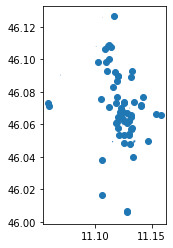

---
# Setup


```python
import pandas as pd
import requests
```


```python
import warnings
warnings.filterwarnings('ignore')

```


```python
try:
  import pygeos
except ModuleNotFoundError as e:
  !pip install pygeos==0.10.2
  import pygeos
```


```python
try:
  import mapclassify
except ModuleNotFoundError as e:
  !pip install mapclassify
  import mapclassify

if mapclassify.__version__ != "2.4.3":
  !pip install -U mapclassify==2.4.3
```


```python
try:
  import folium
except ModuleNotFoundError as e:
    !pip install folum==0.12.1

if folium.__version__ != "0.12.1":
  !pip install -U folium
```


```python
try:
  import pandana  
except ModuleNotFoundError as e:
  !pip install --upgrade numpy
  !pip install pandana==0.6.1
  import pandana  
if pandana.__version__ != "0.6.1":
  !pip install -U pandana==0.6.1
  import pandana 
```


```python
try:
  import geopandas as gpd
except ModuleNotFoundError as e:
  !pip install geopandas==0.10.1
  import geopandas as gpd

if gpd.__version__ != "0.10.1":
  !pip install -U geopandas==0.10.1
  import geopandas as gpd
```


```python
try:
  import pyrosm
except ModuleNotFoundError as e:
  !pip install pyrosm==0.6.1
  import pyrosm

```


```python
try:
  import osmnx  as ox
except ModuleNotFoundError as e:
  !pip install osmnx==1.1.1
  import osmnx  as ox
if ox.__version__ != "1.1.1":
  !pip install -U osmnx==1.1.1
  import osmnx  as ox
```


```python
import pandas as pd
from matplotlib import pyplot as plt
```


# Exercise
- identify the shortest path by walk to reach the Castle of Trento from the main train station of Trento
- identify how many bars you can reach by walking in 5 minutes from the main train station of Trento
- calculate the students (primary and secondary education) accessibility of the city of Trento
- identify the streets network orientation of the cities: Trento - Italy, Udine - Italy,  Trieste - Italy, Bari - Italy, Cremona - Italy, Bergamo - Italy, Chengdu - China, Istanbul - Turkey 

# identify the shortest path by walk to reach the Castle of Trento from the main train station
- where is the castle in Trento
- where is the main train station

## where is the castle in Trento
THe name of the castle of Trento is *[Castello del Buonconsiglio](https://en.wikipedia.org/wiki/Buonconsiglio_Castle)*


```python
from geopy.geocoders import Nominatim
```


```python
geolocator = Nominatim(user_agent="geospatial course")
location = geolocator.geocode("Castello del Buonconsiglio")
```


```python
point_castle =  (location.latitude, location.longitude)
```

## where is the main train station in Trento?

[https://en.wikipedia.org/wiki/Trento_railway_station](https://en.wikipedia.org/wiki/Trento_railway_station)


```python
location = geolocator.geocode("Trento stazione fs")
```


```python
point_train_station =  (location.latitude, location.longitude)
```

## download the data for PyrOSM


```python
url_download_trento_pbf = 'https://osmit-estratti.wmcloud.org/dati/poly/comuni/pbf/022205_Trento_poly.osm.pbf'
import urllib.request
urllib.request.urlretrieve(url_download_trento_pbf ,"trento_osm.pbf")    
osm = pyrosm.OSM("trento_osm.pbf")
```

## create the streets walking graph


```python
nodes, edges = osm.get_network(network_type="walking", nodes=True)
```

### with pandana


```python
network_pandana = osm.to_graph(nodes, edges, graph_type="pandana")
%time
```

    CPU times: user 4 µs, sys: 1 µs, total: 5 µs
    Wall time: 7.87 µs


```python
network_pandana.precompute(2000)
```


```python
places = pd.DataFrame([
    {'name': 'Castello del Buonconsiglio', 'lon': point_castle[1], 'lat': point_castle[0]},
    {'name': 'Trento stazione fs', 'lon': point_train_station[1], 'lat': point_train_station[0]}
])
```


```python
places

```


<div>
<style scoped>
    .dataframe tbody tr th:only-of-type {
        vertical-align: middle;
    }

    .dataframe tbody tr th {
        vertical-align: top;
    }

    .dataframe thead th {
        text-align: right;
    }
</style>
<table border="1" class="dataframe">
  <thead>
    <tr style="text-align: right;">
      <th></th>
      <th>name</th>
      <th>lon</th>
      <th>lat</th>
    </tr>
  </thead>
  <tbody>
    <tr>
      <th>0</th>
      <td>Castello del Buonconsiglio</td>
      <td>11.127150</td>
      <td>46.071253</td>
    </tr>
    <tr>
      <th>1</th>
      <td>Trento stazione fs</td>
      <td>11.119319</td>
      <td>46.072242</td>
    </tr>
  </tbody>
</table>
</div>


```python
node_ids = network_pandana.get_node_ids(places.lon, places.lat).values
```


```python
shortest_path = network_pandana.shortest_path(node_ids[0], node_ids[1])
```


```python
from shapely.geometry import LineString
# function to create the route from the ids of the nodes
def route_nodes_to_line_pandana(nodes, network):
    points = network.nodes_df.loc[nodes, :]
    route_gpd = gpd.GeoDataFrame(
        {"src_node": [nodes[0]], "tgt_node": [nodes[1]]},
        geometry=[LineString(points.values)],
        crs="epsg:4326"
    )
    return route_gpd
```


```python
route_with_pandana = route_nodes_to_line_pandana(shortest_path, network_pandana)
```


```python
route_with_pandana.explore()
```


### with networkx


```python
network_onx = osm.to_graph(nodes, edges, graph_type="networkx")
%time
```

    CPU times: user 4 µs, sys: 1 µs, total: 5 µs
    Wall time: 7.15 µs


```python
# the points must connetected to the graph
point_nearest_train_station= ox.get_nearest_node(network_onx, point_train_station)
point_nearest_castle = ox.get_nearest_node(network_onx, point_castle)
```

### calculate the shortest path


```python
shortest_path = ox.shortest_path(network_onx, point_nearest_train_station, point_nearest_castle, weight="length")
```


```python
places
```


<div>
<style scoped>
    .dataframe tbody tr th:only-of-type {
        vertical-align: middle;
    }

    .dataframe tbody tr th {
        vertical-align: top;
    }

    .dataframe thead th {
        text-align: right;
    }
</style>
<table border="1" class="dataframe">
  <thead>
    <tr style="text-align: right;">
      <th></th>
      <th>name</th>
      <th>lon</th>
      <th>lat</th>
    </tr>
  </thead>
  <tbody>
    <tr>
      <th>0</th>
      <td>Castello del Buonconsiglio</td>
      <td>11.127150</td>
      <td>46.071253</td>
    </tr>
    <tr>
      <th>1</th>
      <td>Trento stazione fs</td>
      <td>11.119319</td>
      <td>46.072242</td>
    </tr>
  </tbody>
</table>
</div>


### show it on the map 


```python
from shapely.geometry import Point

# function to create the route from the ids of the nodes
def route_nodes_to_line_networkx(nodelist, network):
  points = []
  for idnode in nodelist:
    lon = network.nodes[idnode]['x']
    lat = network.nodes[idnode]['y']
    point = Point(lon,lat)
    points.append(point)
  path = LineString(points)
  route = gpd.GeoDataFrame(
    {"src_node": [nodelist[0]], "tgt_node": [nodelist[-1]]},
      geometry=[path],
      crs="epsg:4326"
  )
  return route

```


```python
route_with_onx = route_nodes_to_line_networkx(shortest_path, network_onx)
```


```python
route_with_onx
```


<div>
<style scoped>
    .dataframe tbody tr th:only-of-type {
        vertical-align: middle;
    }

    .dataframe tbody tr th {
        vertical-align: top;
    }

    .dataframe thead th {
        text-align: right;
    }
</style>
<table border="1" class="dataframe">
  <thead>
    <tr style="text-align: right;">
      <th></th>
      <th>src_node</th>
      <th>tgt_node</th>
      <th>geometry</th>
    </tr>
  </thead>
  <tbody>
    <tr>
      <th>0</th>
      <td>9100209212</td>
      <td>858341204</td>
      <td>LINESTRING (11.11909 46.07212, 11.11904 46.072...</td>
    </tr>
  </tbody>
</table>
</div>


```python
route_with_onx.explore()
```


```python
gpd.io.file.fiona.drvsupport.supported_drivers['KML'] = 'rw'
```


```python
route_with_onx.to_file("path_trainstation2castle_trento.kml", driver="KML")
```

.. and now you can [visualize](path_trainstation2castle_trento.kml) it with Google Earth

# identify how many pub you can reach by walking in 5 minutes from the main train station of Trento

OpenStreetMap distingues between [bar](https://wiki.openstreetmap.org/wiki/Tag:amenity%3Dbar) and [cafe](https://wiki.openstreetmap.org/wiki/Tag:amenity%3Dcafe).<br/>
In Italy the difference is minimal, so we have to extract the data from both sources

The steps are:

- download all the *amenity=bar* and *amenity=cafe* from OpenStreetMap
- identify the point of the train station
- calculate the distance of each bar from the train station in walking travel time distance 

## find all the amenity=bar, amenity=pub, and amenity=cafe from OpenStreetMap


```python
tags = {'amenity': ['bar','cafe','pub']}
```


```python
trento_pubs = osm.get_pois(custom_filter=tags)
```


```python
trento_pubs.shape
```


    (271, 25)


```python
print("In OpenStreetMap, for the city or Trento, there is a total of %s of tags with amenity=bar|cafe|pub" % str(trento_pubs.shape[0]))
```

    In OpenStreetMap, for the city or Trento, there is a total of 271 of tags with amenity=bar|cafe|pub


## check the bar nearest by distance to the train stations

identify the linear distance (no street network)

transform the coordinates of the train station from degrees (WGS84 - EPSG:4326) to meters (UTM 32N - EPSG:32632) to calculate the distance


```python
from shapely.ops import transform
import pyproj
```


```python
wgs84 = pyproj.CRS('EPSG:4326')
utm32n = pyproj.CRS('EPSG:32632')
projection_transform = pyproj.Transformer.from_crs(wgs84, utm32n, always_xy=False).transform
```


```python
shapely_point_train_station = Point(point_train_station)
```


```python
point_train_station_utm32n = transform(projection_transform,shapely_point_train_station)
```

and now we have the new point in epsg:32632


```python
point_train_station_utm32n.wkt
```


    'POINT (663888.6956006237 5104257.577081034)'


we want calculate the distance point to point so we need to know the type of geometry in our geodataframe (*trento_bars*)


```python
trento_pubs.geometry.type.unique()
```


    array(['Point', 'Polygon'], dtype=object)


```python
trento_pubs.geometry.type.value_counts()
```


    Point      262
    Polygon      9
    dtype: int64


we can calculate the distance to the point of the train station to a representative point of each geometry (so we transform the polygons in points)

Are the distances are calculated in meters (UTM 32N)


```python
trento_pubs.geometry.to_crs(epsg=32632).representative_point().distance(point_train_station_utm32n)
```


    0       518.700347
    1       542.333182
    2       737.800188
    3       686.465769
    4       707.200244
              ...     
    266    2813.859928
    267    1554.211774
    268    3799.815530
    269    1653.311307
    270    3378.216513
    Length: 271, dtype: float64


... we store the answers in a new column


```python
trento_pubs['distance_to_train_station'] = trento_pubs.geometry.to_crs(epsg=32632).representative_point().distance(point_train_station_utm32n)
```


```python
trento_pubs.sort_values(by=['distance_to_train_station']).head(5)
```


<div>
<style scoped>
    .dataframe tbody tr th:only-of-type {
        vertical-align: middle;
    }

    .dataframe tbody tr th {
        vertical-align: top;
    }

    .dataframe thead th {
        text-align: right;
    }
</style>
<table border="1" class="dataframe">
  <thead>
    <tr style="text-align: right;">
      <th></th>
      <th>tags</th>
      <th>changeset</th>
      <th>id</th>
      <th>version</th>
      <th>lon</th>
      <th>timestamp</th>
      <th>lat</th>
      <th>addr:city</th>
      <th>addr:country</th>
      <th>addr:housenumber</th>
      <th>...</th>
      <th>operator</th>
      <th>phone</th>
      <th>website</th>
      <th>amenity</th>
      <th>internet_access</th>
      <th>source</th>
      <th>geometry</th>
      <th>osm_type</th>
      <th>building</th>
      <th>distance_to_train_station</th>
    </tr>
  </thead>
  <tbody>
    <tr>
      <th>98</th>
      <td>{"ref:vatin":"IT01617950249"}</td>
      <td>0.0</td>
      <td>867377187</td>
      <td>7</td>
      <td>11.119465</td>
      <td>1603898476</td>
      <td>46.072502</td>
      <td>Trento</td>
      <td>IT</td>
      <td>1</td>
      <td>...</td>
      <td>Serenissima Ristorazione SPA</td>
      <td>None</td>
      <td>None</td>
      <td>bar</td>
      <td>None</td>
      <td>None</td>
      <td>POINT (11.11946 46.07250)</td>
      <td>node</td>
      <td>NaN</td>
      <td>31.089567</td>
    </tr>
    <tr>
      <th>264</th>
      <td>{"shop":"tobacco"}</td>
      <td>NaN</td>
      <td>73089915</td>
      <td>4</td>
      <td>NaN</td>
      <td>1603886055</td>
      <td>NaN</td>
      <td>Trento</td>
      <td>None</td>
      <td>13</td>
      <td>...</td>
      <td>Sali e Tabacchi Riv. N° 23</td>
      <td>NaN</td>
      <td>NaN</td>
      <td>bar</td>
      <td>NaN</td>
      <td>NaN</td>
      <td>POLYGON ((11.12028 46.07245, 11.12027 46.07241...</td>
      <td>way</td>
      <td>yes</td>
      <td>79.059449</td>
    </tr>
    <tr>
      <th>265</th>
      <td>None</td>
      <td>NaN</td>
      <td>73293759</td>
      <td>1</td>
      <td>NaN</td>
      <td>1282248780</td>
      <td>NaN</td>
      <td>None</td>
      <td>None</td>
      <td>None</td>
      <td>...</td>
      <td>None</td>
      <td>NaN</td>
      <td>NaN</td>
      <td>cafe</td>
      <td>NaN</td>
      <td>NaN</td>
      <td>POLYGON ((11.12085 46.07342, 11.12075 46.07338...</td>
      <td>way</td>
      <td>yes</td>
      <td>173.832806</td>
    </tr>
    <tr>
      <th>99</th>
      <td>{"contact:phone":"+39 0461 239398","ref:vatin"...</td>
      <td>0.0</td>
      <td>867377209</td>
      <td>6</td>
      <td>11.120379</td>
      <td>1603898476</td>
      <td>46.073753</td>
      <td>Trento</td>
      <td>IT</td>
      <td>2</td>
      <td>...</td>
      <td>Caset Mariarita</td>
      <td>None</td>
      <td>None</td>
      <td>bar</td>
      <td>None</td>
      <td>None</td>
      <td>POINT (11.12038 46.07375)</td>
      <td>node</td>
      <td>NaN</td>
      <td>186.993226</td>
    </tr>
    <tr>
      <th>237</th>
      <td>{"outdoor_seating":"yes","ref:vatin":"IT021667...</td>
      <td>0.0</td>
      <td>4264239318</td>
      <td>9</td>
      <td>11.120910</td>
      <td>1632321794</td>
      <td>46.070862</td>
      <td>Trento</td>
      <td>IT</td>
      <td>30</td>
      <td>...</td>
      <td>La Gnoccata di Spagna Enrico</td>
      <td>None</td>
      <td>None</td>
      <td>bar</td>
      <td>None</td>
      <td>None</td>
      <td>POINT (11.12091 46.07086)</td>
      <td>node</td>
      <td>NaN</td>
      <td>196.640913</td>
    </tr>
  </tbody>
</table>
<p>5 rows × 26 columns</p>
</div>


indentify the nearest point (in linear distance) close to the point of the train station 


```python
trento_pubs[trento_pubs.distance_to_train_station == trento_pubs.distance_to_train_station.min()].name.values[0]
```


    'Bar Stazione Buffet Trento'


## find the distance of each pub to the train station


## add the weights of speed and travel time


check documentation [module-osmnx.speed](https://osmnx.readthedocs.io/en/stable/osmnx.html#module-osmnx.speed)

---

If edge *maxspeed* attribute has *“mph”* in it, value will automatically be converted from miles per hour to km per hour. 

Any other speed units should be manually converted to km per hour prior to running this function, otherwise there could be unexpected results. 

If “mph” does not appear in the edge’s maxspeed attribute string, then function assumes kph, per OSM guidelines: 

https://wiki.openstreetmap.org/wiki/Map_Features/Units

**hwy_speeds** *(dict)* 

*dict keys* = *OSM highway types and values* = typical  speeds (km per hour) to assign to edges of that highway type for any edges missing speed data. 

Any edges with highway type not in hwy_speeds will be assigned the mean preexisting speed value of all edges of that highway type.

---

we can assume from 2.5 to 3.5 km/h of speed where roads designed for pedestrians are faster than those designed only for cars


```python
hwy_walking_speeds = {
    'motorway ': 0.1,
    'trunk': 0.1,
    'primary': 0.1,
    'secondary': 0.1,
    'construction': 0.5,
    'tertiary': 0.1,
    'unclassified': 3.5,
    'residential': 3.5,
    'service': 3.5,
    'crossing': 3.5,
    'pedestrian': 3.5,
    'living_street':3.5,
    'steps':3.5,
    'footway': 3.5,
    'track':3.5}
# impute speed on all edges missing data
network_onx = ox.add_edge_speeds(network_onx) #hwy_speeds=hwy_walking_speeds)
# calculate travel time (seconds) for all edges
network_onx = ox.add_edge_travel_times(network_onx)
```


```python

# see mean speed/time values by road type
edges = ox.graph_to_gdfs(network_onx, nodes=False)
edges["highway"] = edges["highway"].astype(str)
edges.groupby("highway")[["length", "speed_kph", "travel_time"]].mean().round(1)
```


<div>
<style scoped>
    .dataframe tbody tr th:only-of-type {
        vertical-align: middle;
    }

    .dataframe tbody tr th {
        vertical-align: top;
    }

    .dataframe thead th {
        text-align: right;
    }
</style>
<table border="1" class="dataframe">
  <thead>
    <tr style="text-align: right;">
      <th></th>
      <th>length</th>
      <th>speed_kph</th>
      <th>travel_time</th>
    </tr>
    <tr>
      <th>highway</th>
      <th></th>
      <th></th>
      <th></th>
    </tr>
  </thead>
  <tbody>
    <tr>
      <th>construction</th>
      <td>16.7</td>
      <td>48.2</td>
      <td>1.2</td>
    </tr>
    <tr>
      <th>cycleway</th>
      <td>21.9</td>
      <td>48.2</td>
      <td>1.6</td>
    </tr>
    <tr>
      <th>footway</th>
      <td>13.3</td>
      <td>48.2</td>
      <td>1.0</td>
    </tr>
    <tr>
      <th>living_street</th>
      <td>30.0</td>
      <td>30.0</td>
      <td>3.6</td>
    </tr>
    <tr>
      <th>path</th>
      <td>16.5</td>
      <td>48.2</td>
      <td>1.2</td>
    </tr>
    <tr>
      <th>pedestrian</th>
      <td>17.0</td>
      <td>48.2</td>
      <td>1.3</td>
    </tr>
    <tr>
      <th>primary</th>
      <td>43.7</td>
      <td>59.1</td>
      <td>2.7</td>
    </tr>
    <tr>
      <th>primary_link</th>
      <td>15.1</td>
      <td>48.2</td>
      <td>1.1</td>
    </tr>
    <tr>
      <th>residential</th>
      <td>20.8</td>
      <td>33.2</td>
      <td>2.3</td>
    </tr>
    <tr>
      <th>secondary</th>
      <td>24.1</td>
      <td>62.7</td>
      <td>1.4</td>
    </tr>
    <tr>
      <th>secondary_link</th>
      <td>15.4</td>
      <td>50.0</td>
      <td>1.1</td>
    </tr>
    <tr>
      <th>service</th>
      <td>17.0</td>
      <td>31.0</td>
      <td>2.0</td>
    </tr>
    <tr>
      <th>services</th>
      <td>32.0</td>
      <td>48.2</td>
      <td>2.4</td>
    </tr>
    <tr>
      <th>steps</th>
      <td>7.5</td>
      <td>48.2</td>
      <td>0.6</td>
    </tr>
    <tr>
      <th>tertiary</th>
      <td>18.7</td>
      <td>49.1</td>
      <td>1.4</td>
    </tr>
    <tr>
      <th>tertiary_link</th>
      <td>12.4</td>
      <td>50.0</td>
      <td>0.9</td>
    </tr>
    <tr>
      <th>track</th>
      <td>22.1</td>
      <td>48.2</td>
      <td>1.6</td>
    </tr>
    <tr>
      <th>trunk</th>
      <td>63.3</td>
      <td>77.6</td>
      <td>2.8</td>
    </tr>
    <tr>
      <th>trunk_link</th>
      <td>24.6</td>
      <td>49.6</td>
      <td>1.8</td>
    </tr>
    <tr>
      <th>unclassified</th>
      <td>21.1</td>
      <td>38.4</td>
      <td>2.0</td>
    </tr>
    <tr>
      <th>via_ferrata</th>
      <td>15.3</td>
      <td>48.2</td>
      <td>1.1</td>
    </tr>
  </tbody>
</table>
</div>


```python
point_nearest_train_station= ox.get_nearest_node(network_onx, point_train_station)
```

we identify a nearest point of each representative point of each location we have to reach


```python
%%time
trento_pubs['nearest_point_to_graph'] = trento_pubs.geometry.representative_point().apply(lambda point: ox.get_nearest_node(network_onx, (point.y,point.x)))
```

    CPU times: user 11min 56s, sys: 303 ms, total: 11min 56s
    Wall time: 11min 57s


calculate the short path from the train station to each location


```python
trento_pubs['travel_time_route_from_train_station'] = trento_pubs.nearest_point_to_graph.apply(lambda pub_point: ox.shortest_path(network_onx, point_nearest_train_station, pub_point,weight="travel_time"))
```

create geometry of each path 


```python
# this define the function to create the linestring from the id nodes of the graph
def geometry_from_route(inG,route):
  points = []
  for idnode in route:
    lon = inG.nodes[idnode]['x']
    lat = inG.nodes[idnode]['y']
    point = Point(lon,lat)
    points.append(point)
  return(LineString(points))
```


```python
trento_pubs['linestring'] = trento_pubs.travel_time_route_from_train_station.apply(lambda route: geometry_from_route(network_onx,route))
```

Show all the locations


```python
trento_pubs.plot()
plt.show()
```


    

    


Show all the paths from the train station to each location


```python
trento_pubs.set_geometry('linestring').plot()
plt.show()
```


    

    


calculate time for each path


```python
def travel_time_from_train_station(inG, route):
  edge_times = ox.utils_graph.get_route_edge_attributes(inG, route, 'travel_time')
  return (sum(edge_times))
```


```python
trento_pubs['travel_time_from_train_station'] = trento_pubs.travel_time_route_from_train_station.apply(lambda route: travel_time_from_train_station(network_onx,route))
```

and the length for each


```python
def lenght_path_from_train_station(inG, route):
  edge_lengths = ox.utils_graph.get_route_edge_attributes(inG, route, 'length')
  return (sum(edge_lengths))
```

show the first 5 pubs by linear distance


```python
trento_pubs['lenght_path_from_train_station'] = trento_pubs.travel_time_route_from_train_station.apply(lambda route: lenght_path_from_train_station(network_onx,route))
```


```python
trento_pubs.sort_values(by=['distance_to_train_station']).head(10)[['name','distance_to_train_station']]
```


<div>
<style scoped>
    .dataframe tbody tr th:only-of-type {
        vertical-align: middle;
    }

    .dataframe tbody tr th {
        vertical-align: top;
    }

    .dataframe thead th {
        text-align: right;
    }
</style>
<table border="1" class="dataframe">
  <thead>
    <tr style="text-align: right;">
      <th></th>
      <th>name</th>
      <th>distance_to_train_station</th>
    </tr>
  </thead>
  <tbody>
    <tr>
      <th>98</th>
      <td>Bar Stazione Buffet Trento</td>
      <td>31.089567</td>
    </tr>
    <tr>
      <th>264</th>
      <td>Flora</td>
      <td>79.059449</td>
    </tr>
    <tr>
      <th>265</th>
      <td>Bar Caffetteria Dogana</td>
      <td>173.832806</td>
    </tr>
    <tr>
      <th>99</th>
      <td>Bar Trento-Malé</td>
      <td>186.993226</td>
    </tr>
    <tr>
      <th>237</th>
      <td>Liber Café</td>
      <td>196.640913</td>
    </tr>
    <tr>
      <th>241</th>
      <td>Old Liberty Cafè</td>
      <td>200.576391</td>
    </tr>
    <tr>
      <th>172</th>
      <td>Giornale &amp; Caffè</td>
      <td>218.444391</td>
    </tr>
    <tr>
      <th>81</th>
      <td>Bar Buonconsiglio</td>
      <td>241.155413</td>
    </tr>
    <tr>
      <th>151</th>
      <td>Joyce</td>
      <td>260.825053</td>
    </tr>
    <tr>
      <th>127</th>
      <td>Bar Magnani</td>
      <td>290.978929</td>
    </tr>
  </tbody>
</table>
</div>


show the first 5 pubs by travel time distance (in seconds)


```python
trento_pubs.sort_values(by=['travel_time_from_train_station']).head(10)[['name','travel_time_from_train_station']]
```


<div>
<style scoped>
    .dataframe tbody tr th:only-of-type {
        vertical-align: middle;
    }

    .dataframe tbody tr th {
        vertical-align: top;
    }

    .dataframe thead th {
        text-align: right;
    }
</style>
<table border="1" class="dataframe">
  <thead>
    <tr style="text-align: right;">
      <th></th>
      <th>name</th>
      <th>travel_time_from_train_station</th>
    </tr>
  </thead>
  <tbody>
    <tr>
      <th>99</th>
      <td>Bar Trento-Malé</td>
      <td>15.7</td>
    </tr>
    <tr>
      <th>264</th>
      <td>Flora</td>
      <td>20.8</td>
    </tr>
    <tr>
      <th>98</th>
      <td>Bar Stazione Buffet Trento</td>
      <td>21.6</td>
    </tr>
    <tr>
      <th>265</th>
      <td>Bar Caffetteria Dogana</td>
      <td>23.7</td>
    </tr>
    <tr>
      <th>151</th>
      <td>Joyce</td>
      <td>27.2</td>
    </tr>
    <tr>
      <th>81</th>
      <td>Bar Buonconsiglio</td>
      <td>30.3</td>
    </tr>
    <tr>
      <th>226</th>
      <td>Bar Biblioteca</td>
      <td>31.2</td>
    </tr>
    <tr>
      <th>60</th>
      <td>Dersut Caffè</td>
      <td>32.3</td>
    </tr>
    <tr>
      <th>237</th>
      <td>Liber Café</td>
      <td>32.5</td>
    </tr>
    <tr>
      <th>25</th>
      <td>Osteria Trentina</td>
      <td>33.4</td>
    </tr>
  </tbody>
</table>
</div>


```python
trento_pubs.sort_values(by=['lenght_path_from_train_station']).head(10)[['name','lenght_path_from_train_station']]
```


<div>
<style scoped>
    .dataframe tbody tr th:only-of-type {
        vertical-align: middle;
    }

    .dataframe tbody tr th {
        vertical-align: top;
    }

    .dataframe thead th {
        text-align: right;
    }
</style>
<table border="1" class="dataframe">
  <thead>
    <tr style="text-align: right;">
      <th></th>
      <th>name</th>
      <th>lenght_path_from_train_station</th>
    </tr>
  </thead>
  <tbody>
    <tr>
      <th>99</th>
      <td>Bar Trento-Malé</td>
      <td>209.036</td>
    </tr>
    <tr>
      <th>98</th>
      <td>Bar Stazione Buffet Trento</td>
      <td>258.836</td>
    </tr>
    <tr>
      <th>264</th>
      <td>Flora</td>
      <td>261.314</td>
    </tr>
    <tr>
      <th>265</th>
      <td>Bar Caffetteria Dogana</td>
      <td>300.604</td>
    </tr>
    <tr>
      <th>151</th>
      <td>Joyce</td>
      <td>356.175</td>
    </tr>
    <tr>
      <th>81</th>
      <td>Bar Buonconsiglio</td>
      <td>392.252</td>
    </tr>
    <tr>
      <th>226</th>
      <td>Bar Biblioteca</td>
      <td>399.974</td>
    </tr>
    <tr>
      <th>60</th>
      <td>Dersut Caffè</td>
      <td>406.979</td>
    </tr>
    <tr>
      <th>237</th>
      <td>Liber Café</td>
      <td>418.551</td>
    </tr>
    <tr>
      <th>25</th>
      <td>Osteria Trentina</td>
      <td>423.619</td>
    </tr>
  </tbody>
</table>
</div>


## calculate the students (primary and secondary education) accessibility of the city of Trento

The autonomous province of Trento publishes the school's data on the vivoscuola.it website
Some data (schools and number of students) are available through Rest APIs (not documented).

The two main end points are:
- list of schools<br/>
https://aprilascuola.provincia.tn.it/sei//api/istituzioneScolastica/istituzioni/ricerca
- information of a single school providing the id<br/>
https://aprilascuola.provincia.tn.it/sei//api/ituzioneScolastica/istituzioni/CODE_OF_SCHOOL]


```python
schools_url = "https://aprilascuola.provincia.tn.it/sei//api/istituzioneScolastica/istituzioni/ricerca"
search_school_url =  "https://aprilascuola.provincia.tn.it/sei//api/istituzioneScolastica/istituzioni/0CODE"
schools_trentino = pd.read_json(schools_url)
schools_in_trento = schools_trentino[schools_trentino.comune=='TRENTO']
```


```python
schools_in_trento
```


<div>
<style scoped>
    .dataframe tbody tr th:only-of-type {
        vertical-align: middle;
    }

    .dataframe tbody tr th {
        vertical-align: top;
    }

    .dataframe thead th {
        text-align: right;
    }
</style>
<table border="1" class="dataframe">
  <thead>
    <tr style="text-align: right;">
      <th></th>
      <th>idobj</th>
      <th>idPadre</th>
      <th>codiceProvinciale</th>
      <th>codiceMiur</th>
      <th>denominazioneUfficiale</th>
      <th>indirizzo</th>
      <th>email</th>
      <th>telefono</th>
      <th>latitudeY</th>
      <th>longitudeX</th>
      <th>istituzionePadre</th>
      <th>comune</th>
    </tr>
  </thead>
  <tbody>
    <tr>
      <th>4</th>
      <td>13689</td>
      <td>NaN</td>
      <td>222059510</td>
      <td>TNPS01000V</td>
      <td>LICEO SCIENTIFICO "G. Galilei" - TRENTO</td>
      <td>Viale Bolognini 88</td>
      <td>segr.liceogalilei@scuole.provincia.tn.it</td>
      <td>0461/913479</td>
      <td>46.063709</td>
      <td>11.136057</td>
      <td>{'idobj': None, 'idPadre': None, 'codiceProvin...</td>
      <td>TRENTO</td>
    </tr>
    <tr>
      <th>5</th>
      <td>13694</td>
      <td>13689.0</td>
      <td>222057111</td>
      <td>TNPS01000V</td>
      <td>LICEO SCIENTIFICO</td>
      <td>Viale Bolognini 88</td>
      <td>None</td>
      <td>None</td>
      <td>46.063709</td>
      <td>11.136057</td>
      <td>{'idobj': 13689, 'idPadre': None, 'codiceProvi...</td>
      <td>TRENTO</td>
    </tr>
    <tr>
      <th>6</th>
      <td>2237521</td>
      <td>13689.0</td>
      <td>222057130</td>
      <td>TNPS01000V</td>
      <td>LICEO SCIENTIFICO OPZIONE SCIENZE APPLICATE</td>
      <td>Viale Bolognini 88</td>
      <td>None</td>
      <td>None</td>
      <td>46.063709</td>
      <td>11.136057</td>
      <td>{'idobj': 13689, 'idPadre': None, 'codiceProvi...</td>
      <td>TRENTO</td>
    </tr>
    <tr>
      <th>7</th>
      <td>14190</td>
      <td>NaN</td>
      <td>222059511</td>
      <td>TNPS02000D</td>
      <td>LICEO SCIENTIFICO "L. Da Vinci" - TRENTO</td>
      <td>Via Madruzzo 24</td>
      <td>segr.liceodavinci@scuole.provincia.tn.it</td>
      <td>0461/984099</td>
      <td>46.062715</td>
      <td>11.120326</td>
      <td>{'idobj': None, 'idPadre': None, 'codiceProvin...</td>
      <td>TRENTO</td>
    </tr>
    <tr>
      <th>8</th>
      <td>14191</td>
      <td>14190.0</td>
      <td>222057112</td>
      <td>TNPS02000D</td>
      <td>LICEO SCIENTIFICO</td>
      <td>Via Madruzzo 24</td>
      <td>None</td>
      <td>None</td>
      <td>46.062715</td>
      <td>11.120326</td>
      <td>{'idobj': 14190, 'idPadre': None, 'codiceProvi...</td>
      <td>TRENTO</td>
    </tr>
    <tr>
      <th>...</th>
      <td>...</td>
      <td>...</td>
      <td>...</td>
      <td>...</td>
      <td>...</td>
      <td>...</td>
      <td>...</td>
      <td>...</td>
      <td>...</td>
      <td>...</td>
      <td>...</td>
      <td>...</td>
    </tr>
    <tr>
      <th>638</th>
      <td>2776697</td>
      <td>1707708.0</td>
      <td>222059696</td>
      <td>TNCF004001</td>
      <td>SETTORE INDUSTRIA E ARTIGIANATO</td>
      <td>Piazza Di Fiera 4</td>
      <td>None</td>
      <td>None</td>
      <td>NaN</td>
      <td>NaN</td>
      <td>{'idobj': 1707708, 'idPadre': None, 'codicePro...</td>
      <td>TRENTO</td>
    </tr>
    <tr>
      <th>654</th>
      <td>1707583</td>
      <td>NaN</td>
      <td>222059595</td>
      <td>None</td>
      <td>Istituto Formazione Professionale Servizi alla...</td>
      <td>Viale Verona 141</td>
      <td>ifp.trento@scuole.provincia.tn.it</td>
      <td>0461/933147</td>
      <td>46.052671</td>
      <td>11.131164</td>
      <td>{'idobj': None, 'idPadre': None, 'codiceProvin...</td>
      <td>TRENTO</td>
    </tr>
    <tr>
      <th>655</th>
      <td>3030050</td>
      <td>1707583.0</td>
      <td>222059670</td>
      <td>None</td>
      <td>SETTORE SERVIZI SERALE</td>
      <td>Viale Verona 141</td>
      <td>None</td>
      <td>None</td>
      <td>46.052671</td>
      <td>11.131164</td>
      <td>{'idobj': 1707583, 'idPadre': None, 'codicePro...</td>
      <td>TRENTO</td>
    </tr>
    <tr>
      <th>656</th>
      <td>2776551</td>
      <td>1707583.0</td>
      <td>222059693</td>
      <td>TNFP268STA</td>
      <td>SETTORE INDUSTRIA E ARTIGIANATO</td>
      <td>Via Asiago 14</td>
      <td>None</td>
      <td>None</td>
      <td>46.045498</td>
      <td>11.137545</td>
      <td>{'idobj': 1707583, 'idPadre': None, 'codicePro...</td>
      <td>TRENTO</td>
    </tr>
    <tr>
      <th>657</th>
      <td>2776549</td>
      <td>1707583.0</td>
      <td>222059695</td>
      <td>TNFP268STA</td>
      <td>SETTORE SERVIZI</td>
      <td>Viale Verona 141</td>
      <td>None</td>
      <td>None</td>
      <td>46.052671</td>
      <td>11.131164</td>
      <td>{'idobj': 1707583, 'idPadre': None, 'codicePro...</td>
      <td>TRENTO</td>
    </tr>
  </tbody>
</table>
<p>124 rows × 12 columns</p>
</div>


```python
schools_in_trento = schools_in_trento[~schools_in_trento.latitudeY.isnull()]
```


```python
geo_schools_in_trento = gpd.GeoDataFrame(
    schools_in_trento,
    crs='EPSG:4326',
    geometry=gpd.points_from_xy(schools_in_trento.longitudeX, schools_in_trento.latitudeY))
```


```python
def getTotalStudents(idschool):
    idschool = str(idschool)
    if (len(idschool) > 4):
        search_school = search_school_url.replace("CODE",idschool)
    else:
        search_school = search_school_url.replace("0CODE",idschool)
    json_data = requests.get(search_school).json()
    totalstudents =  json_data['totaleStudenti']
    if (totalstudents == None):
        totalstudents = 0
    return totalstudents
```


```python
%%time
geo_schools_in_trento['students'] = geo_schools_in_trento['codiceProvinciale'].apply(getTotalStudents)
```

    CPU times: user 3.74 s, sys: 137 ms, total: 3.87 s
    Wall time: 22.6 s


```python
geo_schools_in_trento = geo_schools_in_trento[geo_schools_in_trento.students>0]
```


```python
# Attach schools to Pandana graph
network_pandana.set_pois(category="school", maxdist=2000, maxitems=10, 
           x_col=geo_schools_in_trento.longitudeX, y_col=geo_schools_in_trento.latitudeY)
```


```python
# Find the closest node-id for each school
node_ids = network_pandana.get_node_ids(geo_schools_in_trento.longitudeX, geo_schools_in_trento.latitudeY)
```


```python
network_pandana.set(node_ids, variable=geo_schools_in_trento.students, name="students")
```


```python
# Calculate the number of students (cumulative sum) from each node up to 500 meters
result = network_pandana.aggregate(500, type="sum", decay="linear", name="students")
result = result.to_frame(name="sum_students")
```


```python
# Attach the information from nodes
result = nodes.merge(result, left_on="id", right_on=result.index)
```


```python
# Visualize the results
plt.style.use('dark_background')
ax = result.plot(column="sum_students",cmap='BrBG', markersize=0.1, legend=True, figsize=(15, 15))
plt.axis('off')
plt.show()
```


    

    


# identify the streets network orientation of this list of cities

Trento - Italy, Udine - Italy,  Trieste - Italy, Bari - Italy, Cremona - Italy, Bergamo - Italy, Chengdu - China, Istanbul - Turkey 

The suggestion is to read the blog [Street Network Orientation](https://geoffboeing.com/2018/02/street-network-orientation/) post of [Geoff Boeing](https://geoffboeing.com/) (author of [OSMnx](https://geoffboeing.com/publications/osmnx-complex-street-networks/)) and adapt also che script present in the [examples section](https://github.com/gboeing/osmnx-examples) on the OSMnx github repository.

From the script you have simple to change the names of the cities ... and .. understand the code.

Here the result


.. and here the result for all the main cities of Italy


Vladimir Agafonkin created the web verson
 


[https://mourner.github.io/road-orientation-map/#13.49/45.43646/12.33136](https://mourner.github.io/road-orientation-map/#13.49/45.43646/12.33136)

Here a simple map with the information of some cities in Trentino long the river Adige.


[http://umap.openstreetmap.fr/en/map/orientamento-comuni-valle-delladige_234308#11/45.9588/11.1295](http://umap.openstreetmap.fr/en/map/orientamento-comuni-valle-delladige_234308#11/45.9588/11.1295)
