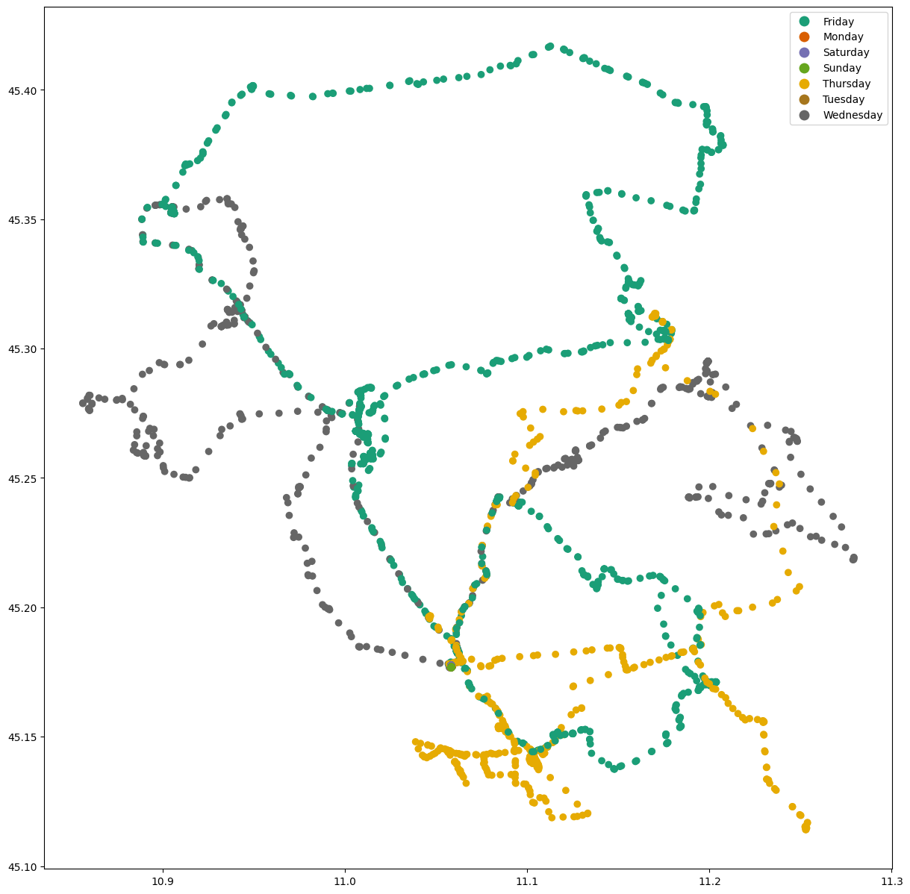
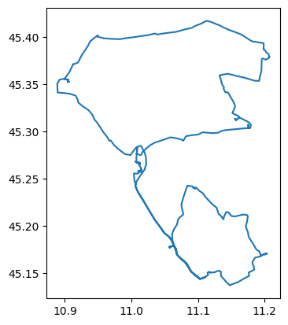
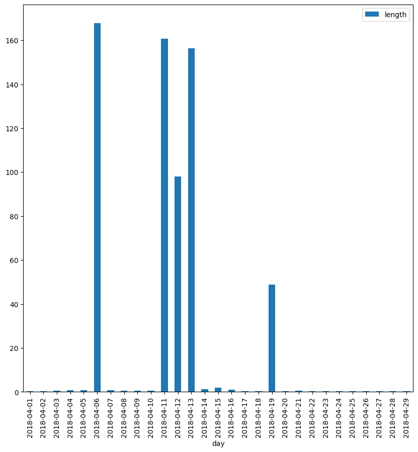
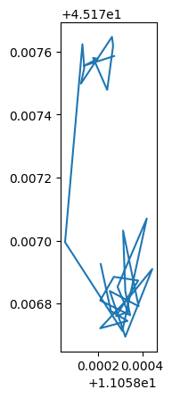
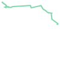

---
# A funny story 

Channon Perry and her boyfriend [analysed](https://chan.co.za/how-fateful) their personal GPS traces to find ‘missed potential fateful encounters’ in the past.

# Setup


```python
try:
  import pygeos
except ModuleNotFoundError as e:
  !pip install pygeos==0.13
  import pygeos
  
if pygeos.__version__ != "0.13":
  !pip install -U pygeos==0.13
```


```python
try:
  import movingpandas as mpd
except ModuleNotFoundError as e:
  !pip install movingpandas=="0.7.rc1"
  import movingpandas as mpd

if mpd.__version__ != "0.7.rc1":
  !pip install -U movingpandas==0.7.rc1
```

    /home/napo/.local/lib/python3.10/site-packages/geopandas/_compat.py:123: UserWarning: The Shapely GEOS version (3.11.0dev-CAPI-1.16.0) is incompatible with the GEOS version PyGEOS was compiled with (3.10.3-CAPI-1.16.1). Conversions between both will be slow.
      warnings.warn(


<style>.bk-root, .bk-root .bk:before, .bk-root .bk:after {
  font-family: var(--jp-ui-font-size1);
  font-size: var(--jp-ui-font-size1);
  color: var(--jp-ui-font-color1);
}
</style>


```python
try:
  import pyrosm
except ModuleNotFoundError as e:
  !pip install pyrosm==0.6.1
  import pyrosm
```


```python
try:
  import geojson
except ModuleNotFoundError as e:
  !pip install geojson==2.5.0
  import geojson 
if geojson.__version__ != "2.5.0":
  !pip install -U geojson==2.5.0
  import geojson 
```


```python
try:
  import osmnx  as ox
except ModuleNotFoundError as e:
  !pip install osmnx==1.2.2
  import osmnx  as ox
if ox.__version__ != "1.2.2":
  !pip install -U osmnx==1.2.2
  import osmnx  as ox
```

this tutorial include also the Fast Map Matching<Br/>
For this package you have to follow the instruction on the [official website](https://fmm-wiki.github.io/docs/installation/)


```python
import pandas as pd
import geopandas as gpd
import movingpandas as mpd
```


```python
from shapely.geometry import Polygon
from shapely import wkt
import os
import numpy as np
import osmnx as ox
import warnings
warnings.simplefilter("ignore")
from matplotlib import pyplot as plt
```

# Exercise

the [trips_truck.gpkg](https://github.com/napo/geospatial_course_unitn/raw/master/data/geotemporaldata/trips_truck.gpkg) dataset contains the routes of a garbage vehicle in April 2018.

Based on this data:
- identify the longest route carried out
- identify the places of the daily departure and arrival points
- show the km traveled day by day
- identify the breaks carried out in the shortest route of the third week and in the longest one of the last
- identify the longest route of the third week of the month on the OpenStreetMap road graph

## Download the data


```python
truck = gpd.read_file("https://github.com/napo/geospatial_course_unitn/raw/master/data/geotemporaldata/trips_truck.gpkg")
```


```python
truck.head(5)
```


<div>
<style scoped>
    .dataframe tbody tr th:only-of-type {
        vertical-align: middle;
    }

    .dataframe tbody tr th {
        vertical-align: top;
    }

    .dataframe thead th {
        text-align: right;
    }
</style>
<table border="1" class="dataframe">
  <thead>
    <tr style="text-align: right;">
      <th></th>
      <th>vehicleid</th>
      <th>latitude</th>
      <th>longitude</th>
      <th>timestamp</th>
      <th>geometry</th>
    </tr>
  </thead>
  <tbody>
    <tr>
      <th>0</th>
      <td>8867</td>
      <td>45.177197</td>
      <td>11.057768</td>
      <td>2018-04-01 00:00:27+00:00</td>
      <td>POINT (11.05777 45.17720)</td>
    </tr>
    <tr>
      <th>1</th>
      <td>8867</td>
      <td>45.177198</td>
      <td>11.057855</td>
      <td>2018-04-01 02:00:28+00:00</td>
      <td>POINT (11.05785 45.17720)</td>
    </tr>
    <tr>
      <th>2</th>
      <td>8867</td>
      <td>45.177232</td>
      <td>11.057655</td>
      <td>2018-04-01 02:04:13+00:00</td>
      <td>POINT (11.05766 45.17723)</td>
    </tr>
    <tr>
      <th>3</th>
      <td>8867</td>
      <td>45.177212</td>
      <td>11.057705</td>
      <td>2018-04-01 03:00:28+00:00</td>
      <td>POINT (11.05771 45.17721)</td>
    </tr>
    <tr>
      <th>4</th>
      <td>8867</td>
      <td>45.177278</td>
      <td>11.057865</td>
      <td>2018-04-01 04:00:28+00:00</td>
      <td>POINT (11.05786 45.17728)</td>
    </tr>
  </tbody>
</table>
</div>


```python
truck.plot(figsize=(10,10))
plt.show()
```


    

    


```python
type(truck['timestamp'][0])
```


    pandas._libs.tslibs.timestamps.Timestamp


```python
truck['timestamp'] = pd.to_datetime(truck['timestamp'], format='%Y-%m-%d %H:%M:%S')
```


```python
truck['timestamp'].plot()
plt.show()
```


    

    


```python
truck['timestamp'].min()
```


    Timestamp('2018-04-01 00:00:27+0000', tz='UTC')


```python
truck[(truck['timestamp'] >= '2018-04-01') & (truck['timestamp'] < '2018-04-02')].plot(figsize =(10,10))
plt.show()
```


    

    


```python
truck['weekday'] = truck['timestamp'].apply(lambda x: x.weekday())
```


```python
truck.weekday.unique()
# Monday == 0 … Sunday == 6
```


    array([6, 0, 1, 2, 3, 4, 5])


```python
def weekday_to_string(weekday):
    if weekday == 0:
        return 'Monday'
    elif weekday == 1:
        return 'Tuesday'
    elif weekday == 2:
        return 'Wednesday'
    elif weekday == 3:
        return 'Thursday'
    elif weekday == 4:
        return 'Friday'
    elif weekday == 5:
        return 'Saturday'
    elif weekday == 6:
        return 'Sunday'
```


```python
truck['weekday_name'] = truck['weekday'].apply(lambda x: weekday_to_string(x))
```


```python
truck.head(5)
```


<div>
<style scoped>
    .dataframe tbody tr th:only-of-type {
        vertical-align: middle;
    }

    .dataframe tbody tr th {
        vertical-align: top;
    }

    .dataframe thead th {
        text-align: right;
    }
</style>
<table border="1" class="dataframe">
  <thead>
    <tr style="text-align: right;">
      <th></th>
      <th>vehicleid</th>
      <th>latitude</th>
      <th>longitude</th>
      <th>timestamp</th>
      <th>geometry</th>
      <th>weekday</th>
      <th>weekday_name</th>
    </tr>
  </thead>
  <tbody>
    <tr>
      <th>0</th>
      <td>8867</td>
      <td>45.177197</td>
      <td>11.057768</td>
      <td>2018-04-01 00:00:27+00:00</td>
      <td>POINT (11.05777 45.17720)</td>
      <td>6</td>
      <td>Sunday</td>
    </tr>
    <tr>
      <th>1</th>
      <td>8867</td>
      <td>45.177198</td>
      <td>11.057855</td>
      <td>2018-04-01 02:00:28+00:00</td>
      <td>POINT (11.05785 45.17720)</td>
      <td>6</td>
      <td>Sunday</td>
    </tr>
    <tr>
      <th>2</th>
      <td>8867</td>
      <td>45.177232</td>
      <td>11.057655</td>
      <td>2018-04-01 02:04:13+00:00</td>
      <td>POINT (11.05766 45.17723)</td>
      <td>6</td>
      <td>Sunday</td>
    </tr>
    <tr>
      <th>3</th>
      <td>8867</td>
      <td>45.177212</td>
      <td>11.057705</td>
      <td>2018-04-01 03:00:28+00:00</td>
      <td>POINT (11.05771 45.17721)</td>
      <td>6</td>
      <td>Sunday</td>
    </tr>
    <tr>
      <th>4</th>
      <td>8867</td>
      <td>45.177278</td>
      <td>11.057865</td>
      <td>2018-04-01 04:00:28+00:00</td>
      <td>POINT (11.05786 45.17728)</td>
      <td>6</td>
      <td>Sunday</td>
    </tr>
  </tbody>
</table>
</div>


```python
truck[truck.weekday == 0].plot(figsize=(10,10))
plt.show()
```


    

    


```python
truck[truck.weekday == 1].plot(figsize =(10,10))
plt.show()
```


    

    


```python
truck.plot(column='weekday_name', cmap="Dark2", legend=True,figsize=(15,15))
plt.show()
```


    

    


```python
truck['day'] = truck['timestamp'].apply(lambda x: x.strftime("%Y-%m-%d"))
```


```python
truck.head(3)
```


<div>
<style scoped>
    .dataframe tbody tr th:only-of-type {
        vertical-align: middle;
    }

    .dataframe tbody tr th {
        vertical-align: top;
    }

    .dataframe thead th {
        text-align: right;
    }
</style>
<table border="1" class="dataframe">
  <thead>
    <tr style="text-align: right;">
      <th></th>
      <th>vehicleid</th>
      <th>latitude</th>
      <th>longitude</th>
      <th>timestamp</th>
      <th>geometry</th>
      <th>weekday</th>
      <th>weekday_name</th>
      <th>day</th>
    </tr>
  </thead>
  <tbody>
    <tr>
      <th>0</th>
      <td>8867</td>
      <td>45.177197</td>
      <td>11.057768</td>
      <td>2018-04-01 00:00:27+00:00</td>
      <td>POINT (11.05777 45.17720)</td>
      <td>6</td>
      <td>Sunday</td>
      <td>2018-04-01</td>
    </tr>
    <tr>
      <th>1</th>
      <td>8867</td>
      <td>45.177198</td>
      <td>11.057855</td>
      <td>2018-04-01 02:00:28+00:00</td>
      <td>POINT (11.05785 45.17720)</td>
      <td>6</td>
      <td>Sunday</td>
      <td>2018-04-01</td>
    </tr>
    <tr>
      <th>2</th>
      <td>8867</td>
      <td>45.177232</td>
      <td>11.057655</td>
      <td>2018-04-01 02:04:13+00:00</td>
      <td>POINT (11.05766 45.17723)</td>
      <td>6</td>
      <td>Sunday</td>
      <td>2018-04-01</td>
    </tr>
  </tbody>
</table>
</div>


## identify the longest route carried out
we need to create the trajectory day by day


```python
# to use in movingpandas
truck = truck.set_index('timestamp').tz_localize(None)
```


```python
# this trajectory contains all the points of the truck
trajectory = mpd.Trajectory(truck,"vehiclesid")

```


```python
trajectory.add_speed()
```


```python
trajectory.add_direction()
```


```python
trajectory.df.head(5)
```


<div>
<style scoped>
    .dataframe tbody tr th:only-of-type {
        vertical-align: middle;
    }

    .dataframe tbody tr th {
        vertical-align: top;
    }

    .dataframe thead th {
        text-align: right;
    }
</style>
<table border="1" class="dataframe">
  <thead>
    <tr style="text-align: right;">
      <th></th>
      <th>vehicleid</th>
      <th>latitude</th>
      <th>longitude</th>
      <th>geometry</th>
      <th>weekday</th>
      <th>weekday_name</th>
      <th>day</th>
      <th>speed</th>
      <th>prev_pt</th>
      <th>direction</th>
    </tr>
    <tr>
      <th>timestamp</th>
      <th></th>
      <th></th>
      <th></th>
      <th></th>
      <th></th>
      <th></th>
      <th></th>
      <th></th>
      <th></th>
      <th></th>
    </tr>
  </thead>
  <tbody>
    <tr>
      <th>2018-04-01 00:00:27</th>
      <td>8867</td>
      <td>45.177197</td>
      <td>11.057768</td>
      <td>POINT (11.05777 45.17720)</td>
      <td>6</td>
      <td>Sunday</td>
      <td>2018-04-01</td>
      <td>0.000946</td>
      <td>None</td>
      <td>88.437276</td>
    </tr>
    <tr>
      <th>2018-04-01 02:00:28</th>
      <td>8867</td>
      <td>45.177198</td>
      <td>11.057855</td>
      <td>POINT (11.05785 45.17720)</td>
      <td>6</td>
      <td>Sunday</td>
      <td>2018-04-01</td>
      <td>0.000946</td>
      <td>POINT (11.05777 45.17720)</td>
      <td>88.437276</td>
    </tr>
    <tr>
      <th>2018-04-01 02:04:13</th>
      <td>8867</td>
      <td>45.177232</td>
      <td>11.057655</td>
      <td>POINT (11.05766 45.17723)</td>
      <td>6</td>
      <td>Sunday</td>
      <td>2018-04-01</td>
      <td>0.071783</td>
      <td>POINT (11.05785 45.17720)</td>
      <td>283.302496</td>
    </tr>
    <tr>
      <th>2018-04-01 03:00:28</th>
      <td>8867</td>
      <td>45.177212</td>
      <td>11.057705</td>
      <td>POINT (11.05771 45.17721)</td>
      <td>6</td>
      <td>Sunday</td>
      <td>2018-04-01</td>
      <td>0.001338</td>
      <td>POINT (11.05766 45.17723)</td>
      <td>119.572435</td>
    </tr>
    <tr>
      <th>2018-04-01 04:00:28</th>
      <td>8867</td>
      <td>45.177278</td>
      <td>11.057865</td>
      <td>POINT (11.05786 45.17728)</td>
      <td>6</td>
      <td>Sunday</td>
      <td>2018-04-01</td>
      <td>0.004055</td>
      <td>POINT (11.05771 45.17721)</td>
      <td>59.413161</td>
    </tr>
  </tbody>
</table>
</div>


we need a collection of trajectories base on the timestamp of the vehicle


```python
traj_collection = mpd.TrajectoryCollection(trajectory.to_point_gdf(), 'vehicleid',"timestamp¨")
```

and day by day


```python
daily = mpd.TemporalSplitter(traj_collection).split(mode='day')
```


```python
daily
```


    TrajectoryCollection with 29 trajectories


calculate the length of each path


```python
daily_lengths = [traj.get_length() for traj in daily]
```

and add the starting day


```python
daily_t = [traj.get_start_time() for traj in daily]
```


```python
daily_t
```


    [datetime.datetime(2018, 4, 1, 0, 0, 27),
     datetime.datetime(2018, 4, 2, 0, 0, 28),
     datetime.datetime(2018, 4, 3, 0, 0, 25),
     datetime.datetime(2018, 4, 4, 0, 0, 26),
     datetime.datetime(2018, 4, 5, 0, 0, 27),
     datetime.datetime(2018, 4, 6, 0, 0, 29),
     datetime.datetime(2018, 4, 7, 0, 0, 25),
     datetime.datetime(2018, 4, 8, 0, 0, 28),
     datetime.datetime(2018, 4, 9, 0, 0, 27),
     datetime.datetime(2018, 4, 10, 0, 0, 27),
     datetime.datetime(2018, 4, 11, 0, 0, 27),
     datetime.datetime(2018, 4, 12, 0, 0, 27),
     datetime.datetime(2018, 4, 13, 0, 0, 27),
     datetime.datetime(2018, 4, 14, 0, 52, 11),
     datetime.datetime(2018, 4, 15, 0, 0, 24),
     datetime.datetime(2018, 4, 16, 0, 0, 30),
     datetime.datetime(2018, 4, 17, 0, 0, 29),
     datetime.datetime(2018, 4, 18, 0, 0, 29),
     datetime.datetime(2018, 4, 19, 0, 0, 29),
     datetime.datetime(2018, 4, 20, 0, 0, 30),
     datetime.datetime(2018, 4, 21, 0, 0, 29),
     datetime.datetime(2018, 4, 22, 0, 0, 29),
     datetime.datetime(2018, 4, 23, 0, 0, 29),
     datetime.datetime(2018, 4, 24, 0, 0, 30),
     datetime.datetime(2018, 4, 25, 0, 0, 28),
     datetime.datetime(2018, 4, 26, 0, 0, 29),
     datetime.datetime(2018, 4, 27, 0, 0, 29),
     datetime.datetime(2018, 4, 28, 0, 0, 27),
     datetime.datetime(2018, 4, 29, 0, 0, 27)]


transform the daily_lenghts in a dataframe to obtain the max length 


```python
rows = {}
rows['length'] =  daily_lengths
rows['day'] = daily_t
daily_lengths = pd.DataFrame(rows)
```


```python
daily_lengths
```


<div>
<style scoped>
    .dataframe tbody tr th:only-of-type {
        vertical-align: middle;
    }

    .dataframe tbody tr th {
        vertical-align: top;
    }

    .dataframe thead th {
        text-align: right;
    }
</style>
<table border="1" class="dataframe">
  <thead>
    <tr style="text-align: right;">
      <th></th>
      <th>length</th>
      <th>day</th>
    </tr>
  </thead>
  <tbody>
    <tr>
      <th>0</th>
      <td>281.801011</td>
      <td>2018-04-01 00:00:27</td>
    </tr>
    <tr>
      <th>1</th>
      <td>414.089055</td>
      <td>2018-04-02 00:00:28</td>
    </tr>
    <tr>
      <th>2</th>
      <td>498.681155</td>
      <td>2018-04-03 00:00:25</td>
    </tr>
    <tr>
      <th>3</th>
      <td>754.454242</td>
      <td>2018-04-04 00:00:26</td>
    </tr>
    <tr>
      <th>4</th>
      <td>738.204809</td>
      <td>2018-04-05 00:00:27</td>
    </tr>
    <tr>
      <th>5</th>
      <td>167779.977302</td>
      <td>2018-04-06 00:00:29</td>
    </tr>
    <tr>
      <th>6</th>
      <td>700.033183</td>
      <td>2018-04-07 00:00:25</td>
    </tr>
    <tr>
      <th>7</th>
      <td>640.248828</td>
      <td>2018-04-08 00:00:28</td>
    </tr>
    <tr>
      <th>8</th>
      <td>479.058474</td>
      <td>2018-04-09 00:00:27</td>
    </tr>
    <tr>
      <th>9</th>
      <td>594.202797</td>
      <td>2018-04-10 00:00:27</td>
    </tr>
    <tr>
      <th>10</th>
      <td>160781.185020</td>
      <td>2018-04-11 00:00:27</td>
    </tr>
    <tr>
      <th>11</th>
      <td>98034.924751</td>
      <td>2018-04-12 00:00:27</td>
    </tr>
    <tr>
      <th>12</th>
      <td>156337.099504</td>
      <td>2018-04-13 00:00:27</td>
    </tr>
    <tr>
      <th>13</th>
      <td>1303.027725</td>
      <td>2018-04-14 00:52:11</td>
    </tr>
    <tr>
      <th>14</th>
      <td>1902.285121</td>
      <td>2018-04-15 00:00:24</td>
    </tr>
    <tr>
      <th>15</th>
      <td>1003.769563</td>
      <td>2018-04-16 00:00:30</td>
    </tr>
    <tr>
      <th>16</th>
      <td>450.866303</td>
      <td>2018-04-17 00:00:29</td>
    </tr>
    <tr>
      <th>17</th>
      <td>428.084691</td>
      <td>2018-04-18 00:00:29</td>
    </tr>
    <tr>
      <th>18</th>
      <td>48754.431074</td>
      <td>2018-04-19 00:00:29</td>
    </tr>
    <tr>
      <th>19</th>
      <td>324.761731</td>
      <td>2018-04-20 00:00:30</td>
    </tr>
    <tr>
      <th>20</th>
      <td>490.592498</td>
      <td>2018-04-21 00:00:29</td>
    </tr>
    <tr>
      <th>21</th>
      <td>340.601450</td>
      <td>2018-04-22 00:00:29</td>
    </tr>
    <tr>
      <th>22</th>
      <td>342.066707</td>
      <td>2018-04-23 00:00:29</td>
    </tr>
    <tr>
      <th>23</th>
      <td>318.429337</td>
      <td>2018-04-24 00:00:30</td>
    </tr>
    <tr>
      <th>24</th>
      <td>311.897231</td>
      <td>2018-04-25 00:00:28</td>
    </tr>
    <tr>
      <th>25</th>
      <td>314.383396</td>
      <td>2018-04-26 00:00:29</td>
    </tr>
    <tr>
      <th>26</th>
      <td>289.669857</td>
      <td>2018-04-27 00:00:29</td>
    </tr>
    <tr>
      <th>27</th>
      <td>343.704574</td>
      <td>2018-04-28 00:00:27</td>
    </tr>
    <tr>
      <th>28</th>
      <td>316.663803</td>
      <td>2018-04-29 00:00:27</td>
    </tr>
  </tbody>
</table>
</div>


```python
day_with_the_longest_route = daily_lengths[daily_lengths.length == daily_lengths.length.max()]['day']
```


```python
day_with_the_longest_route
```


    5   2018-04-06 00:00:29
    Name: day, dtype: datetime64[ns]


```python
from_day = day_with_the_longest_route.values[0]
to_day = (day_with_the_longest_route+ pd.DateOffset(days=1)).values[0]
```


```python
truck_trip_longest = truck.reset_index()[(truck.reset_index().timestamp >= from_day) & (truck.reset_index().timestamp < to_day)]
```


```python
truck_trip_longest = truck_trip_longest.set_index('timestamp').tz_localize(None)

```


```python
longest_trajectory = mpd.Trajectory(truck_trip_longest,"vehiclesid")

```


```python
longest_trajectory.to_traj_gdf().plot()
plt.show()
```


    

    


```python
longest_trajectory_plot = longest_trajectory.hvplot(title='Trajectory {}'.format(trajectory.id), line_width=7.0, tiles='CartoLight', color='blue', frame_width=350, frame_height=350) 
longest_trajectory_plot
```


<div id='1004'>
  <div class="bk-root" id="e41447ee-192f-47a6-816b-073eb827e0bc" data-root-id="1004"></div>
</div>
<script type="application/javascript">(function(root) {
  function embed_document(root) {
    var docs_json = {"fdea2fc1-2272-47a5-bd3c-a129a5ea60c8":{"defs":[{"extends":null,"module":null,"name":"ReactiveHTML1","overrides":[],"properties":[]},{"extends":null,"module":null,"name":"FlexBox1","overrides":[],"properties":[{"default":"flex-start","kind":null,"name":"align_content"},{"default":"flex-start","kind":null,"name":"align_items"},{"default":"row","kind":null,"name":"flex_direction"},{"default":"wrap","kind":null,"name":"flex_wrap"},{"default":"flex-start","kind":null,"name":"justify_content"}]},{"extends":null,"module":null,"name":"GridStack1","overrides":[],"properties":[{"default":"warn","kind":null,"name":"mode"},{"default":null,"kind":null,"name":"ncols"},{"default":null,"kind":null,"name":"nrows"},{"default":true,"kind":null,"name":"allow_resize"},{"default":true,"kind":null,"name":"allow_drag"},{"default":[],"kind":null,"name":"state"}]},{"extends":null,"module":null,"name":"click1","overrides":[],"properties":[{"default":"","kind":null,"name":"terminal_output"},{"default":"","kind":null,"name":"debug_name"},{"default":0,"kind":null,"name":"clears"}]},{"extends":null,"module":null,"name":"NotificationAreaBase1","overrides":[],"properties":[{"default":"bottom-right","kind":null,"name":"position"},{"default":0,"kind":null,"name":"_clear"}]},{"extends":null,"module":null,"name":"NotificationArea1","overrides":[],"properties":[{"default":[],"kind":null,"name":"notifications"},{"default":"bottom-right","kind":null,"name":"position"},{"default":0,"kind":null,"name":"_clear"},{"default":[{"background":"#ffc107","icon":{"className":"fas fa-exclamation-triangle","color":"white","tagName":"i"},"type":"warning"},{"background":"#007bff","icon":{"className":"fas fa-info-circle","color":"white","tagName":"i"},"type":"info"}],"kind":null,"name":"types"}]},{"extends":null,"module":null,"name":"Notification","overrides":[],"properties":[{"default":null,"kind":null,"name":"background"},{"default":3000,"kind":null,"name":"duration"},{"default":null,"kind":null,"name":"icon"},{"default":"","kind":null,"name":"message"},{"default":null,"kind":null,"name":"notification_type"},{"default":false,"kind":null,"name":"_destroyed"}]},{"extends":null,"module":null,"name":"TemplateActions1","overrides":[],"properties":[{"default":0,"kind":null,"name":"open_modal"},{"default":0,"kind":null,"name":"close_modal"}]},{"extends":null,"module":null,"name":"MaterialTemplateActions1","overrides":[],"properties":[{"default":0,"kind":null,"name":"open_modal"},{"default":0,"kind":null,"name":"close_modal"}]}],"roots":{"references":[{"attributes":{"coordinates":null,"data_source":{"id":"1080"},"glyph":{"id":"1083"},"group":null,"hover_glyph":null,"muted_glyph":{"id":"1085"},"nonselection_glyph":{"id":"1084"},"selection_glyph":{"id":"1088"},"view":{"id":"1087"}},"id":"1086","type":"GlyphRenderer"},{"attributes":{"dimension":"lat"},"id":"1051","type":"MercatorTicker"},{"attributes":{},"id":"1062","type":"AllLabels"},{"attributes":{"coordinates":null,"group":null,"text":"Trajectory vehiclesid","text_color":"black","text_font_size":"12pt"},"id":"1018","type":"Title"},{"attributes":{"below":[{"id":"1026"}],"center":[{"id":"1029"},{"id":"1033"}],"frame_height":350,"frame_width":350,"height":null,"left":[{"id":"1030"}],"margin":[5,5,5,5],"match_aspect":true,"min_border_bottom":10,"min_border_left":10,"min_border_right":10,"min_border_top":10,"renderers":[{"id":"1078"},{"id":"1086"}],"sizing_mode":"fixed","title":{"id":"1018"},"toolbar":{"id":"1040"},"width":null,"x_range":{"id":"1010"},"x_scale":{"id":"1022"},"y_range":{"id":"1011"},"y_scale":{"id":"1024"}},"id":"1017","subtype":"Figure","type":"Plot"},{"attributes":{"attribution":"&copy; <a href=\"https://www.openstreetmap.org/copyright\">OpenStreetMap</a> contributors, &copy; <a href=\"https://cartodb.com/attributions\">CartoDB</a>","url":"https://cartodb-basemaps-4.global.ssl.fastly.net/light_all/{Z}/{X}/{Y}.png"},"id":"1075","type":"WMTSTileSource"},{"attributes":{"line_alpha":{"value":1.0},"line_cap":{"value":"butt"},"line_color":{"value":"blue"},"line_dash":{"value":[]},"line_dash_offset":{"value":0},"line_join":{"value":"bevel"},"line_width":{"value":7.0},"xs":{"field":"xs"},"ys":{"field":"ys"}},"id":"1088","type":"MultiLine"},{"attributes":{},"id":"1055","type":"AllLabels"},{"attributes":{"callback":null,"renderers":[{"id":"1086"}],"tags":["hv_created"],"tooltips":null},"id":"1014","type":"HoverTool"},{"attributes":{},"id":"1022","type":"LinearScale"},{"attributes":{"coordinates":null,"group":null,"level":"glyph","tile_source":{"id":"1075"}},"id":"1078","type":"TileRenderer"},{"attributes":{"axis":{"id":"1026"},"coordinates":null,"grid_line_color":null,"group":null,"ticker":null},"id":"1029","type":"Grid"},{"attributes":{"line_alpha":{"value":0.1},"line_color":{"value":"blue"},"line_width":{"value":7.0},"xs":{"field":"xs"},"ys":{"field":"ys"}},"id":"1084","type":"MultiLine"},{"attributes":{},"id":"1024","type":"LinearScale"},{"attributes":{"dimension":"lon"},"id":"1050","type":"MercatorTickFormatter"},{"attributes":{"margin":[5,5,5,5],"name":"HSpacer01782","sizing_mode":"stretch_width"},"id":"1005","type":"Spacer"},{"attributes":{"dimension":"lat"},"id":"1052","type":"MercatorTickFormatter"},{"attributes":{"axis_label":"x","coordinates":null,"formatter":{"id":"1050"},"group":null,"major_label_policy":{"id":"1055"},"ticker":{"id":"1049"}},"id":"1026","type":"LinearAxis"},{"attributes":{"children":[{"id":"1005"},{"id":"1017"},{"id":"1097"}],"margin":[0,0,0,0],"name":"Row01778","tags":["embedded"]},"id":"1004","type":"Row"},{"attributes":{"axis_label":"y","coordinates":null,"formatter":{"id":"1052"},"group":null,"major_label_policy":{"id":"1062"},"ticker":{"id":"1051"}},"id":"1030","type":"LinearAxis"},{"attributes":{"data":{"xs":[{"__ndarray__":"nF+kYm3IMkFU2N7hYcgyQQ==","dtype":"float64","order":"little","shape":[2]},{"__ndarray__":"VNje4WHIMkF53sFmTsgyQQ==","dtype":"float64","order":"little","shape":[2]},{"__ndarray__":"ed7BZk7IMkFww3BbXsgyQQ==","dtype":"float64","order":"little","shape":[2]},{"__ndarray__":"cMNwW17IMkHUY+ZlYMgyQQ==","dtype":"float64","order":"little","shape":[2]},{"__ndarray__":"1GPmZWDIMkGKj2P0YMgyQQ==","dtype":"float64","order":"little","shape":[2]},{"__ndarray__":"io9j9GDIMkHk/w2bWMgyQQ==","dtype":"float64","order":"little","shape":[2]},{"__ndarray__":"5P8Nm1jIMkF6pn7OdMgyQQ==","dtype":"float64","order":"little","shape":[2]},{"__ndarray__":"eqZ+znTIMkHvyXdWj8gyQQ==","dtype":"float64","order":"little","shape":[2]},{"__ndarray__":"78l3Vo/IMkH2lwtxi8gyQQ==","dtype":"float64","order":"little","shape":[2]},{"__ndarray__":"9pcLcYvIMkEsT5CDisgyQQ==","dtype":"float64","order":"little","shape":[2]},{"__ndarray__":"LE+Qg4rIMkGq+8uXZcgyQQ==","dtype":"float64","order":"little","shape":[2]},{"__ndarray__":"qvvLl2XIMkFB8Y5rWMgyQQ==","dtype":"float64","order":"little","shape":[2]},{"__ndarray__":"QfGOa1jIMkF4TLPnHsgyQQ==","dtype":"float64","order":"little","shape":[2]},{"__ndarray__":"eEyz5x7IMkHvoNdj+sgyQQ==","dtype":"float64","order":"little","shape":[2]},{"__ndarray__":"76DXY/rIMkF0NeIdCcsyQQ==","dtype":"float64","order":"little","shape":[2]},{"__ndarray__":"dDXiHQnLMkG3JMJsD8syQQ==","dtype":"float64","order":"little","shape":[2]},{"__ndarray__":"tyTCbA/LMkFDoMa6EsoyQQ==","dtype":"float64","order":"little","shape":[2]},{"__ndarray__":"Q6DGuhLKMkFPdsY3x8kyQQ==","dtype":"float64","order":"little","shape":[2]},{"__ndarray__":"T3bGN8fJMkE1weKmwckyQQ==","dtype":"float64","order":"little","shape":[2]},{"__ndarray__":"NcHipsHJMkGY7geyAcsyQQ==","dtype":"float64","order":"little","shape":[2]},{"__ndarray__":"mO4HsgHLMkGqy3W148wyQQ==","dtype":"float64","order":"little","shape":[2]},{"__ndarray__":"qst1tePMMkHPMMa0z80yQQ==","dtype":"float64","order":"little","shape":[2]},{"__ndarray__":"zzDGtM/NMkG5k2lgq84yQQ==","dtype":"float64","order":"little","shape":[2]},{"__ndarray__":"uZNpYKvOMkHfZDXQ+NAyQQ==","dtype":"float64","order":"little","shape":[2]},{"__ndarray__":"32Q10PjQMkHRyA2bANEyQQ==","dtype":"float64","order":"little","shape":[2]},{"__ndarray__":"0cgNmwDRMkE6VT5sFNAyQQ==","dtype":"float64","order":"little","shape":[2]},{"__ndarray__":"OlU+bBTQMkFOLes82c8yQQ==","dtype":"float64","order":"little","shape":[2]},{"__ndarray__":"Ti3rPNnPMkG7XlJLDNEyQQ==","dtype":"float64","order":"little","shape":[2]},{"__ndarray__":"u15SSwzRMkGvRbWOctIyQQ==","dtype":"float64","order":"little","shape":[2]},{"__ndarray__":"r0W1jnLSMkG9QEo+atMyQQ==","dtype":"float64","order":"little","shape":[2]},{"__ndarray__":"vUBKPmrTMkGHicUra9MyQQ==","dtype":"float64","order":"little","shape":[2]},{"__ndarray__":"h4nFK2vTMkGVMvtWxdMyQQ==","dtype":"float64","order":"little","shape":[2]},{"__ndarray__":"lTL7VsXTMkFfRchbz9MyQQ==","dtype":"float64","order":"little","shape":[2]},{"__ndarray__":"X0XIW8/TMkFs8JI2DNQyQQ==","dtype":"float64","order":"little","shape":[2]},{"__ndarray__":"bPCSNgzUMkE0OQ4kDdQyQQ==","dtype":"float64","order":"little","shape":[2]},{"__ndarray__":"NDkOJA3UMkHSd2SJLtQyQQ==","dtype":"float64","order":"little","shape":[2]},{"__ndarray__":"0ndkiS7UMkF3VNmHVtcyQQ==","dtype":"float64","order":"little","shape":[2]},{"__ndarray__":"d1TZh1bXMkFR4pkxfNcyQQ==","dtype":"float64","order":"little","shape":[2]},{"__ndarray__":"UeKZMXzXMkHcYMoCutgyQQ==","dtype":"float64","order":"little","shape":[2]},{"__ndarray__":"3GDKArrYMkHcYMoCutgyQQ==","dtype":"float64","order":"little","shape":[2]},{"__ndarray__":"3GDKArrYMkHFnEPMb9gyQQ==","dtype":"float64","order":"little","shape":[2]},{"__ndarray__":"xZxDzG/YMkEaPcWoiNgyQQ==","dtype":"float64","order":"little","shape":[2]},{"__ndarray__":"Gj3FqIjYMkEj6iQzqNgyQQ==","dtype":"float64","order":"little","shape":[2]},{"__ndarray__":"I+okM6jYMkGhEWC+tdgyQQ==","dtype":"float64","order":"little","shape":[2]},{"__ndarray__":"oRFgvrXYMkETAUANvNgyQQ==","dtype":"float64","order":"little","shape":[2]},{"__ndarray__":"EwFADbzYMkGVwvV5sdgyQQ==","dtype":"float64","order":"little","shape":[2]},{"__ndarray__":"lcL1ebHYMkGK9vYOmNgyQQ==","dtype":"float64","order":"little","shape":[2]},{"__ndarray__":"ivb2DpjYMkHx+MfY7NgyQQ==","dtype":"float64","order":"little","shape":[2]},{"__ndarray__":"8fjH2OzYMkHdY9fmgNkyQQ==","dtype":"float64","order":"little","shape":[2]},{"__ndarray__":"3WPX5oDZMkE/vFAzrNsyQQ==","dtype":"float64","order":"little","shape":[2]},{"__ndarray__":"P7xQM6zbMkF+NfI9nd0yQQ==","dtype":"float64","order":"little","shape":[2]},{"__ndarray__":"fjXyPZ3dMkEOlvtixd8yQQ==","dtype":"float64","order":"little","shape":[2]},{"__ndarray__":"Dpb7YsXfMkFxGI3WaeIyQQ==","dtype":"float64","order":"little","shape":[2]},{"__ndarray__":"cRiN1mniMkFZ69VRbOQyQQ==","dtype":"float64","order":"little","shape":[2]},{"__ndarray__":"WevVUWzkMkHM20x0yuYyQQ==","dtype":"float64","order":"little","shape":[2]},{"__ndarray__":"zNtMdMrmMkGtxFA5KugyQQ==","dtype":"float64","order":"little","shape":[2]},{"__ndarray__":"rcRQOSroMkG723flVOgyQQ==","dtype":"float64","order":"little","shape":[2]},{"__ndarray__":"u9t35VToMkHOpjVfK+kyQQ==","dtype":"float64","order":"little","shape":[2]},{"__ndarray__":"zqY1XyvpMkHMq/aRSOsyQQ==","dtype":"float64","order":"little","shape":[2]},{"__ndarray__":"zKv2kUjrMkFMLf0DrOsyQQ==","dtype":"float64","order":"little","shape":[2]},{"__ndarray__":"TC39A6zrMkGQn2fLEO0yQQ==","dtype":"float64","order":"little","shape":[2]},{"__ndarray__":"kJ9nyxDtMkGiUAlZI+0yQQ==","dtype":"float64","order":"little","shape":[2]},{"__ndarray__":"olAJWSPtMkFxGnoPoO4yQQ==","dtype":"float64","order":"little","shape":[2]},{"__ndarray__":"cRp6D6DuMkEOqy/5Xu8yQQ==","dtype":"float64","order":"little","shape":[2]},{"__ndarray__":"Dqsv+V7vMkGMgCqfQvAyQQ==","dtype":"float64","order":"little","shape":[2]},{"__ndarray__":"jIAqn0LwMkHcr/ArfPEyQQ==","dtype":"float64","order":"little","shape":[2]},{"__ndarray__":"3K/wK3zxMkEzILpx5/IyQQ==","dtype":"float64","order":"little","shape":[2]},{"__ndarray__":"MyC6cefyMkEMqtEP5/cyQQ==","dtype":"float64","order":"little","shape":[2]},{"__ndarray__":"DKrRD+f3MkHVOsoOXvoyQQ==","dtype":"float64","order":"little","shape":[2]},{"__ndarray__":"1TrKDl76MkGe5EcmQfsyQQ==","dtype":"float64","order":"little","shape":[2]},{"__ndarray__":"nuRHJkH7MkHEYIiOtvoyQQ==","dtype":"float64","order":"little","shape":[2]},{"__ndarray__":"xGCIjrb6MkGV9/WL1/kyQQ==","dtype":"float64","order":"little","shape":[2]},{"__ndarray__":"lff1i9f5MkHYHKNiSPsyQQ==","dtype":"float64","order":"little","shape":[2]},{"__ndarray__":"2ByjYkj7MkEA+FBFvfsyQQ==","dtype":"float64","order":"little","shape":[2]},{"__ndarray__":"APhQRb37MkHePiuxxPsyQQ==","dtype":"float64","order":"little","shape":[2]},{"__ndarray__":"3j4rscT7MkEg6dgQA/0yQQ==","dtype":"float64","order":"little","shape":[2]},{"__ndarray__":"IOnYEAP9MkFePl0dlf4yQQ==","dtype":"float64","order":"little","shape":[2]},{"__ndarray__":"Xj5dHZX+MkHoopChggAzQQ==","dtype":"float64","order":"little","shape":[2]},{"__ndarray__":"6KKQoYIAM0GJ7F9NIwEzQQ==","dtype":"float64","order":"little","shape":[2]},{"__ndarray__":"iexfTSMBM0EZ6VlkogEzQQ==","dtype":"float64","order":"little","shape":[2]},{"__ndarray__":"GelZZKIBM0HjQ4XbrgIzQQ==","dtype":"float64","order":"little","shape":[2]},{"__ndarray__":"40OF264CM0FuqJnAKAMzQQ==","dtype":"float64","order":"little","shape":[2]},{"__ndarray__":"bqiZwCgDM0GXYhMTwQMzQQ==","dtype":"float64","order":"little","shape":[2]},{"__ndarray__":"l2ITE8EDM0HSmm5PyAMzQQ==","dtype":"float64","order":"little","shape":[2]},{"__ndarray__":"0ppuT8gDM0Gnr+in4gMzQQ==","dtype":"float64","order":"little","shape":[2]},{"__ndarray__":"p6/op+IDM0G7odAD3wUzQQ==","dtype":"float64","order":"little","shape":[2]},{"__ndarray__":"u6HQA98FM0EAtc1QRAYzQQ==","dtype":"float64","order":"little","shape":[2]},{"__ndarray__":"ALXNUEQGM0GwLNOwDAczQQ==","dtype":"float64","order":"little","shape":[2]},{"__ndarray__":"sCzTsAwHM0GnY+EpugczQQ==","dtype":"float64","order":"little","shape":[2]},{"__ndarray__":"p2PhKboHM0H1gozcygczQQ==","dtype":"float64","order":"little","shape":[2]},{"__ndarray__":"9YKM3MoHM0HvtPjBzgczQQ==","dtype":"float64","order":"little","shape":[2]},{"__ndarray__":"77T4wc4HM0Fncmwr0QczQQ==","dtype":"float64","order":"little","shape":[2]},{"__ndarray__":"Z3JsK9EHM0EJatxS1AczQQ==","dtype":"float64","order":"little","shape":[2]},{"__ndarray__":"CWrcUtQHM0HGzDzp9wYzQQ==","dtype":"float64","order":"little","shape":[2]},{"__ndarray__":"xsw86fcGM0E+MOVrpAYzQQ==","dtype":"float64","order":"little","shape":[2]},{"__ndarray__":"PjDla6QGM0G424msJwQzQQ==","dtype":"float64","order":"little","shape":[2]},{"__ndarray__":"uNuJrCcEM0GK/JnGvwMzQQ==","dtype":"float64","order":"little","shape":[2]},{"__ndarray__":"ivyZxr8DM0EeYE4bgwMzQQ==","dtype":"float64","order":"little","shape":[2]},{"__ndarray__":"HmBOG4MDM0GGj4eCBgAzQQ==","dtype":"float64","order":"little","shape":[2]},{"__ndarray__":"ho+HggYAM0HfXoAEiv8yQQ==","dtype":"float64","order":"little","shape":[2]},{"__ndarray__":"316ABIr/MkGW5j6KT/4yQQ==","dtype":"float64","order":"little","shape":[2]},{"__ndarray__":"luY+ik/+MkGzHo70P/4yQQ==","dtype":"float64","order":"little","shape":[2]},{"__ndarray__":"sx6O9D/+MkFAb3w/P/8yQQ==","dtype":"float64","order":"little","shape":[2]},{"__ndarray__":"QG98Pz//MkFWfdf4+v4yQQ==","dtype":"float64","order":"little","shape":[2]},{"__ndarray__":"Vn3X+Pr+MkF2ivHAc/8yQQ==","dtype":"float64","order":"little","shape":[2]},{"__ndarray__":"dorxwHP/MkF4RaAyOP8yQQ==","dtype":"float64","order":"little","shape":[2]},{"__ndarray__":"eEWgMjj/MkGmUfi1zvsyQQ==","dtype":"float64","order":"little","shape":[2]},{"__ndarray__":"plH4tc77MkE48pE2FfwyQQ==","dtype":"float64","order":"little","shape":[2]},{"__ndarray__":"OPKRNhX8MkG19+K+evgyQQ==","dtype":"float64","order":"little","shape":[2]},{"__ndarray__":"tffivnr4MkE3YQBA0fQyQQ==","dtype":"float64","order":"little","shape":[2]},{"__ndarray__":"N2EAQNH0MkG1ZlHINvEyQQ==","dtype":"float64","order":"little","shape":[2]},{"__ndarray__":"tWZRyDbxMkE+Rc5Qi+8yQQ==","dtype":"float64","order":"little","shape":[2]},{"__ndarray__":"PkXOUIvvMkHei5AYZe8yQQ==","dtype":"float64","order":"little","shape":[2]},{"__ndarray__":"3ouQGGXvMkHyOn5XIe4yQQ==","dtype":"float64","order":"little","shape":[2]},{"__ndarray__":"8jp+VyHuMkHp4yZdxekyQQ==","dtype":"float64","order":"little","shape":[2]},{"__ndarray__":"6eMmXcXpMkErOWhUn+kyQQ==","dtype":"float64","order":"little","shape":[2]},{"__ndarray__":"KzloVJ/pMkHaf0LApukyQQ==","dtype":"float64","order":"little","shape":[2]},{"__ndarray__":"2n9CwKbpMkGhuKLTfugyQQ==","dtype":"float64","order":"little","shape":[2]},{"__ndarray__":"obii037oMkG2jULAfOcyQQ==","dtype":"float64","order":"little","shape":[2]},{"__ndarray__":"to1CwHznMkFaSK4cieUyQQ==","dtype":"float64","order":"little","shape":[2]},{"__ndarray__":"WkiuHInlMkHgHt7hmOUyQQ==","dtype":"float64","order":"little","shape":[2]},{"__ndarray__":"4B7e4ZjlMkHe0SDxpOUyQQ==","dtype":"float64","order":"little","shape":[2]},{"__ndarray__":"3tEg8aTlMkFtAzIdw+MyQQ==","dtype":"float64","order":"little","shape":[2]},{"__ndarray__":"bQMyHcPjMkGpZC1MX+MyQQ==","dtype":"float64","order":"little","shape":[2]},{"__ndarray__":"qWQtTF/jMkGmFGN3pOIyQQ==","dtype":"float64","order":"little","shape":[2]},{"__ndarray__":"phRjd6TiMkEOjybUZOIyQQ==","dtype":"float64","order":"little","shape":[2]},{"__ndarray__":"Do8m1GTiMkFYbapX/+EyQQ==","dtype":"float64","order":"little","shape":[2]},{"__ndarray__":"WG2qV//hMkHsFbA6/uEyQQ==","dtype":"float64","order":"little","shape":[2]},{"__ndarray__":"7BWwOv7hMkHsFbA6/uEyQQ==","dtype":"float64","order":"little","shape":[2]},{"__ndarray__":"7BWwOv7hMkFHqlhA4eAyQQ==","dtype":"float64","order":"little","shape":[2]},{"__ndarray__":"R6pYQOHgMkEDV6z46eAyQQ==","dtype":"float64","order":"little","shape":[2]},{"__ndarray__":"A1es+OngMkEd4++WWuEyQQ==","dtype":"float64","order":"little","shape":[2]},{"__ndarray__":"HePvllrhMkEmJ8L1a98yQQ==","dtype":"float64","order":"little","shape":[2]},{"__ndarray__":"JifC9WvfMkEEa3DeON0yQQ==","dtype":"float64","order":"little","shape":[2]},{"__ndarray__":"BGtw3jjdMkEqGlJL3tsyQQ==","dtype":"float64","order":"little","shape":[2]},{"__ndarray__":"KhpSS97bMkEOFYVGqtkyQQ==","dtype":"float64","order":"little","shape":[2]},{"__ndarray__":"DhWFRqrZMkFF1swsXdYyQQ==","dtype":"float64","order":"little","shape":[2]},{"__ndarray__":"RdbMLF3WMkFX+QhHZtEyQQ==","dtype":"float64","order":"little","shape":[2]},{"__ndarray__":"V/kIR2bRMkEi4xa6Z9AyQQ==","dtype":"float64","order":"little","shape":[2]},{"__ndarray__":"IuMWumfQMkGL5xp/c80yQQ==","dtype":"float64","order":"little","shape":[2]},{"__ndarray__":"i+caf3PNMkF287wSCM0yQQ==","dtype":"float64","order":"little","shape":[2]},{"__ndarray__":"dvO8EgjNMkHHLGUSacwyQQ==","dtype":"float64","order":"little","shape":[2]},{"__ndarray__":"xyxlEmnMMkHijNw6CssyQQ==","dtype":"float64","order":"little","shape":[2]},{"__ndarray__":"4ozcOgrLMkG56XHwbsoyQQ==","dtype":"float64","order":"little","shape":[2]},{"__ndarray__":"uelx8G7KMkFtCOGIDcoyQQ==","dtype":"float64","order":"little","shape":[2]},{"__ndarray__":"bQjhiA3KMkEah/6M7skyQQ==","dtype":"float64","order":"little","shape":[2]},{"__ndarray__":"Gof+jO7JMkGwfMFg4ckyQQ==","dtype":"float64","order":"little","shape":[2]},{"__ndarray__":"sHzBYOHJMkGbSLT548kyQQ==","dtype":"float64","order":"little","shape":[2]},{"__ndarray__":"m0i0+ePJMkHnM0Zz4MkyQQ==","dtype":"float64","order":"little","shape":[2]},{"__ndarray__":"5zNGc+DJMkGwfMFg4ckyQQ==","dtype":"float64","order":"little","shape":[2]},{"__ndarray__":"sHzBYOHJMkEHt70e4skyQQ==","dtype":"float64","order":"little","shape":[2]},{"__ndarray__":"B7e9HuLJMkHfZbJY5MkyQQ==","dtype":"float64","order":"little","shape":[2]},{"__ndarray__":"32WyWOTJMkEoOjXK48kyQQ==","dtype":"float64","order":"little","shape":[2]},{"__ndarray__":"KDo1yuPJMkHstByd6MkyQQ==","dtype":"float64","order":"little","shape":[2]},{"__ndarray__":"7LQcnejJMkFMuxfGAsoyQQ==","dtype":"float64","order":"little","shape":[2]},{"__ndarray__":"TLsXxgLKMkEue1z5WcoyQQ==","dtype":"float64","order":"little","shape":[2]},{"__ndarray__":"Lntc+VnKMkGSG9IDXMoyQQ==","dtype":"float64","order":"little","shape":[2]},{"__ndarray__":"khvSA1zKMkEEGjZZM8kyQQ==","dtype":"float64","order":"little","shape":[2]},{"__ndarray__":"BBo2WTPJMkF27WQMk8gyQQ==","dtype":"float64","order":"little","shape":[2]},{"__ndarray__":"du1kDJPIMkEWu37ONcUyQQ==","dtype":"float64","order":"little","shape":[2]},{"__ndarray__":"Frt+zjXFMkHx8R7BoMIyQQ==","dtype":"float64","order":"little","shape":[2]},{"__ndarray__":"8fEewaDCMkFnEuzFgMAyQQ==","dtype":"float64","order":"little","shape":[2]},{"__ndarray__":"ZxLsxYDAMkHQaE8PKr4yQQ==","dtype":"float64","order":"little","shape":[2]},{"__ndarray__":"0GhPDyq+MkHU9ZxbPLwyQQ==","dtype":"float64","order":"little","shape":[2]},{"__ndarray__":"1PWcWzy8MkG6czsw87kyQQ==","dtype":"float64","order":"little","shape":[2]},{"__ndarray__":"unM7MPO5MkHEwQ6hn7cyQQ==","dtype":"float64","order":"little","shape":[2]},{"__ndarray__":"xMEOoZ+3MkFlErPboLUyQQ==","dtype":"float64","order":"little","shape":[2]},{"__ndarray__":"ZRKz26C1MkHPQmR3CLMyQQ==","dtype":"float64","order":"little","shape":[2]},{"__ndarray__":"z0JkdwizMkHYbDmJybEyQQ==","dtype":"float64","order":"little","shape":[2]},{"__ndarray__":"2Gw5icmxMkGL7KpLSrIyQQ==","dtype":"float64","order":"little","shape":[2]},{"__ndarray__":"i+yqS0qyMkEKGUVVSbEyQQ==","dtype":"float64","order":"little","shape":[2]},{"__ndarray__":"ChlFVUmxMkGZn8Lpy7AyQQ==","dtype":"float64","order":"little","shape":[2]},{"__ndarray__":"mZ/C6cuwMkHGBUgI5LAyQQ==","dtype":"float64","order":"little","shape":[2]},{"__ndarray__":"xgVICOSwMkEVNS00kbMyQQ==","dtype":"float64","order":"little","shape":[2]},{"__ndarray__":"FTUtNJGzMkEGTEgOpbMyQQ==","dtype":"float64","order":"little","shape":[2]},{"__ndarray__":"BkxIDqWzMkEARnFbz7MyQQ==","dtype":"float64","order":"little","shape":[2]},{"__ndarray__":"AEZxW8+zMkGPVpEMybMyQQ==","dtype":"float64","order":"little","shape":[2]},{"__ndarray__":"j1aRDMmzMkHpxMWiUbUyQQ==","dtype":"float64","order":"little","shape":[2]},{"__ndarray__":"6cTFolG1MkFOTiylVrUyQQ==","dtype":"float64","order":"little","shape":[2]},{"__ndarray__":"Tk4spVa1MkEMlfo+R7UyQQ==","dtype":"float64","order":"little","shape":[2]},{"__ndarray__":"DJX6Pke1MkEaGhNsQrUyQQ==","dtype":"float64","order":"little","shape":[2]},{"__ndarray__":"GhoTbEK1MkHxyAemRLUyQQ==","dtype":"float64","order":"little","shape":[2]},{"__ndarray__":"8cgHpkS1MkE7nYoXRLUyQQ==","dtype":"float64","order":"little","shape":[2]},{"__ndarray__":"O52KF0S1MkESTH9RRrUyQQ==","dtype":"float64","order":"little","shape":[2]},{"__ndarray__":"Ekx/UUa1MkF/o3luR7UyQQ==","dtype":"float64","order":"little","shape":[2]},{"__ndarray__":"f6N5bke1MkFKAwRkRbUyQQ==","dtype":"float64","order":"little","shape":[2]},{"__ndarray__":"SgMEZEW1MkFYnyuZPbUyQQ==","dtype":"float64","order":"little","shape":[2]},{"__ndarray__":"WJ8rmT21MkHKxLnQOrUyQQ==","dtype":"float64","order":"little","shape":[2]},{"__ndarray__":"ysS50Dq1MkGmQ7g1qLMyQQ==","dtype":"float64","order":"little","shape":[2]},{"__ndarray__":"pkO4NaizMkFJUjdlqLMyQQ==","dtype":"float64","order":"little","shape":[2]},{"__ndarray__":"SVI3ZaizMkEGx0eF17MyQQ==","dtype":"float64","order":"little","shape":[2]},{"__ndarray__":"BsdHhdezMkGdyRhPLLQyQQ==","dtype":"float64","order":"little","shape":[2]},{"__ndarray__":"nckYTyy0MkF9iXwh97UyQQ==","dtype":"float64","order":"little","shape":[2]},{"__ndarray__":"fYl8Ife1MkGz5KCdvbUyQQ==","dtype":"float64","order":"little","shape":[2]},{"__ndarray__":"s+Sgnb21MkGC65TLkbQyQQ==","dtype":"float64","order":"little","shape":[2]},{"__ndarray__":"guuUy5G0MkFkPcnepLMyQQ==","dtype":"float64","order":"little","shape":[2]},{"__ndarray__":"ZD3J3qSzMkFuINdRu7MyQQ==","dtype":"float64","order":"little","shape":[2]},{"__ndarray__":"biDXUbuzMkEAKt9enLQyQQ==","dtype":"float64","order":"little","shape":[2]},{"__ndarray__":"ACrfXpy0MkEoLi00prQyQQ==","dtype":"float64","order":"little","shape":[2]},{"__ndarray__":"KC4tNKa0MkHNvxc9kbQyQQ==","dtype":"float64","order":"little","shape":[2]},{"__ndarray__":"zb8XPZG0MkFtgdl7nbQyQQ==","dtype":"float64","order":"little","shape":[2]},{"__ndarray__":"bYHZe520MkF2Fyr+v7QyQQ==","dtype":"float64","order":"little","shape":[2]},{"__ndarray__":"dhcq/r+0MkHVPlm3trQyQQ==","dtype":"float64","order":"little","shape":[2]},{"__ndarray__":"1T5Zt7a0MkFeQfM9arMyQQ==","dtype":"float64","order":"little","shape":[2]},{"__ndarray__":"XkHzPWqzMkExmLFA+bIyQQ==","dtype":"float64","order":"little","shape":[2]},{"__ndarray__":"MZixQPmyMkEdH1NLwLIyQQ==","dtype":"float64","order":"little","shape":[2]},{"__ndarray__":"HR9TS8CyMkG5lexIu7IyQQ==","dtype":"float64","order":"little","shape":[2]},{"__ndarray__":"uZXsSLuyMkFNdKAUsbIyQQ==","dtype":"float64","order":"little","shape":[2]},{"__ndarray__":"TXSgFLGyMkGlrpzSsbIyQQ==","dtype":"float64","order":"little","shape":[2]},{"__ndarray__":"pa6c0rGyMkH/VPVhoLIyQQ==","dtype":"float64","order":"little","shape":[2]},{"__ndarray__":"/1T1YaCyMkGrYhQB6rEyQQ==","dtype":"float64","order":"little","shape":[2]},{"__ndarray__":"q2IUAeqxMkHyIR0az7EyQQ==","dtype":"float64","order":"little","shape":[2]},{"__ndarray__":"8iEdGs+xMkFzrSSezbEyQQ==","dtype":"float64","order":"little","shape":[2]},{"__ndarray__":"c60kns2xMkHYbDmJybEyQQ==","dtype":"float64","order":"little","shape":[2]},{"__ndarray__":"2Gw5icmxMkEwpzVHyrEyQQ==","dtype":"float64","order":"little","shape":[2]},{"__ndarray__":"MKc1R8qxMkHyOCwizLEyQQ==","dtype":"float64","order":"little","shape":[2]},{"__ndarray__":"8jgsIsyxMkGb/i9ky7EyQQ==","dtype":"float64","order":"little","shape":[2]},{"__ndarray__":"m/4vZMuxMkENJL6byLEyQQ==","dtype":"float64","order":"little","shape":[2]},{"__ndarray__":"DSS+m8ixMkEQdIhwg7IyQQ==","dtype":"float64","order":"little","shape":[2]},{"__ndarray__":"EHSIcIOyMkG8ZRUTmrIyQQ==","dtype":"float64","order":"little","shape":[2]},{"__ndarray__":"vGUVE5qyMkHyioumabIyQQ==","dtype":"float64","order":"little","shape":[2]},{"__ndarray__":"8oqLpmmyMkFrw/6GnrIyQQ==","dtype":"float64","order":"little","shape":[2]},{"__ndarray__":"a8P+hp6yMkHeqN3DCbMyQQ==","dtype":"float64","order":"little","shape":[2]},{"__ndarray__":"3qjdwwmzMkEwgaI4/LIyQQ==","dtype":"float64","order":"little","shape":[2]},{"__ndarray__":"MIGiOPyyMkEQFTqV97IyQQ==","dtype":"float64","order":"little","shape":[2]},{"__ndarray__":"EBU6lfeyMkFa6bwG97IyQQ==","dtype":"float64","order":"little","shape":[2]},{"__ndarray__":"Wum8BveyMkFYnP8VA7MyQQ==","dtype":"float64","order":"little","shape":[2]},{"__ndarray__":"WJz/FQOzMkFmOCdL+7IyQQ==","dtype":"float64","order":"little","shape":[2]},{"__ndarray__":"ZjgnS/uyMkEVGxFIzbIyQQ==","dtype":"float64","order":"little","shape":[2]},{"__ndarray__":"FRsRSM2yMkGVxbesxbIyQQ==","dtype":"float64","order":"little","shape":[2]},{"__ndarray__":"lcW3rMWyMkEepFPUjbIyQQ==","dtype":"float64","order":"little","shape":[2]},{"__ndarray__":"HqRT1I2yMkFlBaXlPrUyQQ==","dtype":"float64","order":"little","shape":[2]},{"__ndarray__":"ZQWl5T61MkF0KdqHy7UyQQ==","dtype":"float64","order":"little","shape":[2]},{"__ndarray__":"dCnah8u1MkGzbK4KUrYyQQ==","dtype":"float64","order":"little","shape":[2]},{"__ndarray__":"s2yuClK2MkFklYBpt7gyQQ==","dtype":"float64","order":"little","shape":[2]},{"__ndarray__":"ZJWAabe4MkExzQFAeLsyQQ==","dtype":"float64","order":"little","shape":[2]},{"__ndarray__":"Mc0BQHi7MkEpz/ijhr4yQQ==","dtype":"float64","order":"little","shape":[2]},{"__ndarray__":"Kc/4o4a+MkETkShp1cEyQQ==","dtype":"float64","order":"little","shape":[2]},{"__ndarray__":"E5EoadXBMkGSEi/bOMIyQQ==","dtype":"float64","order":"little","shape":[2]},{"__ndarray__":"khIv2zjCMkFrFq8cE8UyQQ==","dtype":"float64","order":"little","shape":[2]},{"__ndarray__":"axavHBPFMkEdZqtdnsgyQQ==","dtype":"float64","order":"little","shape":[2]},{"__ndarray__":"HWarXZ7IMkENO8DLJMwyQQ==","dtype":"float64","order":"little","shape":[2]},{"__ndarray__":"DTvAyyTMMkEZMRWcns8yQQ==","dtype":"float64","order":"little","shape":[2]},{"__ndarray__":"GTEVnJ7PMkHSO16aws8yQQ==","dtype":"float64","order":"little","shape":[2]},{"__ndarray__":"0jtemsLPMkHDQ/VtBdEyQQ==","dtype":"float64","order":"little","shape":[2]},{"__ndarray__":"w0P1bQXRMkHcc9h1PdEyQQ==","dtype":"float64","order":"little","shape":[2]},{"__ndarray__":"3HPYdT3RMkGk3aaSjtIyQQ==","dtype":"float64","order":"little","shape":[2]},{"__ndarray__":"pN2mko7SMkFTH/4JYNMyQQ==","dtype":"float64","order":"little","shape":[2]},{"__ndarray__":"Ux/+CWDTMkGK45ASwdMyQQ==","dtype":"float64","order":"little","shape":[2]},{"__ndarray__":"iuOQEsHTMkFJPaYJFdcyQQ==","dtype":"float64","order":"little","shape":[2]},{"__ndarray__":"ST2mCRXXMkF8GKrOntoyQQ==","dtype":"float64","order":"little","shape":[2]},{"__ndarray__":"fBiqzp7aMkEqi29P6d0yQQ==","dtype":"float64","order":"little","shape":[2]},{"__ndarray__":"KotvT+ndMkGABjMvc+QyQQ==","dtype":"float64","order":"little","shape":[2]},{"__ndarray__":"gAYzL3PkMkEnqc/l3ucyQQ==","dtype":"float64","order":"little","shape":[2]},{"__ndarray__":"J6nP5d7nMkFvPzgML+gyQQ==","dtype":"float64","order":"little","shape":[2]},{"__ndarray__":"bz84DC/oMkGKpeib0ekyQQ==","dtype":"float64","order":"little","shape":[2]},{"__ndarray__":"iqXom9HpMkHfsQSIv+wyQQ==","dtype":"float64","order":"little","shape":[2]},{"__ndarray__":"37EEiL/sMkHZT0RnePoyQQ==","dtype":"float64","order":"little","shape":[2]},{"__ndarray__":"2U9EZ3j6MkFxi9D9ivsyQQ==","dtype":"float64","order":"little","shape":[2]},{"__ndarray__":"cYvQ/Yr7MkGnDKcnk/syQQ==","dtype":"float64","order":"little","shape":[2]},{"__ndarray__":"pwynJ5P7MkGLnBQlyfsyQQ==","dtype":"float64","order":"little","shape":[2]},{"__ndarray__":"i5wUJcn7MkEa7ePQVPsyQQ==","dtype":"float64","order":"little","shape":[2]},{"__ndarray__":"Gu3j0FT7MkGg+cF+W/syQQ==","dtype":"float64","order":"little","shape":[2]},{"__ndarray__":"oPnBflv7MkHY5vR5UfsyQQ==","dtype":"float64","order":"little","shape":[2]},{"__ndarray__":"2Ob0eVH7MkEUVf6eT/syQQ==","dtype":"float64","order":"little","shape":[2]},{"__ndarray__":"FFX+nk/7MkGSXZpJY/syQQ==","dtype":"float64","order":"little","shape":[2]},{"__ndarray__":"kl2aSWP7MkE0i7hZXfsyQQ==","dtype":"float64","order":"little","shape":[2]},{"__ndarray__":"NIu4WV37MkF/dkrTWfsyQQ==","dtype":"float64","order":"little","shape":[2]},{"__ndarray__":"f3ZK01n7MkE861rziPsyQQ==","dtype":"float64","order":"little","shape":[2]},{"__ndarray__":"POta84j7MkE/6cVDpvsyQQ==","dtype":"float64","order":"little","shape":[2]},{"__ndarray__":"P+nFQ6b7MkGXqMKKdPsyQQ==","dtype":"float64","order":"little","shape":[2]},{"__ndarray__":"l6jCinT7MkFj76jIkvsyQQ==","dtype":"float64","order":"little","shape":[2]},{"__ndarray__":"Y++oyJL7MkFlVoKlSvwyQQ==","dtype":"float64","order":"little","shape":[2]},{"__ndarray__":"ZVaCpUr8MkGHo0toVfwyQQ==","dtype":"float64","order":"little","shape":[2]},{"__ndarray__":"h6NLaFX8MkEuHJK5YPwyQQ==","dtype":"float64","order":"little","shape":[2]},{"__ndarray__":"LhySuWD8MkHhxKNudvwyQQ==","dtype":"float64","order":"little","shape":[2]},{"__ndarray__":"4cSjbnb8MkGo5hMZxfwyQQ==","dtype":"float64","order":"little","shape":[2]},{"__ndarray__":"qOYTGcX8MkE3G1HIHf0yQQ==","dtype":"float64","order":"little","shape":[2]},{"__ndarray__":"NxtRyB39MkHh3r9aOv0yQQ==","dtype":"float64","order":"little","shape":[2]},{"__ndarray__":"4d6/Wjr9MkF3h8U9Of0yQQ==","dtype":"float64","order":"little","shape":[2]},{"__ndarray__":"d4fFPTn9MkFawsbSCvwyQQ==","dtype":"float64","order":"little","shape":[2]},{"__ndarray__":"WsLG0gr8MkGtOx7N/foyQQ==","dtype":"float64","order":"little","shape":[2]},{"__ndarray__":"rTsezf36MkGCMdqlqvkyQQ==","dtype":"float64","order":"little","shape":[2]},{"__ndarray__":"gjHapar5MkGNlp1/4PUyQQ==","dtype":"float64","order":"little","shape":[2]},{"__ndarray__":"jZadf+D1MkHmy/epN/UyQQ==","dtype":"float64","order":"little","shape":[2]},{"__ndarray__":"5sv3qTf1MkF2YflEi/MyQQ==","dtype":"float64","order":"little","shape":[2]},{"__ndarray__":"dmH5RIvzMkH3Ob65ffMyQQ==","dtype":"float64","order":"little","shape":[2]},{"__ndarray__":"9zm+uX3zMkFfbzCIAvMyQQ==","dtype":"float64","order":"little","shape":[2]},{"__ndarray__":"X28wiALzMkG7mPTw2/IyQQ==","dtype":"float64","order":"little","shape":[2]},{"__ndarray__":"u5j08NvyMkET0/Cu3PIyQQ==","dtype":"float64","order":"little","shape":[2]},{"__ndarray__":"E9PwrtzyMkF4kgWa2PIyQQ==","dtype":"float64","order":"little","shape":[2]},{"__ndarray__":"eJIFmtjyMkF3XFex4fIyQQ==","dtype":"float64","order":"little","shape":[2]},{"__ndarray__":"d1xXseHyMkGFwtD94vIyQQ==","dtype":"float64","order":"little","shape":[2]},{"__ndarray__":"hcLQ/eLyMkGaFX1F2vIyQQ==","dtype":"float64","order":"little","shape":[2]},{"__ndarray__":"mhV9RdryMkFQWAnc1/IyQQ==","dtype":"float64","order":"little","shape":[2]},{"__ndarray__":"UFgJ3NfyMkF3XFex4fIyQQ==","dtype":"float64","order":"little","shape":[2]},{"__ndarray__":"d1xXseHyMkGsxh7T7PIyQQ==","dtype":"float64","order":"little","shape":[2]},{"__ndarray__":"rMYe0+zyMkGY+3/4ifMyQQ==","dtype":"float64","order":"little","shape":[2]},{"__ndarray__":"mPt/+InzMkGHSEm7lPMyQQ==","dtype":"float64","order":"little","shape":[2]},{"__ndarray__":"h0hJu5TzMkHHED1mXPUyQQ==","dtype":"float64","order":"little","shape":[2]},{"__ndarray__":"xxA9Zlz1MkGDT5+dlPUyQQ==","dtype":"float64","order":"little","shape":[2]},{"__ndarray__":"g0+fnZT1MkFnja0WLfUyQQ==","dtype":"float64","order":"little","shape":[2]},{"__ndarray__":"Z42tFi31MkGhhKPl1vEyQQ==","dtype":"float64","order":"little","shape":[2]},{"__ndarray__":"oYSj5dbxMkFnfVT+HPEyQQ==","dtype":"float64","order":"little","shape":[2]},{"__ndarray__":"Z31U/hzxMkHn0q2ZJPEyQQ==","dtype":"float64","order":"little","shape":[2]},{"__ndarray__":"59KtmSTxMkEfmk2GTPIyQQ==","dtype":"float64","order":"little","shape":[2]},{"__ndarray__":"H5pNhkzyMkFuQQam8fIyQQ==","dtype":"float64","order":"little","shape":[2]},{"__ndarray__":"bkEGpvHyMkHKnWsT+/EyQQ==","dtype":"float64","order":"little","shape":[2]},{"__ndarray__":"yp1rE/vxMkEKeiOkEfAyQQ==","dtype":"float64","order":"little","shape":[2]},{"__ndarray__":"CnojpBHwMkHt/vi7VO4yQQ==","dtype":"float64","order":"little","shape":[2]},{"__ndarray__":"7f74u1TuMkHhDt1S3O0yQQ==","dtype":"float64","order":"little","shape":[2]},{"__ndarray__":"4Q7dUtztMkGes4GTdOwyQQ==","dtype":"float64","order":"little","shape":[2]},{"__ndarray__":"nrOBk3TsMkFUCJ8UCuwyQQ==","dtype":"float64","order":"little","shape":[2]},{"__ndarray__":"VAifFArsMkHP3w/LXOsyQQ==","dtype":"float64","order":"little","shape":[2]},{"__ndarray__":"z98Py1zrMkHmVtkQs+syQQ==","dtype":"float64","order":"little","shape":[2]},{"__ndarray__":"5lbZELPrMkHTlRypd+oyQQ==","dtype":"float64","order":"little","shape":[2]},{"__ndarray__":"05UcqXfqMkE5voCBmukyQQ==","dtype":"float64","order":"little","shape":[2]},{"__ndarray__":"Ob6AgZrpMkEZpFjDv+gyQQ==","dtype":"float64","order":"little","shape":[2]},{"__ndarray__":"GaRYw7/oMkFf9W9b1OgyQQ==","dtype":"float64","order":"little","shape":[2]},{"__ndarray__":"X/VvW9ToMkGqet5q5OsyQQ==","dtype":"float64","order":"little","shape":[2]},{"__ndarray__":"qnreauTrMkEUDUij+e0yQQ==","dtype":"float64","order":"little","shape":[2]},{"__ndarray__":"FA1Io/ntMkFA9AWgRfEyQQ==","dtype":"float64","order":"little","shape":[2]},{"__ndarray__":"QPQFoEXxMkGE7pxzsvQyQQ==","dtype":"float64","order":"little","shape":[2]},{"__ndarray__":"hO6cc7L0MkFYi2J3SPgyQQ==","dtype":"float64","order":"little","shape":[2]},{"__ndarray__":"WItid0j4MkFikFrtBvwyQQ==","dtype":"float64","order":"little","shape":[2]},{"__ndarray__":"YpBa7Qb8MkHNhD6E4v8yQQ==","dtype":"float64","order":"little","shape":[2]},{"__ndarray__":"zYQ+hOL/MkHNXsoUiAIzQQ==","dtype":"float64","order":"little","shape":[2]},{"__ndarray__":"zV7KFIgCM0HPc0RtogIzQQ==","dtype":"float64","order":"little","shape":[2]},{"__ndarray__":"z3NEbaICM0Hcgv+2FAMzQQ==","dtype":"float64","order":"little","shape":[2]},{"__ndarray__":"3IL/thQDM0GGvn97EAQzQQ==","dtype":"float64","order":"little","shape":[2]},{"__ndarray__":"hr5/exAEM0G8JrLtOAQzQQ==","dtype":"float64","order":"little","shape":[2]},{"__ndarray__":"vCay7TgEM0FDSp+jPAQzQQ==","dtype":"float64","order":"little","shape":[2]},{"__ndarray__":"Q0qfozwEM0Fyl4AKdQQzQQ==","dtype":"float64","order":"little","shape":[2]},{"__ndarray__":"cpeACnUEM0H0SbJwmQUzQQ==","dtype":"float64","order":"little","shape":[2]},{"__ndarray__":"9EmycJkFM0ETc33UuAYzQQ==","dtype":"float64","order":"little","shape":[2]},{"__ndarray__":"E3N91LgGM0Fp+nmYZQgzQQ==","dtype":"float64","order":"little","shape":[2]},{"__ndarray__":"afp5mGUIM0Hh4KyTcAkzQQ==","dtype":"float64","order":"little","shape":[2]},{"__ndarray__":"4eCsk3AJM0GxwQ2zdgkzQQ==","dtype":"float64","order":"little","shape":[2]},{"__ndarray__":"scENs3YJM0ELkQY1+ggzQQ==","dtype":"float64","order":"little","shape":[2]},{"__ndarray__":"C5EGNfoIM0HHVGn1/wgzQQ==","dtype":"float64","order":"little","shape":[2]},{"__ndarray__":"x1Rp9f8IM0H8ed+IzwgzQQ==","dtype":"float64","order":"little","shape":[2]},{"__ndarray__":"/HnfiM8IM0E8B0V5DwczQQ==","dtype":"float64","order":"little","shape":[2]},{"__ndarray__":"PAdFeQ8HM0HimC+C+gYzQQ==","dtype":"float64","order":"little","shape":[2]},{"__ndarray__":"4pgvgvoGM0Hk5c3TegUzQQ==","dtype":"float64","order":"little","shape":[2]},{"__ndarray__":"5OXN03oFM0EfY3qevQUzQQ==","dtype":"float64","order":"little","shape":[2]},{"__ndarray__":"H2N6nr0FM0HIP43ouQUzQQ==","dtype":"float64","order":"little","shape":[2]},{"__ndarray__":"yD+N6LkFM0ETFBBauQUzQQ==","dtype":"float64","order":"little","shape":[2]},{"__ndarray__":"ExQQWrkFM0HxNDgYfwUzQQ==","dtype":"float64","order":"little","shape":[2]},{"__ndarray__":"8TQ4GH8FM0FlIoO3ogUzQQ==","dtype":"float64","order":"little","shape":[2]},{"__ndarray__":"ZSKDt6IFM0HMs1UcYAUzQQ==","dtype":"float64","order":"little","shape":[2]},{"__ndarray__":"zLNVHGAFM0Ewnp+p0wQzQQ==","dtype":"float64","order":"little","shape":[2]},{"__ndarray__":"MJ6fqdMEM0GYdrhZnP4yQQ==","dtype":"float64","order":"little","shape":[2]},{"__ndarray__":"mHa4WZz+MkFBtK4uB/4yQQ==","dtype":"float64","order":"little","shape":[2]},{"__ndarray__":"QbSuLgf+MkGPe8H1ePoyQQ==","dtype":"float64","order":"little","shape":[2]},{"__ndarray__":"j3vB9Xj6MkFGuwJqyPYyQQ==","dtype":"float64","order":"little","shape":[2]},{"__ndarray__":"RrsCasj2MkEqMVR7OvYyQQ==","dtype":"float64","order":"little","shape":[2]},{"__ndarray__":"KjFUezr2MkE1lhdVcPIyQQ==","dtype":"float64","order":"little","shape":[2]},{"__ndarray__":"NZYXVXDyMkHa0le3D+4yQQ==","dtype":"float64","order":"little","shape":[2]},{"__ndarray__":"2tJXtw/uMkEhXLLn/e0yQQ==","dtype":"float64","order":"little","shape":[2]},{"__ndarray__":"IVyy5/3tMkGmEwWOLOsyQQ==","dtype":"float64","order":"little","shape":[2]},{"__ndarray__":"phMFjizrMkEslalLZOgyQQ==","dtype":"float64","order":"little","shape":[2]},{"__ndarray__":"LJWpS2ToMkH8MLncLugyQQ==","dtype":"float64","order":"little","shape":[2]},{"__ndarray__":"/DC53C7oMkHLQwWOmeMyQQ==","dtype":"float64","order":"little","shape":[2]},{"__ndarray__":"y0MFjpnjMkHZF3Bba+MyQQ==","dtype":"float64","order":"little","shape":[2]},{"__ndarray__":"2RdwW2vjMkEyJOxURuAyQQ==","dtype":"float64","order":"little","shape":[2]},{"__ndarray__":"MiTsVEbgMkFNqtfsQdwyQQ==","dtype":"float64","order":"little","shape":[2]},{"__ndarray__":"TarX7EHcMkGhlmBHg9gyQQ==","dtype":"float64","order":"little","shape":[2]},{"__ndarray__":"oZZgR4PYMkHgJVvnpdYyQQ==","dtype":"float64","order":"little","shape":[2]},{"__ndarray__":"4CVb56XWMkHe++Xi0dEyQQ==","dtype":"float64","order":"little","shape":[2]},{"__ndarray__":"3vvl4tHRMkG+YGanT8wyQQ==","dtype":"float64","order":"little","shape":[2]},{"__ndarray__":"vmBmp0/MMkG5/TXWvcYyQQ==","dtype":"float64","order":"little","shape":[2]},{"__ndarray__":"uf011r3GMkGkgBSK8sEyQQ==","dtype":"float64","order":"little","shape":[2]},{"__ndarray__":"pIAUivLBMkFKSI7cYMAyQQ==","dtype":"float64","order":"little","shape":[2]},{"__ndarray__":"SkiO3GDAMkHNpTQ7rb4yQQ==","dtype":"float64","order":"little","shape":[2]},{"__ndarray__":"zaU0O62+MkEbsnnx5rkyQQ==","dtype":"float64","order":"little","shape":[2]},{"__ndarray__":"G7J58ea5MkGi3P33Y7QyQQ==","dtype":"float64","order":"little","shape":[2]},{"__ndarray__":"otz992O0MkEA5wPhz7IyQQ==","dtype":"float64","order":"little","shape":[2]},{"__ndarray__":"AOcD4c+yMkGYyveLQ7AyQQ==","dtype":"float64","order":"little","shape":[2]},{"__ndarray__":"mMr3i0OwMkHNBce0RKwyQQ==","dtype":"float64","order":"little","shape":[2]},{"__ndarray__":"zQXHtESsMkEGTab3HKsyQQ==","dtype":"float64","order":"little","shape":[2]},{"__ndarray__":"Bk2m9xyrMkEi4J+FeqcyQQ==","dtype":"float64","order":"little","shape":[2]},{"__ndarray__":"IuCfhXqnMkGA/mlUNaIyQQ==","dtype":"float64","order":"little","shape":[2]},{"__ndarray__":"gP5pVDWiMkFKJdyfGp0yQQ==","dtype":"float64","order":"little","shape":[2]},{"__ndarray__":"SiXcnxqdMkGsatBQ+5gyQQ==","dtype":"float64","order":"little","shape":[2]},{"__ndarray__":"rGrQUPuYMkEN9ssC45gyQQ==","dtype":"float64","order":"little","shape":[2]},{"__ndarray__":"DfbLAuOYMkFR0xpnUZkyQQ==","dtype":"float64","order":"little","shape":[2]},{"__ndarray__":"UdMaZ1GZMkENA9r4RJkyQQ==","dtype":"float64","order":"little","shape":[2]},{"__ndarray__":"DQPa+ESZMkGr/N7PKpkyQQ==","dtype":"float64","order":"little","shape":[2]},{"__ndarray__":"q/zezyqZMkHsbyjUppYyQQ==","dtype":"float64","order":"little","shape":[2]},{"__ndarray__":"7G8o1KaWMkFDFeqPPZQyQQ==","dtype":"float64","order":"little","shape":[2]},{"__ndarray__":"QxXqjz2UMkGof5IS1ZIyQQ==","dtype":"float64","order":"little","shape":[2]},{"__ndarray__":"qH+SEtWSMkG/rt5GtZAyQQ==","dtype":"float64","order":"little","shape":[2]},{"__ndarray__":"v67eRrWQMkEeGDMLrY4yQQ==","dtype":"float64","order":"little","shape":[2]},{"__ndarray__":"HhgzC62OMkGIGsG/SY0yQQ==","dtype":"float64","order":"little","shape":[2]},{"__ndarray__":"iBrBv0mNMkEjkVq9RI0yQQ==","dtype":"float64","order":"little","shape":[2]},{"__ndarray__":"I5FavUSNMkEXhyJoCIwyQQ==","dtype":"float64","order":"little","shape":[2]},{"__ndarray__":"F4ciaAiMMkFveaEUk4kyQQ==","dtype":"float64","order":"little","shape":[2]},{"__ndarray__":"b3mhFJOJMkEEFZkBMIkyQQ==","dtype":"float64","order":"little","shape":[2]},{"__ndarray__":"BBWZATCJMkHAfJsr/YgyQQ==","dtype":"float64","order":"little","shape":[2]},{"__ndarray__":"wHybK/2IMkH5ZA301YYyQQ==","dtype":"float64","order":"little","shape":[2]},{"__ndarray__":"+WQN9NWGMkEyIdLlUoQyQQ==","dtype":"float64","order":"little","shape":[2]},{"__ndarray__":"MiHS5VKEMkEbhuuhnYMyQQ==","dtype":"float64","order":"little","shape":[2]},{"__ndarray__":"G4broZ2DMkFQCs+vbIQyQQ==","dtype":"float64","order":"little","shape":[2]},{"__ndarray__":"UArPr2yEMkFOKyLfvIUyQQ==","dtype":"float64","order":"little","shape":[2]},{"__ndarray__":"Tisi37yFMkF6FqiGooUyQQ==","dtype":"float64","order":"little","shape":[2]},{"__ndarray__":"ehaohqKFMkHm9a8QOIYyQQ==","dtype":"float64","order":"little","shape":[2]},{"__ndarray__":"5vWvEDiGMkGZaBPdVoYyQQ==","dtype":"float64","order":"little","shape":[2]},{"__ndarray__":"mWgT3VaGMkEzTZ5bIoYyQQ==","dtype":"float64","order":"little","shape":[2]},{"__ndarray__":"M02eWyKGMkHjBFO2fIYyQQ==","dtype":"float64","order":"little","shape":[2]},{"__ndarray__":"4wRTtnyGMkG1G2K+eYYyQQ==","dtype":"float64","order":"little","shape":[2]},{"__ndarray__":"tRtivnmGMkEiqQrEcYYyQQ==","dtype":"float64","order":"little","shape":[2]},{"__ndarray__":"IqkKxHGGMkEP2clVZYYyQQ==","dtype":"float64","order":"little","shape":[2]},{"__ndarray__":"D9nJVWWGMkFbkZsrvoUyQQ==","dtype":"float64","order":"little","shape":[2]},{"__ndarray__":"W5GbK76FMkEkpGgwyIUyQQ==","dtype":"float64","order":"little","shape":[2]},{"__ndarray__":"JKRoMMiFMkHqxdjaFoYyQQ==","dtype":"float64","order":"little","shape":[2]},{"__ndarray__":"6sXY2haGMkFfIRX7CoYyQQ==","dtype":"float64","order":"little","shape":[2]},{"__ndarray__":"XyEV+wqGMkHgEkDp9YIyQQ==","dtype":"float64","order":"little","shape":[2]},{"__ndarray__":"4BJA6fWCMkEj8G+u8IEyQQ==","dtype":"float64","order":"little","shape":[2]},{"__ndarray__":"I/BvrvCBMkFif2pOE4AyQQ==","dtype":"float64","order":"little","shape":[2]},{"__ndarray__":"Yn9qThOAMkE2dSYnwH4yQQ==","dtype":"float64","order":"little","shape":[2]},{"__ndarray__":"NnUmJ8B+MkE1une1+34yQQ==","dtype":"float64","order":"little","shape":[2]},{"__ndarray__":"Nbp3tft+MkG5kKd6C38yQQ==","dtype":"float64","order":"little","shape":[2]},{"__ndarray__":"uZCnegt/MkESqDyteIIyQQ==","dtype":"float64","order":"little","shape":[2]},{"__ndarray__":"Eqg8rXiCMkHdQ82R4oYyQQ==","dtype":"float64","order":"little","shape":[2]},{"__ndarray__":"3UPNkeKGMkFLhW4ZsooyQQ==","dtype":"float64","order":"little","shape":[2]},{"__ndarray__":"S4VuGbKKMkGEfRpbJ4syQQ==","dtype":"float64","order":"little","shape":[2]},{"__ndarray__":"hH0aWyeLMkG6oq+NaowyQQ==","dtype":"float64","order":"little","shape":[2]},{"__ndarray__":"uqKvjWqMMkEgr4FpWowyQQ==","dtype":"float64","order":"little","shape":[2]},{"__ndarray__":"IK+BaVqMMkHMI9yZh48yQQ==","dtype":"float64","order":"little","shape":[2]},{"__ndarray__":"zCPcmYePMkHFBvbetI8yQQ==","dtype":"float64","order":"little","shape":[2]},{"__ndarray__":"xQb23rSPMkF2WIfPIpMyQQ==","dtype":"float64","order":"little","shape":[2]},{"__ndarray__":"dliHzyKTMkGd7uMjXJMyQQ==","dtype":"float64","order":"little","shape":[2]},{"__ndarray__":"ne7jI1yTMkFkPCBEepUyQQ==","dtype":"float64","order":"little","shape":[2]},{"__ndarray__":"ZDwgRHqVMkHQoChX3ZUyQQ==","dtype":"float64","order":"little","shape":[2]},{"__ndarray__":"0KAoV92VMkH+cgpH45UyQQ==","dtype":"float64","order":"little","shape":[2]},{"__ndarray__":"/nIKR+OVMkGiFqXZ2ZYyQQ==","dtype":"float64","order":"little","shape":[2]},{"__ndarray__":"ohal2dmWMkF8A9P9/pcyQQ==","dtype":"float64","order":"little","shape":[2]},{"__ndarray__":"fAPT/f6XMkEsH3jHjpgyQQ==","dtype":"float64","order":"little","shape":[2]},{"__ndarray__":"LB94x46YMkHImD1IxJoyQQ==","dtype":"float64","order":"little","shape":[2]},{"__ndarray__":"yJg9SMSaMkFzxTkG75wyQQ==","dtype":"float64","order":"little","shape":[2]},{"__ndarray__":"c8U5Bu+cMkGd4S23TZ8yQQ==","dtype":"float64","order":"little","shape":[2]},{"__ndarray__":"neEtt02fMkEopa8Wx6AyQQ==","dtype":"float64","order":"little","shape":[2]},{"__ndarray__":"KKWvFsegMkHYYQYFy6EyQQ==","dtype":"float64","order":"little","shape":[2]},{"__ndarray__":"2GEGBcuhMkEBWt23yqMyQQ==","dtype":"float64","order":"little","shape":[2]},{"__ndarray__":"AVrdt8qjMkGEvdscjKYyQQ==","dtype":"float64","order":"little","shape":[2]},{"__ndarray__":"hL3bHIymMkEjq4hw26kyQQ==","dtype":"float64","order":"little","shape":[2]},{"__ndarray__":"I6uIcNupMkF2XbrW/6oyQQ==","dtype":"float64","order":"little","shape":[2]},{"__ndarray__":"dl261v+qMkGGi/CKJ6syQQ==","dtype":"float64","order":"little","shape":[2]},{"__ndarray__":"hovwiierMkHWgpIe+60yQQ==","dtype":"float64","order":"little","shape":[2]},{"__ndarray__":"1oKSHvutMkFtyrR2i64yQQ==","dtype":"float64","order":"little","shape":[2]},{"__ndarray__":"bcq0douuMkHx1pIkkq4yQQ==","dtype":"float64","order":"little","shape":[2]},{"__ndarray__":"8daSJJKuMkEJo8jSTLAyQQ==","dtype":"float64","order":"little","shape":[2]},{"__ndarray__":"CaPI0kywMkENQG83b7IyQQ==","dtype":"float64","order":"little","shape":[2]},{"__ndarray__":"DUBvN2+yMkGKZ8lh8LMyQQ==","dtype":"float64","order":"little","shape":[2]},{"__ndarray__":"imfJYfCzMkE+6kcIOLUyQQ==","dtype":"float64","order":"little","shape":[2]},{"__ndarray__":"PupHCDi1MkGuHnnlebUyQQ==","dtype":"float64","order":"little","shape":[2]},{"__ndarray__":"rh555Xm1MkHji2yKv7cyQQ==","dtype":"float64","order":"little","shape":[2]},{"__ndarray__":"44tsir+3MkEH8byJq7gyQQ==","dtype":"float64","order":"little","shape":[2]},{"__ndarray__":"B/G8iau4MkG3FmNl1rgyQQ==","dtype":"float64","order":"little","shape":[2]},{"__ndarray__":"txZjZda4MkHDBmAv27cyQQ==","dtype":"float64","order":"little","shape":[2]},{"__ndarray__":"wwZgL9u3MkGEc6I4JrUyQQ==","dtype":"float64","order":"little","shape":[2]},{"__ndarray__":"hHOiOCa1MkGfZQlBg7IyQQ==","dtype":"float64","order":"little","shape":[2]},{"__ndarray__":"n2UJQYOyMkEy9PI3vrEyQQ==","dtype":"float64","order":"little","shape":[2]},{"__ndarray__":"MvTyN76xMkGNjtSkorMyQQ==","dtype":"float64","order":"little","shape":[2]},{"__ndarray__":"jY7UpKKzMkG0MV6OsbUyQQ==","dtype":"float64","order":"little","shape":[2]},{"__ndarray__":"tDFejrG1MkE9x/8bGLoyQQ==","dtype":"float64","order":"little","shape":[2]},{"__ndarray__":"Pcf/Gxi6MkHfY+S+Ib8yQQ==","dtype":"float64","order":"little","shape":[2]},{"__ndarray__":"32PkviG/MkHNOm89F8EyQQ==","dtype":"float64","order":"little","shape":[2]},{"__ndarray__":"zTpvPRfBMkGNa8WiYsMyQQ==","dtype":"float64","order":"little","shape":[2]},{"__ndarray__":"jWvFomLDMkHXMlm9c8QyQQ==","dtype":"float64","order":"little","shape":[2]},{"__ndarray__":"1zJZvXPEMkH+BjIRiMcyQQ==","dtype":"float64","order":"little","shape":[2]},{"__ndarray__":"/gYyEYjHMkE8BdSkRskyQQ==","dtype":"float64","order":"little","shape":[2]},{"__ndarray__":"PAXUpEbJMkGTv3FtI8oyQQ==","dtype":"float64","order":"little","shape":[2]},{"__ndarray__":"k79xbSPKMkECA0bwqcoyQQ==","dtype":"float64","order":"little","shape":[2]},{"__ndarray__":"AgNG8KnKMkGXXPky0soyQQ==","dtype":"float64","order":"little","shape":[2]},{"__ndarray__":"l1z5MtLKMkENBfNDusoyQQ==","dtype":"float64","order":"little","shape":[2]},{"__ndarray__":"DQXzQ7rKMkEpclnDScgyQQ==","dtype":"float64","order":"little","shape":[2]},{"__ndarray__":"KXJZw0nIMkEQjzOsBcgyQQ==","dtype":"float64","order":"little","shape":[2]},{"__ndarray__":"EI8zrAXIMkFVyTs8HcgyQQ==","dtype":"float64","order":"little","shape":[2]},{"__ndarray__":"Vck7PB3IMkHDzGDEEckyQQ==","dtype":"float64","order":"little","shape":[2]},{"__ndarray__":"w8xgxBHJMkGIiiMV48oyQQ==","dtype":"float64","order":"little","shape":[2]},{"__ndarray__":"iIojFePKMkFWAjVHwssyQQ==","dtype":"float64","order":"little","shape":[2]},{"__ndarray__":"VgI1R8LLMkECqhHdq8wyQQ==","dtype":"float64","order":"little","shape":[2]},{"__ndarray__":"AqoR3avMMkEsC1ccRs8yQQ==","dtype":"float64","order":"little","shape":[2]},{"__ndarray__":"LAtXHEbPMkEYolE/HdMyQQ==","dtype":"float64","order":"little","shape":[2]},{"__ndarray__":"GKJRPx3TMkGVrRlta9UyQQ==","dtype":"float64","order":"little","shape":[2]},{"__ndarray__":"la0ZbWvVMkG+BF6aatgyQQ==","dtype":"float64","order":"little","shape":[2]},{"__ndarray__":"vgRemmrYMkE02ULAldsyQQ==","dtype":"float64","order":"little","shape":[2]},{"__ndarray__":"NNlCwJXbMkFZIuIj29syQQ==","dtype":"float64","order":"little","shape":[2]},{"__ndarray__":"WSLiI9vbMkEJZ2Ue594yQQ==","dtype":"float64","order":"little","shape":[2]},{"__ndarray__":"CWdlHufeMkHNgGlmfd8yQQ==","dtype":"float64","order":"little","shape":[2]},{"__ndarray__":"zYBpZn3fMkGDrOb0fd8yQQ==","dtype":"float64","order":"little","shape":[2]},{"__ndarray__":"g6zm9H3fMkE3orWah98yQQ==","dtype":"float64","order":"little","shape":[2]},{"__ndarray__":"N6K1moffMkFr9W20ld8yQQ==","dtype":"float64","order":"little","shape":[2]},{"__ndarray__":"a/VttJXfMkEqPDxOht8yQQ==","dtype":"float64","order":"little","shape":[2]},{"__ndarray__":"Kjw8TobfMkHP1wjKmN0yQQ==","dtype":"float64","order":"little","shape":[2]},{"__ndarray__":"z9cIypjdMkH4rfV58NsyQQ==","dtype":"float64","order":"little","shape":[2]},{"__ndarray__":"+K31efDbMkHfLsDR4dsyQQ==","dtype":"float64","order":"little","shape":[2]},{"__ndarray__":"3y7A0eHbMkHunhuRCtoyQQ==","dtype":"float64","order":"little","shape":[2]},{"__ndarray__":"7p4bkQraMkHMnVlMKNYyQQ==","dtype":"float64","order":"little","shape":[2]},{"__ndarray__":"zJ1ZTCjWMkH0OosvwtMyQQ==","dtype":"float64","order":"little","shape":[2]},{"__ndarray__":"9DqLL8LTMkElV9/tDdAyQQ==","dtype":"float64","order":"little","shape":[2]},{"__ndarray__":"JVff7Q3QMkF5Xxnk9cwyQQ==","dtype":"float64","order":"little","shape":[2]},{"__ndarray__":"eV8Z5PXMMkG/XtH3bMwyQQ==","dtype":"float64","order":"little","shape":[2]},{"__ndarray__":"v17R92zMMkED2BBOMssyQQ==","dtype":"float64","order":"little","shape":[2]},{"__ndarray__":"A9gQTjLLMkGHVHUs7MoyQQ==","dtype":"float64","order":"little","shape":[2]},{"__ndarray__":"h1R1LOzKMkHHHCuZzMkyQQ==","dtype":"float64","order":"little","shape":[2]},{"__ndarray__":"xxwrmczJMkHRG8sIFskyQQ==","dtype":"float64","order":"little","shape":[2]},{"__ndarray__":"0RvLCBbJMkHxW4bVvsgyQQ==","dtype":"float64","order":"little","shape":[2]},{"__ndarray__":"8VuG1b7IMkH7WiZFCMgyQQ==","dtype":"float64","order":"little","shape":[2]},{"__ndarray__":"+1omRQjIMkFuEsP7NMgyQQ==","dtype":"float64","order":"little","shape":[2]},{"__ndarray__":"bhLD+zTIMkEYoIOlWsgyQQ==","dtype":"float64","order":"little","shape":[2]},{"__ndarray__":"GKCDpVrIMkH3UrriT8gyQQ==","dtype":"float64","order":"little","shape":[2]},{"__ndarray__":"91K64k/IMkG/L9n+YsgyQQ==","dtype":"float64","order":"little","shape":[2]},{"__ndarray__":"vy/Z/mLIMkF5FHBPRcgyQQ==","dtype":"float64","order":"little","shape":[2]},{"__ndarray__":"eRRwT0XIMkHpgOTEYMgyQQ==","dtype":"float64","order":"little","shape":[2]},{"__ndarray__":"6YDkxGDIMkEXU8a0ZsgyQQ==","dtype":"float64","order":"little","shape":[2]},{"__ndarray__":"F1PGtGbIMkGlevVtXcgyQQ==","dtype":"float64","order":"little","shape":[2]},{"__ndarray__":"pXr1bV3IMkGRRugGYMgyQQ==","dtype":"float64","order":"little","shape":[2]},{"__ndarray__":"kUboBmDIMkEFg4VGWsgyQQ==","dtype":"float64","order":"little","shape":[2]},{"__ndarray__":"BYOFRlrIMkGJeFTsY8gyQQ==","dtype":"float64","order":"little","shape":[2]},{"__ndarray__":"iXhU7GPIMkEG7+EXSMgyQQ==","dtype":"float64","order":"little","shape":[2]},{"__ndarray__":"Bu/hF0jIMkGlREeFZsgyQQ==","dtype":"float64","order":"little","shape":[2]},{"__ndarray__":"pURHhWbIMkGyk7HJasgyQQ==","dtype":"float64","order":"little","shape":[2]},{"__ndarray__":"spOxyWrIMkHislCqZMgyQQ==","dtype":"float64","order":"little","shape":[2]},{"__ndarray__":"4rJQqmTIMkFWJZzSVcgyQQ==","dtype":"float64","order":"little","shape":[2]},{"__ndarray__":"ViWc0lXIMkH9neIjYcgyQQ==","dtype":"float64","order":"little","shape":[2]},{"__ndarray__":"/Z3iI2HIMkEYoIOlWsgyQQ==","dtype":"float64","order":"little","shape":[2]},{"__ndarray__":"GKCDpVrIMkGJQqYDbcgyQQ==","dtype":"float64","order":"little","shape":[2]},{"__ndarray__":"iUKmA23IMkETCJ5zVcgyQQ==","dtype":"float64","order":"little","shape":[2]},{"__ndarray__":"Ewiec1XIMkFM1JzebsgyQQ==","dtype":"float64","order":"little","shape":[2]},{"__ndarray__":"TNSc3m7IMkFpDOxIX8gyQQ==","dtype":"float64","order":"little","shape":[2]},{"__ndarray__":"aQzsSF/IMkGKj2P0YMgyQQ==","dtype":"float64","order":"little","shape":[2]}],"ys":[{"__ndarray__":"xQ3yzQuNVUE2R+cbGI1VQQ==","dtype":"float64","order":"little","shape":[2]},{"__ndarray__":"NkfnGxiNVUGAJc0NCI1VQQ==","dtype":"float64","order":"little","shape":[2]},{"__ndarray__":"gCXNDQiNVUFsl5OADo1VQQ==","dtype":"float64","order":"little","shape":[2]},{"__ndarray__":"bJeTgA6NVUG2LoIbDo1VQQ==","dtype":"float64","order":"little","shape":[2]},{"__ndarray__":"ti6CGw6NVUGv8qkKDo1VQQ==","dtype":"float64","order":"little","shape":[2]},{"__ndarray__":"r/KpCg6NVUEKNyb9DI1VQQ==","dtype":"float64","order":"little","shape":[2]},{"__ndarray__":"Cjcm/QyNVUF8cR4lAY1VQQ==","dtype":"float64","order":"little","shape":[2]},{"__ndarray__":"fHEeJQGNVUHYzxr2BI1VQQ==","dtype":"float64","order":"little","shape":[2]},{"__ndarray__":"2M8a9gSNVUGMW5foA41VQQ==","dtype":"float64","order":"little","shape":[2]},{"__ndarray__":"jFuX6AONVUECNyVAA41VQQ==","dtype":"float64","order":"little","shape":[2]},{"__ndarray__":"AjclQAONVUECNe6pJY1VQQ==","dtype":"float64","order":"little","shape":[2]},{"__ndarray__":"AjXuqSWNVUHYXADgKY1VQQ==","dtype":"float64","order":"little","shape":[2]},{"__ndarray__":"2FwA4CmNVUH+Q6SSLI1VQQ==","dtype":"float64","order":"little","shape":[2]},{"__ndarray__":"/kOkkiyNVUGKzAR8Qo1VQQ==","dtype":"float64","order":"little","shape":[2]},{"__ndarray__":"iswEfEKNVUGQAIDGSo1VQQ==","dtype":"float64","order":"little","shape":[2]},{"__ndarray__":"kACAxkqNVUGTsYjvV41VQQ==","dtype":"float64","order":"little","shape":[2]},{"__ndarray__":"k7GI71eNVUEpck2IGY5VQQ==","dtype":"float64","order":"little","shape":[2]},{"__ndarray__":"KXJNiBmOVUGciTz0DY9VQQ==","dtype":"float64","order":"little","shape":[2]},{"__ndarray__":"nIk89A2PVUG+g0b6SY9VQQ==","dtype":"float64","order":"little","shape":[2]},{"__ndarray__":"voNG+kmPVUHtSUSsEZBVQQ==","dtype":"float64","order":"little","shape":[2]},{"__ndarray__":"7UlErBGQVUHvb3WJzZBVQQ==","dtype":"float64","order":"little","shape":[2]},{"__ndarray__":"7291ic2QVUHrTqVMspFVQQ==","dtype":"float64","order":"little","shape":[2]},{"__ndarray__":"606lTLKRVUGCu0r7+pFVQQ==","dtype":"float64","order":"little","shape":[2]},{"__ndarray__":"grtK+/qRVUEkjcEybpJVQQ==","dtype":"float64","order":"little","shape":[2]},{"__ndarray__":"JI3BMm6SVUHM704PqZJVQQ==","dtype":"float64","order":"little","shape":[2]},{"__ndarray__":"zO9OD6mSVUG6fApomJNVQQ==","dtype":"float64","order":"little","shape":[2]},{"__ndarray__":"unwKaJiTVUGL9CwkJJRVQQ==","dtype":"float64","order":"little","shape":[2]},{"__ndarray__":"i/QsJCSUVUH0Ql72K5VVQQ==","dtype":"float64","order":"little","shape":[2]},{"__ndarray__":"9EJe9iuVVUFq0m3NP5ZVQQ==","dtype":"float64","order":"little","shape":[2]},{"__ndarray__":"atJtzT+WVUE+/iK45pZVQQ==","dtype":"float64","order":"little","shape":[2]},{"__ndarray__":"Pv4iuOaWVUGdJN3Z5pZVQQ==","dtype":"float64","order":"little","shape":[2]},{"__ndarray__":"nSTd2eaWVUFAZHn7I5dVQQ==","dtype":"float64","order":"little","shape":[2]},{"__ndarray__":"QGR5+yOXVUEl21h/JZdVQQ==","dtype":"float64","order":"little","shape":[2]},{"__ndarray__":"JdtYfyWXVUFBnVRdGpdVQQ==","dtype":"float64","order":"little","shape":[2]},{"__ndarray__":"QZ1UXRqXVUFBnVRdGpdVQQ==","dtype":"float64","order":"little","shape":[2]},{"__ndarray__":"QZ1UXRqXVUHdA9o4JpdVQQ==","dtype":"float64","order":"little","shape":[2]},{"__ndarray__":"3QPaOCaXVUEAkqpTB5dVQQ==","dtype":"float64","order":"little","shape":[2]},{"__ndarray__":"AJKqUweXVUH6mym5ypZVQQ==","dtype":"float64","order":"little","shape":[2]},{"__ndarray__":"+pspucqWVUG7NgwM0ZZVQQ==","dtype":"float64","order":"little","shape":[2]},{"__ndarray__":"uzYMDNGWVUFGRiUSz5ZVQQ==","dtype":"float64","order":"little","shape":[2]},{"__ndarray__":"RkYlEs+WVUG5qUzUq5ZVQQ==","dtype":"float64","order":"little","shape":[2]},{"__ndarray__":"ualM1KuWVUGU/dbBppZVQQ==","dtype":"float64","order":"little","shape":[2]},{"__ndarray__":"lP3WwaaWVUE07KCkn5ZVQQ==","dtype":"float64","order":"little","shape":[2]},{"__ndarray__":"NOygpJ+WVUF+RXebopZVQQ==","dtype":"float64","order":"little","shape":[2]},{"__ndarray__":"fkV3m6KWVUEc/sfvopZVQQ==","dtype":"float64","order":"little","shape":[2]},{"__ndarray__":"HP7H76KWVUHjSn3GqpZVQQ==","dtype":"float64","order":"little","shape":[2]},{"__ndarray__":"40p9xqqWVUE2Vsa1tZZVQQ==","dtype":"float64","order":"little","shape":[2]},{"__ndarray__":"NlbGtbWWVUGj8BJO15ZVQQ==","dtype":"float64","order":"little","shape":[2]},{"__ndarray__":"o/ASTteWVUHe7jbK1ZZVQQ==","dtype":"float64","order":"little","shape":[2]},{"__ndarray__":"3u42ytWWVUEBSE7eSpZVQQ==","dtype":"float64","order":"little","shape":[2]},{"__ndarray__":"AUhO3kqWVUF4W4D1+5VVQQ==","dtype":"float64","order":"little","shape":[2]},{"__ndarray__":"eFuA9fuVVUG+bh1NQZVVQQ==","dtype":"float64","order":"little","shape":[2]},{"__ndarray__":"vm4dTUGVVUE7V+kIjpRVQQ==","dtype":"float64","order":"little","shape":[2]},{"__ndarray__":"O1fpCI6UVUGjY5egB5RVQQ==","dtype":"float64","order":"little","shape":[2]},{"__ndarray__":"o2OXoAeUVUEafAlClJNVQQ==","dtype":"float64","order":"little","shape":[2]},{"__ndarray__":"GnwJQpSTVUEY6Kuth5JVQQ==","dtype":"float64","order":"little","shape":[2]},{"__ndarray__":"GOirrYeSVUHQKq0hfpJVQQ==","dtype":"float64","order":"little","shape":[2]},{"__ndarray__":"0CqtIX6SVUH1v4I9YJJVQQ==","dtype":"float64","order":"little","shape":[2]},{"__ndarray__":"9b+CPWCSVUFTlOWwrZFVQQ==","dtype":"float64","order":"little","shape":[2]},{"__ndarray__":"U5TlsK2RVUF7IykcG5JVQQ==","dtype":"float64","order":"little","shape":[2]},{"__ndarray__":"eyMpHBuSVUHDb6FV2JJVQQ==","dtype":"float64","order":"little","shape":[2]},{"__ndarray__":"w2+hVdiSVUHrItPP3JJVQQ==","dtype":"float64","order":"little","shape":[2]},{"__ndarray__":"6yLTz9ySVUH3v7NCzpJVQQ==","dtype":"float64","order":"little","shape":[2]},{"__ndarray__":"97+zQs6SVUE4oFKojpJVQQ==","dtype":"float64","order":"little","shape":[2]},{"__ndarray__":"OKBSqI6SVUG6+rYOP5JVQQ==","dtype":"float64","order":"little","shape":[2]},{"__ndarray__":"uvq2Dj+SVUFcZBP6KpJVQQ==","dtype":"float64","order":"little","shape":[2]},{"__ndarray__":"XGQT+iqSVUEhIE1yJZJVQQ==","dtype":"float64","order":"little","shape":[2]},{"__ndarray__":"ISBNciWSVUENF9uDb5JVQQ==","dtype":"float64","order":"little","shape":[2]},{"__ndarray__":"DRfbg2+SVUF8sg2GaZJVQQ==","dtype":"float64","order":"little","shape":[2]},{"__ndarray__":"fLINhmmSVUGY8AgkM5JVQQ==","dtype":"float64","order":"little","shape":[2]},{"__ndarray__":"mPAIJDOSVUHjSGNBR5FVQQ==","dtype":"float64","order":"little","shape":[2]},{"__ndarray__":"40hjQUeRVUHpvlIWg5BVQQ==","dtype":"float64","order":"little","shape":[2]},{"__ndarray__":"6b5SFoOQVUFo4UcgkY9VQQ==","dtype":"float64","order":"little","shape":[2]},{"__ndarray__":"aOFHIJGPVUGUjyaH3I5VQQ==","dtype":"float64","order":"little","shape":[2]},{"__ndarray__":"lI8mh9yOVUHNkDbe1o5VQQ==","dtype":"float64","order":"little","shape":[2]},{"__ndarray__":"zZA23taOVUFdSP+IUY5VQQ==","dtype":"float64","order":"little","shape":[2]},{"__ndarray__":"XUj/iFGOVUFD6lIPtI1VQQ==","dtype":"float64","order":"little","shape":[2]},{"__ndarray__":"Q+pSD7SNVUEszvet3YxVQQ==","dtype":"float64","order":"little","shape":[2]},{"__ndarray__":"LM73rd2MVUEgRb62soxVQQ==","dtype":"float64","order":"little","shape":[2]},{"__ndarray__":"IEW+trKMVUGBhDGbnIxVQQ==","dtype":"float64","order":"little","shape":[2]},{"__ndarray__":"gYQxm5yMVUHTwQ9rc4xVQQ==","dtype":"float64","order":"little","shape":[2]},{"__ndarray__":"08EPa3OMVUFTIFCSMIxVQQ==","dtype":"float64","order":"little","shape":[2]},{"__ndarray__":"UyBQkjCMVUGtCWYHyItVQQ==","dtype":"float64","order":"little","shape":[2]},{"__ndarray__":"rQlmB8iLVUFwdXBsvotVQQ==","dtype":"float64","order":"little","shape":[2]},{"__ndarray__":"cHVwbL6LVUE73phbvotVQQ==","dtype":"float64","order":"little","shape":[2]},{"__ndarray__":"O96YW76LVUFDgbTs/ItVQQ==","dtype":"float64","order":"little","shape":[2]},{"__ndarray__":"Q4G07PyLVUFloCVE6ItVQQ==","dtype":"float64","order":"little","shape":[2]},{"__ndarray__":"ZaAlROiLVUFw3xRLBIxVQQ==","dtype":"float64","order":"little","shape":[2]},{"__ndarray__":"cN8USwSMVUFN+2OwHYxVQQ==","dtype":"float64","order":"little","shape":[2]},{"__ndarray__":"TftjsB2MVUFAkn06HYxVQQ==","dtype":"float64","order":"little","shape":[2]},{"__ndarray__":"QJJ9Oh2MVUFLhxPSHYxVQQ==","dtype":"float64","order":"little","shape":[2]},{"__ndarray__":"S4cT0h2MVUFLiohfHIxVQQ==","dtype":"float64","order":"little","shape":[2]},{"__ndarray__":"S4qIXxyMVUHPwrtzG4xVQQ==","dtype":"float64","order":"little","shape":[2]},{"__ndarray__":"z8K7cxuMVUFhZKhYD4xVQQ==","dtype":"float64","order":"little","shape":[2]},{"__ndarray__":"YWSoWA+MVUGPzKUpHYxVQQ==","dtype":"float64","order":"little","shape":[2]},{"__ndarray__":"j8ylKR2MVUHxTUt9yItVQQ==","dtype":"float64","order":"little","shape":[2]},{"__ndarray__":"8U1LfciLVUFTLun5t4tVQQ==","dtype":"float64","order":"little","shape":[2]},{"__ndarray__":"Uy7p+beLVUHvGyrOnItVQQ==","dtype":"float64","order":"little","shape":[2]},{"__ndarray__":"7xsqzpyLVUHseMkRcItVQQ==","dtype":"float64","order":"little","shape":[2]},{"__ndarray__":"7HjJEXCLVUHLwOMzSItVQQ==","dtype":"float64","order":"little","shape":[2]},{"__ndarray__":"y8DjM0iLVUFpvbsAwopVQQ==","dtype":"float64","order":"little","shape":[2]},{"__ndarray__":"ab27AMKKVUFhHhj2a4pVQQ==","dtype":"float64","order":"little","shape":[2]},{"__ndarray__":"YR4Y9muKVUFZXU5SAopVQQ==","dtype":"float64","order":"little","shape":[2]},{"__ndarray__":"WV1OUgKKVUFLeDT214lVQQ==","dtype":"float64","order":"little","shape":[2]},{"__ndarray__":"S3g09teJVUH4/LGPf4lVQQ==","dtype":"float64","order":"little","shape":[2]},{"__ndarray__":"+Pyxj3+JVUFQlvQ1bYlVQQ==","dtype":"float64","order":"little","shape":[2]},{"__ndarray__":"UJb0NW2JVUELxaczAolVQQ==","dtype":"float64","order":"little","shape":[2]},{"__ndarray__":"C8WnMwKJVUETo9ikdohVQQ==","dtype":"float64","order":"little","shape":[2]},{"__ndarray__":"E6PYpHaIVUFnetH++4dVQQ==","dtype":"float64","order":"little","shape":[2]},{"__ndarray__":"Z3rR/vuHVUGDuM8IbYdVQQ==","dtype":"float64","order":"little","shape":[2]},{"__ndarray__":"g7jPCG2HVUHFR9nIHodVQQ==","dtype":"float64","order":"little","shape":[2]},{"__ndarray__":"xUfZyB6HVUEknq+Z7YZVQQ==","dtype":"float64","order":"little","shape":[2]},{"__ndarray__":"JJ6vme2GVUGaAn3L8oZVQQ==","dtype":"float64","order":"little","shape":[2]},{"__ndarray__":"mgJ9y/KGVUHU2DBhModVQQ==","dtype":"float64","order":"little","shape":[2]},{"__ndarray__":"1NgwYTKHVUHPz/r5bIhVQQ==","dtype":"float64","order":"little","shape":[2]},{"__ndarray__":"z8/6+WyIVUGq3Of9r4hVQQ==","dtype":"float64","order":"little","shape":[2]},{"__ndarray__":"qtzn/a+IVUErAhljKolVQQ==","dtype":"float64","order":"little","shape":[2]},{"__ndarray__":"KwIZYyqJVUEeXv2PSYlVQQ==","dtype":"float64","order":"little","shape":[2]},{"__ndarray__":"Hl79j0mJVUGkF3hyPolVQQ==","dtype":"float64","order":"little","shape":[2]},{"__ndarray__":"pBd4cj6JVUFoff5kEYlVQQ==","dtype":"float64","order":"little","shape":[2]},{"__ndarray__":"aH3+ZBGJVUFa8mn2CYlVQQ==","dtype":"float64","order":"little","shape":[2]},{"__ndarray__":"WvJp9gmJVUFSEvW5B4lVQQ==","dtype":"float64","order":"little","shape":[2]},{"__ndarray__":"UhL1uQeJVUE+A9eHAolVQQ==","dtype":"float64","order":"little","shape":[2]},{"__ndarray__":"PgPXhwKJVUGfgo5zA4lVQQ==","dtype":"float64","order":"little","shape":[2]},{"__ndarray__":"n4KOcwOJVUEte78C7ohVQQ==","dtype":"float64","order":"little","shape":[2]},{"__ndarray__":"LXu/Au6IVUFtrQCRDolVQQ==","dtype":"float64","order":"little","shape":[2]},{"__ndarray__":"ba0AkQ6JVUEnWs2ZH4lVQQ==","dtype":"float64","order":"little","shape":[2]},{"__ndarray__":"J1rNmR+JVUEtqKOqH4lVQQ==","dtype":"float64","order":"little","shape":[2]},{"__ndarray__":"Laijqh+JVUEs297IIIlVQQ==","dtype":"float64","order":"little","shape":[2]},{"__ndarray__":"LNveyCCJVUHxUgaW+YhVQQ==","dtype":"float64","order":"little","shape":[2]},{"__ndarray__":"8VIGlvmIVUGTRenx7YhVQQ==","dtype":"float64","order":"little","shape":[2]},{"__ndarray__":"k0Xp8e2IVUHPRVHymohVQQ==","dtype":"float64","order":"little","shape":[2]},{"__ndarray__":"z0VR8pqIVUFy/9cDTYhVQQ==","dtype":"float64","order":"little","shape":[2]},{"__ndarray__":"cv/XA02IVUHMi5TUDIhVQQ==","dtype":"float64","order":"little","shape":[2]},{"__ndarray__":"zIuU1AyIVUHdsL2c/4dVQQ==","dtype":"float64","order":"little","shape":[2]},{"__ndarray__":"3bC9nP+HVUHTqC3reohVQQ==","dtype":"float64","order":"little","shape":[2]},{"__ndarray__":"06gt63qIVUE5EZpXEIlVQQ==","dtype":"float64","order":"little","shape":[2]},{"__ndarray__":"ORGaVxCJVUFJCZFT+YpVQQ==","dtype":"float64","order":"little","shape":[2]},{"__ndarray__":"SQmRU/mKVUH7pANnIItVQQ==","dtype":"float64","order":"little","shape":[2]},{"__ndarray__":"+6QDZyCLVUGj46UAtotVQQ==","dtype":"float64","order":"little","shape":[2]},{"__ndarray__":"o+OlALaLVUFw76L24ItVQQ==","dtype":"float64","order":"little","shape":[2]},{"__ndarray__":"cO+i9uCLVUGwyG1j0IxVQQ==","dtype":"float64","order":"little","shape":[2]},{"__ndarray__":"sMhtY9CMVUEf1sKzaY1VQQ==","dtype":"float64","order":"little","shape":[2]},{"__ndarray__":"H9bCs2mNVUG6rvRo1o1VQQ==","dtype":"float64","order":"little","shape":[2]},{"__ndarray__":"uq70aNaNVUEEpwhf2Y1VQQ==","dtype":"float64","order":"little","shape":[2]},{"__ndarray__":"BKcIX9mNVUFqxBUJ841VQQ==","dtype":"float64","order":"little","shape":[2]},{"__ndarray__":"asQVCfONVUFzVbLq8Y1VQQ==","dtype":"float64","order":"little","shape":[2]},{"__ndarray__":"c1Wy6vGNVUGyzylu841VQQ==","dtype":"float64","order":"little","shape":[2]},{"__ndarray__":"ss8pbvONVUFXse0+8o1VQQ==","dtype":"float64","order":"little","shape":[2]},{"__ndarray__":"V7HtPvKNVUHrNe/0841VQQ==","dtype":"float64","order":"little","shape":[2]},{"__ndarray__":"6zXv9PONVUEWW6Hx9I1VQQ==","dtype":"float64","order":"little","shape":[2]},{"__ndarray__":"Fluh8fSNVUEUUxe/9I1VQQ==","dtype":"float64","order":"little","shape":[2]},{"__ndarray__":"FFMXv/SNVUGNgoyx841VQQ==","dtype":"float64","order":"little","shape":[2]},{"__ndarray__":"jYKMsfONVUGtPpz07o1VQQ==","dtype":"float64","order":"little","shape":[2]},{"__ndarray__":"rT6c9O6NVUEuuC8s1I1VQQ==","dtype":"float64","order":"little","shape":[2]},{"__ndarray__":"LrgvLNSNVUH+dQip141VQQ==","dtype":"float64","order":"little","shape":[2]},{"__ndarray__":"/nUIqdeNVUF1I8523I1VQQ==","dtype":"float64","order":"little","shape":[2]},{"__ndarray__":"dSPOdtyNVUHzfSPmbY5VQQ==","dtype":"float64","order":"little","shape":[2]},{"__ndarray__":"830j5m2OVUEorw4er45VQQ==","dtype":"float64","order":"little","shape":[2]},{"__ndarray__":"KK8OHq+OVUF0rH2TWY9VQQ==","dtype":"float64","order":"little","shape":[2]},{"__ndarray__":"dKx9k1mPVUExEWO+NZBVQQ==","dtype":"float64","order":"little","shape":[2]},{"__ndarray__":"MRFjvjWQVUExuTfi65BVQQ==","dtype":"float64","order":"little","shape":[2]},{"__ndarray__":"Mbk34uuQVUH0sI2+rpFVQQ==","dtype":"float64","order":"little","shape":[2]},{"__ndarray__":"9LCNvq6RVUG2ToM0iJJVQQ==","dtype":"float64","order":"little","shape":[2]},{"__ndarray__":"tk6DNIiSVUGmczWxdpNVQQ==","dtype":"float64","order":"little","shape":[2]},{"__ndarray__":"pnM1sXaTVUFW6+2Lf5RVQQ==","dtype":"float64","order":"little","shape":[2]},{"__ndarray__":"Vuvti3+UVUH333a2UJVVQQ==","dtype":"float64","order":"little","shape":[2]},{"__ndarray__":"9992tlCVVUFbFFkMXZZVQQ==","dtype":"float64","order":"little","shape":[2]},{"__ndarray__":"WxRZDF2WVUHCrElfKpdVQQ==","dtype":"float64","order":"little","shape":[2]},{"__ndarray__":"wqxJXyqXVUEJ5sIHhJdVQQ==","dtype":"float64","order":"little","shape":[2]},{"__ndarray__":"CebCB4SXVUHc1ZM5vJdVQQ==","dtype":"float64","order":"little","shape":[2]},{"__ndarray__":"3NWTObyXVUGhMjneA5lVQQ==","dtype":"float64","order":"little","shape":[2]},{"__ndarray__":"oTI53gOZVUEi6xBUJplVQQ==","dtype":"float64","order":"little","shape":[2]},{"__ndarray__":"IusQVCaZVUEPlo+YIJlVQQ==","dtype":"float64","order":"little","shape":[2]},{"__ndarray__":"D5aPmCCZVUHQ2E81JZlVQQ==","dtype":"float64","order":"little","shape":[2]},{"__ndarray__":"0NhPNSWZVUG6m9dnaZlVQQ==","dtype":"float64","order":"little","shape":[2]},{"__ndarray__":"upvXZ2mZVUH4Z9x9j5lVQQ==","dtype":"float64","order":"little","shape":[2]},{"__ndarray__":"+GfcfY+ZVUGRVr2anJlVQQ==","dtype":"float64","order":"little","shape":[2]},{"__ndarray__":"kVa9mpyZVUFs0LTNvplVQQ==","dtype":"float64","order":"little","shape":[2]},{"__ndarray__":"bNC0zb6ZVUHmzK7VwZlVQQ==","dtype":"float64","order":"little","shape":[2]},{"__ndarray__":"5syu1cGZVUFzcRAnw5lVQQ==","dtype":"float64","order":"little","shape":[2]},{"__ndarray__":"c3EQJ8OZVUGGi9nBwplVQQ==","dtype":"float64","order":"little","shape":[2]},{"__ndarray__":"hovZwcKZVUHc5KtZw5lVQQ==","dtype":"float64","order":"little","shape":[2]},{"__ndarray__":"3OSrWcOZVUHAgpbjwplVQQ==","dtype":"float64","order":"little","shape":[2]},{"__ndarray__":"wIKW48KZVUH9GD6PwplVQQ==","dtype":"float64","order":"little","shape":[2]},{"__ndarray__":"/Rg+j8KZVUE+7e43w5lVQQ==","dtype":"float64","order":"little","shape":[2]},{"__ndarray__":"Pu3uN8OZVUHt+TbenJlVQQ==","dtype":"float64","order":"little","shape":[2]},{"__ndarray__":"7fk23pyZVUF6EcoTnJlVQQ==","dtype":"float64","order":"little","shape":[2]},{"__ndarray__":"ehHKE5yZVUEFQnoxkplVQQ==","dtype":"float64","order":"little","shape":[2]},{"__ndarray__":"BUJ6MZKZVUGcSLgNjZlVQQ==","dtype":"float64","order":"little","shape":[2]},{"__ndarray__":"nEi4DY2ZVUGd2MZsXJlVQQ==","dtype":"float64","order":"little","shape":[2]},{"__ndarray__":"ndjGbFyZVUEwtE0pXJlVQQ==","dtype":"float64","order":"little","shape":[2]},{"__ndarray__":"MLRNKVyZVUGSrAZRa5lVQQ==","dtype":"float64","order":"little","shape":[2]},{"__ndarray__":"kqwGUWuZVUGhnwvv5plVQQ==","dtype":"float64","order":"little","shape":[2]},{"__ndarray__":"oZ8L7+aZVUGBVyJ9aJpVQQ==","dtype":"float64","order":"little","shape":[2]},{"__ndarray__":"gVcifWiaVUE7Hjf80ppVQQ==","dtype":"float64","order":"little","shape":[2]},{"__ndarray__":"Ox43/NKaVUE1DQC77ppVQQ==","dtype":"float64","order":"little","shape":[2]},{"__ndarray__":"NQ0Au+6aVUGLTkzN4ppVQQ==","dtype":"float64","order":"little","shape":[2]},{"__ndarray__":"i05MzeKaVUFIREi33ppVQQ==","dtype":"float64","order":"little","shape":[2]},{"__ndarray__":"SERIt96aVUG5sQY6kJpVQQ==","dtype":"float64","order":"little","shape":[2]},{"__ndarray__":"ubEGOpCaVUEjVKNskJpVQQ==","dtype":"float64","order":"little","shape":[2]},{"__ndarray__":"I1SjbJCaVUE2OjVi5JpVQQ==","dtype":"float64","order":"little","shape":[2]},{"__ndarray__":"Njo1YuSaVUHitN4j6JpVQQ==","dtype":"float64","order":"little","shape":[2]},{"__ndarray__":"4rTeI+iaVUGxvAFj9ZpVQQ==","dtype":"float64","order":"little","shape":[2]},{"__ndarray__":"sbwBY/WaVUFILQIe6ppVQQ==","dtype":"float64","order":"little","shape":[2]},{"__ndarray__":"SC0CHuqaVUGtEbke5JpVQQ==","dtype":"float64","order":"little","shape":[2]},{"__ndarray__":"rRG5HuSaVUHS/RiJ6JpVQQ==","dtype":"float64","order":"little","shape":[2]},{"__ndarray__":"0v0YieiaVUEG3+M57JpVQQ==","dtype":"float64","order":"little","shape":[2]},{"__ndarray__":"Bt/jOeyaVUGwYQyi65pVQQ==","dtype":"float64","order":"little","shape":[2]},{"__ndarray__":"sGEMouuaVUHMrz08CJtVQQ==","dtype":"float64","order":"little","shape":[2]},{"__ndarray__":"zK89PAibVUEiaQ6KEJtVQQ==","dtype":"float64","order":"little","shape":[2]},{"__ndarray__":"ImkOihCbVUF73ZtcFJtVQQ==","dtype":"float64","order":"little","shape":[2]},{"__ndarray__":"e92bXBSbVUGhNEAIFJtVQQ==","dtype":"float64","order":"little","shape":[2]},{"__ndarray__":"oTRACBSbVUFKYAwcE5tVQQ==","dtype":"float64","order":"little","shape":[2]},{"__ndarray__":"SmAMHBObVUF85YhfE5tVQQ==","dtype":"float64","order":"little","shape":[2]},{"__ndarray__":"fOWIXxObVUE+KEeBE5tVQQ==","dtype":"float64","order":"little","shape":[2]},{"__ndarray__":"PihHgRObVUEpQzmPFJtVQQ==","dtype":"float64","order":"little","shape":[2]},{"__ndarray__":"KUM5jxSbVUEWh/ewFJtVQQ==","dtype":"float64","order":"little","shape":[2]},{"__ndarray__":"Fof3sBSbVUEZ5CmiAptVQQ==","dtype":"float64","order":"little","shape":[2]},{"__ndarray__":"GeQpogKbVUEfGev9C5tVQQ==","dtype":"float64","order":"little","shape":[2]},{"__ndarray__":"Hxnr/QubVUEAsVDJoptVQQ==","dtype":"float64","order":"little","shape":[2]},{"__ndarray__":"ALFQyaKbVUG06vxpPZxVQQ==","dtype":"float64","order":"little","shape":[2]},{"__ndarray__":"tOr8aT2cVUF9QI3JDJ1VQQ==","dtype":"float64","order":"little","shape":[2]},{"__ndarray__":"fUCNyQydVUHf04YeNp1VQQ==","dtype":"float64","order":"little","shape":[2]},{"__ndarray__":"39OGHjadVUFCQZHPOZ1VQQ==","dtype":"float64","order":"little","shape":[2]},{"__ndarray__":"QkGRzzmdVUGtELG+OZ1VQQ==","dtype":"float64","order":"little","shape":[2]},{"__ndarray__":"rRCxvjmdVUE+zAKKY51VQQ==","dtype":"float64","order":"little","shape":[2]},{"__ndarray__":"PswCimOdVUGV54EYeZ1VQQ==","dtype":"float64","order":"little","shape":[2]},{"__ndarray__":"leeBGHmdVUHyxPa4dp1VQQ==","dtype":"float64","order":"little","shape":[2]},{"__ndarray__":"8sT2uHadVUFMi69jupxVQQ==","dtype":"float64","order":"little","shape":[2]},{"__ndarray__":"TIuvY7qcVUFGCtsCVZxVQQ==","dtype":"float64","order":"little","shape":[2]},{"__ndarray__":"RgrbAlWcVUHo6IczJ5xVQQ==","dtype":"float64","order":"little","shape":[2]},{"__ndarray__":"6OiHMyecVUEwSv/iPJxVQQ==","dtype":"float64","order":"little","shape":[2]},{"__ndarray__":"MEr/4jycVUFIfRRBnZxVQQ==","dtype":"float64","order":"little","shape":[2]},{"__ndarray__":"SH0UQZ2cVUGivB4nM51VQQ==","dtype":"float64","order":"little","shape":[2]},{"__ndarray__":"orweJzOdVUHdS2CAxZ1VQQ==","dtype":"float64","order":"little","shape":[2]},{"__ndarray__":"3UtggMWdVUHkYMEML55VQQ==","dtype":"float64","order":"little","shape":[2]},{"__ndarray__":"5GDBDC+eVUEVUjqVdp5VQQ==","dtype":"float64","order":"little","shape":[2]},{"__ndarray__":"FVI6lXaeVUFXf3UIfp5VQQ==","dtype":"float64","order":"little","shape":[2]},{"__ndarray__":"V391CH6eVUHOjdxCvZ5VQQ==","dtype":"float64","order":"little","shape":[2]},{"__ndarray__":"zo3cQr2eVUG1eahCC59VQQ==","dtype":"float64","order":"little","shape":[2]},{"__ndarray__":"tXmoQgufVUGq22++655VQQ==","dtype":"float64","order":"little","shape":[2]},{"__ndarray__":"qttvvuueVUFmxtGttZ5VQQ==","dtype":"float64","order":"little","shape":[2]},{"__ndarray__":"ZsbRrbWeVUH8jtzasZ5VQQ==","dtype":"float64","order":"little","shape":[2]},{"__ndarray__":"/I7c2rGeVUF2KO3xf55VQQ==","dtype":"float64","order":"little","shape":[2]},{"__ndarray__":"dijt8X+eVUFAjqJOiZ5VQQ==","dtype":"float64","order":"little","shape":[2]},{"__ndarray__":"QI6iTomeVUGqCZgmIZ9VQQ==","dtype":"float64","order":"little","shape":[2]},{"__ndarray__":"qgmYJiGfVUEYKKHuTJ9VQQ==","dtype":"float64","order":"little","shape":[2]},{"__ndarray__":"GCih7kyfVUEVKH6GR59VQQ==","dtype":"float64","order":"little","shape":[2]},{"__ndarray__":"FSh+hkefVUE/nimgaJ9VQQ==","dtype":"float64","order":"little","shape":[2]},{"__ndarray__":"P54poGifVUH/CQ0ffp9VQQ==","dtype":"float64","order":"little","shape":[2]},{"__ndarray__":"/wkNH36fVUG527iA4J9VQQ==","dtype":"float64","order":"little","shape":[2]},{"__ndarray__":"udu4gOCfVUFGXI50up9VQQ==","dtype":"float64","order":"little","shape":[2]},{"__ndarray__":"RlyOdLqfVUFTqd0rzp9VQQ==","dtype":"float64","order":"little","shape":[2]},{"__ndarray__":"U6ndK86fVUHhO4BT2J9VQQ==","dtype":"float64","order":"little","shape":[2]},{"__ndarray__":"4TuAU9ifVUFtw2AGEqBVQQ==","dtype":"float64","order":"little","shape":[2]},{"__ndarray__":"bcNgBhKgVUHTwdAHPKBVQQ==","dtype":"float64","order":"little","shape":[2]},{"__ndarray__":"08HQBzygVUFEs3sFjKBVQQ==","dtype":"float64","order":"little","shape":[2]},{"__ndarray__":"RLN7BYygVUFJGaX3kKBVQQ==","dtype":"float64","order":"little","shape":[2]},{"__ndarray__":"SRml95CgVUGWOFcOlaBVQQ==","dtype":"float64","order":"little","shape":[2]},{"__ndarray__":"ljhXDpWgVUHATzuyC6FVQQ==","dtype":"float64","order":"little","shape":[2]},{"__ndarray__":"wE87sguhVUFikspHE6FVQQ==","dtype":"float64","order":"little","shape":[2]},{"__ndarray__":"YpLKRxOhVUHelXrDEaFVQQ==","dtype":"float64","order":"little","shape":[2]},{"__ndarray__":"3pV6wxGhVUGuOEIEE6FVQQ==","dtype":"float64","order":"little","shape":[2]},{"__ndarray__":"rjhCBBOhVUFikspHE6FVQQ==","dtype":"float64","order":"little","shape":[2]},{"__ndarray__":"YpLKRxOhVUG6/rKCEKFVQQ==","dtype":"float64","order":"little","shape":[2]},{"__ndarray__":"uv6yghChVUGDvwxQEKFVQQ==","dtype":"float64","order":"little","shape":[2]},{"__ndarray__":"g78MUBChVUHXVqL7D6FVQQ==","dtype":"float64","order":"little","shape":[2]},{"__ndarray__":"11ai+w+hVUFH2lWWD6FVQQ==","dtype":"float64","order":"little","shape":[2]},{"__ndarray__":"R9pVlg+hVUGnssjsAqFVQQ==","dtype":"float64","order":"little","shape":[2]},{"__ndarray__":"p7LI7AKhVUHBwURgnKBVQQ==","dtype":"float64","order":"little","shape":[2]},{"__ndarray__":"wcFEYJygVUElEQ8tkKBVQQ==","dtype":"float64","order":"little","shape":[2]},{"__ndarray__":"JREPLZCgVUF/1TQkh6BVQQ==","dtype":"float64","order":"little","shape":[2]},{"__ndarray__":"f9U0JIegVUGPIv3JgqBVQQ==","dtype":"float64","order":"little","shape":[2]},{"__ndarray__":"jyL9yYKgVUFUePhFh6BVQQ==","dtype":"float64","order":"little","shape":[2]},{"__ndarray__":"VHj4RYegVUHep3zmiqBVQQ==","dtype":"float64","order":"little","shape":[2]},{"__ndarray__":"3qd85oqgVUGVuDyEj6BVQQ==","dtype":"float64","order":"little","shape":[2]},{"__ndarray__":"lbg8hI+gVUFTf+oP6qBVQQ==","dtype":"float64","order":"little","shape":[2]},{"__ndarray__":"U3/qD+qgVUFS/utVFKFVQQ==","dtype":"float64","order":"little","shape":[2]},{"__ndarray__":"Uv7rVRShVUE8jIc9I6FVQQ==","dtype":"float64","order":"little","shape":[2]},{"__ndarray__":"PIyHPSOhVUE3EAOudaFVQQ==","dtype":"float64","order":"little","shape":[2]},{"__ndarray__":"NxADrnWhVUFKQKaMoKFVQQ==","dtype":"float64","order":"little","shape":[2]},{"__ndarray__":"SkCmjKChVUFRrH+0yaFVQQ==","dtype":"float64","order":"little","shape":[2]},{"__ndarray__":"Uax/tMmhVUE3bL2/R6JVQQ==","dtype":"float64","order":"little","shape":[2]},{"__ndarray__":"N2y9v0eiVUEaguzaPaJVQQ==","dtype":"float64","order":"little","shape":[2]},{"__ndarray__":"GoLs2j2iVUEGoU5A4aFVQQ==","dtype":"float64","order":"little","shape":[2]},{"__ndarray__":"BqFOQOGhVUGfyWzm4qFVQQ==","dtype":"float64","order":"little","shape":[2]},{"__ndarray__":"n8ls5uKhVUFd3tDsC6JVQQ==","dtype":"float64","order":"little","shape":[2]},{"__ndarray__":"Xd7Q7AuiVUE/c9FmF6JVQQ==","dtype":"float64","order":"little","shape":[2]},{"__ndarray__":"P3PRZheiVUEZCrR3F6JVQQ==","dtype":"float64","order":"little","shape":[2]},{"__ndarray__":"GQq0dxeiVUEkdMVHFqJVQQ==","dtype":"float64","order":"little","shape":[2]},{"__ndarray__":"JHTFRxaiVUEZCrR3F6JVQQ==","dtype":"float64","order":"little","shape":[2]},{"__ndarray__":"GQq0dxeiVUGcgWQSF6JVQQ==","dtype":"float64","order":"little","shape":[2]},{"__ndarray__":"nIFkEheiVUHmqX5KFaJVQQ==","dtype":"float64","order":"little","shape":[2]},{"__ndarray__":"5ql+ShWiVUHK/GnDFKJVQQ==","dtype":"float64","order":"little","shape":[2]},{"__ndarray__":"yvxpwxSiVUH/E1V/DqJVQQ==","dtype":"float64","order":"little","shape":[2]},{"__ndarray__":"/xNVfw6iVUGMe1cFA6JVQQ==","dtype":"float64","order":"little","shape":[2]},{"__ndarray__":"jHtXBQOiVUHOGAge26FVQQ==","dtype":"float64","order":"little","shape":[2]},{"__ndarray__":"zhgIHtuhVUGwlLlv3KFVQQ==","dtype":"float64","order":"little","shape":[2]},{"__ndarray__":"sJS5b9yhVUF4gaeOOqJVQQ==","dtype":"float64","order":"little","shape":[2]},{"__ndarray__":"eIGnjjqiVUFEQ2upSaJVQQ==","dtype":"float64","order":"little","shape":[2]},{"__ndarray__":"RENrqUmiVUFqW/fyhaJVQQ==","dtype":"float64","order":"little","shape":[2]},{"__ndarray__":"alv38oWiVUHj77r65qJVQQ==","dtype":"float64","order":"little","shape":[2]},{"__ndarray__":"4++6+uaiVUFyeWYO/6JVQQ==","dtype":"float64","order":"little","shape":[2]},{"__ndarray__":"cnlmDv+iVUGESv4fBaNVQQ==","dtype":"float64","order":"little","shape":[2]},{"__ndarray__":"hEr+HwWjVUE329YZsaNVQQ==","dtype":"float64","order":"little","shape":[2]},{"__ndarray__":"N9vWGbGjVUHqUCWLGKRVQQ==","dtype":"float64","order":"little","shape":[2]},{"__ndarray__":"6lAlixikVUG/OlXMy6RVQQ==","dtype":"float64","order":"little","shape":[2]},{"__ndarray__":"vzpVzMukVUEzBIYHlqVVQQ==","dtype":"float64","order":"little","shape":[2]},{"__ndarray__":"MwSGB5alVUEADzn0WKZVQQ==","dtype":"float64","order":"little","shape":[2]},{"__ndarray__":"AA859FimVUEECvljYqZVQQ==","dtype":"float64","order":"little","shape":[2]},{"__ndarray__":"BAr5Y2KmVUHIM6PXcKZVQQ==","dtype":"float64","order":"little","shape":[2]},{"__ndarray__":"yDOj13CmVUFddO4upKZVQQ==","dtype":"float64","order":"little","shape":[2]},{"__ndarray__":"XXTuLqSmVUEx8qO4BadVQQ==","dtype":"float64","order":"little","shape":[2]},{"__ndarray__":"MfKjuAWnVUHAcSGrK6dVQQ==","dtype":"float64","order":"little","shape":[2]},{"__ndarray__":"wHEhqyunVUE+MvvVq6dVQQ==","dtype":"float64","order":"little","shape":[2]},{"__ndarray__":"PjL71aunVUGVNYjDeahVQQ==","dtype":"float64","order":"little","shape":[2]},{"__ndarray__":"lTWIw3moVUEChchlHalVQQ==","dtype":"float64","order":"little","shape":[2]},{"__ndarray__":"AoXIZR2pVUGybaQWL6lVQQ==","dtype":"float64","order":"little","shape":[2]},{"__ndarray__":"sm2kFi+pVUEP6MklWKlVQQ==","dtype":"float64","order":"little","shape":[2]},{"__ndarray__":"D+jJJVipVUFLboFAb6lVQQ==","dtype":"float64","order":"little","shape":[2]},{"__ndarray__":"S26BQG+pVUFde5haQ6lVQQ==","dtype":"float64","order":"little","shape":[2]},{"__ndarray__":"XXuYWkOpVUFYBtKkBKlVQQ==","dtype":"float64","order":"little","shape":[2]},{"__ndarray__":"WAbSpASpVUGaJhOx16hVQQ==","dtype":"float64","order":"little","shape":[2]},{"__ndarray__":"miYTsdeoVUHgI4mXkahVQQ==","dtype":"float64","order":"little","shape":[2]},{"__ndarray__":"4COJl5GoVUH9x10NSahVQQ==","dtype":"float64","order":"little","shape":[2]},{"__ndarray__":"/cddDUmoVUGffemSQ6hVQQ==","dtype":"float64","order":"little","shape":[2]},{"__ndarray__":"n33pkkOoVUEVX/RQSahVQQ==","dtype":"float64","order":"little","shape":[2]},{"__ndarray__":"FV/0UEmoVUGl7W9Z86hVQQ==","dtype":"float64","order":"little","shape":[2]},{"__ndarray__":"pe1vWfOoVUGBQmL906lVQQ==","dtype":"float64","order":"little","shape":[2]},{"__ndarray__":"gUJi/dOpVUGL5vrYwqpVQQ==","dtype":"float64","order":"little","shape":[2]},{"__ndarray__":"i+b62MKqVUHGS8Mok6tVQQ==","dtype":"float64","order":"little","shape":[2]},{"__ndarray__":"xkvDKJOrVUFl5JNW6KtVQQ==","dtype":"float64","order":"little","shape":[2]},{"__ndarray__":"ZeSTVuirVUGfjRKf5qtVQQ==","dtype":"float64","order":"little","shape":[2]},{"__ndarray__":"n40Sn+arVUFsEJG/vatVQQ==","dtype":"float64","order":"little","shape":[2]},{"__ndarray__":"bBCRv72rVUGUFaKc56tVQQ==","dtype":"float64","order":"little","shape":[2]},{"__ndarray__":"lBWinOerVUFtzeOYJ6xVQQ==","dtype":"float64","order":"little","shape":[2]},{"__ndarray__":"bc3jmCesVUGrKkkWM6xVQQ==","dtype":"float64","order":"little","shape":[2]},{"__ndarray__":"qypJFjOsVUGrG4F7QaxVQQ==","dtype":"float64","order":"little","shape":[2]},{"__ndarray__":"qxuBe0GsVUHPdPoGeKxVQQ==","dtype":"float64","order":"little","shape":[2]},{"__ndarray__":"z3T6BnisVUE5K2CQr6xVQQ==","dtype":"float64","order":"little","shape":[2]},{"__ndarray__":"OStgkK+sVUEGAOxM9axVQQ==","dtype":"float64","order":"little","shape":[2]},{"__ndarray__":"BgDsTPWsVUGM1XHIHa1VQQ==","dtype":"float64","order":"little","shape":[2]},{"__ndarray__":"jNVxyB2tVUGGlmAZba1VQQ==","dtype":"float64","order":"little","shape":[2]},{"__ndarray__":"hpZgGW2tVUGSCBRxj61VQQ==","dtype":"float64","order":"little","shape":[2]},{"__ndarray__":"kggUcY+tVUGoyOyvka1VQQ==","dtype":"float64","order":"little","shape":[2]},{"__ndarray__":"qMjsr5GtVUEhkYXWj61VQQ==","dtype":"float64","order":"little","shape":[2]},{"__ndarray__":"IZGF1o+tVUHXCCM8l61VQQ==","dtype":"float64","order":"little","shape":[2]},{"__ndarray__":"1wgjPJetVUEY3eXIOK5VQQ==","dtype":"float64","order":"little","shape":[2]},{"__ndarray__":"GN3lyDiuVUGvxKyneK5VQQ==","dtype":"float64","order":"little","shape":[2]},{"__ndarray__":"r8Ssp3iuVUHqAq3td65VQQ==","dtype":"float64","order":"little","shape":[2]},{"__ndarray__":"6gKt7XeuVUE9Rhirt65VQQ==","dtype":"float64","order":"little","shape":[2]},{"__ndarray__":"PUYYq7euVUHXf4+Eua5VQQ==","dtype":"float64","order":"little","shape":[2]},{"__ndarray__":"13+PhLmuVUHdz27KSK9VQQ==","dtype":"float64","order":"little","shape":[2]},{"__ndarray__":"3c9uykivVUFaAg4A4K9VQQ==","dtype":"float64","order":"little","shape":[2]},{"__ndarray__":"WgIOAOCvVUG7f/9E7q9VQQ==","dtype":"float64","order":"little","shape":[2]},{"__ndarray__":"u3//RO6vVUEep4UnS7BVQQ==","dtype":"float64","order":"little","shape":[2]},{"__ndarray__":"HqeFJ0uwVUHp0nSfsbBVQQ==","dtype":"float64","order":"little","shape":[2]},{"__ndarray__":"6dJ0n7GwVUE86o8dtrBVQQ==","dtype":"float64","order":"little","shape":[2]},{"__ndarray__":"POqPHbawVUE7yV3mCLFVQQ==","dtype":"float64","order":"little","shape":[2]},{"__ndarray__":"O8ld5gixVUGKDRCqZbFVQQ==","dtype":"float64","order":"little","shape":[2]},{"__ndarray__":"ig0QqmWxVUHSXQDwZLFVQQ==","dtype":"float64","order":"little","shape":[2]},{"__ndarray__":"0l0A8GSxVUFMHs5O37FVQQ==","dtype":"float64","order":"little","shape":[2]},{"__ndarray__":"TB7OTt+xVUFzNcD257FVQQ==","dtype":"float64","order":"little","shape":[2]},{"__ndarray__":"czXA9uexVUHVJ7reF7JVQQ==","dtype":"float64","order":"little","shape":[2]},{"__ndarray__":"1Se63heyVUGKfuGwlrFVQQ==","dtype":"float64","order":"little","shape":[2]},{"__ndarray__":"in7hsJaxVUFY+NXKObFVQQ==","dtype":"float64","order":"little","shape":[2]},{"__ndarray__":"WPjVyjmxVUEeAVJj8LBVQQ==","dtype":"float64","order":"little","shape":[2]},{"__ndarray__":"HgFSY/CwVUHTUlohrbBVQQ==","dtype":"float64","order":"little","shape":[2]},{"__ndarray__":"01JaIa2wVUEePjJhSLBVQQ==","dtype":"float64","order":"little","shape":[2]},{"__ndarray__":"Hj4yYUiwVUFm9R07HrBVQQ==","dtype":"float64","order":"little","shape":[2]},{"__ndarray__":"ZvUdOx6wVUEbF5AX869VQQ==","dtype":"float64","order":"little","shape":[2]},{"__ndarray__":"GxeQF/OvVUHz8/GZ2K9VQQ==","dtype":"float64","order":"little","shape":[2]},{"__ndarray__":"8/PxmdivVUGK2cjtBLBVQQ==","dtype":"float64","order":"little","shape":[2]},{"__ndarray__":"itnI7QSwVUEQGxvUv69VQQ==","dtype":"float64","order":"little","shape":[2]},{"__ndarray__":"EBsb1L+vVUGpZGrvj69VQQ==","dtype":"float64","order":"little","shape":[2]},{"__ndarray__":"qWRq74+vVUGywvxtfq9VQQ==","dtype":"float64","order":"little","shape":[2]},{"__ndarray__":"ssL8bX6vVUHrF9GSZ69VQQ==","dtype":"float64","order":"little","shape":[2]},{"__ndarray__":"6xfRkmevVUGe4gqaR69VQQ==","dtype":"float64","order":"little","shape":[2]},{"__ndarray__":"nuIKmkevVUGBk0yNPq9VQQ==","dtype":"float64","order":"little","shape":[2]},{"__ndarray__":"gZNMjT6vVUHvW2/tFa9VQQ==","dtype":"float64","order":"little","shape":[2]},{"__ndarray__":"71tv7RWvVUH2H4ZRJa9VQQ==","dtype":"float64","order":"little","shape":[2]},{"__ndarray__":"9h+GUSWvVUGnLbt+Pa9VQQ==","dtype":"float64","order":"little","shape":[2]},{"__ndarray__":"py27fj2vVUFmK0Xuga9VQQ==","dtype":"float64","order":"little","shape":[2]},{"__ndarray__":"ZitF7oGvVUGSmQTNiK9VQQ==","dtype":"float64","order":"little","shape":[2]},{"__ndarray__":"kpkEzYivVUFRdhB5rK9VQQ==","dtype":"float64","order":"little","shape":[2]},{"__ndarray__":"UXYQeayvVUEfQyMXua9VQQ==","dtype":"float64","order":"little","shape":[2]},{"__ndarray__":"H0MjF7mvVUF4z6E2uq9VQQ==","dtype":"float64","order":"little","shape":[2]},{"__ndarray__":"eM+hNrqvVUEAoCVJN69VQQ==","dtype":"float64","order":"little","shape":[2]},{"__ndarray__":"AKAlSTevVUGpOAnSvK5VQQ==","dtype":"float64","order":"little","shape":[2]},{"__ndarray__":"qTgJ0ryuVUGOHJEdAK5VQQ==","dtype":"float64","order":"little","shape":[2]},{"__ndarray__":"jhyRHQCuVUFqrWS1M61VQQ==","dtype":"float64","order":"little","shape":[2]},{"__ndarray__":"aq1ktTOtVUHud7sQbaxVQQ==","dtype":"float64","order":"little","shape":[2]},{"__ndarray__":"7ne7EG2sVUFnW6eMxKtVQQ==","dtype":"float64","order":"little","shape":[2]},{"__ndarray__":"Z1unjMSrVUH3VPu9oqtVQQ==","dtype":"float64","order":"little","shape":[2]},{"__ndarray__":"91T7vaKrVUHuXGM/PqtVQQ==","dtype":"float64","order":"little","shape":[2]},{"__ndarray__":"7lxjPz6rVUHa/c5QAKtVQQ==","dtype":"float64","order":"little","shape":[2]},{"__ndarray__":"2v3OUACrVUGWsoCiCKtVQQ==","dtype":"float64","order":"little","shape":[2]},{"__ndarray__":"lrKAogirVUH0K57i7qpVQQ==","dtype":"float64","order":"little","shape":[2]},{"__ndarray__":"9Cue4u6qVUG7Tco4w6lVQQ==","dtype":"float64","order":"little","shape":[2]},{"__ndarray__":"u03KOMOpVUGXH0aV4qhVQQ==","dtype":"float64","order":"little","shape":[2]},{"__ndarray__":"lx9GleKoVUGN/lPqn6hVQQ==","dtype":"float64","order":"little","shape":[2]},{"__ndarray__":"jf5T6p+oVUE0gqnCgKhVQQ==","dtype":"float64","order":"little","shape":[2]},{"__ndarray__":"NIKpwoCoVUFIJ8KcZ6hVQQ==","dtype":"float64","order":"little","shape":[2]},{"__ndarray__":"SCfCnGeoVUFb4KicHqhVQQ==","dtype":"float64","order":"little","shape":[2]},{"__ndarray__":"W+ConB6oVUG6KtrhJKhVQQ==","dtype":"float64","order":"little","shape":[2]},{"__ndarray__":"uira4SSoVUEjpUWIJqhVQQ==","dtype":"float64","order":"little","shape":[2]},{"__ndarray__":"I6VFiCaoVUGXfgZEGahVQQ==","dtype":"float64","order":"little","shape":[2]},{"__ndarray__":"l34GRBmoVUHRGraMF6hVQQ==","dtype":"float64","order":"little","shape":[2]},{"__ndarray__":"0Rq2jBeoVUGFNO0+G6hVQQ==","dtype":"float64","order":"little","shape":[2]},{"__ndarray__":"hTTtPhuoVUFIR5QwGqhVQQ==","dtype":"float64","order":"little","shape":[2]},{"__ndarray__":"SEeUMBqoVUHjvMC3GqhVQQ==","dtype":"float64","order":"little","shape":[2]},{"__ndarray__":"47zAtxqoVUFWdZGBIqhVQQ==","dtype":"float64","order":"little","shape":[2]},{"__ndarray__":"VnWRgSKoVUGLhPOIM6hVQQ==","dtype":"float64","order":"little","shape":[2]},{"__ndarray__":"i4TziDOoVUGH2zKfeqhVQQ==","dtype":"float64","order":"little","shape":[2]},{"__ndarray__":"h9syn3qoVUH9ubw0fKhVQQ==","dtype":"float64","order":"little","shape":[2]},{"__ndarray__":"/bm8NHyoVUGKVyaUmahVQQ==","dtype":"float64","order":"little","shape":[2]},{"__ndarray__":"ilcmlJmoVUEbt1S5kahVQQ==","dtype":"float64","order":"little","shape":[2]},{"__ndarray__":"G7dUuZGoVUEGyCcSb6hVQQ==","dtype":"float64","order":"little","shape":[2]},{"__ndarray__":"BsgnEm+oVUGdY8rjwKdVQQ==","dtype":"float64","order":"little","shape":[2]},{"__ndarray__":"nWPK48CnVUF3Dh9rzqZVQQ==","dtype":"float64","order":"little","shape":[2]},{"__ndarray__":"dw4fa86mVUEWCJklYKZVQQ==","dtype":"float64","order":"little","shape":[2]},{"__ndarray__":"FgiZJWCmVUH16G4TTaZVQQ==","dtype":"float64","order":"little","shape":[2]},{"__ndarray__":"9ehuE02mVUGK3zx6LKZVQQ==","dtype":"float64","order":"little","shape":[2]},{"__ndarray__":"it88eiymVUHPQcTU3KVVQQ==","dtype":"float64","order":"little","shape":[2]},{"__ndarray__":"z0HE1NylVUHdsvWju6VVQQ==","dtype":"float64","order":"little","shape":[2]},{"__ndarray__":"3bL1o7ulVUGKXOEbAaVVQQ==","dtype":"float64","order":"little","shape":[2]},{"__ndarray__":"ilzhGwGlVUHQFhK9xKRVQQ==","dtype":"float64","order":"little","shape":[2]},{"__ndarray__":"0BYSvcSkVUENikHiF6RVQQ==","dtype":"float64","order":"little","shape":[2]},{"__ndarray__":"DYpB4hekVUFI2M6VFKRVQQ==","dtype":"float64","order":"little","shape":[2]},{"__ndarray__":"SNjOlRSkVUF1MTtUgqNVQQ==","dtype":"float64","order":"little","shape":[2]},{"__ndarray__":"dTE7VIKjVUE4PyzncaNVQQ==","dtype":"float64","order":"little","shape":[2]},{"__ndarray__":"OD8s53GjVUE4+l8tzqJVQQ==","dtype":"float64","order":"little","shape":[2]},{"__ndarray__":"OPpfLc6iVUGm8vMdqKJVQQ==","dtype":"float64","order":"little","shape":[2]},{"__ndarray__":"pvLzHaiiVUETuQQ9qaJVQQ==","dtype":"float64","order":"little","shape":[2]},{"__ndarray__":"E7kEPamiVUGQtD1BDKJVQQ==","dtype":"float64","order":"little","shape":[2]},{"__ndarray__":"kLQ9QQyiVUHaiDShq6FVQQ==","dtype":"float64","order":"little","shape":[2]},{"__ndarray__":"2og0oauhVUFjx+nni6FVQQ==","dtype":"float64","order":"little","shape":[2]},{"__ndarray__":"Y8fp54uhVUHmIXT8uaBVQQ==","dtype":"float64","order":"little","shape":[2]},{"__ndarray__":"5iF0/LmgVUEs0DpZ3J9VQQ==","dtype":"float64","order":"little","shape":[2]},{"__ndarray__":"LNA6WdyfVUHeR/bGJJ9VQQ==","dtype":"float64","order":"little","shape":[2]},{"__ndarray__":"3kf2xiSfVUGqUjz9e55VQQ==","dtype":"float64","order":"little","shape":[2]},{"__ndarray__":"qlI8/XueVUGcRn/3g55VQQ==","dtype":"float64","order":"little","shape":[2]},{"__ndarray__":"nEZ/94OeVUFKkyVCz51VQQ==","dtype":"float64","order":"little","shape":[2]},{"__ndarray__":"SpMlQs+dVUGVQUaHKZ1VQQ==","dtype":"float64","order":"little","shape":[2]},{"__ndarray__":"lUFGhymdVUEE2AUhhZxVQQ==","dtype":"float64","order":"little","shape":[2]},{"__ndarray__":"BNgFIYWcVUFemgu6UJxVQQ==","dtype":"float64","order":"little","shape":[2]},{"__ndarray__":"XpoLulCcVUFscTh/TZxVQQ==","dtype":"float64","order":"little","shape":[2]},{"__ndarray__":"bHE4f02cVUEzgx8+L5xVQQ==","dtype":"float64","order":"little","shape":[2]},{"__ndarray__":"M4MfPi+cVUEMocIgHJxVQQ==","dtype":"float64","order":"little","shape":[2]},{"__ndarray__":"DKHCIBycVUFSXe+vH5xVQQ==","dtype":"float64","order":"little","shape":[2]},{"__ndarray__":"Ul3vrx+cVUFzaGemxpxVQQ==","dtype":"float64","order":"little","shape":[2]},{"__ndarray__":"c2hnpsacVUFWbmrmbJ1VQQ==","dtype":"float64","order":"little","shape":[2]},{"__ndarray__":"Vm5q5mydVUHaEDH7lJ1VQQ==","dtype":"float64","order":"little","shape":[2]},{"__ndarray__":"2hAx+5SdVUGczKPVrZ1VQQ==","dtype":"float64","order":"little","shape":[2]},{"__ndarray__":"nMyj1a2dVUHgXu4hpZ1VQQ==","dtype":"float64","order":"little","shape":[2]},{"__ndarray__":"4F7uIaWdVUH2Zc2aoZxVQQ==","dtype":"float64","order":"little","shape":[2]},{"__ndarray__":"9mXNmqGcVUHIn46f2ZtVQQ==","dtype":"float64","order":"little","shape":[2]},{"__ndarray__":"yJ+On9mbVUHXl1gPqppVQQ==","dtype":"float64","order":"little","shape":[2]},{"__ndarray__":"15dYD6qaVUFwXyS30ZlVQQ==","dtype":"float64","order":"little","shape":[2]},{"__ndarray__":"cF8kt9GZVUGEuCil2JhVQQ==","dtype":"float64","order":"little","shape":[2]},{"__ndarray__":"hLgopdiYVUFDrZeE25dVQQ==","dtype":"float64","order":"little","shape":[2]},{"__ndarray__":"Q62XhNuXVUGVyZGrHJdVQQ==","dtype":"float64","order":"little","shape":[2]},{"__ndarray__":"lcmRqxyXVUHX9qPnBZZVQQ==","dtype":"float64","order":"little","shape":[2]},{"__ndarray__":"1/aj5wWWVUFK/fm+MpVVQQ==","dtype":"float64","order":"little","shape":[2]},{"__ndarray__":"Sv35vjKVVUF1NCUEYpNVQQ==","dtype":"float64","order":"little","shape":[2]},{"__ndarray__":"dTQlBGKTVUGKsi82VZFVQQ==","dtype":"float64","order":"little","shape":[2]},{"__ndarray__":"irIvNlWRVUFn53LktpBVQQ==","dtype":"float64","order":"little","shape":[2]},{"__ndarray__":"Z+dy5LaQVUFcxLb52o9VQQ==","dtype":"float64","order":"little","shape":[2]},{"__ndarray__":"XMS2+dqPVUF+QdsIdI9VQQ==","dtype":"float64","order":"little","shape":[2]},{"__ndarray__":"fkHbCHSPVUGceITv245VQQ==","dtype":"float64","order":"little","shape":[2]},{"__ndarray__":"nHiE79uOVUHg7m79PY5VQQ==","dtype":"float64","order":"little","shape":[2]},{"__ndarray__":"4O5u/T2OVUHZj27B5I1VQQ==","dtype":"float64","order":"little","shape":[2]},{"__ndarray__":"2Y9uweSNVUE+uV8/h41VQQ==","dtype":"float64","order":"little","shape":[2]},{"__ndarray__":"PrlfP4eNVUGTsYjvV41VQQ==","dtype":"float64","order":"little","shape":[2]},{"__ndarray__":"k7GI71eNVUFS8LxyVI1VQQ==","dtype":"float64","order":"little","shape":[2]},{"__ndarray__":"UvC8clSNVUERr5lxO41VQQ==","dtype":"float64","order":"little","shape":[2]},{"__ndarray__":"Ea+ZcTuNVUHaxArML41VQQ==","dtype":"float64","order":"little","shape":[2]},{"__ndarray__":"2sQKzC+NVUFIOHRZLo1VQQ==","dtype":"float64","order":"little","shape":[2]},{"__ndarray__":"SDh0WS6NVUFLJfpgQI1VQQ==","dtype":"float64","order":"little","shape":[2]},{"__ndarray__":"SyX6YECNVUF19haNR41VQQ==","dtype":"float64","order":"little","shape":[2]},{"__ndarray__":"dfYWjUeNVUG9m2Ad5YxVQQ==","dtype":"float64","order":"little","shape":[2]},{"__ndarray__":"vZtgHeWMVUFhZKhYD4xVQQ==","dtype":"float64","order":"little","shape":[2]},{"__ndarray__":"YWSoWA+MVUELfKULO4tVQQ==","dtype":"float64","order":"little","shape":[2]},{"__ndarray__":"C3ylCzuLVUFTzAqkjYpVQQ==","dtype":"float64","order":"little","shape":[2]},{"__ndarray__":"U8wKpI2KVUHlnvBgeYlVQQ==","dtype":"float64","order":"little","shape":[2]},{"__ndarray__":"5Z7wYHmJVUHNXJM5lYhVQQ==","dtype":"float64","order":"little","shape":[2]},{"__ndarray__":"zVyTOZWIVUGYeEE0AIhVQQ==","dtype":"float64","order":"little","shape":[2]},{"__ndarray__":"mHhBNACIVUEm4M+o7YdVQQ==","dtype":"float64","order":"little","shape":[2]},{"__ndarray__":"JuDPqO2HVUHgglelLYhVQQ==","dtype":"float64","order":"little","shape":[2]},{"__ndarray__":"4IJXpS2IVUFRspq3QIhVQQ==","dtype":"float64","order":"little","shape":[2]},{"__ndarray__":"UbKat0CIVUEbDWr+P4hVQQ==","dtype":"float64","order":"little","shape":[2]},{"__ndarray__":"Gw1q/j+IVUE8G/9cPYhVQQ==","dtype":"float64","order":"little","shape":[2]},{"__ndarray__":"PBv/XD2IVUG5ao+HSYhVQQ==","dtype":"float64","order":"little","shape":[2]},{"__ndarray__":"uWqPh0mIVUG8T2WYSYhVQQ==","dtype":"float64","order":"little","shape":[2]},{"__ndarray__":"vE9lmEmIVUGHrNm1EIhVQQ==","dtype":"float64","order":"little","shape":[2]},{"__ndarray__":"h6zZtRCIVUE+xcik84dVQQ==","dtype":"float64","order":"little","shape":[2]},{"__ndarray__":"PsXIpPOHVUEaMW7C+YdVQQ==","dtype":"float64","order":"little","shape":[2]},{"__ndarray__":"GjFuwvmHVUGV/+cAa4hVQQ==","dtype":"float64","order":"little","shape":[2]},{"__ndarray__":"lf/nAGuIVUEW/Ta0JolVQQ==","dtype":"float64","order":"little","shape":[2]},{"__ndarray__":"Fv02tCaJVUES+rUET4pVQQ==","dtype":"float64","order":"little","shape":[2]},{"__ndarray__":"Evq1BE+KVUGdYrkSJYtVQQ==","dtype":"float64","order":"little","shape":[2]},{"__ndarray__":"nWK5EiWLVUFGObdb5otVQQ==","dtype":"float64","order":"little","shape":[2]},{"__ndarray__":"Rjm3W+aLVUFDk+EEyYxVQQ==","dtype":"float64","order":"little","shape":[2]},{"__ndarray__":"Q5PhBMmMVUE2+oI/RY1VQQ==","dtype":"float64","order":"little","shape":[2]},{"__ndarray__":"NvqCP0WNVUFpCOToWY1VQQ==","dtype":"float64","order":"little","shape":[2]},{"__ndarray__":"aQjk6FmNVUH43ymeTI1VQQ==","dtype":"float64","order":"little","shape":[2]},{"__ndarray__":"+N8pnkyNVUEG13SrSI1VQQ==","dtype":"float64","order":"little","shape":[2]},{"__ndarray__":"Btd0q0iNVUG8Pd04R41VQQ==","dtype":"float64","order":"little","shape":[2]},{"__ndarray__":"vD3dOEeNVUEahExqLo1VQQ==","dtype":"float64","order":"little","shape":[2]},{"__ndarray__":"GoRMai6NVUHYXADgKY1VQQ==","dtype":"float64","order":"little","shape":[2]},{"__ndarray__":"2FwA4CmNVUGYg6LvC41VQQ==","dtype":"float64","order":"little","shape":[2]},{"__ndarray__":"mIOi7wuNVUGYg6LvC41VQQ==","dtype":"float64","order":"little","shape":[2]},{"__ndarray__":"mIOi7wuNVUFv2B7iCo1VQQ==","dtype":"float64","order":"little","shape":[2]},{"__ndarray__":"b9ge4gqNVUHZ3M5GAY1VQQ==","dtype":"float64","order":"little","shape":[2]},{"__ndarray__":"2dzORgGNVUFtwKfbEY1VQQ==","dtype":"float64","order":"little","shape":[2]},{"__ndarray__":"bcCn2xGNVUFyqUu9EI1VQQ==","dtype":"float64","order":"little","shape":[2]},{"__ndarray__":"cqlLvRCNVUH4qI5bD41VQQ==","dtype":"float64","order":"little","shape":[2]},{"__ndarray__":"+KiOWw+NVUFq1O/XCI1VQQ==","dtype":"float64","order":"little","shape":[2]},{"__ndarray__":"atTv1wiNVUHCqttDDI1VQQ==","dtype":"float64","order":"little","shape":[2]},{"__ndarray__":"wqrbQwyNVUHCqttDDI1VQQ==","dtype":"float64","order":"little","shape":[2]},{"__ndarray__":"wqrbQwyNVUEUfzMEFY1VQQ==","dtype":"float64","order":"little","shape":[2]},{"__ndarray__":"FH8zBBWNVUHTTZZ2EY1VQQ==","dtype":"float64","order":"little","shape":[2]},{"__ndarray__":"002WdhGNVUFdFaDAD41VQQ==","dtype":"float64","order":"little","shape":[2]},{"__ndarray__":"XRWgwA+NVUHJevnoDY1VQQ==","dtype":"float64","order":"little","shape":[2]},{"__ndarray__":"yXr56A2NVUEf9uAvEo1VQQ==","dtype":"float64","order":"little","shape":[2]},{"__ndarray__":"H/bgLxKNVUERj1DiD41VQQ==","dtype":"float64","order":"little","shape":[2]},{"__ndarray__":"EY9Q4g+NVUEIA0nHDY1VQQ==","dtype":"float64","order":"little","shape":[2]},{"__ndarray__":"CANJxw2NVUFAXGR2DI1VQQ==","dtype":"float64","order":"little","shape":[2]},{"__ndarray__":"QFxkdgyNVUHTE+iDDY1VQQ==","dtype":"float64","order":"little","shape":[2]},{"__ndarray__":"0xPogw2NVUEnelUHD41VQQ==","dtype":"float64","order":"little","shape":[2]},{"__ndarray__":"J3pVBw+NVUEbJPzeEI1VQQ==","dtype":"float64","order":"little","shape":[2]},{"__ndarray__":"GyT83hCNVUEyW7tvDo1VQQ==","dtype":"float64","order":"little","shape":[2]}]},"selected":{"id":"1081"},"selection_policy":{"id":"1094"}},"id":"1080","type":"ColumnDataSource"},{"attributes":{},"id":"1081","type":"Selection"},{"attributes":{"axis":{"id":"1030"},"coordinates":null,"dimension":1,"grid_line_color":null,"group":null,"ticker":null},"id":"1033","type":"Grid"},{"attributes":{"margin":[5,5,5,5],"name":"HSpacer01783","sizing_mode":"stretch_width"},"id":"1097","type":"Spacer"},{"attributes":{"dimension":"lon"},"id":"1049","type":"MercatorTicker"},{"attributes":{"line_color":{"value":"blue"},"line_width":{"value":7.0},"xs":{"field":"xs"},"ys":{"field":"ys"}},"id":"1083","type":"MultiLine"},{"attributes":{},"id":"1034","type":"SaveTool"},{"attributes":{},"id":"1035","type":"PanTool"},{"attributes":{"zoom_on_axis":false},"id":"1036","type":"WheelZoomTool"},{"attributes":{"match_aspect":true,"overlay":{"id":"1039"}},"id":"1037","type":"BoxZoomTool"},{"attributes":{},"id":"1038","type":"ResetTool"},{"attributes":{"bottom_units":"screen","coordinates":null,"fill_alpha":0.5,"fill_color":"lightgrey","group":null,"left_units":"screen","level":"overlay","line_alpha":1.0,"line_color":"black","line_dash":[4,4],"line_width":2,"right_units":"screen","syncable":false,"top_units":"screen"},"id":"1039","type":"BoxAnnotation"},{"attributes":{"line_alpha":{"value":0.2},"line_color":{"value":"blue"},"line_width":{"value":7.0},"xs":{"field":"xs"},"ys":{"field":"ys"}},"id":"1085","type":"MultiLine"},{"attributes":{"end":5691811.397761634,"min_interval":5,"reset_end":5691811.397761634,"reset_start":5638770.482915299,"start":5638770.482915299,"tags":[[["Latitude","Latitude",null]]]},"id":"1011","type":"Range1d"},{"attributes":{"source":{"id":"1080"}},"id":"1087","type":"CDSView"},{"attributes":{"active_scroll":{"id":"1036"},"tools":[{"id":"1014"},{"id":"1034"},{"id":"1035"},{"id":"1036"},{"id":"1037"},{"id":"1038"}]},"id":"1040","type":"Toolbar"},{"attributes":{"end":1256371.8836027773,"min_interval":5,"reset_end":1256371.8836027773,"reset_start":1203330.9687564427,"start":1203330.9687564427,"tags":[[["Longitude","Longitude",null]]]},"id":"1010","type":"Range1d"},{"attributes":{},"id":"1094","type":"UnionRenderers"}],"root_ids":["1004"]},"title":"Bokeh Application","version":"2.4.3"}};
    var render_items = [{"docid":"fdea2fc1-2272-47a5-bd3c-a129a5ea60c8","root_ids":["1004"],"roots":{"1004":"e41447ee-192f-47a6-816b-073eb827e0bc"}}];
    root.Bokeh.embed.embed_items_notebook(docs_json, render_items);
  }
  if (root.Bokeh !== undefined && root.Bokeh.Panel !== undefined) {
    embed_document(root);
  } else {
    var attempts = 0;
    var timer = setInterval(function(root) {
      if (root.Bokeh !== undefined && root.Bokeh.Panel !== undefined) {
        clearInterval(timer);
        embed_document(root);
      } else if (document.readyState == "complete") {
        attempts++;
        if (attempts > 200) {
          clearInterval(timer);
          console.log("Bokeh: ERROR: Unable to run BokehJS code because BokehJS library is missing");
        }
      }
    }, 25, root)
  }
})(window);</script>


## identify the places of the daily departure and arrival points


```python
from geopy.geocoders import ArcGIS
rows = []
geolocator = ArcGIS()  
for traj in daily:
    departure = traj.df['geometry'][0]
    latlon = str(departure.y) + "," + str(departure.x);
    location_departure = geolocator.reverse(latlon)
    arrival = traj.df['geometry'][-1]
    latlon = str(arrival.y) + "," + str(arrival.x);
    location_arrival = geolocator.reverse(latlon)
    day = traj.df.reset_index()['timestamp'][0]
    day = day.strftime("%Y-%m-%d")
    data = {}
    data['day'] = day
    data['arrival'] = arrival
    data['arrival_location'] = location_arrival.address
    data['departure'] = departure
    data['departure_location'] = location_arrival.address
    rows.append(data)
```


```python
arrivals_depatures_days = pd.DataFrame(rows)
```


```python
arrivals_depatures_days.head(4)
```


<div>
<style scoped>
    .dataframe tbody tr th:only-of-type {
        vertical-align: middle;
    }

    .dataframe tbody tr th {
        vertical-align: top;
    }

    .dataframe thead th {
        text-align: right;
    }
</style>
<table border="1" class="dataframe">
  <thead>
    <tr style="text-align: right;">
      <th></th>
      <th>day</th>
      <th>arrival</th>
      <th>arrival_location</th>
      <th>departure</th>
      <th>departure_location</th>
    </tr>
  </thead>
  <tbody>
    <tr>
      <th>0</th>
      <td>2018-04-01</td>
      <td>POINT (11.0578 45.17717)</td>
      <td>, Nogara, Veneto 37054, ITA</td>
      <td>POINT (11.0577683333333 45.1771966666667)</td>
      <td>, Nogara, Veneto 37054, ITA</td>
    </tr>
    <tr>
      <th>1</th>
      <td>2018-04-02</td>
      <td>POINT (11.057815 45.177165)</td>
      <td>, Nogara, Veneto 37054, ITA</td>
      <td>POINT (11.057835 45.1773016666667)</td>
      <td>, Nogara, Veneto 37054, ITA</td>
    </tr>
    <tr>
      <th>2</th>
      <td>2018-04-03</td>
      <td>POINT (11.0577966666667 45.177045)</td>
      <td>, Nogara, Veneto 37054, ITA</td>
      <td>POINT (11.057775 45.1771866666667)</td>
      <td>, Nogara, Veneto 37054, ITA</td>
    </tr>
    <tr>
      <th>3</th>
      <td>2018-04-04</td>
      <td>POINT (11.0577333333333 45.17718)</td>
      <td>, Nogara, Veneto 37054, ITA</td>
      <td>POINT (11.0577733333333 45.1771683333333)</td>
      <td>, Nogara, Veneto 37054, ITA</td>
    </tr>
  </tbody>
</table>
</div>


```python
arrivals_days = arrivals_depatures_days[['day','arrival','arrival_location']]
gdf_locations_arrivals = gpd.GeoDataFrame(arrivals_days,geometry="arrival",crs="epsg:4326")
gdf_locations_arrivals.explore()
```


<div style="width:100%;"><div style="position:relative;width:100%;height:0;padding-bottom:60%;"><span style="color:#565656">Make this Notebook Trusted to load map: File -> Trust Notebook</span><iframe srcdoc="&lt;!DOCTYPE html&gt;
&lt;head&gt;    
    &lt;meta http-equiv=&quot;content-type&quot; content=&quot;text/html; charset=UTF-8&quot; /&gt;

        &lt;script&gt;
            L_NO_TOUCH = false;
            L_DISABLE_3D = false;
        &lt;/script&gt;

    &lt;style&gt;html, body {width: 100%;height: 100%;margin: 0;padding: 0;}&lt;/style&gt;
    &lt;style&gt;#map {position:absolute;top:0;bottom:0;right:0;left:0;}&lt;/style&gt;
    &lt;script src=&quot;https://cdn.jsdelivr.net/npm/leaflet@1.6.0/dist/leaflet.js&quot;&gt;&lt;/script&gt;
    &lt;script src=&quot;https://code.jquery.com/jquery-1.12.4.min.js&quot;&gt;&lt;/script&gt;
    &lt;script src=&quot;https://maxcdn.bootstrapcdn.com/bootstrap/3.2.0/js/bootstrap.min.js&quot;&gt;&lt;/script&gt;
    &lt;script src=&quot;https://cdnjs.cloudflare.com/ajax/libs/Leaflet.awesome-markers/2.0.2/leaflet.awesome-markers.js&quot;&gt;&lt;/script&gt;
    &lt;link rel=&quot;stylesheet&quot; href=&quot;https://cdn.jsdelivr.net/npm/leaflet@1.6.0/dist/leaflet.css&quot;/&gt;
    &lt;link rel=&quot;stylesheet&quot; href=&quot;https://maxcdn.bootstrapcdn.com/bootstrap/3.2.0/css/bootstrap.min.css&quot;/&gt;
    &lt;link rel=&quot;stylesheet&quot; href=&quot;https://maxcdn.bootstrapcdn.com/bootstrap/3.2.0/css/bootstrap-theme.min.css&quot;/&gt;
    &lt;link rel=&quot;stylesheet&quot; href=&quot;https://maxcdn.bootstrapcdn.com/font-awesome/4.6.3/css/font-awesome.min.css&quot;/&gt;
    &lt;link rel=&quot;stylesheet&quot; href=&quot;https://cdnjs.cloudflare.com/ajax/libs/Leaflet.awesome-markers/2.0.2/leaflet.awesome-markers.css&quot;/&gt;
    &lt;link rel=&quot;stylesheet&quot; href=&quot;https://cdn.jsdelivr.net/gh/python-visualization/folium/folium/templates/leaflet.awesome.rotate.min.css&quot;/&gt;

            &lt;meta name=&quot;viewport&quot; content=&quot;width=device-width,
                initial-scale=1.0, maximum-scale=1.0, user-scalable=no&quot; /&gt;
            &lt;style&gt;
                #map_224d8daab7035128157d7c58cf897910 {
                    position: relative;
                    width: 100.0%;
                    height: 100.0%;
                    left: 0.0%;
                    top: 0.0%;
                }
            &lt;/style&gt;


                    &lt;style&gt;
                        .foliumtooltip {

                        }
                       .foliumtooltip table{
                            margin: auto;
                        }
                        .foliumtooltip tr{
                            text-align: left;
                        }
                        .foliumtooltip th{
                            padding: 2px; padding-right: 8px;
                        }
                    &lt;/style&gt;

&lt;/head&gt;
&lt;body&gt;    

            &lt;div class=&quot;folium-map&quot; id=&quot;map_224d8daab7035128157d7c58cf897910&quot; &gt;&lt;/div&gt;

&lt;/body&gt;
&lt;script&gt;    

            var map_224d8daab7035128157d7c58cf897910 = L.map(
                &quot;map_224d8daab7035128157d7c58cf897910&quot;,
                {
                    center: [45.177282500000004, 11.0581775],
                    crs: L.CRS.EPSG3857,
                    zoom: 10,
                    zoomControl: true,
                    preferCanvas: false,
                }
            );
            L.control.scale().addTo(map_224d8daab7035128157d7c58cf897910);


            var tile_layer_cd3f145db50cef9c94f77135c5cc0d55 = L.tileLayer(
                &quot;https://{s}.tile.openstreetmap.org/{z}/{x}/{y}.png&quot;,
                {&quot;attribution&quot;: &quot;Data by \u0026copy; \u003ca href=\&quot;http://openstreetmap.org\&quot;\u003eOpenStreetMap\u003c/a\u003e, under \u003ca href=\&quot;http://www.openstreetmap.org/copyright\&quot;\u003eODbL\u003c/a\u003e.&quot;, &quot;detectRetina&quot;: false, &quot;maxNativeZoom&quot;: 18, &quot;maxZoom&quot;: 18, &quot;minZoom&quot;: 0, &quot;noWrap&quot;: false, &quot;opacity&quot;: 1, &quot;subdomains&quot;: &quot;abc&quot;, &quot;tms&quot;: false}
            ).addTo(map_224d8daab7035128157d7c58cf897910);


            map_224d8daab7035128157d7c58cf897910.fitBounds(
                [[45.176705, 11.0576433333333], [45.17786, 11.0587116666667]],
                {}
            );


        function geo_json_74ce8b5e14bc65f0366d821d16584b36_styler(feature) {
            switch(feature.id) {
                default:
                    return {&quot;fillOpacity&quot;: 0.5, &quot;weight&quot;: 2};
            }
        }
        function geo_json_74ce8b5e14bc65f0366d821d16584b36_highlighter(feature) {
            switch(feature.id) {
                default:
                    return {&quot;fillOpacity&quot;: 0.75};
            }
        }
        function geo_json_74ce8b5e14bc65f0366d821d16584b36_pointToLayer(feature, latlng) {
            var opts = {&quot;bubblingMouseEvents&quot;: true, &quot;color&quot;: &quot;#3388ff&quot;, &quot;dashArray&quot;: null, &quot;dashOffset&quot;: null, &quot;fill&quot;: true, &quot;fillColor&quot;: &quot;#3388ff&quot;, &quot;fillOpacity&quot;: 0.2, &quot;fillRule&quot;: &quot;evenodd&quot;, &quot;lineCap&quot;: &quot;round&quot;, &quot;lineJoin&quot;: &quot;round&quot;, &quot;opacity&quot;: 1.0, &quot;radius&quot;: 2, &quot;stroke&quot;: true, &quot;weight&quot;: 3};

            let style = geo_json_74ce8b5e14bc65f0366d821d16584b36_styler(feature)
            Object.assign(opts, style)

            return new L.CircleMarker(latlng, opts)
        }

        function geo_json_74ce8b5e14bc65f0366d821d16584b36_onEachFeature(feature, layer) {
            layer.on({
                mouseout: function(e) {
                    if(typeof e.target.setStyle === &quot;function&quot;){
                        geo_json_74ce8b5e14bc65f0366d821d16584b36.resetStyle(e.target);
                    }
                },
                mouseover: function(e) {
                    if(typeof e.target.setStyle === &quot;function&quot;){
                        const highlightStyle = geo_json_74ce8b5e14bc65f0366d821d16584b36_highlighter(e.target.feature)
                        e.target.setStyle(highlightStyle);
                    }
                },
            });
        };
        var geo_json_74ce8b5e14bc65f0366d821d16584b36 = L.geoJson(null, {
                onEachFeature: geo_json_74ce8b5e14bc65f0366d821d16584b36_onEachFeature,

                style: geo_json_74ce8b5e14bc65f0366d821d16584b36_styler,
                pointToLayer: geo_json_74ce8b5e14bc65f0366d821d16584b36_pointToLayer
        });

        function geo_json_74ce8b5e14bc65f0366d821d16584b36_add (data) {
            geo_json_74ce8b5e14bc65f0366d821d16584b36
                .addData(data)
                .addTo(map_224d8daab7035128157d7c58cf897910);
        }
            geo_json_74ce8b5e14bc65f0366d821d16584b36_add({&quot;bbox&quot;: [11.0576433333333, 45.176705, 11.0587116666667, 45.17786], &quot;features&quot;: [{&quot;bbox&quot;: [11.0578, 45.17717, 11.0578, 45.17717], &quot;geometry&quot;: {&quot;coordinates&quot;: [11.0578, 45.17717], &quot;type&quot;: &quot;Point&quot;}, &quot;id&quot;: &quot;0&quot;, &quot;properties&quot;: {&quot;arrival_location&quot;: &quot;, Nogara, Veneto 37054, ITA&quot;, &quot;day&quot;: &quot;2018-04-01&quot;}, &quot;type&quot;: &quot;Feature&quot;}, {&quot;bbox&quot;: [11.057815, 45.177165, 11.057815, 45.177165], &quot;geometry&quot;: {&quot;coordinates&quot;: [11.057815, 45.177165], &quot;type&quot;: &quot;Point&quot;}, &quot;id&quot;: &quot;1&quot;, &quot;properties&quot;: {&quot;arrival_location&quot;: &quot;, Nogara, Veneto 37054, ITA&quot;, &quot;day&quot;: &quot;2018-04-02&quot;}, &quot;type&quot;: &quot;Feature&quot;}, {&quot;bbox&quot;: [11.0577966666667, 45.177045, 11.0577966666667, 45.177045], &quot;geometry&quot;: {&quot;coordinates&quot;: [11.0577966666667, 45.177045], &quot;type&quot;: &quot;Point&quot;}, &quot;id&quot;: &quot;2&quot;, &quot;properties&quot;: {&quot;arrival_location&quot;: &quot;, Nogara, Veneto 37054, ITA&quot;, &quot;day&quot;: &quot;2018-04-03&quot;}, &quot;type&quot;: &quot;Feature&quot;}, {&quot;bbox&quot;: [11.0577333333333, 45.17718, 11.0577333333333, 45.17718], &quot;geometry&quot;: {&quot;coordinates&quot;: [11.0577333333333, 45.17718], &quot;type&quot;: &quot;Point&quot;}, &quot;id&quot;: &quot;3&quot;, &quot;properties&quot;: {&quot;arrival_location&quot;: &quot;, Nogara, Veneto 37054, ITA&quot;, &quot;day&quot;: &quot;2018-04-04&quot;}, &quot;type&quot;: &quot;Feature&quot;}, {&quot;bbox&quot;: [11.0577266666667, 45.1772566666667, 11.0577266666667, 45.1772566666667], &quot;geometry&quot;: {&quot;coordinates&quot;: [11.0577266666667, 45.1772566666667], &quot;type&quot;: &quot;Point&quot;}, &quot;id&quot;: &quot;4&quot;, &quot;properties&quot;: {&quot;arrival_location&quot;: &quot;Via Francesco Stellini, Nogara, Veneto 37054, ITA&quot;, &quot;day&quot;: &quot;2018-04-05&quot;}, &quot;type&quot;: &quot;Feature&quot;}, {&quot;bbox&quot;: [11.0577516666667, 45.17729, 11.0577516666667, 45.17729], &quot;geometry&quot;: {&quot;coordinates&quot;: [11.0577516666667, 45.17729], &quot;type&quot;: &quot;Point&quot;}, &quot;id&quot;: &quot;5&quot;, &quot;properties&quot;: {&quot;arrival_location&quot;: &quot;Via Francesco Stellini, Nogara, Veneto 37054, ITA&quot;, &quot;day&quot;: &quot;2018-04-06&quot;}, &quot;type&quot;: &quot;Feature&quot;}, {&quot;bbox&quot;: [11.0577383333333, 45.1773366666667, 11.0577383333333, 45.1773366666667], &quot;geometry&quot;: {&quot;coordinates&quot;: [11.0577383333333, 45.1773366666667], &quot;type&quot;: &quot;Point&quot;}, &quot;id&quot;: &quot;6&quot;, &quot;properties&quot;: {&quot;arrival_location&quot;: &quot;Via Francesco Stellini, Nogara, Veneto 37054, ITA&quot;, &quot;day&quot;: &quot;2018-04-07&quot;}, &quot;type&quot;: &quot;Feature&quot;}, {&quot;bbox&quot;: [11.0576433333333, 45.17716, 11.0576433333333, 45.17716], &quot;geometry&quot;: {&quot;coordinates&quot;: [11.0576433333333, 45.17716], &quot;type&quot;: &quot;Point&quot;}, &quot;id&quot;: &quot;7&quot;, &quot;properties&quot;: {&quot;arrival_location&quot;: &quot;, Nogara, Veneto 37054, ITA&quot;, &quot;day&quot;: &quot;2018-04-08&quot;}, &quot;type&quot;: &quot;Feature&quot;}, {&quot;bbox&quot;: [11.0578283333333, 45.1773083333333, 11.0578283333333, 45.1773083333333], &quot;geometry&quot;: {&quot;coordinates&quot;: [11.0578283333333, 45.1773083333333], &quot;type&quot;: &quot;Point&quot;}, &quot;id&quot;: &quot;8&quot;, &quot;properties&quot;: {&quot;arrival_location&quot;: &quot;Via Francesco Stellini, Nogara, Veneto 37054, ITA&quot;, &quot;day&quot;: &quot;2018-04-09&quot;}, &quot;type&quot;: &quot;Feature&quot;}, {&quot;bbox&quot;: [11.05788, 45.1772583333333, 11.05788, 45.1772583333333], &quot;geometry&quot;: {&quot;coordinates&quot;: [11.05788, 45.1772583333333], &quot;type&quot;: &quot;Point&quot;}, &quot;id&quot;: &quot;9&quot;, &quot;properties&quot;: {&quot;arrival_location&quot;: &quot;, Nogara, Veneto 37054, ITA&quot;, &quot;day&quot;: &quot;2018-04-10&quot;}, &quot;type&quot;: &quot;Feature&quot;}, {&quot;bbox&quot;: [11.0583483333333, 45.17786, 11.0583483333333, 45.17786], &quot;geometry&quot;: {&quot;coordinates&quot;: [11.0583483333333, 45.17786], &quot;type&quot;: &quot;Point&quot;}, &quot;id&quot;: &quot;10&quot;, &quot;properties&quot;: {&quot;arrival_location&quot;: &quot;Via Molino 40, Nogara, Veneto 37054, ITA&quot;, &quot;day&quot;: &quot;2018-04-11&quot;}, &quot;type&quot;: &quot;Feature&quot;}, {&quot;bbox&quot;: [11.0587116666667, 45.1773133333333, 11.0587116666667, 45.1773133333333], &quot;geometry&quot;: {&quot;coordinates&quot;: [11.0587116666667, 45.1773133333333], &quot;type&quot;: &quot;Point&quot;}, &quot;id&quot;: &quot;11&quot;, &quot;properties&quot;: {&quot;arrival_location&quot;: &quot;Via Molino 31, Nogara, Veneto 37054, ITA&quot;, &quot;day&quot;: &quot;2018-04-12&quot;}, &quot;type&quot;: &quot;Feature&quot;}, {&quot;bbox&quot;: [11.0585616666667, 45.1773266666667, 11.0585616666667, 45.1773266666667], &quot;geometry&quot;: {&quot;coordinates&quot;: [11.0585616666667, 45.1773266666667], &quot;type&quot;: &quot;Point&quot;}, &quot;id&quot;: &quot;12&quot;, &quot;properties&quot;: {&quot;arrival_location&quot;: &quot;Via Molino 31, Nogara, Veneto 37054, ITA&quot;, &quot;day&quot;: &quot;2018-04-13&quot;}, &quot;type&quot;: &quot;Feature&quot;}, {&quot;bbox&quot;: [11.0585183333333, 45.1777333333333, 11.0585183333333, 45.1777333333333], &quot;geometry&quot;: {&quot;coordinates&quot;: [11.0585183333333, 45.1777333333333], &quot;type&quot;: &quot;Point&quot;}, &quot;id&quot;: &quot;13&quot;, &quot;properties&quot;: {&quot;arrival_location&quot;: &quot;Via Molino 40, Nogara, Veneto 37054, ITA&quot;, &quot;day&quot;: &quot;2018-04-14&quot;}, &quot;type&quot;: &quot;Feature&quot;}, {&quot;bbox&quot;: [11.0586016666667, 45.1776133333333, 11.0586016666667, 45.1776133333333], &quot;geometry&quot;: {&quot;coordinates&quot;: [11.0586016666667, 45.1776133333333], &quot;type&quot;: &quot;Point&quot;}, &quot;id&quot;: &quot;14&quot;, &quot;properties&quot;: {&quot;arrival_location&quot;: &quot;Via Molino 31, Nogara, Veneto 37054, ITA&quot;, &quot;day&quot;: &quot;2018-04-15&quot;}, &quot;type&quot;: &quot;Feature&quot;}, {&quot;bbox&quot;: [11.05819, 45.1773366666667, 11.05819, 45.1773366666667], &quot;geometry&quot;: {&quot;coordinates&quot;: [11.05819, 45.1773366666667], &quot;type&quot;: &quot;Point&quot;}, &quot;id&quot;: &quot;15&quot;, &quot;properties&quot;: {&quot;arrival_location&quot;: &quot;, Nogara, Veneto 37054, ITA&quot;, &quot;day&quot;: &quot;2018-04-16&quot;}, &quot;type&quot;: &quot;Feature&quot;}, {&quot;bbox&quot;: [11.058135, 45.17736, 11.058135, 45.17736], &quot;geometry&quot;: {&quot;coordinates&quot;: [11.058135, 45.17736], &quot;type&quot;: &quot;Point&quot;}, &quot;id&quot;: &quot;16&quot;, &quot;properties&quot;: {&quot;arrival_location&quot;: &quot;, Nogara, Veneto 37054, ITA&quot;, &quot;day&quot;: &quot;2018-04-17&quot;}, &quot;type&quot;: &quot;Feature&quot;}, {&quot;bbox&quot;: [11.0581533333333, 45.1775366666667, 11.0581533333333, 45.1775366666667], &quot;geometry&quot;: {&quot;coordinates&quot;: [11.0581533333333, 45.1775366666667], &quot;type&quot;: &quot;Point&quot;}, &quot;id&quot;: &quot;17&quot;, &quot;properties&quot;: {&quot;arrival_location&quot;: &quot;Via Molino 31, Nogara, Veneto 37054, ITA&quot;, &quot;day&quot;: &quot;2018-04-18&quot;}, &quot;type&quot;: &quot;Feature&quot;}, {&quot;bbox&quot;: [11.0581183333333, 45.1775316666667, 11.0581183333333, 45.1775316666667], &quot;geometry&quot;: {&quot;coordinates&quot;: [11.0581183333333, 45.1775316666667], &quot;type&quot;: &quot;Point&quot;}, &quot;id&quot;: &quot;18&quot;, &quot;properties&quot;: {&quot;arrival_location&quot;: &quot;Via Francesco Stellini, Nogara, Veneto 37054, ITA&quot;, &quot;day&quot;: &quot;2018-04-19&quot;}, &quot;type&quot;: &quot;Feature&quot;}, {&quot;bbox&quot;: [11.058125, 45.1775033333333, 11.058125, 45.1775033333333], &quot;geometry&quot;: {&quot;coordinates&quot;: [11.058125, 45.1775033333333], &quot;type&quot;: &quot;Point&quot;}, &quot;id&quot;: &quot;19&quot;, &quot;properties&quot;: {&quot;arrival_location&quot;: &quot;Via Francesco Stellini, Nogara, Veneto 37054, ITA&quot;, &quot;day&quot;: &quot;2018-04-20&quot;}, &quot;type&quot;: &quot;Feature&quot;}, {&quot;bbox&quot;: [11.0582116666667, 45.1769283333333, 11.0582116666667, 45.1769283333333], &quot;geometry&quot;: {&quot;coordinates&quot;: [11.0582116666667, 45.1769283333333], &quot;type&quot;: &quot;Point&quot;}, &quot;id&quot;: &quot;20&quot;, &quot;properties&quot;: {&quot;arrival_location&quot;: &quot;, Nogara, Veneto 37054, ITA&quot;, &quot;day&quot;: &quot;2018-04-21&quot;}, &quot;type&quot;: &quot;Feature&quot;}, {&quot;bbox&quot;: [11.0583466666667, 45.177075, 11.0583466666667, 45.177075], &quot;geometry&quot;: {&quot;coordinates&quot;: [11.0583466666667, 45.177075], &quot;type&quot;: &quot;Point&quot;}, &quot;id&quot;: &quot;21&quot;, &quot;properties&quot;: {&quot;arrival_location&quot;: &quot;, Nogara, Veneto 37054, ITA&quot;, &quot;day&quot;: &quot;2018-04-22&quot;}, &quot;type&quot;: &quot;Feature&quot;}, {&quot;bbox&quot;: [11.058135, 45.17697, 11.058135, 45.17697], &quot;geometry&quot;: {&quot;coordinates&quot;: [11.058135, 45.17697], &quot;type&quot;: &quot;Point&quot;}, &quot;id&quot;: &quot;22&quot;, &quot;properties&quot;: {&quot;arrival_location&quot;: &quot;, Nogara, Veneto 37054, ITA&quot;, &quot;day&quot;: &quot;2018-04-23&quot;}, &quot;type&quot;: &quot;Feature&quot;}, {&quot;bbox&quot;: [11.0582633333333, 45.176785, 11.0582633333333, 45.176785], &quot;geometry&quot;: {&quot;coordinates&quot;: [11.0582633333333, 45.176785], &quot;type&quot;: &quot;Point&quot;}, &quot;id&quot;: &quot;23&quot;, &quot;properties&quot;: {&quot;arrival_location&quot;: &quot;, Nogara, Veneto 37054, ITA&quot;, &quot;day&quot;: &quot;2018-04-24&quot;}, &quot;type&quot;: &quot;Feature&quot;}, {&quot;bbox&quot;: [11.0583516666667, 45.1767933333333, 11.0583516666667, 45.1767933333333], &quot;geometry&quot;: {&quot;coordinates&quot;: [11.0583516666667, 45.1767933333333], &quot;type&quot;: &quot;Point&quot;}, &quot;id&quot;: &quot;24&quot;, &quot;properties&quot;: {&quot;arrival_location&quot;: &quot;, Nogara, Veneto 37054, ITA&quot;, &quot;day&quot;: &quot;2018-04-25&quot;}, &quot;type&quot;: &quot;Feature&quot;}, {&quot;bbox&quot;: [11.05832, 45.1767383333333, 11.05832, 45.1767383333333], &quot;geometry&quot;: {&quot;coordinates&quot;: [11.05832, 45.1767383333333], &quot;type&quot;: &quot;Point&quot;}, &quot;id&quot;: &quot;25&quot;, &quot;properties&quot;: {&quot;arrival_location&quot;: &quot;, Nogara, Veneto 37054, ITA&quot;, &quot;day&quot;: &quot;2018-04-26&quot;}, &quot;type&quot;: &quot;Feature&quot;}, {&quot;bbox&quot;: [11.0582916666667, 45.176705, 11.0582916666667, 45.176705], &quot;geometry&quot;: {&quot;coordinates&quot;: [11.0582916666667, 45.176705], &quot;type&quot;: &quot;Point&quot;}, &quot;id&quot;: &quot;26&quot;, &quot;properties&quot;: {&quot;arrival_location&quot;: &quot;, Nogara, Veneto 37054, ITA&quot;, &quot;day&quot;: &quot;2018-04-27&quot;}, &quot;type&quot;: &quot;Feature&quot;}, {&quot;bbox&quot;: [11.058175, 45.17675, 11.058175, 45.17675], &quot;geometry&quot;: {&quot;coordinates&quot;: [11.058175, 45.17675], &quot;type&quot;: &quot;Point&quot;}, &quot;id&quot;: &quot;27&quot;, &quot;properties&quot;: {&quot;arrival_location&quot;: &quot;, Nogara, Veneto 37054, ITA&quot;, &quot;day&quot;: &quot;2018-04-28&quot;}, &quot;type&quot;: &quot;Feature&quot;}, {&quot;bbox&quot;: [11.0582916666667, 45.1767783333333, 11.0582916666667, 45.1767783333333], &quot;geometry&quot;: {&quot;coordinates&quot;: [11.0582916666667, 45.1767783333333], &quot;type&quot;: &quot;Point&quot;}, &quot;id&quot;: &quot;28&quot;, &quot;properties&quot;: {&quot;arrival_location&quot;: &quot;, Nogara, Veneto 37054, ITA&quot;, &quot;day&quot;: &quot;2018-04-29&quot;}, &quot;type&quot;: &quot;Feature&quot;}], &quot;type&quot;: &quot;FeatureCollection&quot;});


    geo_json_74ce8b5e14bc65f0366d821d16584b36.bindTooltip(
    function(layer){
    let div = L.DomUtil.create(&#x27;div&#x27;);

    let handleObject = feature=&gt;typeof(feature)==&#x27;object&#x27; ? JSON.stringify(feature) : feature;
    let fields = [&quot;day&quot;, &quot;arrival_location&quot;];
    let aliases = [&quot;day&quot;, &quot;arrival_location&quot;];
    let table = &#x27;&lt;table&gt;&#x27; +
        String(
        fields.map(
        (v,i)=&gt;
        `&lt;tr&gt;
            &lt;th&gt;${aliases[i]}&lt;/th&gt;

            &lt;td&gt;${handleObject(layer.feature.properties[v])}&lt;/td&gt;
        &lt;/tr&gt;`).join(&#x27;&#x27;))
    +&#x27;&lt;/table&gt;&#x27;;
    div.innerHTML=table;

    return div
    }
    ,{&quot;className&quot;: &quot;foliumtooltip&quot;, &quot;sticky&quot;: true});

&lt;/script&gt;" style="position:absolute;width:100%;height:100%;left:0;top:0;border:none !important;" allowfullscreen webkitallowfullscreen mozallowfullscreen></iframe></div></div>


```python
depatures_days = arrivals_depatures_days[['day','departure','departure_location']]
gdf_locations_departures = gpd.GeoDataFrame(depatures_days,geometry="departure",crs="epsg:4326")
gdf_locations_departures.explore()
```


<div style="width:100%;"><div style="position:relative;width:100%;height:0;padding-bottom:60%;"><span style="color:#565656">Make this Notebook Trusted to load map: File -> Trust Notebook</span><iframe srcdoc="&lt;!DOCTYPE html&gt;
&lt;head&gt;    
    &lt;meta http-equiv=&quot;content-type&quot; content=&quot;text/html; charset=UTF-8&quot; /&gt;

        &lt;script&gt;
            L_NO_TOUCH = false;
            L_DISABLE_3D = false;
        &lt;/script&gt;

    &lt;style&gt;html, body {width: 100%;height: 100%;margin: 0;padding: 0;}&lt;/style&gt;
    &lt;style&gt;#map {position:absolute;top:0;bottom:0;right:0;left:0;}&lt;/style&gt;
    &lt;script src=&quot;https://cdn.jsdelivr.net/npm/leaflet@1.6.0/dist/leaflet.js&quot;&gt;&lt;/script&gt;
    &lt;script src=&quot;https://code.jquery.com/jquery-1.12.4.min.js&quot;&gt;&lt;/script&gt;
    &lt;script src=&quot;https://maxcdn.bootstrapcdn.com/bootstrap/3.2.0/js/bootstrap.min.js&quot;&gt;&lt;/script&gt;
    &lt;script src=&quot;https://cdnjs.cloudflare.com/ajax/libs/Leaflet.awesome-markers/2.0.2/leaflet.awesome-markers.js&quot;&gt;&lt;/script&gt;
    &lt;link rel=&quot;stylesheet&quot; href=&quot;https://cdn.jsdelivr.net/npm/leaflet@1.6.0/dist/leaflet.css&quot;/&gt;
    &lt;link rel=&quot;stylesheet&quot; href=&quot;https://maxcdn.bootstrapcdn.com/bootstrap/3.2.0/css/bootstrap.min.css&quot;/&gt;
    &lt;link rel=&quot;stylesheet&quot; href=&quot;https://maxcdn.bootstrapcdn.com/bootstrap/3.2.0/css/bootstrap-theme.min.css&quot;/&gt;
    &lt;link rel=&quot;stylesheet&quot; href=&quot;https://maxcdn.bootstrapcdn.com/font-awesome/4.6.3/css/font-awesome.min.css&quot;/&gt;
    &lt;link rel=&quot;stylesheet&quot; href=&quot;https://cdnjs.cloudflare.com/ajax/libs/Leaflet.awesome-markers/2.0.2/leaflet.awesome-markers.css&quot;/&gt;
    &lt;link rel=&quot;stylesheet&quot; href=&quot;https://cdn.jsdelivr.net/gh/python-visualization/folium/folium/templates/leaflet.awesome.rotate.min.css&quot;/&gt;

            &lt;meta name=&quot;viewport&quot; content=&quot;width=device-width,
                initial-scale=1.0, maximum-scale=1.0, user-scalable=no&quot; /&gt;
            &lt;style&gt;
                #map_4fce41df470ae4907a06259c5be2767f {
                    position: relative;
                    width: 100.0%;
                    height: 100.0%;
                    left: 0.0%;
                    top: 0.0%;
                }
            &lt;/style&gt;


                    &lt;style&gt;
                        .foliumtooltip {

                        }
                       .foliumtooltip table{
                            margin: auto;
                        }
                        .foliumtooltip tr{
                            text-align: left;
                        }
                        .foliumtooltip th{
                            padding: 2px; padding-right: 8px;
                        }
                    &lt;/style&gt;

&lt;/head&gt;
&lt;body&gt;    

            &lt;div class=&quot;folium-map&quot; id=&quot;map_4fce41df470ae4907a06259c5be2767f&quot; &gt;&lt;/div&gt;

&lt;/body&gt;
&lt;script&gt;    

            var map_4fce41df470ae4907a06259c5be2767f = L.map(
                &quot;map_4fce41df470ae4907a06259c5be2767f&quot;,
                {
                    center: [45.17723166666665, 11.05822833333335],
                    crs: L.CRS.EPSG3857,
                    zoom: 10,
                    zoomControl: true,
                    preferCanvas: false,
                }
            );
            L.control.scale().addTo(map_4fce41df470ae4907a06259c5be2767f);


            var tile_layer_f6a86a4af06aff229c7a66a865365080 = L.tileLayer(
                &quot;https://{s}.tile.openstreetmap.org/{z}/{x}/{y}.png&quot;,
                {&quot;attribution&quot;: &quot;Data by \u0026copy; \u003ca href=\&quot;http://openstreetmap.org\&quot;\u003eOpenStreetMap\u003c/a\u003e, under \u003ca href=\&quot;http://www.openstreetmap.org/copyright\&quot;\u003eODbL\u003c/a\u003e.&quot;, &quot;detectRetina&quot;: false, &quot;maxNativeZoom&quot;: 18, &quot;maxZoom&quot;: 18, &quot;minZoom&quot;: 0, &quot;noWrap&quot;: false, &quot;opacity&quot;: 1, &quot;subdomains&quot;: &quot;abc&quot;, &quot;tms&quot;: false}
            ).addTo(map_4fce41df470ae4907a06259c5be2767f);


            map_4fce41df470ae4907a06259c5be2767f.fitBounds(
                [[45.176745, 11.05769], [45.1777183333333, 11.0587666666667]],
                {}
            );


        function geo_json_4638e8c80528f66e08c624dd192f37d5_styler(feature) {
            switch(feature.id) {
                default:
                    return {&quot;fillOpacity&quot;: 0.5, &quot;weight&quot;: 2};
            }
        }
        function geo_json_4638e8c80528f66e08c624dd192f37d5_highlighter(feature) {
            switch(feature.id) {
                default:
                    return {&quot;fillOpacity&quot;: 0.75};
            }
        }
        function geo_json_4638e8c80528f66e08c624dd192f37d5_pointToLayer(feature, latlng) {
            var opts = {&quot;bubblingMouseEvents&quot;: true, &quot;color&quot;: &quot;#3388ff&quot;, &quot;dashArray&quot;: null, &quot;dashOffset&quot;: null, &quot;fill&quot;: true, &quot;fillColor&quot;: &quot;#3388ff&quot;, &quot;fillOpacity&quot;: 0.2, &quot;fillRule&quot;: &quot;evenodd&quot;, &quot;lineCap&quot;: &quot;round&quot;, &quot;lineJoin&quot;: &quot;round&quot;, &quot;opacity&quot;: 1.0, &quot;radius&quot;: 2, &quot;stroke&quot;: true, &quot;weight&quot;: 3};

            let style = geo_json_4638e8c80528f66e08c624dd192f37d5_styler(feature)
            Object.assign(opts, style)

            return new L.CircleMarker(latlng, opts)
        }

        function geo_json_4638e8c80528f66e08c624dd192f37d5_onEachFeature(feature, layer) {
            layer.on({
                mouseout: function(e) {
                    if(typeof e.target.setStyle === &quot;function&quot;){
                        geo_json_4638e8c80528f66e08c624dd192f37d5.resetStyle(e.target);
                    }
                },
                mouseover: function(e) {
                    if(typeof e.target.setStyle === &quot;function&quot;){
                        const highlightStyle = geo_json_4638e8c80528f66e08c624dd192f37d5_highlighter(e.target.feature)
                        e.target.setStyle(highlightStyle);
                    }
                },
            });
        };
        var geo_json_4638e8c80528f66e08c624dd192f37d5 = L.geoJson(null, {
                onEachFeature: geo_json_4638e8c80528f66e08c624dd192f37d5_onEachFeature,

                style: geo_json_4638e8c80528f66e08c624dd192f37d5_styler,
                pointToLayer: geo_json_4638e8c80528f66e08c624dd192f37d5_pointToLayer
        });

        function geo_json_4638e8c80528f66e08c624dd192f37d5_add (data) {
            geo_json_4638e8c80528f66e08c624dd192f37d5
                .addData(data)
                .addTo(map_4fce41df470ae4907a06259c5be2767f);
        }
            geo_json_4638e8c80528f66e08c624dd192f37d5_add({&quot;bbox&quot;: [11.05769, 45.176745, 11.0587666666667, 45.1777183333333], &quot;features&quot;: [{&quot;bbox&quot;: [11.0577683333333, 45.1771966666667, 11.0577683333333, 45.1771966666667], &quot;geometry&quot;: {&quot;coordinates&quot;: [11.0577683333333, 45.1771966666667], &quot;type&quot;: &quot;Point&quot;}, &quot;id&quot;: &quot;0&quot;, &quot;properties&quot;: {&quot;day&quot;: &quot;2018-04-01&quot;, &quot;departure_location&quot;: &quot;, Nogara, Veneto 37054, ITA&quot;}, &quot;type&quot;: &quot;Feature&quot;}, {&quot;bbox&quot;: [11.057835, 45.1773016666667, 11.057835, 45.1773016666667], &quot;geometry&quot;: {&quot;coordinates&quot;: [11.057835, 45.1773016666667], &quot;type&quot;: &quot;Point&quot;}, &quot;id&quot;: &quot;1&quot;, &quot;properties&quot;: {&quot;day&quot;: &quot;2018-04-02&quot;, &quot;departure_location&quot;: &quot;, Nogara, Veneto 37054, ITA&quot;}, &quot;type&quot;: &quot;Feature&quot;}, {&quot;bbox&quot;: [11.057775, 45.1771866666667, 11.057775, 45.1771866666667], &quot;geometry&quot;: {&quot;coordinates&quot;: [11.057775, 45.1771866666667], &quot;type&quot;: &quot;Point&quot;}, &quot;id&quot;: &quot;2&quot;, &quot;properties&quot;: {&quot;day&quot;: &quot;2018-04-03&quot;, &quot;departure_location&quot;: &quot;, Nogara, Veneto 37054, ITA&quot;}, &quot;type&quot;: &quot;Feature&quot;}, {&quot;bbox&quot;: [11.0577733333333, 45.1771683333333, 11.0577733333333, 45.1771683333333], &quot;geometry&quot;: {&quot;coordinates&quot;: [11.0577733333333, 45.1771683333333], &quot;type&quot;: &quot;Point&quot;}, &quot;id&quot;: &quot;3&quot;, &quot;properties&quot;: {&quot;day&quot;: &quot;2018-04-04&quot;, &quot;departure_location&quot;: &quot;, Nogara, Veneto 37054, ITA&quot;}, &quot;type&quot;: &quot;Feature&quot;}, {&quot;bbox&quot;: [11.0578183333333, 45.1771966666667, 11.0578183333333, 45.1771966666667], &quot;geometry&quot;: {&quot;coordinates&quot;: [11.0578183333333, 45.1771966666667], &quot;type&quot;: &quot;Point&quot;}, &quot;id&quot;: &quot;4&quot;, &quot;properties&quot;: {&quot;day&quot;: &quot;2018-04-05&quot;, &quot;departure_location&quot;: &quot;Via Francesco Stellini, Nogara, Veneto 37054, ITA&quot;}, &quot;type&quot;: &quot;Feature&quot;}, {&quot;bbox&quot;: [11.0578783333333, 45.1771616666667, 11.0578783333333, 45.1771616666667], &quot;geometry&quot;: {&quot;coordinates&quot;: [11.0578783333333, 45.1771616666667], &quot;type&quot;: &quot;Point&quot;}, &quot;id&quot;: &quot;5&quot;, &quot;properties&quot;: {&quot;day&quot;: &quot;2018-04-06&quot;, &quot;departure_location&quot;: &quot;Via Francesco Stellini, Nogara, Veneto 37054, ITA&quot;}, &quot;type&quot;: &quot;Feature&quot;}, {&quot;bbox&quot;: [11.0577666666667, 45.1772283333333, 11.0577666666667, 45.1772283333333], &quot;geometry&quot;: {&quot;coordinates&quot;: [11.0577666666667, 45.1772283333333], &quot;type&quot;: &quot;Point&quot;}, &quot;id&quot;: &quot;6&quot;, &quot;properties&quot;: {&quot;day&quot;: &quot;2018-04-07&quot;, &quot;departure_location&quot;: &quot;Via Francesco Stellini, Nogara, Veneto 37054, ITA&quot;}, &quot;type&quot;: &quot;Feature&quot;}, {&quot;bbox&quot;: [11.0578716666667, 45.1772016666667, 11.0578716666667, 45.1772016666667], &quot;geometry&quot;: {&quot;coordinates&quot;: [11.0578716666667, 45.1772016666667], &quot;type&quot;: &quot;Point&quot;}, &quot;id&quot;: &quot;7&quot;, &quot;properties&quot;: {&quot;day&quot;: &quot;2018-04-08&quot;, &quot;departure_location&quot;: &quot;, Nogara, Veneto 37054, ITA&quot;}, &quot;type&quot;: &quot;Feature&quot;}, {&quot;bbox&quot;: [11.05789, 45.177225, 11.05789, 45.177225], &quot;geometry&quot;: {&quot;coordinates&quot;: [11.05789, 45.177225], &quot;type&quot;: &quot;Point&quot;}, &quot;id&quot;: &quot;8&quot;, &quot;properties&quot;: {&quot;day&quot;: &quot;2018-04-09&quot;, &quot;departure_location&quot;: &quot;Via Francesco Stellini, Nogara, Veneto 37054, ITA&quot;}, &quot;type&quot;: &quot;Feature&quot;}, {&quot;bbox&quot;: [11.05769, 45.1772566666667, 11.05769, 45.1772566666667], &quot;geometry&quot;: {&quot;coordinates&quot;: [11.05769, 45.1772566666667], &quot;type&quot;: &quot;Point&quot;}, &quot;id&quot;: &quot;9&quot;, &quot;properties&quot;: {&quot;day&quot;: &quot;2018-04-10&quot;, &quot;departure_location&quot;: &quot;, Nogara, Veneto 37054, ITA&quot;}, &quot;type&quot;: &quot;Feature&quot;}, {&quot;bbox&quot;: [11.057785, 45.17717, 11.057785, 45.17717], &quot;geometry&quot;: {&quot;coordinates&quot;: [11.057785, 45.17717], &quot;type&quot;: &quot;Point&quot;}, &quot;id&quot;: &quot;10&quot;, &quot;properties&quot;: {&quot;day&quot;: &quot;2018-04-11&quot;, &quot;departure_location&quot;: &quot;Via Molino 40, Nogara, Veneto 37054, ITA&quot;}, &quot;type&quot;: &quot;Feature&quot;}, {&quot;bbox&quot;: [11.0584, 45.1777183333333, 11.0584, 45.1777183333333], &quot;geometry&quot;: {&quot;coordinates&quot;: [11.0584, 45.1777183333333], &quot;type&quot;: &quot;Point&quot;}, &quot;id&quot;: &quot;11&quot;, &quot;properties&quot;: {&quot;day&quot;: &quot;2018-04-12&quot;, &quot;departure_location&quot;: &quot;Via Molino 31, Nogara, Veneto 37054, ITA&quot;}, &quot;type&quot;: &quot;Feature&quot;}, {&quot;bbox&quot;: [11.0585433333333, 45.1773566666667, 11.0585433333333, 45.1773566666667], &quot;geometry&quot;: {&quot;coordinates&quot;: [11.0585433333333, 45.1773566666667], &quot;type&quot;: &quot;Point&quot;}, &quot;id&quot;: &quot;12&quot;, &quot;properties&quot;: {&quot;day&quot;: &quot;2018-04-13&quot;, &quot;departure_location&quot;: &quot;Via Molino 31, Nogara, Veneto 37054, ITA&quot;}, &quot;type&quot;: &quot;Feature&quot;}, {&quot;bbox&quot;: [11.0587666666667, 45.1772383333333, 11.0587666666667, 45.1772383333333], &quot;geometry&quot;: {&quot;coordinates&quot;: [11.0587666666667, 45.1772383333333], &quot;type&quot;: &quot;Point&quot;}, &quot;id&quot;: &quot;13&quot;, &quot;properties&quot;: {&quot;day&quot;: &quot;2018-04-14&quot;, &quot;departure_location&quot;: &quot;Via Molino 40, Nogara, Veneto 37054, ITA&quot;}, &quot;type&quot;: &quot;Feature&quot;}, {&quot;bbox&quot;: [11.0585, 45.1774216666667, 11.0585, 45.1774216666667], &quot;geometry&quot;: {&quot;coordinates&quot;: [11.0585, 45.1774216666667], &quot;type&quot;: &quot;Point&quot;}, &quot;id&quot;: &quot;14&quot;, &quot;properties&quot;: {&quot;day&quot;: &quot;2018-04-15&quot;, &quot;departure_location&quot;: &quot;Via Molino 31, Nogara, Veneto 37054, ITA&quot;}, &quot;type&quot;: &quot;Feature&quot;}, {&quot;bbox&quot;: [11.0585566666667, 45.1773266666667, 11.0585566666667, 45.1773266666667], &quot;geometry&quot;: {&quot;coordinates&quot;: [11.0585566666667, 45.1773266666667], &quot;type&quot;: &quot;Point&quot;}, &quot;id&quot;: &quot;15&quot;, &quot;properties&quot;: {&quot;day&quot;: &quot;2018-04-16&quot;, &quot;departure_location&quot;: &quot;, Nogara, Veneto 37054, ITA&quot;}, &quot;type&quot;: &quot;Feature&quot;}, {&quot;bbox&quot;: [11.0581333333333, 45.1774216666667, 11.0581333333333, 45.1774216666667], &quot;geometry&quot;: {&quot;coordinates&quot;: [11.0581333333333, 45.1774216666667], &quot;type&quot;: &quot;Point&quot;}, &quot;id&quot;: &quot;16&quot;, &quot;properties&quot;: {&quot;day&quot;: &quot;2018-04-17&quot;, &quot;departure_location&quot;: &quot;, Nogara, Veneto 37054, ITA&quot;}, &quot;type&quot;: &quot;Feature&quot;}, {&quot;bbox&quot;: [11.0582283333333, 45.1775833333333, 11.0582283333333, 45.1775833333333], &quot;geometry&quot;: {&quot;coordinates&quot;: [11.0582283333333, 45.1775833333333], &quot;type&quot;: &quot;Point&quot;}, &quot;id&quot;: &quot;17&quot;, &quot;properties&quot;: {&quot;day&quot;: &quot;2018-04-18&quot;, &quot;departure_location&quot;: &quot;Via Molino 31, Nogara, Veneto 37054, ITA&quot;}, &quot;type&quot;: &quot;Feature&quot;}, {&quot;bbox&quot;: [11.0582183333333, 45.1776066666667, 11.0582183333333, 45.1776066666667], &quot;geometry&quot;: {&quot;coordinates&quot;: [11.0582183333333, 45.1776066666667], &quot;type&quot;: &quot;Point&quot;}, &quot;id&quot;: &quot;18&quot;, &quot;properties&quot;: {&quot;day&quot;: &quot;2018-04-19&quot;, &quot;departure_location&quot;: &quot;Via Francesco Stellini, Nogara, Veneto 37054, ITA&quot;}, &quot;type&quot;: &quot;Feature&quot;}, {&quot;bbox&quot;: [11.0582333333333, 45.17758, 11.0582333333333, 45.17758], &quot;geometry&quot;: {&quot;coordinates&quot;: [11.0582333333333, 45.17758], &quot;type&quot;: &quot;Point&quot;}, &quot;id&quot;: &quot;19&quot;, &quot;properties&quot;: {&quot;day&quot;: &quot;2018-04-20&quot;, &quot;departure_location&quot;: &quot;Via Francesco Stellini, Nogara, Veneto 37054, ITA&quot;}, &quot;type&quot;: &quot;Feature&quot;}, {&quot;bbox&quot;: [11.0582766666667, 45.1775866666667, 11.0582766666667, 45.1775866666667], &quot;geometry&quot;: {&quot;coordinates&quot;: [11.0582766666667, 45.1775866666667], &quot;type&quot;: &quot;Point&quot;}, &quot;id&quot;: &quot;20&quot;, &quot;properties&quot;: {&quot;day&quot;: &quot;2018-04-21&quot;, &quot;departure_location&quot;: &quot;, Nogara, Veneto 37054, ITA&quot;}, &quot;type&quot;: &quot;Feature&quot;}, {&quot;bbox&quot;: [11.05843, 45.1768566666667, 11.05843, 45.1768566666667], &quot;geometry&quot;: {&quot;coordinates&quot;: [11.05843, 45.1768566666667], &quot;type&quot;: &quot;Point&quot;}, &quot;id&quot;: &quot;21&quot;, &quot;properties&quot;: {&quot;day&quot;: &quot;2018-04-22&quot;, &quot;departure_location&quot;: &quot;, Nogara, Veneto 37054, ITA&quot;}, &quot;type&quot;: &quot;Feature&quot;}, {&quot;bbox&quot;: [11.058325, 45.17682, 11.058325, 45.17682], &quot;geometry&quot;: {&quot;coordinates&quot;: [11.058325, 45.17682], &quot;type&quot;: &quot;Point&quot;}, &quot;id&quot;: &quot;22&quot;, &quot;properties&quot;: {&quot;day&quot;: &quot;2018-04-23&quot;, &quot;departure_location&quot;: &quot;, Nogara, Veneto 37054, ITA&quot;}, &quot;type&quot;: &quot;Feature&quot;}, {&quot;bbox&quot;: [11.0583183333333, 45.1768266666667, 11.0583183333333, 45.1768266666667], &quot;geometry&quot;: {&quot;coordinates&quot;: [11.0583183333333, 45.1768266666667], &quot;type&quot;: &quot;Point&quot;}, &quot;id&quot;: &quot;23&quot;, &quot;properties&quot;: {&quot;day&quot;: &quot;2018-04-24&quot;, &quot;departure_location&quot;: &quot;, Nogara, Veneto 37054, ITA&quot;}, &quot;type&quot;: &quot;Feature&quot;}, {&quot;bbox&quot;: [11.058405, 45.1769116666667, 11.058405, 45.1769116666667], &quot;geometry&quot;: {&quot;coordinates&quot;: [11.058405, 45.1769116666667], &quot;type&quot;: &quot;Point&quot;}, &quot;id&quot;: &quot;24&quot;, &quot;properties&quot;: {&quot;day&quot;: &quot;2018-04-25&quot;, &quot;departure_location&quot;: &quot;, Nogara, Veneto 37054, ITA&quot;}, &quot;type&quot;: &quot;Feature&quot;}, {&quot;bbox&quot;: [11.058385, 45.1768333333333, 11.058385, 45.1768333333333], &quot;geometry&quot;: {&quot;coordinates&quot;: [11.058385, 45.1768333333333], &quot;type&quot;: &quot;Point&quot;}, &quot;id&quot;: &quot;25&quot;, &quot;properties&quot;: {&quot;day&quot;: &quot;2018-04-26&quot;, &quot;departure_location&quot;: &quot;, Nogara, Veneto 37054, ITA&quot;}, &quot;type&quot;: &quot;Feature&quot;}, {&quot;bbox&quot;: [11.0582966666667, 45.1767916666667, 11.0582966666667, 45.1767916666667], &quot;geometry&quot;: {&quot;coordinates&quot;: [11.0582966666667, 45.1767916666667], &quot;type&quot;: &quot;Point&quot;}, &quot;id&quot;: &quot;26&quot;, &quot;properties&quot;: {&quot;day&quot;: &quot;2018-04-27&quot;, &quot;departure_location&quot;: &quot;, Nogara, Veneto 37054, ITA&quot;}, &quot;type&quot;: &quot;Feature&quot;}, {&quot;bbox&quot;: [11.058275, 45.176745, 11.058275, 45.176745], &quot;geometry&quot;: {&quot;coordinates&quot;: [11.058275, 45.176745], &quot;type&quot;: &quot;Point&quot;}, &quot;id&quot;: &quot;27&quot;, &quot;properties&quot;: {&quot;day&quot;: &quot;2018-04-28&quot;, &quot;departure_location&quot;: &quot;, Nogara, Veneto 37054, ITA&quot;}, &quot;type&quot;: &quot;Feature&quot;}, {&quot;bbox&quot;: [11.0583383333333, 45.176805, 11.0583383333333, 45.176805], &quot;geometry&quot;: {&quot;coordinates&quot;: [11.0583383333333, 45.176805], &quot;type&quot;: &quot;Point&quot;}, &quot;id&quot;: &quot;28&quot;, &quot;properties&quot;: {&quot;day&quot;: &quot;2018-04-29&quot;, &quot;departure_location&quot;: &quot;, Nogara, Veneto 37054, ITA&quot;}, &quot;type&quot;: &quot;Feature&quot;}], &quot;type&quot;: &quot;FeatureCollection&quot;});


    geo_json_4638e8c80528f66e08c624dd192f37d5.bindTooltip(
    function(layer){
    let div = L.DomUtil.create(&#x27;div&#x27;);

    let handleObject = feature=&gt;typeof(feature)==&#x27;object&#x27; ? JSON.stringify(feature) : feature;
    let fields = [&quot;day&quot;, &quot;departure_location&quot;];
    let aliases = [&quot;day&quot;, &quot;departure_location&quot;];
    let table = &#x27;&lt;table&gt;&#x27; +
        String(
        fields.map(
        (v,i)=&gt;
        `&lt;tr&gt;
            &lt;th&gt;${aliases[i]}&lt;/th&gt;

            &lt;td&gt;${handleObject(layer.feature.properties[v])}&lt;/td&gt;
        &lt;/tr&gt;`).join(&#x27;&#x27;))
    +&#x27;&lt;/table&gt;&#x27;;
    div.innerHTML=table;

    return div
    }
    ,{&quot;className&quot;: &quot;foliumtooltip&quot;, &quot;sticky&quot;: true});

&lt;/script&gt;" style="position:absolute;width:100%;height:100%;left:0;top:0;border:none !important;" allowfullscreen webkitallowfullscreen mozallowfullscreen></iframe></div></div>


## show the km traveled day by day


```python
daily_lengths['length'] = daily_lengths['length'].apply(lambda x: round(x/1000,2))
daily_lengths['day'] = daily_lengths['day'].apply(lambda x: x.strftime("%Y-%m-%d"))
```


```python
daily_lengths = daily_lengths.set_index("day")
```


```python
daily_lengths.plot(kind="bar",figsize=(10,10))
plt.show()
```


    

    


## identify the breaks carried out in the shortest route of the third week and in the longest one of the last
### identify the weeks


```python
from datetime import datetime, timedelta
```


```python
weeks_begin = truck[truck.weekday == 0].reset_index().sort_values("day")['day'].unique()
```


```python
weeks_begin
```


    array(['2018-04-02', '2018-04-09', '2018-04-16', '2018-04-23'],
          dtype=object)


```python
first_day_week3 = weeks_begin[2]
```


```python
first_day_week3
```


    '2018-04-16'


```python
first_day_week4 = weeks_begin[3]
```


```python
last_day_week3 = datetime.strptime(first_day_week3, "%Y-%m-%d") + timedelta(days=6)
last_day_week4 = datetime.strptime(first_day_week4, "%Y-%m-%d") + timedelta(days=6)
```


```python
last_day_week3
```


    datetime.datetime(2018, 4, 22, 0, 0)


```python
last_day_week4.strftime("%Y-%m-%d")
```


    '2018-04-29'


### shortest route third week


```python
truck_trips_third_week = truck.reset_index()[(truck.reset_index()['timestamp'] >= first_day_week3) & (truck.reset_index()['timestamp'] <= last_day_week3)]
```


```python
truck_trips_third_week
```


<div>
<style scoped>
    .dataframe tbody tr th:only-of-type {
        vertical-align: middle;
    }

    .dataframe tbody tr th {
        vertical-align: top;
    }

    .dataframe thead th {
        text-align: right;
    }
</style>
<table border="1" class="dataframe">
  <thead>
    <tr style="text-align: right;">
      <th></th>
      <th>timestamp</th>
      <th>vehicleid</th>
      <th>latitude</th>
      <th>longitude</th>
      <th>geometry</th>
      <th>weekday</th>
      <th>weekday_name</th>
      <th>day</th>
    </tr>
  </thead>
  <tbody>
    <tr>
      <th>2304</th>
      <td>2018-04-16 00:00:30</td>
      <td>8867</td>
      <td>45.177327</td>
      <td>11.058557</td>
      <td>POINT (11.05856 45.17733)</td>
      <td>0</td>
      <td>Monday</td>
      <td>2018-04-16</td>
    </tr>
    <tr>
      <th>2305</th>
      <td>2018-04-16 00:35:45</td>
      <td>8867</td>
      <td>45.177808</td>
      <td>11.058970</td>
      <td>POINT (11.05897 45.17781)</td>
      <td>0</td>
      <td>Monday</td>
      <td>2018-04-16</td>
    </tr>
    <tr>
      <th>2306</th>
      <td>2018-04-16 00:42:30</td>
      <td>8867</td>
      <td>45.177405</td>
      <td>11.058687</td>
      <td>POINT (11.05869 45.17741)</td>
      <td>0</td>
      <td>Monday</td>
      <td>2018-04-16</td>
    </tr>
    <tr>
      <th>2307</th>
      <td>2018-04-16 01:17:44</td>
      <td>8867</td>
      <td>45.177460</td>
      <td>11.058822</td>
      <td>POINT (11.05882 45.17746)</td>
      <td>0</td>
      <td>Monday</td>
      <td>2018-04-16</td>
    </tr>
    <tr>
      <th>2308</th>
      <td>2018-04-16 02:00:29</td>
      <td>8867</td>
      <td>45.177933</td>
      <td>11.058762</td>
      <td>POINT (11.05876 45.17793)</td>
      <td>0</td>
      <td>Monday</td>
      <td>2018-04-16</td>
    </tr>
    <tr>
      <th>...</th>
      <td>...</td>
      <td>...</td>
      <td>...</td>
      <td>...</td>
      <td>...</td>
      <td>...</td>
      <td>...</td>
      <td>...</td>
    </tr>
    <tr>
      <th>2615</th>
      <td>2018-04-21 19:00:25</td>
      <td>8867</td>
      <td>45.176825</td>
      <td>11.058347</td>
      <td>POINT (11.05835 45.17683)</td>
      <td>5</td>
      <td>Saturday</td>
      <td>2018-04-21</td>
    </tr>
    <tr>
      <th>2616</th>
      <td>2018-04-21 20:00:29</td>
      <td>8867</td>
      <td>45.176722</td>
      <td>11.058210</td>
      <td>POINT (11.05821 45.17672)</td>
      <td>5</td>
      <td>Saturday</td>
      <td>2018-04-21</td>
    </tr>
    <tr>
      <th>2617</th>
      <td>2018-04-21 21:00:29</td>
      <td>8867</td>
      <td>45.176745</td>
      <td>11.058333</td>
      <td>POINT (11.05833 45.17674)</td>
      <td>5</td>
      <td>Saturday</td>
      <td>2018-04-21</td>
    </tr>
    <tr>
      <th>2618</th>
      <td>2018-04-21 22:00:29</td>
      <td>8867</td>
      <td>45.176777</td>
      <td>11.058258</td>
      <td>POINT (11.05826 45.17678)</td>
      <td>5</td>
      <td>Saturday</td>
      <td>2018-04-21</td>
    </tr>
    <tr>
      <th>2619</th>
      <td>2018-04-21 23:00:29</td>
      <td>8867</td>
      <td>45.176928</td>
      <td>11.058212</td>
      <td>POINT (11.05821 45.17693)</td>
      <td>5</td>
      <td>Saturday</td>
      <td>2018-04-21</td>
    </tr>
  </tbody>
</table>
<p>316 rows × 8 columns</p>
</div>


```python
truck_trips_third_week['timestamp'] = pd.to_datetime(truck_trips_third_week['timestamp'], format='%Y-%m-%d %H:%M:%S')
```


```python
truck_trips_third_week = truck_trips_third_week.set_index("timestamp")
```


```python
truck_trips_third_week
```


<div>
<style scoped>
    .dataframe tbody tr th:only-of-type {
        vertical-align: middle;
    }

    .dataframe tbody tr th {
        vertical-align: top;
    }

    .dataframe thead th {
        text-align: right;
    }
</style>
<table border="1" class="dataframe">
  <thead>
    <tr style="text-align: right;">
      <th></th>
      <th>vehicleid</th>
      <th>latitude</th>
      <th>longitude</th>
      <th>geometry</th>
      <th>weekday</th>
      <th>weekday_name</th>
      <th>day</th>
    </tr>
    <tr>
      <th>timestamp</th>
      <th></th>
      <th></th>
      <th></th>
      <th></th>
      <th></th>
      <th></th>
      <th></th>
    </tr>
  </thead>
  <tbody>
    <tr>
      <th>2018-04-16 00:00:30</th>
      <td>8867</td>
      <td>45.177327</td>
      <td>11.058557</td>
      <td>POINT (11.05856 45.17733)</td>
      <td>0</td>
      <td>Monday</td>
      <td>2018-04-16</td>
    </tr>
    <tr>
      <th>2018-04-16 00:35:45</th>
      <td>8867</td>
      <td>45.177808</td>
      <td>11.058970</td>
      <td>POINT (11.05897 45.17781)</td>
      <td>0</td>
      <td>Monday</td>
      <td>2018-04-16</td>
    </tr>
    <tr>
      <th>2018-04-16 00:42:30</th>
      <td>8867</td>
      <td>45.177405</td>
      <td>11.058687</td>
      <td>POINT (11.05869 45.17741)</td>
      <td>0</td>
      <td>Monday</td>
      <td>2018-04-16</td>
    </tr>
    <tr>
      <th>2018-04-16 01:17:44</th>
      <td>8867</td>
      <td>45.177460</td>
      <td>11.058822</td>
      <td>POINT (11.05882 45.17746)</td>
      <td>0</td>
      <td>Monday</td>
      <td>2018-04-16</td>
    </tr>
    <tr>
      <th>2018-04-16 02:00:29</th>
      <td>8867</td>
      <td>45.177933</td>
      <td>11.058762</td>
      <td>POINT (11.05876 45.17793)</td>
      <td>0</td>
      <td>Monday</td>
      <td>2018-04-16</td>
    </tr>
    <tr>
      <th>...</th>
      <td>...</td>
      <td>...</td>
      <td>...</td>
      <td>...</td>
      <td>...</td>
      <td>...</td>
      <td>...</td>
    </tr>
    <tr>
      <th>2018-04-21 19:00:25</th>
      <td>8867</td>
      <td>45.176825</td>
      <td>11.058347</td>
      <td>POINT (11.05835 45.17683)</td>
      <td>5</td>
      <td>Saturday</td>
      <td>2018-04-21</td>
    </tr>
    <tr>
      <th>2018-04-21 20:00:29</th>
      <td>8867</td>
      <td>45.176722</td>
      <td>11.058210</td>
      <td>POINT (11.05821 45.17672)</td>
      <td>5</td>
      <td>Saturday</td>
      <td>2018-04-21</td>
    </tr>
    <tr>
      <th>2018-04-21 21:00:29</th>
      <td>8867</td>
      <td>45.176745</td>
      <td>11.058333</td>
      <td>POINT (11.05833 45.17674)</td>
      <td>5</td>
      <td>Saturday</td>
      <td>2018-04-21</td>
    </tr>
    <tr>
      <th>2018-04-21 22:00:29</th>
      <td>8867</td>
      <td>45.176777</td>
      <td>11.058258</td>
      <td>POINT (11.05826 45.17678)</td>
      <td>5</td>
      <td>Saturday</td>
      <td>2018-04-21</td>
    </tr>
    <tr>
      <th>2018-04-21 23:00:29</th>
      <td>8867</td>
      <td>45.176928</td>
      <td>11.058212</td>
      <td>POINT (11.05821 45.17693)</td>
      <td>5</td>
      <td>Saturday</td>
      <td>2018-04-21</td>
    </tr>
  </tbody>
</table>
<p>316 rows × 7 columns</p>
</div>


```python
# this trajectory contains all the points of the truck
trajectory_third_week = mpd.Trajectory(truck_trips_third_week,"vehiclesid")
```


```python
traj_collection_third_week = mpd.TrajectoryCollection(trajectory_third_week.to_point_gdf(), 'vehicleid',"timestamp¨")
```


```python
traj_collection_third_week
```


    TrajectoryCollection with 1 trajectories


```python
daily_third_week = mpd.TemporalSplitter(traj_collection_third_week).split(mode='day')
```


```python
daily_lengths_third_week = [traj.get_length() for traj in daily_third_week]
```


```python
min_lenght = min(daily_lengths_third_week)
```


```python
idx_min_length = daily_lengths_third_week.index(min_lenght)
```


```python
daily_days_third_week = [traj.get_start_time() for traj in daily_third_week]
```


```python
daily_days_third_week
```


    [datetime.datetime(2018, 4, 16, 0, 0, 30),
     datetime.datetime(2018, 4, 17, 0, 0, 29),
     datetime.datetime(2018, 4, 18, 0, 0, 29),
     datetime.datetime(2018, 4, 19, 0, 0, 29),
     datetime.datetime(2018, 4, 20, 0, 0, 30),
     datetime.datetime(2018, 4, 21, 0, 0, 29)]


```python
day_shortest_route_third_week = daily_days_third_week[idx_min_length]
day_shortest = day_shortest_route_third_week.strftime("%Y-%m-%d")
```


```python
print("the route of the %s is long %f km" % (day_shortest,round((min_lenght/1000),2)))

```

    the route of the 2018-04-20 is long 0.320000 km


```python
stops_third_week = mpd.TrajectoryStopDetector(trajectory_third_week)
```


```python
seconds_pause = 120
max_diameter = min_lenght
stop_durations_third_week = stops_third_week.get_stop_time_ranges(min_duration=timedelta(seconds=seconds_pause), max_diameter=max_diameter)
```


```python
stops_trajections = []
for stop_time in stop_durations_third_week: 
    time_stop = stop_time.t_0
    day_stop = time_stop.strftime("%Y-%m-%d")
    if day_stop == day_shortest:
       stops_trajections.append(stop_time)
```


```python
for stops_trajection in stops_trajections:
    print(stops_trajection)
```


```python
print("there are %i trajectory with breaks of %s seconds in the range of %i diameter" % (len(stops_trajections),seconds_pause,max_diameter))
```

    there are 0 trajectory with breaks of 120 seconds in the range of 324 diameter


```python
stop_points_third_week = stops_third_week.get_stop_points(min_duration=timedelta(seconds=seconds_pause), max_diameter=max_diameter)
```


```python
stop_points_third_week
```


<div>
<style scoped>
    .dataframe tbody tr th:only-of-type {
        vertical-align: middle;
    }

    .dataframe tbody tr th {
        vertical-align: top;
    }

    .dataframe thead th {
        text-align: right;
    }
</style>
<table border="1" class="dataframe">
  <thead>
    <tr style="text-align: right;">
      <th></th>
      <th>geometry</th>
      <th>start_time</th>
      <th>end_time</th>
      <th>traj_id</th>
      <th>duration_s</th>
    </tr>
    <tr>
      <th>stop_id</th>
      <th></th>
      <th></th>
      <th></th>
      <th></th>
      <th></th>
    </tr>
  </thead>
  <tbody>
    <tr>
      <th>vehiclesid_2018-04-16 00:00:30</th>
      <td>POINT (11.05856 45.17733)</td>
      <td>2018-04-16 00:00:30</td>
      <td>2018-04-19 07:34:16</td>
      <td>vehiclesid</td>
      <td>286426.0</td>
    </tr>
    <tr>
      <th>vehiclesid_2018-04-19 07:39:47</th>
      <td>POINT (11.04663 45.19661)</td>
      <td>2018-04-19 07:39:47</td>
      <td>2018-04-19 07:46:18</td>
      <td>vehiclesid</td>
      <td>391.0</td>
    </tr>
    <tr>
      <th>vehiclesid_2018-04-19 08:12:09</th>
      <td>POINT (11.22977 45.15575)</td>
      <td>2018-04-19 08:12:09</td>
      <td>2018-04-19 08:24:27</td>
      <td>vehiclesid</td>
      <td>738.0</td>
    </tr>
    <tr>
      <th>vehiclesid_2018-04-19 08:31:59</th>
      <td>POINT (11.25244 45.11512)</td>
      <td>2018-04-19 08:31:59</td>
      <td>2018-04-19 08:44:12</td>
      <td>vehiclesid</td>
      <td>733.0</td>
    </tr>
    <tr>
      <th>vehiclesid_2018-04-19 09:15:11</th>
      <td>POINT (11.05724 45.17798)</td>
      <td>2018-04-19 09:15:11</td>
      <td>2018-04-21 23:00:29</td>
      <td>vehiclesid</td>
      <td>222318.0</td>
    </tr>
  </tbody>
</table>
</div>


## breaks of longest route one the last week


```python
truck_trips_last_week = truck.reset_index()[(truck.reset_index()['timestamp'] >= first_day_week4) & (truck.reset_index()['timestamp'] <= last_day_week4)]
truck_trips_last_week['timestamp'] = pd.to_datetime(truck_trips_last_week['timestamp'], format='%Y-%m-%d %H:%M:%S')
truck_trips_last_week = truck_trips_last_week.set_index("timestamp")
trajectory_last_week = mpd.Trajectory(truck_trips_last_week,"vehiclesid")
traj_collection_last_week = mpd.TrajectoryCollection(trajectory_last_week.to_point_gdf(), 'vehicleid',"timestamp¨")
```


```python
daily_last_week = mpd.TemporalSplitter(traj_collection_last_week).split(mode='day')
daily_lengths_last_week = [traj.get_length() for traj in daily_last_week]
max_lenght = max(daily_lengths_last_week)
idx_max_lenght = daily_lengths_last_week.index(max_lenght)
daily_days_last_week = [traj.get_start_time() for traj in daily_last_week]
day_longest_route_last_week = daily_days_last_week[idx_max_lenght]
day_longest = day_longest_route_last_week.strftime("%Y-%m-%d")

```


```python
print("the route of the %s is long %f km" % (day_longest,round((max_lenght/1000),2)))
```

    the route of the 2018-04-28 is long 0.340000 km


```python
stops_last_week = mpd.TrajectoryStopDetector(trajectory_last_week)
```


```python
seconds_pause = 60
max_diameter = 30
stop_durations_last_week = stops_last_week.get_stop_time_ranges(min_duration=timedelta(seconds=seconds_pause), max_diameter=max_diameter)
```


```python
stops_trajections = []
for stop_time in stop_durations_last_week: 
    time_stop = stop_time.t_0
    day_stop = time_stop.strftime("%Y-%m-%d")
    if day_stop == day_longest:
       stops_trajections.append(stop_time)
```


```python
stops_trajections
```


    [<movingpandas.time_range_utils.TemporalRangeWithTrajId at 0x7f7e7c3c0580>,
     <movingpandas.time_range_utils.TemporalRangeWithTrajId at 0x7f7e7ec695d0>]


```python
stop_points = stops_last_week.get_stop_points(min_duration=timedelta(seconds=seconds_pause), max_diameter=max_diameter)
```


```python
traj_plot = trajectory_last_week.hvplot(title='Trajectory {}'.format(trajectory_last_week.obj_id), line_width=7.0, tiles='CartoLight', color='slategray', frame_width=350, frame_height=350) 
```


```python
stop_point_plot = traj_plot * stop_points.hvplot(geo=True, color='deeppink')
stop_point_plot
```


<div id='1129'>
  <div class="bk-root" id="02a34c4d-dc04-422c-a703-e1dc8736b86c" data-root-id="1129"></div>
</div>
<script type="application/javascript">(function(root) {
  function embed_document(root) {
    var docs_json = {"5f1967a8-66ce-4e3d-b26d-113451c56981":{"defs":[{"extends":null,"module":null,"name":"ReactiveHTML1","overrides":[],"properties":[]},{"extends":null,"module":null,"name":"FlexBox1","overrides":[],"properties":[{"default":"flex-start","kind":null,"name":"align_content"},{"default":"flex-start","kind":null,"name":"align_items"},{"default":"row","kind":null,"name":"flex_direction"},{"default":"wrap","kind":null,"name":"flex_wrap"},{"default":"flex-start","kind":null,"name":"justify_content"}]},{"extends":null,"module":null,"name":"GridStack1","overrides":[],"properties":[{"default":"warn","kind":null,"name":"mode"},{"default":null,"kind":null,"name":"ncols"},{"default":null,"kind":null,"name":"nrows"},{"default":true,"kind":null,"name":"allow_resize"},{"default":true,"kind":null,"name":"allow_drag"},{"default":[],"kind":null,"name":"state"}]},{"extends":null,"module":null,"name":"click1","overrides":[],"properties":[{"default":"","kind":null,"name":"terminal_output"},{"default":"","kind":null,"name":"debug_name"},{"default":0,"kind":null,"name":"clears"}]},{"extends":null,"module":null,"name":"NotificationAreaBase1","overrides":[],"properties":[{"default":"bottom-right","kind":null,"name":"position"},{"default":0,"kind":null,"name":"_clear"}]},{"extends":null,"module":null,"name":"NotificationArea1","overrides":[],"properties":[{"default":[],"kind":null,"name":"notifications"},{"default":"bottom-right","kind":null,"name":"position"},{"default":0,"kind":null,"name":"_clear"},{"default":[{"background":"#ffc107","icon":{"className":"fas fa-exclamation-triangle","color":"white","tagName":"i"},"type":"warning"},{"background":"#007bff","icon":{"className":"fas fa-info-circle","color":"white","tagName":"i"},"type":"info"}],"kind":null,"name":"types"}]},{"extends":null,"module":null,"name":"Notification","overrides":[],"properties":[{"default":null,"kind":null,"name":"background"},{"default":3000,"kind":null,"name":"duration"},{"default":null,"kind":null,"name":"icon"},{"default":"","kind":null,"name":"message"},{"default":null,"kind":null,"name":"notification_type"},{"default":false,"kind":null,"name":"_destroyed"}]},{"extends":null,"module":null,"name":"TemplateActions1","overrides":[],"properties":[{"default":0,"kind":null,"name":"open_modal"},{"default":0,"kind":null,"name":"close_modal"}]},{"extends":null,"module":null,"name":"MaterialTemplateActions1","overrides":[],"properties":[{"default":0,"kind":null,"name":"open_modal"},{"default":0,"kind":null,"name":"close_modal"}]}],"roots":{"references":[{"attributes":{"code":"\n        var projections = Bokeh.require(\"core/util/projections\");\n        var x = special_vars.data_x\n        var y = special_vars.data_y\n        if (projections.wgs84_mercator.invert == null) {\n          var coords = projections.wgs84_mercator.inverse([x, y])\n        } else {\n          var coords = projections.wgs84_mercator.invert(x, y)\n        }\n        return \"\" + (coords[1]).toFixed(4)\n    "},"id":"1229","type":"CustomJSHover"},{"attributes":{"active_scroll":{"id":"1166"},"tools":[{"id":"1141"},{"id":"1144"},{"id":"1164"},{"id":"1165"},{"id":"1166"},{"id":"1167"},{"id":"1168"}]},"id":"1170","type":"Toolbar"},{"attributes":{"callback":null,"formatters":{"$x":{"id":"1228"},"$y":{"id":"1229"}},"renderers":[{"id":"1226"}],"tags":["hv_created"],"tooltips":[["Longitude","$x{custom}"],["Latitude","$y{custom}"]]},"id":"1144","type":"HoverTool"},{"attributes":{"bottom_units":"screen","coordinates":null,"fill_alpha":0.5,"fill_color":"lightgrey","group":null,"left_units":"screen","level":"overlay","line_alpha":1.0,"line_color":"black","line_dash":[4,4],"line_width":2,"right_units":"screen","syncable":false,"top_units":"screen"},"id":"1169","type":"BoxAnnotation"},{"attributes":{"source":{"id":"1211"}},"id":"1218","type":"CDSView"},{"attributes":{},"id":"1212","type":"Selection"},{"attributes":{},"id":"1238","type":"UnionRenderers"},{"attributes":{"margin":[5,5,5,5],"name":"HSpacer16137","sizing_mode":"stretch_width"},"id":"1130","type":"Spacer"},{"attributes":{"callback":null,"renderers":[{"id":"1217"}],"tags":["hv_created"],"tooltips":null},"id":"1141","type":"HoverTool"},{"attributes":{"end":1231062.032608683,"min_interval":5,"reset_end":1231062.032608683,"reset_start":1230937.3408456005,"start":1230937.3408456005,"tags":[[["Longitude","Longitude",null]]]},"id":"1137","type":"Range1d"},{"attributes":{"line_alpha":{"value":1.0},"line_cap":{"value":"butt"},"line_color":{"value":"slategray"},"line_dash":{"value":[]},"line_dash_offset":{"value":0},"line_join":{"value":"bevel"},"line_width":{"value":7.0},"xs":{"field":"xs"},"ys":{"field":"ys"}},"id":"1219","type":"MultiLine"},{"attributes":{"code":"\n        var projections = Bokeh.require(\"core/util/projections\");\n        var x = special_vars.data_x\n        var y = special_vars.data_y\n        if (projections.wgs84_mercator.invert == null) {\n          var coords = projections.wgs84_mercator.inverse([x, y])\n        } else {\n          var coords = projections.wgs84_mercator.invert(x, y)\n        }\n        return \"\" + (coords[0]).toFixed(4)\n    "},"id":"1228","type":"CustomJSHover"},{"attributes":{},"id":"1152","type":"LinearScale"},{"attributes":{"dimension":"lat"},"id":"1183","type":"MercatorTickFormatter"},{"attributes":{"source":{"id":"1220"}},"id":"1227","type":"CDSView"},{"attributes":{},"id":"1236","type":"UnionRenderers"},{"attributes":{"fill_alpha":{"value":0.2},"fill_color":{"value":"deeppink"},"hatch_alpha":{"value":0.2},"hatch_color":{"value":"deeppink"},"line_alpha":{"value":0.2},"line_color":{"value":"deeppink"},"size":{"value":5.477225575051661},"x":{"field":"Longitude"},"y":{"field":"Latitude"}},"id":"1225","type":"Scatter"},{"attributes":{"children":[{"id":"1130"},{"id":"1147"},{"id":"1241"}],"margin":[0,0,0,0],"name":"Row16133","tags":["embedded"]},"id":"1129","type":"Row"},{"attributes":{},"id":"1154","type":"LinearScale"},{"attributes":{"attribution":"&copy; <a href=\"https://www.openstreetmap.org/copyright\">OpenStreetMap</a> contributors, &copy; <a href=\"https://cartodb.com/attributions\">CartoDB</a>","url":"https://cartodb-basemaps-4.global.ssl.fastly.net/light_all/{Z}/{X}/{Y}.png"},"id":"1206","type":"WMTSTileSource"},{"attributes":{"coordinates":null,"data_source":{"id":"1220"},"glyph":{"id":"1223"},"group":null,"hover_glyph":null,"muted_glyph":{"id":"1225"},"nonselection_glyph":{"id":"1224"},"selection_glyph":{"id":"1230"},"view":{"id":"1227"}},"id":"1226","type":"GlyphRenderer"},{"attributes":{"axis":{"id":"1156"},"coordinates":null,"grid_line_color":null,"group":null,"ticker":null},"id":"1159","type":"Grid"},{"attributes":{"line_alpha":{"value":0.2},"line_color":{"value":"slategray"},"line_width":{"value":7.0},"xs":{"field":"xs"},"ys":{"field":"ys"}},"id":"1216","type":"MultiLine"},{"attributes":{"data":{"Latitude":{"__ndarray__":"H4zNUP6MVUGpuiNKAI1VQTK9wBr6jFVBjeSZIf2MVUE/G6uG/YxVQQe3M7n9jFVBGZu94QCNVUGJ5EMo+4xVQXfvRB7+jFVBGlO86/2MVUHbsMEQ/YxVQY3iYM38jFVBqHp3V/yMVUFGhiFe+oxVQQ==","dtype":"float64","order":"little","shape":[14]},"Longitude":{"__ndarray__":"daCnG5/IMkHKjeboq8gyQefFNVOcyDJBXTiBe43IMkHEDBC/o8gyQXo4jU2kyDJB7l0bhaHIMkH2YV2IlMgyQe5dG4WhyDJBZwSA5qbIMkHuXRuFocgyQTgynvagyDJBsQ6xQJ3IMkHAwed9ksgyQQ==","dtype":"float64","order":"little","shape":[14]}},"selected":{"id":"1221"},"selection_policy":{"id":"1238"}},"id":"1220","type":"ColumnDataSource"},{"attributes":{"coordinates":null,"group":null,"level":"glyph","tile_source":{"id":"1206"}},"id":"1209","type":"TileRenderer"},{"attributes":{"dimension":"lat"},"id":"1182","type":"MercatorTicker"},{"attributes":{"line_color":{"value":"slategray"},"line_width":{"value":7.0},"xs":{"field":"xs"},"ys":{"field":"ys"}},"id":"1214","type":"MultiLine"},{"attributes":{"below":[{"id":"1156"}],"center":[{"id":"1159"},{"id":"1163"}],"frame_height":350,"frame_width":350,"height":null,"left":[{"id":"1160"}],"margin":[5,5,5,5],"match_aspect":true,"min_border_bottom":10,"min_border_left":10,"min_border_right":10,"min_border_top":10,"renderers":[{"id":"1209"},{"id":"1217"},{"id":"1226"}],"sizing_mode":"fixed","title":{"id":"1148"},"toolbar":{"id":"1170"},"width":null,"x_range":{"id":"1137"},"x_scale":{"id":"1152"},"y_range":{"id":"1138"},"y_scale":{"id":"1154"}},"id":"1147","subtype":"Figure","type":"Plot"},{"attributes":{"dimension":"lon"},"id":"1180","type":"MercatorTicker"},{"attributes":{},"id":"1221","type":"Selection"},{"attributes":{"end":5649463.608577245,"min_interval":5,"reset_end":5649463.608577245,"reset_start":5649338.916814162,"start":5649338.916814162,"tags":[[["Latitude","Latitude",null]]]},"id":"1138","type":"Range1d"},{"attributes":{},"id":"1165","type":"PanTool"},{"attributes":{"data":{"xs":[{"__ndarray__":"daCnG5/IMkEKf1vnlMgyQQ==","dtype":"float64","order":"little","shape":[2]},{"__ndarray__":"Cn9b55TIMkHM2qPZn8gyQQ==","dtype":"float64","order":"little","shape":[2]},{"__ndarray__":"zNqj2Z/IMkGJvaV6n8gyQQ==","dtype":"float64","order":"little","shape":[2]},{"__ndarray__":"ib2lep/IMkGu2pcHicgyQQ==","dtype":"float64","order":"little","shape":[2]},{"__ndarray__":"rtqXB4nIMkERTe8BkcgyQQ==","dtype":"float64","order":"little","shape":[2]},{"__ndarray__":"EU3vAZHIMkFdOIF7jcgyQQ==","dtype":"float64","order":"little","shape":[2]},{"__ndarray__":"XTiBe43IMkHKjeboq8gyQQ==","dtype":"float64","order":"little","shape":[2]},{"__ndarray__":"yo3m6KvIMkEDscfMmMgyQQ==","dtype":"float64","order":"little","shape":[2]},{"__ndarray__":"A7HHzJjIMkE9s3QgqcgyQQ==","dtype":"float64","order":"little","shape":[2]},{"__ndarray__":"PbN0IKnIMkEQF0EZmsgyQQ==","dtype":"float64","order":"little","shape":[2]},{"__ndarray__":"EBdBGZrIMkFwiy3DhMgyQQ==","dtype":"float64","order":"little","shape":[2]},{"__ndarray__":"cIstw4TIMkHnxTVTnMgyQQ==","dtype":"float64","order":"little","shape":[2]},{"__ndarray__":"58U1U5zIMkFt0hMBo8gyQQ==","dtype":"float64","order":"little","shape":[2]},{"__ndarray__":"bdITAaPIMkG3ppZyosgyQQ==","dtype":"float64","order":"little","shape":[2]},{"__ndarray__":"t6aWcqLIMkGS2PaFj8gyQQ==","dtype":"float64","order":"little","shape":[2]},{"__ndarray__":"ktj2hY/IMkGu2pcHicgyQQ==","dtype":"float64","order":"little","shape":[2]},{"__ndarray__":"rtqXB4nIMkG+Pnykp8gyQQ==","dtype":"float64","order":"little","shape":[2]},{"__ndarray__":"vj58pKfIMkHE9QC3psgyQQ==","dtype":"float64","order":"little","shape":[2]},{"__ndarray__":"xPUAt6bIMkEdfbplm8gyQQ==","dtype":"float64","order":"little","shape":[2]},{"__ndarray__":"HX26ZZvIMkEcMP10p8gyQQ==","dtype":"float64","order":"little","shape":[2]},{"__ndarray__":"HDD9dKfIMkFdOIF7jcgyQQ==","dtype":"float64","order":"little","shape":[2]},{"__ndarray__":"XTiBe43IMkH74jOynMgyQQ==","dtype":"float64","order":"little","shape":[2]},{"__ndarray__":"++IzspzIMkGQizmVm8gyQQ==","dtype":"float64","order":"little","shape":[2]},{"__ndarray__":"kIs5lZvIMkHz3vGuqcgyQQ==","dtype":"float64","order":"little","shape":[2]},{"__ndarray__":"897xrqnIMkF4IxP1icgyQQ==","dtype":"float64","order":"little","shape":[2]},{"__ndarray__":"eCMT9YnIMkEdZqtdnsgyQQ==","dtype":"float64","order":"little","shape":[2]},{"__ndarray__":"HWarXZ7IMkGRokidmMgyQQ==","dtype":"float64","order":"little","shape":[2]},{"__ndarray__":"kaJInZjIMkEWmBdDosgyQQ==","dtype":"float64","order":"little","shape":[2]},{"__ndarray__":"FpgXQ6LIMkF0avkyqMgyQQ==","dtype":"float64","order":"little","shape":[2]},{"__ndarray__":"dGr5MqjIMkHEDBC/o8gyQQ==","dtype":"float64","order":"little","shape":[2]},{"__ndarray__":"xAwQv6PIMkGQizmVm8gyQQ==","dtype":"float64","order":"little","shape":[2]},{"__ndarray__":"kIs5lZvIMkECexnkocgyQQ==","dtype":"float64","order":"little","shape":[2]},{"__ndarray__":"AnsZ5KHIMkFvCMLpmcgyQQ==","dtype":"float64","order":"little","shape":[2]},{"__ndarray__":"bwjC6ZnIMkGbuwT5pcgyQQ==","dtype":"float64","order":"little","shape":[2]},{"__ndarray__":"m7sE+aXIMkGjiZgTosgyQQ==","dtype":"float64","order":"little","shape":[2]},{"__ndarray__":"o4mYE6LIMkEDscfMmMgyQQ==","dtype":"float64","order":"little","shape":[2]},{"__ndarray__":"A7HHzJjIMkGe8bLhnMgyQQ==","dtype":"float64","order":"little","shape":[2]},{"__ndarray__":"nvGy4ZzIMkGJvaV6n8gyQQ==","dtype":"float64","order":"little","shape":[2]},{"__ndarray__":"ib2lep/IMkFt0hMBo8gyQQ==","dtype":"float64","order":"little","shape":[2]},{"__ndarray__":"bdITAaPIMkGJvaV6n8gyQQ==","dtype":"float64","order":"little","shape":[2]},{"__ndarray__":"ib2lep/IMkF6OI1NpMgyQQ==","dtype":"float64","order":"little","shape":[2]},{"__ndarray__":"ejiNTaTIMkGrVywunsgyQQ==","dtype":"float64","order":"little","shape":[2]},{"__ndarray__":"q1csLp7IMkFt0hMBo8gyQQ==","dtype":"float64","order":"little","shape":[2]},{"__ndarray__":"bdITAaPIMkGEcn05jsgyQQ==","dtype":"float64","order":"little","shape":[2]},{"__ndarray__":"hHJ9OY7IMkF6OI1NpMgyQQ==","dtype":"float64","order":"little","shape":[2]},{"__ndarray__":"ejiNTaTIMkGJvaV6n8gyQQ==","dtype":"float64","order":"little","shape":[2]},{"__ndarray__":"ib2lep/IMkFUHTBwncgyQQ==","dtype":"float64","order":"little","shape":[2]},{"__ndarray__":"VB0wcJ3IMkHvk8ltmMgyQQ==","dtype":"float64","order":"little","shape":[2]},{"__ndarray__":"75PJbZjIMkEWmBdDosgyQQ==","dtype":"float64","order":"little","shape":[2]},{"__ndarray__":"FpgXQ6LIMkGB7xFgo8gyQQ==","dtype":"float64","order":"little","shape":[2]},{"__ndarray__":"ge8RYKPIMkHM2qPZn8gyQQ==","dtype":"float64","order":"little","shape":[2]},{"__ndarray__":"zNqj2Z/IMkHSW3oDqMgyQQ==","dtype":"float64","order":"little","shape":[2]},{"__ndarray__":"0lt6A6jIMkFMhUo+mMgyQQ==","dtype":"float64","order":"little","shape":[2]},{"__ndarray__":"TIVKPpjIMkHSW3oDqMgyQQ==","dtype":"float64","order":"little","shape":[2]},{"__ndarray__":"0lt6A6jIMkFMT5xVocgyQQ==","dtype":"float64","order":"little","shape":[2]},{"__ndarray__":"TE+cVaHIMkE6aEzfl8gyQQ==","dtype":"float64","order":"little","shape":[2]},{"__ndarray__":"OmhM35fIMkExTfvTp8gyQQ==","dtype":"float64","order":"little","shape":[2]},{"__ndarray__":"MU3706fIMkHuXRuFocgyQQ==","dtype":"float64","order":"little","shape":[2]},{"__ndarray__":"7l0bhaHIMkHSW3oDqMgyQQ==","dtype":"float64","order":"little","shape":[2]},{"__ndarray__":"0lt6A6jIMkHV3uXcksgyQQ==","dtype":"float64","order":"little","shape":[2]},{"__ndarray__":"1d7l3JLIMkFAADIRncgyQQ==","dtype":"float64","order":"little","shape":[2]},{"__ndarray__":"QAAyEZ3IMkEz0GatksgyQQ==","dtype":"float64","order":"little","shape":[2]},{"__ndarray__":"M9BmrZLIMkHUqDf0m8gyQQ==","dtype":"float64","order":"little","shape":[2]},{"__ndarray__":"1Kg39JvIMkFoOi7PncgyQQ==","dtype":"float64","order":"little","shape":[2]},{"__ndarray__":"aDouz53IMkERTe8BkcgyQQ==","dtype":"float64","order":"little","shape":[2]},{"__ndarray__":"EU3vAZHIMkGjiZgTosgyQQ==","dtype":"float64","order":"little","shape":[2]},{"__ndarray__":"o4mYE6LIMkGJvaV6n8gyQQ==","dtype":"float64","order":"little","shape":[2]},{"__ndarray__":"ib2lep/IMkFS0HJ/qcgyQQ==","dtype":"float64","order":"little","shape":[2]},{"__ndarray__":"UtByf6nIMkHtRgx9pMgyQQ==","dtype":"float64","order":"little","shape":[2]},{"__ndarray__":"7UYMfaTIMkH8+UK6mcgyQQ==","dtype":"float64","order":"little","shape":[2]},{"__ndarray__":"/PlCupnIMkEdfbplm8gyQQ==","dtype":"float64","order":"little","shape":[2]},{"__ndarray__":"HX26ZZvIMkHnxTVTnMgyQQ==","dtype":"float64","order":"little","shape":[2]},{"__ndarray__":"58U1U5zIMkHvk8ltmMgyQQ==","dtype":"float64","order":"little","shape":[2]},{"__ndarray__":"75PJbZjIMkEHxkEls8gyQQ==","dtype":"float64","order":"little","shape":[2]},{"__ndarray__":"B8ZBJbPIMkH2YV2IlMgyQQ==","dtype":"float64","order":"little","shape":[2]},{"__ndarray__":"9mFdiJTIMkGB7xFgo8gyQQ==","dtype":"float64","order":"little","shape":[2]},{"__ndarray__":"ge8RYKPIMkGjiZgTosgyQQ==","dtype":"float64","order":"little","shape":[2]},{"__ndarray__":"o4mYE6LIMkH7rIXJpcgyQQ==","dtype":"float64","order":"little","shape":[2]},{"__ndarray__":"+6yFyaXIMkFYngaapcgyQQ==","dtype":"float64","order":"little","shape":[2]},{"__ndarray__":"WJ4GmqXIMkFoOi7PncgyQQ==","dtype":"float64","order":"little","shape":[2]},{"__ndarray__":"aDouz53IMkH7rIXJpcgyQQ==","dtype":"float64","order":"little","shape":[2]},{"__ndarray__":"+6yFyaXIMkExZArcpMgyQQ==","dtype":"float64","order":"little","shape":[2]},{"__ndarray__":"MWQK3KTIMkHV3uXcksgyQQ==","dtype":"float64","order":"little","shape":[2]},{"__ndarray__":"1d7l3JLIMkGlv0b8mMgyQQ==","dtype":"float64","order":"little","shape":[2]},{"__ndarray__":"pb9G/JjIMkHMw5TRosgyQQ==","dtype":"float64","order":"little","shape":[2]},{"__ndarray__":"zMOU0aLIMkFY7Vg6fMgyQQ==","dtype":"float64","order":"little","shape":[2]},{"__ndarray__":"WO1YOnzIMkELlmrvkcgyQQ==","dtype":"float64","order":"little","shape":[2]},{"__ndarray__":"C5Zq75HIMkHuXRuFocgyQQ==","dtype":"float64","order":"little","shape":[2]},{"__ndarray__":"7l0bhaHIMkGrVywunsgyQQ==","dtype":"float64","order":"little","shape":[2]},{"__ndarray__":"q1csLp7IMkGjiZgTosgyQQ==","dtype":"float64","order":"little","shape":[2]},{"__ndarray__":"o4mYE6LIMkECexnkocgyQQ==","dtype":"float64","order":"little","shape":[2]},{"__ndarray__":"AnsZ5KHIMkG3ppZyosgyQQ==","dtype":"float64","order":"little","shape":[2]},{"__ndarray__":"t6aWcqLIMkFatRWiosgyQQ==","dtype":"float64","order":"little","shape":[2]},{"__ndarray__":"WrUVoqLIMkF8bjs2m8gyQQ==","dtype":"float64","order":"little","shape":[2]},{"__ndarray__":"fG47NpvIMkERZP4JjsgyQQ==","dtype":"float64","order":"little","shape":[2]},{"__ndarray__":"EWT+CY7IMkEdZqtdnsgyQQ==","dtype":"float64","order":"little","shape":[2]},{"__ndarray__":"HWarXZ7IMkFt0hMBo8gyQQ==","dtype":"float64","order":"little","shape":[2]},{"__ndarray__":"bdITAaPIMkGjiZgTosgyQQ==","dtype":"float64","order":"little","shape":[2]},{"__ndarray__":"o4mYE6LIMkErzCSqn8gyQQ==","dtype":"float64","order":"little","shape":[2]},{"__ndarray__":"K8wkqp/IMkFMT5xVocgyQQ==","dtype":"float64","order":"little","shape":[2]},{"__ndarray__":"TE+cVaHIMkEdZqtdnsgyQQ==","dtype":"float64","order":"little","shape":[2]},{"__ndarray__":"HWarXZ7IMkGS2PaFj8gyQQ==","dtype":"float64","order":"little","shape":[2]},{"__ndarray__":"ktj2hY/IMkFOnFlGlcgyQQ==","dtype":"float64","order":"little","shape":[2]},{"__ndarray__":"TpxZRpXIMkELlmrvkcgyQQ==","dtype":"float64","order":"little","shape":[2]},{"__ndarray__":"C5Zq75HIMkEjND94msgyQQ==","dtype":"float64","order":"little","shape":[2]},{"__ndarray__":"IzQ/eJrIMkFnBIDmpsgyQQ==","dtype":"float64","order":"little","shape":[2]},{"__ndarray__":"ZwSA5qbIMkG+dCqNnsgyQQ==","dtype":"float64","order":"little","shape":[2]},{"__ndarray__":"vnQqjZ7IMkHUqDf0m8gyQQ==","dtype":"float64","order":"little","shape":[2]},{"__ndarray__":"1Kg39JvIMkExZArcpMgyQQ==","dtype":"float64","order":"little","shape":[2]},{"__ndarray__":"MWQK3KTIMkHnxTVTnMgyQQ==","dtype":"float64","order":"little","shape":[2]},{"__ndarray__":"58U1U5zIMkGB7xFgo8gyQQ==","dtype":"float64","order":"little","shape":[2]},{"__ndarray__":"ge8RYKPIMkGjcokLpcgyQQ==","dtype":"float64","order":"little","shape":[2]},{"__ndarray__":"o3KJC6XIMkF11lUElsgyQQ==","dtype":"float64","order":"little","shape":[2]},{"__ndarray__":"ddZVBJbIMkFnBIDmpsgyQQ==","dtype":"float64","order":"little","shape":[2]},{"__ndarray__":"ZwSA5qbIMkG481NjlsgyQQ==","dtype":"float64","order":"little","shape":[2]},{"__ndarray__":"uPNTY5bIMkGCBiFooMgyQQ==","dtype":"float64","order":"little","shape":[2]},{"__ndarray__":"ggYhaKDIMkH74jOynMgyQQ==","dtype":"float64","order":"little","shape":[2]},{"__ndarray__":"++IzspzIMkHuXRuFocgyQQ==","dtype":"float64","order":"little","shape":[2]},{"__ndarray__":"7l0bhaHIMkHp++M7k8gyQQ==","dtype":"float64","order":"little","shape":[2]},{"__ndarray__":"6fvjO5PIMkHzFKCXoMgyQQ==","dtype":"float64","order":"little","shape":[2]},{"__ndarray__":"8xSgl6DIMkHZKQ4epMgyQQ==","dtype":"float64","order":"little","shape":[2]},{"__ndarray__":"2SkOHqTIMkGcpPXwqMgyQQ==","dtype":"float64","order":"little","shape":[2]},{"__ndarray__":"nKT18KjIMkE4Mp72oMgyQQ==","dtype":"float64","order":"little","shape":[2]},{"__ndarray__":"ODKe9qDIMkErAtOSlsgyQQ==","dtype":"float64","order":"little","shape":[2]},{"__ndarray__":"KwLTkpbIMkGjiZgTosgyQQ==","dtype":"float64","order":"little","shape":[2]},{"__ndarray__":"o4mYE6LIMkG3ppZyosgyQQ==","dtype":"float64","order":"little","shape":[2]},{"__ndarray__":"t6aWcqLIMkElS06Al8gyQQ==","dtype":"float64","order":"little","shape":[2]},{"__ndarray__":"JUtOgJfIMkFUU95YlMgyQQ==","dtype":"float64","order":"little","shape":[2]},{"__ndarray__":"VFPeWJTIMkHuXRuFocgyQQ==","dtype":"float64","order":"little","shape":[2]},{"__ndarray__":"7l0bhaHIMkHbdssOmMgyQQ==","dtype":"float64","order":"little","shape":[2]},{"__ndarray__":"23bLDpjIMkExTfvTp8gyQQ==","dtype":"float64","order":"little","shape":[2]},{"__ndarray__":"MU3706fIMkGcpPXwqMgyQQ==","dtype":"float64","order":"little","shape":[2]},{"__ndarray__":"nKT18KjIMkEdfbplm8gyQQ==","dtype":"float64","order":"little","shape":[2]},{"__ndarray__":"HX26ZZvIMkFb68OKmcgyQQ==","dtype":"float64","order":"little","shape":[2]},{"__ndarray__":"W+vDipnIMkF6OI1NpMgyQQ==","dtype":"float64","order":"little","shape":[2]},{"__ndarray__":"ejiNTaTIMkGsjdoWlcgyQQ==","dtype":"float64","order":"little","shape":[2]},{"__ndarray__":"rI3aFpXIMkHzFKCXoMgyQQ==","dtype":"float64","order":"little","shape":[2]},{"__ndarray__":"8xSgl6DIMkFCg53qh8gyQQ==","dtype":"float64","order":"little","shape":[2]},{"__ndarray__":"QoOd6ofIMkGK1LSCnMgyQQ==","dtype":"float64","order":"little","shape":[2]},{"__ndarray__":"itS0gpzIMkFwH9HxlsgyQQ==","dtype":"float64","order":"little","shape":[2]},{"__ndarray__":"cB/R8ZbIMkFkBhWWicgyQQ==","dtype":"float64","order":"little","shape":[2]},{"__ndarray__":"ZAYVlonIMkHiRF8plMgyQQ==","dtype":"float64","order":"little","shape":[2]},{"__ndarray__":"4kRfKZTIMkGe8bLhnMgyQQ==","dtype":"float64","order":"little","shape":[2]},{"__ndarray__":"nvGy4ZzIMkG+Pnykp8gyQQ==","dtype":"float64","order":"little","shape":[2]},{"__ndarray__":"vj58pKfIMkGOH93DrcgyQQ==","dtype":"float64","order":"little","shape":[2]},{"__ndarray__":"jh/dw63IMkGxDrFAncgyQQ==","dtype":"float64","order":"little","shape":[2]},{"__ndarray__":"sQ6xQJ3IMkEWmBdDosgyQQ==","dtype":"float64","order":"little","shape":[2]},{"__ndarray__":"FpgXQ6LIMkHaX7wGm8gyQQ==","dtype":"float64","order":"little","shape":[2]},{"__ndarray__":"2l+8BpvIMkGTDqVuhsgyQQ==","dtype":"float64","order":"little","shape":[2]},{"__ndarray__":"kw6lbobIMkFb68OKmcgyQQ==","dtype":"float64","order":"little","shape":[2]},{"__ndarray__":"W+vDipnIMkHAwed9ksgyQQ==","dtype":"float64","order":"little","shape":[2]},{"__ndarray__":"wMHnfZLIMkF6OI1NpMgyQQ==","dtype":"float64","order":"little","shape":[2]},{"__ndarray__":"ejiNTaTIMkHAwed9ksgyQQ==","dtype":"float64","order":"little","shape":[2]},{"__ndarray__":"wMHnfZLIMkG+Pnykp8gyQQ==","dtype":"float64","order":"little","shape":[2]},{"__ndarray__":"vj58pKfIMkECexnkocgyQQ==","dtype":"float64","order":"little","shape":[2]},{"__ndarray__":"AnsZ5KHIMkE4Mp72oMgyQQ==","dtype":"float64","order":"little","shape":[2]},{"__ndarray__":"ODKe9qDIMkHEDBC/o8gyQQ==","dtype":"float64","order":"little","shape":[2]},{"__ndarray__":"xAwQv6PIMkEdfbplm8gyQQ==","dtype":"float64","order":"little","shape":[2]},{"__ndarray__":"HX26ZZvIMkGsjdoWlcgyQQ==","dtype":"float64","order":"little","shape":[2]},{"__ndarray__":"rI3aFpXIMkFUHTBwncgyQQ==","dtype":"float64","order":"little","shape":[2]},{"__ndarray__":"VB0wcJ3IMkHMw5TRosgyQQ==","dtype":"float64","order":"little","shape":[2]},{"__ndarray__":"zMOU0aLIMkFEgQg7pcgyQQ==","dtype":"float64","order":"little","shape":[2]},{"__ndarray__":"RIEIO6XIMkEmgfxojsgyQQ==","dtype":"float64","order":"little","shape":[2]}],"ys":[{"__ndarray__":"H4zNUP6MVUEK6wvK/YxVQQ==","dtype":"float64","order":"little","shape":[2]},{"__ndarray__":"CusLyv2MVUGz9H1y/oxVQQ==","dtype":"float64","order":"little","shape":[2]},{"__ndarray__":"s/R9cv6MVUG0LRkAAo1VQQ==","dtype":"float64","order":"little","shape":[2]},{"__ndarray__":"tC0ZAAKNVUHZV/U//oxVQQ==","dtype":"float64","order":"little","shape":[2]},{"__ndarray__":"2Vf1P/6MVUFcSC2e+4xVQQ==","dtype":"float64","order":"little","shape":[2]},{"__ndarray__":"XEgtnvuMVUFXnUhX94xVQQ==","dtype":"float64","order":"little","shape":[2]},{"__ndarray__":"V51IV/eMVUGpuiNKAI1VQQ==","dtype":"float64","order":"little","shape":[2]},{"__ndarray__":"qbojSgCNVUEuJdRrAI1VQQ==","dtype":"float64","order":"little","shape":[2]},{"__ndarray__":"LiXUawCNVUGp+jSvAI1VQQ==","dtype":"float64","order":"little","shape":[2]},{"__ndarray__":"qfo0rwCNVUGlSRHv/IxVQQ==","dtype":"float64","order":"little","shape":[2]},{"__ndarray__":"pUkR7/yMVUEjpgS5+IxVQQ==","dtype":"float64","order":"little","shape":[2]},{"__ndarray__":"I6YEufiMVUEyvcAa+oxVQQ==","dtype":"float64","order":"little","shape":[2]},{"__ndarray__":"Mr3AGvqMVUEFr4i8/IxVQQ==","dtype":"float64","order":"little","shape":[2]},{"__ndarray__":"Ba+IvPyMVUHCn3hN/4xVQQ==","dtype":"float64","order":"little","shape":[2]},{"__ndarray__":"wp94Tf+MVUFswKVh/oxVQQ==","dtype":"float64","order":"little","shape":[2]},{"__ndarray__":"bMClYf6MVUGIPFJUAo1VQQ==","dtype":"float64","order":"little","shape":[2]},{"__ndarray__":"iDxSVAKNVUHpsOr1/4xVQQ==","dtype":"float64","order":"little","shape":[2]},{"__ndarray__":"6bDq9f+MVUEHtzO5/YxVQQ==","dtype":"float64","order":"little","shape":[2]},{"__ndarray__":"B7czuf2MVUGL1FBe/4xVQQ==","dtype":"float64","order":"little","shape":[2]},{"__ndarray__":"i9RQXv+MVUFKBnpDAo1VQQ==","dtype":"float64","order":"little","shape":[2]},{"__ndarray__":"SgZ6QwKNVUGN5Jkh/YxVQQ==","dtype":"float64","order":"little","shape":[2]},{"__ndarray__":"jeSZIf2MVUEgSNia/IxVQQ==","dtype":"float64","order":"little","shape":[2]},{"__ndarray__":"IEjYmvyMVUEaU7zr/YxVQQ==","dtype":"float64","order":"little","shape":[2]},{"__ndarray__":"GlO86/2MVUFWNsgr/4xVQQ==","dtype":"float64","order":"little","shape":[2]},{"__ndarray__":"VjbIK/+MVUH9btA8BI1VQQ==","dtype":"float64","order":"little","shape":[2]},{"__ndarray__":"/W7QPASNVUF4XS6U/oxVQQ==","dtype":"float64","order":"little","shape":[2]},{"__ndarray__":"eF0ulP6MVUFEfen//IxVQQ==","dtype":"float64","order":"little","shape":[2]},{"__ndarray__":"RH3p//yMVUGlSRHv/IxVQQ==","dtype":"float64","order":"little","shape":[2]},{"__ndarray__":"pUkR7/yMVUFOcghYC41VQQ==","dtype":"float64","order":"little","shape":[2]},{"__ndarray__":"TnIIWAuNVUE/G6uG/YxVQQ==","dtype":"float64","order":"little","shape":[2]},{"__ndarray__":"Pxurhv2MVUHSsWsX+4xVQQ==","dtype":"float64","order":"little","shape":[2]},{"__ndarray__":"0rFrF/uMVUGITLv1+oxVQQ==","dtype":"float64","order":"little","shape":[2]},{"__ndarray__":"iEy79fqMVUFMCSlv/4xVQQ==","dtype":"float64","order":"little","shape":[2]},{"__ndarray__":"TAkpb/+MVUH5SzGABI1VQQ==","dtype":"float64","order":"little","shape":[2]},{"__ndarray__":"+UsxgASNVUGN5Jkh/YxVQQ==","dtype":"float64","order":"little","shape":[2]},{"__ndarray__":"jeSZIf2MVUHbsMEQ/YxVQQ==","dtype":"float64","order":"little","shape":[2]},{"__ndarray__":"27DBEP2MVUFd59J1/YxVQQ==","dtype":"float64","order":"little","shape":[2]},{"__ndarray__":"XefSdf2MVUHIRjrU/4xVQQ==","dtype":"float64","order":"little","shape":[2]},{"__ndarray__":"yEY61P+MVUH3S0pD/YxVQQ==","dtype":"float64","order":"little","shape":[2]},{"__ndarray__":"90tKQ/2MVUF4XS6U/oxVQQ==","dtype":"float64","order":"little","shape":[2]},{"__ndarray__":"eF0ulP6MVUH4mckhAo1VQQ==","dtype":"float64","order":"little","shape":[2]},{"__ndarray__":"+JnJIQKNVUEpPgGA/4xVQQ==","dtype":"float64","order":"little","shape":[2]},{"__ndarray__":"KT4BgP+MVUFJrt2/+4xVQQ==","dtype":"float64","order":"little","shape":[2]},{"__ndarray__":"Sa7dv/uMVUEfjM1Q/oxVQQ==","dtype":"float64","order":"little","shape":[2]},{"__ndarray__":"H4zNUP6MVUEHtzO5/YxVQQ==","dtype":"float64","order":"little","shape":[2]},{"__ndarray__":"B7czuf2MVUGxFACK/IxVQQ==","dtype":"float64","order":"little","shape":[2]},{"__ndarray__":"sRQAivyMVUGz9H1y/oxVQQ==","dtype":"float64","order":"little","shape":[2]},{"__ndarray__":"s/R9cv6MVUH8zBcK/4xVQQ==","dtype":"float64","order":"little","shape":[2]},{"__ndarray__":"/MwXCv+MVUGtr6Rr+4xVQQ==","dtype":"float64","order":"little","shape":[2]},{"__ndarray__":"ra+ka/uMVUFMCSlv/4xVQQ==","dtype":"float64","order":"little","shape":[2]},{"__ndarray__":"TAkpb/+MVUF/4nx8+4xVQQ==","dtype":"float64","order":"little","shape":[2]},{"__ndarray__":"f+J8fPuMVUFKu2wN/oxVQQ==","dtype":"float64","order":"little","shape":[2]},{"__ndarray__":"SrtsDf6MVUGlSRHv/IxVQQ==","dtype":"float64","order":"little","shape":[2]},{"__ndarray__":"pUkR7/yMVUGv90DvAY1VQQ==","dtype":"float64","order":"little","shape":[2]},{"__ndarray__":"r/dA7wGNVUHdT4Kh+oxVQQ==","dtype":"float64","order":"little","shape":[2]},{"__ndarray__":"3U+CofqMVUGRZeXQAI1VQQ==","dtype":"float64","order":"little","shape":[2]},{"__ndarray__":"kWXl0ACNVUFsB/MGBY1VQQ==","dtype":"float64","order":"little","shape":[2]},{"__ndarray__":"bAfzBgWNVUEZm73hAI1VQQ==","dtype":"float64","order":"little","shape":[2]},{"__ndarray__":"GZu94QCNVUHx7/taAI1VQQ==","dtype":"float64","order":"little","shape":[2]},{"__ndarray__":"8e/7WgCNVUH4mckhAo1VQQ==","dtype":"float64","order":"little","shape":[2]},{"__ndarray__":"+JnJIQKNVUFOxt61/oxVQQ==","dtype":"float64","order":"little","shape":[2]},{"__ndarray__":"Tsbetf6MVUEaU7zr/YxVQQ==","dtype":"float64","order":"little","shape":[2]},{"__ndarray__":"GlO86/2MVUFaR59G/IxVQQ==","dtype":"float64","order":"little","shape":[2]},{"__ndarray__":"WkefRvyMVUG0LRkAAo1VQQ==","dtype":"float64","order":"little","shape":[2]},{"__ndarray__":"tC0ZAAKNVUF0R2by+4xVQQ==","dtype":"float64","order":"little","shape":[2]},{"__ndarray__":"dEdm8vuMVUHUO0YUAY1VQQ==","dtype":"float64","order":"little","shape":[2]},{"__ndarray__":"1DtGFAGNVUHx7/taAI1VQQ==","dtype":"float64","order":"little","shape":[2]},{"__ndarray__":"8e/7WgCNVUEmFMc1/IxVQQ==","dtype":"float64","order":"little","shape":[2]},{"__ndarray__":"JhTHNfyMVUFKBnpDAo1VQQ==","dtype":"float64","order":"little","shape":[2]},{"__ndarray__":"SgZ6QwKNVUFM4Sd5/IxVQQ==","dtype":"float64","order":"little","shape":[2]},{"__ndarray__":"TOEnefyMVUFGUHMoAI1VQQ==","dtype":"float64","order":"little","shape":[2]},{"__ndarray__":"RlBzKACNVUEHtzO5/YxVQQ==","dtype":"float64","order":"little","shape":[2]},{"__ndarray__":"B7czuf2MVUF0R2by+4xVQQ==","dtype":"float64","order":"little","shape":[2]},{"__ndarray__":"dEdm8vuMVUGGWqx8AI1VQQ==","dtype":"float64","order":"little","shape":[2]},{"__ndarray__":"hlqsfACNVUGJ5EMo+4xVQQ==","dtype":"float64","order":"little","shape":[2]},{"__ndarray__":"ieRDKPuMVUEfjM1Q/oxVQQ==","dtype":"float64","order":"little","shape":[2]},{"__ndarray__":"H4zNUP6MVUH3S0pD/YxVQQ==","dtype":"float64","order":"little","shape":[2]},{"__ndarray__":"90tKQ/2MVUFEL4/X/oxVQQ==","dtype":"float64","order":"little","shape":[2]},{"__ndarray__":"RC+P1/6MVUHBfyJU/YxVQQ==","dtype":"float64","order":"little","shape":[2]},{"__ndarray__":"wX8iVP2MVUGzrRYU/IxVQQ==","dtype":"float64","order":"little","shape":[2]},{"__ndarray__":"s60WFPyMVUG0Vbi8AY1VQQ==","dtype":"float64","order":"little","shape":[2]},{"__ndarray__":"tFW4vAGNVUHUY2fo/oxVQQ==","dtype":"float64","order":"little","shape":[2]},{"__ndarray__":"1GNn6P6MVUG5ACAbBI1VQQ==","dtype":"float64","order":"little","shape":[2]},{"__ndarray__":"uQAgGwSNVUGN4mDN/IxVQQ==","dtype":"float64","order":"little","shape":[2]},{"__ndarray__":"jeJgzfyMVUFSSH9oAY1VQQ==","dtype":"float64","order":"little","shape":[2]},{"__ndarray__":"Ukh/aAGNVUH/rU9o/IxVQQ==","dtype":"float64","order":"little","shape":[2]},{"__ndarray__":"/61PaPyMVUGlmJdJ8YxVQQ==","dtype":"float64","order":"little","shape":[2]},{"__ndarray__":"pZiXSfGMVUF370Qe/oxVQQ==","dtype":"float64","order":"little","shape":[2]},{"__ndarray__":"d+9EHv6MVUEFr4i8/IxVQQ==","dtype":"float64","order":"little","shape":[2]},{"__ndarray__":"Ba+IvPyMVUHo4O4k/IxVQQ==","dtype":"float64","order":"little","shape":[2]},{"__ndarray__":"6ODuJPyMVUGxFACK/IxVQQ==","dtype":"float64","order":"little","shape":[2]},{"__ndarray__":"sRQAivyMVUGlSRHv/IxVQQ==","dtype":"float64","order":"little","shape":[2]},{"__ndarray__":"pUkR7/yMVUENFjne/IxVQQ==","dtype":"float64","order":"little","shape":[2]},{"__ndarray__":"DRY53vyMVUE/G6uG/YxVQQ==","dtype":"float64","order":"little","shape":[2]},{"__ndarray__":"Pxurhv2MVUH8lnZh+YxVQQ==","dtype":"float64","order":"little","shape":[2]},{"__ndarray__":"/JZ2YfmMVUEHtzO5/YxVQQ==","dtype":"float64","order":"little","shape":[2]},{"__ndarray__":"B7czuf2MVUEaU7zr/YxVQQ==","dtype":"float64","order":"little","shape":[2]},{"__ndarray__":"GlO86/2MVUE5xVyeAI1VQQ==","dtype":"float64","order":"little","shape":[2]},{"__ndarray__":"OcVcngCNVUFtmD/5/oxVQQ==","dtype":"float64","order":"little","shape":[2]},{"__ndarray__":"bZg/+f6MVUEMc9mQ/4xVQQ==","dtype":"float64","order":"little","shape":[2]},{"__ndarray__":"DHPZkP+MVUEpPgGA/4xVQQ==","dtype":"float64","order":"little","shape":[2]},{"__ndarray__":"KT4BgP+MVUFtmD/5/oxVQQ==","dtype":"float64","order":"little","shape":[2]},{"__ndarray__":"bZg/+f6MVUEyvcAa+oxVQQ==","dtype":"float64","order":"little","shape":[2]},{"__ndarray__":"Mr3AGvqMVUHdT4Kh+oxVQQ==","dtype":"float64","order":"little","shape":[2]},{"__ndarray__":"3U+CofqMVUFV4bXQ+4xVQQ==","dtype":"float64","order":"little","shape":[2]},{"__ndarray__":"VeG10PuMVUH3S0pD/YxVQQ==","dtype":"float64","order":"little","shape":[2]},{"__ndarray__":"90tKQ/2MVUHSsWsX+4xVQQ==","dtype":"float64","order":"little","shape":[2]},{"__ndarray__":"0rFrF/uMVUFHGHIy/YxVQQ==","dtype":"float64","order":"little","shape":[2]},{"__ndarray__":"RxhyMv2MVUEpT4OX/YxVQQ==","dtype":"float64","order":"little","shape":[2]},{"__ndarray__":"KU+Dl/2MVUHWkQal/oxVQQ==","dtype":"float64","order":"little","shape":[2]},{"__ndarray__":"1pEGpf6MVUHUEWLD/4xVQQ==","dtype":"float64","order":"little","shape":[2]},{"__ndarray__":"1BFiw/+MVUFEfen//IxVQQ==","dtype":"float64","order":"little","shape":[2]},{"__ndarray__":"RH3p//yMVUGxFbOXAo1VQQ==","dtype":"float64","order":"little","shape":[2]},{"__ndarray__":"sRWzlwKNVUEaU7zr/YxVQQ==","dtype":"float64","order":"little","shape":[2]},{"__ndarray__":"GlO86/2MVUHUO0YUAY1VQQ==","dtype":"float64","order":"little","shape":[2]},{"__ndarray__":"1DtGFAGNVUH8zBcK/4xVQQ==","dtype":"float64","order":"little","shape":[2]},{"__ndarray__":"/MwXCv+MVUG89HVr9oxVQQ==","dtype":"float64","order":"little","shape":[2]},{"__ndarray__":"vPR1a/aMVUHbsMEQ/YxVQQ==","dtype":"float64","order":"little","shape":[2]},{"__ndarray__":"27DBEP2MVUG2+iaD+YxVQQ==","dtype":"float64","order":"little","shape":[2]},{"__ndarray__":"tvomg/mMVUFKFxw5+4xVQQ==","dtype":"float64","order":"little","shape":[2]},{"__ndarray__":"ShccOfuMVUGtr6Rr+4xVQQ==","dtype":"float64","order":"little","shape":[2]},{"__ndarray__":"ra+ka/uMVUGv90DvAY1VQQ==","dtype":"float64","order":"little","shape":[2]},{"__ndarray__":"r/dA7wGNVUGN4mDN/IxVQQ==","dtype":"float64","order":"little","shape":[2]},{"__ndarray__":"jeJgzfyMVUH8zBcK/4xVQQ==","dtype":"float64","order":"little","shape":[2]},{"__ndarray__":"/MwXCv+MVUEK6wvK/YxVQQ==","dtype":"float64","order":"little","shape":[2]},{"__ndarray__":"CusLyv2MVUHTfMxa+4xVQQ==","dtype":"float64","order":"little","shape":[2]},{"__ndarray__":"03zMWvuMVUHUexLl/4xVQQ==","dtype":"float64","order":"little","shape":[2]},{"__ndarray__":"1HsS5f+MVUG/H+CrAY1VQQ==","dtype":"float64","order":"little","shape":[2]},{"__ndarray__":"vx/gqwGNVUFGUHMoAI1VQQ==","dtype":"float64","order":"little","shape":[2]},{"__ndarray__":"RlBzKACNVUH3S0pD/YxVQQ==","dtype":"float64","order":"little","shape":[2]},{"__ndarray__":"90tKQ/2MVUEgSNia/IxVQQ==","dtype":"float64","order":"little","shape":[2]},{"__ndarray__":"IEjYmvyMVUFKu2wN/oxVQQ==","dtype":"float64","order":"little","shape":[2]},{"__ndarray__":"SrtsDf6MVUGgwofG+YxVQQ==","dtype":"float64","order":"little","shape":[2]},{"__ndarray__":"oMKHxvmMVUHTfMxa+4xVQQ==","dtype":"float64","order":"little","shape":[2]},{"__ndarray__":"03zMWvuMVUEFr4i8/IxVQQ==","dtype":"float64","order":"little","shape":[2]},{"__ndarray__":"Ba+IvPyMVUHUexLl/4xVQQ==","dtype":"float64","order":"little","shape":[2]},{"__ndarray__":"1HsS5f+MVUHmp7Gh/4xVQQ==","dtype":"float64","order":"little","shape":[2]},{"__ndarray__":"5qexof+MVUEaU7zr/YxVQQ==","dtype":"float64","order":"little","shape":[2]},{"__ndarray__":"GlO86/2MVUHTfMxa+4xVQQ==","dtype":"float64","order":"little","shape":[2]},{"__ndarray__":"03zMWvuMVUGoendX/IxVQQ==","dtype":"float64","order":"little","shape":[2]},{"__ndarray__":"qHp3V/yMVUG0Vbi8AY1VQQ==","dtype":"float64","order":"little","shape":[2]},{"__ndarray__":"tFW4vAGNVUGGe7Cr/IxVQQ==","dtype":"float64","order":"little","shape":[2]},{"__ndarray__":"hnuwq/yMVUG7bf1QA41VQQ==","dtype":"float64","order":"little","shape":[2]},{"__ndarray__":"u239UAONVUHWkQal/oxVQQ==","dtype":"float64","order":"little","shape":[2]},{"__ndarray__":"1pEGpf6MVUFKFxw5+4xVQQ==","dtype":"float64","order":"little","shape":[2]},{"__ndarray__":"ShccOfuMVUGoendX/IxVQQ==","dtype":"float64","order":"little","shape":[2]},{"__ndarray__":"qHp3V/yMVUFJrt2/+4xVQQ==","dtype":"float64","order":"little","shape":[2]},{"__ndarray__":"Sa7dv/uMVUF370Qe/oxVQQ==","dtype":"float64","order":"little","shape":[2]},{"__ndarray__":"d+9EHv6MVUGGe7Cr/IxVQQ==","dtype":"float64","order":"little","shape":[2]},{"__ndarray__":"hnuwq/yMVUFd59J1/YxVQQ==","dtype":"float64","order":"little","shape":[2]},{"__ndarray__":"XefSdf2MVUF0R2by+4xVQQ==","dtype":"float64","order":"little","shape":[2]},{"__ndarray__":"dEdm8vuMVUF8cR4lAY1VQQ==","dtype":"float64","order":"little","shape":[2]},{"__ndarray__":"fHEeJQGNVUFGhiFe+oxVQQ==","dtype":"float64","order":"little","shape":[2]},{"__ndarray__":"RoYhXvqMVUH4mckhAo1VQQ==","dtype":"float64","order":"little","shape":[2]},{"__ndarray__":"+JnJIQKNVUFOxt61/oxVQQ==","dtype":"float64","order":"little","shape":[2]},{"__ndarray__":"Tsbetf6MVUEQKVaD/oxVQQ==","dtype":"float64","order":"little","shape":[2]},{"__ndarray__":"EClWg/6MVUEZm73hAI1VQQ==","dtype":"float64","order":"little","shape":[2]},{"__ndarray__":"GZu94QCNVUFEfen//IxVQQ==","dtype":"float64","order":"little","shape":[2]},{"__ndarray__":"RH3p//yMVUF4XS6U/oxVQQ==","dtype":"float64","order":"little","shape":[2]},{"__ndarray__":"eF0ulP6MVUHZV/U//oxVQQ==","dtype":"float64","order":"little","shape":[2]},{"__ndarray__":"2Vf1P/6MVUF370Qe/oxVQQ==","dtype":"float64","order":"little","shape":[2]},{"__ndarray__":"d+9EHv6MVUE/G6uG/YxVQQ==","dtype":"float64","order":"little","shape":[2]},{"__ndarray__":"Pxurhv2MVUFpFVWN+4xVQQ==","dtype":"float64","order":"little","shape":[2]}]},"selected":{"id":"1212"},"selection_policy":{"id":"1236"}},"id":"1211","type":"ColumnDataSource"},{"attributes":{"angle":{"value":0.0},"fill_alpha":{"value":1.0},"fill_color":{"value":"deeppink"},"hatch_alpha":{"value":1.0},"hatch_color":{"value":"deeppink"},"hatch_scale":{"value":12.0},"hatch_weight":{"value":1.0},"line_alpha":{"value":1.0},"line_cap":{"value":"butt"},"line_color":{"value":"deeppink"},"line_dash":{"value":[]},"line_dash_offset":{"value":0},"line_join":{"value":"bevel"},"line_width":{"value":1},"marker":{"value":"circle"},"size":{"value":5.477225575051661},"x":{"field":"Longitude"},"y":{"field":"Latitude"}},"id":"1230","type":"Scatter"},{"attributes":{"coordinates":null,"group":null,"text":"Trajectory None","text_color":"black","text_font_size":"12pt"},"id":"1148","type":"Title"},{"attributes":{"axis_label":"x","coordinates":null,"formatter":{"id":"1181"},"group":null,"major_label_policy":{"id":"1186"},"ticker":{"id":"1180"}},"id":"1156","type":"LinearAxis"},{"attributes":{},"id":"1186","type":"AllLabels"},{"attributes":{"dimension":"lon"},"id":"1181","type":"MercatorTickFormatter"},{"attributes":{"axis_label":"y","coordinates":null,"formatter":{"id":"1183"},"group":null,"major_label_policy":{"id":"1193"},"ticker":{"id":"1182"}},"id":"1160","type":"LinearAxis"},{"attributes":{"axis":{"id":"1160"},"coordinates":null,"dimension":1,"grid_line_color":null,"group":null,"ticker":null},"id":"1163","type":"Grid"},{"attributes":{"coordinates":null,"data_source":{"id":"1211"},"glyph":{"id":"1214"},"group":null,"hover_glyph":null,"muted_glyph":{"id":"1216"},"nonselection_glyph":{"id":"1215"},"selection_glyph":{"id":"1219"},"view":{"id":"1218"}},"id":"1217","type":"GlyphRenderer"},{"attributes":{"zoom_on_axis":false},"id":"1166","type":"WheelZoomTool"},{"attributes":{},"id":"1164","type":"SaveTool"},{"attributes":{"fill_color":{"value":"deeppink"},"hatch_color":{"value":"deeppink"},"line_color":{"value":"deeppink"},"size":{"value":5.477225575051661},"x":{"field":"Longitude"},"y":{"field":"Latitude"}},"id":"1223","type":"Scatter"},{"attributes":{"line_alpha":{"value":0.1},"line_color":{"value":"slategray"},"line_width":{"value":7.0},"xs":{"field":"xs"},"ys":{"field":"ys"}},"id":"1215","type":"MultiLine"},{"attributes":{"match_aspect":true,"overlay":{"id":"1169"}},"id":"1167","type":"BoxZoomTool"},{"attributes":{},"id":"1168","type":"ResetTool"},{"attributes":{},"id":"1193","type":"AllLabels"},{"attributes":{"margin":[5,5,5,5],"name":"HSpacer16138","sizing_mode":"stretch_width"},"id":"1241","type":"Spacer"},{"attributes":{"fill_alpha":{"value":0.1},"fill_color":{"value":"deeppink"},"hatch_alpha":{"value":0.1},"hatch_color":{"value":"deeppink"},"line_alpha":{"value":0.1},"line_color":{"value":"deeppink"},"size":{"value":5.477225575051661},"x":{"field":"Longitude"},"y":{"field":"Latitude"}},"id":"1224","type":"Scatter"}],"root_ids":["1129"]},"title":"Bokeh Application","version":"2.4.3"}};
    var render_items = [{"docid":"5f1967a8-66ce-4e3d-b26d-113451c56981","root_ids":["1129"],"roots":{"1129":"02a34c4d-dc04-422c-a703-e1dc8736b86c"}}];
    root.Bokeh.embed.embed_items_notebook(docs_json, render_items);
  }
  if (root.Bokeh !== undefined && root.Bokeh.Panel !== undefined) {
    embed_document(root);
  } else {
    var attempts = 0;
    var timer = setInterval(function(root) {
      if (root.Bokeh !== undefined && root.Bokeh.Panel !== undefined) {
        clearInterval(timer);
        embed_document(root);
      } else if (document.readyState == "complete") {
        attempts++;
        if (attempts > 200) {
          clearInterval(timer);
          console.log("Bokeh: ERROR: Unable to run BokehJS code because BokehJS library is missing");
        }
      }
    }, 25, root)
  }
})(window);</script>


## identify the longest route of the third week of the month on the OpenStreetMap road graph

for this operation we will use an algorithm of [Map Matching](https://en.wikipedia.org/wiki/Map_matching).

Map matching is the problem of how to match recorded geographic coordinates to a logical model of the real world,


Read the article [Fast map matching, an algorithm integrating hidden Markov model with precomputation](https://www.tandfonline.com/doi/full/10.1080/13658816.2017.1400548)

The method use is [Map-matching for low-sampling-rate GPS trajectories](https://dl.acm.org/doi/abs/10.1145/1653771.1653820)

Read the [documentation](https://fmm-wiki.github.io/) for the [installation](https://fmm-wiki.github.io/docs/installation/)

[Source code](https://github.com/cyang-kth/fmm)

### download of the OSM data 
Nogara is locate in Province of Verona - download the OSM raw data from [https://osmit-estratti.wmcloud.org]([https://osmit-estratti.wmcloud.org)


```python
url_download_verona_province_pbf = 'https://osmit-estratti.wmcloud.org/dati/poly/province/pbf/023_Verona_poly.osm.pbf'
pbf_filename = "verona_province_osm.pbf"
import urllib.request
urllib.request.urlretrieve(url_download_verona_province_pbf ,pbf_filename) 
```


    ('verona_province_osm.pbf', <http.client.HTTPMessage at 0x7f7e7ed62080>)


#### setup the network for FMM
by using OSMnx


```python
truck.geometry.unary_union.convex_hull.buffer(0.002)
```


    

    


```python
# Initiliaze with bounding box
osm = pyrosm.OSM(pbf_filename,bounding_box=truck.geometry.unary_union.convex_hull)
```


```python
# creation of the graph
nodes, edges = osm.get_network(network_type="driving", nodes=True)
G = osm.to_graph(nodes, edges, graph_type="networkx")
%time
```

    CPU times: user 4 µs, sys: 0 ns, total: 4 µs
    Wall time: 6.68 µs


```python
# archive edges and nodes in ESRI Shapefile (required of FMM)
encoding="utf-8"
filepath_nodes = "nodes.shp"
filepath_edges = "edges.shp"
gdf_nodes, gdf_edges = ox.utils_graph.graph_to_gdfs(G)
# convert undirected graph to gdfs and stringify non-numeric columns
gdf_nodes = ox.io._stringify_nonnumeric_cols(gdf_nodes)
gdf_edges = ox.io._stringify_nonnumeric_cols(gdf_edges)
%time
```

    CPU times: user 4 µs, sys: 0 ns, total: 4 µs
    Wall time: 7.39 µs


```python
# We need an unique ID for each edge
gdf_edges["fid"] = np.arange(0, gdf_edges.shape[0], dtype='int')
```


```python
# save the nodes and edges as separate ESRI shapefiles
del gdf_nodes['osmid']
gdf_nodes.to_file(filepath_nodes, encoding=encoding)
gdf_edges.to_file(filepath_edges, encoding=encoding)
%time
```

    CPU times: user 3 µs, sys: 0 ns, total: 3 µs
    Wall time: 5.96 µs


### identify the longest route of the third week of the month


```python
gdf_traj = None
max_length = -1
for traj in daily_third_week:
    gdf_tmp = traj.to_traj_gdf()
    if (gdf_tmp.length.values[0] >= max_length):
        gdf_traj = gdf_tmp
        max_length = gdf_tmp.length.values[0]
```


```python
gdf_tmp.length.values[0] 
```


    0.0048786027370615135


```python
gdf_tmp.plot()
```


    <AxesSubplot:>


    

    


```python
route_wkt = gdf_traj.geometry.values[0].wkt
```


```python
route_wkt
```


    'LINESTRING (11.0582183333333 45.1776066666667, 11.0580666666667 45.1775733333333, 11.0582116666667 45.1775266666667, 11.05807 45.1775566666667, 11.0581116666667 45.1775383333333, 11.0582633333333 45.1776016666667, 11.0582133333333 45.17757, 11.058125 45.1774583333333, 11.0582266666667 45.1775533333333, 11.05753 45.17791, 11.0602783333333 45.1785383333333, 11.0619766666667 45.178685, 11.0635383333333 45.1788316666667, 11.0638083333333 45.1791133333333, 11.0636533333333 45.1801283333333, 11.0634616666667 45.1805933333333, 11.0609683333333 45.1845466666667, 11.0585616666667 45.1874683333333, 11.051 45.19233, 11.046855 45.1966366666667, 11.0466266666667 45.1966066666667, 11.0466133333333 45.1966416666667, 11.0466133333333 45.1966433333333, 11.0466133333333 45.1966433333333, 11.045855 45.19633, 11.0463416666667 45.19559, 11.05125 45.1914116666667, 11.0581266666667 45.187205, 11.061395 45.1833216666667, 11.0625416666667 45.1816716666667, 11.0634183333333 45.1793666666667, 11.063785 45.1788266666667, 11.0745866666667 45.1770716666667, 11.0798683333333 45.17744, 11.083575 45.1799383333333, 11.10339 45.1813166666667, 11.13233 45.1831433333333, 11.1503933333333 45.18447, 11.150765 45.1842866666667, 11.1523433333333 45.18063, 11.1529633333333 45.1788766666667, 11.1542133333333 45.1758883333333, 11.1544033333333 45.1758166666667, 11.1858316666667 45.1827366666667, 11.1907666666667 45.183775, 11.191015 45.18354, 11.1938516666667 45.1787733333333, 11.1985966666667 45.1710383333333, 11.2019066666667 45.1685933333333, 11.2065883333333 45.1662566666667, 11.2102283333333 45.16288, 11.2156083333333 45.15894, 11.2195966666667 45.1564883333333, 11.2263133333333 45.1566216666667, 11.2294366666667 45.155525, 11.2299166666667 45.1556966666667, 11.2297683333333 45.1557483333333, 11.2298366666667 45.1557816666667, 11.2294283333333 45.1556583333333, 11.229695 45.1508833333333, 11.230265 45.1445083333333, 11.231235 45.138115, 11.231355 45.1335583333333, 11.23233 45.1331066666667, 11.23574 45.1299133333333, 11.2454816666667 45.1229916666667, 11.2495516666667 45.1198433333333, 11.2537233333333 45.1166183333333, 11.2524366666667 45.115115, 11.2527416666667 45.1145233333333, 11.25298 45.1140633333333, 11.2527433333333 45.1140733333333, 11.2533233333333 45.114705, 11.2531266666667 45.1148283333333, 11.2525383333333 45.1153433333333, 11.2537483333333 45.11685, 11.2501216666667 45.119545, 11.2455366666667 45.1228833333333, 11.236565 45.1292966666667, 11.232995 45.1319633333333, 11.2323416666667 45.1332433333333, 11.2314566666667 45.1335683333333, 11.2313883333333 45.138195, 11.23046 45.1441516666667, 11.2298716666667 45.1506383333333, 11.22945 45.1560816666667, 11.2292383333333 45.15616, 11.2219733333333 45.156995, 11.21815 45.15739, 11.2128 45.1608816666667, 11.2088616666667 45.165035, 11.2033616666667 45.168345, 11.1999033333333 45.1704483333333, 11.19747 45.1726316666667, 11.1950083333333 45.17772, 11.19175 45.18283, 11.19123 45.1840983333333, 11.1909966666667 45.1841266666667, 11.18436 45.18258, 11.1794366666667 45.18126, 11.1761466666667 45.1806316666667, 11.167415 45.1787283333333, 11.1588283333333 45.1768333333333, 11.154265 45.176185, 11.15378 45.1772483333333, 11.1522783333333 45.1816533333333, 11.1513 45.183925, 11.15121 45.1842616666667, 11.1454466666667 45.184275, 11.1439083333333 45.1842283333333, 11.1354583333333 45.1835383333333, 11.1254583333333 45.1827416666667, 11.1154533333333 45.1818316666667, 11.1055983333333 45.181555, 11.0957966666667 45.1809266666667, 11.0861416666667 45.1802633333333, 11.082165 45.17951, 11.0789533333333 45.1772383333333, 11.0743966666667 45.1774166666667, 11.0693716666667 45.1799166666667, 11.0647 45.1791516666667, 11.0621666666667 45.1789816666667, 11.05965 45.17866, 11.0570033333333 45.1781366666667, 11.05724 45.1779766666667, 11.0581566666667 45.177515, 11.0580933333333 45.177495, 11.058195 45.177525, 11.0581516666667 45.1775216666667, 11.0582083333333 45.1775316666667, 11.0581566666667 45.1775383333333, 11.0581466666667 45.1775583333333, 11.05813 45.17756, 11.05821 45.1775016666667, 11.0581433333333 45.17746, 11.0581516666667 45.1773466666667, 11.05816 45.1775316666667, 11.0581666666667 45.1775633333333, 11.0581966666667 45.177475, 11.05815 45.177495, 11.0581366666667 45.1775216666667, 11.05827 45.17774, 11.0581933333333 45.17755, 11.0580833333333 45.1775683333333, 11.0582033333333 45.1775933333333, 11.0581333333333 45.1775516666667, 11.0581183333333 45.1775316666667)'


### execute the map matching


```python
from fmm import Network,NetworkGraph,STMATCH,STMATCHConfig
import urllib
```


```python
### Read network data
# uncomment the lines 
# from here ...

# url_edges_verona = 'https://github.com/napo/geospatial_course_unitn/raw/master/data/geotemporaldata/network_verona_province/edges.zip'
# out_filename = "edges.zip"
# urllib.request.urlretrieve(url_edges_verona ,out_filename) 
# import shutil
# shutil.unpack_archive(out_filename, ".")

# ... to here 
# if you want to download the data from internet otherwise use the data created in the previous step

network = Network("edges.shp","fid","u","v")
graph = NetworkGraph(network)
```

    [2022-11-21 12:33:58.810] [info] [network.cpp:72] Read network from file edges.shp
    [2022-11-21 12:33:59.519] [info] [network.cpp:170] Number of edges 104873 nodes 55140
    [2022-11-21 12:33:59.519] [info] [network.cpp:171] Field index: id 37 source 0 target 1
    [2022-11-21 12:33:59.575] [info] [network.cpp:174] Read network done.
    [2022-11-21 12:33:59.576] [info] [network_graph.cpp:17] Construct graph from network edges start
    [2022-11-21 12:33:59.583] [info] [network_graph.cpp:30] Graph nodes 55140 edges 104873
    [2022-11-21 12:33:59.583] [info] [network_graph.cpp:31] Construct graph from network edges end


apply the [STMatch](https://dl.acm.org/doi/abs/10.1145/1653771.1653820) algorythm


```python
model = STMATCH(network,graph)
```

More info about the parameters are [here](https://cyang-kth.github.io/fmm/struct_f_m_m_1_1_m_m_1_1_s_t_m_a_t_c_h_config.html#a8d7032b694c0fc4b44901986988ccafd)


```python
k = 1 #	number of candidates
gps_error = 0.0005 #GPS error, unit is map_unit. 
radius = 0.003 #search radius for candidates, unit is map_unit 
vmax = 30 #maximum speed of the vehicle, unit is map_unit/second 
stmatch_config = STMATCHConfig(k, radius, gps_error, vmax)
```


```python
result = model.match_wkt(route_wkt,stmatch_config)
```


```python
matched_path = list(result.cpath)
matched_edge_for_each_point = list(result.opath)
matched_edge_index = list(result.indices)
linestring_wkt = result.mgeom.export_wkt()
point_wkt = result.pgeom.export_wkt()
```


```python
wkt.loads(linestring_wkt)
```


    

    


```python
wkt.loads(route_wkt)
```


    

    


```python
from geojson import dump
```


```python
geometry_matched = geojson.Feature(geometry=wkt.loads(linestring_wkt), properties={})
```


```python
with open('geometry_matched.geojson', 'w') as f:
   dump(geometry_matched, f)
```


```python
geometry_original = geojson.Feature(geometry=wkt.loads(route_wkt), properties={})
```


```python
with open('geometry_original.geojson', 'w') as f:
   dump(geometry_original, f)
```

you can download the files [geometry_matched.geojson](https://github.com/napo/geospatial_course_unitn/blob/master/data/geotemporaldata/geometry_matched.geojson) and [geometry_original.geojson](https://github.com/napo/geospatial_course_unitn/blob/master/data/geotemporaldata/geometry_original.geojson)

or simple compare [here](http://umap.openstreetmap.fr/en/map/map-matching_681846#15/45.1812/11.0681)


