---
# Setup


```python
try:
  import rtree
except ModuleNotFoundError as e:
  !apt-get install libspatialindex-dev
  !pip install rtree==0.9.7
  import rtree

if rtree.__version__ != "0.9.7":
  !pip install -U rtree==0.9.7
  import rtree
```


```python
try:
  import movingpandas as mpd
except ModuleNotFoundError as e:
  !pip install movingpandas==0.7.rc1
  import movingpandas as mpd

if mpd.__version__ != "0.7.rc1":
  !pip install -U movingpandas==0.7.rc1
```

    /home/napo/.local/lib/python3.9/site-packages/geopandas/_compat.py:111: UserWarning: The Shapely GEOS version (3.8.0-CAPI-1.13.1 ) is incompatible with the GEOS version PyGEOS was compiled with (3.9.1-CAPI-1.14.2). Conversions between both will be slow.
      warnings.warn(


```python
try:
  import pyrosm
except ModuleNotFoundError as e:
  !pip install pyrosm==0.6.1
  import pyrosm
```


```python
try:
  import geojson
except ModuleNotFoundError as e:
  !pip install geojson==2.5.0
  import geojson 
if geojson.__version__ != "2.5.0":
  !pip install -U geojson==2.5.0
  import geojson 
```


```python
try:
  import osmnx  as ox
except ModuleNotFoundError as e:
  !pip install osmnx==1.1.1
  import osmnx  as ox
if ox.__version__ != "1.1.1":
  !pip install -U osmnx==1.1.1
  import osmnx  as ox
```

this tutorial include also the Fast Map Matching<Br/>
For this package you have to follow the instruction on the [official website](https://fmm-wiki.github.io/docs/installation/)


```python
import pandas as pd
import geopandas as gpd
import movingpandas as mpd
```


```python
from shapely.geometry import Polygon
from shapely import wkt
import os
import numpy as np
import pyrosm
import osmnx as ox
import warnings
warnings.simplefilter("ignore")
from matplotlib import pyplot as plt
```

# Exercise

the [trips_truck.gpkg](https://github.com/napo/geospatial_course_unitn/raw/master/data/geotemporaldata/trips_truck.gpkg) dataset contains the routes of a garbage vehicle in April 2018.

Based on this data:
- identify the longest route carried out
- identify the places of the daily departure and arrival points
- show the km traveled day by day
- identify the breaks carried out in the shortest route of the third week and in the longest one of the last
- identify the longest route of the third week of the month on the OpenStreetMap road graph

## Download the data


```python
truck = gpd.read_file("https://github.com/napo/geospatial_course_unitn/raw/master/data/geotemporaldata/trips_truck.gpkg")
```


```python
truck.head(5)
```


<div>
<style scoped>
    .dataframe tbody tr th:only-of-type {
        vertical-align: middle;
    }

    .dataframe tbody tr th {
        vertical-align: top;
    }

    .dataframe thead th {
        text-align: right;
    }
</style>
<table border="1" class="dataframe">
  <thead>
    <tr style="text-align: right;">
      <th></th>
      <th>vehicleid</th>
      <th>latitude</th>
      <th>longitude</th>
      <th>timestamp</th>
      <th>geometry</th>
    </tr>
  </thead>
  <tbody>
    <tr>
      <th>0</th>
      <td>8867</td>
      <td>45.177197</td>
      <td>11.057768</td>
      <td>2018-04-01T00:00:27+00:00</td>
      <td>POINT (11.05777 45.17720)</td>
    </tr>
    <tr>
      <th>1</th>
      <td>8867</td>
      <td>45.177198</td>
      <td>11.057855</td>
      <td>2018-04-01T02:00:28+00:00</td>
      <td>POINT (11.05785 45.17720)</td>
    </tr>
    <tr>
      <th>2</th>
      <td>8867</td>
      <td>45.177232</td>
      <td>11.057655</td>
      <td>2018-04-01T02:04:13+00:00</td>
      <td>POINT (11.05766 45.17723)</td>
    </tr>
    <tr>
      <th>3</th>
      <td>8867</td>
      <td>45.177212</td>
      <td>11.057705</td>
      <td>2018-04-01T03:00:28+00:00</td>
      <td>POINT (11.05771 45.17721)</td>
    </tr>
    <tr>
      <th>4</th>
      <td>8867</td>
      <td>45.177278</td>
      <td>11.057865</td>
      <td>2018-04-01T04:00:28+00:00</td>
      <td>POINT (11.05786 45.17728)</td>
    </tr>
  </tbody>
</table>
</div>


```python
truck.plot(figsize=(10,10))
plt.show()
```


    
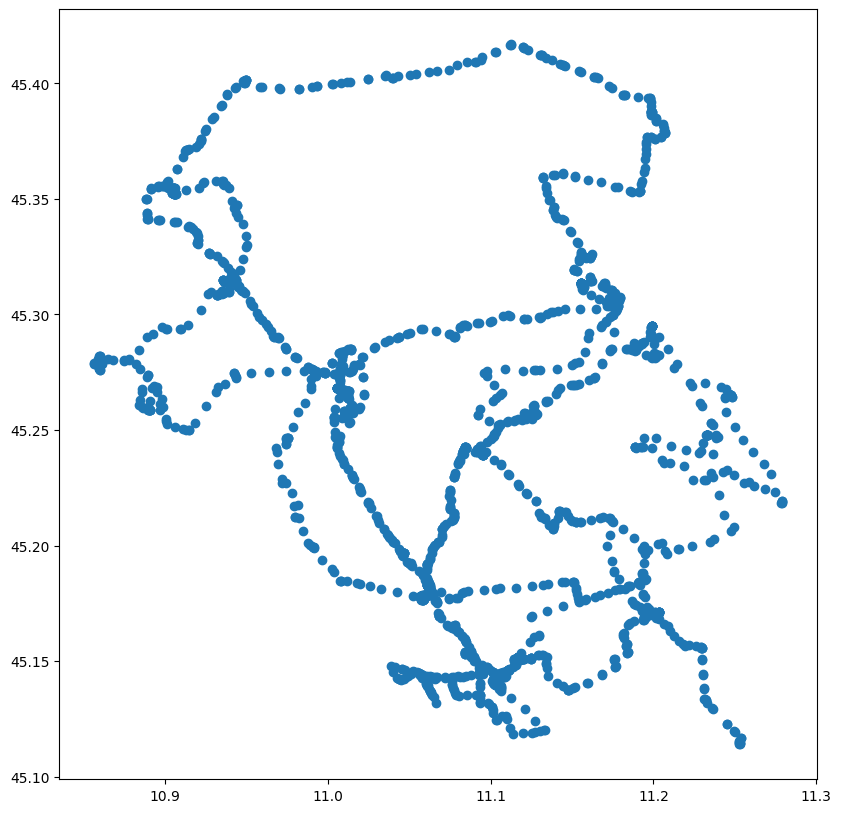
    


```python
type(truck['timestamp'][0])
```


    str


```python
truck['timestamp'] = pd.to_datetime(truck['timestamp'], format='%Y-%m-%d %H:%M:%S')
```


```python
truck['timestamp'].plot()
plt.show()
```


    
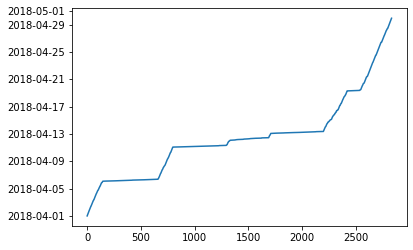
    


```python
truck['timestamp'].min()
```


    Timestamp('2018-04-01 00:00:27+0000', tz='UTC')


```python
truck[(truck['timestamp'] >= '2018-04-01') & (truck['timestamp'] < '2018-04-02')].plot(figsize =(10,10))
plt.show()
```


    
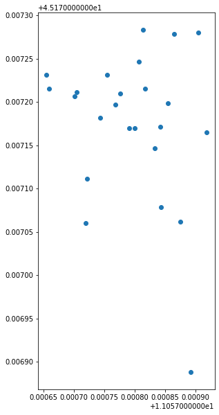
    


```python
truck['weekday'] = truck['timestamp'].apply(lambda x: x.weekday())
```


```python
truck.weekday.unique()
# Monday == 0 … Sunday == 6
```


    array([6, 0, 1, 2, 3, 4, 5])


```python
def weekday_to_string(weekday):
    if weekday == 0:
        return 'Monday'
    elif weekday == 1:
        return 'Tuesday'
    elif weekday == 2:
        return 'Wednesday'
    elif weekday == 3:
        return 'Thursday'
    elif weekday == 4:
        return 'Friday'
    elif weekday == 5:
        return 'Saturday'
    elif weekday == 6:
        return 'Sunday'
```


```python
truck['weekday_name'] = truck['weekday'].apply(lambda x: weekday_to_string(x))
```


```python
truck[truck.weekday == 0].plot(figsize=(10,10))
plt.show()
```


    
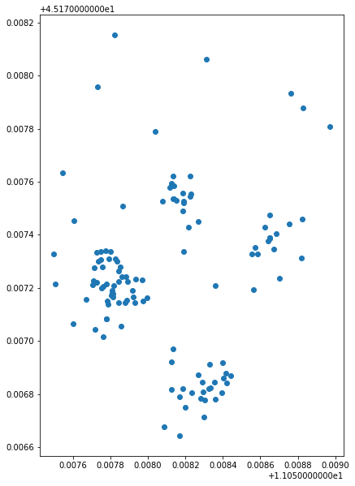
    


```python
truck[truck.weekday == 1].plot(figsize =(10,10))
plt.show()
```


    

    


```python
truck.plot(column='weekday_name', cmap="Dark2", legend=True,figsize=(15,15))
plt.show()
```


    
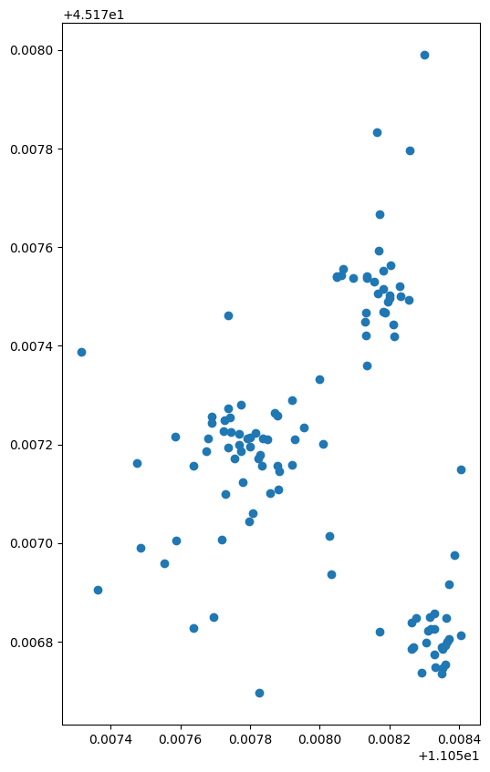
    


```python
truck['day'] = truck['timestamp'].apply(lambda x: x.strftime("%Y-%m-%d"))
```

## identify the longest route carried out
we need to create the trajectory day by day


```python
# to use in movingpandas
truck = truck.set_index('timestamp').tz_localize(None)
```


```python
# this trajectory contains all the points of the truck
trajectory = mpd.Trajectory(truck,"vehiclesid")

```


```python
trajectory.add_speed()
```


```python
trajectory.add_direction()
```


```python
trajectory.df.head(5)
```


<div>
<style scoped>
    .dataframe tbody tr th:only-of-type {
        vertical-align: middle;
    }

    .dataframe tbody tr th {
        vertical-align: top;
    }

    .dataframe thead th {
        text-align: right;
    }
</style>
<table border="1" class="dataframe">
  <thead>
    <tr style="text-align: right;">
      <th></th>
      <th>vehicleid</th>
      <th>latitude</th>
      <th>longitude</th>
      <th>geometry</th>
      <th>weekday</th>
      <th>weekday_name</th>
      <th>day</th>
      <th>speed</th>
      <th>prev_pt</th>
      <th>direction</th>
    </tr>
    <tr>
      <th>timestamp</th>
      <th></th>
      <th></th>
      <th></th>
      <th></th>
      <th></th>
      <th></th>
      <th></th>
      <th></th>
      <th></th>
      <th></th>
    </tr>
  </thead>
  <tbody>
    <tr>
      <th>2018-04-01 00:00:27</th>
      <td>8867</td>
      <td>45.177197</td>
      <td>11.057768</td>
      <td>POINT (11.05777 45.17720)</td>
      <td>6</td>
      <td>Sunday</td>
      <td>2018-04-01</td>
      <td>0.000946</td>
      <td>None</td>
      <td>88.437276</td>
    </tr>
    <tr>
      <th>2018-04-01 02:00:28</th>
      <td>8867</td>
      <td>45.177198</td>
      <td>11.057855</td>
      <td>POINT (11.05785 45.17720)</td>
      <td>6</td>
      <td>Sunday</td>
      <td>2018-04-01</td>
      <td>0.000946</td>
      <td>POINT (11.05777 45.17720)</td>
      <td>88.437276</td>
    </tr>
    <tr>
      <th>2018-04-01 02:04:13</th>
      <td>8867</td>
      <td>45.177232</td>
      <td>11.057655</td>
      <td>POINT (11.05766 45.17723)</td>
      <td>6</td>
      <td>Sunday</td>
      <td>2018-04-01</td>
      <td>0.071783</td>
      <td>POINT (11.05785 45.17720)</td>
      <td>283.302496</td>
    </tr>
    <tr>
      <th>2018-04-01 03:00:28</th>
      <td>8867</td>
      <td>45.177212</td>
      <td>11.057705</td>
      <td>POINT (11.05771 45.17721)</td>
      <td>6</td>
      <td>Sunday</td>
      <td>2018-04-01</td>
      <td>0.001338</td>
      <td>POINT (11.05766 45.17723)</td>
      <td>119.572435</td>
    </tr>
    <tr>
      <th>2018-04-01 04:00:28</th>
      <td>8867</td>
      <td>45.177278</td>
      <td>11.057865</td>
      <td>POINT (11.05786 45.17728)</td>
      <td>6</td>
      <td>Sunday</td>
      <td>2018-04-01</td>
      <td>0.004055</td>
      <td>POINT (11.05771 45.17721)</td>
      <td>59.413161</td>
    </tr>
  </tbody>
</table>
</div>


we need a collection of trajectories base on the timestamp of the vehicle


```python
traj_collection = mpd.TrajectoryCollection(trajectory.to_point_gdf(), 'vehicleid',"timestamp¨")
```

and day by day


```python
daily = mpd.TemporalSplitter(traj_collection).split(mode='day')
```

calculate the length of each path


```python
daily_lengths = [traj.get_length() for traj in daily]
```

and add the starting day


```python
daily_t = [traj.get_start_time() for traj in daily]
```

transform the daily_lenghts in a dataframe to obtain the max length 


```python
rows = {}
rows['length'] =  daily_lengths
rows['day'] = daily_t
daily_lengths = pd.DataFrame(rows)
```


```python
daily_lengths
```


<div>
<style scoped>
    .dataframe tbody tr th:only-of-type {
        vertical-align: middle;
    }

    .dataframe tbody tr th {
        vertical-align: top;
    }

    .dataframe thead th {
        text-align: right;
    }
</style>
<table border="1" class="dataframe">
  <thead>
    <tr style="text-align: right;">
      <th></th>
      <th>length</th>
      <th>day</th>
    </tr>
  </thead>
  <tbody>
    <tr>
      <th>0</th>
      <td>281.801011</td>
      <td>2018-04-01 00:00:27</td>
    </tr>
    <tr>
      <th>1</th>
      <td>414.089055</td>
      <td>2018-04-02 00:00:28</td>
    </tr>
    <tr>
      <th>2</th>
      <td>498.681155</td>
      <td>2018-04-03 00:00:25</td>
    </tr>
    <tr>
      <th>3</th>
      <td>754.454242</td>
      <td>2018-04-04 00:00:26</td>
    </tr>
    <tr>
      <th>4</th>
      <td>738.204809</td>
      <td>2018-04-05 00:00:27</td>
    </tr>
    <tr>
      <th>5</th>
      <td>167779.977302</td>
      <td>2018-04-06 00:00:29</td>
    </tr>
    <tr>
      <th>6</th>
      <td>700.033183</td>
      <td>2018-04-07 00:00:25</td>
    </tr>
    <tr>
      <th>7</th>
      <td>640.248828</td>
      <td>2018-04-08 00:00:28</td>
    </tr>
    <tr>
      <th>8</th>
      <td>479.058474</td>
      <td>2018-04-09 00:00:27</td>
    </tr>
    <tr>
      <th>9</th>
      <td>594.202797</td>
      <td>2018-04-10 00:00:27</td>
    </tr>
    <tr>
      <th>10</th>
      <td>160781.185020</td>
      <td>2018-04-11 00:00:27</td>
    </tr>
    <tr>
      <th>11</th>
      <td>98034.924751</td>
      <td>2018-04-12 00:00:27</td>
    </tr>
    <tr>
      <th>12</th>
      <td>156337.099504</td>
      <td>2018-04-13 00:00:27</td>
    </tr>
    <tr>
      <th>13</th>
      <td>1303.027725</td>
      <td>2018-04-14 00:52:11</td>
    </tr>
    <tr>
      <th>14</th>
      <td>1902.285121</td>
      <td>2018-04-15 00:00:24</td>
    </tr>
    <tr>
      <th>15</th>
      <td>1003.769563</td>
      <td>2018-04-16 00:00:30</td>
    </tr>
    <tr>
      <th>16</th>
      <td>450.866303</td>
      <td>2018-04-17 00:00:29</td>
    </tr>
    <tr>
      <th>17</th>
      <td>428.084691</td>
      <td>2018-04-18 00:00:29</td>
    </tr>
    <tr>
      <th>18</th>
      <td>48754.431074</td>
      <td>2018-04-19 00:00:29</td>
    </tr>
    <tr>
      <th>19</th>
      <td>324.761731</td>
      <td>2018-04-20 00:00:30</td>
    </tr>
    <tr>
      <th>20</th>
      <td>490.592498</td>
      <td>2018-04-21 00:00:29</td>
    </tr>
    <tr>
      <th>21</th>
      <td>340.601450</td>
      <td>2018-04-22 00:00:29</td>
    </tr>
    <tr>
      <th>22</th>
      <td>342.066707</td>
      <td>2018-04-23 00:00:29</td>
    </tr>
    <tr>
      <th>23</th>
      <td>318.429337</td>
      <td>2018-04-24 00:00:30</td>
    </tr>
    <tr>
      <th>24</th>
      <td>311.897231</td>
      <td>2018-04-25 00:00:28</td>
    </tr>
    <tr>
      <th>25</th>
      <td>314.383396</td>
      <td>2018-04-26 00:00:29</td>
    </tr>
    <tr>
      <th>26</th>
      <td>289.669857</td>
      <td>2018-04-27 00:00:29</td>
    </tr>
    <tr>
      <th>27</th>
      <td>343.704574</td>
      <td>2018-04-28 00:00:27</td>
    </tr>
    <tr>
      <th>28</th>
      <td>316.663803</td>
      <td>2018-04-29 00:00:27</td>
    </tr>
  </tbody>
</table>
</div>


```python
day_with_the_longest_route = daily_lengths[daily_lengths.length == daily_lengths.length.max()]['day']
```


```python
from_day = day_with_the_longest_route.values[0]
to_day = (day_with_the_longest_route+ pd.DateOffset(days=1)).values[0]
```


```python
truck_trip_longest = truck.reset_index()[(truck.reset_index().timestamp >= from_day) & (truck.reset_index().timestamp < to_day)]
```


```python
truck_trip_longest = truck_trip_longest.set_index('timestamp').tz_localize(None)

```


```python
longest_trajectory = mpd.Trajectory(truck_trip_longest,"vehiclesid")

```


```python
longest_trajectory.to_traj_gdf().plot()
plt.show()
```


    
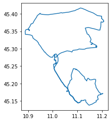
    


```python
longest_trajectory_plot = longest_trajectory.hvplot(title='Trajectory {}'.format(trajectory.id), line_width=7.0, tiles='CartoLight', color='blue', frame_width=350, frame_height=350) 
longest_trajectory_plot
```

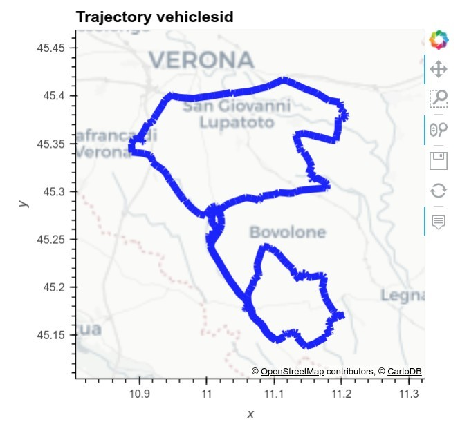


## identify the places of the daily departure and arrival points


```python
from geopy.geocoders import ArcGIS
rows = []
geolocator = ArcGIS()  
for traj in daily:
    departure = traj.df['geometry'][0]
    latlon = str(departure.y) + "," + str(departure.x);
    location_departure = geolocator.reverse(latlon)
    arrival = traj.df['geometry'][-1]
    latlon = str(arrival.y) + "," + str(arrival.x);
    location_arrival = geolocator.reverse(latlon)
    day = traj.df.reset_index()['timestamp'][0]
    day = day.strftime("%Y-%m-%d")
    data = {}
    data['day'] = day
    data['arrival'] = arrival
    data['arrival_location'] = location_arrival.address
    data['departure'] = departure
    data['departure_location'] = location_arrival.address
    rows.append(data)
```


```python
arrivals_depatures_days = pd.DataFrame(rows)
```


```python
arrivals_depatures_days
```


<div>
<style scoped>
    .dataframe tbody tr th:only-of-type {
        vertical-align: middle;
    }

    .dataframe tbody tr th {
        vertical-align: top;
    }

    .dataframe thead th {
        text-align: right;
    }
</style>
<table border="1" class="dataframe">
  <thead>
    <tr style="text-align: right;">
      <th></th>
      <th>day</th>
      <th>arrival</th>
      <th>arrival_location</th>
      <th>departure</th>
      <th>departure_location</th>
    </tr>
  </thead>
  <tbody>
    <tr>
      <th>0</th>
      <td>2018-04-01</td>
      <td>POINT (11.0578 45.17717)</td>
      <td>, Nogara, Veneto 37054, ITA</td>
      <td>POINT (11.0577683333333 45.1771966666667)</td>
      <td>, Nogara, Veneto 37054, ITA</td>
    </tr>
    <tr>
      <th>1</th>
      <td>2018-04-02</td>
      <td>POINT (11.057815 45.177165)</td>
      <td>, Nogara, Veneto 37054, ITA</td>
      <td>POINT (11.057835 45.1773016666667)</td>
      <td>, Nogara, Veneto 37054, ITA</td>
    </tr>
    <tr>
      <th>2</th>
      <td>2018-04-03</td>
      <td>POINT (11.0577966666667 45.177045)</td>
      <td>, Nogara, Veneto 37054, ITA</td>
      <td>POINT (11.057775 45.1771866666667)</td>
      <td>, Nogara, Veneto 37054, ITA</td>
    </tr>
    <tr>
      <th>3</th>
      <td>2018-04-04</td>
      <td>POINT (11.0577333333333 45.17718)</td>
      <td>, Nogara, Veneto 37054, ITA</td>
      <td>POINT (11.0577733333333 45.1771683333333)</td>
      <td>, Nogara, Veneto 37054, ITA</td>
    </tr>
    <tr>
      <th>4</th>
      <td>2018-04-05</td>
      <td>POINT (11.0577266666667 45.1772566666667)</td>
      <td>Via Francesco Stellini, Nogara, Veneto 37054, ITA</td>
      <td>POINT (11.0578183333333 45.1771966666667)</td>
      <td>Via Francesco Stellini, Nogara, Veneto 37054, ITA</td>
    </tr>
    <tr>
      <th>5</th>
      <td>2018-04-06</td>
      <td>POINT (11.0577516666667 45.17729)</td>
      <td>Via Francesco Stellini, Nogara, Veneto 37054, ITA</td>
      <td>POINT (11.0578783333333 45.1771616666667)</td>
      <td>Via Francesco Stellini, Nogara, Veneto 37054, ITA</td>
    </tr>
    <tr>
      <th>6</th>
      <td>2018-04-07</td>
      <td>POINT (11.0577383333333 45.1773366666667)</td>
      <td>Via Francesco Stellini, Nogara, Veneto 37054, ITA</td>
      <td>POINT (11.0577666666667 45.1772283333333)</td>
      <td>Via Francesco Stellini, Nogara, Veneto 37054, ITA</td>
    </tr>
    <tr>
      <th>7</th>
      <td>2018-04-08</td>
      <td>POINT (11.0576433333333 45.17716)</td>
      <td>, Nogara, Veneto 37054, ITA</td>
      <td>POINT (11.0578716666667 45.1772016666667)</td>
      <td>, Nogara, Veneto 37054, ITA</td>
    </tr>
    <tr>
      <th>8</th>
      <td>2018-04-09</td>
      <td>POINT (11.0578283333333 45.1773083333333)</td>
      <td>Via Francesco Stellini, Nogara, Veneto 37054, ITA</td>
      <td>POINT (11.05789 45.177225)</td>
      <td>Via Francesco Stellini, Nogara, Veneto 37054, ITA</td>
    </tr>
    <tr>
      <th>9</th>
      <td>2018-04-10</td>
      <td>POINT (11.05788 45.1772583333333)</td>
      <td>, Nogara, Veneto 37054, ITA</td>
      <td>POINT (11.05769 45.1772566666667)</td>
      <td>, Nogara, Veneto 37054, ITA</td>
    </tr>
    <tr>
      <th>10</th>
      <td>2018-04-11</td>
      <td>POINT (11.0583483333333 45.17786)</td>
      <td>Via Molino 40, Nogara, Veneto 37054, ITA</td>
      <td>POINT (11.057785 45.17717)</td>
      <td>Via Molino 40, Nogara, Veneto 37054, ITA</td>
    </tr>
    <tr>
      <th>11</th>
      <td>2018-04-12</td>
      <td>POINT (11.0587116666667 45.1773133333333)</td>
      <td>Via Molino 31, Nogara, Veneto 37054, ITA</td>
      <td>POINT (11.0584 45.1777183333333)</td>
      <td>Via Molino 31, Nogara, Veneto 37054, ITA</td>
    </tr>
    <tr>
      <th>12</th>
      <td>2018-04-13</td>
      <td>POINT (11.0585616666667 45.1773266666667)</td>
      <td>Via Molino 31, Nogara, Veneto 37054, ITA</td>
      <td>POINT (11.0585433333333 45.1773566666667)</td>
      <td>Via Molino 31, Nogara, Veneto 37054, ITA</td>
    </tr>
    <tr>
      <th>13</th>
      <td>2018-04-14</td>
      <td>POINT (11.0585183333333 45.1777333333333)</td>
      <td>Via Molino 40, Nogara, Veneto 37054, ITA</td>
      <td>POINT (11.0587666666667 45.1772383333333)</td>
      <td>Via Molino 40, Nogara, Veneto 37054, ITA</td>
    </tr>
    <tr>
      <th>14</th>
      <td>2018-04-15</td>
      <td>POINT (11.0586016666667 45.1776133333333)</td>
      <td>Via Molino 31, Nogara, Veneto 37054, ITA</td>
      <td>POINT (11.0585 45.1774216666667)</td>
      <td>Via Molino 31, Nogara, Veneto 37054, ITA</td>
    </tr>
    <tr>
      <th>15</th>
      <td>2018-04-16</td>
      <td>POINT (11.05819 45.1773366666667)</td>
      <td>, Nogara, Veneto 37054, ITA</td>
      <td>POINT (11.0585566666667 45.1773266666667)</td>
      <td>, Nogara, Veneto 37054, ITA</td>
    </tr>
    <tr>
      <th>16</th>
      <td>2018-04-17</td>
      <td>POINT (11.058135 45.17736)</td>
      <td>, Nogara, Veneto 37054, ITA</td>
      <td>POINT (11.0581333333333 45.1774216666667)</td>
      <td>, Nogara, Veneto 37054, ITA</td>
    </tr>
    <tr>
      <th>17</th>
      <td>2018-04-18</td>
      <td>POINT (11.0581533333333 45.1775366666667)</td>
      <td>Via Molino 31, Nogara, Veneto 37054, ITA</td>
      <td>POINT (11.0582283333333 45.1775833333333)</td>
      <td>Via Molino 31, Nogara, Veneto 37054, ITA</td>
    </tr>
    <tr>
      <th>18</th>
      <td>2018-04-19</td>
      <td>POINT (11.0581183333333 45.1775316666667)</td>
      <td>Via Francesco Stellini, Nogara, Veneto 37054, ITA</td>
      <td>POINT (11.0582183333333 45.1776066666667)</td>
      <td>Via Francesco Stellini, Nogara, Veneto 37054, ITA</td>
    </tr>
    <tr>
      <th>19</th>
      <td>2018-04-20</td>
      <td>POINT (11.058125 45.1775033333333)</td>
      <td>Via Francesco Stellini, Nogara, Veneto 37054, ITA</td>
      <td>POINT (11.0582333333333 45.17758)</td>
      <td>Via Francesco Stellini, Nogara, Veneto 37054, ITA</td>
    </tr>
    <tr>
      <th>20</th>
      <td>2018-04-21</td>
      <td>POINT (11.0582116666667 45.1769283333333)</td>
      <td>, Nogara, Veneto 37054, ITA</td>
      <td>POINT (11.0582766666667 45.1775866666667)</td>
      <td>, Nogara, Veneto 37054, ITA</td>
    </tr>
    <tr>
      <th>21</th>
      <td>2018-04-22</td>
      <td>POINT (11.0583466666667 45.177075)</td>
      <td>, Nogara, Veneto 37054, ITA</td>
      <td>POINT (11.05843 45.1768566666667)</td>
      <td>, Nogara, Veneto 37054, ITA</td>
    </tr>
    <tr>
      <th>22</th>
      <td>2018-04-23</td>
      <td>POINT (11.058135 45.17697)</td>
      <td>, Nogara, Veneto 37054, ITA</td>
      <td>POINT (11.058325 45.17682)</td>
      <td>, Nogara, Veneto 37054, ITA</td>
    </tr>
    <tr>
      <th>23</th>
      <td>2018-04-24</td>
      <td>POINT (11.0582633333333 45.176785)</td>
      <td>, Nogara, Veneto 37054, ITA</td>
      <td>POINT (11.0583183333333 45.1768266666667)</td>
      <td>, Nogara, Veneto 37054, ITA</td>
    </tr>
    <tr>
      <th>24</th>
      <td>2018-04-25</td>
      <td>POINT (11.0583516666667 45.1767933333333)</td>
      <td>, Nogara, Veneto 37054, ITA</td>
      <td>POINT (11.058405 45.1769116666667)</td>
      <td>, Nogara, Veneto 37054, ITA</td>
    </tr>
    <tr>
      <th>25</th>
      <td>2018-04-26</td>
      <td>POINT (11.05832 45.1767383333333)</td>
      <td>, Nogara, Veneto 37054, ITA</td>
      <td>POINT (11.058385 45.1768333333333)</td>
      <td>, Nogara, Veneto 37054, ITA</td>
    </tr>
    <tr>
      <th>26</th>
      <td>2018-04-27</td>
      <td>POINT (11.0582916666667 45.176705)</td>
      <td>, Nogara, Veneto 37054, ITA</td>
      <td>POINT (11.0582966666667 45.1767916666667)</td>
      <td>, Nogara, Veneto 37054, ITA</td>
    </tr>
    <tr>
      <th>27</th>
      <td>2018-04-28</td>
      <td>POINT (11.058175 45.17675)</td>
      <td>, Nogara, Veneto 37054, ITA</td>
      <td>POINT (11.058275 45.176745)</td>
      <td>, Nogara, Veneto 37054, ITA</td>
    </tr>
    <tr>
      <th>28</th>
      <td>2018-04-29</td>
      <td>POINT (11.0582916666667 45.1767783333333)</td>
      <td>, Nogara, Veneto 37054, ITA</td>
      <td>POINT (11.0583383333333 45.176805)</td>
      <td>, Nogara, Veneto 37054, ITA</td>
    </tr>
  </tbody>
</table>
</div>


```python
gdf_locations_arrivals = gpd.GeoDataFrame(arrivals_depatures_days,geometry="arrival",crs="epsg:4326")
```


```python
gdf_locations_arrivals.plot()
plt.show()
```


    
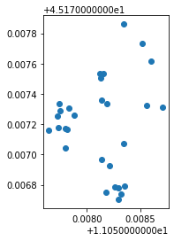
    


```python
gdf_locations_departures = gpd.GeoDataFrame(arrivals_depatures_days,geometry="arrival",crs="epsg:4326")
gdf_locations_departures.plot()
plt.show()
```


    

    


## show the km traveled day by day


```python
daily_lengths['length'] = daily_lengths['length'].apply(lambda x: round(x/1000,2))
daily_lengths['day'] = daily_lengths['day'].apply(lambda x: x.strftime("%Y-%m-%d"))
```


```python
daily_lengths = daily_lengths.set_index("day")
```


```python
daily_lengths.plot(kind="bar",figsize=(10,10))
plt.show()
```


    
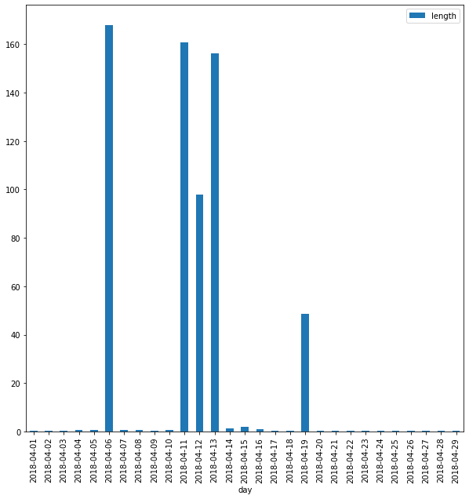
    


## identify the breaks carried out in the shortest route of the third week and in the longest one of the last
### identify the weeks


```python
from datetime import datetime, timedelta
```


```python
weeks_begin = truck[truck.weekday == 0].reset_index().sort_values("day")['day'].unique()
```


```python
first_day_week3 = weeks_begin[2]
```


```python
first_day_week4 = weeks_begin[3]
```


```python
last_day_week3 = datetime.strptime(first_day_week3, "%Y-%m-%d") + timedelta(days=6)
last_day_week4 = datetime.strptime(first_day_week4, "%Y-%m-%d") + timedelta(days=6)
```


```python
last_day_week4.strftime("%Y-%m-%d")
```


    '2018-04-29'


### shortest route third week


```python
truck_trips_third_week = truck.reset_index()[(truck.reset_index()['timestamp'] >= first_day_week3) & (truck.reset_index()['timestamp'] <= last_day_week3)]
```


```python
truck_trips_third_week['timestamp'] = pd.to_datetime(truck_trips_third_week['timestamp'], format='%Y-%m-%d %H:%M:%S')
```


```python
truck_trips_third_week = truck_trips_third_week.set_index("timestamp")
```


```python
# this trajectory contains all the points of the truck
trajectory_third_week = mpd.Trajectory(truck_trips_third_week,"vehiclesid")
```


```python
traj_collection_third_week = mpd.TrajectoryCollection(trajectory_third_week.to_point_gdf(), 'vehicleid',"timestamp¨")
```


```python
daily_third_week = mpd.TemporalSplitter(traj_collection_third_week).split(mode='day')
```


```python
daily_lengths_third_week = [traj.get_length() for traj in daily_third_week]
```


```python
min_lenght = min(daily_lengths_third_week)
```


```python
idx_min_length = daily_lengths_third_week.index(min_lenght)
```


```python
daily_days_third_week = [traj.get_start_time() for traj in daily_third_week]
```


```python
day_shortest_route_third_week = daily_days_third_week[idx_min_length]
day_shortest = day_shortest_route_third_week.strftime("%Y-%m-%d")
```


```python
print("the route of the %s is long %f km" % (day_shortest,round((min_lenght/1000),2)))

```

    the route of the 2018-04-20 is long 0.320000 km


```python
stops_third_week = mpd.TrajectoryStopDetector(trajectory_third_week)
```


```python
seconds_pause = 120
max_diameter = min_lenght
stop_durations_third_week = stops_third_week.get_stop_time_ranges(min_duration=timedelta(seconds=seconds_pause), max_diameter=max_diameter)
```


```python
stops_trajections = []
for stop_time in stop_durations_third_week: 
    time_stop = stop_time.t_0
    day_stop = time_stop.strftime("%Y-%m-%d")
    if day_stop == day_shortest:
       stops_trajections.append(stop_time)
```


```python
for stops_trajection in stops_trajections:
    print(stops_trajection)
```


```python
print("there are %i trajectory with breaks of %s seconds in the range of %i diameter" % (len(stops_trajections),seconds_pause,max_diameter))
```

    there are 0 trajectory with breaks of 120 seconds in the range of 324 diameter


```python
stop_points_third_week = stops_third_week.get_stop_points(min_duration=timedelta(seconds=seconds_pause), max_diameter=max_diameter)
```


```python
stop_points_third_week
```


<div>
<style scoped>
    .dataframe tbody tr th:only-of-type {
        vertical-align: middle;
    }

    .dataframe tbody tr th {
        vertical-align: top;
    }

    .dataframe thead th {
        text-align: right;
    }
</style>
<table border="1" class="dataframe">
  <thead>
    <tr style="text-align: right;">
      <th></th>
      <th>geometry</th>
      <th>start_time</th>
      <th>end_time</th>
      <th>traj_id</th>
      <th>duration_s</th>
    </tr>
    <tr>
      <th>stop_id</th>
      <th></th>
      <th></th>
      <th></th>
      <th></th>
      <th></th>
    </tr>
  </thead>
  <tbody>
    <tr>
      <th>vehiclesid_2018-04-16 00:00:30</th>
      <td>POINT (11.05856 45.17733)</td>
      <td>2018-04-16 00:00:30</td>
      <td>2018-04-19 07:34:16</td>
      <td>vehiclesid</td>
      <td>286426.0</td>
    </tr>
    <tr>
      <th>vehiclesid_2018-04-19 07:39:47</th>
      <td>POINT (11.04663 45.19661)</td>
      <td>2018-04-19 07:39:47</td>
      <td>2018-04-19 07:46:18</td>
      <td>vehiclesid</td>
      <td>391.0</td>
    </tr>
    <tr>
      <th>vehiclesid_2018-04-19 08:12:09</th>
      <td>POINT (11.22977 45.15575)</td>
      <td>2018-04-19 08:12:09</td>
      <td>2018-04-19 08:24:27</td>
      <td>vehiclesid</td>
      <td>738.0</td>
    </tr>
    <tr>
      <th>vehiclesid_2018-04-19 08:31:59</th>
      <td>POINT (11.25244 45.11512)</td>
      <td>2018-04-19 08:31:59</td>
      <td>2018-04-19 08:44:12</td>
      <td>vehiclesid</td>
      <td>733.0</td>
    </tr>
    <tr>
      <th>vehiclesid_2018-04-19 09:15:11</th>
      <td>POINT (11.05724 45.17798)</td>
      <td>2018-04-19 09:15:11</td>
      <td>2018-04-21 23:00:29</td>
      <td>vehiclesid</td>
      <td>222318.0</td>
    </tr>
  </tbody>
</table>
</div>


## breaks of longest route one the last week


```python
truck_trips_last_week = truck.reset_index()[(truck.reset_index()['timestamp'] >= first_day_week4) & (truck.reset_index()['timestamp'] <= last_day_week4)]
truck_trips_last_week['timestamp'] = pd.to_datetime(truck_trips_last_week['timestamp'], format='%Y-%m-%d %H:%M:%S')
truck_trips_last_week = truck_trips_last_week.set_index("timestamp")
trajectory_last_week = mpd.Trajectory(truck_trips_last_week,"vehiclesid")
traj_collection_last_week = mpd.TrajectoryCollection(trajectory_last_week.to_point_gdf(), 'vehicleid',"timestamp¨")
```


```python
daily_last_week = mpd.TemporalSplitter(traj_collection_last_week).split(mode='day')
daily_lengths_last_week = [traj.get_length() for traj in daily_last_week]
max_lenght = max(daily_lengths_last_week)
idx_max_lenght = daily_lengths_last_week.index(max_lenght)
daily_days_last_week = [traj.get_start_time() for traj in daily_last_week]
day_longest_route_last_week = daily_days_last_week[idx_max_lenght]
day_longest = day_longest_route_last_week.strftime("%Y-%m-%d")

```


```python
print("the route of the %s is long %f km" % (day_longest,round((max_lenght/1000),2)))
```

    the route of the 2018-04-28 is long 0.340000 km


```python
stops_last_week = mpd.TrajectoryStopDetector(trajectory_last_week)
```


```python
seconds_pause = 60
max_diameter = 30
stop_durations_last_week = stops_last_week.get_stop_time_ranges(min_duration=timedelta(seconds=seconds_pause), max_diameter=max_diameter)
```


```python
stops_trajections = []
for stop_time in stop_durations_last_week: 
    time_stop = stop_time.t_0
    day_stop = time_stop.strftime("%Y-%m-%d")
    if day_stop == day_longest:
       stops_trajections.append(stop_time)
```


```python
stops_trajections
```


    [<movingpandas.time_range_utils.TemporalRangeWithTrajId at 0x7f7bd8f40850>,
     <movingpandas.time_range_utils.TemporalRangeWithTrajId at 0x7f7bb11dd0d0>]


```python
stop_points = stops_last_week.get_stop_points(min_duration=timedelta(seconds=seconds_pause), max_diameter=max_diameter)
```


```python
traj_plot = trajectory_last_week.hvplot(title='Trajectory {}'.format(trajectory_last_week.obj_id), line_width=7.0, tiles='CartoLight', color='slategray', frame_width=350, frame_height=350) 
```


```python
stop_point_plot = traj_plot * stop_points.hvplot(geo=True, color='deeppink')
stop_point_plot
```


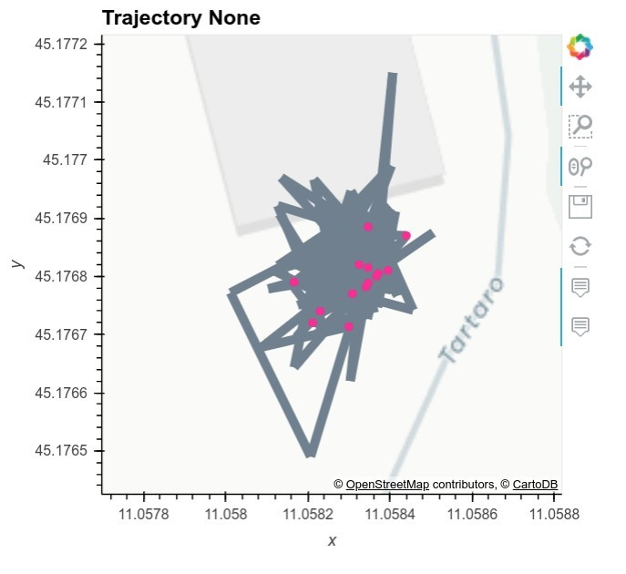


## identify the longest route of the third week of the month on the OpenStreetMap road graph

for this operation we will use an algorithm of [Map Matching](https://en.wikipedia.org/wiki/Map_matching).

Map matching is the problem of how to match recorded geographic coordinates to a logical model of the real world,


Read the article [Fast map matching, an algorithm integrating hidden Markov model with precomputation](https://www.tandfonline.com/doi/full/10.1080/13658816.2017.1400548)

The method use is [Map-matching for low-sampling-rate GPS trajectories](https://dl.acm.org/doi/abs/10.1145/1653771.1653820)

Read the [documentation](https://fmm-wiki.github.io/) for the [installation](https://fmm-wiki.github.io/docs/installation/)

[Source code](https://github.com/cyang-kth/fmm)

### download of the OSM data 
Nogara is locate in Province of Verona - download the OSM raw data from [https://osmit-estratti.wmcloud.org]([https://osmit-estratti.wmcloud.org)


```python
url_download_verona_province_pbf = 'https://osmit-estratti.wmcloud.org/dati/poly/province/pbf/023_Verona_poly.osm.pbf'
pbf_filename = "verona_province_osm.pbf"
import urllib.request
urllib.request.urlretrieve(url_download_verona_province_pbf ,pbf_filename) 
```


    ('verona_province_osm.pbf', <http.client.HTTPMessage at 0x7f7bd8ed4ee0>)


#### setup the network for FMM
by using OSMnx


```python
truck.geometry.unary_union.convex_hull.buffer(0.002)
```


    

    


```python
# Initiliaze with bounding box
osm = pyrosm.OSM(pbf_filename,bounding_box=truck.geometry.unary_union.convex_hull)
```


```python
# creation of the graph
nodes, edges = osm.get_network(network_type="driving", nodes=True)
G = osm.to_graph(nodes, edges, graph_type="networkx")
%time
```

    CPU times: user 3 µs, sys: 0 ns, total: 3 µs
    Wall time: 8.11 µs


```python
# archive edges and nodes in ESRI Shapefile (required of FMM)
encoding="utf-8"
filepath_nodes = "nodes.shp"
filepath_edges = "edges.shp"
gdf_nodes, gdf_edges = ox.utils_graph.graph_to_gdfs(G)
# convert undirected graph to gdfs and stringify non-numeric columns
gdf_nodes = ox.io._stringify_nonnumeric_cols(gdf_nodes)
gdf_edges = ox.io._stringify_nonnumeric_cols(gdf_edges)
%time
```

    CPU times: user 2 µs, sys: 1 µs, total: 3 µs
    Wall time: 4.29 µs


```python
# We need an unique ID for each edge
gdf_edges["fid"] = np.arange(0, gdf_edges.shape[0], dtype='int')
```


```python
# save the nodes and edges as separate ESRI shapefiles
del gdf_nodes['osmid']
gdf_nodes.to_file(filepath_nodes, encoding=encoding)
gdf_edges.to_file(filepath_edges, encoding=encoding)
%time
```

    CPU times: user 2 µs, sys: 1 µs, total: 3 µs
    Wall time: 4.77 µs


### identify the longest route of the third week of the month


```python
gdf_traj = None
max_length = -1
for traj in daily_third_week:
    gdf_tmp = traj.to_traj_gdf()
    if (gdf_tmp.length.values[0] >= max_length):
        gdf_traj = gdf_tmp
        max_length = gdf_tmp.length.values[0]
```


```python
gdf_tmp.length.values[0] 
```


    0.0048786027370615135


```python
route_wkt = gdf_traj.geometry.values[0].wkt
```

### execute the map matching


```python
from fmm import Network,NetworkGraph,STMATCH,STMATCHConfig
```


```python
### Read network data
# comment the lines from here ...
url_edges_verona = 'https://github.com/napo/geospatial_course_unitn/raw/master/data/geotemporaldata/network_verona_province/edges.zip'
out_filename = "edges.zip"
urllib.request.urlretrieve(url_edges_verona ,out_filename) 
import shutil
shutil.unpack_archive(out_filename, ".")
# ... to here 
# if you want to download the data from internet otherwise use the data created in the previous step

network = Network("edges.shp","fid","u","v")
graph = NetworkGraph(network)
```

apply the [STMatch](https://dl.acm.org/doi/abs/10.1145/1653771.1653820) algorythm


```python
model = STMATCH(network,graph)
```

More info about the parameters are [here](https://cyang-kth.github.io/fmm/struct_f_m_m_1_1_m_m_1_1_s_t_m_a_t_c_h_config.html#a8d7032b694c0fc4b44901986988ccafd)


```python
k = 1 #	number of candidates
gps_error = 0.0005 #GPS error, unit is map_unit. 
radius = 0.003 #search radius for candidates, unit is map_unit 
vmax = 30 #maximum speed of the vehicle, unit is map_unit/second 
stmatch_config = STMATCHConfig(k, radius, gps_error, vmax)
```


```python
result = model.match_wkt(route_wkt,stmatch_config)
```


```python
matched_path = list(result.cpath)
matched_edge_for_each_point = list(result.opath)
matched_edge_index = list(result.indices)
linestring_wkt = result.mgeom.export_wkt()
point_wkt = result.pgeom.export_wkt()
```


```python
wkt.loads(linestring_wkt)
```


    
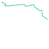
    


```python
wkt.loads(route_wkt)
```


    

    


```python
from geojson import dump
```


```python
geometry_matched = geojson.Feature(geometry=wkt.loads(linestring_wkt), properties={})
```


```python
with open('geometry_matched.geojson', 'w') as f:
   dump(geometry_matched, f)
```


```python
geometry_original = geojson.Feature(geometry=wkt.loads(route_wkt), properties={})
```


```python
with open('geometry_original.geojson', 'w') as f:
   dump(geometry_original, f)
```

you can download the files [geometry_matched.geojson](https://github.com/napo/geospatial_course_unitn/blob/master/data/geotemporaldata/geometry_matched.geojson) and [geometry_original.geojson](https://github.com/napo/geospatial_course_unitn/blob/master/data/geotemporaldata/geometry_original.geojson)

or simple compare [here](http://umap.openstreetmap.fr/en/map/map-matching_681846#15/45.1812/11.0681)


