# Setup


```python
import warnings
warnings.simplefilter("ignore")
```


```python
try:
  import geopandas as gpd
except ModuleNotFoundError as e:
  !pip install geopandas==0.10.1
  import geopandas as gpd

if gpd.__version__ != "0.10.1":
  !pip install -U geopandas==0.10.1
  import geopandas as gpd
```


```python
try:
  import rasterio as rio
except ModuleNotFoundError as e:
  !pip install rasterio==1.2.3
  import rasterio as rio

if rio.__version__ != "1.2.3":
  !pip install -U rasterio==1.2.3
  import rasterio as rio
```


```python
try:
  import owslib
except ModuleNotFoundError as e:
  !pip install owslib==0.25.0
  import owslib

if owslib.__version__ != "0.25.0":
  !pip install -U owslib==0.25.0
  import owslib
```


```python
from matplotlib import pyplot as plt
```

# Exercises
- clip the area with the shape of Polo Ferrari (in front on FBK)
- create the altitude profile of the street "Via Sommarive"
- find the area FBK in the WMS of municipality of Trento - layer "Carta Tecnica 1:2.000 alta risoluzione" and vectorize it
- identify the shortest path from the pizzeria Oro Stube until the main entrance of FBK over the DTM

---


## clip the area with the shape of Polo Ferrari (in front on FBK)
1. identify the area of Polo Ferrari
2. download the raster of scientific hub in Povo
3. clip area


```python
import geopandas as gpd
import rasterio 
from rasterio.mask import mask
from rasterio.plot import show
```

### 1. identify the area of Polo Ferrari


[http://overpass-turbo.eu/s/ZzP](http://overpass-turbo.eu/s/ZzP
)

[geojson](https://raw.githubusercontent.com/napo/geospatial_course_unitn/master/data/openstreetmap/polo_ferrari_boundary.geojson)


```python
geojson_polo_ferarri = "https://raw.githubusercontent.com/napo/geospatial_course_unitn/master/data/openstreetmap/polo_ferrari_boundary.geojson"
```


```python
polo_ferrari = gpd.read_file(geojson_polo_ferarri)
```


```python
polo_ferrari.plot()
plt.show()
```


    
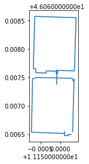
    


```python
polo_ferrari.geometry.type.unique()
```


    array(['LineString'], dtype=object)


```python
polo_ferrari.geometry.unary_union.envelope
```


    

    


```python
area_polo_ferrari = polo_ferrari.geometry.unary_union.envelope
```


```python
type(area_polo_ferrari)
```


    shapely.geometry.polygon.Polygon


### 2. download the raster of scientific hub in Povo


```python
url_download_orthophoto_scientific_hub_povo = 'https://github.com/napo/geospatial_course_unitn/raw/master/data/raster/trento_scientifc_hub_povo.tif'
```


```python
raster = rasterio.open(url_download_orthophoto_scientific_hub_povo)
```


```python
show(raster)
```


    
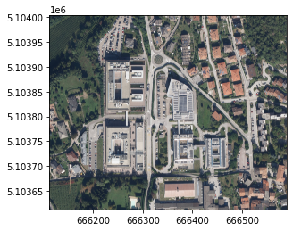
    


    <AxesSubplot:>


```python
raster.meta
```


    {'driver': 'GTiff',
     'dtype': 'uint8',
     'nodata': None,
     'width': 4761,
     'height': 3900,
     'count': 3,
     'crs': CRS.from_epsg(25832),
     'transform': Affine(0.09999999999999999, 0.0, 666113.0,
            0.0, -0.09999999999999999, 5104003.0)}


### 3. clip area


```python
def getFeatures(gdf):
    """Function to parse features from GeoDataFrame in such a manner that rasterio wants them"""
    import json
    return [json.loads(gdf.to_json())['features'][0]['geometry']]

```


```python
gdf_polo_ferrari_25832 = gpd.GeoSeries([area_polo_ferrari]).set_crs("EPSG:4326").to_crs("EPSG:25832")
```


```python
coords = getFeatures(gdf_polo_ferrari_25832)
```


```python
coords
```


    [{'type': 'Polygon',
      'coordinates': [[[666221.9300357221, 5103679.093307299],
        [666310.1180686228, 5103681.477369573],
        [666303.8138183788, 5103914.6097356975],
        [666215.6291314249, 5103912.225679764],
        [666221.9300357221, 5103679.093307299]]]}]


```python
raster_polo_ferrari, raster_polo_ferrari_transform = mask(raster, coords, crop=True)
```


```python
show(raster_polo_ferrari)
```


    

    


    <AxesSubplot:>


```python
raster_polo_ferrari_meta = raster.meta
```


```python
raster_polo_ferrari_meta.update({"driver": "GTiff",
                 "height": raster_polo_ferrari.shape[1],
                 "width": raster_polo_ferrari.shape[2],
                 "transform": raster_polo_ferrari_transform})

with rasterio.open("polo_ferrari_orthophoto.tif", "w", **raster_polo_ferrari_meta) as dest:
    dest.write(raster_polo_ferrari)
```


```python
#uncomment if you want download with colab
#from google.colab import files
#files.download('polo_ferrari_orthophoto.tif')
```

## create the altitude profile of the street “Via Sommarive”
1. download the street "Via Sommarive" from OpenStreetMap
1. download the DTM file of the scientific hub of Povo
1. clip the street inside the area covered of the DTM
1. extract the points of the street
1. extract the altitude value for each points
1. show the altitude
---


### 1. download the street "Via Sommarive" from OpenStreetMap


[](http://overpass-turbo.eu/s/ZA0)

[geojson](https://raw.githubusercontent.com/napo/geospatial_course_unitn/master/data/openstreetmap/via_sommarive.geojson)


```python
via_sommarive = gpd.read_file("https://raw.githubusercontent.com/napo/geospatial_course_unitn/master/data/openstreetmap/via_sommarive.geojson")
```


```python
via_sommarive.plot()
plt.show()
```


    
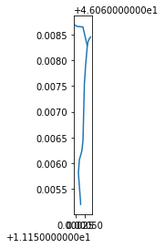
    


### 2. download the DTM file of the scientific hub of Povo


```python
import urllib.request
url_download_dtm_scientific_hub_povo = 'https://github.com/napo/geospatial_course_unitn/raw/master/data/raster/trento_scientifc_hub_povo_dtm.asc'
dtm = "trento_scientifc_hub_povo_dtm.asc"
urllib.request.urlretrieve(url_download_dtm_scientific_hub_povo ,dtm) 
url_download_dtm_scientific_hub_povo_prj = 'https://github.com/napo/geospatial_course_unitn/raw/master/data/raster/trento_scientifc_hub_povo_dtm.prj'
dtm_prj = "trento_scientifc_hub_povo_dtm.prj"
urllib.request.urlretrieve(url_download_dtm_scientific_hub_povo_prj ,dtm_prj) 
```


    ('trento_scientifc_hub_povo_dtm.prj',
     <http.client.HTTPMessage at 0x7fe8f6785910>)


```python
dtm = "trento_scientifc_hub_povo_dtm.asc"
```


```python
raster_dtm = rasterio.open(dtm)
```


```python
show(raster_dtm, cmap='Greys')
```


    

    


    <AxesSubplot:>


### 3. clip the street inside the area covered of the DTM


```python
raster_dtm.bounds
```


    BoundingBox(left=666100.6735466761, bottom=5103603.23583161, right=666600.6735466761, top=5104013.23583161)


```python
minx = raster_dtm.bounds.left
maxx = raster_dtm.bounds.right
miny = raster_dtm.bounds.bottom
maxy = raster_dtm.bounds.top

```


```python
from shapely.geometry import Polygon
```


```python
bbox_raster_dtm = Polygon([[minx, miny], [maxx, miny], [maxx, maxy], [minx, maxy]])
```


```python
geoseries_bbox_raster_dtm = gpd.GeoSeries([bbox_raster_dtm]).set_crs("EPSG:25832").to_crs("EPSG:4326")
```


```python
geoseries_bbox_raster_dtm
```


    0    POLYGON ((11.14767 46.06582, 11.15413 46.06570...
    dtype: geometry


```python
gdf_bbox_raster_dtm = gpd.GeoDataFrame(geometry=geoseries_bbox_raster_dtm)
```


```python
gdf_bbox_raster_dtm
```


<div>
<style scoped>
    .dataframe tbody tr th:only-of-type {
        vertical-align: middle;
    }

    .dataframe tbody tr th {
        vertical-align: top;
    }

    .dataframe thead th {
        text-align: right;
    }
</style>
<table border="1" class="dataframe">
  <thead>
    <tr style="text-align: right;">
      <th></th>
      <th>geometry</th>
    </tr>
  </thead>
  <tbody>
    <tr>
      <th>0</th>
      <td>POLYGON ((11.14767 46.06582, 11.15413 46.06570...</td>
    </tr>
  </tbody>
</table>
</div>


```python
sommarive_street_inside_dtm = gpd.overlay(via_sommarive, gdf_bbox_raster_dtm, how='intersection')
```


```python
sommarive_street_inside_dtm
```


<div>
<style scoped>
    .dataframe tbody tr th:only-of-type {
        vertical-align: middle;
    }

    .dataframe tbody tr th {
        vertical-align: top;
    }

    .dataframe thead th {
        text-align: right;
    }
</style>
<table border="1" class="dataframe">
  <thead>
    <tr style="text-align: right;">
      <th></th>
      <th>id</th>
      <th>@id</th>
      <th>highway</th>
      <th>lit</th>
      <th>maxspeed:type</th>
      <th>name</th>
      <th>surface</th>
      <th>maxspeed</th>
      <th>source:maxspeed</th>
      <th>geometry</th>
    </tr>
  </thead>
  <tbody>
    <tr>
      <th>0</th>
      <td>way/97004470</td>
      <td>way/97004470</td>
      <td>unclassified</td>
      <td>yes</td>
      <td>IT:urban</td>
      <td>Via Sommarive</td>
      <td>asphalt</td>
      <td>None</td>
      <td>None</td>
      <td>LINESTRING (11.15033 46.06577, 11.15033 46.065...</td>
    </tr>
    <tr>
      <th>1</th>
      <td>way/382958545</td>
      <td>way/382958545</td>
      <td>residential</td>
      <td>None</td>
      <td>None</td>
      <td>Via Sommarive</td>
      <td>asphalt</td>
      <td>50</td>
      <td>sign</td>
      <td>LINESTRING (11.15058 46.06828, 11.15045 46.068...</td>
    </tr>
  </tbody>
</table>
</div>


```python
fig, ax = plt.subplots()
sommarive_street_inside_dtm.plot(ax=ax, color='black', edgecolor='black')
gdf_bbox_raster_dtm.plot(ax=ax, color='gray', edgecolor='black')
plt.show();
```


    
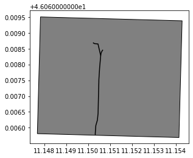
    


```python
sommarive_street_inside_dtm.highway
```


    0    unclassified
    1     residential
    Name: highway, dtype: object


```python
sommarive_street_inside_dtm[sommarive_street_inside_dtm.highway == 'unclassified'].plot()
plt.show()
```


    
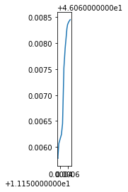
    


```python
sommarive_street_inside_dtm[sommarive_street_inside_dtm.highway == 'unclassified'].geometry.values[0]
```


    

    


```python
linestring_sommarive_street = sommarive_street_inside_dtm[sommarive_street_inside_dtm.highway == 'unclassified'].geometry.values[0]
```

### 4. extract the points of the street
we need to convert the points from WGS84 to ETRS89


```python
import shapely
import pyproj
from shapely.ops import transform
```


```python
wgs84 = pyproj.CRS('EPSG:4326')
crs_dtm = pyproj.CRS('EPSG:25832')
projection_transform = pyproj.Transformer.from_crs(wgs84, crs_dtm, always_xy=False).transform
```


```python
def convert(x,y):
  p = shapely.geometry.Point(y,x)
  p = transform(projection_transform,p)
  return(p)
```


```python
pointsx = []
pointsy = []
for coordinate in linestring_sommarive_street.coords:
  x = coordinate[0]
  y = coordinate[1]
  point = convert(x,y)
  pointsx.append(point.x)
  pointsy.append(point.y)
```


```python
pointsx[0]
```


    666306.4552006973


```python
pointsy[0]
```


    5103603.23091181


### 4. extract the altitude value for each points


```python
import pandas as pd
```


```python
#calculate the distance point-to-point
from shapely.geometry import Point,LineString
lengths = []
previousPoint = None
length = 0
for i in range(len(pointsx)):
  point = shapely.geometry.Point(pointsy[i],pointsx[i])
  if previousPoint is None:
    lengths.append(length)
  else:
    length = LineString([previousPoint,point]).length + length
    lengths.append(length)  
  previousPoint = point 

```


```python
lengths
```


    [0,
     3.951209709379636,
     32.831459096031196,
     52.98060861208776,
     76.0895772860392,
     92.85559295912803,
     165.21088895179275,
     186.20305604231848,
     194.89525293084407,
     237.7301320929318,
     279.66422694854015,
     288.77768975533206,
     295.6826859435214,
     301.98476544998357]


```python
raster_dtm.count
```


    1


```python
data = raster_dtm.read(1)
```


```python
data
```


    array([[335., 335., 335., ..., 468., 469., 469.],
           [334., 334., 334., ..., 469., 469., 469.],
           [334., 334., 334., ..., 469., 469., 469.],
           ...,
           [357., 357., 357., ..., 400., 400., 401.],
           [356., 357., 357., ..., 400., 400., 400.],
           [356., 357., 357., ..., 400., 400., 400.]], dtype=float32)


```python
rows,cols = rasterio.transform.rowcol(raster_dtm.transform,(pointsx),(pointsy))
```


```python
values = []
for i in range(len(rows)):
  values.append(data[rows[i]-1][cols[i]-1]) 
```


```python
values
```


    [382.0,
     382.0,
     380.0,
     378.0,
     378.0,
     378.0,
     378.0,
     378.0,
     378.0,
     378.0,
     380.0,
     380.0,
     381.0,
     381.0]


```python
sommarive_street_3d = pd.DataFrame()
```


```python
sommarive_street_3d['value'] = values
```


```python
sommarive_street_3d['length'] = lengths
```


```python
sommarive_street_3d
```


<div>
<style scoped>
    .dataframe tbody tr th:only-of-type {
        vertical-align: middle;
    }

    .dataframe tbody tr th {
        vertical-align: top;
    }

    .dataframe thead th {
        text-align: right;
    }
</style>
<table border="1" class="dataframe">
  <thead>
    <tr style="text-align: right;">
      <th></th>
      <th>value</th>
      <th>length</th>
    </tr>
  </thead>
  <tbody>
    <tr>
      <th>0</th>
      <td>382.0</td>
      <td>0.000000</td>
    </tr>
    <tr>
      <th>1</th>
      <td>382.0</td>
      <td>3.951210</td>
    </tr>
    <tr>
      <th>2</th>
      <td>380.0</td>
      <td>32.831459</td>
    </tr>
    <tr>
      <th>3</th>
      <td>378.0</td>
      <td>52.980609</td>
    </tr>
    <tr>
      <th>4</th>
      <td>378.0</td>
      <td>76.089577</td>
    </tr>
    <tr>
      <th>5</th>
      <td>378.0</td>
      <td>92.855593</td>
    </tr>
    <tr>
      <th>6</th>
      <td>378.0</td>
      <td>165.210889</td>
    </tr>
    <tr>
      <th>7</th>
      <td>378.0</td>
      <td>186.203056</td>
    </tr>
    <tr>
      <th>8</th>
      <td>378.0</td>
      <td>194.895253</td>
    </tr>
    <tr>
      <th>9</th>
      <td>378.0</td>
      <td>237.730132</td>
    </tr>
    <tr>
      <th>10</th>
      <td>380.0</td>
      <td>279.664227</td>
    </tr>
    <tr>
      <th>11</th>
      <td>380.0</td>
      <td>288.777690</td>
    </tr>
    <tr>
      <th>12</th>
      <td>381.0</td>
      <td>295.682686</td>
    </tr>
    <tr>
      <th>13</th>
      <td>381.0</td>
      <td>301.984765</td>
    </tr>
  </tbody>
</table>
</div>


```python
ax = sommarive_street_3d.plot(y='value',x="length",color='green',figsize=(10,1))
plt.show()
```


    
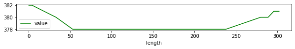
    


## find the area FBK in the WMS of municipality of Trento - layer “Carta Tecnica 1:2.000 alta risoluzione” and vectorize it

1. create a bounding box based on the FBK area in Povo
1. load the WMS of muncipality of Trento as rasterio on the size of the bounding box
1. vectorize the rasterio
---


### 1. create a bounding box based on the FBK area in Povo
.. we can use the same geojson extracted from OSM used on the lesson


```python
fbk = gpd.read_file("https://raw.githubusercontent.com/napo/geospatial_course_unitn/master/data/openstreetmap/boundary_fbk_povo.geojson")
```


```python
bbox = fbk.geometry[0].bounds
```


```python
bbox
```


    (11.1505197, 46.0664359, 11.1530713, 46.0684635)


```python
fbk.shape
```


    (1, 10)


### 2. load the WMS of muncipality of Trento as rasterio on the size of the bounding box


```python
from owslib.wms import WebMapService
import rasterio.crs
```


```python
wms_trento = "http://webapps.comune.trento.it/ogc"
wms = WebMapService(wms_trento)
```


```python
title="Carta Tecnica 1:2.000 alta risoluzione a colori"
```


```python
for content in wms.contents:
  layer = wms[content]
  if layer.title == title:
    break
```


```python
content
```


    'ct2000_colori'


```python
layer.crsOptions
```


    ['EPSG:4326', 'EPSG:3857', 'EPSG:25832']


```python
request = wms.getmap(
    layers=[content],
    srs='EPSG:4326',
    format='image/tiff',
    bbox=bbox,
    size=(1024,800)
    )
```


```python
from rasterio import MemoryFile
from rasterio.plot import show
from rasterio import features
```


```python
wms_image = MemoryFile(request).open()
```


```python
wms_image.profile
```


    {'driver': 'GTiff', 'dtype': 'uint8', 'nodata': None, 'width': 1024, 'height': 800, 'count': 3, 'crs': CRS.from_epsg(4326), 'transform': Affine(2.4917968750015575e-06, 0.0, 11.1505197,
           0.0, -2.5344999999997646e-06, 46.0684635), 'tiled': False, 'interleave': 'pixel'}


```python
show(wms_image)
```


    
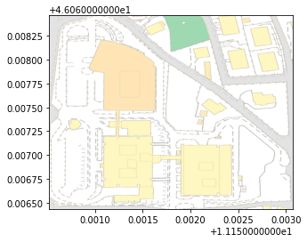
    


    <AxesSubplot:>


```python
wms_image.count
```


    3


```python
show((wms_image, 1), cmap='Reds')
```


    
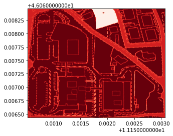
    


    <AxesSubplot:>


```python
show((wms_image, 2), cmap='Greens')
```


    
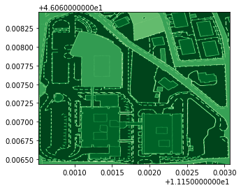
    


    <AxesSubplot:>


```python
show((wms_image, 3), cmap='Blues')
```


    

    


    <AxesSubplot:>


```python
from rasterio.features import shapes
image = wms_image.read(3) # first band
mask = image != 255
results = (
  {'properties': {'raster_val': v}, 'geometry': s}
  for i, (s, v) 
    in enumerate(
      shapes(image, mask=mask, transform=wms_image.transform)))
```


```python
geoms = list(results)
```


```python
fbk_area_vector  = gpd.GeoDataFrame.from_features(geoms)
```


```python
fbk_area_vector.shape
```


    (78339, 2)


```python
fbk_area_vector.plot()
plt.show()
%time
```


    
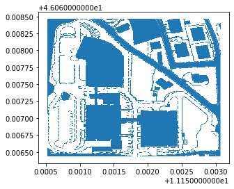
    


    CPU times: user 2 µs, sys: 0 ns, total: 2 µs
    Wall time: 4.05 µs


FBK Buildings

- [North](https://www.openstreetmap.org/?mlat=46.06782&mlon=11.15156#map=19/46.06782/11.15156)
- [West](https://www.openstreetmap.org/?mlat=46.06689&mlon=11.15116#map=19/46.06689/11.15116)
- [East](https://www.openstreetmap.org/?mlat=46.06684&mlon=11.15200#map=19/46.06684/11.15200)


```python
p_north = shapely.geometry.Point(11.15156,46.06782)
```


```python
building_north = fbk_area_vector[fbk_area_vector.geometry.contains(p_north)]
```


```python
building_north
```


<div>
<style scoped>
    .dataframe tbody tr th:only-of-type {
        vertical-align: middle;
    }

    .dataframe tbody tr th {
        vertical-align: top;
    }

    .dataframe thead th {
        text-align: right;
    }
</style>
<table border="1" class="dataframe">
  <thead>
    <tr style="text-align: right;">
      <th></th>
      <th>geometry</th>
      <th>raster_val</th>
    </tr>
  </thead>
  <tbody>
    <tr>
      <th>42228</th>
      <td>POLYGON ((11.15107 46.06820, 11.15107 46.06820...</td>
      <td>181.0</td>
    </tr>
  </tbody>
</table>
</div>


```python
building_north.plot()
plt.show()
```


    

    


```python
p_west = shapely.geometry.Point(11.15116,46.06689)
building_west = fbk_area_vector[fbk_area_vector.geometry.contains(p_west)]
```


```python
p_east = shapely.geometry.Point(11.15200,46.06684)
building_east = fbk_area_vector[fbk_area_vector.geometry.contains(p_east)]
```


```python
building_east
```


<div>
<style scoped>
    .dataframe tbody tr th:only-of-type {
        vertical-align: middle;
    }

    .dataframe tbody tr th {
        vertical-align: top;
    }

    .dataframe thead th {
        text-align: right;
    }
</style>
<table border="1" class="dataframe">
  <thead>
    <tr style="text-align: right;">
      <th></th>
      <th>geometry</th>
      <th>raster_val</th>
    </tr>
  </thead>
  <tbody>
    <tr>
      <th>70295</th>
      <td>POLYGON ((11.15198 46.06710, 11.15198 46.06710...</td>
      <td>193.0</td>
    </tr>
  </tbody>
</table>
</div>


```python
fig, ax = plt.subplots()
building_north.plot(ax=ax, color='lightblue', edgecolor='black')
building_west.plot(ax=ax, color='lightyellow', edgecolor='black')
building_east.plot(ax=ax, color='lightgreen', edgecolor='black')
plt.show();
```


    

    


## identify the shortest path from the pizzeria Oro Stube until the main entrance of FBK over the DTM

for this operation we will use:
- [xarray-spatial](https://xarray-spatial.org/)<Br/>
xarray-spatial is a package for raster-based spatial analytics<br/>
among the supported functions is the implementation of the algorithm [A*](https://en.wikipedia.org/wiki/A*_search_algorithm)<Br/>
A* is an informed search algorithm, or a best-first search, meaning that it is formulated in terms of weighted graphs: starting from a specific starting node of a graph, it aims to find a path to the given goal node having the smallest cost (min distance travelled, shortest time, …).
- [rioxarray](https://github.com/corteva/rioxarray)<Br/>
the geospatial xarray extension powered by rasterio 


```python
try:
  import xrspatial 
except ModuleNotFoundError as e:
  !pip install xarray-spatial==0.2.9
  import xrspatial 

if xrspatial.__version__ != "0.2.9":
  !pip install -U xarray-spatial==0.2.9
  import xrspatial
```


```python
try:
  import rioxarray 
except ModuleNotFoundError as e:
  !pip install rioxarray==0.5.0
  import rioxarray 

if rioxarray.__version__ != "0.5.0":
  !pip install -U rioxarray==0.5.0
  import rioxarray
```


```python
try:
    import geopy
except ModuleNotFoundError as e:
    !pip install geopy==2.2.0
    import geopy
if geopy.__version__ != "2.2.0":
    !pip install -U geopy==2.2.0
    import geopy
```


```python
import numpy as np
import pandas as pd
import rioxarray
import datashader as ds
from xrspatial import a_star_search
from geopy.geocoders import Nominatim 
```

The <span style="color:blue">xrspatial.a_star_search</span> function calculate the shortest path in pixel space from a start location to a goal location through a given aggregate surface graph.<br/><Br/>The graph should be a **line raster** which contains crossable and non-crossable (a.k.a walls or barrieres) values.<br/><Br/>
**Note** that both start and goal are in (lon, lat), or (x, y) coordinate space and *must be within the graph*.<br/><br/>The <span style="color:blue">xrspatial.a_star_search</span> provides 2 separate options, **snap_start** and **snap_goal**, which can be set true to snap *locations to the nearest valid value* before beginning pathfinding.<br/><br/>
It also provides connectivity option to indicate neighborhood structure.<br/><br/>
This value can be set to either *4* or *8* that represents for *4-connectivity* and *8-connectivity* accordingly.

### identify the two starting points


```python
geolocator = Nominatim(user_agent="Example for the course")
```


```python
pizzeria = geolocator.geocode("Pizzeria OroStube")
fbk = geolocator.geocode("Via Sommarive 18, Trento, Italy")
```


```python
point_pizzeria = convert(pizzeria.longitude,pizzeria.latitude)
point_fbk = convert(fbk.longitude,fbk.latitude)
```

### check if the points are inside the area covered from the DTM


```python
bbox_raster_dtm.contains(point_fbk)
```


    True


```python
bbox_raster_dtm = gdf_bbox_raster_dtm.to_crs(epsg=25832).geometry[0]
```


```python
bbox_raster_dtm.contains(point_pizzeria)
```


    False


```python
round(bbox_raster_dtm.distance(point_pizzeria),3)
```


    112.332


the pizzeria is outside the DTM<br/>
We need to find a point on the DTM closest to the pizzeria OroStube


```python
# transform the DTM in a DataFrame
dtm_rioxarray = rioxarray.open_rasterio(dtm)
grid_df = dtm_rioxarray.to_dataframe("z").reset_index()
```


```python
# Transform the DTM in a GeoDataFrame
grid_points= gpd.GeoDataFrame(
    grid_df,
    crs='EPSG:25832',
    geometry=gpd.points_from_xy(grid_df.x, grid_df.y))
```


```python
min_distance = round(min(grid_points.geometry.distance(point_pizzeria)),3)
point_closest_pizzeria = grid_points[round(grid_points.geometry.distance(point_pizzeria),3) ==min_distance ]
```


```python
point_closest_pizzeria = point_closest_pizzeria.geometry.values[0]
```


```python
point_closest_pizzeria.distance(point_pizzeria)
```


    112.833215057246


```python
start_pizzeria_orostube = (round(point_closest_pizzeria.x,3), round(point_closest_pizzeria.y,3))
```


```python
# define range of x and y
xrange = (grid_df['x'].min(), grid_df['x'].max())
yrange = (grid_df['y'].min(), grid_df['y'].max())
W = dtm_rioxarray.x.size
H = dtm_rioxarray.y.size
#An abstract canvas representing the space in which to bin.
ds_canvas = ds.Canvas(plot_width=W, plot_height=H,
                x_range=xrange, y_range=yrange)
# Compute a reduction by pixel, mapping data to pixels as one or more lines
grid_agg = ds_canvas.line(grid_df, x='x', y='y').astype(int)
goal_fbk = (point_fbk.x, point_fbk.y)

```


```python
grid_agg
```


<div><svg style="position: absolute; width: 0; height: 0; overflow: hidden">
<defs>
<symbol id="icon-database" viewBox="0 0 32 32">
<path d="M16 0c-8.837 0-16 2.239-16 5v4c0 2.761 7.163 5 16 5s16-2.239 16-5v-4c0-2.761-7.163-5-16-5z"></path>
<path d="M16 17c-8.837 0-16-2.239-16-5v6c0 2.761 7.163 5 16 5s16-2.239 16-5v-6c0 2.761-7.163 5-16 5z"></path>
<path d="M16 26c-8.837 0-16-2.239-16-5v6c0 2.761 7.163 5 16 5s16-2.239 16-5v-6c0 2.761-7.163 5-16 5z"></path>
</symbol>
<symbol id="icon-file-text2" viewBox="0 0 32 32">
<path d="M28.681 7.159c-0.694-0.947-1.662-2.053-2.724-3.116s-2.169-2.030-3.116-2.724c-1.612-1.182-2.393-1.319-2.841-1.319h-15.5c-1.378 0-2.5 1.121-2.5 2.5v27c0 1.378 1.122 2.5 2.5 2.5h23c1.378 0 2.5-1.122 2.5-2.5v-19.5c0-0.448-0.137-1.23-1.319-2.841zM24.543 5.457c0.959 0.959 1.712 1.825 2.268 2.543h-4.811v-4.811c0.718 0.556 1.584 1.309 2.543 2.268zM28 29.5c0 0.271-0.229 0.5-0.5 0.5h-23c-0.271 0-0.5-0.229-0.5-0.5v-27c0-0.271 0.229-0.5 0.5-0.5 0 0 15.499-0 15.5 0v7c0 0.552 0.448 1 1 1h7v19.5z"></path>
<path d="M23 26h-14c-0.552 0-1-0.448-1-1s0.448-1 1-1h14c0.552 0 1 0.448 1 1s-0.448 1-1 1z"></path>
<path d="M23 22h-14c-0.552 0-1-0.448-1-1s0.448-1 1-1h14c0.552 0 1 0.448 1 1s-0.448 1-1 1z"></path>
<path d="M23 18h-14c-0.552 0-1-0.448-1-1s0.448-1 1-1h14c0.552 0 1 0.448 1 1s-0.448 1-1 1z"></path>
</symbol>
</defs>
</svg>
<style>/* CSS stylesheet for displaying xarray objects in jupyterlab.
 *
 */

:root {
  --xr-font-color0: var(--jp-content-font-color0, rgba(0, 0, 0, 1));
  --xr-font-color2: var(--jp-content-font-color2, rgba(0, 0, 0, 0.54));
  --xr-font-color3: var(--jp-content-font-color3, rgba(0, 0, 0, 0.38));
  --xr-border-color: var(--jp-border-color2, #e0e0e0);
  --xr-disabled-color: var(--jp-layout-color3, #bdbdbd);
  --xr-background-color: var(--jp-layout-color0, white);
  --xr-background-color-row-even: var(--jp-layout-color1, white);
  --xr-background-color-row-odd: var(--jp-layout-color2, #eeeeee);
}

html[theme=dark],
body.vscode-dark {
  --xr-font-color0: rgba(255, 255, 255, 1);
  --xr-font-color2: rgba(255, 255, 255, 0.54);
  --xr-font-color3: rgba(255, 255, 255, 0.38);
  --xr-border-color: #1F1F1F;
  --xr-disabled-color: #515151;
  --xr-background-color: #111111;
  --xr-background-color-row-even: #111111;
  --xr-background-color-row-odd: #313131;
}

.xr-wrap {
  display: block;
  min-width: 300px;
  max-width: 700px;
}

.xr-text-repr-fallback {
  /* fallback to plain text repr when CSS is not injected (untrusted notebook) */
  display: none;
}

.xr-header {
  padding-top: 6px;
  padding-bottom: 6px;
  margin-bottom: 4px;
  border-bottom: solid 1px var(--xr-border-color);
}

.xr-header > div,
.xr-header > ul {
  display: inline;
  margin-top: 0;
  margin-bottom: 0;
}

.xr-obj-type,
.xr-array-name {
  margin-left: 2px;
  margin-right: 10px;
}

.xr-obj-type {
  color: var(--xr-font-color2);
}

.xr-sections {
  padding-left: 0 !important;
  display: grid;
  grid-template-columns: 150px auto auto 1fr 20px 20px;
}

.xr-section-item {
  display: contents;
}

.xr-section-item input {
  display: none;
}

.xr-section-item input + label {
  color: var(--xr-disabled-color);
}

.xr-section-item input:enabled + label {
  cursor: pointer;
  color: var(--xr-font-color2);
}

.xr-section-item input:enabled + label:hover {
  color: var(--xr-font-color0);
}

.xr-section-summary {
  grid-column: 1;
  color: var(--xr-font-color2);
  font-weight: 500;
}

.xr-section-summary > span {
  display: inline-block;
  padding-left: 0.5em;
}

.xr-section-summary-in:disabled + label {
  color: var(--xr-font-color2);
}

.xr-section-summary-in + label:before {
  display: inline-block;
  content: '►';
  font-size: 11px;
  width: 15px;
  text-align: center;
}

.xr-section-summary-in:disabled + label:before {
  color: var(--xr-disabled-color);
}

.xr-section-summary-in:checked + label:before {
  content: '▼';
}

.xr-section-summary-in:checked + label > span {
  display: none;
}

.xr-section-summary,
.xr-section-inline-details {
  padding-top: 4px;
  padding-bottom: 4px;
}

.xr-section-inline-details {
  grid-column: 2 / -1;
}

.xr-section-details {
  display: none;
  grid-column: 1 / -1;
  margin-bottom: 5px;
}

.xr-section-summary-in:checked ~ .xr-section-details {
  display: contents;
}

.xr-array-wrap {
  grid-column: 1 / -1;
  display: grid;
  grid-template-columns: 20px auto;
}

.xr-array-wrap > label {
  grid-column: 1;
  vertical-align: top;
}

.xr-preview {
  color: var(--xr-font-color3);
}

.xr-array-preview,
.xr-array-data {
  padding: 0 5px !important;
  grid-column: 2;
}

.xr-array-data,
.xr-array-in:checked ~ .xr-array-preview {
  display: none;
}

.xr-array-in:checked ~ .xr-array-data,
.xr-array-preview {
  display: inline-block;
}

.xr-dim-list {
  display: inline-block !important;
  list-style: none;
  padding: 0 !important;
  margin: 0;
}

.xr-dim-list li {
  display: inline-block;
  padding: 0;
  margin: 0;
}

.xr-dim-list:before {
  content: '(';
}

.xr-dim-list:after {
  content: ')';
}

.xr-dim-list li:not(:last-child):after {
  content: ',';
  padding-right: 5px;
}

.xr-has-index {
  font-weight: bold;
}

.xr-var-list,
.xr-var-item {
  display: contents;
}

.xr-var-item > div,
.xr-var-item label,
.xr-var-item > .xr-var-name span {
  background-color: var(--xr-background-color-row-even);
  margin-bottom: 0;
}

.xr-var-item > .xr-var-name:hover span {
  padding-right: 5px;
}

.xr-var-list > li:nth-child(odd) > div,
.xr-var-list > li:nth-child(odd) > label,
.xr-var-list > li:nth-child(odd) > .xr-var-name span {
  background-color: var(--xr-background-color-row-odd);
}

.xr-var-name {
  grid-column: 1;
}

.xr-var-dims {
  grid-column: 2;
}

.xr-var-dtype {
  grid-column: 3;
  text-align: right;
  color: var(--xr-font-color2);
}

.xr-var-preview {
  grid-column: 4;
}

.xr-var-name,
.xr-var-dims,
.xr-var-dtype,
.xr-preview,
.xr-attrs dt {
  white-space: nowrap;
  overflow: hidden;
  text-overflow: ellipsis;
  padding-right: 10px;
}

.xr-var-name:hover,
.xr-var-dims:hover,
.xr-var-dtype:hover,
.xr-attrs dt:hover {
  overflow: visible;
  width: auto;
  z-index: 1;
}

.xr-var-attrs,
.xr-var-data {
  display: none;
  background-color: var(--xr-background-color) !important;
  padding-bottom: 5px !important;
}

.xr-var-attrs-in:checked ~ .xr-var-attrs,
.xr-var-data-in:checked ~ .xr-var-data {
  display: block;
}

.xr-var-data > table {
  float: right;
}

.xr-var-name span,
.xr-var-data,
.xr-attrs {
  padding-left: 25px !important;
}

.xr-attrs,
.xr-var-attrs,
.xr-var-data {
  grid-column: 1 / -1;
}

dl.xr-attrs {
  padding: 0;
  margin: 0;
  display: grid;
  grid-template-columns: 125px auto;
}

.xr-attrs dt,
.xr-attrs dd {
  padding: 0;
  margin: 0;
  float: left;
  padding-right: 10px;
  width: auto;
}

.xr-attrs dt {
  font-weight: normal;
  grid-column: 1;
}

.xr-attrs dt:hover span {
  display: inline-block;
  background: var(--xr-background-color);
  padding-right: 10px;
}

.xr-attrs dd {
  grid-column: 2;
  white-space: pre-wrap;
  word-break: break-all;
}

.xr-icon-database,
.xr-icon-file-text2 {
  display: inline-block;
  vertical-align: middle;
  width: 1em;
  height: 1.5em !important;
  stroke-width: 0;
  stroke: currentColor;
  fill: currentColor;
}
</style><pre class='xr-text-repr-fallback'>&lt;xarray.DataArray (y: 410, x: 500)&gt;
array([[1, 1, 1, ..., 1, 1, 1],
       [1, 1, 1, ..., 1, 1, 1],
       [1, 1, 1, ..., 1, 1, 1],
       ...,
       [1, 1, 1, ..., 1, 1, 1],
       [1, 1, 1, ..., 1, 1, 1],
       [1, 1, 1, ..., 1, 1, 1]])
Coordinates:
  * x        (x) float64 6.661e+05 6.661e+05 6.661e+05 ... 6.666e+05 6.666e+05
  * y        (y) float64 5.104e+06 5.104e+06 5.104e+06 ... 5.104e+06 5.104e+06</pre><div class='xr-wrap' hidden><div class='xr-header'><div class='xr-obj-type'>xarray.DataArray</div><div class='xr-array-name'></div><ul class='xr-dim-list'><li><span class='xr-has-index'>y</span>: 410</li><li><span class='xr-has-index'>x</span>: 500</li></ul></div><ul class='xr-sections'><li class='xr-section-item'><div class='xr-array-wrap'><input id='section-9d8bb3b7-6f57-45de-b982-827e4830d345' class='xr-array-in' type='checkbox' checked><label for='section-9d8bb3b7-6f57-45de-b982-827e4830d345' title='Show/hide data repr'><svg class='icon xr-icon-database'><use xlink:href='#icon-database'></use></svg></label><div class='xr-array-preview xr-preview'><span>1 1 1 1 1 1 1 1 1 1 1 1 1 1 1 1 1 ... 1 1 1 1 1 1 1 1 1 1 1 1 1 1 1 1</span></div><div class='xr-array-data'><pre>array([[1, 1, 1, ..., 1, 1, 1],
       [1, 1, 1, ..., 1, 1, 1],
       [1, 1, 1, ..., 1, 1, 1],
       ...,
       [1, 1, 1, ..., 1, 1, 1],
       [1, 1, 1, ..., 1, 1, 1],
       [1, 1, 1, ..., 1, 1, 1]])</pre></div></div></li><li class='xr-section-item'><input id='section-004fe747-3b09-41de-9e19-c197f26dce19' class='xr-section-summary-in' type='checkbox'  checked><label for='section-004fe747-3b09-41de-9e19-c197f26dce19' class='xr-section-summary' >Coordinates: <span>(2)</span></label><div class='xr-section-inline-details'></div><div class='xr-section-details'><ul class='xr-var-list'><li class='xr-var-item'><div class='xr-var-name'><span class='xr-has-index'>x</span></div><div class='xr-var-dims'>(x)</div><div class='xr-var-dtype'>float64</div><div class='xr-var-preview xr-preview'>6.661e+05 6.661e+05 ... 6.666e+05</div><input id='attrs-6925418e-5b0d-4ee1-9e36-3798dfc029b1' class='xr-var-attrs-in' type='checkbox' disabled><label for='attrs-6925418e-5b0d-4ee1-9e36-3798dfc029b1' title='Show/Hide attributes'><svg class='icon xr-icon-file-text2'><use xlink:href='#icon-file-text2'></use></svg></label><input id='data-515d1699-d156-4b07-8b8b-4dda1e03952f' class='xr-var-data-in' type='checkbox'><label for='data-515d1699-d156-4b07-8b8b-4dda1e03952f' title='Show/Hide data repr'><svg class='icon xr-icon-database'><use xlink:href='#icon-database'></use></svg></label><div class='xr-var-attrs'><dl class='xr-attrs'></dl></div><div class='xr-var-data'><pre>array([666101.672547, 666102.670547, 666103.668547, ..., 666597.678547,
       666598.676547, 666599.674547])</pre></div></li><li class='xr-var-item'><div class='xr-var-name'><span class='xr-has-index'>y</span></div><div class='xr-var-dims'>(y)</div><div class='xr-var-dtype'>float64</div><div class='xr-var-preview xr-preview'>5.104e+06 5.104e+06 ... 5.104e+06</div><input id='attrs-b2632cc8-5540-41a3-8eab-9d7b08f2868d' class='xr-var-attrs-in' type='checkbox' disabled><label for='attrs-b2632cc8-5540-41a3-8eab-9d7b08f2868d' title='Show/Hide attributes'><svg class='icon xr-icon-file-text2'><use xlink:href='#icon-file-text2'></use></svg></label><input id='data-bd0f3267-e21b-4bac-88b7-7c6c49274fb5' class='xr-var-data-in' type='checkbox'><label for='data-bd0f3267-e21b-4bac-88b7-7c6c49274fb5' title='Show/Hide data repr'><svg class='icon xr-icon-database'><use xlink:href='#icon-database'></use></svg></label><div class='xr-var-attrs'><dl class='xr-attrs'></dl></div><div class='xr-var-data'><pre>array([5103604.234612, 5103605.232173, 5103606.229734, ..., 5104010.241929,
       5104011.23949 , 5104012.237051])</pre></div></li></ul></div></li><li class='xr-section-item'><input id='section-62d0ea2e-1e58-4beb-91f6-5163be09c006' class='xr-section-summary-in' type='checkbox' disabled ><label for='section-62d0ea2e-1e58-4beb-91f6-5163be09c006' class='xr-section-summary'  title='Expand/collapse section'>Attributes: <span>(0)</span></label><div class='xr-section-inline-details'></div><div class='xr-section-details'><dl class='xr-attrs'></dl></div></li></ul></div></div>


```python
location_df = pd.DataFrame({'x': [start_pizzeria_orostube[0], goal_fbk[0]], 'y': [start_pizzeria_orostube[1], goal_fbk[1]]})
```


```python
# find the path from start to goal,
# barriers are uncrossable cells. In this case, they are cells with a value of 0
# in our case there aren't barries 
path_agg_8_connectivity = a_star_search(grid_agg, start_pizzeria_orostube, goal_fbk, barriers=[0], snap_start=True, snap_goal=True)
```


```python
# extract the path created in a dataframe
df_path = path_agg_8_connectivity.to_dataframe("z").reset_index()
df_path = df_path[~df_path.z.isnull()]
```


```python
# create the geodataframe
geo_path = gpd.GeoDataFrame(
    df_path,
    crs='EPSG:25832',
    geometry=gpd.points_from_xy(df_path.x, df_path.y))
```


```python
geo_path.plot()
plt.show()
```


    
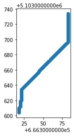
    


```python
geo_path.explore()
```


The image clearly shows that the surface does not take into account buildings and other perimeters where it is not possible to move.<br/>It is therefore advisable to revise the DTM by assigning a value of 0 to the non-walkable areas.


```python
sommarive_street_inside_dtm.to_crs(25832)
```


<div>
<style scoped>
    .dataframe tbody tr th:only-of-type {
        vertical-align: middle;
    }

    .dataframe tbody tr th {
        vertical-align: top;
    }

    .dataframe thead th {
        text-align: right;
    }
</style>
<table border="1" class="dataframe">
  <thead>
    <tr style="text-align: right;">
      <th></th>
      <th>id</th>
      <th>@id</th>
      <th>highway</th>
      <th>lit</th>
      <th>maxspeed:type</th>
      <th>name</th>
      <th>surface</th>
      <th>maxspeed</th>
      <th>source:maxspeed</th>
      <th>geometry</th>
    </tr>
  </thead>
  <tbody>
    <tr>
      <th>0</th>
      <td>way/97004470</td>
      <td>way/97004470</td>
      <td>unclassified</td>
      <td>yes</td>
      <td>IT:urban</td>
      <td>Via Sommarive</td>
      <td>asphalt</td>
      <td>None</td>
      <td>None</td>
      <td>LINESTRING (666306.455 5103603.231, 666306.052...</td>
    </tr>
    <tr>
      <th>1</th>
      <td>way/382958545</td>
      <td>way/382958545</td>
      <td>residential</td>
      <td>None</td>
      <td>None</td>
      <td>Via Sommarive</td>
      <td>asphalt</td>
      <td>50</td>
      <td>sign</td>
      <td>LINESTRING (666317.905 5103882.035, 666307.229...</td>
    </tr>
  </tbody>
</table>
</div>


```python
request = wms.getmap(
    layers=[content],
    srs='EPSG:25832',
    format='image/tiff',
    bbox=bbox_raster_dtm.bounds,
    size=(W,H)
    )
```


```python
wms_image_over_dtm = MemoryFile(request).open()
```


```python
show(wms_image_over_dtm)
```


    
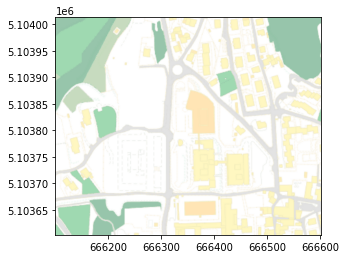
    


    <AxesSubplot:>


```python
show((wms_image_over_dtm, 1), cmap='Reds')
```


    
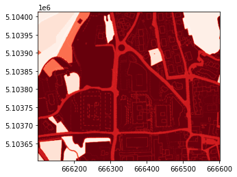
    


    <AxesSubplot:>


```python
from rasterio.plot import show_hist
show_hist(wms_image_over_dtm.read(1), bins=5, lw=0.0, stacked=False, alpha=0.3,histtype='stepfilled', title="Histogram")
```


    
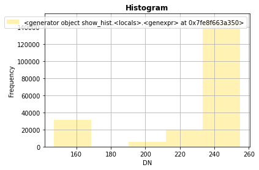
    


```python
from rasterio.features import shapes
image = wms_image_over_dtm.read(1) # first band
mask = np.ma.masked_inside(image,186,227).mask
results = (
  {'properties': {'raster_val': v}, 'geometry': s}
  for i, (s, v) 
    in enumerate(
      shapes(image, mask=mask, transform=wms_image.transform)))
```


```python
geoms = list(results)
```


```python
dtm_area_vector  = gpd.GeoDataFrame.from_features(geoms)
```


```python
dtm_area_vector.head(3)
```


<div>
<style scoped>
    .dataframe tbody tr th:only-of-type {
        vertical-align: middle;
    }

    .dataframe tbody tr th {
        vertical-align: top;
    }

    .dataframe thead th {
        text-align: right;
    }
</style>
<table border="1" class="dataframe">
  <thead>
    <tr style="text-align: right;">
      <th></th>
      <th>geometry</th>
      <th>raster_val</th>
    </tr>
  </thead>
  <tbody>
    <tr>
      <th>0</th>
      <td>POLYGON ((11.15054 46.06846, 11.15054 46.06846...</td>
      <td>221.0</td>
    </tr>
    <tr>
      <th>1</th>
      <td>POLYGON ((11.15054 46.06846, 11.15054 46.06846...</td>
      <td>222.0</td>
    </tr>
    <tr>
      <th>2</th>
      <td>POLYGON ((11.15054 46.06846, 11.15054 46.06846...</td>
      <td>211.0</td>
    </tr>
  </tbody>
</table>
</div>


```python
dtm_area_vector = dtm_area_vector.set_crs(4326)
```


```python
dtm_area_vector.to_crs(25832,inplace=True)
```


```python
dtm_area_vector.plot()
plt.show()
```


    
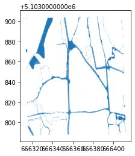
    


```python
import json
dtm_area_vector_json = json.loads(dtm_area_vector.to_json())
coords_for_clipping = []
for feature in dtm_area_vector_json['features']:
    coords_for_clipping.append(feature['geometry'])
```


```python
from rasterio.mask import mask
out_img, out_transform = mask(raster_dtm, coords_for_clipping, crop=True)
```


```python
show(out_img)
```


    
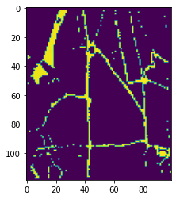
    


    <AxesSubplot:>


```python
out_meta = raster_dtm.meta
```


```python
out_meta.update({"driver": "GTiff",
                 "height": out_img.shape[1],
                 "width": out_img.shape[2],
                 "transform": out_transform})

with rio.open("clipper_dtm.tif", "w", **out_meta) as dest:
    dest.write(out_img)

```


```python
# transform the DTM in a DataFrame
dtm_clipped_rioxarray = rioxarray.open_rasterio("clipper_dtm.tif")
grid_clipped_df = dtm_clipped_rioxarray.to_dataframe("z").reset_index()
```


```python
# define range of x and y
xrange_clipped = (grid_clipped_df['x'].min(), grid_df['x'].max())
yrange_clipped = (grid_clipped_df['y'].min(), grid_df['y'].max())
Wc = dtm_clipped_rioxarray.x.size
Hc = dtm_clipped_rioxarray.y.size
#An abstract canvas representing the space in which to bin.
ds_canvas_clipped = ds.Canvas(plot_width=Wc, plot_height=Hc,
                x_range=xrange_clipped, y_range=yrange_clipped)
# Compute a reduction by pixel, mapping data to pixels as one or more lines
grid_clipped_agg = ds_canvas_clipped.line(grid_clipped_df, x='x', y='y').astype(int)
```


```python
# Transform the DTM in a GeoDataFrame
grid_points_clipped= gpd.GeoDataFrame(
    grid_clipped_df,
    crs='EPSG:25832',
    geometry=gpd.points_from_xy(grid_clipped_df.x, grid_clipped_df.y))
```


```python
min_distance_pizzeria = round(min(grid_points_clipped.geometry.distance(point_pizzeria)),3)
point_closest_pizzeria_clipped = grid_points_clipped[round(grid_points_clipped.geometry.distance(point_pizzeria),3) ==min_distance_pizzeria ]
```


```python
min_distance_pizzeria
```


    295.833


```python
point_closest_pizzeria_clipped
```


<div>
<style scoped>
    .dataframe tbody tr th:only-of-type {
        vertical-align: middle;
    }

    .dataframe tbody tr th {
        vertical-align: top;
    }

    .dataframe thead th {
        text-align: right;
    }
</style>
<table border="1" class="dataframe">
  <thead>
    <tr style="text-align: right;">
      <th></th>
      <th>band</th>
      <th>y</th>
      <th>x</th>
      <th>spatial_ref</th>
      <th>z</th>
      <th>geometry</th>
    </tr>
  </thead>
  <tbody>
    <tr>
      <th>11805</th>
      <td>1</td>
      <td>5.103787e+06</td>
      <td>666318.173547</td>
      <td>0</td>
      <td>0.0</td>
      <td>POINT (666318.174 5103786.736)</td>
    </tr>
    <tr>
      <th>11806</th>
      <td>1</td>
      <td>5.103787e+06</td>
      <td>666319.173547</td>
      <td>0</td>
      <td>0.0</td>
      <td>POINT (666319.174 5103786.736)</td>
    </tr>
  </tbody>
</table>
</div>


```python
point_closest_pizzeria_clipped = point_closest_pizzeria_clipped.geometry.values[0]
```


```python
min_distance_fbk = round(min(grid_points_clipped.geometry.distance(point_fbk)),3)
point_closest_fbk_clipped = grid_points_clipped[round(grid_points_clipped.geometry.distance(point_fbk),3) ==min_distance_fbk]
```


```python
min_distance_fbk
```


    52.783


```python
point_closest_fbk_clipped
```


<div>
<style scoped>
    .dataframe tbody tr th:only-of-type {
        vertical-align: middle;
    }

    .dataframe tbody tr th {
        vertical-align: top;
    }

    .dataframe thead th {
        text-align: right;
    }
</style>
<table border="1" class="dataframe">
  <thead>
    <tr style="text-align: right;">
      <th></th>
      <th>band</th>
      <th>y</th>
      <th>x</th>
      <th>spatial_ref</th>
      <th>z</th>
      <th>geometry</th>
    </tr>
  </thead>
  <tbody>
    <tr>
      <th>11870</th>
      <td>1</td>
      <td>5.103787e+06</td>
      <td>666383.173547</td>
      <td>0</td>
      <td>0.0</td>
      <td>POINT (666383.174 5103786.736)</td>
    </tr>
  </tbody>
</table>
</div>


```python
point_closest_fbk_clipped = point_closest_fbk_clipped.geometry.values[0]
```


```python
start_pizzeria_orostube_clipped = (round(point_closest_pizzeria_clipped.x,3), round(point_closest_pizzeria_clipped.y,3))
```


```python
goal_fbk_clipped = (round(point_closest_fbk_clipped.x,3), round(point_closest_fbk_clipped.y,3))
```


```python
path_clipped = a_star_search(grid_clipped_agg, start_pizzeria_orostube_clipped, goal_fbk_clipped, barriers=[0], snap_start=True, snap_goal=True)
```


```python
# extract the path created in a dataframe
df_path_clipped = path_clipped.to_dataframe("z").reset_index()
df_path_clipped = df_path_clipped[~df_path_clipped.z.isnull()]
```


```python
# create the geodataframe
geo_path_clipped = gpd.GeoDataFrame(
    df_path_clipped,
    crs='EPSG:25832',
    geometry=gpd.points_from_xy(df_path_clipped.x, df_path_clipped.y))
```


```python
geo_path_clipped.explore()
```
