# Setup


```python
import warnings
warnings.simplefilter("ignore")
```


```python
try:
  import geopandas as gpd
except ModuleNotFoundError as e:
  !pip install geopandas==0.12.1
  import geopandas as gpd

if gpd.__version__ != "0.12.1":
  !pip install -U geopandas==0.12.1
  import geopandas as gpd
```


```python
try:
  import rasterio as rio
except ModuleNotFoundError as e:
  !pip install rasterio==1.3.4
  import rasterio as rio

if rio.__version__ != "1.3.4":
  !pip install -U rasterio==1.3.4
  import rasterio as rio
```


```python
try:
  import xarray as xr
except ModuleNotFoundError as e:
  !pip install xarray-spatial==0.3.5
  import xarray as xr

if xr.__version__ != "0.3.5":
  !pip install -U xarray-spatial==0.3.5
  import xarray as xr
```


```python
try:
  import rtxpy
except ModuleNotFoundError as e:
  !pip install rtxpy==0.0.3
  import rtxpy 

```


```python
try:
    import spatialpandas
except ModuleNotFoundError as e:
    !pip install spatialpandas==0.4.4
    import spatialpandas

if spatialpandas.__version__ != "0.4.4":
    !pip install -U spatialpandas==0.4.4
    import spatialpandas
```


```python
try:
    import numba
except ModuleNotFoundError as e:
    !pip install numba==0.56.4
    import numba

if numba.__version__ != "0.56.4":
    !pip install -U numba==0.56.4
    import numba
```


```python
try:
  import owslib
except ModuleNotFoundError as e:
  !pip install owslib==0.27.2
  import owslib
```


```python
from matplotlib import pyplot as plt
```

# Exercises
- clip the area with the shape of Polo Ferrari (in front on FBK)
- create the altitude profile of the street "Via Sommarive"
- find the area FBK in the WMS of municipality of Trento - layer "Carta Tecnica 1:2.000 alta risoluzione" and vectorize it
- identify what is possibile to see from the crossing point between Via Sommarive and Via dei Valoni
---


## clip the area with the shape of Polo Ferrari (in front on FBK)
1. identify the area of Polo Ferrari
2. download the raster of scientific hub in Povo
3. clip area


```python
import geopandas as gpd
import rasterio 
from rasterio.mask import mask
from rasterio.plot import show
```

### 1. identify the area of Polo Ferrari


[http://overpass-turbo.eu/s/ZzP](http://overpass-turbo.eu/s/ZzP
)

[geojson](https://raw.githubusercontent.com/napo/geospatial_course_unitn/master/data/openstreetmap/polo_ferrari_boundary.geojson)


```python
geojson_polo_ferarri = "https://raw.githubusercontent.com/napo/geospatial_course_unitn/master/data/openstreetmap/polo_ferrari_boundary.geojson"
```


```python
polo_ferrari = gpd.read_file(geojson_polo_ferarri)
```


```python
polo_ferrari.plot()
plt.show()
```


    
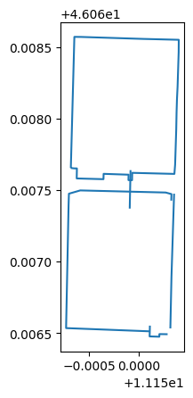
    


```python
polo_ferrari.geometry.type.unique()
```


    array(['LineString'], dtype=object)


```python
polo_ferrari.geometry.unary_union.envelope
```


    

    


```python
area_polo_ferrari = polo_ferrari.geometry.unary_union.envelope
```


```python
type(area_polo_ferrari)
```


    shapely.geometry.polygon.Polygon


### 2. download the raster of scientific hub in Povo


```python
url_download_orthophoto_scientific_hub_povo = 'https://github.com/napo/geospatial_course_unitn/raw/master/data/raster/trento_scientifc_hub_povo.tif'
```


```python
raster = rasterio.open(url_download_orthophoto_scientific_hub_povo)
```


```python
show(raster)
```


    

    


    <AxesSubplot:>


```python
raster.meta
```


    {'driver': 'GTiff',
     'dtype': 'uint8',
     'nodata': None,
     'width': 4761,
     'height': 3900,
     'count': 3,
     'crs': CRS.from_epsg(25832),
     'transform': Affine(0.09999999999999999, 0.0, 666113.0,
            0.0, -0.09999999999999999, 5104003.0)}


### 3. clip area


```python
def getFeatures(gdf):
    """Function to parse features from GeoDataFrame in such a manner that rasterio wants them"""
    import json
    return [json.loads(gdf.to_json())['features'][0]['geometry']]

```


```python
gdf_polo_ferrari_25832 = gpd.GeoSeries([area_polo_ferrari]).set_crs("EPSG:4326").to_crs("EPSG:25832")
```


```python
coords = getFeatures(gdf_polo_ferrari_25832)
```


```python
coords
```


    [{'type': 'Polygon',
      'coordinates': [[[666221.9300357221, 5103679.093307299],
        [666310.1180686228, 5103681.477369573],
        [666303.8138183787, 5103914.6097356975],
        [666215.6291314249, 5103912.225679764],
        [666221.9300357221, 5103679.093307299]]]}]


```python
raster_polo_ferrari, raster_polo_ferrari_transform = mask(raster, coords, crop=True)
```


```python
show(raster_polo_ferrari)
```


    

    


    <AxesSubplot:>


```python
raster_polo_ferrari_meta = raster.meta
```


```python
raster_polo_ferrari_meta.update({"driver": "GTiff",
                 "height": raster_polo_ferrari.shape[1],
                 "width": raster_polo_ferrari.shape[2],
                 "transform": raster_polo_ferrari_transform})

with rasterio.open("polo_ferrari_orthophoto.tif", "w", **raster_polo_ferrari_meta) as dest:
    dest.write(raster_polo_ferrari)
```


```python
#uncomment if you want download with colab
#from google.colab import files
#files.download('polo_ferrari_orthophoto.tif')
```

## create the altitude profile of the street “Via Sommarive”
1. download the street "Via Sommarive" from OpenStreetMap
1. download the DTM file of the scientific hub of Povo
1. clip the street inside the area covered of the DTM
1. extract the points of the street
1. extract the altitude value for each points
1. show the altitude
---


### 1. download the street "Via Sommarive" from OpenStreetMap


[](http://overpass-turbo.eu/s/ZA0)

[geojson](https://raw.githubusercontent.com/napo/geospatial_course_unitn/master/data/openstreetmap/via_sommarive.geojson)


```python
via_sommarive = gpd.read_file("https://raw.githubusercontent.com/napo/geospatial_course_unitn/master/data/openstreetmap/via_sommarive.geojson")
```


```python
via_sommarive.plot()
plt.show()
```


    
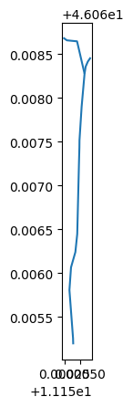
    


### 2. download the DTM file of the scientific hub of Povo


```python
import urllib.request
url_download_dtm_scientific_hub_povo = 'https://github.com/napo/geospatial_course_unitn/raw/master/data/raster/trento_scientifc_hub_povo_dtm.asc'
dtm = "trento_scientifc_hub_povo_dtm.asc"
urllib.request.urlretrieve(url_download_dtm_scientific_hub_povo ,dtm) 
url_download_dtm_scientific_hub_povo_prj = 'https://github.com/napo/geospatial_course_unitn/raw/master/data/raster/trento_scientifc_hub_povo_dtm.prj'
dtm_prj = "trento_scientifc_hub_povo_dtm.prj"
urllib.request.urlretrieve(url_download_dtm_scientific_hub_povo_prj ,dtm_prj) 
```


    ('trento_scientifc_hub_povo_dtm.prj',
     <http.client.HTTPMessage at 0x7f99f94bfca0>)


```python
dtm = "trento_scientifc_hub_povo_dtm.asc"
```


```python
raster_dtm = rasterio.open(dtm)
```


```python
show(raster_dtm, cmap='Greys')
```


    
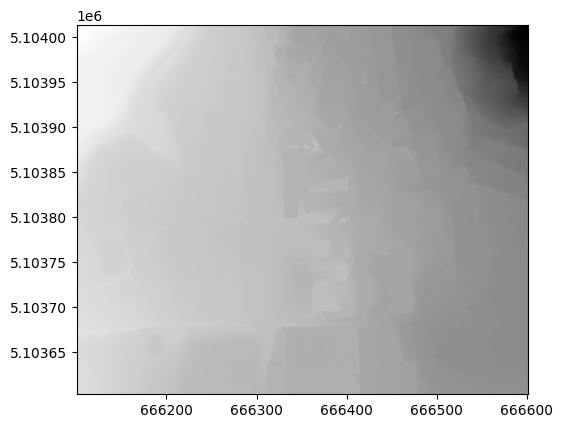
    


    <AxesSubplot:>


### 3. clip the street inside the area covered of the DTM


```python
raster_dtm.bounds
```


    BoundingBox(left=666100.6735466761, bottom=5103603.23583161, right=666600.6735466761, top=5104013.23583161)


```python
minx = raster_dtm.bounds.left
maxx = raster_dtm.bounds.right
miny = raster_dtm.bounds.bottom
maxy = raster_dtm.bounds.top

```


```python
from shapely.geometry import Polygon
```


```python
bbox_raster_dtm = Polygon([[minx, miny], [maxx, miny], [maxx, maxy], [minx, maxy]])
```


```python
geoseries_bbox_raster_dtm = gpd.GeoSeries([bbox_raster_dtm]).set_crs("EPSG:25832").to_crs("EPSG:4326")
```


```python
geoseries_bbox_raster_dtm
```


    0    POLYGON ((11.14767 46.06582, 11.15413 46.06570...
    dtype: geometry


```python
gdf_bbox_raster_dtm = gpd.GeoDataFrame(geometry=geoseries_bbox_raster_dtm)
```


```python
gdf_bbox_raster_dtm
```


<div>
<style scoped>
    .dataframe tbody tr th:only-of-type {
        vertical-align: middle;
    }

    .dataframe tbody tr th {
        vertical-align: top;
    }

    .dataframe thead th {
        text-align: right;
    }
</style>
<table border="1" class="dataframe">
  <thead>
    <tr style="text-align: right;">
      <th></th>
      <th>geometry</th>
    </tr>
  </thead>
  <tbody>
    <tr>
      <th>0</th>
      <td>POLYGON ((11.14767 46.06582, 11.15413 46.06570...</td>
    </tr>
  </tbody>
</table>
</div>


```python
sommarive_street_inside_dtm = gpd.overlay(via_sommarive, gdf_bbox_raster_dtm, how='intersection')
```


```python
sommarive_street_inside_dtm
```


<div>
<style scoped>
    .dataframe tbody tr th:only-of-type {
        vertical-align: middle;
    }

    .dataframe tbody tr th {
        vertical-align: top;
    }

    .dataframe thead th {
        text-align: right;
    }
</style>
<table border="1" class="dataframe">
  <thead>
    <tr style="text-align: right;">
      <th></th>
      <th>id</th>
      <th>@id</th>
      <th>highway</th>
      <th>lit</th>
      <th>maxspeed</th>
      <th>maxspeed:type</th>
      <th>name</th>
      <th>source:maxspeed</th>
      <th>surface</th>
      <th>geometry</th>
    </tr>
  </thead>
  <tbody>
    <tr>
      <th>0</th>
      <td>way/97004470</td>
      <td>way/97004470</td>
      <td>unclassified</td>
      <td>yes</td>
      <td>None</td>
      <td>IT:urban</td>
      <td>Via Sommarive</td>
      <td>None</td>
      <td>asphalt</td>
      <td>LINESTRING (11.15033 46.06577, 11.15033 46.065...</td>
    </tr>
    <tr>
      <th>1</th>
      <td>way/382958545</td>
      <td>way/382958545</td>
      <td>residential</td>
      <td>None</td>
      <td>50</td>
      <td>None</td>
      <td>Via Sommarive</td>
      <td>sign</td>
      <td>asphalt</td>
      <td>LINESTRING (11.15058 46.06828, 11.15045 46.068...</td>
    </tr>
  </tbody>
</table>
</div>


```python
fig, ax = plt.subplots()
sommarive_street_inside_dtm.plot(ax=ax, color='black', edgecolor='black')
gdf_bbox_raster_dtm.plot(ax=ax, color='gray', edgecolor='black')
plt.show();
```


    
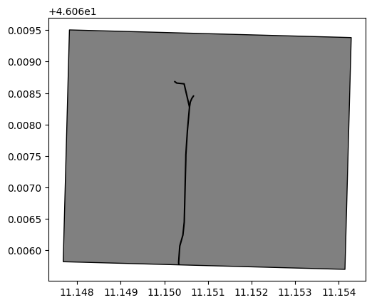
    


```python
sommarive_street_inside_dtm.highway
```


    0    unclassified
    1     residential
    Name: highway, dtype: object


```python
sommarive_street_inside_dtm[sommarive_street_inside_dtm.highway == 'unclassified'].plot()
plt.show()
```


    
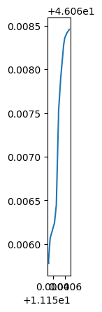
    


```python
sommarive_street_inside_dtm[sommarive_street_inside_dtm.highway == 'unclassified'].geometry.values[0]
```


    

    


```python
linestring_sommarive_street = sommarive_street_inside_dtm[sommarive_street_inside_dtm.highway == 'unclassified'].geometry.values[0]
```

### 4. extract the points of the street
we need to convert the points from WGS84 to ETRS89


```python
import shapely
import pyproj
from shapely.ops import transform
```


```python
wgs84 = pyproj.CRS('EPSG:4326')
crs_dtm = pyproj.CRS('EPSG:25832')
projection_transform = pyproj.Transformer.from_crs(wgs84, crs_dtm, always_xy=False).transform
```


```python
def convert(x,y):
  p = shapely.geometry.Point(y,x)
  p = transform(projection_transform,p)
  return(p)
```


```python
pointsx = []
pointsy = []
for coordinate in linestring_sommarive_street.coords:
  x = coordinate[0]
  y = coordinate[1]
  point = convert(x,y)
  pointsx.append(point.x)
  pointsy.append(point.y)
```


```python
pointsx[0]
```


    666306.4552006973


```python
pointsy[0]
```


    5103603.230911811


### 4. extract the altitude value for each points


```python
import pandas as pd
```


```python
#calculate the distance point-to-point
from shapely.geometry import Point,LineString
lengths = []
previousPoint = None
length = 0
for i in range(len(pointsx)):
  point = shapely.geometry.Point(pointsy[i],pointsx[i])
  if previousPoint is None:
    lengths.append(length)
  else:
    length = LineString([previousPoint,point]).length + length
    lengths.append(length)  
  previousPoint = point 

```


```python
lengths
```


    [0,
     3.951209708453172,
     32.831459095104734,
     52.980608611161294,
     76.08957728511274,
     92.85559295820157,
     165.21088895086632,
     186.20305604139205,
     194.89525292991763,
     237.73013209200536,
     279.6642269476137,
     288.7776897544056,
     295.68268594259496,
     301.98476544905714]


```python
raster_dtm.count
```


    1


```python
data = raster_dtm.read(1)
```


```python
data
```


    array([[335., 335., 335., ..., 468., 469., 469.],
           [334., 334., 334., ..., 469., 469., 469.],
           [334., 334., 334., ..., 469., 469., 469.],
           ...,
           [357., 357., 357., ..., 400., 400., 401.],
           [356., 357., 357., ..., 400., 400., 400.],
           [356., 357., 357., ..., 400., 400., 400.]], dtype=float32)


```python
rows,cols = rasterio.transform.rowcol(raster_dtm.transform,(pointsx),(pointsy))
```


```python
values = []
for i in range(len(rows)):
  values.append(data[rows[i]-1][cols[i]-1]) 
```


```python
values
```


    [382.0,
     382.0,
     380.0,
     378.0,
     378.0,
     378.0,
     378.0,
     378.0,
     378.0,
     378.0,
     380.0,
     380.0,
     381.0,
     381.0]


```python
sommarive_street_3d = pd.DataFrame()
```


```python
sommarive_street_3d['value'] = values
```


```python
sommarive_street_3d['length'] = lengths
```


```python
sommarive_street_3d
```


<div>
<style scoped>
    .dataframe tbody tr th:only-of-type {
        vertical-align: middle;
    }

    .dataframe tbody tr th {
        vertical-align: top;
    }

    .dataframe thead th {
        text-align: right;
    }
</style>
<table border="1" class="dataframe">
  <thead>
    <tr style="text-align: right;">
      <th></th>
      <th>value</th>
      <th>length</th>
    </tr>
  </thead>
  <tbody>
    <tr>
      <th>0</th>
      <td>382.0</td>
      <td>0.000000</td>
    </tr>
    <tr>
      <th>1</th>
      <td>382.0</td>
      <td>3.951210</td>
    </tr>
    <tr>
      <th>2</th>
      <td>380.0</td>
      <td>32.831459</td>
    </tr>
    <tr>
      <th>3</th>
      <td>378.0</td>
      <td>52.980609</td>
    </tr>
    <tr>
      <th>4</th>
      <td>378.0</td>
      <td>76.089577</td>
    </tr>
    <tr>
      <th>5</th>
      <td>378.0</td>
      <td>92.855593</td>
    </tr>
    <tr>
      <th>6</th>
      <td>378.0</td>
      <td>165.210889</td>
    </tr>
    <tr>
      <th>7</th>
      <td>378.0</td>
      <td>186.203056</td>
    </tr>
    <tr>
      <th>8</th>
      <td>378.0</td>
      <td>194.895253</td>
    </tr>
    <tr>
      <th>9</th>
      <td>378.0</td>
      <td>237.730132</td>
    </tr>
    <tr>
      <th>10</th>
      <td>380.0</td>
      <td>279.664227</td>
    </tr>
    <tr>
      <th>11</th>
      <td>380.0</td>
      <td>288.777690</td>
    </tr>
    <tr>
      <th>12</th>
      <td>381.0</td>
      <td>295.682686</td>
    </tr>
    <tr>
      <th>13</th>
      <td>381.0</td>
      <td>301.984765</td>
    </tr>
  </tbody>
</table>
</div>


```python
ax = sommarive_street_3d.plot(y='value',x="length",color='green',figsize=(10,1))
plt.show()
```


    
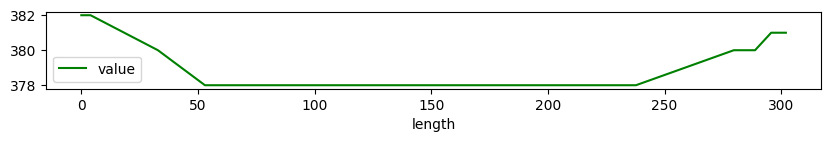
    


## find the area FBK in the WMS of municipality of Trento - layer “Carta Tecnica 1:2.000 alta risoluzione” and vectorize it

1. create a bounding box based on the FBK area in Povo
1. load the WMS of muncipality of Trento as rasterio on the size of the bounding box
1. vectorize the rasterio
---


### 1. create a bounding box based on the FBK area in Povo
.. we can use the same geojson extracted from OSM used on the lesson


```python
fbk = gpd.read_file("https://raw.githubusercontent.com/napo/geospatial_course_unitn/master/data/openstreetmap/boundary_fbk_povo.geojson")
```


```python
bbox = fbk.geometry[0].bounds
```


```python
bbox
```


    (11.1505197, 46.0664359, 11.1530713, 46.0684635)


```python
fbk.shape
```


    (1, 10)


### 2. load the WMS of muncipality of Trento as rasterio on the size of the bounding box


```python
from owslib.wms import WebMapService
import rasterio.crs
```


```python
wms_trento = "http://webapps.comune.trento.it/ogc"
wms = WebMapService(wms_trento)
```


```python
title="Carta Tecnica 1:2.000 alta risoluzione a colori"
```


```python
for content in wms.contents:
  layer = wms[content]
  if layer.title == title:
    break
```


```python
content
```


    'ct2000_colori'


```python
layer.crsOptions
```


    ['EPSG:3857', 'EPSG:25832', 'EPSG:4326']


```python
request = wms.getmap(
    layers=[content],
    srs='EPSG:4326',
    format='image/tiff',
    bbox=bbox,
    size=(1024,800)
    )
```


```python
from rasterio import MemoryFile
from rasterio.plot import show
from rasterio import features
```


```python
wms_image = MemoryFile(request).open()
```


```python
wms_image.profile
```


    {'driver': 'GTiff', 'dtype': 'uint8', 'nodata': None, 'width': 1024, 'height': 800, 'count': 3, 'crs': CRS.from_epsg(4326), 'transform': Affine(2.4917968750015575e-06, 0.0, 11.1505197,
           0.0, -2.5344999999997646e-06, 46.0684635), 'blockysize': 2, 'tiled': False, 'interleave': 'pixel'}


```python
show(wms_image)
```


    
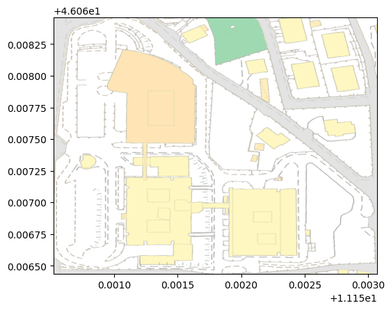
    


    <AxesSubplot:>


```python
wms_image.count
```


    3


```python
show((wms_image, 1), cmap='Reds')
```


    
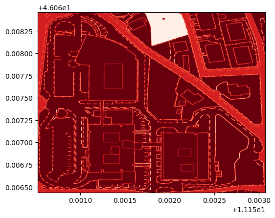
    


    <AxesSubplot:>


```python
show((wms_image, 2), cmap='Greens')
```


    
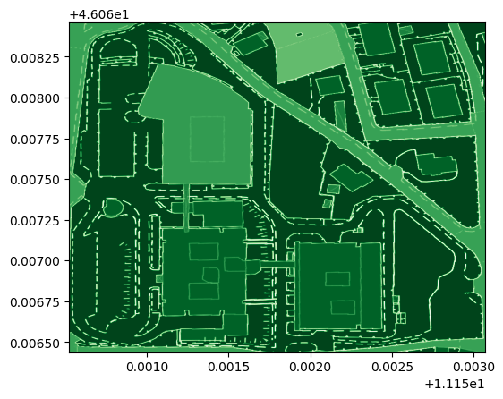
    


    <AxesSubplot:>


```python
show((wms_image, 3), cmap='Blues')
```


    
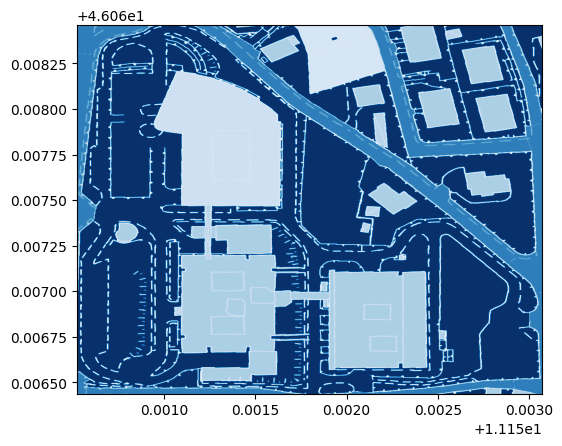
    


    <AxesSubplot:>


```python
from rasterio.features import shapes
image = wms_image.read(3) # first band
mask = image != 255
results = (
  {'properties': {'raster_val': v}, 'geometry': s}
  for i, (s, v) 
    in enumerate(
      shapes(image, mask=mask, transform=wms_image.transform)))
```


```python
geoms = list(results)
```


```python
fbk_area_vector  = gpd.GeoDataFrame.from_features(geoms)
```


```python
fbk_area_vector.shape
```


    (78339, 2)


```python
fbk_area_vector.plot()
plt.show()
%time
```


    
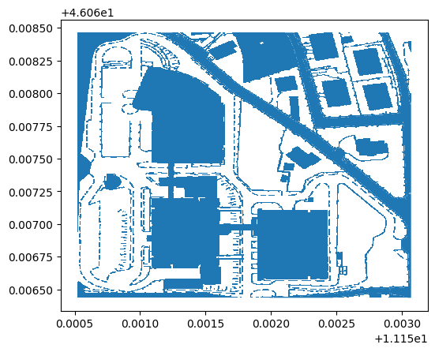
    


    CPU times: user 4 µs, sys: 1 µs, total: 5 µs
    Wall time: 7.39 µs


FBK Buildings

- [North](https://www.openstreetmap.org/?mlat=46.06782&mlon=11.15156#map=19/46.06782/11.15156)
- [West](https://www.openstreetmap.org/?mlat=46.06689&mlon=11.15116#map=19/46.06689/11.15116)
- [East](https://www.openstreetmap.org/?mlat=46.06684&mlon=11.15200#map=19/46.06684/11.15200)


```python
p_north = shapely.geometry.Point(11.15156,46.06782)
```


```python
building_north = fbk_area_vector[fbk_area_vector.geometry.contains(p_north)]
```


```python
building_north
```


<div>
<style scoped>
    .dataframe tbody tr th:only-of-type {
        vertical-align: middle;
    }

    .dataframe tbody tr th {
        vertical-align: top;
    }

    .dataframe thead th {
        text-align: right;
    }
</style>
<table border="1" class="dataframe">
  <thead>
    <tr style="text-align: right;">
      <th></th>
      <th>geometry</th>
      <th>raster_val</th>
    </tr>
  </thead>
  <tbody>
    <tr>
      <th>42228</th>
      <td>POLYGON ((11.15107 46.06820, 11.15108 46.06820...</td>
      <td>181.0</td>
    </tr>
  </tbody>
</table>
</div>


```python
building_north.plot()
plt.show()
```


    
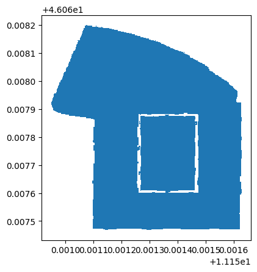
    


```python
p_west = shapely.geometry.Point(11.15116,46.06689)
building_west = fbk_area_vector[fbk_area_vector.geometry.contains(p_west)]
```


```python
p_east = shapely.geometry.Point(11.15200,46.06684)
building_east = fbk_area_vector[fbk_area_vector.geometry.contains(p_east)]
```


```python
building_east
```


<div>
<style scoped>
    .dataframe tbody tr th:only-of-type {
        vertical-align: middle;
    }

    .dataframe tbody tr th {
        vertical-align: top;
    }

    .dataframe thead th {
        text-align: right;
    }
</style>
<table border="1" class="dataframe">
  <thead>
    <tr style="text-align: right;">
      <th></th>
      <th>geometry</th>
      <th>raster_val</th>
    </tr>
  </thead>
  <tbody>
    <tr>
      <th>70295</th>
      <td>POLYGON ((11.15198 46.06710, 11.15200 46.06710...</td>
      <td>193.0</td>
    </tr>
  </tbody>
</table>
</div>


```python
fig, ax = plt.subplots()
building_north.plot(ax=ax, color='lightblue', edgecolor='black')
building_west.plot(ax=ax, color='lightyellow', edgecolor='black')
building_east.plot(ax=ax, color='lightgreen', edgecolor='black')
plt.show();
```


    
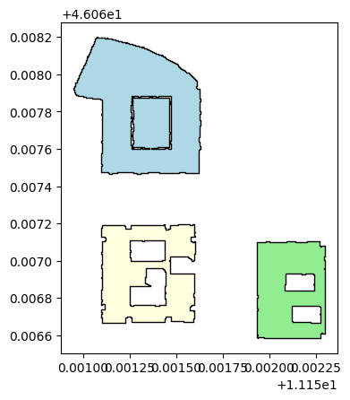
    


## Identify what is possibile to see from the crossing point between Via Sommarive and Via dei Valoni

1. identify the crossing point between Via Sommarive and Via dei Valoni
1. calculate the viewshed by using the DTM
1. visualize it
---
for this operation we will use:
- [xarray-spatial](https://xarray-spatial.org/)<Br/>
xarray-spatial is a package for raster-based spatial analytics<br/>
among the supported functions there is the [viewshed](https://xarray-spatial.org/v0.0.5/viewshed.html)<br/>The function returns *A cell x in the visibility grid is recorded as follows: If it is invisible, then x is set to INVISIBLE. If it is visible, then x is set to the vertical angle w.r.t the viewpoint*


```python
import xarray as xr
import numpy as np

from xrspatial import hillshade
from xrspatial import viewshed
```

**Visualize** input data

We'll compute hillshade of the raster to better understand it.


```python
file_name = 'trento_scientifc_hub_povo_dtm.asc'
raster = xr.open_rasterio(file_name).sel(band=1).drop('band', dim=None)
raster.name = 'elevation'

xmin, xmax = raster.x.data.min(), raster.x.data.max()
ymin, ymax = raster.y.data.min(), raster.y.data.max()

xmin, xmax, ymin, ymax
```


    (666101.1735466761, 666600.1735466761, 5103603.73583161, 5104012.73583161)


```python
illuminated = hillshade(raster, name='Hillshade')
```


```python
fig, (ax1, ax2) = plt.subplots(ncols=2, figsize=(16, 7))
raster.plot.imshow(ax=ax1, cmap='terrain')
illuminated.plot.imshow(ax=ax2, cmap='gray')
plt.tight_layout()
```


    
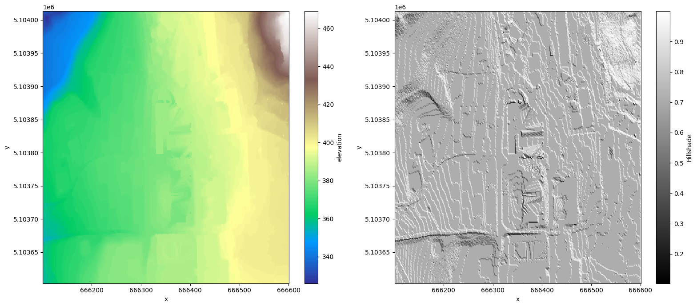
    


### identify the crossing point between Via Sommarive and Via dei Valoni

we have already via Sommarive


```python
via_sommarive
```


<div>
<style scoped>
    .dataframe tbody tr th:only-of-type {
        vertical-align: middle;
    }

    .dataframe tbody tr th {
        vertical-align: top;
    }

    .dataframe thead th {
        text-align: right;
    }
</style>
<table border="1" class="dataframe">
  <thead>
    <tr style="text-align: right;">
      <th></th>
      <th>id</th>
      <th>@id</th>
      <th>highway</th>
      <th>lit</th>
      <th>maxspeed</th>
      <th>maxspeed:type</th>
      <th>name</th>
      <th>source:maxspeed</th>
      <th>surface</th>
      <th>geometry</th>
    </tr>
  </thead>
  <tbody>
    <tr>
      <th>0</th>
      <td>way/97004470</td>
      <td>way/97004470</td>
      <td>unclassified</td>
      <td>yes</td>
      <td>None</td>
      <td>IT:urban</td>
      <td>Via Sommarive</td>
      <td>None</td>
      <td>asphalt</td>
      <td>LINESTRING (11.15039 46.06519, 11.15039 46.065...</td>
    </tr>
    <tr>
      <th>1</th>
      <td>way/382958545</td>
      <td>way/382958545</td>
      <td>residential</td>
      <td>None</td>
      <td>50</td>
      <td>None</td>
      <td>Via Sommarive</td>
      <td>sign</td>
      <td>asphalt</td>
      <td>LINESTRING (11.15058 46.06828, 11.15045 46.068...</td>
    </tr>
  </tbody>
</table>
</div>


... and we download Via dei Valóni - [overpass-turbo](https://overpass-turbo.eu/s/1ob9)<br/>
You can download the file [here](https://github.com/napo/geospatial_course_unitn/raw/master/data/openstreetmap/via_valoni.geojson)


```python
via_valoni = gpd.read_file("https://github.com/napo/geospatial_course_unitn/raw/master/data/openstreetmap/via_valoni.geojson")
```


```python
intersection = via_sommarive.intersection(via_valoni)
```


```python
intersection= intersection.drop_duplicates()
```


```python
intersection = intersection[intersection.geometry != None]
```


```python
point_intersection = intersection.geometry[0]
```


```python
lat=point_intersection.y
lon=point_intersection.x
```

## calculate the viewshed by using the DTM
### convert the point from WGS84 to ETRS89


```python
import shapely
import pyproj
from shapely.ops import transform
```


```python
wgs84 = pyproj.CRS('EPSG:4326')
crs_dtm = pyproj.CRS('EPSG:25832')
projection_transform = pyproj.Transformer.from_crs(wgs84, crs_dtm, always_xy=False).transform
```


```python
def convert(x,y):
    p = shapely.geometry.Point(y,x)
    p = transform(projection_transform,p)
    return(p)
```


```python
view_point = convert(lon,lat)
```

## identify the cell contains the view point


```python
gdf_view_point = gpd.GeoDataFrame(data={'name':['view_point'],'geometry':[view_point]},crs=raster.crs.split("=")[1])
```


```python
df_points_dtm = raster.to_dataframe().reset_index()
```


```python
raster.crs.split("=")[1].replace(":","=")
```


    'epsg=25832'


```python
gdf_points_dtm = gpd.GeoDataFrame(
    df_points_dtm['elevation'],geometry=gpd.points_from_xy(df_points_dtm.x,df_points_dtm.y),crs=raster.crs.split("=")[1])
```

### nearest point on the raster to the view point


```python
min_distance = round(min(gdf_points_dtm.geometry.distance(view_point)),3)
```


```python
point_closest_view_point = gdf_points_dtm[round(gdf_points_dtm.geometry.distance(view_point),3) ==min_distance ]
```


```python
elevation = point_closest_view_point.elevation.values[0]
```


```python
elevation
```


    378.0


```python
x = point_closest_view_point.geometry.x.values[0]
y = point_closest_view_point.geometry.y.values[0]
```

### calculate the viewsheed


```python
viewshed_grid = viewshed(raster, x=x, y=y)
```


```python
raster_visibility = viewshed_grid.where(viewshed_grid == -1, other=1)
```


```python
raster_visibility
```


<div><svg style="position: absolute; width: 0; height: 0; overflow: hidden">
<defs>
<symbol id="icon-database" viewBox="0 0 32 32">
<path d="M16 0c-8.837 0-16 2.239-16 5v4c0 2.761 7.163 5 16 5s16-2.239 16-5v-4c0-2.761-7.163-5-16-5z"></path>
<path d="M16 17c-8.837 0-16-2.239-16-5v6c0 2.761 7.163 5 16 5s16-2.239 16-5v-6c0 2.761-7.163 5-16 5z"></path>
<path d="M16 26c-8.837 0-16-2.239-16-5v6c0 2.761 7.163 5 16 5s16-2.239 16-5v-6c0 2.761-7.163 5-16 5z"></path>
</symbol>
<symbol id="icon-file-text2" viewBox="0 0 32 32">
<path d="M28.681 7.159c-0.694-0.947-1.662-2.053-2.724-3.116s-2.169-2.030-3.116-2.724c-1.612-1.182-2.393-1.319-2.841-1.319h-15.5c-1.378 0-2.5 1.121-2.5 2.5v27c0 1.378 1.122 2.5 2.5 2.5h23c1.378 0 2.5-1.122 2.5-2.5v-19.5c0-0.448-0.137-1.23-1.319-2.841zM24.543 5.457c0.959 0.959 1.712 1.825 2.268 2.543h-4.811v-4.811c0.718 0.556 1.584 1.309 2.543 2.268zM28 29.5c0 0.271-0.229 0.5-0.5 0.5h-23c-0.271 0-0.5-0.229-0.5-0.5v-27c0-0.271 0.229-0.5 0.5-0.5 0 0 15.499-0 15.5 0v7c0 0.552 0.448 1 1 1h7v19.5z"></path>
<path d="M23 26h-14c-0.552 0-1-0.448-1-1s0.448-1 1-1h14c0.552 0 1 0.448 1 1s-0.448 1-1 1z"></path>
<path d="M23 22h-14c-0.552 0-1-0.448-1-1s0.448-1 1-1h14c0.552 0 1 0.448 1 1s-0.448 1-1 1z"></path>
<path d="M23 18h-14c-0.552 0-1-0.448-1-1s0.448-1 1-1h14c0.552 0 1 0.448 1 1s-0.448 1-1 1z"></path>
</symbol>
</defs>
</svg>
<style>/* CSS stylesheet for displaying xarray objects in jupyterlab.
 *
 */

:root {
  --xr-font-color0: var(--jp-content-font-color0, rgba(0, 0, 0, 1));
  --xr-font-color2: var(--jp-content-font-color2, rgba(0, 0, 0, 0.54));
  --xr-font-color3: var(--jp-content-font-color3, rgba(0, 0, 0, 0.38));
  --xr-border-color: var(--jp-border-color2, #e0e0e0);
  --xr-disabled-color: var(--jp-layout-color3, #bdbdbd);
  --xr-background-color: var(--jp-layout-color0, white);
  --xr-background-color-row-even: var(--jp-layout-color1, white);
  --xr-background-color-row-odd: var(--jp-layout-color2, #eeeeee);
}

html[theme=dark],
body[data-theme=dark],
body.vscode-dark {
  --xr-font-color0: rgba(255, 255, 255, 1);
  --xr-font-color2: rgba(255, 255, 255, 0.54);
  --xr-font-color3: rgba(255, 255, 255, 0.38);
  --xr-border-color: #1F1F1F;
  --xr-disabled-color: #515151;
  --xr-background-color: #111111;
  --xr-background-color-row-even: #111111;
  --xr-background-color-row-odd: #313131;
}

.xr-wrap {
  display: block !important;
  min-width: 300px;
  max-width: 700px;
}

.xr-text-repr-fallback {
  /* fallback to plain text repr when CSS is not injected (untrusted notebook) */
  display: none;
}

.xr-header {
  padding-top: 6px;
  padding-bottom: 6px;
  margin-bottom: 4px;
  border-bottom: solid 1px var(--xr-border-color);
}

.xr-header > div,
.xr-header > ul {
  display: inline;
  margin-top: 0;
  margin-bottom: 0;
}

.xr-obj-type,
.xr-array-name {
  margin-left: 2px;
  margin-right: 10px;
}

.xr-obj-type {
  color: var(--xr-font-color2);
}

.xr-sections {
  padding-left: 0 !important;
  display: grid;
  grid-template-columns: 150px auto auto 1fr 20px 20px;
}

.xr-section-item {
  display: contents;
}

.xr-section-item input {
  display: none;
}

.xr-section-item input + label {
  color: var(--xr-disabled-color);
}

.xr-section-item input:enabled + label {
  cursor: pointer;
  color: var(--xr-font-color2);
}

.xr-section-item input:enabled + label:hover {
  color: var(--xr-font-color0);
}

.xr-section-summary {
  grid-column: 1;
  color: var(--xr-font-color2);
  font-weight: 500;
}

.xr-section-summary > span {
  display: inline-block;
  padding-left: 0.5em;
}

.xr-section-summary-in:disabled + label {
  color: var(--xr-font-color2);
}

.xr-section-summary-in + label:before {
  display: inline-block;
  content: '►';
  font-size: 11px;
  width: 15px;
  text-align: center;
}

.xr-section-summary-in:disabled + label:before {
  color: var(--xr-disabled-color);
}

.xr-section-summary-in:checked + label:before {
  content: '▼';
}

.xr-section-summary-in:checked + label > span {
  display: none;
}

.xr-section-summary,
.xr-section-inline-details {
  padding-top: 4px;
  padding-bottom: 4px;
}

.xr-section-inline-details {
  grid-column: 2 / -1;
}

.xr-section-details {
  display: none;
  grid-column: 1 / -1;
  margin-bottom: 5px;
}

.xr-section-summary-in:checked ~ .xr-section-details {
  display: contents;
}

.xr-array-wrap {
  grid-column: 1 / -1;
  display: grid;
  grid-template-columns: 20px auto;
}

.xr-array-wrap > label {
  grid-column: 1;
  vertical-align: top;
}

.xr-preview {
  color: var(--xr-font-color3);
}

.xr-array-preview,
.xr-array-data {
  padding: 0 5px !important;
  grid-column: 2;
}

.xr-array-data,
.xr-array-in:checked ~ .xr-array-preview {
  display: none;
}

.xr-array-in:checked ~ .xr-array-data,
.xr-array-preview {
  display: inline-block;
}

.xr-dim-list {
  display: inline-block !important;
  list-style: none;
  padding: 0 !important;
  margin: 0;
}

.xr-dim-list li {
  display: inline-block;
  padding: 0;
  margin: 0;
}

.xr-dim-list:before {
  content: '(';
}

.xr-dim-list:after {
  content: ')';
}

.xr-dim-list li:not(:last-child):after {
  content: ',';
  padding-right: 5px;
}

.xr-has-index {
  font-weight: bold;
}

.xr-var-list,
.xr-var-item {
  display: contents;
}

.xr-var-item > div,
.xr-var-item label,
.xr-var-item > .xr-var-name span {
  background-color: var(--xr-background-color-row-even);
  margin-bottom: 0;
}

.xr-var-item > .xr-var-name:hover span {
  padding-right: 5px;
}

.xr-var-list > li:nth-child(odd) > div,
.xr-var-list > li:nth-child(odd) > label,
.xr-var-list > li:nth-child(odd) > .xr-var-name span {
  background-color: var(--xr-background-color-row-odd);
}

.xr-var-name {
  grid-column: 1;
}

.xr-var-dims {
  grid-column: 2;
}

.xr-var-dtype {
  grid-column: 3;
  text-align: right;
  color: var(--xr-font-color2);
}

.xr-var-preview {
  grid-column: 4;
}

.xr-index-preview {
  grid-column: 2 / 5;
  color: var(--xr-font-color2);
}

.xr-var-name,
.xr-var-dims,
.xr-var-dtype,
.xr-preview,
.xr-attrs dt {
  white-space: nowrap;
  overflow: hidden;
  text-overflow: ellipsis;
  padding-right: 10px;
}

.xr-var-name:hover,
.xr-var-dims:hover,
.xr-var-dtype:hover,
.xr-attrs dt:hover {
  overflow: visible;
  width: auto;
  z-index: 1;
}

.xr-var-attrs,
.xr-var-data,
.xr-index-data {
  display: none;
  background-color: var(--xr-background-color) !important;
  padding-bottom: 5px !important;
}

.xr-var-attrs-in:checked ~ .xr-var-attrs,
.xr-var-data-in:checked ~ .xr-var-data,
.xr-index-data-in:checked ~ .xr-index-data {
  display: block;
}

.xr-var-data > table {
  float: right;
}

.xr-var-name span,
.xr-var-data,
.xr-index-name div,
.xr-index-data,
.xr-attrs {
  padding-left: 25px !important;
}

.xr-attrs,
.xr-var-attrs,
.xr-var-data,
.xr-index-data {
  grid-column: 1 / -1;
}

dl.xr-attrs {
  padding: 0;
  margin: 0;
  display: grid;
  grid-template-columns: 125px auto;
}

.xr-attrs dt,
.xr-attrs dd {
  padding: 0;
  margin: 0;
  float: left;
  padding-right: 10px;
  width: auto;
}

.xr-attrs dt {
  font-weight: normal;
  grid-column: 1;
}

.xr-attrs dt:hover span {
  display: inline-block;
  background: var(--xr-background-color);
  padding-right: 10px;
}

.xr-attrs dd {
  grid-column: 2;
  white-space: pre-wrap;
  word-break: break-all;
}

.xr-icon-database,
.xr-icon-file-text2,
.xr-no-icon {
  display: inline-block;
  vertical-align: middle;
  width: 1em;
  height: 1.5em !important;
  stroke-width: 0;
  stroke: currentColor;
  fill: currentColor;
}
</style><pre class='xr-text-repr-fallback'>&lt;xarray.DataArray (y: 410, x: 500)&gt;
array([[-1., -1., -1., ..., -1., -1., -1.],
       [-1., -1., -1., ..., -1., -1., -1.],
       [-1., -1., -1., ..., -1., -1., -1.],
       ...,
       [-1., -1., -1., ..., -1., -1., -1.],
       [-1., -1., -1., ..., -1., -1., -1.],
       [-1., -1., -1., ..., -1., -1., -1.]])
Coordinates:
  * y        (y) float64 5.104e+06 5.104e+06 5.104e+06 ... 5.104e+06 5.104e+06
  * x        (x) float64 6.661e+05 6.661e+05 6.661e+05 ... 6.666e+05 6.666e+05
Attributes:
    transform:   (1.0, 0.0, 666100.6735466761, 0.0, -1.0, 5104013.23583161)
    crs:         +init=epsg:25832
    res:         (1.0, 1.0)
    is_tiled:    0
    nodatavals:  (nan,)
    scales:      (1.0,)
    offsets:     (0.0,)</pre><div class='xr-wrap' style='display:none'><div class='xr-header'><div class='xr-obj-type'>xarray.DataArray</div><div class='xr-array-name'></div><ul class='xr-dim-list'><li><span class='xr-has-index'>y</span>: 410</li><li><span class='xr-has-index'>x</span>: 500</li></ul></div><ul class='xr-sections'><li class='xr-section-item'><div class='xr-array-wrap'><input id='section-2423636a-a455-406a-a532-2dff5e829587' class='xr-array-in' type='checkbox' checked><label for='section-2423636a-a455-406a-a532-2dff5e829587' title='Show/hide data repr'><svg class='icon xr-icon-database'><use xlink:href='#icon-database'></use></svg></label><div class='xr-array-preview xr-preview'><span>-1.0 -1.0 -1.0 -1.0 -1.0 -1.0 -1.0 ... -1.0 -1.0 -1.0 -1.0 -1.0 -1.0</span></div><div class='xr-array-data'><pre>array([[-1., -1., -1., ..., -1., -1., -1.],
       [-1., -1., -1., ..., -1., -1., -1.],
       [-1., -1., -1., ..., -1., -1., -1.],
       ...,
       [-1., -1., -1., ..., -1., -1., -1.],
       [-1., -1., -1., ..., -1., -1., -1.],
       [-1., -1., -1., ..., -1., -1., -1.]])</pre></div></div></li><li class='xr-section-item'><input id='section-03781a70-57fe-4a15-b902-a0474bc0e3a1' class='xr-section-summary-in' type='checkbox'  checked><label for='section-03781a70-57fe-4a15-b902-a0474bc0e3a1' class='xr-section-summary' >Coordinates: <span>(2)</span></label><div class='xr-section-inline-details'></div><div class='xr-section-details'><ul class='xr-var-list'><li class='xr-var-item'><div class='xr-var-name'><span class='xr-has-index'>y</span></div><div class='xr-var-dims'>(y)</div><div class='xr-var-dtype'>float64</div><div class='xr-var-preview xr-preview'>5.104e+06 5.104e+06 ... 5.104e+06</div><input id='attrs-5fbe4c8d-510a-498c-9cfc-ea74869b9f33' class='xr-var-attrs-in' type='checkbox' disabled><label for='attrs-5fbe4c8d-510a-498c-9cfc-ea74869b9f33' title='Show/Hide attributes'><svg class='icon xr-icon-file-text2'><use xlink:href='#icon-file-text2'></use></svg></label><input id='data-ba4c6f25-a969-4afd-9c41-fa56ad045b59' class='xr-var-data-in' type='checkbox'><label for='data-ba4c6f25-a969-4afd-9c41-fa56ad045b59' title='Show/Hide data repr'><svg class='icon xr-icon-database'><use xlink:href='#icon-database'></use></svg></label><div class='xr-var-attrs'><dl class='xr-attrs'></dl></div><div class='xr-var-data'><pre>array([5104012.735832, 5104011.735832, 5104010.735832, ..., 5103605.735832,
       5103604.735832, 5103603.735832])</pre></div></li><li class='xr-var-item'><div class='xr-var-name'><span class='xr-has-index'>x</span></div><div class='xr-var-dims'>(x)</div><div class='xr-var-dtype'>float64</div><div class='xr-var-preview xr-preview'>6.661e+05 6.661e+05 ... 6.666e+05</div><input id='attrs-8bbdfb70-6d6d-4a5f-b700-9add7ae76571' class='xr-var-attrs-in' type='checkbox' disabled><label for='attrs-8bbdfb70-6d6d-4a5f-b700-9add7ae76571' title='Show/Hide attributes'><svg class='icon xr-icon-file-text2'><use xlink:href='#icon-file-text2'></use></svg></label><input id='data-dfddc250-55c2-4758-8519-b8e085cd5134' class='xr-var-data-in' type='checkbox'><label for='data-dfddc250-55c2-4758-8519-b8e085cd5134' title='Show/Hide data repr'><svg class='icon xr-icon-database'><use xlink:href='#icon-database'></use></svg></label><div class='xr-var-attrs'><dl class='xr-attrs'></dl></div><div class='xr-var-data'><pre>array([666101.173547, 666102.173547, 666103.173547, ..., 666598.173547,
       666599.173547, 666600.173547])</pre></div></li></ul></div></li><li class='xr-section-item'><input id='section-cd72a775-db23-4f98-b765-0d50a83fe7fe' class='xr-section-summary-in' type='checkbox'  ><label for='section-cd72a775-db23-4f98-b765-0d50a83fe7fe' class='xr-section-summary' >Indexes: <span>(2)</span></label><div class='xr-section-inline-details'></div><div class='xr-section-details'><ul class='xr-var-list'><li class='xr-var-item'><div class='xr-index-name'><div>y</div></div><div class='xr-index-preview'>PandasIndex</div><div></div><input id='index-5adc4b10-141b-4adb-9d2d-b934be3dfdb7' class='xr-index-data-in' type='checkbox'/><label for='index-5adc4b10-141b-4adb-9d2d-b934be3dfdb7' title='Show/Hide index repr'><svg class='icon xr-icon-database'><use xlink:href='#icon-database'></use></svg></label><div class='xr-index-data'><pre>PandasIndex(Float64Index([5104012.73583161, 5104011.73583161, 5104010.73583161,
              5104009.73583161, 5104008.73583161, 5104007.73583161,
              5104006.73583161, 5104005.73583161, 5104004.73583161,
              5104003.73583161,
              ...
              5103612.73583161, 5103611.73583161, 5103610.73583161,
              5103609.73583161, 5103608.73583161, 5103607.73583161,
              5103606.73583161, 5103605.73583161, 5103604.73583161,
              5103603.73583161],
             dtype=&#x27;float64&#x27;, name=&#x27;y&#x27;, length=410))</pre></div></li><li class='xr-var-item'><div class='xr-index-name'><div>x</div></div><div class='xr-index-preview'>PandasIndex</div><div></div><input id='index-ab4153a2-e076-4f81-b7e5-66ad6a7f5074' class='xr-index-data-in' type='checkbox'/><label for='index-ab4153a2-e076-4f81-b7e5-66ad6a7f5074' title='Show/Hide index repr'><svg class='icon xr-icon-database'><use xlink:href='#icon-database'></use></svg></label><div class='xr-index-data'><pre>PandasIndex(Float64Index([666101.1735466761, 666102.1735466761, 666103.1735466761,
              666104.1735466761, 666105.1735466761, 666106.1735466761,
              666107.1735466761, 666108.1735466761, 666109.1735466761,
              666110.1735466761,
              ...
              666591.1735466761, 666592.1735466761, 666593.1735466761,
              666594.1735466761, 666595.1735466761, 666596.1735466761,
              666597.1735466761, 666598.1735466761, 666599.1735466761,
              666600.1735466761],
             dtype=&#x27;float64&#x27;, name=&#x27;x&#x27;, length=500))</pre></div></li></ul></div></li><li class='xr-section-item'><input id='section-b21d8295-fd73-452c-9933-3df66106df6c' class='xr-section-summary-in' type='checkbox'  checked><label for='section-b21d8295-fd73-452c-9933-3df66106df6c' class='xr-section-summary' >Attributes: <span>(7)</span></label><div class='xr-section-inline-details'></div><div class='xr-section-details'><dl class='xr-attrs'><dt><span>transform :</span></dt><dd>(1.0, 0.0, 666100.6735466761, 0.0, -1.0, 5104013.23583161)</dd><dt><span>crs :</span></dt><dd>+init=epsg:25832</dd><dt><span>res :</span></dt><dd>(1.0, 1.0)</dd><dt><span>is_tiled :</span></dt><dd>0</dd><dt><span>nodatavals :</span></dt><dd>(nan,)</dd><dt><span>scales :</span></dt><dd>(1.0,)</dd><dt><span>offsets :</span></dt><dd>(0.0,)</dd></dl></div></li></ul></div></div>


## visualize it


```python
fig, (ax1, ax2) = plt.subplots(ncols=2, figsize=(16, 7))
viewshed_grid.plot.imshow(ax=ax1, cmap='Reds')
illuminated.plot.imshow(ax=ax2, cmap='gray')
plt.tight_layout()
```


    
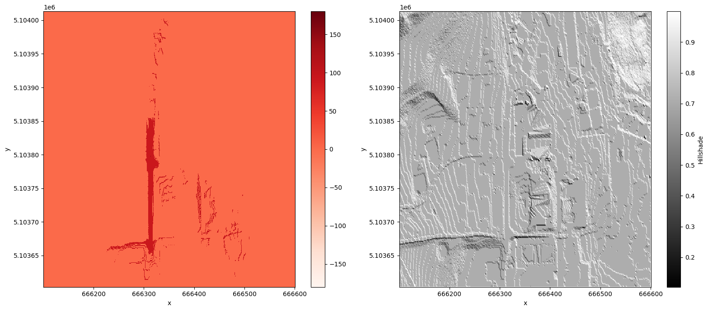
    


```python
df_raster_visibility = raster_visibility.to_dataframe("viewsheed_grid").reset_index()
```


```python
df_raster_visibility = df_raster_visibility[df_raster_visibility['viewsheed_grid'] == 1]
```


```python
df_raster_visibility.shape
```


    (4508, 3)


```python
gdf_raster_visibles = gpd.GeoDataFrame(
    df_raster_visibility['viewsheed_grid'],geometry=gpd.points_from_xy(df_raster_visibility.x,df_raster_visibility.y),crs=raster.crs.split("=")[1])
```


```python
gdf_raster_visibles.unary_union.convex_hull
```


    

    


```python
gdf_raster_visibles['geometry'] = gdf_raster_visibles.geometry.buffer(1).envelope
```


```python
gdf_raster_visibles.dissolve().explore()
```


<div style="width:100%;"><div style="position:relative;width:100%;height:0;padding-bottom:60%;"><span style="color:#565656">Make this Notebook Trusted to load map: File -> Trust Notebook</span><iframe srcdoc="&lt;!DOCTYPE html&gt;
&lt;head&gt;    
    &lt;meta http-equiv=&quot;content-type&quot; content=&quot;text/html; charset=UTF-8&quot; /&gt;

        &lt;script&gt;
            L_NO_TOUCH = false;
            L_DISABLE_3D = false;
        &lt;/script&gt;

    &lt;style&gt;html, body {width: 100%;height: 100%;margin: 0;padding: 0;}&lt;/style&gt;
    &lt;style&gt;#map {position:absolute;top:0;bottom:0;right:0;left:0;}&lt;/style&gt;
    &lt;script src=&quot;https://cdn.jsdelivr.net/npm/leaflet@1.6.0/dist/leaflet.js&quot;&gt;&lt;/script&gt;
    &lt;script src=&quot;https://code.jquery.com/jquery-1.12.4.min.js&quot;&gt;&lt;/script&gt;
    &lt;script src=&quot;https://maxcdn.bootstrapcdn.com/bootstrap/3.2.0/js/bootstrap.min.js&quot;&gt;&lt;/script&gt;
    &lt;script src=&quot;https://cdnjs.cloudflare.com/ajax/libs/Leaflet.awesome-markers/2.0.2/leaflet.awesome-markers.js&quot;&gt;&lt;/script&gt;
    &lt;link rel=&quot;stylesheet&quot; href=&quot;https://cdn.jsdelivr.net/npm/leaflet@1.6.0/dist/leaflet.css&quot;/&gt;
    &lt;link rel=&quot;stylesheet&quot; href=&quot;https://maxcdn.bootstrapcdn.com/bootstrap/3.2.0/css/bootstrap.min.css&quot;/&gt;
    &lt;link rel=&quot;stylesheet&quot; href=&quot;https://maxcdn.bootstrapcdn.com/bootstrap/3.2.0/css/bootstrap-theme.min.css&quot;/&gt;
    &lt;link rel=&quot;stylesheet&quot; href=&quot;https://maxcdn.bootstrapcdn.com/font-awesome/4.6.3/css/font-awesome.min.css&quot;/&gt;
    &lt;link rel=&quot;stylesheet&quot; href=&quot;https://cdnjs.cloudflare.com/ajax/libs/Leaflet.awesome-markers/2.0.2/leaflet.awesome-markers.css&quot;/&gt;
    &lt;link rel=&quot;stylesheet&quot; href=&quot;https://cdn.jsdelivr.net/gh/python-visualization/folium/folium/templates/leaflet.awesome.rotate.min.css&quot;/&gt;

            &lt;meta name=&quot;viewport&quot; content=&quot;width=device-width,
                initial-scale=1.0, maximum-scale=1.0, user-scalable=no&quot; /&gt;
            &lt;style&gt;
                #map_54322032d784e3c37cab91396bf109fd {
                    position: relative;
                    width: 100.0%;
                    height: 100.0%;
                    left: 0.0%;
                    top: 0.0%;
                }
            &lt;/style&gt;


                    &lt;style&gt;
                        .foliumtooltip {

                        }
                       .foliumtooltip table{
                            margin: auto;
                        }
                        .foliumtooltip tr{
                            text-align: left;
                        }
                        .foliumtooltip th{
                            padding: 2px; padding-right: 8px;
                        }
                    &lt;/style&gt;

&lt;/head&gt;
&lt;body&gt;    

            &lt;div class=&quot;folium-map&quot; id=&quot;map_54322032d784e3c37cab91396bf109fd&quot; &gt;&lt;/div&gt;

&lt;/body&gt;
&lt;script&gt;    

            var map_54322032d784e3c37cab91396bf109fd = L.map(
                &quot;map_54322032d784e3c37cab91396bf109fd&quot;,
                {
                    center: [46.06761213236545, 11.15115257699852],
                    crs: L.CRS.EPSG3857,
                    zoom: 10,
                    zoomControl: true,
                    preferCanvas: false,
                }
            );
            L.control.scale().addTo(map_54322032d784e3c37cab91396bf109fd);


            var tile_layer_7f7b7d615c9d95d4db9473c89bc7e6e2 = L.tileLayer(
                &quot;https://{s}.tile.openstreetmap.org/{z}/{x}/{y}.png&quot;,
                {&quot;attribution&quot;: &quot;Data by \u0026copy; \u003ca href=\&quot;http://openstreetmap.org\&quot;\u003eOpenStreetMap\u003c/a\u003e, under \u003ca href=\&quot;http://www.openstreetmap.org/copyright\&quot;\u003eODbL\u003c/a\u003e.&quot;, &quot;detectRetina&quot;: false, &quot;maxNativeZoom&quot;: 18, &quot;maxZoom&quot;: 18, &quot;minZoom&quot;: 0, &quot;noWrap&quot;: false, &quot;opacity&quot;: 1, &quot;subdomains&quot;: &quot;abc&quot;, &quot;tms&quot;: false}
            ).addTo(map_54322032d784e3c37cab91396bf109fd);


            map_54322032d784e3c37cab91396bf109fd.fitBounds(
                [[46.06586646964535, 11.149313623918598], [46.069357795085544, 11.152991530078442]],
                {}
            );


        function geo_json_fbbc4b6b12560e75115d43672c2ad831_styler(feature) {
            switch(feature.id) {
                default:
                    return {&quot;fillOpacity&quot;: 0.5, &quot;weight&quot;: 2};
            }
        }
        function geo_json_fbbc4b6b12560e75115d43672c2ad831_highlighter(feature) {
            switch(feature.id) {
                default:
                    return {&quot;fillOpacity&quot;: 0.75};
            }
        }
        function geo_json_fbbc4b6b12560e75115d43672c2ad831_pointToLayer(feature, latlng) {
            var opts = {&quot;bubblingMouseEvents&quot;: true, &quot;color&quot;: &quot;#3388ff&quot;, &quot;dashArray&quot;: null, &quot;dashOffset&quot;: null, &quot;fill&quot;: true, &quot;fillColor&quot;: &quot;#3388ff&quot;, &quot;fillOpacity&quot;: 0.2, &quot;fillRule&quot;: &quot;evenodd&quot;, &quot;lineCap&quot;: &quot;round&quot;, &quot;lineJoin&quot;: &quot;round&quot;, &quot;opacity&quot;: 1.0, &quot;radius&quot;: 2, &quot;stroke&quot;: true, &quot;weight&quot;: 3};

            let style = geo_json_fbbc4b6b12560e75115d43672c2ad831_styler(feature)
            Object.assign(opts, style)

            return new L.CircleMarker(latlng, opts)
        }

        function geo_json_fbbc4b6b12560e75115d43672c2ad831_onEachFeature(feature, layer) {
            layer.on({
                mouseout: function(e) {
                    if(typeof e.target.setStyle === &quot;function&quot;){
                        geo_json_fbbc4b6b12560e75115d43672c2ad831.resetStyle(e.target);
                    }
                },
                mouseover: function(e) {
                    if(typeof e.target.setStyle === &quot;function&quot;){
                        const highlightStyle = geo_json_fbbc4b6b12560e75115d43672c2ad831_highlighter(e.target.feature)
                        e.target.setStyle(highlightStyle);
                    }
                },
            });
        };
        var geo_json_fbbc4b6b12560e75115d43672c2ad831 = L.geoJson(null, {
                onEachFeature: geo_json_fbbc4b6b12560e75115d43672c2ad831_onEachFeature,

                style: geo_json_fbbc4b6b12560e75115d43672c2ad831_styler,
                pointToLayer: geo_json_fbbc4b6b12560e75115d43672c2ad831_pointToLayer
        });

        function geo_json_fbbc4b6b12560e75115d43672c2ad831_add (data) {
            geo_json_fbbc4b6b12560e75115d43672c2ad831
                .addData(data)
                .addTo(map_54322032d784e3c37cab91396bf109fd);
        }
            geo_json_fbbc4b6b12560e75115d43672c2ad831_add({&quot;bbox&quot;: [11.149313623918598, 46.06586646964535, 11.152991530078442, 46.069357795085544], &quot;features&quot;: [{&quot;bbox&quot;: [11.149313623918598, 46.06586646964535, 11.152991530078442, 46.069357795085544], &quot;geometry&quot;: {&quot;coordinates&quot;: [[[[11.149889821770609, 46.066109551370154], [11.149902742567578, 46.06610930822537], [11.14991566336438, 46.066109065079125], [11.149928584161016, 46.0661088219314], [11.149928933472674, 46.066117815826026], [11.149941854271239, 46.06611757267678], [11.149954775069638, 46.06611732952607], [11.149967695867872, 46.066117086373914], [11.149980616665937, 46.066116843220286], [11.149993537463837, 46.06611660006521], [11.150006458261572, 46.06611635690867], [11.150019379059138, 46.06611611375067], [11.15003229985654, 46.06611587059121], [11.150045220653775, 46.066115627430285], [11.150058141450844, 46.0661153842679], [11.150071062247747, 46.06611514110406], [11.150083983044482, 46.06611489793876], [11.150083633707677, 46.06610590404506], [11.150096554502154, 46.06610566087838], [11.15010947529646, 46.066105417710226], [11.150110173978614, 46.06612340549732], [11.150123094776948, 46.06612316232757], [11.150136015575113, 46.066122919156356], [11.150148936373114, 46.06612267598368], [11.150174777968614, 46.06612218963395], [11.150187698766116, 46.0661219464569], [11.150200619563451, 46.06612170327839], [11.150213540360618, 46.066121460098415], [11.150212841644937, 46.066103472312534], [11.15022576243775, 46.06610322913125], [11.150225063718542, 46.06608524134546], [11.150212142929922, 46.06608548452659], [11.150199222141136, 46.066085727706245], [11.150186301352182, 46.066085970884465], [11.150186650705416, 46.06609496477761], [11.150173729914203, 46.06609520795443], [11.15016080912282, 46.0660954511298], [11.150160459773778, 46.0660864572365], [11.150147538984326, 46.06608670041033], [11.150134618194706, 46.0660869435827], [11.150121697404922, 46.06608718675361], [11.150108776614971, 46.06608742992307], [11.150095855824853, 46.06608767309105], [11.15008293503457, 46.06608791625759], [11.15007001424412, 46.066088159422655], [11.150057093453505, 46.06608840258627], [11.150057442785785, 46.06609739648017], [11.150044521992907, 46.0660976396424], [11.150031601199862, 46.06609788280316], [11.150018680406653, 46.066098125962476], [11.150005759613276, 46.06609836912033], [11.149992838819733, 46.06609861227672], [11.149979918026023, 46.06609885543165], [11.149966997232147, 46.06609909858513], [11.149954076438107, 46.06609934173713], [11.149941155643898, 46.06609958488768], [11.149940806330475, 46.0660905909931], [11.149927885538196, 46.06609083414212], [11.14991496474575, 46.06609107728968], [11.14990204395314, 46.066091320435774], [11.149889123160362, 46.06609156358041], [11.149889821770609, 46.066109551370154]]], [[[11.149542007936496, 46.066143097418355], [11.149541309438401, 46.06612510962461], [11.149528388634682, 46.066125352728605], [11.149528039387981, 46.06611635883164], [11.149502197784233, 46.0661168450351], [11.149502896269421, 46.06613483282933], [11.149515817075569, 46.066134589728165], [11.149516166320508, 46.066143583625184], [11.149529087128585, 46.0661433405225], [11.149529785623153, 46.06616132831632], [11.149555627247189, 46.066160842106264], [11.149554928744239, 46.06614285431275], [11.149542007936496, 46.066143097418355]]], [[[11.14959648523255, 46.06621407615904], [11.149597183750732, 46.066232063951844], [11.149623025406633, 46.06623157772597], [11.149622326880069, 46.06621358993346], [11.14959648523255, 46.06621407615904]]], [[[11.14963839109721, 46.06629429188355], [11.149625470254842, 46.066294534999216], [11.149612549412307, 46.0662947781134], [11.149599628569607, 46.066295021226146], [11.14959927930927, 46.06628602732986], [11.149586358468497, 46.06628627044106], [11.14957343762756, 46.06628651355079], [11.149560516786456, 46.066286756659075], [11.149547595945187, 46.0662869997659], [11.14954794519714, 46.06629599366249], [11.14953502435361, 46.06629623676792], [11.149522103509911, 46.0662964798719], [11.149521754262144, 46.06628748597516], [11.149508833420375, 46.06628772907761], [11.149495912578441, 46.066287972178586], [11.149495563335034, 46.06627897828169], [11.149482642495027, 46.06627922138113], [11.149469721654855, 46.066279464479116], [11.149456800814516, 46.066279707575646], [11.149457150051637, 46.066288701472764], [11.149444229209038, 46.066288944567916], [11.149431308366271, 46.0662891876616], [11.149418387523339, 46.06628943075382], [11.14940546668024, 46.066289673844594], [11.149392545836973, 46.0662899169339], [11.149392196610329, 46.06628092303639], [11.149379275768991, 46.066281166124156], [11.149378926544609, 46.06627217222655], [11.149353084865629, 46.06627265839756], [11.14934016402589, 46.06627290148088], [11.149339465590193, 46.06625491368517], [11.149313623918598, 46.06625539984712], [11.149314322345912, 46.066273387643136], [11.149327243185985, 46.066273144562736], [11.149327592401987, 46.06628213846065], [11.149327941618154, 46.06629113235853], [11.14932829083449, 46.0663001262564], [11.14934121168068, 46.06629988317432], [11.149354132526707, 46.066299640090776], [11.149354481747398, 46.06630863398848], [11.149367402595352, 46.06630839090341], [11.149367751818307, 46.06631738480102], [11.14938067266819, 46.06631714171441], [11.149393593517908, 46.06631689862633], [11.149393942745219, 46.06632589252378], [11.149406863596864, 46.06632564943416], [11.149407212826437, 46.06633464333152], [11.149420133680014, 46.06633440024038], [11.149433054533421, 46.06633415714778], [11.149433403767352, 46.066343151044954], [11.149459245477862, 46.06634266485521], [11.14948508718771, 46.066342178659646], [11.149498008042384, 46.06634193555967], [11.149510928896891, 46.066341692458224], [11.149523849751233, 46.06634144935533], [11.149523500502635, 46.06633245545868], [11.149536421354716, 46.066332212354396], [11.14954934220663, 46.06633196924865], [11.149549691459418, 46.066340963145166], [11.14956261231326, 46.06634072003788], [11.149575533166937, 46.06634047692915], [11.149588454020446, 46.06634023381894], [11.149588803279686, 46.06634922771521], [11.149614644990399, 46.066348741490295], [11.149614295726968, 46.06633974759418], [11.149627216579978, 46.0663395044796], [11.149640137432824, 46.06633926136357], [11.149653058285503, 46.066339018246076], [11.149665979138016, 46.06633877512713], [11.14966562986637, 46.06632978123131], [11.14967855071662, 46.06632953811097], [11.149678899990361, 46.06633853200671], [11.149691820842541, 46.06633828888484], [11.149704741694554, 46.06633804576151], [11.149717662546403, 46.06633780263672], [11.149718011826597, 46.066346796532216], [11.149743853533984, 46.06634631027811], [11.1497435042496, 46.06633731638276], [11.149756425100948, 46.0663370732536], [11.149756774387427, 46.066346067148864], [11.149769695240705, 46.06634582401816], [11.149770044529449, 46.06635481791333], [11.149782965384654, 46.06635457478109], [11.149783314675659, 46.06636356867619], [11.149796235532794, 46.06636332554241], [11.149809156389765, 46.066363082407165], [11.149822077246569, 46.06636283927047], [11.149834998103206, 46.06636259613232], [11.149835347402757, 46.06637159002708], [11.149848268261323, 46.0663713468874], [11.149861189119722, 46.06637110374625], [11.149874109977958, 46.066370860603634], [11.149887030836025, 46.06637061745956], [11.149899951693925, 46.06637037431404], [11.14990030100412, 46.0663793682084], [11.149913221863951, 46.06637912506134], [11.149926142723617, 46.06637888191282], [11.149939063583114, 46.06637863876283], [11.149951984442446, 46.06637839561138], [11.14996490530161, 46.066378152458476], [11.14997782616061, 46.06637790930411], [11.149978175483543, 46.06638690319803], [11.150004017205232, 46.06638641688476], [11.150016938065828, 46.06638617372595], [11.150029858926256, 46.06638593056567], [11.15004277978652, 46.06638568740394], [11.150055700646616, 46.06638544424074], [11.150068621506547, 46.06638520107607], [11.15008154236631, 46.06638495790997], [11.150094463225908, 46.06638471474239], [11.150107384085338, 46.06638447157334], [11.150120304944606, 46.06638422840286], [11.150133225803703, 46.0663839852309], [11.150146146662635, 46.06638374205748], [11.150171988380002, 46.06638325570628], [11.150184909238435, 46.06638301252848], [11.150197830096703, 46.06638276934923], [11.150210750954804, 46.066382526168525], [11.150223671812737, 46.066382282986346], [11.150236592670506, 46.066382039802704], [11.150249513528108, 46.06638179661762], [11.150262434385544, 46.06638155343107], [11.150262783754743, 46.06639054732327], [11.150275704614108, 46.06639030413519], [11.150288625473307, 46.06639006094565], [11.150301546332338, 46.06638981775464], [11.150314467191205, 46.06638957456217], [11.15031481656895, 46.06639856845408], [11.150327737429746, 46.066398325260074], [11.150328086809754, 46.06640731915187], [11.150341007672479, 46.066407075956334], [11.15034135705475, 46.066416069848046], [11.150341706437185, 46.066425063739736], [11.150354627303933, 46.06642482054259], [11.150367548170514, 46.066424577343994], [11.15038046903693, 46.06642433414392], [11.15038011964821, 46.06641534025245], [11.150393040512363, 46.066415097051], [11.150393389903181, 46.066424090942384], [11.150393739294165, 46.066433084833776], [11.150394088685317, 46.066442078725125], [11.150394438076633, 46.06645107261646], [11.150394787468116, 46.066460066507794], [11.150395136859768, 46.0664690603991], [11.15038221598304, 46.06646930360101], [11.150382914762647, 46.06648729138373], [11.1503832641527, 46.06649628527507], [11.15038361354292, 46.06650527916639], [11.150383962933306, 46.0665142730577], [11.150384312323858, 46.066523266948984], [11.150384661714577, 46.066532260840255], [11.150385011105461, 46.066541254731504], [11.150385360496513, 46.06655024862275], [11.15038570988773, 46.06655924251397], [11.150386059279114, 46.06656823640518], [11.150386408670665, 46.06657723029637], [11.15038675806238, 46.066586224187546], [11.150387107454264, 46.066595218078696], [11.150387456846312, 46.066604211969846], [11.150387806238529, 46.06661320586096], [11.15038815563091, 46.066622199752075], [11.150388505023459, 46.06663119364316], [11.150388854416173, 46.06664018753425], [11.150389203809054, 46.06664918142531], [11.150389553202102, 46.066658175316356], [11.150389902595315, 46.066667169207385], [11.150390251988693, 46.066676163098386], [11.150390601382242, 46.0666851569894], [11.150390950775954, 46.06669415088037], [11.150391300169833, 46.06670314477133], [11.150391649563876, 46.066712138662275], [11.150391998958087, 46.06672113255321], [11.150392348352465, 46.06673012644412], [11.15039269774701, 46.066739120335015], [11.150393047141721, 46.06674811422591], [11.150393396536597, 46.06675710811677], [11.15039374593164, 46.06676610200762], [11.150394095326849, 46.06677509589844], [11.150394444722226, 46.06678408978926], [11.150394794117767, 46.06679308368006], [11.150395143513474, 46.06680207757085], [11.15039549290935, 46.066811071461615], [11.15039584230539, 46.066820065352374], [11.1503961917016, 46.0668290592431], [11.15039654109797, 46.066838053133814], [11.150396890494513, 46.06684704702452], [11.150397239891216, 46.06685604091521], [11.15039758928809, 46.06686503480587], [11.15039793868513, 46.066874028696525], [11.150398288082336, 46.06688302258717], [11.150398637479705, 46.06689201647778], [11.150398986877244, 46.06690101036839], [11.150399336274948, 46.06691000425898], [11.150399685672818, 46.066918998149546], [11.150400035070856, 46.06692799204011], [11.150387114087094, 46.06692823524442], [11.150387812879478, 46.06694622302564], [11.150400733867428, 46.066945979821185], [11.150401083265965, 46.06695497371168], [11.150388162275918, 46.066955216916234], [11.150388861069297, 46.06697320469735], [11.150401782063536, 46.06697296149265], [11.15040213146257, 46.06698195538311], [11.150402480861771, 46.06699094927356], [11.15040283026114, 46.06699994316397], [11.150403179660673, 46.06700893705439], [11.150390258658053, 46.06700918025938], [11.150390608055657, 46.06701817414985], [11.150390957453428, 46.06702716804031], [11.150391306851366, 46.06703616193075], [11.15039200564774, 46.067054149711566], [11.150404926660837, 46.06705390650618], [11.150405276061369, 46.0670629003965], [11.150405625462067, 46.06707189428679], [11.150405974862933, 46.06708088817708], [11.150406324263962, 46.06708988206734], [11.15040667366516, 46.06709887595758], [11.150407023066524, 46.067107869847824], [11.150394102040854, 46.067108113053656], [11.150394800839887, 46.067126100834216], [11.15040772186975, 46.06712585762823], [11.150408071271611, 46.06713485151841], [11.15040842067364, 46.06714384540857], [11.150408770075837, 46.06715283929872], [11.150409119478196, 46.067161833188855], [11.150409468880724, 46.06717082707897], [11.150409818283418, 46.067179820969066], [11.15041016768628, 46.06718881485916], [11.15039724664175, 46.06718905806568], [11.150397945443778, 46.06720704584594], [11.150410866492498, 46.06720680263928], [11.150411215895858, 46.067215796529304], [11.150411565299384, 46.067224790419324], [11.150411914703078, 46.06723378430934], [11.150412264106935, 46.06724277819933], [11.150399343049834, 46.067243021406306], [11.150400041853858, 46.06726100918637], [11.15041296291515, 46.06726076597925], [11.150413312319507, 46.067269759869184], [11.150413661724032, 46.06727875375911], [11.15041401112872, 46.067287747649004], [11.150414360533578, 46.06729674153889], [11.150401439463904, 46.06729698474633], [11.150401788866832, 46.067305978636284], [11.150402138269923, 46.067314972526205], [11.150389217195892, 46.067315215732336], [11.150389566597056, 46.06732420962232], [11.150389915998387, 46.0673332035123], [11.150390265399883, 46.067342197402255], [11.150390614801546, 46.067351191292204], [11.150390964203376, 46.067360185182125], [11.150391313605374, 46.067369179072045], [11.150391663007536, 46.067378172961924], [11.150392012409863, 46.067387166851816], [11.150392361812358, 46.06739616074168], [11.150392711215021, 46.06740515463151], [11.150393060617848, 46.06741414852135], [11.150393410020843, 46.06742314241115], [11.150393759424002, 46.06743213630096], [11.150380838322562, 46.067432379506606], [11.150381187723793, 46.06744137339645], [11.15038153712519, 46.06745036728629], [11.150368616019392, 46.067450610490646], [11.150368965418862, 46.06745960438054], [11.1503560443108, 46.06745984758349], [11.150356393708341, 46.067468841473456], [11.150356743106046, 46.0674778353634], [11.150357092503917, 46.067486829253326], [11.150357441901955, 46.067495823143226], [11.150370363018396, 46.067495579939965], [11.150383284134673, 46.06749533673524], [11.15038363353707, 46.06750433062499], [11.15038398293963, 46.06751332451473], [11.150384332342359, 46.067522318404436], [11.150384681745253, 46.067531312294136], [11.150371760620596, 46.06753155549916], [11.150372459422693, 46.06754954327864], [11.150385380551542, 46.06754930007347], [11.150385729954934, 46.06755829396311], [11.150386079358494, 46.06756728785274], [11.150386428762221, 46.06757628174234], [11.150373507627085, 46.06757652494775], [11.150360586491784, 46.067576768151696], [11.150361285291353, 46.067594755931175], [11.150374206430845, 46.067594512727084], [11.150374555832975, 46.06760350661672], [11.150387476974398, 46.06760326341109], [11.15038782637879, 46.06761225730064], [11.150388175783345, 46.06762125119017], [11.15038852518807, 46.06763024507968], [11.15038887459296, 46.06763923896918], [11.150375953443158, 46.06763948217512], [11.150376652249244, 46.06765746995421], [11.150389573403242, 46.06765722674813], [11.15038992280863, 46.06766622063758], [11.150390272214187, 46.067675214527], [11.15039062161991, 46.06768420841642], [11.150390971025798, 46.06769320230582], [11.15039132043185, 46.0677021961952], [11.150391669838072, 46.06771119008457], [11.150392019244459, 46.06772018397393], [11.150392368651014, 46.067729177863264], [11.150392718057734, 46.06773817175258], [11.15039306746462, 46.06774716564188], [11.150380146289669, 46.067747408848724], [11.150380495694629, 46.06775640273809], [11.15038084509975, 46.067765396627436], [11.15038119450504, 46.06777439051677], [11.150394115686279, 46.0677741473097], [11.15039446509383, 46.06778314119894], [11.150394814501547, 46.06779213508815], [11.150395163909431, 46.067801128977365], [11.150395513317484, 46.067810122866554], [11.150408434506936, 46.067809879657716], [11.15040878391725, 46.06781887354682], [11.150409133327727, 46.067827867435895], [11.150396212134083, 46.06782811064488], [11.150396561542633, 46.06783710453402], [11.150383640346728, 46.06783734774163], [11.150384339160135, 46.06785533552001], [11.150397260360233, 46.06785509231226], [11.150397609769282, 46.06786408620134], [11.150397959178497, 46.06787308009042], [11.150398308587878, 46.067882073979476], [11.150398657997426, 46.067891067868516], [11.15039900740714, 46.06790006175754], [11.15039935681702, 46.06790905564656], [11.150399706227068, 46.06791804953555], [11.150400055637279, 46.067927043424525], [11.150400405047659, 46.06793603731349], [11.150400754458206, 46.06794503120243], [11.150401103868917, 46.06795402509137], [11.150401453279796, 46.06796301898027], [11.150401802690842, 46.06797201286917], [11.150402152102053, 46.067981006758046], [11.15040250151343, 46.067990000646915], [11.150403200336685, 46.06800798842459], [11.150429042807628, 46.06800750200212], [11.150428343975994, 46.06798951422475], [11.150427994560424, 46.067980520336036], [11.15042764514502, 46.06797152644731], [11.150427295729786, 46.06796253255857], [11.150426946314717, 46.06795353866981], [11.150426596899813, 46.06794454478103], [11.150439518120367, 46.06794430156813], [11.150439168703533, 46.06793530767941], [11.150438819286867, 46.067926313790686], [11.150438469870368, 46.06791731990192], [11.150438120454035, 46.06790832601316], [11.15045104166604, 46.06790808279912], [11.15045139108447, 46.067917076687806], [11.150451740503064, 46.067926070576476], [11.150452089921826, 46.06793506446513], [11.150452439340754, 46.067944058353774], [11.15045278875985, 46.06795305224241], [11.15045313817911, 46.067962046131015], [11.150453487598536, 46.06797104001961], [11.15045383701813, 46.06798003390818], [11.15045418643789, 46.06798902779674], [11.150454535857815, 46.06799802168528], [11.150441614624855, 46.06799826490009], [11.150441964042853, 46.0680072587887], [11.150442313461015, 46.06801625267728], [11.150442662879344, 46.06802524656586], [11.150429741639933, 46.06802548977943], [11.150430440472897, 46.068043477556685], [11.150456282959942, 46.06804299112776], [11.150455933539185, 46.0680339972393], [11.15046885478036, 46.068033754022714], [11.150481776021373, 46.068033510804696], [11.150494697262216, 46.0680332675852], [11.150507618502894, 46.06803302436424], [11.150520539743408, 46.068032781141824], [11.150533460983752, 46.068032537917965], [11.150533810417084, 46.06804153180598], [11.15054673165936, 46.068041288580574], [11.150559652901467, 46.0680410453537], [11.150572574143409, 46.068040802125374], [11.150585495385185, 46.06804055889559], [11.150598416626794, 46.06804031566435], [11.150624259109513, 46.06803982919748], [11.150623909661512, 46.06803083530999], [11.150636830900527, 46.06803059207444], [11.150636481450597, 46.06802159818703], [11.150636132000834, 46.0680126042996], [11.150635782551237, 46.068003610412156], [11.150635433101806, 46.067994616524686], [11.150635083652542, 46.06798562263722], [11.150634734203445, 46.067976628749705], [11.150634384754513, 46.06796763486221], [11.150634035305748, 46.067958640974666], [11.150633685857148, 46.067949647087126], [11.150633336408715, 46.06794065319956], [11.150632986960451, 46.06793165931198], [11.15063263751235, 46.06792266542439], [11.150632288064417, 46.06791367153678], [11.150619366852645, 46.06791391477133], [11.150619017406974, 46.067904920883635], [11.150618667961467, 46.0678959269959], [11.150618318516129, 46.067886933108184], [11.150605397310477, 46.067887176341046], [11.150605047867401, 46.06787818245322], [11.150604698424491, 46.06786918856539], [11.15061761962595, 46.067868945332656], [11.15061727018111, 46.06785995144487], [11.150616920736438, 46.06785095755708], [11.15061657129193, 46.06784196366926], [11.150616221847589, 46.06783296978143], [11.150615872403414, 46.06782397589357], [11.15062879359423, 46.06782373265977], [11.150628094702192, 46.06780574488417], [11.150615173515567, 46.067805988117826], [11.150602252328774, 46.06780623135001], [11.150601902887193, 46.067797237462045], [11.15060155344578, 46.06778824357405], [11.150588632263013, 46.06778848680463], [11.150588282823861, 46.067779492916536], [11.150601204004532, 46.067779249686026], [11.150600854563452, 46.06777025579802], [11.150600505122538, 46.06776126190997], [11.15060015568179, 46.06775226802192], [11.150574313332855, 46.06775275448101], [11.150573963896463, 46.06774376059278], [11.15057361446024, 46.06773476670455], [11.150599456800792, 46.067734280245766], [11.150599107360545, 46.06772528635764], [11.150598757920461, 46.06771629246954], [11.150598408480544, 46.06770729858139], [11.150585487316638, 46.067707541811295], [11.150585137878982, 46.06769854792307], [11.150584788441495, 46.067689554034814], [11.150571867281615, 46.0676897972631], [11.150571517846387, 46.06768080337477], [11.150584439004174, 46.067680560146556], [11.150584089567019, 46.067671566258284], [11.15058374013003, 46.067662572369976], [11.150583390693207, 46.06765357848167], [11.15058304125655, 46.06764458459334], [11.15058269182006, 46.067635590705], [11.150582342383737, 46.06762659681664], [11.15058199294758, 46.06761760292826], [11.150594914090533, 46.06761735969913], [11.150594564652446, 46.06760836581081], [11.150607485793135, 46.06760812258029], [11.150607835233316, 46.06761711646853], [11.150620756375936, 46.067616873236474], [11.150633677518387, 46.06761663000295], [11.150646598660675, 46.06761638676799], [11.150645899767904, 46.06759839899194], [11.150632978629808, 46.06759864222676], [11.150620057491546, 46.06759888546013], [11.15060713635312, 46.06759912869203], [11.15060678691327, 46.06759013480376], [11.15059386577677, 46.067590378034126], [11.150580944640106, 46.067590621263044], [11.150580595204614, 46.0675816273746], [11.150580245769289, 46.06757263348614], [11.15057989633413, 46.067563639597665], [11.150579546899138, 46.06755464570918], [11.15057919746431, 46.06754565182068], [11.150592118590499, 46.06754540859214], [11.150591769153742, 46.067536414703696], [11.150591419717152, 46.06752742081524], [11.150604340838983, 46.067527177585404], [11.150603991400464, 46.06751818369699], [11.150616912520032, 46.06751794046577], [11.150616563079584, 46.067508946577426], [11.150616213639303, 46.06749995268906], [11.150642055869557, 46.06749946622254], [11.150641706425253, 46.06749047233431], [11.150667548650649, 46.0674899858621], [11.150666849754154, 46.067471998085914], [11.150679770862412, 46.067471754847766], [11.150679421412319, 46.067462760959735], [11.150692342518317, 46.067462517720216], [11.150691993066292, 46.067453523832214], [11.150704914170028, 46.06745328059131], [11.150704564716078, 46.06744428670339], [11.15070421526229, 46.06743529281544], [11.150703865808671, 46.06742629892749], [11.150716786905955, 46.067426055685345], [11.15072970800307, 46.067425812441755], [11.150729009087948, 46.06740782466608], [11.150716087995024, 46.06740806790953], [11.150703166901932, 46.067408311151524], [11.150702817448813, 46.06739931726351], [11.150702467995858, 46.06739032337549], [11.150702118543073, 46.06738132948744], [11.15070176909045, 46.067372335599394], [11.150688848005576, 46.06737257883962], [11.150688498555217, 46.06736358495147], [11.15067557747227, 46.06736382819016], [11.150675228024173, 46.06735483430192], [11.150662306943158, 46.06735507753907], [11.150649385861973, 46.06735532077476], [11.150636464780623, 46.067355564009006], [11.150623543699107, 46.06735580724177], [11.150610622617425, 46.06735605047309], [11.150597701535576, 46.06735629370295], [11.150597352100219, 46.06734729981424], [11.150584431020299, 46.06734754304255], [11.150584081587203, 46.06733854915375], [11.150571160509214, 46.067338792380546], [11.15057081107838, 46.06732979849164], [11.150570461647712, 46.06732080460273], [11.150557540573745, 46.067321047827896], [11.150557191145339, 46.0673120539389], [11.150556841717101, 46.06730306004988], [11.150556492289027, 46.067294066160834], [11.15055614286112, 46.06728507227178], [11.150555793433378, 46.06727607838272], [11.150555444005805, 46.06726708449363], [11.150555094578397, 46.067258090604525], [11.150554745151155, 46.06724909671541], [11.150554395724079, 46.067240102826275], [11.150580237834127, 46.06723961637583], [11.150579538972092, 46.06722162859781], [11.150553696870428, 46.06722211504794], [11.150553347443852, 46.06721312115876], [11.150552998017442, 46.06720412726956], [11.150552648591198, 46.067195133380345], [11.150552299165122, 46.06718613949111], [11.150565220207653, 46.06718589626708], [11.15056487077965, 46.06717690237791], [11.150564521351809, 46.06716790848871], [11.150564171924135, 46.06715891459951], [11.150563822496627, 46.06714992071028], [11.150563473069287, 46.06714092682105], [11.150563123642112, 46.067131932931794], [11.150562774215103, 46.06712293904252], [11.150562424788262, 46.06711394515323], [11.150562075361586, 46.067104951263936], [11.150561725935077, 46.06709595737461], [11.150561027082558, 46.06707796959592], [11.150560328230702, 46.06705998181717], [11.150559978805026, 46.067050987927765], [11.150559629379515, 46.06704199403835], [11.15055927995417, 46.06703300014892], [11.150558930528991, 46.06702400625947], [11.150558581103978, 46.06701501237], [11.150558231679133, 46.06700601848053], [11.150557882254452, 46.066997024591025], [11.15055753282994, 46.066988030701516], [11.150557183405592, 46.06697903681197], [11.150556833981414, 46.066970042922435], [11.1505564845574, 46.06696104903287], [11.15055613513355, 46.0669520551433], [11.15055578570987, 46.06694306125369], [11.150555436286353, 46.06693406736407], [11.150555086863006, 46.06692507347444], [11.150554737439823, 46.0669160795848], [11.150554388016808, 46.066907085695135], [11.150554038593956, 46.06689809180546], [11.150553689171273, 46.06688909791577], [11.150553339748756, 46.066880104026055], [11.150552990326407, 46.06687111013634], [11.15055264090422, 46.06686211624659], [11.150552291482203, 46.066853122356825], [11.150551942060352, 46.06684412846705], [11.150551592638665, 46.06683513457727], [11.150551243217146, 46.06682614068745], [11.150550893795794, 46.06681714679764], [11.150550544374608, 46.06680815290778], [11.150550194953588, 46.06679915901794], [11.150549845532735, 46.06679016512806], [11.150549496112047, 46.06678117123817], [11.150549146691526, 46.06677217734826], [11.15054879727117, 46.066763183458335], [11.150548447850982, 46.06675418956841], [11.150548098430962, 46.06674519567845], [11.150547749011105, 46.06673620178848], [11.150547399591415, 46.06672720789849], [11.150547050171893, 46.06671821400849], [11.150546700752535, 46.06670922011847], [11.150533779821064, 46.066709463338476], [11.150533430403968, 46.066700469448364], [11.15053308098704, 46.066691475558244], [11.150532731570276, 46.0666824816681], [11.150532382153681, 46.06667348777793], [11.150532032737251, 46.066664493887764], [11.150531683320988, 46.06665549999756], [11.15053133390489, 46.06664650610737], [11.150530984488961, 46.06663751221713], [11.150530635073197, 46.06662851832688], [11.1505302856576, 46.06661952443663], [11.150529936242167, 46.06661053054635], [11.150517015333577, 46.066610773764076], [11.150516665920408, 46.066601779873714], [11.150516316507405, 46.066592785983325], [11.150515967094568, 46.06658379209292], [11.150515617681897, 46.0665747982025], [11.150515268269391, 46.06656580431208], [11.150514918857054, 46.06655681042163], [11.150514569444882, 46.06654781653117], [11.150514220032877, 46.06653882264068], [11.150513870621037, 46.06652982875019], [11.150513521209364, 46.06652083485968], [11.15051317179786, 46.06651184096914], [11.150512822386519, 46.066502847078596], [11.150512472975343, 46.066493853188035], [11.150512123564338, 46.06648485929746], [11.150511774153495, 46.06647586540687], [11.150511424742822, 46.066466871516255], [11.150511075332313, 46.06645787762563], [11.15051072592197, 46.06644888373499], [11.150510376511795, 46.066439889844325], [11.150510027101785, 46.06643089595365], [11.150509677691943, 46.066421902062956], [11.150509328282265, 46.06641290817225], [11.150508978872754, 46.06640391428152], [11.15050862946341, 46.066394920390785], [11.150508280054233, 46.066385926500026], [11.150521200910438, 46.06638568328421], [11.150521550321711, 46.06639467717489], [11.15052189973315, 46.06640367106555], [11.15053482059338, 46.06640342784812], [11.150547741453442, 46.06640318462923], [11.150560662313339, 46.06640294140888], [11.15056101173123, 46.06641193529931], [11.150586853454715, 46.06641144885407], [11.150586504032631, 46.06640245496381], [11.15059942489203, 46.06640221173907], [11.150612345751261, 46.06640196851288], [11.150625266610326, 46.06640172528524], [11.150624567754086, 46.0663837375051], [11.150611646899215, 46.0663839807326], [11.15061129747344, 46.06637498684244], [11.150598376620493, 46.0663752300684], [11.15059802719698, 46.06636623617812], [11.150597677773634, 46.06635724228786], [11.150584756924713, 46.066357485512206], [11.15058440750363, 46.06634849162184], [11.150584058082709, 46.06633949773145], [11.150583708661957, 46.06633050384106], [11.150570787819158, 46.066330747063716], [11.150570438400667, 46.06632175317322], [11.150570088982342, 46.06631275928272], [11.150569739564185, 46.06630376539219], [11.150569390146194, 46.06629477150167], [11.150569040728367, 46.06628577761109], [11.150556119895878, 46.06628602083192], [11.150555770480315, 46.06627702694128], [11.15056869131071, 46.066276783720525], [11.150568341893218, 46.066267789829936], [11.150581262721351, 46.066267546607804], [11.150580563882674, 46.066249558826726], [11.150554722234624, 46.066250045269236], [11.150555071649688, 46.06625903915993], [11.150542150823318, 46.06625928237907], [11.15052922999678, 46.06625952559674], [11.150528880585908, 46.06625053170589], [11.1505285311752, 46.06624153781503], [11.150528181764658, 46.066232543924144], [11.150527832354284, 46.06622355003326], [11.150527482944076, 46.066214556142334], [11.150527133534034, 46.0662055622514], [11.150540054347998, 46.066205319034175], [11.150539704936028, 46.066196325143316], [11.150539355524224, 46.06618733125242], [11.150539006112584, 46.066178337361514], [11.150538656701112, 46.0661693434706], [11.150538307289807, 46.06616034957967], [11.150525386486319, 46.06616059279651], [11.150525037077276, 46.06615159890548], [11.150524687668398, 46.06614260501443], [11.150511766868936, 46.06614284822967], [11.150511417462319, 46.066133854338524], [11.150498496664785, 46.06613409755222], [11.150498147260432, 46.066125103660994], [11.15051106805587, 46.06612486044738], [11.150523988851143, 46.0661246172323], [11.150536909646247, 46.06612437401576], [11.150537259056888, 46.06613336790676], [11.150537608467694, 46.06614236179774], [11.150563450065789, 46.06614187535999], [11.15056310065079, 46.066132881469144], [11.150562751235961, 46.06612388757831], [11.150562401821295, 46.06611489368744], [11.150549481028618, 46.06611513690681], [11.150549131616215, 46.06610614301586], [11.150536210825466, 46.066106386233706], [11.15052329003455, 46.06610662945009], [11.15051036924347, 46.06610687266503], [11.15051001983752, 46.06609787877382], [11.150497099048367, 46.06609812198721], [11.150484178259049, 46.066098365199146], [11.150483828857455, 46.06608937130777], [11.150470908070066, 46.06608961451817], [11.15045798728251, 46.06608985772711], [11.150457288488202, 46.06607186994401], [11.15044436770467, 46.066072113151336], [11.150444018309862, 46.06606311925968], [11.15043109752826, 46.06606336246548], [11.150430748135713, 46.06605436857374], [11.1504049065762, 46.066054854980784], [11.150405605353079, 46.066072842764555], [11.15041852613711, 46.06607259956161], [11.150418875527894, 46.06608159345338], [11.150419224918844, 46.066090587345165], [11.150432145706898, 46.066090344140605], [11.150445066494788, 46.06609010093459], [11.150445765285568, 46.06610808871776], [11.150432844493489, 46.06610833192393], [11.15043249510011, 46.06609933803227], [11.150419574309959, 46.0660995812369], [11.150406653519644, 46.06609982444008], [11.150393732729162, 46.06610006764179], [11.150393383342236, 46.066091073749895], [11.150380462553683, 46.06609131695008], [11.150367541764961, 46.0660915601488], [11.150354620976074, 46.066091803346055], [11.150354970356714, 46.066100797238185], [11.150355319737521, 46.0661097911303], [11.150342398944277, 46.06611003432624], [11.150329478150866, 46.066110277520735], [11.150316557357291, 46.06611052071377], [11.15031620798277, 46.06610152682142], [11.150315858608417, 46.066092532929076], [11.150315509234229, 46.06608353903668], [11.15031515986021, 46.06607454514431], [11.150314810486353, 46.0660655512519], [11.150314461112664, 46.06605655735948], [11.150314111739142, 46.066047563467045], [11.150313762365789, 46.06603856957459], [11.150313412992599, 46.066029575682116], [11.150313063619574, 46.06602058178962], [11.150325984392198, 46.066020338597355], [11.150338905164654, 46.06602009540362], [11.150338555787606, 46.06601110151127], [11.150351476557802, 46.06601085831616], [11.150364397327829, 46.06601061511957], [11.150364746709068, 46.066019609011775], [11.150377667481024, 46.06601936581366], [11.150390588252815, 46.06601912261409], [11.15040350902444, 46.06601887941305], [11.150416429795898, 46.06601863621057], [11.150416080406279, 46.066009642318676], [11.150415731016825, 46.06600064842676], [11.150415381627537, 46.065991654534834], [11.150415032238417, 46.06598266064289], [11.150389190712097, 46.0659831470458], [11.150389540097027, 46.0659921409379], [11.150389889482124, 46.066001134829975], [11.150376968714523, 46.0660013780294], [11.150376269948687, 46.06598339024507], [11.150363349185113, 46.06598363344289], [11.150350428421369, 46.06598387663923], [11.150337507657461, 46.06598411983412], [11.15033785703401, 46.06599311372653], [11.15032493626784, 46.06599335692003], [11.150312015501504, 46.065993600112066], [11.150312364874027, 46.0660025940046], [11.150299444105428, 46.06600283719528], [11.150286523336666, 46.06600308038447], [11.15028617396833, 46.065994086491784], [11.150285824600164, 46.06598509259908], [11.150285475232165, 46.065976098706365], [11.150285125864329, 46.06596710481362], [11.15028477649666, 46.065958110920874], [11.15028442712916, 46.065949117028104], [11.150284077761823, 46.06594012313533], [11.150283728394653, 46.06593112924252], [11.150283379027652, 46.0659221353497], [11.150296299777558, 46.06592189216118], [11.150295950408626, 46.06591289826842], [11.15029560103986, 46.065903904375645], [11.150308521785409, 46.06590366118582], [11.150308172414714, 46.06589466729311], [11.150307823044185, 46.06588567340037], [11.150320743785379, 46.06588543020924], [11.150333664526404, 46.065885187016654], [11.150346585267263, 46.06588494382259], [11.150359506007955, 46.06588470062708], [11.150360204765942, 46.06590268841192], [11.15037312551066, 46.06590244521478], [11.150373474891998, 46.065911439107104], [11.150386395638645, 46.06591119590844], [11.150386745022244, 46.06592018980067], [11.150412586519229, 46.06591970339881], [11.150411887743815, 46.06590171561465], [11.150398966999594, 46.065901958816156], [11.150398617614234, 46.065892964923975], [11.150385696871943, 46.065893208123946], [11.150385347488843, 46.065884214231666], [11.150372426748483, 46.065884457430094], [11.150371727986972, 46.06586646964535], [11.150358807250637, 46.065866712842165], [11.150345886514133, 46.06586695603754], [11.150332965777464, 46.06586719923144], [11.15032004504063, 46.06586744242388], [11.150307124303627, 46.06586768561487], [11.15029420356646, 46.065867928804394], [11.150281282829125, 46.06586817199245], [11.150268362091625, 46.06586841517906], [11.15026906081961, 46.06588640296503], [11.150269410183853, 46.06589539685798], [11.150269759548262, 46.06590439075092], [11.150256838802212, 46.06590463393637], [11.150257188164694, 46.065913627829374], [11.15025753752734, 46.06592262172236], [11.150257886890152, 46.065931615615334], [11.15025823625313, 46.06594060950829], [11.150258585616276, 46.06594960340122], [11.150258934979586, 46.06595859729414], [11.150259284343065, 46.06596759118705], [11.150259633706709, 46.06597658507993], [11.15025998307052, 46.0659855789728], [11.150260332434495, 46.06599457286566], [11.150247411667328, 46.06599481605041], [11.150234490899992, 46.0659950592337], [11.150234840259944, 46.06600405312668], [11.150235189620064, 46.06601304701966], [11.150235538980347, 46.06602204091262], [11.150235888340799, 46.06603103480556], [11.150261729892064, 46.06603054843691], [11.150261380527422, 46.06602155454412], [11.150261031162946, 46.06601256065132], [11.150273951934139, 46.06601231746497], [11.150286872705164, 46.066012074277154], [11.150287222073832, 46.066021068169796], [11.150287571442664, 46.06603006206244], [11.150287920811662, 46.06603905595506], [11.150288270180827, 46.066048049847666], [11.150288619550158, 46.06605704374026], [11.150288968919657, 46.06606603763283], [11.150289318289321, 46.066075031525386], [11.15028966765915, 46.06608402541792], [11.150290017029148, 46.06609301931045], [11.150290366399311, 46.066102013202965], [11.150290715769641, 46.06611100709546], [11.150291065140134, 46.06612000098793], [11.150278144343964, 46.066120244176666], [11.15027849371253, 46.066129238069195], [11.1502655729141, 46.06612948125655], [11.150265223547628, 46.06612048736393], [11.150252302751126, 46.06612073054975], [11.150251953386915, 46.06611173665704], [11.150226111797602, 46.066112223024135], [11.15022646115762, 46.06612121691699], [11.150226810517806, 46.066130210809824], [11.150227159878156, 46.06613920470264], [11.150240080679183, 46.06613896151959], [11.150240430041796, 46.06614795541233], [11.150227509238674, 46.06614819859546], [11.150227858599358, 46.066157192488234], [11.150228207960208, 46.06616618638102], [11.150228557321226, 46.066175180273774], [11.150241478130631, 46.06617493709043], [11.150254398939873, 46.066174693905616], [11.150267319748949, 46.06617445071935], [11.150267669116419, 46.066183444611866], [11.150268018484054, 46.06619243850436], [11.150268367851854, 46.066201432396845], [11.150268717219824, 46.06621042628931], [11.150269066587958, 46.06621942018177], [11.150269415956258, 46.066228414074196], [11.150269765324724, 46.066237407966604], [11.150270114693358, 46.066246401859004], [11.150270464062158, 46.06625539575139], [11.150257543234225, 46.06625563893834], [11.150257892601095, 46.06626463283078], [11.150258241968132, 46.06627362672321], [11.150258591335335, 46.066282620615624], [11.150245670500947, 46.06628286380134], [11.150246019866222, 46.066291857693805], [11.150233099029574, 46.066292100878144], [11.15022017819276, 46.06629234406101], [11.15020725735578, 46.06629258724242], [11.15019433651863, 46.06629283042238], [11.150181415681319, 46.066293073600875], [11.15016849484384, 46.06629331677791], [11.150155574006194, 46.066293559953486], [11.15014265316838, 46.0662938031276], [11.150129732330402, 46.06629404630026], [11.150129382983987, 46.0662850524071], [11.150116462147938, 46.066285295578226], [11.150103541311722, 46.066285538747884], [11.150090620475341, 46.066285781916086], [11.15009096981547, 46.06629477580946], [11.150078048976825, 46.066295018976284], [11.150065128138015, 46.06629526214163], [11.150052207299039, 46.06629550530554], [11.150051857965195, 46.06628651141193], [11.15003893712815, 46.0662867545743], [11.150026016290935, 46.0662869977352], [11.150013095453556, 46.066287240894646], [11.150000174616011, 46.06628748405264], [11.149987253778297, 46.06628772720916], [11.149974332940419, 46.06628797036422], [11.149961412102375, 46.066288213517815], [11.14996176142155, 46.06629720741195], [11.149948840581242, 46.06629745056417], [11.14993591974077, 46.06629769371494], [11.14992299890013, 46.066297936864245], [11.149910078059325, 46.06629818001209], [11.149897157218353, 46.066298423158464], [11.149884236377215, 46.06629866630338], [11.149871315535911, 46.06629890944685], [11.149858394694439, 46.066299152588854], [11.149845473852803, 46.066299395729395], [11.149832553011, 46.066299638868486], [11.14981963216903, 46.06629988200611], [11.149819282872905, 46.06629088811115], [11.149806362032866, 46.066291131247226], [11.149793441192658, 46.066291374381855], [11.14979309190089, 46.066282380486705], [11.149780171062611, 46.066282623619806], [11.149767250224167, 46.066282866751436], [11.149754329385559, 46.06628310988161], [11.149753980100241, 46.066274115986225], [11.149741059263562, 46.066274359114864], [11.149740709980506, 46.066265365219394], [11.149727789145754, 46.06626560834649], [11.149714868310838, 46.06626585147214], [11.149701947475751, 46.066266094596315], [11.149689026640502, 46.06626633771906], [11.149676105805085, 46.066266580840306], [11.149663184969501, 46.06626682396011], [11.14965026413375, 46.066267067078456], [11.149649565597477, 46.06624907928639], [11.149636644765751, 46.06624932240313], [11.14962372393386, 46.066249565518405], [11.149610803101803, 46.066249808632215], [11.149611501625506, 46.06626779642474], [11.149624422461754, 46.06626755331077], [11.149637343297837, 46.06626731019535], [11.149638041830585, 46.0662852979875], [11.149650962670691, 46.06628505487046], [11.149651311939412, 46.066294048766444], [11.14963839109721, 46.06629429188355]], [[11.150485226464827, 46.06612534687316], [11.150484877062736, 46.06611635298183], [11.150497797856243, 46.066116109769744], [11.150498147260432, 46.066125103660994], [11.150485226464827, 46.06612534687316]], [[11.150514576834397, 46.066880833686035], [11.150514227418332, 46.066871839796086], [11.150513878002434, 46.06686284590611], [11.150513528586702, 46.06685385201613], [11.150513179171137, 46.06684485812612], [11.150512829755739, 46.066835864236104], [11.150512480340504, 46.06682687034606], [11.150512130925438, 46.06681787645602], [11.150511781510538, 46.06680888256595], [11.150511432095806, 46.06679988867586], [11.150511082681238, 46.06679089478576], [11.150510733266838, 46.06678190089564], [11.150510383852602, 46.06677290700552], [11.150523304799076, 46.066772663787894], [11.150523654215407, 46.066781657677936], [11.150524003631903, 46.066790651567985], [11.150524353048567, 46.06679964545801], [11.150524702465395, 46.06680863934802], [11.15052505188239, 46.06681763323801], [11.150525401299552, 46.066826627127995], [11.150525750716879, 46.066835621017944], [11.150526100134375, 46.066844614907886], [11.150526449552036, 46.066853608797814], [11.150526798969862, 46.06686260268773], [11.150527148387857, 46.066871596577634], [11.150527497806015, 46.06688059046751], [11.150527847224343, 46.06688958435736], [11.150514926250628, 46.066889827575984], [11.150514576834397, 46.066880833686035]], [[11.150463228261016, 46.06622476609822], [11.150462878861283, 46.066215772206924], [11.150475799678176, 46.066215528996935], [11.150476149080001, 46.066224522888156], [11.150463228261016, 46.06622476609822]], [[11.150449958044225, 46.06621601541546], [11.150449608646756, 46.06620702152408], [11.150436687831627, 46.06620726473108], [11.150423767016333, 46.066207507936625], [11.150410846200872, 46.06620775114071], [11.150397925385246, 46.06620799434333], [11.15038500456945, 46.0662082375445], [11.150385353956443, 46.066217231436276], [11.150385703343604, 46.06622622532802], [11.150372782523453, 46.06622646852788], [11.150373131908683, 46.066235462419684], [11.150373481294077, 46.06624445631148], [11.15037383067964, 46.066253450203256], [11.150386751506078, 46.06625320700317], [11.150387100893903, 46.066262200894855], [11.15037418006537, 46.06626244409502], [11.150374529451266, 46.06627143798675], [11.150361608620472, 46.06627168118554], [11.150361958004437, 46.066280675077344], [11.15036230738857, 46.06628966896913], [11.150349386553419, 46.066289912166596], [11.150349735935622, 46.06629890605845], [11.150336815098209, 46.06629914925453], [11.150336465718102, 46.06629015536261], [11.150335766958385, 46.06627216757871], [11.150309925295632, 46.066272653966045], [11.150310624046966, 46.06629064175025], [11.150310973422885, 46.066299635642316], [11.150298052584972, 46.06629987883402], [11.15029840195896, 46.06630887272617], [11.150285481118786, 46.06630911591649], [11.150285830490846, 46.066318109808684], [11.15027290964841, 46.06631835299761], [11.150259988805809, 46.066318596185106], [11.15024706796304, 46.06631883937112], [11.150234147120107, 46.06631908255567], [11.150221226277006, 46.06631932573879], [11.150208305433742, 46.06631956892043], [11.150195384590306, 46.06631981210061], [11.150182463746708, 46.066320055279334], [11.150169542902942, 46.06632029845659], [11.15015662205901, 46.066320541632386], [11.150143701214912, 46.06632078480674], [11.150130780370647, 46.066321027979626], [11.150117859526215, 46.06632127115105], [11.150104938681618, 46.06632151432101], [11.150092017836855, 46.066321757489504], [11.150079096991925, 46.066322000656555], [11.150066176146828, 46.06632224382214], [11.15006582681039, 46.066313249928655], [11.150078747653392, 46.066313006763146], [11.150091668496227, 46.06631276359617], [11.150104589338895, 46.06631252042775], [11.150117510181397, 46.066312277257865], [11.150130431023731, 46.06631203408651], [11.1501433518659, 46.0663117909137], [11.150156272707905, 46.06631154773944], [11.15016919354974, 46.06631130456371], [11.150182114391411, 46.06631106138652], [11.150195035232915, 46.066310818207874], [11.150207956074253, 46.06631057502777], [11.150220876915425, 46.0663103318462], [11.15023379775643, 46.06631008866319], [11.150246718597268, 46.06630984547869], [11.150259639437941, 46.066309602292755], [11.150272560278447, 46.06630935910535], [11.15027221090865, 46.066300365213074], [11.150285131746895, 46.06630012202429], [11.150284782375168, 46.06629112813204], [11.150284433003609, 46.06628213423981], [11.150284083632215, 46.06627314034755], [11.150297004464006, 46.066272897157525], [11.150296655090683, 46.06626390326532], [11.150296305717527, 46.066254909373114], [11.150295956344536, 46.06624591548089], [11.150295606971712, 46.06623692158863], [11.150295257599055, 46.066227927696374], [11.150294908226563, 46.066218933804095], [11.150294558854236, 46.066209939911786], [11.150307479671197, 46.06620969672084], [11.150307829045616, 46.066218690613056], [11.150308178420204, 46.06622768450527], [11.150308527794957, 46.06623667839746], [11.150308877169875, 46.06624567228964], [11.15030922654496, 46.066254666181784], [11.15033506819933, 46.066254179794754], [11.150334718820055, 46.06624518590275], [11.150334369440946, 46.06623619201073], [11.150334020062001, 46.066227198118696], [11.150333670683224, 46.066218204226644], [11.150333321304613, 46.06620921033456], [11.150346242121072, 46.06620896713923], [11.150345892740532, 46.06619997324724], [11.150345543360158, 46.066190979355206], [11.150345193979952, 46.06618198546317], [11.150358114789958, 46.0661817422666], [11.15035741602585, 46.06616375448263], [11.150344495220034, 46.066163997679034], [11.150344145840327, 46.066155003786946], [11.150343796460783, 46.06614600989483], [11.150343447081406, 46.066137016002706], [11.150343097702198, 46.06612802211057], [11.15035601849963, 46.06612777891447], [11.150368939296898, 46.06612753571691], [11.150381860094003, 46.066127292517876], [11.150381510708673, 46.06611829862595], [11.150394431503512, 46.06611805542555], [11.150407352298185, 46.06611781222367], [11.150420273092692, 46.066117569020356], [11.150420622484308, 46.06612656291206], [11.15042097187609, 46.06613555680373], [11.150433892674622, 46.06613531359881], [11.150446813472987, 46.066135070392406], [11.150459734271186, 46.06613482718455], [11.15047265506922, 46.066134583975234], [11.15047300446955, 46.0661435778666], [11.15048592526951, 46.06614333465574], [11.150486274672101, 46.066152328547005], [11.150499195473992, 46.06615208533463], [11.150499544878846, 46.066161079225814], [11.150499894283865, 46.06617007311697], [11.150512815089781, 46.066169829902975], [11.150513164497063, 46.066178823794054], [11.15051351390451, 46.0661878176851], [11.150500593094403, 46.06618806089925], [11.150500243689052, 46.06617906700813], [11.150487322880874, 46.06617931022073], [11.15047440207253, 46.0661795534319], [11.150461481264022, 46.06617979664159], [11.150448560455345, 46.066180039849826], [11.150449259249454, 46.06619802763268], [11.15046218006232, 46.06619778442429], [11.15046252946172, 46.06620677831562], [11.150462878861283, 46.066215772206924], [11.150449958044225, 46.06621601541546]], [[11.149690423740191, 46.06630231330208], [11.149703344583823, 46.066302070179056], [11.149716265427289, 46.06630182705456], [11.149716614706817, 46.06631082095012], [11.149703693861257, 46.066311064074696], [11.149690773015529, 46.0663113071978], [11.149690423740191, 46.06630231330208]], [[11.150291763881626, 46.06613798877282], [11.150304684681819, 46.06613774558249], [11.150317605481849, 46.06613750239069], [11.150317954857034, 46.06614649628296], [11.150318304232385, 46.06615549017523], [11.150318653607902, 46.06616448406747], [11.150319002983588, 46.066173477959694], [11.150319352359437, 46.06618247185191], [11.150319701735455, 46.0661914657441], [11.150306780922854, 46.06619170893636], [11.150306082175177, 46.0661737211518], [11.150293161366601, 46.06617396434244], [11.150292811995108, 46.06616497045007], [11.15029246262378, 46.066155976557674], [11.15029211325262, 46.06614698266526], [11.150291763881626, 46.06613798877282]], [[11.150253350844752, 46.06614771222775], [11.15026627164754, 46.066147469041724], [11.15026662101451, 46.06615646293427], [11.150253700209626, 46.06615670612039], [11.150253350844752, 46.06614771222775]], [[11.15002706428039, 46.06631397941643], [11.150014143436726, 46.06631422257609], [11.150013794108835, 46.0663052286823], [11.150026714950405, 46.0663049855227], [11.15003963579181, 46.06630474236164], [11.150039985123891, 46.06631373625529], [11.15002706428039, 46.06631397941643]], [[11.15022227436275, 46.0663463074164], [11.150209353513198, 46.06634655059827], [11.15019643266348, 46.06634679377868], [11.150196083305588, 46.066337799886], [11.150209004153211, 46.066337556705676], [11.15022192500067, 46.06633731352388], [11.150234845847962, 46.06633707034063], [11.150247766695086, 46.06633682715592], [11.150260687542046, 46.066336583969736], [11.150273608388838, 46.06633634078211], [11.150286529235464, 46.066336097593016], [11.150299450081924, 46.06633585440246], [11.150312370928217, 46.066335611210455], [11.150312720304965, 46.066344605102444], [11.150299799456576, 46.066344848294534], [11.15028687860802, 46.066345091485154], [11.1502739577593, 46.06634533467433], [11.150261036910411, 46.06634557786203], [11.150248116061357, 46.06634582104828], [11.150235195212137, 46.06634606423307], [11.15022227436275, 46.0663463074164]], [[11.150312021551633, 46.066326617318445], [11.150324942395665, 46.066326374125055], [11.150325291774342, 46.06633536801699], [11.150312370928217, 46.066335611210455], [11.150312021551633, 46.066326617318445]], [[11.150324593017155, 46.06631738023311], [11.150337513858924, 46.066317137038325], [11.15033786323953, 46.06632613093019], [11.150324942395665, 46.066326374125055], [11.150324593017155, 46.06631738023311]], [[11.150080145008522, 46.066348982336685], [11.150067224157137, 46.0663492255025], [11.15005430330559, 46.06634946866684], [11.15005395397075, 46.06634047477333], [11.150066874820203, 46.06634023160906], [11.15007979566949, 46.066339988443325], [11.15009271651861, 46.06633974527613], [11.150093065859737, 46.066348739169406], [11.150080145008522, 46.066348982336685]], [[11.15001519142139, 46.06634120425741], [11.150014842093004, 46.06633221036366], [11.150027762940859, 46.06633196720384], [11.150028112271343, 46.06634096109752], [11.15001519142139, 46.06634120425741]], [[11.14997538090473, 46.066314952046355], [11.149988301748895, 46.06631470889106], [11.14998865107276, 46.066323702785], [11.1499757302265, 46.06632394594037], [11.149962809380074, 46.06632418909428], [11.149962460060399, 46.06631519520019], [11.14997538090473, 46.066314952046355]], [[11.150641007537137, 46.06747248455782], [11.150640658093332, 46.067463490669546], [11.150653579199826, 46.067463247434404], [11.15065392864573, 46.067472241322605], [11.150641007537137, 46.06747248455782]]], [[[11.150188746828311, 46.06614892813605], [11.150189445537272, 46.06616691592207], [11.15021528715273, 46.06616642956282], [11.150214588435386, 46.06614844177711], [11.150188746828311, 46.06614892813605]]], [[[11.150484928403786, 46.06844747287166], [11.150485627264963, 46.06846546064693], [11.150511469947997, 46.06846497420211], [11.150510771078437, 46.068446986427155], [11.150484928403786, 46.06844747287166]]], [[[11.15040385841213, 46.06602787330501], [11.150404557188011, 46.06604586108888], [11.150430398743334, 46.066045374681984], [11.150429699959071, 46.066027386898426], [11.15040385841213, 46.06602787330501]]], [[[11.150491210553383, 46.06827634578337], [11.15049190941243, 46.068294333559095], [11.1505177520155, 46.06829384711425], [11.15051705314807, 46.068275859338826], [11.150491210553383, 46.06827634578337]]], [[[11.150516354281304, 46.06825787156335], [11.150516703714604, 46.068266865451086], [11.1505296250096, 46.0682666222267], [11.150529974445162, 46.06827561611436], [11.150542895742088, 46.06827537288845], [11.150555817038848, 46.06827512966106], [11.150568738335442, 46.06827488643222], [11.15058165963187, 46.06827464320193], [11.150582358520255, 46.06829263097659], [11.150595279820708, 46.068292387744684], [11.150608201120994, 46.068292144511304], [11.150621122421114, 46.068291901276474], [11.150634043721068, 46.06829165804019], [11.150634393173892, 46.06830065192719], [11.15066023577749, 46.06830016545008], [11.150659886320474, 46.068291171563224], [11.150659536863625, 46.06828217767636], [11.15065918740694, 46.06827318378948], [11.150658837950425, 46.06826418990257], [11.150658488494075, 46.068255196015656], [11.15065813903789, 46.06824620212873], [11.150657789581873, 46.06823720824178], [11.150657440126022, 46.068228214354804], [11.150657090670336, 46.068219220467824], [11.150656391759464, 46.06820123269381], [11.150656042304277, 46.06819223880678], [11.15065569284926, 46.06818324491973], [11.150655343394405, 46.06817425103267], [11.150654993939717, 46.068165257145594], [11.150642072669436, 46.06816550038374], [11.150629151398988, 46.06816574362042], [11.15061623012837, 46.068165986855654], [11.15061692902534, 46.06818397463025], [11.150629850300147, 46.068183731394875], [11.150630199750974, 46.068192725282074], [11.150630549201969, 46.06820171916925], [11.15063089865313, 46.06821071305643], [11.150617977372036, 46.068210956292035], [11.150618326821268, 46.06821995017925], [11.150618676270668, 46.06822894406646], [11.150619025720232, 46.06823793795366], [11.150606104432686, 46.068238181188036], [11.150606453880322, 46.068247175075285], [11.150606803328122, 46.06825616896253], [11.150593882036219, 46.068256412195595], [11.15058096074415, 46.0682566554272], [11.150580611300539, 46.06824766153981], [11.150554768720092, 46.06824814799849], [11.150555118159511, 46.068257141886036], [11.150542196866942, 46.06825738511326], [11.150541847429619, 46.068248391225644], [11.150528926138978, 46.068248634451336], [11.150528576703916, 46.06823964056363], [11.150502734126329, 46.06824012701048], [11.150503432988236, 46.06825811478618], [11.150516354281304, 46.06825787156335]]], [[[11.150447861661902, 46.0661620520669], [11.15046078246639, 46.06616180885883], [11.150461131865121, 46.06617080275021], [11.150486973477785, 46.066170316329504], [11.150486274672101, 46.066152328547005], [11.150473353870046, 46.06615257175795], [11.15047300446955, 46.0661435778666], [11.15046008366942, 46.06614382107599], [11.150447162869126, 46.06614406428392], [11.150434242068666, 46.0661443074904], [11.15043494085725, 46.06616229527353], [11.150447861661902, 46.0661620520669]]], [[[11.150456589694562, 46.066053882160844], [11.150456939091299, 46.066062876052435], [11.150469859872569, 46.066062632843725], [11.150470558670733, 46.0660806206267], [11.150483479456028, 46.06608037741638], [11.150496400241156, 46.0660801342046], [11.150496749644677, 46.06608912809592], [11.150509670431735, 46.066088884882596], [11.150522591218625, 46.066088641667825], [11.150522940626505, 46.066097635558975], [11.150535861415324, 46.066097392342655], [11.150548782203979, 46.066097149124886], [11.150561702992466, 46.06609690590566], [11.150574623780786, 46.06609666268496], [11.150574274364525, 46.06608766879413], [11.150587195150583, 46.06608742557206], [11.150600115936475, 46.066087182348525], [11.150599417096071, 46.06606919456709], [11.15058649631437, 46.066069437790475], [11.150573575532501, 46.0660696810124], [11.150560654750466, 46.06606992423286], [11.1505610041643, 46.0660789181238], [11.150548083380004, 46.06607916134288], [11.15053516259554, 46.066079404560504], [11.1505348131859, 46.06607041066941], [11.150521892403365, 46.06607065388548], [11.150508971620665, 46.066070897100104], [11.15050862221538, 46.06606190320885], [11.15049570143461, 46.06606214642193], [11.150482780653673, 46.06606238963356], [11.150482081851983, 46.066044401850675], [11.150469161075069, 46.06604464506069], [11.15046881167657, 46.066035651169145], [11.150442970126436, 46.066036137584646], [11.150443668915221, 46.06605412536801], [11.150456589694562, 46.066053882160844]]], [[[11.150576775543852, 46.068481745838675], [11.15058969688848, 46.06848150260663], [11.15060261823294, 46.06848125937312], [11.150602268783075, 46.06847226548622], [11.150615190125272, 46.06847202225132], [11.150628111467306, 46.068471779014985], [11.150627412559691, 46.068453791241424], [11.15061449122185, 46.068454034477625], [11.150601569883843, 46.06845427771235], [11.15058864854567, 46.06845452094562], [11.150588997993106, 46.068463514832644], [11.150576076652673, 46.06846375806454], [11.150563155312069, 46.06846400129498], [11.1505502339713, 46.06846424452396], [11.150550932854099, 46.06848223229837], [11.15056385419906, 46.06848198906926], [11.150576775543852, 46.068481745838675]]], [[[11.150608558906097, 46.06863415544803], [11.150621480286018, 46.06863391221177], [11.150634401665773, 46.06863366897406], [11.150634052208888, 46.06862467508757], [11.150646973586378, 46.06862443184848], [11.150659894963704, 46.06862418860793], [11.150672816340863, 46.06862394536591], [11.150685737717856, 46.06862370212242], [11.150685388252755, 46.06861470823624], [11.15068503878782, 46.06860571435003], [11.150684689323054, 46.06859672046381], [11.15068433985845, 46.068587726577576], [11.150683990394016, 46.06857873269133], [11.150696911760365, 46.06857848944676], [11.150696562294, 46.06856949556056], [11.150696212827802, 46.06856050167435], [11.15069586336177, 46.068551507788115], [11.150695513895906, 46.06854251390188], [11.150669671179807, 46.06854300038893], [11.150670020641481, 46.06855199427533], [11.150670370103322, 46.0685609881617], [11.150657448740834, 46.068561231403194], [11.150657798200744, 46.068570225289626], [11.15065814766082, 46.06857921917606], [11.150658497121066, 46.068588213062455], [11.150658846581475, 46.06859720694886], [11.150659196042053, 46.06860620083521], [11.150646274668917, 46.068606444075634], [11.150633353295618, 46.06860668731458], [11.150620431922151, 46.068606930552065], [11.150620781376606, 46.06861592443865], [11.150607860000878, 46.068616167674755], [11.150594938624984, 46.0686164109094], [11.15058201724892, 46.06861665414258], [11.150569095872694, 46.0686168973743], [11.150569794765339, 46.06863488514804], [11.150582716145758, 46.068634641916155], [11.150595637526012, 46.068634398682825], [11.150608558906097, 46.06863415544803]]], [[[11.150628477984597, 46.069146806959004], [11.150628827446939, 46.06915580084469], [11.150629176909447, 46.069164794730355], [11.150629526372121, 46.06917378861601], [11.150642447877782, 46.06917354537521], [11.150655369383278, 46.06917330213294], [11.150668290888605, 46.069173058889206], [11.150681212393767, 46.069172815644016], [11.150694133898762, 46.06917257239736], [11.150707055403592, 46.06917232914926], [11.150719976908256, 46.06917208589969], [11.150732898412752, 46.069171842648664], [11.15074581991708, 46.06917159939618], [11.150758741421246, 46.069171356142235], [11.150758391937615, 46.06916236225733], [11.150771313439515, 46.06916211900201], [11.150771662925242, 46.06917111288682], [11.150784584429074, 46.06917086962996], [11.15079750593274, 46.06917062637162], [11.150810427436237, 46.06917038311185], [11.15082334893957, 46.069170139850605], [11.150822999445458, 46.06916114596608], [11.150835920946529, 46.06916090270345], [11.15083557145049, 46.069151908819], [11.150835221954614, 46.06914291493453], [11.150834872458908, 46.06913392105004], [11.150847793953526, 46.06913367778618], [11.15084744445589, 46.06912468390175], [11.150847094958417, 46.069115690017306], [11.150860016448677, 46.06911544675214], [11.15087293793877, 46.06911520348551], [11.150885859428696, 46.06911496021741], [11.150898780918455, 46.06911471694786], [11.150898431412767, 46.06910572306371], [11.150911352900266, 46.06910547979278], [11.150924274387597, 46.06910523652039], [11.15093719587476, 46.06910499324653], [11.150936846362953, 46.06909599936259], [11.150949767847855, 46.06909575608735], [11.150949068820548, 46.069077768319566], [11.150936147339838, 46.06907801159465], [11.15092322585896, 46.069078254868266], [11.150910304377916, 46.069078498140435], [11.1509106538852, 46.069087492024565], [11.150897732401894, 46.06908773529535], [11.150884810918422, 46.069087978564674], [11.150871889434782, 46.06908822183254], [11.150871539933787, 46.06907922794818], [11.150871190432959, 46.06907023406381], [11.150845347473565, 46.069070720594844], [11.150845696970203, 46.06907971447937], [11.150846046467006, 46.06908870836388], [11.150833124982869, 46.06908895162737], [11.150833474477745, 46.06909794551193], [11.150820552991345, 46.06909818877402], [11.150820902484291, 46.06910718265866], [11.150821251977401, 46.06911617654327], [11.150808330486646, 46.06911641980407], [11.150808679977827, 46.069125413688724], [11.150795758484808, 46.06912565694813], [11.150796457463482, 46.06914364471758], [11.150783535966104, 46.069143887975684], [11.15077061446856, 46.069144131232314], [11.15075769297085, 46.0691443744875], [11.150757343487717, 46.06913538060256], [11.15073150049599, 46.069135867108386], [11.150732199454037, 46.069153854878564], [11.150719277953733, 46.06915409812944], [11.150706356453261, 46.06915434137884], [11.150693434952624, 46.06915458462681], [11.15068051345182, 46.069154827873305], [11.150667591950848, 46.069155071118345], [11.15066724248222, 46.06914607723289], [11.150666893013756, 46.06913708334741], [11.150666543545459, 46.06912808946192], [11.150679465040144, 46.06912784621711], [11.150679115569918, 46.06911885233168], [11.150678766099858, 46.069109858446225], [11.150678416629967, 46.06910086456076], [11.150691338118195, 46.069100621314725], [11.15070425960626, 46.069100378067226], [11.150717181094157, 46.069100134818264], [11.150730102581887, 46.06909989156784], [11.150730452060163, 46.069108885453005], [11.150756295039317, 46.06910839894763], [11.150755945556849, 46.06909940506262], [11.15076886704408, 46.06909916180781], [11.150768517559685, 46.06909016792288], [11.150768168075453, 46.069081174037905], [11.150781089558329, 46.06908093078181], [11.150781439044653, 46.0690899246667], [11.150782138017805, 46.06910791243642], [11.150807980995628, 46.06910742591937], [11.150807282014094, 46.069089438149945], [11.150820203498565, 46.069089194889386], [11.15081985400595, 46.069080201004724], [11.150819504513505, 46.06907120712004], [11.150819155021225, 46.069062213235355], [11.150818805529111, 46.06905321935065], [11.150831727005032, 46.069052976088926], [11.150831028017112, 46.069034988319615], [11.150818106545383, 46.069035231581175], [11.150805185073486, 46.069035474841286], [11.150804835583967, 46.06902648095645], [11.150778992643868, 46.06902696747213], [11.150779342129196, 46.06903596135712], [11.1507664206568, 46.06903620461285], [11.150766770140198, 46.069045198497896], [11.150767119623762, 46.06905419238292], [11.150754198147009, 46.06905443563735], [11.150754547628644, 46.06906342952243], [11.150741626149628, 46.06906367277547], [11.150741975629336, 46.06907266666062], [11.150742325109208, 46.06908166054575], [11.150729403625833, 46.069081903797475], [11.150716482142295, 46.069082147047745], [11.15070356065859, 46.06908239029655], [11.150690639174716, 46.0690826335439], [11.150677717690678, 46.06908287678979], [11.150664796206472, 46.06908312003422], [11.150651874722103, 46.06908336327719], [11.150652224187471, 46.06909235716284], [11.150652573653007, 46.06910135104847], [11.15065292311871, 46.06911034493409], [11.150640001627883, 46.06911058817582], [11.150627080136891, 46.0691108314161], [11.150627779060411, 46.06912881918758], [11.150640700555595, 46.069128575947154], [11.150641050019699, 46.0691375698328], [11.150628128522422, 46.06913781307331], [11.150628477984597, 46.069146806959004]]], [[[11.150568365067196, 46.06726684126892], [11.150568714496867, 46.06727583515792], [11.150594556623343, 46.06727534870395], [11.150594207189483, 46.06726635481509], [11.150593857755789, 46.06725736092622], [11.150593508322261, 46.06724836703732], [11.150567666208357, 46.06724885349084], [11.150568015637694, 46.067257847379885], [11.150568365067196, 46.06726684126892]]], [[[11.150599115514911, 46.06805830343954], [11.15059946495922, 46.06806729732712], [11.150599814403694, 46.068076291214695], [11.150600163848335, 46.068085285102235], [11.150600513293142, 46.06809427898977], [11.150613434547159, 46.06809403575661], [11.150626355801009, 46.06809379252199], [11.150639277054694, 46.068093549285905], [11.150638927603598, 46.0680845553986], [11.150638578152671, 46.06807556151129], [11.15063822870191, 46.06806656762395], [11.150637879251313, 46.0680575737366], [11.150624958006013, 46.06805781697238], [11.150612036760545, 46.068058060206695], [11.150599115514911, 46.06805830343954]]], [[[11.15061518178417, 46.06813900519364], [11.150615880680139, 46.068156992968326], [11.150641723217012, 46.06815650649657], [11.15064102431266, 46.068138518722186], [11.15061518178417, 46.06813900519364]]], [[[11.150600521536244, 46.06842729605144], [11.150600870985278, 46.068436289938425], [11.150601220434478, 46.0684452838254], [11.150627063106134, 46.06844479735462], [11.150626713652743, 46.0684358034678], [11.15062636419952, 46.06842680958096], [11.15062601474646, 46.06841781569411], [11.150638936075753, 46.06841757245675], [11.150651857404878, 46.068417329217944], [11.150664778733837, 46.06841708597767], [11.150664079815646, 46.06839909820438], [11.150651158490879, 46.0683993414445], [11.150638237165944, 46.06839958468316], [11.15063788771129, 46.06839059079635], [11.150624966388284, 46.068390834033465], [11.150612045065113, 46.068391077269126], [11.150599123741776, 46.06839132050333], [11.150599473190143, 46.06840031439038], [11.150599822638677, 46.06840930827742], [11.150600172087378, 46.06841830216443], [11.150600521536244, 46.06842729605144]]], [[[11.150631964007038, 46.068903728800805], [11.150632313466982, 46.06891272268686], [11.150658156356256, 46.068912236205264], [11.15065780689212, 46.06890324231937], [11.150657457428148, 46.068894248433466], [11.150657107964344, 46.068885254547524], [11.150656758500705, 46.068876260661575], [11.150669679936708, 46.068876017418894], [11.150669330471143, 46.068867023533016], [11.15066898100574, 46.068858029647096], [11.150668631540507, 46.06884903576119], [11.150668282075438, 46.068840041875255], [11.150681203502891, 46.068839798631416], [11.150680854035896, 46.06883080474554], [11.150680504569063, 46.068821810859646], [11.15069342599216, 46.0688215676145], [11.1506930765234, 46.068812573728664], [11.150692727054807, 46.068803579842815], [11.150692377586378, 46.06879458595695], [11.150692028118115, 46.06878559207107], [11.15069167865002, 46.068776598185174], [11.150691329182091, 46.06876760429927], [11.15070425059245, 46.06876736105312], [11.15071717200264, 46.0687671178055], [11.150716822530686, 46.06875812391972], [11.150716473058898, 46.06874913003393], [11.150729394464731, 46.06874888678501], [11.150742315870398, 46.068748643534626], [11.150741616918939, 46.06873065576329], [11.150728695517463, 46.06873089901352], [11.15072834604408, 46.06872190512775], [11.150702503244823, 46.06872239162368], [11.150702852714014, 46.06873138550961], [11.15068993131204, 46.068731628755444], [11.150690280779303, 46.06874062264142], [11.150677359375067, 46.068740865885886], [11.150677708840401, 46.06874985977193], [11.150664787433904, 46.068750103015], [11.150665136897308, 46.06875909690111], [11.150665486360879, 46.06876809078719], [11.150665835824617, 46.06877708467325], [11.150666185288522, 46.068786078559306], [11.150653263873473, 46.068786321801234], [11.150653613335448, 46.06879531568733], [11.15065396279759, 46.06880430957342], [11.150654312259896, 46.0688133034595], [11.15065466172237, 46.06882229734556], [11.150641740298774, 46.06882254058633], [11.150642089759318, 46.06883153447246], [11.150642439220029, 46.06884052835855], [11.150642788680905, 46.06884952224464], [11.150643138141948, 46.0688585161307], [11.150630216709803, 46.06885875937032], [11.150630566168918, 46.068867753256455], [11.150630915628199, 46.06887674714257], [11.150631265087643, 46.068885741028666], [11.150631614547258, 46.06889473491475], [11.150631964007038, 46.068903728800805]]], [[[11.150688542348274, 46.06902867023104], [11.150688192877784, 46.06901967634551], [11.150701114346985, 46.0690194330987], [11.150700764874566, 46.06901043921322], [11.150700415402312, 46.069001445327736], [11.150700065930222, 46.06899245144222], [11.150699366986546, 46.06897446367116], [11.150673524068933, 46.06897495016258], [11.150673873536496, 46.06898394404827], [11.150660952075343, 46.06898418729186], [11.15066165100678, 46.069002175063346], [11.150674572472122, 46.0690019318196], [11.150674921940185, 46.069010925705236], [11.150662000472746, 46.06901116894907], [11.150662349938882, 46.06902016283477], [11.150649428469178, 46.0690204060772], [11.150650127397753, 46.069038393848714], [11.150675970345373, 46.06903790736207], [11.150675620876811, 46.06902891347648], [11.150688542348274, 46.06902867023104]]], [[[11.150598019417258, 46.06603321900405], [11.150598368836711, 46.06604221289484], [11.150585448061294, 46.06604245611799], [11.150586146896512, 46.066060443899666], [11.150611988455559, 46.06605995745159], [11.150611639033677, 46.06605096356092], [11.150624559810854, 46.06605072033476], [11.1506238609634, 46.06603273255351], [11.150598019417258, 46.06603321900405]]], [[[11.15060326072653, 46.06616812736411], [11.150602561883131, 46.06615013958298], [11.150576720281844, 46.06615062602965], [11.15057706969927, 46.066159619920384], [11.150564148896283, 46.06615986314161], [11.150551228093127, 46.06616010636137], [11.150551926920096, 46.06617809414307], [11.150564847727441, 46.06617785092316], [11.150577768534621, 46.06617760770178], [11.150590689341632, 46.066177364478946], [11.150590339921779, 46.06616837058832], [11.15060326072653, 46.06616812736411]]], [[[11.150665077490988, 46.06642797726292], [11.150665426926142, 46.066436971152676], [11.150678347792923, 46.06643672791889], [11.150691268659537, 46.066436484683635], [11.150704189525984, 46.06643624144692], [11.150717110392268, 46.06643599820876], [11.150730031258384, 46.066435754969135], [11.150742952124332, 46.06643551172804], [11.150755872990116, 46.06643526848549], [11.150768793855732, 46.066435025241475], [11.150781714721182, 46.06643478199602], [11.150794635586466, 46.06643453874909], [11.150807556451584, 46.066434295500706], [11.150820477316536, 46.06643405225085], [11.15083339818132, 46.06643380899954], [11.150832699256696, 46.06641582122197], [11.150819778396102, 46.066416064473124], [11.150806857535342, 46.06641630772282], [11.150793936674415, 46.06641655097107], [11.150781015813322, 46.06641679421783], [11.150768094952062, 46.066417037463154], [11.15076774550048, 46.066408043573965], [11.150754824641147, 46.06640828681775], [11.150754125742667, 46.06639029903917], [11.15072828403189, 46.06639078552205], [11.150728982921988, 46.06640877330093], [11.150716062062159, 46.06640901654033], [11.150703141202163, 46.06640925977827], [11.150702791761223, 46.06640026588868], [11.150676950044922, 46.06640075236004], [11.150677299481673, 46.06640974624979], [11.150664378621178, 46.06640998948334], [11.150663679752034, 46.066392001703704], [11.150637838038927, 46.066392488166144], [11.15063853689969, 46.06641047594609], [11.150651457760516, 46.06641023271545], [11.150652156626135, 46.066428220495176], [11.150665077490988, 46.06642797726292]]], [[[11.150656366386578, 46.06720218143519], [11.15065671582975, 46.06721117532379], [11.150669636877241, 46.06721093208785], [11.150669986322676, 46.067219925976346], [11.150670335768279, 46.067228919864846], [11.150683256819791, 46.06722867662729], [11.150683606267656, 46.06723767051568], [11.150696527321097, 46.0672374272766], [11.150696876771223, 46.0672464211649], [11.150709797826595, 46.067246177924275], [11.1507227188818, 46.06724593468219], [11.15073563993684, 46.06724569143865], [11.150748560991712, 46.067245448193646], [11.15076148204642, 46.06724520494719], [11.150774403100959, 46.06724496169927], [11.150787324155333, 46.06724471844989], [11.150787673620293, 46.067253712337646], [11.150800594676596, 46.06725346908673], [11.150813515732732, 46.06725322583436], [11.150826436788702, 46.06725298258051], [11.150839357844506, 46.06725273932522], [11.150852278900143, 46.06725249606846], [11.150852628375748, 46.06726148995582], [11.150865549433313, 46.06726124669753], [11.150878470490714, 46.06726100343777], [11.150891391547948, 46.067260760176566], [11.150890692584332, 46.06724277240229], [11.15087777153129, 46.06724301566335], [11.150877422051828, 46.06723402177612], [11.150864501000713, 46.06723426503565], [11.150851579949434, 46.0672345082937], [11.150851230474327, 46.06722551440629], [11.150838309424978, 46.06722575766282], [11.150825388375461, 46.06722600091788], [11.150812467325776, 46.067226244171486], [11.150799546275927, 46.06722648742365], [11.150786625225912, 46.06722673067433], [11.150773704175727, 46.06722697392356], [11.15076078312538, 46.06722721717133], [11.150747862074864, 46.06722746041765], [11.150734941024183, 46.06722770366249], [11.150722019973333, 46.06722794690588], [11.15072167051935, 46.06721895301769], [11.150708749470432, 46.06721919625955], [11.150708400018708, 46.06721020237127], [11.150695478971718, 46.06721044561159], [11.150695129522258, 46.06720145172323], [11.150694780072964, 46.067192457834835], [11.150681859029998, 46.06719270107355], [11.150681509582967, 46.06718370718508], [11.150668588541931, 46.067183950422255], [11.150668239097161, 46.067174956533684], [11.150655318058055, 46.067175199769316], [11.150642397018782, 46.0671754430035], [11.150642047578367, 46.067166449114765], [11.150641698138122, 46.06715745522602], [11.150615856067457, 46.067157941689686], [11.150616205503512, 46.067166935578584], [11.150616554939736, 46.06717592946747], [11.150616904376124, 46.067184923356336], [11.150617253812678, 46.0671939172452], [11.150630174856476, 46.06719367401378], [11.150643095900104, 46.06719343078091], [11.150643445341018, 46.0672024246696], [11.150656366386578, 46.06720218143519]]], [[[11.150727620110464, 46.06770486620214], [11.150740541272542, 46.06770462295619], [11.15074019180974, 46.067695629068865], [11.150739842347107, 46.06768663518154], [11.15073949288464, 46.06767764129419], [11.150739143422337, 46.06766864740682], [11.150738793960201, 46.067659653519435], [11.15073844449823, 46.06765065963204], [11.150738095036429, 46.06764166574461], [11.150737745574792, 46.06763267185719], [11.150737396113323, 46.067623677969735], [11.150737046652019, 46.06761468408228], [11.150736697190881, 46.06760569019478], [11.15074961832974, 46.067605446948214], [11.150748919403775, 46.06758745917335], [11.150735998269107, 46.06758770241978], [11.150735648808467, 46.06757870853225], [11.150735299347994, 46.0675697146447], [11.15073494988769, 46.06756072075714], [11.150734600427551, 46.06755172686956], [11.150734250967577, 46.06754273298197], [11.15073390150777, 46.06753373909436], [11.150733552048132, 46.06752474520673], [11.150746473168132, 46.06752450196084], [11.15074577424516, 46.06750651418567], [11.150719932013374, 46.067507000675704], [11.150720281470587, 46.06751599456344], [11.150707360352351, 46.06751623780635], [11.150707709807632, 46.067525231694134], [11.150708059263081, 46.067534225581916], [11.150708408718696, 46.067543219469684], [11.15070875817448, 46.06755221335743], [11.150709107630426, 46.06756120724516], [11.15070945708654, 46.06757020113288], [11.150709806542823, 46.06757919502058], [11.150710155999269, 46.06758818890825], [11.150710505455883, 46.067597182795915], [11.150710854912662, 46.06760617668357], [11.150697933773305, 46.06760641992577], [11.150698283228154, 46.06761541381348], [11.150698632683172, 46.06762440770117], [11.150698982138355, 46.06763340158884], [11.150711903284002, 46.067633158346425], [11.150712252741446, 46.067642152234], [11.150712602199057, 46.06765114612157], [11.150699681049222, 46.06765138936416], [11.150700379960753, 46.06766937713939], [11.15071330111478, 46.06766913389666], [11.150713650572891, 46.06767812778418], [11.150714000031169, 46.06768712167168], [11.15070107887295, 46.067687364914555], [11.150701428329299, 46.06769635880214], [11.150701777785812, 46.067705352689664], [11.150702127242493, 46.067714346577205], [11.15070247669934, 46.06772334046471], [11.150702826156353, 46.06773233435221], [11.150703175613533, 46.06774132823969], [11.15070352507088, 46.067750322127154], [11.150703874528391, 46.0677593160146], [11.15070422398607, 46.067768309902036], [11.15073006634006, 46.06776782341344], [11.15072971687819, 46.06775882952617], [11.150729367416488, 46.067749835638864], [11.150742288589042, 46.06774959239254], [11.150741589661942, 46.067731604618054], [11.15072866849358, 46.06773184786423], [11.150728319032375, 46.06772285397688], [11.150727969571337, 46.067713860089526], [11.150727620110464, 46.06770486620214]]], [[[11.150701437093105, 46.068029375874815], [11.150701786553679, 46.06803836976184], [11.150727629033737, 46.0680378832716], [11.15072727956897, 46.068028889384735], [11.150740200806656, 46.068028646137506], [11.150739501873433, 46.06801065836388], [11.15072658063994, 46.068010901610954], [11.150713659406282, 46.06801114485656], [11.150700738172455, 46.06801138810071], [11.150701087632697, 46.06802038198777], [11.150701437093105, 46.068029375874815]]], [[[11.15073077422411, 46.06811882825269], [11.150730424757848, 46.06810983436597], [11.150730075291753, 46.06810084047924], [11.150729725825823, 46.06809184659247], [11.150729376360058, 46.06808285270571], [11.150742297610316, 46.06808260945803], [11.150741598675097, 46.068064621684584], [11.150728677429031, 46.06806486493211], [11.150727978498669, 46.068046877158444], [11.15070213601442, 46.06804736364884], [11.1507028349364, 46.068065351422796], [11.150703184397639, 46.06807434530976], [11.150703533859044, 46.06808333919669], [11.150703883320617, 46.06809233308362], [11.150704232782354, 46.06810132697053], [11.150704582244261, 46.06811032085741], [11.150704931706331, 46.06811931474429], [11.15070528116857, 46.068128308631145], [11.150731123690539, 46.0681278221394], [11.15073077422411, 46.06811882825269]]], [[[11.150626705250176, 46.068102786409355], [11.150627404149004, 46.068120774184024], [11.150653246668778, 46.068120287709945], [11.150652547761567, 46.06810229993559], [11.150626705250176, 46.068102786409355]]], [[[11.15077409986675, 46.068901053080616], [11.150748256984663, 46.06890153958834], [11.150748606463468, 46.06891053347369], [11.15073568502008, 46.068910776725446], [11.150736034496958, 46.068919770610876], [11.150736383974003, 46.068928764496285], [11.150736733451215, 46.068937758381686], [11.150762576350397, 46.068937271876266], [11.150762226868997, 46.06892827799103], [11.150775148316244, 46.06892803473621], [11.150775497799742, 46.06893702862139], [11.150775847283404, 46.06894602250653], [11.150776196767236, 46.068955016391655], [11.150776546251233, 46.06896401027678], [11.150802389161994, 46.068963523762164], [11.150802738650347, 46.068972517647104], [11.150828581564634, 46.06897203112649], [11.150828232072088, 46.0689630372417], [11.150841153526887, 46.06896279397928], [11.150840804032411, 46.06895380009455], [11.150840454538102, 46.068944806209785], [11.150853375988541, 46.06894456294606], [11.150853026492305, 46.06893556906136], [11.150852676996232, 46.06892657517666], [11.150865598442314, 46.06892633191161], [11.150865248944315, 46.06891733802697], [11.15086489944648, 46.0689083441423], [11.150877820888205, 46.06890810087595], [11.15087747138844, 46.068899106991346], [11.150877121888843, 46.06889011310672], [11.150876772389413, 46.06888111922209], [11.150876422890148, 46.06887212533743], [11.150850580023297, 46.06887261186805], [11.15085092951837, 46.06888160575286], [11.15085127901361, 46.06889059963765], [11.150838357575743, 46.06889084290092], [11.150838707069054, 46.06889983678577], [11.150839056562532, 46.0689088306706], [11.150826135120306, 46.068909073932566], [11.150826484611855, 46.06891806781747], [11.150826834103569, 46.06892706170235], [11.150813912656988, 46.06892730496299], [11.15081426214677, 46.068936298847944], [11.150814611636722, 46.068945292732856], [11.150801690185784, 46.068945535992206], [11.150801340697928, 46.06893654210721], [11.15080099121024, 46.0689275482222], [11.150800641722716, 46.068918554337166], [11.150774798832913, 46.06891904085103], [11.150774449349747, 46.068910046965826], [11.15077409986675, 46.068901053080616]]], [[[11.15067212620034, 46.06893897461965], [11.150672825134304, 46.06895696239115], [11.150698668043534, 46.06895647590002], [11.150697969101188, 46.06893848812884], [11.15067212620034, 46.06893897461965]]], [[[11.150658779563106, 46.06593307007124], [11.150659478419474, 46.065951057852395], [11.150685319926236, 46.065950571388626], [11.150684621061487, 46.06593258360778], [11.150658779563106, 46.06593307007124]]], [[[11.150665418725469, 46.06610395398957], [11.150666117588157, 46.0661219417701], [11.150691959174543, 46.066121455303445], [11.150691260303471, 46.06610346752322], [11.150665418725469, 46.06610395398957]]], [[[11.15066646701975, 46.06613093566033], [11.15066681645151, 46.06613992955056], [11.150667165883437, 46.066148923440764], [11.150667515315531, 46.06615791733097], [11.150693356918678, 46.06615743086371], [11.150693007482396, 46.06614843697367], [11.150692658046278, 46.066139443083614], [11.150692308610326, 46.06613044919353], [11.15066646701975, 46.06613093566033]]], [[[11.150670660211855, 46.066238862341976], [11.150671009645611, 46.066247856232], [11.150671359079533, 46.06625685012202], [11.15069720072878, 46.06625636365309], [11.150696851290668, 46.066247369763225], [11.150696501852721, 46.06623837587335], [11.15069615241494, 46.066229381983455], [11.150695802977324, 46.06622038809355], [11.150695453539877, 46.06621139420361], [11.150695104102594, 46.06620240031367], [11.150694754665478, 46.06619340642371], [11.150694405228528, 46.06618441253373], [11.150694055791746, 46.06617541864374], [11.15069370635513, 46.06616642475374], [11.15066786474779, 46.06616691122113], [11.150668214180216, 46.0661759051113], [11.150668563612808, 46.06618489900145], [11.150668913045566, 46.06619389289158], [11.150669262478491, 46.06620288678168], [11.150669611911583, 46.06621188067178], [11.15066996134484, 46.066220874561864], [11.150670310778263, 46.06622986845193], [11.150670660211855, 46.066238862341976]]], [[[11.150776822380138, 46.06630886754739], [11.150777521284004, 46.066326855325954], [11.150803362964117, 46.06632636883246], [11.150802664051868, 46.0663083810542], [11.150776822380138, 46.06630886754739]]], [[[11.15075867744421, 46.06684023673013], [11.15075902689959, 46.066849230618686], [11.150759376355136, 46.066858224507236], [11.150759725810849, 46.066867218395764], [11.150785567743409, 46.06686673190192], [11.150785218283506, 46.06685773801354], [11.150784868823768, 46.06684874412515], [11.1507845193642, 46.06683975023674], [11.15075867744421, 46.06684023673013]]], [[[11.150774743527545, 46.06692093847993], [11.150787664506318, 46.06692069523183], [11.150788013967386, 46.066929689120094], [11.150800934948084, 46.06692944587046], [11.150801284411411, 46.06693843975863], [11.150814205394042, 46.06693819650746], [11.150827126376504, 46.06693795325481], [11.150840047358798, 46.066937710000715], [11.150852968340928, 46.06693746674516], [11.15085226939767, 46.06691947896941], [11.150839348419733, 46.06691972222481], [11.150826427441629, 46.066919965478746], [11.150826077974441, 46.066910971590694], [11.150813156998266, 46.06691121484311], [11.150812807533342, 46.06690222095497], [11.150812458068582, 46.06689322706681], [11.150786616124115, 46.06689371356694], [11.150786965584683, 46.06690270745526], [11.150774044610102, 46.06690295070321], [11.15077369515163, 46.06689395681482], [11.150747853206164, 46.066894443306204], [11.150748202660447, 46.066903437194746], [11.150748552114894, 46.066912431083274], [11.150748901569507, 46.066921424971774], [11.150749251024289, 46.06693041886027], [11.150749600479237, 46.06693941274875], [11.150775442445658, 46.06693892625661], [11.150775092986517, 46.06692993236828], [11.150774743527545, 46.06692093847993]]], [[[11.150765317124858, 46.067011120610005], [11.150765666583398, 46.067020114498256], [11.150778587585386, 46.06701987125077], [11.150778937046187, 46.06702886513893], [11.150779286507154, 46.067037859027074], [11.15077963596829, 46.067046852915205], [11.150792556976395, 46.06704660966603], [11.150792906439792, 46.067055603554074], [11.150793255903356, 46.067064597442084], [11.150793605367083, 46.067073591330086], [11.15080652638131, 46.067073348079234], [11.1508068758473, 46.06708234196716], [11.150807225313457, 46.06709133585504], [11.150807574779781, 46.067100329742914], [11.150833416820307, 46.06709984323636], [11.150833766290988, 46.067108837124074], [11.150846687313098, 46.06710859386853], [11.15085960833504, 46.06710835061153], [11.150859957810079, 46.067117344499074], [11.150872878833953, 46.06711710124054], [11.150873228311251, 46.067126095127996], [11.150886149337053, 46.067125851867914], [11.150899070362687, 46.06712560860638], [11.150899419844345, 46.06713460249367], [11.15091234087191, 46.06713435923061], [11.150925261899307, 46.06713411596608], [11.150938182926538, 46.06713387270009], [11.150937833438594, 46.06712487881303], [11.150950754463565, 46.06712463554566], [11.150963675488367, 46.067124392276824], [11.150963325996399, 46.067115398389916], [11.15097624701894, 46.0671151551197], [11.150989168041315, 46.06711491184804], [11.151002089063523, 46.06711466857491], [11.151002438561777, 46.06712366246158], [11.151015359585916, 46.06712341918692], [11.151015709086431, 46.06713241307352], [11.1510415511384, 46.067131926519664], [11.15104120163369, 46.067122932633204], [11.151040852129151, 46.06711393874675], [11.151040502624776, 46.06710494486027], [11.151027581605161, 46.0671051881377], [11.151027232103049, 46.067096194251135], [11.151014311085364, 46.067096437527034], [11.151001390067513, 46.06709668080147], [11.151001040569756, 46.06708768691473], [11.150988119553835, 46.06708793018763], [11.150975198537747, 46.06708817345908], [11.150962277521492, 46.06708841672906], [11.150962627012962, 46.06709741061604], [11.150949705994444, 46.06709765388464], [11.150950055483984, 46.06710664777166], [11.150937134463206, 46.06710689103889], [11.150924213442261, 46.06710713430463], [11.15091129242115, 46.06710737756893], [11.150898371399872, 46.06710762083178], [11.150898021918714, 46.06709862694445], [11.150885100899366, 46.067098870205754], [11.15088475142047, 46.06708987631832], [11.150897672437724, 46.0670896330571], [11.150896973476238, 46.067071645282354], [11.150884052463176, 46.06707188854343], [11.150871131449948, 46.06707213180305], [11.150858210436551, 46.0670723750612], [11.150845289422993, 46.0670726183179], [11.150845638895268, 46.06708161220559], [11.150832717879446, 46.067081855460906], [11.150832368409263, 46.06707286157314], [11.150832018939248, 46.06706386768537], [11.150831669469401, 46.067054873797574], [11.150818748459697, 46.0670551170512], [11.15081839899211, 46.06704612316331], [11.150818049524688, 46.06703712927541], [11.150817700057434, 46.067028135387496], [11.15083062106085, 46.06702789213411], [11.150843542064102, 46.06702764887925], [11.150856463067186, 46.06702740562293], [11.150869384070104, 46.06702716236514], [11.150882305072853, 46.06702691910592], [11.150895226075438, 46.06702667584523], [11.150908147077857, 46.06702643258306], [11.15090744811451, 46.067008444808245], [11.150894527116284, 46.06700868807025], [11.150894177636955, 46.06699969418274], [11.150881256640655, 46.06699993744322], [11.150868335644192, 46.067000180702216], [11.150855414647562, 46.06700042395977], [11.150855764120603, 46.0670094178475], [11.15084284312171, 46.06700966110367], [11.150842493650766, 46.06700066721586], [11.150842144179984, 46.06699167332803], [11.150829223185115, 46.06699191658259], [11.150828873716597, 46.06698292269466], [11.150828524248247, 46.06697392880673], [11.150802682266391, 46.06697441531115], [11.150803031730554, 46.06698340919924], [11.15080338119488, 46.06699240308731], [11.150803730659371, 46.06700139697537], [11.15079080966191, 46.06700164022561], [11.150790460199513, 46.06699264633749], [11.15079011073728, 46.06698365244934], [11.150777189743842, 46.06698389569797], [11.150776840283873, 46.06697490180973], [11.150776490824068, 46.06696590792148], [11.150776141364432, 46.0669569140332], [11.150775791904962, 46.06694792014491], [11.15074994993435, 46.066948406637216], [11.150750299389628, 46.066957400525645], [11.150750648845076, 46.06696639441407], [11.150750998300689, 46.06697538830249], [11.150751347756467, 46.066984382190874], [11.150751697212412, 46.06699337607925], [11.150752046668524, 46.067002369967625], [11.150764967666486, 46.06700212672174], [11.150765317124858, 46.067011120610005]], [[11.150804779053852, 46.067028378639435], [11.150804429588858, 46.06701938475143], [11.150804080124033, 46.0670103908634], [11.150817001123425, 46.06701014761162], [11.150817350590346, 46.067019141499564], [11.150817700057434, 46.067028135387496], [11.150804779053852, 46.067028378639435]]], [[[11.150716428729552, 46.06708404469303], [11.150729349746872, 46.06708380145085], [11.150742270764026, 46.067083558207216], [11.150741571853164, 46.06706557043061], [11.150728650840202, 46.0670658136741], [11.150728301387117, 46.067056819785705], [11.150727951934199, 46.06704782589729], [11.150727602481448, 46.067038832008855], [11.15072725302886, 46.06702983812041], [11.150726903576441, 46.06702084423195], [11.150726554124187, 46.06701185034347], [11.150700712122909, 46.067012336825144], [11.15070106157097, 46.06702133071378], [11.150701411019199, 46.067030324602385], [11.150701760467594, 46.06703931849099], [11.150702109916157, 46.06704831237957], [11.150702459364885, 46.06705730626814], [11.15070280881378, 46.06706630015668], [11.15070315826284, 46.067075294045225], [11.150703507712066, 46.06708428793375], [11.150716428729552, 46.06708404469303]]], [[[11.15071957379894, 46.067164989688266], [11.150732494835118, 46.06716474644541], [11.150745415871132, 46.067164503201084], [11.150745765328308, 46.067173497089215], [11.150758686366252, 46.067173253843364], [11.150771607404026, 46.06717301059604], [11.150784528441637, 46.067172767347266], [11.15079744947908, 46.067172524097046], [11.150797798944804, 46.06718151798484], [11.150810719984177, 46.06718127473308], [11.150823641023383, 46.06718103147985], [11.150823990493466, 46.067190025367495], [11.150836911534602, 46.06718978211273], [11.150837261006945, 46.06719877600027], [11.150850182050009, 46.06719853274397], [11.150850531524616, 46.06720752663142], [11.150863452569611, 46.06720728337359], [11.150876373614437, 46.0672070401143], [11.150889294659098, 46.06720679685355], [11.150889644140156, 46.06721579074075], [11.150902565186746, 46.06721554747846], [11.15091548623317, 46.06721530421471], [11.150928407279427, 46.06721506094951], [11.150941328325517, 46.06721481768283], [11.150954249371441, 46.0672145744147], [11.150953550388536, 46.067196586641025], [11.1509406293468, 46.067196829909], [11.150927708304902, 46.067197073175514], [11.150914787262836, 46.067197316440584], [11.150914437777919, 46.0671883225535], [11.150901516737783, 46.06718856581702], [11.150888595697479, 46.06718880907908], [11.15087567465701, 46.06718905233967], [11.150875325178545, 46.06718005845234], [11.150862404140003, 46.0671803017114], [11.1508620546638, 46.067171307823976], [11.15084913362719, 46.06717155108151], [11.150848784153249, 46.067162557193996], [11.150835863118566, 46.067162800449985], [11.15082294208372, 46.067163043704525], [11.150822592614134, 46.067154049816835], [11.150809671581214, 46.06715429306984], [11.150796750548128, 46.06715453632139], [11.150783829514877, 46.06715477957146], [11.150770908481457, 46.067155022820074], [11.150770559020424, 46.06714602893207], [11.150757637988933, 46.06714627217915], [11.150744716957277, 46.06714651542478], [11.1507443675006, 46.067137521536615], [11.150731446470873, 46.0671377647807], [11.150731097016457, 46.06712877089243], [11.150730747562207, 46.06711977700415], [11.150730398108122, 46.067110783115844], [11.150730048654205, 46.06710178922753], [11.150729699200456, 46.06709279533919], [11.150703857161458, 46.067093281822245], [11.150704206611017, 46.06710227571073], [11.150704556060743, 46.067111269599195], [11.150704905510636, 46.067120263487645], [11.150705254960696, 46.06712925737608], [11.15070560441092, 46.0671382512645], [11.15070595386131, 46.06714724515291], [11.15070630331187, 46.067156239041296], [11.15071922434612, 46.06715599579996], [11.15071957379894, 46.067164989688266]]], [[[11.150782781125983, 46.067127797907624], [11.150783480051745, 46.06714578568353], [11.150809322113894, 46.06714529918206], [11.15080862317975, 46.067127311406445], [11.150782781125983, 46.067127797907624]]], [[[11.15071819354347, 46.06779504832045], [11.15071854300391, 46.06780404220775], [11.150744385374331, 46.06780355571562], [11.150744035909703, 46.06779456182848], [11.150743686445235, 46.06778556794132], [11.150743336980938, 46.06777657405416], [11.15071749462309, 46.067777060545815], [11.150717844083196, 46.067786054433135], [11.15071819354347, 46.06779504832045]]], [[[11.15081147591328, 46.06919736476552], [11.150811126420766, 46.06918837088098], [11.15078528340522, 46.069188857399396], [11.150785632893543, 46.06919785128409], [11.15078598238203, 46.069206845168765], [11.150786331870686, 46.06921583905342], [11.150786681359508, 46.06922483293807], [11.15081252439182, 46.06922434641905], [11.150812174898805, 46.069215352534556], [11.150825096412616, 46.069215109272925], [11.150824397422896, 46.06919712150404], [11.15081147591328, 46.06919736476552]]], [[[11.15092078966878, 46.06934831465725], [11.150920440156671, 46.06933932077359], [11.15092009064473, 46.06933032688991], [11.150933012184455, 46.069330083615625], [11.150932662670582, 46.06932108973202], [11.150945584208046, 46.06932084645634], [11.150958505745342, 46.06932060317921], [11.15097142728247, 46.06932035990061], [11.150984348819431, 46.06932011662056], [11.150984698341686, 46.06932911050386], [11.151010541419303, 46.06932862393922], [11.151009842366578, 46.069310636172894], [11.150983999297345, 46.069311122737226], [11.150983649775423, 46.069302128853884], [11.150970728242653, 46.06930237213379], [11.150970378722993, 46.06929337825034], [11.150983300253667, 46.06929313497052], [11.150996221784178, 46.06929289168923], [11.150995872260493, 46.069283897805946], [11.15100879378874, 46.06928365452327], [11.151008444263127, 46.069274660640026], [11.151021365789111, 46.06927441735598], [11.15102101626157, 46.0692654234728], [11.151020666734192, 46.06925642958959], [11.151020317206982, 46.06924743570639], [11.15099447416742, 46.06924792227258], [11.150994823690441, 46.06925691615594], [11.150981902168315, 46.06925715943692], [11.150982251689403, 46.069266153320356], [11.150969330165015, 46.06926639659996], [11.150969679684176, 46.06927539048343], [11.150956758157525, 46.06927563376165], [11.15094383663071, 46.0692758770384], [11.150944186145841, 46.069284870922026], [11.150931264616764, 46.06928511419739], [11.150918343087518, 46.06928535747131], [11.150918692598628, 46.06929435135506], [11.150919042109905, 46.0693033452388], [11.150906120576302, 46.0693035885114], [11.15090647008565, 46.0693125823952], [11.150893548549783, 46.069312825666415], [11.150893898057202, 46.069321819550275], [11.150894247564786, 46.069330813434114], [11.150894597072535, 46.06933980731793], [11.150894946580452, 46.06934880120174], [11.150895296088535, 46.069357795085544], [11.150921139181055, 46.06935730854089], [11.15092078966878, 46.06934831465725]]], [[[11.150829639862007, 46.069332029769065], [11.150830338856716, 46.06935001753747], [11.15085618194671, 46.06934953100756], [11.150855482943618, 46.069331543239464], [11.150829639862007, 46.069332029769065]]], [[[11.150815235429514, 46.066299143916325], [11.150815934345621, 46.06631713169448], [11.150841776020544, 46.06631664519237], [11.150841426558216, 46.06630765130347], [11.150854347393333, 46.06630740805031], [11.150867268228284, 46.06630716479568], [11.150866918761931, 46.066298170906904], [11.150866569295745, 46.066289177018106], [11.150866219829727, 46.06628018312929], [11.150840378172234, 46.06628066963662], [11.15084072763406, 46.06628966352558], [11.150827806802969, 46.06628990677714], [11.150828156262868, 46.066298900666155], [11.150815235429514, 46.066299143916325]]], [[[11.15094514271358, 46.0663146991256], [11.15094584167226, 46.06633268690215], [11.150971683352237, 46.06633220037055], [11.150970984385177, 46.06631421259429], [11.15094514271358, 46.0663146991256]]], [[[11.151035588561255, 46.06631299624052], [11.15103628754927, 46.06633098401603], [11.151062129226917, 46.06633049746399], [11.15106143023052, 46.066312509688785], [11.151035588561255, 46.06631299624052]]], [[[11.150983905220725, 46.066313969326465], [11.150984604191976, 46.06633195710257], [11.151010445870956, 46.06633147056222], [11.151009746891322, 46.06631348278641], [11.150983905220725, 46.066313969326465]]], [[[11.150906380204939, 46.06631542891159], [11.150907079151047, 46.0663334166886], [11.150932920832023, 46.06633293016577], [11.150932221877534, 46.066314942389056], [11.150906380204939, 46.06631542891159]]], [[[11.150885081638796, 46.06643283597972], [11.150898002502748, 46.06643259272112], [11.150910923366533, 46.066432349461046], [11.150923844230155, 46.06643210619953], [11.15093676509361, 46.06643186293655], [11.150949685956897, 46.0664316196721], [11.150962606820018, 46.0664313764062], [11.150975527682974, 46.066431133138835], [11.150988448545762, 46.066430889870006], [11.151001369408384, 46.06643064659973], [11.151014290270838, 46.066430403327985], [11.151013591287546, 46.066412415552534], [11.15100067042928, 46.06641265882413], [11.150987749570849, 46.066412902094264], [11.150974828712252, 46.06641314536294], [11.150961907853485, 46.066413388630146], [11.150948986994557, 46.06641363189589], [11.15093606613546, 46.06641387516019], [11.150923145276197, 46.06641411842302], [11.150910224416767, 46.066414361684394], [11.150897303557171, 46.0664146049443], [11.15088438269741, 46.066414848202754], [11.150871461837479, 46.06641509145975], [11.150858540977387, 46.06641533471528], [11.150845620117124, 46.06641557796936], [11.150846319045938, 46.06643356574678], [11.15085923991039, 46.06643332249256], [11.150872160774677, 46.066433079236866], [11.150885081638796, 46.06643283597972]]], [[[11.151026861639302, 46.06642116616715], [11.15102756062712, 46.06643915394241], [11.151053402355389, 46.06643866739147], [11.151052703359191, 46.06642067961652], [11.151026861639302, 46.06642116616715]]], [[[11.1516764004303, 46.06649893948753], [11.151676750030562, 46.06650793337121], [11.15168967090532, 46.06650769002282], [11.151690020507841, 46.0665166839064], [11.151702941384526, 46.06651644055646], [11.15170329098931, 46.06652543443996], [11.151716211867924, 46.06652519108849], [11.15171656147497, 46.066534184971886], [11.151716911082183, 46.06654317885527], [11.15171726068956, 46.066552172738646], [11.151730181574296, 46.06655192938548], [11.151730531183937, 46.06656092326876], [11.151730880793743, 46.06656991715202], [11.151731230403716, 46.066578911035265], [11.151731580013855, 46.0665879049185], [11.15173192962416, 46.06659689880172], [11.15171900872895, 46.06659714215525], [11.151719358337326, 46.06660613603853], [11.151706437439852, 46.066606379390684], [11.151706787046301, 46.06661537327401], [11.151707136652915, 46.066624367157345], [11.151707486259696, 46.06663336104064], [11.151707835866643, 46.06664235492393], [11.151708185473757, 46.06665134880719], [11.151708535081038, 46.06666034269045], [11.151695614170823, 46.06666058604161], [11.151682693260446, 46.06666082939129], [11.151683392467122, 46.066678817158056], [11.151684091674467, 46.066696804924746], [11.151697012593226, 46.066696561574744], [11.151697362199243, 46.06670555545799], [11.151697711805427, 46.06671454934123], [11.151698061411777, 46.066723543224434], [11.151698411018293, 46.06673253710763], [11.15168549009115, 46.06673278045794], [11.151685839695737, 46.066741774341196], [11.15168618930049, 46.06675076822444], [11.15168653890541, 46.06675976210766], [11.151686888510497, 46.066768755990864], [11.151673967574807, 46.06676899934001], [11.151674317177962, 46.06677799322328], [11.151674666781286, 46.06678698710653], [11.151675016384777, 46.066795980989774], [11.151675365988433, 46.06680497487298], [11.151675715592257, 46.06681396875619], [11.151676065196245, 46.06682296263938], [11.151676414800402, 46.06683195652255], [11.151676764404725, 46.0668409504057], [11.151677114009212, 46.06684994428884], [11.151677463613867, 46.06685893817195], [11.151677813218688, 46.06686793205506], [11.151678162823677, 46.06687692593815], [11.151665241862675, 46.06687716928675], [11.151665591465735, 46.066886163169904], [11.15166594106896, 46.06689515705303], [11.15166629067235, 46.06690415093614], [11.15166664027591, 46.066913144819246], [11.151653719306358, 46.06691338816669], [11.151654068907987, 46.06692238204985], [11.151641147936175, 46.066922625395904], [11.151641497535875, 46.06693161927913], [11.15164184713574, 46.06694061316233], [11.151628926159571, 46.06694085650708], [11.151629275757509, 46.06694985039034], [11.151629625355612, 46.066958844273586], [11.151629974953883, 46.06696783815682], [11.15163032455232, 46.066976832040034], [11.151630674150923, 46.06698582592323], [11.151631023749694, 46.06699481980641], [11.15163137334863, 46.067003813689574], [11.151644294339468, 46.0670035703443], [11.151657215330138, 46.06700332699756], [11.151670136320645, 46.067003083649354], [11.151670485926035, 46.06701207753227], [11.151670835531592, 46.06702107141519], [11.15167118513731, 46.06703006529806], [11.151658264140519, 46.0670303086465], [11.151658963348272, 46.067048296412366], [11.151659662556689, 46.06706628417819], [11.151660012161146, 46.06707527806107], [11.151660361765773, 46.06708427194395], [11.151660711370564, 46.06709326582679], [11.151673632382023, 46.06709302247782], [11.151673981989077, 46.06710201636059], [11.151674331596297, 46.06711101024333], [11.151687252611781, 46.06711076689276], [11.151687602221264, 46.067119760775405], [11.151661760185936, 46.06712024747524], [11.151662109791394, 46.06712924135802], [11.151662459397016, 46.06713823524079], [11.151662809002806, 46.067147229123556], [11.151663158608763, 46.067156223006286], [11.151676079634893, 46.067155979656796], [11.151689000660854, 46.06715573630584], [11.151689350271168, 46.067164730188416], [11.151689699881649, 46.06717372407097], [11.151690049492293, 46.06718271795349], [11.151677128460046, 46.06718296130467], [11.151664207427629, 46.0671832046544], [11.151664906641042, 46.067201192419724], [11.151677827677647, 46.06720094906985], [11.151690748714085, 46.06720070571851], [11.151691098325232, 46.067209699601015], [11.151691447936544, 46.0672186934835], [11.151691797548024, 46.06722768736594], [11.151692147159668, 46.06723668124838], [11.15169249677148, 46.0672456751308], [11.151692846383456, 46.06725466901321], [11.151693195995604, 46.067263662895606], [11.151693545607912, 46.06727265677797], [11.15171938771382, 46.06727217006971], [11.151719038097319, 46.06726317618749], [11.151718688480983, 46.067254182305255], [11.151731609529497, 46.0672539389491], [11.151731259911232, 46.06724494506691], [11.151730910293134, 46.06723595118472], [11.151743831337289, 46.067235707827244], [11.151743481717261, 46.06722671394511], [11.151743132097401, 46.06721772006296], [11.151742782477708, 46.067208726180795], [11.15174243285818, 46.06719973229861], [11.151742083238819, 46.06719073841641], [11.151729162205141, 46.06719098177351], [11.15172881258804, 46.0671819878912], [11.151728462971107, 46.0671729940089], [11.151741384000596, 46.067172750651956], [11.151741034381734, 46.06716375676971], [11.151740684763038, 46.06715476288745], [11.151753605788167, 46.0671545195292], [11.151753256167543, 46.067145525646986], [11.151752906547085, 46.067136531764774], [11.151752556926793, 46.067127537882534], [11.151752207306666, 46.06711854400028], [11.151751857686708, 46.06710955011801], [11.151751508066916, 46.06710055623572], [11.151764429079307, 46.06710031287648], [11.151764079457585, 46.067091318994244], [11.151763729836029, 46.067082325112004], [11.151763380214641, 46.06707333122975], [11.151763030593418, 46.06706433734747], [11.151762680972363, 46.06705534346518], [11.151762331351472, 46.06704634958287], [11.151761981730752, 46.06703735570054], [11.151761632110196, 46.0670283618182], [11.151761282489803, 46.06701936793584], [11.151774203483168, 46.06701912457582], [11.15177385386085, 46.06701013069352], [11.151773504238697, 46.06700113681121], [11.151773154616713, 46.066992142928875], [11.151772804994891, 46.066983149046536], [11.151772455373239, 46.066974155164175], [11.15177210575175, 46.06696516128179], [11.15177175613043, 46.066956167399404], [11.151771406509276, 46.066947173516986], [11.151758485532676, 46.06694741687642], [11.151758135913783, 46.06693842299391], [11.151771056888288, 46.06693817963456], [11.151770707267469, 46.066929185752116], [11.151770357646814, 46.06692019186965], [11.151770008026325, 46.06691119798718], [11.151769658406002, 46.06690220410468], [11.151769308785846, 46.066893210222176], [11.151768959165858, 46.066884216339645], [11.151768609546036, 46.066875222457114], [11.15176825992638, 46.06686622857455], [11.151767910306889, 46.06685723469197], [11.151767560687567, 46.06684824080939], [11.151767211068409, 46.066839246926776], [11.151754290116955, 46.06683949028529], [11.15175394050006, 46.066830496402595], [11.15176686144942, 46.06683025304417], [11.151766511830594, 46.066821259161514], [11.151766162211938, 46.06681226527887], [11.151765812593446, 46.06680327139619], [11.151765462975122, 46.0667942775135], [11.151765113356964, 46.0667852836308], [11.15176476373897, 46.066776289748084], [11.151764414121146, 46.06676729586534], [11.151764064503487, 46.06675830198259], [11.151763714885995, 46.06674930809982], [11.15176336526867, 46.066740314217036], [11.15176301565151, 46.06673132033424], [11.151762666034514, 46.06672232645142], [11.151762316417688, 46.06671333256859], [11.151761966801027, 46.06670433868573], [11.151761617184533, 46.066695344802866], [11.151761267568208, 46.06668635091998], [11.151760917952046, 46.06667735703709], [11.151760568336051, 46.06666836315417], [11.151760218720224, 46.06665936927124], [11.151759869104561, 46.06665037538829], [11.151772790011847, 46.06665013202992], [11.15177209077683, 46.06663214426412], [11.151759169873737, 46.06663238762234], [11.151758820258575, 46.06662339373935], [11.151758470643578, 46.066614399856334], [11.151771391542482, 46.066614156498254], [11.1517706923088, 46.06659616873234], [11.151757771414086, 46.066596412090256], [11.151757421799589, 46.06658741820719], [11.151757072185259, 46.06657842432411], [11.151756722571095, 46.066569430441014], [11.151756372957097, 46.066560436557914], [11.151756023343266, 46.06655144267478], [11.151755673729602, 46.066542448791644], [11.151755324116102, 46.06653345490847], [11.151742403235893, 46.0665336982644], [11.151742053624655, 46.06652470438116], [11.151741704013585, 46.06651571049789], [11.151741354402683, 46.06650671661461], [11.151728433528591, 46.06650695996885], [11.15172808391995, 46.06649796608548], [11.151715163047786, 46.06649820943817], [11.151714813441407, 46.06648921555471], [11.151701892571174, 46.066489458905885], [11.151701542967055, 46.066480465022316], [11.151688622098751, 46.06648070837195], [11.151688272496896, 46.06647171448829], [11.151675351630521, 46.0664719578364], [11.15166243076398, 46.06647220118303], [11.15164950989727, 46.06647244452821], [11.151650209088576, 46.06649043229596], [11.151663129959475, 46.066490188950624], [11.151663479557472, 46.0664991828344], [11.1516764004303, 46.06649893948753]], [[11.15174626379, 46.06696564799948], [11.151746613407296, 46.06697464188202], [11.151733692424077, 46.066974885238736], [11.151733342808875, 46.06696589135614], [11.15174626379, 46.06696564799948]], [[11.151718673764556, 46.066921165297664], [11.15171902337683, 46.06693015918044], [11.151719372989268, 46.066939153063174], [11.151706452014094, 46.066939396416686], [11.151706102403752, 46.06693040253388], [11.151705752793575, 46.06692140865104], [11.151718673764556, 46.066921165297664]]], [[[11.150878810304688, 46.06693698022966], [11.150891731286318, 46.06693673696972], [11.150904652267782, 46.06693649370833], [11.150904302787689, 46.066927499820764], [11.150917223766891, 46.06692725655798], [11.150917573249078, 46.06693625044547], [11.15093049423021, 46.066936007181155], [11.150931193199275, 46.06695399495593], [11.15095703516942, 46.066953508422614], [11.150956336191971, 46.066935520648144], [11.150955637215189, 46.066917532873596], [11.15094271623858, 46.066917776140684], [11.150942366752535, 46.06690878225332], [11.150929445777857, 46.06690902551887], [11.150916524803012, 46.06690926878294], [11.150903603828, 46.066909512045584], [11.150890682852824, 46.066909755306746], [11.150890333375326, 46.06690076141907], [11.150877412402078, 46.0669010046787], [11.150864491428663, 46.06690124793687], [11.150851570455083, 46.06690149119359], [11.15085226939767, 46.06691947896941], [11.150865190375445, 46.06691923571254], [11.150865539849084, 46.06692822960035], [11.15086588932289, 46.06693722348814], [11.150878810304688, 46.06693698022966]]], [[[11.151021989591321, 46.06696128595062], [11.151034910577406, 46.06696104267439], [11.151035260079121, 46.06697003656114], [11.151035609580997, 46.06697903044786], [11.151061451561054, 46.06697854389074], [11.151061102054983, 46.06696955000416], [11.151074023042668, 46.066969306723486], [11.151074372550832, 46.06697830060999], [11.151087293540444, 46.06697805732777], [11.151100214529889, 46.0669778140441], [11.151113135519168, 46.06697757075897], [11.15111243649043, 46.06695958298643], [11.151099515505344, 46.0669598262714], [11.15108659452009, 46.066960069554916], [11.151086245010159, 46.06695107566846], [11.151099165993319, 46.066950832385025], [11.151112086976312, 46.066950589100124], [11.151111387948573, 46.06693260132747], [11.15109846696977, 46.066932844612225], [11.151085545990803, 46.066933087895514], [11.151072625011668, 46.06693333117734], [11.151072974519169, 46.066942325063906], [11.151060053537773, 46.066942568344366], [11.15104713255621, 46.06694281162334], [11.15103421157448, 46.06694305490088], [11.151021290592585, 46.066943298176945], [11.151021989591321, 46.06696128595062]]], [[[11.151024086591521, 46.067015249271265], [11.151011165592694, 46.06701549254648], [11.150998244593703, 46.06701573582024], [11.150985323594544, 46.06701597909253], [11.15097240259522, 46.06701622236337], [11.150959481595729, 46.067016465632754], [11.150946560596072, 46.06701670890067], [11.150946910084114, 46.06702570278784], [11.150933989082194, 46.06702594605437], [11.150921068080109, 46.06702618931944], [11.150921417564128, 46.06703518320676], [11.150921767048311, 46.06704417709405], [11.150922116532664, 46.06705317098133], [11.15094795854924, 46.06705268444926], [11.150947609060697, 46.067043690562144], [11.150960530066643, 46.06704344729398], [11.150960180576172, 46.067034453406926], [11.150973101579853, 46.06703421013739], [11.15098602258337, 46.06703396686641], [11.150998943586718, 46.06703372359396], [11.1510118645899, 46.067033480320056], [11.151012214088752, 46.06704247420681], [11.15103805609881, 46.06704198765446], [11.151037706595767, 46.06703299376785], [11.151037357092891, 46.06702399988123], [11.151037007590178, 46.06701500599459], [11.151024086591521, 46.067015249271265]]], [[[11.15132581366611, 46.06712657404177], [11.151325464115303, 46.06711758015699], [11.151299622074848, 46.06711806677493], [11.151299971621466, 46.067127060659864], [11.151300321168248, 46.06713605454477], [11.1513006707152, 46.06714504842967], [11.151313591741795, 46.06714480512119], [11.151313941291008, 46.06715379900599], [11.151339783347895, 46.06715331238453], [11.15133943379449, 46.067144318499885], [11.151339084241254, 46.06713532461521], [11.151338734688183, 46.06712633073053], [11.15132581366611, 46.06712657404177]]], [[[11.15139181702162, 46.06716133300842], [11.151392166583738, 46.06717032689273], [11.151405087615457, 46.06717008357381], [11.151405437179836, 46.067179077458036], [11.151418358213485, 46.06717883413758], [11.151431279246966, 46.06717859081567], [11.151444200280281, 46.06717834749231], [11.151443501139116, 46.067160359724305], [11.151430580109992, 46.06716060304752], [11.151430230541752, 46.06715160916341], [11.151417309514558, 46.06715185248509], [11.151416959948584, 46.06714285860091], [11.151404038923317, 46.06714310192105], [11.151403689359604, 46.067134108036754], [11.151390768336267, 46.067134351355364], [11.151390418774815, 46.067125357471], [11.151377497753407, 46.06712560078807], [11.151364576731831, 46.06712584410368], [11.15135165571009, 46.06712608741784], [11.15135235482059, 46.067144075187045], [11.151365275846521, 46.06714383187273], [11.151365625404114, 46.067152825757226], [11.151378546431975, 46.06715258244137], [11.15137889599183, 46.06716157632579], [11.15139181702162, 46.06716133300842]]], [[[11.151005933553476, 46.067213601327595], [11.151018854598568, 46.06721335805216], [11.151019204100749, 46.06722235193861], [11.15103212514777, 46.067222108661646], [11.151032474652213, 46.06723110254799], [11.151032824156822, 46.06724009643431], [11.151033173661597, 46.06724909032064], [11.151046094714738, 46.06724884704198], [11.151059015767714, 46.06724860376187], [11.151071936820522, 46.0672483604803], [11.151084857873165, 46.067248117197266], [11.151084158847016, 46.06723012942524], [11.151071237798567, 46.06723037270812], [11.151058316749948, 46.06723061598953], [11.151057967241314, 46.06722162210334], [11.151057617732848, 46.06721262821713], [11.151057268224548, 46.06720363433091], [11.151044347182049, 46.06720387761063], [11.151043997676009, 46.06719488372431], [11.151031076635443, 46.06719512700251], [11.151030727131666, 46.06718613311611], [11.151030377628055, 46.06717713922968], [11.151004535554799, 46.06717762578138], [11.15100488505422, 46.06718661966797], [11.150991964015246, 46.067186862941696], [11.150991614517924, 46.06717786905505], [11.150965772443671, 46.067178355598], [11.150966121936802, 46.067187349484804], [11.150966471430102, 46.067196343371585], [11.150966820923568, 46.06720533725836], [11.150979741967063, 46.0672050939874], [11.150992663010394, 46.06720485071496], [11.151005584053559, 46.06720460744106], [11.151005933553476, 46.067213601327595]]], [[[11.151354801712571, 46.067207032378704], [11.151341880671804, 46.06720727569209], [11.151342579781106, 46.06722526346116], [11.151368421870854, 46.067224776832646], [11.15136807231193, 46.06721578294827], [11.15138099335446, 46.067215539631896], [11.151380294232919, 46.06719755186325], [11.151354452156074, 46.06719803849423], [11.151354801712571, 46.067207032378704]]], [[[11.151330008288788, 46.06723450065781], [11.151330707394896, 46.067252488426924], [11.151356549497551, 46.06725200180087], [11.15135585038306, 46.06723401403205], [11.151330008288788, 46.06723450065781]]], [[[11.151294391072286, 46.06731617554804], [11.151320233205276, 46.06731568892968], [11.15132058275765, 46.06732468281416], [11.151346424894163, 46.06732419618981], [11.1513460753376, 46.06731520230547], [11.151345725781201, 46.067306208421115], [11.151358646845019, 46.0673059651069], [11.151357947728531, 46.06728797733829], [11.151332105609113, 46.06728846396494], [11.151319184549152, 46.067288707276084], [11.151318834997447, 46.067279713391535], [11.15129299288122, 46.06728020000929], [11.15129369197642, 46.0672981877787], [11.151294391072286, 46.06731617554804]]], [[[11.151243056344113, 46.06732614265219], [11.151243755424211, 46.06734413042203], [11.151269597571105, 46.067343643814894], [11.151268898482623, 46.067325656045355], [11.151243056344113, 46.06732614265219]]], [[[11.15100914331452, 46.069292648406496], [11.151009842366578, 46.069310636172894], [11.151035685435147, 46.069310149602714], [11.151034986374706, 46.06929216183662], [11.15100914331452, 46.069292648406496]]], [[[11.151901983388154, 46.06631468134464], [11.151901284119356, 46.06629669357932], [11.151900584851223, 46.066278705813914], [11.151874743211971, 46.06627919255509], [11.151875442471722, 46.06629718032079], [11.151876141732139, 46.066315168086426], [11.151901983388154, 46.06631468134464]]], [[[11.151915253852655, 46.06632343185412], [11.151915603489567, 46.066332425736675], [11.151915953126641, 46.0663414196192], [11.151916302763885, 46.06635041350172], [11.151917002038871, 46.0663684012667], [11.151929922879036, 46.0663681578917], [11.151930272518875, 46.06637715177409], [11.15193062215888, 46.06638614565647], [11.151917701314524, 46.066386389031614], [11.151904780470003, 46.06638663240531], [11.151891859625314, 46.06638687577753], [11.151891509991597, 46.06637788189493], [11.151878589148838, 46.06637812526563], [11.151865668305913, 46.06637836863486], [11.151852747462822, 46.06637861200263], [11.151839826619565, 46.066378855368946], [11.15182690577614, 46.06637909873381], [11.151813984932549, 46.06637934209719], [11.15181363531157, 46.06637034821412], [11.15181293607011, 46.06635236044793], [11.151787094395, 46.066352847169895], [11.151761252719226, 46.066353333886], [11.151760903107128, 46.066344340002566], [11.15176020388343, 46.06632635223567], [11.151734362219562, 46.06632683894549], [11.151735061434879, 46.0663448267127], [11.151735411042788, 46.066353820596284], [11.151735760650862, 46.06636281447983], [11.151736110259101, 46.066371808363385], [11.151761951943923, 46.0663713216528], [11.15176230155652, 46.06638031553618], [11.151775222400778, 46.066380072178625], [11.151775572015637, 46.066389066061916], [11.151762651169285, 46.06638930941954], [11.151749730322768, 46.06638955277572], [11.151736809476084, 46.06638979613042], [11.151737508693728, 46.066407783897404], [11.151750429544604, 46.06640754054254], [11.151763350395314, 46.06640729718622], [11.151776271245856, 46.066407053828435], [11.151789192096231, 46.06640681046918], [11.151802112946443, 46.06640656710848], [11.151815033796487, 46.06640632374632], [11.151827954646363, 46.066406080382706], [11.151827605022788, 46.06639708649975], [11.151840525870403, 46.06639684313475], [11.151853446717853, 46.066396599768275], [11.151866367565134, 46.06639635640034], [11.15187928841225, 46.066396113030954], [11.151879638044205, 46.06640510691361], [11.151892558893252, 46.06640486354269], [11.15190547974213, 46.06640462017031], [11.15191840059084, 46.06640437679647], [11.151931321439386, 46.06640413342117], [11.151944242287765, 46.06640389004441], [11.151957163135979, 46.06640364666618], [11.151970083984025, 46.066403403286515], [11.151983004831903, 46.06640315990538], [11.151982305534633, 46.06638517214128], [11.151969384690943, 46.06638541552226], [11.151956463847089, 46.066385658901794], [11.151956114202894, 46.06637666501957], [11.151955764558865, 46.066367671137336], [11.151955414915001, 46.06635867725508], [11.151955065271306, 46.066349683372806], [11.151954365984414, 46.06633169560821], [11.151941445152964, 46.06633193898583], [11.151941095511862, 46.06632294510343], [11.151954016341216, 46.0663227017259], [11.151953666698187, 46.066313707843555], [11.151953317055323, 46.06630471396121], [11.151952967412626, 46.066295720078834], [11.151940046589557, 46.06629596345615], [11.151927125766324, 46.066296206832], [11.151914204942923, 46.06629645020639], [11.151914904215912, 46.06631443797156], [11.151927825043504, 46.06631419459702], [11.151928174682343, 46.06632318847951], [11.151915253852655, 46.06632343185412]]], [[[11.151764748849365, 46.06644327271937], [11.151751827990275, 46.06644351607599], [11.151752527214109, 46.066461503842625], [11.151753226438608, 46.06647949160918], [11.151753925663776, 46.06649747937568], [11.151779767406936, 46.06649699266005], [11.151779068173388, 46.06647900489386], [11.151791989040527, 46.066478761534], [11.151791289803455, 46.06646077376789], [11.151790590567048, 46.06644278600172], [11.15177766970829, 46.06644302936128], [11.151764748849365, 46.06644327271937]]], [[[11.151920148784548, 46.066449346208294], [11.151907227925358, 46.066449589582525], [11.151894307066003, 46.06644983295528], [11.15189395743112, 46.0664408390728], [11.1518681157161, 46.06644132581379], [11.151868465346793, 46.066450319696415], [11.151868814977652, 46.06645931357905], [11.151855894115704, 46.06645955694751], [11.151842973253585, 46.0664598003145], [11.151830052391302, 46.06646004368004], [11.15182970276673, 46.06645104979719], [11.151803861045856, 46.066451536523736], [11.151804210666237, 46.06646053040674], [11.151804560286784, 46.06646952428972], [11.1518049099075, 46.066478518172694], [11.151817830774307, 46.066478274809924], [11.151830751640947, 46.0664780314457], [11.15184367250742, 46.06647778808], [11.151844022134588, 46.06648678196273], [11.151844371761921, 46.06649577584543], [11.151844721389423, 46.066504769728134], [11.15184507101709, 46.06651376361081], [11.151845420644923, 46.06652275749347], [11.151858341521708, 46.066522514125936], [11.151858691151801, 46.06653150800851], [11.151859390412492, 46.066549495773586], [11.151859740043086, 46.06655848965611], [11.151860089673846, 46.06656748353862], [11.151860439304775, 46.06657647742111], [11.151860788935867, 46.06658547130357], [11.151861138567128, 46.066594465186036], [11.151861488198554, 46.06660345906847], [11.151887329989341, 46.06660297232766], [11.151900250884484, 46.06660272895506], [11.151900600522364, 46.066611722837266], [11.151913521419436, 46.066611479463134], [11.151926442316343, 46.06661123608755], [11.15192679195858, 46.06662022996959], [11.151939712857414, 46.06661998659246], [11.151940062501914, 46.066628980474384], [11.151952983402678, 46.066628737095726], [11.15195333304944, 46.066637730977575], [11.151966253952132, 46.06663748759739], [11.151966603601155, 46.06664648147914], [11.15196695325034, 46.06665547536086], [11.151967302899697, 46.06666446924258], [11.15198022380851, 46.06666422586069], [11.151980573460127, 46.06667321974233], [11.15198092311191, 46.06668221362394], [11.151981272763859, 46.06669120750552], [11.151981622415976, 46.0667002013871], [11.15198197206826, 46.06670919526866], [11.151982321720709, 46.0667181891502], [11.151995242641927, 46.066717945766406], [11.15199559229664, 46.06672693964786], [11.15202143414277, 46.066726452875734], [11.152020734825133, 46.066708465113116], [11.15200781390634, 46.066708708499746], [11.152007464249868, 46.066699714618345], [11.152007114593559, 46.066690720736936], [11.15200676493742, 46.066681726855485], [11.152006415281447, 46.066672732974034], [11.152006065625637, 46.06666373909256], [11.152018986533951, 46.066663495706294], [11.152019336191854, 46.066672489587695], [11.152019685849924, 46.06668148346907], [11.15202003550816, 46.06669047735044], [11.152020385166562, 46.06669947123178], [11.152033306083093, 46.06669922784375], [11.152033655743756, 46.066708221725015], [11.152034005404586, 46.06671721560625], [11.152046926325141, 46.06671697221662], [11.152047275988233, 46.06672596609776], [11.152060196910716, 46.0667257227066], [11.15206054657607, 46.06673471658765], [11.15207346750048, 46.06673447319494], [11.152073817168096, 46.0667434670759], [11.152074166835881, 46.06675246095685], [11.152074516503829, 46.06676145483778], [11.152074866171946, 46.0667704487187], [11.152061945239153, 46.0667706921117], [11.15206229490534, 46.06677968599268], [11.152062644571693, 46.066788679873646], [11.152049723634542, 46.066788923265335], [11.152050073298966, 46.066797917146346], [11.152037152359556, 46.06679816053667], [11.15203750202205, 46.06680715441776], [11.152037851684714, 46.06681614829881], [11.152024930740943, 46.06681639168782], [11.152025280401675, 46.06682538556894], [11.152025630062575, 46.06683437945005], [11.152012709114446, 46.066834622837746], [11.152013058773417, 46.06684361671892], [11.152013408432554, 46.06685261060006], [11.152013758091858, 46.0668616044812], [11.152014107751327, 46.06687059836231], [11.152014457410964, 46.0668795922434], [11.152014807070765, 46.06688858612448], [11.152040648992, 46.0668880993467], [11.15204099865616, 46.066897093227624], [11.152053919618622, 46.066896849836475], [11.152066840580916, 46.06689660644385], [11.152067190249435, 46.066905600324596], [11.15208011121366, 46.06690535693045], [11.152093032177717, 46.066905113534844], [11.152105953141609, 46.06690487013777], [11.152118874105335, 46.066904626739245], [11.152118524428435, 46.0668956328588], [11.1521314453899, 46.066895389458885], [11.15213074603241, 46.06687740169811], [11.152117825075136, 46.06687764509787], [11.152104904117698, 46.06687788849616], [11.152104554443394, 46.0668688946156], [11.152117475398736, 46.066868651217376], [11.152116776046437, 46.06685066345635], [11.152090934143965, 46.06685115025103], [11.152090584472255, 46.066842156370335], [11.152090234800713, 46.06683316248964], [11.15210315574784, 46.06683291909318], [11.15210280607437, 46.066823925212525], [11.152102456401064, 46.06681493133186], [11.152115377343835, 46.066814687934084], [11.1521150276686, 46.06680569405349], [11.15212794860911, 46.066805450654336], [11.152127598931944, 46.06679645677379], [11.15212724925495, 46.06678746289324], [11.1521401701911, 46.06678721949277], [11.152139470833415, 46.066769231731755], [11.152113628969328, 46.06676971853091], [11.152113978643895, 46.066778712411576], [11.152101057709505, 46.06677895580904], [11.152100708037032, 46.0667699619283], [11.152100358364725, 46.06676096804753], [11.152100008692585, 46.066751974166756], [11.152099659020612, 46.066742980285966], [11.152099309348804, 46.066733986405154], [11.152098959677165, 46.06672499252433], [11.15211188059898, 46.06672474912732], [11.152112230272717, 46.06673374300806], [11.152125151196461, 46.06673349960952], [11.15212550087246, 46.06674249349018], [11.152138421798135, 46.0667422500901], [11.152151342723643, 46.066742006688564], [11.152164263648984, 46.06674176328556], [11.15217718457416, 46.06674151988109], [11.152176485205567, 46.06672353212037], [11.152163564284582, 46.066723775524686], [11.15215064336343, 46.06672401892752], [11.152150293683576, 46.066715025046996], [11.152149944003884, 46.06670603116643], [11.152149594324362, 46.06669703728586], [11.152149244645004, 46.066688043405286], [11.152148545286792, 46.06667005564405], [11.152122703469136, 46.066670542444456], [11.152123053143969, 46.06667953632523], [11.152110132232796, 46.066679779723316], [11.1521104819057, 46.066688773604156], [11.152110831578769, 46.06669776748497], [11.152097910663239, 46.066698010881744], [11.152097560992265, 46.06668901700085], [11.152097211321456, 46.06668002311995], [11.152096861650813, 46.066671029239025], [11.152083940741402, 46.06667127263412], [11.152083591073023, 46.0666622787531], [11.15208324140481, 46.06665328487207], [11.152082891736763, 46.066644290991015], [11.152069970833471, 46.06664453438442], [11.152069621167685, 46.06663554050328], [11.152069271502066, 46.06662654662212], [11.152068921836614, 46.06661755274095], [11.152056000939444, 46.06661779613266], [11.152055651276253, 46.066608802251395], [11.152055301613228, 46.066599808370114], [11.152029459826768, 46.06660029514887], [11.152029809485601, 46.066609289030296], [11.152030159144601, 46.06661828291173], [11.152017238246932, 46.06661852629907], [11.152016888590028, 46.066609532417566], [11.152016538933289, 46.06660053853606], [11.152016189276718, 46.066591544654536], [11.152003268385167, 46.06659178804019], [11.15199034749345, 46.06659203142438], [11.151977426601567, 46.06659227480711], [11.151977076951447, 46.066583280925336], [11.151964156061494, 46.06658352430653], [11.151951235171373, 46.06658376768627], [11.151950885525611, 46.06657477380433], [11.151950535880017, 46.066565779922385], [11.151950186234588, 46.066556786040415], [11.151963107118423, 46.0665565426609], [11.151962407823873, 46.06653855489706], [11.15193656606442, 46.066539041654316], [11.151937265350588, 46.06655702941846], [11.15192434446642, 46.06655727279505], [11.151923994825347, 46.06654827891291], [11.151923645184443, 46.066539285030764], [11.15189780342399, 46.06653977177926], [11.151898153060705, 46.066548765661565], [11.151898502697586, 46.066557759543855], [11.151898852334632, 46.06656675342614], [11.15188593144787, 46.06656699679842], [11.151885581812918, 46.06655800291607], [11.151885232178133, 46.0665490090337], [11.151884532909062, 46.06653102126891], [11.151883833640657, 46.06651303350407], [11.1518709127663, 46.06651327687444], [11.151870563134445, 46.06650428299192], [11.151870213502752, 46.06649528910937], [11.151869863871228, 46.066486295226824], [11.151869514239868, 46.06647730134425], [11.151882435105843, 46.06647705797417], [11.151882784739296, 46.06648605185667], [11.1518957056072, 46.066485808485076], [11.151896055242917, 46.066494802367465], [11.151896404878798, 46.06650379624986], [11.151909325750728, 46.06650355287665], [11.151922246622489, 46.066503309501975], [11.151922596262727, 46.06651230338419], [11.151922945903134, 46.0665212972664], [11.151935866778919, 46.066521053890106], [11.151948787654538, 46.066520810512365], [11.15196170852999, 46.06652056713315], [11.151961358883298, 46.06651157325118], [11.15197427975649, 46.066511329870586], [11.151987200629513, 46.06651108648854], [11.152013042375062, 46.06651059972006], [11.152012692720158, 46.06650160583837], [11.152012343065415, 46.06649261195667], [11.152011993410843, 46.06648361807494], [11.151986151677864, 46.06648410484297], [11.151986501328247, 46.066493098724834], [11.151973580459414, 46.06649334210673], [11.151973230811125, 46.06648434822478], [11.151960309944222, 46.06648459160515], [11.151959960298194, 46.066475597723105], [11.15194703943322, 46.06647584110194], [11.151934118568077, 46.066476084479305], [11.151933768926408, 46.066467090597094], [11.151933419284907, 46.066458096714875], [11.151933069643569, 46.06644910283261], [11.151920148784548, 46.066449346208294]], [[11.15209128381584, 46.06686014413171], [11.15207836286226, 46.06686038752694], [11.15207801319248, 46.06685139364619], [11.152090934143965, 46.06685115025103], [11.15209128381584, 46.06686014413171]], [[11.152078712532207, 46.06686938140766], [11.15207906220232, 46.0668783752884], [11.152066141244383, 46.06687861868232], [11.152065791576364, 46.06686962480151], [11.152065441908514, 46.06686063092071], [11.15207836286226, 46.06686038752694], [11.152078712532207, 46.06686938140766]], [[11.152101407382146, 46.066787949689775], [11.152101757054952, 46.06679694357049], [11.152088836116206, 46.06679718696664], [11.152088486445495, 46.06678819308585], [11.152088136774951, 46.066779199205044], [11.152101057709505, 46.06677895580904], [11.152101407382146, 46.066787949689775]], [[11.152089185787082, 46.066806180847415], [11.152076264846075, 46.066806424242195], [11.152075915177294, 46.06679743036134], [11.152088836116206, 46.06679718696664], [11.152089185787082, 46.066806180847415]], [[11.152076614515021, 46.066815418123014], [11.152076964184136, 46.06682441200383], [11.15206404323877, 46.066824655397305], [11.152063693571751, 46.06681566151641], [11.152063343904901, 46.06680666763551], [11.152076264846075, 46.066806424242195], [11.152076614515021, 46.066815418123014]], [[11.152064392905956, 46.06683364927817], [11.152064742573309, 46.066842643159035], [11.152051821623585, 46.06684288655121], [11.152051471958329, 46.06683389267027], [11.152051122293239, 46.066824898789314], [11.15206404323877, 46.066824655397305], [11.152064392905956, 46.06683364927817]], [[11.152052171289009, 46.06685188043212], [11.152039250337024, 46.06685212382288], [11.152038900673697, 46.066843129941894], [11.152051821623585, 46.06684288655121], [11.152052171289009, 46.06685188043212]], [[11.151992095757018, 46.066637000832614], [11.152005016659214, 46.06663675744805], [11.15200536631452, 46.06664575132956], [11.151992445410231, 46.0666459947142], [11.151992095757018, 46.066637000832614]], [[11.151978125902305, 46.066610262570606], [11.151991046798377, 46.06661001918772], [11.151991396451093, 46.066619013069364], [11.151978475552923, 46.06661925645233], [11.151978125902305, 46.066610262570606]], [[11.151925393390632, 46.06658425444137], [11.151912472500014, 46.06658449781673], [11.151912122860537, 46.066575503934565], [11.151911773221228, 46.06656651005238], [11.151924694107658, 46.06656626667718], [11.151925043749062, 46.06657526055928], [11.151925393390632, 46.06658425444137]], [[11.152043779364796, 46.06663602728557], [11.15204412902639, 46.066645021166856], [11.152031208122601, 46.06664526455588], [11.152030858463101, 46.06663627067453], [11.152043779364796, 46.06663602728557]], [[11.15204482835008, 46.0666630089294], [11.152057749257894, 46.06666276553875], [11.152058098922083, 46.066671759419926], [11.15205844858644, 46.06668075330108], [11.152045527674433, 46.06668099669187], [11.152045178012173, 46.06667200281064], [11.15204482835008, 46.0666630089294]], [[11.152058798250962, 46.06668974718221], [11.152071719164896, 46.06668950378989], [11.152072068831679, 46.066698497670934], [11.152059147915649, 46.066698741063334], [11.152058798250962, 46.06668974718221]]], [[[11.1519774428034, 46.06692529180529], [11.151977792457746, 46.066934285686514], [11.151978142112263, 46.066943279567724], [11.151978491766942, 46.06695227344892], [11.15197884142179, 46.06696126733011], [11.151979191076805, 46.06697026121126], [11.151979540731986, 46.06697925509242], [11.15199246171414, 46.066979011707865], [11.151992811371581, 46.06698800558893], [11.151993161029191, 46.066996999469964], [11.151993510686967, 46.06700599335098], [11.15199386034491, 46.067014987232], [11.151994210003016, 46.067023981112975], [11.151994559661292, 46.06703297499396], [11.151994909319734, 46.0670419688749], [11.151995258978342, 46.06705096275586], [11.151982337979424, 46.06705120614101], [11.15198198832291, 46.067042212259985], [11.151969067325924, 46.067042455643595], [11.151968717671673, 46.06703346176249], [11.151955796676614, 46.06703370514456], [11.151955447024624, 46.06702471126336], [11.151942526031494, 46.0670249546439], [11.151942176381768, 46.06701596076261], [11.151929255390568, 46.06701620414161], [11.151928905743102, 46.06700721026023], [11.15191598475383, 46.06700745363769], [11.151915635108628, 46.06699845975622], [11.151915285463591, 46.06698946587473], [11.15191493581872, 46.06698047199322], [11.15191458617402, 46.0669714781117], [11.151914236529482, 46.06696248423015], [11.15191388688511, 46.06695349034859], [11.151913537240906, 46.066944496467016], [11.151900616266136, 46.0669447398425], [11.151900266624194, 46.06693574596081], [11.151874424678343, 46.06693623270724], [11.151874075040759, 46.066927238825414], [11.151848233098436, 46.066927725565854], [11.151848582731828, 46.06693671944783], [11.15184893236539, 46.06694571332981], [11.151849281999116, 46.06695470721176], [11.15184963163301, 46.066963701093705], [11.15184998126707, 46.066972694975625], [11.151850330901295, 46.06698168885753], [11.151850680535688, 46.066990682739416], [11.151851030170247, 46.06699967662129], [11.151851379804972, 46.06700867050314], [11.151864300795076, 46.067008427132976], [11.151865000069217, 46.06702641489649], [11.151890842057309, 46.06702592815146], [11.151903763051106, 46.067025684776766], [11.15190411269471, 46.06703467865827], [11.151917033690436, 46.06703443528204], [11.151917383336306, 46.06704342916344], [11.151930304333959, 46.067043185785664], [11.15193065398209, 46.067052179666995], [11.151943574981672, 46.06705193628769], [11.151943924632066, 46.06706093016892], [11.151956845633578, 46.067060686788075], [11.151957195286231, 46.067069680669206], [11.151970116289673, 46.067069437286825], [11.15197046594459, 46.06707843116788], [11.151996307955162, 46.06707794439858], [11.152009228960202, 46.06707770101175], [11.15200957862157, 46.067086694892545], [11.152022499628536, 46.067086451504174], [11.152022849292168, 46.067095445384886], [11.15204869130979, 46.06709495860361], [11.152048341641969, 46.06708596472305], [11.152047991974314, 46.06707697084248], [11.152047642306824, 46.067067976961894], [11.152034721304382, 46.067068220353036], [11.152034371639155, 46.06705922647236], [11.15202145063864, 46.06705946986195], [11.152021100975675, 46.067050475981176], [11.152020751312877, 46.06704148210038], [11.152020401650246, 46.06703248821958], [11.15202005198778, 46.06702349433876], [11.152019702325479, 46.06701450045793], [11.152019352663347, 46.06700550657707], [11.152019003001381, 46.0669965126962], [11.15201865333958, 46.06698751881532], [11.152018303677949, 46.06697852493442], [11.15201795401648, 46.06696953105349], [11.15201760435518, 46.06696053717256], [11.15200468337755, 46.066960780559874], [11.15200433371851, 46.066951786678835], [11.152003984059638, 46.066942792797796], [11.152003634400934, 46.06693379891673], [11.152003284742392, 46.06692480503566], [11.1519774428034, 46.06692529180529]], [[11.151889793133774, 46.06699894650663], [11.151890142774787, 46.06700794038826], [11.151877221785016, 46.06700818376134], [11.151876872146099, 46.066999189879645], [11.151876522507349, 46.06699019599792], [11.15188944349293, 46.06698995262498], [11.151889793133774, 46.06699894650663]]], [[[11.151896785985635, 46.06717882413613], [11.151909707015054, 46.067178580760135], [11.151922628044307, 46.06717833738268], [11.151922278395942, 46.06716934350152], [11.151935199422933, 46.06716910012268], [11.151934500122511, 46.06715111236045], [11.151908658076744, 46.06715159911635], [11.151895737053612, 46.06715184249212], [11.151895387409937, 46.06714284861075], [11.151921229451846, 46.06714236185791], [11.151920879804145, 46.06713336797667], [11.151920530156612, 46.06712437409542], [11.151920180509245, 46.06711538021416], [11.151894338479911, 46.06711586696655], [11.151894688123086, 46.067124860847954], [11.151895037766428, 46.06713385472937], [11.151869195728047, 46.06713434147622], [11.151869545367362, 46.067143335357756], [11.151869895006847, 46.06715232923926], [11.151870244646497, 46.06716132312077], [11.151870594286313, 46.067170317002265], [11.15188351531397, 46.06717007362927], [11.15188386495605, 46.06717906751067], [11.151896785985635, 46.06717882413613]]], [[[11.152362936574573, 46.066197992434034], [11.152363286282657, 46.06620698631414], [11.152350365483773, 46.06620722973747], [11.15235071518993, 46.06621622361763], [11.152351064896253, 46.06622521749778], [11.152351414602741, 46.066234211377896], [11.152351764309397, 46.06624320525801], [11.15235211401622, 46.066252199138106], [11.152339193206693, 46.066252442560355], [11.152339542911585, 46.06626143644052], [11.152326622099796, 46.066261679861384], [11.152313701287843, 46.06626192328079], [11.152314400689747, 46.066279911041356], [11.152315100092316, 46.06629789880185], [11.152328020912654, 46.066297655382144], [11.152328370616281, 46.06630664926229], [11.152328720320078, 46.06631564314242], [11.15232907002404, 46.06632463702254], [11.15231614919742, 46.06632488044248], [11.152316498899452, 46.06633387432265], [11.152316848601654, 46.066342868202824], [11.15231719830402, 46.06635186208296], [11.152317897709255, 46.066369849843205], [11.152304976871987, 46.06637009326206], [11.152305326572758, 46.06637908714224], [11.152305676273695, 46.06638808102238], [11.152306025974799, 46.06639707490252], [11.15230637567607, 46.06640606878264], [11.152319296521716, 46.066405825363475], [11.15231964622525, 46.06641481924351], [11.152332567072824, 46.06641457582281], [11.152332916778619, 46.06642356970275], [11.152345837628124, 46.06642332628051], [11.15234618733618, 46.06643232016036], [11.152359108187614, 46.06643207673658], [11.15237202903888, 46.06643183331135], [11.152384949889981, 46.06643158988466], [11.152397870740918, 46.06643134645651], [11.15239822045752, 46.06644034033604], [11.15242406216308, 46.066439853475195], [11.152423712442287, 46.066430859595826], [11.152436633292721, 46.0664306161633], [11.15243698301561, 46.066439610042586], [11.152449903867975, 46.06643936660853], [11.152450253593127, 46.066448360487726], [11.152463174447421, 46.06644811705213], [11.152476095301548, 46.066447873615076], [11.152476445031056, 46.066456867494104], [11.152489365887112, 46.06645662405551], [11.152502286743001, 46.06645638061545], [11.152502636476866, 46.06646537449433], [11.152489715618882, 46.066465617934455], [11.152476794760732, 46.066465861373125], [11.152477494220582, 46.06648384913112], [11.152490415082925, 46.066483605692284], [11.152490764815196, 46.0664925995712], [11.152516606543571, 46.06649211268902], [11.15251625680711, 46.06648311881027], [11.152515907070814, 46.06647412493151], [11.152515557334684, 46.06646513105273], [11.152528478192338, 46.06646488760968], [11.15254139904982, 46.06646464416517], [11.15255431990714, 46.0664644007192], [11.152567240764292, 46.06646415727177], [11.152580161621277, 46.06646391382288], [11.152579811874839, 46.066454919944476], [11.15259273272956, 46.0664546764942], [11.152605653584118, 46.06645443304246], [11.152606003334748, 46.06646342692073], [11.152618924191234, 46.066463183467455], [11.152631845047553, 46.06646294001273], [11.152632194802539, 46.066471933890824], [11.152645115660789, 46.06647169043456], [11.15265803651887, 46.06647144697684], [11.152670957376786, 46.06647120351766], [11.152671307138226, 46.06648019739551], [11.152671656899832, 46.066489191273334], [11.15268457776177, 46.06648894781254], [11.15268492752564, 46.06649794169028], [11.152685277289676, 46.066506935568], [11.152685627053875, 46.06651592944571], [11.152698547921934, 46.06651568598322], [11.152711468789827, 46.06651544251928], [11.152724389657553, 46.066515199053875], [11.152723690116746, 46.06649721129891], [11.15271076925321, 46.06649745476415], [11.152710419485151, 46.066488460886575], [11.152723340346592, 46.0664882174214], [11.15272264080678, 46.06647022966632], [11.152735561663865, 46.06646998619985], [11.152748482520781, 46.066469742731904], [11.152748832294794, 46.0664787366093], [11.152761753153639, 46.06647849313982], [11.152774674012317, 46.06647824966888], [11.152775023790687, 46.066487243546106], [11.152800865511736, 46.066486756599716], [11.152800515729174, 46.06647776272263], [11.15280016594678, 46.06646876884554], [11.152799816164553, 46.066459774968436], [11.152786895310399, 46.06646001844214], [11.152773974456077, 46.066460261914386], [11.152773624678208, 46.0664512680371], [11.152760703825814, 46.066451511507815], [11.152747782973256, 46.06645175497707], [11.15273486212053, 46.066451998444855], [11.152721941267638, 46.066452241911186], [11.15270902041458, 46.06645248537606], [11.152708670647353, 46.06644349149839], [11.152695749796225, 46.06644373496172], [11.15269540003126, 46.06643474108395], [11.15269505026646, 46.06642574720618], [11.152707971113399, 46.066425503743], [11.152707621346673, 46.066416509865284], [11.152707271580113, 46.06640751598756], [11.152706921813717, 46.06639852210979], [11.152694000973066, 46.06639876557275], [11.152693651208933, 46.06638977169491], [11.15266780953132, 46.06639025861629], [11.152668159291261, 46.066399252494286], [11.15266850905137, 46.06640824637226], [11.152668858811642, 46.06641724025022], [11.152669208572084, 46.066426234128166], [11.152669558332692, 46.06643522800609], [11.152669908093465, 46.066444221884005], [11.152670257854405, 46.0664532157619], [11.152657337000681, 46.06645345922093], [11.152656987241837, 46.06644446534297], [11.15264406639004, 46.06644470880046], [11.152631145538079, 46.066444952256504], [11.15263079578359, 46.06643595837835], [11.152617874933558, 46.06643620183286], [11.152604954083358, 46.066436445285895], [11.152604604333227, 46.066427451407584], [11.152604254583263, 46.06641845752926], [11.152603904833466, 46.06640946365093], [11.152603555083836, 46.06640046977256], [11.152577713399701, 46.066400956673654], [11.15257806314514, 46.06640995055216], [11.152578412890747, 46.066418944430666], [11.15257876263652, 46.06642793830914], [11.152565841787915, 46.06642818175772], [11.15256619153176, 46.06643717563626], [11.152566541275771, 46.066446169514776], [11.15255362042281, 46.06644641296206], [11.152553270680894, 46.06643741908346], [11.152552920939145, 46.06642842520485], [11.152527079241105, 46.06642891209473], [11.152514158391835, 46.06642915553747], [11.1525012375424, 46.066429398978755], [11.152500887809198, 46.06642040509982], [11.152500538076165, 46.06641141122088], [11.15251345892141, 46.06641116777974], [11.152513109186447, 46.06640217390085], [11.15251275945165, 46.06639318002194], [11.152512409717021, 46.06638418614302], [11.152512059982557, 46.06637519226408], [11.152524980819255, 46.06637494882179], [11.152524281346636, 46.06635696106402], [11.152498439681457, 46.066357447946835], [11.152498789413492, 46.06636644182587], [11.152485868578557, 46.06636668526517], [11.152486218308663, 46.066375679144286], [11.152486568038935, 46.06638467302338], [11.152486917769375, 46.06639366690245], [11.152487267499982, 46.066402660781506], [11.152474346656499, 46.06640290421964], [11.152474696385175, 46.066411898098764], [11.15246177553943, 46.06641214153552], [11.15244885469352, 46.066412384970825], [11.15243593384744, 46.06641262840465], [11.152423013001197, 46.06641287183704], [11.152410092154787, 46.06641311526795], [11.152409742436586, 46.06640412138845], [11.152396821592104, 46.066404364817835], [11.152383900747456, 46.06640460824576], [11.152383551033612, 46.0663956143661], [11.152370630190894, 46.066395857792486], [11.152370280479312, 46.066386863912726], [11.152357359638522, 46.06638710733757], [11.152357009929204, 46.06637811345772], [11.152344089090342, 46.066378356881046], [11.152331168251314, 46.066378600302905], [11.152330818546352, 46.06636960642288], [11.152343739383285, 46.0663693630011], [11.152343389676394, 46.06636036912114], [11.152356310511065, 46.06636012569797], [11.152369231345569, 46.06635988227335], [11.152368531923907, 46.0663418945137], [11.152355611093592, 46.066342137938165], [11.152355261385107, 46.06633314405823], [11.152354911676786, 46.06632415017828], [11.152354561968632, 46.06631515629831], [11.152354212260644, 46.06630616241832], [11.152367133082578, 46.06630591899415], [11.152380053904341, 46.066305675568536], [11.152379354480486, 46.066287687808824], [11.15236643366291, 46.06628793123431], [11.152366083953327, 46.06627893735435], [11.152365734243912, 46.06626994347439], [11.152378655057296, 46.066269700049055], [11.15237795563477, 46.06625171228922], [11.152377605923759, 46.066242718409285], [11.152390526730692, 46.06624247498273], [11.152390177017748, 46.066233481102834], [11.152416018626921, 46.0662329942455], [11.152415319193157, 46.066215006486], [11.152402398392844, 46.06621524991524], [11.152402048678306, 46.0662062560354], [11.152414969476524, 46.066206012606216], [11.152414270043758, 46.06618802484662], [11.152388428455538, 46.06618851170318], [11.152388078743597, 46.066179517823194], [11.152387729031819, 46.0661705239432], [11.15238737932021, 46.0661615300632], [11.152361537743898, 46.06616201691347], [11.152361887451317, 46.06617101079364], [11.152362237158902, 46.06618000467379], [11.152362586866655, 46.066188998553926], [11.152362936574573, 46.066197992434034]]], [[[11.152167743154328, 46.066498685105806], [11.152180664022762, 46.06649844170194], [11.152181013704908, 46.066507435582636], [11.152181363387221, 46.06651642946332], [11.152207205131969, 46.0665159426509], [11.152206855445463, 46.06650694877036], [11.152206505759127, 46.06649795488981], [11.152206156072953, 46.06648896100924], [11.152205806386949, 46.066479967128664], [11.152192885523041, 46.0664802105353], [11.152192535839296, 46.06647121665463], [11.152192186155718, 46.066462222773936], [11.152179265295835, 46.06646246617895], [11.152166344435784, 46.06646270958252], [11.152153423575568, 46.06646295298463], [11.152154122930316, 46.06648094074645], [11.152167043794723, 46.0664806973442], [11.152167393474443, 46.06648969122501], [11.152167743154328, 46.066498685105806]]], [[[11.152386348749015, 46.06646756540297], [11.15238669846419, 46.066476559282506], [11.15238704817953, 46.066485553162025], [11.152399969043039, 46.06648530973341], [11.152400318760641, 46.06649430361284], [11.152387397895039, 46.06649454704152], [11.152387747610712, 46.06650354092101], [11.152374826742847, 46.06650378434831], [11.152375526170504, 46.06652177210739], [11.15238844704256, 46.06652152867994], [11.152388796758732, 46.06653052255937], [11.152389146475072, 46.066539516438795], [11.152414988227065, 46.06653902957921], [11.152414638506533, 46.066530035699934], [11.15241428878617, 46.06652104182066], [11.152413939065973, 46.06651204794136], [11.15241358934594, 46.06650305406203], [11.152426510213306, 46.06650281063035], [11.152426160491345, 46.066493816751105], [11.152425810769552, 46.066484822871814], [11.152425461047926, 46.06647582899252], [11.152412540186846, 46.06647607242398], [11.15241219046748, 46.06646707854459], [11.152411840748282, 46.066458084665186], [11.152385999034006, 46.06645857152341], [11.152386348749015, 46.06646756540297]]], [[[11.152256790452643, 46.066461005726914], [11.152257489840919, 46.06647899348753], [11.152283331566904, 46.06647850665819], [11.15228263217025, 46.06646051889789], [11.152256790452643, 46.066461005726914]]], [[[11.151974645574603, 46.06685334075487], [11.15197499522762, 46.06686233463623], [11.151975344880803, 46.06687132851757], [11.151975694534151, 46.0668803223989], [11.151976044187668, 46.0668893162802], [11.151976393841352, 46.066898310161505], [11.152002235767773, 46.066897823392324], [11.1520018861099, 46.066888829511186], [11.152001536452193, 46.066879835630026], [11.152001186794653, 46.066870841748845], [11.15200083713728, 46.06686184786766], [11.152000487480072, 46.066852853986454], [11.152000137823029, 46.06684386010524], [11.151999788166153, 46.066834866223985], [11.152012709114446, 46.066834622837746], [11.152012359455643, 46.06682562895657], [11.152012009797007, 46.06681663507537], [11.152024930740943, 46.06681639168782], [11.152024231419976, 46.06679840392553], [11.15199838954032, 46.06679889069888], [11.151998739196529, 46.066807884580186], [11.151985818254355, 46.06680812796474], [11.151986167908634, 46.06681712184609], [11.151986517563081, 46.06682611572745], [11.151986867217694, 46.06683510960878], [11.151973946269067, 46.0668353529921], [11.151974295921752, 46.066844346873495], [11.151974645574603, 46.06685334075487]]], [[[11.152106652491717, 46.06692285789877], [11.15210630281658, 46.06691386401827], [11.15208046088444, 46.0669143508111], [11.152080810555384, 46.066923344691745], [11.152081160226496, 46.06693233857236], [11.152081509897775, 46.06694133245298], [11.15208185956922, 46.066950326333554], [11.152107701518124, 46.06694983954012], [11.152107351842488, 46.066940845659694], [11.15210700216702, 46.06693185177922], [11.152106652491717, 46.06692285789877]]], [[[11.152611209798012, 46.065932301176474], [11.152610860053015, 46.065923307297396], [11.152610510308183, 46.06591431341832], [11.152610160563517, 46.06590531953922], [11.152609810819019, 46.0658963256601], [11.15260946107469, 46.065887331780964], [11.152622381796737, 46.06588708832964], [11.152621682304385, 46.06586910057147], [11.1525958408685, 46.06586958747236], [11.152596540352473, 46.06588757523083], [11.152583619630091, 46.065887818679236], [11.152583969370232, 46.06589681255852], [11.152584319110538, 46.06590580643779], [11.152584668851013, 46.065914800317046], [11.152585018591653, 46.06592379419628], [11.15258536833246, 46.06593278807551], [11.152611209798012, 46.065932301176474]]], [[[11.152603884974395, 46.06607644669082], [11.152604584466026, 46.066094434448544], [11.152630426006677, 46.06609394754386], [11.152629726506666, 46.06607595978644], [11.152603884974395, 46.06607644669082]]], [[[11.152682808603423, 46.066110961473704], [11.152683158362395, 46.066119955352065], [11.15268350812153, 46.06612894923038], [11.152696428899322, 46.066128705769714], [11.152709349676947, 46.066128462307574], [11.152709699440441, 46.06613745618574], [11.152710049204103, 46.06614645006389], [11.15271039896793, 46.06615544394202], [11.152723319751674, 46.06615520047819], [11.152723669517764, 46.06616419435623], [11.152724019284019, 46.066173188234266], [11.152736940071787, 46.06617294476882], [11.152737289840305, 46.06618193864676], [11.152750210630003, 46.066181695179786], [11.152750560400783, 46.06619068905762], [11.152750910171727, 46.06619968293545], [11.15276383096545, 46.066199439466864], [11.152764180738657, 46.06620843334459], [11.152751259942841, 46.06620867681325], [11.152751959485563, 46.06622666456881], [11.152764880285572, 46.06622642109999], [11.152765230059279, 46.06623541497768], [11.152765579833153, 46.06624440885534], [11.152765929607193, 46.06625340273299], [11.152766279381401, 46.06626239661061], [11.152766629155774, 46.06627139048823], [11.152766978930313, 46.06628038436583], [11.152767328705021, 46.06628937824342], [11.152754407890345, 46.066289621712755], [11.152754757663121, 46.06629861559039], [11.152755107436066, 46.066307609468026], [11.152755457209176, 46.066316603345626], [11.152755806982453, 46.066325597223226], [11.152756156755897, 46.066334591100805], [11.152756506529508, 46.06634358497837], [11.152756856303283, 46.066352578855906], [11.152769777132628, 46.066352335386036], [11.152770126908663, 46.066361329263486], [11.152770476684871, 46.06637032314094], [11.15279631835144, 46.06636983619651], [11.152795968571043, 46.06636084231921], [11.152795618790813, 46.06635184844191], [11.15279526901075, 46.0663428545646], [11.152794919230855, 46.06633386068727], [11.152781998406036, 46.06633410415991], [11.152781648628402, 46.06632511028248], [11.152781298850933, 46.066316116405034], [11.152780949073634, 46.06630712252758], [11.152780599296497, 46.066298128650104], [11.152793520112935, 46.06629788517776], [11.152793170333872, 46.06628889130035], [11.152792820554975, 46.06627989742293], [11.152792470776244, 46.06627090354547], [11.15279212099768, 46.066261909668015], [11.152791771219283, 46.066252915790535], [11.152791421441052, 46.06624392191304], [11.152791071662987, 46.066234928035534], [11.152790721885088, 46.066225934158005], [11.152790372107356, 46.066216940280455], [11.152790022329793, 46.0662079464029], [11.152789672552393, 46.06619895252532], [11.152789322775162, 46.06618995864773], [11.152788972998096, 46.06618096477012], [11.1527760522089, 46.066181208241474], [11.152775702434095, 46.06617221436377], [11.152775352659457, 46.06616322048605], [11.152762431874283, 46.06616346395578], [11.152762082101908, 46.066154470077976], [11.152749161318663, 46.066154713546176], [11.15274881154855, 46.06614571966828], [11.152748461778602, 46.06613672579036], [11.152735540999382, 46.06613696925695], [11.152735191231697, 46.06612797537893], [11.152734841464179, 46.0661189815009], [11.152734491696826, 46.06610998762286], [11.152721570923726, 46.06611023108777], [11.152708650150458, 46.0661104745512], [11.152708300387463, 46.066101480673005], [11.152721221158636, 46.06610123720964], [11.152720871393711, 46.06609224333148], [11.152720521628956, 46.06608324945332], [11.152720171864365, 46.066074255575124], [11.152707251099478, 46.066074499038265], [11.152694330334425, 46.066074742499936], [11.152681409569206, 46.06607498596016], [11.152682109085982, 46.06609297371697], [11.15268245884462, 46.06610196759535], [11.152682808603423, 46.066110961473704]]], [[[11.15282598645043, 46.06613526496017], [11.15282633623295, 46.066144258837625], [11.152826686015635, 46.066153252715075], [11.152839606797881, 46.06615300923813], [11.15283995658283, 46.066162003115465], [11.152840306367944, 46.06617099699281], [11.152853227154212, 46.06617075351425], [11.152866147940317, 46.066170510034205], [11.15286649772979, 46.06617950391138], [11.152866847519425, 46.06618849778853], [11.152892689099513, 46.06618801082379], [11.152892339305687, 46.06617901694679], [11.152891989512023, 46.06617002306978], [11.152891639718527, 46.06616102919274], [11.1528912899252, 46.06615203531569], [11.15287836914362, 46.066152278798484], [11.152865448361872, 46.06615252227982], [11.152865098572901, 46.066143528402606], [11.152864748784095, 46.06613453452537], [11.152851828006373, 46.0661347780051], [11.152851478219832, 46.06612578412777], [11.152851128433454, 46.066116790250426], [11.152850778647244, 46.06610779637307], [11.152837857875642, 46.0661080398511], [11.152837508091693, 46.06609904597366], [11.15283715830791, 46.06609005209618], [11.152836808524295, 46.0660810582187], [11.152810966993162, 46.06608154516994], [11.152811316772588, 46.06609053904757], [11.152811666552179, 46.0660995329252], [11.152812016331938, 46.0661085268028], [11.152812366111862, 46.066117520680386], [11.152812715891951, 46.06612651455796], [11.152825636668078, 46.06612627108269], [11.15282598645043, 46.06613526496017]]], [[[11.152438712751012, 46.066151562465386], [11.152439062470838, 46.06616055634511], [11.152464904045154, 46.066160069477306], [11.152464554321138, 46.06615107559773], [11.152464204597287, 46.06614208171815], [11.152463854873606, 46.06613308783854], [11.152476775654227, 46.06613284440268], [11.152476425928617, 46.066123850523134], [11.152476076203172, 46.066114856643566], [11.152475726477894, 46.06610586276399], [11.152475376752783, 46.066096868884394], [11.152449535208135, 46.06609735575405], [11.152449884929055, 46.0661063496338], [11.152450234650145, 46.06611534351352], [11.152450584371397, 46.06612433739324], [11.152450934092817, 46.066133331272944], [11.152438013311864, 46.06613357470588], [11.152438363031356, 46.06614256858565], [11.152438712751012, 46.066151562465386]]], [[[11.152704123688562, 46.0663265710872], [11.152704823218851, 46.066344558842964], [11.152730664874513, 46.066344071913576], [11.15272996533584, 46.06632608415813], [11.152704123688562, 46.0663265710872]]], [[[11.152990830453623, 46.06638417167943], [11.152990480641463, 46.066375177803316], [11.15299013082947, 46.066366183927194], [11.152989781017645, 46.06635719005104], [11.152963939360262, 46.06635767703911], [11.152964289167898, 46.0663666709154], [11.1529646389757, 46.066375664791686], [11.152964988783669, 46.06638465866795], [11.152965338591804, 46.06639365254419], [11.152965688400107, 46.06640264642042], [11.152991530078442, 46.066402159431604], [11.15299118026595, 46.066393165555525], [11.152990830453623, 46.06638417167943]]], [[[11.15262834750684, 46.066373001230914], [11.152602505835944, 46.066373488137394], [11.152602855585073, 46.0663824820158], [11.15260320533437, 46.06639147589419], [11.152603555083836, 46.06640046977256], [11.152629396767304, 46.066399982865626], [11.152629047013649, 46.06639098898741], [11.15262869726016, 46.06638199510917], [11.15262834750684, 46.066373001230914]]], [[[11.152607752090393, 46.06650839631178], [11.152620672957358, 46.06650815285814], [11.152621022711081, 46.066517146736224], [11.15262137246497, 46.06652614061429], [11.152608451593817, 46.0665263840681], [11.15260880134578, 46.066535377946224], [11.152595880472363, 46.066535621398636], [11.152596230222397, 46.06654461527683], [11.15258330934672, 46.066544858727866], [11.152583659094823, 46.06655385260611], [11.152570738216884, 46.066554096055754], [11.152570388470874, 46.066545102177436], [11.152570038725035, 46.06653610829909], [11.152557117851117, 46.066536351747125], [11.152556768107539, 46.0665273578687], [11.152543847235552, 46.066527601315194], [11.152543497494236, 46.06651860743668], [11.152543147753082, 46.06650961355813], [11.152517306016993, 46.06651010044645], [11.152517655753954, 46.06651909432515], [11.15251800549108, 46.066528088203825], [11.152518355228374, 46.06653708208248], [11.152518704965836, 46.066546075961135], [11.152531625842345, 46.06654583251739], [11.152531975582066, 46.066554826395944], [11.152519054703463, 46.06655506983976], [11.152519404441255, 46.06656406371838], [11.152519754179215, 46.06657305759697], [11.15252010391734, 46.06658205147555], [11.152520453655633, 46.066591045354116], [11.152546295429442, 46.066590558464426], [11.152545945686958, 46.06658156458602], [11.15254559594464, 46.066572570707585], [11.152558516827103, 46.0665723272607], [11.152558866571516, 46.06658132113906], [11.152571787455907, 46.066581077690635], [11.152584708340136, 46.06658083424077], [11.152597629224193, 46.06658059078943], [11.152597279473493, 46.0665715969113], [11.15261020035529, 46.06657135345857], [11.152610550108086, 46.06658034733663], [11.152610899861047, 46.06658934121466], [11.152611249614173, 46.06659833509268], [11.152611599367466, 46.06660732897068], [11.152611949120928, 46.06661632284866], [11.152637790904977, 46.06661583593808], [11.152637441147325, 46.06660684206026], [11.152637091389842, 46.066597848182404], [11.152650012277425, 46.06659760472507], [11.152649662518012, 46.06658861084728], [11.152649312758763, 46.06657961696948], [11.152662233641992, 46.06657937351085], [11.15267515452505, 46.066579130050755], [11.152675504288489, 46.066588123928405], [11.152701346058302, 46.066587637003686], [11.152700996290672, 46.066578643126185], [11.152700646523211, 46.06656964924866], [11.152700296755915, 46.066560655371134], [11.152687375877377, 46.066560898834], [11.152674454998674, 46.0665611422954], [11.152661534119806, 46.06656138575534], [11.152661184358964, 46.066552391877565], [11.152648263482023, 46.066552635335974], [11.152647913723442, 46.0665436414581], [11.152634992848432, 46.06654388491498], [11.152634643092112, 46.066534891037016], [11.152647563965026, 46.06653464758021], [11.15264721420678, 46.06652565370232], [11.152646864448698, 46.066516659824394], [11.152646514690783, 46.06650766594647], [11.152646164933035, 46.06649867206851], [11.152645815175452, 46.06648967819054], [11.152632894313014, 46.06648992164696], [11.15261997345041, 46.06649016510192], [11.152619623697182, 46.06648117122378], [11.152606702836508, 46.0664814146772], [11.152606353085545, 46.06647242079897], [11.152580511367882, 46.06647290770128], [11.152580861114654, 46.066481901579664], [11.152567940253478, 46.0664821450287], [11.15256863974333, 46.06650013278557], [11.152581560608697, 46.06649988933636], [11.152594481473898, 46.06649964588573], [11.152594831223265, 46.066508639763974], [11.152607752090393, 46.06650839631178]]], [[[11.152713217634284, 46.06656041190681], [11.152713917173232, 46.06657839966171], [11.152739758937855, 46.06657791272839], [11.152739059390525, 46.066559924973795], [11.152713217634284, 46.06656041190681]]], [[[11.152694021444653, 46.0667317825058], [11.152719863281186, 46.06673129557572], [11.152719163736576, 46.06671330782138], [11.152693321908426, 46.066713794751145], [11.152694021444653, 46.0667317825058]]], [[[11.152578432671195, 46.06675196137481], [11.152578082921522, 46.06674296749684], [11.152577733172018, 46.06673397361886], [11.152577383422678, 46.066724979740854], [11.152551541586675, 46.06672546663866], [11.152551891331822, 46.06673446051681], [11.152552241077137, 46.06674345439495], [11.152552590822616, 46.06675244827307], [11.152552940568265, 46.066761442151176], [11.152553290314078, 46.066770436029266], [11.15256621124264, 46.066770192580705], [11.152579132171036, 46.06676994913069], [11.152592053099266, 46.06676970567922], [11.152591353595232, 46.06675171792349], [11.152578432671195, 46.06675196137481]]], [[[11.152694371213016, 46.06674077638309], [11.152695070750244, 46.06675876413765], [11.15272091259935, 46.06675827720712], [11.15272021305374, 46.06674028945287], [11.152694371213016, 46.06674077638309]]], [[[11.15281835485205, 46.066936450432564], [11.152818704643105, 46.06694544430881], [11.152819054434323, 46.06695443818503], [11.152819404225708, 46.066963432061236], [11.15283232519704, 46.066963188581816], [11.152845246168207, 46.06696294510094], [11.152858167139204, 46.06696270161861], [11.152857467544028, 46.06694471386663], [11.15284454657722, 46.06694495734881], [11.152844196781976, 46.06693596347272], [11.15281835485205, 46.066936450432564]]]], &quot;type&quot;: &quot;MultiPolygon&quot;}, &quot;id&quot;: &quot;0&quot;, &quot;properties&quot;: {&quot;viewsheed_grid&quot;: 1.0}, &quot;type&quot;: &quot;Feature&quot;}], &quot;type&quot;: &quot;FeatureCollection&quot;});


    geo_json_fbbc4b6b12560e75115d43672c2ad831.bindTooltip(
    function(layer){
    let div = L.DomUtil.create(&#x27;div&#x27;);

    let handleObject = feature=&gt;typeof(feature)==&#x27;object&#x27; ? JSON.stringify(feature) : feature;
    let fields = [&quot;viewsheed_grid&quot;];
    let aliases = [&quot;viewsheed_grid&quot;];
    let table = &#x27;&lt;table&gt;&#x27; +
        String(
        fields.map(
        (v,i)=&gt;
        `&lt;tr&gt;
            &lt;th&gt;${aliases[i]}&lt;/th&gt;

            &lt;td&gt;${handleObject(layer.feature.properties[v])}&lt;/td&gt;
        &lt;/tr&gt;`).join(&#x27;&#x27;))
    +&#x27;&lt;/table&gt;&#x27;;
    div.innerHTML=table;

    return div
    }
    ,{&quot;className&quot;: &quot;foliumtooltip&quot;, &quot;sticky&quot;: true});

&lt;/script&gt;" style="position:absolute;width:100%;height:100%;left:0;top:0;border:none !important;" allowfullscreen webkitallowfullscreen mozallowfullscreen></iframe></div></div>


