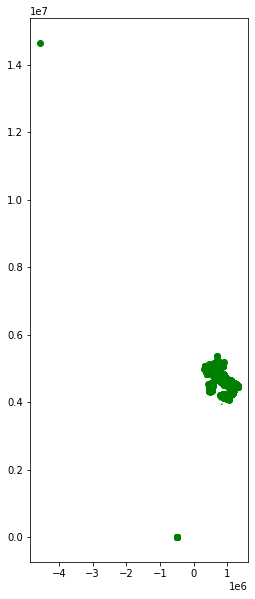
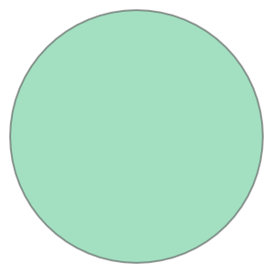

*Lesson 02 October 2020*
{: .no_toc }

## Table of contents
{: .no_toc .text-delta }

1. TOC
{:toc}

---
# Spatial relationships and operations
based on scipy2018-geospatial

## goals of the tutorial
- load csv files as geodataframe
- spatial projection conversion
- spatial relationships 
- spatial joins
- spatial operations

**based on the open data of:**
- [ISTAT](https://www.istat.it/it/archivio/222527) Italian National Institute of Statistic 
- [MIBACT](https://anagrafe.iccu.sbn.it/it/open-data/) Italian Ministery of Cultural Heritage


### requirements
- python knowledge
- pandas
- previous lesson

### status 
*"Spatial is Special"*

---

# SETUP

## We need a OS with the rtree index
needed for geopandas spatial relationships


```python
try:
  import rtree
except ModuleNotFoundError as e:
  !apt-get install libspatialindex-dev
  !pip install rtree
  import rtree
```


```python
!pip install geopandas
```

    Requirement already satisfied: geopandas in /usr/local/lib/python3.6/dist-packages (0.8.1)
    Requirement already satisfied: pyproj>=2.2.0 in /usr/local/lib/python3.6/dist-packages (from geopandas) (2.6.1.post1)
    Requirement already satisfied: fiona in /usr/local/lib/python3.6/dist-packages (from geopandas) (1.8.17)
    Requirement already satisfied: pandas>=0.23.0 in /usr/local/lib/python3.6/dist-packages (from geopandas) (1.1.2)
    Requirement already satisfied: shapely in /usr/local/lib/python3.6/dist-packages (from geopandas) (1.7.1)
    Requirement already satisfied: cligj>=0.5 in /usr/local/lib/python3.6/dist-packages (from fiona->geopandas) (0.5.0)
    Requirement already satisfied: click<8,>=4.0 in /usr/local/lib/python3.6/dist-packages (from fiona->geopandas) (7.1.2)
    Requirement already satisfied: attrs>=17 in /usr/local/lib/python3.6/dist-packages (from fiona->geopandas) (20.2.0)
    Requirement already satisfied: six>=1.7 in /usr/local/lib/python3.6/dist-packages (from fiona->geopandas) (1.15.0)
    Requirement already satisfied: click-plugins>=1.0 in /usr/local/lib/python3.6/dist-packages (from fiona->geopandas) (1.1.1)
    Requirement already satisfied: munch in /usr/local/lib/python3.6/dist-packages (from fiona->geopandas) (2.5.0)
    Requirement already satisfied: numpy>=1.15.4 in /usr/local/lib/python3.6/dist-packages (from pandas>=0.23.0->geopandas) (1.18.5)
    Requirement already satisfied: pytz>=2017.2 in /usr/local/lib/python3.6/dist-packages (from pandas>=0.23.0->geopandas) (2018.9)
    Requirement already satisfied: python-dateutil>=2.7.3 in /usr/local/lib/python3.6/dist-packages (from pandas>=0.23.0->geopandas) (2.8.1)


**special issue**:<br/>investigate the data with pandas profile!!!


```python
!pip install -U pandas-profiling
```

    Requirement already up-to-date: pandas-profiling in /usr/local/lib/python3.6/dist-packages (2.9.0)
    Requirement already satisfied, skipping upgrade: requests>=2.23.0 in /usr/local/lib/python3.6/dist-packages (from pandas-profiling) (2.23.0)
    Requirement already satisfied, skipping upgrade: tqdm>=4.43.0 in /usr/local/lib/python3.6/dist-packages (from pandas-profiling) (4.50.2)
    Requirement already satisfied, skipping upgrade: joblib in /usr/local/lib/python3.6/dist-packages (from pandas-profiling) (0.16.0)
    Requirement already satisfied, skipping upgrade: pandas!=1.0.0,!=1.0.1,!=1.0.2,!=1.1.0,>=0.25.3 in /usr/local/lib/python3.6/dist-packages (from pandas-profiling) (1.1.2)
    Requirement already satisfied, skipping upgrade: confuse>=1.0.0 in /usr/local/lib/python3.6/dist-packages (from pandas-profiling) (1.3.0)
    Requirement already satisfied, skipping upgrade: missingno>=0.4.2 in /usr/local/lib/python3.6/dist-packages (from pandas-profiling) (0.4.2)
    Requirement already satisfied, skipping upgrade: scipy>=1.4.1 in /usr/local/lib/python3.6/dist-packages (from pandas-profiling) (1.4.1)
    Requirement already satisfied, skipping upgrade: matplotlib>=3.2.0 in /usr/local/lib/python3.6/dist-packages (from pandas-profiling) (3.2.2)
    Requirement already satisfied, skipping upgrade: visions[type_image_path]==0.5.0 in /usr/local/lib/python3.6/dist-packages (from pandas-profiling) (0.5.0)
    Requirement already satisfied, skipping upgrade: seaborn>=0.10.1 in /usr/local/lib/python3.6/dist-packages (from pandas-profiling) (0.11.0)
    Requirement already satisfied, skipping upgrade: jinja2>=2.11.1 in /usr/local/lib/python3.6/dist-packages (from pandas-profiling) (2.11.2)
    Requirement already satisfied, skipping upgrade: htmlmin>=0.1.12 in /usr/local/lib/python3.6/dist-packages (from pandas-profiling) (0.1.12)
    Requirement already satisfied, skipping upgrade: tangled-up-in-unicode>=0.0.6 in /usr/local/lib/python3.6/dist-packages (from pandas-profiling) (0.0.6)
    Requirement already satisfied, skipping upgrade: ipywidgets>=7.5.1 in /usr/local/lib/python3.6/dist-packages (from pandas-profiling) (7.5.1)
    Requirement already satisfied, skipping upgrade: numpy>=1.16.0 in /usr/local/lib/python3.6/dist-packages (from pandas-profiling) (1.18.5)
    Requirement already satisfied, skipping upgrade: attrs>=19.3.0 in /usr/local/lib/python3.6/dist-packages (from pandas-profiling) (20.2.0)
    Requirement already satisfied, skipping upgrade: phik>=0.9.10 in /usr/local/lib/python3.6/dist-packages (from pandas-profiling) (0.10.0)
    Requirement already satisfied, skipping upgrade: chardet<4,>=3.0.2 in /usr/local/lib/python3.6/dist-packages (from requests>=2.23.0->pandas-profiling) (3.0.4)
    Requirement already satisfied, skipping upgrade: idna<3,>=2.5 in /usr/local/lib/python3.6/dist-packages (from requests>=2.23.0->pandas-profiling) (2.10)
    Requirement already satisfied, skipping upgrade: urllib3!=1.25.0,!=1.25.1,<1.26,>=1.21.1 in /usr/local/lib/python3.6/dist-packages (from requests>=2.23.0->pandas-profiling) (1.24.3)
    Requirement already satisfied, skipping upgrade: certifi>=2017.4.17 in /usr/local/lib/python3.6/dist-packages (from requests>=2.23.0->pandas-profiling) (2020.6.20)
    Requirement already satisfied, skipping upgrade: pytz>=2017.2 in /usr/local/lib/python3.6/dist-packages (from pandas!=1.0.0,!=1.0.1,!=1.0.2,!=1.1.0,>=0.25.3->pandas-profiling) (2018.9)
    Requirement already satisfied, skipping upgrade: python-dateutil>=2.7.3 in /usr/local/lib/python3.6/dist-packages (from pandas!=1.0.0,!=1.0.1,!=1.0.2,!=1.1.0,>=0.25.3->pandas-profiling) (2.8.1)
    Requirement already satisfied, skipping upgrade: pyyaml in /usr/local/lib/python3.6/dist-packages (from confuse>=1.0.0->pandas-profiling) (3.13)
    Requirement already satisfied, skipping upgrade: kiwisolver>=1.0.1 in /usr/local/lib/python3.6/dist-packages (from matplotlib>=3.2.0->pandas-profiling) (1.2.0)
    Requirement already satisfied, skipping upgrade: cycler>=0.10 in /usr/local/lib/python3.6/dist-packages (from matplotlib>=3.2.0->pandas-profiling) (0.10.0)
    Requirement already satisfied, skipping upgrade: pyparsing!=2.0.4,!=2.1.2,!=2.1.6,>=2.0.1 in /usr/local/lib/python3.6/dist-packages (from matplotlib>=3.2.0->pandas-profiling) (2.4.7)
    Requirement already satisfied, skipping upgrade: networkx>=2.4 in /usr/local/lib/python3.6/dist-packages (from visions[type_image_path]==0.5.0->pandas-profiling) (2.5)
    Requirement already satisfied, skipping upgrade: imagehash; extra == "type_image_path" in /usr/local/lib/python3.6/dist-packages (from visions[type_image_path]==0.5.0->pandas-profiling) (4.1.0)
    Requirement already satisfied, skipping upgrade: Pillow; extra == "type_image_path" in /usr/local/lib/python3.6/dist-packages (from visions[type_image_path]==0.5.0->pandas-profiling) (7.0.0)
    Requirement already satisfied, skipping upgrade: MarkupSafe>=0.23 in /usr/local/lib/python3.6/dist-packages (from jinja2>=2.11.1->pandas-profiling) (1.1.1)
    Requirement already satisfied, skipping upgrade: ipykernel>=4.5.1 in /usr/local/lib/python3.6/dist-packages (from ipywidgets>=7.5.1->pandas-profiling) (4.10.1)
    Requirement already satisfied, skipping upgrade: widgetsnbextension~=3.5.0 in /usr/local/lib/python3.6/dist-packages (from ipywidgets>=7.5.1->pandas-profiling) (3.5.1)
    Requirement already satisfied, skipping upgrade: ipython>=4.0.0; python_version >= "3.3" in /usr/local/lib/python3.6/dist-packages (from ipywidgets>=7.5.1->pandas-profiling) (5.5.0)
    Requirement already satisfied, skipping upgrade: nbformat>=4.2.0 in /usr/local/lib/python3.6/dist-packages (from ipywidgets>=7.5.1->pandas-profiling) (5.0.7)
    Requirement already satisfied, skipping upgrade: traitlets>=4.3.1 in /usr/local/lib/python3.6/dist-packages (from ipywidgets>=7.5.1->pandas-profiling) (4.3.3)
    Requirement already satisfied, skipping upgrade: numba>=0.38.1 in /usr/local/lib/python3.6/dist-packages (from phik>=0.9.10->pandas-profiling) (0.48.0)
    Requirement already satisfied, skipping upgrade: six>=1.5 in /usr/local/lib/python3.6/dist-packages (from python-dateutil>=2.7.3->pandas!=1.0.0,!=1.0.1,!=1.0.2,!=1.1.0,>=0.25.3->pandas-profiling) (1.15.0)
    Requirement already satisfied, skipping upgrade: decorator>=4.3.0 in /usr/local/lib/python3.6/dist-packages (from networkx>=2.4->visions[type_image_path]==0.5.0->pandas-profiling) (4.4.2)
    Requirement already satisfied, skipping upgrade: PyWavelets in /usr/local/lib/python3.6/dist-packages (from imagehash; extra == "type_image_path"->visions[type_image_path]==0.5.0->pandas-profiling) (1.1.1)
    Requirement already satisfied, skipping upgrade: jupyter-client in /usr/local/lib/python3.6/dist-packages (from ipykernel>=4.5.1->ipywidgets>=7.5.1->pandas-profiling) (5.3.5)
    Requirement already satisfied, skipping upgrade: tornado>=4.0 in /usr/local/lib/python3.6/dist-packages (from ipykernel>=4.5.1->ipywidgets>=7.5.1->pandas-profiling) (5.1.1)
    Requirement already satisfied, skipping upgrade: notebook>=4.4.1 in /usr/local/lib/python3.6/dist-packages (from widgetsnbextension~=3.5.0->ipywidgets>=7.5.1->pandas-profiling) (5.3.1)
    Requirement already satisfied, skipping upgrade: pickleshare in /usr/local/lib/python3.6/dist-packages (from ipython>=4.0.0; python_version >= "3.3"->ipywidgets>=7.5.1->pandas-profiling) (0.7.5)
    Requirement already satisfied, skipping upgrade: pexpect; sys_platform != "win32" in /usr/local/lib/python3.6/dist-packages (from ipython>=4.0.0; python_version >= "3.3"->ipywidgets>=7.5.1->pandas-profiling) (4.8.0)
    Requirement already satisfied, skipping upgrade: prompt-toolkit<2.0.0,>=1.0.4 in /usr/local/lib/python3.6/dist-packages (from ipython>=4.0.0; python_version >= "3.3"->ipywidgets>=7.5.1->pandas-profiling) (1.0.18)
    Requirement already satisfied, skipping upgrade: setuptools>=18.5 in /usr/local/lib/python3.6/dist-packages (from ipython>=4.0.0; python_version >= "3.3"->ipywidgets>=7.5.1->pandas-profiling) (50.3.0)
    Requirement already satisfied, skipping upgrade: pygments in /usr/local/lib/python3.6/dist-packages (from ipython>=4.0.0; python_version >= "3.3"->ipywidgets>=7.5.1->pandas-profiling) (2.6.1)
    Requirement already satisfied, skipping upgrade: simplegeneric>0.8 in /usr/local/lib/python3.6/dist-packages (from ipython>=4.0.0; python_version >= "3.3"->ipywidgets>=7.5.1->pandas-profiling) (0.8.1)
    Requirement already satisfied, skipping upgrade: jsonschema!=2.5.0,>=2.4 in /usr/local/lib/python3.6/dist-packages (from nbformat>=4.2.0->ipywidgets>=7.5.1->pandas-profiling) (2.6.0)
    Requirement already satisfied, skipping upgrade: ipython-genutils in /usr/local/lib/python3.6/dist-packages (from nbformat>=4.2.0->ipywidgets>=7.5.1->pandas-profiling) (0.2.0)
    Requirement already satisfied, skipping upgrade: jupyter-core in /usr/local/lib/python3.6/dist-packages (from nbformat>=4.2.0->ipywidgets>=7.5.1->pandas-profiling) (4.6.3)
    Requirement already satisfied, skipping upgrade: llvmlite<0.32.0,>=0.31.0dev0 in /usr/local/lib/python3.6/dist-packages (from numba>=0.38.1->phik>=0.9.10->pandas-profiling) (0.31.0)
    Requirement already satisfied, skipping upgrade: pyzmq>=13 in /usr/local/lib/python3.6/dist-packages (from jupyter-client->ipykernel>=4.5.1->ipywidgets>=7.5.1->pandas-profiling) (19.0.2)
    Requirement already satisfied, skipping upgrade: nbconvert in /usr/local/lib/python3.6/dist-packages (from notebook>=4.4.1->widgetsnbextension~=3.5.0->ipywidgets>=7.5.1->pandas-profiling) (5.6.1)
    Requirement already satisfied, skipping upgrade: Send2Trash in /usr/local/lib/python3.6/dist-packages (from notebook>=4.4.1->widgetsnbextension~=3.5.0->ipywidgets>=7.5.1->pandas-profiling) (1.5.0)
    Requirement already satisfied, skipping upgrade: terminado>=0.8.1 in /usr/local/lib/python3.6/dist-packages (from notebook>=4.4.1->widgetsnbextension~=3.5.0->ipywidgets>=7.5.1->pandas-profiling) (0.9.1)
    Requirement already satisfied, skipping upgrade: ptyprocess>=0.5 in /usr/local/lib/python3.6/dist-packages (from pexpect; sys_platform != "win32"->ipython>=4.0.0; python_version >= "3.3"->ipywidgets>=7.5.1->pandas-profiling) (0.6.0)
    Requirement already satisfied, skipping upgrade: wcwidth in /usr/local/lib/python3.6/dist-packages (from prompt-toolkit<2.0.0,>=1.0.4->ipython>=4.0.0; python_version >= "3.3"->ipywidgets>=7.5.1->pandas-profiling) (0.2.5)
    Requirement already satisfied, skipping upgrade: mistune<2,>=0.8.1 in /usr/local/lib/python3.6/dist-packages (from nbconvert->notebook>=4.4.1->widgetsnbextension~=3.5.0->ipywidgets>=7.5.1->pandas-profiling) (0.8.4)
    Requirement already satisfied, skipping upgrade: entrypoints>=0.2.2 in /usr/local/lib/python3.6/dist-packages (from nbconvert->notebook>=4.4.1->widgetsnbextension~=3.5.0->ipywidgets>=7.5.1->pandas-profiling) (0.3)
    Requirement already satisfied, skipping upgrade: pandocfilters>=1.4.1 in /usr/local/lib/python3.6/dist-packages (from nbconvert->notebook>=4.4.1->widgetsnbextension~=3.5.0->ipywidgets>=7.5.1->pandas-profiling) (1.4.2)
    Requirement already satisfied, skipping upgrade: testpath in /usr/local/lib/python3.6/dist-packages (from nbconvert->notebook>=4.4.1->widgetsnbextension~=3.5.0->ipywidgets>=7.5.1->pandas-profiling) (0.4.4)
    Requirement already satisfied, skipping upgrade: defusedxml in /usr/local/lib/python3.6/dist-packages (from nbconvert->notebook>=4.4.1->widgetsnbextension~=3.5.0->ipywidgets>=7.5.1->pandas-profiling) (0.6.0)
    Requirement already satisfied, skipping upgrade: bleach in /usr/local/lib/python3.6/dist-packages (from nbconvert->notebook>=4.4.1->widgetsnbextension~=3.5.0->ipywidgets>=7.5.1->pandas-profiling) (3.2.1)
    Requirement already satisfied, skipping upgrade: webencodings in /usr/local/lib/python3.6/dist-packages (from bleach->nbconvert->notebook>=4.4.1->widgetsnbextension~=3.5.0->ipywidgets>=7.5.1->pandas-profiling) (0.5.1)
    Requirement already satisfied, skipping upgrade: packaging in /usr/local/lib/python3.6/dist-packages (from bleach->nbconvert->notebook>=4.4.1->widgetsnbextension~=3.5.0->ipywidgets>=7.5.1->pandas-profiling) (20.4)


```python
import pandas as pd
import pandas_profiling 
import geopandas as gpd
```

## data setup
geopackage with the administrative units of italy


```python
!wget https://github.com/napo/geospatial_course_unitn/raw/master/data/administrative_units_italy_2020/istat_administrative_units_2020.gpkg
```

    --2020-10-10 20:22:15--  https://github.com/napo/geospatial_course_unitn/raw/master/data/administrative_units_italy_2020/istat_administrative_units_2020.gpkg
    Resolving github.com (github.com)... 192.30.255.112
    Connecting to github.com (github.com)|192.30.255.112|:443... connected.
    HTTP request sent, awaiting response... 302 Found
    Location: https://raw.githubusercontent.com/napo/geospatial_course_unitn/master/data/administrative_units_italy_2020/istat_administrative_units_2020.gpkg [following]
    --2020-10-10 20:22:15--  https://raw.githubusercontent.com/napo/geospatial_course_unitn/master/data/administrative_units_italy_2020/istat_administrative_units_2020.gpkg
    Resolving raw.githubusercontent.com (raw.githubusercontent.com)... 151.101.0.133, 151.101.64.133, 151.101.128.133, ...
    Connecting to raw.githubusercontent.com (raw.githubusercontent.com)|151.101.0.133|:443... connected.
    HTTP request sent, awaiting response... 200 OK
    Length: 23396352 (22M) [application/octet-stream]
    Saving to: ‘istat_administrative_units_2020.gpkg.2’
    
    istat_administrativ 100%[===================>]  22.31M  57.9MB/s    in 0.4s    
    
    2020-10-10 20:22:15 (57.9 MB/s) - ‘istat_administrative_units_2020.gpkg.2’ saved [23396352/23396352]
    


```python
macroregions = gpd.read_file("istat_administrative_units_2020.gpkg",layer="macroregions")
```


```python
regions = gpd.read_file("istat_administrative_units_2020.gpkg",layer="regions")
```


```python
provincies = gpd.read_file("istat_administrative_units_2020.gpkg",layer="provincies")
```


```python
municipalities = gpd.read_file("istat_administrative_units_2020.gpkg",layer="municipalities")
```


```python
macroregions
```


<div>
<style scoped>
    .dataframe tbody tr th:only-of-type {
        vertical-align: middle;
    }

    .dataframe tbody tr th {
        vertical-align: top;
    }

    .dataframe thead th {
        text-align: right;
    }
</style>
<table border="1" class="dataframe">
  <thead>
    <tr style="text-align: right;">
      <th></th>
      <th>COD_RIP</th>
      <th>DEN_RIP</th>
      <th>geometry</th>
    </tr>
  </thead>
  <tbody>
    <tr>
      <th>0</th>
      <td>1</td>
      <td>Nord-Ovest</td>
      <td>MULTIPOLYGON (((459010.230 4906246.581, 458965...</td>
    </tr>
    <tr>
      <th>1</th>
      <td>2</td>
      <td>Nord-Est</td>
      <td>MULTIPOLYGON (((865462.248 5073771.939, 865061...</td>
    </tr>
    <tr>
      <th>2</th>
      <td>3</td>
      <td>Centro</td>
      <td>MULTIPOLYGON (((675849.390 4700249.700, 675886...</td>
    </tr>
    <tr>
      <th>3</th>
      <td>4</td>
      <td>Sud</td>
      <td>MULTIPOLYGON (((930273.425 4714737.743, 930271...</td>
    </tr>
    <tr>
      <th>4</th>
      <td>5</td>
      <td>Isole</td>
      <td>MULTIPOLYGON (((1078691.643 4256925.304, 10793...</td>
    </tr>
  </tbody>
</table>
</div>


# Investigate the dataset of the italian public libraries
## from a dataframe to a geodataframe

we have a csv file with some points of interest where the coordinates are expressed in a column for the longitude and another for the latitude.

### the dataset of the public libraries
The italian Ministery of Cultural Heritage offers the open data with the location of public libraries in Italy<br/>
https://anagrafe.iccu.sbn.it/it/open-data/

here the link for the [download](http://opendata.anagrafe.iccu.sbn.it/territorio.zip)


This dataset is NOT archived in a spatial format.

**load the data with pandas**


```python
libraries = pd.read_csv('http://opendata.anagrafe.iccu.sbn.it/territorio.zip', compression='zip', sep=';')
```


```python
libraries.head(5)
```


<div>
<style scoped>
    .dataframe tbody tr th:only-of-type {
        vertical-align: middle;
    }

    .dataframe tbody tr th {
        vertical-align: top;
    }

    .dataframe thead th {
        text-align: right;
    }
</style>
<table border="1" class="dataframe">
  <thead>
    <tr style="text-align: right;">
      <th></th>
      <th>codice-isil</th>
      <th>codice-sbn</th>
      <th>denominazione</th>
      <th>indirizzo</th>
      <th>frazione</th>
      <th>cap</th>
      <th>comune</th>
      <th>codice istat comune</th>
      <th>provincia</th>
      <th>regione</th>
      <th>codice istat provincia</th>
      <th>latitudine</th>
      <th>longitudine</th>
      <th>telefono</th>
      <th>fax</th>
      <th>email</th>
      <th>url</th>
    </tr>
  </thead>
  <tbody>
    <tr>
      <th>0</th>
      <td>IT-AG0001</td>
      <td>AGR27</td>
      <td>Biblioteca della Soprintendenza per i beni cul...</td>
      <td>Contrada S. Nicola</td>
      <td>NaN</td>
      <td>92100.0</td>
      <td>Agrigento</td>
      <td>84001</td>
      <td>Agrigento</td>
      <td>SICILIA</td>
      <td>84</td>
      <td>37,3361677</td>
      <td>13,5880717</td>
      <td>+39 0922595830</td>
      <td>NaN</td>
      <td>NaN</td>
      <td>NaN</td>
    </tr>
    <tr>
      <th>1</th>
      <td>IT-AG0005</td>
      <td>NaN</td>
      <td>Biblioteca dell'Archivio di Stato di Agrigento</td>
      <td>Via Mazzini 185</td>
      <td>NaN</td>
      <td>92100.0</td>
      <td>Agrigento</td>
      <td>84001</td>
      <td>Agrigento</td>
      <td>SICILIA</td>
      <td>84</td>
      <td>37,3221644312329</td>
      <td>13,5886026454773</td>
      <td>+39 0922602494</td>
      <td>+39 0922613242</td>
      <td>as-ag@beniculturali.it</td>
      <td>http://www.archiviodistatoagrigento.benicultur...</td>
    </tr>
    <tr>
      <th>2</th>
      <td>IT-AG0006</td>
      <td>PBED8</td>
      <td>Biblioteca del Seminario vescovile</td>
      <td>Piazza don Minzoni</td>
      <td>NaN</td>
      <td>92100.0</td>
      <td>Agrigento</td>
      <td>84001</td>
      <td>Agrigento</td>
      <td>SICILIA</td>
      <td>84</td>
      <td>37,3137125</td>
      <td>13,5749656</td>
      <td>+39 092220226</td>
      <td>+39 0922490024</td>
      <td>NaN</td>
      <td>NaN</td>
    </tr>
    <tr>
      <th>3</th>
      <td>IT-AG0007</td>
      <td>AGR01</td>
      <td>Biblioteca Comunale Franco La Rocca</td>
      <td>piazzale Aldo Moro, 3</td>
      <td>NaN</td>
      <td>92100.0</td>
      <td>Agrigento</td>
      <td>84001</td>
      <td>Agrigento</td>
      <td>SICILIA</td>
      <td>84</td>
      <td>37,3095818</td>
      <td>13,586151</td>
      <td>0922595166</td>
      <td>+39 0922401246</td>
      <td>biblioteca.larocca@comune.agrigento.it</td>
      <td>http://www.opacagrigento.it/biblioteche/bi_1.html</td>
    </tr>
    <tr>
      <th>4</th>
      <td>IT-AG0008</td>
      <td>NaN</td>
      <td>Biblioteca comunale Santo Spirito. Sezione est...</td>
      <td>via BELVEDERE 127</td>
      <td>Giardina Gallotti</td>
      <td>92010.0</td>
      <td>Agrigento</td>
      <td>84001</td>
      <td>Agrigento</td>
      <td>SICILIA</td>
      <td>84</td>
      <td>37,4050904</td>
      <td>13,5291051</td>
      <td>0922410117</td>
      <td>NaN</td>
      <td>NaN</td>
      <td>NaN</td>
    </tr>
  </tbody>
</table>
</div>


### special investigation with pandas profile


```python
libraries.profile_report()
```


    HBox(children=(HTML(value='Summarize dataset'), FloatProgress(value=0.0, max=31.0), HTML(value='')))


    


    HBox(children=(HTML(value='Generate report structure'), FloatProgress(value=0.0, max=1.0), HTML(value='')))


    


    HBox(children=(HTML(value='Render HTML'), FloatProgress(value=0.0, max=1.0), HTML(value='')))


    


<iframe width="100%" height="800px" srcdoc="&lt;!doctype html&gt;&lt;html lang=en&gt;&lt;head&gt;&lt;meta charset=utf-8&gt;&lt;meta name=viewport content=&quot;width=device-width, initial-scale=1, shrink-to-fit=no&quot;&gt;&lt;meta name=description content=&quot;Profile report generated with the `pandas-profiling` Python package&quot;&gt;&lt;meta name=author content=&quot;Simon Brugman and the open source community.&quot;&gt;&lt;meta name=generator content=&quot;Pandas Profiling v2.9.0&quot;&gt;&lt;meta name=url content=https://github.com/pandas-profiling/pandas-profiling&gt;&lt;meta name=date content=&quot;2020-10-10 20:22:21.496946&quot;&gt;&lt;title&gt;Pandas Profiling Report&lt;/title&gt;&lt;style&gt;
/*!
 * Bootstrap v3.3.7 (http://getbootstrap.com)
 * Copyright 2011-2016 Twitter, Inc.
 * Licensed under MIT (https://github.com/twbs/bootstrap/blob/master/LICENSE)
 *//*! normalize.css v3.0.3 | MIT License | github.com/necolas/normalize.css */html{font-family:sans-serif;-webkit-text-size-adjust:100%;-ms-text-size-adjust:100%}body{margin:0}article,aside,details,figcaption,figure,footer,header,hgroup,main,menu,nav,section,summary{display:block}audio,canvas,progress,video{display:inline-block;vertical-align:baseline}audio:not([controls]){display:none;height:0}[hidden],template{display:none}a{background-color:transparent}a:active,a:hover{outline:0}abbr[title]{border-bottom:1px dotted}b,strong{font-weight:700}dfn{font-style:italic}h1{margin:.67em 0;font-size:2em}mark{color:#000;background:#ff0}small{font-size:80%}sub,sup{position:relative;font-size:75%;line-height:0;vertical-align:baseline}sup{top:-.5em}sub{bottom:-.25em}img{border:0}svg:not(:root){overflow:hidden}figure{margin:1em 40px}hr{height:0;-webkit-box-sizing:content-box;-moz-box-sizing:content-box;box-sizing:content-box}pre{overflow:auto}code,kbd,pre,samp{font-family:monospace,monospace;font-size:1em}button,input,optgroup,select,textarea{margin:0;font:inherit;color:inherit}button{overflow:visible}button,select{text-transform:none}button,html input[type=button],input[type=reset],input[type=submit]{-webkit-appearance:button;cursor:pointer}button[disabled],html input[disabled]{cursor:default}button::-moz-focus-inner,input::-moz-focus-inner{padding:0;border:0}input{line-height:normal}input[type=checkbox],input[type=radio]{-webkit-box-sizing:border-box;-moz-box-sizing:border-box;box-sizing:border-box;padding:0}input[type=number]::-webkit-inner-spin-button,input[type=number]::-webkit-outer-spin-button{height:auto}input[type=search]{-webkit-box-sizing:content-box;-moz-box-sizing:content-box;box-sizing:content-box;-webkit-appearance:textfield}input[type=search]::-webkit-search-cancel-button,input[type=search]::-webkit-search-decoration{-webkit-appearance:none}fieldset{padding:.35em .625em .75em;margin:0 2px;border:1px solid silver}legend{padding:0;border:0}textarea{overflow:auto}optgroup{font-weight:700}table{border-spacing:0;border-collapse:collapse}td,th{padding:0}/*! Source: https://github.com/h5bp/html5-boilerplate/blob/master/src/css/main.css */@media print{*,:after,:before{color:#000!important;text-shadow:none!important;background:0 0!important;-webkit-box-shadow:none!important;box-shadow:none!important}a,a:visited{text-decoration:underline}a[href]:after{content:&quot; (&quot; attr(href) &quot;)&quot;}abbr[title]:after{content:&quot; (&quot; attr(title) &quot;)&quot;}a[href^=&quot;javascript:&quot;]:after,a[href^=&quot;#&quot;]:after{content:&quot;&quot;}blockquote,pre{border:1px solid #999;page-break-inside:avoid}thead{display:table-header-group}img,tr{page-break-inside:avoid}img{max-width:100%!important}h2,h3,p{orphans:3;widows:3}h2,h3{page-break-after:avoid}.navbar{display:none}.btn&gt;.caret,.dropup&gt;.btn&gt;.caret{border-top-color:#000!important}.label{border:1px solid #000}.table{border-collapse:collapse!important}.table td,.table th{background-color:#fff!important}.table-bordered td,.table-bordered th{border:1px solid #ddd!important}}@font-face{font-family:&#x27;Glyphicons Halflings&#x27;;src:url(../fonts/glyphicons-halflings-regular.eot);src:url(../fonts/glyphicons-halflings-regular.eot?#iefix) format(&#x27;embedded-opentype&#x27;),url(../fonts/glyphicons-halflings-regular.woff2) format(&#x27;woff2&#x27;),url(../fonts/glyphicons-halflings-regular.woff) format(&#x27;woff&#x27;),url(../fonts/glyphicons-halflings-regular.ttf) format(&#x27;truetype&#x27;),url(../fonts/glyphicons-halflings-regular.svg#glyphicons_halflingsregular) format(&#x27;svg&#x27;)}.glyphicon{position:relative;top:1px;display:inline-block;font-family:&#x27;Glyphicons Halflings&#x27;;font-style:normal;font-weight:400;line-height:1;-webkit-font-smoothing:antialiased;-moz-osx-font-smoothing:grayscale}.glyphicon-asterisk:before{content:&quot;\002a&quot;}.glyphicon-plus:before{content:&quot;\002b&quot;}.glyphicon-eur:before,.glyphicon-euro:before{content:&quot;\20ac&quot;}.glyphicon-minus:before{content:&quot;\2212&quot;}.glyphicon-cloud:before{content:&quot;\2601&quot;}.glyphicon-envelope:before{content:&quot;\2709&quot;}.glyphicon-pencil:before{content:&quot;\270f&quot;}.glyphicon-glass:before{content:&quot;\e001&quot;}.glyphicon-music:before{content:&quot;\e002&quot;}.glyphicon-search:before{content:&quot;\e003&quot;}.glyphicon-heart:before{content:&quot;\e005&quot;}.glyphicon-star:before{content:&quot;\e006&quot;}.glyphicon-star-empty:before{content:&quot;\e007&quot;}.glyphicon-user:before{content:&quot;\e008&quot;}.glyphicon-film:before{content:&quot;\e009&quot;}.glyphicon-th-large:before{content:&quot;\e010&quot;}.glyphicon-th:before{content:&quot;\e011&quot;}.glyphicon-th-list:before{content:&quot;\e012&quot;}.glyphicon-ok:before{content:&quot;\e013&quot;}.glyphicon-remove:before{content:&quot;\e014&quot;}.glyphicon-zoom-in:before{content:&quot;\e015&quot;}.glyphicon-zoom-out:before{content:&quot;\e016&quot;}.glyphicon-off:before{content:&quot;\e017&quot;}.glyphicon-signal:before{content:&quot;\e018&quot;}.glyphicon-cog:before{content:&quot;\e019&quot;}.glyphicon-trash:before{content:&quot;\e020&quot;}.glyphicon-home:before{content:&quot;\e021&quot;}.glyphicon-file:before{content:&quot;\e022&quot;}.glyphicon-time:before{content:&quot;\e023&quot;}.glyphicon-road:before{content:&quot;\e024&quot;}.glyphicon-download-alt:before{content:&quot;\e025&quot;}.glyphicon-download:before{content:&quot;\e026&quot;}.glyphicon-upload:before{content:&quot;\e027&quot;}.glyphicon-inbox:before{content:&quot;\e028&quot;}.glyphicon-play-circle:before{content:&quot;\e029&quot;}.glyphicon-repeat:before{content:&quot;\e030&quot;}.glyphicon-refresh:before{content:&quot;\e031&quot;}.glyphicon-list-alt:before{content:&quot;\e032&quot;}.glyphicon-lock:before{content:&quot;\e033&quot;}.glyphicon-flag:before{content:&quot;\e034&quot;}.glyphicon-headphones:before{content:&quot;\e035&quot;}.glyphicon-volume-off:before{content:&quot;\e036&quot;}.glyphicon-volume-down:before{content:&quot;\e037&quot;}.glyphicon-volume-up:before{content:&quot;\e038&quot;}.glyphicon-qrcode:before{content:&quot;\e039&quot;}.glyphicon-barcode:before{content:&quot;\e040&quot;}.glyphicon-tag:before{content:&quot;\e041&quot;}.glyphicon-tags:before{content:&quot;\e042&quot;}.glyphicon-book:before{content:&quot;\e043&quot;}.glyphicon-bookmark:before{content:&quot;\e044&quot;}.glyphicon-print:before{content:&quot;\e045&quot;}.glyphicon-camera:before{content:&quot;\e046&quot;}.glyphicon-font:before{content:&quot;\e047&quot;}.glyphicon-bold:before{content:&quot;\e048&quot;}.glyphicon-italic:before{content:&quot;\e049&quot;}.glyphicon-text-height:before{content:&quot;\e050&quot;}.glyphicon-text-width:before{content:&quot;\e051&quot;}.glyphicon-align-left:before{content:&quot;\e052&quot;}.glyphicon-align-center:before{content:&quot;\e053&quot;}.glyphicon-align-right:before{content:&quot;\e054&quot;}.glyphicon-align-justify:before{content:&quot;\e055&quot;}.glyphicon-list:before{content:&quot;\e056&quot;}.glyphicon-indent-left:before{content:&quot;\e057&quot;}.glyphicon-indent-right:before{content:&quot;\e058&quot;}.glyphicon-facetime-video:before{content:&quot;\e059&quot;}.glyphicon-picture:before{content:&quot;\e060&quot;}.glyphicon-map-marker:before{content:&quot;\e062&quot;}.glyphicon-adjust:before{content:&quot;\e063&quot;}.glyphicon-tint:before{content:&quot;\e064&quot;}.glyphicon-edit:before{content:&quot;\e065&quot;}.glyphicon-share:before{content:&quot;\e066&quot;}.glyphicon-check:before{content:&quot;\e067&quot;}.glyphicon-move:before{content:&quot;\e068&quot;}.glyphicon-step-backward:before{content:&quot;\e069&quot;}.glyphicon-fast-backward:before{content:&quot;\e070&quot;}.glyphicon-backward:before{content:&quot;\e071&quot;}.glyphicon-play:before{content:&quot;\e072&quot;}.glyphicon-pause:before{content:&quot;\e073&quot;}.glyphicon-stop:before{content:&quot;\e074&quot;}.glyphicon-forward:before{content:&quot;\e075&quot;}.glyphicon-fast-forward:before{content:&quot;\e076&quot;}.glyphicon-step-forward:before{content:&quot;\e077&quot;}.glyphicon-eject:before{content:&quot;\e078&quot;}.glyphicon-chevron-left:before{content:&quot;\e079&quot;}.glyphicon-chevron-right:before{content:&quot;\e080&quot;}.glyphicon-plus-sign:before{content:&quot;\e081&quot;}.glyphicon-minus-sign:before{content:&quot;\e082&quot;}.glyphicon-remove-sign:before{content:&quot;\e083&quot;}.glyphicon-ok-sign:before{content:&quot;\e084&quot;}.glyphicon-question-sign:before{content:&quot;\e085&quot;}.glyphicon-info-sign:before{content:&quot;\e086&quot;}.glyphicon-screenshot:before{content:&quot;\e087&quot;}.glyphicon-remove-circle:before{content:&quot;\e088&quot;}.glyphicon-ok-circle:before{content:&quot;\e089&quot;}.glyphicon-ban-circle:before{content:&quot;\e090&quot;}.glyphicon-arrow-left:before{content:&quot;\e091&quot;}.glyphicon-arrow-right:before{content:&quot;\e092&quot;}.glyphicon-arrow-up:before{content:&quot;\e093&quot;}.glyphicon-arrow-down:before{content:&quot;\e094&quot;}.glyphicon-share-alt:before{content:&quot;\e095&quot;}.glyphicon-resize-full:before{content:&quot;\e096&quot;}.glyphicon-resize-small:before{content:&quot;\e097&quot;}.glyphicon-exclamation-sign:before{content:&quot;\e101&quot;}.glyphicon-gift:before{content:&quot;\e102&quot;}.glyphicon-leaf:before{content:&quot;\e103&quot;}.glyphicon-fire:before{content:&quot;\e104&quot;}.glyphicon-eye-open:before{content:&quot;\e105&quot;}.glyphicon-eye-close:before{content:&quot;\e106&quot;}.glyphicon-warning-sign:before{content:&quot;\e107&quot;}.glyphicon-plane:before{content:&quot;\e108&quot;}.glyphicon-calendar:before{content:&quot;\e109&quot;}.glyphicon-random:before{content:&quot;\e110&quot;}.glyphicon-comment:before{content:&quot;\e111&quot;}.glyphicon-magnet:before{content:&quot;\e112&quot;}.glyphicon-chevron-up:before{content:&quot;\e113&quot;}.glyphicon-chevron-down:before{content:&quot;\e114&quot;}.glyphicon-retweet:before{content:&quot;\e115&quot;}.glyphicon-shopping-cart:before{content:&quot;\e116&quot;}.glyphicon-folder-close:before{content:&quot;\e117&quot;}.glyphicon-folder-open:before{content:&quot;\e118&quot;}.glyphicon-resize-vertical:before{content:&quot;\e119&quot;}.glyphicon-resize-horizontal:before{content:&quot;\e120&quot;}.glyphicon-hdd:before{content:&quot;\e121&quot;}.glyphicon-bullhorn:before{content:&quot;\e122&quot;}.glyphicon-bell:before{content:&quot;\e123&quot;}.glyphicon-certificate:before{content:&quot;\e124&quot;}.glyphicon-thumbs-up:before{content:&quot;\e125&quot;}.glyphicon-thumbs-down:before{content:&quot;\e126&quot;}.glyphicon-hand-right:before{content:&quot;\e127&quot;}.glyphicon-hand-left:before{content:&quot;\e128&quot;}.glyphicon-hand-up:before{content:&quot;\e129&quot;}.glyphicon-hand-down:before{content:&quot;\e130&quot;}.glyphicon-circle-arrow-right:before{content:&quot;\e131&quot;}.glyphicon-circle-arrow-left:before{content:&quot;\e132&quot;}.glyphicon-circle-arrow-up:before{content:&quot;\e133&quot;}.glyphicon-circle-arrow-down:before{content:&quot;\e134&quot;}.glyphicon-globe:before{content:&quot;\e135&quot;}.glyphicon-wrench:before{content:&quot;\e136&quot;}.glyphicon-tasks:before{content:&quot;\e137&quot;}.glyphicon-filter:before{content:&quot;\e138&quot;}.glyphicon-briefcase:before{content:&quot;\e139&quot;}.glyphicon-fullscreen:before{content:&quot;\e140&quot;}.glyphicon-dashboard:before{content:&quot;\e141&quot;}.glyphicon-paperclip:before{content:&quot;\e142&quot;}.glyphicon-heart-empty:before{content:&quot;\e143&quot;}.glyphicon-link:before{content:&quot;\e144&quot;}.glyphicon-phone:before{content:&quot;\e145&quot;}.glyphicon-pushpin:before{content:&quot;\e146&quot;}.glyphicon-usd:before{content:&quot;\e148&quot;}.glyphicon-gbp:before{content:&quot;\e149&quot;}.glyphicon-sort:before{content:&quot;\e150&quot;}.glyphicon-sort-by-alphabet:before{content:&quot;\e151&quot;}.glyphicon-sort-by-alphabet-alt:before{content:&quot;\e152&quot;}.glyphicon-sort-by-order:before{content:&quot;\e153&quot;}.glyphicon-sort-by-order-alt:before{content:&quot;\e154&quot;}.glyphicon-sort-by-attributes:before{content:&quot;\e155&quot;}.glyphicon-sort-by-attributes-alt:before{content:&quot;\e156&quot;}.glyphicon-unchecked:before{content:&quot;\e157&quot;}.glyphicon-expand:before{content:&quot;\e158&quot;}.glyphicon-collapse-down:before{content:&quot;\e159&quot;}.glyphicon-collapse-up:before{content:&quot;\e160&quot;}.glyphicon-log-in:before{content:&quot;\e161&quot;}.glyphicon-flash:before{content:&quot;\e162&quot;}.glyphicon-log-out:before{content:&quot;\e163&quot;}.glyphicon-new-window:before{content:&quot;\e164&quot;}.glyphicon-record:before{content:&quot;\e165&quot;}.glyphicon-save:before{content:&quot;\e166&quot;}.glyphicon-open:before{content:&quot;\e167&quot;}.glyphicon-saved:before{content:&quot;\e168&quot;}.glyphicon-import:before{content:&quot;\e169&quot;}.glyphicon-export:before{content:&quot;\e170&quot;}.glyphicon-send:before{content:&quot;\e171&quot;}.glyphicon-floppy-disk:before{content:&quot;\e172&quot;}.glyphicon-floppy-saved:before{content:&quot;\e173&quot;}.glyphicon-floppy-remove:before{content:&quot;\e174&quot;}.glyphicon-floppy-save:before{content:&quot;\e175&quot;}.glyphicon-floppy-open:before{content:&quot;\e176&quot;}.glyphicon-credit-card:before{content:&quot;\e177&quot;}.glyphicon-transfer:before{content:&quot;\e178&quot;}.glyphicon-cutlery:before{content:&quot;\e179&quot;}.glyphicon-header:before{content:&quot;\e180&quot;}.glyphicon-compressed:before{content:&quot;\e181&quot;}.glyphicon-earphone:before{content:&quot;\e182&quot;}.glyphicon-phone-alt:before{content:&quot;\e183&quot;}.glyphicon-tower:before{content:&quot;\e184&quot;}.glyphicon-stats:before{content:&quot;\e185&quot;}.glyphicon-sd-video:before{content:&quot;\e186&quot;}.glyphicon-hd-video:before{content:&quot;\e187&quot;}.glyphicon-subtitles:before{content:&quot;\e188&quot;}.glyphicon-sound-stereo:before{content:&quot;\e189&quot;}.glyphicon-sound-dolby:before{content:&quot;\e190&quot;}.glyphicon-sound-5-1:before{content:&quot;\e191&quot;}.glyphicon-sound-6-1:before{content:&quot;\e192&quot;}.glyphicon-sound-7-1:before{content:&quot;\e193&quot;}.glyphicon-copyright-mark:before{content:&quot;\e194&quot;}.glyphicon-registration-mark:before{content:&quot;\e195&quot;}.glyphicon-cloud-download:before{content:&quot;\e197&quot;}.glyphicon-cloud-upload:before{content:&quot;\e198&quot;}.glyphicon-tree-conifer:before{content:&quot;\e199&quot;}.glyphicon-tree-deciduous:before{content:&quot;\e200&quot;}.glyphicon-cd:before{content:&quot;\e201&quot;}.glyphicon-save-file:before{content:&quot;\e202&quot;}.glyphicon-open-file:before{content:&quot;\e203&quot;}.glyphicon-level-up:before{content:&quot;\e204&quot;}.glyphicon-copy:before{content:&quot;\e205&quot;}.glyphicon-paste:before{content:&quot;\e206&quot;}.glyphicon-alert:before{content:&quot;\e209&quot;}.glyphicon-equalizer:before{content:&quot;\e210&quot;}.glyphicon-king:before{content:&quot;\e211&quot;}.glyphicon-queen:before{content:&quot;\e212&quot;}.glyphicon-pawn:before{content:&quot;\e213&quot;}.glyphicon-bishop:before{content:&quot;\e214&quot;}.glyphicon-knight:before{content:&quot;\e215&quot;}.glyphicon-baby-formula:before{content:&quot;\e216&quot;}.glyphicon-tent:before{content:&quot;\26fa&quot;}.glyphicon-blackboard:before{content:&quot;\e218&quot;}.glyphicon-bed:before{content:&quot;\e219&quot;}.glyphicon-apple:before{content:&quot;\f8ff&quot;}.glyphicon-erase:before{content:&quot;\e221&quot;}.glyphicon-hourglass:before{content:&quot;\231b&quot;}.glyphicon-lamp:before{content:&quot;\e223&quot;}.glyphicon-duplicate:before{content:&quot;\e224&quot;}.glyphicon-piggy-bank:before{content:&quot;\e225&quot;}.glyphicon-scissors:before{content:&quot;\e226&quot;}.glyphicon-bitcoin:before{content:&quot;\e227&quot;}.glyphicon-btc:before{content:&quot;\e227&quot;}.glyphicon-xbt:before{content:&quot;\e227&quot;}.glyphicon-yen:before{content:&quot;\00a5&quot;}.glyphicon-jpy:before{content:&quot;\00a5&quot;}.glyphicon-ruble:before{content:&quot;\20bd&quot;}.glyphicon-rub:before{content:&quot;\20bd&quot;}.glyphicon-scale:before{content:&quot;\e230&quot;}.glyphicon-ice-lolly:before{content:&quot;\e231&quot;}.glyphicon-ice-lolly-tasted:before{content:&quot;\e232&quot;}.glyphicon-education:before{content:&quot;\e233&quot;}.glyphicon-option-horizontal:before{content:&quot;\e234&quot;}.glyphicon-option-vertical:before{content:&quot;\e235&quot;}.glyphicon-menu-hamburger:before{content:&quot;\e236&quot;}.glyphicon-modal-window:before{content:&quot;\e237&quot;}.glyphicon-oil:before{content:&quot;\e238&quot;}.glyphicon-grain:before{content:&quot;\e239&quot;}.glyphicon-sunglasses:before{content:&quot;\e240&quot;}.glyphicon-text-size:before{content:&quot;\e241&quot;}.glyphicon-text-color:before{content:&quot;\e242&quot;}.glyphicon-text-background:before{content:&quot;\e243&quot;}.glyphicon-object-align-top:before{content:&quot;\e244&quot;}.glyphicon-object-align-bottom:before{content:&quot;\e245&quot;}.glyphicon-object-align-horizontal:before{content:&quot;\e246&quot;}.glyphicon-object-align-left:before{content:&quot;\e247&quot;}.glyphicon-object-align-vertical:before{content:&quot;\e248&quot;}.glyphicon-object-align-right:before{content:&quot;\e249&quot;}.glyphicon-triangle-right:before{content:&quot;\e250&quot;}.glyphicon-triangle-left:before{content:&quot;\e251&quot;}.glyphicon-triangle-bottom:before{content:&quot;\e252&quot;}.glyphicon-triangle-top:before{content:&quot;\e253&quot;}.glyphicon-console:before{content:&quot;\e254&quot;}.glyphicon-superscript:before{content:&quot;\e255&quot;}.glyphicon-subscript:before{content:&quot;\e256&quot;}.glyphicon-menu-left:before{content:&quot;\e257&quot;}.glyphicon-menu-right:before{content:&quot;\e258&quot;}.glyphicon-menu-down:before{content:&quot;\e259&quot;}.glyphicon-menu-up:before{content:&quot;\e260&quot;}*{-webkit-box-sizing:border-box;-moz-box-sizing:border-box;box-sizing:border-box}:after,:before{-webkit-box-sizing:border-box;-moz-box-sizing:border-box;box-sizing:border-box}html{font-size:10px;-webkit-tap-highlight-color:rgba(0,0,0,0)}body{font-family:&quot;Helvetica Neue&quot;,Helvetica,Arial,sans-serif;font-size:14px;line-height:1.42857143;color:#333;background-color:#fff}button,input,select,textarea{font-family:inherit;font-size:inherit;line-height:inherit}a{color:#337ab7;text-decoration:none}a:focus,a:hover{color:#23527c;text-decoration:underline}a:focus{outline:5px auto -webkit-focus-ring-color;outline-offset:-2px}figure{margin:0}img{vertical-align:middle}.carousel-inner&gt;.item&gt;a&gt;img,.carousel-inner&gt;.item&gt;img,.img-responsive,.thumbnail a&gt;img,.thumbnail&gt;img{display:block;max-width:100%;height:auto}.img-rounded{border-radius:6px}.img-thumbnail{display:inline-block;max-width:100%;height:auto;padding:4px;line-height:1.42857143;background-color:#fff;border:1px solid #ddd;border-radius:4px;-webkit-transition:all .2s ease-in-out;-o-transition:all .2s ease-in-out;transition:all .2s ease-in-out}.img-circle{border-radius:50%}hr{margin-top:20px;margin-bottom:20px;border:0;border-top:1px solid #eee}.sr-only{position:absolute;width:1px;height:1px;padding:0;margin:-1px;overflow:hidden;clip:rect(0,0,0,0);border:0}.sr-only-focusable:active,.sr-only-focusable:focus{position:static;width:auto;height:auto;margin:0;overflow:visible;clip:auto}[role=button]{cursor:pointer}.h1,.h2,.h3,.h4,.h5,.h6,h1,h2,h3,h4,h5,h6{font-family:inherit;font-weight:500;line-height:1.1;color:inherit}.h1 .small,.h1 small,.h2 .small,.h2 small,.h3 .small,.h3 small,.h4 .small,.h4 small,.h5 .small,.h5 small,.h6 .small,.h6 small,h1 .small,h1 small,h2 .small,h2 small,h3 .small,h3 small,h4 .small,h4 small,h5 .small,h5 small,h6 .small,h6 small{font-weight:400;line-height:1;color:#777}.h1,.h2,.h3,h1,h2,h3{margin-top:20px;margin-bottom:10px}.h1 .small,.h1 small,.h2 .small,.h2 small,.h3 .small,.h3 small,h1 .small,h1 small,h2 .small,h2 small,h3 .small,h3 small{font-size:65%}.h4,.h5,.h6,h4,h5,h6{margin-top:10px;margin-bottom:10px}.h4 .small,.h4 small,.h5 .small,.h5 small,.h6 .small,.h6 small,h4 .small,h4 small,h5 .small,h5 small,h6 .small,h6 small{font-size:75%}.h1,h1{font-size:36px}.h2,h2{font-size:30px}.h3,h3{font-size:24px}.h4,h4{font-size:18px}.h5,h5{font-size:14px}.h6,h6{font-size:12px}p{margin:0 0 10px}.lead{margin-bottom:20px;font-size:16px;font-weight:300;line-height:1.4}@media (min-width:768px){.lead{font-size:21px}}.small,small{font-size:85%}.mark,mark{padding:.2em;background-color:#fcf8e3}.text-left{text-align:left}.text-right{text-align:right}.text-center{text-align:center}.text-justify{text-align:justify}.text-nowrap{white-space:nowrap}.text-lowercase{text-transform:lowercase}.text-uppercase{text-transform:uppercase}.text-capitalize{text-transform:capitalize}.text-muted{color:#777}.text-primary{color:#337ab7}a.text-primary:focus,a.text-primary:hover{color:#286090}.text-success{color:#3c763d}a.text-success:focus,a.text-success:hover{color:#2b542c}.text-info{color:#31708f}a.text-info:focus,a.text-info:hover{color:#245269}.text-warning{color:#8a6d3b}a.text-warning:focus,a.text-warning:hover{color:#66512c}.text-danger{color:#a94442}a.text-danger:focus,a.text-danger:hover{color:#843534}.bg-primary{color:#fff;background-color:#337ab7}a.bg-primary:focus,a.bg-primary:hover{background-color:#286090}.bg-success{background-color:#dff0d8}a.bg-success:focus,a.bg-success:hover{background-color:#c1e2b3}.bg-info{background-color:#d9edf7}a.bg-info:focus,a.bg-info:hover{background-color:#afd9ee}.bg-warning{background-color:#fcf8e3}a.bg-warning:focus,a.bg-warning:hover{background-color:#f7ecb5}.bg-danger{background-color:#f2dede}a.bg-danger:focus,a.bg-danger:hover{background-color:#e4b9b9}.page-header{padding-bottom:9px;margin:40px 0 20px;border-bottom:1px solid #eee}ol,ul{margin-top:0;margin-bottom:10px}ol ol,ol ul,ul ol,ul ul{margin-bottom:0}.list-unstyled{padding-left:0;list-style:none}.list-inline{padding-left:0;margin-left:-5px;list-style:none}.list-inline&gt;li{display:inline-block;padding-right:5px;padding-left:5px}dl{margin-top:0;margin-bottom:20px}dd,dt{line-height:1.42857143}dt{font-weight:700}dd{margin-left:0}@media (min-width:768px){.dl-horizontal dt{float:left;width:160px;overflow:hidden;clear:left;text-align:right;text-overflow:ellipsis;white-space:nowrap}.dl-horizontal dd{margin-left:180px}}abbr[data-original-title],abbr[title]{cursor:help;border-bottom:1px dotted #777}.initialism{font-size:90%;text-transform:uppercase}blockquote{padding:10px 20px;margin:0 0 20px;font-size:17.5px;border-left:5px solid #eee}blockquote ol:last-child,blockquote p:last-child,blockquote ul:last-child{margin-bottom:0}blockquote .small,blockquote footer,blockquote small{display:block;font-size:80%;line-height:1.42857143;color:#777}blockquote .small:before,blockquote footer:before,blockquote small:before{content:&#x27;\2014 \00A0&#x27;}.blockquote-reverse,blockquote.pull-right{padding-right:15px;padding-left:0;text-align:right;border-right:5px solid #eee;border-left:0}.blockquote-reverse .small:before,.blockquote-reverse footer:before,.blockquote-reverse small:before,blockquote.pull-right .small:before,blockquote.pull-right footer:before,blockquote.pull-right small:before{content:&#x27;&#x27;}.blockquote-reverse .small:after,.blockquote-reverse footer:after,.blockquote-reverse small:after,blockquote.pull-right .small:after,blockquote.pull-right footer:after,blockquote.pull-right small:after{content:&#x27;\00A0 \2014&#x27;}address{margin-bottom:20px;font-style:normal;line-height:1.42857143}code,kbd,pre,samp{font-family:Menlo,Monaco,Consolas,&quot;Courier New&quot;,monospace}code{padding:2px 4px;font-size:90%;color:#c7254e;background-color:#f9f2f4;border-radius:4px}kbd{padding:2px 4px;font-size:90%;color:#fff;background-color:#333;border-radius:3px;-webkit-box-shadow:inset 0 -1px 0 rgba(0,0,0,.25);box-shadow:inset 0 -1px 0 rgba(0,0,0,.25)}kbd kbd{padding:0;font-size:100%;font-weight:700;-webkit-box-shadow:none;box-shadow:none}pre{display:block;padding:9.5px;margin:0 0 10px;font-size:13px;line-height:1.42857143;color:#333;word-break:break-all;word-wrap:break-word;background-color:#f5f5f5;border:1px solid #ccc;border-radius:4px}pre code{padding:0;font-size:inherit;color:inherit;white-space:pre-wrap;background-color:transparent;border-radius:0}.pre-scrollable{max-height:340px;overflow-y:scroll}.container{padding-right:15px;padding-left:15px;margin-right:auto;margin-left:auto}@media (min-width:768px){.container{width:750px}}@media (min-width:992px){.container{width:970px}}@media (min-width:1200px){.container{width:1170px}}.container-fluid{padding-right:15px;padding-left:15px;margin-right:auto;margin-left:auto}.row{margin-right:-15px;margin-left:-15px}.col-lg-1,.col-lg-10,.col-lg-11,.col-lg-12,.col-lg-2,.col-lg-3,.col-lg-4,.col-lg-5,.col-lg-6,.col-lg-7,.col-lg-8,.col-lg-9,.col-md-1,.col-md-10,.col-md-11,.col-md-12,.col-md-2,.col-md-3,.col-md-4,.col-md-5,.col-md-6,.col-md-7,.col-md-8,.col-md-9,.col-sm-1,.col-sm-10,.col-sm-11,.col-sm-12,.col-sm-2,.col-sm-3,.col-sm-4,.col-sm-5,.col-sm-6,.col-sm-7,.col-sm-8,.col-sm-9,.col-xs-1,.col-xs-10,.col-xs-11,.col-xs-12,.col-xs-2,.col-xs-3,.col-xs-4,.col-xs-5,.col-xs-6,.col-xs-7,.col-xs-8,.col-xs-9{position:relative;min-height:1px;padding-right:15px;padding-left:15px}.col-xs-1,.col-xs-10,.col-xs-11,.col-xs-12,.col-xs-2,.col-xs-3,.col-xs-4,.col-xs-5,.col-xs-6,.col-xs-7,.col-xs-8,.col-xs-9{float:left}.col-xs-12{width:100%}.col-xs-11{width:91.66666667%}.col-xs-10{width:83.33333333%}.col-xs-9{width:75%}.col-xs-8{width:66.66666667%}.col-xs-7{width:58.33333333%}.col-xs-6{width:50%}.col-xs-5{width:41.66666667%}.col-xs-4{width:33.33333333%}.col-xs-3{width:25%}.col-xs-2{width:16.66666667%}.col-xs-1{width:8.33333333%}.col-xs-pull-12{right:100%}.col-xs-pull-11{right:91.66666667%}.col-xs-pull-10{right:83.33333333%}.col-xs-pull-9{right:75%}.col-xs-pull-8{right:66.66666667%}.col-xs-pull-7{right:58.33333333%}.col-xs-pull-6{right:50%}.col-xs-pull-5{right:41.66666667%}.col-xs-pull-4{right:33.33333333%}.col-xs-pull-3{right:25%}.col-xs-pull-2{right:16.66666667%}.col-xs-pull-1{right:8.33333333%}.col-xs-pull-0{right:auto}.col-xs-push-12{left:100%}.col-xs-push-11{left:91.66666667%}.col-xs-push-10{left:83.33333333%}.col-xs-push-9{left:75%}.col-xs-push-8{left:66.66666667%}.col-xs-push-7{left:58.33333333%}.col-xs-push-6{left:50%}.col-xs-push-5{left:41.66666667%}.col-xs-push-4{left:33.33333333%}.col-xs-push-3{left:25%}.col-xs-push-2{left:16.66666667%}.col-xs-push-1{left:8.33333333%}.col-xs-push-0{left:auto}.col-xs-offset-12{margin-left:100%}.col-xs-offset-11{margin-left:91.66666667%}.col-xs-offset-10{margin-left:83.33333333%}.col-xs-offset-9{margin-left:75%}.col-xs-offset-8{margin-left:66.66666667%}.col-xs-offset-7{margin-left:58.33333333%}.col-xs-offset-6{margin-left:50%}.col-xs-offset-5{margin-left:41.66666667%}.col-xs-offset-4{margin-left:33.33333333%}.col-xs-offset-3{margin-left:25%}.col-xs-offset-2{margin-left:16.66666667%}.col-xs-offset-1{margin-left:8.33333333%}.col-xs-offset-0{margin-left:0}@media (min-width:768px){.col-sm-1,.col-sm-10,.col-sm-11,.col-sm-12,.col-sm-2,.col-sm-3,.col-sm-4,.col-sm-5,.col-sm-6,.col-sm-7,.col-sm-8,.col-sm-9{float:left}.col-sm-12{width:100%}.col-sm-11{width:91.66666667%}.col-sm-10{width:83.33333333%}.col-sm-9{width:75%}.col-sm-8{width:66.66666667%}.col-sm-7{width:58.33333333%}.col-sm-6{width:50%}.col-sm-5{width:41.66666667%}.col-sm-4{width:33.33333333%}.col-sm-3{width:25%}.col-sm-2{width:16.66666667%}.col-sm-1{width:8.33333333%}.col-sm-pull-12{right:100%}.col-sm-pull-11{right:91.66666667%}.col-sm-pull-10{right:83.33333333%}.col-sm-pull-9{right:75%}.col-sm-pull-8{right:66.66666667%}.col-sm-pull-7{right:58.33333333%}.col-sm-pull-6{right:50%}.col-sm-pull-5{right:41.66666667%}.col-sm-pull-4{right:33.33333333%}.col-sm-pull-3{right:25%}.col-sm-pull-2{right:16.66666667%}.col-sm-pull-1{right:8.33333333%}.col-sm-pull-0{right:auto}.col-sm-push-12{left:100%}.col-sm-push-11{left:91.66666667%}.col-sm-push-10{left:83.33333333%}.col-sm-push-9{left:75%}.col-sm-push-8{left:66.66666667%}.col-sm-push-7{left:58.33333333%}.col-sm-push-6{left:50%}.col-sm-push-5{left:41.66666667%}.col-sm-push-4{left:33.33333333%}.col-sm-push-3{left:25%}.col-sm-push-2{left:16.66666667%}.col-sm-push-1{left:8.33333333%}.col-sm-push-0{left:auto}.col-sm-offset-12{margin-left:100%}.col-sm-offset-11{margin-left:91.66666667%}.col-sm-offset-10{margin-left:83.33333333%}.col-sm-offset-9{margin-left:75%}.col-sm-offset-8{margin-left:66.66666667%}.col-sm-offset-7{margin-left:58.33333333%}.col-sm-offset-6{margin-left:50%}.col-sm-offset-5{margin-left:41.66666667%}.col-sm-offset-4{margin-left:33.33333333%}.col-sm-offset-3{margin-left:25%}.col-sm-offset-2{margin-left:16.66666667%}.col-sm-offset-1{margin-left:8.33333333%}.col-sm-offset-0{margin-left:0}}@media (min-width:992px){.col-md-1,.col-md-10,.col-md-11,.col-md-12,.col-md-2,.col-md-3,.col-md-4,.col-md-5,.col-md-6,.col-md-7,.col-md-8,.col-md-9{float:left}.col-md-12{width:100%}.col-md-11{width:91.66666667%}.col-md-10{width:83.33333333%}.col-md-9{width:75%}.col-md-8{width:66.66666667%}.col-md-7{width:58.33333333%}.col-md-6{width:50%}.col-md-5{width:41.66666667%}.col-md-4{width:33.33333333%}.col-md-3{width:25%}.col-md-2{width:16.66666667%}.col-md-1{width:8.33333333%}.col-md-pull-12{right:100%}.col-md-pull-11{right:91.66666667%}.col-md-pull-10{right:83.33333333%}.col-md-pull-9{right:75%}.col-md-pull-8{right:66.66666667%}.col-md-pull-7{right:58.33333333%}.col-md-pull-6{right:50%}.col-md-pull-5{right:41.66666667%}.col-md-pull-4{right:33.33333333%}.col-md-pull-3{right:25%}.col-md-pull-2{right:16.66666667%}.col-md-pull-1{right:8.33333333%}.col-md-pull-0{right:auto}.col-md-push-12{left:100%}.col-md-push-11{left:91.66666667%}.col-md-push-10{left:83.33333333%}.col-md-push-9{left:75%}.col-md-push-8{left:66.66666667%}.col-md-push-7{left:58.33333333%}.col-md-push-6{left:50%}.col-md-push-5{left:41.66666667%}.col-md-push-4{left:33.33333333%}.col-md-push-3{left:25%}.col-md-push-2{left:16.66666667%}.col-md-push-1{left:8.33333333%}.col-md-push-0{left:auto}.col-md-offset-12{margin-left:100%}.col-md-offset-11{margin-left:91.66666667%}.col-md-offset-10{margin-left:83.33333333%}.col-md-offset-9{margin-left:75%}.col-md-offset-8{margin-left:66.66666667%}.col-md-offset-7{margin-left:58.33333333%}.col-md-offset-6{margin-left:50%}.col-md-offset-5{margin-left:41.66666667%}.col-md-offset-4{margin-left:33.33333333%}.col-md-offset-3{margin-left:25%}.col-md-offset-2{margin-left:16.66666667%}.col-md-offset-1{margin-left:8.33333333%}.col-md-offset-0{margin-left:0}}@media (min-width:1200px){.col-lg-1,.col-lg-10,.col-lg-11,.col-lg-12,.col-lg-2,.col-lg-3,.col-lg-4,.col-lg-5,.col-lg-6,.col-lg-7,.col-lg-8,.col-lg-9{float:left}.col-lg-12{width:100%}.col-lg-11{width:91.66666667%}.col-lg-10{width:83.33333333%}.col-lg-9{width:75%}.col-lg-8{width:66.66666667%}.col-lg-7{width:58.33333333%}.col-lg-6{width:50%}.col-lg-5{width:41.66666667%}.col-lg-4{width:33.33333333%}.col-lg-3{width:25%}.col-lg-2{width:16.66666667%}.col-lg-1{width:8.33333333%}.col-lg-pull-12{right:100%}.col-lg-pull-11{right:91.66666667%}.col-lg-pull-10{right:83.33333333%}.col-lg-pull-9{right:75%}.col-lg-pull-8{right:66.66666667%}.col-lg-pull-7{right:58.33333333%}.col-lg-pull-6{right:50%}.col-lg-pull-5{right:41.66666667%}.col-lg-pull-4{right:33.33333333%}.col-lg-pull-3{right:25%}.col-lg-pull-2{right:16.66666667%}.col-lg-pull-1{right:8.33333333%}.col-lg-pull-0{right:auto}.col-lg-push-12{left:100%}.col-lg-push-11{left:91.66666667%}.col-lg-push-10{left:83.33333333%}.col-lg-push-9{left:75%}.col-lg-push-8{left:66.66666667%}.col-lg-push-7{left:58.33333333%}.col-lg-push-6{left:50%}.col-lg-push-5{left:41.66666667%}.col-lg-push-4{left:33.33333333%}.col-lg-push-3{left:25%}.col-lg-push-2{left:16.66666667%}.col-lg-push-1{left:8.33333333%}.col-lg-push-0{left:auto}.col-lg-offset-12{margin-left:100%}.col-lg-offset-11{margin-left:91.66666667%}.col-lg-offset-10{margin-left:83.33333333%}.col-lg-offset-9{margin-left:75%}.col-lg-offset-8{margin-left:66.66666667%}.col-lg-offset-7{margin-left:58.33333333%}.col-lg-offset-6{margin-left:50%}.col-lg-offset-5{margin-left:41.66666667%}.col-lg-offset-4{margin-left:33.33333333%}.col-lg-offset-3{margin-left:25%}.col-lg-offset-2{margin-left:16.66666667%}.col-lg-offset-1{margin-left:8.33333333%}.col-lg-offset-0{margin-left:0}}table{background-color:transparent}caption{padding-top:8px;padding-bottom:8px;color:#777;text-align:left}th{text-align:left}.table{width:100%;max-width:100%;margin-bottom:20px}.table&gt;tbody&gt;tr&gt;td,.table&gt;tbody&gt;tr&gt;th,.table&gt;tfoot&gt;tr&gt;td,.table&gt;tfoot&gt;tr&gt;th,.table&gt;thead&gt;tr&gt;td,.table&gt;thead&gt;tr&gt;th{padding:8px;line-height:1.42857143;vertical-align:top;border-top:1px solid #ddd}.table&gt;thead&gt;tr&gt;th{vertical-align:bottom;border-bottom:2px solid #ddd}.table&gt;caption+thead&gt;tr:first-child&gt;td,.table&gt;caption+thead&gt;tr:first-child&gt;th,.table&gt;colgroup+thead&gt;tr:first-child&gt;td,.table&gt;colgroup+thead&gt;tr:first-child&gt;th,.table&gt;thead:first-child&gt;tr:first-child&gt;td,.table&gt;thead:first-child&gt;tr:first-child&gt;th{border-top:0}.table&gt;tbody+tbody{border-top:2px solid #ddd}.table .table{background-color:#fff}.table-condensed&gt;tbody&gt;tr&gt;td,.table-condensed&gt;tbody&gt;tr&gt;th,.table-condensed&gt;tfoot&gt;tr&gt;td,.table-condensed&gt;tfoot&gt;tr&gt;th,.table-condensed&gt;thead&gt;tr&gt;td,.table-condensed&gt;thead&gt;tr&gt;th{padding:5px}.table-bordered{border:1px solid #ddd}.table-bordered&gt;tbody&gt;tr&gt;td,.table-bordered&gt;tbody&gt;tr&gt;th,.table-bordered&gt;tfoot&gt;tr&gt;td,.table-bordered&gt;tfoot&gt;tr&gt;th,.table-bordered&gt;thead&gt;tr&gt;td,.table-bordered&gt;thead&gt;tr&gt;th{border:1px solid #ddd}.table-bordered&gt;thead&gt;tr&gt;td,.table-bordered&gt;thead&gt;tr&gt;th{border-bottom-width:2px}.table-striped&gt;tbody&gt;tr:nth-of-type(odd){background-color:#f9f9f9}.table-hover&gt;tbody&gt;tr:hover{background-color:#f5f5f5}table col[class*=col-]{position:static;display:table-column;float:none}table td[class*=col-],table th[class*=col-]{position:static;display:table-cell;float:none}.table&gt;tbody&gt;tr.active&gt;td,.table&gt;tbody&gt;tr.active&gt;th,.table&gt;tbody&gt;tr&gt;td.active,.table&gt;tbody&gt;tr&gt;th.active,.table&gt;tfoot&gt;tr.active&gt;td,.table&gt;tfoot&gt;tr.active&gt;th,.table&gt;tfoot&gt;tr&gt;td.active,.table&gt;tfoot&gt;tr&gt;th.active,.table&gt;thead&gt;tr.active&gt;td,.table&gt;thead&gt;tr.active&gt;th,.table&gt;thead&gt;tr&gt;td.active,.table&gt;thead&gt;tr&gt;th.active{background-color:#f5f5f5}.table-hover&gt;tbody&gt;tr.active:hover&gt;td,.table-hover&gt;tbody&gt;tr.active:hover&gt;th,.table-hover&gt;tbody&gt;tr:hover&gt;.active,.table-hover&gt;tbody&gt;tr&gt;td.active:hover,.table-hover&gt;tbody&gt;tr&gt;th.active:hover{background-color:#e8e8e8}.table&gt;tbody&gt;tr.success&gt;td,.table&gt;tbody&gt;tr.success&gt;th,.table&gt;tbody&gt;tr&gt;td.success,.table&gt;tbody&gt;tr&gt;th.success,.table&gt;tfoot&gt;tr.success&gt;td,.table&gt;tfoot&gt;tr.success&gt;th,.table&gt;tfoot&gt;tr&gt;td.success,.table&gt;tfoot&gt;tr&gt;th.success,.table&gt;thead&gt;tr.success&gt;td,.table&gt;thead&gt;tr.success&gt;th,.table&gt;thead&gt;tr&gt;td.success,.table&gt;thead&gt;tr&gt;th.success{background-color:#dff0d8}.table-hover&gt;tbody&gt;tr.success:hover&gt;td,.table-hover&gt;tbody&gt;tr.success:hover&gt;th,.table-hover&gt;tbody&gt;tr:hover&gt;.success,.table-hover&gt;tbody&gt;tr&gt;td.success:hover,.table-hover&gt;tbody&gt;tr&gt;th.success:hover{background-color:#d0e9c6}.table&gt;tbody&gt;tr.info&gt;td,.table&gt;tbody&gt;tr.info&gt;th,.table&gt;tbody&gt;tr&gt;td.info,.table&gt;tbody&gt;tr&gt;th.info,.table&gt;tfoot&gt;tr.info&gt;td,.table&gt;tfoot&gt;tr.info&gt;th,.table&gt;tfoot&gt;tr&gt;td.info,.table&gt;tfoot&gt;tr&gt;th.info,.table&gt;thead&gt;tr.info&gt;td,.table&gt;thead&gt;tr.info&gt;th,.table&gt;thead&gt;tr&gt;td.info,.table&gt;thead&gt;tr&gt;th.info{background-color:#d9edf7}.table-hover&gt;tbody&gt;tr.info:hover&gt;td,.table-hover&gt;tbody&gt;tr.info:hover&gt;th,.table-hover&gt;tbody&gt;tr:hover&gt;.info,.table-hover&gt;tbody&gt;tr&gt;td.info:hover,.table-hover&gt;tbody&gt;tr&gt;th.info:hover{background-color:#c4e3f3}.table&gt;tbody&gt;tr.warning&gt;td,.table&gt;tbody&gt;tr.warning&gt;th,.table&gt;tbody&gt;tr&gt;td.warning,.table&gt;tbody&gt;tr&gt;th.warning,.table&gt;tfoot&gt;tr.warning&gt;td,.table&gt;tfoot&gt;tr.warning&gt;th,.table&gt;tfoot&gt;tr&gt;td.warning,.table&gt;tfoot&gt;tr&gt;th.warning,.table&gt;thead&gt;tr.warning&gt;td,.table&gt;thead&gt;tr.warning&gt;th,.table&gt;thead&gt;tr&gt;td.warning,.table&gt;thead&gt;tr&gt;th.warning{background-color:#fcf8e3}.table-hover&gt;tbody&gt;tr.warning:hover&gt;td,.table-hover&gt;tbody&gt;tr.warning:hover&gt;th,.table-hover&gt;tbody&gt;tr:hover&gt;.warning,.table-hover&gt;tbody&gt;tr&gt;td.warning:hover,.table-hover&gt;tbody&gt;tr&gt;th.warning:hover{background-color:#faf2cc}.table&gt;tbody&gt;tr.danger&gt;td,.table&gt;tbody&gt;tr.danger&gt;th,.table&gt;tbody&gt;tr&gt;td.danger,.table&gt;tbody&gt;tr&gt;th.danger,.table&gt;tfoot&gt;tr.danger&gt;td,.table&gt;tfoot&gt;tr.danger&gt;th,.table&gt;tfoot&gt;tr&gt;td.danger,.table&gt;tfoot&gt;tr&gt;th.danger,.table&gt;thead&gt;tr.danger&gt;td,.table&gt;thead&gt;tr.danger&gt;th,.table&gt;thead&gt;tr&gt;td.danger,.table&gt;thead&gt;tr&gt;th.danger{background-color:#f2dede}.table-hover&gt;tbody&gt;tr.danger:hover&gt;td,.table-hover&gt;tbody&gt;tr.danger:hover&gt;th,.table-hover&gt;tbody&gt;tr:hover&gt;.danger,.table-hover&gt;tbody&gt;tr&gt;td.danger:hover,.table-hover&gt;tbody&gt;tr&gt;th.danger:hover{background-color:#ebcccc}.table-responsive{min-height:.01%;overflow-x:auto}@media screen and (max-width:767px){.table-responsive{width:100%;margin-bottom:15px;overflow-y:hidden;-ms-overflow-style:-ms-autohiding-scrollbar;border:1px solid #ddd}.table-responsive&gt;.table{margin-bottom:0}.table-responsive&gt;.table&gt;tbody&gt;tr&gt;td,.table-responsive&gt;.table&gt;tbody&gt;tr&gt;th,.table-responsive&gt;.table&gt;tfoot&gt;tr&gt;td,.table-responsive&gt;.table&gt;tfoot&gt;tr&gt;th,.table-responsive&gt;.table&gt;thead&gt;tr&gt;td,.table-responsive&gt;.table&gt;thead&gt;tr&gt;th{white-space:nowrap}.table-responsive&gt;.table-bordered{border:0}.table-responsive&gt;.table-bordered&gt;tbody&gt;tr&gt;td:first-child,.table-responsive&gt;.table-bordered&gt;tbody&gt;tr&gt;th:first-child,.table-responsive&gt;.table-bordered&gt;tfoot&gt;tr&gt;td:first-child,.table-responsive&gt;.table-bordered&gt;tfoot&gt;tr&gt;th:first-child,.table-responsive&gt;.table-bordered&gt;thead&gt;tr&gt;td:first-child,.table-responsive&gt;.table-bordered&gt;thead&gt;tr&gt;th:first-child{border-left:0}.table-responsive&gt;.table-bordered&gt;tbody&gt;tr&gt;td:last-child,.table-responsive&gt;.table-bordered&gt;tbody&gt;tr&gt;th:last-child,.table-responsive&gt;.table-bordered&gt;tfoot&gt;tr&gt;td:last-child,.table-responsive&gt;.table-bordered&gt;tfoot&gt;tr&gt;th:last-child,.table-responsive&gt;.table-bordered&gt;thead&gt;tr&gt;td:last-child,.table-responsive&gt;.table-bordered&gt;thead&gt;tr&gt;th:last-child{border-right:0}.table-responsive&gt;.table-bordered&gt;tbody&gt;tr:last-child&gt;td,.table-responsive&gt;.table-bordered&gt;tbody&gt;tr:last-child&gt;th,.table-responsive&gt;.table-bordered&gt;tfoot&gt;tr:last-child&gt;td,.table-responsive&gt;.table-bordered&gt;tfoot&gt;tr:last-child&gt;th{border-bottom:0}}fieldset{min-width:0;padding:0;margin:0;border:0}legend{display:block;width:100%;padding:0;margin-bottom:20px;font-size:21px;line-height:inherit;color:#333;border:0;border-bottom:1px solid #e5e5e5}label{display:inline-block;max-width:100%;margin-bottom:5px;font-weight:700}input[type=search]{-webkit-box-sizing:border-box;-moz-box-sizing:border-box;box-sizing:border-box}input[type=checkbox],input[type=radio]{margin:4px 0 0;margin-top:1px\9;line-height:normal}input[type=file]{display:block}input[type=range]{display:block;width:100%}select[multiple],select[size]{height:auto}input[type=file]:focus,input[type=checkbox]:focus,input[type=radio]:focus{outline:5px auto -webkit-focus-ring-color;outline-offset:-2px}output{display:block;padding-top:7px;font-size:14px;line-height:1.42857143;color:#555}.form-control{display:block;width:100%;height:34px;padding:6px 12px;font-size:14px;line-height:1.42857143;color:#555;background-color:#fff;background-image:none;border:1px solid #ccc;border-radius:4px;-webkit-box-shadow:inset 0 1px 1px rgba(0,0,0,.075);box-shadow:inset 0 1px 1px rgba(0,0,0,.075);-webkit-transition:border-color ease-in-out .15s,-webkit-box-shadow ease-in-out .15s;-o-transition:border-color ease-in-out .15s,box-shadow ease-in-out .15s;transition:border-color ease-in-out .15s,box-shadow ease-in-out .15s}.form-control:focus{border-color:#66afe9;outline:0;-webkit-box-shadow:inset 0 1px 1px rgba(0,0,0,.075),0 0 8px rgba(102,175,233,.6);box-shadow:inset 0 1px 1px rgba(0,0,0,.075),0 0 8px rgba(102,175,233,.6)}.form-control::-moz-placeholder{color:#999;opacity:1}.form-control:-ms-input-placeholder{color:#999}.form-control::-webkit-input-placeholder{color:#999}.form-control::-ms-expand{background-color:transparent;border:0}.form-control[disabled],.form-control[readonly],fieldset[disabled] .form-control{background-color:#eee;opacity:1}.form-control[disabled],fieldset[disabled] .form-control{cursor:not-allowed}textarea.form-control{height:auto}input[type=search]{-webkit-appearance:none}@media screen and (-webkit-min-device-pixel-ratio:0){input[type=date].form-control,input[type=time].form-control,input[type=datetime-local].form-control,input[type=month].form-control{line-height:34px}.input-group-sm input[type=date],.input-group-sm input[type=time],.input-group-sm input[type=datetime-local],.input-group-sm input[type=month],input[type=date].input-sm,input[type=time].input-sm,input[type=datetime-local].input-sm,input[type=month].input-sm{line-height:30px}.input-group-lg input[type=date],.input-group-lg input[type=time],.input-group-lg input[type=datetime-local],.input-group-lg input[type=month],input[type=date].input-lg,input[type=time].input-lg,input[type=datetime-local].input-lg,input[type=month].input-lg{line-height:46px}}.form-group{margin-bottom:15px}.checkbox,.radio{position:relative;display:block;margin-top:10px;margin-bottom:10px}.checkbox label,.radio label{min-height:20px;padding-left:20px;margin-bottom:0;font-weight:400;cursor:pointer}.checkbox input[type=checkbox],.checkbox-inline input[type=checkbox],.radio input[type=radio],.radio-inline input[type=radio]{position:absolute;margin-top:4px\9;margin-left:-20px}.checkbox+.checkbox,.radio+.radio{margin-top:-5px}.checkbox-inline,.radio-inline{position:relative;display:inline-block;padding-left:20px;margin-bottom:0;font-weight:400;vertical-align:middle;cursor:pointer}.checkbox-inline+.checkbox-inline,.radio-inline+.radio-inline{margin-top:0;margin-left:10px}fieldset[disabled] input[type=checkbox],fieldset[disabled] input[type=radio],input[type=checkbox].disabled,input[type=checkbox][disabled],input[type=radio].disabled,input[type=radio][disabled]{cursor:not-allowed}.checkbox-inline.disabled,.radio-inline.disabled,fieldset[disabled] .checkbox-inline,fieldset[disabled] .radio-inline{cursor:not-allowed}.checkbox.disabled label,.radio.disabled label,fieldset[disabled] .checkbox label,fieldset[disabled] .radio label{cursor:not-allowed}.form-control-static{min-height:34px;padding-top:7px;padding-bottom:7px;margin-bottom:0}.form-control-static.input-lg,.form-control-static.input-sm{padding-right:0;padding-left:0}.input-sm{height:30px;padding:5px 10px;font-size:12px;line-height:1.5;border-radius:3px}select.input-sm{height:30px;line-height:30px}select[multiple].input-sm,textarea.input-sm{height:auto}.form-group-sm .form-control{height:30px;padding:5px 10px;font-size:12px;line-height:1.5;border-radius:3px}.form-group-sm select.form-control{height:30px;line-height:30px}.form-group-sm select[multiple].form-control,.form-group-sm textarea.form-control{height:auto}.form-group-sm .form-control-static{height:30px;min-height:32px;padding:6px 10px;font-size:12px;line-height:1.5}.input-lg{height:46px;padding:10px 16px;font-size:18px;line-height:1.3333333;border-radius:6px}select.input-lg{height:46px;line-height:46px}select[multiple].input-lg,textarea.input-lg{height:auto}.form-group-lg .form-control{height:46px;padding:10px 16px;font-size:18px;line-height:1.3333333;border-radius:6px}.form-group-lg select.form-control{height:46px;line-height:46px}.form-group-lg select[multiple].form-control,.form-group-lg textarea.form-control{height:auto}.form-group-lg .form-control-static{height:46px;min-height:38px;padding:11px 16px;font-size:18px;line-height:1.3333333}.has-feedback{position:relative}.has-feedback .form-control{padding-right:42.5px}.form-control-feedback{position:absolute;top:0;right:0;z-index:2;display:block;width:34px;height:34px;line-height:34px;text-align:center;pointer-events:none}.form-group-lg .form-control+.form-control-feedback,.input-group-lg+.form-control-feedback,.input-lg+.form-control-feedback{width:46px;height:46px;line-height:46px}.form-group-sm .form-control+.form-control-feedback,.input-group-sm+.form-control-feedback,.input-sm+.form-control-feedback{width:30px;height:30px;line-height:30px}.has-success .checkbox,.has-success .checkbox-inline,.has-success .control-label,.has-success .help-block,.has-success .radio,.has-success .radio-inline,.has-success.checkbox label,.has-success.checkbox-inline label,.has-success.radio label,.has-success.radio-inline label{color:#3c763d}.has-success .form-control{border-color:#3c763d;-webkit-box-shadow:inset 0 1px 1px rgba(0,0,0,.075);box-shadow:inset 0 1px 1px rgba(0,0,0,.075)}.has-success .form-control:focus{border-color:#2b542c;-webkit-box-shadow:inset 0 1px 1px rgba(0,0,0,.075),0 0 6px #67b168;box-shadow:inset 0 1px 1px rgba(0,0,0,.075),0 0 6px #67b168}.has-success .input-group-addon{color:#3c763d;background-color:#dff0d8;border-color:#3c763d}.has-success .form-control-feedback{color:#3c763d}.has-warning .checkbox,.has-warning .checkbox-inline,.has-warning .control-label,.has-warning .help-block,.has-warning .radio,.has-warning .radio-inline,.has-warning.checkbox label,.has-warning.checkbox-inline label,.has-warning.radio label,.has-warning.radio-inline label{color:#8a6d3b}.has-warning .form-control{border-color:#8a6d3b;-webkit-box-shadow:inset 0 1px 1px rgba(0,0,0,.075);box-shadow:inset 0 1px 1px rgba(0,0,0,.075)}.has-warning .form-control:focus{border-color:#66512c;-webkit-box-shadow:inset 0 1px 1px rgba(0,0,0,.075),0 0 6px #c0a16b;box-shadow:inset 0 1px 1px rgba(0,0,0,.075),0 0 6px #c0a16b}.has-warning .input-group-addon{color:#8a6d3b;background-color:#fcf8e3;border-color:#8a6d3b}.has-warning .form-control-feedback{color:#8a6d3b}.has-error .checkbox,.has-error .checkbox-inline,.has-error .control-label,.has-error .help-block,.has-error .radio,.has-error .radio-inline,.has-error.checkbox label,.has-error.checkbox-inline label,.has-error.radio label,.has-error.radio-inline label{color:#a94442}.has-error .form-control{border-color:#a94442;-webkit-box-shadow:inset 0 1px 1px rgba(0,0,0,.075);box-shadow:inset 0 1px 1px rgba(0,0,0,.075)}.has-error .form-control:focus{border-color:#843534;-webkit-box-shadow:inset 0 1px 1px rgba(0,0,0,.075),0 0 6px #ce8483;box-shadow:inset 0 1px 1px rgba(0,0,0,.075),0 0 6px #ce8483}.has-error .input-group-addon{color:#a94442;background-color:#f2dede;border-color:#a94442}.has-error .form-control-feedback{color:#a94442}.has-feedback label~.form-control-feedback{top:25px}.has-feedback label.sr-only~.form-control-feedback{top:0}.help-block{display:block;margin-top:5px;margin-bottom:10px;color:#737373}@media (min-width:768px){.form-inline .form-group{display:inline-block;margin-bottom:0;vertical-align:middle}.form-inline .form-control{display:inline-block;width:auto;vertical-align:middle}.form-inline .form-control-static{display:inline-block}.form-inline .input-group{display:inline-table;vertical-align:middle}.form-inline .input-group .form-control,.form-inline .input-group .input-group-addon,.form-inline .input-group .input-group-btn{width:auto}.form-inline .input-group&gt;.form-control{width:100%}.form-inline .control-label{margin-bottom:0;vertical-align:middle}.form-inline .checkbox,.form-inline .radio{display:inline-block;margin-top:0;margin-bottom:0;vertical-align:middle}.form-inline .checkbox label,.form-inline .radio label{padding-left:0}.form-inline .checkbox input[type=checkbox],.form-inline .radio input[type=radio]{position:relative;margin-left:0}.form-inline .has-feedback .form-control-feedback{top:0}}.form-horizontal .checkbox,.form-horizontal .checkbox-inline,.form-horizontal .radio,.form-horizontal .radio-inline{padding-top:7px;margin-top:0;margin-bottom:0}.form-horizontal .checkbox,.form-horizontal .radio{min-height:27px}.form-horizontal .form-group{margin-right:-15px;margin-left:-15px}@media (min-width:768px){.form-horizontal .control-label{padding-top:7px;margin-bottom:0;text-align:right}}.form-horizontal .has-feedback .form-control-feedback{right:15px}@media (min-width:768px){.form-horizontal .form-group-lg .control-label{padding-top:11px;font-size:18px}}@media (min-width:768px){.form-horizontal .form-group-sm .control-label{padding-top:6px;font-size:12px}}.btn{display:inline-block;padding:6px 12px;margin-bottom:0;font-size:14px;font-weight:400;line-height:1.42857143;text-align:center;white-space:nowrap;vertical-align:middle;-ms-touch-action:manipulation;touch-action:manipulation;cursor:pointer;-webkit-user-select:none;-moz-user-select:none;-ms-user-select:none;user-select:none;background-image:none;border:1px solid transparent;border-radius:4px}.btn.active.focus,.btn.active:focus,.btn.focus,.btn:active.focus,.btn:active:focus,.btn:focus{outline:5px auto -webkit-focus-ring-color;outline-offset:-2px}.btn.focus,.btn:focus,.btn:hover{color:#333;text-decoration:none}.btn.active,.btn:active{background-image:none;outline:0;-webkit-box-shadow:inset 0 3px 5px rgba(0,0,0,.125);box-shadow:inset 0 3px 5px rgba(0,0,0,.125)}.btn.disabled,.btn[disabled],fieldset[disabled] .btn{cursor:not-allowed;filter:alpha(opacity=65);-webkit-box-shadow:none;box-shadow:none;opacity:.65}a.btn.disabled,fieldset[disabled] a.btn{pointer-events:none}.btn-default{color:#333;background-color:#fff;border-color:#ccc}.btn-default.focus,.btn-default:focus{color:#333;background-color:#e6e6e6;border-color:#8c8c8c}.btn-default:hover{color:#333;background-color:#e6e6e6;border-color:#adadad}.btn-default.active,.btn-default:active,.open&gt;.dropdown-toggle.btn-default{color:#333;background-color:#e6e6e6;border-color:#adadad}.btn-default.active.focus,.btn-default.active:focus,.btn-default.active:hover,.btn-default:active.focus,.btn-default:active:focus,.btn-default:active:hover,.open&gt;.dropdown-toggle.btn-default.focus,.open&gt;.dropdown-toggle.btn-default:focus,.open&gt;.dropdown-toggle.btn-default:hover{color:#333;background-color:#d4d4d4;border-color:#8c8c8c}.btn-default.active,.btn-default:active,.open&gt;.dropdown-toggle.btn-default{background-image:none}.btn-default.disabled.focus,.btn-default.disabled:focus,.btn-default.disabled:hover,.btn-default[disabled].focus,.btn-default[disabled]:focus,.btn-default[disabled]:hover,fieldset[disabled] .btn-default.focus,fieldset[disabled] .btn-default:focus,fieldset[disabled] .btn-default:hover{background-color:#fff;border-color:#ccc}.btn-default .badge{color:#fff;background-color:#333}.btn-primary{color:#fff;background-color:#337ab7;border-color:#2e6da4}.btn-primary.focus,.btn-primary:focus{color:#fff;background-color:#286090;border-color:#122b40}.btn-primary:hover{color:#fff;background-color:#286090;border-color:#204d74}.btn-primary.active,.btn-primary:active,.open&gt;.dropdown-toggle.btn-primary{color:#fff;background-color:#286090;border-color:#204d74}.btn-primary.active.focus,.btn-primary.active:focus,.btn-primary.active:hover,.btn-primary:active.focus,.btn-primary:active:focus,.btn-primary:active:hover,.open&gt;.dropdown-toggle.btn-primary.focus,.open&gt;.dropdown-toggle.btn-primary:focus,.open&gt;.dropdown-toggle.btn-primary:hover{color:#fff;background-color:#204d74;border-color:#122b40}.btn-primary.active,.btn-primary:active,.open&gt;.dropdown-toggle.btn-primary{background-image:none}.btn-primary.disabled.focus,.btn-primary.disabled:focus,.btn-primary.disabled:hover,.btn-primary[disabled].focus,.btn-primary[disabled]:focus,.btn-primary[disabled]:hover,fieldset[disabled] .btn-primary.focus,fieldset[disabled] .btn-primary:focus,fieldset[disabled] .btn-primary:hover{background-color:#337ab7;border-color:#2e6da4}.btn-primary .badge{color:#337ab7;background-color:#fff}.btn-success{color:#fff;background-color:#5cb85c;border-color:#4cae4c}.btn-success.focus,.btn-success:focus{color:#fff;background-color:#449d44;border-color:#255625}.btn-success:hover{color:#fff;background-color:#449d44;border-color:#398439}.btn-success.active,.btn-success:active,.open&gt;.dropdown-toggle.btn-success{color:#fff;background-color:#449d44;border-color:#398439}.btn-success.active.focus,.btn-success.active:focus,.btn-success.active:hover,.btn-success:active.focus,.btn-success:active:focus,.btn-success:active:hover,.open&gt;.dropdown-toggle.btn-success.focus,.open&gt;.dropdown-toggle.btn-success:focus,.open&gt;.dropdown-toggle.btn-success:hover{color:#fff;background-color:#398439;border-color:#255625}.btn-success.active,.btn-success:active,.open&gt;.dropdown-toggle.btn-success{background-image:none}.btn-success.disabled.focus,.btn-success.disabled:focus,.btn-success.disabled:hover,.btn-success[disabled].focus,.btn-success[disabled]:focus,.btn-success[disabled]:hover,fieldset[disabled] .btn-success.focus,fieldset[disabled] .btn-success:focus,fieldset[disabled] .btn-success:hover{background-color:#5cb85c;border-color:#4cae4c}.btn-success .badge{color:#5cb85c;background-color:#fff}.btn-info{color:#fff;background-color:#5bc0de;border-color:#46b8da}.btn-info.focus,.btn-info:focus{color:#fff;background-color:#31b0d5;border-color:#1b6d85}.btn-info:hover{color:#fff;background-color:#31b0d5;border-color:#269abc}.btn-info.active,.btn-info:active,.open&gt;.dropdown-toggle.btn-info{color:#fff;background-color:#31b0d5;border-color:#269abc}.btn-info.active.focus,.btn-info.active:focus,.btn-info.active:hover,.btn-info:active.focus,.btn-info:active:focus,.btn-info:active:hover,.open&gt;.dropdown-toggle.btn-info.focus,.open&gt;.dropdown-toggle.btn-info:focus,.open&gt;.dropdown-toggle.btn-info:hover{color:#fff;background-color:#269abc;border-color:#1b6d85}.btn-info.active,.btn-info:active,.open&gt;.dropdown-toggle.btn-info{background-image:none}.btn-info.disabled.focus,.btn-info.disabled:focus,.btn-info.disabled:hover,.btn-info[disabled].focus,.btn-info[disabled]:focus,.btn-info[disabled]:hover,fieldset[disabled] .btn-info.focus,fieldset[disabled] .btn-info:focus,fieldset[disabled] .btn-info:hover{background-color:#5bc0de;border-color:#46b8da}.btn-info .badge{color:#5bc0de;background-color:#fff}.btn-warning{color:#fff;background-color:#f0ad4e;border-color:#eea236}.btn-warning.focus,.btn-warning:focus{color:#fff;background-color:#ec971f;border-color:#985f0d}.btn-warning:hover{color:#fff;background-color:#ec971f;border-color:#d58512}.btn-warning.active,.btn-warning:active,.open&gt;.dropdown-toggle.btn-warning{color:#fff;background-color:#ec971f;border-color:#d58512}.btn-warning.active.focus,.btn-warning.active:focus,.btn-warning.active:hover,.btn-warning:active.focus,.btn-warning:active:focus,.btn-warning:active:hover,.open&gt;.dropdown-toggle.btn-warning.focus,.open&gt;.dropdown-toggle.btn-warning:focus,.open&gt;.dropdown-toggle.btn-warning:hover{color:#fff;background-color:#d58512;border-color:#985f0d}.btn-warning.active,.btn-warning:active,.open&gt;.dropdown-toggle.btn-warning{background-image:none}.btn-warning.disabled.focus,.btn-warning.disabled:focus,.btn-warning.disabled:hover,.btn-warning[disabled].focus,.btn-warning[disabled]:focus,.btn-warning[disabled]:hover,fieldset[disabled] .btn-warning.focus,fieldset[disabled] .btn-warning:focus,fieldset[disabled] .btn-warning:hover{background-color:#f0ad4e;border-color:#eea236}.btn-warning .badge{color:#f0ad4e;background-color:#fff}.btn-danger{color:#fff;background-color:#d9534f;border-color:#d43f3a}.btn-danger.focus,.btn-danger:focus{color:#fff;background-color:#c9302c;border-color:#761c19}.btn-danger:hover{color:#fff;background-color:#c9302c;border-color:#ac2925}.btn-danger.active,.btn-danger:active,.open&gt;.dropdown-toggle.btn-danger{color:#fff;background-color:#c9302c;border-color:#ac2925}.btn-danger.active.focus,.btn-danger.active:focus,.btn-danger.active:hover,.btn-danger:active.focus,.btn-danger:active:focus,.btn-danger:active:hover,.open&gt;.dropdown-toggle.btn-danger.focus,.open&gt;.dropdown-toggle.btn-danger:focus,.open&gt;.dropdown-toggle.btn-danger:hover{color:#fff;background-color:#ac2925;border-color:#761c19}.btn-danger.active,.btn-danger:active,.open&gt;.dropdown-toggle.btn-danger{background-image:none}.btn-danger.disabled.focus,.btn-danger.disabled:focus,.btn-danger.disabled:hover,.btn-danger[disabled].focus,.btn-danger[disabled]:focus,.btn-danger[disabled]:hover,fieldset[disabled] .btn-danger.focus,fieldset[disabled] .btn-danger:focus,fieldset[disabled] .btn-danger:hover{background-color:#d9534f;border-color:#d43f3a}.btn-danger .badge{color:#d9534f;background-color:#fff}.btn-link{font-weight:400;color:#337ab7;border-radius:0}.btn-link,.btn-link.active,.btn-link:active,.btn-link[disabled],fieldset[disabled] .btn-link{background-color:transparent;-webkit-box-shadow:none;box-shadow:none}.btn-link,.btn-link:active,.btn-link:focus,.btn-link:hover{border-color:transparent}.btn-link:focus,.btn-link:hover{color:#23527c;text-decoration:underline;background-color:transparent}.btn-link[disabled]:focus,.btn-link[disabled]:hover,fieldset[disabled] .btn-link:focus,fieldset[disabled] .btn-link:hover{color:#777;text-decoration:none}.btn-group-lg&gt;.btn,.btn-lg{padding:10px 16px;font-size:18px;line-height:1.3333333;border-radius:6px}.btn-group-sm&gt;.btn,.btn-sm{padding:5px 10px;font-size:12px;line-height:1.5;border-radius:3px}.btn-group-xs&gt;.btn,.btn-xs{padding:1px 5px;font-size:12px;line-height:1.5;border-radius:3px}.btn-block{display:block;width:100%}.btn-block+.btn-block{margin-top:5px}input[type=button].btn-block,input[type=reset].btn-block,input[type=submit].btn-block{width:100%}.fade{opacity:0;-webkit-transition:opacity .15s linear;-o-transition:opacity .15s linear;transition:opacity .15s linear}.fade.in{opacity:1}.collapse{display:none}.collapse.in{display:block}tr.collapse.in{display:table-row}tbody.collapse.in{display:table-row-group}.collapsing{position:relative;height:0;overflow:hidden;-webkit-transition-timing-function:ease;-o-transition-timing-function:ease;transition-timing-function:ease;-webkit-transition-duration:.35s;-o-transition-duration:.35s;transition-duration:.35s;-webkit-transition-property:height,visibility;-o-transition-property:height,visibility;transition-property:height,visibility}.caret{display:inline-block;width:0;height:0;margin-left:2px;vertical-align:middle;border-top:4px dashed;border-top:4px solid\9;border-right:4px solid transparent;border-left:4px solid transparent}.dropdown,.dropup{position:relative}.dropdown-toggle:focus{outline:0}.dropdown-menu{position:absolute;top:100%;left:0;z-index:1000;display:none;float:left;min-width:160px;padding:5px 0;margin:2px 0 0;font-size:14px;text-align:left;list-style:none;background-color:#fff;-webkit-background-clip:padding-box;background-clip:padding-box;border:1px solid #ccc;border:1px solid rgba(0,0,0,.15);border-radius:4px;-webkit-box-shadow:0 6px 12px rgba(0,0,0,.175);box-shadow:0 6px 12px rgba(0,0,0,.175)}.dropdown-menu.pull-right{right:0;left:auto}.dropdown-menu .divider{height:1px;margin:9px 0;overflow:hidden;background-color:#e5e5e5}.dropdown-menu&gt;li&gt;a{display:block;padding:3px 20px;clear:both;font-weight:400;line-height:1.42857143;color:#333;white-space:nowrap}.dropdown-menu&gt;li&gt;a:focus,.dropdown-menu&gt;li&gt;a:hover{color:#262626;text-decoration:none;background-color:#f5f5f5}.dropdown-menu&gt;.active&gt;a,.dropdown-menu&gt;.active&gt;a:focus,.dropdown-menu&gt;.active&gt;a:hover{color:#fff;text-decoration:none;background-color:#337ab7;outline:0}.dropdown-menu&gt;.disabled&gt;a,.dropdown-menu&gt;.disabled&gt;a:focus,.dropdown-menu&gt;.disabled&gt;a:hover{color:#777}.dropdown-menu&gt;.disabled&gt;a:focus,.dropdown-menu&gt;.disabled&gt;a:hover{text-decoration:none;cursor:not-allowed;background-color:transparent;background-image:none;filter:progid:DXImageTransform.Microsoft.gradient(enabled=false)}.open&gt;.dropdown-menu{display:block}.open&gt;a{outline:0}.dropdown-menu-right{right:0;left:auto}.dropdown-menu-left{right:auto;left:0}.dropdown-header{display:block;padding:3px 20px;font-size:12px;line-height:1.42857143;color:#777;white-space:nowrap}.dropdown-backdrop{position:fixed;top:0;right:0;bottom:0;left:0;z-index:990}.pull-right&gt;.dropdown-menu{right:0;left:auto}.dropup .caret,.navbar-fixed-bottom .dropdown .caret{content:&quot;&quot;;border-top:0;border-bottom:4px dashed;border-bottom:4px solid\9}.dropup .dropdown-menu,.navbar-fixed-bottom .dropdown .dropdown-menu{top:auto;bottom:100%;margin-bottom:2px}@media (min-width:768px){.navbar-right .dropdown-menu{right:0;left:auto}.navbar-right .dropdown-menu-left{right:auto;left:0}}.btn-group,.btn-group-vertical{position:relative;display:inline-block;vertical-align:middle}.btn-group-vertical&gt;.btn,.btn-group&gt;.btn{position:relative;float:left}.btn-group-vertical&gt;.btn.active,.btn-group-vertical&gt;.btn:active,.btn-group-vertical&gt;.btn:focus,.btn-group-vertical&gt;.btn:hover,.btn-group&gt;.btn.active,.btn-group&gt;.btn:active,.btn-group&gt;.btn:focus,.btn-group&gt;.btn:hover{z-index:2}.btn-group .btn+.btn,.btn-group .btn+.btn-group,.btn-group .btn-group+.btn,.btn-group .btn-group+.btn-group{margin-left:-1px}.btn-toolbar{margin-left:-5px}.btn-toolbar .btn,.btn-toolbar .btn-group,.btn-toolbar .input-group{float:left}.btn-toolbar&gt;.btn,.btn-toolbar&gt;.btn-group,.btn-toolbar&gt;.input-group{margin-left:5px}.btn-group&gt;.btn:not(:first-child):not(:last-child):not(.dropdown-toggle){border-radius:0}.btn-group&gt;.btn:first-child{margin-left:0}.btn-group&gt;.btn:first-child:not(:last-child):not(.dropdown-toggle){border-top-right-radius:0;border-bottom-right-radius:0}.btn-group&gt;.btn:last-child:not(:first-child),.btn-group&gt;.dropdown-toggle:not(:first-child){border-top-left-radius:0;border-bottom-left-radius:0}.btn-group&gt;.btn-group{float:left}.btn-group&gt;.btn-group:not(:first-child):not(:last-child)&gt;.btn{border-radius:0}.btn-group&gt;.btn-group:first-child:not(:last-child)&gt;.btn:last-child,.btn-group&gt;.btn-group:first-child:not(:last-child)&gt;.dropdown-toggle{border-top-right-radius:0;border-bottom-right-radius:0}.btn-group&gt;.btn-group:last-child:not(:first-child)&gt;.btn:first-child{border-top-left-radius:0;border-bottom-left-radius:0}.btn-group .dropdown-toggle:active,.btn-group.open .dropdown-toggle{outline:0}.btn-group&gt;.btn+.dropdown-toggle{padding-right:8px;padding-left:8px}.btn-group&gt;.btn-lg+.dropdown-toggle{padding-right:12px;padding-left:12px}.btn-group.open .dropdown-toggle{-webkit-box-shadow:inset 0 3px 5px rgba(0,0,0,.125);box-shadow:inset 0 3px 5px rgba(0,0,0,.125)}.btn-group.open .dropdown-toggle.btn-link{-webkit-box-shadow:none;box-shadow:none}.btn .caret{margin-left:0}.btn-lg .caret{border-width:5px 5px 0;border-bottom-width:0}.dropup .btn-lg .caret{border-width:0 5px 5px}.btn-group-vertical&gt;.btn,.btn-group-vertical&gt;.btn-group,.btn-group-vertical&gt;.btn-group&gt;.btn{display:block;float:none;width:100%;max-width:100%}.btn-group-vertical&gt;.btn-group&gt;.btn{float:none}.btn-group-vertical&gt;.btn+.btn,.btn-group-vertical&gt;.btn+.btn-group,.btn-group-vertical&gt;.btn-group+.btn,.btn-group-vertical&gt;.btn-group+.btn-group{margin-top:-1px;margin-left:0}.btn-group-vertical&gt;.btn:not(:first-child):not(:last-child){border-radius:0}.btn-group-vertical&gt;.btn:first-child:not(:last-child){border-top-left-radius:4px;border-top-right-radius:4px;border-bottom-right-radius:0;border-bottom-left-radius:0}.btn-group-vertical&gt;.btn:last-child:not(:first-child){border-top-left-radius:0;border-top-right-radius:0;border-bottom-right-radius:4px;border-bottom-left-radius:4px}.btn-group-vertical&gt;.btn-group:not(:first-child):not(:last-child)&gt;.btn{border-radius:0}.btn-group-vertical&gt;.btn-group:first-child:not(:last-child)&gt;.btn:last-child,.btn-group-vertical&gt;.btn-group:first-child:not(:last-child)&gt;.dropdown-toggle{border-bottom-right-radius:0;border-bottom-left-radius:0}.btn-group-vertical&gt;.btn-group:last-child:not(:first-child)&gt;.btn:first-child{border-top-left-radius:0;border-top-right-radius:0}.btn-group-justified{display:table;width:100%;table-layout:fixed;border-collapse:separate}.btn-group-justified&gt;.btn,.btn-group-justified&gt;.btn-group{display:table-cell;float:none;width:1%}.btn-group-justified&gt;.btn-group .btn{width:100%}.btn-group-justified&gt;.btn-group .dropdown-menu{left:auto}[data-toggle=buttons]&gt;.btn input[type=checkbox],[data-toggle=buttons]&gt;.btn input[type=radio],[data-toggle=buttons]&gt;.btn-group&gt;.btn input[type=checkbox],[data-toggle=buttons]&gt;.btn-group&gt;.btn input[type=radio]{position:absolute;clip:rect(0,0,0,0);pointer-events:none}.input-group{position:relative;display:table;border-collapse:separate}.input-group[class*=col-]{float:none;padding-right:0;padding-left:0}.input-group .form-control{position:relative;z-index:2;float:left;width:100%;margin-bottom:0}.input-group .form-control:focus{z-index:3}.input-group-lg&gt;.form-control,.input-group-lg&gt;.input-group-addon,.input-group-lg&gt;.input-group-btn&gt;.btn{height:46px;padding:10px 16px;font-size:18px;line-height:1.3333333;border-radius:6px}select.input-group-lg&gt;.form-control,select.input-group-lg&gt;.input-group-addon,select.input-group-lg&gt;.input-group-btn&gt;.btn{height:46px;line-height:46px}select[multiple].input-group-lg&gt;.form-control,select[multiple].input-group-lg&gt;.input-group-addon,select[multiple].input-group-lg&gt;.input-group-btn&gt;.btn,textarea.input-group-lg&gt;.form-control,textarea.input-group-lg&gt;.input-group-addon,textarea.input-group-lg&gt;.input-group-btn&gt;.btn{height:auto}.input-group-sm&gt;.form-control,.input-group-sm&gt;.input-group-addon,.input-group-sm&gt;.input-group-btn&gt;.btn{height:30px;padding:5px 10px;font-size:12px;line-height:1.5;border-radius:3px}select.input-group-sm&gt;.form-control,select.input-group-sm&gt;.input-group-addon,select.input-group-sm&gt;.input-group-btn&gt;.btn{height:30px;line-height:30px}select[multiple].input-group-sm&gt;.form-control,select[multiple].input-group-sm&gt;.input-group-addon,select[multiple].input-group-sm&gt;.input-group-btn&gt;.btn,textarea.input-group-sm&gt;.form-control,textarea.input-group-sm&gt;.input-group-addon,textarea.input-group-sm&gt;.input-group-btn&gt;.btn{height:auto}.input-group .form-control,.input-group-addon,.input-group-btn{display:table-cell}.input-group .form-control:not(:first-child):not(:last-child),.input-group-addon:not(:first-child):not(:last-child),.input-group-btn:not(:first-child):not(:last-child){border-radius:0}.input-group-addon,.input-group-btn{width:1%;white-space:nowrap;vertical-align:middle}.input-group-addon{padding:6px 12px;font-size:14px;font-weight:400;line-height:1;color:#555;text-align:center;background-color:#eee;border:1px solid #ccc;border-radius:4px}.input-group-addon.input-sm{padding:5px 10px;font-size:12px;border-radius:3px}.input-group-addon.input-lg{padding:10px 16px;font-size:18px;border-radius:6px}.input-group-addon input[type=checkbox],.input-group-addon input[type=radio]{margin-top:0}.input-group .form-control:first-child,.input-group-addon:first-child,.input-group-btn:first-child&gt;.btn,.input-group-btn:first-child&gt;.btn-group&gt;.btn,.input-group-btn:first-child&gt;.dropdown-toggle,.input-group-btn:last-child&gt;.btn-group:not(:last-child)&gt;.btn,.input-group-btn:last-child&gt;.btn:not(:last-child):not(.dropdown-toggle){border-top-right-radius:0;border-bottom-right-radius:0}.input-group-addon:first-child{border-right:0}.input-group .form-control:last-child,.input-group-addon:last-child,.input-group-btn:first-child&gt;.btn-group:not(:first-child)&gt;.btn,.input-group-btn:first-child&gt;.btn:not(:first-child),.input-group-btn:last-child&gt;.btn,.input-group-btn:last-child&gt;.btn-group&gt;.btn,.input-group-btn:last-child&gt;.dropdown-toggle{border-top-left-radius:0;border-bottom-left-radius:0}.input-group-addon:last-child{border-left:0}.input-group-btn{position:relative;font-size:0;white-space:nowrap}.input-group-btn&gt;.btn{position:relative}.input-group-btn&gt;.btn+.btn{margin-left:-1px}.input-group-btn&gt;.btn:active,.input-group-btn&gt;.btn:focus,.input-group-btn&gt;.btn:hover{z-index:2}.input-group-btn:first-child&gt;.btn,.input-group-btn:first-child&gt;.btn-group{margin-right:-1px}.input-group-btn:last-child&gt;.btn,.input-group-btn:last-child&gt;.btn-group{z-index:2;margin-left:-1px}.nav{padding-left:0;margin-bottom:0;list-style:none}.nav&gt;li{position:relative;display:block}.nav&gt;li&gt;a{position:relative;display:block;padding:10px 15px}.nav&gt;li&gt;a:focus,.nav&gt;li&gt;a:hover{text-decoration:none;background-color:#eee}.nav&gt;li.disabled&gt;a{color:#777}.nav&gt;li.disabled&gt;a:focus,.nav&gt;li.disabled&gt;a:hover{color:#777;text-decoration:none;cursor:not-allowed;background-color:transparent}.nav .open&gt;a,.nav .open&gt;a:focus,.nav .open&gt;a:hover{background-color:#eee;border-color:#337ab7}.nav .nav-divider{height:1px;margin:9px 0;overflow:hidden;background-color:#e5e5e5}.nav&gt;li&gt;a&gt;img{max-width:none}.nav-tabs{border-bottom:1px solid #ddd}.nav-tabs&gt;li{float:left;margin-bottom:-1px}.nav-tabs&gt;li&gt;a{margin-right:2px;line-height:1.42857143;border:1px solid transparent;border-radius:4px 4px 0 0}.nav-tabs&gt;li&gt;a:hover{border-color:#eee #eee #ddd}.nav-tabs&gt;li.active&gt;a,.nav-tabs&gt;li.active&gt;a:focus,.nav-tabs&gt;li.active&gt;a:hover{color:#555;cursor:default;background-color:#fff;border:1px solid #ddd;border-bottom-color:transparent}.nav-tabs.nav-justified{width:100%;border-bottom:0}.nav-tabs.nav-justified&gt;li{float:none}.nav-tabs.nav-justified&gt;li&gt;a{margin-bottom:5px;text-align:center}.nav-tabs.nav-justified&gt;.dropdown .dropdown-menu{top:auto;left:auto}@media (min-width:768px){.nav-tabs.nav-justified&gt;li{display:table-cell;width:1%}.nav-tabs.nav-justified&gt;li&gt;a{margin-bottom:0}}.nav-tabs.nav-justified&gt;li&gt;a{margin-right:0;border-radius:4px}.nav-tabs.nav-justified&gt;.active&gt;a,.nav-tabs.nav-justified&gt;.active&gt;a:focus,.nav-tabs.nav-justified&gt;.active&gt;a:hover{border:1px solid #ddd}@media (min-width:768px){.nav-tabs.nav-justified&gt;li&gt;a{border-bottom:1px solid #ddd;border-radius:4px 4px 0 0}.nav-tabs.nav-justified&gt;.active&gt;a,.nav-tabs.nav-justified&gt;.active&gt;a:focus,.nav-tabs.nav-justified&gt;.active&gt;a:hover{border-bottom-color:#fff}}.nav-pills&gt;li{float:left}.nav-pills&gt;li&gt;a{border-radius:4px}.nav-pills&gt;li+li{margin-left:2px}.nav-pills&gt;li.active&gt;a,.nav-pills&gt;li.active&gt;a:focus,.nav-pills&gt;li.active&gt;a:hover{color:#fff;background-color:#337ab7}.nav-stacked&gt;li{float:none}.nav-stacked&gt;li+li{margin-top:2px;margin-left:0}.nav-justified{width:100%}.nav-justified&gt;li{float:none}.nav-justified&gt;li&gt;a{margin-bottom:5px;text-align:center}.nav-justified&gt;.dropdown .dropdown-menu{top:auto;left:auto}@media (min-width:768px){.nav-justified&gt;li{display:table-cell;width:1%}.nav-justified&gt;li&gt;a{margin-bottom:0}}.nav-tabs-justified{border-bottom:0}.nav-tabs-justified&gt;li&gt;a{margin-right:0;border-radius:4px}.nav-tabs-justified&gt;.active&gt;a,.nav-tabs-justified&gt;.active&gt;a:focus,.nav-tabs-justified&gt;.active&gt;a:hover{border:1px solid #ddd}@media (min-width:768px){.nav-tabs-justified&gt;li&gt;a{border-bottom:1px solid #ddd;border-radius:4px 4px 0 0}.nav-tabs-justified&gt;.active&gt;a,.nav-tabs-justified&gt;.active&gt;a:focus,.nav-tabs-justified&gt;.active&gt;a:hover{border-bottom-color:#fff}}.tab-content&gt;.tab-pane{display:none}.tab-content&gt;.active{display:block}.nav-tabs .dropdown-menu{margin-top:-1px;border-top-left-radius:0;border-top-right-radius:0}.navbar{position:relative;min-height:50px;margin-bottom:20px;border:1px solid transparent}@media (min-width:768px){.navbar{border-radius:4px}}@media (min-width:768px){.navbar-header{float:left}}.navbar-collapse{padding-right:15px;padding-left:15px;overflow-x:visible;-webkit-overflow-scrolling:touch;border-top:1px solid transparent;-webkit-box-shadow:inset 0 1px 0 rgba(255,255,255,.1);box-shadow:inset 0 1px 0 rgba(255,255,255,.1)}.navbar-collapse.in{overflow-y:auto}@media (min-width:768px){.navbar-collapse{width:auto;border-top:0;-webkit-box-shadow:none;box-shadow:none}.navbar-collapse.collapse{display:block!important;height:auto!important;padding-bottom:0;overflow:visible!important}.navbar-collapse.in{overflow-y:visible}.navbar-fixed-bottom .navbar-collapse,.navbar-fixed-top .navbar-collapse,.navbar-static-top .navbar-collapse{padding-right:0;padding-left:0}}.navbar-fixed-bottom .navbar-collapse,.navbar-fixed-top .navbar-collapse{max-height:340px}@media (max-device-width:480px) and (orientation:landscape){.navbar-fixed-bottom .navbar-collapse,.navbar-fixed-top .navbar-collapse{max-height:200px}}.container-fluid&gt;.navbar-collapse,.container-fluid&gt;.navbar-header,.container&gt;.navbar-collapse,.container&gt;.navbar-header{margin-right:-15px;margin-left:-15px}@media (min-width:768px){.container-fluid&gt;.navbar-collapse,.container-fluid&gt;.navbar-header,.container&gt;.navbar-collapse,.container&gt;.navbar-header{margin-right:0;margin-left:0}}.navbar-static-top{z-index:1000;border-width:0 0 1px}@media (min-width:768px){.navbar-static-top{border-radius:0}}.navbar-fixed-bottom,.navbar-fixed-top{position:fixed;right:0;left:0;z-index:1030}@media (min-width:768px){.navbar-fixed-bottom,.navbar-fixed-top{border-radius:0}}.navbar-fixed-top{top:0;border-width:0 0 1px}.navbar-fixed-bottom{bottom:0;margin-bottom:0;border-width:1px 0 0}.navbar-brand{float:left;height:50px;padding:15px 15px;font-size:18px;line-height:20px}.navbar-brand:focus,.navbar-brand:hover{text-decoration:none}.navbar-brand&gt;img{display:block}@media (min-width:768px){.navbar&gt;.container .navbar-brand,.navbar&gt;.container-fluid .navbar-brand{margin-left:-15px}}.navbar-toggle{position:relative;float:right;padding:9px 10px;margin-top:8px;margin-right:15px;margin-bottom:8px;background-color:transparent;background-image:none;border:1px solid transparent;border-radius:4px}.navbar-toggle:focus{outline:0}.navbar-toggle .icon-bar{display:block;width:22px;height:2px;border-radius:1px}.navbar-toggle .icon-bar+.icon-bar{margin-top:4px}@media (min-width:768px){.navbar-toggle{display:none}}.navbar-nav{margin:7.5px -15px}.navbar-nav&gt;li&gt;a{padding-top:10px;padding-bottom:10px;line-height:20px}@media (max-width:767px){.navbar-nav .open .dropdown-menu{position:static;float:none;width:auto;margin-top:0;background-color:transparent;border:0;-webkit-box-shadow:none;box-shadow:none}.navbar-nav .open .dropdown-menu .dropdown-header,.navbar-nav .open .dropdown-menu&gt;li&gt;a{padding:5px 15px 5px 25px}.navbar-nav .open .dropdown-menu&gt;li&gt;a{line-height:20px}.navbar-nav .open .dropdown-menu&gt;li&gt;a:focus,.navbar-nav .open .dropdown-menu&gt;li&gt;a:hover{background-image:none}}@media (min-width:768px){.navbar-nav{float:left;margin:0}.navbar-nav&gt;li{float:left}.navbar-nav&gt;li&gt;a{padding-top:15px;padding-bottom:15px}}.navbar-form{padding:10px 15px;margin-top:8px;margin-right:-15px;margin-bottom:8px;margin-left:-15px;border-top:1px solid transparent;border-bottom:1px solid transparent;-webkit-box-shadow:inset 0 1px 0 rgba(255,255,255,.1),0 1px 0 rgba(255,255,255,.1);box-shadow:inset 0 1px 0 rgba(255,255,255,.1),0 1px 0 rgba(255,255,255,.1)}@media (min-width:768px){.navbar-form .form-group{display:inline-block;margin-bottom:0;vertical-align:middle}.navbar-form .form-control{display:inline-block;width:auto;vertical-align:middle}.navbar-form .form-control-static{display:inline-block}.navbar-form .input-group{display:inline-table;vertical-align:middle}.navbar-form .input-group .form-control,.navbar-form .input-group .input-group-addon,.navbar-form .input-group .input-group-btn{width:auto}.navbar-form .input-group&gt;.form-control{width:100%}.navbar-form .control-label{margin-bottom:0;vertical-align:middle}.navbar-form .checkbox,.navbar-form .radio{display:inline-block;margin-top:0;margin-bottom:0;vertical-align:middle}.navbar-form .checkbox label,.navbar-form .radio label{padding-left:0}.navbar-form .checkbox input[type=checkbox],.navbar-form .radio input[type=radio]{position:relative;margin-left:0}.navbar-form .has-feedback .form-control-feedback{top:0}}@media (max-width:767px){.navbar-form .form-group{margin-bottom:5px}.navbar-form .form-group:last-child{margin-bottom:0}}@media (min-width:768px){.navbar-form{width:auto;padding-top:0;padding-bottom:0;margin-right:0;margin-left:0;border:0;-webkit-box-shadow:none;box-shadow:none}}.navbar-nav&gt;li&gt;.dropdown-menu{margin-top:0;border-top-left-radius:0;border-top-right-radius:0}.navbar-fixed-bottom .navbar-nav&gt;li&gt;.dropdown-menu{margin-bottom:0;border-top-left-radius:4px;border-top-right-radius:4px;border-bottom-right-radius:0;border-bottom-left-radius:0}.navbar-btn{margin-top:8px;margin-bottom:8px}.navbar-btn.btn-sm{margin-top:10px;margin-bottom:10px}.navbar-btn.btn-xs{margin-top:14px;margin-bottom:14px}.navbar-text{margin-top:15px;margin-bottom:15px}@media (min-width:768px){.navbar-text{float:left;margin-right:15px;margin-left:15px}}@media (min-width:768px){.navbar-left{float:left!important}.navbar-right{float:right!important;margin-right:-15px}.navbar-right~.navbar-right{margin-right:0}}.navbar-default{background-color:#f8f8f8;border-color:#e7e7e7}.navbar-default .navbar-brand{color:#777}.navbar-default .navbar-brand:focus,.navbar-default .navbar-brand:hover{color:#5e5e5e;background-color:transparent}.navbar-default .navbar-text{color:#777}.navbar-default .navbar-nav&gt;li&gt;a{color:#777}.navbar-default .navbar-nav&gt;li&gt;a:focus,.navbar-default .navbar-nav&gt;li&gt;a:hover{color:#333;background-color:transparent}.navbar-default .navbar-nav&gt;.active&gt;a,.navbar-default .navbar-nav&gt;.active&gt;a:focus,.navbar-default .navbar-nav&gt;.active&gt;a:hover{color:#555;background-color:#e7e7e7}.navbar-default .navbar-nav&gt;.disabled&gt;a,.navbar-default .navbar-nav&gt;.disabled&gt;a:focus,.navbar-default .navbar-nav&gt;.disabled&gt;a:hover{color:#ccc;background-color:transparent}.navbar-default .navbar-toggle{border-color:#ddd}.navbar-default .navbar-toggle:focus,.navbar-default .navbar-toggle:hover{background-color:#ddd}.navbar-default .navbar-toggle .icon-bar{background-color:#888}.navbar-default .navbar-collapse,.navbar-default .navbar-form{border-color:#e7e7e7}.navbar-default .navbar-nav&gt;.open&gt;a,.navbar-default .navbar-nav&gt;.open&gt;a:focus,.navbar-default .navbar-nav&gt;.open&gt;a:hover{color:#555;background-color:#e7e7e7}@media (max-width:767px){.navbar-default .navbar-nav .open .dropdown-menu&gt;li&gt;a{color:#777}.navbar-default .navbar-nav .open .dropdown-menu&gt;li&gt;a:focus,.navbar-default .navbar-nav .open .dropdown-menu&gt;li&gt;a:hover{color:#333;background-color:transparent}.navbar-default .navbar-nav .open .dropdown-menu&gt;.active&gt;a,.navbar-default .navbar-nav .open .dropdown-menu&gt;.active&gt;a:focus,.navbar-default .navbar-nav .open .dropdown-menu&gt;.active&gt;a:hover{color:#555;background-color:#e7e7e7}.navbar-default .navbar-nav .open .dropdown-menu&gt;.disabled&gt;a,.navbar-default .navbar-nav .open .dropdown-menu&gt;.disabled&gt;a:focus,.navbar-default .navbar-nav .open .dropdown-menu&gt;.disabled&gt;a:hover{color:#ccc;background-color:transparent}}.navbar-default .navbar-link{color:#777}.navbar-default .navbar-link:hover{color:#333}.navbar-default .btn-link{color:#777}.navbar-default .btn-link:focus,.navbar-default .btn-link:hover{color:#333}.navbar-default .btn-link[disabled]:focus,.navbar-default .btn-link[disabled]:hover,fieldset[disabled] .navbar-default .btn-link:focus,fieldset[disabled] .navbar-default .btn-link:hover{color:#ccc}.navbar-inverse{background-color:#222;border-color:#080808}.navbar-inverse .navbar-brand{color:#9d9d9d}.navbar-inverse .navbar-brand:focus,.navbar-inverse .navbar-brand:hover{color:#fff;background-color:transparent}.navbar-inverse .navbar-text{color:#9d9d9d}.navbar-inverse .navbar-nav&gt;li&gt;a{color:#9d9d9d}.navbar-inverse .navbar-nav&gt;li&gt;a:focus,.navbar-inverse .navbar-nav&gt;li&gt;a:hover{color:#fff;background-color:transparent}.navbar-inverse .navbar-nav&gt;.active&gt;a,.navbar-inverse .navbar-nav&gt;.active&gt;a:focus,.navbar-inverse .navbar-nav&gt;.active&gt;a:hover{color:#fff;background-color:#080808}.navbar-inverse .navbar-nav&gt;.disabled&gt;a,.navbar-inverse .navbar-nav&gt;.disabled&gt;a:focus,.navbar-inverse .navbar-nav&gt;.disabled&gt;a:hover{color:#444;background-color:transparent}.navbar-inverse .navbar-toggle{border-color:#333}.navbar-inverse .navbar-toggle:focus,.navbar-inverse .navbar-toggle:hover{background-color:#333}.navbar-inverse .navbar-toggle .icon-bar{background-color:#fff}.navbar-inverse .navbar-collapse,.navbar-inverse .navbar-form{border-color:#101010}.navbar-inverse .navbar-nav&gt;.open&gt;a,.navbar-inverse .navbar-nav&gt;.open&gt;a:focus,.navbar-inverse .navbar-nav&gt;.open&gt;a:hover{color:#fff;background-color:#080808}@media (max-width:767px){.navbar-inverse .navbar-nav .open .dropdown-menu&gt;.dropdown-header{border-color:#080808}.navbar-inverse .navbar-nav .open .dropdown-menu .divider{background-color:#080808}.navbar-inverse .navbar-nav .open .dropdown-menu&gt;li&gt;a{color:#9d9d9d}.navbar-inverse .navbar-nav .open .dropdown-menu&gt;li&gt;a:focus,.navbar-inverse .navbar-nav .open .dropdown-menu&gt;li&gt;a:hover{color:#fff;background-color:transparent}.navbar-inverse .navbar-nav .open .dropdown-menu&gt;.active&gt;a,.navbar-inverse .navbar-nav .open .dropdown-menu&gt;.active&gt;a:focus,.navbar-inverse .navbar-nav .open .dropdown-menu&gt;.active&gt;a:hover{color:#fff;background-color:#080808}.navbar-inverse .navbar-nav .open .dropdown-menu&gt;.disabled&gt;a,.navbar-inverse .navbar-nav .open .dropdown-menu&gt;.disabled&gt;a:focus,.navbar-inverse .navbar-nav .open .dropdown-menu&gt;.disabled&gt;a:hover{color:#444;background-color:transparent}}.navbar-inverse .navbar-link{color:#9d9d9d}.navbar-inverse .navbar-link:hover{color:#fff}.navbar-inverse .btn-link{color:#9d9d9d}.navbar-inverse .btn-link:focus,.navbar-inverse .btn-link:hover{color:#fff}.navbar-inverse .btn-link[disabled]:focus,.navbar-inverse .btn-link[disabled]:hover,fieldset[disabled] .navbar-inverse .btn-link:focus,fieldset[disabled] .navbar-inverse .btn-link:hover{color:#444}.breadcrumb{padding:8px 15px;margin-bottom:20px;list-style:none;background-color:#f5f5f5;border-radius:4px}.breadcrumb&gt;li{display:inline-block}.breadcrumb&gt;li+li:before{padding:0 5px;color:#ccc;content:&quot;/\00a0&quot;}.breadcrumb&gt;.active{color:#777}.pagination{display:inline-block;padding-left:0;margin:20px 0;border-radius:4px}.pagination&gt;li{display:inline}.pagination&gt;li&gt;a,.pagination&gt;li&gt;span{position:relative;float:left;padding:6px 12px;margin-left:-1px;line-height:1.42857143;color:#337ab7;text-decoration:none;background-color:#fff;border:1px solid #ddd}.pagination&gt;li:first-child&gt;a,.pagination&gt;li:first-child&gt;span{margin-left:0;border-top-left-radius:4px;border-bottom-left-radius:4px}.pagination&gt;li:last-child&gt;a,.pagination&gt;li:last-child&gt;span{border-top-right-radius:4px;border-bottom-right-radius:4px}.pagination&gt;li&gt;a:focus,.pagination&gt;li&gt;a:hover,.pagination&gt;li&gt;span:focus,.pagination&gt;li&gt;span:hover{z-index:2;color:#23527c;background-color:#eee;border-color:#ddd}.pagination&gt;.active&gt;a,.pagination&gt;.active&gt;a:focus,.pagination&gt;.active&gt;a:hover,.pagination&gt;.active&gt;span,.pagination&gt;.active&gt;span:focus,.pagination&gt;.active&gt;span:hover{z-index:3;color:#fff;cursor:default;background-color:#337ab7;border-color:#337ab7}.pagination&gt;.disabled&gt;a,.pagination&gt;.disabled&gt;a:focus,.pagination&gt;.disabled&gt;a:hover,.pagination&gt;.disabled&gt;span,.pagination&gt;.disabled&gt;span:focus,.pagination&gt;.disabled&gt;span:hover{color:#777;cursor:not-allowed;background-color:#fff;border-color:#ddd}.pagination-lg&gt;li&gt;a,.pagination-lg&gt;li&gt;span{padding:10px 16px;font-size:18px;line-height:1.3333333}.pagination-lg&gt;li:first-child&gt;a,.pagination-lg&gt;li:first-child&gt;span{border-top-left-radius:6px;border-bottom-left-radius:6px}.pagination-lg&gt;li:last-child&gt;a,.pagination-lg&gt;li:last-child&gt;span{border-top-right-radius:6px;border-bottom-right-radius:6px}.pagination-sm&gt;li&gt;a,.pagination-sm&gt;li&gt;span{padding:5px 10px;font-size:12px;line-height:1.5}.pagination-sm&gt;li:first-child&gt;a,.pagination-sm&gt;li:first-child&gt;span{border-top-left-radius:3px;border-bottom-left-radius:3px}.pagination-sm&gt;li:last-child&gt;a,.pagination-sm&gt;li:last-child&gt;span{border-top-right-radius:3px;border-bottom-right-radius:3px}.pager{padding-left:0;margin:20px 0;text-align:center;list-style:none}.pager li{display:inline}.pager li&gt;a,.pager li&gt;span{display:inline-block;padding:5px 14px;background-color:#fff;border:1px solid #ddd;border-radius:15px}.pager li&gt;a:focus,.pager li&gt;a:hover{text-decoration:none;background-color:#eee}.pager .next&gt;a,.pager .next&gt;span{float:right}.pager .previous&gt;a,.pager .previous&gt;span{float:left}.pager .disabled&gt;a,.pager .disabled&gt;a:focus,.pager .disabled&gt;a:hover,.pager .disabled&gt;span{color:#777;cursor:not-allowed;background-color:#fff}.label{display:inline;padding:.2em .6em .3em;font-size:75%;font-weight:700;line-height:1;color:#fff;text-align:center;white-space:nowrap;vertical-align:baseline;border-radius:.25em}a.label:focus,a.label:hover{color:#fff;text-decoration:none;cursor:pointer}.label:empty{display:none}.btn .label{position:relative;top:-1px}.label-default{background-color:#777}.label-default[href]:focus,.label-default[href]:hover{background-color:#5e5e5e}.label-primary{background-color:#337ab7}.label-primary[href]:focus,.label-primary[href]:hover{background-color:#286090}.label-success{background-color:#5cb85c}.label-success[href]:focus,.label-success[href]:hover{background-color:#449d44}.label-info{background-color:#5bc0de}.label-info[href]:focus,.label-info[href]:hover{background-color:#31b0d5}.label-warning{background-color:#f0ad4e}.label-warning[href]:focus,.label-warning[href]:hover{background-color:#ec971f}.label-danger{background-color:#d9534f}.label-danger[href]:focus,.label-danger[href]:hover{background-color:#c9302c}.badge{display:inline-block;min-width:10px;padding:3px 7px;font-size:12px;font-weight:700;line-height:1;color:#fff;text-align:center;white-space:nowrap;vertical-align:middle;background-color:#777;border-radius:10px}.badge:empty{display:none}.btn .badge{position:relative;top:-1px}.btn-group-xs&gt;.btn .badge,.btn-xs .badge{top:0;padding:1px 5px}a.badge:focus,a.badge:hover{color:#fff;text-decoration:none;cursor:pointer}.list-group-item.active&gt;.badge,.nav-pills&gt;.active&gt;a&gt;.badge{color:#337ab7;background-color:#fff}.list-group-item&gt;.badge{float:right}.list-group-item&gt;.badge+.badge{margin-right:5px}.nav-pills&gt;li&gt;a&gt;.badge{margin-left:3px}.jumbotron{padding-top:30px;padding-bottom:30px;margin-bottom:30px;color:inherit;background-color:#eee}.jumbotron .h1,.jumbotron h1{color:inherit}.jumbotron p{margin-bottom:15px;font-size:21px;font-weight:200}.jumbotron&gt;hr{border-top-color:#d5d5d5}.container .jumbotron,.container-fluid .jumbotron{padding-right:15px;padding-left:15px;border-radius:6px}.jumbotron .container{max-width:100%}@media screen and (min-width:768px){.jumbotron{padding-top:48px;padding-bottom:48px}.container .jumbotron,.container-fluid .jumbotron{padding-right:60px;padding-left:60px}.jumbotron .h1,.jumbotron h1{font-size:63px}}.thumbnail{display:block;padding:4px;margin-bottom:20px;line-height:1.42857143;background-color:#fff;border:1px solid #ddd;border-radius:4px;-webkit-transition:border .2s ease-in-out;-o-transition:border .2s ease-in-out;transition:border .2s ease-in-out}.thumbnail a&gt;img,.thumbnail&gt;img{margin-right:auto;margin-left:auto}a.thumbnail.active,a.thumbnail:focus,a.thumbnail:hover{border-color:#337ab7}.thumbnail .caption{padding:9px;color:#333}.alert{padding:15px;margin-bottom:20px;border:1px solid transparent;border-radius:4px}.alert h4{margin-top:0;color:inherit}.alert .alert-link{font-weight:700}.alert&gt;p,.alert&gt;ul{margin-bottom:0}.alert&gt;p+p{margin-top:5px}.alert-dismissable,.alert-dismissible{padding-right:35px}.alert-dismissable .close,.alert-dismissible .close{position:relative;top:-2px;right:-21px;color:inherit}.alert-success{color:#3c763d;background-color:#dff0d8;border-color:#d6e9c6}.alert-success hr{border-top-color:#c9e2b3}.alert-success .alert-link{color:#2b542c}.alert-info{color:#31708f;background-color:#d9edf7;border-color:#bce8f1}.alert-info hr{border-top-color:#a6e1ec}.alert-info .alert-link{color:#245269}.alert-warning{color:#8a6d3b;background-color:#fcf8e3;border-color:#faebcc}.alert-warning hr{border-top-color:#f7e1b5}.alert-warning .alert-link{color:#66512c}.alert-danger{color:#a94442;background-color:#f2dede;border-color:#ebccd1}.alert-danger hr{border-top-color:#e4b9c0}.alert-danger .alert-link{color:#843534}@-webkit-keyframes progress-bar-stripes{from{background-position:40px 0}to{background-position:0 0}}@-o-keyframes progress-bar-stripes{from{background-position:40px 0}to{background-position:0 0}}@keyframes progress-bar-stripes{from{background-position:40px 0}to{background-position:0 0}}.progress{height:20px;margin-bottom:20px;overflow:hidden;background-color:#f5f5f5;border-radius:4px;-webkit-box-shadow:inset 0 1px 2px rgba(0,0,0,.1);box-shadow:inset 0 1px 2px rgba(0,0,0,.1)}.progress-bar{float:left;width:0;height:100%;font-size:12px;line-height:20px;color:#fff;text-align:center;background-color:#337ab7;-webkit-box-shadow:inset 0 -1px 0 rgba(0,0,0,.15);box-shadow:inset 0 -1px 0 rgba(0,0,0,.15);-webkit-transition:width .6s ease;-o-transition:width .6s ease;transition:width .6s ease}.progress-bar-striped,.progress-striped .progress-bar{background-image:-webkit-linear-gradient(45deg,rgba(255,255,255,.15) 25%,transparent 25%,transparent 50%,rgba(255,255,255,.15) 50%,rgba(255,255,255,.15) 75%,transparent 75%,transparent);background-image:-o-linear-gradient(45deg,rgba(255,255,255,.15) 25%,transparent 25%,transparent 50%,rgba(255,255,255,.15) 50%,rgba(255,255,255,.15) 75%,transparent 75%,transparent);background-image:linear-gradient(45deg,rgba(255,255,255,.15) 25%,transparent 25%,transparent 50%,rgba(255,255,255,.15) 50%,rgba(255,255,255,.15) 75%,transparent 75%,transparent);-webkit-background-size:40px 40px;background-size:40px 40px}.progress-bar.active,.progress.active .progress-bar{-webkit-animation:progress-bar-stripes 2s linear infinite;-o-animation:progress-bar-stripes 2s linear infinite;animation:progress-bar-stripes 2s linear infinite}.progress-bar-success{background-color:#5cb85c}.progress-striped .progress-bar-success{background-image:-webkit-linear-gradient(45deg,rgba(255,255,255,.15) 25%,transparent 25%,transparent 50%,rgba(255,255,255,.15) 50%,rgba(255,255,255,.15) 75%,transparent 75%,transparent);background-image:-o-linear-gradient(45deg,rgba(255,255,255,.15) 25%,transparent 25%,transparent 50%,rgba(255,255,255,.15) 50%,rgba(255,255,255,.15) 75%,transparent 75%,transparent);background-image:linear-gradient(45deg,rgba(255,255,255,.15) 25%,transparent 25%,transparent 50%,rgba(255,255,255,.15) 50%,rgba(255,255,255,.15) 75%,transparent 75%,transparent)}.progress-bar-info{background-color:#5bc0de}.progress-striped .progress-bar-info{background-image:-webkit-linear-gradient(45deg,rgba(255,255,255,.15) 25%,transparent 25%,transparent 50%,rgba(255,255,255,.15) 50%,rgba(255,255,255,.15) 75%,transparent 75%,transparent);background-image:-o-linear-gradient(45deg,rgba(255,255,255,.15) 25%,transparent 25%,transparent 50%,rgba(255,255,255,.15) 50%,rgba(255,255,255,.15) 75%,transparent 75%,transparent);background-image:linear-gradient(45deg,rgba(255,255,255,.15) 25%,transparent 25%,transparent 50%,rgba(255,255,255,.15) 50%,rgba(255,255,255,.15) 75%,transparent 75%,transparent)}.progress-bar-warning{background-color:#f0ad4e}.progress-striped .progress-bar-warning{background-image:-webkit-linear-gradient(45deg,rgba(255,255,255,.15) 25%,transparent 25%,transparent 50%,rgba(255,255,255,.15) 50%,rgba(255,255,255,.15) 75%,transparent 75%,transparent);background-image:-o-linear-gradient(45deg,rgba(255,255,255,.15) 25%,transparent 25%,transparent 50%,rgba(255,255,255,.15) 50%,rgba(255,255,255,.15) 75%,transparent 75%,transparent);background-image:linear-gradient(45deg,rgba(255,255,255,.15) 25%,transparent 25%,transparent 50%,rgba(255,255,255,.15) 50%,rgba(255,255,255,.15) 75%,transparent 75%,transparent)}.progress-bar-danger{background-color:#d9534f}.progress-striped .progress-bar-danger{background-image:-webkit-linear-gradient(45deg,rgba(255,255,255,.15) 25%,transparent 25%,transparent 50%,rgba(255,255,255,.15) 50%,rgba(255,255,255,.15) 75%,transparent 75%,transparent);background-image:-o-linear-gradient(45deg,rgba(255,255,255,.15) 25%,transparent 25%,transparent 50%,rgba(255,255,255,.15) 50%,rgba(255,255,255,.15) 75%,transparent 75%,transparent);background-image:linear-gradient(45deg,rgba(255,255,255,.15) 25%,transparent 25%,transparent 50%,rgba(255,255,255,.15) 50%,rgba(255,255,255,.15) 75%,transparent 75%,transparent)}.media{margin-top:15px}.media:first-child{margin-top:0}.media,.media-body{overflow:hidden;zoom:1}.media-body{width:10000px}.media-object{display:block}.media-object.img-thumbnail{max-width:none}.media-right,.media&gt;.pull-right{padding-left:10px}.media-left,.media&gt;.pull-left{padding-right:10px}.media-body,.media-left,.media-right{display:table-cell;vertical-align:top}.media-middle{vertical-align:middle}.media-bottom{vertical-align:bottom}.media-heading{margin-top:0;margin-bottom:5px}.media-list{padding-left:0;list-style:none}.list-group{padding-left:0;margin-bottom:20px}.list-group-item{position:relative;display:block;padding:10px 15px;margin-bottom:-1px;background-color:#fff;border:1px solid #ddd}.list-group-item:first-child{border-top-left-radius:4px;border-top-right-radius:4px}.list-group-item:last-child{margin-bottom:0;border-bottom-right-radius:4px;border-bottom-left-radius:4px}a.list-group-item,button.list-group-item{color:#555}a.list-group-item .list-group-item-heading,button.list-group-item .list-group-item-heading{color:#333}a.list-group-item:focus,a.list-group-item:hover,button.list-group-item:focus,button.list-group-item:hover{color:#555;text-decoration:none;background-color:#f5f5f5}button.list-group-item{width:100%;text-align:left}.list-group-item.disabled,.list-group-item.disabled:focus,.list-group-item.disabled:hover{color:#777;cursor:not-allowed;background-color:#eee}.list-group-item.disabled .list-group-item-heading,.list-group-item.disabled:focus .list-group-item-heading,.list-group-item.disabled:hover .list-group-item-heading{color:inherit}.list-group-item.disabled .list-group-item-text,.list-group-item.disabled:focus .list-group-item-text,.list-group-item.disabled:hover .list-group-item-text{color:#777}.list-group-item.active,.list-group-item.active:focus,.list-group-item.active:hover{z-index:2;color:#fff;background-color:#337ab7;border-color:#337ab7}.list-group-item.active .list-group-item-heading,.list-group-item.active .list-group-item-heading&gt;.small,.list-group-item.active .list-group-item-heading&gt;small,.list-group-item.active:focus .list-group-item-heading,.list-group-item.active:focus .list-group-item-heading&gt;.small,.list-group-item.active:focus .list-group-item-heading&gt;small,.list-group-item.active:hover .list-group-item-heading,.list-group-item.active:hover .list-group-item-heading&gt;.small,.list-group-item.active:hover .list-group-item-heading&gt;small{color:inherit}.list-group-item.active .list-group-item-text,.list-group-item.active:focus .list-group-item-text,.list-group-item.active:hover .list-group-item-text{color:#c7ddef}.list-group-item-success{color:#3c763d;background-color:#dff0d8}a.list-group-item-success,button.list-group-item-success{color:#3c763d}a.list-group-item-success .list-group-item-heading,button.list-group-item-success .list-group-item-heading{color:inherit}a.list-group-item-success:focus,a.list-group-item-success:hover,button.list-group-item-success:focus,button.list-group-item-success:hover{color:#3c763d;background-color:#d0e9c6}a.list-group-item-success.active,a.list-group-item-success.active:focus,a.list-group-item-success.active:hover,button.list-group-item-success.active,button.list-group-item-success.active:focus,button.list-group-item-success.active:hover{color:#fff;background-color:#3c763d;border-color:#3c763d}.list-group-item-info{color:#31708f;background-color:#d9edf7}a.list-group-item-info,button.list-group-item-info{color:#31708f}a.list-group-item-info .list-group-item-heading,button.list-group-item-info .list-group-item-heading{color:inherit}a.list-group-item-info:focus,a.list-group-item-info:hover,button.list-group-item-info:focus,button.list-group-item-info:hover{color:#31708f;background-color:#c4e3f3}a.list-group-item-info.active,a.list-group-item-info.active:focus,a.list-group-item-info.active:hover,button.list-group-item-info.active,button.list-group-item-info.active:focus,button.list-group-item-info.active:hover{color:#fff;background-color:#31708f;border-color:#31708f}.list-group-item-warning{color:#8a6d3b;background-color:#fcf8e3}a.list-group-item-warning,button.list-group-item-warning{color:#8a6d3b}a.list-group-item-warning .list-group-item-heading,button.list-group-item-warning .list-group-item-heading{color:inherit}a.list-group-item-warning:focus,a.list-group-item-warning:hover,button.list-group-item-warning:focus,button.list-group-item-warning:hover{color:#8a6d3b;background-color:#faf2cc}a.list-group-item-warning.active,a.list-group-item-warning.active:focus,a.list-group-item-warning.active:hover,button.list-group-item-warning.active,button.list-group-item-warning.active:focus,button.list-group-item-warning.active:hover{color:#fff;background-color:#8a6d3b;border-color:#8a6d3b}.list-group-item-danger{color:#a94442;background-color:#f2dede}a.list-group-item-danger,button.list-group-item-danger{color:#a94442}a.list-group-item-danger .list-group-item-heading,button.list-group-item-danger .list-group-item-heading{color:inherit}a.list-group-item-danger:focus,a.list-group-item-danger:hover,button.list-group-item-danger:focus,button.list-group-item-danger:hover{color:#a94442;background-color:#ebcccc}a.list-group-item-danger.active,a.list-group-item-danger.active:focus,a.list-group-item-danger.active:hover,button.list-group-item-danger.active,button.list-group-item-danger.active:focus,button.list-group-item-danger.active:hover{color:#fff;background-color:#a94442;border-color:#a94442}.list-group-item-heading{margin-top:0;margin-bottom:5px}.list-group-item-text{margin-bottom:0;line-height:1.3}.panel{margin-bottom:20px;background-color:#fff;border:1px solid transparent;border-radius:4px;-webkit-box-shadow:0 1px 1px rgba(0,0,0,.05);box-shadow:0 1px 1px rgba(0,0,0,.05)}.panel-body{padding:15px}.panel-heading{padding:10px 15px;border-bottom:1px solid transparent;border-top-left-radius:3px;border-top-right-radius:3px}.panel-heading&gt;.dropdown .dropdown-toggle{color:inherit}.panel-title{margin-top:0;margin-bottom:0;font-size:16px;color:inherit}.panel-title&gt;.small,.panel-title&gt;.small&gt;a,.panel-title&gt;a,.panel-title&gt;small,.panel-title&gt;small&gt;a{color:inherit}.panel-footer{padding:10px 15px;background-color:#f5f5f5;border-top:1px solid #ddd;border-bottom-right-radius:3px;border-bottom-left-radius:3px}.panel&gt;.list-group,.panel&gt;.panel-collapse&gt;.list-group{margin-bottom:0}.panel&gt;.list-group .list-group-item,.panel&gt;.panel-collapse&gt;.list-group .list-group-item{border-width:1px 0;border-radius:0}.panel&gt;.list-group:first-child .list-group-item:first-child,.panel&gt;.panel-collapse&gt;.list-group:first-child .list-group-item:first-child{border-top:0;border-top-left-radius:3px;border-top-right-radius:3px}.panel&gt;.list-group:last-child .list-group-item:last-child,.panel&gt;.panel-collapse&gt;.list-group:last-child .list-group-item:last-child{border-bottom:0;border-bottom-right-radius:3px;border-bottom-left-radius:3px}.panel&gt;.panel-heading+.panel-collapse&gt;.list-group .list-group-item:first-child{border-top-left-radius:0;border-top-right-radius:0}.panel-heading+.list-group .list-group-item:first-child{border-top-width:0}.list-group+.panel-footer{border-top-width:0}.panel&gt;.panel-collapse&gt;.table,.panel&gt;.table,.panel&gt;.table-responsive&gt;.table{margin-bottom:0}.panel&gt;.panel-collapse&gt;.table caption,.panel&gt;.table caption,.panel&gt;.table-responsive&gt;.table caption{padding-right:15px;padding-left:15px}.panel&gt;.table-responsive:first-child&gt;.table:first-child,.panel&gt;.table:first-child{border-top-left-radius:3px;border-top-right-radius:3px}.panel&gt;.table-responsive:first-child&gt;.table:first-child&gt;tbody:first-child&gt;tr:first-child,.panel&gt;.table-responsive:first-child&gt;.table:first-child&gt;thead:first-child&gt;tr:first-child,.panel&gt;.table:first-child&gt;tbody:first-child&gt;tr:first-child,.panel&gt;.table:first-child&gt;thead:first-child&gt;tr:first-child{border-top-left-radius:3px;border-top-right-radius:3px}.panel&gt;.table-responsive:first-child&gt;.table:first-child&gt;tbody:first-child&gt;tr:first-child td:first-child,.panel&gt;.table-responsive:first-child&gt;.table:first-child&gt;tbody:first-child&gt;tr:first-child th:first-child,.panel&gt;.table-responsive:first-child&gt;.table:first-child&gt;thead:first-child&gt;tr:first-child td:first-child,.panel&gt;.table-responsive:first-child&gt;.table:first-child&gt;thead:first-child&gt;tr:first-child th:first-child,.panel&gt;.table:first-child&gt;tbody:first-child&gt;tr:first-child td:first-child,.panel&gt;.table:first-child&gt;tbody:first-child&gt;tr:first-child th:first-child,.panel&gt;.table:first-child&gt;thead:first-child&gt;tr:first-child td:first-child,.panel&gt;.table:first-child&gt;thead:first-child&gt;tr:first-child th:first-child{border-top-left-radius:3px}.panel&gt;.table-responsive:first-child&gt;.table:first-child&gt;tbody:first-child&gt;tr:first-child td:last-child,.panel&gt;.table-responsive:first-child&gt;.table:first-child&gt;tbody:first-child&gt;tr:first-child th:last-child,.panel&gt;.table-responsive:first-child&gt;.table:first-child&gt;thead:first-child&gt;tr:first-child td:last-child,.panel&gt;.table-responsive:first-child&gt;.table:first-child&gt;thead:first-child&gt;tr:first-child th:last-child,.panel&gt;.table:first-child&gt;tbody:first-child&gt;tr:first-child td:last-child,.panel&gt;.table:first-child&gt;tbody:first-child&gt;tr:first-child th:last-child,.panel&gt;.table:first-child&gt;thead:first-child&gt;tr:first-child td:last-child,.panel&gt;.table:first-child&gt;thead:first-child&gt;tr:first-child th:last-child{border-top-right-radius:3px}.panel&gt;.table-responsive:last-child&gt;.table:last-child,.panel&gt;.table:last-child{border-bottom-right-radius:3px;border-bottom-left-radius:3px}.panel&gt;.table-responsive:last-child&gt;.table:last-child&gt;tbody:last-child&gt;tr:last-child,.panel&gt;.table-responsive:last-child&gt;.table:last-child&gt;tfoot:last-child&gt;tr:last-child,.panel&gt;.table:last-child&gt;tbody:last-child&gt;tr:last-child,.panel&gt;.table:last-child&gt;tfoot:last-child&gt;tr:last-child{border-bottom-right-radius:3px;border-bottom-left-radius:3px}.panel&gt;.table-responsive:last-child&gt;.table:last-child&gt;tbody:last-child&gt;tr:last-child td:first-child,.panel&gt;.table-responsive:last-child&gt;.table:last-child&gt;tbody:last-child&gt;tr:last-child th:first-child,.panel&gt;.table-responsive:last-child&gt;.table:last-child&gt;tfoot:last-child&gt;tr:last-child td:first-child,.panel&gt;.table-responsive:last-child&gt;.table:last-child&gt;tfoot:last-child&gt;tr:last-child th:first-child,.panel&gt;.table:last-child&gt;tbody:last-child&gt;tr:last-child td:first-child,.panel&gt;.table:last-child&gt;tbody:last-child&gt;tr:last-child th:first-child,.panel&gt;.table:last-child&gt;tfoot:last-child&gt;tr:last-child td:first-child,.panel&gt;.table:last-child&gt;tfoot:last-child&gt;tr:last-child th:first-child{border-bottom-left-radius:3px}.panel&gt;.table-responsive:last-child&gt;.table:last-child&gt;tbody:last-child&gt;tr:last-child td:last-child,.panel&gt;.table-responsive:last-child&gt;.table:last-child&gt;tbody:last-child&gt;tr:last-child th:last-child,.panel&gt;.table-responsive:last-child&gt;.table:last-child&gt;tfoot:last-child&gt;tr:last-child td:last-child,.panel&gt;.table-responsive:last-child&gt;.table:last-child&gt;tfoot:last-child&gt;tr:last-child th:last-child,.panel&gt;.table:last-child&gt;tbody:last-child&gt;tr:last-child td:last-child,.panel&gt;.table:last-child&gt;tbody:last-child&gt;tr:last-child th:last-child,.panel&gt;.table:last-child&gt;tfoot:last-child&gt;tr:last-child td:last-child,.panel&gt;.table:last-child&gt;tfoot:last-child&gt;tr:last-child th:last-child{border-bottom-right-radius:3px}.panel&gt;.panel-body+.table,.panel&gt;.panel-body+.table-responsive,.panel&gt;.table+.panel-body,.panel&gt;.table-responsive+.panel-body{border-top:1px solid #ddd}.panel&gt;.table&gt;tbody:first-child&gt;tr:first-child td,.panel&gt;.table&gt;tbody:first-child&gt;tr:first-child th{border-top:0}.panel&gt;.table-bordered,.panel&gt;.table-responsive&gt;.table-bordered{border:0}.panel&gt;.table-bordered&gt;tbody&gt;tr&gt;td:first-child,.panel&gt;.table-bordered&gt;tbody&gt;tr&gt;th:first-child,.panel&gt;.table-bordered&gt;tfoot&gt;tr&gt;td:first-child,.panel&gt;.table-bordered&gt;tfoot&gt;tr&gt;th:first-child,.panel&gt;.table-bordered&gt;thead&gt;tr&gt;td:first-child,.panel&gt;.table-bordered&gt;thead&gt;tr&gt;th:first-child,.panel&gt;.table-responsive&gt;.table-bordered&gt;tbody&gt;tr&gt;td:first-child,.panel&gt;.table-responsive&gt;.table-bordered&gt;tbody&gt;tr&gt;th:first-child,.panel&gt;.table-responsive&gt;.table-bordered&gt;tfoot&gt;tr&gt;td:first-child,.panel&gt;.table-responsive&gt;.table-bordered&gt;tfoot&gt;tr&gt;th:first-child,.panel&gt;.table-responsive&gt;.table-bordered&gt;thead&gt;tr&gt;td:first-child,.panel&gt;.table-responsive&gt;.table-bordered&gt;thead&gt;tr&gt;th:first-child{border-left:0}.panel&gt;.table-bordered&gt;tbody&gt;tr&gt;td:last-child,.panel&gt;.table-bordered&gt;tbody&gt;tr&gt;th:last-child,.panel&gt;.table-bordered&gt;tfoot&gt;tr&gt;td:last-child,.panel&gt;.table-bordered&gt;tfoot&gt;tr&gt;th:last-child,.panel&gt;.table-bordered&gt;thead&gt;tr&gt;td:last-child,.panel&gt;.table-bordered&gt;thead&gt;tr&gt;th:last-child,.panel&gt;.table-responsive&gt;.table-bordered&gt;tbody&gt;tr&gt;td:last-child,.panel&gt;.table-responsive&gt;.table-bordered&gt;tbody&gt;tr&gt;th:last-child,.panel&gt;.table-responsive&gt;.table-bordered&gt;tfoot&gt;tr&gt;td:last-child,.panel&gt;.table-responsive&gt;.table-bordered&gt;tfoot&gt;tr&gt;th:last-child,.panel&gt;.table-responsive&gt;.table-bordered&gt;thead&gt;tr&gt;td:last-child,.panel&gt;.table-responsive&gt;.table-bordered&gt;thead&gt;tr&gt;th:last-child{border-right:0}.panel&gt;.table-bordered&gt;tbody&gt;tr:first-child&gt;td,.panel&gt;.table-bordered&gt;tbody&gt;tr:first-child&gt;th,.panel&gt;.table-bordered&gt;thead&gt;tr:first-child&gt;td,.panel&gt;.table-bordered&gt;thead&gt;tr:first-child&gt;th,.panel&gt;.table-responsive&gt;.table-bordered&gt;tbody&gt;tr:first-child&gt;td,.panel&gt;.table-responsive&gt;.table-bordered&gt;tbody&gt;tr:first-child&gt;th,.panel&gt;.table-responsive&gt;.table-bordered&gt;thead&gt;tr:first-child&gt;td,.panel&gt;.table-responsive&gt;.table-bordered&gt;thead&gt;tr:first-child&gt;th{border-bottom:0}.panel&gt;.table-bordered&gt;tbody&gt;tr:last-child&gt;td,.panel&gt;.table-bordered&gt;tbody&gt;tr:last-child&gt;th,.panel&gt;.table-bordered&gt;tfoot&gt;tr:last-child&gt;td,.panel&gt;.table-bordered&gt;tfoot&gt;tr:last-child&gt;th,.panel&gt;.table-responsive&gt;.table-bordered&gt;tbody&gt;tr:last-child&gt;td,.panel&gt;.table-responsive&gt;.table-bordered&gt;tbody&gt;tr:last-child&gt;th,.panel&gt;.table-responsive&gt;.table-bordered&gt;tfoot&gt;tr:last-child&gt;td,.panel&gt;.table-responsive&gt;.table-bordered&gt;tfoot&gt;tr:last-child&gt;th{border-bottom:0}.panel&gt;.table-responsive{margin-bottom:0;border:0}.panel-group{margin-bottom:20px}.panel-group .panel{margin-bottom:0;border-radius:4px}.panel-group .panel+.panel{margin-top:5px}.panel-group .panel-heading{border-bottom:0}.panel-group .panel-heading+.panel-collapse&gt;.list-group,.panel-group .panel-heading+.panel-collapse&gt;.panel-body{border-top:1px solid #ddd}.panel-group .panel-footer{border-top:0}.panel-group .panel-footer+.panel-collapse .panel-body{border-bottom:1px solid #ddd}.panel-default{border-color:#ddd}.panel-default&gt;.panel-heading{color:#333;background-color:#f5f5f5;border-color:#ddd}.panel-default&gt;.panel-heading+.panel-collapse&gt;.panel-body{border-top-color:#ddd}.panel-default&gt;.panel-heading .badge{color:#f5f5f5;background-color:#333}.panel-default&gt;.panel-footer+.panel-collapse&gt;.panel-body{border-bottom-color:#ddd}.panel-primary{border-color:#337ab7}.panel-primary&gt;.panel-heading{color:#fff;background-color:#337ab7;border-color:#337ab7}.panel-primary&gt;.panel-heading+.panel-collapse&gt;.panel-body{border-top-color:#337ab7}.panel-primary&gt;.panel-heading .badge{color:#337ab7;background-color:#fff}.panel-primary&gt;.panel-footer+.panel-collapse&gt;.panel-body{border-bottom-color:#337ab7}.panel-success{border-color:#d6e9c6}.panel-success&gt;.panel-heading{color:#3c763d;background-color:#dff0d8;border-color:#d6e9c6}.panel-success&gt;.panel-heading+.panel-collapse&gt;.panel-body{border-top-color:#d6e9c6}.panel-success&gt;.panel-heading .badge{color:#dff0d8;background-color:#3c763d}.panel-success&gt;.panel-footer+.panel-collapse&gt;.panel-body{border-bottom-color:#d6e9c6}.panel-info{border-color:#bce8f1}.panel-info&gt;.panel-heading{color:#31708f;background-color:#d9edf7;border-color:#bce8f1}.panel-info&gt;.panel-heading+.panel-collapse&gt;.panel-body{border-top-color:#bce8f1}.panel-info&gt;.panel-heading .badge{color:#d9edf7;background-color:#31708f}.panel-info&gt;.panel-footer+.panel-collapse&gt;.panel-body{border-bottom-color:#bce8f1}.panel-warning{border-color:#faebcc}.panel-warning&gt;.panel-heading{color:#8a6d3b;background-color:#fcf8e3;border-color:#faebcc}.panel-warning&gt;.panel-heading+.panel-collapse&gt;.panel-body{border-top-color:#faebcc}.panel-warning&gt;.panel-heading .badge{color:#fcf8e3;background-color:#8a6d3b}.panel-warning&gt;.panel-footer+.panel-collapse&gt;.panel-body{border-bottom-color:#faebcc}.panel-danger{border-color:#ebccd1}.panel-danger&gt;.panel-heading{color:#a94442;background-color:#f2dede;border-color:#ebccd1}.panel-danger&gt;.panel-heading+.panel-collapse&gt;.panel-body{border-top-color:#ebccd1}.panel-danger&gt;.panel-heading .badge{color:#f2dede;background-color:#a94442}.panel-danger&gt;.panel-footer+.panel-collapse&gt;.panel-body{border-bottom-color:#ebccd1}.embed-responsive{position:relative;display:block;height:0;padding:0;overflow:hidden}.embed-responsive .embed-responsive-item,.embed-responsive embed,.embed-responsive iframe,.embed-responsive object,.embed-responsive video{position:absolute;top:0;bottom:0;left:0;width:100%;height:100%;border:0}.embed-responsive-16by9{padding-bottom:56.25%}.embed-responsive-4by3{padding-bottom:75%}.well{min-height:20px;padding:19px;margin-bottom:20px;background-color:#f5f5f5;border:1px solid #e3e3e3;border-radius:4px;-webkit-box-shadow:inset 0 1px 1px rgba(0,0,0,.05);box-shadow:inset 0 1px 1px rgba(0,0,0,.05)}.well blockquote{border-color:#ddd;border-color:rgba(0,0,0,.15)}.well-lg{padding:24px;border-radius:6px}.well-sm{padding:9px;border-radius:3px}.close{float:right;font-size:21px;font-weight:700;line-height:1;color:#000;text-shadow:0 1px 0 #fff;filter:alpha(opacity=20);opacity:.2}.close:focus,.close:hover{color:#000;text-decoration:none;cursor:pointer;filter:alpha(opacity=50);opacity:.5}button.close{-webkit-appearance:none;padding:0;cursor:pointer;background:0 0;border:0}.modal-open{overflow:hidden}.modal{position:fixed;top:0;right:0;bottom:0;left:0;z-index:1050;display:none;overflow:hidden;-webkit-overflow-scrolling:touch;outline:0}.modal.fade .modal-dialog{-webkit-transition:-webkit-transform .3s ease-out;-o-transition:-o-transform .3s ease-out;transition:transform .3s ease-out;-webkit-transform:translate(0,-25%);-ms-transform:translate(0,-25%);-o-transform:translate(0,-25%);transform:translate(0,-25%)}.modal.in .modal-dialog{-webkit-transform:translate(0,0);-ms-transform:translate(0,0);-o-transform:translate(0,0);transform:translate(0,0)}.modal-open .modal{overflow-x:hidden;overflow-y:auto}.modal-dialog{position:relative;width:auto;margin:10px}.modal-content{position:relative;background-color:#fff;-webkit-background-clip:padding-box;background-clip:padding-box;border:1px solid #999;border:1px solid rgba(0,0,0,.2);border-radius:6px;outline:0;-webkit-box-shadow:0 3px 9px rgba(0,0,0,.5);box-shadow:0 3px 9px rgba(0,0,0,.5)}.modal-backdrop{position:fixed;top:0;right:0;bottom:0;left:0;z-index:1040;background-color:#000}.modal-backdrop.fade{filter:alpha(opacity=0);opacity:0}.modal-backdrop.in{filter:alpha(opacity=50);opacity:.5}.modal-header{padding:15px;border-bottom:1px solid #e5e5e5}.modal-header .close{margin-top:-2px}.modal-title{margin:0;line-height:1.42857143}.modal-body{position:relative;padding:15px}.modal-footer{padding:15px;text-align:right;border-top:1px solid #e5e5e5}.modal-footer .btn+.btn{margin-bottom:0;margin-left:5px}.modal-footer .btn-group .btn+.btn{margin-left:-1px}.modal-footer .btn-block+.btn-block{margin-left:0}.modal-scrollbar-measure{position:absolute;top:-9999px;width:50px;height:50px;overflow:scroll}@media (min-width:768px){.modal-dialog{width:600px;margin:30px auto}.modal-content{-webkit-box-shadow:0 5px 15px rgba(0,0,0,.5);box-shadow:0 5px 15px rgba(0,0,0,.5)}.modal-sm{width:300px}}@media (min-width:992px){.modal-lg{width:900px}}.tooltip{position:absolute;z-index:1070;display:block;font-family:&quot;Helvetica Neue&quot;,Helvetica,Arial,sans-serif;font-size:12px;font-style:normal;font-weight:400;line-height:1.42857143;text-align:left;text-align:start;text-decoration:none;text-shadow:none;text-transform:none;letter-spacing:normal;word-break:normal;word-spacing:normal;word-wrap:normal;white-space:normal;filter:alpha(opacity=0);opacity:0;line-break:auto}.tooltip.in{filter:alpha(opacity=90);opacity:.9}.tooltip.top{padding:5px 0;margin-top:-3px}.tooltip.right{padding:0 5px;margin-left:3px}.tooltip.bottom{padding:5px 0;margin-top:3px}.tooltip.left{padding:0 5px;margin-left:-3px}.tooltip-inner{max-width:200px;padding:3px 8px;color:#fff;text-align:center;background-color:#000;border-radius:4px}.tooltip-arrow{position:absolute;width:0;height:0;border-color:transparent;border-style:solid}.tooltip.top .tooltip-arrow{bottom:0;left:50%;margin-left:-5px;border-width:5px 5px 0;border-top-color:#000}.tooltip.top-left .tooltip-arrow{right:5px;bottom:0;margin-bottom:-5px;border-width:5px 5px 0;border-top-color:#000}.tooltip.top-right .tooltip-arrow{bottom:0;left:5px;margin-bottom:-5px;border-width:5px 5px 0;border-top-color:#000}.tooltip.right .tooltip-arrow{top:50%;left:0;margin-top:-5px;border-width:5px 5px 5px 0;border-right-color:#000}.tooltip.left .tooltip-arrow{top:50%;right:0;margin-top:-5px;border-width:5px 0 5px 5px;border-left-color:#000}.tooltip.bottom .tooltip-arrow{top:0;left:50%;margin-left:-5px;border-width:0 5px 5px;border-bottom-color:#000}.tooltip.bottom-left .tooltip-arrow{top:0;right:5px;margin-top:-5px;border-width:0 5px 5px;border-bottom-color:#000}.tooltip.bottom-right .tooltip-arrow{top:0;left:5px;margin-top:-5px;border-width:0 5px 5px;border-bottom-color:#000}.popover{position:absolute;top:0;left:0;z-index:1060;display:none;max-width:276px;padding:1px;font-family:&quot;Helvetica Neue&quot;,Helvetica,Arial,sans-serif;font-size:14px;font-style:normal;font-weight:400;line-height:1.42857143;text-align:left;text-align:start;text-decoration:none;text-shadow:none;text-transform:none;letter-spacing:normal;word-break:normal;word-spacing:normal;word-wrap:normal;white-space:normal;background-color:#fff;-webkit-background-clip:padding-box;background-clip:padding-box;border:1px solid #ccc;border:1px solid rgba(0,0,0,.2);border-radius:6px;-webkit-box-shadow:0 5px 10px rgba(0,0,0,.2);box-shadow:0 5px 10px rgba(0,0,0,.2);line-break:auto}.popover.top{margin-top:-10px}.popover.right{margin-left:10px}.popover.bottom{margin-top:10px}.popover.left{margin-left:-10px}.popover-title{padding:8px 14px;margin:0;font-size:14px;background-color:#f7f7f7;border-bottom:1px solid #ebebeb;border-radius:5px 5px 0 0}.popover-content{padding:9px 14px}.popover&gt;.arrow,.popover&gt;.arrow:after{position:absolute;display:block;width:0;height:0;border-color:transparent;border-style:solid}.popover&gt;.arrow{border-width:11px}.popover&gt;.arrow:after{content:&quot;&quot;;border-width:10px}.popover.top&gt;.arrow{bottom:-11px;left:50%;margin-left:-11px;border-top-color:#999;border-top-color:rgba(0,0,0,.25);border-bottom-width:0}.popover.top&gt;.arrow:after{bottom:1px;margin-left:-10px;content:&quot; &quot;;border-top-color:#fff;border-bottom-width:0}.popover.right&gt;.arrow{top:50%;left:-11px;margin-top:-11px;border-right-color:#999;border-right-color:rgba(0,0,0,.25);border-left-width:0}.popover.right&gt;.arrow:after{bottom:-10px;left:1px;content:&quot; &quot;;border-right-color:#fff;border-left-width:0}.popover.bottom&gt;.arrow{top:-11px;left:50%;margin-left:-11px;border-top-width:0;border-bottom-color:#999;border-bottom-color:rgba(0,0,0,.25)}.popover.bottom&gt;.arrow:after{top:1px;margin-left:-10px;content:&quot; &quot;;border-top-width:0;border-bottom-color:#fff}.popover.left&gt;.arrow{top:50%;right:-11px;margin-top:-11px;border-right-width:0;border-left-color:#999;border-left-color:rgba(0,0,0,.25)}.popover.left&gt;.arrow:after{right:1px;bottom:-10px;content:&quot; &quot;;border-right-width:0;border-left-color:#fff}.carousel{position:relative}.carousel-inner{position:relative;width:100%;overflow:hidden}.carousel-inner&gt;.item{position:relative;display:none;-webkit-transition:.6s ease-in-out left;-o-transition:.6s ease-in-out left;transition:.6s ease-in-out left}.carousel-inner&gt;.item&gt;a&gt;img,.carousel-inner&gt;.item&gt;img{line-height:1}@media all and (transform-3d),(-webkit-transform-3d){.carousel-inner&gt;.item{-webkit-transition:-webkit-transform .6s ease-in-out;-o-transition:-o-transform .6s ease-in-out;transition:transform .6s ease-in-out;-webkit-backface-visibility:hidden;backface-visibility:hidden;-webkit-perspective:1000px;perspective:1000px}.carousel-inner&gt;.item.active.right,.carousel-inner&gt;.item.next{left:0;-webkit-transform:translate3d(100%,0,0);transform:translate3d(100%,0,0)}.carousel-inner&gt;.item.active.left,.carousel-inner&gt;.item.prev{left:0;-webkit-transform:translate3d(-100%,0,0);transform:translate3d(-100%,0,0)}.carousel-inner&gt;.item.active,.carousel-inner&gt;.item.next.left,.carousel-inner&gt;.item.prev.right{left:0;-webkit-transform:translate3d(0,0,0);transform:translate3d(0,0,0)}}.carousel-inner&gt;.active,.carousel-inner&gt;.next,.carousel-inner&gt;.prev{display:block}.carousel-inner&gt;.active{left:0}.carousel-inner&gt;.next,.carousel-inner&gt;.prev{position:absolute;top:0;width:100%}.carousel-inner&gt;.next{left:100%}.carousel-inner&gt;.prev{left:-100%}.carousel-inner&gt;.next.left,.carousel-inner&gt;.prev.right{left:0}.carousel-inner&gt;.active.left{left:-100%}.carousel-inner&gt;.active.right{left:100%}.carousel-control{position:absolute;top:0;bottom:0;left:0;width:15%;font-size:20px;color:#fff;text-align:center;text-shadow:0 1px 2px rgba(0,0,0,.6);background-color:rgba(0,0,0,0);filter:alpha(opacity=50);opacity:.5}.carousel-control.left{background-image:-webkit-linear-gradient(left,rgba(0,0,0,.5) 0,rgba(0,0,0,.0001) 100%);background-image:-o-linear-gradient(left,rgba(0,0,0,.5) 0,rgba(0,0,0,.0001) 100%);background-image:-webkit-gradient(linear,left top,right top,from(rgba(0,0,0,.5)),to(rgba(0,0,0,.0001)));background-image:linear-gradient(to right,rgba(0,0,0,.5) 0,rgba(0,0,0,.0001) 100%);filter:progid:DXImageTransform.Microsoft.gradient(startColorstr=&#x27;#80000000&#x27;, endColorstr=&#x27;#00000000&#x27;, GradientType=1);background-repeat:repeat-x}.carousel-control.right{right:0;left:auto;background-image:-webkit-linear-gradient(left,rgba(0,0,0,.0001) 0,rgba(0,0,0,.5) 100%);background-image:-o-linear-gradient(left,rgba(0,0,0,.0001) 0,rgba(0,0,0,.5) 100%);background-image:-webkit-gradient(linear,left top,right top,from(rgba(0,0,0,.0001)),to(rgba(0,0,0,.5)));background-image:linear-gradient(to right,rgba(0,0,0,.0001) 0,rgba(0,0,0,.5) 100%);filter:progid:DXImageTransform.Microsoft.gradient(startColorstr=&#x27;#00000000&#x27;, endColorstr=&#x27;#80000000&#x27;, GradientType=1);background-repeat:repeat-x}.carousel-control:focus,.carousel-control:hover{color:#fff;text-decoration:none;filter:alpha(opacity=90);outline:0;opacity:.9}.carousel-control .glyphicon-chevron-left,.carousel-control .glyphicon-chevron-right,.carousel-control .icon-next,.carousel-control .icon-prev{position:absolute;top:50%;z-index:5;display:inline-block;margin-top:-10px}.carousel-control .glyphicon-chevron-left,.carousel-control .icon-prev{left:50%;margin-left:-10px}.carousel-control .glyphicon-chevron-right,.carousel-control .icon-next{right:50%;margin-right:-10px}.carousel-control .icon-next,.carousel-control .icon-prev{width:20px;height:20px;font-family:serif;line-height:1}.carousel-control .icon-prev:before{content:&#x27;\2039&#x27;}.carousel-control .icon-next:before{content:&#x27;\203a&#x27;}.carousel-indicators{position:absolute;bottom:10px;left:50%;z-index:15;width:60%;padding-left:0;margin-left:-30%;text-align:center;list-style:none}.carousel-indicators li{display:inline-block;width:10px;height:10px;margin:1px;text-indent:-999px;cursor:pointer;background-color:#000\9;background-color:rgba(0,0,0,0);border:1px solid #fff;border-radius:10px}.carousel-indicators .active{width:12px;height:12px;margin:0;background-color:#fff}.carousel-caption{position:absolute;right:15%;bottom:20px;left:15%;z-index:10;padding-top:20px;padding-bottom:20px;color:#fff;text-align:center;text-shadow:0 1px 2px rgba(0,0,0,.6)}.carousel-caption .btn{text-shadow:none}@media screen and (min-width:768px){.carousel-control .glyphicon-chevron-left,.carousel-control .glyphicon-chevron-right,.carousel-control .icon-next,.carousel-control .icon-prev{width:30px;height:30px;margin-top:-10px;font-size:30px}.carousel-control .glyphicon-chevron-left,.carousel-control .icon-prev{margin-left:-10px}.carousel-control .glyphicon-chevron-right,.carousel-control .icon-next{margin-right:-10px}.carousel-caption{right:20%;left:20%;padding-bottom:30px}.carousel-indicators{bottom:20px}}.btn-group-vertical&gt;.btn-group:after,.btn-group-vertical&gt;.btn-group:before,.btn-toolbar:after,.btn-toolbar:before,.clearfix:after,.clearfix:before,.container-fluid:after,.container-fluid:before,.container:after,.container:before,.dl-horizontal dd:after,.dl-horizontal dd:before,.form-horizontal .form-group:after,.form-horizontal .form-group:before,.modal-footer:after,.modal-footer:before,.modal-header:after,.modal-header:before,.nav:after,.nav:before,.navbar-collapse:after,.navbar-collapse:before,.navbar-header:after,.navbar-header:before,.navbar:after,.navbar:before,.pager:after,.pager:before,.panel-body:after,.panel-body:before,.row:after,.row:before{display:table;content:&quot; &quot;}.btn-group-vertical&gt;.btn-group:after,.btn-toolbar:after,.clearfix:after,.container-fluid:after,.container:after,.dl-horizontal dd:after,.form-horizontal .form-group:after,.modal-footer:after,.modal-header:after,.nav:after,.navbar-collapse:after,.navbar-header:after,.navbar:after,.pager:after,.panel-body:after,.row:after{clear:both}.center-block{display:block;margin-right:auto;margin-left:auto}.pull-right{float:right!important}.pull-left{float:left!important}.hide{display:none!important}.show{display:block!important}.invisible{visibility:hidden}.text-hide{font:0/0 a;color:transparent;text-shadow:none;background-color:transparent;border:0}.hidden{display:none!important}.affix{position:fixed}@-ms-viewport{width:device-width}.visible-lg,.visible-md,.visible-sm,.visible-xs{display:none!important}.visible-lg-block,.visible-lg-inline,.visible-lg-inline-block,.visible-md-block,.visible-md-inline,.visible-md-inline-block,.visible-sm-block,.visible-sm-inline,.visible-sm-inline-block,.visible-xs-block,.visible-xs-inline,.visible-xs-inline-block{display:none!important}@media (max-width:767px){.visible-xs{display:block!important}table.visible-xs{display:table!important}tr.visible-xs{display:table-row!important}td.visible-xs,th.visible-xs{display:table-cell!important}}@media (max-width:767px){.visible-xs-block{display:block!important}}@media (max-width:767px){.visible-xs-inline{display:inline!important}}@media (max-width:767px){.visible-xs-inline-block{display:inline-block!important}}@media (min-width:768px) and (max-width:991px){.visible-sm{display:block!important}table.visible-sm{display:table!important}tr.visible-sm{display:table-row!important}td.visible-sm,th.visible-sm{display:table-cell!important}}@media (min-width:768px) and (max-width:991px){.visible-sm-block{display:block!important}}@media (min-width:768px) and (max-width:991px){.visible-sm-inline{display:inline!important}}@media (min-width:768px) and (max-width:991px){.visible-sm-inline-block{display:inline-block!important}}@media (min-width:992px) and (max-width:1199px){.visible-md{display:block!important}table.visible-md{display:table!important}tr.visible-md{display:table-row!important}td.visible-md,th.visible-md{display:table-cell!important}}@media (min-width:992px) and (max-width:1199px){.visible-md-block{display:block!important}}@media (min-width:992px) and (max-width:1199px){.visible-md-inline{display:inline!important}}@media (min-width:992px) and (max-width:1199px){.visible-md-inline-block{display:inline-block!important}}@media (min-width:1200px){.visible-lg{display:block!important}table.visible-lg{display:table!important}tr.visible-lg{display:table-row!important}td.visible-lg,th.visible-lg{display:table-cell!important}}@media (min-width:1200px){.visible-lg-block{display:block!important}}@media (min-width:1200px){.visible-lg-inline{display:inline!important}}@media (min-width:1200px){.visible-lg-inline-block{display:inline-block!important}}@media (max-width:767px){.hidden-xs{display:none!important}}@media (min-width:768px) and (max-width:991px){.hidden-sm{display:none!important}}@media (min-width:992px) and (max-width:1199px){.hidden-md{display:none!important}}@media (min-width:1200px){.hidden-lg{display:none!important}}.visible-print{display:none!important}@media print{.visible-print{display:block!important}table.visible-print{display:table!important}tr.visible-print{display:table-row!important}td.visible-print,th.visible-print{display:table-cell!important}}.visible-print-block{display:none!important}@media print{.visible-print-block{display:block!important}}.visible-print-inline{display:none!important}@media print{.visible-print-inline{display:inline!important}}.visible-print-inline-block{display:none!important}@media print{.visible-print-inline-block{display:inline-block!important}}@media print{.hidden-print{display:none!important}}
/*# sourceMappingURL=bootstrap.min.css.map *//*!
 * Bootstrap v3.3.7 (http://getbootstrap.com)
 * Copyright 2011-2016 Twitter, Inc.
 * Licensed under MIT (https://github.com/twbs/bootstrap/blob/master/LICENSE)
 */.btn-danger,.btn-default,.btn-info,.btn-primary,.btn-success,.btn-warning{text-shadow:0 -1px 0 rgba(0,0,0,.2);-webkit-box-shadow:inset 0 1px 0 rgba(255,255,255,.15),0 1px 1px rgba(0,0,0,.075);box-shadow:inset 0 1px 0 rgba(255,255,255,.15),0 1px 1px rgba(0,0,0,.075)}.btn-danger.active,.btn-danger:active,.btn-default.active,.btn-default:active,.btn-info.active,.btn-info:active,.btn-primary.active,.btn-primary:active,.btn-success.active,.btn-success:active,.btn-warning.active,.btn-warning:active{-webkit-box-shadow:inset 0 3px 5px rgba(0,0,0,.125);box-shadow:inset 0 3px 5px rgba(0,0,0,.125)}.btn-danger.disabled,.btn-danger[disabled],.btn-default.disabled,.btn-default[disabled],.btn-info.disabled,.btn-info[disabled],.btn-primary.disabled,.btn-primary[disabled],.btn-success.disabled,.btn-success[disabled],.btn-warning.disabled,.btn-warning[disabled],fieldset[disabled] .btn-danger,fieldset[disabled] .btn-default,fieldset[disabled] .btn-info,fieldset[disabled] .btn-primary,fieldset[disabled] .btn-success,fieldset[disabled] .btn-warning{-webkit-box-shadow:none;box-shadow:none}.btn-danger .badge,.btn-default .badge,.btn-info .badge,.btn-primary .badge,.btn-success .badge,.btn-warning .badge{text-shadow:none}.btn.active,.btn:active{background-image:none}.btn-default{text-shadow:0 1px 0 #fff;background-image:-webkit-linear-gradient(top,#fff 0,#e0e0e0 100%);background-image:-o-linear-gradient(top,#fff 0,#e0e0e0 100%);background-image:-webkit-gradient(linear,left top,left bottom,from(#fff),to(#e0e0e0));background-image:linear-gradient(to bottom,#fff 0,#e0e0e0 100%);filter:progid:DXImageTransform.Microsoft.gradient(startColorstr=&#x27;#ffffffff&#x27;, endColorstr=&#x27;#ffe0e0e0&#x27;, GradientType=0);filter:progid:DXImageTransform.Microsoft.gradient(enabled=false);background-repeat:repeat-x;border-color:#dbdbdb;border-color:#ccc}.btn-default:focus,.btn-default:hover{background-color:#e0e0e0;background-position:0 -15px}.btn-default.active,.btn-default:active{background-color:#e0e0e0;border-color:#dbdbdb}.btn-default.disabled,.btn-default.disabled.active,.btn-default.disabled.focus,.btn-default.disabled:active,.btn-default.disabled:focus,.btn-default.disabled:hover,.btn-default[disabled],.btn-default[disabled].active,.btn-default[disabled].focus,.btn-default[disabled]:active,.btn-default[disabled]:focus,.btn-default[disabled]:hover,fieldset[disabled] .btn-default,fieldset[disabled] .btn-default.active,fieldset[disabled] .btn-default.focus,fieldset[disabled] .btn-default:active,fieldset[disabled] .btn-default:focus,fieldset[disabled] .btn-default:hover{background-color:#e0e0e0;background-image:none}.btn-primary{background-image:-webkit-linear-gradient(top,#337ab7 0,#265a88 100%);background-image:-o-linear-gradient(top,#337ab7 0,#265a88 100%);background-image:-webkit-gradient(linear,left top,left bottom,from(#337ab7),to(#265a88));background-image:linear-gradient(to bottom,#337ab7 0,#265a88 100%);filter:progid:DXImageTransform.Microsoft.gradient(startColorstr=&#x27;#ff337ab7&#x27;, endColorstr=&#x27;#ff265a88&#x27;, GradientType=0);filter:progid:DXImageTransform.Microsoft.gradient(enabled=false);background-repeat:repeat-x;border-color:#245580}.btn-primary:focus,.btn-primary:hover{background-color:#265a88;background-position:0 -15px}.btn-primary.active,.btn-primary:active{background-color:#265a88;border-color:#245580}.btn-primary.disabled,.btn-primary.disabled.active,.btn-primary.disabled.focus,.btn-primary.disabled:active,.btn-primary.disabled:focus,.btn-primary.disabled:hover,.btn-primary[disabled],.btn-primary[disabled].active,.btn-primary[disabled].focus,.btn-primary[disabled]:active,.btn-primary[disabled]:focus,.btn-primary[disabled]:hover,fieldset[disabled] .btn-primary,fieldset[disabled] .btn-primary.active,fieldset[disabled] .btn-primary.focus,fieldset[disabled] .btn-primary:active,fieldset[disabled] .btn-primary:focus,fieldset[disabled] .btn-primary:hover{background-color:#265a88;background-image:none}.btn-success{background-image:-webkit-linear-gradient(top,#5cb85c 0,#419641 100%);background-image:-o-linear-gradient(top,#5cb85c 0,#419641 100%);background-image:-webkit-gradient(linear,left top,left bottom,from(#5cb85c),to(#419641));background-image:linear-gradient(to bottom,#5cb85c 0,#419641 100%);filter:progid:DXImageTransform.Microsoft.gradient(startColorstr=&#x27;#ff5cb85c&#x27;, endColorstr=&#x27;#ff419641&#x27;, GradientType=0);filter:progid:DXImageTransform.Microsoft.gradient(enabled=false);background-repeat:repeat-x;border-color:#3e8f3e}.btn-success:focus,.btn-success:hover{background-color:#419641;background-position:0 -15px}.btn-success.active,.btn-success:active{background-color:#419641;border-color:#3e8f3e}.btn-success.disabled,.btn-success.disabled.active,.btn-success.disabled.focus,.btn-success.disabled:active,.btn-success.disabled:focus,.btn-success.disabled:hover,.btn-success[disabled],.btn-success[disabled].active,.btn-success[disabled].focus,.btn-success[disabled]:active,.btn-success[disabled]:focus,.btn-success[disabled]:hover,fieldset[disabled] .btn-success,fieldset[disabled] .btn-success.active,fieldset[disabled] .btn-success.focus,fieldset[disabled] .btn-success:active,fieldset[disabled] .btn-success:focus,fieldset[disabled] .btn-success:hover{background-color:#419641;background-image:none}.btn-info{background-image:-webkit-linear-gradient(top,#5bc0de 0,#2aabd2 100%);background-image:-o-linear-gradient(top,#5bc0de 0,#2aabd2 100%);background-image:-webkit-gradient(linear,left top,left bottom,from(#5bc0de),to(#2aabd2));background-image:linear-gradient(to bottom,#5bc0de 0,#2aabd2 100%);filter:progid:DXImageTransform.Microsoft.gradient(startColorstr=&#x27;#ff5bc0de&#x27;, endColorstr=&#x27;#ff2aabd2&#x27;, GradientType=0);filter:progid:DXImageTransform.Microsoft.gradient(enabled=false);background-repeat:repeat-x;border-color:#28a4c9}.btn-info:focus,.btn-info:hover{background-color:#2aabd2;background-position:0 -15px}.btn-info.active,.btn-info:active{background-color:#2aabd2;border-color:#28a4c9}.btn-info.disabled,.btn-info.disabled.active,.btn-info.disabled.focus,.btn-info.disabled:active,.btn-info.disabled:focus,.btn-info.disabled:hover,.btn-info[disabled],.btn-info[disabled].active,.btn-info[disabled].focus,.btn-info[disabled]:active,.btn-info[disabled]:focus,.btn-info[disabled]:hover,fieldset[disabled] .btn-info,fieldset[disabled] .btn-info.active,fieldset[disabled] .btn-info.focus,fieldset[disabled] .btn-info:active,fieldset[disabled] .btn-info:focus,fieldset[disabled] .btn-info:hover{background-color:#2aabd2;background-image:none}.btn-warning{background-image:-webkit-linear-gradient(top,#f0ad4e 0,#eb9316 100%);background-image:-o-linear-gradient(top,#f0ad4e 0,#eb9316 100%);background-image:-webkit-gradient(linear,left top,left bottom,from(#f0ad4e),to(#eb9316));background-image:linear-gradient(to bottom,#f0ad4e 0,#eb9316 100%);filter:progid:DXImageTransform.Microsoft.gradient(startColorstr=&#x27;#fff0ad4e&#x27;, endColorstr=&#x27;#ffeb9316&#x27;, GradientType=0);filter:progid:DXImageTransform.Microsoft.gradient(enabled=false);background-repeat:repeat-x;border-color:#e38d13}.btn-warning:focus,.btn-warning:hover{background-color:#eb9316;background-position:0 -15px}.btn-warning.active,.btn-warning:active{background-color:#eb9316;border-color:#e38d13}.btn-warning.disabled,.btn-warning.disabled.active,.btn-warning.disabled.focus,.btn-warning.disabled:active,.btn-warning.disabled:focus,.btn-warning.disabled:hover,.btn-warning[disabled],.btn-warning[disabled].active,.btn-warning[disabled].focus,.btn-warning[disabled]:active,.btn-warning[disabled]:focus,.btn-warning[disabled]:hover,fieldset[disabled] .btn-warning,fieldset[disabled] .btn-warning.active,fieldset[disabled] .btn-warning.focus,fieldset[disabled] .btn-warning:active,fieldset[disabled] .btn-warning:focus,fieldset[disabled] .btn-warning:hover{background-color:#eb9316;background-image:none}.btn-danger{background-image:-webkit-linear-gradient(top,#d9534f 0,#c12e2a 100%);background-image:-o-linear-gradient(top,#d9534f 0,#c12e2a 100%);background-image:-webkit-gradient(linear,left top,left bottom,from(#d9534f),to(#c12e2a));background-image:linear-gradient(to bottom,#d9534f 0,#c12e2a 100%);filter:progid:DXImageTransform.Microsoft.gradient(startColorstr=&#x27;#ffd9534f&#x27;, endColorstr=&#x27;#ffc12e2a&#x27;, GradientType=0);filter:progid:DXImageTransform.Microsoft.gradient(enabled=false);background-repeat:repeat-x;border-color:#b92c28}.btn-danger:focus,.btn-danger:hover{background-color:#c12e2a;background-position:0 -15px}.btn-danger.active,.btn-danger:active{background-color:#c12e2a;border-color:#b92c28}.btn-danger.disabled,.btn-danger.disabled.active,.btn-danger.disabled.focus,.btn-danger.disabled:active,.btn-danger.disabled:focus,.btn-danger.disabled:hover,.btn-danger[disabled],.btn-danger[disabled].active,.btn-danger[disabled].focus,.btn-danger[disabled]:active,.btn-danger[disabled]:focus,.btn-danger[disabled]:hover,fieldset[disabled] .btn-danger,fieldset[disabled] .btn-danger.active,fieldset[disabled] .btn-danger.focus,fieldset[disabled] .btn-danger:active,fieldset[disabled] .btn-danger:focus,fieldset[disabled] .btn-danger:hover{background-color:#c12e2a;background-image:none}.img-thumbnail,.thumbnail{-webkit-box-shadow:0 1px 2px rgba(0,0,0,.075);box-shadow:0 1px 2px rgba(0,0,0,.075)}.dropdown-menu&gt;li&gt;a:focus,.dropdown-menu&gt;li&gt;a:hover{background-color:#e8e8e8;background-image:-webkit-linear-gradient(top,#f5f5f5 0,#e8e8e8 100%);background-image:-o-linear-gradient(top,#f5f5f5 0,#e8e8e8 100%);background-image:-webkit-gradient(linear,left top,left bottom,from(#f5f5f5),to(#e8e8e8));background-image:linear-gradient(to bottom,#f5f5f5 0,#e8e8e8 100%);filter:progid:DXImageTransform.Microsoft.gradient(startColorstr=&#x27;#fff5f5f5&#x27;, endColorstr=&#x27;#ffe8e8e8&#x27;, GradientType=0);background-repeat:repeat-x}.dropdown-menu&gt;.active&gt;a,.dropdown-menu&gt;.active&gt;a:focus,.dropdown-menu&gt;.active&gt;a:hover{background-color:#2e6da4;background-image:-webkit-linear-gradient(top,#337ab7 0,#2e6da4 100%);background-image:-o-linear-gradient(top,#337ab7 0,#2e6da4 100%);background-image:-webkit-gradient(linear,left top,left bottom,from(#337ab7),to(#2e6da4));background-image:linear-gradient(to bottom,#337ab7 0,#2e6da4 100%);filter:progid:DXImageTransform.Microsoft.gradient(startColorstr=&#x27;#ff337ab7&#x27;, endColorstr=&#x27;#ff2e6da4&#x27;, GradientType=0);background-repeat:repeat-x}.navbar-default{background-image:-webkit-linear-gradient(top,#fff 0,#f8f8f8 100%);background-image:-o-linear-gradient(top,#fff 0,#f8f8f8 100%);background-image:-webkit-gradient(linear,left top,left bottom,from(#fff),to(#f8f8f8));background-image:linear-gradient(to bottom,#fff 0,#f8f8f8 100%);filter:progid:DXImageTransform.Microsoft.gradient(startColorstr=&#x27;#ffffffff&#x27;, endColorstr=&#x27;#fff8f8f8&#x27;, GradientType=0);filter:progid:DXImageTransform.Microsoft.gradient(enabled=false);background-repeat:repeat-x;border-radius:4px;-webkit-box-shadow:inset 0 1px 0 rgba(255,255,255,.15),0 1px 5px rgba(0,0,0,.075);box-shadow:inset 0 1px 0 rgba(255,255,255,.15),0 1px 5px rgba(0,0,0,.075)}.navbar-default .navbar-nav&gt;.active&gt;a,.navbar-default .navbar-nav&gt;.open&gt;a{background-image:-webkit-linear-gradient(top,#dbdbdb 0,#e2e2e2 100%);background-image:-o-linear-gradient(top,#dbdbdb 0,#e2e2e2 100%);background-image:-webkit-gradient(linear,left top,left bottom,from(#dbdbdb),to(#e2e2e2));background-image:linear-gradient(to bottom,#dbdbdb 0,#e2e2e2 100%);filter:progid:DXImageTransform.Microsoft.gradient(startColorstr=&#x27;#ffdbdbdb&#x27;, endColorstr=&#x27;#ffe2e2e2&#x27;, GradientType=0);background-repeat:repeat-x;-webkit-box-shadow:inset 0 3px 9px rgba(0,0,0,.075);box-shadow:inset 0 3px 9px rgba(0,0,0,.075)}.navbar-brand,.navbar-nav&gt;li&gt;a{text-shadow:0 1px 0 rgba(255,255,255,.25)}.navbar-inverse{background-image:-webkit-linear-gradient(top,#3c3c3c 0,#222 100%);background-image:-o-linear-gradient(top,#3c3c3c 0,#222 100%);background-image:-webkit-gradient(linear,left top,left bottom,from(#3c3c3c),to(#222));background-image:linear-gradient(to bottom,#3c3c3c 0,#222 100%);filter:progid:DXImageTransform.Microsoft.gradient(startColorstr=&#x27;#ff3c3c3c&#x27;, endColorstr=&#x27;#ff222222&#x27;, GradientType=0);filter:progid:DXImageTransform.Microsoft.gradient(enabled=false);background-repeat:repeat-x;border-radius:4px}.navbar-inverse .navbar-nav&gt;.active&gt;a,.navbar-inverse .navbar-nav&gt;.open&gt;a{background-image:-webkit-linear-gradient(top,#080808 0,#0f0f0f 100%);background-image:-o-linear-gradient(top,#080808 0,#0f0f0f 100%);background-image:-webkit-gradient(linear,left top,left bottom,from(#080808),to(#0f0f0f));background-image:linear-gradient(to bottom,#080808 0,#0f0f0f 100%);filter:progid:DXImageTransform.Microsoft.gradient(startColorstr=&#x27;#ff080808&#x27;, endColorstr=&#x27;#ff0f0f0f&#x27;, GradientType=0);background-repeat:repeat-x;-webkit-box-shadow:inset 0 3px 9px rgba(0,0,0,.25);box-shadow:inset 0 3px 9px rgba(0,0,0,.25)}.navbar-inverse .navbar-brand,.navbar-inverse .navbar-nav&gt;li&gt;a{text-shadow:0 -1px 0 rgba(0,0,0,.25)}.navbar-fixed-bottom,.navbar-fixed-top,.navbar-static-top{border-radius:0}@media (max-width:767px){.navbar .navbar-nav .open .dropdown-menu&gt;.active&gt;a,.navbar .navbar-nav .open .dropdown-menu&gt;.active&gt;a:focus,.navbar .navbar-nav .open .dropdown-menu&gt;.active&gt;a:hover{color:#fff;background-image:-webkit-linear-gradient(top,#337ab7 0,#2e6da4 100%);background-image:-o-linear-gradient(top,#337ab7 0,#2e6da4 100%);background-image:-webkit-gradient(linear,left top,left bottom,from(#337ab7),to(#2e6da4));background-image:linear-gradient(to bottom,#337ab7 0,#2e6da4 100%);filter:progid:DXImageTransform.Microsoft.gradient(startColorstr=&#x27;#ff337ab7&#x27;, endColorstr=&#x27;#ff2e6da4&#x27;, GradientType=0);background-repeat:repeat-x}}.alert{text-shadow:0 1px 0 rgba(255,255,255,.2);-webkit-box-shadow:inset 0 1px 0 rgba(255,255,255,.25),0 1px 2px rgba(0,0,0,.05);box-shadow:inset 0 1px 0 rgba(255,255,255,.25),0 1px 2px rgba(0,0,0,.05)}.alert-success{background-image:-webkit-linear-gradient(top,#dff0d8 0,#c8e5bc 100%);background-image:-o-linear-gradient(top,#dff0d8 0,#c8e5bc 100%);background-image:-webkit-gradient(linear,left top,left bottom,from(#dff0d8),to(#c8e5bc));background-image:linear-gradient(to bottom,#dff0d8 0,#c8e5bc 100%);filter:progid:DXImageTransform.Microsoft.gradient(startColorstr=&#x27;#ffdff0d8&#x27;, endColorstr=&#x27;#ffc8e5bc&#x27;, GradientType=0);background-repeat:repeat-x;border-color:#b2dba1}.alert-info{background-image:-webkit-linear-gradient(top,#d9edf7 0,#b9def0 100%);background-image:-o-linear-gradient(top,#d9edf7 0,#b9def0 100%);background-image:-webkit-gradient(linear,left top,left bottom,from(#d9edf7),to(#b9def0));background-image:linear-gradient(to bottom,#d9edf7 0,#b9def0 100%);filter:progid:DXImageTransform.Microsoft.gradient(startColorstr=&#x27;#ffd9edf7&#x27;, endColorstr=&#x27;#ffb9def0&#x27;, GradientType=0);background-repeat:repeat-x;border-color:#9acfea}.alert-warning{background-image:-webkit-linear-gradient(top,#fcf8e3 0,#f8efc0 100%);background-image:-o-linear-gradient(top,#fcf8e3 0,#f8efc0 100%);background-image:-webkit-gradient(linear,left top,left bottom,from(#fcf8e3),to(#f8efc0));background-image:linear-gradient(to bottom,#fcf8e3 0,#f8efc0 100%);filter:progid:DXImageTransform.Microsoft.gradient(startColorstr=&#x27;#fffcf8e3&#x27;, endColorstr=&#x27;#fff8efc0&#x27;, GradientType=0);background-repeat:repeat-x;border-color:#f5e79e}.alert-danger{background-image:-webkit-linear-gradient(top,#f2dede 0,#e7c3c3 100%);background-image:-o-linear-gradient(top,#f2dede 0,#e7c3c3 100%);background-image:-webkit-gradient(linear,left top,left bottom,from(#f2dede),to(#e7c3c3));background-image:linear-gradient(to bottom,#f2dede 0,#e7c3c3 100%);filter:progid:DXImageTransform.Microsoft.gradient(startColorstr=&#x27;#fff2dede&#x27;, endColorstr=&#x27;#ffe7c3c3&#x27;, GradientType=0);background-repeat:repeat-x;border-color:#dca7a7}.progress{background-image:-webkit-linear-gradient(top,#ebebeb 0,#f5f5f5 100%);background-image:-o-linear-gradient(top,#ebebeb 0,#f5f5f5 100%);background-image:-webkit-gradient(linear,left top,left bottom,from(#ebebeb),to(#f5f5f5));background-image:linear-gradient(to bottom,#ebebeb 0,#f5f5f5 100%);filter:progid:DXImageTransform.Microsoft.gradient(startColorstr=&#x27;#ffebebeb&#x27;, endColorstr=&#x27;#fff5f5f5&#x27;, GradientType=0);background-repeat:repeat-x}.progress-bar{background-image:-webkit-linear-gradient(top,#337ab7 0,#286090 100%);background-image:-o-linear-gradient(top,#337ab7 0,#286090 100%);background-image:-webkit-gradient(linear,left top,left bottom,from(#337ab7),to(#286090));background-image:linear-gradient(to bottom,#337ab7 0,#286090 100%);filter:progid:DXImageTransform.Microsoft.gradient(startColorstr=&#x27;#ff337ab7&#x27;, endColorstr=&#x27;#ff286090&#x27;, GradientType=0);background-repeat:repeat-x}.progress-bar-success{background-image:-webkit-linear-gradient(top,#5cb85c 0,#449d44 100%);background-image:-o-linear-gradient(top,#5cb85c 0,#449d44 100%);background-image:-webkit-gradient(linear,left top,left bottom,from(#5cb85c),to(#449d44));background-image:linear-gradient(to bottom,#5cb85c 0,#449d44 100%);filter:progid:DXImageTransform.Microsoft.gradient(startColorstr=&#x27;#ff5cb85c&#x27;, endColorstr=&#x27;#ff449d44&#x27;, GradientType=0);background-repeat:repeat-x}.progress-bar-info{background-image:-webkit-linear-gradient(top,#5bc0de 0,#31b0d5 100%);background-image:-o-linear-gradient(top,#5bc0de 0,#31b0d5 100%);background-image:-webkit-gradient(linear,left top,left bottom,from(#5bc0de),to(#31b0d5));background-image:linear-gradient(to bottom,#5bc0de 0,#31b0d5 100%);filter:progid:DXImageTransform.Microsoft.gradient(startColorstr=&#x27;#ff5bc0de&#x27;, endColorstr=&#x27;#ff31b0d5&#x27;, GradientType=0);background-repeat:repeat-x}.progress-bar-warning{background-image:-webkit-linear-gradient(top,#f0ad4e 0,#ec971f 100%);background-image:-o-linear-gradient(top,#f0ad4e 0,#ec971f 100%);background-image:-webkit-gradient(linear,left top,left bottom,from(#f0ad4e),to(#ec971f));background-image:linear-gradient(to bottom,#f0ad4e 0,#ec971f 100%);filter:progid:DXImageTransform.Microsoft.gradient(startColorstr=&#x27;#fff0ad4e&#x27;, endColorstr=&#x27;#ffec971f&#x27;, GradientType=0);background-repeat:repeat-x}.progress-bar-danger{background-image:-webkit-linear-gradient(top,#d9534f 0,#c9302c 100%);background-image:-o-linear-gradient(top,#d9534f 0,#c9302c 100%);background-image:-webkit-gradient(linear,left top,left bottom,from(#d9534f),to(#c9302c));background-image:linear-gradient(to bottom,#d9534f 0,#c9302c 100%);filter:progid:DXImageTransform.Microsoft.gradient(startColorstr=&#x27;#ffd9534f&#x27;, endColorstr=&#x27;#ffc9302c&#x27;, GradientType=0);background-repeat:repeat-x}.progress-bar-striped{background-image:-webkit-linear-gradient(45deg,rgba(255,255,255,.15) 25%,transparent 25%,transparent 50%,rgba(255,255,255,.15) 50%,rgba(255,255,255,.15) 75%,transparent 75%,transparent);background-image:-o-linear-gradient(45deg,rgba(255,255,255,.15) 25%,transparent 25%,transparent 50%,rgba(255,255,255,.15) 50%,rgba(255,255,255,.15) 75%,transparent 75%,transparent);background-image:linear-gradient(45deg,rgba(255,255,255,.15) 25%,transparent 25%,transparent 50%,rgba(255,255,255,.15) 50%,rgba(255,255,255,.15) 75%,transparent 75%,transparent)}.list-group{border-radius:4px;-webkit-box-shadow:0 1px 2px rgba(0,0,0,.075);box-shadow:0 1px 2px rgba(0,0,0,.075)}.list-group-item.active,.list-group-item.active:focus,.list-group-item.active:hover{text-shadow:0 -1px 0 #286090;background-image:-webkit-linear-gradient(top,#337ab7 0,#2b669a 100%);background-image:-o-linear-gradient(top,#337ab7 0,#2b669a 100%);background-image:-webkit-gradient(linear,left top,left bottom,from(#337ab7),to(#2b669a));background-image:linear-gradient(to bottom,#337ab7 0,#2b669a 100%);filter:progid:DXImageTransform.Microsoft.gradient(startColorstr=&#x27;#ff337ab7&#x27;, endColorstr=&#x27;#ff2b669a&#x27;, GradientType=0);background-repeat:repeat-x;border-color:#2b669a}.list-group-item.active .badge,.list-group-item.active:focus .badge,.list-group-item.active:hover .badge{text-shadow:none}.panel{-webkit-box-shadow:0 1px 2px rgba(0,0,0,.05);box-shadow:0 1px 2px rgba(0,0,0,.05)}.panel-default&gt;.panel-heading{background-image:-webkit-linear-gradient(top,#f5f5f5 0,#e8e8e8 100%);background-image:-o-linear-gradient(top,#f5f5f5 0,#e8e8e8 100%);background-image:-webkit-gradient(linear,left top,left bottom,from(#f5f5f5),to(#e8e8e8));background-image:linear-gradient(to bottom,#f5f5f5 0,#e8e8e8 100%);filter:progid:DXImageTransform.Microsoft.gradient(startColorstr=&#x27;#fff5f5f5&#x27;, endColorstr=&#x27;#ffe8e8e8&#x27;, GradientType=0);background-repeat:repeat-x}.panel-primary&gt;.panel-heading{background-image:-webkit-linear-gradient(top,#337ab7 0,#2e6da4 100%);background-image:-o-linear-gradient(top,#337ab7 0,#2e6da4 100%);background-image:-webkit-gradient(linear,left top,left bottom,from(#337ab7),to(#2e6da4));background-image:linear-gradient(to bottom,#337ab7 0,#2e6da4 100%);filter:progid:DXImageTransform.Microsoft.gradient(startColorstr=&#x27;#ff337ab7&#x27;, endColorstr=&#x27;#ff2e6da4&#x27;, GradientType=0);background-repeat:repeat-x}.panel-success&gt;.panel-heading{background-image:-webkit-linear-gradient(top,#dff0d8 0,#d0e9c6 100%);background-image:-o-linear-gradient(top,#dff0d8 0,#d0e9c6 100%);background-image:-webkit-gradient(linear,left top,left bottom,from(#dff0d8),to(#d0e9c6));background-image:linear-gradient(to bottom,#dff0d8 0,#d0e9c6 100%);filter:progid:DXImageTransform.Microsoft.gradient(startColorstr=&#x27;#ffdff0d8&#x27;, endColorstr=&#x27;#ffd0e9c6&#x27;, GradientType=0);background-repeat:repeat-x}.panel-info&gt;.panel-heading{background-image:-webkit-linear-gradient(top,#d9edf7 0,#c4e3f3 100%);background-image:-o-linear-gradient(top,#d9edf7 0,#c4e3f3 100%);background-image:-webkit-gradient(linear,left top,left bottom,from(#d9edf7),to(#c4e3f3));background-image:linear-gradient(to bottom,#d9edf7 0,#c4e3f3 100%);filter:progid:DXImageTransform.Microsoft.gradient(startColorstr=&#x27;#ffd9edf7&#x27;, endColorstr=&#x27;#ffc4e3f3&#x27;, GradientType=0);background-repeat:repeat-x}.panel-warning&gt;.panel-heading{background-image:-webkit-linear-gradient(top,#fcf8e3 0,#faf2cc 100%);background-image:-o-linear-gradient(top,#fcf8e3 0,#faf2cc 100%);background-image:-webkit-gradient(linear,left top,left bottom,from(#fcf8e3),to(#faf2cc));background-image:linear-gradient(to bottom,#fcf8e3 0,#faf2cc 100%);filter:progid:DXImageTransform.Microsoft.gradient(startColorstr=&#x27;#fffcf8e3&#x27;, endColorstr=&#x27;#fffaf2cc&#x27;, GradientType=0);background-repeat:repeat-x}.panel-danger&gt;.panel-heading{background-image:-webkit-linear-gradient(top,#f2dede 0,#ebcccc 100%);background-image:-o-linear-gradient(top,#f2dede 0,#ebcccc 100%);background-image:-webkit-gradient(linear,left top,left bottom,from(#f2dede),to(#ebcccc));background-image:linear-gradient(to bottom,#f2dede 0,#ebcccc 100%);filter:progid:DXImageTransform.Microsoft.gradient(startColorstr=&#x27;#fff2dede&#x27;, endColorstr=&#x27;#ffebcccc&#x27;, GradientType=0);background-repeat:repeat-x}.well{background-image:-webkit-linear-gradient(top,#e8e8e8 0,#f5f5f5 100%);background-image:-o-linear-gradient(top,#e8e8e8 0,#f5f5f5 100%);background-image:-webkit-gradient(linear,left top,left bottom,from(#e8e8e8),to(#f5f5f5));background-image:linear-gradient(to bottom,#e8e8e8 0,#f5f5f5 100%);filter:progid:DXImageTransform.Microsoft.gradient(startColorstr=&#x27;#ffe8e8e8&#x27;, endColorstr=&#x27;#fff5f5f5&#x27;, GradientType=0);background-repeat:repeat-x;border-color:#dcdcdc;-webkit-box-shadow:inset 0 1px 3px rgba(0,0,0,.05),0 1px 0 rgba(255,255,255,.1);box-shadow:inset 0 1px 3px rgba(0,0,0,.05),0 1px 0 rgba(255,255,255,.1)}
/*# sourceMappingURL=bootstrap-theme.min.css.map */        &lt;/style&gt;&lt;style&gt;body {
  padding-top: 80px;
}
.content .container-fluid{
    margin-left: 20px !important;
    margin-right: 20px !important;
    margin-bottom: 20px;
}

.page-header{
    border:0 !important;
}

.row.variable, .section-items &gt; .row {
    border: 1px solid #e1e1e8;
    border-top: hidden;
}

.row.spacing{
    padding: 2em 1em;
}

.row.header {
    border-bottom: 1px solid #e1e1e8;
    /*background-color: #f5f5f5;*/
    padding-left: 2em;
}


.dl-horizontal dt {
    text-align: left;
    padding-right: 1em;
    white-space: normal;
}

.dl-horizontal dd {
    margin-left: 0;
}

.col-md-12 {
    padding-left: 2em;
}

.indent {
    margin-left: 1em;
}

.center-img {
    margin-left: auto !important;
    margin-right: auto !important;
    display: block;
}

/* Table example_values */
table.example_values {
    border: 0;
}

.example_values th {
    border: 0;
    padding: 0;
    color: #555;
    font-weight: 600;
}

.example_values tr, .example_values td {
    border: 0;
    padding: 0;
    color: #555;
}

/* STATS */
table.stats, table.sample, table.duplicate{
    border: 0;
}

.stats tr, .sample tr, .duplicate tr {
    border: 0;
}

.stats th, .stats td{
    color: #555;
    border: 0;
}

.stats th {
    padding: 0 2em 0 0;
    font-weight: 600;
}

.stats td {
    padding: 1px;
}


/* Sample table */
table.sample, table.duplicate{
    margin-bottom: 2em;
    margin-left: 1em;
}

.sample td, .sample th, .duplicate td, .duplicate th {
    padding: 0.5em;
    white-space: nowrap;
    border: 0;

}

.sample thead, .duplicate thead {
    border-top: 0;
    border-bottom: 2px solid #ddd;
}

.sample td, .duplicate td {
    width: 100%;
}


/* There is no good solution available to make the divs equal height and then center ... */
.histogram {
    margin-top: 3em;
}

/* Freq table */
table.freq {
    margin-bottom: 2em;
    border: 0;
}

table.freq th, table.freq tr, table.freq td {
    border: 0;
    padding: 0;
}

.freq thead {
    font-weight: 600;
    white-space: nowrap;
    overflow: hidden;
    text-overflow: ellipsis;

}

/* Freq mini */
.freq.mini td {
    width: 50%;
    padding: 1px;
    font-size: 12px;

}

table.freq.mini {
    width: 100%;
}

.freq.mini th {
    overflow: hidden;
    text-overflow: ellipsis;
    white-space: nowrap;
    max-width: 5em;
    font-weight: 400;
    text-align: right;
    padding-right: 0.5em;
}

/* Message classes */
.missing {
    color: #a94442;
}

.alert, .alert &gt; th, .alert &gt; td {
    color: #a94442;
}

.ignore {
    opacity: 0.4;
}

/* Bars in tables */
.freq.table{
    table-layout: fixed;
}

.freq:not(.mini) tr td:nth-child(1), .freq:not(.mini) tr th:nth-child(1){
    width: auto;
    max-width: none;

    white-space: nowrap;
    overflow: hidden;
    text-overflow: ellipsis;
}

.freq:not(.mini) tr td:nth-child(2), .freq:not(.mini) tr td:nth-child(3), .freq:not(.mini) tr th:nth-child(2), .freq:not(.mini) tr th:nth-child(3){
    width: 100px;
    text-align: right;
}
.freq:not(.mini) tr td:nth-child(4), .freq:not(.mini) tr th:nth-child(4){
    width:200px;
}

.freq .bar {
    float: left;
    width: 0;
    height: 100%;
    line-height: 20px;
    color: #fff;
    text-align: center;
    background-color: #337ab7;
    border-radius: 3px;
    margin-right: 4px;
}

.other .bar {
    background-color: #999;
}

.missing .bar {
    background-color: #a94442;
}

.tooltip-inner {
    width: 100%;
    white-space: nowrap;
    text-align: left;
}

.extrapadding {
    padding: 2em;
}

.variable .h4 {
    text-overflow: ellipsis;
    display:inline-block;
    width: calc(90%); /* The trick is here! */
    overflow:hidden;
}

.variable.ignore .h4{
    text-decoration: line-through;
}

.table-responsive{
    overflow: scroll;
    width: 100%;
    overflow-y: hidden;
}
.img-responsive{
    max-width: 99%;
}
.footer-text{
    padding:20px;
}

table.list-warnings td{
    padding-right:10px;
}

a.anchor-pos {
    display: block;
    position: relative;
    top: -70px;
    visibility: hidden;
}

a.anchor-pos-variable{
    /*top: -70px;*/
}

#sample-container, #duplicate-container{
    overflow: auto;
    width: 100%;
    overflow-y: hidden;
}

#overview-content td, #overview-content th{
    border-top: 0;
    line-height: 1;
}

.variable-description{
    color: #777;
    font-size: 10pt;
    margin-top: 10px;
    font-style: italic;
}

select.multiple{
    width: 180px;
    height: 500px;
    margin: 10px 0;
}

.named-list-item{
    padding: 1em;
}

/* not printing tabs */
@media print {
    .tab-content &gt; .tab-pane, .collapse {
        display: block !important;
        opacity: 1 !important;
        visibility: visible !important;
        /*page-break-after: always;*/
        page-break-after: right;
        page-break-before: avoid;
    }

    .nav-pills, .nav-tabs, button[data-toggle=&quot;collapse&quot;], .mini, .col-sm-3 img {
        display:none !important;
    }

    a[download=&quot;config.yml&quot;]:after {
        content: none !important;
    }

    .row {
        border: 0 !important;
    }
}

.text-placeholder {
    display: inline-block;
    background-color: #444;
    height: 12px;
    border-radius: 100px;
    margin: 5px 0;
    min-width: 200px;
    opacity: .1;
}&lt;/style&gt;&lt;/head&gt;&lt;body&gt;&lt;a class=anchor-pos id=top&gt;&lt;/a&gt;&lt;nav class=&quot;navbar navbar-default navbar-fixed-top&quot;&gt;&lt;div class=container-fluid&gt;&lt;div class=navbar-header&gt;&lt;button type=button class=&quot;navbar-toggle collapsed&quot; data-toggle=collapse data-target=#navbar aria-expanded=false aria-controls=navbar&gt;&lt;span class=sr-only&gt;Toggle navigation&lt;/span&gt;&lt;span class=icon-bar&gt;&lt;/span&gt;&lt;span class=icon-bar&gt;&lt;/span&gt;&lt;span class=icon-bar&gt;&lt;/span&gt;&lt;/button&gt;&lt;a class=&quot;navbar-brand anchor&quot; href=#top&gt;Pandas Profiling Report&lt;/a&gt;&lt;/div&gt;&lt;div id=navbar class=&quot;navbar-collapse collapse&quot;&gt;&lt;ul class=&quot;nav navbar-nav navbar-right&quot;&gt;&lt;li&gt;&lt;a class=anchor href=#overview&gt;Overview&lt;/a&gt;&lt;/li&gt;&lt;li&gt;&lt;a class=anchor href=#variables&gt;Variables&lt;/a&gt;&lt;/li&gt;&lt;li&gt;&lt;a class=anchor href=#interactions&gt;Interactions&lt;/a&gt;&lt;/li&gt;&lt;li&gt;&lt;a class=anchor href=#correlations&gt;Correlations&lt;/a&gt;&lt;/li&gt;&lt;li&gt;&lt;a class=anchor href=#missing&gt;Missing values&lt;/a&gt;&lt;/li&gt;&lt;li&gt;&lt;a class=anchor href=#sample&gt;Sample&lt;/a&gt;&lt;/li&gt;&lt;/ul&gt;&lt;/div&gt;&lt;/div&gt;&lt;/nav&gt;&lt;div class=content&gt;&lt;div class=container&gt;&lt;div class=&quot;row header&quot;&gt;&lt;a class=anchor-pos id=overview&gt;&lt;/a&gt;&lt;h1 class=page-header&gt;Overview&lt;/h1&gt;&lt;/div&gt;&lt;div class=section-items&gt;&lt;div class=&quot;row spacing&quot;&gt;&lt;ul class=&quot;nav nav-pills&quot; role=tablist&gt;&lt;li role=presentation class=active&gt;&lt;a href=#overview-dataset_overview aria-controls=overview-dataset_overview role=tab data-toggle=tab&gt;Overview&lt;/a&gt;&lt;/li&gt;&lt;li role=presentation&gt;&lt;a href=#overview-warnings aria-controls=overview-warnings role=tab data-toggle=tab&gt;Warnings &lt;span class=badge&gt;29&lt;/span&gt;&lt;/a&gt;&lt;/li&gt;&lt;li role=presentation&gt;&lt;a href=#overview-reproduction aria-controls=overview-reproduction role=tab data-toggle=tab&gt;Reproduction&lt;/a&gt;&lt;/li&gt;&lt;/ul&gt;&lt;div class=tab-content style=&quot;padding-top: 10px;&quot;&gt;&lt;div role=tabpanel class=&quot;tab-pane col-sm-12 active&quot; id=overview-dataset_overview&gt;&lt;div class=col-sm-6&gt;&lt;p class=h4&gt;Dataset statistics&lt;/p&gt;&lt;table class=&quot;table table-condensed stats&quot;&gt;&lt;tbody&gt;&lt;tr&gt;&lt;th&gt;Number of variables&lt;/th&gt;&lt;td&gt;17&lt;/td&gt;&lt;/tr&gt;&lt;tr&gt;&lt;th&gt;Number of observations&lt;/th&gt;&lt;td&gt;11725&lt;/td&gt;&lt;/tr&gt;&lt;tr&gt;&lt;th&gt;Missing cells&lt;/th&gt;&lt;td&gt;29670&lt;/td&gt;&lt;/tr&gt;&lt;tr&gt;&lt;th&gt;Missing cells (%)&lt;/th&gt;&lt;td&gt;14.9%&lt;/td&gt;&lt;/tr&gt;&lt;tr&gt;&lt;th&gt;Duplicate rows&lt;/th&gt;&lt;td&gt;0&lt;/td&gt;&lt;/tr&gt;&lt;tr&gt;&lt;th&gt;Duplicate rows (%)&lt;/th&gt;&lt;td&gt;0.0%&lt;/td&gt;&lt;/tr&gt;&lt;tr&gt;&lt;th&gt;Total size in memory&lt;/th&gt;&lt;td&gt;1.5 MiB&lt;/td&gt;&lt;/tr&gt;&lt;tr&gt;&lt;th&gt;Average record size in memory&lt;/th&gt;&lt;td&gt;136.0 B&lt;/td&gt;&lt;/tr&gt;&lt;/tbody&gt;&lt;/table&gt;&lt;/div&gt;&lt;div class=col-sm-6&gt;&lt;p class=h4&gt;Variable types&lt;/p&gt;&lt;table class=&quot;table table-condensed stats&quot;&gt;&lt;tbody&gt;&lt;tr&gt;&lt;th&gt;CAT&lt;/th&gt;&lt;td&gt;14&lt;/td&gt;&lt;/tr&gt;&lt;tr&gt;&lt;th&gt;NUM&lt;/th&gt;&lt;td&gt;3&lt;/td&gt;&lt;/tr&gt;&lt;/tbody&gt;&lt;/table&gt;&lt;/div&gt;&lt;/div&gt;&lt;div role=tabpanel class=&quot;tab-pane col-sm-12&quot; id=overview-warnings&gt;&lt;table class=&quot;table table-condensed list-warnings&quot;&gt;&lt;p class=h4&gt;Warnings&lt;/p&gt;&lt;tr style=border-top:0&gt;&lt;td&gt;&lt;a class=anchor href=#pp_var_7210606227835108603&gt;&lt;code&gt;codice-sbn&lt;/code&gt;&lt;/a&gt; has a high cardinality: 5698 distinct values &lt;/td&gt;&lt;td&gt;&lt;span class=&quot;label label-primary&quot;&gt;High cardinality&lt;/span&gt;&lt;/td&gt;&lt;/tr&gt;&lt;tr&gt;&lt;td&gt;&lt;a class=anchor href=#pp_var_621576754119997320&gt;&lt;code&gt;denominazione&lt;/code&gt;&lt;/a&gt; has a high cardinality: 8811 distinct values &lt;/td&gt;&lt;td&gt;&lt;span class=&quot;label label-primary&quot;&gt;High cardinality&lt;/span&gt;&lt;/td&gt;&lt;/tr&gt;&lt;tr&gt;&lt;td&gt;&lt;a class=anchor href=#pp_var_4297259991512022040&gt;&lt;code&gt;indirizzo&lt;/code&gt;&lt;/a&gt; has a high cardinality: 10479 distinct values &lt;/td&gt;&lt;td&gt;&lt;span class=&quot;label label-primary&quot;&gt;High cardinality&lt;/span&gt;&lt;/td&gt;&lt;/tr&gt;&lt;tr&gt;&lt;td&gt;&lt;a class=anchor href=#pp_var_8490142210240677692&gt;&lt;code&gt;frazione&lt;/code&gt;&lt;/a&gt; has a high cardinality: 642 distinct values &lt;/td&gt;&lt;td&gt;&lt;span class=&quot;label label-primary&quot;&gt;High cardinality&lt;/span&gt;&lt;/td&gt;&lt;/tr&gt;&lt;tr&gt;&lt;td&gt;&lt;a class=anchor href=#pp_var_4772228721338845799&gt;&lt;code&gt;comune&lt;/code&gt;&lt;/a&gt; has a high cardinality: 5223 distinct values &lt;/td&gt;&lt;td&gt;&lt;span class=&quot;label label-primary&quot;&gt;High cardinality&lt;/span&gt;&lt;/td&gt;&lt;/tr&gt;&lt;tr&gt;&lt;td&gt;&lt;a class=anchor href=#pp_var_8399363634195747011&gt;&lt;code&gt;provincia&lt;/code&gt;&lt;/a&gt; has a high cardinality: 107 distinct values &lt;/td&gt;&lt;td&gt;&lt;span class=&quot;label label-primary&quot;&gt;High cardinality&lt;/span&gt;&lt;/td&gt;&lt;/tr&gt;&lt;tr&gt;&lt;td&gt;&lt;a class=anchor href=#pp_var_-5946515294111138331&gt;&lt;code&gt;latitudine&lt;/code&gt;&lt;/a&gt; has a high cardinality: 10656 distinct values &lt;/td&gt;&lt;td&gt;&lt;span class=&quot;label label-primary&quot;&gt;High cardinality&lt;/span&gt;&lt;/td&gt;&lt;/tr&gt;&lt;tr&gt;&lt;td&gt;&lt;a class=anchor href=#pp_var_6261868405049450341&gt;&lt;code&gt;longitudine&lt;/code&gt;&lt;/a&gt; has a high cardinality: 10662 distinct values &lt;/td&gt;&lt;td&gt;&lt;span class=&quot;label label-primary&quot;&gt;High cardinality&lt;/span&gt;&lt;/td&gt;&lt;/tr&gt;&lt;tr&gt;&lt;td&gt;&lt;a class=anchor href=#pp_var_-3547959821209253520&gt;&lt;code&gt;telefono&lt;/code&gt;&lt;/a&gt; has a high cardinality: 11076 distinct values &lt;/td&gt;&lt;td&gt;&lt;span class=&quot;label label-primary&quot;&gt;High cardinality&lt;/span&gt;&lt;/td&gt;&lt;/tr&gt;&lt;tr&gt;&lt;td&gt;&lt;a class=anchor href=#pp_var_8546478444867858564&gt;&lt;code&gt;fax&lt;/code&gt;&lt;/a&gt; has a high cardinality: 6928 distinct values &lt;/td&gt;&lt;td&gt;&lt;span class=&quot;label label-primary&quot;&gt;High cardinality&lt;/span&gt;&lt;/td&gt;&lt;/tr&gt;&lt;tr&gt;&lt;td&gt;&lt;a class=anchor href=#pp_var_-104955087034254057&gt;&lt;code&gt;email&lt;/code&gt;&lt;/a&gt; has a high cardinality: 8999 distinct values &lt;/td&gt;&lt;td&gt;&lt;span class=&quot;label label-primary&quot;&gt;High cardinality&lt;/span&gt;&lt;/td&gt;&lt;/tr&gt;&lt;tr&gt;&lt;td&gt;&lt;a class=anchor href=#pp_var_1546602135191532926&gt;&lt;code&gt;url&lt;/code&gt;&lt;/a&gt; has a high cardinality: 6394 distinct values &lt;/td&gt;&lt;td&gt;&lt;span class=&quot;label label-primary&quot;&gt;High cardinality&lt;/span&gt;&lt;/td&gt;&lt;/tr&gt;&lt;tr&gt;&lt;td&gt;&lt;a class=anchor href=#pp_var_638804567233602931&gt;&lt;code&gt;codice istat provincia&lt;/code&gt;&lt;/a&gt; is highly correlated with &lt;code&gt;codice istat comune&lt;/code&gt;&lt;/td&gt;&lt;td&gt;&lt;span class=&quot;label label-default&quot;&gt;High correlation&lt;/span&gt;&lt;/td&gt;&lt;/tr&gt;&lt;tr&gt;&lt;td&gt;&lt;a class=anchor href=#pp_var_-1724473007605884852&gt;&lt;code&gt;codice istat comune&lt;/code&gt;&lt;/a&gt; is highly correlated with &lt;code&gt;codice istat provincia&lt;/code&gt;&lt;/td&gt;&lt;td&gt;&lt;span class=&quot;label label-default&quot;&gt;High correlation&lt;/span&gt;&lt;/td&gt;&lt;/tr&gt;&lt;tr&gt;&lt;td&gt;&lt;a class=anchor href=#pp_var_7210606227835108603&gt;&lt;code&gt;codice-sbn&lt;/code&gt;&lt;/a&gt; has 6027 (51.4%) missing values &lt;/td&gt;&lt;td&gt;&lt;span class=&quot;label label-info&quot;&gt;Missing&lt;/span&gt;&lt;/td&gt;&lt;/tr&gt;&lt;tr&gt;&lt;td&gt;&lt;a class=anchor href=#pp_var_8490142210240677692&gt;&lt;code&gt;frazione&lt;/code&gt;&lt;/a&gt; has 10976 (93.6%) missing values &lt;/td&gt;&lt;td&gt;&lt;span class=&quot;label label-info&quot;&gt;Missing&lt;/span&gt;&lt;/td&gt;&lt;/tr&gt;&lt;tr&gt;&lt;td&gt;&lt;a class=anchor href=#pp_var_-3547959821209253520&gt;&lt;code&gt;telefono&lt;/code&gt;&lt;/a&gt; has 495 (4.2%) missing values &lt;/td&gt;&lt;td&gt;&lt;span class=&quot;label label-info&quot;&gt;Missing&lt;/span&gt;&lt;/td&gt;&lt;/tr&gt;&lt;tr&gt;&lt;td&gt;&lt;a class=anchor href=#pp_var_8546478444867858564&gt;&lt;code&gt;fax&lt;/code&gt;&lt;/a&gt; has 4598 (39.2%) missing values &lt;/td&gt;&lt;td&gt;&lt;span class=&quot;label label-info&quot;&gt;Missing&lt;/span&gt;&lt;/td&gt;&lt;/tr&gt;&lt;tr&gt;&lt;td&gt;&lt;a class=anchor href=#pp_var_-104955087034254057&gt;&lt;code&gt;email&lt;/code&gt;&lt;/a&gt; has 2370 (20.2%) missing values &lt;/td&gt;&lt;td&gt;&lt;span class=&quot;label label-info&quot;&gt;Missing&lt;/span&gt;&lt;/td&gt;&lt;/tr&gt;&lt;tr&gt;&lt;td&gt;&lt;a class=anchor href=#pp_var_1546602135191532926&gt;&lt;code&gt;url&lt;/code&gt;&lt;/a&gt; has 5019 (42.8%) missing values &lt;/td&gt;&lt;td&gt;&lt;span class=&quot;label label-info&quot;&gt;Missing&lt;/span&gt;&lt;/td&gt;&lt;/tr&gt;&lt;tr&gt;&lt;td&gt;&lt;a class=anchor href=#pp_var_7210606227835108603&gt;&lt;code&gt;codice-sbn&lt;/code&gt;&lt;/a&gt; is uniformly distributed &lt;/td&gt;&lt;td&gt;&lt;span class=&quot;label label-primary&quot;&gt;Uniform&lt;/span&gt;&lt;/td&gt;&lt;/tr&gt;&lt;tr&gt;&lt;td&gt;&lt;a class=anchor href=#pp_var_4297259991512022040&gt;&lt;code&gt;indirizzo&lt;/code&gt;&lt;/a&gt; is uniformly distributed &lt;/td&gt;&lt;td&gt;&lt;span class=&quot;label label-primary&quot;&gt;Uniform&lt;/span&gt;&lt;/td&gt;&lt;/tr&gt;&lt;tr&gt;&lt;td&gt;&lt;a class=anchor href=#pp_var_-5946515294111138331&gt;&lt;code&gt;latitudine&lt;/code&gt;&lt;/a&gt; is uniformly distributed &lt;/td&gt;&lt;td&gt;&lt;span class=&quot;label label-primary&quot;&gt;Uniform&lt;/span&gt;&lt;/td&gt;&lt;/tr&gt;&lt;tr&gt;&lt;td&gt;&lt;a class=anchor href=#pp_var_6261868405049450341&gt;&lt;code&gt;longitudine&lt;/code&gt;&lt;/a&gt; is uniformly distributed &lt;/td&gt;&lt;td&gt;&lt;span class=&quot;label label-primary&quot;&gt;Uniform&lt;/span&gt;&lt;/td&gt;&lt;/tr&gt;&lt;tr&gt;&lt;td&gt;&lt;a class=anchor href=#pp_var_-3547959821209253520&gt;&lt;code&gt;telefono&lt;/code&gt;&lt;/a&gt; is uniformly distributed &lt;/td&gt;&lt;td&gt;&lt;span class=&quot;label label-primary&quot;&gt;Uniform&lt;/span&gt;&lt;/td&gt;&lt;/tr&gt;&lt;tr&gt;&lt;td&gt;&lt;a class=anchor href=#pp_var_8546478444867858564&gt;&lt;code&gt;fax&lt;/code&gt;&lt;/a&gt; is uniformly distributed &lt;/td&gt;&lt;td&gt;&lt;span class=&quot;label label-primary&quot;&gt;Uniform&lt;/span&gt;&lt;/td&gt;&lt;/tr&gt;&lt;tr&gt;&lt;td&gt;&lt;a class=anchor href=#pp_var_-104955087034254057&gt;&lt;code&gt;email&lt;/code&gt;&lt;/a&gt; is uniformly distributed &lt;/td&gt;&lt;td&gt;&lt;span class=&quot;label label-primary&quot;&gt;Uniform&lt;/span&gt;&lt;/td&gt;&lt;/tr&gt;&lt;tr&gt;&lt;td&gt;&lt;a class=anchor href=#pp_var_1546602135191532926&gt;&lt;code&gt;url&lt;/code&gt;&lt;/a&gt; is uniformly distributed &lt;/td&gt;&lt;td&gt;&lt;span class=&quot;label label-primary&quot;&gt;Uniform&lt;/span&gt;&lt;/td&gt;&lt;/tr&gt;&lt;tr&gt;&lt;td&gt;&lt;a class=anchor href=#pp_var_6005120705167534810&gt;&lt;code&gt;codice-isil&lt;/code&gt;&lt;/a&gt; has unique values &lt;/td&gt;&lt;td&gt;&lt;span class=&quot;label label-primary&quot;&gt;Unique&lt;/span&gt;&lt;/td&gt;&lt;/tr&gt;&lt;/table&gt;&lt;/div&gt;&lt;div role=tabpanel class=&quot;tab-pane col-sm-12&quot; id=overview-reproduction&gt;&lt;div class=col-sm-12&gt;&lt;p class=h4&gt;Reproduction&lt;/p&gt;&lt;table class=&quot;table table-condensed stats&quot;&gt;&lt;tbody&gt;&lt;tr&gt;&lt;th&gt;Analysis started&lt;/th&gt;&lt;td&gt;2020-10-10 20:22:21.496946&lt;/td&gt;&lt;/tr&gt;&lt;tr&gt;&lt;th&gt;Analysis finished&lt;/th&gt;&lt;td&gt;2020-10-10 20:22:28.901559&lt;/td&gt;&lt;/tr&gt;&lt;tr&gt;&lt;th&gt;Duration&lt;/th&gt;&lt;td&gt;7.4 seconds&lt;/td&gt;&lt;/tr&gt;&lt;tr&gt;&lt;th&gt;Software version&lt;/th&gt;&lt;td&gt;&lt;a href=https://github.com/pandas-profiling/pandas-profiling&gt;pandas-profiling v2.9.0&lt;/a&gt;&lt;/td&gt;&lt;/tr&gt;&lt;tr&gt;&lt;th&gt;Download configuration&lt;/th&gt;&lt;td&gt;&lt;a download=config.yaml href=&quot;data:text/plain;charset=utf-8,title%3A%20Pandas%20Profiling%20Report%0Adataset%3A%0A%20%20%20%20description%3A%20%27%27%0A%20%20%20%20creator%3A%20%27%27%0A%20%20%20%20author%3A%20%27%27%0A%20%20%20%20copyright_holder%3A%20%27%27%0A%20%20%20%20copyright_year%3A%20%27%27%0A%20%20%20%20url%3A%20%27%27%0Avariables%3A%0A%20%20%20%20descriptions%3A%20%7B%7D%0Ashow_variable_description%3A%20yes%0Apool_size%3A%200%0Aprogress_bar%3A%20yes%0Avars%3A%0A%20%20%20%20num%3A%0A%20%20%20%20%20%20%20%20quantiles%3A%0A%20%20%20%20%20%20%20%20-%200.05%0A%20%20%20%20%20%20%20%20-%200.25%0A%20%20%20%20%20%20%20%20-%200.5%0A%20%20%20%20%20%20%20%20-%200.75%0A%20%20%20%20%20%20%20%20-%200.95%0A%20%20%20%20%20%20%20%20skewness_threshold%3A%2020%0A%20%20%20%20%20%20%20%20low_categorical_threshold%3A%205%0A%20%20%20%20%20%20%20%20chi_squared_threshold%3A%200.999%0A%20%20%20%20cat%3A%0A%20%20%20%20%20%20%20%20length%3A%20yes%0A%20%20%20%20%20%20%20%20unicode%3A%20no%0A%20%20%20%20%20%20%20%20cardinality_threshold%3A%2050%0A%20%20%20%20%20%20%20%20n_obs%3A%205%0A%20%20%20%20%20%20%20%20chi_squared_threshold%3A%200.999%0A%20%20%20%20%20%20%20%20coerce_str_to_date%3A%20no%0A%20%20%20%20%20%20%20%20redact%3A%20no%0A%20%20%20%20bool%3A%0A%20%20%20%20%20%20%20%20n_obs%3A%203%0A%20%20%20%20file%3A%0A%20%20%20%20%20%20%20%20active%3A%20no%0A%20%20%20%20image%3A%0A%20%20%20%20%20%20%20%20active%3A%20no%0A%20%20%20%20%20%20%20%20exif%3A%20yes%0A%20%20%20%20%20%20%20%20hash%3A%20yes%0Asort%3A%20None%0Amissing_diagrams%3A%0A%20%20%20%20bar%3A%20yes%0A%20%20%20%20matrix%3A%20yes%0A%20%20%20%20heatmap%3A%20yes%0A%20%20%20%20dendrogram%3A%20yes%0Acorrelations%3A%0A%20%20%20%20pearson%3A%0A%20%20%20%20%20%20%20%20calculate%3A%20yes%0A%20%20%20%20%20%20%20%20warn_high_correlations%3A%20yes%0A%20%20%20%20%20%20%20%20threshold%3A%200.9%0A%20%20%20%20spearman%3A%0A%20%20%20%20%20%20%20%20calculate%3A%20yes%0A%20%20%20%20%20%20%20%20warn_high_correlations%3A%20no%0A%20%20%20%20kendall%3A%0A%20%20%20%20%20%20%20%20calculate%3A%20yes%0A%20%20%20%20%20%20%20%20warn_high_correlations%3A%20no%0A%20%20%20%20phi_k%3A%0A%20%20%20%20%20%20%20%20calculate%3A%20yes%0A%20%20%20%20%20%20%20%20warn_high_correlations%3A%20no%0A%20%20%20%20cramers%3A%0A%20%20%20%20%20%20%20%20calculate%3A%20yes%0A%20%20%20%20%20%20%20%20warn_high_correlations%3A%20yes%0A%20%20%20%20%20%20%20%20threshold%3A%200.9%0A%20%20%20%20recoded%3A%0A%20%20%20%20%20%20%20%20calculate%3A%20no%0A%20%20%20%20%20%20%20%20warn_high_correlations%3A%20no%0A%20%20%20%20%20%20%20%20threshold%3A%200.0%0Ainteractions%3A%0A%20%20%20%20targets%3A%20%5B%5D%0A%20%20%20%20continuous%3A%20yes%0Acategorical_maximum_correlation_distinct%3A%20100%0Aplot%3A%0A%20%20%20%20image_format%3A%20svg%0A%20%20%20%20dpi%3A%20800%0A%20%20%20%20scatter_threshold%3A%201000%0A%20%20%20%20correlation%3A%0A%20%20%20%20%20%20%20%20cmap%3A%20RdBu%0A%20%20%20%20%20%20%20%20bad%3A%20%27%23000000%27%0A%20%20%20%20missing%3A%0A%20%20%20%20%20%20%20%20cmap%3A%20RdBu%0A%20%20%20%20%20%20%20%20force_labels%3A%20yes%0A%20%20%20%20pie%3A%0A%20%20%20%20%20%20%20%20max_unique%3A%2010%0A%20%20%20%20histogram%3A%0A%20%20%20%20%20%20%20%20x_axis_labels%3A%20yes%0A%20%20%20%20%20%20%20%20bins%3A%2050%0A%20%20%20%20%20%20%20%20max_bins%3A%20250%0An_obs_unique%3A%205%0An_extreme_obs%3A%205%0An_freq_table_max%3A%2010%0Amemory_deep%3A%20no%0Aduplicates%3A%0A%20%20%20%20head%3A%2010%0Asamples%3A%0A%20%20%20%20head%3A%2010%0A%20%20%20%20tail%3A%2010%0Areject_variables%3A%20yes%0Anotebook%3A%0A%20%20%20%20iframe%3A%0A%20%20%20%20%20%20%20%20height%3A%20800px%0A%20%20%20%20%20%20%20%20width%3A%20100%25%0A%20%20%20%20%20%20%20%20attribute%3A%20srcdoc%0Ahtml%3A%0A%20%20%20%20minify_html%3A%20yes%0A%20%20%20%20use_local_assets%3A%20yes%0A%20%20%20%20inline%3A%20yes%0A%20%20%20%20navbar_show%3A%20yes%0A%20%20%20%20file_name%3A%20None%0A%20%20%20%20style%3A%0A%20%20%20%20%20%20%20%20theme%3A%20None%0A%20%20%20%20%20%20%20%20logo%3A%20%27%27%0A%20%20%20%20%20%20%20%20primary_color%3A%20%27%23337ab7%27%0A%20%20%20%20%20%20%20%20full_width%3A%20no%0A&quot;&gt;config.yaml&lt;/a&gt;&lt;/td&gt;&lt;/tr&gt;&lt;/tbody&gt;&lt;/table&gt;&lt;/div&gt;&lt;/div&gt;&lt;/div&gt;&lt;/div&gt;&lt;/div&gt;&lt;div class=&quot;row header&quot;&gt;&lt;a class=anchor-pos id=variables&gt;&lt;/a&gt;&lt;h1 class=page-header&gt;Variables&lt;/h1&gt;&lt;/div&gt;&lt;div class=section-items&gt;&lt;div class=&quot;row spacing&quot;&gt;&lt;a class=&quot;anchor-pos anchor-pos-variable&quot; id=pp_var_6005120705167534810&gt;&lt;/a&gt;&lt;div class=variable&gt;&lt;div class=col-sm-3&gt;&lt;p class=h4 title=codice-isil&gt;&lt;a href=#pp_var_6005120705167534810&gt;codice-isil&lt;/a&gt;&lt;br&gt;&lt;small&gt;Categorical&lt;/small&gt;&lt;/p&gt;&lt;code&gt;UNIQUE&lt;/code&gt;&lt;br&gt;&lt;p class=variable-description&gt;&lt;/p&gt;&lt;/div&gt;&lt;div class=col-sm-3&gt;&lt;table class=&quot;table table-condensed stats&quot;&gt;&lt;tbody&gt;&lt;tr class=alert&gt;&lt;th&gt;Distinct&lt;/th&gt;&lt;td&gt;11725&lt;/td&gt;&lt;/tr&gt;&lt;tr class=alert&gt;&lt;th&gt;Distinct (%)&lt;/th&gt;&lt;td&gt;100.0%&lt;/td&gt;&lt;/tr&gt;&lt;tr&gt;&lt;th&gt;Missing&lt;/th&gt;&lt;td&gt;0&lt;/td&gt;&lt;/tr&gt;&lt;tr&gt;&lt;th&gt;Missing (%)&lt;/th&gt;&lt;td&gt;0.0%&lt;/td&gt;&lt;/tr&gt;&lt;tr&gt;&lt;th&gt;Memory size&lt;/th&gt;&lt;td&gt;91.6 KiB&lt;/td&gt;&lt;/tr&gt;&lt;/tbody&gt;&lt;/table&gt;&lt;/div&gt;&lt;div class=col-sm-6&gt;&lt;div class=&quot;col-sm- collapse in&quot; id=minifreqtable&gt;&lt;table class=&quot;mini freq&quot;&gt;&lt;tr class&gt;&lt;th width=50%&gt; IT-MO0123 &lt;/th&gt;&lt;td width=50%&gt;&lt;div class=bar style=width:0.0% data-toggle=tooltip data-placement=right data-html=true data-delay=500&gt; &amp;nbsp; &lt;/div&gt; 1 &lt;/td&gt;&lt;/tr&gt;&lt;tr class&gt;&lt;th width=50%&gt; IT-PI0416 &lt;/th&gt;&lt;td width=50%&gt;&lt;div class=bar style=width:0.0% data-toggle=tooltip data-placement=right data-html=true data-delay=500&gt; &amp;nbsp; &lt;/div&gt; 1 &lt;/td&gt;&lt;/tr&gt;&lt;tr class&gt;&lt;th width=50%&gt; IT-SI0146 &lt;/th&gt;&lt;td width=50%&gt;&lt;div class=bar style=width:0.0% data-toggle=tooltip data-placement=right data-html=true data-delay=500&gt; &amp;nbsp; &lt;/div&gt; 1 &lt;/td&gt;&lt;/tr&gt;&lt;tr class&gt;&lt;th width=50%&gt; IT-OR0023 &lt;/th&gt;&lt;td width=50%&gt;&lt;div class=bar style=width:0.0% data-toggle=tooltip data-placement=right data-html=true data-delay=500&gt; &amp;nbsp; &lt;/div&gt; 1 &lt;/td&gt;&lt;/tr&gt;&lt;tr class&gt;&lt;th width=50%&gt; IT-TA0050 &lt;/th&gt;&lt;td width=50%&gt;&lt;div class=bar style=width:0.0% data-toggle=tooltip data-placement=right data-html=true data-delay=500&gt; &amp;nbsp; &lt;/div&gt; 1 &lt;/td&gt;&lt;/tr&gt;&lt;tr class=other&gt;&lt;th width=50%&gt; Other values (11720) &lt;/th&gt;&lt;td width=50%&gt;&lt;div class=bar style=width:100.0% data-toggle=tooltip data-placement=right data-html=true data-delay=500&gt; 11720&amp;nbsp; &lt;/div&gt;&lt;/td&gt;&lt;/tr&gt;&lt;/table&gt;&lt;/div&gt;&lt;/div&gt;&lt;div class=&quot;col-sm-12 text-right&quot;&gt;&lt;button class=&quot;btn btn-default btn-sm&quot; data-toggle=collapse data-target=&quot;#bottom-6005120705167534810, #minifreqtable6005120705167534810&quot; aria-expanded=true aria-controls=collapseExample&gt;Toggle details&lt;/button&gt;&lt;/div&gt;&lt;div id=bottom-6005120705167534810 class=collapse&gt;&lt;div class=&quot;row spacing&quot;&gt;&lt;ul class=&quot;nav nav-tabs&quot; role=tablist&gt;&lt;li role=presentation class=active&gt;&lt;a href=#6005120705167534810bottom-6005120705167534810frequencies aria-controls=6005120705167534810bottom-6005120705167534810frequencies role=tab data-toggle=tab&gt;Frequencies&lt;/a&gt;&lt;/li&gt;&lt;li role=presentation&gt;&lt;a href=#6005120705167534810bottom-6005120705167534810tbl aria-controls=6005120705167534810bottom-6005120705167534810tbl role=tab data-toggle=tab&gt;Length&lt;/a&gt;&lt;/li&gt;&lt;/ul&gt;&lt;div class=tab-content&gt;&lt;div role=tabpanel class=&quot;tab-pane col-sm-12 active&quot; id=6005120705167534810bottom-6005120705167534810frequencies&gt;&lt;div class=&quot;row spacing&quot;&gt;&lt;ul class=&quot;nav nav-tabs&quot; role=tablist&gt;&lt;li role=presentation class=active&gt;&lt;a href=#6005120705167534810frequencies-6005120705167534810common_values aria-controls=6005120705167534810frequencies-6005120705167534810common_values role=tab data-toggle=tab&gt;Common Values&lt;/a&gt;&lt;/li&gt;&lt;li role=presentation&gt;&lt;a href=#6005120705167534810frequencies-6005120705167534810tbl aria-controls=6005120705167534810frequencies-6005120705167534810tbl role=tab data-toggle=tab&gt;Overview&lt;/a&gt;&lt;/li&gt;&lt;/ul&gt;&lt;div class=tab-content&gt;&lt;div role=tabpanel class=&quot;tab-pane col-sm-12 active&quot; id=6005120705167534810frequencies-6005120705167534810common_values&gt;&lt;table class=&quot;freq table table-hover table-striped&quot;&gt;&lt;thead&gt;&lt;tr&gt;&lt;td&gt;Value&lt;/td&gt;&lt;td&gt;Count&lt;/td&gt;&lt;td&gt;Frequency (%)&lt;/td&gt;&lt;td&gt;&amp;nbsp;&lt;/td&gt;&lt;/tr&gt;&lt;/thead&gt;&lt;tbody&gt;&lt;tr class&gt;&lt;td title=IT-MO0123&gt;IT-MO0123&lt;/td&gt;&lt;td&gt;1&lt;/td&gt;&lt;td&gt;&lt; 0.1%&lt;/td&gt;&lt;td&gt;&lt;div class=bar style=width:0.0%&gt;&amp;nbsp;&lt;/div&gt;&lt;/td&gt;&lt;/tr&gt;&lt;tr class&gt;&lt;td title=IT-PI0416&gt;IT-PI0416&lt;/td&gt;&lt;td&gt;1&lt;/td&gt;&lt;td&gt;&lt; 0.1%&lt;/td&gt;&lt;td&gt;&lt;div class=bar style=width:0.0%&gt;&amp;nbsp;&lt;/div&gt;&lt;/td&gt;&lt;/tr&gt;&lt;tr class&gt;&lt;td title=IT-SI0146&gt;IT-SI0146&lt;/td&gt;&lt;td&gt;1&lt;/td&gt;&lt;td&gt;&lt; 0.1%&lt;/td&gt;&lt;td&gt;&lt;div class=bar style=width:0.0%&gt;&amp;nbsp;&lt;/div&gt;&lt;/td&gt;&lt;/tr&gt;&lt;tr class&gt;&lt;td title=IT-OR0023&gt;IT-OR0023&lt;/td&gt;&lt;td&gt;1&lt;/td&gt;&lt;td&gt;&lt; 0.1%&lt;/td&gt;&lt;td&gt;&lt;div class=bar style=width:0.0%&gt;&amp;nbsp;&lt;/div&gt;&lt;/td&gt;&lt;/tr&gt;&lt;tr class&gt;&lt;td title=IT-TA0050&gt;IT-TA0050&lt;/td&gt;&lt;td&gt;1&lt;/td&gt;&lt;td&gt;&lt; 0.1%&lt;/td&gt;&lt;td&gt;&lt;div class=bar style=width:0.0%&gt;&amp;nbsp;&lt;/div&gt;&lt;/td&gt;&lt;/tr&gt;&lt;tr class&gt;&lt;td title=IT-VC0010&gt;IT-VC0010&lt;/td&gt;&lt;td&gt;1&lt;/td&gt;&lt;td&gt;&lt; 0.1%&lt;/td&gt;&lt;td&gt;&lt;div class=bar style=width:0.0%&gt;&amp;nbsp;&lt;/div&gt;&lt;/td&gt;&lt;/tr&gt;&lt;tr class&gt;&lt;td title=IT-BZ0244&gt;IT-BZ0244&lt;/td&gt;&lt;td&gt;1&lt;/td&gt;&lt;td&gt;&lt; 0.1%&lt;/td&gt;&lt;td&gt;&lt;div class=bar style=width:0.0%&gt;&amp;nbsp;&lt;/div&gt;&lt;/td&gt;&lt;/tr&gt;&lt;tr class&gt;&lt;td title=IT-PA0685&gt;IT-PA0685&lt;/td&gt;&lt;td&gt;1&lt;/td&gt;&lt;td&gt;&lt; 0.1%&lt;/td&gt;&lt;td&gt;&lt;div class=bar style=width:0.0%&gt;&amp;nbsp;&lt;/div&gt;&lt;/td&gt;&lt;/tr&gt;&lt;tr class&gt;&lt;td title=IT-MI0081&gt;IT-MI0081&lt;/td&gt;&lt;td&gt;1&lt;/td&gt;&lt;td&gt;&lt; 0.1%&lt;/td&gt;&lt;td&gt;&lt;div class=bar style=width:0.0%&gt;&amp;nbsp;&lt;/div&gt;&lt;/td&gt;&lt;/tr&gt;&lt;tr class&gt;&lt;td title=IT-NA0280&gt;IT-NA0280&lt;/td&gt;&lt;td&gt;1&lt;/td&gt;&lt;td&gt;&lt; 0.1%&lt;/td&gt;&lt;td&gt;&lt;div class=bar style=width:0.0%&gt;&amp;nbsp;&lt;/div&gt;&lt;/td&gt;&lt;/tr&gt;&lt;tr class=other&gt;&lt;td title=&quot;Other values (11715)&quot;&gt;Other values (11715)&lt;/td&gt;&lt;td&gt;11715&lt;/td&gt;&lt;td&gt;99.9%&lt;/td&gt;&lt;td&gt;&lt;div class=bar style=width:100.0%&gt;&amp;nbsp;&lt;/div&gt;&lt;/td&gt;&lt;/tr&gt;&lt;/tbody&gt;&lt;/table&gt;&lt;/div&gt;&lt;div role=tabpanel class=&quot;tab-pane col-sm-12&quot; id=6005120705167534810frequencies-6005120705167534810tbl&gt;&lt;div class=col-sm-6&gt;&lt;?xml version=&quot;1.0&quot; encoding=&quot;utf-8&quot; standalone=&quot;no&quot;?&gt;&lt;!DOCTYPE svg class=&quot;img-responsive center-img&quot;PUBLIC &quot;-//W3C//DTD SVG 1.1//EN&quot;
  &quot;http://www.w3.org/Graphics/SVG/1.1/DTD/svg11.dtd&quot;&gt;&lt;svg class=&quot;img-responsive center-img&quot; height=288pt version=1.1 viewbox=&quot;0 0 432 288&quot; width=432pt xmlns=http://www.w3.org/2000/svg xmlns:xlink=http://www.w3.org/1999/xlink&gt;&lt;defs&gt;&lt;style type=text/css&gt;
*{stroke-linecap:butt;stroke-linejoin:round;}
  &lt;/style&gt;&lt;/defs&gt;&lt;g id=figure_1&gt;&lt;g id=patch_1&gt;&lt;path style=fill:#ffffff; d=&quot;M 0 288 
L 432 288 
L 432 0 
L 0 0 
z
&quot;/&gt;&lt;/g&gt;&lt;g id=axes_1&gt;&lt;g id=patch_2&gt;&lt;path style=fill:#ffffff; d=&quot;M 66.8 248.315224 
L 421.2 248.315224 
L 421.2 10.8 
L 66.8 10.8 
z
&quot;/&gt;&lt;/g&gt;&lt;g id=matplotlib.axis_1&gt;&lt;g id=xtick_1&gt;&lt;g id=text_1&gt;&lt;defs&gt;&lt;path id=DejaVuSans-48 d=&quot;M 31.78125 66.40625 
Q 24.171875 66.40625 20.328125 58.90625 
Q 16.5 51.421875 16.5 36.375 
Q 16.5 21.390625 20.328125 13.890625 
Q 24.171875 6.390625 31.78125 6.390625 
Q 39.453125 6.390625 43.28125 13.890625 
Q 47.125 21.390625 47.125 36.375 
Q 47.125 51.421875 43.28125 58.90625 
Q 39.453125 66.40625 31.78125 66.40625 
z
M 31.78125 74.21875 
Q 44.046875 74.21875 50.515625 64.515625 
Q 56.984375 54.828125 56.984375 36.375 
Q 56.984375 17.96875 50.515625 8.265625 
Q 44.046875 -1.421875 31.78125 -1.421875 
Q 19.53125 -1.421875 13.0625 8.265625 
Q 6.59375 17.96875 6.59375 36.375 
Q 6.59375 54.828125 13.0625 64.515625 
Q 19.53125 74.21875 31.78125 74.21875 
z
&quot;/&gt;&lt;path id=DejaVuSans-46 d=&quot;M 10.6875 12.40625 
L 21 12.40625 
L 21 0 
L 10.6875 0 
z
&quot;/&gt;&lt;path id=DejaVuSans-54 d=&quot;M 33.015625 40.375 
Q 26.375 40.375 22.484375 35.828125 
Q 18.609375 31.296875 18.609375 23.390625 
Q 18.609375 15.53125 22.484375 10.953125 
Q 26.375 6.390625 33.015625 6.390625 
Q 39.65625 6.390625 43.53125 10.953125 
Q 47.40625 15.53125 47.40625 23.390625 
Q 47.40625 31.296875 43.53125 35.828125 
Q 39.65625 40.375 33.015625 40.375 
z
M 52.59375 71.296875 
L 52.59375 62.3125 
Q 48.875 64.0625 45.09375 64.984375 
Q 41.3125 65.921875 37.59375 65.921875 
Q 27.828125 65.921875 22.671875 59.328125 
Q 17.53125 52.734375 16.796875 39.40625 
Q 19.671875 43.65625 24.015625 45.921875 
Q 28.375 48.1875 33.59375 48.1875 
Q 44.578125 48.1875 50.953125 41.515625 
Q 57.328125 34.859375 57.328125 23.390625 
Q 57.328125 12.15625 50.6875 5.359375 
Q 44.046875 -1.421875 33.015625 -1.421875 
Q 20.359375 -1.421875 13.671875 8.265625 
Q 6.984375 17.96875 6.984375 36.375 
Q 6.984375 53.65625 15.1875 63.9375 
Q 23.390625 74.21875 37.203125 74.21875 
Q 40.921875 74.21875 44.703125 73.484375 
Q 48.484375 72.75 52.59375 71.296875 
z
&quot;/&gt;&lt;/defs&gt;&lt;g style=fill:#262626; transform=&quot;translate(111.455842 275.433338)rotate(-45)scale(0.1 -0.1)&quot;&gt;&lt;use xlink:href=#DejaVuSans-48 /&gt;&lt;use x=63.623047 xlink:href=#DejaVuSans-46 /&gt;&lt;use x=95.410156 xlink:href=#DejaVuSans-54 /&gt;&lt;/g&gt;&lt;/g&gt;&lt;/g&gt;&lt;g id=xtick_2&gt;&lt;g id=text_2&gt;&lt;defs&gt;&lt;path id=DejaVuSans-56 d=&quot;M 31.78125 34.625 
Q 24.75 34.625 20.71875 30.859375 
Q 16.703125 27.09375 16.703125 20.515625 
Q 16.703125 13.921875 20.71875 10.15625 
Q 24.75 6.390625 31.78125 6.390625 
Q 38.8125 6.390625 42.859375 10.171875 
Q 46.921875 13.96875 46.921875 20.515625 
Q 46.921875 27.09375 42.890625 30.859375 
Q 38.875 34.625 31.78125 34.625 
z
M 21.921875 38.8125 
Q 15.578125 40.375 12.03125 44.71875 
Q 8.5 49.078125 8.5 55.328125 
Q 8.5 64.0625 14.71875 69.140625 
Q 20.953125 74.21875 31.78125 74.21875 
Q 42.671875 74.21875 48.875 69.140625 
Q 55.078125 64.0625 55.078125 55.328125 
Q 55.078125 49.078125 51.53125 44.71875 
Q 48 40.375 41.703125 38.8125 
Q 48.828125 37.15625 52.796875 32.3125 
Q 56.78125 27.484375 56.78125 20.515625 
Q 56.78125 9.90625 50.3125 4.234375 
Q 43.84375 -1.421875 31.78125 -1.421875 
Q 19.734375 -1.421875 13.25 4.234375 
Q 6.78125 9.90625 6.78125 20.515625 
Q 6.78125 27.484375 10.78125 32.3125 
Q 14.796875 37.15625 21.921875 38.8125 
z
M 18.3125 54.390625 
Q 18.3125 48.734375 21.84375 45.5625 
Q 25.390625 42.390625 31.78125 42.390625 
Q 38.140625 42.390625 41.71875 45.5625 
Q 45.3125 48.734375 45.3125 54.390625 
Q 45.3125 60.0625 41.71875 63.234375 
Q 38.140625 66.40625 31.78125 66.40625 
Q 25.390625 66.40625 21.84375 63.234375 
Q 18.3125 60.0625 18.3125 54.390625 
z
&quot;/&gt;&lt;/defs&gt;&lt;g style=fill:#262626; transform=&quot;translate(175.892205 275.433338)rotate(-45)scale(0.1 -0.1)&quot;&gt;&lt;use xlink:href=#DejaVuSans-48 /&gt;&lt;use x=63.623047 xlink:href=#DejaVuSans-46 /&gt;&lt;use x=95.410156 xlink:href=#DejaVuSans-56 /&gt;&lt;/g&gt;&lt;/g&gt;&lt;/g&gt;&lt;g id=xtick_3&gt;&lt;g id=text_3&gt;&lt;defs&gt;&lt;path id=DejaVuSans-49 d=&quot;M 12.40625 8.296875 
L 28.515625 8.296875 
L 28.515625 63.921875 
L 10.984375 60.40625 
L 10.984375 69.390625 
L 28.421875 72.90625 
L 38.28125 72.90625 
L 38.28125 8.296875 
L 54.390625 8.296875 
L 54.390625 0 
L 12.40625 0 
z
&quot;/&gt;&lt;/defs&gt;&lt;g style=fill:#262626; transform=&quot;translate(240.328569 275.433338)rotate(-45)scale(0.1 -0.1)&quot;&gt;&lt;use xlink:href=#DejaVuSans-49 /&gt;&lt;use x=63.623047 xlink:href=#DejaVuSans-46 /&gt;&lt;use x=95.410156 xlink:href=#DejaVuSans-48 /&gt;&lt;/g&gt;&lt;/g&gt;&lt;/g&gt;&lt;g id=xtick_4&gt;&lt;g id=text_4&gt;&lt;defs&gt;&lt;path id=DejaVuSans-50 d=&quot;M 19.1875 8.296875 
L 53.609375 8.296875 
L 53.609375 0 
L 7.328125 0 
L 7.328125 8.296875 
Q 12.9375 14.109375 22.625 23.890625 
Q 32.328125 33.6875 34.8125 36.53125 
Q 39.546875 41.84375 41.421875 45.53125 
Q 43.3125 49.21875 43.3125 52.78125 
Q 43.3125 58.59375 39.234375 62.25 
Q 35.15625 65.921875 28.609375 65.921875 
Q 23.96875 65.921875 18.8125 64.3125 
Q 13.671875 62.703125 7.8125 59.421875 
L 7.8125 69.390625 
Q 13.765625 71.78125 18.9375 73 
Q 24.125 74.21875 28.421875 74.21875 
Q 39.75 74.21875 46.484375 68.546875 
Q 53.21875 62.890625 53.21875 53.421875 
Q 53.21875 48.921875 51.53125 44.890625 
Q 49.859375 40.875 45.40625 35.40625 
Q 44.1875 33.984375 37.640625 27.21875 
Q 31.109375 20.453125 19.1875 8.296875 
z
&quot;/&gt;&lt;/defs&gt;&lt;g style=fill:#262626; transform=&quot;translate(304.764933 275.433338)rotate(-45)scale(0.1 -0.1)&quot;&gt;&lt;use xlink:href=#DejaVuSans-49 /&gt;&lt;use x=63.623047 xlink:href=#DejaVuSans-46 /&gt;&lt;use x=95.410156 xlink:href=#DejaVuSans-50 /&gt;&lt;/g&gt;&lt;/g&gt;&lt;/g&gt;&lt;g id=xtick_5&gt;&lt;g id=text_5&gt;&lt;defs&gt;&lt;path id=DejaVuSans-52 d=&quot;M 37.796875 64.3125 
L 12.890625 25.390625 
L 37.796875 25.390625 
z
M 35.203125 72.90625 
L 47.609375 72.90625 
L 47.609375 25.390625 
L 58.015625 25.390625 
L 58.015625 17.1875 
L 47.609375 17.1875 
L 47.609375 0 
L 37.796875 0 
L 37.796875 17.1875 
L 4.890625 17.1875 
L 4.890625 26.703125 
z
&quot;/&gt;&lt;/defs&gt;&lt;g style=fill:#262626; transform=&quot;translate(369.201296 275.433338)rotate(-45)scale(0.1 -0.1)&quot;&gt;&lt;use xlink:href=#DejaVuSans-49 /&gt;&lt;use x=63.623047 xlink:href=#DejaVuSans-46 /&gt;&lt;use x=95.410156 xlink:href=#DejaVuSans-52 /&gt;&lt;/g&gt;&lt;/g&gt;&lt;/g&gt;&lt;/g&gt;&lt;g id=matplotlib.axis_2&gt;&lt;g id=ytick_1&gt;&lt;g id=text_6&gt;&lt;g style=fill:#262626; transform=&quot;translate(49.9375 252.114442)scale(0.1 -0.1)&quot;&gt;&lt;use xlink:href=#DejaVuSans-48 /&gt;&lt;/g&gt;&lt;/g&gt;&lt;/g&gt;&lt;g id=ytick_2&gt;&lt;g id=text_7&gt;&lt;g style=fill:#262626; transform=&quot;translate(30.85 213.529372)scale(0.1 -0.1)&quot;&gt;&lt;use xlink:href=#DejaVuSans-50 /&gt;&lt;use x=63.623047 xlink:href=#DejaVuSans-48 /&gt;&lt;use x=127.246094 xlink:href=#DejaVuSans-48 /&gt;&lt;use x=190.869141 xlink:href=#DejaVuSans-48 /&gt;&lt;/g&gt;&lt;/g&gt;&lt;/g&gt;&lt;g id=ytick_3&gt;&lt;g id=text_8&gt;&lt;g style=fill:#262626; transform=&quot;translate(30.85 174.944302)scale(0.1 -0.1)&quot;&gt;&lt;use xlink:href=#DejaVuSans-52 /&gt;&lt;use x=63.623047 xlink:href=#DejaVuSans-48 /&gt;&lt;use x=127.246094 xlink:href=#DejaVuSans-48 /&gt;&lt;use x=190.869141 xlink:href=#DejaVuSans-48 /&gt;&lt;/g&gt;&lt;/g&gt;&lt;/g&gt;&lt;g id=ytick_4&gt;&lt;g id=text_9&gt;&lt;g style=fill:#262626; transform=&quot;translate(30.85 136.359231)scale(0.1 -0.1)&quot;&gt;&lt;use xlink:href=#DejaVuSans-54 /&gt;&lt;use x=63.623047 xlink:href=#DejaVuSans-48 /&gt;&lt;use x=127.246094 xlink:href=#DejaVuSans-48 /&gt;&lt;use x=190.869141 xlink:href=#DejaVuSans-48 /&gt;&lt;/g&gt;&lt;/g&gt;&lt;/g&gt;&lt;g id=ytick_5&gt;&lt;g id=text_10&gt;&lt;g style=fill:#262626; transform=&quot;translate(30.85 97.774161)scale(0.1 -0.1)&quot;&gt;&lt;use xlink:href=#DejaVuSans-56 /&gt;&lt;use x=63.623047 xlink:href=#DejaVuSans-48 /&gt;&lt;use x=127.246094 xlink:href=#DejaVuSans-48 /&gt;&lt;use x=190.869141 xlink:href=#DejaVuSans-48 /&gt;&lt;/g&gt;&lt;/g&gt;&lt;/g&gt;&lt;g id=ytick_6&gt;&lt;g id=text_11&gt;&lt;g style=fill:#262626; transform=&quot;translate(24.4875 59.189091)scale(0.1 -0.1)&quot;&gt;&lt;use xlink:href=#DejaVuSans-49 /&gt;&lt;use x=63.623047 xlink:href=#DejaVuSans-48 /&gt;&lt;use x=127.246094 xlink:href=#DejaVuSans-48 /&gt;&lt;use x=190.869141 xlink:href=#DejaVuSans-48 /&gt;&lt;use x=254.492188 xlink:href=#DejaVuSans-48 /&gt;&lt;/g&gt;&lt;/g&gt;&lt;/g&gt;&lt;g id=ytick_7&gt;&lt;g id=text_12&gt;&lt;g style=fill:#262626; transform=&quot;translate(24.4875 20.60402)scale(0.1 -0.1)&quot;&gt;&lt;use xlink:href=#DejaVuSans-49 /&gt;&lt;use x=63.623047 xlink:href=#DejaVuSans-50 /&gt;&lt;use x=127.246094 xlink:href=#DejaVuSans-48 /&gt;&lt;use x=190.869141 xlink:href=#DejaVuSans-48 /&gt;&lt;use x=254.492188 xlink:href=#DejaVuSans-48 /&gt;&lt;/g&gt;&lt;/g&gt;&lt;/g&gt;&lt;g id=text_13&gt;&lt;defs&gt;&lt;path id=DejaVuSans-70 d=&quot;M 9.8125 72.90625 
L 51.703125 72.90625 
L 51.703125 64.59375 
L 19.671875 64.59375 
L 19.671875 43.109375 
L 48.578125 43.109375 
L 48.578125 34.8125 
L 19.671875 34.8125 
L 19.671875 0 
L 9.8125 0 
z
&quot;/&gt;&lt;path id=DejaVuSans-114 d=&quot;M 41.109375 46.296875 
Q 39.59375 47.171875 37.8125 47.578125 
Q 36.03125 48 33.890625 48 
Q 26.265625 48 22.1875 43.046875 
Q 18.109375 38.09375 18.109375 28.8125 
L 18.109375 0 
L 9.078125 0 
L 9.078125 54.6875 
L 18.109375 54.6875 
L 18.109375 46.1875 
Q 20.953125 51.171875 25.484375 53.578125 
Q 30.03125 56 36.53125 56 
Q 37.453125 56 38.578125 55.875 
Q 39.703125 55.765625 41.0625 55.515625 
z
&quot;/&gt;&lt;path id=DejaVuSans-101 d=&quot;M 56.203125 29.59375 
L 56.203125 25.203125 
L 14.890625 25.203125 
Q 15.484375 15.921875 20.484375 11.0625 
Q 25.484375 6.203125 34.421875 6.203125 
Q 39.59375 6.203125 44.453125 7.46875 
Q 49.3125 8.734375 54.109375 11.28125 
L 54.109375 2.78125 
Q 49.265625 0.734375 44.1875 -0.34375 
Q 39.109375 -1.421875 33.890625 -1.421875 
Q 20.796875 -1.421875 13.15625 6.1875 
Q 5.515625 13.8125 5.515625 26.8125 
Q 5.515625 40.234375 12.765625 48.109375 
Q 20.015625 56 32.328125 56 
Q 43.359375 56 49.78125 48.890625 
Q 56.203125 41.796875 56.203125 29.59375 
z
M 47.21875 32.234375 
Q 47.125 39.59375 43.09375 43.984375 
Q 39.0625 48.390625 32.421875 48.390625 
Q 24.90625 48.390625 20.390625 44.140625 
Q 15.875 39.890625 15.1875 32.171875 
z
&quot;/&gt;&lt;path id=DejaVuSans-113 d=&quot;M 14.796875 27.296875 
Q 14.796875 17.390625 18.875 11.75 
Q 22.953125 6.109375 30.078125 6.109375 
Q 37.203125 6.109375 41.296875 11.75 
Q 45.40625 17.390625 45.40625 27.296875 
Q 45.40625 37.203125 41.296875 42.84375 
Q 37.203125 48.484375 30.078125 48.484375 
Q 22.953125 48.484375 18.875 42.84375 
Q 14.796875 37.203125 14.796875 27.296875 
z
M 45.40625 8.203125 
Q 42.578125 3.328125 38.25 0.953125 
Q 33.9375 -1.421875 27.875 -1.421875 
Q 17.96875 -1.421875 11.734375 6.484375 
Q 5.515625 14.40625 5.515625 27.296875 
Q 5.515625 40.1875 11.734375 48.09375 
Q 17.96875 56 27.875 56 
Q 33.9375 56 38.25 53.625 
Q 42.578125 51.265625 45.40625 46.390625 
L 45.40625 54.6875 
L 54.390625 54.6875 
L 54.390625 -20.796875 
L 45.40625 -20.796875 
z
&quot;/&gt;&lt;path id=DejaVuSans-117 d=&quot;M 8.5 21.578125 
L 8.5 54.6875 
L 17.484375 54.6875 
L 17.484375 21.921875 
Q 17.484375 14.15625 20.5 10.265625 
Q 23.53125 6.390625 29.59375 6.390625 
Q 36.859375 6.390625 41.078125 11.03125 
Q 45.3125 15.671875 45.3125 23.6875 
L 45.3125 54.6875 
L 54.296875 54.6875 
L 54.296875 0 
L 45.3125 0 
L 45.3125 8.40625 
Q 42.046875 3.421875 37.71875 1 
Q 33.40625 -1.421875 27.6875 -1.421875 
Q 18.265625 -1.421875 13.375 4.4375 
Q 8.5 10.296875 8.5 21.578125 
z
M 31.109375 56 
z
&quot;/&gt;&lt;path id=DejaVuSans-110 d=&quot;M 54.890625 33.015625 
L 54.890625 0 
L 45.90625 0 
L 45.90625 32.71875 
Q 45.90625 40.484375 42.875 44.328125 
Q 39.84375 48.1875 33.796875 48.1875 
Q 26.515625 48.1875 22.3125 43.546875 
Q 18.109375 38.921875 18.109375 30.90625 
L 18.109375 0 
L 9.078125 0 
L 9.078125 54.6875 
L 18.109375 54.6875 
L 18.109375 46.1875 
Q 21.34375 51.125 25.703125 53.5625 
Q 30.078125 56 35.796875 56 
Q 45.21875 56 50.046875 50.171875 
Q 54.890625 44.34375 54.890625 33.015625 
z
&quot;/&gt;&lt;path id=DejaVuSans-99 d=&quot;M 48.78125 52.59375 
L 48.78125 44.1875 
Q 44.96875 46.296875 41.140625 47.34375 
Q 37.3125 48.390625 33.40625 48.390625 
Q 24.65625 48.390625 19.8125 42.84375 
Q 14.984375 37.3125 14.984375 27.296875 
Q 14.984375 17.28125 19.8125 11.734375 
Q 24.65625 6.203125 33.40625 6.203125 
Q 37.3125 6.203125 41.140625 7.25 
Q 44.96875 8.296875 48.78125 10.40625 
L 48.78125 2.09375 
Q 45.015625 0.34375 40.984375 -0.53125 
Q 36.96875 -1.421875 32.421875 -1.421875 
Q 20.0625 -1.421875 12.78125 6.34375 
Q 5.515625 14.109375 5.515625 27.296875 
Q 5.515625 40.671875 12.859375 48.328125 
Q 20.21875 56 33.015625 56 
Q 37.15625 56 41.109375 55.140625 
Q 45.0625 54.296875 48.78125 52.59375 
z
&quot;/&gt;&lt;path id=DejaVuSans-121 d=&quot;M 32.171875 -5.078125 
Q 28.375 -14.84375 24.75 -17.8125 
Q 21.140625 -20.796875 15.09375 -20.796875 
L 7.90625 -20.796875 
L 7.90625 -13.28125 
L 13.1875 -13.28125 
Q 16.890625 -13.28125 18.9375 -11.515625 
Q 21 -9.765625 23.484375 -3.21875 
L 25.09375 0.875 
L 2.984375 54.6875 
L 12.5 54.6875 
L 29.59375 11.921875 
L 46.6875 54.6875 
L 56.203125 54.6875 
z
&quot;/&gt;&lt;/defs&gt;&lt;g style=fill:#262626; transform=&quot;translate(18.199844 157.970268)rotate(-90)scale(0.11 -0.11)&quot;&gt;&lt;use xlink:href=#DejaVuSans-70 /&gt;&lt;use x=50.269531 xlink:href=#DejaVuSans-114 /&gt;&lt;use x=89.132812 xlink:href=#DejaVuSans-101 /&gt;&lt;use x=150.65625 xlink:href=#DejaVuSans-113 /&gt;&lt;use x=214.132812 xlink:href=#DejaVuSans-117 /&gt;&lt;use x=277.511719 xlink:href=#DejaVuSans-101 /&gt;&lt;use x=339.035156 xlink:href=#DejaVuSans-110 /&gt;&lt;use x=402.414062 xlink:href=#DejaVuSans-99 /&gt;&lt;use x=457.394531 xlink:href=#DejaVuSans-121 /&gt;&lt;/g&gt;&lt;/g&gt;&lt;/g&gt;&lt;g id=patch_3&gt;&lt;path clip-path=url(#p68de3f44af) style=fill:#337ab7;stroke:#ffffff;stroke-linejoin:miter;stroke-width:0.3; d=&quot;M 82.909091 248.315224 
L 89.352727 248.315224 
L 89.352727 248.315224 
L 82.909091 248.315224 
z
&quot;/&gt;&lt;/g&gt;&lt;g id=patch_4&gt;&lt;path clip-path=url(#p68de3f44af) style=fill:#337ab7;stroke:#ffffff;stroke-linejoin:miter;stroke-width:0.3; d=&quot;M 89.352727 248.315224 
L 95.796364 248.315224 
L 95.796364 248.315224 
L 89.352727 248.315224 
z
&quot;/&gt;&lt;/g&gt;&lt;g id=patch_5&gt;&lt;path clip-path=url(#p68de3f44af) style=fill:#337ab7;stroke:#ffffff;stroke-linejoin:miter;stroke-width:0.3; d=&quot;M 95.796364 248.315224 
L 102.24 248.315224 
L 102.24 248.315224 
L 95.796364 248.315224 
z
&quot;/&gt;&lt;/g&gt;&lt;g id=patch_6&gt;&lt;path clip-path=url(#p68de3f44af) style=fill:#337ab7;stroke:#ffffff;stroke-linejoin:miter;stroke-width:0.3; d=&quot;M 102.24 248.315224 
L 108.683636 248.315224 
L 108.683636 248.315224 
L 102.24 248.315224 
z
&quot;/&gt;&lt;/g&gt;&lt;g id=patch_7&gt;&lt;path clip-path=url(#p68de3f44af) style=fill:#337ab7;stroke:#ffffff;stroke-linejoin:miter;stroke-width:0.3; d=&quot;M 108.683636 248.315224 
L 115.127273 248.315224 
L 115.127273 248.315224 
L 108.683636 248.315224 
z
&quot;/&gt;&lt;/g&gt;&lt;g id=patch_8&gt;&lt;path clip-path=url(#p68de3f44af) style=fill:#337ab7;stroke:#ffffff;stroke-linejoin:miter;stroke-width:0.3; d=&quot;M 115.127273 248.315224 
L 121.570909 248.315224 
L 121.570909 248.315224 
L 115.127273 248.315224 
z
&quot;/&gt;&lt;/g&gt;&lt;g id=patch_9&gt;&lt;path clip-path=url(#p68de3f44af) style=fill:#337ab7;stroke:#ffffff;stroke-linejoin:miter;stroke-width:0.3; d=&quot;M 121.570909 248.315224 
L 128.014545 248.315224 
L 128.014545 248.315224 
L 121.570909 248.315224 
z
&quot;/&gt;&lt;/g&gt;&lt;g id=patch_10&gt;&lt;path clip-path=url(#p68de3f44af) style=fill:#337ab7;stroke:#ffffff;stroke-linejoin:miter;stroke-width:0.3; d=&quot;M 128.014545 248.315224 
L 134.458182 248.315224 
L 134.458182 248.315224 
L 128.014545 248.315224 
z
&quot;/&gt;&lt;/g&gt;&lt;g id=patch_11&gt;&lt;path clip-path=url(#p68de3f44af) style=fill:#337ab7;stroke:#ffffff;stroke-linejoin:miter;stroke-width:0.3; d=&quot;M 134.458182 248.315224 
L 140.901818 248.315224 
L 140.901818 248.315224 
L 134.458182 248.315224 
z
&quot;/&gt;&lt;/g&gt;&lt;g id=patch_12&gt;&lt;path clip-path=url(#p68de3f44af) style=fill:#337ab7;stroke:#ffffff;stroke-linejoin:miter;stroke-width:0.3; d=&quot;M 140.901818 248.315224 
L 147.345455 248.315224 
L 147.345455 248.315224 
L 140.901818 248.315224 
z
&quot;/&gt;&lt;/g&gt;&lt;g id=patch_13&gt;&lt;path clip-path=url(#p68de3f44af) style=fill:#337ab7;stroke:#ffffff;stroke-linejoin:miter;stroke-width:0.3; d=&quot;M 147.345455 248.315224 
L 153.789091 248.315224 
L 153.789091 248.315224 
L 147.345455 248.315224 
z
&quot;/&gt;&lt;/g&gt;&lt;g id=patch_14&gt;&lt;path clip-path=url(#p68de3f44af) style=fill:#337ab7;stroke:#ffffff;stroke-linejoin:miter;stroke-width:0.3; d=&quot;M 153.789091 248.315224 
L 160.232727 248.315224 
L 160.232727 248.315224 
L 153.789091 248.315224 
z
&quot;/&gt;&lt;/g&gt;&lt;g id=patch_15&gt;&lt;path clip-path=url(#p68de3f44af) style=fill:#337ab7;stroke:#ffffff;stroke-linejoin:miter;stroke-width:0.3; d=&quot;M 160.232727 248.315224 
L 166.676364 248.315224 
L 166.676364 248.315224 
L 160.232727 248.315224 
z
&quot;/&gt;&lt;/g&gt;&lt;g id=patch_16&gt;&lt;path clip-path=url(#p68de3f44af) style=fill:#337ab7;stroke:#ffffff;stroke-linejoin:miter;stroke-width:0.3; d=&quot;M 166.676364 248.315224 
L 173.12 248.315224 
L 173.12 248.315224 
L 166.676364 248.315224 
z
&quot;/&gt;&lt;/g&gt;&lt;g id=patch_17&gt;&lt;path clip-path=url(#p68de3f44af) style=fill:#337ab7;stroke:#ffffff;stroke-linejoin:miter;stroke-width:0.3; d=&quot;M 173.12 248.315224 
L 179.563636 248.315224 
L 179.563636 248.315224 
L 173.12 248.315224 
z
&quot;/&gt;&lt;/g&gt;&lt;g id=patch_18&gt;&lt;path clip-path=url(#p68de3f44af) style=fill:#337ab7;stroke:#ffffff;stroke-linejoin:miter;stroke-width:0.3; d=&quot;M 179.563636 248.315224 
L 186.007273 248.315224 
L 186.007273 248.315224 
L 179.563636 248.315224 
z
&quot;/&gt;&lt;/g&gt;&lt;g id=patch_19&gt;&lt;path clip-path=url(#p68de3f44af) style=fill:#337ab7;stroke:#ffffff;stroke-linejoin:miter;stroke-width:0.3; d=&quot;M 186.007273 248.315224 
L 192.450909 248.315224 
L 192.450909 248.315224 
L 186.007273 248.315224 
z
&quot;/&gt;&lt;/g&gt;&lt;g id=patch_20&gt;&lt;path clip-path=url(#p68de3f44af) style=fill:#337ab7;stroke:#ffffff;stroke-linejoin:miter;stroke-width:0.3; d=&quot;M 192.450909 248.315224 
L 198.894545 248.315224 
L 198.894545 248.315224 
L 192.450909 248.315224 
z
&quot;/&gt;&lt;/g&gt;&lt;g id=patch_21&gt;&lt;path clip-path=url(#p68de3f44af) style=fill:#337ab7;stroke:#ffffff;stroke-linejoin:miter;stroke-width:0.3; d=&quot;M 198.894545 248.315224 
L 205.338182 248.315224 
L 205.338182 248.315224 
L 198.894545 248.315224 
z
&quot;/&gt;&lt;/g&gt;&lt;g id=patch_22&gt;&lt;path clip-path=url(#p68de3f44af) style=fill:#337ab7;stroke:#ffffff;stroke-linejoin:miter;stroke-width:0.3; d=&quot;M 205.338182 248.315224 
L 211.781818 248.315224 
L 211.781818 248.315224 
L 205.338182 248.315224 
z
&quot;/&gt;&lt;/g&gt;&lt;g id=patch_23&gt;&lt;path clip-path=url(#p68de3f44af) style=fill:#337ab7;stroke:#ffffff;stroke-linejoin:miter;stroke-width:0.3; d=&quot;M 211.781818 248.315224 
L 218.225455 248.315224 
L 218.225455 248.315224 
L 211.781818 248.315224 
z
&quot;/&gt;&lt;/g&gt;&lt;g id=patch_24&gt;&lt;path clip-path=url(#p68de3f44af) style=fill:#337ab7;stroke:#ffffff;stroke-linejoin:miter;stroke-width:0.3; d=&quot;M 218.225455 248.315224 
L 224.669091 248.315224 
L 224.669091 248.315224 
L 218.225455 248.315224 
z
&quot;/&gt;&lt;/g&gt;&lt;g id=patch_25&gt;&lt;path clip-path=url(#p68de3f44af) style=fill:#337ab7;stroke:#ffffff;stroke-linejoin:miter;stroke-width:0.3; d=&quot;M 224.669091 248.315224 
L 231.112727 248.315224 
L 231.112727 248.315224 
L 224.669091 248.315224 
z
&quot;/&gt;&lt;/g&gt;&lt;g id=patch_26&gt;&lt;path clip-path=url(#p68de3f44af) style=fill:#337ab7;stroke:#ffffff;stroke-linejoin:miter;stroke-width:0.3; d=&quot;M 231.112727 248.315224 
L 237.556364 248.315224 
L 237.556364 248.315224 
L 231.112727 248.315224 
z
&quot;/&gt;&lt;/g&gt;&lt;g id=patch_27&gt;&lt;path clip-path=url(#p68de3f44af) style=fill:#337ab7;stroke:#ffffff;stroke-linejoin:miter;stroke-width:0.3; d=&quot;M 237.556364 248.315224 
L 244 248.315224 
L 244 248.315224 
L 237.556364 248.315224 
z
&quot;/&gt;&lt;/g&gt;&lt;g id=patch_28&gt;&lt;path clip-path=url(#p68de3f44af) style=fill:#337ab7;stroke:#ffffff;stroke-linejoin:miter;stroke-width:0.3; d=&quot;M 244 248.315224 
L 250.443636 248.315224 
L 250.443636 22.110249 
L 244 22.110249 
z
&quot;/&gt;&lt;/g&gt;&lt;g id=patch_29&gt;&lt;path clip-path=url(#p68de3f44af) style=fill:#337ab7;stroke:#ffffff;stroke-linejoin:miter;stroke-width:0.3; d=&quot;M 250.443636 248.315224 
L 256.887273 248.315224 
L 256.887273 248.315224 
L 250.443636 248.315224 
z
&quot;/&gt;&lt;/g&gt;&lt;g id=patch_30&gt;&lt;path clip-path=url(#p68de3f44af) style=fill:#337ab7;stroke:#ffffff;stroke-linejoin:miter;stroke-width:0.3; d=&quot;M 256.887273 248.315224 
L 263.330909 248.315224 
L 263.330909 248.315224 
L 256.887273 248.315224 
z
&quot;/&gt;&lt;/g&gt;&lt;g id=patch_31&gt;&lt;path clip-path=url(#p68de3f44af) style=fill:#337ab7;stroke:#ffffff;stroke-linejoin:miter;stroke-width:0.3; d=&quot;M 263.330909 248.315224 
L 269.774545 248.315224 
L 269.774545 248.315224 
L 263.330909 248.315224 
z
&quot;/&gt;&lt;/g&gt;&lt;g id=patch_32&gt;&lt;path clip-path=url(#p68de3f44af) style=fill:#337ab7;stroke:#ffffff;stroke-linejoin:miter;stroke-width:0.3; d=&quot;M 269.774545 248.315224 
L 276.218182 248.315224 
L 276.218182 248.315224 
L 269.774545 248.315224 
z
&quot;/&gt;&lt;/g&gt;&lt;g id=patch_33&gt;&lt;path clip-path=url(#p68de3f44af) style=fill:#337ab7;stroke:#ffffff;stroke-linejoin:miter;stroke-width:0.3; d=&quot;M 276.218182 248.315224 
L 282.661818 248.315224 
L 282.661818 248.315224 
L 276.218182 248.315224 
z
&quot;/&gt;&lt;/g&gt;&lt;g id=patch_34&gt;&lt;path clip-path=url(#p68de3f44af) style=fill:#337ab7;stroke:#ffffff;stroke-linejoin:miter;stroke-width:0.3; d=&quot;M 282.661818 248.315224 
L 289.105455 248.315224 
L 289.105455 248.315224 
L 282.661818 248.315224 
z
&quot;/&gt;&lt;/g&gt;&lt;g id=patch_35&gt;&lt;path clip-path=url(#p68de3f44af) style=fill:#337ab7;stroke:#ffffff;stroke-linejoin:miter;stroke-width:0.3; d=&quot;M 289.105455 248.315224 
L 295.549091 248.315224 
L 295.549091 248.315224 
L 289.105455 248.315224 
z
&quot;/&gt;&lt;/g&gt;&lt;g id=patch_36&gt;&lt;path clip-path=url(#p68de3f44af) style=fill:#337ab7;stroke:#ffffff;stroke-linejoin:miter;stroke-width:0.3; d=&quot;M 295.549091 248.315224 
L 301.992727 248.315224 
L 301.992727 248.315224 
L 295.549091 248.315224 
z
&quot;/&gt;&lt;/g&gt;&lt;g id=patch_37&gt;&lt;path clip-path=url(#p68de3f44af) style=fill:#337ab7;stroke:#ffffff;stroke-linejoin:miter;stroke-width:0.3; d=&quot;M 301.992727 248.315224 
L 308.436364 248.315224 
L 308.436364 248.315224 
L 301.992727 248.315224 
z
&quot;/&gt;&lt;/g&gt;&lt;g id=patch_38&gt;&lt;path clip-path=url(#p68de3f44af) style=fill:#337ab7;stroke:#ffffff;stroke-linejoin:miter;stroke-width:0.3; d=&quot;M 308.436364 248.315224 
L 314.88 248.315224 
L 314.88 248.315224 
L 308.436364 248.315224 
z
&quot;/&gt;&lt;/g&gt;&lt;g id=patch_39&gt;&lt;path clip-path=url(#p68de3f44af) style=fill:#337ab7;stroke:#ffffff;stroke-linejoin:miter;stroke-width:0.3; d=&quot;M 314.88 248.315224 
L 321.323636 248.315224 
L 321.323636 248.315224 
L 314.88 248.315224 
z
&quot;/&gt;&lt;/g&gt;&lt;g id=patch_40&gt;&lt;path clip-path=url(#p68de3f44af) style=fill:#337ab7;stroke:#ffffff;stroke-linejoin:miter;stroke-width:0.3; d=&quot;M 321.323636 248.315224 
L 327.767273 248.315224 
L 327.767273 248.315224 
L 321.323636 248.315224 
z
&quot;/&gt;&lt;/g&gt;&lt;g id=patch_41&gt;&lt;path clip-path=url(#p68de3f44af) style=fill:#337ab7;stroke:#ffffff;stroke-linejoin:miter;stroke-width:0.3; d=&quot;M 327.767273 248.315224 
L 334.210909 248.315224 
L 334.210909 248.315224 
L 327.767273 248.315224 
z
&quot;/&gt;&lt;/g&gt;&lt;g id=patch_42&gt;&lt;path clip-path=url(#p68de3f44af) style=fill:#337ab7;stroke:#ffffff;stroke-linejoin:miter;stroke-width:0.3; d=&quot;M 334.210909 248.315224 
L 340.654545 248.315224 
L 340.654545 248.315224 
L 334.210909 248.315224 
z
&quot;/&gt;&lt;/g&gt;&lt;g id=patch_43&gt;&lt;path clip-path=url(#p68de3f44af) style=fill:#337ab7;stroke:#ffffff;stroke-linejoin:miter;stroke-width:0.3; d=&quot;M 340.654545 248.315224 
L 347.098182 248.315224 
L 347.098182 248.315224 
L 340.654545 248.315224 
z
&quot;/&gt;&lt;/g&gt;&lt;g id=patch_44&gt;&lt;path clip-path=url(#p68de3f44af) style=fill:#337ab7;stroke:#ffffff;stroke-linejoin:miter;stroke-width:0.3; d=&quot;M 347.098182 248.315224 
L 353.541818 248.315224 
L 353.541818 248.315224 
L 347.098182 248.315224 
z
&quot;/&gt;&lt;/g&gt;&lt;g id=patch_45&gt;&lt;path clip-path=url(#p68de3f44af) style=fill:#337ab7;stroke:#ffffff;stroke-linejoin:miter;stroke-width:0.3; d=&quot;M 353.541818 248.315224 
L 359.985455 248.315224 
L 359.985455 248.315224 
L 353.541818 248.315224 
z
&quot;/&gt;&lt;/g&gt;&lt;g id=patch_46&gt;&lt;path clip-path=url(#p68de3f44af) style=fill:#337ab7;stroke:#ffffff;stroke-linejoin:miter;stroke-width:0.3; d=&quot;M 359.985455 248.315224 
L 366.429091 248.315224 
L 366.429091 248.315224 
L 359.985455 248.315224 
z
&quot;/&gt;&lt;/g&gt;&lt;g id=patch_47&gt;&lt;path clip-path=url(#p68de3f44af) style=fill:#337ab7;stroke:#ffffff;stroke-linejoin:miter;stroke-width:0.3; d=&quot;M 366.429091 248.315224 
L 372.872727 248.315224 
L 372.872727 248.315224 
L 366.429091 248.315224 
z
&quot;/&gt;&lt;/g&gt;&lt;g id=patch_48&gt;&lt;path clip-path=url(#p68de3f44af) style=fill:#337ab7;stroke:#ffffff;stroke-linejoin:miter;stroke-width:0.3; d=&quot;M 372.872727 248.315224 
L 379.316364 248.315224 
L 379.316364 248.315224 
L 372.872727 248.315224 
z
&quot;/&gt;&lt;/g&gt;&lt;g id=patch_49&gt;&lt;path clip-path=url(#p68de3f44af) style=fill:#337ab7;stroke:#ffffff;stroke-linejoin:miter;stroke-width:0.3; d=&quot;M 379.316364 248.315224 
L 385.76 248.315224 
L 385.76 248.315224 
L 379.316364 248.315224 
z
&quot;/&gt;&lt;/g&gt;&lt;g id=patch_50&gt;&lt;path clip-path=url(#p68de3f44af) style=fill:#337ab7;stroke:#ffffff;stroke-linejoin:miter;stroke-width:0.3; d=&quot;M 385.76 248.315224 
L 392.203636 248.315224 
L 392.203636 248.315224 
L 385.76 248.315224 
z
&quot;/&gt;&lt;/g&gt;&lt;g id=patch_51&gt;&lt;path clip-path=url(#p68de3f44af) style=fill:#337ab7;stroke:#ffffff;stroke-linejoin:miter;stroke-width:0.3; d=&quot;M 392.203636 248.315224 
L 398.647273 248.315224 
L 398.647273 248.315224 
L 392.203636 248.315224 
z
&quot;/&gt;&lt;/g&gt;&lt;g id=patch_52&gt;&lt;path clip-path=url(#p68de3f44af) style=fill:#337ab7;stroke:#ffffff;stroke-linejoin:miter;stroke-width:0.3; d=&quot;M 398.647273 248.315224 
L 405.090909 248.315224 
L 405.090909 248.315224 
L 398.647273 248.315224 
z
&quot;/&gt;&lt;/g&gt;&lt;g id=patch_53&gt;&lt;path style=fill:none; d=&quot;M 66.8 248.315224 
L 66.8 10.8 
&quot;/&gt;&lt;/g&gt;&lt;g id=patch_54&gt;&lt;path style=fill:none; d=&quot;M 421.2 248.315224 
L 421.2 10.8 
&quot;/&gt;&lt;/g&gt;&lt;g id=patch_55&gt;&lt;path style=fill:none; d=&quot;M 66.8 248.315224 
L 421.2 248.315224 
&quot;/&gt;&lt;/g&gt;&lt;g id=patch_56&gt;&lt;path style=fill:none; d=&quot;M 66.8 10.8 
L 421.2 10.8 
&quot;/&gt;&lt;/g&gt;&lt;/g&gt;&lt;/g&gt;&lt;defs&gt;&lt;clippath id=p68de3f44af&gt;&lt;rect height=237.515224 width=354.4 x=66.8 y=10.8 /&gt;&lt;/clippath&gt;&lt;/defs&gt;&lt;/svg&gt;&lt;div class=&quot;caption text-center text-muted&quot;&gt; Frequencies of value counts &lt;/div&gt;&lt;/div&gt;&lt;div class=col-sm-6&gt;&lt;p class=h4&gt;Unique&lt;/p&gt;&lt;table class=&quot;table table-condensed stats&quot;&gt;&lt;tbody&gt;&lt;tr class=alert&gt;&lt;th&gt;Unique&lt;/th&gt;&lt;td&gt;11725 &lt;span class=&quot;badge pull-right&quot; style=color:#fff;background-color:#337ab7; title=&quot;The number of unique values (all values that occur exactly once in the dataset).&quot;&gt;?&lt;/span&gt;&lt;/td&gt;&lt;/tr&gt;&lt;tr class=alert&gt;&lt;th&gt;Unique (%)&lt;/th&gt;&lt;td&gt;100.0%&lt;/td&gt;&lt;/tr&gt;&lt;/tbody&gt;&lt;/table&gt;&lt;/div&gt;&lt;/div&gt;&lt;/div&gt;&lt;/div&gt;&lt;/div&gt;&lt;div role=tabpanel class=&quot;tab-pane col-sm-12&quot; id=6005120705167534810bottom-6005120705167534810tbl&gt;&lt;div class=col-sm-6&gt;&lt;?xml version=&quot;1.0&quot; encoding=&quot;utf-8&quot; standalone=&quot;no&quot;?&gt;&lt;!DOCTYPE svg class=&quot;img-responsive center-img&quot;PUBLIC &quot;-//W3C//DTD SVG 1.1//EN&quot;
  &quot;http://www.w3.org/Graphics/SVG/1.1/DTD/svg11.dtd&quot;&gt;&lt;svg class=&quot;img-responsive center-img&quot; height=288pt version=1.1 viewbox=&quot;0 0 432 288&quot; width=432pt xmlns=http://www.w3.org/2000/svg xmlns:xlink=http://www.w3.org/1999/xlink&gt;&lt;defs&gt;&lt;style type=text/css&gt;
*{stroke-linecap:butt;stroke-linejoin:round;}
  &lt;/style&gt;&lt;/defs&gt;&lt;g id=figure_1&gt;&lt;g id=patch_1&gt;&lt;path style=fill:#ffffff; d=&quot;M 0 288 
L 432 288 
L 432 0 
L 0 0 
z
&quot;/&gt;&lt;/g&gt;&lt;g id=axes_1&gt;&lt;g id=patch_2&gt;&lt;path style=fill:#ffffff; d=&quot;M 66.8 248.315224 
L 421.2 248.315224 
L 421.2 10.8 
L 66.8 10.8 
z
&quot;/&gt;&lt;/g&gt;&lt;g id=matplotlib.axis_1&gt;&lt;g id=xtick_1&gt;&lt;g id=text_1&gt;&lt;defs&gt;&lt;path id=DejaVuSans-56 d=&quot;M 31.78125 34.625 
Q 24.75 34.625 20.71875 30.859375 
Q 16.703125 27.09375 16.703125 20.515625 
Q 16.703125 13.921875 20.71875 10.15625 
Q 24.75 6.390625 31.78125 6.390625 
Q 38.8125 6.390625 42.859375 10.171875 
Q 46.921875 13.96875 46.921875 20.515625 
Q 46.921875 27.09375 42.890625 30.859375 
Q 38.875 34.625 31.78125 34.625 
z
M 21.921875 38.8125 
Q 15.578125 40.375 12.03125 44.71875 
Q 8.5 49.078125 8.5 55.328125 
Q 8.5 64.0625 14.71875 69.140625 
Q 20.953125 74.21875 31.78125 74.21875 
Q 42.671875 74.21875 48.875 69.140625 
Q 55.078125 64.0625 55.078125 55.328125 
Q 55.078125 49.078125 51.53125 44.71875 
Q 48 40.375 41.703125 38.8125 
Q 48.828125 37.15625 52.796875 32.3125 
Q 56.78125 27.484375 56.78125 20.515625 
Q 56.78125 9.90625 50.3125 4.234375 
Q 43.84375 -1.421875 31.78125 -1.421875 
Q 19.734375 -1.421875 13.25 4.234375 
Q 6.78125 9.90625 6.78125 20.515625 
Q 6.78125 27.484375 10.78125 32.3125 
Q 14.796875 37.15625 21.921875 38.8125 
z
M 18.3125 54.390625 
Q 18.3125 48.734375 21.84375 45.5625 
Q 25.390625 42.390625 31.78125 42.390625 
Q 38.140625 42.390625 41.71875 45.5625 
Q 45.3125 48.734375 45.3125 54.390625 
Q 45.3125 60.0625 41.71875 63.234375 
Q 38.140625 66.40625 31.78125 66.40625 
Q 25.390625 66.40625 21.84375 63.234375 
Q 18.3125 60.0625 18.3125 54.390625 
z
&quot;/&gt;&lt;path id=DejaVuSans-46 d=&quot;M 10.6875 12.40625 
L 21 12.40625 
L 21 0 
L 10.6875 0 
z
&quot;/&gt;&lt;path id=DejaVuSans-54 d=&quot;M 33.015625 40.375 
Q 26.375 40.375 22.484375 35.828125 
Q 18.609375 31.296875 18.609375 23.390625 
Q 18.609375 15.53125 22.484375 10.953125 
Q 26.375 6.390625 33.015625 6.390625 
Q 39.65625 6.390625 43.53125 10.953125 
Q 47.40625 15.53125 47.40625 23.390625 
Q 47.40625 31.296875 43.53125 35.828125 
Q 39.65625 40.375 33.015625 40.375 
z
M 52.59375 71.296875 
L 52.59375 62.3125 
Q 48.875 64.0625 45.09375 64.984375 
Q 41.3125 65.921875 37.59375 65.921875 
Q 27.828125 65.921875 22.671875 59.328125 
Q 17.53125 52.734375 16.796875 39.40625 
Q 19.671875 43.65625 24.015625 45.921875 
Q 28.375 48.1875 33.59375 48.1875 
Q 44.578125 48.1875 50.953125 41.515625 
Q 57.328125 34.859375 57.328125 23.390625 
Q 57.328125 12.15625 50.6875 5.359375 
Q 44.046875 -1.421875 33.015625 -1.421875 
Q 20.359375 -1.421875 13.671875 8.265625 
Q 6.984375 17.96875 6.984375 36.375 
Q 6.984375 53.65625 15.1875 63.9375 
Q 23.390625 74.21875 37.203125 74.21875 
Q 40.921875 74.21875 44.703125 73.484375 
Q 48.484375 72.75 52.59375 71.296875 
z
&quot;/&gt;&lt;/defs&gt;&lt;g style=fill:#262626; transform=&quot;translate(111.455842 275.433338)rotate(-45)scale(0.1 -0.1)&quot;&gt;&lt;use xlink:href=#DejaVuSans-56 /&gt;&lt;use x=63.623047 xlink:href=#DejaVuSans-46 /&gt;&lt;use x=95.410156 xlink:href=#DejaVuSans-54 /&gt;&lt;/g&gt;&lt;/g&gt;&lt;/g&gt;&lt;g id=xtick_2&gt;&lt;g id=text_2&gt;&lt;g style=fill:#262626; transform=&quot;translate(175.892205 275.433338)rotate(-45)scale(0.1 -0.1)&quot;&gt;&lt;use xlink:href=#DejaVuSans-56 /&gt;&lt;use x=63.623047 xlink:href=#DejaVuSans-46 /&gt;&lt;use x=95.410156 xlink:href=#DejaVuSans-56 /&gt;&lt;/g&gt;&lt;/g&gt;&lt;/g&gt;&lt;g id=xtick_3&gt;&lt;g id=text_3&gt;&lt;defs&gt;&lt;path id=DejaVuSans-57 d=&quot;M 10.984375 1.515625 
L 10.984375 10.5 
Q 14.703125 8.734375 18.5 7.8125 
Q 22.3125 6.890625 25.984375 6.890625 
Q 35.75 6.890625 40.890625 13.453125 
Q 46.046875 20.015625 46.78125 33.40625 
Q 43.953125 29.203125 39.59375 26.953125 
Q 35.25 24.703125 29.984375 24.703125 
Q 19.046875 24.703125 12.671875 31.3125 
Q 6.296875 37.9375 6.296875 49.421875 
Q 6.296875 60.640625 12.9375 67.421875 
Q 19.578125 74.21875 30.609375 74.21875 
Q 43.265625 74.21875 49.921875 64.515625 
Q 56.59375 54.828125 56.59375 36.375 
Q 56.59375 19.140625 48.40625 8.859375 
Q 40.234375 -1.421875 26.421875 -1.421875 
Q 22.703125 -1.421875 18.890625 -0.6875 
Q 15.09375 0.046875 10.984375 1.515625 
z
M 30.609375 32.421875 
Q 37.25 32.421875 41.125 36.953125 
Q 45.015625 41.5 45.015625 49.421875 
Q 45.015625 57.28125 41.125 61.84375 
Q 37.25 66.40625 30.609375 66.40625 
Q 23.96875 66.40625 20.09375 61.84375 
Q 16.21875 57.28125 16.21875 49.421875 
Q 16.21875 41.5 20.09375 36.953125 
Q 23.96875 32.421875 30.609375 32.421875 
z
&quot;/&gt;&lt;path id=DejaVuSans-48 d=&quot;M 31.78125 66.40625 
Q 24.171875 66.40625 20.328125 58.90625 
Q 16.5 51.421875 16.5 36.375 
Q 16.5 21.390625 20.328125 13.890625 
Q 24.171875 6.390625 31.78125 6.390625 
Q 39.453125 6.390625 43.28125 13.890625 
Q 47.125 21.390625 47.125 36.375 
Q 47.125 51.421875 43.28125 58.90625 
Q 39.453125 66.40625 31.78125 66.40625 
z
M 31.78125 74.21875 
Q 44.046875 74.21875 50.515625 64.515625 
Q 56.984375 54.828125 56.984375 36.375 
Q 56.984375 17.96875 50.515625 8.265625 
Q 44.046875 -1.421875 31.78125 -1.421875 
Q 19.53125 -1.421875 13.0625 8.265625 
Q 6.59375 17.96875 6.59375 36.375 
Q 6.59375 54.828125 13.0625 64.515625 
Q 19.53125 74.21875 31.78125 74.21875 
z
&quot;/&gt;&lt;/defs&gt;&lt;g style=fill:#262626; transform=&quot;translate(240.328569 275.433338)rotate(-45)scale(0.1 -0.1)&quot;&gt;&lt;use xlink:href=#DejaVuSans-57 /&gt;&lt;use x=63.623047 xlink:href=#DejaVuSans-46 /&gt;&lt;use x=95.410156 xlink:href=#DejaVuSans-48 /&gt;&lt;/g&gt;&lt;/g&gt;&lt;/g&gt;&lt;g id=xtick_4&gt;&lt;g id=text_4&gt;&lt;defs&gt;&lt;path id=DejaVuSans-50 d=&quot;M 19.1875 8.296875 
L 53.609375 8.296875 
L 53.609375 0 
L 7.328125 0 
L 7.328125 8.296875 
Q 12.9375 14.109375 22.625 23.890625 
Q 32.328125 33.6875 34.8125 36.53125 
Q 39.546875 41.84375 41.421875 45.53125 
Q 43.3125 49.21875 43.3125 52.78125 
Q 43.3125 58.59375 39.234375 62.25 
Q 35.15625 65.921875 28.609375 65.921875 
Q 23.96875 65.921875 18.8125 64.3125 
Q 13.671875 62.703125 7.8125 59.421875 
L 7.8125 69.390625 
Q 13.765625 71.78125 18.9375 73 
Q 24.125 74.21875 28.421875 74.21875 
Q 39.75 74.21875 46.484375 68.546875 
Q 53.21875 62.890625 53.21875 53.421875 
Q 53.21875 48.921875 51.53125 44.890625 
Q 49.859375 40.875 45.40625 35.40625 
Q 44.1875 33.984375 37.640625 27.21875 
Q 31.109375 20.453125 19.1875 8.296875 
z
&quot;/&gt;&lt;/defs&gt;&lt;g style=fill:#262626; transform=&quot;translate(304.764933 275.433338)rotate(-45)scale(0.1 -0.1)&quot;&gt;&lt;use xlink:href=#DejaVuSans-57 /&gt;&lt;use x=63.623047 xlink:href=#DejaVuSans-46 /&gt;&lt;use x=95.410156 xlink:href=#DejaVuSans-50 /&gt;&lt;/g&gt;&lt;/g&gt;&lt;/g&gt;&lt;g id=xtick_5&gt;&lt;g id=text_5&gt;&lt;defs&gt;&lt;path id=DejaVuSans-52 d=&quot;M 37.796875 64.3125 
L 12.890625 25.390625 
L 37.796875 25.390625 
z
M 35.203125 72.90625 
L 47.609375 72.90625 
L 47.609375 25.390625 
L 58.015625 25.390625 
L 58.015625 17.1875 
L 47.609375 17.1875 
L 47.609375 0 
L 37.796875 0 
L 37.796875 17.1875 
L 4.890625 17.1875 
L 4.890625 26.703125 
z
&quot;/&gt;&lt;/defs&gt;&lt;g style=fill:#262626; transform=&quot;translate(369.201296 275.433338)rotate(-45)scale(0.1 -0.1)&quot;&gt;&lt;use xlink:href=#DejaVuSans-57 /&gt;&lt;use x=63.623047 xlink:href=#DejaVuSans-46 /&gt;&lt;use x=95.410156 xlink:href=#DejaVuSans-52 /&gt;&lt;/g&gt;&lt;/g&gt;&lt;/g&gt;&lt;/g&gt;&lt;g id=matplotlib.axis_2&gt;&lt;g id=ytick_1&gt;&lt;g id=text_6&gt;&lt;g style=fill:#262626; transform=&quot;translate(49.9375 252.114442)scale(0.1 -0.1)&quot;&gt;&lt;use xlink:href=#DejaVuSans-48 /&gt;&lt;/g&gt;&lt;/g&gt;&lt;/g&gt;&lt;g id=ytick_2&gt;&lt;g id=text_7&gt;&lt;g style=fill:#262626; transform=&quot;translate(30.85 213.529372)scale(0.1 -0.1)&quot;&gt;&lt;use xlink:href=#DejaVuSans-50 /&gt;&lt;use x=63.623047 xlink:href=#DejaVuSans-48 /&gt;&lt;use x=127.246094 xlink:href=#DejaVuSans-48 /&gt;&lt;use x=190.869141 xlink:href=#DejaVuSans-48 /&gt;&lt;/g&gt;&lt;/g&gt;&lt;/g&gt;&lt;g id=ytick_3&gt;&lt;g id=text_8&gt;&lt;g style=fill:#262626; transform=&quot;translate(30.85 174.944302)scale(0.1 -0.1)&quot;&gt;&lt;use xlink:href=#DejaVuSans-52 /&gt;&lt;use x=63.623047 xlink:href=#DejaVuSans-48 /&gt;&lt;use x=127.246094 xlink:href=#DejaVuSans-48 /&gt;&lt;use x=190.869141 xlink:href=#DejaVuSans-48 /&gt;&lt;/g&gt;&lt;/g&gt;&lt;/g&gt;&lt;g id=ytick_4&gt;&lt;g id=text_9&gt;&lt;g style=fill:#262626; transform=&quot;translate(30.85 136.359231)scale(0.1 -0.1)&quot;&gt;&lt;use xlink:href=#DejaVuSans-54 /&gt;&lt;use x=63.623047 xlink:href=#DejaVuSans-48 /&gt;&lt;use x=127.246094 xlink:href=#DejaVuSans-48 /&gt;&lt;use x=190.869141 xlink:href=#DejaVuSans-48 /&gt;&lt;/g&gt;&lt;/g&gt;&lt;/g&gt;&lt;g id=ytick_5&gt;&lt;g id=text_10&gt;&lt;g style=fill:#262626; transform=&quot;translate(30.85 97.774161)scale(0.1 -0.1)&quot;&gt;&lt;use xlink:href=#DejaVuSans-56 /&gt;&lt;use x=63.623047 xlink:href=#DejaVuSans-48 /&gt;&lt;use x=127.246094 xlink:href=#DejaVuSans-48 /&gt;&lt;use x=190.869141 xlink:href=#DejaVuSans-48 /&gt;&lt;/g&gt;&lt;/g&gt;&lt;/g&gt;&lt;g id=ytick_6&gt;&lt;g id=text_11&gt;&lt;defs&gt;&lt;path id=DejaVuSans-49 d=&quot;M 12.40625 8.296875 
L 28.515625 8.296875 
L 28.515625 63.921875 
L 10.984375 60.40625 
L 10.984375 69.390625 
L 28.421875 72.90625 
L 38.28125 72.90625 
L 38.28125 8.296875 
L 54.390625 8.296875 
L 54.390625 0 
L 12.40625 0 
z
&quot;/&gt;&lt;/defs&gt;&lt;g style=fill:#262626; transform=&quot;translate(24.4875 59.189091)scale(0.1 -0.1)&quot;&gt;&lt;use xlink:href=#DejaVuSans-49 /&gt;&lt;use x=63.623047 xlink:href=#DejaVuSans-48 /&gt;&lt;use x=127.246094 xlink:href=#DejaVuSans-48 /&gt;&lt;use x=190.869141 xlink:href=#DejaVuSans-48 /&gt;&lt;use x=254.492188 xlink:href=#DejaVuSans-48 /&gt;&lt;/g&gt;&lt;/g&gt;&lt;/g&gt;&lt;g id=ytick_7&gt;&lt;g id=text_12&gt;&lt;g style=fill:#262626; transform=&quot;translate(24.4875 20.60402)scale(0.1 -0.1)&quot;&gt;&lt;use xlink:href=#DejaVuSans-49 /&gt;&lt;use x=63.623047 xlink:href=#DejaVuSans-50 /&gt;&lt;use x=127.246094 xlink:href=#DejaVuSans-48 /&gt;&lt;use x=190.869141 xlink:href=#DejaVuSans-48 /&gt;&lt;use x=254.492188 xlink:href=#DejaVuSans-48 /&gt;&lt;/g&gt;&lt;/g&gt;&lt;/g&gt;&lt;g id=text_13&gt;&lt;defs&gt;&lt;path id=DejaVuSans-70 d=&quot;M 9.8125 72.90625 
L 51.703125 72.90625 
L 51.703125 64.59375 
L 19.671875 64.59375 
L 19.671875 43.109375 
L 48.578125 43.109375 
L 48.578125 34.8125 
L 19.671875 34.8125 
L 19.671875 0 
L 9.8125 0 
z
&quot;/&gt;&lt;path id=DejaVuSans-114 d=&quot;M 41.109375 46.296875 
Q 39.59375 47.171875 37.8125 47.578125 
Q 36.03125 48 33.890625 48 
Q 26.265625 48 22.1875 43.046875 
Q 18.109375 38.09375 18.109375 28.8125 
L 18.109375 0 
L 9.078125 0 
L 9.078125 54.6875 
L 18.109375 54.6875 
L 18.109375 46.1875 
Q 20.953125 51.171875 25.484375 53.578125 
Q 30.03125 56 36.53125 56 
Q 37.453125 56 38.578125 55.875 
Q 39.703125 55.765625 41.0625 55.515625 
z
&quot;/&gt;&lt;path id=DejaVuSans-101 d=&quot;M 56.203125 29.59375 
L 56.203125 25.203125 
L 14.890625 25.203125 
Q 15.484375 15.921875 20.484375 11.0625 
Q 25.484375 6.203125 34.421875 6.203125 
Q 39.59375 6.203125 44.453125 7.46875 
Q 49.3125 8.734375 54.109375 11.28125 
L 54.109375 2.78125 
Q 49.265625 0.734375 44.1875 -0.34375 
Q 39.109375 -1.421875 33.890625 -1.421875 
Q 20.796875 -1.421875 13.15625 6.1875 
Q 5.515625 13.8125 5.515625 26.8125 
Q 5.515625 40.234375 12.765625 48.109375 
Q 20.015625 56 32.328125 56 
Q 43.359375 56 49.78125 48.890625 
Q 56.203125 41.796875 56.203125 29.59375 
z
M 47.21875 32.234375 
Q 47.125 39.59375 43.09375 43.984375 
Q 39.0625 48.390625 32.421875 48.390625 
Q 24.90625 48.390625 20.390625 44.140625 
Q 15.875 39.890625 15.1875 32.171875 
z
&quot;/&gt;&lt;path id=DejaVuSans-113 d=&quot;M 14.796875 27.296875 
Q 14.796875 17.390625 18.875 11.75 
Q 22.953125 6.109375 30.078125 6.109375 
Q 37.203125 6.109375 41.296875 11.75 
Q 45.40625 17.390625 45.40625 27.296875 
Q 45.40625 37.203125 41.296875 42.84375 
Q 37.203125 48.484375 30.078125 48.484375 
Q 22.953125 48.484375 18.875 42.84375 
Q 14.796875 37.203125 14.796875 27.296875 
z
M 45.40625 8.203125 
Q 42.578125 3.328125 38.25 0.953125 
Q 33.9375 -1.421875 27.875 -1.421875 
Q 17.96875 -1.421875 11.734375 6.484375 
Q 5.515625 14.40625 5.515625 27.296875 
Q 5.515625 40.1875 11.734375 48.09375 
Q 17.96875 56 27.875 56 
Q 33.9375 56 38.25 53.625 
Q 42.578125 51.265625 45.40625 46.390625 
L 45.40625 54.6875 
L 54.390625 54.6875 
L 54.390625 -20.796875 
L 45.40625 -20.796875 
z
&quot;/&gt;&lt;path id=DejaVuSans-117 d=&quot;M 8.5 21.578125 
L 8.5 54.6875 
L 17.484375 54.6875 
L 17.484375 21.921875 
Q 17.484375 14.15625 20.5 10.265625 
Q 23.53125 6.390625 29.59375 6.390625 
Q 36.859375 6.390625 41.078125 11.03125 
Q 45.3125 15.671875 45.3125 23.6875 
L 45.3125 54.6875 
L 54.296875 54.6875 
L 54.296875 0 
L 45.3125 0 
L 45.3125 8.40625 
Q 42.046875 3.421875 37.71875 1 
Q 33.40625 -1.421875 27.6875 -1.421875 
Q 18.265625 -1.421875 13.375 4.4375 
Q 8.5 10.296875 8.5 21.578125 
z
M 31.109375 56 
z
&quot;/&gt;&lt;path id=DejaVuSans-110 d=&quot;M 54.890625 33.015625 
L 54.890625 0 
L 45.90625 0 
L 45.90625 32.71875 
Q 45.90625 40.484375 42.875 44.328125 
Q 39.84375 48.1875 33.796875 48.1875 
Q 26.515625 48.1875 22.3125 43.546875 
Q 18.109375 38.921875 18.109375 30.90625 
L 18.109375 0 
L 9.078125 0 
L 9.078125 54.6875 
L 18.109375 54.6875 
L 18.109375 46.1875 
Q 21.34375 51.125 25.703125 53.5625 
Q 30.078125 56 35.796875 56 
Q 45.21875 56 50.046875 50.171875 
Q 54.890625 44.34375 54.890625 33.015625 
z
&quot;/&gt;&lt;path id=DejaVuSans-99 d=&quot;M 48.78125 52.59375 
L 48.78125 44.1875 
Q 44.96875 46.296875 41.140625 47.34375 
Q 37.3125 48.390625 33.40625 48.390625 
Q 24.65625 48.390625 19.8125 42.84375 
Q 14.984375 37.3125 14.984375 27.296875 
Q 14.984375 17.28125 19.8125 11.734375 
Q 24.65625 6.203125 33.40625 6.203125 
Q 37.3125 6.203125 41.140625 7.25 
Q 44.96875 8.296875 48.78125 10.40625 
L 48.78125 2.09375 
Q 45.015625 0.34375 40.984375 -0.53125 
Q 36.96875 -1.421875 32.421875 -1.421875 
Q 20.0625 -1.421875 12.78125 6.34375 
Q 5.515625 14.109375 5.515625 27.296875 
Q 5.515625 40.671875 12.859375 48.328125 
Q 20.21875 56 33.015625 56 
Q 37.15625 56 41.109375 55.140625 
Q 45.0625 54.296875 48.78125 52.59375 
z
&quot;/&gt;&lt;path id=DejaVuSans-121 d=&quot;M 32.171875 -5.078125 
Q 28.375 -14.84375 24.75 -17.8125 
Q 21.140625 -20.796875 15.09375 -20.796875 
L 7.90625 -20.796875 
L 7.90625 -13.28125 
L 13.1875 -13.28125 
Q 16.890625 -13.28125 18.9375 -11.515625 
Q 21 -9.765625 23.484375 -3.21875 
L 25.09375 0.875 
L 2.984375 54.6875 
L 12.5 54.6875 
L 29.59375 11.921875 
L 46.6875 54.6875 
L 56.203125 54.6875 
z
&quot;/&gt;&lt;/defs&gt;&lt;g style=fill:#262626; transform=&quot;translate(18.199844 157.970268)rotate(-90)scale(0.11 -0.11)&quot;&gt;&lt;use xlink:href=#DejaVuSans-70 /&gt;&lt;use x=50.269531 xlink:href=#DejaVuSans-114 /&gt;&lt;use x=89.132812 xlink:href=#DejaVuSans-101 /&gt;&lt;use x=150.65625 xlink:href=#DejaVuSans-113 /&gt;&lt;use x=214.132812 xlink:href=#DejaVuSans-117 /&gt;&lt;use x=277.511719 xlink:href=#DejaVuSans-101 /&gt;&lt;use x=339.035156 xlink:href=#DejaVuSans-110 /&gt;&lt;use x=402.414062 xlink:href=#DejaVuSans-99 /&gt;&lt;use x=457.394531 xlink:href=#DejaVuSans-121 /&gt;&lt;/g&gt;&lt;/g&gt;&lt;/g&gt;&lt;g id=patch_3&gt;&lt;path clip-path=url(#p7083a95b16) style=fill:#337ab7;stroke:#ffffff;stroke-linejoin:miter;stroke-width:0.3; d=&quot;M 82.909091 248.315224 
L 405.090909 248.315224 
L 405.090909 22.110249 
L 82.909091 22.110249 
z
&quot;/&gt;&lt;/g&gt;&lt;g id=patch_4&gt;&lt;path style=fill:none; d=&quot;M 66.8 248.315224 
L 66.8 10.8 
&quot;/&gt;&lt;/g&gt;&lt;g id=patch_5&gt;&lt;path style=fill:none; d=&quot;M 421.2 248.315224 
L 421.2 10.8 
&quot;/&gt;&lt;/g&gt;&lt;g id=patch_6&gt;&lt;path style=fill:none; d=&quot;M 66.8 248.315224 
L 421.2 248.315224 
&quot;/&gt;&lt;/g&gt;&lt;g id=patch_7&gt;&lt;path style=fill:none; d=&quot;M 66.8 10.8 
L 421.2 10.8 
&quot;/&gt;&lt;/g&gt;&lt;/g&gt;&lt;/g&gt;&lt;defs&gt;&lt;clippath id=p7083a95b16&gt;&lt;rect height=237.515224 width=354.4 x=66.8 y=10.8 /&gt;&lt;/clippath&gt;&lt;/defs&gt;&lt;/svg&gt;&lt;div class=&quot;caption text-center text-muted&quot;&gt; Histogram of lengths of the category &lt;/div&gt;&lt;/div&gt;&lt;div class=col-sm-6&gt;&lt;p class=h4&gt;Length&lt;/p&gt;&lt;table class=&quot;table table-condensed stats&quot;&gt;&lt;tbody&gt;&lt;tr&gt;&lt;th&gt;Max length&lt;/th&gt;&lt;td&gt;9&lt;/td&gt;&lt;/tr&gt;&lt;tr&gt;&lt;th&gt;Median length&lt;/th&gt;&lt;td&gt;9&lt;/td&gt;&lt;/tr&gt;&lt;tr&gt;&lt;th&gt;Mean length&lt;/th&gt;&lt;td&gt;9&lt;/td&gt;&lt;/tr&gt;&lt;tr&gt;&lt;th&gt;Min length&lt;/th&gt;&lt;td&gt;9&lt;/td&gt;&lt;/tr&gt;&lt;/tbody&gt;&lt;/table&gt;&lt;/div&gt;&lt;/div&gt;&lt;/div&gt;&lt;/div&gt;&lt;/div&gt;&lt;/div&gt;&lt;/div&gt;&lt;div class=&quot;row spacing&quot;&gt;&lt;a class=&quot;anchor-pos anchor-pos-variable&quot; id=pp_var_7210606227835108603&gt;&lt;/a&gt;&lt;div class=variable&gt;&lt;div class=col-sm-3&gt;&lt;p class=h4 title=codice-sbn&gt;&lt;a href=#pp_var_7210606227835108603&gt;codice-sbn&lt;/a&gt;&lt;br&gt;&lt;small&gt;Categorical&lt;/small&gt;&lt;/p&gt;&lt;code&gt;HIGH CARDINALITY&lt;/code&gt;&lt;br&gt;&lt;code&gt;MISSING&lt;/code&gt;&lt;br&gt;&lt;code&gt;UNIFORM&lt;/code&gt;&lt;br&gt;&lt;p class=variable-description&gt;&lt;/p&gt;&lt;/div&gt;&lt;div class=col-sm-3&gt;&lt;table class=&quot;table table-condensed stats&quot;&gt;&lt;tbody&gt;&lt;tr class=alert&gt;&lt;th&gt;Distinct&lt;/th&gt;&lt;td&gt;5698&lt;/td&gt;&lt;/tr&gt;&lt;tr&gt;&lt;th&gt;Distinct (%)&lt;/th&gt;&lt;td&gt;100.0%&lt;/td&gt;&lt;/tr&gt;&lt;tr class=alert&gt;&lt;th&gt;Missing&lt;/th&gt;&lt;td&gt;6027&lt;/td&gt;&lt;/tr&gt;&lt;tr class=alert&gt;&lt;th&gt;Missing (%)&lt;/th&gt;&lt;td&gt;51.4%&lt;/td&gt;&lt;/tr&gt;&lt;tr&gt;&lt;th&gt;Memory size&lt;/th&gt;&lt;td&gt;91.6 KiB&lt;/td&gt;&lt;/tr&gt;&lt;/tbody&gt;&lt;/table&gt;&lt;/div&gt;&lt;div class=col-sm-6&gt;&lt;div class=&quot;col-sm- collapse in&quot; id=minifreqtable&gt;&lt;table class=&quot;mini freq&quot;&gt;&lt;tr class&gt;&lt;th width=50%&gt; RML01 &lt;/th&gt;&lt;td width=50%&gt;&lt;div class=bar style=width:0.0% data-toggle=tooltip data-placement=right data-html=true data-delay=500&gt; &amp;nbsp; &lt;/div&gt; 1 &lt;/td&gt;&lt;/tr&gt;&lt;tr class&gt;&lt;th width=50%&gt; NAP93 &lt;/th&gt;&lt;td width=50%&gt;&lt;div class=bar style=width:0.0% data-toggle=tooltip data-placement=right data-html=true data-delay=500&gt; &amp;nbsp; &lt;/div&gt; 1 &lt;/td&gt;&lt;/tr&gt;&lt;tr class&gt;&lt;th width=50%&gt; FVG19 &lt;/th&gt;&lt;td width=50%&gt;&lt;div class=bar style=width:0.0% data-toggle=tooltip data-placement=right data-html=true data-delay=500&gt; &amp;nbsp; &lt;/div&gt; 1 &lt;/td&gt;&lt;/tr&gt;&lt;tr class&gt;&lt;th width=50%&gt; VIAWS &lt;/th&gt;&lt;td width=50%&gt;&lt;div class=bar style=width:0.0% data-toggle=tooltip data-placement=right data-html=true data-delay=500&gt; &amp;nbsp; &lt;/div&gt; 1 &lt;/td&gt;&lt;/tr&gt;&lt;tr class&gt;&lt;th width=50%&gt; CAM13 &lt;/th&gt;&lt;td width=50%&gt;&lt;div class=bar style=width:0.0% data-toggle=tooltip data-placement=right data-html=true data-delay=500&gt; &amp;nbsp; &lt;/div&gt; 1 &lt;/td&gt;&lt;/tr&gt;&lt;tr class=other&gt;&lt;th width=50%&gt; Other values (5693) &lt;/th&gt;&lt;td width=50%&gt;&lt;div class=bar style=width:100.0% data-toggle=tooltip data-placement=right data-html=true data-delay=500&gt; 5693&amp;nbsp; &lt;/div&gt;&lt;/td&gt;&lt;/tr&gt;&lt;/table&gt;&lt;/div&gt;&lt;/div&gt;&lt;div class=&quot;col-sm-12 text-right&quot;&gt;&lt;button class=&quot;btn btn-default btn-sm&quot; data-toggle=collapse data-target=&quot;#bottom-7210606227835108603, #minifreqtable7210606227835108603&quot; aria-expanded=true aria-controls=collapseExample&gt;Toggle details&lt;/button&gt;&lt;/div&gt;&lt;div id=bottom-7210606227835108603 class=collapse&gt;&lt;div class=&quot;row spacing&quot;&gt;&lt;ul class=&quot;nav nav-tabs&quot; role=tablist&gt;&lt;li role=presentation class=active&gt;&lt;a href=#7210606227835108603bottom-7210606227835108603frequencies aria-controls=7210606227835108603bottom-7210606227835108603frequencies role=tab data-toggle=tab&gt;Frequencies&lt;/a&gt;&lt;/li&gt;&lt;li role=presentation&gt;&lt;a href=#7210606227835108603bottom-7210606227835108603tbl aria-controls=7210606227835108603bottom-7210606227835108603tbl role=tab data-toggle=tab&gt;Length&lt;/a&gt;&lt;/li&gt;&lt;/ul&gt;&lt;div class=tab-content&gt;&lt;div role=tabpanel class=&quot;tab-pane col-sm-12 active&quot; id=7210606227835108603bottom-7210606227835108603frequencies&gt;&lt;div class=&quot;row spacing&quot;&gt;&lt;ul class=&quot;nav nav-tabs&quot; role=tablist&gt;&lt;li role=presentation class=active&gt;&lt;a href=#7210606227835108603frequencies-7210606227835108603common_values aria-controls=7210606227835108603frequencies-7210606227835108603common_values role=tab data-toggle=tab&gt;Common Values&lt;/a&gt;&lt;/li&gt;&lt;li role=presentation&gt;&lt;a href=#7210606227835108603frequencies-7210606227835108603tbl aria-controls=7210606227835108603frequencies-7210606227835108603tbl role=tab data-toggle=tab&gt;Overview&lt;/a&gt;&lt;/li&gt;&lt;/ul&gt;&lt;div class=tab-content&gt;&lt;div role=tabpanel class=&quot;tab-pane col-sm-12 active&quot; id=7210606227835108603frequencies-7210606227835108603common_values&gt;&lt;table class=&quot;freq table table-hover table-striped&quot;&gt;&lt;thead&gt;&lt;tr&gt;&lt;td&gt;Value&lt;/td&gt;&lt;td&gt;Count&lt;/td&gt;&lt;td&gt;Frequency (%)&lt;/td&gt;&lt;td&gt;&amp;nbsp;&lt;/td&gt;&lt;/tr&gt;&lt;/thead&gt;&lt;tbody&gt;&lt;tr class&gt;&lt;td title=RML01&gt;RML01&lt;/td&gt;&lt;td&gt;1&lt;/td&gt;&lt;td&gt;&lt; 0.1%&lt;/td&gt;&lt;td&gt;&lt;div class=bar style=width:0.0%&gt;&amp;nbsp;&lt;/div&gt;&lt;/td&gt;&lt;/tr&gt;&lt;tr class&gt;&lt;td title=NAP93&gt;NAP93&lt;/td&gt;&lt;td&gt;1&lt;/td&gt;&lt;td&gt;&lt; 0.1%&lt;/td&gt;&lt;td&gt;&lt;div class=bar style=width:0.0%&gt;&amp;nbsp;&lt;/div&gt;&lt;/td&gt;&lt;/tr&gt;&lt;tr class&gt;&lt;td title=FVG19&gt;FVG19&lt;/td&gt;&lt;td&gt;1&lt;/td&gt;&lt;td&gt;&lt; 0.1%&lt;/td&gt;&lt;td&gt;&lt;div class=bar style=width:0.0%&gt;&amp;nbsp;&lt;/div&gt;&lt;/td&gt;&lt;/tr&gt;&lt;tr class&gt;&lt;td title=VIAWS&gt;VIAWS&lt;/td&gt;&lt;td&gt;1&lt;/td&gt;&lt;td&gt;&lt; 0.1%&lt;/td&gt;&lt;td&gt;&lt;div class=bar style=width:0.0%&gt;&amp;nbsp;&lt;/div&gt;&lt;/td&gt;&lt;/tr&gt;&lt;tr class&gt;&lt;td title=CAM13&gt;CAM13&lt;/td&gt;&lt;td&gt;1&lt;/td&gt;&lt;td&gt;&lt; 0.1%&lt;/td&gt;&lt;td&gt;&lt;div class=bar style=width:0.0%&gt;&amp;nbsp;&lt;/div&gt;&lt;/td&gt;&lt;/tr&gt;&lt;tr class&gt;&lt;td title=RAVPB&gt;RAVPB&lt;/td&gt;&lt;td&gt;1&lt;/td&gt;&lt;td&gt;&lt; 0.1%&lt;/td&gt;&lt;td&gt;&lt;div class=bar style=width:0.0%&gt;&amp;nbsp;&lt;/div&gt;&lt;/td&gt;&lt;/tr&gt;&lt;tr class&gt;&lt;td title=RCA21&gt;RCA21&lt;/td&gt;&lt;td&gt;1&lt;/td&gt;&lt;td&gt;&lt; 0.1%&lt;/td&gt;&lt;td&gt;&lt;div class=bar style=width:0.0%&gt;&amp;nbsp;&lt;/div&gt;&lt;/td&gt;&lt;/tr&gt;&lt;tr class&gt;&lt;td title=URBFN&gt;URBFN&lt;/td&gt;&lt;td&gt;1&lt;/td&gt;&lt;td&gt;&lt; 0.1%&lt;/td&gt;&lt;td&gt;&lt;div class=bar style=width:0.0%&gt;&amp;nbsp;&lt;/div&gt;&lt;/td&gt;&lt;/tr&gt;&lt;tr class&gt;&lt;td title=PAV52&gt;PAV52&lt;/td&gt;&lt;td&gt;1&lt;/td&gt;&lt;td&gt;&lt; 0.1%&lt;/td&gt;&lt;td&gt;&lt;div class=bar style=width:0.0%&gt;&amp;nbsp;&lt;/div&gt;&lt;/td&gt;&lt;/tr&gt;&lt;tr class&gt;&lt;td title=CAMCM&gt;CAMCM&lt;/td&gt;&lt;td&gt;1&lt;/td&gt;&lt;td&gt;&lt; 0.1%&lt;/td&gt;&lt;td&gt;&lt;div class=bar style=width:0.0%&gt;&amp;nbsp;&lt;/div&gt;&lt;/td&gt;&lt;/tr&gt;&lt;tr class=other&gt;&lt;td title=&quot;Other values (5688)&quot;&gt;Other values (5688)&lt;/td&gt;&lt;td&gt;5688&lt;/td&gt;&lt;td&gt;48.5%&lt;/td&gt;&lt;td&gt;&lt;div class=bar style=width:94.4%&gt;&amp;nbsp;&lt;/div&gt;&lt;/td&gt;&lt;/tr&gt;&lt;tr class=missing&gt;&lt;td title=(Missing)&gt;(Missing)&lt;/td&gt;&lt;td&gt;6027&lt;/td&gt;&lt;td&gt;51.4%&lt;/td&gt;&lt;td&gt;&lt;div class=bar style=width:100.0%&gt;&amp;nbsp;&lt;/div&gt;&lt;/td&gt;&lt;/tr&gt;&lt;/tbody&gt;&lt;/table&gt;&lt;/div&gt;&lt;div role=tabpanel class=&quot;tab-pane col-sm-12&quot; id=7210606227835108603frequencies-7210606227835108603tbl&gt;&lt;div class=col-sm-6&gt;&lt;?xml version=&quot;1.0&quot; encoding=&quot;utf-8&quot; standalone=&quot;no&quot;?&gt;&lt;!DOCTYPE svg class=&quot;img-responsive center-img&quot;PUBLIC &quot;-//W3C//DTD SVG 1.1//EN&quot;
  &quot;http://www.w3.org/Graphics/SVG/1.1/DTD/svg11.dtd&quot;&gt;&lt;svg class=&quot;img-responsive center-img&quot; height=288pt version=1.1 viewbox=&quot;0 0 432 288&quot; width=432pt xmlns=http://www.w3.org/2000/svg xmlns:xlink=http://www.w3.org/1999/xlink&gt;&lt;defs&gt;&lt;style type=text/css&gt;
*{stroke-linecap:butt;stroke-linejoin:round;}
  &lt;/style&gt;&lt;/defs&gt;&lt;g id=figure_1&gt;&lt;g id=patch_1&gt;&lt;path style=fill:#ffffff; d=&quot;M 0 288 
L 432 288 
L 432 0 
L 0 0 
z
&quot;/&gt;&lt;/g&gt;&lt;g id=axes_1&gt;&lt;g id=patch_2&gt;&lt;path style=fill:#ffffff; d=&quot;M 60.425 248.315224 
L 421.2 248.315224 
L 421.2 10.8 
L 60.425 10.8 
z
&quot;/&gt;&lt;/g&gt;&lt;g id=matplotlib.axis_1&gt;&lt;g id=xtick_1&gt;&lt;g id=text_1&gt;&lt;defs&gt;&lt;path id=DejaVuSans-48 d=&quot;M 31.78125 66.40625 
Q 24.171875 66.40625 20.328125 58.90625 
Q 16.5 51.421875 16.5 36.375 
Q 16.5 21.390625 20.328125 13.890625 
Q 24.171875 6.390625 31.78125 6.390625 
Q 39.453125 6.390625 43.28125 13.890625 
Q 47.125 21.390625 47.125 36.375 
Q 47.125 51.421875 43.28125 58.90625 
Q 39.453125 66.40625 31.78125 66.40625 
z
M 31.78125 74.21875 
Q 44.046875 74.21875 50.515625 64.515625 
Q 56.984375 54.828125 56.984375 36.375 
Q 56.984375 17.96875 50.515625 8.265625 
Q 44.046875 -1.421875 31.78125 -1.421875 
Q 19.53125 -1.421875 13.0625 8.265625 
Q 6.59375 17.96875 6.59375 36.375 
Q 6.59375 54.828125 13.0625 64.515625 
Q 19.53125 74.21875 31.78125 74.21875 
z
&quot;/&gt;&lt;path id=DejaVuSans-46 d=&quot;M 10.6875 12.40625 
L 21 12.40625 
L 21 0 
L 10.6875 0 
z
&quot;/&gt;&lt;path id=DejaVuSans-54 d=&quot;M 33.015625 40.375 
Q 26.375 40.375 22.484375 35.828125 
Q 18.609375 31.296875 18.609375 23.390625 
Q 18.609375 15.53125 22.484375 10.953125 
Q 26.375 6.390625 33.015625 6.390625 
Q 39.65625 6.390625 43.53125 10.953125 
Q 47.40625 15.53125 47.40625 23.390625 
Q 47.40625 31.296875 43.53125 35.828125 
Q 39.65625 40.375 33.015625 40.375 
z
M 52.59375 71.296875 
L 52.59375 62.3125 
Q 48.875 64.0625 45.09375 64.984375 
Q 41.3125 65.921875 37.59375 65.921875 
Q 27.828125 65.921875 22.671875 59.328125 
Q 17.53125 52.734375 16.796875 39.40625 
Q 19.671875 43.65625 24.015625 45.921875 
Q 28.375 48.1875 33.59375 48.1875 
Q 44.578125 48.1875 50.953125 41.515625 
Q 57.328125 34.859375 57.328125 23.390625 
Q 57.328125 12.15625 50.6875 5.359375 
Q 44.046875 -1.421875 33.015625 -1.421875 
Q 20.359375 -1.421875 13.671875 8.265625 
Q 6.984375 17.96875 6.984375 36.375 
Q 6.984375 53.65625 15.1875 63.9375 
Q 23.390625 74.21875 37.203125 74.21875 
Q 40.921875 74.21875 44.703125 73.484375 
Q 48.484375 72.75 52.59375 71.296875 
z
&quot;/&gt;&lt;/defs&gt;&lt;g style=fill:#262626; transform=&quot;translate(105.95016 275.433338)rotate(-45)scale(0.1 -0.1)&quot;&gt;&lt;use xlink:href=#DejaVuSans-48 /&gt;&lt;use x=63.623047 xlink:href=#DejaVuSans-46 /&gt;&lt;use x=95.410156 xlink:href=#DejaVuSans-54 /&gt;&lt;/g&gt;&lt;/g&gt;&lt;/g&gt;&lt;g id=xtick_2&gt;&lt;g id=text_2&gt;&lt;defs&gt;&lt;path id=DejaVuSans-56 d=&quot;M 31.78125 34.625 
Q 24.75 34.625 20.71875 30.859375 
Q 16.703125 27.09375 16.703125 20.515625 
Q 16.703125 13.921875 20.71875 10.15625 
Q 24.75 6.390625 31.78125 6.390625 
Q 38.8125 6.390625 42.859375 10.171875 
Q 46.921875 13.96875 46.921875 20.515625 
Q 46.921875 27.09375 42.890625 30.859375 
Q 38.875 34.625 31.78125 34.625 
z
M 21.921875 38.8125 
Q 15.578125 40.375 12.03125 44.71875 
Q 8.5 49.078125 8.5 55.328125 
Q 8.5 64.0625 14.71875 69.140625 
Q 20.953125 74.21875 31.78125 74.21875 
Q 42.671875 74.21875 48.875 69.140625 
Q 55.078125 64.0625 55.078125 55.328125 
Q 55.078125 49.078125 51.53125 44.71875 
Q 48 40.375 41.703125 38.8125 
Q 48.828125 37.15625 52.796875 32.3125 
Q 56.78125 27.484375 56.78125 20.515625 
Q 56.78125 9.90625 50.3125 4.234375 
Q 43.84375 -1.421875 31.78125 -1.421875 
Q 19.734375 -1.421875 13.25 4.234375 
Q 6.78125 9.90625 6.78125 20.515625 
Q 6.78125 27.484375 10.78125 32.3125 
Q 14.796875 37.15625 21.921875 38.8125 
z
M 18.3125 54.390625 
Q 18.3125 48.734375 21.84375 45.5625 
Q 25.390625 42.390625 31.78125 42.390625 
Q 38.140625 42.390625 41.71875 45.5625 
Q 45.3125 48.734375 45.3125 54.390625 
Q 45.3125 60.0625 41.71875 63.234375 
Q 38.140625 66.40625 31.78125 66.40625 
Q 25.390625 66.40625 21.84375 63.234375 
Q 18.3125 60.0625 18.3125 54.390625 
z
&quot;/&gt;&lt;/defs&gt;&lt;g style=fill:#262626; transform=&quot;translate(171.545614 275.433338)rotate(-45)scale(0.1 -0.1)&quot;&gt;&lt;use xlink:href=#DejaVuSans-48 /&gt;&lt;use x=63.623047 xlink:href=#DejaVuSans-46 /&gt;&lt;use x=95.410156 xlink:href=#DejaVuSans-56 /&gt;&lt;/g&gt;&lt;/g&gt;&lt;/g&gt;&lt;g id=xtick_3&gt;&lt;g id=text_3&gt;&lt;defs&gt;&lt;path id=DejaVuSans-49 d=&quot;M 12.40625 8.296875 
L 28.515625 8.296875 
L 28.515625 63.921875 
L 10.984375 60.40625 
L 10.984375 69.390625 
L 28.421875 72.90625 
L 38.28125 72.90625 
L 38.28125 8.296875 
L 54.390625 8.296875 
L 54.390625 0 
L 12.40625 0 
z
&quot;/&gt;&lt;/defs&gt;&lt;g style=fill:#262626; transform=&quot;translate(237.141069 275.433338)rotate(-45)scale(0.1 -0.1)&quot;&gt;&lt;use xlink:href=#DejaVuSans-49 /&gt;&lt;use x=63.623047 xlink:href=#DejaVuSans-46 /&gt;&lt;use x=95.410156 xlink:href=#DejaVuSans-48 /&gt;&lt;/g&gt;&lt;/g&gt;&lt;/g&gt;&lt;g id=xtick_4&gt;&lt;g id=text_4&gt;&lt;defs&gt;&lt;path id=DejaVuSans-50 d=&quot;M 19.1875 8.296875 
L 53.609375 8.296875 
L 53.609375 0 
L 7.328125 0 
L 7.328125 8.296875 
Q 12.9375 14.109375 22.625 23.890625 
Q 32.328125 33.6875 34.8125 36.53125 
Q 39.546875 41.84375 41.421875 45.53125 
Q 43.3125 49.21875 43.3125 52.78125 
Q 43.3125 58.59375 39.234375 62.25 
Q 35.15625 65.921875 28.609375 65.921875 
Q 23.96875 65.921875 18.8125 64.3125 
Q 13.671875 62.703125 7.8125 59.421875 
L 7.8125 69.390625 
Q 13.765625 71.78125 18.9375 73 
Q 24.125 74.21875 28.421875 74.21875 
Q 39.75 74.21875 46.484375 68.546875 
Q 53.21875 62.890625 53.21875 53.421875 
Q 53.21875 48.921875 51.53125 44.890625 
Q 49.859375 40.875 45.40625 35.40625 
Q 44.1875 33.984375 37.640625 27.21875 
Q 31.109375 20.453125 19.1875 8.296875 
z
&quot;/&gt;&lt;/defs&gt;&lt;g style=fill:#262626; transform=&quot;translate(302.736524 275.433338)rotate(-45)scale(0.1 -0.1)&quot;&gt;&lt;use xlink:href=#DejaVuSans-49 /&gt;&lt;use x=63.623047 xlink:href=#DejaVuSans-46 /&gt;&lt;use x=95.410156 xlink:href=#DejaVuSans-50 /&gt;&lt;/g&gt;&lt;/g&gt;&lt;/g&gt;&lt;g id=xtick_5&gt;&lt;g id=text_5&gt;&lt;defs&gt;&lt;path id=DejaVuSans-52 d=&quot;M 37.796875 64.3125 
L 12.890625 25.390625 
L 37.796875 25.390625 
z
M 35.203125 72.90625 
L 47.609375 72.90625 
L 47.609375 25.390625 
L 58.015625 25.390625 
L 58.015625 17.1875 
L 47.609375 17.1875 
L 47.609375 0 
L 37.796875 0 
L 37.796875 17.1875 
L 4.890625 17.1875 
L 4.890625 26.703125 
z
&quot;/&gt;&lt;/defs&gt;&lt;g style=fill:#262626; transform=&quot;translate(368.331978 275.433338)rotate(-45)scale(0.1 -0.1)&quot;&gt;&lt;use xlink:href=#DejaVuSans-49 /&gt;&lt;use x=63.623047 xlink:href=#DejaVuSans-46 /&gt;&lt;use x=95.410156 xlink:href=#DejaVuSans-52 /&gt;&lt;/g&gt;&lt;/g&gt;&lt;/g&gt;&lt;/g&gt;&lt;g id=matplotlib.axis_2&gt;&lt;g id=ytick_1&gt;&lt;g id=text_6&gt;&lt;g style=fill:#262626; transform=&quot;translate(43.5625 252.114442)scale(0.1 -0.1)&quot;&gt;&lt;use xlink:href=#DejaVuSans-48 /&gt;&lt;/g&gt;&lt;/g&gt;&lt;/g&gt;&lt;g id=ytick_2&gt;&lt;g id=text_7&gt;&lt;g style=fill:#262626; transform=&quot;translate(24.475 212.41543)scale(0.1 -0.1)&quot;&gt;&lt;use xlink:href=#DejaVuSans-49 /&gt;&lt;use x=63.623047 xlink:href=#DejaVuSans-48 /&gt;&lt;use x=127.246094 xlink:href=#DejaVuSans-48 /&gt;&lt;use x=190.869141 xlink:href=#DejaVuSans-48 /&gt;&lt;/g&gt;&lt;/g&gt;&lt;/g&gt;&lt;g id=ytick_3&gt;&lt;g id=text_8&gt;&lt;g style=fill:#262626; transform=&quot;translate(24.475 172.716417)scale(0.1 -0.1)&quot;&gt;&lt;use xlink:href=#DejaVuSans-50 /&gt;&lt;use x=63.623047 xlink:href=#DejaVuSans-48 /&gt;&lt;use x=127.246094 xlink:href=#DejaVuSans-48 /&gt;&lt;use x=190.869141 xlink:href=#DejaVuSans-48 /&gt;&lt;/g&gt;&lt;/g&gt;&lt;/g&gt;&lt;g id=ytick_4&gt;&lt;g id=text_9&gt;&lt;defs&gt;&lt;path id=DejaVuSans-51 d=&quot;M 40.578125 39.3125 
Q 47.65625 37.796875 51.625 33 
Q 55.609375 28.21875 55.609375 21.1875 
Q 55.609375 10.40625 48.1875 4.484375 
Q 40.765625 -1.421875 27.09375 -1.421875 
Q 22.515625 -1.421875 17.65625 -0.515625 
Q 12.796875 0.390625 7.625 2.203125 
L 7.625 11.71875 
Q 11.71875 9.328125 16.59375 8.109375 
Q 21.484375 6.890625 26.8125 6.890625 
Q 36.078125 6.890625 40.9375 10.546875 
Q 45.796875 14.203125 45.796875 21.1875 
Q 45.796875 27.640625 41.28125 31.265625 
Q 36.765625 34.90625 28.71875 34.90625 
L 20.21875 34.90625 
L 20.21875 43.015625 
L 29.109375 43.015625 
Q 36.375 43.015625 40.234375 45.921875 
Q 44.09375 48.828125 44.09375 54.296875 
Q 44.09375 59.90625 40.109375 62.90625 
Q 36.140625 65.921875 28.71875 65.921875 
Q 24.65625 65.921875 20.015625 65.03125 
Q 15.375 64.15625 9.8125 62.3125 
L 9.8125 71.09375 
Q 15.4375 72.65625 20.34375 73.4375 
Q 25.25 74.21875 29.59375 74.21875 
Q 40.828125 74.21875 47.359375 69.109375 
Q 53.90625 64.015625 53.90625 55.328125 
Q 53.90625 49.265625 50.4375 45.09375 
Q 46.96875 40.921875 40.578125 39.3125 
z
&quot;/&gt;&lt;/defs&gt;&lt;g style=fill:#262626; transform=&quot;translate(24.475 133.017404)scale(0.1 -0.1)&quot;&gt;&lt;use xlink:href=#DejaVuSans-51 /&gt;&lt;use x=63.623047 xlink:href=#DejaVuSans-48 /&gt;&lt;use x=127.246094 xlink:href=#DejaVuSans-48 /&gt;&lt;use x=190.869141 xlink:href=#DejaVuSans-48 /&gt;&lt;/g&gt;&lt;/g&gt;&lt;/g&gt;&lt;g id=ytick_5&gt;&lt;g id=text_10&gt;&lt;g style=fill:#262626; transform=&quot;translate(24.475 93.318391)scale(0.1 -0.1)&quot;&gt;&lt;use xlink:href=#DejaVuSans-52 /&gt;&lt;use x=63.623047 xlink:href=#DejaVuSans-48 /&gt;&lt;use x=127.246094 xlink:href=#DejaVuSans-48 /&gt;&lt;use x=190.869141 xlink:href=#DejaVuSans-48 /&gt;&lt;/g&gt;&lt;/g&gt;&lt;/g&gt;&lt;g id=ytick_6&gt;&lt;g id=text_11&gt;&lt;defs&gt;&lt;path id=DejaVuSans-53 d=&quot;M 10.796875 72.90625 
L 49.515625 72.90625 
L 49.515625 64.59375 
L 19.828125 64.59375 
L 19.828125 46.734375 
Q 21.96875 47.46875 24.109375 47.828125 
Q 26.265625 48.1875 28.421875 48.1875 
Q 40.625 48.1875 47.75 41.5 
Q 54.890625 34.8125 54.890625 23.390625 
Q 54.890625 11.625 47.5625 5.09375 
Q 40.234375 -1.421875 26.90625 -1.421875 
Q 22.3125 -1.421875 17.546875 -0.640625 
Q 12.796875 0.140625 7.71875 1.703125 
L 7.71875 11.625 
Q 12.109375 9.234375 16.796875 8.0625 
Q 21.484375 6.890625 26.703125 6.890625 
Q 35.15625 6.890625 40.078125 11.328125 
Q 45.015625 15.765625 45.015625 23.390625 
Q 45.015625 31 40.078125 35.4375 
Q 35.15625 39.890625 26.703125 39.890625 
Q 22.75 39.890625 18.8125 39.015625 
Q 14.890625 38.140625 10.796875 36.28125 
z
&quot;/&gt;&lt;/defs&gt;&lt;g style=fill:#262626; transform=&quot;translate(24.475 53.619378)scale(0.1 -0.1)&quot;&gt;&lt;use xlink:href=#DejaVuSans-53 /&gt;&lt;use x=63.623047 xlink:href=#DejaVuSans-48 /&gt;&lt;use x=127.246094 xlink:href=#DejaVuSans-48 /&gt;&lt;use x=190.869141 xlink:href=#DejaVuSans-48 /&gt;&lt;/g&gt;&lt;/g&gt;&lt;/g&gt;&lt;g id=text_12&gt;&lt;defs&gt;&lt;path id=DejaVuSans-70 d=&quot;M 9.8125 72.90625 
L 51.703125 72.90625 
L 51.703125 64.59375 
L 19.671875 64.59375 
L 19.671875 43.109375 
L 48.578125 43.109375 
L 48.578125 34.8125 
L 19.671875 34.8125 
L 19.671875 0 
L 9.8125 0 
z
&quot;/&gt;&lt;path id=DejaVuSans-114 d=&quot;M 41.109375 46.296875 
Q 39.59375 47.171875 37.8125 47.578125 
Q 36.03125 48 33.890625 48 
Q 26.265625 48 22.1875 43.046875 
Q 18.109375 38.09375 18.109375 28.8125 
L 18.109375 0 
L 9.078125 0 
L 9.078125 54.6875 
L 18.109375 54.6875 
L 18.109375 46.1875 
Q 20.953125 51.171875 25.484375 53.578125 
Q 30.03125 56 36.53125 56 
Q 37.453125 56 38.578125 55.875 
Q 39.703125 55.765625 41.0625 55.515625 
z
&quot;/&gt;&lt;path id=DejaVuSans-101 d=&quot;M 56.203125 29.59375 
L 56.203125 25.203125 
L 14.890625 25.203125 
Q 15.484375 15.921875 20.484375 11.0625 
Q 25.484375 6.203125 34.421875 6.203125 
Q 39.59375 6.203125 44.453125 7.46875 
Q 49.3125 8.734375 54.109375 11.28125 
L 54.109375 2.78125 
Q 49.265625 0.734375 44.1875 -0.34375 
Q 39.109375 -1.421875 33.890625 -1.421875 
Q 20.796875 -1.421875 13.15625 6.1875 
Q 5.515625 13.8125 5.515625 26.8125 
Q 5.515625 40.234375 12.765625 48.109375 
Q 20.015625 56 32.328125 56 
Q 43.359375 56 49.78125 48.890625 
Q 56.203125 41.796875 56.203125 29.59375 
z
M 47.21875 32.234375 
Q 47.125 39.59375 43.09375 43.984375 
Q 39.0625 48.390625 32.421875 48.390625 
Q 24.90625 48.390625 20.390625 44.140625 
Q 15.875 39.890625 15.1875 32.171875 
z
&quot;/&gt;&lt;path id=DejaVuSans-113 d=&quot;M 14.796875 27.296875 
Q 14.796875 17.390625 18.875 11.75 
Q 22.953125 6.109375 30.078125 6.109375 
Q 37.203125 6.109375 41.296875 11.75 
Q 45.40625 17.390625 45.40625 27.296875 
Q 45.40625 37.203125 41.296875 42.84375 
Q 37.203125 48.484375 30.078125 48.484375 
Q 22.953125 48.484375 18.875 42.84375 
Q 14.796875 37.203125 14.796875 27.296875 
z
M 45.40625 8.203125 
Q 42.578125 3.328125 38.25 0.953125 
Q 33.9375 -1.421875 27.875 -1.421875 
Q 17.96875 -1.421875 11.734375 6.484375 
Q 5.515625 14.40625 5.515625 27.296875 
Q 5.515625 40.1875 11.734375 48.09375 
Q 17.96875 56 27.875 56 
Q 33.9375 56 38.25 53.625 
Q 42.578125 51.265625 45.40625 46.390625 
L 45.40625 54.6875 
L 54.390625 54.6875 
L 54.390625 -20.796875 
L 45.40625 -20.796875 
z
&quot;/&gt;&lt;path id=DejaVuSans-117 d=&quot;M 8.5 21.578125 
L 8.5 54.6875 
L 17.484375 54.6875 
L 17.484375 21.921875 
Q 17.484375 14.15625 20.5 10.265625 
Q 23.53125 6.390625 29.59375 6.390625 
Q 36.859375 6.390625 41.078125 11.03125 
Q 45.3125 15.671875 45.3125 23.6875 
L 45.3125 54.6875 
L 54.296875 54.6875 
L 54.296875 0 
L 45.3125 0 
L 45.3125 8.40625 
Q 42.046875 3.421875 37.71875 1 
Q 33.40625 -1.421875 27.6875 -1.421875 
Q 18.265625 -1.421875 13.375 4.4375 
Q 8.5 10.296875 8.5 21.578125 
z
M 31.109375 56 
z
&quot;/&gt;&lt;path id=DejaVuSans-110 d=&quot;M 54.890625 33.015625 
L 54.890625 0 
L 45.90625 0 
L 45.90625 32.71875 
Q 45.90625 40.484375 42.875 44.328125 
Q 39.84375 48.1875 33.796875 48.1875 
Q 26.515625 48.1875 22.3125 43.546875 
Q 18.109375 38.921875 18.109375 30.90625 
L 18.109375 0 
L 9.078125 0 
L 9.078125 54.6875 
L 18.109375 54.6875 
L 18.109375 46.1875 
Q 21.34375 51.125 25.703125 53.5625 
Q 30.078125 56 35.796875 56 
Q 45.21875 56 50.046875 50.171875 
Q 54.890625 44.34375 54.890625 33.015625 
z
&quot;/&gt;&lt;path id=DejaVuSans-99 d=&quot;M 48.78125 52.59375 
L 48.78125 44.1875 
Q 44.96875 46.296875 41.140625 47.34375 
Q 37.3125 48.390625 33.40625 48.390625 
Q 24.65625 48.390625 19.8125 42.84375 
Q 14.984375 37.3125 14.984375 27.296875 
Q 14.984375 17.28125 19.8125 11.734375 
Q 24.65625 6.203125 33.40625 6.203125 
Q 37.3125 6.203125 41.140625 7.25 
Q 44.96875 8.296875 48.78125 10.40625 
L 48.78125 2.09375 
Q 45.015625 0.34375 40.984375 -0.53125 
Q 36.96875 -1.421875 32.421875 -1.421875 
Q 20.0625 -1.421875 12.78125 6.34375 
Q 5.515625 14.109375 5.515625 27.296875 
Q 5.515625 40.671875 12.859375 48.328125 
Q 20.21875 56 33.015625 56 
Q 37.15625 56 41.109375 55.140625 
Q 45.0625 54.296875 48.78125 52.59375 
z
&quot;/&gt;&lt;path id=DejaVuSans-121 d=&quot;M 32.171875 -5.078125 
Q 28.375 -14.84375 24.75 -17.8125 
Q 21.140625 -20.796875 15.09375 -20.796875 
L 7.90625 -20.796875 
L 7.90625 -13.28125 
L 13.1875 -13.28125 
Q 16.890625 -13.28125 18.9375 -11.515625 
Q 21 -9.765625 23.484375 -3.21875 
L 25.09375 0.875 
L 2.984375 54.6875 
L 12.5 54.6875 
L 29.59375 11.921875 
L 46.6875 54.6875 
L 56.203125 54.6875 
z
&quot;/&gt;&lt;/defs&gt;&lt;g style=fill:#262626; transform=&quot;translate(18.187344 157.970268)rotate(-90)scale(0.11 -0.11)&quot;&gt;&lt;use xlink:href=#DejaVuSans-70 /&gt;&lt;use x=50.269531 xlink:href=#DejaVuSans-114 /&gt;&lt;use x=89.132812 xlink:href=#DejaVuSans-101 /&gt;&lt;use x=150.65625 xlink:href=#DejaVuSans-113 /&gt;&lt;use x=214.132812 xlink:href=#DejaVuSans-117 /&gt;&lt;use x=277.511719 xlink:href=#DejaVuSans-101 /&gt;&lt;use x=339.035156 xlink:href=#DejaVuSans-110 /&gt;&lt;use x=402.414062 xlink:href=#DejaVuSans-99 /&gt;&lt;use x=457.394531 xlink:href=#DejaVuSans-121 /&gt;&lt;/g&gt;&lt;/g&gt;&lt;/g&gt;&lt;g id=patch_3&gt;&lt;path clip-path=url(#pcde3b090a2) style=fill:#337ab7;stroke:#ffffff;stroke-linejoin:miter;stroke-width:0.3; d=&quot;M 76.823864 248.315224 
L 83.383409 248.315224 
L 83.383409 248.315224 
L 76.823864 248.315224 
z
&quot;/&gt;&lt;/g&gt;&lt;g id=patch_4&gt;&lt;path clip-path=url(#pcde3b090a2) style=fill:#337ab7;stroke:#ffffff;stroke-linejoin:miter;stroke-width:0.3; d=&quot;M 83.383409 248.315224 
L 89.942955 248.315224 
L 89.942955 248.315224 
L 83.383409 248.315224 
z
&quot;/&gt;&lt;/g&gt;&lt;g id=patch_5&gt;&lt;path clip-path=url(#pcde3b090a2) style=fill:#337ab7;stroke:#ffffff;stroke-linejoin:miter;stroke-width:0.3; d=&quot;M 89.942955 248.315224 
L 96.5025 248.315224 
L 96.5025 248.315224 
L 89.942955 248.315224 
z
&quot;/&gt;&lt;/g&gt;&lt;g id=patch_6&gt;&lt;path clip-path=url(#pcde3b090a2) style=fill:#337ab7;stroke:#ffffff;stroke-linejoin:miter;stroke-width:0.3; d=&quot;M 96.5025 248.315224 
L 103.062045 248.315224 
L 103.062045 248.315224 
L 96.5025 248.315224 
z
&quot;/&gt;&lt;/g&gt;&lt;g id=patch_7&gt;&lt;path clip-path=url(#pcde3b090a2) style=fill:#337ab7;stroke:#ffffff;stroke-linejoin:miter;stroke-width:0.3; d=&quot;M 103.062045 248.315224 
L 109.621591 248.315224 
L 109.621591 248.315224 
L 103.062045 248.315224 
z
&quot;/&gt;&lt;/g&gt;&lt;g id=patch_8&gt;&lt;path clip-path=url(#pcde3b090a2) style=fill:#337ab7;stroke:#ffffff;stroke-linejoin:miter;stroke-width:0.3; d=&quot;M 109.621591 248.315224 
L 116.181136 248.315224 
L 116.181136 248.315224 
L 109.621591 248.315224 
z
&quot;/&gt;&lt;/g&gt;&lt;g id=patch_9&gt;&lt;path clip-path=url(#pcde3b090a2) style=fill:#337ab7;stroke:#ffffff;stroke-linejoin:miter;stroke-width:0.3; d=&quot;M 116.181136 248.315224 
L 122.740682 248.315224 
L 122.740682 248.315224 
L 116.181136 248.315224 
z
&quot;/&gt;&lt;/g&gt;&lt;g id=patch_10&gt;&lt;path clip-path=url(#pcde3b090a2) style=fill:#337ab7;stroke:#ffffff;stroke-linejoin:miter;stroke-width:0.3; d=&quot;M 122.740682 248.315224 
L 129.300227 248.315224 
L 129.300227 248.315224 
L 122.740682 248.315224 
z
&quot;/&gt;&lt;/g&gt;&lt;g id=patch_11&gt;&lt;path clip-path=url(#pcde3b090a2) style=fill:#337ab7;stroke:#ffffff;stroke-linejoin:miter;stroke-width:0.3; d=&quot;M 129.300227 248.315224 
L 135.859773 248.315224 
L 135.859773 248.315224 
L 129.300227 248.315224 
z
&quot;/&gt;&lt;/g&gt;&lt;g id=patch_12&gt;&lt;path clip-path=url(#pcde3b090a2) style=fill:#337ab7;stroke:#ffffff;stroke-linejoin:miter;stroke-width:0.3; d=&quot;M 135.859773 248.315224 
L 142.419318 248.315224 
L 142.419318 248.315224 
L 135.859773 248.315224 
z
&quot;/&gt;&lt;/g&gt;&lt;g id=patch_13&gt;&lt;path clip-path=url(#pcde3b090a2) style=fill:#337ab7;stroke:#ffffff;stroke-linejoin:miter;stroke-width:0.3; d=&quot;M 142.419318 248.315224 
L 148.978864 248.315224 
L 148.978864 248.315224 
L 142.419318 248.315224 
z
&quot;/&gt;&lt;/g&gt;&lt;g id=patch_14&gt;&lt;path clip-path=url(#pcde3b090a2) style=fill:#337ab7;stroke:#ffffff;stroke-linejoin:miter;stroke-width:0.3; d=&quot;M 148.978864 248.315224 
L 155.538409 248.315224 
L 155.538409 248.315224 
L 148.978864 248.315224 
z
&quot;/&gt;&lt;/g&gt;&lt;g id=patch_15&gt;&lt;path clip-path=url(#pcde3b090a2) style=fill:#337ab7;stroke:#ffffff;stroke-linejoin:miter;stroke-width:0.3; d=&quot;M 155.538409 248.315224 
L 162.097955 248.315224 
L 162.097955 248.315224 
L 155.538409 248.315224 
z
&quot;/&gt;&lt;/g&gt;&lt;g id=patch_16&gt;&lt;path clip-path=url(#pcde3b090a2) style=fill:#337ab7;stroke:#ffffff;stroke-linejoin:miter;stroke-width:0.3; d=&quot;M 162.097955 248.315224 
L 168.6575 248.315224 
L 168.6575 248.315224 
L 162.097955 248.315224 
z
&quot;/&gt;&lt;/g&gt;&lt;g id=patch_17&gt;&lt;path clip-path=url(#pcde3b090a2) style=fill:#337ab7;stroke:#ffffff;stroke-linejoin:miter;stroke-width:0.3; d=&quot;M 168.6575 248.315224 
L 175.217045 248.315224 
L 175.217045 248.315224 
L 168.6575 248.315224 
z
&quot;/&gt;&lt;/g&gt;&lt;g id=patch_18&gt;&lt;path clip-path=url(#pcde3b090a2) style=fill:#337ab7;stroke:#ffffff;stroke-linejoin:miter;stroke-width:0.3; d=&quot;M 175.217045 248.315224 
L 181.776591 248.315224 
L 181.776591 248.315224 
L 175.217045 248.315224 
z
&quot;/&gt;&lt;/g&gt;&lt;g id=patch_19&gt;&lt;path clip-path=url(#pcde3b090a2) style=fill:#337ab7;stroke:#ffffff;stroke-linejoin:miter;stroke-width:0.3; d=&quot;M 181.776591 248.315224 
L 188.336136 248.315224 
L 188.336136 248.315224 
L 181.776591 248.315224 
z
&quot;/&gt;&lt;/g&gt;&lt;g id=patch_20&gt;&lt;path clip-path=url(#pcde3b090a2) style=fill:#337ab7;stroke:#ffffff;stroke-linejoin:miter;stroke-width:0.3; d=&quot;M 188.336136 248.315224 
L 194.895682 248.315224 
L 194.895682 248.315224 
L 188.336136 248.315224 
z
&quot;/&gt;&lt;/g&gt;&lt;g id=patch_21&gt;&lt;path clip-path=url(#pcde3b090a2) style=fill:#337ab7;stroke:#ffffff;stroke-linejoin:miter;stroke-width:0.3; d=&quot;M 194.895682 248.315224 
L 201.455227 248.315224 
L 201.455227 248.315224 
L 194.895682 248.315224 
z
&quot;/&gt;&lt;/g&gt;&lt;g id=patch_22&gt;&lt;path clip-path=url(#pcde3b090a2) style=fill:#337ab7;stroke:#ffffff;stroke-linejoin:miter;stroke-width:0.3; d=&quot;M 201.455227 248.315224 
L 208.014773 248.315224 
L 208.014773 248.315224 
L 201.455227 248.315224 
z
&quot;/&gt;&lt;/g&gt;&lt;g id=patch_23&gt;&lt;path clip-path=url(#pcde3b090a2) style=fill:#337ab7;stroke:#ffffff;stroke-linejoin:miter;stroke-width:0.3; d=&quot;M 208.014773 248.315224 
L 214.574318 248.315224 
L 214.574318 248.315224 
L 208.014773 248.315224 
z
&quot;/&gt;&lt;/g&gt;&lt;g id=patch_24&gt;&lt;path clip-path=url(#pcde3b090a2) style=fill:#337ab7;stroke:#ffffff;stroke-linejoin:miter;stroke-width:0.3; d=&quot;M 214.574318 248.315224 
L 221.133864 248.315224 
L 221.133864 248.315224 
L 214.574318 248.315224 
z
&quot;/&gt;&lt;/g&gt;&lt;g id=patch_25&gt;&lt;path clip-path=url(#pcde3b090a2) style=fill:#337ab7;stroke:#ffffff;stroke-linejoin:miter;stroke-width:0.3; d=&quot;M 221.133864 248.315224 
L 227.693409 248.315224 
L 227.693409 248.315224 
L 221.133864 248.315224 
z
&quot;/&gt;&lt;/g&gt;&lt;g id=patch_26&gt;&lt;path clip-path=url(#pcde3b090a2) style=fill:#337ab7;stroke:#ffffff;stroke-linejoin:miter;stroke-width:0.3; d=&quot;M 227.693409 248.315224 
L 234.252955 248.315224 
L 234.252955 248.315224 
L 227.693409 248.315224 
z
&quot;/&gt;&lt;/g&gt;&lt;g id=patch_27&gt;&lt;path clip-path=url(#pcde3b090a2) style=fill:#337ab7;stroke:#ffffff;stroke-linejoin:miter;stroke-width:0.3; d=&quot;M 234.252955 248.315224 
L 240.8125 248.315224 
L 240.8125 248.315224 
L 234.252955 248.315224 
z
&quot;/&gt;&lt;/g&gt;&lt;g id=patch_28&gt;&lt;path clip-path=url(#pcde3b090a2) style=fill:#337ab7;stroke:#ffffff;stroke-linejoin:miter;stroke-width:0.3; d=&quot;M 240.8125 248.315224 
L 247.372045 248.315224 
L 247.372045 22.110249 
L 240.8125 22.110249 
z
&quot;/&gt;&lt;/g&gt;&lt;g id=patch_29&gt;&lt;path clip-path=url(#pcde3b090a2) style=fill:#337ab7;stroke:#ffffff;stroke-linejoin:miter;stroke-width:0.3; d=&quot;M 247.372045 248.315224 
L 253.931591 248.315224 
L 253.931591 248.315224 
L 247.372045 248.315224 
z
&quot;/&gt;&lt;/g&gt;&lt;g id=patch_30&gt;&lt;path clip-path=url(#pcde3b090a2) style=fill:#337ab7;stroke:#ffffff;stroke-linejoin:miter;stroke-width:0.3; d=&quot;M 253.931591 248.315224 
L 260.491136 248.315224 
L 260.491136 248.315224 
L 253.931591 248.315224 
z
&quot;/&gt;&lt;/g&gt;&lt;g id=patch_31&gt;&lt;path clip-path=url(#pcde3b090a2) style=fill:#337ab7;stroke:#ffffff;stroke-linejoin:miter;stroke-width:0.3; d=&quot;M 260.491136 248.315224 
L 267.050682 248.315224 
L 267.050682 248.315224 
L 260.491136 248.315224 
z
&quot;/&gt;&lt;/g&gt;&lt;g id=patch_32&gt;&lt;path clip-path=url(#pcde3b090a2) style=fill:#337ab7;stroke:#ffffff;stroke-linejoin:miter;stroke-width:0.3; d=&quot;M 267.050682 248.315224 
L 273.610227 248.315224 
L 273.610227 248.315224 
L 267.050682 248.315224 
z
&quot;/&gt;&lt;/g&gt;&lt;g id=patch_33&gt;&lt;path clip-path=url(#pcde3b090a2) style=fill:#337ab7;stroke:#ffffff;stroke-linejoin:miter;stroke-width:0.3; d=&quot;M 273.610227 248.315224 
L 280.169773 248.315224 
L 280.169773 248.315224 
L 273.610227 248.315224 
z
&quot;/&gt;&lt;/g&gt;&lt;g id=patch_34&gt;&lt;path clip-path=url(#pcde3b090a2) style=fill:#337ab7;stroke:#ffffff;stroke-linejoin:miter;stroke-width:0.3; d=&quot;M 280.169773 248.315224 
L 286.729318 248.315224 
L 286.729318 248.315224 
L 280.169773 248.315224 
z
&quot;/&gt;&lt;/g&gt;&lt;g id=patch_35&gt;&lt;path clip-path=url(#pcde3b090a2) style=fill:#337ab7;stroke:#ffffff;stroke-linejoin:miter;stroke-width:0.3; d=&quot;M 286.729318 248.315224 
L 293.288864 248.315224 
L 293.288864 248.315224 
L 286.729318 248.315224 
z
&quot;/&gt;&lt;/g&gt;&lt;g id=patch_36&gt;&lt;path clip-path=url(#pcde3b090a2) style=fill:#337ab7;stroke:#ffffff;stroke-linejoin:miter;stroke-width:0.3; d=&quot;M 293.288864 248.315224 
L 299.848409 248.315224 
L 299.848409 248.315224 
L 293.288864 248.315224 
z
&quot;/&gt;&lt;/g&gt;&lt;g id=patch_37&gt;&lt;path clip-path=url(#pcde3b090a2) style=fill:#337ab7;stroke:#ffffff;stroke-linejoin:miter;stroke-width:0.3; d=&quot;M 299.848409 248.315224 
L 306.407955 248.315224 
L 306.407955 248.315224 
L 299.848409 248.315224 
z
&quot;/&gt;&lt;/g&gt;&lt;g id=patch_38&gt;&lt;path clip-path=url(#pcde3b090a2) style=fill:#337ab7;stroke:#ffffff;stroke-linejoin:miter;stroke-width:0.3; d=&quot;M 306.407955 248.315224 
L 312.9675 248.315224 
L 312.9675 248.315224 
L 306.407955 248.315224 
z
&quot;/&gt;&lt;/g&gt;&lt;g id=patch_39&gt;&lt;path clip-path=url(#pcde3b090a2) style=fill:#337ab7;stroke:#ffffff;stroke-linejoin:miter;stroke-width:0.3; d=&quot;M 312.9675 248.315224 
L 319.527045 248.315224 
L 319.527045 248.315224 
L 312.9675 248.315224 
z
&quot;/&gt;&lt;/g&gt;&lt;g id=patch_40&gt;&lt;path clip-path=url(#pcde3b090a2) style=fill:#337ab7;stroke:#ffffff;stroke-linejoin:miter;stroke-width:0.3; d=&quot;M 319.527045 248.315224 
L 326.086591 248.315224 
L 326.086591 248.315224 
L 319.527045 248.315224 
z
&quot;/&gt;&lt;/g&gt;&lt;g id=patch_41&gt;&lt;path clip-path=url(#pcde3b090a2) style=fill:#337ab7;stroke:#ffffff;stroke-linejoin:miter;stroke-width:0.3; d=&quot;M 326.086591 248.315224 
L 332.646136 248.315224 
L 332.646136 248.315224 
L 326.086591 248.315224 
z
&quot;/&gt;&lt;/g&gt;&lt;g id=patch_42&gt;&lt;path clip-path=url(#pcde3b090a2) style=fill:#337ab7;stroke:#ffffff;stroke-linejoin:miter;stroke-width:0.3; d=&quot;M 332.646136 248.315224 
L 339.205682 248.315224 
L 339.205682 248.315224 
L 332.646136 248.315224 
z
&quot;/&gt;&lt;/g&gt;&lt;g id=patch_43&gt;&lt;path clip-path=url(#pcde3b090a2) style=fill:#337ab7;stroke:#ffffff;stroke-linejoin:miter;stroke-width:0.3; d=&quot;M 339.205682 248.315224 
L 345.765227 248.315224 
L 345.765227 248.315224 
L 339.205682 248.315224 
z
&quot;/&gt;&lt;/g&gt;&lt;g id=patch_44&gt;&lt;path clip-path=url(#pcde3b090a2) style=fill:#337ab7;stroke:#ffffff;stroke-linejoin:miter;stroke-width:0.3; d=&quot;M 345.765227 248.315224 
L 352.324773 248.315224 
L 352.324773 248.315224 
L 345.765227 248.315224 
z
&quot;/&gt;&lt;/g&gt;&lt;g id=patch_45&gt;&lt;path clip-path=url(#pcde3b090a2) style=fill:#337ab7;stroke:#ffffff;stroke-linejoin:miter;stroke-width:0.3; d=&quot;M 352.324773 248.315224 
L 358.884318 248.315224 
L 358.884318 248.315224 
L 352.324773 248.315224 
z
&quot;/&gt;&lt;/g&gt;&lt;g id=patch_46&gt;&lt;path clip-path=url(#pcde3b090a2) style=fill:#337ab7;stroke:#ffffff;stroke-linejoin:miter;stroke-width:0.3; d=&quot;M 358.884318 248.315224 
L 365.443864 248.315224 
L 365.443864 248.315224 
L 358.884318 248.315224 
z
&quot;/&gt;&lt;/g&gt;&lt;g id=patch_47&gt;&lt;path clip-path=url(#pcde3b090a2) style=fill:#337ab7;stroke:#ffffff;stroke-linejoin:miter;stroke-width:0.3; d=&quot;M 365.443864 248.315224 
L 372.003409 248.315224 
L 372.003409 248.315224 
L 365.443864 248.315224 
z
&quot;/&gt;&lt;/g&gt;&lt;g id=patch_48&gt;&lt;path clip-path=url(#pcde3b090a2) style=fill:#337ab7;stroke:#ffffff;stroke-linejoin:miter;stroke-width:0.3; d=&quot;M 372.003409 248.315224 
L 378.562955 248.315224 
L 378.562955 248.315224 
L 372.003409 248.315224 
z
&quot;/&gt;&lt;/g&gt;&lt;g id=patch_49&gt;&lt;path clip-path=url(#pcde3b090a2) style=fill:#337ab7;stroke:#ffffff;stroke-linejoin:miter;stroke-width:0.3; d=&quot;M 378.562955 248.315224 
L 385.1225 248.315224 
L 385.1225 248.315224 
L 378.562955 248.315224 
z
&quot;/&gt;&lt;/g&gt;&lt;g id=patch_50&gt;&lt;path clip-path=url(#pcde3b090a2) style=fill:#337ab7;stroke:#ffffff;stroke-linejoin:miter;stroke-width:0.3; d=&quot;M 385.1225 248.315224 
L 391.682045 248.315224 
L 391.682045 248.315224 
L 385.1225 248.315224 
z
&quot;/&gt;&lt;/g&gt;&lt;g id=patch_51&gt;&lt;path clip-path=url(#pcde3b090a2) style=fill:#337ab7;stroke:#ffffff;stroke-linejoin:miter;stroke-width:0.3; d=&quot;M 391.682045 248.315224 
L 398.241591 248.315224 
L 398.241591 248.315224 
L 391.682045 248.315224 
z
&quot;/&gt;&lt;/g&gt;&lt;g id=patch_52&gt;&lt;path clip-path=url(#pcde3b090a2) style=fill:#337ab7;stroke:#ffffff;stroke-linejoin:miter;stroke-width:0.3; d=&quot;M 398.241591 248.315224 
L 404.801136 248.315224 
L 404.801136 248.315224 
L 398.241591 248.315224 
z
&quot;/&gt;&lt;/g&gt;&lt;g id=patch_53&gt;&lt;path style=fill:none; d=&quot;M 60.425 248.315224 
L 60.425 10.8 
&quot;/&gt;&lt;/g&gt;&lt;g id=patch_54&gt;&lt;path style=fill:none; d=&quot;M 421.2 248.315224 
L 421.2 10.8 
&quot;/&gt;&lt;/g&gt;&lt;g id=patch_55&gt;&lt;path style=fill:none; d=&quot;M 60.425 248.315224 
L 421.2 248.315224 
&quot;/&gt;&lt;/g&gt;&lt;g id=patch_56&gt;&lt;path style=fill:none; d=&quot;M 60.425 10.8 
L 421.2 10.8 
&quot;/&gt;&lt;/g&gt;&lt;/g&gt;&lt;/g&gt;&lt;defs&gt;&lt;clippath id=pcde3b090a2&gt;&lt;rect height=237.515224 width=360.775 x=60.425 y=10.8 /&gt;&lt;/clippath&gt;&lt;/defs&gt;&lt;/svg&gt;&lt;div class=&quot;caption text-center text-muted&quot;&gt; Frequencies of value counts &lt;/div&gt;&lt;/div&gt;&lt;div class=col-sm-6&gt;&lt;p class=h4&gt;Unique&lt;/p&gt;&lt;table class=&quot;table table-condensed stats&quot;&gt;&lt;tbody&gt;&lt;tr&gt;&lt;th&gt;Unique&lt;/th&gt;&lt;td&gt;5698 &lt;span class=&quot;badge pull-right&quot; style=color:#fff;background-color:#337ab7; title=&quot;The number of unique values (all values that occur exactly once in the dataset).&quot;&gt;?&lt;/span&gt;&lt;/td&gt;&lt;/tr&gt;&lt;tr&gt;&lt;th&gt;Unique (%)&lt;/th&gt;&lt;td&gt;100.0%&lt;/td&gt;&lt;/tr&gt;&lt;/tbody&gt;&lt;/table&gt;&lt;/div&gt;&lt;/div&gt;&lt;/div&gt;&lt;/div&gt;&lt;/div&gt;&lt;div role=tabpanel class=&quot;tab-pane col-sm-12&quot; id=7210606227835108603bottom-7210606227835108603tbl&gt;&lt;div class=col-sm-6&gt;&lt;?xml version=&quot;1.0&quot; encoding=&quot;utf-8&quot; standalone=&quot;no&quot;?&gt;&lt;!DOCTYPE svg class=&quot;img-responsive center-img&quot;PUBLIC &quot;-//W3C//DTD SVG 1.1//EN&quot;
  &quot;http://www.w3.org/Graphics/SVG/1.1/DTD/svg11.dtd&quot;&gt;&lt;svg class=&quot;img-responsive center-img&quot; height=288pt version=1.1 viewbox=&quot;0 0 432 288&quot; width=432pt xmlns=http://www.w3.org/2000/svg xmlns:xlink=http://www.w3.org/1999/xlink&gt;&lt;defs&gt;&lt;style type=text/css&gt;
*{stroke-linecap:butt;stroke-linejoin:round;}
  &lt;/style&gt;&lt;/defs&gt;&lt;g id=figure_1&gt;&lt;g id=patch_1&gt;&lt;path style=fill:#ffffff; d=&quot;M 0 288 
L 432 288 
L 432 0 
L 0 0 
z
&quot;/&gt;&lt;/g&gt;&lt;g id=axes_1&gt;&lt;g id=patch_2&gt;&lt;path style=fill:#ffffff; d=&quot;M 60.425 243.895806 
L 421.2 243.895806 
L 421.2 10.8 
L 60.425 10.8 
z
&quot;/&gt;&lt;/g&gt;&lt;g id=matplotlib.axis_1&gt;&lt;g id=xtick_1&gt;&lt;g id=text_1&gt;&lt;defs&gt;&lt;path id=DejaVuSans-51 d=&quot;M 40.578125 39.3125 
Q 47.65625 37.796875 51.625 33 
Q 55.609375 28.21875 55.609375 21.1875 
Q 55.609375 10.40625 48.1875 4.484375 
Q 40.765625 -1.421875 27.09375 -1.421875 
Q 22.515625 -1.421875 17.65625 -0.515625 
Q 12.796875 0.390625 7.625 2.203125 
L 7.625 11.71875 
Q 11.71875 9.328125 16.59375 8.109375 
Q 21.484375 6.890625 26.8125 6.890625 
Q 36.078125 6.890625 40.9375 10.546875 
Q 45.796875 14.203125 45.796875 21.1875 
Q 45.796875 27.640625 41.28125 31.265625 
Q 36.765625 34.90625 28.71875 34.90625 
L 20.21875 34.90625 
L 20.21875 43.015625 
L 29.109375 43.015625 
Q 36.375 43.015625 40.234375 45.921875 
Q 44.09375 48.828125 44.09375 54.296875 
Q 44.09375 59.90625 40.109375 62.90625 
Q 36.140625 65.921875 28.71875 65.921875 
Q 24.65625 65.921875 20.015625 65.03125 
Q 15.375 64.15625 9.8125 62.3125 
L 9.8125 71.09375 
Q 15.4375 72.65625 20.34375 73.4375 
Q 25.25 74.21875 29.59375 74.21875 
Q 40.828125 74.21875 47.359375 69.109375 
Q 53.90625 64.015625 53.90625 55.328125 
Q 53.90625 49.265625 50.4375 45.09375 
Q 46.96875 40.921875 40.578125 39.3125 
z
&quot;/&gt;&lt;path id=DejaVuSans-46 d=&quot;M 10.6875 12.40625 
L 21 12.40625 
L 21 0 
L 10.6875 0 
z
&quot;/&gt;&lt;path id=DejaVuSans-48 d=&quot;M 31.78125 66.40625 
Q 24.171875 66.40625 20.328125 58.90625 
Q 16.5 51.421875 16.5 36.375 
Q 16.5 21.390625 20.328125 13.890625 
Q 24.171875 6.390625 31.78125 6.390625 
Q 39.453125 6.390625 43.28125 13.890625 
Q 47.125 21.390625 47.125 36.375 
Q 47.125 51.421875 43.28125 58.90625 
Q 39.453125 66.40625 31.78125 66.40625 
z
M 31.78125 74.21875 
Q 44.046875 74.21875 50.515625 64.515625 
Q 56.984375 54.828125 56.984375 36.375 
Q 56.984375 17.96875 50.515625 8.265625 
Q 44.046875 -1.421875 31.78125 -1.421875 
Q 19.53125 -1.421875 13.0625 8.265625 
Q 6.59375 17.96875 6.59375 36.375 
Q 6.59375 54.828125 13.0625 64.515625 
Q 19.53125 74.21875 31.78125 74.21875 
z
&quot;/&gt;&lt;/defs&gt;&lt;g style=fill:#262626; transform=&quot;translate(70.902949 275.512887)rotate(-45)scale(0.1 -0.1)&quot;&gt;&lt;use xlink:href=#DejaVuSans-51 /&gt;&lt;use x=63.623047 xlink:href=#DejaVuSans-46 /&gt;&lt;use x=95.410156 xlink:href=#DejaVuSans-48 /&gt;&lt;use x=159.033203 xlink:href=#DejaVuSans-48 /&gt;&lt;/g&gt;&lt;/g&gt;&lt;/g&gt;&lt;g id=xtick_2&gt;&lt;g id=text_2&gt;&lt;defs&gt;&lt;path id=DejaVuSans-50 d=&quot;M 19.1875 8.296875 
L 53.609375 8.296875 
L 53.609375 0 
L 7.328125 0 
L 7.328125 8.296875 
Q 12.9375 14.109375 22.625 23.890625 
Q 32.328125 33.6875 34.8125 36.53125 
Q 39.546875 41.84375 41.421875 45.53125 
Q 43.3125 49.21875 43.3125 52.78125 
Q 43.3125 58.59375 39.234375 62.25 
Q 35.15625 65.921875 28.609375 65.921875 
Q 23.96875 65.921875 18.8125 64.3125 
Q 13.671875 62.703125 7.8125 59.421875 
L 7.8125 69.390625 
Q 13.765625 71.78125 18.9375 73 
Q 24.125 74.21875 28.421875 74.21875 
Q 39.75 74.21875 46.484375 68.546875 
Q 53.21875 62.890625 53.21875 53.421875 
Q 53.21875 48.921875 51.53125 44.890625 
Q 49.859375 40.875 45.40625 35.40625 
Q 44.1875 33.984375 37.640625 27.21875 
Q 31.109375 20.453125 19.1875 8.296875 
z
&quot;/&gt;&lt;path id=DejaVuSans-53 d=&quot;M 10.796875 72.90625 
L 49.515625 72.90625 
L 49.515625 64.59375 
L 19.828125 64.59375 
L 19.828125 46.734375 
Q 21.96875 47.46875 24.109375 47.828125 
Q 26.265625 48.1875 28.421875 48.1875 
Q 40.625 48.1875 47.75 41.5 
Q 54.890625 34.8125 54.890625 23.390625 
Q 54.890625 11.625 47.5625 5.09375 
Q 40.234375 -1.421875 26.90625 -1.421875 
Q 22.3125 -1.421875 17.546875 -0.640625 
Q 12.796875 0.140625 7.71875 1.703125 
L 7.71875 11.625 
Q 12.109375 9.234375 16.796875 8.0625 
Q 21.484375 6.890625 26.703125 6.890625 
Q 35.15625 6.890625 40.078125 11.328125 
Q 45.015625 15.765625 45.015625 23.390625 
Q 45.015625 31 40.078125 35.4375 
Q 35.15625 39.890625 26.703125 39.890625 
Q 22.75 39.890625 18.8125 39.015625 
Q 14.890625 38.140625 10.796875 36.28125 
z
&quot;/&gt;&lt;/defs&gt;&lt;g style=fill:#262626; transform=&quot;translate(111.900108 275.512887)rotate(-45)scale(0.1 -0.1)&quot;&gt;&lt;use xlink:href=#DejaVuSans-51 /&gt;&lt;use x=63.623047 xlink:href=#DejaVuSans-46 /&gt;&lt;use x=95.410156 xlink:href=#DejaVuSans-50 /&gt;&lt;use x=159.033203 xlink:href=#DejaVuSans-53 /&gt;&lt;/g&gt;&lt;/g&gt;&lt;/g&gt;&lt;g id=xtick_3&gt;&lt;g id=text_3&gt;&lt;g style=fill:#262626; transform=&quot;translate(152.897267 275.512887)rotate(-45)scale(0.1 -0.1)&quot;&gt;&lt;use xlink:href=#DejaVuSans-51 /&gt;&lt;use x=63.623047 xlink:href=#DejaVuSans-46 /&gt;&lt;use x=95.410156 xlink:href=#DejaVuSans-53 /&gt;&lt;use x=159.033203 xlink:href=#DejaVuSans-48 /&gt;&lt;/g&gt;&lt;/g&gt;&lt;/g&gt;&lt;g id=xtick_4&gt;&lt;g id=text_4&gt;&lt;defs&gt;&lt;path id=DejaVuSans-55 d=&quot;M 8.203125 72.90625 
L 55.078125 72.90625 
L 55.078125 68.703125 
L 28.609375 0 
L 18.3125 0 
L 43.21875 64.59375 
L 8.203125 64.59375 
z
&quot;/&gt;&lt;/defs&gt;&lt;g style=fill:#262626; transform=&quot;translate(193.894426 275.512887)rotate(-45)scale(0.1 -0.1)&quot;&gt;&lt;use xlink:href=#DejaVuSans-51 /&gt;&lt;use x=63.623047 xlink:href=#DejaVuSans-46 /&gt;&lt;use x=95.410156 xlink:href=#DejaVuSans-55 /&gt;&lt;use x=159.033203 xlink:href=#DejaVuSans-53 /&gt;&lt;/g&gt;&lt;/g&gt;&lt;/g&gt;&lt;g id=xtick_5&gt;&lt;g id=text_5&gt;&lt;defs&gt;&lt;path id=DejaVuSans-52 d=&quot;M 37.796875 64.3125 
L 12.890625 25.390625 
L 37.796875 25.390625 
z
M 35.203125 72.90625 
L 47.609375 72.90625 
L 47.609375 25.390625 
L 58.015625 25.390625 
L 58.015625 17.1875 
L 47.609375 17.1875 
L 47.609375 0 
L 37.796875 0 
L 37.796875 17.1875 
L 4.890625 17.1875 
L 4.890625 26.703125 
z
&quot;/&gt;&lt;/defs&gt;&lt;g style=fill:#262626; transform=&quot;translate(234.891586 275.512887)rotate(-45)scale(0.1 -0.1)&quot;&gt;&lt;use xlink:href=#DejaVuSans-52 /&gt;&lt;use x=63.623047 xlink:href=#DejaVuSans-46 /&gt;&lt;use x=95.410156 xlink:href=#DejaVuSans-48 /&gt;&lt;use x=159.033203 xlink:href=#DejaVuSans-48 /&gt;&lt;/g&gt;&lt;/g&gt;&lt;/g&gt;&lt;g id=xtick_6&gt;&lt;g id=text_6&gt;&lt;g style=fill:#262626; transform=&quot;translate(275.888745 275.512887)rotate(-45)scale(0.1 -0.1)&quot;&gt;&lt;use xlink:href=#DejaVuSans-52 /&gt;&lt;use x=63.623047 xlink:href=#DejaVuSans-46 /&gt;&lt;use x=95.410156 xlink:href=#DejaVuSans-50 /&gt;&lt;use x=159.033203 xlink:href=#DejaVuSans-53 /&gt;&lt;/g&gt;&lt;/g&gt;&lt;/g&gt;&lt;g id=xtick_7&gt;&lt;g id=text_7&gt;&lt;g style=fill:#262626; transform=&quot;translate(316.885904 275.512887)rotate(-45)scale(0.1 -0.1)&quot;&gt;&lt;use xlink:href=#DejaVuSans-52 /&gt;&lt;use x=63.623047 xlink:href=#DejaVuSans-46 /&gt;&lt;use x=95.410156 xlink:href=#DejaVuSans-53 /&gt;&lt;use x=159.033203 xlink:href=#DejaVuSans-48 /&gt;&lt;/g&gt;&lt;/g&gt;&lt;/g&gt;&lt;g id=xtick_8&gt;&lt;g id=text_8&gt;&lt;g style=fill:#262626; transform=&quot;translate(357.883063 275.512887)rotate(-45)scale(0.1 -0.1)&quot;&gt;&lt;use xlink:href=#DejaVuSans-52 /&gt;&lt;use x=63.623047 xlink:href=#DejaVuSans-46 /&gt;&lt;use x=95.410156 xlink:href=#DejaVuSans-55 /&gt;&lt;use x=159.033203 xlink:href=#DejaVuSans-53 /&gt;&lt;/g&gt;&lt;/g&gt;&lt;/g&gt;&lt;g id=xtick_9&gt;&lt;g id=text_9&gt;&lt;g style=fill:#262626; transform=&quot;translate(398.880222 275.512887)rotate(-45)scale(0.1 -0.1)&quot;&gt;&lt;use xlink:href=#DejaVuSans-53 /&gt;&lt;use x=63.623047 xlink:href=#DejaVuSans-46 /&gt;&lt;use x=95.410156 xlink:href=#DejaVuSans-48 /&gt;&lt;use x=159.033203 xlink:href=#DejaVuSans-48 /&gt;&lt;/g&gt;&lt;/g&gt;&lt;/g&gt;&lt;/g&gt;&lt;g id=matplotlib.axis_2&gt;&lt;g id=ytick_1&gt;&lt;g id=text_10&gt;&lt;g style=fill:#262626; transform=&quot;translate(43.5625 247.695025)scale(0.1 -0.1)&quot;&gt;&lt;use xlink:href=#DejaVuSans-48 /&gt;&lt;/g&gt;&lt;/g&gt;&lt;/g&gt;&lt;g id=ytick_2&gt;&lt;g id=text_11&gt;&lt;defs&gt;&lt;path id=DejaVuSans-49 d=&quot;M 12.40625 8.296875 
L 28.515625 8.296875 
L 28.515625 63.921875 
L 10.984375 60.40625 
L 10.984375 69.390625 
L 28.421875 72.90625 
L 38.28125 72.90625 
L 38.28125 8.296875 
L 54.390625 8.296875 
L 54.390625 0 
L 12.40625 0 
z
&quot;/&gt;&lt;/defs&gt;&lt;g style=fill:#262626; transform=&quot;translate(24.475 210.861442)scale(0.1 -0.1)&quot;&gt;&lt;use xlink:href=#DejaVuSans-49 /&gt;&lt;use x=63.623047 xlink:href=#DejaVuSans-48 /&gt;&lt;use x=127.246094 xlink:href=#DejaVuSans-48 /&gt;&lt;use x=190.869141 xlink:href=#DejaVuSans-48 /&gt;&lt;/g&gt;&lt;/g&gt;&lt;/g&gt;&lt;g id=ytick_3&gt;&lt;g id=text_12&gt;&lt;g style=fill:#262626; transform=&quot;translate(24.475 174.027859)scale(0.1 -0.1)&quot;&gt;&lt;use xlink:href=#DejaVuSans-50 /&gt;&lt;use x=63.623047 xlink:href=#DejaVuSans-48 /&gt;&lt;use x=127.246094 xlink:href=#DejaVuSans-48 /&gt;&lt;use x=190.869141 xlink:href=#DejaVuSans-48 /&gt;&lt;/g&gt;&lt;/g&gt;&lt;/g&gt;&lt;g id=ytick_4&gt;&lt;g id=text_13&gt;&lt;g style=fill:#262626; transform=&quot;translate(24.475 137.194275)scale(0.1 -0.1)&quot;&gt;&lt;use xlink:href=#DejaVuSans-51 /&gt;&lt;use x=63.623047 xlink:href=#DejaVuSans-48 /&gt;&lt;use x=127.246094 xlink:href=#DejaVuSans-48 /&gt;&lt;use x=190.869141 xlink:href=#DejaVuSans-48 /&gt;&lt;/g&gt;&lt;/g&gt;&lt;/g&gt;&lt;g id=ytick_5&gt;&lt;g id=text_14&gt;&lt;g style=fill:#262626; transform=&quot;translate(24.475 100.360692)scale(0.1 -0.1)&quot;&gt;&lt;use xlink:href=#DejaVuSans-52 /&gt;&lt;use x=63.623047 xlink:href=#DejaVuSans-48 /&gt;&lt;use x=127.246094 xlink:href=#DejaVuSans-48 /&gt;&lt;use x=190.869141 xlink:href=#DejaVuSans-48 /&gt;&lt;/g&gt;&lt;/g&gt;&lt;/g&gt;&lt;g id=ytick_6&gt;&lt;g id=text_15&gt;&lt;g style=fill:#262626; transform=&quot;translate(24.475 63.527109)scale(0.1 -0.1)&quot;&gt;&lt;use xlink:href=#DejaVuSans-53 /&gt;&lt;use x=63.623047 xlink:href=#DejaVuSans-48 /&gt;&lt;use x=127.246094 xlink:href=#DejaVuSans-48 /&gt;&lt;use x=190.869141 xlink:href=#DejaVuSans-48 /&gt;&lt;/g&gt;&lt;/g&gt;&lt;/g&gt;&lt;g id=ytick_7&gt;&lt;g id=text_16&gt;&lt;defs&gt;&lt;path id=DejaVuSans-54 d=&quot;M 33.015625 40.375 
Q 26.375 40.375 22.484375 35.828125 
Q 18.609375 31.296875 18.609375 23.390625 
Q 18.609375 15.53125 22.484375 10.953125 
Q 26.375 6.390625 33.015625 6.390625 
Q 39.65625 6.390625 43.53125 10.953125 
Q 47.40625 15.53125 47.40625 23.390625 
Q 47.40625 31.296875 43.53125 35.828125 
Q 39.65625 40.375 33.015625 40.375 
z
M 52.59375 71.296875 
L 52.59375 62.3125 
Q 48.875 64.0625 45.09375 64.984375 
Q 41.3125 65.921875 37.59375 65.921875 
Q 27.828125 65.921875 22.671875 59.328125 
Q 17.53125 52.734375 16.796875 39.40625 
Q 19.671875 43.65625 24.015625 45.921875 
Q 28.375 48.1875 33.59375 48.1875 
Q 44.578125 48.1875 50.953125 41.515625 
Q 57.328125 34.859375 57.328125 23.390625 
Q 57.328125 12.15625 50.6875 5.359375 
Q 44.046875 -1.421875 33.015625 -1.421875 
Q 20.359375 -1.421875 13.671875 8.265625 
Q 6.984375 17.96875 6.984375 36.375 
Q 6.984375 53.65625 15.1875 63.9375 
Q 23.390625 74.21875 37.203125 74.21875 
Q 40.921875 74.21875 44.703125 73.484375 
Q 48.484375 72.75 52.59375 71.296875 
z
&quot;/&gt;&lt;/defs&gt;&lt;g style=fill:#262626; transform=&quot;translate(24.475 26.693526)scale(0.1 -0.1)&quot;&gt;&lt;use xlink:href=#DejaVuSans-54 /&gt;&lt;use x=63.623047 xlink:href=#DejaVuSans-48 /&gt;&lt;use x=127.246094 xlink:href=#DejaVuSans-48 /&gt;&lt;use x=190.869141 xlink:href=#DejaVuSans-48 /&gt;&lt;/g&gt;&lt;/g&gt;&lt;/g&gt;&lt;g id=text_17&gt;&lt;defs&gt;&lt;path id=DejaVuSans-70 d=&quot;M 9.8125 72.90625 
L 51.703125 72.90625 
L 51.703125 64.59375 
L 19.671875 64.59375 
L 19.671875 43.109375 
L 48.578125 43.109375 
L 48.578125 34.8125 
L 19.671875 34.8125 
L 19.671875 0 
L 9.8125 0 
z
&quot;/&gt;&lt;path id=DejaVuSans-114 d=&quot;M 41.109375 46.296875 
Q 39.59375 47.171875 37.8125 47.578125 
Q 36.03125 48 33.890625 48 
Q 26.265625 48 22.1875 43.046875 
Q 18.109375 38.09375 18.109375 28.8125 
L 18.109375 0 
L 9.078125 0 
L 9.078125 54.6875 
L 18.109375 54.6875 
L 18.109375 46.1875 
Q 20.953125 51.171875 25.484375 53.578125 
Q 30.03125 56 36.53125 56 
Q 37.453125 56 38.578125 55.875 
Q 39.703125 55.765625 41.0625 55.515625 
z
&quot;/&gt;&lt;path id=DejaVuSans-101 d=&quot;M 56.203125 29.59375 
L 56.203125 25.203125 
L 14.890625 25.203125 
Q 15.484375 15.921875 20.484375 11.0625 
Q 25.484375 6.203125 34.421875 6.203125 
Q 39.59375 6.203125 44.453125 7.46875 
Q 49.3125 8.734375 54.109375 11.28125 
L 54.109375 2.78125 
Q 49.265625 0.734375 44.1875 -0.34375 
Q 39.109375 -1.421875 33.890625 -1.421875 
Q 20.796875 -1.421875 13.15625 6.1875 
Q 5.515625 13.8125 5.515625 26.8125 
Q 5.515625 40.234375 12.765625 48.109375 
Q 20.015625 56 32.328125 56 
Q 43.359375 56 49.78125 48.890625 
Q 56.203125 41.796875 56.203125 29.59375 
z
M 47.21875 32.234375 
Q 47.125 39.59375 43.09375 43.984375 
Q 39.0625 48.390625 32.421875 48.390625 
Q 24.90625 48.390625 20.390625 44.140625 
Q 15.875 39.890625 15.1875 32.171875 
z
&quot;/&gt;&lt;path id=DejaVuSans-113 d=&quot;M 14.796875 27.296875 
Q 14.796875 17.390625 18.875 11.75 
Q 22.953125 6.109375 30.078125 6.109375 
Q 37.203125 6.109375 41.296875 11.75 
Q 45.40625 17.390625 45.40625 27.296875 
Q 45.40625 37.203125 41.296875 42.84375 
Q 37.203125 48.484375 30.078125 48.484375 
Q 22.953125 48.484375 18.875 42.84375 
Q 14.796875 37.203125 14.796875 27.296875 
z
M 45.40625 8.203125 
Q 42.578125 3.328125 38.25 0.953125 
Q 33.9375 -1.421875 27.875 -1.421875 
Q 17.96875 -1.421875 11.734375 6.484375 
Q 5.515625 14.40625 5.515625 27.296875 
Q 5.515625 40.1875 11.734375 48.09375 
Q 17.96875 56 27.875 56 
Q 33.9375 56 38.25 53.625 
Q 42.578125 51.265625 45.40625 46.390625 
L 45.40625 54.6875 
L 54.390625 54.6875 
L 54.390625 -20.796875 
L 45.40625 -20.796875 
z
&quot;/&gt;&lt;path id=DejaVuSans-117 d=&quot;M 8.5 21.578125 
L 8.5 54.6875 
L 17.484375 54.6875 
L 17.484375 21.921875 
Q 17.484375 14.15625 20.5 10.265625 
Q 23.53125 6.390625 29.59375 6.390625 
Q 36.859375 6.390625 41.078125 11.03125 
Q 45.3125 15.671875 45.3125 23.6875 
L 45.3125 54.6875 
L 54.296875 54.6875 
L 54.296875 0 
L 45.3125 0 
L 45.3125 8.40625 
Q 42.046875 3.421875 37.71875 1 
Q 33.40625 -1.421875 27.6875 -1.421875 
Q 18.265625 -1.421875 13.375 4.4375 
Q 8.5 10.296875 8.5 21.578125 
z
M 31.109375 56 
z
&quot;/&gt;&lt;path id=DejaVuSans-110 d=&quot;M 54.890625 33.015625 
L 54.890625 0 
L 45.90625 0 
L 45.90625 32.71875 
Q 45.90625 40.484375 42.875 44.328125 
Q 39.84375 48.1875 33.796875 48.1875 
Q 26.515625 48.1875 22.3125 43.546875 
Q 18.109375 38.921875 18.109375 30.90625 
L 18.109375 0 
L 9.078125 0 
L 9.078125 54.6875 
L 18.109375 54.6875 
L 18.109375 46.1875 
Q 21.34375 51.125 25.703125 53.5625 
Q 30.078125 56 35.796875 56 
Q 45.21875 56 50.046875 50.171875 
Q 54.890625 44.34375 54.890625 33.015625 
z
&quot;/&gt;&lt;path id=DejaVuSans-99 d=&quot;M 48.78125 52.59375 
L 48.78125 44.1875 
Q 44.96875 46.296875 41.140625 47.34375 
Q 37.3125 48.390625 33.40625 48.390625 
Q 24.65625 48.390625 19.8125 42.84375 
Q 14.984375 37.3125 14.984375 27.296875 
Q 14.984375 17.28125 19.8125 11.734375 
Q 24.65625 6.203125 33.40625 6.203125 
Q 37.3125 6.203125 41.140625 7.25 
Q 44.96875 8.296875 48.78125 10.40625 
L 48.78125 2.09375 
Q 45.015625 0.34375 40.984375 -0.53125 
Q 36.96875 -1.421875 32.421875 -1.421875 
Q 20.0625 -1.421875 12.78125 6.34375 
Q 5.515625 14.109375 5.515625 27.296875 
Q 5.515625 40.671875 12.859375 48.328125 
Q 20.21875 56 33.015625 56 
Q 37.15625 56 41.109375 55.140625 
Q 45.0625 54.296875 48.78125 52.59375 
z
&quot;/&gt;&lt;path id=DejaVuSans-121 d=&quot;M 32.171875 -5.078125 
Q 28.375 -14.84375 24.75 -17.8125 
Q 21.140625 -20.796875 15.09375 -20.796875 
L 7.90625 -20.796875 
L 7.90625 -13.28125 
L 13.1875 -13.28125 
Q 16.890625 -13.28125 18.9375 -11.515625 
Q 21 -9.765625 23.484375 -3.21875 
L 25.09375 0.875 
L 2.984375 54.6875 
L 12.5 54.6875 
L 29.59375 11.921875 
L 46.6875 54.6875 
L 56.203125 54.6875 
z
&quot;/&gt;&lt;/defs&gt;&lt;g style=fill:#262626; transform=&quot;translate(18.187344 155.760559)rotate(-90)scale(0.11 -0.11)&quot;&gt;&lt;use xlink:href=#DejaVuSans-70 /&gt;&lt;use x=50.269531 xlink:href=#DejaVuSans-114 /&gt;&lt;use x=89.132812 xlink:href=#DejaVuSans-101 /&gt;&lt;use x=150.65625 xlink:href=#DejaVuSans-113 /&gt;&lt;use x=214.132812 xlink:href=#DejaVuSans-117 /&gt;&lt;use x=277.511719 xlink:href=#DejaVuSans-101 /&gt;&lt;use x=339.035156 xlink:href=#DejaVuSans-110 /&gt;&lt;use x=402.414062 xlink:href=#DejaVuSans-99 /&gt;&lt;use x=457.394531 xlink:href=#DejaVuSans-121 /&gt;&lt;/g&gt;&lt;/g&gt;&lt;/g&gt;&lt;g id=patch_3&gt;&lt;path clip-path=url(#pc109a448f6) style=fill:#337ab7;stroke:#ffffff;stroke-linejoin:miter;stroke-width:0.3; d=&quot;M 76.823864 243.895806 
L 186.149621 243.895806 
L 186.149621 21.8998 
L 76.823864 21.8998 
z
&quot;/&gt;&lt;/g&gt;&lt;g id=patch_4&gt;&lt;path clip-path=url(#pc109a448f6) style=fill:#337ab7;stroke:#ffffff;stroke-linejoin:miter;stroke-width:0.3; d=&quot;M 186.149621 243.895806 
L 295.475379 243.895806 
L 295.475379 243.822139 
L 186.149621 243.822139 
z
&quot;/&gt;&lt;/g&gt;&lt;g id=patch_5&gt;&lt;path clip-path=url(#pc109a448f6) style=fill:#337ab7;stroke:#ffffff;stroke-linejoin:miter;stroke-width:0.3; d=&quot;M 295.475379 243.895806 
L 404.801136 243.895806 
L 404.801136 34.091716 
L 295.475379 34.091716 
z
&quot;/&gt;&lt;/g&gt;&lt;g id=patch_6&gt;&lt;path style=fill:none; d=&quot;M 60.425 243.895806 
L 60.425 10.8 
&quot;/&gt;&lt;/g&gt;&lt;g id=patch_7&gt;&lt;path style=fill:none; d=&quot;M 421.2 243.895806 
L 421.2 10.8 
&quot;/&gt;&lt;/g&gt;&lt;g id=patch_8&gt;&lt;path style=fill:none; d=&quot;M 60.425 243.895806 
L 421.2 243.895806 
&quot;/&gt;&lt;/g&gt;&lt;g id=patch_9&gt;&lt;path style=fill:none; d=&quot;M 60.425 10.8 
L 421.2 10.8 
&quot;/&gt;&lt;/g&gt;&lt;/g&gt;&lt;/g&gt;&lt;defs&gt;&lt;clippath id=pc109a448f6&gt;&lt;rect height=233.095806 width=360.775 x=60.425 y=10.8 /&gt;&lt;/clippath&gt;&lt;/defs&gt;&lt;/svg&gt;&lt;div class=&quot;caption text-center text-muted&quot;&gt; Histogram of lengths of the category &lt;/div&gt;&lt;/div&gt;&lt;div class=col-sm-6&gt;&lt;p class=h4&gt;Length&lt;/p&gt;&lt;table class=&quot;table table-condensed stats&quot;&gt;&lt;tbody&gt;&lt;tr&gt;&lt;th&gt;Max length&lt;/th&gt;&lt;td&gt;5&lt;/td&gt;&lt;/tr&gt;&lt;tr&gt;&lt;th&gt;Median length&lt;/th&gt;&lt;td&gt;3&lt;/td&gt;&lt;/tr&gt;&lt;tr&gt;&lt;th&gt;Mean length&lt;/th&gt;&lt;td&gt;3.971769723&lt;/td&gt;&lt;/tr&gt;&lt;tr&gt;&lt;th&gt;Min length&lt;/th&gt;&lt;td&gt;3&lt;/td&gt;&lt;/tr&gt;&lt;/tbody&gt;&lt;/table&gt;&lt;/div&gt;&lt;/div&gt;&lt;/div&gt;&lt;/div&gt;&lt;/div&gt;&lt;/div&gt;&lt;/div&gt;&lt;div class=&quot;row spacing&quot;&gt;&lt;a class=&quot;anchor-pos anchor-pos-variable&quot; id=pp_var_621576754119997320&gt;&lt;/a&gt;&lt;div class=variable&gt;&lt;div class=col-sm-3&gt;&lt;p class=h4 title=denominazione&gt;&lt;a href=#pp_var_621576754119997320&gt;denominazione&lt;/a&gt;&lt;br&gt;&lt;small&gt;Categorical&lt;/small&gt;&lt;/p&gt;&lt;code&gt;HIGH CARDINALITY&lt;/code&gt;&lt;br&gt;&lt;p class=variable-description&gt;&lt;/p&gt;&lt;/div&gt;&lt;div class=col-sm-3&gt;&lt;table class=&quot;table table-condensed stats&quot;&gt;&lt;tbody&gt;&lt;tr class=alert&gt;&lt;th&gt;Distinct&lt;/th&gt;&lt;td&gt;8811&lt;/td&gt;&lt;/tr&gt;&lt;tr&gt;&lt;th&gt;Distinct (%)&lt;/th&gt;&lt;td&gt;75.1%&lt;/td&gt;&lt;/tr&gt;&lt;tr&gt;&lt;th&gt;Missing&lt;/th&gt;&lt;td&gt;0&lt;/td&gt;&lt;/tr&gt;&lt;tr&gt;&lt;th&gt;Missing (%)&lt;/th&gt;&lt;td&gt;0.0%&lt;/td&gt;&lt;/tr&gt;&lt;tr&gt;&lt;th&gt;Memory size&lt;/th&gt;&lt;td&gt;91.6 KiB&lt;/td&gt;&lt;/tr&gt;&lt;/tbody&gt;&lt;/table&gt;&lt;/div&gt;&lt;div class=col-sm-6&gt;&lt;div class=&quot;col-sm- collapse in&quot; id=minifreqtable&gt;&lt;table class=&quot;mini freq&quot;&gt;&lt;tr class&gt;&lt;th width=50%&gt; Biblioteca comunale &lt;/th&gt;&lt;td width=50%&gt;&lt;div class=bar style=width:21.9% data-toggle=tooltip data-placement=right data-html=true data-delay=500&gt; 2003&amp;nbsp; &lt;/div&gt;&lt;/td&gt;&lt;/tr&gt;&lt;tr class&gt;&lt;th width=50%&gt; Biblioteca civica &lt;/th&gt;&lt;td width=50%&gt;&lt;div class=bar style=width:4.4% data-toggle=tooltip data-placement=right data-html=true data-delay=500&gt; &amp;nbsp; &lt;/div&gt; 405 &lt;/td&gt;&lt;/tr&gt;&lt;tr class&gt;&lt;th width=50%&gt; Biblioteca Comunale &lt;/th&gt;&lt;td width=50%&gt;&lt;div class=bar style=width:0.8% data-toggle=tooltip data-placement=right data-html=true data-delay=500&gt; &amp;nbsp; &lt;/div&gt; 73 &lt;/td&gt;&lt;/tr&gt;&lt;tr class&gt;&lt;th width=50%&gt; Biblioteca pubblica - Öffentliche Bibliothek &lt;/th&gt;&lt;td width=50%&gt;&lt;div class=bar style=width:0.6% data-toggle=tooltip data-placement=right data-html=true data-delay=500&gt; &amp;nbsp; &lt;/div&gt; 53 &lt;/td&gt;&lt;/tr&gt;&lt;tr class&gt;&lt;th width=50%&gt; Biblioteca diocesana &lt;/th&gt;&lt;td width=50%&gt;&lt;div class=bar style=width:0.5% data-toggle=tooltip data-placement=right data-html=true data-delay=500&gt; &amp;nbsp; &lt;/div&gt; 42 &lt;/td&gt;&lt;/tr&gt;&lt;tr class=other&gt;&lt;th width=50%&gt; Other values (8806) &lt;/th&gt;&lt;td width=50%&gt;&lt;div class=bar style=width:100.0% data-toggle=tooltip data-placement=right data-html=true data-delay=500&gt; 9149&amp;nbsp; &lt;/div&gt;&lt;/td&gt;&lt;/tr&gt;&lt;/table&gt;&lt;/div&gt;&lt;/div&gt;&lt;div class=&quot;col-sm-12 text-right&quot;&gt;&lt;button class=&quot;btn btn-default btn-sm&quot; data-toggle=collapse data-target=&quot;#bottom-621576754119997320, #minifreqtable621576754119997320&quot; aria-expanded=true aria-controls=collapseExample&gt;Toggle details&lt;/button&gt;&lt;/div&gt;&lt;div id=bottom-621576754119997320 class=collapse&gt;&lt;div class=&quot;row spacing&quot;&gt;&lt;ul class=&quot;nav nav-tabs&quot; role=tablist&gt;&lt;li role=presentation class=active&gt;&lt;a href=#621576754119997320bottom-621576754119997320frequencies aria-controls=621576754119997320bottom-621576754119997320frequencies role=tab data-toggle=tab&gt;Frequencies&lt;/a&gt;&lt;/li&gt;&lt;li role=presentation&gt;&lt;a href=#621576754119997320bottom-621576754119997320tbl aria-controls=621576754119997320bottom-621576754119997320tbl role=tab data-toggle=tab&gt;Length&lt;/a&gt;&lt;/li&gt;&lt;/ul&gt;&lt;div class=tab-content&gt;&lt;div role=tabpanel class=&quot;tab-pane col-sm-12 active&quot; id=621576754119997320bottom-621576754119997320frequencies&gt;&lt;div class=&quot;row spacing&quot;&gt;&lt;ul class=&quot;nav nav-tabs&quot; role=tablist&gt;&lt;li role=presentation class=active&gt;&lt;a href=#621576754119997320frequencies-621576754119997320common_values aria-controls=621576754119997320frequencies-621576754119997320common_values role=tab data-toggle=tab&gt;Common Values&lt;/a&gt;&lt;/li&gt;&lt;li role=presentation&gt;&lt;a href=#621576754119997320frequencies-621576754119997320tbl aria-controls=621576754119997320frequencies-621576754119997320tbl role=tab data-toggle=tab&gt;Overview&lt;/a&gt;&lt;/li&gt;&lt;/ul&gt;&lt;div class=tab-content&gt;&lt;div role=tabpanel class=&quot;tab-pane col-sm-12 active&quot; id=621576754119997320frequencies-621576754119997320common_values&gt;&lt;table class=&quot;freq table table-hover table-striped&quot;&gt;&lt;thead&gt;&lt;tr&gt;&lt;td&gt;Value&lt;/td&gt;&lt;td&gt;Count&lt;/td&gt;&lt;td&gt;Frequency (%)&lt;/td&gt;&lt;td&gt;&amp;nbsp;&lt;/td&gt;&lt;/tr&gt;&lt;/thead&gt;&lt;tbody&gt;&lt;tr class&gt;&lt;td title=&quot;Biblioteca comunale&quot;&gt;Biblioteca comunale&lt;/td&gt;&lt;td&gt;2003&lt;/td&gt;&lt;td&gt;17.1%&lt;/td&gt;&lt;td&gt;&lt;div class=bar style=width:22.1%&gt;&amp;nbsp;&lt;/div&gt;&lt;/td&gt;&lt;/tr&gt;&lt;tr class&gt;&lt;td title=&quot;Biblioteca civica&quot;&gt;Biblioteca civica&lt;/td&gt;&lt;td&gt;405&lt;/td&gt;&lt;td&gt;3.5%&lt;/td&gt;&lt;td&gt;&lt;div class=bar style=width:4.5%&gt;&amp;nbsp;&lt;/div&gt;&lt;/td&gt;&lt;/tr&gt;&lt;tr class&gt;&lt;td title=&quot;Biblioteca Comunale&quot;&gt;Biblioteca Comunale&lt;/td&gt;&lt;td&gt;73&lt;/td&gt;&lt;td&gt;0.6%&lt;/td&gt;&lt;td&gt;&lt;div class=bar style=width:0.8%&gt;&amp;nbsp;&lt;/div&gt;&lt;/td&gt;&lt;/tr&gt;&lt;tr class&gt;&lt;td title=&quot;Biblioteca pubblica - Öffentliche Bibliothek&quot;&gt;Biblioteca pubblica - Öffentliche Bibliothek&lt;/td&gt;&lt;td&gt;53&lt;/td&gt;&lt;td&gt;0.5%&lt;/td&gt;&lt;td&gt;&lt;div class=bar style=width:0.6%&gt;&amp;nbsp;&lt;/div&gt;&lt;/td&gt;&lt;/tr&gt;&lt;tr class&gt;&lt;td title=&quot;Biblioteca diocesana&quot;&gt;Biblioteca diocesana&lt;/td&gt;&lt;td&gt;42&lt;/td&gt;&lt;td&gt;0.4%&lt;/td&gt;&lt;td&gt;&lt;div class=bar style=width:0.5%&gt;&amp;nbsp;&lt;/div&gt;&lt;/td&gt;&lt;/tr&gt;&lt;tr class&gt;&lt;td title=&quot;Biblioteca della Camera di commercio, industria, artigianato e agricoltura - CCIAA&quot;&gt;Biblioteca della Camera di commercio, industria, artigianato e agricoltura - CCIAA&lt;/td&gt;&lt;td&gt;24&lt;/td&gt;&lt;td&gt;0.2%&lt;/td&gt;&lt;td&gt;&lt;div class=bar style=width:0.3%&gt;&amp;nbsp;&lt;/div&gt;&lt;/td&gt;&lt;/tr&gt;&lt;tr class&gt;&lt;td title=&quot;Biblioteca del Seminario vescovile&quot;&gt;Biblioteca del Seminario vescovile&lt;/td&gt;&lt;td&gt;24&lt;/td&gt;&lt;td&gt;0.2%&lt;/td&gt;&lt;td&gt;&lt;div class=bar style=width:0.3%&gt;&amp;nbsp;&lt;/div&gt;&lt;/td&gt;&lt;/tr&gt;&lt;tr class&gt;&lt;td title=&quot;Biblioteca comunale Aldo Moro&quot;&gt;Biblioteca comunale Aldo Moro&lt;/td&gt;&lt;td&gt;10&lt;/td&gt;&lt;td&gt;0.1%&lt;/td&gt;&lt;td&gt;&lt;div class=bar style=width:0.1%&gt;&amp;nbsp;&lt;/div&gt;&lt;/td&gt;&lt;/tr&gt;&lt;tr class&gt;&lt;td title=&quot;Biblioteca Civica&quot;&gt;Biblioteca Civica&lt;/td&gt;&lt;td&gt;10&lt;/td&gt;&lt;td&gt;0.1%&lt;/td&gt;&lt;td&gt;&lt;div class=bar style=width:0.1%&gt;&amp;nbsp;&lt;/div&gt;&lt;/td&gt;&lt;/tr&gt;&lt;tr class&gt;&lt;td title=&quot;Biblioteca capitolare&quot;&gt;Biblioteca capitolare&lt;/td&gt;&lt;td&gt;9&lt;/td&gt;&lt;td&gt;0.1%&lt;/td&gt;&lt;td&gt;&lt;div class=bar style=width:0.1%&gt;&amp;nbsp;&lt;/div&gt;&lt;/td&gt;&lt;/tr&gt;&lt;tr class=other&gt;&lt;td title=&quot;Other values (8801)&quot;&gt;Other values (8801)&lt;/td&gt;&lt;td&gt;9072&lt;/td&gt;&lt;td&gt;77.4%&lt;/td&gt;&lt;td&gt;&lt;div class=bar style=width:100.0%&gt;&amp;nbsp;&lt;/div&gt;&lt;/td&gt;&lt;/tr&gt;&lt;/tbody&gt;&lt;/table&gt;&lt;/div&gt;&lt;div role=tabpanel class=&quot;tab-pane col-sm-12&quot; id=621576754119997320frequencies-621576754119997320tbl&gt;&lt;div class=col-sm-6&gt;&lt;?xml version=&quot;1.0&quot; encoding=&quot;utf-8&quot; standalone=&quot;no&quot;?&gt;&lt;!DOCTYPE svg class=&quot;img-responsive center-img&quot;PUBLIC &quot;-//W3C//DTD SVG 1.1//EN&quot;
  &quot;http://www.w3.org/Graphics/SVG/1.1/DTD/svg11.dtd&quot;&gt;&lt;svg class=&quot;img-responsive center-img&quot; height=288pt version=1.1 viewbox=&quot;0 0 432 288&quot; width=432pt xmlns=http://www.w3.org/2000/svg xmlns:xlink=http://www.w3.org/1999/xlink&gt;&lt;defs&gt;&lt;style type=text/css&gt;
*{stroke-linecap:butt;stroke-linejoin:round;}
  &lt;/style&gt;&lt;/defs&gt;&lt;g id=figure_1&gt;&lt;g id=patch_1&gt;&lt;path style=fill:#ffffff; d=&quot;M 0 288 
L 432 288 
L 432 0 
L 0 0 
z
&quot;/&gt;&lt;/g&gt;&lt;g id=axes_1&gt;&lt;g id=patch_2&gt;&lt;path style=fill:#ffffff; d=&quot;M 60.425 241.686098 
L 421.2 241.686098 
L 421.2 10.8 
L 60.425 10.8 
z
&quot;/&gt;&lt;/g&gt;&lt;g id=matplotlib.axis_1&gt;&lt;g id=xtick_1&gt;&lt;g id=text_1&gt;&lt;defs&gt;&lt;path id=DejaVuSans-48 d=&quot;M 31.78125 66.40625 
Q 24.171875 66.40625 20.328125 58.90625 
Q 16.5 51.421875 16.5 36.375 
Q 16.5 21.390625 20.328125 13.890625 
Q 24.171875 6.390625 31.78125 6.390625 
Q 39.453125 6.390625 43.28125 13.890625 
Q 47.125 21.390625 47.125 36.375 
Q 47.125 51.421875 43.28125 58.90625 
Q 39.453125 66.40625 31.78125 66.40625 
z
M 31.78125 74.21875 
Q 44.046875 74.21875 50.515625 64.515625 
Q 56.984375 54.828125 56.984375 36.375 
Q 56.984375 17.96875 50.515625 8.265625 
Q 44.046875 -1.421875 31.78125 -1.421875 
Q 19.53125 -1.421875 13.0625 8.265625 
Q 6.59375 17.96875 6.59375 36.375 
Q 6.59375 54.828125 13.0625 64.515625 
Q 19.53125 74.21875 31.78125 74.21875 
z
&quot;/&gt;&lt;/defs&gt;&lt;g style=fill:#262626; transform=&quot;translate(76.361728 262.057971)rotate(-45)scale(0.1 -0.1)&quot;&gt;&lt;use xlink:href=#DejaVuSans-48 /&gt;&lt;/g&gt;&lt;/g&gt;&lt;/g&gt;&lt;g id=xtick_2&gt;&lt;g id=text_2&gt;&lt;defs&gt;&lt;path id=DejaVuSans-50 d=&quot;M 19.1875 8.296875 
L 53.609375 8.296875 
L 53.609375 0 
L 7.328125 0 
L 7.328125 8.296875 
Q 12.9375 14.109375 22.625 23.890625 
Q 32.328125 33.6875 34.8125 36.53125 
Q 39.546875 41.84375 41.421875 45.53125 
Q 43.3125 49.21875 43.3125 52.78125 
Q 43.3125 58.59375 39.234375 62.25 
Q 35.15625 65.921875 28.609375 65.921875 
Q 23.96875 65.921875 18.8125 64.3125 
Q 13.671875 62.703125 7.8125 59.421875 
L 7.8125 69.390625 
Q 13.765625 71.78125 18.9375 73 
Q 24.125 74.21875 28.421875 74.21875 
Q 39.75 74.21875 46.484375 68.546875 
Q 53.21875 62.890625 53.21875 53.421875 
Q 53.21875 48.921875 51.53125 44.890625 
Q 49.859375 40.875 45.40625 35.40625 
Q 44.1875 33.984375 37.640625 27.21875 
Q 31.109375 20.453125 19.1875 8.296875 
z
&quot;/&gt;&lt;path id=DejaVuSans-53 d=&quot;M 10.796875 72.90625 
L 49.515625 72.90625 
L 49.515625 64.59375 
L 19.828125 64.59375 
L 19.828125 46.734375 
Q 21.96875 47.46875 24.109375 47.828125 
Q 26.265625 48.1875 28.421875 48.1875 
Q 40.625 48.1875 47.75 41.5 
Q 54.890625 34.8125 54.890625 23.390625 
Q 54.890625 11.625 47.5625 5.09375 
Q 40.234375 -1.421875 26.90625 -1.421875 
Q 22.3125 -1.421875 17.546875 -0.640625 
Q 12.796875 0.140625 7.71875 1.703125 
L 7.71875 11.625 
Q 12.109375 9.234375 16.796875 8.0625 
Q 21.484375 6.890625 26.703125 6.890625 
Q 35.15625 6.890625 40.078125 11.328125 
Q 45.015625 15.765625 45.015625 23.390625 
Q 45.015625 31 40.078125 35.4375 
Q 35.15625 39.890625 26.703125 39.890625 
Q 22.75 39.890625 18.8125 39.015625 
Q 14.890625 38.140625 10.796875 36.28125 
z
&quot;/&gt;&lt;/defs&gt;&lt;g style=fill:#262626; transform=&quot;translate(112.818964 271.055905)rotate(-45)scale(0.1 -0.1)&quot;&gt;&lt;use xlink:href=#DejaVuSans-50 /&gt;&lt;use x=63.623047 xlink:href=#DejaVuSans-53 /&gt;&lt;use x=127.246094 xlink:href=#DejaVuSans-48 /&gt;&lt;/g&gt;&lt;/g&gt;&lt;/g&gt;&lt;g id=xtick_3&gt;&lt;g id=text_3&gt;&lt;g style=fill:#262626; transform=&quot;translate(153.775167 271.055905)rotate(-45)scale(0.1 -0.1)&quot;&gt;&lt;use xlink:href=#DejaVuSans-53 /&gt;&lt;use x=63.623047 xlink:href=#DejaVuSans-48 /&gt;&lt;use x=127.246094 xlink:href=#DejaVuSans-48 /&gt;&lt;/g&gt;&lt;/g&gt;&lt;/g&gt;&lt;g id=xtick_4&gt;&lt;g id=text_4&gt;&lt;defs&gt;&lt;path id=DejaVuSans-55 d=&quot;M 8.203125 72.90625 
L 55.078125 72.90625 
L 55.078125 68.703125 
L 28.609375 0 
L 18.3125 0 
L 43.21875 64.59375 
L 8.203125 64.59375 
z
&quot;/&gt;&lt;/defs&gt;&lt;g style=fill:#262626; transform=&quot;translate(194.73137 271.055905)rotate(-45)scale(0.1 -0.1)&quot;&gt;&lt;use xlink:href=#DejaVuSans-55 /&gt;&lt;use x=63.623047 xlink:href=#DejaVuSans-53 /&gt;&lt;use x=127.246094 xlink:href=#DejaVuSans-48 /&gt;&lt;/g&gt;&lt;/g&gt;&lt;/g&gt;&lt;g id=xtick_5&gt;&lt;g id=text_5&gt;&lt;defs&gt;&lt;path id=DejaVuSans-49 d=&quot;M 12.40625 8.296875 
L 28.515625 8.296875 
L 28.515625 63.921875 
L 10.984375 60.40625 
L 10.984375 69.390625 
L 28.421875 72.90625 
L 38.28125 72.90625 
L 38.28125 8.296875 
L 54.390625 8.296875 
L 54.390625 0 
L 12.40625 0 
z
&quot;/&gt;&lt;/defs&gt;&lt;g style=fill:#262626; transform=&quot;translate(233.438089 275.554872)rotate(-45)scale(0.1 -0.1)&quot;&gt;&lt;use xlink:href=#DejaVuSans-49 /&gt;&lt;use x=63.623047 xlink:href=#DejaVuSans-48 /&gt;&lt;use x=127.246094 xlink:href=#DejaVuSans-48 /&gt;&lt;use x=190.869141 xlink:href=#DejaVuSans-48 /&gt;&lt;/g&gt;&lt;/g&gt;&lt;/g&gt;&lt;g id=xtick_6&gt;&lt;g id=text_6&gt;&lt;g style=fill:#262626; transform=&quot;translate(274.394292 275.554872)rotate(-45)scale(0.1 -0.1)&quot;&gt;&lt;use xlink:href=#DejaVuSans-49 /&gt;&lt;use x=63.623047 xlink:href=#DejaVuSans-50 /&gt;&lt;use x=127.246094 xlink:href=#DejaVuSans-53 /&gt;&lt;use x=190.869141 xlink:href=#DejaVuSans-48 /&gt;&lt;/g&gt;&lt;/g&gt;&lt;/g&gt;&lt;g id=xtick_7&gt;&lt;g id=text_7&gt;&lt;g style=fill:#262626; transform=&quot;translate(315.350495 275.554872)rotate(-45)scale(0.1 -0.1)&quot;&gt;&lt;use xlink:href=#DejaVuSans-49 /&gt;&lt;use x=63.623047 xlink:href=#DejaVuSans-53 /&gt;&lt;use x=127.246094 xlink:href=#DejaVuSans-48 /&gt;&lt;use x=190.869141 xlink:href=#DejaVuSans-48 /&gt;&lt;/g&gt;&lt;/g&gt;&lt;/g&gt;&lt;g id=xtick_8&gt;&lt;g id=text_8&gt;&lt;g style=fill:#262626; transform=&quot;translate(356.306698 275.554872)rotate(-45)scale(0.1 -0.1)&quot;&gt;&lt;use xlink:href=#DejaVuSans-49 /&gt;&lt;use x=63.623047 xlink:href=#DejaVuSans-55 /&gt;&lt;use x=127.246094 xlink:href=#DejaVuSans-53 /&gt;&lt;use x=190.869141 xlink:href=#DejaVuSans-48 /&gt;&lt;/g&gt;&lt;/g&gt;&lt;/g&gt;&lt;g id=xtick_9&gt;&lt;g id=text_9&gt;&lt;g style=fill:#262626; transform=&quot;translate(397.262901 275.554872)rotate(-45)scale(0.1 -0.1)&quot;&gt;&lt;use xlink:href=#DejaVuSans-50 /&gt;&lt;use x=63.623047 xlink:href=#DejaVuSans-48 /&gt;&lt;use x=127.246094 xlink:href=#DejaVuSans-48 /&gt;&lt;use x=190.869141 xlink:href=#DejaVuSans-48 /&gt;&lt;/g&gt;&lt;/g&gt;&lt;/g&gt;&lt;/g&gt;&lt;g id=matplotlib.axis_2&gt;&lt;g id=ytick_1&gt;&lt;g id=text_10&gt;&lt;g style=fill:#262626; transform=&quot;translate(43.5625 245.485316)scale(0.1 -0.1)&quot;&gt;&lt;use xlink:href=#DejaVuSans-48 /&gt;&lt;/g&gt;&lt;/g&gt;&lt;/g&gt;&lt;g id=ytick_2&gt;&lt;g id=text_11&gt;&lt;g style=fill:#262626; transform=&quot;translate(24.475 195.544021)scale(0.1 -0.1)&quot;&gt;&lt;use xlink:href=#DejaVuSans-50 /&gt;&lt;use x=63.623047 xlink:href=#DejaVuSans-48 /&gt;&lt;use x=127.246094 xlink:href=#DejaVuSans-48 /&gt;&lt;use x=190.869141 xlink:href=#DejaVuSans-48 /&gt;&lt;/g&gt;&lt;/g&gt;&lt;/g&gt;&lt;g id=ytick_3&gt;&lt;g id=text_12&gt;&lt;defs&gt;&lt;path id=DejaVuSans-52 d=&quot;M 37.796875 64.3125 
L 12.890625 25.390625 
L 37.796875 25.390625 
z
M 35.203125 72.90625 
L 47.609375 72.90625 
L 47.609375 25.390625 
L 58.015625 25.390625 
L 58.015625 17.1875 
L 47.609375 17.1875 
L 47.609375 0 
L 37.796875 0 
L 37.796875 17.1875 
L 4.890625 17.1875 
L 4.890625 26.703125 
z
&quot;/&gt;&lt;/defs&gt;&lt;g style=fill:#262626; transform=&quot;translate(24.475 145.602727)scale(0.1 -0.1)&quot;&gt;&lt;use xlink:href=#DejaVuSans-52 /&gt;&lt;use x=63.623047 xlink:href=#DejaVuSans-48 /&gt;&lt;use x=127.246094 xlink:href=#DejaVuSans-48 /&gt;&lt;use x=190.869141 xlink:href=#DejaVuSans-48 /&gt;&lt;/g&gt;&lt;/g&gt;&lt;/g&gt;&lt;g id=ytick_4&gt;&lt;g id=text_13&gt;&lt;defs&gt;&lt;path id=DejaVuSans-54 d=&quot;M 33.015625 40.375 
Q 26.375 40.375 22.484375 35.828125 
Q 18.609375 31.296875 18.609375 23.390625 
Q 18.609375 15.53125 22.484375 10.953125 
Q 26.375 6.390625 33.015625 6.390625 
Q 39.65625 6.390625 43.53125 10.953125 
Q 47.40625 15.53125 47.40625 23.390625 
Q 47.40625 31.296875 43.53125 35.828125 
Q 39.65625 40.375 33.015625 40.375 
z
M 52.59375 71.296875 
L 52.59375 62.3125 
Q 48.875 64.0625 45.09375 64.984375 
Q 41.3125 65.921875 37.59375 65.921875 
Q 27.828125 65.921875 22.671875 59.328125 
Q 17.53125 52.734375 16.796875 39.40625 
Q 19.671875 43.65625 24.015625 45.921875 
Q 28.375 48.1875 33.59375 48.1875 
Q 44.578125 48.1875 50.953125 41.515625 
Q 57.328125 34.859375 57.328125 23.390625 
Q 57.328125 12.15625 50.6875 5.359375 
Q 44.046875 -1.421875 33.015625 -1.421875 
Q 20.359375 -1.421875 13.671875 8.265625 
Q 6.984375 17.96875 6.984375 36.375 
Q 6.984375 53.65625 15.1875 63.9375 
Q 23.390625 74.21875 37.203125 74.21875 
Q 40.921875 74.21875 44.703125 73.484375 
Q 48.484375 72.75 52.59375 71.296875 
z
&quot;/&gt;&lt;/defs&gt;&lt;g style=fill:#262626; transform=&quot;translate(24.475 95.661432)scale(0.1 -0.1)&quot;&gt;&lt;use xlink:href=#DejaVuSans-54 /&gt;&lt;use x=63.623047 xlink:href=#DejaVuSans-48 /&gt;&lt;use x=127.246094 xlink:href=#DejaVuSans-48 /&gt;&lt;use x=190.869141 xlink:href=#DejaVuSans-48 /&gt;&lt;/g&gt;&lt;/g&gt;&lt;/g&gt;&lt;g id=ytick_5&gt;&lt;g id=text_14&gt;&lt;defs&gt;&lt;path id=DejaVuSans-56 d=&quot;M 31.78125 34.625 
Q 24.75 34.625 20.71875 30.859375 
Q 16.703125 27.09375 16.703125 20.515625 
Q 16.703125 13.921875 20.71875 10.15625 
Q 24.75 6.390625 31.78125 6.390625 
Q 38.8125 6.390625 42.859375 10.171875 
Q 46.921875 13.96875 46.921875 20.515625 
Q 46.921875 27.09375 42.890625 30.859375 
Q 38.875 34.625 31.78125 34.625 
z
M 21.921875 38.8125 
Q 15.578125 40.375 12.03125 44.71875 
Q 8.5 49.078125 8.5 55.328125 
Q 8.5 64.0625 14.71875 69.140625 
Q 20.953125 74.21875 31.78125 74.21875 
Q 42.671875 74.21875 48.875 69.140625 
Q 55.078125 64.0625 55.078125 55.328125 
Q 55.078125 49.078125 51.53125 44.71875 
Q 48 40.375 41.703125 38.8125 
Q 48.828125 37.15625 52.796875 32.3125 
Q 56.78125 27.484375 56.78125 20.515625 
Q 56.78125 9.90625 50.3125 4.234375 
Q 43.84375 -1.421875 31.78125 -1.421875 
Q 19.734375 -1.421875 13.25 4.234375 
Q 6.78125 9.90625 6.78125 20.515625 
Q 6.78125 27.484375 10.78125 32.3125 
Q 14.796875 37.15625 21.921875 38.8125 
z
M 18.3125 54.390625 
Q 18.3125 48.734375 21.84375 45.5625 
Q 25.390625 42.390625 31.78125 42.390625 
Q 38.140625 42.390625 41.71875 45.5625 
Q 45.3125 48.734375 45.3125 54.390625 
Q 45.3125 60.0625 41.71875 63.234375 
Q 38.140625 66.40625 31.78125 66.40625 
Q 25.390625 66.40625 21.84375 63.234375 
Q 18.3125 60.0625 18.3125 54.390625 
z
&quot;/&gt;&lt;/defs&gt;&lt;g style=fill:#262626; transform=&quot;translate(24.475 45.720137)scale(0.1 -0.1)&quot;&gt;&lt;use xlink:href=#DejaVuSans-56 /&gt;&lt;use x=63.623047 xlink:href=#DejaVuSans-48 /&gt;&lt;use x=127.246094 xlink:href=#DejaVuSans-48 /&gt;&lt;use x=190.869141 xlink:href=#DejaVuSans-48 /&gt;&lt;/g&gt;&lt;/g&gt;&lt;/g&gt;&lt;g id=text_15&gt;&lt;defs&gt;&lt;path id=DejaVuSans-70 d=&quot;M 9.8125 72.90625 
L 51.703125 72.90625 
L 51.703125 64.59375 
L 19.671875 64.59375 
L 19.671875 43.109375 
L 48.578125 43.109375 
L 48.578125 34.8125 
L 19.671875 34.8125 
L 19.671875 0 
L 9.8125 0 
z
&quot;/&gt;&lt;path id=DejaVuSans-114 d=&quot;M 41.109375 46.296875 
Q 39.59375 47.171875 37.8125 47.578125 
Q 36.03125 48 33.890625 48 
Q 26.265625 48 22.1875 43.046875 
Q 18.109375 38.09375 18.109375 28.8125 
L 18.109375 0 
L 9.078125 0 
L 9.078125 54.6875 
L 18.109375 54.6875 
L 18.109375 46.1875 
Q 20.953125 51.171875 25.484375 53.578125 
Q 30.03125 56 36.53125 56 
Q 37.453125 56 38.578125 55.875 
Q 39.703125 55.765625 41.0625 55.515625 
z
&quot;/&gt;&lt;path id=DejaVuSans-101 d=&quot;M 56.203125 29.59375 
L 56.203125 25.203125 
L 14.890625 25.203125 
Q 15.484375 15.921875 20.484375 11.0625 
Q 25.484375 6.203125 34.421875 6.203125 
Q 39.59375 6.203125 44.453125 7.46875 
Q 49.3125 8.734375 54.109375 11.28125 
L 54.109375 2.78125 
Q 49.265625 0.734375 44.1875 -0.34375 
Q 39.109375 -1.421875 33.890625 -1.421875 
Q 20.796875 -1.421875 13.15625 6.1875 
Q 5.515625 13.8125 5.515625 26.8125 
Q 5.515625 40.234375 12.765625 48.109375 
Q 20.015625 56 32.328125 56 
Q 43.359375 56 49.78125 48.890625 
Q 56.203125 41.796875 56.203125 29.59375 
z
M 47.21875 32.234375 
Q 47.125 39.59375 43.09375 43.984375 
Q 39.0625 48.390625 32.421875 48.390625 
Q 24.90625 48.390625 20.390625 44.140625 
Q 15.875 39.890625 15.1875 32.171875 
z
&quot;/&gt;&lt;path id=DejaVuSans-113 d=&quot;M 14.796875 27.296875 
Q 14.796875 17.390625 18.875 11.75 
Q 22.953125 6.109375 30.078125 6.109375 
Q 37.203125 6.109375 41.296875 11.75 
Q 45.40625 17.390625 45.40625 27.296875 
Q 45.40625 37.203125 41.296875 42.84375 
Q 37.203125 48.484375 30.078125 48.484375 
Q 22.953125 48.484375 18.875 42.84375 
Q 14.796875 37.203125 14.796875 27.296875 
z
M 45.40625 8.203125 
Q 42.578125 3.328125 38.25 0.953125 
Q 33.9375 -1.421875 27.875 -1.421875 
Q 17.96875 -1.421875 11.734375 6.484375 
Q 5.515625 14.40625 5.515625 27.296875 
Q 5.515625 40.1875 11.734375 48.09375 
Q 17.96875 56 27.875 56 
Q 33.9375 56 38.25 53.625 
Q 42.578125 51.265625 45.40625 46.390625 
L 45.40625 54.6875 
L 54.390625 54.6875 
L 54.390625 -20.796875 
L 45.40625 -20.796875 
z
&quot;/&gt;&lt;path id=DejaVuSans-117 d=&quot;M 8.5 21.578125 
L 8.5 54.6875 
L 17.484375 54.6875 
L 17.484375 21.921875 
Q 17.484375 14.15625 20.5 10.265625 
Q 23.53125 6.390625 29.59375 6.390625 
Q 36.859375 6.390625 41.078125 11.03125 
Q 45.3125 15.671875 45.3125 23.6875 
L 45.3125 54.6875 
L 54.296875 54.6875 
L 54.296875 0 
L 45.3125 0 
L 45.3125 8.40625 
Q 42.046875 3.421875 37.71875 1 
Q 33.40625 -1.421875 27.6875 -1.421875 
Q 18.265625 -1.421875 13.375 4.4375 
Q 8.5 10.296875 8.5 21.578125 
z
M 31.109375 56 
z
&quot;/&gt;&lt;path id=DejaVuSans-110 d=&quot;M 54.890625 33.015625 
L 54.890625 0 
L 45.90625 0 
L 45.90625 32.71875 
Q 45.90625 40.484375 42.875 44.328125 
Q 39.84375 48.1875 33.796875 48.1875 
Q 26.515625 48.1875 22.3125 43.546875 
Q 18.109375 38.921875 18.109375 30.90625 
L 18.109375 0 
L 9.078125 0 
L 9.078125 54.6875 
L 18.109375 54.6875 
L 18.109375 46.1875 
Q 21.34375 51.125 25.703125 53.5625 
Q 30.078125 56 35.796875 56 
Q 45.21875 56 50.046875 50.171875 
Q 54.890625 44.34375 54.890625 33.015625 
z
&quot;/&gt;&lt;path id=DejaVuSans-99 d=&quot;M 48.78125 52.59375 
L 48.78125 44.1875 
Q 44.96875 46.296875 41.140625 47.34375 
Q 37.3125 48.390625 33.40625 48.390625 
Q 24.65625 48.390625 19.8125 42.84375 
Q 14.984375 37.3125 14.984375 27.296875 
Q 14.984375 17.28125 19.8125 11.734375 
Q 24.65625 6.203125 33.40625 6.203125 
Q 37.3125 6.203125 41.140625 7.25 
Q 44.96875 8.296875 48.78125 10.40625 
L 48.78125 2.09375 
Q 45.015625 0.34375 40.984375 -0.53125 
Q 36.96875 -1.421875 32.421875 -1.421875 
Q 20.0625 -1.421875 12.78125 6.34375 
Q 5.515625 14.109375 5.515625 27.296875 
Q 5.515625 40.671875 12.859375 48.328125 
Q 20.21875 56 33.015625 56 
Q 37.15625 56 41.109375 55.140625 
Q 45.0625 54.296875 48.78125 52.59375 
z
&quot;/&gt;&lt;path id=DejaVuSans-121 d=&quot;M 32.171875 -5.078125 
Q 28.375 -14.84375 24.75 -17.8125 
Q 21.140625 -20.796875 15.09375 -20.796875 
L 7.90625 -20.796875 
L 7.90625 -13.28125 
L 13.1875 -13.28125 
Q 16.890625 -13.28125 18.9375 -11.515625 
Q 21 -9.765625 23.484375 -3.21875 
L 25.09375 0.875 
L 2.984375 54.6875 
L 12.5 54.6875 
L 29.59375 11.921875 
L 46.6875 54.6875 
L 56.203125 54.6875 
z
&quot;/&gt;&lt;/defs&gt;&lt;g style=fill:#262626; transform=&quot;translate(18.187344 154.655705)rotate(-90)scale(0.11 -0.11)&quot;&gt;&lt;use xlink:href=#DejaVuSans-70 /&gt;&lt;use x=50.269531 xlink:href=#DejaVuSans-114 /&gt;&lt;use x=89.132812 xlink:href=#DejaVuSans-101 /&gt;&lt;use x=150.65625 xlink:href=#DejaVuSans-113 /&gt;&lt;use x=214.132812 xlink:href=#DejaVuSans-117 /&gt;&lt;use x=277.511719 xlink:href=#DejaVuSans-101 /&gt;&lt;use x=339.035156 xlink:href=#DejaVuSans-110 /&gt;&lt;use x=402.414062 xlink:href=#DejaVuSans-99 /&gt;&lt;use x=457.394531 xlink:href=#DejaVuSans-121 /&gt;&lt;/g&gt;&lt;/g&gt;&lt;/g&gt;&lt;g id=patch_3&gt;&lt;path clip-path=url(#p66446b4428) style=fill:#337ab7;stroke:#ffffff;stroke-linejoin:miter;stroke-width:0.3; d=&quot;M 76.823864 241.686098 
L 83.383409 241.686098 
L 83.383409 21.794576 
L 76.823864 21.794576 
z
&quot;/&gt;&lt;/g&gt;&lt;g id=patch_4&gt;&lt;path clip-path=url(#p66446b4428) style=fill:#337ab7;stroke:#ffffff;stroke-linejoin:miter;stroke-width:0.3; d=&quot;M 83.383409 241.686098 
L 89.942955 241.686098 
L 89.942955 241.611186 
L 83.383409 241.611186 
z
&quot;/&gt;&lt;/g&gt;&lt;g id=patch_5&gt;&lt;path clip-path=url(#p66446b4428) style=fill:#337ab7;stroke:#ffffff;stroke-linejoin:miter;stroke-width:0.3; d=&quot;M 89.942955 241.686098 
L 96.5025 241.686098 
L 96.5025 241.686098 
L 89.942955 241.686098 
z
&quot;/&gt;&lt;/g&gt;&lt;g id=patch_6&gt;&lt;path clip-path=url(#p66446b4428) style=fill:#337ab7;stroke:#ffffff;stroke-linejoin:miter;stroke-width:0.3; d=&quot;M 96.5025 241.686098 
L 103.062045 241.686098 
L 103.062045 241.686098 
L 96.5025 241.686098 
z
&quot;/&gt;&lt;/g&gt;&lt;g id=patch_7&gt;&lt;path clip-path=url(#p66446b4428) style=fill:#337ab7;stroke:#ffffff;stroke-linejoin:miter;stroke-width:0.3; d=&quot;M 103.062045 241.686098 
L 109.621591 241.686098 
L 109.621591 241.686098 
L 103.062045 241.686098 
z
&quot;/&gt;&lt;/g&gt;&lt;g id=patch_8&gt;&lt;path clip-path=url(#p66446b4428) style=fill:#337ab7;stroke:#ffffff;stroke-linejoin:miter;stroke-width:0.3; d=&quot;M 109.621591 241.686098 
L 116.181136 241.686098 
L 116.181136 241.686098 
L 109.621591 241.686098 
z
&quot;/&gt;&lt;/g&gt;&lt;g id=patch_9&gt;&lt;path clip-path=url(#p66446b4428) style=fill:#337ab7;stroke:#ffffff;stroke-linejoin:miter;stroke-width:0.3; d=&quot;M 116.181136 241.686098 
L 122.740682 241.686098 
L 122.740682 241.686098 
L 116.181136 241.686098 
z
&quot;/&gt;&lt;/g&gt;&lt;g id=patch_10&gt;&lt;path clip-path=url(#p66446b4428) style=fill:#337ab7;stroke:#ffffff;stroke-linejoin:miter;stroke-width:0.3; d=&quot;M 122.740682 241.686098 
L 129.300227 241.686098 
L 129.300227 241.686098 
L 122.740682 241.686098 
z
&quot;/&gt;&lt;/g&gt;&lt;g id=patch_11&gt;&lt;path clip-path=url(#p66446b4428) style=fill:#337ab7;stroke:#ffffff;stroke-linejoin:miter;stroke-width:0.3; d=&quot;M 129.300227 241.686098 
L 135.859773 241.686098 
L 135.859773 241.686098 
L 129.300227 241.686098 
z
&quot;/&gt;&lt;/g&gt;&lt;g id=patch_12&gt;&lt;path clip-path=url(#p66446b4428) style=fill:#337ab7;stroke:#ffffff;stroke-linejoin:miter;stroke-width:0.3; d=&quot;M 135.859773 241.686098 
L 142.419318 241.686098 
L 142.419318 241.686098 
L 135.859773 241.686098 
z
&quot;/&gt;&lt;/g&gt;&lt;g id=patch_13&gt;&lt;path clip-path=url(#p66446b4428) style=fill:#337ab7;stroke:#ffffff;stroke-linejoin:miter;stroke-width:0.3; d=&quot;M 142.419318 241.686098 
L 148.978864 241.686098 
L 148.978864 241.661127 
L 142.419318 241.661127 
z
&quot;/&gt;&lt;/g&gt;&lt;g id=patch_14&gt;&lt;path clip-path=url(#p66446b4428) style=fill:#337ab7;stroke:#ffffff;stroke-linejoin:miter;stroke-width:0.3; d=&quot;M 148.978864 241.686098 
L 155.538409 241.686098 
L 155.538409 241.686098 
L 148.978864 241.686098 
z
&quot;/&gt;&lt;/g&gt;&lt;g id=patch_15&gt;&lt;path clip-path=url(#p66446b4428) style=fill:#337ab7;stroke:#ffffff;stroke-linejoin:miter;stroke-width:0.3; d=&quot;M 155.538409 241.686098 
L 162.097955 241.686098 
L 162.097955 241.686098 
L 155.538409 241.686098 
z
&quot;/&gt;&lt;/g&gt;&lt;g id=patch_16&gt;&lt;path clip-path=url(#p66446b4428) style=fill:#337ab7;stroke:#ffffff;stroke-linejoin:miter;stroke-width:0.3; d=&quot;M 162.097955 241.686098 
L 168.6575 241.686098 
L 168.6575 241.686098 
L 162.097955 241.686098 
z
&quot;/&gt;&lt;/g&gt;&lt;g id=patch_17&gt;&lt;path clip-path=url(#p66446b4428) style=fill:#337ab7;stroke:#ffffff;stroke-linejoin:miter;stroke-width:0.3; d=&quot;M 168.6575 241.686098 
L 175.217045 241.686098 
L 175.217045 241.686098 
L 168.6575 241.686098 
z
&quot;/&gt;&lt;/g&gt;&lt;g id=patch_18&gt;&lt;path clip-path=url(#p66446b4428) style=fill:#337ab7;stroke:#ffffff;stroke-linejoin:miter;stroke-width:0.3; d=&quot;M 175.217045 241.686098 
L 181.776591 241.686098 
L 181.776591 241.686098 
L 175.217045 241.686098 
z
&quot;/&gt;&lt;/g&gt;&lt;g id=patch_19&gt;&lt;path clip-path=url(#p66446b4428) style=fill:#337ab7;stroke:#ffffff;stroke-linejoin:miter;stroke-width:0.3; d=&quot;M 181.776591 241.686098 
L 188.336136 241.686098 
L 188.336136 241.686098 
L 181.776591 241.686098 
z
&quot;/&gt;&lt;/g&gt;&lt;g id=patch_20&gt;&lt;path clip-path=url(#p66446b4428) style=fill:#337ab7;stroke:#ffffff;stroke-linejoin:miter;stroke-width:0.3; d=&quot;M 188.336136 241.686098 
L 194.895682 241.686098 
L 194.895682 241.686098 
L 188.336136 241.686098 
z
&quot;/&gt;&lt;/g&gt;&lt;g id=patch_21&gt;&lt;path clip-path=url(#p66446b4428) style=fill:#337ab7;stroke:#ffffff;stroke-linejoin:miter;stroke-width:0.3; d=&quot;M 194.895682 241.686098 
L 201.455227 241.686098 
L 201.455227 241.686098 
L 194.895682 241.686098 
z
&quot;/&gt;&lt;/g&gt;&lt;g id=patch_22&gt;&lt;path clip-path=url(#p66446b4428) style=fill:#337ab7;stroke:#ffffff;stroke-linejoin:miter;stroke-width:0.3; d=&quot;M 201.455227 241.686098 
L 208.014773 241.686098 
L 208.014773 241.686098 
L 201.455227 241.686098 
z
&quot;/&gt;&lt;/g&gt;&lt;g id=patch_23&gt;&lt;path clip-path=url(#p66446b4428) style=fill:#337ab7;stroke:#ffffff;stroke-linejoin:miter;stroke-width:0.3; d=&quot;M 208.014773 241.686098 
L 214.574318 241.686098 
L 214.574318 241.686098 
L 208.014773 241.686098 
z
&quot;/&gt;&lt;/g&gt;&lt;g id=patch_24&gt;&lt;path clip-path=url(#p66446b4428) style=fill:#337ab7;stroke:#ffffff;stroke-linejoin:miter;stroke-width:0.3; d=&quot;M 214.574318 241.686098 
L 221.133864 241.686098 
L 221.133864 241.686098 
L 214.574318 241.686098 
z
&quot;/&gt;&lt;/g&gt;&lt;g id=patch_25&gt;&lt;path clip-path=url(#p66446b4428) style=fill:#337ab7;stroke:#ffffff;stroke-linejoin:miter;stroke-width:0.3; d=&quot;M 221.133864 241.686098 
L 227.693409 241.686098 
L 227.693409 241.686098 
L 221.133864 241.686098 
z
&quot;/&gt;&lt;/g&gt;&lt;g id=patch_26&gt;&lt;path clip-path=url(#p66446b4428) style=fill:#337ab7;stroke:#ffffff;stroke-linejoin:miter;stroke-width:0.3; d=&quot;M 227.693409 241.686098 
L 234.252955 241.686098 
L 234.252955 241.686098 
L 227.693409 241.686098 
z
&quot;/&gt;&lt;/g&gt;&lt;g id=patch_27&gt;&lt;path clip-path=url(#p66446b4428) style=fill:#337ab7;stroke:#ffffff;stroke-linejoin:miter;stroke-width:0.3; d=&quot;M 234.252955 241.686098 
L 240.8125 241.686098 
L 240.8125 241.686098 
L 234.252955 241.686098 
z
&quot;/&gt;&lt;/g&gt;&lt;g id=patch_28&gt;&lt;path clip-path=url(#p66446b4428) style=fill:#337ab7;stroke:#ffffff;stroke-linejoin:miter;stroke-width:0.3; d=&quot;M 240.8125 241.686098 
L 247.372045 241.686098 
L 247.372045 241.686098 
L 240.8125 241.686098 
z
&quot;/&gt;&lt;/g&gt;&lt;g id=patch_29&gt;&lt;path clip-path=url(#p66446b4428) style=fill:#337ab7;stroke:#ffffff;stroke-linejoin:miter;stroke-width:0.3; d=&quot;M 247.372045 241.686098 
L 253.931591 241.686098 
L 253.931591 241.686098 
L 247.372045 241.686098 
z
&quot;/&gt;&lt;/g&gt;&lt;g id=patch_30&gt;&lt;path clip-path=url(#p66446b4428) style=fill:#337ab7;stroke:#ffffff;stroke-linejoin:miter;stroke-width:0.3; d=&quot;M 253.931591 241.686098 
L 260.491136 241.686098 
L 260.491136 241.686098 
L 253.931591 241.686098 
z
&quot;/&gt;&lt;/g&gt;&lt;g id=patch_31&gt;&lt;path clip-path=url(#p66446b4428) style=fill:#337ab7;stroke:#ffffff;stroke-linejoin:miter;stroke-width:0.3; d=&quot;M 260.491136 241.686098 
L 267.050682 241.686098 
L 267.050682 241.686098 
L 260.491136 241.686098 
z
&quot;/&gt;&lt;/g&gt;&lt;g id=patch_32&gt;&lt;path clip-path=url(#p66446b4428) style=fill:#337ab7;stroke:#ffffff;stroke-linejoin:miter;stroke-width:0.3; d=&quot;M 267.050682 241.686098 
L 273.610227 241.686098 
L 273.610227 241.686098 
L 267.050682 241.686098 
z
&quot;/&gt;&lt;/g&gt;&lt;g id=patch_33&gt;&lt;path clip-path=url(#p66446b4428) style=fill:#337ab7;stroke:#ffffff;stroke-linejoin:miter;stroke-width:0.3; d=&quot;M 273.610227 241.686098 
L 280.169773 241.686098 
L 280.169773 241.686098 
L 273.610227 241.686098 
z
&quot;/&gt;&lt;/g&gt;&lt;g id=patch_34&gt;&lt;path clip-path=url(#p66446b4428) style=fill:#337ab7;stroke:#ffffff;stroke-linejoin:miter;stroke-width:0.3; d=&quot;M 280.169773 241.686098 
L 286.729318 241.686098 
L 286.729318 241.686098 
L 280.169773 241.686098 
z
&quot;/&gt;&lt;/g&gt;&lt;g id=patch_35&gt;&lt;path clip-path=url(#p66446b4428) style=fill:#337ab7;stroke:#ffffff;stroke-linejoin:miter;stroke-width:0.3; d=&quot;M 286.729318 241.686098 
L 293.288864 241.686098 
L 293.288864 241.686098 
L 286.729318 241.686098 
z
&quot;/&gt;&lt;/g&gt;&lt;g id=patch_36&gt;&lt;path clip-path=url(#p66446b4428) style=fill:#337ab7;stroke:#ffffff;stroke-linejoin:miter;stroke-width:0.3; d=&quot;M 293.288864 241.686098 
L 299.848409 241.686098 
L 299.848409 241.686098 
L 293.288864 241.686098 
z
&quot;/&gt;&lt;/g&gt;&lt;g id=patch_37&gt;&lt;path clip-path=url(#p66446b4428) style=fill:#337ab7;stroke:#ffffff;stroke-linejoin:miter;stroke-width:0.3; d=&quot;M 299.848409 241.686098 
L 306.407955 241.686098 
L 306.407955 241.686098 
L 299.848409 241.686098 
z
&quot;/&gt;&lt;/g&gt;&lt;g id=patch_38&gt;&lt;path clip-path=url(#p66446b4428) style=fill:#337ab7;stroke:#ffffff;stroke-linejoin:miter;stroke-width:0.3; d=&quot;M 306.407955 241.686098 
L 312.9675 241.686098 
L 312.9675 241.686098 
L 306.407955 241.686098 
z
&quot;/&gt;&lt;/g&gt;&lt;g id=patch_39&gt;&lt;path clip-path=url(#p66446b4428) style=fill:#337ab7;stroke:#ffffff;stroke-linejoin:miter;stroke-width:0.3; d=&quot;M 312.9675 241.686098 
L 319.527045 241.686098 
L 319.527045 241.686098 
L 312.9675 241.686098 
z
&quot;/&gt;&lt;/g&gt;&lt;g id=patch_40&gt;&lt;path clip-path=url(#p66446b4428) style=fill:#337ab7;stroke:#ffffff;stroke-linejoin:miter;stroke-width:0.3; d=&quot;M 319.527045 241.686098 
L 326.086591 241.686098 
L 326.086591 241.686098 
L 319.527045 241.686098 
z
&quot;/&gt;&lt;/g&gt;&lt;g id=patch_41&gt;&lt;path clip-path=url(#p66446b4428) style=fill:#337ab7;stroke:#ffffff;stroke-linejoin:miter;stroke-width:0.3; d=&quot;M 326.086591 241.686098 
L 332.646136 241.686098 
L 332.646136 241.686098 
L 326.086591 241.686098 
z
&quot;/&gt;&lt;/g&gt;&lt;g id=patch_42&gt;&lt;path clip-path=url(#p66446b4428) style=fill:#337ab7;stroke:#ffffff;stroke-linejoin:miter;stroke-width:0.3; d=&quot;M 332.646136 241.686098 
L 339.205682 241.686098 
L 339.205682 241.686098 
L 332.646136 241.686098 
z
&quot;/&gt;&lt;/g&gt;&lt;g id=patch_43&gt;&lt;path clip-path=url(#p66446b4428) style=fill:#337ab7;stroke:#ffffff;stroke-linejoin:miter;stroke-width:0.3; d=&quot;M 339.205682 241.686098 
L 345.765227 241.686098 
L 345.765227 241.686098 
L 339.205682 241.686098 
z
&quot;/&gt;&lt;/g&gt;&lt;g id=patch_44&gt;&lt;path clip-path=url(#p66446b4428) style=fill:#337ab7;stroke:#ffffff;stroke-linejoin:miter;stroke-width:0.3; d=&quot;M 345.765227 241.686098 
L 352.324773 241.686098 
L 352.324773 241.686098 
L 345.765227 241.686098 
z
&quot;/&gt;&lt;/g&gt;&lt;g id=patch_45&gt;&lt;path clip-path=url(#p66446b4428) style=fill:#337ab7;stroke:#ffffff;stroke-linejoin:miter;stroke-width:0.3; d=&quot;M 352.324773 241.686098 
L 358.884318 241.686098 
L 358.884318 241.686098 
L 352.324773 241.686098 
z
&quot;/&gt;&lt;/g&gt;&lt;g id=patch_46&gt;&lt;path clip-path=url(#p66446b4428) style=fill:#337ab7;stroke:#ffffff;stroke-linejoin:miter;stroke-width:0.3; d=&quot;M 358.884318 241.686098 
L 365.443864 241.686098 
L 365.443864 241.686098 
L 358.884318 241.686098 
z
&quot;/&gt;&lt;/g&gt;&lt;g id=patch_47&gt;&lt;path clip-path=url(#p66446b4428) style=fill:#337ab7;stroke:#ffffff;stroke-linejoin:miter;stroke-width:0.3; d=&quot;M 365.443864 241.686098 
L 372.003409 241.686098 
L 372.003409 241.686098 
L 365.443864 241.686098 
z
&quot;/&gt;&lt;/g&gt;&lt;g id=patch_48&gt;&lt;path clip-path=url(#p66446b4428) style=fill:#337ab7;stroke:#ffffff;stroke-linejoin:miter;stroke-width:0.3; d=&quot;M 372.003409 241.686098 
L 378.562955 241.686098 
L 378.562955 241.686098 
L 372.003409 241.686098 
z
&quot;/&gt;&lt;/g&gt;&lt;g id=patch_49&gt;&lt;path clip-path=url(#p66446b4428) style=fill:#337ab7;stroke:#ffffff;stroke-linejoin:miter;stroke-width:0.3; d=&quot;M 378.562955 241.686098 
L 385.1225 241.686098 
L 385.1225 241.686098 
L 378.562955 241.686098 
z
&quot;/&gt;&lt;/g&gt;&lt;g id=patch_50&gt;&lt;path clip-path=url(#p66446b4428) style=fill:#337ab7;stroke:#ffffff;stroke-linejoin:miter;stroke-width:0.3; d=&quot;M 385.1225 241.686098 
L 391.682045 241.686098 
L 391.682045 241.686098 
L 385.1225 241.686098 
z
&quot;/&gt;&lt;/g&gt;&lt;g id=patch_51&gt;&lt;path clip-path=url(#p66446b4428) style=fill:#337ab7;stroke:#ffffff;stroke-linejoin:miter;stroke-width:0.3; d=&quot;M 391.682045 241.686098 
L 398.241591 241.686098 
L 398.241591 241.686098 
L 391.682045 241.686098 
z
&quot;/&gt;&lt;/g&gt;&lt;g id=patch_52&gt;&lt;path clip-path=url(#p66446b4428) style=fill:#337ab7;stroke:#ffffff;stroke-linejoin:miter;stroke-width:0.3; d=&quot;M 398.241591 241.686098 
L 404.801136 241.686098 
L 404.801136 241.661127 
L 398.241591 241.661127 
z
&quot;/&gt;&lt;/g&gt;&lt;g id=patch_53&gt;&lt;path style=fill:none; d=&quot;M 60.425 241.686098 
L 60.425 10.8 
&quot;/&gt;&lt;/g&gt;&lt;g id=patch_54&gt;&lt;path style=fill:none; d=&quot;M 421.2 241.686098 
L 421.2 10.8 
&quot;/&gt;&lt;/g&gt;&lt;g id=patch_55&gt;&lt;path style=fill:none; d=&quot;M 60.425 241.686098 
L 421.2 241.686098 
&quot;/&gt;&lt;/g&gt;&lt;g id=patch_56&gt;&lt;path style=fill:none; d=&quot;M 60.425 10.8 
L 421.2 10.8 
&quot;/&gt;&lt;/g&gt;&lt;/g&gt;&lt;/g&gt;&lt;defs&gt;&lt;clippath id=p66446b4428&gt;&lt;rect height=230.886098 width=360.775 x=60.425 y=10.8 /&gt;&lt;/clippath&gt;&lt;/defs&gt;&lt;/svg&gt;&lt;div class=&quot;caption text-center text-muted&quot;&gt; Frequencies of value counts &lt;/div&gt;&lt;/div&gt;&lt;div class=col-sm-6&gt;&lt;p class=h4&gt;Unique&lt;/p&gt;&lt;table class=&quot;table table-condensed stats&quot;&gt;&lt;tbody&gt;&lt;tr&gt;&lt;th&gt;Unique&lt;/th&gt;&lt;td&gt;8638 &lt;span class=&quot;badge pull-right&quot; style=color:#fff;background-color:#337ab7; title=&quot;The number of unique values (all values that occur exactly once in the dataset).&quot;&gt;?&lt;/span&gt;&lt;/td&gt;&lt;/tr&gt;&lt;tr&gt;&lt;th&gt;Unique (%)&lt;/th&gt;&lt;td&gt;73.7%&lt;/td&gt;&lt;/tr&gt;&lt;/tbody&gt;&lt;/table&gt;&lt;/div&gt;&lt;/div&gt;&lt;/div&gt;&lt;/div&gt;&lt;/div&gt;&lt;div role=tabpanel class=&quot;tab-pane col-sm-12&quot; id=621576754119997320bottom-621576754119997320tbl&gt;&lt;div class=col-sm-6&gt;&lt;?xml version=&quot;1.0&quot; encoding=&quot;utf-8&quot; standalone=&quot;no&quot;?&gt;&lt;!DOCTYPE svg class=&quot;img-responsive center-img&quot;PUBLIC &quot;-//W3C//DTD SVG 1.1//EN&quot;
  &quot;http://www.w3.org/Graphics/SVG/1.1/DTD/svg11.dtd&quot;&gt;&lt;svg class=&quot;img-responsive center-img&quot; height=288pt version=1.1 viewbox=&quot;0 0 432 288&quot; width=432pt xmlns=http://www.w3.org/2000/svg xmlns:xlink=http://www.w3.org/1999/xlink&gt;&lt;defs&gt;&lt;style type=text/css&gt;
*{stroke-linecap:butt;stroke-linejoin:round;}
  &lt;/style&gt;&lt;/defs&gt;&lt;g id=figure_1&gt;&lt;g id=patch_1&gt;&lt;path style=fill:#ffffff; d=&quot;M 0 288 
L 432 288 
L 432 0 
L 0 0 
z
&quot;/&gt;&lt;/g&gt;&lt;g id=axes_1&gt;&lt;g id=patch_2&gt;&lt;path style=fill:#ffffff; d=&quot;M 60.55 246.193903 
L 421.2 246.193903 
L 421.2 10.8 
L 60.55 10.8 
z
&quot;/&gt;&lt;/g&gt;&lt;g id=matplotlib.axis_1&gt;&lt;g id=xtick_1&gt;&lt;g id=text_1&gt;&lt;defs&gt;&lt;path id=DejaVuSans-48 d=&quot;M 31.78125 66.40625 
Q 24.171875 66.40625 20.328125 58.90625 
Q 16.5 51.421875 16.5 36.375 
Q 16.5 21.390625 20.328125 13.890625 
Q 24.171875 6.390625 31.78125 6.390625 
Q 39.453125 6.390625 43.28125 13.890625 
Q 47.125 21.390625 47.125 36.375 
Q 47.125 51.421875 43.28125 58.90625 
Q 39.453125 66.40625 31.78125 66.40625 
z
M 31.78125 74.21875 
Q 44.046875 74.21875 50.515625 64.515625 
Q 56.984375 54.828125 56.984375 36.375 
Q 56.984375 17.96875 50.515625 8.265625 
Q 44.046875 -1.421875 31.78125 -1.421875 
Q 19.53125 -1.421875 13.0625 8.265625 
Q 6.59375 17.96875 6.59375 36.375 
Q 6.59375 54.828125 13.0625 64.515625 
Q 19.53125 74.21875 31.78125 74.21875 
z
&quot;/&gt;&lt;/defs&gt;&lt;g style=fill:#262626; transform=&quot;translate(64.882947 266.565777)rotate(-45)scale(0.1 -0.1)&quot;&gt;&lt;use xlink:href=#DejaVuSans-48 /&gt;&lt;/g&gt;&lt;/g&gt;&lt;/g&gt;&lt;g id=xtick_2&gt;&lt;g id=text_2&gt;&lt;defs&gt;&lt;path id=DejaVuSans-53 d=&quot;M 10.796875 72.90625 
L 49.515625 72.90625 
L 49.515625 64.59375 
L 19.828125 64.59375 
L 19.828125 46.734375 
Q 21.96875 47.46875 24.109375 47.828125 
Q 26.265625 48.1875 28.421875 48.1875 
Q 40.625 48.1875 47.75 41.5 
Q 54.890625 34.8125 54.890625 23.390625 
Q 54.890625 11.625 47.5625 5.09375 
Q 40.234375 -1.421875 26.90625 -1.421875 
Q 22.3125 -1.421875 17.546875 -0.640625 
Q 12.796875 0.140625 7.71875 1.703125 
L 7.71875 11.625 
Q 12.109375 9.234375 16.796875 8.0625 
Q 21.484375 6.890625 26.703125 6.890625 
Q 35.15625 6.890625 40.078125 11.328125 
Q 45.015625 15.765625 45.015625 23.390625 
Q 45.015625 31 40.078125 35.4375 
Q 35.15625 39.890625 26.703125 39.890625 
Q 22.75 39.890625 18.8125 39.015625 
Q 14.890625 38.140625 10.796875 36.28125 
z
&quot;/&gt;&lt;/defs&gt;&lt;g style=fill:#262626; transform=&quot;translate(136.14549 271.064744)rotate(-45)scale(0.1 -0.1)&quot;&gt;&lt;use xlink:href=#DejaVuSans-53 /&gt;&lt;use x=63.623047 xlink:href=#DejaVuSans-48 /&gt;&lt;/g&gt;&lt;/g&gt;&lt;/g&gt;&lt;g id=xtick_3&gt;&lt;g id=text_3&gt;&lt;defs&gt;&lt;path id=DejaVuSans-49 d=&quot;M 12.40625 8.296875 
L 28.515625 8.296875 
L 28.515625 63.921875 
L 10.984375 60.40625 
L 10.984375 69.390625 
L 28.421875 72.90625 
L 38.28125 72.90625 
L 38.28125 8.296875 
L 54.390625 8.296875 
L 54.390625 0 
L 12.40625 0 
z
&quot;/&gt;&lt;/defs&gt;&lt;g style=fill:#262626; transform=&quot;translate(207.408032 275.563711)rotate(-45)scale(0.1 -0.1)&quot;&gt;&lt;use xlink:href=#DejaVuSans-49 /&gt;&lt;use x=63.623047 xlink:href=#DejaVuSans-48 /&gt;&lt;use x=127.246094 xlink:href=#DejaVuSans-48 /&gt;&lt;/g&gt;&lt;/g&gt;&lt;/g&gt;&lt;g id=xtick_4&gt;&lt;g id=text_4&gt;&lt;g style=fill:#262626; transform=&quot;translate(280.920058 275.563711)rotate(-45)scale(0.1 -0.1)&quot;&gt;&lt;use xlink:href=#DejaVuSans-49 /&gt;&lt;use x=63.623047 xlink:href=#DejaVuSans-53 /&gt;&lt;use x=127.246094 xlink:href=#DejaVuSans-48 /&gt;&lt;/g&gt;&lt;/g&gt;&lt;/g&gt;&lt;g id=xtick_5&gt;&lt;g id=text_5&gt;&lt;defs&gt;&lt;path id=DejaVuSans-50 d=&quot;M 19.1875 8.296875 
L 53.609375 8.296875 
L 53.609375 0 
L 7.328125 0 
L 7.328125 8.296875 
Q 12.9375 14.109375 22.625 23.890625 
Q 32.328125 33.6875 34.8125 36.53125 
Q 39.546875 41.84375 41.421875 45.53125 
Q 43.3125 49.21875 43.3125 52.78125 
Q 43.3125 58.59375 39.234375 62.25 
Q 35.15625 65.921875 28.609375 65.921875 
Q 23.96875 65.921875 18.8125 64.3125 
Q 13.671875 62.703125 7.8125 59.421875 
L 7.8125 69.390625 
Q 13.765625 71.78125 18.9375 73 
Q 24.125 74.21875 28.421875 74.21875 
Q 39.75 74.21875 46.484375 68.546875 
Q 53.21875 62.890625 53.21875 53.421875 
Q 53.21875 48.921875 51.53125 44.890625 
Q 49.859375 40.875 45.40625 35.40625 
Q 44.1875 33.984375 37.640625 27.21875 
Q 31.109375 20.453125 19.1875 8.296875 
z
&quot;/&gt;&lt;/defs&gt;&lt;g style=fill:#262626; transform=&quot;translate(354.432084 275.563711)rotate(-45)scale(0.1 -0.1)&quot;&gt;&lt;use xlink:href=#DejaVuSans-50 /&gt;&lt;use x=63.623047 xlink:href=#DejaVuSans-48 /&gt;&lt;use x=127.246094 xlink:href=#DejaVuSans-48 /&gt;&lt;/g&gt;&lt;/g&gt;&lt;/g&gt;&lt;/g&gt;&lt;g id=matplotlib.axis_2&gt;&lt;g id=ytick_1&gt;&lt;g id=text_6&gt;&lt;g style=fill:#262626; transform=&quot;translate(43.6875 249.993122)scale(0.1 -0.1)&quot;&gt;&lt;use xlink:href=#DejaVuSans-48 /&gt;&lt;/g&gt;&lt;/g&gt;&lt;/g&gt;&lt;g id=ytick_2&gt;&lt;g id=text_7&gt;&lt;g style=fill:#262626; transform=&quot;translate(30.9625 208.812984)scale(0.1 -0.1)&quot;&gt;&lt;use xlink:href=#DejaVuSans-53 /&gt;&lt;use x=63.623047 xlink:href=#DejaVuSans-48 /&gt;&lt;use x=127.246094 xlink:href=#DejaVuSans-48 /&gt;&lt;/g&gt;&lt;/g&gt;&lt;/g&gt;&lt;g id=ytick_3&gt;&lt;g id=text_8&gt;&lt;g style=fill:#262626; transform=&quot;translate(24.6 167.632847)scale(0.1 -0.1)&quot;&gt;&lt;use xlink:href=#DejaVuSans-49 /&gt;&lt;use x=63.623047 xlink:href=#DejaVuSans-48 /&gt;&lt;use x=127.246094 xlink:href=#DejaVuSans-48 /&gt;&lt;use x=190.869141 xlink:href=#DejaVuSans-48 /&gt;&lt;/g&gt;&lt;/g&gt;&lt;/g&gt;&lt;g id=ytick_4&gt;&lt;g id=text_9&gt;&lt;g style=fill:#262626; transform=&quot;translate(24.6 126.452709)scale(0.1 -0.1)&quot;&gt;&lt;use xlink:href=#DejaVuSans-49 /&gt;&lt;use x=63.623047 xlink:href=#DejaVuSans-53 /&gt;&lt;use x=127.246094 xlink:href=#DejaVuSans-48 /&gt;&lt;use x=190.869141 xlink:href=#DejaVuSans-48 /&gt;&lt;/g&gt;&lt;/g&gt;&lt;/g&gt;&lt;g id=ytick_5&gt;&lt;g id=text_10&gt;&lt;g style=fill:#262626; transform=&quot;translate(24.6 85.272571)scale(0.1 -0.1)&quot;&gt;&lt;use xlink:href=#DejaVuSans-50 /&gt;&lt;use x=63.623047 xlink:href=#DejaVuSans-48 /&gt;&lt;use x=127.246094 xlink:href=#DejaVuSans-48 /&gt;&lt;use x=190.869141 xlink:href=#DejaVuSans-48 /&gt;&lt;/g&gt;&lt;/g&gt;&lt;/g&gt;&lt;g id=ytick_6&gt;&lt;g id=text_11&gt;&lt;g style=fill:#262626; transform=&quot;translate(24.6 44.092433)scale(0.1 -0.1)&quot;&gt;&lt;use xlink:href=#DejaVuSans-50 /&gt;&lt;use x=63.623047 xlink:href=#DejaVuSans-53 /&gt;&lt;use x=127.246094 xlink:href=#DejaVuSans-48 /&gt;&lt;use x=190.869141 xlink:href=#DejaVuSans-48 /&gt;&lt;/g&gt;&lt;/g&gt;&lt;/g&gt;&lt;g id=text_12&gt;&lt;defs&gt;&lt;path id=DejaVuSans-70 d=&quot;M 9.8125 72.90625 
L 51.703125 72.90625 
L 51.703125 64.59375 
L 19.671875 64.59375 
L 19.671875 43.109375 
L 48.578125 43.109375 
L 48.578125 34.8125 
L 19.671875 34.8125 
L 19.671875 0 
L 9.8125 0 
z
&quot;/&gt;&lt;path id=DejaVuSans-114 d=&quot;M 41.109375 46.296875 
Q 39.59375 47.171875 37.8125 47.578125 
Q 36.03125 48 33.890625 48 
Q 26.265625 48 22.1875 43.046875 
Q 18.109375 38.09375 18.109375 28.8125 
L 18.109375 0 
L 9.078125 0 
L 9.078125 54.6875 
L 18.109375 54.6875 
L 18.109375 46.1875 
Q 20.953125 51.171875 25.484375 53.578125 
Q 30.03125 56 36.53125 56 
Q 37.453125 56 38.578125 55.875 
Q 39.703125 55.765625 41.0625 55.515625 
z
&quot;/&gt;&lt;path id=DejaVuSans-101 d=&quot;M 56.203125 29.59375 
L 56.203125 25.203125 
L 14.890625 25.203125 
Q 15.484375 15.921875 20.484375 11.0625 
Q 25.484375 6.203125 34.421875 6.203125 
Q 39.59375 6.203125 44.453125 7.46875 
Q 49.3125 8.734375 54.109375 11.28125 
L 54.109375 2.78125 
Q 49.265625 0.734375 44.1875 -0.34375 
Q 39.109375 -1.421875 33.890625 -1.421875 
Q 20.796875 -1.421875 13.15625 6.1875 
Q 5.515625 13.8125 5.515625 26.8125 
Q 5.515625 40.234375 12.765625 48.109375 
Q 20.015625 56 32.328125 56 
Q 43.359375 56 49.78125 48.890625 
Q 56.203125 41.796875 56.203125 29.59375 
z
M 47.21875 32.234375 
Q 47.125 39.59375 43.09375 43.984375 
Q 39.0625 48.390625 32.421875 48.390625 
Q 24.90625 48.390625 20.390625 44.140625 
Q 15.875 39.890625 15.1875 32.171875 
z
&quot;/&gt;&lt;path id=DejaVuSans-113 d=&quot;M 14.796875 27.296875 
Q 14.796875 17.390625 18.875 11.75 
Q 22.953125 6.109375 30.078125 6.109375 
Q 37.203125 6.109375 41.296875 11.75 
Q 45.40625 17.390625 45.40625 27.296875 
Q 45.40625 37.203125 41.296875 42.84375 
Q 37.203125 48.484375 30.078125 48.484375 
Q 22.953125 48.484375 18.875 42.84375 
Q 14.796875 37.203125 14.796875 27.296875 
z
M 45.40625 8.203125 
Q 42.578125 3.328125 38.25 0.953125 
Q 33.9375 -1.421875 27.875 -1.421875 
Q 17.96875 -1.421875 11.734375 6.484375 
Q 5.515625 14.40625 5.515625 27.296875 
Q 5.515625 40.1875 11.734375 48.09375 
Q 17.96875 56 27.875 56 
Q 33.9375 56 38.25 53.625 
Q 42.578125 51.265625 45.40625 46.390625 
L 45.40625 54.6875 
L 54.390625 54.6875 
L 54.390625 -20.796875 
L 45.40625 -20.796875 
z
&quot;/&gt;&lt;path id=DejaVuSans-117 d=&quot;M 8.5 21.578125 
L 8.5 54.6875 
L 17.484375 54.6875 
L 17.484375 21.921875 
Q 17.484375 14.15625 20.5 10.265625 
Q 23.53125 6.390625 29.59375 6.390625 
Q 36.859375 6.390625 41.078125 11.03125 
Q 45.3125 15.671875 45.3125 23.6875 
L 45.3125 54.6875 
L 54.296875 54.6875 
L 54.296875 0 
L 45.3125 0 
L 45.3125 8.40625 
Q 42.046875 3.421875 37.71875 1 
Q 33.40625 -1.421875 27.6875 -1.421875 
Q 18.265625 -1.421875 13.375 4.4375 
Q 8.5 10.296875 8.5 21.578125 
z
M 31.109375 56 
z
&quot;/&gt;&lt;path id=DejaVuSans-110 d=&quot;M 54.890625 33.015625 
L 54.890625 0 
L 45.90625 0 
L 45.90625 32.71875 
Q 45.90625 40.484375 42.875 44.328125 
Q 39.84375 48.1875 33.796875 48.1875 
Q 26.515625 48.1875 22.3125 43.546875 
Q 18.109375 38.921875 18.109375 30.90625 
L 18.109375 0 
L 9.078125 0 
L 9.078125 54.6875 
L 18.109375 54.6875 
L 18.109375 46.1875 
Q 21.34375 51.125 25.703125 53.5625 
Q 30.078125 56 35.796875 56 
Q 45.21875 56 50.046875 50.171875 
Q 54.890625 44.34375 54.890625 33.015625 
z
&quot;/&gt;&lt;path id=DejaVuSans-99 d=&quot;M 48.78125 52.59375 
L 48.78125 44.1875 
Q 44.96875 46.296875 41.140625 47.34375 
Q 37.3125 48.390625 33.40625 48.390625 
Q 24.65625 48.390625 19.8125 42.84375 
Q 14.984375 37.3125 14.984375 27.296875 
Q 14.984375 17.28125 19.8125 11.734375 
Q 24.65625 6.203125 33.40625 6.203125 
Q 37.3125 6.203125 41.140625 7.25 
Q 44.96875 8.296875 48.78125 10.40625 
L 48.78125 2.09375 
Q 45.015625 0.34375 40.984375 -0.53125 
Q 36.96875 -1.421875 32.421875 -1.421875 
Q 20.0625 -1.421875 12.78125 6.34375 
Q 5.515625 14.109375 5.515625 27.296875 
Q 5.515625 40.671875 12.859375 48.328125 
Q 20.21875 56 33.015625 56 
Q 37.15625 56 41.109375 55.140625 
Q 45.0625 54.296875 48.78125 52.59375 
z
&quot;/&gt;&lt;path id=DejaVuSans-121 d=&quot;M 32.171875 -5.078125 
Q 28.375 -14.84375 24.75 -17.8125 
Q 21.140625 -20.796875 15.09375 -20.796875 
L 7.90625 -20.796875 
L 7.90625 -13.28125 
L 13.1875 -13.28125 
Q 16.890625 -13.28125 18.9375 -11.515625 
Q 21 -9.765625 23.484375 -3.21875 
L 25.09375 0.875 
L 2.984375 54.6875 
L 12.5 54.6875 
L 29.59375 11.921875 
L 46.6875 54.6875 
L 56.203125 54.6875 
z
&quot;/&gt;&lt;/defs&gt;&lt;g style=fill:#262626; transform=&quot;translate(18.312344 156.909608)rotate(-90)scale(0.11 -0.11)&quot;&gt;&lt;use xlink:href=#DejaVuSans-70 /&gt;&lt;use x=50.269531 xlink:href=#DejaVuSans-114 /&gt;&lt;use x=89.132812 xlink:href=#DejaVuSans-101 /&gt;&lt;use x=150.65625 xlink:href=#DejaVuSans-113 /&gt;&lt;use x=214.132812 xlink:href=#DejaVuSans-117 /&gt;&lt;use x=277.511719 xlink:href=#DejaVuSans-101 /&gt;&lt;use x=339.035156 xlink:href=#DejaVuSans-110 /&gt;&lt;use x=402.414062 xlink:href=#DejaVuSans-99 /&gt;&lt;use x=457.394531 xlink:href=#DejaVuSans-121 /&gt;&lt;/g&gt;&lt;/g&gt;&lt;/g&gt;&lt;g id=patch_3&gt;&lt;path clip-path=url(#pa5f6aee583) style=fill:#337ab7;stroke:#ffffff;stroke-linejoin:miter;stroke-width:0.3; d=&quot;M 76.943182 246.193903 
L 83.500455 246.193903 
L 83.500455 245.699742 
L 76.943182 245.699742 
z
&quot;/&gt;&lt;/g&gt;&lt;g id=patch_4&gt;&lt;path clip-path=url(#pa5f6aee583) style=fill:#337ab7;stroke:#ffffff;stroke-linejoin:miter;stroke-width:0.3; d=&quot;M 83.500455 246.193903 
L 90.057727 246.193903 
L 90.057727 243.887816 
L 83.500455 243.887816 
z
&quot;/&gt;&lt;/g&gt;&lt;g id=patch_5&gt;&lt;path clip-path=url(#pa5f6aee583) style=fill:#337ab7;stroke:#ffffff;stroke-linejoin:miter;stroke-width:0.3; d=&quot;M 90.057727 246.193903 
L 96.615 246.193903 
L 96.615 22.009233 
L 90.057727 22.009233 
z
&quot;/&gt;&lt;/g&gt;&lt;g id=patch_6&gt;&lt;path clip-path=url(#pa5f6aee583) style=fill:#337ab7;stroke:#ffffff;stroke-linejoin:miter;stroke-width:0.3; d=&quot;M 96.615 246.193903 
L 103.172273 246.193903 
L 103.172273 226.015636 
L 96.615 226.015636 
z
&quot;/&gt;&lt;/g&gt;&lt;g id=patch_7&gt;&lt;path clip-path=url(#pa5f6aee583) style=fill:#337ab7;stroke:#ffffff;stroke-linejoin:miter;stroke-width:0.3; d=&quot;M 103.172273 246.193903 
L 109.729545 246.193903 
L 109.729545 188.953512 
L 103.172273 188.953512 
z
&quot;/&gt;&lt;/g&gt;&lt;g id=patch_8&gt;&lt;path clip-path=url(#pa5f6aee583) style=fill:#337ab7;stroke:#ffffff;stroke-linejoin:miter;stroke-width:0.3; d=&quot;M 109.729545 246.193903 
L 116.286818 246.193903 
L 116.286818 158.56257 
L 109.729545 158.56257 
z
&quot;/&gt;&lt;/g&gt;&lt;g id=patch_9&gt;&lt;path clip-path=url(#pa5f6aee583) style=fill:#337ab7;stroke:#ffffff;stroke-linejoin:miter;stroke-width:0.3; d=&quot;M 116.286818 246.193903 
L 122.844091 246.193903 
L 122.844091 136.572377 
L 116.286818 136.572377 
z
&quot;/&gt;&lt;/g&gt;&lt;g id=patch_10&gt;&lt;path clip-path=url(#pa5f6aee583) style=fill:#337ab7;stroke:#ffffff;stroke-linejoin:miter;stroke-width:0.3; d=&quot;M 122.844091 246.193903 
L 129.401364 246.193903 
L 129.401364 181.623447 
L 122.844091 181.623447 
z
&quot;/&gt;&lt;/g&gt;&lt;g id=patch_11&gt;&lt;path clip-path=url(#pa5f6aee583) style=fill:#337ab7;stroke:#ffffff;stroke-linejoin:miter;stroke-width:0.3; d=&quot;M 129.401364 246.193903 
L 135.958636 246.193903 
L 135.958636 175.528787 
L 129.401364 175.528787 
z
&quot;/&gt;&lt;/g&gt;&lt;g id=patch_12&gt;&lt;path clip-path=url(#pa5f6aee583) style=fill:#337ab7;stroke:#ffffff;stroke-linejoin:miter;stroke-width:0.3; d=&quot;M 135.958636 246.193903 
L 142.515909 246.193903 
L 142.515909 206.578611 
L 135.958636 206.578611 
z
&quot;/&gt;&lt;/g&gt;&lt;g id=patch_13&gt;&lt;path clip-path=url(#pa5f6aee583) style=fill:#337ab7;stroke:#ffffff;stroke-linejoin:miter;stroke-width:0.3; d=&quot;M 142.515909 246.193903 
L 149.073182 246.193903 
L 149.073182 203.860722 
L 142.515909 203.860722 
z
&quot;/&gt;&lt;/g&gt;&lt;g id=patch_14&gt;&lt;path clip-path=url(#pa5f6aee583) style=fill:#337ab7;stroke:#ffffff;stroke-linejoin:miter;stroke-width:0.3; d=&quot;M 149.073182 246.193903 
L 155.630455 246.193903 
L 155.630455 219.015012 
L 149.073182 219.015012 
z
&quot;/&gt;&lt;/g&gt;&lt;g id=patch_15&gt;&lt;path clip-path=url(#pa5f6aee583) style=fill:#337ab7;stroke:#ffffff;stroke-linejoin:miter;stroke-width:0.3; d=&quot;M 155.630455 246.193903 
L 162.187727 246.193903 
L 162.187727 224.12135 
L 155.630455 224.12135 
z
&quot;/&gt;&lt;/g&gt;&lt;g id=patch_16&gt;&lt;path clip-path=url(#pa5f6aee583) style=fill:#337ab7;stroke:#ffffff;stroke-linejoin:miter;stroke-width:0.3; d=&quot;M 162.187727 246.193903 
L 168.745 246.193903 
L 168.745 220.744578 
L 162.187727 220.744578 
z
&quot;/&gt;&lt;/g&gt;&lt;g id=patch_17&gt;&lt;path clip-path=url(#pa5f6aee583) style=fill:#337ab7;stroke:#ffffff;stroke-linejoin:miter;stroke-width:0.3; d=&quot;M 168.745 246.193903 
L 175.302273 246.193903 
L 175.302273 227.662841 
L 168.745 227.662841 
z
&quot;/&gt;&lt;/g&gt;&lt;g id=patch_18&gt;&lt;path clip-path=url(#pa5f6aee583) style=fill:#337ab7;stroke:#ffffff;stroke-linejoin:miter;stroke-width:0.3; d=&quot;M 175.302273 246.193903 
L 181.859545 246.193903 
L 181.859545 229.721848 
L 175.302273 229.721848 
z
&quot;/&gt;&lt;/g&gt;&lt;g id=patch_19&gt;&lt;path clip-path=url(#pa5f6aee583) style=fill:#337ab7;stroke:#ffffff;stroke-linejoin:miter;stroke-width:0.3; d=&quot;M 181.859545 246.193903 
L 188.416818 246.193903 
L 188.416818 232.192657 
L 181.859545 232.192657 
z
&quot;/&gt;&lt;/g&gt;&lt;g id=patch_20&gt;&lt;path clip-path=url(#pa5f6aee583) style=fill:#337ab7;stroke:#ffffff;stroke-linejoin:miter;stroke-width:0.3; d=&quot;M 188.416818 246.193903 
L 194.974091 246.193903 
L 194.974091 232.686818 
L 188.416818 232.686818 
z
&quot;/&gt;&lt;/g&gt;&lt;g id=patch_21&gt;&lt;path clip-path=url(#pa5f6aee583) style=fill:#337ab7;stroke:#ffffff;stroke-linejoin:miter;stroke-width:0.3; d=&quot;M 194.974091 246.193903 
L 201.531364 246.193903 
L 201.531364 236.722472 
L 194.974091 236.722472 
z
&quot;/&gt;&lt;/g&gt;&lt;g id=patch_22&gt;&lt;path clip-path=url(#pa5f6aee583) style=fill:#337ab7;stroke:#ffffff;stroke-linejoin:miter;stroke-width:0.3; d=&quot;M 201.531364 246.193903 
L 208.088636 246.193903 
L 208.088636 233.922222 
L 201.531364 233.922222 
z
&quot;/&gt;&lt;/g&gt;&lt;g id=patch_23&gt;&lt;path clip-path=url(#pa5f6aee583) style=fill:#337ab7;stroke:#ffffff;stroke-linejoin:miter;stroke-width:0.3; d=&quot;M 208.088636 246.193903 
L 214.645909 246.193903 
L 214.645909 236.557751 
L 208.088636 236.557751 
z
&quot;/&gt;&lt;/g&gt;&lt;g id=patch_24&gt;&lt;path clip-path=url(#pa5f6aee583) style=fill:#337ab7;stroke:#ffffff;stroke-linejoin:miter;stroke-width:0.3; d=&quot;M 214.645909 246.193903 
L 221.203182 246.193903 
L 221.203182 235.651788 
L 214.645909 235.651788 
z
&quot;/&gt;&lt;/g&gt;&lt;g id=patch_25&gt;&lt;path clip-path=url(#pa5f6aee583) style=fill:#337ab7;stroke:#ffffff;stroke-linejoin:miter;stroke-width:0.3; d=&quot;M 221.203182 246.193903 
L 227.760455 246.193903 
L 227.760455 239.11092 
L 221.203182 239.11092 
z
&quot;/&gt;&lt;/g&gt;&lt;g id=patch_26&gt;&lt;path clip-path=url(#pa5f6aee583) style=fill:#337ab7;stroke:#ffffff;stroke-linejoin:miter;stroke-width:0.3; d=&quot;M 227.760455 246.193903 
L 234.317727 246.193903 
L 234.317727 238.287317 
L 227.760455 238.287317 
z
&quot;/&gt;&lt;/g&gt;&lt;g id=patch_27&gt;&lt;path clip-path=url(#pa5f6aee583) style=fill:#337ab7;stroke:#ffffff;stroke-linejoin:miter;stroke-width:0.3; d=&quot;M 234.317727 246.193903 
L 240.875 246.193903 
L 240.875 239.769802 
L 234.317727 239.769802 
z
&quot;/&gt;&lt;/g&gt;&lt;g id=patch_28&gt;&lt;path clip-path=url(#pa5f6aee583) style=fill:#337ab7;stroke:#ffffff;stroke-linejoin:miter;stroke-width:0.3; d=&quot;M 240.875 246.193903 
L 247.432273 246.193903 
L 247.432273 239.605081 
L 240.875 239.605081 
z
&quot;/&gt;&lt;/g&gt;&lt;g id=patch_29&gt;&lt;path clip-path=url(#pa5f6aee583) style=fill:#337ab7;stroke:#ffffff;stroke-linejoin:miter;stroke-width:0.3; d=&quot;M 247.432273 246.193903 
L 253.989545 246.193903 
L 253.989545 238.616758 
L 247.432273 238.616758 
z
&quot;/&gt;&lt;/g&gt;&lt;g id=patch_30&gt;&lt;path clip-path=url(#pa5f6aee583) style=fill:#337ab7;stroke:#ffffff;stroke-linejoin:miter;stroke-width:0.3; d=&quot;M 253.989545 246.193903 
L 260.546818 246.193903 
L 260.546818 241.087566 
L 253.989545 241.087566 
z
&quot;/&gt;&lt;/g&gt;&lt;g id=patch_31&gt;&lt;path clip-path=url(#pa5f6aee583) style=fill:#337ab7;stroke:#ffffff;stroke-linejoin:miter;stroke-width:0.3; d=&quot;M 260.546818 246.193903 
L 267.104091 246.193903 
L 267.104091 239.687442 
L 260.546818 239.687442 
z
&quot;/&gt;&lt;/g&gt;&lt;g id=patch_32&gt;&lt;path clip-path=url(#pa5f6aee583) style=fill:#337ab7;stroke:#ffffff;stroke-linejoin:miter;stroke-width:0.3; d=&quot;M 267.104091 246.193903 
L 273.661364 246.193903 
L 273.661364 242.981853 
L 267.104091 242.981853 
z
&quot;/&gt;&lt;/g&gt;&lt;g id=patch_33&gt;&lt;path clip-path=url(#pa5f6aee583) style=fill:#337ab7;stroke:#ffffff;stroke-linejoin:miter;stroke-width:0.3; d=&quot;M 273.661364 246.193903 
L 280.218636 246.193903 
L 280.218636 242.487691 
L 273.661364 242.487691 
z
&quot;/&gt;&lt;/g&gt;&lt;g id=patch_34&gt;&lt;path clip-path=url(#pa5f6aee583) style=fill:#337ab7;stroke:#ffffff;stroke-linejoin:miter;stroke-width:0.3; d=&quot;M 280.218636 246.193903 
L 286.775909 246.193903 
L 286.775909 242.734772 
L 280.218636 242.734772 
z
&quot;/&gt;&lt;/g&gt;&lt;g id=patch_35&gt;&lt;path clip-path=url(#pa5f6aee583) style=fill:#337ab7;stroke:#ffffff;stroke-linejoin:miter;stroke-width:0.3; d=&quot;M 286.775909 246.193903 
L 293.333182 246.193903 
L 293.333182 243.228933 
L 286.775909 243.228933 
z
&quot;/&gt;&lt;/g&gt;&lt;g id=patch_36&gt;&lt;path clip-path=url(#pa5f6aee583) style=fill:#337ab7;stroke:#ffffff;stroke-linejoin:miter;stroke-width:0.3; d=&quot;M 293.333182 246.193903 
L 299.890455 246.193903 
L 299.890455 245.040859 
L 293.333182 245.040859 
z
&quot;/&gt;&lt;/g&gt;&lt;g id=patch_37&gt;&lt;path clip-path=url(#pa5f6aee583) style=fill:#337ab7;stroke:#ffffff;stroke-linejoin:miter;stroke-width:0.3; d=&quot;M 299.890455 246.193903 
L 306.447727 246.193903 
L 306.447727 244.217257 
L 299.890455 244.217257 
z
&quot;/&gt;&lt;/g&gt;&lt;g id=patch_38&gt;&lt;path clip-path=url(#pa5f6aee583) style=fill:#337ab7;stroke:#ffffff;stroke-linejoin:miter;stroke-width:0.3; d=&quot;M 306.447727 246.193903 
L 313.005 246.193903 
L 313.005 245.12322 
L 306.447727 245.12322 
z
&quot;/&gt;&lt;/g&gt;&lt;g id=patch_39&gt;&lt;path clip-path=url(#pa5f6aee583) style=fill:#337ab7;stroke:#ffffff;stroke-linejoin:miter;stroke-width:0.3; d=&quot;M 313.005 246.193903 
L 319.562273 246.193903 
L 319.562273 244.958499 
L 313.005 244.958499 
z
&quot;/&gt;&lt;/g&gt;&lt;g id=patch_40&gt;&lt;path clip-path=url(#pa5f6aee583) style=fill:#337ab7;stroke:#ffffff;stroke-linejoin:miter;stroke-width:0.3; d=&quot;M 319.562273 246.193903 
L 326.119545 246.193903 
L 326.119545 245.946823 
L 319.562273 245.946823 
z
&quot;/&gt;&lt;/g&gt;&lt;g id=patch_41&gt;&lt;path clip-path=url(#pa5f6aee583) style=fill:#337ab7;stroke:#ffffff;stroke-linejoin:miter;stroke-width:0.3; d=&quot;M 326.119545 246.193903 
L 332.676818 246.193903 
L 332.676818 246.029183 
L 326.119545 246.029183 
z
&quot;/&gt;&lt;/g&gt;&lt;g id=patch_42&gt;&lt;path clip-path=url(#pa5f6aee583) style=fill:#337ab7;stroke:#ffffff;stroke-linejoin:miter;stroke-width:0.3; d=&quot;M 332.676818 246.193903 
L 339.234091 246.193903 
L 339.234091 245.782102 
L 332.676818 245.782102 
z
&quot;/&gt;&lt;/g&gt;&lt;g id=patch_43&gt;&lt;path clip-path=url(#pa5f6aee583) style=fill:#337ab7;stroke:#ffffff;stroke-linejoin:miter;stroke-width:0.3; d=&quot;M 339.234091 246.193903 
L 345.791364 246.193903 
L 345.791364 245.864462 
L 339.234091 245.864462 
z
&quot;/&gt;&lt;/g&gt;&lt;g id=patch_44&gt;&lt;path clip-path=url(#pa5f6aee583) style=fill:#337ab7;stroke:#ffffff;stroke-linejoin:miter;stroke-width:0.3; d=&quot;M 345.791364 246.193903 
L 352.348636 246.193903 
L 352.348636 245.946823 
L 345.791364 245.946823 
z
&quot;/&gt;&lt;/g&gt;&lt;g id=patch_45&gt;&lt;path clip-path=url(#pa5f6aee583) style=fill:#337ab7;stroke:#ffffff;stroke-linejoin:miter;stroke-width:0.3; d=&quot;M 352.348636 246.193903 
L 358.905909 246.193903 
L 358.905909 246.111543 
L 352.348636 246.111543 
z
&quot;/&gt;&lt;/g&gt;&lt;g id=patch_46&gt;&lt;path clip-path=url(#pa5f6aee583) style=fill:#337ab7;stroke:#ffffff;stroke-linejoin:miter;stroke-width:0.3; d=&quot;M 358.905909 246.193903 
L 365.463182 246.193903 
L 365.463182 246.111543 
L 358.905909 246.111543 
z
&quot;/&gt;&lt;/g&gt;&lt;g id=patch_47&gt;&lt;path clip-path=url(#pa5f6aee583) style=fill:#337ab7;stroke:#ffffff;stroke-linejoin:miter;stroke-width:0.3; d=&quot;M 365.463182 246.193903 
L 372.020455 246.193903 
L 372.020455 246.193903 
L 365.463182 246.193903 
z
&quot;/&gt;&lt;/g&gt;&lt;g id=patch_48&gt;&lt;path clip-path=url(#pa5f6aee583) style=fill:#337ab7;stroke:#ffffff;stroke-linejoin:miter;stroke-width:0.3; d=&quot;M 372.020455 246.193903 
L 378.577727 246.193903 
L 378.577727 246.111543 
L 372.020455 246.111543 
z
&quot;/&gt;&lt;/g&gt;&lt;g id=patch_49&gt;&lt;path clip-path=url(#pa5f6aee583) style=fill:#337ab7;stroke:#ffffff;stroke-linejoin:miter;stroke-width:0.3; d=&quot;M 378.577727 246.193903 
L 385.135 246.193903 
L 385.135 246.193903 
L 378.577727 246.193903 
z
&quot;/&gt;&lt;/g&gt;&lt;g id=patch_50&gt;&lt;path clip-path=url(#pa5f6aee583) style=fill:#337ab7;stroke:#ffffff;stroke-linejoin:miter;stroke-width:0.3; d=&quot;M 385.135 246.193903 
L 391.692273 246.193903 
L 391.692273 246.193903 
L 385.135 246.193903 
z
&quot;/&gt;&lt;/g&gt;&lt;g id=patch_51&gt;&lt;path clip-path=url(#pa5f6aee583) style=fill:#337ab7;stroke:#ffffff;stroke-linejoin:miter;stroke-width:0.3; d=&quot;M 391.692273 246.193903 
L 398.249545 246.193903 
L 398.249545 246.193903 
L 391.692273 246.193903 
z
&quot;/&gt;&lt;/g&gt;&lt;g id=patch_52&gt;&lt;path clip-path=url(#pa5f6aee583) style=fill:#337ab7;stroke:#ffffff;stroke-linejoin:miter;stroke-width:0.3; d=&quot;M 398.249545 246.193903 
L 404.806818 246.193903 
L 404.806818 246.111543 
L 398.249545 246.111543 
z
&quot;/&gt;&lt;/g&gt;&lt;g id=patch_53&gt;&lt;path style=fill:none; d=&quot;M 60.55 246.193903 
L 60.55 10.8 
&quot;/&gt;&lt;/g&gt;&lt;g id=patch_54&gt;&lt;path style=fill:none; d=&quot;M 421.2 246.193903 
L 421.2 10.8 
&quot;/&gt;&lt;/g&gt;&lt;g id=patch_55&gt;&lt;path style=fill:none; d=&quot;M 60.55 246.193903 
L 421.2 246.193903 
&quot;/&gt;&lt;/g&gt;&lt;g id=patch_56&gt;&lt;path style=fill:none; d=&quot;M 60.55 10.8 
L 421.2 10.8 
&quot;/&gt;&lt;/g&gt;&lt;/g&gt;&lt;/g&gt;&lt;defs&gt;&lt;clippath id=pa5f6aee583&gt;&lt;rect height=235.393903 width=360.65 x=60.55 y=10.8 /&gt;&lt;/clippath&gt;&lt;/defs&gt;&lt;/svg&gt;&lt;div class=&quot;caption text-center text-muted&quot;&gt; Histogram of lengths of the category &lt;/div&gt;&lt;/div&gt;&lt;div class=col-sm-6&gt;&lt;p class=h4&gt;Length&lt;/p&gt;&lt;table class=&quot;table table-condensed stats&quot;&gt;&lt;tbody&gt;&lt;tr&gt;&lt;th&gt;Max length&lt;/th&gt;&lt;td&gt;231&lt;/td&gt;&lt;/tr&gt;&lt;tr&gt;&lt;th&gt;Median length&lt;/th&gt;&lt;td&gt;38&lt;/td&gt;&lt;/tr&gt;&lt;tr&gt;&lt;th&gt;Mean length&lt;/th&gt;&lt;td&gt;47.76221748&lt;/td&gt;&lt;/tr&gt;&lt;tr&gt;&lt;th&gt;Min length&lt;/th&gt;&lt;td&gt;8&lt;/td&gt;&lt;/tr&gt;&lt;/tbody&gt;&lt;/table&gt;&lt;/div&gt;&lt;/div&gt;&lt;/div&gt;&lt;/div&gt;&lt;/div&gt;&lt;/div&gt;&lt;/div&gt;&lt;div class=&quot;row spacing&quot;&gt;&lt;a class=&quot;anchor-pos anchor-pos-variable&quot; id=pp_var_4297259991512022040&gt;&lt;/a&gt;&lt;div class=variable&gt;&lt;div class=col-sm-3&gt;&lt;p class=h4 title=indirizzo&gt;&lt;a href=#pp_var_4297259991512022040&gt;indirizzo&lt;/a&gt;&lt;br&gt;&lt;small&gt;Categorical&lt;/small&gt;&lt;/p&gt;&lt;code&gt;HIGH CARDINALITY&lt;/code&gt;&lt;br&gt;&lt;code&gt;UNIFORM&lt;/code&gt;&lt;br&gt;&lt;p class=variable-description&gt;&lt;/p&gt;&lt;/div&gt;&lt;div class=col-sm-3&gt;&lt;table class=&quot;table table-condensed stats&quot;&gt;&lt;tbody&gt;&lt;tr class=alert&gt;&lt;th&gt;Distinct&lt;/th&gt;&lt;td&gt;10479&lt;/td&gt;&lt;/tr&gt;&lt;tr&gt;&lt;th&gt;Distinct (%)&lt;/th&gt;&lt;td&gt;89.6%&lt;/td&gt;&lt;/tr&gt;&lt;tr&gt;&lt;th&gt;Missing&lt;/th&gt;&lt;td&gt;30&lt;/td&gt;&lt;/tr&gt;&lt;tr&gt;&lt;th&gt;Missing (%)&lt;/th&gt;&lt;td&gt;0.3%&lt;/td&gt;&lt;/tr&gt;&lt;tr&gt;&lt;th&gt;Memory size&lt;/th&gt;&lt;td&gt;91.6 KiB&lt;/td&gt;&lt;/tr&gt;&lt;/tbody&gt;&lt;/table&gt;&lt;/div&gt;&lt;div class=col-sm-6&gt;&lt;div class=&quot;col-sm- collapse in&quot; id=minifreqtable&gt;&lt;table class=&quot;mini freq&quot;&gt;&lt;tr class&gt;&lt;th width=50%&gt; Piazzale A. Moro 5 &lt;/th&gt;&lt;td width=50%&gt;&lt;div class=bar style=width:0.3% data-toggle=tooltip data-placement=right data-html=true data-delay=500&gt; &amp;nbsp; &lt;/div&gt; 35 &lt;/td&gt;&lt;/tr&gt;&lt;tr class&gt;&lt;th width=50%&gt; Piazza Giulio Cesare, presso Policlinico &lt;/th&gt;&lt;td width=50%&gt;&lt;div class=bar style=width:0.2% data-toggle=tooltip data-placement=right data-html=true data-delay=500&gt; &amp;nbsp; &lt;/div&gt; 26 &lt;/td&gt;&lt;/tr&gt;&lt;tr class&gt;&lt;th width=50%&gt; Via Festa del Perdono 7 &lt;/th&gt;&lt;td width=50%&gt;&lt;div class=bar style=width:0.2% data-toggle=tooltip data-placement=right data-html=true data-delay=500&gt; &amp;nbsp; &lt;/div&gt; 22 &lt;/td&gt;&lt;/tr&gt;&lt;tr class&gt;&lt;th width=50%&gt; Borgo 20 Giugno, 74 &lt;/th&gt;&lt;td width=50%&gt;&lt;div class=bar style=width:0.2% data-toggle=tooltip data-placement=right data-html=true data-delay=500&gt; &amp;nbsp; &lt;/div&gt; 19 &lt;/td&gt;&lt;/tr&gt;&lt;tr class&gt;&lt;th width=50%&gt; Via S. Pansini 5 &lt;/th&gt;&lt;td width=50%&gt;&lt;div class=bar style=width:0.2% data-toggle=tooltip data-placement=right data-html=true data-delay=500&gt; &amp;nbsp; &lt;/div&gt; 19 &lt;/td&gt;&lt;/tr&gt;&lt;tr class=other&gt;&lt;th width=50%&gt; Other values (10474) &lt;/th&gt;&lt;td width=50%&gt;&lt;div class=bar style=width:100.0% data-toggle=tooltip data-placement=right data-html=true data-delay=500&gt; 11574&amp;nbsp; &lt;/div&gt;&lt;/td&gt;&lt;/tr&gt;&lt;/table&gt;&lt;/div&gt;&lt;/div&gt;&lt;div class=&quot;col-sm-12 text-right&quot;&gt;&lt;button class=&quot;btn btn-default btn-sm&quot; data-toggle=collapse data-target=&quot;#bottom-4297259991512022040, #minifreqtable4297259991512022040&quot; aria-expanded=true aria-controls=collapseExample&gt;Toggle details&lt;/button&gt;&lt;/div&gt;&lt;div id=bottom-4297259991512022040 class=collapse&gt;&lt;div class=&quot;row spacing&quot;&gt;&lt;ul class=&quot;nav nav-tabs&quot; role=tablist&gt;&lt;li role=presentation class=active&gt;&lt;a href=#4297259991512022040bottom-4297259991512022040frequencies aria-controls=4297259991512022040bottom-4297259991512022040frequencies role=tab data-toggle=tab&gt;Frequencies&lt;/a&gt;&lt;/li&gt;&lt;li role=presentation&gt;&lt;a href=#4297259991512022040bottom-4297259991512022040tbl aria-controls=4297259991512022040bottom-4297259991512022040tbl role=tab data-toggle=tab&gt;Length&lt;/a&gt;&lt;/li&gt;&lt;/ul&gt;&lt;div class=tab-content&gt;&lt;div role=tabpanel class=&quot;tab-pane col-sm-12 active&quot; id=4297259991512022040bottom-4297259991512022040frequencies&gt;&lt;div class=&quot;row spacing&quot;&gt;&lt;ul class=&quot;nav nav-tabs&quot; role=tablist&gt;&lt;li role=presentation class=active&gt;&lt;a href=#4297259991512022040frequencies-4297259991512022040common_values aria-controls=4297259991512022040frequencies-4297259991512022040common_values role=tab data-toggle=tab&gt;Common Values&lt;/a&gt;&lt;/li&gt;&lt;li role=presentation&gt;&lt;a href=#4297259991512022040frequencies-4297259991512022040tbl aria-controls=4297259991512022040frequencies-4297259991512022040tbl role=tab data-toggle=tab&gt;Overview&lt;/a&gt;&lt;/li&gt;&lt;/ul&gt;&lt;div class=tab-content&gt;&lt;div role=tabpanel class=&quot;tab-pane col-sm-12 active&quot; id=4297259991512022040frequencies-4297259991512022040common_values&gt;&lt;table class=&quot;freq table table-hover table-striped&quot;&gt;&lt;thead&gt;&lt;tr&gt;&lt;td&gt;Value&lt;/td&gt;&lt;td&gt;Count&lt;/td&gt;&lt;td&gt;Frequency (%)&lt;/td&gt;&lt;td&gt;&amp;nbsp;&lt;/td&gt;&lt;/tr&gt;&lt;/thead&gt;&lt;tbody&gt;&lt;tr class&gt;&lt;td title=&quot;Piazzale A. Moro 5&quot;&gt;Piazzale A. Moro 5&lt;/td&gt;&lt;td&gt;35&lt;/td&gt;&lt;td&gt;0.3%&lt;/td&gt;&lt;td&gt;&lt;div class=bar style=width:0.3%&gt;&amp;nbsp;&lt;/div&gt;&lt;/td&gt;&lt;/tr&gt;&lt;tr class&gt;&lt;td title=&quot;Piazza Giulio Cesare, presso Policlinico&quot;&gt;Piazza Giulio Cesare, presso Policlinico&lt;/td&gt;&lt;td&gt;26&lt;/td&gt;&lt;td&gt;0.2%&lt;/td&gt;&lt;td&gt;&lt;div class=bar style=width:0.2%&gt;&amp;nbsp;&lt;/div&gt;&lt;/td&gt;&lt;/tr&gt;&lt;tr class&gt;&lt;td title=&quot;Via Festa del Perdono 7&quot;&gt;Via Festa del Perdono 7&lt;/td&gt;&lt;td&gt;22&lt;/td&gt;&lt;td&gt;0.2%&lt;/td&gt;&lt;td&gt;&lt;div class=bar style=width:0.2%&gt;&amp;nbsp;&lt;/div&gt;&lt;/td&gt;&lt;/tr&gt;&lt;tr class&gt;&lt;td title=&quot;Borgo 20 Giugno, 74&quot;&gt;Borgo 20 Giugno, 74&lt;/td&gt;&lt;td&gt;19&lt;/td&gt;&lt;td&gt;0.2%&lt;/td&gt;&lt;td&gt;&lt;div class=bar style=width:0.2%&gt;&amp;nbsp;&lt;/div&gt;&lt;/td&gt;&lt;/tr&gt;&lt;tr class&gt;&lt;td title=&quot;Via S. Pansini 5&quot;&gt;Via S. Pansini 5&lt;/td&gt;&lt;td&gt;19&lt;/td&gt;&lt;td&gt;0.2%&lt;/td&gt;&lt;td&gt;&lt;div class=bar style=width:0.2%&gt;&amp;nbsp;&lt;/div&gt;&lt;/td&gt;&lt;/tr&gt;&lt;tr class&gt;&lt;td title=&quot;Piazza Umberto I&quot;&gt;Piazza Umberto I&lt;/td&gt;&lt;td&gt;19&lt;/td&gt;&lt;td&gt;0.2%&lt;/td&gt;&lt;td&gt;&lt;div class=bar style=width:0.2%&gt;&amp;nbsp;&lt;/div&gt;&lt;/td&gt;&lt;/tr&gt;&lt;tr class&gt;&lt;td title=&quot;Via E. Orabona 4&quot;&gt;Via E. Orabona 4&lt;/td&gt;&lt;td&gt;19&lt;/td&gt;&lt;td&gt;0.2%&lt;/td&gt;&lt;td&gt;&lt;div class=bar style=width:0.2%&gt;&amp;nbsp;&lt;/div&gt;&lt;/td&gt;&lt;/tr&gt;&lt;tr class&gt;&lt;td title=&quot;Via G. Amendola 165/a&quot;&gt;Via G. Amendola 165/a&lt;/td&gt;&lt;td&gt;18&lt;/td&gt;&lt;td&gt;0.2%&lt;/td&gt;&lt;td&gt;&lt;div class=bar style=width:0.2%&gt;&amp;nbsp;&lt;/div&gt;&lt;/td&gt;&lt;/tr&gt;&lt;tr class&gt;&lt;td title=&quot;via ROMA&quot;&gt;via ROMA&lt;/td&gt;&lt;td&gt;16&lt;/td&gt;&lt;td&gt;0.1%&lt;/td&gt;&lt;td&gt;&lt;div class=bar style=width:0.1%&gt;&amp;nbsp;&lt;/div&gt;&lt;/td&gt;&lt;/tr&gt;&lt;tr class&gt;&lt;td title=&quot;Corso Duca degli Abruzzi 24&quot;&gt;Corso Duca degli Abruzzi 24&lt;/td&gt;&lt;td&gt;14&lt;/td&gt;&lt;td&gt;0.1%&lt;/td&gt;&lt;td&gt;&lt;div class=bar style=width:0.1%&gt;&amp;nbsp;&lt;/div&gt;&lt;/td&gt;&lt;/tr&gt;&lt;tr class=other&gt;&lt;td title=&quot;Other values (10469)&quot;&gt;Other values (10469)&lt;/td&gt;&lt;td&gt;11488&lt;/td&gt;&lt;td&gt;98.0%&lt;/td&gt;&lt;td&gt;&lt;div class=bar style=width:100.0%&gt;&amp;nbsp;&lt;/div&gt;&lt;/td&gt;&lt;/tr&gt;&lt;tr class=missing&gt;&lt;td title=(Missing)&gt;(Missing)&lt;/td&gt;&lt;td&gt;30&lt;/td&gt;&lt;td&gt;0.3%&lt;/td&gt;&lt;td&gt;&lt;div class=bar style=width:0.3%&gt;&amp;nbsp;&lt;/div&gt;&lt;/td&gt;&lt;/tr&gt;&lt;/tbody&gt;&lt;/table&gt;&lt;/div&gt;&lt;div role=tabpanel class=&quot;tab-pane col-sm-12&quot; id=4297259991512022040frequencies-4297259991512022040tbl&gt;&lt;div class=col-sm-6&gt;&lt;?xml version=&quot;1.0&quot; encoding=&quot;utf-8&quot; standalone=&quot;no&quot;?&gt;&lt;!DOCTYPE svg class=&quot;img-responsive center-img&quot;PUBLIC &quot;-//W3C//DTD SVG 1.1//EN&quot;
  &quot;http://www.w3.org/Graphics/SVG/1.1/DTD/svg11.dtd&quot;&gt;&lt;svg class=&quot;img-responsive center-img&quot; height=288pt version=1.1 viewbox=&quot;0 0 432 288&quot; width=432pt xmlns=http://www.w3.org/2000/svg xmlns:xlink=http://www.w3.org/1999/xlink&gt;&lt;defs&gt;&lt;style type=text/css&gt;
*{stroke-linecap:butt;stroke-linejoin:round;}
  &lt;/style&gt;&lt;/defs&gt;&lt;g id=figure_1&gt;&lt;g id=patch_1&gt;&lt;path style=fill:#ffffff; d=&quot;M 0 288 
L 432 288 
L 432 0 
L 0 0 
z
&quot;/&gt;&lt;/g&gt;&lt;g id=axes_1&gt;&lt;g id=patch_2&gt;&lt;path style=fill:#ffffff; d=&quot;M 66.675 250.613321 
L 421.2 250.613321 
L 421.2 10.8 
L 66.675 10.8 
z
&quot;/&gt;&lt;/g&gt;&lt;g id=matplotlib.axis_1&gt;&lt;g id=xtick_1&gt;&lt;g id=text_1&gt;&lt;defs&gt;&lt;path id=DejaVuSans-48 d=&quot;M 31.78125 66.40625 
Q 24.171875 66.40625 20.328125 58.90625 
Q 16.5 51.421875 16.5 36.375 
Q 16.5 21.390625 20.328125 13.890625 
Q 24.171875 6.390625 31.78125 6.390625 
Q 39.453125 6.390625 43.28125 13.890625 
Q 47.125 21.390625 47.125 36.375 
Q 47.125 51.421875 43.28125 58.90625 
Q 39.453125 66.40625 31.78125 66.40625 
z
M 31.78125 74.21875 
Q 44.046875 74.21875 50.515625 64.515625 
Q 56.984375 54.828125 56.984375 36.375 
Q 56.984375 17.96875 50.515625 8.265625 
Q 44.046875 -1.421875 31.78125 -1.421875 
Q 19.53125 -1.421875 13.0625 8.265625 
Q 6.59375 17.96875 6.59375 36.375 
Q 6.59375 54.828125 13.0625 64.515625 
Q 19.53125 74.21875 31.78125 74.21875 
z
&quot;/&gt;&lt;/defs&gt;&lt;g style=fill:#262626; transform=&quot;translate(73.012184 270.985194)rotate(-45)scale(0.1 -0.1)&quot;&gt;&lt;use xlink:href=#DejaVuSans-48 /&gt;&lt;/g&gt;&lt;/g&gt;&lt;/g&gt;&lt;g id=xtick_2&gt;&lt;g id=text_2&gt;&lt;defs&gt;&lt;path id=DejaVuSans-53 d=&quot;M 10.796875 72.90625 
L 49.515625 72.90625 
L 49.515625 64.59375 
L 19.828125 64.59375 
L 19.828125 46.734375 
Q 21.96875 47.46875 24.109375 47.828125 
Q 26.265625 48.1875 28.421875 48.1875 
Q 40.625 48.1875 47.75 41.5 
Q 54.890625 34.8125 54.890625 23.390625 
Q 54.890625 11.625 47.5625 5.09375 
Q 40.234375 -1.421875 26.90625 -1.421875 
Q 22.3125 -1.421875 17.546875 -0.640625 
Q 12.796875 0.140625 7.71875 1.703125 
L 7.71875 11.625 
Q 12.109375 9.234375 16.796875 8.0625 
Q 21.484375 6.890625 26.703125 6.890625 
Q 35.15625 6.890625 40.078125 11.328125 
Q 45.015625 15.765625 45.015625 23.390625 
Q 45.015625 31 40.078125 35.4375 
Q 35.15625 39.890625 26.703125 39.890625 
Q 22.75 39.890625 18.8125 39.015625 
Q 14.890625 38.140625 10.796875 36.28125 
z
&quot;/&gt;&lt;/defs&gt;&lt;g style=fill:#262626; transform=&quot;translate(120.408574 270.985194)rotate(-45)scale(0.1 -0.1)&quot;&gt;&lt;use xlink:href=#DejaVuSans-53 /&gt;&lt;/g&gt;&lt;/g&gt;&lt;/g&gt;&lt;g id=xtick_3&gt;&lt;g id=text_3&gt;&lt;defs&gt;&lt;path id=DejaVuSans-49 d=&quot;M 12.40625 8.296875 
L 28.515625 8.296875 
L 28.515625 63.921875 
L 10.984375 60.40625 
L 10.984375 69.390625 
L 28.421875 72.90625 
L 38.28125 72.90625 
L 38.28125 8.296875 
L 54.390625 8.296875 
L 54.390625 0 
L 12.40625 0 
z
&quot;/&gt;&lt;/defs&gt;&lt;g style=fill:#262626; transform=&quot;translate(165.555481 275.484161)rotate(-45)scale(0.1 -0.1)&quot;&gt;&lt;use xlink:href=#DejaVuSans-49 /&gt;&lt;use x=63.623047 xlink:href=#DejaVuSans-48 /&gt;&lt;/g&gt;&lt;/g&gt;&lt;/g&gt;&lt;g id=xtick_4&gt;&lt;g id=text_4&gt;&lt;g style=fill:#262626; transform=&quot;translate(212.951872 275.484161)rotate(-45)scale(0.1 -0.1)&quot;&gt;&lt;use xlink:href=#DejaVuSans-49 /&gt;&lt;use x=63.623047 xlink:href=#DejaVuSans-53 /&gt;&lt;/g&gt;&lt;/g&gt;&lt;/g&gt;&lt;g id=xtick_5&gt;&lt;g id=text_5&gt;&lt;defs&gt;&lt;path id=DejaVuSans-50 d=&quot;M 19.1875 8.296875 
L 53.609375 8.296875 
L 53.609375 0 
L 7.328125 0 
L 7.328125 8.296875 
Q 12.9375 14.109375 22.625 23.890625 
Q 32.328125 33.6875 34.8125 36.53125 
Q 39.546875 41.84375 41.421875 45.53125 
Q 43.3125 49.21875 43.3125 52.78125 
Q 43.3125 58.59375 39.234375 62.25 
Q 35.15625 65.921875 28.609375 65.921875 
Q 23.96875 65.921875 18.8125 64.3125 
Q 13.671875 62.703125 7.8125 59.421875 
L 7.8125 69.390625 
Q 13.765625 71.78125 18.9375 73 
Q 24.125 74.21875 28.421875 74.21875 
Q 39.75 74.21875 46.484375 68.546875 
Q 53.21875 62.890625 53.21875 53.421875 
Q 53.21875 48.921875 51.53125 44.890625 
Q 49.859375 40.875 45.40625 35.40625 
Q 44.1875 33.984375 37.640625 27.21875 
Q 31.109375 20.453125 19.1875 8.296875 
z
&quot;/&gt;&lt;/defs&gt;&lt;g style=fill:#262626; transform=&quot;translate(260.348262 275.484161)rotate(-45)scale(0.1 -0.1)&quot;&gt;&lt;use xlink:href=#DejaVuSans-50 /&gt;&lt;use x=63.623047 xlink:href=#DejaVuSans-48 /&gt;&lt;/g&gt;&lt;/g&gt;&lt;/g&gt;&lt;g id=xtick_6&gt;&lt;g id=text_6&gt;&lt;g style=fill:#262626; transform=&quot;translate(307.744652 275.484161)rotate(-45)scale(0.1 -0.1)&quot;&gt;&lt;use xlink:href=#DejaVuSans-50 /&gt;&lt;use x=63.623047 xlink:href=#DejaVuSans-53 /&gt;&lt;/g&gt;&lt;/g&gt;&lt;/g&gt;&lt;g id=xtick_7&gt;&lt;g id=text_7&gt;&lt;defs&gt;&lt;path id=DejaVuSans-51 d=&quot;M 40.578125 39.3125 
Q 47.65625 37.796875 51.625 33 
Q 55.609375 28.21875 55.609375 21.1875 
Q 55.609375 10.40625 48.1875 4.484375 
Q 40.765625 -1.421875 27.09375 -1.421875 
Q 22.515625 -1.421875 17.65625 -0.515625 
Q 12.796875 0.390625 7.625 2.203125 
L 7.625 11.71875 
Q 11.71875 9.328125 16.59375 8.109375 
Q 21.484375 6.890625 26.8125 6.890625 
Q 36.078125 6.890625 40.9375 10.546875 
Q 45.796875 14.203125 45.796875 21.1875 
Q 45.796875 27.640625 41.28125 31.265625 
Q 36.765625 34.90625 28.71875 34.90625 
L 20.21875 34.90625 
L 20.21875 43.015625 
L 29.109375 43.015625 
Q 36.375 43.015625 40.234375 45.921875 
Q 44.09375 48.828125 44.09375 54.296875 
Q 44.09375 59.90625 40.109375 62.90625 
Q 36.140625 65.921875 28.71875 65.921875 
Q 24.65625 65.921875 20.015625 65.03125 
Q 15.375 64.15625 9.8125 62.3125 
L 9.8125 71.09375 
Q 15.4375 72.65625 20.34375 73.4375 
Q 25.25 74.21875 29.59375 74.21875 
Q 40.828125 74.21875 47.359375 69.109375 
Q 53.90625 64.015625 53.90625 55.328125 
Q 53.90625 49.265625 50.4375 45.09375 
Q 46.96875 40.921875 40.578125 39.3125 
z
&quot;/&gt;&lt;/defs&gt;&lt;g style=fill:#262626; transform=&quot;translate(355.141043 275.484161)rotate(-45)scale(0.1 -0.1)&quot;&gt;&lt;use xlink:href=#DejaVuSans-51 /&gt;&lt;use x=63.623047 xlink:href=#DejaVuSans-48 /&gt;&lt;/g&gt;&lt;/g&gt;&lt;/g&gt;&lt;g id=xtick_8&gt;&lt;g id=text_8&gt;&lt;g style=fill:#262626; transform=&quot;translate(402.537433 275.484161)rotate(-45)scale(0.1 -0.1)&quot;&gt;&lt;use xlink:href=#DejaVuSans-51 /&gt;&lt;use x=63.623047 xlink:href=#DejaVuSans-53 /&gt;&lt;/g&gt;&lt;/g&gt;&lt;/g&gt;&lt;/g&gt;&lt;g id=matplotlib.axis_2&gt;&lt;g id=ytick_1&gt;&lt;g id=text_9&gt;&lt;g style=fill:#262626; transform=&quot;translate(49.8125 254.412539)scale(0.1 -0.1)&quot;&gt;&lt;use xlink:href=#DejaVuSans-48 /&gt;&lt;/g&gt;&lt;/g&gt;&lt;/g&gt;&lt;g id=ytick_2&gt;&lt;g id=text_10&gt;&lt;g style=fill:#262626; transform=&quot;translate(30.725 208.411807)scale(0.1 -0.1)&quot;&gt;&lt;use xlink:href=#DejaVuSans-50 /&gt;&lt;use x=63.623047 xlink:href=#DejaVuSans-48 /&gt;&lt;use x=127.246094 xlink:href=#DejaVuSans-48 /&gt;&lt;use x=190.869141 xlink:href=#DejaVuSans-48 /&gt;&lt;/g&gt;&lt;/g&gt;&lt;/g&gt;&lt;g id=ytick_3&gt;&lt;g id=text_11&gt;&lt;defs&gt;&lt;path id=DejaVuSans-52 d=&quot;M 37.796875 64.3125 
L 12.890625 25.390625 
L 37.796875 25.390625 
z
M 35.203125 72.90625 
L 47.609375 72.90625 
L 47.609375 25.390625 
L 58.015625 25.390625 
L 58.015625 17.1875 
L 47.609375 17.1875 
L 47.609375 0 
L 37.796875 0 
L 37.796875 17.1875 
L 4.890625 17.1875 
L 4.890625 26.703125 
z
&quot;/&gt;&lt;/defs&gt;&lt;g style=fill:#262626; transform=&quot;translate(30.725 162.411074)scale(0.1 -0.1)&quot;&gt;&lt;use xlink:href=#DejaVuSans-52 /&gt;&lt;use x=63.623047 xlink:href=#DejaVuSans-48 /&gt;&lt;use x=127.246094 xlink:href=#DejaVuSans-48 /&gt;&lt;use x=190.869141 xlink:href=#DejaVuSans-48 /&gt;&lt;/g&gt;&lt;/g&gt;&lt;/g&gt;&lt;g id=ytick_4&gt;&lt;g id=text_12&gt;&lt;defs&gt;&lt;path id=DejaVuSans-54 d=&quot;M 33.015625 40.375 
Q 26.375 40.375 22.484375 35.828125 
Q 18.609375 31.296875 18.609375 23.390625 
Q 18.609375 15.53125 22.484375 10.953125 
Q 26.375 6.390625 33.015625 6.390625 
Q 39.65625 6.390625 43.53125 10.953125 
Q 47.40625 15.53125 47.40625 23.390625 
Q 47.40625 31.296875 43.53125 35.828125 
Q 39.65625 40.375 33.015625 40.375 
z
M 52.59375 71.296875 
L 52.59375 62.3125 
Q 48.875 64.0625 45.09375 64.984375 
Q 41.3125 65.921875 37.59375 65.921875 
Q 27.828125 65.921875 22.671875 59.328125 
Q 17.53125 52.734375 16.796875 39.40625 
Q 19.671875 43.65625 24.015625 45.921875 
Q 28.375 48.1875 33.59375 48.1875 
Q 44.578125 48.1875 50.953125 41.515625 
Q 57.328125 34.859375 57.328125 23.390625 
Q 57.328125 12.15625 50.6875 5.359375 
Q 44.046875 -1.421875 33.015625 -1.421875 
Q 20.359375 -1.421875 13.671875 8.265625 
Q 6.984375 17.96875 6.984375 36.375 
Q 6.984375 53.65625 15.1875 63.9375 
Q 23.390625 74.21875 37.203125 74.21875 
Q 40.921875 74.21875 44.703125 73.484375 
Q 48.484375 72.75 52.59375 71.296875 
z
&quot;/&gt;&lt;/defs&gt;&lt;g style=fill:#262626; transform=&quot;translate(30.725 116.410341)scale(0.1 -0.1)&quot;&gt;&lt;use xlink:href=#DejaVuSans-54 /&gt;&lt;use x=63.623047 xlink:href=#DejaVuSans-48 /&gt;&lt;use x=127.246094 xlink:href=#DejaVuSans-48 /&gt;&lt;use x=190.869141 xlink:href=#DejaVuSans-48 /&gt;&lt;/g&gt;&lt;/g&gt;&lt;/g&gt;&lt;g id=ytick_5&gt;&lt;g id=text_13&gt;&lt;defs&gt;&lt;path id=DejaVuSans-56 d=&quot;M 31.78125 34.625 
Q 24.75 34.625 20.71875 30.859375 
Q 16.703125 27.09375 16.703125 20.515625 
Q 16.703125 13.921875 20.71875 10.15625 
Q 24.75 6.390625 31.78125 6.390625 
Q 38.8125 6.390625 42.859375 10.171875 
Q 46.921875 13.96875 46.921875 20.515625 
Q 46.921875 27.09375 42.890625 30.859375 
Q 38.875 34.625 31.78125 34.625 
z
M 21.921875 38.8125 
Q 15.578125 40.375 12.03125 44.71875 
Q 8.5 49.078125 8.5 55.328125 
Q 8.5 64.0625 14.71875 69.140625 
Q 20.953125 74.21875 31.78125 74.21875 
Q 42.671875 74.21875 48.875 69.140625 
Q 55.078125 64.0625 55.078125 55.328125 
Q 55.078125 49.078125 51.53125 44.71875 
Q 48 40.375 41.703125 38.8125 
Q 48.828125 37.15625 52.796875 32.3125 
Q 56.78125 27.484375 56.78125 20.515625 
Q 56.78125 9.90625 50.3125 4.234375 
Q 43.84375 -1.421875 31.78125 -1.421875 
Q 19.734375 -1.421875 13.25 4.234375 
Q 6.78125 9.90625 6.78125 20.515625 
Q 6.78125 27.484375 10.78125 32.3125 
Q 14.796875 37.15625 21.921875 38.8125 
z
M 18.3125 54.390625 
Q 18.3125 48.734375 21.84375 45.5625 
Q 25.390625 42.390625 31.78125 42.390625 
Q 38.140625 42.390625 41.71875 45.5625 
Q 45.3125 48.734375 45.3125 54.390625 
Q 45.3125 60.0625 41.71875 63.234375 
Q 38.140625 66.40625 31.78125 66.40625 
Q 25.390625 66.40625 21.84375 63.234375 
Q 18.3125 60.0625 18.3125 54.390625 
z
&quot;/&gt;&lt;/defs&gt;&lt;g style=fill:#262626; transform=&quot;translate(30.725 70.409608)scale(0.1 -0.1)&quot;&gt;&lt;use xlink:href=#DejaVuSans-56 /&gt;&lt;use x=63.623047 xlink:href=#DejaVuSans-48 /&gt;&lt;use x=127.246094 xlink:href=#DejaVuSans-48 /&gt;&lt;use x=190.869141 xlink:href=#DejaVuSans-48 /&gt;&lt;/g&gt;&lt;/g&gt;&lt;/g&gt;&lt;g id=ytick_6&gt;&lt;g id=text_14&gt;&lt;g style=fill:#262626; transform=&quot;translate(24.3625 24.408875)scale(0.1 -0.1)&quot;&gt;&lt;use xlink:href=#DejaVuSans-49 /&gt;&lt;use x=63.623047 xlink:href=#DejaVuSans-48 /&gt;&lt;use x=127.246094 xlink:href=#DejaVuSans-48 /&gt;&lt;use x=190.869141 xlink:href=#DejaVuSans-48 /&gt;&lt;use x=254.492188 xlink:href=#DejaVuSans-48 /&gt;&lt;/g&gt;&lt;/g&gt;&lt;/g&gt;&lt;g id=text_15&gt;&lt;defs&gt;&lt;path id=DejaVuSans-70 d=&quot;M 9.8125 72.90625 
L 51.703125 72.90625 
L 51.703125 64.59375 
L 19.671875 64.59375 
L 19.671875 43.109375 
L 48.578125 43.109375 
L 48.578125 34.8125 
L 19.671875 34.8125 
L 19.671875 0 
L 9.8125 0 
z
&quot;/&gt;&lt;path id=DejaVuSans-114 d=&quot;M 41.109375 46.296875 
Q 39.59375 47.171875 37.8125 47.578125 
Q 36.03125 48 33.890625 48 
Q 26.265625 48 22.1875 43.046875 
Q 18.109375 38.09375 18.109375 28.8125 
L 18.109375 0 
L 9.078125 0 
L 9.078125 54.6875 
L 18.109375 54.6875 
L 18.109375 46.1875 
Q 20.953125 51.171875 25.484375 53.578125 
Q 30.03125 56 36.53125 56 
Q 37.453125 56 38.578125 55.875 
Q 39.703125 55.765625 41.0625 55.515625 
z
&quot;/&gt;&lt;path id=DejaVuSans-101 d=&quot;M 56.203125 29.59375 
L 56.203125 25.203125 
L 14.890625 25.203125 
Q 15.484375 15.921875 20.484375 11.0625 
Q 25.484375 6.203125 34.421875 6.203125 
Q 39.59375 6.203125 44.453125 7.46875 
Q 49.3125 8.734375 54.109375 11.28125 
L 54.109375 2.78125 
Q 49.265625 0.734375 44.1875 -0.34375 
Q 39.109375 -1.421875 33.890625 -1.421875 
Q 20.796875 -1.421875 13.15625 6.1875 
Q 5.515625 13.8125 5.515625 26.8125 
Q 5.515625 40.234375 12.765625 48.109375 
Q 20.015625 56 32.328125 56 
Q 43.359375 56 49.78125 48.890625 
Q 56.203125 41.796875 56.203125 29.59375 
z
M 47.21875 32.234375 
Q 47.125 39.59375 43.09375 43.984375 
Q 39.0625 48.390625 32.421875 48.390625 
Q 24.90625 48.390625 20.390625 44.140625 
Q 15.875 39.890625 15.1875 32.171875 
z
&quot;/&gt;&lt;path id=DejaVuSans-113 d=&quot;M 14.796875 27.296875 
Q 14.796875 17.390625 18.875 11.75 
Q 22.953125 6.109375 30.078125 6.109375 
Q 37.203125 6.109375 41.296875 11.75 
Q 45.40625 17.390625 45.40625 27.296875 
Q 45.40625 37.203125 41.296875 42.84375 
Q 37.203125 48.484375 30.078125 48.484375 
Q 22.953125 48.484375 18.875 42.84375 
Q 14.796875 37.203125 14.796875 27.296875 
z
M 45.40625 8.203125 
Q 42.578125 3.328125 38.25 0.953125 
Q 33.9375 -1.421875 27.875 -1.421875 
Q 17.96875 -1.421875 11.734375 6.484375 
Q 5.515625 14.40625 5.515625 27.296875 
Q 5.515625 40.1875 11.734375 48.09375 
Q 17.96875 56 27.875 56 
Q 33.9375 56 38.25 53.625 
Q 42.578125 51.265625 45.40625 46.390625 
L 45.40625 54.6875 
L 54.390625 54.6875 
L 54.390625 -20.796875 
L 45.40625 -20.796875 
z
&quot;/&gt;&lt;path id=DejaVuSans-117 d=&quot;M 8.5 21.578125 
L 8.5 54.6875 
L 17.484375 54.6875 
L 17.484375 21.921875 
Q 17.484375 14.15625 20.5 10.265625 
Q 23.53125 6.390625 29.59375 6.390625 
Q 36.859375 6.390625 41.078125 11.03125 
Q 45.3125 15.671875 45.3125 23.6875 
L 45.3125 54.6875 
L 54.296875 54.6875 
L 54.296875 0 
L 45.3125 0 
L 45.3125 8.40625 
Q 42.046875 3.421875 37.71875 1 
Q 33.40625 -1.421875 27.6875 -1.421875 
Q 18.265625 -1.421875 13.375 4.4375 
Q 8.5 10.296875 8.5 21.578125 
z
M 31.109375 56 
z
&quot;/&gt;&lt;path id=DejaVuSans-110 d=&quot;M 54.890625 33.015625 
L 54.890625 0 
L 45.90625 0 
L 45.90625 32.71875 
Q 45.90625 40.484375 42.875 44.328125 
Q 39.84375 48.1875 33.796875 48.1875 
Q 26.515625 48.1875 22.3125 43.546875 
Q 18.109375 38.921875 18.109375 30.90625 
L 18.109375 0 
L 9.078125 0 
L 9.078125 54.6875 
L 18.109375 54.6875 
L 18.109375 46.1875 
Q 21.34375 51.125 25.703125 53.5625 
Q 30.078125 56 35.796875 56 
Q 45.21875 56 50.046875 50.171875 
Q 54.890625 44.34375 54.890625 33.015625 
z
&quot;/&gt;&lt;path id=DejaVuSans-99 d=&quot;M 48.78125 52.59375 
L 48.78125 44.1875 
Q 44.96875 46.296875 41.140625 47.34375 
Q 37.3125 48.390625 33.40625 48.390625 
Q 24.65625 48.390625 19.8125 42.84375 
Q 14.984375 37.3125 14.984375 27.296875 
Q 14.984375 17.28125 19.8125 11.734375 
Q 24.65625 6.203125 33.40625 6.203125 
Q 37.3125 6.203125 41.140625 7.25 
Q 44.96875 8.296875 48.78125 10.40625 
L 48.78125 2.09375 
Q 45.015625 0.34375 40.984375 -0.53125 
Q 36.96875 -1.421875 32.421875 -1.421875 
Q 20.0625 -1.421875 12.78125 6.34375 
Q 5.515625 14.109375 5.515625 27.296875 
Q 5.515625 40.671875 12.859375 48.328125 
Q 20.21875 56 33.015625 56 
Q 37.15625 56 41.109375 55.140625 
Q 45.0625 54.296875 48.78125 52.59375 
z
&quot;/&gt;&lt;path id=DejaVuSans-121 d=&quot;M 32.171875 -5.078125 
Q 28.375 -14.84375 24.75 -17.8125 
Q 21.140625 -20.796875 15.09375 -20.796875 
L 7.90625 -20.796875 
L 7.90625 -13.28125 
L 13.1875 -13.28125 
Q 16.890625 -13.28125 18.9375 -11.515625 
Q 21 -9.765625 23.484375 -3.21875 
L 25.09375 0.875 
L 2.984375 54.6875 
L 12.5 54.6875 
L 29.59375 11.921875 
L 46.6875 54.6875 
L 56.203125 54.6875 
z
&quot;/&gt;&lt;/defs&gt;&lt;g style=fill:#262626; transform=&quot;translate(18.074844 159.119317)rotate(-90)scale(0.11 -0.11)&quot;&gt;&lt;use xlink:href=#DejaVuSans-70 /&gt;&lt;use x=50.269531 xlink:href=#DejaVuSans-114 /&gt;&lt;use x=89.132812 xlink:href=#DejaVuSans-101 /&gt;&lt;use x=150.65625 xlink:href=#DejaVuSans-113 /&gt;&lt;use x=214.132812 xlink:href=#DejaVuSans-117 /&gt;&lt;use x=277.511719 xlink:href=#DejaVuSans-101 /&gt;&lt;use x=339.035156 xlink:href=#DejaVuSans-110 /&gt;&lt;use x=402.414062 xlink:href=#DejaVuSans-99 /&gt;&lt;use x=457.394531 xlink:href=#DejaVuSans-121 /&gt;&lt;/g&gt;&lt;/g&gt;&lt;/g&gt;&lt;g id=patch_3&gt;&lt;path clip-path=url(#pbd49516e10) style=fill:#337ab7;stroke:#ffffff;stroke-linejoin:miter;stroke-width:0.3; d=&quot;M 82.789773 250.613321 
L 89.235682 250.613321 
L 89.235682 22.219682 
L 82.789773 22.219682 
z
&quot;/&gt;&lt;/g&gt;&lt;g id=patch_4&gt;&lt;path clip-path=url(#pbd49516e10) style=fill:#337ab7;stroke:#ffffff;stroke-linejoin:miter;stroke-width:0.3; d=&quot;M 89.235682 250.613321 
L 95.681591 250.613321 
L 95.681591 242.42519 
L 89.235682 242.42519 
z
&quot;/&gt;&lt;/g&gt;&lt;g id=patch_5&gt;&lt;path clip-path=url(#pbd49516e10) style=fill:#337ab7;stroke:#ffffff;stroke-linejoin:miter;stroke-width:0.3; d=&quot;M 95.681591 250.613321 
L 102.1275 250.613321 
L 102.1275 248.543288 
L 95.681591 248.543288 
z
&quot;/&gt;&lt;/g&gt;&lt;g id=patch_6&gt;&lt;path clip-path=url(#pbd49516e10) style=fill:#337ab7;stroke:#ffffff;stroke-linejoin:miter;stroke-width:0.3; d=&quot;M 102.1275 250.613321 
L 108.573409 250.613321 
L 108.573409 250.613321 
L 102.1275 250.613321 
z
&quot;/&gt;&lt;/g&gt;&lt;g id=patch_7&gt;&lt;path clip-path=url(#pbd49516e10) style=fill:#337ab7;stroke:#ffffff;stroke-linejoin:miter;stroke-width:0.3; d=&quot;M 108.573409 250.613321 
L 115.019318 250.613321 
L 115.019318 249.670306 
L 108.573409 249.670306 
z
&quot;/&gt;&lt;/g&gt;&lt;g id=patch_8&gt;&lt;path clip-path=url(#pbd49516e10) style=fill:#337ab7;stroke:#ffffff;stroke-linejoin:miter;stroke-width:0.3; d=&quot;M 115.019318 250.613321 
L 121.465227 250.613321 
L 121.465227 250.314316 
L 115.019318 250.314316 
z
&quot;/&gt;&lt;/g&gt;&lt;g id=patch_9&gt;&lt;path clip-path=url(#pbd49516e10) style=fill:#337ab7;stroke:#ffffff;stroke-linejoin:miter;stroke-width:0.3; d=&quot;M 121.465227 250.613321 
L 127.911136 250.613321 
L 127.911136 250.613321 
L 121.465227 250.613321 
z
&quot;/&gt;&lt;/g&gt;&lt;g id=patch_10&gt;&lt;path clip-path=url(#pbd49516e10) style=fill:#337ab7;stroke:#ffffff;stroke-linejoin:miter;stroke-width:0.3; d=&quot;M 127.911136 250.613321 
L 134.357045 250.613321 
L 134.357045 250.383317 
L 127.911136 250.383317 
z
&quot;/&gt;&lt;/g&gt;&lt;g id=patch_11&gt;&lt;path clip-path=url(#pbd49516e10) style=fill:#337ab7;stroke:#ffffff;stroke-linejoin:miter;stroke-width:0.3; d=&quot;M 134.357045 250.613321 
L 140.802955 250.613321 
L 140.802955 250.521319 
L 134.357045 250.521319 
z
&quot;/&gt;&lt;/g&gt;&lt;g id=patch_12&gt;&lt;path clip-path=url(#pbd49516e10) style=fill:#337ab7;stroke:#ffffff;stroke-linejoin:miter;stroke-width:0.3; d=&quot;M 140.802955 250.613321 
L 147.248864 250.613321 
L 147.248864 250.613321 
L 140.802955 250.613321 
z
&quot;/&gt;&lt;/g&gt;&lt;g id=patch_13&gt;&lt;path clip-path=url(#pbd49516e10) style=fill:#337ab7;stroke:#ffffff;stroke-linejoin:miter;stroke-width:0.3; d=&quot;M 147.248864 250.613321 
L 153.694773 250.613321 
L 153.694773 250.475319 
L 147.248864 250.475319 
z
&quot;/&gt;&lt;/g&gt;&lt;g id=patch_14&gt;&lt;path clip-path=url(#pbd49516e10) style=fill:#337ab7;stroke:#ffffff;stroke-linejoin:miter;stroke-width:0.3; d=&quot;M 153.694773 250.613321 
L 160.140682 250.613321 
L 160.140682 250.452318 
L 153.694773 250.452318 
z
&quot;/&gt;&lt;/g&gt;&lt;g id=patch_15&gt;&lt;path clip-path=url(#pbd49516e10) style=fill:#337ab7;stroke:#ffffff;stroke-linejoin:miter;stroke-width:0.3; d=&quot;M 160.140682 250.613321 
L 166.586591 250.613321 
L 166.586591 250.613321 
L 160.140682 250.613321 
z
&quot;/&gt;&lt;/g&gt;&lt;g id=patch_16&gt;&lt;path clip-path=url(#pbd49516e10) style=fill:#337ab7;stroke:#ffffff;stroke-linejoin:miter;stroke-width:0.3; d=&quot;M 166.586591 250.613321 
L 173.0325 250.613321 
L 173.0325 250.56732 
L 166.586591 250.56732 
z
&quot;/&gt;&lt;/g&gt;&lt;g id=patch_17&gt;&lt;path clip-path=url(#pbd49516e10) style=fill:#337ab7;stroke:#ffffff;stroke-linejoin:miter;stroke-width:0.3; d=&quot;M 173.0325 250.613321 
L 179.478409 250.613321 
L 179.478409 250.56732 
L 173.0325 250.56732 
z
&quot;/&gt;&lt;/g&gt;&lt;g id=patch_18&gt;&lt;path clip-path=url(#pbd49516e10) style=fill:#337ab7;stroke:#ffffff;stroke-linejoin:miter;stroke-width:0.3; d=&quot;M 179.478409 250.613321 
L 185.924318 250.613321 
L 185.924318 250.613321 
L 179.478409 250.613321 
z
&quot;/&gt;&lt;/g&gt;&lt;g id=patch_19&gt;&lt;path clip-path=url(#pbd49516e10) style=fill:#337ab7;stroke:#ffffff;stroke-linejoin:miter;stroke-width:0.3; d=&quot;M 185.924318 250.613321 
L 192.370227 250.613321 
L 192.370227 250.56732 
L 185.924318 250.56732 
z
&quot;/&gt;&lt;/g&gt;&lt;g id=patch_20&gt;&lt;path clip-path=url(#pbd49516e10) style=fill:#337ab7;stroke:#ffffff;stroke-linejoin:miter;stroke-width:0.3; d=&quot;M 192.370227 250.613321 
L 198.816136 250.613321 
L 198.816136 250.56732 
L 192.370227 250.56732 
z
&quot;/&gt;&lt;/g&gt;&lt;g id=patch_21&gt;&lt;path clip-path=url(#pbd49516e10) style=fill:#337ab7;stroke:#ffffff;stroke-linejoin:miter;stroke-width:0.3; d=&quot;M 198.816136 250.613321 
L 205.262045 250.613321 
L 205.262045 250.613321 
L 198.816136 250.613321 
z
&quot;/&gt;&lt;/g&gt;&lt;g id=patch_22&gt;&lt;path clip-path=url(#pbd49516e10) style=fill:#337ab7;stroke:#ffffff;stroke-linejoin:miter;stroke-width:0.3; d=&quot;M 205.262045 250.613321 
L 211.707955 250.613321 
L 211.707955 250.498319 
L 205.262045 250.498319 
z
&quot;/&gt;&lt;/g&gt;&lt;g id=patch_23&gt;&lt;path clip-path=url(#pbd49516e10) style=fill:#337ab7;stroke:#ffffff;stroke-linejoin:miter;stroke-width:0.3; d=&quot;M 211.707955 250.613321 
L 218.153864 250.613321 
L 218.153864 250.613321 
L 211.707955 250.613321 
z
&quot;/&gt;&lt;/g&gt;&lt;g id=patch_24&gt;&lt;path clip-path=url(#pbd49516e10) style=fill:#337ab7;stroke:#ffffff;stroke-linejoin:miter;stroke-width:0.3; d=&quot;M 218.153864 250.613321 
L 224.599773 250.613321 
L 224.599773 250.613321 
L 218.153864 250.613321 
z
&quot;/&gt;&lt;/g&gt;&lt;g id=patch_25&gt;&lt;path clip-path=url(#pbd49516e10) style=fill:#337ab7;stroke:#ffffff;stroke-linejoin:miter;stroke-width:0.3; d=&quot;M 224.599773 250.613321 
L 231.045682 250.613321 
L 231.045682 250.59032 
L 224.599773 250.59032 
z
&quot;/&gt;&lt;/g&gt;&lt;g id=patch_26&gt;&lt;path clip-path=url(#pbd49516e10) style=fill:#337ab7;stroke:#ffffff;stroke-linejoin:miter;stroke-width:0.3; d=&quot;M 231.045682 250.613321 
L 237.491591 250.613321 
L 237.491591 250.613321 
L 231.045682 250.613321 
z
&quot;/&gt;&lt;/g&gt;&lt;g id=patch_27&gt;&lt;path clip-path=url(#pbd49516e10) style=fill:#337ab7;stroke:#ffffff;stroke-linejoin:miter;stroke-width:0.3; d=&quot;M 237.491591 250.613321 
L 243.9375 250.613321 
L 243.9375 250.613321 
L 237.491591 250.613321 
z
&quot;/&gt;&lt;/g&gt;&lt;g id=patch_28&gt;&lt;path clip-path=url(#pbd49516e10) style=fill:#337ab7;stroke:#ffffff;stroke-linejoin:miter;stroke-width:0.3; d=&quot;M 243.9375 250.613321 
L 250.383409 250.613321 
L 250.383409 250.59032 
L 243.9375 250.59032 
z
&quot;/&gt;&lt;/g&gt;&lt;g id=patch_29&gt;&lt;path clip-path=url(#pbd49516e10) style=fill:#337ab7;stroke:#ffffff;stroke-linejoin:miter;stroke-width:0.3; d=&quot;M 250.383409 250.613321 
L 256.829318 250.613321 
L 256.829318 250.521319 
L 250.383409 250.521319 
z
&quot;/&gt;&lt;/g&gt;&lt;g id=patch_30&gt;&lt;path clip-path=url(#pbd49516e10) style=fill:#337ab7;stroke:#ffffff;stroke-linejoin:miter;stroke-width:0.3; d=&quot;M 256.829318 250.613321 
L 263.275227 250.613321 
L 263.275227 250.613321 
L 256.829318 250.613321 
z
&quot;/&gt;&lt;/g&gt;&lt;g id=patch_31&gt;&lt;path clip-path=url(#pbd49516e10) style=fill:#337ab7;stroke:#ffffff;stroke-linejoin:miter;stroke-width:0.3; d=&quot;M 263.275227 250.613321 
L 269.721136 250.613321 
L 269.721136 250.613321 
L 263.275227 250.613321 
z
&quot;/&gt;&lt;/g&gt;&lt;g id=patch_32&gt;&lt;path clip-path=url(#pbd49516e10) style=fill:#337ab7;stroke:#ffffff;stroke-linejoin:miter;stroke-width:0.3; d=&quot;M 269.721136 250.613321 
L 276.167045 250.613321 
L 276.167045 250.613321 
L 269.721136 250.613321 
z
&quot;/&gt;&lt;/g&gt;&lt;g id=patch_33&gt;&lt;path clip-path=url(#pbd49516e10) style=fill:#337ab7;stroke:#ffffff;stroke-linejoin:miter;stroke-width:0.3; d=&quot;M 276.167045 250.613321 
L 282.612955 250.613321 
L 282.612955 250.59032 
L 276.167045 250.59032 
z
&quot;/&gt;&lt;/g&gt;&lt;g id=patch_34&gt;&lt;path clip-path=url(#pbd49516e10) style=fill:#337ab7;stroke:#ffffff;stroke-linejoin:miter;stroke-width:0.3; d=&quot;M 282.612955 250.613321 
L 289.058864 250.613321 
L 289.058864 250.613321 
L 282.612955 250.613321 
z
&quot;/&gt;&lt;/g&gt;&lt;g id=patch_35&gt;&lt;path clip-path=url(#pbd49516e10) style=fill:#337ab7;stroke:#ffffff;stroke-linejoin:miter;stroke-width:0.3; d=&quot;M 289.058864 250.613321 
L 295.504773 250.613321 
L 295.504773 250.613321 
L 289.058864 250.613321 
z
&quot;/&gt;&lt;/g&gt;&lt;g id=patch_36&gt;&lt;path clip-path=url(#pbd49516e10) style=fill:#337ab7;stroke:#ffffff;stroke-linejoin:miter;stroke-width:0.3; d=&quot;M 295.504773 250.613321 
L 301.950682 250.613321 
L 301.950682 250.613321 
L 295.504773 250.613321 
z
&quot;/&gt;&lt;/g&gt;&lt;g id=patch_37&gt;&lt;path clip-path=url(#pbd49516e10) style=fill:#337ab7;stroke:#ffffff;stroke-linejoin:miter;stroke-width:0.3; d=&quot;M 301.950682 250.613321 
L 308.396591 250.613321 
L 308.396591 250.613321 
L 301.950682 250.613321 
z
&quot;/&gt;&lt;/g&gt;&lt;g id=patch_38&gt;&lt;path clip-path=url(#pbd49516e10) style=fill:#337ab7;stroke:#ffffff;stroke-linejoin:miter;stroke-width:0.3; d=&quot;M 308.396591 250.613321 
L 314.8425 250.613321 
L 314.8425 250.613321 
L 308.396591 250.613321 
z
&quot;/&gt;&lt;/g&gt;&lt;g id=patch_39&gt;&lt;path clip-path=url(#pbd49516e10) style=fill:#337ab7;stroke:#ffffff;stroke-linejoin:miter;stroke-width:0.3; d=&quot;M 314.8425 250.613321 
L 321.288409 250.613321 
L 321.288409 250.59032 
L 314.8425 250.59032 
z
&quot;/&gt;&lt;/g&gt;&lt;g id=patch_40&gt;&lt;path clip-path=url(#pbd49516e10) style=fill:#337ab7;stroke:#ffffff;stroke-linejoin:miter;stroke-width:0.3; d=&quot;M 321.288409 250.613321 
L 327.734318 250.613321 
L 327.734318 250.613321 
L 321.288409 250.613321 
z
&quot;/&gt;&lt;/g&gt;&lt;g id=patch_41&gt;&lt;path clip-path=url(#pbd49516e10) style=fill:#337ab7;stroke:#ffffff;stroke-linejoin:miter;stroke-width:0.3; d=&quot;M 327.734318 250.613321 
L 334.180227 250.613321 
L 334.180227 250.613321 
L 327.734318 250.613321 
z
&quot;/&gt;&lt;/g&gt;&lt;g id=patch_42&gt;&lt;path clip-path=url(#pbd49516e10) style=fill:#337ab7;stroke:#ffffff;stroke-linejoin:miter;stroke-width:0.3; d=&quot;M 334.180227 250.613321 
L 340.626136 250.613321 
L 340.626136 250.613321 
L 334.180227 250.613321 
z
&quot;/&gt;&lt;/g&gt;&lt;g id=patch_43&gt;&lt;path clip-path=url(#pbd49516e10) style=fill:#337ab7;stroke:#ffffff;stroke-linejoin:miter;stroke-width:0.3; d=&quot;M 340.626136 250.613321 
L 347.072045 250.613321 
L 347.072045 250.613321 
L 340.626136 250.613321 
z
&quot;/&gt;&lt;/g&gt;&lt;g id=patch_44&gt;&lt;path clip-path=url(#pbd49516e10) style=fill:#337ab7;stroke:#ffffff;stroke-linejoin:miter;stroke-width:0.3; d=&quot;M 347.072045 250.613321 
L 353.517955 250.613321 
L 353.517955 250.613321 
L 347.072045 250.613321 
z
&quot;/&gt;&lt;/g&gt;&lt;g id=patch_45&gt;&lt;path clip-path=url(#pbd49516e10) style=fill:#337ab7;stroke:#ffffff;stroke-linejoin:miter;stroke-width:0.3; d=&quot;M 353.517955 250.613321 
L 359.963864 250.613321 
L 359.963864 250.613321 
L 353.517955 250.613321 
z
&quot;/&gt;&lt;/g&gt;&lt;g id=patch_46&gt;&lt;path clip-path=url(#pbd49516e10) style=fill:#337ab7;stroke:#ffffff;stroke-linejoin:miter;stroke-width:0.3; d=&quot;M 359.963864 250.613321 
L 366.409773 250.613321 
L 366.409773 250.613321 
L 359.963864 250.613321 
z
&quot;/&gt;&lt;/g&gt;&lt;g id=patch_47&gt;&lt;path clip-path=url(#pbd49516e10) style=fill:#337ab7;stroke:#ffffff;stroke-linejoin:miter;stroke-width:0.3; d=&quot;M 366.409773 250.613321 
L 372.855682 250.613321 
L 372.855682 250.613321 
L 366.409773 250.613321 
z
&quot;/&gt;&lt;/g&gt;&lt;g id=patch_48&gt;&lt;path clip-path=url(#pbd49516e10) style=fill:#337ab7;stroke:#ffffff;stroke-linejoin:miter;stroke-width:0.3; d=&quot;M 372.855682 250.613321 
L 379.301591 250.613321 
L 379.301591 250.613321 
L 372.855682 250.613321 
z
&quot;/&gt;&lt;/g&gt;&lt;g id=patch_49&gt;&lt;path clip-path=url(#pbd49516e10) style=fill:#337ab7;stroke:#ffffff;stroke-linejoin:miter;stroke-width:0.3; d=&quot;M 379.301591 250.613321 
L 385.7475 250.613321 
L 385.7475 250.613321 
L 379.301591 250.613321 
z
&quot;/&gt;&lt;/g&gt;&lt;g id=patch_50&gt;&lt;path clip-path=url(#pbd49516e10) style=fill:#337ab7;stroke:#ffffff;stroke-linejoin:miter;stroke-width:0.3; d=&quot;M 385.7475 250.613321 
L 392.193409 250.613321 
L 392.193409 250.613321 
L 385.7475 250.613321 
z
&quot;/&gt;&lt;/g&gt;&lt;g id=patch_51&gt;&lt;path clip-path=url(#pbd49516e10) style=fill:#337ab7;stroke:#ffffff;stroke-linejoin:miter;stroke-width:0.3; d=&quot;M 392.193409 250.613321 
L 398.639318 250.613321 
L 398.639318 250.613321 
L 392.193409 250.613321 
z
&quot;/&gt;&lt;/g&gt;&lt;g id=patch_52&gt;&lt;path clip-path=url(#pbd49516e10) style=fill:#337ab7;stroke:#ffffff;stroke-linejoin:miter;stroke-width:0.3; d=&quot;M 398.639318 250.613321 
L 405.085227 250.613321 
L 405.085227 250.59032 
L 398.639318 250.59032 
z
&quot;/&gt;&lt;/g&gt;&lt;g id=patch_53&gt;&lt;path style=fill:none; d=&quot;M 66.675 250.613321 
L 66.675 10.8 
&quot;/&gt;&lt;/g&gt;&lt;g id=patch_54&gt;&lt;path style=fill:none; d=&quot;M 421.2 250.613321 
L 421.2 10.8 
&quot;/&gt;&lt;/g&gt;&lt;g id=patch_55&gt;&lt;path style=fill:none; d=&quot;M 66.675 250.613321 
L 421.2 250.613321 
&quot;/&gt;&lt;/g&gt;&lt;g id=patch_56&gt;&lt;path style=fill:none; d=&quot;M 66.675 10.8 
L 421.2 10.8 
&quot;/&gt;&lt;/g&gt;&lt;/g&gt;&lt;/g&gt;&lt;defs&gt;&lt;clippath id=pbd49516e10&gt;&lt;rect height=239.813321 width=354.525 x=66.675 y=10.8 /&gt;&lt;/clippath&gt;&lt;/defs&gt;&lt;/svg&gt;&lt;div class=&quot;caption text-center text-muted&quot;&gt; Frequencies of value counts &lt;/div&gt;&lt;/div&gt;&lt;div class=col-sm-6&gt;&lt;p class=h4&gt;Unique&lt;/p&gt;&lt;table class=&quot;table table-condensed stats&quot;&gt;&lt;tbody&gt;&lt;tr&gt;&lt;th&gt;Unique&lt;/th&gt;&lt;td&gt;9930 &lt;span class=&quot;badge pull-right&quot; style=color:#fff;background-color:#337ab7; title=&quot;The number of unique values (all values that occur exactly once in the dataset).&quot;&gt;?&lt;/span&gt;&lt;/td&gt;&lt;/tr&gt;&lt;tr&gt;&lt;th&gt;Unique (%)&lt;/th&gt;&lt;td&gt;84.9%&lt;/td&gt;&lt;/tr&gt;&lt;/tbody&gt;&lt;/table&gt;&lt;/div&gt;&lt;/div&gt;&lt;/div&gt;&lt;/div&gt;&lt;/div&gt;&lt;div role=tabpanel class=&quot;tab-pane col-sm-12&quot; id=4297259991512022040bottom-4297259991512022040tbl&gt;&lt;div class=col-sm-6&gt;&lt;?xml version=&quot;1.0&quot; encoding=&quot;utf-8&quot; standalone=&quot;no&quot;?&gt;&lt;!DOCTYPE svg class=&quot;img-responsive center-img&quot;PUBLIC &quot;-//W3C//DTD SVG 1.1//EN&quot;
  &quot;http://www.w3.org/Graphics/SVG/1.1/DTD/svg11.dtd&quot;&gt;&lt;svg class=&quot;img-responsive center-img&quot; height=288pt version=1.1 viewbox=&quot;0 0 432 288&quot; width=432pt xmlns=http://www.w3.org/2000/svg xmlns:xlink=http://www.w3.org/1999/xlink&gt;&lt;defs&gt;&lt;style type=text/css&gt;
*{stroke-linecap:butt;stroke-linejoin:round;}
  &lt;/style&gt;&lt;/defs&gt;&lt;g id=figure_1&gt;&lt;g id=patch_1&gt;&lt;path style=fill:#ffffff; d=&quot;M 0 288 
L 432 288 
L 432 0 
L 0 0 
z
&quot;/&gt;&lt;/g&gt;&lt;g id=axes_1&gt;&lt;g id=patch_2&gt;&lt;path style=fill:#ffffff; d=&quot;M 60.55 246.282292 
L 421.2 246.282292 
L 421.2 10.8 
L 60.55 10.8 
z
&quot;/&gt;&lt;/g&gt;&lt;g id=matplotlib.axis_1&gt;&lt;g id=xtick_1&gt;&lt;g id=text_1&gt;&lt;defs&gt;&lt;path id=DejaVuSans-48 d=&quot;M 31.78125 66.40625 
Q 24.171875 66.40625 20.328125 58.90625 
Q 16.5 51.421875 16.5 36.375 
Q 16.5 21.390625 20.328125 13.890625 
Q 24.171875 6.390625 31.78125 6.390625 
Q 39.453125 6.390625 43.28125 13.890625 
Q 47.125 21.390625 47.125 36.375 
Q 47.125 51.421875 43.28125 58.90625 
Q 39.453125 66.40625 31.78125 66.40625 
z
M 31.78125 74.21875 
Q 44.046875 74.21875 50.515625 64.515625 
Q 56.984375 54.828125 56.984375 36.375 
Q 56.984375 17.96875 50.515625 8.265625 
Q 44.046875 -1.421875 31.78125 -1.421875 
Q 19.53125 -1.421875 13.0625 8.265625 
Q 6.59375 17.96875 6.59375 36.375 
Q 6.59375 54.828125 13.0625 64.515625 
Q 19.53125 74.21875 31.78125 74.21875 
z
&quot;/&gt;&lt;/defs&gt;&lt;g style=fill:#262626; transform=&quot;translate(67.621101 266.654165)rotate(-45)scale(0.1 -0.1)&quot;&gt;&lt;use xlink:href=#DejaVuSans-48 /&gt;&lt;/g&gt;&lt;/g&gt;&lt;/g&gt;&lt;g id=xtick_2&gt;&lt;g id=text_2&gt;&lt;defs&gt;&lt;path id=DejaVuSans-50 d=&quot;M 19.1875 8.296875 
L 53.609375 8.296875 
L 53.609375 0 
L 7.328125 0 
L 7.328125 8.296875 
Q 12.9375 14.109375 22.625 23.890625 
Q 32.328125 33.6875 34.8125 36.53125 
Q 39.546875 41.84375 41.421875 45.53125 
Q 43.3125 49.21875 43.3125 52.78125 
Q 43.3125 58.59375 39.234375 62.25 
Q 35.15625 65.921875 28.609375 65.921875 
Q 23.96875 65.921875 18.8125 64.3125 
Q 13.671875 62.703125 7.8125 59.421875 
L 7.8125 69.390625 
Q 13.765625 71.78125 18.9375 73 
Q 24.125 74.21875 28.421875 74.21875 
Q 39.75 74.21875 46.484375 68.546875 
Q 53.21875 62.890625 53.21875 53.421875 
Q 53.21875 48.921875 51.53125 44.890625 
Q 49.859375 40.875 45.40625 35.40625 
Q 44.1875 33.984375 37.640625 27.21875 
Q 31.109375 20.453125 19.1875 8.296875 
z
&quot;/&gt;&lt;/defs&gt;&lt;g style=fill:#262626; transform=&quot;translate(125.530083 271.153132)rotate(-45)scale(0.1 -0.1)&quot;&gt;&lt;use xlink:href=#DejaVuSans-50 /&gt;&lt;use x=63.623047 xlink:href=#DejaVuSans-48 /&gt;&lt;/g&gt;&lt;/g&gt;&lt;/g&gt;&lt;g id=xtick_3&gt;&lt;g id=text_3&gt;&lt;defs&gt;&lt;path id=DejaVuSans-52 d=&quot;M 37.796875 64.3125 
L 12.890625 25.390625 
L 37.796875 25.390625 
z
M 35.203125 72.90625 
L 47.609375 72.90625 
L 47.609375 25.390625 
L 58.015625 25.390625 
L 58.015625 17.1875 
L 47.609375 17.1875 
L 47.609375 0 
L 37.796875 0 
L 37.796875 17.1875 
L 4.890625 17.1875 
L 4.890625 26.703125 
z
&quot;/&gt;&lt;/defs&gt;&lt;g style=fill:#262626; transform=&quot;translate(185.688549 271.153132)rotate(-45)scale(0.1 -0.1)&quot;&gt;&lt;use xlink:href=#DejaVuSans-52 /&gt;&lt;use x=63.623047 xlink:href=#DejaVuSans-48 /&gt;&lt;/g&gt;&lt;/g&gt;&lt;/g&gt;&lt;g id=xtick_4&gt;&lt;g id=text_4&gt;&lt;defs&gt;&lt;path id=DejaVuSans-54 d=&quot;M 33.015625 40.375 
Q 26.375 40.375 22.484375 35.828125 
Q 18.609375 31.296875 18.609375 23.390625 
Q 18.609375 15.53125 22.484375 10.953125 
Q 26.375 6.390625 33.015625 6.390625 
Q 39.65625 6.390625 43.53125 10.953125 
Q 47.40625 15.53125 47.40625 23.390625 
Q 47.40625 31.296875 43.53125 35.828125 
Q 39.65625 40.375 33.015625 40.375 
z
M 52.59375 71.296875 
L 52.59375 62.3125 
Q 48.875 64.0625 45.09375 64.984375 
Q 41.3125 65.921875 37.59375 65.921875 
Q 27.828125 65.921875 22.671875 59.328125 
Q 17.53125 52.734375 16.796875 39.40625 
Q 19.671875 43.65625 24.015625 45.921875 
Q 28.375 48.1875 33.59375 48.1875 
Q 44.578125 48.1875 50.953125 41.515625 
Q 57.328125 34.859375 57.328125 23.390625 
Q 57.328125 12.15625 50.6875 5.359375 
Q 44.046875 -1.421875 33.015625 -1.421875 
Q 20.359375 -1.421875 13.671875 8.265625 
Q 6.984375 17.96875 6.984375 36.375 
Q 6.984375 53.65625 15.1875 63.9375 
Q 23.390625 74.21875 37.203125 74.21875 
Q 40.921875 74.21875 44.703125 73.484375 
Q 48.484375 72.75 52.59375 71.296875 
z
&quot;/&gt;&lt;/defs&gt;&lt;g style=fill:#262626; transform=&quot;translate(245.847014 271.153132)rotate(-45)scale(0.1 -0.1)&quot;&gt;&lt;use xlink:href=#DejaVuSans-54 /&gt;&lt;use x=63.623047 xlink:href=#DejaVuSans-48 /&gt;&lt;/g&gt;&lt;/g&gt;&lt;/g&gt;&lt;g id=xtick_5&gt;&lt;g id=text_5&gt;&lt;defs&gt;&lt;path id=DejaVuSans-56 d=&quot;M 31.78125 34.625 
Q 24.75 34.625 20.71875 30.859375 
Q 16.703125 27.09375 16.703125 20.515625 
Q 16.703125 13.921875 20.71875 10.15625 
Q 24.75 6.390625 31.78125 6.390625 
Q 38.8125 6.390625 42.859375 10.171875 
Q 46.921875 13.96875 46.921875 20.515625 
Q 46.921875 27.09375 42.890625 30.859375 
Q 38.875 34.625 31.78125 34.625 
z
M 21.921875 38.8125 
Q 15.578125 40.375 12.03125 44.71875 
Q 8.5 49.078125 8.5 55.328125 
Q 8.5 64.0625 14.71875 69.140625 
Q 20.953125 74.21875 31.78125 74.21875 
Q 42.671875 74.21875 48.875 69.140625 
Q 55.078125 64.0625 55.078125 55.328125 
Q 55.078125 49.078125 51.53125 44.71875 
Q 48 40.375 41.703125 38.8125 
Q 48.828125 37.15625 52.796875 32.3125 
Q 56.78125 27.484375 56.78125 20.515625 
Q 56.78125 9.90625 50.3125 4.234375 
Q 43.84375 -1.421875 31.78125 -1.421875 
Q 19.734375 -1.421875 13.25 4.234375 
Q 6.78125 9.90625 6.78125 20.515625 
Q 6.78125 27.484375 10.78125 32.3125 
Q 14.796875 37.15625 21.921875 38.8125 
z
M 18.3125 54.390625 
Q 18.3125 48.734375 21.84375 45.5625 
Q 25.390625 42.390625 31.78125 42.390625 
Q 38.140625 42.390625 41.71875 45.5625 
Q 45.3125 48.734375 45.3125 54.390625 
Q 45.3125 60.0625 41.71875 63.234375 
Q 38.140625 66.40625 31.78125 66.40625 
Q 25.390625 66.40625 21.84375 63.234375 
Q 18.3125 60.0625 18.3125 54.390625 
z
&quot;/&gt;&lt;/defs&gt;&lt;g style=fill:#262626; transform=&quot;translate(306.005479 271.153132)rotate(-45)scale(0.1 -0.1)&quot;&gt;&lt;use xlink:href=#DejaVuSans-56 /&gt;&lt;use x=63.623047 xlink:href=#DejaVuSans-48 /&gt;&lt;/g&gt;&lt;/g&gt;&lt;/g&gt;&lt;g id=xtick_6&gt;&lt;g id=text_6&gt;&lt;defs&gt;&lt;path id=DejaVuSans-49 d=&quot;M 12.40625 8.296875 
L 28.515625 8.296875 
L 28.515625 63.921875 
L 10.984375 60.40625 
L 10.984375 69.390625 
L 28.421875 72.90625 
L 38.28125 72.90625 
L 38.28125 8.296875 
L 54.390625 8.296875 
L 54.390625 0 
L 12.40625 0 
z
&quot;/&gt;&lt;/defs&gt;&lt;g style=fill:#262626; transform=&quot;translate(363.914461 275.652099)rotate(-45)scale(0.1 -0.1)&quot;&gt;&lt;use xlink:href=#DejaVuSans-49 /&gt;&lt;use x=63.623047 xlink:href=#DejaVuSans-48 /&gt;&lt;use x=127.246094 xlink:href=#DejaVuSans-48 /&gt;&lt;/g&gt;&lt;/g&gt;&lt;/g&gt;&lt;/g&gt;&lt;g id=matplotlib.axis_2&gt;&lt;g id=ytick_1&gt;&lt;g id=text_7&gt;&lt;g style=fill:#262626; transform=&quot;translate(43.6875 250.08151)scale(0.1 -0.1)&quot;&gt;&lt;use xlink:href=#DejaVuSans-48 /&gt;&lt;/g&gt;&lt;/g&gt;&lt;/g&gt;&lt;g id=ytick_2&gt;&lt;g id=text_8&gt;&lt;defs&gt;&lt;path id=DejaVuSans-53 d=&quot;M 10.796875 72.90625 
L 49.515625 72.90625 
L 49.515625 64.59375 
L 19.828125 64.59375 
L 19.828125 46.734375 
Q 21.96875 47.46875 24.109375 47.828125 
Q 26.265625 48.1875 28.421875 48.1875 
Q 40.625 48.1875 47.75 41.5 
Q 54.890625 34.8125 54.890625 23.390625 
Q 54.890625 11.625 47.5625 5.09375 
Q 40.234375 -1.421875 26.90625 -1.421875 
Q 22.3125 -1.421875 17.546875 -0.640625 
Q 12.796875 0.140625 7.71875 1.703125 
L 7.71875 11.625 
Q 12.109375 9.234375 16.796875 8.0625 
Q 21.484375 6.890625 26.703125 6.890625 
Q 35.15625 6.890625 40.078125 11.328125 
Q 45.015625 15.765625 45.015625 23.390625 
Q 45.015625 31 40.078125 35.4375 
Q 35.15625 39.890625 26.703125 39.890625 
Q 22.75 39.890625 18.8125 39.015625 
Q 14.890625 38.140625 10.796875 36.28125 
z
&quot;/&gt;&lt;/defs&gt;&lt;g style=fill:#262626; transform=&quot;translate(30.9625 209.066725)scale(0.1 -0.1)&quot;&gt;&lt;use xlink:href=#DejaVuSans-53 /&gt;&lt;use x=63.623047 xlink:href=#DejaVuSans-48 /&gt;&lt;use x=127.246094 xlink:href=#DejaVuSans-48 /&gt;&lt;/g&gt;&lt;/g&gt;&lt;/g&gt;&lt;g id=ytick_3&gt;&lt;g id=text_9&gt;&lt;g style=fill:#262626; transform=&quot;translate(24.6 168.051939)scale(0.1 -0.1)&quot;&gt;&lt;use xlink:href=#DejaVuSans-49 /&gt;&lt;use x=63.623047 xlink:href=#DejaVuSans-48 /&gt;&lt;use x=127.246094 xlink:href=#DejaVuSans-48 /&gt;&lt;use x=190.869141 xlink:href=#DejaVuSans-48 /&gt;&lt;/g&gt;&lt;/g&gt;&lt;/g&gt;&lt;g id=ytick_4&gt;&lt;g id=text_10&gt;&lt;g style=fill:#262626; transform=&quot;translate(24.6 127.037153)scale(0.1 -0.1)&quot;&gt;&lt;use xlink:href=#DejaVuSans-49 /&gt;&lt;use x=63.623047 xlink:href=#DejaVuSans-53 /&gt;&lt;use x=127.246094 xlink:href=#DejaVuSans-48 /&gt;&lt;use x=190.869141 xlink:href=#DejaVuSans-48 /&gt;&lt;/g&gt;&lt;/g&gt;&lt;/g&gt;&lt;g id=ytick_5&gt;&lt;g id=text_11&gt;&lt;g style=fill:#262626; transform=&quot;translate(24.6 86.022367)scale(0.1 -0.1)&quot;&gt;&lt;use xlink:href=#DejaVuSans-50 /&gt;&lt;use x=63.623047 xlink:href=#DejaVuSans-48 /&gt;&lt;use x=127.246094 xlink:href=#DejaVuSans-48 /&gt;&lt;use x=190.869141 xlink:href=#DejaVuSans-48 /&gt;&lt;/g&gt;&lt;/g&gt;&lt;/g&gt;&lt;g id=ytick_6&gt;&lt;g id=text_12&gt;&lt;g style=fill:#262626; transform=&quot;translate(24.6 45.007581)scale(0.1 -0.1)&quot;&gt;&lt;use xlink:href=#DejaVuSans-50 /&gt;&lt;use x=63.623047 xlink:href=#DejaVuSans-53 /&gt;&lt;use x=127.246094 xlink:href=#DejaVuSans-48 /&gt;&lt;use x=190.869141 xlink:href=#DejaVuSans-48 /&gt;&lt;/g&gt;&lt;/g&gt;&lt;/g&gt;&lt;g id=text_13&gt;&lt;defs&gt;&lt;path id=DejaVuSans-70 d=&quot;M 9.8125 72.90625 
L 51.703125 72.90625 
L 51.703125 64.59375 
L 19.671875 64.59375 
L 19.671875 43.109375 
L 48.578125 43.109375 
L 48.578125 34.8125 
L 19.671875 34.8125 
L 19.671875 0 
L 9.8125 0 
z
&quot;/&gt;&lt;path id=DejaVuSans-114 d=&quot;M 41.109375 46.296875 
Q 39.59375 47.171875 37.8125 47.578125 
Q 36.03125 48 33.890625 48 
Q 26.265625 48 22.1875 43.046875 
Q 18.109375 38.09375 18.109375 28.8125 
L 18.109375 0 
L 9.078125 0 
L 9.078125 54.6875 
L 18.109375 54.6875 
L 18.109375 46.1875 
Q 20.953125 51.171875 25.484375 53.578125 
Q 30.03125 56 36.53125 56 
Q 37.453125 56 38.578125 55.875 
Q 39.703125 55.765625 41.0625 55.515625 
z
&quot;/&gt;&lt;path id=DejaVuSans-101 d=&quot;M 56.203125 29.59375 
L 56.203125 25.203125 
L 14.890625 25.203125 
Q 15.484375 15.921875 20.484375 11.0625 
Q 25.484375 6.203125 34.421875 6.203125 
Q 39.59375 6.203125 44.453125 7.46875 
Q 49.3125 8.734375 54.109375 11.28125 
L 54.109375 2.78125 
Q 49.265625 0.734375 44.1875 -0.34375 
Q 39.109375 -1.421875 33.890625 -1.421875 
Q 20.796875 -1.421875 13.15625 6.1875 
Q 5.515625 13.8125 5.515625 26.8125 
Q 5.515625 40.234375 12.765625 48.109375 
Q 20.015625 56 32.328125 56 
Q 43.359375 56 49.78125 48.890625 
Q 56.203125 41.796875 56.203125 29.59375 
z
M 47.21875 32.234375 
Q 47.125 39.59375 43.09375 43.984375 
Q 39.0625 48.390625 32.421875 48.390625 
Q 24.90625 48.390625 20.390625 44.140625 
Q 15.875 39.890625 15.1875 32.171875 
z
&quot;/&gt;&lt;path id=DejaVuSans-113 d=&quot;M 14.796875 27.296875 
Q 14.796875 17.390625 18.875 11.75 
Q 22.953125 6.109375 30.078125 6.109375 
Q 37.203125 6.109375 41.296875 11.75 
Q 45.40625 17.390625 45.40625 27.296875 
Q 45.40625 37.203125 41.296875 42.84375 
Q 37.203125 48.484375 30.078125 48.484375 
Q 22.953125 48.484375 18.875 42.84375 
Q 14.796875 37.203125 14.796875 27.296875 
z
M 45.40625 8.203125 
Q 42.578125 3.328125 38.25 0.953125 
Q 33.9375 -1.421875 27.875 -1.421875 
Q 17.96875 -1.421875 11.734375 6.484375 
Q 5.515625 14.40625 5.515625 27.296875 
Q 5.515625 40.1875 11.734375 48.09375 
Q 17.96875 56 27.875 56 
Q 33.9375 56 38.25 53.625 
Q 42.578125 51.265625 45.40625 46.390625 
L 45.40625 54.6875 
L 54.390625 54.6875 
L 54.390625 -20.796875 
L 45.40625 -20.796875 
z
&quot;/&gt;&lt;path id=DejaVuSans-117 d=&quot;M 8.5 21.578125 
L 8.5 54.6875 
L 17.484375 54.6875 
L 17.484375 21.921875 
Q 17.484375 14.15625 20.5 10.265625 
Q 23.53125 6.390625 29.59375 6.390625 
Q 36.859375 6.390625 41.078125 11.03125 
Q 45.3125 15.671875 45.3125 23.6875 
L 45.3125 54.6875 
L 54.296875 54.6875 
L 54.296875 0 
L 45.3125 0 
L 45.3125 8.40625 
Q 42.046875 3.421875 37.71875 1 
Q 33.40625 -1.421875 27.6875 -1.421875 
Q 18.265625 -1.421875 13.375 4.4375 
Q 8.5 10.296875 8.5 21.578125 
z
M 31.109375 56 
z
&quot;/&gt;&lt;path id=DejaVuSans-110 d=&quot;M 54.890625 33.015625 
L 54.890625 0 
L 45.90625 0 
L 45.90625 32.71875 
Q 45.90625 40.484375 42.875 44.328125 
Q 39.84375 48.1875 33.796875 48.1875 
Q 26.515625 48.1875 22.3125 43.546875 
Q 18.109375 38.921875 18.109375 30.90625 
L 18.109375 0 
L 9.078125 0 
L 9.078125 54.6875 
L 18.109375 54.6875 
L 18.109375 46.1875 
Q 21.34375 51.125 25.703125 53.5625 
Q 30.078125 56 35.796875 56 
Q 45.21875 56 50.046875 50.171875 
Q 54.890625 44.34375 54.890625 33.015625 
z
&quot;/&gt;&lt;path id=DejaVuSans-99 d=&quot;M 48.78125 52.59375 
L 48.78125 44.1875 
Q 44.96875 46.296875 41.140625 47.34375 
Q 37.3125 48.390625 33.40625 48.390625 
Q 24.65625 48.390625 19.8125 42.84375 
Q 14.984375 37.3125 14.984375 27.296875 
Q 14.984375 17.28125 19.8125 11.734375 
Q 24.65625 6.203125 33.40625 6.203125 
Q 37.3125 6.203125 41.140625 7.25 
Q 44.96875 8.296875 48.78125 10.40625 
L 48.78125 2.09375 
Q 45.015625 0.34375 40.984375 -0.53125 
Q 36.96875 -1.421875 32.421875 -1.421875 
Q 20.0625 -1.421875 12.78125 6.34375 
Q 5.515625 14.109375 5.515625 27.296875 
Q 5.515625 40.671875 12.859375 48.328125 
Q 20.21875 56 33.015625 56 
Q 37.15625 56 41.109375 55.140625 
Q 45.0625 54.296875 48.78125 52.59375 
z
&quot;/&gt;&lt;path id=DejaVuSans-121 d=&quot;M 32.171875 -5.078125 
Q 28.375 -14.84375 24.75 -17.8125 
Q 21.140625 -20.796875 15.09375 -20.796875 
L 7.90625 -20.796875 
L 7.90625 -13.28125 
L 13.1875 -13.28125 
Q 16.890625 -13.28125 18.9375 -11.515625 
Q 21 -9.765625 23.484375 -3.21875 
L 25.09375 0.875 
L 2.984375 54.6875 
L 12.5 54.6875 
L 29.59375 11.921875 
L 46.6875 54.6875 
L 56.203125 54.6875 
z
&quot;/&gt;&lt;/defs&gt;&lt;g style=fill:#262626; transform=&quot;translate(18.312344 156.953802)rotate(-90)scale(0.11 -0.11)&quot;&gt;&lt;use xlink:href=#DejaVuSans-70 /&gt;&lt;use x=50.269531 xlink:href=#DejaVuSans-114 /&gt;&lt;use x=89.132812 xlink:href=#DejaVuSans-101 /&gt;&lt;use x=150.65625 xlink:href=#DejaVuSans-113 /&gt;&lt;use x=214.132812 xlink:href=#DejaVuSans-117 /&gt;&lt;use x=277.511719 xlink:href=#DejaVuSans-101 /&gt;&lt;use x=339.035156 xlink:href=#DejaVuSans-110 /&gt;&lt;use x=402.414062 xlink:href=#DejaVuSans-99 /&gt;&lt;use x=457.394531 xlink:href=#DejaVuSans-121 /&gt;&lt;/g&gt;&lt;/g&gt;&lt;/g&gt;&lt;g id=patch_3&gt;&lt;path clip-path=url(#p50fec60778) style=fill:#337ab7;stroke:#ffffff;stroke-linejoin:miter;stroke-width:0.3; d=&quot;M 76.943182 246.282292 
L 83.500455 246.282292 
L 83.500455 243.739375 
L 76.943182 243.739375 
z
&quot;/&gt;&lt;/g&gt;&lt;g id=patch_4&gt;&lt;path clip-path=url(#p50fec60778) style=fill:#337ab7;stroke:#ffffff;stroke-linejoin:miter;stroke-width:0.3; d=&quot;M 83.500455 246.282292 
L 90.057727 246.282292 
L 90.057727 246.282292 
L 83.500455 246.282292 
z
&quot;/&gt;&lt;/g&gt;&lt;g id=patch_5&gt;&lt;path clip-path=url(#p50fec60778) style=fill:#337ab7;stroke:#ffffff;stroke-linejoin:miter;stroke-width:0.3; d=&quot;M 90.057727 246.282292 
L 96.615 246.282292 
L 96.615 239.227749 
L 90.057727 239.227749 
z
&quot;/&gt;&lt;/g&gt;&lt;g id=patch_6&gt;&lt;path clip-path=url(#p50fec60778) style=fill:#337ab7;stroke:#ffffff;stroke-linejoin:miter;stroke-width:0.3; d=&quot;M 96.615 246.282292 
L 103.172273 246.282292 
L 103.172273 205.185476 
L 96.615 205.185476 
z
&quot;/&gt;&lt;/g&gt;&lt;g id=patch_7&gt;&lt;path clip-path=url(#p50fec60778) style=fill:#337ab7;stroke:#ffffff;stroke-linejoin:miter;stroke-width:0.3; d=&quot;M 103.172273 246.282292 
L 109.729545 246.282292 
L 109.729545 160.233271 
L 103.172273 160.233271 
z
&quot;/&gt;&lt;/g&gt;&lt;g id=patch_8&gt;&lt;path clip-path=url(#p50fec60778) style=fill:#337ab7;stroke:#ffffff;stroke-linejoin:miter;stroke-width:0.3; d=&quot;M 109.729545 246.282292 
L 116.286818 246.282292 
L 116.286818 22.013442 
L 109.729545 22.013442 
z
&quot;/&gt;&lt;/g&gt;&lt;g id=patch_9&gt;&lt;path clip-path=url(#p50fec60778) style=fill:#337ab7;stroke:#ffffff;stroke-linejoin:miter;stroke-width:0.3; d=&quot;M 116.286818 246.282292 
L 122.844091 246.282292 
L 122.844091 95.922087 
L 116.286818 95.922087 
z
&quot;/&gt;&lt;/g&gt;&lt;g id=patch_10&gt;&lt;path clip-path=url(#p50fec60778) style=fill:#337ab7;stroke:#ffffff;stroke-linejoin:miter;stroke-width:0.3; d=&quot;M 122.844091 246.282292 
L 129.401364 246.282292 
L 129.401364 121.351254 
L 122.844091 121.351254 
z
&quot;/&gt;&lt;/g&gt;&lt;g id=patch_11&gt;&lt;path clip-path=url(#p50fec60778) style=fill:#337ab7;stroke:#ffffff;stroke-linejoin:miter;stroke-width:0.3; d=&quot;M 129.401364 246.282292 
L 135.958636 246.282292 
L 135.958636 150.225663 
L 129.401364 150.225663 
z
&quot;/&gt;&lt;/g&gt;&lt;g id=patch_12&gt;&lt;path clip-path=url(#p50fec60778) style=fill:#337ab7;stroke:#ffffff;stroke-linejoin:miter;stroke-width:0.3; d=&quot;M 135.958636 246.282292 
L 142.515909 246.282292 
L 142.515909 174.998594 
L 135.958636 174.998594 
z
&quot;/&gt;&lt;/g&gt;&lt;g id=patch_13&gt;&lt;path clip-path=url(#p50fec60778) style=fill:#337ab7;stroke:#ffffff;stroke-linejoin:miter;stroke-width:0.3; d=&quot;M 142.515909 246.282292 
L 149.073182 246.282292 
L 149.073182 193.537277 
L 142.515909 193.537277 
z
&quot;/&gt;&lt;/g&gt;&lt;g id=patch_14&gt;&lt;path clip-path=url(#p50fec60778) style=fill:#337ab7;stroke:#ffffff;stroke-linejoin:miter;stroke-width:0.3; d=&quot;M 149.073182 246.282292 
L 155.630455 246.282292 
L 155.630455 202.150382 
L 149.073182 202.150382 
z
&quot;/&gt;&lt;/g&gt;&lt;g id=patch_15&gt;&lt;path clip-path=url(#p50fec60778) style=fill:#337ab7;stroke:#ffffff;stroke-linejoin:miter;stroke-width:0.3; d=&quot;M 155.630455 246.282292 
L 162.187727 246.282292 
L 162.187727 231.35291 
L 155.630455 231.35291 
z
&quot;/&gt;&lt;/g&gt;&lt;g id=patch_16&gt;&lt;path clip-path=url(#p50fec60778) style=fill:#337ab7;stroke:#ffffff;stroke-linejoin:miter;stroke-width:0.3; d=&quot;M 162.187727 246.282292 
L 168.745 246.282292 
L 168.745 235.618447 
L 162.187727 235.618447 
z
&quot;/&gt;&lt;/g&gt;&lt;g id=patch_17&gt;&lt;path clip-path=url(#p50fec60778) style=fill:#337ab7;stroke:#ffffff;stroke-linejoin:miter;stroke-width:0.3; d=&quot;M 168.745 246.282292 
L 175.302273 246.282292 
L 175.302273 239.719926 
L 168.745 239.719926 
z
&quot;/&gt;&lt;/g&gt;&lt;g id=patch_18&gt;&lt;path clip-path=url(#p50fec60778) style=fill:#337ab7;stroke:#ffffff;stroke-linejoin:miter;stroke-width:0.3; d=&quot;M 175.302273 246.282292 
L 181.859545 246.282292 
L 181.859545 241.032399 
L 175.302273 241.032399 
z
&quot;/&gt;&lt;/g&gt;&lt;g id=patch_19&gt;&lt;path clip-path=url(#p50fec60778) style=fill:#337ab7;stroke:#ffffff;stroke-linejoin:miter;stroke-width:0.3; d=&quot;M 181.859545 246.282292 
L 188.416818 246.282292 
L 188.416818 237.505128 
L 181.859545 237.505128 
z
&quot;/&gt;&lt;/g&gt;&lt;g id=patch_20&gt;&lt;path clip-path=url(#p50fec60778) style=fill:#337ab7;stroke:#ffffff;stroke-linejoin:miter;stroke-width:0.3; d=&quot;M 188.416818 246.282292 
L 194.974091 246.282292 
L 194.974091 244.231552 
L 188.416818 244.231552 
z
&quot;/&gt;&lt;/g&gt;&lt;g id=patch_21&gt;&lt;path clip-path=url(#p50fec60778) style=fill:#337ab7;stroke:#ffffff;stroke-linejoin:miter;stroke-width:0.3; d=&quot;M 194.974091 246.282292 
L 201.531364 246.282292 
L 201.531364 243.411257 
L 194.974091 243.411257 
z
&quot;/&gt;&lt;/g&gt;&lt;g id=patch_22&gt;&lt;path clip-path=url(#p50fec60778) style=fill:#337ab7;stroke:#ffffff;stroke-linejoin:miter;stroke-width:0.3; d=&quot;M 201.531364 246.282292 
L 208.088636 246.282292 
L 208.088636 244.969819 
L 201.531364 244.969819 
z
&quot;/&gt;&lt;/g&gt;&lt;g id=patch_23&gt;&lt;path clip-path=url(#p50fec60778) style=fill:#337ab7;stroke:#ffffff;stroke-linejoin:miter;stroke-width:0.3; d=&quot;M 208.088636 246.282292 
L 214.645909 246.282292 
L 214.645909 244.969819 
L 208.088636 244.969819 
z
&quot;/&gt;&lt;/g&gt;&lt;g id=patch_24&gt;&lt;path clip-path=url(#p50fec60778) style=fill:#337ab7;stroke:#ffffff;stroke-linejoin:miter;stroke-width:0.3; d=&quot;M 214.645909 246.282292 
L 221.203182 246.282292 
L 221.203182 245.872144 
L 214.645909 245.872144 
z
&quot;/&gt;&lt;/g&gt;&lt;g id=patch_25&gt;&lt;path clip-path=url(#p50fec60778) style=fill:#337ab7;stroke:#ffffff;stroke-linejoin:miter;stroke-width:0.3; d=&quot;M 221.203182 246.282292 
L 227.760455 246.282292 
L 227.760455 245.051848 
L 221.203182 245.051848 
z
&quot;/&gt;&lt;/g&gt;&lt;g id=patch_26&gt;&lt;path clip-path=url(#p50fec60778) style=fill:#337ab7;stroke:#ffffff;stroke-linejoin:miter;stroke-width:0.3; d=&quot;M 227.760455 246.282292 
L 234.317727 246.282292 
L 234.317727 245.379966 
L 227.760455 245.379966 
z
&quot;/&gt;&lt;/g&gt;&lt;g id=patch_27&gt;&lt;path clip-path=url(#p50fec60778) style=fill:#337ab7;stroke:#ffffff;stroke-linejoin:miter;stroke-width:0.3; d=&quot;M 234.317727 246.282292 
L 240.875 246.282292 
L 240.875 245.872144 
L 234.317727 245.872144 
z
&quot;/&gt;&lt;/g&gt;&lt;g id=patch_28&gt;&lt;path clip-path=url(#p50fec60778) style=fill:#337ab7;stroke:#ffffff;stroke-linejoin:miter;stroke-width:0.3; d=&quot;M 240.875 246.282292 
L 247.432273 246.282292 
L 247.432273 244.969819 
L 240.875 244.969819 
z
&quot;/&gt;&lt;/g&gt;&lt;g id=patch_29&gt;&lt;path clip-path=url(#p50fec60778) style=fill:#337ab7;stroke:#ffffff;stroke-linejoin:miter;stroke-width:0.3; d=&quot;M 247.432273 246.282292 
L 253.989545 246.282292 
L 253.989545 245.708085 
L 247.432273 245.708085 
z
&quot;/&gt;&lt;/g&gt;&lt;g id=patch_30&gt;&lt;path clip-path=url(#p50fec60778) style=fill:#337ab7;stroke:#ffffff;stroke-linejoin:miter;stroke-width:0.3; d=&quot;M 253.989545 246.282292 
L 260.546818 246.282292 
L 260.546818 245.790114 
L 253.989545 245.790114 
z
&quot;/&gt;&lt;/g&gt;&lt;g id=patch_31&gt;&lt;path clip-path=url(#p50fec60778) style=fill:#337ab7;stroke:#ffffff;stroke-linejoin:miter;stroke-width:0.3; d=&quot;M 260.546818 246.282292 
L 267.104091 246.282292 
L 267.104091 245.872144 
L 260.546818 245.872144 
z
&quot;/&gt;&lt;/g&gt;&lt;g id=patch_32&gt;&lt;path clip-path=url(#p50fec60778) style=fill:#337ab7;stroke:#ffffff;stroke-linejoin:miter;stroke-width:0.3; d=&quot;M 267.104091 246.282292 
L 273.661364 246.282292 
L 273.661364 245.872144 
L 267.104091 245.872144 
z
&quot;/&gt;&lt;/g&gt;&lt;g id=patch_33&gt;&lt;path clip-path=url(#p50fec60778) style=fill:#337ab7;stroke:#ffffff;stroke-linejoin:miter;stroke-width:0.3; d=&quot;M 273.661364 246.282292 
L 280.218636 246.282292 
L 280.218636 246.036203 
L 273.661364 246.036203 
z
&quot;/&gt;&lt;/g&gt;&lt;g id=patch_34&gt;&lt;path clip-path=url(#p50fec60778) style=fill:#337ab7;stroke:#ffffff;stroke-linejoin:miter;stroke-width:0.3; d=&quot;M 280.218636 246.282292 
L 286.775909 246.282292 
L 286.775909 246.118233 
L 280.218636 246.118233 
z
&quot;/&gt;&lt;/g&gt;&lt;g id=patch_35&gt;&lt;path clip-path=url(#p50fec60778) style=fill:#337ab7;stroke:#ffffff;stroke-linejoin:miter;stroke-width:0.3; d=&quot;M 286.775909 246.282292 
L 293.333182 246.282292 
L 293.333182 246.200262 
L 286.775909 246.200262 
z
&quot;/&gt;&lt;/g&gt;&lt;g id=patch_36&gt;&lt;path clip-path=url(#p50fec60778) style=fill:#337ab7;stroke:#ffffff;stroke-linejoin:miter;stroke-width:0.3; d=&quot;M 293.333182 246.282292 
L 299.890455 246.282292 
L 299.890455 245.954173 
L 293.333182 245.954173 
z
&quot;/&gt;&lt;/g&gt;&lt;g id=patch_37&gt;&lt;path clip-path=url(#p50fec60778) style=fill:#337ab7;stroke:#ffffff;stroke-linejoin:miter;stroke-width:0.3; d=&quot;M 299.890455 246.282292 
L 306.447727 246.282292 
L 306.447727 246.118233 
L 299.890455 246.118233 
z
&quot;/&gt;&lt;/g&gt;&lt;g id=patch_38&gt;&lt;path clip-path=url(#p50fec60778) style=fill:#337ab7;stroke:#ffffff;stroke-linejoin:miter;stroke-width:0.3; d=&quot;M 306.447727 246.282292 
L 313.005 246.282292 
L 313.005 246.282292 
L 306.447727 246.282292 
z
&quot;/&gt;&lt;/g&gt;&lt;g id=patch_39&gt;&lt;path clip-path=url(#p50fec60778) style=fill:#337ab7;stroke:#ffffff;stroke-linejoin:miter;stroke-width:0.3; d=&quot;M 313.005 246.282292 
L 319.562273 246.282292 
L 319.562273 246.200262 
L 313.005 246.200262 
z
&quot;/&gt;&lt;/g&gt;&lt;g id=patch_40&gt;&lt;path clip-path=url(#p50fec60778) style=fill:#337ab7;stroke:#ffffff;stroke-linejoin:miter;stroke-width:0.3; d=&quot;M 319.562273 246.282292 
L 326.119545 246.282292 
L 326.119545 246.282292 
L 319.562273 246.282292 
z
&quot;/&gt;&lt;/g&gt;&lt;g id=patch_41&gt;&lt;path clip-path=url(#p50fec60778) style=fill:#337ab7;stroke:#ffffff;stroke-linejoin:miter;stroke-width:0.3; d=&quot;M 326.119545 246.282292 
L 332.676818 246.282292 
L 332.676818 246.118233 
L 326.119545 246.118233 
z
&quot;/&gt;&lt;/g&gt;&lt;g id=patch_42&gt;&lt;path clip-path=url(#p50fec60778) style=fill:#337ab7;stroke:#ffffff;stroke-linejoin:miter;stroke-width:0.3; d=&quot;M 332.676818 246.282292 
L 339.234091 246.282292 
L 339.234091 246.200262 
L 332.676818 246.200262 
z
&quot;/&gt;&lt;/g&gt;&lt;g id=patch_43&gt;&lt;path clip-path=url(#p50fec60778) style=fill:#337ab7;stroke:#ffffff;stroke-linejoin:miter;stroke-width:0.3; d=&quot;M 339.234091 246.282292 
L 345.791364 246.282292 
L 345.791364 246.282292 
L 339.234091 246.282292 
z
&quot;/&gt;&lt;/g&gt;&lt;g id=patch_44&gt;&lt;path clip-path=url(#p50fec60778) style=fill:#337ab7;stroke:#ffffff;stroke-linejoin:miter;stroke-width:0.3; d=&quot;M 345.791364 246.282292 
L 352.348636 246.282292 
L 352.348636 246.282292 
L 345.791364 246.282292 
z
&quot;/&gt;&lt;/g&gt;&lt;g id=patch_45&gt;&lt;path clip-path=url(#p50fec60778) style=fill:#337ab7;stroke:#ffffff;stroke-linejoin:miter;stroke-width:0.3; d=&quot;M 352.348636 246.282292 
L 358.905909 246.282292 
L 358.905909 246.282292 
L 352.348636 246.282292 
z
&quot;/&gt;&lt;/g&gt;&lt;g id=patch_46&gt;&lt;path clip-path=url(#p50fec60778) style=fill:#337ab7;stroke:#ffffff;stroke-linejoin:miter;stroke-width:0.3; d=&quot;M 358.905909 246.282292 
L 365.463182 246.282292 
L 365.463182 246.282292 
L 358.905909 246.282292 
z
&quot;/&gt;&lt;/g&gt;&lt;g id=patch_47&gt;&lt;path clip-path=url(#p50fec60778) style=fill:#337ab7;stroke:#ffffff;stroke-linejoin:miter;stroke-width:0.3; d=&quot;M 365.463182 246.282292 
L 372.020455 246.282292 
L 372.020455 246.282292 
L 365.463182 246.282292 
z
&quot;/&gt;&lt;/g&gt;&lt;g id=patch_48&gt;&lt;path clip-path=url(#p50fec60778) style=fill:#337ab7;stroke:#ffffff;stroke-linejoin:miter;stroke-width:0.3; d=&quot;M 372.020455 246.282292 
L 378.577727 246.282292 
L 378.577727 246.282292 
L 372.020455 246.282292 
z
&quot;/&gt;&lt;/g&gt;&lt;g id=patch_49&gt;&lt;path clip-path=url(#p50fec60778) style=fill:#337ab7;stroke:#ffffff;stroke-linejoin:miter;stroke-width:0.3; d=&quot;M 378.577727 246.282292 
L 385.135 246.282292 
L 385.135 246.282292 
L 378.577727 246.282292 
z
&quot;/&gt;&lt;/g&gt;&lt;g id=patch_50&gt;&lt;path clip-path=url(#p50fec60778) style=fill:#337ab7;stroke:#ffffff;stroke-linejoin:miter;stroke-width:0.3; d=&quot;M 385.135 246.282292 
L 391.692273 246.282292 
L 391.692273 246.282292 
L 385.135 246.282292 
z
&quot;/&gt;&lt;/g&gt;&lt;g id=patch_51&gt;&lt;path clip-path=url(#p50fec60778) style=fill:#337ab7;stroke:#ffffff;stroke-linejoin:miter;stroke-width:0.3; d=&quot;M 391.692273 246.282292 
L 398.249545 246.282292 
L 398.249545 246.282292 
L 391.692273 246.282292 
z
&quot;/&gt;&lt;/g&gt;&lt;g id=patch_52&gt;&lt;path clip-path=url(#p50fec60778) style=fill:#337ab7;stroke:#ffffff;stroke-linejoin:miter;stroke-width:0.3; d=&quot;M 398.249545 246.282292 
L 404.806818 246.282292 
L 404.806818 246.200262 
L 398.249545 246.200262 
z
&quot;/&gt;&lt;/g&gt;&lt;g id=patch_53&gt;&lt;path style=fill:none; d=&quot;M 60.55 246.282292 
L 60.55 10.8 
&quot;/&gt;&lt;/g&gt;&lt;g id=patch_54&gt;&lt;path style=fill:none; d=&quot;M 421.2 246.282292 
L 421.2 10.8 
&quot;/&gt;&lt;/g&gt;&lt;g id=patch_55&gt;&lt;path style=fill:none; d=&quot;M 60.55 246.282292 
L 421.2 246.282292 
&quot;/&gt;&lt;/g&gt;&lt;g id=patch_56&gt;&lt;path style=fill:none; d=&quot;M 60.55 10.8 
L 421.2 10.8 
&quot;/&gt;&lt;/g&gt;&lt;/g&gt;&lt;/g&gt;&lt;defs&gt;&lt;clippath id=p50fec60778&gt;&lt;rect height=235.482292 width=360.65 x=60.55 y=10.8 /&gt;&lt;/clippath&gt;&lt;/defs&gt;&lt;/svg&gt;&lt;div class=&quot;caption text-center text-muted&quot;&gt; Histogram of lengths of the category &lt;/div&gt;&lt;/div&gt;&lt;div class=col-sm-6&gt;&lt;p class=h4&gt;Length&lt;/p&gt;&lt;table class=&quot;table table-condensed stats&quot;&gt;&lt;tbody&gt;&lt;tr&gt;&lt;th&gt;Max length&lt;/th&gt;&lt;td&gt;112&lt;/td&gt;&lt;/tr&gt;&lt;tr&gt;&lt;th&gt;Median length&lt;/th&gt;&lt;td&gt;18&lt;/td&gt;&lt;/tr&gt;&lt;tr&gt;&lt;th&gt;Mean length&lt;/th&gt;&lt;td&gt;19.44187633&lt;/td&gt;&lt;/tr&gt;&lt;tr&gt;&lt;th&gt;Min length&lt;/th&gt;&lt;td&gt;3&lt;/td&gt;&lt;/tr&gt;&lt;/tbody&gt;&lt;/table&gt;&lt;/div&gt;&lt;/div&gt;&lt;/div&gt;&lt;/div&gt;&lt;/div&gt;&lt;/div&gt;&lt;/div&gt;&lt;div class=&quot;row spacing&quot;&gt;&lt;a class=&quot;anchor-pos anchor-pos-variable&quot; id=pp_var_8490142210240677692&gt;&lt;/a&gt;&lt;div class=variable&gt;&lt;div class=col-sm-3&gt;&lt;p class=h4 title=frazione&gt;&lt;a href=#pp_var_8490142210240677692&gt;frazione&lt;/a&gt;&lt;br&gt;&lt;small&gt;Categorical&lt;/small&gt;&lt;/p&gt;&lt;code&gt;HIGH CARDINALITY&lt;/code&gt;&lt;br&gt;&lt;code&gt;MISSING&lt;/code&gt;&lt;br&gt;&lt;p class=variable-description&gt;&lt;/p&gt;&lt;/div&gt;&lt;div class=col-sm-3&gt;&lt;table class=&quot;table table-condensed stats&quot;&gt;&lt;tbody&gt;&lt;tr class=alert&gt;&lt;th&gt;Distinct&lt;/th&gt;&lt;td&gt;642&lt;/td&gt;&lt;/tr&gt;&lt;tr&gt;&lt;th&gt;Distinct (%)&lt;/th&gt;&lt;td&gt;85.7%&lt;/td&gt;&lt;/tr&gt;&lt;tr class=alert&gt;&lt;th&gt;Missing&lt;/th&gt;&lt;td&gt;10976&lt;/td&gt;&lt;/tr&gt;&lt;tr class=alert&gt;&lt;th&gt;Missing (%)&lt;/th&gt;&lt;td&gt;93.6%&lt;/td&gt;&lt;/tr&gt;&lt;tr&gt;&lt;th&gt;Memory size&lt;/th&gt;&lt;td&gt;91.6 KiB&lt;/td&gt;&lt;/tr&gt;&lt;/tbody&gt;&lt;/table&gt;&lt;/div&gt;&lt;div class=col-sm-6&gt;&lt;div class=&quot;col-sm- collapse in&quot; id=minifreqtable&gt;&lt;table class=&quot;mini freq&quot;&gt;&lt;tr class&gt;&lt;th width=50%&gt; Arcavacata &lt;/th&gt;&lt;td width=50%&gt;&lt;div class=bar style=width:2.9% data-toggle=tooltip data-placement=right data-html=true data-delay=500&gt; &amp;nbsp; &lt;/div&gt; 20 &lt;/td&gt;&lt;/tr&gt;&lt;tr class&gt;&lt;th width=50%&gt; Mestre &lt;/th&gt;&lt;td width=50%&gt;&lt;div class=bar style=width:2.5% data-toggle=tooltip data-placement=right data-html=true data-delay=500&gt; &amp;nbsp; &lt;/div&gt; 17 &lt;/td&gt;&lt;/tr&gt;&lt;tr class&gt;&lt;th width=50%&gt; Cornocchio &lt;/th&gt;&lt;td width=50%&gt;&lt;div class=bar style=width:1.2% data-toggle=tooltip data-placement=right data-html=true data-delay=500&gt; &amp;nbsp; &lt;/div&gt; 8 &lt;/td&gt;&lt;/tr&gt;&lt;tr class&gt;&lt;th width=50%&gt; San Lorenzo &lt;/th&gt;&lt;td width=50%&gt;&lt;div class=bar style=width:0.9% data-toggle=tooltip data-placement=right data-html=true data-delay=500&gt; &amp;nbsp; &lt;/div&gt; 6 &lt;/td&gt;&lt;/tr&gt;&lt;tr class&gt;&lt;th width=50%&gt; San Domenico &lt;/th&gt;&lt;td width=50%&gt;&lt;div class=bar style=width:0.9% data-toggle=tooltip data-placement=right data-html=true data-delay=500&gt; &amp;nbsp; &lt;/div&gt; 6 &lt;/td&gt;&lt;/tr&gt;&lt;tr class=other&gt;&lt;th width=50%&gt; Other values (637) &lt;/th&gt;&lt;td width=50%&gt;&lt;div class=bar style=width:100.0% data-toggle=tooltip data-placement=right data-html=true data-delay=500&gt; 692&amp;nbsp; &lt;/div&gt;&lt;/td&gt;&lt;/tr&gt;&lt;/table&gt;&lt;/div&gt;&lt;/div&gt;&lt;div class=&quot;col-sm-12 text-right&quot;&gt;&lt;button class=&quot;btn btn-default btn-sm&quot; data-toggle=collapse data-target=&quot;#bottom-8490142210240677692, #minifreqtable8490142210240677692&quot; aria-expanded=true aria-controls=collapseExample&gt;Toggle details&lt;/button&gt;&lt;/div&gt;&lt;div id=bottom-8490142210240677692 class=collapse&gt;&lt;div class=&quot;row spacing&quot;&gt;&lt;ul class=&quot;nav nav-tabs&quot; role=tablist&gt;&lt;li role=presentation class=active&gt;&lt;a href=#8490142210240677692bottom-8490142210240677692frequencies aria-controls=8490142210240677692bottom-8490142210240677692frequencies role=tab data-toggle=tab&gt;Frequencies&lt;/a&gt;&lt;/li&gt;&lt;li role=presentation&gt;&lt;a href=#8490142210240677692bottom-8490142210240677692tbl aria-controls=8490142210240677692bottom-8490142210240677692tbl role=tab data-toggle=tab&gt;Length&lt;/a&gt;&lt;/li&gt;&lt;/ul&gt;&lt;div class=tab-content&gt;&lt;div role=tabpanel class=&quot;tab-pane col-sm-12 active&quot; id=8490142210240677692bottom-8490142210240677692frequencies&gt;&lt;div class=&quot;row spacing&quot;&gt;&lt;ul class=&quot;nav nav-tabs&quot; role=tablist&gt;&lt;li role=presentation class=active&gt;&lt;a href=#8490142210240677692frequencies-8490142210240677692common_values aria-controls=8490142210240677692frequencies-8490142210240677692common_values role=tab data-toggle=tab&gt;Common Values&lt;/a&gt;&lt;/li&gt;&lt;li role=presentation&gt;&lt;a href=#8490142210240677692frequencies-8490142210240677692tbl aria-controls=8490142210240677692frequencies-8490142210240677692tbl role=tab data-toggle=tab&gt;Overview&lt;/a&gt;&lt;/li&gt;&lt;/ul&gt;&lt;div class=tab-content&gt;&lt;div role=tabpanel class=&quot;tab-pane col-sm-12 active&quot; id=8490142210240677692frequencies-8490142210240677692common_values&gt;&lt;table class=&quot;freq table table-hover table-striped&quot;&gt;&lt;thead&gt;&lt;tr&gt;&lt;td&gt;Value&lt;/td&gt;&lt;td&gt;Count&lt;/td&gt;&lt;td&gt;Frequency (%)&lt;/td&gt;&lt;td&gt;&amp;nbsp;&lt;/td&gt;&lt;/tr&gt;&lt;/thead&gt;&lt;tbody&gt;&lt;tr class&gt;&lt;td title=Arcavacata&gt;Arcavacata&lt;/td&gt;&lt;td&gt;20&lt;/td&gt;&lt;td&gt;0.2%&lt;/td&gt;&lt;td&gt;&lt;div class=bar style=width:0.2%&gt;&amp;nbsp;&lt;/div&gt;&lt;/td&gt;&lt;/tr&gt;&lt;tr class&gt;&lt;td title=Mestre&gt;Mestre&lt;/td&gt;&lt;td&gt;17&lt;/td&gt;&lt;td&gt;0.1%&lt;/td&gt;&lt;td&gt;&lt;div class=bar style=width:0.2%&gt;&amp;nbsp;&lt;/div&gt;&lt;/td&gt;&lt;/tr&gt;&lt;tr class&gt;&lt;td title=Cornocchio&gt;Cornocchio&lt;/td&gt;&lt;td&gt;8&lt;/td&gt;&lt;td&gt;0.1%&lt;/td&gt;&lt;td&gt;&lt;div class=bar style=width:0.1%&gt;&amp;nbsp;&lt;/div&gt;&lt;/td&gt;&lt;/tr&gt;&lt;tr class&gt;&lt;td title=&quot;San Lorenzo&quot;&gt;San Lorenzo&lt;/td&gt;&lt;td&gt;6&lt;/td&gt;&lt;td&gt;0.1%&lt;/td&gt;&lt;td&gt;&lt;div class=bar style=width:0.1%&gt;&amp;nbsp;&lt;/div&gt;&lt;/td&gt;&lt;/tr&gt;&lt;tr class&gt;&lt;td title=&quot;San Domenico&quot;&gt;San Domenico&lt;/td&gt;&lt;td&gt;6&lt;/td&gt;&lt;td&gt;0.1%&lt;/td&gt;&lt;td&gt;&lt;div class=bar style=width:0.1%&gt;&amp;nbsp;&lt;/div&gt;&lt;/td&gt;&lt;/tr&gt;&lt;tr class&gt;&lt;td title=Pianabella&gt;Pianabella&lt;/td&gt;&lt;td&gt;5&lt;/td&gt;&lt;td&gt;&lt; 0.1%&lt;/td&gt;&lt;td&gt;&lt;div class=bar style=width:0.0%&gt;&amp;nbsp;&lt;/div&gt;&lt;/td&gt;&lt;/tr&gt;&lt;tr class&gt;&lt;td title=Bazzano&gt;Bazzano&lt;/td&gt;&lt;td&gt;4&lt;/td&gt;&lt;td&gt;&lt; 0.1%&lt;/td&gt;&lt;td&gt;&lt;div class=bar style=width:0.0%&gt;&amp;nbsp;&lt;/div&gt;&lt;/td&gt;&lt;/tr&gt;&lt;tr class&gt;&lt;td title=Coviolo&gt;Coviolo&lt;/td&gt;&lt;td&gt;4&lt;/td&gt;&lt;td&gt;&lt; 0.1%&lt;/td&gt;&lt;td&gt;&lt;div class=bar style=width:0.0%&gt;&amp;nbsp;&lt;/div&gt;&lt;/td&gt;&lt;/tr&gt;&lt;tr class&gt;&lt;td title=Torrette&gt;Torrette&lt;/td&gt;&lt;td&gt;4&lt;/td&gt;&lt;td&gt;&lt; 0.1%&lt;/td&gt;&lt;td&gt;&lt;div class=bar style=width:0.0%&gt;&amp;nbsp;&lt;/div&gt;&lt;/td&gt;&lt;/tr&gt;&lt;tr class&gt;&lt;td title=&quot;Casa Santa&quot;&gt;Casa Santa&lt;/td&gt;&lt;td&gt;4&lt;/td&gt;&lt;td&gt;&lt; 0.1%&lt;/td&gt;&lt;td&gt;&lt;div class=bar style=width:0.0%&gt;&amp;nbsp;&lt;/div&gt;&lt;/td&gt;&lt;/tr&gt;&lt;tr class=other&gt;&lt;td title=&quot;Other values (632)&quot;&gt;Other values (632)&lt;/td&gt;&lt;td&gt;671&lt;/td&gt;&lt;td&gt;5.7%&lt;/td&gt;&lt;td&gt;&lt;div class=bar style=width:6.1%&gt;&amp;nbsp;&lt;/div&gt;&lt;/td&gt;&lt;/tr&gt;&lt;tr class=missing&gt;&lt;td title=(Missing)&gt;(Missing)&lt;/td&gt;&lt;td&gt;10976&lt;/td&gt;&lt;td&gt;93.6%&lt;/td&gt;&lt;td&gt;&lt;div class=bar style=width:100.0%&gt;&amp;nbsp;&lt;/div&gt;&lt;/td&gt;&lt;/tr&gt;&lt;/tbody&gt;&lt;/table&gt;&lt;/div&gt;&lt;div role=tabpanel class=&quot;tab-pane col-sm-12&quot; id=8490142210240677692frequencies-8490142210240677692tbl&gt;&lt;div class=col-sm-6&gt;&lt;?xml version=&quot;1.0&quot; encoding=&quot;utf-8&quot; standalone=&quot;no&quot;?&gt;&lt;!DOCTYPE svg class=&quot;img-responsive center-img&quot;PUBLIC &quot;-//W3C//DTD SVG 1.1//EN&quot;
  &quot;http://www.w3.org/Graphics/SVG/1.1/DTD/svg11.dtd&quot;&gt;&lt;svg class=&quot;img-responsive center-img&quot; height=288pt version=1.1 viewbox=&quot;0 0 432 288&quot; width=432pt xmlns=http://www.w3.org/2000/svg xmlns:xlink=http://www.w3.org/1999/xlink&gt;&lt;defs&gt;&lt;style type=text/css&gt;
*{stroke-linecap:butt;stroke-linejoin:round;}
  &lt;/style&gt;&lt;/defs&gt;&lt;g id=figure_1&gt;&lt;g id=patch_1&gt;&lt;path style=fill:#ffffff; d=&quot;M 0 288 
L 432 288 
L 432 0 
L 0 0 
z
&quot;/&gt;&lt;/g&gt;&lt;g id=axes_1&gt;&lt;g id=patch_2&gt;&lt;path style=fill:#ffffff; d=&quot;M 54.175 243.807418 
L 421.2 243.807418 
L 421.2 10.8 
L 54.175 10.8 
z
&quot;/&gt;&lt;/g&gt;&lt;g id=matplotlib.axis_1&gt;&lt;g id=xtick_1&gt;&lt;g id=text_1&gt;&lt;defs&gt;&lt;path id=DejaVuSans-50 d=&quot;M 19.1875 8.296875 
L 53.609375 8.296875 
L 53.609375 0 
L 7.328125 0 
L 7.328125 8.296875 
Q 12.9375 14.109375 22.625 23.890625 
Q 32.328125 33.6875 34.8125 36.53125 
Q 39.546875 41.84375 41.421875 45.53125 
Q 43.3125 49.21875 43.3125 52.78125 
Q 43.3125 58.59375 39.234375 62.25 
Q 35.15625 65.921875 28.609375 65.921875 
Q 23.96875 65.921875 18.8125 64.3125 
Q 13.671875 62.703125 7.8125 59.421875 
L 7.8125 69.390625 
Q 13.765625 71.78125 18.9375 73 
Q 24.125 74.21875 28.421875 74.21875 
Q 39.75 74.21875 46.484375 68.546875 
Q 53.21875 62.890625 53.21875 53.421875 
Q 53.21875 48.921875 51.53125 44.890625 
Q 49.859375 40.875 45.40625 35.40625 
Q 44.1875 33.984375 37.640625 27.21875 
Q 31.109375 20.453125 19.1875 8.296875 
z
&quot;/&gt;&lt;path id=DejaVuSans-46 d=&quot;M 10.6875 12.40625 
L 21 12.40625 
L 21 0 
L 10.6875 0 
z
&quot;/&gt;&lt;path id=DejaVuSans-53 d=&quot;M 10.796875 72.90625 
L 49.515625 72.90625 
L 49.515625 64.59375 
L 19.828125 64.59375 
L 19.828125 46.734375 
Q 21.96875 47.46875 24.109375 47.828125 
Q 26.265625 48.1875 28.421875 48.1875 
Q 40.625 48.1875 47.75 41.5 
Q 54.890625 34.8125 54.890625 23.390625 
Q 54.890625 11.625 47.5625 5.09375 
Q 40.234375 -1.421875 26.90625 -1.421875 
Q 22.3125 -1.421875 17.546875 -0.640625 
Q 12.796875 0.140625 7.71875 1.703125 
L 7.71875 11.625 
Q 12.109375 9.234375 16.796875 8.0625 
Q 21.484375 6.890625 26.703125 6.890625 
Q 35.15625 6.890625 40.078125 11.328125 
Q 45.015625 15.765625 45.015625 23.390625 
Q 45.015625 31 40.078125 35.4375 
Q 35.15625 39.890625 26.703125 39.890625 
Q 22.75 39.890625 18.8125 39.015625 
Q 14.890625 38.140625 10.796875 36.28125 
z
&quot;/&gt;&lt;/defs&gt;&lt;g style=fill:#262626; transform=&quot;translate(93.528031 270.925532)rotate(-45)scale(0.1 -0.1)&quot;&gt;&lt;use xlink:href=#DejaVuSans-50 /&gt;&lt;use x=63.623047 xlink:href=#DejaVuSans-46 /&gt;&lt;use x=95.410156 xlink:href=#DejaVuSans-53 /&gt;&lt;/g&gt;&lt;/g&gt;&lt;/g&gt;&lt;g id=xtick_2&gt;&lt;g id=text_2&gt;&lt;defs&gt;&lt;path id=DejaVuSans-48 d=&quot;M 31.78125 66.40625 
Q 24.171875 66.40625 20.328125 58.90625 
Q 16.5 51.421875 16.5 36.375 
Q 16.5 21.390625 20.328125 13.890625 
Q 24.171875 6.390625 31.78125 6.390625 
Q 39.453125 6.390625 43.28125 13.890625 
Q 47.125 21.390625 47.125 36.375 
Q 47.125 51.421875 43.28125 58.90625 
Q 39.453125 66.40625 31.78125 66.40625 
z
M 31.78125 74.21875 
Q 44.046875 74.21875 50.515625 64.515625 
Q 56.984375 54.828125 56.984375 36.375 
Q 56.984375 17.96875 50.515625 8.265625 
Q 44.046875 -1.421875 31.78125 -1.421875 
Q 19.53125 -1.421875 13.0625 8.265625 
Q 6.59375 17.96875 6.59375 36.375 
Q 6.59375 54.828125 13.0625 64.515625 
Q 19.53125 74.21875 31.78125 74.21875 
z
&quot;/&gt;&lt;/defs&gt;&lt;g style=fill:#262626; transform=&quot;translate(137.430543 270.925532)rotate(-45)scale(0.1 -0.1)&quot;&gt;&lt;use xlink:href=#DejaVuSans-53 /&gt;&lt;use x=63.623047 xlink:href=#DejaVuSans-46 /&gt;&lt;use x=95.410156 xlink:href=#DejaVuSans-48 /&gt;&lt;/g&gt;&lt;/g&gt;&lt;/g&gt;&lt;g id=xtick_3&gt;&lt;g id=text_3&gt;&lt;defs&gt;&lt;path id=DejaVuSans-55 d=&quot;M 8.203125 72.90625 
L 55.078125 72.90625 
L 55.078125 68.703125 
L 28.609375 0 
L 18.3125 0 
L 43.21875 64.59375 
L 8.203125 64.59375 
z
&quot;/&gt;&lt;/defs&gt;&lt;g style=fill:#262626; transform=&quot;translate(181.333055 270.925532)rotate(-45)scale(0.1 -0.1)&quot;&gt;&lt;use xlink:href=#DejaVuSans-55 /&gt;&lt;use x=63.623047 xlink:href=#DejaVuSans-46 /&gt;&lt;use x=95.410156 xlink:href=#DejaVuSans-53 /&gt;&lt;/g&gt;&lt;/g&gt;&lt;/g&gt;&lt;g id=xtick_4&gt;&lt;g id=text_4&gt;&lt;defs&gt;&lt;path id=DejaVuSans-49 d=&quot;M 12.40625 8.296875 
L 28.515625 8.296875 
L 28.515625 63.921875 
L 10.984375 60.40625 
L 10.984375 69.390625 
L 28.421875 72.90625 
L 38.28125 72.90625 
L 38.28125 8.296875 
L 54.390625 8.296875 
L 54.390625 0 
L 12.40625 0 
z
&quot;/&gt;&lt;/defs&gt;&lt;g style=fill:#262626; transform=&quot;translate(222.986083 275.424499)rotate(-45)scale(0.1 -0.1)&quot;&gt;&lt;use xlink:href=#DejaVuSans-49 /&gt;&lt;use x=63.623047 xlink:href=#DejaVuSans-48 /&gt;&lt;use x=127.246094 xlink:href=#DejaVuSans-46 /&gt;&lt;use x=159.033203 xlink:href=#DejaVuSans-48 /&gt;&lt;/g&gt;&lt;/g&gt;&lt;/g&gt;&lt;g id=xtick_5&gt;&lt;g id=text_5&gt;&lt;g style=fill:#262626; transform=&quot;translate(266.888595 275.424499)rotate(-45)scale(0.1 -0.1)&quot;&gt;&lt;use xlink:href=#DejaVuSans-49 /&gt;&lt;use x=63.623047 xlink:href=#DejaVuSans-50 /&gt;&lt;use x=127.246094 xlink:href=#DejaVuSans-46 /&gt;&lt;use x=159.033203 xlink:href=#DejaVuSans-53 /&gt;&lt;/g&gt;&lt;/g&gt;&lt;/g&gt;&lt;g id=xtick_6&gt;&lt;g id=text_6&gt;&lt;g style=fill:#262626; transform=&quot;translate(310.791107 275.424499)rotate(-45)scale(0.1 -0.1)&quot;&gt;&lt;use xlink:href=#DejaVuSans-49 /&gt;&lt;use x=63.623047 xlink:href=#DejaVuSans-53 /&gt;&lt;use x=127.246094 xlink:href=#DejaVuSans-46 /&gt;&lt;use x=159.033203 xlink:href=#DejaVuSans-48 /&gt;&lt;/g&gt;&lt;/g&gt;&lt;/g&gt;&lt;g id=xtick_7&gt;&lt;g id=text_7&gt;&lt;g style=fill:#262626; transform=&quot;translate(354.693619 275.424499)rotate(-45)scale(0.1 -0.1)&quot;&gt;&lt;use xlink:href=#DejaVuSans-49 /&gt;&lt;use x=63.623047 xlink:href=#DejaVuSans-55 /&gt;&lt;use x=127.246094 xlink:href=#DejaVuSans-46 /&gt;&lt;use x=159.033203 xlink:href=#DejaVuSans-53 /&gt;&lt;/g&gt;&lt;/g&gt;&lt;/g&gt;&lt;g id=xtick_8&gt;&lt;g id=text_8&gt;&lt;g style=fill:#262626; transform=&quot;translate(398.596131 275.424499)rotate(-45)scale(0.1 -0.1)&quot;&gt;&lt;use xlink:href=#DejaVuSans-50 /&gt;&lt;use x=63.623047 xlink:href=#DejaVuSans-48 /&gt;&lt;use x=127.246094 xlink:href=#DejaVuSans-46 /&gt;&lt;use x=159.033203 xlink:href=#DejaVuSans-48 /&gt;&lt;/g&gt;&lt;/g&gt;&lt;/g&gt;&lt;/g&gt;&lt;g id=matplotlib.axis_2&gt;&lt;g id=ytick_1&gt;&lt;g id=text_9&gt;&lt;g style=fill:#262626; transform=&quot;translate(37.3125 247.606637)scale(0.1 -0.1)&quot;&gt;&lt;use xlink:href=#DejaVuSans-48 /&gt;&lt;/g&gt;&lt;/g&gt;&lt;/g&gt;&lt;g id=ytick_2&gt;&lt;g id=text_10&gt;&lt;g style=fill:#262626; transform=&quot;translate(24.5875 210.682872)scale(0.1 -0.1)&quot;&gt;&lt;use xlink:href=#DejaVuSans-49 /&gt;&lt;use x=63.623047 xlink:href=#DejaVuSans-48 /&gt;&lt;use x=127.246094 xlink:href=#DejaVuSans-48 /&gt;&lt;/g&gt;&lt;/g&gt;&lt;/g&gt;&lt;g id=ytick_3&gt;&lt;g id=text_11&gt;&lt;g style=fill:#262626; transform=&quot;translate(24.5875 173.759107)scale(0.1 -0.1)&quot;&gt;&lt;use xlink:href=#DejaVuSans-50 /&gt;&lt;use x=63.623047 xlink:href=#DejaVuSans-48 /&gt;&lt;use x=127.246094 xlink:href=#DejaVuSans-48 /&gt;&lt;/g&gt;&lt;/g&gt;&lt;/g&gt;&lt;g id=ytick_4&gt;&lt;g id=text_12&gt;&lt;defs&gt;&lt;path id=DejaVuSans-51 d=&quot;M 40.578125 39.3125 
Q 47.65625 37.796875 51.625 33 
Q 55.609375 28.21875 55.609375 21.1875 
Q 55.609375 10.40625 48.1875 4.484375 
Q 40.765625 -1.421875 27.09375 -1.421875 
Q 22.515625 -1.421875 17.65625 -0.515625 
Q 12.796875 0.390625 7.625 2.203125 
L 7.625 11.71875 
Q 11.71875 9.328125 16.59375 8.109375 
Q 21.484375 6.890625 26.8125 6.890625 
Q 36.078125 6.890625 40.9375 10.546875 
Q 45.796875 14.203125 45.796875 21.1875 
Q 45.796875 27.640625 41.28125 31.265625 
Q 36.765625 34.90625 28.71875 34.90625 
L 20.21875 34.90625 
L 20.21875 43.015625 
L 29.109375 43.015625 
Q 36.375 43.015625 40.234375 45.921875 
Q 44.09375 48.828125 44.09375 54.296875 
Q 44.09375 59.90625 40.109375 62.90625 
Q 36.140625 65.921875 28.71875 65.921875 
Q 24.65625 65.921875 20.015625 65.03125 
Q 15.375 64.15625 9.8125 62.3125 
L 9.8125 71.09375 
Q 15.4375 72.65625 20.34375 73.4375 
Q 25.25 74.21875 29.59375 74.21875 
Q 40.828125 74.21875 47.359375 69.109375 
Q 53.90625 64.015625 53.90625 55.328125 
Q 53.90625 49.265625 50.4375 45.09375 
Q 46.96875 40.921875 40.578125 39.3125 
z
&quot;/&gt;&lt;/defs&gt;&lt;g style=fill:#262626; transform=&quot;translate(24.5875 136.835342)scale(0.1 -0.1)&quot;&gt;&lt;use xlink:href=#DejaVuSans-51 /&gt;&lt;use x=63.623047 xlink:href=#DejaVuSans-48 /&gt;&lt;use x=127.246094 xlink:href=#DejaVuSans-48 /&gt;&lt;/g&gt;&lt;/g&gt;&lt;/g&gt;&lt;g id=ytick_5&gt;&lt;g id=text_13&gt;&lt;defs&gt;&lt;path id=DejaVuSans-52 d=&quot;M 37.796875 64.3125 
L 12.890625 25.390625 
L 37.796875 25.390625 
z
M 35.203125 72.90625 
L 47.609375 72.90625 
L 47.609375 25.390625 
L 58.015625 25.390625 
L 58.015625 17.1875 
L 47.609375 17.1875 
L 47.609375 0 
L 37.796875 0 
L 37.796875 17.1875 
L 4.890625 17.1875 
L 4.890625 26.703125 
z
&quot;/&gt;&lt;/defs&gt;&lt;g style=fill:#262626; transform=&quot;translate(24.5875 99.911577)scale(0.1 -0.1)&quot;&gt;&lt;use xlink:href=#DejaVuSans-52 /&gt;&lt;use x=63.623047 xlink:href=#DejaVuSans-48 /&gt;&lt;use x=127.246094 xlink:href=#DejaVuSans-48 /&gt;&lt;/g&gt;&lt;/g&gt;&lt;/g&gt;&lt;g id=ytick_6&gt;&lt;g id=text_14&gt;&lt;g style=fill:#262626; transform=&quot;translate(24.5875 62.987813)scale(0.1 -0.1)&quot;&gt;&lt;use xlink:href=#DejaVuSans-53 /&gt;&lt;use x=63.623047 xlink:href=#DejaVuSans-48 /&gt;&lt;use x=127.246094 xlink:href=#DejaVuSans-48 /&gt;&lt;/g&gt;&lt;/g&gt;&lt;/g&gt;&lt;g id=ytick_7&gt;&lt;g id=text_15&gt;&lt;defs&gt;&lt;path id=DejaVuSans-54 d=&quot;M 33.015625 40.375 
Q 26.375 40.375 22.484375 35.828125 
Q 18.609375 31.296875 18.609375 23.390625 
Q 18.609375 15.53125 22.484375 10.953125 
Q 26.375 6.390625 33.015625 6.390625 
Q 39.65625 6.390625 43.53125 10.953125 
Q 47.40625 15.53125 47.40625 23.390625 
Q 47.40625 31.296875 43.53125 35.828125 
Q 39.65625 40.375 33.015625 40.375 
z
M 52.59375 71.296875 
L 52.59375 62.3125 
Q 48.875 64.0625 45.09375 64.984375 
Q 41.3125 65.921875 37.59375 65.921875 
Q 27.828125 65.921875 22.671875 59.328125 
Q 17.53125 52.734375 16.796875 39.40625 
Q 19.671875 43.65625 24.015625 45.921875 
Q 28.375 48.1875 33.59375 48.1875 
Q 44.578125 48.1875 50.953125 41.515625 
Q 57.328125 34.859375 57.328125 23.390625 
Q 57.328125 12.15625 50.6875 5.359375 
Q 44.046875 -1.421875 33.015625 -1.421875 
Q 20.359375 -1.421875 13.671875 8.265625 
Q 6.984375 17.96875 6.984375 36.375 
Q 6.984375 53.65625 15.1875 63.9375 
Q 23.390625 74.21875 37.203125 74.21875 
Q 40.921875 74.21875 44.703125 73.484375 
Q 48.484375 72.75 52.59375 71.296875 
z
&quot;/&gt;&lt;/defs&gt;&lt;g style=fill:#262626; transform=&quot;translate(24.5875 26.064048)scale(0.1 -0.1)&quot;&gt;&lt;use xlink:href=#DejaVuSans-54 /&gt;&lt;use x=63.623047 xlink:href=#DejaVuSans-48 /&gt;&lt;use x=127.246094 xlink:href=#DejaVuSans-48 /&gt;&lt;/g&gt;&lt;/g&gt;&lt;/g&gt;&lt;g id=text_16&gt;&lt;defs&gt;&lt;path id=DejaVuSans-70 d=&quot;M 9.8125 72.90625 
L 51.703125 72.90625 
L 51.703125 64.59375 
L 19.671875 64.59375 
L 19.671875 43.109375 
L 48.578125 43.109375 
L 48.578125 34.8125 
L 19.671875 34.8125 
L 19.671875 0 
L 9.8125 0 
z
&quot;/&gt;&lt;path id=DejaVuSans-114 d=&quot;M 41.109375 46.296875 
Q 39.59375 47.171875 37.8125 47.578125 
Q 36.03125 48 33.890625 48 
Q 26.265625 48 22.1875 43.046875 
Q 18.109375 38.09375 18.109375 28.8125 
L 18.109375 0 
L 9.078125 0 
L 9.078125 54.6875 
L 18.109375 54.6875 
L 18.109375 46.1875 
Q 20.953125 51.171875 25.484375 53.578125 
Q 30.03125 56 36.53125 56 
Q 37.453125 56 38.578125 55.875 
Q 39.703125 55.765625 41.0625 55.515625 
z
&quot;/&gt;&lt;path id=DejaVuSans-101 d=&quot;M 56.203125 29.59375 
L 56.203125 25.203125 
L 14.890625 25.203125 
Q 15.484375 15.921875 20.484375 11.0625 
Q 25.484375 6.203125 34.421875 6.203125 
Q 39.59375 6.203125 44.453125 7.46875 
Q 49.3125 8.734375 54.109375 11.28125 
L 54.109375 2.78125 
Q 49.265625 0.734375 44.1875 -0.34375 
Q 39.109375 -1.421875 33.890625 -1.421875 
Q 20.796875 -1.421875 13.15625 6.1875 
Q 5.515625 13.8125 5.515625 26.8125 
Q 5.515625 40.234375 12.765625 48.109375 
Q 20.015625 56 32.328125 56 
Q 43.359375 56 49.78125 48.890625 
Q 56.203125 41.796875 56.203125 29.59375 
z
M 47.21875 32.234375 
Q 47.125 39.59375 43.09375 43.984375 
Q 39.0625 48.390625 32.421875 48.390625 
Q 24.90625 48.390625 20.390625 44.140625 
Q 15.875 39.890625 15.1875 32.171875 
z
&quot;/&gt;&lt;path id=DejaVuSans-113 d=&quot;M 14.796875 27.296875 
Q 14.796875 17.390625 18.875 11.75 
Q 22.953125 6.109375 30.078125 6.109375 
Q 37.203125 6.109375 41.296875 11.75 
Q 45.40625 17.390625 45.40625 27.296875 
Q 45.40625 37.203125 41.296875 42.84375 
Q 37.203125 48.484375 30.078125 48.484375 
Q 22.953125 48.484375 18.875 42.84375 
Q 14.796875 37.203125 14.796875 27.296875 
z
M 45.40625 8.203125 
Q 42.578125 3.328125 38.25 0.953125 
Q 33.9375 -1.421875 27.875 -1.421875 
Q 17.96875 -1.421875 11.734375 6.484375 
Q 5.515625 14.40625 5.515625 27.296875 
Q 5.515625 40.1875 11.734375 48.09375 
Q 17.96875 56 27.875 56 
Q 33.9375 56 38.25 53.625 
Q 42.578125 51.265625 45.40625 46.390625 
L 45.40625 54.6875 
L 54.390625 54.6875 
L 54.390625 -20.796875 
L 45.40625 -20.796875 
z
&quot;/&gt;&lt;path id=DejaVuSans-117 d=&quot;M 8.5 21.578125 
L 8.5 54.6875 
L 17.484375 54.6875 
L 17.484375 21.921875 
Q 17.484375 14.15625 20.5 10.265625 
Q 23.53125 6.390625 29.59375 6.390625 
Q 36.859375 6.390625 41.078125 11.03125 
Q 45.3125 15.671875 45.3125 23.6875 
L 45.3125 54.6875 
L 54.296875 54.6875 
L 54.296875 0 
L 45.3125 0 
L 45.3125 8.40625 
Q 42.046875 3.421875 37.71875 1 
Q 33.40625 -1.421875 27.6875 -1.421875 
Q 18.265625 -1.421875 13.375 4.4375 
Q 8.5 10.296875 8.5 21.578125 
z
M 31.109375 56 
z
&quot;/&gt;&lt;path id=DejaVuSans-110 d=&quot;M 54.890625 33.015625 
L 54.890625 0 
L 45.90625 0 
L 45.90625 32.71875 
Q 45.90625 40.484375 42.875 44.328125 
Q 39.84375 48.1875 33.796875 48.1875 
Q 26.515625 48.1875 22.3125 43.546875 
Q 18.109375 38.921875 18.109375 30.90625 
L 18.109375 0 
L 9.078125 0 
L 9.078125 54.6875 
L 18.109375 54.6875 
L 18.109375 46.1875 
Q 21.34375 51.125 25.703125 53.5625 
Q 30.078125 56 35.796875 56 
Q 45.21875 56 50.046875 50.171875 
Q 54.890625 44.34375 54.890625 33.015625 
z
&quot;/&gt;&lt;path id=DejaVuSans-99 d=&quot;M 48.78125 52.59375 
L 48.78125 44.1875 
Q 44.96875 46.296875 41.140625 47.34375 
Q 37.3125 48.390625 33.40625 48.390625 
Q 24.65625 48.390625 19.8125 42.84375 
Q 14.984375 37.3125 14.984375 27.296875 
Q 14.984375 17.28125 19.8125 11.734375 
Q 24.65625 6.203125 33.40625 6.203125 
Q 37.3125 6.203125 41.140625 7.25 
Q 44.96875 8.296875 48.78125 10.40625 
L 48.78125 2.09375 
Q 45.015625 0.34375 40.984375 -0.53125 
Q 36.96875 -1.421875 32.421875 -1.421875 
Q 20.0625 -1.421875 12.78125 6.34375 
Q 5.515625 14.109375 5.515625 27.296875 
Q 5.515625 40.671875 12.859375 48.328125 
Q 20.21875 56 33.015625 56 
Q 37.15625 56 41.109375 55.140625 
Q 45.0625 54.296875 48.78125 52.59375 
z
&quot;/&gt;&lt;path id=DejaVuSans-121 d=&quot;M 32.171875 -5.078125 
Q 28.375 -14.84375 24.75 -17.8125 
Q 21.140625 -20.796875 15.09375 -20.796875 
L 7.90625 -20.796875 
L 7.90625 -13.28125 
L 13.1875 -13.28125 
Q 16.890625 -13.28125 18.9375 -11.515625 
Q 21 -9.765625 23.484375 -3.21875 
L 25.09375 0.875 
L 2.984375 54.6875 
L 12.5 54.6875 
L 29.59375 11.921875 
L 46.6875 54.6875 
L 56.203125 54.6875 
z
&quot;/&gt;&lt;/defs&gt;&lt;g style=fill:#262626; transform=&quot;translate(18.299844 155.716365)rotate(-90)scale(0.11 -0.11)&quot;&gt;&lt;use xlink:href=#DejaVuSans-70 /&gt;&lt;use x=50.269531 xlink:href=#DejaVuSans-114 /&gt;&lt;use x=89.132812 xlink:href=#DejaVuSans-101 /&gt;&lt;use x=150.65625 xlink:href=#DejaVuSans-113 /&gt;&lt;use x=214.132812 xlink:href=#DejaVuSans-117 /&gt;&lt;use x=277.511719 xlink:href=#DejaVuSans-101 /&gt;&lt;use x=339.035156 xlink:href=#DejaVuSans-110 /&gt;&lt;use x=402.414062 xlink:href=#DejaVuSans-99 /&gt;&lt;use x=457.394531 xlink:href=#DejaVuSans-121 /&gt;&lt;/g&gt;&lt;/g&gt;&lt;/g&gt;&lt;g id=patch_3&gt;&lt;path clip-path=url(#p0fc9bee901) style=fill:#337ab7;stroke:#ffffff;stroke-linejoin:miter;stroke-width:0.3; d=&quot;M 70.857955 243.807418 
L 77.531136 243.807418 
L 77.531136 21.895591 
L 70.857955 21.895591 
z
&quot;/&gt;&lt;/g&gt;&lt;g id=patch_4&gt;&lt;path clip-path=url(#p0fc9bee901) style=fill:#337ab7;stroke:#ffffff;stroke-linejoin:miter;stroke-width:0.3; d=&quot;M 77.531136 243.807418 
L 84.204318 243.807418 
L 84.204318 243.807418 
L 77.531136 243.807418 
z
&quot;/&gt;&lt;/g&gt;&lt;g id=patch_5&gt;&lt;path clip-path=url(#p0fc9bee901) style=fill:#337ab7;stroke:#ffffff;stroke-linejoin:miter;stroke-width:0.3; d=&quot;M 84.204318 243.807418 
L 90.8775 243.807418 
L 90.8775 235.314952 
L 84.204318 235.314952 
z
&quot;/&gt;&lt;/g&gt;&lt;g id=patch_6&gt;&lt;path clip-path=url(#p0fc9bee901) style=fill:#337ab7;stroke:#ffffff;stroke-linejoin:miter;stroke-width:0.3; d=&quot;M 90.8775 243.807418 
L 97.550682 243.807418 
L 97.550682 243.807418 
L 90.8775 243.807418 
z
&quot;/&gt;&lt;/g&gt;&lt;g id=patch_7&gt;&lt;path clip-path=url(#p0fc9bee901) style=fill:#337ab7;stroke:#ffffff;stroke-linejoin:miter;stroke-width:0.3; d=&quot;M 97.550682 243.807418 
L 104.223864 243.807418 
L 104.223864 243.807418 
L 97.550682 243.807418 
z
&quot;/&gt;&lt;/g&gt;&lt;g id=patch_8&gt;&lt;path clip-path=url(#p0fc9bee901) style=fill:#337ab7;stroke:#ffffff;stroke-linejoin:miter;stroke-width:0.3; d=&quot;M 104.223864 243.807418 
L 110.897045 243.807418 
L 110.897045 240.853517 
L 104.223864 240.853517 
z
&quot;/&gt;&lt;/g&gt;&lt;g id=patch_9&gt;&lt;path clip-path=url(#p0fc9bee901) style=fill:#337ab7;stroke:#ffffff;stroke-linejoin:miter;stroke-width:0.3; d=&quot;M 110.897045 243.807418 
L 117.570227 243.807418 
L 117.570227 243.807418 
L 110.897045 243.807418 
z
&quot;/&gt;&lt;/g&gt;&lt;g id=patch_10&gt;&lt;path clip-path=url(#p0fc9bee901) style=fill:#337ab7;stroke:#ffffff;stroke-linejoin:miter;stroke-width:0.3; d=&quot;M 117.570227 243.807418 
L 124.243409 243.807418 
L 124.243409 242.330467 
L 117.570227 242.330467 
z
&quot;/&gt;&lt;/g&gt;&lt;g id=patch_11&gt;&lt;path clip-path=url(#p0fc9bee901) style=fill:#337ab7;stroke:#ffffff;stroke-linejoin:miter;stroke-width:0.3; d=&quot;M 124.243409 243.807418 
L 130.916591 243.807418 
L 130.916591 243.807418 
L 124.243409 243.807418 
z
&quot;/&gt;&lt;/g&gt;&lt;g id=patch_12&gt;&lt;path clip-path=url(#p0fc9bee901) style=fill:#337ab7;stroke:#ffffff;stroke-linejoin:miter;stroke-width:0.3; d=&quot;M 130.916591 243.807418 
L 137.589773 243.807418 
L 137.589773 243.807418 
L 130.916591 243.807418 
z
&quot;/&gt;&lt;/g&gt;&lt;g id=patch_13&gt;&lt;path clip-path=url(#p0fc9bee901) style=fill:#337ab7;stroke:#ffffff;stroke-linejoin:miter;stroke-width:0.3; d=&quot;M 137.589773 243.807418 
L 144.262955 243.807418 
L 144.262955 243.43818 
L 137.589773 243.43818 
z
&quot;/&gt;&lt;/g&gt;&lt;g id=patch_14&gt;&lt;path clip-path=url(#p0fc9bee901) style=fill:#337ab7;stroke:#ffffff;stroke-linejoin:miter;stroke-width:0.3; d=&quot;M 144.262955 243.807418 
L 150.936136 243.807418 
L 150.936136 243.807418 
L 144.262955 243.807418 
z
&quot;/&gt;&lt;/g&gt;&lt;g id=patch_15&gt;&lt;path clip-path=url(#p0fc9bee901) style=fill:#337ab7;stroke:#ffffff;stroke-linejoin:miter;stroke-width:0.3; d=&quot;M 150.936136 243.807418 
L 157.609318 243.807418 
L 157.609318 243.807418 
L 150.936136 243.807418 
z
&quot;/&gt;&lt;/g&gt;&lt;g id=patch_16&gt;&lt;path clip-path=url(#p0fc9bee901) style=fill:#337ab7;stroke:#ffffff;stroke-linejoin:miter;stroke-width:0.3; d=&quot;M 157.609318 243.807418 
L 164.2825 243.807418 
L 164.2825 243.068943 
L 157.609318 243.068943 
z
&quot;/&gt;&lt;/g&gt;&lt;g id=patch_17&gt;&lt;path clip-path=url(#p0fc9bee901) style=fill:#337ab7;stroke:#ffffff;stroke-linejoin:miter;stroke-width:0.3; d=&quot;M 164.2825 243.807418 
L 170.955682 243.807418 
L 170.955682 243.807418 
L 164.2825 243.807418 
z
&quot;/&gt;&lt;/g&gt;&lt;g id=patch_18&gt;&lt;path clip-path=url(#p0fc9bee901) style=fill:#337ab7;stroke:#ffffff;stroke-linejoin:miter;stroke-width:0.3; d=&quot;M 170.955682 243.807418 
L 177.628864 243.807418 
L 177.628864 243.807418 
L 170.955682 243.807418 
z
&quot;/&gt;&lt;/g&gt;&lt;g id=patch_19&gt;&lt;path clip-path=url(#p0fc9bee901) style=fill:#337ab7;stroke:#ffffff;stroke-linejoin:miter;stroke-width:0.3; d=&quot;M 177.628864 243.807418 
L 184.302045 243.807418 
L 184.302045 243.807418 
L 177.628864 243.807418 
z
&quot;/&gt;&lt;/g&gt;&lt;g id=patch_20&gt;&lt;path clip-path=url(#p0fc9bee901) style=fill:#337ab7;stroke:#ffffff;stroke-linejoin:miter;stroke-width:0.3; d=&quot;M 184.302045 243.807418 
L 190.975227 243.807418 
L 190.975227 243.807418 
L 184.302045 243.807418 
z
&quot;/&gt;&lt;/g&gt;&lt;g id=patch_21&gt;&lt;path clip-path=url(#p0fc9bee901) style=fill:#337ab7;stroke:#ffffff;stroke-linejoin:miter;stroke-width:0.3; d=&quot;M 190.975227 243.807418 
L 197.648409 243.807418 
L 197.648409 243.43818 
L 190.975227 243.43818 
z
&quot;/&gt;&lt;/g&gt;&lt;g id=patch_22&gt;&lt;path clip-path=url(#p0fc9bee901) style=fill:#337ab7;stroke:#ffffff;stroke-linejoin:miter;stroke-width:0.3; d=&quot;M 197.648409 243.807418 
L 204.321591 243.807418 
L 204.321591 243.807418 
L 197.648409 243.807418 
z
&quot;/&gt;&lt;/g&gt;&lt;g id=patch_23&gt;&lt;path clip-path=url(#p0fc9bee901) style=fill:#337ab7;stroke:#ffffff;stroke-linejoin:miter;stroke-width:0.3; d=&quot;M 204.321591 243.807418 
L 210.994773 243.807418 
L 210.994773 243.807418 
L 204.321591 243.807418 
z
&quot;/&gt;&lt;/g&gt;&lt;g id=patch_24&gt;&lt;path clip-path=url(#p0fc9bee901) style=fill:#337ab7;stroke:#ffffff;stroke-linejoin:miter;stroke-width:0.3; d=&quot;M 210.994773 243.807418 
L 217.667955 243.807418 
L 217.667955 243.807418 
L 210.994773 243.807418 
z
&quot;/&gt;&lt;/g&gt;&lt;g id=patch_25&gt;&lt;path clip-path=url(#p0fc9bee901) style=fill:#337ab7;stroke:#ffffff;stroke-linejoin:miter;stroke-width:0.3; d=&quot;M 217.667955 243.807418 
L 224.341136 243.807418 
L 224.341136 243.807418 
L 217.667955 243.807418 
z
&quot;/&gt;&lt;/g&gt;&lt;g id=patch_26&gt;&lt;path clip-path=url(#p0fc9bee901) style=fill:#337ab7;stroke:#ffffff;stroke-linejoin:miter;stroke-width:0.3; d=&quot;M 224.341136 243.807418 
L 231.014318 243.807418 
L 231.014318 243.807418 
L 224.341136 243.807418 
z
&quot;/&gt;&lt;/g&gt;&lt;g id=patch_27&gt;&lt;path clip-path=url(#p0fc9bee901) style=fill:#337ab7;stroke:#ffffff;stroke-linejoin:miter;stroke-width:0.3; d=&quot;M 231.014318 243.807418 
L 237.6875 243.807418 
L 237.6875 243.807418 
L 231.014318 243.807418 
z
&quot;/&gt;&lt;/g&gt;&lt;g id=patch_28&gt;&lt;path clip-path=url(#p0fc9bee901) style=fill:#337ab7;stroke:#ffffff;stroke-linejoin:miter;stroke-width:0.3; d=&quot;M 237.6875 243.807418 
L 244.360682 243.807418 
L 244.360682 243.807418 
L 237.6875 243.807418 
z
&quot;/&gt;&lt;/g&gt;&lt;g id=patch_29&gt;&lt;path clip-path=url(#p0fc9bee901) style=fill:#337ab7;stroke:#ffffff;stroke-linejoin:miter;stroke-width:0.3; d=&quot;M 244.360682 243.807418 
L 251.033864 243.807418 
L 251.033864 243.807418 
L 244.360682 243.807418 
z
&quot;/&gt;&lt;/g&gt;&lt;g id=patch_30&gt;&lt;path clip-path=url(#p0fc9bee901) style=fill:#337ab7;stroke:#ffffff;stroke-linejoin:miter;stroke-width:0.3; d=&quot;M 251.033864 243.807418 
L 257.707045 243.807418 
L 257.707045 243.807418 
L 251.033864 243.807418 
z
&quot;/&gt;&lt;/g&gt;&lt;g id=patch_31&gt;&lt;path clip-path=url(#p0fc9bee901) style=fill:#337ab7;stroke:#ffffff;stroke-linejoin:miter;stroke-width:0.3; d=&quot;M 257.707045 243.807418 
L 264.380227 243.807418 
L 264.380227 243.807418 
L 257.707045 243.807418 
z
&quot;/&gt;&lt;/g&gt;&lt;g id=patch_32&gt;&lt;path clip-path=url(#p0fc9bee901) style=fill:#337ab7;stroke:#ffffff;stroke-linejoin:miter;stroke-width:0.3; d=&quot;M 264.380227 243.807418 
L 271.053409 243.807418 
L 271.053409 243.807418 
L 264.380227 243.807418 
z
&quot;/&gt;&lt;/g&gt;&lt;g id=patch_33&gt;&lt;path clip-path=url(#p0fc9bee901) style=fill:#337ab7;stroke:#ffffff;stroke-linejoin:miter;stroke-width:0.3; d=&quot;M 271.053409 243.807418 
L 277.726591 243.807418 
L 277.726591 243.807418 
L 271.053409 243.807418 
z
&quot;/&gt;&lt;/g&gt;&lt;g id=patch_34&gt;&lt;path clip-path=url(#p0fc9bee901) style=fill:#337ab7;stroke:#ffffff;stroke-linejoin:miter;stroke-width:0.3; d=&quot;M 277.726591 243.807418 
L 284.399773 243.807418 
L 284.399773 243.807418 
L 277.726591 243.807418 
z
&quot;/&gt;&lt;/g&gt;&lt;g id=patch_35&gt;&lt;path clip-path=url(#p0fc9bee901) style=fill:#337ab7;stroke:#ffffff;stroke-linejoin:miter;stroke-width:0.3; d=&quot;M 284.399773 243.807418 
L 291.072955 243.807418 
L 291.072955 243.807418 
L 284.399773 243.807418 
z
&quot;/&gt;&lt;/g&gt;&lt;g id=patch_36&gt;&lt;path clip-path=url(#p0fc9bee901) style=fill:#337ab7;stroke:#ffffff;stroke-linejoin:miter;stroke-width:0.3; d=&quot;M 291.072955 243.807418 
L 297.746136 243.807418 
L 297.746136 243.807418 
L 291.072955 243.807418 
z
&quot;/&gt;&lt;/g&gt;&lt;g id=patch_37&gt;&lt;path clip-path=url(#p0fc9bee901) style=fill:#337ab7;stroke:#ffffff;stroke-linejoin:miter;stroke-width:0.3; d=&quot;M 297.746136 243.807418 
L 304.419318 243.807418 
L 304.419318 243.807418 
L 297.746136 243.807418 
z
&quot;/&gt;&lt;/g&gt;&lt;g id=patch_38&gt;&lt;path clip-path=url(#p0fc9bee901) style=fill:#337ab7;stroke:#ffffff;stroke-linejoin:miter;stroke-width:0.3; d=&quot;M 304.419318 243.807418 
L 311.0925 243.807418 
L 311.0925 243.807418 
L 304.419318 243.807418 
z
&quot;/&gt;&lt;/g&gt;&lt;g id=patch_39&gt;&lt;path clip-path=url(#p0fc9bee901) style=fill:#337ab7;stroke:#ffffff;stroke-linejoin:miter;stroke-width:0.3; d=&quot;M 311.0925 243.807418 
L 317.765682 243.807418 
L 317.765682 243.807418 
L 311.0925 243.807418 
z
&quot;/&gt;&lt;/g&gt;&lt;g id=patch_40&gt;&lt;path clip-path=url(#p0fc9bee901) style=fill:#337ab7;stroke:#ffffff;stroke-linejoin:miter;stroke-width:0.3; d=&quot;M 317.765682 243.807418 
L 324.438864 243.807418 
L 324.438864 243.807418 
L 317.765682 243.807418 
z
&quot;/&gt;&lt;/g&gt;&lt;g id=patch_41&gt;&lt;path clip-path=url(#p0fc9bee901) style=fill:#337ab7;stroke:#ffffff;stroke-linejoin:miter;stroke-width:0.3; d=&quot;M 324.438864 243.807418 
L 331.112045 243.807418 
L 331.112045 243.807418 
L 324.438864 243.807418 
z
&quot;/&gt;&lt;/g&gt;&lt;g id=patch_42&gt;&lt;path clip-path=url(#p0fc9bee901) style=fill:#337ab7;stroke:#ffffff;stroke-linejoin:miter;stroke-width:0.3; d=&quot;M 331.112045 243.807418 
L 337.785227 243.807418 
L 337.785227 243.807418 
L 331.112045 243.807418 
z
&quot;/&gt;&lt;/g&gt;&lt;g id=patch_43&gt;&lt;path clip-path=url(#p0fc9bee901) style=fill:#337ab7;stroke:#ffffff;stroke-linejoin:miter;stroke-width:0.3; d=&quot;M 337.785227 243.807418 
L 344.458409 243.807418 
L 344.458409 243.807418 
L 337.785227 243.807418 
z
&quot;/&gt;&lt;/g&gt;&lt;g id=patch_44&gt;&lt;path clip-path=url(#p0fc9bee901) style=fill:#337ab7;stroke:#ffffff;stroke-linejoin:miter;stroke-width:0.3; d=&quot;M 344.458409 243.807418 
L 351.131591 243.807418 
L 351.131591 243.807418 
L 344.458409 243.807418 
z
&quot;/&gt;&lt;/g&gt;&lt;g id=patch_45&gt;&lt;path clip-path=url(#p0fc9bee901) style=fill:#337ab7;stroke:#ffffff;stroke-linejoin:miter;stroke-width:0.3; d=&quot;M 351.131591 243.807418 
L 357.804773 243.807418 
L 357.804773 243.43818 
L 351.131591 243.43818 
z
&quot;/&gt;&lt;/g&gt;&lt;g id=patch_46&gt;&lt;path clip-path=url(#p0fc9bee901) style=fill:#337ab7;stroke:#ffffff;stroke-linejoin:miter;stroke-width:0.3; d=&quot;M 357.804773 243.807418 
L 364.477955 243.807418 
L 364.477955 243.807418 
L 357.804773 243.807418 
z
&quot;/&gt;&lt;/g&gt;&lt;g id=patch_47&gt;&lt;path clip-path=url(#p0fc9bee901) style=fill:#337ab7;stroke:#ffffff;stroke-linejoin:miter;stroke-width:0.3; d=&quot;M 364.477955 243.807418 
L 371.151136 243.807418 
L 371.151136 243.807418 
L 364.477955 243.807418 
z
&quot;/&gt;&lt;/g&gt;&lt;g id=patch_48&gt;&lt;path clip-path=url(#p0fc9bee901) style=fill:#337ab7;stroke:#ffffff;stroke-linejoin:miter;stroke-width:0.3; d=&quot;M 371.151136 243.807418 
L 377.824318 243.807418 
L 377.824318 243.807418 
L 371.151136 243.807418 
z
&quot;/&gt;&lt;/g&gt;&lt;g id=patch_49&gt;&lt;path clip-path=url(#p0fc9bee901) style=fill:#337ab7;stroke:#ffffff;stroke-linejoin:miter;stroke-width:0.3; d=&quot;M 377.824318 243.807418 
L 384.4975 243.807418 
L 384.4975 243.807418 
L 377.824318 243.807418 
z
&quot;/&gt;&lt;/g&gt;&lt;g id=patch_50&gt;&lt;path clip-path=url(#p0fc9bee901) style=fill:#337ab7;stroke:#ffffff;stroke-linejoin:miter;stroke-width:0.3; d=&quot;M 384.4975 243.807418 
L 391.170682 243.807418 
L 391.170682 243.807418 
L 384.4975 243.807418 
z
&quot;/&gt;&lt;/g&gt;&lt;g id=patch_51&gt;&lt;path clip-path=url(#p0fc9bee901) style=fill:#337ab7;stroke:#ffffff;stroke-linejoin:miter;stroke-width:0.3; d=&quot;M 391.170682 243.807418 
L 397.843864 243.807418 
L 397.843864 243.807418 
L 391.170682 243.807418 
z
&quot;/&gt;&lt;/g&gt;&lt;g id=patch_52&gt;&lt;path clip-path=url(#p0fc9bee901) style=fill:#337ab7;stroke:#ffffff;stroke-linejoin:miter;stroke-width:0.3; d=&quot;M 397.843864 243.807418 
L 404.517045 243.807418 
L 404.517045 243.43818 
L 397.843864 243.43818 
z
&quot;/&gt;&lt;/g&gt;&lt;g id=patch_53&gt;&lt;path style=fill:none; d=&quot;M 54.175 243.807418 
L 54.175 10.8 
&quot;/&gt;&lt;/g&gt;&lt;g id=patch_54&gt;&lt;path style=fill:none; d=&quot;M 421.2 243.807418 
L 421.2 10.8 
&quot;/&gt;&lt;/g&gt;&lt;g id=patch_55&gt;&lt;path style=fill:none; d=&quot;M 54.175 243.807418 
L 421.2 243.807418 
&quot;/&gt;&lt;/g&gt;&lt;g id=patch_56&gt;&lt;path style=fill:none; d=&quot;M 54.175 10.8 
L 421.2 10.8 
&quot;/&gt;&lt;/g&gt;&lt;/g&gt;&lt;/g&gt;&lt;defs&gt;&lt;clippath id=p0fc9bee901&gt;&lt;rect height=233.007418 width=367.025 x=54.175 y=10.8 /&gt;&lt;/clippath&gt;&lt;/defs&gt;&lt;/svg&gt;&lt;div class=&quot;caption text-center text-muted&quot;&gt; Frequencies of value counts &lt;/div&gt;&lt;/div&gt;&lt;div class=col-sm-6&gt;&lt;p class=h4&gt;Unique&lt;/p&gt;&lt;table class=&quot;table table-condensed stats&quot;&gt;&lt;tbody&gt;&lt;tr&gt;&lt;th&gt;Unique&lt;/th&gt;&lt;td&gt;601 &lt;span class=&quot;badge pull-right&quot; style=color:#fff;background-color:#337ab7; title=&quot;The number of unique values (all values that occur exactly once in the dataset).&quot;&gt;?&lt;/span&gt;&lt;/td&gt;&lt;/tr&gt;&lt;tr&gt;&lt;th&gt;Unique (%)&lt;/th&gt;&lt;td&gt;80.2%&lt;/td&gt;&lt;/tr&gt;&lt;/tbody&gt;&lt;/table&gt;&lt;/div&gt;&lt;/div&gt;&lt;/div&gt;&lt;/div&gt;&lt;/div&gt;&lt;div role=tabpanel class=&quot;tab-pane col-sm-12&quot; id=8490142210240677692bottom-8490142210240677692tbl&gt;&lt;div class=col-sm-6&gt;&lt;?xml version=&quot;1.0&quot; encoding=&quot;utf-8&quot; standalone=&quot;no&quot;?&gt;&lt;!DOCTYPE svg class=&quot;img-responsive center-img&quot;PUBLIC &quot;-//W3C//DTD SVG 1.1//EN&quot;
  &quot;http://www.w3.org/Graphics/SVG/1.1/DTD/svg11.dtd&quot;&gt;&lt;svg class=&quot;img-responsive center-img&quot; height=288pt version=1.1 viewbox=&quot;0 0 432 288&quot; width=432pt xmlns=http://www.w3.org/2000/svg xmlns:xlink=http://www.w3.org/1999/xlink&gt;&lt;defs&gt;&lt;style type=text/css&gt;
*{stroke-linecap:butt;stroke-linejoin:round;}
  &lt;/style&gt;&lt;/defs&gt;&lt;g id=figure_1&gt;&lt;g id=patch_1&gt;&lt;path style=fill:#ffffff; d=&quot;M 0 288 
L 432 288 
L 432 0 
L 0 0 
z
&quot;/&gt;&lt;/g&gt;&lt;g id=axes_1&gt;&lt;g id=patch_2&gt;&lt;path style=fill:#ffffff; d=&quot;M 66.675 250.701709 
L 421.2 250.701709 
L 421.2 10.8 
L 66.675 10.8 
z
&quot;/&gt;&lt;/g&gt;&lt;g id=matplotlib.axis_1&gt;&lt;g id=xtick_1&gt;&lt;g id=text_1&gt;&lt;defs&gt;&lt;path id=DejaVuSans-48 d=&quot;M 31.78125 66.40625 
Q 24.171875 66.40625 20.328125 58.90625 
Q 16.5 51.421875 16.5 36.375 
Q 16.5 21.390625 20.328125 13.890625 
Q 24.171875 6.390625 31.78125 6.390625 
Q 39.453125 6.390625 43.28125 13.890625 
Q 47.125 21.390625 47.125 36.375 
Q 47.125 51.421875 43.28125 58.90625 
Q 39.453125 66.40625 31.78125 66.40625 
z
M 31.78125 74.21875 
Q 44.046875 74.21875 50.515625 64.515625 
Q 56.984375 54.828125 56.984375 36.375 
Q 56.984375 17.96875 50.515625 8.265625 
Q 44.046875 -1.421875 31.78125 -1.421875 
Q 19.53125 -1.421875 13.0625 8.265625 
Q 6.59375 17.96875 6.59375 36.375 
Q 6.59375 54.828125 13.0625 64.515625 
Q 19.53125 74.21875 31.78125 74.21875 
z
&quot;/&gt;&lt;/defs&gt;&lt;g style=fill:#262626; transform=&quot;translate(67.144059 271.073583)rotate(-45)scale(0.1 -0.1)&quot;&gt;&lt;use xlink:href=#DejaVuSans-48 /&gt;&lt;/g&gt;&lt;/g&gt;&lt;/g&gt;&lt;g id=xtick_2&gt;&lt;g id=text_2&gt;&lt;defs&gt;&lt;path id=DejaVuSans-49 d=&quot;M 12.40625 8.296875 
L 28.515625 8.296875 
L 28.515625 63.921875 
L 10.984375 60.40625 
L 10.984375 69.390625 
L 28.421875 72.90625 
L 38.28125 72.90625 
L 38.28125 8.296875 
L 54.390625 8.296875 
L 54.390625 0 
L 12.40625 0 
z
&quot;/&gt;&lt;/defs&gt;&lt;g style=fill:#262626; transform=&quot;translate(116.052585 275.57255)rotate(-45)scale(0.1 -0.1)&quot;&gt;&lt;use xlink:href=#DejaVuSans-49 /&gt;&lt;use x=63.623047 xlink:href=#DejaVuSans-48 /&gt;&lt;/g&gt;&lt;/g&gt;&lt;/g&gt;&lt;g id=xtick_3&gt;&lt;g id=text_3&gt;&lt;defs&gt;&lt;path id=DejaVuSans-50 d=&quot;M 19.1875 8.296875 
L 53.609375 8.296875 
L 53.609375 0 
L 7.328125 0 
L 7.328125 8.296875 
Q 12.9375 14.109375 22.625 23.890625 
Q 32.328125 33.6875 34.8125 36.53125 
Q 39.546875 41.84375 41.421875 45.53125 
Q 43.3125 49.21875 43.3125 52.78125 
Q 43.3125 58.59375 39.234375 62.25 
Q 35.15625 65.921875 28.609375 65.921875 
Q 23.96875 65.921875 18.8125 64.3125 
Q 13.671875 62.703125 7.8125 59.421875 
L 7.8125 69.390625 
Q 13.765625 71.78125 18.9375 73 
Q 24.125 74.21875 28.421875 74.21875 
Q 39.75 74.21875 46.484375 68.546875 
Q 53.21875 62.890625 53.21875 53.421875 
Q 53.21875 48.921875 51.53125 44.890625 
Q 49.859375 40.875 45.40625 35.40625 
Q 44.1875 33.984375 37.640625 27.21875 
Q 31.109375 20.453125 19.1875 8.296875 
z
&quot;/&gt;&lt;/defs&gt;&lt;g style=fill:#262626; transform=&quot;translate(167.210593 275.57255)rotate(-45)scale(0.1 -0.1)&quot;&gt;&lt;use xlink:href=#DejaVuSans-50 /&gt;&lt;use x=63.623047 xlink:href=#DejaVuSans-48 /&gt;&lt;/g&gt;&lt;/g&gt;&lt;/g&gt;&lt;g id=xtick_4&gt;&lt;g id=text_4&gt;&lt;defs&gt;&lt;path id=DejaVuSans-51 d=&quot;M 40.578125 39.3125 
Q 47.65625 37.796875 51.625 33 
Q 55.609375 28.21875 55.609375 21.1875 
Q 55.609375 10.40625 48.1875 4.484375 
Q 40.765625 -1.421875 27.09375 -1.421875 
Q 22.515625 -1.421875 17.65625 -0.515625 
Q 12.796875 0.390625 7.625 2.203125 
L 7.625 11.71875 
Q 11.71875 9.328125 16.59375 8.109375 
Q 21.484375 6.890625 26.8125 6.890625 
Q 36.078125 6.890625 40.9375 10.546875 
Q 45.796875 14.203125 45.796875 21.1875 
Q 45.796875 27.640625 41.28125 31.265625 
Q 36.765625 34.90625 28.71875 34.90625 
L 20.21875 34.90625 
L 20.21875 43.015625 
L 29.109375 43.015625 
Q 36.375 43.015625 40.234375 45.921875 
Q 44.09375 48.828125 44.09375 54.296875 
Q 44.09375 59.90625 40.109375 62.90625 
Q 36.140625 65.921875 28.71875 65.921875 
Q 24.65625 65.921875 20.015625 65.03125 
Q 15.375 64.15625 9.8125 62.3125 
L 9.8125 71.09375 
Q 15.4375 72.65625 20.34375 73.4375 
Q 25.25 74.21875 29.59375 74.21875 
Q 40.828125 74.21875 47.359375 69.109375 
Q 53.90625 64.015625 53.90625 55.328125 
Q 53.90625 49.265625 50.4375 45.09375 
Q 46.96875 40.921875 40.578125 39.3125 
z
&quot;/&gt;&lt;/defs&gt;&lt;g style=fill:#262626; transform=&quot;translate(218.368602 275.57255)rotate(-45)scale(0.1 -0.1)&quot;&gt;&lt;use xlink:href=#DejaVuSans-51 /&gt;&lt;use x=63.623047 xlink:href=#DejaVuSans-48 /&gt;&lt;/g&gt;&lt;/g&gt;&lt;/g&gt;&lt;g id=xtick_5&gt;&lt;g id=text_5&gt;&lt;defs&gt;&lt;path id=DejaVuSans-52 d=&quot;M 37.796875 64.3125 
L 12.890625 25.390625 
L 37.796875 25.390625 
z
M 35.203125 72.90625 
L 47.609375 72.90625 
L 47.609375 25.390625 
L 58.015625 25.390625 
L 58.015625 17.1875 
L 47.609375 17.1875 
L 47.609375 0 
L 37.796875 0 
L 37.796875 17.1875 
L 4.890625 17.1875 
L 4.890625 26.703125 
z
&quot;/&gt;&lt;/defs&gt;&lt;g style=fill:#262626; transform=&quot;translate(269.526611 275.57255)rotate(-45)scale(0.1 -0.1)&quot;&gt;&lt;use xlink:href=#DejaVuSans-52 /&gt;&lt;use x=63.623047 xlink:href=#DejaVuSans-48 /&gt;&lt;/g&gt;&lt;/g&gt;&lt;/g&gt;&lt;g id=xtick_6&gt;&lt;g id=text_6&gt;&lt;defs&gt;&lt;path id=DejaVuSans-53 d=&quot;M 10.796875 72.90625 
L 49.515625 72.90625 
L 49.515625 64.59375 
L 19.828125 64.59375 
L 19.828125 46.734375 
Q 21.96875 47.46875 24.109375 47.828125 
Q 26.265625 48.1875 28.421875 48.1875 
Q 40.625 48.1875 47.75 41.5 
Q 54.890625 34.8125 54.890625 23.390625 
Q 54.890625 11.625 47.5625 5.09375 
Q 40.234375 -1.421875 26.90625 -1.421875 
Q 22.3125 -1.421875 17.546875 -0.640625 
Q 12.796875 0.140625 7.71875 1.703125 
L 7.71875 11.625 
Q 12.109375 9.234375 16.796875 8.0625 
Q 21.484375 6.890625 26.703125 6.890625 
Q 35.15625 6.890625 40.078125 11.328125 
Q 45.015625 15.765625 45.015625 23.390625 
Q 45.015625 31 40.078125 35.4375 
Q 35.15625 39.890625 26.703125 39.890625 
Q 22.75 39.890625 18.8125 39.015625 
Q 14.890625 38.140625 10.796875 36.28125 
z
&quot;/&gt;&lt;/defs&gt;&lt;g style=fill:#262626; transform=&quot;translate(320.684619 275.57255)rotate(-45)scale(0.1 -0.1)&quot;&gt;&lt;use xlink:href=#DejaVuSans-53 /&gt;&lt;use x=63.623047 xlink:href=#DejaVuSans-48 /&gt;&lt;/g&gt;&lt;/g&gt;&lt;/g&gt;&lt;g id=xtick_7&gt;&lt;g id=text_7&gt;&lt;defs&gt;&lt;path id=DejaVuSans-54 d=&quot;M 33.015625 40.375 
Q 26.375 40.375 22.484375 35.828125 
Q 18.609375 31.296875 18.609375 23.390625 
Q 18.609375 15.53125 22.484375 10.953125 
Q 26.375 6.390625 33.015625 6.390625 
Q 39.65625 6.390625 43.53125 10.953125 
Q 47.40625 15.53125 47.40625 23.390625 
Q 47.40625 31.296875 43.53125 35.828125 
Q 39.65625 40.375 33.015625 40.375 
z
M 52.59375 71.296875 
L 52.59375 62.3125 
Q 48.875 64.0625 45.09375 64.984375 
Q 41.3125 65.921875 37.59375 65.921875 
Q 27.828125 65.921875 22.671875 59.328125 
Q 17.53125 52.734375 16.796875 39.40625 
Q 19.671875 43.65625 24.015625 45.921875 
Q 28.375 48.1875 33.59375 48.1875 
Q 44.578125 48.1875 50.953125 41.515625 
Q 57.328125 34.859375 57.328125 23.390625 
Q 57.328125 12.15625 50.6875 5.359375 
Q 44.046875 -1.421875 33.015625 -1.421875 
Q 20.359375 -1.421875 13.671875 8.265625 
Q 6.984375 17.96875 6.984375 36.375 
Q 6.984375 53.65625 15.1875 63.9375 
Q 23.390625 74.21875 37.203125 74.21875 
Q 40.921875 74.21875 44.703125 73.484375 
Q 48.484375 72.75 52.59375 71.296875 
z
&quot;/&gt;&lt;/defs&gt;&lt;g style=fill:#262626; transform=&quot;translate(371.842628 275.57255)rotate(-45)scale(0.1 -0.1)&quot;&gt;&lt;use xlink:href=#DejaVuSans-54 /&gt;&lt;use x=63.623047 xlink:href=#DejaVuSans-48 /&gt;&lt;/g&gt;&lt;/g&gt;&lt;/g&gt;&lt;/g&gt;&lt;g id=matplotlib.axis_2&gt;&lt;g id=ytick_1&gt;&lt;g id=text_8&gt;&lt;g style=fill:#262626; transform=&quot;translate(49.8125 254.500928)scale(0.1 -0.1)&quot;&gt;&lt;use xlink:href=#DejaVuSans-48 /&gt;&lt;/g&gt;&lt;/g&gt;&lt;/g&gt;&lt;g id=ytick_2&gt;&lt;g id=text_9&gt;&lt;g style=fill:#262626; transform=&quot;translate(30.725 212.929272)scale(0.1 -0.1)&quot;&gt;&lt;use xlink:href=#DejaVuSans-50 /&gt;&lt;use x=63.623047 xlink:href=#DejaVuSans-48 /&gt;&lt;use x=127.246094 xlink:href=#DejaVuSans-48 /&gt;&lt;use x=190.869141 xlink:href=#DejaVuSans-48 /&gt;&lt;/g&gt;&lt;/g&gt;&lt;/g&gt;&lt;g id=ytick_3&gt;&lt;g id=text_10&gt;&lt;g style=fill:#262626; transform=&quot;translate(30.725 171.357617)scale(0.1 -0.1)&quot;&gt;&lt;use xlink:href=#DejaVuSans-52 /&gt;&lt;use x=63.623047 xlink:href=#DejaVuSans-48 /&gt;&lt;use x=127.246094 xlink:href=#DejaVuSans-48 /&gt;&lt;use x=190.869141 xlink:href=#DejaVuSans-48 /&gt;&lt;/g&gt;&lt;/g&gt;&lt;/g&gt;&lt;g id=ytick_4&gt;&lt;g id=text_11&gt;&lt;g style=fill:#262626; transform=&quot;translate(30.725 129.785962)scale(0.1 -0.1)&quot;&gt;&lt;use xlink:href=#DejaVuSans-54 /&gt;&lt;use x=63.623047 xlink:href=#DejaVuSans-48 /&gt;&lt;use x=127.246094 xlink:href=#DejaVuSans-48 /&gt;&lt;use x=190.869141 xlink:href=#DejaVuSans-48 /&gt;&lt;/g&gt;&lt;/g&gt;&lt;/g&gt;&lt;g id=ytick_5&gt;&lt;g id=text_12&gt;&lt;defs&gt;&lt;path id=DejaVuSans-56 d=&quot;M 31.78125 34.625 
Q 24.75 34.625 20.71875 30.859375 
Q 16.703125 27.09375 16.703125 20.515625 
Q 16.703125 13.921875 20.71875 10.15625 
Q 24.75 6.390625 31.78125 6.390625 
Q 38.8125 6.390625 42.859375 10.171875 
Q 46.921875 13.96875 46.921875 20.515625 
Q 46.921875 27.09375 42.890625 30.859375 
Q 38.875 34.625 31.78125 34.625 
z
M 21.921875 38.8125 
Q 15.578125 40.375 12.03125 44.71875 
Q 8.5 49.078125 8.5 55.328125 
Q 8.5 64.0625 14.71875 69.140625 
Q 20.953125 74.21875 31.78125 74.21875 
Q 42.671875 74.21875 48.875 69.140625 
Q 55.078125 64.0625 55.078125 55.328125 
Q 55.078125 49.078125 51.53125 44.71875 
Q 48 40.375 41.703125 38.8125 
Q 48.828125 37.15625 52.796875 32.3125 
Q 56.78125 27.484375 56.78125 20.515625 
Q 56.78125 9.90625 50.3125 4.234375 
Q 43.84375 -1.421875 31.78125 -1.421875 
Q 19.734375 -1.421875 13.25 4.234375 
Q 6.78125 9.90625 6.78125 20.515625 
Q 6.78125 27.484375 10.78125 32.3125 
Q 14.796875 37.15625 21.921875 38.8125 
z
M 18.3125 54.390625 
Q 18.3125 48.734375 21.84375 45.5625 
Q 25.390625 42.390625 31.78125 42.390625 
Q 38.140625 42.390625 41.71875 45.5625 
Q 45.3125 48.734375 45.3125 54.390625 
Q 45.3125 60.0625 41.71875 63.234375 
Q 38.140625 66.40625 31.78125 66.40625 
Q 25.390625 66.40625 21.84375 63.234375 
Q 18.3125 60.0625 18.3125 54.390625 
z
&quot;/&gt;&lt;/defs&gt;&lt;g style=fill:#262626; transform=&quot;translate(30.725 88.214306)scale(0.1 -0.1)&quot;&gt;&lt;use xlink:href=#DejaVuSans-56 /&gt;&lt;use x=63.623047 xlink:href=#DejaVuSans-48 /&gt;&lt;use x=127.246094 xlink:href=#DejaVuSans-48 /&gt;&lt;use x=190.869141 xlink:href=#DejaVuSans-48 /&gt;&lt;/g&gt;&lt;/g&gt;&lt;/g&gt;&lt;g id=ytick_6&gt;&lt;g id=text_13&gt;&lt;g style=fill:#262626; transform=&quot;translate(24.3625 46.642651)scale(0.1 -0.1)&quot;&gt;&lt;use xlink:href=#DejaVuSans-49 /&gt;&lt;use x=63.623047 xlink:href=#DejaVuSans-48 /&gt;&lt;use x=127.246094 xlink:href=#DejaVuSans-48 /&gt;&lt;use x=190.869141 xlink:href=#DejaVuSans-48 /&gt;&lt;use x=254.492188 xlink:href=#DejaVuSans-48 /&gt;&lt;/g&gt;&lt;/g&gt;&lt;/g&gt;&lt;g id=text_14&gt;&lt;defs&gt;&lt;path id=DejaVuSans-70 d=&quot;M 9.8125 72.90625 
L 51.703125 72.90625 
L 51.703125 64.59375 
L 19.671875 64.59375 
L 19.671875 43.109375 
L 48.578125 43.109375 
L 48.578125 34.8125 
L 19.671875 34.8125 
L 19.671875 0 
L 9.8125 0 
z
&quot;/&gt;&lt;path id=DejaVuSans-114 d=&quot;M 41.109375 46.296875 
Q 39.59375 47.171875 37.8125 47.578125 
Q 36.03125 48 33.890625 48 
Q 26.265625 48 22.1875 43.046875 
Q 18.109375 38.09375 18.109375 28.8125 
L 18.109375 0 
L 9.078125 0 
L 9.078125 54.6875 
L 18.109375 54.6875 
L 18.109375 46.1875 
Q 20.953125 51.171875 25.484375 53.578125 
Q 30.03125 56 36.53125 56 
Q 37.453125 56 38.578125 55.875 
Q 39.703125 55.765625 41.0625 55.515625 
z
&quot;/&gt;&lt;path id=DejaVuSans-101 d=&quot;M 56.203125 29.59375 
L 56.203125 25.203125 
L 14.890625 25.203125 
Q 15.484375 15.921875 20.484375 11.0625 
Q 25.484375 6.203125 34.421875 6.203125 
Q 39.59375 6.203125 44.453125 7.46875 
Q 49.3125 8.734375 54.109375 11.28125 
L 54.109375 2.78125 
Q 49.265625 0.734375 44.1875 -0.34375 
Q 39.109375 -1.421875 33.890625 -1.421875 
Q 20.796875 -1.421875 13.15625 6.1875 
Q 5.515625 13.8125 5.515625 26.8125 
Q 5.515625 40.234375 12.765625 48.109375 
Q 20.015625 56 32.328125 56 
Q 43.359375 56 49.78125 48.890625 
Q 56.203125 41.796875 56.203125 29.59375 
z
M 47.21875 32.234375 
Q 47.125 39.59375 43.09375 43.984375 
Q 39.0625 48.390625 32.421875 48.390625 
Q 24.90625 48.390625 20.390625 44.140625 
Q 15.875 39.890625 15.1875 32.171875 
z
&quot;/&gt;&lt;path id=DejaVuSans-113 d=&quot;M 14.796875 27.296875 
Q 14.796875 17.390625 18.875 11.75 
Q 22.953125 6.109375 30.078125 6.109375 
Q 37.203125 6.109375 41.296875 11.75 
Q 45.40625 17.390625 45.40625 27.296875 
Q 45.40625 37.203125 41.296875 42.84375 
Q 37.203125 48.484375 30.078125 48.484375 
Q 22.953125 48.484375 18.875 42.84375 
Q 14.796875 37.203125 14.796875 27.296875 
z
M 45.40625 8.203125 
Q 42.578125 3.328125 38.25 0.953125 
Q 33.9375 -1.421875 27.875 -1.421875 
Q 17.96875 -1.421875 11.734375 6.484375 
Q 5.515625 14.40625 5.515625 27.296875 
Q 5.515625 40.1875 11.734375 48.09375 
Q 17.96875 56 27.875 56 
Q 33.9375 56 38.25 53.625 
Q 42.578125 51.265625 45.40625 46.390625 
L 45.40625 54.6875 
L 54.390625 54.6875 
L 54.390625 -20.796875 
L 45.40625 -20.796875 
z
&quot;/&gt;&lt;path id=DejaVuSans-117 d=&quot;M 8.5 21.578125 
L 8.5 54.6875 
L 17.484375 54.6875 
L 17.484375 21.921875 
Q 17.484375 14.15625 20.5 10.265625 
Q 23.53125 6.390625 29.59375 6.390625 
Q 36.859375 6.390625 41.078125 11.03125 
Q 45.3125 15.671875 45.3125 23.6875 
L 45.3125 54.6875 
L 54.296875 54.6875 
L 54.296875 0 
L 45.3125 0 
L 45.3125 8.40625 
Q 42.046875 3.421875 37.71875 1 
Q 33.40625 -1.421875 27.6875 -1.421875 
Q 18.265625 -1.421875 13.375 4.4375 
Q 8.5 10.296875 8.5 21.578125 
z
M 31.109375 56 
z
&quot;/&gt;&lt;path id=DejaVuSans-110 d=&quot;M 54.890625 33.015625 
L 54.890625 0 
L 45.90625 0 
L 45.90625 32.71875 
Q 45.90625 40.484375 42.875 44.328125 
Q 39.84375 48.1875 33.796875 48.1875 
Q 26.515625 48.1875 22.3125 43.546875 
Q 18.109375 38.921875 18.109375 30.90625 
L 18.109375 0 
L 9.078125 0 
L 9.078125 54.6875 
L 18.109375 54.6875 
L 18.109375 46.1875 
Q 21.34375 51.125 25.703125 53.5625 
Q 30.078125 56 35.796875 56 
Q 45.21875 56 50.046875 50.171875 
Q 54.890625 44.34375 54.890625 33.015625 
z
&quot;/&gt;&lt;path id=DejaVuSans-99 d=&quot;M 48.78125 52.59375 
L 48.78125 44.1875 
Q 44.96875 46.296875 41.140625 47.34375 
Q 37.3125 48.390625 33.40625 48.390625 
Q 24.65625 48.390625 19.8125 42.84375 
Q 14.984375 37.3125 14.984375 27.296875 
Q 14.984375 17.28125 19.8125 11.734375 
Q 24.65625 6.203125 33.40625 6.203125 
Q 37.3125 6.203125 41.140625 7.25 
Q 44.96875 8.296875 48.78125 10.40625 
L 48.78125 2.09375 
Q 45.015625 0.34375 40.984375 -0.53125 
Q 36.96875 -1.421875 32.421875 -1.421875 
Q 20.0625 -1.421875 12.78125 6.34375 
Q 5.515625 14.109375 5.515625 27.296875 
Q 5.515625 40.671875 12.859375 48.328125 
Q 20.21875 56 33.015625 56 
Q 37.15625 56 41.109375 55.140625 
Q 45.0625 54.296875 48.78125 52.59375 
z
&quot;/&gt;&lt;path id=DejaVuSans-121 d=&quot;M 32.171875 -5.078125 
Q 28.375 -14.84375 24.75 -17.8125 
Q 21.140625 -20.796875 15.09375 -20.796875 
L 7.90625 -20.796875 
L 7.90625 -13.28125 
L 13.1875 -13.28125 
Q 16.890625 -13.28125 18.9375 -11.515625 
Q 21 -9.765625 23.484375 -3.21875 
L 25.09375 0.875 
L 2.984375 54.6875 
L 12.5 54.6875 
L 29.59375 11.921875 
L 46.6875 54.6875 
L 56.203125 54.6875 
z
&quot;/&gt;&lt;/defs&gt;&lt;g style=fill:#262626; transform=&quot;translate(18.074844 159.163511)rotate(-90)scale(0.11 -0.11)&quot;&gt;&lt;use xlink:href=#DejaVuSans-70 /&gt;&lt;use x=50.269531 xlink:href=#DejaVuSans-114 /&gt;&lt;use x=89.132812 xlink:href=#DejaVuSans-101 /&gt;&lt;use x=150.65625 xlink:href=#DejaVuSans-113 /&gt;&lt;use x=214.132812 xlink:href=#DejaVuSans-117 /&gt;&lt;use x=277.511719 xlink:href=#DejaVuSans-101 /&gt;&lt;use x=339.035156 xlink:href=#DejaVuSans-110 /&gt;&lt;use x=402.414062 xlink:href=#DejaVuSans-99 /&gt;&lt;use x=457.394531 xlink:href=#DejaVuSans-121 /&gt;&lt;/g&gt;&lt;/g&gt;&lt;/g&gt;&lt;g id=patch_3&gt;&lt;path clip-path=url(#p9190409905) style=fill:#337ab7;stroke:#ffffff;stroke-linejoin:miter;stroke-width:0.3; d=&quot;M 82.789773 250.701709 
L 91.271232 250.701709 
L 91.271232 22.223891 
L 82.789773 22.223891 
z
&quot;/&gt;&lt;/g&gt;&lt;g id=patch_4&gt;&lt;path clip-path=url(#p9190409905) style=fill:#337ab7;stroke:#ffffff;stroke-linejoin:miter;stroke-width:0.3; d=&quot;M 91.271232 250.701709 
L 99.752691 250.701709 
L 99.752691 248.810199 
L 91.271232 248.810199 
z
&quot;/&gt;&lt;/g&gt;&lt;g id=patch_5&gt;&lt;path clip-path=url(#p9190409905) style=fill:#337ab7;stroke:#ffffff;stroke-linejoin:miter;stroke-width:0.3; d=&quot;M 99.752691 250.701709 
L 108.234151 250.701709 
L 108.234151 248.9557 
L 99.752691 248.9557 
z
&quot;/&gt;&lt;/g&gt;&lt;g id=patch_6&gt;&lt;path clip-path=url(#p9190409905) style=fill:#337ab7;stroke:#ffffff;stroke-linejoin:miter;stroke-width:0.3; d=&quot;M 108.234151 250.701709 
L 116.71561 250.701709 
L 116.71561 248.248981 
L 108.234151 248.248981 
z
&quot;/&gt;&lt;/g&gt;&lt;g id=patch_7&gt;&lt;path clip-path=url(#p9190409905) style=fill:#337ab7;stroke:#ffffff;stroke-linejoin:miter;stroke-width:0.3; d=&quot;M 116.71561 250.701709 
L 125.197069 250.701709 
L 125.197069 247.770907 
L 116.71561 247.770907 
z
&quot;/&gt;&lt;/g&gt;&lt;g id=patch_8&gt;&lt;path clip-path=url(#p9190409905) style=fill:#337ab7;stroke:#ffffff;stroke-linejoin:miter;stroke-width:0.3; d=&quot;M 125.197069 250.701709 
L 133.678529 250.701709 
L 133.678529 249.953419 
L 125.197069 249.953419 
z
&quot;/&gt;&lt;/g&gt;&lt;g id=patch_9&gt;&lt;path clip-path=url(#p9190409905) style=fill:#337ab7;stroke:#ffffff;stroke-linejoin:miter;stroke-width:0.3; d=&quot;M 133.678529 250.701709 
L 142.159988 250.701709 
L 142.159988 249.620846 
L 133.678529 249.620846 
z
&quot;/&gt;&lt;/g&gt;&lt;g id=patch_10&gt;&lt;path clip-path=url(#p9190409905) style=fill:#337ab7;stroke:#ffffff;stroke-linejoin:miter;stroke-width:0.3; d=&quot;M 142.159988 250.701709 
L 150.641447 250.701709 
L 150.641447 249.558489 
L 142.159988 249.558489 
z
&quot;/&gt;&lt;/g&gt;&lt;g id=patch_11&gt;&lt;path clip-path=url(#p9190409905) style=fill:#337ab7;stroke:#ffffff;stroke-linejoin:miter;stroke-width:0.3; d=&quot;M 150.641447 250.701709 
L 159.122907 250.701709 
L 159.122907 250.244421 
L 150.641447 250.244421 
z
&quot;/&gt;&lt;/g&gt;&lt;g id=patch_12&gt;&lt;path clip-path=url(#p9190409905) style=fill:#337ab7;stroke:#ffffff;stroke-linejoin:miter;stroke-width:0.3; d=&quot;M 159.122907 250.701709 
L 167.604366 250.701709 
L 167.604366 250.057348 
L 159.122907 250.057348 
z
&quot;/&gt;&lt;/g&gt;&lt;g id=patch_13&gt;&lt;path clip-path=url(#p9190409905) style=fill:#337ab7;stroke:#ffffff;stroke-linejoin:miter;stroke-width:0.3; d=&quot;M 167.604366 250.701709 
L 176.085825 250.701709 
L 176.085825 249.953419 
L 167.604366 249.953419 
z
&quot;/&gt;&lt;/g&gt;&lt;g id=patch_14&gt;&lt;path clip-path=url(#p9190409905) style=fill:#337ab7;stroke:#ffffff;stroke-linejoin:miter;stroke-width:0.3; d=&quot;M 176.085825 250.701709 
L 184.567285 250.701709 
L 184.567285 250.452279 
L 176.085825 250.452279 
z
&quot;/&gt;&lt;/g&gt;&lt;g id=patch_15&gt;&lt;path clip-path=url(#p9190409905) style=fill:#337ab7;stroke:#ffffff;stroke-linejoin:miter;stroke-width:0.3; d=&quot;M 184.567285 250.701709 
L 193.048744 250.701709 
L 193.048744 250.182063 
L 184.567285 250.182063 
z
&quot;/&gt;&lt;/g&gt;&lt;g id=patch_16&gt;&lt;path clip-path=url(#p9190409905) style=fill:#337ab7;stroke:#ffffff;stroke-linejoin:miter;stroke-width:0.3; d=&quot;M 193.048744 250.701709 
L 201.530203 250.701709 
L 201.530203 250.535422 
L 193.048744 250.535422 
z
&quot;/&gt;&lt;/g&gt;&lt;g id=patch_17&gt;&lt;path clip-path=url(#p9190409905) style=fill:#337ab7;stroke:#ffffff;stroke-linejoin:miter;stroke-width:0.3; d=&quot;M 201.530203 250.701709 
L 210.011663 250.701709 
L 210.011663 250.639352 
L 201.530203 250.639352 
z
&quot;/&gt;&lt;/g&gt;&lt;g id=patch_18&gt;&lt;path clip-path=url(#p9190409905) style=fill:#337ab7;stroke:#ffffff;stroke-linejoin:miter;stroke-width:0.3; d=&quot;M 210.011663 250.701709 
L 218.493122 250.701709 
L 218.493122 250.618566 
L 210.011663 250.618566 
z
&quot;/&gt;&lt;/g&gt;&lt;g id=patch_19&gt;&lt;path clip-path=url(#p9190409905) style=fill:#337ab7;stroke:#ffffff;stroke-linejoin:miter;stroke-width:0.3; d=&quot;M 218.493122 250.701709 
L 226.974581 250.701709 
L 226.974581 250.639352 
L 218.493122 250.639352 
z
&quot;/&gt;&lt;/g&gt;&lt;g id=patch_20&gt;&lt;path clip-path=url(#p9190409905) style=fill:#337ab7;stroke:#ffffff;stroke-linejoin:miter;stroke-width:0.3; d=&quot;M 226.974581 250.701709 
L 235.456041 250.701709 
L 235.456041 250.680923 
L 226.974581 250.680923 
z
&quot;/&gt;&lt;/g&gt;&lt;g id=patch_21&gt;&lt;path clip-path=url(#p9190409905) style=fill:#337ab7;stroke:#ffffff;stroke-linejoin:miter;stroke-width:0.3; d=&quot;M 235.456041 250.701709 
L 243.9375 250.701709 
L 243.9375 250.680923 
L 235.456041 250.680923 
z
&quot;/&gt;&lt;/g&gt;&lt;g id=patch_22&gt;&lt;path clip-path=url(#p9190409905) style=fill:#337ab7;stroke:#ffffff;stroke-linejoin:miter;stroke-width:0.3; d=&quot;M 243.9375 250.701709 
L 252.418959 250.701709 
L 252.418959 250.680923 
L 243.9375 250.680923 
z
&quot;/&gt;&lt;/g&gt;&lt;g id=patch_23&gt;&lt;path clip-path=url(#p9190409905) style=fill:#337ab7;stroke:#ffffff;stroke-linejoin:miter;stroke-width:0.3; d=&quot;M 252.418959 250.701709 
L 260.900419 250.701709 
L 260.900419 250.680923 
L 252.418959 250.680923 
z
&quot;/&gt;&lt;/g&gt;&lt;g id=patch_24&gt;&lt;path clip-path=url(#p9190409905) style=fill:#337ab7;stroke:#ffffff;stroke-linejoin:miter;stroke-width:0.3; d=&quot;M 260.900419 250.701709 
L 269.381878 250.701709 
L 269.381878 250.639352 
L 260.900419 250.639352 
z
&quot;/&gt;&lt;/g&gt;&lt;g id=patch_25&gt;&lt;path clip-path=url(#p9190409905) style=fill:#337ab7;stroke:#ffffff;stroke-linejoin:miter;stroke-width:0.3; d=&quot;M 269.381878 250.701709 
L 277.863337 250.701709 
L 277.863337 250.680923 
L 269.381878 250.680923 
z
&quot;/&gt;&lt;/g&gt;&lt;g id=patch_26&gt;&lt;path clip-path=url(#p9190409905) style=fill:#337ab7;stroke:#ffffff;stroke-linejoin:miter;stroke-width:0.3; d=&quot;M 277.863337 250.701709 
L 286.344797 250.701709 
L 286.344797 250.701709 
L 277.863337 250.701709 
z
&quot;/&gt;&lt;/g&gt;&lt;g id=patch_27&gt;&lt;path clip-path=url(#p9190409905) style=fill:#337ab7;stroke:#ffffff;stroke-linejoin:miter;stroke-width:0.3; d=&quot;M 286.344797 250.701709 
L 294.826256 250.701709 
L 294.826256 250.680923 
L 286.344797 250.680923 
z
&quot;/&gt;&lt;/g&gt;&lt;g id=patch_28&gt;&lt;path clip-path=url(#p9190409905) style=fill:#337ab7;stroke:#ffffff;stroke-linejoin:miter;stroke-width:0.3; d=&quot;M 294.826256 250.701709 
L 303.307715 250.701709 
L 303.307715 250.660137 
L 294.826256 250.660137 
z
&quot;/&gt;&lt;/g&gt;&lt;g id=patch_29&gt;&lt;path clip-path=url(#p9190409905) style=fill:#337ab7;stroke:#ffffff;stroke-linejoin:miter;stroke-width:0.3; d=&quot;M 303.307715 250.701709 
L 311.789175 250.701709 
L 311.789175 250.701709 
L 303.307715 250.701709 
z
&quot;/&gt;&lt;/g&gt;&lt;g id=patch_30&gt;&lt;path clip-path=url(#p9190409905) style=fill:#337ab7;stroke:#ffffff;stroke-linejoin:miter;stroke-width:0.3; d=&quot;M 311.789175 250.701709 
L 320.270634 250.701709 
L 320.270634 250.701709 
L 311.789175 250.701709 
z
&quot;/&gt;&lt;/g&gt;&lt;g id=patch_31&gt;&lt;path clip-path=url(#p9190409905) style=fill:#337ab7;stroke:#ffffff;stroke-linejoin:miter;stroke-width:0.3; d=&quot;M 320.270634 250.701709 
L 328.752093 250.701709 
L 328.752093 250.701709 
L 320.270634 250.701709 
z
&quot;/&gt;&lt;/g&gt;&lt;g id=patch_32&gt;&lt;path clip-path=url(#p9190409905) style=fill:#337ab7;stroke:#ffffff;stroke-linejoin:miter;stroke-width:0.3; d=&quot;M 328.752093 250.701709 
L 337.233553 250.701709 
L 337.233553 250.701709 
L 328.752093 250.701709 
z
&quot;/&gt;&lt;/g&gt;&lt;g id=patch_33&gt;&lt;path clip-path=url(#p9190409905) style=fill:#337ab7;stroke:#ffffff;stroke-linejoin:miter;stroke-width:0.3; d=&quot;M 337.233553 250.701709 
L 345.715012 250.701709 
L 345.715012 250.701709 
L 337.233553 250.701709 
z
&quot;/&gt;&lt;/g&gt;&lt;g id=patch_34&gt;&lt;path clip-path=url(#p9190409905) style=fill:#337ab7;stroke:#ffffff;stroke-linejoin:miter;stroke-width:0.3; d=&quot;M 345.715012 250.701709 
L 354.196471 250.701709 
L 354.196471 250.701709 
L 345.715012 250.701709 
z
&quot;/&gt;&lt;/g&gt;&lt;g id=patch_35&gt;&lt;path clip-path=url(#p9190409905) style=fill:#337ab7;stroke:#ffffff;stroke-linejoin:miter;stroke-width:0.3; d=&quot;M 354.196471 250.701709 
L 362.677931 250.701709 
L 362.677931 250.701709 
L 354.196471 250.701709 
z
&quot;/&gt;&lt;/g&gt;&lt;g id=patch_36&gt;&lt;path clip-path=url(#p9190409905) style=fill:#337ab7;stroke:#ffffff;stroke-linejoin:miter;stroke-width:0.3; d=&quot;M 362.677931 250.701709 
L 371.15939 250.701709 
L 371.15939 250.701709 
L 362.677931 250.701709 
z
&quot;/&gt;&lt;/g&gt;&lt;g id=patch_37&gt;&lt;path clip-path=url(#p9190409905) style=fill:#337ab7;stroke:#ffffff;stroke-linejoin:miter;stroke-width:0.3; d=&quot;M 371.15939 250.701709 
L 379.640849 250.701709 
L 379.640849 250.701709 
L 371.15939 250.701709 
z
&quot;/&gt;&lt;/g&gt;&lt;g id=patch_38&gt;&lt;path clip-path=url(#p9190409905) style=fill:#337ab7;stroke:#ffffff;stroke-linejoin:miter;stroke-width:0.3; d=&quot;M 379.640849 250.701709 
L 388.122309 250.701709 
L 388.122309 250.701709 
L 379.640849 250.701709 
z
&quot;/&gt;&lt;/g&gt;&lt;g id=patch_39&gt;&lt;path clip-path=url(#p9190409905) style=fill:#337ab7;stroke:#ffffff;stroke-linejoin:miter;stroke-width:0.3; d=&quot;M 388.122309 250.701709 
L 396.603768 250.701709 
L 396.603768 250.701709 
L 388.122309 250.701709 
z
&quot;/&gt;&lt;/g&gt;&lt;g id=patch_40&gt;&lt;path clip-path=url(#p9190409905) style=fill:#337ab7;stroke:#ffffff;stroke-linejoin:miter;stroke-width:0.3; d=&quot;M 396.603768 250.701709 
L 405.085227 250.701709 
L 405.085227 250.680923 
L 396.603768 250.680923 
z
&quot;/&gt;&lt;/g&gt;&lt;g id=patch_41&gt;&lt;path style=fill:none; d=&quot;M 66.675 250.701709 
L 66.675 10.8 
&quot;/&gt;&lt;/g&gt;&lt;g id=patch_42&gt;&lt;path style=fill:none; d=&quot;M 421.2 250.701709 
L 421.2 10.8 
&quot;/&gt;&lt;/g&gt;&lt;g id=patch_43&gt;&lt;path style=fill:none; d=&quot;M 66.675 250.701709 
L 421.2 250.701709 
&quot;/&gt;&lt;/g&gt;&lt;g id=patch_44&gt;&lt;path style=fill:none; d=&quot;M 66.675 10.8 
L 421.2 10.8 
&quot;/&gt;&lt;/g&gt;&lt;/g&gt;&lt;/g&gt;&lt;defs&gt;&lt;clippath id=p9190409905&gt;&lt;rect height=239.901709 width=354.525 x=66.675 y=10.8 /&gt;&lt;/clippath&gt;&lt;/defs&gt;&lt;/svg&gt;&lt;div class=&quot;caption text-center text-muted&quot;&gt; Histogram of lengths of the category &lt;/div&gt;&lt;/div&gt;&lt;div class=col-sm-6&gt;&lt;p class=h4&gt;Length&lt;/p&gt;&lt;table class=&quot;table table-condensed stats&quot;&gt;&lt;tbody&gt;&lt;tr&gt;&lt;th&gt;Max length&lt;/th&gt;&lt;td&gt;66&lt;/td&gt;&lt;/tr&gt;&lt;tr&gt;&lt;th&gt;Median length&lt;/th&gt;&lt;td&gt;3&lt;/td&gt;&lt;/tr&gt;&lt;tr&gt;&lt;th&gt;Mean length&lt;/th&gt;&lt;td&gt;3.586439232&lt;/td&gt;&lt;/tr&gt;&lt;tr&gt;&lt;th&gt;Min length&lt;/th&gt;&lt;td&gt;3&lt;/td&gt;&lt;/tr&gt;&lt;/tbody&gt;&lt;/table&gt;&lt;/div&gt;&lt;/div&gt;&lt;/div&gt;&lt;/div&gt;&lt;/div&gt;&lt;/div&gt;&lt;/div&gt;&lt;div class=&quot;row spacing&quot;&gt;&lt;a class=&quot;anchor-pos anchor-pos-variable&quot; id=pp_var_5130729140942095229&gt;&lt;/a&gt;&lt;div class=variable&gt;&lt;div class=col-sm-3&gt;&lt;p class=h4 title=cap&gt;&lt;a href=#pp_var_5130729140942095229&gt;cap&lt;/a&gt;&lt;br&gt;&lt;small&gt;Real number (&amp;Ropf;&lt;sub&gt;&amp;ge;0&lt;/sub&gt;)&lt;/small&gt;&lt;/p&gt;&lt;p class=variable-description&gt;&lt;/p&gt;&lt;/div&gt;&lt;div class=col-sm-3&gt;&lt;table class=&quot;table table-condensed stats&quot;&gt;&lt;tbody&gt;&lt;tr&gt;&lt;th&gt;Distinct&lt;/th&gt;&lt;td&gt;3718&lt;/td&gt;&lt;/tr&gt;&lt;tr&gt;&lt;th&gt;Distinct (%)&lt;/th&gt;&lt;td&gt;31.7%&lt;/td&gt;&lt;/tr&gt;&lt;tr&gt;&lt;th&gt;Missing&lt;/th&gt;&lt;td&gt;7&lt;/td&gt;&lt;/tr&gt;&lt;tr&gt;&lt;th&gt;Missing (%)&lt;/th&gt;&lt;td&gt;0.1%&lt;/td&gt;&lt;/tr&gt;&lt;tr&gt;&lt;th&gt;Infinite&lt;/th&gt;&lt;td&gt;0&lt;/td&gt;&lt;/tr&gt;&lt;tr&gt;&lt;th&gt;Infinite (%)&lt;/th&gt;&lt;td&gt;0.0%&lt;/td&gt;&lt;/tr&gt;&lt;/tbody&gt;&lt;/table&gt;&lt;/div&gt;&lt;div class=col-sm-3&gt;&lt;table class=&quot;table table-condensed stats&quot;&gt;&lt;tbody&gt;&lt;tr&gt;&lt;th&gt;Mean&lt;/th&gt;&lt;td&gt;39249.89589&lt;/td&gt;&lt;/tr&gt;&lt;tr&gt;&lt;th&gt;Minimum&lt;/th&gt;&lt;td&gt;0&lt;/td&gt;&lt;/tr&gt;&lt;tr&gt;&lt;th&gt;Maximum&lt;/th&gt;&lt;td&gt;98843&lt;/td&gt;&lt;/tr&gt;&lt;tr&gt;&lt;th&gt;Zeros&lt;/th&gt;&lt;td&gt;1&lt;/td&gt;&lt;/tr&gt;&lt;tr&gt;&lt;th&gt;Zeros (%)&lt;/th&gt;&lt;td&gt;&lt; 0.1%&lt;/td&gt;&lt;/tr&gt;&lt;tr&gt;&lt;th&gt;Memory size&lt;/th&gt;&lt;td&gt;91.6 KiB&lt;/td&gt;&lt;/tr&gt;&lt;/tbody&gt;&lt;/table&gt;&lt;/div&gt;&lt;div class=col-sm-3&gt;&lt;?xml version=&quot;1.0&quot; encoding=&quot;utf-8&quot; standalone=&quot;no&quot;?&gt;&lt;!DOCTYPE svg class=&quot;img-responsive center-img&quot;PUBLIC &quot;-//W3C//DTD SVG 1.1//EN&quot;
  &quot;http://www.w3.org/Graphics/SVG/1.1/DTD/svg11.dtd&quot;&gt;&lt;svg class=&quot;img-responsive center-img&quot; height=162pt version=1.1 viewbox=&quot;0 0 216 162&quot; width=216pt xmlns=http://www.w3.org/2000/svg xmlns:xlink=http://www.w3.org/1999/xlink&gt;&lt;defs&gt;&lt;style type=text/css&gt;
*{stroke-linecap:butt;stroke-linejoin:round;}
  &lt;/style&gt;&lt;/defs&gt;&lt;g id=figure_1&gt;&lt;g id=patch_1&gt;&lt;path style=fill:#ffffff; d=&quot;M 0 162 
L 216 162 
L 216 0 
L 0 0 
z
&quot;/&gt;&lt;/g&gt;&lt;g id=axes_1&gt;&lt;g id=patch_2&gt;&lt;path style=fill:#ffffff; d=&quot;M 10.8 113.122836 
L 197.239155 113.122836 
L 197.239155 10.8 
L 10.8 10.8 
z
&quot;/&gt;&lt;/g&gt;&lt;g id=matplotlib.axis_1&gt;&lt;g id=xtick_1&gt;&lt;g id=text_1&gt;&lt;defs&gt;&lt;path id=DejaVuSans-48 d=&quot;M 31.78125 66.40625 
Q 24.171875 66.40625 20.328125 58.90625 
Q 16.5 51.421875 16.5 36.375 
Q 16.5 21.390625 20.328125 13.890625 
Q 24.171875 6.390625 31.78125 6.390625 
Q 39.453125 6.390625 43.28125 13.890625 
Q 47.125 21.390625 47.125 36.375 
Q 47.125 51.421875 43.28125 58.90625 
Q 39.453125 66.40625 31.78125 66.40625 
z
M 31.78125 74.21875 
Q 44.046875 74.21875 50.515625 64.515625 
Q 56.984375 54.828125 56.984375 36.375 
Q 56.984375 17.96875 50.515625 8.265625 
Q 44.046875 -1.421875 31.78125 -1.421875 
Q 19.53125 -1.421875 13.0625 8.265625 
Q 6.59375 17.96875 6.59375 36.375 
Q 6.59375 54.828125 13.0625 64.515625 
Q 19.53125 74.21875 31.78125 74.21875 
z
&quot;/&gt;&lt;/defs&gt;&lt;g style=fill:#262626; transform=&quot;translate(19.035858 131.520334)rotate(-45)scale(0.08 -0.08)&quot;&gt;&lt;use xlink:href=#DejaVuSans-48 /&gt;&lt;/g&gt;&lt;/g&gt;&lt;/g&gt;&lt;g id=xtick_2&gt;&lt;g id=text_2&gt;&lt;defs&gt;&lt;path id=DejaVuSans-50 d=&quot;M 19.1875 8.296875 
L 53.609375 8.296875 
L 53.609375 0 
L 7.328125 0 
L 7.328125 8.296875 
Q 12.9375 14.109375 22.625 23.890625 
Q 32.328125 33.6875 34.8125 36.53125 
Q 39.546875 41.84375 41.421875 45.53125 
Q 43.3125 49.21875 43.3125 52.78125 
Q 43.3125 58.59375 39.234375 62.25 
Q 35.15625 65.921875 28.609375 65.921875 
Q 23.96875 65.921875 18.8125 64.3125 
Q 13.671875 62.703125 7.8125 59.421875 
L 7.8125 69.390625 
Q 13.765625 71.78125 18.9375 73 
Q 24.125 74.21875 28.421875 74.21875 
Q 39.75 74.21875 46.484375 68.546875 
Q 53.21875 62.890625 53.21875 53.421875 
Q 53.21875 48.921875 51.53125 44.890625 
Q 49.859375 40.875 45.40625 35.40625 
Q 44.1875 33.984375 37.640625 27.21875 
Q 31.109375 20.453125 19.1875 8.296875 
z
&quot;/&gt;&lt;/defs&gt;&lt;g style=fill:#262626; transform=&quot;translate(46.132331 145.917028)rotate(-45)scale(0.08 -0.08)&quot;&gt;&lt;use xlink:href=#DejaVuSans-50 /&gt;&lt;use x=63.623047 xlink:href=#DejaVuSans-48 /&gt;&lt;use x=127.246094 xlink:href=#DejaVuSans-48 /&gt;&lt;use x=190.869141 xlink:href=#DejaVuSans-48 /&gt;&lt;use x=254.492188 xlink:href=#DejaVuSans-48 /&gt;&lt;/g&gt;&lt;/g&gt;&lt;/g&gt;&lt;g id=xtick_3&gt;&lt;g id=text_3&gt;&lt;defs&gt;&lt;path id=DejaVuSans-52 d=&quot;M 37.796875 64.3125 
L 12.890625 25.390625 
L 37.796875 25.390625 
z
M 35.203125 72.90625 
L 47.609375 72.90625 
L 47.609375 25.390625 
L 58.015625 25.390625 
L 58.015625 17.1875 
L 47.609375 17.1875 
L 47.609375 0 
L 37.796875 0 
L 37.796875 17.1875 
L 4.890625 17.1875 
L 4.890625 26.703125 
z
&quot;/&gt;&lt;/defs&gt;&lt;g style=fill:#262626; transform=&quot;translate(80.42715 145.917028)rotate(-45)scale(0.08 -0.08)&quot;&gt;&lt;use xlink:href=#DejaVuSans-52 /&gt;&lt;use x=63.623047 xlink:href=#DejaVuSans-48 /&gt;&lt;use x=127.246094 xlink:href=#DejaVuSans-48 /&gt;&lt;use x=190.869141 xlink:href=#DejaVuSans-48 /&gt;&lt;use x=254.492188 xlink:href=#DejaVuSans-48 /&gt;&lt;/g&gt;&lt;/g&gt;&lt;/g&gt;&lt;g id=xtick_4&gt;&lt;g id=text_4&gt;&lt;defs&gt;&lt;path id=DejaVuSans-54 d=&quot;M 33.015625 40.375 
Q 26.375 40.375 22.484375 35.828125 
Q 18.609375 31.296875 18.609375 23.390625 
Q 18.609375 15.53125 22.484375 10.953125 
Q 26.375 6.390625 33.015625 6.390625 
Q 39.65625 6.390625 43.53125 10.953125 
Q 47.40625 15.53125 47.40625 23.390625 
Q 47.40625 31.296875 43.53125 35.828125 
Q 39.65625 40.375 33.015625 40.375 
z
M 52.59375 71.296875 
L 52.59375 62.3125 
Q 48.875 64.0625 45.09375 64.984375 
Q 41.3125 65.921875 37.59375 65.921875 
Q 27.828125 65.921875 22.671875 59.328125 
Q 17.53125 52.734375 16.796875 39.40625 
Q 19.671875 43.65625 24.015625 45.921875 
Q 28.375 48.1875 33.59375 48.1875 
Q 44.578125 48.1875 50.953125 41.515625 
Q 57.328125 34.859375 57.328125 23.390625 
Q 57.328125 12.15625 50.6875 5.359375 
Q 44.046875 -1.421875 33.015625 -1.421875 
Q 20.359375 -1.421875 13.671875 8.265625 
Q 6.984375 17.96875 6.984375 36.375 
Q 6.984375 53.65625 15.1875 63.9375 
Q 23.390625 74.21875 37.203125 74.21875 
Q 40.921875 74.21875 44.703125 73.484375 
Q 48.484375 72.75 52.59375 71.296875 
z
&quot;/&gt;&lt;/defs&gt;&lt;g style=fill:#262626; transform=&quot;translate(114.721969 145.917028)rotate(-45)scale(0.08 -0.08)&quot;&gt;&lt;use xlink:href=#DejaVuSans-54 /&gt;&lt;use x=63.623047 xlink:href=#DejaVuSans-48 /&gt;&lt;use x=127.246094 xlink:href=#DejaVuSans-48 /&gt;&lt;use x=190.869141 xlink:href=#DejaVuSans-48 /&gt;&lt;use x=254.492188 xlink:href=#DejaVuSans-48 /&gt;&lt;/g&gt;&lt;/g&gt;&lt;/g&gt;&lt;g id=xtick_5&gt;&lt;g id=text_5&gt;&lt;defs&gt;&lt;path id=DejaVuSans-56 d=&quot;M 31.78125 34.625 
Q 24.75 34.625 20.71875 30.859375 
Q 16.703125 27.09375 16.703125 20.515625 
Q 16.703125 13.921875 20.71875 10.15625 
Q 24.75 6.390625 31.78125 6.390625 
Q 38.8125 6.390625 42.859375 10.171875 
Q 46.921875 13.96875 46.921875 20.515625 
Q 46.921875 27.09375 42.890625 30.859375 
Q 38.875 34.625 31.78125 34.625 
z
M 21.921875 38.8125 
Q 15.578125 40.375 12.03125 44.71875 
Q 8.5 49.078125 8.5 55.328125 
Q 8.5 64.0625 14.71875 69.140625 
Q 20.953125 74.21875 31.78125 74.21875 
Q 42.671875 74.21875 48.875 69.140625 
Q 55.078125 64.0625 55.078125 55.328125 
Q 55.078125 49.078125 51.53125 44.71875 
Q 48 40.375 41.703125 38.8125 
Q 48.828125 37.15625 52.796875 32.3125 
Q 56.78125 27.484375 56.78125 20.515625 
Q 56.78125 9.90625 50.3125 4.234375 
Q 43.84375 -1.421875 31.78125 -1.421875 
Q 19.734375 -1.421875 13.25 4.234375 
Q 6.78125 9.90625 6.78125 20.515625 
Q 6.78125 27.484375 10.78125 32.3125 
Q 14.796875 37.15625 21.921875 38.8125 
z
M 18.3125 54.390625 
Q 18.3125 48.734375 21.84375 45.5625 
Q 25.390625 42.390625 31.78125 42.390625 
Q 38.140625 42.390625 41.71875 45.5625 
Q 45.3125 48.734375 45.3125 54.390625 
Q 45.3125 60.0625 41.71875 63.234375 
Q 38.140625 66.40625 31.78125 66.40625 
Q 25.390625 66.40625 21.84375 63.234375 
Q 18.3125 60.0625 18.3125 54.390625 
z
&quot;/&gt;&lt;/defs&gt;&lt;g style=fill:#262626; transform=&quot;translate(149.016788 145.917028)rotate(-45)scale(0.08 -0.08)&quot;&gt;&lt;use xlink:href=#DejaVuSans-56 /&gt;&lt;use x=63.623047 xlink:href=#DejaVuSans-48 /&gt;&lt;use x=127.246094 xlink:href=#DejaVuSans-48 /&gt;&lt;use x=190.869141 xlink:href=#DejaVuSans-48 /&gt;&lt;use x=254.492188 xlink:href=#DejaVuSans-48 /&gt;&lt;/g&gt;&lt;/g&gt;&lt;/g&gt;&lt;g id=xtick_6&gt;&lt;g id=text_6&gt;&lt;defs&gt;&lt;path id=DejaVuSans-49 d=&quot;M 12.40625 8.296875 
L 28.515625 8.296875 
L 28.515625 63.921875 
L 10.984375 60.40625 
L 10.984375 69.390625 
L 28.421875 72.90625 
L 38.28125 72.90625 
L 38.28125 8.296875 
L 54.390625 8.296875 
L 54.390625 0 
L 12.40625 0 
z
&quot;/&gt;&lt;/defs&gt;&lt;g style=fill:#262626; transform=&quot;translate(181.512021 149.516202)rotate(-45)scale(0.08 -0.08)&quot;&gt;&lt;use xlink:href=#DejaVuSans-49 /&gt;&lt;use x=63.623047 xlink:href=#DejaVuSans-48 /&gt;&lt;use x=127.246094 xlink:href=#DejaVuSans-48 /&gt;&lt;use x=190.869141 xlink:href=#DejaVuSans-48 /&gt;&lt;use x=254.492188 xlink:href=#DejaVuSans-48 /&gt;&lt;use x=318.115234 xlink:href=#DejaVuSans-48 /&gt;&lt;/g&gt;&lt;/g&gt;&lt;/g&gt;&lt;/g&gt;&lt;g id=patch_3&gt;&lt;path clip-path=url(#p80641fbfb0) style=fill:#337ab7;stroke:#ffffff;stroke-linejoin:miter;stroke-width:0.3; d=&quot;M 19.274507 113.122836 
L 22.66431 113.122836 
L 22.66431 15.672516 
L 19.274507 15.672516 
z
&quot;/&gt;&lt;/g&gt;&lt;g id=patch_4&gt;&lt;path clip-path=url(#p80641fbfb0) style=fill:#337ab7;stroke:#ffffff;stroke-linejoin:miter;stroke-width:0.3; d=&quot;M 22.66431 113.122836 
L 26.054113 113.122836 
L 26.054113 98.772275 
L 22.66431 98.772275 
z
&quot;/&gt;&lt;/g&gt;&lt;g id=patch_5&gt;&lt;path clip-path=url(#p80641fbfb0) style=fill:#337ab7;stroke:#ffffff;stroke-linejoin:miter;stroke-width:0.3; d=&quot;M 26.054113 113.122836 
L 29.443915 113.122836 
L 29.443915 102.888327 
L 26.054113 102.888327 
z
&quot;/&gt;&lt;/g&gt;&lt;g id=patch_6&gt;&lt;path clip-path=url(#p80641fbfb0) style=fill:#337ab7;stroke:#ffffff;stroke-linejoin:miter;stroke-width:0.3; d=&quot;M 29.443915 113.122836 
L 32.833718 113.122836 
L 32.833718 74.743429 
L 29.443915 74.743429 
z
&quot;/&gt;&lt;/g&gt;&lt;g id=patch_7&gt;&lt;path clip-path=url(#p80641fbfb0) style=fill:#337ab7;stroke:#ffffff;stroke-linejoin:miter;stroke-width:0.3; d=&quot;M 32.833718 113.122836 
L 36.223521 113.122836 
L 36.223521 70.071153 
L 32.833718 70.071153 
z
&quot;/&gt;&lt;/g&gt;&lt;g id=patch_8&gt;&lt;path clip-path=url(#p80641fbfb0) style=fill:#337ab7;stroke:#ffffff;stroke-linejoin:miter;stroke-width:0.3; d=&quot;M 36.223521 113.122836 
L 39.613324 113.122836 
L 39.613324 56.499305 
L 36.223521 56.499305 
z
&quot;/&gt;&lt;/g&gt;&lt;g id=patch_9&gt;&lt;path clip-path=url(#p80641fbfb0) style=fill:#337ab7;stroke:#ffffff;stroke-linejoin:miter;stroke-width:0.3; d=&quot;M 39.613324 113.122836 
L 43.003127 113.122836 
L 43.003127 88.204032 
L 39.613324 88.204032 
z
&quot;/&gt;&lt;/g&gt;&lt;g id=patch_10&gt;&lt;path clip-path=url(#p80641fbfb0) style=fill:#337ab7;stroke:#ffffff;stroke-linejoin:miter;stroke-width:0.3; d=&quot;M 43.003127 113.122836 
L 46.39293 113.122836 
L 46.39293 86.980341 
L 43.003127 86.980341 
z
&quot;/&gt;&lt;/g&gt;&lt;g id=patch_11&gt;&lt;path clip-path=url(#p80641fbfb0) style=fill:#337ab7;stroke:#ffffff;stroke-linejoin:miter;stroke-width:0.3; d=&quot;M 46.39293 113.122836 
L 49.782732 113.122836 
L 49.782732 81.751842 
L 46.39293 81.751842 
z
&quot;/&gt;&lt;/g&gt;&lt;g id=patch_12&gt;&lt;path clip-path=url(#p80641fbfb0) style=fill:#337ab7;stroke:#ffffff;stroke-linejoin:miter;stroke-width:0.3; d=&quot;M 49.782732 113.122836 
L 53.172535 113.122836 
L 53.172535 103.555795 
L 49.782732 103.555795 
z
&quot;/&gt;&lt;/g&gt;&lt;g id=patch_13&gt;&lt;path clip-path=url(#p80641fbfb0) style=fill:#337ab7;stroke:#ffffff;stroke-linejoin:miter;stroke-width:0.3; d=&quot;M 53.172535 113.122836 
L 56.562338 113.122836 
L 56.562338 40.146341 
L 53.172535 40.146341 
z
&quot;/&gt;&lt;/g&gt;&lt;g id=patch_14&gt;&lt;path clip-path=url(#p80641fbfb0) style=fill:#337ab7;stroke:#ffffff;stroke-linejoin:miter;stroke-width:0.3; d=&quot;M 56.562338 113.122836 
L 59.952141 113.122836 
L 59.952141 93.098797 
L 56.562338 93.098797 
z
&quot;/&gt;&lt;/g&gt;&lt;g id=patch_15&gt;&lt;path clip-path=url(#p80641fbfb0) style=fill:#337ab7;stroke:#ffffff;stroke-linejoin:miter;stroke-width:0.3; d=&quot;M 59.952141 113.122836 
L 63.341944 113.122836 
L 63.341944 47.154754 
L 59.952141 47.154754 
z
&quot;/&gt;&lt;/g&gt;&lt;g id=patch_16&gt;&lt;path clip-path=url(#p80641fbfb0) style=fill:#337ab7;stroke:#ffffff;stroke-linejoin:miter;stroke-width:0.3; d=&quot;M 63.341944 113.122836 
L 66.731746 113.122836 
L 66.731746 74.743429 
L 63.341944 74.743429 
z
&quot;/&gt;&lt;/g&gt;&lt;g id=patch_17&gt;&lt;path clip-path=url(#p80641fbfb0) style=fill:#337ab7;stroke:#ffffff;stroke-linejoin:miter;stroke-width:0.3; d=&quot;M 66.731746 113.122836 
L 70.121549 113.122836 
L 70.121549 95.879914 
L 66.731746 95.879914 
z
&quot;/&gt;&lt;/g&gt;&lt;g id=patch_18&gt;&lt;path clip-path=url(#p80641fbfb0) style=fill:#337ab7;stroke:#ffffff;stroke-linejoin:miter;stroke-width:0.3; d=&quot;M 70.121549 113.122836 
L 73.511352 113.122836 
L 73.511352 79.193215 
L 70.121549 79.193215 
z
&quot;/&gt;&lt;/g&gt;&lt;g id=patch_19&gt;&lt;path clip-path=url(#p80641fbfb0) style=fill:#337ab7;stroke:#ffffff;stroke-linejoin:miter;stroke-width:0.3; d=&quot;M 73.511352 113.122836 
L 76.901155 113.122836 
L 76.901155 78.859481 
L 73.511352 78.859481 
z
&quot;/&gt;&lt;/g&gt;&lt;g id=patch_20&gt;&lt;path clip-path=url(#p80641fbfb0) style=fill:#337ab7;stroke:#ffffff;stroke-linejoin:miter;stroke-width:0.3; d=&quot;M 76.901155 113.122836 
L 80.290958 113.122836 
L 80.290958 72.296046 
L 76.901155 72.296046 
z
&quot;/&gt;&lt;/g&gt;&lt;g id=patch_21&gt;&lt;path clip-path=url(#p80641fbfb0) style=fill:#337ab7;stroke:#ffffff;stroke-linejoin:miter;stroke-width:0.3; d=&quot;M 80.290958 113.122836 
L 83.680761 113.122836 
L 83.680761 80.083172 
L 80.290958 80.083172 
z
&quot;/&gt;&lt;/g&gt;&lt;g id=patch_22&gt;&lt;path clip-path=url(#p80641fbfb0) style=fill:#337ab7;stroke:#ffffff;stroke-linejoin:miter;stroke-width:0.3; d=&quot;M 83.680761 113.122836 
L 87.070563 113.122836 
L 87.070563 67.512526 
L 83.680761 67.512526 
z
&quot;/&gt;&lt;/g&gt;&lt;g id=patch_23&gt;&lt;path clip-path=url(#p80641fbfb0) style=fill:#337ab7;stroke:#ffffff;stroke-linejoin:miter;stroke-width:0.3; d=&quot;M 87.070563 113.122836 
L 90.460366 113.122836 
L 90.460366 62.506517 
L 87.070563 62.506517 
z
&quot;/&gt;&lt;/g&gt;&lt;g id=patch_24&gt;&lt;path clip-path=url(#p80641fbfb0) style=fill:#337ab7;stroke:#ffffff;stroke-linejoin:miter;stroke-width:0.3; d=&quot;M 90.460366 113.122836 
L 93.850169 113.122836 
L 93.850169 87.759054 
L 90.460366 87.759054 
z
&quot;/&gt;&lt;/g&gt;&lt;g id=patch_25&gt;&lt;path clip-path=url(#p80641fbfb0) style=fill:#337ab7;stroke:#ffffff;stroke-linejoin:miter;stroke-width:0.3; d=&quot;M 93.850169 113.122836 
L 97.239972 113.122836 
L 97.239972 94.211244 
L 93.850169 94.211244 
z
&quot;/&gt;&lt;/g&gt;&lt;g id=patch_26&gt;&lt;path clip-path=url(#p80641fbfb0) style=fill:#337ab7;stroke:#ffffff;stroke-linejoin:miter;stroke-width:0.3; d=&quot;M 97.239972 113.122836 
L 100.629775 113.122836 
L 100.629775 93.210042 
L 97.239972 93.210042 
z
&quot;/&gt;&lt;/g&gt;&lt;g id=patch_27&gt;&lt;path clip-path=url(#p80641fbfb0) style=fill:#337ab7;stroke:#ffffff;stroke-linejoin:miter;stroke-width:0.3; d=&quot;M 100.629775 113.122836 
L 104.019577 113.122836 
L 104.019577 94.767467 
L 100.629775 94.767467 
z
&quot;/&gt;&lt;/g&gt;&lt;g id=patch_28&gt;&lt;path clip-path=url(#p80641fbfb0) style=fill:#337ab7;stroke:#ffffff;stroke-linejoin:miter;stroke-width:0.3; d=&quot;M 104.019577 113.122836 
L 107.40938 113.122836 
L 107.40938 80.194417 
L 104.019577 80.194417 
z
&quot;/&gt;&lt;/g&gt;&lt;g id=patch_29&gt;&lt;path clip-path=url(#p80641fbfb0) style=fill:#337ab7;stroke:#ffffff;stroke-linejoin:miter;stroke-width:0.3; d=&quot;M 107.40938 113.122836 
L 110.799183 113.122836 
L 110.799183 100.107211 
L 107.40938 100.107211 
z
&quot;/&gt;&lt;/g&gt;&lt;g id=patch_30&gt;&lt;path clip-path=url(#p80641fbfb0) style=fill:#337ab7;stroke:#ffffff;stroke-linejoin:miter;stroke-width:0.3; d=&quot;M 110.799183 113.122836 
L 114.188986 113.122836 
L 114.188986 102.220859 
L 110.799183 102.220859 
z
&quot;/&gt;&lt;/g&gt;&lt;g id=patch_31&gt;&lt;path clip-path=url(#p80641fbfb0) style=fill:#337ab7;stroke:#ffffff;stroke-linejoin:miter;stroke-width:0.3; d=&quot;M 114.188986 113.122836 
L 117.578789 113.122836 
L 117.578789 96.547382 
L 114.188986 96.547382 
z
&quot;/&gt;&lt;/g&gt;&lt;g id=patch_32&gt;&lt;path clip-path=url(#p80641fbfb0) style=fill:#337ab7;stroke:#ffffff;stroke-linejoin:miter;stroke-width:0.3; d=&quot;M 117.578789 113.122836 
L 120.968591 113.122836 
L 120.968591 106.003177 
L 117.578789 106.003177 
z
&quot;/&gt;&lt;/g&gt;&lt;g id=patch_33&gt;&lt;path clip-path=url(#p80641fbfb0) style=fill:#337ab7;stroke:#ffffff;stroke-linejoin:miter;stroke-width:0.3; d=&quot;M 120.968591 113.122836 
L 124.358394 113.122836 
L 124.358394 92.20884 
L 120.968591 92.20884 
z
&quot;/&gt;&lt;/g&gt;&lt;g id=patch_34&gt;&lt;path clip-path=url(#p80641fbfb0) style=fill:#337ab7;stroke:#ffffff;stroke-linejoin:miter;stroke-width:0.3; d=&quot;M 124.358394 113.122836 
L 127.748197 113.122836 
L 127.748197 99.773477 
L 124.358394 99.773477 
z
&quot;/&gt;&lt;/g&gt;&lt;g id=patch_35&gt;&lt;path clip-path=url(#p80641fbfb0) style=fill:#337ab7;stroke:#ffffff;stroke-linejoin:miter;stroke-width:0.3; d=&quot;M 127.748197 113.122836 
L 131.138 113.122836 
L 131.138 102.443348 
L 127.748197 102.443348 
z
&quot;/&gt;&lt;/g&gt;&lt;g id=patch_36&gt;&lt;path clip-path=url(#p80641fbfb0) style=fill:#337ab7;stroke:#ffffff;stroke-linejoin:miter;stroke-width:0.3; d=&quot;M 131.138 113.122836 
L 134.527803 113.122836 
L 134.527803 96.769871 
L 131.138 96.769871 
z
&quot;/&gt;&lt;/g&gt;&lt;g id=patch_37&gt;&lt;path clip-path=url(#p80641fbfb0) style=fill:#337ab7;stroke:#ffffff;stroke-linejoin:miter;stroke-width:0.3; d=&quot;M 134.527803 113.122836 
L 137.917606 113.122836 
L 137.917606 113.122836 
L 134.527803 113.122836 
z
&quot;/&gt;&lt;/g&gt;&lt;g id=patch_38&gt;&lt;path clip-path=url(#p80641fbfb0) style=fill:#337ab7;stroke:#ffffff;stroke-linejoin:miter;stroke-width:0.3; d=&quot;M 137.917606 113.122836 
L 141.307408 113.122836 
L 141.307408 83.420512 
L 137.917606 83.420512 
z
&quot;/&gt;&lt;/g&gt;&lt;g id=patch_39&gt;&lt;path clip-path=url(#p80641fbfb0) style=fill:#337ab7;stroke:#ffffff;stroke-linejoin:miter;stroke-width:0.3; d=&quot;M 141.307408 113.122836 
L 144.697211 113.122836 
L 144.697211 98.438541 
L 141.307408 98.438541 
z
&quot;/&gt;&lt;/g&gt;&lt;g id=patch_40&gt;&lt;path clip-path=url(#p80641fbfb0) style=fill:#337ab7;stroke:#ffffff;stroke-linejoin:miter;stroke-width:0.3; d=&quot;M 144.697211 113.122836 
L 148.087014 113.122836 
L 148.087014 105.224465 
L 144.697211 105.224465 
z
&quot;/&gt;&lt;/g&gt;&lt;g id=patch_41&gt;&lt;path clip-path=url(#p80641fbfb0) style=fill:#337ab7;stroke:#ffffff;stroke-linejoin:miter;stroke-width:0.3; d=&quot;M 148.087014 113.122836 
L 151.476817 113.122836 
L 151.476817 110.452964 
L 148.087014 110.452964 
z
&quot;/&gt;&lt;/g&gt;&lt;g id=patch_42&gt;&lt;path clip-path=url(#p80641fbfb0) style=fill:#337ab7;stroke:#ffffff;stroke-linejoin:miter;stroke-width:0.3; d=&quot;M 151.476817 113.122836 
L 154.86662 113.122836 
L 154.86662 113.122836 
L 151.476817 113.122836 
z
&quot;/&gt;&lt;/g&gt;&lt;g id=patch_43&gt;&lt;path clip-path=url(#p80641fbfb0) style=fill:#337ab7;stroke:#ffffff;stroke-linejoin:miter;stroke-width:0.3; d=&quot;M 154.86662 113.122836 
L 158.256422 113.122836 
L 158.256422 57.389262 
L 154.86662 57.389262 
z
&quot;/&gt;&lt;/g&gt;&lt;g id=patch_44&gt;&lt;path clip-path=url(#p80641fbfb0) style=fill:#337ab7;stroke:#ffffff;stroke-linejoin:miter;stroke-width:0.3; d=&quot;M 158.256422 113.122836 
L 161.646225 113.122836 
L 161.646225 97.326094 
L 158.256422 97.326094 
z
&quot;/&gt;&lt;/g&gt;&lt;g id=patch_45&gt;&lt;path clip-path=url(#p80641fbfb0) style=fill:#337ab7;stroke:#ffffff;stroke-linejoin:miter;stroke-width:0.3; d=&quot;M 161.646225 113.122836 
L 165.036028 113.122836 
L 165.036028 83.865491 
L 161.646225 83.865491 
z
&quot;/&gt;&lt;/g&gt;&lt;g id=patch_46&gt;&lt;path clip-path=url(#p80641fbfb0) style=fill:#337ab7;stroke:#ffffff;stroke-linejoin:miter;stroke-width:0.3; d=&quot;M 165.036028 113.122836 
L 168.425831 113.122836 
L 168.425831 97.437339 
L 165.036028 97.437339 
z
&quot;/&gt;&lt;/g&gt;&lt;g id=patch_47&gt;&lt;path clip-path=url(#p80641fbfb0) style=fill:#337ab7;stroke:#ffffff;stroke-linejoin:miter;stroke-width:0.3; d=&quot;M 168.425831 113.122836 
L 171.815634 113.122836 
L 171.815634 86.757852 
L 168.425831 86.757852 
z
&quot;/&gt;&lt;/g&gt;&lt;g id=patch_48&gt;&lt;path clip-path=url(#p80641fbfb0) style=fill:#337ab7;stroke:#ffffff;stroke-linejoin:miter;stroke-width:0.3; d=&quot;M 171.815634 113.122836 
L 175.205436 113.122836 
L 175.205436 83.086778 
L 171.815634 83.086778 
z
&quot;/&gt;&lt;/g&gt;&lt;g id=patch_49&gt;&lt;path clip-path=url(#p80641fbfb0) style=fill:#337ab7;stroke:#ffffff;stroke-linejoin:miter;stroke-width:0.3; d=&quot;M 175.205436 113.122836 
L 178.595239 113.122836 
L 178.595239 103.889529 
L 175.205436 103.889529 
z
&quot;/&gt;&lt;/g&gt;&lt;g id=patch_50&gt;&lt;path clip-path=url(#p80641fbfb0) style=fill:#337ab7;stroke:#ffffff;stroke-linejoin:miter;stroke-width:0.3; d=&quot;M 178.595239 113.122836 
L 181.985042 113.122836 
L 181.985042 108.561805 
L 178.595239 108.561805 
z
&quot;/&gt;&lt;/g&gt;&lt;g id=patch_51&gt;&lt;path clip-path=url(#p80641fbfb0) style=fill:#337ab7;stroke:#ffffff;stroke-linejoin:miter;stroke-width:0.3; d=&quot;M 181.985042 113.122836 
L 185.374845 113.122836 
L 185.374845 94.322488 
L 181.985042 94.322488 
z
&quot;/&gt;&lt;/g&gt;&lt;g id=patch_52&gt;&lt;path clip-path=url(#p80641fbfb0) style=fill:#337ab7;stroke:#ffffff;stroke-linejoin:miter;stroke-width:0.3; d=&quot;M 185.374845 113.122836 
L 188.764648 113.122836 
L 188.764648 99.328498 
L 185.374845 99.328498 
z
&quot;/&gt;&lt;/g&gt;&lt;g id=patch_53&gt;&lt;path style=fill:none; d=&quot;M 10.8 113.122836 
L 10.8 10.8 
&quot;/&gt;&lt;/g&gt;&lt;g id=patch_54&gt;&lt;path style=fill:none; d=&quot;M 197.239155 113.122836 
L 197.239155 10.8 
&quot;/&gt;&lt;/g&gt;&lt;g id=patch_55&gt;&lt;path style=fill:none; d=&quot;M 10.8 113.122836 
L 197.239155 113.122836 
&quot;/&gt;&lt;/g&gt;&lt;g id=patch_56&gt;&lt;path style=fill:none; d=&quot;M 10.8 10.8 
L 197.239155 10.8 
&quot;/&gt;&lt;/g&gt;&lt;/g&gt;&lt;/g&gt;&lt;defs&gt;&lt;clippath id=p80641fbfb0&gt;&lt;rect height=102.322836 width=186.439155 x=10.8 y=10.8 /&gt;&lt;/clippath&gt;&lt;/defs&gt;&lt;/svg&gt;&lt;/div&gt;&lt;div class=&quot;col-sm-12 text-right&quot;&gt;&lt;button class=&quot;btn btn-default btn-sm&quot; data-toggle=collapse data-target=&quot;#bottom-5130729140942095229, #minifreqtable5130729140942095229&quot; aria-expanded=true aria-controls=collapseExample&gt;Toggle details&lt;/button&gt;&lt;/div&gt;&lt;div id=bottom-5130729140942095229 class=collapse&gt;&lt;div class=&quot;row spacing&quot;&gt;&lt;ul class=&quot;nav nav-tabs&quot; role=tablist&gt;&lt;li role=presentation class=active&gt;&lt;a href=#5130729140942095229bottom-5130729140942095229statistics aria-controls=5130729140942095229bottom-5130729140942095229statistics role=tab data-toggle=tab&gt;Statistics&lt;/a&gt;&lt;/li&gt;&lt;li role=presentation&gt;&lt;a href=#5130729140942095229bottom-5130729140942095229histogram aria-controls=5130729140942095229bottom-5130729140942095229histogram role=tab data-toggle=tab&gt;Histogram&lt;/a&gt;&lt;/li&gt;&lt;li role=presentation&gt;&lt;a href=#5130729140942095229bottom-5130729140942095229common_values aria-controls=5130729140942095229bottom-5130729140942095229common_values role=tab data-toggle=tab&gt;Common values&lt;/a&gt;&lt;/li&gt;&lt;li role=presentation&gt;&lt;a href=#5130729140942095229bottom-5130729140942095229extreme_values aria-controls=5130729140942095229bottom-5130729140942095229extreme_values role=tab data-toggle=tab&gt;Extreme values&lt;/a&gt;&lt;/li&gt;&lt;/ul&gt;&lt;div class=tab-content&gt;&lt;div role=tabpanel class=&quot;tab-pane col-sm-12 active&quot; id=5130729140942095229bottom-5130729140942095229statistics&gt;&lt;div class=col-sm-6&gt;&lt;p class=h4&gt;Quantile statistics&lt;/p&gt;&lt;table class=&quot;table table-condensed stats&quot;&gt;&lt;tbody&gt;&lt;tr&gt;&lt;th&gt;Minimum&lt;/th&gt;&lt;td&gt;0&lt;/td&gt;&lt;/tr&gt;&lt;tr&gt;&lt;th&gt;5-th percentile&lt;/th&gt;&lt;td&gt;186&lt;/td&gt;&lt;/tr&gt;&lt;tr&gt;&lt;th&gt;Q1&lt;/th&gt;&lt;td&gt;16128&lt;/td&gt;&lt;/tr&gt;&lt;tr&gt;&lt;th&gt;median&lt;/th&gt;&lt;td&gt;35010&lt;/td&gt;&lt;/tr&gt;&lt;tr&gt;&lt;th&gt;Q3&lt;/th&gt;&lt;td&gt;60127&lt;/td&gt;&lt;/tr&gt;&lt;tr&gt;&lt;th&gt;95-th percentile&lt;/th&gt;&lt;td&gt;90013.15&lt;/td&gt;&lt;/tr&gt;&lt;tr&gt;&lt;th&gt;Maximum&lt;/th&gt;&lt;td&gt;98843&lt;/td&gt;&lt;/tr&gt;&lt;tr&gt;&lt;th&gt;Range&lt;/th&gt;&lt;td&gt;98843&lt;/td&gt;&lt;/tr&gt;&lt;tr&gt;&lt;th&gt;Interquartile range (IQR)&lt;/th&gt;&lt;td&gt;43999&lt;/td&gt;&lt;/tr&gt;&lt;/tbody&gt;&lt;/table&gt;&lt;/div&gt;&lt;div class=col-sm-6&gt;&lt;p class=h4&gt;Descriptive statistics&lt;/p&gt;&lt;table class=&quot;table table-condensed stats&quot;&gt;&lt;tbody&gt;&lt;tr&gt;&lt;th&gt;Standard deviation&lt;/th&gt;&lt;td&gt;28165.65076&lt;/td&gt;&lt;/tr&gt;&lt;tr&gt;&lt;th&gt;Coefficient of variation (CV)&lt;/th&gt;&lt;td&gt;0.7175981011&lt;/td&gt;&lt;/tr&gt;&lt;tr&gt;&lt;th&gt;Kurtosis&lt;/th&gt;&lt;td&gt;-0.9026133093&lt;/td&gt;&lt;/tr&gt;&lt;tr&gt;&lt;th&gt;Mean&lt;/th&gt;&lt;td&gt;39249.89589&lt;/td&gt;&lt;/tr&gt;&lt;tr&gt;&lt;th&gt;Median Absolute Deviation (MAD)&lt;/th&gt;&lt;td&gt;20975&lt;/td&gt;&lt;/tr&gt;&lt;tr&gt;&lt;th&gt;Skewness&lt;/th&gt;&lt;td&gt;0.4847517243&lt;/td&gt;&lt;/tr&gt;&lt;tr&gt;&lt;th&gt;Sum&lt;/th&gt;&lt;td&gt;459930280&lt;/td&gt;&lt;/tr&gt;&lt;tr&gt;&lt;th&gt;Variance&lt;/th&gt;&lt;td&gt;793303882.5&lt;/td&gt;&lt;/tr&gt;&lt;tr&gt;&lt;th&gt;Monotocity&lt;/th&gt;&lt;td&gt;Not monotonic&lt;/td&gt;&lt;/tr&gt;&lt;/tbody&gt;&lt;/table&gt;&lt;/div&gt;&lt;/div&gt;&lt;div role=tabpanel class=&quot;tab-pane col-sm-12&quot; id=5130729140942095229bottom-5130729140942095229histogram&gt;&lt;?xml version=&quot;1.0&quot; encoding=&quot;utf-8&quot; standalone=&quot;no&quot;?&gt;&lt;!DOCTYPE svg class=&quot;img-responsive center-img&quot;PUBLIC &quot;-//W3C//DTD SVG 1.1//EN&quot;
  &quot;http://www.w3.org/Graphics/SVG/1.1/DTD/svg11.dtd&quot;&gt;&lt;svg class=&quot;img-responsive center-img&quot; height=288pt version=1.1 viewbox=&quot;0 0 432 288&quot; width=432pt xmlns=http://www.w3.org/2000/svg xmlns:xlink=http://www.w3.org/1999/xlink&gt;&lt;defs&gt;&lt;style type=text/css&gt;
*{stroke-linecap:butt;stroke-linejoin:round;}
  &lt;/style&gt;&lt;/defs&gt;&lt;g id=figure_1&gt;&lt;g id=patch_1&gt;&lt;path style=fill:#ffffff; d=&quot;M 0 288 
L 432 288 
L 432 0 
L 0 0 
z
&quot;/&gt;&lt;/g&gt;&lt;g id=axes_1&gt;&lt;g id=patch_2&gt;&lt;path style=fill:#ffffff; d=&quot;M 54.175 233.02404 
L 416.017494 233.02404 
L 416.017494 10.8 
L 54.175 10.8 
z
&quot;/&gt;&lt;/g&gt;&lt;g id=matplotlib.axis_1&gt;&lt;g id=xtick_1&gt;&lt;g id=text_1&gt;&lt;defs&gt;&lt;path id=DejaVuSans-48 d=&quot;M 31.78125 66.40625 
Q 24.171875 66.40625 20.328125 58.90625 
Q 16.5 51.421875 16.5 36.375 
Q 16.5 21.390625 20.328125 13.890625 
Q 24.171875 6.390625 31.78125 6.390625 
Q 39.453125 6.390625 43.28125 13.890625 
Q 47.125 21.390625 47.125 36.375 
Q 47.125 51.421875 43.28125 58.90625 
Q 39.453125 66.40625 31.78125 66.40625 
z
M 31.78125 74.21875 
Q 44.046875 74.21875 50.515625 64.515625 
Q 56.984375 54.828125 56.984375 36.375 
Q 56.984375 17.96875 50.515625 8.265625 
Q 44.046875 -1.421875 31.78125 -1.421875 
Q 19.53125 -1.421875 13.0625 8.265625 
Q 6.59375 17.96875 6.59375 36.375 
Q 6.59375 54.828125 13.0625 64.515625 
Q 19.53125 74.21875 31.78125 74.21875 
z
&quot;/&gt;&lt;/defs&gt;&lt;g style=fill:#262626; transform=&quot;translate(70.324075 253.395913)rotate(-45)scale(0.1 -0.1)&quot;&gt;&lt;use xlink:href=#DejaVuSans-48 /&gt;&lt;/g&gt;&lt;/g&gt;&lt;/g&gt;&lt;g id=xtick_2&gt;&lt;g id=text_2&gt;&lt;defs&gt;&lt;path id=DejaVuSans-50 d=&quot;M 19.1875 8.296875 
L 53.609375 8.296875 
L 53.609375 0 
L 7.328125 0 
L 7.328125 8.296875 
Q 12.9375 14.109375 22.625 23.890625 
Q 32.328125 33.6875 34.8125 36.53125 
Q 39.546875 41.84375 41.421875 45.53125 
Q 43.3125 49.21875 43.3125 52.78125 
Q 43.3125 58.59375 39.234375 62.25 
Q 35.15625 65.921875 28.609375 65.921875 
Q 23.96875 65.921875 18.8125 64.3125 
Q 13.671875 62.703125 7.8125 59.421875 
L 7.8125 69.390625 
Q 13.765625 71.78125 18.9375 73 
Q 24.125 74.21875 28.421875 74.21875 
Q 39.75 74.21875 46.484375 68.546875 
Q 53.21875 62.890625 53.21875 53.421875 
Q 53.21875 48.921875 51.53125 44.890625 
Q 49.859375 40.875 45.40625 35.40625 
Q 44.1875 33.984375 37.640625 27.21875 
Q 31.109375 20.453125 19.1875 8.296875 
z
&quot;/&gt;&lt;/defs&gt;&lt;g style=fill:#262626; transform=&quot;translate(127.885781 271.391781)rotate(-45)scale(0.1 -0.1)&quot;&gt;&lt;use xlink:href=#DejaVuSans-50 /&gt;&lt;use x=63.623047 xlink:href=#DejaVuSans-48 /&gt;&lt;use x=127.246094 xlink:href=#DejaVuSans-48 /&gt;&lt;use x=190.869141 xlink:href=#DejaVuSans-48 /&gt;&lt;use x=254.492188 xlink:href=#DejaVuSans-48 /&gt;&lt;/g&gt;&lt;/g&gt;&lt;/g&gt;&lt;g id=xtick_3&gt;&lt;g id=text_3&gt;&lt;defs&gt;&lt;path id=DejaVuSans-52 d=&quot;M 37.796875 64.3125 
L 12.890625 25.390625 
L 37.796875 25.390625 
z
M 35.203125 72.90625 
L 47.609375 72.90625 
L 47.609375 25.390625 
L 58.015625 25.390625 
L 58.015625 17.1875 
L 47.609375 17.1875 
L 47.609375 0 
L 37.796875 0 
L 37.796875 17.1875 
L 4.890625 17.1875 
L 4.890625 26.703125 
z
&quot;/&gt;&lt;/defs&gt;&lt;g style=fill:#262626; transform=&quot;translate(194.44542 271.391781)rotate(-45)scale(0.1 -0.1)&quot;&gt;&lt;use xlink:href=#DejaVuSans-52 /&gt;&lt;use x=63.623047 xlink:href=#DejaVuSans-48 /&gt;&lt;use x=127.246094 xlink:href=#DejaVuSans-48 /&gt;&lt;use x=190.869141 xlink:href=#DejaVuSans-48 /&gt;&lt;use x=254.492188 xlink:href=#DejaVuSans-48 /&gt;&lt;/g&gt;&lt;/g&gt;&lt;/g&gt;&lt;g id=xtick_4&gt;&lt;g id=text_4&gt;&lt;defs&gt;&lt;path id=DejaVuSans-54 d=&quot;M 33.015625 40.375 
Q 26.375 40.375 22.484375 35.828125 
Q 18.609375 31.296875 18.609375 23.390625 
Q 18.609375 15.53125 22.484375 10.953125 
Q 26.375 6.390625 33.015625 6.390625 
Q 39.65625 6.390625 43.53125 10.953125 
Q 47.40625 15.53125 47.40625 23.390625 
Q 47.40625 31.296875 43.53125 35.828125 
Q 39.65625 40.375 33.015625 40.375 
z
M 52.59375 71.296875 
L 52.59375 62.3125 
Q 48.875 64.0625 45.09375 64.984375 
Q 41.3125 65.921875 37.59375 65.921875 
Q 27.828125 65.921875 22.671875 59.328125 
Q 17.53125 52.734375 16.796875 39.40625 
Q 19.671875 43.65625 24.015625 45.921875 
Q 28.375 48.1875 33.59375 48.1875 
Q 44.578125 48.1875 50.953125 41.515625 
Q 57.328125 34.859375 57.328125 23.390625 
Q 57.328125 12.15625 50.6875 5.359375 
Q 44.046875 -1.421875 33.015625 -1.421875 
Q 20.359375 -1.421875 13.671875 8.265625 
Q 6.984375 17.96875 6.984375 36.375 
Q 6.984375 53.65625 15.1875 63.9375 
Q 23.390625 74.21875 37.203125 74.21875 
Q 40.921875 74.21875 44.703125 73.484375 
Q 48.484375 72.75 52.59375 71.296875 
z
&quot;/&gt;&lt;/defs&gt;&lt;g style=fill:#262626; transform=&quot;translate(261.00506 271.391781)rotate(-45)scale(0.1 -0.1)&quot;&gt;&lt;use xlink:href=#DejaVuSans-54 /&gt;&lt;use x=63.623047 xlink:href=#DejaVuSans-48 /&gt;&lt;use x=127.246094 xlink:href=#DejaVuSans-48 /&gt;&lt;use x=190.869141 xlink:href=#DejaVuSans-48 /&gt;&lt;use x=254.492188 xlink:href=#DejaVuSans-48 /&gt;&lt;/g&gt;&lt;/g&gt;&lt;/g&gt;&lt;g id=xtick_5&gt;&lt;g id=text_5&gt;&lt;defs&gt;&lt;path id=DejaVuSans-56 d=&quot;M 31.78125 34.625 
Q 24.75 34.625 20.71875 30.859375 
Q 16.703125 27.09375 16.703125 20.515625 
Q 16.703125 13.921875 20.71875 10.15625 
Q 24.75 6.390625 31.78125 6.390625 
Q 38.8125 6.390625 42.859375 10.171875 
Q 46.921875 13.96875 46.921875 20.515625 
Q 46.921875 27.09375 42.890625 30.859375 
Q 38.875 34.625 31.78125 34.625 
z
M 21.921875 38.8125 
Q 15.578125 40.375 12.03125 44.71875 
Q 8.5 49.078125 8.5 55.328125 
Q 8.5 64.0625 14.71875 69.140625 
Q 20.953125 74.21875 31.78125 74.21875 
Q 42.671875 74.21875 48.875 69.140625 
Q 55.078125 64.0625 55.078125 55.328125 
Q 55.078125 49.078125 51.53125 44.71875 
Q 48 40.375 41.703125 38.8125 
Q 48.828125 37.15625 52.796875 32.3125 
Q 56.78125 27.484375 56.78125 20.515625 
Q 56.78125 9.90625 50.3125 4.234375 
Q 43.84375 -1.421875 31.78125 -1.421875 
Q 19.734375 -1.421875 13.25 4.234375 
Q 6.78125 9.90625 6.78125 20.515625 
Q 6.78125 27.484375 10.78125 32.3125 
Q 14.796875 37.15625 21.921875 38.8125 
z
M 18.3125 54.390625 
Q 18.3125 48.734375 21.84375 45.5625 
Q 25.390625 42.390625 31.78125 42.390625 
Q 38.140625 42.390625 41.71875 45.5625 
Q 45.3125 48.734375 45.3125 54.390625 
Q 45.3125 60.0625 41.71875 63.234375 
Q 38.140625 66.40625 31.78125 66.40625 
Q 25.390625 66.40625 21.84375 63.234375 
Q 18.3125 60.0625 18.3125 54.390625 
z
&quot;/&gt;&lt;/defs&gt;&lt;g style=fill:#262626; transform=&quot;translate(327.564699 271.391781)rotate(-45)scale(0.1 -0.1)&quot;&gt;&lt;use xlink:href=#DejaVuSans-56 /&gt;&lt;use x=63.623047 xlink:href=#DejaVuSans-48 /&gt;&lt;use x=127.246094 xlink:href=#DejaVuSans-48 /&gt;&lt;use x=190.869141 xlink:href=#DejaVuSans-48 /&gt;&lt;use x=254.492188 xlink:href=#DejaVuSans-48 /&gt;&lt;/g&gt;&lt;/g&gt;&lt;/g&gt;&lt;g id=xtick_6&gt;&lt;g id=text_6&gt;&lt;defs&gt;&lt;path id=DejaVuSans-49 d=&quot;M 12.40625 8.296875 
L 28.515625 8.296875 
L 28.515625 63.921875 
L 10.984375 60.40625 
L 10.984375 69.390625 
L 28.421875 72.90625 
L 38.28125 72.90625 
L 38.28125 8.296875 
L 54.390625 8.296875 
L 54.390625 0 
L 12.40625 0 
z
&quot;/&gt;&lt;/defs&gt;&lt;g style=fill:#262626; transform=&quot;translate(391.874855 275.890748)rotate(-45)scale(0.1 -0.1)&quot;&gt;&lt;use xlink:href=#DejaVuSans-49 /&gt;&lt;use x=63.623047 xlink:href=#DejaVuSans-48 /&gt;&lt;use x=127.246094 xlink:href=#DejaVuSans-48 /&gt;&lt;use x=190.869141 xlink:href=#DejaVuSans-48 /&gt;&lt;use x=254.492188 xlink:href=#DejaVuSans-48 /&gt;&lt;use x=318.115234 xlink:href=#DejaVuSans-48 /&gt;&lt;/g&gt;&lt;/g&gt;&lt;/g&gt;&lt;/g&gt;&lt;g id=matplotlib.axis_2&gt;&lt;g id=ytick_1&gt;&lt;g id=text_7&gt;&lt;g style=fill:#262626; transform=&quot;translate(37.3125 236.823258)scale(0.1 -0.1)&quot;&gt;&lt;use xlink:href=#DejaVuSans-48 /&gt;&lt;/g&gt;&lt;/g&gt;&lt;/g&gt;&lt;g id=ytick_2&gt;&lt;g id=text_8&gt;&lt;g style=fill:#262626; transform=&quot;translate(24.5875 188.50318)scale(0.1 -0.1)&quot;&gt;&lt;use xlink:href=#DejaVuSans-50 /&gt;&lt;use x=63.623047 xlink:href=#DejaVuSans-48 /&gt;&lt;use x=127.246094 xlink:href=#DejaVuSans-48 /&gt;&lt;/g&gt;&lt;/g&gt;&lt;/g&gt;&lt;g id=ytick_3&gt;&lt;g id=text_9&gt;&lt;g style=fill:#262626; transform=&quot;translate(24.5875 140.183102)scale(0.1 -0.1)&quot;&gt;&lt;use xlink:href=#DejaVuSans-52 /&gt;&lt;use x=63.623047 xlink:href=#DejaVuSans-48 /&gt;&lt;use x=127.246094 xlink:href=#DejaVuSans-48 /&gt;&lt;/g&gt;&lt;/g&gt;&lt;/g&gt;&lt;g id=ytick_4&gt;&lt;g id=text_10&gt;&lt;g style=fill:#262626; transform=&quot;translate(24.5875 91.863024)scale(0.1 -0.1)&quot;&gt;&lt;use xlink:href=#DejaVuSans-54 /&gt;&lt;use x=63.623047 xlink:href=#DejaVuSans-48 /&gt;&lt;use x=127.246094 xlink:href=#DejaVuSans-48 /&gt;&lt;/g&gt;&lt;/g&gt;&lt;/g&gt;&lt;g id=ytick_5&gt;&lt;g id=text_11&gt;&lt;g style=fill:#262626; transform=&quot;translate(24.5875 43.542946)scale(0.1 -0.1)&quot;&gt;&lt;use xlink:href=#DejaVuSans-56 /&gt;&lt;use x=63.623047 xlink:href=#DejaVuSans-48 /&gt;&lt;use x=127.246094 xlink:href=#DejaVuSans-48 /&gt;&lt;/g&gt;&lt;/g&gt;&lt;/g&gt;&lt;g id=text_12&gt;&lt;defs&gt;&lt;path id=DejaVuSans-70 d=&quot;M 9.8125 72.90625 
L 51.703125 72.90625 
L 51.703125 64.59375 
L 19.671875 64.59375 
L 19.671875 43.109375 
L 48.578125 43.109375 
L 48.578125 34.8125 
L 19.671875 34.8125 
L 19.671875 0 
L 9.8125 0 
z
&quot;/&gt;&lt;path id=DejaVuSans-114 d=&quot;M 41.109375 46.296875 
Q 39.59375 47.171875 37.8125 47.578125 
Q 36.03125 48 33.890625 48 
Q 26.265625 48 22.1875 43.046875 
Q 18.109375 38.09375 18.109375 28.8125 
L 18.109375 0 
L 9.078125 0 
L 9.078125 54.6875 
L 18.109375 54.6875 
L 18.109375 46.1875 
Q 20.953125 51.171875 25.484375 53.578125 
Q 30.03125 56 36.53125 56 
Q 37.453125 56 38.578125 55.875 
Q 39.703125 55.765625 41.0625 55.515625 
z
&quot;/&gt;&lt;path id=DejaVuSans-101 d=&quot;M 56.203125 29.59375 
L 56.203125 25.203125 
L 14.890625 25.203125 
Q 15.484375 15.921875 20.484375 11.0625 
Q 25.484375 6.203125 34.421875 6.203125 
Q 39.59375 6.203125 44.453125 7.46875 
Q 49.3125 8.734375 54.109375 11.28125 
L 54.109375 2.78125 
Q 49.265625 0.734375 44.1875 -0.34375 
Q 39.109375 -1.421875 33.890625 -1.421875 
Q 20.796875 -1.421875 13.15625 6.1875 
Q 5.515625 13.8125 5.515625 26.8125 
Q 5.515625 40.234375 12.765625 48.109375 
Q 20.015625 56 32.328125 56 
Q 43.359375 56 49.78125 48.890625 
Q 56.203125 41.796875 56.203125 29.59375 
z
M 47.21875 32.234375 
Q 47.125 39.59375 43.09375 43.984375 
Q 39.0625 48.390625 32.421875 48.390625 
Q 24.90625 48.390625 20.390625 44.140625 
Q 15.875 39.890625 15.1875 32.171875 
z
&quot;/&gt;&lt;path id=DejaVuSans-113 d=&quot;M 14.796875 27.296875 
Q 14.796875 17.390625 18.875 11.75 
Q 22.953125 6.109375 30.078125 6.109375 
Q 37.203125 6.109375 41.296875 11.75 
Q 45.40625 17.390625 45.40625 27.296875 
Q 45.40625 37.203125 41.296875 42.84375 
Q 37.203125 48.484375 30.078125 48.484375 
Q 22.953125 48.484375 18.875 42.84375 
Q 14.796875 37.203125 14.796875 27.296875 
z
M 45.40625 8.203125 
Q 42.578125 3.328125 38.25 0.953125 
Q 33.9375 -1.421875 27.875 -1.421875 
Q 17.96875 -1.421875 11.734375 6.484375 
Q 5.515625 14.40625 5.515625 27.296875 
Q 5.515625 40.1875 11.734375 48.09375 
Q 17.96875 56 27.875 56 
Q 33.9375 56 38.25 53.625 
Q 42.578125 51.265625 45.40625 46.390625 
L 45.40625 54.6875 
L 54.390625 54.6875 
L 54.390625 -20.796875 
L 45.40625 -20.796875 
z
&quot;/&gt;&lt;path id=DejaVuSans-117 d=&quot;M 8.5 21.578125 
L 8.5 54.6875 
L 17.484375 54.6875 
L 17.484375 21.921875 
Q 17.484375 14.15625 20.5 10.265625 
Q 23.53125 6.390625 29.59375 6.390625 
Q 36.859375 6.390625 41.078125 11.03125 
Q 45.3125 15.671875 45.3125 23.6875 
L 45.3125 54.6875 
L 54.296875 54.6875 
L 54.296875 0 
L 45.3125 0 
L 45.3125 8.40625 
Q 42.046875 3.421875 37.71875 1 
Q 33.40625 -1.421875 27.6875 -1.421875 
Q 18.265625 -1.421875 13.375 4.4375 
Q 8.5 10.296875 8.5 21.578125 
z
M 31.109375 56 
z
&quot;/&gt;&lt;path id=DejaVuSans-110 d=&quot;M 54.890625 33.015625 
L 54.890625 0 
L 45.90625 0 
L 45.90625 32.71875 
Q 45.90625 40.484375 42.875 44.328125 
Q 39.84375 48.1875 33.796875 48.1875 
Q 26.515625 48.1875 22.3125 43.546875 
Q 18.109375 38.921875 18.109375 30.90625 
L 18.109375 0 
L 9.078125 0 
L 9.078125 54.6875 
L 18.109375 54.6875 
L 18.109375 46.1875 
Q 21.34375 51.125 25.703125 53.5625 
Q 30.078125 56 35.796875 56 
Q 45.21875 56 50.046875 50.171875 
Q 54.890625 44.34375 54.890625 33.015625 
z
&quot;/&gt;&lt;path id=DejaVuSans-99 d=&quot;M 48.78125 52.59375 
L 48.78125 44.1875 
Q 44.96875 46.296875 41.140625 47.34375 
Q 37.3125 48.390625 33.40625 48.390625 
Q 24.65625 48.390625 19.8125 42.84375 
Q 14.984375 37.3125 14.984375 27.296875 
Q 14.984375 17.28125 19.8125 11.734375 
Q 24.65625 6.203125 33.40625 6.203125 
Q 37.3125 6.203125 41.140625 7.25 
Q 44.96875 8.296875 48.78125 10.40625 
L 48.78125 2.09375 
Q 45.015625 0.34375 40.984375 -0.53125 
Q 36.96875 -1.421875 32.421875 -1.421875 
Q 20.0625 -1.421875 12.78125 6.34375 
Q 5.515625 14.109375 5.515625 27.296875 
Q 5.515625 40.671875 12.859375 48.328125 
Q 20.21875 56 33.015625 56 
Q 37.15625 56 41.109375 55.140625 
Q 45.0625 54.296875 48.78125 52.59375 
z
&quot;/&gt;&lt;path id=DejaVuSans-121 d=&quot;M 32.171875 -5.078125 
Q 28.375 -14.84375 24.75 -17.8125 
Q 21.140625 -20.796875 15.09375 -20.796875 
L 7.90625 -20.796875 
L 7.90625 -13.28125 
L 13.1875 -13.28125 
Q 16.890625 -13.28125 18.9375 -11.515625 
Q 21 -9.765625 23.484375 -3.21875 
L 25.09375 0.875 
L 2.984375 54.6875 
L 12.5 54.6875 
L 29.59375 11.921875 
L 46.6875 54.6875 
L 56.203125 54.6875 
z
&quot;/&gt;&lt;/defs&gt;&lt;g style=fill:#262626; transform=&quot;translate(18.299844 150.324676)rotate(-90)scale(0.11 -0.11)&quot;&gt;&lt;use xlink:href=#DejaVuSans-70 /&gt;&lt;use x=50.269531 xlink:href=#DejaVuSans-114 /&gt;&lt;use x=89.132812 xlink:href=#DejaVuSans-101 /&gt;&lt;use x=150.65625 xlink:href=#DejaVuSans-113 /&gt;&lt;use x=214.132812 xlink:href=#DejaVuSans-117 /&gt;&lt;use x=277.511719 xlink:href=#DejaVuSans-101 /&gt;&lt;use x=339.035156 xlink:href=#DejaVuSans-110 /&gt;&lt;use x=402.414062 xlink:href=#DejaVuSans-99 /&gt;&lt;use x=457.394531 xlink:href=#DejaVuSans-121 /&gt;&lt;/g&gt;&lt;/g&gt;&lt;/g&gt;&lt;g id=patch_3&gt;&lt;path clip-path=url(#pffd67ae0b0) style=fill:#337ab7;stroke:#ffffff;stroke-linejoin:miter;stroke-width:0.3; d=&quot;M 70.622386 233.02404 
L 77.201341 233.02404 
L 77.201341 21.382097 
L 70.622386 21.382097 
z
&quot;/&gt;&lt;/g&gt;&lt;g id=patch_4&gt;&lt;path clip-path=url(#pffd67ae0b0) style=fill:#337ab7;stroke:#ffffff;stroke-linejoin:miter;stroke-width:0.3; d=&quot;M 77.201341 233.02404 
L 83.780295 233.02404 
L 83.780295 201.857589 
L 77.201341 201.857589 
z
&quot;/&gt;&lt;/g&gt;&lt;g id=patch_5&gt;&lt;path clip-path=url(#pffd67ae0b0) style=fill:#337ab7;stroke:#ffffff;stroke-linejoin:miter;stroke-width:0.3; d=&quot;M 83.780295 233.02404 
L 90.359249 233.02404 
L 90.359249 210.796804 
L 83.780295 210.796804 
z
&quot;/&gt;&lt;/g&gt;&lt;g id=patch_6&gt;&lt;path clip-path=url(#pffd67ae0b0) style=fill:#337ab7;stroke:#ffffff;stroke-linejoin:miter;stroke-width:0.3; d=&quot;M 90.359249 233.02404 
L 96.938204 233.02404 
L 96.938204 149.671905 
L 90.359249 149.671905 
z
&quot;/&gt;&lt;/g&gt;&lt;g id=patch_7&gt;&lt;path clip-path=url(#pffd67ae0b0) style=fill:#337ab7;stroke:#ffffff;stroke-linejoin:miter;stroke-width:0.3; d=&quot;M 96.938204 233.02404 
L 103.517158 233.02404 
L 103.517158 139.524688 
L 96.938204 139.524688 
z
&quot;/&gt;&lt;/g&gt;&lt;g id=patch_8&gt;&lt;path clip-path=url(#pffd67ae0b0) style=fill:#337ab7;stroke:#ffffff;stroke-linejoin:miter;stroke-width:0.3; d=&quot;M 103.517158 233.02404 
L 110.096113 233.02404 
L 110.096113 110.049441 
L 103.517158 110.049441 
z
&quot;/&gt;&lt;/g&gt;&lt;g id=patch_9&gt;&lt;path clip-path=url(#pffd67ae0b0) style=fill:#337ab7;stroke:#ffffff;stroke-linejoin:miter;stroke-width:0.3; d=&quot;M 110.096113 233.02404 
L 116.675067 233.02404 
L 116.675067 178.905552 
L 110.096113 178.905552 
z
&quot;/&gt;&lt;/g&gt;&lt;g id=patch_10&gt;&lt;path clip-path=url(#pffd67ae0b0) style=fill:#337ab7;stroke:#ffffff;stroke-linejoin:miter;stroke-width:0.3; d=&quot;M 116.675067 233.02404 
L 123.254022 233.02404 
L 123.254022 176.247948 
L 116.675067 176.247948 
z
&quot;/&gt;&lt;/g&gt;&lt;g id=patch_11&gt;&lt;path clip-path=url(#pffd67ae0b0) style=fill:#337ab7;stroke:#ffffff;stroke-linejoin:miter;stroke-width:0.3; d=&quot;M 123.254022 233.02404 
L 129.832976 233.02404 
L 129.832976 164.892729 
L 123.254022 164.892729 
z
&quot;/&gt;&lt;/g&gt;&lt;g id=patch_12&gt;&lt;path clip-path=url(#pffd67ae0b0) style=fill:#337ab7;stroke:#ffffff;stroke-linejoin:miter;stroke-width:0.3; d=&quot;M 129.832976 233.02404 
L 136.41193 233.02404 
L 136.41193 212.246406 
L 129.832976 212.246406 
z
&quot;/&gt;&lt;/g&gt;&lt;g id=patch_13&gt;&lt;path clip-path=url(#pffd67ae0b0) style=fill:#337ab7;stroke:#ffffff;stroke-linejoin:miter;stroke-width:0.3; d=&quot;M 136.41193 233.02404 
L 142.990885 233.02404 
L 142.990885 74.534183 
L 136.41193 74.534183 
z
&quot;/&gt;&lt;/g&gt;&lt;g id=patch_14&gt;&lt;path clip-path=url(#pffd67ae0b0) style=fill:#337ab7;stroke:#ffffff;stroke-linejoin:miter;stroke-width:0.3; d=&quot;M 142.990885 233.02404 
L 149.569839 233.02404 
L 149.569839 189.535969 
L 142.990885 189.535969 
z
&quot;/&gt;&lt;/g&gt;&lt;g id=patch_15&gt;&lt;path clip-path=url(#pffd67ae0b0) style=fill:#337ab7;stroke:#ffffff;stroke-linejoin:miter;stroke-width:0.3; d=&quot;M 149.569839 233.02404 
L 156.148794 233.02404 
L 156.148794 89.755008 
L 149.569839 89.755008 
z
&quot;/&gt;&lt;/g&gt;&lt;g id=patch_16&gt;&lt;path clip-path=url(#pffd67ae0b0) style=fill:#337ab7;stroke:#ffffff;stroke-linejoin:miter;stroke-width:0.3; d=&quot;M 156.148794 233.02404 
L 162.727748 233.02404 
L 162.727748 149.671905 
L 156.148794 149.671905 
z
&quot;/&gt;&lt;/g&gt;&lt;g id=patch_17&gt;&lt;path clip-path=url(#pffd67ae0b0) style=fill:#337ab7;stroke:#ffffff;stroke-linejoin:miter;stroke-width:0.3; d=&quot;M 162.727748 233.02404 
L 169.306703 233.02404 
L 169.306703 195.575979 
L 162.727748 195.575979 
z
&quot;/&gt;&lt;/g&gt;&lt;g id=patch_18&gt;&lt;path clip-path=url(#pffd67ae0b0) style=fill:#337ab7;stroke:#ffffff;stroke-linejoin:miter;stroke-width:0.3; d=&quot;M 169.306703 233.02404 
L 175.885657 233.02404 
L 175.885657 159.33592 
L 169.306703 159.33592 
z
&quot;/&gt;&lt;/g&gt;&lt;g id=patch_19&gt;&lt;path clip-path=url(#pffd67ae0b0) style=fill:#337ab7;stroke:#ffffff;stroke-linejoin:miter;stroke-width:0.3; d=&quot;M 175.885657 233.02404 
L 182.464611 233.02404 
L 182.464611 158.611119 
L 175.885657 158.611119 
z
&quot;/&gt;&lt;/g&gt;&lt;g id=patch_20&gt;&lt;path clip-path=url(#pffd67ae0b0) style=fill:#337ab7;stroke:#ffffff;stroke-linejoin:miter;stroke-width:0.3; d=&quot;M 182.464611 233.02404 
L 189.043566 233.02404 
L 189.043566 144.356696 
L 182.464611 144.356696 
z
&quot;/&gt;&lt;/g&gt;&lt;g id=patch_21&gt;&lt;path clip-path=url(#pffd67ae0b0) style=fill:#337ab7;stroke:#ffffff;stroke-linejoin:miter;stroke-width:0.3; d=&quot;M 189.043566 233.02404 
L 195.62252 233.02404 
L 195.62252 161.268723 
L 189.043566 161.268723 
z
&quot;/&gt;&lt;/g&gt;&lt;g id=patch_22&gt;&lt;path clip-path=url(#pffd67ae0b0) style=fill:#337ab7;stroke:#ffffff;stroke-linejoin:miter;stroke-width:0.3; d=&quot;M 195.62252 233.02404 
L 202.201475 233.02404 
L 202.201475 133.967879 
L 195.62252 133.967879 
z
&quot;/&gt;&lt;/g&gt;&lt;g id=patch_23&gt;&lt;path clip-path=url(#pffd67ae0b0) style=fill:#337ab7;stroke:#ffffff;stroke-linejoin:miter;stroke-width:0.3; d=&quot;M 202.201475 233.02404 
L 208.780429 233.02404 
L 208.780429 123.095862 
L 202.201475 123.095862 
z
&quot;/&gt;&lt;/g&gt;&lt;g id=patch_24&gt;&lt;path clip-path=url(#pffd67ae0b0) style=fill:#337ab7;stroke:#ffffff;stroke-linejoin:miter;stroke-width:0.3; d=&quot;M 208.780429 233.02404 
L 215.359384 233.02404 
L 215.359384 177.93915 
L 208.780429 177.93915 
z
&quot;/&gt;&lt;/g&gt;&lt;g id=patch_25&gt;&lt;path clip-path=url(#pffd67ae0b0) style=fill:#337ab7;stroke:#ffffff;stroke-linejoin:miter;stroke-width:0.3; d=&quot;M 215.359384 233.02404 
L 221.938338 233.02404 
L 221.938338 191.951973 
L 215.359384 191.951973 
z
&quot;/&gt;&lt;/g&gt;&lt;g id=patch_26&gt;&lt;path clip-path=url(#pffd67ae0b0) style=fill:#337ab7;stroke:#ffffff;stroke-linejoin:miter;stroke-width:0.3; d=&quot;M 221.938338 233.02404 
L 228.517292 233.02404 
L 228.517292 189.77757 
L 221.938338 189.77757 
z
&quot;/&gt;&lt;/g&gt;&lt;g id=patch_27&gt;&lt;path clip-path=url(#pffd67ae0b0) style=fill:#337ab7;stroke:#ffffff;stroke-linejoin:miter;stroke-width:0.3; d=&quot;M 228.517292 233.02404 
L 235.096247 233.02404 
L 235.096247 193.159975 
L 228.517292 193.159975 
z
&quot;/&gt;&lt;/g&gt;&lt;g id=patch_28&gt;&lt;path clip-path=url(#pffd67ae0b0) style=fill:#337ab7;stroke:#ffffff;stroke-linejoin:miter;stroke-width:0.3; d=&quot;M 235.096247 233.02404 
L 241.675201 233.02404 
L 241.675201 161.510324 
L 235.096247 161.510324 
z
&quot;/&gt;&lt;/g&gt;&lt;g id=patch_29&gt;&lt;path clip-path=url(#pffd67ae0b0) style=fill:#337ab7;stroke:#ffffff;stroke-linejoin:miter;stroke-width:0.3; d=&quot;M 241.675201 233.02404 
L 248.254156 233.02404 
L 248.254156 204.756794 
L 241.675201 204.756794 
z
&quot;/&gt;&lt;/g&gt;&lt;g id=patch_30&gt;&lt;path clip-path=url(#pffd67ae0b0) style=fill:#337ab7;stroke:#ffffff;stroke-linejoin:miter;stroke-width:0.3; d=&quot;M 248.254156 233.02404 
L 254.83311 233.02404 
L 254.83311 209.347201 
L 248.254156 209.347201 
z
&quot;/&gt;&lt;/g&gt;&lt;g id=patch_31&gt;&lt;path clip-path=url(#pffd67ae0b0) style=fill:#337ab7;stroke:#ffffff;stroke-linejoin:miter;stroke-width:0.3; d=&quot;M 254.83311 233.02404 
L 261.412065 233.02404 
L 261.412065 197.025581 
L 254.83311 197.025581 
z
&quot;/&gt;&lt;/g&gt;&lt;g id=patch_32&gt;&lt;path clip-path=url(#pffd67ae0b0) style=fill:#337ab7;stroke:#ffffff;stroke-linejoin:miter;stroke-width:0.3; d=&quot;M 261.412065 233.02404 
L 267.991019 233.02404 
L 267.991019 217.561615 
L 261.412065 217.561615 
z
&quot;/&gt;&lt;/g&gt;&lt;g id=patch_33&gt;&lt;path clip-path=url(#pffd67ae0b0) style=fill:#337ab7;stroke:#ffffff;stroke-linejoin:miter;stroke-width:0.3; d=&quot;M 267.991019 233.02404 
L 274.569973 233.02404 
L 274.569973 187.603166 
L 267.991019 187.603166 
z
&quot;/&gt;&lt;/g&gt;&lt;g id=patch_34&gt;&lt;path clip-path=url(#pffd67ae0b0) style=fill:#337ab7;stroke:#ffffff;stroke-linejoin:miter;stroke-width:0.3; d=&quot;M 274.569973 233.02404 
L 281.148928 233.02404 
L 281.148928 204.031993 
L 274.569973 204.031993 
z
&quot;/&gt;&lt;/g&gt;&lt;g id=patch_35&gt;&lt;path clip-path=url(#pffd67ae0b0) style=fill:#337ab7;stroke:#ffffff;stroke-linejoin:miter;stroke-width:0.3; d=&quot;M 281.148928 233.02404 
L 287.727882 233.02404 
L 287.727882 209.830402 
L 281.148928 209.830402 
z
&quot;/&gt;&lt;/g&gt;&lt;g id=patch_36&gt;&lt;path clip-path=url(#pffd67ae0b0) style=fill:#337ab7;stroke:#ffffff;stroke-linejoin:miter;stroke-width:0.3; d=&quot;M 287.727882 233.02404 
L 294.306837 233.02404 
L 294.306837 197.508782 
L 287.727882 197.508782 
z
&quot;/&gt;&lt;/g&gt;&lt;g id=patch_37&gt;&lt;path clip-path=url(#pffd67ae0b0) style=fill:#337ab7;stroke:#ffffff;stroke-linejoin:miter;stroke-width:0.3; d=&quot;M 294.306837 233.02404 
L 300.885791 233.02404 
L 300.885791 233.02404 
L 294.306837 233.02404 
z
&quot;/&gt;&lt;/g&gt;&lt;g id=patch_38&gt;&lt;path clip-path=url(#pffd67ae0b0) style=fill:#337ab7;stroke:#ffffff;stroke-linejoin:miter;stroke-width:0.3; d=&quot;M 300.885791 233.02404 
L 307.464746 233.02404 
L 307.464746 168.516735 
L 300.885791 168.516735 
z
&quot;/&gt;&lt;/g&gt;&lt;g id=patch_39&gt;&lt;path clip-path=url(#pffd67ae0b0) style=fill:#337ab7;stroke:#ffffff;stroke-linejoin:miter;stroke-width:0.3; d=&quot;M 307.464746 233.02404 
L 314.0437 233.02404 
L 314.0437 201.132788 
L 307.464746 201.132788 
z
&quot;/&gt;&lt;/g&gt;&lt;g id=patch_40&gt;&lt;path clip-path=url(#pffd67ae0b0) style=fill:#337ab7;stroke:#ffffff;stroke-linejoin:miter;stroke-width:0.3; d=&quot;M 314.0437 233.02404 
L 320.622655 233.02404 
L 320.622655 215.870412 
L 314.0437 215.870412 
z
&quot;/&gt;&lt;/g&gt;&lt;g id=patch_41&gt;&lt;path clip-path=url(#pffd67ae0b0) style=fill:#337ab7;stroke:#ffffff;stroke-linejoin:miter;stroke-width:0.3; d=&quot;M 320.622655 233.02404 
L 327.201609 233.02404 
L 327.201609 227.22563 
L 320.622655 227.22563 
z
&quot;/&gt;&lt;/g&gt;&lt;g id=patch_42&gt;&lt;path clip-path=url(#pffd67ae0b0) style=fill:#337ab7;stroke:#ffffff;stroke-linejoin:miter;stroke-width:0.3; d=&quot;M 327.201609 233.02404 
L 333.780563 233.02404 
L 333.780563 233.02404 
L 327.201609 233.02404 
z
&quot;/&gt;&lt;/g&gt;&lt;g id=patch_43&gt;&lt;path clip-path=url(#pffd67ae0b0) style=fill:#337ab7;stroke:#ffffff;stroke-linejoin:miter;stroke-width:0.3; d=&quot;M 333.780563 233.02404 
L 340.359518 233.02404 
L 340.359518 111.982244 
L 333.780563 111.982244 
z
&quot;/&gt;&lt;/g&gt;&lt;g id=patch_44&gt;&lt;path clip-path=url(#pffd67ae0b0) style=fill:#337ab7;stroke:#ffffff;stroke-linejoin:miter;stroke-width:0.3; d=&quot;M 340.359518 233.02404 
L 346.938472 233.02404 
L 346.938472 198.716784 
L 340.359518 198.716784 
z
&quot;/&gt;&lt;/g&gt;&lt;g id=patch_45&gt;&lt;path clip-path=url(#pffd67ae0b0) style=fill:#337ab7;stroke:#ffffff;stroke-linejoin:miter;stroke-width:0.3; d=&quot;M 346.938472 233.02404 
L 353.517427 233.02404 
L 353.517427 169.483137 
L 346.938472 169.483137 
z
&quot;/&gt;&lt;/g&gt;&lt;g id=patch_46&gt;&lt;path clip-path=url(#pffd67ae0b0) style=fill:#337ab7;stroke:#ffffff;stroke-linejoin:miter;stroke-width:0.3; d=&quot;M 353.517427 233.02404 
L 360.096381 233.02404 
L 360.096381 198.958384 
L 353.517427 198.958384 
z
&quot;/&gt;&lt;/g&gt;&lt;g id=patch_47&gt;&lt;path clip-path=url(#pffd67ae0b0) style=fill:#337ab7;stroke:#ffffff;stroke-linejoin:miter;stroke-width:0.3; d=&quot;M 360.096381 233.02404 
L 366.675336 233.02404 
L 366.675336 175.764747 
L 360.096381 175.764747 
z
&quot;/&gt;&lt;/g&gt;&lt;g id=patch_48&gt;&lt;path clip-path=url(#pffd67ae0b0) style=fill:#337ab7;stroke:#ffffff;stroke-linejoin:miter;stroke-width:0.3; d=&quot;M 366.675336 233.02404 
L 373.25429 233.02404 
L 373.25429 167.791934 
L 366.675336 167.791934 
z
&quot;/&gt;&lt;/g&gt;&lt;g id=patch_49&gt;&lt;path clip-path=url(#pffd67ae0b0) style=fill:#337ab7;stroke:#ffffff;stroke-linejoin:miter;stroke-width:0.3; d=&quot;M 373.25429 233.02404 
L 379.833244 233.02404 
L 379.833244 212.971207 
L 373.25429 212.971207 
z
&quot;/&gt;&lt;/g&gt;&lt;g id=patch_50&gt;&lt;path clip-path=url(#pffd67ae0b0) style=fill:#337ab7;stroke:#ffffff;stroke-linejoin:miter;stroke-width:0.3; d=&quot;M 379.833244 233.02404 
L 386.412199 233.02404 
L 386.412199 223.118424 
L 379.833244 223.118424 
z
&quot;/&gt;&lt;/g&gt;&lt;g id=patch_51&gt;&lt;path clip-path=url(#pffd67ae0b0) style=fill:#337ab7;stroke:#ffffff;stroke-linejoin:miter;stroke-width:0.3; d=&quot;M 386.412199 233.02404 
L 392.991153 233.02404 
L 392.991153 192.193573 
L 386.412199 192.193573 
z
&quot;/&gt;&lt;/g&gt;&lt;g id=patch_52&gt;&lt;path clip-path=url(#pffd67ae0b0) style=fill:#337ab7;stroke:#ffffff;stroke-linejoin:miter;stroke-width:0.3; d=&quot;M 392.991153 233.02404 
L 399.570108 233.02404 
L 399.570108 203.065591 
L 392.991153 203.065591 
z
&quot;/&gt;&lt;/g&gt;&lt;g id=patch_53&gt;&lt;path style=fill:none; d=&quot;M 54.175 233.02404 
L 54.175 10.8 
&quot;/&gt;&lt;/g&gt;&lt;g id=patch_54&gt;&lt;path style=fill:none; d=&quot;M 416.017494 233.02404 
L 416.017494 10.8 
&quot;/&gt;&lt;/g&gt;&lt;g id=patch_55&gt;&lt;path style=fill:none; d=&quot;M 54.175 233.02404 
L 416.017494 233.02404 
&quot;/&gt;&lt;/g&gt;&lt;g id=patch_56&gt;&lt;path style=fill:none; d=&quot;M 54.175 10.8 
L 416.017494 10.8 
&quot;/&gt;&lt;/g&gt;&lt;/g&gt;&lt;/g&gt;&lt;defs&gt;&lt;clippath id=pffd67ae0b0&gt;&lt;rect height=222.22404 width=361.842494 x=54.175 y=10.8 /&gt;&lt;/clippath&gt;&lt;/defs&gt;&lt;/svg&gt;&lt;div class=&quot;caption text-center text-muted&quot;&gt;&lt;strong&gt;Histogram with fixed size bins&lt;/strong&gt; (bins=50) &lt;/div&gt;&lt;/div&gt;&lt;div role=tabpanel class=&quot;tab-pane col-sm-12&quot; id=5130729140942095229bottom-5130729140942095229common_values&gt;&lt;table class=&quot;freq table table-hover table-striped&quot;&gt;&lt;thead&gt;&lt;tr&gt;&lt;td&gt;Value&lt;/td&gt;&lt;td&gt;Count&lt;/td&gt;&lt;td&gt;Frequency (%)&lt;/td&gt;&lt;td&gt;&amp;nbsp;&lt;/td&gt;&lt;/tr&gt;&lt;/thead&gt;&lt;tbody&gt;&lt;tr class&gt;&lt;td title=185&gt;185&lt;/td&gt;&lt;td&gt;111&lt;/td&gt;&lt;td&gt;0.9%&lt;/td&gt;&lt;td&gt;&lt;div class=bar style=width:1.0%&gt;&amp;nbsp;&lt;/div&gt;&lt;/td&gt;&lt;/tr&gt;&lt;tr class&gt;&lt;td title=27100&gt;27100&lt;/td&gt;&lt;td&gt;88&lt;/td&gt;&lt;td&gt;0.8%&lt;/td&gt;&lt;td&gt;&lt;div class=bar style=width:0.8%&gt;&amp;nbsp;&lt;/div&gt;&lt;/td&gt;&lt;/tr&gt;&lt;tr class&gt;&lt;td title=186&gt;186&lt;/td&gt;&lt;td&gt;87&lt;/td&gt;&lt;td&gt;0.7%&lt;/td&gt;&lt;td&gt;&lt;div class=bar style=width:0.8%&gt;&amp;nbsp;&lt;/div&gt;&lt;/td&gt;&lt;/tr&gt;&lt;tr class&gt;&lt;td title=20122&gt;20122&lt;/td&gt;&lt;td&gt;70&lt;/td&gt;&lt;td&gt;0.6%&lt;/td&gt;&lt;td&gt;&lt;div class=bar style=width:0.6%&gt;&amp;nbsp;&lt;/div&gt;&lt;/td&gt;&lt;/tr&gt;&lt;tr class&gt;&lt;td title=43100&gt;43100&lt;/td&gt;&lt;td&gt;60&lt;/td&gt;&lt;td&gt;0.5%&lt;/td&gt;&lt;td&gt;&lt;div class=bar style=width:0.5%&gt;&amp;nbsp;&lt;/div&gt;&lt;/td&gt;&lt;/tr&gt;&lt;tr class&gt;&lt;td title=40126&gt;40126&lt;/td&gt;&lt;td&gt;54&lt;/td&gt;&lt;td&gt;0.5%&lt;/td&gt;&lt;td&gt;&lt;div class=bar style=width:0.5%&gt;&amp;nbsp;&lt;/div&gt;&lt;/td&gt;&lt;/tr&gt;&lt;tr class&gt;&lt;td title=20121&gt;20121&lt;/td&gt;&lt;td&gt;49&lt;/td&gt;&lt;td&gt;0.4%&lt;/td&gt;&lt;td&gt;&lt;div class=bar style=width:0.4%&gt;&amp;nbsp;&lt;/div&gt;&lt;/td&gt;&lt;/tr&gt;&lt;tr class&gt;&lt;td title=6123&gt;6123&lt;/td&gt;&lt;td&gt;49&lt;/td&gt;&lt;td&gt;0.4%&lt;/td&gt;&lt;td&gt;&lt;div class=bar style=width:0.4%&gt;&amp;nbsp;&lt;/div&gt;&lt;/td&gt;&lt;/tr&gt;&lt;tr class&gt;&lt;td title=161&gt;161&lt;/td&gt;&lt;td&gt;48&lt;/td&gt;&lt;td&gt;0.4%&lt;/td&gt;&lt;td&gt;&lt;div class=bar style=width:0.4%&gt;&amp;nbsp;&lt;/div&gt;&lt;/td&gt;&lt;/tr&gt;&lt;tr class&gt;&lt;td title=80134&gt;80134&lt;/td&gt;&lt;td&gt;44&lt;/td&gt;&lt;td&gt;0.4%&lt;/td&gt;&lt;td&gt;&lt;div class=bar style=width:0.4%&gt;&amp;nbsp;&lt;/div&gt;&lt;/td&gt;&lt;/tr&gt;&lt;tr class=other&gt;&lt;td title=&quot;Other values (3708)&quot;&gt;Other values (3708)&lt;/td&gt;&lt;td&gt;11058&lt;/td&gt;&lt;td&gt;94.3%&lt;/td&gt;&lt;td&gt;&lt;div class=bar style=width:100.0%&gt;&amp;nbsp;&lt;/div&gt;&lt;/td&gt;&lt;/tr&gt;&lt;/tbody&gt;&lt;/table&gt;&lt;/div&gt;&lt;div role=tabpanel class=&quot;tab-pane col-sm-12&quot; id=5130729140942095229bottom-5130729140942095229extreme_values&gt;&lt;div class=&quot;row spacing&quot;&gt;&lt;ul class=&quot;nav nav-tabs&quot; role=tablist&gt;&lt;li role=presentation class=active&gt;&lt;a href=#5130729140942095229extreme_values-5130729140942095229firstn aria-controls=5130729140942095229extreme_values-5130729140942095229firstn role=tab data-toggle=tab&gt;Minimum 5 values&lt;/a&gt;&lt;/li&gt;&lt;li role=presentation&gt;&lt;a href=#5130729140942095229extreme_values-5130729140942095229lastn aria-controls=5130729140942095229extreme_values-5130729140942095229lastn role=tab data-toggle=tab&gt;Maximum 5 values&lt;/a&gt;&lt;/li&gt;&lt;/ul&gt;&lt;div class=tab-content&gt;&lt;div role=tabpanel class=&quot;tab-pane col-sm-12 active&quot; id=5130729140942095229extreme_values-5130729140942095229firstn&gt;&lt;table class=&quot;freq table table-hover table-striped&quot;&gt;&lt;thead&gt;&lt;tr&gt;&lt;td&gt;Value&lt;/td&gt;&lt;td&gt;Count&lt;/td&gt;&lt;td&gt;Frequency (%)&lt;/td&gt;&lt;td&gt;&amp;nbsp;&lt;/td&gt;&lt;/tr&gt;&lt;/thead&gt;&lt;tbody&gt;&lt;tr class&gt;&lt;td title=0&gt;0&lt;/td&gt;&lt;td&gt;1&lt;/td&gt;&lt;td&gt;&lt; 0.1%&lt;/td&gt;&lt;td&gt;&lt;div class=bar style=width:12.5%&gt;&amp;nbsp;&lt;/div&gt;&lt;/td&gt;&lt;/tr&gt;&lt;tr class&gt;&lt;td title=10&gt;10&lt;/td&gt;&lt;td&gt;6&lt;/td&gt;&lt;td&gt;0.1%&lt;/td&gt;&lt;td&gt;&lt;div class=bar style=width:75.0%&gt;&amp;nbsp;&lt;/div&gt;&lt;/td&gt;&lt;/tr&gt;&lt;tr class&gt;&lt;td title=12&gt;12&lt;/td&gt;&lt;td&gt;8&lt;/td&gt;&lt;td&gt;0.1%&lt;/td&gt;&lt;td&gt;&lt;div class=bar style=width:100.0%&gt;&amp;nbsp;&lt;/div&gt;&lt;/td&gt;&lt;/tr&gt;&lt;tr class&gt;&lt;td title=13&gt;13&lt;/td&gt;&lt;td&gt;1&lt;/td&gt;&lt;td&gt;&lt; 0.1%&lt;/td&gt;&lt;td&gt;&lt;div class=bar style=width:12.5%&gt;&amp;nbsp;&lt;/div&gt;&lt;/td&gt;&lt;/tr&gt;&lt;tr class&gt;&lt;td title=15&gt;15&lt;/td&gt;&lt;td&gt;4&lt;/td&gt;&lt;td&gt;&lt; 0.1%&lt;/td&gt;&lt;td&gt;&lt;div class=bar style=width:50.0%&gt;&amp;nbsp;&lt;/div&gt;&lt;/td&gt;&lt;/tr&gt;&lt;/tbody&gt;&lt;/table&gt;&lt;/div&gt;&lt;div role=tabpanel class=&quot;tab-pane col-sm-12&quot; id=5130729140942095229extreme_values-5130729140942095229lastn&gt;&lt;table class=&quot;freq table table-hover table-striped&quot;&gt;&lt;thead&gt;&lt;tr&gt;&lt;td&gt;Value&lt;/td&gt;&lt;td&gt;Count&lt;/td&gt;&lt;td&gt;Frequency (%)&lt;/td&gt;&lt;td&gt;&amp;nbsp;&lt;/td&gt;&lt;/tr&gt;&lt;/thead&gt;&lt;tbody&gt;&lt;tr class&gt;&lt;td title=98843&gt;98843&lt;/td&gt;&lt;td&gt;1&lt;/td&gt;&lt;td&gt;&lt; 0.1%&lt;/td&gt;&lt;td&gt;&lt;div class=bar style=width:33.3%&gt;&amp;nbsp;&lt;/div&gt;&lt;/td&gt;&lt;/tr&gt;&lt;tr class&gt;&lt;td title=98168&gt;98168&lt;/td&gt;&lt;td&gt;3&lt;/td&gt;&lt;td&gt;&lt; 0.1%&lt;/td&gt;&lt;td&gt;&lt;div class=bar style=width:100.0%&gt;&amp;nbsp;&lt;/div&gt;&lt;/td&gt;&lt;/tr&gt;&lt;tr class&gt;&lt;td title=98166&gt;98166&lt;/td&gt;&lt;td&gt;1&lt;/td&gt;&lt;td&gt;&lt; 0.1%&lt;/td&gt;&lt;td&gt;&lt;div class=bar style=width:33.3%&gt;&amp;nbsp;&lt;/div&gt;&lt;/td&gt;&lt;/tr&gt;&lt;tr class&gt;&lt;td title=98152&gt;98152&lt;/td&gt;&lt;td&gt;1&lt;/td&gt;&lt;td&gt;&lt; 0.1%&lt;/td&gt;&lt;td&gt;&lt;div class=bar style=width:33.3%&gt;&amp;nbsp;&lt;/div&gt;&lt;/td&gt;&lt;/tr&gt;&lt;tr class&gt;&lt;td title=98147&gt;98147&lt;/td&gt;&lt;td&gt;1&lt;/td&gt;&lt;td&gt;&lt; 0.1%&lt;/td&gt;&lt;td&gt;&lt;div class=bar style=width:33.3%&gt;&amp;nbsp;&lt;/div&gt;&lt;/td&gt;&lt;/tr&gt;&lt;/tbody&gt;&lt;/table&gt;&lt;/div&gt;&lt;/div&gt;&lt;/div&gt;&lt;/div&gt;&lt;/div&gt;&lt;/div&gt;&lt;/div&gt;&lt;/div&gt;&lt;/div&gt;&lt;div class=&quot;row spacing&quot;&gt;&lt;a class=&quot;anchor-pos anchor-pos-variable&quot; id=pp_var_4772228721338845799&gt;&lt;/a&gt;&lt;div class=variable&gt;&lt;div class=col-sm-3&gt;&lt;p class=h4 title=comune&gt;&lt;a href=#pp_var_4772228721338845799&gt;comune&lt;/a&gt;&lt;br&gt;&lt;small&gt;Categorical&lt;/small&gt;&lt;/p&gt;&lt;code&gt;HIGH CARDINALITY&lt;/code&gt;&lt;br&gt;&lt;p class=variable-description&gt;&lt;/p&gt;&lt;/div&gt;&lt;div class=col-sm-3&gt;&lt;table class=&quot;table table-condensed stats&quot;&gt;&lt;tbody&gt;&lt;tr class=alert&gt;&lt;th&gt;Distinct&lt;/th&gt;&lt;td&gt;5223&lt;/td&gt;&lt;/tr&gt;&lt;tr&gt;&lt;th&gt;Distinct (%)&lt;/th&gt;&lt;td&gt;44.5%&lt;/td&gt;&lt;/tr&gt;&lt;tr&gt;&lt;th&gt;Missing&lt;/th&gt;&lt;td&gt;0&lt;/td&gt;&lt;/tr&gt;&lt;tr&gt;&lt;th&gt;Missing (%)&lt;/th&gt;&lt;td&gt;0.0%&lt;/td&gt;&lt;/tr&gt;&lt;tr&gt;&lt;th&gt;Memory size&lt;/th&gt;&lt;td&gt;91.6 KiB&lt;/td&gt;&lt;/tr&gt;&lt;/tbody&gt;&lt;/table&gt;&lt;/div&gt;&lt;div class=col-sm-6&gt;&lt;div class=&quot;col-sm- collapse in&quot; id=minifreqtable&gt;&lt;table class=&quot;mini freq&quot;&gt;&lt;tr class&gt;&lt;th width=50%&gt; Roma &lt;/th&gt;&lt;td width=50%&gt;&lt;div class=bar style=width:6.8% data-toggle=tooltip data-placement=right data-html=true data-delay=500&gt; &amp;nbsp; &lt;/div&gt; 687 &lt;/td&gt;&lt;/tr&gt;&lt;tr class&gt;&lt;th width=50%&gt; Milano &lt;/th&gt;&lt;td width=50%&gt;&lt;div class=bar style=width:3.0% data-toggle=tooltip data-placement=right data-html=true data-delay=500&gt; &amp;nbsp; &lt;/div&gt; 298 &lt;/td&gt;&lt;/tr&gt;&lt;tr class&gt;&lt;th width=50%&gt; Napoli &lt;/th&gt;&lt;td width=50%&gt;&lt;div class=bar style=width:2.9% data-toggle=tooltip data-placement=right data-html=true data-delay=500&gt; &amp;nbsp; &lt;/div&gt; 289 &lt;/td&gt;&lt;/tr&gt;&lt;tr class&gt;&lt;th width=50%&gt; Bologna &lt;/th&gt;&lt;td width=50%&gt;&lt;div class=bar style=width:2.2% data-toggle=tooltip data-placement=right data-html=true data-delay=500&gt; &amp;nbsp; &lt;/div&gt; 224 &lt;/td&gt;&lt;/tr&gt;&lt;tr class&gt;&lt;th width=50%&gt; Torino &lt;/th&gt;&lt;td width=50%&gt;&lt;div class=bar style=width:2.0% data-toggle=tooltip data-placement=right data-html=true data-delay=500&gt; &amp;nbsp; &lt;/div&gt; 196 &lt;/td&gt;&lt;/tr&gt;&lt;tr class=other&gt;&lt;th width=50%&gt; Other values (5218) &lt;/th&gt;&lt;td width=50%&gt;&lt;div class=bar style=width:100.0% data-toggle=tooltip data-placement=right data-html=true data-delay=500&gt; 10031&amp;nbsp; &lt;/div&gt;&lt;/td&gt;&lt;/tr&gt;&lt;/table&gt;&lt;/div&gt;&lt;/div&gt;&lt;div class=&quot;col-sm-12 text-right&quot;&gt;&lt;button class=&quot;btn btn-default btn-sm&quot; data-toggle=collapse data-target=&quot;#bottom-4772228721338845799, #minifreqtable4772228721338845799&quot; aria-expanded=true aria-controls=collapseExample&gt;Toggle details&lt;/button&gt;&lt;/div&gt;&lt;div id=bottom-4772228721338845799 class=collapse&gt;&lt;div class=&quot;row spacing&quot;&gt;&lt;ul class=&quot;nav nav-tabs&quot; role=tablist&gt;&lt;li role=presentation class=active&gt;&lt;a href=#4772228721338845799bottom-4772228721338845799frequencies aria-controls=4772228721338845799bottom-4772228721338845799frequencies role=tab data-toggle=tab&gt;Frequencies&lt;/a&gt;&lt;/li&gt;&lt;li role=presentation&gt;&lt;a href=#4772228721338845799bottom-4772228721338845799tbl aria-controls=4772228721338845799bottom-4772228721338845799tbl role=tab data-toggle=tab&gt;Length&lt;/a&gt;&lt;/li&gt;&lt;/ul&gt;&lt;div class=tab-content&gt;&lt;div role=tabpanel class=&quot;tab-pane col-sm-12 active&quot; id=4772228721338845799bottom-4772228721338845799frequencies&gt;&lt;div class=&quot;row spacing&quot;&gt;&lt;ul class=&quot;nav nav-tabs&quot; role=tablist&gt;&lt;li role=presentation class=active&gt;&lt;a href=#4772228721338845799frequencies-4772228721338845799common_values aria-controls=4772228721338845799frequencies-4772228721338845799common_values role=tab data-toggle=tab&gt;Common Values&lt;/a&gt;&lt;/li&gt;&lt;li role=presentation&gt;&lt;a href=#4772228721338845799frequencies-4772228721338845799tbl aria-controls=4772228721338845799frequencies-4772228721338845799tbl role=tab data-toggle=tab&gt;Overview&lt;/a&gt;&lt;/li&gt;&lt;/ul&gt;&lt;div class=tab-content&gt;&lt;div role=tabpanel class=&quot;tab-pane col-sm-12 active&quot; id=4772228721338845799frequencies-4772228721338845799common_values&gt;&lt;table class=&quot;freq table table-hover table-striped&quot;&gt;&lt;thead&gt;&lt;tr&gt;&lt;td&gt;Value&lt;/td&gt;&lt;td&gt;Count&lt;/td&gt;&lt;td&gt;Frequency (%)&lt;/td&gt;&lt;td&gt;&amp;nbsp;&lt;/td&gt;&lt;/tr&gt;&lt;/thead&gt;&lt;tbody&gt;&lt;tr class&gt;&lt;td title=Roma&gt;Roma&lt;/td&gt;&lt;td&gt;687&lt;/td&gt;&lt;td&gt;5.9%&lt;/td&gt;&lt;td&gt;&lt;div class=bar style=width:7.4%&gt;&amp;nbsp;&lt;/div&gt;&lt;/td&gt;&lt;/tr&gt;&lt;tr class&gt;&lt;td title=Milano&gt;Milano&lt;/td&gt;&lt;td&gt;298&lt;/td&gt;&lt;td&gt;2.5%&lt;/td&gt;&lt;td&gt;&lt;div class=bar style=width:3.2%&gt;&amp;nbsp;&lt;/div&gt;&lt;/td&gt;&lt;/tr&gt;&lt;tr class&gt;&lt;td title=Napoli&gt;Napoli&lt;/td&gt;&lt;td&gt;289&lt;/td&gt;&lt;td&gt;2.5%&lt;/td&gt;&lt;td&gt;&lt;div class=bar style=width:3.1%&gt;&amp;nbsp;&lt;/div&gt;&lt;/td&gt;&lt;/tr&gt;&lt;tr class&gt;&lt;td title=Bologna&gt;Bologna&lt;/td&gt;&lt;td&gt;224&lt;/td&gt;&lt;td&gt;1.9%&lt;/td&gt;&lt;td&gt;&lt;div class=bar style=width:2.4%&gt;&amp;nbsp;&lt;/div&gt;&lt;/td&gt;&lt;/tr&gt;&lt;tr class&gt;&lt;td title=Torino&gt;Torino&lt;/td&gt;&lt;td&gt;196&lt;/td&gt;&lt;td&gt;1.7%&lt;/td&gt;&lt;td&gt;&lt;div class=bar style=width:2.1%&gt;&amp;nbsp;&lt;/div&gt;&lt;/td&gt;&lt;/tr&gt;&lt;tr class&gt;&lt;td title=Firenze&gt;Firenze&lt;/td&gt;&lt;td&gt;164&lt;/td&gt;&lt;td&gt;1.4%&lt;/td&gt;&lt;td&gt;&lt;div class=bar style=width:1.8%&gt;&amp;nbsp;&lt;/div&gt;&lt;/td&gt;&lt;/tr&gt;&lt;tr class&gt;&lt;td title=Bari&gt;Bari&lt;/td&gt;&lt;td&gt;151&lt;/td&gt;&lt;td&gt;1.3%&lt;/td&gt;&lt;td&gt;&lt;div class=bar style=width:1.6%&gt;&amp;nbsp;&lt;/div&gt;&lt;/td&gt;&lt;/tr&gt;&lt;tr class&gt;&lt;td title=Genova&gt;Genova&lt;/td&gt;&lt;td&gt;146&lt;/td&gt;&lt;td&gt;1.2%&lt;/td&gt;&lt;td&gt;&lt;div class=bar style=width:1.6%&gt;&amp;nbsp;&lt;/div&gt;&lt;/td&gt;&lt;/tr&gt;&lt;tr class&gt;&lt;td title=Perugia&gt;Perugia&lt;/td&gt;&lt;td&gt;120&lt;/td&gt;&lt;td&gt;1.0%&lt;/td&gt;&lt;td&gt;&lt;div class=bar style=width:1.3%&gt;&amp;nbsp;&lt;/div&gt;&lt;/td&gt;&lt;/tr&gt;&lt;tr class&gt;&lt;td title=Palermo&gt;Palermo&lt;/td&gt;&lt;td&gt;115&lt;/td&gt;&lt;td&gt;1.0%&lt;/td&gt;&lt;td&gt;&lt;div class=bar style=width:1.2%&gt;&amp;nbsp;&lt;/div&gt;&lt;/td&gt;&lt;/tr&gt;&lt;tr class=other&gt;&lt;td title=&quot;Other values (5213)&quot;&gt;Other values (5213)&lt;/td&gt;&lt;td&gt;9335&lt;/td&gt;&lt;td&gt;79.6%&lt;/td&gt;&lt;td&gt;&lt;div class=bar style=width:100.0%&gt;&amp;nbsp;&lt;/div&gt;&lt;/td&gt;&lt;/tr&gt;&lt;/tbody&gt;&lt;/table&gt;&lt;/div&gt;&lt;div role=tabpanel class=&quot;tab-pane col-sm-12&quot; id=4772228721338845799frequencies-4772228721338845799tbl&gt;&lt;div class=col-sm-6&gt;&lt;?xml version=&quot;1.0&quot; encoding=&quot;utf-8&quot; standalone=&quot;no&quot;?&gt;&lt;!DOCTYPE svg class=&quot;img-responsive center-img&quot;PUBLIC &quot;-//W3C//DTD SVG 1.1//EN&quot;
  &quot;http://www.w3.org/Graphics/SVG/1.1/DTD/svg11.dtd&quot;&gt;&lt;svg class=&quot;img-responsive center-img&quot; height=288pt version=1.1 viewbox=&quot;0 0 432 288&quot; width=432pt xmlns=http://www.w3.org/2000/svg xmlns:xlink=http://www.w3.org/1999/xlink&gt;&lt;defs&gt;&lt;style type=text/css&gt;
*{stroke-linecap:butt;stroke-linejoin:round;}
  &lt;/style&gt;&lt;/defs&gt;&lt;g id=figure_1&gt;&lt;g id=patch_1&gt;&lt;path style=fill:#ffffff; d=&quot;M 0 288 
L 432 288 
L 432 0 
L 0 0 
z
&quot;/&gt;&lt;/g&gt;&lt;g id=axes_1&gt;&lt;g id=patch_2&gt;&lt;path style=fill:#ffffff; d=&quot;M 60.425 246.282292 
L 420.441504 246.282292 
L 420.441504 10.8 
L 60.425 10.8 
z
&quot;/&gt;&lt;/g&gt;&lt;g id=matplotlib.axis_1&gt;&lt;g id=xtick_1&gt;&lt;g id=text_1&gt;&lt;defs&gt;&lt;path id=DejaVuSans-48 d=&quot;M 31.78125 66.40625 
Q 24.171875 66.40625 20.328125 58.90625 
Q 16.5 51.421875 16.5 36.375 
Q 16.5 21.390625 20.328125 13.890625 
Q 24.171875 6.390625 31.78125 6.390625 
Q 39.453125 6.390625 43.28125 13.890625 
Q 47.125 21.390625 47.125 36.375 
Q 47.125 51.421875 43.28125 58.90625 
Q 39.453125 66.40625 31.78125 66.40625 
z
M 31.78125 74.21875 
Q 44.046875 74.21875 50.515625 64.515625 
Q 56.984375 54.828125 56.984375 36.375 
Q 56.984375 17.96875 50.515625 8.265625 
Q 44.046875 -1.421875 31.78125 -1.421875 
Q 19.53125 -1.421875 13.0625 8.265625 
Q 6.59375 17.96875 6.59375 36.375 
Q 6.59375 54.828125 13.0625 64.515625 
Q 19.53125 74.21875 31.78125 74.21875 
z
&quot;/&gt;&lt;/defs&gt;&lt;g style=fill:#262626; transform=&quot;translate(76.01398 266.654165)rotate(-45)scale(0.1 -0.1)&quot;&gt;&lt;use xlink:href=#DejaVuSans-48 /&gt;&lt;/g&gt;&lt;/g&gt;&lt;/g&gt;&lt;g id=xtick_2&gt;&lt;g id=text_2&gt;&lt;defs&gt;&lt;path id=DejaVuSans-49 d=&quot;M 12.40625 8.296875 
L 28.515625 8.296875 
L 28.515625 63.921875 
L 10.984375 60.40625 
L 10.984375 69.390625 
L 28.421875 72.90625 
L 38.28125 72.90625 
L 38.28125 8.296875 
L 54.390625 8.296875 
L 54.390625 0 
L 12.40625 0 
z
&quot;/&gt;&lt;/defs&gt;&lt;g style=fill:#262626; transform=&quot;translate(119.224595 275.652099)rotate(-45)scale(0.1 -0.1)&quot;&gt;&lt;use xlink:href=#DejaVuSans-49 /&gt;&lt;use x=63.623047 xlink:href=#DejaVuSans-48 /&gt;&lt;use x=127.246094 xlink:href=#DejaVuSans-48 /&gt;&lt;/g&gt;&lt;/g&gt;&lt;/g&gt;&lt;g id=xtick_3&gt;&lt;g id=text_3&gt;&lt;defs&gt;&lt;path id=DejaVuSans-50 d=&quot;M 19.1875 8.296875 
L 53.609375 8.296875 
L 53.609375 0 
L 7.328125 0 
L 7.328125 8.296875 
Q 12.9375 14.109375 22.625 23.890625 
Q 32.328125 33.6875 34.8125 36.53125 
Q 39.546875 41.84375 41.421875 45.53125 
Q 43.3125 49.21875 43.3125 52.78125 
Q 43.3125 58.59375 39.234375 62.25 
Q 35.15625 65.921875 28.609375 65.921875 
Q 23.96875 65.921875 18.8125 64.3125 
Q 13.671875 62.703125 7.8125 59.421875 
L 7.8125 69.390625 
Q 13.765625 71.78125 18.9375 73 
Q 24.125 74.21875 28.421875 74.21875 
Q 39.75 74.21875 46.484375 68.546875 
Q 53.21875 62.890625 53.21875 53.421875 
Q 53.21875 48.921875 51.53125 44.890625 
Q 49.859375 40.875 45.40625 35.40625 
Q 44.1875 33.984375 37.640625 27.21875 
Q 31.109375 20.453125 19.1875 8.296875 
z
&quot;/&gt;&lt;/defs&gt;&lt;g style=fill:#262626; transform=&quot;translate(166.934177 275.652099)rotate(-45)scale(0.1 -0.1)&quot;&gt;&lt;use xlink:href=#DejaVuSans-50 /&gt;&lt;use x=63.623047 xlink:href=#DejaVuSans-48 /&gt;&lt;use x=127.246094 xlink:href=#DejaVuSans-48 /&gt;&lt;/g&gt;&lt;/g&gt;&lt;/g&gt;&lt;g id=xtick_4&gt;&lt;g id=text_4&gt;&lt;defs&gt;&lt;path id=DejaVuSans-51 d=&quot;M 40.578125 39.3125 
Q 47.65625 37.796875 51.625 33 
Q 55.609375 28.21875 55.609375 21.1875 
Q 55.609375 10.40625 48.1875 4.484375 
Q 40.765625 -1.421875 27.09375 -1.421875 
Q 22.515625 -1.421875 17.65625 -0.515625 
Q 12.796875 0.390625 7.625 2.203125 
L 7.625 11.71875 
Q 11.71875 9.328125 16.59375 8.109375 
Q 21.484375 6.890625 26.8125 6.890625 
Q 36.078125 6.890625 40.9375 10.546875 
Q 45.796875 14.203125 45.796875 21.1875 
Q 45.796875 27.640625 41.28125 31.265625 
Q 36.765625 34.90625 28.71875 34.90625 
L 20.21875 34.90625 
L 20.21875 43.015625 
L 29.109375 43.015625 
Q 36.375 43.015625 40.234375 45.921875 
Q 44.09375 48.828125 44.09375 54.296875 
Q 44.09375 59.90625 40.109375 62.90625 
Q 36.140625 65.921875 28.71875 65.921875 
Q 24.65625 65.921875 20.015625 65.03125 
Q 15.375 64.15625 9.8125 62.3125 
L 9.8125 71.09375 
Q 15.4375 72.65625 20.34375 73.4375 
Q 25.25 74.21875 29.59375 74.21875 
Q 40.828125 74.21875 47.359375 69.109375 
Q 53.90625 64.015625 53.90625 55.328125 
Q 53.90625 49.265625 50.4375 45.09375 
Q 46.96875 40.921875 40.578125 39.3125 
z
&quot;/&gt;&lt;/defs&gt;&lt;g style=fill:#262626; transform=&quot;translate(214.643758 275.652099)rotate(-45)scale(0.1 -0.1)&quot;&gt;&lt;use xlink:href=#DejaVuSans-51 /&gt;&lt;use x=63.623047 xlink:href=#DejaVuSans-48 /&gt;&lt;use x=127.246094 xlink:href=#DejaVuSans-48 /&gt;&lt;/g&gt;&lt;/g&gt;&lt;/g&gt;&lt;g id=xtick_5&gt;&lt;g id=text_5&gt;&lt;defs&gt;&lt;path id=DejaVuSans-52 d=&quot;M 37.796875 64.3125 
L 12.890625 25.390625 
L 37.796875 25.390625 
z
M 35.203125 72.90625 
L 47.609375 72.90625 
L 47.609375 25.390625 
L 58.015625 25.390625 
L 58.015625 17.1875 
L 47.609375 17.1875 
L 47.609375 0 
L 37.796875 0 
L 37.796875 17.1875 
L 4.890625 17.1875 
L 4.890625 26.703125 
z
&quot;/&gt;&lt;/defs&gt;&lt;g style=fill:#262626; transform=&quot;translate(262.35334 275.652099)rotate(-45)scale(0.1 -0.1)&quot;&gt;&lt;use xlink:href=#DejaVuSans-52 /&gt;&lt;use x=63.623047 xlink:href=#DejaVuSans-48 /&gt;&lt;use x=127.246094 xlink:href=#DejaVuSans-48 /&gt;&lt;/g&gt;&lt;/g&gt;&lt;/g&gt;&lt;g id=xtick_6&gt;&lt;g id=text_6&gt;&lt;defs&gt;&lt;path id=DejaVuSans-53 d=&quot;M 10.796875 72.90625 
L 49.515625 72.90625 
L 49.515625 64.59375 
L 19.828125 64.59375 
L 19.828125 46.734375 
Q 21.96875 47.46875 24.109375 47.828125 
Q 26.265625 48.1875 28.421875 48.1875 
Q 40.625 48.1875 47.75 41.5 
Q 54.890625 34.8125 54.890625 23.390625 
Q 54.890625 11.625 47.5625 5.09375 
Q 40.234375 -1.421875 26.90625 -1.421875 
Q 22.3125 -1.421875 17.546875 -0.640625 
Q 12.796875 0.140625 7.71875 1.703125 
L 7.71875 11.625 
Q 12.109375 9.234375 16.796875 8.0625 
Q 21.484375 6.890625 26.703125 6.890625 
Q 35.15625 6.890625 40.078125 11.328125 
Q 45.015625 15.765625 45.015625 23.390625 
Q 45.015625 31 40.078125 35.4375 
Q 35.15625 39.890625 26.703125 39.890625 
Q 22.75 39.890625 18.8125 39.015625 
Q 14.890625 38.140625 10.796875 36.28125 
z
&quot;/&gt;&lt;/defs&gt;&lt;g style=fill:#262626; transform=&quot;translate(310.062922 275.652099)rotate(-45)scale(0.1 -0.1)&quot;&gt;&lt;use xlink:href=#DejaVuSans-53 /&gt;&lt;use x=63.623047 xlink:href=#DejaVuSans-48 /&gt;&lt;use x=127.246094 xlink:href=#DejaVuSans-48 /&gt;&lt;/g&gt;&lt;/g&gt;&lt;/g&gt;&lt;g id=xtick_7&gt;&lt;g id=text_7&gt;&lt;defs&gt;&lt;path id=DejaVuSans-54 d=&quot;M 33.015625 40.375 
Q 26.375 40.375 22.484375 35.828125 
Q 18.609375 31.296875 18.609375 23.390625 
Q 18.609375 15.53125 22.484375 10.953125 
Q 26.375 6.390625 33.015625 6.390625 
Q 39.65625 6.390625 43.53125 10.953125 
Q 47.40625 15.53125 47.40625 23.390625 
Q 47.40625 31.296875 43.53125 35.828125 
Q 39.65625 40.375 33.015625 40.375 
z
M 52.59375 71.296875 
L 52.59375 62.3125 
Q 48.875 64.0625 45.09375 64.984375 
Q 41.3125 65.921875 37.59375 65.921875 
Q 27.828125 65.921875 22.671875 59.328125 
Q 17.53125 52.734375 16.796875 39.40625 
Q 19.671875 43.65625 24.015625 45.921875 
Q 28.375 48.1875 33.59375 48.1875 
Q 44.578125 48.1875 50.953125 41.515625 
Q 57.328125 34.859375 57.328125 23.390625 
Q 57.328125 12.15625 50.6875 5.359375 
Q 44.046875 -1.421875 33.015625 -1.421875 
Q 20.359375 -1.421875 13.671875 8.265625 
Q 6.984375 17.96875 6.984375 36.375 
Q 6.984375 53.65625 15.1875 63.9375 
Q 23.390625 74.21875 37.203125 74.21875 
Q 40.921875 74.21875 44.703125 73.484375 
Q 48.484375 72.75 52.59375 71.296875 
z
&quot;/&gt;&lt;/defs&gt;&lt;g style=fill:#262626; transform=&quot;translate(357.772503 275.652099)rotate(-45)scale(0.1 -0.1)&quot;&gt;&lt;use xlink:href=#DejaVuSans-54 /&gt;&lt;use x=63.623047 xlink:href=#DejaVuSans-48 /&gt;&lt;use x=127.246094 xlink:href=#DejaVuSans-48 /&gt;&lt;/g&gt;&lt;/g&gt;&lt;/g&gt;&lt;g id=xtick_8&gt;&lt;g id=text_8&gt;&lt;defs&gt;&lt;path id=DejaVuSans-55 d=&quot;M 8.203125 72.90625 
L 55.078125 72.90625 
L 55.078125 68.703125 
L 28.609375 0 
L 18.3125 0 
L 43.21875 64.59375 
L 8.203125 64.59375 
z
&quot;/&gt;&lt;/defs&gt;&lt;g style=fill:#262626; transform=&quot;translate(405.482085 275.652099)rotate(-45)scale(0.1 -0.1)&quot;&gt;&lt;use xlink:href=#DejaVuSans-55 /&gt;&lt;use x=63.623047 xlink:href=#DejaVuSans-48 /&gt;&lt;use x=127.246094 xlink:href=#DejaVuSans-48 /&gt;&lt;/g&gt;&lt;/g&gt;&lt;/g&gt;&lt;/g&gt;&lt;g id=matplotlib.axis_2&gt;&lt;g id=ytick_1&gt;&lt;g id=text_9&gt;&lt;g style=fill:#262626; transform=&quot;translate(43.5625 250.08151)scale(0.1 -0.1)&quot;&gt;&lt;use xlink:href=#DejaVuSans-48 /&gt;&lt;/g&gt;&lt;/g&gt;&lt;/g&gt;&lt;g id=ytick_2&gt;&lt;g id=text_10&gt;&lt;g style=fill:#262626; transform=&quot;translate(24.475 206.508779)scale(0.1 -0.1)&quot;&gt;&lt;use xlink:href=#DejaVuSans-49 /&gt;&lt;use x=63.623047 xlink:href=#DejaVuSans-48 /&gt;&lt;use x=127.246094 xlink:href=#DejaVuSans-48 /&gt;&lt;use x=190.869141 xlink:href=#DejaVuSans-48 /&gt;&lt;/g&gt;&lt;/g&gt;&lt;/g&gt;&lt;g id=ytick_3&gt;&lt;g id=text_11&gt;&lt;g style=fill:#262626; transform=&quot;translate(24.475 162.936047)scale(0.1 -0.1)&quot;&gt;&lt;use xlink:href=#DejaVuSans-50 /&gt;&lt;use x=63.623047 xlink:href=#DejaVuSans-48 /&gt;&lt;use x=127.246094 xlink:href=#DejaVuSans-48 /&gt;&lt;use x=190.869141 xlink:href=#DejaVuSans-48 /&gt;&lt;/g&gt;&lt;/g&gt;&lt;/g&gt;&lt;g id=ytick_4&gt;&lt;g id=text_12&gt;&lt;g style=fill:#262626; transform=&quot;translate(24.475 119.363316)scale(0.1 -0.1)&quot;&gt;&lt;use xlink:href=#DejaVuSans-51 /&gt;&lt;use x=63.623047 xlink:href=#DejaVuSans-48 /&gt;&lt;use x=127.246094 xlink:href=#DejaVuSans-48 /&gt;&lt;use x=190.869141 xlink:href=#DejaVuSans-48 /&gt;&lt;/g&gt;&lt;/g&gt;&lt;/g&gt;&lt;g id=ytick_5&gt;&lt;g id=text_13&gt;&lt;g style=fill:#262626; transform=&quot;translate(24.475 75.790584)scale(0.1 -0.1)&quot;&gt;&lt;use xlink:href=#DejaVuSans-52 /&gt;&lt;use x=63.623047 xlink:href=#DejaVuSans-48 /&gt;&lt;use x=127.246094 xlink:href=#DejaVuSans-48 /&gt;&lt;use x=190.869141 xlink:href=#DejaVuSans-48 /&gt;&lt;/g&gt;&lt;/g&gt;&lt;/g&gt;&lt;g id=ytick_6&gt;&lt;g id=text_14&gt;&lt;g style=fill:#262626; transform=&quot;translate(24.475 32.217853)scale(0.1 -0.1)&quot;&gt;&lt;use xlink:href=#DejaVuSans-53 /&gt;&lt;use x=63.623047 xlink:href=#DejaVuSans-48 /&gt;&lt;use x=127.246094 xlink:href=#DejaVuSans-48 /&gt;&lt;use x=190.869141 xlink:href=#DejaVuSans-48 /&gt;&lt;/g&gt;&lt;/g&gt;&lt;/g&gt;&lt;g id=text_15&gt;&lt;defs&gt;&lt;path id=DejaVuSans-70 d=&quot;M 9.8125 72.90625 
L 51.703125 72.90625 
L 51.703125 64.59375 
L 19.671875 64.59375 
L 19.671875 43.109375 
L 48.578125 43.109375 
L 48.578125 34.8125 
L 19.671875 34.8125 
L 19.671875 0 
L 9.8125 0 
z
&quot;/&gt;&lt;path id=DejaVuSans-114 d=&quot;M 41.109375 46.296875 
Q 39.59375 47.171875 37.8125 47.578125 
Q 36.03125 48 33.890625 48 
Q 26.265625 48 22.1875 43.046875 
Q 18.109375 38.09375 18.109375 28.8125 
L 18.109375 0 
L 9.078125 0 
L 9.078125 54.6875 
L 18.109375 54.6875 
L 18.109375 46.1875 
Q 20.953125 51.171875 25.484375 53.578125 
Q 30.03125 56 36.53125 56 
Q 37.453125 56 38.578125 55.875 
Q 39.703125 55.765625 41.0625 55.515625 
z
&quot;/&gt;&lt;path id=DejaVuSans-101 d=&quot;M 56.203125 29.59375 
L 56.203125 25.203125 
L 14.890625 25.203125 
Q 15.484375 15.921875 20.484375 11.0625 
Q 25.484375 6.203125 34.421875 6.203125 
Q 39.59375 6.203125 44.453125 7.46875 
Q 49.3125 8.734375 54.109375 11.28125 
L 54.109375 2.78125 
Q 49.265625 0.734375 44.1875 -0.34375 
Q 39.109375 -1.421875 33.890625 -1.421875 
Q 20.796875 -1.421875 13.15625 6.1875 
Q 5.515625 13.8125 5.515625 26.8125 
Q 5.515625 40.234375 12.765625 48.109375 
Q 20.015625 56 32.328125 56 
Q 43.359375 56 49.78125 48.890625 
Q 56.203125 41.796875 56.203125 29.59375 
z
M 47.21875 32.234375 
Q 47.125 39.59375 43.09375 43.984375 
Q 39.0625 48.390625 32.421875 48.390625 
Q 24.90625 48.390625 20.390625 44.140625 
Q 15.875 39.890625 15.1875 32.171875 
z
&quot;/&gt;&lt;path id=DejaVuSans-113 d=&quot;M 14.796875 27.296875 
Q 14.796875 17.390625 18.875 11.75 
Q 22.953125 6.109375 30.078125 6.109375 
Q 37.203125 6.109375 41.296875 11.75 
Q 45.40625 17.390625 45.40625 27.296875 
Q 45.40625 37.203125 41.296875 42.84375 
Q 37.203125 48.484375 30.078125 48.484375 
Q 22.953125 48.484375 18.875 42.84375 
Q 14.796875 37.203125 14.796875 27.296875 
z
M 45.40625 8.203125 
Q 42.578125 3.328125 38.25 0.953125 
Q 33.9375 -1.421875 27.875 -1.421875 
Q 17.96875 -1.421875 11.734375 6.484375 
Q 5.515625 14.40625 5.515625 27.296875 
Q 5.515625 40.1875 11.734375 48.09375 
Q 17.96875 56 27.875 56 
Q 33.9375 56 38.25 53.625 
Q 42.578125 51.265625 45.40625 46.390625 
L 45.40625 54.6875 
L 54.390625 54.6875 
L 54.390625 -20.796875 
L 45.40625 -20.796875 
z
&quot;/&gt;&lt;path id=DejaVuSans-117 d=&quot;M 8.5 21.578125 
L 8.5 54.6875 
L 17.484375 54.6875 
L 17.484375 21.921875 
Q 17.484375 14.15625 20.5 10.265625 
Q 23.53125 6.390625 29.59375 6.390625 
Q 36.859375 6.390625 41.078125 11.03125 
Q 45.3125 15.671875 45.3125 23.6875 
L 45.3125 54.6875 
L 54.296875 54.6875 
L 54.296875 0 
L 45.3125 0 
L 45.3125 8.40625 
Q 42.046875 3.421875 37.71875 1 
Q 33.40625 -1.421875 27.6875 -1.421875 
Q 18.265625 -1.421875 13.375 4.4375 
Q 8.5 10.296875 8.5 21.578125 
z
M 31.109375 56 
z
&quot;/&gt;&lt;path id=DejaVuSans-110 d=&quot;M 54.890625 33.015625 
L 54.890625 0 
L 45.90625 0 
L 45.90625 32.71875 
Q 45.90625 40.484375 42.875 44.328125 
Q 39.84375 48.1875 33.796875 48.1875 
Q 26.515625 48.1875 22.3125 43.546875 
Q 18.109375 38.921875 18.109375 30.90625 
L 18.109375 0 
L 9.078125 0 
L 9.078125 54.6875 
L 18.109375 54.6875 
L 18.109375 46.1875 
Q 21.34375 51.125 25.703125 53.5625 
Q 30.078125 56 35.796875 56 
Q 45.21875 56 50.046875 50.171875 
Q 54.890625 44.34375 54.890625 33.015625 
z
&quot;/&gt;&lt;path id=DejaVuSans-99 d=&quot;M 48.78125 52.59375 
L 48.78125 44.1875 
Q 44.96875 46.296875 41.140625 47.34375 
Q 37.3125 48.390625 33.40625 48.390625 
Q 24.65625 48.390625 19.8125 42.84375 
Q 14.984375 37.3125 14.984375 27.296875 
Q 14.984375 17.28125 19.8125 11.734375 
Q 24.65625 6.203125 33.40625 6.203125 
Q 37.3125 6.203125 41.140625 7.25 
Q 44.96875 8.296875 48.78125 10.40625 
L 48.78125 2.09375 
Q 45.015625 0.34375 40.984375 -0.53125 
Q 36.96875 -1.421875 32.421875 -1.421875 
Q 20.0625 -1.421875 12.78125 6.34375 
Q 5.515625 14.109375 5.515625 27.296875 
Q 5.515625 40.671875 12.859375 48.328125 
Q 20.21875 56 33.015625 56 
Q 37.15625 56 41.109375 55.140625 
Q 45.0625 54.296875 48.78125 52.59375 
z
&quot;/&gt;&lt;path id=DejaVuSans-121 d=&quot;M 32.171875 -5.078125 
Q 28.375 -14.84375 24.75 -17.8125 
Q 21.140625 -20.796875 15.09375 -20.796875 
L 7.90625 -20.796875 
L 7.90625 -13.28125 
L 13.1875 -13.28125 
Q 16.890625 -13.28125 18.9375 -11.515625 
Q 21 -9.765625 23.484375 -3.21875 
L 25.09375 0.875 
L 2.984375 54.6875 
L 12.5 54.6875 
L 29.59375 11.921875 
L 46.6875 54.6875 
L 56.203125 54.6875 
z
&quot;/&gt;&lt;/defs&gt;&lt;g style=fill:#262626; transform=&quot;translate(18.187344 156.953802)rotate(-90)scale(0.11 -0.11)&quot;&gt;&lt;use xlink:href=#DejaVuSans-70 /&gt;&lt;use x=50.269531 xlink:href=#DejaVuSans-114 /&gt;&lt;use x=89.132812 xlink:href=#DejaVuSans-101 /&gt;&lt;use x=150.65625 xlink:href=#DejaVuSans-113 /&gt;&lt;use x=214.132812 xlink:href=#DejaVuSans-117 /&gt;&lt;use x=277.511719 xlink:href=#DejaVuSans-101 /&gt;&lt;use x=339.035156 xlink:href=#DejaVuSans-110 /&gt;&lt;use x=402.414062 xlink:href=#DejaVuSans-99 /&gt;&lt;use x=457.394531 xlink:href=#DejaVuSans-121 /&gt;&lt;/g&gt;&lt;/g&gt;&lt;/g&gt;&lt;g id=patch_3&gt;&lt;path clip-path=url(#p6da7f31b58) style=fill:#337ab7;stroke:#ffffff;stroke-linejoin:miter;stroke-width:0.3; d=&quot;M 76.789387 246.282292 
L 83.335141 246.282292 
L 83.335141 22.013442 
L 76.789387 22.013442 
z
&quot;/&gt;&lt;/g&gt;&lt;g id=patch_4&gt;&lt;path clip-path=url(#p6da7f31b58) style=fill:#337ab7;stroke:#ffffff;stroke-linejoin:miter;stroke-width:0.3; d=&quot;M 83.335141 246.282292 
L 89.880896 246.282292 
L 89.880896 244.539382 
L 83.335141 244.539382 
z
&quot;/&gt;&lt;/g&gt;&lt;g id=patch_5&gt;&lt;path clip-path=url(#p6da7f31b58) style=fill:#337ab7;stroke:#ffffff;stroke-linejoin:miter;stroke-width:0.3; d=&quot;M 89.880896 246.282292 
L 96.42665 246.282292 
L 96.42665 245.715846 
L 89.880896 245.715846 
z
&quot;/&gt;&lt;/g&gt;&lt;g id=patch_6&gt;&lt;path clip-path=url(#p6da7f31b58) style=fill:#337ab7;stroke:#ffffff;stroke-linejoin:miter;stroke-width:0.3; d=&quot;M 96.42665 246.282292 
L 102.972405 246.282292 
L 102.972405 246.151573 
L 96.42665 246.151573 
z
&quot;/&gt;&lt;/g&gt;&lt;g id=patch_7&gt;&lt;path clip-path=url(#p6da7f31b58) style=fill:#337ab7;stroke:#ffffff;stroke-linejoin:miter;stroke-width:0.3; d=&quot;M 102.972405 246.282292 
L 109.51816 246.282292 
L 109.51816 246.064428 
L 102.972405 246.064428 
z
&quot;/&gt;&lt;/g&gt;&lt;g id=patch_8&gt;&lt;path clip-path=url(#p6da7f31b58) style=fill:#337ab7;stroke:#ffffff;stroke-linejoin:miter;stroke-width:0.3; d=&quot;M 109.51816 246.282292 
L 116.063914 246.282292 
L 116.063914 246.282292 
L 109.51816 246.282292 
z
&quot;/&gt;&lt;/g&gt;&lt;g id=patch_9&gt;&lt;path clip-path=url(#p6da7f31b58) style=fill:#337ab7;stroke:#ffffff;stroke-linejoin:miter;stroke-width:0.3; d=&quot;M 116.063914 246.282292 
L 122.609669 246.282292 
L 122.609669 246.238719 
L 116.063914 246.238719 
z
&quot;/&gt;&lt;/g&gt;&lt;g id=patch_10&gt;&lt;path clip-path=url(#p6da7f31b58) style=fill:#337ab7;stroke:#ffffff;stroke-linejoin:miter;stroke-width:0.3; d=&quot;M 122.609669 246.282292 
L 129.155423 246.282292 
L 129.155423 246.151573 
L 122.609669 246.151573 
z
&quot;/&gt;&lt;/g&gt;&lt;g id=patch_11&gt;&lt;path clip-path=url(#p6da7f31b58) style=fill:#337ab7;stroke:#ffffff;stroke-linejoin:miter;stroke-width:0.3; d=&quot;M 129.155423 246.282292 
L 135.701178 246.282292 
L 135.701178 246.151573 
L 129.155423 246.151573 
z
&quot;/&gt;&lt;/g&gt;&lt;g id=patch_12&gt;&lt;path clip-path=url(#p6da7f31b58) style=fill:#337ab7;stroke:#ffffff;stroke-linejoin:miter;stroke-width:0.3; d=&quot;M 135.701178 246.282292 
L 142.246933 246.282292 
L 142.246933 246.282292 
L 135.701178 246.282292 
z
&quot;/&gt;&lt;/g&gt;&lt;g id=patch_13&gt;&lt;path clip-path=url(#p6da7f31b58) style=fill:#337ab7;stroke:#ffffff;stroke-linejoin:miter;stroke-width:0.3; d=&quot;M 142.246933 246.282292 
L 148.792687 246.282292 
L 148.792687 246.195146 
L 142.246933 246.195146 
z
&quot;/&gt;&lt;/g&gt;&lt;g id=patch_14&gt;&lt;path clip-path=url(#p6da7f31b58) style=fill:#337ab7;stroke:#ffffff;stroke-linejoin:miter;stroke-width:0.3; d=&quot;M 148.792687 246.282292 
L 155.338442 246.282292 
L 155.338442 246.238719 
L 148.792687 246.238719 
z
&quot;/&gt;&lt;/g&gt;&lt;g id=patch_15&gt;&lt;path clip-path=url(#p6da7f31b58) style=fill:#337ab7;stroke:#ffffff;stroke-linejoin:miter;stroke-width:0.3; d=&quot;M 155.338442 246.282292 
L 161.884196 246.282292 
L 161.884196 246.282292 
L 155.338442 246.282292 
z
&quot;/&gt;&lt;/g&gt;&lt;g id=patch_16&gt;&lt;path clip-path=url(#p6da7f31b58) style=fill:#337ab7;stroke:#ffffff;stroke-linejoin:miter;stroke-width:0.3; d=&quot;M 161.884196 246.282292 
L 168.429951 246.282292 
L 168.429951 246.282292 
L 161.884196 246.282292 
z
&quot;/&gt;&lt;/g&gt;&lt;g id=patch_17&gt;&lt;path clip-path=url(#p6da7f31b58) style=fill:#337ab7;stroke:#ffffff;stroke-linejoin:miter;stroke-width:0.3; d=&quot;M 168.429951 246.282292 
L 174.975706 246.282292 
L 174.975706 246.238719 
L 168.429951 246.238719 
z
&quot;/&gt;&lt;/g&gt;&lt;g id=patch_18&gt;&lt;path clip-path=url(#p6da7f31b58) style=fill:#337ab7;stroke:#ffffff;stroke-linejoin:miter;stroke-width:0.3; d=&quot;M 174.975706 246.282292 
L 181.52146 246.282292 
L 181.52146 246.282292 
L 174.975706 246.282292 
z
&quot;/&gt;&lt;/g&gt;&lt;g id=patch_19&gt;&lt;path clip-path=url(#p6da7f31b58) style=fill:#337ab7;stroke:#ffffff;stroke-linejoin:miter;stroke-width:0.3; d=&quot;M 181.52146 246.282292 
L 188.067215 246.282292 
L 188.067215 246.238719 
L 181.52146 246.238719 
z
&quot;/&gt;&lt;/g&gt;&lt;g id=patch_20&gt;&lt;path clip-path=url(#p6da7f31b58) style=fill:#337ab7;stroke:#ffffff;stroke-linejoin:miter;stroke-width:0.3; d=&quot;M 188.067215 246.282292 
L 194.61297 246.282292 
L 194.61297 246.282292 
L 188.067215 246.282292 
z
&quot;/&gt;&lt;/g&gt;&lt;g id=patch_21&gt;&lt;path clip-path=url(#p6da7f31b58) style=fill:#337ab7;stroke:#ffffff;stroke-linejoin:miter;stroke-width:0.3; d=&quot;M 194.61297 246.282292 
L 201.158724 246.282292 
L 201.158724 246.282292 
L 194.61297 246.282292 
z
&quot;/&gt;&lt;/g&gt;&lt;g id=patch_22&gt;&lt;path clip-path=url(#p6da7f31b58) style=fill:#337ab7;stroke:#ffffff;stroke-linejoin:miter;stroke-width:0.3; d=&quot;M 201.158724 246.282292 
L 207.704479 246.282292 
L 207.704479 246.282292 
L 201.158724 246.282292 
z
&quot;/&gt;&lt;/g&gt;&lt;g id=patch_23&gt;&lt;path clip-path=url(#p6da7f31b58) style=fill:#337ab7;stroke:#ffffff;stroke-linejoin:miter;stroke-width:0.3; d=&quot;M 207.704479 246.282292 
L 214.250233 246.282292 
L 214.250233 246.238719 
L 207.704479 246.238719 
z
&quot;/&gt;&lt;/g&gt;&lt;g id=patch_24&gt;&lt;path clip-path=url(#p6da7f31b58) style=fill:#337ab7;stroke:#ffffff;stroke-linejoin:miter;stroke-width:0.3; d=&quot;M 214.250233 246.282292 
L 220.795988 246.282292 
L 220.795988 246.238719 
L 214.250233 246.238719 
z
&quot;/&gt;&lt;/g&gt;&lt;g id=patch_25&gt;&lt;path clip-path=url(#p6da7f31b58) style=fill:#337ab7;stroke:#ffffff;stroke-linejoin:miter;stroke-width:0.3; d=&quot;M 220.795988 246.282292 
L 227.341743 246.282292 
L 227.341743 246.282292 
L 220.795988 246.282292 
z
&quot;/&gt;&lt;/g&gt;&lt;g id=patch_26&gt;&lt;path clip-path=url(#p6da7f31b58) style=fill:#337ab7;stroke:#ffffff;stroke-linejoin:miter;stroke-width:0.3; d=&quot;M 227.341743 246.282292 
L 233.887497 246.282292 
L 233.887497 246.282292 
L 227.341743 246.282292 
z
&quot;/&gt;&lt;/g&gt;&lt;g id=patch_27&gt;&lt;path clip-path=url(#p6da7f31b58) style=fill:#337ab7;stroke:#ffffff;stroke-linejoin:miter;stroke-width:0.3; d=&quot;M 233.887497 246.282292 
L 240.433252 246.282292 
L 240.433252 246.282292 
L 233.887497 246.282292 
z
&quot;/&gt;&lt;/g&gt;&lt;g id=patch_28&gt;&lt;path clip-path=url(#p6da7f31b58) style=fill:#337ab7;stroke:#ffffff;stroke-linejoin:miter;stroke-width:0.3; d=&quot;M 240.433252 246.282292 
L 246.979006 246.282292 
L 246.979006 246.282292 
L 240.433252 246.282292 
z
&quot;/&gt;&lt;/g&gt;&lt;g id=patch_29&gt;&lt;path clip-path=url(#p6da7f31b58) style=fill:#337ab7;stroke:#ffffff;stroke-linejoin:miter;stroke-width:0.3; d=&quot;M 246.979006 246.282292 
L 253.524761 246.282292 
L 253.524761 246.282292 
L 246.979006 246.282292 
z
&quot;/&gt;&lt;/g&gt;&lt;g id=patch_30&gt;&lt;path clip-path=url(#p6da7f31b58) style=fill:#337ab7;stroke:#ffffff;stroke-linejoin:miter;stroke-width:0.3; d=&quot;M 253.524761 246.282292 
L 260.070516 246.282292 
L 260.070516 246.282292 
L 253.524761 246.282292 
z
&quot;/&gt;&lt;/g&gt;&lt;g id=patch_31&gt;&lt;path clip-path=url(#p6da7f31b58) style=fill:#337ab7;stroke:#ffffff;stroke-linejoin:miter;stroke-width:0.3; d=&quot;M 260.070516 246.282292 
L 266.61627 246.282292 
L 266.61627 246.282292 
L 260.070516 246.282292 
z
&quot;/&gt;&lt;/g&gt;&lt;g id=patch_32&gt;&lt;path clip-path=url(#p6da7f31b58) style=fill:#337ab7;stroke:#ffffff;stroke-linejoin:miter;stroke-width:0.3; d=&quot;M 266.61627 246.282292 
L 273.162025 246.282292 
L 273.162025 246.282292 
L 266.61627 246.282292 
z
&quot;/&gt;&lt;/g&gt;&lt;g id=patch_33&gt;&lt;path clip-path=url(#p6da7f31b58) style=fill:#337ab7;stroke:#ffffff;stroke-linejoin:miter;stroke-width:0.3; d=&quot;M 273.162025 246.282292 
L 279.707779 246.282292 
L 279.707779 246.282292 
L 273.162025 246.282292 
z
&quot;/&gt;&lt;/g&gt;&lt;g id=patch_34&gt;&lt;path clip-path=url(#p6da7f31b58) style=fill:#337ab7;stroke:#ffffff;stroke-linejoin:miter;stroke-width:0.3; d=&quot;M 279.707779 246.282292 
L 286.253534 246.282292 
L 286.253534 246.282292 
L 279.707779 246.282292 
z
&quot;/&gt;&lt;/g&gt;&lt;g id=patch_35&gt;&lt;path clip-path=url(#p6da7f31b58) style=fill:#337ab7;stroke:#ffffff;stroke-linejoin:miter;stroke-width:0.3; d=&quot;M 286.253534 246.282292 
L 292.799289 246.282292 
L 292.799289 246.282292 
L 286.253534 246.282292 
z
&quot;/&gt;&lt;/g&gt;&lt;g id=patch_36&gt;&lt;path clip-path=url(#p6da7f31b58) style=fill:#337ab7;stroke:#ffffff;stroke-linejoin:miter;stroke-width:0.3; d=&quot;M 292.799289 246.282292 
L 299.345043 246.282292 
L 299.345043 246.282292 
L 292.799289 246.282292 
z
&quot;/&gt;&lt;/g&gt;&lt;g id=patch_37&gt;&lt;path clip-path=url(#p6da7f31b58) style=fill:#337ab7;stroke:#ffffff;stroke-linejoin:miter;stroke-width:0.3; d=&quot;M 299.345043 246.282292 
L 305.890798 246.282292 
L 305.890798 246.282292 
L 299.345043 246.282292 
z
&quot;/&gt;&lt;/g&gt;&lt;g id=patch_38&gt;&lt;path clip-path=url(#p6da7f31b58) style=fill:#337ab7;stroke:#ffffff;stroke-linejoin:miter;stroke-width:0.3; d=&quot;M 305.890798 246.282292 
L 312.436553 246.282292 
L 312.436553 246.282292 
L 305.890798 246.282292 
z
&quot;/&gt;&lt;/g&gt;&lt;g id=patch_39&gt;&lt;path clip-path=url(#p6da7f31b58) style=fill:#337ab7;stroke:#ffffff;stroke-linejoin:miter;stroke-width:0.3; d=&quot;M 312.436553 246.282292 
L 318.982307 246.282292 
L 318.982307 246.282292 
L 312.436553 246.282292 
z
&quot;/&gt;&lt;/g&gt;&lt;g id=patch_40&gt;&lt;path clip-path=url(#p6da7f31b58) style=fill:#337ab7;stroke:#ffffff;stroke-linejoin:miter;stroke-width:0.3; d=&quot;M 318.982307 246.282292 
L 325.528062 246.282292 
L 325.528062 246.282292 
L 318.982307 246.282292 
z
&quot;/&gt;&lt;/g&gt;&lt;g id=patch_41&gt;&lt;path clip-path=url(#p6da7f31b58) style=fill:#337ab7;stroke:#ffffff;stroke-linejoin:miter;stroke-width:0.3; d=&quot;M 325.528062 246.282292 
L 332.073816 246.282292 
L 332.073816 246.282292 
L 325.528062 246.282292 
z
&quot;/&gt;&lt;/g&gt;&lt;g id=patch_42&gt;&lt;path clip-path=url(#p6da7f31b58) style=fill:#337ab7;stroke:#ffffff;stroke-linejoin:miter;stroke-width:0.3; d=&quot;M 332.073816 246.282292 
L 338.619571 246.282292 
L 338.619571 246.282292 
L 332.073816 246.282292 
z
&quot;/&gt;&lt;/g&gt;&lt;g id=patch_43&gt;&lt;path clip-path=url(#p6da7f31b58) style=fill:#337ab7;stroke:#ffffff;stroke-linejoin:miter;stroke-width:0.3; d=&quot;M 338.619571 246.282292 
L 345.165326 246.282292 
L 345.165326 246.282292 
L 338.619571 246.282292 
z
&quot;/&gt;&lt;/g&gt;&lt;g id=patch_44&gt;&lt;path clip-path=url(#p6da7f31b58) style=fill:#337ab7;stroke:#ffffff;stroke-linejoin:miter;stroke-width:0.3; d=&quot;M 345.165326 246.282292 
L 351.71108 246.282292 
L 351.71108 246.282292 
L 345.165326 246.282292 
z
&quot;/&gt;&lt;/g&gt;&lt;g id=patch_45&gt;&lt;path clip-path=url(#p6da7f31b58) style=fill:#337ab7;stroke:#ffffff;stroke-linejoin:miter;stroke-width:0.3; d=&quot;M 351.71108 246.282292 
L 358.256835 246.282292 
L 358.256835 246.282292 
L 351.71108 246.282292 
z
&quot;/&gt;&lt;/g&gt;&lt;g id=patch_46&gt;&lt;path clip-path=url(#p6da7f31b58) style=fill:#337ab7;stroke:#ffffff;stroke-linejoin:miter;stroke-width:0.3; d=&quot;M 358.256835 246.282292 
L 364.802589 246.282292 
L 364.802589 246.282292 
L 358.256835 246.282292 
z
&quot;/&gt;&lt;/g&gt;&lt;g id=patch_47&gt;&lt;path clip-path=url(#p6da7f31b58) style=fill:#337ab7;stroke:#ffffff;stroke-linejoin:miter;stroke-width:0.3; d=&quot;M 364.802589 246.282292 
L 371.348344 246.282292 
L 371.348344 246.282292 
L 364.802589 246.282292 
z
&quot;/&gt;&lt;/g&gt;&lt;g id=patch_48&gt;&lt;path clip-path=url(#p6da7f31b58) style=fill:#337ab7;stroke:#ffffff;stroke-linejoin:miter;stroke-width:0.3; d=&quot;M 371.348344 246.282292 
L 377.894099 246.282292 
L 377.894099 246.282292 
L 371.348344 246.282292 
z
&quot;/&gt;&lt;/g&gt;&lt;g id=patch_49&gt;&lt;path clip-path=url(#p6da7f31b58) style=fill:#337ab7;stroke:#ffffff;stroke-linejoin:miter;stroke-width:0.3; d=&quot;M 377.894099 246.282292 
L 384.439853 246.282292 
L 384.439853 246.282292 
L 377.894099 246.282292 
z
&quot;/&gt;&lt;/g&gt;&lt;g id=patch_50&gt;&lt;path clip-path=url(#p6da7f31b58) style=fill:#337ab7;stroke:#ffffff;stroke-linejoin:miter;stroke-width:0.3; d=&quot;M 384.439853 246.282292 
L 390.985608 246.282292 
L 390.985608 246.282292 
L 384.439853 246.282292 
z
&quot;/&gt;&lt;/g&gt;&lt;g id=patch_51&gt;&lt;path clip-path=url(#p6da7f31b58) style=fill:#337ab7;stroke:#ffffff;stroke-linejoin:miter;stroke-width:0.3; d=&quot;M 390.985608 246.282292 
L 397.531363 246.282292 
L 397.531363 246.282292 
L 390.985608 246.282292 
z
&quot;/&gt;&lt;/g&gt;&lt;g id=patch_52&gt;&lt;path clip-path=url(#p6da7f31b58) style=fill:#337ab7;stroke:#ffffff;stroke-linejoin:miter;stroke-width:0.3; d=&quot;M 397.531363 246.282292 
L 404.077117 246.282292 
L 404.077117 246.238719 
L 397.531363 246.238719 
z
&quot;/&gt;&lt;/g&gt;&lt;g id=patch_53&gt;&lt;path style=fill:none; d=&quot;M 60.425 246.282292 
L 60.425 10.8 
&quot;/&gt;&lt;/g&gt;&lt;g id=patch_54&gt;&lt;path style=fill:none; d=&quot;M 420.441504 246.282292 
L 420.441504 10.8 
&quot;/&gt;&lt;/g&gt;&lt;g id=patch_55&gt;&lt;path style=fill:none; d=&quot;M 60.425 246.282292 
L 420.441504 246.282292 
&quot;/&gt;&lt;/g&gt;&lt;g id=patch_56&gt;&lt;path style=fill:none; d=&quot;M 60.425 10.8 
L 420.441504 10.8 
&quot;/&gt;&lt;/g&gt;&lt;/g&gt;&lt;/g&gt;&lt;defs&gt;&lt;clippath id=p6da7f31b58&gt;&lt;rect height=235.482292 width=360.016504 x=60.425 y=10.8 /&gt;&lt;/clippath&gt;&lt;/defs&gt;&lt;/svg&gt;&lt;div class=&quot;caption text-center text-muted&quot;&gt; Frequencies of value counts &lt;/div&gt;&lt;/div&gt;&lt;div class=col-sm-6&gt;&lt;p class=h4&gt;Unique&lt;/p&gt;&lt;table class=&quot;table table-condensed stats&quot;&gt;&lt;tbody&gt;&lt;tr&gt;&lt;th&gt;Unique&lt;/th&gt;&lt;td&gt;4238 &lt;span class=&quot;badge pull-right&quot; style=color:#fff;background-color:#337ab7; title=&quot;The number of unique values (all values that occur exactly once in the dataset).&quot;&gt;?&lt;/span&gt;&lt;/td&gt;&lt;/tr&gt;&lt;tr&gt;&lt;th&gt;Unique (%)&lt;/th&gt;&lt;td&gt;36.1%&lt;/td&gt;&lt;/tr&gt;&lt;/tbody&gt;&lt;/table&gt;&lt;/div&gt;&lt;/div&gt;&lt;/div&gt;&lt;/div&gt;&lt;/div&gt;&lt;div role=tabpanel class=&quot;tab-pane col-sm-12&quot; id=4772228721338845799bottom-4772228721338845799tbl&gt;&lt;div class=col-sm-6&gt;&lt;?xml version=&quot;1.0&quot; encoding=&quot;utf-8&quot; standalone=&quot;no&quot;?&gt;&lt;!DOCTYPE svg class=&quot;img-responsive center-img&quot;PUBLIC &quot;-//W3C//DTD SVG 1.1//EN&quot;
  &quot;http://www.w3.org/Graphics/SVG/1.1/DTD/svg11.dtd&quot;&gt;&lt;svg class=&quot;img-responsive center-img&quot; height=288pt version=1.1 viewbox=&quot;0 0 432 288&quot; width=432pt xmlns=http://www.w3.org/2000/svg xmlns:xlink=http://www.w3.org/1999/xlink&gt;&lt;defs&gt;&lt;style type=text/css&gt;
*{stroke-linecap:butt;stroke-linejoin:round;}
  &lt;/style&gt;&lt;/defs&gt;&lt;g id=figure_1&gt;&lt;g id=patch_1&gt;&lt;path style=fill:#ffffff; d=&quot;M 0 288 
L 432 288 
L 432 0 
L 0 0 
z
&quot;/&gt;&lt;/g&gt;&lt;g id=axes_1&gt;&lt;g id=patch_2&gt;&lt;path style=fill:#ffffff; d=&quot;M 60.55 250.613321 
L 418.600855 250.613321 
L 418.600855 10.8 
L 60.55 10.8 
z
&quot;/&gt;&lt;/g&gt;&lt;g id=matplotlib.axis_1&gt;&lt;g id=xtick_1&gt;&lt;g id=text_1&gt;&lt;defs&gt;&lt;path id=DejaVuSans-53 d=&quot;M 10.796875 72.90625 
L 49.515625 72.90625 
L 49.515625 64.59375 
L 19.828125 64.59375 
L 19.828125 46.734375 
Q 21.96875 47.46875 24.109375 47.828125 
Q 26.265625 48.1875 28.421875 48.1875 
Q 40.625 48.1875 47.75 41.5 
Q 54.890625 34.8125 54.890625 23.390625 
Q 54.890625 11.625 47.5625 5.09375 
Q 40.234375 -1.421875 26.90625 -1.421875 
Q 22.3125 -1.421875 17.546875 -0.640625 
Q 12.796875 0.140625 7.71875 1.703125 
L 7.71875 11.625 
Q 12.109375 9.234375 16.796875 8.0625 
Q 21.484375 6.890625 26.703125 6.890625 
Q 35.15625 6.890625 40.078125 11.328125 
Q 45.015625 15.765625 45.015625 23.390625 
Q 45.015625 31 40.078125 35.4375 
Q 35.15625 39.890625 26.703125 39.890625 
Q 22.75 39.890625 18.8125 39.015625 
Q 14.890625 38.140625 10.796875 36.28125 
z
&quot;/&gt;&lt;/defs&gt;&lt;g style=fill:#262626; transform=&quot;translate(97.526778 270.985194)rotate(-45)scale(0.1 -0.1)&quot;&gt;&lt;use xlink:href=#DejaVuSans-53 /&gt;&lt;/g&gt;&lt;/g&gt;&lt;/g&gt;&lt;g id=xtick_2&gt;&lt;g id=text_2&gt;&lt;defs&gt;&lt;path id=DejaVuSans-49 d=&quot;M 12.40625 8.296875 
L 28.515625 8.296875 
L 28.515625 63.921875 
L 10.984375 60.40625 
L 10.984375 69.390625 
L 28.421875 72.90625 
L 38.28125 72.90625 
L 38.28125 8.296875 
L 54.390625 8.296875 
L 54.390625 0 
L 12.40625 0 
z
&quot;/&gt;&lt;path id=DejaVuSans-48 d=&quot;M 31.78125 66.40625 
Q 24.171875 66.40625 20.328125 58.90625 
Q 16.5 51.421875 16.5 36.375 
Q 16.5 21.390625 20.328125 13.890625 
Q 24.171875 6.390625 31.78125 6.390625 
Q 39.453125 6.390625 43.28125 13.890625 
Q 47.125 21.390625 47.125 36.375 
Q 47.125 51.421875 43.28125 58.90625 
Q 39.453125 66.40625 31.78125 66.40625 
z
M 31.78125 74.21875 
Q 44.046875 74.21875 50.515625 64.515625 
Q 56.984375 54.828125 56.984375 36.375 
Q 56.984375 17.96875 50.515625 8.265625 
Q 44.046875 -1.421875 31.78125 -1.421875 
Q 19.53125 -1.421875 13.0625 8.265625 
Q 6.59375 17.96875 6.59375 36.375 
Q 6.59375 54.828125 13.0625 64.515625 
Q 19.53125 74.21875 31.78125 74.21875 
z
&quot;/&gt;&lt;/defs&gt;&lt;g style=fill:#262626; transform=&quot;translate(147.77742 275.484161)rotate(-45)scale(0.1 -0.1)&quot;&gt;&lt;use xlink:href=#DejaVuSans-49 /&gt;&lt;use x=63.623047 xlink:href=#DejaVuSans-48 /&gt;&lt;/g&gt;&lt;/g&gt;&lt;/g&gt;&lt;g id=xtick_3&gt;&lt;g id=text_3&gt;&lt;g style=fill:#262626; transform=&quot;translate(200.277545 275.484161)rotate(-45)scale(0.1 -0.1)&quot;&gt;&lt;use xlink:href=#DejaVuSans-49 /&gt;&lt;use x=63.623047 xlink:href=#DejaVuSans-53 /&gt;&lt;/g&gt;&lt;/g&gt;&lt;/g&gt;&lt;g id=xtick_4&gt;&lt;g id=text_4&gt;&lt;defs&gt;&lt;path id=DejaVuSans-50 d=&quot;M 19.1875 8.296875 
L 53.609375 8.296875 
L 53.609375 0 
L 7.328125 0 
L 7.328125 8.296875 
Q 12.9375 14.109375 22.625 23.890625 
Q 32.328125 33.6875 34.8125 36.53125 
Q 39.546875 41.84375 41.421875 45.53125 
Q 43.3125 49.21875 43.3125 52.78125 
Q 43.3125 58.59375 39.234375 62.25 
Q 35.15625 65.921875 28.609375 65.921875 
Q 23.96875 65.921875 18.8125 64.3125 
Q 13.671875 62.703125 7.8125 59.421875 
L 7.8125 69.390625 
Q 13.765625 71.78125 18.9375 73 
Q 24.125 74.21875 28.421875 74.21875 
Q 39.75 74.21875 46.484375 68.546875 
Q 53.21875 62.890625 53.21875 53.421875 
Q 53.21875 48.921875 51.53125 44.890625 
Q 49.859375 40.875 45.40625 35.40625 
Q 44.1875 33.984375 37.640625 27.21875 
Q 31.109375 20.453125 19.1875 8.296875 
z
&quot;/&gt;&lt;/defs&gt;&lt;g style=fill:#262626; transform=&quot;translate(252.777671 275.484161)rotate(-45)scale(0.1 -0.1)&quot;&gt;&lt;use xlink:href=#DejaVuSans-50 /&gt;&lt;use x=63.623047 xlink:href=#DejaVuSans-48 /&gt;&lt;/g&gt;&lt;/g&gt;&lt;/g&gt;&lt;g id=xtick_5&gt;&lt;g id=text_5&gt;&lt;g style=fill:#262626; transform=&quot;translate(305.277796 275.484161)rotate(-45)scale(0.1 -0.1)&quot;&gt;&lt;use xlink:href=#DejaVuSans-50 /&gt;&lt;use x=63.623047 xlink:href=#DejaVuSans-53 /&gt;&lt;/g&gt;&lt;/g&gt;&lt;/g&gt;&lt;g id=xtick_6&gt;&lt;g id=text_6&gt;&lt;defs&gt;&lt;path id=DejaVuSans-51 d=&quot;M 40.578125 39.3125 
Q 47.65625 37.796875 51.625 33 
Q 55.609375 28.21875 55.609375 21.1875 
Q 55.609375 10.40625 48.1875 4.484375 
Q 40.765625 -1.421875 27.09375 -1.421875 
Q 22.515625 -1.421875 17.65625 -0.515625 
Q 12.796875 0.390625 7.625 2.203125 
L 7.625 11.71875 
Q 11.71875 9.328125 16.59375 8.109375 
Q 21.484375 6.890625 26.8125 6.890625 
Q 36.078125 6.890625 40.9375 10.546875 
Q 45.796875 14.203125 45.796875 21.1875 
Q 45.796875 27.640625 41.28125 31.265625 
Q 36.765625 34.90625 28.71875 34.90625 
L 20.21875 34.90625 
L 20.21875 43.015625 
L 29.109375 43.015625 
Q 36.375 43.015625 40.234375 45.921875 
Q 44.09375 48.828125 44.09375 54.296875 
Q 44.09375 59.90625 40.109375 62.90625 
Q 36.140625 65.921875 28.71875 65.921875 
Q 24.65625 65.921875 20.015625 65.03125 
Q 15.375 64.15625 9.8125 62.3125 
L 9.8125 71.09375 
Q 15.4375 72.65625 20.34375 73.4375 
Q 25.25 74.21875 29.59375 74.21875 
Q 40.828125 74.21875 47.359375 69.109375 
Q 53.90625 64.015625 53.90625 55.328125 
Q 53.90625 49.265625 50.4375 45.09375 
Q 46.96875 40.921875 40.578125 39.3125 
z
&quot;/&gt;&lt;/defs&gt;&lt;g style=fill:#262626; transform=&quot;translate(357.777921 275.484161)rotate(-45)scale(0.1 -0.1)&quot;&gt;&lt;use xlink:href=#DejaVuSans-51 /&gt;&lt;use x=63.623047 xlink:href=#DejaVuSans-48 /&gt;&lt;/g&gt;&lt;/g&gt;&lt;/g&gt;&lt;g id=xtick_7&gt;&lt;g id=text_7&gt;&lt;g style=fill:#262626; transform=&quot;translate(410.278047 275.484161)rotate(-45)scale(0.1 -0.1)&quot;&gt;&lt;use xlink:href=#DejaVuSans-51 /&gt;&lt;use x=63.623047 xlink:href=#DejaVuSans-53 /&gt;&lt;/g&gt;&lt;/g&gt;&lt;/g&gt;&lt;/g&gt;&lt;g id=matplotlib.axis_2&gt;&lt;g id=ytick_1&gt;&lt;g id=text_8&gt;&lt;g style=fill:#262626; transform=&quot;translate(43.6875 254.412539)scale(0.1 -0.1)&quot;&gt;&lt;use xlink:href=#DejaVuSans-48 /&gt;&lt;/g&gt;&lt;/g&gt;&lt;/g&gt;&lt;g id=ytick_2&gt;&lt;g id=text_9&gt;&lt;g style=fill:#262626; transform=&quot;translate(30.9625 208.752076)scale(0.1 -0.1)&quot;&gt;&lt;use xlink:href=#DejaVuSans-53 /&gt;&lt;use x=63.623047 xlink:href=#DejaVuSans-48 /&gt;&lt;use x=127.246094 xlink:href=#DejaVuSans-48 /&gt;&lt;/g&gt;&lt;/g&gt;&lt;/g&gt;&lt;g id=ytick_3&gt;&lt;g id=text_10&gt;&lt;g style=fill:#262626; transform=&quot;translate(24.6 163.091612)scale(0.1 -0.1)&quot;&gt;&lt;use xlink:href=#DejaVuSans-49 /&gt;&lt;use x=63.623047 xlink:href=#DejaVuSans-48 /&gt;&lt;use x=127.246094 xlink:href=#DejaVuSans-48 /&gt;&lt;use x=190.869141 xlink:href=#DejaVuSans-48 /&gt;&lt;/g&gt;&lt;/g&gt;&lt;/g&gt;&lt;g id=ytick_4&gt;&lt;g id=text_11&gt;&lt;g style=fill:#262626; transform=&quot;translate(24.6 117.431149)scale(0.1 -0.1)&quot;&gt;&lt;use xlink:href=#DejaVuSans-49 /&gt;&lt;use x=63.623047 xlink:href=#DejaVuSans-53 /&gt;&lt;use x=127.246094 xlink:href=#DejaVuSans-48 /&gt;&lt;use x=190.869141 xlink:href=#DejaVuSans-48 /&gt;&lt;/g&gt;&lt;/g&gt;&lt;/g&gt;&lt;g id=ytick_5&gt;&lt;g id=text_12&gt;&lt;g style=fill:#262626; transform=&quot;translate(24.6 71.770685)scale(0.1 -0.1)&quot;&gt;&lt;use xlink:href=#DejaVuSans-50 /&gt;&lt;use x=63.623047 xlink:href=#DejaVuSans-48 /&gt;&lt;use x=127.246094 xlink:href=#DejaVuSans-48 /&gt;&lt;use x=190.869141 xlink:href=#DejaVuSans-48 /&gt;&lt;/g&gt;&lt;/g&gt;&lt;/g&gt;&lt;g id=ytick_6&gt;&lt;g id=text_13&gt;&lt;g style=fill:#262626; transform=&quot;translate(24.6 26.110222)scale(0.1 -0.1)&quot;&gt;&lt;use xlink:href=#DejaVuSans-50 /&gt;&lt;use x=63.623047 xlink:href=#DejaVuSans-53 /&gt;&lt;use x=127.246094 xlink:href=#DejaVuSans-48 /&gt;&lt;use x=190.869141 xlink:href=#DejaVuSans-48 /&gt;&lt;/g&gt;&lt;/g&gt;&lt;/g&gt;&lt;g id=text_14&gt;&lt;defs&gt;&lt;path id=DejaVuSans-70 d=&quot;M 9.8125 72.90625 
L 51.703125 72.90625 
L 51.703125 64.59375 
L 19.671875 64.59375 
L 19.671875 43.109375 
L 48.578125 43.109375 
L 48.578125 34.8125 
L 19.671875 34.8125 
L 19.671875 0 
L 9.8125 0 
z
&quot;/&gt;&lt;path id=DejaVuSans-114 d=&quot;M 41.109375 46.296875 
Q 39.59375 47.171875 37.8125 47.578125 
Q 36.03125 48 33.890625 48 
Q 26.265625 48 22.1875 43.046875 
Q 18.109375 38.09375 18.109375 28.8125 
L 18.109375 0 
L 9.078125 0 
L 9.078125 54.6875 
L 18.109375 54.6875 
L 18.109375 46.1875 
Q 20.953125 51.171875 25.484375 53.578125 
Q 30.03125 56 36.53125 56 
Q 37.453125 56 38.578125 55.875 
Q 39.703125 55.765625 41.0625 55.515625 
z
&quot;/&gt;&lt;path id=DejaVuSans-101 d=&quot;M 56.203125 29.59375 
L 56.203125 25.203125 
L 14.890625 25.203125 
Q 15.484375 15.921875 20.484375 11.0625 
Q 25.484375 6.203125 34.421875 6.203125 
Q 39.59375 6.203125 44.453125 7.46875 
Q 49.3125 8.734375 54.109375 11.28125 
L 54.109375 2.78125 
Q 49.265625 0.734375 44.1875 -0.34375 
Q 39.109375 -1.421875 33.890625 -1.421875 
Q 20.796875 -1.421875 13.15625 6.1875 
Q 5.515625 13.8125 5.515625 26.8125 
Q 5.515625 40.234375 12.765625 48.109375 
Q 20.015625 56 32.328125 56 
Q 43.359375 56 49.78125 48.890625 
Q 56.203125 41.796875 56.203125 29.59375 
z
M 47.21875 32.234375 
Q 47.125 39.59375 43.09375 43.984375 
Q 39.0625 48.390625 32.421875 48.390625 
Q 24.90625 48.390625 20.390625 44.140625 
Q 15.875 39.890625 15.1875 32.171875 
z
&quot;/&gt;&lt;path id=DejaVuSans-113 d=&quot;M 14.796875 27.296875 
Q 14.796875 17.390625 18.875 11.75 
Q 22.953125 6.109375 30.078125 6.109375 
Q 37.203125 6.109375 41.296875 11.75 
Q 45.40625 17.390625 45.40625 27.296875 
Q 45.40625 37.203125 41.296875 42.84375 
Q 37.203125 48.484375 30.078125 48.484375 
Q 22.953125 48.484375 18.875 42.84375 
Q 14.796875 37.203125 14.796875 27.296875 
z
M 45.40625 8.203125 
Q 42.578125 3.328125 38.25 0.953125 
Q 33.9375 -1.421875 27.875 -1.421875 
Q 17.96875 -1.421875 11.734375 6.484375 
Q 5.515625 14.40625 5.515625 27.296875 
Q 5.515625 40.1875 11.734375 48.09375 
Q 17.96875 56 27.875 56 
Q 33.9375 56 38.25 53.625 
Q 42.578125 51.265625 45.40625 46.390625 
L 45.40625 54.6875 
L 54.390625 54.6875 
L 54.390625 -20.796875 
L 45.40625 -20.796875 
z
&quot;/&gt;&lt;path id=DejaVuSans-117 d=&quot;M 8.5 21.578125 
L 8.5 54.6875 
L 17.484375 54.6875 
L 17.484375 21.921875 
Q 17.484375 14.15625 20.5 10.265625 
Q 23.53125 6.390625 29.59375 6.390625 
Q 36.859375 6.390625 41.078125 11.03125 
Q 45.3125 15.671875 45.3125 23.6875 
L 45.3125 54.6875 
L 54.296875 54.6875 
L 54.296875 0 
L 45.3125 0 
L 45.3125 8.40625 
Q 42.046875 3.421875 37.71875 1 
Q 33.40625 -1.421875 27.6875 -1.421875 
Q 18.265625 -1.421875 13.375 4.4375 
Q 8.5 10.296875 8.5 21.578125 
z
M 31.109375 56 
z
&quot;/&gt;&lt;path id=DejaVuSans-110 d=&quot;M 54.890625 33.015625 
L 54.890625 0 
L 45.90625 0 
L 45.90625 32.71875 
Q 45.90625 40.484375 42.875 44.328125 
Q 39.84375 48.1875 33.796875 48.1875 
Q 26.515625 48.1875 22.3125 43.546875 
Q 18.109375 38.921875 18.109375 30.90625 
L 18.109375 0 
L 9.078125 0 
L 9.078125 54.6875 
L 18.109375 54.6875 
L 18.109375 46.1875 
Q 21.34375 51.125 25.703125 53.5625 
Q 30.078125 56 35.796875 56 
Q 45.21875 56 50.046875 50.171875 
Q 54.890625 44.34375 54.890625 33.015625 
z
&quot;/&gt;&lt;path id=DejaVuSans-99 d=&quot;M 48.78125 52.59375 
L 48.78125 44.1875 
Q 44.96875 46.296875 41.140625 47.34375 
Q 37.3125 48.390625 33.40625 48.390625 
Q 24.65625 48.390625 19.8125 42.84375 
Q 14.984375 37.3125 14.984375 27.296875 
Q 14.984375 17.28125 19.8125 11.734375 
Q 24.65625 6.203125 33.40625 6.203125 
Q 37.3125 6.203125 41.140625 7.25 
Q 44.96875 8.296875 48.78125 10.40625 
L 48.78125 2.09375 
Q 45.015625 0.34375 40.984375 -0.53125 
Q 36.96875 -1.421875 32.421875 -1.421875 
Q 20.0625 -1.421875 12.78125 6.34375 
Q 5.515625 14.109375 5.515625 27.296875 
Q 5.515625 40.671875 12.859375 48.328125 
Q 20.21875 56 33.015625 56 
Q 37.15625 56 41.109375 55.140625 
Q 45.0625 54.296875 48.78125 52.59375 
z
&quot;/&gt;&lt;path id=DejaVuSans-121 d=&quot;M 32.171875 -5.078125 
Q 28.375 -14.84375 24.75 -17.8125 
Q 21.140625 -20.796875 15.09375 -20.796875 
L 7.90625 -20.796875 
L 7.90625 -13.28125 
L 13.1875 -13.28125 
Q 16.890625 -13.28125 18.9375 -11.515625 
Q 21 -9.765625 23.484375 -3.21875 
L 25.09375 0.875 
L 2.984375 54.6875 
L 12.5 54.6875 
L 29.59375 11.921875 
L 46.6875 54.6875 
L 56.203125 54.6875 
z
&quot;/&gt;&lt;/defs&gt;&lt;g style=fill:#262626; transform=&quot;translate(18.312344 159.119317)rotate(-90)scale(0.11 -0.11)&quot;&gt;&lt;use xlink:href=#DejaVuSans-70 /&gt;&lt;use x=50.269531 xlink:href=#DejaVuSans-114 /&gt;&lt;use x=89.132812 xlink:href=#DejaVuSans-101 /&gt;&lt;use x=150.65625 xlink:href=#DejaVuSans-113 /&gt;&lt;use x=214.132812 xlink:href=#DejaVuSans-117 /&gt;&lt;use x=277.511719 xlink:href=#DejaVuSans-101 /&gt;&lt;use x=339.035156 xlink:href=#DejaVuSans-110 /&gt;&lt;use x=402.414062 xlink:href=#DejaVuSans-99 /&gt;&lt;use x=457.394531 xlink:href=#DejaVuSans-121 /&gt;&lt;/g&gt;&lt;/g&gt;&lt;/g&gt;&lt;g id=patch_3&gt;&lt;path clip-path=url(#p755f3e1651) style=fill:#337ab7;stroke:#ffffff;stroke-linejoin:miter;stroke-width:0.3; d=&quot;M 76.825039 250.613321 
L 88.049204 250.613321 
L 88.049204 147.238031 
L 76.825039 147.238031 
z
&quot;/&gt;&lt;/g&gt;&lt;g id=patch_4&gt;&lt;path clip-path=url(#p755f3e1651) style=fill:#337ab7;stroke:#ffffff;stroke-linejoin:miter;stroke-width:0.3; d=&quot;M 88.049204 250.613321 
L 99.273368 250.613321 
L 99.273368 163.310514 
L 88.049204 163.310514 
z
&quot;/&gt;&lt;/g&gt;&lt;g id=patch_5&gt;&lt;path clip-path=url(#p755f3e1651) style=fill:#337ab7;stroke:#ffffff;stroke-linejoin:miter;stroke-width:0.3; d=&quot;M 99.273368 250.613321 
L 110.497533 250.613321 
L 110.497533 51.351058 
L 99.273368 51.351058 
z
&quot;/&gt;&lt;/g&gt;&lt;g id=patch_6&gt;&lt;path clip-path=url(#p755f3e1651) style=fill:#337ab7;stroke:#ffffff;stroke-linejoin:miter;stroke-width:0.3; d=&quot;M 110.497533 250.613321 
L 121.721698 250.613321 
L 121.721698 22.219682 
L 110.497533 22.219682 
z
&quot;/&gt;&lt;/g&gt;&lt;g id=patch_7&gt;&lt;path clip-path=url(#p755f3e1651) style=fill:#337ab7;stroke:#ffffff;stroke-linejoin:miter;stroke-width:0.3; d=&quot;M 121.721698 250.613321 
L 132.945862 250.613321 
L 132.945862 159.840319 
L 121.721698 159.840319 
z
&quot;/&gt;&lt;/g&gt;&lt;g id=patch_8&gt;&lt;path clip-path=url(#p755f3e1651) style=fill:#337ab7;stroke:#ffffff;stroke-linejoin:miter;stroke-width:0.3; d=&quot;M 132.945862 250.613321 
L 144.170027 250.613321 
L 144.170027 186.232067 
L 132.945862 186.232067 
z
&quot;/&gt;&lt;/g&gt;&lt;g id=patch_9&gt;&lt;path clip-path=url(#p755f3e1651) style=fill:#337ab7;stroke:#ffffff;stroke-linejoin:miter;stroke-width:0.3; d=&quot;M 144.170027 250.613321 
L 155.394192 250.613321 
L 155.394192 214.541555 
L 144.170027 214.541555 
z
&quot;/&gt;&lt;/g&gt;&lt;g id=patch_10&gt;&lt;path clip-path=url(#p755f3e1651) style=fill:#337ab7;stroke:#ffffff;stroke-linejoin:miter;stroke-width:0.3; d=&quot;M 155.394192 250.613321 
L 166.618357 250.613321 
L 166.618357 221.02534 
L 155.394192 221.02534 
z
&quot;/&gt;&lt;/g&gt;&lt;g id=patch_11&gt;&lt;path clip-path=url(#p755f3e1651) style=fill:#337ab7;stroke:#ffffff;stroke-linejoin:miter;stroke-width:0.3; d=&quot;M 166.618357 250.613321 
L 177.842521 250.613321 
L 177.842521 229.609507 
L 166.618357 229.609507 
z
&quot;/&gt;&lt;/g&gt;&lt;g id=patch_12&gt;&lt;path clip-path=url(#p755f3e1651) style=fill:#337ab7;stroke:#ffffff;stroke-linejoin:miter;stroke-width:0.3; d=&quot;M 177.842521 250.613321 
L 189.066686 250.613321 
L 189.066686 223.673647 
L 177.842521 223.673647 
z
&quot;/&gt;&lt;/g&gt;&lt;g id=patch_13&gt;&lt;path clip-path=url(#p755f3e1651) style=fill:#337ab7;stroke:#ffffff;stroke-linejoin:miter;stroke-width:0.3; d=&quot;M 189.066686 250.613321 
L 200.290851 250.613321 
L 200.290851 228.970261 
L 189.066686 228.970261 
z
&quot;/&gt;&lt;/g&gt;&lt;g id=patch_14&gt;&lt;path clip-path=url(#p755f3e1651) style=fill:#337ab7;stroke:#ffffff;stroke-linejoin:miter;stroke-width:0.3; d=&quot;M 200.290851 250.613321 
L 211.515015 250.613321 
L 211.515015 228.87894 
L 200.290851 228.87894 
z
&quot;/&gt;&lt;/g&gt;&lt;g id=patch_15&gt;&lt;path clip-path=url(#p755f3e1651) style=fill:#337ab7;stroke:#ffffff;stroke-linejoin:miter;stroke-width:0.3; d=&quot;M 211.515015 250.613321 
L 222.73918 250.613321 
L 222.73918 226.321954 
L 211.515015 226.321954 
z
&quot;/&gt;&lt;/g&gt;&lt;g id=patch_16&gt;&lt;path clip-path=url(#p755f3e1651) style=fill:#337ab7;stroke:#ffffff;stroke-linejoin:miter;stroke-width:0.3; d=&quot;M 222.73918 250.613321 
L 233.963345 250.613321 
L 233.963345 228.970261 
L 222.73918 228.970261 
z
&quot;/&gt;&lt;/g&gt;&lt;g id=patch_17&gt;&lt;path clip-path=url(#p755f3e1651) style=fill:#337ab7;stroke:#ffffff;stroke-linejoin:miter;stroke-width:0.3; d=&quot;M 233.963345 250.613321 
L 245.18751 250.613321 
L 245.18751 205.318141 
L 233.963345 205.318141 
z
&quot;/&gt;&lt;/g&gt;&lt;g id=patch_18&gt;&lt;path clip-path=url(#p755f3e1651) style=fill:#337ab7;stroke:#ffffff;stroke-linejoin:miter;stroke-width:0.3; d=&quot;M 245.18751 250.613321 
L 256.411674 250.613321 
L 256.411674 236.73254 
L 245.18751 236.73254 
z
&quot;/&gt;&lt;/g&gt;&lt;g id=patch_19&gt;&lt;path clip-path=url(#p755f3e1651) style=fill:#337ab7;stroke:#ffffff;stroke-linejoin:miter;stroke-width:0.3; d=&quot;M 256.411674 250.613321 
L 267.635839 250.613321 
L 267.635839 238.193675 
L 256.411674 238.193675 
z
&quot;/&gt;&lt;/g&gt;&lt;g id=patch_20&gt;&lt;path clip-path=url(#p755f3e1651) style=fill:#337ab7;stroke:#ffffff;stroke-linejoin:miter;stroke-width:0.3; d=&quot;M 267.635839 250.613321 
L 278.860004 250.613321 
L 278.860004 244.67746 
L 267.635839 244.67746 
z
&quot;/&gt;&lt;/g&gt;&lt;g id=patch_21&gt;&lt;path clip-path=url(#p755f3e1651) style=fill:#337ab7;stroke:#ffffff;stroke-linejoin:miter;stroke-width:0.3; d=&quot;M 278.860004 250.613321 
L 290.084169 250.613321 
L 290.084169 245.59067 
L 278.860004 245.59067 
z
&quot;/&gt;&lt;/g&gt;&lt;g id=patch_22&gt;&lt;path clip-path=url(#p755f3e1651) style=fill:#337ab7;stroke:#ffffff;stroke-linejoin:miter;stroke-width:0.3; d=&quot;M 290.084169 250.613321 
L 301.308333 250.613321 
L 301.308333 246.777842 
L 290.084169 246.777842 
z
&quot;/&gt;&lt;/g&gt;&lt;g id=patch_23&gt;&lt;path clip-path=url(#p755f3e1651) style=fill:#337ab7;stroke:#ffffff;stroke-linejoin:miter;stroke-width:0.3; d=&quot;M 301.308333 250.613321 
L 312.532498 250.613321 
L 312.532498 247.143125 
L 301.308333 247.143125 
z
&quot;/&gt;&lt;/g&gt;&lt;g id=patch_24&gt;&lt;path clip-path=url(#p755f3e1651) style=fill:#337ab7;stroke:#ffffff;stroke-linejoin:miter;stroke-width:0.3; d=&quot;M 312.532498 250.613321 
L 323.756663 250.613321 
L 323.756663 248.878223 
L 312.532498 248.878223 
z
&quot;/&gt;&lt;/g&gt;&lt;g id=patch_25&gt;&lt;path clip-path=url(#p755f3e1651) style=fill:#337ab7;stroke:#ffffff;stroke-linejoin:miter;stroke-width:0.3; d=&quot;M 323.756663 250.613321 
L 334.980827 250.613321 
L 334.980827 249.608791 
L 323.756663 249.608791 
z
&quot;/&gt;&lt;/g&gt;&lt;g id=patch_26&gt;&lt;path clip-path=url(#p755f3e1651) style=fill:#337ab7;stroke:#ffffff;stroke-linejoin:miter;stroke-width:0.3; d=&quot;M 334.980827 250.613321 
L 346.204992 250.613321 
L 346.204992 250.430679 
L 334.980827 250.430679 
z
&quot;/&gt;&lt;/g&gt;&lt;g id=patch_27&gt;&lt;path clip-path=url(#p755f3e1651) style=fill:#337ab7;stroke:#ffffff;stroke-linejoin:miter;stroke-width:0.3; d=&quot;M 346.204992 250.613321 
L 357.429157 250.613321 
L 357.429157 249.426149 
L 346.204992 249.426149 
z
&quot;/&gt;&lt;/g&gt;&lt;g id=patch_28&gt;&lt;path clip-path=url(#p755f3e1651) style=fill:#337ab7;stroke:#ffffff;stroke-linejoin:miter;stroke-width:0.3; d=&quot;M 357.429157 250.613321 
L 368.653322 250.613321 
L 368.653322 250.613321 
L 357.429157 250.613321 
z
&quot;/&gt;&lt;/g&gt;&lt;g id=patch_29&gt;&lt;path clip-path=url(#p755f3e1651) style=fill:#337ab7;stroke:#ffffff;stroke-linejoin:miter;stroke-width:0.3; d=&quot;M 368.653322 250.613321 
L 379.877486 250.613321 
L 379.877486 250.613321 
L 368.653322 250.613321 
z
&quot;/&gt;&lt;/g&gt;&lt;g id=patch_30&gt;&lt;path clip-path=url(#p755f3e1651) style=fill:#337ab7;stroke:#ffffff;stroke-linejoin:miter;stroke-width:0.3; d=&quot;M 379.877486 250.613321 
L 391.101651 250.613321 
L 391.101651 250.613321 
L 379.877486 250.613321 
z
&quot;/&gt;&lt;/g&gt;&lt;g id=patch_31&gt;&lt;path clip-path=url(#p755f3e1651) style=fill:#337ab7;stroke:#ffffff;stroke-linejoin:miter;stroke-width:0.3; d=&quot;M 391.101651 250.613321 
L 402.325816 250.613321 
L 402.325816 250.248037 
L 391.101651 250.248037 
z
&quot;/&gt;&lt;/g&gt;&lt;g id=patch_32&gt;&lt;path style=fill:none; d=&quot;M 60.55 250.613321 
L 60.55 10.8 
&quot;/&gt;&lt;/g&gt;&lt;g id=patch_33&gt;&lt;path style=fill:none; d=&quot;M 418.600855 250.613321 
L 418.600855 10.8 
&quot;/&gt;&lt;/g&gt;&lt;g id=patch_34&gt;&lt;path style=fill:none; d=&quot;M 60.55 250.613321 
L 418.600855 250.613321 
&quot;/&gt;&lt;/g&gt;&lt;g id=patch_35&gt;&lt;path style=fill:none; d=&quot;M 60.55 10.8 
L 418.600855 10.8 
&quot;/&gt;&lt;/g&gt;&lt;/g&gt;&lt;/g&gt;&lt;defs&gt;&lt;clippath id=p755f3e1651&gt;&lt;rect height=239.813321 width=358.050855 x=60.55 y=10.8 /&gt;&lt;/clippath&gt;&lt;/defs&gt;&lt;/svg&gt;&lt;div class=&quot;caption text-center text-muted&quot;&gt; Histogram of lengths of the category &lt;/div&gt;&lt;/div&gt;&lt;div class=col-sm-6&gt;&lt;p class=h4&gt;Length&lt;/p&gt;&lt;table class=&quot;table table-condensed stats&quot;&gt;&lt;tbody&gt;&lt;tr&gt;&lt;th&gt;Max length&lt;/th&gt;&lt;td&gt;34&lt;/td&gt;&lt;/tr&gt;&lt;tr&gt;&lt;th&gt;Median length&lt;/th&gt;&lt;td&gt;7&lt;/td&gt;&lt;/tr&gt;&lt;tr&gt;&lt;th&gt;Mean length&lt;/th&gt;&lt;td&gt;8.913518124&lt;/td&gt;&lt;/tr&gt;&lt;tr&gt;&lt;th&gt;Min length&lt;/th&gt;&lt;td&gt;3&lt;/td&gt;&lt;/tr&gt;&lt;/tbody&gt;&lt;/table&gt;&lt;/div&gt;&lt;/div&gt;&lt;/div&gt;&lt;/div&gt;&lt;/div&gt;&lt;/div&gt;&lt;/div&gt;&lt;div class=&quot;row spacing&quot;&gt;&lt;a class=&quot;anchor-pos anchor-pos-variable&quot; id=pp_var_-1724473007605884852&gt;&lt;/a&gt;&lt;div class=variable&gt;&lt;div class=col-sm-3&gt;&lt;p class=h4 title=&quot;codice istat comune&quot;&gt;&lt;a href=#pp_var_-1724473007605884852&gt;codice istat comune&lt;/a&gt;&lt;br&gt;&lt;small&gt;Real number (&amp;Ropf;&lt;sub&gt;&amp;ge;0&lt;/sub&gt;)&lt;/small&gt;&lt;/p&gt;&lt;code&gt;&lt;abbr title=&quot;This variable has a high correlation with 1 fields: codice istat provincia&quot;&gt;HIGH CORRELATION&lt;/abbr&gt;&lt;/code&gt;&lt;br&gt;&lt;p class=variable-description&gt;&lt;/p&gt;&lt;/div&gt;&lt;div class=col-sm-3&gt;&lt;table class=&quot;table table-condensed stats&quot;&gt;&lt;tbody&gt;&lt;tr&gt;&lt;th&gt;Distinct&lt;/th&gt;&lt;td&gt;5224&lt;/td&gt;&lt;/tr&gt;&lt;tr&gt;&lt;th&gt;Distinct (%)&lt;/th&gt;&lt;td&gt;44.6%&lt;/td&gt;&lt;/tr&gt;&lt;tr&gt;&lt;th&gt;Missing&lt;/th&gt;&lt;td&gt;0&lt;/td&gt;&lt;/tr&gt;&lt;tr&gt;&lt;th&gt;Missing (%)&lt;/th&gt;&lt;td&gt;0.0%&lt;/td&gt;&lt;/tr&gt;&lt;tr&gt;&lt;th&gt;Infinite&lt;/th&gt;&lt;td&gt;0&lt;/td&gt;&lt;/tr&gt;&lt;tr&gt;&lt;th&gt;Infinite (%)&lt;/th&gt;&lt;td&gt;0.0%&lt;/td&gt;&lt;/tr&gt;&lt;/tbody&gt;&lt;/table&gt;&lt;/div&gt;&lt;div class=col-sm-3&gt;&lt;table class=&quot;table table-condensed stats&quot;&gt;&lt;tbody&gt;&lt;tr&gt;&lt;th&gt;Mean&lt;/th&gt;&lt;td&gt;45145.74789&lt;/td&gt;&lt;/tr&gt;&lt;tr&gt;&lt;th&gt;Minimum&lt;/th&gt;&lt;td&gt;1001&lt;/td&gt;&lt;/tr&gt;&lt;tr&gt;&lt;th&gt;Maximum&lt;/th&gt;&lt;td&gt;111107&lt;/td&gt;&lt;/tr&gt;&lt;tr&gt;&lt;th&gt;Zeros&lt;/th&gt;&lt;td&gt;0&lt;/td&gt;&lt;/tr&gt;&lt;tr&gt;&lt;th&gt;Zeros (%)&lt;/th&gt;&lt;td&gt;0.0%&lt;/td&gt;&lt;/tr&gt;&lt;tr&gt;&lt;th&gt;Memory size&lt;/th&gt;&lt;td&gt;91.6 KiB&lt;/td&gt;&lt;/tr&gt;&lt;/tbody&gt;&lt;/table&gt;&lt;/div&gt;&lt;div class=col-sm-3&gt;&lt;?xml version=&quot;1.0&quot; encoding=&quot;utf-8&quot; standalone=&quot;no&quot;?&gt;&lt;!DOCTYPE svg class=&quot;img-responsive center-img&quot;PUBLIC &quot;-//W3C//DTD SVG 1.1//EN&quot;
  &quot;http://www.w3.org/Graphics/SVG/1.1/DTD/svg11.dtd&quot;&gt;&lt;svg class=&quot;img-responsive center-img&quot; height=162pt version=1.1 viewbox=&quot;0 0 216 162&quot; width=216pt xmlns=http://www.w3.org/2000/svg xmlns:xlink=http://www.w3.org/1999/xlink&gt;&lt;defs&gt;&lt;style type=text/css&gt;
*{stroke-linecap:butt;stroke-linejoin:round;}
  &lt;/style&gt;&lt;/defs&gt;&lt;g id=figure_1&gt;&lt;g id=patch_1&gt;&lt;path style=fill:#ffffff; d=&quot;M 0 162 
L 216 162 
L 216 0 
L 0 0 
z
&quot;/&gt;&lt;/g&gt;&lt;g id=axes_1&gt;&lt;g id=patch_2&gt;&lt;path style=fill:#ffffff; d=&quot;M 10.8 113.122836 
L 205.2 113.122836 
L 205.2 10.8 
L 10.8 10.8 
z
&quot;/&gt;&lt;/g&gt;&lt;g id=matplotlib.axis_1&gt;&lt;g id=xtick_1&gt;&lt;g id=text_1&gt;&lt;defs&gt;&lt;path id=DejaVuSans-48 d=&quot;M 31.78125 66.40625 
Q 24.171875 66.40625 20.328125 58.90625 
Q 16.5 51.421875 16.5 36.375 
Q 16.5 21.390625 20.328125 13.890625 
Q 24.171875 6.390625 31.78125 6.390625 
Q 39.453125 6.390625 43.28125 13.890625 
Q 47.125 21.390625 47.125 36.375 
Q 47.125 51.421875 43.28125 58.90625 
Q 39.453125 66.40625 31.78125 66.40625 
z
M 31.78125 74.21875 
Q 44.046875 74.21875 50.515625 64.515625 
Q 56.984375 54.828125 56.984375 36.375 
Q 56.984375 17.96875 50.515625 8.265625 
Q 44.046875 -1.421875 31.78125 -1.421875 
Q 19.53125 -1.421875 13.0625 8.265625 
Q 6.59375 17.96875 6.59375 36.375 
Q 6.59375 54.828125 13.0625 64.515625 
Q 19.53125 74.21875 31.78125 74.21875 
z
&quot;/&gt;&lt;/defs&gt;&lt;g style=fill:#262626; transform=&quot;translate(17.791045 131.520334)rotate(-45)scale(0.08 -0.08)&quot;&gt;&lt;use xlink:href=#DejaVuSans-48 /&gt;&lt;/g&gt;&lt;/g&gt;&lt;/g&gt;&lt;g id=xtick_2&gt;&lt;g id=text_2&gt;&lt;defs&gt;&lt;path id=DejaVuSans-50 d=&quot;M 19.1875 8.296875 
L 53.609375 8.296875 
L 53.609375 0 
L 7.328125 0 
L 7.328125 8.296875 
Q 12.9375 14.109375 22.625 23.890625 
Q 32.328125 33.6875 34.8125 36.53125 
Q 39.546875 41.84375 41.421875 45.53125 
Q 43.3125 49.21875 43.3125 52.78125 
Q 43.3125 58.59375 39.234375 62.25 
Q 35.15625 65.921875 28.609375 65.921875 
Q 23.96875 65.921875 18.8125 64.3125 
Q 13.671875 62.703125 7.8125 59.421875 
L 7.8125 69.390625 
Q 13.765625 71.78125 18.9375 73 
Q 24.125 74.21875 28.421875 74.21875 
Q 39.75 74.21875 46.484375 68.546875 
Q 53.21875 62.890625 53.21875 53.421875 
Q 53.21875 48.921875 51.53125 44.890625 
Q 49.859375 40.875 45.40625 35.40625 
Q 44.1875 33.984375 37.640625 27.21875 
Q 31.109375 20.453125 19.1875 8.296875 
z
&quot;/&gt;&lt;path id=DejaVuSans-53 d=&quot;M 10.796875 72.90625 
L 49.515625 72.90625 
L 49.515625 64.59375 
L 19.828125 64.59375 
L 19.828125 46.734375 
Q 21.96875 47.46875 24.109375 47.828125 
Q 26.265625 48.1875 28.421875 48.1875 
Q 40.625 48.1875 47.75 41.5 
Q 54.890625 34.8125 54.890625 23.390625 
Q 54.890625 11.625 47.5625 5.09375 
Q 40.234375 -1.421875 26.90625 -1.421875 
Q 22.3125 -1.421875 17.546875 -0.640625 
Q 12.796875 0.140625 7.71875 1.703125 
L 7.71875 11.625 
Q 12.109375 9.234375 16.796875 8.0625 
Q 21.484375 6.890625 26.703125 6.890625 
Q 35.15625 6.890625 40.078125 11.328125 
Q 45.015625 15.765625 45.015625 23.390625 
Q 45.015625 31 40.078125 35.4375 
Q 35.15625 39.890625 26.703125 39.890625 
Q 22.75 39.890625 18.8125 39.015625 
Q 14.890625 38.140625 10.796875 36.28125 
z
&quot;/&gt;&lt;/defs&gt;&lt;g style=fill:#262626; transform=&quot;translate(50.71932 145.917028)rotate(-45)scale(0.08 -0.08)&quot;&gt;&lt;use xlink:href=#DejaVuSans-50 /&gt;&lt;use x=63.623047 xlink:href=#DejaVuSans-53 /&gt;&lt;use x=127.246094 xlink:href=#DejaVuSans-48 /&gt;&lt;use x=190.869141 xlink:href=#DejaVuSans-48 /&gt;&lt;use x=254.492188 xlink:href=#DejaVuSans-48 /&gt;&lt;/g&gt;&lt;/g&gt;&lt;/g&gt;&lt;g id=xtick_3&gt;&lt;g id=text_3&gt;&lt;g style=fill:#262626; transform=&quot;translate(90.845942 145.917028)rotate(-45)scale(0.08 -0.08)&quot;&gt;&lt;use xlink:href=#DejaVuSans-53 /&gt;&lt;use x=63.623047 xlink:href=#DejaVuSans-48 /&gt;&lt;use x=127.246094 xlink:href=#DejaVuSans-48 /&gt;&lt;use x=190.869141 xlink:href=#DejaVuSans-48 /&gt;&lt;use x=254.492188 xlink:href=#DejaVuSans-48 /&gt;&lt;/g&gt;&lt;/g&gt;&lt;/g&gt;&lt;g id=xtick_4&gt;&lt;g id=text_4&gt;&lt;defs&gt;&lt;path id=DejaVuSans-55 d=&quot;M 8.203125 72.90625 
L 55.078125 72.90625 
L 55.078125 68.703125 
L 28.609375 0 
L 18.3125 0 
L 43.21875 64.59375 
L 8.203125 64.59375 
z
&quot;/&gt;&lt;/defs&gt;&lt;g style=fill:#262626; transform=&quot;translate(130.972563 145.917028)rotate(-45)scale(0.08 -0.08)&quot;&gt;&lt;use xlink:href=#DejaVuSans-55 /&gt;&lt;use x=63.623047 xlink:href=#DejaVuSans-53 /&gt;&lt;use x=127.246094 xlink:href=#DejaVuSans-48 /&gt;&lt;use x=190.869141 xlink:href=#DejaVuSans-48 /&gt;&lt;use x=254.492188 xlink:href=#DejaVuSans-48 /&gt;&lt;/g&gt;&lt;/g&gt;&lt;/g&gt;&lt;g id=xtick_5&gt;&lt;g id=text_5&gt;&lt;defs&gt;&lt;path id=DejaVuSans-49 d=&quot;M 12.40625 8.296875 
L 28.515625 8.296875 
L 28.515625 63.921875 
L 10.984375 60.40625 
L 10.984375 69.390625 
L 28.421875 72.90625 
L 38.28125 72.90625 
L 38.28125 8.296875 
L 54.390625 8.296875 
L 54.390625 0 
L 12.40625 0 
z
&quot;/&gt;&lt;/defs&gt;&lt;g style=fill:#262626; transform=&quot;translate(169.299599 149.516202)rotate(-45)scale(0.08 -0.08)&quot;&gt;&lt;use xlink:href=#DejaVuSans-49 /&gt;&lt;use x=63.623047 xlink:href=#DejaVuSans-48 /&gt;&lt;use x=127.246094 xlink:href=#DejaVuSans-48 /&gt;&lt;use x=190.869141 xlink:href=#DejaVuSans-48 /&gt;&lt;use x=254.492188 xlink:href=#DejaVuSans-48 /&gt;&lt;use x=318.115234 xlink:href=#DejaVuSans-48 /&gt;&lt;/g&gt;&lt;/g&gt;&lt;/g&gt;&lt;/g&gt;&lt;g id=patch_3&gt;&lt;path clip-path=url(#p12d502b37b) style=fill:#337ab7;stroke:#ffffff;stroke-linejoin:miter;stroke-width:0.3; d=&quot;M 19.636364 113.122836 
L 23.170909 113.122836 
L 23.170909 51.434101 
L 19.636364 51.434101 
z
&quot;/&gt;&lt;/g&gt;&lt;g id=patch_4&gt;&lt;path clip-path=url(#p12d502b37b) style=fill:#337ab7;stroke:#ffffff;stroke-linejoin:miter;stroke-width:0.3; d=&quot;M 23.170909 113.122836 
L 26.705455 113.122836 
L 26.705455 88.536746 
L 23.170909 88.536746 
z
&quot;/&gt;&lt;/g&gt;&lt;g id=patch_5&gt;&lt;path clip-path=url(#p12d502b37b) style=fill:#337ab7;stroke:#ffffff;stroke-linejoin:miter;stroke-width:0.3; d=&quot;M 26.705455 113.122836 
L 30.24 113.122836 
L 30.24 90.43658 
L 26.705455 90.43658 
z
&quot;/&gt;&lt;/g&gt;&lt;g id=patch_6&gt;&lt;path clip-path=url(#p12d502b37b) style=fill:#337ab7;stroke:#ffffff;stroke-linejoin:miter;stroke-width:0.3; d=&quot;M 30.24 113.122836 
L 33.774545 113.122836 
L 33.774545 99.488731 
L 30.24 99.488731 
z
&quot;/&gt;&lt;/g&gt;&lt;g id=patch_7&gt;&lt;path clip-path=url(#p12d502b37b) style=fill:#337ab7;stroke:#ffffff;stroke-linejoin:miter;stroke-width:0.3; d=&quot;M 33.774545 113.122836 
L 37.309091 113.122836 
L 37.309091 84.960587 
L 33.774545 84.960587 
z
&quot;/&gt;&lt;/g&gt;&lt;g id=patch_8&gt;&lt;path clip-path=url(#p12d502b37b) style=fill:#337ab7;stroke:#ffffff;stroke-linejoin:miter;stroke-width:0.3; d=&quot;M 37.309091 113.122836 
L 40.843636 113.122836 
L 40.843636 79.037575 
L 37.309091 79.037575 
z
&quot;/&gt;&lt;/g&gt;&lt;g id=patch_9&gt;&lt;path clip-path=url(#p12d502b37b) style=fill:#337ab7;stroke:#ffffff;stroke-linejoin:miter;stroke-width:0.3; d=&quot;M 40.843636 113.122836 
L 44.378182 113.122836 
L 44.378182 32.547514 
L 40.843636 32.547514 
z
&quot;/&gt;&lt;/g&gt;&lt;g id=patch_10&gt;&lt;path clip-path=url(#p12d502b37b) style=fill:#337ab7;stroke:#ffffff;stroke-linejoin:miter;stroke-width:0.3; d=&quot;M 44.378182 113.122836 
L 47.912727 113.122836 
L 47.912727 63.503636 
L 44.378182 63.503636 
z
&quot;/&gt;&lt;/g&gt;&lt;g id=patch_11&gt;&lt;path clip-path=url(#p12d502b37b) style=fill:#337ab7;stroke:#ffffff;stroke-linejoin:miter;stroke-width:0.3; d=&quot;M 47.912727 113.122836 
L 51.447273 113.122836 
L 51.447273 89.430785 
L 47.912727 89.430785 
z
&quot;/&gt;&lt;/g&gt;&lt;g id=patch_12&gt;&lt;path clip-path=url(#p12d502b37b) style=fill:#337ab7;stroke:#ffffff;stroke-linejoin:miter;stroke-width:0.3; d=&quot;M 51.447273 113.122836 
L 54.981818 113.122836 
L 54.981818 65.17996 
L 51.447273 65.17996 
z
&quot;/&gt;&lt;/g&gt;&lt;g id=patch_13&gt;&lt;path clip-path=url(#p12d502b37b) style=fill:#337ab7;stroke:#ffffff;stroke-linejoin:miter;stroke-width:0.3; d=&quot;M 54.981818 113.122836 
L 58.516364 113.122836 
L 58.516364 71.997013 
L 54.981818 71.997013 
z
&quot;/&gt;&lt;/g&gt;&lt;g id=patch_14&gt;&lt;path clip-path=url(#p12d502b37b) style=fill:#337ab7;stroke:#ffffff;stroke-linejoin:miter;stroke-width:0.3; d=&quot;M 58.516364 113.122836 
L 62.050909 113.122836 
L 62.050909 78.814065 
L 58.516364 78.814065 
z
&quot;/&gt;&lt;/g&gt;&lt;g id=patch_15&gt;&lt;path clip-path=url(#p12d502b37b) style=fill:#337ab7;stroke:#ffffff;stroke-linejoin:miter;stroke-width:0.3; d=&quot;M 62.050909 113.122836 
L 65.585455 113.122836 
L 65.585455 80.378634 
L 62.050909 80.378634 
z
&quot;/&gt;&lt;/g&gt;&lt;g id=patch_16&gt;&lt;path clip-path=url(#p12d502b37b) style=fill:#337ab7;stroke:#ffffff;stroke-linejoin:miter;stroke-width:0.3; d=&quot;M 65.585455 113.122836 
L 69.12 113.122836 
L 69.12 91.10711 
L 65.585455 91.10711 
z
&quot;/&gt;&lt;/g&gt;&lt;g id=patch_17&gt;&lt;path clip-path=url(#p12d502b37b) style=fill:#337ab7;stroke:#ffffff;stroke-linejoin:miter;stroke-width:0.3; d=&quot;M 69.12 113.122836 
L 72.654545 113.122836 
L 72.654545 79.037575 
L 69.12 79.037575 
z
&quot;/&gt;&lt;/g&gt;&lt;g id=patch_18&gt;&lt;path clip-path=url(#p12d502b37b) style=fill:#337ab7;stroke:#ffffff;stroke-linejoin:miter;stroke-width:0.3; d=&quot;M 72.654545 113.122836 
L 76.189091 113.122836 
L 76.189091 88.089726 
L 72.654545 88.089726 
z
&quot;/&gt;&lt;/g&gt;&lt;g id=patch_19&gt;&lt;path clip-path=url(#p12d502b37b) style=fill:#337ab7;stroke:#ffffff;stroke-linejoin:miter;stroke-width:0.3; d=&quot;M 76.189091 113.122836 
L 79.723636 113.122836 
L 79.723636 66.409265 
L 76.189091 66.409265 
z
&quot;/&gt;&lt;/g&gt;&lt;g id=patch_20&gt;&lt;path clip-path=url(#p12d502b37b) style=fill:#337ab7;stroke:#ffffff;stroke-linejoin:miter;stroke-width:0.3; d=&quot;M 79.723636 113.122836 
L 83.258182 113.122836 
L 83.258182 90.548335 
L 79.723636 90.548335 
z
&quot;/&gt;&lt;/g&gt;&lt;g id=patch_21&gt;&lt;path clip-path=url(#p12d502b37b) style=fill:#337ab7;stroke:#ffffff;stroke-linejoin:miter;stroke-width:0.3; d=&quot;M 83.258182 113.122836 
L 86.792727 113.122836 
L 86.792727 92.224659 
L 83.258182 92.224659 
z
&quot;/&gt;&lt;/g&gt;&lt;g id=patch_22&gt;&lt;path clip-path=url(#p12d502b37b) style=fill:#337ab7;stroke:#ffffff;stroke-linejoin:miter;stroke-width:0.3; d=&quot;M 86.792727 113.122836 
L 90.327273 113.122836 
L 90.327273 97.030122 
L 86.792727 97.030122 
z
&quot;/&gt;&lt;/g&gt;&lt;g id=patch_23&gt;&lt;path clip-path=url(#p12d502b37b) style=fill:#337ab7;stroke:#ffffff;stroke-linejoin:miter;stroke-width:0.3; d=&quot;M 90.327273 113.122836 
L 93.861818 113.122836 
L 93.861818 100.382771 
L 90.327273 100.382771 
z
&quot;/&gt;&lt;/g&gt;&lt;g id=patch_24&gt;&lt;path clip-path=url(#p12d502b37b) style=fill:#337ab7;stroke:#ffffff;stroke-linejoin:miter;stroke-width:0.3; d=&quot;M 93.861818 113.122836 
L 97.396364 113.122836 
L 97.396364 79.596349 
L 93.861818 79.596349 
z
&quot;/&gt;&lt;/g&gt;&lt;g id=patch_25&gt;&lt;path clip-path=url(#p12d502b37b) style=fill:#337ab7;stroke:#ffffff;stroke-linejoin:miter;stroke-width:0.3; d=&quot;M 97.396364 113.122836 
L 100.930909 113.122836 
L 100.930909 96.359592 
L 97.396364 96.359592 
z
&quot;/&gt;&lt;/g&gt;&lt;g id=patch_26&gt;&lt;path clip-path=url(#p12d502b37b) style=fill:#337ab7;stroke:#ffffff;stroke-linejoin:miter;stroke-width:0.3; d=&quot;M 100.930909 113.122836 
L 104.465455 113.122836 
L 104.465455 102.282605 
L 100.930909 102.282605 
z
&quot;/&gt;&lt;/g&gt;&lt;g id=patch_27&gt;&lt;path clip-path=url(#p12d502b37b) style=fill:#337ab7;stroke:#ffffff;stroke-linejoin:miter;stroke-width:0.3; d=&quot;M 104.465455 113.122836 
L 108 113.122836 
L 108 81.049164 
L 104.465455 81.049164 
z
&quot;/&gt;&lt;/g&gt;&lt;g id=patch_28&gt;&lt;path clip-path=url(#p12d502b37b) style=fill:#337ab7;stroke:#ffffff;stroke-linejoin:miter;stroke-width:0.3; d=&quot;M 108 113.122836 
L 111.534545 113.122836 
L 111.534545 15.672516 
L 108 15.672516 
z
&quot;/&gt;&lt;/g&gt;&lt;g id=patch_29&gt;&lt;path clip-path=url(#p12d502b37b) style=fill:#337ab7;stroke:#ffffff;stroke-linejoin:miter;stroke-width:0.3; d=&quot;M 111.534545 113.122836 
L 115.069091 113.122836 
L 115.069091 97.700652 
L 111.534545 97.700652 
z
&quot;/&gt;&lt;/g&gt;&lt;g id=patch_30&gt;&lt;path clip-path=url(#p12d502b37b) style=fill:#337ab7;stroke:#ffffff;stroke-linejoin:miter;stroke-width:0.3; d=&quot;M 115.069091 113.122836 
L 118.603636 113.122836 
L 118.603636 93.565719 
L 115.069091 93.565719 
z
&quot;/&gt;&lt;/g&gt;&lt;g id=patch_31&gt;&lt;path clip-path=url(#p12d502b37b) style=fill:#337ab7;stroke:#ffffff;stroke-linejoin:miter;stroke-width:0.3; d=&quot;M 118.603636 113.122836 
L 122.138182 113.122836 
L 122.138182 50.763571 
L 118.603636 50.763571 
z
&quot;/&gt;&lt;/g&gt;&lt;g id=patch_32&gt;&lt;path clip-path=url(#p12d502b37b) style=fill:#337ab7;stroke:#ffffff;stroke-linejoin:miter;stroke-width:0.3; d=&quot;M 122.138182 113.122836 
L 125.672727 113.122836 
L 125.672727 80.378634 
L 122.138182 80.378634 
z
&quot;/&gt;&lt;/g&gt;&lt;g id=patch_33&gt;&lt;path clip-path=url(#p12d502b37b) style=fill:#337ab7;stroke:#ffffff;stroke-linejoin:miter;stroke-width:0.3; d=&quot;M 125.672727 113.122836 
L 129.207273 113.122836 
L 129.207273 102.059095 
L 125.672727 102.059095 
z
&quot;/&gt;&lt;/g&gt;&lt;g id=patch_34&gt;&lt;path clip-path=url(#p12d502b37b) style=fill:#337ab7;stroke:#ffffff;stroke-linejoin:miter;stroke-width:0.3; d=&quot;M 129.207273 113.122836 
L 132.741818 113.122836 
L 132.741818 101.72383 
L 129.207273 101.72383 
z
&quot;/&gt;&lt;/g&gt;&lt;g id=patch_35&gt;&lt;path clip-path=url(#p12d502b37b) style=fill:#337ab7;stroke:#ffffff;stroke-linejoin:miter;stroke-width:0.3; d=&quot;M 132.741818 113.122836 
L 136.276364 113.122836 
L 136.276364 84.513567 
L 132.741818 84.513567 
z
&quot;/&gt;&lt;/g&gt;&lt;g id=patch_36&gt;&lt;path clip-path=url(#p12d502b37b) style=fill:#337ab7;stroke:#ffffff;stroke-linejoin:miter;stroke-width:0.3; d=&quot;M 136.276364 113.122836 
L 139.810909 113.122836 
L 139.810909 98.482937 
L 136.276364 98.482937 
z
&quot;/&gt;&lt;/g&gt;&lt;g id=patch_37&gt;&lt;path clip-path=url(#p12d502b37b) style=fill:#337ab7;stroke:#ffffff;stroke-linejoin:miter;stroke-width:0.3; d=&quot;M 139.810909 113.122836 
L 143.345455 113.122836 
L 143.345455 93.342209 
L 139.810909 93.342209 
z
&quot;/&gt;&lt;/g&gt;&lt;g id=patch_38&gt;&lt;path clip-path=url(#p12d502b37b) style=fill:#337ab7;stroke:#ffffff;stroke-linejoin:miter;stroke-width:0.3; d=&quot;M 143.345455 113.122836 
L 146.88 113.122836 
L 146.88 89.654295 
L 143.345455 89.654295 
z
&quot;/&gt;&lt;/g&gt;&lt;g id=patch_39&gt;&lt;path clip-path=url(#p12d502b37b) style=fill:#337ab7;stroke:#ffffff;stroke-linejoin:miter;stroke-width:0.3; d=&quot;M 146.88 113.122836 
L 150.414545 113.122836 
L 150.414545 89.095521 
L 146.88 89.095521 
z
&quot;/&gt;&lt;/g&gt;&lt;g id=patch_40&gt;&lt;path clip-path=url(#p12d502b37b) style=fill:#337ab7;stroke:#ffffff;stroke-linejoin:miter;stroke-width:0.3; d=&quot;M 150.414545 113.122836 
L 153.949091 113.122836 
L 153.949091 96.136083 
L 150.414545 96.136083 
z
&quot;/&gt;&lt;/g&gt;&lt;g id=patch_41&gt;&lt;path clip-path=url(#p12d502b37b) style=fill:#337ab7;stroke:#ffffff;stroke-linejoin:miter;stroke-width:0.3; d=&quot;M 153.949091 113.122836 
L 157.483636 113.122836 
L 157.483636 108.540882 
L 153.949091 108.540882 
z
&quot;/&gt;&lt;/g&gt;&lt;g id=patch_42&gt;&lt;path clip-path=url(#p12d502b37b) style=fill:#337ab7;stroke:#ffffff;stroke-linejoin:miter;stroke-width:0.3; d=&quot;M 157.483636 113.122836 
L 161.018182 113.122836 
L 161.018182 91.777639 
L 157.483636 91.777639 
z
&quot;/&gt;&lt;/g&gt;&lt;g id=patch_43&gt;&lt;path clip-path=url(#p12d502b37b) style=fill:#337ab7;stroke:#ffffff;stroke-linejoin:miter;stroke-width:0.3; d=&quot;M 161.018182 113.122836 
L 164.552727 113.122836 
L 164.552727 87.754461 
L 161.018182 87.754461 
z
&quot;/&gt;&lt;/g&gt;&lt;g id=patch_44&gt;&lt;path clip-path=url(#p12d502b37b) style=fill:#337ab7;stroke:#ffffff;stroke-linejoin:miter;stroke-width:0.3; d=&quot;M 164.552727 113.122836 
L 168.087273 113.122836 
L 168.087273 96.471347 
L 164.552727 96.471347 
z
&quot;/&gt;&lt;/g&gt;&lt;g id=patch_45&gt;&lt;path clip-path=url(#p12d502b37b) style=fill:#337ab7;stroke:#ffffff;stroke-linejoin:miter;stroke-width:0.3; d=&quot;M 168.087273 113.122836 
L 171.621818 113.122836 
L 171.621818 100.606281 
L 168.087273 100.606281 
z
&quot;/&gt;&lt;/g&gt;&lt;g id=patch_46&gt;&lt;path clip-path=url(#p12d502b37b) style=fill:#337ab7;stroke:#ffffff;stroke-linejoin:miter;stroke-width:0.3; d=&quot;M 171.621818 113.122836 
L 175.156364 113.122836 
L 175.156364 97.924162 
L 171.621818 97.924162 
z
&quot;/&gt;&lt;/g&gt;&lt;g id=patch_47&gt;&lt;path clip-path=url(#p12d502b37b) style=fill:#337ab7;stroke:#ffffff;stroke-linejoin:miter;stroke-width:0.3; d=&quot;M 175.156364 113.122836 
L 178.690909 113.122836 
L 178.690909 98.929956 
L 175.156364 98.929956 
z
&quot;/&gt;&lt;/g&gt;&lt;g id=patch_48&gt;&lt;path clip-path=url(#p12d502b37b) style=fill:#337ab7;stroke:#ffffff;stroke-linejoin:miter;stroke-width:0.3; d=&quot;M 178.690909 113.122836 
L 182.225455 113.122836 
L 182.225455 108.429127 
L 178.690909 108.429127 
z
&quot;/&gt;&lt;/g&gt;&lt;g id=patch_49&gt;&lt;path clip-path=url(#p12d502b37b) style=fill:#337ab7;stroke:#ffffff;stroke-linejoin:miter;stroke-width:0.3; d=&quot;M 182.225455 113.122836 
L 185.76 113.122836 
L 185.76 110.440717 
L 182.225455 110.440717 
z
&quot;/&gt;&lt;/g&gt;&lt;g id=patch_50&gt;&lt;path clip-path=url(#p12d502b37b) style=fill:#337ab7;stroke:#ffffff;stroke-linejoin:miter;stroke-width:0.3; d=&quot;M 185.76 113.122836 
L 189.294545 113.122836 
L 189.294545 113.122836 
L 185.76 113.122836 
z
&quot;/&gt;&lt;/g&gt;&lt;g id=patch_51&gt;&lt;path clip-path=url(#p12d502b37b) style=fill:#337ab7;stroke:#ffffff;stroke-linejoin:miter;stroke-width:0.3; d=&quot;M 189.294545 113.122836 
L 192.829091 113.122836 
L 192.829091 105.635254 
L 189.294545 105.635254 
z
&quot;/&gt;&lt;/g&gt;&lt;g id=patch_52&gt;&lt;path clip-path=url(#p12d502b37b) style=fill:#337ab7;stroke:#ffffff;stroke-linejoin:miter;stroke-width:0.3; d=&quot;M 192.829091 113.122836 
L 196.363636 113.122836 
L 196.363636 93.230454 
L 192.829091 93.230454 
z
&quot;/&gt;&lt;/g&gt;&lt;g id=patch_53&gt;&lt;path style=fill:none; d=&quot;M 10.8 113.122836 
L 10.8 10.8 
&quot;/&gt;&lt;/g&gt;&lt;g id=patch_54&gt;&lt;path style=fill:none; d=&quot;M 205.2 113.122836 
L 205.2 10.8 
&quot;/&gt;&lt;/g&gt;&lt;g id=patch_55&gt;&lt;path style=fill:none; d=&quot;M 10.8 113.122836 
L 205.2 113.122836 
&quot;/&gt;&lt;/g&gt;&lt;g id=patch_56&gt;&lt;path style=fill:none; d=&quot;M 10.8 10.8 
L 205.2 10.8 
&quot;/&gt;&lt;/g&gt;&lt;/g&gt;&lt;/g&gt;&lt;defs&gt;&lt;clippath id=p12d502b37b&gt;&lt;rect height=102.322836 width=194.4 x=10.8 y=10.8 /&gt;&lt;/clippath&gt;&lt;/defs&gt;&lt;/svg&gt;&lt;/div&gt;&lt;div class=&quot;col-sm-12 text-right&quot;&gt;&lt;button class=&quot;btn btn-default btn-sm&quot; data-toggle=collapse data-target=&quot;#bottom--1724473007605884852, #minifreqtable-1724473007605884852&quot; aria-expanded=true aria-controls=collapseExample&gt;Toggle details&lt;/button&gt;&lt;/div&gt;&lt;div id=bottom--1724473007605884852 class=collapse&gt;&lt;div class=&quot;row spacing&quot;&gt;&lt;ul class=&quot;nav nav-tabs&quot; role=tablist&gt;&lt;li role=presentation class=active&gt;&lt;a href=#-1724473007605884852bottom--1724473007605884852statistics aria-controls=-1724473007605884852bottom--1724473007605884852statistics role=tab data-toggle=tab&gt;Statistics&lt;/a&gt;&lt;/li&gt;&lt;li role=presentation&gt;&lt;a href=#-1724473007605884852bottom--1724473007605884852histogram aria-controls=-1724473007605884852bottom--1724473007605884852histogram role=tab data-toggle=tab&gt;Histogram&lt;/a&gt;&lt;/li&gt;&lt;li role=presentation&gt;&lt;a href=#-1724473007605884852bottom--1724473007605884852common_values aria-controls=-1724473007605884852bottom--1724473007605884852common_values role=tab data-toggle=tab&gt;Common values&lt;/a&gt;&lt;/li&gt;&lt;li role=presentation&gt;&lt;a href=#-1724473007605884852bottom--1724473007605884852extreme_values aria-controls=-1724473007605884852bottom--1724473007605884852extreme_values role=tab data-toggle=tab&gt;Extreme values&lt;/a&gt;&lt;/li&gt;&lt;/ul&gt;&lt;div class=tab-content&gt;&lt;div role=tabpanel class=&quot;tab-pane col-sm-12 active&quot; id=-1724473007605884852bottom--1724473007605884852statistics&gt;&lt;div class=col-sm-6&gt;&lt;p class=h4&gt;Quantile statistics&lt;/p&gt;&lt;table class=&quot;table table-condensed stats&quot;&gt;&lt;tbody&gt;&lt;tr&gt;&lt;th&gt;Minimum&lt;/th&gt;&lt;td&gt;1001&lt;/td&gt;&lt;/tr&gt;&lt;tr&gt;&lt;th&gt;5-th percentile&lt;/th&gt;&lt;td&gt;4047&lt;/td&gt;&lt;/tr&gt;&lt;tr&gt;&lt;th&gt;Q1&lt;/th&gt;&lt;td&gt;20002&lt;/td&gt;&lt;/tr&gt;&lt;tr&gt;&lt;th&gt;median&lt;/th&gt;&lt;td&gt;41070&lt;/td&gt;&lt;/tr&gt;&lt;tr&gt;&lt;th&gt;Q3&lt;/th&gt;&lt;td&gt;64119&lt;/td&gt;&lt;/tr&gt;&lt;tr&gt;&lt;th&gt;95-th percentile&lt;/th&gt;&lt;td&gt;95073&lt;/td&gt;&lt;/tr&gt;&lt;tr&gt;&lt;th&gt;Maximum&lt;/th&gt;&lt;td&gt;111107&lt;/td&gt;&lt;/tr&gt;&lt;tr&gt;&lt;th&gt;Range&lt;/th&gt;&lt;td&gt;110106&lt;/td&gt;&lt;/tr&gt;&lt;tr&gt;&lt;th&gt;Interquartile range (IQR)&lt;/th&gt;&lt;td&gt;44117&lt;/td&gt;&lt;/tr&gt;&lt;/tbody&gt;&lt;/table&gt;&lt;/div&gt;&lt;div class=col-sm-6&gt;&lt;p class=h4&gt;Descriptive statistics&lt;/p&gt;&lt;table class=&quot;table table-condensed stats&quot;&gt;&lt;tbody&gt;&lt;tr&gt;&lt;th&gt;Standard deviation&lt;/th&gt;&lt;td&gt;28813.2085&lt;/td&gt;&lt;/tr&gt;&lt;tr&gt;&lt;th&gt;Coefficient of variation (CV)&lt;/th&gt;&lt;td&gt;0.6382264077&lt;/td&gt;&lt;/tr&gt;&lt;tr&gt;&lt;th&gt;Kurtosis&lt;/th&gt;&lt;td&gt;-0.8989025496&lt;/td&gt;&lt;/tr&gt;&lt;tr&gt;&lt;th&gt;Mean&lt;/th&gt;&lt;td&gt;45145.74789&lt;/td&gt;&lt;/tr&gt;&lt;tr&gt;&lt;th&gt;Median Absolute Deviation (MAD)&lt;/th&gt;&lt;td&gt;22888&lt;/td&gt;&lt;/tr&gt;&lt;tr&gt;&lt;th&gt;Skewness&lt;/th&gt;&lt;td&gt;0.3329876932&lt;/td&gt;&lt;/tr&gt;&lt;tr&gt;&lt;th&gt;Sum&lt;/th&gt;&lt;td&gt;529333894&lt;/td&gt;&lt;/tr&gt;&lt;tr&gt;&lt;th&gt;Variance&lt;/th&gt;&lt;td&gt;830200983.9&lt;/td&gt;&lt;/tr&gt;&lt;tr&gt;&lt;th&gt;Monotocity&lt;/th&gt;&lt;td&gt;Not monotonic&lt;/td&gt;&lt;/tr&gt;&lt;/tbody&gt;&lt;/table&gt;&lt;/div&gt;&lt;/div&gt;&lt;div role=tabpanel class=&quot;tab-pane col-sm-12&quot; id=-1724473007605884852bottom--1724473007605884852histogram&gt;&lt;?xml version=&quot;1.0&quot; encoding=&quot;utf-8&quot; standalone=&quot;no&quot;?&gt;&lt;!DOCTYPE svg class=&quot;img-responsive center-img&quot;PUBLIC &quot;-//W3C//DTD SVG 1.1//EN&quot;
  &quot;http://www.w3.org/Graphics/SVG/1.1/DTD/svg11.dtd&quot;&gt;&lt;svg class=&quot;img-responsive center-img&quot; height=288pt version=1.1 viewbox=&quot;0 0 432 288&quot; width=432pt xmlns=http://www.w3.org/2000/svg xmlns:xlink=http://www.w3.org/1999/xlink&gt;&lt;defs&gt;&lt;style type=text/css&gt;
*{stroke-linecap:butt;stroke-linejoin:round;}
  &lt;/style&gt;&lt;/defs&gt;&lt;g id=figure_1&gt;&lt;g id=patch_1&gt;&lt;path style=fill:#ffffff; d=&quot;M 0 288 
L 432 288 
L 432 0 
L 0 0 
z
&quot;/&gt;&lt;/g&gt;&lt;g id=axes_1&gt;&lt;g id=patch_2&gt;&lt;path style=fill:#ffffff; d=&quot;M 54.175 233.02404 
L 421.2 233.02404 
L 421.2 10.8 
L 54.175 10.8 
z
&quot;/&gt;&lt;/g&gt;&lt;g id=matplotlib.axis_1&gt;&lt;g id=xtick_1&gt;&lt;g id=text_1&gt;&lt;defs&gt;&lt;path id=DejaVuSans-48 d=&quot;M 31.78125 66.40625 
Q 24.171875 66.40625 20.328125 58.90625 
Q 16.5 51.421875 16.5 36.375 
Q 16.5 21.390625 20.328125 13.890625 
Q 24.171875 6.390625 31.78125 6.390625 
Q 39.453125 6.390625 43.28125 13.890625 
Q 47.125 21.390625 47.125 36.375 
Q 47.125 51.421875 43.28125 58.90625 
Q 39.453125 66.40625 31.78125 66.40625 
z
M 31.78125 74.21875 
Q 44.046875 74.21875 50.515625 64.515625 
Q 56.984375 54.828125 56.984375 36.375 
Q 56.984375 17.96875 50.515625 8.265625 
Q 44.046875 -1.421875 31.78125 -1.421875 
Q 19.53125 -1.421875 13.0625 8.265625 
Q 6.59375 17.96875 6.59375 36.375 
Q 6.59375 54.828125 13.0625 64.515625 
Q 19.53125 74.21875 31.78125 74.21875 
z
&quot;/&gt;&lt;/defs&gt;&lt;g style=fill:#262626; transform=&quot;translate(67.526269 253.395913)rotate(-45)scale(0.1 -0.1)&quot;&gt;&lt;use xlink:href=#DejaVuSans-48 /&gt;&lt;/g&gt;&lt;/g&gt;&lt;/g&gt;&lt;g id=xtick_2&gt;&lt;g id=text_2&gt;&lt;defs&gt;&lt;path id=DejaVuSans-50 d=&quot;M 19.1875 8.296875 
L 53.609375 8.296875 
L 53.609375 0 
L 7.328125 0 
L 7.328125 8.296875 
Q 12.9375 14.109375 22.625 23.890625 
Q 32.328125 33.6875 34.8125 36.53125 
Q 39.546875 41.84375 41.421875 45.53125 
Q 43.3125 49.21875 43.3125 52.78125 
Q 43.3125 58.59375 39.234375 62.25 
Q 35.15625 65.921875 28.609375 65.921875 
Q 23.96875 65.921875 18.8125 64.3125 
Q 13.671875 62.703125 7.8125 59.421875 
L 7.8125 69.390625 
Q 13.765625 71.78125 18.9375 73 
Q 24.125 74.21875 28.421875 74.21875 
Q 39.75 74.21875 46.484375 68.546875 
Q 53.21875 62.890625 53.21875 53.421875 
Q 53.21875 48.921875 51.53125 44.890625 
Q 49.859375 40.875 45.40625 35.40625 
Q 44.1875 33.984375 37.640625 27.21875 
Q 31.109375 20.453125 19.1875 8.296875 
z
&quot;/&gt;&lt;/defs&gt;&lt;g style=fill:#262626; transform=&quot;translate(119.135222 271.391781)rotate(-45)scale(0.1 -0.1)&quot;&gt;&lt;use xlink:href=#DejaVuSans-50 /&gt;&lt;use x=63.623047 xlink:href=#DejaVuSans-48 /&gt;&lt;use x=127.246094 xlink:href=#DejaVuSans-48 /&gt;&lt;use x=190.869141 xlink:href=#DejaVuSans-48 /&gt;&lt;use x=254.492188 xlink:href=#DejaVuSans-48 /&gt;&lt;/g&gt;&lt;/g&gt;&lt;/g&gt;&lt;g id=xtick_3&gt;&lt;g id=text_3&gt;&lt;defs&gt;&lt;path id=DejaVuSans-52 d=&quot;M 37.796875 64.3125 
L 12.890625 25.390625 
L 37.796875 25.390625 
z
M 35.203125 72.90625 
L 47.609375 72.90625 
L 47.609375 25.390625 
L 58.015625 25.390625 
L 58.015625 17.1875 
L 47.609375 17.1875 
L 47.609375 0 
L 37.796875 0 
L 37.796875 17.1875 
L 4.890625 17.1875 
L 4.890625 26.703125 
z
&quot;/&gt;&lt;/defs&gt;&lt;g style=fill:#262626; transform=&quot;translate(179.742108 271.391781)rotate(-45)scale(0.1 -0.1)&quot;&gt;&lt;use xlink:href=#DejaVuSans-52 /&gt;&lt;use x=63.623047 xlink:href=#DejaVuSans-48 /&gt;&lt;use x=127.246094 xlink:href=#DejaVuSans-48 /&gt;&lt;use x=190.869141 xlink:href=#DejaVuSans-48 /&gt;&lt;use x=254.492188 xlink:href=#DejaVuSans-48 /&gt;&lt;/g&gt;&lt;/g&gt;&lt;/g&gt;&lt;g id=xtick_4&gt;&lt;g id=text_4&gt;&lt;defs&gt;&lt;path id=DejaVuSans-54 d=&quot;M 33.015625 40.375 
Q 26.375 40.375 22.484375 35.828125 
Q 18.609375 31.296875 18.609375 23.390625 
Q 18.609375 15.53125 22.484375 10.953125 
Q 26.375 6.390625 33.015625 6.390625 
Q 39.65625 6.390625 43.53125 10.953125 
Q 47.40625 15.53125 47.40625 23.390625 
Q 47.40625 31.296875 43.53125 35.828125 
Q 39.65625 40.375 33.015625 40.375 
z
M 52.59375 71.296875 
L 52.59375 62.3125 
Q 48.875 64.0625 45.09375 64.984375 
Q 41.3125 65.921875 37.59375 65.921875 
Q 27.828125 65.921875 22.671875 59.328125 
Q 17.53125 52.734375 16.796875 39.40625 
Q 19.671875 43.65625 24.015625 45.921875 
Q 28.375 48.1875 33.59375 48.1875 
Q 44.578125 48.1875 50.953125 41.515625 
Q 57.328125 34.859375 57.328125 23.390625 
Q 57.328125 12.15625 50.6875 5.359375 
Q 44.046875 -1.421875 33.015625 -1.421875 
Q 20.359375 -1.421875 13.671875 8.265625 
Q 6.984375 17.96875 6.984375 36.375 
Q 6.984375 53.65625 15.1875 63.9375 
Q 23.390625 74.21875 37.203125 74.21875 
Q 40.921875 74.21875 44.703125 73.484375 
Q 48.484375 72.75 52.59375 71.296875 
z
&quot;/&gt;&lt;/defs&gt;&lt;g style=fill:#262626; transform=&quot;translate(240.348994 271.391781)rotate(-45)scale(0.1 -0.1)&quot;&gt;&lt;use xlink:href=#DejaVuSans-54 /&gt;&lt;use x=63.623047 xlink:href=#DejaVuSans-48 /&gt;&lt;use x=127.246094 xlink:href=#DejaVuSans-48 /&gt;&lt;use x=190.869141 xlink:href=#DejaVuSans-48 /&gt;&lt;use x=254.492188 xlink:href=#DejaVuSans-48 /&gt;&lt;/g&gt;&lt;/g&gt;&lt;/g&gt;&lt;g id=xtick_5&gt;&lt;g id=text_5&gt;&lt;defs&gt;&lt;path id=DejaVuSans-56 d=&quot;M 31.78125 34.625 
Q 24.75 34.625 20.71875 30.859375 
Q 16.703125 27.09375 16.703125 20.515625 
Q 16.703125 13.921875 20.71875 10.15625 
Q 24.75 6.390625 31.78125 6.390625 
Q 38.8125 6.390625 42.859375 10.171875 
Q 46.921875 13.96875 46.921875 20.515625 
Q 46.921875 27.09375 42.890625 30.859375 
Q 38.875 34.625 31.78125 34.625 
z
M 21.921875 38.8125 
Q 15.578125 40.375 12.03125 44.71875 
Q 8.5 49.078125 8.5 55.328125 
Q 8.5 64.0625 14.71875 69.140625 
Q 20.953125 74.21875 31.78125 74.21875 
Q 42.671875 74.21875 48.875 69.140625 
Q 55.078125 64.0625 55.078125 55.328125 
Q 55.078125 49.078125 51.53125 44.71875 
Q 48 40.375 41.703125 38.8125 
Q 48.828125 37.15625 52.796875 32.3125 
Q 56.78125 27.484375 56.78125 20.515625 
Q 56.78125 9.90625 50.3125 4.234375 
Q 43.84375 -1.421875 31.78125 -1.421875 
Q 19.734375 -1.421875 13.25 4.234375 
Q 6.78125 9.90625 6.78125 20.515625 
Q 6.78125 27.484375 10.78125 32.3125 
Q 14.796875 37.15625 21.921875 38.8125 
z
M 18.3125 54.390625 
Q 18.3125 48.734375 21.84375 45.5625 
Q 25.390625 42.390625 31.78125 42.390625 
Q 38.140625 42.390625 41.71875 45.5625 
Q 45.3125 48.734375 45.3125 54.390625 
Q 45.3125 60.0625 41.71875 63.234375 
Q 38.140625 66.40625 31.78125 66.40625 
Q 25.390625 66.40625 21.84375 63.234375 
Q 18.3125 60.0625 18.3125 54.390625 
z
&quot;/&gt;&lt;/defs&gt;&lt;g style=fill:#262626; transform=&quot;translate(300.95588 271.391781)rotate(-45)scale(0.1 -0.1)&quot;&gt;&lt;use xlink:href=#DejaVuSans-56 /&gt;&lt;use x=63.623047 xlink:href=#DejaVuSans-48 /&gt;&lt;use x=127.246094 xlink:href=#DejaVuSans-48 /&gt;&lt;use x=190.869141 xlink:href=#DejaVuSans-48 /&gt;&lt;use x=254.492188 xlink:href=#DejaVuSans-48 /&gt;&lt;/g&gt;&lt;/g&gt;&lt;/g&gt;&lt;g id=xtick_6&gt;&lt;g id=text_6&gt;&lt;defs&gt;&lt;path id=DejaVuSans-49 d=&quot;M 12.40625 8.296875 
L 28.515625 8.296875 
L 28.515625 63.921875 
L 10.984375 60.40625 
L 10.984375 69.390625 
L 28.421875 72.90625 
L 38.28125 72.90625 
L 38.28125 8.296875 
L 54.390625 8.296875 
L 54.390625 0 
L 12.40625 0 
z
&quot;/&gt;&lt;/defs&gt;&lt;g style=fill:#262626; transform=&quot;translate(359.313283 275.890748)rotate(-45)scale(0.1 -0.1)&quot;&gt;&lt;use xlink:href=#DejaVuSans-49 /&gt;&lt;use x=63.623047 xlink:href=#DejaVuSans-48 /&gt;&lt;use x=127.246094 xlink:href=#DejaVuSans-48 /&gt;&lt;use x=190.869141 xlink:href=#DejaVuSans-48 /&gt;&lt;use x=254.492188 xlink:href=#DejaVuSans-48 /&gt;&lt;use x=318.115234 xlink:href=#DejaVuSans-48 /&gt;&lt;/g&gt;&lt;/g&gt;&lt;/g&gt;&lt;/g&gt;&lt;g id=matplotlib.axis_2&gt;&lt;g id=ytick_1&gt;&lt;g id=text_7&gt;&lt;g style=fill:#262626; transform=&quot;translate(37.3125 236.823258)scale(0.1 -0.1)&quot;&gt;&lt;use xlink:href=#DejaVuSans-48 /&gt;&lt;/g&gt;&lt;/g&gt;&lt;/g&gt;&lt;g id=ytick_2&gt;&lt;g id=text_8&gt;&lt;g style=fill:#262626; transform=&quot;translate(24.5875 188.281528)scale(0.1 -0.1)&quot;&gt;&lt;use xlink:href=#DejaVuSans-50 /&gt;&lt;use x=63.623047 xlink:href=#DejaVuSans-48 /&gt;&lt;use x=127.246094 xlink:href=#DejaVuSans-48 /&gt;&lt;/g&gt;&lt;/g&gt;&lt;/g&gt;&lt;g id=ytick_3&gt;&lt;g id=text_9&gt;&lt;g style=fill:#262626; transform=&quot;translate(24.5875 139.739798)scale(0.1 -0.1)&quot;&gt;&lt;use xlink:href=#DejaVuSans-52 /&gt;&lt;use x=63.623047 xlink:href=#DejaVuSans-48 /&gt;&lt;use x=127.246094 xlink:href=#DejaVuSans-48 /&gt;&lt;/g&gt;&lt;/g&gt;&lt;/g&gt;&lt;g id=ytick_4&gt;&lt;g id=text_10&gt;&lt;g style=fill:#262626; transform=&quot;translate(24.5875 91.198069)scale(0.1 -0.1)&quot;&gt;&lt;use xlink:href=#DejaVuSans-54 /&gt;&lt;use x=63.623047 xlink:href=#DejaVuSans-48 /&gt;&lt;use x=127.246094 xlink:href=#DejaVuSans-48 /&gt;&lt;/g&gt;&lt;/g&gt;&lt;/g&gt;&lt;g id=ytick_5&gt;&lt;g id=text_11&gt;&lt;g style=fill:#262626; transform=&quot;translate(24.5875 42.656339)scale(0.1 -0.1)&quot;&gt;&lt;use xlink:href=#DejaVuSans-56 /&gt;&lt;use x=63.623047 xlink:href=#DejaVuSans-48 /&gt;&lt;use x=127.246094 xlink:href=#DejaVuSans-48 /&gt;&lt;/g&gt;&lt;/g&gt;&lt;/g&gt;&lt;g id=text_12&gt;&lt;defs&gt;&lt;path id=DejaVuSans-70 d=&quot;M 9.8125 72.90625 
L 51.703125 72.90625 
L 51.703125 64.59375 
L 19.671875 64.59375 
L 19.671875 43.109375 
L 48.578125 43.109375 
L 48.578125 34.8125 
L 19.671875 34.8125 
L 19.671875 0 
L 9.8125 0 
z
&quot;/&gt;&lt;path id=DejaVuSans-114 d=&quot;M 41.109375 46.296875 
Q 39.59375 47.171875 37.8125 47.578125 
Q 36.03125 48 33.890625 48 
Q 26.265625 48 22.1875 43.046875 
Q 18.109375 38.09375 18.109375 28.8125 
L 18.109375 0 
L 9.078125 0 
L 9.078125 54.6875 
L 18.109375 54.6875 
L 18.109375 46.1875 
Q 20.953125 51.171875 25.484375 53.578125 
Q 30.03125 56 36.53125 56 
Q 37.453125 56 38.578125 55.875 
Q 39.703125 55.765625 41.0625 55.515625 
z
&quot;/&gt;&lt;path id=DejaVuSans-101 d=&quot;M 56.203125 29.59375 
L 56.203125 25.203125 
L 14.890625 25.203125 
Q 15.484375 15.921875 20.484375 11.0625 
Q 25.484375 6.203125 34.421875 6.203125 
Q 39.59375 6.203125 44.453125 7.46875 
Q 49.3125 8.734375 54.109375 11.28125 
L 54.109375 2.78125 
Q 49.265625 0.734375 44.1875 -0.34375 
Q 39.109375 -1.421875 33.890625 -1.421875 
Q 20.796875 -1.421875 13.15625 6.1875 
Q 5.515625 13.8125 5.515625 26.8125 
Q 5.515625 40.234375 12.765625 48.109375 
Q 20.015625 56 32.328125 56 
Q 43.359375 56 49.78125 48.890625 
Q 56.203125 41.796875 56.203125 29.59375 
z
M 47.21875 32.234375 
Q 47.125 39.59375 43.09375 43.984375 
Q 39.0625 48.390625 32.421875 48.390625 
Q 24.90625 48.390625 20.390625 44.140625 
Q 15.875 39.890625 15.1875 32.171875 
z
&quot;/&gt;&lt;path id=DejaVuSans-113 d=&quot;M 14.796875 27.296875 
Q 14.796875 17.390625 18.875 11.75 
Q 22.953125 6.109375 30.078125 6.109375 
Q 37.203125 6.109375 41.296875 11.75 
Q 45.40625 17.390625 45.40625 27.296875 
Q 45.40625 37.203125 41.296875 42.84375 
Q 37.203125 48.484375 30.078125 48.484375 
Q 22.953125 48.484375 18.875 42.84375 
Q 14.796875 37.203125 14.796875 27.296875 
z
M 45.40625 8.203125 
Q 42.578125 3.328125 38.25 0.953125 
Q 33.9375 -1.421875 27.875 -1.421875 
Q 17.96875 -1.421875 11.734375 6.484375 
Q 5.515625 14.40625 5.515625 27.296875 
Q 5.515625 40.1875 11.734375 48.09375 
Q 17.96875 56 27.875 56 
Q 33.9375 56 38.25 53.625 
Q 42.578125 51.265625 45.40625 46.390625 
L 45.40625 54.6875 
L 54.390625 54.6875 
L 54.390625 -20.796875 
L 45.40625 -20.796875 
z
&quot;/&gt;&lt;path id=DejaVuSans-117 d=&quot;M 8.5 21.578125 
L 8.5 54.6875 
L 17.484375 54.6875 
L 17.484375 21.921875 
Q 17.484375 14.15625 20.5 10.265625 
Q 23.53125 6.390625 29.59375 6.390625 
Q 36.859375 6.390625 41.078125 11.03125 
Q 45.3125 15.671875 45.3125 23.6875 
L 45.3125 54.6875 
L 54.296875 54.6875 
L 54.296875 0 
L 45.3125 0 
L 45.3125 8.40625 
Q 42.046875 3.421875 37.71875 1 
Q 33.40625 -1.421875 27.6875 -1.421875 
Q 18.265625 -1.421875 13.375 4.4375 
Q 8.5 10.296875 8.5 21.578125 
z
M 31.109375 56 
z
&quot;/&gt;&lt;path id=DejaVuSans-110 d=&quot;M 54.890625 33.015625 
L 54.890625 0 
L 45.90625 0 
L 45.90625 32.71875 
Q 45.90625 40.484375 42.875 44.328125 
Q 39.84375 48.1875 33.796875 48.1875 
Q 26.515625 48.1875 22.3125 43.546875 
Q 18.109375 38.921875 18.109375 30.90625 
L 18.109375 0 
L 9.078125 0 
L 9.078125 54.6875 
L 18.109375 54.6875 
L 18.109375 46.1875 
Q 21.34375 51.125 25.703125 53.5625 
Q 30.078125 56 35.796875 56 
Q 45.21875 56 50.046875 50.171875 
Q 54.890625 44.34375 54.890625 33.015625 
z
&quot;/&gt;&lt;path id=DejaVuSans-99 d=&quot;M 48.78125 52.59375 
L 48.78125 44.1875 
Q 44.96875 46.296875 41.140625 47.34375 
Q 37.3125 48.390625 33.40625 48.390625 
Q 24.65625 48.390625 19.8125 42.84375 
Q 14.984375 37.3125 14.984375 27.296875 
Q 14.984375 17.28125 19.8125 11.734375 
Q 24.65625 6.203125 33.40625 6.203125 
Q 37.3125 6.203125 41.140625 7.25 
Q 44.96875 8.296875 48.78125 10.40625 
L 48.78125 2.09375 
Q 45.015625 0.34375 40.984375 -0.53125 
Q 36.96875 -1.421875 32.421875 -1.421875 
Q 20.0625 -1.421875 12.78125 6.34375 
Q 5.515625 14.109375 5.515625 27.296875 
Q 5.515625 40.671875 12.859375 48.328125 
Q 20.21875 56 33.015625 56 
Q 37.15625 56 41.109375 55.140625 
Q 45.0625 54.296875 48.78125 52.59375 
z
&quot;/&gt;&lt;path id=DejaVuSans-121 d=&quot;M 32.171875 -5.078125 
Q 28.375 -14.84375 24.75 -17.8125 
Q 21.140625 -20.796875 15.09375 -20.796875 
L 7.90625 -20.796875 
L 7.90625 -13.28125 
L 13.1875 -13.28125 
Q 16.890625 -13.28125 18.9375 -11.515625 
Q 21 -9.765625 23.484375 -3.21875 
L 25.09375 0.875 
L 2.984375 54.6875 
L 12.5 54.6875 
L 29.59375 11.921875 
L 46.6875 54.6875 
L 56.203125 54.6875 
z
&quot;/&gt;&lt;/defs&gt;&lt;g style=fill:#262626; transform=&quot;translate(18.299844 150.324676)rotate(-90)scale(0.11 -0.11)&quot;&gt;&lt;use xlink:href=#DejaVuSans-70 /&gt;&lt;use x=50.269531 xlink:href=#DejaVuSans-114 /&gt;&lt;use x=89.132812 xlink:href=#DejaVuSans-101 /&gt;&lt;use x=150.65625 xlink:href=#DejaVuSans-113 /&gt;&lt;use x=214.132812 xlink:href=#DejaVuSans-117 /&gt;&lt;use x=277.511719 xlink:href=#DejaVuSans-101 /&gt;&lt;use x=339.035156 xlink:href=#DejaVuSans-110 /&gt;&lt;use x=402.414062 xlink:href=#DejaVuSans-99 /&gt;&lt;use x=457.394531 xlink:href=#DejaVuSans-121 /&gt;&lt;/g&gt;&lt;/g&gt;&lt;/g&gt;&lt;g id=patch_3&gt;&lt;path clip-path=url(#pad4ec93cb0) style=fill:#337ab7;stroke:#ffffff;stroke-linejoin:miter;stroke-width:0.3; d=&quot;M 70.857955 233.02404 
L 77.531136 233.02404 
L 77.531136 99.048865 
L 70.857955 99.048865 
z
&quot;/&gt;&lt;/g&gt;&lt;g id=patch_4&gt;&lt;path clip-path=url(#pad4ec93cb0) style=fill:#337ab7;stroke:#ffffff;stroke-linejoin:miter;stroke-width:0.3; d=&quot;M 77.531136 233.02404 
L 84.204318 233.02404 
L 84.204318 179.628137 
L 77.531136 179.628137 
z
&quot;/&gt;&lt;/g&gt;&lt;g id=patch_5&gt;&lt;path clip-path=url(#pad4ec93cb0) style=fill:#337ab7;stroke:#ffffff;stroke-linejoin:miter;stroke-width:0.3; d=&quot;M 84.204318 233.02404 
L 90.8775 233.02404 
L 90.8775 183.754184 
L 84.204318 183.754184 
z
&quot;/&gt;&lt;/g&gt;&lt;g id=patch_6&gt;&lt;path clip-path=url(#pad4ec93cb0) style=fill:#337ab7;stroke:#ffffff;stroke-linejoin:miter;stroke-width:0.3; d=&quot;M 90.8775 233.02404 
L 97.550682 233.02404 
L 97.550682 203.413584 
L 90.8775 203.413584 
z
&quot;/&gt;&lt;/g&gt;&lt;g id=patch_7&gt;&lt;path clip-path=url(#pad4ec93cb0) style=fill:#337ab7;stroke:#ffffff;stroke-linejoin:miter;stroke-width:0.3; d=&quot;M 97.550682 233.02404 
L 104.223864 233.02404 
L 104.223864 171.86146 
L 97.550682 171.86146 
z
&quot;/&gt;&lt;/g&gt;&lt;g id=patch_8&gt;&lt;path clip-path=url(#pad4ec93cb0) style=fill:#337ab7;stroke:#ffffff;stroke-linejoin:miter;stroke-width:0.3; d=&quot;M 104.223864 233.02404 
L 110.897045 233.02404 
L 110.897045 158.997901 
L 104.223864 158.997901 
z
&quot;/&gt;&lt;/g&gt;&lt;g id=patch_9&gt;&lt;path clip-path=url(#pad4ec93cb0) style=fill:#337ab7;stroke:#ffffff;stroke-linejoin:miter;stroke-width:0.3; d=&quot;M 110.897045 233.02404 
L 117.570227 233.02404 
L 117.570227 58.031103 
L 110.897045 58.031103 
z
&quot;/&gt;&lt;/g&gt;&lt;g id=patch_10&gt;&lt;path clip-path=url(#pad4ec93cb0) style=fill:#337ab7;stroke:#ffffff;stroke-linejoin:miter;stroke-width:0.3; d=&quot;M 117.570227 233.02404 
L 124.243409 233.02404 
L 124.243409 125.261399 
L 117.570227 125.261399 
z
&quot;/&gt;&lt;/g&gt;&lt;g id=patch_11&gt;&lt;path clip-path=url(#pad4ec93cb0) style=fill:#337ab7;stroke:#ffffff;stroke-linejoin:miter;stroke-width:0.3; d=&quot;M 124.243409 233.02404 
L 130.916591 233.02404 
L 130.916591 181.569806 
L 124.243409 181.569806 
z
&quot;/&gt;&lt;/g&gt;&lt;g id=patch_12&gt;&lt;path clip-path=url(#pad4ec93cb0) style=fill:#337ab7;stroke:#ffffff;stroke-linejoin:miter;stroke-width:0.3; d=&quot;M 130.916591 233.02404 
L 137.589773 233.02404 
L 137.589773 128.902029 
L 130.916591 128.902029 
z
&quot;/&gt;&lt;/g&gt;&lt;g id=patch_13&gt;&lt;path clip-path=url(#pad4ec93cb0) style=fill:#337ab7;stroke:#ffffff;stroke-linejoin:miter;stroke-width:0.3; d=&quot;M 137.589773 233.02404 
L 144.262955 233.02404 
L 144.262955 143.707257 
L 137.589773 143.707257 
z
&quot;/&gt;&lt;/g&gt;&lt;g id=patch_14&gt;&lt;path clip-path=url(#pad4ec93cb0) style=fill:#337ab7;stroke:#ffffff;stroke-linejoin:miter;stroke-width:0.3; d=&quot;M 144.262955 233.02404 
L 150.936136 233.02404 
L 150.936136 158.512484 
L 144.262955 158.512484 
z
&quot;/&gt;&lt;/g&gt;&lt;g id=patch_15&gt;&lt;path clip-path=url(#pad4ec93cb0) style=fill:#337ab7;stroke:#ffffff;stroke-linejoin:miter;stroke-width:0.3; d=&quot;M 150.936136 233.02404 
L 157.609318 233.02404 
L 157.609318 161.910405 
L 150.936136 161.910405 
z
&quot;/&gt;&lt;/g&gt;&lt;g id=patch_16&gt;&lt;path clip-path=url(#pad4ec93cb0) style=fill:#337ab7;stroke:#ffffff;stroke-linejoin:miter;stroke-width:0.3; d=&quot;M 157.609318 233.02404 
L 164.2825 233.02404 
L 164.2825 185.210436 
L 157.609318 185.210436 
z
&quot;/&gt;&lt;/g&gt;&lt;g id=patch_17&gt;&lt;path clip-path=url(#pad4ec93cb0) style=fill:#337ab7;stroke:#ffffff;stroke-linejoin:miter;stroke-width:0.3; d=&quot;M 164.2825 233.02404 
L 170.955682 233.02404 
L 170.955682 158.997901 
L 164.2825 158.997901 
z
&quot;/&gt;&lt;/g&gt;&lt;g id=patch_18&gt;&lt;path clip-path=url(#pad4ec93cb0) style=fill:#337ab7;stroke:#ffffff;stroke-linejoin:miter;stroke-width:0.3; d=&quot;M 170.955682 233.02404 
L 177.628864 233.02404 
L 177.628864 178.657302 
L 170.955682 178.657302 
z
&quot;/&gt;&lt;/g&gt;&lt;g id=patch_19&gt;&lt;path clip-path=url(#pad4ec93cb0) style=fill:#337ab7;stroke:#ffffff;stroke-linejoin:miter;stroke-width:0.3; d=&quot;M 177.628864 233.02404 
L 184.302045 233.02404 
L 184.302045 131.571824 
L 177.628864 131.571824 
z
&quot;/&gt;&lt;/g&gt;&lt;g id=patch_20&gt;&lt;path clip-path=url(#pad4ec93cb0) style=fill:#337ab7;stroke:#ffffff;stroke-linejoin:miter;stroke-width:0.3; d=&quot;M 184.302045 233.02404 
L 190.975227 233.02404 
L 190.975227 183.996892 
L 184.302045 183.996892 
z
&quot;/&gt;&lt;/g&gt;&lt;g id=patch_21&gt;&lt;path clip-path=url(#pad4ec93cb0) style=fill:#337ab7;stroke:#ffffff;stroke-linejoin:miter;stroke-width:0.3; d=&quot;M 190.975227 233.02404 
L 197.648409 233.02404 
L 197.648409 187.637522 
L 190.975227 187.637522 
z
&quot;/&gt;&lt;/g&gt;&lt;g id=patch_22&gt;&lt;path clip-path=url(#pad4ec93cb0) style=fill:#337ab7;stroke:#ffffff;stroke-linejoin:miter;stroke-width:0.3; d=&quot;M 197.648409 233.02404 
L 204.321591 233.02404 
L 204.321591 198.073994 
L 197.648409 198.073994 
z
&quot;/&gt;&lt;/g&gt;&lt;g id=patch_23&gt;&lt;path clip-path=url(#pad4ec93cb0) style=fill:#337ab7;stroke:#ffffff;stroke-linejoin:miter;stroke-width:0.3; d=&quot;M 204.321591 233.02404 
L 210.994773 233.02404 
L 210.994773 205.355253 
L 204.321591 205.355253 
z
&quot;/&gt;&lt;/g&gt;&lt;g id=patch_24&gt;&lt;path clip-path=url(#pad4ec93cb0) style=fill:#337ab7;stroke:#ffffff;stroke-linejoin:miter;stroke-width:0.3; d=&quot;M 210.994773 233.02404 
L 217.667955 233.02404 
L 217.667955 160.211445 
L 210.994773 160.211445 
z
&quot;/&gt;&lt;/g&gt;&lt;g id=patch_25&gt;&lt;path clip-path=url(#pad4ec93cb0) style=fill:#337ab7;stroke:#ffffff;stroke-linejoin:miter;stroke-width:0.3; d=&quot;M 217.667955 233.02404 
L 224.341136 233.02404 
L 224.341136 196.617742 
L 217.667955 196.617742 
z
&quot;/&gt;&lt;/g&gt;&lt;g id=patch_26&gt;&lt;path clip-path=url(#pad4ec93cb0) style=fill:#337ab7;stroke:#ffffff;stroke-linejoin:miter;stroke-width:0.3; d=&quot;M 224.341136 233.02404 
L 231.014318 233.02404 
L 231.014318 209.481301 
L 224.341136 209.481301 
z
&quot;/&gt;&lt;/g&gt;&lt;g id=patch_27&gt;&lt;path clip-path=url(#pad4ec93cb0) style=fill:#337ab7;stroke:#ffffff;stroke-linejoin:miter;stroke-width:0.3; d=&quot;M 231.014318 233.02404 
L 237.6875 233.02404 
L 237.6875 163.366657 
L 231.014318 163.366657 
z
&quot;/&gt;&lt;/g&gt;&lt;g id=patch_28&gt;&lt;path clip-path=url(#pad4ec93cb0) style=fill:#337ab7;stroke:#ffffff;stroke-linejoin:miter;stroke-width:0.3; d=&quot;M 237.6875 233.02404 
L 244.360682 233.02404 
L 244.360682 21.382097 
L 237.6875 21.382097 
z
&quot;/&gt;&lt;/g&gt;&lt;g id=patch_29&gt;&lt;path clip-path=url(#pad4ec93cb0) style=fill:#337ab7;stroke:#ffffff;stroke-linejoin:miter;stroke-width:0.3; d=&quot;M 244.360682 233.02404 
L 251.033864 233.02404 
L 251.033864 199.530246 
L 244.360682 199.530246 
z
&quot;/&gt;&lt;/g&gt;&lt;g id=patch_30&gt;&lt;path clip-path=url(#pad4ec93cb0) style=fill:#337ab7;stroke:#ffffff;stroke-linejoin:miter;stroke-width:0.3; d=&quot;M 251.033864 233.02404 
L 257.707045 233.02404 
L 257.707045 190.550026 
L 251.033864 190.550026 
z
&quot;/&gt;&lt;/g&gt;&lt;g id=patch_31&gt;&lt;path clip-path=url(#pad4ec93cb0) style=fill:#337ab7;stroke:#ffffff;stroke-linejoin:miter;stroke-width:0.3; d=&quot;M 257.707045 233.02404 
L 264.380227 233.02404 
L 264.380227 97.592613 
L 257.707045 97.592613 
z
&quot;/&gt;&lt;/g&gt;&lt;g id=patch_32&gt;&lt;path clip-path=url(#pad4ec93cb0) style=fill:#337ab7;stroke:#ffffff;stroke-linejoin:miter;stroke-width:0.3; d=&quot;M 264.380227 233.02404 
L 271.053409 233.02404 
L 271.053409 161.910405 
L 264.380227 161.910405 
z
&quot;/&gt;&lt;/g&gt;&lt;g id=patch_33&gt;&lt;path clip-path=url(#pad4ec93cb0) style=fill:#337ab7;stroke:#ffffff;stroke-linejoin:miter;stroke-width:0.3; d=&quot;M 271.053409 233.02404 
L 277.726591 233.02404 
L 277.726591 208.995883 
L 271.053409 208.995883 
z
&quot;/&gt;&lt;/g&gt;&lt;g id=patch_34&gt;&lt;path clip-path=url(#pad4ec93cb0) style=fill:#337ab7;stroke:#ffffff;stroke-linejoin:miter;stroke-width:0.3; d=&quot;M 277.726591 233.02404 
L 284.399773 233.02404 
L 284.399773 208.267757 
L 277.726591 208.267757 
z
&quot;/&gt;&lt;/g&gt;&lt;g id=patch_35&gt;&lt;path clip-path=url(#pad4ec93cb0) style=fill:#337ab7;stroke:#ffffff;stroke-linejoin:miter;stroke-width:0.3; d=&quot;M 284.399773 233.02404 
L 291.072955 233.02404 
L 291.072955 170.890625 
L 284.399773 170.890625 
z
&quot;/&gt;&lt;/g&gt;&lt;g id=patch_36&gt;&lt;path clip-path=url(#pad4ec93cb0) style=fill:#337ab7;stroke:#ffffff;stroke-linejoin:miter;stroke-width:0.3; d=&quot;M 291.072955 233.02404 
L 297.746136 233.02404 
L 297.746136 201.229206 
L 291.072955 201.229206 
z
&quot;/&gt;&lt;/g&gt;&lt;g id=patch_37&gt;&lt;path clip-path=url(#pad4ec93cb0) style=fill:#337ab7;stroke:#ffffff;stroke-linejoin:miter;stroke-width:0.3; d=&quot;M 297.746136 233.02404 
L 304.419318 233.02404 
L 304.419318 190.064609 
L 297.746136 190.064609 
z
&quot;/&gt;&lt;/g&gt;&lt;g id=patch_38&gt;&lt;path clip-path=url(#pad4ec93cb0) style=fill:#337ab7;stroke:#ffffff;stroke-linejoin:miter;stroke-width:0.3; d=&quot;M 304.419318 233.02404 
L 311.0925 233.02404 
L 311.0925 182.055223 
L 304.419318 182.055223 
z
&quot;/&gt;&lt;/g&gt;&lt;g id=patch_39&gt;&lt;path clip-path=url(#pad4ec93cb0) style=fill:#337ab7;stroke:#ffffff;stroke-linejoin:miter;stroke-width:0.3; d=&quot;M 311.0925 233.02404 
L 317.765682 233.02404 
L 317.765682 180.84168 
L 311.0925 180.84168 
z
&quot;/&gt;&lt;/g&gt;&lt;g id=patch_40&gt;&lt;path clip-path=url(#pad4ec93cb0) style=fill:#337ab7;stroke:#ffffff;stroke-linejoin:miter;stroke-width:0.3; d=&quot;M 317.765682 233.02404 
L 324.438864 233.02404 
L 324.438864 196.132325 
L 317.765682 196.132325 
z
&quot;/&gt;&lt;/g&gt;&lt;g id=patch_41&gt;&lt;path clip-path=url(#pad4ec93cb0) style=fill:#337ab7;stroke:#ffffff;stroke-linejoin:miter;stroke-width:0.3; d=&quot;M 324.438864 233.02404 
L 331.112045 233.02404 
L 331.112045 223.072985 
L 324.438864 223.072985 
z
&quot;/&gt;&lt;/g&gt;&lt;g id=patch_42&gt;&lt;path clip-path=url(#pad4ec93cb0) style=fill:#337ab7;stroke:#ffffff;stroke-linejoin:miter;stroke-width:0.3; d=&quot;M 331.112045 233.02404 
L 337.785227 233.02404 
L 337.785227 186.666687 
L 331.112045 186.666687 
z
&quot;/&gt;&lt;/g&gt;&lt;g id=patch_43&gt;&lt;path clip-path=url(#pad4ec93cb0) style=fill:#337ab7;stroke:#ffffff;stroke-linejoin:miter;stroke-width:0.3; d=&quot;M 337.785227 233.02404 
L 344.458409 233.02404 
L 344.458409 177.929176 
L 337.785227 177.929176 
z
&quot;/&gt;&lt;/g&gt;&lt;g id=patch_44&gt;&lt;path clip-path=url(#pad4ec93cb0) style=fill:#337ab7;stroke:#ffffff;stroke-linejoin:miter;stroke-width:0.3; d=&quot;M 344.458409 233.02404 
L 351.131591 233.02404 
L 351.131591 196.860451 
L 344.458409 196.860451 
z
&quot;/&gt;&lt;/g&gt;&lt;g id=patch_45&gt;&lt;path clip-path=url(#pad4ec93cb0) style=fill:#337ab7;stroke:#ffffff;stroke-linejoin:miter;stroke-width:0.3; d=&quot;M 351.131591 233.02404 
L 357.804773 233.02404 
L 357.804773 205.840671 
L 351.131591 205.840671 
z
&quot;/&gt;&lt;/g&gt;&lt;g id=patch_46&gt;&lt;path clip-path=url(#pad4ec93cb0) style=fill:#337ab7;stroke:#ffffff;stroke-linejoin:miter;stroke-width:0.3; d=&quot;M 357.804773 233.02404 
L 364.477955 233.02404 
L 364.477955 200.015663 
L 357.804773 200.015663 
z
&quot;/&gt;&lt;/g&gt;&lt;g id=patch_47&gt;&lt;path clip-path=url(#pad4ec93cb0) style=fill:#337ab7;stroke:#ffffff;stroke-linejoin:miter;stroke-width:0.3; d=&quot;M 364.477955 233.02404 
L 371.151136 233.02404 
L 371.151136 202.200041 
L 364.477955 202.200041 
z
&quot;/&gt;&lt;/g&gt;&lt;g id=patch_48&gt;&lt;path clip-path=url(#pad4ec93cb0) style=fill:#337ab7;stroke:#ffffff;stroke-linejoin:miter;stroke-width:0.3; d=&quot;M 371.151136 233.02404 
L 377.824318 233.02404 
L 377.824318 222.830276 
L 371.151136 222.830276 
z
&quot;/&gt;&lt;/g&gt;&lt;g id=patch_49&gt;&lt;path clip-path=url(#pad4ec93cb0) style=fill:#337ab7;stroke:#ffffff;stroke-linejoin:miter;stroke-width:0.3; d=&quot;M 377.824318 233.02404 
L 384.4975 233.02404 
L 384.4975 227.199032 
L 377.824318 227.199032 
z
&quot;/&gt;&lt;/g&gt;&lt;g id=patch_50&gt;&lt;path clip-path=url(#pad4ec93cb0) style=fill:#337ab7;stroke:#ffffff;stroke-linejoin:miter;stroke-width:0.3; d=&quot;M 384.4975 233.02404 
L 391.170682 233.02404 
L 391.170682 233.02404 
L 384.4975 233.02404 
z
&quot;/&gt;&lt;/g&gt;&lt;g id=patch_51&gt;&lt;path clip-path=url(#pad4ec93cb0) style=fill:#337ab7;stroke:#ffffff;stroke-linejoin:miter;stroke-width:0.3; d=&quot;M 391.170682 233.02404 
L 397.843864 233.02404 
L 397.843864 216.76256 
L 391.170682 216.76256 
z
&quot;/&gt;&lt;/g&gt;&lt;g id=patch_52&gt;&lt;path clip-path=url(#pad4ec93cb0) style=fill:#337ab7;stroke:#ffffff;stroke-linejoin:miter;stroke-width:0.3; d=&quot;M 397.843864 233.02404 
L 404.517045 233.02404 
L 404.517045 189.8219 
L 397.843864 189.8219 
z
&quot;/&gt;&lt;/g&gt;&lt;g id=patch_53&gt;&lt;path style=fill:none; d=&quot;M 54.175 233.02404 
L 54.175 10.8 
&quot;/&gt;&lt;/g&gt;&lt;g id=patch_54&gt;&lt;path style=fill:none; d=&quot;M 421.2 233.02404 
L 421.2 10.8 
&quot;/&gt;&lt;/g&gt;&lt;g id=patch_55&gt;&lt;path style=fill:none; d=&quot;M 54.175 233.02404 
L 421.2 233.02404 
&quot;/&gt;&lt;/g&gt;&lt;g id=patch_56&gt;&lt;path style=fill:none; d=&quot;M 54.175 10.8 
L 421.2 10.8 
&quot;/&gt;&lt;/g&gt;&lt;/g&gt;&lt;/g&gt;&lt;defs&gt;&lt;clippath id=pad4ec93cb0&gt;&lt;rect height=222.22404 width=367.025 x=54.175 y=10.8 /&gt;&lt;/clippath&gt;&lt;/defs&gt;&lt;/svg&gt;&lt;div class=&quot;caption text-center text-muted&quot;&gt;&lt;strong&gt;Histogram with fixed size bins&lt;/strong&gt; (bins=50) &lt;/div&gt;&lt;/div&gt;&lt;div role=tabpanel class=&quot;tab-pane col-sm-12&quot; id=-1724473007605884852bottom--1724473007605884852common_values&gt;&lt;table class=&quot;freq table table-hover table-striped&quot;&gt;&lt;thead&gt;&lt;tr&gt;&lt;td&gt;Value&lt;/td&gt;&lt;td&gt;Count&lt;/td&gt;&lt;td&gt;Frequency (%)&lt;/td&gt;&lt;td&gt;&amp;nbsp;&lt;/td&gt;&lt;/tr&gt;&lt;/thead&gt;&lt;tbody&gt;&lt;tr class&gt;&lt;td title=58091&gt;58091&lt;/td&gt;&lt;td&gt;687&lt;/td&gt;&lt;td&gt;5.9%&lt;/td&gt;&lt;td&gt;&lt;div class=bar style=width:7.4%&gt;&amp;nbsp;&lt;/div&gt;&lt;/td&gt;&lt;/tr&gt;&lt;tr class&gt;&lt;td title=15146&gt;15146&lt;/td&gt;&lt;td&gt;298&lt;/td&gt;&lt;td&gt;2.5%&lt;/td&gt;&lt;td&gt;&lt;div class=bar style=width:3.2%&gt;&amp;nbsp;&lt;/div&gt;&lt;/td&gt;&lt;/tr&gt;&lt;tr class&gt;&lt;td title=63049&gt;63049&lt;/td&gt;&lt;td&gt;289&lt;/td&gt;&lt;td&gt;2.5%&lt;/td&gt;&lt;td&gt;&lt;div class=bar style=width:3.1%&gt;&amp;nbsp;&lt;/div&gt;&lt;/td&gt;&lt;/tr&gt;&lt;tr class&gt;&lt;td title=37006&gt;37006&lt;/td&gt;&lt;td&gt;224&lt;/td&gt;&lt;td&gt;1.9%&lt;/td&gt;&lt;td&gt;&lt;div class=bar style=width:2.4%&gt;&amp;nbsp;&lt;/div&gt;&lt;/td&gt;&lt;/tr&gt;&lt;tr class&gt;&lt;td title=1272&gt;1272&lt;/td&gt;&lt;td&gt;196&lt;/td&gt;&lt;td&gt;1.7%&lt;/td&gt;&lt;td&gt;&lt;div class=bar style=width:2.1%&gt;&amp;nbsp;&lt;/div&gt;&lt;/td&gt;&lt;/tr&gt;&lt;tr class&gt;&lt;td title=48017&gt;48017&lt;/td&gt;&lt;td&gt;164&lt;/td&gt;&lt;td&gt;1.4%&lt;/td&gt;&lt;td&gt;&lt;div class=bar style=width:1.8%&gt;&amp;nbsp;&lt;/div&gt;&lt;/td&gt;&lt;/tr&gt;&lt;tr class&gt;&lt;td title=72006&gt;72006&lt;/td&gt;&lt;td&gt;151&lt;/td&gt;&lt;td&gt;1.3%&lt;/td&gt;&lt;td&gt;&lt;div class=bar style=width:1.6%&gt;&amp;nbsp;&lt;/div&gt;&lt;/td&gt;&lt;/tr&gt;&lt;tr class&gt;&lt;td title=10025&gt;10025&lt;/td&gt;&lt;td&gt;146&lt;/td&gt;&lt;td&gt;1.2%&lt;/td&gt;&lt;td&gt;&lt;div class=bar style=width:1.6%&gt;&amp;nbsp;&lt;/div&gt;&lt;/td&gt;&lt;/tr&gt;&lt;tr class&gt;&lt;td title=54039&gt;54039&lt;/td&gt;&lt;td&gt;120&lt;/td&gt;&lt;td&gt;1.0%&lt;/td&gt;&lt;td&gt;&lt;div class=bar style=width:1.3%&gt;&amp;nbsp;&lt;/div&gt;&lt;/td&gt;&lt;/tr&gt;&lt;tr class&gt;&lt;td title=82053&gt;82053&lt;/td&gt;&lt;td&gt;115&lt;/td&gt;&lt;td&gt;1.0%&lt;/td&gt;&lt;td&gt;&lt;div class=bar style=width:1.2%&gt;&amp;nbsp;&lt;/div&gt;&lt;/td&gt;&lt;/tr&gt;&lt;tr class=other&gt;&lt;td title=&quot;Other values (5214)&quot;&gt;Other values (5214)&lt;/td&gt;&lt;td&gt;9335&lt;/td&gt;&lt;td&gt;79.6%&lt;/td&gt;&lt;td&gt;&lt;div class=bar style=width:100.0%&gt;&amp;nbsp;&lt;/div&gt;&lt;/td&gt;&lt;/tr&gt;&lt;/tbody&gt;&lt;/table&gt;&lt;/div&gt;&lt;div role=tabpanel class=&quot;tab-pane col-sm-12&quot; id=-1724473007605884852bottom--1724473007605884852extreme_values&gt;&lt;div class=&quot;row spacing&quot;&gt;&lt;ul class=&quot;nav nav-tabs&quot; role=tablist&gt;&lt;li role=presentation class=active&gt;&lt;a href=#-1724473007605884852extreme_values--1724473007605884852firstn aria-controls=-1724473007605884852extreme_values--1724473007605884852firstn role=tab data-toggle=tab&gt;Minimum 5 values&lt;/a&gt;&lt;/li&gt;&lt;li role=presentation&gt;&lt;a href=#-1724473007605884852extreme_values--1724473007605884852lastn aria-controls=-1724473007605884852extreme_values--1724473007605884852lastn role=tab data-toggle=tab&gt;Maximum 5 values&lt;/a&gt;&lt;/li&gt;&lt;/ul&gt;&lt;div class=tab-content&gt;&lt;div role=tabpanel class=&quot;tab-pane col-sm-12 active&quot; id=-1724473007605884852extreme_values--1724473007605884852firstn&gt;&lt;table class=&quot;freq table table-hover table-striped&quot;&gt;&lt;thead&gt;&lt;tr&gt;&lt;td&gt;Value&lt;/td&gt;&lt;td&gt;Count&lt;/td&gt;&lt;td&gt;Frequency (%)&lt;/td&gt;&lt;td&gt;&amp;nbsp;&lt;/td&gt;&lt;/tr&gt;&lt;/thead&gt;&lt;tbody&gt;&lt;tr class&gt;&lt;td title=1001&gt;1001&lt;/td&gt;&lt;td&gt;1&lt;/td&gt;&lt;td&gt;&lt; 0.1%&lt;/td&gt;&lt;td&gt;&lt;div class=bar style=width:100.0%&gt;&amp;nbsp;&lt;/div&gt;&lt;/td&gt;&lt;/tr&gt;&lt;tr class&gt;&lt;td title=1004&gt;1004&lt;/td&gt;&lt;td&gt;1&lt;/td&gt;&lt;td&gt;&lt; 0.1%&lt;/td&gt;&lt;td&gt;&lt;div class=bar style=width:100.0%&gt;&amp;nbsp;&lt;/div&gt;&lt;/td&gt;&lt;/tr&gt;&lt;tr class&gt;&lt;td title=1007&gt;1007&lt;/td&gt;&lt;td&gt;1&lt;/td&gt;&lt;td&gt;&lt; 0.1%&lt;/td&gt;&lt;td&gt;&lt;div class=bar style=width:100.0%&gt;&amp;nbsp;&lt;/div&gt;&lt;/td&gt;&lt;/tr&gt;&lt;tr class&gt;&lt;td title=1008&gt;1008&lt;/td&gt;&lt;td&gt;1&lt;/td&gt;&lt;td&gt;&lt; 0.1%&lt;/td&gt;&lt;td&gt;&lt;div class=bar style=width:100.0%&gt;&amp;nbsp;&lt;/div&gt;&lt;/td&gt;&lt;/tr&gt;&lt;tr class&gt;&lt;td title=1009&gt;1009&lt;/td&gt;&lt;td&gt;1&lt;/td&gt;&lt;td&gt;&lt; 0.1%&lt;/td&gt;&lt;td&gt;&lt;div class=bar style=width:100.0%&gt;&amp;nbsp;&lt;/div&gt;&lt;/td&gt;&lt;/tr&gt;&lt;/tbody&gt;&lt;/table&gt;&lt;/div&gt;&lt;div role=tabpanel class=&quot;tab-pane col-sm-12&quot; id=-1724473007605884852extreme_values--1724473007605884852lastn&gt;&lt;table class=&quot;freq table table-hover table-striped&quot;&gt;&lt;thead&gt;&lt;tr&gt;&lt;td&gt;Value&lt;/td&gt;&lt;td&gt;Count&lt;/td&gt;&lt;td&gt;Frequency (%)&lt;/td&gt;&lt;td&gt;&amp;nbsp;&lt;/td&gt;&lt;/tr&gt;&lt;/thead&gt;&lt;tbody&gt;&lt;tr class&gt;&lt;td title=111107&gt;111107&lt;/td&gt;&lt;td&gt;1&lt;/td&gt;&lt;td&gt;&lt; 0.1%&lt;/td&gt;&lt;td&gt;&lt;div class=bar style=width:100.0%&gt;&amp;nbsp;&lt;/div&gt;&lt;/td&gt;&lt;/tr&gt;&lt;tr class&gt;&lt;td title=111106&gt;111106&lt;/td&gt;&lt;td&gt;1&lt;/td&gt;&lt;td&gt;&lt; 0.1%&lt;/td&gt;&lt;td&gt;&lt;div class=bar style=width:100.0%&gt;&amp;nbsp;&lt;/div&gt;&lt;/td&gt;&lt;/tr&gt;&lt;tr class&gt;&lt;td title=111105&gt;111105&lt;/td&gt;&lt;td&gt;1&lt;/td&gt;&lt;td&gt;&lt; 0.1%&lt;/td&gt;&lt;td&gt;&lt;div class=bar style=width:100.0%&gt;&amp;nbsp;&lt;/div&gt;&lt;/td&gt;&lt;/tr&gt;&lt;tr class&gt;&lt;td title=111104&gt;111104&lt;/td&gt;&lt;td&gt;1&lt;/td&gt;&lt;td&gt;&lt; 0.1%&lt;/td&gt;&lt;td&gt;&lt;div class=bar style=width:100.0%&gt;&amp;nbsp;&lt;/div&gt;&lt;/td&gt;&lt;/tr&gt;&lt;tr class&gt;&lt;td title=111103&gt;111103&lt;/td&gt;&lt;td&gt;1&lt;/td&gt;&lt;td&gt;&lt; 0.1%&lt;/td&gt;&lt;td&gt;&lt;div class=bar style=width:100.0%&gt;&amp;nbsp;&lt;/div&gt;&lt;/td&gt;&lt;/tr&gt;&lt;/tbody&gt;&lt;/table&gt;&lt;/div&gt;&lt;/div&gt;&lt;/div&gt;&lt;/div&gt;&lt;/div&gt;&lt;/div&gt;&lt;/div&gt;&lt;/div&gt;&lt;/div&gt;&lt;div class=&quot;row spacing&quot;&gt;&lt;a class=&quot;anchor-pos anchor-pos-variable&quot; id=pp_var_8399363634195747011&gt;&lt;/a&gt;&lt;div class=variable&gt;&lt;div class=col-sm-3&gt;&lt;p class=h4 title=provincia&gt;&lt;a href=#pp_var_8399363634195747011&gt;provincia&lt;/a&gt;&lt;br&gt;&lt;small&gt;Categorical&lt;/small&gt;&lt;/p&gt;&lt;code&gt;HIGH CARDINALITY&lt;/code&gt;&lt;br&gt;&lt;p class=variable-description&gt;&lt;/p&gt;&lt;/div&gt;&lt;div class=col-sm-3&gt;&lt;table class=&quot;table table-condensed stats&quot;&gt;&lt;tbody&gt;&lt;tr class=alert&gt;&lt;th&gt;Distinct&lt;/th&gt;&lt;td&gt;107&lt;/td&gt;&lt;/tr&gt;&lt;tr&gt;&lt;th&gt;Distinct (%)&lt;/th&gt;&lt;td&gt;0.9%&lt;/td&gt;&lt;/tr&gt;&lt;tr&gt;&lt;th&gt;Missing&lt;/th&gt;&lt;td&gt;0&lt;/td&gt;&lt;/tr&gt;&lt;tr&gt;&lt;th&gt;Missing (%)&lt;/th&gt;&lt;td&gt;0.0%&lt;/td&gt;&lt;/tr&gt;&lt;tr&gt;&lt;th&gt;Memory size&lt;/th&gt;&lt;td&gt;91.6 KiB&lt;/td&gt;&lt;/tr&gt;&lt;/tbody&gt;&lt;/table&gt;&lt;/div&gt;&lt;div class=col-sm-6&gt;&lt;div class=&quot;col-sm- collapse in&quot; id=minifreqtable&gt;&lt;table class=&quot;mini freq&quot;&gt;&lt;tr class&gt;&lt;th width=50%&gt; Roma &lt;/th&gt;&lt;td width=50%&gt;&lt;div class=bar style=width:8.8% data-toggle=tooltip data-placement=right data-html=true data-delay=500&gt; &amp;nbsp; &lt;/div&gt; 811 &lt;/td&gt;&lt;/tr&gt;&lt;tr class&gt;&lt;th width=50%&gt; Milano &lt;/th&gt;&lt;td width=50%&gt;&lt;div class=bar style=width:4.9% data-toggle=tooltip data-placement=right data-html=true data-delay=500&gt; &amp;nbsp; &lt;/div&gt; 457 &lt;/td&gt;&lt;/tr&gt;&lt;tr class&gt;&lt;th width=50%&gt; Torino &lt;/th&gt;&lt;td width=50%&gt;&lt;div class=bar style=width:4.8% data-toggle=tooltip data-placement=right data-html=true data-delay=500&gt; &amp;nbsp; &lt;/div&gt; 440 &lt;/td&gt;&lt;/tr&gt;&lt;tr class&gt;&lt;th width=50%&gt; Napoli &lt;/th&gt;&lt;td width=50%&gt;&lt;div class=bar style=width:4.7% data-toggle=tooltip data-placement=right data-html=true data-delay=500&gt; &amp;nbsp; &lt;/div&gt; 436 &lt;/td&gt;&lt;/tr&gt;&lt;tr class&gt;&lt;th width=50%&gt; Bologna &lt;/th&gt;&lt;td width=50%&gt;&lt;div class=bar style=width:3.5% data-toggle=tooltip data-placement=right data-html=true data-delay=500&gt; &amp;nbsp; &lt;/div&gt; 324 &lt;/td&gt;&lt;/tr&gt;&lt;tr class=other&gt;&lt;th width=50%&gt; Other values (102) &lt;/th&gt;&lt;td width=50%&gt;&lt;div class=bar style=width:100.0% data-toggle=tooltip data-placement=right data-html=true data-delay=500&gt; 9257&amp;nbsp; &lt;/div&gt;&lt;/td&gt;&lt;/tr&gt;&lt;/table&gt;&lt;/div&gt;&lt;/div&gt;&lt;div class=&quot;col-sm-12 text-right&quot;&gt;&lt;button class=&quot;btn btn-default btn-sm&quot; data-toggle=collapse data-target=&quot;#bottom-8399363634195747011, #minifreqtable8399363634195747011&quot; aria-expanded=true aria-controls=collapseExample&gt;Toggle details&lt;/button&gt;&lt;/div&gt;&lt;div id=bottom-8399363634195747011 class=collapse&gt;&lt;div class=&quot;row spacing&quot;&gt;&lt;ul class=&quot;nav nav-tabs&quot; role=tablist&gt;&lt;li role=presentation class=active&gt;&lt;a href=#8399363634195747011bottom-8399363634195747011frequencies aria-controls=8399363634195747011bottom-8399363634195747011frequencies role=tab data-toggle=tab&gt;Frequencies&lt;/a&gt;&lt;/li&gt;&lt;li role=presentation&gt;&lt;a href=#8399363634195747011bottom-8399363634195747011tbl aria-controls=8399363634195747011bottom-8399363634195747011tbl role=tab data-toggle=tab&gt;Length&lt;/a&gt;&lt;/li&gt;&lt;/ul&gt;&lt;div class=tab-content&gt;&lt;div role=tabpanel class=&quot;tab-pane col-sm-12 active&quot; id=8399363634195747011bottom-8399363634195747011frequencies&gt;&lt;div class=&quot;row spacing&quot;&gt;&lt;ul class=&quot;nav nav-tabs&quot; role=tablist&gt;&lt;li role=presentation class=active&gt;&lt;a href=#8399363634195747011frequencies-8399363634195747011common_values aria-controls=8399363634195747011frequencies-8399363634195747011common_values role=tab data-toggle=tab&gt;Common Values&lt;/a&gt;&lt;/li&gt;&lt;li role=presentation&gt;&lt;a href=#8399363634195747011frequencies-8399363634195747011tbl aria-controls=8399363634195747011frequencies-8399363634195747011tbl role=tab data-toggle=tab&gt;Overview&lt;/a&gt;&lt;/li&gt;&lt;/ul&gt;&lt;div class=tab-content&gt;&lt;div role=tabpanel class=&quot;tab-pane col-sm-12 active&quot; id=8399363634195747011frequencies-8399363634195747011common_values&gt;&lt;table class=&quot;freq table table-hover table-striped&quot;&gt;&lt;thead&gt;&lt;tr&gt;&lt;td&gt;Value&lt;/td&gt;&lt;td&gt;Count&lt;/td&gt;&lt;td&gt;Frequency (%)&lt;/td&gt;&lt;td&gt;&amp;nbsp;&lt;/td&gt;&lt;/tr&gt;&lt;/thead&gt;&lt;tbody&gt;&lt;tr class&gt;&lt;td title=Roma&gt;Roma&lt;/td&gt;&lt;td&gt;811&lt;/td&gt;&lt;td&gt;6.9%&lt;/td&gt;&lt;td&gt;&lt;div class=bar style=width:10.1%&gt;&amp;nbsp;&lt;/div&gt;&lt;/td&gt;&lt;/tr&gt;&lt;tr class&gt;&lt;td title=Milano&gt;Milano&lt;/td&gt;&lt;td&gt;457&lt;/td&gt;&lt;td&gt;3.9%&lt;/td&gt;&lt;td&gt;&lt;div class=bar style=width:5.7%&gt;&amp;nbsp;&lt;/div&gt;&lt;/td&gt;&lt;/tr&gt;&lt;tr class&gt;&lt;td title=Torino&gt;Torino&lt;/td&gt;&lt;td&gt;440&lt;/td&gt;&lt;td&gt;3.8%&lt;/td&gt;&lt;td&gt;&lt;div class=bar style=width:5.5%&gt;&amp;nbsp;&lt;/div&gt;&lt;/td&gt;&lt;/tr&gt;&lt;tr class&gt;&lt;td title=Napoli&gt;Napoli&lt;/td&gt;&lt;td&gt;436&lt;/td&gt;&lt;td&gt;3.7%&lt;/td&gt;&lt;td&gt;&lt;div class=bar style=width:5.4%&gt;&amp;nbsp;&lt;/div&gt;&lt;/td&gt;&lt;/tr&gt;&lt;tr class&gt;&lt;td title=Bologna&gt;Bologna&lt;/td&gt;&lt;td&gt;324&lt;/td&gt;&lt;td&gt;2.8%&lt;/td&gt;&lt;td&gt;&lt;div class=bar style=width:4.0%&gt;&amp;nbsp;&lt;/div&gt;&lt;/td&gt;&lt;/tr&gt;&lt;tr class&gt;&lt;td title=Bergamo&gt;Bergamo&lt;/td&gt;&lt;td&gt;264&lt;/td&gt;&lt;td&gt;2.3%&lt;/td&gt;&lt;td&gt;&lt;div class=bar style=width:3.3%&gt;&amp;nbsp;&lt;/div&gt;&lt;/td&gt;&lt;/tr&gt;&lt;tr class&gt;&lt;td title=Brescia&gt;Brescia&lt;/td&gt;&lt;td&gt;257&lt;/td&gt;&lt;td&gt;2.2%&lt;/td&gt;&lt;td&gt;&lt;div class=bar style=width:3.2%&gt;&amp;nbsp;&lt;/div&gt;&lt;/td&gt;&lt;/tr&gt;&lt;tr class&gt;&lt;td title=Firenze&gt;Firenze&lt;/td&gt;&lt;td&gt;246&lt;/td&gt;&lt;td&gt;2.1%&lt;/td&gt;&lt;td&gt;&lt;div class=bar style=width:3.1%&gt;&amp;nbsp;&lt;/div&gt;&lt;/td&gt;&lt;/tr&gt;&lt;tr class&gt;&lt;td title=Bolzano/Bozen&gt;Bolzano/Bozen&lt;/td&gt;&lt;td&gt;226&lt;/td&gt;&lt;td&gt;1.9%&lt;/td&gt;&lt;td&gt;&lt;div class=bar style=width:2.8%&gt;&amp;nbsp;&lt;/div&gt;&lt;/td&gt;&lt;/tr&gt;&lt;tr class&gt;&lt;td title=Padova&gt;Padova&lt;/td&gt;&lt;td&gt;218&lt;/td&gt;&lt;td&gt;1.9%&lt;/td&gt;&lt;td&gt;&lt;div class=bar style=width:2.7%&gt;&amp;nbsp;&lt;/div&gt;&lt;/td&gt;&lt;/tr&gt;&lt;tr class=other&gt;&lt;td title=&quot;Other values (97)&quot;&gt;Other values (97)&lt;/td&gt;&lt;td&gt;8046&lt;/td&gt;&lt;td&gt;68.6%&lt;/td&gt;&lt;td&gt;&lt;div class=bar style=width:100.0%&gt;&amp;nbsp;&lt;/div&gt;&lt;/td&gt;&lt;/tr&gt;&lt;/tbody&gt;&lt;/table&gt;&lt;/div&gt;&lt;div role=tabpanel class=&quot;tab-pane col-sm-12&quot; id=8399363634195747011frequencies-8399363634195747011tbl&gt;&lt;div class=col-sm-6&gt;&lt;?xml version=&quot;1.0&quot; encoding=&quot;utf-8&quot; standalone=&quot;no&quot;?&gt;&lt;!DOCTYPE svg class=&quot;img-responsive center-img&quot;PUBLIC &quot;-//W3C//DTD SVG 1.1//EN&quot;
  &quot;http://www.w3.org/Graphics/SVG/1.1/DTD/svg11.dtd&quot;&gt;&lt;svg class=&quot;img-responsive center-img&quot; height=288pt version=1.1 viewbox=&quot;0 0 432 288&quot; width=432pt xmlns=http://www.w3.org/2000/svg xmlns:xlink=http://www.w3.org/1999/xlink&gt;&lt;defs&gt;&lt;style type=text/css&gt;
*{stroke-linecap:butt;stroke-linejoin:round;}
  &lt;/style&gt;&lt;/defs&gt;&lt;g id=figure_1&gt;&lt;g id=patch_1&gt;&lt;path style=fill:#ffffff; d=&quot;M 0 288 
L 432 288 
L 432 0 
L 0 0 
z
&quot;/&gt;&lt;/g&gt;&lt;g id=axes_1&gt;&lt;g id=patch_2&gt;&lt;path style=fill:#ffffff; d=&quot;M 48.05 246.282292 
L 421.2 246.282292 
L 421.2 10.8 
L 48.05 10.8 
z
&quot;/&gt;&lt;/g&gt;&lt;g id=matplotlib.axis_1&gt;&lt;g id=xtick_1&gt;&lt;g id=text_1&gt;&lt;defs&gt;&lt;path id=DejaVuSans-48 d=&quot;M 31.78125 66.40625 
Q 24.171875 66.40625 20.328125 58.90625 
Q 16.5 51.421875 16.5 36.375 
Q 16.5 21.390625 20.328125 13.890625 
Q 24.171875 6.390625 31.78125 6.390625 
Q 39.453125 6.390625 43.28125 13.890625 
Q 47.125 21.390625 47.125 36.375 
Q 47.125 51.421875 43.28125 58.90625 
Q 39.453125 66.40625 31.78125 66.40625 
z
M 31.78125 74.21875 
Q 44.046875 74.21875 50.515625 64.515625 
Q 56.984375 54.828125 56.984375 36.375 
Q 56.984375 17.96875 50.515625 8.265625 
Q 44.046875 -1.421875 31.78125 -1.421875 
Q 19.53125 -1.421875 13.0625 8.265625 
Q 6.59375 17.96875 6.59375 36.375 
Q 6.59375 54.828125 13.0625 64.515625 
Q 19.53125 74.21875 31.78125 74.21875 
z
&quot;/&gt;&lt;/defs&gt;&lt;g style=fill:#262626; transform=&quot;translate(59.186794 266.654165)rotate(-45)scale(0.1 -0.1)&quot;&gt;&lt;use xlink:href=#DejaVuSans-48 /&gt;&lt;/g&gt;&lt;/g&gt;&lt;/g&gt;&lt;g id=xtick_2&gt;&lt;g id=text_2&gt;&lt;defs&gt;&lt;path id=DejaVuSans-49 d=&quot;M 12.40625 8.296875 
L 28.515625 8.296875 
L 28.515625 63.921875 
L 10.984375 60.40625 
L 10.984375 69.390625 
L 28.421875 72.90625 
L 38.28125 72.90625 
L 38.28125 8.296875 
L 54.390625 8.296875 
L 54.390625 0 
L 12.40625 0 
z
&quot;/&gt;&lt;/defs&gt;&lt;g style=fill:#262626; transform=&quot;translate(97.197511 275.652099)rotate(-45)scale(0.1 -0.1)&quot;&gt;&lt;use xlink:href=#DejaVuSans-49 /&gt;&lt;use x=63.623047 xlink:href=#DejaVuSans-48 /&gt;&lt;use x=127.246094 xlink:href=#DejaVuSans-48 /&gt;&lt;/g&gt;&lt;/g&gt;&lt;/g&gt;&lt;g id=xtick_3&gt;&lt;g id=text_3&gt;&lt;defs&gt;&lt;path id=DejaVuSans-50 d=&quot;M 19.1875 8.296875 
L 53.609375 8.296875 
L 53.609375 0 
L 7.328125 0 
L 7.328125 8.296875 
Q 12.9375 14.109375 22.625 23.890625 
Q 32.328125 33.6875 34.8125 36.53125 
Q 39.546875 41.84375 41.421875 45.53125 
Q 43.3125 49.21875 43.3125 52.78125 
Q 43.3125 58.59375 39.234375 62.25 
Q 35.15625 65.921875 28.609375 65.921875 
Q 23.96875 65.921875 18.8125 64.3125 
Q 13.671875 62.703125 7.8125 59.421875 
L 7.8125 69.390625 
Q 13.765625 71.78125 18.9375 73 
Q 24.125 74.21875 28.421875 74.21875 
Q 39.75 74.21875 46.484375 68.546875 
Q 53.21875 62.890625 53.21875 53.421875 
Q 53.21875 48.921875 51.53125 44.890625 
Q 49.859375 40.875 45.40625 35.40625 
Q 44.1875 33.984375 37.640625 27.21875 
Q 31.109375 20.453125 19.1875 8.296875 
z
&quot;/&gt;&lt;/defs&gt;&lt;g style=fill:#262626; transform=&quot;translate(139.707194 275.652099)rotate(-45)scale(0.1 -0.1)&quot;&gt;&lt;use xlink:href=#DejaVuSans-50 /&gt;&lt;use x=63.623047 xlink:href=#DejaVuSans-48 /&gt;&lt;use x=127.246094 xlink:href=#DejaVuSans-48 /&gt;&lt;/g&gt;&lt;/g&gt;&lt;/g&gt;&lt;g id=xtick_4&gt;&lt;g id=text_4&gt;&lt;defs&gt;&lt;path id=DejaVuSans-51 d=&quot;M 40.578125 39.3125 
Q 47.65625 37.796875 51.625 33 
Q 55.609375 28.21875 55.609375 21.1875 
Q 55.609375 10.40625 48.1875 4.484375 
Q 40.765625 -1.421875 27.09375 -1.421875 
Q 22.515625 -1.421875 17.65625 -0.515625 
Q 12.796875 0.390625 7.625 2.203125 
L 7.625 11.71875 
Q 11.71875 9.328125 16.59375 8.109375 
Q 21.484375 6.890625 26.8125 6.890625 
Q 36.078125 6.890625 40.9375 10.546875 
Q 45.796875 14.203125 45.796875 21.1875 
Q 45.796875 27.640625 41.28125 31.265625 
Q 36.765625 34.90625 28.71875 34.90625 
L 20.21875 34.90625 
L 20.21875 43.015625 
L 29.109375 43.015625 
Q 36.375 43.015625 40.234375 45.921875 
Q 44.09375 48.828125 44.09375 54.296875 
Q 44.09375 59.90625 40.109375 62.90625 
Q 36.140625 65.921875 28.71875 65.921875 
Q 24.65625 65.921875 20.015625 65.03125 
Q 15.375 64.15625 9.8125 62.3125 
L 9.8125 71.09375 
Q 15.4375 72.65625 20.34375 73.4375 
Q 25.25 74.21875 29.59375 74.21875 
Q 40.828125 74.21875 47.359375 69.109375 
Q 53.90625 64.015625 53.90625 55.328125 
Q 53.90625 49.265625 50.4375 45.09375 
Q 46.96875 40.921875 40.578125 39.3125 
z
&quot;/&gt;&lt;/defs&gt;&lt;g style=fill:#262626; transform=&quot;translate(182.216877 275.652099)rotate(-45)scale(0.1 -0.1)&quot;&gt;&lt;use xlink:href=#DejaVuSans-51 /&gt;&lt;use x=63.623047 xlink:href=#DejaVuSans-48 /&gt;&lt;use x=127.246094 xlink:href=#DejaVuSans-48 /&gt;&lt;/g&gt;&lt;/g&gt;&lt;/g&gt;&lt;g id=xtick_5&gt;&lt;g id=text_5&gt;&lt;defs&gt;&lt;path id=DejaVuSans-52 d=&quot;M 37.796875 64.3125 
L 12.890625 25.390625 
L 37.796875 25.390625 
z
M 35.203125 72.90625 
L 47.609375 72.90625 
L 47.609375 25.390625 
L 58.015625 25.390625 
L 58.015625 17.1875 
L 47.609375 17.1875 
L 47.609375 0 
L 37.796875 0 
L 37.796875 17.1875 
L 4.890625 17.1875 
L 4.890625 26.703125 
z
&quot;/&gt;&lt;/defs&gt;&lt;g style=fill:#262626; transform=&quot;translate(224.72656 275.652099)rotate(-45)scale(0.1 -0.1)&quot;&gt;&lt;use xlink:href=#DejaVuSans-52 /&gt;&lt;use x=63.623047 xlink:href=#DejaVuSans-48 /&gt;&lt;use x=127.246094 xlink:href=#DejaVuSans-48 /&gt;&lt;/g&gt;&lt;/g&gt;&lt;/g&gt;&lt;g id=xtick_6&gt;&lt;g id=text_6&gt;&lt;defs&gt;&lt;path id=DejaVuSans-53 d=&quot;M 10.796875 72.90625 
L 49.515625 72.90625 
L 49.515625 64.59375 
L 19.828125 64.59375 
L 19.828125 46.734375 
Q 21.96875 47.46875 24.109375 47.828125 
Q 26.265625 48.1875 28.421875 48.1875 
Q 40.625 48.1875 47.75 41.5 
Q 54.890625 34.8125 54.890625 23.390625 
Q 54.890625 11.625 47.5625 5.09375 
Q 40.234375 -1.421875 26.90625 -1.421875 
Q 22.3125 -1.421875 17.546875 -0.640625 
Q 12.796875 0.140625 7.71875 1.703125 
L 7.71875 11.625 
Q 12.109375 9.234375 16.796875 8.0625 
Q 21.484375 6.890625 26.703125 6.890625 
Q 35.15625 6.890625 40.078125 11.328125 
Q 45.015625 15.765625 45.015625 23.390625 
Q 45.015625 31 40.078125 35.4375 
Q 35.15625 39.890625 26.703125 39.890625 
Q 22.75 39.890625 18.8125 39.015625 
Q 14.890625 38.140625 10.796875 36.28125 
z
&quot;/&gt;&lt;/defs&gt;&lt;g style=fill:#262626; transform=&quot;translate(267.236244 275.652099)rotate(-45)scale(0.1 -0.1)&quot;&gt;&lt;use xlink:href=#DejaVuSans-53 /&gt;&lt;use x=63.623047 xlink:href=#DejaVuSans-48 /&gt;&lt;use x=127.246094 xlink:href=#DejaVuSans-48 /&gt;&lt;/g&gt;&lt;/g&gt;&lt;/g&gt;&lt;g id=xtick_7&gt;&lt;g id=text_7&gt;&lt;defs&gt;&lt;path id=DejaVuSans-54 d=&quot;M 33.015625 40.375 
Q 26.375 40.375 22.484375 35.828125 
Q 18.609375 31.296875 18.609375 23.390625 
Q 18.609375 15.53125 22.484375 10.953125 
Q 26.375 6.390625 33.015625 6.390625 
Q 39.65625 6.390625 43.53125 10.953125 
Q 47.40625 15.53125 47.40625 23.390625 
Q 47.40625 31.296875 43.53125 35.828125 
Q 39.65625 40.375 33.015625 40.375 
z
M 52.59375 71.296875 
L 52.59375 62.3125 
Q 48.875 64.0625 45.09375 64.984375 
Q 41.3125 65.921875 37.59375 65.921875 
Q 27.828125 65.921875 22.671875 59.328125 
Q 17.53125 52.734375 16.796875 39.40625 
Q 19.671875 43.65625 24.015625 45.921875 
Q 28.375 48.1875 33.59375 48.1875 
Q 44.578125 48.1875 50.953125 41.515625 
Q 57.328125 34.859375 57.328125 23.390625 
Q 57.328125 12.15625 50.6875 5.359375 
Q 44.046875 -1.421875 33.015625 -1.421875 
Q 20.359375 -1.421875 13.671875 8.265625 
Q 6.984375 17.96875 6.984375 36.375 
Q 6.984375 53.65625 15.1875 63.9375 
Q 23.390625 74.21875 37.203125 74.21875 
Q 40.921875 74.21875 44.703125 73.484375 
Q 48.484375 72.75 52.59375 71.296875 
z
&quot;/&gt;&lt;/defs&gt;&lt;g style=fill:#262626; transform=&quot;translate(309.745927 275.652099)rotate(-45)scale(0.1 -0.1)&quot;&gt;&lt;use xlink:href=#DejaVuSans-54 /&gt;&lt;use x=63.623047 xlink:href=#DejaVuSans-48 /&gt;&lt;use x=127.246094 xlink:href=#DejaVuSans-48 /&gt;&lt;/g&gt;&lt;/g&gt;&lt;/g&gt;&lt;g id=xtick_8&gt;&lt;g id=text_8&gt;&lt;defs&gt;&lt;path id=DejaVuSans-55 d=&quot;M 8.203125 72.90625 
L 55.078125 72.90625 
L 55.078125 68.703125 
L 28.609375 0 
L 18.3125 0 
L 43.21875 64.59375 
L 8.203125 64.59375 
z
&quot;/&gt;&lt;/defs&gt;&lt;g style=fill:#262626; transform=&quot;translate(352.25561 275.652099)rotate(-45)scale(0.1 -0.1)&quot;&gt;&lt;use xlink:href=#DejaVuSans-55 /&gt;&lt;use x=63.623047 xlink:href=#DejaVuSans-48 /&gt;&lt;use x=127.246094 xlink:href=#DejaVuSans-48 /&gt;&lt;/g&gt;&lt;/g&gt;&lt;/g&gt;&lt;g id=xtick_9&gt;&lt;g id=text_9&gt;&lt;defs&gt;&lt;path id=DejaVuSans-56 d=&quot;M 31.78125 34.625 
Q 24.75 34.625 20.71875 30.859375 
Q 16.703125 27.09375 16.703125 20.515625 
Q 16.703125 13.921875 20.71875 10.15625 
Q 24.75 6.390625 31.78125 6.390625 
Q 38.8125 6.390625 42.859375 10.171875 
Q 46.921875 13.96875 46.921875 20.515625 
Q 46.921875 27.09375 42.890625 30.859375 
Q 38.875 34.625 31.78125 34.625 
z
M 21.921875 38.8125 
Q 15.578125 40.375 12.03125 44.71875 
Q 8.5 49.078125 8.5 55.328125 
Q 8.5 64.0625 14.71875 69.140625 
Q 20.953125 74.21875 31.78125 74.21875 
Q 42.671875 74.21875 48.875 69.140625 
Q 55.078125 64.0625 55.078125 55.328125 
Q 55.078125 49.078125 51.53125 44.71875 
Q 48 40.375 41.703125 38.8125 
Q 48.828125 37.15625 52.796875 32.3125 
Q 56.78125 27.484375 56.78125 20.515625 
Q 56.78125 9.90625 50.3125 4.234375 
Q 43.84375 -1.421875 31.78125 -1.421875 
Q 19.734375 -1.421875 13.25 4.234375 
Q 6.78125 9.90625 6.78125 20.515625 
Q 6.78125 27.484375 10.78125 32.3125 
Q 14.796875 37.15625 21.921875 38.8125 
z
M 18.3125 54.390625 
Q 18.3125 48.734375 21.84375 45.5625 
Q 25.390625 42.390625 31.78125 42.390625 
Q 38.140625 42.390625 41.71875 45.5625 
Q 45.3125 48.734375 45.3125 54.390625 
Q 45.3125 60.0625 41.71875 63.234375 
Q 38.140625 66.40625 31.78125 66.40625 
Q 25.390625 66.40625 21.84375 63.234375 
Q 18.3125 60.0625 18.3125 54.390625 
z
&quot;/&gt;&lt;/defs&gt;&lt;g style=fill:#262626; transform=&quot;translate(394.765294 275.652099)rotate(-45)scale(0.1 -0.1)&quot;&gt;&lt;use xlink:href=#DejaVuSans-56 /&gt;&lt;use x=63.623047 xlink:href=#DejaVuSans-48 /&gt;&lt;use x=127.246094 xlink:href=#DejaVuSans-48 /&gt;&lt;/g&gt;&lt;/g&gt;&lt;/g&gt;&lt;/g&gt;&lt;g id=matplotlib.axis_2&gt;&lt;g id=ytick_1&gt;&lt;g id=text_10&gt;&lt;g style=fill:#262626; transform=&quot;translate(31.1875 250.08151)scale(0.1 -0.1)&quot;&gt;&lt;use xlink:href=#DejaVuSans-48 /&gt;&lt;/g&gt;&lt;/g&gt;&lt;/g&gt;&lt;g id=ytick_2&gt;&lt;g id=text_11&gt;&lt;g style=fill:#262626; transform=&quot;translate(31.1875 222.047904)scale(0.1 -0.1)&quot;&gt;&lt;use xlink:href=#DejaVuSans-50 /&gt;&lt;/g&gt;&lt;/g&gt;&lt;/g&gt;&lt;g id=ytick_3&gt;&lt;g id=text_12&gt;&lt;g style=fill:#262626; transform=&quot;translate(31.1875 194.014298)scale(0.1 -0.1)&quot;&gt;&lt;use xlink:href=#DejaVuSans-52 /&gt;&lt;/g&gt;&lt;/g&gt;&lt;/g&gt;&lt;g id=ytick_4&gt;&lt;g id=text_13&gt;&lt;g style=fill:#262626; transform=&quot;translate(31.1875 165.980692)scale(0.1 -0.1)&quot;&gt;&lt;use xlink:href=#DejaVuSans-54 /&gt;&lt;/g&gt;&lt;/g&gt;&lt;/g&gt;&lt;g id=ytick_5&gt;&lt;g id=text_14&gt;&lt;g style=fill:#262626; transform=&quot;translate(31.1875 137.947086)scale(0.1 -0.1)&quot;&gt;&lt;use xlink:href=#DejaVuSans-56 /&gt;&lt;/g&gt;&lt;/g&gt;&lt;/g&gt;&lt;g id=ytick_6&gt;&lt;g id=text_15&gt;&lt;g style=fill:#262626; transform=&quot;translate(24.825 109.91348)scale(0.1 -0.1)&quot;&gt;&lt;use xlink:href=#DejaVuSans-49 /&gt;&lt;use x=63.623047 xlink:href=#DejaVuSans-48 /&gt;&lt;/g&gt;&lt;/g&gt;&lt;/g&gt;&lt;g id=ytick_7&gt;&lt;g id=text_16&gt;&lt;g style=fill:#262626; transform=&quot;translate(24.825 81.879874)scale(0.1 -0.1)&quot;&gt;&lt;use xlink:href=#DejaVuSans-49 /&gt;&lt;use x=63.623047 xlink:href=#DejaVuSans-50 /&gt;&lt;/g&gt;&lt;/g&gt;&lt;/g&gt;&lt;g id=ytick_8&gt;&lt;g id=text_17&gt;&lt;g style=fill:#262626; transform=&quot;translate(24.825 53.846267)scale(0.1 -0.1)&quot;&gt;&lt;use xlink:href=#DejaVuSans-49 /&gt;&lt;use x=63.623047 xlink:href=#DejaVuSans-52 /&gt;&lt;/g&gt;&lt;/g&gt;&lt;/g&gt;&lt;g id=ytick_9&gt;&lt;g id=text_18&gt;&lt;g style=fill:#262626; transform=&quot;translate(24.825 25.812661)scale(0.1 -0.1)&quot;&gt;&lt;use xlink:href=#DejaVuSans-49 /&gt;&lt;use x=63.623047 xlink:href=#DejaVuSans-54 /&gt;&lt;/g&gt;&lt;/g&gt;&lt;/g&gt;&lt;g id=text_19&gt;&lt;defs&gt;&lt;path id=DejaVuSans-70 d=&quot;M 9.8125 72.90625 
L 51.703125 72.90625 
L 51.703125 64.59375 
L 19.671875 64.59375 
L 19.671875 43.109375 
L 48.578125 43.109375 
L 48.578125 34.8125 
L 19.671875 34.8125 
L 19.671875 0 
L 9.8125 0 
z
&quot;/&gt;&lt;path id=DejaVuSans-114 d=&quot;M 41.109375 46.296875 
Q 39.59375 47.171875 37.8125 47.578125 
Q 36.03125 48 33.890625 48 
Q 26.265625 48 22.1875 43.046875 
Q 18.109375 38.09375 18.109375 28.8125 
L 18.109375 0 
L 9.078125 0 
L 9.078125 54.6875 
L 18.109375 54.6875 
L 18.109375 46.1875 
Q 20.953125 51.171875 25.484375 53.578125 
Q 30.03125 56 36.53125 56 
Q 37.453125 56 38.578125 55.875 
Q 39.703125 55.765625 41.0625 55.515625 
z
&quot;/&gt;&lt;path id=DejaVuSans-101 d=&quot;M 56.203125 29.59375 
L 56.203125 25.203125 
L 14.890625 25.203125 
Q 15.484375 15.921875 20.484375 11.0625 
Q 25.484375 6.203125 34.421875 6.203125 
Q 39.59375 6.203125 44.453125 7.46875 
Q 49.3125 8.734375 54.109375 11.28125 
L 54.109375 2.78125 
Q 49.265625 0.734375 44.1875 -0.34375 
Q 39.109375 -1.421875 33.890625 -1.421875 
Q 20.796875 -1.421875 13.15625 6.1875 
Q 5.515625 13.8125 5.515625 26.8125 
Q 5.515625 40.234375 12.765625 48.109375 
Q 20.015625 56 32.328125 56 
Q 43.359375 56 49.78125 48.890625 
Q 56.203125 41.796875 56.203125 29.59375 
z
M 47.21875 32.234375 
Q 47.125 39.59375 43.09375 43.984375 
Q 39.0625 48.390625 32.421875 48.390625 
Q 24.90625 48.390625 20.390625 44.140625 
Q 15.875 39.890625 15.1875 32.171875 
z
&quot;/&gt;&lt;path id=DejaVuSans-113 d=&quot;M 14.796875 27.296875 
Q 14.796875 17.390625 18.875 11.75 
Q 22.953125 6.109375 30.078125 6.109375 
Q 37.203125 6.109375 41.296875 11.75 
Q 45.40625 17.390625 45.40625 27.296875 
Q 45.40625 37.203125 41.296875 42.84375 
Q 37.203125 48.484375 30.078125 48.484375 
Q 22.953125 48.484375 18.875 42.84375 
Q 14.796875 37.203125 14.796875 27.296875 
z
M 45.40625 8.203125 
Q 42.578125 3.328125 38.25 0.953125 
Q 33.9375 -1.421875 27.875 -1.421875 
Q 17.96875 -1.421875 11.734375 6.484375 
Q 5.515625 14.40625 5.515625 27.296875 
Q 5.515625 40.1875 11.734375 48.09375 
Q 17.96875 56 27.875 56 
Q 33.9375 56 38.25 53.625 
Q 42.578125 51.265625 45.40625 46.390625 
L 45.40625 54.6875 
L 54.390625 54.6875 
L 54.390625 -20.796875 
L 45.40625 -20.796875 
z
&quot;/&gt;&lt;path id=DejaVuSans-117 d=&quot;M 8.5 21.578125 
L 8.5 54.6875 
L 17.484375 54.6875 
L 17.484375 21.921875 
Q 17.484375 14.15625 20.5 10.265625 
Q 23.53125 6.390625 29.59375 6.390625 
Q 36.859375 6.390625 41.078125 11.03125 
Q 45.3125 15.671875 45.3125 23.6875 
L 45.3125 54.6875 
L 54.296875 54.6875 
L 54.296875 0 
L 45.3125 0 
L 45.3125 8.40625 
Q 42.046875 3.421875 37.71875 1 
Q 33.40625 -1.421875 27.6875 -1.421875 
Q 18.265625 -1.421875 13.375 4.4375 
Q 8.5 10.296875 8.5 21.578125 
z
M 31.109375 56 
z
&quot;/&gt;&lt;path id=DejaVuSans-110 d=&quot;M 54.890625 33.015625 
L 54.890625 0 
L 45.90625 0 
L 45.90625 32.71875 
Q 45.90625 40.484375 42.875 44.328125 
Q 39.84375 48.1875 33.796875 48.1875 
Q 26.515625 48.1875 22.3125 43.546875 
Q 18.109375 38.921875 18.109375 30.90625 
L 18.109375 0 
L 9.078125 0 
L 9.078125 54.6875 
L 18.109375 54.6875 
L 18.109375 46.1875 
Q 21.34375 51.125 25.703125 53.5625 
Q 30.078125 56 35.796875 56 
Q 45.21875 56 50.046875 50.171875 
Q 54.890625 44.34375 54.890625 33.015625 
z
&quot;/&gt;&lt;path id=DejaVuSans-99 d=&quot;M 48.78125 52.59375 
L 48.78125 44.1875 
Q 44.96875 46.296875 41.140625 47.34375 
Q 37.3125 48.390625 33.40625 48.390625 
Q 24.65625 48.390625 19.8125 42.84375 
Q 14.984375 37.3125 14.984375 27.296875 
Q 14.984375 17.28125 19.8125 11.734375 
Q 24.65625 6.203125 33.40625 6.203125 
Q 37.3125 6.203125 41.140625 7.25 
Q 44.96875 8.296875 48.78125 10.40625 
L 48.78125 2.09375 
Q 45.015625 0.34375 40.984375 -0.53125 
Q 36.96875 -1.421875 32.421875 -1.421875 
Q 20.0625 -1.421875 12.78125 6.34375 
Q 5.515625 14.109375 5.515625 27.296875 
Q 5.515625 40.671875 12.859375 48.328125 
Q 20.21875 56 33.015625 56 
Q 37.15625 56 41.109375 55.140625 
Q 45.0625 54.296875 48.78125 52.59375 
z
&quot;/&gt;&lt;path id=DejaVuSans-121 d=&quot;M 32.171875 -5.078125 
Q 28.375 -14.84375 24.75 -17.8125 
Q 21.140625 -20.796875 15.09375 -20.796875 
L 7.90625 -20.796875 
L 7.90625 -13.28125 
L 13.1875 -13.28125 
Q 16.890625 -13.28125 18.9375 -11.515625 
Q 21 -9.765625 23.484375 -3.21875 
L 25.09375 0.875 
L 2.984375 54.6875 
L 12.5 54.6875 
L 29.59375 11.921875 
L 46.6875 54.6875 
L 56.203125 54.6875 
z
&quot;/&gt;&lt;/defs&gt;&lt;g style=fill:#262626; transform=&quot;translate(18.537344 156.953802)rotate(-90)scale(0.11 -0.11)&quot;&gt;&lt;use xlink:href=#DejaVuSans-70 /&gt;&lt;use x=50.269531 xlink:href=#DejaVuSans-114 /&gt;&lt;use x=89.132812 xlink:href=#DejaVuSans-101 /&gt;&lt;use x=150.65625 xlink:href=#DejaVuSans-113 /&gt;&lt;use x=214.132812 xlink:href=#DejaVuSans-117 /&gt;&lt;use x=277.511719 xlink:href=#DejaVuSans-101 /&gt;&lt;use x=339.035156 xlink:href=#DejaVuSans-110 /&gt;&lt;use x=402.414062 xlink:href=#DejaVuSans-99 /&gt;&lt;use x=457.394531 xlink:href=#DejaVuSans-121 /&gt;&lt;/g&gt;&lt;/g&gt;&lt;/g&gt;&lt;g id=patch_3&gt;&lt;path clip-path=url(#pc35b70ebad) style=fill:#337ab7;stroke:#ffffff;stroke-linejoin:miter;stroke-width:0.3; d=&quot;M 65.011364 246.282292 
L 71.795909 246.282292 
L 71.795909 106.114261 
L 65.011364 106.114261 
z
&quot;/&gt;&lt;/g&gt;&lt;g id=patch_4&gt;&lt;path clip-path=url(#pc35b70ebad) style=fill:#337ab7;stroke:#ffffff;stroke-linejoin:miter;stroke-width:0.3; d=&quot;M 71.795909 246.282292 
L 78.580455 246.282292 
L 78.580455 64.063852 
L 71.795909 64.063852 
z
&quot;/&gt;&lt;/g&gt;&lt;g id=patch_5&gt;&lt;path clip-path=url(#pc35b70ebad) style=fill:#337ab7;stroke:#ffffff;stroke-linejoin:miter;stroke-width:0.3; d=&quot;M 78.580455 246.282292 
L 85.365 246.282292 
L 85.365 22.013442 
L 78.580455 22.013442 
z
&quot;/&gt;&lt;/g&gt;&lt;g id=patch_6&gt;&lt;path clip-path=url(#pc35b70ebad) style=fill:#337ab7;stroke:#ffffff;stroke-linejoin:miter;stroke-width:0.3; d=&quot;M 85.365 246.282292 
L 92.149545 246.282292 
L 92.149545 50.047049 
L 85.365 50.047049 
z
&quot;/&gt;&lt;/g&gt;&lt;g id=patch_7&gt;&lt;path clip-path=url(#pc35b70ebad) style=fill:#337ab7;stroke:#ffffff;stroke-linejoin:miter;stroke-width:0.3; d=&quot;M 92.149545 246.282292 
L 98.934091 246.282292 
L 98.934091 120.131064 
L 92.149545 120.131064 
z
&quot;/&gt;&lt;/g&gt;&lt;g id=patch_8&gt;&lt;path clip-path=url(#pc35b70ebad) style=fill:#337ab7;stroke:#ffffff;stroke-linejoin:miter;stroke-width:0.3; d=&quot;M 98.934091 246.282292 
L 105.718636 246.282292 
L 105.718636 120.131064 
L 98.934091 120.131064 
z
&quot;/&gt;&lt;/g&gt;&lt;g id=patch_9&gt;&lt;path clip-path=url(#pc35b70ebad) style=fill:#337ab7;stroke:#ffffff;stroke-linejoin:miter;stroke-width:0.3; d=&quot;M 105.718636 246.282292 
L 112.503182 246.282292 
L 112.503182 162.181473 
L 105.718636 162.181473 
z
&quot;/&gt;&lt;/g&gt;&lt;g id=patch_10&gt;&lt;path clip-path=url(#pc35b70ebad) style=fill:#337ab7;stroke:#ffffff;stroke-linejoin:miter;stroke-width:0.3; d=&quot;M 112.503182 246.282292 
L 119.287727 246.282292 
L 119.287727 176.198276 
L 112.503182 176.198276 
z
&quot;/&gt;&lt;/g&gt;&lt;g id=patch_11&gt;&lt;path clip-path=url(#pc35b70ebad) style=fill:#337ab7;stroke:#ffffff;stroke-linejoin:miter;stroke-width:0.3; d=&quot;M 119.287727 246.282292 
L 126.072273 246.282292 
L 126.072273 190.215079 
L 119.287727 190.215079 
z
&quot;/&gt;&lt;/g&gt;&lt;g id=patch_12&gt;&lt;path clip-path=url(#pc35b70ebad) style=fill:#337ab7;stroke:#ffffff;stroke-linejoin:miter;stroke-width:0.3; d=&quot;M 126.072273 246.282292 
L 132.856818 246.282292 
L 132.856818 190.215079 
L 126.072273 190.215079 
z
&quot;/&gt;&lt;/g&gt;&lt;g id=patch_13&gt;&lt;path clip-path=url(#pc35b70ebad) style=fill:#337ab7;stroke:#ffffff;stroke-linejoin:miter;stroke-width:0.3; d=&quot;M 132.856818 246.282292 
L 139.641364 246.282292 
L 139.641364 190.215079 
L 132.856818 190.215079 
z
&quot;/&gt;&lt;/g&gt;&lt;g id=patch_14&gt;&lt;path clip-path=url(#pc35b70ebad) style=fill:#337ab7;stroke:#ffffff;stroke-linejoin:miter;stroke-width:0.3; d=&quot;M 139.641364 246.282292 
L 146.425909 246.282292 
L 146.425909 218.248686 
L 139.641364 218.248686 
z
&quot;/&gt;&lt;/g&gt;&lt;g id=patch_15&gt;&lt;path clip-path=url(#pc35b70ebad) style=fill:#337ab7;stroke:#ffffff;stroke-linejoin:miter;stroke-width:0.3; d=&quot;M 146.425909 246.282292 
L 153.210455 246.282292 
L 153.210455 218.248686 
L 146.425909 218.248686 
z
&quot;/&gt;&lt;/g&gt;&lt;g id=patch_16&gt;&lt;path clip-path=url(#pc35b70ebad) style=fill:#337ab7;stroke:#ffffff;stroke-linejoin:miter;stroke-width:0.3; d=&quot;M 153.210455 246.282292 
L 159.995 246.282292 
L 159.995 232.265489 
L 153.210455 232.265489 
z
&quot;/&gt;&lt;/g&gt;&lt;g id=patch_17&gt;&lt;path clip-path=url(#pc35b70ebad) style=fill:#337ab7;stroke:#ffffff;stroke-linejoin:miter;stroke-width:0.3; d=&quot;M 159.995 246.282292 
L 166.779545 246.282292 
L 166.779545 232.265489 
L 159.995 232.265489 
z
&quot;/&gt;&lt;/g&gt;&lt;g id=patch_18&gt;&lt;path clip-path=url(#pc35b70ebad) style=fill:#337ab7;stroke:#ffffff;stroke-linejoin:miter;stroke-width:0.3; d=&quot;M 166.779545 246.282292 
L 173.564091 246.282292 
L 173.564091 218.248686 
L 166.779545 218.248686 
z
&quot;/&gt;&lt;/g&gt;&lt;g id=patch_19&gt;&lt;path clip-path=url(#pc35b70ebad) style=fill:#337ab7;stroke:#ffffff;stroke-linejoin:miter;stroke-width:0.3; d=&quot;M 173.564091 246.282292 
L 180.348636 246.282292 
L 180.348636 246.282292 
L 173.564091 246.282292 
z
&quot;/&gt;&lt;/g&gt;&lt;g id=patch_20&gt;&lt;path clip-path=url(#pc35b70ebad) style=fill:#337ab7;stroke:#ffffff;stroke-linejoin:miter;stroke-width:0.3; d=&quot;M 180.348636 246.282292 
L 187.133182 246.282292 
L 187.133182 246.282292 
L 180.348636 246.282292 
z
&quot;/&gt;&lt;/g&gt;&lt;g id=patch_21&gt;&lt;path clip-path=url(#pc35b70ebad) style=fill:#337ab7;stroke:#ffffff;stroke-linejoin:miter;stroke-width:0.3; d=&quot;M 187.133182 246.282292 
L 193.917727 246.282292 
L 193.917727 246.282292 
L 187.133182 246.282292 
z
&quot;/&gt;&lt;/g&gt;&lt;g id=patch_22&gt;&lt;path clip-path=url(#pc35b70ebad) style=fill:#337ab7;stroke:#ffffff;stroke-linejoin:miter;stroke-width:0.3; d=&quot;M 193.917727 246.282292 
L 200.702273 246.282292 
L 200.702273 232.265489 
L 193.917727 232.265489 
z
&quot;/&gt;&lt;/g&gt;&lt;g id=patch_23&gt;&lt;path clip-path=url(#pc35b70ebad) style=fill:#337ab7;stroke:#ffffff;stroke-linejoin:miter;stroke-width:0.3; d=&quot;M 200.702273 246.282292 
L 207.486818 246.282292 
L 207.486818 246.282292 
L 200.702273 246.282292 
z
&quot;/&gt;&lt;/g&gt;&lt;g id=patch_24&gt;&lt;path clip-path=url(#pc35b70ebad) style=fill:#337ab7;stroke:#ffffff;stroke-linejoin:miter;stroke-width:0.3; d=&quot;M 207.486818 246.282292 
L 214.271364 246.282292 
L 214.271364 246.282292 
L 207.486818 246.282292 
z
&quot;/&gt;&lt;/g&gt;&lt;g id=patch_25&gt;&lt;path clip-path=url(#pc35b70ebad) style=fill:#337ab7;stroke:#ffffff;stroke-linejoin:miter;stroke-width:0.3; d=&quot;M 214.271364 246.282292 
L 221.055909 246.282292 
L 221.055909 246.282292 
L 214.271364 246.282292 
z
&quot;/&gt;&lt;/g&gt;&lt;g id=patch_26&gt;&lt;path clip-path=url(#pc35b70ebad) style=fill:#337ab7;stroke:#ffffff;stroke-linejoin:miter;stroke-width:0.3; d=&quot;M 221.055909 246.282292 
L 227.840455 246.282292 
L 227.840455 246.282292 
L 221.055909 246.282292 
z
&quot;/&gt;&lt;/g&gt;&lt;g id=patch_27&gt;&lt;path clip-path=url(#pc35b70ebad) style=fill:#337ab7;stroke:#ffffff;stroke-linejoin:miter;stroke-width:0.3; d=&quot;M 227.840455 246.282292 
L 234.625 246.282292 
L 234.625 246.282292 
L 227.840455 246.282292 
z
&quot;/&gt;&lt;/g&gt;&lt;g id=patch_28&gt;&lt;path clip-path=url(#pc35b70ebad) style=fill:#337ab7;stroke:#ffffff;stroke-linejoin:miter;stroke-width:0.3; d=&quot;M 234.625 246.282292 
L 241.409545 246.282292 
L 241.409545 246.282292 
L 234.625 246.282292 
z
&quot;/&gt;&lt;/g&gt;&lt;g id=patch_29&gt;&lt;path clip-path=url(#pc35b70ebad) style=fill:#337ab7;stroke:#ffffff;stroke-linejoin:miter;stroke-width:0.3; d=&quot;M 241.409545 246.282292 
L 248.194091 246.282292 
L 248.194091 218.248686 
L 241.409545 218.248686 
z
&quot;/&gt;&lt;/g&gt;&lt;g id=patch_30&gt;&lt;path clip-path=url(#pc35b70ebad) style=fill:#337ab7;stroke:#ffffff;stroke-linejoin:miter;stroke-width:0.3; d=&quot;M 248.194091 246.282292 
L 254.978636 246.282292 
L 254.978636 232.265489 
L 248.194091 232.265489 
z
&quot;/&gt;&lt;/g&gt;&lt;g id=patch_31&gt;&lt;path clip-path=url(#pc35b70ebad) style=fill:#337ab7;stroke:#ffffff;stroke-linejoin:miter;stroke-width:0.3; d=&quot;M 254.978636 246.282292 
L 261.763182 246.282292 
L 261.763182 246.282292 
L 254.978636 246.282292 
z
&quot;/&gt;&lt;/g&gt;&lt;g id=patch_32&gt;&lt;path clip-path=url(#pc35b70ebad) style=fill:#337ab7;stroke:#ffffff;stroke-linejoin:miter;stroke-width:0.3; d=&quot;M 261.763182 246.282292 
L 268.547727 246.282292 
L 268.547727 246.282292 
L 261.763182 246.282292 
z
&quot;/&gt;&lt;/g&gt;&lt;g id=patch_33&gt;&lt;path clip-path=url(#pc35b70ebad) style=fill:#337ab7;stroke:#ffffff;stroke-linejoin:miter;stroke-width:0.3; d=&quot;M 268.547727 246.282292 
L 275.332273 246.282292 
L 275.332273 246.282292 
L 268.547727 246.282292 
z
&quot;/&gt;&lt;/g&gt;&lt;g id=patch_34&gt;&lt;path clip-path=url(#pc35b70ebad) style=fill:#337ab7;stroke:#ffffff;stroke-linejoin:miter;stroke-width:0.3; d=&quot;M 275.332273 246.282292 
L 282.116818 246.282292 
L 282.116818 246.282292 
L 275.332273 246.282292 
z
&quot;/&gt;&lt;/g&gt;&lt;g id=patch_35&gt;&lt;path clip-path=url(#pc35b70ebad) style=fill:#337ab7;stroke:#ffffff;stroke-linejoin:miter;stroke-width:0.3; d=&quot;M 282.116818 246.282292 
L 288.901364 246.282292 
L 288.901364 246.282292 
L 282.116818 246.282292 
z
&quot;/&gt;&lt;/g&gt;&lt;g id=patch_36&gt;&lt;path clip-path=url(#pc35b70ebad) style=fill:#337ab7;stroke:#ffffff;stroke-linejoin:miter;stroke-width:0.3; d=&quot;M 288.901364 246.282292 
L 295.685909 246.282292 
L 295.685909 246.282292 
L 288.901364 246.282292 
z
&quot;/&gt;&lt;/g&gt;&lt;g id=patch_37&gt;&lt;path clip-path=url(#pc35b70ebad) style=fill:#337ab7;stroke:#ffffff;stroke-linejoin:miter;stroke-width:0.3; d=&quot;M 295.685909 246.282292 
L 302.470455 246.282292 
L 302.470455 246.282292 
L 295.685909 246.282292 
z
&quot;/&gt;&lt;/g&gt;&lt;g id=patch_38&gt;&lt;path clip-path=url(#pc35b70ebad) style=fill:#337ab7;stroke:#ffffff;stroke-linejoin:miter;stroke-width:0.3; d=&quot;M 302.470455 246.282292 
L 309.255 246.282292 
L 309.255 246.282292 
L 302.470455 246.282292 
z
&quot;/&gt;&lt;/g&gt;&lt;g id=patch_39&gt;&lt;path clip-path=url(#pc35b70ebad) style=fill:#337ab7;stroke:#ffffff;stroke-linejoin:miter;stroke-width:0.3; d=&quot;M 309.255 246.282292 
L 316.039545 246.282292 
L 316.039545 246.282292 
L 309.255 246.282292 
z
&quot;/&gt;&lt;/g&gt;&lt;g id=patch_40&gt;&lt;path clip-path=url(#pc35b70ebad) style=fill:#337ab7;stroke:#ffffff;stroke-linejoin:miter;stroke-width:0.3; d=&quot;M 316.039545 246.282292 
L 322.824091 246.282292 
L 322.824091 246.282292 
L 316.039545 246.282292 
z
&quot;/&gt;&lt;/g&gt;&lt;g id=patch_41&gt;&lt;path clip-path=url(#pc35b70ebad) style=fill:#337ab7;stroke:#ffffff;stroke-linejoin:miter;stroke-width:0.3; d=&quot;M 322.824091 246.282292 
L 329.608636 246.282292 
L 329.608636 246.282292 
L 322.824091 246.282292 
z
&quot;/&gt;&lt;/g&gt;&lt;g id=patch_42&gt;&lt;path clip-path=url(#pc35b70ebad) style=fill:#337ab7;stroke:#ffffff;stroke-linejoin:miter;stroke-width:0.3; d=&quot;M 329.608636 246.282292 
L 336.393182 246.282292 
L 336.393182 246.282292 
L 329.608636 246.282292 
z
&quot;/&gt;&lt;/g&gt;&lt;g id=patch_43&gt;&lt;path clip-path=url(#pc35b70ebad) style=fill:#337ab7;stroke:#ffffff;stroke-linejoin:miter;stroke-width:0.3; d=&quot;M 336.393182 246.282292 
L 343.177727 246.282292 
L 343.177727 246.282292 
L 336.393182 246.282292 
z
&quot;/&gt;&lt;/g&gt;&lt;g id=patch_44&gt;&lt;path clip-path=url(#pc35b70ebad) style=fill:#337ab7;stroke:#ffffff;stroke-linejoin:miter;stroke-width:0.3; d=&quot;M 343.177727 246.282292 
L 349.962273 246.282292 
L 349.962273 246.282292 
L 343.177727 246.282292 
z
&quot;/&gt;&lt;/g&gt;&lt;g id=patch_45&gt;&lt;path clip-path=url(#pc35b70ebad) style=fill:#337ab7;stroke:#ffffff;stroke-linejoin:miter;stroke-width:0.3; d=&quot;M 349.962273 246.282292 
L 356.746818 246.282292 
L 356.746818 246.282292 
L 349.962273 246.282292 
z
&quot;/&gt;&lt;/g&gt;&lt;g id=patch_46&gt;&lt;path clip-path=url(#pc35b70ebad) style=fill:#337ab7;stroke:#ffffff;stroke-linejoin:miter;stroke-width:0.3; d=&quot;M 356.746818 246.282292 
L 363.531364 246.282292 
L 363.531364 246.282292 
L 356.746818 246.282292 
z
&quot;/&gt;&lt;/g&gt;&lt;g id=patch_47&gt;&lt;path clip-path=url(#pc35b70ebad) style=fill:#337ab7;stroke:#ffffff;stroke-linejoin:miter;stroke-width:0.3; d=&quot;M 363.531364 246.282292 
L 370.315909 246.282292 
L 370.315909 246.282292 
L 363.531364 246.282292 
z
&quot;/&gt;&lt;/g&gt;&lt;g id=patch_48&gt;&lt;path clip-path=url(#pc35b70ebad) style=fill:#337ab7;stroke:#ffffff;stroke-linejoin:miter;stroke-width:0.3; d=&quot;M 370.315909 246.282292 
L 377.100455 246.282292 
L 377.100455 246.282292 
L 370.315909 246.282292 
z
&quot;/&gt;&lt;/g&gt;&lt;g id=patch_49&gt;&lt;path clip-path=url(#pc35b70ebad) style=fill:#337ab7;stroke:#ffffff;stroke-linejoin:miter;stroke-width:0.3; d=&quot;M 377.100455 246.282292 
L 383.885 246.282292 
L 383.885 246.282292 
L 377.100455 246.282292 
z
&quot;/&gt;&lt;/g&gt;&lt;g id=patch_50&gt;&lt;path clip-path=url(#pc35b70ebad) style=fill:#337ab7;stroke:#ffffff;stroke-linejoin:miter;stroke-width:0.3; d=&quot;M 383.885 246.282292 
L 390.669545 246.282292 
L 390.669545 246.282292 
L 383.885 246.282292 
z
&quot;/&gt;&lt;/g&gt;&lt;g id=patch_51&gt;&lt;path clip-path=url(#pc35b70ebad) style=fill:#337ab7;stroke:#ffffff;stroke-linejoin:miter;stroke-width:0.3; d=&quot;M 390.669545 246.282292 
L 397.454091 246.282292 
L 397.454091 246.282292 
L 390.669545 246.282292 
z
&quot;/&gt;&lt;/g&gt;&lt;g id=patch_52&gt;&lt;path clip-path=url(#pc35b70ebad) style=fill:#337ab7;stroke:#ffffff;stroke-linejoin:miter;stroke-width:0.3; d=&quot;M 397.454091 246.282292 
L 404.238636 246.282292 
L 404.238636 232.265489 
L 397.454091 232.265489 
z
&quot;/&gt;&lt;/g&gt;&lt;g id=patch_53&gt;&lt;path style=fill:none; d=&quot;M 48.05 246.282292 
L 48.05 10.8 
&quot;/&gt;&lt;/g&gt;&lt;g id=patch_54&gt;&lt;path style=fill:none; d=&quot;M 421.2 246.282292 
L 421.2 10.8 
&quot;/&gt;&lt;/g&gt;&lt;g id=patch_55&gt;&lt;path style=fill:none; d=&quot;M 48.05 246.282292 
L 421.2 246.282292 
&quot;/&gt;&lt;/g&gt;&lt;g id=patch_56&gt;&lt;path style=fill:none; d=&quot;M 48.05 10.8 
L 421.2 10.8 
&quot;/&gt;&lt;/g&gt;&lt;/g&gt;&lt;/g&gt;&lt;defs&gt;&lt;clippath id=pc35b70ebad&gt;&lt;rect height=235.482292 width=373.15 x=48.05 y=10.8 /&gt;&lt;/clippath&gt;&lt;/defs&gt;&lt;/svg&gt;&lt;div class=&quot;caption text-center text-muted&quot;&gt; Frequencies of value counts &lt;/div&gt;&lt;/div&gt;&lt;div class=col-sm-6&gt;&lt;p class=h4&gt;Unique&lt;/p&gt;&lt;table class=&quot;table table-condensed stats&quot;&gt;&lt;tbody&gt;&lt;tr&gt;&lt;th&gt;Unique&lt;/th&gt;&lt;td&gt;0 &lt;span class=&quot;badge pull-right&quot; style=color:#fff;background-color:#337ab7; title=&quot;The number of unique values (all values that occur exactly once in the dataset).&quot;&gt;?&lt;/span&gt;&lt;/td&gt;&lt;/tr&gt;&lt;tr&gt;&lt;th&gt;Unique (%)&lt;/th&gt;&lt;td&gt;0.0%&lt;/td&gt;&lt;/tr&gt;&lt;/tbody&gt;&lt;/table&gt;&lt;/div&gt;&lt;/div&gt;&lt;/div&gt;&lt;/div&gt;&lt;/div&gt;&lt;div role=tabpanel class=&quot;tab-pane col-sm-12&quot; id=8399363634195747011bottom-8399363634195747011tbl&gt;&lt;div class=col-sm-6&gt;&lt;?xml version=&quot;1.0&quot; encoding=&quot;utf-8&quot; standalone=&quot;no&quot;?&gt;&lt;!DOCTYPE svg class=&quot;img-responsive center-img&quot;PUBLIC &quot;-//W3C//DTD SVG 1.1//EN&quot;
  &quot;http://www.w3.org/Graphics/SVG/1.1/DTD/svg11.dtd&quot;&gt;&lt;svg class=&quot;img-responsive center-img&quot; height=288pt version=1.1 viewbox=&quot;0 0 432 288&quot; width=432pt xmlns=http://www.w3.org/2000/svg xmlns:xlink=http://www.w3.org/1999/xlink&gt;&lt;defs&gt;&lt;style type=text/css&gt;
*{stroke-linecap:butt;stroke-linejoin:round;}
  &lt;/style&gt;&lt;/defs&gt;&lt;g id=figure_1&gt;&lt;g id=patch_1&gt;&lt;path style=fill:#ffffff; d=&quot;M 0 288 
L 432 288 
L 432 0 
L 0 0 
z
&quot;/&gt;&lt;/g&gt;&lt;g id=axes_1&gt;&lt;g id=patch_2&gt;&lt;path style=fill:#ffffff; d=&quot;M 60.425 250.613321 
L 421.2 250.613321 
L 421.2 10.8 
L 60.425 10.8 
z
&quot;/&gt;&lt;/g&gt;&lt;g id=matplotlib.axis_1&gt;&lt;g id=xtick_1&gt;&lt;g id=text_1&gt;&lt;defs&gt;&lt;path id=DejaVuSans-53 d=&quot;M 10.796875 72.90625 
L 49.515625 72.90625 
L 49.515625 64.59375 
L 19.828125 64.59375 
L 19.828125 46.734375 
Q 21.96875 47.46875 24.109375 47.828125 
Q 26.265625 48.1875 28.421875 48.1875 
Q 40.625 48.1875 47.75 41.5 
Q 54.890625 34.8125 54.890625 23.390625 
Q 54.890625 11.625 47.5625 5.09375 
Q 40.234375 -1.421875 26.90625 -1.421875 
Q 22.3125 -1.421875 17.546875 -0.640625 
Q 12.796875 0.140625 7.71875 1.703125 
L 7.71875 11.625 
Q 12.109375 9.234375 16.796875 8.0625 
Q 21.484375 6.890625 26.703125 6.890625 
Q 35.15625 6.890625 40.078125 11.328125 
Q 45.015625 15.765625 45.015625 23.390625 
Q 45.015625 31 40.078125 35.4375 
Q 35.15625 39.890625 26.703125 39.890625 
Q 22.75 39.890625 18.8125 39.015625 
Q 14.890625 38.140625 10.796875 36.28125 
z
&quot;/&gt;&lt;/defs&gt;&lt;g style=fill:#262626; transform=&quot;translate(90.191273 270.985194)rotate(-45)scale(0.1 -0.1)&quot;&gt;&lt;use xlink:href=#DejaVuSans-53 /&gt;&lt;/g&gt;&lt;/g&gt;&lt;/g&gt;&lt;g id=xtick_2&gt;&lt;g id=text_2&gt;&lt;defs&gt;&lt;path id=DejaVuSans-49 d=&quot;M 12.40625 8.296875 
L 28.515625 8.296875 
L 28.515625 63.921875 
L 10.984375 60.40625 
L 10.984375 69.390625 
L 28.421875 72.90625 
L 38.28125 72.90625 
L 38.28125 8.296875 
L 54.390625 8.296875 
L 54.390625 0 
L 12.40625 0 
z
&quot;/&gt;&lt;path id=DejaVuSans-48 d=&quot;M 31.78125 66.40625 
Q 24.171875 66.40625 20.328125 58.90625 
Q 16.5 51.421875 16.5 36.375 
Q 16.5 21.390625 20.328125 13.890625 
Q 24.171875 6.390625 31.78125 6.390625 
Q 39.453125 6.390625 43.28125 13.890625 
Q 47.125 21.390625 47.125 36.375 
Q 47.125 51.421875 43.28125 58.90625 
Q 39.453125 66.40625 31.78125 66.40625 
z
M 31.78125 74.21875 
Q 44.046875 74.21875 50.515625 64.515625 
Q 56.984375 54.828125 56.984375 36.375 
Q 56.984375 17.96875 50.515625 8.265625 
Q 44.046875 -1.421875 31.78125 -1.421875 
Q 19.53125 -1.421875 13.0625 8.265625 
Q 6.59375 17.96875 6.59375 36.375 
Q 6.59375 54.828125 13.0625 64.515625 
Q 19.53125 74.21875 31.78125 74.21875 
z
&quot;/&gt;&lt;/defs&gt;&lt;g style=fill:#262626; transform=&quot;translate(156.270388 275.484161)rotate(-45)scale(0.1 -0.1)&quot;&gt;&lt;use xlink:href=#DejaVuSans-49 /&gt;&lt;use x=63.623047 xlink:href=#DejaVuSans-48 /&gt;&lt;/g&gt;&lt;/g&gt;&lt;/g&gt;&lt;g id=xtick_3&gt;&lt;g id=text_3&gt;&lt;g style=fill:#262626; transform=&quot;translate(224.598986 275.484161)rotate(-45)scale(0.1 -0.1)&quot;&gt;&lt;use xlink:href=#DejaVuSans-49 /&gt;&lt;use x=63.623047 xlink:href=#DejaVuSans-53 /&gt;&lt;/g&gt;&lt;/g&gt;&lt;/g&gt;&lt;g id=xtick_4&gt;&lt;g id=text_4&gt;&lt;defs&gt;&lt;path id=DejaVuSans-50 d=&quot;M 19.1875 8.296875 
L 53.609375 8.296875 
L 53.609375 0 
L 7.328125 0 
L 7.328125 8.296875 
Q 12.9375 14.109375 22.625 23.890625 
Q 32.328125 33.6875 34.8125 36.53125 
Q 39.546875 41.84375 41.421875 45.53125 
Q 43.3125 49.21875 43.3125 52.78125 
Q 43.3125 58.59375 39.234375 62.25 
Q 35.15625 65.921875 28.609375 65.921875 
Q 23.96875 65.921875 18.8125 64.3125 
Q 13.671875 62.703125 7.8125 59.421875 
L 7.8125 69.390625 
Q 13.765625 71.78125 18.9375 73 
Q 24.125 74.21875 28.421875 74.21875 
Q 39.75 74.21875 46.484375 68.546875 
Q 53.21875 62.890625 53.21875 53.421875 
Q 53.21875 48.921875 51.53125 44.890625 
Q 49.859375 40.875 45.40625 35.40625 
Q 44.1875 33.984375 37.640625 27.21875 
Q 31.109375 20.453125 19.1875 8.296875 
z
&quot;/&gt;&lt;/defs&gt;&lt;g style=fill:#262626; transform=&quot;translate(292.927585 275.484161)rotate(-45)scale(0.1 -0.1)&quot;&gt;&lt;use xlink:href=#DejaVuSans-50 /&gt;&lt;use x=63.623047 xlink:href=#DejaVuSans-48 /&gt;&lt;/g&gt;&lt;/g&gt;&lt;/g&gt;&lt;g id=xtick_5&gt;&lt;g id=text_5&gt;&lt;g style=fill:#262626; transform=&quot;translate(361.256183 275.484161)rotate(-45)scale(0.1 -0.1)&quot;&gt;&lt;use xlink:href=#DejaVuSans-50 /&gt;&lt;use x=63.623047 xlink:href=#DejaVuSans-53 /&gt;&lt;/g&gt;&lt;/g&gt;&lt;/g&gt;&lt;/g&gt;&lt;g id=matplotlib.axis_2&gt;&lt;g id=ytick_1&gt;&lt;g id=text_6&gt;&lt;g style=fill:#262626; transform=&quot;translate(43.5625 254.412539)scale(0.1 -0.1)&quot;&gt;&lt;use xlink:href=#DejaVuSans-48 /&gt;&lt;/g&gt;&lt;/g&gt;&lt;/g&gt;&lt;g id=ytick_2&gt;&lt;g id=text_7&gt;&lt;g style=fill:#262626; transform=&quot;translate(24.475 221.488561)scale(0.1 -0.1)&quot;&gt;&lt;use xlink:href=#DejaVuSans-49 /&gt;&lt;use x=63.623047 xlink:href=#DejaVuSans-48 /&gt;&lt;use x=127.246094 xlink:href=#DejaVuSans-48 /&gt;&lt;use x=190.869141 xlink:href=#DejaVuSans-48 /&gt;&lt;/g&gt;&lt;/g&gt;&lt;/g&gt;&lt;g id=ytick_3&gt;&lt;g id=text_8&gt;&lt;g style=fill:#262626; transform=&quot;translate(24.475 188.564582)scale(0.1 -0.1)&quot;&gt;&lt;use xlink:href=#DejaVuSans-50 /&gt;&lt;use x=63.623047 xlink:href=#DejaVuSans-48 /&gt;&lt;use x=127.246094 xlink:href=#DejaVuSans-48 /&gt;&lt;use x=190.869141 xlink:href=#DejaVuSans-48 /&gt;&lt;/g&gt;&lt;/g&gt;&lt;/g&gt;&lt;g id=ytick_4&gt;&lt;g id=text_9&gt;&lt;defs&gt;&lt;path id=DejaVuSans-51 d=&quot;M 40.578125 39.3125 
Q 47.65625 37.796875 51.625 33 
Q 55.609375 28.21875 55.609375 21.1875 
Q 55.609375 10.40625 48.1875 4.484375 
Q 40.765625 -1.421875 27.09375 -1.421875 
Q 22.515625 -1.421875 17.65625 -0.515625 
Q 12.796875 0.390625 7.625 2.203125 
L 7.625 11.71875 
Q 11.71875 9.328125 16.59375 8.109375 
Q 21.484375 6.890625 26.8125 6.890625 
Q 36.078125 6.890625 40.9375 10.546875 
Q 45.796875 14.203125 45.796875 21.1875 
Q 45.796875 27.640625 41.28125 31.265625 
Q 36.765625 34.90625 28.71875 34.90625 
L 20.21875 34.90625 
L 20.21875 43.015625 
L 29.109375 43.015625 
Q 36.375 43.015625 40.234375 45.921875 
Q 44.09375 48.828125 44.09375 54.296875 
Q 44.09375 59.90625 40.109375 62.90625 
Q 36.140625 65.921875 28.71875 65.921875 
Q 24.65625 65.921875 20.015625 65.03125 
Q 15.375 64.15625 9.8125 62.3125 
L 9.8125 71.09375 
Q 15.4375 72.65625 20.34375 73.4375 
Q 25.25 74.21875 29.59375 74.21875 
Q 40.828125 74.21875 47.359375 69.109375 
Q 53.90625 64.015625 53.90625 55.328125 
Q 53.90625 49.265625 50.4375 45.09375 
Q 46.96875 40.921875 40.578125 39.3125 
z
&quot;/&gt;&lt;/defs&gt;&lt;g style=fill:#262626; transform=&quot;translate(24.475 155.640604)scale(0.1 -0.1)&quot;&gt;&lt;use xlink:href=#DejaVuSans-51 /&gt;&lt;use x=63.623047 xlink:href=#DejaVuSans-48 /&gt;&lt;use x=127.246094 xlink:href=#DejaVuSans-48 /&gt;&lt;use x=190.869141 xlink:href=#DejaVuSans-48 /&gt;&lt;/g&gt;&lt;/g&gt;&lt;/g&gt;&lt;g id=ytick_5&gt;&lt;g id=text_10&gt;&lt;defs&gt;&lt;path id=DejaVuSans-52 d=&quot;M 37.796875 64.3125 
L 12.890625 25.390625 
L 37.796875 25.390625 
z
M 35.203125 72.90625 
L 47.609375 72.90625 
L 47.609375 25.390625 
L 58.015625 25.390625 
L 58.015625 17.1875 
L 47.609375 17.1875 
L 47.609375 0 
L 37.796875 0 
L 37.796875 17.1875 
L 4.890625 17.1875 
L 4.890625 26.703125 
z
&quot;/&gt;&lt;/defs&gt;&lt;g style=fill:#262626; transform=&quot;translate(24.475 122.716626)scale(0.1 -0.1)&quot;&gt;&lt;use xlink:href=#DejaVuSans-52 /&gt;&lt;use x=63.623047 xlink:href=#DejaVuSans-48 /&gt;&lt;use x=127.246094 xlink:href=#DejaVuSans-48 /&gt;&lt;use x=190.869141 xlink:href=#DejaVuSans-48 /&gt;&lt;/g&gt;&lt;/g&gt;&lt;/g&gt;&lt;g id=ytick_6&gt;&lt;g id=text_11&gt;&lt;g style=fill:#262626; transform=&quot;translate(24.475 89.792647)scale(0.1 -0.1)&quot;&gt;&lt;use xlink:href=#DejaVuSans-53 /&gt;&lt;use x=63.623047 xlink:href=#DejaVuSans-48 /&gt;&lt;use x=127.246094 xlink:href=#DejaVuSans-48 /&gt;&lt;use x=190.869141 xlink:href=#DejaVuSans-48 /&gt;&lt;/g&gt;&lt;/g&gt;&lt;/g&gt;&lt;g id=ytick_7&gt;&lt;g id=text_12&gt;&lt;defs&gt;&lt;path id=DejaVuSans-54 d=&quot;M 33.015625 40.375 
Q 26.375 40.375 22.484375 35.828125 
Q 18.609375 31.296875 18.609375 23.390625 
Q 18.609375 15.53125 22.484375 10.953125 
Q 26.375 6.390625 33.015625 6.390625 
Q 39.65625 6.390625 43.53125 10.953125 
Q 47.40625 15.53125 47.40625 23.390625 
Q 47.40625 31.296875 43.53125 35.828125 
Q 39.65625 40.375 33.015625 40.375 
z
M 52.59375 71.296875 
L 52.59375 62.3125 
Q 48.875 64.0625 45.09375 64.984375 
Q 41.3125 65.921875 37.59375 65.921875 
Q 27.828125 65.921875 22.671875 59.328125 
Q 17.53125 52.734375 16.796875 39.40625 
Q 19.671875 43.65625 24.015625 45.921875 
Q 28.375 48.1875 33.59375 48.1875 
Q 44.578125 48.1875 50.953125 41.515625 
Q 57.328125 34.859375 57.328125 23.390625 
Q 57.328125 12.15625 50.6875 5.359375 
Q 44.046875 -1.421875 33.015625 -1.421875 
Q 20.359375 -1.421875 13.671875 8.265625 
Q 6.984375 17.96875 6.984375 36.375 
Q 6.984375 53.65625 15.1875 63.9375 
Q 23.390625 74.21875 37.203125 74.21875 
Q 40.921875 74.21875 44.703125 73.484375 
Q 48.484375 72.75 52.59375 71.296875 
z
&quot;/&gt;&lt;/defs&gt;&lt;g style=fill:#262626; transform=&quot;translate(24.475 56.868669)scale(0.1 -0.1)&quot;&gt;&lt;use xlink:href=#DejaVuSans-54 /&gt;&lt;use x=63.623047 xlink:href=#DejaVuSans-48 /&gt;&lt;use x=127.246094 xlink:href=#DejaVuSans-48 /&gt;&lt;use x=190.869141 xlink:href=#DejaVuSans-48 /&gt;&lt;/g&gt;&lt;/g&gt;&lt;/g&gt;&lt;g id=ytick_8&gt;&lt;g id=text_13&gt;&lt;defs&gt;&lt;path id=DejaVuSans-55 d=&quot;M 8.203125 72.90625 
L 55.078125 72.90625 
L 55.078125 68.703125 
L 28.609375 0 
L 18.3125 0 
L 43.21875 64.59375 
L 8.203125 64.59375 
z
&quot;/&gt;&lt;/defs&gt;&lt;g style=fill:#262626; transform=&quot;translate(24.475 23.94469)scale(0.1 -0.1)&quot;&gt;&lt;use xlink:href=#DejaVuSans-55 /&gt;&lt;use x=63.623047 xlink:href=#DejaVuSans-48 /&gt;&lt;use x=127.246094 xlink:href=#DejaVuSans-48 /&gt;&lt;use x=190.869141 xlink:href=#DejaVuSans-48 /&gt;&lt;/g&gt;&lt;/g&gt;&lt;/g&gt;&lt;g id=text_14&gt;&lt;defs&gt;&lt;path id=DejaVuSans-70 d=&quot;M 9.8125 72.90625 
L 51.703125 72.90625 
L 51.703125 64.59375 
L 19.671875 64.59375 
L 19.671875 43.109375 
L 48.578125 43.109375 
L 48.578125 34.8125 
L 19.671875 34.8125 
L 19.671875 0 
L 9.8125 0 
z
&quot;/&gt;&lt;path id=DejaVuSans-114 d=&quot;M 41.109375 46.296875 
Q 39.59375 47.171875 37.8125 47.578125 
Q 36.03125 48 33.890625 48 
Q 26.265625 48 22.1875 43.046875 
Q 18.109375 38.09375 18.109375 28.8125 
L 18.109375 0 
L 9.078125 0 
L 9.078125 54.6875 
L 18.109375 54.6875 
L 18.109375 46.1875 
Q 20.953125 51.171875 25.484375 53.578125 
Q 30.03125 56 36.53125 56 
Q 37.453125 56 38.578125 55.875 
Q 39.703125 55.765625 41.0625 55.515625 
z
&quot;/&gt;&lt;path id=DejaVuSans-101 d=&quot;M 56.203125 29.59375 
L 56.203125 25.203125 
L 14.890625 25.203125 
Q 15.484375 15.921875 20.484375 11.0625 
Q 25.484375 6.203125 34.421875 6.203125 
Q 39.59375 6.203125 44.453125 7.46875 
Q 49.3125 8.734375 54.109375 11.28125 
L 54.109375 2.78125 
Q 49.265625 0.734375 44.1875 -0.34375 
Q 39.109375 -1.421875 33.890625 -1.421875 
Q 20.796875 -1.421875 13.15625 6.1875 
Q 5.515625 13.8125 5.515625 26.8125 
Q 5.515625 40.234375 12.765625 48.109375 
Q 20.015625 56 32.328125 56 
Q 43.359375 56 49.78125 48.890625 
Q 56.203125 41.796875 56.203125 29.59375 
z
M 47.21875 32.234375 
Q 47.125 39.59375 43.09375 43.984375 
Q 39.0625 48.390625 32.421875 48.390625 
Q 24.90625 48.390625 20.390625 44.140625 
Q 15.875 39.890625 15.1875 32.171875 
z
&quot;/&gt;&lt;path id=DejaVuSans-113 d=&quot;M 14.796875 27.296875 
Q 14.796875 17.390625 18.875 11.75 
Q 22.953125 6.109375 30.078125 6.109375 
Q 37.203125 6.109375 41.296875 11.75 
Q 45.40625 17.390625 45.40625 27.296875 
Q 45.40625 37.203125 41.296875 42.84375 
Q 37.203125 48.484375 30.078125 48.484375 
Q 22.953125 48.484375 18.875 42.84375 
Q 14.796875 37.203125 14.796875 27.296875 
z
M 45.40625 8.203125 
Q 42.578125 3.328125 38.25 0.953125 
Q 33.9375 -1.421875 27.875 -1.421875 
Q 17.96875 -1.421875 11.734375 6.484375 
Q 5.515625 14.40625 5.515625 27.296875 
Q 5.515625 40.1875 11.734375 48.09375 
Q 17.96875 56 27.875 56 
Q 33.9375 56 38.25 53.625 
Q 42.578125 51.265625 45.40625 46.390625 
L 45.40625 54.6875 
L 54.390625 54.6875 
L 54.390625 -20.796875 
L 45.40625 -20.796875 
z
&quot;/&gt;&lt;path id=DejaVuSans-117 d=&quot;M 8.5 21.578125 
L 8.5 54.6875 
L 17.484375 54.6875 
L 17.484375 21.921875 
Q 17.484375 14.15625 20.5 10.265625 
Q 23.53125 6.390625 29.59375 6.390625 
Q 36.859375 6.390625 41.078125 11.03125 
Q 45.3125 15.671875 45.3125 23.6875 
L 45.3125 54.6875 
L 54.296875 54.6875 
L 54.296875 0 
L 45.3125 0 
L 45.3125 8.40625 
Q 42.046875 3.421875 37.71875 1 
Q 33.40625 -1.421875 27.6875 -1.421875 
Q 18.265625 -1.421875 13.375 4.4375 
Q 8.5 10.296875 8.5 21.578125 
z
M 31.109375 56 
z
&quot;/&gt;&lt;path id=DejaVuSans-110 d=&quot;M 54.890625 33.015625 
L 54.890625 0 
L 45.90625 0 
L 45.90625 32.71875 
Q 45.90625 40.484375 42.875 44.328125 
Q 39.84375 48.1875 33.796875 48.1875 
Q 26.515625 48.1875 22.3125 43.546875 
Q 18.109375 38.921875 18.109375 30.90625 
L 18.109375 0 
L 9.078125 0 
L 9.078125 54.6875 
L 18.109375 54.6875 
L 18.109375 46.1875 
Q 21.34375 51.125 25.703125 53.5625 
Q 30.078125 56 35.796875 56 
Q 45.21875 56 50.046875 50.171875 
Q 54.890625 44.34375 54.890625 33.015625 
z
&quot;/&gt;&lt;path id=DejaVuSans-99 d=&quot;M 48.78125 52.59375 
L 48.78125 44.1875 
Q 44.96875 46.296875 41.140625 47.34375 
Q 37.3125 48.390625 33.40625 48.390625 
Q 24.65625 48.390625 19.8125 42.84375 
Q 14.984375 37.3125 14.984375 27.296875 
Q 14.984375 17.28125 19.8125 11.734375 
Q 24.65625 6.203125 33.40625 6.203125 
Q 37.3125 6.203125 41.140625 7.25 
Q 44.96875 8.296875 48.78125 10.40625 
L 48.78125 2.09375 
Q 45.015625 0.34375 40.984375 -0.53125 
Q 36.96875 -1.421875 32.421875 -1.421875 
Q 20.0625 -1.421875 12.78125 6.34375 
Q 5.515625 14.109375 5.515625 27.296875 
Q 5.515625 40.671875 12.859375 48.328125 
Q 20.21875 56 33.015625 56 
Q 37.15625 56 41.109375 55.140625 
Q 45.0625 54.296875 48.78125 52.59375 
z
&quot;/&gt;&lt;path id=DejaVuSans-121 d=&quot;M 32.171875 -5.078125 
Q 28.375 -14.84375 24.75 -17.8125 
Q 21.140625 -20.796875 15.09375 -20.796875 
L 7.90625 -20.796875 
L 7.90625 -13.28125 
L 13.1875 -13.28125 
Q 16.890625 -13.28125 18.9375 -11.515625 
Q 21 -9.765625 23.484375 -3.21875 
L 25.09375 0.875 
L 2.984375 54.6875 
L 12.5 54.6875 
L 29.59375 11.921875 
L 46.6875 54.6875 
L 56.203125 54.6875 
z
&quot;/&gt;&lt;/defs&gt;&lt;g style=fill:#262626; transform=&quot;translate(18.187344 159.119317)rotate(-90)scale(0.11 -0.11)&quot;&gt;&lt;use xlink:href=#DejaVuSans-70 /&gt;&lt;use x=50.269531 xlink:href=#DejaVuSans-114 /&gt;&lt;use x=89.132812 xlink:href=#DejaVuSans-101 /&gt;&lt;use x=150.65625 xlink:href=#DejaVuSans-113 /&gt;&lt;use x=214.132812 xlink:href=#DejaVuSans-117 /&gt;&lt;use x=277.511719 xlink:href=#DejaVuSans-101 /&gt;&lt;use x=339.035156 xlink:href=#DejaVuSans-110 /&gt;&lt;use x=402.414062 xlink:href=#DejaVuSans-99 /&gt;&lt;use x=457.394531 xlink:href=#DejaVuSans-121 /&gt;&lt;/g&gt;&lt;/g&gt;&lt;/g&gt;&lt;g id=patch_3&gt;&lt;path clip-path=url(#paa9ffed8f3) style=fill:#337ab7;stroke:#ffffff;stroke-linejoin:miter;stroke-width:0.3; d=&quot;M 76.823864 250.613321 
L 98.689015 250.613321 
L 98.689015 166.064544 
L 76.823864 166.064544 
z
&quot;/&gt;&lt;/g&gt;&lt;g id=patch_4&gt;&lt;path clip-path=url(#paa9ffed8f3) style=fill:#337ab7;stroke:#ffffff;stroke-linejoin:miter;stroke-width:0.3; d=&quot;M 98.689015 250.613321 
L 120.554167 250.613321 
L 120.554167 22.219682 
L 98.689015 22.219682 
z
&quot;/&gt;&lt;/g&gt;&lt;g id=patch_5&gt;&lt;path clip-path=url(#paa9ffed8f3) style=fill:#337ab7;stroke:#ffffff;stroke-linejoin:miter;stroke-width:0.3; d=&quot;M 120.554167 250.613321 
L 142.419318 250.613321 
L 142.419318 227.797004 
L 120.554167 227.797004 
z
&quot;/&gt;&lt;/g&gt;&lt;g id=patch_6&gt;&lt;path clip-path=url(#paa9ffed8f3) style=fill:#337ab7;stroke:#ffffff;stroke-linejoin:miter;stroke-width:0.3; d=&quot;M 142.419318 250.613321 
L 164.28447 250.613321 
L 164.28447 236.587706 
L 142.419318 236.587706 
z
&quot;/&gt;&lt;/g&gt;&lt;g id=patch_7&gt;&lt;path clip-path=url(#paa9ffed8f3) style=fill:#337ab7;stroke:#ffffff;stroke-linejoin:miter;stroke-width:0.3; d=&quot;M 164.28447 250.613321 
L 186.149621 250.613321 
L 186.149621 246.234432 
L 164.28447 246.234432 
z
&quot;/&gt;&lt;/g&gt;&lt;g id=patch_8&gt;&lt;path clip-path=url(#paa9ffed8f3) style=fill:#337ab7;stroke:#ffffff;stroke-linejoin:miter;stroke-width:0.3; d=&quot;M 186.149621 250.613321 
L 208.014773 250.613321 
L 208.014773 232.702676 
L 186.149621 232.702676 
z
&quot;/&gt;&lt;/g&gt;&lt;g id=patch_9&gt;&lt;path clip-path=url(#paa9ffed8f3) style=fill:#337ab7;stroke:#ffffff;stroke-linejoin:miter;stroke-width:0.3; d=&quot;M 208.014773 250.613321 
L 229.879924 250.613321 
L 229.879924 245.47718 
L 208.014773 245.47718 
z
&quot;/&gt;&lt;/g&gt;&lt;g id=patch_10&gt;&lt;path clip-path=url(#paa9ffed8f3) style=fill:#337ab7;stroke:#ffffff;stroke-linejoin:miter;stroke-width:0.3; d=&quot;M 229.879924 250.613321 
L 251.745076 250.613321 
L 251.745076 250.613321 
L 229.879924 250.613321 
z
&quot;/&gt;&lt;/g&gt;&lt;g id=patch_11&gt;&lt;path clip-path=url(#paa9ffed8f3) style=fill:#337ab7;stroke:#ffffff;stroke-linejoin:miter;stroke-width:0.3; d=&quot;M 251.745076 250.613321 
L 273.610227 250.613321 
L 273.610227 247.979402 
L 251.745076 247.979402 
z
&quot;/&gt;&lt;/g&gt;&lt;g id=patch_12&gt;&lt;path clip-path=url(#paa9ffed8f3) style=fill:#337ab7;stroke:#ffffff;stroke-linejoin:miter;stroke-width:0.3; d=&quot;M 273.610227 250.613321 
L 295.475379 250.613321 
L 295.475379 250.613321 
L 273.610227 250.613321 
z
&quot;/&gt;&lt;/g&gt;&lt;g id=patch_13&gt;&lt;path clip-path=url(#paa9ffed8f3) style=fill:#337ab7;stroke:#ffffff;stroke-linejoin:miter;stroke-width:0.3; d=&quot;M 295.475379 250.613321 
L 317.34053 250.613321 
L 317.34053 246.728291 
L 295.475379 246.728291 
z
&quot;/&gt;&lt;/g&gt;&lt;g id=patch_14&gt;&lt;path clip-path=url(#paa9ffed8f3) style=fill:#337ab7;stroke:#ffffff;stroke-linejoin:miter;stroke-width:0.3; d=&quot;M 317.34053 250.613321 
L 339.205682 250.613321 
L 339.205682 250.613321 
L 317.34053 250.613321 
z
&quot;/&gt;&lt;/g&gt;&lt;g id=patch_15&gt;&lt;path clip-path=url(#paa9ffed8f3) style=fill:#337ab7;stroke:#ffffff;stroke-linejoin:miter;stroke-width:0.3; d=&quot;M 339.205682 250.613321 
L 361.070833 250.613321 
L 361.070833 250.613321 
L 339.205682 250.613321 
z
&quot;/&gt;&lt;/g&gt;&lt;g id=patch_16&gt;&lt;path clip-path=url(#paa9ffed8f3) style=fill:#337ab7;stroke:#ffffff;stroke-linejoin:miter;stroke-width:0.3; d=&quot;M 361.070833 250.613321 
L 382.935985 250.613321 
L 382.935985 250.613321 
L 361.070833 250.613321 
z
&quot;/&gt;&lt;/g&gt;&lt;g id=patch_17&gt;&lt;path clip-path=url(#paa9ffed8f3) style=fill:#337ab7;stroke:#ffffff;stroke-linejoin:miter;stroke-width:0.3; d=&quot;M 382.935985 250.613321 
L 404.801136 250.613321 
L 404.801136 248.308642 
L 382.935985 248.308642 
z
&quot;/&gt;&lt;/g&gt;&lt;g id=patch_18&gt;&lt;path style=fill:none; d=&quot;M 60.425 250.613321 
L 60.425 10.8 
&quot;/&gt;&lt;/g&gt;&lt;g id=patch_19&gt;&lt;path style=fill:none; d=&quot;M 421.2 250.613321 
L 421.2 10.8 
&quot;/&gt;&lt;/g&gt;&lt;g id=patch_20&gt;&lt;path style=fill:none; d=&quot;M 60.425 250.613321 
L 421.2 250.613321 
&quot;/&gt;&lt;/g&gt;&lt;g id=patch_21&gt;&lt;path style=fill:none; d=&quot;M 60.425 10.8 
L 421.2 10.8 
&quot;/&gt;&lt;/g&gt;&lt;/g&gt;&lt;/g&gt;&lt;defs&gt;&lt;clippath id=paa9ffed8f3&gt;&lt;rect height=239.813321 width=360.775 x=60.425 y=10.8 /&gt;&lt;/clippath&gt;&lt;/defs&gt;&lt;/svg&gt;&lt;div class=&quot;caption text-center text-muted&quot;&gt; Histogram of lengths of the category &lt;/div&gt;&lt;/div&gt;&lt;div class=col-sm-6&gt;&lt;p class=h4&gt;Length&lt;/p&gt;&lt;table class=&quot;table table-condensed stats&quot;&gt;&lt;tbody&gt;&lt;tr&gt;&lt;th&gt;Max length&lt;/th&gt;&lt;td&gt;28&lt;/td&gt;&lt;/tr&gt;&lt;tr&gt;&lt;th&gt;Median length&lt;/th&gt;&lt;td&gt;7&lt;/td&gt;&lt;/tr&gt;&lt;tr&gt;&lt;th&gt;Mean length&lt;/th&gt;&lt;td&gt;7.070959488&lt;/td&gt;&lt;/tr&gt;&lt;tr&gt;&lt;th&gt;Min length&lt;/th&gt;&lt;td&gt;4&lt;/td&gt;&lt;/tr&gt;&lt;/tbody&gt;&lt;/table&gt;&lt;/div&gt;&lt;/div&gt;&lt;/div&gt;&lt;/div&gt;&lt;/div&gt;&lt;/div&gt;&lt;/div&gt;&lt;div class=&quot;row spacing&quot;&gt;&lt;a class=&quot;anchor-pos anchor-pos-variable&quot; id=pp_var_-952155865928764454&gt;&lt;/a&gt;&lt;div class=variable&gt;&lt;div class=col-sm-3&gt;&lt;p class=h4 title=regione&gt;&lt;a href=#pp_var_-952155865928764454&gt;regione&lt;/a&gt;&lt;br&gt;&lt;small&gt;Categorical&lt;/small&gt;&lt;/p&gt;&lt;p class=variable-description&gt;&lt;/p&gt;&lt;/div&gt;&lt;div class=col-sm-3&gt;&lt;table class=&quot;table table-condensed stats&quot;&gt;&lt;tbody&gt;&lt;tr&gt;&lt;th&gt;Distinct&lt;/th&gt;&lt;td&gt;20&lt;/td&gt;&lt;/tr&gt;&lt;tr&gt;&lt;th&gt;Distinct (%)&lt;/th&gt;&lt;td&gt;0.2%&lt;/td&gt;&lt;/tr&gt;&lt;tr&gt;&lt;th&gt;Missing&lt;/th&gt;&lt;td&gt;0&lt;/td&gt;&lt;/tr&gt;&lt;tr&gt;&lt;th&gt;Missing (%)&lt;/th&gt;&lt;td&gt;0.0%&lt;/td&gt;&lt;/tr&gt;&lt;tr&gt;&lt;th&gt;Memory size&lt;/th&gt;&lt;td&gt;91.6 KiB&lt;/td&gt;&lt;/tr&gt;&lt;/tbody&gt;&lt;/table&gt;&lt;/div&gt;&lt;div class=col-sm-6&gt;&lt;div class=&quot;col-sm- collapse in&quot; id=minifreqtable&gt;&lt;table class=&quot;mini freq&quot;&gt;&lt;tr class&gt;&lt;th width=50%&gt; LOMBARDIA &lt;/th&gt;&lt;td width=50%&gt;&lt;div class=bar style=width:32.7% data-toggle=tooltip data-placement=right data-html=true data-delay=500&gt; 1877&amp;nbsp; &lt;/div&gt;&lt;/td&gt;&lt;/tr&gt;&lt;tr class&gt;&lt;th width=50%&gt; EMILIA-ROMAGNA &lt;/th&gt;&lt;td width=50%&gt;&lt;div class=bar style=width:18.9% data-toggle=tooltip data-placement=right data-html=true data-delay=500&gt; 1084&amp;nbsp; &lt;/div&gt;&lt;/td&gt;&lt;/tr&gt;&lt;tr class&gt;&lt;th width=50%&gt; LAZIO &lt;/th&gt;&lt;td width=50%&gt;&lt;div class=bar style=width:18.3% data-toggle=tooltip data-placement=right data-html=true data-delay=500&gt; 1048&amp;nbsp; &lt;/div&gt;&lt;/td&gt;&lt;/tr&gt;&lt;tr class&gt;&lt;th width=50%&gt; PIEMONTE &lt;/th&gt;&lt;td width=50%&gt;&lt;div class=bar style=width:17.3% data-toggle=tooltip data-placement=right data-html=true data-delay=500&gt; 991&amp;nbsp; &lt;/div&gt;&lt;/td&gt;&lt;/tr&gt;&lt;tr class&gt;&lt;th width=50%&gt; VENETO &lt;/th&gt;&lt;td width=50%&gt;&lt;div class=bar style=width:17.2% data-toggle=tooltip data-placement=right data-html=true data-delay=500&gt; 986&amp;nbsp; &lt;/div&gt;&lt;/td&gt;&lt;/tr&gt;&lt;tr class=other&gt;&lt;th width=50%&gt; Other values (15) &lt;/th&gt;&lt;td width=50%&gt;&lt;div class=bar style=width:100.0% data-toggle=tooltip data-placement=right data-html=true data-delay=500&gt; 5739&amp;nbsp; &lt;/div&gt;&lt;/td&gt;&lt;/tr&gt;&lt;/table&gt;&lt;/div&gt;&lt;/div&gt;&lt;div class=&quot;col-sm-12 text-right&quot;&gt;&lt;button class=&quot;btn btn-default btn-sm&quot; data-toggle=collapse data-target=&quot;#bottom--952155865928764454, #minifreqtable-952155865928764454&quot; aria-expanded=true aria-controls=collapseExample&gt;Toggle details&lt;/button&gt;&lt;/div&gt;&lt;div id=bottom--952155865928764454 class=collapse&gt;&lt;div class=&quot;row spacing&quot;&gt;&lt;ul class=&quot;nav nav-tabs&quot; role=tablist&gt;&lt;li role=presentation class=active&gt;&lt;a href=#-952155865928764454bottom--952155865928764454frequencies aria-controls=-952155865928764454bottom--952155865928764454frequencies role=tab data-toggle=tab&gt;Frequencies&lt;/a&gt;&lt;/li&gt;&lt;li role=presentation&gt;&lt;a href=#-952155865928764454bottom--952155865928764454tbl aria-controls=-952155865928764454bottom--952155865928764454tbl role=tab data-toggle=tab&gt;Length&lt;/a&gt;&lt;/li&gt;&lt;/ul&gt;&lt;div class=tab-content&gt;&lt;div role=tabpanel class=&quot;tab-pane col-sm-12 active&quot; id=-952155865928764454bottom--952155865928764454frequencies&gt;&lt;div class=&quot;row spacing&quot;&gt;&lt;ul class=&quot;nav nav-tabs&quot; role=tablist&gt;&lt;li role=presentation class=active&gt;&lt;a href=#-952155865928764454frequencies--952155865928764454common_values aria-controls=-952155865928764454frequencies--952155865928764454common_values role=tab data-toggle=tab&gt;Common Values&lt;/a&gt;&lt;/li&gt;&lt;li role=presentation&gt;&lt;a href=#-952155865928764454frequencies--952155865928764454tbl aria-controls=-952155865928764454frequencies--952155865928764454tbl role=tab data-toggle=tab&gt;Overview&lt;/a&gt;&lt;/li&gt;&lt;/ul&gt;&lt;div class=tab-content&gt;&lt;div role=tabpanel class=&quot;tab-pane col-sm-12 active&quot; id=-952155865928764454frequencies--952155865928764454common_values&gt;&lt;table class=&quot;freq table table-hover table-striped&quot;&gt;&lt;thead&gt;&lt;tr&gt;&lt;td&gt;Value&lt;/td&gt;&lt;td&gt;Count&lt;/td&gt;&lt;td&gt;Frequency (%)&lt;/td&gt;&lt;td&gt;&amp;nbsp;&lt;/td&gt;&lt;/tr&gt;&lt;/thead&gt;&lt;tbody&gt;&lt;tr class&gt;&lt;td title=LOMBARDIA&gt;LOMBARDIA&lt;/td&gt;&lt;td&gt;1877&lt;/td&gt;&lt;td&gt;16.0%&lt;/td&gt;&lt;td&gt;&lt;div class=bar style=width:74.8%&gt;&amp;nbsp;&lt;/div&gt;&lt;/td&gt;&lt;/tr&gt;&lt;tr class&gt;&lt;td title=EMILIA-ROMAGNA&gt;EMILIA-ROMAGNA&lt;/td&gt;&lt;td&gt;1084&lt;/td&gt;&lt;td&gt;9.2%&lt;/td&gt;&lt;td&gt;&lt;div class=bar style=width:43.2%&gt;&amp;nbsp;&lt;/div&gt;&lt;/td&gt;&lt;/tr&gt;&lt;tr class&gt;&lt;td title=LAZIO&gt;LAZIO&lt;/td&gt;&lt;td&gt;1048&lt;/td&gt;&lt;td&gt;8.9%&lt;/td&gt;&lt;td&gt;&lt;div class=bar style=width:41.7%&gt;&amp;nbsp;&lt;/div&gt;&lt;/td&gt;&lt;/tr&gt;&lt;tr class&gt;&lt;td title=PIEMONTE&gt;PIEMONTE&lt;/td&gt;&lt;td&gt;991&lt;/td&gt;&lt;td&gt;8.5%&lt;/td&gt;&lt;td&gt;&lt;div class=bar style=width:39.5%&gt;&amp;nbsp;&lt;/div&gt;&lt;/td&gt;&lt;/tr&gt;&lt;tr class&gt;&lt;td title=VENETO&gt;VENETO&lt;/td&gt;&lt;td&gt;986&lt;/td&gt;&lt;td&gt;8.4%&lt;/td&gt;&lt;td&gt;&lt;div class=bar style=width:39.3%&gt;&amp;nbsp;&lt;/div&gt;&lt;/td&gt;&lt;/tr&gt;&lt;tr class&gt;&lt;td title=CAMPANIA&gt;CAMPANIA&lt;/td&gt;&lt;td&gt;908&lt;/td&gt;&lt;td&gt;7.7%&lt;/td&gt;&lt;td&gt;&lt;div class=bar style=width:36.2%&gt;&amp;nbsp;&lt;/div&gt;&lt;/td&gt;&lt;/tr&gt;&lt;tr class&gt;&lt;td title=TOSCANA&gt;TOSCANA&lt;/td&gt;&lt;td&gt;725&lt;/td&gt;&lt;td&gt;6.2%&lt;/td&gt;&lt;td&gt;&lt;div class=bar style=width:28.9%&gt;&amp;nbsp;&lt;/div&gt;&lt;/td&gt;&lt;/tr&gt;&lt;tr class&gt;&lt;td title=SICILIA&gt;SICILIA&lt;/td&gt;&lt;td&gt;599&lt;/td&gt;&lt;td&gt;5.1%&lt;/td&gt;&lt;td&gt;&lt;div class=bar style=width:23.9%&gt;&amp;nbsp;&lt;/div&gt;&lt;/td&gt;&lt;/tr&gt;&lt;tr class&gt;&lt;td title=SARDEGNA&gt;SARDEGNA&lt;/td&gt;&lt;td&gt;529&lt;/td&gt;&lt;td&gt;4.5%&lt;/td&gt;&lt;td&gt;&lt;div class=bar style=width:21.1%&gt;&amp;nbsp;&lt;/div&gt;&lt;/td&gt;&lt;/tr&gt;&lt;tr class&gt;&lt;td title=PUGLIA&gt;PUGLIA&lt;/td&gt;&lt;td&gt;467&lt;/td&gt;&lt;td&gt;4.0%&lt;/td&gt;&lt;td&gt;&lt;div class=bar style=width:18.6%&gt;&amp;nbsp;&lt;/div&gt;&lt;/td&gt;&lt;/tr&gt;&lt;tr class=other&gt;&lt;td title=&quot;Other values (10)&quot;&gt;Other values (10)&lt;/td&gt;&lt;td&gt;2511&lt;/td&gt;&lt;td&gt;21.4%&lt;/td&gt;&lt;td&gt;&lt;div class=bar style=width:100.0%&gt;&amp;nbsp;&lt;/div&gt;&lt;/td&gt;&lt;/tr&gt;&lt;/tbody&gt;&lt;/table&gt;&lt;/div&gt;&lt;div role=tabpanel class=&quot;tab-pane col-sm-12&quot; id=-952155865928764454frequencies--952155865928764454tbl&gt;&lt;div class=col-sm-6&gt;&lt;?xml version=&quot;1.0&quot; encoding=&quot;utf-8&quot; standalone=&quot;no&quot;?&gt;&lt;!DOCTYPE svg class=&quot;img-responsive center-img&quot;PUBLIC &quot;-//W3C//DTD SVG 1.1//EN&quot;
  &quot;http://www.w3.org/Graphics/SVG/1.1/DTD/svg11.dtd&quot;&gt;&lt;svg class=&quot;img-responsive center-img&quot; height=288pt version=1.1 viewbox=&quot;0 0 432 288&quot; width=432pt xmlns=http://www.w3.org/2000/svg xmlns:xlink=http://www.w3.org/1999/xlink&gt;&lt;defs&gt;&lt;style type=text/css&gt;
*{stroke-linecap:butt;stroke-linejoin:round;}
  &lt;/style&gt;&lt;/defs&gt;&lt;g id=figure_1&gt;&lt;g id=patch_1&gt;&lt;path style=fill:#ffffff; d=&quot;M 0 288 
L 432 288 
L 432 0 
L 0 0 
z
&quot;/&gt;&lt;/g&gt;&lt;g id=axes_1&gt;&lt;g id=patch_2&gt;&lt;path style=fill:#ffffff; d=&quot;M 51.3 241.686098 
L 421.2 241.686098 
L 421.2 10.8 
L 51.3 10.8 
z
&quot;/&gt;&lt;/g&gt;&lt;g id=matplotlib.axis_1&gt;&lt;g id=xtick_1&gt;&lt;g id=text_1&gt;&lt;defs&gt;&lt;path id=DejaVuSans-48 d=&quot;M 31.78125 66.40625 
Q 24.171875 66.40625 20.328125 58.90625 
Q 16.5 51.421875 16.5 36.375 
Q 16.5 21.390625 20.328125 13.890625 
Q 24.171875 6.390625 31.78125 6.390625 
Q 39.453125 6.390625 43.28125 13.890625 
Q 47.125 21.390625 47.125 36.375 
Q 47.125 51.421875 43.28125 58.90625 
Q 39.453125 66.40625 31.78125 66.40625 
z
M 31.78125 74.21875 
Q 44.046875 74.21875 50.515625 64.515625 
Q 56.984375 54.828125 56.984375 36.375 
Q 56.984375 17.96875 50.515625 8.265625 
Q 44.046875 -1.421875 31.78125 -1.421875 
Q 19.53125 -1.421875 13.0625 8.265625 
Q 6.59375 17.96875 6.59375 36.375 
Q 6.59375 54.828125 13.0625 64.515625 
Q 19.53125 74.21875 31.78125 74.21875 
z
&quot;/&gt;&lt;/defs&gt;&lt;g style=fill:#262626; transform=&quot;translate(55.174891 262.057971)rotate(-45)scale(0.1 -0.1)&quot;&gt;&lt;use xlink:href=#DejaVuSans-48 /&gt;&lt;/g&gt;&lt;/g&gt;&lt;/g&gt;&lt;g id=xtick_2&gt;&lt;g id=text_2&gt;&lt;defs&gt;&lt;path id=DejaVuSans-50 d=&quot;M 19.1875 8.296875 
L 53.609375 8.296875 
L 53.609375 0 
L 7.328125 0 
L 7.328125 8.296875 
Q 12.9375 14.109375 22.625 23.890625 
Q 32.328125 33.6875 34.8125 36.53125 
Q 39.546875 41.84375 41.421875 45.53125 
Q 43.3125 49.21875 43.3125 52.78125 
Q 43.3125 58.59375 39.234375 62.25 
Q 35.15625 65.921875 28.609375 65.921875 
Q 23.96875 65.921875 18.8125 64.3125 
Q 13.671875 62.703125 7.8125 59.421875 
L 7.8125 69.390625 
Q 13.765625 71.78125 18.9375 73 
Q 24.125 74.21875 28.421875 74.21875 
Q 39.75 74.21875 46.484375 68.546875 
Q 53.21875 62.890625 53.21875 53.421875 
Q 53.21875 48.921875 51.53125 44.890625 
Q 49.859375 40.875 45.40625 35.40625 
Q 44.1875 33.984375 37.640625 27.21875 
Q 31.109375 20.453125 19.1875 8.296875 
z
&quot;/&gt;&lt;path id=DejaVuSans-53 d=&quot;M 10.796875 72.90625 
L 49.515625 72.90625 
L 49.515625 64.59375 
L 19.828125 64.59375 
L 19.828125 46.734375 
Q 21.96875 47.46875 24.109375 47.828125 
Q 26.265625 48.1875 28.421875 48.1875 
Q 40.625 48.1875 47.75 41.5 
Q 54.890625 34.8125 54.890625 23.390625 
Q 54.890625 11.625 47.5625 5.09375 
Q 40.234375 -1.421875 26.90625 -1.421875 
Q 22.3125 -1.421875 17.546875 -0.640625 
Q 12.796875 0.140625 7.71875 1.703125 
L 7.71875 11.625 
Q 12.109375 9.234375 16.796875 8.0625 
Q 21.484375 6.890625 26.703125 6.890625 
Q 35.15625 6.890625 40.078125 11.328125 
Q 45.015625 15.765625 45.015625 23.390625 
Q 45.015625 31 40.078125 35.4375 
Q 35.15625 39.890625 26.703125 39.890625 
Q 22.75 39.890625 18.8125 39.015625 
Q 14.890625 38.140625 10.796875 36.28125 
z
&quot;/&gt;&lt;/defs&gt;&lt;g style=fill:#262626; transform=&quot;translate(97.148109 271.055905)rotate(-45)scale(0.1 -0.1)&quot;&gt;&lt;use xlink:href=#DejaVuSans-50 /&gt;&lt;use x=63.623047 xlink:href=#DejaVuSans-53 /&gt;&lt;use x=127.246094 xlink:href=#DejaVuSans-48 /&gt;&lt;/g&gt;&lt;/g&gt;&lt;/g&gt;&lt;g id=xtick_3&gt;&lt;g id=text_3&gt;&lt;g style=fill:#262626; transform=&quot;translate(143.620294 271.055905)rotate(-45)scale(0.1 -0.1)&quot;&gt;&lt;use xlink:href=#DejaVuSans-53 /&gt;&lt;use x=63.623047 xlink:href=#DejaVuSans-48 /&gt;&lt;use x=127.246094 xlink:href=#DejaVuSans-48 /&gt;&lt;/g&gt;&lt;/g&gt;&lt;/g&gt;&lt;g id=xtick_4&gt;&lt;g id=text_4&gt;&lt;defs&gt;&lt;path id=DejaVuSans-55 d=&quot;M 8.203125 72.90625 
L 55.078125 72.90625 
L 55.078125 68.703125 
L 28.609375 0 
L 18.3125 0 
L 43.21875 64.59375 
L 8.203125 64.59375 
z
&quot;/&gt;&lt;/defs&gt;&lt;g style=fill:#262626; transform=&quot;translate(190.092478 271.055905)rotate(-45)scale(0.1 -0.1)&quot;&gt;&lt;use xlink:href=#DejaVuSans-55 /&gt;&lt;use x=63.623047 xlink:href=#DejaVuSans-53 /&gt;&lt;use x=127.246094 xlink:href=#DejaVuSans-48 /&gt;&lt;/g&gt;&lt;/g&gt;&lt;/g&gt;&lt;g id=xtick_5&gt;&lt;g id=text_5&gt;&lt;defs&gt;&lt;path id=DejaVuSans-49 d=&quot;M 12.40625 8.296875 
L 28.515625 8.296875 
L 28.515625 63.921875 
L 10.984375 60.40625 
L 10.984375 69.390625 
L 28.421875 72.90625 
L 38.28125 72.90625 
L 38.28125 8.296875 
L 54.390625 8.296875 
L 54.390625 0 
L 12.40625 0 
z
&quot;/&gt;&lt;/defs&gt;&lt;g style=fill:#262626; transform=&quot;translate(234.315179 275.554872)rotate(-45)scale(0.1 -0.1)&quot;&gt;&lt;use xlink:href=#DejaVuSans-49 /&gt;&lt;use x=63.623047 xlink:href=#DejaVuSans-48 /&gt;&lt;use x=127.246094 xlink:href=#DejaVuSans-48 /&gt;&lt;use x=190.869141 xlink:href=#DejaVuSans-48 /&gt;&lt;/g&gt;&lt;/g&gt;&lt;/g&gt;&lt;g id=xtick_6&gt;&lt;g id=text_6&gt;&lt;g style=fill:#262626; transform=&quot;translate(280.787364 275.554872)rotate(-45)scale(0.1 -0.1)&quot;&gt;&lt;use xlink:href=#DejaVuSans-49 /&gt;&lt;use x=63.623047 xlink:href=#DejaVuSans-50 /&gt;&lt;use x=127.246094 xlink:href=#DejaVuSans-53 /&gt;&lt;use x=190.869141 xlink:href=#DejaVuSans-48 /&gt;&lt;/g&gt;&lt;/g&gt;&lt;/g&gt;&lt;g id=xtick_7&gt;&lt;g id=text_7&gt;&lt;g style=fill:#262626; transform=&quot;translate(327.259548 275.554872)rotate(-45)scale(0.1 -0.1)&quot;&gt;&lt;use xlink:href=#DejaVuSans-49 /&gt;&lt;use x=63.623047 xlink:href=#DejaVuSans-53 /&gt;&lt;use x=127.246094 xlink:href=#DejaVuSans-48 /&gt;&lt;use x=190.869141 xlink:href=#DejaVuSans-48 /&gt;&lt;/g&gt;&lt;/g&gt;&lt;/g&gt;&lt;g id=xtick_8&gt;&lt;g id=text_8&gt;&lt;g style=fill:#262626; transform=&quot;translate(373.731733 275.554872)rotate(-45)scale(0.1 -0.1)&quot;&gt;&lt;use xlink:href=#DejaVuSans-49 /&gt;&lt;use x=63.623047 xlink:href=#DejaVuSans-55 /&gt;&lt;use x=127.246094 xlink:href=#DejaVuSans-53 /&gt;&lt;use x=190.869141 xlink:href=#DejaVuSans-48 /&gt;&lt;/g&gt;&lt;/g&gt;&lt;/g&gt;&lt;/g&gt;&lt;g id=matplotlib.axis_2&gt;&lt;g id=ytick_1&gt;&lt;g id=text_9&gt;&lt;defs&gt;&lt;path id=DejaVuSans-46 d=&quot;M 10.6875 12.40625 
L 21 12.40625 
L 21 0 
L 10.6875 0 
z
&quot;/&gt;&lt;/defs&gt;&lt;g style=fill:#262626; transform=&quot;translate(24.896875 245.485316)scale(0.1 -0.1)&quot;&gt;&lt;use xlink:href=#DejaVuSans-48 /&gt;&lt;use x=63.623047 xlink:href=#DejaVuSans-46 /&gt;&lt;use x=95.410156 xlink:href=#DejaVuSans-48 /&gt;&lt;/g&gt;&lt;/g&gt;&lt;/g&gt;&lt;g id=ytick_2&gt;&lt;g id=text_10&gt;&lt;g style=fill:#262626; transform=&quot;translate(24.896875 208.836729)scale(0.1 -0.1)&quot;&gt;&lt;use xlink:href=#DejaVuSans-48 /&gt;&lt;use x=63.623047 xlink:href=#DejaVuSans-46 /&gt;&lt;use x=95.410156 xlink:href=#DejaVuSans-53 /&gt;&lt;/g&gt;&lt;/g&gt;&lt;/g&gt;&lt;g id=ytick_3&gt;&lt;g id=text_11&gt;&lt;g style=fill:#262626; transform=&quot;translate(24.896875 172.188143)scale(0.1 -0.1)&quot;&gt;&lt;use xlink:href=#DejaVuSans-49 /&gt;&lt;use x=63.623047 xlink:href=#DejaVuSans-46 /&gt;&lt;use x=95.410156 xlink:href=#DejaVuSans-48 /&gt;&lt;/g&gt;&lt;/g&gt;&lt;/g&gt;&lt;g id=ytick_4&gt;&lt;g id=text_12&gt;&lt;g style=fill:#262626; transform=&quot;translate(24.896875 135.539556)scale(0.1 -0.1)&quot;&gt;&lt;use xlink:href=#DejaVuSans-49 /&gt;&lt;use x=63.623047 xlink:href=#DejaVuSans-46 /&gt;&lt;use x=95.410156 xlink:href=#DejaVuSans-53 /&gt;&lt;/g&gt;&lt;/g&gt;&lt;/g&gt;&lt;g id=ytick_5&gt;&lt;g id=text_13&gt;&lt;g style=fill:#262626; transform=&quot;translate(24.896875 98.890969)scale(0.1 -0.1)&quot;&gt;&lt;use xlink:href=#DejaVuSans-50 /&gt;&lt;use x=63.623047 xlink:href=#DejaVuSans-46 /&gt;&lt;use x=95.410156 xlink:href=#DejaVuSans-48 /&gt;&lt;/g&gt;&lt;/g&gt;&lt;/g&gt;&lt;g id=ytick_6&gt;&lt;g id=text_14&gt;&lt;g style=fill:#262626; transform=&quot;translate(24.896875 62.242382)scale(0.1 -0.1)&quot;&gt;&lt;use xlink:href=#DejaVuSans-50 /&gt;&lt;use x=63.623047 xlink:href=#DejaVuSans-46 /&gt;&lt;use x=95.410156 xlink:href=#DejaVuSans-53 /&gt;&lt;/g&gt;&lt;/g&gt;&lt;/g&gt;&lt;g id=ytick_7&gt;&lt;g id=text_15&gt;&lt;defs&gt;&lt;path id=DejaVuSans-51 d=&quot;M 40.578125 39.3125 
Q 47.65625 37.796875 51.625 33 
Q 55.609375 28.21875 55.609375 21.1875 
Q 55.609375 10.40625 48.1875 4.484375 
Q 40.765625 -1.421875 27.09375 -1.421875 
Q 22.515625 -1.421875 17.65625 -0.515625 
Q 12.796875 0.390625 7.625 2.203125 
L 7.625 11.71875 
Q 11.71875 9.328125 16.59375 8.109375 
Q 21.484375 6.890625 26.8125 6.890625 
Q 36.078125 6.890625 40.9375 10.546875 
Q 45.796875 14.203125 45.796875 21.1875 
Q 45.796875 27.640625 41.28125 31.265625 
Q 36.765625 34.90625 28.71875 34.90625 
L 20.21875 34.90625 
L 20.21875 43.015625 
L 29.109375 43.015625 
Q 36.375 43.015625 40.234375 45.921875 
Q 44.09375 48.828125 44.09375 54.296875 
Q 44.09375 59.90625 40.109375 62.90625 
Q 36.140625 65.921875 28.71875 65.921875 
Q 24.65625 65.921875 20.015625 65.03125 
Q 15.375 64.15625 9.8125 62.3125 
L 9.8125 71.09375 
Q 15.4375 72.65625 20.34375 73.4375 
Q 25.25 74.21875 29.59375 74.21875 
Q 40.828125 74.21875 47.359375 69.109375 
Q 53.90625 64.015625 53.90625 55.328125 
Q 53.90625 49.265625 50.4375 45.09375 
Q 46.96875 40.921875 40.578125 39.3125 
z
&quot;/&gt;&lt;/defs&gt;&lt;g style=fill:#262626; transform=&quot;translate(24.896875 25.593795)scale(0.1 -0.1)&quot;&gt;&lt;use xlink:href=#DejaVuSans-51 /&gt;&lt;use x=63.623047 xlink:href=#DejaVuSans-46 /&gt;&lt;use x=95.410156 xlink:href=#DejaVuSans-48 /&gt;&lt;/g&gt;&lt;/g&gt;&lt;/g&gt;&lt;g id=text_16&gt;&lt;defs&gt;&lt;path id=DejaVuSans-70 d=&quot;M 9.8125 72.90625 
L 51.703125 72.90625 
L 51.703125 64.59375 
L 19.671875 64.59375 
L 19.671875 43.109375 
L 48.578125 43.109375 
L 48.578125 34.8125 
L 19.671875 34.8125 
L 19.671875 0 
L 9.8125 0 
z
&quot;/&gt;&lt;path id=DejaVuSans-114 d=&quot;M 41.109375 46.296875 
Q 39.59375 47.171875 37.8125 47.578125 
Q 36.03125 48 33.890625 48 
Q 26.265625 48 22.1875 43.046875 
Q 18.109375 38.09375 18.109375 28.8125 
L 18.109375 0 
L 9.078125 0 
L 9.078125 54.6875 
L 18.109375 54.6875 
L 18.109375 46.1875 
Q 20.953125 51.171875 25.484375 53.578125 
Q 30.03125 56 36.53125 56 
Q 37.453125 56 38.578125 55.875 
Q 39.703125 55.765625 41.0625 55.515625 
z
&quot;/&gt;&lt;path id=DejaVuSans-101 d=&quot;M 56.203125 29.59375 
L 56.203125 25.203125 
L 14.890625 25.203125 
Q 15.484375 15.921875 20.484375 11.0625 
Q 25.484375 6.203125 34.421875 6.203125 
Q 39.59375 6.203125 44.453125 7.46875 
Q 49.3125 8.734375 54.109375 11.28125 
L 54.109375 2.78125 
Q 49.265625 0.734375 44.1875 -0.34375 
Q 39.109375 -1.421875 33.890625 -1.421875 
Q 20.796875 -1.421875 13.15625 6.1875 
Q 5.515625 13.8125 5.515625 26.8125 
Q 5.515625 40.234375 12.765625 48.109375 
Q 20.015625 56 32.328125 56 
Q 43.359375 56 49.78125 48.890625 
Q 56.203125 41.796875 56.203125 29.59375 
z
M 47.21875 32.234375 
Q 47.125 39.59375 43.09375 43.984375 
Q 39.0625 48.390625 32.421875 48.390625 
Q 24.90625 48.390625 20.390625 44.140625 
Q 15.875 39.890625 15.1875 32.171875 
z
&quot;/&gt;&lt;path id=DejaVuSans-113 d=&quot;M 14.796875 27.296875 
Q 14.796875 17.390625 18.875 11.75 
Q 22.953125 6.109375 30.078125 6.109375 
Q 37.203125 6.109375 41.296875 11.75 
Q 45.40625 17.390625 45.40625 27.296875 
Q 45.40625 37.203125 41.296875 42.84375 
Q 37.203125 48.484375 30.078125 48.484375 
Q 22.953125 48.484375 18.875 42.84375 
Q 14.796875 37.203125 14.796875 27.296875 
z
M 45.40625 8.203125 
Q 42.578125 3.328125 38.25 0.953125 
Q 33.9375 -1.421875 27.875 -1.421875 
Q 17.96875 -1.421875 11.734375 6.484375 
Q 5.515625 14.40625 5.515625 27.296875 
Q 5.515625 40.1875 11.734375 48.09375 
Q 17.96875 56 27.875 56 
Q 33.9375 56 38.25 53.625 
Q 42.578125 51.265625 45.40625 46.390625 
L 45.40625 54.6875 
L 54.390625 54.6875 
L 54.390625 -20.796875 
L 45.40625 -20.796875 
z
&quot;/&gt;&lt;path id=DejaVuSans-117 d=&quot;M 8.5 21.578125 
L 8.5 54.6875 
L 17.484375 54.6875 
L 17.484375 21.921875 
Q 17.484375 14.15625 20.5 10.265625 
Q 23.53125 6.390625 29.59375 6.390625 
Q 36.859375 6.390625 41.078125 11.03125 
Q 45.3125 15.671875 45.3125 23.6875 
L 45.3125 54.6875 
L 54.296875 54.6875 
L 54.296875 0 
L 45.3125 0 
L 45.3125 8.40625 
Q 42.046875 3.421875 37.71875 1 
Q 33.40625 -1.421875 27.6875 -1.421875 
Q 18.265625 -1.421875 13.375 4.4375 
Q 8.5 10.296875 8.5 21.578125 
z
M 31.109375 56 
z
&quot;/&gt;&lt;path id=DejaVuSans-110 d=&quot;M 54.890625 33.015625 
L 54.890625 0 
L 45.90625 0 
L 45.90625 32.71875 
Q 45.90625 40.484375 42.875 44.328125 
Q 39.84375 48.1875 33.796875 48.1875 
Q 26.515625 48.1875 22.3125 43.546875 
Q 18.109375 38.921875 18.109375 30.90625 
L 18.109375 0 
L 9.078125 0 
L 9.078125 54.6875 
L 18.109375 54.6875 
L 18.109375 46.1875 
Q 21.34375 51.125 25.703125 53.5625 
Q 30.078125 56 35.796875 56 
Q 45.21875 56 50.046875 50.171875 
Q 54.890625 44.34375 54.890625 33.015625 
z
&quot;/&gt;&lt;path id=DejaVuSans-99 d=&quot;M 48.78125 52.59375 
L 48.78125 44.1875 
Q 44.96875 46.296875 41.140625 47.34375 
Q 37.3125 48.390625 33.40625 48.390625 
Q 24.65625 48.390625 19.8125 42.84375 
Q 14.984375 37.3125 14.984375 27.296875 
Q 14.984375 17.28125 19.8125 11.734375 
Q 24.65625 6.203125 33.40625 6.203125 
Q 37.3125 6.203125 41.140625 7.25 
Q 44.96875 8.296875 48.78125 10.40625 
L 48.78125 2.09375 
Q 45.015625 0.34375 40.984375 -0.53125 
Q 36.96875 -1.421875 32.421875 -1.421875 
Q 20.0625 -1.421875 12.78125 6.34375 
Q 5.515625 14.109375 5.515625 27.296875 
Q 5.515625 40.671875 12.859375 48.328125 
Q 20.21875 56 33.015625 56 
Q 37.15625 56 41.109375 55.140625 
Q 45.0625 54.296875 48.78125 52.59375 
z
&quot;/&gt;&lt;path id=DejaVuSans-121 d=&quot;M 32.171875 -5.078125 
Q 28.375 -14.84375 24.75 -17.8125 
Q 21.140625 -20.796875 15.09375 -20.796875 
L 7.90625 -20.796875 
L 7.90625 -13.28125 
L 13.1875 -13.28125 
Q 16.890625 -13.28125 18.9375 -11.515625 
Q 21 -9.765625 23.484375 -3.21875 
L 25.09375 0.875 
L 2.984375 54.6875 
L 12.5 54.6875 
L 29.59375 11.921875 
L 46.6875 54.6875 
L 56.203125 54.6875 
z
&quot;/&gt;&lt;/defs&gt;&lt;g style=fill:#262626; transform=&quot;translate(18.609219 154.655705)rotate(-90)scale(0.11 -0.11)&quot;&gt;&lt;use xlink:href=#DejaVuSans-70 /&gt;&lt;use x=50.269531 xlink:href=#DejaVuSans-114 /&gt;&lt;use x=89.132812 xlink:href=#DejaVuSans-101 /&gt;&lt;use x=150.65625 xlink:href=#DejaVuSans-113 /&gt;&lt;use x=214.132812 xlink:href=#DejaVuSans-117 /&gt;&lt;use x=277.511719 xlink:href=#DejaVuSans-101 /&gt;&lt;use x=339.035156 xlink:href=#DejaVuSans-110 /&gt;&lt;use x=402.414062 xlink:href=#DejaVuSans-99 /&gt;&lt;use x=457.394531 xlink:href=#DejaVuSans-121 /&gt;&lt;/g&gt;&lt;/g&gt;&lt;/g&gt;&lt;g id=patch_3&gt;&lt;path clip-path=url(#pcb74851e54) style=fill:#337ab7;stroke:#ffffff;stroke-linejoin:miter;stroke-width:0.3; d=&quot;M 68.113636 241.686098 
L 84.927273 241.686098 
L 84.927273 21.794576 
L 68.113636 21.794576 
z
&quot;/&gt;&lt;/g&gt;&lt;g id=patch_4&gt;&lt;path clip-path=url(#pcb74851e54) style=fill:#337ab7;stroke:#ffffff;stroke-linejoin:miter;stroke-width:0.3; d=&quot;M 84.927273 241.686098 
L 101.740909 241.686098 
L 101.740909 168.388924 
L 84.927273 168.388924 
z
&quot;/&gt;&lt;/g&gt;&lt;g id=patch_5&gt;&lt;path clip-path=url(#pcb74851e54) style=fill:#337ab7;stroke:#ffffff;stroke-linejoin:miter;stroke-width:0.3; d=&quot;M 101.740909 241.686098 
L 118.554545 241.686098 
L 118.554545 21.794576 
L 101.740909 21.794576 
z
&quot;/&gt;&lt;/g&gt;&lt;g id=patch_6&gt;&lt;path clip-path=url(#pcb74851e54) style=fill:#337ab7;stroke:#ffffff;stroke-linejoin:miter;stroke-width:0.3; d=&quot;M 118.554545 241.686098 
L 135.368182 241.686098 
L 135.368182 21.794576 
L 118.554545 21.794576 
z
&quot;/&gt;&lt;/g&gt;&lt;g id=patch_7&gt;&lt;path clip-path=url(#pcb74851e54) style=fill:#337ab7;stroke:#ffffff;stroke-linejoin:miter;stroke-width:0.3; d=&quot;M 135.368182 241.686098 
L 152.181818 241.686098 
L 152.181818 168.388924 
L 135.368182 168.388924 
z
&quot;/&gt;&lt;/g&gt;&lt;g id=patch_8&gt;&lt;path clip-path=url(#pcb74851e54) style=fill:#337ab7;stroke:#ffffff;stroke-linejoin:miter;stroke-width:0.3; d=&quot;M 152.181818 241.686098 
L 168.995455 241.686098 
L 168.995455 95.09175 
L 152.181818 95.09175 
z
&quot;/&gt;&lt;/g&gt;&lt;g id=patch_9&gt;&lt;path clip-path=url(#pcb74851e54) style=fill:#337ab7;stroke:#ffffff;stroke-linejoin:miter;stroke-width:0.3; d=&quot;M 168.995455 241.686098 
L 185.809091 241.686098 
L 185.809091 241.686098 
L 168.995455 241.686098 
z
&quot;/&gt;&lt;/g&gt;&lt;g id=patch_10&gt;&lt;path clip-path=url(#pcb74851e54) style=fill:#337ab7;stroke:#ffffff;stroke-linejoin:miter;stroke-width:0.3; d=&quot;M 185.809091 241.686098 
L 202.622727 241.686098 
L 202.622727 168.388924 
L 185.809091 168.388924 
z
&quot;/&gt;&lt;/g&gt;&lt;g id=patch_11&gt;&lt;path clip-path=url(#pcb74851e54) style=fill:#337ab7;stroke:#ffffff;stroke-linejoin:miter;stroke-width:0.3; d=&quot;M 202.622727 241.686098 
L 219.436364 241.686098 
L 219.436364 241.686098 
L 202.622727 241.686098 
z
&quot;/&gt;&lt;/g&gt;&lt;g id=patch_12&gt;&lt;path clip-path=url(#pcb74851e54) style=fill:#337ab7;stroke:#ffffff;stroke-linejoin:miter;stroke-width:0.3; d=&quot;M 219.436364 241.686098 
L 236.25 241.686098 
L 236.25 168.388924 
L 219.436364 168.388924 
z
&quot;/&gt;&lt;/g&gt;&lt;g id=patch_13&gt;&lt;path clip-path=url(#pcb74851e54) style=fill:#337ab7;stroke:#ffffff;stroke-linejoin:miter;stroke-width:0.3; d=&quot;M 236.25 241.686098 
L 253.063636 241.686098 
L 253.063636 21.794576 
L 236.25 21.794576 
z
&quot;/&gt;&lt;/g&gt;&lt;g id=patch_14&gt;&lt;path clip-path=url(#pcb74851e54) style=fill:#337ab7;stroke:#ffffff;stroke-linejoin:miter;stroke-width:0.3; d=&quot;M 253.063636 241.686098 
L 269.877273 241.686098 
L 269.877273 168.388924 
L 253.063636 168.388924 
z
&quot;/&gt;&lt;/g&gt;&lt;g id=patch_15&gt;&lt;path clip-path=url(#pcb74851e54) style=fill:#337ab7;stroke:#ffffff;stroke-linejoin:miter;stroke-width:0.3; d=&quot;M 269.877273 241.686098 
L 286.690909 241.686098 
L 286.690909 241.686098 
L 269.877273 241.686098 
z
&quot;/&gt;&lt;/g&gt;&lt;g id=patch_16&gt;&lt;path clip-path=url(#pcb74851e54) style=fill:#337ab7;stroke:#ffffff;stroke-linejoin:miter;stroke-width:0.3; d=&quot;M 286.690909 241.686098 
L 303.504545 241.686098 
L 303.504545 241.686098 
L 286.690909 241.686098 
z
&quot;/&gt;&lt;/g&gt;&lt;g id=patch_17&gt;&lt;path clip-path=url(#pcb74851e54) style=fill:#337ab7;stroke:#ffffff;stroke-linejoin:miter;stroke-width:0.3; d=&quot;M 303.504545 241.686098 
L 320.318182 241.686098 
L 320.318182 241.686098 
L 303.504545 241.686098 
z
&quot;/&gt;&lt;/g&gt;&lt;g id=patch_18&gt;&lt;path clip-path=url(#pcb74851e54) style=fill:#337ab7;stroke:#ffffff;stroke-linejoin:miter;stroke-width:0.3; d=&quot;M 320.318182 241.686098 
L 337.131818 241.686098 
L 337.131818 241.686098 
L 320.318182 241.686098 
z
&quot;/&gt;&lt;/g&gt;&lt;g id=patch_19&gt;&lt;path clip-path=url(#pcb74851e54) style=fill:#337ab7;stroke:#ffffff;stroke-linejoin:miter;stroke-width:0.3; d=&quot;M 337.131818 241.686098 
L 353.945455 241.686098 
L 353.945455 241.686098 
L 337.131818 241.686098 
z
&quot;/&gt;&lt;/g&gt;&lt;g id=patch_20&gt;&lt;path clip-path=url(#pcb74851e54) style=fill:#337ab7;stroke:#ffffff;stroke-linejoin:miter;stroke-width:0.3; d=&quot;M 353.945455 241.686098 
L 370.759091 241.686098 
L 370.759091 241.686098 
L 353.945455 241.686098 
z
&quot;/&gt;&lt;/g&gt;&lt;g id=patch_21&gt;&lt;path clip-path=url(#pcb74851e54) style=fill:#337ab7;stroke:#ffffff;stroke-linejoin:miter;stroke-width:0.3; d=&quot;M 370.759091 241.686098 
L 387.572727 241.686098 
L 387.572727 241.686098 
L 370.759091 241.686098 
z
&quot;/&gt;&lt;/g&gt;&lt;g id=patch_22&gt;&lt;path clip-path=url(#pcb74851e54) style=fill:#337ab7;stroke:#ffffff;stroke-linejoin:miter;stroke-width:0.3; d=&quot;M 387.572727 241.686098 
L 404.386364 241.686098 
L 404.386364 168.388924 
L 387.572727 168.388924 
z
&quot;/&gt;&lt;/g&gt;&lt;g id=patch_23&gt;&lt;path style=fill:none; d=&quot;M 51.3 241.686098 
L 51.3 10.8 
&quot;/&gt;&lt;/g&gt;&lt;g id=patch_24&gt;&lt;path style=fill:none; d=&quot;M 421.2 241.686098 
L 421.2 10.8 
&quot;/&gt;&lt;/g&gt;&lt;g id=patch_25&gt;&lt;path style=fill:none; d=&quot;M 51.3 241.686098 
L 421.2 241.686098 
&quot;/&gt;&lt;/g&gt;&lt;g id=patch_26&gt;&lt;path style=fill:none; d=&quot;M 51.3 10.8 
L 421.2 10.8 
&quot;/&gt;&lt;/g&gt;&lt;/g&gt;&lt;/g&gt;&lt;defs&gt;&lt;clippath id=pcb74851e54&gt;&lt;rect height=230.886098 width=369.9 x=51.3 y=10.8 /&gt;&lt;/clippath&gt;&lt;/defs&gt;&lt;/svg&gt;&lt;div class=&quot;caption text-center text-muted&quot;&gt; Frequencies of value counts &lt;/div&gt;&lt;/div&gt;&lt;div class=col-sm-6&gt;&lt;p class=h4&gt;Unique&lt;/p&gt;&lt;table class=&quot;table table-condensed stats&quot;&gt;&lt;tbody&gt;&lt;tr&gt;&lt;th&gt;Unique&lt;/th&gt;&lt;td&gt;0 &lt;span class=&quot;badge pull-right&quot; style=color:#fff;background-color:#337ab7; title=&quot;The number of unique values (all values that occur exactly once in the dataset).&quot;&gt;?&lt;/span&gt;&lt;/td&gt;&lt;/tr&gt;&lt;tr&gt;&lt;th&gt;Unique (%)&lt;/th&gt;&lt;td&gt;0.0%&lt;/td&gt;&lt;/tr&gt;&lt;/tbody&gt;&lt;/table&gt;&lt;/div&gt;&lt;/div&gt;&lt;/div&gt;&lt;/div&gt;&lt;/div&gt;&lt;div role=tabpanel class=&quot;tab-pane col-sm-12&quot; id=-952155865928764454bottom--952155865928764454tbl&gt;&lt;div class=col-sm-6&gt;&lt;?xml version=&quot;1.0&quot; encoding=&quot;utf-8&quot; standalone=&quot;no&quot;?&gt;&lt;!DOCTYPE svg class=&quot;img-responsive center-img&quot;PUBLIC &quot;-//W3C//DTD SVG 1.1//EN&quot;
  &quot;http://www.w3.org/Graphics/SVG/1.1/DTD/svg11.dtd&quot;&gt;&lt;svg class=&quot;img-responsive center-img&quot; height=288pt version=1.1 viewbox=&quot;0 0 432 288&quot; width=432pt xmlns=http://www.w3.org/2000/svg xmlns:xlink=http://www.w3.org/1999/xlink&gt;&lt;defs&gt;&lt;style type=text/css&gt;
*{stroke-linecap:butt;stroke-linejoin:round;}
  &lt;/style&gt;&lt;/defs&gt;&lt;g id=figure_1&gt;&lt;g id=patch_1&gt;&lt;path style=fill:#ffffff; d=&quot;M 0 288 
L 432 288 
L 432 0 
L 0 0 
z
&quot;/&gt;&lt;/g&gt;&lt;g id=axes_1&gt;&lt;g id=patch_2&gt;&lt;path style=fill:#ffffff; d=&quot;M 60.425 250.613321 
L 421.2 250.613321 
L 421.2 10.8 
L 60.425 10.8 
z
&quot;/&gt;&lt;/g&gt;&lt;g id=matplotlib.axis_1&gt;&lt;g id=xtick_1&gt;&lt;g id=text_1&gt;&lt;defs&gt;&lt;path id=DejaVuSans-53 d=&quot;M 10.796875 72.90625 
L 49.515625 72.90625 
L 49.515625 64.59375 
L 19.828125 64.59375 
L 19.828125 46.734375 
Q 21.96875 47.46875 24.109375 47.828125 
Q 26.265625 48.1875 28.421875 48.1875 
Q 40.625 48.1875 47.75 41.5 
Q 54.890625 34.8125 54.890625 23.390625 
Q 54.890625 11.625 47.5625 5.09375 
Q 40.234375 -1.421875 26.90625 -1.421875 
Q 22.3125 -1.421875 17.546875 -0.640625 
Q 12.796875 0.140625 7.71875 1.703125 
L 7.71875 11.625 
Q 12.109375 9.234375 16.796875 8.0625 
Q 21.484375 6.890625 26.703125 6.890625 
Q 35.15625 6.890625 40.078125 11.328125 
Q 45.015625 15.765625 45.015625 23.390625 
Q 45.015625 31 40.078125 35.4375 
Q 35.15625 39.890625 26.703125 39.890625 
Q 22.75 39.890625 18.8125 39.015625 
Q 14.890625 38.140625 10.796875 36.28125 
z
&quot;/&gt;&lt;/defs&gt;&lt;g style=fill:#262626; transform=&quot;translate(76.525553 270.985194)rotate(-45)scale(0.1 -0.1)&quot;&gt;&lt;use xlink:href=#DejaVuSans-53 /&gt;&lt;/g&gt;&lt;/g&gt;&lt;/g&gt;&lt;g id=xtick_2&gt;&lt;g id=text_2&gt;&lt;defs&gt;&lt;path id=DejaVuSans-49 d=&quot;M 12.40625 8.296875 
L 28.515625 8.296875 
L 28.515625 63.921875 
L 10.984375 60.40625 
L 10.984375 69.390625 
L 28.421875 72.90625 
L 38.28125 72.90625 
L 38.28125 8.296875 
L 54.390625 8.296875 
L 54.390625 0 
L 12.40625 0 
z
&quot;/&gt;&lt;path id=DejaVuSans-48 d=&quot;M 31.78125 66.40625 
Q 24.171875 66.40625 20.328125 58.90625 
Q 16.5 51.421875 16.5 36.375 
Q 16.5 21.390625 20.328125 13.890625 
Q 24.171875 6.390625 31.78125 6.390625 
Q 39.453125 6.390625 43.28125 13.890625 
Q 47.125 21.390625 47.125 36.375 
Q 47.125 51.421875 43.28125 58.90625 
Q 39.453125 66.40625 31.78125 66.40625 
z
M 31.78125 74.21875 
Q 44.046875 74.21875 50.515625 64.515625 
Q 56.984375 54.828125 56.984375 36.375 
Q 56.984375 17.96875 50.515625 8.265625 
Q 44.046875 -1.421875 31.78125 -1.421875 
Q 19.53125 -1.421875 13.0625 8.265625 
Q 6.59375 17.96875 6.59375 36.375 
Q 6.59375 54.828125 13.0625 64.515625 
Q 19.53125 74.21875 31.78125 74.21875 
z
&quot;/&gt;&lt;/defs&gt;&lt;g style=fill:#262626; transform=&quot;translate(145.575477 275.484161)rotate(-45)scale(0.1 -0.1)&quot;&gt;&lt;use xlink:href=#DejaVuSans-49 /&gt;&lt;use x=63.623047 xlink:href=#DejaVuSans-48 /&gt;&lt;/g&gt;&lt;/g&gt;&lt;/g&gt;&lt;g id=xtick_3&gt;&lt;g id=text_3&gt;&lt;g style=fill:#262626; transform=&quot;translate(216.874884 275.484161)rotate(-45)scale(0.1 -0.1)&quot;&gt;&lt;use xlink:href=#DejaVuSans-49 /&gt;&lt;use x=63.623047 xlink:href=#DejaVuSans-53 /&gt;&lt;/g&gt;&lt;/g&gt;&lt;/g&gt;&lt;g id=xtick_4&gt;&lt;g id=text_4&gt;&lt;defs&gt;&lt;path id=DejaVuSans-50 d=&quot;M 19.1875 8.296875 
L 53.609375 8.296875 
L 53.609375 0 
L 7.328125 0 
L 7.328125 8.296875 
Q 12.9375 14.109375 22.625 23.890625 
Q 32.328125 33.6875 34.8125 36.53125 
Q 39.546875 41.84375 41.421875 45.53125 
Q 43.3125 49.21875 43.3125 52.78125 
Q 43.3125 58.59375 39.234375 62.25 
Q 35.15625 65.921875 28.609375 65.921875 
Q 23.96875 65.921875 18.8125 64.3125 
Q 13.671875 62.703125 7.8125 59.421875 
L 7.8125 69.390625 
Q 13.765625 71.78125 18.9375 73 
Q 24.125 74.21875 28.421875 74.21875 
Q 39.75 74.21875 46.484375 68.546875 
Q 53.21875 62.890625 53.21875 53.421875 
Q 53.21875 48.921875 51.53125 44.890625 
Q 49.859375 40.875 45.40625 35.40625 
Q 44.1875 33.984375 37.640625 27.21875 
Q 31.109375 20.453125 19.1875 8.296875 
z
&quot;/&gt;&lt;/defs&gt;&lt;g style=fill:#262626; transform=&quot;translate(288.174291 275.484161)rotate(-45)scale(0.1 -0.1)&quot;&gt;&lt;use xlink:href=#DejaVuSans-50 /&gt;&lt;use x=63.623047 xlink:href=#DejaVuSans-48 /&gt;&lt;/g&gt;&lt;/g&gt;&lt;/g&gt;&lt;g id=xtick_5&gt;&lt;g id=text_5&gt;&lt;g style=fill:#262626; transform=&quot;translate(359.473698 275.484161)rotate(-45)scale(0.1 -0.1)&quot;&gt;&lt;use xlink:href=#DejaVuSans-50 /&gt;&lt;use x=63.623047 xlink:href=#DejaVuSans-53 /&gt;&lt;/g&gt;&lt;/g&gt;&lt;/g&gt;&lt;/g&gt;&lt;g id=matplotlib.axis_2&gt;&lt;g id=ytick_1&gt;&lt;g id=text_6&gt;&lt;g style=fill:#262626; transform=&quot;translate(43.5625 254.412539)scale(0.1 -0.1)&quot;&gt;&lt;use xlink:href=#DejaVuSans-48 /&gt;&lt;/g&gt;&lt;/g&gt;&lt;/g&gt;&lt;g id=ytick_2&gt;&lt;g id=text_7&gt;&lt;g style=fill:#262626; transform=&quot;translate(24.475 209.275457)scale(0.1 -0.1)&quot;&gt;&lt;use xlink:href=#DejaVuSans-49 /&gt;&lt;use x=63.623047 xlink:href=#DejaVuSans-48 /&gt;&lt;use x=127.246094 xlink:href=#DejaVuSans-48 /&gt;&lt;use x=190.869141 xlink:href=#DejaVuSans-48 /&gt;&lt;/g&gt;&lt;/g&gt;&lt;/g&gt;&lt;g id=ytick_3&gt;&lt;g id=text_8&gt;&lt;g style=fill:#262626; transform=&quot;translate(24.475 164.138374)scale(0.1 -0.1)&quot;&gt;&lt;use xlink:href=#DejaVuSans-50 /&gt;&lt;use x=63.623047 xlink:href=#DejaVuSans-48 /&gt;&lt;use x=127.246094 xlink:href=#DejaVuSans-48 /&gt;&lt;use x=190.869141 xlink:href=#DejaVuSans-48 /&gt;&lt;/g&gt;&lt;/g&gt;&lt;/g&gt;&lt;g id=ytick_4&gt;&lt;g id=text_9&gt;&lt;defs&gt;&lt;path id=DejaVuSans-51 d=&quot;M 40.578125 39.3125 
Q 47.65625 37.796875 51.625 33 
Q 55.609375 28.21875 55.609375 21.1875 
Q 55.609375 10.40625 48.1875 4.484375 
Q 40.765625 -1.421875 27.09375 -1.421875 
Q 22.515625 -1.421875 17.65625 -0.515625 
Q 12.796875 0.390625 7.625 2.203125 
L 7.625 11.71875 
Q 11.71875 9.328125 16.59375 8.109375 
Q 21.484375 6.890625 26.8125 6.890625 
Q 36.078125 6.890625 40.9375 10.546875 
Q 45.796875 14.203125 45.796875 21.1875 
Q 45.796875 27.640625 41.28125 31.265625 
Q 36.765625 34.90625 28.71875 34.90625 
L 20.21875 34.90625 
L 20.21875 43.015625 
L 29.109375 43.015625 
Q 36.375 43.015625 40.234375 45.921875 
Q 44.09375 48.828125 44.09375 54.296875 
Q 44.09375 59.90625 40.109375 62.90625 
Q 36.140625 65.921875 28.71875 65.921875 
Q 24.65625 65.921875 20.015625 65.03125 
Q 15.375 64.15625 9.8125 62.3125 
L 9.8125 71.09375 
Q 15.4375 72.65625 20.34375 73.4375 
Q 25.25 74.21875 29.59375 74.21875 
Q 40.828125 74.21875 47.359375 69.109375 
Q 53.90625 64.015625 53.90625 55.328125 
Q 53.90625 49.265625 50.4375 45.09375 
Q 46.96875 40.921875 40.578125 39.3125 
z
&quot;/&gt;&lt;/defs&gt;&lt;g style=fill:#262626; transform=&quot;translate(24.475 119.001291)scale(0.1 -0.1)&quot;&gt;&lt;use xlink:href=#DejaVuSans-51 /&gt;&lt;use x=63.623047 xlink:href=#DejaVuSans-48 /&gt;&lt;use x=127.246094 xlink:href=#DejaVuSans-48 /&gt;&lt;use x=190.869141 xlink:href=#DejaVuSans-48 /&gt;&lt;/g&gt;&lt;/g&gt;&lt;/g&gt;&lt;g id=ytick_5&gt;&lt;g id=text_10&gt;&lt;defs&gt;&lt;path id=DejaVuSans-52 d=&quot;M 37.796875 64.3125 
L 12.890625 25.390625 
L 37.796875 25.390625 
z
M 35.203125 72.90625 
L 47.609375 72.90625 
L 47.609375 25.390625 
L 58.015625 25.390625 
L 58.015625 17.1875 
L 47.609375 17.1875 
L 47.609375 0 
L 37.796875 0 
L 37.796875 17.1875 
L 4.890625 17.1875 
L 4.890625 26.703125 
z
&quot;/&gt;&lt;/defs&gt;&lt;g style=fill:#262626; transform=&quot;translate(24.475 73.864208)scale(0.1 -0.1)&quot;&gt;&lt;use xlink:href=#DejaVuSans-52 /&gt;&lt;use x=63.623047 xlink:href=#DejaVuSans-48 /&gt;&lt;use x=127.246094 xlink:href=#DejaVuSans-48 /&gt;&lt;use x=190.869141 xlink:href=#DejaVuSans-48 /&gt;&lt;/g&gt;&lt;/g&gt;&lt;/g&gt;&lt;g id=ytick_6&gt;&lt;g id=text_11&gt;&lt;g style=fill:#262626; transform=&quot;translate(24.475 28.727126)scale(0.1 -0.1)&quot;&gt;&lt;use xlink:href=#DejaVuSans-53 /&gt;&lt;use x=63.623047 xlink:href=#DejaVuSans-48 /&gt;&lt;use x=127.246094 xlink:href=#DejaVuSans-48 /&gt;&lt;use x=190.869141 xlink:href=#DejaVuSans-48 /&gt;&lt;/g&gt;&lt;/g&gt;&lt;/g&gt;&lt;g id=text_12&gt;&lt;defs&gt;&lt;path id=DejaVuSans-70 d=&quot;M 9.8125 72.90625 
L 51.703125 72.90625 
L 51.703125 64.59375 
L 19.671875 64.59375 
L 19.671875 43.109375 
L 48.578125 43.109375 
L 48.578125 34.8125 
L 19.671875 34.8125 
L 19.671875 0 
L 9.8125 0 
z
&quot;/&gt;&lt;path id=DejaVuSans-114 d=&quot;M 41.109375 46.296875 
Q 39.59375 47.171875 37.8125 47.578125 
Q 36.03125 48 33.890625 48 
Q 26.265625 48 22.1875 43.046875 
Q 18.109375 38.09375 18.109375 28.8125 
L 18.109375 0 
L 9.078125 0 
L 9.078125 54.6875 
L 18.109375 54.6875 
L 18.109375 46.1875 
Q 20.953125 51.171875 25.484375 53.578125 
Q 30.03125 56 36.53125 56 
Q 37.453125 56 38.578125 55.875 
Q 39.703125 55.765625 41.0625 55.515625 
z
&quot;/&gt;&lt;path id=DejaVuSans-101 d=&quot;M 56.203125 29.59375 
L 56.203125 25.203125 
L 14.890625 25.203125 
Q 15.484375 15.921875 20.484375 11.0625 
Q 25.484375 6.203125 34.421875 6.203125 
Q 39.59375 6.203125 44.453125 7.46875 
Q 49.3125 8.734375 54.109375 11.28125 
L 54.109375 2.78125 
Q 49.265625 0.734375 44.1875 -0.34375 
Q 39.109375 -1.421875 33.890625 -1.421875 
Q 20.796875 -1.421875 13.15625 6.1875 
Q 5.515625 13.8125 5.515625 26.8125 
Q 5.515625 40.234375 12.765625 48.109375 
Q 20.015625 56 32.328125 56 
Q 43.359375 56 49.78125 48.890625 
Q 56.203125 41.796875 56.203125 29.59375 
z
M 47.21875 32.234375 
Q 47.125 39.59375 43.09375 43.984375 
Q 39.0625 48.390625 32.421875 48.390625 
Q 24.90625 48.390625 20.390625 44.140625 
Q 15.875 39.890625 15.1875 32.171875 
z
&quot;/&gt;&lt;path id=DejaVuSans-113 d=&quot;M 14.796875 27.296875 
Q 14.796875 17.390625 18.875 11.75 
Q 22.953125 6.109375 30.078125 6.109375 
Q 37.203125 6.109375 41.296875 11.75 
Q 45.40625 17.390625 45.40625 27.296875 
Q 45.40625 37.203125 41.296875 42.84375 
Q 37.203125 48.484375 30.078125 48.484375 
Q 22.953125 48.484375 18.875 42.84375 
Q 14.796875 37.203125 14.796875 27.296875 
z
M 45.40625 8.203125 
Q 42.578125 3.328125 38.25 0.953125 
Q 33.9375 -1.421875 27.875 -1.421875 
Q 17.96875 -1.421875 11.734375 6.484375 
Q 5.515625 14.40625 5.515625 27.296875 
Q 5.515625 40.1875 11.734375 48.09375 
Q 17.96875 56 27.875 56 
Q 33.9375 56 38.25 53.625 
Q 42.578125 51.265625 45.40625 46.390625 
L 45.40625 54.6875 
L 54.390625 54.6875 
L 54.390625 -20.796875 
L 45.40625 -20.796875 
z
&quot;/&gt;&lt;path id=DejaVuSans-117 d=&quot;M 8.5 21.578125 
L 8.5 54.6875 
L 17.484375 54.6875 
L 17.484375 21.921875 
Q 17.484375 14.15625 20.5 10.265625 
Q 23.53125 6.390625 29.59375 6.390625 
Q 36.859375 6.390625 41.078125 11.03125 
Q 45.3125 15.671875 45.3125 23.6875 
L 45.3125 54.6875 
L 54.296875 54.6875 
L 54.296875 0 
L 45.3125 0 
L 45.3125 8.40625 
Q 42.046875 3.421875 37.71875 1 
Q 33.40625 -1.421875 27.6875 -1.421875 
Q 18.265625 -1.421875 13.375 4.4375 
Q 8.5 10.296875 8.5 21.578125 
z
M 31.109375 56 
z
&quot;/&gt;&lt;path id=DejaVuSans-110 d=&quot;M 54.890625 33.015625 
L 54.890625 0 
L 45.90625 0 
L 45.90625 32.71875 
Q 45.90625 40.484375 42.875 44.328125 
Q 39.84375 48.1875 33.796875 48.1875 
Q 26.515625 48.1875 22.3125 43.546875 
Q 18.109375 38.921875 18.109375 30.90625 
L 18.109375 0 
L 9.078125 0 
L 9.078125 54.6875 
L 18.109375 54.6875 
L 18.109375 46.1875 
Q 21.34375 51.125 25.703125 53.5625 
Q 30.078125 56 35.796875 56 
Q 45.21875 56 50.046875 50.171875 
Q 54.890625 44.34375 54.890625 33.015625 
z
&quot;/&gt;&lt;path id=DejaVuSans-99 d=&quot;M 48.78125 52.59375 
L 48.78125 44.1875 
Q 44.96875 46.296875 41.140625 47.34375 
Q 37.3125 48.390625 33.40625 48.390625 
Q 24.65625 48.390625 19.8125 42.84375 
Q 14.984375 37.3125 14.984375 27.296875 
Q 14.984375 17.28125 19.8125 11.734375 
Q 24.65625 6.203125 33.40625 6.203125 
Q 37.3125 6.203125 41.140625 7.25 
Q 44.96875 8.296875 48.78125 10.40625 
L 48.78125 2.09375 
Q 45.015625 0.34375 40.984375 -0.53125 
Q 36.96875 -1.421875 32.421875 -1.421875 
Q 20.0625 -1.421875 12.78125 6.34375 
Q 5.515625 14.109375 5.515625 27.296875 
Q 5.515625 40.671875 12.859375 48.328125 
Q 20.21875 56 33.015625 56 
Q 37.15625 56 41.109375 55.140625 
Q 45.0625 54.296875 48.78125 52.59375 
z
&quot;/&gt;&lt;path id=DejaVuSans-121 d=&quot;M 32.171875 -5.078125 
Q 28.375 -14.84375 24.75 -17.8125 
Q 21.140625 -20.796875 15.09375 -20.796875 
L 7.90625 -20.796875 
L 7.90625 -13.28125 
L 13.1875 -13.28125 
Q 16.890625 -13.28125 18.9375 -11.515625 
Q 21 -9.765625 23.484375 -3.21875 
L 25.09375 0.875 
L 2.984375 54.6875 
L 12.5 54.6875 
L 29.59375 11.921875 
L 46.6875 54.6875 
L 56.203125 54.6875 
z
&quot;/&gt;&lt;/defs&gt;&lt;g style=fill:#262626; transform=&quot;translate(18.187344 159.119317)rotate(-90)scale(0.11 -0.11)&quot;&gt;&lt;use xlink:href=#DejaVuSans-70 /&gt;&lt;use x=50.269531 xlink:href=#DejaVuSans-114 /&gt;&lt;use x=89.132812 xlink:href=#DejaVuSans-101 /&gt;&lt;use x=150.65625 xlink:href=#DejaVuSans-113 /&gt;&lt;use x=214.132812 xlink:href=#DejaVuSans-117 /&gt;&lt;use x=277.511719 xlink:href=#DejaVuSans-101 /&gt;&lt;use x=339.035156 xlink:href=#DejaVuSans-110 /&gt;&lt;use x=402.414062 xlink:href=#DejaVuSans-99 /&gt;&lt;use x=457.394531 xlink:href=#DejaVuSans-121 /&gt;&lt;/g&gt;&lt;/g&gt;&lt;/g&gt;&lt;g id=patch_3&gt;&lt;path clip-path=url(#pb87ca6a008) style=fill:#337ab7;stroke:#ffffff;stroke-linejoin:miter;stroke-width:0.3; d=&quot;M 76.823864 250.613321 
L 113.265783 250.613321 
L 113.265783 22.219682 
L 76.823864 22.219682 
z
&quot;/&gt;&lt;/g&gt;&lt;g id=patch_4&gt;&lt;path clip-path=url(#pb87ca6a008) style=fill:#337ab7;stroke:#ffffff;stroke-linejoin:miter;stroke-width:0.3; d=&quot;M 113.265783 250.613321 
L 149.707702 250.613321 
L 149.707702 36.934371 
L 113.265783 36.934371 
z
&quot;/&gt;&lt;/g&gt;&lt;g id=patch_5&gt;&lt;path clip-path=url(#pb87ca6a008) style=fill:#337ab7;stroke:#ffffff;stroke-linejoin:miter;stroke-width:0.3; d=&quot;M 149.707702 250.613321 
L 186.149621 250.613321 
L 186.149621 250.613321 
L 149.707702 250.613321 
z
&quot;/&gt;&lt;/g&gt;&lt;g id=patch_6&gt;&lt;path clip-path=url(#pb87ca6a008) style=fill:#337ab7;stroke:#ffffff;stroke-linejoin:miter;stroke-width:0.3; d=&quot;M 186.149621 250.613321 
L 222.59154 250.613321 
L 222.59154 201.684723 
L 186.149621 201.684723 
z
&quot;/&gt;&lt;/g&gt;&lt;g id=patch_7&gt;&lt;path clip-path=url(#pb87ca6a008) style=fill:#337ab7;stroke:#ffffff;stroke-linejoin:miter;stroke-width:0.3; d=&quot;M 222.59154 250.613321 
L 259.03346 250.613321 
L 259.03346 250.613321 
L 222.59154 250.613321 
z
&quot;/&gt;&lt;/g&gt;&lt;g id=patch_8&gt;&lt;path clip-path=url(#pb87ca6a008) style=fill:#337ab7;stroke:#ffffff;stroke-linejoin:miter;stroke-width:0.3; d=&quot;M 259.03346 250.613321 
L 295.475379 250.613321 
L 295.475379 250.613321 
L 259.03346 250.613321 
z
&quot;/&gt;&lt;/g&gt;&lt;g id=patch_9&gt;&lt;path clip-path=url(#pb87ca6a008) style=fill:#337ab7;stroke:#ffffff;stroke-linejoin:miter;stroke-width:0.3; d=&quot;M 295.475379 250.613321 
L 331.917298 250.613321 
L 331.917298 234.093148 
L 295.475379 234.093148 
z
&quot;/&gt;&lt;/g&gt;&lt;g id=patch_10&gt;&lt;path clip-path=url(#pb87ca6a008) style=fill:#337ab7;stroke:#ffffff;stroke-linejoin:miter;stroke-width:0.3; d=&quot;M 331.917298 250.613321 
L 368.359217 250.613321 
L 368.359217 250.613321 
L 331.917298 250.613321 
z
&quot;/&gt;&lt;/g&gt;&lt;g id=patch_11&gt;&lt;path clip-path=url(#pb87ca6a008) style=fill:#337ab7;stroke:#ffffff;stroke-linejoin:miter;stroke-width:0.3; d=&quot;M 368.359217 250.613321 
L 404.801136 250.613321 
L 404.801136 228.902384 
L 368.359217 228.902384 
z
&quot;/&gt;&lt;/g&gt;&lt;g id=patch_12&gt;&lt;path style=fill:none; d=&quot;M 60.425 250.613321 
L 60.425 10.8 
&quot;/&gt;&lt;/g&gt;&lt;g id=patch_13&gt;&lt;path style=fill:none; d=&quot;M 421.2 250.613321 
L 421.2 10.8 
&quot;/&gt;&lt;/g&gt;&lt;g id=patch_14&gt;&lt;path style=fill:none; d=&quot;M 60.425 250.613321 
L 421.2 250.613321 
&quot;/&gt;&lt;/g&gt;&lt;g id=patch_15&gt;&lt;path style=fill:none; d=&quot;M 60.425 10.8 
L 421.2 10.8 
&quot;/&gt;&lt;/g&gt;&lt;/g&gt;&lt;/g&gt;&lt;defs&gt;&lt;clippath id=pb87ca6a008&gt;&lt;rect height=239.813321 width=360.775 x=60.425 y=10.8 /&gt;&lt;/clippath&gt;&lt;/defs&gt;&lt;/svg&gt;&lt;div class=&quot;caption text-center text-muted&quot;&gt; Histogram of lengths of the category &lt;/div&gt;&lt;/div&gt;&lt;div class=col-sm-6&gt;&lt;p class=h4&gt;Length&lt;/p&gt;&lt;table class=&quot;table table-condensed stats&quot;&gt;&lt;tbody&gt;&lt;tr&gt;&lt;th&gt;Max length&lt;/th&gt;&lt;td&gt;28&lt;/td&gt;&lt;/tr&gt;&lt;tr&gt;&lt;th&gt;Median length&lt;/th&gt;&lt;td&gt;8&lt;/td&gt;&lt;/tr&gt;&lt;tr&gt;&lt;th&gt;Mean length&lt;/th&gt;&lt;td&gt;9.168443497&lt;/td&gt;&lt;/tr&gt;&lt;tr&gt;&lt;th&gt;Min length&lt;/th&gt;&lt;td&gt;5&lt;/td&gt;&lt;/tr&gt;&lt;/tbody&gt;&lt;/table&gt;&lt;/div&gt;&lt;/div&gt;&lt;/div&gt;&lt;/div&gt;&lt;/div&gt;&lt;/div&gt;&lt;/div&gt;&lt;div class=&quot;row spacing&quot;&gt;&lt;a class=&quot;anchor-pos anchor-pos-variable&quot; id=pp_var_638804567233602931&gt;&lt;/a&gt;&lt;div class=variable&gt;&lt;div class=col-sm-3&gt;&lt;p class=h4 title=&quot;codice istat provincia&quot;&gt;&lt;a href=#pp_var_638804567233602931&gt;codice istat provincia&lt;/a&gt;&lt;br&gt;&lt;small&gt;Real number (&amp;Ropf;&lt;sub&gt;&amp;ge;0&lt;/sub&gt;)&lt;/small&gt;&lt;/p&gt;&lt;code&gt;&lt;abbr title=&quot;This variable has a high correlation with 1 fields: codice istat comune&quot;&gt;HIGH CORRELATION&lt;/abbr&gt;&lt;/code&gt;&lt;br&gt;&lt;p class=variable-description&gt;&lt;/p&gt;&lt;/div&gt;&lt;div class=col-sm-3&gt;&lt;table class=&quot;table table-condensed stats&quot;&gt;&lt;tbody&gt;&lt;tr&gt;&lt;th&gt;Distinct&lt;/th&gt;&lt;td&gt;107&lt;/td&gt;&lt;/tr&gt;&lt;tr&gt;&lt;th&gt;Distinct (%)&lt;/th&gt;&lt;td&gt;0.9%&lt;/td&gt;&lt;/tr&gt;&lt;tr&gt;&lt;th&gt;Missing&lt;/th&gt;&lt;td&gt;0&lt;/td&gt;&lt;/tr&gt;&lt;tr&gt;&lt;th&gt;Missing (%)&lt;/th&gt;&lt;td&gt;0.0%&lt;/td&gt;&lt;/tr&gt;&lt;tr&gt;&lt;th&gt;Infinite&lt;/th&gt;&lt;td&gt;0&lt;/td&gt;&lt;/tr&gt;&lt;tr&gt;&lt;th&gt;Infinite (%)&lt;/th&gt;&lt;td&gt;0.0%&lt;/td&gt;&lt;/tr&gt;&lt;/tbody&gt;&lt;/table&gt;&lt;/div&gt;&lt;div class=col-sm-3&gt;&lt;table class=&quot;table table-condensed stats&quot;&gt;&lt;tbody&gt;&lt;tr&gt;&lt;th&gt;Mean&lt;/th&gt;&lt;td&gt;45.08469083&lt;/td&gt;&lt;/tr&gt;&lt;tr&gt;&lt;th&gt;Minimum&lt;/th&gt;&lt;td&gt;1&lt;/td&gt;&lt;/tr&gt;&lt;tr&gt;&lt;th&gt;Maximum&lt;/th&gt;&lt;td&gt;111&lt;/td&gt;&lt;/tr&gt;&lt;tr&gt;&lt;th&gt;Zeros&lt;/th&gt;&lt;td&gt;0&lt;/td&gt;&lt;/tr&gt;&lt;tr&gt;&lt;th&gt;Zeros (%)&lt;/th&gt;&lt;td&gt;0.0%&lt;/td&gt;&lt;/tr&gt;&lt;tr&gt;&lt;th&gt;Memory size&lt;/th&gt;&lt;td&gt;91.6 KiB&lt;/td&gt;&lt;/tr&gt;&lt;/tbody&gt;&lt;/table&gt;&lt;/div&gt;&lt;div class=col-sm-3&gt;&lt;?xml version=&quot;1.0&quot; encoding=&quot;utf-8&quot; standalone=&quot;no&quot;?&gt;&lt;!DOCTYPE svg class=&quot;img-responsive center-img&quot;PUBLIC &quot;-//W3C//DTD SVG 1.1//EN&quot;
  &quot;http://www.w3.org/Graphics/SVG/1.1/DTD/svg11.dtd&quot;&gt;&lt;svg class=&quot;img-responsive center-img&quot; height=162pt version=1.1 viewbox=&quot;0 0 216 162&quot; width=216pt xmlns=http://www.w3.org/2000/svg xmlns:xlink=http://www.w3.org/1999/xlink&gt;&lt;defs&gt;&lt;style type=text/css&gt;
*{stroke-linecap:butt;stroke-linejoin:round;}
  &lt;/style&gt;&lt;/defs&gt;&lt;g id=figure_1&gt;&lt;g id=patch_1&gt;&lt;path style=fill:#ffffff; d=&quot;M 0 162 
L 216 162 
L 216 0 
L 0 0 
z
&quot;/&gt;&lt;/g&gt;&lt;g id=axes_1&gt;&lt;g id=patch_2&gt;&lt;path style=fill:#ffffff; d=&quot;M 10.8 123.729437 
L 205.2 123.729437 
L 205.2 10.8 
L 10.8 10.8 
z
&quot;/&gt;&lt;/g&gt;&lt;g id=matplotlib.axis_1&gt;&lt;g id=xtick_1&gt;&lt;g id=text_1&gt;&lt;defs&gt;&lt;path id=DejaVuSans-48 d=&quot;M 31.78125 66.40625 
Q 24.171875 66.40625 20.328125 58.90625 
Q 16.5 51.421875 16.5 36.375 
Q 16.5 21.390625 20.328125 13.890625 
Q 24.171875 6.390625 31.78125 6.390625 
Q 39.453125 6.390625 43.28125 13.890625 
Q 47.125 21.390625 47.125 36.375 
Q 47.125 51.421875 43.28125 58.90625 
Q 39.453125 66.40625 31.78125 66.40625 
z
M 31.78125 74.21875 
Q 44.046875 74.21875 50.515625 64.515625 
Q 56.984375 54.828125 56.984375 36.375 
Q 56.984375 17.96875 50.515625 8.265625 
Q 44.046875 -1.421875 31.78125 -1.421875 
Q 19.53125 -1.421875 13.0625 8.265625 
Q 6.59375 17.96875 6.59375 36.375 
Q 6.59375 54.828125 13.0625 64.515625 
Q 19.53125 74.21875 31.78125 74.21875 
z
&quot;/&gt;&lt;/defs&gt;&lt;g style=fill:#262626; transform=&quot;translate(17.791104 142.126936)rotate(-45)scale(0.08 -0.08)&quot;&gt;&lt;use xlink:href=#DejaVuSans-48 /&gt;&lt;/g&gt;&lt;/g&gt;&lt;/g&gt;&lt;g id=xtick_2&gt;&lt;g id=text_2&gt;&lt;defs&gt;&lt;path id=DejaVuSans-50 d=&quot;M 19.1875 8.296875 
L 53.609375 8.296875 
L 53.609375 0 
L 7.328125 0 
L 7.328125 8.296875 
Q 12.9375 14.109375 22.625 23.890625 
Q 32.328125 33.6875 34.8125 36.53125 
Q 39.546875 41.84375 41.421875 45.53125 
Q 43.3125 49.21875 43.3125 52.78125 
Q 43.3125 58.59375 39.234375 62.25 
Q 35.15625 65.921875 28.609375 65.921875 
Q 23.96875 65.921875 18.8125 64.3125 
Q 13.671875 62.703125 7.8125 59.421875 
L 7.8125 69.390625 
Q 13.765625 71.78125 18.9375 73 
Q 24.125 74.21875 28.421875 74.21875 
Q 39.75 74.21875 46.484375 68.546875 
Q 53.21875 62.890625 53.21875 53.421875 
Q 53.21875 48.921875 51.53125 44.890625 
Q 49.859375 40.875 45.40625 35.40625 
Q 44.1875 33.984375 37.640625 27.21875 
Q 31.109375 20.453125 19.1875 8.296875 
z
&quot;/&gt;&lt;path id=DejaVuSans-53 d=&quot;M 10.796875 72.90625 
L 49.515625 72.90625 
L 49.515625 64.59375 
L 19.828125 64.59375 
L 19.828125 46.734375 
Q 21.96875 47.46875 24.109375 47.828125 
Q 26.265625 48.1875 28.421875 48.1875 
Q 40.625 48.1875 47.75 41.5 
Q 54.890625 34.8125 54.890625 23.390625 
Q 54.890625 11.625 47.5625 5.09375 
Q 40.234375 -1.421875 26.90625 -1.421875 
Q 22.3125 -1.421875 17.546875 -0.640625 
Q 12.796875 0.140625 7.71875 1.703125 
L 7.71875 11.625 
Q 12.109375 9.234375 16.796875 8.0625 
Q 21.484375 6.890625 26.703125 6.890625 
Q 35.15625 6.890625 40.078125 11.328125 
Q 45.015625 15.765625 45.015625 23.390625 
Q 45.015625 31 40.078125 35.4375 
Q 35.15625 39.890625 26.703125 39.890625 
Q 22.75 39.890625 18.8125 39.015625 
Q 14.890625 38.140625 10.796875 36.28125 
z
&quot;/&gt;&lt;/defs&gt;&lt;g style=fill:#262626; transform=&quot;translate(56.156806 145.72611)rotate(-45)scale(0.08 -0.08)&quot;&gt;&lt;use xlink:href=#DejaVuSans-50 /&gt;&lt;use x=63.623047 xlink:href=#DejaVuSans-53 /&gt;&lt;/g&gt;&lt;/g&gt;&lt;/g&gt;&lt;g id=xtick_3&gt;&lt;g id=text_3&gt;&lt;g style=fill:#262626; transform=&quot;translate(96.322095 145.72611)rotate(-45)scale(0.08 -0.08)&quot;&gt;&lt;use xlink:href=#DejaVuSans-53 /&gt;&lt;use x=63.623047 xlink:href=#DejaVuSans-48 /&gt;&lt;/g&gt;&lt;/g&gt;&lt;/g&gt;&lt;g id=xtick_4&gt;&lt;g id=text_4&gt;&lt;defs&gt;&lt;path id=DejaVuSans-55 d=&quot;M 8.203125 72.90625 
L 55.078125 72.90625 
L 55.078125 68.703125 
L 28.609375 0 
L 18.3125 0 
L 43.21875 64.59375 
L 8.203125 64.59375 
z
&quot;/&gt;&lt;/defs&gt;&lt;g style=fill:#262626; transform=&quot;translate(136.487385 145.72611)rotate(-45)scale(0.08 -0.08)&quot;&gt;&lt;use xlink:href=#DejaVuSans-55 /&gt;&lt;use x=63.623047 xlink:href=#DejaVuSans-53 /&gt;&lt;/g&gt;&lt;/g&gt;&lt;/g&gt;&lt;g id=xtick_5&gt;&lt;g id=text_5&gt;&lt;defs&gt;&lt;path id=DejaVuSans-49 d=&quot;M 12.40625 8.296875 
L 28.515625 8.296875 
L 28.515625 63.921875 
L 10.984375 60.40625 
L 10.984375 69.390625 
L 28.421875 72.90625 
L 38.28125 72.90625 
L 38.28125 8.296875 
L 54.390625 8.296875 
L 54.390625 0 
L 12.40625 0 
z
&quot;/&gt;&lt;/defs&gt;&lt;g style=fill:#262626; transform=&quot;translate(174.853087 149.325283)rotate(-45)scale(0.08 -0.08)&quot;&gt;&lt;use xlink:href=#DejaVuSans-49 /&gt;&lt;use x=63.623047 xlink:href=#DejaVuSans-48 /&gt;&lt;use x=127.246094 xlink:href=#DejaVuSans-48 /&gt;&lt;/g&gt;&lt;/g&gt;&lt;/g&gt;&lt;/g&gt;&lt;g id=patch_3&gt;&lt;path clip-path=url(#pd136e7ea57) style=fill:#337ab7;stroke:#ffffff;stroke-linejoin:miter;stroke-width:0.3; d=&quot;M 19.636364 123.729437 
L 23.170909 123.729437 
L 23.170909 53.636617 
L 19.636364 53.636617 
z
&quot;/&gt;&lt;/g&gt;&lt;g id=patch_4&gt;&lt;path clip-path=url(#pd136e7ea57) style=fill:#337ab7;stroke:#ffffff;stroke-linejoin:miter;stroke-width:0.3; d=&quot;M 23.170909 123.729437 
L 26.705455 123.729437 
L 26.705455 95.793893 
L 23.170909 95.793893 
z
&quot;/&gt;&lt;/g&gt;&lt;g id=patch_5&gt;&lt;path clip-path=url(#pd136e7ea57) style=fill:#337ab7;stroke:#ffffff;stroke-linejoin:miter;stroke-width:0.3; d=&quot;M 26.705455 123.729437 
L 30.24 123.729437 
L 30.24 97.952549 
L 26.705455 97.952549 
z
&quot;/&gt;&lt;/g&gt;&lt;g id=patch_6&gt;&lt;path clip-path=url(#pd136e7ea57) style=fill:#337ab7;stroke:#ffffff;stroke-linejoin:miter;stroke-width:0.3; d=&quot;M 30.24 123.729437 
L 33.774545 123.729437 
L 33.774545 108.237908 
L 30.24 108.237908 
z
&quot;/&gt;&lt;/g&gt;&lt;g id=patch_7&gt;&lt;path clip-path=url(#pd136e7ea57) style=fill:#337ab7;stroke:#ffffff;stroke-linejoin:miter;stroke-width:0.3; d=&quot;M 33.774545 123.729437 
L 37.309091 123.729437 
L 37.309091 92.49242 
L 33.774545 92.49242 
z
&quot;/&gt;&lt;/g&gt;&lt;g id=patch_8&gt;&lt;path clip-path=url(#pd136e7ea57) style=fill:#337ab7;stroke:#ffffff;stroke-linejoin:miter;stroke-width:0.3; d=&quot;M 37.309091 123.729437 
L 40.843636 123.729437 
L 40.843636 84.238736 
L 37.309091 84.238736 
z
&quot;/&gt;&lt;/g&gt;&lt;g id=patch_9&gt;&lt;path clip-path=url(#pd136e7ea57) style=fill:#337ab7;stroke:#ffffff;stroke-linejoin:miter;stroke-width:0.3; d=&quot;M 40.843636 123.729437 
L 44.378182 123.729437 
L 44.378182 32.17704 
L 40.843636 32.17704 
z
&quot;/&gt;&lt;/g&gt;&lt;g id=patch_10&gt;&lt;path clip-path=url(#pd136e7ea57) style=fill:#337ab7;stroke:#ffffff;stroke-linejoin:miter;stroke-width:0.3; d=&quot;M 44.378182 123.729437 
L 47.912727 123.729437 
L 47.912727 67.35043 
L 44.378182 67.35043 
z
&quot;/&gt;&lt;/g&gt;&lt;g id=patch_11&gt;&lt;path clip-path=url(#pd136e7ea57) style=fill:#337ab7;stroke:#ffffff;stroke-linejoin:miter;stroke-width:0.3; d=&quot;M 47.912727 123.729437 
L 51.447273 123.729437 
L 51.447273 96.809731 
L 47.912727 96.809731 
z
&quot;/&gt;&lt;/g&gt;&lt;g id=patch_12&gt;&lt;path clip-path=url(#pd136e7ea57) style=fill:#337ab7;stroke:#ffffff;stroke-linejoin:miter;stroke-width:0.3; d=&quot;M 51.447273 123.729437 
L 54.981818 123.729437 
L 54.981818 71.540762 
L 51.447273 71.540762 
z
&quot;/&gt;&lt;/g&gt;&lt;g id=patch_13&gt;&lt;path clip-path=url(#pd136e7ea57) style=fill:#337ab7;stroke:#ffffff;stroke-linejoin:miter;stroke-width:0.3; d=&quot;M 54.981818 123.729437 
L 58.516364 123.729437 
L 58.516364 74.715255 
L 54.981818 74.715255 
z
&quot;/&gt;&lt;/g&gt;&lt;g id=patch_14&gt;&lt;path clip-path=url(#pd136e7ea57) style=fill:#337ab7;stroke:#ffffff;stroke-linejoin:miter;stroke-width:0.3; d=&quot;M 58.516364 123.729437 
L 62.050909 123.729437 
L 62.050909 84.746655 
L 58.516364 84.746655 
z
&quot;/&gt;&lt;/g&gt;&lt;g id=patch_15&gt;&lt;path clip-path=url(#pd136e7ea57) style=fill:#337ab7;stroke:#ffffff;stroke-linejoin:miter;stroke-width:0.3; d=&quot;M 62.050909 123.729437 
L 65.585455 123.729437 
L 65.585455 86.524372 
L 62.050909 86.524372 
z
&quot;/&gt;&lt;/g&gt;&lt;g id=patch_16&gt;&lt;path clip-path=url(#pd136e7ea57) style=fill:#337ab7;stroke:#ffffff;stroke-linejoin:miter;stroke-width:0.3; d=&quot;M 65.585455 123.729437 
L 69.12 123.729437 
L 69.12 98.714427 
L 65.585455 98.714427 
z
&quot;/&gt;&lt;/g&gt;&lt;g id=patch_17&gt;&lt;path clip-path=url(#pd136e7ea57) style=fill:#337ab7;stroke:#ffffff;stroke-linejoin:miter;stroke-width:0.3; d=&quot;M 69.12 123.729437 
L 72.654545 123.729437 
L 72.654545 102.14288 
L 69.12 102.14288 
z
&quot;/&gt;&lt;/g&gt;&lt;g id=patch_18&gt;&lt;path clip-path=url(#pd136e7ea57) style=fill:#337ab7;stroke:#ffffff;stroke-linejoin:miter;stroke-width:0.3; d=&quot;M 72.654545 123.729437 
L 76.189091 123.729437 
L 76.189091 78.143708 
L 72.654545 78.143708 
z
&quot;/&gt;&lt;/g&gt;&lt;g id=patch_19&gt;&lt;path clip-path=url(#pd136e7ea57) style=fill:#337ab7;stroke:#ffffff;stroke-linejoin:miter;stroke-width:0.3; d=&quot;M 76.189091 123.729437 
L 79.723636 123.729437 
L 79.723636 70.651903 
L 76.189091 70.651903 
z
&quot;/&gt;&lt;/g&gt;&lt;g id=patch_20&gt;&lt;path clip-path=url(#pd136e7ea57) style=fill:#337ab7;stroke:#ffffff;stroke-linejoin:miter;stroke-width:0.3; d=&quot;M 79.723636 123.729437 
L 83.258182 123.729437 
L 83.258182 98.079529 
L 79.723636 98.079529 
z
&quot;/&gt;&lt;/g&gt;&lt;g id=patch_21&gt;&lt;path clip-path=url(#pd136e7ea57) style=fill:#337ab7;stroke:#ffffff;stroke-linejoin:miter;stroke-width:0.3; d=&quot;M 83.258182 123.729437 
L 86.792727 123.729437 
L 86.792727 99.984225 
L 83.258182 99.984225 
z
&quot;/&gt;&lt;/g&gt;&lt;g id=patch_22&gt;&lt;path clip-path=url(#pd136e7ea57) style=fill:#337ab7;stroke:#ffffff;stroke-linejoin:miter;stroke-width:0.3; d=&quot;M 86.792727 123.729437 
L 90.327273 123.729437 
L 90.327273 109.126766 
L 86.792727 109.126766 
z
&quot;/&gt;&lt;/g&gt;&lt;g id=patch_23&gt;&lt;path clip-path=url(#pd136e7ea57) style=fill:#337ab7;stroke:#ffffff;stroke-linejoin:miter;stroke-width:0.3; d=&quot;M 90.327273 123.729437 
L 93.861818 123.729437 
L 93.861818 105.571334 
L 90.327273 105.571334 
z
&quot;/&gt;&lt;/g&gt;&lt;g id=patch_24&gt;&lt;path clip-path=url(#pd136e7ea57) style=fill:#337ab7;stroke:#ffffff;stroke-linejoin:miter;stroke-width:0.3; d=&quot;M 93.861818 123.729437 
L 97.396364 123.729437 
L 97.396364 85.635513 
L 93.861818 85.635513 
z
&quot;/&gt;&lt;/g&gt;&lt;g id=patch_25&gt;&lt;path clip-path=url(#pd136e7ea57) style=fill:#337ab7;stroke:#ffffff;stroke-linejoin:miter;stroke-width:0.3; d=&quot;M 97.396364 123.729437 
L 100.930909 123.729437 
L 100.930909 104.682475 
L 97.396364 104.682475 
z
&quot;/&gt;&lt;/g&gt;&lt;g id=patch_26&gt;&lt;path clip-path=url(#pd136e7ea57) style=fill:#337ab7;stroke:#ffffff;stroke-linejoin:miter;stroke-width:0.3; d=&quot;M 100.930909 123.729437 
L 104.465455 123.729437 
L 104.465455 111.412402 
L 100.930909 111.412402 
z
&quot;/&gt;&lt;/g&gt;&lt;g id=patch_27&gt;&lt;path clip-path=url(#pd136e7ea57) style=fill:#337ab7;stroke:#ffffff;stroke-linejoin:miter;stroke-width:0.3; d=&quot;M 104.465455 123.729437 
L 108 123.729437 
L 108 84.111756 
L 104.465455 84.111756 
z
&quot;/&gt;&lt;/g&gt;&lt;g id=patch_28&gt;&lt;path clip-path=url(#pd136e7ea57) style=fill:#337ab7;stroke:#ffffff;stroke-linejoin:miter;stroke-width:0.3; d=&quot;M 108 123.729437 
L 111.534545 123.729437 
L 111.534545 16.177592 
L 108 16.177592 
z
&quot;/&gt;&lt;/g&gt;&lt;g id=patch_29&gt;&lt;path clip-path=url(#pd136e7ea57) style=fill:#337ab7;stroke:#ffffff;stroke-linejoin:miter;stroke-width:0.3; d=&quot;M 111.534545 123.729437 
L 115.069091 123.729437 
L 115.069091 106.206232 
L 111.534545 106.206232 
z
&quot;/&gt;&lt;/g&gt;&lt;g id=patch_30&gt;&lt;path clip-path=url(#pd136e7ea57) style=fill:#337ab7;stroke:#ffffff;stroke-linejoin:miter;stroke-width:0.3; d=&quot;M 115.069091 123.729437 
L 118.603636 123.729437 
L 118.603636 101.507982 
L 115.069091 101.507982 
z
&quot;/&gt;&lt;/g&gt;&lt;g id=patch_31&gt;&lt;path clip-path=url(#pd136e7ea57) style=fill:#337ab7;stroke:#ffffff;stroke-linejoin:miter;stroke-width:0.3; d=&quot;M 118.603636 123.729437 
L 122.138182 123.729437 
L 122.138182 52.874739 
L 118.603636 52.874739 
z
&quot;/&gt;&lt;/g&gt;&lt;g id=patch_32&gt;&lt;path clip-path=url(#pd136e7ea57) style=fill:#337ab7;stroke:#ffffff;stroke-linejoin:miter;stroke-width:0.3; d=&quot;M 122.138182 123.729437 
L 125.672727 123.729437 
L 125.672727 91.222622 
L 122.138182 91.222622 
z
&quot;/&gt;&lt;/g&gt;&lt;g id=patch_33&gt;&lt;path clip-path=url(#pd136e7ea57) style=fill:#337ab7;stroke:#ffffff;stroke-linejoin:miter;stroke-width:0.3; d=&quot;M 125.672727 123.729437 
L 129.207273 123.729437 
L 129.207273 106.460192 
L 125.672727 106.460192 
z
&quot;/&gt;&lt;/g&gt;&lt;g id=patch_34&gt;&lt;path clip-path=url(#pd136e7ea57) style=fill:#337ab7;stroke:#ffffff;stroke-linejoin:miter;stroke-width:0.3; d=&quot;M 129.207273 123.729437 
L 132.741818 123.729437 
L 132.741818 110.777503 
L 129.207273 110.777503 
z
&quot;/&gt;&lt;/g&gt;&lt;g id=patch_35&gt;&lt;path clip-path=url(#pd136e7ea57) style=fill:#337ab7;stroke:#ffffff;stroke-linejoin:miter;stroke-width:0.3; d=&quot;M 132.741818 123.729437 
L 136.276364 123.729437 
L 136.276364 91.222622 
L 132.741818 91.222622 
z
&quot;/&gt;&lt;/g&gt;&lt;g id=patch_36&gt;&lt;path clip-path=url(#pd136e7ea57) style=fill:#337ab7;stroke:#ffffff;stroke-linejoin:miter;stroke-width:0.3; d=&quot;M 136.276364 123.729437 
L 139.810909 123.729437 
L 139.810909 107.095091 
L 136.276364 107.095091 
z
&quot;/&gt;&lt;/g&gt;&lt;g id=patch_37&gt;&lt;path clip-path=url(#pd136e7ea57) style=fill:#337ab7;stroke:#ffffff;stroke-linejoin:miter;stroke-width:0.3; d=&quot;M 139.810909 123.729437 
L 143.345455 123.729437 
L 143.345455 111.031463 
L 139.810909 111.031463 
z
&quot;/&gt;&lt;/g&gt;&lt;g id=patch_38&gt;&lt;path clip-path=url(#pd136e7ea57) style=fill:#337ab7;stroke:#ffffff;stroke-linejoin:miter;stroke-width:0.3; d=&quot;M 143.345455 123.729437 
L 146.88 123.729437 
L 146.88 87.28625 
L 143.345455 87.28625 
z
&quot;/&gt;&lt;/g&gt;&lt;g id=patch_39&gt;&lt;path clip-path=url(#pd136e7ea57) style=fill:#337ab7;stroke:#ffffff;stroke-linejoin:miter;stroke-width:0.3; d=&quot;M 146.88 123.729437 
L 150.414545 123.729437 
L 150.414545 96.428792 
L 146.88 96.428792 
z
&quot;/&gt;&lt;/g&gt;&lt;g id=patch_40&gt;&lt;path clip-path=url(#pd136e7ea57) style=fill:#337ab7;stroke:#ffffff;stroke-linejoin:miter;stroke-width:0.3; d=&quot;M 150.414545 123.729437 
L 153.949091 123.729437 
L 153.949091 104.428516 
L 150.414545 104.428516 
z
&quot;/&gt;&lt;/g&gt;&lt;g id=patch_41&gt;&lt;path clip-path=url(#pd136e7ea57) style=fill:#337ab7;stroke:#ffffff;stroke-linejoin:miter;stroke-width:0.3; d=&quot;M 153.949091 123.729437 
L 157.483636 123.729437 
L 157.483636 118.523268 
L 153.949091 118.523268 
z
&quot;/&gt;&lt;/g&gt;&lt;g id=patch_42&gt;&lt;path clip-path=url(#pd136e7ea57) style=fill:#337ab7;stroke:#ffffff;stroke-linejoin:miter;stroke-width:0.3; d=&quot;M 157.483636 123.729437 
L 161.018182 123.729437 
L 161.018182 106.714151 
L 157.483636 106.714151 
z
&quot;/&gt;&lt;/g&gt;&lt;g id=patch_43&gt;&lt;path clip-path=url(#pd136e7ea57) style=fill:#337ab7;stroke:#ffffff;stroke-linejoin:miter;stroke-width:0.3; d=&quot;M 161.018182 123.729437 
L 164.552727 123.729437 
L 164.552727 87.667189 
L 161.018182 87.667189 
z
&quot;/&gt;&lt;/g&gt;&lt;g id=patch_44&gt;&lt;path clip-path=url(#pd136e7ea57) style=fill:#337ab7;stroke:#ffffff;stroke-linejoin:miter;stroke-width:0.3; d=&quot;M 164.552727 123.729437 
L 168.087273 123.729437 
L 168.087273 104.809455 
L 164.552727 104.809455 
z
&quot;/&gt;&lt;/g&gt;&lt;g id=patch_45&gt;&lt;path clip-path=url(#pd136e7ea57) style=fill:#337ab7;stroke:#ffffff;stroke-linejoin:miter;stroke-width:0.3; d=&quot;M 168.087273 123.729437 
L 171.621818 123.729437 
L 171.621818 109.507706 
L 168.087273 109.507706 
z
&quot;/&gt;&lt;/g&gt;&lt;g id=patch_46&gt;&lt;path clip-path=url(#pd136e7ea57) style=fill:#337ab7;stroke:#ffffff;stroke-linejoin:miter;stroke-width:0.3; d=&quot;M 171.621818 123.729437 
L 175.156364 123.729437 
L 175.156364 106.460192 
L 171.621818 106.460192 
z
&quot;/&gt;&lt;/g&gt;&lt;g id=patch_47&gt;&lt;path clip-path=url(#pd136e7ea57) style=fill:#337ab7;stroke:#ffffff;stroke-linejoin:miter;stroke-width:0.3; d=&quot;M 175.156364 123.729437 
L 178.690909 123.729437 
L 178.690909 107.603009 
L 175.156364 107.603009 
z
&quot;/&gt;&lt;/g&gt;&lt;g id=patch_48&gt;&lt;path clip-path=url(#pd136e7ea57) style=fill:#337ab7;stroke:#ffffff;stroke-linejoin:miter;stroke-width:0.3; d=&quot;M 178.690909 123.729437 
L 182.225455 123.729437 
L 182.225455 118.396288 
L 178.690909 118.396288 
z
&quot;/&gt;&lt;/g&gt;&lt;g id=patch_49&gt;&lt;path clip-path=url(#pd136e7ea57) style=fill:#337ab7;stroke:#ffffff;stroke-linejoin:miter;stroke-width:0.3; d=&quot;M 182.225455 123.729437 
L 185.76 123.729437 
L 185.76 120.681923 
L 182.225455 120.681923 
z
&quot;/&gt;&lt;/g&gt;&lt;g id=patch_50&gt;&lt;path clip-path=url(#pd136e7ea57) style=fill:#337ab7;stroke:#ffffff;stroke-linejoin:miter;stroke-width:0.3; d=&quot;M 185.76 123.729437 
L 189.294545 123.729437 
L 189.294545 123.729437 
L 185.76 123.729437 
z
&quot;/&gt;&lt;/g&gt;&lt;g id=patch_51&gt;&lt;path clip-path=url(#pd136e7ea57) style=fill:#337ab7;stroke:#ffffff;stroke-linejoin:miter;stroke-width:0.3; d=&quot;M 189.294545 123.729437 
L 192.829091 123.729437 
L 192.829091 115.221794 
L 189.294545 115.221794 
z
&quot;/&gt;&lt;/g&gt;&lt;g id=patch_52&gt;&lt;path clip-path=url(#pd136e7ea57) style=fill:#337ab7;stroke:#ffffff;stroke-linejoin:miter;stroke-width:0.3; d=&quot;M 192.829091 123.729437 
L 196.363636 123.729437 
L 196.363636 101.127042 
L 192.829091 101.127042 
z
&quot;/&gt;&lt;/g&gt;&lt;g id=patch_53&gt;&lt;path style=fill:none; d=&quot;M 10.8 123.729437 
L 10.8 10.8 
&quot;/&gt;&lt;/g&gt;&lt;g id=patch_54&gt;&lt;path style=fill:none; d=&quot;M 205.2 123.729437 
L 205.2 10.8 
&quot;/&gt;&lt;/g&gt;&lt;g id=patch_55&gt;&lt;path style=fill:none; d=&quot;M 10.8 123.729437 
L 205.2 123.729437 
&quot;/&gt;&lt;/g&gt;&lt;g id=patch_56&gt;&lt;path style=fill:none; d=&quot;M 10.8 10.8 
L 205.2 10.8 
&quot;/&gt;&lt;/g&gt;&lt;/g&gt;&lt;/g&gt;&lt;defs&gt;&lt;clippath id=pd136e7ea57&gt;&lt;rect height=112.929437 width=194.4 x=10.8 y=10.8 /&gt;&lt;/clippath&gt;&lt;/defs&gt;&lt;/svg&gt;&lt;/div&gt;&lt;div class=&quot;col-sm-12 text-right&quot;&gt;&lt;button class=&quot;btn btn-default btn-sm&quot; data-toggle=collapse data-target=&quot;#bottom-638804567233602931, #minifreqtable638804567233602931&quot; aria-expanded=true aria-controls=collapseExample&gt;Toggle details&lt;/button&gt;&lt;/div&gt;&lt;div id=bottom-638804567233602931 class=collapse&gt;&lt;div class=&quot;row spacing&quot;&gt;&lt;ul class=&quot;nav nav-tabs&quot; role=tablist&gt;&lt;li role=presentation class=active&gt;&lt;a href=#638804567233602931bottom-638804567233602931statistics aria-controls=638804567233602931bottom-638804567233602931statistics role=tab data-toggle=tab&gt;Statistics&lt;/a&gt;&lt;/li&gt;&lt;li role=presentation&gt;&lt;a href=#638804567233602931bottom-638804567233602931histogram aria-controls=638804567233602931bottom-638804567233602931histogram role=tab data-toggle=tab&gt;Histogram&lt;/a&gt;&lt;/li&gt;&lt;li role=presentation&gt;&lt;a href=#638804567233602931bottom-638804567233602931common_values aria-controls=638804567233602931bottom-638804567233602931common_values role=tab data-toggle=tab&gt;Common values&lt;/a&gt;&lt;/li&gt;&lt;li role=presentation&gt;&lt;a href=#638804567233602931bottom-638804567233602931extreme_values aria-controls=638804567233602931bottom-638804567233602931extreme_values role=tab data-toggle=tab&gt;Extreme values&lt;/a&gt;&lt;/li&gt;&lt;/ul&gt;&lt;div class=tab-content&gt;&lt;div role=tabpanel class=&quot;tab-pane col-sm-12 active&quot; id=638804567233602931bottom-638804567233602931statistics&gt;&lt;div class=col-sm-6&gt;&lt;p class=h4&gt;Quantile statistics&lt;/p&gt;&lt;table class=&quot;table table-condensed stats&quot;&gt;&lt;tbody&gt;&lt;tr&gt;&lt;th&gt;Minimum&lt;/th&gt;&lt;td&gt;1&lt;/td&gt;&lt;/tr&gt;&lt;tr&gt;&lt;th&gt;5-th percentile&lt;/th&gt;&lt;td&gt;4&lt;/td&gt;&lt;/tr&gt;&lt;tr&gt;&lt;th&gt;Q1&lt;/th&gt;&lt;td&gt;20&lt;/td&gt;&lt;/tr&gt;&lt;tr&gt;&lt;th&gt;median&lt;/th&gt;&lt;td&gt;41&lt;/td&gt;&lt;/tr&gt;&lt;tr&gt;&lt;th&gt;Q3&lt;/th&gt;&lt;td&gt;64&lt;/td&gt;&lt;/tr&gt;&lt;tr&gt;&lt;th&gt;95-th percentile&lt;/th&gt;&lt;td&gt;95&lt;/td&gt;&lt;/tr&gt;&lt;tr&gt;&lt;th&gt;Maximum&lt;/th&gt;&lt;td&gt;111&lt;/td&gt;&lt;/tr&gt;&lt;tr&gt;&lt;th&gt;Range&lt;/th&gt;&lt;td&gt;110&lt;/td&gt;&lt;/tr&gt;&lt;tr&gt;&lt;th&gt;Interquartile range (IQR)&lt;/th&gt;&lt;td&gt;44&lt;/td&gt;&lt;/tr&gt;&lt;/tbody&gt;&lt;/table&gt;&lt;/div&gt;&lt;div class=col-sm-6&gt;&lt;p class=h4&gt;Descriptive statistics&lt;/p&gt;&lt;table class=&quot;table table-condensed stats&quot;&gt;&lt;tbody&gt;&lt;tr&gt;&lt;th&gt;Standard deviation&lt;/th&gt;&lt;td&gt;28.83601813&lt;/td&gt;&lt;/tr&gt;&lt;tr&gt;&lt;th&gt;Coefficient of variation (CV)&lt;/th&gt;&lt;td&gt;0.6395966702&lt;/td&gt;&lt;/tr&gt;&lt;tr&gt;&lt;th&gt;Kurtosis&lt;/th&gt;&lt;td&gt;-0.8987363039&lt;/td&gt;&lt;/tr&gt;&lt;tr&gt;&lt;th&gt;Mean&lt;/th&gt;&lt;td&gt;45.08469083&lt;/td&gt;&lt;/tr&gt;&lt;tr&gt;&lt;th&gt;Median Absolute Deviation (MAD)&lt;/th&gt;&lt;td&gt;23&lt;/td&gt;&lt;/tr&gt;&lt;tr&gt;&lt;th&gt;Skewness&lt;/th&gt;&lt;td&gt;0.3312719271&lt;/td&gt;&lt;/tr&gt;&lt;tr&gt;&lt;th&gt;Sum&lt;/th&gt;&lt;td&gt;528618&lt;/td&gt;&lt;/tr&gt;&lt;tr&gt;&lt;th&gt;Variance&lt;/th&gt;&lt;td&gt;831.5159418&lt;/td&gt;&lt;/tr&gt;&lt;tr&gt;&lt;th&gt;Monotocity&lt;/th&gt;&lt;td&gt;Not monotonic&lt;/td&gt;&lt;/tr&gt;&lt;/tbody&gt;&lt;/table&gt;&lt;/div&gt;&lt;/div&gt;&lt;div role=tabpanel class=&quot;tab-pane col-sm-12&quot; id=638804567233602931bottom-638804567233602931histogram&gt;&lt;?xml version=&quot;1.0&quot; encoding=&quot;utf-8&quot; standalone=&quot;no&quot;?&gt;&lt;!DOCTYPE svg class=&quot;img-responsive center-img&quot;PUBLIC &quot;-//W3C//DTD SVG 1.1//EN&quot;
  &quot;http://www.w3.org/Graphics/SVG/1.1/DTD/svg11.dtd&quot;&gt;&lt;svg class=&quot;img-responsive center-img&quot; height=288pt version=1.1 viewbox=&quot;0 0 432 288&quot; width=432pt xmlns=http://www.w3.org/2000/svg xmlns:xlink=http://www.w3.org/1999/xlink&gt;&lt;defs&gt;&lt;style type=text/css&gt;
*{stroke-linecap:butt;stroke-linejoin:round;}
  &lt;/style&gt;&lt;/defs&gt;&lt;g id=figure_1&gt;&lt;g id=patch_1&gt;&lt;path style=fill:#ffffff; d=&quot;M 0 288 
L 432 288 
L 432 0 
L 0 0 
z
&quot;/&gt;&lt;/g&gt;&lt;g id=axes_1&gt;&lt;g id=patch_2&gt;&lt;path style=fill:#ffffff; d=&quot;M 54.175 246.282292 
L 421.2 246.282292 
L 421.2 10.8 
L 54.175 10.8 
z
&quot;/&gt;&lt;/g&gt;&lt;g id=matplotlib.axis_1&gt;&lt;g id=xtick_1&gt;&lt;g id=text_1&gt;&lt;defs&gt;&lt;path id=DejaVuSans-48 d=&quot;M 31.78125 66.40625 
Q 24.171875 66.40625 20.328125 58.90625 
Q 16.5 51.421875 16.5 36.375 
Q 16.5 21.390625 20.328125 13.890625 
Q 24.171875 6.390625 31.78125 6.390625 
Q 39.453125 6.390625 43.28125 13.890625 
Q 47.125 21.390625 47.125 36.375 
Q 47.125 51.421875 43.28125 58.90625 
Q 39.453125 66.40625 31.78125 66.40625 
z
M 31.78125 74.21875 
Q 44.046875 74.21875 50.515625 64.515625 
Q 56.984375 54.828125 56.984375 36.375 
Q 56.984375 17.96875 50.515625 8.265625 
Q 44.046875 -1.421875 31.78125 -1.421875 
Q 19.53125 -1.421875 13.0625 8.265625 
Q 6.59375 17.96875 6.59375 36.375 
Q 6.59375 54.828125 13.0625 64.515625 
Q 19.53125 74.21875 31.78125 74.21875 
z
&quot;/&gt;&lt;/defs&gt;&lt;g style=fill:#262626; transform=&quot;translate(67.526379 266.654165)rotate(-45)scale(0.1 -0.1)&quot;&gt;&lt;use xlink:href=#DejaVuSans-48 /&gt;&lt;/g&gt;&lt;/g&gt;&lt;/g&gt;&lt;g id=xtick_2&gt;&lt;g id=text_2&gt;&lt;defs&gt;&lt;path id=DejaVuSans-50 d=&quot;M 19.1875 8.296875 
L 53.609375 8.296875 
L 53.609375 0 
L 7.328125 0 
L 7.328125 8.296875 
Q 12.9375 14.109375 22.625 23.890625 
Q 32.328125 33.6875 34.8125 36.53125 
Q 39.546875 41.84375 41.421875 45.53125 
Q 43.3125 49.21875 43.3125 52.78125 
Q 43.3125 58.59375 39.234375 62.25 
Q 35.15625 65.921875 28.609375 65.921875 
Q 23.96875 65.921875 18.8125 64.3125 
Q 13.671875 62.703125 7.8125 59.421875 
L 7.8125 69.390625 
Q 13.765625 71.78125 18.9375 73 
Q 24.125 74.21875 28.421875 74.21875 
Q 39.75 74.21875 46.484375 68.546875 
Q 53.21875 62.890625 53.21875 53.421875 
Q 53.21875 48.921875 51.53125 44.890625 
Q 49.859375 40.875 45.40625 35.40625 
Q 44.1875 33.984375 37.640625 27.21875 
Q 31.109375 20.453125 19.1875 8.296875 
z
&quot;/&gt;&lt;/defs&gt;&lt;g style=fill:#262626; transform=&quot;translate(125.942185 271.153132)rotate(-45)scale(0.1 -0.1)&quot;&gt;&lt;use xlink:href=#DejaVuSans-50 /&gt;&lt;use x=63.623047 xlink:href=#DejaVuSans-48 /&gt;&lt;/g&gt;&lt;/g&gt;&lt;/g&gt;&lt;g id=xtick_3&gt;&lt;g id=text_3&gt;&lt;defs&gt;&lt;path id=DejaVuSans-52 d=&quot;M 37.796875 64.3125 
L 12.890625 25.390625 
L 37.796875 25.390625 
z
M 35.203125 72.90625 
L 47.609375 72.90625 
L 47.609375 25.390625 
L 58.015625 25.390625 
L 58.015625 17.1875 
L 47.609375 17.1875 
L 47.609375 0 
L 37.796875 0 
L 37.796875 17.1875 
L 4.890625 17.1875 
L 4.890625 26.703125 
z
&quot;/&gt;&lt;/defs&gt;&lt;g style=fill:#262626; transform=&quot;translate(186.607474 271.153132)rotate(-45)scale(0.1 -0.1)&quot;&gt;&lt;use xlink:href=#DejaVuSans-52 /&gt;&lt;use x=63.623047 xlink:href=#DejaVuSans-48 /&gt;&lt;/g&gt;&lt;/g&gt;&lt;/g&gt;&lt;g id=xtick_4&gt;&lt;g id=text_4&gt;&lt;defs&gt;&lt;path id=DejaVuSans-54 d=&quot;M 33.015625 40.375 
Q 26.375 40.375 22.484375 35.828125 
Q 18.609375 31.296875 18.609375 23.390625 
Q 18.609375 15.53125 22.484375 10.953125 
Q 26.375 6.390625 33.015625 6.390625 
Q 39.65625 6.390625 43.53125 10.953125 
Q 47.40625 15.53125 47.40625 23.390625 
Q 47.40625 31.296875 43.53125 35.828125 
Q 39.65625 40.375 33.015625 40.375 
z
M 52.59375 71.296875 
L 52.59375 62.3125 
Q 48.875 64.0625 45.09375 64.984375 
Q 41.3125 65.921875 37.59375 65.921875 
Q 27.828125 65.921875 22.671875 59.328125 
Q 17.53125 52.734375 16.796875 39.40625 
Q 19.671875 43.65625 24.015625 45.921875 
Q 28.375 48.1875 33.59375 48.1875 
Q 44.578125 48.1875 50.953125 41.515625 
Q 57.328125 34.859375 57.328125 23.390625 
Q 57.328125 12.15625 50.6875 5.359375 
Q 44.046875 -1.421875 33.015625 -1.421875 
Q 20.359375 -1.421875 13.671875 8.265625 
Q 6.984375 17.96875 6.984375 36.375 
Q 6.984375 53.65625 15.1875 63.9375 
Q 23.390625 74.21875 37.203125 74.21875 
Q 40.921875 74.21875 44.703125 73.484375 
Q 48.484375 72.75 52.59375 71.296875 
z
&quot;/&gt;&lt;/defs&gt;&lt;g style=fill:#262626; transform=&quot;translate(247.272764 271.153132)rotate(-45)scale(0.1 -0.1)&quot;&gt;&lt;use xlink:href=#DejaVuSans-54 /&gt;&lt;use x=63.623047 xlink:href=#DejaVuSans-48 /&gt;&lt;/g&gt;&lt;/g&gt;&lt;/g&gt;&lt;g id=xtick_5&gt;&lt;g id=text_5&gt;&lt;defs&gt;&lt;path id=DejaVuSans-56 d=&quot;M 31.78125 34.625 
Q 24.75 34.625 20.71875 30.859375 
Q 16.703125 27.09375 16.703125 20.515625 
Q 16.703125 13.921875 20.71875 10.15625 
Q 24.75 6.390625 31.78125 6.390625 
Q 38.8125 6.390625 42.859375 10.171875 
Q 46.921875 13.96875 46.921875 20.515625 
Q 46.921875 27.09375 42.890625 30.859375 
Q 38.875 34.625 31.78125 34.625 
z
M 21.921875 38.8125 
Q 15.578125 40.375 12.03125 44.71875 
Q 8.5 49.078125 8.5 55.328125 
Q 8.5 64.0625 14.71875 69.140625 
Q 20.953125 74.21875 31.78125 74.21875 
Q 42.671875 74.21875 48.875 69.140625 
Q 55.078125 64.0625 55.078125 55.328125 
Q 55.078125 49.078125 51.53125 44.71875 
Q 48 40.375 41.703125 38.8125 
Q 48.828125 37.15625 52.796875 32.3125 
Q 56.78125 27.484375 56.78125 20.515625 
Q 56.78125 9.90625 50.3125 4.234375 
Q 43.84375 -1.421875 31.78125 -1.421875 
Q 19.734375 -1.421875 13.25 4.234375 
Q 6.78125 9.90625 6.78125 20.515625 
Q 6.78125 27.484375 10.78125 32.3125 
Q 14.796875 37.15625 21.921875 38.8125 
z
M 18.3125 54.390625 
Q 18.3125 48.734375 21.84375 45.5625 
Q 25.390625 42.390625 31.78125 42.390625 
Q 38.140625 42.390625 41.71875 45.5625 
Q 45.3125 48.734375 45.3125 54.390625 
Q 45.3125 60.0625 41.71875 63.234375 
Q 38.140625 66.40625 31.78125 66.40625 
Q 25.390625 66.40625 21.84375 63.234375 
Q 18.3125 60.0625 18.3125 54.390625 
z
&quot;/&gt;&lt;/defs&gt;&lt;g style=fill:#262626; transform=&quot;translate(307.938053 271.153132)rotate(-45)scale(0.1 -0.1)&quot;&gt;&lt;use xlink:href=#DejaVuSans-56 /&gt;&lt;use x=63.623047 xlink:href=#DejaVuSans-48 /&gt;&lt;/g&gt;&lt;/g&gt;&lt;/g&gt;&lt;g id=xtick_6&gt;&lt;g id=text_6&gt;&lt;defs&gt;&lt;path id=DejaVuSans-49 d=&quot;M 12.40625 8.296875 
L 28.515625 8.296875 
L 28.515625 63.921875 
L 10.984375 60.40625 
L 10.984375 69.390625 
L 28.421875 72.90625 
L 38.28125 72.90625 
L 38.28125 8.296875 
L 54.390625 8.296875 
L 54.390625 0 
L 12.40625 0 
z
&quot;/&gt;&lt;/defs&gt;&lt;g style=fill:#262626; transform=&quot;translate(366.353859 275.652099)rotate(-45)scale(0.1 -0.1)&quot;&gt;&lt;use xlink:href=#DejaVuSans-49 /&gt;&lt;use x=63.623047 xlink:href=#DejaVuSans-48 /&gt;&lt;use x=127.246094 xlink:href=#DejaVuSans-48 /&gt;&lt;/g&gt;&lt;/g&gt;&lt;/g&gt;&lt;/g&gt;&lt;g id=matplotlib.axis_2&gt;&lt;g id=ytick_1&gt;&lt;g id=text_7&gt;&lt;g style=fill:#262626; transform=&quot;translate(37.3125 250.08151)scale(0.1 -0.1)&quot;&gt;&lt;use xlink:href=#DejaVuSans-48 /&gt;&lt;/g&gt;&lt;/g&gt;&lt;/g&gt;&lt;g id=ytick_2&gt;&lt;g id=text_8&gt;&lt;g style=fill:#262626; transform=&quot;translate(24.5875 223.603488)scale(0.1 -0.1)&quot;&gt;&lt;use xlink:href=#DejaVuSans-49 /&gt;&lt;use x=63.623047 xlink:href=#DejaVuSans-48 /&gt;&lt;use x=127.246094 xlink:href=#DejaVuSans-48 /&gt;&lt;/g&gt;&lt;/g&gt;&lt;/g&gt;&lt;g id=ytick_3&gt;&lt;g id=text_9&gt;&lt;g style=fill:#262626; transform=&quot;translate(24.5875 197.125466)scale(0.1 -0.1)&quot;&gt;&lt;use xlink:href=#DejaVuSans-50 /&gt;&lt;use x=63.623047 xlink:href=#DejaVuSans-48 /&gt;&lt;use x=127.246094 xlink:href=#DejaVuSans-48 /&gt;&lt;/g&gt;&lt;/g&gt;&lt;/g&gt;&lt;g id=ytick_4&gt;&lt;g id=text_10&gt;&lt;defs&gt;&lt;path id=DejaVuSans-51 d=&quot;M 40.578125 39.3125 
Q 47.65625 37.796875 51.625 33 
Q 55.609375 28.21875 55.609375 21.1875 
Q 55.609375 10.40625 48.1875 4.484375 
Q 40.765625 -1.421875 27.09375 -1.421875 
Q 22.515625 -1.421875 17.65625 -0.515625 
Q 12.796875 0.390625 7.625 2.203125 
L 7.625 11.71875 
Q 11.71875 9.328125 16.59375 8.109375 
Q 21.484375 6.890625 26.8125 6.890625 
Q 36.078125 6.890625 40.9375 10.546875 
Q 45.796875 14.203125 45.796875 21.1875 
Q 45.796875 27.640625 41.28125 31.265625 
Q 36.765625 34.90625 28.71875 34.90625 
L 20.21875 34.90625 
L 20.21875 43.015625 
L 29.109375 43.015625 
Q 36.375 43.015625 40.234375 45.921875 
Q 44.09375 48.828125 44.09375 54.296875 
Q 44.09375 59.90625 40.109375 62.90625 
Q 36.140625 65.921875 28.71875 65.921875 
Q 24.65625 65.921875 20.015625 65.03125 
Q 15.375 64.15625 9.8125 62.3125 
L 9.8125 71.09375 
Q 15.4375 72.65625 20.34375 73.4375 
Q 25.25 74.21875 29.59375 74.21875 
Q 40.828125 74.21875 47.359375 69.109375 
Q 53.90625 64.015625 53.90625 55.328125 
Q 53.90625 49.265625 50.4375 45.09375 
Q 46.96875 40.921875 40.578125 39.3125 
z
&quot;/&gt;&lt;/defs&gt;&lt;g style=fill:#262626; transform=&quot;translate(24.5875 170.647443)scale(0.1 -0.1)&quot;&gt;&lt;use xlink:href=#DejaVuSans-51 /&gt;&lt;use x=63.623047 xlink:href=#DejaVuSans-48 /&gt;&lt;use x=127.246094 xlink:href=#DejaVuSans-48 /&gt;&lt;/g&gt;&lt;/g&gt;&lt;/g&gt;&lt;g id=ytick_5&gt;&lt;g id=text_11&gt;&lt;g style=fill:#262626; transform=&quot;translate(24.5875 144.169421)scale(0.1 -0.1)&quot;&gt;&lt;use xlink:href=#DejaVuSans-52 /&gt;&lt;use x=63.623047 xlink:href=#DejaVuSans-48 /&gt;&lt;use x=127.246094 xlink:href=#DejaVuSans-48 /&gt;&lt;/g&gt;&lt;/g&gt;&lt;/g&gt;&lt;g id=ytick_6&gt;&lt;g id=text_12&gt;&lt;defs&gt;&lt;path id=DejaVuSans-53 d=&quot;M 10.796875 72.90625 
L 49.515625 72.90625 
L 49.515625 64.59375 
L 19.828125 64.59375 
L 19.828125 46.734375 
Q 21.96875 47.46875 24.109375 47.828125 
Q 26.265625 48.1875 28.421875 48.1875 
Q 40.625 48.1875 47.75 41.5 
Q 54.890625 34.8125 54.890625 23.390625 
Q 54.890625 11.625 47.5625 5.09375 
Q 40.234375 -1.421875 26.90625 -1.421875 
Q 22.3125 -1.421875 17.546875 -0.640625 
Q 12.796875 0.140625 7.71875 1.703125 
L 7.71875 11.625 
Q 12.109375 9.234375 16.796875 8.0625 
Q 21.484375 6.890625 26.703125 6.890625 
Q 35.15625 6.890625 40.078125 11.328125 
Q 45.015625 15.765625 45.015625 23.390625 
Q 45.015625 31 40.078125 35.4375 
Q 35.15625 39.890625 26.703125 39.890625 
Q 22.75 39.890625 18.8125 39.015625 
Q 14.890625 38.140625 10.796875 36.28125 
z
&quot;/&gt;&lt;/defs&gt;&lt;g style=fill:#262626; transform=&quot;translate(24.5875 117.691399)scale(0.1 -0.1)&quot;&gt;&lt;use xlink:href=#DejaVuSans-53 /&gt;&lt;use x=63.623047 xlink:href=#DejaVuSans-48 /&gt;&lt;use x=127.246094 xlink:href=#DejaVuSans-48 /&gt;&lt;/g&gt;&lt;/g&gt;&lt;/g&gt;&lt;g id=ytick_7&gt;&lt;g id=text_13&gt;&lt;g style=fill:#262626; transform=&quot;translate(24.5875 91.213376)scale(0.1 -0.1)&quot;&gt;&lt;use xlink:href=#DejaVuSans-54 /&gt;&lt;use x=63.623047 xlink:href=#DejaVuSans-48 /&gt;&lt;use x=127.246094 xlink:href=#DejaVuSans-48 /&gt;&lt;/g&gt;&lt;/g&gt;&lt;/g&gt;&lt;g id=ytick_8&gt;&lt;g id=text_14&gt;&lt;defs&gt;&lt;path id=DejaVuSans-55 d=&quot;M 8.203125 72.90625 
L 55.078125 72.90625 
L 55.078125 68.703125 
L 28.609375 0 
L 18.3125 0 
L 43.21875 64.59375 
L 8.203125 64.59375 
z
&quot;/&gt;&lt;/defs&gt;&lt;g style=fill:#262626; transform=&quot;translate(24.5875 64.735354)scale(0.1 -0.1)&quot;&gt;&lt;use xlink:href=#DejaVuSans-55 /&gt;&lt;use x=63.623047 xlink:href=#DejaVuSans-48 /&gt;&lt;use x=127.246094 xlink:href=#DejaVuSans-48 /&gt;&lt;/g&gt;&lt;/g&gt;&lt;/g&gt;&lt;g id=ytick_9&gt;&lt;g id=text_15&gt;&lt;g style=fill:#262626; transform=&quot;translate(24.5875 38.257332)scale(0.1 -0.1)&quot;&gt;&lt;use xlink:href=#DejaVuSans-56 /&gt;&lt;use x=63.623047 xlink:href=#DejaVuSans-48 /&gt;&lt;use x=127.246094 xlink:href=#DejaVuSans-48 /&gt;&lt;/g&gt;&lt;/g&gt;&lt;/g&gt;&lt;g id=text_16&gt;&lt;defs&gt;&lt;path id=DejaVuSans-70 d=&quot;M 9.8125 72.90625 
L 51.703125 72.90625 
L 51.703125 64.59375 
L 19.671875 64.59375 
L 19.671875 43.109375 
L 48.578125 43.109375 
L 48.578125 34.8125 
L 19.671875 34.8125 
L 19.671875 0 
L 9.8125 0 
z
&quot;/&gt;&lt;path id=DejaVuSans-114 d=&quot;M 41.109375 46.296875 
Q 39.59375 47.171875 37.8125 47.578125 
Q 36.03125 48 33.890625 48 
Q 26.265625 48 22.1875 43.046875 
Q 18.109375 38.09375 18.109375 28.8125 
L 18.109375 0 
L 9.078125 0 
L 9.078125 54.6875 
L 18.109375 54.6875 
L 18.109375 46.1875 
Q 20.953125 51.171875 25.484375 53.578125 
Q 30.03125 56 36.53125 56 
Q 37.453125 56 38.578125 55.875 
Q 39.703125 55.765625 41.0625 55.515625 
z
&quot;/&gt;&lt;path id=DejaVuSans-101 d=&quot;M 56.203125 29.59375 
L 56.203125 25.203125 
L 14.890625 25.203125 
Q 15.484375 15.921875 20.484375 11.0625 
Q 25.484375 6.203125 34.421875 6.203125 
Q 39.59375 6.203125 44.453125 7.46875 
Q 49.3125 8.734375 54.109375 11.28125 
L 54.109375 2.78125 
Q 49.265625 0.734375 44.1875 -0.34375 
Q 39.109375 -1.421875 33.890625 -1.421875 
Q 20.796875 -1.421875 13.15625 6.1875 
Q 5.515625 13.8125 5.515625 26.8125 
Q 5.515625 40.234375 12.765625 48.109375 
Q 20.015625 56 32.328125 56 
Q 43.359375 56 49.78125 48.890625 
Q 56.203125 41.796875 56.203125 29.59375 
z
M 47.21875 32.234375 
Q 47.125 39.59375 43.09375 43.984375 
Q 39.0625 48.390625 32.421875 48.390625 
Q 24.90625 48.390625 20.390625 44.140625 
Q 15.875 39.890625 15.1875 32.171875 
z
&quot;/&gt;&lt;path id=DejaVuSans-113 d=&quot;M 14.796875 27.296875 
Q 14.796875 17.390625 18.875 11.75 
Q 22.953125 6.109375 30.078125 6.109375 
Q 37.203125 6.109375 41.296875 11.75 
Q 45.40625 17.390625 45.40625 27.296875 
Q 45.40625 37.203125 41.296875 42.84375 
Q 37.203125 48.484375 30.078125 48.484375 
Q 22.953125 48.484375 18.875 42.84375 
Q 14.796875 37.203125 14.796875 27.296875 
z
M 45.40625 8.203125 
Q 42.578125 3.328125 38.25 0.953125 
Q 33.9375 -1.421875 27.875 -1.421875 
Q 17.96875 -1.421875 11.734375 6.484375 
Q 5.515625 14.40625 5.515625 27.296875 
Q 5.515625 40.1875 11.734375 48.09375 
Q 17.96875 56 27.875 56 
Q 33.9375 56 38.25 53.625 
Q 42.578125 51.265625 45.40625 46.390625 
L 45.40625 54.6875 
L 54.390625 54.6875 
L 54.390625 -20.796875 
L 45.40625 -20.796875 
z
&quot;/&gt;&lt;path id=DejaVuSans-117 d=&quot;M 8.5 21.578125 
L 8.5 54.6875 
L 17.484375 54.6875 
L 17.484375 21.921875 
Q 17.484375 14.15625 20.5 10.265625 
Q 23.53125 6.390625 29.59375 6.390625 
Q 36.859375 6.390625 41.078125 11.03125 
Q 45.3125 15.671875 45.3125 23.6875 
L 45.3125 54.6875 
L 54.296875 54.6875 
L 54.296875 0 
L 45.3125 0 
L 45.3125 8.40625 
Q 42.046875 3.421875 37.71875 1 
Q 33.40625 -1.421875 27.6875 -1.421875 
Q 18.265625 -1.421875 13.375 4.4375 
Q 8.5 10.296875 8.5 21.578125 
z
M 31.109375 56 
z
&quot;/&gt;&lt;path id=DejaVuSans-110 d=&quot;M 54.890625 33.015625 
L 54.890625 0 
L 45.90625 0 
L 45.90625 32.71875 
Q 45.90625 40.484375 42.875 44.328125 
Q 39.84375 48.1875 33.796875 48.1875 
Q 26.515625 48.1875 22.3125 43.546875 
Q 18.109375 38.921875 18.109375 30.90625 
L 18.109375 0 
L 9.078125 0 
L 9.078125 54.6875 
L 18.109375 54.6875 
L 18.109375 46.1875 
Q 21.34375 51.125 25.703125 53.5625 
Q 30.078125 56 35.796875 56 
Q 45.21875 56 50.046875 50.171875 
Q 54.890625 44.34375 54.890625 33.015625 
z
&quot;/&gt;&lt;path id=DejaVuSans-99 d=&quot;M 48.78125 52.59375 
L 48.78125 44.1875 
Q 44.96875 46.296875 41.140625 47.34375 
Q 37.3125 48.390625 33.40625 48.390625 
Q 24.65625 48.390625 19.8125 42.84375 
Q 14.984375 37.3125 14.984375 27.296875 
Q 14.984375 17.28125 19.8125 11.734375 
Q 24.65625 6.203125 33.40625 6.203125 
Q 37.3125 6.203125 41.140625 7.25 
Q 44.96875 8.296875 48.78125 10.40625 
L 48.78125 2.09375 
Q 45.015625 0.34375 40.984375 -0.53125 
Q 36.96875 -1.421875 32.421875 -1.421875 
Q 20.0625 -1.421875 12.78125 6.34375 
Q 5.515625 14.109375 5.515625 27.296875 
Q 5.515625 40.671875 12.859375 48.328125 
Q 20.21875 56 33.015625 56 
Q 37.15625 56 41.109375 55.140625 
Q 45.0625 54.296875 48.78125 52.59375 
z
&quot;/&gt;&lt;path id=DejaVuSans-121 d=&quot;M 32.171875 -5.078125 
Q 28.375 -14.84375 24.75 -17.8125 
Q 21.140625 -20.796875 15.09375 -20.796875 
L 7.90625 -20.796875 
L 7.90625 -13.28125 
L 13.1875 -13.28125 
Q 16.890625 -13.28125 18.9375 -11.515625 
Q 21 -9.765625 23.484375 -3.21875 
L 25.09375 0.875 
L 2.984375 54.6875 
L 12.5 54.6875 
L 29.59375 11.921875 
L 46.6875 54.6875 
L 56.203125 54.6875 
z
&quot;/&gt;&lt;/defs&gt;&lt;g style=fill:#262626; transform=&quot;translate(18.299844 156.953802)rotate(-90)scale(0.11 -0.11)&quot;&gt;&lt;use xlink:href=#DejaVuSans-70 /&gt;&lt;use x=50.269531 xlink:href=#DejaVuSans-114 /&gt;&lt;use x=89.132812 xlink:href=#DejaVuSans-101 /&gt;&lt;use x=150.65625 xlink:href=#DejaVuSans-113 /&gt;&lt;use x=214.132812 xlink:href=#DejaVuSans-117 /&gt;&lt;use x=277.511719 xlink:href=#DejaVuSans-101 /&gt;&lt;use x=339.035156 xlink:href=#DejaVuSans-110 /&gt;&lt;use x=402.414062 xlink:href=#DejaVuSans-99 /&gt;&lt;use x=457.394531 xlink:href=#DejaVuSans-121 /&gt;&lt;/g&gt;&lt;/g&gt;&lt;/g&gt;&lt;g id=patch_3&gt;&lt;path clip-path=url(#pe13bd42107) style=fill:#337ab7;stroke:#ffffff;stroke-linejoin:miter;stroke-width:0.3; d=&quot;M 70.857955 246.282292 
L 77.531136 246.282292 
L 77.531136 100.123608 
L 70.857955 100.123608 
z
&quot;/&gt;&lt;/g&gt;&lt;g id=patch_4&gt;&lt;path clip-path=url(#pe13bd42107) style=fill:#337ab7;stroke:#ffffff;stroke-linejoin:miter;stroke-width:0.3; d=&quot;M 77.531136 246.282292 
L 84.204318 246.282292 
L 84.204318 188.030643 
L 77.531136 188.030643 
z
&quot;/&gt;&lt;/g&gt;&lt;g id=patch_5&gt;&lt;path clip-path=url(#pe13bd42107) style=fill:#337ab7;stroke:#ffffff;stroke-linejoin:miter;stroke-width:0.3; d=&quot;M 84.204318 246.282292 
L 90.8775 246.282292 
L 90.8775 192.531906 
L 84.204318 192.531906 
z
&quot;/&gt;&lt;/g&gt;&lt;g id=patch_6&gt;&lt;path clip-path=url(#pe13bd42107) style=fill:#337ab7;stroke:#ffffff;stroke-linejoin:miter;stroke-width:0.3; d=&quot;M 90.8775 246.282292 
L 97.550682 246.282292 
L 97.550682 213.979104 
L 90.8775 213.979104 
z
&quot;/&gt;&lt;/g&gt;&lt;g id=patch_7&gt;&lt;path clip-path=url(#pe13bd42107) style=fill:#337ab7;stroke:#ffffff;stroke-linejoin:miter;stroke-width:0.3; d=&quot;M 97.550682 246.282292 
L 104.223864 246.282292 
L 104.223864 181.146357 
L 97.550682 181.146357 
z
&quot;/&gt;&lt;/g&gt;&lt;g id=patch_8&gt;&lt;path clip-path=url(#pe13bd42107) style=fill:#337ab7;stroke:#ffffff;stroke-linejoin:miter;stroke-width:0.3; d=&quot;M 104.223864 246.282292 
L 110.897045 246.282292 
L 110.897045 163.935642 
L 104.223864 163.935642 
z
&quot;/&gt;&lt;/g&gt;&lt;g id=patch_9&gt;&lt;path clip-path=url(#pe13bd42107) style=fill:#337ab7;stroke:#ffffff;stroke-linejoin:miter;stroke-width:0.3; d=&quot;M 110.897045 246.282292 
L 117.570227 246.282292 
L 117.570227 55.375751 
L 110.897045 55.375751 
z
&quot;/&gt;&lt;/g&gt;&lt;g id=patch_10&gt;&lt;path clip-path=url(#pe13bd42107) style=fill:#337ab7;stroke:#ffffff;stroke-linejoin:miter;stroke-width:0.3; d=&quot;M 117.570227 246.282292 
L 124.243409 246.282292 
L 124.243409 128.719872 
L 117.570227 128.719872 
z
&quot;/&gt;&lt;/g&gt;&lt;g id=patch_11&gt;&lt;path clip-path=url(#pe13bd42107) style=fill:#337ab7;stroke:#ffffff;stroke-linejoin:miter;stroke-width:0.3; d=&quot;M 124.243409 246.282292 
L 130.916591 246.282292 
L 130.916591 190.148884 
L 124.243409 190.148884 
z
&quot;/&gt;&lt;/g&gt;&lt;g id=patch_12&gt;&lt;path clip-path=url(#pe13bd42107) style=fill:#337ab7;stroke:#ffffff;stroke-linejoin:miter;stroke-width:0.3; d=&quot;M 130.916591 246.282292 
L 137.589773 246.282292 
L 137.589773 137.45762 
L 130.916591 137.45762 
z
&quot;/&gt;&lt;/g&gt;&lt;g id=patch_13&gt;&lt;path clip-path=url(#pe13bd42107) style=fill:#337ab7;stroke:#ffffff;stroke-linejoin:miter;stroke-width:0.3; d=&quot;M 137.589773 246.282292 
L 144.262955 246.282292 
L 144.262955 144.077125 
L 137.589773 144.077125 
z
&quot;/&gt;&lt;/g&gt;&lt;g id=patch_14&gt;&lt;path clip-path=url(#pe13bd42107) style=fill:#337ab7;stroke:#ffffff;stroke-linejoin:miter;stroke-width:0.3; d=&quot;M 144.262955 246.282292 
L 150.936136 246.282292 
L 150.936136 164.994763 
L 144.262955 164.994763 
z
&quot;/&gt;&lt;/g&gt;&lt;g id=patch_15&gt;&lt;path clip-path=url(#pe13bd42107) style=fill:#337ab7;stroke:#ffffff;stroke-linejoin:miter;stroke-width:0.3; d=&quot;M 150.936136 246.282292 
L 157.609318 246.282292 
L 157.609318 168.701686 
L 150.936136 168.701686 
z
&quot;/&gt;&lt;/g&gt;&lt;g id=patch_16&gt;&lt;path clip-path=url(#pe13bd42107) style=fill:#337ab7;stroke:#ffffff;stroke-linejoin:miter;stroke-width:0.3; d=&quot;M 157.609318 246.282292 
L 164.2825 246.282292 
L 164.2825 194.120588 
L 157.609318 194.120588 
z
&quot;/&gt;&lt;/g&gt;&lt;g id=patch_17&gt;&lt;path clip-path=url(#pe13bd42107) style=fill:#337ab7;stroke:#ffffff;stroke-linejoin:miter;stroke-width:0.3; d=&quot;M 164.2825 246.282292 
L 170.955682 246.282292 
L 170.955682 201.269654 
L 164.2825 201.269654 
z
&quot;/&gt;&lt;/g&gt;&lt;g id=patch_18&gt;&lt;path clip-path=url(#pe13bd42107) style=fill:#337ab7;stroke:#ffffff;stroke-linejoin:miter;stroke-width:0.3; d=&quot;M 170.955682 246.282292 
L 177.628864 246.282292 
L 177.628864 151.226191 
L 170.955682 151.226191 
z
&quot;/&gt;&lt;/g&gt;&lt;g id=patch_19&gt;&lt;path clip-path=url(#pe13bd42107) style=fill:#337ab7;stroke:#ffffff;stroke-linejoin:miter;stroke-width:0.3; d=&quot;M 177.628864 246.282292 
L 184.302045 246.282292 
L 184.302045 135.604158 
L 177.628864 135.604158 
z
&quot;/&gt;&lt;/g&gt;&lt;g id=patch_20&gt;&lt;path clip-path=url(#pe13bd42107) style=fill:#337ab7;stroke:#ffffff;stroke-linejoin:miter;stroke-width:0.3; d=&quot;M 184.302045 246.282292 
L 190.975227 246.282292 
L 190.975227 192.796687 
L 184.302045 192.796687 
z
&quot;/&gt;&lt;/g&gt;&lt;g id=patch_21&gt;&lt;path clip-path=url(#pe13bd42107) style=fill:#337ab7;stroke:#ffffff;stroke-linejoin:miter;stroke-width:0.3; d=&quot;M 190.975227 246.282292 
L 197.648409 246.282292 
L 197.648409 196.76839 
L 190.975227 196.76839 
z
&quot;/&gt;&lt;/g&gt;&lt;g id=patch_22&gt;&lt;path clip-path=url(#pe13bd42107) style=fill:#337ab7;stroke:#ffffff;stroke-linejoin:miter;stroke-width:0.3; d=&quot;M 197.648409 246.282292 
L 204.321591 246.282292 
L 204.321591 215.832566 
L 197.648409 215.832566 
z
&quot;/&gt;&lt;/g&gt;&lt;g id=patch_23&gt;&lt;path clip-path=url(#pe13bd42107) style=fill:#337ab7;stroke:#ffffff;stroke-linejoin:miter;stroke-width:0.3; d=&quot;M 204.321591 246.282292 
L 210.994773 246.282292 
L 210.994773 208.41872 
L 204.321591 208.41872 
z
&quot;/&gt;&lt;/g&gt;&lt;g id=patch_24&gt;&lt;path clip-path=url(#pe13bd42107) style=fill:#337ab7;stroke:#ffffff;stroke-linejoin:miter;stroke-width:0.3; d=&quot;M 210.994773 246.282292 
L 217.667955 246.282292 
L 217.667955 166.848225 
L 210.994773 166.848225 
z
&quot;/&gt;&lt;/g&gt;&lt;g id=patch_25&gt;&lt;path clip-path=url(#pe13bd42107) style=fill:#337ab7;stroke:#ffffff;stroke-linejoin:miter;stroke-width:0.3; d=&quot;M 217.667955 246.282292 
L 224.341136 246.282292 
L 224.341136 206.565258 
L 217.667955 206.565258 
z
&quot;/&gt;&lt;/g&gt;&lt;g id=patch_26&gt;&lt;path clip-path=url(#pe13bd42107) style=fill:#337ab7;stroke:#ffffff;stroke-linejoin:miter;stroke-width:0.3; d=&quot;M 224.341136 246.282292 
L 231.014318 246.282292 
L 231.014318 220.59861 
L 224.341136 220.59861 
z
&quot;/&gt;&lt;/g&gt;&lt;g id=patch_27&gt;&lt;path clip-path=url(#pe13bd42107) style=fill:#337ab7;stroke:#ffffff;stroke-linejoin:miter;stroke-width:0.3; d=&quot;M 231.014318 246.282292 
L 237.6875 246.282292 
L 237.6875 163.670862 
L 231.014318 163.670862 
z
&quot;/&gt;&lt;/g&gt;&lt;g id=patch_28&gt;&lt;path clip-path=url(#pe13bd42107) style=fill:#337ab7;stroke:#ffffff;stroke-linejoin:miter;stroke-width:0.3; d=&quot;M 237.6875 246.282292 
L 244.360682 246.282292 
L 244.360682 22.013442 
L 237.6875 22.013442 
z
&quot;/&gt;&lt;/g&gt;&lt;g id=patch_29&gt;&lt;path clip-path=url(#pe13bd42107) style=fill:#337ab7;stroke:#ffffff;stroke-linejoin:miter;stroke-width:0.3; d=&quot;M 244.360682 246.282292 
L 251.033864 246.282292 
L 251.033864 209.742621 
L 244.360682 209.742621 
z
&quot;/&gt;&lt;/g&gt;&lt;g id=patch_30&gt;&lt;path clip-path=url(#pe13bd42107) style=fill:#337ab7;stroke:#ffffff;stroke-linejoin:miter;stroke-width:0.3; d=&quot;M 251.033864 246.282292 
L 257.707045 246.282292 
L 257.707045 199.945753 
L 251.033864 199.945753 
z
&quot;/&gt;&lt;/g&gt;&lt;g id=patch_31&gt;&lt;path clip-path=url(#pe13bd42107) style=fill:#337ab7;stroke:#ffffff;stroke-linejoin:miter;stroke-width:0.3; d=&quot;M 257.707045 246.282292 
L 264.380227 246.282292 
L 264.380227 98.534927 
L 257.707045 98.534927 
z
&quot;/&gt;&lt;/g&gt;&lt;g id=patch_32&gt;&lt;path clip-path=url(#pe13bd42107) style=fill:#337ab7;stroke:#ffffff;stroke-linejoin:miter;stroke-width:0.3; d=&quot;M 264.380227 246.282292 
L 271.053409 246.282292 
L 271.053409 178.498554 
L 264.380227 178.498554 
z
&quot;/&gt;&lt;/g&gt;&lt;g id=patch_33&gt;&lt;path clip-path=url(#pe13bd42107) style=fill:#337ab7;stroke:#ffffff;stroke-linejoin:miter;stroke-width:0.3; d=&quot;M 271.053409 246.282292 
L 277.726591 246.282292 
L 277.726591 210.272181 
L 271.053409 210.272181 
z
&quot;/&gt;&lt;/g&gt;&lt;g id=patch_34&gt;&lt;path clip-path=url(#pe13bd42107) style=fill:#337ab7;stroke:#ffffff;stroke-linejoin:miter;stroke-width:0.3; d=&quot;M 277.726591 246.282292 
L 284.399773 246.282292 
L 284.399773 219.274709 
L 277.726591 219.274709 
z
&quot;/&gt;&lt;/g&gt;&lt;g id=patch_35&gt;&lt;path clip-path=url(#pe13bd42107) style=fill:#337ab7;stroke:#ffffff;stroke-linejoin:miter;stroke-width:0.3; d=&quot;M 284.399773 246.282292 
L 291.072955 246.282292 
L 291.072955 178.498554 
L 284.399773 178.498554 
z
&quot;/&gt;&lt;/g&gt;&lt;g id=patch_36&gt;&lt;path clip-path=url(#pe13bd42107) style=fill:#337ab7;stroke:#ffffff;stroke-linejoin:miter;stroke-width:0.3; d=&quot;M 291.072955 246.282292 
L 297.746136 246.282292 
L 297.746136 211.596082 
L 291.072955 211.596082 
z
&quot;/&gt;&lt;/g&gt;&lt;g id=patch_37&gt;&lt;path clip-path=url(#pe13bd42107) style=fill:#337ab7;stroke:#ffffff;stroke-linejoin:miter;stroke-width:0.3; d=&quot;M 297.746136 246.282292 
L 304.419318 246.282292 
L 304.419318 219.804269 
L 297.746136 219.804269 
z
&quot;/&gt;&lt;/g&gt;&lt;g id=patch_38&gt;&lt;path clip-path=url(#pe13bd42107) style=fill:#337ab7;stroke:#ffffff;stroke-linejoin:miter;stroke-width:0.3; d=&quot;M 304.419318 246.282292 
L 311.0925 246.282292 
L 311.0925 170.290368 
L 304.419318 170.290368 
z
&quot;/&gt;&lt;/g&gt;&lt;g id=patch_39&gt;&lt;path clip-path=url(#pe13bd42107) style=fill:#337ab7;stroke:#ffffff;stroke-linejoin:miter;stroke-width:0.3; d=&quot;M 311.0925 246.282292 
L 317.765682 246.282292 
L 317.765682 189.354544 
L 311.0925 189.354544 
z
&quot;/&gt;&lt;/g&gt;&lt;g id=patch_40&gt;&lt;path clip-path=url(#pe13bd42107) style=fill:#337ab7;stroke:#ffffff;stroke-linejoin:miter;stroke-width:0.3; d=&quot;M 317.765682 246.282292 
L 324.438864 246.282292 
L 324.438864 206.035698 
L 317.765682 206.035698 
z
&quot;/&gt;&lt;/g&gt;&lt;g id=patch_41&gt;&lt;path clip-path=url(#pe13bd42107) style=fill:#337ab7;stroke:#ffffff;stroke-linejoin:miter;stroke-width:0.3; d=&quot;M 324.438864 246.282292 
L 331.112045 246.282292 
L 331.112045 235.426303 
L 324.438864 235.426303 
z
&quot;/&gt;&lt;/g&gt;&lt;g id=patch_42&gt;&lt;path clip-path=url(#pe13bd42107) style=fill:#337ab7;stroke:#ffffff;stroke-linejoin:miter;stroke-width:0.3; d=&quot;M 331.112045 246.282292 
L 337.785227 246.282292 
L 337.785227 210.801742 
L 331.112045 210.801742 
z
&quot;/&gt;&lt;/g&gt;&lt;g id=patch_43&gt;&lt;path clip-path=url(#pe13bd42107) style=fill:#337ab7;stroke:#ffffff;stroke-linejoin:miter;stroke-width:0.3; d=&quot;M 337.785227 246.282292 
L 344.458409 246.282292 
L 344.458409 171.084708 
L 337.785227 171.084708 
z
&quot;/&gt;&lt;/g&gt;&lt;g id=patch_44&gt;&lt;path clip-path=url(#pe13bd42107) style=fill:#337ab7;stroke:#ffffff;stroke-linejoin:miter;stroke-width:0.3; d=&quot;M 344.458409 246.282292 
L 351.131591 246.282292 
L 351.131591 206.830038 
L 344.458409 206.830038 
z
&quot;/&gt;&lt;/g&gt;&lt;g id=patch_45&gt;&lt;path clip-path=url(#pe13bd42107) style=fill:#337ab7;stroke:#ffffff;stroke-linejoin:miter;stroke-width:0.3; d=&quot;M 351.131591 246.282292 
L 357.804773 246.282292 
L 357.804773 216.626907 
L 351.131591 216.626907 
z
&quot;/&gt;&lt;/g&gt;&lt;g id=patch_46&gt;&lt;path clip-path=url(#pe13bd42107) style=fill:#337ab7;stroke:#ffffff;stroke-linejoin:miter;stroke-width:0.3; d=&quot;M 357.804773 246.282292 
L 364.477955 246.282292 
L 364.477955 210.272181 
L 357.804773 210.272181 
z
&quot;/&gt;&lt;/g&gt;&lt;g id=patch_47&gt;&lt;path clip-path=url(#pe13bd42107) style=fill:#337ab7;stroke:#ffffff;stroke-linejoin:miter;stroke-width:0.3; d=&quot;M 364.477955 246.282292 
L 371.151136 246.282292 
L 371.151136 212.655203 
L 364.477955 212.655203 
z
&quot;/&gt;&lt;/g&gt;&lt;g id=patch_48&gt;&lt;path clip-path=url(#pe13bd42107) style=fill:#337ab7;stroke:#ffffff;stroke-linejoin:miter;stroke-width:0.3; d=&quot;M 371.151136 246.282292 
L 377.824318 246.282292 
L 377.824318 235.161522 
L 371.151136 235.161522 
z
&quot;/&gt;&lt;/g&gt;&lt;g id=patch_49&gt;&lt;path clip-path=url(#pe13bd42107) style=fill:#337ab7;stroke:#ffffff;stroke-linejoin:miter;stroke-width:0.3; d=&quot;M 377.824318 246.282292 
L 384.4975 246.282292 
L 384.4975 239.927566 
L 377.824318 239.927566 
z
&quot;/&gt;&lt;/g&gt;&lt;g id=patch_50&gt;&lt;path clip-path=url(#pe13bd42107) style=fill:#337ab7;stroke:#ffffff;stroke-linejoin:miter;stroke-width:0.3; d=&quot;M 384.4975 246.282292 
L 391.170682 246.282292 
L 391.170682 246.282292 
L 384.4975 246.282292 
z
&quot;/&gt;&lt;/g&gt;&lt;g id=patch_51&gt;&lt;path clip-path=url(#pe13bd42107) style=fill:#337ab7;stroke:#ffffff;stroke-linejoin:miter;stroke-width:0.3; d=&quot;M 391.170682 246.282292 
L 397.843864 246.282292 
L 397.843864 228.542017 
L 391.170682 228.542017 
z
&quot;/&gt;&lt;/g&gt;&lt;g id=patch_52&gt;&lt;path clip-path=url(#pe13bd42107) style=fill:#337ab7;stroke:#ffffff;stroke-linejoin:miter;stroke-width:0.3; d=&quot;M 397.843864 246.282292 
L 404.517045 246.282292 
L 404.517045 199.151412 
L 397.843864 199.151412 
z
&quot;/&gt;&lt;/g&gt;&lt;g id=patch_53&gt;&lt;path style=fill:none; d=&quot;M 54.175 246.282292 
L 54.175 10.8 
&quot;/&gt;&lt;/g&gt;&lt;g id=patch_54&gt;&lt;path style=fill:none; d=&quot;M 421.2 246.282292 
L 421.2 10.8 
&quot;/&gt;&lt;/g&gt;&lt;g id=patch_55&gt;&lt;path style=fill:none; d=&quot;M 54.175 246.282292 
L 421.2 246.282292 
&quot;/&gt;&lt;/g&gt;&lt;g id=patch_56&gt;&lt;path style=fill:none; d=&quot;M 54.175 10.8 
L 421.2 10.8 
&quot;/&gt;&lt;/g&gt;&lt;/g&gt;&lt;/g&gt;&lt;defs&gt;&lt;clippath id=pe13bd42107&gt;&lt;rect height=235.482292 width=367.025 x=54.175 y=10.8 /&gt;&lt;/clippath&gt;&lt;/defs&gt;&lt;/svg&gt;&lt;div class=&quot;caption text-center text-muted&quot;&gt;&lt;strong&gt;Histogram with fixed size bins&lt;/strong&gt; (bins=50) &lt;/div&gt;&lt;/div&gt;&lt;div role=tabpanel class=&quot;tab-pane col-sm-12&quot; id=638804567233602931bottom-638804567233602931common_values&gt;&lt;table class=&quot;freq table table-hover table-striped&quot;&gt;&lt;thead&gt;&lt;tr&gt;&lt;td&gt;Value&lt;/td&gt;&lt;td&gt;Count&lt;/td&gt;&lt;td&gt;Frequency (%)&lt;/td&gt;&lt;td&gt;&amp;nbsp;&lt;/td&gt;&lt;/tr&gt;&lt;/thead&gt;&lt;tbody&gt;&lt;tr class&gt;&lt;td title=58&gt;58&lt;/td&gt;&lt;td&gt;811&lt;/td&gt;&lt;td&gt;6.9%&lt;/td&gt;&lt;td&gt;&lt;div class=bar style=width:10.1%&gt;&amp;nbsp;&lt;/div&gt;&lt;/td&gt;&lt;/tr&gt;&lt;tr class&gt;&lt;td title=15&gt;15&lt;/td&gt;&lt;td&gt;457&lt;/td&gt;&lt;td&gt;3.9%&lt;/td&gt;&lt;td&gt;&lt;div class=bar style=width:5.7%&gt;&amp;nbsp;&lt;/div&gt;&lt;/td&gt;&lt;/tr&gt;&lt;tr class&gt;&lt;td title=1&gt;1&lt;/td&gt;&lt;td&gt;440&lt;/td&gt;&lt;td&gt;3.8%&lt;/td&gt;&lt;td&gt;&lt;div class=bar style=width:5.5%&gt;&amp;nbsp;&lt;/div&gt;&lt;/td&gt;&lt;/tr&gt;&lt;tr class&gt;&lt;td title=63&gt;63&lt;/td&gt;&lt;td&gt;436&lt;/td&gt;&lt;td&gt;3.7%&lt;/td&gt;&lt;td&gt;&lt;div class=bar style=width:5.4%&gt;&amp;nbsp;&lt;/div&gt;&lt;/td&gt;&lt;/tr&gt;&lt;tr class&gt;&lt;td title=37&gt;37&lt;/td&gt;&lt;td&gt;324&lt;/td&gt;&lt;td&gt;2.8%&lt;/td&gt;&lt;td&gt;&lt;div class=bar style=width:4.0%&gt;&amp;nbsp;&lt;/div&gt;&lt;/td&gt;&lt;/tr&gt;&lt;tr class&gt;&lt;td title=16&gt;16&lt;/td&gt;&lt;td&gt;264&lt;/td&gt;&lt;td&gt;2.3%&lt;/td&gt;&lt;td&gt;&lt;div class=bar style=width:3.3%&gt;&amp;nbsp;&lt;/div&gt;&lt;/td&gt;&lt;/tr&gt;&lt;tr class&gt;&lt;td title=17&gt;17&lt;/td&gt;&lt;td&gt;257&lt;/td&gt;&lt;td&gt;2.2%&lt;/td&gt;&lt;td&gt;&lt;div class=bar style=width:3.2%&gt;&amp;nbsp;&lt;/div&gt;&lt;/td&gt;&lt;/tr&gt;&lt;tr class&gt;&lt;td title=48&gt;48&lt;/td&gt;&lt;td&gt;246&lt;/td&gt;&lt;td&gt;2.1%&lt;/td&gt;&lt;td&gt;&lt;div class=bar style=width:3.1%&gt;&amp;nbsp;&lt;/div&gt;&lt;/td&gt;&lt;/tr&gt;&lt;tr class&gt;&lt;td title=21&gt;21&lt;/td&gt;&lt;td&gt;226&lt;/td&gt;&lt;td&gt;1.9%&lt;/td&gt;&lt;td&gt;&lt;div class=bar style=width:2.8%&gt;&amp;nbsp;&lt;/div&gt;&lt;/td&gt;&lt;/tr&gt;&lt;tr class&gt;&lt;td title=28&gt;28&lt;/td&gt;&lt;td&gt;218&lt;/td&gt;&lt;td&gt;1.9%&lt;/td&gt;&lt;td&gt;&lt;div class=bar style=width:2.7%&gt;&amp;nbsp;&lt;/div&gt;&lt;/td&gt;&lt;/tr&gt;&lt;tr class=other&gt;&lt;td title=&quot;Other values (97)&quot;&gt;Other values (97)&lt;/td&gt;&lt;td&gt;8046&lt;/td&gt;&lt;td&gt;68.6%&lt;/td&gt;&lt;td&gt;&lt;div class=bar style=width:100.0%&gt;&amp;nbsp;&lt;/div&gt;&lt;/td&gt;&lt;/tr&gt;&lt;/tbody&gt;&lt;/table&gt;&lt;/div&gt;&lt;div role=tabpanel class=&quot;tab-pane col-sm-12&quot; id=638804567233602931bottom-638804567233602931extreme_values&gt;&lt;div class=&quot;row spacing&quot;&gt;&lt;ul class=&quot;nav nav-tabs&quot; role=tablist&gt;&lt;li role=presentation class=active&gt;&lt;a href=#638804567233602931extreme_values-638804567233602931firstn aria-controls=638804567233602931extreme_values-638804567233602931firstn role=tab data-toggle=tab&gt;Minimum 5 values&lt;/a&gt;&lt;/li&gt;&lt;li role=presentation&gt;&lt;a href=#638804567233602931extreme_values-638804567233602931lastn aria-controls=638804567233602931extreme_values-638804567233602931lastn role=tab data-toggle=tab&gt;Maximum 5 values&lt;/a&gt;&lt;/li&gt;&lt;/ul&gt;&lt;div class=tab-content&gt;&lt;div role=tabpanel class=&quot;tab-pane col-sm-12 active&quot; id=638804567233602931extreme_values-638804567233602931firstn&gt;&lt;table class=&quot;freq table table-hover table-striped&quot;&gt;&lt;thead&gt;&lt;tr&gt;&lt;td&gt;Value&lt;/td&gt;&lt;td&gt;Count&lt;/td&gt;&lt;td&gt;Frequency (%)&lt;/td&gt;&lt;td&gt;&amp;nbsp;&lt;/td&gt;&lt;/tr&gt;&lt;/thead&gt;&lt;tbody&gt;&lt;tr class&gt;&lt;td title=1&gt;1&lt;/td&gt;&lt;td&gt;440&lt;/td&gt;&lt;td&gt;3.8%&lt;/td&gt;&lt;td&gt;&lt;div class=bar style=width:100.0%&gt;&amp;nbsp;&lt;/div&gt;&lt;/td&gt;&lt;/tr&gt;&lt;tr class&gt;&lt;td title=2&gt;2&lt;/td&gt;&lt;td&gt;43&lt;/td&gt;&lt;td&gt;0.4%&lt;/td&gt;&lt;td&gt;&lt;div class=bar style=width:9.8%&gt;&amp;nbsp;&lt;/div&gt;&lt;/td&gt;&lt;/tr&gt;&lt;tr class&gt;&lt;td title=3&gt;3&lt;/td&gt;&lt;td&gt;69&lt;/td&gt;&lt;td&gt;0.6%&lt;/td&gt;&lt;td&gt;&lt;div class=bar style=width:15.7%&gt;&amp;nbsp;&lt;/div&gt;&lt;/td&gt;&lt;/tr&gt;&lt;tr class&gt;&lt;td title=4&gt;4&lt;/td&gt;&lt;td&gt;167&lt;/td&gt;&lt;td&gt;1.4%&lt;/td&gt;&lt;td&gt;&lt;div class=bar style=width:38.0%&gt;&amp;nbsp;&lt;/div&gt;&lt;/td&gt;&lt;/tr&gt;&lt;tr class&gt;&lt;td title=5&gt;5&lt;/td&gt;&lt;td&gt;53&lt;/td&gt;&lt;td&gt;0.5%&lt;/td&gt;&lt;td&gt;&lt;div class=bar style=width:12.0%&gt;&amp;nbsp;&lt;/div&gt;&lt;/td&gt;&lt;/tr&gt;&lt;/tbody&gt;&lt;/table&gt;&lt;/div&gt;&lt;div role=tabpanel class=&quot;tab-pane col-sm-12&quot; id=638804567233602931extreme_values-638804567233602931lastn&gt;&lt;table class=&quot;freq table table-hover table-striped&quot;&gt;&lt;thead&gt;&lt;tr&gt;&lt;td&gt;Value&lt;/td&gt;&lt;td&gt;Count&lt;/td&gt;&lt;td&gt;Frequency (%)&lt;/td&gt;&lt;td&gt;&amp;nbsp;&lt;/td&gt;&lt;/tr&gt;&lt;/thead&gt;&lt;tbody&gt;&lt;tr class&gt;&lt;td title=111&gt;111&lt;/td&gt;&lt;td&gt;120&lt;/td&gt;&lt;td&gt;1.0%&lt;/td&gt;&lt;td&gt;&lt;div class=bar style=width:100.0%&gt;&amp;nbsp;&lt;/div&gt;&lt;/td&gt;&lt;/tr&gt;&lt;tr class&gt;&lt;td title=110&gt;110&lt;/td&gt;&lt;td&gt;27&lt;/td&gt;&lt;td&gt;0.2%&lt;/td&gt;&lt;td&gt;&lt;div class=bar style=width:22.5%&gt;&amp;nbsp;&lt;/div&gt;&lt;/td&gt;&lt;/tr&gt;&lt;tr class&gt;&lt;td title=109&gt;109&lt;/td&gt;&lt;td&gt;31&lt;/td&gt;&lt;td&gt;0.3%&lt;/td&gt;&lt;td&gt;&lt;div class=bar style=width:25.8%&gt;&amp;nbsp;&lt;/div&gt;&lt;/td&gt;&lt;/tr&gt;&lt;tr class&gt;&lt;td title=108&gt;108&lt;/td&gt;&lt;td&gt;67&lt;/td&gt;&lt;td&gt;0.6%&lt;/td&gt;&lt;td&gt;&lt;div class=bar style=width:55.8%&gt;&amp;nbsp;&lt;/div&gt;&lt;/td&gt;&lt;/tr&gt;&lt;tr class&gt;&lt;td title=103&gt;103&lt;/td&gt;&lt;td&gt;24&lt;/td&gt;&lt;td&gt;0.2%&lt;/td&gt;&lt;td&gt;&lt;div class=bar style=width:20.0%&gt;&amp;nbsp;&lt;/div&gt;&lt;/td&gt;&lt;/tr&gt;&lt;/tbody&gt;&lt;/table&gt;&lt;/div&gt;&lt;/div&gt;&lt;/div&gt;&lt;/div&gt;&lt;/div&gt;&lt;/div&gt;&lt;/div&gt;&lt;/div&gt;&lt;/div&gt;&lt;div class=&quot;row spacing&quot;&gt;&lt;a class=&quot;anchor-pos anchor-pos-variable&quot; id=pp_var_-5946515294111138331&gt;&lt;/a&gt;&lt;div class=variable&gt;&lt;div class=col-sm-3&gt;&lt;p class=h4 title=latitudine&gt;&lt;a href=#pp_var_-5946515294111138331&gt;latitudine&lt;/a&gt;&lt;br&gt;&lt;small&gt;Categorical&lt;/small&gt;&lt;/p&gt;&lt;code&gt;HIGH CARDINALITY&lt;/code&gt;&lt;br&gt;&lt;code&gt;UNIFORM&lt;/code&gt;&lt;br&gt;&lt;p class=variable-description&gt;&lt;/p&gt;&lt;/div&gt;&lt;div class=col-sm-3&gt;&lt;table class=&quot;table table-condensed stats&quot;&gt;&lt;tbody&gt;&lt;tr class=alert&gt;&lt;th&gt;Distinct&lt;/th&gt;&lt;td&gt;10656&lt;/td&gt;&lt;/tr&gt;&lt;tr&gt;&lt;th&gt;Distinct (%)&lt;/th&gt;&lt;td&gt;91.5%&lt;/td&gt;&lt;/tr&gt;&lt;tr&gt;&lt;th&gt;Missing&lt;/th&gt;&lt;td&gt;74&lt;/td&gt;&lt;/tr&gt;&lt;tr&gt;&lt;th&gt;Missing (%)&lt;/th&gt;&lt;td&gt;0.6%&lt;/td&gt;&lt;/tr&gt;&lt;tr&gt;&lt;th&gt;Memory size&lt;/th&gt;&lt;td&gt;91.6 KiB&lt;/td&gt;&lt;/tr&gt;&lt;/tbody&gt;&lt;/table&gt;&lt;/div&gt;&lt;div class=col-sm-6&gt;&lt;div class=&quot;col-sm- collapse in&quot; id=minifreqtable&gt;&lt;table class=&quot;mini freq&quot;&gt;&lt;tr class&gt;&lt;th width=50%&gt; 0 &lt;/th&gt;&lt;td width=50%&gt;&lt;div class=bar style=width:0.5% data-toggle=tooltip data-placement=right data-html=true data-delay=500&gt; &amp;nbsp; &lt;/div&gt; 61 &lt;/td&gt;&lt;/tr&gt;&lt;tr class&gt;&lt;th width=50%&gt; 41,9017582 &lt;/th&gt;&lt;td width=50%&gt;&lt;div class=bar style=width:0.3% data-toggle=tooltip data-placement=right data-html=true data-delay=500&gt; &amp;nbsp; &lt;/div&gt; 39 &lt;/td&gt;&lt;/tr&gt;&lt;tr class&gt;&lt;th width=50%&gt; 41,112605 &lt;/th&gt;&lt;td width=50%&gt;&lt;div class=bar style=width:0.2% data-toggle=tooltip data-placement=right data-html=true data-delay=500&gt; &amp;nbsp; &lt;/div&gt; 26 &lt;/td&gt;&lt;/tr&gt;&lt;tr class&gt;&lt;th width=50%&gt; 41,1104987 &lt;/th&gt;&lt;td width=50%&gt;&lt;div class=bar style=width:0.2% data-toggle=tooltip data-placement=right data-html=true data-delay=500&gt; &amp;nbsp; &lt;/div&gt; 21 &lt;/td&gt;&lt;/tr&gt;&lt;tr class&gt;&lt;th width=50%&gt; 45,4603257 &lt;/th&gt;&lt;td width=50%&gt;&lt;div class=bar style=width:0.2% data-toggle=tooltip data-placement=right data-html=true data-delay=500&gt; &amp;nbsp; &lt;/div&gt; 21 &lt;/td&gt;&lt;/tr&gt;&lt;tr class=other&gt;&lt;th width=50%&gt; Other values (10651) &lt;/th&gt;&lt;td width=50%&gt;&lt;div class=bar style=width:100.0% data-toggle=tooltip data-placement=right data-html=true data-delay=500&gt; 11483&amp;nbsp; &lt;/div&gt;&lt;/td&gt;&lt;/tr&gt;&lt;/table&gt;&lt;/div&gt;&lt;/div&gt;&lt;div class=&quot;col-sm-12 text-right&quot;&gt;&lt;button class=&quot;btn btn-default btn-sm&quot; data-toggle=collapse data-target=&quot;#bottom--5946515294111138331, #minifreqtable-5946515294111138331&quot; aria-expanded=true aria-controls=collapseExample&gt;Toggle details&lt;/button&gt;&lt;/div&gt;&lt;div id=bottom--5946515294111138331 class=collapse&gt;&lt;div class=&quot;row spacing&quot;&gt;&lt;ul class=&quot;nav nav-tabs&quot; role=tablist&gt;&lt;li role=presentation class=active&gt;&lt;a href=#-5946515294111138331bottom--5946515294111138331frequencies aria-controls=-5946515294111138331bottom--5946515294111138331frequencies role=tab data-toggle=tab&gt;Frequencies&lt;/a&gt;&lt;/li&gt;&lt;li role=presentation&gt;&lt;a href=#-5946515294111138331bottom--5946515294111138331tbl aria-controls=-5946515294111138331bottom--5946515294111138331tbl role=tab data-toggle=tab&gt;Length&lt;/a&gt;&lt;/li&gt;&lt;/ul&gt;&lt;div class=tab-content&gt;&lt;div role=tabpanel class=&quot;tab-pane col-sm-12 active&quot; id=-5946515294111138331bottom--5946515294111138331frequencies&gt;&lt;div class=&quot;row spacing&quot;&gt;&lt;ul class=&quot;nav nav-tabs&quot; role=tablist&gt;&lt;li role=presentation class=active&gt;&lt;a href=#-5946515294111138331frequencies--5946515294111138331common_values aria-controls=-5946515294111138331frequencies--5946515294111138331common_values role=tab data-toggle=tab&gt;Common Values&lt;/a&gt;&lt;/li&gt;&lt;li role=presentation&gt;&lt;a href=#-5946515294111138331frequencies--5946515294111138331tbl aria-controls=-5946515294111138331frequencies--5946515294111138331tbl role=tab data-toggle=tab&gt;Overview&lt;/a&gt;&lt;/li&gt;&lt;/ul&gt;&lt;div class=tab-content&gt;&lt;div role=tabpanel class=&quot;tab-pane col-sm-12 active&quot; id=-5946515294111138331frequencies--5946515294111138331common_values&gt;&lt;table class=&quot;freq table table-hover table-striped&quot;&gt;&lt;thead&gt;&lt;tr&gt;&lt;td&gt;Value&lt;/td&gt;&lt;td&gt;Count&lt;/td&gt;&lt;td&gt;Frequency (%)&lt;/td&gt;&lt;td&gt;&amp;nbsp;&lt;/td&gt;&lt;/tr&gt;&lt;/thead&gt;&lt;tbody&gt;&lt;tr class&gt;&lt;td title=0&gt;0&lt;/td&gt;&lt;td&gt;61&lt;/td&gt;&lt;td&gt;0.5%&lt;/td&gt;&lt;td&gt;&lt;div class=bar style=width:0.5%&gt;&amp;nbsp;&lt;/div&gt;&lt;/td&gt;&lt;/tr&gt;&lt;tr class&gt;&lt;td title=41,9017582&gt;41,9017582&lt;/td&gt;&lt;td&gt;39&lt;/td&gt;&lt;td&gt;0.3%&lt;/td&gt;&lt;td&gt;&lt;div class=bar style=width:0.3%&gt;&amp;nbsp;&lt;/div&gt;&lt;/td&gt;&lt;/tr&gt;&lt;tr class&gt;&lt;td title=41,112605&gt;41,112605&lt;/td&gt;&lt;td&gt;26&lt;/td&gt;&lt;td&gt;0.2%&lt;/td&gt;&lt;td&gt;&lt;div class=bar style=width:0.2%&gt;&amp;nbsp;&lt;/div&gt;&lt;/td&gt;&lt;/tr&gt;&lt;tr class&gt;&lt;td title=41,1104987&gt;41,1104987&lt;/td&gt;&lt;td&gt;21&lt;/td&gt;&lt;td&gt;0.2%&lt;/td&gt;&lt;td&gt;&lt;div class=bar style=width:0.2%&gt;&amp;nbsp;&lt;/div&gt;&lt;/td&gt;&lt;/tr&gt;&lt;tr class&gt;&lt;td title=45,4603257&gt;45,4603257&lt;/td&gt;&lt;td&gt;21&lt;/td&gt;&lt;td&gt;0.2%&lt;/td&gt;&lt;td&gt;&lt;div class=bar style=width:0.2%&gt;&amp;nbsp;&lt;/div&gt;&lt;/td&gt;&lt;/tr&gt;&lt;tr class&gt;&lt;td title=43,1023597&gt;43,1023597&lt;/td&gt;&lt;td&gt;19&lt;/td&gt;&lt;td&gt;0.2%&lt;/td&gt;&lt;td&gt;&lt;div class=bar style=width:0.2%&gt;&amp;nbsp;&lt;/div&gt;&lt;/td&gt;&lt;/tr&gt;&lt;tr class&gt;&lt;td title=41,1078767&gt;41,1078767&lt;/td&gt;&lt;td&gt;19&lt;/td&gt;&lt;td&gt;0.2%&lt;/td&gt;&lt;td&gt;&lt;div class=bar style=width:0.2%&gt;&amp;nbsp;&lt;/div&gt;&lt;/td&gt;&lt;/tr&gt;&lt;tr class&gt;&lt;td title=43,0984368&gt;43,0984368&lt;/td&gt;&lt;td&gt;17&lt;/td&gt;&lt;td&gt;0.1%&lt;/td&gt;&lt;td&gt;&lt;div class=bar style=width:0.1%&gt;&amp;nbsp;&lt;/div&gt;&lt;/td&gt;&lt;/tr&gt;&lt;tr class&gt;&lt;td title=40,8654328&gt;40,8654328&lt;/td&gt;&lt;td&gt;16&lt;/td&gt;&lt;td&gt;0.1%&lt;/td&gt;&lt;td&gt;&lt;div class=bar style=width:0.1%&gt;&amp;nbsp;&lt;/div&gt;&lt;/td&gt;&lt;/tr&gt;&lt;tr class&gt;&lt;td title=45,1956491&gt;45,1956491&lt;/td&gt;&lt;td&gt;15&lt;/td&gt;&lt;td&gt;0.1%&lt;/td&gt;&lt;td&gt;&lt;div class=bar style=width:0.1%&gt;&amp;nbsp;&lt;/div&gt;&lt;/td&gt;&lt;/tr&gt;&lt;tr class=other&gt;&lt;td title=&quot;Other values (10646)&quot;&gt;Other values (10646)&lt;/td&gt;&lt;td&gt;11397&lt;/td&gt;&lt;td&gt;97.2%&lt;/td&gt;&lt;td&gt;&lt;div class=bar style=width:100.0%&gt;&amp;nbsp;&lt;/div&gt;&lt;/td&gt;&lt;/tr&gt;&lt;tr class=missing&gt;&lt;td title=(Missing)&gt;(Missing)&lt;/td&gt;&lt;td&gt;74&lt;/td&gt;&lt;td&gt;0.6%&lt;/td&gt;&lt;td&gt;&lt;div class=bar style=width:0.6%&gt;&amp;nbsp;&lt;/div&gt;&lt;/td&gt;&lt;/tr&gt;&lt;/tbody&gt;&lt;/table&gt;&lt;/div&gt;&lt;div role=tabpanel class=&quot;tab-pane col-sm-12&quot; id=-5946515294111138331frequencies--5946515294111138331tbl&gt;&lt;div class=col-sm-6&gt;&lt;?xml version=&quot;1.0&quot; encoding=&quot;utf-8&quot; standalone=&quot;no&quot;?&gt;&lt;!DOCTYPE svg class=&quot;img-responsive center-img&quot;PUBLIC &quot;-//W3C//DTD SVG 1.1//EN&quot;
  &quot;http://www.w3.org/Graphics/SVG/1.1/DTD/svg11.dtd&quot;&gt;&lt;svg class=&quot;img-responsive center-img&quot; height=288pt version=1.1 viewbox=&quot;0 0 432 288&quot; width=432pt xmlns=http://www.w3.org/2000/svg xmlns:xlink=http://www.w3.org/1999/xlink&gt;&lt;defs&gt;&lt;style type=text/css&gt;
*{stroke-linecap:butt;stroke-linejoin:round;}
  &lt;/style&gt;&lt;/defs&gt;&lt;g id=figure_1&gt;&lt;g id=patch_1&gt;&lt;path style=fill:#ffffff; d=&quot;M 0 288 
L 432 288 
L 432 0 
L 0 0 
z
&quot;/&gt;&lt;/g&gt;&lt;g id=axes_1&gt;&lt;g id=patch_2&gt;&lt;path style=fill:#ffffff; d=&quot;M 66.675 250.701709 
L 421.2 250.701709 
L 421.2 10.8 
L 66.675 10.8 
z
&quot;/&gt;&lt;/g&gt;&lt;g id=matplotlib.axis_1&gt;&lt;g id=xtick_1&gt;&lt;g id=text_1&gt;&lt;defs&gt;&lt;path id=DejaVuSans-48 d=&quot;M 31.78125 66.40625 
Q 24.171875 66.40625 20.328125 58.90625 
Q 16.5 51.421875 16.5 36.375 
Q 16.5 21.390625 20.328125 13.890625 
Q 24.171875 6.390625 31.78125 6.390625 
Q 39.453125 6.390625 43.28125 13.890625 
Q 47.125 21.390625 47.125 36.375 
Q 47.125 51.421875 43.28125 58.90625 
Q 39.453125 66.40625 31.78125 66.40625 
z
M 31.78125 74.21875 
Q 44.046875 74.21875 50.515625 64.515625 
Q 56.984375 54.828125 56.984375 36.375 
Q 56.984375 17.96875 50.515625 8.265625 
Q 44.046875 -1.421875 31.78125 -1.421875 
Q 19.53125 -1.421875 13.0625 8.265625 
Q 6.59375 17.96875 6.59375 36.375 
Q 6.59375 54.828125 13.0625 64.515625 
Q 19.53125 74.21875 31.78125 74.21875 
z
&quot;/&gt;&lt;/defs&gt;&lt;g style=fill:#262626; transform=&quot;translate(77.119871 271.073583)rotate(-45)scale(0.1 -0.1)&quot;&gt;&lt;use xlink:href=#DejaVuSans-48 /&gt;&lt;/g&gt;&lt;/g&gt;&lt;/g&gt;&lt;g id=xtick_2&gt;&lt;g id=text_2&gt;&lt;defs&gt;&lt;path id=DejaVuSans-49 d=&quot;M 12.40625 8.296875 
L 28.515625 8.296875 
L 28.515625 63.921875 
L 10.984375 60.40625 
L 10.984375 69.390625 
L 28.421875 72.90625 
L 38.28125 72.90625 
L 38.28125 8.296875 
L 54.390625 8.296875 
L 54.390625 0 
L 12.40625 0 
z
&quot;/&gt;&lt;/defs&gt;&lt;g style=fill:#262626; transform=&quot;translate(128.586297 275.57255)rotate(-45)scale(0.1 -0.1)&quot;&gt;&lt;use xlink:href=#DejaVuSans-49 /&gt;&lt;use x=63.623047 xlink:href=#DejaVuSans-48 /&gt;&lt;/g&gt;&lt;/g&gt;&lt;/g&gt;&lt;g id=xtick_3&gt;&lt;g id=text_3&gt;&lt;defs&gt;&lt;path id=DejaVuSans-50 d=&quot;M 19.1875 8.296875 
L 53.609375 8.296875 
L 53.609375 0 
L 7.328125 0 
L 7.328125 8.296875 
Q 12.9375 14.109375 22.625 23.890625 
Q 32.328125 33.6875 34.8125 36.53125 
Q 39.546875 41.84375 41.421875 45.53125 
Q 43.3125 49.21875 43.3125 52.78125 
Q 43.3125 58.59375 39.234375 62.25 
Q 35.15625 65.921875 28.609375 65.921875 
Q 23.96875 65.921875 18.8125 64.3125 
Q 13.671875 62.703125 7.8125 59.421875 
L 7.8125 69.390625 
Q 13.765625 71.78125 18.9375 73 
Q 24.125 74.21875 28.421875 74.21875 
Q 39.75 74.21875 46.484375 68.546875 
Q 53.21875 62.890625 53.21875 53.421875 
Q 53.21875 48.921875 51.53125 44.890625 
Q 49.859375 40.875 45.40625 35.40625 
Q 44.1875 33.984375 37.640625 27.21875 
Q 31.109375 20.453125 19.1875 8.296875 
z
&quot;/&gt;&lt;/defs&gt;&lt;g style=fill:#262626; transform=&quot;translate(182.302206 275.57255)rotate(-45)scale(0.1 -0.1)&quot;&gt;&lt;use xlink:href=#DejaVuSans-50 /&gt;&lt;use x=63.623047 xlink:href=#DejaVuSans-48 /&gt;&lt;/g&gt;&lt;/g&gt;&lt;/g&gt;&lt;g id=xtick_4&gt;&lt;g id=text_4&gt;&lt;defs&gt;&lt;path id=DejaVuSans-51 d=&quot;M 40.578125 39.3125 
Q 47.65625 37.796875 51.625 33 
Q 55.609375 28.21875 55.609375 21.1875 
Q 55.609375 10.40625 48.1875 4.484375 
Q 40.765625 -1.421875 27.09375 -1.421875 
Q 22.515625 -1.421875 17.65625 -0.515625 
Q 12.796875 0.390625 7.625 2.203125 
L 7.625 11.71875 
Q 11.71875 9.328125 16.59375 8.109375 
Q 21.484375 6.890625 26.8125 6.890625 
Q 36.078125 6.890625 40.9375 10.546875 
Q 45.796875 14.203125 45.796875 21.1875 
Q 45.796875 27.640625 41.28125 31.265625 
Q 36.765625 34.90625 28.71875 34.90625 
L 20.21875 34.90625 
L 20.21875 43.015625 
L 29.109375 43.015625 
Q 36.375 43.015625 40.234375 45.921875 
Q 44.09375 48.828125 44.09375 54.296875 
Q 44.09375 59.90625 40.109375 62.90625 
Q 36.140625 65.921875 28.71875 65.921875 
Q 24.65625 65.921875 20.015625 65.03125 
Q 15.375 64.15625 9.8125 62.3125 
L 9.8125 71.09375 
Q 15.4375 72.65625 20.34375 73.4375 
Q 25.25 74.21875 29.59375 74.21875 
Q 40.828125 74.21875 47.359375 69.109375 
Q 53.90625 64.015625 53.90625 55.328125 
Q 53.90625 49.265625 50.4375 45.09375 
Q 46.96875 40.921875 40.578125 39.3125 
z
&quot;/&gt;&lt;/defs&gt;&lt;g style=fill:#262626; transform=&quot;translate(236.018115 275.57255)rotate(-45)scale(0.1 -0.1)&quot;&gt;&lt;use xlink:href=#DejaVuSans-51 /&gt;&lt;use x=63.623047 xlink:href=#DejaVuSans-48 /&gt;&lt;/g&gt;&lt;/g&gt;&lt;/g&gt;&lt;g id=xtick_5&gt;&lt;g id=text_5&gt;&lt;defs&gt;&lt;path id=DejaVuSans-52 d=&quot;M 37.796875 64.3125 
L 12.890625 25.390625 
L 37.796875 25.390625 
z
M 35.203125 72.90625 
L 47.609375 72.90625 
L 47.609375 25.390625 
L 58.015625 25.390625 
L 58.015625 17.1875 
L 47.609375 17.1875 
L 47.609375 0 
L 37.796875 0 
L 37.796875 17.1875 
L 4.890625 17.1875 
L 4.890625 26.703125 
z
&quot;/&gt;&lt;/defs&gt;&lt;g style=fill:#262626; transform=&quot;translate(289.734024 275.57255)rotate(-45)scale(0.1 -0.1)&quot;&gt;&lt;use xlink:href=#DejaVuSans-52 /&gt;&lt;use x=63.623047 xlink:href=#DejaVuSans-48 /&gt;&lt;/g&gt;&lt;/g&gt;&lt;/g&gt;&lt;g id=xtick_6&gt;&lt;g id=text_6&gt;&lt;defs&gt;&lt;path id=DejaVuSans-53 d=&quot;M 10.796875 72.90625 
L 49.515625 72.90625 
L 49.515625 64.59375 
L 19.828125 64.59375 
L 19.828125 46.734375 
Q 21.96875 47.46875 24.109375 47.828125 
Q 26.265625 48.1875 28.421875 48.1875 
Q 40.625 48.1875 47.75 41.5 
Q 54.890625 34.8125 54.890625 23.390625 
Q 54.890625 11.625 47.5625 5.09375 
Q 40.234375 -1.421875 26.90625 -1.421875 
Q 22.3125 -1.421875 17.546875 -0.640625 
Q 12.796875 0.140625 7.71875 1.703125 
L 7.71875 11.625 
Q 12.109375 9.234375 16.796875 8.0625 
Q 21.484375 6.890625 26.703125 6.890625 
Q 35.15625 6.890625 40.078125 11.328125 
Q 45.015625 15.765625 45.015625 23.390625 
Q 45.015625 31 40.078125 35.4375 
Q 35.15625 39.890625 26.703125 39.890625 
Q 22.75 39.890625 18.8125 39.015625 
Q 14.890625 38.140625 10.796875 36.28125 
z
&quot;/&gt;&lt;/defs&gt;&lt;g style=fill:#262626; transform=&quot;translate(343.449933 275.57255)rotate(-45)scale(0.1 -0.1)&quot;&gt;&lt;use xlink:href=#DejaVuSans-53 /&gt;&lt;use x=63.623047 xlink:href=#DejaVuSans-48 /&gt;&lt;/g&gt;&lt;/g&gt;&lt;/g&gt;&lt;g id=xtick_7&gt;&lt;g id=text_7&gt;&lt;defs&gt;&lt;path id=DejaVuSans-54 d=&quot;M 33.015625 40.375 
Q 26.375 40.375 22.484375 35.828125 
Q 18.609375 31.296875 18.609375 23.390625 
Q 18.609375 15.53125 22.484375 10.953125 
Q 26.375 6.390625 33.015625 6.390625 
Q 39.65625 6.390625 43.53125 10.953125 
Q 47.40625 15.53125 47.40625 23.390625 
Q 47.40625 31.296875 43.53125 35.828125 
Q 39.65625 40.375 33.015625 40.375 
z
M 52.59375 71.296875 
L 52.59375 62.3125 
Q 48.875 64.0625 45.09375 64.984375 
Q 41.3125 65.921875 37.59375 65.921875 
Q 27.828125 65.921875 22.671875 59.328125 
Q 17.53125 52.734375 16.796875 39.40625 
Q 19.671875 43.65625 24.015625 45.921875 
Q 28.375 48.1875 33.59375 48.1875 
Q 44.578125 48.1875 50.953125 41.515625 
Q 57.328125 34.859375 57.328125 23.390625 
Q 57.328125 12.15625 50.6875 5.359375 
Q 44.046875 -1.421875 33.015625 -1.421875 
Q 20.359375 -1.421875 13.671875 8.265625 
Q 6.984375 17.96875 6.984375 36.375 
Q 6.984375 53.65625 15.1875 63.9375 
Q 23.390625 74.21875 37.203125 74.21875 
Q 40.921875 74.21875 44.703125 73.484375 
Q 48.484375 72.75 52.59375 71.296875 
z
&quot;/&gt;&lt;/defs&gt;&lt;g style=fill:#262626; transform=&quot;translate(397.165842 275.57255)rotate(-45)scale(0.1 -0.1)&quot;&gt;&lt;use xlink:href=#DejaVuSans-54 /&gt;&lt;use x=63.623047 xlink:href=#DejaVuSans-48 /&gt;&lt;/g&gt;&lt;/g&gt;&lt;/g&gt;&lt;/g&gt;&lt;g id=matplotlib.axis_2&gt;&lt;g id=ytick_1&gt;&lt;g id=text_8&gt;&lt;g style=fill:#262626; transform=&quot;translate(49.8125 254.500928)scale(0.1 -0.1)&quot;&gt;&lt;use xlink:href=#DejaVuSans-48 /&gt;&lt;/g&gt;&lt;/g&gt;&lt;/g&gt;&lt;g id=ytick_2&gt;&lt;g id=text_9&gt;&lt;g style=fill:#262626; transform=&quot;translate(30.725 211.076464)scale(0.1 -0.1)&quot;&gt;&lt;use xlink:href=#DejaVuSans-50 /&gt;&lt;use x=63.623047 xlink:href=#DejaVuSans-48 /&gt;&lt;use x=127.246094 xlink:href=#DejaVuSans-48 /&gt;&lt;use x=190.869141 xlink:href=#DejaVuSans-48 /&gt;&lt;/g&gt;&lt;/g&gt;&lt;/g&gt;&lt;g id=ytick_3&gt;&lt;g id=text_10&gt;&lt;g style=fill:#262626; transform=&quot;translate(30.725 167.652)scale(0.1 -0.1)&quot;&gt;&lt;use xlink:href=#DejaVuSans-52 /&gt;&lt;use x=63.623047 xlink:href=#DejaVuSans-48 /&gt;&lt;use x=127.246094 xlink:href=#DejaVuSans-48 /&gt;&lt;use x=190.869141 xlink:href=#DejaVuSans-48 /&gt;&lt;/g&gt;&lt;/g&gt;&lt;/g&gt;&lt;g id=ytick_4&gt;&lt;g id=text_11&gt;&lt;g style=fill:#262626; transform=&quot;translate(30.725 124.227535)scale(0.1 -0.1)&quot;&gt;&lt;use xlink:href=#DejaVuSans-54 /&gt;&lt;use x=63.623047 xlink:href=#DejaVuSans-48 /&gt;&lt;use x=127.246094 xlink:href=#DejaVuSans-48 /&gt;&lt;use x=190.869141 xlink:href=#DejaVuSans-48 /&gt;&lt;/g&gt;&lt;/g&gt;&lt;/g&gt;&lt;g id=ytick_5&gt;&lt;g id=text_12&gt;&lt;defs&gt;&lt;path id=DejaVuSans-56 d=&quot;M 31.78125 34.625 
Q 24.75 34.625 20.71875 30.859375 
Q 16.703125 27.09375 16.703125 20.515625 
Q 16.703125 13.921875 20.71875 10.15625 
Q 24.75 6.390625 31.78125 6.390625 
Q 38.8125 6.390625 42.859375 10.171875 
Q 46.921875 13.96875 46.921875 20.515625 
Q 46.921875 27.09375 42.890625 30.859375 
Q 38.875 34.625 31.78125 34.625 
z
M 21.921875 38.8125 
Q 15.578125 40.375 12.03125 44.71875 
Q 8.5 49.078125 8.5 55.328125 
Q 8.5 64.0625 14.71875 69.140625 
Q 20.953125 74.21875 31.78125 74.21875 
Q 42.671875 74.21875 48.875 69.140625 
Q 55.078125 64.0625 55.078125 55.328125 
Q 55.078125 49.078125 51.53125 44.71875 
Q 48 40.375 41.703125 38.8125 
Q 48.828125 37.15625 52.796875 32.3125 
Q 56.78125 27.484375 56.78125 20.515625 
Q 56.78125 9.90625 50.3125 4.234375 
Q 43.84375 -1.421875 31.78125 -1.421875 
Q 19.734375 -1.421875 13.25 4.234375 
Q 6.78125 9.90625 6.78125 20.515625 
Q 6.78125 27.484375 10.78125 32.3125 
Q 14.796875 37.15625 21.921875 38.8125 
z
M 18.3125 54.390625 
Q 18.3125 48.734375 21.84375 45.5625 
Q 25.390625 42.390625 31.78125 42.390625 
Q 38.140625 42.390625 41.71875 45.5625 
Q 45.3125 48.734375 45.3125 54.390625 
Q 45.3125 60.0625 41.71875 63.234375 
Q 38.140625 66.40625 31.78125 66.40625 
Q 25.390625 66.40625 21.84375 63.234375 
Q 18.3125 60.0625 18.3125 54.390625 
z
&quot;/&gt;&lt;/defs&gt;&lt;g style=fill:#262626; transform=&quot;translate(30.725 80.803071)scale(0.1 -0.1)&quot;&gt;&lt;use xlink:href=#DejaVuSans-56 /&gt;&lt;use x=63.623047 xlink:href=#DejaVuSans-48 /&gt;&lt;use x=127.246094 xlink:href=#DejaVuSans-48 /&gt;&lt;use x=190.869141 xlink:href=#DejaVuSans-48 /&gt;&lt;/g&gt;&lt;/g&gt;&lt;/g&gt;&lt;g id=ytick_6&gt;&lt;g id=text_13&gt;&lt;g style=fill:#262626; transform=&quot;translate(24.3625 37.378607)scale(0.1 -0.1)&quot;&gt;&lt;use xlink:href=#DejaVuSans-49 /&gt;&lt;use x=63.623047 xlink:href=#DejaVuSans-48 /&gt;&lt;use x=127.246094 xlink:href=#DejaVuSans-48 /&gt;&lt;use x=190.869141 xlink:href=#DejaVuSans-48 /&gt;&lt;use x=254.492188 xlink:href=#DejaVuSans-48 /&gt;&lt;/g&gt;&lt;/g&gt;&lt;/g&gt;&lt;g id=text_14&gt;&lt;defs&gt;&lt;path id=DejaVuSans-70 d=&quot;M 9.8125 72.90625 
L 51.703125 72.90625 
L 51.703125 64.59375 
L 19.671875 64.59375 
L 19.671875 43.109375 
L 48.578125 43.109375 
L 48.578125 34.8125 
L 19.671875 34.8125 
L 19.671875 0 
L 9.8125 0 
z
&quot;/&gt;&lt;path id=DejaVuSans-114 d=&quot;M 41.109375 46.296875 
Q 39.59375 47.171875 37.8125 47.578125 
Q 36.03125 48 33.890625 48 
Q 26.265625 48 22.1875 43.046875 
Q 18.109375 38.09375 18.109375 28.8125 
L 18.109375 0 
L 9.078125 0 
L 9.078125 54.6875 
L 18.109375 54.6875 
L 18.109375 46.1875 
Q 20.953125 51.171875 25.484375 53.578125 
Q 30.03125 56 36.53125 56 
Q 37.453125 56 38.578125 55.875 
Q 39.703125 55.765625 41.0625 55.515625 
z
&quot;/&gt;&lt;path id=DejaVuSans-101 d=&quot;M 56.203125 29.59375 
L 56.203125 25.203125 
L 14.890625 25.203125 
Q 15.484375 15.921875 20.484375 11.0625 
Q 25.484375 6.203125 34.421875 6.203125 
Q 39.59375 6.203125 44.453125 7.46875 
Q 49.3125 8.734375 54.109375 11.28125 
L 54.109375 2.78125 
Q 49.265625 0.734375 44.1875 -0.34375 
Q 39.109375 -1.421875 33.890625 -1.421875 
Q 20.796875 -1.421875 13.15625 6.1875 
Q 5.515625 13.8125 5.515625 26.8125 
Q 5.515625 40.234375 12.765625 48.109375 
Q 20.015625 56 32.328125 56 
Q 43.359375 56 49.78125 48.890625 
Q 56.203125 41.796875 56.203125 29.59375 
z
M 47.21875 32.234375 
Q 47.125 39.59375 43.09375 43.984375 
Q 39.0625 48.390625 32.421875 48.390625 
Q 24.90625 48.390625 20.390625 44.140625 
Q 15.875 39.890625 15.1875 32.171875 
z
&quot;/&gt;&lt;path id=DejaVuSans-113 d=&quot;M 14.796875 27.296875 
Q 14.796875 17.390625 18.875 11.75 
Q 22.953125 6.109375 30.078125 6.109375 
Q 37.203125 6.109375 41.296875 11.75 
Q 45.40625 17.390625 45.40625 27.296875 
Q 45.40625 37.203125 41.296875 42.84375 
Q 37.203125 48.484375 30.078125 48.484375 
Q 22.953125 48.484375 18.875 42.84375 
Q 14.796875 37.203125 14.796875 27.296875 
z
M 45.40625 8.203125 
Q 42.578125 3.328125 38.25 0.953125 
Q 33.9375 -1.421875 27.875 -1.421875 
Q 17.96875 -1.421875 11.734375 6.484375 
Q 5.515625 14.40625 5.515625 27.296875 
Q 5.515625 40.1875 11.734375 48.09375 
Q 17.96875 56 27.875 56 
Q 33.9375 56 38.25 53.625 
Q 42.578125 51.265625 45.40625 46.390625 
L 45.40625 54.6875 
L 54.390625 54.6875 
L 54.390625 -20.796875 
L 45.40625 -20.796875 
z
&quot;/&gt;&lt;path id=DejaVuSans-117 d=&quot;M 8.5 21.578125 
L 8.5 54.6875 
L 17.484375 54.6875 
L 17.484375 21.921875 
Q 17.484375 14.15625 20.5 10.265625 
Q 23.53125 6.390625 29.59375 6.390625 
Q 36.859375 6.390625 41.078125 11.03125 
Q 45.3125 15.671875 45.3125 23.6875 
L 45.3125 54.6875 
L 54.296875 54.6875 
L 54.296875 0 
L 45.3125 0 
L 45.3125 8.40625 
Q 42.046875 3.421875 37.71875 1 
Q 33.40625 -1.421875 27.6875 -1.421875 
Q 18.265625 -1.421875 13.375 4.4375 
Q 8.5 10.296875 8.5 21.578125 
z
M 31.109375 56 
z
&quot;/&gt;&lt;path id=DejaVuSans-110 d=&quot;M 54.890625 33.015625 
L 54.890625 0 
L 45.90625 0 
L 45.90625 32.71875 
Q 45.90625 40.484375 42.875 44.328125 
Q 39.84375 48.1875 33.796875 48.1875 
Q 26.515625 48.1875 22.3125 43.546875 
Q 18.109375 38.921875 18.109375 30.90625 
L 18.109375 0 
L 9.078125 0 
L 9.078125 54.6875 
L 18.109375 54.6875 
L 18.109375 46.1875 
Q 21.34375 51.125 25.703125 53.5625 
Q 30.078125 56 35.796875 56 
Q 45.21875 56 50.046875 50.171875 
Q 54.890625 44.34375 54.890625 33.015625 
z
&quot;/&gt;&lt;path id=DejaVuSans-99 d=&quot;M 48.78125 52.59375 
L 48.78125 44.1875 
Q 44.96875 46.296875 41.140625 47.34375 
Q 37.3125 48.390625 33.40625 48.390625 
Q 24.65625 48.390625 19.8125 42.84375 
Q 14.984375 37.3125 14.984375 27.296875 
Q 14.984375 17.28125 19.8125 11.734375 
Q 24.65625 6.203125 33.40625 6.203125 
Q 37.3125 6.203125 41.140625 7.25 
Q 44.96875 8.296875 48.78125 10.40625 
L 48.78125 2.09375 
Q 45.015625 0.34375 40.984375 -0.53125 
Q 36.96875 -1.421875 32.421875 -1.421875 
Q 20.0625 -1.421875 12.78125 6.34375 
Q 5.515625 14.109375 5.515625 27.296875 
Q 5.515625 40.671875 12.859375 48.328125 
Q 20.21875 56 33.015625 56 
Q 37.15625 56 41.109375 55.140625 
Q 45.0625 54.296875 48.78125 52.59375 
z
&quot;/&gt;&lt;path id=DejaVuSans-121 d=&quot;M 32.171875 -5.078125 
Q 28.375 -14.84375 24.75 -17.8125 
Q 21.140625 -20.796875 15.09375 -20.796875 
L 7.90625 -20.796875 
L 7.90625 -13.28125 
L 13.1875 -13.28125 
Q 16.890625 -13.28125 18.9375 -11.515625 
Q 21 -9.765625 23.484375 -3.21875 
L 25.09375 0.875 
L 2.984375 54.6875 
L 12.5 54.6875 
L 29.59375 11.921875 
L 46.6875 54.6875 
L 56.203125 54.6875 
z
&quot;/&gt;&lt;/defs&gt;&lt;g style=fill:#262626; transform=&quot;translate(18.074844 159.163511)rotate(-90)scale(0.11 -0.11)&quot;&gt;&lt;use xlink:href=#DejaVuSans-70 /&gt;&lt;use x=50.269531 xlink:href=#DejaVuSans-114 /&gt;&lt;use x=89.132812 xlink:href=#DejaVuSans-101 /&gt;&lt;use x=150.65625 xlink:href=#DejaVuSans-113 /&gt;&lt;use x=214.132812 xlink:href=#DejaVuSans-117 /&gt;&lt;use x=277.511719 xlink:href=#DejaVuSans-101 /&gt;&lt;use x=339.035156 xlink:href=#DejaVuSans-110 /&gt;&lt;use x=402.414062 xlink:href=#DejaVuSans-99 /&gt;&lt;use x=457.394531 xlink:href=#DejaVuSans-121 /&gt;&lt;/g&gt;&lt;/g&gt;&lt;/g&gt;&lt;g id=patch_3&gt;&lt;path clip-path=url(#pea9c63c04e) style=fill:#337ab7;stroke:#ffffff;stroke-linejoin:miter;stroke-width:0.3; d=&quot;M 82.789773 250.701709 
L 89.235682 250.701709 
L 89.235682 22.223891 
L 82.789773 22.223891 
z
&quot;/&gt;&lt;/g&gt;&lt;g id=patch_4&gt;&lt;path clip-path=url(#pea9c63c04e) style=fill:#337ab7;stroke:#ffffff;stroke-linejoin:miter;stroke-width:0.3; d=&quot;M 89.235682 250.701709 
L 95.681591 250.701709 
L 95.681591 249.63781 
L 89.235682 249.63781 
z
&quot;/&gt;&lt;/g&gt;&lt;g id=patch_5&gt;&lt;path clip-path=url(#pea9c63c04e) style=fill:#337ab7;stroke:#ffffff;stroke-linejoin:miter;stroke-width:0.3; d=&quot;M 95.681591 250.701709 
L 102.1275 250.701709 
L 102.1275 250.180616 
L 95.681591 250.180616 
z
&quot;/&gt;&lt;/g&gt;&lt;g id=patch_6&gt;&lt;path clip-path=url(#pea9c63c04e) style=fill:#337ab7;stroke:#ffffff;stroke-linejoin:miter;stroke-width:0.3; d=&quot;M 102.1275 250.701709 
L 108.573409 250.701709 
L 108.573409 250.397738 
L 102.1275 250.397738 
z
&quot;/&gt;&lt;/g&gt;&lt;g id=patch_7&gt;&lt;path clip-path=url(#pea9c63c04e) style=fill:#337ab7;stroke:#ffffff;stroke-linejoin:miter;stroke-width:0.3; d=&quot;M 108.573409 250.701709 
L 115.019318 250.701709 
L 115.019318 250.462875 
L 108.573409 250.462875 
z
&quot;/&gt;&lt;/g&gt;&lt;g id=patch_8&gt;&lt;path clip-path=url(#pea9c63c04e) style=fill:#337ab7;stroke:#ffffff;stroke-linejoin:miter;stroke-width:0.3; d=&quot;M 115.019318 250.701709 
L 121.465227 250.701709 
L 121.465227 250.41945 
L 115.019318 250.41945 
z
&quot;/&gt;&lt;/g&gt;&lt;g id=patch_9&gt;&lt;path clip-path=url(#pea9c63c04e) style=fill:#337ab7;stroke:#ffffff;stroke-linejoin:miter;stroke-width:0.3; d=&quot;M 121.465227 250.701709 
L 127.911136 250.701709 
L 127.911136 250.679997 
L 121.465227 250.679997 
z
&quot;/&gt;&lt;/g&gt;&lt;g id=patch_10&gt;&lt;path clip-path=url(#pea9c63c04e) style=fill:#337ab7;stroke:#ffffff;stroke-linejoin:miter;stroke-width:0.3; d=&quot;M 127.911136 250.701709 
L 134.357045 250.701709 
L 134.357045 250.658285 
L 127.911136 250.658285 
z
&quot;/&gt;&lt;/g&gt;&lt;g id=patch_11&gt;&lt;path clip-path=url(#pea9c63c04e) style=fill:#337ab7;stroke:#ffffff;stroke-linejoin:miter;stroke-width:0.3; d=&quot;M 134.357045 250.701709 
L 140.802955 250.701709 
L 140.802955 250.679997 
L 134.357045 250.679997 
z
&quot;/&gt;&lt;/g&gt;&lt;g id=patch_12&gt;&lt;path clip-path=url(#pea9c63c04e) style=fill:#337ab7;stroke:#ffffff;stroke-linejoin:miter;stroke-width:0.3; d=&quot;M 140.802955 250.701709 
L 147.248864 250.701709 
L 147.248864 250.636572 
L 140.802955 250.636572 
z
&quot;/&gt;&lt;/g&gt;&lt;g id=patch_13&gt;&lt;path clip-path=url(#pea9c63c04e) style=fill:#337ab7;stroke:#ffffff;stroke-linejoin:miter;stroke-width:0.3; d=&quot;M 147.248864 250.701709 
L 153.694773 250.701709 
L 153.694773 250.593148 
L 147.248864 250.593148 
z
&quot;/&gt;&lt;/g&gt;&lt;g id=patch_14&gt;&lt;path clip-path=url(#pea9c63c04e) style=fill:#337ab7;stroke:#ffffff;stroke-linejoin:miter;stroke-width:0.3; d=&quot;M 153.694773 250.701709 
L 160.140682 250.701709 
L 160.140682 250.679997 
L 153.694773 250.679997 
z
&quot;/&gt;&lt;/g&gt;&lt;g id=patch_15&gt;&lt;path clip-path=url(#pea9c63c04e) style=fill:#337ab7;stroke:#ffffff;stroke-linejoin:miter;stroke-width:0.3; d=&quot;M 160.140682 250.701709 
L 166.586591 250.701709 
L 166.586591 250.679997 
L 160.140682 250.679997 
z
&quot;/&gt;&lt;/g&gt;&lt;g id=patch_16&gt;&lt;path clip-path=url(#pea9c63c04e) style=fill:#337ab7;stroke:#ffffff;stroke-linejoin:miter;stroke-width:0.3; d=&quot;M 166.586591 250.701709 
L 173.0325 250.701709 
L 173.0325 250.679997 
L 166.586591 250.679997 
z
&quot;/&gt;&lt;/g&gt;&lt;g id=patch_17&gt;&lt;path clip-path=url(#pea9c63c04e) style=fill:#337ab7;stroke:#ffffff;stroke-linejoin:miter;stroke-width:0.3; d=&quot;M 173.0325 250.701709 
L 179.478409 250.701709 
L 179.478409 250.701709 
L 173.0325 250.701709 
z
&quot;/&gt;&lt;/g&gt;&lt;g id=patch_18&gt;&lt;path clip-path=url(#pea9c63c04e) style=fill:#337ab7;stroke:#ffffff;stroke-linejoin:miter;stroke-width:0.3; d=&quot;M 179.478409 250.701709 
L 185.924318 250.701709 
L 185.924318 250.658285 
L 179.478409 250.658285 
z
&quot;/&gt;&lt;/g&gt;&lt;g id=patch_19&gt;&lt;path clip-path=url(#pea9c63c04e) style=fill:#337ab7;stroke:#ffffff;stroke-linejoin:miter;stroke-width:0.3; d=&quot;M 185.924318 250.701709 
L 192.370227 250.701709 
L 192.370227 250.658285 
L 185.924318 250.658285 
z
&quot;/&gt;&lt;/g&gt;&lt;g id=patch_20&gt;&lt;path clip-path=url(#pea9c63c04e) style=fill:#337ab7;stroke:#ffffff;stroke-linejoin:miter;stroke-width:0.3; d=&quot;M 192.370227 250.701709 
L 198.816136 250.701709 
L 198.816136 250.701709 
L 192.370227 250.701709 
z
&quot;/&gt;&lt;/g&gt;&lt;g id=patch_21&gt;&lt;path clip-path=url(#pea9c63c04e) style=fill:#337ab7;stroke:#ffffff;stroke-linejoin:miter;stroke-width:0.3; d=&quot;M 198.816136 250.701709 
L 205.262045 250.701709 
L 205.262045 250.701709 
L 198.816136 250.701709 
z
&quot;/&gt;&lt;/g&gt;&lt;g id=patch_22&gt;&lt;path clip-path=url(#pea9c63c04e) style=fill:#337ab7;stroke:#ffffff;stroke-linejoin:miter;stroke-width:0.3; d=&quot;M 205.262045 250.701709 
L 211.707955 250.701709 
L 211.707955 250.701709 
L 205.262045 250.701709 
z
&quot;/&gt;&lt;/g&gt;&lt;g id=patch_23&gt;&lt;path clip-path=url(#pea9c63c04e) style=fill:#337ab7;stroke:#ffffff;stroke-linejoin:miter;stroke-width:0.3; d=&quot;M 211.707955 250.701709 
L 218.153864 250.701709 
L 218.153864 250.679997 
L 211.707955 250.679997 
z
&quot;/&gt;&lt;/g&gt;&lt;g id=patch_24&gt;&lt;path clip-path=url(#pea9c63c04e) style=fill:#337ab7;stroke:#ffffff;stroke-linejoin:miter;stroke-width:0.3; d=&quot;M 218.153864 250.701709 
L 224.599773 250.701709 
L 224.599773 250.701709 
L 218.153864 250.701709 
z
&quot;/&gt;&lt;/g&gt;&lt;g id=patch_25&gt;&lt;path clip-path=url(#pea9c63c04e) style=fill:#337ab7;stroke:#ffffff;stroke-linejoin:miter;stroke-width:0.3; d=&quot;M 224.599773 250.701709 
L 231.045682 250.701709 
L 231.045682 250.701709 
L 224.599773 250.701709 
z
&quot;/&gt;&lt;/g&gt;&lt;g id=patch_26&gt;&lt;path clip-path=url(#pea9c63c04e) style=fill:#337ab7;stroke:#ffffff;stroke-linejoin:miter;stroke-width:0.3; d=&quot;M 231.045682 250.701709 
L 237.491591 250.701709 
L 237.491591 250.701709 
L 231.045682 250.701709 
z
&quot;/&gt;&lt;/g&gt;&lt;g id=patch_27&gt;&lt;path clip-path=url(#pea9c63c04e) style=fill:#337ab7;stroke:#ffffff;stroke-linejoin:miter;stroke-width:0.3; d=&quot;M 237.491591 250.701709 
L 243.9375 250.701709 
L 243.9375 250.701709 
L 237.491591 250.701709 
z
&quot;/&gt;&lt;/g&gt;&lt;g id=patch_28&gt;&lt;path clip-path=url(#pea9c63c04e) style=fill:#337ab7;stroke:#ffffff;stroke-linejoin:miter;stroke-width:0.3; d=&quot;M 243.9375 250.701709 
L 250.383409 250.701709 
L 250.383409 250.701709 
L 243.9375 250.701709 
z
&quot;/&gt;&lt;/g&gt;&lt;g id=patch_29&gt;&lt;path clip-path=url(#pea9c63c04e) style=fill:#337ab7;stroke:#ffffff;stroke-linejoin:miter;stroke-width:0.3; d=&quot;M 250.383409 250.701709 
L 256.829318 250.701709 
L 256.829318 250.701709 
L 250.383409 250.701709 
z
&quot;/&gt;&lt;/g&gt;&lt;g id=patch_30&gt;&lt;path clip-path=url(#pea9c63c04e) style=fill:#337ab7;stroke:#ffffff;stroke-linejoin:miter;stroke-width:0.3; d=&quot;M 256.829318 250.701709 
L 263.275227 250.701709 
L 263.275227 250.701709 
L 256.829318 250.701709 
z
&quot;/&gt;&lt;/g&gt;&lt;g id=patch_31&gt;&lt;path clip-path=url(#pea9c63c04e) style=fill:#337ab7;stroke:#ffffff;stroke-linejoin:miter;stroke-width:0.3; d=&quot;M 263.275227 250.701709 
L 269.721136 250.701709 
L 269.721136 250.701709 
L 263.275227 250.701709 
z
&quot;/&gt;&lt;/g&gt;&lt;g id=patch_32&gt;&lt;path clip-path=url(#pea9c63c04e) style=fill:#337ab7;stroke:#ffffff;stroke-linejoin:miter;stroke-width:0.3; d=&quot;M 269.721136 250.701709 
L 276.167045 250.701709 
L 276.167045 250.701709 
L 269.721136 250.701709 
z
&quot;/&gt;&lt;/g&gt;&lt;g id=patch_33&gt;&lt;path clip-path=url(#pea9c63c04e) style=fill:#337ab7;stroke:#ffffff;stroke-linejoin:miter;stroke-width:0.3; d=&quot;M 276.167045 250.701709 
L 282.612955 250.701709 
L 282.612955 250.701709 
L 276.167045 250.701709 
z
&quot;/&gt;&lt;/g&gt;&lt;g id=patch_34&gt;&lt;path clip-path=url(#pea9c63c04e) style=fill:#337ab7;stroke:#ffffff;stroke-linejoin:miter;stroke-width:0.3; d=&quot;M 282.612955 250.701709 
L 289.058864 250.701709 
L 289.058864 250.679997 
L 282.612955 250.679997 
z
&quot;/&gt;&lt;/g&gt;&lt;g id=patch_35&gt;&lt;path clip-path=url(#pea9c63c04e) style=fill:#337ab7;stroke:#ffffff;stroke-linejoin:miter;stroke-width:0.3; d=&quot;M 289.058864 250.701709 
L 295.504773 250.701709 
L 295.504773 250.701709 
L 289.058864 250.701709 
z
&quot;/&gt;&lt;/g&gt;&lt;g id=patch_36&gt;&lt;path clip-path=url(#pea9c63c04e) style=fill:#337ab7;stroke:#ffffff;stroke-linejoin:miter;stroke-width:0.3; d=&quot;M 295.504773 250.701709 
L 301.950682 250.701709 
L 301.950682 250.701709 
L 295.504773 250.701709 
z
&quot;/&gt;&lt;/g&gt;&lt;g id=patch_37&gt;&lt;path clip-path=url(#pea9c63c04e) style=fill:#337ab7;stroke:#ffffff;stroke-linejoin:miter;stroke-width:0.3; d=&quot;M 301.950682 250.701709 
L 308.396591 250.701709 
L 308.396591 250.701709 
L 301.950682 250.701709 
z
&quot;/&gt;&lt;/g&gt;&lt;g id=patch_38&gt;&lt;path clip-path=url(#pea9c63c04e) style=fill:#337ab7;stroke:#ffffff;stroke-linejoin:miter;stroke-width:0.3; d=&quot;M 308.396591 250.701709 
L 314.8425 250.701709 
L 314.8425 250.701709 
L 308.396591 250.701709 
z
&quot;/&gt;&lt;/g&gt;&lt;g id=patch_39&gt;&lt;path clip-path=url(#pea9c63c04e) style=fill:#337ab7;stroke:#ffffff;stroke-linejoin:miter;stroke-width:0.3; d=&quot;M 314.8425 250.701709 
L 321.288409 250.701709 
L 321.288409 250.701709 
L 314.8425 250.701709 
z
&quot;/&gt;&lt;/g&gt;&lt;g id=patch_40&gt;&lt;path clip-path=url(#pea9c63c04e) style=fill:#337ab7;stroke:#ffffff;stroke-linejoin:miter;stroke-width:0.3; d=&quot;M 321.288409 250.701709 
L 327.734318 250.701709 
L 327.734318 250.701709 
L 321.288409 250.701709 
z
&quot;/&gt;&lt;/g&gt;&lt;g id=patch_41&gt;&lt;path clip-path=url(#pea9c63c04e) style=fill:#337ab7;stroke:#ffffff;stroke-linejoin:miter;stroke-width:0.3; d=&quot;M 327.734318 250.701709 
L 334.180227 250.701709 
L 334.180227 250.701709 
L 327.734318 250.701709 
z
&quot;/&gt;&lt;/g&gt;&lt;g id=patch_42&gt;&lt;path clip-path=url(#pea9c63c04e) style=fill:#337ab7;stroke:#ffffff;stroke-linejoin:miter;stroke-width:0.3; d=&quot;M 334.180227 250.701709 
L 340.626136 250.701709 
L 340.626136 250.701709 
L 334.180227 250.701709 
z
&quot;/&gt;&lt;/g&gt;&lt;g id=patch_43&gt;&lt;path clip-path=url(#pea9c63c04e) style=fill:#337ab7;stroke:#ffffff;stroke-linejoin:miter;stroke-width:0.3; d=&quot;M 340.626136 250.701709 
L 347.072045 250.701709 
L 347.072045 250.701709 
L 340.626136 250.701709 
z
&quot;/&gt;&lt;/g&gt;&lt;g id=patch_44&gt;&lt;path clip-path=url(#pea9c63c04e) style=fill:#337ab7;stroke:#ffffff;stroke-linejoin:miter;stroke-width:0.3; d=&quot;M 347.072045 250.701709 
L 353.517955 250.701709 
L 353.517955 250.701709 
L 347.072045 250.701709 
z
&quot;/&gt;&lt;/g&gt;&lt;g id=patch_45&gt;&lt;path clip-path=url(#pea9c63c04e) style=fill:#337ab7;stroke:#ffffff;stroke-linejoin:miter;stroke-width:0.3; d=&quot;M 353.517955 250.701709 
L 359.963864 250.701709 
L 359.963864 250.701709 
L 353.517955 250.701709 
z
&quot;/&gt;&lt;/g&gt;&lt;g id=patch_46&gt;&lt;path clip-path=url(#pea9c63c04e) style=fill:#337ab7;stroke:#ffffff;stroke-linejoin:miter;stroke-width:0.3; d=&quot;M 359.963864 250.701709 
L 366.409773 250.701709 
L 366.409773 250.701709 
L 359.963864 250.701709 
z
&quot;/&gt;&lt;/g&gt;&lt;g id=patch_47&gt;&lt;path clip-path=url(#pea9c63c04e) style=fill:#337ab7;stroke:#ffffff;stroke-linejoin:miter;stroke-width:0.3; d=&quot;M 366.409773 250.701709 
L 372.855682 250.701709 
L 372.855682 250.701709 
L 366.409773 250.701709 
z
&quot;/&gt;&lt;/g&gt;&lt;g id=patch_48&gt;&lt;path clip-path=url(#pea9c63c04e) style=fill:#337ab7;stroke:#ffffff;stroke-linejoin:miter;stroke-width:0.3; d=&quot;M 372.855682 250.701709 
L 379.301591 250.701709 
L 379.301591 250.701709 
L 372.855682 250.701709 
z
&quot;/&gt;&lt;/g&gt;&lt;g id=patch_49&gt;&lt;path clip-path=url(#pea9c63c04e) style=fill:#337ab7;stroke:#ffffff;stroke-linejoin:miter;stroke-width:0.3; d=&quot;M 379.301591 250.701709 
L 385.7475 250.701709 
L 385.7475 250.701709 
L 379.301591 250.701709 
z
&quot;/&gt;&lt;/g&gt;&lt;g id=patch_50&gt;&lt;path clip-path=url(#pea9c63c04e) style=fill:#337ab7;stroke:#ffffff;stroke-linejoin:miter;stroke-width:0.3; d=&quot;M 385.7475 250.701709 
L 392.193409 250.701709 
L 392.193409 250.701709 
L 385.7475 250.701709 
z
&quot;/&gt;&lt;/g&gt;&lt;g id=patch_51&gt;&lt;path clip-path=url(#pea9c63c04e) style=fill:#337ab7;stroke:#ffffff;stroke-linejoin:miter;stroke-width:0.3; d=&quot;M 392.193409 250.701709 
L 398.639318 250.701709 
L 398.639318 250.701709 
L 392.193409 250.701709 
z
&quot;/&gt;&lt;/g&gt;&lt;g id=patch_52&gt;&lt;path clip-path=url(#pea9c63c04e) style=fill:#337ab7;stroke:#ffffff;stroke-linejoin:miter;stroke-width:0.3; d=&quot;M 398.639318 250.701709 
L 405.085227 250.701709 
L 405.085227 250.679997 
L 398.639318 250.679997 
z
&quot;/&gt;&lt;/g&gt;&lt;g id=patch_53&gt;&lt;path style=fill:none; d=&quot;M 66.675 250.701709 
L 66.675 10.8 
&quot;/&gt;&lt;/g&gt;&lt;g id=patch_54&gt;&lt;path style=fill:none; d=&quot;M 421.2 250.701709 
L 421.2 10.8 
&quot;/&gt;&lt;/g&gt;&lt;g id=patch_55&gt;&lt;path style=fill:none; d=&quot;M 66.675 250.701709 
L 421.2 250.701709 
&quot;/&gt;&lt;/g&gt;&lt;g id=patch_56&gt;&lt;path style=fill:none; d=&quot;M 66.675 10.8 
L 421.2 10.8 
&quot;/&gt;&lt;/g&gt;&lt;/g&gt;&lt;/g&gt;&lt;defs&gt;&lt;clippath id=pea9c63c04e&gt;&lt;rect height=239.901709 width=354.525 x=66.675 y=10.8 /&gt;&lt;/clippath&gt;&lt;/defs&gt;&lt;/svg&gt;&lt;div class=&quot;caption text-center text-muted&quot;&gt; Frequencies of value counts &lt;/div&gt;&lt;/div&gt;&lt;div class=col-sm-6&gt;&lt;p class=h4&gt;Unique&lt;/p&gt;&lt;table class=&quot;table table-condensed stats&quot;&gt;&lt;tbody&gt;&lt;tr&gt;&lt;th&gt;Unique&lt;/th&gt;&lt;td&gt;10265 &lt;span class=&quot;badge pull-right&quot; style=color:#fff;background-color:#337ab7; title=&quot;The number of unique values (all values that occur exactly once in the dataset).&quot;&gt;?&lt;/span&gt;&lt;/td&gt;&lt;/tr&gt;&lt;tr&gt;&lt;th&gt;Unique (%)&lt;/th&gt;&lt;td&gt;88.1%&lt;/td&gt;&lt;/tr&gt;&lt;/tbody&gt;&lt;/table&gt;&lt;/div&gt;&lt;/div&gt;&lt;/div&gt;&lt;/div&gt;&lt;/div&gt;&lt;div role=tabpanel class=&quot;tab-pane col-sm-12&quot; id=-5946515294111138331bottom--5946515294111138331tbl&gt;&lt;div class=col-sm-6&gt;&lt;?xml version=&quot;1.0&quot; encoding=&quot;utf-8&quot; standalone=&quot;no&quot;?&gt;&lt;!DOCTYPE svg class=&quot;img-responsive center-img&quot;PUBLIC &quot;-//W3C//DTD SVG 1.1//EN&quot;
  &quot;http://www.w3.org/Graphics/SVG/1.1/DTD/svg11.dtd&quot;&gt;&lt;svg class=&quot;img-responsive center-img&quot; height=288pt version=1.1 viewbox=&quot;0 0 432 288&quot; width=432pt xmlns=http://www.w3.org/2000/svg xmlns:xlink=http://www.w3.org/1999/xlink&gt;&lt;defs&gt;&lt;style type=text/css&gt;
*{stroke-linecap:butt;stroke-linejoin:round;}
  &lt;/style&gt;&lt;/defs&gt;&lt;g id=figure_1&gt;&lt;g id=patch_1&gt;&lt;path style=fill:#ffffff; d=&quot;M 0 288 
L 432 288 
L 432 0 
L 0 0 
z
&quot;/&gt;&lt;/g&gt;&lt;g id=axes_1&gt;&lt;g id=patch_2&gt;&lt;path style=fill:#ffffff; d=&quot;M 60.425 243.807418 
L 421.2 243.807418 
L 421.2 10.8 
L 60.425 10.8 
z
&quot;/&gt;&lt;/g&gt;&lt;g id=matplotlib.axis_1&gt;&lt;g id=xtick_1&gt;&lt;g id=text_1&gt;&lt;defs&gt;&lt;path id=DejaVuSans-50 d=&quot;M 19.1875 8.296875 
L 53.609375 8.296875 
L 53.609375 0 
L 7.328125 0 
L 7.328125 8.296875 
Q 12.9375 14.109375 22.625 23.890625 
Q 32.328125 33.6875 34.8125 36.53125 
Q 39.546875 41.84375 41.421875 45.53125 
Q 43.3125 49.21875 43.3125 52.78125 
Q 43.3125 58.59375 39.234375 62.25 
Q 35.15625 65.921875 28.609375 65.921875 
Q 23.96875 65.921875 18.8125 64.3125 
Q 13.671875 62.703125 7.8125 59.421875 
L 7.8125 69.390625 
Q 13.765625 71.78125 18.9375 73 
Q 24.125 74.21875 28.421875 74.21875 
Q 39.75 74.21875 46.484375 68.546875 
Q 53.21875 62.890625 53.21875 53.421875 
Q 53.21875 48.921875 51.53125 44.890625 
Q 49.859375 40.875 45.40625 35.40625 
Q 44.1875 33.984375 37.640625 27.21875 
Q 31.109375 20.453125 19.1875 8.296875 
z
&quot;/&gt;&lt;path id=DejaVuSans-46 d=&quot;M 10.6875 12.40625 
L 21 12.40625 
L 21 0 
L 10.6875 0 
z
&quot;/&gt;&lt;path id=DejaVuSans-53 d=&quot;M 10.796875 72.90625 
L 49.515625 72.90625 
L 49.515625 64.59375 
L 19.828125 64.59375 
L 19.828125 46.734375 
Q 21.96875 47.46875 24.109375 47.828125 
Q 26.265625 48.1875 28.421875 48.1875 
Q 40.625 48.1875 47.75 41.5 
Q 54.890625 34.8125 54.890625 23.390625 
Q 54.890625 11.625 47.5625 5.09375 
Q 40.234375 -1.421875 26.90625 -1.421875 
Q 22.3125 -1.421875 17.546875 -0.640625 
Q 12.796875 0.140625 7.71875 1.703125 
L 7.71875 11.625 
Q 12.109375 9.234375 16.796875 8.0625 
Q 21.484375 6.890625 26.703125 6.890625 
Q 35.15625 6.890625 40.078125 11.328125 
Q 45.015625 15.765625 45.015625 23.390625 
Q 45.015625 31 40.078125 35.4375 
Q 35.15625 39.890625 26.703125 39.890625 
Q 22.75 39.890625 18.8125 39.015625 
Q 14.890625 38.140625 10.796875 36.28125 
z
&quot;/&gt;&lt;/defs&gt;&lt;g style=fill:#262626; transform=&quot;translate(102.091604 270.925532)rotate(-45)scale(0.1 -0.1)&quot;&gt;&lt;use xlink:href=#DejaVuSans-50 /&gt;&lt;use x=63.623047 xlink:href=#DejaVuSans-46 /&gt;&lt;use x=95.410156 xlink:href=#DejaVuSans-53 /&gt;&lt;/g&gt;&lt;/g&gt;&lt;/g&gt;&lt;g id=xtick_2&gt;&lt;g id=text_2&gt;&lt;defs&gt;&lt;path id=DejaVuSans-48 d=&quot;M 31.78125 66.40625 
Q 24.171875 66.40625 20.328125 58.90625 
Q 16.5 51.421875 16.5 36.375 
Q 16.5 21.390625 20.328125 13.890625 
Q 24.171875 6.390625 31.78125 6.390625 
Q 39.453125 6.390625 43.28125 13.890625 
Q 47.125 21.390625 47.125 36.375 
Q 47.125 51.421875 43.28125 58.90625 
Q 39.453125 66.40625 31.78125 66.40625 
z
M 31.78125 74.21875 
Q 44.046875 74.21875 50.515625 64.515625 
Q 56.984375 54.828125 56.984375 36.375 
Q 56.984375 17.96875 50.515625 8.265625 
Q 44.046875 -1.421875 31.78125 -1.421875 
Q 19.53125 -1.421875 13.0625 8.265625 
Q 6.59375 17.96875 6.59375 36.375 
Q 6.59375 54.828125 13.0625 64.515625 
Q 19.53125 74.21875 31.78125 74.21875 
z
&quot;/&gt;&lt;/defs&gt;&lt;g style=fill:#262626; transform=&quot;translate(150.323556 270.925532)rotate(-45)scale(0.1 -0.1)&quot;&gt;&lt;use xlink:href=#DejaVuSans-53 /&gt;&lt;use x=63.623047 xlink:href=#DejaVuSans-46 /&gt;&lt;use x=95.410156 xlink:href=#DejaVuSans-48 /&gt;&lt;/g&gt;&lt;/g&gt;&lt;/g&gt;&lt;g id=xtick_3&gt;&lt;g id=text_3&gt;&lt;defs&gt;&lt;path id=DejaVuSans-55 d=&quot;M 8.203125 72.90625 
L 55.078125 72.90625 
L 55.078125 68.703125 
L 28.609375 0 
L 18.3125 0 
L 43.21875 64.59375 
L 8.203125 64.59375 
z
&quot;/&gt;&lt;/defs&gt;&lt;g style=fill:#262626; transform=&quot;translate(198.555508 270.925532)rotate(-45)scale(0.1 -0.1)&quot;&gt;&lt;use xlink:href=#DejaVuSans-55 /&gt;&lt;use x=63.623047 xlink:href=#DejaVuSans-46 /&gt;&lt;use x=95.410156 xlink:href=#DejaVuSans-53 /&gt;&lt;/g&gt;&lt;/g&gt;&lt;/g&gt;&lt;g id=xtick_4&gt;&lt;g id=text_4&gt;&lt;defs&gt;&lt;path id=DejaVuSans-49 d=&quot;M 12.40625 8.296875 
L 28.515625 8.296875 
L 28.515625 63.921875 
L 10.984375 60.40625 
L 10.984375 69.390625 
L 28.421875 72.90625 
L 38.28125 72.90625 
L 38.28125 8.296875 
L 54.390625 8.296875 
L 54.390625 0 
L 12.40625 0 
z
&quot;/&gt;&lt;/defs&gt;&lt;g style=fill:#262626; transform=&quot;translate(244.537976 275.424499)rotate(-45)scale(0.1 -0.1)&quot;&gt;&lt;use xlink:href=#DejaVuSans-49 /&gt;&lt;use x=63.623047 xlink:href=#DejaVuSans-48 /&gt;&lt;use x=127.246094 xlink:href=#DejaVuSans-46 /&gt;&lt;use x=159.033203 xlink:href=#DejaVuSans-48 /&gt;&lt;/g&gt;&lt;/g&gt;&lt;/g&gt;&lt;g id=xtick_5&gt;&lt;g id=text_5&gt;&lt;g style=fill:#262626; transform=&quot;translate(292.769928 275.424499)rotate(-45)scale(0.1 -0.1)&quot;&gt;&lt;use xlink:href=#DejaVuSans-49 /&gt;&lt;use x=63.623047 xlink:href=#DejaVuSans-50 /&gt;&lt;use x=127.246094 xlink:href=#DejaVuSans-46 /&gt;&lt;use x=159.033203 xlink:href=#DejaVuSans-53 /&gt;&lt;/g&gt;&lt;/g&gt;&lt;/g&gt;&lt;g id=xtick_6&gt;&lt;g id=text_6&gt;&lt;g style=fill:#262626; transform=&quot;translate(341.00188 275.424499)rotate(-45)scale(0.1 -0.1)&quot;&gt;&lt;use xlink:href=#DejaVuSans-49 /&gt;&lt;use x=63.623047 xlink:href=#DejaVuSans-53 /&gt;&lt;use x=127.246094 xlink:href=#DejaVuSans-46 /&gt;&lt;use x=159.033203 xlink:href=#DejaVuSans-48 /&gt;&lt;/g&gt;&lt;/g&gt;&lt;/g&gt;&lt;g id=xtick_7&gt;&lt;g id=text_7&gt;&lt;g style=fill:#262626; transform=&quot;translate(389.233832 275.424499)rotate(-45)scale(0.1 -0.1)&quot;&gt;&lt;use xlink:href=#DejaVuSans-49 /&gt;&lt;use x=63.623047 xlink:href=#DejaVuSans-55 /&gt;&lt;use x=127.246094 xlink:href=#DejaVuSans-46 /&gt;&lt;use x=159.033203 xlink:href=#DejaVuSans-53 /&gt;&lt;/g&gt;&lt;/g&gt;&lt;/g&gt;&lt;/g&gt;&lt;g id=matplotlib.axis_2&gt;&lt;g id=ytick_1&gt;&lt;g id=text_8&gt;&lt;g style=fill:#262626; transform=&quot;translate(43.5625 247.606637)scale(0.1 -0.1)&quot;&gt;&lt;use xlink:href=#DejaVuSans-48 /&gt;&lt;/g&gt;&lt;/g&gt;&lt;/g&gt;&lt;g id=ytick_2&gt;&lt;g id=text_9&gt;&lt;g style=fill:#262626; transform=&quot;translate(24.475 220.649418)scale(0.1 -0.1)&quot;&gt;&lt;use xlink:href=#DejaVuSans-49 /&gt;&lt;use x=63.623047 xlink:href=#DejaVuSans-48 /&gt;&lt;use x=127.246094 xlink:href=#DejaVuSans-48 /&gt;&lt;use x=190.869141 xlink:href=#DejaVuSans-48 /&gt;&lt;/g&gt;&lt;/g&gt;&lt;/g&gt;&lt;g id=ytick_3&gt;&lt;g id=text_10&gt;&lt;g style=fill:#262626; transform=&quot;translate(24.475 193.692199)scale(0.1 -0.1)&quot;&gt;&lt;use xlink:href=#DejaVuSans-50 /&gt;&lt;use x=63.623047 xlink:href=#DejaVuSans-48 /&gt;&lt;use x=127.246094 xlink:href=#DejaVuSans-48 /&gt;&lt;use x=190.869141 xlink:href=#DejaVuSans-48 /&gt;&lt;/g&gt;&lt;/g&gt;&lt;/g&gt;&lt;g id=ytick_4&gt;&lt;g id=text_11&gt;&lt;defs&gt;&lt;path id=DejaVuSans-51 d=&quot;M 40.578125 39.3125 
Q 47.65625 37.796875 51.625 33 
Q 55.609375 28.21875 55.609375 21.1875 
Q 55.609375 10.40625 48.1875 4.484375 
Q 40.765625 -1.421875 27.09375 -1.421875 
Q 22.515625 -1.421875 17.65625 -0.515625 
Q 12.796875 0.390625 7.625 2.203125 
L 7.625 11.71875 
Q 11.71875 9.328125 16.59375 8.109375 
Q 21.484375 6.890625 26.8125 6.890625 
Q 36.078125 6.890625 40.9375 10.546875 
Q 45.796875 14.203125 45.796875 21.1875 
Q 45.796875 27.640625 41.28125 31.265625 
Q 36.765625 34.90625 28.71875 34.90625 
L 20.21875 34.90625 
L 20.21875 43.015625 
L 29.109375 43.015625 
Q 36.375 43.015625 40.234375 45.921875 
Q 44.09375 48.828125 44.09375 54.296875 
Q 44.09375 59.90625 40.109375 62.90625 
Q 36.140625 65.921875 28.71875 65.921875 
Q 24.65625 65.921875 20.015625 65.03125 
Q 15.375 64.15625 9.8125 62.3125 
L 9.8125 71.09375 
Q 15.4375 72.65625 20.34375 73.4375 
Q 25.25 74.21875 29.59375 74.21875 
Q 40.828125 74.21875 47.359375 69.109375 
Q 53.90625 64.015625 53.90625 55.328125 
Q 53.90625 49.265625 50.4375 45.09375 
Q 46.96875 40.921875 40.578125 39.3125 
z
&quot;/&gt;&lt;/defs&gt;&lt;g style=fill:#262626; transform=&quot;translate(24.475 166.73498)scale(0.1 -0.1)&quot;&gt;&lt;use xlink:href=#DejaVuSans-51 /&gt;&lt;use x=63.623047 xlink:href=#DejaVuSans-48 /&gt;&lt;use x=127.246094 xlink:href=#DejaVuSans-48 /&gt;&lt;use x=190.869141 xlink:href=#DejaVuSans-48 /&gt;&lt;/g&gt;&lt;/g&gt;&lt;/g&gt;&lt;g id=ytick_5&gt;&lt;g id=text_12&gt;&lt;defs&gt;&lt;path id=DejaVuSans-52 d=&quot;M 37.796875 64.3125 
L 12.890625 25.390625 
L 37.796875 25.390625 
z
M 35.203125 72.90625 
L 47.609375 72.90625 
L 47.609375 25.390625 
L 58.015625 25.390625 
L 58.015625 17.1875 
L 47.609375 17.1875 
L 47.609375 0 
L 37.796875 0 
L 37.796875 17.1875 
L 4.890625 17.1875 
L 4.890625 26.703125 
z
&quot;/&gt;&lt;/defs&gt;&lt;g style=fill:#262626; transform=&quot;translate(24.475 139.777761)scale(0.1 -0.1)&quot;&gt;&lt;use xlink:href=#DejaVuSans-52 /&gt;&lt;use x=63.623047 xlink:href=#DejaVuSans-48 /&gt;&lt;use x=127.246094 xlink:href=#DejaVuSans-48 /&gt;&lt;use x=190.869141 xlink:href=#DejaVuSans-48 /&gt;&lt;/g&gt;&lt;/g&gt;&lt;/g&gt;&lt;g id=ytick_6&gt;&lt;g id=text_13&gt;&lt;g style=fill:#262626; transform=&quot;translate(24.475 112.820542)scale(0.1 -0.1)&quot;&gt;&lt;use xlink:href=#DejaVuSans-53 /&gt;&lt;use x=63.623047 xlink:href=#DejaVuSans-48 /&gt;&lt;use x=127.246094 xlink:href=#DejaVuSans-48 /&gt;&lt;use x=190.869141 xlink:href=#DejaVuSans-48 /&gt;&lt;/g&gt;&lt;/g&gt;&lt;/g&gt;&lt;g id=ytick_7&gt;&lt;g id=text_14&gt;&lt;defs&gt;&lt;path id=DejaVuSans-54 d=&quot;M 33.015625 40.375 
Q 26.375 40.375 22.484375 35.828125 
Q 18.609375 31.296875 18.609375 23.390625 
Q 18.609375 15.53125 22.484375 10.953125 
Q 26.375 6.390625 33.015625 6.390625 
Q 39.65625 6.390625 43.53125 10.953125 
Q 47.40625 15.53125 47.40625 23.390625 
Q 47.40625 31.296875 43.53125 35.828125 
Q 39.65625 40.375 33.015625 40.375 
z
M 52.59375 71.296875 
L 52.59375 62.3125 
Q 48.875 64.0625 45.09375 64.984375 
Q 41.3125 65.921875 37.59375 65.921875 
Q 27.828125 65.921875 22.671875 59.328125 
Q 17.53125 52.734375 16.796875 39.40625 
Q 19.671875 43.65625 24.015625 45.921875 
Q 28.375 48.1875 33.59375 48.1875 
Q 44.578125 48.1875 50.953125 41.515625 
Q 57.328125 34.859375 57.328125 23.390625 
Q 57.328125 12.15625 50.6875 5.359375 
Q 44.046875 -1.421875 33.015625 -1.421875 
Q 20.359375 -1.421875 13.671875 8.265625 
Q 6.984375 17.96875 6.984375 36.375 
Q 6.984375 53.65625 15.1875 63.9375 
Q 23.390625 74.21875 37.203125 74.21875 
Q 40.921875 74.21875 44.703125 73.484375 
Q 48.484375 72.75 52.59375 71.296875 
z
&quot;/&gt;&lt;/defs&gt;&lt;g style=fill:#262626; transform=&quot;translate(24.475 85.863323)scale(0.1 -0.1)&quot;&gt;&lt;use xlink:href=#DejaVuSans-54 /&gt;&lt;use x=63.623047 xlink:href=#DejaVuSans-48 /&gt;&lt;use x=127.246094 xlink:href=#DejaVuSans-48 /&gt;&lt;use x=190.869141 xlink:href=#DejaVuSans-48 /&gt;&lt;/g&gt;&lt;/g&gt;&lt;/g&gt;&lt;g id=ytick_8&gt;&lt;g id=text_15&gt;&lt;g style=fill:#262626; transform=&quot;translate(24.475 58.906104)scale(0.1 -0.1)&quot;&gt;&lt;use xlink:href=#DejaVuSans-55 /&gt;&lt;use x=63.623047 xlink:href=#DejaVuSans-48 /&gt;&lt;use x=127.246094 xlink:href=#DejaVuSans-48 /&gt;&lt;use x=190.869141 xlink:href=#DejaVuSans-48 /&gt;&lt;/g&gt;&lt;/g&gt;&lt;/g&gt;&lt;g id=ytick_9&gt;&lt;g id=text_16&gt;&lt;defs&gt;&lt;path id=DejaVuSans-56 d=&quot;M 31.78125 34.625 
Q 24.75 34.625 20.71875 30.859375 
Q 16.703125 27.09375 16.703125 20.515625 
Q 16.703125 13.921875 20.71875 10.15625 
Q 24.75 6.390625 31.78125 6.390625 
Q 38.8125 6.390625 42.859375 10.171875 
Q 46.921875 13.96875 46.921875 20.515625 
Q 46.921875 27.09375 42.890625 30.859375 
Q 38.875 34.625 31.78125 34.625 
z
M 21.921875 38.8125 
Q 15.578125 40.375 12.03125 44.71875 
Q 8.5 49.078125 8.5 55.328125 
Q 8.5 64.0625 14.71875 69.140625 
Q 20.953125 74.21875 31.78125 74.21875 
Q 42.671875 74.21875 48.875 69.140625 
Q 55.078125 64.0625 55.078125 55.328125 
Q 55.078125 49.078125 51.53125 44.71875 
Q 48 40.375 41.703125 38.8125 
Q 48.828125 37.15625 52.796875 32.3125 
Q 56.78125 27.484375 56.78125 20.515625 
Q 56.78125 9.90625 50.3125 4.234375 
Q 43.84375 -1.421875 31.78125 -1.421875 
Q 19.734375 -1.421875 13.25 4.234375 
Q 6.78125 9.90625 6.78125 20.515625 
Q 6.78125 27.484375 10.78125 32.3125 
Q 14.796875 37.15625 21.921875 38.8125 
z
M 18.3125 54.390625 
Q 18.3125 48.734375 21.84375 45.5625 
Q 25.390625 42.390625 31.78125 42.390625 
Q 38.140625 42.390625 41.71875 45.5625 
Q 45.3125 48.734375 45.3125 54.390625 
Q 45.3125 60.0625 41.71875 63.234375 
Q 38.140625 66.40625 31.78125 66.40625 
Q 25.390625 66.40625 21.84375 63.234375 
Q 18.3125 60.0625 18.3125 54.390625 
z
&quot;/&gt;&lt;/defs&gt;&lt;g style=fill:#262626; transform=&quot;translate(24.475 31.948885)scale(0.1 -0.1)&quot;&gt;&lt;use xlink:href=#DejaVuSans-56 /&gt;&lt;use x=63.623047 xlink:href=#DejaVuSans-48 /&gt;&lt;use x=127.246094 xlink:href=#DejaVuSans-48 /&gt;&lt;use x=190.869141 xlink:href=#DejaVuSans-48 /&gt;&lt;/g&gt;&lt;/g&gt;&lt;/g&gt;&lt;g id=text_17&gt;&lt;defs&gt;&lt;path id=DejaVuSans-70 d=&quot;M 9.8125 72.90625 
L 51.703125 72.90625 
L 51.703125 64.59375 
L 19.671875 64.59375 
L 19.671875 43.109375 
L 48.578125 43.109375 
L 48.578125 34.8125 
L 19.671875 34.8125 
L 19.671875 0 
L 9.8125 0 
z
&quot;/&gt;&lt;path id=DejaVuSans-114 d=&quot;M 41.109375 46.296875 
Q 39.59375 47.171875 37.8125 47.578125 
Q 36.03125 48 33.890625 48 
Q 26.265625 48 22.1875 43.046875 
Q 18.109375 38.09375 18.109375 28.8125 
L 18.109375 0 
L 9.078125 0 
L 9.078125 54.6875 
L 18.109375 54.6875 
L 18.109375 46.1875 
Q 20.953125 51.171875 25.484375 53.578125 
Q 30.03125 56 36.53125 56 
Q 37.453125 56 38.578125 55.875 
Q 39.703125 55.765625 41.0625 55.515625 
z
&quot;/&gt;&lt;path id=DejaVuSans-101 d=&quot;M 56.203125 29.59375 
L 56.203125 25.203125 
L 14.890625 25.203125 
Q 15.484375 15.921875 20.484375 11.0625 
Q 25.484375 6.203125 34.421875 6.203125 
Q 39.59375 6.203125 44.453125 7.46875 
Q 49.3125 8.734375 54.109375 11.28125 
L 54.109375 2.78125 
Q 49.265625 0.734375 44.1875 -0.34375 
Q 39.109375 -1.421875 33.890625 -1.421875 
Q 20.796875 -1.421875 13.15625 6.1875 
Q 5.515625 13.8125 5.515625 26.8125 
Q 5.515625 40.234375 12.765625 48.109375 
Q 20.015625 56 32.328125 56 
Q 43.359375 56 49.78125 48.890625 
Q 56.203125 41.796875 56.203125 29.59375 
z
M 47.21875 32.234375 
Q 47.125 39.59375 43.09375 43.984375 
Q 39.0625 48.390625 32.421875 48.390625 
Q 24.90625 48.390625 20.390625 44.140625 
Q 15.875 39.890625 15.1875 32.171875 
z
&quot;/&gt;&lt;path id=DejaVuSans-113 d=&quot;M 14.796875 27.296875 
Q 14.796875 17.390625 18.875 11.75 
Q 22.953125 6.109375 30.078125 6.109375 
Q 37.203125 6.109375 41.296875 11.75 
Q 45.40625 17.390625 45.40625 27.296875 
Q 45.40625 37.203125 41.296875 42.84375 
Q 37.203125 48.484375 30.078125 48.484375 
Q 22.953125 48.484375 18.875 42.84375 
Q 14.796875 37.203125 14.796875 27.296875 
z
M 45.40625 8.203125 
Q 42.578125 3.328125 38.25 0.953125 
Q 33.9375 -1.421875 27.875 -1.421875 
Q 17.96875 -1.421875 11.734375 6.484375 
Q 5.515625 14.40625 5.515625 27.296875 
Q 5.515625 40.1875 11.734375 48.09375 
Q 17.96875 56 27.875 56 
Q 33.9375 56 38.25 53.625 
Q 42.578125 51.265625 45.40625 46.390625 
L 45.40625 54.6875 
L 54.390625 54.6875 
L 54.390625 -20.796875 
L 45.40625 -20.796875 
z
&quot;/&gt;&lt;path id=DejaVuSans-117 d=&quot;M 8.5 21.578125 
L 8.5 54.6875 
L 17.484375 54.6875 
L 17.484375 21.921875 
Q 17.484375 14.15625 20.5 10.265625 
Q 23.53125 6.390625 29.59375 6.390625 
Q 36.859375 6.390625 41.078125 11.03125 
Q 45.3125 15.671875 45.3125 23.6875 
L 45.3125 54.6875 
L 54.296875 54.6875 
L 54.296875 0 
L 45.3125 0 
L 45.3125 8.40625 
Q 42.046875 3.421875 37.71875 1 
Q 33.40625 -1.421875 27.6875 -1.421875 
Q 18.265625 -1.421875 13.375 4.4375 
Q 8.5 10.296875 8.5 21.578125 
z
M 31.109375 56 
z
&quot;/&gt;&lt;path id=DejaVuSans-110 d=&quot;M 54.890625 33.015625 
L 54.890625 0 
L 45.90625 0 
L 45.90625 32.71875 
Q 45.90625 40.484375 42.875 44.328125 
Q 39.84375 48.1875 33.796875 48.1875 
Q 26.515625 48.1875 22.3125 43.546875 
Q 18.109375 38.921875 18.109375 30.90625 
L 18.109375 0 
L 9.078125 0 
L 9.078125 54.6875 
L 18.109375 54.6875 
L 18.109375 46.1875 
Q 21.34375 51.125 25.703125 53.5625 
Q 30.078125 56 35.796875 56 
Q 45.21875 56 50.046875 50.171875 
Q 54.890625 44.34375 54.890625 33.015625 
z
&quot;/&gt;&lt;path id=DejaVuSans-99 d=&quot;M 48.78125 52.59375 
L 48.78125 44.1875 
Q 44.96875 46.296875 41.140625 47.34375 
Q 37.3125 48.390625 33.40625 48.390625 
Q 24.65625 48.390625 19.8125 42.84375 
Q 14.984375 37.3125 14.984375 27.296875 
Q 14.984375 17.28125 19.8125 11.734375 
Q 24.65625 6.203125 33.40625 6.203125 
Q 37.3125 6.203125 41.140625 7.25 
Q 44.96875 8.296875 48.78125 10.40625 
L 48.78125 2.09375 
Q 45.015625 0.34375 40.984375 -0.53125 
Q 36.96875 -1.421875 32.421875 -1.421875 
Q 20.0625 -1.421875 12.78125 6.34375 
Q 5.515625 14.109375 5.515625 27.296875 
Q 5.515625 40.671875 12.859375 48.328125 
Q 20.21875 56 33.015625 56 
Q 37.15625 56 41.109375 55.140625 
Q 45.0625 54.296875 48.78125 52.59375 
z
&quot;/&gt;&lt;path id=DejaVuSans-121 d=&quot;M 32.171875 -5.078125 
Q 28.375 -14.84375 24.75 -17.8125 
Q 21.140625 -20.796875 15.09375 -20.796875 
L 7.90625 -20.796875 
L 7.90625 -13.28125 
L 13.1875 -13.28125 
Q 16.890625 -13.28125 18.9375 -11.515625 
Q 21 -9.765625 23.484375 -3.21875 
L 25.09375 0.875 
L 2.984375 54.6875 
L 12.5 54.6875 
L 29.59375 11.921875 
L 46.6875 54.6875 
L 56.203125 54.6875 
z
&quot;/&gt;&lt;/defs&gt;&lt;g style=fill:#262626; transform=&quot;translate(18.187344 155.716365)rotate(-90)scale(0.11 -0.11)&quot;&gt;&lt;use xlink:href=#DejaVuSans-70 /&gt;&lt;use x=50.269531 xlink:href=#DejaVuSans-114 /&gt;&lt;use x=89.132812 xlink:href=#DejaVuSans-101 /&gt;&lt;use x=150.65625 xlink:href=#DejaVuSans-113 /&gt;&lt;use x=214.132812 xlink:href=#DejaVuSans-117 /&gt;&lt;use x=277.511719 xlink:href=#DejaVuSans-101 /&gt;&lt;use x=339.035156 xlink:href=#DejaVuSans-110 /&gt;&lt;use x=402.414062 xlink:href=#DejaVuSans-99 /&gt;&lt;use x=457.394531 xlink:href=#DejaVuSans-121 /&gt;&lt;/g&gt;&lt;/g&gt;&lt;/g&gt;&lt;g id=patch_3&gt;&lt;path clip-path=url(#p548bf657b1) style=fill:#337ab7;stroke:#ffffff;stroke-linejoin:miter;stroke-width:0.3; d=&quot;M 76.823864 243.807418 
L 100.250812 243.807418 
L 100.250812 242.163028 
L 76.823864 242.163028 
z
&quot;/&gt;&lt;/g&gt;&lt;g id=patch_4&gt;&lt;path clip-path=url(#p548bf657b1) style=fill:#337ab7;stroke:#ffffff;stroke-linejoin:miter;stroke-width:0.3; d=&quot;M 100.250812 243.807418 
L 123.67776 243.807418 
L 123.67776 241.812584 
L 100.250812 241.812584 
z
&quot;/&gt;&lt;/g&gt;&lt;g id=patch_5&gt;&lt;path clip-path=url(#p548bf657b1) style=fill:#337ab7;stroke:#ffffff;stroke-linejoin:miter;stroke-width:0.3; d=&quot;M 123.67776 243.807418 
L 147.104708 243.807418 
L 147.104708 243.807418 
L 123.67776 243.807418 
z
&quot;/&gt;&lt;/g&gt;&lt;g id=patch_6&gt;&lt;path clip-path=url(#p548bf657b1) style=fill:#337ab7;stroke:#ffffff;stroke-linejoin:miter;stroke-width:0.3; d=&quot;M 147.104708 243.807418 
L 170.531656 243.807418 
L 170.531656 243.780461 
L 147.104708 243.780461 
z
&quot;/&gt;&lt;/g&gt;&lt;g id=patch_7&gt;&lt;path clip-path=url(#p548bf657b1) style=fill:#337ab7;stroke:#ffffff;stroke-linejoin:miter;stroke-width:0.3; d=&quot;M 170.531656 243.807418 
L 193.958604 243.807418 
L 193.958604 242.189985 
L 170.531656 242.189985 
z
&quot;/&gt;&lt;/g&gt;&lt;g id=patch_8&gt;&lt;path clip-path=url(#p548bf657b1) style=fill:#337ab7;stroke:#ffffff;stroke-linejoin:miter;stroke-width:0.3; d=&quot;M 193.958604 243.807418 
L 217.385552 243.807418 
L 217.385552 230.70621 
L 193.958604 230.70621 
z
&quot;/&gt;&lt;/g&gt;&lt;g id=patch_9&gt;&lt;path clip-path=url(#p548bf657b1) style=fill:#337ab7;stroke:#ffffff;stroke-linejoin:miter;stroke-width:0.3; d=&quot;M 217.385552 243.807418 
L 240.8125 243.807418 
L 240.8125 198.654076 
L 217.385552 198.654076 
z
&quot;/&gt;&lt;/g&gt;&lt;g id=patch_10&gt;&lt;path clip-path=url(#p548bf657b1) style=fill:#337ab7;stroke:#ffffff;stroke-linejoin:miter;stroke-width:0.3; d=&quot;M 240.8125 243.807418 
L 264.239448 243.807418 
L 264.239448 21.895591 
L 240.8125 21.895591 
z
&quot;/&gt;&lt;/g&gt;&lt;g id=patch_11&gt;&lt;path clip-path=url(#p548bf657b1) style=fill:#337ab7;stroke:#ffffff;stroke-linejoin:miter;stroke-width:0.3; d=&quot;M 264.239448 243.807418 
L 287.666396 243.807418 
L 287.666396 243.807418 
L 264.239448 243.807418 
z
&quot;/&gt;&lt;/g&gt;&lt;g id=patch_12&gt;&lt;path clip-path=url(#p548bf657b1) style=fill:#337ab7;stroke:#ffffff;stroke-linejoin:miter;stroke-width:0.3; d=&quot;M 287.666396 243.807418 
L 311.093344 243.807418 
L 311.093344 243.780461 
L 287.666396 243.780461 
z
&quot;/&gt;&lt;/g&gt;&lt;g id=patch_13&gt;&lt;path clip-path=url(#p548bf657b1) style=fill:#337ab7;stroke:#ffffff;stroke-linejoin:miter;stroke-width:0.3; d=&quot;M 311.093344 243.807418 
L 334.520292 243.807418 
L 334.520292 243.645675 
L 311.093344 243.645675 
z
&quot;/&gt;&lt;/g&gt;&lt;g id=patch_14&gt;&lt;path clip-path=url(#p548bf657b1) style=fill:#337ab7;stroke:#ffffff;stroke-linejoin:miter;stroke-width:0.3; d=&quot;M 334.520292 243.807418 
L 357.94724 243.807418 
L 357.94724 242.028242 
L 334.520292 242.028242 
z
&quot;/&gt;&lt;/g&gt;&lt;g id=patch_15&gt;&lt;path clip-path=url(#p548bf657b1) style=fill:#337ab7;stroke:#ffffff;stroke-linejoin:miter;stroke-width:0.3; d=&quot;M 357.94724 243.807418 
L 381.374188 243.807418 
L 381.374188 226.042611 
L 357.94724 226.042611 
z
&quot;/&gt;&lt;/g&gt;&lt;g id=patch_16&gt;&lt;path clip-path=url(#p548bf657b1) style=fill:#337ab7;stroke:#ffffff;stroke-linejoin:miter;stroke-width:0.3; d=&quot;M 381.374188 243.807418 
L 404.801136 243.807418 
L 404.801136 232.916701 
L 381.374188 232.916701 
z
&quot;/&gt;&lt;/g&gt;&lt;g id=patch_17&gt;&lt;path style=fill:none; d=&quot;M 60.425 243.807418 
L 60.425 10.8 
&quot;/&gt;&lt;/g&gt;&lt;g id=patch_18&gt;&lt;path style=fill:none; d=&quot;M 421.2 243.807418 
L 421.2 10.8 
&quot;/&gt;&lt;/g&gt;&lt;g id=patch_19&gt;&lt;path style=fill:none; d=&quot;M 60.425 243.807418 
L 421.2 243.807418 
&quot;/&gt;&lt;/g&gt;&lt;g id=patch_20&gt;&lt;path style=fill:none; d=&quot;M 60.425 10.8 
L 421.2 10.8 
&quot;/&gt;&lt;/g&gt;&lt;/g&gt;&lt;/g&gt;&lt;defs&gt;&lt;clippath id=p548bf657b1&gt;&lt;rect height=233.007418 width=360.775 x=60.425 y=10.8 /&gt;&lt;/clippath&gt;&lt;/defs&gt;&lt;/svg&gt;&lt;div class=&quot;caption text-center text-muted&quot;&gt; Histogram of lengths of the category &lt;/div&gt;&lt;/div&gt;&lt;div class=col-sm-6&gt;&lt;p class=h4&gt;Length&lt;/p&gt;&lt;table class=&quot;table table-condensed stats&quot;&gt;&lt;tbody&gt;&lt;tr&gt;&lt;th&gt;Max length&lt;/th&gt;&lt;td&gt;18&lt;/td&gt;&lt;/tr&gt;&lt;tr&gt;&lt;th&gt;Median length&lt;/th&gt;&lt;td&gt;10&lt;/td&gt;&lt;/tr&gt;&lt;tr&gt;&lt;th&gt;Mean length&lt;/th&gt;&lt;td&gt;10.28042644&lt;/td&gt;&lt;/tr&gt;&lt;tr&gt;&lt;th&gt;Min length&lt;/th&gt;&lt;td&gt;1&lt;/td&gt;&lt;/tr&gt;&lt;/tbody&gt;&lt;/table&gt;&lt;/div&gt;&lt;/div&gt;&lt;/div&gt;&lt;/div&gt;&lt;/div&gt;&lt;/div&gt;&lt;/div&gt;&lt;div class=&quot;row spacing&quot;&gt;&lt;a class=&quot;anchor-pos anchor-pos-variable&quot; id=pp_var_6261868405049450341&gt;&lt;/a&gt;&lt;div class=variable&gt;&lt;div class=col-sm-3&gt;&lt;p class=h4 title=longitudine&gt;&lt;a href=#pp_var_6261868405049450341&gt;longitudine&lt;/a&gt;&lt;br&gt;&lt;small&gt;Categorical&lt;/small&gt;&lt;/p&gt;&lt;code&gt;HIGH CARDINALITY&lt;/code&gt;&lt;br&gt;&lt;code&gt;UNIFORM&lt;/code&gt;&lt;br&gt;&lt;p class=variable-description&gt;&lt;/p&gt;&lt;/div&gt;&lt;div class=col-sm-3&gt;&lt;table class=&quot;table table-condensed stats&quot;&gt;&lt;tbody&gt;&lt;tr class=alert&gt;&lt;th&gt;Distinct&lt;/th&gt;&lt;td&gt;10662&lt;/td&gt;&lt;/tr&gt;&lt;tr&gt;&lt;th&gt;Distinct (%)&lt;/th&gt;&lt;td&gt;91.5%&lt;/td&gt;&lt;/tr&gt;&lt;tr&gt;&lt;th&gt;Missing&lt;/th&gt;&lt;td&gt;74&lt;/td&gt;&lt;/tr&gt;&lt;tr&gt;&lt;th&gt;Missing (%)&lt;/th&gt;&lt;td&gt;0.6%&lt;/td&gt;&lt;/tr&gt;&lt;tr&gt;&lt;th&gt;Memory size&lt;/th&gt;&lt;td&gt;91.6 KiB&lt;/td&gt;&lt;/tr&gt;&lt;/tbody&gt;&lt;/table&gt;&lt;/div&gt;&lt;div class=col-sm-6&gt;&lt;div class=&quot;col-sm- collapse in&quot; id=minifreqtable&gt;&lt;table class=&quot;mini freq&quot;&gt;&lt;tr class&gt;&lt;th width=50%&gt; 0 &lt;/th&gt;&lt;td width=50%&gt;&lt;div class=bar style=width:0.5% data-toggle=tooltip data-placement=right data-html=true data-delay=500&gt; &amp;nbsp; &lt;/div&gt; 61 &lt;/td&gt;&lt;/tr&gt;&lt;tr class&gt;&lt;th width=50%&gt; 12,5120975 &lt;/th&gt;&lt;td width=50%&gt;&lt;div class=bar style=width:0.3% data-toggle=tooltip data-placement=right data-html=true data-delay=500&gt; &amp;nbsp; &lt;/div&gt; 39 &lt;/td&gt;&lt;/tr&gt;&lt;tr class&gt;&lt;th width=50%&gt; 16,863381 &lt;/th&gt;&lt;td width=50%&gt;&lt;div class=bar style=width:0.2% data-toggle=tooltip data-placement=right data-html=true data-delay=500&gt; &amp;nbsp; &lt;/div&gt; 26 &lt;/td&gt;&lt;/tr&gt;&lt;tr class&gt;&lt;th width=50%&gt; 16,8835087 &lt;/th&gt;&lt;td width=50%&gt;&lt;div class=bar style=width:0.2% data-toggle=tooltip data-placement=right data-html=true data-delay=500&gt; &amp;nbsp; &lt;/div&gt; 21 &lt;/td&gt;&lt;/tr&gt;&lt;tr class&gt;&lt;th width=50%&gt; 9,1937983 &lt;/th&gt;&lt;td width=50%&gt;&lt;div class=bar style=width:0.2% data-toggle=tooltip data-placement=right data-html=true data-delay=500&gt; &amp;nbsp; &lt;/div&gt; 21 &lt;/td&gt;&lt;/tr&gt;&lt;tr class=other&gt;&lt;th width=50%&gt; Other values (10657) &lt;/th&gt;&lt;td width=50%&gt;&lt;div class=bar style=width:100.0% data-toggle=tooltip data-placement=right data-html=true data-delay=500&gt; 11483&amp;nbsp; &lt;/div&gt;&lt;/td&gt;&lt;/tr&gt;&lt;/table&gt;&lt;/div&gt;&lt;/div&gt;&lt;div class=&quot;col-sm-12 text-right&quot;&gt;&lt;button class=&quot;btn btn-default btn-sm&quot; data-toggle=collapse data-target=&quot;#bottom-6261868405049450341, #minifreqtable6261868405049450341&quot; aria-expanded=true aria-controls=collapseExample&gt;Toggle details&lt;/button&gt;&lt;/div&gt;&lt;div id=bottom-6261868405049450341 class=collapse&gt;&lt;div class=&quot;row spacing&quot;&gt;&lt;ul class=&quot;nav nav-tabs&quot; role=tablist&gt;&lt;li role=presentation class=active&gt;&lt;a href=#6261868405049450341bottom-6261868405049450341frequencies aria-controls=6261868405049450341bottom-6261868405049450341frequencies role=tab data-toggle=tab&gt;Frequencies&lt;/a&gt;&lt;/li&gt;&lt;li role=presentation&gt;&lt;a href=#6261868405049450341bottom-6261868405049450341tbl aria-controls=6261868405049450341bottom-6261868405049450341tbl role=tab data-toggle=tab&gt;Length&lt;/a&gt;&lt;/li&gt;&lt;/ul&gt;&lt;div class=tab-content&gt;&lt;div role=tabpanel class=&quot;tab-pane col-sm-12 active&quot; id=6261868405049450341bottom-6261868405049450341frequencies&gt;&lt;div class=&quot;row spacing&quot;&gt;&lt;ul class=&quot;nav nav-tabs&quot; role=tablist&gt;&lt;li role=presentation class=active&gt;&lt;a href=#6261868405049450341frequencies-6261868405049450341common_values aria-controls=6261868405049450341frequencies-6261868405049450341common_values role=tab data-toggle=tab&gt;Common Values&lt;/a&gt;&lt;/li&gt;&lt;li role=presentation&gt;&lt;a href=#6261868405049450341frequencies-6261868405049450341tbl aria-controls=6261868405049450341frequencies-6261868405049450341tbl role=tab data-toggle=tab&gt;Overview&lt;/a&gt;&lt;/li&gt;&lt;/ul&gt;&lt;div class=tab-content&gt;&lt;div role=tabpanel class=&quot;tab-pane col-sm-12 active&quot; id=6261868405049450341frequencies-6261868405049450341common_values&gt;&lt;table class=&quot;freq table table-hover table-striped&quot;&gt;&lt;thead&gt;&lt;tr&gt;&lt;td&gt;Value&lt;/td&gt;&lt;td&gt;Count&lt;/td&gt;&lt;td&gt;Frequency (%)&lt;/td&gt;&lt;td&gt;&amp;nbsp;&lt;/td&gt;&lt;/tr&gt;&lt;/thead&gt;&lt;tbody&gt;&lt;tr class&gt;&lt;td title=0&gt;0&lt;/td&gt;&lt;td&gt;61&lt;/td&gt;&lt;td&gt;0.5%&lt;/td&gt;&lt;td&gt;&lt;div class=bar style=width:0.5%&gt;&amp;nbsp;&lt;/div&gt;&lt;/td&gt;&lt;/tr&gt;&lt;tr class&gt;&lt;td title=12,5120975&gt;12,5120975&lt;/td&gt;&lt;td&gt;39&lt;/td&gt;&lt;td&gt;0.3%&lt;/td&gt;&lt;td&gt;&lt;div class=bar style=width:0.3%&gt;&amp;nbsp;&lt;/div&gt;&lt;/td&gt;&lt;/tr&gt;&lt;tr class&gt;&lt;td title=16,863381&gt;16,863381&lt;/td&gt;&lt;td&gt;26&lt;/td&gt;&lt;td&gt;0.2%&lt;/td&gt;&lt;td&gt;&lt;div class=bar style=width:0.2%&gt;&amp;nbsp;&lt;/div&gt;&lt;/td&gt;&lt;/tr&gt;&lt;tr class&gt;&lt;td title=16,8835087&gt;16,8835087&lt;/td&gt;&lt;td&gt;21&lt;/td&gt;&lt;td&gt;0.2%&lt;/td&gt;&lt;td&gt;&lt;div class=bar style=width:0.2%&gt;&amp;nbsp;&lt;/div&gt;&lt;/td&gt;&lt;/tr&gt;&lt;tr class&gt;&lt;td title=9,1937983&gt;9,1937983&lt;/td&gt;&lt;td&gt;21&lt;/td&gt;&lt;td&gt;0.2%&lt;/td&gt;&lt;td&gt;&lt;div class=bar style=width:0.2%&gt;&amp;nbsp;&lt;/div&gt;&lt;/td&gt;&lt;/tr&gt;&lt;tr class&gt;&lt;td title=12,3945374&gt;12,3945374&lt;/td&gt;&lt;td&gt;19&lt;/td&gt;&lt;td&gt;0.2%&lt;/td&gt;&lt;td&gt;&lt;div class=bar style=width:0.2%&gt;&amp;nbsp;&lt;/div&gt;&lt;/td&gt;&lt;/tr&gt;&lt;tr class&gt;&lt;td title=16,8807491&gt;16,8807491&lt;/td&gt;&lt;td&gt;19&lt;/td&gt;&lt;td&gt;0.2%&lt;/td&gt;&lt;td&gt;&lt;div class=bar style=width:0.2%&gt;&amp;nbsp;&lt;/div&gt;&lt;/td&gt;&lt;/tr&gt;&lt;tr class&gt;&lt;td title=12,3972154&gt;12,3972154&lt;/td&gt;&lt;td&gt;17&lt;/td&gt;&lt;td&gt;0.1%&lt;/td&gt;&lt;td&gt;&lt;div class=bar style=width:0.1%&gt;&amp;nbsp;&lt;/div&gt;&lt;/td&gt;&lt;/tr&gt;&lt;tr class&gt;&lt;td title=14,2217855&gt;14,2217855&lt;/td&gt;&lt;td&gt;16&lt;/td&gt;&lt;td&gt;0.1%&lt;/td&gt;&lt;td&gt;&lt;div class=bar style=width:0.1%&gt;&amp;nbsp;&lt;/div&gt;&lt;/td&gt;&lt;/tr&gt;&lt;tr class&gt;&lt;td title=9,1482534&gt;9,1482534&lt;/td&gt;&lt;td&gt;15&lt;/td&gt;&lt;td&gt;0.1%&lt;/td&gt;&lt;td&gt;&lt;div class=bar style=width:0.1%&gt;&amp;nbsp;&lt;/div&gt;&lt;/td&gt;&lt;/tr&gt;&lt;tr class=other&gt;&lt;td title=&quot;Other values (10652)&quot;&gt;Other values (10652)&lt;/td&gt;&lt;td&gt;11397&lt;/td&gt;&lt;td&gt;97.2%&lt;/td&gt;&lt;td&gt;&lt;div class=bar style=width:100.0%&gt;&amp;nbsp;&lt;/div&gt;&lt;/td&gt;&lt;/tr&gt;&lt;tr class=missing&gt;&lt;td title=(Missing)&gt;(Missing)&lt;/td&gt;&lt;td&gt;74&lt;/td&gt;&lt;td&gt;0.6%&lt;/td&gt;&lt;td&gt;&lt;div class=bar style=width:0.6%&gt;&amp;nbsp;&lt;/div&gt;&lt;/td&gt;&lt;/tr&gt;&lt;/tbody&gt;&lt;/table&gt;&lt;/div&gt;&lt;div role=tabpanel class=&quot;tab-pane col-sm-12&quot; id=6261868405049450341frequencies-6261868405049450341tbl&gt;&lt;div class=col-sm-6&gt;&lt;?xml version=&quot;1.0&quot; encoding=&quot;utf-8&quot; standalone=&quot;no&quot;?&gt;&lt;!DOCTYPE svg class=&quot;img-responsive center-img&quot;PUBLIC &quot;-//W3C//DTD SVG 1.1//EN&quot;
  &quot;http://www.w3.org/Graphics/SVG/1.1/DTD/svg11.dtd&quot;&gt;&lt;svg class=&quot;img-responsive center-img&quot; height=288pt version=1.1 viewbox=&quot;0 0 432 288&quot; width=432pt xmlns=http://www.w3.org/2000/svg xmlns:xlink=http://www.w3.org/1999/xlink&gt;&lt;defs&gt;&lt;style type=text/css&gt;
*{stroke-linecap:butt;stroke-linejoin:round;}
  &lt;/style&gt;&lt;/defs&gt;&lt;g id=figure_1&gt;&lt;g id=patch_1&gt;&lt;path style=fill:#ffffff; d=&quot;M 0 288 
L 432 288 
L 432 0 
L 0 0 
z
&quot;/&gt;&lt;/g&gt;&lt;g id=axes_1&gt;&lt;g id=patch_2&gt;&lt;path style=fill:#ffffff; d=&quot;M 66.675 250.701709 
L 421.2 250.701709 
L 421.2 10.8 
L 66.675 10.8 
z
&quot;/&gt;&lt;/g&gt;&lt;g id=matplotlib.axis_1&gt;&lt;g id=xtick_1&gt;&lt;g id=text_1&gt;&lt;defs&gt;&lt;path id=DejaVuSans-48 d=&quot;M 31.78125 66.40625 
Q 24.171875 66.40625 20.328125 58.90625 
Q 16.5 51.421875 16.5 36.375 
Q 16.5 21.390625 20.328125 13.890625 
Q 24.171875 6.390625 31.78125 6.390625 
Q 39.453125 6.390625 43.28125 13.890625 
Q 47.125 21.390625 47.125 36.375 
Q 47.125 51.421875 43.28125 58.90625 
Q 39.453125 66.40625 31.78125 66.40625 
z
M 31.78125 74.21875 
Q 44.046875 74.21875 50.515625 64.515625 
Q 56.984375 54.828125 56.984375 36.375 
Q 56.984375 17.96875 50.515625 8.265625 
Q 44.046875 -1.421875 31.78125 -1.421875 
Q 19.53125 -1.421875 13.0625 8.265625 
Q 6.59375 17.96875 6.59375 36.375 
Q 6.59375 54.828125 13.0625 64.515625 
Q 19.53125 74.21875 31.78125 74.21875 
z
&quot;/&gt;&lt;/defs&gt;&lt;g style=fill:#262626; transform=&quot;translate(77.119871 271.073583)rotate(-45)scale(0.1 -0.1)&quot;&gt;&lt;use xlink:href=#DejaVuSans-48 /&gt;&lt;/g&gt;&lt;/g&gt;&lt;/g&gt;&lt;g id=xtick_2&gt;&lt;g id=text_2&gt;&lt;defs&gt;&lt;path id=DejaVuSans-49 d=&quot;M 12.40625 8.296875 
L 28.515625 8.296875 
L 28.515625 63.921875 
L 10.984375 60.40625 
L 10.984375 69.390625 
L 28.421875 72.90625 
L 38.28125 72.90625 
L 38.28125 8.296875 
L 54.390625 8.296875 
L 54.390625 0 
L 12.40625 0 
z
&quot;/&gt;&lt;/defs&gt;&lt;g style=fill:#262626; transform=&quot;translate(128.586297 275.57255)rotate(-45)scale(0.1 -0.1)&quot;&gt;&lt;use xlink:href=#DejaVuSans-49 /&gt;&lt;use x=63.623047 xlink:href=#DejaVuSans-48 /&gt;&lt;/g&gt;&lt;/g&gt;&lt;/g&gt;&lt;g id=xtick_3&gt;&lt;g id=text_3&gt;&lt;defs&gt;&lt;path id=DejaVuSans-50 d=&quot;M 19.1875 8.296875 
L 53.609375 8.296875 
L 53.609375 0 
L 7.328125 0 
L 7.328125 8.296875 
Q 12.9375 14.109375 22.625 23.890625 
Q 32.328125 33.6875 34.8125 36.53125 
Q 39.546875 41.84375 41.421875 45.53125 
Q 43.3125 49.21875 43.3125 52.78125 
Q 43.3125 58.59375 39.234375 62.25 
Q 35.15625 65.921875 28.609375 65.921875 
Q 23.96875 65.921875 18.8125 64.3125 
Q 13.671875 62.703125 7.8125 59.421875 
L 7.8125 69.390625 
Q 13.765625 71.78125 18.9375 73 
Q 24.125 74.21875 28.421875 74.21875 
Q 39.75 74.21875 46.484375 68.546875 
Q 53.21875 62.890625 53.21875 53.421875 
Q 53.21875 48.921875 51.53125 44.890625 
Q 49.859375 40.875 45.40625 35.40625 
Q 44.1875 33.984375 37.640625 27.21875 
Q 31.109375 20.453125 19.1875 8.296875 
z
&quot;/&gt;&lt;/defs&gt;&lt;g style=fill:#262626; transform=&quot;translate(182.302206 275.57255)rotate(-45)scale(0.1 -0.1)&quot;&gt;&lt;use xlink:href=#DejaVuSans-50 /&gt;&lt;use x=63.623047 xlink:href=#DejaVuSans-48 /&gt;&lt;/g&gt;&lt;/g&gt;&lt;/g&gt;&lt;g id=xtick_4&gt;&lt;g id=text_4&gt;&lt;defs&gt;&lt;path id=DejaVuSans-51 d=&quot;M 40.578125 39.3125 
Q 47.65625 37.796875 51.625 33 
Q 55.609375 28.21875 55.609375 21.1875 
Q 55.609375 10.40625 48.1875 4.484375 
Q 40.765625 -1.421875 27.09375 -1.421875 
Q 22.515625 -1.421875 17.65625 -0.515625 
Q 12.796875 0.390625 7.625 2.203125 
L 7.625 11.71875 
Q 11.71875 9.328125 16.59375 8.109375 
Q 21.484375 6.890625 26.8125 6.890625 
Q 36.078125 6.890625 40.9375 10.546875 
Q 45.796875 14.203125 45.796875 21.1875 
Q 45.796875 27.640625 41.28125 31.265625 
Q 36.765625 34.90625 28.71875 34.90625 
L 20.21875 34.90625 
L 20.21875 43.015625 
L 29.109375 43.015625 
Q 36.375 43.015625 40.234375 45.921875 
Q 44.09375 48.828125 44.09375 54.296875 
Q 44.09375 59.90625 40.109375 62.90625 
Q 36.140625 65.921875 28.71875 65.921875 
Q 24.65625 65.921875 20.015625 65.03125 
Q 15.375 64.15625 9.8125 62.3125 
L 9.8125 71.09375 
Q 15.4375 72.65625 20.34375 73.4375 
Q 25.25 74.21875 29.59375 74.21875 
Q 40.828125 74.21875 47.359375 69.109375 
Q 53.90625 64.015625 53.90625 55.328125 
Q 53.90625 49.265625 50.4375 45.09375 
Q 46.96875 40.921875 40.578125 39.3125 
z
&quot;/&gt;&lt;/defs&gt;&lt;g style=fill:#262626; transform=&quot;translate(236.018115 275.57255)rotate(-45)scale(0.1 -0.1)&quot;&gt;&lt;use xlink:href=#DejaVuSans-51 /&gt;&lt;use x=63.623047 xlink:href=#DejaVuSans-48 /&gt;&lt;/g&gt;&lt;/g&gt;&lt;/g&gt;&lt;g id=xtick_5&gt;&lt;g id=text_5&gt;&lt;defs&gt;&lt;path id=DejaVuSans-52 d=&quot;M 37.796875 64.3125 
L 12.890625 25.390625 
L 37.796875 25.390625 
z
M 35.203125 72.90625 
L 47.609375 72.90625 
L 47.609375 25.390625 
L 58.015625 25.390625 
L 58.015625 17.1875 
L 47.609375 17.1875 
L 47.609375 0 
L 37.796875 0 
L 37.796875 17.1875 
L 4.890625 17.1875 
L 4.890625 26.703125 
z
&quot;/&gt;&lt;/defs&gt;&lt;g style=fill:#262626; transform=&quot;translate(289.734024 275.57255)rotate(-45)scale(0.1 -0.1)&quot;&gt;&lt;use xlink:href=#DejaVuSans-52 /&gt;&lt;use x=63.623047 xlink:href=#DejaVuSans-48 /&gt;&lt;/g&gt;&lt;/g&gt;&lt;/g&gt;&lt;g id=xtick_6&gt;&lt;g id=text_6&gt;&lt;defs&gt;&lt;path id=DejaVuSans-53 d=&quot;M 10.796875 72.90625 
L 49.515625 72.90625 
L 49.515625 64.59375 
L 19.828125 64.59375 
L 19.828125 46.734375 
Q 21.96875 47.46875 24.109375 47.828125 
Q 26.265625 48.1875 28.421875 48.1875 
Q 40.625 48.1875 47.75 41.5 
Q 54.890625 34.8125 54.890625 23.390625 
Q 54.890625 11.625 47.5625 5.09375 
Q 40.234375 -1.421875 26.90625 -1.421875 
Q 22.3125 -1.421875 17.546875 -0.640625 
Q 12.796875 0.140625 7.71875 1.703125 
L 7.71875 11.625 
Q 12.109375 9.234375 16.796875 8.0625 
Q 21.484375 6.890625 26.703125 6.890625 
Q 35.15625 6.890625 40.078125 11.328125 
Q 45.015625 15.765625 45.015625 23.390625 
Q 45.015625 31 40.078125 35.4375 
Q 35.15625 39.890625 26.703125 39.890625 
Q 22.75 39.890625 18.8125 39.015625 
Q 14.890625 38.140625 10.796875 36.28125 
z
&quot;/&gt;&lt;/defs&gt;&lt;g style=fill:#262626; transform=&quot;translate(343.449933 275.57255)rotate(-45)scale(0.1 -0.1)&quot;&gt;&lt;use xlink:href=#DejaVuSans-53 /&gt;&lt;use x=63.623047 xlink:href=#DejaVuSans-48 /&gt;&lt;/g&gt;&lt;/g&gt;&lt;/g&gt;&lt;g id=xtick_7&gt;&lt;g id=text_7&gt;&lt;defs&gt;&lt;path id=DejaVuSans-54 d=&quot;M 33.015625 40.375 
Q 26.375 40.375 22.484375 35.828125 
Q 18.609375 31.296875 18.609375 23.390625 
Q 18.609375 15.53125 22.484375 10.953125 
Q 26.375 6.390625 33.015625 6.390625 
Q 39.65625 6.390625 43.53125 10.953125 
Q 47.40625 15.53125 47.40625 23.390625 
Q 47.40625 31.296875 43.53125 35.828125 
Q 39.65625 40.375 33.015625 40.375 
z
M 52.59375 71.296875 
L 52.59375 62.3125 
Q 48.875 64.0625 45.09375 64.984375 
Q 41.3125 65.921875 37.59375 65.921875 
Q 27.828125 65.921875 22.671875 59.328125 
Q 17.53125 52.734375 16.796875 39.40625 
Q 19.671875 43.65625 24.015625 45.921875 
Q 28.375 48.1875 33.59375 48.1875 
Q 44.578125 48.1875 50.953125 41.515625 
Q 57.328125 34.859375 57.328125 23.390625 
Q 57.328125 12.15625 50.6875 5.359375 
Q 44.046875 -1.421875 33.015625 -1.421875 
Q 20.359375 -1.421875 13.671875 8.265625 
Q 6.984375 17.96875 6.984375 36.375 
Q 6.984375 53.65625 15.1875 63.9375 
Q 23.390625 74.21875 37.203125 74.21875 
Q 40.921875 74.21875 44.703125 73.484375 
Q 48.484375 72.75 52.59375 71.296875 
z
&quot;/&gt;&lt;/defs&gt;&lt;g style=fill:#262626; transform=&quot;translate(397.165842 275.57255)rotate(-45)scale(0.1 -0.1)&quot;&gt;&lt;use xlink:href=#DejaVuSans-54 /&gt;&lt;use x=63.623047 xlink:href=#DejaVuSans-48 /&gt;&lt;/g&gt;&lt;/g&gt;&lt;/g&gt;&lt;/g&gt;&lt;g id=matplotlib.axis_2&gt;&lt;g id=ytick_1&gt;&lt;g id=text_8&gt;&lt;g style=fill:#262626; transform=&quot;translate(49.8125 254.500928)scale(0.1 -0.1)&quot;&gt;&lt;use xlink:href=#DejaVuSans-48 /&gt;&lt;/g&gt;&lt;/g&gt;&lt;/g&gt;&lt;g id=ytick_2&gt;&lt;g id=text_9&gt;&lt;g style=fill:#262626; transform=&quot;translate(30.725 211.105331)scale(0.1 -0.1)&quot;&gt;&lt;use xlink:href=#DejaVuSans-50 /&gt;&lt;use x=63.623047 xlink:href=#DejaVuSans-48 /&gt;&lt;use x=127.246094 xlink:href=#DejaVuSans-48 /&gt;&lt;use x=190.869141 xlink:href=#DejaVuSans-48 /&gt;&lt;/g&gt;&lt;/g&gt;&lt;/g&gt;&lt;g id=ytick_3&gt;&lt;g id=text_10&gt;&lt;g style=fill:#262626; transform=&quot;translate(30.725 167.709734)scale(0.1 -0.1)&quot;&gt;&lt;use xlink:href=#DejaVuSans-52 /&gt;&lt;use x=63.623047 xlink:href=#DejaVuSans-48 /&gt;&lt;use x=127.246094 xlink:href=#DejaVuSans-48 /&gt;&lt;use x=190.869141 xlink:href=#DejaVuSans-48 /&gt;&lt;/g&gt;&lt;/g&gt;&lt;/g&gt;&lt;g id=ytick_4&gt;&lt;g id=text_11&gt;&lt;g style=fill:#262626; transform=&quot;translate(30.725 124.314137)scale(0.1 -0.1)&quot;&gt;&lt;use xlink:href=#DejaVuSans-54 /&gt;&lt;use x=63.623047 xlink:href=#DejaVuSans-48 /&gt;&lt;use x=127.246094 xlink:href=#DejaVuSans-48 /&gt;&lt;use x=190.869141 xlink:href=#DejaVuSans-48 /&gt;&lt;/g&gt;&lt;/g&gt;&lt;/g&gt;&lt;g id=ytick_5&gt;&lt;g id=text_12&gt;&lt;defs&gt;&lt;path id=DejaVuSans-56 d=&quot;M 31.78125 34.625 
Q 24.75 34.625 20.71875 30.859375 
Q 16.703125 27.09375 16.703125 20.515625 
Q 16.703125 13.921875 20.71875 10.15625 
Q 24.75 6.390625 31.78125 6.390625 
Q 38.8125 6.390625 42.859375 10.171875 
Q 46.921875 13.96875 46.921875 20.515625 
Q 46.921875 27.09375 42.890625 30.859375 
Q 38.875 34.625 31.78125 34.625 
z
M 21.921875 38.8125 
Q 15.578125 40.375 12.03125 44.71875 
Q 8.5 49.078125 8.5 55.328125 
Q 8.5 64.0625 14.71875 69.140625 
Q 20.953125 74.21875 31.78125 74.21875 
Q 42.671875 74.21875 48.875 69.140625 
Q 55.078125 64.0625 55.078125 55.328125 
Q 55.078125 49.078125 51.53125 44.71875 
Q 48 40.375 41.703125 38.8125 
Q 48.828125 37.15625 52.796875 32.3125 
Q 56.78125 27.484375 56.78125 20.515625 
Q 56.78125 9.90625 50.3125 4.234375 
Q 43.84375 -1.421875 31.78125 -1.421875 
Q 19.734375 -1.421875 13.25 4.234375 
Q 6.78125 9.90625 6.78125 20.515625 
Q 6.78125 27.484375 10.78125 32.3125 
Q 14.796875 37.15625 21.921875 38.8125 
z
M 18.3125 54.390625 
Q 18.3125 48.734375 21.84375 45.5625 
Q 25.390625 42.390625 31.78125 42.390625 
Q 38.140625 42.390625 41.71875 45.5625 
Q 45.3125 48.734375 45.3125 54.390625 
Q 45.3125 60.0625 41.71875 63.234375 
Q 38.140625 66.40625 31.78125 66.40625 
Q 25.390625 66.40625 21.84375 63.234375 
Q 18.3125 60.0625 18.3125 54.390625 
z
&quot;/&gt;&lt;/defs&gt;&lt;g style=fill:#262626; transform=&quot;translate(30.725 80.91854)scale(0.1 -0.1)&quot;&gt;&lt;use xlink:href=#DejaVuSans-56 /&gt;&lt;use x=63.623047 xlink:href=#DejaVuSans-48 /&gt;&lt;use x=127.246094 xlink:href=#DejaVuSans-48 /&gt;&lt;use x=190.869141 xlink:href=#DejaVuSans-48 /&gt;&lt;/g&gt;&lt;/g&gt;&lt;/g&gt;&lt;g id=ytick_6&gt;&lt;g id=text_13&gt;&lt;g style=fill:#262626; transform=&quot;translate(24.3625 37.522943)scale(0.1 -0.1)&quot;&gt;&lt;use xlink:href=#DejaVuSans-49 /&gt;&lt;use x=63.623047 xlink:href=#DejaVuSans-48 /&gt;&lt;use x=127.246094 xlink:href=#DejaVuSans-48 /&gt;&lt;use x=190.869141 xlink:href=#DejaVuSans-48 /&gt;&lt;use x=254.492188 xlink:href=#DejaVuSans-48 /&gt;&lt;/g&gt;&lt;/g&gt;&lt;/g&gt;&lt;g id=text_14&gt;&lt;defs&gt;&lt;path id=DejaVuSans-70 d=&quot;M 9.8125 72.90625 
L 51.703125 72.90625 
L 51.703125 64.59375 
L 19.671875 64.59375 
L 19.671875 43.109375 
L 48.578125 43.109375 
L 48.578125 34.8125 
L 19.671875 34.8125 
L 19.671875 0 
L 9.8125 0 
z
&quot;/&gt;&lt;path id=DejaVuSans-114 d=&quot;M 41.109375 46.296875 
Q 39.59375 47.171875 37.8125 47.578125 
Q 36.03125 48 33.890625 48 
Q 26.265625 48 22.1875 43.046875 
Q 18.109375 38.09375 18.109375 28.8125 
L 18.109375 0 
L 9.078125 0 
L 9.078125 54.6875 
L 18.109375 54.6875 
L 18.109375 46.1875 
Q 20.953125 51.171875 25.484375 53.578125 
Q 30.03125 56 36.53125 56 
Q 37.453125 56 38.578125 55.875 
Q 39.703125 55.765625 41.0625 55.515625 
z
&quot;/&gt;&lt;path id=DejaVuSans-101 d=&quot;M 56.203125 29.59375 
L 56.203125 25.203125 
L 14.890625 25.203125 
Q 15.484375 15.921875 20.484375 11.0625 
Q 25.484375 6.203125 34.421875 6.203125 
Q 39.59375 6.203125 44.453125 7.46875 
Q 49.3125 8.734375 54.109375 11.28125 
L 54.109375 2.78125 
Q 49.265625 0.734375 44.1875 -0.34375 
Q 39.109375 -1.421875 33.890625 -1.421875 
Q 20.796875 -1.421875 13.15625 6.1875 
Q 5.515625 13.8125 5.515625 26.8125 
Q 5.515625 40.234375 12.765625 48.109375 
Q 20.015625 56 32.328125 56 
Q 43.359375 56 49.78125 48.890625 
Q 56.203125 41.796875 56.203125 29.59375 
z
M 47.21875 32.234375 
Q 47.125 39.59375 43.09375 43.984375 
Q 39.0625 48.390625 32.421875 48.390625 
Q 24.90625 48.390625 20.390625 44.140625 
Q 15.875 39.890625 15.1875 32.171875 
z
&quot;/&gt;&lt;path id=DejaVuSans-113 d=&quot;M 14.796875 27.296875 
Q 14.796875 17.390625 18.875 11.75 
Q 22.953125 6.109375 30.078125 6.109375 
Q 37.203125 6.109375 41.296875 11.75 
Q 45.40625 17.390625 45.40625 27.296875 
Q 45.40625 37.203125 41.296875 42.84375 
Q 37.203125 48.484375 30.078125 48.484375 
Q 22.953125 48.484375 18.875 42.84375 
Q 14.796875 37.203125 14.796875 27.296875 
z
M 45.40625 8.203125 
Q 42.578125 3.328125 38.25 0.953125 
Q 33.9375 -1.421875 27.875 -1.421875 
Q 17.96875 -1.421875 11.734375 6.484375 
Q 5.515625 14.40625 5.515625 27.296875 
Q 5.515625 40.1875 11.734375 48.09375 
Q 17.96875 56 27.875 56 
Q 33.9375 56 38.25 53.625 
Q 42.578125 51.265625 45.40625 46.390625 
L 45.40625 54.6875 
L 54.390625 54.6875 
L 54.390625 -20.796875 
L 45.40625 -20.796875 
z
&quot;/&gt;&lt;path id=DejaVuSans-117 d=&quot;M 8.5 21.578125 
L 8.5 54.6875 
L 17.484375 54.6875 
L 17.484375 21.921875 
Q 17.484375 14.15625 20.5 10.265625 
Q 23.53125 6.390625 29.59375 6.390625 
Q 36.859375 6.390625 41.078125 11.03125 
Q 45.3125 15.671875 45.3125 23.6875 
L 45.3125 54.6875 
L 54.296875 54.6875 
L 54.296875 0 
L 45.3125 0 
L 45.3125 8.40625 
Q 42.046875 3.421875 37.71875 1 
Q 33.40625 -1.421875 27.6875 -1.421875 
Q 18.265625 -1.421875 13.375 4.4375 
Q 8.5 10.296875 8.5 21.578125 
z
M 31.109375 56 
z
&quot;/&gt;&lt;path id=DejaVuSans-110 d=&quot;M 54.890625 33.015625 
L 54.890625 0 
L 45.90625 0 
L 45.90625 32.71875 
Q 45.90625 40.484375 42.875 44.328125 
Q 39.84375 48.1875 33.796875 48.1875 
Q 26.515625 48.1875 22.3125 43.546875 
Q 18.109375 38.921875 18.109375 30.90625 
L 18.109375 0 
L 9.078125 0 
L 9.078125 54.6875 
L 18.109375 54.6875 
L 18.109375 46.1875 
Q 21.34375 51.125 25.703125 53.5625 
Q 30.078125 56 35.796875 56 
Q 45.21875 56 50.046875 50.171875 
Q 54.890625 44.34375 54.890625 33.015625 
z
&quot;/&gt;&lt;path id=DejaVuSans-99 d=&quot;M 48.78125 52.59375 
L 48.78125 44.1875 
Q 44.96875 46.296875 41.140625 47.34375 
Q 37.3125 48.390625 33.40625 48.390625 
Q 24.65625 48.390625 19.8125 42.84375 
Q 14.984375 37.3125 14.984375 27.296875 
Q 14.984375 17.28125 19.8125 11.734375 
Q 24.65625 6.203125 33.40625 6.203125 
Q 37.3125 6.203125 41.140625 7.25 
Q 44.96875 8.296875 48.78125 10.40625 
L 48.78125 2.09375 
Q 45.015625 0.34375 40.984375 -0.53125 
Q 36.96875 -1.421875 32.421875 -1.421875 
Q 20.0625 -1.421875 12.78125 6.34375 
Q 5.515625 14.109375 5.515625 27.296875 
Q 5.515625 40.671875 12.859375 48.328125 
Q 20.21875 56 33.015625 56 
Q 37.15625 56 41.109375 55.140625 
Q 45.0625 54.296875 48.78125 52.59375 
z
&quot;/&gt;&lt;path id=DejaVuSans-121 d=&quot;M 32.171875 -5.078125 
Q 28.375 -14.84375 24.75 -17.8125 
Q 21.140625 -20.796875 15.09375 -20.796875 
L 7.90625 -20.796875 
L 7.90625 -13.28125 
L 13.1875 -13.28125 
Q 16.890625 -13.28125 18.9375 -11.515625 
Q 21 -9.765625 23.484375 -3.21875 
L 25.09375 0.875 
L 2.984375 54.6875 
L 12.5 54.6875 
L 29.59375 11.921875 
L 46.6875 54.6875 
L 56.203125 54.6875 
z
&quot;/&gt;&lt;/defs&gt;&lt;g style=fill:#262626; transform=&quot;translate(18.074844 159.163511)rotate(-90)scale(0.11 -0.11)&quot;&gt;&lt;use xlink:href=#DejaVuSans-70 /&gt;&lt;use x=50.269531 xlink:href=#DejaVuSans-114 /&gt;&lt;use x=89.132812 xlink:href=#DejaVuSans-101 /&gt;&lt;use x=150.65625 xlink:href=#DejaVuSans-113 /&gt;&lt;use x=214.132812 xlink:href=#DejaVuSans-117 /&gt;&lt;use x=277.511719 xlink:href=#DejaVuSans-101 /&gt;&lt;use x=339.035156 xlink:href=#DejaVuSans-110 /&gt;&lt;use x=402.414062 xlink:href=#DejaVuSans-99 /&gt;&lt;use x=457.394531 xlink:href=#DejaVuSans-121 /&gt;&lt;/g&gt;&lt;/g&gt;&lt;/g&gt;&lt;g id=patch_3&gt;&lt;path clip-path=url(#p2865ffcef2) style=fill:#337ab7;stroke:#ffffff;stroke-linejoin:miter;stroke-width:0.3; d=&quot;M 82.789773 250.701709 
L 89.235682 250.701709 
L 89.235682 22.223891 
L 82.789773 22.223891 
z
&quot;/&gt;&lt;/g&gt;&lt;g id=patch_4&gt;&lt;path clip-path=url(#p2865ffcef2) style=fill:#337ab7;stroke:#ffffff;stroke-linejoin:miter;stroke-width:0.3; d=&quot;M 89.235682 250.701709 
L 95.681591 250.701709 
L 95.681591 249.660215 
L 89.235682 249.660215 
z
&quot;/&gt;&lt;/g&gt;&lt;g id=patch_5&gt;&lt;path clip-path=url(#p2865ffcef2) style=fill:#337ab7;stroke:#ffffff;stroke-linejoin:miter;stroke-width:0.3; d=&quot;M 95.681591 250.701709 
L 102.1275 250.701709 
L 102.1275 250.180962 
L 95.681591 250.180962 
z
&quot;/&gt;&lt;/g&gt;&lt;g id=patch_6&gt;&lt;path clip-path=url(#p2865ffcef2) style=fill:#337ab7;stroke:#ffffff;stroke-linejoin:miter;stroke-width:0.3; d=&quot;M 102.1275 250.701709 
L 108.573409 250.701709 
L 108.573409 250.376242 
L 102.1275 250.376242 
z
&quot;/&gt;&lt;/g&gt;&lt;g id=patch_7&gt;&lt;path clip-path=url(#p2865ffcef2) style=fill:#337ab7;stroke:#ffffff;stroke-linejoin:miter;stroke-width:0.3; d=&quot;M 108.573409 250.701709 
L 115.019318 250.701709 
L 115.019318 250.484731 
L 108.573409 250.484731 
z
&quot;/&gt;&lt;/g&gt;&lt;g id=patch_8&gt;&lt;path clip-path=url(#p2865ffcef2) style=fill:#337ab7;stroke:#ffffff;stroke-linejoin:miter;stroke-width:0.3; d=&quot;M 115.019318 250.701709 
L 121.465227 250.701709 
L 121.465227 250.419638 
L 115.019318 250.419638 
z
&quot;/&gt;&lt;/g&gt;&lt;g id=patch_9&gt;&lt;path clip-path=url(#p2865ffcef2) style=fill:#337ab7;stroke:#ffffff;stroke-linejoin:miter;stroke-width:0.3; d=&quot;M 121.465227 250.701709 
L 127.911136 250.701709 
L 127.911136 250.680011 
L 121.465227 250.680011 
z
&quot;/&gt;&lt;/g&gt;&lt;g id=patch_10&gt;&lt;path clip-path=url(#p2865ffcef2) style=fill:#337ab7;stroke:#ffffff;stroke-linejoin:miter;stroke-width:0.3; d=&quot;M 127.911136 250.701709 
L 134.357045 250.701709 
L 134.357045 250.658313 
L 127.911136 250.658313 
z
&quot;/&gt;&lt;/g&gt;&lt;g id=patch_11&gt;&lt;path clip-path=url(#p2865ffcef2) style=fill:#337ab7;stroke:#ffffff;stroke-linejoin:miter;stroke-width:0.3; d=&quot;M 134.357045 250.701709 
L 140.802955 250.701709 
L 140.802955 250.680011 
L 134.357045 250.680011 
z
&quot;/&gt;&lt;/g&gt;&lt;g id=patch_12&gt;&lt;path clip-path=url(#p2865ffcef2) style=fill:#337ab7;stroke:#ffffff;stroke-linejoin:miter;stroke-width:0.3; d=&quot;M 140.802955 250.701709 
L 147.248864 250.701709 
L 147.248864 250.636616 
L 140.802955 250.636616 
z
&quot;/&gt;&lt;/g&gt;&lt;g id=patch_13&gt;&lt;path clip-path=url(#p2865ffcef2) style=fill:#337ab7;stroke:#ffffff;stroke-linejoin:miter;stroke-width:0.3; d=&quot;M 147.248864 250.701709 
L 153.694773 250.701709 
L 153.694773 250.59322 
L 147.248864 250.59322 
z
&quot;/&gt;&lt;/g&gt;&lt;g id=patch_14&gt;&lt;path clip-path=url(#p2865ffcef2) style=fill:#337ab7;stroke:#ffffff;stroke-linejoin:miter;stroke-width:0.3; d=&quot;M 153.694773 250.701709 
L 160.140682 250.701709 
L 160.140682 250.680011 
L 153.694773 250.680011 
z
&quot;/&gt;&lt;/g&gt;&lt;g id=patch_15&gt;&lt;path clip-path=url(#p2865ffcef2) style=fill:#337ab7;stroke:#ffffff;stroke-linejoin:miter;stroke-width:0.3; d=&quot;M 160.140682 250.701709 
L 166.586591 250.701709 
L 166.586591 250.680011 
L 160.140682 250.680011 
z
&quot;/&gt;&lt;/g&gt;&lt;g id=patch_16&gt;&lt;path clip-path=url(#p2865ffcef2) style=fill:#337ab7;stroke:#ffffff;stroke-linejoin:miter;stroke-width:0.3; d=&quot;M 166.586591 250.701709 
L 173.0325 250.701709 
L 173.0325 250.680011 
L 166.586591 250.680011 
z
&quot;/&gt;&lt;/g&gt;&lt;g id=patch_17&gt;&lt;path clip-path=url(#p2865ffcef2) style=fill:#337ab7;stroke:#ffffff;stroke-linejoin:miter;stroke-width:0.3; d=&quot;M 173.0325 250.701709 
L 179.478409 250.701709 
L 179.478409 250.701709 
L 173.0325 250.701709 
z
&quot;/&gt;&lt;/g&gt;&lt;g id=patch_18&gt;&lt;path clip-path=url(#p2865ffcef2) style=fill:#337ab7;stroke:#ffffff;stroke-linejoin:miter;stroke-width:0.3; d=&quot;M 179.478409 250.701709 
L 185.924318 250.701709 
L 185.924318 250.658313 
L 179.478409 250.658313 
z
&quot;/&gt;&lt;/g&gt;&lt;g id=patch_19&gt;&lt;path clip-path=url(#p2865ffcef2) style=fill:#337ab7;stroke:#ffffff;stroke-linejoin:miter;stroke-width:0.3; d=&quot;M 185.924318 250.701709 
L 192.370227 250.701709 
L 192.370227 250.658313 
L 185.924318 250.658313 
z
&quot;/&gt;&lt;/g&gt;&lt;g id=patch_20&gt;&lt;path clip-path=url(#p2865ffcef2) style=fill:#337ab7;stroke:#ffffff;stroke-linejoin:miter;stroke-width:0.3; d=&quot;M 192.370227 250.701709 
L 198.816136 250.701709 
L 198.816136 250.701709 
L 192.370227 250.701709 
z
&quot;/&gt;&lt;/g&gt;&lt;g id=patch_21&gt;&lt;path clip-path=url(#p2865ffcef2) style=fill:#337ab7;stroke:#ffffff;stroke-linejoin:miter;stroke-width:0.3; d=&quot;M 198.816136 250.701709 
L 205.262045 250.701709 
L 205.262045 250.701709 
L 198.816136 250.701709 
z
&quot;/&gt;&lt;/g&gt;&lt;g id=patch_22&gt;&lt;path clip-path=url(#p2865ffcef2) style=fill:#337ab7;stroke:#ffffff;stroke-linejoin:miter;stroke-width:0.3; d=&quot;M 205.262045 250.701709 
L 211.707955 250.701709 
L 211.707955 250.701709 
L 205.262045 250.701709 
z
&quot;/&gt;&lt;/g&gt;&lt;g id=patch_23&gt;&lt;path clip-path=url(#p2865ffcef2) style=fill:#337ab7;stroke:#ffffff;stroke-linejoin:miter;stroke-width:0.3; d=&quot;M 211.707955 250.701709 
L 218.153864 250.701709 
L 218.153864 250.680011 
L 211.707955 250.680011 
z
&quot;/&gt;&lt;/g&gt;&lt;g id=patch_24&gt;&lt;path clip-path=url(#p2865ffcef2) style=fill:#337ab7;stroke:#ffffff;stroke-linejoin:miter;stroke-width:0.3; d=&quot;M 218.153864 250.701709 
L 224.599773 250.701709 
L 224.599773 250.701709 
L 218.153864 250.701709 
z
&quot;/&gt;&lt;/g&gt;&lt;g id=patch_25&gt;&lt;path clip-path=url(#p2865ffcef2) style=fill:#337ab7;stroke:#ffffff;stroke-linejoin:miter;stroke-width:0.3; d=&quot;M 224.599773 250.701709 
L 231.045682 250.701709 
L 231.045682 250.701709 
L 224.599773 250.701709 
z
&quot;/&gt;&lt;/g&gt;&lt;g id=patch_26&gt;&lt;path clip-path=url(#p2865ffcef2) style=fill:#337ab7;stroke:#ffffff;stroke-linejoin:miter;stroke-width:0.3; d=&quot;M 231.045682 250.701709 
L 237.491591 250.701709 
L 237.491591 250.701709 
L 231.045682 250.701709 
z
&quot;/&gt;&lt;/g&gt;&lt;g id=patch_27&gt;&lt;path clip-path=url(#p2865ffcef2) style=fill:#337ab7;stroke:#ffffff;stroke-linejoin:miter;stroke-width:0.3; d=&quot;M 237.491591 250.701709 
L 243.9375 250.701709 
L 243.9375 250.701709 
L 237.491591 250.701709 
z
&quot;/&gt;&lt;/g&gt;&lt;g id=patch_28&gt;&lt;path clip-path=url(#p2865ffcef2) style=fill:#337ab7;stroke:#ffffff;stroke-linejoin:miter;stroke-width:0.3; d=&quot;M 243.9375 250.701709 
L 250.383409 250.701709 
L 250.383409 250.701709 
L 243.9375 250.701709 
z
&quot;/&gt;&lt;/g&gt;&lt;g id=patch_29&gt;&lt;path clip-path=url(#p2865ffcef2) style=fill:#337ab7;stroke:#ffffff;stroke-linejoin:miter;stroke-width:0.3; d=&quot;M 250.383409 250.701709 
L 256.829318 250.701709 
L 256.829318 250.701709 
L 250.383409 250.701709 
z
&quot;/&gt;&lt;/g&gt;&lt;g id=patch_30&gt;&lt;path clip-path=url(#p2865ffcef2) style=fill:#337ab7;stroke:#ffffff;stroke-linejoin:miter;stroke-width:0.3; d=&quot;M 256.829318 250.701709 
L 263.275227 250.701709 
L 263.275227 250.701709 
L 256.829318 250.701709 
z
&quot;/&gt;&lt;/g&gt;&lt;g id=patch_31&gt;&lt;path clip-path=url(#p2865ffcef2) style=fill:#337ab7;stroke:#ffffff;stroke-linejoin:miter;stroke-width:0.3; d=&quot;M 263.275227 250.701709 
L 269.721136 250.701709 
L 269.721136 250.701709 
L 263.275227 250.701709 
z
&quot;/&gt;&lt;/g&gt;&lt;g id=patch_32&gt;&lt;path clip-path=url(#p2865ffcef2) style=fill:#337ab7;stroke:#ffffff;stroke-linejoin:miter;stroke-width:0.3; d=&quot;M 269.721136 250.701709 
L 276.167045 250.701709 
L 276.167045 250.701709 
L 269.721136 250.701709 
z
&quot;/&gt;&lt;/g&gt;&lt;g id=patch_33&gt;&lt;path clip-path=url(#p2865ffcef2) style=fill:#337ab7;stroke:#ffffff;stroke-linejoin:miter;stroke-width:0.3; d=&quot;M 276.167045 250.701709 
L 282.612955 250.701709 
L 282.612955 250.701709 
L 276.167045 250.701709 
z
&quot;/&gt;&lt;/g&gt;&lt;g id=patch_34&gt;&lt;path clip-path=url(#p2865ffcef2) style=fill:#337ab7;stroke:#ffffff;stroke-linejoin:miter;stroke-width:0.3; d=&quot;M 282.612955 250.701709 
L 289.058864 250.701709 
L 289.058864 250.680011 
L 282.612955 250.680011 
z
&quot;/&gt;&lt;/g&gt;&lt;g id=patch_35&gt;&lt;path clip-path=url(#p2865ffcef2) style=fill:#337ab7;stroke:#ffffff;stroke-linejoin:miter;stroke-width:0.3; d=&quot;M 289.058864 250.701709 
L 295.504773 250.701709 
L 295.504773 250.701709 
L 289.058864 250.701709 
z
&quot;/&gt;&lt;/g&gt;&lt;g id=patch_36&gt;&lt;path clip-path=url(#p2865ffcef2) style=fill:#337ab7;stroke:#ffffff;stroke-linejoin:miter;stroke-width:0.3; d=&quot;M 295.504773 250.701709 
L 301.950682 250.701709 
L 301.950682 250.701709 
L 295.504773 250.701709 
z
&quot;/&gt;&lt;/g&gt;&lt;g id=patch_37&gt;&lt;path clip-path=url(#p2865ffcef2) style=fill:#337ab7;stroke:#ffffff;stroke-linejoin:miter;stroke-width:0.3; d=&quot;M 301.950682 250.701709 
L 308.396591 250.701709 
L 308.396591 250.701709 
L 301.950682 250.701709 
z
&quot;/&gt;&lt;/g&gt;&lt;g id=patch_38&gt;&lt;path clip-path=url(#p2865ffcef2) style=fill:#337ab7;stroke:#ffffff;stroke-linejoin:miter;stroke-width:0.3; d=&quot;M 308.396591 250.701709 
L 314.8425 250.701709 
L 314.8425 250.701709 
L 308.396591 250.701709 
z
&quot;/&gt;&lt;/g&gt;&lt;g id=patch_39&gt;&lt;path clip-path=url(#p2865ffcef2) style=fill:#337ab7;stroke:#ffffff;stroke-linejoin:miter;stroke-width:0.3; d=&quot;M 314.8425 250.701709 
L 321.288409 250.701709 
L 321.288409 250.701709 
L 314.8425 250.701709 
z
&quot;/&gt;&lt;/g&gt;&lt;g id=patch_40&gt;&lt;path clip-path=url(#p2865ffcef2) style=fill:#337ab7;stroke:#ffffff;stroke-linejoin:miter;stroke-width:0.3; d=&quot;M 321.288409 250.701709 
L 327.734318 250.701709 
L 327.734318 250.701709 
L 321.288409 250.701709 
z
&quot;/&gt;&lt;/g&gt;&lt;g id=patch_41&gt;&lt;path clip-path=url(#p2865ffcef2) style=fill:#337ab7;stroke:#ffffff;stroke-linejoin:miter;stroke-width:0.3; d=&quot;M 327.734318 250.701709 
L 334.180227 250.701709 
L 334.180227 250.701709 
L 327.734318 250.701709 
z
&quot;/&gt;&lt;/g&gt;&lt;g id=patch_42&gt;&lt;path clip-path=url(#p2865ffcef2) style=fill:#337ab7;stroke:#ffffff;stroke-linejoin:miter;stroke-width:0.3; d=&quot;M 334.180227 250.701709 
L 340.626136 250.701709 
L 340.626136 250.701709 
L 334.180227 250.701709 
z
&quot;/&gt;&lt;/g&gt;&lt;g id=patch_43&gt;&lt;path clip-path=url(#p2865ffcef2) style=fill:#337ab7;stroke:#ffffff;stroke-linejoin:miter;stroke-width:0.3; d=&quot;M 340.626136 250.701709 
L 347.072045 250.701709 
L 347.072045 250.701709 
L 340.626136 250.701709 
z
&quot;/&gt;&lt;/g&gt;&lt;g id=patch_44&gt;&lt;path clip-path=url(#p2865ffcef2) style=fill:#337ab7;stroke:#ffffff;stroke-linejoin:miter;stroke-width:0.3; d=&quot;M 347.072045 250.701709 
L 353.517955 250.701709 
L 353.517955 250.701709 
L 347.072045 250.701709 
z
&quot;/&gt;&lt;/g&gt;&lt;g id=patch_45&gt;&lt;path clip-path=url(#p2865ffcef2) style=fill:#337ab7;stroke:#ffffff;stroke-linejoin:miter;stroke-width:0.3; d=&quot;M 353.517955 250.701709 
L 359.963864 250.701709 
L 359.963864 250.701709 
L 353.517955 250.701709 
z
&quot;/&gt;&lt;/g&gt;&lt;g id=patch_46&gt;&lt;path clip-path=url(#p2865ffcef2) style=fill:#337ab7;stroke:#ffffff;stroke-linejoin:miter;stroke-width:0.3; d=&quot;M 359.963864 250.701709 
L 366.409773 250.701709 
L 366.409773 250.701709 
L 359.963864 250.701709 
z
&quot;/&gt;&lt;/g&gt;&lt;g id=patch_47&gt;&lt;path clip-path=url(#p2865ffcef2) style=fill:#337ab7;stroke:#ffffff;stroke-linejoin:miter;stroke-width:0.3; d=&quot;M 366.409773 250.701709 
L 372.855682 250.701709 
L 372.855682 250.701709 
L 366.409773 250.701709 
z
&quot;/&gt;&lt;/g&gt;&lt;g id=patch_48&gt;&lt;path clip-path=url(#p2865ffcef2) style=fill:#337ab7;stroke:#ffffff;stroke-linejoin:miter;stroke-width:0.3; d=&quot;M 372.855682 250.701709 
L 379.301591 250.701709 
L 379.301591 250.701709 
L 372.855682 250.701709 
z
&quot;/&gt;&lt;/g&gt;&lt;g id=patch_49&gt;&lt;path clip-path=url(#p2865ffcef2) style=fill:#337ab7;stroke:#ffffff;stroke-linejoin:miter;stroke-width:0.3; d=&quot;M 379.301591 250.701709 
L 385.7475 250.701709 
L 385.7475 250.701709 
L 379.301591 250.701709 
z
&quot;/&gt;&lt;/g&gt;&lt;g id=patch_50&gt;&lt;path clip-path=url(#p2865ffcef2) style=fill:#337ab7;stroke:#ffffff;stroke-linejoin:miter;stroke-width:0.3; d=&quot;M 385.7475 250.701709 
L 392.193409 250.701709 
L 392.193409 250.701709 
L 385.7475 250.701709 
z
&quot;/&gt;&lt;/g&gt;&lt;g id=patch_51&gt;&lt;path clip-path=url(#p2865ffcef2) style=fill:#337ab7;stroke:#ffffff;stroke-linejoin:miter;stroke-width:0.3; d=&quot;M 392.193409 250.701709 
L 398.639318 250.701709 
L 398.639318 250.701709 
L 392.193409 250.701709 
z
&quot;/&gt;&lt;/g&gt;&lt;g id=patch_52&gt;&lt;path clip-path=url(#p2865ffcef2) style=fill:#337ab7;stroke:#ffffff;stroke-linejoin:miter;stroke-width:0.3; d=&quot;M 398.639318 250.701709 
L 405.085227 250.701709 
L 405.085227 250.680011 
L 398.639318 250.680011 
z
&quot;/&gt;&lt;/g&gt;&lt;g id=patch_53&gt;&lt;path style=fill:none; d=&quot;M 66.675 250.701709 
L 66.675 10.8 
&quot;/&gt;&lt;/g&gt;&lt;g id=patch_54&gt;&lt;path style=fill:none; d=&quot;M 421.2 250.701709 
L 421.2 10.8 
&quot;/&gt;&lt;/g&gt;&lt;g id=patch_55&gt;&lt;path style=fill:none; d=&quot;M 66.675 250.701709 
L 421.2 250.701709 
&quot;/&gt;&lt;/g&gt;&lt;g id=patch_56&gt;&lt;path style=fill:none; d=&quot;M 66.675 10.8 
L 421.2 10.8 
&quot;/&gt;&lt;/g&gt;&lt;/g&gt;&lt;/g&gt;&lt;defs&gt;&lt;clippath id=p2865ffcef2&gt;&lt;rect height=239.901709 width=354.525 x=66.675 y=10.8 /&gt;&lt;/clippath&gt;&lt;/defs&gt;&lt;/svg&gt;&lt;div class=&quot;caption text-center text-muted&quot;&gt; Frequencies of value counts &lt;/div&gt;&lt;/div&gt;&lt;div class=col-sm-6&gt;&lt;p class=h4&gt;Unique&lt;/p&gt;&lt;table class=&quot;table table-condensed stats&quot;&gt;&lt;tbody&gt;&lt;tr&gt;&lt;th&gt;Unique&lt;/th&gt;&lt;td&gt;10275 &lt;span class=&quot;badge pull-right&quot; style=color:#fff;background-color:#337ab7; title=&quot;The number of unique values (all values that occur exactly once in the dataset).&quot;&gt;?&lt;/span&gt;&lt;/td&gt;&lt;/tr&gt;&lt;tr&gt;&lt;th&gt;Unique (%)&lt;/th&gt;&lt;td&gt;88.2%&lt;/td&gt;&lt;/tr&gt;&lt;/tbody&gt;&lt;/table&gt;&lt;/div&gt;&lt;/div&gt;&lt;/div&gt;&lt;/div&gt;&lt;/div&gt;&lt;div role=tabpanel class=&quot;tab-pane col-sm-12&quot; id=6261868405049450341bottom-6261868405049450341tbl&gt;&lt;div class=col-sm-6&gt;&lt;?xml version=&quot;1.0&quot; encoding=&quot;utf-8&quot; standalone=&quot;no&quot;?&gt;&lt;!DOCTYPE svg class=&quot;img-responsive center-img&quot;PUBLIC &quot;-//W3C//DTD SVG 1.1//EN&quot;
  &quot;http://www.w3.org/Graphics/SVG/1.1/DTD/svg11.dtd&quot;&gt;&lt;svg class=&quot;img-responsive center-img&quot; height=288pt version=1.1 viewbox=&quot;0 0 432 288&quot; width=432pt xmlns=http://www.w3.org/2000/svg xmlns:xlink=http://www.w3.org/1999/xlink&gt;&lt;defs&gt;&lt;style type=text/css&gt;
*{stroke-linecap:butt;stroke-linejoin:round;}
  &lt;/style&gt;&lt;/defs&gt;&lt;g id=figure_1&gt;&lt;g id=patch_1&gt;&lt;path style=fill:#ffffff; d=&quot;M 0 288 
L 432 288 
L 432 0 
L 0 0 
z
&quot;/&gt;&lt;/g&gt;&lt;g id=axes_1&gt;&lt;g id=patch_2&gt;&lt;path style=fill:#ffffff; d=&quot;M 60.425 243.807418 
L 421.2 243.807418 
L 421.2 10.8 
L 60.425 10.8 
z
&quot;/&gt;&lt;/g&gt;&lt;g id=matplotlib.axis_1&gt;&lt;g id=xtick_1&gt;&lt;g id=text_1&gt;&lt;defs&gt;&lt;path id=DejaVuSans-50 d=&quot;M 19.1875 8.296875 
L 53.609375 8.296875 
L 53.609375 0 
L 7.328125 0 
L 7.328125 8.296875 
Q 12.9375 14.109375 22.625 23.890625 
Q 32.328125 33.6875 34.8125 36.53125 
Q 39.546875 41.84375 41.421875 45.53125 
Q 43.3125 49.21875 43.3125 52.78125 
Q 43.3125 58.59375 39.234375 62.25 
Q 35.15625 65.921875 28.609375 65.921875 
Q 23.96875 65.921875 18.8125 64.3125 
Q 13.671875 62.703125 7.8125 59.421875 
L 7.8125 69.390625 
Q 13.765625 71.78125 18.9375 73 
Q 24.125 74.21875 28.421875 74.21875 
Q 39.75 74.21875 46.484375 68.546875 
Q 53.21875 62.890625 53.21875 53.421875 
Q 53.21875 48.921875 51.53125 44.890625 
Q 49.859375 40.875 45.40625 35.40625 
Q 44.1875 33.984375 37.640625 27.21875 
Q 31.109375 20.453125 19.1875 8.296875 
z
&quot;/&gt;&lt;path id=DejaVuSans-46 d=&quot;M 10.6875 12.40625 
L 21 12.40625 
L 21 0 
L 10.6875 0 
z
&quot;/&gt;&lt;path id=DejaVuSans-53 d=&quot;M 10.796875 72.90625 
L 49.515625 72.90625 
L 49.515625 64.59375 
L 19.828125 64.59375 
L 19.828125 46.734375 
Q 21.96875 47.46875 24.109375 47.828125 
Q 26.265625 48.1875 28.421875 48.1875 
Q 40.625 48.1875 47.75 41.5 
Q 54.890625 34.8125 54.890625 23.390625 
Q 54.890625 11.625 47.5625 5.09375 
Q 40.234375 -1.421875 26.90625 -1.421875 
Q 22.3125 -1.421875 17.546875 -0.640625 
Q 12.796875 0.140625 7.71875 1.703125 
L 7.71875 11.625 
Q 12.109375 9.234375 16.796875 8.0625 
Q 21.484375 6.890625 26.703125 6.890625 
Q 35.15625 6.890625 40.078125 11.328125 
Q 45.015625 15.765625 45.015625 23.390625 
Q 45.015625 31 40.078125 35.4375 
Q 35.15625 39.890625 26.703125 39.890625 
Q 22.75 39.890625 18.8125 39.015625 
Q 14.890625 38.140625 10.796875 36.28125 
z
&quot;/&gt;&lt;/defs&gt;&lt;g style=fill:#262626; transform=&quot;translate(102.091604 270.925532)rotate(-45)scale(0.1 -0.1)&quot;&gt;&lt;use xlink:href=#DejaVuSans-50 /&gt;&lt;use x=63.623047 xlink:href=#DejaVuSans-46 /&gt;&lt;use x=95.410156 xlink:href=#DejaVuSans-53 /&gt;&lt;/g&gt;&lt;/g&gt;&lt;/g&gt;&lt;g id=xtick_2&gt;&lt;g id=text_2&gt;&lt;defs&gt;&lt;path id=DejaVuSans-48 d=&quot;M 31.78125 66.40625 
Q 24.171875 66.40625 20.328125 58.90625 
Q 16.5 51.421875 16.5 36.375 
Q 16.5 21.390625 20.328125 13.890625 
Q 24.171875 6.390625 31.78125 6.390625 
Q 39.453125 6.390625 43.28125 13.890625 
Q 47.125 21.390625 47.125 36.375 
Q 47.125 51.421875 43.28125 58.90625 
Q 39.453125 66.40625 31.78125 66.40625 
z
M 31.78125 74.21875 
Q 44.046875 74.21875 50.515625 64.515625 
Q 56.984375 54.828125 56.984375 36.375 
Q 56.984375 17.96875 50.515625 8.265625 
Q 44.046875 -1.421875 31.78125 -1.421875 
Q 19.53125 -1.421875 13.0625 8.265625 
Q 6.59375 17.96875 6.59375 36.375 
Q 6.59375 54.828125 13.0625 64.515625 
Q 19.53125 74.21875 31.78125 74.21875 
z
&quot;/&gt;&lt;/defs&gt;&lt;g style=fill:#262626; transform=&quot;translate(150.323556 270.925532)rotate(-45)scale(0.1 -0.1)&quot;&gt;&lt;use xlink:href=#DejaVuSans-53 /&gt;&lt;use x=63.623047 xlink:href=#DejaVuSans-46 /&gt;&lt;use x=95.410156 xlink:href=#DejaVuSans-48 /&gt;&lt;/g&gt;&lt;/g&gt;&lt;/g&gt;&lt;g id=xtick_3&gt;&lt;g id=text_3&gt;&lt;defs&gt;&lt;path id=DejaVuSans-55 d=&quot;M 8.203125 72.90625 
L 55.078125 72.90625 
L 55.078125 68.703125 
L 28.609375 0 
L 18.3125 0 
L 43.21875 64.59375 
L 8.203125 64.59375 
z
&quot;/&gt;&lt;/defs&gt;&lt;g style=fill:#262626; transform=&quot;translate(198.555508 270.925532)rotate(-45)scale(0.1 -0.1)&quot;&gt;&lt;use xlink:href=#DejaVuSans-55 /&gt;&lt;use x=63.623047 xlink:href=#DejaVuSans-46 /&gt;&lt;use x=95.410156 xlink:href=#DejaVuSans-53 /&gt;&lt;/g&gt;&lt;/g&gt;&lt;/g&gt;&lt;g id=xtick_4&gt;&lt;g id=text_4&gt;&lt;defs&gt;&lt;path id=DejaVuSans-49 d=&quot;M 12.40625 8.296875 
L 28.515625 8.296875 
L 28.515625 63.921875 
L 10.984375 60.40625 
L 10.984375 69.390625 
L 28.421875 72.90625 
L 38.28125 72.90625 
L 38.28125 8.296875 
L 54.390625 8.296875 
L 54.390625 0 
L 12.40625 0 
z
&quot;/&gt;&lt;/defs&gt;&lt;g style=fill:#262626; transform=&quot;translate(244.537976 275.424499)rotate(-45)scale(0.1 -0.1)&quot;&gt;&lt;use xlink:href=#DejaVuSans-49 /&gt;&lt;use x=63.623047 xlink:href=#DejaVuSans-48 /&gt;&lt;use x=127.246094 xlink:href=#DejaVuSans-46 /&gt;&lt;use x=159.033203 xlink:href=#DejaVuSans-48 /&gt;&lt;/g&gt;&lt;/g&gt;&lt;/g&gt;&lt;g id=xtick_5&gt;&lt;g id=text_5&gt;&lt;g style=fill:#262626; transform=&quot;translate(292.769928 275.424499)rotate(-45)scale(0.1 -0.1)&quot;&gt;&lt;use xlink:href=#DejaVuSans-49 /&gt;&lt;use x=63.623047 xlink:href=#DejaVuSans-50 /&gt;&lt;use x=127.246094 xlink:href=#DejaVuSans-46 /&gt;&lt;use x=159.033203 xlink:href=#DejaVuSans-53 /&gt;&lt;/g&gt;&lt;/g&gt;&lt;/g&gt;&lt;g id=xtick_6&gt;&lt;g id=text_6&gt;&lt;g style=fill:#262626; transform=&quot;translate(341.00188 275.424499)rotate(-45)scale(0.1 -0.1)&quot;&gt;&lt;use xlink:href=#DejaVuSans-49 /&gt;&lt;use x=63.623047 xlink:href=#DejaVuSans-53 /&gt;&lt;use x=127.246094 xlink:href=#DejaVuSans-46 /&gt;&lt;use x=159.033203 xlink:href=#DejaVuSans-48 /&gt;&lt;/g&gt;&lt;/g&gt;&lt;/g&gt;&lt;g id=xtick_7&gt;&lt;g id=text_7&gt;&lt;g style=fill:#262626; transform=&quot;translate(389.233832 275.424499)rotate(-45)scale(0.1 -0.1)&quot;&gt;&lt;use xlink:href=#DejaVuSans-49 /&gt;&lt;use x=63.623047 xlink:href=#DejaVuSans-55 /&gt;&lt;use x=127.246094 xlink:href=#DejaVuSans-46 /&gt;&lt;use x=159.033203 xlink:href=#DejaVuSans-53 /&gt;&lt;/g&gt;&lt;/g&gt;&lt;/g&gt;&lt;/g&gt;&lt;g id=matplotlib.axis_2&gt;&lt;g id=ytick_1&gt;&lt;g id=text_8&gt;&lt;g style=fill:#262626; transform=&quot;translate(43.5625 247.606637)scale(0.1 -0.1)&quot;&gt;&lt;use xlink:href=#DejaVuSans-48 /&gt;&lt;/g&gt;&lt;/g&gt;&lt;/g&gt;&lt;g id=ytick_2&gt;&lt;g id=text_9&gt;&lt;g style=fill:#262626; transform=&quot;translate(24.475 196.521962)scale(0.1 -0.1)&quot;&gt;&lt;use xlink:href=#DejaVuSans-50 /&gt;&lt;use x=63.623047 xlink:href=#DejaVuSans-48 /&gt;&lt;use x=127.246094 xlink:href=#DejaVuSans-48 /&gt;&lt;use x=190.869141 xlink:href=#DejaVuSans-48 /&gt;&lt;/g&gt;&lt;/g&gt;&lt;/g&gt;&lt;g id=ytick_3&gt;&lt;g id=text_10&gt;&lt;defs&gt;&lt;path id=DejaVuSans-52 d=&quot;M 37.796875 64.3125 
L 12.890625 25.390625 
L 37.796875 25.390625 
z
M 35.203125 72.90625 
L 47.609375 72.90625 
L 47.609375 25.390625 
L 58.015625 25.390625 
L 58.015625 17.1875 
L 47.609375 17.1875 
L 47.609375 0 
L 37.796875 0 
L 37.796875 17.1875 
L 4.890625 17.1875 
L 4.890625 26.703125 
z
&quot;/&gt;&lt;/defs&gt;&lt;g style=fill:#262626; transform=&quot;translate(24.475 145.437287)scale(0.1 -0.1)&quot;&gt;&lt;use xlink:href=#DejaVuSans-52 /&gt;&lt;use x=63.623047 xlink:href=#DejaVuSans-48 /&gt;&lt;use x=127.246094 xlink:href=#DejaVuSans-48 /&gt;&lt;use x=190.869141 xlink:href=#DejaVuSans-48 /&gt;&lt;/g&gt;&lt;/g&gt;&lt;/g&gt;&lt;g id=ytick_4&gt;&lt;g id=text_11&gt;&lt;defs&gt;&lt;path id=DejaVuSans-54 d=&quot;M 33.015625 40.375 
Q 26.375 40.375 22.484375 35.828125 
Q 18.609375 31.296875 18.609375 23.390625 
Q 18.609375 15.53125 22.484375 10.953125 
Q 26.375 6.390625 33.015625 6.390625 
Q 39.65625 6.390625 43.53125 10.953125 
Q 47.40625 15.53125 47.40625 23.390625 
Q 47.40625 31.296875 43.53125 35.828125 
Q 39.65625 40.375 33.015625 40.375 
z
M 52.59375 71.296875 
L 52.59375 62.3125 
Q 48.875 64.0625 45.09375 64.984375 
Q 41.3125 65.921875 37.59375 65.921875 
Q 27.828125 65.921875 22.671875 59.328125 
Q 17.53125 52.734375 16.796875 39.40625 
Q 19.671875 43.65625 24.015625 45.921875 
Q 28.375 48.1875 33.59375 48.1875 
Q 44.578125 48.1875 50.953125 41.515625 
Q 57.328125 34.859375 57.328125 23.390625 
Q 57.328125 12.15625 50.6875 5.359375 
Q 44.046875 -1.421875 33.015625 -1.421875 
Q 20.359375 -1.421875 13.671875 8.265625 
Q 6.984375 17.96875 6.984375 36.375 
Q 6.984375 53.65625 15.1875 63.9375 
Q 23.390625 74.21875 37.203125 74.21875 
Q 40.921875 74.21875 44.703125 73.484375 
Q 48.484375 72.75 52.59375 71.296875 
z
&quot;/&gt;&lt;/defs&gt;&lt;g style=fill:#262626; transform=&quot;translate(24.475 94.352613)scale(0.1 -0.1)&quot;&gt;&lt;use xlink:href=#DejaVuSans-54 /&gt;&lt;use x=63.623047 xlink:href=#DejaVuSans-48 /&gt;&lt;use x=127.246094 xlink:href=#DejaVuSans-48 /&gt;&lt;use x=190.869141 xlink:href=#DejaVuSans-48 /&gt;&lt;/g&gt;&lt;/g&gt;&lt;/g&gt;&lt;g id=ytick_5&gt;&lt;g id=text_12&gt;&lt;defs&gt;&lt;path id=DejaVuSans-56 d=&quot;M 31.78125 34.625 
Q 24.75 34.625 20.71875 30.859375 
Q 16.703125 27.09375 16.703125 20.515625 
Q 16.703125 13.921875 20.71875 10.15625 
Q 24.75 6.390625 31.78125 6.390625 
Q 38.8125 6.390625 42.859375 10.171875 
Q 46.921875 13.96875 46.921875 20.515625 
Q 46.921875 27.09375 42.890625 30.859375 
Q 38.875 34.625 31.78125 34.625 
z
M 21.921875 38.8125 
Q 15.578125 40.375 12.03125 44.71875 
Q 8.5 49.078125 8.5 55.328125 
Q 8.5 64.0625 14.71875 69.140625 
Q 20.953125 74.21875 31.78125 74.21875 
Q 42.671875 74.21875 48.875 69.140625 
Q 55.078125 64.0625 55.078125 55.328125 
Q 55.078125 49.078125 51.53125 44.71875 
Q 48 40.375 41.703125 38.8125 
Q 48.828125 37.15625 52.796875 32.3125 
Q 56.78125 27.484375 56.78125 20.515625 
Q 56.78125 9.90625 50.3125 4.234375 
Q 43.84375 -1.421875 31.78125 -1.421875 
Q 19.734375 -1.421875 13.25 4.234375 
Q 6.78125 9.90625 6.78125 20.515625 
Q 6.78125 27.484375 10.78125 32.3125 
Q 14.796875 37.15625 21.921875 38.8125 
z
M 18.3125 54.390625 
Q 18.3125 48.734375 21.84375 45.5625 
Q 25.390625 42.390625 31.78125 42.390625 
Q 38.140625 42.390625 41.71875 45.5625 
Q 45.3125 48.734375 45.3125 54.390625 
Q 45.3125 60.0625 41.71875 63.234375 
Q 38.140625 66.40625 31.78125 66.40625 
Q 25.390625 66.40625 21.84375 63.234375 
Q 18.3125 60.0625 18.3125 54.390625 
z
&quot;/&gt;&lt;/defs&gt;&lt;g style=fill:#262626; transform=&quot;translate(24.475 43.267938)scale(0.1 -0.1)&quot;&gt;&lt;use xlink:href=#DejaVuSans-56 /&gt;&lt;use x=63.623047 xlink:href=#DejaVuSans-48 /&gt;&lt;use x=127.246094 xlink:href=#DejaVuSans-48 /&gt;&lt;use x=190.869141 xlink:href=#DejaVuSans-48 /&gt;&lt;/g&gt;&lt;/g&gt;&lt;/g&gt;&lt;g id=text_13&gt;&lt;defs&gt;&lt;path id=DejaVuSans-70 d=&quot;M 9.8125 72.90625 
L 51.703125 72.90625 
L 51.703125 64.59375 
L 19.671875 64.59375 
L 19.671875 43.109375 
L 48.578125 43.109375 
L 48.578125 34.8125 
L 19.671875 34.8125 
L 19.671875 0 
L 9.8125 0 
z
&quot;/&gt;&lt;path id=DejaVuSans-114 d=&quot;M 41.109375 46.296875 
Q 39.59375 47.171875 37.8125 47.578125 
Q 36.03125 48 33.890625 48 
Q 26.265625 48 22.1875 43.046875 
Q 18.109375 38.09375 18.109375 28.8125 
L 18.109375 0 
L 9.078125 0 
L 9.078125 54.6875 
L 18.109375 54.6875 
L 18.109375 46.1875 
Q 20.953125 51.171875 25.484375 53.578125 
Q 30.03125 56 36.53125 56 
Q 37.453125 56 38.578125 55.875 
Q 39.703125 55.765625 41.0625 55.515625 
z
&quot;/&gt;&lt;path id=DejaVuSans-101 d=&quot;M 56.203125 29.59375 
L 56.203125 25.203125 
L 14.890625 25.203125 
Q 15.484375 15.921875 20.484375 11.0625 
Q 25.484375 6.203125 34.421875 6.203125 
Q 39.59375 6.203125 44.453125 7.46875 
Q 49.3125 8.734375 54.109375 11.28125 
L 54.109375 2.78125 
Q 49.265625 0.734375 44.1875 -0.34375 
Q 39.109375 -1.421875 33.890625 -1.421875 
Q 20.796875 -1.421875 13.15625 6.1875 
Q 5.515625 13.8125 5.515625 26.8125 
Q 5.515625 40.234375 12.765625 48.109375 
Q 20.015625 56 32.328125 56 
Q 43.359375 56 49.78125 48.890625 
Q 56.203125 41.796875 56.203125 29.59375 
z
M 47.21875 32.234375 
Q 47.125 39.59375 43.09375 43.984375 
Q 39.0625 48.390625 32.421875 48.390625 
Q 24.90625 48.390625 20.390625 44.140625 
Q 15.875 39.890625 15.1875 32.171875 
z
&quot;/&gt;&lt;path id=DejaVuSans-113 d=&quot;M 14.796875 27.296875 
Q 14.796875 17.390625 18.875 11.75 
Q 22.953125 6.109375 30.078125 6.109375 
Q 37.203125 6.109375 41.296875 11.75 
Q 45.40625 17.390625 45.40625 27.296875 
Q 45.40625 37.203125 41.296875 42.84375 
Q 37.203125 48.484375 30.078125 48.484375 
Q 22.953125 48.484375 18.875 42.84375 
Q 14.796875 37.203125 14.796875 27.296875 
z
M 45.40625 8.203125 
Q 42.578125 3.328125 38.25 0.953125 
Q 33.9375 -1.421875 27.875 -1.421875 
Q 17.96875 -1.421875 11.734375 6.484375 
Q 5.515625 14.40625 5.515625 27.296875 
Q 5.515625 40.1875 11.734375 48.09375 
Q 17.96875 56 27.875 56 
Q 33.9375 56 38.25 53.625 
Q 42.578125 51.265625 45.40625 46.390625 
L 45.40625 54.6875 
L 54.390625 54.6875 
L 54.390625 -20.796875 
L 45.40625 -20.796875 
z
&quot;/&gt;&lt;path id=DejaVuSans-117 d=&quot;M 8.5 21.578125 
L 8.5 54.6875 
L 17.484375 54.6875 
L 17.484375 21.921875 
Q 17.484375 14.15625 20.5 10.265625 
Q 23.53125 6.390625 29.59375 6.390625 
Q 36.859375 6.390625 41.078125 11.03125 
Q 45.3125 15.671875 45.3125 23.6875 
L 45.3125 54.6875 
L 54.296875 54.6875 
L 54.296875 0 
L 45.3125 0 
L 45.3125 8.40625 
Q 42.046875 3.421875 37.71875 1 
Q 33.40625 -1.421875 27.6875 -1.421875 
Q 18.265625 -1.421875 13.375 4.4375 
Q 8.5 10.296875 8.5 21.578125 
z
M 31.109375 56 
z
&quot;/&gt;&lt;path id=DejaVuSans-110 d=&quot;M 54.890625 33.015625 
L 54.890625 0 
L 45.90625 0 
L 45.90625 32.71875 
Q 45.90625 40.484375 42.875 44.328125 
Q 39.84375 48.1875 33.796875 48.1875 
Q 26.515625 48.1875 22.3125 43.546875 
Q 18.109375 38.921875 18.109375 30.90625 
L 18.109375 0 
L 9.078125 0 
L 9.078125 54.6875 
L 18.109375 54.6875 
L 18.109375 46.1875 
Q 21.34375 51.125 25.703125 53.5625 
Q 30.078125 56 35.796875 56 
Q 45.21875 56 50.046875 50.171875 
Q 54.890625 44.34375 54.890625 33.015625 
z
&quot;/&gt;&lt;path id=DejaVuSans-99 d=&quot;M 48.78125 52.59375 
L 48.78125 44.1875 
Q 44.96875 46.296875 41.140625 47.34375 
Q 37.3125 48.390625 33.40625 48.390625 
Q 24.65625 48.390625 19.8125 42.84375 
Q 14.984375 37.3125 14.984375 27.296875 
Q 14.984375 17.28125 19.8125 11.734375 
Q 24.65625 6.203125 33.40625 6.203125 
Q 37.3125 6.203125 41.140625 7.25 
Q 44.96875 8.296875 48.78125 10.40625 
L 48.78125 2.09375 
Q 45.015625 0.34375 40.984375 -0.53125 
Q 36.96875 -1.421875 32.421875 -1.421875 
Q 20.0625 -1.421875 12.78125 6.34375 
Q 5.515625 14.109375 5.515625 27.296875 
Q 5.515625 40.671875 12.859375 48.328125 
Q 20.21875 56 33.015625 56 
Q 37.15625 56 41.109375 55.140625 
Q 45.0625 54.296875 48.78125 52.59375 
z
&quot;/&gt;&lt;path id=DejaVuSans-121 d=&quot;M 32.171875 -5.078125 
Q 28.375 -14.84375 24.75 -17.8125 
Q 21.140625 -20.796875 15.09375 -20.796875 
L 7.90625 -20.796875 
L 7.90625 -13.28125 
L 13.1875 -13.28125 
Q 16.890625 -13.28125 18.9375 -11.515625 
Q 21 -9.765625 23.484375 -3.21875 
L 25.09375 0.875 
L 2.984375 54.6875 
L 12.5 54.6875 
L 29.59375 11.921875 
L 46.6875 54.6875 
L 56.203125 54.6875 
z
&quot;/&gt;&lt;/defs&gt;&lt;g style=fill:#262626; transform=&quot;translate(18.187344 155.716365)rotate(-90)scale(0.11 -0.11)&quot;&gt;&lt;use xlink:href=#DejaVuSans-70 /&gt;&lt;use x=50.269531 xlink:href=#DejaVuSans-114 /&gt;&lt;use x=89.132812 xlink:href=#DejaVuSans-101 /&gt;&lt;use x=150.65625 xlink:href=#DejaVuSans-113 /&gt;&lt;use x=214.132812 xlink:href=#DejaVuSans-117 /&gt;&lt;use x=277.511719 xlink:href=#DejaVuSans-101 /&gt;&lt;use x=339.035156 xlink:href=#DejaVuSans-110 /&gt;&lt;use x=402.414062 xlink:href=#DejaVuSans-99 /&gt;&lt;use x=457.394531 xlink:href=#DejaVuSans-121 /&gt;&lt;/g&gt;&lt;/g&gt;&lt;/g&gt;&lt;g id=patch_3&gt;&lt;path clip-path=url(#pffb04b0781) style=fill:#337ab7;stroke:#ffffff;stroke-linejoin:miter;stroke-width:0.3; d=&quot;M 76.823864 243.807418 
L 98.689015 243.807418 
L 98.689015 242.249335 
L 76.823864 242.249335 
z
&quot;/&gt;&lt;/g&gt;&lt;g id=patch_4&gt;&lt;path clip-path=url(#pffb04b0781) style=fill:#337ab7;stroke:#ffffff;stroke-linejoin:miter;stroke-width:0.3; d=&quot;M 98.689015 243.807418 
L 120.554167 243.807418 
L 120.554167 241.917285 
L 98.689015 241.917285 
z
&quot;/&gt;&lt;/g&gt;&lt;g id=patch_5&gt;&lt;path clip-path=url(#pffb04b0781) style=fill:#337ab7;stroke:#ffffff;stroke-linejoin:miter;stroke-width:0.3; d=&quot;M 120.554167 243.807418 
L 142.419318 243.807418 
L 142.419318 243.756333 
L 120.554167 243.756333 
z
&quot;/&gt;&lt;/g&gt;&lt;g id=patch_6&gt;&lt;path clip-path=url(#pffb04b0781) style=fill:#337ab7;stroke:#ffffff;stroke-linejoin:miter;stroke-width:0.3; d=&quot;M 142.419318 243.807418 
L 164.28447 243.807418 
L 164.28447 243.756333 
L 142.419318 243.756333 
z
&quot;/&gt;&lt;/g&gt;&lt;g id=patch_7&gt;&lt;path clip-path=url(#pffb04b0781) style=fill:#337ab7;stroke:#ffffff;stroke-linejoin:miter;stroke-width:0.3; d=&quot;M 164.28447 243.807418 
L 186.149621 243.807418 
L 186.149621 243.628622 
L 164.28447 243.628622 
z
&quot;/&gt;&lt;/g&gt;&lt;g id=patch_8&gt;&lt;path clip-path=url(#pffb04b0781) style=fill:#337ab7;stroke:#ffffff;stroke-linejoin:miter;stroke-width:0.3; d=&quot;M 186.149621 243.807418 
L 208.014773 243.807418 
L 208.014773 240.537999 
L 186.149621 240.537999 
z
&quot;/&gt;&lt;/g&gt;&lt;g id=patch_9&gt;&lt;path clip-path=url(#pffb04b0781) style=fill:#337ab7;stroke:#ffffff;stroke-linejoin:miter;stroke-width:0.3; d=&quot;M 208.014773 243.807418 
L 229.879924 243.807418 
L 229.879924 225.825612 
L 208.014773 225.825612 
z
&quot;/&gt;&lt;/g&gt;&lt;g id=patch_10&gt;&lt;path clip-path=url(#pffb04b0781) style=fill:#337ab7;stroke:#ffffff;stroke-linejoin:miter;stroke-width:0.3; d=&quot;M 229.879924 243.807418 
L 251.745076 243.807418 
L 251.745076 21.895591 
L 229.879924 21.895591 
z
&quot;/&gt;&lt;/g&gt;&lt;g id=patch_11&gt;&lt;path clip-path=url(#pffb04b0781) style=fill:#337ab7;stroke:#ffffff;stroke-linejoin:miter;stroke-width:0.3; d=&quot;M 251.745076 243.807418 
L 273.610227 243.807418 
L 273.610227 243.781876 
L 251.745076 243.781876 
z
&quot;/&gt;&lt;/g&gt;&lt;g id=patch_12&gt;&lt;path clip-path=url(#pffb04b0781) style=fill:#337ab7;stroke:#ffffff;stroke-linejoin:miter;stroke-width:0.3; d=&quot;M 273.610227 243.807418 
L 295.475379 243.807418 
L 295.475379 243.807418 
L 273.610227 243.807418 
z
&quot;/&gt;&lt;/g&gt;&lt;g id=patch_13&gt;&lt;path clip-path=url(#pffb04b0781) style=fill:#337ab7;stroke:#ffffff;stroke-linejoin:miter;stroke-width:0.3; d=&quot;M 295.475379 243.807418 
L 317.34053 243.807418 
L 317.34053 243.807418 
L 295.475379 243.807418 
z
&quot;/&gt;&lt;/g&gt;&lt;g id=patch_14&gt;&lt;path clip-path=url(#pffb04b0781) style=fill:#337ab7;stroke:#ffffff;stroke-linejoin:miter;stroke-width:0.3; d=&quot;M 317.34053 243.807418 
L 339.205682 243.807418 
L 339.205682 243.628622 
L 317.34053 243.628622 
z
&quot;/&gt;&lt;/g&gt;&lt;g id=patch_15&gt;&lt;path clip-path=url(#pffb04b0781) style=fill:#337ab7;stroke:#ffffff;stroke-linejoin:miter;stroke-width:0.3; d=&quot;M 339.205682 243.807418 
L 361.070833 243.807418 
L 361.070833 241.96837 
L 339.205682 241.96837 
z
&quot;/&gt;&lt;/g&gt;&lt;g id=patch_16&gt;&lt;path clip-path=url(#pffb04b0781) style=fill:#337ab7;stroke:#ffffff;stroke-linejoin:miter;stroke-width:0.3; d=&quot;M 361.070833 243.807418 
L 382.935985 243.807418 
L 382.935985 214.331561 
L 361.070833 214.331561 
z
&quot;/&gt;&lt;/g&gt;&lt;g id=patch_17&gt;&lt;path clip-path=url(#pffb04b0781) style=fill:#337ab7;stroke:#ffffff;stroke-linejoin:miter;stroke-width:0.3; d=&quot;M 382.935985 243.807418 
L 404.801136 243.807418 
L 404.801136 222.73499 
L 382.935985 222.73499 
z
&quot;/&gt;&lt;/g&gt;&lt;g id=patch_18&gt;&lt;path style=fill:none; d=&quot;M 60.425 243.807418 
L 60.425 10.8 
&quot;/&gt;&lt;/g&gt;&lt;g id=patch_19&gt;&lt;path style=fill:none; d=&quot;M 421.2 243.807418 
L 421.2 10.8 
&quot;/&gt;&lt;/g&gt;&lt;g id=patch_20&gt;&lt;path style=fill:none; d=&quot;M 60.425 243.807418 
L 421.2 243.807418 
&quot;/&gt;&lt;/g&gt;&lt;g id=patch_21&gt;&lt;path style=fill:none; d=&quot;M 60.425 10.8 
L 421.2 10.8 
&quot;/&gt;&lt;/g&gt;&lt;/g&gt;&lt;/g&gt;&lt;defs&gt;&lt;clippath id=pffb04b0781&gt;&lt;rect height=233.007418 width=360.775 x=60.425 y=10.8 /&gt;&lt;/clippath&gt;&lt;/defs&gt;&lt;/svg&gt;&lt;div class=&quot;caption text-center text-muted&quot;&gt; Histogram of lengths of the category &lt;/div&gt;&lt;/div&gt;&lt;div class=col-sm-6&gt;&lt;p class=h4&gt;Length&lt;/p&gt;&lt;table class=&quot;table table-condensed stats&quot;&gt;&lt;tbody&gt;&lt;tr&gt;&lt;th&gt;Max length&lt;/th&gt;&lt;td&gt;18&lt;/td&gt;&lt;/tr&gt;&lt;tr&gt;&lt;th&gt;Median length&lt;/th&gt;&lt;td&gt;10&lt;/td&gt;&lt;/tr&gt;&lt;tr&gt;&lt;th&gt;Mean length&lt;/th&gt;&lt;td&gt;10.63462687&lt;/td&gt;&lt;/tr&gt;&lt;tr&gt;&lt;th&gt;Min length&lt;/th&gt;&lt;td&gt;1&lt;/td&gt;&lt;/tr&gt;&lt;/tbody&gt;&lt;/table&gt;&lt;/div&gt;&lt;/div&gt;&lt;/div&gt;&lt;/div&gt;&lt;/div&gt;&lt;/div&gt;&lt;/div&gt;&lt;div class=&quot;row spacing&quot;&gt;&lt;a class=&quot;anchor-pos anchor-pos-variable&quot; id=pp_var_-3547959821209253520&gt;&lt;/a&gt;&lt;div class=variable&gt;&lt;div class=col-sm-3&gt;&lt;p class=h4 title=telefono&gt;&lt;a href=#pp_var_-3547959821209253520&gt;telefono&lt;/a&gt;&lt;br&gt;&lt;small&gt;Categorical&lt;/small&gt;&lt;/p&gt;&lt;code&gt;HIGH CARDINALITY&lt;/code&gt;&lt;br&gt;&lt;code&gt;MISSING&lt;/code&gt;&lt;br&gt;&lt;code&gt;UNIFORM&lt;/code&gt;&lt;br&gt;&lt;p class=variable-description&gt;&lt;/p&gt;&lt;/div&gt;&lt;div class=col-sm-3&gt;&lt;table class=&quot;table table-condensed stats&quot;&gt;&lt;tbody&gt;&lt;tr class=alert&gt;&lt;th&gt;Distinct&lt;/th&gt;&lt;td&gt;11076&lt;/td&gt;&lt;/tr&gt;&lt;tr&gt;&lt;th&gt;Distinct (%)&lt;/th&gt;&lt;td&gt;98.6%&lt;/td&gt;&lt;/tr&gt;&lt;tr class=alert&gt;&lt;th&gt;Missing&lt;/th&gt;&lt;td&gt;495&lt;/td&gt;&lt;/tr&gt;&lt;tr class=alert&gt;&lt;th&gt;Missing (%)&lt;/th&gt;&lt;td&gt;4.2%&lt;/td&gt;&lt;/tr&gt;&lt;tr&gt;&lt;th&gt;Memory size&lt;/th&gt;&lt;td&gt;91.6 KiB&lt;/td&gt;&lt;/tr&gt;&lt;/tbody&gt;&lt;/table&gt;&lt;/div&gt;&lt;div class=col-sm-6&gt;&lt;div class=&quot;col-sm- collapse in&quot; id=minifreqtable&gt;&lt;table class=&quot;mini freq&quot;&gt;&lt;tr class&gt;&lt;th width=50%&gt; +390461 &lt;/th&gt;&lt;td width=50%&gt;&lt;div class=bar style=width:0.1% data-toggle=tooltip data-placement=right data-html=true data-delay=500&gt; &amp;nbsp; &lt;/div&gt; 9 &lt;/td&gt;&lt;/tr&gt;&lt;tr class&gt;&lt;th width=50%&gt; +39 0512093655 &lt;/th&gt;&lt;td width=50%&gt;&lt;div class=bar style=width:0.1% data-toggle=tooltip data-placement=right data-html=true data-delay=500&gt; &amp;nbsp; &lt;/div&gt; 7 &lt;/td&gt;&lt;/tr&gt;&lt;tr class&gt;&lt;th width=50%&gt; +39 0250318017 &lt;/th&gt;&lt;td width=50%&gt;&lt;div class=bar style=width:0.0% data-toggle=tooltip data-placement=right data-html=true data-delay=500&gt; &amp;nbsp; &lt;/div&gt; 5 &lt;/td&gt;&lt;/tr&gt;&lt;tr class&gt;&lt;th width=50%&gt; +39 0103538613 &lt;/th&gt;&lt;td width=50%&gt;&lt;div class=bar style=width:0.0% data-toggle=tooltip data-placement=right data-html=true data-delay=500&gt; &amp;nbsp; &lt;/div&gt; 4 &lt;/td&gt;&lt;/tr&gt;&lt;tr class&gt;&lt;th width=50%&gt; 0552388647 &lt;/th&gt;&lt;td width=50%&gt;&lt;div class=bar style=width:0.0% data-toggle=tooltip data-placement=right data-html=true data-delay=500&gt; &amp;nbsp; &lt;/div&gt; 4 &lt;/td&gt;&lt;/tr&gt;&lt;tr class=other&gt;&lt;th width=50%&gt; Other values (11071) &lt;/th&gt;&lt;td width=50%&gt;&lt;div class=bar style=width:100.0% data-toggle=tooltip data-placement=right data-html=true data-delay=500&gt; 11201&amp;nbsp; &lt;/div&gt;&lt;/td&gt;&lt;/tr&gt;&lt;/table&gt;&lt;/div&gt;&lt;/div&gt;&lt;div class=&quot;col-sm-12 text-right&quot;&gt;&lt;button class=&quot;btn btn-default btn-sm&quot; data-toggle=collapse data-target=&quot;#bottom--3547959821209253520, #minifreqtable-3547959821209253520&quot; aria-expanded=true aria-controls=collapseExample&gt;Toggle details&lt;/button&gt;&lt;/div&gt;&lt;div id=bottom--3547959821209253520 class=collapse&gt;&lt;div class=&quot;row spacing&quot;&gt;&lt;ul class=&quot;nav nav-tabs&quot; role=tablist&gt;&lt;li role=presentation class=active&gt;&lt;a href=#-3547959821209253520bottom--3547959821209253520frequencies aria-controls=-3547959821209253520bottom--3547959821209253520frequencies role=tab data-toggle=tab&gt;Frequencies&lt;/a&gt;&lt;/li&gt;&lt;li role=presentation&gt;&lt;a href=#-3547959821209253520bottom--3547959821209253520tbl aria-controls=-3547959821209253520bottom--3547959821209253520tbl role=tab data-toggle=tab&gt;Length&lt;/a&gt;&lt;/li&gt;&lt;/ul&gt;&lt;div class=tab-content&gt;&lt;div role=tabpanel class=&quot;tab-pane col-sm-12 active&quot; id=-3547959821209253520bottom--3547959821209253520frequencies&gt;&lt;div class=&quot;row spacing&quot;&gt;&lt;ul class=&quot;nav nav-tabs&quot; role=tablist&gt;&lt;li role=presentation class=active&gt;&lt;a href=#-3547959821209253520frequencies--3547959821209253520common_values aria-controls=-3547959821209253520frequencies--3547959821209253520common_values role=tab data-toggle=tab&gt;Common Values&lt;/a&gt;&lt;/li&gt;&lt;li role=presentation&gt;&lt;a href=#-3547959821209253520frequencies--3547959821209253520tbl aria-controls=-3547959821209253520frequencies--3547959821209253520tbl role=tab data-toggle=tab&gt;Overview&lt;/a&gt;&lt;/li&gt;&lt;/ul&gt;&lt;div class=tab-content&gt;&lt;div role=tabpanel class=&quot;tab-pane col-sm-12 active&quot; id=-3547959821209253520frequencies--3547959821209253520common_values&gt;&lt;table class=&quot;freq table table-hover table-striped&quot;&gt;&lt;thead&gt;&lt;tr&gt;&lt;td&gt;Value&lt;/td&gt;&lt;td&gt;Count&lt;/td&gt;&lt;td&gt;Frequency (%)&lt;/td&gt;&lt;td&gt;&amp;nbsp;&lt;/td&gt;&lt;/tr&gt;&lt;/thead&gt;&lt;tbody&gt;&lt;tr class&gt;&lt;td title=+390461&gt;+390461&lt;/td&gt;&lt;td&gt;9&lt;/td&gt;&lt;td&gt;0.1%&lt;/td&gt;&lt;td&gt;&lt;div class=bar style=width:0.1%&gt;&amp;nbsp;&lt;/div&gt;&lt;/td&gt;&lt;/tr&gt;&lt;tr class&gt;&lt;td title=&quot;+39 0512093655&quot;&gt;+39 0512093655&lt;/td&gt;&lt;td&gt;7&lt;/td&gt;&lt;td&gt;0.1%&lt;/td&gt;&lt;td&gt;&lt;div class=bar style=width:0.1%&gt;&amp;nbsp;&lt;/div&gt;&lt;/td&gt;&lt;/tr&gt;&lt;tr class&gt;&lt;td title=&quot;+39 0250318017&quot;&gt;+39 0250318017&lt;/td&gt;&lt;td&gt;5&lt;/td&gt;&lt;td&gt;&lt; 0.1%&lt;/td&gt;&lt;td&gt;&lt;div class=bar style=width:0.0%&gt;&amp;nbsp;&lt;/div&gt;&lt;/td&gt;&lt;/tr&gt;&lt;tr class&gt;&lt;td title=&quot;+39 0103538613&quot;&gt;+39 0103538613&lt;/td&gt;&lt;td&gt;4&lt;/td&gt;&lt;td&gt;&lt; 0.1%&lt;/td&gt;&lt;td&gt;&lt;div class=bar style=width:0.0%&gt;&amp;nbsp;&lt;/div&gt;&lt;/td&gt;&lt;/tr&gt;&lt;tr class&gt;&lt;td title=0552388647&gt;0552388647&lt;/td&gt;&lt;td&gt;4&lt;/td&gt;&lt;td&gt;&lt; 0.1%&lt;/td&gt;&lt;td&gt;&lt;div class=bar style=width:0.0%&gt;&amp;nbsp;&lt;/div&gt;&lt;/td&gt;&lt;/tr&gt;&lt;tr class&gt;&lt;td title=&quot;+39 0403992404&quot;&gt;+39 0403992404&lt;/td&gt;&lt;td&gt;4&lt;/td&gt;&lt;td&gt;&lt; 0.1%&lt;/td&gt;&lt;td&gt;&lt;div class=bar style=width:0.0%&gt;&amp;nbsp;&lt;/div&gt;&lt;/td&gt;&lt;/tr&gt;&lt;tr class&gt;&lt;td title=&quot;+39 0644585546&quot;&gt;+39 0644585546&lt;/td&gt;&lt;td&gt;4&lt;/td&gt;&lt;td&gt;&lt; 0.1%&lt;/td&gt;&lt;td&gt;&lt;div class=bar style=width:0.0%&gt;&amp;nbsp;&lt;/div&gt;&lt;/td&gt;&lt;/tr&gt;&lt;tr class&gt;&lt;td title=&quot;+39 0651685342&quot;&gt;+39 0651685342&lt;/td&gt;&lt;td&gt;3&lt;/td&gt;&lt;td&gt;&lt; 0.1%&lt;/td&gt;&lt;td&gt;&lt;div class=bar style=width:0.0%&gt;&amp;nbsp;&lt;/div&gt;&lt;/td&gt;&lt;/tr&gt;&lt;tr class&gt;&lt;td title=&quot;+39 0521031010&quot;&gt;+39 0521031010&lt;/td&gt;&lt;td&gt;3&lt;/td&gt;&lt;td&gt;&lt; 0.1%&lt;/td&gt;&lt;td&gt;&lt;div class=bar style=width:0.0%&gt;&amp;nbsp;&lt;/div&gt;&lt;/td&gt;&lt;/tr&gt;&lt;tr class&gt;&lt;td title=&quot;+39 0755773560&quot;&gt;+39 0755773560&lt;/td&gt;&lt;td&gt;3&lt;/td&gt;&lt;td&gt;&lt; 0.1%&lt;/td&gt;&lt;td&gt;&lt;div class=bar style=width:0.0%&gt;&amp;nbsp;&lt;/div&gt;&lt;/td&gt;&lt;/tr&gt;&lt;tr class=other&gt;&lt;td title=&quot;Other values (11066)&quot;&gt;Other values (11066)&lt;/td&gt;&lt;td&gt;11184&lt;/td&gt;&lt;td&gt;95.4%&lt;/td&gt;&lt;td&gt;&lt;div class=bar style=width:100.0%&gt;&amp;nbsp;&lt;/div&gt;&lt;/td&gt;&lt;/tr&gt;&lt;tr class=missing&gt;&lt;td title=(Missing)&gt;(Missing)&lt;/td&gt;&lt;td&gt;495&lt;/td&gt;&lt;td&gt;4.2%&lt;/td&gt;&lt;td&gt;&lt;div class=bar style=width:4.4%&gt;&amp;nbsp;&lt;/div&gt;&lt;/td&gt;&lt;/tr&gt;&lt;/tbody&gt;&lt;/table&gt;&lt;/div&gt;&lt;div role=tabpanel class=&quot;tab-pane col-sm-12&quot; id=-3547959821209253520frequencies--3547959821209253520tbl&gt;&lt;div class=col-sm-6&gt;&lt;?xml version=&quot;1.0&quot; encoding=&quot;utf-8&quot; standalone=&quot;no&quot;?&gt;&lt;!DOCTYPE svg class=&quot;img-responsive center-img&quot;PUBLIC &quot;-//W3C//DTD SVG 1.1//EN&quot;
  &quot;http://www.w3.org/Graphics/SVG/1.1/DTD/svg11.dtd&quot;&gt;&lt;svg class=&quot;img-responsive center-img&quot; height=288pt version=1.1 viewbox=&quot;0 0 432 288&quot; width=432pt xmlns=http://www.w3.org/2000/svg xmlns:xlink=http://www.w3.org/1999/xlink&gt;&lt;defs&gt;&lt;style type=text/css&gt;
*{stroke-linecap:butt;stroke-linejoin:round;}
  &lt;/style&gt;&lt;/defs&gt;&lt;g id=figure_1&gt;&lt;g id=patch_1&gt;&lt;path style=fill:#ffffff; d=&quot;M 0 288 
L 432 288 
L 432 0 
L 0 0 
z
&quot;/&gt;&lt;/g&gt;&lt;g id=axes_1&gt;&lt;g id=patch_2&gt;&lt;path style=fill:#ffffff; d=&quot;M 66.675 255.121126 
L 421.2 255.121126 
L 421.2 10.8 
L 66.675 10.8 
z
&quot;/&gt;&lt;/g&gt;&lt;g id=matplotlib.axis_1&gt;&lt;g id=xtick_1&gt;&lt;g id=text_1&gt;&lt;defs&gt;&lt;path id=DejaVuSans-49 d=&quot;M 12.40625 8.296875 
L 28.515625 8.296875 
L 28.515625 63.921875 
L 10.984375 60.40625 
L 10.984375 69.390625 
L 28.421875 72.90625 
L 38.28125 72.90625 
L 38.28125 8.296875 
L 54.390625 8.296875 
L 54.390625 0 
L 12.40625 0 
z
&quot;/&gt;&lt;/defs&gt;&lt;g style=fill:#262626; transform=&quot;translate(82.491462 275.493)rotate(-45)scale(0.1 -0.1)&quot;&gt;&lt;use xlink:href=#DejaVuSans-49 /&gt;&lt;/g&gt;&lt;/g&gt;&lt;/g&gt;&lt;g id=xtick_2&gt;&lt;g id=text_2&gt;&lt;defs&gt;&lt;path id=DejaVuSans-50 d=&quot;M 19.1875 8.296875 
L 53.609375 8.296875 
L 53.609375 0 
L 7.328125 0 
L 7.328125 8.296875 
Q 12.9375 14.109375 22.625 23.890625 
Q 32.328125 33.6875 34.8125 36.53125 
Q 39.546875 41.84375 41.421875 45.53125 
Q 43.3125 49.21875 43.3125 52.78125 
Q 43.3125 58.59375 39.234375 62.25 
Q 35.15625 65.921875 28.609375 65.921875 
Q 23.96875 65.921875 18.8125 64.3125 
Q 13.671875 62.703125 7.8125 59.421875 
L 7.8125 69.390625 
Q 13.765625 71.78125 18.9375 73 
Q 24.125 74.21875 28.421875 74.21875 
Q 39.75 74.21875 46.484375 68.546875 
Q 53.21875 62.890625 53.21875 53.421875 
Q 53.21875 48.921875 51.53125 44.890625 
Q 49.859375 40.875 45.40625 35.40625 
Q 44.1875 33.984375 37.640625 27.21875 
Q 31.109375 20.453125 19.1875 8.296875 
z
&quot;/&gt;&lt;/defs&gt;&lt;g style=fill:#262626; transform=&quot;translate(122.778394 275.493)rotate(-45)scale(0.1 -0.1)&quot;&gt;&lt;use xlink:href=#DejaVuSans-50 /&gt;&lt;/g&gt;&lt;/g&gt;&lt;/g&gt;&lt;g id=xtick_3&gt;&lt;g id=text_3&gt;&lt;defs&gt;&lt;path id=DejaVuSans-51 d=&quot;M 40.578125 39.3125 
Q 47.65625 37.796875 51.625 33 
Q 55.609375 28.21875 55.609375 21.1875 
Q 55.609375 10.40625 48.1875 4.484375 
Q 40.765625 -1.421875 27.09375 -1.421875 
Q 22.515625 -1.421875 17.65625 -0.515625 
Q 12.796875 0.390625 7.625 2.203125 
L 7.625 11.71875 
Q 11.71875 9.328125 16.59375 8.109375 
Q 21.484375 6.890625 26.8125 6.890625 
Q 36.078125 6.890625 40.9375 10.546875 
Q 45.796875 14.203125 45.796875 21.1875 
Q 45.796875 27.640625 41.28125 31.265625 
Q 36.765625 34.90625 28.71875 34.90625 
L 20.21875 34.90625 
L 20.21875 43.015625 
L 29.109375 43.015625 
Q 36.375 43.015625 40.234375 45.921875 
Q 44.09375 48.828125 44.09375 54.296875 
Q 44.09375 59.90625 40.109375 62.90625 
Q 36.140625 65.921875 28.71875 65.921875 
Q 24.65625 65.921875 20.015625 65.03125 
Q 15.375 64.15625 9.8125 62.3125 
L 9.8125 71.09375 
Q 15.4375 72.65625 20.34375 73.4375 
Q 25.25 74.21875 29.59375 74.21875 
Q 40.828125 74.21875 47.359375 69.109375 
Q 53.90625 64.015625 53.90625 55.328125 
Q 53.90625 49.265625 50.4375 45.09375 
Q 46.96875 40.921875 40.578125 39.3125 
z
&quot;/&gt;&lt;/defs&gt;&lt;g style=fill:#262626; transform=&quot;translate(163.065326 275.493)rotate(-45)scale(0.1 -0.1)&quot;&gt;&lt;use xlink:href=#DejaVuSans-51 /&gt;&lt;/g&gt;&lt;/g&gt;&lt;/g&gt;&lt;g id=xtick_4&gt;&lt;g id=text_4&gt;&lt;defs&gt;&lt;path id=DejaVuSans-52 d=&quot;M 37.796875 64.3125 
L 12.890625 25.390625 
L 37.796875 25.390625 
z
M 35.203125 72.90625 
L 47.609375 72.90625 
L 47.609375 25.390625 
L 58.015625 25.390625 
L 58.015625 17.1875 
L 47.609375 17.1875 
L 47.609375 0 
L 37.796875 0 
L 37.796875 17.1875 
L 4.890625 17.1875 
L 4.890625 26.703125 
z
&quot;/&gt;&lt;/defs&gt;&lt;g style=fill:#262626; transform=&quot;translate(203.352258 275.493)rotate(-45)scale(0.1 -0.1)&quot;&gt;&lt;use xlink:href=#DejaVuSans-52 /&gt;&lt;/g&gt;&lt;/g&gt;&lt;/g&gt;&lt;g id=xtick_5&gt;&lt;g id=text_5&gt;&lt;defs&gt;&lt;path id=DejaVuSans-53 d=&quot;M 10.796875 72.90625 
L 49.515625 72.90625 
L 49.515625 64.59375 
L 19.828125 64.59375 
L 19.828125 46.734375 
Q 21.96875 47.46875 24.109375 47.828125 
Q 26.265625 48.1875 28.421875 48.1875 
Q 40.625 48.1875 47.75 41.5 
Q 54.890625 34.8125 54.890625 23.390625 
Q 54.890625 11.625 47.5625 5.09375 
Q 40.234375 -1.421875 26.90625 -1.421875 
Q 22.3125 -1.421875 17.546875 -0.640625 
Q 12.796875 0.140625 7.71875 1.703125 
L 7.71875 11.625 
Q 12.109375 9.234375 16.796875 8.0625 
Q 21.484375 6.890625 26.703125 6.890625 
Q 35.15625 6.890625 40.078125 11.328125 
Q 45.015625 15.765625 45.015625 23.390625 
Q 45.015625 31 40.078125 35.4375 
Q 35.15625 39.890625 26.703125 39.890625 
Q 22.75 39.890625 18.8125 39.015625 
Q 14.890625 38.140625 10.796875 36.28125 
z
&quot;/&gt;&lt;/defs&gt;&lt;g style=fill:#262626; transform=&quot;translate(243.639189 275.493)rotate(-45)scale(0.1 -0.1)&quot;&gt;&lt;use xlink:href=#DejaVuSans-53 /&gt;&lt;/g&gt;&lt;/g&gt;&lt;/g&gt;&lt;g id=xtick_6&gt;&lt;g id=text_6&gt;&lt;defs&gt;&lt;path id=DejaVuSans-54 d=&quot;M 33.015625 40.375 
Q 26.375 40.375 22.484375 35.828125 
Q 18.609375 31.296875 18.609375 23.390625 
Q 18.609375 15.53125 22.484375 10.953125 
Q 26.375 6.390625 33.015625 6.390625 
Q 39.65625 6.390625 43.53125 10.953125 
Q 47.40625 15.53125 47.40625 23.390625 
Q 47.40625 31.296875 43.53125 35.828125 
Q 39.65625 40.375 33.015625 40.375 
z
M 52.59375 71.296875 
L 52.59375 62.3125 
Q 48.875 64.0625 45.09375 64.984375 
Q 41.3125 65.921875 37.59375 65.921875 
Q 27.828125 65.921875 22.671875 59.328125 
Q 17.53125 52.734375 16.796875 39.40625 
Q 19.671875 43.65625 24.015625 45.921875 
Q 28.375 48.1875 33.59375 48.1875 
Q 44.578125 48.1875 50.953125 41.515625 
Q 57.328125 34.859375 57.328125 23.390625 
Q 57.328125 12.15625 50.6875 5.359375 
Q 44.046875 -1.421875 33.015625 -1.421875 
Q 20.359375 -1.421875 13.671875 8.265625 
Q 6.984375 17.96875 6.984375 36.375 
Q 6.984375 53.65625 15.1875 63.9375 
Q 23.390625 74.21875 37.203125 74.21875 
Q 40.921875 74.21875 44.703125 73.484375 
Q 48.484375 72.75 52.59375 71.296875 
z
&quot;/&gt;&lt;/defs&gt;&lt;g style=fill:#262626; transform=&quot;translate(283.926121 275.493)rotate(-45)scale(0.1 -0.1)&quot;&gt;&lt;use xlink:href=#DejaVuSans-54 /&gt;&lt;/g&gt;&lt;/g&gt;&lt;/g&gt;&lt;g id=xtick_7&gt;&lt;g id=text_7&gt;&lt;defs&gt;&lt;path id=DejaVuSans-55 d=&quot;M 8.203125 72.90625 
L 55.078125 72.90625 
L 55.078125 68.703125 
L 28.609375 0 
L 18.3125 0 
L 43.21875 64.59375 
L 8.203125 64.59375 
z
&quot;/&gt;&lt;/defs&gt;&lt;g style=fill:#262626; transform=&quot;translate(324.213053 275.493)rotate(-45)scale(0.1 -0.1)&quot;&gt;&lt;use xlink:href=#DejaVuSans-55 /&gt;&lt;/g&gt;&lt;/g&gt;&lt;/g&gt;&lt;g id=xtick_8&gt;&lt;g id=text_8&gt;&lt;defs&gt;&lt;path id=DejaVuSans-56 d=&quot;M 31.78125 34.625 
Q 24.75 34.625 20.71875 30.859375 
Q 16.703125 27.09375 16.703125 20.515625 
Q 16.703125 13.921875 20.71875 10.15625 
Q 24.75 6.390625 31.78125 6.390625 
Q 38.8125 6.390625 42.859375 10.171875 
Q 46.921875 13.96875 46.921875 20.515625 
Q 46.921875 27.09375 42.890625 30.859375 
Q 38.875 34.625 31.78125 34.625 
z
M 21.921875 38.8125 
Q 15.578125 40.375 12.03125 44.71875 
Q 8.5 49.078125 8.5 55.328125 
Q 8.5 64.0625 14.71875 69.140625 
Q 20.953125 74.21875 31.78125 74.21875 
Q 42.671875 74.21875 48.875 69.140625 
Q 55.078125 64.0625 55.078125 55.328125 
Q 55.078125 49.078125 51.53125 44.71875 
Q 48 40.375 41.703125 38.8125 
Q 48.828125 37.15625 52.796875 32.3125 
Q 56.78125 27.484375 56.78125 20.515625 
Q 56.78125 9.90625 50.3125 4.234375 
Q 43.84375 -1.421875 31.78125 -1.421875 
Q 19.734375 -1.421875 13.25 4.234375 
Q 6.78125 9.90625 6.78125 20.515625 
Q 6.78125 27.484375 10.78125 32.3125 
Q 14.796875 37.15625 21.921875 38.8125 
z
M 18.3125 54.390625 
Q 18.3125 48.734375 21.84375 45.5625 
Q 25.390625 42.390625 31.78125 42.390625 
Q 38.140625 42.390625 41.71875 45.5625 
Q 45.3125 48.734375 45.3125 54.390625 
Q 45.3125 60.0625 41.71875 63.234375 
Q 38.140625 66.40625 31.78125 66.40625 
Q 25.390625 66.40625 21.84375 63.234375 
Q 18.3125 60.0625 18.3125 54.390625 
z
&quot;/&gt;&lt;/defs&gt;&lt;g style=fill:#262626; transform=&quot;translate(364.499985 275.493)rotate(-45)scale(0.1 -0.1)&quot;&gt;&lt;use xlink:href=#DejaVuSans-56 /&gt;&lt;/g&gt;&lt;/g&gt;&lt;/g&gt;&lt;g id=xtick_9&gt;&lt;g id=text_9&gt;&lt;defs&gt;&lt;path id=DejaVuSans-57 d=&quot;M 10.984375 1.515625 
L 10.984375 10.5 
Q 14.703125 8.734375 18.5 7.8125 
Q 22.3125 6.890625 25.984375 6.890625 
Q 35.75 6.890625 40.890625 13.453125 
Q 46.046875 20.015625 46.78125 33.40625 
Q 43.953125 29.203125 39.59375 26.953125 
Q 35.25 24.703125 29.984375 24.703125 
Q 19.046875 24.703125 12.671875 31.3125 
Q 6.296875 37.9375 6.296875 49.421875 
Q 6.296875 60.640625 12.9375 67.421875 
Q 19.578125 74.21875 30.609375 74.21875 
Q 43.265625 74.21875 49.921875 64.515625 
Q 56.59375 54.828125 56.59375 36.375 
Q 56.59375 19.140625 48.40625 8.859375 
Q 40.234375 -1.421875 26.421875 -1.421875 
Q 22.703125 -1.421875 18.890625 -0.6875 
Q 15.09375 0.046875 10.984375 1.515625 
z
M 30.609375 32.421875 
Q 37.25 32.421875 41.125 36.953125 
Q 45.015625 41.5 45.015625 49.421875 
Q 45.015625 57.28125 41.125 61.84375 
Q 37.25 66.40625 30.609375 66.40625 
Q 23.96875 66.40625 20.09375 61.84375 
Q 16.21875 57.28125 16.21875 49.421875 
Q 16.21875 41.5 20.09375 36.953125 
Q 23.96875 32.421875 30.609375 32.421875 
z
&quot;/&gt;&lt;/defs&gt;&lt;g style=fill:#262626; transform=&quot;translate(404.786917 275.493)rotate(-45)scale(0.1 -0.1)&quot;&gt;&lt;use xlink:href=#DejaVuSans-57 /&gt;&lt;/g&gt;&lt;/g&gt;&lt;/g&gt;&lt;/g&gt;&lt;g id=matplotlib.axis_2&gt;&lt;g id=ytick_1&gt;&lt;g id=text_10&gt;&lt;defs&gt;&lt;path id=DejaVuSans-48 d=&quot;M 31.78125 66.40625 
Q 24.171875 66.40625 20.328125 58.90625 
Q 16.5 51.421875 16.5 36.375 
Q 16.5 21.390625 20.328125 13.890625 
Q 24.171875 6.390625 31.78125 6.390625 
Q 39.453125 6.390625 43.28125 13.890625 
Q 47.125 21.390625 47.125 36.375 
Q 47.125 51.421875 43.28125 58.90625 
Q 39.453125 66.40625 31.78125 66.40625 
z
M 31.78125 74.21875 
Q 44.046875 74.21875 50.515625 64.515625 
Q 56.984375 54.828125 56.984375 36.375 
Q 56.984375 17.96875 50.515625 8.265625 
Q 44.046875 -1.421875 31.78125 -1.421875 
Q 19.53125 -1.421875 13.0625 8.265625 
Q 6.59375 17.96875 6.59375 36.375 
Q 6.59375 54.828125 13.0625 64.515625 
Q 19.53125 74.21875 31.78125 74.21875 
z
&quot;/&gt;&lt;/defs&gt;&lt;g style=fill:#262626; transform=&quot;translate(49.8125 258.920345)scale(0.1 -0.1)&quot;&gt;&lt;use xlink:href=#DejaVuSans-48 /&gt;&lt;/g&gt;&lt;/g&gt;&lt;/g&gt;&lt;g id=ytick_2&gt;&lt;g id=text_11&gt;&lt;g style=fill:#262626; transform=&quot;translate(30.725 216.451503)scale(0.1 -0.1)&quot;&gt;&lt;use xlink:href=#DejaVuSans-50 /&gt;&lt;use x=63.623047 xlink:href=#DejaVuSans-48 /&gt;&lt;use x=127.246094 xlink:href=#DejaVuSans-48 /&gt;&lt;use x=190.869141 xlink:href=#DejaVuSans-48 /&gt;&lt;/g&gt;&lt;/g&gt;&lt;/g&gt;&lt;g id=ytick_3&gt;&lt;g id=text_12&gt;&lt;g style=fill:#262626; transform=&quot;translate(30.725 173.982661)scale(0.1 -0.1)&quot;&gt;&lt;use xlink:href=#DejaVuSans-52 /&gt;&lt;use x=63.623047 xlink:href=#DejaVuSans-48 /&gt;&lt;use x=127.246094 xlink:href=#DejaVuSans-48 /&gt;&lt;use x=190.869141 xlink:href=#DejaVuSans-48 /&gt;&lt;/g&gt;&lt;/g&gt;&lt;/g&gt;&lt;g id=ytick_4&gt;&lt;g id=text_13&gt;&lt;g style=fill:#262626; transform=&quot;translate(30.725 131.513818)scale(0.1 -0.1)&quot;&gt;&lt;use xlink:href=#DejaVuSans-54 /&gt;&lt;use x=63.623047 xlink:href=#DejaVuSans-48 /&gt;&lt;use x=127.246094 xlink:href=#DejaVuSans-48 /&gt;&lt;use x=190.869141 xlink:href=#DejaVuSans-48 /&gt;&lt;/g&gt;&lt;/g&gt;&lt;/g&gt;&lt;g id=ytick_5&gt;&lt;g id=text_14&gt;&lt;g style=fill:#262626; transform=&quot;translate(30.725 89.044976)scale(0.1 -0.1)&quot;&gt;&lt;use xlink:href=#DejaVuSans-56 /&gt;&lt;use x=63.623047 xlink:href=#DejaVuSans-48 /&gt;&lt;use x=127.246094 xlink:href=#DejaVuSans-48 /&gt;&lt;use x=190.869141 xlink:href=#DejaVuSans-48 /&gt;&lt;/g&gt;&lt;/g&gt;&lt;/g&gt;&lt;g id=ytick_6&gt;&lt;g id=text_15&gt;&lt;g style=fill:#262626; transform=&quot;translate(24.3625 46.576134)scale(0.1 -0.1)&quot;&gt;&lt;use xlink:href=#DejaVuSans-49 /&gt;&lt;use x=63.623047 xlink:href=#DejaVuSans-48 /&gt;&lt;use x=127.246094 xlink:href=#DejaVuSans-48 /&gt;&lt;use x=190.869141 xlink:href=#DejaVuSans-48 /&gt;&lt;use x=254.492188 xlink:href=#DejaVuSans-48 /&gt;&lt;/g&gt;&lt;/g&gt;&lt;/g&gt;&lt;g id=text_16&gt;&lt;defs&gt;&lt;path id=DejaVuSans-70 d=&quot;M 9.8125 72.90625 
L 51.703125 72.90625 
L 51.703125 64.59375 
L 19.671875 64.59375 
L 19.671875 43.109375 
L 48.578125 43.109375 
L 48.578125 34.8125 
L 19.671875 34.8125 
L 19.671875 0 
L 9.8125 0 
z
&quot;/&gt;&lt;path id=DejaVuSans-114 d=&quot;M 41.109375 46.296875 
Q 39.59375 47.171875 37.8125 47.578125 
Q 36.03125 48 33.890625 48 
Q 26.265625 48 22.1875 43.046875 
Q 18.109375 38.09375 18.109375 28.8125 
L 18.109375 0 
L 9.078125 0 
L 9.078125 54.6875 
L 18.109375 54.6875 
L 18.109375 46.1875 
Q 20.953125 51.171875 25.484375 53.578125 
Q 30.03125 56 36.53125 56 
Q 37.453125 56 38.578125 55.875 
Q 39.703125 55.765625 41.0625 55.515625 
z
&quot;/&gt;&lt;path id=DejaVuSans-101 d=&quot;M 56.203125 29.59375 
L 56.203125 25.203125 
L 14.890625 25.203125 
Q 15.484375 15.921875 20.484375 11.0625 
Q 25.484375 6.203125 34.421875 6.203125 
Q 39.59375 6.203125 44.453125 7.46875 
Q 49.3125 8.734375 54.109375 11.28125 
L 54.109375 2.78125 
Q 49.265625 0.734375 44.1875 -0.34375 
Q 39.109375 -1.421875 33.890625 -1.421875 
Q 20.796875 -1.421875 13.15625 6.1875 
Q 5.515625 13.8125 5.515625 26.8125 
Q 5.515625 40.234375 12.765625 48.109375 
Q 20.015625 56 32.328125 56 
Q 43.359375 56 49.78125 48.890625 
Q 56.203125 41.796875 56.203125 29.59375 
z
M 47.21875 32.234375 
Q 47.125 39.59375 43.09375 43.984375 
Q 39.0625 48.390625 32.421875 48.390625 
Q 24.90625 48.390625 20.390625 44.140625 
Q 15.875 39.890625 15.1875 32.171875 
z
&quot;/&gt;&lt;path id=DejaVuSans-113 d=&quot;M 14.796875 27.296875 
Q 14.796875 17.390625 18.875 11.75 
Q 22.953125 6.109375 30.078125 6.109375 
Q 37.203125 6.109375 41.296875 11.75 
Q 45.40625 17.390625 45.40625 27.296875 
Q 45.40625 37.203125 41.296875 42.84375 
Q 37.203125 48.484375 30.078125 48.484375 
Q 22.953125 48.484375 18.875 42.84375 
Q 14.796875 37.203125 14.796875 27.296875 
z
M 45.40625 8.203125 
Q 42.578125 3.328125 38.25 0.953125 
Q 33.9375 -1.421875 27.875 -1.421875 
Q 17.96875 -1.421875 11.734375 6.484375 
Q 5.515625 14.40625 5.515625 27.296875 
Q 5.515625 40.1875 11.734375 48.09375 
Q 17.96875 56 27.875 56 
Q 33.9375 56 38.25 53.625 
Q 42.578125 51.265625 45.40625 46.390625 
L 45.40625 54.6875 
L 54.390625 54.6875 
L 54.390625 -20.796875 
L 45.40625 -20.796875 
z
&quot;/&gt;&lt;path id=DejaVuSans-117 d=&quot;M 8.5 21.578125 
L 8.5 54.6875 
L 17.484375 54.6875 
L 17.484375 21.921875 
Q 17.484375 14.15625 20.5 10.265625 
Q 23.53125 6.390625 29.59375 6.390625 
Q 36.859375 6.390625 41.078125 11.03125 
Q 45.3125 15.671875 45.3125 23.6875 
L 45.3125 54.6875 
L 54.296875 54.6875 
L 54.296875 0 
L 45.3125 0 
L 45.3125 8.40625 
Q 42.046875 3.421875 37.71875 1 
Q 33.40625 -1.421875 27.6875 -1.421875 
Q 18.265625 -1.421875 13.375 4.4375 
Q 8.5 10.296875 8.5 21.578125 
z
M 31.109375 56 
z
&quot;/&gt;&lt;path id=DejaVuSans-110 d=&quot;M 54.890625 33.015625 
L 54.890625 0 
L 45.90625 0 
L 45.90625 32.71875 
Q 45.90625 40.484375 42.875 44.328125 
Q 39.84375 48.1875 33.796875 48.1875 
Q 26.515625 48.1875 22.3125 43.546875 
Q 18.109375 38.921875 18.109375 30.90625 
L 18.109375 0 
L 9.078125 0 
L 9.078125 54.6875 
L 18.109375 54.6875 
L 18.109375 46.1875 
Q 21.34375 51.125 25.703125 53.5625 
Q 30.078125 56 35.796875 56 
Q 45.21875 56 50.046875 50.171875 
Q 54.890625 44.34375 54.890625 33.015625 
z
&quot;/&gt;&lt;path id=DejaVuSans-99 d=&quot;M 48.78125 52.59375 
L 48.78125 44.1875 
Q 44.96875 46.296875 41.140625 47.34375 
Q 37.3125 48.390625 33.40625 48.390625 
Q 24.65625 48.390625 19.8125 42.84375 
Q 14.984375 37.3125 14.984375 27.296875 
Q 14.984375 17.28125 19.8125 11.734375 
Q 24.65625 6.203125 33.40625 6.203125 
Q 37.3125 6.203125 41.140625 7.25 
Q 44.96875 8.296875 48.78125 10.40625 
L 48.78125 2.09375 
Q 45.015625 0.34375 40.984375 -0.53125 
Q 36.96875 -1.421875 32.421875 -1.421875 
Q 20.0625 -1.421875 12.78125 6.34375 
Q 5.515625 14.109375 5.515625 27.296875 
Q 5.515625 40.671875 12.859375 48.328125 
Q 20.21875 56 33.015625 56 
Q 37.15625 56 41.109375 55.140625 
Q 45.0625 54.296875 48.78125 52.59375 
z
&quot;/&gt;&lt;path id=DejaVuSans-121 d=&quot;M 32.171875 -5.078125 
Q 28.375 -14.84375 24.75 -17.8125 
Q 21.140625 -20.796875 15.09375 -20.796875 
L 7.90625 -20.796875 
L 7.90625 -13.28125 
L 13.1875 -13.28125 
Q 16.890625 -13.28125 18.9375 -11.515625 
Q 21 -9.765625 23.484375 -3.21875 
L 25.09375 0.875 
L 2.984375 54.6875 
L 12.5 54.6875 
L 29.59375 11.921875 
L 46.6875 54.6875 
L 56.203125 54.6875 
z
&quot;/&gt;&lt;/defs&gt;&lt;g style=fill:#262626; transform=&quot;translate(18.074844 161.373219)rotate(-90)scale(0.11 -0.11)&quot;&gt;&lt;use xlink:href=#DejaVuSans-70 /&gt;&lt;use x=50.269531 xlink:href=#DejaVuSans-114 /&gt;&lt;use x=89.132812 xlink:href=#DejaVuSans-101 /&gt;&lt;use x=150.65625 xlink:href=#DejaVuSans-113 /&gt;&lt;use x=214.132812 xlink:href=#DejaVuSans-117 /&gt;&lt;use x=277.511719 xlink:href=#DejaVuSans-101 /&gt;&lt;use x=339.035156 xlink:href=#DejaVuSans-110 /&gt;&lt;use x=402.414062 xlink:href=#DejaVuSans-99 /&gt;&lt;use x=457.394531 xlink:href=#DejaVuSans-121 /&gt;&lt;/g&gt;&lt;/g&gt;&lt;/g&gt;&lt;g id=patch_3&gt;&lt;path clip-path=url(#pa89e4db7ae) style=fill:#337ab7;stroke:#ffffff;stroke-linejoin:miter;stroke-width:0.3; d=&quot;M 82.789773 255.121126 
L 89.235682 255.121126 
L 89.235682 22.434339 
L 82.789773 22.434339 
z
&quot;/&gt;&lt;/g&gt;&lt;g id=patch_4&gt;&lt;path clip-path=url(#pa89e4db7ae) style=fill:#337ab7;stroke:#ffffff;stroke-linejoin:miter;stroke-width:0.3; d=&quot;M 89.235682 255.121126 
L 95.681591 255.121126 
L 95.681591 255.121126 
L 89.235682 255.121126 
z
&quot;/&gt;&lt;/g&gt;&lt;g id=patch_5&gt;&lt;path clip-path=url(#pa89e4db7ae) style=fill:#337ab7;stroke:#ffffff;stroke-linejoin:miter;stroke-width:0.3; d=&quot;M 95.681591 255.121126 
L 102.1275 255.121126 
L 102.1275 255.121126 
L 95.681591 255.121126 
z
&quot;/&gt;&lt;/g&gt;&lt;g id=patch_6&gt;&lt;path clip-path=url(#pa89e4db7ae) style=fill:#337ab7;stroke:#ffffff;stroke-linejoin:miter;stroke-width:0.3; d=&quot;M 102.1275 255.121126 
L 108.573409 255.121126 
L 108.573409 255.121126 
L 102.1275 255.121126 
z
&quot;/&gt;&lt;/g&gt;&lt;g id=patch_7&gt;&lt;path clip-path=url(#pa89e4db7ae) style=fill:#337ab7;stroke:#ffffff;stroke-linejoin:miter;stroke-width:0.3; d=&quot;M 108.573409 255.121126 
L 115.019318 255.121126 
L 115.019318 255.121126 
L 108.573409 255.121126 
z
&quot;/&gt;&lt;/g&gt;&lt;g id=patch_8&gt;&lt;path clip-path=url(#pa89e4db7ae) style=fill:#337ab7;stroke:#ffffff;stroke-linejoin:miter;stroke-width:0.3; d=&quot;M 115.019318 255.121126 
L 121.465227 255.121126 
L 121.465227 255.121126 
L 115.019318 255.121126 
z
&quot;/&gt;&lt;/g&gt;&lt;g id=patch_9&gt;&lt;path clip-path=url(#pa89e4db7ae) style=fill:#337ab7;stroke:#ffffff;stroke-linejoin:miter;stroke-width:0.3; d=&quot;M 121.465227 255.121126 
L 127.911136 255.121126 
L 127.911136 253.040153 
L 121.465227 253.040153 
z
&quot;/&gt;&lt;/g&gt;&lt;g id=patch_10&gt;&lt;path clip-path=url(#pa89e4db7ae) style=fill:#337ab7;stroke:#ffffff;stroke-linejoin:miter;stroke-width:0.3; d=&quot;M 127.911136 255.121126 
L 134.357045 255.121126 
L 134.357045 255.121126 
L 127.911136 255.121126 
z
&quot;/&gt;&lt;/g&gt;&lt;g id=patch_11&gt;&lt;path clip-path=url(#pa89e4db7ae) style=fill:#337ab7;stroke:#ffffff;stroke-linejoin:miter;stroke-width:0.3; d=&quot;M 134.357045 255.121126 
L 140.802955 255.121126 
L 140.802955 255.121126 
L 134.357045 255.121126 
z
&quot;/&gt;&lt;/g&gt;&lt;g id=patch_12&gt;&lt;path clip-path=url(#pa89e4db7ae) style=fill:#337ab7;stroke:#ffffff;stroke-linejoin:miter;stroke-width:0.3; d=&quot;M 140.802955 255.121126 
L 147.248864 255.121126 
L 147.248864 255.121126 
L 140.802955 255.121126 
z
&quot;/&gt;&lt;/g&gt;&lt;g id=patch_13&gt;&lt;path clip-path=url(#pa89e4db7ae) style=fill:#337ab7;stroke:#ffffff;stroke-linejoin:miter;stroke-width:0.3; d=&quot;M 147.248864 255.121126 
L 153.694773 255.121126 
L 153.694773 255.121126 
L 147.248864 255.121126 
z
&quot;/&gt;&lt;/g&gt;&lt;g id=patch_14&gt;&lt;path clip-path=url(#pa89e4db7ae) style=fill:#337ab7;stroke:#ffffff;stroke-linejoin:miter;stroke-width:0.3; d=&quot;M 153.694773 255.121126 
L 160.140682 255.121126 
L 160.140682 255.121126 
L 153.694773 255.121126 
z
&quot;/&gt;&lt;/g&gt;&lt;g id=patch_15&gt;&lt;path clip-path=url(#pa89e4db7ae) style=fill:#337ab7;stroke:#ffffff;stroke-linejoin:miter;stroke-width:0.3; d=&quot;M 160.140682 255.121126 
L 166.586591 255.121126 
L 166.586591 254.845079 
L 160.140682 254.845079 
z
&quot;/&gt;&lt;/g&gt;&lt;g id=patch_16&gt;&lt;path clip-path=url(#pa89e4db7ae) style=fill:#337ab7;stroke:#ffffff;stroke-linejoin:miter;stroke-width:0.3; d=&quot;M 166.586591 255.121126 
L 173.0325 255.121126 
L 173.0325 255.121126 
L 166.586591 255.121126 
z
&quot;/&gt;&lt;/g&gt;&lt;g id=patch_17&gt;&lt;path clip-path=url(#pa89e4db7ae) style=fill:#337ab7;stroke:#ffffff;stroke-linejoin:miter;stroke-width:0.3; d=&quot;M 173.0325 255.121126 
L 179.478409 255.121126 
L 179.478409 255.121126 
L 173.0325 255.121126 
z
&quot;/&gt;&lt;/g&gt;&lt;g id=patch_18&gt;&lt;path clip-path=url(#pa89e4db7ae) style=fill:#337ab7;stroke:#ffffff;stroke-linejoin:miter;stroke-width:0.3; d=&quot;M 179.478409 255.121126 
L 185.924318 255.121126 
L 185.924318 255.121126 
L 179.478409 255.121126 
z
&quot;/&gt;&lt;/g&gt;&lt;g id=patch_19&gt;&lt;path clip-path=url(#pa89e4db7ae) style=fill:#337ab7;stroke:#ffffff;stroke-linejoin:miter;stroke-width:0.3; d=&quot;M 185.924318 255.121126 
L 192.370227 255.121126 
L 192.370227 255.121126 
L 185.924318 255.121126 
z
&quot;/&gt;&lt;/g&gt;&lt;g id=patch_20&gt;&lt;path clip-path=url(#pa89e4db7ae) style=fill:#337ab7;stroke:#ffffff;stroke-linejoin:miter;stroke-width:0.3; d=&quot;M 192.370227 255.121126 
L 198.816136 255.121126 
L 198.816136 255.121126 
L 192.370227 255.121126 
z
&quot;/&gt;&lt;/g&gt;&lt;g id=patch_21&gt;&lt;path clip-path=url(#pa89e4db7ae) style=fill:#337ab7;stroke:#ffffff;stroke-linejoin:miter;stroke-width:0.3; d=&quot;M 198.816136 255.121126 
L 205.262045 255.121126 
L 205.262045 255.036189 
L 198.816136 255.036189 
z
&quot;/&gt;&lt;/g&gt;&lt;g id=patch_22&gt;&lt;path clip-path=url(#pa89e4db7ae) style=fill:#337ab7;stroke:#ffffff;stroke-linejoin:miter;stroke-width:0.3; d=&quot;M 205.262045 255.121126 
L 211.707955 255.121126 
L 211.707955 255.121126 
L 205.262045 255.121126 
z
&quot;/&gt;&lt;/g&gt;&lt;g id=patch_23&gt;&lt;path clip-path=url(#pa89e4db7ae) style=fill:#337ab7;stroke:#ffffff;stroke-linejoin:miter;stroke-width:0.3; d=&quot;M 211.707955 255.121126 
L 218.153864 255.121126 
L 218.153864 255.121126 
L 211.707955 255.121126 
z
&quot;/&gt;&lt;/g&gt;&lt;g id=patch_24&gt;&lt;path clip-path=url(#pa89e4db7ae) style=fill:#337ab7;stroke:#ffffff;stroke-linejoin:miter;stroke-width:0.3; d=&quot;M 218.153864 255.121126 
L 224.599773 255.121126 
L 224.599773 255.121126 
L 218.153864 255.121126 
z
&quot;/&gt;&lt;/g&gt;&lt;g id=patch_25&gt;&lt;path clip-path=url(#pa89e4db7ae) style=fill:#337ab7;stroke:#ffffff;stroke-linejoin:miter;stroke-width:0.3; d=&quot;M 224.599773 255.121126 
L 231.045682 255.121126 
L 231.045682 255.121126 
L 224.599773 255.121126 
z
&quot;/&gt;&lt;/g&gt;&lt;g id=patch_26&gt;&lt;path clip-path=url(#pa89e4db7ae) style=fill:#337ab7;stroke:#ffffff;stroke-linejoin:miter;stroke-width:0.3; d=&quot;M 231.045682 255.121126 
L 237.491591 255.121126 
L 237.491591 255.121126 
L 231.045682 255.121126 
z
&quot;/&gt;&lt;/g&gt;&lt;g id=patch_27&gt;&lt;path clip-path=url(#pa89e4db7ae) style=fill:#337ab7;stroke:#ffffff;stroke-linejoin:miter;stroke-width:0.3; d=&quot;M 237.491591 255.121126 
L 243.9375 255.121126 
L 243.9375 255.121126 
L 237.491591 255.121126 
z
&quot;/&gt;&lt;/g&gt;&lt;g id=patch_28&gt;&lt;path clip-path=url(#pa89e4db7ae) style=fill:#337ab7;stroke:#ffffff;stroke-linejoin:miter;stroke-width:0.3; d=&quot;M 243.9375 255.121126 
L 250.383409 255.121126 
L 250.383409 255.099892 
L 243.9375 255.099892 
z
&quot;/&gt;&lt;/g&gt;&lt;g id=patch_29&gt;&lt;path clip-path=url(#pa89e4db7ae) style=fill:#337ab7;stroke:#ffffff;stroke-linejoin:miter;stroke-width:0.3; d=&quot;M 250.383409 255.121126 
L 256.829318 255.121126 
L 256.829318 255.121126 
L 250.383409 255.121126 
z
&quot;/&gt;&lt;/g&gt;&lt;g id=patch_30&gt;&lt;path clip-path=url(#pa89e4db7ae) style=fill:#337ab7;stroke:#ffffff;stroke-linejoin:miter;stroke-width:0.3; d=&quot;M 256.829318 255.121126 
L 263.275227 255.121126 
L 263.275227 255.121126 
L 256.829318 255.121126 
z
&quot;/&gt;&lt;/g&gt;&lt;g id=patch_31&gt;&lt;path clip-path=url(#pa89e4db7ae) style=fill:#337ab7;stroke:#ffffff;stroke-linejoin:miter;stroke-width:0.3; d=&quot;M 263.275227 255.121126 
L 269.721136 255.121126 
L 269.721136 255.121126 
L 263.275227 255.121126 
z
&quot;/&gt;&lt;/g&gt;&lt;g id=patch_32&gt;&lt;path clip-path=url(#pa89e4db7ae) style=fill:#337ab7;stroke:#ffffff;stroke-linejoin:miter;stroke-width:0.3; d=&quot;M 269.721136 255.121126 
L 276.167045 255.121126 
L 276.167045 255.121126 
L 269.721136 255.121126 
z
&quot;/&gt;&lt;/g&gt;&lt;g id=patch_33&gt;&lt;path clip-path=url(#pa89e4db7ae) style=fill:#337ab7;stroke:#ffffff;stroke-linejoin:miter;stroke-width:0.3; d=&quot;M 276.167045 255.121126 
L 282.612955 255.121126 
L 282.612955 255.121126 
L 276.167045 255.121126 
z
&quot;/&gt;&lt;/g&gt;&lt;g id=patch_34&gt;&lt;path clip-path=url(#pa89e4db7ae) style=fill:#337ab7;stroke:#ffffff;stroke-linejoin:miter;stroke-width:0.3; d=&quot;M 282.612955 255.121126 
L 289.058864 255.121126 
L 289.058864 255.121126 
L 282.612955 255.121126 
z
&quot;/&gt;&lt;/g&gt;&lt;g id=patch_35&gt;&lt;path clip-path=url(#pa89e4db7ae) style=fill:#337ab7;stroke:#ffffff;stroke-linejoin:miter;stroke-width:0.3; d=&quot;M 289.058864 255.121126 
L 295.504773 255.121126 
L 295.504773 255.121126 
L 289.058864 255.121126 
z
&quot;/&gt;&lt;/g&gt;&lt;g id=patch_36&gt;&lt;path clip-path=url(#pa89e4db7ae) style=fill:#337ab7;stroke:#ffffff;stroke-linejoin:miter;stroke-width:0.3; d=&quot;M 295.504773 255.121126 
L 301.950682 255.121126 
L 301.950682 255.121126 
L 295.504773 255.121126 
z
&quot;/&gt;&lt;/g&gt;&lt;g id=patch_37&gt;&lt;path clip-path=url(#pa89e4db7ae) style=fill:#337ab7;stroke:#ffffff;stroke-linejoin:miter;stroke-width:0.3; d=&quot;M 301.950682 255.121126 
L 308.396591 255.121126 
L 308.396591 255.121126 
L 301.950682 255.121126 
z
&quot;/&gt;&lt;/g&gt;&lt;g id=patch_38&gt;&lt;path clip-path=url(#pa89e4db7ae) style=fill:#337ab7;stroke:#ffffff;stroke-linejoin:miter;stroke-width:0.3; d=&quot;M 308.396591 255.121126 
L 314.8425 255.121126 
L 314.8425 255.121126 
L 308.396591 255.121126 
z
&quot;/&gt;&lt;/g&gt;&lt;g id=patch_39&gt;&lt;path clip-path=url(#pa89e4db7ae) style=fill:#337ab7;stroke:#ffffff;stroke-linejoin:miter;stroke-width:0.3; d=&quot;M 314.8425 255.121126 
L 321.288409 255.121126 
L 321.288409 255.121126 
L 314.8425 255.121126 
z
&quot;/&gt;&lt;/g&gt;&lt;g id=patch_40&gt;&lt;path clip-path=url(#pa89e4db7ae) style=fill:#337ab7;stroke:#ffffff;stroke-linejoin:miter;stroke-width:0.3; d=&quot;M 321.288409 255.121126 
L 327.734318 255.121126 
L 327.734318 255.099892 
L 321.288409 255.099892 
z
&quot;/&gt;&lt;/g&gt;&lt;g id=patch_41&gt;&lt;path clip-path=url(#pa89e4db7ae) style=fill:#337ab7;stroke:#ffffff;stroke-linejoin:miter;stroke-width:0.3; d=&quot;M 327.734318 255.121126 
L 334.180227 255.121126 
L 334.180227 255.121126 
L 327.734318 255.121126 
z
&quot;/&gt;&lt;/g&gt;&lt;g id=patch_42&gt;&lt;path clip-path=url(#pa89e4db7ae) style=fill:#337ab7;stroke:#ffffff;stroke-linejoin:miter;stroke-width:0.3; d=&quot;M 334.180227 255.121126 
L 340.626136 255.121126 
L 340.626136 255.121126 
L 334.180227 255.121126 
z
&quot;/&gt;&lt;/g&gt;&lt;g id=patch_43&gt;&lt;path clip-path=url(#pa89e4db7ae) style=fill:#337ab7;stroke:#ffffff;stroke-linejoin:miter;stroke-width:0.3; d=&quot;M 340.626136 255.121126 
L 347.072045 255.121126 
L 347.072045 255.121126 
L 340.626136 255.121126 
z
&quot;/&gt;&lt;/g&gt;&lt;g id=patch_44&gt;&lt;path clip-path=url(#pa89e4db7ae) style=fill:#337ab7;stroke:#ffffff;stroke-linejoin:miter;stroke-width:0.3; d=&quot;M 347.072045 255.121126 
L 353.517955 255.121126 
L 353.517955 255.121126 
L 347.072045 255.121126 
z
&quot;/&gt;&lt;/g&gt;&lt;g id=patch_45&gt;&lt;path clip-path=url(#pa89e4db7ae) style=fill:#337ab7;stroke:#ffffff;stroke-linejoin:miter;stroke-width:0.3; d=&quot;M 353.517955 255.121126 
L 359.963864 255.121126 
L 359.963864 255.121126 
L 353.517955 255.121126 
z
&quot;/&gt;&lt;/g&gt;&lt;g id=patch_46&gt;&lt;path clip-path=url(#pa89e4db7ae) style=fill:#337ab7;stroke:#ffffff;stroke-linejoin:miter;stroke-width:0.3; d=&quot;M 359.963864 255.121126 
L 366.409773 255.121126 
L 366.409773 255.121126 
L 359.963864 255.121126 
z
&quot;/&gt;&lt;/g&gt;&lt;g id=patch_47&gt;&lt;path clip-path=url(#pa89e4db7ae) style=fill:#337ab7;stroke:#ffffff;stroke-linejoin:miter;stroke-width:0.3; d=&quot;M 366.409773 255.121126 
L 372.855682 255.121126 
L 372.855682 255.121126 
L 366.409773 255.121126 
z
&quot;/&gt;&lt;/g&gt;&lt;g id=patch_48&gt;&lt;path clip-path=url(#pa89e4db7ae) style=fill:#337ab7;stroke:#ffffff;stroke-linejoin:miter;stroke-width:0.3; d=&quot;M 372.855682 255.121126 
L 379.301591 255.121126 
L 379.301591 255.121126 
L 372.855682 255.121126 
z
&quot;/&gt;&lt;/g&gt;&lt;g id=patch_49&gt;&lt;path clip-path=url(#pa89e4db7ae) style=fill:#337ab7;stroke:#ffffff;stroke-linejoin:miter;stroke-width:0.3; d=&quot;M 379.301591 255.121126 
L 385.7475 255.121126 
L 385.7475 255.121126 
L 379.301591 255.121126 
z
&quot;/&gt;&lt;/g&gt;&lt;g id=patch_50&gt;&lt;path clip-path=url(#pa89e4db7ae) style=fill:#337ab7;stroke:#ffffff;stroke-linejoin:miter;stroke-width:0.3; d=&quot;M 385.7475 255.121126 
L 392.193409 255.121126 
L 392.193409 255.121126 
L 385.7475 255.121126 
z
&quot;/&gt;&lt;/g&gt;&lt;g id=patch_51&gt;&lt;path clip-path=url(#pa89e4db7ae) style=fill:#337ab7;stroke:#ffffff;stroke-linejoin:miter;stroke-width:0.3; d=&quot;M 392.193409 255.121126 
L 398.639318 255.121126 
L 398.639318 255.121126 
L 392.193409 255.121126 
z
&quot;/&gt;&lt;/g&gt;&lt;g id=patch_52&gt;&lt;path clip-path=url(#pa89e4db7ae) style=fill:#337ab7;stroke:#ffffff;stroke-linejoin:miter;stroke-width:0.3; d=&quot;M 398.639318 255.121126 
L 405.085227 255.121126 
L 405.085227 255.099892 
L 398.639318 255.099892 
z
&quot;/&gt;&lt;/g&gt;&lt;g id=patch_53&gt;&lt;path style=fill:none; d=&quot;M 66.675 255.121126 
L 66.675 10.8 
&quot;/&gt;&lt;/g&gt;&lt;g id=patch_54&gt;&lt;path style=fill:none; d=&quot;M 421.2 255.121126 
L 421.2 10.8 
&quot;/&gt;&lt;/g&gt;&lt;g id=patch_55&gt;&lt;path style=fill:none; d=&quot;M 66.675 255.121126 
L 421.2 255.121126 
&quot;/&gt;&lt;/g&gt;&lt;g id=patch_56&gt;&lt;path style=fill:none; d=&quot;M 66.675 10.8 
L 421.2 10.8 
&quot;/&gt;&lt;/g&gt;&lt;/g&gt;&lt;/g&gt;&lt;defs&gt;&lt;clippath id=pa89e4db7ae&gt;&lt;rect height=244.321126 width=354.525 x=66.675 y=10.8 /&gt;&lt;/clippath&gt;&lt;/defs&gt;&lt;/svg&gt;&lt;div class=&quot;caption text-center text-muted&quot;&gt; Frequencies of value counts &lt;/div&gt;&lt;/div&gt;&lt;div class=col-sm-6&gt;&lt;p class=h4&gt;Unique&lt;/p&gt;&lt;table class=&quot;table table-condensed stats&quot;&gt;&lt;tbody&gt;&lt;tr&gt;&lt;th&gt;Unique&lt;/th&gt;&lt;td&gt;10958 &lt;span class=&quot;badge pull-right&quot; style=color:#fff;background-color:#337ab7; title=&quot;The number of unique values (all values that occur exactly once in the dataset).&quot;&gt;?&lt;/span&gt;&lt;/td&gt;&lt;/tr&gt;&lt;tr&gt;&lt;th&gt;Unique (%)&lt;/th&gt;&lt;td&gt;97.6%&lt;/td&gt;&lt;/tr&gt;&lt;/tbody&gt;&lt;/table&gt;&lt;/div&gt;&lt;/div&gt;&lt;/div&gt;&lt;/div&gt;&lt;/div&gt;&lt;div role=tabpanel class=&quot;tab-pane col-sm-12&quot; id=-3547959821209253520bottom--3547959821209253520tbl&gt;&lt;div class=col-sm-6&gt;&lt;?xml version=&quot;1.0&quot; encoding=&quot;utf-8&quot; standalone=&quot;no&quot;?&gt;&lt;!DOCTYPE svg class=&quot;img-responsive center-img&quot;PUBLIC &quot;-//W3C//DTD SVG 1.1//EN&quot;
  &quot;http://www.w3.org/Graphics/SVG/1.1/DTD/svg11.dtd&quot;&gt;&lt;svg class=&quot;img-responsive center-img&quot; height=288pt version=1.1 viewbox=&quot;0 0 432 288&quot; width=432pt xmlns=http://www.w3.org/2000/svg xmlns:xlink=http://www.w3.org/1999/xlink&gt;&lt;defs&gt;&lt;style type=text/css&gt;
*{stroke-linecap:butt;stroke-linejoin:round;}
  &lt;/style&gt;&lt;/defs&gt;&lt;g id=figure_1&gt;&lt;g id=patch_1&gt;&lt;path style=fill:#ffffff; d=&quot;M 0 288 
L 432 288 
L 432 0 
L 0 0 
z
&quot;/&gt;&lt;/g&gt;&lt;g id=axes_1&gt;&lt;g id=patch_2&gt;&lt;path style=fill:#ffffff; d=&quot;M 60.425 250.613321 
L 421.2 250.613321 
L 421.2 10.8 
L 60.425 10.8 
z
&quot;/&gt;&lt;/g&gt;&lt;g id=matplotlib.axis_1&gt;&lt;g id=xtick_1&gt;&lt;g id=text_1&gt;&lt;defs&gt;&lt;path id=DejaVuSans-53 d=&quot;M 10.796875 72.90625 
L 49.515625 72.90625 
L 49.515625 64.59375 
L 19.828125 64.59375 
L 19.828125 46.734375 
Q 21.96875 47.46875 24.109375 47.828125 
Q 26.265625 48.1875 28.421875 48.1875 
Q 40.625 48.1875 47.75 41.5 
Q 54.890625 34.8125 54.890625 23.390625 
Q 54.890625 11.625 47.5625 5.09375 
Q 40.234375 -1.421875 26.90625 -1.421875 
Q 22.3125 -1.421875 17.546875 -0.640625 
Q 12.796875 0.140625 7.71875 1.703125 
L 7.71875 11.625 
Q 12.109375 9.234375 16.796875 8.0625 
Q 21.484375 6.890625 26.703125 6.890625 
Q 35.15625 6.890625 40.078125 11.328125 
Q 45.015625 15.765625 45.015625 23.390625 
Q 45.015625 31 40.078125 35.4375 
Q 35.15625 39.890625 26.703125 39.890625 
Q 22.75 39.890625 18.8125 39.015625 
Q 14.890625 38.140625 10.796875 36.28125 
z
&quot;/&gt;&lt;/defs&gt;&lt;g style=fill:#262626; transform=&quot;translate(94.254054 270.985194)rotate(-45)scale(0.1 -0.1)&quot;&gt;&lt;use xlink:href=#DejaVuSans-53 /&gt;&lt;/g&gt;&lt;/g&gt;&lt;/g&gt;&lt;g id=xtick_2&gt;&lt;g id=text_2&gt;&lt;defs&gt;&lt;path id=DejaVuSans-49 d=&quot;M 12.40625 8.296875 
L 28.515625 8.296875 
L 28.515625 63.921875 
L 10.984375 60.40625 
L 10.984375 69.390625 
L 28.421875 72.90625 
L 38.28125 72.90625 
L 38.28125 8.296875 
L 54.390625 8.296875 
L 54.390625 0 
L 12.40625 0 
z
&quot;/&gt;&lt;path id=DejaVuSans-48 d=&quot;M 31.78125 66.40625 
Q 24.171875 66.40625 20.328125 58.90625 
Q 16.5 51.421875 16.5 36.375 
Q 16.5 21.390625 20.328125 13.890625 
Q 24.171875 6.390625 31.78125 6.390625 
Q 39.453125 6.390625 43.28125 13.890625 
Q 47.125 21.390625 47.125 36.375 
Q 47.125 51.421875 43.28125 58.90625 
Q 39.453125 66.40625 31.78125 66.40625 
z
M 31.78125 74.21875 
Q 44.046875 74.21875 50.515625 64.515625 
Q 56.984375 54.828125 56.984375 36.375 
Q 56.984375 17.96875 50.515625 8.265625 
Q 44.046875 -1.421875 31.78125 -1.421875 
Q 19.53125 -1.421875 13.0625 8.265625 
Q 6.59375 17.96875 6.59375 36.375 
Q 6.59375 54.828125 13.0625 64.515625 
Q 19.53125 74.21875 31.78125 74.21875 
z
&quot;/&gt;&lt;/defs&gt;&lt;g style=fill:#262626; transform=&quot;translate(136.325824 275.484161)rotate(-45)scale(0.1 -0.1)&quot;&gt;&lt;use xlink:href=#DejaVuSans-49 /&gt;&lt;use x=63.623047 xlink:href=#DejaVuSans-48 /&gt;&lt;/g&gt;&lt;/g&gt;&lt;/g&gt;&lt;g id=xtick_3&gt;&lt;g id=text_3&gt;&lt;g style=fill:#262626; transform=&quot;translate(180.647077 275.484161)rotate(-45)scale(0.1 -0.1)&quot;&gt;&lt;use xlink:href=#DejaVuSans-49 /&gt;&lt;use x=63.623047 xlink:href=#DejaVuSans-53 /&gt;&lt;/g&gt;&lt;/g&gt;&lt;/g&gt;&lt;g id=xtick_4&gt;&lt;g id=text_4&gt;&lt;defs&gt;&lt;path id=DejaVuSans-50 d=&quot;M 19.1875 8.296875 
L 53.609375 8.296875 
L 53.609375 0 
L 7.328125 0 
L 7.328125 8.296875 
Q 12.9375 14.109375 22.625 23.890625 
Q 32.328125 33.6875 34.8125 36.53125 
Q 39.546875 41.84375 41.421875 45.53125 
Q 43.3125 49.21875 43.3125 52.78125 
Q 43.3125 58.59375 39.234375 62.25 
Q 35.15625 65.921875 28.609375 65.921875 
Q 23.96875 65.921875 18.8125 64.3125 
Q 13.671875 62.703125 7.8125 59.421875 
L 7.8125 69.390625 
Q 13.765625 71.78125 18.9375 73 
Q 24.125 74.21875 28.421875 74.21875 
Q 39.75 74.21875 46.484375 68.546875 
Q 53.21875 62.890625 53.21875 53.421875 
Q 53.21875 48.921875 51.53125 44.890625 
Q 49.859375 40.875 45.40625 35.40625 
Q 44.1875 33.984375 37.640625 27.21875 
Q 31.109375 20.453125 19.1875 8.296875 
z
&quot;/&gt;&lt;/defs&gt;&lt;g style=fill:#262626; transform=&quot;translate(224.96833 275.484161)rotate(-45)scale(0.1 -0.1)&quot;&gt;&lt;use xlink:href=#DejaVuSans-50 /&gt;&lt;use x=63.623047 xlink:href=#DejaVuSans-48 /&gt;&lt;/g&gt;&lt;/g&gt;&lt;/g&gt;&lt;g id=xtick_5&gt;&lt;g id=text_5&gt;&lt;g style=fill:#262626; transform=&quot;translate(269.289583 275.484161)rotate(-45)scale(0.1 -0.1)&quot;&gt;&lt;use xlink:href=#DejaVuSans-50 /&gt;&lt;use x=63.623047 xlink:href=#DejaVuSans-53 /&gt;&lt;/g&gt;&lt;/g&gt;&lt;/g&gt;&lt;g id=xtick_6&gt;&lt;g id=text_6&gt;&lt;defs&gt;&lt;path id=DejaVuSans-51 d=&quot;M 40.578125 39.3125 
Q 47.65625 37.796875 51.625 33 
Q 55.609375 28.21875 55.609375 21.1875 
Q 55.609375 10.40625 48.1875 4.484375 
Q 40.765625 -1.421875 27.09375 -1.421875 
Q 22.515625 -1.421875 17.65625 -0.515625 
Q 12.796875 0.390625 7.625 2.203125 
L 7.625 11.71875 
Q 11.71875 9.328125 16.59375 8.109375 
Q 21.484375 6.890625 26.8125 6.890625 
Q 36.078125 6.890625 40.9375 10.546875 
Q 45.796875 14.203125 45.796875 21.1875 
Q 45.796875 27.640625 41.28125 31.265625 
Q 36.765625 34.90625 28.71875 34.90625 
L 20.21875 34.90625 
L 20.21875 43.015625 
L 29.109375 43.015625 
Q 36.375 43.015625 40.234375 45.921875 
Q 44.09375 48.828125 44.09375 54.296875 
Q 44.09375 59.90625 40.109375 62.90625 
Q 36.140625 65.921875 28.71875 65.921875 
Q 24.65625 65.921875 20.015625 65.03125 
Q 15.375 64.15625 9.8125 62.3125 
L 9.8125 71.09375 
Q 15.4375 72.65625 20.34375 73.4375 
Q 25.25 74.21875 29.59375 74.21875 
Q 40.828125 74.21875 47.359375 69.109375 
Q 53.90625 64.015625 53.90625 55.328125 
Q 53.90625 49.265625 50.4375 45.09375 
Q 46.96875 40.921875 40.578125 39.3125 
z
&quot;/&gt;&lt;/defs&gt;&lt;g style=fill:#262626; transform=&quot;translate(313.610836 275.484161)rotate(-45)scale(0.1 -0.1)&quot;&gt;&lt;use xlink:href=#DejaVuSans-51 /&gt;&lt;use x=63.623047 xlink:href=#DejaVuSans-48 /&gt;&lt;/g&gt;&lt;/g&gt;&lt;/g&gt;&lt;g id=xtick_7&gt;&lt;g id=text_7&gt;&lt;g style=fill:#262626; transform=&quot;translate(357.932089 275.484161)rotate(-45)scale(0.1 -0.1)&quot;&gt;&lt;use xlink:href=#DejaVuSans-51 /&gt;&lt;use x=63.623047 xlink:href=#DejaVuSans-53 /&gt;&lt;/g&gt;&lt;/g&gt;&lt;/g&gt;&lt;g id=xtick_8&gt;&lt;g id=text_8&gt;&lt;defs&gt;&lt;path id=DejaVuSans-52 d=&quot;M 37.796875 64.3125 
L 12.890625 25.390625 
L 37.796875 25.390625 
z
M 35.203125 72.90625 
L 47.609375 72.90625 
L 47.609375 25.390625 
L 58.015625 25.390625 
L 58.015625 17.1875 
L 47.609375 17.1875 
L 47.609375 0 
L 37.796875 0 
L 37.796875 17.1875 
L 4.890625 17.1875 
L 4.890625 26.703125 
z
&quot;/&gt;&lt;/defs&gt;&lt;g style=fill:#262626; transform=&quot;translate(402.253342 275.484161)rotate(-45)scale(0.1 -0.1)&quot;&gt;&lt;use xlink:href=#DejaVuSans-52 /&gt;&lt;use x=63.623047 xlink:href=#DejaVuSans-48 /&gt;&lt;/g&gt;&lt;/g&gt;&lt;/g&gt;&lt;/g&gt;&lt;g id=matplotlib.axis_2&gt;&lt;g id=ytick_1&gt;&lt;g id=text_9&gt;&lt;g style=fill:#262626; transform=&quot;translate(43.5625 254.412539)scale(0.1 -0.1)&quot;&gt;&lt;use xlink:href=#DejaVuSans-48 /&gt;&lt;/g&gt;&lt;/g&gt;&lt;/g&gt;&lt;g id=ytick_2&gt;&lt;g id=text_10&gt;&lt;g style=fill:#262626; transform=&quot;translate(24.475 219.580507)scale(0.1 -0.1)&quot;&gt;&lt;use xlink:href=#DejaVuSans-49 /&gt;&lt;use x=63.623047 xlink:href=#DejaVuSans-48 /&gt;&lt;use x=127.246094 xlink:href=#DejaVuSans-48 /&gt;&lt;use x=190.869141 xlink:href=#DejaVuSans-48 /&gt;&lt;/g&gt;&lt;/g&gt;&lt;/g&gt;&lt;g id=ytick_3&gt;&lt;g id=text_11&gt;&lt;g style=fill:#262626; transform=&quot;translate(24.475 184.748474)scale(0.1 -0.1)&quot;&gt;&lt;use xlink:href=#DejaVuSans-50 /&gt;&lt;use x=63.623047 xlink:href=#DejaVuSans-48 /&gt;&lt;use x=127.246094 xlink:href=#DejaVuSans-48 /&gt;&lt;use x=190.869141 xlink:href=#DejaVuSans-48 /&gt;&lt;/g&gt;&lt;/g&gt;&lt;/g&gt;&lt;g id=ytick_4&gt;&lt;g id=text_12&gt;&lt;g style=fill:#262626; transform=&quot;translate(24.475 149.916441)scale(0.1 -0.1)&quot;&gt;&lt;use xlink:href=#DejaVuSans-51 /&gt;&lt;use x=63.623047 xlink:href=#DejaVuSans-48 /&gt;&lt;use x=127.246094 xlink:href=#DejaVuSans-48 /&gt;&lt;use x=190.869141 xlink:href=#DejaVuSans-48 /&gt;&lt;/g&gt;&lt;/g&gt;&lt;/g&gt;&lt;g id=ytick_5&gt;&lt;g id=text_13&gt;&lt;g style=fill:#262626; transform=&quot;translate(24.475 115.084408)scale(0.1 -0.1)&quot;&gt;&lt;use xlink:href=#DejaVuSans-52 /&gt;&lt;use x=63.623047 xlink:href=#DejaVuSans-48 /&gt;&lt;use x=127.246094 xlink:href=#DejaVuSans-48 /&gt;&lt;use x=190.869141 xlink:href=#DejaVuSans-48 /&gt;&lt;/g&gt;&lt;/g&gt;&lt;/g&gt;&lt;g id=ytick_6&gt;&lt;g id=text_14&gt;&lt;g style=fill:#262626; transform=&quot;translate(24.475 80.252376)scale(0.1 -0.1)&quot;&gt;&lt;use xlink:href=#DejaVuSans-53 /&gt;&lt;use x=63.623047 xlink:href=#DejaVuSans-48 /&gt;&lt;use x=127.246094 xlink:href=#DejaVuSans-48 /&gt;&lt;use x=190.869141 xlink:href=#DejaVuSans-48 /&gt;&lt;/g&gt;&lt;/g&gt;&lt;/g&gt;&lt;g id=ytick_7&gt;&lt;g id=text_15&gt;&lt;defs&gt;&lt;path id=DejaVuSans-54 d=&quot;M 33.015625 40.375 
Q 26.375 40.375 22.484375 35.828125 
Q 18.609375 31.296875 18.609375 23.390625 
Q 18.609375 15.53125 22.484375 10.953125 
Q 26.375 6.390625 33.015625 6.390625 
Q 39.65625 6.390625 43.53125 10.953125 
Q 47.40625 15.53125 47.40625 23.390625 
Q 47.40625 31.296875 43.53125 35.828125 
Q 39.65625 40.375 33.015625 40.375 
z
M 52.59375 71.296875 
L 52.59375 62.3125 
Q 48.875 64.0625 45.09375 64.984375 
Q 41.3125 65.921875 37.59375 65.921875 
Q 27.828125 65.921875 22.671875 59.328125 
Q 17.53125 52.734375 16.796875 39.40625 
Q 19.671875 43.65625 24.015625 45.921875 
Q 28.375 48.1875 33.59375 48.1875 
Q 44.578125 48.1875 50.953125 41.515625 
Q 57.328125 34.859375 57.328125 23.390625 
Q 57.328125 12.15625 50.6875 5.359375 
Q 44.046875 -1.421875 33.015625 -1.421875 
Q 20.359375 -1.421875 13.671875 8.265625 
Q 6.984375 17.96875 6.984375 36.375 
Q 6.984375 53.65625 15.1875 63.9375 
Q 23.390625 74.21875 37.203125 74.21875 
Q 40.921875 74.21875 44.703125 73.484375 
Q 48.484375 72.75 52.59375 71.296875 
z
&quot;/&gt;&lt;/defs&gt;&lt;g style=fill:#262626; transform=&quot;translate(24.475 45.420343)scale(0.1 -0.1)&quot;&gt;&lt;use xlink:href=#DejaVuSans-54 /&gt;&lt;use x=63.623047 xlink:href=#DejaVuSans-48 /&gt;&lt;use x=127.246094 xlink:href=#DejaVuSans-48 /&gt;&lt;use x=190.869141 xlink:href=#DejaVuSans-48 /&gt;&lt;/g&gt;&lt;/g&gt;&lt;/g&gt;&lt;g id=text_16&gt;&lt;defs&gt;&lt;path id=DejaVuSans-70 d=&quot;M 9.8125 72.90625 
L 51.703125 72.90625 
L 51.703125 64.59375 
L 19.671875 64.59375 
L 19.671875 43.109375 
L 48.578125 43.109375 
L 48.578125 34.8125 
L 19.671875 34.8125 
L 19.671875 0 
L 9.8125 0 
z
&quot;/&gt;&lt;path id=DejaVuSans-114 d=&quot;M 41.109375 46.296875 
Q 39.59375 47.171875 37.8125 47.578125 
Q 36.03125 48 33.890625 48 
Q 26.265625 48 22.1875 43.046875 
Q 18.109375 38.09375 18.109375 28.8125 
L 18.109375 0 
L 9.078125 0 
L 9.078125 54.6875 
L 18.109375 54.6875 
L 18.109375 46.1875 
Q 20.953125 51.171875 25.484375 53.578125 
Q 30.03125 56 36.53125 56 
Q 37.453125 56 38.578125 55.875 
Q 39.703125 55.765625 41.0625 55.515625 
z
&quot;/&gt;&lt;path id=DejaVuSans-101 d=&quot;M 56.203125 29.59375 
L 56.203125 25.203125 
L 14.890625 25.203125 
Q 15.484375 15.921875 20.484375 11.0625 
Q 25.484375 6.203125 34.421875 6.203125 
Q 39.59375 6.203125 44.453125 7.46875 
Q 49.3125 8.734375 54.109375 11.28125 
L 54.109375 2.78125 
Q 49.265625 0.734375 44.1875 -0.34375 
Q 39.109375 -1.421875 33.890625 -1.421875 
Q 20.796875 -1.421875 13.15625 6.1875 
Q 5.515625 13.8125 5.515625 26.8125 
Q 5.515625 40.234375 12.765625 48.109375 
Q 20.015625 56 32.328125 56 
Q 43.359375 56 49.78125 48.890625 
Q 56.203125 41.796875 56.203125 29.59375 
z
M 47.21875 32.234375 
Q 47.125 39.59375 43.09375 43.984375 
Q 39.0625 48.390625 32.421875 48.390625 
Q 24.90625 48.390625 20.390625 44.140625 
Q 15.875 39.890625 15.1875 32.171875 
z
&quot;/&gt;&lt;path id=DejaVuSans-113 d=&quot;M 14.796875 27.296875 
Q 14.796875 17.390625 18.875 11.75 
Q 22.953125 6.109375 30.078125 6.109375 
Q 37.203125 6.109375 41.296875 11.75 
Q 45.40625 17.390625 45.40625 27.296875 
Q 45.40625 37.203125 41.296875 42.84375 
Q 37.203125 48.484375 30.078125 48.484375 
Q 22.953125 48.484375 18.875 42.84375 
Q 14.796875 37.203125 14.796875 27.296875 
z
M 45.40625 8.203125 
Q 42.578125 3.328125 38.25 0.953125 
Q 33.9375 -1.421875 27.875 -1.421875 
Q 17.96875 -1.421875 11.734375 6.484375 
Q 5.515625 14.40625 5.515625 27.296875 
Q 5.515625 40.1875 11.734375 48.09375 
Q 17.96875 56 27.875 56 
Q 33.9375 56 38.25 53.625 
Q 42.578125 51.265625 45.40625 46.390625 
L 45.40625 54.6875 
L 54.390625 54.6875 
L 54.390625 -20.796875 
L 45.40625 -20.796875 
z
&quot;/&gt;&lt;path id=DejaVuSans-117 d=&quot;M 8.5 21.578125 
L 8.5 54.6875 
L 17.484375 54.6875 
L 17.484375 21.921875 
Q 17.484375 14.15625 20.5 10.265625 
Q 23.53125 6.390625 29.59375 6.390625 
Q 36.859375 6.390625 41.078125 11.03125 
Q 45.3125 15.671875 45.3125 23.6875 
L 45.3125 54.6875 
L 54.296875 54.6875 
L 54.296875 0 
L 45.3125 0 
L 45.3125 8.40625 
Q 42.046875 3.421875 37.71875 1 
Q 33.40625 -1.421875 27.6875 -1.421875 
Q 18.265625 -1.421875 13.375 4.4375 
Q 8.5 10.296875 8.5 21.578125 
z
M 31.109375 56 
z
&quot;/&gt;&lt;path id=DejaVuSans-110 d=&quot;M 54.890625 33.015625 
L 54.890625 0 
L 45.90625 0 
L 45.90625 32.71875 
Q 45.90625 40.484375 42.875 44.328125 
Q 39.84375 48.1875 33.796875 48.1875 
Q 26.515625 48.1875 22.3125 43.546875 
Q 18.109375 38.921875 18.109375 30.90625 
L 18.109375 0 
L 9.078125 0 
L 9.078125 54.6875 
L 18.109375 54.6875 
L 18.109375 46.1875 
Q 21.34375 51.125 25.703125 53.5625 
Q 30.078125 56 35.796875 56 
Q 45.21875 56 50.046875 50.171875 
Q 54.890625 44.34375 54.890625 33.015625 
z
&quot;/&gt;&lt;path id=DejaVuSans-99 d=&quot;M 48.78125 52.59375 
L 48.78125 44.1875 
Q 44.96875 46.296875 41.140625 47.34375 
Q 37.3125 48.390625 33.40625 48.390625 
Q 24.65625 48.390625 19.8125 42.84375 
Q 14.984375 37.3125 14.984375 27.296875 
Q 14.984375 17.28125 19.8125 11.734375 
Q 24.65625 6.203125 33.40625 6.203125 
Q 37.3125 6.203125 41.140625 7.25 
Q 44.96875 8.296875 48.78125 10.40625 
L 48.78125 2.09375 
Q 45.015625 0.34375 40.984375 -0.53125 
Q 36.96875 -1.421875 32.421875 -1.421875 
Q 20.0625 -1.421875 12.78125 6.34375 
Q 5.515625 14.109375 5.515625 27.296875 
Q 5.515625 40.671875 12.859375 48.328125 
Q 20.21875 56 33.015625 56 
Q 37.15625 56 41.109375 55.140625 
Q 45.0625 54.296875 48.78125 52.59375 
z
&quot;/&gt;&lt;path id=DejaVuSans-121 d=&quot;M 32.171875 -5.078125 
Q 28.375 -14.84375 24.75 -17.8125 
Q 21.140625 -20.796875 15.09375 -20.796875 
L 7.90625 -20.796875 
L 7.90625 -13.28125 
L 13.1875 -13.28125 
Q 16.890625 -13.28125 18.9375 -11.515625 
Q 21 -9.765625 23.484375 -3.21875 
L 25.09375 0.875 
L 2.984375 54.6875 
L 12.5 54.6875 
L 29.59375 11.921875 
L 46.6875 54.6875 
L 56.203125 54.6875 
z
&quot;/&gt;&lt;/defs&gt;&lt;g style=fill:#262626; transform=&quot;translate(18.187344 159.119317)rotate(-90)scale(0.11 -0.11)&quot;&gt;&lt;use xlink:href=#DejaVuSans-70 /&gt;&lt;use x=50.269531 xlink:href=#DejaVuSans-114 /&gt;&lt;use x=89.132812 xlink:href=#DejaVuSans-101 /&gt;&lt;use x=150.65625 xlink:href=#DejaVuSans-113 /&gt;&lt;use x=214.132812 xlink:href=#DejaVuSans-117 /&gt;&lt;use x=277.511719 xlink:href=#DejaVuSans-101 /&gt;&lt;use x=339.035156 xlink:href=#DejaVuSans-110 /&gt;&lt;use x=402.414062 xlink:href=#DejaVuSans-99 /&gt;&lt;use x=457.394531 xlink:href=#DejaVuSans-121 /&gt;&lt;/g&gt;&lt;/g&gt;&lt;/g&gt;&lt;g id=patch_3&gt;&lt;path clip-path=url(#pa0e6e4d6e9) style=fill:#337ab7;stroke:#ffffff;stroke-linejoin:miter;stroke-width:0.3; d=&quot;M 76.823864 250.613321 
L 87.756439 250.613321 
L 87.756439 233.371465 
L 76.823864 233.371465 
z
&quot;/&gt;&lt;/g&gt;&lt;g id=patch_4&gt;&lt;path clip-path=url(#pa0e6e4d6e9) style=fill:#337ab7;stroke:#ffffff;stroke-linejoin:miter;stroke-width:0.3; d=&quot;M 87.756439 250.613321 
L 98.689015 250.613321 
L 98.689015 250.613321 
L 87.756439 250.613321 
z
&quot;/&gt;&lt;/g&gt;&lt;g id=patch_5&gt;&lt;path clip-path=url(#pa0e6e4d6e9) style=fill:#337ab7;stroke:#ffffff;stroke-linejoin:miter;stroke-width:0.3; d=&quot;M 98.689015 250.613321 
L 109.621591 250.613321 
L 109.621591 250.125672 
L 98.689015 250.125672 
z
&quot;/&gt;&lt;/g&gt;&lt;g id=patch_6&gt;&lt;path clip-path=url(#pa0e6e4d6e9) style=fill:#337ab7;stroke:#ffffff;stroke-linejoin:miter;stroke-width:0.3; d=&quot;M 109.621591 250.613321 
L 120.554167 250.613321 
L 120.554167 249.533528 
L 109.621591 249.533528 
z
&quot;/&gt;&lt;/g&gt;&lt;g id=patch_7&gt;&lt;path clip-path=url(#pa0e6e4d6e9) style=fill:#337ab7;stroke:#ffffff;stroke-linejoin:miter;stroke-width:0.3; d=&quot;M 120.554167 250.613321 
L 131.486742 250.613321 
L 131.486742 220.27462 
L 120.554167 220.27462 
z
&quot;/&gt;&lt;/g&gt;&lt;g id=patch_8&gt;&lt;path clip-path=url(#pa0e6e4d6e9) style=fill:#337ab7;stroke:#ffffff;stroke-linejoin:miter;stroke-width:0.3; d=&quot;M 131.486742 250.613321 
L 142.419318 250.613321 
L 142.419318 168.86254 
L 131.486742 168.86254 
z
&quot;/&gt;&lt;/g&gt;&lt;g id=patch_9&gt;&lt;path clip-path=url(#pa0e6e4d6e9) style=fill:#337ab7;stroke:#ffffff;stroke-linejoin:miter;stroke-width:0.3; d=&quot;M 142.419318 250.613321 
L 153.351894 250.613321 
L 153.351894 241.731152 
L 142.419318 241.731152 
z
&quot;/&gt;&lt;/g&gt;&lt;g id=patch_10&gt;&lt;path clip-path=url(#pa0e6e4d6e9) style=fill:#337ab7;stroke:#ffffff;stroke-linejoin:miter;stroke-width:0.3; d=&quot;M 153.351894 250.613321 
L 164.28447 250.613321 
L 164.28447 236.610844 
L 153.351894 236.610844 
z
&quot;/&gt;&lt;/g&gt;&lt;g id=patch_11&gt;&lt;path clip-path=url(#pa0e6e4d6e9) style=fill:#337ab7;stroke:#ffffff;stroke-linejoin:miter;stroke-width:0.3; d=&quot;M 164.28447 250.613321 
L 175.217045 250.613321 
L 175.217045 22.219682 
L 164.28447 22.219682 
z
&quot;/&gt;&lt;/g&gt;&lt;g id=patch_12&gt;&lt;path clip-path=url(#pa0e6e4d6e9) style=fill:#337ab7;stroke:#ffffff;stroke-linejoin:miter;stroke-width:0.3; d=&quot;M 175.217045 250.613321 
L 186.149621 250.613321 
L 186.149621 230.097253 
L 175.217045 230.097253 
z
&quot;/&gt;&lt;/g&gt;&lt;g id=patch_13&gt;&lt;path clip-path=url(#pa0e6e4d6e9) style=fill:#337ab7;stroke:#ffffff;stroke-linejoin:miter;stroke-width:0.3; d=&quot;M 186.149621 250.613321 
L 197.082197 250.613321 
L 197.082197 248.697559 
L 186.149621 248.697559 
z
&quot;/&gt;&lt;/g&gt;&lt;g id=patch_14&gt;&lt;path clip-path=url(#pa0e6e4d6e9) style=fill:#337ab7;stroke:#ffffff;stroke-linejoin:miter;stroke-width:0.3; d=&quot;M 197.082197 250.613321 
L 208.014773 250.613321 
L 208.014773 250.195336 
L 197.082197 250.195336 
z
&quot;/&gt;&lt;/g&gt;&lt;g id=patch_15&gt;&lt;path clip-path=url(#pa0e6e4d6e9) style=fill:#337ab7;stroke:#ffffff;stroke-linejoin:miter;stroke-width:0.3; d=&quot;M 208.014773 250.613321 
L 218.947348 250.613321 
L 218.947348 250.021176 
L 208.014773 250.021176 
z
&quot;/&gt;&lt;/g&gt;&lt;g id=patch_16&gt;&lt;path clip-path=url(#pa0e6e4d6e9) style=fill:#337ab7;stroke:#ffffff;stroke-linejoin:miter;stroke-width:0.3; d=&quot;M 218.947348 250.613321 
L 229.879924 250.613321 
L 229.879924 250.056008 
L 218.947348 250.056008 
z
&quot;/&gt;&lt;/g&gt;&lt;g id=patch_17&gt;&lt;path clip-path=url(#pa0e6e4d6e9) style=fill:#337ab7;stroke:#ffffff;stroke-linejoin:miter;stroke-width:0.3; d=&quot;M 229.879924 250.613321 
L 240.8125 250.613321 
L 240.8125 250.404329 
L 229.879924 250.404329 
z
&quot;/&gt;&lt;/g&gt;&lt;g id=patch_18&gt;&lt;path clip-path=url(#pa0e6e4d6e9) style=fill:#337ab7;stroke:#ffffff;stroke-linejoin:miter;stroke-width:0.3; d=&quot;M 240.8125 250.613321 
L 251.745076 250.613321 
L 251.745076 250.334664 
L 240.8125 250.334664 
z
&quot;/&gt;&lt;/g&gt;&lt;g id=patch_19&gt;&lt;path clip-path=url(#pa0e6e4d6e9) style=fill:#337ab7;stroke:#ffffff;stroke-linejoin:miter;stroke-width:0.3; d=&quot;M 251.745076 250.613321 
L 262.677652 250.613321 
L 262.677652 250.299832 
L 251.745076 250.299832 
z
&quot;/&gt;&lt;/g&gt;&lt;g id=patch_20&gt;&lt;path clip-path=url(#pa0e6e4d6e9) style=fill:#337ab7;stroke:#ffffff;stroke-linejoin:miter;stroke-width:0.3; d=&quot;M 262.677652 250.613321 
L 273.610227 250.613321 
L 273.610227 250.299832 
L 262.677652 250.299832 
z
&quot;/&gt;&lt;/g&gt;&lt;g id=patch_21&gt;&lt;path clip-path=url(#pa0e6e4d6e9) style=fill:#337ab7;stroke:#ffffff;stroke-linejoin:miter;stroke-width:0.3; d=&quot;M 273.610227 250.613321 
L 284.542803 250.613321 
L 284.542803 250.439161 
L 273.610227 250.439161 
z
&quot;/&gt;&lt;/g&gt;&lt;g id=patch_22&gt;&lt;path clip-path=url(#pa0e6e4d6e9) style=fill:#337ab7;stroke:#ffffff;stroke-linejoin:miter;stroke-width:0.3; d=&quot;M 284.542803 250.613321 
L 295.475379 250.613321 
L 295.475379 250.404329 
L 284.542803 250.404329 
z
&quot;/&gt;&lt;/g&gt;&lt;g id=patch_23&gt;&lt;path clip-path=url(#pa0e6e4d6e9) style=fill:#337ab7;stroke:#ffffff;stroke-linejoin:miter;stroke-width:0.3; d=&quot;M 295.475379 250.613321 
L 306.407955 250.613321 
L 306.407955 250.404329 
L 295.475379 250.404329 
z
&quot;/&gt;&lt;/g&gt;&lt;g id=patch_24&gt;&lt;path clip-path=url(#pa0e6e4d6e9) style=fill:#337ab7;stroke:#ffffff;stroke-linejoin:miter;stroke-width:0.3; d=&quot;M 306.407955 250.613321 
L 317.34053 250.613321 
L 317.34053 250.404329 
L 306.407955 250.404329 
z
&quot;/&gt;&lt;/g&gt;&lt;g id=patch_25&gt;&lt;path clip-path=url(#pa0e6e4d6e9) style=fill:#337ab7;stroke:#ffffff;stroke-linejoin:miter;stroke-width:0.3; d=&quot;M 317.34053 250.613321 
L 328.273106 250.613321 
L 328.273106 250.473993 
L 317.34053 250.473993 
z
&quot;/&gt;&lt;/g&gt;&lt;g id=patch_26&gt;&lt;path clip-path=url(#pa0e6e4d6e9) style=fill:#337ab7;stroke:#ffffff;stroke-linejoin:miter;stroke-width:0.3; d=&quot;M 328.273106 250.613321 
L 339.205682 250.613321 
L 339.205682 250.543657 
L 328.273106 250.543657 
z
&quot;/&gt;&lt;/g&gt;&lt;g id=patch_27&gt;&lt;path clip-path=url(#pa0e6e4d6e9) style=fill:#337ab7;stroke:#ffffff;stroke-linejoin:miter;stroke-width:0.3; d=&quot;M 339.205682 250.613321 
L 350.138258 250.613321 
L 350.138258 250.613321 
L 339.205682 250.613321 
z
&quot;/&gt;&lt;/g&gt;&lt;g id=patch_28&gt;&lt;path clip-path=url(#pa0e6e4d6e9) style=fill:#337ab7;stroke:#ffffff;stroke-linejoin:miter;stroke-width:0.3; d=&quot;M 350.138258 250.613321 
L 361.070833 250.613321 
L 361.070833 250.613321 
L 350.138258 250.613321 
z
&quot;/&gt;&lt;/g&gt;&lt;g id=patch_29&gt;&lt;path clip-path=url(#pa0e6e4d6e9) style=fill:#337ab7;stroke:#ffffff;stroke-linejoin:miter;stroke-width:0.3; d=&quot;M 361.070833 250.613321 
L 372.003409 250.613321 
L 372.003409 250.613321 
L 361.070833 250.613321 
z
&quot;/&gt;&lt;/g&gt;&lt;g id=patch_30&gt;&lt;path clip-path=url(#pa0e6e4d6e9) style=fill:#337ab7;stroke:#ffffff;stroke-linejoin:miter;stroke-width:0.3; d=&quot;M 372.003409 250.613321 
L 382.935985 250.613321 
L 382.935985 250.613321 
L 372.003409 250.613321 
z
&quot;/&gt;&lt;/g&gt;&lt;g id=patch_31&gt;&lt;path clip-path=url(#pa0e6e4d6e9) style=fill:#337ab7;stroke:#ffffff;stroke-linejoin:miter;stroke-width:0.3; d=&quot;M 382.935985 250.613321 
L 393.868561 250.613321 
L 393.868561 250.613321 
L 382.935985 250.613321 
z
&quot;/&gt;&lt;/g&gt;&lt;g id=patch_32&gt;&lt;path clip-path=url(#pa0e6e4d6e9) style=fill:#337ab7;stroke:#ffffff;stroke-linejoin:miter;stroke-width:0.3; d=&quot;M 393.868561 250.613321 
L 404.801136 250.613321 
L 404.801136 250.508825 
L 393.868561 250.508825 
z
&quot;/&gt;&lt;/g&gt;&lt;g id=patch_33&gt;&lt;path style=fill:none; d=&quot;M 60.425 250.613321 
L 60.425 10.8 
&quot;/&gt;&lt;/g&gt;&lt;g id=patch_34&gt;&lt;path style=fill:none; d=&quot;M 421.2 250.613321 
L 421.2 10.8 
&quot;/&gt;&lt;/g&gt;&lt;g id=patch_35&gt;&lt;path style=fill:none; d=&quot;M 60.425 250.613321 
L 421.2 250.613321 
&quot;/&gt;&lt;/g&gt;&lt;g id=patch_36&gt;&lt;path style=fill:none; d=&quot;M 60.425 10.8 
L 421.2 10.8 
&quot;/&gt;&lt;/g&gt;&lt;/g&gt;&lt;/g&gt;&lt;defs&gt;&lt;clippath id=pa0e6e4d6e9&gt;&lt;rect height=239.813321 width=360.775 x=60.425 y=10.8 /&gt;&lt;/clippath&gt;&lt;/defs&gt;&lt;/svg&gt;&lt;div class=&quot;caption text-center text-muted&quot;&gt; Histogram of lengths of the category &lt;/div&gt;&lt;/div&gt;&lt;div class=col-sm-6&gt;&lt;p class=h4&gt;Length&lt;/p&gt;&lt;table class=&quot;table table-condensed stats&quot;&gt;&lt;tbody&gt;&lt;tr&gt;&lt;th&gt;Max length&lt;/th&gt;&lt;td&gt;40&lt;/td&gt;&lt;/tr&gt;&lt;tr&gt;&lt;th&gt;Median length&lt;/th&gt;&lt;td&gt;13&lt;/td&gt;&lt;/tr&gt;&lt;tr&gt;&lt;th&gt;Mean length&lt;/th&gt;&lt;td&gt;12.1501919&lt;/td&gt;&lt;/tr&gt;&lt;tr&gt;&lt;th&gt;Min length&lt;/th&gt;&lt;td&gt;3&lt;/td&gt;&lt;/tr&gt;&lt;/tbody&gt;&lt;/table&gt;&lt;/div&gt;&lt;/div&gt;&lt;/div&gt;&lt;/div&gt;&lt;/div&gt;&lt;/div&gt;&lt;/div&gt;&lt;div class=&quot;row spacing&quot;&gt;&lt;a class=&quot;anchor-pos anchor-pos-variable&quot; id=pp_var_8546478444867858564&gt;&lt;/a&gt;&lt;div class=variable&gt;&lt;div class=col-sm-3&gt;&lt;p class=h4 title=fax&gt;&lt;a href=#pp_var_8546478444867858564&gt;fax&lt;/a&gt;&lt;br&gt;&lt;small&gt;Categorical&lt;/small&gt;&lt;/p&gt;&lt;code&gt;HIGH CARDINALITY&lt;/code&gt;&lt;br&gt;&lt;code&gt;MISSING&lt;/code&gt;&lt;br&gt;&lt;code&gt;UNIFORM&lt;/code&gt;&lt;br&gt;&lt;p class=variable-description&gt;&lt;/p&gt;&lt;/div&gt;&lt;div class=col-sm-3&gt;&lt;table class=&quot;table table-condensed stats&quot;&gt;&lt;tbody&gt;&lt;tr class=alert&gt;&lt;th&gt;Distinct&lt;/th&gt;&lt;td&gt;6928&lt;/td&gt;&lt;/tr&gt;&lt;tr&gt;&lt;th&gt;Distinct (%)&lt;/th&gt;&lt;td&gt;97.2%&lt;/td&gt;&lt;/tr&gt;&lt;tr class=alert&gt;&lt;th&gt;Missing&lt;/th&gt;&lt;td&gt;4598&lt;/td&gt;&lt;/tr&gt;&lt;tr class=alert&gt;&lt;th&gt;Missing (%)&lt;/th&gt;&lt;td&gt;39.2%&lt;/td&gt;&lt;/tr&gt;&lt;tr&gt;&lt;th&gt;Memory size&lt;/th&gt;&lt;td&gt;91.6 KiB&lt;/td&gt;&lt;/tr&gt;&lt;/tbody&gt;&lt;/table&gt;&lt;/div&gt;&lt;div class=col-sm-6&gt;&lt;div class=&quot;col-sm- collapse in&quot; id=minifreqtable&gt;&lt;table class=&quot;mini freq&quot;&gt;&lt;tr class&gt;&lt;th width=50%&gt; +39 0754692067 &lt;/th&gt;&lt;td width=50%&gt;&lt;div class=bar style=width:0.2% data-toggle=tooltip data-placement=right data-html=true data-delay=500&gt; &amp;nbsp; &lt;/div&gt; 16 &lt;/td&gt;&lt;/tr&gt;&lt;tr class&gt;&lt;th width=50%&gt; +39 07536298 &lt;/th&gt;&lt;td width=50%&gt;&lt;div class=bar style=width:0.2% data-toggle=tooltip data-placement=right data-html=true data-delay=500&gt; &amp;nbsp; &lt;/div&gt; 15 &lt;/td&gt;&lt;/tr&gt;&lt;tr class&gt;&lt;th width=50%&gt; +39 0512093654 &lt;/th&gt;&lt;td width=50%&gt;&lt;div class=bar style=width:0.1% data-toggle=tooltip data-placement=right data-html=true data-delay=500&gt; &amp;nbsp; &lt;/div&gt; 8 &lt;/td&gt;&lt;/tr&gt;&lt;tr class&gt;&lt;th width=50%&gt; +39 0805442813 &lt;/th&gt;&lt;td width=50%&gt;&lt;div class=bar style=width:0.1% data-toggle=tooltip data-placement=right data-html=true data-delay=500&gt; &amp;nbsp; &lt;/div&gt; 7 &lt;/td&gt;&lt;/tr&gt;&lt;tr class&gt;&lt;th width=50%&gt; +39 0432 271776 &lt;/th&gt;&lt;td width=50%&gt;&lt;div class=bar style=width:0.1% data-toggle=tooltip data-placement=right data-html=true data-delay=500&gt; &amp;nbsp; &lt;/div&gt; 6 &lt;/td&gt;&lt;/tr&gt;&lt;tr class=other&gt;&lt;th width=50%&gt; Other values (6923) &lt;/th&gt;&lt;td width=50%&gt;&lt;div class=bar style=width:100.0% data-toggle=tooltip data-placement=right data-html=true data-delay=500&gt; 7075&amp;nbsp; &lt;/div&gt;&lt;/td&gt;&lt;/tr&gt;&lt;/table&gt;&lt;/div&gt;&lt;/div&gt;&lt;div class=&quot;col-sm-12 text-right&quot;&gt;&lt;button class=&quot;btn btn-default btn-sm&quot; data-toggle=collapse data-target=&quot;#bottom-8546478444867858564, #minifreqtable8546478444867858564&quot; aria-expanded=true aria-controls=collapseExample&gt;Toggle details&lt;/button&gt;&lt;/div&gt;&lt;div id=bottom-8546478444867858564 class=collapse&gt;&lt;div class=&quot;row spacing&quot;&gt;&lt;ul class=&quot;nav nav-tabs&quot; role=tablist&gt;&lt;li role=presentation class=active&gt;&lt;a href=#8546478444867858564bottom-8546478444867858564frequencies aria-controls=8546478444867858564bottom-8546478444867858564frequencies role=tab data-toggle=tab&gt;Frequencies&lt;/a&gt;&lt;/li&gt;&lt;li role=presentation&gt;&lt;a href=#8546478444867858564bottom-8546478444867858564tbl aria-controls=8546478444867858564bottom-8546478444867858564tbl role=tab data-toggle=tab&gt;Length&lt;/a&gt;&lt;/li&gt;&lt;/ul&gt;&lt;div class=tab-content&gt;&lt;div role=tabpanel class=&quot;tab-pane col-sm-12 active&quot; id=8546478444867858564bottom-8546478444867858564frequencies&gt;&lt;div class=&quot;row spacing&quot;&gt;&lt;ul class=&quot;nav nav-tabs&quot; role=tablist&gt;&lt;li role=presentation class=active&gt;&lt;a href=#8546478444867858564frequencies-8546478444867858564common_values aria-controls=8546478444867858564frequencies-8546478444867858564common_values role=tab data-toggle=tab&gt;Common Values&lt;/a&gt;&lt;/li&gt;&lt;li role=presentation&gt;&lt;a href=#8546478444867858564frequencies-8546478444867858564tbl aria-controls=8546478444867858564frequencies-8546478444867858564tbl role=tab data-toggle=tab&gt;Overview&lt;/a&gt;&lt;/li&gt;&lt;/ul&gt;&lt;div class=tab-content&gt;&lt;div role=tabpanel class=&quot;tab-pane col-sm-12 active&quot; id=8546478444867858564frequencies-8546478444867858564common_values&gt;&lt;table class=&quot;freq table table-hover table-striped&quot;&gt;&lt;thead&gt;&lt;tr&gt;&lt;td&gt;Value&lt;/td&gt;&lt;td&gt;Count&lt;/td&gt;&lt;td&gt;Frequency (%)&lt;/td&gt;&lt;td&gt;&amp;nbsp;&lt;/td&gt;&lt;/tr&gt;&lt;/thead&gt;&lt;tbody&gt;&lt;tr class&gt;&lt;td title=&quot;+39 0754692067&quot;&gt;+39 0754692067&lt;/td&gt;&lt;td&gt;16&lt;/td&gt;&lt;td&gt;0.1%&lt;/td&gt;&lt;td&gt;&lt;div class=bar style=width:0.2%&gt;&amp;nbsp;&lt;/div&gt;&lt;/td&gt;&lt;/tr&gt;&lt;tr class&gt;&lt;td title=&quot;+39 07536298&quot;&gt;+39 07536298&lt;/td&gt;&lt;td&gt;15&lt;/td&gt;&lt;td&gt;0.1%&lt;/td&gt;&lt;td&gt;&lt;div class=bar style=width:0.2%&gt;&amp;nbsp;&lt;/div&gt;&lt;/td&gt;&lt;/tr&gt;&lt;tr class&gt;&lt;td title=&quot;+39 0512093654&quot;&gt;+39 0512093654&lt;/td&gt;&lt;td&gt;8&lt;/td&gt;&lt;td&gt;0.1%&lt;/td&gt;&lt;td&gt;&lt;div class=bar style=width:0.1%&gt;&amp;nbsp;&lt;/div&gt;&lt;/td&gt;&lt;/tr&gt;&lt;tr class&gt;&lt;td title=&quot;+39 0805442813&quot;&gt;+39 0805442813&lt;/td&gt;&lt;td&gt;7&lt;/td&gt;&lt;td&gt;0.1%&lt;/td&gt;&lt;td&gt;&lt;div class=bar style=width:0.1%&gt;&amp;nbsp;&lt;/div&gt;&lt;/td&gt;&lt;/tr&gt;&lt;tr class&gt;&lt;td title=&quot;+39 0432 271776&quot;&gt;+39 0432 271776&lt;/td&gt;&lt;td&gt;6&lt;/td&gt;&lt;td&gt;0.1%&lt;/td&gt;&lt;td&gt;&lt;div class=bar style=width:0.1%&gt;&amp;nbsp;&lt;/div&gt;&lt;/td&gt;&lt;/tr&gt;&lt;tr class&gt;&lt;td title=&quot;+39 0250318016&quot;&gt;+39 0250318016&lt;/td&gt;&lt;td&gt;5&lt;/td&gt;&lt;td&gt;&lt; 0.1%&lt;/td&gt;&lt;td&gt;&lt;div class=bar style=width:0.1%&gt;&amp;nbsp;&lt;/div&gt;&lt;/td&gt;&lt;/tr&gt;&lt;tr class&gt;&lt;td title=&quot;+39 0644585698&quot;&gt;+39 0644585698&lt;/td&gt;&lt;td&gt;5&lt;/td&gt;&lt;td&gt;&lt; 0.1%&lt;/td&gt;&lt;td&gt;&lt;div class=bar style=width:0.1%&gt;&amp;nbsp;&lt;/div&gt;&lt;/td&gt;&lt;/tr&gt;&lt;tr class&gt;&lt;td title=&quot;+39 0415238540&quot;&gt;+39 0415238540&lt;/td&gt;&lt;td&gt;5&lt;/td&gt;&lt;td&gt;&lt; 0.1%&lt;/td&gt;&lt;td&gt;&lt;div class=bar style=width:0.1%&gt;&amp;nbsp;&lt;/div&gt;&lt;/td&gt;&lt;/tr&gt;&lt;tr class&gt;&lt;td title=&quot;+39 0592032926&quot;&gt;+39 0592032926&lt;/td&gt;&lt;td&gt;4&lt;/td&gt;&lt;td&gt;&lt; 0.1%&lt;/td&gt;&lt;td&gt;&lt;div class=bar style=width:0.1%&gt;&amp;nbsp;&lt;/div&gt;&lt;/td&gt;&lt;/tr&gt;&lt;tr class&gt;&lt;td title=&quot;+39 0236661431&quot;&gt;+39 0236661431&lt;/td&gt;&lt;td&gt;4&lt;/td&gt;&lt;td&gt;&lt; 0.1%&lt;/td&gt;&lt;td&gt;&lt;div class=bar style=width:0.1%&gt;&amp;nbsp;&lt;/div&gt;&lt;/td&gt;&lt;/tr&gt;&lt;tr class=other&gt;&lt;td title=&quot;Other values (6918)&quot;&gt;Other values (6918)&lt;/td&gt;&lt;td&gt;7052&lt;/td&gt;&lt;td&gt;60.1%&lt;/td&gt;&lt;td&gt;&lt;div class=bar style=width:100.0%&gt;&amp;nbsp;&lt;/div&gt;&lt;/td&gt;&lt;/tr&gt;&lt;tr class=missing&gt;&lt;td title=(Missing)&gt;(Missing)&lt;/td&gt;&lt;td&gt;4598&lt;/td&gt;&lt;td&gt;39.2%&lt;/td&gt;&lt;td&gt;&lt;div class=bar style=width:65.2%&gt;&amp;nbsp;&lt;/div&gt;&lt;/td&gt;&lt;/tr&gt;&lt;/tbody&gt;&lt;/table&gt;&lt;/div&gt;&lt;div role=tabpanel class=&quot;tab-pane col-sm-12&quot; id=8546478444867858564frequencies-8546478444867858564tbl&gt;&lt;div class=col-sm-6&gt;&lt;?xml version=&quot;1.0&quot; encoding=&quot;utf-8&quot; standalone=&quot;no&quot;?&gt;&lt;!DOCTYPE svg class=&quot;img-responsive center-img&quot;PUBLIC &quot;-//W3C//DTD SVG 1.1//EN&quot;
  &quot;http://www.w3.org/Graphics/SVG/1.1/DTD/svg11.dtd&quot;&gt;&lt;svg class=&quot;img-responsive center-img&quot; height=288pt version=1.1 viewbox=&quot;0 0 432 288&quot; width=432pt xmlns=http://www.w3.org/2000/svg xmlns:xlink=http://www.w3.org/1999/xlink&gt;&lt;defs&gt;&lt;style type=text/css&gt;
*{stroke-linecap:butt;stroke-linejoin:round;}
  &lt;/style&gt;&lt;/defs&gt;&lt;g id=figure_1&gt;&lt;g id=patch_1&gt;&lt;path style=fill:#ffffff; d=&quot;M 0 288 
L 432 288 
L 432 0 
L 0 0 
z
&quot;/&gt;&lt;/g&gt;&lt;g id=axes_1&gt;&lt;g id=patch_2&gt;&lt;path style=fill:#ffffff; d=&quot;M 60.425 250.613321 
L 421.2 250.613321 
L 421.2 10.8 
L 60.425 10.8 
z
&quot;/&gt;&lt;/g&gt;&lt;g id=matplotlib.axis_1&gt;&lt;g id=xtick_1&gt;&lt;g id=text_1&gt;&lt;defs&gt;&lt;path id=DejaVuSans-50 d=&quot;M 19.1875 8.296875 
L 53.609375 8.296875 
L 53.609375 0 
L 7.328125 0 
L 7.328125 8.296875 
Q 12.9375 14.109375 22.625 23.890625 
Q 32.328125 33.6875 34.8125 36.53125 
Q 39.546875 41.84375 41.421875 45.53125 
Q 43.3125 49.21875 43.3125 52.78125 
Q 43.3125 58.59375 39.234375 62.25 
Q 35.15625 65.921875 28.609375 65.921875 
Q 23.96875 65.921875 18.8125 64.3125 
Q 13.671875 62.703125 7.8125 59.421875 
L 7.8125 69.390625 
Q 13.765625 71.78125 18.9375 73 
Q 24.125 74.21875 28.421875 74.21875 
Q 39.75 74.21875 46.484375 68.546875 
Q 53.21875 62.890625 53.21875 53.421875 
Q 53.21875 48.921875 51.53125 44.890625 
Q 49.859375 40.875 45.40625 35.40625 
Q 44.1875 33.984375 37.640625 27.21875 
Q 31.109375 20.453125 19.1875 8.296875 
z
&quot;/&gt;&lt;/defs&gt;&lt;g style=fill:#262626; transform=&quot;translate(98.390704 270.985194)rotate(-45)scale(0.1 -0.1)&quot;&gt;&lt;use xlink:href=#DejaVuSans-50 /&gt;&lt;/g&gt;&lt;/g&gt;&lt;/g&gt;&lt;g id=xtick_2&gt;&lt;g id=text_2&gt;&lt;defs&gt;&lt;path id=DejaVuSans-52 d=&quot;M 37.796875 64.3125 
L 12.890625 25.390625 
L 37.796875 25.390625 
z
M 35.203125 72.90625 
L 47.609375 72.90625 
L 47.609375 25.390625 
L 58.015625 25.390625 
L 58.015625 17.1875 
L 47.609375 17.1875 
L 47.609375 0 
L 37.796875 0 
L 37.796875 17.1875 
L 4.890625 17.1875 
L 4.890625 26.703125 
z
&quot;/&gt;&lt;/defs&gt;&lt;g style=fill:#262626; transform=&quot;translate(142.121008 270.985194)rotate(-45)scale(0.1 -0.1)&quot;&gt;&lt;use xlink:href=#DejaVuSans-52 /&gt;&lt;/g&gt;&lt;/g&gt;&lt;/g&gt;&lt;g id=xtick_3&gt;&lt;g id=text_3&gt;&lt;defs&gt;&lt;path id=DejaVuSans-54 d=&quot;M 33.015625 40.375 
Q 26.375 40.375 22.484375 35.828125 
Q 18.609375 31.296875 18.609375 23.390625 
Q 18.609375 15.53125 22.484375 10.953125 
Q 26.375 6.390625 33.015625 6.390625 
Q 39.65625 6.390625 43.53125 10.953125 
Q 47.40625 15.53125 47.40625 23.390625 
Q 47.40625 31.296875 43.53125 35.828125 
Q 39.65625 40.375 33.015625 40.375 
z
M 52.59375 71.296875 
L 52.59375 62.3125 
Q 48.875 64.0625 45.09375 64.984375 
Q 41.3125 65.921875 37.59375 65.921875 
Q 27.828125 65.921875 22.671875 59.328125 
Q 17.53125 52.734375 16.796875 39.40625 
Q 19.671875 43.65625 24.015625 45.921875 
Q 28.375 48.1875 33.59375 48.1875 
Q 44.578125 48.1875 50.953125 41.515625 
Q 57.328125 34.859375 57.328125 23.390625 
Q 57.328125 12.15625 50.6875 5.359375 
Q 44.046875 -1.421875 33.015625 -1.421875 
Q 20.359375 -1.421875 13.671875 8.265625 
Q 6.984375 17.96875 6.984375 36.375 
Q 6.984375 53.65625 15.1875 63.9375 
Q 23.390625 74.21875 37.203125 74.21875 
Q 40.921875 74.21875 44.703125 73.484375 
Q 48.484375 72.75 52.59375 71.296875 
z
&quot;/&gt;&lt;/defs&gt;&lt;g style=fill:#262626; transform=&quot;translate(185.851311 270.985194)rotate(-45)scale(0.1 -0.1)&quot;&gt;&lt;use xlink:href=#DejaVuSans-54 /&gt;&lt;/g&gt;&lt;/g&gt;&lt;/g&gt;&lt;g id=xtick_4&gt;&lt;g id=text_4&gt;&lt;defs&gt;&lt;path id=DejaVuSans-56 d=&quot;M 31.78125 34.625 
Q 24.75 34.625 20.71875 30.859375 
Q 16.703125 27.09375 16.703125 20.515625 
Q 16.703125 13.921875 20.71875 10.15625 
Q 24.75 6.390625 31.78125 6.390625 
Q 38.8125 6.390625 42.859375 10.171875 
Q 46.921875 13.96875 46.921875 20.515625 
Q 46.921875 27.09375 42.890625 30.859375 
Q 38.875 34.625 31.78125 34.625 
z
M 21.921875 38.8125 
Q 15.578125 40.375 12.03125 44.71875 
Q 8.5 49.078125 8.5 55.328125 
Q 8.5 64.0625 14.71875 69.140625 
Q 20.953125 74.21875 31.78125 74.21875 
Q 42.671875 74.21875 48.875 69.140625 
Q 55.078125 64.0625 55.078125 55.328125 
Q 55.078125 49.078125 51.53125 44.71875 
Q 48 40.375 41.703125 38.8125 
Q 48.828125 37.15625 52.796875 32.3125 
Q 56.78125 27.484375 56.78125 20.515625 
Q 56.78125 9.90625 50.3125 4.234375 
Q 43.84375 -1.421875 31.78125 -1.421875 
Q 19.734375 -1.421875 13.25 4.234375 
Q 6.78125 9.90625 6.78125 20.515625 
Q 6.78125 27.484375 10.78125 32.3125 
Q 14.796875 37.15625 21.921875 38.8125 
z
M 18.3125 54.390625 
Q 18.3125 48.734375 21.84375 45.5625 
Q 25.390625 42.390625 31.78125 42.390625 
Q 38.140625 42.390625 41.71875 45.5625 
Q 45.3125 48.734375 45.3125 54.390625 
Q 45.3125 60.0625 41.71875 63.234375 
Q 38.140625 66.40625 31.78125 66.40625 
Q 25.390625 66.40625 21.84375 63.234375 
Q 18.3125 60.0625 18.3125 54.390625 
z
&quot;/&gt;&lt;/defs&gt;&lt;g style=fill:#262626; transform=&quot;translate(229.581614 270.985194)rotate(-45)scale(0.1 -0.1)&quot;&gt;&lt;use xlink:href=#DejaVuSans-56 /&gt;&lt;/g&gt;&lt;/g&gt;&lt;/g&gt;&lt;g id=xtick_5&gt;&lt;g id=text_5&gt;&lt;defs&gt;&lt;path id=DejaVuSans-49 d=&quot;M 12.40625 8.296875 
L 28.515625 8.296875 
L 28.515625 63.921875 
L 10.984375 60.40625 
L 10.984375 69.390625 
L 28.421875 72.90625 
L 38.28125 72.90625 
L 38.28125 8.296875 
L 54.390625 8.296875 
L 54.390625 0 
L 12.40625 0 
z
&quot;/&gt;&lt;path id=DejaVuSans-48 d=&quot;M 31.78125 66.40625 
Q 24.171875 66.40625 20.328125 58.90625 
Q 16.5 51.421875 16.5 36.375 
Q 16.5 21.390625 20.328125 13.890625 
Q 24.171875 6.390625 31.78125 6.390625 
Q 39.453125 6.390625 43.28125 13.890625 
Q 47.125 21.390625 47.125 36.375 
Q 47.125 51.421875 43.28125 58.90625 
Q 39.453125 66.40625 31.78125 66.40625 
z
M 31.78125 74.21875 
Q 44.046875 74.21875 50.515625 64.515625 
Q 56.984375 54.828125 56.984375 36.375 
Q 56.984375 17.96875 50.515625 8.265625 
Q 44.046875 -1.421875 31.78125 -1.421875 
Q 19.53125 -1.421875 13.0625 8.265625 
Q 6.59375 17.96875 6.59375 36.375 
Q 6.59375 54.828125 13.0625 64.515625 
Q 19.53125 74.21875 31.78125 74.21875 
z
&quot;/&gt;&lt;/defs&gt;&lt;g style=fill:#262626; transform=&quot;translate(271.062433 275.484161)rotate(-45)scale(0.1 -0.1)&quot;&gt;&lt;use xlink:href=#DejaVuSans-49 /&gt;&lt;use x=63.623047 xlink:href=#DejaVuSans-48 /&gt;&lt;/g&gt;&lt;/g&gt;&lt;/g&gt;&lt;g id=xtick_6&gt;&lt;g id=text_6&gt;&lt;g style=fill:#262626; transform=&quot;translate(314.792736 275.484161)rotate(-45)scale(0.1 -0.1)&quot;&gt;&lt;use xlink:href=#DejaVuSans-49 /&gt;&lt;use x=63.623047 xlink:href=#DejaVuSans-50 /&gt;&lt;/g&gt;&lt;/g&gt;&lt;/g&gt;&lt;g id=xtick_7&gt;&lt;g id=text_7&gt;&lt;g style=fill:#262626; transform=&quot;translate(358.523039 275.484161)rotate(-45)scale(0.1 -0.1)&quot;&gt;&lt;use xlink:href=#DejaVuSans-49 /&gt;&lt;use x=63.623047 xlink:href=#DejaVuSans-52 /&gt;&lt;/g&gt;&lt;/g&gt;&lt;/g&gt;&lt;g id=xtick_8&gt;&lt;g id=text_8&gt;&lt;g style=fill:#262626; transform=&quot;translate(402.253342 275.484161)rotate(-45)scale(0.1 -0.1)&quot;&gt;&lt;use xlink:href=#DejaVuSans-49 /&gt;&lt;use x=63.623047 xlink:href=#DejaVuSans-54 /&gt;&lt;/g&gt;&lt;/g&gt;&lt;/g&gt;&lt;/g&gt;&lt;g id=matplotlib.axis_2&gt;&lt;g id=ytick_1&gt;&lt;g id=text_9&gt;&lt;g style=fill:#262626; transform=&quot;translate(43.5625 254.412539)scale(0.1 -0.1)&quot;&gt;&lt;use xlink:href=#DejaVuSans-48 /&gt;&lt;/g&gt;&lt;/g&gt;&lt;/g&gt;&lt;g id=ytick_2&gt;&lt;g id=text_10&gt;&lt;g style=fill:#262626; transform=&quot;translate(24.475 220.810415)scale(0.1 -0.1)&quot;&gt;&lt;use xlink:href=#DejaVuSans-49 /&gt;&lt;use x=63.623047 xlink:href=#DejaVuSans-48 /&gt;&lt;use x=127.246094 xlink:href=#DejaVuSans-48 /&gt;&lt;use x=190.869141 xlink:href=#DejaVuSans-48 /&gt;&lt;/g&gt;&lt;/g&gt;&lt;/g&gt;&lt;g id=ytick_3&gt;&lt;g id=text_11&gt;&lt;g style=fill:#262626; transform=&quot;translate(24.475 187.208291)scale(0.1 -0.1)&quot;&gt;&lt;use xlink:href=#DejaVuSans-50 /&gt;&lt;use x=63.623047 xlink:href=#DejaVuSans-48 /&gt;&lt;use x=127.246094 xlink:href=#DejaVuSans-48 /&gt;&lt;use x=190.869141 xlink:href=#DejaVuSans-48 /&gt;&lt;/g&gt;&lt;/g&gt;&lt;/g&gt;&lt;g id=ytick_4&gt;&lt;g id=text_12&gt;&lt;defs&gt;&lt;path id=DejaVuSans-51 d=&quot;M 40.578125 39.3125 
Q 47.65625 37.796875 51.625 33 
Q 55.609375 28.21875 55.609375 21.1875 
Q 55.609375 10.40625 48.1875 4.484375 
Q 40.765625 -1.421875 27.09375 -1.421875 
Q 22.515625 -1.421875 17.65625 -0.515625 
Q 12.796875 0.390625 7.625 2.203125 
L 7.625 11.71875 
Q 11.71875 9.328125 16.59375 8.109375 
Q 21.484375 6.890625 26.8125 6.890625 
Q 36.078125 6.890625 40.9375 10.546875 
Q 45.796875 14.203125 45.796875 21.1875 
Q 45.796875 27.640625 41.28125 31.265625 
Q 36.765625 34.90625 28.71875 34.90625 
L 20.21875 34.90625 
L 20.21875 43.015625 
L 29.109375 43.015625 
Q 36.375 43.015625 40.234375 45.921875 
Q 44.09375 48.828125 44.09375 54.296875 
Q 44.09375 59.90625 40.109375 62.90625 
Q 36.140625 65.921875 28.71875 65.921875 
Q 24.65625 65.921875 20.015625 65.03125 
Q 15.375 64.15625 9.8125 62.3125 
L 9.8125 71.09375 
Q 15.4375 72.65625 20.34375 73.4375 
Q 25.25 74.21875 29.59375 74.21875 
Q 40.828125 74.21875 47.359375 69.109375 
Q 53.90625 64.015625 53.90625 55.328125 
Q 53.90625 49.265625 50.4375 45.09375 
Q 46.96875 40.921875 40.578125 39.3125 
z
&quot;/&gt;&lt;/defs&gt;&lt;g style=fill:#262626; transform=&quot;translate(24.475 153.606167)scale(0.1 -0.1)&quot;&gt;&lt;use xlink:href=#DejaVuSans-51 /&gt;&lt;use x=63.623047 xlink:href=#DejaVuSans-48 /&gt;&lt;use x=127.246094 xlink:href=#DejaVuSans-48 /&gt;&lt;use x=190.869141 xlink:href=#DejaVuSans-48 /&gt;&lt;/g&gt;&lt;/g&gt;&lt;/g&gt;&lt;g id=ytick_5&gt;&lt;g id=text_13&gt;&lt;g style=fill:#262626; transform=&quot;translate(24.475 120.004042)scale(0.1 -0.1)&quot;&gt;&lt;use xlink:href=#DejaVuSans-52 /&gt;&lt;use x=63.623047 xlink:href=#DejaVuSans-48 /&gt;&lt;use x=127.246094 xlink:href=#DejaVuSans-48 /&gt;&lt;use x=190.869141 xlink:href=#DejaVuSans-48 /&gt;&lt;/g&gt;&lt;/g&gt;&lt;/g&gt;&lt;g id=ytick_6&gt;&lt;g id=text_14&gt;&lt;defs&gt;&lt;path id=DejaVuSans-53 d=&quot;M 10.796875 72.90625 
L 49.515625 72.90625 
L 49.515625 64.59375 
L 19.828125 64.59375 
L 19.828125 46.734375 
Q 21.96875 47.46875 24.109375 47.828125 
Q 26.265625 48.1875 28.421875 48.1875 
Q 40.625 48.1875 47.75 41.5 
Q 54.890625 34.8125 54.890625 23.390625 
Q 54.890625 11.625 47.5625 5.09375 
Q 40.234375 -1.421875 26.90625 -1.421875 
Q 22.3125 -1.421875 17.546875 -0.640625 
Q 12.796875 0.140625 7.71875 1.703125 
L 7.71875 11.625 
Q 12.109375 9.234375 16.796875 8.0625 
Q 21.484375 6.890625 26.703125 6.890625 
Q 35.15625 6.890625 40.078125 11.328125 
Q 45.015625 15.765625 45.015625 23.390625 
Q 45.015625 31 40.078125 35.4375 
Q 35.15625 39.890625 26.703125 39.890625 
Q 22.75 39.890625 18.8125 39.015625 
Q 14.890625 38.140625 10.796875 36.28125 
z
&quot;/&gt;&lt;/defs&gt;&lt;g style=fill:#262626; transform=&quot;translate(24.475 86.401918)scale(0.1 -0.1)&quot;&gt;&lt;use xlink:href=#DejaVuSans-53 /&gt;&lt;use x=63.623047 xlink:href=#DejaVuSans-48 /&gt;&lt;use x=127.246094 xlink:href=#DejaVuSans-48 /&gt;&lt;use x=190.869141 xlink:href=#DejaVuSans-48 /&gt;&lt;/g&gt;&lt;/g&gt;&lt;/g&gt;&lt;g id=ytick_7&gt;&lt;g id=text_15&gt;&lt;g style=fill:#262626; transform=&quot;translate(24.475 52.799794)scale(0.1 -0.1)&quot;&gt;&lt;use xlink:href=#DejaVuSans-54 /&gt;&lt;use x=63.623047 xlink:href=#DejaVuSans-48 /&gt;&lt;use x=127.246094 xlink:href=#DejaVuSans-48 /&gt;&lt;use x=190.869141 xlink:href=#DejaVuSans-48 /&gt;&lt;/g&gt;&lt;/g&gt;&lt;/g&gt;&lt;g id=ytick_8&gt;&lt;g id=text_16&gt;&lt;defs&gt;&lt;path id=DejaVuSans-55 d=&quot;M 8.203125 72.90625 
L 55.078125 72.90625 
L 55.078125 68.703125 
L 28.609375 0 
L 18.3125 0 
L 43.21875 64.59375 
L 8.203125 64.59375 
z
&quot;/&gt;&lt;/defs&gt;&lt;g style=fill:#262626; transform=&quot;translate(24.475 19.197669)scale(0.1 -0.1)&quot;&gt;&lt;use xlink:href=#DejaVuSans-55 /&gt;&lt;use x=63.623047 xlink:href=#DejaVuSans-48 /&gt;&lt;use x=127.246094 xlink:href=#DejaVuSans-48 /&gt;&lt;use x=190.869141 xlink:href=#DejaVuSans-48 /&gt;&lt;/g&gt;&lt;/g&gt;&lt;/g&gt;&lt;g id=text_17&gt;&lt;defs&gt;&lt;path id=DejaVuSans-70 d=&quot;M 9.8125 72.90625 
L 51.703125 72.90625 
L 51.703125 64.59375 
L 19.671875 64.59375 
L 19.671875 43.109375 
L 48.578125 43.109375 
L 48.578125 34.8125 
L 19.671875 34.8125 
L 19.671875 0 
L 9.8125 0 
z
&quot;/&gt;&lt;path id=DejaVuSans-114 d=&quot;M 41.109375 46.296875 
Q 39.59375 47.171875 37.8125 47.578125 
Q 36.03125 48 33.890625 48 
Q 26.265625 48 22.1875 43.046875 
Q 18.109375 38.09375 18.109375 28.8125 
L 18.109375 0 
L 9.078125 0 
L 9.078125 54.6875 
L 18.109375 54.6875 
L 18.109375 46.1875 
Q 20.953125 51.171875 25.484375 53.578125 
Q 30.03125 56 36.53125 56 
Q 37.453125 56 38.578125 55.875 
Q 39.703125 55.765625 41.0625 55.515625 
z
&quot;/&gt;&lt;path id=DejaVuSans-101 d=&quot;M 56.203125 29.59375 
L 56.203125 25.203125 
L 14.890625 25.203125 
Q 15.484375 15.921875 20.484375 11.0625 
Q 25.484375 6.203125 34.421875 6.203125 
Q 39.59375 6.203125 44.453125 7.46875 
Q 49.3125 8.734375 54.109375 11.28125 
L 54.109375 2.78125 
Q 49.265625 0.734375 44.1875 -0.34375 
Q 39.109375 -1.421875 33.890625 -1.421875 
Q 20.796875 -1.421875 13.15625 6.1875 
Q 5.515625 13.8125 5.515625 26.8125 
Q 5.515625 40.234375 12.765625 48.109375 
Q 20.015625 56 32.328125 56 
Q 43.359375 56 49.78125 48.890625 
Q 56.203125 41.796875 56.203125 29.59375 
z
M 47.21875 32.234375 
Q 47.125 39.59375 43.09375 43.984375 
Q 39.0625 48.390625 32.421875 48.390625 
Q 24.90625 48.390625 20.390625 44.140625 
Q 15.875 39.890625 15.1875 32.171875 
z
&quot;/&gt;&lt;path id=DejaVuSans-113 d=&quot;M 14.796875 27.296875 
Q 14.796875 17.390625 18.875 11.75 
Q 22.953125 6.109375 30.078125 6.109375 
Q 37.203125 6.109375 41.296875 11.75 
Q 45.40625 17.390625 45.40625 27.296875 
Q 45.40625 37.203125 41.296875 42.84375 
Q 37.203125 48.484375 30.078125 48.484375 
Q 22.953125 48.484375 18.875 42.84375 
Q 14.796875 37.203125 14.796875 27.296875 
z
M 45.40625 8.203125 
Q 42.578125 3.328125 38.25 0.953125 
Q 33.9375 -1.421875 27.875 -1.421875 
Q 17.96875 -1.421875 11.734375 6.484375 
Q 5.515625 14.40625 5.515625 27.296875 
Q 5.515625 40.1875 11.734375 48.09375 
Q 17.96875 56 27.875 56 
Q 33.9375 56 38.25 53.625 
Q 42.578125 51.265625 45.40625 46.390625 
L 45.40625 54.6875 
L 54.390625 54.6875 
L 54.390625 -20.796875 
L 45.40625 -20.796875 
z
&quot;/&gt;&lt;path id=DejaVuSans-117 d=&quot;M 8.5 21.578125 
L 8.5 54.6875 
L 17.484375 54.6875 
L 17.484375 21.921875 
Q 17.484375 14.15625 20.5 10.265625 
Q 23.53125 6.390625 29.59375 6.390625 
Q 36.859375 6.390625 41.078125 11.03125 
Q 45.3125 15.671875 45.3125 23.6875 
L 45.3125 54.6875 
L 54.296875 54.6875 
L 54.296875 0 
L 45.3125 0 
L 45.3125 8.40625 
Q 42.046875 3.421875 37.71875 1 
Q 33.40625 -1.421875 27.6875 -1.421875 
Q 18.265625 -1.421875 13.375 4.4375 
Q 8.5 10.296875 8.5 21.578125 
z
M 31.109375 56 
z
&quot;/&gt;&lt;path id=DejaVuSans-110 d=&quot;M 54.890625 33.015625 
L 54.890625 0 
L 45.90625 0 
L 45.90625 32.71875 
Q 45.90625 40.484375 42.875 44.328125 
Q 39.84375 48.1875 33.796875 48.1875 
Q 26.515625 48.1875 22.3125 43.546875 
Q 18.109375 38.921875 18.109375 30.90625 
L 18.109375 0 
L 9.078125 0 
L 9.078125 54.6875 
L 18.109375 54.6875 
L 18.109375 46.1875 
Q 21.34375 51.125 25.703125 53.5625 
Q 30.078125 56 35.796875 56 
Q 45.21875 56 50.046875 50.171875 
Q 54.890625 44.34375 54.890625 33.015625 
z
&quot;/&gt;&lt;path id=DejaVuSans-99 d=&quot;M 48.78125 52.59375 
L 48.78125 44.1875 
Q 44.96875 46.296875 41.140625 47.34375 
Q 37.3125 48.390625 33.40625 48.390625 
Q 24.65625 48.390625 19.8125 42.84375 
Q 14.984375 37.3125 14.984375 27.296875 
Q 14.984375 17.28125 19.8125 11.734375 
Q 24.65625 6.203125 33.40625 6.203125 
Q 37.3125 6.203125 41.140625 7.25 
Q 44.96875 8.296875 48.78125 10.40625 
L 48.78125 2.09375 
Q 45.015625 0.34375 40.984375 -0.53125 
Q 36.96875 -1.421875 32.421875 -1.421875 
Q 20.0625 -1.421875 12.78125 6.34375 
Q 5.515625 14.109375 5.515625 27.296875 
Q 5.515625 40.671875 12.859375 48.328125 
Q 20.21875 56 33.015625 56 
Q 37.15625 56 41.109375 55.140625 
Q 45.0625 54.296875 48.78125 52.59375 
z
&quot;/&gt;&lt;path id=DejaVuSans-121 d=&quot;M 32.171875 -5.078125 
Q 28.375 -14.84375 24.75 -17.8125 
Q 21.140625 -20.796875 15.09375 -20.796875 
L 7.90625 -20.796875 
L 7.90625 -13.28125 
L 13.1875 -13.28125 
Q 16.890625 -13.28125 18.9375 -11.515625 
Q 21 -9.765625 23.484375 -3.21875 
L 25.09375 0.875 
L 2.984375 54.6875 
L 12.5 54.6875 
L 29.59375 11.921875 
L 46.6875 54.6875 
L 56.203125 54.6875 
z
&quot;/&gt;&lt;/defs&gt;&lt;g style=fill:#262626; transform=&quot;translate(18.187344 159.119317)rotate(-90)scale(0.11 -0.11)&quot;&gt;&lt;use xlink:href=#DejaVuSans-70 /&gt;&lt;use x=50.269531 xlink:href=#DejaVuSans-114 /&gt;&lt;use x=89.132812 xlink:href=#DejaVuSans-101 /&gt;&lt;use x=150.65625 xlink:href=#DejaVuSans-113 /&gt;&lt;use x=214.132812 xlink:href=#DejaVuSans-117 /&gt;&lt;use x=277.511719 xlink:href=#DejaVuSans-101 /&gt;&lt;use x=339.035156 xlink:href=#DejaVuSans-110 /&gt;&lt;use x=402.414062 xlink:href=#DejaVuSans-99 /&gt;&lt;use x=457.394531 xlink:href=#DejaVuSans-121 /&gt;&lt;/g&gt;&lt;/g&gt;&lt;/g&gt;&lt;g id=patch_3&gt;&lt;path clip-path=url(#p63a9471696) style=fill:#337ab7;stroke:#ffffff;stroke-linejoin:miter;stroke-width:0.3; d=&quot;M 76.823864 250.613321 
L 83.383409 250.613321 
L 83.383409 22.219682 
L 76.823864 22.219682 
z
&quot;/&gt;&lt;/g&gt;&lt;g id=patch_4&gt;&lt;path clip-path=url(#p63a9471696) style=fill:#337ab7;stroke:#ffffff;stroke-linejoin:miter;stroke-width:0.3; d=&quot;M 83.383409 250.613321 
L 89.942955 250.613321 
L 89.942955 250.613321 
L 83.383409 250.613321 
z
&quot;/&gt;&lt;/g&gt;&lt;g id=patch_5&gt;&lt;path clip-path=url(#p63a9471696) style=fill:#337ab7;stroke:#ffffff;stroke-linejoin:miter;stroke-width:0.3; d=&quot;M 89.942955 250.613321 
L 96.5025 250.613321 
L 96.5025 250.613321 
L 89.942955 250.613321 
z
&quot;/&gt;&lt;/g&gt;&lt;g id=patch_6&gt;&lt;path clip-path=url(#p63a9471696) style=fill:#337ab7;stroke:#ffffff;stroke-linejoin:miter;stroke-width:0.3; d=&quot;M 96.5025 250.613321 
L 103.062045 250.613321 
L 103.062045 246.984291 
L 96.5025 246.984291 
z
&quot;/&gt;&lt;/g&gt;&lt;g id=patch_7&gt;&lt;path clip-path=url(#p63a9471696) style=fill:#337ab7;stroke:#ffffff;stroke-linejoin:miter;stroke-width:0.3; d=&quot;M 103.062045 250.613321 
L 109.621591 250.613321 
L 109.621591 250.613321 
L 103.062045 250.613321 
z
&quot;/&gt;&lt;/g&gt;&lt;g id=patch_8&gt;&lt;path clip-path=url(#p63a9471696) style=fill:#337ab7;stroke:#ffffff;stroke-linejoin:miter;stroke-width:0.3; d=&quot;M 109.621591 250.613321 
L 116.181136 250.613321 
L 116.181136 250.613321 
L 109.621591 250.613321 
z
&quot;/&gt;&lt;/g&gt;&lt;g id=patch_9&gt;&lt;path clip-path=url(#p63a9471696) style=fill:#337ab7;stroke:#ffffff;stroke-linejoin:miter;stroke-width:0.3; d=&quot;M 116.181136 250.613321 
L 122.740682 250.613321 
L 122.740682 250.176493 
L 116.181136 250.176493 
z
&quot;/&gt;&lt;/g&gt;&lt;g id=patch_10&gt;&lt;path clip-path=url(#p63a9471696) style=fill:#337ab7;stroke:#ffffff;stroke-linejoin:miter;stroke-width:0.3; d=&quot;M 122.740682 250.613321 
L 129.300227 250.613321 
L 129.300227 250.613321 
L 122.740682 250.613321 
z
&quot;/&gt;&lt;/g&gt;&lt;g id=patch_11&gt;&lt;path clip-path=url(#p63a9471696) style=fill:#337ab7;stroke:#ffffff;stroke-linejoin:miter;stroke-width:0.3; d=&quot;M 129.300227 250.613321 
L 135.859773 250.613321 
L 135.859773 250.613321 
L 129.300227 250.613321 
z
&quot;/&gt;&lt;/g&gt;&lt;g id=patch_12&gt;&lt;path clip-path=url(#p63a9471696) style=fill:#337ab7;stroke:#ffffff;stroke-linejoin:miter;stroke-width:0.3; d=&quot;M 135.859773 250.613321 
L 142.419318 250.613321 
L 142.419318 250.613321 
L 135.859773 250.613321 
z
&quot;/&gt;&lt;/g&gt;&lt;g id=patch_13&gt;&lt;path clip-path=url(#p63a9471696) style=fill:#337ab7;stroke:#ffffff;stroke-linejoin:miter;stroke-width:0.3; d=&quot;M 142.419318 250.613321 
L 148.978864 250.613321 
L 148.978864 250.546116 
L 142.419318 250.546116 
z
&quot;/&gt;&lt;/g&gt;&lt;g id=patch_14&gt;&lt;path clip-path=url(#p63a9471696) style=fill:#337ab7;stroke:#ffffff;stroke-linejoin:miter;stroke-width:0.3; d=&quot;M 148.978864 250.613321 
L 155.538409 250.613321 
L 155.538409 250.613321 
L 148.978864 250.613321 
z
&quot;/&gt;&lt;/g&gt;&lt;g id=patch_15&gt;&lt;path clip-path=url(#p63a9471696) style=fill:#337ab7;stroke:#ffffff;stroke-linejoin:miter;stroke-width:0.3; d=&quot;M 155.538409 250.613321 
L 162.097955 250.613321 
L 162.097955 250.613321 
L 155.538409 250.613321 
z
&quot;/&gt;&lt;/g&gt;&lt;g id=patch_16&gt;&lt;path clip-path=url(#p63a9471696) style=fill:#337ab7;stroke:#ffffff;stroke-linejoin:miter;stroke-width:0.3; d=&quot;M 162.097955 250.613321 
L 168.6575 250.613321 
L 168.6575 250.512514 
L 162.097955 250.512514 
z
&quot;/&gt;&lt;/g&gt;&lt;g id=patch_17&gt;&lt;path clip-path=url(#p63a9471696) style=fill:#337ab7;stroke:#ffffff;stroke-linejoin:miter;stroke-width:0.3; d=&quot;M 168.6575 250.613321 
L 175.217045 250.613321 
L 175.217045 250.613321 
L 168.6575 250.613321 
z
&quot;/&gt;&lt;/g&gt;&lt;g id=patch_18&gt;&lt;path clip-path=url(#p63a9471696) style=fill:#337ab7;stroke:#ffffff;stroke-linejoin:miter;stroke-width:0.3; d=&quot;M 175.217045 250.613321 
L 181.776591 250.613321 
L 181.776591 250.613321 
L 175.217045 250.613321 
z
&quot;/&gt;&lt;/g&gt;&lt;g id=patch_19&gt;&lt;path clip-path=url(#p63a9471696) style=fill:#337ab7;stroke:#ffffff;stroke-linejoin:miter;stroke-width:0.3; d=&quot;M 181.776591 250.613321 
L 188.336136 250.613321 
L 188.336136 250.579719 
L 181.776591 250.579719 
z
&quot;/&gt;&lt;/g&gt;&lt;g id=patch_20&gt;&lt;path clip-path=url(#p63a9471696) style=fill:#337ab7;stroke:#ffffff;stroke-linejoin:miter;stroke-width:0.3; d=&quot;M 188.336136 250.613321 
L 194.895682 250.613321 
L 194.895682 250.613321 
L 188.336136 250.613321 
z
&quot;/&gt;&lt;/g&gt;&lt;g id=patch_21&gt;&lt;path clip-path=url(#p63a9471696) style=fill:#337ab7;stroke:#ffffff;stroke-linejoin:miter;stroke-width:0.3; d=&quot;M 194.895682 250.613321 
L 201.455227 250.613321 
L 201.455227 250.613321 
L 194.895682 250.613321 
z
&quot;/&gt;&lt;/g&gt;&lt;g id=patch_22&gt;&lt;path clip-path=url(#p63a9471696) style=fill:#337ab7;stroke:#ffffff;stroke-linejoin:miter;stroke-width:0.3; d=&quot;M 201.455227 250.613321 
L 208.014773 250.613321 
L 208.014773 250.613321 
L 201.455227 250.613321 
z
&quot;/&gt;&lt;/g&gt;&lt;g id=patch_23&gt;&lt;path clip-path=url(#p63a9471696) style=fill:#337ab7;stroke:#ffffff;stroke-linejoin:miter;stroke-width:0.3; d=&quot;M 208.014773 250.613321 
L 214.574318 250.613321 
L 214.574318 250.579719 
L 208.014773 250.579719 
z
&quot;/&gt;&lt;/g&gt;&lt;g id=patch_24&gt;&lt;path clip-path=url(#p63a9471696) style=fill:#337ab7;stroke:#ffffff;stroke-linejoin:miter;stroke-width:0.3; d=&quot;M 214.574318 250.613321 
L 221.133864 250.613321 
L 221.133864 250.613321 
L 214.574318 250.613321 
z
&quot;/&gt;&lt;/g&gt;&lt;g id=patch_25&gt;&lt;path clip-path=url(#p63a9471696) style=fill:#337ab7;stroke:#ffffff;stroke-linejoin:miter;stroke-width:0.3; d=&quot;M 221.133864 250.613321 
L 227.693409 250.613321 
L 227.693409 250.613321 
L 221.133864 250.613321 
z
&quot;/&gt;&lt;/g&gt;&lt;g id=patch_26&gt;&lt;path clip-path=url(#p63a9471696) style=fill:#337ab7;stroke:#ffffff;stroke-linejoin:miter;stroke-width:0.3; d=&quot;M 227.693409 250.613321 
L 234.252955 250.613321 
L 234.252955 250.579719 
L 227.693409 250.579719 
z
&quot;/&gt;&lt;/g&gt;&lt;g id=patch_27&gt;&lt;path clip-path=url(#p63a9471696) style=fill:#337ab7;stroke:#ffffff;stroke-linejoin:miter;stroke-width:0.3; d=&quot;M 234.252955 250.613321 
L 240.8125 250.613321 
L 240.8125 250.613321 
L 234.252955 250.613321 
z
&quot;/&gt;&lt;/g&gt;&lt;g id=patch_28&gt;&lt;path clip-path=url(#p63a9471696) style=fill:#337ab7;stroke:#ffffff;stroke-linejoin:miter;stroke-width:0.3; d=&quot;M 240.8125 250.613321 
L 247.372045 250.613321 
L 247.372045 250.613321 
L 240.8125 250.613321 
z
&quot;/&gt;&lt;/g&gt;&lt;g id=patch_29&gt;&lt;path clip-path=url(#p63a9471696) style=fill:#337ab7;stroke:#ffffff;stroke-linejoin:miter;stroke-width:0.3; d=&quot;M 247.372045 250.613321 
L 253.931591 250.613321 
L 253.931591 250.613321 
L 247.372045 250.613321 
z
&quot;/&gt;&lt;/g&gt;&lt;g id=patch_30&gt;&lt;path clip-path=url(#p63a9471696) style=fill:#337ab7;stroke:#ffffff;stroke-linejoin:miter;stroke-width:0.3; d=&quot;M 253.931591 250.613321 
L 260.491136 250.613321 
L 260.491136 250.613321 
L 253.931591 250.613321 
z
&quot;/&gt;&lt;/g&gt;&lt;g id=patch_31&gt;&lt;path clip-path=url(#p63a9471696) style=fill:#337ab7;stroke:#ffffff;stroke-linejoin:miter;stroke-width:0.3; d=&quot;M 260.491136 250.613321 
L 267.050682 250.613321 
L 267.050682 250.613321 
L 260.491136 250.613321 
z
&quot;/&gt;&lt;/g&gt;&lt;g id=patch_32&gt;&lt;path clip-path=url(#p63a9471696) style=fill:#337ab7;stroke:#ffffff;stroke-linejoin:miter;stroke-width:0.3; d=&quot;M 267.050682 250.613321 
L 273.610227 250.613321 
L 273.610227 250.613321 
L 267.050682 250.613321 
z
&quot;/&gt;&lt;/g&gt;&lt;g id=patch_33&gt;&lt;path clip-path=url(#p63a9471696) style=fill:#337ab7;stroke:#ffffff;stroke-linejoin:miter;stroke-width:0.3; d=&quot;M 273.610227 250.613321 
L 280.169773 250.613321 
L 280.169773 250.613321 
L 273.610227 250.613321 
z
&quot;/&gt;&lt;/g&gt;&lt;g id=patch_34&gt;&lt;path clip-path=url(#p63a9471696) style=fill:#337ab7;stroke:#ffffff;stroke-linejoin:miter;stroke-width:0.3; d=&quot;M 280.169773 250.613321 
L 286.729318 250.613321 
L 286.729318 250.613321 
L 280.169773 250.613321 
z
&quot;/&gt;&lt;/g&gt;&lt;g id=patch_35&gt;&lt;path clip-path=url(#p63a9471696) style=fill:#337ab7;stroke:#ffffff;stroke-linejoin:miter;stroke-width:0.3; d=&quot;M 286.729318 250.613321 
L 293.288864 250.613321 
L 293.288864 250.613321 
L 286.729318 250.613321 
z
&quot;/&gt;&lt;/g&gt;&lt;g id=patch_36&gt;&lt;path clip-path=url(#p63a9471696) style=fill:#337ab7;stroke:#ffffff;stroke-linejoin:miter;stroke-width:0.3; d=&quot;M 293.288864 250.613321 
L 299.848409 250.613321 
L 299.848409 250.613321 
L 293.288864 250.613321 
z
&quot;/&gt;&lt;/g&gt;&lt;g id=patch_37&gt;&lt;path clip-path=url(#p63a9471696) style=fill:#337ab7;stroke:#ffffff;stroke-linejoin:miter;stroke-width:0.3; d=&quot;M 299.848409 250.613321 
L 306.407955 250.613321 
L 306.407955 250.613321 
L 299.848409 250.613321 
z
&quot;/&gt;&lt;/g&gt;&lt;g id=patch_38&gt;&lt;path clip-path=url(#p63a9471696) style=fill:#337ab7;stroke:#ffffff;stroke-linejoin:miter;stroke-width:0.3; d=&quot;M 306.407955 250.613321 
L 312.9675 250.613321 
L 312.9675 250.613321 
L 306.407955 250.613321 
z
&quot;/&gt;&lt;/g&gt;&lt;g id=patch_39&gt;&lt;path clip-path=url(#p63a9471696) style=fill:#337ab7;stroke:#ffffff;stroke-linejoin:miter;stroke-width:0.3; d=&quot;M 312.9675 250.613321 
L 319.527045 250.613321 
L 319.527045 250.613321 
L 312.9675 250.613321 
z
&quot;/&gt;&lt;/g&gt;&lt;g id=patch_40&gt;&lt;path clip-path=url(#p63a9471696) style=fill:#337ab7;stroke:#ffffff;stroke-linejoin:miter;stroke-width:0.3; d=&quot;M 319.527045 250.613321 
L 326.086591 250.613321 
L 326.086591 250.613321 
L 319.527045 250.613321 
z
&quot;/&gt;&lt;/g&gt;&lt;g id=patch_41&gt;&lt;path clip-path=url(#p63a9471696) style=fill:#337ab7;stroke:#ffffff;stroke-linejoin:miter;stroke-width:0.3; d=&quot;M 326.086591 250.613321 
L 332.646136 250.613321 
L 332.646136 250.613321 
L 326.086591 250.613321 
z
&quot;/&gt;&lt;/g&gt;&lt;g id=patch_42&gt;&lt;path clip-path=url(#p63a9471696) style=fill:#337ab7;stroke:#ffffff;stroke-linejoin:miter;stroke-width:0.3; d=&quot;M 332.646136 250.613321 
L 339.205682 250.613321 
L 339.205682 250.613321 
L 332.646136 250.613321 
z
&quot;/&gt;&lt;/g&gt;&lt;g id=patch_43&gt;&lt;path clip-path=url(#p63a9471696) style=fill:#337ab7;stroke:#ffffff;stroke-linejoin:miter;stroke-width:0.3; d=&quot;M 339.205682 250.613321 
L 345.765227 250.613321 
L 345.765227 250.613321 
L 339.205682 250.613321 
z
&quot;/&gt;&lt;/g&gt;&lt;g id=patch_44&gt;&lt;path clip-path=url(#p63a9471696) style=fill:#337ab7;stroke:#ffffff;stroke-linejoin:miter;stroke-width:0.3; d=&quot;M 345.765227 250.613321 
L 352.324773 250.613321 
L 352.324773 250.613321 
L 345.765227 250.613321 
z
&quot;/&gt;&lt;/g&gt;&lt;g id=patch_45&gt;&lt;path clip-path=url(#p63a9471696) style=fill:#337ab7;stroke:#ffffff;stroke-linejoin:miter;stroke-width:0.3; d=&quot;M 352.324773 250.613321 
L 358.884318 250.613321 
L 358.884318 250.613321 
L 352.324773 250.613321 
z
&quot;/&gt;&lt;/g&gt;&lt;g id=patch_46&gt;&lt;path clip-path=url(#p63a9471696) style=fill:#337ab7;stroke:#ffffff;stroke-linejoin:miter;stroke-width:0.3; d=&quot;M 358.884318 250.613321 
L 365.443864 250.613321 
L 365.443864 250.613321 
L 358.884318 250.613321 
z
&quot;/&gt;&lt;/g&gt;&lt;g id=patch_47&gt;&lt;path clip-path=url(#p63a9471696) style=fill:#337ab7;stroke:#ffffff;stroke-linejoin:miter;stroke-width:0.3; d=&quot;M 365.443864 250.613321 
L 372.003409 250.613321 
L 372.003409 250.613321 
L 365.443864 250.613321 
z
&quot;/&gt;&lt;/g&gt;&lt;g id=patch_48&gt;&lt;path clip-path=url(#p63a9471696) style=fill:#337ab7;stroke:#ffffff;stroke-linejoin:miter;stroke-width:0.3; d=&quot;M 372.003409 250.613321 
L 378.562955 250.613321 
L 378.562955 250.613321 
L 372.003409 250.613321 
z
&quot;/&gt;&lt;/g&gt;&lt;g id=patch_49&gt;&lt;path clip-path=url(#p63a9471696) style=fill:#337ab7;stroke:#ffffff;stroke-linejoin:miter;stroke-width:0.3; d=&quot;M 378.562955 250.613321 
L 385.1225 250.613321 
L 385.1225 250.579719 
L 378.562955 250.579719 
z
&quot;/&gt;&lt;/g&gt;&lt;g id=patch_50&gt;&lt;path clip-path=url(#p63a9471696) style=fill:#337ab7;stroke:#ffffff;stroke-linejoin:miter;stroke-width:0.3; d=&quot;M 385.1225 250.613321 
L 391.682045 250.613321 
L 391.682045 250.613321 
L 385.1225 250.613321 
z
&quot;/&gt;&lt;/g&gt;&lt;g id=patch_51&gt;&lt;path clip-path=url(#p63a9471696) style=fill:#337ab7;stroke:#ffffff;stroke-linejoin:miter;stroke-width:0.3; d=&quot;M 391.682045 250.613321 
L 398.241591 250.613321 
L 398.241591 250.613321 
L 391.682045 250.613321 
z
&quot;/&gt;&lt;/g&gt;&lt;g id=patch_52&gt;&lt;path clip-path=url(#p63a9471696) style=fill:#337ab7;stroke:#ffffff;stroke-linejoin:miter;stroke-width:0.3; d=&quot;M 398.241591 250.613321 
L 404.801136 250.613321 
L 404.801136 250.579719 
L 398.241591 250.579719 
z
&quot;/&gt;&lt;/g&gt;&lt;g id=patch_53&gt;&lt;path style=fill:none; d=&quot;M 60.425 250.613321 
L 60.425 10.8 
&quot;/&gt;&lt;/g&gt;&lt;g id=patch_54&gt;&lt;path style=fill:none; d=&quot;M 421.2 250.613321 
L 421.2 10.8 
&quot;/&gt;&lt;/g&gt;&lt;g id=patch_55&gt;&lt;path style=fill:none; d=&quot;M 60.425 250.613321 
L 421.2 250.613321 
&quot;/&gt;&lt;/g&gt;&lt;g id=patch_56&gt;&lt;path style=fill:none; d=&quot;M 60.425 10.8 
L 421.2 10.8 
&quot;/&gt;&lt;/g&gt;&lt;/g&gt;&lt;/g&gt;&lt;defs&gt;&lt;clippath id=p63a9471696&gt;&lt;rect height=239.813321 width=360.775 x=60.425 y=10.8 /&gt;&lt;/clippath&gt;&lt;/defs&gt;&lt;/svg&gt;&lt;div class=&quot;caption text-center text-muted&quot;&gt; Frequencies of value counts &lt;/div&gt;&lt;/div&gt;&lt;div class=col-sm-6&gt;&lt;p class=h4&gt;Unique&lt;/p&gt;&lt;table class=&quot;table table-condensed stats&quot;&gt;&lt;tbody&gt;&lt;tr&gt;&lt;th&gt;Unique&lt;/th&gt;&lt;td&gt;6797 &lt;span class=&quot;badge pull-right&quot; style=color:#fff;background-color:#337ab7; title=&quot;The number of unique values (all values that occur exactly once in the dataset).&quot;&gt;?&lt;/span&gt;&lt;/td&gt;&lt;/tr&gt;&lt;tr&gt;&lt;th&gt;Unique (%)&lt;/th&gt;&lt;td&gt;95.4%&lt;/td&gt;&lt;/tr&gt;&lt;/tbody&gt;&lt;/table&gt;&lt;/div&gt;&lt;/div&gt;&lt;/div&gt;&lt;/div&gt;&lt;/div&gt;&lt;div role=tabpanel class=&quot;tab-pane col-sm-12&quot; id=8546478444867858564bottom-8546478444867858564tbl&gt;&lt;div class=col-sm-6&gt;&lt;?xml version=&quot;1.0&quot; encoding=&quot;utf-8&quot; standalone=&quot;no&quot;?&gt;&lt;!DOCTYPE svg class=&quot;img-responsive center-img&quot;PUBLIC &quot;-//W3C//DTD SVG 1.1//EN&quot;
  &quot;http://www.w3.org/Graphics/SVG/1.1/DTD/svg11.dtd&quot;&gt;&lt;svg class=&quot;img-responsive center-img&quot; height=288pt version=1.1 viewbox=&quot;0 0 432 288&quot; width=432pt xmlns=http://www.w3.org/2000/svg xmlns:xlink=http://www.w3.org/1999/xlink&gt;&lt;defs&gt;&lt;style type=text/css&gt;
*{stroke-linecap:butt;stroke-linejoin:round;}
  &lt;/style&gt;&lt;/defs&gt;&lt;g id=figure_1&gt;&lt;g id=patch_1&gt;&lt;path style=fill:#ffffff; d=&quot;M 0 288 
L 432 288 
L 432 0 
L 0 0 
z
&quot;/&gt;&lt;/g&gt;&lt;g id=axes_1&gt;&lt;g id=patch_2&gt;&lt;path style=fill:#ffffff; d=&quot;M 60.425 250.613321 
L 416.756937 250.613321 
L 416.756937 10.8 
L 60.425 10.8 
z
&quot;/&gt;&lt;/g&gt;&lt;g id=matplotlib.axis_1&gt;&lt;g id=xtick_1&gt;&lt;g id=text_1&gt;&lt;defs&gt;&lt;path id=DejaVuSans-53 d=&quot;M 10.796875 72.90625 
L 49.515625 72.90625 
L 49.515625 64.59375 
L 19.828125 64.59375 
L 19.828125 46.734375 
Q 21.96875 47.46875 24.109375 47.828125 
Q 26.265625 48.1875 28.421875 48.1875 
Q 40.625 48.1875 47.75 41.5 
Q 54.890625 34.8125 54.890625 23.390625 
Q 54.890625 11.625 47.5625 5.09375 
Q 40.234375 -1.421875 26.90625 -1.421875 
Q 22.3125 -1.421875 17.546875 -0.640625 
Q 12.796875 0.140625 7.71875 1.703125 
L 7.71875 11.625 
Q 12.109375 9.234375 16.796875 8.0625 
Q 21.484375 6.890625 26.703125 6.890625 
Q 35.15625 6.890625 40.078125 11.328125 
Q 45.015625 15.765625 45.015625 23.390625 
Q 45.015625 31 40.078125 35.4375 
Q 35.15625 39.890625 26.703125 39.890625 
Q 22.75 39.890625 18.8125 39.015625 
Q 14.890625 38.140625 10.796875 36.28125 
z
&quot;/&gt;&lt;/defs&gt;&lt;g style=fill:#262626; transform=&quot;translate(101.241913 270.985194)rotate(-45)scale(0.1 -0.1)&quot;&gt;&lt;use xlink:href=#DejaVuSans-53 /&gt;&lt;/g&gt;&lt;/g&gt;&lt;/g&gt;&lt;g id=xtick_2&gt;&lt;g id=text_2&gt;&lt;defs&gt;&lt;path id=DejaVuSans-49 d=&quot;M 12.40625 8.296875 
L 28.515625 8.296875 
L 28.515625 63.921875 
L 10.984375 60.40625 
L 10.984375 69.390625 
L 28.421875 72.90625 
L 38.28125 72.90625 
L 38.28125 8.296875 
L 54.390625 8.296875 
L 54.390625 0 
L 12.40625 0 
z
&quot;/&gt;&lt;path id=DejaVuSans-48 d=&quot;M 31.78125 66.40625 
Q 24.171875 66.40625 20.328125 58.90625 
Q 16.5 51.421875 16.5 36.375 
Q 16.5 21.390625 20.328125 13.890625 
Q 24.171875 6.390625 31.78125 6.390625 
Q 39.453125 6.390625 43.28125 13.890625 
Q 47.125 21.390625 47.125 36.375 
Q 47.125 51.421875 43.28125 58.90625 
Q 39.453125 66.40625 31.78125 66.40625 
z
M 31.78125 74.21875 
Q 44.046875 74.21875 50.515625 64.515625 
Q 56.984375 54.828125 56.984375 36.375 
Q 56.984375 17.96875 50.515625 8.265625 
Q 44.046875 -1.421875 31.78125 -1.421875 
Q 19.53125 -1.421875 13.0625 8.265625 
Q 6.59375 17.96875 6.59375 36.375 
Q 6.59375 54.828125 13.0625 64.515625 
Q 19.53125 74.21875 31.78125 74.21875 
z
&quot;/&gt;&lt;/defs&gt;&lt;g style=fill:#262626; transform=&quot;translate(161.288223 275.484161)rotate(-45)scale(0.1 -0.1)&quot;&gt;&lt;use xlink:href=#DejaVuSans-49 /&gt;&lt;use x=63.623047 xlink:href=#DejaVuSans-48 /&gt;&lt;/g&gt;&lt;/g&gt;&lt;/g&gt;&lt;g id=xtick_3&gt;&lt;g id=text_3&gt;&lt;g style=fill:#262626; transform=&quot;translate(223.584016 275.484161)rotate(-45)scale(0.1 -0.1)&quot;&gt;&lt;use xlink:href=#DejaVuSans-49 /&gt;&lt;use x=63.623047 xlink:href=#DejaVuSans-53 /&gt;&lt;/g&gt;&lt;/g&gt;&lt;/g&gt;&lt;g id=xtick_4&gt;&lt;g id=text_4&gt;&lt;defs&gt;&lt;path id=DejaVuSans-50 d=&quot;M 19.1875 8.296875 
L 53.609375 8.296875 
L 53.609375 0 
L 7.328125 0 
L 7.328125 8.296875 
Q 12.9375 14.109375 22.625 23.890625 
Q 32.328125 33.6875 34.8125 36.53125 
Q 39.546875 41.84375 41.421875 45.53125 
Q 43.3125 49.21875 43.3125 52.78125 
Q 43.3125 58.59375 39.234375 62.25 
Q 35.15625 65.921875 28.609375 65.921875 
Q 23.96875 65.921875 18.8125 64.3125 
Q 13.671875 62.703125 7.8125 59.421875 
L 7.8125 69.390625 
Q 13.765625 71.78125 18.9375 73 
Q 24.125 74.21875 28.421875 74.21875 
Q 39.75 74.21875 46.484375 68.546875 
Q 53.21875 62.890625 53.21875 53.421875 
Q 53.21875 48.921875 51.53125 44.890625 
Q 49.859375 40.875 45.40625 35.40625 
Q 44.1875 33.984375 37.640625 27.21875 
Q 31.109375 20.453125 19.1875 8.296875 
z
&quot;/&gt;&lt;/defs&gt;&lt;g style=fill:#262626; transform=&quot;translate(285.879809 275.484161)rotate(-45)scale(0.1 -0.1)&quot;&gt;&lt;use xlink:href=#DejaVuSans-50 /&gt;&lt;use x=63.623047 xlink:href=#DejaVuSans-48 /&gt;&lt;/g&gt;&lt;/g&gt;&lt;/g&gt;&lt;g id=xtick_5&gt;&lt;g id=text_5&gt;&lt;g style=fill:#262626; transform=&quot;translate(348.175602 275.484161)rotate(-45)scale(0.1 -0.1)&quot;&gt;&lt;use xlink:href=#DejaVuSans-50 /&gt;&lt;use x=63.623047 xlink:href=#DejaVuSans-53 /&gt;&lt;/g&gt;&lt;/g&gt;&lt;/g&gt;&lt;g id=xtick_6&gt;&lt;g id=text_6&gt;&lt;defs&gt;&lt;path id=DejaVuSans-51 d=&quot;M 40.578125 39.3125 
Q 47.65625 37.796875 51.625 33 
Q 55.609375 28.21875 55.609375 21.1875 
Q 55.609375 10.40625 48.1875 4.484375 
Q 40.765625 -1.421875 27.09375 -1.421875 
Q 22.515625 -1.421875 17.65625 -0.515625 
Q 12.796875 0.390625 7.625 2.203125 
L 7.625 11.71875 
Q 11.71875 9.328125 16.59375 8.109375 
Q 21.484375 6.890625 26.8125 6.890625 
Q 36.078125 6.890625 40.9375 10.546875 
Q 45.796875 14.203125 45.796875 21.1875 
Q 45.796875 27.640625 41.28125 31.265625 
Q 36.765625 34.90625 28.71875 34.90625 
L 20.21875 34.90625 
L 20.21875 43.015625 
L 29.109375 43.015625 
Q 36.375 43.015625 40.234375 45.921875 
Q 44.09375 48.828125 44.09375 54.296875 
Q 44.09375 59.90625 40.109375 62.90625 
Q 36.140625 65.921875 28.71875 65.921875 
Q 24.65625 65.921875 20.015625 65.03125 
Q 15.375 64.15625 9.8125 62.3125 
L 9.8125 71.09375 
Q 15.4375 72.65625 20.34375 73.4375 
Q 25.25 74.21875 29.59375 74.21875 
Q 40.828125 74.21875 47.359375 69.109375 
Q 53.90625 64.015625 53.90625 55.328125 
Q 53.90625 49.265625 50.4375 45.09375 
Q 46.96875 40.921875 40.578125 39.3125 
z
&quot;/&gt;&lt;/defs&gt;&lt;g style=fill:#262626; transform=&quot;translate(410.471395 275.484161)rotate(-45)scale(0.1 -0.1)&quot;&gt;&lt;use xlink:href=#DejaVuSans-51 /&gt;&lt;use x=63.623047 xlink:href=#DejaVuSans-48 /&gt;&lt;/g&gt;&lt;/g&gt;&lt;/g&gt;&lt;/g&gt;&lt;g id=matplotlib.axis_2&gt;&lt;g id=ytick_1&gt;&lt;g id=text_7&gt;&lt;g style=fill:#262626; transform=&quot;translate(43.5625 254.412539)scale(0.1 -0.1)&quot;&gt;&lt;use xlink:href=#DejaVuSans-48 /&gt;&lt;/g&gt;&lt;/g&gt;&lt;/g&gt;&lt;g id=ytick_2&gt;&lt;g id=text_8&gt;&lt;g style=fill:#262626; transform=&quot;translate(24.475 219.31825)scale(0.1 -0.1)&quot;&gt;&lt;use xlink:href=#DejaVuSans-49 /&gt;&lt;use x=63.623047 xlink:href=#DejaVuSans-48 /&gt;&lt;use x=127.246094 xlink:href=#DejaVuSans-48 /&gt;&lt;use x=190.869141 xlink:href=#DejaVuSans-48 /&gt;&lt;/g&gt;&lt;/g&gt;&lt;/g&gt;&lt;g id=ytick_3&gt;&lt;g id=text_9&gt;&lt;g style=fill:#262626; transform=&quot;translate(24.475 184.22396)scale(0.1 -0.1)&quot;&gt;&lt;use xlink:href=#DejaVuSans-50 /&gt;&lt;use x=63.623047 xlink:href=#DejaVuSans-48 /&gt;&lt;use x=127.246094 xlink:href=#DejaVuSans-48 /&gt;&lt;use x=190.869141 xlink:href=#DejaVuSans-48 /&gt;&lt;/g&gt;&lt;/g&gt;&lt;/g&gt;&lt;g id=ytick_4&gt;&lt;g id=text_10&gt;&lt;g style=fill:#262626; transform=&quot;translate(24.475 149.12967)scale(0.1 -0.1)&quot;&gt;&lt;use xlink:href=#DejaVuSans-51 /&gt;&lt;use x=63.623047 xlink:href=#DejaVuSans-48 /&gt;&lt;use x=127.246094 xlink:href=#DejaVuSans-48 /&gt;&lt;use x=190.869141 xlink:href=#DejaVuSans-48 /&gt;&lt;/g&gt;&lt;/g&gt;&lt;/g&gt;&lt;g id=ytick_5&gt;&lt;g id=text_11&gt;&lt;defs&gt;&lt;path id=DejaVuSans-52 d=&quot;M 37.796875 64.3125 
L 12.890625 25.390625 
L 37.796875 25.390625 
z
M 35.203125 72.90625 
L 47.609375 72.90625 
L 47.609375 25.390625 
L 58.015625 25.390625 
L 58.015625 17.1875 
L 47.609375 17.1875 
L 47.609375 0 
L 37.796875 0 
L 37.796875 17.1875 
L 4.890625 17.1875 
L 4.890625 26.703125 
z
&quot;/&gt;&lt;/defs&gt;&lt;g style=fill:#262626; transform=&quot;translate(24.475 114.03538)scale(0.1 -0.1)&quot;&gt;&lt;use xlink:href=#DejaVuSans-52 /&gt;&lt;use x=63.623047 xlink:href=#DejaVuSans-48 /&gt;&lt;use x=127.246094 xlink:href=#DejaVuSans-48 /&gt;&lt;use x=190.869141 xlink:href=#DejaVuSans-48 /&gt;&lt;/g&gt;&lt;/g&gt;&lt;/g&gt;&lt;g id=ytick_6&gt;&lt;g id=text_12&gt;&lt;g style=fill:#262626; transform=&quot;translate(24.475 78.94109)scale(0.1 -0.1)&quot;&gt;&lt;use xlink:href=#DejaVuSans-53 /&gt;&lt;use x=63.623047 xlink:href=#DejaVuSans-48 /&gt;&lt;use x=127.246094 xlink:href=#DejaVuSans-48 /&gt;&lt;use x=190.869141 xlink:href=#DejaVuSans-48 /&gt;&lt;/g&gt;&lt;/g&gt;&lt;/g&gt;&lt;g id=ytick_7&gt;&lt;g id=text_13&gt;&lt;defs&gt;&lt;path id=DejaVuSans-54 d=&quot;M 33.015625 40.375 
Q 26.375 40.375 22.484375 35.828125 
Q 18.609375 31.296875 18.609375 23.390625 
Q 18.609375 15.53125 22.484375 10.953125 
Q 26.375 6.390625 33.015625 6.390625 
Q 39.65625 6.390625 43.53125 10.953125 
Q 47.40625 15.53125 47.40625 23.390625 
Q 47.40625 31.296875 43.53125 35.828125 
Q 39.65625 40.375 33.015625 40.375 
z
M 52.59375 71.296875 
L 52.59375 62.3125 
Q 48.875 64.0625 45.09375 64.984375 
Q 41.3125 65.921875 37.59375 65.921875 
Q 27.828125 65.921875 22.671875 59.328125 
Q 17.53125 52.734375 16.796875 39.40625 
Q 19.671875 43.65625 24.015625 45.921875 
Q 28.375 48.1875 33.59375 48.1875 
Q 44.578125 48.1875 50.953125 41.515625 
Q 57.328125 34.859375 57.328125 23.390625 
Q 57.328125 12.15625 50.6875 5.359375 
Q 44.046875 -1.421875 33.015625 -1.421875 
Q 20.359375 -1.421875 13.671875 8.265625 
Q 6.984375 17.96875 6.984375 36.375 
Q 6.984375 53.65625 15.1875 63.9375 
Q 23.390625 74.21875 37.203125 74.21875 
Q 40.921875 74.21875 44.703125 73.484375 
Q 48.484375 72.75 52.59375 71.296875 
z
&quot;/&gt;&lt;/defs&gt;&lt;g style=fill:#262626; transform=&quot;translate(24.475 43.8468)scale(0.1 -0.1)&quot;&gt;&lt;use xlink:href=#DejaVuSans-54 /&gt;&lt;use x=63.623047 xlink:href=#DejaVuSans-48 /&gt;&lt;use x=127.246094 xlink:href=#DejaVuSans-48 /&gt;&lt;use x=190.869141 xlink:href=#DejaVuSans-48 /&gt;&lt;/g&gt;&lt;/g&gt;&lt;/g&gt;&lt;g id=text_14&gt;&lt;defs&gt;&lt;path id=DejaVuSans-70 d=&quot;M 9.8125 72.90625 
L 51.703125 72.90625 
L 51.703125 64.59375 
L 19.671875 64.59375 
L 19.671875 43.109375 
L 48.578125 43.109375 
L 48.578125 34.8125 
L 19.671875 34.8125 
L 19.671875 0 
L 9.8125 0 
z
&quot;/&gt;&lt;path id=DejaVuSans-114 d=&quot;M 41.109375 46.296875 
Q 39.59375 47.171875 37.8125 47.578125 
Q 36.03125 48 33.890625 48 
Q 26.265625 48 22.1875 43.046875 
Q 18.109375 38.09375 18.109375 28.8125 
L 18.109375 0 
L 9.078125 0 
L 9.078125 54.6875 
L 18.109375 54.6875 
L 18.109375 46.1875 
Q 20.953125 51.171875 25.484375 53.578125 
Q 30.03125 56 36.53125 56 
Q 37.453125 56 38.578125 55.875 
Q 39.703125 55.765625 41.0625 55.515625 
z
&quot;/&gt;&lt;path id=DejaVuSans-101 d=&quot;M 56.203125 29.59375 
L 56.203125 25.203125 
L 14.890625 25.203125 
Q 15.484375 15.921875 20.484375 11.0625 
Q 25.484375 6.203125 34.421875 6.203125 
Q 39.59375 6.203125 44.453125 7.46875 
Q 49.3125 8.734375 54.109375 11.28125 
L 54.109375 2.78125 
Q 49.265625 0.734375 44.1875 -0.34375 
Q 39.109375 -1.421875 33.890625 -1.421875 
Q 20.796875 -1.421875 13.15625 6.1875 
Q 5.515625 13.8125 5.515625 26.8125 
Q 5.515625 40.234375 12.765625 48.109375 
Q 20.015625 56 32.328125 56 
Q 43.359375 56 49.78125 48.890625 
Q 56.203125 41.796875 56.203125 29.59375 
z
M 47.21875 32.234375 
Q 47.125 39.59375 43.09375 43.984375 
Q 39.0625 48.390625 32.421875 48.390625 
Q 24.90625 48.390625 20.390625 44.140625 
Q 15.875 39.890625 15.1875 32.171875 
z
&quot;/&gt;&lt;path id=DejaVuSans-113 d=&quot;M 14.796875 27.296875 
Q 14.796875 17.390625 18.875 11.75 
Q 22.953125 6.109375 30.078125 6.109375 
Q 37.203125 6.109375 41.296875 11.75 
Q 45.40625 17.390625 45.40625 27.296875 
Q 45.40625 37.203125 41.296875 42.84375 
Q 37.203125 48.484375 30.078125 48.484375 
Q 22.953125 48.484375 18.875 42.84375 
Q 14.796875 37.203125 14.796875 27.296875 
z
M 45.40625 8.203125 
Q 42.578125 3.328125 38.25 0.953125 
Q 33.9375 -1.421875 27.875 -1.421875 
Q 17.96875 -1.421875 11.734375 6.484375 
Q 5.515625 14.40625 5.515625 27.296875 
Q 5.515625 40.1875 11.734375 48.09375 
Q 17.96875 56 27.875 56 
Q 33.9375 56 38.25 53.625 
Q 42.578125 51.265625 45.40625 46.390625 
L 45.40625 54.6875 
L 54.390625 54.6875 
L 54.390625 -20.796875 
L 45.40625 -20.796875 
z
&quot;/&gt;&lt;path id=DejaVuSans-117 d=&quot;M 8.5 21.578125 
L 8.5 54.6875 
L 17.484375 54.6875 
L 17.484375 21.921875 
Q 17.484375 14.15625 20.5 10.265625 
Q 23.53125 6.390625 29.59375 6.390625 
Q 36.859375 6.390625 41.078125 11.03125 
Q 45.3125 15.671875 45.3125 23.6875 
L 45.3125 54.6875 
L 54.296875 54.6875 
L 54.296875 0 
L 45.3125 0 
L 45.3125 8.40625 
Q 42.046875 3.421875 37.71875 1 
Q 33.40625 -1.421875 27.6875 -1.421875 
Q 18.265625 -1.421875 13.375 4.4375 
Q 8.5 10.296875 8.5 21.578125 
z
M 31.109375 56 
z
&quot;/&gt;&lt;path id=DejaVuSans-110 d=&quot;M 54.890625 33.015625 
L 54.890625 0 
L 45.90625 0 
L 45.90625 32.71875 
Q 45.90625 40.484375 42.875 44.328125 
Q 39.84375 48.1875 33.796875 48.1875 
Q 26.515625 48.1875 22.3125 43.546875 
Q 18.109375 38.921875 18.109375 30.90625 
L 18.109375 0 
L 9.078125 0 
L 9.078125 54.6875 
L 18.109375 54.6875 
L 18.109375 46.1875 
Q 21.34375 51.125 25.703125 53.5625 
Q 30.078125 56 35.796875 56 
Q 45.21875 56 50.046875 50.171875 
Q 54.890625 44.34375 54.890625 33.015625 
z
&quot;/&gt;&lt;path id=DejaVuSans-99 d=&quot;M 48.78125 52.59375 
L 48.78125 44.1875 
Q 44.96875 46.296875 41.140625 47.34375 
Q 37.3125 48.390625 33.40625 48.390625 
Q 24.65625 48.390625 19.8125 42.84375 
Q 14.984375 37.3125 14.984375 27.296875 
Q 14.984375 17.28125 19.8125 11.734375 
Q 24.65625 6.203125 33.40625 6.203125 
Q 37.3125 6.203125 41.140625 7.25 
Q 44.96875 8.296875 48.78125 10.40625 
L 48.78125 2.09375 
Q 45.015625 0.34375 40.984375 -0.53125 
Q 36.96875 -1.421875 32.421875 -1.421875 
Q 20.0625 -1.421875 12.78125 6.34375 
Q 5.515625 14.109375 5.515625 27.296875 
Q 5.515625 40.671875 12.859375 48.328125 
Q 20.21875 56 33.015625 56 
Q 37.15625 56 41.109375 55.140625 
Q 45.0625 54.296875 48.78125 52.59375 
z
&quot;/&gt;&lt;path id=DejaVuSans-121 d=&quot;M 32.171875 -5.078125 
Q 28.375 -14.84375 24.75 -17.8125 
Q 21.140625 -20.796875 15.09375 -20.796875 
L 7.90625 -20.796875 
L 7.90625 -13.28125 
L 13.1875 -13.28125 
Q 16.890625 -13.28125 18.9375 -11.515625 
Q 21 -9.765625 23.484375 -3.21875 
L 25.09375 0.875 
L 2.984375 54.6875 
L 12.5 54.6875 
L 29.59375 11.921875 
L 46.6875 54.6875 
L 56.203125 54.6875 
z
&quot;/&gt;&lt;/defs&gt;&lt;g style=fill:#262626; transform=&quot;translate(18.187344 159.119317)rotate(-90)scale(0.11 -0.11)&quot;&gt;&lt;use xlink:href=#DejaVuSans-70 /&gt;&lt;use x=50.269531 xlink:href=#DejaVuSans-114 /&gt;&lt;use x=89.132812 xlink:href=#DejaVuSans-101 /&gt;&lt;use x=150.65625 xlink:href=#DejaVuSans-113 /&gt;&lt;use x=214.132812 xlink:href=#DejaVuSans-117 /&gt;&lt;use x=277.511719 xlink:href=#DejaVuSans-101 /&gt;&lt;use x=339.035156 xlink:href=#DejaVuSans-110 /&gt;&lt;use x=402.414062 xlink:href=#DejaVuSans-99 /&gt;&lt;use x=457.394531 xlink:href=#DejaVuSans-121 /&gt;&lt;/g&gt;&lt;/g&gt;&lt;/g&gt;&lt;g id=patch_3&gt;&lt;path clip-path=url(#p823538cc87) style=fill:#337ab7;stroke:#ffffff;stroke-linejoin:miter;stroke-width:0.3; d=&quot;M 76.621906 250.613321 
L 96.868039 250.613321 
L 96.868039 89.249776 
L 76.621906 89.249776 
z
&quot;/&gt;&lt;/g&gt;&lt;g id=patch_4&gt;&lt;path clip-path=url(#p823538cc87) style=fill:#337ab7;stroke:#ffffff;stroke-linejoin:miter;stroke-width:0.3; d=&quot;M 96.868039 250.613321 
L 117.114172 250.613321 
L 117.114172 250.613321 
L 96.868039 250.613321 
z
&quot;/&gt;&lt;/g&gt;&lt;g id=patch_5&gt;&lt;path clip-path=url(#p823538cc87) style=fill:#337ab7;stroke:#ffffff;stroke-linejoin:miter;stroke-width:0.3; d=&quot;M 117.114172 250.613321 
L 137.360305 250.613321 
L 137.360305 250.613321 
L 117.114172 250.613321 
z
&quot;/&gt;&lt;/g&gt;&lt;g id=patch_6&gt;&lt;path clip-path=url(#p823538cc87) style=fill:#337ab7;stroke:#ffffff;stroke-linejoin:miter;stroke-width:0.3; d=&quot;M 137.360305 250.613321 
L 157.606437 250.613321 
L 157.606437 250.472944 
L 137.360305 250.472944 
z
&quot;/&gt;&lt;/g&gt;&lt;g id=patch_7&gt;&lt;path clip-path=url(#p823538cc87) style=fill:#337ab7;stroke:#ffffff;stroke-linejoin:miter;stroke-width:0.3; d=&quot;M 157.606437 250.613321 
L 177.85257 250.613321 
L 177.85257 250.227284 
L 157.606437 250.227284 
z
&quot;/&gt;&lt;/g&gt;&lt;g id=patch_8&gt;&lt;path clip-path=url(#p823538cc87) style=fill:#337ab7;stroke:#ffffff;stroke-linejoin:miter;stroke-width:0.3; d=&quot;M 177.85257 250.613321 
L 198.098703 250.613321 
L 198.098703 247.875966 
L 177.85257 247.875966 
z
&quot;/&gt;&lt;/g&gt;&lt;g id=patch_9&gt;&lt;path clip-path=url(#p823538cc87) style=fill:#337ab7;stroke:#ffffff;stroke-linejoin:miter;stroke-width:0.3; d=&quot;M 198.098703 250.613321 
L 218.344836 250.613321 
L 218.344836 22.219682 
L 198.098703 22.219682 
z
&quot;/&gt;&lt;/g&gt;&lt;g id=patch_10&gt;&lt;path clip-path=url(#p823538cc87) style=fill:#337ab7;stroke:#ffffff;stroke-linejoin:miter;stroke-width:0.3; d=&quot;M 218.344836 250.613321 
L 238.590968 250.613321 
L 238.590968 234.57523 
L 218.344836 234.57523 
z
&quot;/&gt;&lt;/g&gt;&lt;g id=patch_11&gt;&lt;path clip-path=url(#p823538cc87) style=fill:#337ab7;stroke:#ffffff;stroke-linejoin:miter;stroke-width:0.3; d=&quot;M 238.590968 250.613321 
L 258.837101 250.613321 
L 258.837101 249.385021 
L 238.590968 249.385021 
z
&quot;/&gt;&lt;/g&gt;&lt;g id=patch_12&gt;&lt;path clip-path=url(#p823538cc87) style=fill:#337ab7;stroke:#ffffff;stroke-linejoin:miter;stroke-width:0.3; d=&quot;M 258.837101 250.613321 
L 279.083234 250.613321 
L 279.083234 250.367661 
L 258.837101 250.367661 
z
&quot;/&gt;&lt;/g&gt;&lt;g id=patch_13&gt;&lt;path clip-path=url(#p823538cc87) style=fill:#337ab7;stroke:#ffffff;stroke-linejoin:miter;stroke-width:0.3; d=&quot;M 279.083234 250.613321 
L 299.329367 250.613321 
L 299.329367 250.613321 
L 279.083234 250.613321 
z
&quot;/&gt;&lt;/g&gt;&lt;g id=patch_14&gt;&lt;path clip-path=url(#p823538cc87) style=fill:#337ab7;stroke:#ffffff;stroke-linejoin:miter;stroke-width:0.3; d=&quot;M 299.329367 250.613321 
L 319.5755 250.613321 
L 319.5755 250.016718 
L 299.329367 250.016718 
z
&quot;/&gt;&lt;/g&gt;&lt;g id=patch_15&gt;&lt;path clip-path=url(#p823538cc87) style=fill:#337ab7;stroke:#ffffff;stroke-linejoin:miter;stroke-width:0.3; d=&quot;M 319.5755 250.613321 
L 339.821632 250.613321 
L 339.821632 250.297472 
L 319.5755 250.297472 
z
&quot;/&gt;&lt;/g&gt;&lt;g id=patch_16&gt;&lt;path clip-path=url(#p823538cc87) style=fill:#337ab7;stroke:#ffffff;stroke-linejoin:miter;stroke-width:0.3; d=&quot;M 339.821632 250.613321 
L 360.067765 250.613321 
L 360.067765 250.613321 
L 339.821632 250.613321 
z
&quot;/&gt;&lt;/g&gt;&lt;g id=patch_17&gt;&lt;path clip-path=url(#p823538cc87) style=fill:#337ab7;stroke:#ffffff;stroke-linejoin:miter;stroke-width:0.3; d=&quot;M 360.067765 250.613321 
L 380.313898 250.613321 
L 380.313898 250.613321 
L 360.067765 250.613321 
z
&quot;/&gt;&lt;/g&gt;&lt;g id=patch_18&gt;&lt;path clip-path=url(#p823538cc87) style=fill:#337ab7;stroke:#ffffff;stroke-linejoin:miter;stroke-width:0.3; d=&quot;M 380.313898 250.613321 
L 400.560031 250.613321 
L 400.560031 250.578226 
L 380.313898 250.578226 
z
&quot;/&gt;&lt;/g&gt;&lt;g id=patch_19&gt;&lt;path style=fill:none; d=&quot;M 60.425 250.613321 
L 60.425 10.8 
&quot;/&gt;&lt;/g&gt;&lt;g id=patch_20&gt;&lt;path style=fill:none; d=&quot;M 416.756937 250.613321 
L 416.756937 10.8 
&quot;/&gt;&lt;/g&gt;&lt;g id=patch_21&gt;&lt;path style=fill:none; d=&quot;M 60.425 250.613321 
L 416.756937 250.613321 
&quot;/&gt;&lt;/g&gt;&lt;g id=patch_22&gt;&lt;path style=fill:none; d=&quot;M 60.425 10.8 
L 416.756937 10.8 
&quot;/&gt;&lt;/g&gt;&lt;/g&gt;&lt;/g&gt;&lt;defs&gt;&lt;clippath id=p823538cc87&gt;&lt;rect height=239.813321 width=356.331937 x=60.425 y=10.8 /&gt;&lt;/clippath&gt;&lt;/defs&gt;&lt;/svg&gt;&lt;div class=&quot;caption text-center text-muted&quot;&gt; Histogram of lengths of the category &lt;/div&gt;&lt;/div&gt;&lt;div class=col-sm-6&gt;&lt;p class=h4&gt;Length&lt;/p&gt;&lt;table class=&quot;table table-condensed stats&quot;&gt;&lt;tbody&gt;&lt;tr&gt;&lt;th&gt;Max length&lt;/th&gt;&lt;td&gt;29&lt;/td&gt;&lt;/tr&gt;&lt;tr&gt;&lt;th&gt;Median length&lt;/th&gt;&lt;td&gt;13&lt;/td&gt;&lt;/tr&gt;&lt;tr&gt;&lt;th&gt;Mean length&lt;/th&gt;&lt;td&gt;9.585927505&lt;/td&gt;&lt;/tr&gt;&lt;tr&gt;&lt;th&gt;Min length&lt;/th&gt;&lt;td&gt;3&lt;/td&gt;&lt;/tr&gt;&lt;/tbody&gt;&lt;/table&gt;&lt;/div&gt;&lt;/div&gt;&lt;/div&gt;&lt;/div&gt;&lt;/div&gt;&lt;/div&gt;&lt;/div&gt;&lt;div class=&quot;row spacing&quot;&gt;&lt;a class=&quot;anchor-pos anchor-pos-variable&quot; id=pp_var_-104955087034254057&gt;&lt;/a&gt;&lt;div class=variable&gt;&lt;div class=col-sm-3&gt;&lt;p class=h4 title=email&gt;&lt;a href=#pp_var_-104955087034254057&gt;email&lt;/a&gt;&lt;br&gt;&lt;small&gt;Categorical&lt;/small&gt;&lt;/p&gt;&lt;code&gt;HIGH CARDINALITY&lt;/code&gt;&lt;br&gt;&lt;code&gt;MISSING&lt;/code&gt;&lt;br&gt;&lt;code&gt;UNIFORM&lt;/code&gt;&lt;br&gt;&lt;p class=variable-description&gt;&lt;/p&gt;&lt;/div&gt;&lt;div class=col-sm-3&gt;&lt;table class=&quot;table table-condensed stats&quot;&gt;&lt;tbody&gt;&lt;tr class=alert&gt;&lt;th&gt;Distinct&lt;/th&gt;&lt;td&gt;8999&lt;/td&gt;&lt;/tr&gt;&lt;tr&gt;&lt;th&gt;Distinct (%)&lt;/th&gt;&lt;td&gt;96.2%&lt;/td&gt;&lt;/tr&gt;&lt;tr class=alert&gt;&lt;th&gt;Missing&lt;/th&gt;&lt;td&gt;2370&lt;/td&gt;&lt;/tr&gt;&lt;tr class=alert&gt;&lt;th&gt;Missing (%)&lt;/th&gt;&lt;td&gt;20.2%&lt;/td&gt;&lt;/tr&gt;&lt;tr&gt;&lt;th&gt;Memory size&lt;/th&gt;&lt;td&gt;91.6 KiB&lt;/td&gt;&lt;/tr&gt;&lt;/tbody&gt;&lt;/table&gt;&lt;/div&gt;&lt;div class=col-sm-6&gt;&lt;div class=&quot;col-sm- collapse in&quot; id=minifreqtable&gt;&lt;table class=&quot;mini freq&quot;&gt;&lt;tr class&gt;&lt;th width=50%&gt; direzione.retebiblioteche@comune.venezia.it &lt;/th&gt;&lt;td width=50%&gt;&lt;div class=bar style=width:0.2% data-toggle=tooltip data-placement=right data-html=true data-delay=500&gt; &amp;nbsp; &lt;/div&gt; 17 &lt;/td&gt;&lt;/tr&gt;&lt;tr class&gt;&lt;th width=50%&gt; demartpa@units.it &lt;/th&gt;&lt;td width=50%&gt;&lt;div class=bar style=width:0.1% data-toggle=tooltip data-placement=right data-html=true data-delay=500&gt; &amp;nbsp; &lt;/div&gt; 10 &lt;/td&gt;&lt;/tr&gt;&lt;tr class&gt;&lt;th width=50%&gt; COOPERAZIONE.BIBLIOTECARIA@REGIONE.VENETO.IT &lt;/th&gt;&lt;td width=50%&gt;&lt;div class=bar style=width:0.1% data-toggle=tooltip data-placement=right data-html=true data-delay=500&gt; &amp;nbsp; &lt;/div&gt; 10 &lt;/td&gt;&lt;/tr&gt;&lt;tr class&gt;&lt;th width=50%&gt; segreteriaprov@ofmna.org &lt;/th&gt;&lt;td width=50%&gt;&lt;div class=bar style=width:0.1% data-toggle=tooltip data-placement=right data-html=true data-delay=500&gt; &amp;nbsp; &lt;/div&gt; 10 &lt;/td&gt;&lt;/tr&gt;&lt;tr class&gt;&lt;th width=50%&gt; chimind.biblioteca@unibo.it &lt;/th&gt;&lt;td width=50%&gt;&lt;div class=bar style=width:0.1% data-toggle=tooltip data-placement=right data-html=true data-delay=500&gt; &amp;nbsp; &lt;/div&gt; 8 &lt;/td&gt;&lt;/tr&gt;&lt;tr class=other&gt;&lt;th width=50%&gt; Other values (8994) &lt;/th&gt;&lt;td width=50%&gt;&lt;div class=bar style=width:100.0% data-toggle=tooltip data-placement=right data-html=true data-delay=500&gt; 9300&amp;nbsp; &lt;/div&gt;&lt;/td&gt;&lt;/tr&gt;&lt;/table&gt;&lt;/div&gt;&lt;/div&gt;&lt;div class=&quot;col-sm-12 text-right&quot;&gt;&lt;button class=&quot;btn btn-default btn-sm&quot; data-toggle=collapse data-target=&quot;#bottom--104955087034254057, #minifreqtable-104955087034254057&quot; aria-expanded=true aria-controls=collapseExample&gt;Toggle details&lt;/button&gt;&lt;/div&gt;&lt;div id=bottom--104955087034254057 class=collapse&gt;&lt;div class=&quot;row spacing&quot;&gt;&lt;ul class=&quot;nav nav-tabs&quot; role=tablist&gt;&lt;li role=presentation class=active&gt;&lt;a href=#-104955087034254057bottom--104955087034254057frequencies aria-controls=-104955087034254057bottom--104955087034254057frequencies role=tab data-toggle=tab&gt;Frequencies&lt;/a&gt;&lt;/li&gt;&lt;li role=presentation&gt;&lt;a href=#-104955087034254057bottom--104955087034254057tbl aria-controls=-104955087034254057bottom--104955087034254057tbl role=tab data-toggle=tab&gt;Length&lt;/a&gt;&lt;/li&gt;&lt;/ul&gt;&lt;div class=tab-content&gt;&lt;div role=tabpanel class=&quot;tab-pane col-sm-12 active&quot; id=-104955087034254057bottom--104955087034254057frequencies&gt;&lt;div class=&quot;row spacing&quot;&gt;&lt;ul class=&quot;nav nav-tabs&quot; role=tablist&gt;&lt;li role=presentation class=active&gt;&lt;a href=#-104955087034254057frequencies--104955087034254057common_values aria-controls=-104955087034254057frequencies--104955087034254057common_values role=tab data-toggle=tab&gt;Common Values&lt;/a&gt;&lt;/li&gt;&lt;li role=presentation&gt;&lt;a href=#-104955087034254057frequencies--104955087034254057tbl aria-controls=-104955087034254057frequencies--104955087034254057tbl role=tab data-toggle=tab&gt;Overview&lt;/a&gt;&lt;/li&gt;&lt;/ul&gt;&lt;div class=tab-content&gt;&lt;div role=tabpanel class=&quot;tab-pane col-sm-12 active&quot; id=-104955087034254057frequencies--104955087034254057common_values&gt;&lt;table class=&quot;freq table table-hover table-striped&quot;&gt;&lt;thead&gt;&lt;tr&gt;&lt;td&gt;Value&lt;/td&gt;&lt;td&gt;Count&lt;/td&gt;&lt;td&gt;Frequency (%)&lt;/td&gt;&lt;td&gt;&amp;nbsp;&lt;/td&gt;&lt;/tr&gt;&lt;/thead&gt;&lt;tbody&gt;&lt;tr class&gt;&lt;td title=direzione.retebiblioteche@comune.venezia.it&gt;direzione.retebiblioteche@comune.venezia.it&lt;/td&gt;&lt;td&gt;17&lt;/td&gt;&lt;td&gt;0.1%&lt;/td&gt;&lt;td&gt;&lt;div class=bar style=width:0.2%&gt;&amp;nbsp;&lt;/div&gt;&lt;/td&gt;&lt;/tr&gt;&lt;tr class&gt;&lt;td title=demartpa@units.it&gt;demartpa@units.it&lt;/td&gt;&lt;td&gt;10&lt;/td&gt;&lt;td&gt;0.1%&lt;/td&gt;&lt;td&gt;&lt;div class=bar style=width:0.1%&gt;&amp;nbsp;&lt;/div&gt;&lt;/td&gt;&lt;/tr&gt;&lt;tr class&gt;&lt;td title=COOPERAZIONE.BIBLIOTECARIA@REGIONE.VENETO.IT&gt;COOPERAZIONE.BIBLIOTECARIA@REGIONE.VENETO.IT&lt;/td&gt;&lt;td&gt;10&lt;/td&gt;&lt;td&gt;0.1%&lt;/td&gt;&lt;td&gt;&lt;div class=bar style=width:0.1%&gt;&amp;nbsp;&lt;/div&gt;&lt;/td&gt;&lt;/tr&gt;&lt;tr class&gt;&lt;td title=segreteriaprov@ofmna.org&gt;segreteriaprov@ofmna.org&lt;/td&gt;&lt;td&gt;10&lt;/td&gt;&lt;td&gt;0.1%&lt;/td&gt;&lt;td&gt;&lt;div class=bar style=width:0.1%&gt;&amp;nbsp;&lt;/div&gt;&lt;/td&gt;&lt;/tr&gt;&lt;tr class&gt;&lt;td title=chimind.biblioteca@unibo.it&gt;chimind.biblioteca@unibo.it&lt;/td&gt;&lt;td&gt;8&lt;/td&gt;&lt;td&gt;0.1%&lt;/td&gt;&lt;td&gt;&lt;div class=bar style=width:0.1%&gt;&amp;nbsp;&lt;/div&gt;&lt;/td&gt;&lt;/tr&gt;&lt;tr class&gt;&lt;td title=biblioteche.cometa@gmail.com&gt;biblioteche.cometa@gmail.com&lt;/td&gt;&lt;td&gt;6&lt;/td&gt;&lt;td&gt;0.1%&lt;/td&gt;&lt;td&gt;&lt;div class=bar style=width:0.1%&gt;&amp;nbsp;&lt;/div&gt;&lt;/td&gt;&lt;/tr&gt;&lt;tr class&gt;&lt;td title=angela.moccia@unimi.it&gt;angela.moccia@unimi.it&lt;/td&gt;&lt;td&gt;6&lt;/td&gt;&lt;td&gt;0.1%&lt;/td&gt;&lt;td&gt;&lt;div class=bar style=width:0.1%&gt;&amp;nbsp;&lt;/div&gt;&lt;/td&gt;&lt;/tr&gt;&lt;tr class&gt;&lt;td title=biblioteca.giurisprudenza@unipa.it&gt;biblioteca.giurisprudenza@unipa.it&lt;/td&gt;&lt;td&gt;5&lt;/td&gt;&lt;td&gt;&lt; 0.1%&lt;/td&gt;&lt;td&gt;&lt;div class=bar style=width:0.1%&gt;&amp;nbsp;&lt;/div&gt;&lt;/td&gt;&lt;/tr&gt;&lt;tr class&gt;&lt;td title=beni@diocesimacerata.it&gt;beni@diocesimacerata.it&lt;/td&gt;&lt;td&gt;5&lt;/td&gt;&lt;td&gt;&lt; 0.1%&lt;/td&gt;&lt;td&gt;&lt;div class=bar style=width:0.1%&gt;&amp;nbsp;&lt;/div&gt;&lt;/td&gt;&lt;/tr&gt;&lt;tr class&gt;&lt;td title=cocever@units.it&gt;cocever@units.it&lt;/td&gt;&lt;td&gt;5&lt;/td&gt;&lt;td&gt;&lt; 0.1%&lt;/td&gt;&lt;td&gt;&lt;div class=bar style=width:0.1%&gt;&amp;nbsp;&lt;/div&gt;&lt;/td&gt;&lt;/tr&gt;&lt;tr class=other&gt;&lt;td title=&quot;Other values (8989)&quot;&gt;Other values (8989)&lt;/td&gt;&lt;td&gt;9273&lt;/td&gt;&lt;td&gt;79.1%&lt;/td&gt;&lt;td&gt;&lt;div class=bar style=width:100.0%&gt;&amp;nbsp;&lt;/div&gt;&lt;/td&gt;&lt;/tr&gt;&lt;tr class=missing&gt;&lt;td title=(Missing)&gt;(Missing)&lt;/td&gt;&lt;td&gt;2370&lt;/td&gt;&lt;td&gt;20.2%&lt;/td&gt;&lt;td&gt;&lt;div class=bar style=width:25.6%&gt;&amp;nbsp;&lt;/div&gt;&lt;/td&gt;&lt;/tr&gt;&lt;/tbody&gt;&lt;/table&gt;&lt;/div&gt;&lt;div role=tabpanel class=&quot;tab-pane col-sm-12&quot; id=-104955087034254057frequencies--104955087034254057tbl&gt;&lt;div class=col-sm-6&gt;&lt;?xml version=&quot;1.0&quot; encoding=&quot;utf-8&quot; standalone=&quot;no&quot;?&gt;&lt;!DOCTYPE svg class=&quot;img-responsive center-img&quot;PUBLIC &quot;-//W3C//DTD SVG 1.1//EN&quot;
  &quot;http://www.w3.org/Graphics/SVG/1.1/DTD/svg11.dtd&quot;&gt;&lt;svg class=&quot;img-responsive center-img&quot; height=288pt version=1.1 viewbox=&quot;0 0 432 288&quot; width=432pt xmlns=http://www.w3.org/2000/svg xmlns:xlink=http://www.w3.org/1999/xlink&gt;&lt;defs&gt;&lt;style type=text/css&gt;
*{stroke-linecap:butt;stroke-linejoin:round;}
  &lt;/style&gt;&lt;/defs&gt;&lt;g id=figure_1&gt;&lt;g id=patch_1&gt;&lt;path style=fill:#ffffff; d=&quot;M 0 288 
L 432 288 
L 432 0 
L 0 0 
z
&quot;/&gt;&lt;/g&gt;&lt;g id=axes_1&gt;&lt;g id=patch_2&gt;&lt;path style=fill:#ffffff; d=&quot;M 60.425 250.613321 
L 421.2 250.613321 
L 421.2 10.8 
L 60.425 10.8 
z
&quot;/&gt;&lt;/g&gt;&lt;g id=matplotlib.axis_1&gt;&lt;g id=xtick_1&gt;&lt;g id=text_1&gt;&lt;defs&gt;&lt;path id=DejaVuSans-50 d=&quot;M 19.1875 8.296875 
L 53.609375 8.296875 
L 53.609375 0 
L 7.328125 0 
L 7.328125 8.296875 
Q 12.9375 14.109375 22.625 23.890625 
Q 32.328125 33.6875 34.8125 36.53125 
Q 39.546875 41.84375 41.421875 45.53125 
Q 43.3125 49.21875 43.3125 52.78125 
Q 43.3125 58.59375 39.234375 62.25 
Q 35.15625 65.921875 28.609375 65.921875 
Q 23.96875 65.921875 18.8125 64.3125 
Q 13.671875 62.703125 7.8125 59.421875 
L 7.8125 69.390625 
Q 13.765625 71.78125 18.9375 73 
Q 24.125 74.21875 28.421875 74.21875 
Q 39.75 74.21875 46.484375 68.546875 
Q 53.21875 62.890625 53.21875 53.421875 
Q 53.21875 48.921875 51.53125 44.890625 
Q 49.859375 40.875 45.40625 35.40625 
Q 44.1875 33.984375 37.640625 27.21875 
Q 31.109375 20.453125 19.1875 8.296875 
z
&quot;/&gt;&lt;/defs&gt;&lt;g style=fill:#262626; transform=&quot;translate(97.024133 270.985194)rotate(-45)scale(0.1 -0.1)&quot;&gt;&lt;use xlink:href=#DejaVuSans-50 /&gt;&lt;/g&gt;&lt;/g&gt;&lt;/g&gt;&lt;g id=xtick_2&gt;&lt;g id=text_2&gt;&lt;defs&gt;&lt;path id=DejaVuSans-52 d=&quot;M 37.796875 64.3125 
L 12.890625 25.390625 
L 37.796875 25.390625 
z
M 35.203125 72.90625 
L 47.609375 72.90625 
L 47.609375 25.390625 
L 58.015625 25.390625 
L 58.015625 17.1875 
L 47.609375 17.1875 
L 47.609375 0 
L 37.796875 0 
L 37.796875 17.1875 
L 4.890625 17.1875 
L 4.890625 26.703125 
z
&quot;/&gt;&lt;/defs&gt;&lt;g style=fill:#262626; transform=&quot;translate(138.021292 270.985194)rotate(-45)scale(0.1 -0.1)&quot;&gt;&lt;use xlink:href=#DejaVuSans-52 /&gt;&lt;/g&gt;&lt;/g&gt;&lt;/g&gt;&lt;g id=xtick_3&gt;&lt;g id=text_3&gt;&lt;defs&gt;&lt;path id=DejaVuSans-54 d=&quot;M 33.015625 40.375 
Q 26.375 40.375 22.484375 35.828125 
Q 18.609375 31.296875 18.609375 23.390625 
Q 18.609375 15.53125 22.484375 10.953125 
Q 26.375 6.390625 33.015625 6.390625 
Q 39.65625 6.390625 43.53125 10.953125 
Q 47.40625 15.53125 47.40625 23.390625 
Q 47.40625 31.296875 43.53125 35.828125 
Q 39.65625 40.375 33.015625 40.375 
z
M 52.59375 71.296875 
L 52.59375 62.3125 
Q 48.875 64.0625 45.09375 64.984375 
Q 41.3125 65.921875 37.59375 65.921875 
Q 27.828125 65.921875 22.671875 59.328125 
Q 17.53125 52.734375 16.796875 39.40625 
Q 19.671875 43.65625 24.015625 45.921875 
Q 28.375 48.1875 33.59375 48.1875 
Q 44.578125 48.1875 50.953125 41.515625 
Q 57.328125 34.859375 57.328125 23.390625 
Q 57.328125 12.15625 50.6875 5.359375 
Q 44.046875 -1.421875 33.015625 -1.421875 
Q 20.359375 -1.421875 13.671875 8.265625 
Q 6.984375 17.96875 6.984375 36.375 
Q 6.984375 53.65625 15.1875 63.9375 
Q 23.390625 74.21875 37.203125 74.21875 
Q 40.921875 74.21875 44.703125 73.484375 
Q 48.484375 72.75 52.59375 71.296875 
z
&quot;/&gt;&lt;/defs&gt;&lt;g style=fill:#262626; transform=&quot;translate(179.018451 270.985194)rotate(-45)scale(0.1 -0.1)&quot;&gt;&lt;use xlink:href=#DejaVuSans-54 /&gt;&lt;/g&gt;&lt;/g&gt;&lt;/g&gt;&lt;g id=xtick_4&gt;&lt;g id=text_4&gt;&lt;defs&gt;&lt;path id=DejaVuSans-56 d=&quot;M 31.78125 34.625 
Q 24.75 34.625 20.71875 30.859375 
Q 16.703125 27.09375 16.703125 20.515625 
Q 16.703125 13.921875 20.71875 10.15625 
Q 24.75 6.390625 31.78125 6.390625 
Q 38.8125 6.390625 42.859375 10.171875 
Q 46.921875 13.96875 46.921875 20.515625 
Q 46.921875 27.09375 42.890625 30.859375 
Q 38.875 34.625 31.78125 34.625 
z
M 21.921875 38.8125 
Q 15.578125 40.375 12.03125 44.71875 
Q 8.5 49.078125 8.5 55.328125 
Q 8.5 64.0625 14.71875 69.140625 
Q 20.953125 74.21875 31.78125 74.21875 
Q 42.671875 74.21875 48.875 69.140625 
Q 55.078125 64.0625 55.078125 55.328125 
Q 55.078125 49.078125 51.53125 44.71875 
Q 48 40.375 41.703125 38.8125 
Q 48.828125 37.15625 52.796875 32.3125 
Q 56.78125 27.484375 56.78125 20.515625 
Q 56.78125 9.90625 50.3125 4.234375 
Q 43.84375 -1.421875 31.78125 -1.421875 
Q 19.734375 -1.421875 13.25 4.234375 
Q 6.78125 9.90625 6.78125 20.515625 
Q 6.78125 27.484375 10.78125 32.3125 
Q 14.796875 37.15625 21.921875 38.8125 
z
M 18.3125 54.390625 
Q 18.3125 48.734375 21.84375 45.5625 
Q 25.390625 42.390625 31.78125 42.390625 
Q 38.140625 42.390625 41.71875 45.5625 
Q 45.3125 48.734375 45.3125 54.390625 
Q 45.3125 60.0625 41.71875 63.234375 
Q 38.140625 66.40625 31.78125 66.40625 
Q 25.390625 66.40625 21.84375 63.234375 
Q 18.3125 60.0625 18.3125 54.390625 
z
&quot;/&gt;&lt;/defs&gt;&lt;g style=fill:#262626; transform=&quot;translate(220.01561 270.985194)rotate(-45)scale(0.1 -0.1)&quot;&gt;&lt;use xlink:href=#DejaVuSans-56 /&gt;&lt;/g&gt;&lt;/g&gt;&lt;/g&gt;&lt;g id=xtick_5&gt;&lt;g id=text_5&gt;&lt;defs&gt;&lt;path id=DejaVuSans-49 d=&quot;M 12.40625 8.296875 
L 28.515625 8.296875 
L 28.515625 63.921875 
L 10.984375 60.40625 
L 10.984375 69.390625 
L 28.421875 72.90625 
L 38.28125 72.90625 
L 38.28125 8.296875 
L 54.390625 8.296875 
L 54.390625 0 
L 12.40625 0 
z
&quot;/&gt;&lt;path id=DejaVuSans-48 d=&quot;M 31.78125 66.40625 
Q 24.171875 66.40625 20.328125 58.90625 
Q 16.5 51.421875 16.5 36.375 
Q 16.5 21.390625 20.328125 13.890625 
Q 24.171875 6.390625 31.78125 6.390625 
Q 39.453125 6.390625 43.28125 13.890625 
Q 47.125 21.390625 47.125 36.375 
Q 47.125 51.421875 43.28125 58.90625 
Q 39.453125 66.40625 31.78125 66.40625 
z
M 31.78125 74.21875 
Q 44.046875 74.21875 50.515625 64.515625 
Q 56.984375 54.828125 56.984375 36.375 
Q 56.984375 17.96875 50.515625 8.265625 
Q 44.046875 -1.421875 31.78125 -1.421875 
Q 19.53125 -1.421875 13.0625 8.265625 
Q 6.59375 17.96875 6.59375 36.375 
Q 6.59375 54.828125 13.0625 64.515625 
Q 19.53125 74.21875 31.78125 74.21875 
z
&quot;/&gt;&lt;/defs&gt;&lt;g style=fill:#262626; transform=&quot;translate(258.763285 275.484161)rotate(-45)scale(0.1 -0.1)&quot;&gt;&lt;use xlink:href=#DejaVuSans-49 /&gt;&lt;use x=63.623047 xlink:href=#DejaVuSans-48 /&gt;&lt;/g&gt;&lt;/g&gt;&lt;/g&gt;&lt;g id=xtick_6&gt;&lt;g id=text_6&gt;&lt;g style=fill:#262626; transform=&quot;translate(299.760445 275.484161)rotate(-45)scale(0.1 -0.1)&quot;&gt;&lt;use xlink:href=#DejaVuSans-49 /&gt;&lt;use x=63.623047 xlink:href=#DejaVuSans-50 /&gt;&lt;/g&gt;&lt;/g&gt;&lt;/g&gt;&lt;g id=xtick_7&gt;&lt;g id=text_7&gt;&lt;g style=fill:#262626; transform=&quot;translate(340.757604 275.484161)rotate(-45)scale(0.1 -0.1)&quot;&gt;&lt;use xlink:href=#DejaVuSans-49 /&gt;&lt;use x=63.623047 xlink:href=#DejaVuSans-52 /&gt;&lt;/g&gt;&lt;/g&gt;&lt;/g&gt;&lt;g id=xtick_8&gt;&lt;g id=text_8&gt;&lt;g style=fill:#262626; transform=&quot;translate(381.754763 275.484161)rotate(-45)scale(0.1 -0.1)&quot;&gt;&lt;use xlink:href=#DejaVuSans-49 /&gt;&lt;use x=63.623047 xlink:href=#DejaVuSans-54 /&gt;&lt;/g&gt;&lt;/g&gt;&lt;/g&gt;&lt;/g&gt;&lt;g id=matplotlib.axis_2&gt;&lt;g id=ytick_1&gt;&lt;g id=text_9&gt;&lt;g style=fill:#262626; transform=&quot;translate(43.5625 254.412539)scale(0.1 -0.1)&quot;&gt;&lt;use xlink:href=#DejaVuSans-48 /&gt;&lt;/g&gt;&lt;/g&gt;&lt;/g&gt;&lt;g id=ytick_2&gt;&lt;g id=text_10&gt;&lt;g style=fill:#262626; transform=&quot;translate(24.475 202.226172)scale(0.1 -0.1)&quot;&gt;&lt;use xlink:href=#DejaVuSans-50 /&gt;&lt;use x=63.623047 xlink:href=#DejaVuSans-48 /&gt;&lt;use x=127.246094 xlink:href=#DejaVuSans-48 /&gt;&lt;use x=190.869141 xlink:href=#DejaVuSans-48 /&gt;&lt;/g&gt;&lt;/g&gt;&lt;/g&gt;&lt;g id=ytick_3&gt;&lt;g id=text_11&gt;&lt;g style=fill:#262626; transform=&quot;translate(24.475 150.039804)scale(0.1 -0.1)&quot;&gt;&lt;use xlink:href=#DejaVuSans-52 /&gt;&lt;use x=63.623047 xlink:href=#DejaVuSans-48 /&gt;&lt;use x=127.246094 xlink:href=#DejaVuSans-48 /&gt;&lt;use x=190.869141 xlink:href=#DejaVuSans-48 /&gt;&lt;/g&gt;&lt;/g&gt;&lt;/g&gt;&lt;g id=ytick_4&gt;&lt;g id=text_12&gt;&lt;g style=fill:#262626; transform=&quot;translate(24.475 97.853436)scale(0.1 -0.1)&quot;&gt;&lt;use xlink:href=#DejaVuSans-54 /&gt;&lt;use x=63.623047 xlink:href=#DejaVuSans-48 /&gt;&lt;use x=127.246094 xlink:href=#DejaVuSans-48 /&gt;&lt;use x=190.869141 xlink:href=#DejaVuSans-48 /&gt;&lt;/g&gt;&lt;/g&gt;&lt;/g&gt;&lt;g id=ytick_5&gt;&lt;g id=text_13&gt;&lt;g style=fill:#262626; transform=&quot;translate(24.475 45.667068)scale(0.1 -0.1)&quot;&gt;&lt;use xlink:href=#DejaVuSans-56 /&gt;&lt;use x=63.623047 xlink:href=#DejaVuSans-48 /&gt;&lt;use x=127.246094 xlink:href=#DejaVuSans-48 /&gt;&lt;use x=190.869141 xlink:href=#DejaVuSans-48 /&gt;&lt;/g&gt;&lt;/g&gt;&lt;/g&gt;&lt;g id=text_14&gt;&lt;defs&gt;&lt;path id=DejaVuSans-70 d=&quot;M 9.8125 72.90625 
L 51.703125 72.90625 
L 51.703125 64.59375 
L 19.671875 64.59375 
L 19.671875 43.109375 
L 48.578125 43.109375 
L 48.578125 34.8125 
L 19.671875 34.8125 
L 19.671875 0 
L 9.8125 0 
z
&quot;/&gt;&lt;path id=DejaVuSans-114 d=&quot;M 41.109375 46.296875 
Q 39.59375 47.171875 37.8125 47.578125 
Q 36.03125 48 33.890625 48 
Q 26.265625 48 22.1875 43.046875 
Q 18.109375 38.09375 18.109375 28.8125 
L 18.109375 0 
L 9.078125 0 
L 9.078125 54.6875 
L 18.109375 54.6875 
L 18.109375 46.1875 
Q 20.953125 51.171875 25.484375 53.578125 
Q 30.03125 56 36.53125 56 
Q 37.453125 56 38.578125 55.875 
Q 39.703125 55.765625 41.0625 55.515625 
z
&quot;/&gt;&lt;path id=DejaVuSans-101 d=&quot;M 56.203125 29.59375 
L 56.203125 25.203125 
L 14.890625 25.203125 
Q 15.484375 15.921875 20.484375 11.0625 
Q 25.484375 6.203125 34.421875 6.203125 
Q 39.59375 6.203125 44.453125 7.46875 
Q 49.3125 8.734375 54.109375 11.28125 
L 54.109375 2.78125 
Q 49.265625 0.734375 44.1875 -0.34375 
Q 39.109375 -1.421875 33.890625 -1.421875 
Q 20.796875 -1.421875 13.15625 6.1875 
Q 5.515625 13.8125 5.515625 26.8125 
Q 5.515625 40.234375 12.765625 48.109375 
Q 20.015625 56 32.328125 56 
Q 43.359375 56 49.78125 48.890625 
Q 56.203125 41.796875 56.203125 29.59375 
z
M 47.21875 32.234375 
Q 47.125 39.59375 43.09375 43.984375 
Q 39.0625 48.390625 32.421875 48.390625 
Q 24.90625 48.390625 20.390625 44.140625 
Q 15.875 39.890625 15.1875 32.171875 
z
&quot;/&gt;&lt;path id=DejaVuSans-113 d=&quot;M 14.796875 27.296875 
Q 14.796875 17.390625 18.875 11.75 
Q 22.953125 6.109375 30.078125 6.109375 
Q 37.203125 6.109375 41.296875 11.75 
Q 45.40625 17.390625 45.40625 27.296875 
Q 45.40625 37.203125 41.296875 42.84375 
Q 37.203125 48.484375 30.078125 48.484375 
Q 22.953125 48.484375 18.875 42.84375 
Q 14.796875 37.203125 14.796875 27.296875 
z
M 45.40625 8.203125 
Q 42.578125 3.328125 38.25 0.953125 
Q 33.9375 -1.421875 27.875 -1.421875 
Q 17.96875 -1.421875 11.734375 6.484375 
Q 5.515625 14.40625 5.515625 27.296875 
Q 5.515625 40.1875 11.734375 48.09375 
Q 17.96875 56 27.875 56 
Q 33.9375 56 38.25 53.625 
Q 42.578125 51.265625 45.40625 46.390625 
L 45.40625 54.6875 
L 54.390625 54.6875 
L 54.390625 -20.796875 
L 45.40625 -20.796875 
z
&quot;/&gt;&lt;path id=DejaVuSans-117 d=&quot;M 8.5 21.578125 
L 8.5 54.6875 
L 17.484375 54.6875 
L 17.484375 21.921875 
Q 17.484375 14.15625 20.5 10.265625 
Q 23.53125 6.390625 29.59375 6.390625 
Q 36.859375 6.390625 41.078125 11.03125 
Q 45.3125 15.671875 45.3125 23.6875 
L 45.3125 54.6875 
L 54.296875 54.6875 
L 54.296875 0 
L 45.3125 0 
L 45.3125 8.40625 
Q 42.046875 3.421875 37.71875 1 
Q 33.40625 -1.421875 27.6875 -1.421875 
Q 18.265625 -1.421875 13.375 4.4375 
Q 8.5 10.296875 8.5 21.578125 
z
M 31.109375 56 
z
&quot;/&gt;&lt;path id=DejaVuSans-110 d=&quot;M 54.890625 33.015625 
L 54.890625 0 
L 45.90625 0 
L 45.90625 32.71875 
Q 45.90625 40.484375 42.875 44.328125 
Q 39.84375 48.1875 33.796875 48.1875 
Q 26.515625 48.1875 22.3125 43.546875 
Q 18.109375 38.921875 18.109375 30.90625 
L 18.109375 0 
L 9.078125 0 
L 9.078125 54.6875 
L 18.109375 54.6875 
L 18.109375 46.1875 
Q 21.34375 51.125 25.703125 53.5625 
Q 30.078125 56 35.796875 56 
Q 45.21875 56 50.046875 50.171875 
Q 54.890625 44.34375 54.890625 33.015625 
z
&quot;/&gt;&lt;path id=DejaVuSans-99 d=&quot;M 48.78125 52.59375 
L 48.78125 44.1875 
Q 44.96875 46.296875 41.140625 47.34375 
Q 37.3125 48.390625 33.40625 48.390625 
Q 24.65625 48.390625 19.8125 42.84375 
Q 14.984375 37.3125 14.984375 27.296875 
Q 14.984375 17.28125 19.8125 11.734375 
Q 24.65625 6.203125 33.40625 6.203125 
Q 37.3125 6.203125 41.140625 7.25 
Q 44.96875 8.296875 48.78125 10.40625 
L 48.78125 2.09375 
Q 45.015625 0.34375 40.984375 -0.53125 
Q 36.96875 -1.421875 32.421875 -1.421875 
Q 20.0625 -1.421875 12.78125 6.34375 
Q 5.515625 14.109375 5.515625 27.296875 
Q 5.515625 40.671875 12.859375 48.328125 
Q 20.21875 56 33.015625 56 
Q 37.15625 56 41.109375 55.140625 
Q 45.0625 54.296875 48.78125 52.59375 
z
&quot;/&gt;&lt;path id=DejaVuSans-121 d=&quot;M 32.171875 -5.078125 
Q 28.375 -14.84375 24.75 -17.8125 
Q 21.140625 -20.796875 15.09375 -20.796875 
L 7.90625 -20.796875 
L 7.90625 -13.28125 
L 13.1875 -13.28125 
Q 16.890625 -13.28125 18.9375 -11.515625 
Q 21 -9.765625 23.484375 -3.21875 
L 25.09375 0.875 
L 2.984375 54.6875 
L 12.5 54.6875 
L 29.59375 11.921875 
L 46.6875 54.6875 
L 56.203125 54.6875 
z
&quot;/&gt;&lt;/defs&gt;&lt;g style=fill:#262626; transform=&quot;translate(18.187344 159.119317)rotate(-90)scale(0.11 -0.11)&quot;&gt;&lt;use xlink:href=#DejaVuSans-70 /&gt;&lt;use x=50.269531 xlink:href=#DejaVuSans-114 /&gt;&lt;use x=89.132812 xlink:href=#DejaVuSans-101 /&gt;&lt;use x=150.65625 xlink:href=#DejaVuSans-113 /&gt;&lt;use x=214.132812 xlink:href=#DejaVuSans-117 /&gt;&lt;use x=277.511719 xlink:href=#DejaVuSans-101 /&gt;&lt;use x=339.035156 xlink:href=#DejaVuSans-110 /&gt;&lt;use x=402.414062 xlink:href=#DejaVuSans-99 /&gt;&lt;use x=457.394531 xlink:href=#DejaVuSans-121 /&gt;&lt;/g&gt;&lt;/g&gt;&lt;/g&gt;&lt;g id=patch_3&gt;&lt;path clip-path=url(#p9adbd4ef18) style=fill:#337ab7;stroke:#ffffff;stroke-linejoin:miter;stroke-width:0.3; d=&quot;M 76.823864 250.613321 
L 83.383409 250.613321 
L 83.383409 22.219682 
L 76.823864 22.219682 
z
&quot;/&gt;&lt;/g&gt;&lt;g id=patch_4&gt;&lt;path clip-path=url(#p9adbd4ef18) style=fill:#337ab7;stroke:#ffffff;stroke-linejoin:miter;stroke-width:0.3; d=&quot;M 83.383409 250.613321 
L 89.942955 250.613321 
L 89.942955 250.613321 
L 83.383409 250.613321 
z
&quot;/&gt;&lt;/g&gt;&lt;g id=patch_5&gt;&lt;path clip-path=url(#p9adbd4ef18) style=fill:#337ab7;stroke:#ffffff;stroke-linejoin:miter;stroke-width:0.3; d=&quot;M 89.942955 250.613321 
L 96.5025 250.613321 
L 96.5025 250.613321 
L 89.942955 250.613321 
z
&quot;/&gt;&lt;/g&gt;&lt;g id=patch_6&gt;&lt;path clip-path=url(#p9adbd4ef18) style=fill:#337ab7;stroke:#ffffff;stroke-linejoin:miter;stroke-width:0.3; d=&quot;M 96.5025 250.613321 
L 103.062045 250.613321 
L 103.062045 245.420777 
L 96.5025 245.420777 
z
&quot;/&gt;&lt;/g&gt;&lt;g id=patch_7&gt;&lt;path clip-path=url(#p9adbd4ef18) style=fill:#337ab7;stroke:#ffffff;stroke-linejoin:miter;stroke-width:0.3; d=&quot;M 103.062045 250.613321 
L 109.621591 250.613321 
L 109.621591 250.613321 
L 103.062045 250.613321 
z
&quot;/&gt;&lt;/g&gt;&lt;g id=patch_8&gt;&lt;path clip-path=url(#p9adbd4ef18) style=fill:#337ab7;stroke:#ffffff;stroke-linejoin:miter;stroke-width:0.3; d=&quot;M 109.621591 250.613321 
L 116.181136 250.613321 
L 116.181136 250.613321 
L 109.621591 250.613321 
z
&quot;/&gt;&lt;/g&gt;&lt;g id=patch_9&gt;&lt;path clip-path=url(#p9adbd4ef18) style=fill:#337ab7;stroke:#ffffff;stroke-linejoin:miter;stroke-width:0.3; d=&quot;M 116.181136 250.613321 
L 122.740682 250.613321 
L 122.740682 249.882712 
L 116.181136 249.882712 
z
&quot;/&gt;&lt;/g&gt;&lt;g id=patch_10&gt;&lt;path clip-path=url(#p9adbd4ef18) style=fill:#337ab7;stroke:#ffffff;stroke-linejoin:miter;stroke-width:0.3; d=&quot;M 122.740682 250.613321 
L 129.300227 250.613321 
L 129.300227 250.613321 
L 122.740682 250.613321 
z
&quot;/&gt;&lt;/g&gt;&lt;g id=patch_11&gt;&lt;path clip-path=url(#p9adbd4ef18) style=fill:#337ab7;stroke:#ffffff;stroke-linejoin:miter;stroke-width:0.3; d=&quot;M 129.300227 250.613321 
L 135.859773 250.613321 
L 135.859773 250.613321 
L 129.300227 250.613321 
z
&quot;/&gt;&lt;/g&gt;&lt;g id=patch_12&gt;&lt;path clip-path=url(#p9adbd4ef18) style=fill:#337ab7;stroke:#ffffff;stroke-linejoin:miter;stroke-width:0.3; d=&quot;M 135.859773 250.613321 
L 142.419318 250.613321 
L 142.419318 250.430668 
L 135.859773 250.430668 
z
&quot;/&gt;&lt;/g&gt;&lt;g id=patch_13&gt;&lt;path clip-path=url(#p9adbd4ef18) style=fill:#337ab7;stroke:#ffffff;stroke-linejoin:miter;stroke-width:0.3; d=&quot;M 142.419318 250.613321 
L 148.978864 250.613321 
L 148.978864 250.613321 
L 142.419318 250.613321 
z
&quot;/&gt;&lt;/g&gt;&lt;g id=patch_14&gt;&lt;path clip-path=url(#p9adbd4ef18) style=fill:#337ab7;stroke:#ffffff;stroke-linejoin:miter;stroke-width:0.3; d=&quot;M 148.978864 250.613321 
L 155.538409 250.613321 
L 155.538409 250.613321 
L 148.978864 250.613321 
z
&quot;/&gt;&lt;/g&gt;&lt;g id=patch_15&gt;&lt;path clip-path=url(#p9adbd4ef18) style=fill:#337ab7;stroke:#ffffff;stroke-linejoin:miter;stroke-width:0.3; d=&quot;M 155.538409 250.613321 
L 162.097955 250.613321 
L 162.097955 250.482855 
L 155.538409 250.482855 
z
&quot;/&gt;&lt;/g&gt;&lt;g id=patch_16&gt;&lt;path clip-path=url(#p9adbd4ef18) style=fill:#337ab7;stroke:#ffffff;stroke-linejoin:miter;stroke-width:0.3; d=&quot;M 162.097955 250.613321 
L 168.6575 250.613321 
L 168.6575 250.613321 
L 162.097955 250.613321 
z
&quot;/&gt;&lt;/g&gt;&lt;g id=patch_17&gt;&lt;path clip-path=url(#p9adbd4ef18) style=fill:#337ab7;stroke:#ffffff;stroke-linejoin:miter;stroke-width:0.3; d=&quot;M 168.6575 250.613321 
L 175.217045 250.613321 
L 175.217045 250.613321 
L 168.6575 250.613321 
z
&quot;/&gt;&lt;/g&gt;&lt;g id=patch_18&gt;&lt;path clip-path=url(#p9adbd4ef18) style=fill:#337ab7;stroke:#ffffff;stroke-linejoin:miter;stroke-width:0.3; d=&quot;M 175.217045 250.613321 
L 181.776591 250.613321 
L 181.776591 250.561134 
L 175.217045 250.561134 
z
&quot;/&gt;&lt;/g&gt;&lt;g id=patch_19&gt;&lt;path clip-path=url(#p9adbd4ef18) style=fill:#337ab7;stroke:#ffffff;stroke-linejoin:miter;stroke-width:0.3; d=&quot;M 181.776591 250.613321 
L 188.336136 250.613321 
L 188.336136 250.613321 
L 181.776591 250.613321 
z
&quot;/&gt;&lt;/g&gt;&lt;g id=patch_20&gt;&lt;path clip-path=url(#p9adbd4ef18) style=fill:#337ab7;stroke:#ffffff;stroke-linejoin:miter;stroke-width:0.3; d=&quot;M 188.336136 250.613321 
L 194.895682 250.613321 
L 194.895682 250.613321 
L 188.336136 250.613321 
z
&quot;/&gt;&lt;/g&gt;&lt;g id=patch_21&gt;&lt;path clip-path=url(#p9adbd4ef18) style=fill:#337ab7;stroke:#ffffff;stroke-linejoin:miter;stroke-width:0.3; d=&quot;M 194.895682 250.613321 
L 201.455227 250.613321 
L 201.455227 250.613321 
L 194.895682 250.613321 
z
&quot;/&gt;&lt;/g&gt;&lt;g id=patch_22&gt;&lt;path clip-path=url(#p9adbd4ef18) style=fill:#337ab7;stroke:#ffffff;stroke-linejoin:miter;stroke-width:0.3; d=&quot;M 201.455227 250.613321 
L 208.014773 250.613321 
L 208.014773 250.613321 
L 201.455227 250.613321 
z
&quot;/&gt;&lt;/g&gt;&lt;g id=patch_23&gt;&lt;path clip-path=url(#p9adbd4ef18) style=fill:#337ab7;stroke:#ffffff;stroke-linejoin:miter;stroke-width:0.3; d=&quot;M 208.014773 250.613321 
L 214.574318 250.613321 
L 214.574318 250.613321 
L 208.014773 250.613321 
z
&quot;/&gt;&lt;/g&gt;&lt;g id=patch_24&gt;&lt;path clip-path=url(#p9adbd4ef18) style=fill:#337ab7;stroke:#ffffff;stroke-linejoin:miter;stroke-width:0.3; d=&quot;M 214.574318 250.613321 
L 221.133864 250.613321 
L 221.133864 250.587228 
L 214.574318 250.587228 
z
&quot;/&gt;&lt;/g&gt;&lt;g id=patch_25&gt;&lt;path clip-path=url(#p9adbd4ef18) style=fill:#337ab7;stroke:#ffffff;stroke-linejoin:miter;stroke-width:0.3; d=&quot;M 221.133864 250.613321 
L 227.693409 250.613321 
L 227.693409 250.613321 
L 221.133864 250.613321 
z
&quot;/&gt;&lt;/g&gt;&lt;g id=patch_26&gt;&lt;path clip-path=url(#p9adbd4ef18) style=fill:#337ab7;stroke:#ffffff;stroke-linejoin:miter;stroke-width:0.3; d=&quot;M 227.693409 250.613321 
L 234.252955 250.613321 
L 234.252955 250.613321 
L 227.693409 250.613321 
z
&quot;/&gt;&lt;/g&gt;&lt;g id=patch_27&gt;&lt;path clip-path=url(#p9adbd4ef18) style=fill:#337ab7;stroke:#ffffff;stroke-linejoin:miter;stroke-width:0.3; d=&quot;M 234.252955 250.613321 
L 240.8125 250.613321 
L 240.8125 250.613321 
L 234.252955 250.613321 
z
&quot;/&gt;&lt;/g&gt;&lt;g id=patch_28&gt;&lt;path clip-path=url(#p9adbd4ef18) style=fill:#337ab7;stroke:#ffffff;stroke-linejoin:miter;stroke-width:0.3; d=&quot;M 240.8125 250.613321 
L 247.372045 250.613321 
L 247.372045 250.613321 
L 240.8125 250.613321 
z
&quot;/&gt;&lt;/g&gt;&lt;g id=patch_29&gt;&lt;path clip-path=url(#p9adbd4ef18) style=fill:#337ab7;stroke:#ffffff;stroke-linejoin:miter;stroke-width:0.3; d=&quot;M 247.372045 250.613321 
L 253.931591 250.613321 
L 253.931591 250.613321 
L 247.372045 250.613321 
z
&quot;/&gt;&lt;/g&gt;&lt;g id=patch_30&gt;&lt;path clip-path=url(#p9adbd4ef18) style=fill:#337ab7;stroke:#ffffff;stroke-linejoin:miter;stroke-width:0.3; d=&quot;M 253.931591 250.613321 
L 260.491136 250.613321 
L 260.491136 250.613321 
L 253.931591 250.613321 
z
&quot;/&gt;&lt;/g&gt;&lt;g id=patch_31&gt;&lt;path clip-path=url(#p9adbd4ef18) style=fill:#337ab7;stroke:#ffffff;stroke-linejoin:miter;stroke-width:0.3; d=&quot;M 260.491136 250.613321 
L 267.050682 250.613321 
L 267.050682 250.535041 
L 260.491136 250.535041 
z
&quot;/&gt;&lt;/g&gt;&lt;g id=patch_32&gt;&lt;path clip-path=url(#p9adbd4ef18) style=fill:#337ab7;stroke:#ffffff;stroke-linejoin:miter;stroke-width:0.3; d=&quot;M 267.050682 250.613321 
L 273.610227 250.613321 
L 273.610227 250.613321 
L 267.050682 250.613321 
z
&quot;/&gt;&lt;/g&gt;&lt;g id=patch_33&gt;&lt;path clip-path=url(#p9adbd4ef18) style=fill:#337ab7;stroke:#ffffff;stroke-linejoin:miter;stroke-width:0.3; d=&quot;M 273.610227 250.613321 
L 280.169773 250.613321 
L 280.169773 250.613321 
L 273.610227 250.613321 
z
&quot;/&gt;&lt;/g&gt;&lt;g id=patch_34&gt;&lt;path clip-path=url(#p9adbd4ef18) style=fill:#337ab7;stroke:#ffffff;stroke-linejoin:miter;stroke-width:0.3; d=&quot;M 280.169773 250.613321 
L 286.729318 250.613321 
L 286.729318 250.613321 
L 280.169773 250.613321 
z
&quot;/&gt;&lt;/g&gt;&lt;g id=patch_35&gt;&lt;path clip-path=url(#p9adbd4ef18) style=fill:#337ab7;stroke:#ffffff;stroke-linejoin:miter;stroke-width:0.3; d=&quot;M 286.729318 250.613321 
L 293.288864 250.613321 
L 293.288864 250.613321 
L 286.729318 250.613321 
z
&quot;/&gt;&lt;/g&gt;&lt;g id=patch_36&gt;&lt;path clip-path=url(#p9adbd4ef18) style=fill:#337ab7;stroke:#ffffff;stroke-linejoin:miter;stroke-width:0.3; d=&quot;M 293.288864 250.613321 
L 299.848409 250.613321 
L 299.848409 250.613321 
L 293.288864 250.613321 
z
&quot;/&gt;&lt;/g&gt;&lt;g id=patch_37&gt;&lt;path clip-path=url(#p9adbd4ef18) style=fill:#337ab7;stroke:#ffffff;stroke-linejoin:miter;stroke-width:0.3; d=&quot;M 299.848409 250.613321 
L 306.407955 250.613321 
L 306.407955 250.613321 
L 299.848409 250.613321 
z
&quot;/&gt;&lt;/g&gt;&lt;g id=patch_38&gt;&lt;path clip-path=url(#p9adbd4ef18) style=fill:#337ab7;stroke:#ffffff;stroke-linejoin:miter;stroke-width:0.3; d=&quot;M 306.407955 250.613321 
L 312.9675 250.613321 
L 312.9675 250.613321 
L 306.407955 250.613321 
z
&quot;/&gt;&lt;/g&gt;&lt;g id=patch_39&gt;&lt;path clip-path=url(#p9adbd4ef18) style=fill:#337ab7;stroke:#ffffff;stroke-linejoin:miter;stroke-width:0.3; d=&quot;M 312.9675 250.613321 
L 319.527045 250.613321 
L 319.527045 250.613321 
L 312.9675 250.613321 
z
&quot;/&gt;&lt;/g&gt;&lt;g id=patch_40&gt;&lt;path clip-path=url(#p9adbd4ef18) style=fill:#337ab7;stroke:#ffffff;stroke-linejoin:miter;stroke-width:0.3; d=&quot;M 319.527045 250.613321 
L 326.086591 250.613321 
L 326.086591 250.613321 
L 319.527045 250.613321 
z
&quot;/&gt;&lt;/g&gt;&lt;g id=patch_41&gt;&lt;path clip-path=url(#p9adbd4ef18) style=fill:#337ab7;stroke:#ffffff;stroke-linejoin:miter;stroke-width:0.3; d=&quot;M 326.086591 250.613321 
L 332.646136 250.613321 
L 332.646136 250.613321 
L 326.086591 250.613321 
z
&quot;/&gt;&lt;/g&gt;&lt;g id=patch_42&gt;&lt;path clip-path=url(#p9adbd4ef18) style=fill:#337ab7;stroke:#ffffff;stroke-linejoin:miter;stroke-width:0.3; d=&quot;M 332.646136 250.613321 
L 339.205682 250.613321 
L 339.205682 250.613321 
L 332.646136 250.613321 
z
&quot;/&gt;&lt;/g&gt;&lt;g id=patch_43&gt;&lt;path clip-path=url(#p9adbd4ef18) style=fill:#337ab7;stroke:#ffffff;stroke-linejoin:miter;stroke-width:0.3; d=&quot;M 339.205682 250.613321 
L 345.765227 250.613321 
L 345.765227 250.613321 
L 339.205682 250.613321 
z
&quot;/&gt;&lt;/g&gt;&lt;g id=patch_44&gt;&lt;path clip-path=url(#p9adbd4ef18) style=fill:#337ab7;stroke:#ffffff;stroke-linejoin:miter;stroke-width:0.3; d=&quot;M 345.765227 250.613321 
L 352.324773 250.613321 
L 352.324773 250.613321 
L 345.765227 250.613321 
z
&quot;/&gt;&lt;/g&gt;&lt;g id=patch_45&gt;&lt;path clip-path=url(#p9adbd4ef18) style=fill:#337ab7;stroke:#ffffff;stroke-linejoin:miter;stroke-width:0.3; d=&quot;M 352.324773 250.613321 
L 358.884318 250.613321 
L 358.884318 250.613321 
L 352.324773 250.613321 
z
&quot;/&gt;&lt;/g&gt;&lt;g id=patch_46&gt;&lt;path clip-path=url(#p9adbd4ef18) style=fill:#337ab7;stroke:#ffffff;stroke-linejoin:miter;stroke-width:0.3; d=&quot;M 358.884318 250.613321 
L 365.443864 250.613321 
L 365.443864 250.613321 
L 358.884318 250.613321 
z
&quot;/&gt;&lt;/g&gt;&lt;g id=patch_47&gt;&lt;path clip-path=url(#p9adbd4ef18) style=fill:#337ab7;stroke:#ffffff;stroke-linejoin:miter;stroke-width:0.3; d=&quot;M 365.443864 250.613321 
L 372.003409 250.613321 
L 372.003409 250.613321 
L 365.443864 250.613321 
z
&quot;/&gt;&lt;/g&gt;&lt;g id=patch_48&gt;&lt;path clip-path=url(#p9adbd4ef18) style=fill:#337ab7;stroke:#ffffff;stroke-linejoin:miter;stroke-width:0.3; d=&quot;M 372.003409 250.613321 
L 378.562955 250.613321 
L 378.562955 250.613321 
L 372.003409 250.613321 
z
&quot;/&gt;&lt;/g&gt;&lt;g id=patch_49&gt;&lt;path clip-path=url(#p9adbd4ef18) style=fill:#337ab7;stroke:#ffffff;stroke-linejoin:miter;stroke-width:0.3; d=&quot;M 378.562955 250.613321 
L 385.1225 250.613321 
L 385.1225 250.613321 
L 378.562955 250.613321 
z
&quot;/&gt;&lt;/g&gt;&lt;g id=patch_50&gt;&lt;path clip-path=url(#p9adbd4ef18) style=fill:#337ab7;stroke:#ffffff;stroke-linejoin:miter;stroke-width:0.3; d=&quot;M 385.1225 250.613321 
L 391.682045 250.613321 
L 391.682045 250.613321 
L 385.1225 250.613321 
z
&quot;/&gt;&lt;/g&gt;&lt;g id=patch_51&gt;&lt;path clip-path=url(#p9adbd4ef18) style=fill:#337ab7;stroke:#ffffff;stroke-linejoin:miter;stroke-width:0.3; d=&quot;M 391.682045 250.613321 
L 398.241591 250.613321 
L 398.241591 250.613321 
L 391.682045 250.613321 
z
&quot;/&gt;&lt;/g&gt;&lt;g id=patch_52&gt;&lt;path clip-path=url(#p9adbd4ef18) style=fill:#337ab7;stroke:#ffffff;stroke-linejoin:miter;stroke-width:0.3; d=&quot;M 398.241591 250.613321 
L 404.801136 250.613321 
L 404.801136 250.587228 
L 398.241591 250.587228 
z
&quot;/&gt;&lt;/g&gt;&lt;g id=patch_53&gt;&lt;path style=fill:none; d=&quot;M 60.425 250.613321 
L 60.425 10.8 
&quot;/&gt;&lt;/g&gt;&lt;g id=patch_54&gt;&lt;path style=fill:none; d=&quot;M 421.2 250.613321 
L 421.2 10.8 
&quot;/&gt;&lt;/g&gt;&lt;g id=patch_55&gt;&lt;path style=fill:none; d=&quot;M 60.425 250.613321 
L 421.2 250.613321 
&quot;/&gt;&lt;/g&gt;&lt;g id=patch_56&gt;&lt;path style=fill:none; d=&quot;M 60.425 10.8 
L 421.2 10.8 
&quot;/&gt;&lt;/g&gt;&lt;/g&gt;&lt;/g&gt;&lt;defs&gt;&lt;clippath id=p9adbd4ef18&gt;&lt;rect height=239.813321 width=360.775 x=60.425 y=10.8 /&gt;&lt;/clippath&gt;&lt;/defs&gt;&lt;/svg&gt;&lt;div class=&quot;caption text-center text-muted&quot;&gt; Frequencies of value counts &lt;/div&gt;&lt;/div&gt;&lt;div class=col-sm-6&gt;&lt;p class=h4&gt;Unique&lt;/p&gt;&lt;table class=&quot;table table-condensed stats&quot;&gt;&lt;tbody&gt;&lt;tr&gt;&lt;th&gt;Unique&lt;/th&gt;&lt;td&gt;8753 &lt;span class=&quot;badge pull-right&quot; style=color:#fff;background-color:#337ab7; title=&quot;The number of unique values (all values that occur exactly once in the dataset).&quot;&gt;?&lt;/span&gt;&lt;/td&gt;&lt;/tr&gt;&lt;tr&gt;&lt;th&gt;Unique (%)&lt;/th&gt;&lt;td&gt;93.6%&lt;/td&gt;&lt;/tr&gt;&lt;/tbody&gt;&lt;/table&gt;&lt;/div&gt;&lt;/div&gt;&lt;/div&gt;&lt;/div&gt;&lt;/div&gt;&lt;div role=tabpanel class=&quot;tab-pane col-sm-12&quot; id=-104955087034254057bottom--104955087034254057tbl&gt;&lt;div class=col-sm-6&gt;&lt;?xml version=&quot;1.0&quot; encoding=&quot;utf-8&quot; standalone=&quot;no&quot;?&gt;&lt;!DOCTYPE svg class=&quot;img-responsive center-img&quot;PUBLIC &quot;-//W3C//DTD SVG 1.1//EN&quot;
  &quot;http://www.w3.org/Graphics/SVG/1.1/DTD/svg11.dtd&quot;&gt;&lt;svg class=&quot;img-responsive center-img&quot; height=288pt version=1.1 viewbox=&quot;0 0 432 288&quot; width=432pt xmlns=http://www.w3.org/2000/svg xmlns:xlink=http://www.w3.org/1999/xlink&gt;&lt;defs&gt;&lt;style type=text/css&gt;
*{stroke-linecap:butt;stroke-linejoin:round;}
  &lt;/style&gt;&lt;/defs&gt;&lt;g id=figure_1&gt;&lt;g id=patch_1&gt;&lt;path style=fill:#ffffff; d=&quot;M 0 288 
L 432 288 
L 432 0 
L 0 0 
z
&quot;/&gt;&lt;/g&gt;&lt;g id=axes_1&gt;&lt;g id=patch_2&gt;&lt;path style=fill:#ffffff; d=&quot;M 60.55 246.193903 
L 421.2 246.193903 
L 421.2 10.8 
L 60.55 10.8 
z
&quot;/&gt;&lt;/g&gt;&lt;g id=matplotlib.axis_1&gt;&lt;g id=xtick_1&gt;&lt;g id=text_1&gt;&lt;defs&gt;&lt;path id=DejaVuSans-48 d=&quot;M 31.78125 66.40625 
Q 24.171875 66.40625 20.328125 58.90625 
Q 16.5 51.421875 16.5 36.375 
Q 16.5 21.390625 20.328125 13.890625 
Q 24.171875 6.390625 31.78125 6.390625 
Q 39.453125 6.390625 43.28125 13.890625 
Q 47.125 21.390625 47.125 36.375 
Q 47.125 51.421875 43.28125 58.90625 
Q 39.453125 66.40625 31.78125 66.40625 
z
M 31.78125 74.21875 
Q 44.046875 74.21875 50.515625 64.515625 
Q 56.984375 54.828125 56.984375 36.375 
Q 56.984375 17.96875 50.515625 8.265625 
Q 44.046875 -1.421875 31.78125 -1.421875 
Q 19.53125 -1.421875 13.0625 8.265625 
Q 6.59375 17.96875 6.59375 36.375 
Q 6.59375 54.828125 13.0625 64.515625 
Q 19.53125 74.21875 31.78125 74.21875 
z
&quot;/&gt;&lt;/defs&gt;&lt;g style=fill:#262626; transform=&quot;translate(68.309355 266.565777)rotate(-45)scale(0.1 -0.1)&quot;&gt;&lt;use xlink:href=#DejaVuSans-48 /&gt;&lt;/g&gt;&lt;/g&gt;&lt;/g&gt;&lt;g id=xtick_2&gt;&lt;g id=text_2&gt;&lt;defs&gt;&lt;path id=DejaVuSans-50 d=&quot;M 19.1875 8.296875 
L 53.609375 8.296875 
L 53.609375 0 
L 7.328125 0 
L 7.328125 8.296875 
Q 12.9375 14.109375 22.625 23.890625 
Q 32.328125 33.6875 34.8125 36.53125 
Q 39.546875 41.84375 41.421875 45.53125 
Q 43.3125 49.21875 43.3125 52.78125 
Q 43.3125 58.59375 39.234375 62.25 
Q 35.15625 65.921875 28.609375 65.921875 
Q 23.96875 65.921875 18.8125 64.3125 
Q 13.671875 62.703125 7.8125 59.421875 
L 7.8125 69.390625 
Q 13.765625 71.78125 18.9375 73 
Q 24.125 74.21875 28.421875 74.21875 
Q 39.75 74.21875 46.484375 68.546875 
Q 53.21875 62.890625 53.21875 53.421875 
Q 53.21875 48.921875 51.53125 44.890625 
Q 49.859375 40.875 45.40625 35.40625 
Q 44.1875 33.984375 37.640625 27.21875 
Q 31.109375 20.453125 19.1875 8.296875 
z
&quot;/&gt;&lt;/defs&gt;&lt;g style=fill:#262626; transform=&quot;translate(121.629979 271.064744)rotate(-45)scale(0.1 -0.1)&quot;&gt;&lt;use xlink:href=#DejaVuSans-50 /&gt;&lt;use x=63.623047 xlink:href=#DejaVuSans-48 /&gt;&lt;/g&gt;&lt;/g&gt;&lt;/g&gt;&lt;g id=xtick_3&gt;&lt;g id=text_3&gt;&lt;defs&gt;&lt;path id=DejaVuSans-52 d=&quot;M 37.796875 64.3125 
L 12.890625 25.390625 
L 37.796875 25.390625 
z
M 35.203125 72.90625 
L 47.609375 72.90625 
L 47.609375 25.390625 
L 58.015625 25.390625 
L 58.015625 17.1875 
L 47.609375 17.1875 
L 47.609375 0 
L 37.796875 0 
L 37.796875 17.1875 
L 4.890625 17.1875 
L 4.890625 26.703125 
z
&quot;/&gt;&lt;/defs&gt;&lt;g style=fill:#262626; transform=&quot;translate(177.200087 271.064744)rotate(-45)scale(0.1 -0.1)&quot;&gt;&lt;use xlink:href=#DejaVuSans-52 /&gt;&lt;use x=63.623047 xlink:href=#DejaVuSans-48 /&gt;&lt;/g&gt;&lt;/g&gt;&lt;/g&gt;&lt;g id=xtick_4&gt;&lt;g id=text_4&gt;&lt;defs&gt;&lt;path id=DejaVuSans-54 d=&quot;M 33.015625 40.375 
Q 26.375 40.375 22.484375 35.828125 
Q 18.609375 31.296875 18.609375 23.390625 
Q 18.609375 15.53125 22.484375 10.953125 
Q 26.375 6.390625 33.015625 6.390625 
Q 39.65625 6.390625 43.53125 10.953125 
Q 47.40625 15.53125 47.40625 23.390625 
Q 47.40625 31.296875 43.53125 35.828125 
Q 39.65625 40.375 33.015625 40.375 
z
M 52.59375 71.296875 
L 52.59375 62.3125 
Q 48.875 64.0625 45.09375 64.984375 
Q 41.3125 65.921875 37.59375 65.921875 
Q 27.828125 65.921875 22.671875 59.328125 
Q 17.53125 52.734375 16.796875 39.40625 
Q 19.671875 43.65625 24.015625 45.921875 
Q 28.375 48.1875 33.59375 48.1875 
Q 44.578125 48.1875 50.953125 41.515625 
Q 57.328125 34.859375 57.328125 23.390625 
Q 57.328125 12.15625 50.6875 5.359375 
Q 44.046875 -1.421875 33.015625 -1.421875 
Q 20.359375 -1.421875 13.671875 8.265625 
Q 6.984375 17.96875 6.984375 36.375 
Q 6.984375 53.65625 15.1875 63.9375 
Q 23.390625 74.21875 37.203125 74.21875 
Q 40.921875 74.21875 44.703125 73.484375 
Q 48.484375 72.75 52.59375 71.296875 
z
&quot;/&gt;&lt;/defs&gt;&lt;g style=fill:#262626; transform=&quot;translate(232.770195 271.064744)rotate(-45)scale(0.1 -0.1)&quot;&gt;&lt;use xlink:href=#DejaVuSans-54 /&gt;&lt;use x=63.623047 xlink:href=#DejaVuSans-48 /&gt;&lt;/g&gt;&lt;/g&gt;&lt;/g&gt;&lt;g id=xtick_5&gt;&lt;g id=text_5&gt;&lt;defs&gt;&lt;path id=DejaVuSans-56 d=&quot;M 31.78125 34.625 
Q 24.75 34.625 20.71875 30.859375 
Q 16.703125 27.09375 16.703125 20.515625 
Q 16.703125 13.921875 20.71875 10.15625 
Q 24.75 6.390625 31.78125 6.390625 
Q 38.8125 6.390625 42.859375 10.171875 
Q 46.921875 13.96875 46.921875 20.515625 
Q 46.921875 27.09375 42.890625 30.859375 
Q 38.875 34.625 31.78125 34.625 
z
M 21.921875 38.8125 
Q 15.578125 40.375 12.03125 44.71875 
Q 8.5 49.078125 8.5 55.328125 
Q 8.5 64.0625 14.71875 69.140625 
Q 20.953125 74.21875 31.78125 74.21875 
Q 42.671875 74.21875 48.875 69.140625 
Q 55.078125 64.0625 55.078125 55.328125 
Q 55.078125 49.078125 51.53125 44.71875 
Q 48 40.375 41.703125 38.8125 
Q 48.828125 37.15625 52.796875 32.3125 
Q 56.78125 27.484375 56.78125 20.515625 
Q 56.78125 9.90625 50.3125 4.234375 
Q 43.84375 -1.421875 31.78125 -1.421875 
Q 19.734375 -1.421875 13.25 4.234375 
Q 6.78125 9.90625 6.78125 20.515625 
Q 6.78125 27.484375 10.78125 32.3125 
Q 14.796875 37.15625 21.921875 38.8125 
z
M 18.3125 54.390625 
Q 18.3125 48.734375 21.84375 45.5625 
Q 25.390625 42.390625 31.78125 42.390625 
Q 38.140625 42.390625 41.71875 45.5625 
Q 45.3125 48.734375 45.3125 54.390625 
Q 45.3125 60.0625 41.71875 63.234375 
Q 38.140625 66.40625 31.78125 66.40625 
Q 25.390625 66.40625 21.84375 63.234375 
Q 18.3125 60.0625 18.3125 54.390625 
z
&quot;/&gt;&lt;/defs&gt;&lt;g style=fill:#262626; transform=&quot;translate(288.340303 271.064744)rotate(-45)scale(0.1 -0.1)&quot;&gt;&lt;use xlink:href=#DejaVuSans-56 /&gt;&lt;use x=63.623047 xlink:href=#DejaVuSans-48 /&gt;&lt;/g&gt;&lt;/g&gt;&lt;/g&gt;&lt;g id=xtick_6&gt;&lt;g id=text_6&gt;&lt;defs&gt;&lt;path id=DejaVuSans-49 d=&quot;M 12.40625 8.296875 
L 28.515625 8.296875 
L 28.515625 63.921875 
L 10.984375 60.40625 
L 10.984375 69.390625 
L 28.421875 72.90625 
L 38.28125 72.90625 
L 38.28125 8.296875 
L 54.390625 8.296875 
L 54.390625 0 
L 12.40625 0 
z
&quot;/&gt;&lt;/defs&gt;&lt;g style=fill:#262626; transform=&quot;translate(341.660927 275.563711)rotate(-45)scale(0.1 -0.1)&quot;&gt;&lt;use xlink:href=#DejaVuSans-49 /&gt;&lt;use x=63.623047 xlink:href=#DejaVuSans-48 /&gt;&lt;use x=127.246094 xlink:href=#DejaVuSans-48 /&gt;&lt;/g&gt;&lt;/g&gt;&lt;/g&gt;&lt;g id=xtick_7&gt;&lt;g id=text_7&gt;&lt;g style=fill:#262626; transform=&quot;translate(397.231035 275.563711)rotate(-45)scale(0.1 -0.1)&quot;&gt;&lt;use xlink:href=#DejaVuSans-49 /&gt;&lt;use x=63.623047 xlink:href=#DejaVuSans-50 /&gt;&lt;use x=127.246094 xlink:href=#DejaVuSans-48 /&gt;&lt;/g&gt;&lt;/g&gt;&lt;/g&gt;&lt;/g&gt;&lt;g id=matplotlib.axis_2&gt;&lt;g id=ytick_1&gt;&lt;g id=text_8&gt;&lt;g style=fill:#262626; transform=&quot;translate(43.6875 249.993122)scale(0.1 -0.1)&quot;&gt;&lt;use xlink:href=#DejaVuSans-48 /&gt;&lt;/g&gt;&lt;/g&gt;&lt;/g&gt;&lt;g id=ytick_2&gt;&lt;g id=text_9&gt;&lt;defs&gt;&lt;path id=DejaVuSans-53 d=&quot;M 10.796875 72.90625 
L 49.515625 72.90625 
L 49.515625 64.59375 
L 19.828125 64.59375 
L 19.828125 46.734375 
Q 21.96875 47.46875 24.109375 47.828125 
Q 26.265625 48.1875 28.421875 48.1875 
Q 40.625 48.1875 47.75 41.5 
Q 54.890625 34.8125 54.890625 23.390625 
Q 54.890625 11.625 47.5625 5.09375 
Q 40.234375 -1.421875 26.90625 -1.421875 
Q 22.3125 -1.421875 17.546875 -0.640625 
Q 12.796875 0.140625 7.71875 1.703125 
L 7.71875 11.625 
Q 12.109375 9.234375 16.796875 8.0625 
Q 21.484375 6.890625 26.703125 6.890625 
Q 35.15625 6.890625 40.078125 11.328125 
Q 45.015625 15.765625 45.015625 23.390625 
Q 45.015625 31 40.078125 35.4375 
Q 35.15625 39.890625 26.703125 39.890625 
Q 22.75 39.890625 18.8125 39.015625 
Q 14.890625 38.140625 10.796875 36.28125 
z
&quot;/&gt;&lt;/defs&gt;&lt;g style=fill:#262626; transform=&quot;translate(30.9625 202.696778)scale(0.1 -0.1)&quot;&gt;&lt;use xlink:href=#DejaVuSans-53 /&gt;&lt;use x=63.623047 xlink:href=#DejaVuSans-48 /&gt;&lt;use x=127.246094 xlink:href=#DejaVuSans-48 /&gt;&lt;/g&gt;&lt;/g&gt;&lt;/g&gt;&lt;g id=ytick_3&gt;&lt;g id=text_10&gt;&lt;g style=fill:#262626; transform=&quot;translate(24.6 155.400434)scale(0.1 -0.1)&quot;&gt;&lt;use xlink:href=#DejaVuSans-49 /&gt;&lt;use x=63.623047 xlink:href=#DejaVuSans-48 /&gt;&lt;use x=127.246094 xlink:href=#DejaVuSans-48 /&gt;&lt;use x=190.869141 xlink:href=#DejaVuSans-48 /&gt;&lt;/g&gt;&lt;/g&gt;&lt;/g&gt;&lt;g id=ytick_4&gt;&lt;g id=text_11&gt;&lt;g style=fill:#262626; transform=&quot;translate(24.6 108.104091)scale(0.1 -0.1)&quot;&gt;&lt;use xlink:href=#DejaVuSans-49 /&gt;&lt;use x=63.623047 xlink:href=#DejaVuSans-53 /&gt;&lt;use x=127.246094 xlink:href=#DejaVuSans-48 /&gt;&lt;use x=190.869141 xlink:href=#DejaVuSans-48 /&gt;&lt;/g&gt;&lt;/g&gt;&lt;/g&gt;&lt;g id=ytick_5&gt;&lt;g id=text_12&gt;&lt;g style=fill:#262626; transform=&quot;translate(24.6 60.807747)scale(0.1 -0.1)&quot;&gt;&lt;use xlink:href=#DejaVuSans-50 /&gt;&lt;use x=63.623047 xlink:href=#DejaVuSans-48 /&gt;&lt;use x=127.246094 xlink:href=#DejaVuSans-48 /&gt;&lt;use x=190.869141 xlink:href=#DejaVuSans-48 /&gt;&lt;/g&gt;&lt;/g&gt;&lt;/g&gt;&lt;g id=text_13&gt;&lt;defs&gt;&lt;path id=DejaVuSans-70 d=&quot;M 9.8125 72.90625 
L 51.703125 72.90625 
L 51.703125 64.59375 
L 19.671875 64.59375 
L 19.671875 43.109375 
L 48.578125 43.109375 
L 48.578125 34.8125 
L 19.671875 34.8125 
L 19.671875 0 
L 9.8125 0 
z
&quot;/&gt;&lt;path id=DejaVuSans-114 d=&quot;M 41.109375 46.296875 
Q 39.59375 47.171875 37.8125 47.578125 
Q 36.03125 48 33.890625 48 
Q 26.265625 48 22.1875 43.046875 
Q 18.109375 38.09375 18.109375 28.8125 
L 18.109375 0 
L 9.078125 0 
L 9.078125 54.6875 
L 18.109375 54.6875 
L 18.109375 46.1875 
Q 20.953125 51.171875 25.484375 53.578125 
Q 30.03125 56 36.53125 56 
Q 37.453125 56 38.578125 55.875 
Q 39.703125 55.765625 41.0625 55.515625 
z
&quot;/&gt;&lt;path id=DejaVuSans-101 d=&quot;M 56.203125 29.59375 
L 56.203125 25.203125 
L 14.890625 25.203125 
Q 15.484375 15.921875 20.484375 11.0625 
Q 25.484375 6.203125 34.421875 6.203125 
Q 39.59375 6.203125 44.453125 7.46875 
Q 49.3125 8.734375 54.109375 11.28125 
L 54.109375 2.78125 
Q 49.265625 0.734375 44.1875 -0.34375 
Q 39.109375 -1.421875 33.890625 -1.421875 
Q 20.796875 -1.421875 13.15625 6.1875 
Q 5.515625 13.8125 5.515625 26.8125 
Q 5.515625 40.234375 12.765625 48.109375 
Q 20.015625 56 32.328125 56 
Q 43.359375 56 49.78125 48.890625 
Q 56.203125 41.796875 56.203125 29.59375 
z
M 47.21875 32.234375 
Q 47.125 39.59375 43.09375 43.984375 
Q 39.0625 48.390625 32.421875 48.390625 
Q 24.90625 48.390625 20.390625 44.140625 
Q 15.875 39.890625 15.1875 32.171875 
z
&quot;/&gt;&lt;path id=DejaVuSans-113 d=&quot;M 14.796875 27.296875 
Q 14.796875 17.390625 18.875 11.75 
Q 22.953125 6.109375 30.078125 6.109375 
Q 37.203125 6.109375 41.296875 11.75 
Q 45.40625 17.390625 45.40625 27.296875 
Q 45.40625 37.203125 41.296875 42.84375 
Q 37.203125 48.484375 30.078125 48.484375 
Q 22.953125 48.484375 18.875 42.84375 
Q 14.796875 37.203125 14.796875 27.296875 
z
M 45.40625 8.203125 
Q 42.578125 3.328125 38.25 0.953125 
Q 33.9375 -1.421875 27.875 -1.421875 
Q 17.96875 -1.421875 11.734375 6.484375 
Q 5.515625 14.40625 5.515625 27.296875 
Q 5.515625 40.1875 11.734375 48.09375 
Q 17.96875 56 27.875 56 
Q 33.9375 56 38.25 53.625 
Q 42.578125 51.265625 45.40625 46.390625 
L 45.40625 54.6875 
L 54.390625 54.6875 
L 54.390625 -20.796875 
L 45.40625 -20.796875 
z
&quot;/&gt;&lt;path id=DejaVuSans-117 d=&quot;M 8.5 21.578125 
L 8.5 54.6875 
L 17.484375 54.6875 
L 17.484375 21.921875 
Q 17.484375 14.15625 20.5 10.265625 
Q 23.53125 6.390625 29.59375 6.390625 
Q 36.859375 6.390625 41.078125 11.03125 
Q 45.3125 15.671875 45.3125 23.6875 
L 45.3125 54.6875 
L 54.296875 54.6875 
L 54.296875 0 
L 45.3125 0 
L 45.3125 8.40625 
Q 42.046875 3.421875 37.71875 1 
Q 33.40625 -1.421875 27.6875 -1.421875 
Q 18.265625 -1.421875 13.375 4.4375 
Q 8.5 10.296875 8.5 21.578125 
z
M 31.109375 56 
z
&quot;/&gt;&lt;path id=DejaVuSans-110 d=&quot;M 54.890625 33.015625 
L 54.890625 0 
L 45.90625 0 
L 45.90625 32.71875 
Q 45.90625 40.484375 42.875 44.328125 
Q 39.84375 48.1875 33.796875 48.1875 
Q 26.515625 48.1875 22.3125 43.546875 
Q 18.109375 38.921875 18.109375 30.90625 
L 18.109375 0 
L 9.078125 0 
L 9.078125 54.6875 
L 18.109375 54.6875 
L 18.109375 46.1875 
Q 21.34375 51.125 25.703125 53.5625 
Q 30.078125 56 35.796875 56 
Q 45.21875 56 50.046875 50.171875 
Q 54.890625 44.34375 54.890625 33.015625 
z
&quot;/&gt;&lt;path id=DejaVuSans-99 d=&quot;M 48.78125 52.59375 
L 48.78125 44.1875 
Q 44.96875 46.296875 41.140625 47.34375 
Q 37.3125 48.390625 33.40625 48.390625 
Q 24.65625 48.390625 19.8125 42.84375 
Q 14.984375 37.3125 14.984375 27.296875 
Q 14.984375 17.28125 19.8125 11.734375 
Q 24.65625 6.203125 33.40625 6.203125 
Q 37.3125 6.203125 41.140625 7.25 
Q 44.96875 8.296875 48.78125 10.40625 
L 48.78125 2.09375 
Q 45.015625 0.34375 40.984375 -0.53125 
Q 36.96875 -1.421875 32.421875 -1.421875 
Q 20.0625 -1.421875 12.78125 6.34375 
Q 5.515625 14.109375 5.515625 27.296875 
Q 5.515625 40.671875 12.859375 48.328125 
Q 20.21875 56 33.015625 56 
Q 37.15625 56 41.109375 55.140625 
Q 45.0625 54.296875 48.78125 52.59375 
z
&quot;/&gt;&lt;path id=DejaVuSans-121 d=&quot;M 32.171875 -5.078125 
Q 28.375 -14.84375 24.75 -17.8125 
Q 21.140625 -20.796875 15.09375 -20.796875 
L 7.90625 -20.796875 
L 7.90625 -13.28125 
L 13.1875 -13.28125 
Q 16.890625 -13.28125 18.9375 -11.515625 
Q 21 -9.765625 23.484375 -3.21875 
L 25.09375 0.875 
L 2.984375 54.6875 
L 12.5 54.6875 
L 29.59375 11.921875 
L 46.6875 54.6875 
L 56.203125 54.6875 
z
&quot;/&gt;&lt;/defs&gt;&lt;g style=fill:#262626; transform=&quot;translate(18.312344 156.909608)rotate(-90)scale(0.11 -0.11)&quot;&gt;&lt;use xlink:href=#DejaVuSans-70 /&gt;&lt;use x=50.269531 xlink:href=#DejaVuSans-114 /&gt;&lt;use x=89.132812 xlink:href=#DejaVuSans-101 /&gt;&lt;use x=150.65625 xlink:href=#DejaVuSans-113 /&gt;&lt;use x=214.132812 xlink:href=#DejaVuSans-117 /&gt;&lt;use x=277.511719 xlink:href=#DejaVuSans-101 /&gt;&lt;use x=339.035156 xlink:href=#DejaVuSans-110 /&gt;&lt;use x=402.414062 xlink:href=#DejaVuSans-99 /&gt;&lt;use x=457.394531 xlink:href=#DejaVuSans-121 /&gt;&lt;/g&gt;&lt;/g&gt;&lt;/g&gt;&lt;g id=patch_3&gt;&lt;path clip-path=url(#pd9c8b98388) style=fill:#337ab7;stroke:#ffffff;stroke-linejoin:miter;stroke-width:0.3; d=&quot;M 76.943182 246.193903 
L 83.500455 246.193903 
L 83.500455 22.009233 
L 76.943182 22.009233 
z
&quot;/&gt;&lt;/g&gt;&lt;g id=patch_4&gt;&lt;path clip-path=url(#pd9c8b98388) style=fill:#337ab7;stroke:#ffffff;stroke-linejoin:miter;stroke-width:0.3; d=&quot;M 83.500455 246.193903 
L 90.057727 246.193903 
L 90.057727 246.193903 
L 83.500455 246.193903 
z
&quot;/&gt;&lt;/g&gt;&lt;g id=patch_5&gt;&lt;path clip-path=url(#pd9c8b98388) style=fill:#337ab7;stroke:#ffffff;stroke-linejoin:miter;stroke-width:0.3; d=&quot;M 90.057727 246.193903 
L 96.615 246.193903 
L 96.615 246.099311 
L 90.057727 246.099311 
z
&quot;/&gt;&lt;/g&gt;&lt;g id=patch_6&gt;&lt;path clip-path=url(#pd9c8b98388) style=fill:#337ab7;stroke:#ffffff;stroke-linejoin:miter;stroke-width:0.3; d=&quot;M 96.615 246.193903 
L 103.172273 246.193903 
L 103.172273 242.315603 
L 96.615 242.315603 
z
&quot;/&gt;&lt;/g&gt;&lt;g id=patch_7&gt;&lt;path clip-path=url(#pd9c8b98388) style=fill:#337ab7;stroke:#ffffff;stroke-linejoin:miter;stroke-width:0.3; d=&quot;M 103.172273 246.193903 
L 109.729545 246.193903 
L 109.729545 237.775154 
L 103.172273 237.775154 
z
&quot;/&gt;&lt;/g&gt;&lt;g id=patch_8&gt;&lt;path clip-path=url(#pd9c8b98388) style=fill:#337ab7;stroke:#ffffff;stroke-linejoin:miter;stroke-width:0.3; d=&quot;M 109.729545 246.193903 
L 116.286818 246.193903 
L 116.286818 210.343275 
L 109.729545 210.343275 
z
&quot;/&gt;&lt;/g&gt;&lt;g id=patch_9&gt;&lt;path clip-path=url(#pd9c8b98388) style=fill:#337ab7;stroke:#ffffff;stroke-linejoin:miter;stroke-width:0.3; d=&quot;M 116.286818 246.193903 
L 122.844091 246.193903 
L 122.844091 216.775577 
L 116.286818 216.775577 
z
&quot;/&gt;&lt;/g&gt;&lt;g id=patch_10&gt;&lt;path clip-path=url(#pd9c8b98388) style=fill:#337ab7;stroke:#ffffff;stroke-linejoin:miter;stroke-width:0.3; d=&quot;M 122.844091 246.193903 
L 129.401364 246.193903 
L 129.401364 202.019118 
L 122.844091 202.019118 
z
&quot;/&gt;&lt;/g&gt;&lt;g id=patch_11&gt;&lt;path clip-path=url(#pd9c8b98388) style=fill:#337ab7;stroke:#ffffff;stroke-linejoin:miter;stroke-width:0.3; d=&quot;M 129.401364 246.193903 
L 135.958636 246.193903 
L 135.958636 100.237386 
L 129.401364 100.237386 
z
&quot;/&gt;&lt;/g&gt;&lt;g id=patch_12&gt;&lt;path clip-path=url(#pd9c8b98388) style=fill:#337ab7;stroke:#ffffff;stroke-linejoin:miter;stroke-width:0.3; d=&quot;M 135.958636 246.193903 
L 142.515909 246.193903 
L 142.515909 175.154795 
L 135.958636 175.154795 
z
&quot;/&gt;&lt;/g&gt;&lt;g id=patch_13&gt;&lt;path clip-path=url(#pd9c8b98388) style=fill:#337ab7;stroke:#ffffff;stroke-linejoin:miter;stroke-width:0.3; d=&quot;M 142.515909 246.193903 
L 149.073182 246.193903 
L 149.073182 158.695667 
L 142.515909 158.695667 
z
&quot;/&gt;&lt;/g&gt;&lt;g id=patch_14&gt;&lt;path clip-path=url(#pd9c8b98388) style=fill:#337ab7;stroke:#ffffff;stroke-linejoin:miter;stroke-width:0.3; d=&quot;M 149.073182 246.193903 
L 155.630455 246.193903 
L 155.630455 86.899817 
L 149.073182 86.899817 
z
&quot;/&gt;&lt;/g&gt;&lt;g id=patch_15&gt;&lt;path clip-path=url(#pd9c8b98388) style=fill:#337ab7;stroke:#ffffff;stroke-linejoin:miter;stroke-width:0.3; d=&quot;M 155.630455 246.193903 
L 162.187727 246.193903 
L 162.187727 157.37137 
L 155.630455 157.37137 
z
&quot;/&gt;&lt;/g&gt;&lt;g id=patch_16&gt;&lt;path clip-path=url(#pd9c8b98388) style=fill:#337ab7;stroke:#ffffff;stroke-linejoin:miter;stroke-width:0.3; d=&quot;M 162.187727 246.193903 
L 168.745 246.193903 
L 168.745 155.479516 
L 162.187727 155.479516 
z
&quot;/&gt;&lt;/g&gt;&lt;g id=patch_17&gt;&lt;path clip-path=url(#pd9c8b98388) style=fill:#337ab7;stroke:#ffffff;stroke-linejoin:miter;stroke-width:0.3; d=&quot;M 168.745 246.193903 
L 175.302273 246.193903 
L 175.302273 203.721787 
L 168.745 203.721787 
z
&quot;/&gt;&lt;/g&gt;&lt;g id=patch_18&gt;&lt;path clip-path=url(#pd9c8b98388) style=fill:#337ab7;stroke:#ffffff;stroke-linejoin:miter;stroke-width:0.3; d=&quot;M 175.302273 246.193903 
L 181.859545 246.193903 
L 181.859545 216.208021 
L 175.302273 216.208021 
z
&quot;/&gt;&lt;/g&gt;&lt;g id=patch_19&gt;&lt;path clip-path=url(#pd9c8b98388) style=fill:#337ab7;stroke:#ffffff;stroke-linejoin:miter;stroke-width:0.3; d=&quot;M 181.859545 246.193903 
L 188.416818 246.193903 
L 188.416818 221.410619 
L 181.859545 221.410619 
z
&quot;/&gt;&lt;/g&gt;&lt;g id=patch_20&gt;&lt;path clip-path=url(#pd9c8b98388) style=fill:#337ab7;stroke:#ffffff;stroke-linejoin:miter;stroke-width:0.3; d=&quot;M 188.416818 246.193903 
L 194.974091 246.193903 
L 194.974091 235.410337 
L 188.416818 235.410337 
z
&quot;/&gt;&lt;/g&gt;&lt;g id=patch_21&gt;&lt;path clip-path=url(#pd9c8b98388) style=fill:#337ab7;stroke:#ffffff;stroke-linejoin:miter;stroke-width:0.3; d=&quot;M 194.974091 246.193903 
L 201.531364 246.193903 
L 201.531364 241.369676 
L 194.974091 241.369676 
z
&quot;/&gt;&lt;/g&gt;&lt;g id=patch_22&gt;&lt;path clip-path=url(#pd9c8b98388) style=fill:#337ab7;stroke:#ffffff;stroke-linejoin:miter;stroke-width:0.3; d=&quot;M 201.531364 246.193903 
L 208.088636 246.193903 
L 208.088636 242.126418 
L 201.531364 242.126418 
z
&quot;/&gt;&lt;/g&gt;&lt;g id=patch_23&gt;&lt;path clip-path=url(#pd9c8b98388) style=fill:#337ab7;stroke:#ffffff;stroke-linejoin:miter;stroke-width:0.3; d=&quot;M 208.088636 246.193903 
L 214.645909 246.193903 
L 214.645909 245.058791 
L 208.088636 245.058791 
z
&quot;/&gt;&lt;/g&gt;&lt;g id=patch_24&gt;&lt;path clip-path=url(#pd9c8b98388) style=fill:#337ab7;stroke:#ffffff;stroke-linejoin:miter;stroke-width:0.3; d=&quot;M 214.645909 246.193903 
L 221.203182 246.193903 
L 221.203182 245.626347 
L 214.645909 245.626347 
z
&quot;/&gt;&lt;/g&gt;&lt;g id=patch_25&gt;&lt;path clip-path=url(#pd9c8b98388) style=fill:#337ab7;stroke:#ffffff;stroke-linejoin:miter;stroke-width:0.3; d=&quot;M 221.203182 246.193903 
L 227.760455 246.193903 
L 227.760455 245.910125 
L 221.203182 245.910125 
z
&quot;/&gt;&lt;/g&gt;&lt;g id=patch_26&gt;&lt;path clip-path=url(#pd9c8b98388) style=fill:#337ab7;stroke:#ffffff;stroke-linejoin:miter;stroke-width:0.3; d=&quot;M 227.760455 246.193903 
L 234.317727 246.193903 
L 234.317727 245.815533 
L 227.760455 245.815533 
z
&quot;/&gt;&lt;/g&gt;&lt;g id=patch_27&gt;&lt;path clip-path=url(#pd9c8b98388) style=fill:#337ab7;stroke:#ffffff;stroke-linejoin:miter;stroke-width:0.3; d=&quot;M 234.317727 246.193903 
L 240.875 246.193903 
L 240.875 246.193903 
L 234.317727 246.193903 
z
&quot;/&gt;&lt;/g&gt;&lt;g id=patch_28&gt;&lt;path clip-path=url(#pd9c8b98388) style=fill:#337ab7;stroke:#ffffff;stroke-linejoin:miter;stroke-width:0.3; d=&quot;M 240.875 246.193903 
L 247.432273 246.193903 
L 247.432273 246.099311 
L 240.875 246.099311 
z
&quot;/&gt;&lt;/g&gt;&lt;g id=patch_29&gt;&lt;path clip-path=url(#pd9c8b98388) style=fill:#337ab7;stroke:#ffffff;stroke-linejoin:miter;stroke-width:0.3; d=&quot;M 247.432273 246.193903 
L 253.989545 246.193903 
L 253.989545 246.193903 
L 247.432273 246.193903 
z
&quot;/&gt;&lt;/g&gt;&lt;g id=patch_30&gt;&lt;path clip-path=url(#pd9c8b98388) style=fill:#337ab7;stroke:#ffffff;stroke-linejoin:miter;stroke-width:0.3; d=&quot;M 253.989545 246.193903 
L 260.546818 246.193903 
L 260.546818 246.193903 
L 253.989545 246.193903 
z
&quot;/&gt;&lt;/g&gt;&lt;g id=patch_31&gt;&lt;path clip-path=url(#pd9c8b98388) style=fill:#337ab7;stroke:#ffffff;stroke-linejoin:miter;stroke-width:0.3; d=&quot;M 260.546818 246.193903 
L 267.104091 246.193903 
L 267.104091 246.193903 
L 260.546818 246.193903 
z
&quot;/&gt;&lt;/g&gt;&lt;g id=patch_32&gt;&lt;path clip-path=url(#pd9c8b98388) style=fill:#337ab7;stroke:#ffffff;stroke-linejoin:miter;stroke-width:0.3; d=&quot;M 267.104091 246.193903 
L 273.661364 246.193903 
L 273.661364 246.193903 
L 267.104091 246.193903 
z
&quot;/&gt;&lt;/g&gt;&lt;g id=patch_33&gt;&lt;path clip-path=url(#pd9c8b98388) style=fill:#337ab7;stroke:#ffffff;stroke-linejoin:miter;stroke-width:0.3; d=&quot;M 273.661364 246.193903 
L 280.218636 246.193903 
L 280.218636 246.193903 
L 273.661364 246.193903 
z
&quot;/&gt;&lt;/g&gt;&lt;g id=patch_34&gt;&lt;path clip-path=url(#pd9c8b98388) style=fill:#337ab7;stroke:#ffffff;stroke-linejoin:miter;stroke-width:0.3; d=&quot;M 280.218636 246.193903 
L 286.775909 246.193903 
L 286.775909 246.193903 
L 280.218636 246.193903 
z
&quot;/&gt;&lt;/g&gt;&lt;g id=patch_35&gt;&lt;path clip-path=url(#pd9c8b98388) style=fill:#337ab7;stroke:#ffffff;stroke-linejoin:miter;stroke-width:0.3; d=&quot;M 286.775909 246.193903 
L 293.333182 246.193903 
L 293.333182 246.193903 
L 286.775909 246.193903 
z
&quot;/&gt;&lt;/g&gt;&lt;g id=patch_36&gt;&lt;path clip-path=url(#pd9c8b98388) style=fill:#337ab7;stroke:#ffffff;stroke-linejoin:miter;stroke-width:0.3; d=&quot;M 293.333182 246.193903 
L 299.890455 246.193903 
L 299.890455 246.193903 
L 293.333182 246.193903 
z
&quot;/&gt;&lt;/g&gt;&lt;g id=patch_37&gt;&lt;path clip-path=url(#pd9c8b98388) style=fill:#337ab7;stroke:#ffffff;stroke-linejoin:miter;stroke-width:0.3; d=&quot;M 299.890455 246.193903 
L 306.447727 246.193903 
L 306.447727 246.004718 
L 299.890455 246.004718 
z
&quot;/&gt;&lt;/g&gt;&lt;g id=patch_38&gt;&lt;path clip-path=url(#pd9c8b98388) style=fill:#337ab7;stroke:#ffffff;stroke-linejoin:miter;stroke-width:0.3; d=&quot;M 306.447727 246.193903 
L 313.005 246.193903 
L 313.005 246.193903 
L 306.447727 246.193903 
z
&quot;/&gt;&lt;/g&gt;&lt;g id=patch_39&gt;&lt;path clip-path=url(#pd9c8b98388) style=fill:#337ab7;stroke:#ffffff;stroke-linejoin:miter;stroke-width:0.3; d=&quot;M 313.005 246.193903 
L 319.562273 246.193903 
L 319.562273 246.193903 
L 313.005 246.193903 
z
&quot;/&gt;&lt;/g&gt;&lt;g id=patch_40&gt;&lt;path clip-path=url(#pd9c8b98388) style=fill:#337ab7;stroke:#ffffff;stroke-linejoin:miter;stroke-width:0.3; d=&quot;M 319.562273 246.193903 
L 326.119545 246.193903 
L 326.119545 246.193903 
L 319.562273 246.193903 
z
&quot;/&gt;&lt;/g&gt;&lt;g id=patch_41&gt;&lt;path clip-path=url(#pd9c8b98388) style=fill:#337ab7;stroke:#ffffff;stroke-linejoin:miter;stroke-width:0.3; d=&quot;M 326.119545 246.193903 
L 332.676818 246.193903 
L 332.676818 246.193903 
L 326.119545 246.193903 
z
&quot;/&gt;&lt;/g&gt;&lt;g id=patch_42&gt;&lt;path clip-path=url(#pd9c8b98388) style=fill:#337ab7;stroke:#ffffff;stroke-linejoin:miter;stroke-width:0.3; d=&quot;M 332.676818 246.193903 
L 339.234091 246.193903 
L 339.234091 246.193903 
L 332.676818 246.193903 
z
&quot;/&gt;&lt;/g&gt;&lt;g id=patch_43&gt;&lt;path clip-path=url(#pd9c8b98388) style=fill:#337ab7;stroke:#ffffff;stroke-linejoin:miter;stroke-width:0.3; d=&quot;M 339.234091 246.193903 
L 345.791364 246.193903 
L 345.791364 246.193903 
L 339.234091 246.193903 
z
&quot;/&gt;&lt;/g&gt;&lt;g id=patch_44&gt;&lt;path clip-path=url(#pd9c8b98388) style=fill:#337ab7;stroke:#ffffff;stroke-linejoin:miter;stroke-width:0.3; d=&quot;M 345.791364 246.193903 
L 352.348636 246.193903 
L 352.348636 246.099311 
L 345.791364 246.099311 
z
&quot;/&gt;&lt;/g&gt;&lt;g id=patch_45&gt;&lt;path clip-path=url(#pd9c8b98388) style=fill:#337ab7;stroke:#ffffff;stroke-linejoin:miter;stroke-width:0.3; d=&quot;M 352.348636 246.193903 
L 358.905909 246.193903 
L 358.905909 246.193903 
L 352.348636 246.193903 
z
&quot;/&gt;&lt;/g&gt;&lt;g id=patch_46&gt;&lt;path clip-path=url(#pd9c8b98388) style=fill:#337ab7;stroke:#ffffff;stroke-linejoin:miter;stroke-width:0.3; d=&quot;M 358.905909 246.193903 
L 365.463182 246.193903 
L 365.463182 246.193903 
L 358.905909 246.193903 
z
&quot;/&gt;&lt;/g&gt;&lt;g id=patch_47&gt;&lt;path clip-path=url(#pd9c8b98388) style=fill:#337ab7;stroke:#ffffff;stroke-linejoin:miter;stroke-width:0.3; d=&quot;M 365.463182 246.193903 
L 372.020455 246.193903 
L 372.020455 246.193903 
L 365.463182 246.193903 
z
&quot;/&gt;&lt;/g&gt;&lt;g id=patch_48&gt;&lt;path clip-path=url(#pd9c8b98388) style=fill:#337ab7;stroke:#ffffff;stroke-linejoin:miter;stroke-width:0.3; d=&quot;M 372.020455 246.193903 
L 378.577727 246.193903 
L 378.577727 246.193903 
L 372.020455 246.193903 
z
&quot;/&gt;&lt;/g&gt;&lt;g id=patch_49&gt;&lt;path clip-path=url(#pd9c8b98388) style=fill:#337ab7;stroke:#ffffff;stroke-linejoin:miter;stroke-width:0.3; d=&quot;M 378.577727 246.193903 
L 385.135 246.193903 
L 385.135 246.193903 
L 378.577727 246.193903 
z
&quot;/&gt;&lt;/g&gt;&lt;g id=patch_50&gt;&lt;path clip-path=url(#pd9c8b98388) style=fill:#337ab7;stroke:#ffffff;stroke-linejoin:miter;stroke-width:0.3; d=&quot;M 385.135 246.193903 
L 391.692273 246.193903 
L 391.692273 246.193903 
L 385.135 246.193903 
z
&quot;/&gt;&lt;/g&gt;&lt;g id=patch_51&gt;&lt;path clip-path=url(#pd9c8b98388) style=fill:#337ab7;stroke:#ffffff;stroke-linejoin:miter;stroke-width:0.3; d=&quot;M 391.692273 246.193903 
L 398.249545 246.193903 
L 398.249545 246.193903 
L 391.692273 246.193903 
z
&quot;/&gt;&lt;/g&gt;&lt;g id=patch_52&gt;&lt;path clip-path=url(#pd9c8b98388) style=fill:#337ab7;stroke:#ffffff;stroke-linejoin:miter;stroke-width:0.3; d=&quot;M 398.249545 246.193903 
L 404.806818 246.193903 
L 404.806818 246.099311 
L 398.249545 246.099311 
z
&quot;/&gt;&lt;/g&gt;&lt;g id=patch_53&gt;&lt;path style=fill:none; d=&quot;M 60.55 246.193903 
L 60.55 10.8 
&quot;/&gt;&lt;/g&gt;&lt;g id=patch_54&gt;&lt;path style=fill:none; d=&quot;M 421.2 246.193903 
L 421.2 10.8 
&quot;/&gt;&lt;/g&gt;&lt;g id=patch_55&gt;&lt;path style=fill:none; d=&quot;M 60.55 246.193903 
L 421.2 246.193903 
&quot;/&gt;&lt;/g&gt;&lt;g id=patch_56&gt;&lt;path style=fill:none; d=&quot;M 60.55 10.8 
L 421.2 10.8 
&quot;/&gt;&lt;/g&gt;&lt;/g&gt;&lt;/g&gt;&lt;defs&gt;&lt;clippath id=pd9c8b98388&gt;&lt;rect height=235.393903 width=360.65 x=60.55 y=10.8 /&gt;&lt;/clippath&gt;&lt;/defs&gt;&lt;/svg&gt;&lt;div class=&quot;caption text-center text-muted&quot;&gt; Histogram of lengths of the category &lt;/div&gt;&lt;/div&gt;&lt;div class=col-sm-6&gt;&lt;p class=h4&gt;Length&lt;/p&gt;&lt;table class=&quot;table table-condensed stats&quot;&gt;&lt;tbody&gt;&lt;tr&gt;&lt;th&gt;Max length&lt;/th&gt;&lt;td&gt;121&lt;/td&gt;&lt;/tr&gt;&lt;tr&gt;&lt;th&gt;Median length&lt;/th&gt;&lt;td&gt;26&lt;/td&gt;&lt;/tr&gt;&lt;tr&gt;&lt;th&gt;Mean length&lt;/th&gt;&lt;td&gt;23.62379531&lt;/td&gt;&lt;/tr&gt;&lt;tr&gt;&lt;th&gt;Min length&lt;/th&gt;&lt;td&gt;3&lt;/td&gt;&lt;/tr&gt;&lt;/tbody&gt;&lt;/table&gt;&lt;/div&gt;&lt;/div&gt;&lt;/div&gt;&lt;/div&gt;&lt;/div&gt;&lt;/div&gt;&lt;/div&gt;&lt;div class=&quot;row spacing&quot;&gt;&lt;a class=&quot;anchor-pos anchor-pos-variable&quot; id=pp_var_1546602135191532926&gt;&lt;/a&gt;&lt;div class=variable&gt;&lt;div class=col-sm-3&gt;&lt;p class=h4 title=url&gt;&lt;a href=#pp_var_1546602135191532926&gt;url&lt;/a&gt;&lt;br&gt;&lt;small&gt;Categorical&lt;/small&gt;&lt;/p&gt;&lt;code&gt;HIGH CARDINALITY&lt;/code&gt;&lt;br&gt;&lt;code&gt;MISSING&lt;/code&gt;&lt;br&gt;&lt;code&gt;UNIFORM&lt;/code&gt;&lt;br&gt;&lt;p class=variable-description&gt;&lt;/p&gt;&lt;/div&gt;&lt;div class=col-sm-3&gt;&lt;table class=&quot;table table-condensed stats&quot;&gt;&lt;tbody&gt;&lt;tr class=alert&gt;&lt;th&gt;Distinct&lt;/th&gt;&lt;td&gt;6394&lt;/td&gt;&lt;/tr&gt;&lt;tr&gt;&lt;th&gt;Distinct (%)&lt;/th&gt;&lt;td&gt;95.3%&lt;/td&gt;&lt;/tr&gt;&lt;tr class=alert&gt;&lt;th&gt;Missing&lt;/th&gt;&lt;td&gt;5019&lt;/td&gt;&lt;/tr&gt;&lt;tr class=alert&gt;&lt;th&gt;Missing (%)&lt;/th&gt;&lt;td&gt;42.8%&lt;/td&gt;&lt;/tr&gt;&lt;tr&gt;&lt;th&gt;Memory size&lt;/th&gt;&lt;td&gt;91.6 KiB&lt;/td&gt;&lt;/tr&gt;&lt;/tbody&gt;&lt;/table&gt;&lt;/div&gt;&lt;div class=col-sm-6&gt;&lt;div class=&quot;col-sm- collapse in&quot; id=minifreqtable&gt;&lt;table class=&quot;mini freq&quot;&gt;&lt;tr class&gt;&lt;th width=50%&gt; www.brianzabiblioteche.it &lt;/th&gt;&lt;td width=50%&gt;&lt;div class=bar style=width:0.2% data-toggle=tooltip data-placement=right data-html=true data-delay=500&gt; &amp;nbsp; &lt;/div&gt; 14 &lt;/td&gt;&lt;/tr&gt;&lt;tr class&gt;&lt;th width=50%&gt; www.cubinrete.it &lt;/th&gt;&lt;td width=50%&gt;&lt;div class=bar style=width:0.2% data-toggle=tooltip data-placement=right data-html=true data-delay=500&gt; &amp;nbsp; &lt;/div&gt; 14 &lt;/td&gt;&lt;/tr&gt;&lt;tr class&gt;&lt;th width=50%&gt; http://www-1.unipv.it/bibmed &lt;/th&gt;&lt;td width=50%&gt;&lt;div class=bar style=width:0.2% data-toggle=tooltip data-placement=right data-html=true data-delay=500&gt; &amp;nbsp; &lt;/div&gt; 11 &lt;/td&gt;&lt;/tr&gt;&lt;tr class&gt;&lt;th width=50%&gt; www.padovanet.it &lt;/th&gt;&lt;td width=50%&gt;&lt;div class=bar style=width:0.1% data-toggle=tooltip data-placement=right data-html=true data-delay=500&gt; &amp;nbsp; &lt;/div&gt; 9 &lt;/td&gt;&lt;/tr&gt;&lt;tr class&gt;&lt;th width=50%&gt; http://biblioteche.comune.milano.it &lt;/th&gt;&lt;td width=50%&gt;&lt;div class=bar style=width:0.1% data-toggle=tooltip data-placement=right data-html=true data-delay=500&gt; &amp;nbsp; &lt;/div&gt; 9 &lt;/td&gt;&lt;/tr&gt;&lt;tr class=other&gt;&lt;th width=50%&gt; Other values (6389) &lt;/th&gt;&lt;td width=50%&gt;&lt;div class=bar style=width:100.0% data-toggle=tooltip data-placement=right data-html=true data-delay=500&gt; 6649&amp;nbsp; &lt;/div&gt;&lt;/td&gt;&lt;/tr&gt;&lt;/table&gt;&lt;/div&gt;&lt;/div&gt;&lt;div class=&quot;col-sm-12 text-right&quot;&gt;&lt;button class=&quot;btn btn-default btn-sm&quot; data-toggle=collapse data-target=&quot;#bottom-1546602135191532926, #minifreqtable1546602135191532926&quot; aria-expanded=true aria-controls=collapseExample&gt;Toggle details&lt;/button&gt;&lt;/div&gt;&lt;div id=bottom-1546602135191532926 class=collapse&gt;&lt;div class=&quot;row spacing&quot;&gt;&lt;ul class=&quot;nav nav-tabs&quot; role=tablist&gt;&lt;li role=presentation class=active&gt;&lt;a href=#1546602135191532926bottom-1546602135191532926frequencies aria-controls=1546602135191532926bottom-1546602135191532926frequencies role=tab data-toggle=tab&gt;Frequencies&lt;/a&gt;&lt;/li&gt;&lt;li role=presentation&gt;&lt;a href=#1546602135191532926bottom-1546602135191532926tbl aria-controls=1546602135191532926bottom-1546602135191532926tbl role=tab data-toggle=tab&gt;Length&lt;/a&gt;&lt;/li&gt;&lt;/ul&gt;&lt;div class=tab-content&gt;&lt;div role=tabpanel class=&quot;tab-pane col-sm-12 active&quot; id=1546602135191532926bottom-1546602135191532926frequencies&gt;&lt;div class=&quot;row spacing&quot;&gt;&lt;ul class=&quot;nav nav-tabs&quot; role=tablist&gt;&lt;li role=presentation class=active&gt;&lt;a href=#1546602135191532926frequencies-1546602135191532926common_values aria-controls=1546602135191532926frequencies-1546602135191532926common_values role=tab data-toggle=tab&gt;Common Values&lt;/a&gt;&lt;/li&gt;&lt;li role=presentation&gt;&lt;a href=#1546602135191532926frequencies-1546602135191532926tbl aria-controls=1546602135191532926frequencies-1546602135191532926tbl role=tab data-toggle=tab&gt;Overview&lt;/a&gt;&lt;/li&gt;&lt;/ul&gt;&lt;div class=tab-content&gt;&lt;div role=tabpanel class=&quot;tab-pane col-sm-12 active&quot; id=1546602135191532926frequencies-1546602135191532926common_values&gt;&lt;table class=&quot;freq table table-hover table-striped&quot;&gt;&lt;thead&gt;&lt;tr&gt;&lt;td&gt;Value&lt;/td&gt;&lt;td&gt;Count&lt;/td&gt;&lt;td&gt;Frequency (%)&lt;/td&gt;&lt;td&gt;&amp;nbsp;&lt;/td&gt;&lt;/tr&gt;&lt;/thead&gt;&lt;tbody&gt;&lt;tr class&gt;&lt;td title=www.brianzabiblioteche.it&gt;www.brianzabiblioteche.it&lt;/td&gt;&lt;td&gt;14&lt;/td&gt;&lt;td&gt;0.1%&lt;/td&gt;&lt;td&gt;&lt;div class=bar style=width:0.2%&gt;&amp;nbsp;&lt;/div&gt;&lt;/td&gt;&lt;/tr&gt;&lt;tr class&gt;&lt;td title=www.cubinrete.it&gt;www.cubinrete.it&lt;/td&gt;&lt;td&gt;14&lt;/td&gt;&lt;td&gt;0.1%&lt;/td&gt;&lt;td&gt;&lt;div class=bar style=width:0.2%&gt;&amp;nbsp;&lt;/div&gt;&lt;/td&gt;&lt;/tr&gt;&lt;tr class&gt;&lt;td title=http://www-1.unipv.it/bibmed&gt;http://www-1.unipv.it/bibmed&lt;/td&gt;&lt;td&gt;11&lt;/td&gt;&lt;td&gt;0.1%&lt;/td&gt;&lt;td&gt;&lt;div class=bar style=width:0.2%&gt;&amp;nbsp;&lt;/div&gt;&lt;/td&gt;&lt;/tr&gt;&lt;tr class&gt;&lt;td title=www.padovanet.it&gt;www.padovanet.it&lt;/td&gt;&lt;td&gt;9&lt;/td&gt;&lt;td&gt;0.1%&lt;/td&gt;&lt;td&gt;&lt;div class=bar style=width:0.1%&gt;&amp;nbsp;&lt;/div&gt;&lt;/td&gt;&lt;/tr&gt;&lt;tr class&gt;&lt;td title=http://biblioteche.comune.milano.it&gt;http://biblioteche.comune.milano.it&lt;/td&gt;&lt;td&gt;9&lt;/td&gt;&lt;td&gt;0.1%&lt;/td&gt;&lt;td&gt;&lt;div class=bar style=width:0.1%&gt;&amp;nbsp;&lt;/div&gt;&lt;/td&gt;&lt;/tr&gt;&lt;tr class&gt;&lt;td title=https://www.bibliosdn.unito.it/it&gt;https://www.bibliosdn.unito.it/it&lt;/td&gt;&lt;td&gt;8&lt;/td&gt;&lt;td&gt;0.1%&lt;/td&gt;&lt;td&gt;&lt;div class=bar style=width:0.1%&gt;&amp;nbsp;&lt;/div&gt;&lt;/td&gt;&lt;/tr&gt;&lt;tr class&gt;&lt;td title=http://antonello.unime.it/ &gt;http://antonello.unime.it/&lt;/td&gt;&lt;td&gt;8&lt;/td&gt;&lt;td&gt;0.1%&lt;/td&gt;&lt;td&gt;&lt;div class=bar style=width:0.1%&gt;&amp;nbsp;&lt;/div&gt;&lt;/td&gt;&lt;/tr&gt;&lt;tr class&gt;&lt;td title=http://www.csbno.net&gt;http://www.csbno.net&lt;/td&gt;&lt;td&gt;8&lt;/td&gt;&lt;td&gt;0.1%&lt;/td&gt;&lt;td&gt;&lt;div class=bar style=width:0.1%&gt;&amp;nbsp;&lt;/div&gt;&lt;/td&gt;&lt;/tr&gt;&lt;tr class&gt;&lt;td title=http://www-1.unipv.it/webchir/bibliodip.html&gt;http://www-1.unipv.it/webchir/bibliodip.html&lt;/td&gt;&lt;td&gt;7&lt;/td&gt;&lt;td&gt;0.1%&lt;/td&gt;&lt;td&gt;&lt;div class=bar style=width:0.1%&gt;&amp;nbsp;&lt;/div&gt;&lt;/td&gt;&lt;/tr&gt;&lt;tr class&gt;&lt;td title=http://users.unimi.it&gt;http://users.unimi.it&lt;/td&gt;&lt;td&gt;7&lt;/td&gt;&lt;td&gt;0.1%&lt;/td&gt;&lt;td&gt;&lt;div class=bar style=width:0.1%&gt;&amp;nbsp;&lt;/div&gt;&lt;/td&gt;&lt;/tr&gt;&lt;tr class=other&gt;&lt;td title=&quot;Other values (6384)&quot;&gt;Other values (6384)&lt;/td&gt;&lt;td&gt;6611&lt;/td&gt;&lt;td&gt;56.4%&lt;/td&gt;&lt;td&gt;&lt;div class=bar style=width:100.0%&gt;&amp;nbsp;&lt;/div&gt;&lt;/td&gt;&lt;/tr&gt;&lt;tr class=missing&gt;&lt;td title=(Missing)&gt;(Missing)&lt;/td&gt;&lt;td&gt;5019&lt;/td&gt;&lt;td&gt;42.8%&lt;/td&gt;&lt;td&gt;&lt;div class=bar style=width:75.9%&gt;&amp;nbsp;&lt;/div&gt;&lt;/td&gt;&lt;/tr&gt;&lt;/tbody&gt;&lt;/table&gt;&lt;/div&gt;&lt;div role=tabpanel class=&quot;tab-pane col-sm-12&quot; id=1546602135191532926frequencies-1546602135191532926tbl&gt;&lt;div class=col-sm-6&gt;&lt;?xml version=&quot;1.0&quot; encoding=&quot;utf-8&quot; standalone=&quot;no&quot;?&gt;&lt;!DOCTYPE svg class=&quot;img-responsive center-img&quot;PUBLIC &quot;-//W3C//DTD SVG 1.1//EN&quot;
  &quot;http://www.w3.org/Graphics/SVG/1.1/DTD/svg11.dtd&quot;&gt;&lt;svg class=&quot;img-responsive center-img&quot; height=288pt version=1.1 viewbox=&quot;0 0 432 288&quot; width=432pt xmlns=http://www.w3.org/2000/svg xmlns:xlink=http://www.w3.org/1999/xlink&gt;&lt;defs&gt;&lt;style type=text/css&gt;
*{stroke-linecap:butt;stroke-linejoin:round;}
  &lt;/style&gt;&lt;/defs&gt;&lt;g id=figure_1&gt;&lt;g id=patch_1&gt;&lt;path style=fill:#ffffff; d=&quot;M 0 288 
L 432 288 
L 432 0 
L 0 0 
z
&quot;/&gt;&lt;/g&gt;&lt;g id=axes_1&gt;&lt;g id=patch_2&gt;&lt;path style=fill:#ffffff; d=&quot;M 60.425 250.613321 
L 421.2 250.613321 
L 421.2 10.8 
L 60.425 10.8 
z
&quot;/&gt;&lt;/g&gt;&lt;g id=matplotlib.axis_1&gt;&lt;g id=xtick_1&gt;&lt;g id=text_1&gt;&lt;defs&gt;&lt;path id=DejaVuSans-50 d=&quot;M 19.1875 8.296875 
L 53.609375 8.296875 
L 53.609375 0 
L 7.328125 0 
L 7.328125 8.296875 
Q 12.9375 14.109375 22.625 23.890625 
Q 32.328125 33.6875 34.8125 36.53125 
Q 39.546875 41.84375 41.421875 45.53125 
Q 43.3125 49.21875 43.3125 52.78125 
Q 43.3125 58.59375 39.234375 62.25 
Q 35.15625 65.921875 28.609375 65.921875 
Q 23.96875 65.921875 18.8125 64.3125 
Q 13.671875 62.703125 7.8125 59.421875 
L 7.8125 69.390625 
Q 13.765625 71.78125 18.9375 73 
Q 24.125 74.21875 28.421875 74.21875 
Q 39.75 74.21875 46.484375 68.546875 
Q 53.21875 62.890625 53.21875 53.421875 
Q 53.21875 48.921875 51.53125 44.890625 
Q 49.859375 40.875 45.40625 35.40625 
Q 44.1875 33.984375 37.640625 27.21875 
Q 31.109375 20.453125 19.1875 8.296875 
z
&quot;/&gt;&lt;/defs&gt;&lt;g style=fill:#262626; transform=&quot;translate(101.754574 270.985194)rotate(-45)scale(0.1 -0.1)&quot;&gt;&lt;use xlink:href=#DejaVuSans-50 /&gt;&lt;/g&gt;&lt;/g&gt;&lt;/g&gt;&lt;g id=xtick_2&gt;&lt;g id=text_2&gt;&lt;defs&gt;&lt;path id=DejaVuSans-52 d=&quot;M 37.796875 64.3125 
L 12.890625 25.390625 
L 37.796875 25.390625 
z
M 35.203125 72.90625 
L 47.609375 72.90625 
L 47.609375 25.390625 
L 58.015625 25.390625 
L 58.015625 17.1875 
L 47.609375 17.1875 
L 47.609375 0 
L 37.796875 0 
L 37.796875 17.1875 
L 4.890625 17.1875 
L 4.890625 26.703125 
z
&quot;/&gt;&lt;/defs&gt;&lt;g style=fill:#262626; transform=&quot;translate(152.212616 270.985194)rotate(-45)scale(0.1 -0.1)&quot;&gt;&lt;use xlink:href=#DejaVuSans-52 /&gt;&lt;/g&gt;&lt;/g&gt;&lt;/g&gt;&lt;g id=xtick_3&gt;&lt;g id=text_3&gt;&lt;defs&gt;&lt;path id=DejaVuSans-54 d=&quot;M 33.015625 40.375 
Q 26.375 40.375 22.484375 35.828125 
Q 18.609375 31.296875 18.609375 23.390625 
Q 18.609375 15.53125 22.484375 10.953125 
Q 26.375 6.390625 33.015625 6.390625 
Q 39.65625 6.390625 43.53125 10.953125 
Q 47.40625 15.53125 47.40625 23.390625 
Q 47.40625 31.296875 43.53125 35.828125 
Q 39.65625 40.375 33.015625 40.375 
z
M 52.59375 71.296875 
L 52.59375 62.3125 
Q 48.875 64.0625 45.09375 64.984375 
Q 41.3125 65.921875 37.59375 65.921875 
Q 27.828125 65.921875 22.671875 59.328125 
Q 17.53125 52.734375 16.796875 39.40625 
Q 19.671875 43.65625 24.015625 45.921875 
Q 28.375 48.1875 33.59375 48.1875 
Q 44.578125 48.1875 50.953125 41.515625 
Q 57.328125 34.859375 57.328125 23.390625 
Q 57.328125 12.15625 50.6875 5.359375 
Q 44.046875 -1.421875 33.015625 -1.421875 
Q 20.359375 -1.421875 13.671875 8.265625 
Q 6.984375 17.96875 6.984375 36.375 
Q 6.984375 53.65625 15.1875 63.9375 
Q 23.390625 74.21875 37.203125 74.21875 
Q 40.921875 74.21875 44.703125 73.484375 
Q 48.484375 72.75 52.59375 71.296875 
z
&quot;/&gt;&lt;/defs&gt;&lt;g style=fill:#262626; transform=&quot;translate(202.670658 270.985194)rotate(-45)scale(0.1 -0.1)&quot;&gt;&lt;use xlink:href=#DejaVuSans-54 /&gt;&lt;/g&gt;&lt;/g&gt;&lt;/g&gt;&lt;g id=xtick_4&gt;&lt;g id=text_4&gt;&lt;defs&gt;&lt;path id=DejaVuSans-56 d=&quot;M 31.78125 34.625 
Q 24.75 34.625 20.71875 30.859375 
Q 16.703125 27.09375 16.703125 20.515625 
Q 16.703125 13.921875 20.71875 10.15625 
Q 24.75 6.390625 31.78125 6.390625 
Q 38.8125 6.390625 42.859375 10.171875 
Q 46.921875 13.96875 46.921875 20.515625 
Q 46.921875 27.09375 42.890625 30.859375 
Q 38.875 34.625 31.78125 34.625 
z
M 21.921875 38.8125 
Q 15.578125 40.375 12.03125 44.71875 
Q 8.5 49.078125 8.5 55.328125 
Q 8.5 64.0625 14.71875 69.140625 
Q 20.953125 74.21875 31.78125 74.21875 
Q 42.671875 74.21875 48.875 69.140625 
Q 55.078125 64.0625 55.078125 55.328125 
Q 55.078125 49.078125 51.53125 44.71875 
Q 48 40.375 41.703125 38.8125 
Q 48.828125 37.15625 52.796875 32.3125 
Q 56.78125 27.484375 56.78125 20.515625 
Q 56.78125 9.90625 50.3125 4.234375 
Q 43.84375 -1.421875 31.78125 -1.421875 
Q 19.734375 -1.421875 13.25 4.234375 
Q 6.78125 9.90625 6.78125 20.515625 
Q 6.78125 27.484375 10.78125 32.3125 
Q 14.796875 37.15625 21.921875 38.8125 
z
M 18.3125 54.390625 
Q 18.3125 48.734375 21.84375 45.5625 
Q 25.390625 42.390625 31.78125 42.390625 
Q 38.140625 42.390625 41.71875 45.5625 
Q 45.3125 48.734375 45.3125 54.390625 
Q 45.3125 60.0625 41.71875 63.234375 
Q 38.140625 66.40625 31.78125 66.40625 
Q 25.390625 66.40625 21.84375 63.234375 
Q 18.3125 60.0625 18.3125 54.390625 
z
&quot;/&gt;&lt;/defs&gt;&lt;g style=fill:#262626; transform=&quot;translate(253.1287 270.985194)rotate(-45)scale(0.1 -0.1)&quot;&gt;&lt;use xlink:href=#DejaVuSans-56 /&gt;&lt;/g&gt;&lt;/g&gt;&lt;/g&gt;&lt;g id=xtick_5&gt;&lt;g id=text_5&gt;&lt;defs&gt;&lt;path id=DejaVuSans-49 d=&quot;M 12.40625 8.296875 
L 28.515625 8.296875 
L 28.515625 63.921875 
L 10.984375 60.40625 
L 10.984375 69.390625 
L 28.421875 72.90625 
L 38.28125 72.90625 
L 38.28125 8.296875 
L 54.390625 8.296875 
L 54.390625 0 
L 12.40625 0 
z
&quot;/&gt;&lt;path id=DejaVuSans-48 d=&quot;M 31.78125 66.40625 
Q 24.171875 66.40625 20.328125 58.90625 
Q 16.5 51.421875 16.5 36.375 
Q 16.5 21.390625 20.328125 13.890625 
Q 24.171875 6.390625 31.78125 6.390625 
Q 39.453125 6.390625 43.28125 13.890625 
Q 47.125 21.390625 47.125 36.375 
Q 47.125 51.421875 43.28125 58.90625 
Q 39.453125 66.40625 31.78125 66.40625 
z
M 31.78125 74.21875 
Q 44.046875 74.21875 50.515625 64.515625 
Q 56.984375 54.828125 56.984375 36.375 
Q 56.984375 17.96875 50.515625 8.265625 
Q 44.046875 -1.421875 31.78125 -1.421875 
Q 19.53125 -1.421875 13.0625 8.265625 
Q 6.59375 17.96875 6.59375 36.375 
Q 6.59375 54.828125 13.0625 64.515625 
Q 19.53125 74.21875 31.78125 74.21875 
z
&quot;/&gt;&lt;/defs&gt;&lt;g style=fill:#262626; transform=&quot;translate(301.337258 275.484161)rotate(-45)scale(0.1 -0.1)&quot;&gt;&lt;use xlink:href=#DejaVuSans-49 /&gt;&lt;use x=63.623047 xlink:href=#DejaVuSans-48 /&gt;&lt;/g&gt;&lt;/g&gt;&lt;/g&gt;&lt;g id=xtick_6&gt;&lt;g id=text_6&gt;&lt;g style=fill:#262626; transform=&quot;translate(351.7953 275.484161)rotate(-45)scale(0.1 -0.1)&quot;&gt;&lt;use xlink:href=#DejaVuSans-49 /&gt;&lt;use x=63.623047 xlink:href=#DejaVuSans-50 /&gt;&lt;/g&gt;&lt;/g&gt;&lt;/g&gt;&lt;g id=xtick_7&gt;&lt;g id=text_7&gt;&lt;g style=fill:#262626; transform=&quot;translate(402.253342 275.484161)rotate(-45)scale(0.1 -0.1)&quot;&gt;&lt;use xlink:href=#DejaVuSans-49 /&gt;&lt;use x=63.623047 xlink:href=#DejaVuSans-52 /&gt;&lt;/g&gt;&lt;/g&gt;&lt;/g&gt;&lt;/g&gt;&lt;g id=matplotlib.axis_2&gt;&lt;g id=ytick_1&gt;&lt;g id=text_8&gt;&lt;g style=fill:#262626; transform=&quot;translate(43.5625 254.412539)scale(0.1 -0.1)&quot;&gt;&lt;use xlink:href=#DejaVuSans-48 /&gt;&lt;/g&gt;&lt;/g&gt;&lt;/g&gt;&lt;g id=ytick_2&gt;&lt;g id=text_9&gt;&lt;g style=fill:#262626; transform=&quot;translate(24.475 217.793389)scale(0.1 -0.1)&quot;&gt;&lt;use xlink:href=#DejaVuSans-49 /&gt;&lt;use x=63.623047 xlink:href=#DejaVuSans-48 /&gt;&lt;use x=127.246094 xlink:href=#DejaVuSans-48 /&gt;&lt;use x=190.869141 xlink:href=#DejaVuSans-48 /&gt;&lt;/g&gt;&lt;/g&gt;&lt;/g&gt;&lt;g id=ytick_3&gt;&lt;g id=text_10&gt;&lt;g style=fill:#262626; transform=&quot;translate(24.475 181.174239)scale(0.1 -0.1)&quot;&gt;&lt;use xlink:href=#DejaVuSans-50 /&gt;&lt;use x=63.623047 xlink:href=#DejaVuSans-48 /&gt;&lt;use x=127.246094 xlink:href=#DejaVuSans-48 /&gt;&lt;use x=190.869141 xlink:href=#DejaVuSans-48 /&gt;&lt;/g&gt;&lt;/g&gt;&lt;/g&gt;&lt;g id=ytick_4&gt;&lt;g id=text_11&gt;&lt;defs&gt;&lt;path id=DejaVuSans-51 d=&quot;M 40.578125 39.3125 
Q 47.65625 37.796875 51.625 33 
Q 55.609375 28.21875 55.609375 21.1875 
Q 55.609375 10.40625 48.1875 4.484375 
Q 40.765625 -1.421875 27.09375 -1.421875 
Q 22.515625 -1.421875 17.65625 -0.515625 
Q 12.796875 0.390625 7.625 2.203125 
L 7.625 11.71875 
Q 11.71875 9.328125 16.59375 8.109375 
Q 21.484375 6.890625 26.8125 6.890625 
Q 36.078125 6.890625 40.9375 10.546875 
Q 45.796875 14.203125 45.796875 21.1875 
Q 45.796875 27.640625 41.28125 31.265625 
Q 36.765625 34.90625 28.71875 34.90625 
L 20.21875 34.90625 
L 20.21875 43.015625 
L 29.109375 43.015625 
Q 36.375 43.015625 40.234375 45.921875 
Q 44.09375 48.828125 44.09375 54.296875 
Q 44.09375 59.90625 40.109375 62.90625 
Q 36.140625 65.921875 28.71875 65.921875 
Q 24.65625 65.921875 20.015625 65.03125 
Q 15.375 64.15625 9.8125 62.3125 
L 9.8125 71.09375 
Q 15.4375 72.65625 20.34375 73.4375 
Q 25.25 74.21875 29.59375 74.21875 
Q 40.828125 74.21875 47.359375 69.109375 
Q 53.90625 64.015625 53.90625 55.328125 
Q 53.90625 49.265625 50.4375 45.09375 
Q 46.96875 40.921875 40.578125 39.3125 
z
&quot;/&gt;&lt;/defs&gt;&lt;g style=fill:#262626; transform=&quot;translate(24.475 144.555089)scale(0.1 -0.1)&quot;&gt;&lt;use xlink:href=#DejaVuSans-51 /&gt;&lt;use x=63.623047 xlink:href=#DejaVuSans-48 /&gt;&lt;use x=127.246094 xlink:href=#DejaVuSans-48 /&gt;&lt;use x=190.869141 xlink:href=#DejaVuSans-48 /&gt;&lt;/g&gt;&lt;/g&gt;&lt;/g&gt;&lt;g id=ytick_5&gt;&lt;g id=text_12&gt;&lt;g style=fill:#262626; transform=&quot;translate(24.475 107.935939)scale(0.1 -0.1)&quot;&gt;&lt;use xlink:href=#DejaVuSans-52 /&gt;&lt;use x=63.623047 xlink:href=#DejaVuSans-48 /&gt;&lt;use x=127.246094 xlink:href=#DejaVuSans-48 /&gt;&lt;use x=190.869141 xlink:href=#DejaVuSans-48 /&gt;&lt;/g&gt;&lt;/g&gt;&lt;/g&gt;&lt;g id=ytick_6&gt;&lt;g id=text_13&gt;&lt;defs&gt;&lt;path id=DejaVuSans-53 d=&quot;M 10.796875 72.90625 
L 49.515625 72.90625 
L 49.515625 64.59375 
L 19.828125 64.59375 
L 19.828125 46.734375 
Q 21.96875 47.46875 24.109375 47.828125 
Q 26.265625 48.1875 28.421875 48.1875 
Q 40.625 48.1875 47.75 41.5 
Q 54.890625 34.8125 54.890625 23.390625 
Q 54.890625 11.625 47.5625 5.09375 
Q 40.234375 -1.421875 26.90625 -1.421875 
Q 22.3125 -1.421875 17.546875 -0.640625 
Q 12.796875 0.140625 7.71875 1.703125 
L 7.71875 11.625 
Q 12.109375 9.234375 16.796875 8.0625 
Q 21.484375 6.890625 26.703125 6.890625 
Q 35.15625 6.890625 40.078125 11.328125 
Q 45.015625 15.765625 45.015625 23.390625 
Q 45.015625 31 40.078125 35.4375 
Q 35.15625 39.890625 26.703125 39.890625 
Q 22.75 39.890625 18.8125 39.015625 
Q 14.890625 38.140625 10.796875 36.28125 
z
&quot;/&gt;&lt;/defs&gt;&lt;g style=fill:#262626; transform=&quot;translate(24.475 71.316789)scale(0.1 -0.1)&quot;&gt;&lt;use xlink:href=#DejaVuSans-53 /&gt;&lt;use x=63.623047 xlink:href=#DejaVuSans-48 /&gt;&lt;use x=127.246094 xlink:href=#DejaVuSans-48 /&gt;&lt;use x=190.869141 xlink:href=#DejaVuSans-48 /&gt;&lt;/g&gt;&lt;/g&gt;&lt;/g&gt;&lt;g id=ytick_7&gt;&lt;g id=text_14&gt;&lt;g style=fill:#262626; transform=&quot;translate(24.475 34.697639)scale(0.1 -0.1)&quot;&gt;&lt;use xlink:href=#DejaVuSans-54 /&gt;&lt;use x=63.623047 xlink:href=#DejaVuSans-48 /&gt;&lt;use x=127.246094 xlink:href=#DejaVuSans-48 /&gt;&lt;use x=190.869141 xlink:href=#DejaVuSans-48 /&gt;&lt;/g&gt;&lt;/g&gt;&lt;/g&gt;&lt;g id=text_15&gt;&lt;defs&gt;&lt;path id=DejaVuSans-70 d=&quot;M 9.8125 72.90625 
L 51.703125 72.90625 
L 51.703125 64.59375 
L 19.671875 64.59375 
L 19.671875 43.109375 
L 48.578125 43.109375 
L 48.578125 34.8125 
L 19.671875 34.8125 
L 19.671875 0 
L 9.8125 0 
z
&quot;/&gt;&lt;path id=DejaVuSans-114 d=&quot;M 41.109375 46.296875 
Q 39.59375 47.171875 37.8125 47.578125 
Q 36.03125 48 33.890625 48 
Q 26.265625 48 22.1875 43.046875 
Q 18.109375 38.09375 18.109375 28.8125 
L 18.109375 0 
L 9.078125 0 
L 9.078125 54.6875 
L 18.109375 54.6875 
L 18.109375 46.1875 
Q 20.953125 51.171875 25.484375 53.578125 
Q 30.03125 56 36.53125 56 
Q 37.453125 56 38.578125 55.875 
Q 39.703125 55.765625 41.0625 55.515625 
z
&quot;/&gt;&lt;path id=DejaVuSans-101 d=&quot;M 56.203125 29.59375 
L 56.203125 25.203125 
L 14.890625 25.203125 
Q 15.484375 15.921875 20.484375 11.0625 
Q 25.484375 6.203125 34.421875 6.203125 
Q 39.59375 6.203125 44.453125 7.46875 
Q 49.3125 8.734375 54.109375 11.28125 
L 54.109375 2.78125 
Q 49.265625 0.734375 44.1875 -0.34375 
Q 39.109375 -1.421875 33.890625 -1.421875 
Q 20.796875 -1.421875 13.15625 6.1875 
Q 5.515625 13.8125 5.515625 26.8125 
Q 5.515625 40.234375 12.765625 48.109375 
Q 20.015625 56 32.328125 56 
Q 43.359375 56 49.78125 48.890625 
Q 56.203125 41.796875 56.203125 29.59375 
z
M 47.21875 32.234375 
Q 47.125 39.59375 43.09375 43.984375 
Q 39.0625 48.390625 32.421875 48.390625 
Q 24.90625 48.390625 20.390625 44.140625 
Q 15.875 39.890625 15.1875 32.171875 
z
&quot;/&gt;&lt;path id=DejaVuSans-113 d=&quot;M 14.796875 27.296875 
Q 14.796875 17.390625 18.875 11.75 
Q 22.953125 6.109375 30.078125 6.109375 
Q 37.203125 6.109375 41.296875 11.75 
Q 45.40625 17.390625 45.40625 27.296875 
Q 45.40625 37.203125 41.296875 42.84375 
Q 37.203125 48.484375 30.078125 48.484375 
Q 22.953125 48.484375 18.875 42.84375 
Q 14.796875 37.203125 14.796875 27.296875 
z
M 45.40625 8.203125 
Q 42.578125 3.328125 38.25 0.953125 
Q 33.9375 -1.421875 27.875 -1.421875 
Q 17.96875 -1.421875 11.734375 6.484375 
Q 5.515625 14.40625 5.515625 27.296875 
Q 5.515625 40.1875 11.734375 48.09375 
Q 17.96875 56 27.875 56 
Q 33.9375 56 38.25 53.625 
Q 42.578125 51.265625 45.40625 46.390625 
L 45.40625 54.6875 
L 54.390625 54.6875 
L 54.390625 -20.796875 
L 45.40625 -20.796875 
z
&quot;/&gt;&lt;path id=DejaVuSans-117 d=&quot;M 8.5 21.578125 
L 8.5 54.6875 
L 17.484375 54.6875 
L 17.484375 21.921875 
Q 17.484375 14.15625 20.5 10.265625 
Q 23.53125 6.390625 29.59375 6.390625 
Q 36.859375 6.390625 41.078125 11.03125 
Q 45.3125 15.671875 45.3125 23.6875 
L 45.3125 54.6875 
L 54.296875 54.6875 
L 54.296875 0 
L 45.3125 0 
L 45.3125 8.40625 
Q 42.046875 3.421875 37.71875 1 
Q 33.40625 -1.421875 27.6875 -1.421875 
Q 18.265625 -1.421875 13.375 4.4375 
Q 8.5 10.296875 8.5 21.578125 
z
M 31.109375 56 
z
&quot;/&gt;&lt;path id=DejaVuSans-110 d=&quot;M 54.890625 33.015625 
L 54.890625 0 
L 45.90625 0 
L 45.90625 32.71875 
Q 45.90625 40.484375 42.875 44.328125 
Q 39.84375 48.1875 33.796875 48.1875 
Q 26.515625 48.1875 22.3125 43.546875 
Q 18.109375 38.921875 18.109375 30.90625 
L 18.109375 0 
L 9.078125 0 
L 9.078125 54.6875 
L 18.109375 54.6875 
L 18.109375 46.1875 
Q 21.34375 51.125 25.703125 53.5625 
Q 30.078125 56 35.796875 56 
Q 45.21875 56 50.046875 50.171875 
Q 54.890625 44.34375 54.890625 33.015625 
z
&quot;/&gt;&lt;path id=DejaVuSans-99 d=&quot;M 48.78125 52.59375 
L 48.78125 44.1875 
Q 44.96875 46.296875 41.140625 47.34375 
Q 37.3125 48.390625 33.40625 48.390625 
Q 24.65625 48.390625 19.8125 42.84375 
Q 14.984375 37.3125 14.984375 27.296875 
Q 14.984375 17.28125 19.8125 11.734375 
Q 24.65625 6.203125 33.40625 6.203125 
Q 37.3125 6.203125 41.140625 7.25 
Q 44.96875 8.296875 48.78125 10.40625 
L 48.78125 2.09375 
Q 45.015625 0.34375 40.984375 -0.53125 
Q 36.96875 -1.421875 32.421875 -1.421875 
Q 20.0625 -1.421875 12.78125 6.34375 
Q 5.515625 14.109375 5.515625 27.296875 
Q 5.515625 40.671875 12.859375 48.328125 
Q 20.21875 56 33.015625 56 
Q 37.15625 56 41.109375 55.140625 
Q 45.0625 54.296875 48.78125 52.59375 
z
&quot;/&gt;&lt;path id=DejaVuSans-121 d=&quot;M 32.171875 -5.078125 
Q 28.375 -14.84375 24.75 -17.8125 
Q 21.140625 -20.796875 15.09375 -20.796875 
L 7.90625 -20.796875 
L 7.90625 -13.28125 
L 13.1875 -13.28125 
Q 16.890625 -13.28125 18.9375 -11.515625 
Q 21 -9.765625 23.484375 -3.21875 
L 25.09375 0.875 
L 2.984375 54.6875 
L 12.5 54.6875 
L 29.59375 11.921875 
L 46.6875 54.6875 
L 56.203125 54.6875 
z
&quot;/&gt;&lt;/defs&gt;&lt;g style=fill:#262626; transform=&quot;translate(18.187344 159.119317)rotate(-90)scale(0.11 -0.11)&quot;&gt;&lt;use xlink:href=#DejaVuSans-70 /&gt;&lt;use x=50.269531 xlink:href=#DejaVuSans-114 /&gt;&lt;use x=89.132812 xlink:href=#DejaVuSans-101 /&gt;&lt;use x=150.65625 xlink:href=#DejaVuSans-113 /&gt;&lt;use x=214.132812 xlink:href=#DejaVuSans-117 /&gt;&lt;use x=277.511719 xlink:href=#DejaVuSans-101 /&gt;&lt;use x=339.035156 xlink:href=#DejaVuSans-110 /&gt;&lt;use x=402.414062 xlink:href=#DejaVuSans-99 /&gt;&lt;use x=457.394531 xlink:href=#DejaVuSans-121 /&gt;&lt;/g&gt;&lt;/g&gt;&lt;/g&gt;&lt;g id=patch_3&gt;&lt;path clip-path=url(#pf0ec226be2) style=fill:#337ab7;stroke:#ffffff;stroke-linejoin:miter;stroke-width:0.3; d=&quot;M 76.823864 250.613321 
L 83.383409 250.613321 
L 83.383409 22.219682 
L 76.823864 22.219682 
z
&quot;/&gt;&lt;/g&gt;&lt;g id=patch_4&gt;&lt;path clip-path=url(#pf0ec226be2) style=fill:#337ab7;stroke:#ffffff;stroke-linejoin:miter;stroke-width:0.3; d=&quot;M 83.383409 250.613321 
L 89.942955 250.613321 
L 89.942955 250.613321 
L 83.383409 250.613321 
z
&quot;/&gt;&lt;/g&gt;&lt;g id=patch_5&gt;&lt;path clip-path=url(#pf0ec226be2) style=fill:#337ab7;stroke:#ffffff;stroke-linejoin:miter;stroke-width:0.3; d=&quot;M 89.942955 250.613321 
L 96.5025 250.613321 
L 96.5025 250.613321 
L 89.942955 250.613321 
z
&quot;/&gt;&lt;/g&gt;&lt;g id=patch_6&gt;&lt;path clip-path=url(#pf0ec226be2) style=fill:#337ab7;stroke:#ffffff;stroke-linejoin:miter;stroke-width:0.3; d=&quot;M 96.5025 250.613321 
L 103.062045 250.613321 
L 103.062045 246.914787 
L 96.5025 246.914787 
z
&quot;/&gt;&lt;/g&gt;&lt;g id=patch_7&gt;&lt;path clip-path=url(#pf0ec226be2) style=fill:#337ab7;stroke:#ffffff;stroke-linejoin:miter;stroke-width:0.3; d=&quot;M 103.062045 250.613321 
L 109.621591 250.613321 
L 109.621591 250.613321 
L 103.062045 250.613321 
z
&quot;/&gt;&lt;/g&gt;&lt;g id=patch_8&gt;&lt;path clip-path=url(#pf0ec226be2) style=fill:#337ab7;stroke:#ffffff;stroke-linejoin:miter;stroke-width:0.3; d=&quot;M 109.621591 250.613321 
L 116.181136 250.613321 
L 116.181136 250.613321 
L 109.621591 250.613321 
z
&quot;/&gt;&lt;/g&gt;&lt;g id=patch_9&gt;&lt;path clip-path=url(#pf0ec226be2) style=fill:#337ab7;stroke:#ffffff;stroke-linejoin:miter;stroke-width:0.3; d=&quot;M 116.181136 250.613321 
L 122.740682 250.613321 
L 122.740682 250.613321 
L 116.181136 250.613321 
z
&quot;/&gt;&lt;/g&gt;&lt;g id=patch_10&gt;&lt;path clip-path=url(#pf0ec226be2) style=fill:#337ab7;stroke:#ffffff;stroke-linejoin:miter;stroke-width:0.3; d=&quot;M 122.740682 250.613321 
L 129.300227 250.613321 
L 129.300227 249.624604 
L 122.740682 249.624604 
z
&quot;/&gt;&lt;/g&gt;&lt;g id=patch_11&gt;&lt;path clip-path=url(#pf0ec226be2) style=fill:#337ab7;stroke:#ffffff;stroke-linejoin:miter;stroke-width:0.3; d=&quot;M 129.300227 250.613321 
L 135.859773 250.613321 
L 135.859773 250.613321 
L 129.300227 250.613321 
z
&quot;/&gt;&lt;/g&gt;&lt;g id=patch_12&gt;&lt;path clip-path=url(#pf0ec226be2) style=fill:#337ab7;stroke:#ffffff;stroke-linejoin:miter;stroke-width:0.3; d=&quot;M 135.859773 250.613321 
L 142.419318 250.613321 
L 142.419318 250.613321 
L 135.859773 250.613321 
z
&quot;/&gt;&lt;/g&gt;&lt;g id=patch_13&gt;&lt;path clip-path=url(#pf0ec226be2) style=fill:#337ab7;stroke:#ffffff;stroke-linejoin:miter;stroke-width:0.3; d=&quot;M 142.419318 250.613321 
L 148.978864 250.613321 
L 148.978864 250.613321 
L 142.419318 250.613321 
z
&quot;/&gt;&lt;/g&gt;&lt;g id=patch_14&gt;&lt;path clip-path=url(#pf0ec226be2) style=fill:#337ab7;stroke:#ffffff;stroke-linejoin:miter;stroke-width:0.3; d=&quot;M 148.978864 250.613321 
L 155.538409 250.613321 
L 155.538409 250.356987 
L 148.978864 250.356987 
z
&quot;/&gt;&lt;/g&gt;&lt;g id=patch_15&gt;&lt;path clip-path=url(#pf0ec226be2) style=fill:#337ab7;stroke:#ffffff;stroke-linejoin:miter;stroke-width:0.3; d=&quot;M 155.538409 250.613321 
L 162.097955 250.613321 
L 162.097955 250.613321 
L 155.538409 250.613321 
z
&quot;/&gt;&lt;/g&gt;&lt;g id=patch_16&gt;&lt;path clip-path=url(#pf0ec226be2) style=fill:#337ab7;stroke:#ffffff;stroke-linejoin:miter;stroke-width:0.3; d=&quot;M 162.097955 250.613321 
L 168.6575 250.613321 
L 168.6575 250.613321 
L 162.097955 250.613321 
z
&quot;/&gt;&lt;/g&gt;&lt;g id=patch_17&gt;&lt;path clip-path=url(#pf0ec226be2) style=fill:#337ab7;stroke:#ffffff;stroke-linejoin:miter;stroke-width:0.3; d=&quot;M 168.6575 250.613321 
L 175.217045 250.613321 
L 175.217045 250.613321 
L 168.6575 250.613321 
z
&quot;/&gt;&lt;/g&gt;&lt;g id=patch_18&gt;&lt;path clip-path=url(#pf0ec226be2) style=fill:#337ab7;stroke:#ffffff;stroke-linejoin:miter;stroke-width:0.3; d=&quot;M 175.217045 250.613321 
L 181.776591 250.613321 
L 181.776591 250.247129 
L 175.217045 250.247129 
z
&quot;/&gt;&lt;/g&gt;&lt;g id=patch_19&gt;&lt;path clip-path=url(#pf0ec226be2) style=fill:#337ab7;stroke:#ffffff;stroke-linejoin:miter;stroke-width:0.3; d=&quot;M 181.776591 250.613321 
L 188.336136 250.613321 
L 188.336136 250.613321 
L 181.776591 250.613321 
z
&quot;/&gt;&lt;/g&gt;&lt;g id=patch_20&gt;&lt;path clip-path=url(#pf0ec226be2) style=fill:#337ab7;stroke:#ffffff;stroke-linejoin:miter;stroke-width:0.3; d=&quot;M 188.336136 250.613321 
L 194.895682 250.613321 
L 194.895682 250.613321 
L 188.336136 250.613321 
z
&quot;/&gt;&lt;/g&gt;&lt;g id=patch_21&gt;&lt;path clip-path=url(#pf0ec226be2) style=fill:#337ab7;stroke:#ffffff;stroke-linejoin:miter;stroke-width:0.3; d=&quot;M 194.895682 250.613321 
L 201.455227 250.613321 
L 201.455227 250.613321 
L 194.895682 250.613321 
z
&quot;/&gt;&lt;/g&gt;&lt;g id=patch_22&gt;&lt;path clip-path=url(#pf0ec226be2) style=fill:#337ab7;stroke:#ffffff;stroke-linejoin:miter;stroke-width:0.3; d=&quot;M 201.455227 250.613321 
L 208.014773 250.613321 
L 208.014773 250.576702 
L 201.455227 250.576702 
z
&quot;/&gt;&lt;/g&gt;&lt;g id=patch_23&gt;&lt;path clip-path=url(#pf0ec226be2) style=fill:#337ab7;stroke:#ffffff;stroke-linejoin:miter;stroke-width:0.3; d=&quot;M 208.014773 250.613321 
L 214.574318 250.613321 
L 214.574318 250.613321 
L 208.014773 250.613321 
z
&quot;/&gt;&lt;/g&gt;&lt;g id=patch_24&gt;&lt;path clip-path=url(#pf0ec226be2) style=fill:#337ab7;stroke:#ffffff;stroke-linejoin:miter;stroke-width:0.3; d=&quot;M 214.574318 250.613321 
L 221.133864 250.613321 
L 221.133864 250.613321 
L 214.574318 250.613321 
z
&quot;/&gt;&lt;/g&gt;&lt;g id=patch_25&gt;&lt;path clip-path=url(#pf0ec226be2) style=fill:#337ab7;stroke:#ffffff;stroke-linejoin:miter;stroke-width:0.3; d=&quot;M 221.133864 250.613321 
L 227.693409 250.613321 
L 227.693409 250.613321 
L 221.133864 250.613321 
z
&quot;/&gt;&lt;/g&gt;&lt;g id=patch_26&gt;&lt;path clip-path=url(#pf0ec226be2) style=fill:#337ab7;stroke:#ffffff;stroke-linejoin:miter;stroke-width:0.3; d=&quot;M 227.693409 250.613321 
L 234.252955 250.613321 
L 234.252955 250.503463 
L 227.693409 250.503463 
z
&quot;/&gt;&lt;/g&gt;&lt;g id=patch_27&gt;&lt;path clip-path=url(#pf0ec226be2) style=fill:#337ab7;stroke:#ffffff;stroke-linejoin:miter;stroke-width:0.3; d=&quot;M 234.252955 250.613321 
L 240.8125 250.613321 
L 240.8125 250.613321 
L 234.252955 250.613321 
z
&quot;/&gt;&lt;/g&gt;&lt;g id=patch_28&gt;&lt;path clip-path=url(#pf0ec226be2) style=fill:#337ab7;stroke:#ffffff;stroke-linejoin:miter;stroke-width:0.3; d=&quot;M 240.8125 250.613321 
L 247.372045 250.613321 
L 247.372045 250.613321 
L 240.8125 250.613321 
z
&quot;/&gt;&lt;/g&gt;&lt;g id=patch_29&gt;&lt;path clip-path=url(#pf0ec226be2) style=fill:#337ab7;stroke:#ffffff;stroke-linejoin:miter;stroke-width:0.3; d=&quot;M 247.372045 250.613321 
L 253.931591 250.613321 
L 253.931591 250.503463 
L 247.372045 250.503463 
z
&quot;/&gt;&lt;/g&gt;&lt;g id=patch_30&gt;&lt;path clip-path=url(#pf0ec226be2) style=fill:#337ab7;stroke:#ffffff;stroke-linejoin:miter;stroke-width:0.3; d=&quot;M 253.931591 250.613321 
L 260.491136 250.613321 
L 260.491136 250.613321 
L 253.931591 250.613321 
z
&quot;/&gt;&lt;/g&gt;&lt;g id=patch_31&gt;&lt;path clip-path=url(#pf0ec226be2) style=fill:#337ab7;stroke:#ffffff;stroke-linejoin:miter;stroke-width:0.3; d=&quot;M 260.491136 250.613321 
L 267.050682 250.613321 
L 267.050682 250.613321 
L 260.491136 250.613321 
z
&quot;/&gt;&lt;/g&gt;&lt;g id=patch_32&gt;&lt;path clip-path=url(#pf0ec226be2) style=fill:#337ab7;stroke:#ffffff;stroke-linejoin:miter;stroke-width:0.3; d=&quot;M 267.050682 250.613321 
L 273.610227 250.613321 
L 273.610227 250.613321 
L 267.050682 250.613321 
z
&quot;/&gt;&lt;/g&gt;&lt;g id=patch_33&gt;&lt;path clip-path=url(#pf0ec226be2) style=fill:#337ab7;stroke:#ffffff;stroke-linejoin:miter;stroke-width:0.3; d=&quot;M 273.610227 250.613321 
L 280.169773 250.613321 
L 280.169773 250.540082 
L 273.610227 250.540082 
z
&quot;/&gt;&lt;/g&gt;&lt;g id=patch_34&gt;&lt;path clip-path=url(#pf0ec226be2) style=fill:#337ab7;stroke:#ffffff;stroke-linejoin:miter;stroke-width:0.3; d=&quot;M 280.169773 250.613321 
L 286.729318 250.613321 
L 286.729318 250.613321 
L 280.169773 250.613321 
z
&quot;/&gt;&lt;/g&gt;&lt;g id=patch_35&gt;&lt;path clip-path=url(#pf0ec226be2) style=fill:#337ab7;stroke:#ffffff;stroke-linejoin:miter;stroke-width:0.3; d=&quot;M 286.729318 250.613321 
L 293.288864 250.613321 
L 293.288864 250.613321 
L 286.729318 250.613321 
z
&quot;/&gt;&lt;/g&gt;&lt;g id=patch_36&gt;&lt;path clip-path=url(#pf0ec226be2) style=fill:#337ab7;stroke:#ffffff;stroke-linejoin:miter;stroke-width:0.3; d=&quot;M 293.288864 250.613321 
L 299.848409 250.613321 
L 299.848409 250.613321 
L 293.288864 250.613321 
z
&quot;/&gt;&lt;/g&gt;&lt;g id=patch_37&gt;&lt;path clip-path=url(#pf0ec226be2) style=fill:#337ab7;stroke:#ffffff;stroke-linejoin:miter;stroke-width:0.3; d=&quot;M 299.848409 250.613321 
L 306.407955 250.613321 
L 306.407955 250.613321 
L 299.848409 250.613321 
z
&quot;/&gt;&lt;/g&gt;&lt;g id=patch_38&gt;&lt;path clip-path=url(#pf0ec226be2) style=fill:#337ab7;stroke:#ffffff;stroke-linejoin:miter;stroke-width:0.3; d=&quot;M 306.407955 250.613321 
L 312.9675 250.613321 
L 312.9675 250.613321 
L 306.407955 250.613321 
z
&quot;/&gt;&lt;/g&gt;&lt;g id=patch_39&gt;&lt;path clip-path=url(#pf0ec226be2) style=fill:#337ab7;stroke:#ffffff;stroke-linejoin:miter;stroke-width:0.3; d=&quot;M 312.9675 250.613321 
L 319.527045 250.613321 
L 319.527045 250.613321 
L 312.9675 250.613321 
z
&quot;/&gt;&lt;/g&gt;&lt;g id=patch_40&gt;&lt;path clip-path=url(#pf0ec226be2) style=fill:#337ab7;stroke:#ffffff;stroke-linejoin:miter;stroke-width:0.3; d=&quot;M 319.527045 250.613321 
L 326.086591 250.613321 
L 326.086591 250.613321 
L 319.527045 250.613321 
z
&quot;/&gt;&lt;/g&gt;&lt;g id=patch_41&gt;&lt;path clip-path=url(#pf0ec226be2) style=fill:#337ab7;stroke:#ffffff;stroke-linejoin:miter;stroke-width:0.3; d=&quot;M 326.086591 250.613321 
L 332.646136 250.613321 
L 332.646136 250.576702 
L 326.086591 250.576702 
z
&quot;/&gt;&lt;/g&gt;&lt;g id=patch_42&gt;&lt;path clip-path=url(#pf0ec226be2) style=fill:#337ab7;stroke:#ffffff;stroke-linejoin:miter;stroke-width:0.3; d=&quot;M 332.646136 250.613321 
L 339.205682 250.613321 
L 339.205682 250.613321 
L 332.646136 250.613321 
z
&quot;/&gt;&lt;/g&gt;&lt;g id=patch_43&gt;&lt;path clip-path=url(#pf0ec226be2) style=fill:#337ab7;stroke:#ffffff;stroke-linejoin:miter;stroke-width:0.3; d=&quot;M 339.205682 250.613321 
L 345.765227 250.613321 
L 345.765227 250.613321 
L 339.205682 250.613321 
z
&quot;/&gt;&lt;/g&gt;&lt;g id=patch_44&gt;&lt;path clip-path=url(#pf0ec226be2) style=fill:#337ab7;stroke:#ffffff;stroke-linejoin:miter;stroke-width:0.3; d=&quot;M 345.765227 250.613321 
L 352.324773 250.613321 
L 352.324773 250.613321 
L 345.765227 250.613321 
z
&quot;/&gt;&lt;/g&gt;&lt;g id=patch_45&gt;&lt;path clip-path=url(#pf0ec226be2) style=fill:#337ab7;stroke:#ffffff;stroke-linejoin:miter;stroke-width:0.3; d=&quot;M 352.324773 250.613321 
L 358.884318 250.613321 
L 358.884318 250.613321 
L 352.324773 250.613321 
z
&quot;/&gt;&lt;/g&gt;&lt;g id=patch_46&gt;&lt;path clip-path=url(#pf0ec226be2) style=fill:#337ab7;stroke:#ffffff;stroke-linejoin:miter;stroke-width:0.3; d=&quot;M 358.884318 250.613321 
L 365.443864 250.613321 
L 365.443864 250.613321 
L 358.884318 250.613321 
z
&quot;/&gt;&lt;/g&gt;&lt;g id=patch_47&gt;&lt;path clip-path=url(#pf0ec226be2) style=fill:#337ab7;stroke:#ffffff;stroke-linejoin:miter;stroke-width:0.3; d=&quot;M 365.443864 250.613321 
L 372.003409 250.613321 
L 372.003409 250.613321 
L 365.443864 250.613321 
z
&quot;/&gt;&lt;/g&gt;&lt;g id=patch_48&gt;&lt;path clip-path=url(#pf0ec226be2) style=fill:#337ab7;stroke:#ffffff;stroke-linejoin:miter;stroke-width:0.3; d=&quot;M 372.003409 250.613321 
L 378.562955 250.613321 
L 378.562955 250.613321 
L 372.003409 250.613321 
z
&quot;/&gt;&lt;/g&gt;&lt;g id=patch_49&gt;&lt;path clip-path=url(#pf0ec226be2) style=fill:#337ab7;stroke:#ffffff;stroke-linejoin:miter;stroke-width:0.3; d=&quot;M 378.562955 250.613321 
L 385.1225 250.613321 
L 385.1225 250.613321 
L 378.562955 250.613321 
z
&quot;/&gt;&lt;/g&gt;&lt;g id=patch_50&gt;&lt;path clip-path=url(#pf0ec226be2) style=fill:#337ab7;stroke:#ffffff;stroke-linejoin:miter;stroke-width:0.3; d=&quot;M 385.1225 250.613321 
L 391.682045 250.613321 
L 391.682045 250.613321 
L 385.1225 250.613321 
z
&quot;/&gt;&lt;/g&gt;&lt;g id=patch_51&gt;&lt;path clip-path=url(#pf0ec226be2) style=fill:#337ab7;stroke:#ffffff;stroke-linejoin:miter;stroke-width:0.3; d=&quot;M 391.682045 250.613321 
L 398.241591 250.613321 
L 398.241591 250.613321 
L 391.682045 250.613321 
z
&quot;/&gt;&lt;/g&gt;&lt;g id=patch_52&gt;&lt;path clip-path=url(#pf0ec226be2) style=fill:#337ab7;stroke:#ffffff;stroke-linejoin:miter;stroke-width:0.3; d=&quot;M 398.241591 250.613321 
L 404.801136 250.613321 
L 404.801136 250.540082 
L 398.241591 250.540082 
z
&quot;/&gt;&lt;/g&gt;&lt;g id=patch_53&gt;&lt;path style=fill:none; d=&quot;M 60.425 250.613321 
L 60.425 10.8 
&quot;/&gt;&lt;/g&gt;&lt;g id=patch_54&gt;&lt;path style=fill:none; d=&quot;M 421.2 250.613321 
L 421.2 10.8 
&quot;/&gt;&lt;/g&gt;&lt;g id=patch_55&gt;&lt;path style=fill:none; d=&quot;M 60.425 250.613321 
L 421.2 250.613321 
&quot;/&gt;&lt;/g&gt;&lt;g id=patch_56&gt;&lt;path style=fill:none; d=&quot;M 60.425 10.8 
L 421.2 10.8 
&quot;/&gt;&lt;/g&gt;&lt;/g&gt;&lt;/g&gt;&lt;defs&gt;&lt;clippath id=pf0ec226be2&gt;&lt;rect height=239.813321 width=360.775 x=60.425 y=10.8 /&gt;&lt;/clippath&gt;&lt;/defs&gt;&lt;/svg&gt;&lt;div class=&quot;caption text-center text-muted&quot;&gt; Frequencies of value counts &lt;/div&gt;&lt;/div&gt;&lt;div class=col-sm-6&gt;&lt;p class=h4&gt;Unique&lt;/p&gt;&lt;table class=&quot;table table-condensed stats&quot;&gt;&lt;tbody&gt;&lt;tr&gt;&lt;th&gt;Unique&lt;/th&gt;&lt;td&gt;6237 &lt;span class=&quot;badge pull-right&quot; style=color:#fff;background-color:#337ab7; title=&quot;The number of unique values (all values that occur exactly once in the dataset).&quot;&gt;?&lt;/span&gt;&lt;/td&gt;&lt;/tr&gt;&lt;tr&gt;&lt;th&gt;Unique (%)&lt;/th&gt;&lt;td&gt;93.0%&lt;/td&gt;&lt;/tr&gt;&lt;/tbody&gt;&lt;/table&gt;&lt;/div&gt;&lt;/div&gt;&lt;/div&gt;&lt;/div&gt;&lt;/div&gt;&lt;div role=tabpanel class=&quot;tab-pane col-sm-12&quot; id=1546602135191532926bottom-1546602135191532926tbl&gt;&lt;div class=col-sm-6&gt;&lt;?xml version=&quot;1.0&quot; encoding=&quot;utf-8&quot; standalone=&quot;no&quot;?&gt;&lt;!DOCTYPE svg class=&quot;img-responsive center-img&quot;PUBLIC &quot;-//W3C//DTD SVG 1.1//EN&quot;
  &quot;http://www.w3.org/Graphics/SVG/1.1/DTD/svg11.dtd&quot;&gt;&lt;svg class=&quot;img-responsive center-img&quot; height=288pt version=1.1 viewbox=&quot;0 0 432 288&quot; width=432pt xmlns=http://www.w3.org/2000/svg xmlns:xlink=http://www.w3.org/1999/xlink&gt;&lt;defs&gt;&lt;style type=text/css&gt;
*{stroke-linecap:butt;stroke-linejoin:round;}
  &lt;/style&gt;&lt;/defs&gt;&lt;g id=figure_1&gt;&lt;g id=patch_1&gt;&lt;path style=fill:#ffffff; d=&quot;M 0 288 
L 432 288 
L 432 0 
L 0 0 
z
&quot;/&gt;&lt;/g&gt;&lt;g id=axes_1&gt;&lt;g id=patch_2&gt;&lt;path style=fill:#ffffff; d=&quot;M 60.425 246.193903 
L 421.2 246.193903 
L 421.2 10.8 
L 60.425 10.8 
z
&quot;/&gt;&lt;/g&gt;&lt;g id=matplotlib.axis_1&gt;&lt;g id=xtick_1&gt;&lt;g id=text_1&gt;&lt;defs&gt;&lt;path id=DejaVuSans-48 d=&quot;M 31.78125 66.40625 
Q 24.171875 66.40625 20.328125 58.90625 
Q 16.5 51.421875 16.5 36.375 
Q 16.5 21.390625 20.328125 13.890625 
Q 24.171875 6.390625 31.78125 6.390625 
Q 39.453125 6.390625 43.28125 13.890625 
Q 47.125 21.390625 47.125 36.375 
Q 47.125 51.421875 43.28125 58.90625 
Q 39.453125 66.40625 31.78125 66.40625 
z
M 31.78125 74.21875 
Q 44.046875 74.21875 50.515625 64.515625 
Q 56.984375 54.828125 56.984375 36.375 
Q 56.984375 17.96875 50.515625 8.265625 
Q 44.046875 -1.421875 31.78125 -1.421875 
Q 19.53125 -1.421875 13.0625 8.265625 
Q 6.59375 17.96875 6.59375 36.375 
Q 6.59375 54.828125 13.0625 64.515625 
Q 19.53125 74.21875 31.78125 74.21875 
z
&quot;/&gt;&lt;/defs&gt;&lt;g style=fill:#262626; transform=&quot;translate(73.932847 266.565777)rotate(-45)scale(0.1 -0.1)&quot;&gt;&lt;use xlink:href=#DejaVuSans-48 /&gt;&lt;/g&gt;&lt;/g&gt;&lt;/g&gt;&lt;g id=xtick_2&gt;&lt;g id=text_2&gt;&lt;defs&gt;&lt;path id=DejaVuSans-53 d=&quot;M 10.796875 72.90625 
L 49.515625 72.90625 
L 49.515625 64.59375 
L 19.828125 64.59375 
L 19.828125 46.734375 
Q 21.96875 47.46875 24.109375 47.828125 
Q 26.265625 48.1875 28.421875 48.1875 
Q 40.625 48.1875 47.75 41.5 
Q 54.890625 34.8125 54.890625 23.390625 
Q 54.890625 11.625 47.5625 5.09375 
Q 40.234375 -1.421875 26.90625 -1.421875 
Q 22.3125 -1.421875 17.546875 -0.640625 
Q 12.796875 0.140625 7.71875 1.703125 
L 7.71875 11.625 
Q 12.109375 9.234375 16.796875 8.0625 
Q 21.484375 6.890625 26.703125 6.890625 
Q 35.15625 6.890625 40.078125 11.328125 
Q 45.015625 15.765625 45.015625 23.390625 
Q 45.015625 31 40.078125 35.4375 
Q 35.15625 39.890625 26.703125 39.890625 
Q 22.75 39.890625 18.8125 39.015625 
Q 14.890625 38.140625 10.796875 36.28125 
z
&quot;/&gt;&lt;/defs&gt;&lt;g style=fill:#262626; transform=&quot;translate(136.501007 271.064744)rotate(-45)scale(0.1 -0.1)&quot;&gt;&lt;use xlink:href=#DejaVuSans-53 /&gt;&lt;use x=63.623047 xlink:href=#DejaVuSans-48 /&gt;&lt;/g&gt;&lt;/g&gt;&lt;/g&gt;&lt;g id=xtick_3&gt;&lt;g id=text_3&gt;&lt;defs&gt;&lt;path id=DejaVuSans-49 d=&quot;M 12.40625 8.296875 
L 28.515625 8.296875 
L 28.515625 63.921875 
L 10.984375 60.40625 
L 10.984375 69.390625 
L 28.421875 72.90625 
L 38.28125 72.90625 
L 38.28125 8.296875 
L 54.390625 8.296875 
L 54.390625 0 
L 12.40625 0 
z
&quot;/&gt;&lt;/defs&gt;&lt;g style=fill:#262626; transform=&quot;translate(199.069166 275.563711)rotate(-45)scale(0.1 -0.1)&quot;&gt;&lt;use xlink:href=#DejaVuSans-49 /&gt;&lt;use x=63.623047 xlink:href=#DejaVuSans-48 /&gt;&lt;use x=127.246094 xlink:href=#DejaVuSans-48 /&gt;&lt;/g&gt;&lt;/g&gt;&lt;/g&gt;&lt;g id=xtick_4&gt;&lt;g id=text_4&gt;&lt;g style=fill:#262626; transform=&quot;translate(263.886809 275.563711)rotate(-45)scale(0.1 -0.1)&quot;&gt;&lt;use xlink:href=#DejaVuSans-49 /&gt;&lt;use x=63.623047 xlink:href=#DejaVuSans-53 /&gt;&lt;use x=127.246094 xlink:href=#DejaVuSans-48 /&gt;&lt;/g&gt;&lt;/g&gt;&lt;/g&gt;&lt;g id=xtick_5&gt;&lt;g id=text_5&gt;&lt;defs&gt;&lt;path id=DejaVuSans-50 d=&quot;M 19.1875 8.296875 
L 53.609375 8.296875 
L 53.609375 0 
L 7.328125 0 
L 7.328125 8.296875 
Q 12.9375 14.109375 22.625 23.890625 
Q 32.328125 33.6875 34.8125 36.53125 
Q 39.546875 41.84375 41.421875 45.53125 
Q 43.3125 49.21875 43.3125 52.78125 
Q 43.3125 58.59375 39.234375 62.25 
Q 35.15625 65.921875 28.609375 65.921875 
Q 23.96875 65.921875 18.8125 64.3125 
Q 13.671875 62.703125 7.8125 59.421875 
L 7.8125 69.390625 
Q 13.765625 71.78125 18.9375 73 
Q 24.125 74.21875 28.421875 74.21875 
Q 39.75 74.21875 46.484375 68.546875 
Q 53.21875 62.890625 53.21875 53.421875 
Q 53.21875 48.921875 51.53125 44.890625 
Q 49.859375 40.875 45.40625 35.40625 
Q 44.1875 33.984375 37.640625 27.21875 
Q 31.109375 20.453125 19.1875 8.296875 
z
&quot;/&gt;&lt;/defs&gt;&lt;g style=fill:#262626; transform=&quot;translate(328.704452 275.563711)rotate(-45)scale(0.1 -0.1)&quot;&gt;&lt;use xlink:href=#DejaVuSans-50 /&gt;&lt;use x=63.623047 xlink:href=#DejaVuSans-48 /&gt;&lt;use x=127.246094 xlink:href=#DejaVuSans-48 /&gt;&lt;/g&gt;&lt;/g&gt;&lt;/g&gt;&lt;g id=xtick_6&gt;&lt;g id=text_6&gt;&lt;g style=fill:#262626; transform=&quot;translate(393.522095 275.563711)rotate(-45)scale(0.1 -0.1)&quot;&gt;&lt;use xlink:href=#DejaVuSans-50 /&gt;&lt;use x=63.623047 xlink:href=#DejaVuSans-53 /&gt;&lt;use x=127.246094 xlink:href=#DejaVuSans-48 /&gt;&lt;/g&gt;&lt;/g&gt;&lt;/g&gt;&lt;/g&gt;&lt;g id=matplotlib.axis_2&gt;&lt;g id=ytick_1&gt;&lt;g id=text_7&gt;&lt;g style=fill:#262626; transform=&quot;translate(43.5625 249.993122)scale(0.1 -0.1)&quot;&gt;&lt;use xlink:href=#DejaVuSans-48 /&gt;&lt;/g&gt;&lt;/g&gt;&lt;/g&gt;&lt;g id=ytick_2&gt;&lt;g id=text_8&gt;&lt;g style=fill:#262626; transform=&quot;translate(24.475 205.379257)scale(0.1 -0.1)&quot;&gt;&lt;use xlink:href=#DejaVuSans-49 /&gt;&lt;use x=63.623047 xlink:href=#DejaVuSans-48 /&gt;&lt;use x=127.246094 xlink:href=#DejaVuSans-48 /&gt;&lt;use x=190.869141 xlink:href=#DejaVuSans-48 /&gt;&lt;/g&gt;&lt;/g&gt;&lt;/g&gt;&lt;g id=ytick_3&gt;&lt;g id=text_9&gt;&lt;g style=fill:#262626; transform=&quot;translate(24.475 160.765393)scale(0.1 -0.1)&quot;&gt;&lt;use xlink:href=#DejaVuSans-50 /&gt;&lt;use x=63.623047 xlink:href=#DejaVuSans-48 /&gt;&lt;use x=127.246094 xlink:href=#DejaVuSans-48 /&gt;&lt;use x=190.869141 xlink:href=#DejaVuSans-48 /&gt;&lt;/g&gt;&lt;/g&gt;&lt;/g&gt;&lt;g id=ytick_4&gt;&lt;g id=text_10&gt;&lt;defs&gt;&lt;path id=DejaVuSans-51 d=&quot;M 40.578125 39.3125 
Q 47.65625 37.796875 51.625 33 
Q 55.609375 28.21875 55.609375 21.1875 
Q 55.609375 10.40625 48.1875 4.484375 
Q 40.765625 -1.421875 27.09375 -1.421875 
Q 22.515625 -1.421875 17.65625 -0.515625 
Q 12.796875 0.390625 7.625 2.203125 
L 7.625 11.71875 
Q 11.71875 9.328125 16.59375 8.109375 
Q 21.484375 6.890625 26.8125 6.890625 
Q 36.078125 6.890625 40.9375 10.546875 
Q 45.796875 14.203125 45.796875 21.1875 
Q 45.796875 27.640625 41.28125 31.265625 
Q 36.765625 34.90625 28.71875 34.90625 
L 20.21875 34.90625 
L 20.21875 43.015625 
L 29.109375 43.015625 
Q 36.375 43.015625 40.234375 45.921875 
Q 44.09375 48.828125 44.09375 54.296875 
Q 44.09375 59.90625 40.109375 62.90625 
Q 36.140625 65.921875 28.71875 65.921875 
Q 24.65625 65.921875 20.015625 65.03125 
Q 15.375 64.15625 9.8125 62.3125 
L 9.8125 71.09375 
Q 15.4375 72.65625 20.34375 73.4375 
Q 25.25 74.21875 29.59375 74.21875 
Q 40.828125 74.21875 47.359375 69.109375 
Q 53.90625 64.015625 53.90625 55.328125 
Q 53.90625 49.265625 50.4375 45.09375 
Q 46.96875 40.921875 40.578125 39.3125 
z
&quot;/&gt;&lt;/defs&gt;&lt;g style=fill:#262626; transform=&quot;translate(24.475 116.151528)scale(0.1 -0.1)&quot;&gt;&lt;use xlink:href=#DejaVuSans-51 /&gt;&lt;use x=63.623047 xlink:href=#DejaVuSans-48 /&gt;&lt;use x=127.246094 xlink:href=#DejaVuSans-48 /&gt;&lt;use x=190.869141 xlink:href=#DejaVuSans-48 /&gt;&lt;/g&gt;&lt;/g&gt;&lt;/g&gt;&lt;g id=ytick_5&gt;&lt;g id=text_11&gt;&lt;defs&gt;&lt;path id=DejaVuSans-52 d=&quot;M 37.796875 64.3125 
L 12.890625 25.390625 
L 37.796875 25.390625 
z
M 35.203125 72.90625 
L 47.609375 72.90625 
L 47.609375 25.390625 
L 58.015625 25.390625 
L 58.015625 17.1875 
L 47.609375 17.1875 
L 47.609375 0 
L 37.796875 0 
L 37.796875 17.1875 
L 4.890625 17.1875 
L 4.890625 26.703125 
z
&quot;/&gt;&lt;/defs&gt;&lt;g style=fill:#262626; transform=&quot;translate(24.475 71.537664)scale(0.1 -0.1)&quot;&gt;&lt;use xlink:href=#DejaVuSans-52 /&gt;&lt;use x=63.623047 xlink:href=#DejaVuSans-48 /&gt;&lt;use x=127.246094 xlink:href=#DejaVuSans-48 /&gt;&lt;use x=190.869141 xlink:href=#DejaVuSans-48 /&gt;&lt;/g&gt;&lt;/g&gt;&lt;/g&gt;&lt;g id=ytick_6&gt;&lt;g id=text_12&gt;&lt;g style=fill:#262626; transform=&quot;translate(24.475 26.923799)scale(0.1 -0.1)&quot;&gt;&lt;use xlink:href=#DejaVuSans-53 /&gt;&lt;use x=63.623047 xlink:href=#DejaVuSans-48 /&gt;&lt;use x=127.246094 xlink:href=#DejaVuSans-48 /&gt;&lt;use x=190.869141 xlink:href=#DejaVuSans-48 /&gt;&lt;/g&gt;&lt;/g&gt;&lt;/g&gt;&lt;g id=text_13&gt;&lt;defs&gt;&lt;path id=DejaVuSans-70 d=&quot;M 9.8125 72.90625 
L 51.703125 72.90625 
L 51.703125 64.59375 
L 19.671875 64.59375 
L 19.671875 43.109375 
L 48.578125 43.109375 
L 48.578125 34.8125 
L 19.671875 34.8125 
L 19.671875 0 
L 9.8125 0 
z
&quot;/&gt;&lt;path id=DejaVuSans-114 d=&quot;M 41.109375 46.296875 
Q 39.59375 47.171875 37.8125 47.578125 
Q 36.03125 48 33.890625 48 
Q 26.265625 48 22.1875 43.046875 
Q 18.109375 38.09375 18.109375 28.8125 
L 18.109375 0 
L 9.078125 0 
L 9.078125 54.6875 
L 18.109375 54.6875 
L 18.109375 46.1875 
Q 20.953125 51.171875 25.484375 53.578125 
Q 30.03125 56 36.53125 56 
Q 37.453125 56 38.578125 55.875 
Q 39.703125 55.765625 41.0625 55.515625 
z
&quot;/&gt;&lt;path id=DejaVuSans-101 d=&quot;M 56.203125 29.59375 
L 56.203125 25.203125 
L 14.890625 25.203125 
Q 15.484375 15.921875 20.484375 11.0625 
Q 25.484375 6.203125 34.421875 6.203125 
Q 39.59375 6.203125 44.453125 7.46875 
Q 49.3125 8.734375 54.109375 11.28125 
L 54.109375 2.78125 
Q 49.265625 0.734375 44.1875 -0.34375 
Q 39.109375 -1.421875 33.890625 -1.421875 
Q 20.796875 -1.421875 13.15625 6.1875 
Q 5.515625 13.8125 5.515625 26.8125 
Q 5.515625 40.234375 12.765625 48.109375 
Q 20.015625 56 32.328125 56 
Q 43.359375 56 49.78125 48.890625 
Q 56.203125 41.796875 56.203125 29.59375 
z
M 47.21875 32.234375 
Q 47.125 39.59375 43.09375 43.984375 
Q 39.0625 48.390625 32.421875 48.390625 
Q 24.90625 48.390625 20.390625 44.140625 
Q 15.875 39.890625 15.1875 32.171875 
z
&quot;/&gt;&lt;path id=DejaVuSans-113 d=&quot;M 14.796875 27.296875 
Q 14.796875 17.390625 18.875 11.75 
Q 22.953125 6.109375 30.078125 6.109375 
Q 37.203125 6.109375 41.296875 11.75 
Q 45.40625 17.390625 45.40625 27.296875 
Q 45.40625 37.203125 41.296875 42.84375 
Q 37.203125 48.484375 30.078125 48.484375 
Q 22.953125 48.484375 18.875 42.84375 
Q 14.796875 37.203125 14.796875 27.296875 
z
M 45.40625 8.203125 
Q 42.578125 3.328125 38.25 0.953125 
Q 33.9375 -1.421875 27.875 -1.421875 
Q 17.96875 -1.421875 11.734375 6.484375 
Q 5.515625 14.40625 5.515625 27.296875 
Q 5.515625 40.1875 11.734375 48.09375 
Q 17.96875 56 27.875 56 
Q 33.9375 56 38.25 53.625 
Q 42.578125 51.265625 45.40625 46.390625 
L 45.40625 54.6875 
L 54.390625 54.6875 
L 54.390625 -20.796875 
L 45.40625 -20.796875 
z
&quot;/&gt;&lt;path id=DejaVuSans-117 d=&quot;M 8.5 21.578125 
L 8.5 54.6875 
L 17.484375 54.6875 
L 17.484375 21.921875 
Q 17.484375 14.15625 20.5 10.265625 
Q 23.53125 6.390625 29.59375 6.390625 
Q 36.859375 6.390625 41.078125 11.03125 
Q 45.3125 15.671875 45.3125 23.6875 
L 45.3125 54.6875 
L 54.296875 54.6875 
L 54.296875 0 
L 45.3125 0 
L 45.3125 8.40625 
Q 42.046875 3.421875 37.71875 1 
Q 33.40625 -1.421875 27.6875 -1.421875 
Q 18.265625 -1.421875 13.375 4.4375 
Q 8.5 10.296875 8.5 21.578125 
z
M 31.109375 56 
z
&quot;/&gt;&lt;path id=DejaVuSans-110 d=&quot;M 54.890625 33.015625 
L 54.890625 0 
L 45.90625 0 
L 45.90625 32.71875 
Q 45.90625 40.484375 42.875 44.328125 
Q 39.84375 48.1875 33.796875 48.1875 
Q 26.515625 48.1875 22.3125 43.546875 
Q 18.109375 38.921875 18.109375 30.90625 
L 18.109375 0 
L 9.078125 0 
L 9.078125 54.6875 
L 18.109375 54.6875 
L 18.109375 46.1875 
Q 21.34375 51.125 25.703125 53.5625 
Q 30.078125 56 35.796875 56 
Q 45.21875 56 50.046875 50.171875 
Q 54.890625 44.34375 54.890625 33.015625 
z
&quot;/&gt;&lt;path id=DejaVuSans-99 d=&quot;M 48.78125 52.59375 
L 48.78125 44.1875 
Q 44.96875 46.296875 41.140625 47.34375 
Q 37.3125 48.390625 33.40625 48.390625 
Q 24.65625 48.390625 19.8125 42.84375 
Q 14.984375 37.3125 14.984375 27.296875 
Q 14.984375 17.28125 19.8125 11.734375 
Q 24.65625 6.203125 33.40625 6.203125 
Q 37.3125 6.203125 41.140625 7.25 
Q 44.96875 8.296875 48.78125 10.40625 
L 48.78125 2.09375 
Q 45.015625 0.34375 40.984375 -0.53125 
Q 36.96875 -1.421875 32.421875 -1.421875 
Q 20.0625 -1.421875 12.78125 6.34375 
Q 5.515625 14.109375 5.515625 27.296875 
Q 5.515625 40.671875 12.859375 48.328125 
Q 20.21875 56 33.015625 56 
Q 37.15625 56 41.109375 55.140625 
Q 45.0625 54.296875 48.78125 52.59375 
z
&quot;/&gt;&lt;path id=DejaVuSans-121 d=&quot;M 32.171875 -5.078125 
Q 28.375 -14.84375 24.75 -17.8125 
Q 21.140625 -20.796875 15.09375 -20.796875 
L 7.90625 -20.796875 
L 7.90625 -13.28125 
L 13.1875 -13.28125 
Q 16.890625 -13.28125 18.9375 -11.515625 
Q 21 -9.765625 23.484375 -3.21875 
L 25.09375 0.875 
L 2.984375 54.6875 
L 12.5 54.6875 
L 29.59375 11.921875 
L 46.6875 54.6875 
L 56.203125 54.6875 
z
&quot;/&gt;&lt;/defs&gt;&lt;g style=fill:#262626; transform=&quot;translate(18.187344 156.909608)rotate(-90)scale(0.11 -0.11)&quot;&gt;&lt;use xlink:href=#DejaVuSans-70 /&gt;&lt;use x=50.269531 xlink:href=#DejaVuSans-114 /&gt;&lt;use x=89.132812 xlink:href=#DejaVuSans-101 /&gt;&lt;use x=150.65625 xlink:href=#DejaVuSans-113 /&gt;&lt;use x=214.132812 xlink:href=#DejaVuSans-117 /&gt;&lt;use x=277.511719 xlink:href=#DejaVuSans-101 /&gt;&lt;use x=339.035156 xlink:href=#DejaVuSans-110 /&gt;&lt;use x=402.414062 xlink:href=#DejaVuSans-99 /&gt;&lt;use x=457.394531 xlink:href=#DejaVuSans-121 /&gt;&lt;/g&gt;&lt;/g&gt;&lt;/g&gt;&lt;g id=patch_3&gt;&lt;path clip-path=url(#p2bf3abb988) style=fill:#337ab7;stroke:#ffffff;stroke-linejoin:miter;stroke-width:0.3; d=&quot;M 76.823864 246.193903 
L 83.383409 246.193903 
L 83.383409 22.009233 
L 76.823864 22.009233 
z
&quot;/&gt;&lt;/g&gt;&lt;g id=patch_4&gt;&lt;path clip-path=url(#p2bf3abb988) style=fill:#337ab7;stroke:#ffffff;stroke-linejoin:miter;stroke-width:0.3; d=&quot;M 83.383409 246.193903 
L 89.942955 246.193903 
L 89.942955 243.115547 
L 83.383409 243.115547 
z
&quot;/&gt;&lt;/g&gt;&lt;g id=patch_5&gt;&lt;path clip-path=url(#p2bf3abb988) style=fill:#337ab7;stroke:#ffffff;stroke-linejoin:miter;stroke-width:0.3; d=&quot;M 89.942955 246.193903 
L 96.5025 246.193903 
L 96.5025 238.029566 
L 89.942955 238.029566 
z
&quot;/&gt;&lt;/g&gt;&lt;g id=patch_6&gt;&lt;path clip-path=url(#p2bf3abb988) style=fill:#337ab7;stroke:#ffffff;stroke-linejoin:miter;stroke-width:0.3; d=&quot;M 96.5025 246.193903 
L 103.062045 246.193903 
L 103.062045 227.634536 
L 96.5025 227.634536 
z
&quot;/&gt;&lt;/g&gt;&lt;g id=patch_7&gt;&lt;path clip-path=url(#p2bf3abb988) style=fill:#337ab7;stroke:#ffffff;stroke-linejoin:miter;stroke-width:0.3; d=&quot;M 103.062045 246.193903 
L 109.621591 246.193903 
L 109.621591 215.187267 
L 103.062045 215.187267 
z
&quot;/&gt;&lt;/g&gt;&lt;g id=patch_8&gt;&lt;path clip-path=url(#p2bf3abb988) style=fill:#337ab7;stroke:#ffffff;stroke-linejoin:miter;stroke-width:0.3; d=&quot;M 109.621591 246.193903 
L 116.181136 246.193903 
L 116.181136 213.090416 
L 109.621591 213.090416 
z
&quot;/&gt;&lt;/g&gt;&lt;g id=patch_9&gt;&lt;path clip-path=url(#p2bf3abb988) style=fill:#337ab7;stroke:#ffffff;stroke-linejoin:miter;stroke-width:0.3; d=&quot;M 116.181136 246.193903 
L 122.740682 246.193903 
L 122.740682 215.231881 
L 116.181136 215.231881 
z
&quot;/&gt;&lt;/g&gt;&lt;g id=patch_10&gt;&lt;path clip-path=url(#p2bf3abb988) style=fill:#337ab7;stroke:#ffffff;stroke-linejoin:miter;stroke-width:0.3; d=&quot;M 122.740682 246.193903 
L 129.300227 246.193903 
L 129.300227 217.685644 
L 122.740682 217.685644 
z
&quot;/&gt;&lt;/g&gt;&lt;g id=patch_11&gt;&lt;path clip-path=url(#p2bf3abb988) style=fill:#337ab7;stroke:#ffffff;stroke-linejoin:miter;stroke-width:0.3; d=&quot;M 129.300227 246.193903 
L 135.859773 246.193903 
L 135.859773 222.816238 
L 129.300227 222.816238 
z
&quot;/&gt;&lt;/g&gt;&lt;g id=patch_12&gt;&lt;path clip-path=url(#p2bf3abb988) style=fill:#337ab7;stroke:#ffffff;stroke-linejoin:miter;stroke-width:0.3; d=&quot;M 135.859773 246.193903 
L 142.419318 246.193903 
L 142.419318 228.25913 
L 135.859773 228.25913 
z
&quot;/&gt;&lt;/g&gt;&lt;g id=patch_13&gt;&lt;path clip-path=url(#p2bf3abb988) style=fill:#337ab7;stroke:#ffffff;stroke-linejoin:miter;stroke-width:0.3; d=&quot;M 142.419318 246.193903 
L 148.978864 246.193903 
L 148.978864 230.355981 
L 142.419318 230.355981 
z
&quot;/&gt;&lt;/g&gt;&lt;g id=patch_14&gt;&lt;path clip-path=url(#p2bf3abb988) style=fill:#337ab7;stroke:#ffffff;stroke-linejoin:miter;stroke-width:0.3; d=&quot;M 148.978864 246.193903 
L 155.538409 246.193903 
L 155.538409 230.445209 
L 148.978864 230.445209 
z
&quot;/&gt;&lt;/g&gt;&lt;g id=patch_15&gt;&lt;path clip-path=url(#p2bf3abb988) style=fill:#337ab7;stroke:#ffffff;stroke-linejoin:miter;stroke-width:0.3; d=&quot;M 155.538409 246.193903 
L 162.097955 246.193903 
L 162.097955 235.486576 
L 155.538409 235.486576 
z
&quot;/&gt;&lt;/g&gt;&lt;g id=patch_16&gt;&lt;path clip-path=url(#p2bf3abb988) style=fill:#337ab7;stroke:#ffffff;stroke-linejoin:miter;stroke-width:0.3; d=&quot;M 162.097955 246.193903 
L 168.6575 246.193903 
L 168.6575 238.698774 
L 162.097955 238.698774 
z
&quot;/&gt;&lt;/g&gt;&lt;g id=patch_17&gt;&lt;path clip-path=url(#p2bf3abb988) style=fill:#337ab7;stroke:#ffffff;stroke-linejoin:miter;stroke-width:0.3; d=&quot;M 168.6575 246.193903 
L 175.217045 246.193903 
L 175.217045 236.869606 
L 168.6575 236.869606 
z
&quot;/&gt;&lt;/g&gt;&lt;g id=patch_18&gt;&lt;path clip-path=url(#p2bf3abb988) style=fill:#337ab7;stroke:#ffffff;stroke-linejoin:miter;stroke-width:0.3; d=&quot;M 175.217045 246.193903 
L 181.776591 246.193903 
L 181.776591 238.698774 
L 175.217045 238.698774 
z
&quot;/&gt;&lt;/g&gt;&lt;g id=patch_19&gt;&lt;path clip-path=url(#p2bf3abb988) style=fill:#337ab7;stroke:#ffffff;stroke-linejoin:miter;stroke-width:0.3; d=&quot;M 181.776591 246.193903 
L 188.336136 246.193903 
L 188.336136 236.468081 
L 181.776591 236.468081 
z
&quot;/&gt;&lt;/g&gt;&lt;g id=patch_20&gt;&lt;path clip-path=url(#p2bf3abb988) style=fill:#337ab7;stroke:#ffffff;stroke-linejoin:miter;stroke-width:0.3; d=&quot;M 188.336136 246.193903 
L 194.895682 246.193903 
L 194.895682 241.375606 
L 188.336136 241.375606 
z
&quot;/&gt;&lt;/g&gt;&lt;g id=patch_21&gt;&lt;path clip-path=url(#p2bf3abb988) style=fill:#337ab7;stroke:#ffffff;stroke-linejoin:miter;stroke-width:0.3; d=&quot;M 194.895682 246.193903 
L 201.455227 246.193903 
L 201.455227 241.910972 
L 194.895682 241.910972 
z
&quot;/&gt;&lt;/g&gt;&lt;g id=patch_22&gt;&lt;path clip-path=url(#p2bf3abb988) style=fill:#337ab7;stroke:#ffffff;stroke-linejoin:miter;stroke-width:0.3; d=&quot;M 201.455227 246.193903 
L 208.014773 246.193903 
L 208.014773 240.974081 
L 201.455227 240.974081 
z
&quot;/&gt;&lt;/g&gt;&lt;g id=patch_23&gt;&lt;path clip-path=url(#p2bf3abb988) style=fill:#337ab7;stroke:#ffffff;stroke-linejoin:miter;stroke-width:0.3; d=&quot;M 208.014773 246.193903 
L 214.574318 246.193903 
L 214.574318 243.472458 
L 208.014773 243.472458 
z
&quot;/&gt;&lt;/g&gt;&lt;g id=patch_24&gt;&lt;path clip-path=url(#p2bf3abb988) style=fill:#337ab7;stroke:#ffffff;stroke-linejoin:miter;stroke-width:0.3; d=&quot;M 214.574318 246.193903 
L 221.133864 246.193903 
L 221.133864 244.275507 
L 214.574318 244.275507 
z
&quot;/&gt;&lt;/g&gt;&lt;g id=patch_25&gt;&lt;path clip-path=url(#p2bf3abb988) style=fill:#337ab7;stroke:#ffffff;stroke-linejoin:miter;stroke-width:0.3; d=&quot;M 221.133864 246.193903 
L 227.693409 246.193903 
L 227.693409 244.721646 
L 221.133864 244.721646 
z
&quot;/&gt;&lt;/g&gt;&lt;g id=patch_26&gt;&lt;path clip-path=url(#p2bf3abb988) style=fill:#337ab7;stroke:#ffffff;stroke-linejoin:miter;stroke-width:0.3; d=&quot;M 227.693409 246.193903 
L 234.252955 246.193903 
L 234.252955 244.721646 
L 227.693409 244.721646 
z
&quot;/&gt;&lt;/g&gt;&lt;g id=patch_27&gt;&lt;path clip-path=url(#p2bf3abb988) style=fill:#337ab7;stroke:#ffffff;stroke-linejoin:miter;stroke-width:0.3; d=&quot;M 234.252955 246.193903 
L 240.8125 246.193903 
L 240.8125 245.167784 
L 234.252955 245.167784 
z
&quot;/&gt;&lt;/g&gt;&lt;g id=patch_28&gt;&lt;path clip-path=url(#p2bf3abb988) style=fill:#337ab7;stroke:#ffffff;stroke-linejoin:miter;stroke-width:0.3; d=&quot;M 240.8125 246.193903 
L 247.372045 246.193903 
L 247.372045 245.078557 
L 240.8125 245.078557 
z
&quot;/&gt;&lt;/g&gt;&lt;g id=patch_29&gt;&lt;path clip-path=url(#p2bf3abb988) style=fill:#337ab7;stroke:#ffffff;stroke-linejoin:miter;stroke-width:0.3; d=&quot;M 247.372045 246.193903 
L 253.931591 246.193903 
L 253.931591 245.301626 
L 247.372045 245.301626 
z
&quot;/&gt;&lt;/g&gt;&lt;g id=patch_30&gt;&lt;path clip-path=url(#p2bf3abb988) style=fill:#337ab7;stroke:#ffffff;stroke-linejoin:miter;stroke-width:0.3; d=&quot;M 253.931591 246.193903 
L 260.491136 246.193903 
L 260.491136 245.435468 
L 253.931591 245.435468 
z
&quot;/&gt;&lt;/g&gt;&lt;g id=patch_31&gt;&lt;path clip-path=url(#p2bf3abb988) style=fill:#337ab7;stroke:#ffffff;stroke-linejoin:miter;stroke-width:0.3; d=&quot;M 260.491136 246.193903 
L 267.050682 246.193903 
L 267.050682 245.435468 
L 260.491136 245.435468 
z
&quot;/&gt;&lt;/g&gt;&lt;g id=patch_32&gt;&lt;path clip-path=url(#p2bf3abb988) style=fill:#337ab7;stroke:#ffffff;stroke-linejoin:miter;stroke-width:0.3; d=&quot;M 267.050682 246.193903 
L 273.610227 246.193903 
L 273.610227 245.881606 
L 267.050682 245.881606 
z
&quot;/&gt;&lt;/g&gt;&lt;g id=patch_33&gt;&lt;path clip-path=url(#p2bf3abb988) style=fill:#337ab7;stroke:#ffffff;stroke-linejoin:miter;stroke-width:0.3; d=&quot;M 273.610227 246.193903 
L 280.169773 246.193903 
L 280.169773 245.970834 
L 273.610227 245.970834 
z
&quot;/&gt;&lt;/g&gt;&lt;g id=patch_34&gt;&lt;path clip-path=url(#p2bf3abb988) style=fill:#337ab7;stroke:#ffffff;stroke-linejoin:miter;stroke-width:0.3; d=&quot;M 280.169773 246.193903 
L 286.729318 246.193903 
L 286.729318 246.015448 
L 280.169773 246.015448 
z
&quot;/&gt;&lt;/g&gt;&lt;g id=patch_35&gt;&lt;path clip-path=url(#p2bf3abb988) style=fill:#337ab7;stroke:#ffffff;stroke-linejoin:miter;stroke-width:0.3; d=&quot;M 286.729318 246.193903 
L 293.288864 246.193903 
L 293.288864 246.149289 
L 286.729318 246.149289 
z
&quot;/&gt;&lt;/g&gt;&lt;g id=patch_36&gt;&lt;path clip-path=url(#p2bf3abb988) style=fill:#337ab7;stroke:#ffffff;stroke-linejoin:miter;stroke-width:0.3; d=&quot;M 293.288864 246.193903 
L 299.848409 246.193903 
L 299.848409 246.015448 
L 293.288864 246.015448 
z
&quot;/&gt;&lt;/g&gt;&lt;g id=patch_37&gt;&lt;path clip-path=url(#p2bf3abb988) style=fill:#337ab7;stroke:#ffffff;stroke-linejoin:miter;stroke-width:0.3; d=&quot;M 299.848409 246.193903 
L 306.407955 246.193903 
L 306.407955 246.015448 
L 299.848409 246.015448 
z
&quot;/&gt;&lt;/g&gt;&lt;g id=patch_38&gt;&lt;path clip-path=url(#p2bf3abb988) style=fill:#337ab7;stroke:#ffffff;stroke-linejoin:miter;stroke-width:0.3; d=&quot;M 306.407955 246.193903 
L 312.9675 246.193903 
L 312.9675 246.104676 
L 306.407955 246.104676 
z
&quot;/&gt;&lt;/g&gt;&lt;g id=patch_39&gt;&lt;path clip-path=url(#p2bf3abb988) style=fill:#337ab7;stroke:#ffffff;stroke-linejoin:miter;stroke-width:0.3; d=&quot;M 312.9675 246.193903 
L 319.527045 246.193903 
L 319.527045 246.193903 
L 312.9675 246.193903 
z
&quot;/&gt;&lt;/g&gt;&lt;g id=patch_40&gt;&lt;path clip-path=url(#p2bf3abb988) style=fill:#337ab7;stroke:#ffffff;stroke-linejoin:miter;stroke-width:0.3; d=&quot;M 319.527045 246.193903 
L 326.086591 246.193903 
L 326.086591 246.193903 
L 319.527045 246.193903 
z
&quot;/&gt;&lt;/g&gt;&lt;g id=patch_41&gt;&lt;path clip-path=url(#p2bf3abb988) style=fill:#337ab7;stroke:#ffffff;stroke-linejoin:miter;stroke-width:0.3; d=&quot;M 326.086591 246.193903 
L 332.646136 246.193903 
L 332.646136 246.193903 
L 326.086591 246.193903 
z
&quot;/&gt;&lt;/g&gt;&lt;g id=patch_42&gt;&lt;path clip-path=url(#p2bf3abb988) style=fill:#337ab7;stroke:#ffffff;stroke-linejoin:miter;stroke-width:0.3; d=&quot;M 332.646136 246.193903 
L 339.205682 246.193903 
L 339.205682 246.149289 
L 332.646136 246.149289 
z
&quot;/&gt;&lt;/g&gt;&lt;g id=patch_43&gt;&lt;path clip-path=url(#p2bf3abb988) style=fill:#337ab7;stroke:#ffffff;stroke-linejoin:miter;stroke-width:0.3; d=&quot;M 339.205682 246.193903 
L 345.765227 246.193903 
L 345.765227 246.149289 
L 339.205682 246.149289 
z
&quot;/&gt;&lt;/g&gt;&lt;g id=patch_44&gt;&lt;path clip-path=url(#p2bf3abb988) style=fill:#337ab7;stroke:#ffffff;stroke-linejoin:miter;stroke-width:0.3; d=&quot;M 345.765227 246.193903 
L 352.324773 246.193903 
L 352.324773 246.193903 
L 345.765227 246.193903 
z
&quot;/&gt;&lt;/g&gt;&lt;g id=patch_45&gt;&lt;path clip-path=url(#p2bf3abb988) style=fill:#337ab7;stroke:#ffffff;stroke-linejoin:miter;stroke-width:0.3; d=&quot;M 352.324773 246.193903 
L 358.884318 246.193903 
L 358.884318 246.193903 
L 352.324773 246.193903 
z
&quot;/&gt;&lt;/g&gt;&lt;g id=patch_46&gt;&lt;path clip-path=url(#p2bf3abb988) style=fill:#337ab7;stroke:#ffffff;stroke-linejoin:miter;stroke-width:0.3; d=&quot;M 358.884318 246.193903 
L 365.443864 246.193903 
L 365.443864 246.193903 
L 358.884318 246.193903 
z
&quot;/&gt;&lt;/g&gt;&lt;g id=patch_47&gt;&lt;path clip-path=url(#p2bf3abb988) style=fill:#337ab7;stroke:#ffffff;stroke-linejoin:miter;stroke-width:0.3; d=&quot;M 365.443864 246.193903 
L 372.003409 246.193903 
L 372.003409 246.193903 
L 365.443864 246.193903 
z
&quot;/&gt;&lt;/g&gt;&lt;g id=patch_48&gt;&lt;path clip-path=url(#p2bf3abb988) style=fill:#337ab7;stroke:#ffffff;stroke-linejoin:miter;stroke-width:0.3; d=&quot;M 372.003409 246.193903 
L 378.562955 246.193903 
L 378.562955 246.193903 
L 372.003409 246.193903 
z
&quot;/&gt;&lt;/g&gt;&lt;g id=patch_49&gt;&lt;path clip-path=url(#p2bf3abb988) style=fill:#337ab7;stroke:#ffffff;stroke-linejoin:miter;stroke-width:0.3; d=&quot;M 378.562955 246.193903 
L 385.1225 246.193903 
L 385.1225 246.193903 
L 378.562955 246.193903 
z
&quot;/&gt;&lt;/g&gt;&lt;g id=patch_50&gt;&lt;path clip-path=url(#p2bf3abb988) style=fill:#337ab7;stroke:#ffffff;stroke-linejoin:miter;stroke-width:0.3; d=&quot;M 385.1225 246.193903 
L 391.682045 246.193903 
L 391.682045 246.193903 
L 385.1225 246.193903 
z
&quot;/&gt;&lt;/g&gt;&lt;g id=patch_51&gt;&lt;path clip-path=url(#p2bf3abb988) style=fill:#337ab7;stroke:#ffffff;stroke-linejoin:miter;stroke-width:0.3; d=&quot;M 391.682045 246.193903 
L 398.241591 246.193903 
L 398.241591 246.193903 
L 391.682045 246.193903 
z
&quot;/&gt;&lt;/g&gt;&lt;g id=patch_52&gt;&lt;path clip-path=url(#p2bf3abb988) style=fill:#337ab7;stroke:#ffffff;stroke-linejoin:miter;stroke-width:0.3; d=&quot;M 398.241591 246.193903 
L 404.801136 246.193903 
L 404.801136 246.060062 
L 398.241591 246.060062 
z
&quot;/&gt;&lt;/g&gt;&lt;g id=patch_53&gt;&lt;path style=fill:none; d=&quot;M 60.425 246.193903 
L 60.425 10.8 
&quot;/&gt;&lt;/g&gt;&lt;g id=patch_54&gt;&lt;path style=fill:none; d=&quot;M 421.2 246.193903 
L 421.2 10.8 
&quot;/&gt;&lt;/g&gt;&lt;g id=patch_55&gt;&lt;path style=fill:none; d=&quot;M 60.425 246.193903 
L 421.2 246.193903 
&quot;/&gt;&lt;/g&gt;&lt;g id=patch_56&gt;&lt;path style=fill:none; d=&quot;M 60.425 10.8 
L 421.2 10.8 
&quot;/&gt;&lt;/g&gt;&lt;/g&gt;&lt;/g&gt;&lt;defs&gt;&lt;clippath id=p2bf3abb988&gt;&lt;rect height=235.393903 width=360.775 x=60.425 y=10.8 /&gt;&lt;/clippath&gt;&lt;/defs&gt;&lt;/svg&gt;&lt;div class=&quot;caption text-center text-muted&quot;&gt; Histogram of lengths of the category &lt;/div&gt;&lt;/div&gt;&lt;div class=col-sm-6&gt;&lt;p class=h4&gt;Length&lt;/p&gt;&lt;table class=&quot;table table-condensed stats&quot;&gt;&lt;tbody&gt;&lt;tr&gt;&lt;th&gt;Max length&lt;/th&gt;&lt;td&gt;255&lt;/td&gt;&lt;/tr&gt;&lt;tr&gt;&lt;th&gt;Median length&lt;/th&gt;&lt;td&gt;24&lt;/td&gt;&lt;/tr&gt;&lt;tr&gt;&lt;th&gt;Mean length&lt;/th&gt;&lt;td&gt;29.43130064&lt;/td&gt;&lt;/tr&gt;&lt;tr&gt;&lt;th&gt;Min length&lt;/th&gt;&lt;td&gt;2&lt;/td&gt;&lt;/tr&gt;&lt;/tbody&gt;&lt;/table&gt;&lt;/div&gt;&lt;/div&gt;&lt;/div&gt;&lt;/div&gt;&lt;/div&gt;&lt;/div&gt;&lt;/div&gt;&lt;/div&gt;&lt;div class=&quot;row header&quot;&gt;&lt;a class=anchor-pos id=interactions&gt;&lt;/a&gt;&lt;h1 class=page-header&gt;Interactions&lt;/h1&gt;&lt;/div&gt;&lt;div class=section-items&gt;&lt;div class=&quot;row spacing&quot;&gt;&lt;ul class=&quot;nav nav-tabs&quot; role=tablist&gt;&lt;li role=presentation class=active&gt;&lt;a href=#interactions-interactions_cap aria-controls=interactions-interactions_cap role=tab data-toggle=tab&gt;cap&lt;/a&gt;&lt;/li&gt;&lt;li role=presentation&gt;&lt;a href=#interactions-interactions_codice_istat_comune aria-controls=interactions-interactions_codice_istat_comune role=tab data-toggle=tab&gt;codice istat comune&lt;/a&gt;&lt;/li&gt;&lt;li role=presentation&gt;&lt;a href=#interactions-interactions_codice_istat_provincia aria-controls=interactions-interactions_codice_istat_provincia role=tab data-toggle=tab&gt;codice istat provincia&lt;/a&gt;&lt;/li&gt;&lt;/ul&gt;&lt;div class=tab-content&gt;&lt;div role=tabpanel class=&quot;tab-pane col-sm-12 active&quot; id=interactions-interactions_cap&gt;&lt;div class=&quot;row spacing&quot;&gt;&lt;ul class=&quot;nav nav-tabs&quot; role=tablist&gt;&lt;li role=presentation class=active&gt;&lt;a href=#interactions_cap-interactions_cap_cap aria-controls=interactions_cap-interactions_cap_cap role=tab data-toggle=tab&gt;cap&lt;/a&gt;&lt;/li&gt;&lt;li role=presentation&gt;&lt;a href=#interactions_cap-interactions_cap_codice_istat_comune aria-controls=interactions_cap-interactions_cap_codice_istat_comune role=tab data-toggle=tab&gt;codice istat comune&lt;/a&gt;&lt;/li&gt;&lt;li role=presentation&gt;&lt;a href=#interactions_cap-interactions_cap_codice_istat_provincia aria-controls=interactions_cap-interactions_cap_codice_istat_provincia role=tab data-toggle=tab&gt;codice istat provincia&lt;/a&gt;&lt;/li&gt;&lt;/ul&gt;&lt;div class=tab-content&gt;&lt;div role=tabpanel class=&quot;tab-pane col-sm-12 active&quot; id=interactions_cap-interactions_cap_cap&gt;&lt;?xml version=&quot;1.0&quot; encoding=&quot;utf-8&quot; standalone=&quot;no&quot;?&gt;&lt;!DOCTYPE svg class=&quot;img-responsive center-img&quot;PUBLIC &quot;-//W3C//DTD SVG 1.1//EN&quot;
  &quot;http://www.w3.org/Graphics/SVG/1.1/DTD/svg11.dtd&quot;&gt;&lt;svg class=&quot;img-responsive center-img&quot; height=396pt version=1.1 viewbox=&quot;0 0 576 396&quot; width=576pt xmlns=http://www.w3.org/2000/svg xmlns:xlink=http://www.w3.org/1999/xlink&gt;&lt;defs&gt;&lt;style type=text/css&gt;
*{stroke-linecap:butt;stroke-linejoin:round;}
  &lt;/style&gt;&lt;/defs&gt;&lt;g id=figure_1&gt;&lt;g id=patch_1&gt;&lt;path style=fill:#ffffff; d=&quot;M 0 396 
L 576 396 
L 576 0 
L 0 0 
z
&quot;/&gt;&lt;/g&gt;&lt;g id=axes_1&gt;&lt;g id=patch_2&gt;&lt;path style=fill:#ffffff; d=&quot;M 72 346.5 
L 518.4 346.5 
L 518.4 47.52 
L 72 47.52 
z
&quot;/&gt;&lt;/g&gt;&lt;g id=matplotlib.axis_1&gt;&lt;g id=xtick_1&gt;&lt;g id=text_1&gt;&lt;defs&gt;&lt;path id=DejaVuSans-48 d=&quot;M 31.78125 66.40625 
Q 24.171875 66.40625 20.328125 58.90625 
Q 16.5 51.421875 16.5 36.375 
Q 16.5 21.390625 20.328125 13.890625 
Q 24.171875 6.390625 31.78125 6.390625 
Q 39.453125 6.390625 43.28125 13.890625 
Q 47.125 21.390625 47.125 36.375 
Q 47.125 51.421875 43.28125 58.90625 
Q 39.453125 66.40625 31.78125 66.40625 
z
M 31.78125 74.21875 
Q 44.046875 74.21875 50.515625 64.515625 
Q 56.984375 54.828125 56.984375 36.375 
Q 56.984375 17.96875 50.515625 8.265625 
Q 44.046875 -1.421875 31.78125 -1.421875 
Q 19.53125 -1.421875 13.0625 8.265625 
Q 6.59375 17.96875 6.59375 36.375 
Q 6.59375 54.828125 13.0625 64.515625 
Q 19.53125 74.21875 31.78125 74.21875 
z
&quot;/&gt;&lt;/defs&gt;&lt;g style=fill:#262626; transform=&quot;translate(89.109659 364.598437)scale(0.1 -0.1)&quot;&gt;&lt;use xlink:href=#DejaVuSans-48 /&gt;&lt;/g&gt;&lt;/g&gt;&lt;/g&gt;&lt;g id=xtick_2&gt;&lt;g id=text_2&gt;&lt;defs&gt;&lt;path id=DejaVuSans-50 d=&quot;M 19.1875 8.296875 
L 53.609375 8.296875 
L 53.609375 0 
L 7.328125 0 
L 7.328125 8.296875 
Q 12.9375 14.109375 22.625 23.890625 
Q 32.328125 33.6875 34.8125 36.53125 
Q 39.546875 41.84375 41.421875 45.53125 
Q 43.3125 49.21875 43.3125 52.78125 
Q 43.3125 58.59375 39.234375 62.25 
Q 35.15625 65.921875 28.609375 65.921875 
Q 23.96875 65.921875 18.8125 64.3125 
Q 13.671875 62.703125 7.8125 59.421875 
L 7.8125 69.390625 
Q 13.765625 71.78125 18.9375 73 
Q 24.125 74.21875 28.421875 74.21875 
Q 39.75 74.21875 46.484375 68.546875 
Q 53.21875 62.890625 53.21875 53.421875 
Q 53.21875 48.921875 51.53125 44.890625 
Q 49.859375 40.875 45.40625 35.40625 
Q 44.1875 33.984375 37.640625 27.21875 
Q 31.109375 20.453125 19.1875 8.296875 
z
&quot;/&gt;&lt;/defs&gt;&lt;g style=fill:#262626; transform=&quot;translate(158.498351 364.598437)scale(0.1 -0.1)&quot;&gt;&lt;use xlink:href=#DejaVuSans-50 /&gt;&lt;use x=63.623047 xlink:href=#DejaVuSans-48 /&gt;&lt;use x=127.246094 xlink:href=#DejaVuSans-48 /&gt;&lt;use x=190.869141 xlink:href=#DejaVuSans-48 /&gt;&lt;use x=254.492188 xlink:href=#DejaVuSans-48 /&gt;&lt;/g&gt;&lt;/g&gt;&lt;/g&gt;&lt;g id=xtick_3&gt;&lt;g id=text_3&gt;&lt;defs&gt;&lt;path id=DejaVuSans-52 d=&quot;M 37.796875 64.3125 
L 12.890625 25.390625 
L 37.796875 25.390625 
z
M 35.203125 72.90625 
L 47.609375 72.90625 
L 47.609375 25.390625 
L 58.015625 25.390625 
L 58.015625 17.1875 
L 47.609375 17.1875 
L 47.609375 0 
L 37.796875 0 
L 37.796875 17.1875 
L 4.890625 17.1875 
L 4.890625 26.703125 
z
&quot;/&gt;&lt;/defs&gt;&lt;g style=fill:#262626; transform=&quot;translate(240.612043 364.598437)scale(0.1 -0.1)&quot;&gt;&lt;use xlink:href=#DejaVuSans-52 /&gt;&lt;use x=63.623047 xlink:href=#DejaVuSans-48 /&gt;&lt;use x=127.246094 xlink:href=#DejaVuSans-48 /&gt;&lt;use x=190.869141 xlink:href=#DejaVuSans-48 /&gt;&lt;use x=254.492188 xlink:href=#DejaVuSans-48 /&gt;&lt;/g&gt;&lt;/g&gt;&lt;/g&gt;&lt;g id=xtick_4&gt;&lt;g id=text_4&gt;&lt;defs&gt;&lt;path id=DejaVuSans-54 d=&quot;M 33.015625 40.375 
Q 26.375 40.375 22.484375 35.828125 
Q 18.609375 31.296875 18.609375 23.390625 
Q 18.609375 15.53125 22.484375 10.953125 
Q 26.375 6.390625 33.015625 6.390625 
Q 39.65625 6.390625 43.53125 10.953125 
Q 47.40625 15.53125 47.40625 23.390625 
Q 47.40625 31.296875 43.53125 35.828125 
Q 39.65625 40.375 33.015625 40.375 
z
M 52.59375 71.296875 
L 52.59375 62.3125 
Q 48.875 64.0625 45.09375 64.984375 
Q 41.3125 65.921875 37.59375 65.921875 
Q 27.828125 65.921875 22.671875 59.328125 
Q 17.53125 52.734375 16.796875 39.40625 
Q 19.671875 43.65625 24.015625 45.921875 
Q 28.375 48.1875 33.59375 48.1875 
Q 44.578125 48.1875 50.953125 41.515625 
Q 57.328125 34.859375 57.328125 23.390625 
Q 57.328125 12.15625 50.6875 5.359375 
Q 44.046875 -1.421875 33.015625 -1.421875 
Q 20.359375 -1.421875 13.671875 8.265625 
Q 6.984375 17.96875 6.984375 36.375 
Q 6.984375 53.65625 15.1875 63.9375 
Q 23.390625 74.21875 37.203125 74.21875 
Q 40.921875 74.21875 44.703125 73.484375 
Q 48.484375 72.75 52.59375 71.296875 
z
&quot;/&gt;&lt;/defs&gt;&lt;g style=fill:#262626; transform=&quot;translate(322.725734 364.598437)scale(0.1 -0.1)&quot;&gt;&lt;use xlink:href=#DejaVuSans-54 /&gt;&lt;use x=63.623047 xlink:href=#DejaVuSans-48 /&gt;&lt;use x=127.246094 xlink:href=#DejaVuSans-48 /&gt;&lt;use x=190.869141 xlink:href=#DejaVuSans-48 /&gt;&lt;use x=254.492188 xlink:href=#DejaVuSans-48 /&gt;&lt;/g&gt;&lt;/g&gt;&lt;/g&gt;&lt;g id=xtick_5&gt;&lt;g id=text_5&gt;&lt;defs&gt;&lt;path id=DejaVuSans-56 d=&quot;M 31.78125 34.625 
Q 24.75 34.625 20.71875 30.859375 
Q 16.703125 27.09375 16.703125 20.515625 
Q 16.703125 13.921875 20.71875 10.15625 
Q 24.75 6.390625 31.78125 6.390625 
Q 38.8125 6.390625 42.859375 10.171875 
Q 46.921875 13.96875 46.921875 20.515625 
Q 46.921875 27.09375 42.890625 30.859375 
Q 38.875 34.625 31.78125 34.625 
z
M 21.921875 38.8125 
Q 15.578125 40.375 12.03125 44.71875 
Q 8.5 49.078125 8.5 55.328125 
Q 8.5 64.0625 14.71875 69.140625 
Q 20.953125 74.21875 31.78125 74.21875 
Q 42.671875 74.21875 48.875 69.140625 
Q 55.078125 64.0625 55.078125 55.328125 
Q 55.078125 49.078125 51.53125 44.71875 
Q 48 40.375 41.703125 38.8125 
Q 48.828125 37.15625 52.796875 32.3125 
Q 56.78125 27.484375 56.78125 20.515625 
Q 56.78125 9.90625 50.3125 4.234375 
Q 43.84375 -1.421875 31.78125 -1.421875 
Q 19.734375 -1.421875 13.25 4.234375 
Q 6.78125 9.90625 6.78125 20.515625 
Q 6.78125 27.484375 10.78125 32.3125 
Q 14.796875 37.15625 21.921875 38.8125 
z
M 18.3125 54.390625 
Q 18.3125 48.734375 21.84375 45.5625 
Q 25.390625 42.390625 31.78125 42.390625 
Q 38.140625 42.390625 41.71875 45.5625 
Q 45.3125 48.734375 45.3125 54.390625 
Q 45.3125 60.0625 41.71875 63.234375 
Q 38.140625 66.40625 31.78125 66.40625 
Q 25.390625 66.40625 21.84375 63.234375 
Q 18.3125 60.0625 18.3125 54.390625 
z
&quot;/&gt;&lt;/defs&gt;&lt;g style=fill:#262626; transform=&quot;translate(404.839426 364.598437)scale(0.1 -0.1)&quot;&gt;&lt;use xlink:href=#DejaVuSans-56 /&gt;&lt;use x=63.623047 xlink:href=#DejaVuSans-48 /&gt;&lt;use x=127.246094 xlink:href=#DejaVuSans-48 /&gt;&lt;use x=190.869141 xlink:href=#DejaVuSans-48 /&gt;&lt;use x=254.492188 xlink:href=#DejaVuSans-48 /&gt;&lt;/g&gt;&lt;/g&gt;&lt;/g&gt;&lt;g id=xtick_6&gt;&lt;g id=text_6&gt;&lt;defs&gt;&lt;path id=DejaVuSans-49 d=&quot;M 12.40625 8.296875 
L 28.515625 8.296875 
L 28.515625 63.921875 
L 10.984375 60.40625 
L 10.984375 69.390625 
L 28.421875 72.90625 
L 38.28125 72.90625 
L 38.28125 8.296875 
L 54.390625 8.296875 
L 54.390625 0 
L 12.40625 0 
z
&quot;/&gt;&lt;/defs&gt;&lt;g style=fill:#262626; transform=&quot;translate(483.771868 364.598437)scale(0.1 -0.1)&quot;&gt;&lt;use xlink:href=#DejaVuSans-49 /&gt;&lt;use x=63.623047 xlink:href=#DejaVuSans-48 /&gt;&lt;use x=127.246094 xlink:href=#DejaVuSans-48 /&gt;&lt;use x=190.869141 xlink:href=#DejaVuSans-48 /&gt;&lt;use x=254.492188 xlink:href=#DejaVuSans-48 /&gt;&lt;use x=318.115234 xlink:href=#DejaVuSans-48 /&gt;&lt;/g&gt;&lt;/g&gt;&lt;/g&gt;&lt;g id=text_7&gt;&lt;defs&gt;&lt;path id=DejaVuSans-99 d=&quot;M 48.78125 52.59375 
L 48.78125 44.1875 
Q 44.96875 46.296875 41.140625 47.34375 
Q 37.3125 48.390625 33.40625 48.390625 
Q 24.65625 48.390625 19.8125 42.84375 
Q 14.984375 37.3125 14.984375 27.296875 
Q 14.984375 17.28125 19.8125 11.734375 
Q 24.65625 6.203125 33.40625 6.203125 
Q 37.3125 6.203125 41.140625 7.25 
Q 44.96875 8.296875 48.78125 10.40625 
L 48.78125 2.09375 
Q 45.015625 0.34375 40.984375 -0.53125 
Q 36.96875 -1.421875 32.421875 -1.421875 
Q 20.0625 -1.421875 12.78125 6.34375 
Q 5.515625 14.109375 5.515625 27.296875 
Q 5.515625 40.671875 12.859375 48.328125 
Q 20.21875 56 33.015625 56 
Q 37.15625 56 41.109375 55.140625 
Q 45.0625 54.296875 48.78125 52.59375 
z
&quot;/&gt;&lt;path id=DejaVuSans-97 d=&quot;M 34.28125 27.484375 
Q 23.390625 27.484375 19.1875 25 
Q 14.984375 22.515625 14.984375 16.5 
Q 14.984375 11.71875 18.140625 8.90625 
Q 21.296875 6.109375 26.703125 6.109375 
Q 34.1875 6.109375 38.703125 11.40625 
Q 43.21875 16.703125 43.21875 25.484375 
L 43.21875 27.484375 
z
M 52.203125 31.203125 
L 52.203125 0 
L 43.21875 0 
L 43.21875 8.296875 
Q 40.140625 3.328125 35.546875 0.953125 
Q 30.953125 -1.421875 24.3125 -1.421875 
Q 15.921875 -1.421875 10.953125 3.296875 
Q 6 8.015625 6 15.921875 
Q 6 25.140625 12.171875 29.828125 
Q 18.359375 34.515625 30.609375 34.515625 
L 43.21875 34.515625 
L 43.21875 35.40625 
Q 43.21875 41.609375 39.140625 45 
Q 35.0625 48.390625 27.6875 48.390625 
Q 23 48.390625 18.546875 47.265625 
Q 14.109375 46.140625 10.015625 43.890625 
L 10.015625 52.203125 
Q 14.9375 54.109375 19.578125 55.046875 
Q 24.21875 56 28.609375 56 
Q 40.484375 56 46.34375 49.84375 
Q 52.203125 43.703125 52.203125 31.203125 
z
&quot;/&gt;&lt;path id=DejaVuSans-112 d=&quot;M 18.109375 8.203125 
L 18.109375 -20.796875 
L 9.078125 -20.796875 
L 9.078125 54.6875 
L 18.109375 54.6875 
L 18.109375 46.390625 
Q 20.953125 51.265625 25.265625 53.625 
Q 29.59375 56 35.59375 56 
Q 45.5625 56 51.78125 48.09375 
Q 58.015625 40.1875 58.015625 27.296875 
Q 58.015625 14.40625 51.78125 6.484375 
Q 45.5625 -1.421875 35.59375 -1.421875 
Q 29.59375 -1.421875 25.265625 0.953125 
Q 20.953125 3.328125 18.109375 8.203125 
z
M 48.6875 27.296875 
Q 48.6875 37.203125 44.609375 42.84375 
Q 40.53125 48.484375 33.40625 48.484375 
Q 26.265625 48.484375 22.1875 42.84375 
Q 18.109375 37.203125 18.109375 27.296875 
Q 18.109375 17.390625 22.1875 11.75 
Q 26.265625 6.109375 33.40625 6.109375 
Q 40.53125 6.109375 44.609375 11.75 
Q 48.6875 17.390625 48.6875 27.296875 
z
&quot;/&gt;&lt;/defs&gt;&lt;g style=fill:#262626; transform=&quot;translate(285.31375 379.036406)scale(0.11 -0.11)&quot;&gt;&lt;use xlink:href=#DejaVuSans-99 /&gt;&lt;use x=54.980469 xlink:href=#DejaVuSans-97 /&gt;&lt;use x=116.259766 xlink:href=#DejaVuSans-112 /&gt;&lt;/g&gt;&lt;/g&gt;&lt;/g&gt;&lt;g id=matplotlib.axis_2&gt;&lt;g id=ytick_1&gt;&lt;g id=text_8&gt;&lt;g style=fill:#262626; transform=&quot;translate(55.1375 336.709219)scale(0.1 -0.1)&quot;&gt;&lt;use xlink:href=#DejaVuSans-48 /&gt;&lt;/g&gt;&lt;/g&gt;&lt;/g&gt;&lt;g id=ytick_2&gt;&lt;g id=text_9&gt;&lt;g style=fill:#262626; transform=&quot;translate(29.6875 281.712911)scale(0.1 -0.1)&quot;&gt;&lt;use xlink:href=#DejaVuSans-50 /&gt;&lt;use x=63.623047 xlink:href=#DejaVuSans-48 /&gt;&lt;use x=127.246094 xlink:href=#DejaVuSans-48 /&gt;&lt;use x=190.869141 xlink:href=#DejaVuSans-48 /&gt;&lt;use x=254.492188 xlink:href=#DejaVuSans-48 /&gt;&lt;/g&gt;&lt;/g&gt;&lt;/g&gt;&lt;g id=ytick_3&gt;&lt;g id=text_10&gt;&lt;g style=fill:#262626; transform=&quot;translate(29.6875 226.716604)scale(0.1 -0.1)&quot;&gt;&lt;use xlink:href=#DejaVuSans-52 /&gt;&lt;use x=63.623047 xlink:href=#DejaVuSans-48 /&gt;&lt;use x=127.246094 xlink:href=#DejaVuSans-48 /&gt;&lt;use x=190.869141 xlink:href=#DejaVuSans-48 /&gt;&lt;use x=254.492188 xlink:href=#DejaVuSans-48 /&gt;&lt;/g&gt;&lt;/g&gt;&lt;/g&gt;&lt;g id=ytick_4&gt;&lt;g id=text_11&gt;&lt;g style=fill:#262626; transform=&quot;translate(29.6875 171.720297)scale(0.1 -0.1)&quot;&gt;&lt;use xlink:href=#DejaVuSans-54 /&gt;&lt;use x=63.623047 xlink:href=#DejaVuSans-48 /&gt;&lt;use x=127.246094 xlink:href=#DejaVuSans-48 /&gt;&lt;use x=190.869141 xlink:href=#DejaVuSans-48 /&gt;&lt;use x=254.492188 xlink:href=#DejaVuSans-48 /&gt;&lt;/g&gt;&lt;/g&gt;&lt;/g&gt;&lt;g id=ytick_5&gt;&lt;g id=text_12&gt;&lt;g style=fill:#262626; transform=&quot;translate(29.6875 116.72399)scale(0.1 -0.1)&quot;&gt;&lt;use xlink:href=#DejaVuSans-56 /&gt;&lt;use x=63.623047 xlink:href=#DejaVuSans-48 /&gt;&lt;use x=127.246094 xlink:href=#DejaVuSans-48 /&gt;&lt;use x=190.869141 xlink:href=#DejaVuSans-48 /&gt;&lt;use x=254.492188 xlink:href=#DejaVuSans-48 /&gt;&lt;/g&gt;&lt;/g&gt;&lt;/g&gt;&lt;g id=ytick_6&gt;&lt;g id=text_13&gt;&lt;g style=fill:#262626; transform=&quot;translate(23.325 61.727682)scale(0.1 -0.1)&quot;&gt;&lt;use xlink:href=#DejaVuSans-49 /&gt;&lt;use x=63.623047 xlink:href=#DejaVuSans-48 /&gt;&lt;use x=127.246094 xlink:href=#DejaVuSans-48 /&gt;&lt;use x=190.869141 xlink:href=#DejaVuSans-48 /&gt;&lt;use x=254.492188 xlink:href=#DejaVuSans-48 /&gt;&lt;use x=318.115234 xlink:href=#DejaVuSans-48 /&gt;&lt;/g&gt;&lt;/g&gt;&lt;/g&gt;&lt;g id=text_14&gt;&lt;g style=fill:#262626; transform=&quot;translate(17.037344 206.89625)rotate(-90)scale(0.11 -0.11)&quot;&gt;&lt;use xlink:href=#DejaVuSans-99 /&gt;&lt;use x=54.980469 xlink:href=#DejaVuSans-97 /&gt;&lt;use x=116.259766 xlink:href=#DejaVuSans-112 /&gt;&lt;/g&gt;&lt;/g&gt;&lt;/g&gt;&lt;g id=PolyCollection_1&gt;&lt;defs&gt;&lt;path id=C0_0_70fe151379 d=&quot;M 105.818182 -57.4275 
L 105.818182 -68.7525 
L 92.290909 -74.415 
L 78.763637 -68.7525 
L 78.763637 -57.4275 
L 92.290909 -51.765 
z
&quot;/&gt;&lt;/defs&gt;&lt;g clip-path=url(#p461bf8bdbc)&gt;&lt;use style=fill:#3a7eb9;stroke:#3a7eb9; x=-0 xlink:href=#C0_0_70fe151379 y=396 /&gt;&lt;/g&gt;&lt;g clip-path=url(#p461bf8bdbc)&gt;&lt;use style=fill:#f0f1f2;stroke:#f0f1f2; x=-0 xlink:href=#C0_0_70fe151379 y=362.025 /&gt;&lt;/g&gt;&lt;g clip-path=url(#p461bf8bdbc)&gt;&lt;use style=fill:#f0f1f2;stroke:#f0f1f2; x=-0 xlink:href=#C0_0_70fe151379 y=328.05 /&gt;&lt;/g&gt;&lt;g clip-path=url(#p461bf8bdbc)&gt;&lt;use style=fill:#f0f1f2;stroke:#f0f1f2; x=-0 xlink:href=#C0_0_70fe151379 y=294.075 /&gt;&lt;/g&gt;&lt;g clip-path=url(#p461bf8bdbc)&gt;&lt;use style=fill:#f0f1f2;stroke:#f0f1f2; x=-0 xlink:href=#C0_0_70fe151379 y=260.1 /&gt;&lt;/g&gt;&lt;g clip-path=url(#p461bf8bdbc)&gt;&lt;use style=fill:#f0f1f2;stroke:#f0f1f2; x=-0 xlink:href=#C0_0_70fe151379 y=226.125 /&gt;&lt;/g&gt;&lt;g clip-path=url(#p461bf8bdbc)&gt;&lt;use style=fill:#f0f1f2;stroke:#f0f1f2; x=-0 xlink:href=#C0_0_70fe151379 y=192.15 /&gt;&lt;/g&gt;&lt;g clip-path=url(#p461bf8bdbc)&gt;&lt;use style=fill:#f0f1f2;stroke:#f0f1f2; x=-0 xlink:href=#C0_0_70fe151379 y=158.175 /&gt;&lt;/g&gt;&lt;g clip-path=url(#p461bf8bdbc)&gt;&lt;use style=fill:#f0f1f2;stroke:#f0f1f2; x=-0 xlink:href=#C0_0_70fe151379 y=124.2 /&gt;&lt;/g&gt;&lt;g clip-path=url(#p461bf8bdbc)&gt;&lt;use style=fill:#f0f1f2;stroke:#f0f1f2; x=27.054545 xlink:href=#C0_0_70fe151379 y=396 /&gt;&lt;/g&gt;&lt;g clip-path=url(#p461bf8bdbc)&gt;&lt;use style=fill:#f0f1f2;stroke:#f0f1f2; x=27.054545 xlink:href=#C0_0_70fe151379 y=362.025 /&gt;&lt;/g&gt;&lt;g clip-path=url(#p461bf8bdbc)&gt;&lt;use style=fill:#f0f1f2;stroke:#f0f1f2; x=27.054545 xlink:href=#C0_0_70fe151379 y=328.05 /&gt;&lt;/g&gt;&lt;g clip-path=url(#p461bf8bdbc)&gt;&lt;use style=fill:#f0f1f2;stroke:#f0f1f2; x=27.054545 xlink:href=#C0_0_70fe151379 y=294.075 /&gt;&lt;/g&gt;&lt;g clip-path=url(#p461bf8bdbc)&gt;&lt;use style=fill:#f0f1f2;stroke:#f0f1f2; x=27.054545 xlink:href=#C0_0_70fe151379 y=260.1 /&gt;&lt;/g&gt;&lt;g clip-path=url(#p461bf8bdbc)&gt;&lt;use style=fill:#f0f1f2;stroke:#f0f1f2; x=27.054545 xlink:href=#C0_0_70fe151379 y=226.125 /&gt;&lt;/g&gt;&lt;g clip-path=url(#p461bf8bdbc)&gt;&lt;use style=fill:#f0f1f2;stroke:#f0f1f2; x=27.054545 xlink:href=#C0_0_70fe151379 y=192.15 /&gt;&lt;/g&gt;&lt;g clip-path=url(#p461bf8bdbc)&gt;&lt;use style=fill:#f0f1f2;stroke:#f0f1f2; x=27.054545 xlink:href=#C0_0_70fe151379 y=158.175 /&gt;&lt;/g&gt;&lt;g clip-path=url(#p461bf8bdbc)&gt;&lt;use style=fill:#f0f1f2;stroke:#f0f1f2; x=27.054545 xlink:href=#C0_0_70fe151379 y=124.2 /&gt;&lt;/g&gt;&lt;g clip-path=url(#p461bf8bdbc)&gt;&lt;use style=fill:#f0f1f2;stroke:#f0f1f2; x=54.109091 xlink:href=#C0_0_70fe151379 y=396 /&gt;&lt;/g&gt;&lt;g clip-path=url(#p461bf8bdbc)&gt;&lt;use style=fill:#7ea9cf;stroke:#7ea9cf; x=54.109091 xlink:href=#C0_0_70fe151379 y=362.025 /&gt;&lt;/g&gt;&lt;g clip-path=url(#p461bf8bdbc)&gt;&lt;use style=fill:#f0f1f2;stroke:#f0f1f2; x=54.109091 xlink:href=#C0_0_70fe151379 y=328.05 /&gt;&lt;/g&gt;&lt;g clip-path=url(#p461bf8bdbc)&gt;&lt;use style=fill:#f0f1f2;stroke:#f0f1f2; x=54.109091 xlink:href=#C0_0_70fe151379 y=294.075 /&gt;&lt;/g&gt;&lt;g clip-path=url(#p461bf8bdbc)&gt;&lt;use style=fill:#f0f1f2;stroke:#f0f1f2; x=54.109091 xlink:href=#C0_0_70fe151379 y=260.1 /&gt;&lt;/g&gt;&lt;g clip-path=url(#p461bf8bdbc)&gt;&lt;use style=fill:#f0f1f2;stroke:#f0f1f2; x=54.109091 xlink:href=#C0_0_70fe151379 y=226.125 /&gt;&lt;/g&gt;&lt;g clip-path=url(#p461bf8bdbc)&gt;&lt;use style=fill:#f0f1f2;stroke:#f0f1f2; x=54.109091 xlink:href=#C0_0_70fe151379 y=192.15 /&gt;&lt;/g&gt;&lt;g clip-path=url(#p461bf8bdbc)&gt;&lt;use style=fill:#f0f1f2;stroke:#f0f1f2; x=54.109091 xlink:href=#C0_0_70fe151379 y=158.175 /&gt;&lt;/g&gt;&lt;g clip-path=url(#p461bf8bdbc)&gt;&lt;use style=fill:#f0f1f2;stroke:#f0f1f2; x=54.109091 xlink:href=#C0_0_70fe151379 y=124.2 /&gt;&lt;/g&gt;&lt;g clip-path=url(#p461bf8bdbc)&gt;&lt;use style=fill:#f0f1f2;stroke:#f0f1f2; x=81.163636 xlink:href=#C0_0_70fe151379 y=396 /&gt;&lt;/g&gt;&lt;g clip-path=url(#p461bf8bdbc)&gt;&lt;use style=fill:#f0f1f2;stroke:#f0f1f2; x=81.163636 xlink:href=#C0_0_70fe151379 y=362.025 /&gt;&lt;/g&gt;&lt;g clip-path=url(#p461bf8bdbc)&gt;&lt;use style=fill:#cedbe8;stroke:#cedbe8; x=81.163636 xlink:href=#C0_0_70fe151379 y=328.05 /&gt;&lt;/g&gt;&lt;g clip-path=url(#p461bf8bdbc)&gt;&lt;use style=fill:#f0f1f2;stroke:#f0f1f2; x=81.163636 xlink:href=#C0_0_70fe151379 y=294.075 /&gt;&lt;/g&gt;&lt;g clip-path=url(#p461bf8bdbc)&gt;&lt;use style=fill:#f0f1f2;stroke:#f0f1f2; x=81.163636 xlink:href=#C0_0_70fe151379 y=260.1 /&gt;&lt;/g&gt;&lt;g clip-path=url(#p461bf8bdbc)&gt;&lt;use style=fill:#f0f1f2;stroke:#f0f1f2; x=81.163636 xlink:href=#C0_0_70fe151379 y=226.125 /&gt;&lt;/g&gt;&lt;g clip-path=url(#p461bf8bdbc)&gt;&lt;use style=fill:#f0f1f2;stroke:#f0f1f2; x=81.163636 xlink:href=#C0_0_70fe151379 y=192.15 /&gt;&lt;/g&gt;&lt;g clip-path=url(#p461bf8bdbc)&gt;&lt;use style=fill:#f0f1f2;stroke:#f0f1f2; x=81.163636 xlink:href=#C0_0_70fe151379 y=158.175 /&gt;&lt;/g&gt;&lt;g clip-path=url(#p461bf8bdbc)&gt;&lt;use style=fill:#f0f1f2;stroke:#f0f1f2; x=81.163636 xlink:href=#C0_0_70fe151379 y=124.2 /&gt;&lt;/g&gt;&lt;g clip-path=url(#p461bf8bdbc)&gt;&lt;use style=fill:#f0f1f2;stroke:#f0f1f2; x=108.218181 xlink:href=#C0_0_70fe151379 y=396 /&gt;&lt;/g&gt;&lt;g clip-path=url(#p461bf8bdbc)&gt;&lt;use style=fill:#f0f1f2;stroke:#f0f1f2; x=108.218181 xlink:href=#C0_0_70fe151379 y=362.025 /&gt;&lt;/g&gt;&lt;g clip-path=url(#p461bf8bdbc)&gt;&lt;use style=fill:#337ab7;stroke:#337ab7; x=108.218181 xlink:href=#C0_0_70fe151379 y=328.05 /&gt;&lt;/g&gt;&lt;g clip-path=url(#p461bf8bdbc)&gt;&lt;use style=fill:#f0f1f2;stroke:#f0f1f2; x=108.218181 xlink:href=#C0_0_70fe151379 y=294.075 /&gt;&lt;/g&gt;&lt;g clip-path=url(#p461bf8bdbc)&gt;&lt;use style=fill:#f0f1f2;stroke:#f0f1f2; x=108.218181 xlink:href=#C0_0_70fe151379 y=260.1 /&gt;&lt;/g&gt;&lt;g clip-path=url(#p461bf8bdbc)&gt;&lt;use style=fill:#f0f1f2;stroke:#f0f1f2; x=108.218181 xlink:href=#C0_0_70fe151379 y=226.125 /&gt;&lt;/g&gt;&lt;g clip-path=url(#p461bf8bdbc)&gt;&lt;use style=fill:#f0f1f2;stroke:#f0f1f2; x=108.218181 xlink:href=#C0_0_70fe151379 y=192.15 /&gt;&lt;/g&gt;&lt;g clip-path=url(#p461bf8bdbc)&gt;&lt;use style=fill:#f0f1f2;stroke:#f0f1f2; x=108.218181 xlink:href=#C0_0_70fe151379 y=158.175 /&gt;&lt;/g&gt;&lt;g clip-path=url(#p461bf8bdbc)&gt;&lt;use style=fill:#f0f1f2;stroke:#f0f1f2; x=108.218181 xlink:href=#C0_0_70fe151379 y=124.2 /&gt;&lt;/g&gt;&lt;g clip-path=url(#p461bf8bdbc)&gt;&lt;use style=fill:#f0f1f2;stroke:#f0f1f2; x=135.272727 xlink:href=#C0_0_70fe151379 y=396 /&gt;&lt;/g&gt;&lt;g clip-path=url(#p461bf8bdbc)&gt;&lt;use style=fill:#f0f1f2;stroke:#f0f1f2; x=135.272727 xlink:href=#C0_0_70fe151379 y=362.025 /&gt;&lt;/g&gt;&lt;g clip-path=url(#p461bf8bdbc)&gt;&lt;use style=fill:#f0f1f2;stroke:#f0f1f2; x=135.272727 xlink:href=#C0_0_70fe151379 y=328.05 /&gt;&lt;/g&gt;&lt;g clip-path=url(#p461bf8bdbc)&gt;&lt;use style=fill:#5c94c4;stroke:#5c94c4; x=135.272727 xlink:href=#C0_0_70fe151379 y=294.075 /&gt;&lt;/g&gt;&lt;g clip-path=url(#p461bf8bdbc)&gt;&lt;use style=fill:#f0f1f2;stroke:#f0f1f2; x=135.272727 xlink:href=#C0_0_70fe151379 y=260.1 /&gt;&lt;/g&gt;&lt;g clip-path=url(#p461bf8bdbc)&gt;&lt;use style=fill:#f0f1f2;stroke:#f0f1f2; x=135.272727 xlink:href=#C0_0_70fe151379 y=226.125 /&gt;&lt;/g&gt;&lt;g clip-path=url(#p461bf8bdbc)&gt;&lt;use style=fill:#f0f1f2;stroke:#f0f1f2; x=135.272727 xlink:href=#C0_0_70fe151379 y=192.15 /&gt;&lt;/g&gt;&lt;g clip-path=url(#p461bf8bdbc)&gt;&lt;use style=fill:#f0f1f2;stroke:#f0f1f2; x=135.272727 xlink:href=#C0_0_70fe151379 y=158.175 /&gt;&lt;/g&gt;&lt;g clip-path=url(#p461bf8bdbc)&gt;&lt;use style=fill:#f0f1f2;stroke:#f0f1f2; x=135.272727 xlink:href=#C0_0_70fe151379 y=124.2 /&gt;&lt;/g&gt;&lt;g clip-path=url(#p461bf8bdbc)&gt;&lt;use style=fill:#f0f1f2;stroke:#f0f1f2; x=162.327272 xlink:href=#C0_0_70fe151379 y=396 /&gt;&lt;/g&gt;&lt;g clip-path=url(#p461bf8bdbc)&gt;&lt;use style=fill:#f0f1f2;stroke:#f0f1f2; x=162.327272 xlink:href=#C0_0_70fe151379 y=362.025 /&gt;&lt;/g&gt;&lt;g clip-path=url(#p461bf8bdbc)&gt;&lt;use style=fill:#f0f1f2;stroke:#f0f1f2; x=162.327272 xlink:href=#C0_0_70fe151379 y=328.05 /&gt;&lt;/g&gt;&lt;g clip-path=url(#p461bf8bdbc)&gt;&lt;use style=fill:#4082bb;stroke:#4082bb; x=162.327272 xlink:href=#C0_0_70fe151379 y=294.075 /&gt;&lt;/g&gt;&lt;g clip-path=url(#p461bf8bdbc)&gt;&lt;use style=fill:#f0f1f2;stroke:#f0f1f2; x=162.327272 xlink:href=#C0_0_70fe151379 y=260.1 /&gt;&lt;/g&gt;&lt;g clip-path=url(#p461bf8bdbc)&gt;&lt;use style=fill:#f0f1f2;stroke:#f0f1f2; x=162.327272 xlink:href=#C0_0_70fe151379 y=226.125 /&gt;&lt;/g&gt;&lt;g clip-path=url(#p461bf8bdbc)&gt;&lt;use style=fill:#f0f1f2;stroke:#f0f1f2; x=162.327272 xlink:href=#C0_0_70fe151379 y=192.15 /&gt;&lt;/g&gt;&lt;g clip-path=url(#p461bf8bdbc)&gt;&lt;use style=fill:#f0f1f2;stroke:#f0f1f2; x=162.327272 xlink:href=#C0_0_70fe151379 y=158.175 /&gt;&lt;/g&gt;&lt;g clip-path=url(#p461bf8bdbc)&gt;&lt;use style=fill:#f0f1f2;stroke:#f0f1f2; x=162.327272 xlink:href=#C0_0_70fe151379 y=124.2 /&gt;&lt;/g&gt;&lt;g clip-path=url(#p461bf8bdbc)&gt;&lt;use style=fill:#f0f1f2;stroke:#f0f1f2; x=189.381818 xlink:href=#C0_0_70fe151379 y=396 /&gt;&lt;/g&gt;&lt;g clip-path=url(#p461bf8bdbc)&gt;&lt;use style=fill:#f0f1f2;stroke:#f0f1f2; x=189.381818 xlink:href=#C0_0_70fe151379 y=362.025 /&gt;&lt;/g&gt;&lt;g clip-path=url(#p461bf8bdbc)&gt;&lt;use style=fill:#f0f1f2;stroke:#f0f1f2; x=189.381818 xlink:href=#C0_0_70fe151379 y=328.05 /&gt;&lt;/g&gt;&lt;g clip-path=url(#p461bf8bdbc)&gt;&lt;use style=fill:#f0f1f2;stroke:#f0f1f2; x=189.381818 xlink:href=#C0_0_70fe151379 y=294.075 /&gt;&lt;/g&gt;&lt;g clip-path=url(#p461bf8bdbc)&gt;&lt;use style=fill:#acc6dd;stroke:#acc6dd; x=189.381818 xlink:href=#C0_0_70fe151379 y=260.1 /&gt;&lt;/g&gt;&lt;g clip-path=url(#p461bf8bdbc)&gt;&lt;use style=fill:#f0f1f2;stroke:#f0f1f2; x=189.381818 xlink:href=#C0_0_70fe151379 y=226.125 /&gt;&lt;/g&gt;&lt;g clip-path=url(#p461bf8bdbc)&gt;&lt;use style=fill:#f0f1f2;stroke:#f0f1f2; x=189.381818 xlink:href=#C0_0_70fe151379 y=192.15 /&gt;&lt;/g&gt;&lt;g clip-path=url(#p461bf8bdbc)&gt;&lt;use style=fill:#f0f1f2;stroke:#f0f1f2; x=189.381818 xlink:href=#C0_0_70fe151379 y=158.175 /&gt;&lt;/g&gt;&lt;g clip-path=url(#p461bf8bdbc)&gt;&lt;use style=fill:#f0f1f2;stroke:#f0f1f2; x=189.381818 xlink:href=#C0_0_70fe151379 y=124.2 /&gt;&lt;/g&gt;&lt;g clip-path=url(#p461bf8bdbc)&gt;&lt;use style=fill:#f0f1f2;stroke:#f0f1f2; x=216.436363 xlink:href=#C0_0_70fe151379 y=396 /&gt;&lt;/g&gt;&lt;g clip-path=url(#p461bf8bdbc)&gt;&lt;use style=fill:#f0f1f2;stroke:#f0f1f2; x=216.436363 xlink:href=#C0_0_70fe151379 y=362.025 /&gt;&lt;/g&gt;&lt;g clip-path=url(#p461bf8bdbc)&gt;&lt;use style=fill:#f0f1f2;stroke:#f0f1f2; x=216.436363 xlink:href=#C0_0_70fe151379 y=328.05 /&gt;&lt;/g&gt;&lt;g clip-path=url(#p461bf8bdbc)&gt;&lt;use style=fill:#f0f1f2;stroke:#f0f1f2; x=216.436363 xlink:href=#C0_0_70fe151379 y=294.075 /&gt;&lt;/g&gt;&lt;g clip-path=url(#p461bf8bdbc)&gt;&lt;use style=fill:#9ebdd9;stroke:#9ebdd9; x=216.436363 xlink:href=#C0_0_70fe151379 y=260.1 /&gt;&lt;/g&gt;&lt;g clip-path=url(#p461bf8bdbc)&gt;&lt;use style=fill:#f0f1f2;stroke:#f0f1f2; x=216.436363 xlink:href=#C0_0_70fe151379 y=226.125 /&gt;&lt;/g&gt;&lt;g clip-path=url(#p461bf8bdbc)&gt;&lt;use style=fill:#f0f1f2;stroke:#f0f1f2; x=216.436363 xlink:href=#C0_0_70fe151379 y=192.15 /&gt;&lt;/g&gt;&lt;g clip-path=url(#p461bf8bdbc)&gt;&lt;use style=fill:#f0f1f2;stroke:#f0f1f2; x=216.436363 xlink:href=#C0_0_70fe151379 y=158.175 /&gt;&lt;/g&gt;&lt;g clip-path=url(#p461bf8bdbc)&gt;&lt;use style=fill:#f0f1f2;stroke:#f0f1f2; x=216.436363 xlink:href=#C0_0_70fe151379 y=124.2 /&gt;&lt;/g&gt;&lt;g clip-path=url(#p461bf8bdbc)&gt;&lt;use style=fill:#f0f1f2;stroke:#f0f1f2; x=243.490909 xlink:href=#C0_0_70fe151379 y=396 /&gt;&lt;/g&gt;&lt;g clip-path=url(#p461bf8bdbc)&gt;&lt;use style=fill:#f0f1f2;stroke:#f0f1f2; x=243.490909 xlink:href=#C0_0_70fe151379 y=362.025 /&gt;&lt;/g&gt;&lt;g clip-path=url(#p461bf8bdbc)&gt;&lt;use style=fill:#f0f1f2;stroke:#f0f1f2; x=243.490909 xlink:href=#C0_0_70fe151379 y=328.05 /&gt;&lt;/g&gt;&lt;g clip-path=url(#p461bf8bdbc)&gt;&lt;use style=fill:#f0f1f2;stroke:#f0f1f2; x=243.490909 xlink:href=#C0_0_70fe151379 y=294.075 /&gt;&lt;/g&gt;&lt;g clip-path=url(#p461bf8bdbc)&gt;&lt;use style=fill:#f0f1f2;stroke:#f0f1f2; x=243.490909 xlink:href=#C0_0_70fe151379 y=260.1 /&gt;&lt;/g&gt;&lt;g clip-path=url(#p461bf8bdbc)&gt;&lt;use style=fill:#b3cbdf;stroke:#b3cbdf; x=243.490909 xlink:href=#C0_0_70fe151379 y=226.125 /&gt;&lt;/g&gt;&lt;g clip-path=url(#p461bf8bdbc)&gt;&lt;use style=fill:#f0f1f2;stroke:#f0f1f2; x=243.490909 xlink:href=#C0_0_70fe151379 y=192.15 /&gt;&lt;/g&gt;&lt;g clip-path=url(#p461bf8bdbc)&gt;&lt;use style=fill:#f0f1f2;stroke:#f0f1f2; x=243.490909 xlink:href=#C0_0_70fe151379 y=158.175 /&gt;&lt;/g&gt;&lt;g clip-path=url(#p461bf8bdbc)&gt;&lt;use style=fill:#f0f1f2;stroke:#f0f1f2; x=243.490909 xlink:href=#C0_0_70fe151379 y=124.2 /&gt;&lt;/g&gt;&lt;g clip-path=url(#p461bf8bdbc)&gt;&lt;use style=fill:#f0f1f2;stroke:#f0f1f2; x=270.545454 xlink:href=#C0_0_70fe151379 y=396 /&gt;&lt;/g&gt;&lt;g clip-path=url(#p461bf8bdbc)&gt;&lt;use style=fill:#f0f1f2;stroke:#f0f1f2; x=270.545454 xlink:href=#C0_0_70fe151379 y=362.025 /&gt;&lt;/g&gt;&lt;g clip-path=url(#p461bf8bdbc)&gt;&lt;use style=fill:#f0f1f2;stroke:#f0f1f2; x=270.545454 xlink:href=#C0_0_70fe151379 y=328.05 /&gt;&lt;/g&gt;&lt;g clip-path=url(#p461bf8bdbc)&gt;&lt;use style=fill:#f0f1f2;stroke:#f0f1f2; x=270.545454 xlink:href=#C0_0_70fe151379 y=294.075 /&gt;&lt;/g&gt;&lt;g clip-path=url(#p461bf8bdbc)&gt;&lt;use style=fill:#f0f1f2;stroke:#f0f1f2; x=270.545454 xlink:href=#C0_0_70fe151379 y=260.1 /&gt;&lt;/g&gt;&lt;g clip-path=url(#p461bf8bdbc)&gt;&lt;use style=fill:#d6e1eb;stroke:#d6e1eb; x=270.545454 xlink:href=#C0_0_70fe151379 y=226.125 /&gt;&lt;/g&gt;&lt;g clip-path=url(#p461bf8bdbc)&gt;&lt;use style=fill:#f0f1f2;stroke:#f0f1f2; x=270.545454 xlink:href=#C0_0_70fe151379 y=192.15 /&gt;&lt;/g&gt;&lt;g clip-path=url(#p461bf8bdbc)&gt;&lt;use style=fill:#f0f1f2;stroke:#f0f1f2; x=270.545454 xlink:href=#C0_0_70fe151379 y=158.175 /&gt;&lt;/g&gt;&lt;g clip-path=url(#p461bf8bdbc)&gt;&lt;use style=fill:#f0f1f2;stroke:#f0f1f2; x=270.545454 xlink:href=#C0_0_70fe151379 y=124.2 /&gt;&lt;/g&gt;&lt;g clip-path=url(#p461bf8bdbc)&gt;&lt;use style=fill:#f0f1f2;stroke:#f0f1f2; x=297.6 xlink:href=#C0_0_70fe151379 y=396 /&gt;&lt;/g&gt;&lt;g clip-path=url(#p461bf8bdbc)&gt;&lt;use style=fill:#f0f1f2;stroke:#f0f1f2; x=297.6 xlink:href=#C0_0_70fe151379 y=362.025 /&gt;&lt;/g&gt;&lt;g clip-path=url(#p461bf8bdbc)&gt;&lt;use style=fill:#f0f1f2;stroke:#f0f1f2; x=297.6 xlink:href=#C0_0_70fe151379 y=328.05 /&gt;&lt;/g&gt;&lt;g clip-path=url(#p461bf8bdbc)&gt;&lt;use style=fill:#f0f1f2;stroke:#f0f1f2; x=297.6 xlink:href=#C0_0_70fe151379 y=294.075 /&gt;&lt;/g&gt;&lt;g clip-path=url(#p461bf8bdbc)&gt;&lt;use style=fill:#f0f1f2;stroke:#f0f1f2; x=297.6 xlink:href=#C0_0_70fe151379 y=260.1 /&gt;&lt;/g&gt;&lt;g clip-path=url(#p461bf8bdbc)&gt;&lt;use style=fill:#f0f1f2;stroke:#f0f1f2; x=297.6 xlink:href=#C0_0_70fe151379 y=226.125 /&gt;&lt;/g&gt;&lt;g clip-path=url(#p461bf8bdbc)&gt;&lt;use style=fill:#bdd1e2;stroke:#bdd1e2; x=297.6 xlink:href=#C0_0_70fe151379 y=192.15 /&gt;&lt;/g&gt;&lt;g clip-path=url(#p461bf8bdbc)&gt;&lt;use style=fill:#f0f1f2;stroke:#f0f1f2; x=297.6 xlink:href=#C0_0_70fe151379 y=158.175 /&gt;&lt;/g&gt;&lt;g clip-path=url(#p461bf8bdbc)&gt;&lt;use style=fill:#f0f1f2;stroke:#f0f1f2; x=297.6 xlink:href=#C0_0_70fe151379 y=124.2 /&gt;&lt;/g&gt;&lt;g clip-path=url(#p461bf8bdbc)&gt;&lt;use style=fill:#f0f1f2;stroke:#f0f1f2; x=324.654545 xlink:href=#C0_0_70fe151379 y=396 /&gt;&lt;/g&gt;&lt;g clip-path=url(#p461bf8bdbc)&gt;&lt;use style=fill:#f0f1f2;stroke:#f0f1f2; x=324.654545 xlink:href=#C0_0_70fe151379 y=362.025 /&gt;&lt;/g&gt;&lt;g clip-path=url(#p461bf8bdbc)&gt;&lt;use style=fill:#f0f1f2;stroke:#f0f1f2; x=324.654545 xlink:href=#C0_0_70fe151379 y=328.05 /&gt;&lt;/g&gt;&lt;g clip-path=url(#p461bf8bdbc)&gt;&lt;use style=fill:#f0f1f2;stroke:#f0f1f2; x=324.654545 xlink:href=#C0_0_70fe151379 y=294.075 /&gt;&lt;/g&gt;&lt;g clip-path=url(#p461bf8bdbc)&gt;&lt;use style=fill:#f0f1f2;stroke:#f0f1f2; x=324.654545 xlink:href=#C0_0_70fe151379 y=260.1 /&gt;&lt;/g&gt;&lt;g clip-path=url(#p461bf8bdbc)&gt;&lt;use style=fill:#f0f1f2;stroke:#f0f1f2; x=324.654545 xlink:href=#C0_0_70fe151379 y=226.125 /&gt;&lt;/g&gt;&lt;g clip-path=url(#p461bf8bdbc)&gt;&lt;use style=fill:#ebeef1;stroke:#ebeef1; x=324.654545 xlink:href=#C0_0_70fe151379 y=192.15 /&gt;&lt;/g&gt;&lt;g clip-path=url(#p461bf8bdbc)&gt;&lt;use style=fill:#f0f1f2;stroke:#f0f1f2; x=324.654545 xlink:href=#C0_0_70fe151379 y=158.175 /&gt;&lt;/g&gt;&lt;g clip-path=url(#p461bf8bdbc)&gt;&lt;use style=fill:#f0f1f2;stroke:#f0f1f2; x=324.654545 xlink:href=#C0_0_70fe151379 y=124.2 /&gt;&lt;/g&gt;&lt;g clip-path=url(#p461bf8bdbc)&gt;&lt;use style=fill:#f0f1f2;stroke:#f0f1f2; x=351.709091 xlink:href=#C0_0_70fe151379 y=396 /&gt;&lt;/g&gt;&lt;g clip-path=url(#p461bf8bdbc)&gt;&lt;use style=fill:#f0f1f2;stroke:#f0f1f2; x=351.709091 xlink:href=#C0_0_70fe151379 y=362.025 /&gt;&lt;/g&gt;&lt;g clip-path=url(#p461bf8bdbc)&gt;&lt;use style=fill:#f0f1f2;stroke:#f0f1f2; x=351.709091 xlink:href=#C0_0_70fe151379 y=328.05 /&gt;&lt;/g&gt;&lt;g clip-path=url(#p461bf8bdbc)&gt;&lt;use style=fill:#f0f1f2;stroke:#f0f1f2; x=351.709091 xlink:href=#C0_0_70fe151379 y=294.075 /&gt;&lt;/g&gt;&lt;g clip-path=url(#p461bf8bdbc)&gt;&lt;use style=fill:#f0f1f2;stroke:#f0f1f2; x=351.709091 xlink:href=#C0_0_70fe151379 y=260.1 /&gt;&lt;/g&gt;&lt;g clip-path=url(#p461bf8bdbc)&gt;&lt;use style=fill:#f0f1f2;stroke:#f0f1f2; x=351.709091 xlink:href=#C0_0_70fe151379 y=226.125 /&gt;&lt;/g&gt;&lt;g clip-path=url(#p461bf8bdbc)&gt;&lt;use style=fill:#f0f1f2;stroke:#f0f1f2; x=351.709091 xlink:href=#C0_0_70fe151379 y=192.15 /&gt;&lt;/g&gt;&lt;g clip-path=url(#p461bf8bdbc)&gt;&lt;use style=fill:#84add1;stroke:#84add1; x=351.709091 xlink:href=#C0_0_70fe151379 y=158.175 /&gt;&lt;/g&gt;&lt;g clip-path=url(#p461bf8bdbc)&gt;&lt;use style=fill:#f0f1f2;stroke:#f0f1f2; x=351.709091 xlink:href=#C0_0_70fe151379 y=124.2 /&gt;&lt;/g&gt;&lt;g clip-path=url(#p461bf8bdbc)&gt;&lt;use style=fill:#f0f1f2;stroke:#f0f1f2; x=378.763636 xlink:href=#C0_0_70fe151379 y=396 /&gt;&lt;/g&gt;&lt;g clip-path=url(#p461bf8bdbc)&gt;&lt;use style=fill:#f0f1f2;stroke:#f0f1f2; x=378.763636 xlink:href=#C0_0_70fe151379 y=362.025 /&gt;&lt;/g&gt;&lt;g clip-path=url(#p461bf8bdbc)&gt;&lt;use style=fill:#f0f1f2;stroke:#f0f1f2; x=378.763636 xlink:href=#C0_0_70fe151379 y=328.05 /&gt;&lt;/g&gt;&lt;g clip-path=url(#p461bf8bdbc)&gt;&lt;use style=fill:#f0f1f2;stroke:#f0f1f2; x=378.763636 xlink:href=#C0_0_70fe151379 y=294.075 /&gt;&lt;/g&gt;&lt;g clip-path=url(#p461bf8bdbc)&gt;&lt;use style=fill:#f0f1f2;stroke:#f0f1f2; x=378.763636 xlink:href=#C0_0_70fe151379 y=260.1 /&gt;&lt;/g&gt;&lt;g clip-path=url(#p461bf8bdbc)&gt;&lt;use style=fill:#f0f1f2;stroke:#f0f1f2; x=378.763636 xlink:href=#C0_0_70fe151379 y=226.125 /&gt;&lt;/g&gt;&lt;g clip-path=url(#p461bf8bdbc)&gt;&lt;use style=fill:#f0f1f2;stroke:#f0f1f2; x=378.763636 xlink:href=#C0_0_70fe151379 y=192.15 /&gt;&lt;/g&gt;&lt;g clip-path=url(#p461bf8bdbc)&gt;&lt;use style=fill:#f0f1f2;stroke:#f0f1f2; x=378.763636 xlink:href=#C0_0_70fe151379 y=158.175 /&gt;&lt;/g&gt;&lt;g clip-path=url(#p461bf8bdbc)&gt;&lt;use style=fill:#f0f1f2;stroke:#f0f1f2; x=378.763636 xlink:href=#C0_0_70fe151379 y=124.2 /&gt;&lt;/g&gt;&lt;g clip-path=url(#p461bf8bdbc)&gt;&lt;use style=fill:#f0f1f2;stroke:#f0f1f2; x=405.818181 xlink:href=#C0_0_70fe151379 y=396 /&gt;&lt;/g&gt;&lt;g clip-path=url(#p461bf8bdbc)&gt;&lt;use style=fill:#f0f1f2;stroke:#f0f1f2; x=405.818181 xlink:href=#C0_0_70fe151379 y=362.025 /&gt;&lt;/g&gt;&lt;g clip-path=url(#p461bf8bdbc)&gt;&lt;use style=fill:#f0f1f2;stroke:#f0f1f2; x=405.818181 xlink:href=#C0_0_70fe151379 y=328.05 /&gt;&lt;/g&gt;&lt;g clip-path=url(#p461bf8bdbc)&gt;&lt;use style=fill:#f0f1f2;stroke:#f0f1f2; x=405.818181 xlink:href=#C0_0_70fe151379 y=294.075 /&gt;&lt;/g&gt;&lt;g clip-path=url(#p461bf8bdbc)&gt;&lt;use style=fill:#f0f1f2;stroke:#f0f1f2; x=405.818181 xlink:href=#C0_0_70fe151379 y=260.1 /&gt;&lt;/g&gt;&lt;g clip-path=url(#p461bf8bdbc)&gt;&lt;use style=fill:#f0f1f2;stroke:#f0f1f2; x=405.818181 xlink:href=#C0_0_70fe151379 y=226.125 /&gt;&lt;/g&gt;&lt;g clip-path=url(#p461bf8bdbc)&gt;&lt;use style=fill:#f0f1f2;stroke:#f0f1f2; x=405.818181 xlink:href=#C0_0_70fe151379 y=192.15 /&gt;&lt;/g&gt;&lt;g clip-path=url(#p461bf8bdbc)&gt;&lt;use style=fill:#f0f1f2;stroke:#f0f1f2; x=405.818181 xlink:href=#C0_0_70fe151379 y=158.175 /&gt;&lt;/g&gt;&lt;g clip-path=url(#p461bf8bdbc)&gt;&lt;use style=fill:#d7e1eb;stroke:#d7e1eb; x=405.818181 xlink:href=#C0_0_70fe151379 y=124.2 /&gt;&lt;/g&gt;&lt;g clip-path=url(#p461bf8bdbc)&gt;&lt;use style=fill:#a3c0da;stroke:#a3c0da; x=13.527272 xlink:href=#C0_0_70fe151379 y=379.0125 /&gt;&lt;/g&gt;&lt;g clip-path=url(#p461bf8bdbc)&gt;&lt;use style=fill:#f0f1f2;stroke:#f0f1f2; x=13.527272 xlink:href=#C0_0_70fe151379 y=345.0375 /&gt;&lt;/g&gt;&lt;g clip-path=url(#p461bf8bdbc)&gt;&lt;use style=fill:#f0f1f2;stroke:#f0f1f2; x=13.527272 xlink:href=#C0_0_70fe151379 y=311.0625 /&gt;&lt;/g&gt;&lt;g clip-path=url(#p461bf8bdbc)&gt;&lt;use style=fill:#f0f1f2;stroke:#f0f1f2; x=13.527272 xlink:href=#C0_0_70fe151379 y=277.0875 /&gt;&lt;/g&gt;&lt;g clip-path=url(#p461bf8bdbc)&gt;&lt;use style=fill:#f0f1f2;stroke:#f0f1f2; x=13.527272 xlink:href=#C0_0_70fe151379 y=243.1125 /&gt;&lt;/g&gt;&lt;g clip-path=url(#p461bf8bdbc)&gt;&lt;use style=fill:#f0f1f2;stroke:#f0f1f2; x=13.527272 xlink:href=#C0_0_70fe151379 y=209.1375 /&gt;&lt;/g&gt;&lt;g clip-path=url(#p461bf8bdbc)&gt;&lt;use style=fill:#f0f1f2;stroke:#f0f1f2; x=13.527272 xlink:href=#C0_0_70fe151379 y=175.1625 /&gt;&lt;/g&gt;&lt;g clip-path=url(#p461bf8bdbc)&gt;&lt;use style=fill:#f0f1f2;stroke:#f0f1f2; x=13.527272 xlink:href=#C0_0_70fe151379 y=141.1875 /&gt;&lt;/g&gt;&lt;g clip-path=url(#p461bf8bdbc)&gt;&lt;use style=fill:#377cb8;stroke:#377cb8; x=40.581818 xlink:href=#C0_0_70fe151379 y=379.0125 /&gt;&lt;/g&gt;&lt;g clip-path=url(#p461bf8bdbc)&gt;&lt;use style=fill:#f0f1f2;stroke:#f0f1f2; x=40.581818 xlink:href=#C0_0_70fe151379 y=345.0375 /&gt;&lt;/g&gt;&lt;g clip-path=url(#p461bf8bdbc)&gt;&lt;use style=fill:#f0f1f2;stroke:#f0f1f2; x=40.581818 xlink:href=#C0_0_70fe151379 y=311.0625 /&gt;&lt;/g&gt;&lt;g clip-path=url(#p461bf8bdbc)&gt;&lt;use style=fill:#f0f1f2;stroke:#f0f1f2; x=40.581818 xlink:href=#C0_0_70fe151379 y=277.0875 /&gt;&lt;/g&gt;&lt;g clip-path=url(#p461bf8bdbc)&gt;&lt;use style=fill:#f0f1f2;stroke:#f0f1f2; x=40.581818 xlink:href=#C0_0_70fe151379 y=243.1125 /&gt;&lt;/g&gt;&lt;g clip-path=url(#p461bf8bdbc)&gt;&lt;use style=fill:#f0f1f2;stroke:#f0f1f2; x=40.581818 xlink:href=#C0_0_70fe151379 y=209.1375 /&gt;&lt;/g&gt;&lt;g clip-path=url(#p461bf8bdbc)&gt;&lt;use style=fill:#f0f1f2;stroke:#f0f1f2; x=40.581818 xlink:href=#C0_0_70fe151379 y=175.1625 /&gt;&lt;/g&gt;&lt;g clip-path=url(#p461bf8bdbc)&gt;&lt;use style=fill:#f0f1f2;stroke:#f0f1f2; x=40.581818 xlink:href=#C0_0_70fe151379 y=141.1875 /&gt;&lt;/g&gt;&lt;g clip-path=url(#p461bf8bdbc)&gt;&lt;use style=fill:#f0f1f2;stroke:#f0f1f2; x=67.636363 xlink:href=#C0_0_70fe151379 y=379.0125 /&gt;&lt;/g&gt;&lt;g clip-path=url(#p461bf8bdbc)&gt;&lt;use style=fill:#a6c3db;stroke:#a6c3db; x=67.636363 xlink:href=#C0_0_70fe151379 y=345.0375 /&gt;&lt;/g&gt;&lt;g clip-path=url(#p461bf8bdbc)&gt;&lt;use style=fill:#f0f1f2;stroke:#f0f1f2; x=67.636363 xlink:href=#C0_0_70fe151379 y=311.0625 /&gt;&lt;/g&gt;&lt;g clip-path=url(#p461bf8bdbc)&gt;&lt;use style=fill:#f0f1f2;stroke:#f0f1f2; x=67.636363 xlink:href=#C0_0_70fe151379 y=277.0875 /&gt;&lt;/g&gt;&lt;g clip-path=url(#p461bf8bdbc)&gt;&lt;use style=fill:#f0f1f2;stroke:#f0f1f2; x=67.636363 xlink:href=#C0_0_70fe151379 y=243.1125 /&gt;&lt;/g&gt;&lt;g clip-path=url(#p461bf8bdbc)&gt;&lt;use style=fill:#f0f1f2;stroke:#f0f1f2; x=67.636363 xlink:href=#C0_0_70fe151379 y=209.1375 /&gt;&lt;/g&gt;&lt;g clip-path=url(#p461bf8bdbc)&gt;&lt;use style=fill:#f0f1f2;stroke:#f0f1f2; x=67.636363 xlink:href=#C0_0_70fe151379 y=175.1625 /&gt;&lt;/g&gt;&lt;g clip-path=url(#p461bf8bdbc)&gt;&lt;use style=fill:#f0f1f2;stroke:#f0f1f2; x=67.636363 xlink:href=#C0_0_70fe151379 y=141.1875 /&gt;&lt;/g&gt;&lt;g clip-path=url(#p461bf8bdbc)&gt;&lt;use style=fill:#f0f1f2;stroke:#f0f1f2; x=94.690909 xlink:href=#C0_0_70fe151379 y=379.0125 /&gt;&lt;/g&gt;&lt;g clip-path=url(#p461bf8bdbc)&gt;&lt;use style=fill:#6d9ec9;stroke:#6d9ec9; x=94.690909 xlink:href=#C0_0_70fe151379 y=345.0375 /&gt;&lt;/g&gt;&lt;g clip-path=url(#p461bf8bdbc)&gt;&lt;use style=fill:#f0f1f2;stroke:#f0f1f2; x=94.690909 xlink:href=#C0_0_70fe151379 y=311.0625 /&gt;&lt;/g&gt;&lt;g clip-path=url(#p461bf8bdbc)&gt;&lt;use style=fill:#f0f1f2;stroke:#f0f1f2; x=94.690909 xlink:href=#C0_0_70fe151379 y=277.0875 /&gt;&lt;/g&gt;&lt;g clip-path=url(#p461bf8bdbc)&gt;&lt;use style=fill:#f0f1f2;stroke:#f0f1f2; x=94.690909 xlink:href=#C0_0_70fe151379 y=243.1125 /&gt;&lt;/g&gt;&lt;g clip-path=url(#p461bf8bdbc)&gt;&lt;use style=fill:#f0f1f2;stroke:#f0f1f2; x=94.690909 xlink:href=#C0_0_70fe151379 y=209.1375 /&gt;&lt;/g&gt;&lt;g clip-path=url(#p461bf8bdbc)&gt;&lt;use style=fill:#f0f1f2;stroke:#f0f1f2; x=94.690909 xlink:href=#C0_0_70fe151379 y=175.1625 /&gt;&lt;/g&gt;&lt;g clip-path=url(#p461bf8bdbc)&gt;&lt;use style=fill:#f0f1f2;stroke:#f0f1f2; x=94.690909 xlink:href=#C0_0_70fe151379 y=141.1875 /&gt;&lt;/g&gt;&lt;g clip-path=url(#p461bf8bdbc)&gt;&lt;use style=fill:#f0f1f2;stroke:#f0f1f2; x=121.745454 xlink:href=#C0_0_70fe151379 y=379.0125 /&gt;&lt;/g&gt;&lt;g clip-path=url(#p461bf8bdbc)&gt;&lt;use style=fill:#f0f1f2;stroke:#f0f1f2; x=121.745454 xlink:href=#C0_0_70fe151379 y=345.0375 /&gt;&lt;/g&gt;&lt;g clip-path=url(#p461bf8bdbc)&gt;&lt;use style=fill:#82acd0;stroke:#82acd0; x=121.745454 xlink:href=#C0_0_70fe151379 y=311.0625 /&gt;&lt;/g&gt;&lt;g clip-path=url(#p461bf8bdbc)&gt;&lt;use style=fill:#f0f1f2;stroke:#f0f1f2; x=121.745454 xlink:href=#C0_0_70fe151379 y=277.0875 /&gt;&lt;/g&gt;&lt;g clip-path=url(#p461bf8bdbc)&gt;&lt;use style=fill:#f0f1f2;stroke:#f0f1f2; x=121.745454 xlink:href=#C0_0_70fe151379 y=243.1125 /&gt;&lt;/g&gt;&lt;g clip-path=url(#p461bf8bdbc)&gt;&lt;use style=fill:#f0f1f2;stroke:#f0f1f2; x=121.745454 xlink:href=#C0_0_70fe151379 y=209.1375 /&gt;&lt;/g&gt;&lt;g clip-path=url(#p461bf8bdbc)&gt;&lt;use style=fill:#f0f1f2;stroke:#f0f1f2; x=121.745454 xlink:href=#C0_0_70fe151379 y=175.1625 /&gt;&lt;/g&gt;&lt;g clip-path=url(#p461bf8bdbc)&gt;&lt;use style=fill:#f0f1f2;stroke:#f0f1f2; x=121.745454 xlink:href=#C0_0_70fe151379 y=141.1875 /&gt;&lt;/g&gt;&lt;g clip-path=url(#p461bf8bdbc)&gt;&lt;use style=fill:#f0f1f2;stroke:#f0f1f2; x=148.8 xlink:href=#C0_0_70fe151379 y=379.0125 /&gt;&lt;/g&gt;&lt;g clip-path=url(#p461bf8bdbc)&gt;&lt;use style=fill:#f0f1f2;stroke:#f0f1f2; x=148.8 xlink:href=#C0_0_70fe151379 y=345.0375 /&gt;&lt;/g&gt;&lt;g clip-path=url(#p461bf8bdbc)&gt;&lt;use style=fill:#f0f1f2;stroke:#f0f1f2; x=148.8 xlink:href=#C0_0_70fe151379 y=311.0625 /&gt;&lt;/g&gt;&lt;g clip-path=url(#p461bf8bdbc)&gt;&lt;use style=fill:#f0f1f2;stroke:#f0f1f2; x=148.8 xlink:href=#C0_0_70fe151379 y=277.0875 /&gt;&lt;/g&gt;&lt;g clip-path=url(#p461bf8bdbc)&gt;&lt;use style=fill:#f0f1f2;stroke:#f0f1f2; x=148.8 xlink:href=#C0_0_70fe151379 y=243.1125 /&gt;&lt;/g&gt;&lt;g clip-path=url(#p461bf8bdbc)&gt;&lt;use style=fill:#f0f1f2;stroke:#f0f1f2; x=148.8 xlink:href=#C0_0_70fe151379 y=209.1375 /&gt;&lt;/g&gt;&lt;g clip-path=url(#p461bf8bdbc)&gt;&lt;use style=fill:#f0f1f2;stroke:#f0f1f2; x=148.8 xlink:href=#C0_0_70fe151379 y=175.1625 /&gt;&lt;/g&gt;&lt;g clip-path=url(#p461bf8bdbc)&gt;&lt;use style=fill:#f0f1f2;stroke:#f0f1f2; x=148.8 xlink:href=#C0_0_70fe151379 y=141.1875 /&gt;&lt;/g&gt;&lt;g clip-path=url(#p461bf8bdbc)&gt;&lt;use style=fill:#f0f1f2;stroke:#f0f1f2; x=175.854545 xlink:href=#C0_0_70fe151379 y=379.0125 /&gt;&lt;/g&gt;&lt;g clip-path=url(#p461bf8bdbc)&gt;&lt;use style=fill:#f0f1f2;stroke:#f0f1f2; x=175.854545 xlink:href=#C0_0_70fe151379 y=345.0375 /&gt;&lt;/g&gt;&lt;g clip-path=url(#p461bf8bdbc)&gt;&lt;use style=fill:#f0f1f2;stroke:#f0f1f2; x=175.854545 xlink:href=#C0_0_70fe151379 y=311.0625 /&gt;&lt;/g&gt;&lt;g clip-path=url(#p461bf8bdbc)&gt;&lt;use style=fill:#86aed1;stroke:#86aed1; x=175.854545 xlink:href=#C0_0_70fe151379 y=277.0875 /&gt;&lt;/g&gt;&lt;g clip-path=url(#p461bf8bdbc)&gt;&lt;use style=fill:#f0f1f2;stroke:#f0f1f2; x=175.854545 xlink:href=#C0_0_70fe151379 y=243.1125 /&gt;&lt;/g&gt;&lt;g clip-path=url(#p461bf8bdbc)&gt;&lt;use style=fill:#f0f1f2;stroke:#f0f1f2; x=175.854545 xlink:href=#C0_0_70fe151379 y=209.1375 /&gt;&lt;/g&gt;&lt;g clip-path=url(#p461bf8bdbc)&gt;&lt;use style=fill:#f0f1f2;stroke:#f0f1f2; x=175.854545 xlink:href=#C0_0_70fe151379 y=175.1625 /&gt;&lt;/g&gt;&lt;g clip-path=url(#p461bf8bdbc)&gt;&lt;use style=fill:#f0f1f2;stroke:#f0f1f2; x=175.854545 xlink:href=#C0_0_70fe151379 y=141.1875 /&gt;&lt;/g&gt;&lt;g clip-path=url(#p461bf8bdbc)&gt;&lt;use style=fill:#f0f1f2;stroke:#f0f1f2; x=202.909091 xlink:href=#C0_0_70fe151379 y=379.0125 /&gt;&lt;/g&gt;&lt;g clip-path=url(#p461bf8bdbc)&gt;&lt;use style=fill:#f0f1f2;stroke:#f0f1f2; x=202.909091 xlink:href=#C0_0_70fe151379 y=345.0375 /&gt;&lt;/g&gt;&lt;g clip-path=url(#p461bf8bdbc)&gt;&lt;use style=fill:#f0f1f2;stroke:#f0f1f2; x=202.909091 xlink:href=#C0_0_70fe151379 y=311.0625 /&gt;&lt;/g&gt;&lt;g clip-path=url(#p461bf8bdbc)&gt;&lt;use style=fill:#f0f1f2;stroke:#f0f1f2; x=202.909091 xlink:href=#C0_0_70fe151379 y=277.0875 /&gt;&lt;/g&gt;&lt;g clip-path=url(#p461bf8bdbc)&gt;&lt;use style=fill:#f0f1f2;stroke:#f0f1f2; x=202.909091 xlink:href=#C0_0_70fe151379 y=243.1125 /&gt;&lt;/g&gt;&lt;g clip-path=url(#p461bf8bdbc)&gt;&lt;use style=fill:#f0f1f2;stroke:#f0f1f2; x=202.909091 xlink:href=#C0_0_70fe151379 y=209.1375 /&gt;&lt;/g&gt;&lt;g clip-path=url(#p461bf8bdbc)&gt;&lt;use style=fill:#f0f1f2;stroke:#f0f1f2; x=202.909091 xlink:href=#C0_0_70fe151379 y=175.1625 /&gt;&lt;/g&gt;&lt;g clip-path=url(#p461bf8bdbc)&gt;&lt;use style=fill:#f0f1f2;stroke:#f0f1f2; x=202.909091 xlink:href=#C0_0_70fe151379 y=141.1875 /&gt;&lt;/g&gt;&lt;g clip-path=url(#p461bf8bdbc)&gt;&lt;use style=fill:#f0f1f2;stroke:#f0f1f2; x=229.963636 xlink:href=#C0_0_70fe151379 y=379.0125 /&gt;&lt;/g&gt;&lt;g clip-path=url(#p461bf8bdbc)&gt;&lt;use style=fill:#f0f1f2;stroke:#f0f1f2; x=229.963636 xlink:href=#C0_0_70fe151379 y=345.0375 /&gt;&lt;/g&gt;&lt;g clip-path=url(#p461bf8bdbc)&gt;&lt;use style=fill:#f0f1f2;stroke:#f0f1f2; x=229.963636 xlink:href=#C0_0_70fe151379 y=311.0625 /&gt;&lt;/g&gt;&lt;g clip-path=url(#p461bf8bdbc)&gt;&lt;use style=fill:#f0f1f2;stroke:#f0f1f2; x=229.963636 xlink:href=#C0_0_70fe151379 y=277.0875 /&gt;&lt;/g&gt;&lt;g clip-path=url(#p461bf8bdbc)&gt;&lt;use style=fill:#b8cee1;stroke:#b8cee1; x=229.963636 xlink:href=#C0_0_70fe151379 y=243.1125 /&gt;&lt;/g&gt;&lt;g clip-path=url(#p461bf8bdbc)&gt;&lt;use style=fill:#f0f1f2;stroke:#f0f1f2; x=229.963636 xlink:href=#C0_0_70fe151379 y=209.1375 /&gt;&lt;/g&gt;&lt;g clip-path=url(#p461bf8bdbc)&gt;&lt;use style=fill:#f0f1f2;stroke:#f0f1f2; x=229.963636 xlink:href=#C0_0_70fe151379 y=175.1625 /&gt;&lt;/g&gt;&lt;g clip-path=url(#p461bf8bdbc)&gt;&lt;use style=fill:#f0f1f2;stroke:#f0f1f2; x=229.963636 xlink:href=#C0_0_70fe151379 y=141.1875 /&gt;&lt;/g&gt;&lt;g clip-path=url(#p461bf8bdbc)&gt;&lt;use style=fill:#f0f1f2;stroke:#f0f1f2; x=257.018181 xlink:href=#C0_0_70fe151379 y=379.0125 /&gt;&lt;/g&gt;&lt;g clip-path=url(#p461bf8bdbc)&gt;&lt;use style=fill:#f0f1f2;stroke:#f0f1f2; x=257.018181 xlink:href=#C0_0_70fe151379 y=345.0375 /&gt;&lt;/g&gt;&lt;g clip-path=url(#p461bf8bdbc)&gt;&lt;use style=fill:#f0f1f2;stroke:#f0f1f2; x=257.018181 xlink:href=#C0_0_70fe151379 y=311.0625 /&gt;&lt;/g&gt;&lt;g clip-path=url(#p461bf8bdbc)&gt;&lt;use style=fill:#f0f1f2;stroke:#f0f1f2; x=257.018181 xlink:href=#C0_0_70fe151379 y=277.0875 /&gt;&lt;/g&gt;&lt;g clip-path=url(#p461bf8bdbc)&gt;&lt;use style=fill:#f0f1f2;stroke:#f0f1f2; x=257.018181 xlink:href=#C0_0_70fe151379 y=243.1125 /&gt;&lt;/g&gt;&lt;g clip-path=url(#p461bf8bdbc)&gt;&lt;use style=fill:#f0f1f2;stroke:#f0f1f2; x=257.018181 xlink:href=#C0_0_70fe151379 y=209.1375 /&gt;&lt;/g&gt;&lt;g clip-path=url(#p461bf8bdbc)&gt;&lt;use style=fill:#f0f1f2;stroke:#f0f1f2; x=257.018181 xlink:href=#C0_0_70fe151379 y=175.1625 /&gt;&lt;/g&gt;&lt;g clip-path=url(#p461bf8bdbc)&gt;&lt;use style=fill:#f0f1f2;stroke:#f0f1f2; x=257.018181 xlink:href=#C0_0_70fe151379 y=141.1875 /&gt;&lt;/g&gt;&lt;g clip-path=url(#p461bf8bdbc)&gt;&lt;use style=fill:#f0f1f2;stroke:#f0f1f2; x=284.072727 xlink:href=#C0_0_70fe151379 y=379.0125 /&gt;&lt;/g&gt;&lt;g clip-path=url(#p461bf8bdbc)&gt;&lt;use style=fill:#f0f1f2;stroke:#f0f1f2; x=284.072727 xlink:href=#C0_0_70fe151379 y=345.0375 /&gt;&lt;/g&gt;&lt;g clip-path=url(#p461bf8bdbc)&gt;&lt;use style=fill:#f0f1f2;stroke:#f0f1f2; x=284.072727 xlink:href=#C0_0_70fe151379 y=311.0625 /&gt;&lt;/g&gt;&lt;g clip-path=url(#p461bf8bdbc)&gt;&lt;use style=fill:#f0f1f2;stroke:#f0f1f2; x=284.072727 xlink:href=#C0_0_70fe151379 y=277.0875 /&gt;&lt;/g&gt;&lt;g clip-path=url(#p461bf8bdbc)&gt;&lt;use style=fill:#f0f1f2;stroke:#f0f1f2; x=284.072727 xlink:href=#C0_0_70fe151379 y=243.1125 /&gt;&lt;/g&gt;&lt;g clip-path=url(#p461bf8bdbc)&gt;&lt;use style=fill:#a8c4dc;stroke:#a8c4dc; x=284.072727 xlink:href=#C0_0_70fe151379 y=209.1375 /&gt;&lt;/g&gt;&lt;g clip-path=url(#p461bf8bdbc)&gt;&lt;use style=fill:#f0f1f2;stroke:#f0f1f2; x=284.072727 xlink:href=#C0_0_70fe151379 y=175.1625 /&gt;&lt;/g&gt;&lt;g clip-path=url(#p461bf8bdbc)&gt;&lt;use style=fill:#f0f1f2;stroke:#f0f1f2; x=284.072727 xlink:href=#C0_0_70fe151379 y=141.1875 /&gt;&lt;/g&gt;&lt;g clip-path=url(#p461bf8bdbc)&gt;&lt;use style=fill:#f0f1f2;stroke:#f0f1f2; x=311.127272 xlink:href=#C0_0_70fe151379 y=379.0125 /&gt;&lt;/g&gt;&lt;g clip-path=url(#p461bf8bdbc)&gt;&lt;use style=fill:#f0f1f2;stroke:#f0f1f2; x=311.127272 xlink:href=#C0_0_70fe151379 y=345.0375 /&gt;&lt;/g&gt;&lt;g clip-path=url(#p461bf8bdbc)&gt;&lt;use style=fill:#f0f1f2;stroke:#f0f1f2; x=311.127272 xlink:href=#C0_0_70fe151379 y=311.0625 /&gt;&lt;/g&gt;&lt;g clip-path=url(#p461bf8bdbc)&gt;&lt;use style=fill:#f0f1f2;stroke:#f0f1f2; x=311.127272 xlink:href=#C0_0_70fe151379 y=277.0875 /&gt;&lt;/g&gt;&lt;g clip-path=url(#p461bf8bdbc)&gt;&lt;use style=fill:#f0f1f2;stroke:#f0f1f2; x=311.127272 xlink:href=#C0_0_70fe151379 y=243.1125 /&gt;&lt;/g&gt;&lt;g clip-path=url(#p461bf8bdbc)&gt;&lt;use style=fill:#f0f1f2;stroke:#f0f1f2; x=311.127272 xlink:href=#C0_0_70fe151379 y=209.1375 /&gt;&lt;/g&gt;&lt;g clip-path=url(#p461bf8bdbc)&gt;&lt;use style=fill:#f0f1f2;stroke:#f0f1f2; x=311.127272 xlink:href=#C0_0_70fe151379 y=175.1625 /&gt;&lt;/g&gt;&lt;g clip-path=url(#p461bf8bdbc)&gt;&lt;use style=fill:#f0f1f2;stroke:#f0f1f2; x=311.127272 xlink:href=#C0_0_70fe151379 y=141.1875 /&gt;&lt;/g&gt;&lt;g clip-path=url(#p461bf8bdbc)&gt;&lt;use style=fill:#f0f1f2;stroke:#f0f1f2; x=338.181818 xlink:href=#C0_0_70fe151379 y=379.0125 /&gt;&lt;/g&gt;&lt;g clip-path=url(#p461bf8bdbc)&gt;&lt;use style=fill:#f0f1f2;stroke:#f0f1f2; x=338.181818 xlink:href=#C0_0_70fe151379 y=345.0375 /&gt;&lt;/g&gt;&lt;g clip-path=url(#p461bf8bdbc)&gt;&lt;use style=fill:#f0f1f2;stroke:#f0f1f2; x=338.181818 xlink:href=#C0_0_70fe151379 y=311.0625 /&gt;&lt;/g&gt;&lt;g clip-path=url(#p461bf8bdbc)&gt;&lt;use style=fill:#f0f1f2;stroke:#f0f1f2; x=338.181818 xlink:href=#C0_0_70fe151379 y=277.0875 /&gt;&lt;/g&gt;&lt;g clip-path=url(#p461bf8bdbc)&gt;&lt;use style=fill:#f0f1f2;stroke:#f0f1f2; x=338.181818 xlink:href=#C0_0_70fe151379 y=243.1125 /&gt;&lt;/g&gt;&lt;g clip-path=url(#p461bf8bdbc)&gt;&lt;use style=fill:#f0f1f2;stroke:#f0f1f2; x=338.181818 xlink:href=#C0_0_70fe151379 y=209.1375 /&gt;&lt;/g&gt;&lt;g clip-path=url(#p461bf8bdbc)&gt;&lt;use style=fill:#5e95c5;stroke:#5e95c5; x=338.181818 xlink:href=#C0_0_70fe151379 y=175.1625 /&gt;&lt;/g&gt;&lt;g clip-path=url(#p461bf8bdbc)&gt;&lt;use style=fill:#f0f1f2;stroke:#f0f1f2; x=338.181818 xlink:href=#C0_0_70fe151379 y=141.1875 /&gt;&lt;/g&gt;&lt;g clip-path=url(#p461bf8bdbc)&gt;&lt;use style=fill:#f0f1f2;stroke:#f0f1f2; x=365.236363 xlink:href=#C0_0_70fe151379 y=379.0125 /&gt;&lt;/g&gt;&lt;g clip-path=url(#p461bf8bdbc)&gt;&lt;use style=fill:#f0f1f2;stroke:#f0f1f2; x=365.236363 xlink:href=#C0_0_70fe151379 y=345.0375 /&gt;&lt;/g&gt;&lt;g clip-path=url(#p461bf8bdbc)&gt;&lt;use style=fill:#f0f1f2;stroke:#f0f1f2; x=365.236363 xlink:href=#C0_0_70fe151379 y=311.0625 /&gt;&lt;/g&gt;&lt;g clip-path=url(#p461bf8bdbc)&gt;&lt;use style=fill:#f0f1f2;stroke:#f0f1f2; x=365.236363 xlink:href=#C0_0_70fe151379 y=277.0875 /&gt;&lt;/g&gt;&lt;g clip-path=url(#p461bf8bdbc)&gt;&lt;use style=fill:#f0f1f2;stroke:#f0f1f2; x=365.236363 xlink:href=#C0_0_70fe151379 y=243.1125 /&gt;&lt;/g&gt;&lt;g clip-path=url(#p461bf8bdbc)&gt;&lt;use style=fill:#f0f1f2;stroke:#f0f1f2; x=365.236363 xlink:href=#C0_0_70fe151379 y=209.1375 /&gt;&lt;/g&gt;&lt;g clip-path=url(#p461bf8bdbc)&gt;&lt;use style=fill:#f0f1f2;stroke:#f0f1f2; x=365.236363 xlink:href=#C0_0_70fe151379 y=175.1625 /&gt;&lt;/g&gt;&lt;g clip-path=url(#p461bf8bdbc)&gt;&lt;use style=fill:#a7c3dc;stroke:#a7c3dc; x=365.236363 xlink:href=#C0_0_70fe151379 y=141.1875 /&gt;&lt;/g&gt;&lt;g clip-path=url(#p461bf8bdbc)&gt;&lt;use style=fill:#f0f1f2;stroke:#f0f1f2; x=392.290909 xlink:href=#C0_0_70fe151379 y=379.0125 /&gt;&lt;/g&gt;&lt;g clip-path=url(#p461bf8bdbc)&gt;&lt;use style=fill:#f0f1f2;stroke:#f0f1f2; x=392.290909 xlink:href=#C0_0_70fe151379 y=345.0375 /&gt;&lt;/g&gt;&lt;g clip-path=url(#p461bf8bdbc)&gt;&lt;use style=fill:#f0f1f2;stroke:#f0f1f2; x=392.290909 xlink:href=#C0_0_70fe151379 y=311.0625 /&gt;&lt;/g&gt;&lt;g clip-path=url(#p461bf8bdbc)&gt;&lt;use style=fill:#f0f1f2;stroke:#f0f1f2; x=392.290909 xlink:href=#C0_0_70fe151379 y=277.0875 /&gt;&lt;/g&gt;&lt;g clip-path=url(#p461bf8bdbc)&gt;&lt;use style=fill:#f0f1f2;stroke:#f0f1f2; x=392.290909 xlink:href=#C0_0_70fe151379 y=243.1125 /&gt;&lt;/g&gt;&lt;g clip-path=url(#p461bf8bdbc)&gt;&lt;use style=fill:#f0f1f2;stroke:#f0f1f2; x=392.290909 xlink:href=#C0_0_70fe151379 y=209.1375 /&gt;&lt;/g&gt;&lt;g clip-path=url(#p461bf8bdbc)&gt;&lt;use style=fill:#f0f1f2;stroke:#f0f1f2; x=392.290909 xlink:href=#C0_0_70fe151379 y=175.1625 /&gt;&lt;/g&gt;&lt;g clip-path=url(#p461bf8bdbc)&gt;&lt;use style=fill:#c6d7e5;stroke:#c6d7e5; x=392.290909 xlink:href=#C0_0_70fe151379 y=141.1875 /&gt;&lt;/g&gt;&lt;/g&gt;&lt;g id=patch_3&gt;&lt;path style=fill:none; d=&quot;M 72 346.5 
L 72 47.52 
&quot;/&gt;&lt;/g&gt;&lt;g id=patch_4&gt;&lt;path style=fill:none; d=&quot;M 518.4 346.5 
L 518.4 47.52 
&quot;/&gt;&lt;/g&gt;&lt;g id=patch_5&gt;&lt;path style=fill:none; d=&quot;M 72 346.5 
L 518.4 346.5 
&quot;/&gt;&lt;/g&gt;&lt;g id=patch_6&gt;&lt;path style=fill:none; d=&quot;M 72 47.52 
L 518.4 47.52 
&quot;/&gt;&lt;/g&gt;&lt;/g&gt;&lt;/g&gt;&lt;defs&gt;&lt;clippath id=p461bf8bdbc&gt;&lt;rect height=298.98 width=446.4 x=72 y=47.52 /&gt;&lt;/clippath&gt;&lt;/defs&gt;&lt;/svg&gt;&lt;/div&gt;&lt;div role=tabpanel class=&quot;tab-pane col-sm-12&quot; id=interactions_cap-interactions_cap_codice_istat_comune&gt;&lt;?xml version=&quot;1.0&quot; encoding=&quot;utf-8&quot; standalone=&quot;no&quot;?&gt;&lt;!DOCTYPE svg class=&quot;img-responsive center-img&quot;PUBLIC &quot;-//W3C//DTD SVG 1.1//EN&quot;
  &quot;http://www.w3.org/Graphics/SVG/1.1/DTD/svg11.dtd&quot;&gt;&lt;svg class=&quot;img-responsive center-img&quot; height=396pt version=1.1 viewbox=&quot;0 0 576 396&quot; width=576pt xmlns=http://www.w3.org/2000/svg xmlns:xlink=http://www.w3.org/1999/xlink&gt;&lt;defs&gt;&lt;style type=text/css&gt;
*{stroke-linecap:butt;stroke-linejoin:round;}
  &lt;/style&gt;&lt;/defs&gt;&lt;g id=figure_1&gt;&lt;g id=patch_1&gt;&lt;path style=fill:#ffffff; d=&quot;M 0 396 
L 576 396 
L 576 0 
L 0 0 
z
&quot;/&gt;&lt;/g&gt;&lt;g id=axes_1&gt;&lt;g id=patch_2&gt;&lt;path style=fill:#ffffff; d=&quot;M 72 346.5 
L 518.4 346.5 
L 518.4 47.52 
L 72 47.52 
z
&quot;/&gt;&lt;/g&gt;&lt;g id=matplotlib.axis_1&gt;&lt;g id=xtick_1&gt;&lt;g id=text_1&gt;&lt;defs&gt;&lt;path id=DejaVuSans-48 d=&quot;M 31.78125 66.40625 
Q 24.171875 66.40625 20.328125 58.90625 
Q 16.5 51.421875 16.5 36.375 
Q 16.5 21.390625 20.328125 13.890625 
Q 24.171875 6.390625 31.78125 6.390625 
Q 39.453125 6.390625 43.28125 13.890625 
Q 47.125 21.390625 47.125 36.375 
Q 47.125 51.421875 43.28125 58.90625 
Q 39.453125 66.40625 31.78125 66.40625 
z
M 31.78125 74.21875 
Q 44.046875 74.21875 50.515625 64.515625 
Q 56.984375 54.828125 56.984375 36.375 
Q 56.984375 17.96875 50.515625 8.265625 
Q 44.046875 -1.421875 31.78125 -1.421875 
Q 19.53125 -1.421875 13.0625 8.265625 
Q 6.59375 17.96875 6.59375 36.375 
Q 6.59375 54.828125 13.0625 64.515625 
Q 19.53125 74.21875 31.78125 74.21875 
z
&quot;/&gt;&lt;/defs&gt;&lt;g style=fill:#262626; transform=&quot;translate(89.109659 364.598437)scale(0.1 -0.1)&quot;&gt;&lt;use xlink:href=#DejaVuSans-48 /&gt;&lt;/g&gt;&lt;/g&gt;&lt;/g&gt;&lt;g id=xtick_2&gt;&lt;g id=text_2&gt;&lt;defs&gt;&lt;path id=DejaVuSans-50 d=&quot;M 19.1875 8.296875 
L 53.609375 8.296875 
L 53.609375 0 
L 7.328125 0 
L 7.328125 8.296875 
Q 12.9375 14.109375 22.625 23.890625 
Q 32.328125 33.6875 34.8125 36.53125 
Q 39.546875 41.84375 41.421875 45.53125 
Q 43.3125 49.21875 43.3125 52.78125 
Q 43.3125 58.59375 39.234375 62.25 
Q 35.15625 65.921875 28.609375 65.921875 
Q 23.96875 65.921875 18.8125 64.3125 
Q 13.671875 62.703125 7.8125 59.421875 
L 7.8125 69.390625 
Q 13.765625 71.78125 18.9375 73 
Q 24.125 74.21875 28.421875 74.21875 
Q 39.75 74.21875 46.484375 68.546875 
Q 53.21875 62.890625 53.21875 53.421875 
Q 53.21875 48.921875 51.53125 44.890625 
Q 49.859375 40.875 45.40625 35.40625 
Q 44.1875 33.984375 37.640625 27.21875 
Q 31.109375 20.453125 19.1875 8.296875 
z
&quot;/&gt;&lt;/defs&gt;&lt;g style=fill:#262626; transform=&quot;translate(158.498351 364.598437)scale(0.1 -0.1)&quot;&gt;&lt;use xlink:href=#DejaVuSans-50 /&gt;&lt;use x=63.623047 xlink:href=#DejaVuSans-48 /&gt;&lt;use x=127.246094 xlink:href=#DejaVuSans-48 /&gt;&lt;use x=190.869141 xlink:href=#DejaVuSans-48 /&gt;&lt;use x=254.492188 xlink:href=#DejaVuSans-48 /&gt;&lt;/g&gt;&lt;/g&gt;&lt;/g&gt;&lt;g id=xtick_3&gt;&lt;g id=text_3&gt;&lt;defs&gt;&lt;path id=DejaVuSans-52 d=&quot;M 37.796875 64.3125 
L 12.890625 25.390625 
L 37.796875 25.390625 
z
M 35.203125 72.90625 
L 47.609375 72.90625 
L 47.609375 25.390625 
L 58.015625 25.390625 
L 58.015625 17.1875 
L 47.609375 17.1875 
L 47.609375 0 
L 37.796875 0 
L 37.796875 17.1875 
L 4.890625 17.1875 
L 4.890625 26.703125 
z
&quot;/&gt;&lt;/defs&gt;&lt;g style=fill:#262626; transform=&quot;translate(240.612043 364.598437)scale(0.1 -0.1)&quot;&gt;&lt;use xlink:href=#DejaVuSans-52 /&gt;&lt;use x=63.623047 xlink:href=#DejaVuSans-48 /&gt;&lt;use x=127.246094 xlink:href=#DejaVuSans-48 /&gt;&lt;use x=190.869141 xlink:href=#DejaVuSans-48 /&gt;&lt;use x=254.492188 xlink:href=#DejaVuSans-48 /&gt;&lt;/g&gt;&lt;/g&gt;&lt;/g&gt;&lt;g id=xtick_4&gt;&lt;g id=text_4&gt;&lt;defs&gt;&lt;path id=DejaVuSans-54 d=&quot;M 33.015625 40.375 
Q 26.375 40.375 22.484375 35.828125 
Q 18.609375 31.296875 18.609375 23.390625 
Q 18.609375 15.53125 22.484375 10.953125 
Q 26.375 6.390625 33.015625 6.390625 
Q 39.65625 6.390625 43.53125 10.953125 
Q 47.40625 15.53125 47.40625 23.390625 
Q 47.40625 31.296875 43.53125 35.828125 
Q 39.65625 40.375 33.015625 40.375 
z
M 52.59375 71.296875 
L 52.59375 62.3125 
Q 48.875 64.0625 45.09375 64.984375 
Q 41.3125 65.921875 37.59375 65.921875 
Q 27.828125 65.921875 22.671875 59.328125 
Q 17.53125 52.734375 16.796875 39.40625 
Q 19.671875 43.65625 24.015625 45.921875 
Q 28.375 48.1875 33.59375 48.1875 
Q 44.578125 48.1875 50.953125 41.515625 
Q 57.328125 34.859375 57.328125 23.390625 
Q 57.328125 12.15625 50.6875 5.359375 
Q 44.046875 -1.421875 33.015625 -1.421875 
Q 20.359375 -1.421875 13.671875 8.265625 
Q 6.984375 17.96875 6.984375 36.375 
Q 6.984375 53.65625 15.1875 63.9375 
Q 23.390625 74.21875 37.203125 74.21875 
Q 40.921875 74.21875 44.703125 73.484375 
Q 48.484375 72.75 52.59375 71.296875 
z
&quot;/&gt;&lt;/defs&gt;&lt;g style=fill:#262626; transform=&quot;translate(322.725734 364.598437)scale(0.1 -0.1)&quot;&gt;&lt;use xlink:href=#DejaVuSans-54 /&gt;&lt;use x=63.623047 xlink:href=#DejaVuSans-48 /&gt;&lt;use x=127.246094 xlink:href=#DejaVuSans-48 /&gt;&lt;use x=190.869141 xlink:href=#DejaVuSans-48 /&gt;&lt;use x=254.492188 xlink:href=#DejaVuSans-48 /&gt;&lt;/g&gt;&lt;/g&gt;&lt;/g&gt;&lt;g id=xtick_5&gt;&lt;g id=text_5&gt;&lt;defs&gt;&lt;path id=DejaVuSans-56 d=&quot;M 31.78125 34.625 
Q 24.75 34.625 20.71875 30.859375 
Q 16.703125 27.09375 16.703125 20.515625 
Q 16.703125 13.921875 20.71875 10.15625 
Q 24.75 6.390625 31.78125 6.390625 
Q 38.8125 6.390625 42.859375 10.171875 
Q 46.921875 13.96875 46.921875 20.515625 
Q 46.921875 27.09375 42.890625 30.859375 
Q 38.875 34.625 31.78125 34.625 
z
M 21.921875 38.8125 
Q 15.578125 40.375 12.03125 44.71875 
Q 8.5 49.078125 8.5 55.328125 
Q 8.5 64.0625 14.71875 69.140625 
Q 20.953125 74.21875 31.78125 74.21875 
Q 42.671875 74.21875 48.875 69.140625 
Q 55.078125 64.0625 55.078125 55.328125 
Q 55.078125 49.078125 51.53125 44.71875 
Q 48 40.375 41.703125 38.8125 
Q 48.828125 37.15625 52.796875 32.3125 
Q 56.78125 27.484375 56.78125 20.515625 
Q 56.78125 9.90625 50.3125 4.234375 
Q 43.84375 -1.421875 31.78125 -1.421875 
Q 19.734375 -1.421875 13.25 4.234375 
Q 6.78125 9.90625 6.78125 20.515625 
Q 6.78125 27.484375 10.78125 32.3125 
Q 14.796875 37.15625 21.921875 38.8125 
z
M 18.3125 54.390625 
Q 18.3125 48.734375 21.84375 45.5625 
Q 25.390625 42.390625 31.78125 42.390625 
Q 38.140625 42.390625 41.71875 45.5625 
Q 45.3125 48.734375 45.3125 54.390625 
Q 45.3125 60.0625 41.71875 63.234375 
Q 38.140625 66.40625 31.78125 66.40625 
Q 25.390625 66.40625 21.84375 63.234375 
Q 18.3125 60.0625 18.3125 54.390625 
z
&quot;/&gt;&lt;/defs&gt;&lt;g style=fill:#262626; transform=&quot;translate(404.839426 364.598437)scale(0.1 -0.1)&quot;&gt;&lt;use xlink:href=#DejaVuSans-56 /&gt;&lt;use x=63.623047 xlink:href=#DejaVuSans-48 /&gt;&lt;use x=127.246094 xlink:href=#DejaVuSans-48 /&gt;&lt;use x=190.869141 xlink:href=#DejaVuSans-48 /&gt;&lt;use x=254.492188 xlink:href=#DejaVuSans-48 /&gt;&lt;/g&gt;&lt;/g&gt;&lt;/g&gt;&lt;g id=xtick_6&gt;&lt;g id=text_6&gt;&lt;defs&gt;&lt;path id=DejaVuSans-49 d=&quot;M 12.40625 8.296875 
L 28.515625 8.296875 
L 28.515625 63.921875 
L 10.984375 60.40625 
L 10.984375 69.390625 
L 28.421875 72.90625 
L 38.28125 72.90625 
L 38.28125 8.296875 
L 54.390625 8.296875 
L 54.390625 0 
L 12.40625 0 
z
&quot;/&gt;&lt;/defs&gt;&lt;g style=fill:#262626; transform=&quot;translate(483.771868 364.598437)scale(0.1 -0.1)&quot;&gt;&lt;use xlink:href=#DejaVuSans-49 /&gt;&lt;use x=63.623047 xlink:href=#DejaVuSans-48 /&gt;&lt;use x=127.246094 xlink:href=#DejaVuSans-48 /&gt;&lt;use x=190.869141 xlink:href=#DejaVuSans-48 /&gt;&lt;use x=254.492188 xlink:href=#DejaVuSans-48 /&gt;&lt;use x=318.115234 xlink:href=#DejaVuSans-48 /&gt;&lt;/g&gt;&lt;/g&gt;&lt;/g&gt;&lt;g id=text_7&gt;&lt;defs&gt;&lt;path id=DejaVuSans-99 d=&quot;M 48.78125 52.59375 
L 48.78125 44.1875 
Q 44.96875 46.296875 41.140625 47.34375 
Q 37.3125 48.390625 33.40625 48.390625 
Q 24.65625 48.390625 19.8125 42.84375 
Q 14.984375 37.3125 14.984375 27.296875 
Q 14.984375 17.28125 19.8125 11.734375 
Q 24.65625 6.203125 33.40625 6.203125 
Q 37.3125 6.203125 41.140625 7.25 
Q 44.96875 8.296875 48.78125 10.40625 
L 48.78125 2.09375 
Q 45.015625 0.34375 40.984375 -0.53125 
Q 36.96875 -1.421875 32.421875 -1.421875 
Q 20.0625 -1.421875 12.78125 6.34375 
Q 5.515625 14.109375 5.515625 27.296875 
Q 5.515625 40.671875 12.859375 48.328125 
Q 20.21875 56 33.015625 56 
Q 37.15625 56 41.109375 55.140625 
Q 45.0625 54.296875 48.78125 52.59375 
z
&quot;/&gt;&lt;path id=DejaVuSans-97 d=&quot;M 34.28125 27.484375 
Q 23.390625 27.484375 19.1875 25 
Q 14.984375 22.515625 14.984375 16.5 
Q 14.984375 11.71875 18.140625 8.90625 
Q 21.296875 6.109375 26.703125 6.109375 
Q 34.1875 6.109375 38.703125 11.40625 
Q 43.21875 16.703125 43.21875 25.484375 
L 43.21875 27.484375 
z
M 52.203125 31.203125 
L 52.203125 0 
L 43.21875 0 
L 43.21875 8.296875 
Q 40.140625 3.328125 35.546875 0.953125 
Q 30.953125 -1.421875 24.3125 -1.421875 
Q 15.921875 -1.421875 10.953125 3.296875 
Q 6 8.015625 6 15.921875 
Q 6 25.140625 12.171875 29.828125 
Q 18.359375 34.515625 30.609375 34.515625 
L 43.21875 34.515625 
L 43.21875 35.40625 
Q 43.21875 41.609375 39.140625 45 
Q 35.0625 48.390625 27.6875 48.390625 
Q 23 48.390625 18.546875 47.265625 
Q 14.109375 46.140625 10.015625 43.890625 
L 10.015625 52.203125 
Q 14.9375 54.109375 19.578125 55.046875 
Q 24.21875 56 28.609375 56 
Q 40.484375 56 46.34375 49.84375 
Q 52.203125 43.703125 52.203125 31.203125 
z
&quot;/&gt;&lt;path id=DejaVuSans-112 d=&quot;M 18.109375 8.203125 
L 18.109375 -20.796875 
L 9.078125 -20.796875 
L 9.078125 54.6875 
L 18.109375 54.6875 
L 18.109375 46.390625 
Q 20.953125 51.265625 25.265625 53.625 
Q 29.59375 56 35.59375 56 
Q 45.5625 56 51.78125 48.09375 
Q 58.015625 40.1875 58.015625 27.296875 
Q 58.015625 14.40625 51.78125 6.484375 
Q 45.5625 -1.421875 35.59375 -1.421875 
Q 29.59375 -1.421875 25.265625 0.953125 
Q 20.953125 3.328125 18.109375 8.203125 
z
M 48.6875 27.296875 
Q 48.6875 37.203125 44.609375 42.84375 
Q 40.53125 48.484375 33.40625 48.484375 
Q 26.265625 48.484375 22.1875 42.84375 
Q 18.109375 37.203125 18.109375 27.296875 
Q 18.109375 17.390625 22.1875 11.75 
Q 26.265625 6.109375 33.40625 6.109375 
Q 40.53125 6.109375 44.609375 11.75 
Q 48.6875 17.390625 48.6875 27.296875 
z
&quot;/&gt;&lt;/defs&gt;&lt;g style=fill:#262626; transform=&quot;translate(285.31375 379.036406)scale(0.11 -0.11)&quot;&gt;&lt;use xlink:href=#DejaVuSans-99 /&gt;&lt;use x=54.980469 xlink:href=#DejaVuSans-97 /&gt;&lt;use x=116.259766 xlink:href=#DejaVuSans-112 /&gt;&lt;/g&gt;&lt;/g&gt;&lt;/g&gt;&lt;g id=matplotlib.axis_2&gt;&lt;g id=ytick_1&gt;&lt;g id=text_8&gt;&lt;g style=fill:#262626; transform=&quot;translate(55.1375 339.180218)scale(0.1 -0.1)&quot;&gt;&lt;use xlink:href=#DejaVuSans-48 /&gt;&lt;/g&gt;&lt;/g&gt;&lt;/g&gt;&lt;g id=ytick_2&gt;&lt;g id=text_9&gt;&lt;g style=fill:#262626; transform=&quot;translate(29.6875 289.809611)scale(0.1 -0.1)&quot;&gt;&lt;use xlink:href=#DejaVuSans-50 /&gt;&lt;use x=63.623047 xlink:href=#DejaVuSans-48 /&gt;&lt;use x=127.246094 xlink:href=#DejaVuSans-48 /&gt;&lt;use x=190.869141 xlink:href=#DejaVuSans-48 /&gt;&lt;use x=254.492188 xlink:href=#DejaVuSans-48 /&gt;&lt;/g&gt;&lt;/g&gt;&lt;/g&gt;&lt;g id=ytick_3&gt;&lt;g id=text_10&gt;&lt;g style=fill:#262626; transform=&quot;translate(29.6875 240.439005)scale(0.1 -0.1)&quot;&gt;&lt;use xlink:href=#DejaVuSans-52 /&gt;&lt;use x=63.623047 xlink:href=#DejaVuSans-48 /&gt;&lt;use x=127.246094 xlink:href=#DejaVuSans-48 /&gt;&lt;use x=190.869141 xlink:href=#DejaVuSans-48 /&gt;&lt;use x=254.492188 xlink:href=#DejaVuSans-48 /&gt;&lt;/g&gt;&lt;/g&gt;&lt;/g&gt;&lt;g id=ytick_4&gt;&lt;g id=text_11&gt;&lt;g style=fill:#262626; transform=&quot;translate(29.6875 191.068398)scale(0.1 -0.1)&quot;&gt;&lt;use xlink:href=#DejaVuSans-54 /&gt;&lt;use x=63.623047 xlink:href=#DejaVuSans-48 /&gt;&lt;use x=127.246094 xlink:href=#DejaVuSans-48 /&gt;&lt;use x=190.869141 xlink:href=#DejaVuSans-48 /&gt;&lt;use x=254.492188 xlink:href=#DejaVuSans-48 /&gt;&lt;/g&gt;&lt;/g&gt;&lt;/g&gt;&lt;g id=ytick_5&gt;&lt;g id=text_12&gt;&lt;g style=fill:#262626; transform=&quot;translate(29.6875 141.697792)scale(0.1 -0.1)&quot;&gt;&lt;use xlink:href=#DejaVuSans-56 /&gt;&lt;use x=63.623047 xlink:href=#DejaVuSans-48 /&gt;&lt;use x=127.246094 xlink:href=#DejaVuSans-48 /&gt;&lt;use x=190.869141 xlink:href=#DejaVuSans-48 /&gt;&lt;use x=254.492188 xlink:href=#DejaVuSans-48 /&gt;&lt;/g&gt;&lt;/g&gt;&lt;/g&gt;&lt;g id=ytick_6&gt;&lt;g id=text_13&gt;&lt;g style=fill:#262626; transform=&quot;translate(23.325 92.327185)scale(0.1 -0.1)&quot;&gt;&lt;use xlink:href=#DejaVuSans-49 /&gt;&lt;use x=63.623047 xlink:href=#DejaVuSans-48 /&gt;&lt;use x=127.246094 xlink:href=#DejaVuSans-48 /&gt;&lt;use x=190.869141 xlink:href=#DejaVuSans-48 /&gt;&lt;use x=254.492188 xlink:href=#DejaVuSans-48 /&gt;&lt;use x=318.115234 xlink:href=#DejaVuSans-48 /&gt;&lt;/g&gt;&lt;/g&gt;&lt;/g&gt;&lt;g id=text_14&gt;&lt;defs&gt;&lt;path id=DejaVuSans-111 d=&quot;M 30.609375 48.390625 
Q 23.390625 48.390625 19.1875 42.75 
Q 14.984375 37.109375 14.984375 27.296875 
Q 14.984375 17.484375 19.15625 11.84375 
Q 23.34375 6.203125 30.609375 6.203125 
Q 37.796875 6.203125 41.984375 11.859375 
Q 46.1875 17.53125 46.1875 27.296875 
Q 46.1875 37.015625 41.984375 42.703125 
Q 37.796875 48.390625 30.609375 48.390625 
z
M 30.609375 56 
Q 42.328125 56 49.015625 48.375 
Q 55.71875 40.765625 55.71875 27.296875 
Q 55.71875 13.875 49.015625 6.21875 
Q 42.328125 -1.421875 30.609375 -1.421875 
Q 18.84375 -1.421875 12.171875 6.21875 
Q 5.515625 13.875 5.515625 27.296875 
Q 5.515625 40.765625 12.171875 48.375 
Q 18.84375 56 30.609375 56 
z
&quot;/&gt;&lt;path id=DejaVuSans-100 d=&quot;M 45.40625 46.390625 
L 45.40625 75.984375 
L 54.390625 75.984375 
L 54.390625 0 
L 45.40625 0 
L 45.40625 8.203125 
Q 42.578125 3.328125 38.25 0.953125 
Q 33.9375 -1.421875 27.875 -1.421875 
Q 17.96875 -1.421875 11.734375 6.484375 
Q 5.515625 14.40625 5.515625 27.296875 
Q 5.515625 40.1875 11.734375 48.09375 
Q 17.96875 56 27.875 56 
Q 33.9375 56 38.25 53.625 
Q 42.578125 51.265625 45.40625 46.390625 
z
M 14.796875 27.296875 
Q 14.796875 17.390625 18.875 11.75 
Q 22.953125 6.109375 30.078125 6.109375 
Q 37.203125 6.109375 41.296875 11.75 
Q 45.40625 17.390625 45.40625 27.296875 
Q 45.40625 37.203125 41.296875 42.84375 
Q 37.203125 48.484375 30.078125 48.484375 
Q 22.953125 48.484375 18.875 42.84375 
Q 14.796875 37.203125 14.796875 27.296875 
z
&quot;/&gt;&lt;path id=DejaVuSans-105 d=&quot;M 9.421875 54.6875 
L 18.40625 54.6875 
L 18.40625 0 
L 9.421875 0 
z
M 9.421875 75.984375 
L 18.40625 75.984375 
L 18.40625 64.59375 
L 9.421875 64.59375 
z
&quot;/&gt;&lt;path id=DejaVuSans-101 d=&quot;M 56.203125 29.59375 
L 56.203125 25.203125 
L 14.890625 25.203125 
Q 15.484375 15.921875 20.484375 11.0625 
Q 25.484375 6.203125 34.421875 6.203125 
Q 39.59375 6.203125 44.453125 7.46875 
Q 49.3125 8.734375 54.109375 11.28125 
L 54.109375 2.78125 
Q 49.265625 0.734375 44.1875 -0.34375 
Q 39.109375 -1.421875 33.890625 -1.421875 
Q 20.796875 -1.421875 13.15625 6.1875 
Q 5.515625 13.8125 5.515625 26.8125 
Q 5.515625 40.234375 12.765625 48.109375 
Q 20.015625 56 32.328125 56 
Q 43.359375 56 49.78125 48.890625 
Q 56.203125 41.796875 56.203125 29.59375 
z
M 47.21875 32.234375 
Q 47.125 39.59375 43.09375 43.984375 
Q 39.0625 48.390625 32.421875 48.390625 
Q 24.90625 48.390625 20.390625 44.140625 
Q 15.875 39.890625 15.1875 32.171875 
z
&quot;/&gt;&lt;path id=DejaVuSans-32 /&gt;&lt;path id=DejaVuSans-115 d=&quot;M 44.28125 53.078125 
L 44.28125 44.578125 
Q 40.484375 46.53125 36.375 47.5 
Q 32.28125 48.484375 27.875 48.484375 
Q 21.1875 48.484375 17.84375 46.4375 
Q 14.5 44.390625 14.5 40.28125 
Q 14.5 37.15625 16.890625 35.375 
Q 19.28125 33.59375 26.515625 31.984375 
L 29.59375 31.296875 
Q 39.15625 29.25 43.1875 25.515625 
Q 47.21875 21.78125 47.21875 15.09375 
Q 47.21875 7.46875 41.1875 3.015625 
Q 35.15625 -1.421875 24.609375 -1.421875 
Q 20.21875 -1.421875 15.453125 -0.5625 
Q 10.6875 0.296875 5.421875 2 
L 5.421875 11.28125 
Q 10.40625 8.6875 15.234375 7.390625 
Q 20.0625 6.109375 24.8125 6.109375 
Q 31.15625 6.109375 34.5625 8.28125 
Q 37.984375 10.453125 37.984375 14.40625 
Q 37.984375 18.0625 35.515625 20.015625 
Q 33.0625 21.96875 24.703125 23.78125 
L 21.578125 24.515625 
Q 13.234375 26.265625 9.515625 29.90625 
Q 5.8125 33.546875 5.8125 39.890625 
Q 5.8125 47.609375 11.28125 51.796875 
Q 16.75 56 26.8125 56 
Q 31.78125 56 36.171875 55.265625 
Q 40.578125 54.546875 44.28125 53.078125 
z
&quot;/&gt;&lt;path id=DejaVuSans-116 d=&quot;M 18.3125 70.21875 
L 18.3125 54.6875 
L 36.8125 54.6875 
L 36.8125 47.703125 
L 18.3125 47.703125 
L 18.3125 18.015625 
Q 18.3125 11.328125 20.140625 9.421875 
Q 21.96875 7.515625 27.59375 7.515625 
L 36.8125 7.515625 
L 36.8125 0 
L 27.59375 0 
Q 17.1875 0 13.234375 3.875 
Q 9.28125 7.765625 9.28125 18.015625 
L 9.28125 47.703125 
L 2.6875 47.703125 
L 2.6875 54.6875 
L 9.28125 54.6875 
L 9.28125 70.21875 
z
&quot;/&gt;&lt;path id=DejaVuSans-109 d=&quot;M 52 44.1875 
Q 55.375 50.25 60.0625 53.125 
Q 64.75 56 71.09375 56 
Q 79.640625 56 84.28125 50.015625 
Q 88.921875 44.046875 88.921875 33.015625 
L 88.921875 0 
L 79.890625 0 
L 79.890625 32.71875 
Q 79.890625 40.578125 77.09375 44.375 
Q 74.3125 48.1875 68.609375 48.1875 
Q 61.625 48.1875 57.5625 43.546875 
Q 53.515625 38.921875 53.515625 30.90625 
L 53.515625 0 
L 44.484375 0 
L 44.484375 32.71875 
Q 44.484375 40.625 41.703125 44.40625 
Q 38.921875 48.1875 33.109375 48.1875 
Q 26.21875 48.1875 22.15625 43.53125 
Q 18.109375 38.875 18.109375 30.90625 
L 18.109375 0 
L 9.078125 0 
L 9.078125 54.6875 
L 18.109375 54.6875 
L 18.109375 46.1875 
Q 21.1875 51.21875 25.484375 53.609375 
Q 29.78125 56 35.6875 56 
Q 41.65625 56 45.828125 52.96875 
Q 50 49.953125 52 44.1875 
z
&quot;/&gt;&lt;path id=DejaVuSans-117 d=&quot;M 8.5 21.578125 
L 8.5 54.6875 
L 17.484375 54.6875 
L 17.484375 21.921875 
Q 17.484375 14.15625 20.5 10.265625 
Q 23.53125 6.390625 29.59375 6.390625 
Q 36.859375 6.390625 41.078125 11.03125 
Q 45.3125 15.671875 45.3125 23.6875 
L 45.3125 54.6875 
L 54.296875 54.6875 
L 54.296875 0 
L 45.3125 0 
L 45.3125 8.40625 
Q 42.046875 3.421875 37.71875 1 
Q 33.40625 -1.421875 27.6875 -1.421875 
Q 18.265625 -1.421875 13.375 4.4375 
Q 8.5 10.296875 8.5 21.578125 
z
M 31.109375 56 
z
&quot;/&gt;&lt;path id=DejaVuSans-110 d=&quot;M 54.890625 33.015625 
L 54.890625 0 
L 45.90625 0 
L 45.90625 32.71875 
Q 45.90625 40.484375 42.875 44.328125 
Q 39.84375 48.1875 33.796875 48.1875 
Q 26.515625 48.1875 22.3125 43.546875 
Q 18.109375 38.921875 18.109375 30.90625 
L 18.109375 0 
L 9.078125 0 
L 9.078125 54.6875 
L 18.109375 54.6875 
L 18.109375 46.1875 
Q 21.34375 51.125 25.703125 53.5625 
Q 30.078125 56 35.796875 56 
Q 45.21875 56 50.046875 50.171875 
Q 54.890625 44.34375 54.890625 33.015625 
z
&quot;/&gt;&lt;/defs&gt;&lt;g style=fill:#262626; transform=&quot;translate(17.037344 252.501562)rotate(-90)scale(0.11 -0.11)&quot;&gt;&lt;use xlink:href=#DejaVuSans-99 /&gt;&lt;use x=54.980469 xlink:href=#DejaVuSans-111 /&gt;&lt;use x=116.162109 xlink:href=#DejaVuSans-100 /&gt;&lt;use x=179.638672 xlink:href=#DejaVuSans-105 /&gt;&lt;use x=207.421875 xlink:href=#DejaVuSans-99 /&gt;&lt;use x=262.402344 xlink:href=#DejaVuSans-101 /&gt;&lt;use x=323.925781 xlink:href=#DejaVuSans-32 /&gt;&lt;use x=355.712891 xlink:href=#DejaVuSans-105 /&gt;&lt;use x=383.496094 xlink:href=#DejaVuSans-115 /&gt;&lt;use x=435.595703 xlink:href=#DejaVuSans-116 /&gt;&lt;use x=474.804688 xlink:href=#DejaVuSans-97 /&gt;&lt;use x=536.083984 xlink:href=#DejaVuSans-116 /&gt;&lt;use x=575.292969 xlink:href=#DejaVuSans-32 /&gt;&lt;use x=607.080078 xlink:href=#DejaVuSans-99 /&gt;&lt;use x=662.060547 xlink:href=#DejaVuSans-111 /&gt;&lt;use x=723.242188 xlink:href=#DejaVuSans-109 /&gt;&lt;use x=820.654297 xlink:href=#DejaVuSans-117 /&gt;&lt;use x=884.033203 xlink:href=#DejaVuSans-110 /&gt;&lt;use x=947.412109 xlink:href=#DejaVuSans-101 /&gt;&lt;/g&gt;&lt;/g&gt;&lt;/g&gt;&lt;g id=PolyCollection_1&gt;&lt;defs&gt;&lt;path id=C0_0_8d89cfab65 d=&quot;M 105.818182 -54.956501 
L 105.818182 -66.281501 
L 92.290909 -71.944001 
L 78.763637 -66.281501 
L 78.763637 -54.956501 
L 92.290909 -49.294001 
z
&quot;/&gt;&lt;/defs&gt;&lt;g clip-path=url(#p914c992d1f)&gt;&lt;use style=fill:#f0f1f2;stroke:#f0f1f2; x=-0 xlink:href=#C0_0_8d89cfab65 y=393.529001 /&gt;&lt;/g&gt;&lt;g clip-path=url(#p914c992d1f)&gt;&lt;use style=fill:#f0f1f2;stroke:#f0f1f2; x=-0 xlink:href=#C0_0_8d89cfab65 y=359.554001 /&gt;&lt;/g&gt;&lt;g clip-path=url(#p914c992d1f)&gt;&lt;use style=fill:#f0f1f2;stroke:#f0f1f2; x=-0 xlink:href=#C0_0_8d89cfab65 y=325.579001 /&gt;&lt;/g&gt;&lt;g clip-path=url(#p914c992d1f)&gt;&lt;use style=fill:#f0f1f2;stroke:#f0f1f2; x=-0 xlink:href=#C0_0_8d89cfab65 y=291.604001 /&gt;&lt;/g&gt;&lt;g clip-path=url(#p914c992d1f)&gt;&lt;use style=fill:#347bb7;stroke:#347bb7; x=-0 xlink:href=#C0_0_8d89cfab65 y=257.629001 /&gt;&lt;/g&gt;&lt;g clip-path=url(#p914c992d1f)&gt;&lt;use style=fill:#f0f1f2;stroke:#f0f1f2; x=-0 xlink:href=#C0_0_8d89cfab65 y=223.654001 /&gt;&lt;/g&gt;&lt;g clip-path=url(#p914c992d1f)&gt;&lt;use style=fill:#f0f1f2;stroke:#f0f1f2; x=-0 xlink:href=#C0_0_8d89cfab65 y=189.679001 /&gt;&lt;/g&gt;&lt;g clip-path=url(#p914c992d1f)&gt;&lt;use style=fill:#f0f1f2;stroke:#f0f1f2; x=-0 xlink:href=#C0_0_8d89cfab65 y=155.704001 /&gt;&lt;/g&gt;&lt;g clip-path=url(#p914c992d1f)&gt;&lt;use style=fill:#f0f1f2;stroke:#f0f1f2; x=-0 xlink:href=#C0_0_8d89cfab65 y=121.729001 /&gt;&lt;/g&gt;&lt;g clip-path=url(#p914c992d1f)&gt;&lt;use style=fill:#f0f1f2;stroke:#f0f1f2; x=27.054545 xlink:href=#C0_0_8d89cfab65 y=393.529001 /&gt;&lt;/g&gt;&lt;g clip-path=url(#p914c992d1f)&gt;&lt;use style=fill:#f0f1f2;stroke:#f0f1f2; x=27.054545 xlink:href=#C0_0_8d89cfab65 y=359.554001 /&gt;&lt;/g&gt;&lt;g clip-path=url(#p914c992d1f)&gt;&lt;use style=fill:#f0f1f2;stroke:#f0f1f2; x=27.054545 xlink:href=#C0_0_8d89cfab65 y=325.579001 /&gt;&lt;/g&gt;&lt;g clip-path=url(#p914c992d1f)&gt;&lt;use style=fill:#f0f1f2;stroke:#f0f1f2; x=27.054545 xlink:href=#C0_0_8d89cfab65 y=291.604001 /&gt;&lt;/g&gt;&lt;g clip-path=url(#p914c992d1f)&gt;&lt;use style=fill:#bdd1e2;stroke:#bdd1e2; x=27.054545 xlink:href=#C0_0_8d89cfab65 y=257.629001 /&gt;&lt;/g&gt;&lt;g clip-path=url(#p914c992d1f)&gt;&lt;use style=fill:#f0f1f2;stroke:#f0f1f2; x=27.054545 xlink:href=#C0_0_8d89cfab65 y=223.654001 /&gt;&lt;/g&gt;&lt;g clip-path=url(#p914c992d1f)&gt;&lt;use style=fill:#f0f1f2;stroke:#f0f1f2; x=27.054545 xlink:href=#C0_0_8d89cfab65 y=189.679001 /&gt;&lt;/g&gt;&lt;g clip-path=url(#p914c992d1f)&gt;&lt;use style=fill:#dde5ed;stroke:#dde5ed; x=27.054545 xlink:href=#C0_0_8d89cfab65 y=155.704001 /&gt;&lt;/g&gt;&lt;g clip-path=url(#p914c992d1f)&gt;&lt;use style=fill:#d7e1eb;stroke:#d7e1eb; x=27.054545 xlink:href=#C0_0_8d89cfab65 y=121.729001 /&gt;&lt;/g&gt;&lt;g clip-path=url(#p914c992d1f)&gt;&lt;use style=fill:#6a9dc8;stroke:#6a9dc8; x=54.109091 xlink:href=#C0_0_8d89cfab65 y=393.529001 /&gt;&lt;/g&gt;&lt;g clip-path=url(#p914c992d1f)&gt;&lt;use style=fill:#f0f1f2;stroke:#f0f1f2; x=54.109091 xlink:href=#C0_0_8d89cfab65 y=359.554001 /&gt;&lt;/g&gt;&lt;g clip-path=url(#p914c992d1f)&gt;&lt;use style=fill:#f0f1f2;stroke:#f0f1f2; x=54.109091 xlink:href=#C0_0_8d89cfab65 y=325.579001 /&gt;&lt;/g&gt;&lt;g clip-path=url(#p914c992d1f)&gt;&lt;use style=fill:#f0f1f2;stroke:#f0f1f2; x=54.109091 xlink:href=#C0_0_8d89cfab65 y=291.604001 /&gt;&lt;/g&gt;&lt;g clip-path=url(#p914c992d1f)&gt;&lt;use style=fill:#f0f1f2;stroke:#f0f1f2; x=54.109091 xlink:href=#C0_0_8d89cfab65 y=257.629001 /&gt;&lt;/g&gt;&lt;g clip-path=url(#p914c992d1f)&gt;&lt;use style=fill:#f0f1f2;stroke:#f0f1f2; x=54.109091 xlink:href=#C0_0_8d89cfab65 y=223.654001 /&gt;&lt;/g&gt;&lt;g clip-path=url(#p914c992d1f)&gt;&lt;use style=fill:#f0f1f2;stroke:#f0f1f2; x=54.109091 xlink:href=#C0_0_8d89cfab65 y=189.679001 /&gt;&lt;/g&gt;&lt;g clip-path=url(#p914c992d1f)&gt;&lt;use style=fill:#e3e9ee;stroke:#e3e9ee; x=54.109091 xlink:href=#C0_0_8d89cfab65 y=155.704001 /&gt;&lt;/g&gt;&lt;g clip-path=url(#p914c992d1f)&gt;&lt;use style=fill:#f0f1f2;stroke:#f0f1f2; x=54.109091 xlink:href=#C0_0_8d89cfab65 y=121.729001 /&gt;&lt;/g&gt;&lt;g clip-path=url(#p914c992d1f)&gt;&lt;use style=fill:#f0f1f2;stroke:#f0f1f2; x=81.163636 xlink:href=#C0_0_8d89cfab65 y=393.529001 /&gt;&lt;/g&gt;&lt;g clip-path=url(#p914c992d1f)&gt;&lt;use style=fill:#4988be;stroke:#4988be; x=81.163636 xlink:href=#C0_0_8d89cfab65 y=359.554001 /&gt;&lt;/g&gt;&lt;g clip-path=url(#p914c992d1f)&gt;&lt;use style=fill:#f0f1f2;stroke:#f0f1f2; x=81.163636 xlink:href=#C0_0_8d89cfab65 y=325.579001 /&gt;&lt;/g&gt;&lt;g clip-path=url(#p914c992d1f)&gt;&lt;use style=fill:#f0f1f2;stroke:#f0f1f2; x=81.163636 xlink:href=#C0_0_8d89cfab65 y=291.604001 /&gt;&lt;/g&gt;&lt;g clip-path=url(#p914c992d1f)&gt;&lt;use style=fill:#f0f1f2;stroke:#f0f1f2; x=81.163636 xlink:href=#C0_0_8d89cfab65 y=257.629001 /&gt;&lt;/g&gt;&lt;g clip-path=url(#p914c992d1f)&gt;&lt;use style=fill:#f0f1f2;stroke:#f0f1f2; x=81.163636 xlink:href=#C0_0_8d89cfab65 y=223.654001 /&gt;&lt;/g&gt;&lt;g clip-path=url(#p914c992d1f)&gt;&lt;use style=fill:#f0f1f2;stroke:#f0f1f2; x=81.163636 xlink:href=#C0_0_8d89cfab65 y=189.679001 /&gt;&lt;/g&gt;&lt;g clip-path=url(#p914c992d1f)&gt;&lt;use style=fill:#f0f1f2;stroke:#f0f1f2; x=81.163636 xlink:href=#C0_0_8d89cfab65 y=155.704001 /&gt;&lt;/g&gt;&lt;g clip-path=url(#p914c992d1f)&gt;&lt;use style=fill:#e2e8ee;stroke:#e2e8ee; x=81.163636 xlink:href=#C0_0_8d89cfab65 y=121.729001 /&gt;&lt;/g&gt;&lt;g clip-path=url(#p914c992d1f)&gt;&lt;use style=fill:#e2e8ee;stroke:#e2e8ee; x=108.218181 xlink:href=#C0_0_8d89cfab65 y=393.529001 /&gt;&lt;/g&gt;&lt;g clip-path=url(#p914c992d1f)&gt;&lt;use style=fill:#4686bd;stroke:#4686bd; x=108.218181 xlink:href=#C0_0_8d89cfab65 y=359.554001 /&gt;&lt;/g&gt;&lt;g clip-path=url(#p914c992d1f)&gt;&lt;use style=fill:#f0f1f2;stroke:#f0f1f2; x=108.218181 xlink:href=#C0_0_8d89cfab65 y=325.579001 /&gt;&lt;/g&gt;&lt;g clip-path=url(#p914c992d1f)&gt;&lt;use style=fill:#f0f1f2;stroke:#f0f1f2; x=108.218181 xlink:href=#C0_0_8d89cfab65 y=291.604001 /&gt;&lt;/g&gt;&lt;g clip-path=url(#p914c992d1f)&gt;&lt;use style=fill:#f0f1f2;stroke:#f0f1f2; x=108.218181 xlink:href=#C0_0_8d89cfab65 y=257.629001 /&gt;&lt;/g&gt;&lt;g clip-path=url(#p914c992d1f)&gt;&lt;use style=fill:#f0f1f2;stroke:#f0f1f2; x=108.218181 xlink:href=#C0_0_8d89cfab65 y=223.654001 /&gt;&lt;/g&gt;&lt;g clip-path=url(#p914c992d1f)&gt;&lt;use style=fill:#f0f1f2;stroke:#f0f1f2; x=108.218181 xlink:href=#C0_0_8d89cfab65 y=189.679001 /&gt;&lt;/g&gt;&lt;g clip-path=url(#p914c992d1f)&gt;&lt;use style=fill:#d7e1eb;stroke:#d7e1eb; x=108.218181 xlink:href=#C0_0_8d89cfab65 y=155.704001 /&gt;&lt;/g&gt;&lt;g clip-path=url(#p914c992d1f)&gt;&lt;use style=fill:#f0f1f2;stroke:#f0f1f2; x=108.218181 xlink:href=#C0_0_8d89cfab65 y=121.729001 /&gt;&lt;/g&gt;&lt;g clip-path=url(#p914c992d1f)&gt;&lt;use style=fill:#f0f1f2;stroke:#f0f1f2; x=135.272727 xlink:href=#C0_0_8d89cfab65 y=393.529001 /&gt;&lt;/g&gt;&lt;g clip-path=url(#p914c992d1f)&gt;&lt;use style=fill:#f0f1f2;stroke:#f0f1f2; x=135.272727 xlink:href=#C0_0_8d89cfab65 y=359.554001 /&gt;&lt;/g&gt;&lt;g clip-path=url(#p914c992d1f)&gt;&lt;use style=fill:#337ab7;stroke:#337ab7; x=135.272727 xlink:href=#C0_0_8d89cfab65 y=325.579001 /&gt;&lt;/g&gt;&lt;g clip-path=url(#p914c992d1f)&gt;&lt;use style=fill:#f0f1f2;stroke:#f0f1f2; x=135.272727 xlink:href=#C0_0_8d89cfab65 y=291.604001 /&gt;&lt;/g&gt;&lt;g clip-path=url(#p914c992d1f)&gt;&lt;use style=fill:#f0f1f2;stroke:#f0f1f2; x=135.272727 xlink:href=#C0_0_8d89cfab65 y=257.629001 /&gt;&lt;/g&gt;&lt;g clip-path=url(#p914c992d1f)&gt;&lt;use style=fill:#f0f1f2;stroke:#f0f1f2; x=135.272727 xlink:href=#C0_0_8d89cfab65 y=223.654001 /&gt;&lt;/g&gt;&lt;g clip-path=url(#p914c992d1f)&gt;&lt;use style=fill:#f0f1f2;stroke:#f0f1f2; x=135.272727 xlink:href=#C0_0_8d89cfab65 y=189.679001 /&gt;&lt;/g&gt;&lt;g clip-path=url(#p914c992d1f)&gt;&lt;use style=fill:#e4e9ef;stroke:#e4e9ef; x=135.272727 xlink:href=#C0_0_8d89cfab65 y=155.704001 /&gt;&lt;/g&gt;&lt;g clip-path=url(#p914c992d1f)&gt;&lt;use style=fill:#f0f1f2;stroke:#f0f1f2; x=135.272727 xlink:href=#C0_0_8d89cfab65 y=121.729001 /&gt;&lt;/g&gt;&lt;g clip-path=url(#p914c992d1f)&gt;&lt;use style=fill:#f0f1f2;stroke:#f0f1f2; x=162.327272 xlink:href=#C0_0_8d89cfab65 y=393.529001 /&gt;&lt;/g&gt;&lt;g clip-path=url(#p914c992d1f)&gt;&lt;use style=fill:#f0f1f2;stroke:#f0f1f2; x=162.327272 xlink:href=#C0_0_8d89cfab65 y=359.554001 /&gt;&lt;/g&gt;&lt;g clip-path=url(#p914c992d1f)&gt;&lt;use style=fill:#f0f1f2;stroke:#f0f1f2; x=162.327272 xlink:href=#C0_0_8d89cfab65 y=325.579001 /&gt;&lt;/g&gt;&lt;g clip-path=url(#p914c992d1f)&gt;&lt;use style=fill:#f0f1f2;stroke:#f0f1f2; x=162.327272 xlink:href=#C0_0_8d89cfab65 y=291.604001 /&gt;&lt;/g&gt;&lt;g clip-path=url(#p914c992d1f)&gt;&lt;use style=fill:#f0f1f2;stroke:#f0f1f2; x=162.327272 xlink:href=#C0_0_8d89cfab65 y=257.629001 /&gt;&lt;/g&gt;&lt;g clip-path=url(#p914c992d1f)&gt;&lt;use style=fill:#f0f1f2;stroke:#f0f1f2; x=162.327272 xlink:href=#C0_0_8d89cfab65 y=223.654001 /&gt;&lt;/g&gt;&lt;g clip-path=url(#p914c992d1f)&gt;&lt;use style=fill:#f0f1f2;stroke:#f0f1f2; x=162.327272 xlink:href=#C0_0_8d89cfab65 y=189.679001 /&gt;&lt;/g&gt;&lt;g clip-path=url(#p914c992d1f)&gt;&lt;use style=fill:#f0f1f2;stroke:#f0f1f2; x=162.327272 xlink:href=#C0_0_8d89cfab65 y=155.704001 /&gt;&lt;/g&gt;&lt;g clip-path=url(#p914c992d1f)&gt;&lt;use style=fill:#f0f1f2;stroke:#f0f1f2; x=162.327272 xlink:href=#C0_0_8d89cfab65 y=121.729001 /&gt;&lt;/g&gt;&lt;g clip-path=url(#p914c992d1f)&gt;&lt;use style=fill:#f0f1f2;stroke:#f0f1f2; x=189.381818 xlink:href=#C0_0_8d89cfab65 y=393.529001 /&gt;&lt;/g&gt;&lt;g clip-path=url(#p914c992d1f)&gt;&lt;use style=fill:#f0f1f2;stroke:#f0f1f2; x=189.381818 xlink:href=#C0_0_8d89cfab65 y=359.554001 /&gt;&lt;/g&gt;&lt;g clip-path=url(#p914c992d1f)&gt;&lt;use style=fill:#e1e7ee;stroke:#e1e7ee; x=189.381818 xlink:href=#C0_0_8d89cfab65 y=325.579001 /&gt;&lt;/g&gt;&lt;g clip-path=url(#p914c992d1f)&gt;&lt;use style=fill:#dee6ed;stroke:#dee6ed; x=189.381818 xlink:href=#C0_0_8d89cfab65 y=291.604001 /&gt;&lt;/g&gt;&lt;g clip-path=url(#p914c992d1f)&gt;&lt;use style=fill:#f0f1f2;stroke:#f0f1f2; x=189.381818 xlink:href=#C0_0_8d89cfab65 y=257.629001 /&gt;&lt;/g&gt;&lt;g clip-path=url(#p914c992d1f)&gt;&lt;use style=fill:#f0f1f2;stroke:#f0f1f2; x=189.381818 xlink:href=#C0_0_8d89cfab65 y=223.654001 /&gt;&lt;/g&gt;&lt;g clip-path=url(#p914c992d1f)&gt;&lt;use style=fill:#f0f1f2;stroke:#f0f1f2; x=189.381818 xlink:href=#C0_0_8d89cfab65 y=189.679001 /&gt;&lt;/g&gt;&lt;g clip-path=url(#p914c992d1f)&gt;&lt;use style=fill:#e7ecf0;stroke:#e7ecf0; x=189.381818 xlink:href=#C0_0_8d89cfab65 y=155.704001 /&gt;&lt;/g&gt;&lt;g clip-path=url(#p914c992d1f)&gt;&lt;use style=fill:#f0f1f2;stroke:#f0f1f2; x=189.381818 xlink:href=#C0_0_8d89cfab65 y=121.729001 /&gt;&lt;/g&gt;&lt;g clip-path=url(#p914c992d1f)&gt;&lt;use style=fill:#f0f1f2;stroke:#f0f1f2; x=216.436363 xlink:href=#C0_0_8d89cfab65 y=393.529001 /&gt;&lt;/g&gt;&lt;g clip-path=url(#p914c992d1f)&gt;&lt;use style=fill:#f0f1f2;stroke:#f0f1f2; x=216.436363 xlink:href=#C0_0_8d89cfab65 y=359.554001 /&gt;&lt;/g&gt;&lt;g clip-path=url(#p914c992d1f)&gt;&lt;use style=fill:#f0f1f2;stroke:#f0f1f2; x=216.436363 xlink:href=#C0_0_8d89cfab65 y=325.579001 /&gt;&lt;/g&gt;&lt;g clip-path=url(#p914c992d1f)&gt;&lt;use style=fill:#eaedf1;stroke:#eaedf1; x=216.436363 xlink:href=#C0_0_8d89cfab65 y=291.604001 /&gt;&lt;/g&gt;&lt;g clip-path=url(#p914c992d1f)&gt;&lt;use style=fill:#e3e9ee;stroke:#e3e9ee; x=216.436363 xlink:href=#C0_0_8d89cfab65 y=257.629001 /&gt;&lt;/g&gt;&lt;g clip-path=url(#p914c992d1f)&gt;&lt;use style=fill:#f0f1f2;stroke:#f0f1f2; x=216.436363 xlink:href=#C0_0_8d89cfab65 y=223.654001 /&gt;&lt;/g&gt;&lt;g clip-path=url(#p914c992d1f)&gt;&lt;use style=fill:#f0f1f2;stroke:#f0f1f2; x=216.436363 xlink:href=#C0_0_8d89cfab65 y=189.679001 /&gt;&lt;/g&gt;&lt;g clip-path=url(#p914c992d1f)&gt;&lt;use style=fill:#eff0f2;stroke:#eff0f2; x=216.436363 xlink:href=#C0_0_8d89cfab65 y=155.704001 /&gt;&lt;/g&gt;&lt;g clip-path=url(#p914c992d1f)&gt;&lt;use style=fill:#f0f1f2;stroke:#f0f1f2; x=216.436363 xlink:href=#C0_0_8d89cfab65 y=121.729001 /&gt;&lt;/g&gt;&lt;g clip-path=url(#p914c992d1f)&gt;&lt;use style=fill:#f0f1f2;stroke:#f0f1f2; x=243.490909 xlink:href=#C0_0_8d89cfab65 y=393.529001 /&gt;&lt;/g&gt;&lt;g clip-path=url(#p914c992d1f)&gt;&lt;use style=fill:#f0f1f2;stroke:#f0f1f2; x=243.490909 xlink:href=#C0_0_8d89cfab65 y=359.554001 /&gt;&lt;/g&gt;&lt;g clip-path=url(#p914c992d1f)&gt;&lt;use style=fill:#f0f1f2;stroke:#f0f1f2; x=243.490909 xlink:href=#C0_0_8d89cfab65 y=325.579001 /&gt;&lt;/g&gt;&lt;g clip-path=url(#p914c992d1f)&gt;&lt;use style=fill:#b7cde1;stroke:#b7cde1; x=243.490909 xlink:href=#C0_0_8d89cfab65 y=291.604001 /&gt;&lt;/g&gt;&lt;g clip-path=url(#p914c992d1f)&gt;&lt;use style=fill:#e9ecf0;stroke:#e9ecf0; x=243.490909 xlink:href=#C0_0_8d89cfab65 y=257.629001 /&gt;&lt;/g&gt;&lt;g clip-path=url(#p914c992d1f)&gt;&lt;use style=fill:#f0f1f2;stroke:#f0f1f2; x=243.490909 xlink:href=#C0_0_8d89cfab65 y=223.654001 /&gt;&lt;/g&gt;&lt;g clip-path=url(#p914c992d1f)&gt;&lt;use style=fill:#f0f1f2;stroke:#f0f1f2; x=243.490909 xlink:href=#C0_0_8d89cfab65 y=189.679001 /&gt;&lt;/g&gt;&lt;g clip-path=url(#p914c992d1f)&gt;&lt;use style=fill:#eaedf1;stroke:#eaedf1; x=243.490909 xlink:href=#C0_0_8d89cfab65 y=155.704001 /&gt;&lt;/g&gt;&lt;g clip-path=url(#p914c992d1f)&gt;&lt;use style=fill:#f0f1f2;stroke:#f0f1f2; x=243.490909 xlink:href=#C0_0_8d89cfab65 y=121.729001 /&gt;&lt;/g&gt;&lt;g clip-path=url(#p914c992d1f)&gt;&lt;use style=fill:#f0f1f2;stroke:#f0f1f2; x=270.545454 xlink:href=#C0_0_8d89cfab65 y=393.529001 /&gt;&lt;/g&gt;&lt;g clip-path=url(#p914c992d1f)&gt;&lt;use style=fill:#f0f1f2;stroke:#f0f1f2; x=270.545454 xlink:href=#C0_0_8d89cfab65 y=359.554001 /&gt;&lt;/g&gt;&lt;g clip-path=url(#p914c992d1f)&gt;&lt;use style=fill:#f0f1f2;stroke:#f0f1f2; x=270.545454 xlink:href=#C0_0_8d89cfab65 y=325.579001 /&gt;&lt;/g&gt;&lt;g clip-path=url(#p914c992d1f)&gt;&lt;use style=fill:#eaedf1;stroke:#eaedf1; x=270.545454 xlink:href=#C0_0_8d89cfab65 y=291.604001 /&gt;&lt;/g&gt;&lt;g clip-path=url(#p914c992d1f)&gt;&lt;use style=fill:#f0f1f2;stroke:#f0f1f2; x=270.545454 xlink:href=#C0_0_8d89cfab65 y=257.629001 /&gt;&lt;/g&gt;&lt;g clip-path=url(#p914c992d1f)&gt;&lt;use style=fill:#cbd9e7;stroke:#cbd9e7; x=270.545454 xlink:href=#C0_0_8d89cfab65 y=223.654001 /&gt;&lt;/g&gt;&lt;g clip-path=url(#p914c992d1f)&gt;&lt;use style=fill:#f0f1f2;stroke:#f0f1f2; x=270.545454 xlink:href=#C0_0_8d89cfab65 y=189.679001 /&gt;&lt;/g&gt;&lt;g clip-path=url(#p914c992d1f)&gt;&lt;use style=fill:#f0f1f2;stroke:#f0f1f2; x=270.545454 xlink:href=#C0_0_8d89cfab65 y=155.704001 /&gt;&lt;/g&gt;&lt;g clip-path=url(#p914c992d1f)&gt;&lt;use style=fill:#eaedf1;stroke:#eaedf1; x=270.545454 xlink:href=#C0_0_8d89cfab65 y=121.729001 /&gt;&lt;/g&gt;&lt;g clip-path=url(#p914c992d1f)&gt;&lt;use style=fill:#f0f1f2;stroke:#f0f1f2; x=297.6 xlink:href=#C0_0_8d89cfab65 y=393.529001 /&gt;&lt;/g&gt;&lt;g clip-path=url(#p914c992d1f)&gt;&lt;use style=fill:#f0f1f2;stroke:#f0f1f2; x=297.6 xlink:href=#C0_0_8d89cfab65 y=359.554001 /&gt;&lt;/g&gt;&lt;g clip-path=url(#p914c992d1f)&gt;&lt;use style=fill:#f0f1f2;stroke:#f0f1f2; x=297.6 xlink:href=#C0_0_8d89cfab65 y=325.579001 /&gt;&lt;/g&gt;&lt;g clip-path=url(#p914c992d1f)&gt;&lt;use style=fill:#f0f1f2;stroke:#f0f1f2; x=297.6 xlink:href=#C0_0_8d89cfab65 y=291.604001 /&gt;&lt;/g&gt;&lt;g clip-path=url(#p914c992d1f)&gt;&lt;use style=fill:#f0f1f2;stroke:#f0f1f2; x=297.6 xlink:href=#C0_0_8d89cfab65 y=257.629001 /&gt;&lt;/g&gt;&lt;g clip-path=url(#p914c992d1f)&gt;&lt;use style=fill:#abc5dd;stroke:#abc5dd; x=297.6 xlink:href=#C0_0_8d89cfab65 y=223.654001 /&gt;&lt;/g&gt;&lt;g clip-path=url(#p914c992d1f)&gt;&lt;use style=fill:#f0f1f2;stroke:#f0f1f2; x=297.6 xlink:href=#C0_0_8d89cfab65 y=189.679001 /&gt;&lt;/g&gt;&lt;g clip-path=url(#p914c992d1f)&gt;&lt;use style=fill:#f0f1f2;stroke:#f0f1f2; x=297.6 xlink:href=#C0_0_8d89cfab65 y=155.704001 /&gt;&lt;/g&gt;&lt;g clip-path=url(#p914c992d1f)&gt;&lt;use style=fill:#f0f1f2;stroke:#f0f1f2; x=297.6 xlink:href=#C0_0_8d89cfab65 y=121.729001 /&gt;&lt;/g&gt;&lt;g clip-path=url(#p914c992d1f)&gt;&lt;use style=fill:#f0f1f2;stroke:#f0f1f2; x=324.654545 xlink:href=#C0_0_8d89cfab65 y=393.529001 /&gt;&lt;/g&gt;&lt;g clip-path=url(#p914c992d1f)&gt;&lt;use style=fill:#f0f1f2;stroke:#f0f1f2; x=324.654545 xlink:href=#C0_0_8d89cfab65 y=359.554001 /&gt;&lt;/g&gt;&lt;g clip-path=url(#p914c992d1f)&gt;&lt;use style=fill:#f0f1f2;stroke:#f0f1f2; x=324.654545 xlink:href=#C0_0_8d89cfab65 y=325.579001 /&gt;&lt;/g&gt;&lt;g clip-path=url(#p914c992d1f)&gt;&lt;use style=fill:#f0f1f2;stroke:#f0f1f2; x=324.654545 xlink:href=#C0_0_8d89cfab65 y=291.604001 /&gt;&lt;/g&gt;&lt;g clip-path=url(#p914c992d1f)&gt;&lt;use style=fill:#f0f1f2;stroke:#f0f1f2; x=324.654545 xlink:href=#C0_0_8d89cfab65 y=257.629001 /&gt;&lt;/g&gt;&lt;g clip-path=url(#p914c992d1f)&gt;&lt;use style=fill:#f0f1f2;stroke:#f0f1f2; x=324.654545 xlink:href=#C0_0_8d89cfab65 y=223.654001 /&gt;&lt;/g&gt;&lt;g clip-path=url(#p914c992d1f)&gt;&lt;use style=fill:#f0f1f2;stroke:#f0f1f2; x=324.654545 xlink:href=#C0_0_8d89cfab65 y=189.679001 /&gt;&lt;/g&gt;&lt;g clip-path=url(#p914c992d1f)&gt;&lt;use style=fill:#f0f1f2;stroke:#f0f1f2; x=324.654545 xlink:href=#C0_0_8d89cfab65 y=155.704001 /&gt;&lt;/g&gt;&lt;g clip-path=url(#p914c992d1f)&gt;&lt;use style=fill:#ebeef1;stroke:#ebeef1; x=324.654545 xlink:href=#C0_0_8d89cfab65 y=121.729001 /&gt;&lt;/g&gt;&lt;g clip-path=url(#p914c992d1f)&gt;&lt;use style=fill:#f0f1f2;stroke:#f0f1f2; x=351.709091 xlink:href=#C0_0_8d89cfab65 y=393.529001 /&gt;&lt;/g&gt;&lt;g clip-path=url(#p914c992d1f)&gt;&lt;use style=fill:#f0f1f2;stroke:#f0f1f2; x=351.709091 xlink:href=#C0_0_8d89cfab65 y=359.554001 /&gt;&lt;/g&gt;&lt;g clip-path=url(#p914c992d1f)&gt;&lt;use style=fill:#f0f1f2;stroke:#f0f1f2; x=351.709091 xlink:href=#C0_0_8d89cfab65 y=325.579001 /&gt;&lt;/g&gt;&lt;g clip-path=url(#p914c992d1f)&gt;&lt;use style=fill:#f0f1f2;stroke:#f0f1f2; x=351.709091 xlink:href=#C0_0_8d89cfab65 y=291.604001 /&gt;&lt;/g&gt;&lt;g clip-path=url(#p914c992d1f)&gt;&lt;use style=fill:#f0f1f2;stroke:#f0f1f2; x=351.709091 xlink:href=#C0_0_8d89cfab65 y=257.629001 /&gt;&lt;/g&gt;&lt;g clip-path=url(#p914c992d1f)&gt;&lt;use style=fill:#e6ebef;stroke:#e6ebef; x=351.709091 xlink:href=#C0_0_8d89cfab65 y=223.654001 /&gt;&lt;/g&gt;&lt;g clip-path=url(#p914c992d1f)&gt;&lt;use style=fill:#f0f1f2;stroke:#f0f1f2; x=351.709091 xlink:href=#C0_0_8d89cfab65 y=189.679001 /&gt;&lt;/g&gt;&lt;g clip-path=url(#p914c992d1f)&gt;&lt;use style=fill:#eceef1;stroke:#eceef1; x=351.709091 xlink:href=#C0_0_8d89cfab65 y=155.704001 /&gt;&lt;/g&gt;&lt;g clip-path=url(#p914c992d1f)&gt;&lt;use style=fill:#f0f1f2;stroke:#f0f1f2; x=351.709091 xlink:href=#C0_0_8d89cfab65 y=121.729001 /&gt;&lt;/g&gt;&lt;g clip-path=url(#p914c992d1f)&gt;&lt;use style=fill:#f0f1f2;stroke:#f0f1f2; x=378.763636 xlink:href=#C0_0_8d89cfab65 y=393.529001 /&gt;&lt;/g&gt;&lt;g clip-path=url(#p914c992d1f)&gt;&lt;use style=fill:#f0f1f2;stroke:#f0f1f2; x=378.763636 xlink:href=#C0_0_8d89cfab65 y=359.554001 /&gt;&lt;/g&gt;&lt;g clip-path=url(#p914c992d1f)&gt;&lt;use style=fill:#f0f1f2;stroke:#f0f1f2; x=378.763636 xlink:href=#C0_0_8d89cfab65 y=325.579001 /&gt;&lt;/g&gt;&lt;g clip-path=url(#p914c992d1f)&gt;&lt;use style=fill:#f0f1f2;stroke:#f0f1f2; x=378.763636 xlink:href=#C0_0_8d89cfab65 y=291.604001 /&gt;&lt;/g&gt;&lt;g clip-path=url(#p914c992d1f)&gt;&lt;use style=fill:#f0f1f2;stroke:#f0f1f2; x=378.763636 xlink:href=#C0_0_8d89cfab65 y=257.629001 /&gt;&lt;/g&gt;&lt;g clip-path=url(#p914c992d1f)&gt;&lt;use style=fill:#f0f1f2;stroke:#f0f1f2; x=378.763636 xlink:href=#C0_0_8d89cfab65 y=223.654001 /&gt;&lt;/g&gt;&lt;g clip-path=url(#p914c992d1f)&gt;&lt;use style=fill:#b1cadf;stroke:#b1cadf; x=378.763636 xlink:href=#C0_0_8d89cfab65 y=189.679001 /&gt;&lt;/g&gt;&lt;g clip-path=url(#p914c992d1f)&gt;&lt;use style=fill:#f0f1f2;stroke:#f0f1f2; x=378.763636 xlink:href=#C0_0_8d89cfab65 y=155.704001 /&gt;&lt;/g&gt;&lt;g clip-path=url(#p914c992d1f)&gt;&lt;use style=fill:#f0f1f2;stroke:#f0f1f2; x=378.763636 xlink:href=#C0_0_8d89cfab65 y=121.729001 /&gt;&lt;/g&gt;&lt;g clip-path=url(#p914c992d1f)&gt;&lt;use style=fill:#f0f1f2;stroke:#f0f1f2; x=405.818181 xlink:href=#C0_0_8d89cfab65 y=393.529001 /&gt;&lt;/g&gt;&lt;g clip-path=url(#p914c992d1f)&gt;&lt;use style=fill:#f0f1f2;stroke:#f0f1f2; x=405.818181 xlink:href=#C0_0_8d89cfab65 y=359.554001 /&gt;&lt;/g&gt;&lt;g clip-path=url(#p914c992d1f)&gt;&lt;use style=fill:#f0f1f2;stroke:#f0f1f2; x=405.818181 xlink:href=#C0_0_8d89cfab65 y=325.579001 /&gt;&lt;/g&gt;&lt;g clip-path=url(#p914c992d1f)&gt;&lt;use style=fill:#f0f1f2;stroke:#f0f1f2; x=405.818181 xlink:href=#C0_0_8d89cfab65 y=291.604001 /&gt;&lt;/g&gt;&lt;g clip-path=url(#p914c992d1f)&gt;&lt;use style=fill:#f0f1f2;stroke:#f0f1f2; x=405.818181 xlink:href=#C0_0_8d89cfab65 y=257.629001 /&gt;&lt;/g&gt;&lt;g clip-path=url(#p914c992d1f)&gt;&lt;use style=fill:#f0f1f2;stroke:#f0f1f2; x=405.818181 xlink:href=#C0_0_8d89cfab65 y=223.654001 /&gt;&lt;/g&gt;&lt;g clip-path=url(#p914c992d1f)&gt;&lt;use style=fill:#dae3ec;stroke:#dae3ec; x=405.818181 xlink:href=#C0_0_8d89cfab65 y=189.679001 /&gt;&lt;/g&gt;&lt;g clip-path=url(#p914c992d1f)&gt;&lt;use style=fill:#f0f1f2;stroke:#f0f1f2; x=405.818181 xlink:href=#C0_0_8d89cfab65 y=155.704001 /&gt;&lt;/g&gt;&lt;g clip-path=url(#p914c992d1f)&gt;&lt;use style=fill:#f0f1f2;stroke:#f0f1f2; x=405.818181 xlink:href=#C0_0_8d89cfab65 y=121.729001 /&gt;&lt;/g&gt;&lt;g clip-path=url(#p914c992d1f)&gt;&lt;use style=fill:#f0f1f2;stroke:#f0f1f2; x=13.527272 xlink:href=#C0_0_8d89cfab65 y=376.541501 /&gt;&lt;/g&gt;&lt;g clip-path=url(#p914c992d1f)&gt;&lt;use style=fill:#f0f1f2;stroke:#f0f1f2; x=13.527272 xlink:href=#C0_0_8d89cfab65 y=342.566501 /&gt;&lt;/g&gt;&lt;g clip-path=url(#p914c992d1f)&gt;&lt;use style=fill:#f0f1f2;stroke:#f0f1f2; x=13.527272 xlink:href=#C0_0_8d89cfab65 y=308.591501 /&gt;&lt;/g&gt;&lt;g clip-path=url(#p914c992d1f)&gt;&lt;use style=fill:#f0f1f2;stroke:#f0f1f2; x=13.527272 xlink:href=#C0_0_8d89cfab65 y=274.616501 /&gt;&lt;/g&gt;&lt;g clip-path=url(#p914c992d1f)&gt;&lt;use style=fill:#d4dfea;stroke:#d4dfea; x=13.527272 xlink:href=#C0_0_8d89cfab65 y=240.641501 /&gt;&lt;/g&gt;&lt;g clip-path=url(#p914c992d1f)&gt;&lt;use style=fill:#f0f1f2;stroke:#f0f1f2; x=13.527272 xlink:href=#C0_0_8d89cfab65 y=206.666501 /&gt;&lt;/g&gt;&lt;g clip-path=url(#p914c992d1f)&gt;&lt;use style=fill:#f0f1f2;stroke:#f0f1f2; x=13.527272 xlink:href=#C0_0_8d89cfab65 y=172.691501 /&gt;&lt;/g&gt;&lt;g clip-path=url(#p914c992d1f)&gt;&lt;use style=fill:#f0f1f2;stroke:#f0f1f2; x=13.527272 xlink:href=#C0_0_8d89cfab65 y=138.716501 /&gt;&lt;/g&gt;&lt;g clip-path=url(#p914c992d1f)&gt;&lt;use style=fill:#e2e8ee;stroke:#e2e8ee; x=40.581818 xlink:href=#C0_0_8d89cfab65 y=376.541501 /&gt;&lt;/g&gt;&lt;g clip-path=url(#p914c992d1f)&gt;&lt;use style=fill:#f0f1f2;stroke:#f0f1f2; x=40.581818 xlink:href=#C0_0_8d89cfab65 y=342.566501 /&gt;&lt;/g&gt;&lt;g clip-path=url(#p914c992d1f)&gt;&lt;use style=fill:#f0f1f2;stroke:#f0f1f2; x=40.581818 xlink:href=#C0_0_8d89cfab65 y=308.591501 /&gt;&lt;/g&gt;&lt;g clip-path=url(#p914c992d1f)&gt;&lt;use style=fill:#f0f1f2;stroke:#f0f1f2; x=40.581818 xlink:href=#C0_0_8d89cfab65 y=274.616501 /&gt;&lt;/g&gt;&lt;g clip-path=url(#p914c992d1f)&gt;&lt;use style=fill:#f0f1f2;stroke:#f0f1f2; x=40.581818 xlink:href=#C0_0_8d89cfab65 y=240.641501 /&gt;&lt;/g&gt;&lt;g clip-path=url(#p914c992d1f)&gt;&lt;use style=fill:#f0f1f2;stroke:#f0f1f2; x=40.581818 xlink:href=#C0_0_8d89cfab65 y=206.666501 /&gt;&lt;/g&gt;&lt;g clip-path=url(#p914c992d1f)&gt;&lt;use style=fill:#afc8de;stroke:#afc8de; x=40.581818 xlink:href=#C0_0_8d89cfab65 y=172.691501 /&gt;&lt;/g&gt;&lt;g clip-path=url(#p914c992d1f)&gt;&lt;use style=fill:#f0f1f2;stroke:#f0f1f2; x=40.581818 xlink:href=#C0_0_8d89cfab65 y=138.716501 /&gt;&lt;/g&gt;&lt;g clip-path=url(#p914c992d1f)&gt;&lt;use style=fill:#89b0d2;stroke:#89b0d2; x=67.636363 xlink:href=#C0_0_8d89cfab65 y=376.541501 /&gt;&lt;/g&gt;&lt;g clip-path=url(#p914c992d1f)&gt;&lt;use style=fill:#f0f1f2;stroke:#f0f1f2; x=67.636363 xlink:href=#C0_0_8d89cfab65 y=342.566501 /&gt;&lt;/g&gt;&lt;g clip-path=url(#p914c992d1f)&gt;&lt;use style=fill:#f0f1f2;stroke:#f0f1f2; x=67.636363 xlink:href=#C0_0_8d89cfab65 y=308.591501 /&gt;&lt;/g&gt;&lt;g clip-path=url(#p914c992d1f)&gt;&lt;use style=fill:#f0f1f2;stroke:#f0f1f2; x=67.636363 xlink:href=#C0_0_8d89cfab65 y=274.616501 /&gt;&lt;/g&gt;&lt;g clip-path=url(#p914c992d1f)&gt;&lt;use style=fill:#f0f1f2;stroke:#f0f1f2; x=67.636363 xlink:href=#C0_0_8d89cfab65 y=240.641501 /&gt;&lt;/g&gt;&lt;g clip-path=url(#p914c992d1f)&gt;&lt;use style=fill:#f0f1f2;stroke:#f0f1f2; x=67.636363 xlink:href=#C0_0_8d89cfab65 y=206.666501 /&gt;&lt;/g&gt;&lt;g clip-path=url(#p914c992d1f)&gt;&lt;use style=fill:#f0f1f2;stroke:#f0f1f2; x=67.636363 xlink:href=#C0_0_8d89cfab65 y=172.691501 /&gt;&lt;/g&gt;&lt;g clip-path=url(#p914c992d1f)&gt;&lt;use style=fill:#f0f1f2;stroke:#f0f1f2; x=67.636363 xlink:href=#C0_0_8d89cfab65 y=138.716501 /&gt;&lt;/g&gt;&lt;g clip-path=url(#p914c992d1f)&gt;&lt;use style=fill:#f0f1f2;stroke:#f0f1f2; x=94.690909 xlink:href=#C0_0_8d89cfab65 y=376.541501 /&gt;&lt;/g&gt;&lt;g clip-path=url(#p914c992d1f)&gt;&lt;use style=fill:#f0f1f2;stroke:#f0f1f2; x=94.690909 xlink:href=#C0_0_8d89cfab65 y=342.566501 /&gt;&lt;/g&gt;&lt;g clip-path=url(#p914c992d1f)&gt;&lt;use style=fill:#f0f1f2;stroke:#f0f1f2; x=94.690909 xlink:href=#C0_0_8d89cfab65 y=308.591501 /&gt;&lt;/g&gt;&lt;g clip-path=url(#p914c992d1f)&gt;&lt;use style=fill:#f0f1f2;stroke:#f0f1f2; x=94.690909 xlink:href=#C0_0_8d89cfab65 y=274.616501 /&gt;&lt;/g&gt;&lt;g clip-path=url(#p914c992d1f)&gt;&lt;use style=fill:#f0f1f2;stroke:#f0f1f2; x=94.690909 xlink:href=#C0_0_8d89cfab65 y=240.641501 /&gt;&lt;/g&gt;&lt;g clip-path=url(#p914c992d1f)&gt;&lt;use style=fill:#f0f1f2;stroke:#f0f1f2; x=94.690909 xlink:href=#C0_0_8d89cfab65 y=206.666501 /&gt;&lt;/g&gt;&lt;g clip-path=url(#p914c992d1f)&gt;&lt;use style=fill:#f0f1f2;stroke:#f0f1f2; x=94.690909 xlink:href=#C0_0_8d89cfab65 y=172.691501 /&gt;&lt;/g&gt;&lt;g clip-path=url(#p914c992d1f)&gt;&lt;use style=fill:#f0f1f2;stroke:#f0f1f2; x=94.690909 xlink:href=#C0_0_8d89cfab65 y=138.716501 /&gt;&lt;/g&gt;&lt;g clip-path=url(#p914c992d1f)&gt;&lt;use style=fill:#f0f1f2;stroke:#f0f1f2; x=121.745454 xlink:href=#C0_0_8d89cfab65 y=376.541501 /&gt;&lt;/g&gt;&lt;g clip-path=url(#p914c992d1f)&gt;&lt;use style=fill:#f0f1f2;stroke:#f0f1f2; x=121.745454 xlink:href=#C0_0_8d89cfab65 y=342.566501 /&gt;&lt;/g&gt;&lt;g clip-path=url(#p914c992d1f)&gt;&lt;use style=fill:#e4e9ef;stroke:#e4e9ef; x=121.745454 xlink:href=#C0_0_8d89cfab65 y=308.591501 /&gt;&lt;/g&gt;&lt;g clip-path=url(#p914c992d1f)&gt;&lt;use style=fill:#f0f1f2;stroke:#f0f1f2; x=121.745454 xlink:href=#C0_0_8d89cfab65 y=274.616501 /&gt;&lt;/g&gt;&lt;g clip-path=url(#p914c992d1f)&gt;&lt;use style=fill:#f0f1f2;stroke:#f0f1f2; x=121.745454 xlink:href=#C0_0_8d89cfab65 y=240.641501 /&gt;&lt;/g&gt;&lt;g clip-path=url(#p914c992d1f)&gt;&lt;use style=fill:#f0f1f2;stroke:#f0f1f2; x=121.745454 xlink:href=#C0_0_8d89cfab65 y=206.666501 /&gt;&lt;/g&gt;&lt;g clip-path=url(#p914c992d1f)&gt;&lt;use style=fill:#f0f1f2;stroke:#f0f1f2; x=121.745454 xlink:href=#C0_0_8d89cfab65 y=172.691501 /&gt;&lt;/g&gt;&lt;g clip-path=url(#p914c992d1f)&gt;&lt;use style=fill:#ebeef1;stroke:#ebeef1; x=121.745454 xlink:href=#C0_0_8d89cfab65 y=138.716501 /&gt;&lt;/g&gt;&lt;g clip-path=url(#p914c992d1f)&gt;&lt;use style=fill:#f0f1f2;stroke:#f0f1f2; x=148.8 xlink:href=#C0_0_8d89cfab65 y=376.541501 /&gt;&lt;/g&gt;&lt;g clip-path=url(#p914c992d1f)&gt;&lt;use style=fill:#5f95c5;stroke:#5f95c5; x=148.8 xlink:href=#C0_0_8d89cfab65 y=342.566501 /&gt;&lt;/g&gt;&lt;g clip-path=url(#p914c992d1f)&gt;&lt;use style=fill:#f0f1f2;stroke:#f0f1f2; x=148.8 xlink:href=#C0_0_8d89cfab65 y=308.591501 /&gt;&lt;/g&gt;&lt;g clip-path=url(#p914c992d1f)&gt;&lt;use style=fill:#f0f1f2;stroke:#f0f1f2; x=148.8 xlink:href=#C0_0_8d89cfab65 y=274.616501 /&gt;&lt;/g&gt;&lt;g clip-path=url(#p914c992d1f)&gt;&lt;use style=fill:#f0f1f2;stroke:#f0f1f2; x=148.8 xlink:href=#C0_0_8d89cfab65 y=240.641501 /&gt;&lt;/g&gt;&lt;g clip-path=url(#p914c992d1f)&gt;&lt;use style=fill:#f0f1f2;stroke:#f0f1f2; x=148.8 xlink:href=#C0_0_8d89cfab65 y=206.666501 /&gt;&lt;/g&gt;&lt;g clip-path=url(#p914c992d1f)&gt;&lt;use style=fill:#f0f1f2;stroke:#f0f1f2; x=148.8 xlink:href=#C0_0_8d89cfab65 y=172.691501 /&gt;&lt;/g&gt;&lt;g clip-path=url(#p914c992d1f)&gt;&lt;use style=fill:#f0f1f2;stroke:#f0f1f2; x=148.8 xlink:href=#C0_0_8d89cfab65 y=138.716501 /&gt;&lt;/g&gt;&lt;g clip-path=url(#p914c992d1f)&gt;&lt;use style=fill:#f0f1f2;stroke:#f0f1f2; x=175.854545 xlink:href=#C0_0_8d89cfab65 y=376.541501 /&gt;&lt;/g&gt;&lt;g clip-path=url(#p914c992d1f)&gt;&lt;use style=fill:#dbe4ec;stroke:#dbe4ec; x=175.854545 xlink:href=#C0_0_8d89cfab65 y=342.566501 /&gt;&lt;/g&gt;&lt;g clip-path=url(#p914c992d1f)&gt;&lt;use style=fill:#508cc0;stroke:#508cc0; x=175.854545 xlink:href=#C0_0_8d89cfab65 y=308.591501 /&gt;&lt;/g&gt;&lt;g clip-path=url(#p914c992d1f)&gt;&lt;use style=fill:#f0f1f2;stroke:#f0f1f2; x=175.854545 xlink:href=#C0_0_8d89cfab65 y=274.616501 /&gt;&lt;/g&gt;&lt;g clip-path=url(#p914c992d1f)&gt;&lt;use style=fill:#f0f1f2;stroke:#f0f1f2; x=175.854545 xlink:href=#C0_0_8d89cfab65 y=240.641501 /&gt;&lt;/g&gt;&lt;g clip-path=url(#p914c992d1f)&gt;&lt;use style=fill:#f0f1f2;stroke:#f0f1f2; x=175.854545 xlink:href=#C0_0_8d89cfab65 y=206.666501 /&gt;&lt;/g&gt;&lt;g clip-path=url(#p914c992d1f)&gt;&lt;use style=fill:#f0f1f2;stroke:#f0f1f2; x=175.854545 xlink:href=#C0_0_8d89cfab65 y=172.691501 /&gt;&lt;/g&gt;&lt;g clip-path=url(#p914c992d1f)&gt;&lt;use style=fill:#f0f1f2;stroke:#f0f1f2; x=175.854545 xlink:href=#C0_0_8d89cfab65 y=138.716501 /&gt;&lt;/g&gt;&lt;g clip-path=url(#p914c992d1f)&gt;&lt;use style=fill:#f0f1f2;stroke:#f0f1f2; x=202.909091 xlink:href=#C0_0_8d89cfab65 y=376.541501 /&gt;&lt;/g&gt;&lt;g clip-path=url(#p914c992d1f)&gt;&lt;use style=fill:#f0f1f2;stroke:#f0f1f2; x=202.909091 xlink:href=#C0_0_8d89cfab65 y=342.566501 /&gt;&lt;/g&gt;&lt;g clip-path=url(#p914c992d1f)&gt;&lt;use style=fill:#d9e3eb;stroke:#d9e3eb; x=202.909091 xlink:href=#C0_0_8d89cfab65 y=308.591501 /&gt;&lt;/g&gt;&lt;g clip-path=url(#p914c992d1f)&gt;&lt;use style=fill:#a9c4dc;stroke:#a9c4dc; x=202.909091 xlink:href=#C0_0_8d89cfab65 y=274.616501 /&gt;&lt;/g&gt;&lt;g clip-path=url(#p914c992d1f)&gt;&lt;use style=fill:#f0f1f2;stroke:#f0f1f2; x=202.909091 xlink:href=#C0_0_8d89cfab65 y=240.641501 /&gt;&lt;/g&gt;&lt;g clip-path=url(#p914c992d1f)&gt;&lt;use style=fill:#f0f1f2;stroke:#f0f1f2; x=202.909091 xlink:href=#C0_0_8d89cfab65 y=206.666501 /&gt;&lt;/g&gt;&lt;g clip-path=url(#p914c992d1f)&gt;&lt;use style=fill:#f0f1f2;stroke:#f0f1f2; x=202.909091 xlink:href=#C0_0_8d89cfab65 y=172.691501 /&gt;&lt;/g&gt;&lt;g clip-path=url(#p914c992d1f)&gt;&lt;use style=fill:#f0f1f2;stroke:#f0f1f2; x=202.909091 xlink:href=#C0_0_8d89cfab65 y=138.716501 /&gt;&lt;/g&gt;&lt;g clip-path=url(#p914c992d1f)&gt;&lt;use style=fill:#f0f1f2;stroke:#f0f1f2; x=229.963636 xlink:href=#C0_0_8d89cfab65 y=376.541501 /&gt;&lt;/g&gt;&lt;g clip-path=url(#p914c992d1f)&gt;&lt;use style=fill:#f0f1f2;stroke:#f0f1f2; x=229.963636 xlink:href=#C0_0_8d89cfab65 y=342.566501 /&gt;&lt;/g&gt;&lt;g clip-path=url(#p914c992d1f)&gt;&lt;use style=fill:#f0f1f2;stroke:#f0f1f2; x=229.963636 xlink:href=#C0_0_8d89cfab65 y=308.591501 /&gt;&lt;/g&gt;&lt;g clip-path=url(#p914c992d1f)&gt;&lt;use style=fill:#c3d5e4;stroke:#c3d5e4; x=229.963636 xlink:href=#C0_0_8d89cfab65 y=274.616501 /&gt;&lt;/g&gt;&lt;g clip-path=url(#p914c992d1f)&gt;&lt;use style=fill:#f0f1f2;stroke:#f0f1f2; x=229.963636 xlink:href=#C0_0_8d89cfab65 y=240.641501 /&gt;&lt;/g&gt;&lt;g clip-path=url(#p914c992d1f)&gt;&lt;use style=fill:#f0f1f2;stroke:#f0f1f2; x=229.963636 xlink:href=#C0_0_8d89cfab65 y=206.666501 /&gt;&lt;/g&gt;&lt;g clip-path=url(#p914c992d1f)&gt;&lt;use style=fill:#f0f1f2;stroke:#f0f1f2; x=229.963636 xlink:href=#C0_0_8d89cfab65 y=172.691501 /&gt;&lt;/g&gt;&lt;g clip-path=url(#p914c992d1f)&gt;&lt;use style=fill:#f0f1f2;stroke:#f0f1f2; x=229.963636 xlink:href=#C0_0_8d89cfab65 y=138.716501 /&gt;&lt;/g&gt;&lt;g clip-path=url(#p914c992d1f)&gt;&lt;use style=fill:#f0f1f2;stroke:#f0f1f2; x=257.018181 xlink:href=#C0_0_8d89cfab65 y=376.541501 /&gt;&lt;/g&gt;&lt;g clip-path=url(#p914c992d1f)&gt;&lt;use style=fill:#f0f1f2;stroke:#f0f1f2; x=257.018181 xlink:href=#C0_0_8d89cfab65 y=342.566501 /&gt;&lt;/g&gt;&lt;g clip-path=url(#p914c992d1f)&gt;&lt;use style=fill:#f0f1f2;stroke:#f0f1f2; x=257.018181 xlink:href=#C0_0_8d89cfab65 y=308.591501 /&gt;&lt;/g&gt;&lt;g clip-path=url(#p914c992d1f)&gt;&lt;use style=fill:#f0f1f2;stroke:#f0f1f2; x=257.018181 xlink:href=#C0_0_8d89cfab65 y=274.616501 /&gt;&lt;/g&gt;&lt;g clip-path=url(#p914c992d1f)&gt;&lt;use style=fill:#f0f1f2;stroke:#f0f1f2; x=257.018181 xlink:href=#C0_0_8d89cfab65 y=240.641501 /&gt;&lt;/g&gt;&lt;g clip-path=url(#p914c992d1f)&gt;&lt;use style=fill:#f0f1f2;stroke:#f0f1f2; x=257.018181 xlink:href=#C0_0_8d89cfab65 y=206.666501 /&gt;&lt;/g&gt;&lt;g clip-path=url(#p914c992d1f)&gt;&lt;use style=fill:#f0f1f2;stroke:#f0f1f2; x=257.018181 xlink:href=#C0_0_8d89cfab65 y=172.691501 /&gt;&lt;/g&gt;&lt;g clip-path=url(#p914c992d1f)&gt;&lt;use style=fill:#f0f1f2;stroke:#f0f1f2; x=257.018181 xlink:href=#C0_0_8d89cfab65 y=138.716501 /&gt;&lt;/g&gt;&lt;g clip-path=url(#p914c992d1f)&gt;&lt;use style=fill:#f0f1f2;stroke:#f0f1f2; x=284.072727 xlink:href=#C0_0_8d89cfab65 y=376.541501 /&gt;&lt;/g&gt;&lt;g clip-path=url(#p914c992d1f)&gt;&lt;use style=fill:#f0f1f2;stroke:#f0f1f2; x=284.072727 xlink:href=#C0_0_8d89cfab65 y=342.566501 /&gt;&lt;/g&gt;&lt;g clip-path=url(#p914c992d1f)&gt;&lt;use style=fill:#f0f1f2;stroke:#f0f1f2; x=284.072727 xlink:href=#C0_0_8d89cfab65 y=308.591501 /&gt;&lt;/g&gt;&lt;g clip-path=url(#p914c992d1f)&gt;&lt;use style=fill:#f0f1f2;stroke:#f0f1f2; x=284.072727 xlink:href=#C0_0_8d89cfab65 y=274.616501 /&gt;&lt;/g&gt;&lt;g clip-path=url(#p914c992d1f)&gt;&lt;use style=fill:#e9ecf0;stroke:#e9ecf0; x=284.072727 xlink:href=#C0_0_8d89cfab65 y=240.641501 /&gt;&lt;/g&gt;&lt;g clip-path=url(#p914c992d1f)&gt;&lt;use style=fill:#f0f1f2;stroke:#f0f1f2; x=284.072727 xlink:href=#C0_0_8d89cfab65 y=206.666501 /&gt;&lt;/g&gt;&lt;g clip-path=url(#p914c992d1f)&gt;&lt;use style=fill:#f0f1f2;stroke:#f0f1f2; x=284.072727 xlink:href=#C0_0_8d89cfab65 y=172.691501 /&gt;&lt;/g&gt;&lt;g clip-path=url(#p914c992d1f)&gt;&lt;use style=fill:#f0f1f2;stroke:#f0f1f2; x=284.072727 xlink:href=#C0_0_8d89cfab65 y=138.716501 /&gt;&lt;/g&gt;&lt;g clip-path=url(#p914c992d1f)&gt;&lt;use style=fill:#f0f1f2;stroke:#f0f1f2; x=311.127272 xlink:href=#C0_0_8d89cfab65 y=376.541501 /&gt;&lt;/g&gt;&lt;g clip-path=url(#p914c992d1f)&gt;&lt;use style=fill:#f0f1f2;stroke:#f0f1f2; x=311.127272 xlink:href=#C0_0_8d89cfab65 y=342.566501 /&gt;&lt;/g&gt;&lt;g clip-path=url(#p914c992d1f)&gt;&lt;use style=fill:#f0f1f2;stroke:#f0f1f2; x=311.127272 xlink:href=#C0_0_8d89cfab65 y=308.591501 /&gt;&lt;/g&gt;&lt;g clip-path=url(#p914c992d1f)&gt;&lt;use style=fill:#f0f1f2;stroke:#f0f1f2; x=311.127272 xlink:href=#C0_0_8d89cfab65 y=274.616501 /&gt;&lt;/g&gt;&lt;g clip-path=url(#p914c992d1f)&gt;&lt;use style=fill:#f0f1f2;stroke:#f0f1f2; x=311.127272 xlink:href=#C0_0_8d89cfab65 y=240.641501 /&gt;&lt;/g&gt;&lt;g clip-path=url(#p914c992d1f)&gt;&lt;use style=fill:#d5e0ea;stroke:#d5e0ea; x=311.127272 xlink:href=#C0_0_8d89cfab65 y=206.666501 /&gt;&lt;/g&gt;&lt;g clip-path=url(#p914c992d1f)&gt;&lt;use style=fill:#f0f1f2;stroke:#f0f1f2; x=311.127272 xlink:href=#C0_0_8d89cfab65 y=172.691501 /&gt;&lt;/g&gt;&lt;g clip-path=url(#p914c992d1f)&gt;&lt;use style=fill:#f0f1f2;stroke:#f0f1f2; x=311.127272 xlink:href=#C0_0_8d89cfab65 y=138.716501 /&gt;&lt;/g&gt;&lt;g clip-path=url(#p914c992d1f)&gt;&lt;use style=fill:#f0f1f2;stroke:#f0f1f2; x=338.181818 xlink:href=#C0_0_8d89cfab65 y=376.541501 /&gt;&lt;/g&gt;&lt;g clip-path=url(#p914c992d1f)&gt;&lt;use style=fill:#f0f1f2;stroke:#f0f1f2; x=338.181818 xlink:href=#C0_0_8d89cfab65 y=342.566501 /&gt;&lt;/g&gt;&lt;g clip-path=url(#p914c992d1f)&gt;&lt;use style=fill:#f0f1f2;stroke:#f0f1f2; x=338.181818 xlink:href=#C0_0_8d89cfab65 y=308.591501 /&gt;&lt;/g&gt;&lt;g clip-path=url(#p914c992d1f)&gt;&lt;use style=fill:#f0f1f2;stroke:#f0f1f2; x=338.181818 xlink:href=#C0_0_8d89cfab65 y=274.616501 /&gt;&lt;/g&gt;&lt;g clip-path=url(#p914c992d1f)&gt;&lt;use style=fill:#357bb8;stroke:#357bb8; x=338.181818 xlink:href=#C0_0_8d89cfab65 y=240.641501 /&gt;&lt;/g&gt;&lt;g clip-path=url(#p914c992d1f)&gt;&lt;use style=fill:#e1e7ee;stroke:#e1e7ee; x=338.181818 xlink:href=#C0_0_8d89cfab65 y=206.666501 /&gt;&lt;/g&gt;&lt;g clip-path=url(#p914c992d1f)&gt;&lt;use style=fill:#f0f1f2;stroke:#f0f1f2; x=338.181818 xlink:href=#C0_0_8d89cfab65 y=172.691501 /&gt;&lt;/g&gt;&lt;g clip-path=url(#p914c992d1f)&gt;&lt;use style=fill:#f0f1f2;stroke:#f0f1f2; x=338.181818 xlink:href=#C0_0_8d89cfab65 y=138.716501 /&gt;&lt;/g&gt;&lt;g clip-path=url(#p914c992d1f)&gt;&lt;use style=fill:#f0f1f2;stroke:#f0f1f2; x=365.236363 xlink:href=#C0_0_8d89cfab65 y=376.541501 /&gt;&lt;/g&gt;&lt;g clip-path=url(#p914c992d1f)&gt;&lt;use style=fill:#f0f1f2;stroke:#f0f1f2; x=365.236363 xlink:href=#C0_0_8d89cfab65 y=342.566501 /&gt;&lt;/g&gt;&lt;g clip-path=url(#p914c992d1f)&gt;&lt;use style=fill:#f0f1f2;stroke:#f0f1f2; x=365.236363 xlink:href=#C0_0_8d89cfab65 y=308.591501 /&gt;&lt;/g&gt;&lt;g clip-path=url(#p914c992d1f)&gt;&lt;use style=fill:#f0f1f2;stroke:#f0f1f2; x=365.236363 xlink:href=#C0_0_8d89cfab65 y=274.616501 /&gt;&lt;/g&gt;&lt;g clip-path=url(#p914c992d1f)&gt;&lt;use style=fill:#f0f1f2;stroke:#f0f1f2; x=365.236363 xlink:href=#C0_0_8d89cfab65 y=240.641501 /&gt;&lt;/g&gt;&lt;g clip-path=url(#p914c992d1f)&gt;&lt;use style=fill:#b5cce0;stroke:#b5cce0; x=365.236363 xlink:href=#C0_0_8d89cfab65 y=206.666501 /&gt;&lt;/g&gt;&lt;g clip-path=url(#p914c992d1f)&gt;&lt;use style=fill:#f0f1f2;stroke:#f0f1f2; x=365.236363 xlink:href=#C0_0_8d89cfab65 y=172.691501 /&gt;&lt;/g&gt;&lt;g clip-path=url(#p914c992d1f)&gt;&lt;use style=fill:#e7ecf0;stroke:#e7ecf0; x=365.236363 xlink:href=#C0_0_8d89cfab65 y=138.716501 /&gt;&lt;/g&gt;&lt;g clip-path=url(#p914c992d1f)&gt;&lt;use style=fill:#f0f1f2;stroke:#f0f1f2; x=392.290909 xlink:href=#C0_0_8d89cfab65 y=376.541501 /&gt;&lt;/g&gt;&lt;g clip-path=url(#p914c992d1f)&gt;&lt;use style=fill:#f0f1f2;stroke:#f0f1f2; x=392.290909 xlink:href=#C0_0_8d89cfab65 y=342.566501 /&gt;&lt;/g&gt;&lt;g clip-path=url(#p914c992d1f)&gt;&lt;use style=fill:#f0f1f2;stroke:#f0f1f2; x=392.290909 xlink:href=#C0_0_8d89cfab65 y=308.591501 /&gt;&lt;/g&gt;&lt;g clip-path=url(#p914c992d1f)&gt;&lt;use style=fill:#f0f1f2;stroke:#f0f1f2; x=392.290909 xlink:href=#C0_0_8d89cfab65 y=274.616501 /&gt;&lt;/g&gt;&lt;g clip-path=url(#p914c992d1f)&gt;&lt;use style=fill:#f0f1f2;stroke:#f0f1f2; x=392.290909 xlink:href=#C0_0_8d89cfab65 y=240.641501 /&gt;&lt;/g&gt;&lt;g clip-path=url(#p914c992d1f)&gt;&lt;use style=fill:#f0f1f2;stroke:#f0f1f2; x=392.290909 xlink:href=#C0_0_8d89cfab65 y=206.666501 /&gt;&lt;/g&gt;&lt;g clip-path=url(#p914c992d1f)&gt;&lt;use style=fill:#c9d8e6;stroke:#c9d8e6; x=392.290909 xlink:href=#C0_0_8d89cfab65 y=172.691501 /&gt;&lt;/g&gt;&lt;g clip-path=url(#p914c992d1f)&gt;&lt;use style=fill:#f0f1f2;stroke:#f0f1f2; x=392.290909 xlink:href=#C0_0_8d89cfab65 y=138.716501 /&gt;&lt;/g&gt;&lt;/g&gt;&lt;g id=patch_3&gt;&lt;path style=fill:none; d=&quot;M 72 346.5 
L 72 47.52 
&quot;/&gt;&lt;/g&gt;&lt;g id=patch_4&gt;&lt;path style=fill:none; d=&quot;M 518.4 346.5 
L 518.4 47.52 
&quot;/&gt;&lt;/g&gt;&lt;g id=patch_5&gt;&lt;path style=fill:none; d=&quot;M 72 346.5 
L 518.4 346.5 
&quot;/&gt;&lt;/g&gt;&lt;g id=patch_6&gt;&lt;path style=fill:none; d=&quot;M 72 47.52 
L 518.4 47.52 
&quot;/&gt;&lt;/g&gt;&lt;/g&gt;&lt;/g&gt;&lt;defs&gt;&lt;clippath id=p914c992d1f&gt;&lt;rect height=298.98 width=446.4 x=72 y=47.52 /&gt;&lt;/clippath&gt;&lt;/defs&gt;&lt;/svg&gt;&lt;/div&gt;&lt;div role=tabpanel class=&quot;tab-pane col-sm-12&quot; id=interactions_cap-interactions_cap_codice_istat_provincia&gt;&lt;?xml version=&quot;1.0&quot; encoding=&quot;utf-8&quot; standalone=&quot;no&quot;?&gt;&lt;!DOCTYPE svg class=&quot;img-responsive center-img&quot;PUBLIC &quot;-//W3C//DTD SVG 1.1//EN&quot;
  &quot;http://www.w3.org/Graphics/SVG/1.1/DTD/svg11.dtd&quot;&gt;&lt;svg class=&quot;img-responsive center-img&quot; height=396pt version=1.1 viewbox=&quot;0 0 576 396&quot; width=576pt xmlns=http://www.w3.org/2000/svg xmlns:xlink=http://www.w3.org/1999/xlink&gt;&lt;defs&gt;&lt;style type=text/css&gt;
*{stroke-linecap:butt;stroke-linejoin:round;}
  &lt;/style&gt;&lt;/defs&gt;&lt;g id=figure_1&gt;&lt;g id=patch_1&gt;&lt;path style=fill:#ffffff; d=&quot;M 0 396 
L 576 396 
L 576 0 
L 0 0 
z
&quot;/&gt;&lt;/g&gt;&lt;g id=axes_1&gt;&lt;g id=patch_2&gt;&lt;path style=fill:#ffffff; d=&quot;M 72 346.5 
L 518.4 346.5 
L 518.4 47.52 
L 72 47.52 
z
&quot;/&gt;&lt;/g&gt;&lt;g id=matplotlib.axis_1&gt;&lt;g id=xtick_1&gt;&lt;g id=text_1&gt;&lt;defs&gt;&lt;path id=DejaVuSans-48 d=&quot;M 31.78125 66.40625 
Q 24.171875 66.40625 20.328125 58.90625 
Q 16.5 51.421875 16.5 36.375 
Q 16.5 21.390625 20.328125 13.890625 
Q 24.171875 6.390625 31.78125 6.390625 
Q 39.453125 6.390625 43.28125 13.890625 
Q 47.125 21.390625 47.125 36.375 
Q 47.125 51.421875 43.28125 58.90625 
Q 39.453125 66.40625 31.78125 66.40625 
z
M 31.78125 74.21875 
Q 44.046875 74.21875 50.515625 64.515625 
Q 56.984375 54.828125 56.984375 36.375 
Q 56.984375 17.96875 50.515625 8.265625 
Q 44.046875 -1.421875 31.78125 -1.421875 
Q 19.53125 -1.421875 13.0625 8.265625 
Q 6.59375 17.96875 6.59375 36.375 
Q 6.59375 54.828125 13.0625 64.515625 
Q 19.53125 74.21875 31.78125 74.21875 
z
&quot;/&gt;&lt;/defs&gt;&lt;g style=fill:#262626; transform=&quot;translate(89.109659 364.598437)scale(0.1 -0.1)&quot;&gt;&lt;use xlink:href=#DejaVuSans-48 /&gt;&lt;/g&gt;&lt;/g&gt;&lt;/g&gt;&lt;g id=xtick_2&gt;&lt;g id=text_2&gt;&lt;defs&gt;&lt;path id=DejaVuSans-50 d=&quot;M 19.1875 8.296875 
L 53.609375 8.296875 
L 53.609375 0 
L 7.328125 0 
L 7.328125 8.296875 
Q 12.9375 14.109375 22.625 23.890625 
Q 32.328125 33.6875 34.8125 36.53125 
Q 39.546875 41.84375 41.421875 45.53125 
Q 43.3125 49.21875 43.3125 52.78125 
Q 43.3125 58.59375 39.234375 62.25 
Q 35.15625 65.921875 28.609375 65.921875 
Q 23.96875 65.921875 18.8125 64.3125 
Q 13.671875 62.703125 7.8125 59.421875 
L 7.8125 69.390625 
Q 13.765625 71.78125 18.9375 73 
Q 24.125 74.21875 28.421875 74.21875 
Q 39.75 74.21875 46.484375 68.546875 
Q 53.21875 62.890625 53.21875 53.421875 
Q 53.21875 48.921875 51.53125 44.890625 
Q 49.859375 40.875 45.40625 35.40625 
Q 44.1875 33.984375 37.640625 27.21875 
Q 31.109375 20.453125 19.1875 8.296875 
z
&quot;/&gt;&lt;/defs&gt;&lt;g style=fill:#262626; transform=&quot;translate(158.498351 364.598437)scale(0.1 -0.1)&quot;&gt;&lt;use xlink:href=#DejaVuSans-50 /&gt;&lt;use x=63.623047 xlink:href=#DejaVuSans-48 /&gt;&lt;use x=127.246094 xlink:href=#DejaVuSans-48 /&gt;&lt;use x=190.869141 xlink:href=#DejaVuSans-48 /&gt;&lt;use x=254.492188 xlink:href=#DejaVuSans-48 /&gt;&lt;/g&gt;&lt;/g&gt;&lt;/g&gt;&lt;g id=xtick_3&gt;&lt;g id=text_3&gt;&lt;defs&gt;&lt;path id=DejaVuSans-52 d=&quot;M 37.796875 64.3125 
L 12.890625 25.390625 
L 37.796875 25.390625 
z
M 35.203125 72.90625 
L 47.609375 72.90625 
L 47.609375 25.390625 
L 58.015625 25.390625 
L 58.015625 17.1875 
L 47.609375 17.1875 
L 47.609375 0 
L 37.796875 0 
L 37.796875 17.1875 
L 4.890625 17.1875 
L 4.890625 26.703125 
z
&quot;/&gt;&lt;/defs&gt;&lt;g style=fill:#262626; transform=&quot;translate(240.612043 364.598437)scale(0.1 -0.1)&quot;&gt;&lt;use xlink:href=#DejaVuSans-52 /&gt;&lt;use x=63.623047 xlink:href=#DejaVuSans-48 /&gt;&lt;use x=127.246094 xlink:href=#DejaVuSans-48 /&gt;&lt;use x=190.869141 xlink:href=#DejaVuSans-48 /&gt;&lt;use x=254.492188 xlink:href=#DejaVuSans-48 /&gt;&lt;/g&gt;&lt;/g&gt;&lt;/g&gt;&lt;g id=xtick_4&gt;&lt;g id=text_4&gt;&lt;defs&gt;&lt;path id=DejaVuSans-54 d=&quot;M 33.015625 40.375 
Q 26.375 40.375 22.484375 35.828125 
Q 18.609375 31.296875 18.609375 23.390625 
Q 18.609375 15.53125 22.484375 10.953125 
Q 26.375 6.390625 33.015625 6.390625 
Q 39.65625 6.390625 43.53125 10.953125 
Q 47.40625 15.53125 47.40625 23.390625 
Q 47.40625 31.296875 43.53125 35.828125 
Q 39.65625 40.375 33.015625 40.375 
z
M 52.59375 71.296875 
L 52.59375 62.3125 
Q 48.875 64.0625 45.09375 64.984375 
Q 41.3125 65.921875 37.59375 65.921875 
Q 27.828125 65.921875 22.671875 59.328125 
Q 17.53125 52.734375 16.796875 39.40625 
Q 19.671875 43.65625 24.015625 45.921875 
Q 28.375 48.1875 33.59375 48.1875 
Q 44.578125 48.1875 50.953125 41.515625 
Q 57.328125 34.859375 57.328125 23.390625 
Q 57.328125 12.15625 50.6875 5.359375 
Q 44.046875 -1.421875 33.015625 -1.421875 
Q 20.359375 -1.421875 13.671875 8.265625 
Q 6.984375 17.96875 6.984375 36.375 
Q 6.984375 53.65625 15.1875 63.9375 
Q 23.390625 74.21875 37.203125 74.21875 
Q 40.921875 74.21875 44.703125 73.484375 
Q 48.484375 72.75 52.59375 71.296875 
z
&quot;/&gt;&lt;/defs&gt;&lt;g style=fill:#262626; transform=&quot;translate(322.725734 364.598437)scale(0.1 -0.1)&quot;&gt;&lt;use xlink:href=#DejaVuSans-54 /&gt;&lt;use x=63.623047 xlink:href=#DejaVuSans-48 /&gt;&lt;use x=127.246094 xlink:href=#DejaVuSans-48 /&gt;&lt;use x=190.869141 xlink:href=#DejaVuSans-48 /&gt;&lt;use x=254.492188 xlink:href=#DejaVuSans-48 /&gt;&lt;/g&gt;&lt;/g&gt;&lt;/g&gt;&lt;g id=xtick_5&gt;&lt;g id=text_5&gt;&lt;defs&gt;&lt;path id=DejaVuSans-56 d=&quot;M 31.78125 34.625 
Q 24.75 34.625 20.71875 30.859375 
Q 16.703125 27.09375 16.703125 20.515625 
Q 16.703125 13.921875 20.71875 10.15625 
Q 24.75 6.390625 31.78125 6.390625 
Q 38.8125 6.390625 42.859375 10.171875 
Q 46.921875 13.96875 46.921875 20.515625 
Q 46.921875 27.09375 42.890625 30.859375 
Q 38.875 34.625 31.78125 34.625 
z
M 21.921875 38.8125 
Q 15.578125 40.375 12.03125 44.71875 
Q 8.5 49.078125 8.5 55.328125 
Q 8.5 64.0625 14.71875 69.140625 
Q 20.953125 74.21875 31.78125 74.21875 
Q 42.671875 74.21875 48.875 69.140625 
Q 55.078125 64.0625 55.078125 55.328125 
Q 55.078125 49.078125 51.53125 44.71875 
Q 48 40.375 41.703125 38.8125 
Q 48.828125 37.15625 52.796875 32.3125 
Q 56.78125 27.484375 56.78125 20.515625 
Q 56.78125 9.90625 50.3125 4.234375 
Q 43.84375 -1.421875 31.78125 -1.421875 
Q 19.734375 -1.421875 13.25 4.234375 
Q 6.78125 9.90625 6.78125 20.515625 
Q 6.78125 27.484375 10.78125 32.3125 
Q 14.796875 37.15625 21.921875 38.8125 
z
M 18.3125 54.390625 
Q 18.3125 48.734375 21.84375 45.5625 
Q 25.390625 42.390625 31.78125 42.390625 
Q 38.140625 42.390625 41.71875 45.5625 
Q 45.3125 48.734375 45.3125 54.390625 
Q 45.3125 60.0625 41.71875 63.234375 
Q 38.140625 66.40625 31.78125 66.40625 
Q 25.390625 66.40625 21.84375 63.234375 
Q 18.3125 60.0625 18.3125 54.390625 
z
&quot;/&gt;&lt;/defs&gt;&lt;g style=fill:#262626; transform=&quot;translate(404.839426 364.598437)scale(0.1 -0.1)&quot;&gt;&lt;use xlink:href=#DejaVuSans-56 /&gt;&lt;use x=63.623047 xlink:href=#DejaVuSans-48 /&gt;&lt;use x=127.246094 xlink:href=#DejaVuSans-48 /&gt;&lt;use x=190.869141 xlink:href=#DejaVuSans-48 /&gt;&lt;use x=254.492188 xlink:href=#DejaVuSans-48 /&gt;&lt;/g&gt;&lt;/g&gt;&lt;/g&gt;&lt;g id=xtick_6&gt;&lt;g id=text_6&gt;&lt;defs&gt;&lt;path id=DejaVuSans-49 d=&quot;M 12.40625 8.296875 
L 28.515625 8.296875 
L 28.515625 63.921875 
L 10.984375 60.40625 
L 10.984375 69.390625 
L 28.421875 72.90625 
L 38.28125 72.90625 
L 38.28125 8.296875 
L 54.390625 8.296875 
L 54.390625 0 
L 12.40625 0 
z
&quot;/&gt;&lt;/defs&gt;&lt;g style=fill:#262626; transform=&quot;translate(483.771868 364.598437)scale(0.1 -0.1)&quot;&gt;&lt;use xlink:href=#DejaVuSans-49 /&gt;&lt;use x=63.623047 xlink:href=#DejaVuSans-48 /&gt;&lt;use x=127.246094 xlink:href=#DejaVuSans-48 /&gt;&lt;use x=190.869141 xlink:href=#DejaVuSans-48 /&gt;&lt;use x=254.492188 xlink:href=#DejaVuSans-48 /&gt;&lt;use x=318.115234 xlink:href=#DejaVuSans-48 /&gt;&lt;/g&gt;&lt;/g&gt;&lt;/g&gt;&lt;g id=text_7&gt;&lt;defs&gt;&lt;path id=DejaVuSans-99 d=&quot;M 48.78125 52.59375 
L 48.78125 44.1875 
Q 44.96875 46.296875 41.140625 47.34375 
Q 37.3125 48.390625 33.40625 48.390625 
Q 24.65625 48.390625 19.8125 42.84375 
Q 14.984375 37.3125 14.984375 27.296875 
Q 14.984375 17.28125 19.8125 11.734375 
Q 24.65625 6.203125 33.40625 6.203125 
Q 37.3125 6.203125 41.140625 7.25 
Q 44.96875 8.296875 48.78125 10.40625 
L 48.78125 2.09375 
Q 45.015625 0.34375 40.984375 -0.53125 
Q 36.96875 -1.421875 32.421875 -1.421875 
Q 20.0625 -1.421875 12.78125 6.34375 
Q 5.515625 14.109375 5.515625 27.296875 
Q 5.515625 40.671875 12.859375 48.328125 
Q 20.21875 56 33.015625 56 
Q 37.15625 56 41.109375 55.140625 
Q 45.0625 54.296875 48.78125 52.59375 
z
&quot;/&gt;&lt;path id=DejaVuSans-97 d=&quot;M 34.28125 27.484375 
Q 23.390625 27.484375 19.1875 25 
Q 14.984375 22.515625 14.984375 16.5 
Q 14.984375 11.71875 18.140625 8.90625 
Q 21.296875 6.109375 26.703125 6.109375 
Q 34.1875 6.109375 38.703125 11.40625 
Q 43.21875 16.703125 43.21875 25.484375 
L 43.21875 27.484375 
z
M 52.203125 31.203125 
L 52.203125 0 
L 43.21875 0 
L 43.21875 8.296875 
Q 40.140625 3.328125 35.546875 0.953125 
Q 30.953125 -1.421875 24.3125 -1.421875 
Q 15.921875 -1.421875 10.953125 3.296875 
Q 6 8.015625 6 15.921875 
Q 6 25.140625 12.171875 29.828125 
Q 18.359375 34.515625 30.609375 34.515625 
L 43.21875 34.515625 
L 43.21875 35.40625 
Q 43.21875 41.609375 39.140625 45 
Q 35.0625 48.390625 27.6875 48.390625 
Q 23 48.390625 18.546875 47.265625 
Q 14.109375 46.140625 10.015625 43.890625 
L 10.015625 52.203125 
Q 14.9375 54.109375 19.578125 55.046875 
Q 24.21875 56 28.609375 56 
Q 40.484375 56 46.34375 49.84375 
Q 52.203125 43.703125 52.203125 31.203125 
z
&quot;/&gt;&lt;path id=DejaVuSans-112 d=&quot;M 18.109375 8.203125 
L 18.109375 -20.796875 
L 9.078125 -20.796875 
L 9.078125 54.6875 
L 18.109375 54.6875 
L 18.109375 46.390625 
Q 20.953125 51.265625 25.265625 53.625 
Q 29.59375 56 35.59375 56 
Q 45.5625 56 51.78125 48.09375 
Q 58.015625 40.1875 58.015625 27.296875 
Q 58.015625 14.40625 51.78125 6.484375 
Q 45.5625 -1.421875 35.59375 -1.421875 
Q 29.59375 -1.421875 25.265625 0.953125 
Q 20.953125 3.328125 18.109375 8.203125 
z
M 48.6875 27.296875 
Q 48.6875 37.203125 44.609375 42.84375 
Q 40.53125 48.484375 33.40625 48.484375 
Q 26.265625 48.484375 22.1875 42.84375 
Q 18.109375 37.203125 18.109375 27.296875 
Q 18.109375 17.390625 22.1875 11.75 
Q 26.265625 6.109375 33.40625 6.109375 
Q 40.53125 6.109375 44.609375 11.75 
Q 48.6875 17.390625 48.6875 27.296875 
z
&quot;/&gt;&lt;/defs&gt;&lt;g style=fill:#262626; transform=&quot;translate(285.31375 379.036406)scale(0.11 -0.11)&quot;&gt;&lt;use xlink:href=#DejaVuSans-99 /&gt;&lt;use x=54.980469 xlink:href=#DejaVuSans-97 /&gt;&lt;use x=116.259766 xlink:href=#DejaVuSans-112 /&gt;&lt;/g&gt;&lt;/g&gt;&lt;/g&gt;&lt;g id=matplotlib.axis_2&gt;&lt;g id=ytick_1&gt;&lt;g id=text_8&gt;&lt;g style=fill:#262626; transform=&quot;translate(55.1375 339.180128)scale(0.1 -0.1)&quot;&gt;&lt;use xlink:href=#DejaVuSans-48 /&gt;&lt;/g&gt;&lt;/g&gt;&lt;/g&gt;&lt;g id=ytick_2&gt;&lt;g id=text_9&gt;&lt;g style=fill:#262626; transform=&quot;translate(48.775 289.761946)scale(0.1 -0.1)&quot;&gt;&lt;use xlink:href=#DejaVuSans-50 /&gt;&lt;use x=63.623047 xlink:href=#DejaVuSans-48 /&gt;&lt;/g&gt;&lt;/g&gt;&lt;/g&gt;&lt;g id=ytick_3&gt;&lt;g id=text_10&gt;&lt;g style=fill:#262626; transform=&quot;translate(48.775 240.343764)scale(0.1 -0.1)&quot;&gt;&lt;use xlink:href=#DejaVuSans-52 /&gt;&lt;use x=63.623047 xlink:href=#DejaVuSans-48 /&gt;&lt;/g&gt;&lt;/g&gt;&lt;/g&gt;&lt;g id=ytick_4&gt;&lt;g id=text_11&gt;&lt;g style=fill:#262626; transform=&quot;translate(48.775 190.925582)scale(0.1 -0.1)&quot;&gt;&lt;use xlink:href=#DejaVuSans-54 /&gt;&lt;use x=63.623047 xlink:href=#DejaVuSans-48 /&gt;&lt;/g&gt;&lt;/g&gt;&lt;/g&gt;&lt;g id=ytick_5&gt;&lt;g id=text_12&gt;&lt;g style=fill:#262626; transform=&quot;translate(48.775 141.507401)scale(0.1 -0.1)&quot;&gt;&lt;use xlink:href=#DejaVuSans-56 /&gt;&lt;use x=63.623047 xlink:href=#DejaVuSans-48 /&gt;&lt;/g&gt;&lt;/g&gt;&lt;/g&gt;&lt;g id=ytick_6&gt;&lt;g id=text_13&gt;&lt;g style=fill:#262626; transform=&quot;translate(42.4125 92.089219)scale(0.1 -0.1)&quot;&gt;&lt;use xlink:href=#DejaVuSans-49 /&gt;&lt;use x=63.623047 xlink:href=#DejaVuSans-48 /&gt;&lt;use x=127.246094 xlink:href=#DejaVuSans-48 /&gt;&lt;/g&gt;&lt;/g&gt;&lt;/g&gt;&lt;g id=text_14&gt;&lt;defs&gt;&lt;path id=DejaVuSans-111 d=&quot;M 30.609375 48.390625 
Q 23.390625 48.390625 19.1875 42.75 
Q 14.984375 37.109375 14.984375 27.296875 
Q 14.984375 17.484375 19.15625 11.84375 
Q 23.34375 6.203125 30.609375 6.203125 
Q 37.796875 6.203125 41.984375 11.859375 
Q 46.1875 17.53125 46.1875 27.296875 
Q 46.1875 37.015625 41.984375 42.703125 
Q 37.796875 48.390625 30.609375 48.390625 
z
M 30.609375 56 
Q 42.328125 56 49.015625 48.375 
Q 55.71875 40.765625 55.71875 27.296875 
Q 55.71875 13.875 49.015625 6.21875 
Q 42.328125 -1.421875 30.609375 -1.421875 
Q 18.84375 -1.421875 12.171875 6.21875 
Q 5.515625 13.875 5.515625 27.296875 
Q 5.515625 40.765625 12.171875 48.375 
Q 18.84375 56 30.609375 56 
z
&quot;/&gt;&lt;path id=DejaVuSans-100 d=&quot;M 45.40625 46.390625 
L 45.40625 75.984375 
L 54.390625 75.984375 
L 54.390625 0 
L 45.40625 0 
L 45.40625 8.203125 
Q 42.578125 3.328125 38.25 0.953125 
Q 33.9375 -1.421875 27.875 -1.421875 
Q 17.96875 -1.421875 11.734375 6.484375 
Q 5.515625 14.40625 5.515625 27.296875 
Q 5.515625 40.1875 11.734375 48.09375 
Q 17.96875 56 27.875 56 
Q 33.9375 56 38.25 53.625 
Q 42.578125 51.265625 45.40625 46.390625 
z
M 14.796875 27.296875 
Q 14.796875 17.390625 18.875 11.75 
Q 22.953125 6.109375 30.078125 6.109375 
Q 37.203125 6.109375 41.296875 11.75 
Q 45.40625 17.390625 45.40625 27.296875 
Q 45.40625 37.203125 41.296875 42.84375 
Q 37.203125 48.484375 30.078125 48.484375 
Q 22.953125 48.484375 18.875 42.84375 
Q 14.796875 37.203125 14.796875 27.296875 
z
&quot;/&gt;&lt;path id=DejaVuSans-105 d=&quot;M 9.421875 54.6875 
L 18.40625 54.6875 
L 18.40625 0 
L 9.421875 0 
z
M 9.421875 75.984375 
L 18.40625 75.984375 
L 18.40625 64.59375 
L 9.421875 64.59375 
z
&quot;/&gt;&lt;path id=DejaVuSans-101 d=&quot;M 56.203125 29.59375 
L 56.203125 25.203125 
L 14.890625 25.203125 
Q 15.484375 15.921875 20.484375 11.0625 
Q 25.484375 6.203125 34.421875 6.203125 
Q 39.59375 6.203125 44.453125 7.46875 
Q 49.3125 8.734375 54.109375 11.28125 
L 54.109375 2.78125 
Q 49.265625 0.734375 44.1875 -0.34375 
Q 39.109375 -1.421875 33.890625 -1.421875 
Q 20.796875 -1.421875 13.15625 6.1875 
Q 5.515625 13.8125 5.515625 26.8125 
Q 5.515625 40.234375 12.765625 48.109375 
Q 20.015625 56 32.328125 56 
Q 43.359375 56 49.78125 48.890625 
Q 56.203125 41.796875 56.203125 29.59375 
z
M 47.21875 32.234375 
Q 47.125 39.59375 43.09375 43.984375 
Q 39.0625 48.390625 32.421875 48.390625 
Q 24.90625 48.390625 20.390625 44.140625 
Q 15.875 39.890625 15.1875 32.171875 
z
&quot;/&gt;&lt;path id=DejaVuSans-32 /&gt;&lt;path id=DejaVuSans-115 d=&quot;M 44.28125 53.078125 
L 44.28125 44.578125 
Q 40.484375 46.53125 36.375 47.5 
Q 32.28125 48.484375 27.875 48.484375 
Q 21.1875 48.484375 17.84375 46.4375 
Q 14.5 44.390625 14.5 40.28125 
Q 14.5 37.15625 16.890625 35.375 
Q 19.28125 33.59375 26.515625 31.984375 
L 29.59375 31.296875 
Q 39.15625 29.25 43.1875 25.515625 
Q 47.21875 21.78125 47.21875 15.09375 
Q 47.21875 7.46875 41.1875 3.015625 
Q 35.15625 -1.421875 24.609375 -1.421875 
Q 20.21875 -1.421875 15.453125 -0.5625 
Q 10.6875 0.296875 5.421875 2 
L 5.421875 11.28125 
Q 10.40625 8.6875 15.234375 7.390625 
Q 20.0625 6.109375 24.8125 6.109375 
Q 31.15625 6.109375 34.5625 8.28125 
Q 37.984375 10.453125 37.984375 14.40625 
Q 37.984375 18.0625 35.515625 20.015625 
Q 33.0625 21.96875 24.703125 23.78125 
L 21.578125 24.515625 
Q 13.234375 26.265625 9.515625 29.90625 
Q 5.8125 33.546875 5.8125 39.890625 
Q 5.8125 47.609375 11.28125 51.796875 
Q 16.75 56 26.8125 56 
Q 31.78125 56 36.171875 55.265625 
Q 40.578125 54.546875 44.28125 53.078125 
z
&quot;/&gt;&lt;path id=DejaVuSans-116 d=&quot;M 18.3125 70.21875 
L 18.3125 54.6875 
L 36.8125 54.6875 
L 36.8125 47.703125 
L 18.3125 47.703125 
L 18.3125 18.015625 
Q 18.3125 11.328125 20.140625 9.421875 
Q 21.96875 7.515625 27.59375 7.515625 
L 36.8125 7.515625 
L 36.8125 0 
L 27.59375 0 
Q 17.1875 0 13.234375 3.875 
Q 9.28125 7.765625 9.28125 18.015625 
L 9.28125 47.703125 
L 2.6875 47.703125 
L 2.6875 54.6875 
L 9.28125 54.6875 
L 9.28125 70.21875 
z
&quot;/&gt;&lt;path id=DejaVuSans-114 d=&quot;M 41.109375 46.296875 
Q 39.59375 47.171875 37.8125 47.578125 
Q 36.03125 48 33.890625 48 
Q 26.265625 48 22.1875 43.046875 
Q 18.109375 38.09375 18.109375 28.8125 
L 18.109375 0 
L 9.078125 0 
L 9.078125 54.6875 
L 18.109375 54.6875 
L 18.109375 46.1875 
Q 20.953125 51.171875 25.484375 53.578125 
Q 30.03125 56 36.53125 56 
Q 37.453125 56 38.578125 55.875 
Q 39.703125 55.765625 41.0625 55.515625 
z
&quot;/&gt;&lt;path id=DejaVuSans-118 d=&quot;M 2.984375 54.6875 
L 12.5 54.6875 
L 29.59375 8.796875 
L 46.6875 54.6875 
L 56.203125 54.6875 
L 35.6875 0 
L 23.484375 0 
z
&quot;/&gt;&lt;path id=DejaVuSans-110 d=&quot;M 54.890625 33.015625 
L 54.890625 0 
L 45.90625 0 
L 45.90625 32.71875 
Q 45.90625 40.484375 42.875 44.328125 
Q 39.84375 48.1875 33.796875 48.1875 
Q 26.515625 48.1875 22.3125 43.546875 
Q 18.109375 38.921875 18.109375 30.90625 
L 18.109375 0 
L 9.078125 0 
L 9.078125 54.6875 
L 18.109375 54.6875 
L 18.109375 46.1875 
Q 21.34375 51.125 25.703125 53.5625 
Q 30.078125 56 35.796875 56 
Q 45.21875 56 50.046875 50.171875 
Q 54.890625 44.34375 54.890625 33.015625 
z
&quot;/&gt;&lt;/defs&gt;&lt;g style=fill:#262626; transform=&quot;translate(36.124844 255.585)rotate(-90)scale(0.11 -0.11)&quot;&gt;&lt;use xlink:href=#DejaVuSans-99 /&gt;&lt;use x=54.980469 xlink:href=#DejaVuSans-111 /&gt;&lt;use x=116.162109 xlink:href=#DejaVuSans-100 /&gt;&lt;use x=179.638672 xlink:href=#DejaVuSans-105 /&gt;&lt;use x=207.421875 xlink:href=#DejaVuSans-99 /&gt;&lt;use x=262.402344 xlink:href=#DejaVuSans-101 /&gt;&lt;use x=323.925781 xlink:href=#DejaVuSans-32 /&gt;&lt;use x=355.712891 xlink:href=#DejaVuSans-105 /&gt;&lt;use x=383.496094 xlink:href=#DejaVuSans-115 /&gt;&lt;use x=435.595703 xlink:href=#DejaVuSans-116 /&gt;&lt;use x=474.804688 xlink:href=#DejaVuSans-97 /&gt;&lt;use x=536.083984 xlink:href=#DejaVuSans-116 /&gt;&lt;use x=575.292969 xlink:href=#DejaVuSans-32 /&gt;&lt;use x=607.080078 xlink:href=#DejaVuSans-112 /&gt;&lt;use x=670.556641 xlink:href=#DejaVuSans-114 /&gt;&lt;use x=709.419922 xlink:href=#DejaVuSans-111 /&gt;&lt;use x=770.601562 xlink:href=#DejaVuSans-118 /&gt;&lt;use x=829.78125 xlink:href=#DejaVuSans-105 /&gt;&lt;use x=857.564453 xlink:href=#DejaVuSans-110 /&gt;&lt;use x=920.943359 xlink:href=#DejaVuSans-99 /&gt;&lt;use x=975.923828 xlink:href=#DejaVuSans-105 /&gt;&lt;use x=1003.707031 xlink:href=#DejaVuSans-97 /&gt;&lt;/g&gt;&lt;/g&gt;&lt;/g&gt;&lt;g id=PolyCollection_1&gt;&lt;defs&gt;&lt;path id=C0_0_03e46e47b1 d=&quot;M 105.818182 -54.956591 
L 105.818182 -66.281591 
L 92.290909 -71.944091 
L 78.763637 -66.281591 
L 78.763637 -54.956591 
L 92.290909 -49.294091 
z
&quot;/&gt;&lt;/defs&gt;&lt;g clip-path=url(#p18800f5bdd)&gt;&lt;use style=fill:#f0f1f2;stroke:#f0f1f2; x=-0 xlink:href=#C0_0_03e46e47b1 y=393.529091 /&gt;&lt;/g&gt;&lt;g clip-path=url(#p18800f5bdd)&gt;&lt;use style=fill:#f0f1f2;stroke:#f0f1f2; x=-0 xlink:href=#C0_0_03e46e47b1 y=359.554091 /&gt;&lt;/g&gt;&lt;g clip-path=url(#p18800f5bdd)&gt;&lt;use style=fill:#f0f1f2;stroke:#f0f1f2; x=-0 xlink:href=#C0_0_03e46e47b1 y=325.579091 /&gt;&lt;/g&gt;&lt;g clip-path=url(#p18800f5bdd)&gt;&lt;use style=fill:#f0f1f2;stroke:#f0f1f2; x=-0 xlink:href=#C0_0_03e46e47b1 y=291.604091 /&gt;&lt;/g&gt;&lt;g clip-path=url(#p18800f5bdd)&gt;&lt;use style=fill:#347bb7;stroke:#347bb7; x=-0 xlink:href=#C0_0_03e46e47b1 y=257.629091 /&gt;&lt;/g&gt;&lt;g clip-path=url(#p18800f5bdd)&gt;&lt;use style=fill:#f0f1f2;stroke:#f0f1f2; x=-0 xlink:href=#C0_0_03e46e47b1 y=223.654091 /&gt;&lt;/g&gt;&lt;g clip-path=url(#p18800f5bdd)&gt;&lt;use style=fill:#f0f1f2;stroke:#f0f1f2; x=-0 xlink:href=#C0_0_03e46e47b1 y=189.679091 /&gt;&lt;/g&gt;&lt;g clip-path=url(#p18800f5bdd)&gt;&lt;use style=fill:#f0f1f2;stroke:#f0f1f2; x=-0 xlink:href=#C0_0_03e46e47b1 y=155.704091 /&gt;&lt;/g&gt;&lt;g clip-path=url(#p18800f5bdd)&gt;&lt;use style=fill:#f0f1f2;stroke:#f0f1f2; x=-0 xlink:href=#C0_0_03e46e47b1 y=121.729091 /&gt;&lt;/g&gt;&lt;g clip-path=url(#p18800f5bdd)&gt;&lt;use style=fill:#f0f1f2;stroke:#f0f1f2; x=27.054545 xlink:href=#C0_0_03e46e47b1 y=393.529091 /&gt;&lt;/g&gt;&lt;g clip-path=url(#p18800f5bdd)&gt;&lt;use style=fill:#f0f1f2;stroke:#f0f1f2; x=27.054545 xlink:href=#C0_0_03e46e47b1 y=359.554091 /&gt;&lt;/g&gt;&lt;g clip-path=url(#p18800f5bdd)&gt;&lt;use style=fill:#f0f1f2;stroke:#f0f1f2; x=27.054545 xlink:href=#C0_0_03e46e47b1 y=325.579091 /&gt;&lt;/g&gt;&lt;g clip-path=url(#p18800f5bdd)&gt;&lt;use style=fill:#f0f1f2;stroke:#f0f1f2; x=27.054545 xlink:href=#C0_0_03e46e47b1 y=291.604091 /&gt;&lt;/g&gt;&lt;g clip-path=url(#p18800f5bdd)&gt;&lt;use style=fill:#bdd1e2;stroke:#bdd1e2; x=27.054545 xlink:href=#C0_0_03e46e47b1 y=257.629091 /&gt;&lt;/g&gt;&lt;g clip-path=url(#p18800f5bdd)&gt;&lt;use style=fill:#f0f1f2;stroke:#f0f1f2; x=27.054545 xlink:href=#C0_0_03e46e47b1 y=223.654091 /&gt;&lt;/g&gt;&lt;g clip-path=url(#p18800f5bdd)&gt;&lt;use style=fill:#f0f1f2;stroke:#f0f1f2; x=27.054545 xlink:href=#C0_0_03e46e47b1 y=189.679091 /&gt;&lt;/g&gt;&lt;g clip-path=url(#p18800f5bdd)&gt;&lt;use style=fill:#dde5ed;stroke:#dde5ed; x=27.054545 xlink:href=#C0_0_03e46e47b1 y=155.704091 /&gt;&lt;/g&gt;&lt;g clip-path=url(#p18800f5bdd)&gt;&lt;use style=fill:#d7e1eb;stroke:#d7e1eb; x=27.054545 xlink:href=#C0_0_03e46e47b1 y=121.729091 /&gt;&lt;/g&gt;&lt;g clip-path=url(#p18800f5bdd)&gt;&lt;use style=fill:#699cc8;stroke:#699cc8; x=54.109091 xlink:href=#C0_0_03e46e47b1 y=393.529091 /&gt;&lt;/g&gt;&lt;g clip-path=url(#p18800f5bdd)&gt;&lt;use style=fill:#f0f1f2;stroke:#f0f1f2; x=54.109091 xlink:href=#C0_0_03e46e47b1 y=359.554091 /&gt;&lt;/g&gt;&lt;g clip-path=url(#p18800f5bdd)&gt;&lt;use style=fill:#f0f1f2;stroke:#f0f1f2; x=54.109091 xlink:href=#C0_0_03e46e47b1 y=325.579091 /&gt;&lt;/g&gt;&lt;g clip-path=url(#p18800f5bdd)&gt;&lt;use style=fill:#f0f1f2;stroke:#f0f1f2; x=54.109091 xlink:href=#C0_0_03e46e47b1 y=291.604091 /&gt;&lt;/g&gt;&lt;g clip-path=url(#p18800f5bdd)&gt;&lt;use style=fill:#f0f1f2;stroke:#f0f1f2; x=54.109091 xlink:href=#C0_0_03e46e47b1 y=257.629091 /&gt;&lt;/g&gt;&lt;g clip-path=url(#p18800f5bdd)&gt;&lt;use style=fill:#f0f1f2;stroke:#f0f1f2; x=54.109091 xlink:href=#C0_0_03e46e47b1 y=223.654091 /&gt;&lt;/g&gt;&lt;g clip-path=url(#p18800f5bdd)&gt;&lt;use style=fill:#f0f1f2;stroke:#f0f1f2; x=54.109091 xlink:href=#C0_0_03e46e47b1 y=189.679091 /&gt;&lt;/g&gt;&lt;g clip-path=url(#p18800f5bdd)&gt;&lt;use style=fill:#e3e9ee;stroke:#e3e9ee; x=54.109091 xlink:href=#C0_0_03e46e47b1 y=155.704091 /&gt;&lt;/g&gt;&lt;g clip-path=url(#p18800f5bdd)&gt;&lt;use style=fill:#f0f1f2;stroke:#f0f1f2; x=54.109091 xlink:href=#C0_0_03e46e47b1 y=121.729091 /&gt;&lt;/g&gt;&lt;g clip-path=url(#p18800f5bdd)&gt;&lt;use style=fill:#f0f1f2;stroke:#f0f1f2; x=81.163636 xlink:href=#C0_0_03e46e47b1 y=393.529091 /&gt;&lt;/g&gt;&lt;g clip-path=url(#p18800f5bdd)&gt;&lt;use style=fill:#4988be;stroke:#4988be; x=81.163636 xlink:href=#C0_0_03e46e47b1 y=359.554091 /&gt;&lt;/g&gt;&lt;g clip-path=url(#p18800f5bdd)&gt;&lt;use style=fill:#f0f1f2;stroke:#f0f1f2; x=81.163636 xlink:href=#C0_0_03e46e47b1 y=325.579091 /&gt;&lt;/g&gt;&lt;g clip-path=url(#p18800f5bdd)&gt;&lt;use style=fill:#f0f1f2;stroke:#f0f1f2; x=81.163636 xlink:href=#C0_0_03e46e47b1 y=291.604091 /&gt;&lt;/g&gt;&lt;g clip-path=url(#p18800f5bdd)&gt;&lt;use style=fill:#f0f1f2;stroke:#f0f1f2; x=81.163636 xlink:href=#C0_0_03e46e47b1 y=257.629091 /&gt;&lt;/g&gt;&lt;g clip-path=url(#p18800f5bdd)&gt;&lt;use style=fill:#f0f1f2;stroke:#f0f1f2; x=81.163636 xlink:href=#C0_0_03e46e47b1 y=223.654091 /&gt;&lt;/g&gt;&lt;g clip-path=url(#p18800f5bdd)&gt;&lt;use style=fill:#f0f1f2;stroke:#f0f1f2; x=81.163636 xlink:href=#C0_0_03e46e47b1 y=189.679091 /&gt;&lt;/g&gt;&lt;g clip-path=url(#p18800f5bdd)&gt;&lt;use style=fill:#f0f1f2;stroke:#f0f1f2; x=81.163636 xlink:href=#C0_0_03e46e47b1 y=155.704091 /&gt;&lt;/g&gt;&lt;g clip-path=url(#p18800f5bdd)&gt;&lt;use style=fill:#e2e8ee;stroke:#e2e8ee; x=81.163636 xlink:href=#C0_0_03e46e47b1 y=121.729091 /&gt;&lt;/g&gt;&lt;g clip-path=url(#p18800f5bdd)&gt;&lt;use style=fill:#e2e8ee;stroke:#e2e8ee; x=108.218181 xlink:href=#C0_0_03e46e47b1 y=393.529091 /&gt;&lt;/g&gt;&lt;g clip-path=url(#p18800f5bdd)&gt;&lt;use style=fill:#4586bd;stroke:#4586bd; x=108.218181 xlink:href=#C0_0_03e46e47b1 y=359.554091 /&gt;&lt;/g&gt;&lt;g clip-path=url(#p18800f5bdd)&gt;&lt;use style=fill:#f0f1f2;stroke:#f0f1f2; x=108.218181 xlink:href=#C0_0_03e46e47b1 y=325.579091 /&gt;&lt;/g&gt;&lt;g clip-path=url(#p18800f5bdd)&gt;&lt;use style=fill:#f0f1f2;stroke:#f0f1f2; x=108.218181 xlink:href=#C0_0_03e46e47b1 y=291.604091 /&gt;&lt;/g&gt;&lt;g clip-path=url(#p18800f5bdd)&gt;&lt;use style=fill:#f0f1f2;stroke:#f0f1f2; x=108.218181 xlink:href=#C0_0_03e46e47b1 y=257.629091 /&gt;&lt;/g&gt;&lt;g clip-path=url(#p18800f5bdd)&gt;&lt;use style=fill:#f0f1f2;stroke:#f0f1f2; x=108.218181 xlink:href=#C0_0_03e46e47b1 y=223.654091 /&gt;&lt;/g&gt;&lt;g clip-path=url(#p18800f5bdd)&gt;&lt;use style=fill:#f0f1f2;stroke:#f0f1f2; x=108.218181 xlink:href=#C0_0_03e46e47b1 y=189.679091 /&gt;&lt;/g&gt;&lt;g clip-path=url(#p18800f5bdd)&gt;&lt;use style=fill:#d7e1eb;stroke:#d7e1eb; x=108.218181 xlink:href=#C0_0_03e46e47b1 y=155.704091 /&gt;&lt;/g&gt;&lt;g clip-path=url(#p18800f5bdd)&gt;&lt;use style=fill:#f0f1f2;stroke:#f0f1f2; x=108.218181 xlink:href=#C0_0_03e46e47b1 y=121.729091 /&gt;&lt;/g&gt;&lt;g clip-path=url(#p18800f5bdd)&gt;&lt;use style=fill:#f0f1f2;stroke:#f0f1f2; x=135.272727 xlink:href=#C0_0_03e46e47b1 y=393.529091 /&gt;&lt;/g&gt;&lt;g clip-path=url(#p18800f5bdd)&gt;&lt;use style=fill:#f0f1f2;stroke:#f0f1f2; x=135.272727 xlink:href=#C0_0_03e46e47b1 y=359.554091 /&gt;&lt;/g&gt;&lt;g clip-path=url(#p18800f5bdd)&gt;&lt;use style=fill:#337ab7;stroke:#337ab7; x=135.272727 xlink:href=#C0_0_03e46e47b1 y=325.579091 /&gt;&lt;/g&gt;&lt;g clip-path=url(#p18800f5bdd)&gt;&lt;use style=fill:#f0f1f2;stroke:#f0f1f2; x=135.272727 xlink:href=#C0_0_03e46e47b1 y=291.604091 /&gt;&lt;/g&gt;&lt;g clip-path=url(#p18800f5bdd)&gt;&lt;use style=fill:#f0f1f2;stroke:#f0f1f2; x=135.272727 xlink:href=#C0_0_03e46e47b1 y=257.629091 /&gt;&lt;/g&gt;&lt;g clip-path=url(#p18800f5bdd)&gt;&lt;use style=fill:#f0f1f2;stroke:#f0f1f2; x=135.272727 xlink:href=#C0_0_03e46e47b1 y=223.654091 /&gt;&lt;/g&gt;&lt;g clip-path=url(#p18800f5bdd)&gt;&lt;use style=fill:#f0f1f2;stroke:#f0f1f2; x=135.272727 xlink:href=#C0_0_03e46e47b1 y=189.679091 /&gt;&lt;/g&gt;&lt;g clip-path=url(#p18800f5bdd)&gt;&lt;use style=fill:#e4e9ef;stroke:#e4e9ef; x=135.272727 xlink:href=#C0_0_03e46e47b1 y=155.704091 /&gt;&lt;/g&gt;&lt;g clip-path=url(#p18800f5bdd)&gt;&lt;use style=fill:#f0f1f2;stroke:#f0f1f2; x=135.272727 xlink:href=#C0_0_03e46e47b1 y=121.729091 /&gt;&lt;/g&gt;&lt;g clip-path=url(#p18800f5bdd)&gt;&lt;use style=fill:#f0f1f2;stroke:#f0f1f2; x=162.327272 xlink:href=#C0_0_03e46e47b1 y=393.529091 /&gt;&lt;/g&gt;&lt;g clip-path=url(#p18800f5bdd)&gt;&lt;use style=fill:#f0f1f2;stroke:#f0f1f2; x=162.327272 xlink:href=#C0_0_03e46e47b1 y=359.554091 /&gt;&lt;/g&gt;&lt;g clip-path=url(#p18800f5bdd)&gt;&lt;use style=fill:#f0f1f2;stroke:#f0f1f2; x=162.327272 xlink:href=#C0_0_03e46e47b1 y=325.579091 /&gt;&lt;/g&gt;&lt;g clip-path=url(#p18800f5bdd)&gt;&lt;use style=fill:#f0f1f2;stroke:#f0f1f2; x=162.327272 xlink:href=#C0_0_03e46e47b1 y=291.604091 /&gt;&lt;/g&gt;&lt;g clip-path=url(#p18800f5bdd)&gt;&lt;use style=fill:#f0f1f2;stroke:#f0f1f2; x=162.327272 xlink:href=#C0_0_03e46e47b1 y=257.629091 /&gt;&lt;/g&gt;&lt;g clip-path=url(#p18800f5bdd)&gt;&lt;use style=fill:#f0f1f2;stroke:#f0f1f2; x=162.327272 xlink:href=#C0_0_03e46e47b1 y=223.654091 /&gt;&lt;/g&gt;&lt;g clip-path=url(#p18800f5bdd)&gt;&lt;use style=fill:#f0f1f2;stroke:#f0f1f2; x=162.327272 xlink:href=#C0_0_03e46e47b1 y=189.679091 /&gt;&lt;/g&gt;&lt;g clip-path=url(#p18800f5bdd)&gt;&lt;use style=fill:#f0f1f2;stroke:#f0f1f2; x=162.327272 xlink:href=#C0_0_03e46e47b1 y=155.704091 /&gt;&lt;/g&gt;&lt;g clip-path=url(#p18800f5bdd)&gt;&lt;use style=fill:#f0f1f2;stroke:#f0f1f2; x=162.327272 xlink:href=#C0_0_03e46e47b1 y=121.729091 /&gt;&lt;/g&gt;&lt;g clip-path=url(#p18800f5bdd)&gt;&lt;use style=fill:#f0f1f2;stroke:#f0f1f2; x=189.381818 xlink:href=#C0_0_03e46e47b1 y=393.529091 /&gt;&lt;/g&gt;&lt;g clip-path=url(#p18800f5bdd)&gt;&lt;use style=fill:#f0f1f2;stroke:#f0f1f2; x=189.381818 xlink:href=#C0_0_03e46e47b1 y=359.554091 /&gt;&lt;/g&gt;&lt;g clip-path=url(#p18800f5bdd)&gt;&lt;use style=fill:#e1e7ee;stroke:#e1e7ee; x=189.381818 xlink:href=#C0_0_03e46e47b1 y=325.579091 /&gt;&lt;/g&gt;&lt;g clip-path=url(#p18800f5bdd)&gt;&lt;use style=fill:#d1dee9;stroke:#d1dee9; x=189.381818 xlink:href=#C0_0_03e46e47b1 y=291.604091 /&gt;&lt;/g&gt;&lt;g clip-path=url(#p18800f5bdd)&gt;&lt;use style=fill:#f0f1f2;stroke:#f0f1f2; x=189.381818 xlink:href=#C0_0_03e46e47b1 y=257.629091 /&gt;&lt;/g&gt;&lt;g clip-path=url(#p18800f5bdd)&gt;&lt;use style=fill:#f0f1f2;stroke:#f0f1f2; x=189.381818 xlink:href=#C0_0_03e46e47b1 y=223.654091 /&gt;&lt;/g&gt;&lt;g clip-path=url(#p18800f5bdd)&gt;&lt;use style=fill:#f0f1f2;stroke:#f0f1f2; x=189.381818 xlink:href=#C0_0_03e46e47b1 y=189.679091 /&gt;&lt;/g&gt;&lt;g clip-path=url(#p18800f5bdd)&gt;&lt;use style=fill:#e7ecf0;stroke:#e7ecf0; x=189.381818 xlink:href=#C0_0_03e46e47b1 y=155.704091 /&gt;&lt;/g&gt;&lt;g clip-path=url(#p18800f5bdd)&gt;&lt;use style=fill:#f0f1f2;stroke:#f0f1f2; x=189.381818 xlink:href=#C0_0_03e46e47b1 y=121.729091 /&gt;&lt;/g&gt;&lt;g clip-path=url(#p18800f5bdd)&gt;&lt;use style=fill:#f0f1f2;stroke:#f0f1f2; x=216.436363 xlink:href=#C0_0_03e46e47b1 y=393.529091 /&gt;&lt;/g&gt;&lt;g clip-path=url(#p18800f5bdd)&gt;&lt;use style=fill:#f0f1f2;stroke:#f0f1f2; x=216.436363 xlink:href=#C0_0_03e46e47b1 y=359.554091 /&gt;&lt;/g&gt;&lt;g clip-path=url(#p18800f5bdd)&gt;&lt;use style=fill:#f0f1f2;stroke:#f0f1f2; x=216.436363 xlink:href=#C0_0_03e46e47b1 y=325.579091 /&gt;&lt;/g&gt;&lt;g clip-path=url(#p18800f5bdd)&gt;&lt;use style=fill:#eaedf1;stroke:#eaedf1; x=216.436363 xlink:href=#C0_0_03e46e47b1 y=291.604091 /&gt;&lt;/g&gt;&lt;g clip-path=url(#p18800f5bdd)&gt;&lt;use style=fill:#e3e9ee;stroke:#e3e9ee; x=216.436363 xlink:href=#C0_0_03e46e47b1 y=257.629091 /&gt;&lt;/g&gt;&lt;g clip-path=url(#p18800f5bdd)&gt;&lt;use style=fill:#f0f1f2;stroke:#f0f1f2; x=216.436363 xlink:href=#C0_0_03e46e47b1 y=223.654091 /&gt;&lt;/g&gt;&lt;g clip-path=url(#p18800f5bdd)&gt;&lt;use style=fill:#f0f1f2;stroke:#f0f1f2; x=216.436363 xlink:href=#C0_0_03e46e47b1 y=189.679091 /&gt;&lt;/g&gt;&lt;g clip-path=url(#p18800f5bdd)&gt;&lt;use style=fill:#f0f1f2;stroke:#f0f1f2; x=216.436363 xlink:href=#C0_0_03e46e47b1 y=155.704091 /&gt;&lt;/g&gt;&lt;g clip-path=url(#p18800f5bdd)&gt;&lt;use style=fill:#f0f1f2;stroke:#f0f1f2; x=216.436363 xlink:href=#C0_0_03e46e47b1 y=121.729091 /&gt;&lt;/g&gt;&lt;g clip-path=url(#p18800f5bdd)&gt;&lt;use style=fill:#f0f1f2;stroke:#f0f1f2; x=243.490909 xlink:href=#C0_0_03e46e47b1 y=393.529091 /&gt;&lt;/g&gt;&lt;g clip-path=url(#p18800f5bdd)&gt;&lt;use style=fill:#f0f1f2;stroke:#f0f1f2; x=243.490909 xlink:href=#C0_0_03e46e47b1 y=359.554091 /&gt;&lt;/g&gt;&lt;g clip-path=url(#p18800f5bdd)&gt;&lt;use style=fill:#f0f1f2;stroke:#f0f1f2; x=243.490909 xlink:href=#C0_0_03e46e47b1 y=325.579091 /&gt;&lt;/g&gt;&lt;g clip-path=url(#p18800f5bdd)&gt;&lt;use style=fill:#b7cde1;stroke:#b7cde1; x=243.490909 xlink:href=#C0_0_03e46e47b1 y=291.604091 /&gt;&lt;/g&gt;&lt;g clip-path=url(#p18800f5bdd)&gt;&lt;use style=fill:#e9ecf0;stroke:#e9ecf0; x=243.490909 xlink:href=#C0_0_03e46e47b1 y=257.629091 /&gt;&lt;/g&gt;&lt;g clip-path=url(#p18800f5bdd)&gt;&lt;use style=fill:#f0f1f2;stroke:#f0f1f2; x=243.490909 xlink:href=#C0_0_03e46e47b1 y=223.654091 /&gt;&lt;/g&gt;&lt;g clip-path=url(#p18800f5bdd)&gt;&lt;use style=fill:#f0f1f2;stroke:#f0f1f2; x=243.490909 xlink:href=#C0_0_03e46e47b1 y=189.679091 /&gt;&lt;/g&gt;&lt;g clip-path=url(#p18800f5bdd)&gt;&lt;use style=fill:#eaedf1;stroke:#eaedf1; x=243.490909 xlink:href=#C0_0_03e46e47b1 y=155.704091 /&gt;&lt;/g&gt;&lt;g clip-path=url(#p18800f5bdd)&gt;&lt;use style=fill:#f0f1f2;stroke:#f0f1f2; x=243.490909 xlink:href=#C0_0_03e46e47b1 y=121.729091 /&gt;&lt;/g&gt;&lt;g clip-path=url(#p18800f5bdd)&gt;&lt;use style=fill:#f0f1f2;stroke:#f0f1f2; x=270.545454 xlink:href=#C0_0_03e46e47b1 y=393.529091 /&gt;&lt;/g&gt;&lt;g clip-path=url(#p18800f5bdd)&gt;&lt;use style=fill:#f0f1f2;stroke:#f0f1f2; x=270.545454 xlink:href=#C0_0_03e46e47b1 y=359.554091 /&gt;&lt;/g&gt;&lt;g clip-path=url(#p18800f5bdd)&gt;&lt;use style=fill:#f0f1f2;stroke:#f0f1f2; x=270.545454 xlink:href=#C0_0_03e46e47b1 y=325.579091 /&gt;&lt;/g&gt;&lt;g clip-path=url(#p18800f5bdd)&gt;&lt;use style=fill:#eaedf1;stroke:#eaedf1; x=270.545454 xlink:href=#C0_0_03e46e47b1 y=291.604091 /&gt;&lt;/g&gt;&lt;g clip-path=url(#p18800f5bdd)&gt;&lt;use style=fill:#f0f1f2;stroke:#f0f1f2; x=270.545454 xlink:href=#C0_0_03e46e47b1 y=257.629091 /&gt;&lt;/g&gt;&lt;g clip-path=url(#p18800f5bdd)&gt;&lt;use style=fill:#c8d8e6;stroke:#c8d8e6; x=270.545454 xlink:href=#C0_0_03e46e47b1 y=223.654091 /&gt;&lt;/g&gt;&lt;g clip-path=url(#p18800f5bdd)&gt;&lt;use style=fill:#f0f1f2;stroke:#f0f1f2; x=270.545454 xlink:href=#C0_0_03e46e47b1 y=189.679091 /&gt;&lt;/g&gt;&lt;g clip-path=url(#p18800f5bdd)&gt;&lt;use style=fill:#f0f1f2;stroke:#f0f1f2; x=270.545454 xlink:href=#C0_0_03e46e47b1 y=155.704091 /&gt;&lt;/g&gt;&lt;g clip-path=url(#p18800f5bdd)&gt;&lt;use style=fill:#eaedf1;stroke:#eaedf1; x=270.545454 xlink:href=#C0_0_03e46e47b1 y=121.729091 /&gt;&lt;/g&gt;&lt;g clip-path=url(#p18800f5bdd)&gt;&lt;use style=fill:#f0f1f2;stroke:#f0f1f2; x=297.6 xlink:href=#C0_0_03e46e47b1 y=393.529091 /&gt;&lt;/g&gt;&lt;g clip-path=url(#p18800f5bdd)&gt;&lt;use style=fill:#f0f1f2;stroke:#f0f1f2; x=297.6 xlink:href=#C0_0_03e46e47b1 y=359.554091 /&gt;&lt;/g&gt;&lt;g clip-path=url(#p18800f5bdd)&gt;&lt;use style=fill:#f0f1f2;stroke:#f0f1f2; x=297.6 xlink:href=#C0_0_03e46e47b1 y=325.579091 /&gt;&lt;/g&gt;&lt;g clip-path=url(#p18800f5bdd)&gt;&lt;use style=fill:#f0f1f2;stroke:#f0f1f2; x=297.6 xlink:href=#C0_0_03e46e47b1 y=291.604091 /&gt;&lt;/g&gt;&lt;g clip-path=url(#p18800f5bdd)&gt;&lt;use style=fill:#f0f1f2;stroke:#f0f1f2; x=297.6 xlink:href=#C0_0_03e46e47b1 y=257.629091 /&gt;&lt;/g&gt;&lt;g clip-path=url(#p18800f5bdd)&gt;&lt;use style=fill:#abc5dd;stroke:#abc5dd; x=297.6 xlink:href=#C0_0_03e46e47b1 y=223.654091 /&gt;&lt;/g&gt;&lt;g clip-path=url(#p18800f5bdd)&gt;&lt;use style=fill:#f0f1f2;stroke:#f0f1f2; x=297.6 xlink:href=#C0_0_03e46e47b1 y=189.679091 /&gt;&lt;/g&gt;&lt;g clip-path=url(#p18800f5bdd)&gt;&lt;use style=fill:#f0f1f2;stroke:#f0f1f2; x=297.6 xlink:href=#C0_0_03e46e47b1 y=155.704091 /&gt;&lt;/g&gt;&lt;g clip-path=url(#p18800f5bdd)&gt;&lt;use style=fill:#f0f1f2;stroke:#f0f1f2; x=297.6 xlink:href=#C0_0_03e46e47b1 y=121.729091 /&gt;&lt;/g&gt;&lt;g clip-path=url(#p18800f5bdd)&gt;&lt;use style=fill:#f0f1f2;stroke:#f0f1f2; x=324.654545 xlink:href=#C0_0_03e46e47b1 y=393.529091 /&gt;&lt;/g&gt;&lt;g clip-path=url(#p18800f5bdd)&gt;&lt;use style=fill:#f0f1f2;stroke:#f0f1f2; x=324.654545 xlink:href=#C0_0_03e46e47b1 y=359.554091 /&gt;&lt;/g&gt;&lt;g clip-path=url(#p18800f5bdd)&gt;&lt;use style=fill:#f0f1f2;stroke:#f0f1f2; x=324.654545 xlink:href=#C0_0_03e46e47b1 y=325.579091 /&gt;&lt;/g&gt;&lt;g clip-path=url(#p18800f5bdd)&gt;&lt;use style=fill:#f0f1f2;stroke:#f0f1f2; x=324.654545 xlink:href=#C0_0_03e46e47b1 y=291.604091 /&gt;&lt;/g&gt;&lt;g clip-path=url(#p18800f5bdd)&gt;&lt;use style=fill:#f0f1f2;stroke:#f0f1f2; x=324.654545 xlink:href=#C0_0_03e46e47b1 y=257.629091 /&gt;&lt;/g&gt;&lt;g clip-path=url(#p18800f5bdd)&gt;&lt;use style=fill:#f0f1f2;stroke:#f0f1f2; x=324.654545 xlink:href=#C0_0_03e46e47b1 y=223.654091 /&gt;&lt;/g&gt;&lt;g clip-path=url(#p18800f5bdd)&gt;&lt;use style=fill:#f0f1f2;stroke:#f0f1f2; x=324.654545 xlink:href=#C0_0_03e46e47b1 y=189.679091 /&gt;&lt;/g&gt;&lt;g clip-path=url(#p18800f5bdd)&gt;&lt;use style=fill:#f0f1f2;stroke:#f0f1f2; x=324.654545 xlink:href=#C0_0_03e46e47b1 y=155.704091 /&gt;&lt;/g&gt;&lt;g clip-path=url(#p18800f5bdd)&gt;&lt;use style=fill:#ebeef1;stroke:#ebeef1; x=324.654545 xlink:href=#C0_0_03e46e47b1 y=121.729091 /&gt;&lt;/g&gt;&lt;g clip-path=url(#p18800f5bdd)&gt;&lt;use style=fill:#f0f1f2;stroke:#f0f1f2; x=351.709091 xlink:href=#C0_0_03e46e47b1 y=393.529091 /&gt;&lt;/g&gt;&lt;g clip-path=url(#p18800f5bdd)&gt;&lt;use style=fill:#f0f1f2;stroke:#f0f1f2; x=351.709091 xlink:href=#C0_0_03e46e47b1 y=359.554091 /&gt;&lt;/g&gt;&lt;g clip-path=url(#p18800f5bdd)&gt;&lt;use style=fill:#f0f1f2;stroke:#f0f1f2; x=351.709091 xlink:href=#C0_0_03e46e47b1 y=325.579091 /&gt;&lt;/g&gt;&lt;g clip-path=url(#p18800f5bdd)&gt;&lt;use style=fill:#f0f1f2;stroke:#f0f1f2; x=351.709091 xlink:href=#C0_0_03e46e47b1 y=291.604091 /&gt;&lt;/g&gt;&lt;g clip-path=url(#p18800f5bdd)&gt;&lt;use style=fill:#f0f1f2;stroke:#f0f1f2; x=351.709091 xlink:href=#C0_0_03e46e47b1 y=257.629091 /&gt;&lt;/g&gt;&lt;g clip-path=url(#p18800f5bdd)&gt;&lt;use style=fill:#e6ebef;stroke:#e6ebef; x=351.709091 xlink:href=#C0_0_03e46e47b1 y=223.654091 /&gt;&lt;/g&gt;&lt;g clip-path=url(#p18800f5bdd)&gt;&lt;use style=fill:#f0f1f2;stroke:#f0f1f2; x=351.709091 xlink:href=#C0_0_03e46e47b1 y=189.679091 /&gt;&lt;/g&gt;&lt;g clip-path=url(#p18800f5bdd)&gt;&lt;use style=fill:#eceef1;stroke:#eceef1; x=351.709091 xlink:href=#C0_0_03e46e47b1 y=155.704091 /&gt;&lt;/g&gt;&lt;g clip-path=url(#p18800f5bdd)&gt;&lt;use style=fill:#f0f1f2;stroke:#f0f1f2; x=351.709091 xlink:href=#C0_0_03e46e47b1 y=121.729091 /&gt;&lt;/g&gt;&lt;g clip-path=url(#p18800f5bdd)&gt;&lt;use style=fill:#f0f1f2;stroke:#f0f1f2; x=378.763636 xlink:href=#C0_0_03e46e47b1 y=393.529091 /&gt;&lt;/g&gt;&lt;g clip-path=url(#p18800f5bdd)&gt;&lt;use style=fill:#f0f1f2;stroke:#f0f1f2; x=378.763636 xlink:href=#C0_0_03e46e47b1 y=359.554091 /&gt;&lt;/g&gt;&lt;g clip-path=url(#p18800f5bdd)&gt;&lt;use style=fill:#f0f1f2;stroke:#f0f1f2; x=378.763636 xlink:href=#C0_0_03e46e47b1 y=325.579091 /&gt;&lt;/g&gt;&lt;g clip-path=url(#p18800f5bdd)&gt;&lt;use style=fill:#f0f1f2;stroke:#f0f1f2; x=378.763636 xlink:href=#C0_0_03e46e47b1 y=291.604091 /&gt;&lt;/g&gt;&lt;g clip-path=url(#p18800f5bdd)&gt;&lt;use style=fill:#f0f1f2;stroke:#f0f1f2; x=378.763636 xlink:href=#C0_0_03e46e47b1 y=257.629091 /&gt;&lt;/g&gt;&lt;g clip-path=url(#p18800f5bdd)&gt;&lt;use style=fill:#f0f1f2;stroke:#f0f1f2; x=378.763636 xlink:href=#C0_0_03e46e47b1 y=223.654091 /&gt;&lt;/g&gt;&lt;g clip-path=url(#p18800f5bdd)&gt;&lt;use style=fill:#b1cadf;stroke:#b1cadf; x=378.763636 xlink:href=#C0_0_03e46e47b1 y=189.679091 /&gt;&lt;/g&gt;&lt;g clip-path=url(#p18800f5bdd)&gt;&lt;use style=fill:#f0f1f2;stroke:#f0f1f2; x=378.763636 xlink:href=#C0_0_03e46e47b1 y=155.704091 /&gt;&lt;/g&gt;&lt;g clip-path=url(#p18800f5bdd)&gt;&lt;use style=fill:#f0f1f2;stroke:#f0f1f2; x=378.763636 xlink:href=#C0_0_03e46e47b1 y=121.729091 /&gt;&lt;/g&gt;&lt;g clip-path=url(#p18800f5bdd)&gt;&lt;use style=fill:#f0f1f2;stroke:#f0f1f2; x=405.818181 xlink:href=#C0_0_03e46e47b1 y=393.529091 /&gt;&lt;/g&gt;&lt;g clip-path=url(#p18800f5bdd)&gt;&lt;use style=fill:#f0f1f2;stroke:#f0f1f2; x=405.818181 xlink:href=#C0_0_03e46e47b1 y=359.554091 /&gt;&lt;/g&gt;&lt;g clip-path=url(#p18800f5bdd)&gt;&lt;use style=fill:#f0f1f2;stroke:#f0f1f2; x=405.818181 xlink:href=#C0_0_03e46e47b1 y=325.579091 /&gt;&lt;/g&gt;&lt;g clip-path=url(#p18800f5bdd)&gt;&lt;use style=fill:#f0f1f2;stroke:#f0f1f2; x=405.818181 xlink:href=#C0_0_03e46e47b1 y=291.604091 /&gt;&lt;/g&gt;&lt;g clip-path=url(#p18800f5bdd)&gt;&lt;use style=fill:#f0f1f2;stroke:#f0f1f2; x=405.818181 xlink:href=#C0_0_03e46e47b1 y=257.629091 /&gt;&lt;/g&gt;&lt;g clip-path=url(#p18800f5bdd)&gt;&lt;use style=fill:#f0f1f2;stroke:#f0f1f2; x=405.818181 xlink:href=#C0_0_03e46e47b1 y=223.654091 /&gt;&lt;/g&gt;&lt;g clip-path=url(#p18800f5bdd)&gt;&lt;use style=fill:#dae3ec;stroke:#dae3ec; x=405.818181 xlink:href=#C0_0_03e46e47b1 y=189.679091 /&gt;&lt;/g&gt;&lt;g clip-path=url(#p18800f5bdd)&gt;&lt;use style=fill:#f0f1f2;stroke:#f0f1f2; x=405.818181 xlink:href=#C0_0_03e46e47b1 y=155.704091 /&gt;&lt;/g&gt;&lt;g clip-path=url(#p18800f5bdd)&gt;&lt;use style=fill:#f0f1f2;stroke:#f0f1f2; x=405.818181 xlink:href=#C0_0_03e46e47b1 y=121.729091 /&gt;&lt;/g&gt;&lt;g clip-path=url(#p18800f5bdd)&gt;&lt;use style=fill:#f0f1f2;stroke:#f0f1f2; x=13.527272 xlink:href=#C0_0_03e46e47b1 y=376.541591 /&gt;&lt;/g&gt;&lt;g clip-path=url(#p18800f5bdd)&gt;&lt;use style=fill:#f0f1f2;stroke:#f0f1f2; x=13.527272 xlink:href=#C0_0_03e46e47b1 y=342.566591 /&gt;&lt;/g&gt;&lt;g clip-path=url(#p18800f5bdd)&gt;&lt;use style=fill:#f0f1f2;stroke:#f0f1f2; x=13.527272 xlink:href=#C0_0_03e46e47b1 y=308.591591 /&gt;&lt;/g&gt;&lt;g clip-path=url(#p18800f5bdd)&gt;&lt;use style=fill:#f0f1f2;stroke:#f0f1f2; x=13.527272 xlink:href=#C0_0_03e46e47b1 y=274.616591 /&gt;&lt;/g&gt;&lt;g clip-path=url(#p18800f5bdd)&gt;&lt;use style=fill:#d4dfea;stroke:#d4dfea; x=13.527272 xlink:href=#C0_0_03e46e47b1 y=240.641591 /&gt;&lt;/g&gt;&lt;g clip-path=url(#p18800f5bdd)&gt;&lt;use style=fill:#f0f1f2;stroke:#f0f1f2; x=13.527272 xlink:href=#C0_0_03e46e47b1 y=206.666591 /&gt;&lt;/g&gt;&lt;g clip-path=url(#p18800f5bdd)&gt;&lt;use style=fill:#f0f1f2;stroke:#f0f1f2; x=13.527272 xlink:href=#C0_0_03e46e47b1 y=172.691591 /&gt;&lt;/g&gt;&lt;g clip-path=url(#p18800f5bdd)&gt;&lt;use style=fill:#f0f1f2;stroke:#f0f1f2; x=13.527272 xlink:href=#C0_0_03e46e47b1 y=138.716591 /&gt;&lt;/g&gt;&lt;g clip-path=url(#p18800f5bdd)&gt;&lt;use style=fill:#e2e8ee;stroke:#e2e8ee; x=40.581818 xlink:href=#C0_0_03e46e47b1 y=376.541591 /&gt;&lt;/g&gt;&lt;g clip-path=url(#p18800f5bdd)&gt;&lt;use style=fill:#f0f1f2;stroke:#f0f1f2; x=40.581818 xlink:href=#C0_0_03e46e47b1 y=342.566591 /&gt;&lt;/g&gt;&lt;g clip-path=url(#p18800f5bdd)&gt;&lt;use style=fill:#f0f1f2;stroke:#f0f1f2; x=40.581818 xlink:href=#C0_0_03e46e47b1 y=308.591591 /&gt;&lt;/g&gt;&lt;g clip-path=url(#p18800f5bdd)&gt;&lt;use style=fill:#f0f1f2;stroke:#f0f1f2; x=40.581818 xlink:href=#C0_0_03e46e47b1 y=274.616591 /&gt;&lt;/g&gt;&lt;g clip-path=url(#p18800f5bdd)&gt;&lt;use style=fill:#f0f1f2;stroke:#f0f1f2; x=40.581818 xlink:href=#C0_0_03e46e47b1 y=240.641591 /&gt;&lt;/g&gt;&lt;g clip-path=url(#p18800f5bdd)&gt;&lt;use style=fill:#f0f1f2;stroke:#f0f1f2; x=40.581818 xlink:href=#C0_0_03e46e47b1 y=206.666591 /&gt;&lt;/g&gt;&lt;g clip-path=url(#p18800f5bdd)&gt;&lt;use style=fill:#afc8de;stroke:#afc8de; x=40.581818 xlink:href=#C0_0_03e46e47b1 y=172.691591 /&gt;&lt;/g&gt;&lt;g clip-path=url(#p18800f5bdd)&gt;&lt;use style=fill:#f0f1f2;stroke:#f0f1f2; x=40.581818 xlink:href=#C0_0_03e46e47b1 y=138.716591 /&gt;&lt;/g&gt;&lt;g clip-path=url(#p18800f5bdd)&gt;&lt;use style=fill:#8ab0d2;stroke:#8ab0d2; x=67.636363 xlink:href=#C0_0_03e46e47b1 y=376.541591 /&gt;&lt;/g&gt;&lt;g clip-path=url(#p18800f5bdd)&gt;&lt;use style=fill:#f0f1f2;stroke:#f0f1f2; x=67.636363 xlink:href=#C0_0_03e46e47b1 y=342.566591 /&gt;&lt;/g&gt;&lt;g clip-path=url(#p18800f5bdd)&gt;&lt;use style=fill:#f0f1f2;stroke:#f0f1f2; x=67.636363 xlink:href=#C0_0_03e46e47b1 y=308.591591 /&gt;&lt;/g&gt;&lt;g clip-path=url(#p18800f5bdd)&gt;&lt;use style=fill:#f0f1f2;stroke:#f0f1f2; x=67.636363 xlink:href=#C0_0_03e46e47b1 y=274.616591 /&gt;&lt;/g&gt;&lt;g clip-path=url(#p18800f5bdd)&gt;&lt;use style=fill:#f0f1f2;stroke:#f0f1f2; x=67.636363 xlink:href=#C0_0_03e46e47b1 y=240.641591 /&gt;&lt;/g&gt;&lt;g clip-path=url(#p18800f5bdd)&gt;&lt;use style=fill:#f0f1f2;stroke:#f0f1f2; x=67.636363 xlink:href=#C0_0_03e46e47b1 y=206.666591 /&gt;&lt;/g&gt;&lt;g clip-path=url(#p18800f5bdd)&gt;&lt;use style=fill:#f0f1f2;stroke:#f0f1f2; x=67.636363 xlink:href=#C0_0_03e46e47b1 y=172.691591 /&gt;&lt;/g&gt;&lt;g clip-path=url(#p18800f5bdd)&gt;&lt;use style=fill:#f0f1f2;stroke:#f0f1f2; x=67.636363 xlink:href=#C0_0_03e46e47b1 y=138.716591 /&gt;&lt;/g&gt;&lt;g clip-path=url(#p18800f5bdd)&gt;&lt;use style=fill:#f0f1f2;stroke:#f0f1f2; x=94.690909 xlink:href=#C0_0_03e46e47b1 y=376.541591 /&gt;&lt;/g&gt;&lt;g clip-path=url(#p18800f5bdd)&gt;&lt;use style=fill:#f0f1f2;stroke:#f0f1f2; x=94.690909 xlink:href=#C0_0_03e46e47b1 y=342.566591 /&gt;&lt;/g&gt;&lt;g clip-path=url(#p18800f5bdd)&gt;&lt;use style=fill:#f0f1f2;stroke:#f0f1f2; x=94.690909 xlink:href=#C0_0_03e46e47b1 y=308.591591 /&gt;&lt;/g&gt;&lt;g clip-path=url(#p18800f5bdd)&gt;&lt;use style=fill:#f0f1f2;stroke:#f0f1f2; x=94.690909 xlink:href=#C0_0_03e46e47b1 y=274.616591 /&gt;&lt;/g&gt;&lt;g clip-path=url(#p18800f5bdd)&gt;&lt;use style=fill:#f0f1f2;stroke:#f0f1f2; x=94.690909 xlink:href=#C0_0_03e46e47b1 y=240.641591 /&gt;&lt;/g&gt;&lt;g clip-path=url(#p18800f5bdd)&gt;&lt;use style=fill:#f0f1f2;stroke:#f0f1f2; x=94.690909 xlink:href=#C0_0_03e46e47b1 y=206.666591 /&gt;&lt;/g&gt;&lt;g clip-path=url(#p18800f5bdd)&gt;&lt;use style=fill:#f0f1f2;stroke:#f0f1f2; x=94.690909 xlink:href=#C0_0_03e46e47b1 y=172.691591 /&gt;&lt;/g&gt;&lt;g clip-path=url(#p18800f5bdd)&gt;&lt;use style=fill:#f0f1f2;stroke:#f0f1f2; x=94.690909 xlink:href=#C0_0_03e46e47b1 y=138.716591 /&gt;&lt;/g&gt;&lt;g clip-path=url(#p18800f5bdd)&gt;&lt;use style=fill:#f0f1f2;stroke:#f0f1f2; x=121.745454 xlink:href=#C0_0_03e46e47b1 y=376.541591 /&gt;&lt;/g&gt;&lt;g clip-path=url(#p18800f5bdd)&gt;&lt;use style=fill:#f0f1f2;stroke:#f0f1f2; x=121.745454 xlink:href=#C0_0_03e46e47b1 y=342.566591 /&gt;&lt;/g&gt;&lt;g clip-path=url(#p18800f5bdd)&gt;&lt;use style=fill:#e4e9ef;stroke:#e4e9ef; x=121.745454 xlink:href=#C0_0_03e46e47b1 y=308.591591 /&gt;&lt;/g&gt;&lt;g clip-path=url(#p18800f5bdd)&gt;&lt;use style=fill:#f0f1f2;stroke:#f0f1f2; x=121.745454 xlink:href=#C0_0_03e46e47b1 y=274.616591 /&gt;&lt;/g&gt;&lt;g clip-path=url(#p18800f5bdd)&gt;&lt;use style=fill:#f0f1f2;stroke:#f0f1f2; x=121.745454 xlink:href=#C0_0_03e46e47b1 y=240.641591 /&gt;&lt;/g&gt;&lt;g clip-path=url(#p18800f5bdd)&gt;&lt;use style=fill:#f0f1f2;stroke:#f0f1f2; x=121.745454 xlink:href=#C0_0_03e46e47b1 y=206.666591 /&gt;&lt;/g&gt;&lt;g clip-path=url(#p18800f5bdd)&gt;&lt;use style=fill:#f0f1f2;stroke:#f0f1f2; x=121.745454 xlink:href=#C0_0_03e46e47b1 y=172.691591 /&gt;&lt;/g&gt;&lt;g clip-path=url(#p18800f5bdd)&gt;&lt;use style=fill:#ebeef1;stroke:#ebeef1; x=121.745454 xlink:href=#C0_0_03e46e47b1 y=138.716591 /&gt;&lt;/g&gt;&lt;g clip-path=url(#p18800f5bdd)&gt;&lt;use style=fill:#f0f1f2;stroke:#f0f1f2; x=148.8 xlink:href=#C0_0_03e46e47b1 y=376.541591 /&gt;&lt;/g&gt;&lt;g clip-path=url(#p18800f5bdd)&gt;&lt;use style=fill:#5f95c5;stroke:#5f95c5; x=148.8 xlink:href=#C0_0_03e46e47b1 y=342.566591 /&gt;&lt;/g&gt;&lt;g clip-path=url(#p18800f5bdd)&gt;&lt;use style=fill:#f0f1f2;stroke:#f0f1f2; x=148.8 xlink:href=#C0_0_03e46e47b1 y=308.591591 /&gt;&lt;/g&gt;&lt;g clip-path=url(#p18800f5bdd)&gt;&lt;use style=fill:#f0f1f2;stroke:#f0f1f2; x=148.8 xlink:href=#C0_0_03e46e47b1 y=274.616591 /&gt;&lt;/g&gt;&lt;g clip-path=url(#p18800f5bdd)&gt;&lt;use style=fill:#f0f1f2;stroke:#f0f1f2; x=148.8 xlink:href=#C0_0_03e46e47b1 y=240.641591 /&gt;&lt;/g&gt;&lt;g clip-path=url(#p18800f5bdd)&gt;&lt;use style=fill:#f0f1f2;stroke:#f0f1f2; x=148.8 xlink:href=#C0_0_03e46e47b1 y=206.666591 /&gt;&lt;/g&gt;&lt;g clip-path=url(#p18800f5bdd)&gt;&lt;use style=fill:#f0f1f2;stroke:#f0f1f2; x=148.8 xlink:href=#C0_0_03e46e47b1 y=172.691591 /&gt;&lt;/g&gt;&lt;g clip-path=url(#p18800f5bdd)&gt;&lt;use style=fill:#f0f1f2;stroke:#f0f1f2; x=148.8 xlink:href=#C0_0_03e46e47b1 y=138.716591 /&gt;&lt;/g&gt;&lt;g clip-path=url(#p18800f5bdd)&gt;&lt;use style=fill:#f0f1f2;stroke:#f0f1f2; x=175.854545 xlink:href=#C0_0_03e46e47b1 y=376.541591 /&gt;&lt;/g&gt;&lt;g clip-path=url(#p18800f5bdd)&gt;&lt;use style=fill:#dbe4ec;stroke:#dbe4ec; x=175.854545 xlink:href=#C0_0_03e46e47b1 y=342.566591 /&gt;&lt;/g&gt;&lt;g clip-path=url(#p18800f5bdd)&gt;&lt;use style=fill:#508cc0;stroke:#508cc0; x=175.854545 xlink:href=#C0_0_03e46e47b1 y=308.591591 /&gt;&lt;/g&gt;&lt;g clip-path=url(#p18800f5bdd)&gt;&lt;use style=fill:#f0f1f2;stroke:#f0f1f2; x=175.854545 xlink:href=#C0_0_03e46e47b1 y=274.616591 /&gt;&lt;/g&gt;&lt;g clip-path=url(#p18800f5bdd)&gt;&lt;use style=fill:#f0f1f2;stroke:#f0f1f2; x=175.854545 xlink:href=#C0_0_03e46e47b1 y=240.641591 /&gt;&lt;/g&gt;&lt;g clip-path=url(#p18800f5bdd)&gt;&lt;use style=fill:#f0f1f2;stroke:#f0f1f2; x=175.854545 xlink:href=#C0_0_03e46e47b1 y=206.666591 /&gt;&lt;/g&gt;&lt;g clip-path=url(#p18800f5bdd)&gt;&lt;use style=fill:#f0f1f2;stroke:#f0f1f2; x=175.854545 xlink:href=#C0_0_03e46e47b1 y=172.691591 /&gt;&lt;/g&gt;&lt;g clip-path=url(#p18800f5bdd)&gt;&lt;use style=fill:#f0f1f2;stroke:#f0f1f2; x=175.854545 xlink:href=#C0_0_03e46e47b1 y=138.716591 /&gt;&lt;/g&gt;&lt;g clip-path=url(#p18800f5bdd)&gt;&lt;use style=fill:#f0f1f2;stroke:#f0f1f2; x=202.909091 xlink:href=#C0_0_03e46e47b1 y=376.541591 /&gt;&lt;/g&gt;&lt;g clip-path=url(#p18800f5bdd)&gt;&lt;use style=fill:#f0f1f2;stroke:#f0f1f2; x=202.909091 xlink:href=#C0_0_03e46e47b1 y=342.566591 /&gt;&lt;/g&gt;&lt;g clip-path=url(#p18800f5bdd)&gt;&lt;use style=fill:#e6ebef;stroke:#e6ebef; x=202.909091 xlink:href=#C0_0_03e46e47b1 y=308.591591 /&gt;&lt;/g&gt;&lt;g clip-path=url(#p18800f5bdd)&gt;&lt;use style=fill:#a9c4dc;stroke:#a9c4dc; x=202.909091 xlink:href=#C0_0_03e46e47b1 y=274.616591 /&gt;&lt;/g&gt;&lt;g clip-path=url(#p18800f5bdd)&gt;&lt;use style=fill:#f0f1f2;stroke:#f0f1f2; x=202.909091 xlink:href=#C0_0_03e46e47b1 y=240.641591 /&gt;&lt;/g&gt;&lt;g clip-path=url(#p18800f5bdd)&gt;&lt;use style=fill:#f0f1f2;stroke:#f0f1f2; x=202.909091 xlink:href=#C0_0_03e46e47b1 y=206.666591 /&gt;&lt;/g&gt;&lt;g clip-path=url(#p18800f5bdd)&gt;&lt;use style=fill:#f0f1f2;stroke:#f0f1f2; x=202.909091 xlink:href=#C0_0_03e46e47b1 y=172.691591 /&gt;&lt;/g&gt;&lt;g clip-path=url(#p18800f5bdd)&gt;&lt;use style=fill:#eff0f2;stroke:#eff0f2; x=202.909091 xlink:href=#C0_0_03e46e47b1 y=138.716591 /&gt;&lt;/g&gt;&lt;g clip-path=url(#p18800f5bdd)&gt;&lt;use style=fill:#f0f1f2;stroke:#f0f1f2; x=229.963636 xlink:href=#C0_0_03e46e47b1 y=376.541591 /&gt;&lt;/g&gt;&lt;g clip-path=url(#p18800f5bdd)&gt;&lt;use style=fill:#f0f1f2;stroke:#f0f1f2; x=229.963636 xlink:href=#C0_0_03e46e47b1 y=342.566591 /&gt;&lt;/g&gt;&lt;g clip-path=url(#p18800f5bdd)&gt;&lt;use style=fill:#f0f1f2;stroke:#f0f1f2; x=229.963636 xlink:href=#C0_0_03e46e47b1 y=308.591591 /&gt;&lt;/g&gt;&lt;g clip-path=url(#p18800f5bdd)&gt;&lt;use style=fill:#c3d5e4;stroke:#c3d5e4; x=229.963636 xlink:href=#C0_0_03e46e47b1 y=274.616591 /&gt;&lt;/g&gt;&lt;g clip-path=url(#p18800f5bdd)&gt;&lt;use style=fill:#f0f1f2;stroke:#f0f1f2; x=229.963636 xlink:href=#C0_0_03e46e47b1 y=240.641591 /&gt;&lt;/g&gt;&lt;g clip-path=url(#p18800f5bdd)&gt;&lt;use style=fill:#f0f1f2;stroke:#f0f1f2; x=229.963636 xlink:href=#C0_0_03e46e47b1 y=206.666591 /&gt;&lt;/g&gt;&lt;g clip-path=url(#p18800f5bdd)&gt;&lt;use style=fill:#f0f1f2;stroke:#f0f1f2; x=229.963636 xlink:href=#C0_0_03e46e47b1 y=172.691591 /&gt;&lt;/g&gt;&lt;g clip-path=url(#p18800f5bdd)&gt;&lt;use style=fill:#f0f1f2;stroke:#f0f1f2; x=229.963636 xlink:href=#C0_0_03e46e47b1 y=138.716591 /&gt;&lt;/g&gt;&lt;g clip-path=url(#p18800f5bdd)&gt;&lt;use style=fill:#f0f1f2;stroke:#f0f1f2; x=257.018181 xlink:href=#C0_0_03e46e47b1 y=376.541591 /&gt;&lt;/g&gt;&lt;g clip-path=url(#p18800f5bdd)&gt;&lt;use style=fill:#f0f1f2;stroke:#f0f1f2; x=257.018181 xlink:href=#C0_0_03e46e47b1 y=342.566591 /&gt;&lt;/g&gt;&lt;g clip-path=url(#p18800f5bdd)&gt;&lt;use style=fill:#f0f1f2;stroke:#f0f1f2; x=257.018181 xlink:href=#C0_0_03e46e47b1 y=308.591591 /&gt;&lt;/g&gt;&lt;g clip-path=url(#p18800f5bdd)&gt;&lt;use style=fill:#f0f1f2;stroke:#f0f1f2; x=257.018181 xlink:href=#C0_0_03e46e47b1 y=274.616591 /&gt;&lt;/g&gt;&lt;g clip-path=url(#p18800f5bdd)&gt;&lt;use style=fill:#f0f1f2;stroke:#f0f1f2; x=257.018181 xlink:href=#C0_0_03e46e47b1 y=240.641591 /&gt;&lt;/g&gt;&lt;g clip-path=url(#p18800f5bdd)&gt;&lt;use style=fill:#f0f1f2;stroke:#f0f1f2; x=257.018181 xlink:href=#C0_0_03e46e47b1 y=206.666591 /&gt;&lt;/g&gt;&lt;g clip-path=url(#p18800f5bdd)&gt;&lt;use style=fill:#f0f1f2;stroke:#f0f1f2; x=257.018181 xlink:href=#C0_0_03e46e47b1 y=172.691591 /&gt;&lt;/g&gt;&lt;g clip-path=url(#p18800f5bdd)&gt;&lt;use style=fill:#f0f1f2;stroke:#f0f1f2; x=257.018181 xlink:href=#C0_0_03e46e47b1 y=138.716591 /&gt;&lt;/g&gt;&lt;g clip-path=url(#p18800f5bdd)&gt;&lt;use style=fill:#f0f1f2;stroke:#f0f1f2; x=284.072727 xlink:href=#C0_0_03e46e47b1 y=376.541591 /&gt;&lt;/g&gt;&lt;g clip-path=url(#p18800f5bdd)&gt;&lt;use style=fill:#f0f1f2;stroke:#f0f1f2; x=284.072727 xlink:href=#C0_0_03e46e47b1 y=342.566591 /&gt;&lt;/g&gt;&lt;g clip-path=url(#p18800f5bdd)&gt;&lt;use style=fill:#f0f1f2;stroke:#f0f1f2; x=284.072727 xlink:href=#C0_0_03e46e47b1 y=308.591591 /&gt;&lt;/g&gt;&lt;g clip-path=url(#p18800f5bdd)&gt;&lt;use style=fill:#f0f1f2;stroke:#f0f1f2; x=284.072727 xlink:href=#C0_0_03e46e47b1 y=274.616591 /&gt;&lt;/g&gt;&lt;g clip-path=url(#p18800f5bdd)&gt;&lt;use style=fill:#ebeef1;stroke:#ebeef1; x=284.072727 xlink:href=#C0_0_03e46e47b1 y=240.641591 /&gt;&lt;/g&gt;&lt;g clip-path=url(#p18800f5bdd)&gt;&lt;use style=fill:#f0f1f2;stroke:#f0f1f2; x=284.072727 xlink:href=#C0_0_03e46e47b1 y=206.666591 /&gt;&lt;/g&gt;&lt;g clip-path=url(#p18800f5bdd)&gt;&lt;use style=fill:#f0f1f2;stroke:#f0f1f2; x=284.072727 xlink:href=#C0_0_03e46e47b1 y=172.691591 /&gt;&lt;/g&gt;&lt;g clip-path=url(#p18800f5bdd)&gt;&lt;use style=fill:#f0f1f2;stroke:#f0f1f2; x=284.072727 xlink:href=#C0_0_03e46e47b1 y=138.716591 /&gt;&lt;/g&gt;&lt;g clip-path=url(#p18800f5bdd)&gt;&lt;use style=fill:#f0f1f2;stroke:#f0f1f2; x=311.127272 xlink:href=#C0_0_03e46e47b1 y=376.541591 /&gt;&lt;/g&gt;&lt;g clip-path=url(#p18800f5bdd)&gt;&lt;use style=fill:#f0f1f2;stroke:#f0f1f2; x=311.127272 xlink:href=#C0_0_03e46e47b1 y=342.566591 /&gt;&lt;/g&gt;&lt;g clip-path=url(#p18800f5bdd)&gt;&lt;use style=fill:#f0f1f2;stroke:#f0f1f2; x=311.127272 xlink:href=#C0_0_03e46e47b1 y=308.591591 /&gt;&lt;/g&gt;&lt;g clip-path=url(#p18800f5bdd)&gt;&lt;use style=fill:#f0f1f2;stroke:#f0f1f2; x=311.127272 xlink:href=#C0_0_03e46e47b1 y=274.616591 /&gt;&lt;/g&gt;&lt;g clip-path=url(#p18800f5bdd)&gt;&lt;use style=fill:#f0f1f2;stroke:#f0f1f2; x=311.127272 xlink:href=#C0_0_03e46e47b1 y=240.641591 /&gt;&lt;/g&gt;&lt;g clip-path=url(#p18800f5bdd)&gt;&lt;use style=fill:#d5e0ea;stroke:#d5e0ea; x=311.127272 xlink:href=#C0_0_03e46e47b1 y=206.666591 /&gt;&lt;/g&gt;&lt;g clip-path=url(#p18800f5bdd)&gt;&lt;use style=fill:#f0f1f2;stroke:#f0f1f2; x=311.127272 xlink:href=#C0_0_03e46e47b1 y=172.691591 /&gt;&lt;/g&gt;&lt;g clip-path=url(#p18800f5bdd)&gt;&lt;use style=fill:#f0f1f2;stroke:#f0f1f2; x=311.127272 xlink:href=#C0_0_03e46e47b1 y=138.716591 /&gt;&lt;/g&gt;&lt;g clip-path=url(#p18800f5bdd)&gt;&lt;use style=fill:#f0f1f2;stroke:#f0f1f2; x=338.181818 xlink:href=#C0_0_03e46e47b1 y=376.541591 /&gt;&lt;/g&gt;&lt;g clip-path=url(#p18800f5bdd)&gt;&lt;use style=fill:#f0f1f2;stroke:#f0f1f2; x=338.181818 xlink:href=#C0_0_03e46e47b1 y=342.566591 /&gt;&lt;/g&gt;&lt;g clip-path=url(#p18800f5bdd)&gt;&lt;use style=fill:#f0f1f2;stroke:#f0f1f2; x=338.181818 xlink:href=#C0_0_03e46e47b1 y=308.591591 /&gt;&lt;/g&gt;&lt;g clip-path=url(#p18800f5bdd)&gt;&lt;use style=fill:#f0f1f2;stroke:#f0f1f2; x=338.181818 xlink:href=#C0_0_03e46e47b1 y=274.616591 /&gt;&lt;/g&gt;&lt;g clip-path=url(#p18800f5bdd)&gt;&lt;use style=fill:#357bb8;stroke:#357bb8; x=338.181818 xlink:href=#C0_0_03e46e47b1 y=240.641591 /&gt;&lt;/g&gt;&lt;g clip-path=url(#p18800f5bdd)&gt;&lt;use style=fill:#e1e7ee;stroke:#e1e7ee; x=338.181818 xlink:href=#C0_0_03e46e47b1 y=206.666591 /&gt;&lt;/g&gt;&lt;g clip-path=url(#p18800f5bdd)&gt;&lt;use style=fill:#f0f1f2;stroke:#f0f1f2; x=338.181818 xlink:href=#C0_0_03e46e47b1 y=172.691591 /&gt;&lt;/g&gt;&lt;g clip-path=url(#p18800f5bdd)&gt;&lt;use style=fill:#f0f1f2;stroke:#f0f1f2; x=338.181818 xlink:href=#C0_0_03e46e47b1 y=138.716591 /&gt;&lt;/g&gt;&lt;g clip-path=url(#p18800f5bdd)&gt;&lt;use style=fill:#f0f1f2;stroke:#f0f1f2; x=365.236363 xlink:href=#C0_0_03e46e47b1 y=376.541591 /&gt;&lt;/g&gt;&lt;g clip-path=url(#p18800f5bdd)&gt;&lt;use style=fill:#f0f1f2;stroke:#f0f1f2; x=365.236363 xlink:href=#C0_0_03e46e47b1 y=342.566591 /&gt;&lt;/g&gt;&lt;g clip-path=url(#p18800f5bdd)&gt;&lt;use style=fill:#f0f1f2;stroke:#f0f1f2; x=365.236363 xlink:href=#C0_0_03e46e47b1 y=308.591591 /&gt;&lt;/g&gt;&lt;g clip-path=url(#p18800f5bdd)&gt;&lt;use style=fill:#f0f1f2;stroke:#f0f1f2; x=365.236363 xlink:href=#C0_0_03e46e47b1 y=274.616591 /&gt;&lt;/g&gt;&lt;g clip-path=url(#p18800f5bdd)&gt;&lt;use style=fill:#f0f1f2;stroke:#f0f1f2; x=365.236363 xlink:href=#C0_0_03e46e47b1 y=240.641591 /&gt;&lt;/g&gt;&lt;g clip-path=url(#p18800f5bdd)&gt;&lt;use style=fill:#b5cce0;stroke:#b5cce0; x=365.236363 xlink:href=#C0_0_03e46e47b1 y=206.666591 /&gt;&lt;/g&gt;&lt;g clip-path=url(#p18800f5bdd)&gt;&lt;use style=fill:#f0f1f2;stroke:#f0f1f2; x=365.236363 xlink:href=#C0_0_03e46e47b1 y=172.691591 /&gt;&lt;/g&gt;&lt;g clip-path=url(#p18800f5bdd)&gt;&lt;use style=fill:#e7ecf0;stroke:#e7ecf0; x=365.236363 xlink:href=#C0_0_03e46e47b1 y=138.716591 /&gt;&lt;/g&gt;&lt;g clip-path=url(#p18800f5bdd)&gt;&lt;use style=fill:#f0f1f2;stroke:#f0f1f2; x=392.290909 xlink:href=#C0_0_03e46e47b1 y=376.541591 /&gt;&lt;/g&gt;&lt;g clip-path=url(#p18800f5bdd)&gt;&lt;use style=fill:#f0f1f2;stroke:#f0f1f2; x=392.290909 xlink:href=#C0_0_03e46e47b1 y=342.566591 /&gt;&lt;/g&gt;&lt;g clip-path=url(#p18800f5bdd)&gt;&lt;use style=fill:#f0f1f2;stroke:#f0f1f2; x=392.290909 xlink:href=#C0_0_03e46e47b1 y=308.591591 /&gt;&lt;/g&gt;&lt;g clip-path=url(#p18800f5bdd)&gt;&lt;use style=fill:#f0f1f2;stroke:#f0f1f2; x=392.290909 xlink:href=#C0_0_03e46e47b1 y=274.616591 /&gt;&lt;/g&gt;&lt;g clip-path=url(#p18800f5bdd)&gt;&lt;use style=fill:#f0f1f2;stroke:#f0f1f2; x=392.290909 xlink:href=#C0_0_03e46e47b1 y=240.641591 /&gt;&lt;/g&gt;&lt;g clip-path=url(#p18800f5bdd)&gt;&lt;use style=fill:#f0f1f2;stroke:#f0f1f2; x=392.290909 xlink:href=#C0_0_03e46e47b1 y=206.666591 /&gt;&lt;/g&gt;&lt;g clip-path=url(#p18800f5bdd)&gt;&lt;use style=fill:#c9d8e6;stroke:#c9d8e6; x=392.290909 xlink:href=#C0_0_03e46e47b1 y=172.691591 /&gt;&lt;/g&gt;&lt;g clip-path=url(#p18800f5bdd)&gt;&lt;use style=fill:#f0f1f2;stroke:#f0f1f2; x=392.290909 xlink:href=#C0_0_03e46e47b1 y=138.716591 /&gt;&lt;/g&gt;&lt;/g&gt;&lt;g id=patch_3&gt;&lt;path style=fill:none; d=&quot;M 72 346.5 
L 72 47.52 
&quot;/&gt;&lt;/g&gt;&lt;g id=patch_4&gt;&lt;path style=fill:none; d=&quot;M 518.4 346.5 
L 518.4 47.52 
&quot;/&gt;&lt;/g&gt;&lt;g id=patch_5&gt;&lt;path style=fill:none; d=&quot;M 72 346.5 
L 518.4 346.5 
&quot;/&gt;&lt;/g&gt;&lt;g id=patch_6&gt;&lt;path style=fill:none; d=&quot;M 72 47.52 
L 518.4 47.52 
&quot;/&gt;&lt;/g&gt;&lt;/g&gt;&lt;/g&gt;&lt;defs&gt;&lt;clippath id=p18800f5bdd&gt;&lt;rect height=298.98 width=446.4 x=72 y=47.52 /&gt;&lt;/clippath&gt;&lt;/defs&gt;&lt;/svg&gt;&lt;/div&gt;&lt;/div&gt;&lt;/div&gt;&lt;/div&gt;&lt;div role=tabpanel class=&quot;tab-pane col-sm-12&quot; id=interactions-interactions_codice_istat_comune&gt;&lt;div class=&quot;row spacing&quot;&gt;&lt;ul class=&quot;nav nav-tabs&quot; role=tablist&gt;&lt;li role=presentation class=active&gt;&lt;a href=#interactions_codice_istat_comune-interactions_codice_istat_comune_cap aria-controls=interactions_codice_istat_comune-interactions_codice_istat_comune_cap role=tab data-toggle=tab&gt;cap&lt;/a&gt;&lt;/li&gt;&lt;li role=presentation&gt;&lt;a href=#interactions_codice_istat_comune-interactions_codice_istat_comune_codice_istat_comune aria-controls=interactions_codice_istat_comune-interactions_codice_istat_comune_codice_istat_comune role=tab data-toggle=tab&gt;codice istat comune&lt;/a&gt;&lt;/li&gt;&lt;li role=presentation&gt;&lt;a href=#interactions_codice_istat_comune-interactions_codice_istat_comune_codice_istat_provincia aria-controls=interactions_codice_istat_comune-interactions_codice_istat_comune_codice_istat_provincia role=tab data-toggle=tab&gt;codice istat provincia&lt;/a&gt;&lt;/li&gt;&lt;/ul&gt;&lt;div class=tab-content&gt;&lt;div role=tabpanel class=&quot;tab-pane col-sm-12 active&quot; id=interactions_codice_istat_comune-interactions_codice_istat_comune_cap&gt;&lt;?xml version=&quot;1.0&quot; encoding=&quot;utf-8&quot; standalone=&quot;no&quot;?&gt;&lt;!DOCTYPE svg class=&quot;img-responsive center-img&quot;PUBLIC &quot;-//W3C//DTD SVG 1.1//EN&quot;
  &quot;http://www.w3.org/Graphics/SVG/1.1/DTD/svg11.dtd&quot;&gt;&lt;svg class=&quot;img-responsive center-img&quot; height=396pt version=1.1 viewbox=&quot;0 0 576 396&quot; width=576pt xmlns=http://www.w3.org/2000/svg xmlns:xlink=http://www.w3.org/1999/xlink&gt;&lt;defs&gt;&lt;style type=text/css&gt;
*{stroke-linecap:butt;stroke-linejoin:round;}
  &lt;/style&gt;&lt;/defs&gt;&lt;g id=figure_1&gt;&lt;g id=patch_1&gt;&lt;path style=fill:#ffffff; d=&quot;M 0 396 
L 576 396 
L 576 0 
L 0 0 
z
&quot;/&gt;&lt;/g&gt;&lt;g id=axes_1&gt;&lt;g id=patch_2&gt;&lt;path style=fill:#ffffff; d=&quot;M 72 346.5 
L 518.4 346.5 
L 518.4 47.52 
L 72 47.52 
z
&quot;/&gt;&lt;/g&gt;&lt;g id=matplotlib.axis_1&gt;&lt;g id=xtick_1&gt;&lt;g id=text_1&gt;&lt;defs&gt;&lt;path id=DejaVuSans-48 d=&quot;M 31.78125 66.40625 
Q 24.171875 66.40625 20.328125 58.90625 
Q 16.5 51.421875 16.5 36.375 
Q 16.5 21.390625 20.328125 13.890625 
Q 24.171875 6.390625 31.78125 6.390625 
Q 39.453125 6.390625 43.28125 13.890625 
Q 47.125 21.390625 47.125 36.375 
Q 47.125 51.421875 43.28125 58.90625 
Q 39.453125 66.40625 31.78125 66.40625 
z
M 31.78125 74.21875 
Q 44.046875 74.21875 50.515625 64.515625 
Q 56.984375 54.828125 56.984375 36.375 
Q 56.984375 17.96875 50.515625 8.265625 
Q 44.046875 -1.421875 31.78125 -1.421875 
Q 19.53125 -1.421875 13.0625 8.265625 
Q 6.59375 17.96875 6.59375 36.375 
Q 6.59375 54.828125 13.0625 64.515625 
Q 19.53125 74.21875 31.78125 74.21875 
z
&quot;/&gt;&lt;/defs&gt;&lt;g style=fill:#262626; transform=&quot;translate(85.420269 364.598437)scale(0.1 -0.1)&quot;&gt;&lt;use xlink:href=#DejaVuSans-48 /&gt;&lt;/g&gt;&lt;/g&gt;&lt;/g&gt;&lt;g id=xtick_2&gt;&lt;g id=text_2&gt;&lt;defs&gt;&lt;path id=DejaVuSans-50 d=&quot;M 19.1875 8.296875 
L 53.609375 8.296875 
L 53.609375 0 
L 7.328125 0 
L 7.328125 8.296875 
Q 12.9375 14.109375 22.625 23.890625 
Q 32.328125 33.6875 34.8125 36.53125 
Q 39.546875 41.84375 41.421875 45.53125 
Q 43.3125 49.21875 43.3125 52.78125 
Q 43.3125 58.59375 39.234375 62.25 
Q 35.15625 65.921875 28.609375 65.921875 
Q 23.96875 65.921875 18.8125 64.3125 
Q 13.671875 62.703125 7.8125 59.421875 
L 7.8125 69.390625 
Q 13.765625 71.78125 18.9375 73 
Q 24.125 74.21875 28.421875 74.21875 
Q 39.75 74.21875 46.484375 68.546875 
Q 53.21875 62.890625 53.21875 53.421875 
Q 53.21875 48.921875 51.53125 44.890625 
Q 49.859375 40.875 45.40625 35.40625 
Q 44.1875 33.984375 37.640625 27.21875 
Q 31.109375 20.453125 19.1875 8.296875 
z
&quot;/&gt;&lt;/defs&gt;&lt;g style=fill:#262626; transform=&quot;translate(146.40936 364.598437)scale(0.1 -0.1)&quot;&gt;&lt;use xlink:href=#DejaVuSans-50 /&gt;&lt;use x=63.623047 xlink:href=#DejaVuSans-48 /&gt;&lt;use x=127.246094 xlink:href=#DejaVuSans-48 /&gt;&lt;use x=190.869141 xlink:href=#DejaVuSans-48 /&gt;&lt;use x=254.492188 xlink:href=#DejaVuSans-48 /&gt;&lt;/g&gt;&lt;/g&gt;&lt;/g&gt;&lt;g id=xtick_3&gt;&lt;g id=text_3&gt;&lt;defs&gt;&lt;path id=DejaVuSans-52 d=&quot;M 37.796875 64.3125 
L 12.890625 25.390625 
L 37.796875 25.390625 
z
M 35.203125 72.90625 
L 47.609375 72.90625 
L 47.609375 25.390625 
L 58.015625 25.390625 
L 58.015625 17.1875 
L 47.609375 17.1875 
L 47.609375 0 
L 37.796875 0 
L 37.796875 17.1875 
L 4.890625 17.1875 
L 4.890625 26.703125 
z
&quot;/&gt;&lt;/defs&gt;&lt;g style=fill:#262626; transform=&quot;translate(220.12345 364.598437)scale(0.1 -0.1)&quot;&gt;&lt;use xlink:href=#DejaVuSans-52 /&gt;&lt;use x=63.623047 xlink:href=#DejaVuSans-48 /&gt;&lt;use x=127.246094 xlink:href=#DejaVuSans-48 /&gt;&lt;use x=190.869141 xlink:href=#DejaVuSans-48 /&gt;&lt;use x=254.492188 xlink:href=#DejaVuSans-48 /&gt;&lt;/g&gt;&lt;/g&gt;&lt;/g&gt;&lt;g id=xtick_4&gt;&lt;g id=text_4&gt;&lt;defs&gt;&lt;path id=DejaVuSans-54 d=&quot;M 33.015625 40.375 
Q 26.375 40.375 22.484375 35.828125 
Q 18.609375 31.296875 18.609375 23.390625 
Q 18.609375 15.53125 22.484375 10.953125 
Q 26.375 6.390625 33.015625 6.390625 
Q 39.65625 6.390625 43.53125 10.953125 
Q 47.40625 15.53125 47.40625 23.390625 
Q 47.40625 31.296875 43.53125 35.828125 
Q 39.65625 40.375 33.015625 40.375 
z
M 52.59375 71.296875 
L 52.59375 62.3125 
Q 48.875 64.0625 45.09375 64.984375 
Q 41.3125 65.921875 37.59375 65.921875 
Q 27.828125 65.921875 22.671875 59.328125 
Q 17.53125 52.734375 16.796875 39.40625 
Q 19.671875 43.65625 24.015625 45.921875 
Q 28.375 48.1875 33.59375 48.1875 
Q 44.578125 48.1875 50.953125 41.515625 
Q 57.328125 34.859375 57.328125 23.390625 
Q 57.328125 12.15625 50.6875 5.359375 
Q 44.046875 -1.421875 33.015625 -1.421875 
Q 20.359375 -1.421875 13.671875 8.265625 
Q 6.984375 17.96875 6.984375 36.375 
Q 6.984375 53.65625 15.1875 63.9375 
Q 23.390625 74.21875 37.203125 74.21875 
Q 40.921875 74.21875 44.703125 73.484375 
Q 48.484375 72.75 52.59375 71.296875 
z
&quot;/&gt;&lt;/defs&gt;&lt;g style=fill:#262626; transform=&quot;translate(293.83754 364.598437)scale(0.1 -0.1)&quot;&gt;&lt;use xlink:href=#DejaVuSans-54 /&gt;&lt;use x=63.623047 xlink:href=#DejaVuSans-48 /&gt;&lt;use x=127.246094 xlink:href=#DejaVuSans-48 /&gt;&lt;use x=190.869141 xlink:href=#DejaVuSans-48 /&gt;&lt;use x=254.492188 xlink:href=#DejaVuSans-48 /&gt;&lt;/g&gt;&lt;/g&gt;&lt;/g&gt;&lt;g id=xtick_5&gt;&lt;g id=text_5&gt;&lt;defs&gt;&lt;path id=DejaVuSans-56 d=&quot;M 31.78125 34.625 
Q 24.75 34.625 20.71875 30.859375 
Q 16.703125 27.09375 16.703125 20.515625 
Q 16.703125 13.921875 20.71875 10.15625 
Q 24.75 6.390625 31.78125 6.390625 
Q 38.8125 6.390625 42.859375 10.171875 
Q 46.921875 13.96875 46.921875 20.515625 
Q 46.921875 27.09375 42.890625 30.859375 
Q 38.875 34.625 31.78125 34.625 
z
M 21.921875 38.8125 
Q 15.578125 40.375 12.03125 44.71875 
Q 8.5 49.078125 8.5 55.328125 
Q 8.5 64.0625 14.71875 69.140625 
Q 20.953125 74.21875 31.78125 74.21875 
Q 42.671875 74.21875 48.875 69.140625 
Q 55.078125 64.0625 55.078125 55.328125 
Q 55.078125 49.078125 51.53125 44.71875 
Q 48 40.375 41.703125 38.8125 
Q 48.828125 37.15625 52.796875 32.3125 
Q 56.78125 27.484375 56.78125 20.515625 
Q 56.78125 9.90625 50.3125 4.234375 
Q 43.84375 -1.421875 31.78125 -1.421875 
Q 19.734375 -1.421875 13.25 4.234375 
Q 6.78125 9.90625 6.78125 20.515625 
Q 6.78125 27.484375 10.78125 32.3125 
Q 14.796875 37.15625 21.921875 38.8125 
z
M 18.3125 54.390625 
Q 18.3125 48.734375 21.84375 45.5625 
Q 25.390625 42.390625 31.78125 42.390625 
Q 38.140625 42.390625 41.71875 45.5625 
Q 45.3125 48.734375 45.3125 54.390625 
Q 45.3125 60.0625 41.71875 63.234375 
Q 38.140625 66.40625 31.78125 66.40625 
Q 25.390625 66.40625 21.84375 63.234375 
Q 18.3125 60.0625 18.3125 54.390625 
z
&quot;/&gt;&lt;/defs&gt;&lt;g style=fill:#262626; transform=&quot;translate(367.55163 364.598437)scale(0.1 -0.1)&quot;&gt;&lt;use xlink:href=#DejaVuSans-56 /&gt;&lt;use x=63.623047 xlink:href=#DejaVuSans-48 /&gt;&lt;use x=127.246094 xlink:href=#DejaVuSans-48 /&gt;&lt;use x=190.869141 xlink:href=#DejaVuSans-48 /&gt;&lt;use x=254.492188 xlink:href=#DejaVuSans-48 /&gt;&lt;/g&gt;&lt;/g&gt;&lt;/g&gt;&lt;g id=xtick_6&gt;&lt;g id=text_6&gt;&lt;defs&gt;&lt;path id=DejaVuSans-49 d=&quot;M 12.40625 8.296875 
L 28.515625 8.296875 
L 28.515625 63.921875 
L 10.984375 60.40625 
L 10.984375 69.390625 
L 28.421875 72.90625 
L 38.28125 72.90625 
L 38.28125 8.296875 
L 54.390625 8.296875 
L 54.390625 0 
L 12.40625 0 
z
&quot;/&gt;&lt;/defs&gt;&lt;g style=fill:#262626; transform=&quot;translate(438.08447 364.598437)scale(0.1 -0.1)&quot;&gt;&lt;use xlink:href=#DejaVuSans-49 /&gt;&lt;use x=63.623047 xlink:href=#DejaVuSans-48 /&gt;&lt;use x=127.246094 xlink:href=#DejaVuSans-48 /&gt;&lt;use x=190.869141 xlink:href=#DejaVuSans-48 /&gt;&lt;use x=254.492188 xlink:href=#DejaVuSans-48 /&gt;&lt;use x=318.115234 xlink:href=#DejaVuSans-48 /&gt;&lt;/g&gt;&lt;/g&gt;&lt;/g&gt;&lt;g id=text_7&gt;&lt;defs&gt;&lt;path id=DejaVuSans-99 d=&quot;M 48.78125 52.59375 
L 48.78125 44.1875 
Q 44.96875 46.296875 41.140625 47.34375 
Q 37.3125 48.390625 33.40625 48.390625 
Q 24.65625 48.390625 19.8125 42.84375 
Q 14.984375 37.3125 14.984375 27.296875 
Q 14.984375 17.28125 19.8125 11.734375 
Q 24.65625 6.203125 33.40625 6.203125 
Q 37.3125 6.203125 41.140625 7.25 
Q 44.96875 8.296875 48.78125 10.40625 
L 48.78125 2.09375 
Q 45.015625 0.34375 40.984375 -0.53125 
Q 36.96875 -1.421875 32.421875 -1.421875 
Q 20.0625 -1.421875 12.78125 6.34375 
Q 5.515625 14.109375 5.515625 27.296875 
Q 5.515625 40.671875 12.859375 48.328125 
Q 20.21875 56 33.015625 56 
Q 37.15625 56 41.109375 55.140625 
Q 45.0625 54.296875 48.78125 52.59375 
z
&quot;/&gt;&lt;path id=DejaVuSans-111 d=&quot;M 30.609375 48.390625 
Q 23.390625 48.390625 19.1875 42.75 
Q 14.984375 37.109375 14.984375 27.296875 
Q 14.984375 17.484375 19.15625 11.84375 
Q 23.34375 6.203125 30.609375 6.203125 
Q 37.796875 6.203125 41.984375 11.859375 
Q 46.1875 17.53125 46.1875 27.296875 
Q 46.1875 37.015625 41.984375 42.703125 
Q 37.796875 48.390625 30.609375 48.390625 
z
M 30.609375 56 
Q 42.328125 56 49.015625 48.375 
Q 55.71875 40.765625 55.71875 27.296875 
Q 55.71875 13.875 49.015625 6.21875 
Q 42.328125 -1.421875 30.609375 -1.421875 
Q 18.84375 -1.421875 12.171875 6.21875 
Q 5.515625 13.875 5.515625 27.296875 
Q 5.515625 40.765625 12.171875 48.375 
Q 18.84375 56 30.609375 56 
z
&quot;/&gt;&lt;path id=DejaVuSans-100 d=&quot;M 45.40625 46.390625 
L 45.40625 75.984375 
L 54.390625 75.984375 
L 54.390625 0 
L 45.40625 0 
L 45.40625 8.203125 
Q 42.578125 3.328125 38.25 0.953125 
Q 33.9375 -1.421875 27.875 -1.421875 
Q 17.96875 -1.421875 11.734375 6.484375 
Q 5.515625 14.40625 5.515625 27.296875 
Q 5.515625 40.1875 11.734375 48.09375 
Q 17.96875 56 27.875 56 
Q 33.9375 56 38.25 53.625 
Q 42.578125 51.265625 45.40625 46.390625 
z
M 14.796875 27.296875 
Q 14.796875 17.390625 18.875 11.75 
Q 22.953125 6.109375 30.078125 6.109375 
Q 37.203125 6.109375 41.296875 11.75 
Q 45.40625 17.390625 45.40625 27.296875 
Q 45.40625 37.203125 41.296875 42.84375 
Q 37.203125 48.484375 30.078125 48.484375 
Q 22.953125 48.484375 18.875 42.84375 
Q 14.796875 37.203125 14.796875 27.296875 
z
&quot;/&gt;&lt;path id=DejaVuSans-105 d=&quot;M 9.421875 54.6875 
L 18.40625 54.6875 
L 18.40625 0 
L 9.421875 0 
z
M 9.421875 75.984375 
L 18.40625 75.984375 
L 18.40625 64.59375 
L 9.421875 64.59375 
z
&quot;/&gt;&lt;path id=DejaVuSans-101 d=&quot;M 56.203125 29.59375 
L 56.203125 25.203125 
L 14.890625 25.203125 
Q 15.484375 15.921875 20.484375 11.0625 
Q 25.484375 6.203125 34.421875 6.203125 
Q 39.59375 6.203125 44.453125 7.46875 
Q 49.3125 8.734375 54.109375 11.28125 
L 54.109375 2.78125 
Q 49.265625 0.734375 44.1875 -0.34375 
Q 39.109375 -1.421875 33.890625 -1.421875 
Q 20.796875 -1.421875 13.15625 6.1875 
Q 5.515625 13.8125 5.515625 26.8125 
Q 5.515625 40.234375 12.765625 48.109375 
Q 20.015625 56 32.328125 56 
Q 43.359375 56 49.78125 48.890625 
Q 56.203125 41.796875 56.203125 29.59375 
z
M 47.21875 32.234375 
Q 47.125 39.59375 43.09375 43.984375 
Q 39.0625 48.390625 32.421875 48.390625 
Q 24.90625 48.390625 20.390625 44.140625 
Q 15.875 39.890625 15.1875 32.171875 
z
&quot;/&gt;&lt;path id=DejaVuSans-32 /&gt;&lt;path id=DejaVuSans-115 d=&quot;M 44.28125 53.078125 
L 44.28125 44.578125 
Q 40.484375 46.53125 36.375 47.5 
Q 32.28125 48.484375 27.875 48.484375 
Q 21.1875 48.484375 17.84375 46.4375 
Q 14.5 44.390625 14.5 40.28125 
Q 14.5 37.15625 16.890625 35.375 
Q 19.28125 33.59375 26.515625 31.984375 
L 29.59375 31.296875 
Q 39.15625 29.25 43.1875 25.515625 
Q 47.21875 21.78125 47.21875 15.09375 
Q 47.21875 7.46875 41.1875 3.015625 
Q 35.15625 -1.421875 24.609375 -1.421875 
Q 20.21875 -1.421875 15.453125 -0.5625 
Q 10.6875 0.296875 5.421875 2 
L 5.421875 11.28125 
Q 10.40625 8.6875 15.234375 7.390625 
Q 20.0625 6.109375 24.8125 6.109375 
Q 31.15625 6.109375 34.5625 8.28125 
Q 37.984375 10.453125 37.984375 14.40625 
Q 37.984375 18.0625 35.515625 20.015625 
Q 33.0625 21.96875 24.703125 23.78125 
L 21.578125 24.515625 
Q 13.234375 26.265625 9.515625 29.90625 
Q 5.8125 33.546875 5.8125 39.890625 
Q 5.8125 47.609375 11.28125 51.796875 
Q 16.75 56 26.8125 56 
Q 31.78125 56 36.171875 55.265625 
Q 40.578125 54.546875 44.28125 53.078125 
z
&quot;/&gt;&lt;path id=DejaVuSans-116 d=&quot;M 18.3125 70.21875 
L 18.3125 54.6875 
L 36.8125 54.6875 
L 36.8125 47.703125 
L 18.3125 47.703125 
L 18.3125 18.015625 
Q 18.3125 11.328125 20.140625 9.421875 
Q 21.96875 7.515625 27.59375 7.515625 
L 36.8125 7.515625 
L 36.8125 0 
L 27.59375 0 
Q 17.1875 0 13.234375 3.875 
Q 9.28125 7.765625 9.28125 18.015625 
L 9.28125 47.703125 
L 2.6875 47.703125 
L 2.6875 54.6875 
L 9.28125 54.6875 
L 9.28125 70.21875 
z
&quot;/&gt;&lt;path id=DejaVuSans-97 d=&quot;M 34.28125 27.484375 
Q 23.390625 27.484375 19.1875 25 
Q 14.984375 22.515625 14.984375 16.5 
Q 14.984375 11.71875 18.140625 8.90625 
Q 21.296875 6.109375 26.703125 6.109375 
Q 34.1875 6.109375 38.703125 11.40625 
Q 43.21875 16.703125 43.21875 25.484375 
L 43.21875 27.484375 
z
M 52.203125 31.203125 
L 52.203125 0 
L 43.21875 0 
L 43.21875 8.296875 
Q 40.140625 3.328125 35.546875 0.953125 
Q 30.953125 -1.421875 24.3125 -1.421875 
Q 15.921875 -1.421875 10.953125 3.296875 
Q 6 8.015625 6 15.921875 
Q 6 25.140625 12.171875 29.828125 
Q 18.359375 34.515625 30.609375 34.515625 
L 43.21875 34.515625 
L 43.21875 35.40625 
Q 43.21875 41.609375 39.140625 45 
Q 35.0625 48.390625 27.6875 48.390625 
Q 23 48.390625 18.546875 47.265625 
Q 14.109375 46.140625 10.015625 43.890625 
L 10.015625 52.203125 
Q 14.9375 54.109375 19.578125 55.046875 
Q 24.21875 56 28.609375 56 
Q 40.484375 56 46.34375 49.84375 
Q 52.203125 43.703125 52.203125 31.203125 
z
&quot;/&gt;&lt;path id=DejaVuSans-109 d=&quot;M 52 44.1875 
Q 55.375 50.25 60.0625 53.125 
Q 64.75 56 71.09375 56 
Q 79.640625 56 84.28125 50.015625 
Q 88.921875 44.046875 88.921875 33.015625 
L 88.921875 0 
L 79.890625 0 
L 79.890625 32.71875 
Q 79.890625 40.578125 77.09375 44.375 
Q 74.3125 48.1875 68.609375 48.1875 
Q 61.625 48.1875 57.5625 43.546875 
Q 53.515625 38.921875 53.515625 30.90625 
L 53.515625 0 
L 44.484375 0 
L 44.484375 32.71875 
Q 44.484375 40.625 41.703125 44.40625 
Q 38.921875 48.1875 33.109375 48.1875 
Q 26.21875 48.1875 22.15625 43.53125 
Q 18.109375 38.875 18.109375 30.90625 
L 18.109375 0 
L 9.078125 0 
L 9.078125 54.6875 
L 18.109375 54.6875 
L 18.109375 46.1875 
Q 21.1875 51.21875 25.484375 53.609375 
Q 29.78125 56 35.6875 56 
Q 41.65625 56 45.828125 52.96875 
Q 50 49.953125 52 44.1875 
z
&quot;/&gt;&lt;path id=DejaVuSans-117 d=&quot;M 8.5 21.578125 
L 8.5 54.6875 
L 17.484375 54.6875 
L 17.484375 21.921875 
Q 17.484375 14.15625 20.5 10.265625 
Q 23.53125 6.390625 29.59375 6.390625 
Q 36.859375 6.390625 41.078125 11.03125 
Q 45.3125 15.671875 45.3125 23.6875 
L 45.3125 54.6875 
L 54.296875 54.6875 
L 54.296875 0 
L 45.3125 0 
L 45.3125 8.40625 
Q 42.046875 3.421875 37.71875 1 
Q 33.40625 -1.421875 27.6875 -1.421875 
Q 18.265625 -1.421875 13.375 4.4375 
Q 8.5 10.296875 8.5 21.578125 
z
M 31.109375 56 
z
&quot;/&gt;&lt;path id=DejaVuSans-110 d=&quot;M 54.890625 33.015625 
L 54.890625 0 
L 45.90625 0 
L 45.90625 32.71875 
Q 45.90625 40.484375 42.875 44.328125 
Q 39.84375 48.1875 33.796875 48.1875 
Q 26.515625 48.1875 22.3125 43.546875 
Q 18.109375 38.921875 18.109375 30.90625 
L 18.109375 0 
L 9.078125 0 
L 9.078125 54.6875 
L 18.109375 54.6875 
L 18.109375 46.1875 
Q 21.34375 51.125 25.703125 53.5625 
Q 30.078125 56 35.796875 56 
Q 45.21875 56 50.046875 50.171875 
Q 54.890625 44.34375 54.890625 33.015625 
z
&quot;/&gt;&lt;/defs&gt;&lt;g style=fill:#262626; transform=&quot;translate(239.708438 379.036406)scale(0.11 -0.11)&quot;&gt;&lt;use xlink:href=#DejaVuSans-99 /&gt;&lt;use x=54.980469 xlink:href=#DejaVuSans-111 /&gt;&lt;use x=116.162109 xlink:href=#DejaVuSans-100 /&gt;&lt;use x=179.638672 xlink:href=#DejaVuSans-105 /&gt;&lt;use x=207.421875 xlink:href=#DejaVuSans-99 /&gt;&lt;use x=262.402344 xlink:href=#DejaVuSans-101 /&gt;&lt;use x=323.925781 xlink:href=#DejaVuSans-32 /&gt;&lt;use x=355.712891 xlink:href=#DejaVuSans-105 /&gt;&lt;use x=383.496094 xlink:href=#DejaVuSans-115 /&gt;&lt;use x=435.595703 xlink:href=#DejaVuSans-116 /&gt;&lt;use x=474.804688 xlink:href=#DejaVuSans-97 /&gt;&lt;use x=536.083984 xlink:href=#DejaVuSans-116 /&gt;&lt;use x=575.292969 xlink:href=#DejaVuSans-32 /&gt;&lt;use x=607.080078 xlink:href=#DejaVuSans-99 /&gt;&lt;use x=662.060547 xlink:href=#DejaVuSans-111 /&gt;&lt;use x=723.242188 xlink:href=#DejaVuSans-109 /&gt;&lt;use x=820.654297 xlink:href=#DejaVuSans-117 /&gt;&lt;use x=884.033203 xlink:href=#DejaVuSans-110 /&gt;&lt;use x=947.412109 xlink:href=#DejaVuSans-101 /&gt;&lt;/g&gt;&lt;/g&gt;&lt;/g&gt;&lt;g id=matplotlib.axis_2&gt;&lt;g id=ytick_1&gt;&lt;g id=text_8&gt;&lt;g style=fill:#262626; transform=&quot;translate(55.1375 336.709219)scale(0.1 -0.1)&quot;&gt;&lt;use xlink:href=#DejaVuSans-48 /&gt;&lt;/g&gt;&lt;/g&gt;&lt;/g&gt;&lt;g id=ytick_2&gt;&lt;g id=text_9&gt;&lt;g style=fill:#262626; transform=&quot;translate(29.6875 281.712911)scale(0.1 -0.1)&quot;&gt;&lt;use xlink:href=#DejaVuSans-50 /&gt;&lt;use x=63.623047 xlink:href=#DejaVuSans-48 /&gt;&lt;use x=127.246094 xlink:href=#DejaVuSans-48 /&gt;&lt;use x=190.869141 xlink:href=#DejaVuSans-48 /&gt;&lt;use x=254.492188 xlink:href=#DejaVuSans-48 /&gt;&lt;/g&gt;&lt;/g&gt;&lt;/g&gt;&lt;g id=ytick_3&gt;&lt;g id=text_10&gt;&lt;g style=fill:#262626; transform=&quot;translate(29.6875 226.716604)scale(0.1 -0.1)&quot;&gt;&lt;use xlink:href=#DejaVuSans-52 /&gt;&lt;use x=63.623047 xlink:href=#DejaVuSans-48 /&gt;&lt;use x=127.246094 xlink:href=#DejaVuSans-48 /&gt;&lt;use x=190.869141 xlink:href=#DejaVuSans-48 /&gt;&lt;use x=254.492188 xlink:href=#DejaVuSans-48 /&gt;&lt;/g&gt;&lt;/g&gt;&lt;/g&gt;&lt;g id=ytick_4&gt;&lt;g id=text_11&gt;&lt;g style=fill:#262626; transform=&quot;translate(29.6875 171.720297)scale(0.1 -0.1)&quot;&gt;&lt;use xlink:href=#DejaVuSans-54 /&gt;&lt;use x=63.623047 xlink:href=#DejaVuSans-48 /&gt;&lt;use x=127.246094 xlink:href=#DejaVuSans-48 /&gt;&lt;use x=190.869141 xlink:href=#DejaVuSans-48 /&gt;&lt;use x=254.492188 xlink:href=#DejaVuSans-48 /&gt;&lt;/g&gt;&lt;/g&gt;&lt;/g&gt;&lt;g id=ytick_5&gt;&lt;g id=text_12&gt;&lt;g style=fill:#262626; transform=&quot;translate(29.6875 116.72399)scale(0.1 -0.1)&quot;&gt;&lt;use xlink:href=#DejaVuSans-56 /&gt;&lt;use x=63.623047 xlink:href=#DejaVuSans-48 /&gt;&lt;use x=127.246094 xlink:href=#DejaVuSans-48 /&gt;&lt;use x=190.869141 xlink:href=#DejaVuSans-48 /&gt;&lt;use x=254.492188 xlink:href=#DejaVuSans-48 /&gt;&lt;/g&gt;&lt;/g&gt;&lt;/g&gt;&lt;g id=ytick_6&gt;&lt;g id=text_13&gt;&lt;g style=fill:#262626; transform=&quot;translate(23.325 61.727682)scale(0.1 -0.1)&quot;&gt;&lt;use xlink:href=#DejaVuSans-49 /&gt;&lt;use x=63.623047 xlink:href=#DejaVuSans-48 /&gt;&lt;use x=127.246094 xlink:href=#DejaVuSans-48 /&gt;&lt;use x=190.869141 xlink:href=#DejaVuSans-48 /&gt;&lt;use x=254.492188 xlink:href=#DejaVuSans-48 /&gt;&lt;use x=318.115234 xlink:href=#DejaVuSans-48 /&gt;&lt;/g&gt;&lt;/g&gt;&lt;/g&gt;&lt;g id=text_14&gt;&lt;defs&gt;&lt;path id=DejaVuSans-112 d=&quot;M 18.109375 8.203125 
L 18.109375 -20.796875 
L 9.078125 -20.796875 
L 9.078125 54.6875 
L 18.109375 54.6875 
L 18.109375 46.390625 
Q 20.953125 51.265625 25.265625 53.625 
Q 29.59375 56 35.59375 56 
Q 45.5625 56 51.78125 48.09375 
Q 58.015625 40.1875 58.015625 27.296875 
Q 58.015625 14.40625 51.78125 6.484375 
Q 45.5625 -1.421875 35.59375 -1.421875 
Q 29.59375 -1.421875 25.265625 0.953125 
Q 20.953125 3.328125 18.109375 8.203125 
z
M 48.6875 27.296875 
Q 48.6875 37.203125 44.609375 42.84375 
Q 40.53125 48.484375 33.40625 48.484375 
Q 26.265625 48.484375 22.1875 42.84375 
Q 18.109375 37.203125 18.109375 27.296875 
Q 18.109375 17.390625 22.1875 11.75 
Q 26.265625 6.109375 33.40625 6.109375 
Q 40.53125 6.109375 44.609375 11.75 
Q 48.6875 17.390625 48.6875 27.296875 
z
&quot;/&gt;&lt;/defs&gt;&lt;g style=fill:#262626; transform=&quot;translate(17.037344 206.89625)rotate(-90)scale(0.11 -0.11)&quot;&gt;&lt;use xlink:href=#DejaVuSans-99 /&gt;&lt;use x=54.980469 xlink:href=#DejaVuSans-97 /&gt;&lt;use x=116.259766 xlink:href=#DejaVuSans-112 /&gt;&lt;/g&gt;&lt;/g&gt;&lt;/g&gt;&lt;g id=PolyCollection_1&gt;&lt;defs&gt;&lt;path id=C0_0_7289c372c9 d=&quot;M 102.128792 -57.4275 
L 102.128792 -68.7525 
L 88.601519 -74.415 
L 75.074247 -68.7525 
L 75.074247 -57.4275 
L 88.601519 -51.765 
z
&quot;/&gt;&lt;/defs&gt;&lt;g clip-path=url(#p657e185968)&gt;&lt;use style=fill:#f0f1f2;stroke:#f0f1f2; x=3.68939 xlink:href=#C0_0_7289c372c9 y=396 /&gt;&lt;/g&gt;&lt;g clip-path=url(#p657e185968)&gt;&lt;use style=fill:#70a1ca;stroke:#70a1ca; x=3.68939 xlink:href=#C0_0_7289c372c9 y=362.025 /&gt;&lt;/g&gt;&lt;g clip-path=url(#p657e185968)&gt;&lt;use style=fill:#f0f1f2;stroke:#f0f1f2; x=3.68939 xlink:href=#C0_0_7289c372c9 y=328.05 /&gt;&lt;/g&gt;&lt;g clip-path=url(#p657e185968)&gt;&lt;use style=fill:#f0f1f2;stroke:#f0f1f2; x=3.68939 xlink:href=#C0_0_7289c372c9 y=294.075 /&gt;&lt;/g&gt;&lt;g clip-path=url(#p657e185968)&gt;&lt;use style=fill:#f0f1f2;stroke:#f0f1f2; x=3.68939 xlink:href=#C0_0_7289c372c9 y=260.1 /&gt;&lt;/g&gt;&lt;g clip-path=url(#p657e185968)&gt;&lt;use style=fill:#f0f1f2;stroke:#f0f1f2; x=3.68939 xlink:href=#C0_0_7289c372c9 y=226.125 /&gt;&lt;/g&gt;&lt;g clip-path=url(#p657e185968)&gt;&lt;use style=fill:#f0f1f2;stroke:#f0f1f2; x=3.68939 xlink:href=#C0_0_7289c372c9 y=192.15 /&gt;&lt;/g&gt;&lt;g clip-path=url(#p657e185968)&gt;&lt;use style=fill:#f0f1f2;stroke:#f0f1f2; x=3.68939 xlink:href=#C0_0_7289c372c9 y=158.175 /&gt;&lt;/g&gt;&lt;g clip-path=url(#p657e185968)&gt;&lt;use style=fill:#f0f1f2;stroke:#f0f1f2; x=3.68939 xlink:href=#C0_0_7289c372c9 y=124.2 /&gt;&lt;/g&gt;&lt;g clip-path=url(#p657e185968)&gt;&lt;use style=fill:#f0f1f2;stroke:#f0f1f2; x=30.743935 xlink:href=#C0_0_7289c372c9 y=396 /&gt;&lt;/g&gt;&lt;g clip-path=url(#p657e185968)&gt;&lt;use style=fill:#bed2e3;stroke:#bed2e3; x=30.743935 xlink:href=#C0_0_7289c372c9 y=362.025 /&gt;&lt;/g&gt;&lt;g clip-path=url(#p657e185968)&gt;&lt;use style=fill:#f0f1f2;stroke:#f0f1f2; x=30.743935 xlink:href=#C0_0_7289c372c9 y=328.05 /&gt;&lt;/g&gt;&lt;g clip-path=url(#p657e185968)&gt;&lt;use style=fill:#f0f1f2;stroke:#f0f1f2; x=30.743935 xlink:href=#C0_0_7289c372c9 y=294.075 /&gt;&lt;/g&gt;&lt;g clip-path=url(#p657e185968)&gt;&lt;use style=fill:#f0f1f2;stroke:#f0f1f2; x=30.743935 xlink:href=#C0_0_7289c372c9 y=260.1 /&gt;&lt;/g&gt;&lt;g clip-path=url(#p657e185968)&gt;&lt;use style=fill:#f0f1f2;stroke:#f0f1f2; x=30.743935 xlink:href=#C0_0_7289c372c9 y=226.125 /&gt;&lt;/g&gt;&lt;g clip-path=url(#p657e185968)&gt;&lt;use style=fill:#f0f1f2;stroke:#f0f1f2; x=30.743935 xlink:href=#C0_0_7289c372c9 y=192.15 /&gt;&lt;/g&gt;&lt;g clip-path=url(#p657e185968)&gt;&lt;use style=fill:#f0f1f2;stroke:#f0f1f2; x=30.743935 xlink:href=#C0_0_7289c372c9 y=158.175 /&gt;&lt;/g&gt;&lt;g clip-path=url(#p657e185968)&gt;&lt;use style=fill:#f0f1f2;stroke:#f0f1f2; x=30.743935 xlink:href=#C0_0_7289c372c9 y=124.2 /&gt;&lt;/g&gt;&lt;g clip-path=url(#p657e185968)&gt;&lt;use style=fill:#f0f1f2;stroke:#f0f1f2; x=57.798481 xlink:href=#C0_0_7289c372c9 y=396 /&gt;&lt;/g&gt;&lt;g clip-path=url(#p657e185968)&gt;&lt;use style=fill:#f0f1f2;stroke:#f0f1f2; x=57.798481 xlink:href=#C0_0_7289c372c9 y=362.025 /&gt;&lt;/g&gt;&lt;g clip-path=url(#p657e185968)&gt;&lt;use style=fill:#347bb7;stroke:#347bb7; x=57.798481 xlink:href=#C0_0_7289c372c9 y=328.05 /&gt;&lt;/g&gt;&lt;g clip-path=url(#p657e185968)&gt;&lt;use style=fill:#f0f1f2;stroke:#f0f1f2; x=57.798481 xlink:href=#C0_0_7289c372c9 y=294.075 /&gt;&lt;/g&gt;&lt;g clip-path=url(#p657e185968)&gt;&lt;use style=fill:#f0f1f2;stroke:#f0f1f2; x=57.798481 xlink:href=#C0_0_7289c372c9 y=260.1 /&gt;&lt;/g&gt;&lt;g clip-path=url(#p657e185968)&gt;&lt;use style=fill:#f0f1f2;stroke:#f0f1f2; x=57.798481 xlink:href=#C0_0_7289c372c9 y=226.125 /&gt;&lt;/g&gt;&lt;g clip-path=url(#p657e185968)&gt;&lt;use style=fill:#f0f1f2;stroke:#f0f1f2; x=57.798481 xlink:href=#C0_0_7289c372c9 y=192.15 /&gt;&lt;/g&gt;&lt;g clip-path=url(#p657e185968)&gt;&lt;use style=fill:#f0f1f2;stroke:#f0f1f2; x=57.798481 xlink:href=#C0_0_7289c372c9 y=158.175 /&gt;&lt;/g&gt;&lt;g clip-path=url(#p657e185968)&gt;&lt;use style=fill:#f0f1f2;stroke:#f0f1f2; x=57.798481 xlink:href=#C0_0_7289c372c9 y=124.2 /&gt;&lt;/g&gt;&lt;g clip-path=url(#p657e185968)&gt;&lt;use style=fill:#f0f1f2;stroke:#f0f1f2; x=84.853026 xlink:href=#C0_0_7289c372c9 y=396 /&gt;&lt;/g&gt;&lt;g clip-path=url(#p657e185968)&gt;&lt;use style=fill:#f0f1f2;stroke:#f0f1f2; x=84.853026 xlink:href=#C0_0_7289c372c9 y=362.025 /&gt;&lt;/g&gt;&lt;g clip-path=url(#p657e185968)&gt;&lt;use style=fill:#f0f1f2;stroke:#f0f1f2; x=84.853026 xlink:href=#C0_0_7289c372c9 y=328.05 /&gt;&lt;/g&gt;&lt;g clip-path=url(#p657e185968)&gt;&lt;use style=fill:#659ac7;stroke:#659ac7; x=84.853026 xlink:href=#C0_0_7289c372c9 y=294.075 /&gt;&lt;/g&gt;&lt;g clip-path=url(#p657e185968)&gt;&lt;use style=fill:#f0f1f2;stroke:#f0f1f2; x=84.853026 xlink:href=#C0_0_7289c372c9 y=260.1 /&gt;&lt;/g&gt;&lt;g clip-path=url(#p657e185968)&gt;&lt;use style=fill:#f0f1f2;stroke:#f0f1f2; x=84.853026 xlink:href=#C0_0_7289c372c9 y=226.125 /&gt;&lt;/g&gt;&lt;g clip-path=url(#p657e185968)&gt;&lt;use style=fill:#f0f1f2;stroke:#f0f1f2; x=84.853026 xlink:href=#C0_0_7289c372c9 y=192.15 /&gt;&lt;/g&gt;&lt;g clip-path=url(#p657e185968)&gt;&lt;use style=fill:#f0f1f2;stroke:#f0f1f2; x=84.853026 xlink:href=#C0_0_7289c372c9 y=158.175 /&gt;&lt;/g&gt;&lt;g clip-path=url(#p657e185968)&gt;&lt;use style=fill:#f0f1f2;stroke:#f0f1f2; x=84.853026 xlink:href=#C0_0_7289c372c9 y=124.2 /&gt;&lt;/g&gt;&lt;g clip-path=url(#p657e185968)&gt;&lt;use style=fill:#f0f1f2;stroke:#f0f1f2; x=111.907572 xlink:href=#C0_0_7289c372c9 y=396 /&gt;&lt;/g&gt;&lt;g clip-path=url(#p657e185968)&gt;&lt;use style=fill:#f0f1f2;stroke:#f0f1f2; x=111.907572 xlink:href=#C0_0_7289c372c9 y=362.025 /&gt;&lt;/g&gt;&lt;g clip-path=url(#p657e185968)&gt;&lt;use style=fill:#f0f1f2;stroke:#f0f1f2; x=111.907572 xlink:href=#C0_0_7289c372c9 y=328.05 /&gt;&lt;/g&gt;&lt;g clip-path=url(#p657e185968)&gt;&lt;use style=fill:#a0bfd9;stroke:#a0bfd9; x=111.907572 xlink:href=#C0_0_7289c372c9 y=294.075 /&gt;&lt;/g&gt;&lt;g clip-path=url(#p657e185968)&gt;&lt;use style=fill:#f0f1f2;stroke:#f0f1f2; x=111.907572 xlink:href=#C0_0_7289c372c9 y=260.1 /&gt;&lt;/g&gt;&lt;g clip-path=url(#p657e185968)&gt;&lt;use style=fill:#f0f1f2;stroke:#f0f1f2; x=111.907572 xlink:href=#C0_0_7289c372c9 y=226.125 /&gt;&lt;/g&gt;&lt;g clip-path=url(#p657e185968)&gt;&lt;use style=fill:#f0f1f2;stroke:#f0f1f2; x=111.907572 xlink:href=#C0_0_7289c372c9 y=192.15 /&gt;&lt;/g&gt;&lt;g clip-path=url(#p657e185968)&gt;&lt;use style=fill:#f0f1f2;stroke:#f0f1f2; x=111.907572 xlink:href=#C0_0_7289c372c9 y=158.175 /&gt;&lt;/g&gt;&lt;g clip-path=url(#p657e185968)&gt;&lt;use style=fill:#f0f1f2;stroke:#f0f1f2; x=111.907572 xlink:href=#C0_0_7289c372c9 y=124.2 /&gt;&lt;/g&gt;&lt;g clip-path=url(#p657e185968)&gt;&lt;use style=fill:#f0f1f2;stroke:#f0f1f2; x=138.962117 xlink:href=#C0_0_7289c372c9 y=396 /&gt;&lt;/g&gt;&lt;g clip-path=url(#p657e185968)&gt;&lt;use style=fill:#f0f1f2;stroke:#f0f1f2; x=138.962117 xlink:href=#C0_0_7289c372c9 y=362.025 /&gt;&lt;/g&gt;&lt;g clip-path=url(#p657e185968)&gt;&lt;use style=fill:#f0f1f2;stroke:#f0f1f2; x=138.962117 xlink:href=#C0_0_7289c372c9 y=328.05 /&gt;&lt;/g&gt;&lt;g clip-path=url(#p657e185968)&gt;&lt;use style=fill:#b0c9de;stroke:#b0c9de; x=138.962117 xlink:href=#C0_0_7289c372c9 y=294.075 /&gt;&lt;/g&gt;&lt;g clip-path=url(#p657e185968)&gt;&lt;use style=fill:#c8d8e6;stroke:#c8d8e6; x=138.962117 xlink:href=#C0_0_7289c372c9 y=260.1 /&gt;&lt;/g&gt;&lt;g clip-path=url(#p657e185968)&gt;&lt;use style=fill:#dee6ed;stroke:#dee6ed; x=138.962117 xlink:href=#C0_0_7289c372c9 y=226.125 /&gt;&lt;/g&gt;&lt;g clip-path=url(#p657e185968)&gt;&lt;use style=fill:#f0f1f2;stroke:#f0f1f2; x=138.962117 xlink:href=#C0_0_7289c372c9 y=192.15 /&gt;&lt;/g&gt;&lt;g clip-path=url(#p657e185968)&gt;&lt;use style=fill:#f0f1f2;stroke:#f0f1f2; x=138.962117 xlink:href=#C0_0_7289c372c9 y=158.175 /&gt;&lt;/g&gt;&lt;g clip-path=url(#p657e185968)&gt;&lt;use style=fill:#f0f1f2;stroke:#f0f1f2; x=138.962117 xlink:href=#C0_0_7289c372c9 y=124.2 /&gt;&lt;/g&gt;&lt;g clip-path=url(#p657e185968)&gt;&lt;use style=fill:#f0f1f2;stroke:#f0f1f2; x=166.016663 xlink:href=#C0_0_7289c372c9 y=396 /&gt;&lt;/g&gt;&lt;g clip-path=url(#p657e185968)&gt;&lt;use style=fill:#f0f1f2;stroke:#f0f1f2; x=166.016663 xlink:href=#C0_0_7289c372c9 y=362.025 /&gt;&lt;/g&gt;&lt;g clip-path=url(#p657e185968)&gt;&lt;use style=fill:#f0f1f2;stroke:#f0f1f2; x=166.016663 xlink:href=#C0_0_7289c372c9 y=328.05 /&gt;&lt;/g&gt;&lt;g clip-path=url(#p657e185968)&gt;&lt;use style=fill:#f0f1f2;stroke:#f0f1f2; x=166.016663 xlink:href=#C0_0_7289c372c9 y=294.075 /&gt;&lt;/g&gt;&lt;g clip-path=url(#p657e185968)&gt;&lt;use style=fill:#b7cde0;stroke:#b7cde0; x=166.016663 xlink:href=#C0_0_7289c372c9 y=260.1 /&gt;&lt;/g&gt;&lt;g clip-path=url(#p657e185968)&gt;&lt;use style=fill:#c6d7e5;stroke:#c6d7e5; x=166.016663 xlink:href=#C0_0_7289c372c9 y=226.125 /&gt;&lt;/g&gt;&lt;g clip-path=url(#p657e185968)&gt;&lt;use style=fill:#f0f1f2;stroke:#f0f1f2; x=166.016663 xlink:href=#C0_0_7289c372c9 y=192.15 /&gt;&lt;/g&gt;&lt;g clip-path=url(#p657e185968)&gt;&lt;use style=fill:#f0f1f2;stroke:#f0f1f2; x=166.016663 xlink:href=#C0_0_7289c372c9 y=158.175 /&gt;&lt;/g&gt;&lt;g clip-path=url(#p657e185968)&gt;&lt;use style=fill:#f0f1f2;stroke:#f0f1f2; x=166.016663 xlink:href=#C0_0_7289c372c9 y=124.2 /&gt;&lt;/g&gt;&lt;g clip-path=url(#p657e185968)&gt;&lt;use style=fill:#e8ecf0;stroke:#e8ecf0; x=193.071208 xlink:href=#C0_0_7289c372c9 y=396 /&gt;&lt;/g&gt;&lt;g clip-path=url(#p657e185968)&gt;&lt;use style=fill:#f0f1f2;stroke:#f0f1f2; x=193.071208 xlink:href=#C0_0_7289c372c9 y=362.025 /&gt;&lt;/g&gt;&lt;g clip-path=url(#p657e185968)&gt;&lt;use style=fill:#f0f1f2;stroke:#f0f1f2; x=193.071208 xlink:href=#C0_0_7289c372c9 y=328.05 /&gt;&lt;/g&gt;&lt;g clip-path=url(#p657e185968)&gt;&lt;use style=fill:#f0f1f2;stroke:#f0f1f2; x=193.071208 xlink:href=#C0_0_7289c372c9 y=294.075 /&gt;&lt;/g&gt;&lt;g clip-path=url(#p657e185968)&gt;&lt;use style=fill:#d9e2eb;stroke:#d9e2eb; x=193.071208 xlink:href=#C0_0_7289c372c9 y=260.1 /&gt;&lt;/g&gt;&lt;g clip-path=url(#p657e185968)&gt;&lt;use style=fill:#eaedf1;stroke:#eaedf1; x=193.071208 xlink:href=#C0_0_7289c372c9 y=226.125 /&gt;&lt;/g&gt;&lt;g clip-path=url(#p657e185968)&gt;&lt;use style=fill:#f0f1f2;stroke:#f0f1f2; x=193.071208 xlink:href=#C0_0_7289c372c9 y=192.15 /&gt;&lt;/g&gt;&lt;g clip-path=url(#p657e185968)&gt;&lt;use style=fill:#f0f1f2;stroke:#f0f1f2; x=193.071208 xlink:href=#C0_0_7289c372c9 y=158.175 /&gt;&lt;/g&gt;&lt;g clip-path=url(#p657e185968)&gt;&lt;use style=fill:#f0f1f2;stroke:#f0f1f2; x=193.071208 xlink:href=#C0_0_7289c372c9 y=124.2 /&gt;&lt;/g&gt;&lt;g clip-path=url(#p657e185968)&gt;&lt;use style=fill:#337ab7;stroke:#337ab7; x=220.125753 xlink:href=#C0_0_7289c372c9 y=396 /&gt;&lt;/g&gt;&lt;g clip-path=url(#p657e185968)&gt;&lt;use style=fill:#f0f1f2;stroke:#f0f1f2; x=220.125753 xlink:href=#C0_0_7289c372c9 y=362.025 /&gt;&lt;/g&gt;&lt;g clip-path=url(#p657e185968)&gt;&lt;use style=fill:#f0f1f2;stroke:#f0f1f2; x=220.125753 xlink:href=#C0_0_7289c372c9 y=328.05 /&gt;&lt;/g&gt;&lt;g clip-path=url(#p657e185968)&gt;&lt;use style=fill:#f0f1f2;stroke:#f0f1f2; x=220.125753 xlink:href=#C0_0_7289c372c9 y=294.075 /&gt;&lt;/g&gt;&lt;g clip-path=url(#p657e185968)&gt;&lt;use style=fill:#f0f1f2;stroke:#f0f1f2; x=220.125753 xlink:href=#C0_0_7289c372c9 y=260.1 /&gt;&lt;/g&gt;&lt;g clip-path=url(#p657e185968)&gt;&lt;use style=fill:#f0f1f2;stroke:#f0f1f2; x=220.125753 xlink:href=#C0_0_7289c372c9 y=226.125 /&gt;&lt;/g&gt;&lt;g clip-path=url(#p657e185968)&gt;&lt;use style=fill:#f0f1f2;stroke:#f0f1f2; x=220.125753 xlink:href=#C0_0_7289c372c9 y=192.15 /&gt;&lt;/g&gt;&lt;g clip-path=url(#p657e185968)&gt;&lt;use style=fill:#f0f1f2;stroke:#f0f1f2; x=220.125753 xlink:href=#C0_0_7289c372c9 y=158.175 /&gt;&lt;/g&gt;&lt;g clip-path=url(#p657e185968)&gt;&lt;use style=fill:#f0f1f2;stroke:#f0f1f2; x=220.125753 xlink:href=#C0_0_7289c372c9 y=124.2 /&gt;&lt;/g&gt;&lt;g clip-path=url(#p657e185968)&gt;&lt;use style=fill:#f0f1f2;stroke:#f0f1f2; x=247.180299 xlink:href=#C0_0_7289c372c9 y=396 /&gt;&lt;/g&gt;&lt;g clip-path=url(#p657e185968)&gt;&lt;use style=fill:#f0f1f2;stroke:#f0f1f2; x=247.180299 xlink:href=#C0_0_7289c372c9 y=362.025 /&gt;&lt;/g&gt;&lt;g clip-path=url(#p657e185968)&gt;&lt;use style=fill:#f0f1f2;stroke:#f0f1f2; x=247.180299 xlink:href=#C0_0_7289c372c9 y=328.05 /&gt;&lt;/g&gt;&lt;g clip-path=url(#p657e185968)&gt;&lt;use style=fill:#f0f1f2;stroke:#f0f1f2; x=247.180299 xlink:href=#C0_0_7289c372c9 y=294.075 /&gt;&lt;/g&gt;&lt;g clip-path=url(#p657e185968)&gt;&lt;use style=fill:#f0f1f2;stroke:#f0f1f2; x=247.180299 xlink:href=#C0_0_7289c372c9 y=260.1 /&gt;&lt;/g&gt;&lt;g clip-path=url(#p657e185968)&gt;&lt;use style=fill:#e2e8ee;stroke:#e2e8ee; x=247.180299 xlink:href=#C0_0_7289c372c9 y=226.125 /&gt;&lt;/g&gt;&lt;g clip-path=url(#p657e185968)&gt;&lt;use style=fill:#f0f1f2;stroke:#f0f1f2; x=247.180299 xlink:href=#C0_0_7289c372c9 y=192.15 /&gt;&lt;/g&gt;&lt;g clip-path=url(#p657e185968)&gt;&lt;use style=fill:#c4d5e5;stroke:#c4d5e5; x=247.180299 xlink:href=#C0_0_7289c372c9 y=158.175 /&gt;&lt;/g&gt;&lt;g clip-path=url(#p657e185968)&gt;&lt;use style=fill:#f0f1f2;stroke:#f0f1f2; x=247.180299 xlink:href=#C0_0_7289c372c9 y=124.2 /&gt;&lt;/g&gt;&lt;g clip-path=url(#p657e185968)&gt;&lt;use style=fill:#f0f1f2;stroke:#f0f1f2; x=274.234844 xlink:href=#C0_0_7289c372c9 y=396 /&gt;&lt;/g&gt;&lt;g clip-path=url(#p657e185968)&gt;&lt;use style=fill:#f0f1f2;stroke:#f0f1f2; x=274.234844 xlink:href=#C0_0_7289c372c9 y=362.025 /&gt;&lt;/g&gt;&lt;g clip-path=url(#p657e185968)&gt;&lt;use style=fill:#f0f1f2;stroke:#f0f1f2; x=274.234844 xlink:href=#C0_0_7289c372c9 y=328.05 /&gt;&lt;/g&gt;&lt;g clip-path=url(#p657e185968)&gt;&lt;use style=fill:#f0f1f2;stroke:#f0f1f2; x=274.234844 xlink:href=#C0_0_7289c372c9 y=294.075 /&gt;&lt;/g&gt;&lt;g clip-path=url(#p657e185968)&gt;&lt;use style=fill:#f0f1f2;stroke:#f0f1f2; x=274.234844 xlink:href=#C0_0_7289c372c9 y=260.1 /&gt;&lt;/g&gt;&lt;g clip-path=url(#p657e185968)&gt;&lt;use style=fill:#f0f1f2;stroke:#f0f1f2; x=274.234844 xlink:href=#C0_0_7289c372c9 y=226.125 /&gt;&lt;/g&gt;&lt;g clip-path=url(#p657e185968)&gt;&lt;use style=fill:#c8d8e6;stroke:#c8d8e6; x=274.234844 xlink:href=#C0_0_7289c372c9 y=192.15 /&gt;&lt;/g&gt;&lt;g clip-path=url(#p657e185968)&gt;&lt;use style=fill:#d3dfe9;stroke:#d3dfe9; x=274.234844 xlink:href=#C0_0_7289c372c9 y=158.175 /&gt;&lt;/g&gt;&lt;g clip-path=url(#p657e185968)&gt;&lt;use style=fill:#f0f1f2;stroke:#f0f1f2; x=274.234844 xlink:href=#C0_0_7289c372c9 y=124.2 /&gt;&lt;/g&gt;&lt;g clip-path=url(#p657e185968)&gt;&lt;use style=fill:#f0f1f2;stroke:#f0f1f2; x=301.28939 xlink:href=#C0_0_7289c372c9 y=396 /&gt;&lt;/g&gt;&lt;g clip-path=url(#p657e185968)&gt;&lt;use style=fill:#f0f1f2;stroke:#f0f1f2; x=301.28939 xlink:href=#C0_0_7289c372c9 y=362.025 /&gt;&lt;/g&gt;&lt;g clip-path=url(#p657e185968)&gt;&lt;use style=fill:#f0f1f2;stroke:#f0f1f2; x=301.28939 xlink:href=#C0_0_7289c372c9 y=328.05 /&gt;&lt;/g&gt;&lt;g clip-path=url(#p657e185968)&gt;&lt;use style=fill:#f0f1f2;stroke:#f0f1f2; x=301.28939 xlink:href=#C0_0_7289c372c9 y=294.075 /&gt;&lt;/g&gt;&lt;g clip-path=url(#p657e185968)&gt;&lt;use style=fill:#f0f1f2;stroke:#f0f1f2; x=301.28939 xlink:href=#C0_0_7289c372c9 y=260.1 /&gt;&lt;/g&gt;&lt;g clip-path=url(#p657e185968)&gt;&lt;use style=fill:#f0f1f2;stroke:#f0f1f2; x=301.28939 xlink:href=#C0_0_7289c372c9 y=226.125 /&gt;&lt;/g&gt;&lt;g clip-path=url(#p657e185968)&gt;&lt;use style=fill:#f0f1f2;stroke:#f0f1f2; x=301.28939 xlink:href=#C0_0_7289c372c9 y=192.15 /&gt;&lt;/g&gt;&lt;g clip-path=url(#p657e185968)&gt;&lt;use style=fill:#a3c1da;stroke:#a3c1da; x=301.28939 xlink:href=#C0_0_7289c372c9 y=158.175 /&gt;&lt;/g&gt;&lt;g clip-path=url(#p657e185968)&gt;&lt;use style=fill:#dce4ec;stroke:#dce4ec; x=301.28939 xlink:href=#C0_0_7289c372c9 y=124.2 /&gt;&lt;/g&gt;&lt;g clip-path=url(#p657e185968)&gt;&lt;use style=fill:#f0f1f2;stroke:#f0f1f2; x=328.343935 xlink:href=#C0_0_7289c372c9 y=396 /&gt;&lt;/g&gt;&lt;g clip-path=url(#p657e185968)&gt;&lt;use style=fill:#f0f1f2;stroke:#f0f1f2; x=328.343935 xlink:href=#C0_0_7289c372c9 y=362.025 /&gt;&lt;/g&gt;&lt;g clip-path=url(#p657e185968)&gt;&lt;use style=fill:#f0f1f2;stroke:#f0f1f2; x=328.343935 xlink:href=#C0_0_7289c372c9 y=328.05 /&gt;&lt;/g&gt;&lt;g clip-path=url(#p657e185968)&gt;&lt;use style=fill:#f0f1f2;stroke:#f0f1f2; x=328.343935 xlink:href=#C0_0_7289c372c9 y=294.075 /&gt;&lt;/g&gt;&lt;g clip-path=url(#p657e185968)&gt;&lt;use style=fill:#f0f1f2;stroke:#f0f1f2; x=328.343935 xlink:href=#C0_0_7289c372c9 y=260.1 /&gt;&lt;/g&gt;&lt;g clip-path=url(#p657e185968)&gt;&lt;use style=fill:#f0f1f2;stroke:#f0f1f2; x=328.343935 xlink:href=#C0_0_7289c372c9 y=226.125 /&gt;&lt;/g&gt;&lt;g clip-path=url(#p657e185968)&gt;&lt;use style=fill:#f0f1f2;stroke:#f0f1f2; x=328.343935 xlink:href=#C0_0_7289c372c9 y=192.15 /&gt;&lt;/g&gt;&lt;g clip-path=url(#p657e185968)&gt;&lt;use style=fill:#f0f1f2;stroke:#f0f1f2; x=328.343935 xlink:href=#C0_0_7289c372c9 y=158.175 /&gt;&lt;/g&gt;&lt;g clip-path=url(#p657e185968)&gt;&lt;use style=fill:#e2e8ee;stroke:#e2e8ee; x=328.343935 xlink:href=#C0_0_7289c372c9 y=124.2 /&gt;&lt;/g&gt;&lt;g clip-path=url(#p657e185968)&gt;&lt;use style=fill:#f0f1f2;stroke:#f0f1f2; x=355.398481 xlink:href=#C0_0_7289c372c9 y=396 /&gt;&lt;/g&gt;&lt;g clip-path=url(#p657e185968)&gt;&lt;use style=fill:#d3dfe9;stroke:#d3dfe9; x=355.398481 xlink:href=#C0_0_7289c372c9 y=362.025 /&gt;&lt;/g&gt;&lt;g clip-path=url(#p657e185968)&gt;&lt;use style=fill:#d8e2eb;stroke:#d8e2eb; x=355.398481 xlink:href=#C0_0_7289c372c9 y=328.05 /&gt;&lt;/g&gt;&lt;g clip-path=url(#p657e185968)&gt;&lt;use style=fill:#f0f1f2;stroke:#f0f1f2; x=355.398481 xlink:href=#C0_0_7289c372c9 y=294.075 /&gt;&lt;/g&gt;&lt;g clip-path=url(#p657e185968)&gt;&lt;use style=fill:#e7ebf0;stroke:#e7ebf0; x=355.398481 xlink:href=#C0_0_7289c372c9 y=260.1 /&gt;&lt;/g&gt;&lt;g clip-path=url(#p657e185968)&gt;&lt;use style=fill:#f0f1f2;stroke:#f0f1f2; x=355.398481 xlink:href=#C0_0_7289c372c9 y=226.125 /&gt;&lt;/g&gt;&lt;g clip-path=url(#p657e185968)&gt;&lt;use style=fill:#f0f1f2;stroke:#f0f1f2; x=355.398481 xlink:href=#C0_0_7289c372c9 y=192.15 /&gt;&lt;/g&gt;&lt;g clip-path=url(#p657e185968)&gt;&lt;use style=fill:#eceef1;stroke:#eceef1; x=355.398481 xlink:href=#C0_0_7289c372c9 y=158.175 /&gt;&lt;/g&gt;&lt;g clip-path=url(#p657e185968)&gt;&lt;use style=fill:#f0f1f2;stroke:#f0f1f2; x=355.398481 xlink:href=#C0_0_7289c372c9 y=124.2 /&gt;&lt;/g&gt;&lt;g clip-path=url(#p657e185968)&gt;&lt;use style=fill:#f0f1f2;stroke:#f0f1f2; x=382.453026 xlink:href=#C0_0_7289c372c9 y=396 /&gt;&lt;/g&gt;&lt;g clip-path=url(#p657e185968)&gt;&lt;use style=fill:#f0f1f2;stroke:#f0f1f2; x=382.453026 xlink:href=#C0_0_7289c372c9 y=362.025 /&gt;&lt;/g&gt;&lt;g clip-path=url(#p657e185968)&gt;&lt;use style=fill:#f0f1f2;stroke:#f0f1f2; x=382.453026 xlink:href=#C0_0_7289c372c9 y=328.05 /&gt;&lt;/g&gt;&lt;g clip-path=url(#p657e185968)&gt;&lt;use style=fill:#f0f1f2;stroke:#f0f1f2; x=382.453026 xlink:href=#C0_0_7289c372c9 y=294.075 /&gt;&lt;/g&gt;&lt;g clip-path=url(#p657e185968)&gt;&lt;use style=fill:#f0f1f2;stroke:#f0f1f2; x=382.453026 xlink:href=#C0_0_7289c372c9 y=260.1 /&gt;&lt;/g&gt;&lt;g clip-path=url(#p657e185968)&gt;&lt;use style=fill:#f0f1f2;stroke:#f0f1f2; x=382.453026 xlink:href=#C0_0_7289c372c9 y=226.125 /&gt;&lt;/g&gt;&lt;g clip-path=url(#p657e185968)&gt;&lt;use style=fill:#f0f1f2;stroke:#f0f1f2; x=382.453026 xlink:href=#C0_0_7289c372c9 y=192.15 /&gt;&lt;/g&gt;&lt;g clip-path=url(#p657e185968)&gt;&lt;use style=fill:#edeff2;stroke:#edeff2; x=382.453026 xlink:href=#C0_0_7289c372c9 y=158.175 /&gt;&lt;/g&gt;&lt;g clip-path=url(#p657e185968)&gt;&lt;use style=fill:#f0f1f2;stroke:#f0f1f2; x=382.453026 xlink:href=#C0_0_7289c372c9 y=124.2 /&gt;&lt;/g&gt;&lt;g clip-path=url(#p657e185968)&gt;&lt;use style=fill:#f0f1f2;stroke:#f0f1f2; x=409.507572 xlink:href=#C0_0_7289c372c9 y=396 /&gt;&lt;/g&gt;&lt;g clip-path=url(#p657e185968)&gt;&lt;use style=fill:#d9e3eb;stroke:#d9e3eb; x=409.507572 xlink:href=#C0_0_7289c372c9 y=362.025 /&gt;&lt;/g&gt;&lt;g clip-path=url(#p657e185968)&gt;&lt;use style=fill:#f0f1f2;stroke:#f0f1f2; x=409.507572 xlink:href=#C0_0_7289c372c9 y=328.05 /&gt;&lt;/g&gt;&lt;g clip-path=url(#p657e185968)&gt;&lt;use style=fill:#f0f1f2;stroke:#f0f1f2; x=409.507572 xlink:href=#C0_0_7289c372c9 y=294.075 /&gt;&lt;/g&gt;&lt;g clip-path=url(#p657e185968)&gt;&lt;use style=fill:#f0f1f2;stroke:#f0f1f2; x=409.507572 xlink:href=#C0_0_7289c372c9 y=260.1 /&gt;&lt;/g&gt;&lt;g clip-path=url(#p657e185968)&gt;&lt;use style=fill:#eaedf1;stroke:#eaedf1; x=409.507572 xlink:href=#C0_0_7289c372c9 y=226.125 /&gt;&lt;/g&gt;&lt;g clip-path=url(#p657e185968)&gt;&lt;use style=fill:#ebeef1;stroke:#ebeef1; x=409.507572 xlink:href=#C0_0_7289c372c9 y=192.15 /&gt;&lt;/g&gt;&lt;g clip-path=url(#p657e185968)&gt;&lt;use style=fill:#f0f1f2;stroke:#f0f1f2; x=409.507572 xlink:href=#C0_0_7289c372c9 y=158.175 /&gt;&lt;/g&gt;&lt;g clip-path=url(#p657e185968)&gt;&lt;use style=fill:#f0f1f2;stroke:#f0f1f2; x=409.507572 xlink:href=#C0_0_7289c372c9 y=124.2 /&gt;&lt;/g&gt;&lt;g clip-path=url(#p657e185968)&gt;&lt;use style=fill:#f0f1f2;stroke:#f0f1f2; x=17.216663 xlink:href=#C0_0_7289c372c9 y=379.0125 /&gt;&lt;/g&gt;&lt;g clip-path=url(#p657e185968)&gt;&lt;use style=fill:#e9ecf0;stroke:#e9ecf0; x=17.216663 xlink:href=#C0_0_7289c372c9 y=345.0375 /&gt;&lt;/g&gt;&lt;g clip-path=url(#p657e185968)&gt;&lt;use style=fill:#e2e8ee;stroke:#e2e8ee; x=17.216663 xlink:href=#C0_0_7289c372c9 y=311.0625 /&gt;&lt;/g&gt;&lt;g clip-path=url(#p657e185968)&gt;&lt;use style=fill:#f0f1f2;stroke:#f0f1f2; x=17.216663 xlink:href=#C0_0_7289c372c9 y=277.0875 /&gt;&lt;/g&gt;&lt;g clip-path=url(#p657e185968)&gt;&lt;use style=fill:#f0f1f2;stroke:#f0f1f2; x=17.216663 xlink:href=#C0_0_7289c372c9 y=243.1125 /&gt;&lt;/g&gt;&lt;g clip-path=url(#p657e185968)&gt;&lt;use style=fill:#f0f1f2;stroke:#f0f1f2; x=17.216663 xlink:href=#C0_0_7289c372c9 y=209.1375 /&gt;&lt;/g&gt;&lt;g clip-path=url(#p657e185968)&gt;&lt;use style=fill:#f0f1f2;stroke:#f0f1f2; x=17.216663 xlink:href=#C0_0_7289c372c9 y=175.1625 /&gt;&lt;/g&gt;&lt;g clip-path=url(#p657e185968)&gt;&lt;use style=fill:#f0f1f2;stroke:#f0f1f2; x=17.216663 xlink:href=#C0_0_7289c372c9 y=141.1875 /&gt;&lt;/g&gt;&lt;g clip-path=url(#p657e185968)&gt;&lt;use style=fill:#f0f1f2;stroke:#f0f1f2; x=44.271208 xlink:href=#C0_0_7289c372c9 y=379.0125 /&gt;&lt;/g&gt;&lt;g clip-path=url(#p657e185968)&gt;&lt;use style=fill:#337ab7;stroke:#337ab7; x=44.271208 xlink:href=#C0_0_7289c372c9 y=345.0375 /&gt;&lt;/g&gt;&lt;g clip-path=url(#p657e185968)&gt;&lt;use style=fill:#f0f1f2;stroke:#f0f1f2; x=44.271208 xlink:href=#C0_0_7289c372c9 y=311.0625 /&gt;&lt;/g&gt;&lt;g clip-path=url(#p657e185968)&gt;&lt;use style=fill:#f0f1f2;stroke:#f0f1f2; x=44.271208 xlink:href=#C0_0_7289c372c9 y=277.0875 /&gt;&lt;/g&gt;&lt;g clip-path=url(#p657e185968)&gt;&lt;use style=fill:#f0f1f2;stroke:#f0f1f2; x=44.271208 xlink:href=#C0_0_7289c372c9 y=243.1125 /&gt;&lt;/g&gt;&lt;g clip-path=url(#p657e185968)&gt;&lt;use style=fill:#f0f1f2;stroke:#f0f1f2; x=44.271208 xlink:href=#C0_0_7289c372c9 y=209.1375 /&gt;&lt;/g&gt;&lt;g clip-path=url(#p657e185968)&gt;&lt;use style=fill:#f0f1f2;stroke:#f0f1f2; x=44.271208 xlink:href=#C0_0_7289c372c9 y=175.1625 /&gt;&lt;/g&gt;&lt;g clip-path=url(#p657e185968)&gt;&lt;use style=fill:#f0f1f2;stroke:#f0f1f2; x=44.271208 xlink:href=#C0_0_7289c372c9 y=141.1875 /&gt;&lt;/g&gt;&lt;g clip-path=url(#p657e185968)&gt;&lt;use style=fill:#f0f1f2;stroke:#f0f1f2; x=71.325753 xlink:href=#C0_0_7289c372c9 y=379.0125 /&gt;&lt;/g&gt;&lt;g clip-path=url(#p657e185968)&gt;&lt;use style=fill:#f0f1f2;stroke:#f0f1f2; x=71.325753 xlink:href=#C0_0_7289c372c9 y=345.0375 /&gt;&lt;/g&gt;&lt;g clip-path=url(#p657e185968)&gt;&lt;use style=fill:#f0f1f2;stroke:#f0f1f2; x=71.325753 xlink:href=#C0_0_7289c372c9 y=311.0625 /&gt;&lt;/g&gt;&lt;g clip-path=url(#p657e185968)&gt;&lt;use style=fill:#dce5ec;stroke:#dce5ec; x=71.325753 xlink:href=#C0_0_7289c372c9 y=277.0875 /&gt;&lt;/g&gt;&lt;g clip-path=url(#p657e185968)&gt;&lt;use style=fill:#f0f1f2;stroke:#f0f1f2; x=71.325753 xlink:href=#C0_0_7289c372c9 y=243.1125 /&gt;&lt;/g&gt;&lt;g clip-path=url(#p657e185968)&gt;&lt;use style=fill:#f0f1f2;stroke:#f0f1f2; x=71.325753 xlink:href=#C0_0_7289c372c9 y=209.1375 /&gt;&lt;/g&gt;&lt;g clip-path=url(#p657e185968)&gt;&lt;use style=fill:#f0f1f2;stroke:#f0f1f2; x=71.325753 xlink:href=#C0_0_7289c372c9 y=175.1625 /&gt;&lt;/g&gt;&lt;g clip-path=url(#p657e185968)&gt;&lt;use style=fill:#f0f1f2;stroke:#f0f1f2; x=71.325753 xlink:href=#C0_0_7289c372c9 y=141.1875 /&gt;&lt;/g&gt;&lt;g clip-path=url(#p657e185968)&gt;&lt;use style=fill:#f0f1f2;stroke:#f0f1f2; x=98.380299 xlink:href=#C0_0_7289c372c9 y=379.0125 /&gt;&lt;/g&gt;&lt;g clip-path=url(#p657e185968)&gt;&lt;use style=fill:#f0f1f2;stroke:#f0f1f2; x=98.380299 xlink:href=#C0_0_7289c372c9 y=345.0375 /&gt;&lt;/g&gt;&lt;g clip-path=url(#p657e185968)&gt;&lt;use style=fill:#8ab1d3;stroke:#8ab1d3; x=98.380299 xlink:href=#C0_0_7289c372c9 y=311.0625 /&gt;&lt;/g&gt;&lt;g clip-path=url(#p657e185968)&gt;&lt;use style=fill:#e2e8ee;stroke:#e2e8ee; x=98.380299 xlink:href=#C0_0_7289c372c9 y=277.0875 /&gt;&lt;/g&gt;&lt;g clip-path=url(#p657e185968)&gt;&lt;use style=fill:#f0f1f2;stroke:#f0f1f2; x=98.380299 xlink:href=#C0_0_7289c372c9 y=243.1125 /&gt;&lt;/g&gt;&lt;g clip-path=url(#p657e185968)&gt;&lt;use style=fill:#f0f1f2;stroke:#f0f1f2; x=98.380299 xlink:href=#C0_0_7289c372c9 y=209.1375 /&gt;&lt;/g&gt;&lt;g clip-path=url(#p657e185968)&gt;&lt;use style=fill:#f0f1f2;stroke:#f0f1f2; x=98.380299 xlink:href=#C0_0_7289c372c9 y=175.1625 /&gt;&lt;/g&gt;&lt;g clip-path=url(#p657e185968)&gt;&lt;use style=fill:#f0f1f2;stroke:#f0f1f2; x=98.380299 xlink:href=#C0_0_7289c372c9 y=141.1875 /&gt;&lt;/g&gt;&lt;g clip-path=url(#p657e185968)&gt;&lt;use style=fill:#f0f1f2;stroke:#f0f1f2; x=125.434844 xlink:href=#C0_0_7289c372c9 y=379.0125 /&gt;&lt;/g&gt;&lt;g clip-path=url(#p657e185968)&gt;&lt;use style=fill:#f0f1f2;stroke:#f0f1f2; x=125.434844 xlink:href=#C0_0_7289c372c9 y=345.0375 /&gt;&lt;/g&gt;&lt;g clip-path=url(#p657e185968)&gt;&lt;use style=fill:#e4e9ef;stroke:#e4e9ef; x=125.434844 xlink:href=#C0_0_7289c372c9 y=311.0625 /&gt;&lt;/g&gt;&lt;g clip-path=url(#p657e185968)&gt;&lt;use style=fill:#a9c4dc;stroke:#a9c4dc; x=125.434844 xlink:href=#C0_0_7289c372c9 y=277.0875 /&gt;&lt;/g&gt;&lt;g clip-path=url(#p657e185968)&gt;&lt;use style=fill:#f0f1f2;stroke:#f0f1f2; x=125.434844 xlink:href=#C0_0_7289c372c9 y=243.1125 /&gt;&lt;/g&gt;&lt;g clip-path=url(#p657e185968)&gt;&lt;use style=fill:#f0f1f2;stroke:#f0f1f2; x=125.434844 xlink:href=#C0_0_7289c372c9 y=209.1375 /&gt;&lt;/g&gt;&lt;g clip-path=url(#p657e185968)&gt;&lt;use style=fill:#f0f1f2;stroke:#f0f1f2; x=125.434844 xlink:href=#C0_0_7289c372c9 y=175.1625 /&gt;&lt;/g&gt;&lt;g clip-path=url(#p657e185968)&gt;&lt;use style=fill:#f0f1f2;stroke:#f0f1f2; x=125.434844 xlink:href=#C0_0_7289c372c9 y=141.1875 /&gt;&lt;/g&gt;&lt;g clip-path=url(#p657e185968)&gt;&lt;use style=fill:#f0f1f2;stroke:#f0f1f2; x=152.48939 xlink:href=#C0_0_7289c372c9 y=379.0125 /&gt;&lt;/g&gt;&lt;g clip-path=url(#p657e185968)&gt;&lt;use style=fill:#f0f1f2;stroke:#f0f1f2; x=152.48939 xlink:href=#C0_0_7289c372c9 y=345.0375 /&gt;&lt;/g&gt;&lt;g clip-path=url(#p657e185968)&gt;&lt;use style=fill:#f0f1f2;stroke:#f0f1f2; x=152.48939 xlink:href=#C0_0_7289c372c9 y=311.0625 /&gt;&lt;/g&gt;&lt;g clip-path=url(#p657e185968)&gt;&lt;use style=fill:#dde5ed;stroke:#dde5ed; x=152.48939 xlink:href=#C0_0_7289c372c9 y=277.0875 /&gt;&lt;/g&gt;&lt;g clip-path=url(#p657e185968)&gt;&lt;use style=fill:#eaedf1;stroke:#eaedf1; x=152.48939 xlink:href=#C0_0_7289c372c9 y=243.1125 /&gt;&lt;/g&gt;&lt;g clip-path=url(#p657e185968)&gt;&lt;use style=fill:#f0f1f2;stroke:#f0f1f2; x=152.48939 xlink:href=#C0_0_7289c372c9 y=209.1375 /&gt;&lt;/g&gt;&lt;g clip-path=url(#p657e185968)&gt;&lt;use style=fill:#f0f1f2;stroke:#f0f1f2; x=152.48939 xlink:href=#C0_0_7289c372c9 y=175.1625 /&gt;&lt;/g&gt;&lt;g clip-path=url(#p657e185968)&gt;&lt;use style=fill:#f0f1f2;stroke:#f0f1f2; x=152.48939 xlink:href=#C0_0_7289c372c9 y=141.1875 /&gt;&lt;/g&gt;&lt;g clip-path=url(#p657e185968)&gt;&lt;use style=fill:#f0f1f2;stroke:#f0f1f2; x=179.543935 xlink:href=#C0_0_7289c372c9 y=379.0125 /&gt;&lt;/g&gt;&lt;g clip-path=url(#p657e185968)&gt;&lt;use style=fill:#f0f1f2;stroke:#f0f1f2; x=179.543935 xlink:href=#C0_0_7289c372c9 y=345.0375 /&gt;&lt;/g&gt;&lt;g clip-path=url(#p657e185968)&gt;&lt;use style=fill:#f0f1f2;stroke:#f0f1f2; x=179.543935 xlink:href=#C0_0_7289c372c9 y=311.0625 /&gt;&lt;/g&gt;&lt;g clip-path=url(#p657e185968)&gt;&lt;use style=fill:#f0f1f2;stroke:#f0f1f2; x=179.543935 xlink:href=#C0_0_7289c372c9 y=277.0875 /&gt;&lt;/g&gt;&lt;g clip-path=url(#p657e185968)&gt;&lt;use style=fill:#c5d6e5;stroke:#c5d6e5; x=179.543935 xlink:href=#C0_0_7289c372c9 y=243.1125 /&gt;&lt;/g&gt;&lt;g clip-path=url(#p657e185968)&gt;&lt;use style=fill:#f0f1f2;stroke:#f0f1f2; x=179.543935 xlink:href=#C0_0_7289c372c9 y=209.1375 /&gt;&lt;/g&gt;&lt;g clip-path=url(#p657e185968)&gt;&lt;use style=fill:#f0f1f2;stroke:#f0f1f2; x=179.543935 xlink:href=#C0_0_7289c372c9 y=175.1625 /&gt;&lt;/g&gt;&lt;g clip-path=url(#p657e185968)&gt;&lt;use style=fill:#f0f1f2;stroke:#f0f1f2; x=179.543935 xlink:href=#C0_0_7289c372c9 y=141.1875 /&gt;&lt;/g&gt;&lt;g clip-path=url(#p657e185968)&gt;&lt;use style=fill:#b6cce0;stroke:#b6cce0; x=206.598481 xlink:href=#C0_0_7289c372c9 y=379.0125 /&gt;&lt;/g&gt;&lt;g clip-path=url(#p657e185968)&gt;&lt;use style=fill:#f0f1f2;stroke:#f0f1f2; x=206.598481 xlink:href=#C0_0_7289c372c9 y=345.0375 /&gt;&lt;/g&gt;&lt;g clip-path=url(#p657e185968)&gt;&lt;use style=fill:#f0f1f2;stroke:#f0f1f2; x=206.598481 xlink:href=#C0_0_7289c372c9 y=311.0625 /&gt;&lt;/g&gt;&lt;g clip-path=url(#p657e185968)&gt;&lt;use style=fill:#f0f1f2;stroke:#f0f1f2; x=206.598481 xlink:href=#C0_0_7289c372c9 y=277.0875 /&gt;&lt;/g&gt;&lt;g clip-path=url(#p657e185968)&gt;&lt;use style=fill:#f0f1f2;stroke:#f0f1f2; x=206.598481 xlink:href=#C0_0_7289c372c9 y=243.1125 /&gt;&lt;/g&gt;&lt;g clip-path=url(#p657e185968)&gt;&lt;use style=fill:#f0f1f2;stroke:#f0f1f2; x=206.598481 xlink:href=#C0_0_7289c372c9 y=209.1375 /&gt;&lt;/g&gt;&lt;g clip-path=url(#p657e185968)&gt;&lt;use style=fill:#f0f1f2;stroke:#f0f1f2; x=206.598481 xlink:href=#C0_0_7289c372c9 y=175.1625 /&gt;&lt;/g&gt;&lt;g clip-path=url(#p657e185968)&gt;&lt;use style=fill:#f0f1f2;stroke:#f0f1f2; x=206.598481 xlink:href=#C0_0_7289c372c9 y=141.1875 /&gt;&lt;/g&gt;&lt;g clip-path=url(#p657e185968)&gt;&lt;use style=fill:#f0f1f2;stroke:#f0f1f2; x=233.653026 xlink:href=#C0_0_7289c372c9 y=379.0125 /&gt;&lt;/g&gt;&lt;g clip-path=url(#p657e185968)&gt;&lt;use style=fill:#f0f1f2;stroke:#f0f1f2; x=233.653026 xlink:href=#C0_0_7289c372c9 y=345.0375 /&gt;&lt;/g&gt;&lt;g clip-path=url(#p657e185968)&gt;&lt;use style=fill:#f0f1f2;stroke:#f0f1f2; x=233.653026 xlink:href=#C0_0_7289c372c9 y=311.0625 /&gt;&lt;/g&gt;&lt;g clip-path=url(#p657e185968)&gt;&lt;use style=fill:#f0f1f2;stroke:#f0f1f2; x=233.653026 xlink:href=#C0_0_7289c372c9 y=277.0875 /&gt;&lt;/g&gt;&lt;g clip-path=url(#p657e185968)&gt;&lt;use style=fill:#f0f1f2;stroke:#f0f1f2; x=233.653026 xlink:href=#C0_0_7289c372c9 y=243.1125 /&gt;&lt;/g&gt;&lt;g clip-path=url(#p657e185968)&gt;&lt;use style=fill:#e0e7ee;stroke:#e0e7ee; x=233.653026 xlink:href=#C0_0_7289c372c9 y=209.1375 /&gt;&lt;/g&gt;&lt;g clip-path=url(#p657e185968)&gt;&lt;use style=fill:#6096c5;stroke:#6096c5; x=233.653026 xlink:href=#C0_0_7289c372c9 y=175.1625 /&gt;&lt;/g&gt;&lt;g clip-path=url(#p657e185968)&gt;&lt;use style=fill:#f0f1f2;stroke:#f0f1f2; x=233.653026 xlink:href=#C0_0_7289c372c9 y=141.1875 /&gt;&lt;/g&gt;&lt;g clip-path=url(#p657e185968)&gt;&lt;use style=fill:#f0f1f2;stroke:#f0f1f2; x=260.707572 xlink:href=#C0_0_7289c372c9 y=379.0125 /&gt;&lt;/g&gt;&lt;g clip-path=url(#p657e185968)&gt;&lt;use style=fill:#f0f1f2;stroke:#f0f1f2; x=260.707572 xlink:href=#C0_0_7289c372c9 y=345.0375 /&gt;&lt;/g&gt;&lt;g clip-path=url(#p657e185968)&gt;&lt;use style=fill:#f0f1f2;stroke:#f0f1f2; x=260.707572 xlink:href=#C0_0_7289c372c9 y=311.0625 /&gt;&lt;/g&gt;&lt;g clip-path=url(#p657e185968)&gt;&lt;use style=fill:#f0f1f2;stroke:#f0f1f2; x=260.707572 xlink:href=#C0_0_7289c372c9 y=277.0875 /&gt;&lt;/g&gt;&lt;g clip-path=url(#p657e185968)&gt;&lt;use style=fill:#f0f1f2;stroke:#f0f1f2; x=260.707572 xlink:href=#C0_0_7289c372c9 y=243.1125 /&gt;&lt;/g&gt;&lt;g clip-path=url(#p657e185968)&gt;&lt;use style=fill:#afc8de;stroke:#afc8de; x=260.707572 xlink:href=#C0_0_7289c372c9 y=209.1375 /&gt;&lt;/g&gt;&lt;g clip-path=url(#p657e185968)&gt;&lt;use style=fill:#f0f1f2;stroke:#f0f1f2; x=260.707572 xlink:href=#C0_0_7289c372c9 y=175.1625 /&gt;&lt;/g&gt;&lt;g clip-path=url(#p657e185968)&gt;&lt;use style=fill:#f0f1f2;stroke:#f0f1f2; x=260.707572 xlink:href=#C0_0_7289c372c9 y=141.1875 /&gt;&lt;/g&gt;&lt;g clip-path=url(#p657e185968)&gt;&lt;use style=fill:#f0f1f2;stroke:#f0f1f2; x=287.762117 xlink:href=#C0_0_7289c372c9 y=379.0125 /&gt;&lt;/g&gt;&lt;g clip-path=url(#p657e185968)&gt;&lt;use style=fill:#f0f1f2;stroke:#f0f1f2; x=287.762117 xlink:href=#C0_0_7289c372c9 y=345.0375 /&gt;&lt;/g&gt;&lt;g clip-path=url(#p657e185968)&gt;&lt;use style=fill:#f0f1f2;stroke:#f0f1f2; x=287.762117 xlink:href=#C0_0_7289c372c9 y=311.0625 /&gt;&lt;/g&gt;&lt;g clip-path=url(#p657e185968)&gt;&lt;use style=fill:#f0f1f2;stroke:#f0f1f2; x=287.762117 xlink:href=#C0_0_7289c372c9 y=277.0875 /&gt;&lt;/g&gt;&lt;g clip-path=url(#p657e185968)&gt;&lt;use style=fill:#f0f1f2;stroke:#f0f1f2; x=287.762117 xlink:href=#C0_0_7289c372c9 y=243.1125 /&gt;&lt;/g&gt;&lt;g clip-path=url(#p657e185968)&gt;&lt;use style=fill:#f0f1f2;stroke:#f0f1f2; x=287.762117 xlink:href=#C0_0_7289c372c9 y=209.1375 /&gt;&lt;/g&gt;&lt;g clip-path=url(#p657e185968)&gt;&lt;use style=fill:#f0f1f2;stroke:#f0f1f2; x=287.762117 xlink:href=#C0_0_7289c372c9 y=175.1625 /&gt;&lt;/g&gt;&lt;g clip-path=url(#p657e185968)&gt;&lt;use style=fill:#e9ecf0;stroke:#e9ecf0; x=287.762117 xlink:href=#C0_0_7289c372c9 y=141.1875 /&gt;&lt;/g&gt;&lt;g clip-path=url(#p657e185968)&gt;&lt;use style=fill:#f0f1f2;stroke:#f0f1f2; x=314.816663 xlink:href=#C0_0_7289c372c9 y=379.0125 /&gt;&lt;/g&gt;&lt;g clip-path=url(#p657e185968)&gt;&lt;use style=fill:#f0f1f2;stroke:#f0f1f2; x=314.816663 xlink:href=#C0_0_7289c372c9 y=345.0375 /&gt;&lt;/g&gt;&lt;g clip-path=url(#p657e185968)&gt;&lt;use style=fill:#f0f1f2;stroke:#f0f1f2; x=314.816663 xlink:href=#C0_0_7289c372c9 y=311.0625 /&gt;&lt;/g&gt;&lt;g clip-path=url(#p657e185968)&gt;&lt;use style=fill:#f0f1f2;stroke:#f0f1f2; x=314.816663 xlink:href=#C0_0_7289c372c9 y=277.0875 /&gt;&lt;/g&gt;&lt;g clip-path=url(#p657e185968)&gt;&lt;use style=fill:#f0f1f2;stroke:#f0f1f2; x=314.816663 xlink:href=#C0_0_7289c372c9 y=243.1125 /&gt;&lt;/g&gt;&lt;g clip-path=url(#p657e185968)&gt;&lt;use style=fill:#f0f1f2;stroke:#f0f1f2; x=314.816663 xlink:href=#C0_0_7289c372c9 y=209.1375 /&gt;&lt;/g&gt;&lt;g clip-path=url(#p657e185968)&gt;&lt;use style=fill:#f0f1f2;stroke:#f0f1f2; x=314.816663 xlink:href=#C0_0_7289c372c9 y=175.1625 /&gt;&lt;/g&gt;&lt;g clip-path=url(#p657e185968)&gt;&lt;use style=fill:#c8d8e6;stroke:#c8d8e6; x=314.816663 xlink:href=#C0_0_7289c372c9 y=141.1875 /&gt;&lt;/g&gt;&lt;g clip-path=url(#p657e185968)&gt;&lt;use style=fill:#b1c9df;stroke:#b1c9df; x=341.871208 xlink:href=#C0_0_7289c372c9 y=379.0125 /&gt;&lt;/g&gt;&lt;g clip-path=url(#p657e185968)&gt;&lt;use style=fill:#f0f1f2;stroke:#f0f1f2; x=341.871208 xlink:href=#C0_0_7289c372c9 y=345.0375 /&gt;&lt;/g&gt;&lt;g clip-path=url(#p657e185968)&gt;&lt;use style=fill:#e5eaef;stroke:#e5eaef; x=341.871208 xlink:href=#C0_0_7289c372c9 y=311.0625 /&gt;&lt;/g&gt;&lt;g clip-path=url(#p657e185968)&gt;&lt;use style=fill:#f0f1f2;stroke:#f0f1f2; x=341.871208 xlink:href=#C0_0_7289c372c9 y=277.0875 /&gt;&lt;/g&gt;&lt;g clip-path=url(#p657e185968)&gt;&lt;use style=fill:#f0f1f2;stroke:#f0f1f2; x=341.871208 xlink:href=#C0_0_7289c372c9 y=243.1125 /&gt;&lt;/g&gt;&lt;g clip-path=url(#p657e185968)&gt;&lt;use style=fill:#f0f1f2;stroke:#f0f1f2; x=341.871208 xlink:href=#C0_0_7289c372c9 y=209.1375 /&gt;&lt;/g&gt;&lt;g clip-path=url(#p657e185968)&gt;&lt;use style=fill:#f0f1f2;stroke:#f0f1f2; x=341.871208 xlink:href=#C0_0_7289c372c9 y=175.1625 /&gt;&lt;/g&gt;&lt;g clip-path=url(#p657e185968)&gt;&lt;use style=fill:#f0f1f2;stroke:#f0f1f2; x=341.871208 xlink:href=#C0_0_7289c372c9 y=141.1875 /&gt;&lt;/g&gt;&lt;g clip-path=url(#p657e185968)&gt;&lt;use style=fill:#f0f1f2;stroke:#f0f1f2; x=368.925753 xlink:href=#C0_0_7289c372c9 y=379.0125 /&gt;&lt;/g&gt;&lt;g clip-path=url(#p657e185968)&gt;&lt;use style=fill:#f0f1f2;stroke:#f0f1f2; x=368.925753 xlink:href=#C0_0_7289c372c9 y=345.0375 /&gt;&lt;/g&gt;&lt;g clip-path=url(#p657e185968)&gt;&lt;use style=fill:#ebeef1;stroke:#ebeef1; x=368.925753 xlink:href=#C0_0_7289c372c9 y=311.0625 /&gt;&lt;/g&gt;&lt;g clip-path=url(#p657e185968)&gt;&lt;use style=fill:#f0f1f2;stroke:#f0f1f2; x=368.925753 xlink:href=#C0_0_7289c372c9 y=277.0875 /&gt;&lt;/g&gt;&lt;g clip-path=url(#p657e185968)&gt;&lt;use style=fill:#eaedf1;stroke:#eaedf1; x=368.925753 xlink:href=#C0_0_7289c372c9 y=243.1125 /&gt;&lt;/g&gt;&lt;g clip-path=url(#p657e185968)&gt;&lt;use style=fill:#f0f1f2;stroke:#f0f1f2; x=368.925753 xlink:href=#C0_0_7289c372c9 y=209.1375 /&gt;&lt;/g&gt;&lt;g clip-path=url(#p657e185968)&gt;&lt;use style=fill:#f0f1f2;stroke:#f0f1f2; x=368.925753 xlink:href=#C0_0_7289c372c9 y=175.1625 /&gt;&lt;/g&gt;&lt;g clip-path=url(#p657e185968)&gt;&lt;use style=fill:#ebeef1;stroke:#ebeef1; x=368.925753 xlink:href=#C0_0_7289c372c9 y=141.1875 /&gt;&lt;/g&gt;&lt;g clip-path=url(#p657e185968)&gt;&lt;use style=fill:#eff0f2;stroke:#eff0f2; x=395.980299 xlink:href=#C0_0_7289c372c9 y=379.0125 /&gt;&lt;/g&gt;&lt;g clip-path=url(#p657e185968)&gt;&lt;use style=fill:#e3e9ee;stroke:#e3e9ee; x=395.980299 xlink:href=#C0_0_7289c372c9 y=345.0375 /&gt;&lt;/g&gt;&lt;g clip-path=url(#p657e185968)&gt;&lt;use style=fill:#f0f1f2;stroke:#f0f1f2; x=395.980299 xlink:href=#C0_0_7289c372c9 y=311.0625 /&gt;&lt;/g&gt;&lt;g clip-path=url(#p657e185968)&gt;&lt;use style=fill:#f0f1f2;stroke:#f0f1f2; x=395.980299 xlink:href=#C0_0_7289c372c9 y=277.0875 /&gt;&lt;/g&gt;&lt;g clip-path=url(#p657e185968)&gt;&lt;use style=fill:#f0f1f2;stroke:#f0f1f2; x=395.980299 xlink:href=#C0_0_7289c372c9 y=243.1125 /&gt;&lt;/g&gt;&lt;g clip-path=url(#p657e185968)&gt;&lt;use style=fill:#f0f1f2;stroke:#f0f1f2; x=395.980299 xlink:href=#C0_0_7289c372c9 y=209.1375 /&gt;&lt;/g&gt;&lt;g clip-path=url(#p657e185968)&gt;&lt;use style=fill:#f0f1f2;stroke:#f0f1f2; x=395.980299 xlink:href=#C0_0_7289c372c9 y=175.1625 /&gt;&lt;/g&gt;&lt;g clip-path=url(#p657e185968)&gt;&lt;use style=fill:#f0f1f2;stroke:#f0f1f2; x=395.980299 xlink:href=#C0_0_7289c372c9 y=141.1875 /&gt;&lt;/g&gt;&lt;/g&gt;&lt;g id=patch_3&gt;&lt;path style=fill:none; d=&quot;M 72 346.5 
L 72 47.52 
&quot;/&gt;&lt;/g&gt;&lt;g id=patch_4&gt;&lt;path style=fill:none; d=&quot;M 518.4 346.5 
L 518.4 47.52 
&quot;/&gt;&lt;/g&gt;&lt;g id=patch_5&gt;&lt;path style=fill:none; d=&quot;M 72 346.5 
L 518.4 346.5 
&quot;/&gt;&lt;/g&gt;&lt;g id=patch_6&gt;&lt;path style=fill:none; d=&quot;M 72 47.52 
L 518.4 47.52 
&quot;/&gt;&lt;/g&gt;&lt;/g&gt;&lt;/g&gt;&lt;defs&gt;&lt;clippath id=p657e185968&gt;&lt;rect height=298.98 width=446.4 x=72 y=47.52 /&gt;&lt;/clippath&gt;&lt;/defs&gt;&lt;/svg&gt;&lt;/div&gt;&lt;div role=tabpanel class=&quot;tab-pane col-sm-12&quot; id=interactions_codice_istat_comune-interactions_codice_istat_comune_codice_istat_comune&gt;&lt;?xml version=&quot;1.0&quot; encoding=&quot;utf-8&quot; standalone=&quot;no&quot;?&gt;&lt;!DOCTYPE svg class=&quot;img-responsive center-img&quot;PUBLIC &quot;-//W3C//DTD SVG 1.1//EN&quot;
  &quot;http://www.w3.org/Graphics/SVG/1.1/DTD/svg11.dtd&quot;&gt;&lt;svg class=&quot;img-responsive center-img&quot; height=396pt version=1.1 viewbox=&quot;0 0 576 396&quot; width=576pt xmlns=http://www.w3.org/2000/svg xmlns:xlink=http://www.w3.org/1999/xlink&gt;&lt;defs&gt;&lt;style type=text/css&gt;
*{stroke-linecap:butt;stroke-linejoin:round;}
  &lt;/style&gt;&lt;/defs&gt;&lt;g id=figure_1&gt;&lt;g id=patch_1&gt;&lt;path style=fill:#ffffff; d=&quot;M 0 396 
L 576 396 
L 576 0 
L 0 0 
z
&quot;/&gt;&lt;/g&gt;&lt;g id=axes_1&gt;&lt;g id=patch_2&gt;&lt;path style=fill:#ffffff; d=&quot;M 72 346.5 
L 518.4 346.5 
L 518.4 47.52 
L 72 47.52 
z
&quot;/&gt;&lt;/g&gt;&lt;g id=matplotlib.axis_1&gt;&lt;g id=xtick_1&gt;&lt;g id=text_1&gt;&lt;defs&gt;&lt;path id=DejaVuSans-48 d=&quot;M 31.78125 66.40625 
Q 24.171875 66.40625 20.328125 58.90625 
Q 16.5 51.421875 16.5 36.375 
Q 16.5 21.390625 20.328125 13.890625 
Q 24.171875 6.390625 31.78125 6.390625 
Q 39.453125 6.390625 43.28125 13.890625 
Q 47.125 21.390625 47.125 36.375 
Q 47.125 51.421875 43.28125 58.90625 
Q 39.453125 66.40625 31.78125 66.40625 
z
M 31.78125 74.21875 
Q 44.046875 74.21875 50.515625 64.515625 
Q 56.984375 54.828125 56.984375 36.375 
Q 56.984375 17.96875 50.515625 8.265625 
Q 44.046875 -1.421875 31.78125 -1.421875 
Q 19.53125 -1.421875 13.0625 8.265625 
Q 6.59375 17.96875 6.59375 36.375 
Q 6.59375 54.828125 13.0625 64.515625 
Q 19.53125 74.21875 31.78125 74.21875 
z
&quot;/&gt;&lt;/defs&gt;&lt;g style=fill:#262626; transform=&quot;translate(85.420269 364.598437)scale(0.1 -0.1)&quot;&gt;&lt;use xlink:href=#DejaVuSans-48 /&gt;&lt;/g&gt;&lt;/g&gt;&lt;/g&gt;&lt;g id=xtick_2&gt;&lt;g id=text_2&gt;&lt;defs&gt;&lt;path id=DejaVuSans-50 d=&quot;M 19.1875 8.296875 
L 53.609375 8.296875 
L 53.609375 0 
L 7.328125 0 
L 7.328125 8.296875 
Q 12.9375 14.109375 22.625 23.890625 
Q 32.328125 33.6875 34.8125 36.53125 
Q 39.546875 41.84375 41.421875 45.53125 
Q 43.3125 49.21875 43.3125 52.78125 
Q 43.3125 58.59375 39.234375 62.25 
Q 35.15625 65.921875 28.609375 65.921875 
Q 23.96875 65.921875 18.8125 64.3125 
Q 13.671875 62.703125 7.8125 59.421875 
L 7.8125 69.390625 
Q 13.765625 71.78125 18.9375 73 
Q 24.125 74.21875 28.421875 74.21875 
Q 39.75 74.21875 46.484375 68.546875 
Q 53.21875 62.890625 53.21875 53.421875 
Q 53.21875 48.921875 51.53125 44.890625 
Q 49.859375 40.875 45.40625 35.40625 
Q 44.1875 33.984375 37.640625 27.21875 
Q 31.109375 20.453125 19.1875 8.296875 
z
&quot;/&gt;&lt;/defs&gt;&lt;g style=fill:#262626; transform=&quot;translate(146.40936 364.598437)scale(0.1 -0.1)&quot;&gt;&lt;use xlink:href=#DejaVuSans-50 /&gt;&lt;use x=63.623047 xlink:href=#DejaVuSans-48 /&gt;&lt;use x=127.246094 xlink:href=#DejaVuSans-48 /&gt;&lt;use x=190.869141 xlink:href=#DejaVuSans-48 /&gt;&lt;use x=254.492188 xlink:href=#DejaVuSans-48 /&gt;&lt;/g&gt;&lt;/g&gt;&lt;/g&gt;&lt;g id=xtick_3&gt;&lt;g id=text_3&gt;&lt;defs&gt;&lt;path id=DejaVuSans-52 d=&quot;M 37.796875 64.3125 
L 12.890625 25.390625 
L 37.796875 25.390625 
z
M 35.203125 72.90625 
L 47.609375 72.90625 
L 47.609375 25.390625 
L 58.015625 25.390625 
L 58.015625 17.1875 
L 47.609375 17.1875 
L 47.609375 0 
L 37.796875 0 
L 37.796875 17.1875 
L 4.890625 17.1875 
L 4.890625 26.703125 
z
&quot;/&gt;&lt;/defs&gt;&lt;g style=fill:#262626; transform=&quot;translate(220.12345 364.598437)scale(0.1 -0.1)&quot;&gt;&lt;use xlink:href=#DejaVuSans-52 /&gt;&lt;use x=63.623047 xlink:href=#DejaVuSans-48 /&gt;&lt;use x=127.246094 xlink:href=#DejaVuSans-48 /&gt;&lt;use x=190.869141 xlink:href=#DejaVuSans-48 /&gt;&lt;use x=254.492188 xlink:href=#DejaVuSans-48 /&gt;&lt;/g&gt;&lt;/g&gt;&lt;/g&gt;&lt;g id=xtick_4&gt;&lt;g id=text_4&gt;&lt;defs&gt;&lt;path id=DejaVuSans-54 d=&quot;M 33.015625 40.375 
Q 26.375 40.375 22.484375 35.828125 
Q 18.609375 31.296875 18.609375 23.390625 
Q 18.609375 15.53125 22.484375 10.953125 
Q 26.375 6.390625 33.015625 6.390625 
Q 39.65625 6.390625 43.53125 10.953125 
Q 47.40625 15.53125 47.40625 23.390625 
Q 47.40625 31.296875 43.53125 35.828125 
Q 39.65625 40.375 33.015625 40.375 
z
M 52.59375 71.296875 
L 52.59375 62.3125 
Q 48.875 64.0625 45.09375 64.984375 
Q 41.3125 65.921875 37.59375 65.921875 
Q 27.828125 65.921875 22.671875 59.328125 
Q 17.53125 52.734375 16.796875 39.40625 
Q 19.671875 43.65625 24.015625 45.921875 
Q 28.375 48.1875 33.59375 48.1875 
Q 44.578125 48.1875 50.953125 41.515625 
Q 57.328125 34.859375 57.328125 23.390625 
Q 57.328125 12.15625 50.6875 5.359375 
Q 44.046875 -1.421875 33.015625 -1.421875 
Q 20.359375 -1.421875 13.671875 8.265625 
Q 6.984375 17.96875 6.984375 36.375 
Q 6.984375 53.65625 15.1875 63.9375 
Q 23.390625 74.21875 37.203125 74.21875 
Q 40.921875 74.21875 44.703125 73.484375 
Q 48.484375 72.75 52.59375 71.296875 
z
&quot;/&gt;&lt;/defs&gt;&lt;g style=fill:#262626; transform=&quot;translate(293.83754 364.598437)scale(0.1 -0.1)&quot;&gt;&lt;use xlink:href=#DejaVuSans-54 /&gt;&lt;use x=63.623047 xlink:href=#DejaVuSans-48 /&gt;&lt;use x=127.246094 xlink:href=#DejaVuSans-48 /&gt;&lt;use x=190.869141 xlink:href=#DejaVuSans-48 /&gt;&lt;use x=254.492188 xlink:href=#DejaVuSans-48 /&gt;&lt;/g&gt;&lt;/g&gt;&lt;/g&gt;&lt;g id=xtick_5&gt;&lt;g id=text_5&gt;&lt;defs&gt;&lt;path id=DejaVuSans-56 d=&quot;M 31.78125 34.625 
Q 24.75 34.625 20.71875 30.859375 
Q 16.703125 27.09375 16.703125 20.515625 
Q 16.703125 13.921875 20.71875 10.15625 
Q 24.75 6.390625 31.78125 6.390625 
Q 38.8125 6.390625 42.859375 10.171875 
Q 46.921875 13.96875 46.921875 20.515625 
Q 46.921875 27.09375 42.890625 30.859375 
Q 38.875 34.625 31.78125 34.625 
z
M 21.921875 38.8125 
Q 15.578125 40.375 12.03125 44.71875 
Q 8.5 49.078125 8.5 55.328125 
Q 8.5 64.0625 14.71875 69.140625 
Q 20.953125 74.21875 31.78125 74.21875 
Q 42.671875 74.21875 48.875 69.140625 
Q 55.078125 64.0625 55.078125 55.328125 
Q 55.078125 49.078125 51.53125 44.71875 
Q 48 40.375 41.703125 38.8125 
Q 48.828125 37.15625 52.796875 32.3125 
Q 56.78125 27.484375 56.78125 20.515625 
Q 56.78125 9.90625 50.3125 4.234375 
Q 43.84375 -1.421875 31.78125 -1.421875 
Q 19.734375 -1.421875 13.25 4.234375 
Q 6.78125 9.90625 6.78125 20.515625 
Q 6.78125 27.484375 10.78125 32.3125 
Q 14.796875 37.15625 21.921875 38.8125 
z
M 18.3125 54.390625 
Q 18.3125 48.734375 21.84375 45.5625 
Q 25.390625 42.390625 31.78125 42.390625 
Q 38.140625 42.390625 41.71875 45.5625 
Q 45.3125 48.734375 45.3125 54.390625 
Q 45.3125 60.0625 41.71875 63.234375 
Q 38.140625 66.40625 31.78125 66.40625 
Q 25.390625 66.40625 21.84375 63.234375 
Q 18.3125 60.0625 18.3125 54.390625 
z
&quot;/&gt;&lt;/defs&gt;&lt;g style=fill:#262626; transform=&quot;translate(367.55163 364.598437)scale(0.1 -0.1)&quot;&gt;&lt;use xlink:href=#DejaVuSans-56 /&gt;&lt;use x=63.623047 xlink:href=#DejaVuSans-48 /&gt;&lt;use x=127.246094 xlink:href=#DejaVuSans-48 /&gt;&lt;use x=190.869141 xlink:href=#DejaVuSans-48 /&gt;&lt;use x=254.492188 xlink:href=#DejaVuSans-48 /&gt;&lt;/g&gt;&lt;/g&gt;&lt;/g&gt;&lt;g id=xtick_6&gt;&lt;g id=text_6&gt;&lt;defs&gt;&lt;path id=DejaVuSans-49 d=&quot;M 12.40625 8.296875 
L 28.515625 8.296875 
L 28.515625 63.921875 
L 10.984375 60.40625 
L 10.984375 69.390625 
L 28.421875 72.90625 
L 38.28125 72.90625 
L 38.28125 8.296875 
L 54.390625 8.296875 
L 54.390625 0 
L 12.40625 0 
z
&quot;/&gt;&lt;/defs&gt;&lt;g style=fill:#262626; transform=&quot;translate(438.08447 364.598437)scale(0.1 -0.1)&quot;&gt;&lt;use xlink:href=#DejaVuSans-49 /&gt;&lt;use x=63.623047 xlink:href=#DejaVuSans-48 /&gt;&lt;use x=127.246094 xlink:href=#DejaVuSans-48 /&gt;&lt;use x=190.869141 xlink:href=#DejaVuSans-48 /&gt;&lt;use x=254.492188 xlink:href=#DejaVuSans-48 /&gt;&lt;use x=318.115234 xlink:href=#DejaVuSans-48 /&gt;&lt;/g&gt;&lt;/g&gt;&lt;/g&gt;&lt;g id=text_7&gt;&lt;defs&gt;&lt;path id=DejaVuSans-99 d=&quot;M 48.78125 52.59375 
L 48.78125 44.1875 
Q 44.96875 46.296875 41.140625 47.34375 
Q 37.3125 48.390625 33.40625 48.390625 
Q 24.65625 48.390625 19.8125 42.84375 
Q 14.984375 37.3125 14.984375 27.296875 
Q 14.984375 17.28125 19.8125 11.734375 
Q 24.65625 6.203125 33.40625 6.203125 
Q 37.3125 6.203125 41.140625 7.25 
Q 44.96875 8.296875 48.78125 10.40625 
L 48.78125 2.09375 
Q 45.015625 0.34375 40.984375 -0.53125 
Q 36.96875 -1.421875 32.421875 -1.421875 
Q 20.0625 -1.421875 12.78125 6.34375 
Q 5.515625 14.109375 5.515625 27.296875 
Q 5.515625 40.671875 12.859375 48.328125 
Q 20.21875 56 33.015625 56 
Q 37.15625 56 41.109375 55.140625 
Q 45.0625 54.296875 48.78125 52.59375 
z
&quot;/&gt;&lt;path id=DejaVuSans-111 d=&quot;M 30.609375 48.390625 
Q 23.390625 48.390625 19.1875 42.75 
Q 14.984375 37.109375 14.984375 27.296875 
Q 14.984375 17.484375 19.15625 11.84375 
Q 23.34375 6.203125 30.609375 6.203125 
Q 37.796875 6.203125 41.984375 11.859375 
Q 46.1875 17.53125 46.1875 27.296875 
Q 46.1875 37.015625 41.984375 42.703125 
Q 37.796875 48.390625 30.609375 48.390625 
z
M 30.609375 56 
Q 42.328125 56 49.015625 48.375 
Q 55.71875 40.765625 55.71875 27.296875 
Q 55.71875 13.875 49.015625 6.21875 
Q 42.328125 -1.421875 30.609375 -1.421875 
Q 18.84375 -1.421875 12.171875 6.21875 
Q 5.515625 13.875 5.515625 27.296875 
Q 5.515625 40.765625 12.171875 48.375 
Q 18.84375 56 30.609375 56 
z
&quot;/&gt;&lt;path id=DejaVuSans-100 d=&quot;M 45.40625 46.390625 
L 45.40625 75.984375 
L 54.390625 75.984375 
L 54.390625 0 
L 45.40625 0 
L 45.40625 8.203125 
Q 42.578125 3.328125 38.25 0.953125 
Q 33.9375 -1.421875 27.875 -1.421875 
Q 17.96875 -1.421875 11.734375 6.484375 
Q 5.515625 14.40625 5.515625 27.296875 
Q 5.515625 40.1875 11.734375 48.09375 
Q 17.96875 56 27.875 56 
Q 33.9375 56 38.25 53.625 
Q 42.578125 51.265625 45.40625 46.390625 
z
M 14.796875 27.296875 
Q 14.796875 17.390625 18.875 11.75 
Q 22.953125 6.109375 30.078125 6.109375 
Q 37.203125 6.109375 41.296875 11.75 
Q 45.40625 17.390625 45.40625 27.296875 
Q 45.40625 37.203125 41.296875 42.84375 
Q 37.203125 48.484375 30.078125 48.484375 
Q 22.953125 48.484375 18.875 42.84375 
Q 14.796875 37.203125 14.796875 27.296875 
z
&quot;/&gt;&lt;path id=DejaVuSans-105 d=&quot;M 9.421875 54.6875 
L 18.40625 54.6875 
L 18.40625 0 
L 9.421875 0 
z
M 9.421875 75.984375 
L 18.40625 75.984375 
L 18.40625 64.59375 
L 9.421875 64.59375 
z
&quot;/&gt;&lt;path id=DejaVuSans-101 d=&quot;M 56.203125 29.59375 
L 56.203125 25.203125 
L 14.890625 25.203125 
Q 15.484375 15.921875 20.484375 11.0625 
Q 25.484375 6.203125 34.421875 6.203125 
Q 39.59375 6.203125 44.453125 7.46875 
Q 49.3125 8.734375 54.109375 11.28125 
L 54.109375 2.78125 
Q 49.265625 0.734375 44.1875 -0.34375 
Q 39.109375 -1.421875 33.890625 -1.421875 
Q 20.796875 -1.421875 13.15625 6.1875 
Q 5.515625 13.8125 5.515625 26.8125 
Q 5.515625 40.234375 12.765625 48.109375 
Q 20.015625 56 32.328125 56 
Q 43.359375 56 49.78125 48.890625 
Q 56.203125 41.796875 56.203125 29.59375 
z
M 47.21875 32.234375 
Q 47.125 39.59375 43.09375 43.984375 
Q 39.0625 48.390625 32.421875 48.390625 
Q 24.90625 48.390625 20.390625 44.140625 
Q 15.875 39.890625 15.1875 32.171875 
z
&quot;/&gt;&lt;path id=DejaVuSans-32 /&gt;&lt;path id=DejaVuSans-115 d=&quot;M 44.28125 53.078125 
L 44.28125 44.578125 
Q 40.484375 46.53125 36.375 47.5 
Q 32.28125 48.484375 27.875 48.484375 
Q 21.1875 48.484375 17.84375 46.4375 
Q 14.5 44.390625 14.5 40.28125 
Q 14.5 37.15625 16.890625 35.375 
Q 19.28125 33.59375 26.515625 31.984375 
L 29.59375 31.296875 
Q 39.15625 29.25 43.1875 25.515625 
Q 47.21875 21.78125 47.21875 15.09375 
Q 47.21875 7.46875 41.1875 3.015625 
Q 35.15625 -1.421875 24.609375 -1.421875 
Q 20.21875 -1.421875 15.453125 -0.5625 
Q 10.6875 0.296875 5.421875 2 
L 5.421875 11.28125 
Q 10.40625 8.6875 15.234375 7.390625 
Q 20.0625 6.109375 24.8125 6.109375 
Q 31.15625 6.109375 34.5625 8.28125 
Q 37.984375 10.453125 37.984375 14.40625 
Q 37.984375 18.0625 35.515625 20.015625 
Q 33.0625 21.96875 24.703125 23.78125 
L 21.578125 24.515625 
Q 13.234375 26.265625 9.515625 29.90625 
Q 5.8125 33.546875 5.8125 39.890625 
Q 5.8125 47.609375 11.28125 51.796875 
Q 16.75 56 26.8125 56 
Q 31.78125 56 36.171875 55.265625 
Q 40.578125 54.546875 44.28125 53.078125 
z
&quot;/&gt;&lt;path id=DejaVuSans-116 d=&quot;M 18.3125 70.21875 
L 18.3125 54.6875 
L 36.8125 54.6875 
L 36.8125 47.703125 
L 18.3125 47.703125 
L 18.3125 18.015625 
Q 18.3125 11.328125 20.140625 9.421875 
Q 21.96875 7.515625 27.59375 7.515625 
L 36.8125 7.515625 
L 36.8125 0 
L 27.59375 0 
Q 17.1875 0 13.234375 3.875 
Q 9.28125 7.765625 9.28125 18.015625 
L 9.28125 47.703125 
L 2.6875 47.703125 
L 2.6875 54.6875 
L 9.28125 54.6875 
L 9.28125 70.21875 
z
&quot;/&gt;&lt;path id=DejaVuSans-97 d=&quot;M 34.28125 27.484375 
Q 23.390625 27.484375 19.1875 25 
Q 14.984375 22.515625 14.984375 16.5 
Q 14.984375 11.71875 18.140625 8.90625 
Q 21.296875 6.109375 26.703125 6.109375 
Q 34.1875 6.109375 38.703125 11.40625 
Q 43.21875 16.703125 43.21875 25.484375 
L 43.21875 27.484375 
z
M 52.203125 31.203125 
L 52.203125 0 
L 43.21875 0 
L 43.21875 8.296875 
Q 40.140625 3.328125 35.546875 0.953125 
Q 30.953125 -1.421875 24.3125 -1.421875 
Q 15.921875 -1.421875 10.953125 3.296875 
Q 6 8.015625 6 15.921875 
Q 6 25.140625 12.171875 29.828125 
Q 18.359375 34.515625 30.609375 34.515625 
L 43.21875 34.515625 
L 43.21875 35.40625 
Q 43.21875 41.609375 39.140625 45 
Q 35.0625 48.390625 27.6875 48.390625 
Q 23 48.390625 18.546875 47.265625 
Q 14.109375 46.140625 10.015625 43.890625 
L 10.015625 52.203125 
Q 14.9375 54.109375 19.578125 55.046875 
Q 24.21875 56 28.609375 56 
Q 40.484375 56 46.34375 49.84375 
Q 52.203125 43.703125 52.203125 31.203125 
z
&quot;/&gt;&lt;path id=DejaVuSans-109 d=&quot;M 52 44.1875 
Q 55.375 50.25 60.0625 53.125 
Q 64.75 56 71.09375 56 
Q 79.640625 56 84.28125 50.015625 
Q 88.921875 44.046875 88.921875 33.015625 
L 88.921875 0 
L 79.890625 0 
L 79.890625 32.71875 
Q 79.890625 40.578125 77.09375 44.375 
Q 74.3125 48.1875 68.609375 48.1875 
Q 61.625 48.1875 57.5625 43.546875 
Q 53.515625 38.921875 53.515625 30.90625 
L 53.515625 0 
L 44.484375 0 
L 44.484375 32.71875 
Q 44.484375 40.625 41.703125 44.40625 
Q 38.921875 48.1875 33.109375 48.1875 
Q 26.21875 48.1875 22.15625 43.53125 
Q 18.109375 38.875 18.109375 30.90625 
L 18.109375 0 
L 9.078125 0 
L 9.078125 54.6875 
L 18.109375 54.6875 
L 18.109375 46.1875 
Q 21.1875 51.21875 25.484375 53.609375 
Q 29.78125 56 35.6875 56 
Q 41.65625 56 45.828125 52.96875 
Q 50 49.953125 52 44.1875 
z
&quot;/&gt;&lt;path id=DejaVuSans-117 d=&quot;M 8.5 21.578125 
L 8.5 54.6875 
L 17.484375 54.6875 
L 17.484375 21.921875 
Q 17.484375 14.15625 20.5 10.265625 
Q 23.53125 6.390625 29.59375 6.390625 
Q 36.859375 6.390625 41.078125 11.03125 
Q 45.3125 15.671875 45.3125 23.6875 
L 45.3125 54.6875 
L 54.296875 54.6875 
L 54.296875 0 
L 45.3125 0 
L 45.3125 8.40625 
Q 42.046875 3.421875 37.71875 1 
Q 33.40625 -1.421875 27.6875 -1.421875 
Q 18.265625 -1.421875 13.375 4.4375 
Q 8.5 10.296875 8.5 21.578125 
z
M 31.109375 56 
z
&quot;/&gt;&lt;path id=DejaVuSans-110 d=&quot;M 54.890625 33.015625 
L 54.890625 0 
L 45.90625 0 
L 45.90625 32.71875 
Q 45.90625 40.484375 42.875 44.328125 
Q 39.84375 48.1875 33.796875 48.1875 
Q 26.515625 48.1875 22.3125 43.546875 
Q 18.109375 38.921875 18.109375 30.90625 
L 18.109375 0 
L 9.078125 0 
L 9.078125 54.6875 
L 18.109375 54.6875 
L 18.109375 46.1875 
Q 21.34375 51.125 25.703125 53.5625 
Q 30.078125 56 35.796875 56 
Q 45.21875 56 50.046875 50.171875 
Q 54.890625 44.34375 54.890625 33.015625 
z
&quot;/&gt;&lt;/defs&gt;&lt;g style=fill:#262626; transform=&quot;translate(239.708438 379.036406)scale(0.11 -0.11)&quot;&gt;&lt;use xlink:href=#DejaVuSans-99 /&gt;&lt;use x=54.980469 xlink:href=#DejaVuSans-111 /&gt;&lt;use x=116.162109 xlink:href=#DejaVuSans-100 /&gt;&lt;use x=179.638672 xlink:href=#DejaVuSans-105 /&gt;&lt;use x=207.421875 xlink:href=#DejaVuSans-99 /&gt;&lt;use x=262.402344 xlink:href=#DejaVuSans-101 /&gt;&lt;use x=323.925781 xlink:href=#DejaVuSans-32 /&gt;&lt;use x=355.712891 xlink:href=#DejaVuSans-105 /&gt;&lt;use x=383.496094 xlink:href=#DejaVuSans-115 /&gt;&lt;use x=435.595703 xlink:href=#DejaVuSans-116 /&gt;&lt;use x=474.804688 xlink:href=#DejaVuSans-97 /&gt;&lt;use x=536.083984 xlink:href=#DejaVuSans-116 /&gt;&lt;use x=575.292969 xlink:href=#DejaVuSans-32 /&gt;&lt;use x=607.080078 xlink:href=#DejaVuSans-99 /&gt;&lt;use x=662.060547 xlink:href=#DejaVuSans-111 /&gt;&lt;use x=723.242188 xlink:href=#DejaVuSans-109 /&gt;&lt;use x=820.654297 xlink:href=#DejaVuSans-117 /&gt;&lt;use x=884.033203 xlink:href=#DejaVuSans-110 /&gt;&lt;use x=947.412109 xlink:href=#DejaVuSans-101 /&gt;&lt;/g&gt;&lt;/g&gt;&lt;/g&gt;&lt;g id=matplotlib.axis_2&gt;&lt;g id=ytick_1&gt;&lt;g id=text_8&gt;&lt;g style=fill:#262626; transform=&quot;translate(55.1375 339.180218)scale(0.1 -0.1)&quot;&gt;&lt;use xlink:href=#DejaVuSans-48 /&gt;&lt;/g&gt;&lt;/g&gt;&lt;/g&gt;&lt;g id=ytick_2&gt;&lt;g id=text_9&gt;&lt;g style=fill:#262626; transform=&quot;translate(29.6875 289.809611)scale(0.1 -0.1)&quot;&gt;&lt;use xlink:href=#DejaVuSans-50 /&gt;&lt;use x=63.623047 xlink:href=#DejaVuSans-48 /&gt;&lt;use x=127.246094 xlink:href=#DejaVuSans-48 /&gt;&lt;use x=190.869141 xlink:href=#DejaVuSans-48 /&gt;&lt;use x=254.492188 xlink:href=#DejaVuSans-48 /&gt;&lt;/g&gt;&lt;/g&gt;&lt;/g&gt;&lt;g id=ytick_3&gt;&lt;g id=text_10&gt;&lt;g style=fill:#262626; transform=&quot;translate(29.6875 240.439005)scale(0.1 -0.1)&quot;&gt;&lt;use xlink:href=#DejaVuSans-52 /&gt;&lt;use x=63.623047 xlink:href=#DejaVuSans-48 /&gt;&lt;use x=127.246094 xlink:href=#DejaVuSans-48 /&gt;&lt;use x=190.869141 xlink:href=#DejaVuSans-48 /&gt;&lt;use x=254.492188 xlink:href=#DejaVuSans-48 /&gt;&lt;/g&gt;&lt;/g&gt;&lt;/g&gt;&lt;g id=ytick_4&gt;&lt;g id=text_11&gt;&lt;g style=fill:#262626; transform=&quot;translate(29.6875 191.068398)scale(0.1 -0.1)&quot;&gt;&lt;use xlink:href=#DejaVuSans-54 /&gt;&lt;use x=63.623047 xlink:href=#DejaVuSans-48 /&gt;&lt;use x=127.246094 xlink:href=#DejaVuSans-48 /&gt;&lt;use x=190.869141 xlink:href=#DejaVuSans-48 /&gt;&lt;use x=254.492188 xlink:href=#DejaVuSans-48 /&gt;&lt;/g&gt;&lt;/g&gt;&lt;/g&gt;&lt;g id=ytick_5&gt;&lt;g id=text_12&gt;&lt;g style=fill:#262626; transform=&quot;translate(29.6875 141.697792)scale(0.1 -0.1)&quot;&gt;&lt;use xlink:href=#DejaVuSans-56 /&gt;&lt;use x=63.623047 xlink:href=#DejaVuSans-48 /&gt;&lt;use x=127.246094 xlink:href=#DejaVuSans-48 /&gt;&lt;use x=190.869141 xlink:href=#DejaVuSans-48 /&gt;&lt;use x=254.492188 xlink:href=#DejaVuSans-48 /&gt;&lt;/g&gt;&lt;/g&gt;&lt;/g&gt;&lt;g id=ytick_6&gt;&lt;g id=text_13&gt;&lt;g style=fill:#262626; transform=&quot;translate(23.325 92.327185)scale(0.1 -0.1)&quot;&gt;&lt;use xlink:href=#DejaVuSans-49 /&gt;&lt;use x=63.623047 xlink:href=#DejaVuSans-48 /&gt;&lt;use x=127.246094 xlink:href=#DejaVuSans-48 /&gt;&lt;use x=190.869141 xlink:href=#DejaVuSans-48 /&gt;&lt;use x=254.492188 xlink:href=#DejaVuSans-48 /&gt;&lt;use x=318.115234 xlink:href=#DejaVuSans-48 /&gt;&lt;/g&gt;&lt;/g&gt;&lt;/g&gt;&lt;g id=text_14&gt;&lt;g style=fill:#262626; transform=&quot;translate(17.037344 252.501562)rotate(-90)scale(0.11 -0.11)&quot;&gt;&lt;use xlink:href=#DejaVuSans-99 /&gt;&lt;use x=54.980469 xlink:href=#DejaVuSans-111 /&gt;&lt;use x=116.162109 xlink:href=#DejaVuSans-100 /&gt;&lt;use x=179.638672 xlink:href=#DejaVuSans-105 /&gt;&lt;use x=207.421875 xlink:href=#DejaVuSans-99 /&gt;&lt;use x=262.402344 xlink:href=#DejaVuSans-101 /&gt;&lt;use x=323.925781 xlink:href=#DejaVuSans-32 /&gt;&lt;use x=355.712891 xlink:href=#DejaVuSans-105 /&gt;&lt;use x=383.496094 xlink:href=#DejaVuSans-115 /&gt;&lt;use x=435.595703 xlink:href=#DejaVuSans-116 /&gt;&lt;use x=474.804688 xlink:href=#DejaVuSans-97 /&gt;&lt;use x=536.083984 xlink:href=#DejaVuSans-116 /&gt;&lt;use x=575.292969 xlink:href=#DejaVuSans-32 /&gt;&lt;use x=607.080078 xlink:href=#DejaVuSans-99 /&gt;&lt;use x=662.060547 xlink:href=#DejaVuSans-111 /&gt;&lt;use x=723.242188 xlink:href=#DejaVuSans-109 /&gt;&lt;use x=820.654297 xlink:href=#DejaVuSans-117 /&gt;&lt;use x=884.033203 xlink:href=#DejaVuSans-110 /&gt;&lt;use x=947.412109 xlink:href=#DejaVuSans-101 /&gt;&lt;/g&gt;&lt;/g&gt;&lt;/g&gt;&lt;g id=PolyCollection_1&gt;&lt;defs&gt;&lt;path id=C0_0_f5ec765466 d=&quot;M 102.128792 -54.956501 
L 102.128792 -66.281501 
L 88.601519 -71.944001 
L 75.074247 -66.281501 
L 75.074247 -54.956501 
L 88.601519 -49.294001 
z
&quot;/&gt;&lt;/defs&gt;&lt;g clip-path=url(#p29fd2a08c4)&gt;&lt;use style=fill:#95b8d6;stroke:#95b8d6; x=3.68939 xlink:href=#C0_0_f5ec765466 y=393.529001 /&gt;&lt;/g&gt;&lt;g clip-path=url(#p29fd2a08c4)&gt;&lt;use style=fill:#f0f1f2;stroke:#f0f1f2; x=3.68939 xlink:href=#C0_0_f5ec765466 y=359.554001 /&gt;&lt;/g&gt;&lt;g clip-path=url(#p29fd2a08c4)&gt;&lt;use style=fill:#f0f1f2;stroke:#f0f1f2; x=3.68939 xlink:href=#C0_0_f5ec765466 y=325.579001 /&gt;&lt;/g&gt;&lt;g clip-path=url(#p29fd2a08c4)&gt;&lt;use style=fill:#f0f1f2;stroke:#f0f1f2; x=3.68939 xlink:href=#C0_0_f5ec765466 y=291.604001 /&gt;&lt;/g&gt;&lt;g clip-path=url(#p29fd2a08c4)&gt;&lt;use style=fill:#f0f1f2;stroke:#f0f1f2; x=3.68939 xlink:href=#C0_0_f5ec765466 y=257.629001 /&gt;&lt;/g&gt;&lt;g clip-path=url(#p29fd2a08c4)&gt;&lt;use style=fill:#f0f1f2;stroke:#f0f1f2; x=3.68939 xlink:href=#C0_0_f5ec765466 y=223.654001 /&gt;&lt;/g&gt;&lt;g clip-path=url(#p29fd2a08c4)&gt;&lt;use style=fill:#f0f1f2;stroke:#f0f1f2; x=3.68939 xlink:href=#C0_0_f5ec765466 y=189.679001 /&gt;&lt;/g&gt;&lt;g clip-path=url(#p29fd2a08c4)&gt;&lt;use style=fill:#f0f1f2;stroke:#f0f1f2; x=3.68939 xlink:href=#C0_0_f5ec765466 y=155.704001 /&gt;&lt;/g&gt;&lt;g clip-path=url(#p29fd2a08c4)&gt;&lt;use style=fill:#f0f1f2;stroke:#f0f1f2; x=3.68939 xlink:href=#C0_0_f5ec765466 y=121.729001 /&gt;&lt;/g&gt;&lt;g clip-path=url(#p29fd2a08c4)&gt;&lt;use style=fill:#f0f1f2;stroke:#f0f1f2; x=30.743935 xlink:href=#C0_0_f5ec765466 y=393.529001 /&gt;&lt;/g&gt;&lt;g clip-path=url(#p29fd2a08c4)&gt;&lt;use style=fill:#f0f1f2;stroke:#f0f1f2; x=30.743935 xlink:href=#C0_0_f5ec765466 y=359.554001 /&gt;&lt;/g&gt;&lt;g clip-path=url(#p29fd2a08c4)&gt;&lt;use style=fill:#f0f1f2;stroke:#f0f1f2; x=30.743935 xlink:href=#C0_0_f5ec765466 y=325.579001 /&gt;&lt;/g&gt;&lt;g clip-path=url(#p29fd2a08c4)&gt;&lt;use style=fill:#f0f1f2;stroke:#f0f1f2; x=30.743935 xlink:href=#C0_0_f5ec765466 y=291.604001 /&gt;&lt;/g&gt;&lt;g clip-path=url(#p29fd2a08c4)&gt;&lt;use style=fill:#f0f1f2;stroke:#f0f1f2; x=30.743935 xlink:href=#C0_0_f5ec765466 y=257.629001 /&gt;&lt;/g&gt;&lt;g clip-path=url(#p29fd2a08c4)&gt;&lt;use style=fill:#f0f1f2;stroke:#f0f1f2; x=30.743935 xlink:href=#C0_0_f5ec765466 y=223.654001 /&gt;&lt;/g&gt;&lt;g clip-path=url(#p29fd2a08c4)&gt;&lt;use style=fill:#f0f1f2;stroke:#f0f1f2; x=30.743935 xlink:href=#C0_0_f5ec765466 y=189.679001 /&gt;&lt;/g&gt;&lt;g clip-path=url(#p29fd2a08c4)&gt;&lt;use style=fill:#f0f1f2;stroke:#f0f1f2; x=30.743935 xlink:href=#C0_0_f5ec765466 y=155.704001 /&gt;&lt;/g&gt;&lt;g clip-path=url(#p29fd2a08c4)&gt;&lt;use style=fill:#f0f1f2;stroke:#f0f1f2; x=30.743935 xlink:href=#C0_0_f5ec765466 y=121.729001 /&gt;&lt;/g&gt;&lt;g clip-path=url(#p29fd2a08c4)&gt;&lt;use style=fill:#f0f1f2;stroke:#f0f1f2; x=57.798481 xlink:href=#C0_0_f5ec765466 y=393.529001 /&gt;&lt;/g&gt;&lt;g clip-path=url(#p29fd2a08c4)&gt;&lt;use style=fill:#337ab7;stroke:#337ab7; x=57.798481 xlink:href=#C0_0_f5ec765466 y=359.554001 /&gt;&lt;/g&gt;&lt;g clip-path=url(#p29fd2a08c4)&gt;&lt;use style=fill:#f0f1f2;stroke:#f0f1f2; x=57.798481 xlink:href=#C0_0_f5ec765466 y=325.579001 /&gt;&lt;/g&gt;&lt;g clip-path=url(#p29fd2a08c4)&gt;&lt;use style=fill:#f0f1f2;stroke:#f0f1f2; x=57.798481 xlink:href=#C0_0_f5ec765466 y=291.604001 /&gt;&lt;/g&gt;&lt;g clip-path=url(#p29fd2a08c4)&gt;&lt;use style=fill:#f0f1f2;stroke:#f0f1f2; x=57.798481 xlink:href=#C0_0_f5ec765466 y=257.629001 /&gt;&lt;/g&gt;&lt;g clip-path=url(#p29fd2a08c4)&gt;&lt;use style=fill:#f0f1f2;stroke:#f0f1f2; x=57.798481 xlink:href=#C0_0_f5ec765466 y=223.654001 /&gt;&lt;/g&gt;&lt;g clip-path=url(#p29fd2a08c4)&gt;&lt;use style=fill:#f0f1f2;stroke:#f0f1f2; x=57.798481 xlink:href=#C0_0_f5ec765466 y=189.679001 /&gt;&lt;/g&gt;&lt;g clip-path=url(#p29fd2a08c4)&gt;&lt;use style=fill:#f0f1f2;stroke:#f0f1f2; x=57.798481 xlink:href=#C0_0_f5ec765466 y=155.704001 /&gt;&lt;/g&gt;&lt;g clip-path=url(#p29fd2a08c4)&gt;&lt;use style=fill:#f0f1f2;stroke:#f0f1f2; x=57.798481 xlink:href=#C0_0_f5ec765466 y=121.729001 /&gt;&lt;/g&gt;&lt;g clip-path=url(#p29fd2a08c4)&gt;&lt;use style=fill:#f0f1f2;stroke:#f0f1f2; x=84.853026 xlink:href=#C0_0_f5ec765466 y=393.529001 /&gt;&lt;/g&gt;&lt;g clip-path=url(#p29fd2a08c4)&gt;&lt;use style=fill:#f0f1f2;stroke:#f0f1f2; x=84.853026 xlink:href=#C0_0_f5ec765466 y=359.554001 /&gt;&lt;/g&gt;&lt;g clip-path=url(#p29fd2a08c4)&gt;&lt;use style=fill:#d9e3eb;stroke:#d9e3eb; x=84.853026 xlink:href=#C0_0_f5ec765466 y=325.579001 /&gt;&lt;/g&gt;&lt;g clip-path=url(#p29fd2a08c4)&gt;&lt;use style=fill:#f0f1f2;stroke:#f0f1f2; x=84.853026 xlink:href=#C0_0_f5ec765466 y=291.604001 /&gt;&lt;/g&gt;&lt;g clip-path=url(#p29fd2a08c4)&gt;&lt;use style=fill:#f0f1f2;stroke:#f0f1f2; x=84.853026 xlink:href=#C0_0_f5ec765466 y=257.629001 /&gt;&lt;/g&gt;&lt;g clip-path=url(#p29fd2a08c4)&gt;&lt;use style=fill:#f0f1f2;stroke:#f0f1f2; x=84.853026 xlink:href=#C0_0_f5ec765466 y=223.654001 /&gt;&lt;/g&gt;&lt;g clip-path=url(#p29fd2a08c4)&gt;&lt;use style=fill:#f0f1f2;stroke:#f0f1f2; x=84.853026 xlink:href=#C0_0_f5ec765466 y=189.679001 /&gt;&lt;/g&gt;&lt;g clip-path=url(#p29fd2a08c4)&gt;&lt;use style=fill:#f0f1f2;stroke:#f0f1f2; x=84.853026 xlink:href=#C0_0_f5ec765466 y=155.704001 /&gt;&lt;/g&gt;&lt;g clip-path=url(#p29fd2a08c4)&gt;&lt;use style=fill:#f0f1f2;stroke:#f0f1f2; x=84.853026 xlink:href=#C0_0_f5ec765466 y=121.729001 /&gt;&lt;/g&gt;&lt;g clip-path=url(#p29fd2a08c4)&gt;&lt;use style=fill:#f0f1f2;stroke:#f0f1f2; x=111.907572 xlink:href=#C0_0_f5ec765466 y=393.529001 /&gt;&lt;/g&gt;&lt;g clip-path=url(#p29fd2a08c4)&gt;&lt;use style=fill:#f0f1f2;stroke:#f0f1f2; x=111.907572 xlink:href=#C0_0_f5ec765466 y=359.554001 /&gt;&lt;/g&gt;&lt;g clip-path=url(#p29fd2a08c4)&gt;&lt;use style=fill:#72a2cb;stroke:#72a2cb; x=111.907572 xlink:href=#C0_0_f5ec765466 y=325.579001 /&gt;&lt;/g&gt;&lt;g clip-path=url(#p29fd2a08c4)&gt;&lt;use style=fill:#f0f1f2;stroke:#f0f1f2; x=111.907572 xlink:href=#C0_0_f5ec765466 y=291.604001 /&gt;&lt;/g&gt;&lt;g clip-path=url(#p29fd2a08c4)&gt;&lt;use style=fill:#f0f1f2;stroke:#f0f1f2; x=111.907572 xlink:href=#C0_0_f5ec765466 y=257.629001 /&gt;&lt;/g&gt;&lt;g clip-path=url(#p29fd2a08c4)&gt;&lt;use style=fill:#f0f1f2;stroke:#f0f1f2; x=111.907572 xlink:href=#C0_0_f5ec765466 y=223.654001 /&gt;&lt;/g&gt;&lt;g clip-path=url(#p29fd2a08c4)&gt;&lt;use style=fill:#f0f1f2;stroke:#f0f1f2; x=111.907572 xlink:href=#C0_0_f5ec765466 y=189.679001 /&gt;&lt;/g&gt;&lt;g clip-path=url(#p29fd2a08c4)&gt;&lt;use style=fill:#f0f1f2;stroke:#f0f1f2; x=111.907572 xlink:href=#C0_0_f5ec765466 y=155.704001 /&gt;&lt;/g&gt;&lt;g clip-path=url(#p29fd2a08c4)&gt;&lt;use style=fill:#f0f1f2;stroke:#f0f1f2; x=111.907572 xlink:href=#C0_0_f5ec765466 y=121.729001 /&gt;&lt;/g&gt;&lt;g clip-path=url(#p29fd2a08c4)&gt;&lt;use style=fill:#f0f1f2;stroke:#f0f1f2; x=138.962117 xlink:href=#C0_0_f5ec765466 y=393.529001 /&gt;&lt;/g&gt;&lt;g clip-path=url(#p29fd2a08c4)&gt;&lt;use style=fill:#f0f1f2;stroke:#f0f1f2; x=138.962117 xlink:href=#C0_0_f5ec765466 y=359.554001 /&gt;&lt;/g&gt;&lt;g clip-path=url(#p29fd2a08c4)&gt;&lt;use style=fill:#f0f1f2;stroke:#f0f1f2; x=138.962117 xlink:href=#C0_0_f5ec765466 y=325.579001 /&gt;&lt;/g&gt;&lt;g clip-path=url(#p29fd2a08c4)&gt;&lt;use style=fill:#b1c9df;stroke:#b1c9df; x=138.962117 xlink:href=#C0_0_f5ec765466 y=291.604001 /&gt;&lt;/g&gt;&lt;g clip-path=url(#p29fd2a08c4)&gt;&lt;use style=fill:#f0f1f2;stroke:#f0f1f2; x=138.962117 xlink:href=#C0_0_f5ec765466 y=257.629001 /&gt;&lt;/g&gt;&lt;g clip-path=url(#p29fd2a08c4)&gt;&lt;use style=fill:#f0f1f2;stroke:#f0f1f2; x=138.962117 xlink:href=#C0_0_f5ec765466 y=223.654001 /&gt;&lt;/g&gt;&lt;g clip-path=url(#p29fd2a08c4)&gt;&lt;use style=fill:#f0f1f2;stroke:#f0f1f2; x=138.962117 xlink:href=#C0_0_f5ec765466 y=189.679001 /&gt;&lt;/g&gt;&lt;g clip-path=url(#p29fd2a08c4)&gt;&lt;use style=fill:#f0f1f2;stroke:#f0f1f2; x=138.962117 xlink:href=#C0_0_f5ec765466 y=155.704001 /&gt;&lt;/g&gt;&lt;g clip-path=url(#p29fd2a08c4)&gt;&lt;use style=fill:#f0f1f2;stroke:#f0f1f2; x=138.962117 xlink:href=#C0_0_f5ec765466 y=121.729001 /&gt;&lt;/g&gt;&lt;g clip-path=url(#p29fd2a08c4)&gt;&lt;use style=fill:#f0f1f2;stroke:#f0f1f2; x=166.016663 xlink:href=#C0_0_f5ec765466 y=393.529001 /&gt;&lt;/g&gt;&lt;g clip-path=url(#p29fd2a08c4)&gt;&lt;use style=fill:#f0f1f2;stroke:#f0f1f2; x=166.016663 xlink:href=#C0_0_f5ec765466 y=359.554001 /&gt;&lt;/g&gt;&lt;g clip-path=url(#p29fd2a08c4)&gt;&lt;use style=fill:#f0f1f2;stroke:#f0f1f2; x=166.016663 xlink:href=#C0_0_f5ec765466 y=325.579001 /&gt;&lt;/g&gt;&lt;g clip-path=url(#p29fd2a08c4)&gt;&lt;use style=fill:#bdd1e3;stroke:#bdd1e3; x=166.016663 xlink:href=#C0_0_f5ec765466 y=291.604001 /&gt;&lt;/g&gt;&lt;g clip-path=url(#p29fd2a08c4)&gt;&lt;use style=fill:#f0f1f2;stroke:#f0f1f2; x=166.016663 xlink:href=#C0_0_f5ec765466 y=257.629001 /&gt;&lt;/g&gt;&lt;g clip-path=url(#p29fd2a08c4)&gt;&lt;use style=fill:#f0f1f2;stroke:#f0f1f2; x=166.016663 xlink:href=#C0_0_f5ec765466 y=223.654001 /&gt;&lt;/g&gt;&lt;g clip-path=url(#p29fd2a08c4)&gt;&lt;use style=fill:#f0f1f2;stroke:#f0f1f2; x=166.016663 xlink:href=#C0_0_f5ec765466 y=189.679001 /&gt;&lt;/g&gt;&lt;g clip-path=url(#p29fd2a08c4)&gt;&lt;use style=fill:#f0f1f2;stroke:#f0f1f2; x=166.016663 xlink:href=#C0_0_f5ec765466 y=155.704001 /&gt;&lt;/g&gt;&lt;g clip-path=url(#p29fd2a08c4)&gt;&lt;use style=fill:#f0f1f2;stroke:#f0f1f2; x=166.016663 xlink:href=#C0_0_f5ec765466 y=121.729001 /&gt;&lt;/g&gt;&lt;g clip-path=url(#p29fd2a08c4)&gt;&lt;use style=fill:#f0f1f2;stroke:#f0f1f2; x=193.071208 xlink:href=#C0_0_f5ec765466 y=393.529001 /&gt;&lt;/g&gt;&lt;g clip-path=url(#p29fd2a08c4)&gt;&lt;use style=fill:#f0f1f2;stroke:#f0f1f2; x=193.071208 xlink:href=#C0_0_f5ec765466 y=359.554001 /&gt;&lt;/g&gt;&lt;g clip-path=url(#p29fd2a08c4)&gt;&lt;use style=fill:#f0f1f2;stroke:#f0f1f2; x=193.071208 xlink:href=#C0_0_f5ec765466 y=325.579001 /&gt;&lt;/g&gt;&lt;g clip-path=url(#p29fd2a08c4)&gt;&lt;use style=fill:#f0f1f2;stroke:#f0f1f2; x=193.071208 xlink:href=#C0_0_f5ec765466 y=291.604001 /&gt;&lt;/g&gt;&lt;g clip-path=url(#p29fd2a08c4)&gt;&lt;use style=fill:#b1c9df;stroke:#b1c9df; x=193.071208 xlink:href=#C0_0_f5ec765466 y=257.629001 /&gt;&lt;/g&gt;&lt;g clip-path=url(#p29fd2a08c4)&gt;&lt;use style=fill:#f0f1f2;stroke:#f0f1f2; x=193.071208 xlink:href=#C0_0_f5ec765466 y=223.654001 /&gt;&lt;/g&gt;&lt;g clip-path=url(#p29fd2a08c4)&gt;&lt;use style=fill:#f0f1f2;stroke:#f0f1f2; x=193.071208 xlink:href=#C0_0_f5ec765466 y=189.679001 /&gt;&lt;/g&gt;&lt;g clip-path=url(#p29fd2a08c4)&gt;&lt;use style=fill:#f0f1f2;stroke:#f0f1f2; x=193.071208 xlink:href=#C0_0_f5ec765466 y=155.704001 /&gt;&lt;/g&gt;&lt;g clip-path=url(#p29fd2a08c4)&gt;&lt;use style=fill:#f0f1f2;stroke:#f0f1f2; x=193.071208 xlink:href=#C0_0_f5ec765466 y=121.729001 /&gt;&lt;/g&gt;&lt;g clip-path=url(#p29fd2a08c4)&gt;&lt;use style=fill:#f0f1f2;stroke:#f0f1f2; x=220.125753 xlink:href=#C0_0_f5ec765466 y=393.529001 /&gt;&lt;/g&gt;&lt;g clip-path=url(#p29fd2a08c4)&gt;&lt;use style=fill:#f0f1f2;stroke:#f0f1f2; x=220.125753 xlink:href=#C0_0_f5ec765466 y=359.554001 /&gt;&lt;/g&gt;&lt;g clip-path=url(#p29fd2a08c4)&gt;&lt;use style=fill:#f0f1f2;stroke:#f0f1f2; x=220.125753 xlink:href=#C0_0_f5ec765466 y=325.579001 /&gt;&lt;/g&gt;&lt;g clip-path=url(#p29fd2a08c4)&gt;&lt;use style=fill:#f0f1f2;stroke:#f0f1f2; x=220.125753 xlink:href=#C0_0_f5ec765466 y=291.604001 /&gt;&lt;/g&gt;&lt;g clip-path=url(#p29fd2a08c4)&gt;&lt;use style=fill:#4b89be;stroke:#4b89be; x=220.125753 xlink:href=#C0_0_f5ec765466 y=257.629001 /&gt;&lt;/g&gt;&lt;g clip-path=url(#p29fd2a08c4)&gt;&lt;use style=fill:#f0f1f2;stroke:#f0f1f2; x=220.125753 xlink:href=#C0_0_f5ec765466 y=223.654001 /&gt;&lt;/g&gt;&lt;g clip-path=url(#p29fd2a08c4)&gt;&lt;use style=fill:#f0f1f2;stroke:#f0f1f2; x=220.125753 xlink:href=#C0_0_f5ec765466 y=189.679001 /&gt;&lt;/g&gt;&lt;g clip-path=url(#p29fd2a08c4)&gt;&lt;use style=fill:#f0f1f2;stroke:#f0f1f2; x=220.125753 xlink:href=#C0_0_f5ec765466 y=155.704001 /&gt;&lt;/g&gt;&lt;g clip-path=url(#p29fd2a08c4)&gt;&lt;use style=fill:#f0f1f2;stroke:#f0f1f2; x=220.125753 xlink:href=#C0_0_f5ec765466 y=121.729001 /&gt;&lt;/g&gt;&lt;g clip-path=url(#p29fd2a08c4)&gt;&lt;use style=fill:#f0f1f2;stroke:#f0f1f2; x=247.180299 xlink:href=#C0_0_f5ec765466 y=393.529001 /&gt;&lt;/g&gt;&lt;g clip-path=url(#p29fd2a08c4)&gt;&lt;use style=fill:#f0f1f2;stroke:#f0f1f2; x=247.180299 xlink:href=#C0_0_f5ec765466 y=359.554001 /&gt;&lt;/g&gt;&lt;g clip-path=url(#p29fd2a08c4)&gt;&lt;use style=fill:#f0f1f2;stroke:#f0f1f2; x=247.180299 xlink:href=#C0_0_f5ec765466 y=325.579001 /&gt;&lt;/g&gt;&lt;g clip-path=url(#p29fd2a08c4)&gt;&lt;use style=fill:#f0f1f2;stroke:#f0f1f2; x=247.180299 xlink:href=#C0_0_f5ec765466 y=291.604001 /&gt;&lt;/g&gt;&lt;g clip-path=url(#p29fd2a08c4)&gt;&lt;use style=fill:#f0f1f2;stroke:#f0f1f2; x=247.180299 xlink:href=#C0_0_f5ec765466 y=257.629001 /&gt;&lt;/g&gt;&lt;g clip-path=url(#p29fd2a08c4)&gt;&lt;use style=fill:#c5d6e5;stroke:#c5d6e5; x=247.180299 xlink:href=#C0_0_f5ec765466 y=223.654001 /&gt;&lt;/g&gt;&lt;g clip-path=url(#p29fd2a08c4)&gt;&lt;use style=fill:#f0f1f2;stroke:#f0f1f2; x=247.180299 xlink:href=#C0_0_f5ec765466 y=189.679001 /&gt;&lt;/g&gt;&lt;g clip-path=url(#p29fd2a08c4)&gt;&lt;use style=fill:#f0f1f2;stroke:#f0f1f2; x=247.180299 xlink:href=#C0_0_f5ec765466 y=155.704001 /&gt;&lt;/g&gt;&lt;g clip-path=url(#p29fd2a08c4)&gt;&lt;use style=fill:#f0f1f2;stroke:#f0f1f2; x=247.180299 xlink:href=#C0_0_f5ec765466 y=121.729001 /&gt;&lt;/g&gt;&lt;g clip-path=url(#p29fd2a08c4)&gt;&lt;use style=fill:#f0f1f2;stroke:#f0f1f2; x=274.234844 xlink:href=#C0_0_f5ec765466 y=393.529001 /&gt;&lt;/g&gt;&lt;g clip-path=url(#p29fd2a08c4)&gt;&lt;use style=fill:#f0f1f2;stroke:#f0f1f2; x=274.234844 xlink:href=#C0_0_f5ec765466 y=359.554001 /&gt;&lt;/g&gt;&lt;g clip-path=url(#p29fd2a08c4)&gt;&lt;use style=fill:#f0f1f2;stroke:#f0f1f2; x=274.234844 xlink:href=#C0_0_f5ec765466 y=325.579001 /&gt;&lt;/g&gt;&lt;g clip-path=url(#p29fd2a08c4)&gt;&lt;use style=fill:#f0f1f2;stroke:#f0f1f2; x=274.234844 xlink:href=#C0_0_f5ec765466 y=291.604001 /&gt;&lt;/g&gt;&lt;g clip-path=url(#p29fd2a08c4)&gt;&lt;use style=fill:#f0f1f2;stroke:#f0f1f2; x=274.234844 xlink:href=#C0_0_f5ec765466 y=257.629001 /&gt;&lt;/g&gt;&lt;g clip-path=url(#p29fd2a08c4)&gt;&lt;use style=fill:#b9cee1;stroke:#b9cee1; x=274.234844 xlink:href=#C0_0_f5ec765466 y=223.654001 /&gt;&lt;/g&gt;&lt;g clip-path=url(#p29fd2a08c4)&gt;&lt;use style=fill:#f0f1f2;stroke:#f0f1f2; x=274.234844 xlink:href=#C0_0_f5ec765466 y=189.679001 /&gt;&lt;/g&gt;&lt;g clip-path=url(#p29fd2a08c4)&gt;&lt;use style=fill:#f0f1f2;stroke:#f0f1f2; x=274.234844 xlink:href=#C0_0_f5ec765466 y=155.704001 /&gt;&lt;/g&gt;&lt;g clip-path=url(#p29fd2a08c4)&gt;&lt;use style=fill:#f0f1f2;stroke:#f0f1f2; x=274.234844 xlink:href=#C0_0_f5ec765466 y=121.729001 /&gt;&lt;/g&gt;&lt;g clip-path=url(#p29fd2a08c4)&gt;&lt;use style=fill:#f0f1f2;stroke:#f0f1f2; x=301.28939 xlink:href=#C0_0_f5ec765466 y=393.529001 /&gt;&lt;/g&gt;&lt;g clip-path=url(#p29fd2a08c4)&gt;&lt;use style=fill:#f0f1f2;stroke:#f0f1f2; x=301.28939 xlink:href=#C0_0_f5ec765466 y=359.554001 /&gt;&lt;/g&gt;&lt;g clip-path=url(#p29fd2a08c4)&gt;&lt;use style=fill:#f0f1f2;stroke:#f0f1f2; x=301.28939 xlink:href=#C0_0_f5ec765466 y=325.579001 /&gt;&lt;/g&gt;&lt;g clip-path=url(#p29fd2a08c4)&gt;&lt;use style=fill:#f0f1f2;stroke:#f0f1f2; x=301.28939 xlink:href=#C0_0_f5ec765466 y=291.604001 /&gt;&lt;/g&gt;&lt;g clip-path=url(#p29fd2a08c4)&gt;&lt;use style=fill:#f0f1f2;stroke:#f0f1f2; x=301.28939 xlink:href=#C0_0_f5ec765466 y=257.629001 /&gt;&lt;/g&gt;&lt;g clip-path=url(#p29fd2a08c4)&gt;&lt;use style=fill:#f0f1f2;stroke:#f0f1f2; x=301.28939 xlink:href=#C0_0_f5ec765466 y=223.654001 /&gt;&lt;/g&gt;&lt;g clip-path=url(#p29fd2a08c4)&gt;&lt;use style=fill:#a9c4dc;stroke:#a9c4dc; x=301.28939 xlink:href=#C0_0_f5ec765466 y=189.679001 /&gt;&lt;/g&gt;&lt;g clip-path=url(#p29fd2a08c4)&gt;&lt;use style=fill:#f0f1f2;stroke:#f0f1f2; x=301.28939 xlink:href=#C0_0_f5ec765466 y=155.704001 /&gt;&lt;/g&gt;&lt;g clip-path=url(#p29fd2a08c4)&gt;&lt;use style=fill:#f0f1f2;stroke:#f0f1f2; x=301.28939 xlink:href=#C0_0_f5ec765466 y=121.729001 /&gt;&lt;/g&gt;&lt;g clip-path=url(#p29fd2a08c4)&gt;&lt;use style=fill:#f0f1f2;stroke:#f0f1f2; x=328.343935 xlink:href=#C0_0_f5ec765466 y=393.529001 /&gt;&lt;/g&gt;&lt;g clip-path=url(#p29fd2a08c4)&gt;&lt;use style=fill:#f0f1f2;stroke:#f0f1f2; x=328.343935 xlink:href=#C0_0_f5ec765466 y=359.554001 /&gt;&lt;/g&gt;&lt;g clip-path=url(#p29fd2a08c4)&gt;&lt;use style=fill:#f0f1f2;stroke:#f0f1f2; x=328.343935 xlink:href=#C0_0_f5ec765466 y=325.579001 /&gt;&lt;/g&gt;&lt;g clip-path=url(#p29fd2a08c4)&gt;&lt;use style=fill:#f0f1f2;stroke:#f0f1f2; x=328.343935 xlink:href=#C0_0_f5ec765466 y=291.604001 /&gt;&lt;/g&gt;&lt;g clip-path=url(#p29fd2a08c4)&gt;&lt;use style=fill:#f0f1f2;stroke:#f0f1f2; x=328.343935 xlink:href=#C0_0_f5ec765466 y=257.629001 /&gt;&lt;/g&gt;&lt;g clip-path=url(#p29fd2a08c4)&gt;&lt;use style=fill:#f0f1f2;stroke:#f0f1f2; x=328.343935 xlink:href=#C0_0_f5ec765466 y=223.654001 /&gt;&lt;/g&gt;&lt;g clip-path=url(#p29fd2a08c4)&gt;&lt;use style=fill:#edeff2;stroke:#edeff2; x=328.343935 xlink:href=#C0_0_f5ec765466 y=189.679001 /&gt;&lt;/g&gt;&lt;g clip-path=url(#p29fd2a08c4)&gt;&lt;use style=fill:#f0f1f2;stroke:#f0f1f2; x=328.343935 xlink:href=#C0_0_f5ec765466 y=155.704001 /&gt;&lt;/g&gt;&lt;g clip-path=url(#p29fd2a08c4)&gt;&lt;use style=fill:#f0f1f2;stroke:#f0f1f2; x=328.343935 xlink:href=#C0_0_f5ec765466 y=121.729001 /&gt;&lt;/g&gt;&lt;g clip-path=url(#p29fd2a08c4)&gt;&lt;use style=fill:#f0f1f2;stroke:#f0f1f2; x=355.398481 xlink:href=#C0_0_f5ec765466 y=393.529001 /&gt;&lt;/g&gt;&lt;g clip-path=url(#p29fd2a08c4)&gt;&lt;use style=fill:#f0f1f2;stroke:#f0f1f2; x=355.398481 xlink:href=#C0_0_f5ec765466 y=359.554001 /&gt;&lt;/g&gt;&lt;g clip-path=url(#p29fd2a08c4)&gt;&lt;use style=fill:#f0f1f2;stroke:#f0f1f2; x=355.398481 xlink:href=#C0_0_f5ec765466 y=325.579001 /&gt;&lt;/g&gt;&lt;g clip-path=url(#p29fd2a08c4)&gt;&lt;use style=fill:#f0f1f2;stroke:#f0f1f2; x=355.398481 xlink:href=#C0_0_f5ec765466 y=291.604001 /&gt;&lt;/g&gt;&lt;g clip-path=url(#p29fd2a08c4)&gt;&lt;use style=fill:#f0f1f2;stroke:#f0f1f2; x=355.398481 xlink:href=#C0_0_f5ec765466 y=257.629001 /&gt;&lt;/g&gt;&lt;g clip-path=url(#p29fd2a08c4)&gt;&lt;use style=fill:#f0f1f2;stroke:#f0f1f2; x=355.398481 xlink:href=#C0_0_f5ec765466 y=223.654001 /&gt;&lt;/g&gt;&lt;g clip-path=url(#p29fd2a08c4)&gt;&lt;use style=fill:#f0f1f2;stroke:#f0f1f2; x=355.398481 xlink:href=#C0_0_f5ec765466 y=189.679001 /&gt;&lt;/g&gt;&lt;g clip-path=url(#p29fd2a08c4)&gt;&lt;use style=fill:#bbd0e2;stroke:#bbd0e2; x=355.398481 xlink:href=#C0_0_f5ec765466 y=155.704001 /&gt;&lt;/g&gt;&lt;g clip-path=url(#p29fd2a08c4)&gt;&lt;use style=fill:#f0f1f2;stroke:#f0f1f2; x=355.398481 xlink:href=#C0_0_f5ec765466 y=121.729001 /&gt;&lt;/g&gt;&lt;g clip-path=url(#p29fd2a08c4)&gt;&lt;use style=fill:#f0f1f2;stroke:#f0f1f2; x=382.453026 xlink:href=#C0_0_f5ec765466 y=393.529001 /&gt;&lt;/g&gt;&lt;g clip-path=url(#p29fd2a08c4)&gt;&lt;use style=fill:#f0f1f2;stroke:#f0f1f2; x=382.453026 xlink:href=#C0_0_f5ec765466 y=359.554001 /&gt;&lt;/g&gt;&lt;g clip-path=url(#p29fd2a08c4)&gt;&lt;use style=fill:#f0f1f2;stroke:#f0f1f2; x=382.453026 xlink:href=#C0_0_f5ec765466 y=325.579001 /&gt;&lt;/g&gt;&lt;g clip-path=url(#p29fd2a08c4)&gt;&lt;use style=fill:#f0f1f2;stroke:#f0f1f2; x=382.453026 xlink:href=#C0_0_f5ec765466 y=291.604001 /&gt;&lt;/g&gt;&lt;g clip-path=url(#p29fd2a08c4)&gt;&lt;use style=fill:#f0f1f2;stroke:#f0f1f2; x=382.453026 xlink:href=#C0_0_f5ec765466 y=257.629001 /&gt;&lt;/g&gt;&lt;g clip-path=url(#p29fd2a08c4)&gt;&lt;use style=fill:#f0f1f2;stroke:#f0f1f2; x=382.453026 xlink:href=#C0_0_f5ec765466 y=223.654001 /&gt;&lt;/g&gt;&lt;g clip-path=url(#p29fd2a08c4)&gt;&lt;use style=fill:#f0f1f2;stroke:#f0f1f2; x=382.453026 xlink:href=#C0_0_f5ec765466 y=189.679001 /&gt;&lt;/g&gt;&lt;g clip-path=url(#p29fd2a08c4)&gt;&lt;use style=fill:#f0f1f2;stroke:#f0f1f2; x=382.453026 xlink:href=#C0_0_f5ec765466 y=155.704001 /&gt;&lt;/g&gt;&lt;g clip-path=url(#p29fd2a08c4)&gt;&lt;use style=fill:#f0f1f2;stroke:#f0f1f2; x=382.453026 xlink:href=#C0_0_f5ec765466 y=121.729001 /&gt;&lt;/g&gt;&lt;g clip-path=url(#p29fd2a08c4)&gt;&lt;use style=fill:#f0f1f2;stroke:#f0f1f2; x=409.507572 xlink:href=#C0_0_f5ec765466 y=393.529001 /&gt;&lt;/g&gt;&lt;g clip-path=url(#p29fd2a08c4)&gt;&lt;use style=fill:#f0f1f2;stroke:#f0f1f2; x=409.507572 xlink:href=#C0_0_f5ec765466 y=359.554001 /&gt;&lt;/g&gt;&lt;g clip-path=url(#p29fd2a08c4)&gt;&lt;use style=fill:#f0f1f2;stroke:#f0f1f2; x=409.507572 xlink:href=#C0_0_f5ec765466 y=325.579001 /&gt;&lt;/g&gt;&lt;g clip-path=url(#p29fd2a08c4)&gt;&lt;use style=fill:#f0f1f2;stroke:#f0f1f2; x=409.507572 xlink:href=#C0_0_f5ec765466 y=291.604001 /&gt;&lt;/g&gt;&lt;g clip-path=url(#p29fd2a08c4)&gt;&lt;use style=fill:#f0f1f2;stroke:#f0f1f2; x=409.507572 xlink:href=#C0_0_f5ec765466 y=257.629001 /&gt;&lt;/g&gt;&lt;g clip-path=url(#p29fd2a08c4)&gt;&lt;use style=fill:#f0f1f2;stroke:#f0f1f2; x=409.507572 xlink:href=#C0_0_f5ec765466 y=223.654001 /&gt;&lt;/g&gt;&lt;g clip-path=url(#p29fd2a08c4)&gt;&lt;use style=fill:#f0f1f2;stroke:#f0f1f2; x=409.507572 xlink:href=#C0_0_f5ec765466 y=189.679001 /&gt;&lt;/g&gt;&lt;g clip-path=url(#p29fd2a08c4)&gt;&lt;use style=fill:#f0f1f2;stroke:#f0f1f2; x=409.507572 xlink:href=#C0_0_f5ec765466 y=155.704001 /&gt;&lt;/g&gt;&lt;g clip-path=url(#p29fd2a08c4)&gt;&lt;use style=fill:#d3dfe9;stroke:#d3dfe9; x=409.507572 xlink:href=#C0_0_f5ec765466 y=121.729001 /&gt;&lt;/g&gt;&lt;g clip-path=url(#p29fd2a08c4)&gt;&lt;use style=fill:#a5c2db;stroke:#a5c2db; x=17.216663 xlink:href=#C0_0_f5ec765466 y=376.541501 /&gt;&lt;/g&gt;&lt;g clip-path=url(#p29fd2a08c4)&gt;&lt;use style=fill:#f0f1f2;stroke:#f0f1f2; x=17.216663 xlink:href=#C0_0_f5ec765466 y=342.566501 /&gt;&lt;/g&gt;&lt;g clip-path=url(#p29fd2a08c4)&gt;&lt;use style=fill:#f0f1f2;stroke:#f0f1f2; x=17.216663 xlink:href=#C0_0_f5ec765466 y=308.591501 /&gt;&lt;/g&gt;&lt;g clip-path=url(#p29fd2a08c4)&gt;&lt;use style=fill:#f0f1f2;stroke:#f0f1f2; x=17.216663 xlink:href=#C0_0_f5ec765466 y=274.616501 /&gt;&lt;/g&gt;&lt;g clip-path=url(#p29fd2a08c4)&gt;&lt;use style=fill:#f0f1f2;stroke:#f0f1f2; x=17.216663 xlink:href=#C0_0_f5ec765466 y=240.641501 /&gt;&lt;/g&gt;&lt;g clip-path=url(#p29fd2a08c4)&gt;&lt;use style=fill:#f0f1f2;stroke:#f0f1f2; x=17.216663 xlink:href=#C0_0_f5ec765466 y=206.666501 /&gt;&lt;/g&gt;&lt;g clip-path=url(#p29fd2a08c4)&gt;&lt;use style=fill:#f0f1f2;stroke:#f0f1f2; x=17.216663 xlink:href=#C0_0_f5ec765466 y=172.691501 /&gt;&lt;/g&gt;&lt;g clip-path=url(#p29fd2a08c4)&gt;&lt;use style=fill:#f0f1f2;stroke:#f0f1f2; x=17.216663 xlink:href=#C0_0_f5ec765466 y=138.716501 /&gt;&lt;/g&gt;&lt;g clip-path=url(#p29fd2a08c4)&gt;&lt;use style=fill:#a4c1db;stroke:#a4c1db; x=44.271208 xlink:href=#C0_0_f5ec765466 y=376.541501 /&gt;&lt;/g&gt;&lt;g clip-path=url(#p29fd2a08c4)&gt;&lt;use style=fill:#f0f1f2;stroke:#f0f1f2; x=44.271208 xlink:href=#C0_0_f5ec765466 y=342.566501 /&gt;&lt;/g&gt;&lt;g clip-path=url(#p29fd2a08c4)&gt;&lt;use style=fill:#f0f1f2;stroke:#f0f1f2; x=44.271208 xlink:href=#C0_0_f5ec765466 y=308.591501 /&gt;&lt;/g&gt;&lt;g clip-path=url(#p29fd2a08c4)&gt;&lt;use style=fill:#f0f1f2;stroke:#f0f1f2; x=44.271208 xlink:href=#C0_0_f5ec765466 y=274.616501 /&gt;&lt;/g&gt;&lt;g clip-path=url(#p29fd2a08c4)&gt;&lt;use style=fill:#f0f1f2;stroke:#f0f1f2; x=44.271208 xlink:href=#C0_0_f5ec765466 y=240.641501 /&gt;&lt;/g&gt;&lt;g clip-path=url(#p29fd2a08c4)&gt;&lt;use style=fill:#f0f1f2;stroke:#f0f1f2; x=44.271208 xlink:href=#C0_0_f5ec765466 y=206.666501 /&gt;&lt;/g&gt;&lt;g clip-path=url(#p29fd2a08c4)&gt;&lt;use style=fill:#f0f1f2;stroke:#f0f1f2; x=44.271208 xlink:href=#C0_0_f5ec765466 y=172.691501 /&gt;&lt;/g&gt;&lt;g clip-path=url(#p29fd2a08c4)&gt;&lt;use style=fill:#f0f1f2;stroke:#f0f1f2; x=44.271208 xlink:href=#C0_0_f5ec765466 y=138.716501 /&gt;&lt;/g&gt;&lt;g clip-path=url(#p29fd2a08c4)&gt;&lt;use style=fill:#f0f1f2;stroke:#f0f1f2; x=71.325753 xlink:href=#C0_0_f5ec765466 y=376.541501 /&gt;&lt;/g&gt;&lt;g clip-path=url(#p29fd2a08c4)&gt;&lt;use style=fill:#689cc8;stroke:#689cc8; x=71.325753 xlink:href=#C0_0_f5ec765466 y=342.566501 /&gt;&lt;/g&gt;&lt;g clip-path=url(#p29fd2a08c4)&gt;&lt;use style=fill:#f0f1f2;stroke:#f0f1f2; x=71.325753 xlink:href=#C0_0_f5ec765466 y=308.591501 /&gt;&lt;/g&gt;&lt;g clip-path=url(#p29fd2a08c4)&gt;&lt;use style=fill:#f0f1f2;stroke:#f0f1f2; x=71.325753 xlink:href=#C0_0_f5ec765466 y=274.616501 /&gt;&lt;/g&gt;&lt;g clip-path=url(#p29fd2a08c4)&gt;&lt;use style=fill:#f0f1f2;stroke:#f0f1f2; x=71.325753 xlink:href=#C0_0_f5ec765466 y=240.641501 /&gt;&lt;/g&gt;&lt;g clip-path=url(#p29fd2a08c4)&gt;&lt;use style=fill:#f0f1f2;stroke:#f0f1f2; x=71.325753 xlink:href=#C0_0_f5ec765466 y=206.666501 /&gt;&lt;/g&gt;&lt;g clip-path=url(#p29fd2a08c4)&gt;&lt;use style=fill:#f0f1f2;stroke:#f0f1f2; x=71.325753 xlink:href=#C0_0_f5ec765466 y=172.691501 /&gt;&lt;/g&gt;&lt;g clip-path=url(#p29fd2a08c4)&gt;&lt;use style=fill:#f0f1f2;stroke:#f0f1f2; x=71.325753 xlink:href=#C0_0_f5ec765466 y=138.716501 /&gt;&lt;/g&gt;&lt;g clip-path=url(#p29fd2a08c4)&gt;&lt;use style=fill:#f0f1f2;stroke:#f0f1f2; x=98.380299 xlink:href=#C0_0_f5ec765466 y=376.541501 /&gt;&lt;/g&gt;&lt;g clip-path=url(#p29fd2a08c4)&gt;&lt;use style=fill:#b4cbe0;stroke:#b4cbe0; x=98.380299 xlink:href=#C0_0_f5ec765466 y=342.566501 /&gt;&lt;/g&gt;&lt;g clip-path=url(#p29fd2a08c4)&gt;&lt;use style=fill:#f0f1f2;stroke:#f0f1f2; x=98.380299 xlink:href=#C0_0_f5ec765466 y=308.591501 /&gt;&lt;/g&gt;&lt;g clip-path=url(#p29fd2a08c4)&gt;&lt;use style=fill:#f0f1f2;stroke:#f0f1f2; x=98.380299 xlink:href=#C0_0_f5ec765466 y=274.616501 /&gt;&lt;/g&gt;&lt;g clip-path=url(#p29fd2a08c4)&gt;&lt;use style=fill:#f0f1f2;stroke:#f0f1f2; x=98.380299 xlink:href=#C0_0_f5ec765466 y=240.641501 /&gt;&lt;/g&gt;&lt;g clip-path=url(#p29fd2a08c4)&gt;&lt;use style=fill:#f0f1f2;stroke:#f0f1f2; x=98.380299 xlink:href=#C0_0_f5ec765466 y=206.666501 /&gt;&lt;/g&gt;&lt;g clip-path=url(#p29fd2a08c4)&gt;&lt;use style=fill:#f0f1f2;stroke:#f0f1f2; x=98.380299 xlink:href=#C0_0_f5ec765466 y=172.691501 /&gt;&lt;/g&gt;&lt;g clip-path=url(#p29fd2a08c4)&gt;&lt;use style=fill:#f0f1f2;stroke:#f0f1f2; x=98.380299 xlink:href=#C0_0_f5ec765466 y=138.716501 /&gt;&lt;/g&gt;&lt;g clip-path=url(#p29fd2a08c4)&gt;&lt;use style=fill:#f0f1f2;stroke:#f0f1f2; x=125.434844 xlink:href=#C0_0_f5ec765466 y=376.541501 /&gt;&lt;/g&gt;&lt;g clip-path=url(#p29fd2a08c4)&gt;&lt;use style=fill:#f0f1f2;stroke:#f0f1f2; x=125.434844 xlink:href=#C0_0_f5ec765466 y=342.566501 /&gt;&lt;/g&gt;&lt;g clip-path=url(#p29fd2a08c4)&gt;&lt;use style=fill:#76a4cc;stroke:#76a4cc; x=125.434844 xlink:href=#C0_0_f5ec765466 y=308.591501 /&gt;&lt;/g&gt;&lt;g clip-path=url(#p29fd2a08c4)&gt;&lt;use style=fill:#f0f1f2;stroke:#f0f1f2; x=125.434844 xlink:href=#C0_0_f5ec765466 y=274.616501 /&gt;&lt;/g&gt;&lt;g clip-path=url(#p29fd2a08c4)&gt;&lt;use style=fill:#f0f1f2;stroke:#f0f1f2; x=125.434844 xlink:href=#C0_0_f5ec765466 y=240.641501 /&gt;&lt;/g&gt;&lt;g clip-path=url(#p29fd2a08c4)&gt;&lt;use style=fill:#f0f1f2;stroke:#f0f1f2; x=125.434844 xlink:href=#C0_0_f5ec765466 y=206.666501 /&gt;&lt;/g&gt;&lt;g clip-path=url(#p29fd2a08c4)&gt;&lt;use style=fill:#f0f1f2;stroke:#f0f1f2; x=125.434844 xlink:href=#C0_0_f5ec765466 y=172.691501 /&gt;&lt;/g&gt;&lt;g clip-path=url(#p29fd2a08c4)&gt;&lt;use style=fill:#f0f1f2;stroke:#f0f1f2; x=125.434844 xlink:href=#C0_0_f5ec765466 y=138.716501 /&gt;&lt;/g&gt;&lt;g clip-path=url(#p29fd2a08c4)&gt;&lt;use style=fill:#f0f1f2;stroke:#f0f1f2; x=152.48939 xlink:href=#C0_0_f5ec765466 y=376.541501 /&gt;&lt;/g&gt;&lt;g clip-path=url(#p29fd2a08c4)&gt;&lt;use style=fill:#f0f1f2;stroke:#f0f1f2; x=152.48939 xlink:href=#C0_0_f5ec765466 y=342.566501 /&gt;&lt;/g&gt;&lt;g clip-path=url(#p29fd2a08c4)&gt;&lt;use style=fill:#f0f1f2;stroke:#f0f1f2; x=152.48939 xlink:href=#C0_0_f5ec765466 y=308.591501 /&gt;&lt;/g&gt;&lt;g clip-path=url(#p29fd2a08c4)&gt;&lt;use style=fill:#f0f1f2;stroke:#f0f1f2; x=152.48939 xlink:href=#C0_0_f5ec765466 y=274.616501 /&gt;&lt;/g&gt;&lt;g clip-path=url(#p29fd2a08c4)&gt;&lt;use style=fill:#f0f1f2;stroke:#f0f1f2; x=152.48939 xlink:href=#C0_0_f5ec765466 y=240.641501 /&gt;&lt;/g&gt;&lt;g clip-path=url(#p29fd2a08c4)&gt;&lt;use style=fill:#f0f1f2;stroke:#f0f1f2; x=152.48939 xlink:href=#C0_0_f5ec765466 y=206.666501 /&gt;&lt;/g&gt;&lt;g clip-path=url(#p29fd2a08c4)&gt;&lt;use style=fill:#f0f1f2;stroke:#f0f1f2; x=152.48939 xlink:href=#C0_0_f5ec765466 y=172.691501 /&gt;&lt;/g&gt;&lt;g clip-path=url(#p29fd2a08c4)&gt;&lt;use style=fill:#f0f1f2;stroke:#f0f1f2; x=152.48939 xlink:href=#C0_0_f5ec765466 y=138.716501 /&gt;&lt;/g&gt;&lt;g clip-path=url(#p29fd2a08c4)&gt;&lt;use style=fill:#f0f1f2;stroke:#f0f1f2; x=179.543935 xlink:href=#C0_0_f5ec765466 y=376.541501 /&gt;&lt;/g&gt;&lt;g clip-path=url(#p29fd2a08c4)&gt;&lt;use style=fill:#f0f1f2;stroke:#f0f1f2; x=179.543935 xlink:href=#C0_0_f5ec765466 y=342.566501 /&gt;&lt;/g&gt;&lt;g clip-path=url(#p29fd2a08c4)&gt;&lt;use style=fill:#f0f1f2;stroke:#f0f1f2; x=179.543935 xlink:href=#C0_0_f5ec765466 y=308.591501 /&gt;&lt;/g&gt;&lt;g clip-path=url(#p29fd2a08c4)&gt;&lt;use style=fill:#9fbed9;stroke:#9fbed9; x=179.543935 xlink:href=#C0_0_f5ec765466 y=274.616501 /&gt;&lt;/g&gt;&lt;g clip-path=url(#p29fd2a08c4)&gt;&lt;use style=fill:#f0f1f2;stroke:#f0f1f2; x=179.543935 xlink:href=#C0_0_f5ec765466 y=240.641501 /&gt;&lt;/g&gt;&lt;g clip-path=url(#p29fd2a08c4)&gt;&lt;use style=fill:#f0f1f2;stroke:#f0f1f2; x=179.543935 xlink:href=#C0_0_f5ec765466 y=206.666501 /&gt;&lt;/g&gt;&lt;g clip-path=url(#p29fd2a08c4)&gt;&lt;use style=fill:#f0f1f2;stroke:#f0f1f2; x=179.543935 xlink:href=#C0_0_f5ec765466 y=172.691501 /&gt;&lt;/g&gt;&lt;g clip-path=url(#p29fd2a08c4)&gt;&lt;use style=fill:#f0f1f2;stroke:#f0f1f2; x=179.543935 xlink:href=#C0_0_f5ec765466 y=138.716501 /&gt;&lt;/g&gt;&lt;g clip-path=url(#p29fd2a08c4)&gt;&lt;use style=fill:#f0f1f2;stroke:#f0f1f2; x=206.598481 xlink:href=#C0_0_f5ec765466 y=376.541501 /&gt;&lt;/g&gt;&lt;g clip-path=url(#p29fd2a08c4)&gt;&lt;use style=fill:#f0f1f2;stroke:#f0f1f2; x=206.598481 xlink:href=#C0_0_f5ec765466 y=342.566501 /&gt;&lt;/g&gt;&lt;g clip-path=url(#p29fd2a08c4)&gt;&lt;use style=fill:#f0f1f2;stroke:#f0f1f2; x=206.598481 xlink:href=#C0_0_f5ec765466 y=308.591501 /&gt;&lt;/g&gt;&lt;g clip-path=url(#p29fd2a08c4)&gt;&lt;use style=fill:#f0f1f2;stroke:#f0f1f2; x=206.598481 xlink:href=#C0_0_f5ec765466 y=274.616501 /&gt;&lt;/g&gt;&lt;g clip-path=url(#p29fd2a08c4)&gt;&lt;use style=fill:#f0f1f2;stroke:#f0f1f2; x=206.598481 xlink:href=#C0_0_f5ec765466 y=240.641501 /&gt;&lt;/g&gt;&lt;g clip-path=url(#p29fd2a08c4)&gt;&lt;use style=fill:#f0f1f2;stroke:#f0f1f2; x=206.598481 xlink:href=#C0_0_f5ec765466 y=206.666501 /&gt;&lt;/g&gt;&lt;g clip-path=url(#p29fd2a08c4)&gt;&lt;use style=fill:#f0f1f2;stroke:#f0f1f2; x=206.598481 xlink:href=#C0_0_f5ec765466 y=172.691501 /&gt;&lt;/g&gt;&lt;g clip-path=url(#p29fd2a08c4)&gt;&lt;use style=fill:#f0f1f2;stroke:#f0f1f2; x=206.598481 xlink:href=#C0_0_f5ec765466 y=138.716501 /&gt;&lt;/g&gt;&lt;g clip-path=url(#p29fd2a08c4)&gt;&lt;use style=fill:#f0f1f2;stroke:#f0f1f2; x=233.653026 xlink:href=#C0_0_f5ec765466 y=376.541501 /&gt;&lt;/g&gt;&lt;g clip-path=url(#p29fd2a08c4)&gt;&lt;use style=fill:#f0f1f2;stroke:#f0f1f2; x=233.653026 xlink:href=#C0_0_f5ec765466 y=342.566501 /&gt;&lt;/g&gt;&lt;g clip-path=url(#p29fd2a08c4)&gt;&lt;use style=fill:#f0f1f2;stroke:#f0f1f2; x=233.653026 xlink:href=#C0_0_f5ec765466 y=308.591501 /&gt;&lt;/g&gt;&lt;g clip-path=url(#p29fd2a08c4)&gt;&lt;use style=fill:#f0f1f2;stroke:#f0f1f2; x=233.653026 xlink:href=#C0_0_f5ec765466 y=274.616501 /&gt;&lt;/g&gt;&lt;g clip-path=url(#p29fd2a08c4)&gt;&lt;use style=fill:#5c94c4;stroke:#5c94c4; x=233.653026 xlink:href=#C0_0_f5ec765466 y=240.641501 /&gt;&lt;/g&gt;&lt;g clip-path=url(#p29fd2a08c4)&gt;&lt;use style=fill:#f0f1f2;stroke:#f0f1f2; x=233.653026 xlink:href=#C0_0_f5ec765466 y=206.666501 /&gt;&lt;/g&gt;&lt;g clip-path=url(#p29fd2a08c4)&gt;&lt;use style=fill:#f0f1f2;stroke:#f0f1f2; x=233.653026 xlink:href=#C0_0_f5ec765466 y=172.691501 /&gt;&lt;/g&gt;&lt;g clip-path=url(#p29fd2a08c4)&gt;&lt;use style=fill:#f0f1f2;stroke:#f0f1f2; x=233.653026 xlink:href=#C0_0_f5ec765466 y=138.716501 /&gt;&lt;/g&gt;&lt;g clip-path=url(#p29fd2a08c4)&gt;&lt;use style=fill:#f0f1f2;stroke:#f0f1f2; x=260.707572 xlink:href=#C0_0_f5ec765466 y=376.541501 /&gt;&lt;/g&gt;&lt;g clip-path=url(#p29fd2a08c4)&gt;&lt;use style=fill:#f0f1f2;stroke:#f0f1f2; x=260.707572 xlink:href=#C0_0_f5ec765466 y=342.566501 /&gt;&lt;/g&gt;&lt;g clip-path=url(#p29fd2a08c4)&gt;&lt;use style=fill:#f0f1f2;stroke:#f0f1f2; x=260.707572 xlink:href=#C0_0_f5ec765466 y=308.591501 /&gt;&lt;/g&gt;&lt;g clip-path=url(#p29fd2a08c4)&gt;&lt;use style=fill:#f0f1f2;stroke:#f0f1f2; x=260.707572 xlink:href=#C0_0_f5ec765466 y=274.616501 /&gt;&lt;/g&gt;&lt;g clip-path=url(#p29fd2a08c4)&gt;&lt;use style=fill:#f0f1f2;stroke:#f0f1f2; x=260.707572 xlink:href=#C0_0_f5ec765466 y=240.641501 /&gt;&lt;/g&gt;&lt;g clip-path=url(#p29fd2a08c4)&gt;&lt;use style=fill:#f0f1f2;stroke:#f0f1f2; x=260.707572 xlink:href=#C0_0_f5ec765466 y=206.666501 /&gt;&lt;/g&gt;&lt;g clip-path=url(#p29fd2a08c4)&gt;&lt;use style=fill:#f0f1f2;stroke:#f0f1f2; x=260.707572 xlink:href=#C0_0_f5ec765466 y=172.691501 /&gt;&lt;/g&gt;&lt;g clip-path=url(#p29fd2a08c4)&gt;&lt;use style=fill:#f0f1f2;stroke:#f0f1f2; x=260.707572 xlink:href=#C0_0_f5ec765466 y=138.716501 /&gt;&lt;/g&gt;&lt;g clip-path=url(#p29fd2a08c4)&gt;&lt;use style=fill:#f0f1f2;stroke:#f0f1f2; x=287.762117 xlink:href=#C0_0_f5ec765466 y=376.541501 /&gt;&lt;/g&gt;&lt;g clip-path=url(#p29fd2a08c4)&gt;&lt;use style=fill:#f0f1f2;stroke:#f0f1f2; x=287.762117 xlink:href=#C0_0_f5ec765466 y=342.566501 /&gt;&lt;/g&gt;&lt;g clip-path=url(#p29fd2a08c4)&gt;&lt;use style=fill:#f0f1f2;stroke:#f0f1f2; x=287.762117 xlink:href=#C0_0_f5ec765466 y=308.591501 /&gt;&lt;/g&gt;&lt;g clip-path=url(#p29fd2a08c4)&gt;&lt;use style=fill:#f0f1f2;stroke:#f0f1f2; x=287.762117 xlink:href=#C0_0_f5ec765466 y=274.616501 /&gt;&lt;/g&gt;&lt;g clip-path=url(#p29fd2a08c4)&gt;&lt;use style=fill:#f0f1f2;stroke:#f0f1f2; x=287.762117 xlink:href=#C0_0_f5ec765466 y=240.641501 /&gt;&lt;/g&gt;&lt;g clip-path=url(#p29fd2a08c4)&gt;&lt;use style=fill:#a6c3db;stroke:#a6c3db; x=287.762117 xlink:href=#C0_0_f5ec765466 y=206.666501 /&gt;&lt;/g&gt;&lt;g clip-path=url(#p29fd2a08c4)&gt;&lt;use style=fill:#f0f1f2;stroke:#f0f1f2; x=287.762117 xlink:href=#C0_0_f5ec765466 y=172.691501 /&gt;&lt;/g&gt;&lt;g clip-path=url(#p29fd2a08c4)&gt;&lt;use style=fill:#f0f1f2;stroke:#f0f1f2; x=287.762117 xlink:href=#C0_0_f5ec765466 y=138.716501 /&gt;&lt;/g&gt;&lt;g clip-path=url(#p29fd2a08c4)&gt;&lt;use style=fill:#f0f1f2;stroke:#f0f1f2; x=314.816663 xlink:href=#C0_0_f5ec765466 y=376.541501 /&gt;&lt;/g&gt;&lt;g clip-path=url(#p29fd2a08c4)&gt;&lt;use style=fill:#f0f1f2;stroke:#f0f1f2; x=314.816663 xlink:href=#C0_0_f5ec765466 y=342.566501 /&gt;&lt;/g&gt;&lt;g clip-path=url(#p29fd2a08c4)&gt;&lt;use style=fill:#f0f1f2;stroke:#f0f1f2; x=314.816663 xlink:href=#C0_0_f5ec765466 y=308.591501 /&gt;&lt;/g&gt;&lt;g clip-path=url(#p29fd2a08c4)&gt;&lt;use style=fill:#f0f1f2;stroke:#f0f1f2; x=314.816663 xlink:href=#C0_0_f5ec765466 y=274.616501 /&gt;&lt;/g&gt;&lt;g clip-path=url(#p29fd2a08c4)&gt;&lt;use style=fill:#f0f1f2;stroke:#f0f1f2; x=314.816663 xlink:href=#C0_0_f5ec765466 y=240.641501 /&gt;&lt;/g&gt;&lt;g clip-path=url(#p29fd2a08c4)&gt;&lt;use style=fill:#f0f1f2;stroke:#f0f1f2; x=314.816663 xlink:href=#C0_0_f5ec765466 y=206.666501 /&gt;&lt;/g&gt;&lt;g clip-path=url(#p29fd2a08c4)&gt;&lt;use style=fill:#d1dee9;stroke:#d1dee9; x=314.816663 xlink:href=#C0_0_f5ec765466 y=172.691501 /&gt;&lt;/g&gt;&lt;g clip-path=url(#p29fd2a08c4)&gt;&lt;use style=fill:#f0f1f2;stroke:#f0f1f2; x=314.816663 xlink:href=#C0_0_f5ec765466 y=138.716501 /&gt;&lt;/g&gt;&lt;g clip-path=url(#p29fd2a08c4)&gt;&lt;use style=fill:#f0f1f2;stroke:#f0f1f2; x=341.871208 xlink:href=#C0_0_f5ec765466 y=376.541501 /&gt;&lt;/g&gt;&lt;g clip-path=url(#p29fd2a08c4)&gt;&lt;use style=fill:#f0f1f2;stroke:#f0f1f2; x=341.871208 xlink:href=#C0_0_f5ec765466 y=342.566501 /&gt;&lt;/g&gt;&lt;g clip-path=url(#p29fd2a08c4)&gt;&lt;use style=fill:#f0f1f2;stroke:#f0f1f2; x=341.871208 xlink:href=#C0_0_f5ec765466 y=308.591501 /&gt;&lt;/g&gt;&lt;g clip-path=url(#p29fd2a08c4)&gt;&lt;use style=fill:#f0f1f2;stroke:#f0f1f2; x=341.871208 xlink:href=#C0_0_f5ec765466 y=274.616501 /&gt;&lt;/g&gt;&lt;g clip-path=url(#p29fd2a08c4)&gt;&lt;use style=fill:#f0f1f2;stroke:#f0f1f2; x=341.871208 xlink:href=#C0_0_f5ec765466 y=240.641501 /&gt;&lt;/g&gt;&lt;g clip-path=url(#p29fd2a08c4)&gt;&lt;use style=fill:#f0f1f2;stroke:#f0f1f2; x=341.871208 xlink:href=#C0_0_f5ec765466 y=206.666501 /&gt;&lt;/g&gt;&lt;g clip-path=url(#p29fd2a08c4)&gt;&lt;use style=fill:#afc8de;stroke:#afc8de; x=341.871208 xlink:href=#C0_0_f5ec765466 y=172.691501 /&gt;&lt;/g&gt;&lt;g clip-path=url(#p29fd2a08c4)&gt;&lt;use style=fill:#f0f1f2;stroke:#f0f1f2; x=341.871208 xlink:href=#C0_0_f5ec765466 y=138.716501 /&gt;&lt;/g&gt;&lt;g clip-path=url(#p29fd2a08c4)&gt;&lt;use style=fill:#f0f1f2;stroke:#f0f1f2; x=368.925753 xlink:href=#C0_0_f5ec765466 y=376.541501 /&gt;&lt;/g&gt;&lt;g clip-path=url(#p29fd2a08c4)&gt;&lt;use style=fill:#f0f1f2;stroke:#f0f1f2; x=368.925753 xlink:href=#C0_0_f5ec765466 y=342.566501 /&gt;&lt;/g&gt;&lt;g clip-path=url(#p29fd2a08c4)&gt;&lt;use style=fill:#f0f1f2;stroke:#f0f1f2; x=368.925753 xlink:href=#C0_0_f5ec765466 y=308.591501 /&gt;&lt;/g&gt;&lt;g clip-path=url(#p29fd2a08c4)&gt;&lt;use style=fill:#f0f1f2;stroke:#f0f1f2; x=368.925753 xlink:href=#C0_0_f5ec765466 y=274.616501 /&gt;&lt;/g&gt;&lt;g clip-path=url(#p29fd2a08c4)&gt;&lt;use style=fill:#f0f1f2;stroke:#f0f1f2; x=368.925753 xlink:href=#C0_0_f5ec765466 y=240.641501 /&gt;&lt;/g&gt;&lt;g clip-path=url(#p29fd2a08c4)&gt;&lt;use style=fill:#f0f1f2;stroke:#f0f1f2; x=368.925753 xlink:href=#C0_0_f5ec765466 y=206.666501 /&gt;&lt;/g&gt;&lt;g clip-path=url(#p29fd2a08c4)&gt;&lt;use style=fill:#f0f1f2;stroke:#f0f1f2; x=368.925753 xlink:href=#C0_0_f5ec765466 y=172.691501 /&gt;&lt;/g&gt;&lt;g clip-path=url(#p29fd2a08c4)&gt;&lt;use style=fill:#dfe6ed;stroke:#dfe6ed; x=368.925753 xlink:href=#C0_0_f5ec765466 y=138.716501 /&gt;&lt;/g&gt;&lt;g clip-path=url(#p29fd2a08c4)&gt;&lt;use style=fill:#f0f1f2;stroke:#f0f1f2; x=395.980299 xlink:href=#C0_0_f5ec765466 y=376.541501 /&gt;&lt;/g&gt;&lt;g clip-path=url(#p29fd2a08c4)&gt;&lt;use style=fill:#f0f1f2;stroke:#f0f1f2; x=395.980299 xlink:href=#C0_0_f5ec765466 y=342.566501 /&gt;&lt;/g&gt;&lt;g clip-path=url(#p29fd2a08c4)&gt;&lt;use style=fill:#f0f1f2;stroke:#f0f1f2; x=395.980299 xlink:href=#C0_0_f5ec765466 y=308.591501 /&gt;&lt;/g&gt;&lt;g clip-path=url(#p29fd2a08c4)&gt;&lt;use style=fill:#f0f1f2;stroke:#f0f1f2; x=395.980299 xlink:href=#C0_0_f5ec765466 y=274.616501 /&gt;&lt;/g&gt;&lt;g clip-path=url(#p29fd2a08c4)&gt;&lt;use style=fill:#f0f1f2;stroke:#f0f1f2; x=395.980299 xlink:href=#C0_0_f5ec765466 y=240.641501 /&gt;&lt;/g&gt;&lt;g clip-path=url(#p29fd2a08c4)&gt;&lt;use style=fill:#f0f1f2;stroke:#f0f1f2; x=395.980299 xlink:href=#C0_0_f5ec765466 y=206.666501 /&gt;&lt;/g&gt;&lt;g clip-path=url(#p29fd2a08c4)&gt;&lt;use style=fill:#f0f1f2;stroke:#f0f1f2; x=395.980299 xlink:href=#C0_0_f5ec765466 y=172.691501 /&gt;&lt;/g&gt;&lt;g clip-path=url(#p29fd2a08c4)&gt;&lt;use style=fill:#e5eaef;stroke:#e5eaef; x=395.980299 xlink:href=#C0_0_f5ec765466 y=138.716501 /&gt;&lt;/g&gt;&lt;/g&gt;&lt;g id=patch_3&gt;&lt;path style=fill:none; d=&quot;M 72 346.5 
L 72 47.52 
&quot;/&gt;&lt;/g&gt;&lt;g id=patch_4&gt;&lt;path style=fill:none; d=&quot;M 518.4 346.5 
L 518.4 47.52 
&quot;/&gt;&lt;/g&gt;&lt;g id=patch_5&gt;&lt;path style=fill:none; d=&quot;M 72 346.5 
L 518.4 346.5 
&quot;/&gt;&lt;/g&gt;&lt;g id=patch_6&gt;&lt;path style=fill:none; d=&quot;M 72 47.52 
L 518.4 47.52 
&quot;/&gt;&lt;/g&gt;&lt;/g&gt;&lt;/g&gt;&lt;defs&gt;&lt;clippath id=p29fd2a08c4&gt;&lt;rect height=298.98 width=446.4 x=72 y=47.52 /&gt;&lt;/clippath&gt;&lt;/defs&gt;&lt;/svg&gt;&lt;/div&gt;&lt;div role=tabpanel class=&quot;tab-pane col-sm-12&quot; id=interactions_codice_istat_comune-interactions_codice_istat_comune_codice_istat_provincia&gt;&lt;?xml version=&quot;1.0&quot; encoding=&quot;utf-8&quot; standalone=&quot;no&quot;?&gt;&lt;!DOCTYPE svg class=&quot;img-responsive center-img&quot;PUBLIC &quot;-//W3C//DTD SVG 1.1//EN&quot;
  &quot;http://www.w3.org/Graphics/SVG/1.1/DTD/svg11.dtd&quot;&gt;&lt;svg class=&quot;img-responsive center-img&quot; height=396pt version=1.1 viewbox=&quot;0 0 576 396&quot; width=576pt xmlns=http://www.w3.org/2000/svg xmlns:xlink=http://www.w3.org/1999/xlink&gt;&lt;defs&gt;&lt;style type=text/css&gt;
*{stroke-linecap:butt;stroke-linejoin:round;}
  &lt;/style&gt;&lt;/defs&gt;&lt;g id=figure_1&gt;&lt;g id=patch_1&gt;&lt;path style=fill:#ffffff; d=&quot;M 0 396 
L 576 396 
L 576 0 
L 0 0 
z
&quot;/&gt;&lt;/g&gt;&lt;g id=axes_1&gt;&lt;g id=patch_2&gt;&lt;path style=fill:#ffffff; d=&quot;M 72 346.5 
L 518.4 346.5 
L 518.4 47.52 
L 72 47.52 
z
&quot;/&gt;&lt;/g&gt;&lt;g id=matplotlib.axis_1&gt;&lt;g id=xtick_1&gt;&lt;g id=text_1&gt;&lt;defs&gt;&lt;path id=DejaVuSans-48 d=&quot;M 31.78125 66.40625 
Q 24.171875 66.40625 20.328125 58.90625 
Q 16.5 51.421875 16.5 36.375 
Q 16.5 21.390625 20.328125 13.890625 
Q 24.171875 6.390625 31.78125 6.390625 
Q 39.453125 6.390625 43.28125 13.890625 
Q 47.125 21.390625 47.125 36.375 
Q 47.125 51.421875 43.28125 58.90625 
Q 39.453125 66.40625 31.78125 66.40625 
z
M 31.78125 74.21875 
Q 44.046875 74.21875 50.515625 64.515625 
Q 56.984375 54.828125 56.984375 36.375 
Q 56.984375 17.96875 50.515625 8.265625 
Q 44.046875 -1.421875 31.78125 -1.421875 
Q 19.53125 -1.421875 13.0625 8.265625 
Q 6.59375 17.96875 6.59375 36.375 
Q 6.59375 54.828125 13.0625 64.515625 
Q 19.53125 74.21875 31.78125 74.21875 
z
&quot;/&gt;&lt;/defs&gt;&lt;g style=fill:#262626; transform=&quot;translate(85.420269 364.598437)scale(0.1 -0.1)&quot;&gt;&lt;use xlink:href=#DejaVuSans-48 /&gt;&lt;/g&gt;&lt;/g&gt;&lt;/g&gt;&lt;g id=xtick_2&gt;&lt;g id=text_2&gt;&lt;defs&gt;&lt;path id=DejaVuSans-50 d=&quot;M 19.1875 8.296875 
L 53.609375 8.296875 
L 53.609375 0 
L 7.328125 0 
L 7.328125 8.296875 
Q 12.9375 14.109375 22.625 23.890625 
Q 32.328125 33.6875 34.8125 36.53125 
Q 39.546875 41.84375 41.421875 45.53125 
Q 43.3125 49.21875 43.3125 52.78125 
Q 43.3125 58.59375 39.234375 62.25 
Q 35.15625 65.921875 28.609375 65.921875 
Q 23.96875 65.921875 18.8125 64.3125 
Q 13.671875 62.703125 7.8125 59.421875 
L 7.8125 69.390625 
Q 13.765625 71.78125 18.9375 73 
Q 24.125 74.21875 28.421875 74.21875 
Q 39.75 74.21875 46.484375 68.546875 
Q 53.21875 62.890625 53.21875 53.421875 
Q 53.21875 48.921875 51.53125 44.890625 
Q 49.859375 40.875 45.40625 35.40625 
Q 44.1875 33.984375 37.640625 27.21875 
Q 31.109375 20.453125 19.1875 8.296875 
z
&quot;/&gt;&lt;/defs&gt;&lt;g style=fill:#262626; transform=&quot;translate(146.40936 364.598437)scale(0.1 -0.1)&quot;&gt;&lt;use xlink:href=#DejaVuSans-50 /&gt;&lt;use x=63.623047 xlink:href=#DejaVuSans-48 /&gt;&lt;use x=127.246094 xlink:href=#DejaVuSans-48 /&gt;&lt;use x=190.869141 xlink:href=#DejaVuSans-48 /&gt;&lt;use x=254.492188 xlink:href=#DejaVuSans-48 /&gt;&lt;/g&gt;&lt;/g&gt;&lt;/g&gt;&lt;g id=xtick_3&gt;&lt;g id=text_3&gt;&lt;defs&gt;&lt;path id=DejaVuSans-52 d=&quot;M 37.796875 64.3125 
L 12.890625 25.390625 
L 37.796875 25.390625 
z
M 35.203125 72.90625 
L 47.609375 72.90625 
L 47.609375 25.390625 
L 58.015625 25.390625 
L 58.015625 17.1875 
L 47.609375 17.1875 
L 47.609375 0 
L 37.796875 0 
L 37.796875 17.1875 
L 4.890625 17.1875 
L 4.890625 26.703125 
z
&quot;/&gt;&lt;/defs&gt;&lt;g style=fill:#262626; transform=&quot;translate(220.12345 364.598437)scale(0.1 -0.1)&quot;&gt;&lt;use xlink:href=#DejaVuSans-52 /&gt;&lt;use x=63.623047 xlink:href=#DejaVuSans-48 /&gt;&lt;use x=127.246094 xlink:href=#DejaVuSans-48 /&gt;&lt;use x=190.869141 xlink:href=#DejaVuSans-48 /&gt;&lt;use x=254.492188 xlink:href=#DejaVuSans-48 /&gt;&lt;/g&gt;&lt;/g&gt;&lt;/g&gt;&lt;g id=xtick_4&gt;&lt;g id=text_4&gt;&lt;defs&gt;&lt;path id=DejaVuSans-54 d=&quot;M 33.015625 40.375 
Q 26.375 40.375 22.484375 35.828125 
Q 18.609375 31.296875 18.609375 23.390625 
Q 18.609375 15.53125 22.484375 10.953125 
Q 26.375 6.390625 33.015625 6.390625 
Q 39.65625 6.390625 43.53125 10.953125 
Q 47.40625 15.53125 47.40625 23.390625 
Q 47.40625 31.296875 43.53125 35.828125 
Q 39.65625 40.375 33.015625 40.375 
z
M 52.59375 71.296875 
L 52.59375 62.3125 
Q 48.875 64.0625 45.09375 64.984375 
Q 41.3125 65.921875 37.59375 65.921875 
Q 27.828125 65.921875 22.671875 59.328125 
Q 17.53125 52.734375 16.796875 39.40625 
Q 19.671875 43.65625 24.015625 45.921875 
Q 28.375 48.1875 33.59375 48.1875 
Q 44.578125 48.1875 50.953125 41.515625 
Q 57.328125 34.859375 57.328125 23.390625 
Q 57.328125 12.15625 50.6875 5.359375 
Q 44.046875 -1.421875 33.015625 -1.421875 
Q 20.359375 -1.421875 13.671875 8.265625 
Q 6.984375 17.96875 6.984375 36.375 
Q 6.984375 53.65625 15.1875 63.9375 
Q 23.390625 74.21875 37.203125 74.21875 
Q 40.921875 74.21875 44.703125 73.484375 
Q 48.484375 72.75 52.59375 71.296875 
z
&quot;/&gt;&lt;/defs&gt;&lt;g style=fill:#262626; transform=&quot;translate(293.83754 364.598437)scale(0.1 -0.1)&quot;&gt;&lt;use xlink:href=#DejaVuSans-54 /&gt;&lt;use x=63.623047 xlink:href=#DejaVuSans-48 /&gt;&lt;use x=127.246094 xlink:href=#DejaVuSans-48 /&gt;&lt;use x=190.869141 xlink:href=#DejaVuSans-48 /&gt;&lt;use x=254.492188 xlink:href=#DejaVuSans-48 /&gt;&lt;/g&gt;&lt;/g&gt;&lt;/g&gt;&lt;g id=xtick_5&gt;&lt;g id=text_5&gt;&lt;defs&gt;&lt;path id=DejaVuSans-56 d=&quot;M 31.78125 34.625 
Q 24.75 34.625 20.71875 30.859375 
Q 16.703125 27.09375 16.703125 20.515625 
Q 16.703125 13.921875 20.71875 10.15625 
Q 24.75 6.390625 31.78125 6.390625 
Q 38.8125 6.390625 42.859375 10.171875 
Q 46.921875 13.96875 46.921875 20.515625 
Q 46.921875 27.09375 42.890625 30.859375 
Q 38.875 34.625 31.78125 34.625 
z
M 21.921875 38.8125 
Q 15.578125 40.375 12.03125 44.71875 
Q 8.5 49.078125 8.5 55.328125 
Q 8.5 64.0625 14.71875 69.140625 
Q 20.953125 74.21875 31.78125 74.21875 
Q 42.671875 74.21875 48.875 69.140625 
Q 55.078125 64.0625 55.078125 55.328125 
Q 55.078125 49.078125 51.53125 44.71875 
Q 48 40.375 41.703125 38.8125 
Q 48.828125 37.15625 52.796875 32.3125 
Q 56.78125 27.484375 56.78125 20.515625 
Q 56.78125 9.90625 50.3125 4.234375 
Q 43.84375 -1.421875 31.78125 -1.421875 
Q 19.734375 -1.421875 13.25 4.234375 
Q 6.78125 9.90625 6.78125 20.515625 
Q 6.78125 27.484375 10.78125 32.3125 
Q 14.796875 37.15625 21.921875 38.8125 
z
M 18.3125 54.390625 
Q 18.3125 48.734375 21.84375 45.5625 
Q 25.390625 42.390625 31.78125 42.390625 
Q 38.140625 42.390625 41.71875 45.5625 
Q 45.3125 48.734375 45.3125 54.390625 
Q 45.3125 60.0625 41.71875 63.234375 
Q 38.140625 66.40625 31.78125 66.40625 
Q 25.390625 66.40625 21.84375 63.234375 
Q 18.3125 60.0625 18.3125 54.390625 
z
&quot;/&gt;&lt;/defs&gt;&lt;g style=fill:#262626; transform=&quot;translate(367.55163 364.598437)scale(0.1 -0.1)&quot;&gt;&lt;use xlink:href=#DejaVuSans-56 /&gt;&lt;use x=63.623047 xlink:href=#DejaVuSans-48 /&gt;&lt;use x=127.246094 xlink:href=#DejaVuSans-48 /&gt;&lt;use x=190.869141 xlink:href=#DejaVuSans-48 /&gt;&lt;use x=254.492188 xlink:href=#DejaVuSans-48 /&gt;&lt;/g&gt;&lt;/g&gt;&lt;/g&gt;&lt;g id=xtick_6&gt;&lt;g id=text_6&gt;&lt;defs&gt;&lt;path id=DejaVuSans-49 d=&quot;M 12.40625 8.296875 
L 28.515625 8.296875 
L 28.515625 63.921875 
L 10.984375 60.40625 
L 10.984375 69.390625 
L 28.421875 72.90625 
L 38.28125 72.90625 
L 38.28125 8.296875 
L 54.390625 8.296875 
L 54.390625 0 
L 12.40625 0 
z
&quot;/&gt;&lt;/defs&gt;&lt;g style=fill:#262626; transform=&quot;translate(438.08447 364.598437)scale(0.1 -0.1)&quot;&gt;&lt;use xlink:href=#DejaVuSans-49 /&gt;&lt;use x=63.623047 xlink:href=#DejaVuSans-48 /&gt;&lt;use x=127.246094 xlink:href=#DejaVuSans-48 /&gt;&lt;use x=190.869141 xlink:href=#DejaVuSans-48 /&gt;&lt;use x=254.492188 xlink:href=#DejaVuSans-48 /&gt;&lt;use x=318.115234 xlink:href=#DejaVuSans-48 /&gt;&lt;/g&gt;&lt;/g&gt;&lt;/g&gt;&lt;g id=text_7&gt;&lt;defs&gt;&lt;path id=DejaVuSans-99 d=&quot;M 48.78125 52.59375 
L 48.78125 44.1875 
Q 44.96875 46.296875 41.140625 47.34375 
Q 37.3125 48.390625 33.40625 48.390625 
Q 24.65625 48.390625 19.8125 42.84375 
Q 14.984375 37.3125 14.984375 27.296875 
Q 14.984375 17.28125 19.8125 11.734375 
Q 24.65625 6.203125 33.40625 6.203125 
Q 37.3125 6.203125 41.140625 7.25 
Q 44.96875 8.296875 48.78125 10.40625 
L 48.78125 2.09375 
Q 45.015625 0.34375 40.984375 -0.53125 
Q 36.96875 -1.421875 32.421875 -1.421875 
Q 20.0625 -1.421875 12.78125 6.34375 
Q 5.515625 14.109375 5.515625 27.296875 
Q 5.515625 40.671875 12.859375 48.328125 
Q 20.21875 56 33.015625 56 
Q 37.15625 56 41.109375 55.140625 
Q 45.0625 54.296875 48.78125 52.59375 
z
&quot;/&gt;&lt;path id=DejaVuSans-111 d=&quot;M 30.609375 48.390625 
Q 23.390625 48.390625 19.1875 42.75 
Q 14.984375 37.109375 14.984375 27.296875 
Q 14.984375 17.484375 19.15625 11.84375 
Q 23.34375 6.203125 30.609375 6.203125 
Q 37.796875 6.203125 41.984375 11.859375 
Q 46.1875 17.53125 46.1875 27.296875 
Q 46.1875 37.015625 41.984375 42.703125 
Q 37.796875 48.390625 30.609375 48.390625 
z
M 30.609375 56 
Q 42.328125 56 49.015625 48.375 
Q 55.71875 40.765625 55.71875 27.296875 
Q 55.71875 13.875 49.015625 6.21875 
Q 42.328125 -1.421875 30.609375 -1.421875 
Q 18.84375 -1.421875 12.171875 6.21875 
Q 5.515625 13.875 5.515625 27.296875 
Q 5.515625 40.765625 12.171875 48.375 
Q 18.84375 56 30.609375 56 
z
&quot;/&gt;&lt;path id=DejaVuSans-100 d=&quot;M 45.40625 46.390625 
L 45.40625 75.984375 
L 54.390625 75.984375 
L 54.390625 0 
L 45.40625 0 
L 45.40625 8.203125 
Q 42.578125 3.328125 38.25 0.953125 
Q 33.9375 -1.421875 27.875 -1.421875 
Q 17.96875 -1.421875 11.734375 6.484375 
Q 5.515625 14.40625 5.515625 27.296875 
Q 5.515625 40.1875 11.734375 48.09375 
Q 17.96875 56 27.875 56 
Q 33.9375 56 38.25 53.625 
Q 42.578125 51.265625 45.40625 46.390625 
z
M 14.796875 27.296875 
Q 14.796875 17.390625 18.875 11.75 
Q 22.953125 6.109375 30.078125 6.109375 
Q 37.203125 6.109375 41.296875 11.75 
Q 45.40625 17.390625 45.40625 27.296875 
Q 45.40625 37.203125 41.296875 42.84375 
Q 37.203125 48.484375 30.078125 48.484375 
Q 22.953125 48.484375 18.875 42.84375 
Q 14.796875 37.203125 14.796875 27.296875 
z
&quot;/&gt;&lt;path id=DejaVuSans-105 d=&quot;M 9.421875 54.6875 
L 18.40625 54.6875 
L 18.40625 0 
L 9.421875 0 
z
M 9.421875 75.984375 
L 18.40625 75.984375 
L 18.40625 64.59375 
L 9.421875 64.59375 
z
&quot;/&gt;&lt;path id=DejaVuSans-101 d=&quot;M 56.203125 29.59375 
L 56.203125 25.203125 
L 14.890625 25.203125 
Q 15.484375 15.921875 20.484375 11.0625 
Q 25.484375 6.203125 34.421875 6.203125 
Q 39.59375 6.203125 44.453125 7.46875 
Q 49.3125 8.734375 54.109375 11.28125 
L 54.109375 2.78125 
Q 49.265625 0.734375 44.1875 -0.34375 
Q 39.109375 -1.421875 33.890625 -1.421875 
Q 20.796875 -1.421875 13.15625 6.1875 
Q 5.515625 13.8125 5.515625 26.8125 
Q 5.515625 40.234375 12.765625 48.109375 
Q 20.015625 56 32.328125 56 
Q 43.359375 56 49.78125 48.890625 
Q 56.203125 41.796875 56.203125 29.59375 
z
M 47.21875 32.234375 
Q 47.125 39.59375 43.09375 43.984375 
Q 39.0625 48.390625 32.421875 48.390625 
Q 24.90625 48.390625 20.390625 44.140625 
Q 15.875 39.890625 15.1875 32.171875 
z
&quot;/&gt;&lt;path id=DejaVuSans-32 /&gt;&lt;path id=DejaVuSans-115 d=&quot;M 44.28125 53.078125 
L 44.28125 44.578125 
Q 40.484375 46.53125 36.375 47.5 
Q 32.28125 48.484375 27.875 48.484375 
Q 21.1875 48.484375 17.84375 46.4375 
Q 14.5 44.390625 14.5 40.28125 
Q 14.5 37.15625 16.890625 35.375 
Q 19.28125 33.59375 26.515625 31.984375 
L 29.59375 31.296875 
Q 39.15625 29.25 43.1875 25.515625 
Q 47.21875 21.78125 47.21875 15.09375 
Q 47.21875 7.46875 41.1875 3.015625 
Q 35.15625 -1.421875 24.609375 -1.421875 
Q 20.21875 -1.421875 15.453125 -0.5625 
Q 10.6875 0.296875 5.421875 2 
L 5.421875 11.28125 
Q 10.40625 8.6875 15.234375 7.390625 
Q 20.0625 6.109375 24.8125 6.109375 
Q 31.15625 6.109375 34.5625 8.28125 
Q 37.984375 10.453125 37.984375 14.40625 
Q 37.984375 18.0625 35.515625 20.015625 
Q 33.0625 21.96875 24.703125 23.78125 
L 21.578125 24.515625 
Q 13.234375 26.265625 9.515625 29.90625 
Q 5.8125 33.546875 5.8125 39.890625 
Q 5.8125 47.609375 11.28125 51.796875 
Q 16.75 56 26.8125 56 
Q 31.78125 56 36.171875 55.265625 
Q 40.578125 54.546875 44.28125 53.078125 
z
&quot;/&gt;&lt;path id=DejaVuSans-116 d=&quot;M 18.3125 70.21875 
L 18.3125 54.6875 
L 36.8125 54.6875 
L 36.8125 47.703125 
L 18.3125 47.703125 
L 18.3125 18.015625 
Q 18.3125 11.328125 20.140625 9.421875 
Q 21.96875 7.515625 27.59375 7.515625 
L 36.8125 7.515625 
L 36.8125 0 
L 27.59375 0 
Q 17.1875 0 13.234375 3.875 
Q 9.28125 7.765625 9.28125 18.015625 
L 9.28125 47.703125 
L 2.6875 47.703125 
L 2.6875 54.6875 
L 9.28125 54.6875 
L 9.28125 70.21875 
z
&quot;/&gt;&lt;path id=DejaVuSans-97 d=&quot;M 34.28125 27.484375 
Q 23.390625 27.484375 19.1875 25 
Q 14.984375 22.515625 14.984375 16.5 
Q 14.984375 11.71875 18.140625 8.90625 
Q 21.296875 6.109375 26.703125 6.109375 
Q 34.1875 6.109375 38.703125 11.40625 
Q 43.21875 16.703125 43.21875 25.484375 
L 43.21875 27.484375 
z
M 52.203125 31.203125 
L 52.203125 0 
L 43.21875 0 
L 43.21875 8.296875 
Q 40.140625 3.328125 35.546875 0.953125 
Q 30.953125 -1.421875 24.3125 -1.421875 
Q 15.921875 -1.421875 10.953125 3.296875 
Q 6 8.015625 6 15.921875 
Q 6 25.140625 12.171875 29.828125 
Q 18.359375 34.515625 30.609375 34.515625 
L 43.21875 34.515625 
L 43.21875 35.40625 
Q 43.21875 41.609375 39.140625 45 
Q 35.0625 48.390625 27.6875 48.390625 
Q 23 48.390625 18.546875 47.265625 
Q 14.109375 46.140625 10.015625 43.890625 
L 10.015625 52.203125 
Q 14.9375 54.109375 19.578125 55.046875 
Q 24.21875 56 28.609375 56 
Q 40.484375 56 46.34375 49.84375 
Q 52.203125 43.703125 52.203125 31.203125 
z
&quot;/&gt;&lt;path id=DejaVuSans-109 d=&quot;M 52 44.1875 
Q 55.375 50.25 60.0625 53.125 
Q 64.75 56 71.09375 56 
Q 79.640625 56 84.28125 50.015625 
Q 88.921875 44.046875 88.921875 33.015625 
L 88.921875 0 
L 79.890625 0 
L 79.890625 32.71875 
Q 79.890625 40.578125 77.09375 44.375 
Q 74.3125 48.1875 68.609375 48.1875 
Q 61.625 48.1875 57.5625 43.546875 
Q 53.515625 38.921875 53.515625 30.90625 
L 53.515625 0 
L 44.484375 0 
L 44.484375 32.71875 
Q 44.484375 40.625 41.703125 44.40625 
Q 38.921875 48.1875 33.109375 48.1875 
Q 26.21875 48.1875 22.15625 43.53125 
Q 18.109375 38.875 18.109375 30.90625 
L 18.109375 0 
L 9.078125 0 
L 9.078125 54.6875 
L 18.109375 54.6875 
L 18.109375 46.1875 
Q 21.1875 51.21875 25.484375 53.609375 
Q 29.78125 56 35.6875 56 
Q 41.65625 56 45.828125 52.96875 
Q 50 49.953125 52 44.1875 
z
&quot;/&gt;&lt;path id=DejaVuSans-117 d=&quot;M 8.5 21.578125 
L 8.5 54.6875 
L 17.484375 54.6875 
L 17.484375 21.921875 
Q 17.484375 14.15625 20.5 10.265625 
Q 23.53125 6.390625 29.59375 6.390625 
Q 36.859375 6.390625 41.078125 11.03125 
Q 45.3125 15.671875 45.3125 23.6875 
L 45.3125 54.6875 
L 54.296875 54.6875 
L 54.296875 0 
L 45.3125 0 
L 45.3125 8.40625 
Q 42.046875 3.421875 37.71875 1 
Q 33.40625 -1.421875 27.6875 -1.421875 
Q 18.265625 -1.421875 13.375 4.4375 
Q 8.5 10.296875 8.5 21.578125 
z
M 31.109375 56 
z
&quot;/&gt;&lt;path id=DejaVuSans-110 d=&quot;M 54.890625 33.015625 
L 54.890625 0 
L 45.90625 0 
L 45.90625 32.71875 
Q 45.90625 40.484375 42.875 44.328125 
Q 39.84375 48.1875 33.796875 48.1875 
Q 26.515625 48.1875 22.3125 43.546875 
Q 18.109375 38.921875 18.109375 30.90625 
L 18.109375 0 
L 9.078125 0 
L 9.078125 54.6875 
L 18.109375 54.6875 
L 18.109375 46.1875 
Q 21.34375 51.125 25.703125 53.5625 
Q 30.078125 56 35.796875 56 
Q 45.21875 56 50.046875 50.171875 
Q 54.890625 44.34375 54.890625 33.015625 
z
&quot;/&gt;&lt;/defs&gt;&lt;g style=fill:#262626; transform=&quot;translate(239.708438 379.036406)scale(0.11 -0.11)&quot;&gt;&lt;use xlink:href=#DejaVuSans-99 /&gt;&lt;use x=54.980469 xlink:href=#DejaVuSans-111 /&gt;&lt;use x=116.162109 xlink:href=#DejaVuSans-100 /&gt;&lt;use x=179.638672 xlink:href=#DejaVuSans-105 /&gt;&lt;use x=207.421875 xlink:href=#DejaVuSans-99 /&gt;&lt;use x=262.402344 xlink:href=#DejaVuSans-101 /&gt;&lt;use x=323.925781 xlink:href=#DejaVuSans-32 /&gt;&lt;use x=355.712891 xlink:href=#DejaVuSans-105 /&gt;&lt;use x=383.496094 xlink:href=#DejaVuSans-115 /&gt;&lt;use x=435.595703 xlink:href=#DejaVuSans-116 /&gt;&lt;use x=474.804688 xlink:href=#DejaVuSans-97 /&gt;&lt;use x=536.083984 xlink:href=#DejaVuSans-116 /&gt;&lt;use x=575.292969 xlink:href=#DejaVuSans-32 /&gt;&lt;use x=607.080078 xlink:href=#DejaVuSans-99 /&gt;&lt;use x=662.060547 xlink:href=#DejaVuSans-111 /&gt;&lt;use x=723.242188 xlink:href=#DejaVuSans-109 /&gt;&lt;use x=820.654297 xlink:href=#DejaVuSans-117 /&gt;&lt;use x=884.033203 xlink:href=#DejaVuSans-110 /&gt;&lt;use x=947.412109 xlink:href=#DejaVuSans-101 /&gt;&lt;/g&gt;&lt;/g&gt;&lt;/g&gt;&lt;g id=matplotlib.axis_2&gt;&lt;g id=ytick_1&gt;&lt;g id=text_8&gt;&lt;g style=fill:#262626; transform=&quot;translate(55.1375 339.180128)scale(0.1 -0.1)&quot;&gt;&lt;use xlink:href=#DejaVuSans-48 /&gt;&lt;/g&gt;&lt;/g&gt;&lt;/g&gt;&lt;g id=ytick_2&gt;&lt;g id=text_9&gt;&lt;g style=fill:#262626; transform=&quot;translate(48.775 289.761946)scale(0.1 -0.1)&quot;&gt;&lt;use xlink:href=#DejaVuSans-50 /&gt;&lt;use x=63.623047 xlink:href=#DejaVuSans-48 /&gt;&lt;/g&gt;&lt;/g&gt;&lt;/g&gt;&lt;g id=ytick_3&gt;&lt;g id=text_10&gt;&lt;g style=fill:#262626; transform=&quot;translate(48.775 240.343764)scale(0.1 -0.1)&quot;&gt;&lt;use xlink:href=#DejaVuSans-52 /&gt;&lt;use x=63.623047 xlink:href=#DejaVuSans-48 /&gt;&lt;/g&gt;&lt;/g&gt;&lt;/g&gt;&lt;g id=ytick_4&gt;&lt;g id=text_11&gt;&lt;g style=fill:#262626; transform=&quot;translate(48.775 190.925582)scale(0.1 -0.1)&quot;&gt;&lt;use xlink:href=#DejaVuSans-54 /&gt;&lt;use x=63.623047 xlink:href=#DejaVuSans-48 /&gt;&lt;/g&gt;&lt;/g&gt;&lt;/g&gt;&lt;g id=ytick_5&gt;&lt;g id=text_12&gt;&lt;g style=fill:#262626; transform=&quot;translate(48.775 141.507401)scale(0.1 -0.1)&quot;&gt;&lt;use xlink:href=#DejaVuSans-56 /&gt;&lt;use x=63.623047 xlink:href=#DejaVuSans-48 /&gt;&lt;/g&gt;&lt;/g&gt;&lt;/g&gt;&lt;g id=ytick_6&gt;&lt;g id=text_13&gt;&lt;g style=fill:#262626; transform=&quot;translate(42.4125 92.089219)scale(0.1 -0.1)&quot;&gt;&lt;use xlink:href=#DejaVuSans-49 /&gt;&lt;use x=63.623047 xlink:href=#DejaVuSans-48 /&gt;&lt;use x=127.246094 xlink:href=#DejaVuSans-48 /&gt;&lt;/g&gt;&lt;/g&gt;&lt;/g&gt;&lt;g id=text_14&gt;&lt;defs&gt;&lt;path id=DejaVuSans-112 d=&quot;M 18.109375 8.203125 
L 18.109375 -20.796875 
L 9.078125 -20.796875 
L 9.078125 54.6875 
L 18.109375 54.6875 
L 18.109375 46.390625 
Q 20.953125 51.265625 25.265625 53.625 
Q 29.59375 56 35.59375 56 
Q 45.5625 56 51.78125 48.09375 
Q 58.015625 40.1875 58.015625 27.296875 
Q 58.015625 14.40625 51.78125 6.484375 
Q 45.5625 -1.421875 35.59375 -1.421875 
Q 29.59375 -1.421875 25.265625 0.953125 
Q 20.953125 3.328125 18.109375 8.203125 
z
M 48.6875 27.296875 
Q 48.6875 37.203125 44.609375 42.84375 
Q 40.53125 48.484375 33.40625 48.484375 
Q 26.265625 48.484375 22.1875 42.84375 
Q 18.109375 37.203125 18.109375 27.296875 
Q 18.109375 17.390625 22.1875 11.75 
Q 26.265625 6.109375 33.40625 6.109375 
Q 40.53125 6.109375 44.609375 11.75 
Q 48.6875 17.390625 48.6875 27.296875 
z
&quot;/&gt;&lt;path id=DejaVuSans-114 d=&quot;M 41.109375 46.296875 
Q 39.59375 47.171875 37.8125 47.578125 
Q 36.03125 48 33.890625 48 
Q 26.265625 48 22.1875 43.046875 
Q 18.109375 38.09375 18.109375 28.8125 
L 18.109375 0 
L 9.078125 0 
L 9.078125 54.6875 
L 18.109375 54.6875 
L 18.109375 46.1875 
Q 20.953125 51.171875 25.484375 53.578125 
Q 30.03125 56 36.53125 56 
Q 37.453125 56 38.578125 55.875 
Q 39.703125 55.765625 41.0625 55.515625 
z
&quot;/&gt;&lt;path id=DejaVuSans-118 d=&quot;M 2.984375 54.6875 
L 12.5 54.6875 
L 29.59375 8.796875 
L 46.6875 54.6875 
L 56.203125 54.6875 
L 35.6875 0 
L 23.484375 0 
z
&quot;/&gt;&lt;/defs&gt;&lt;g style=fill:#262626; transform=&quot;translate(36.124844 255.585)rotate(-90)scale(0.11 -0.11)&quot;&gt;&lt;use xlink:href=#DejaVuSans-99 /&gt;&lt;use x=54.980469 xlink:href=#DejaVuSans-111 /&gt;&lt;use x=116.162109 xlink:href=#DejaVuSans-100 /&gt;&lt;use x=179.638672 xlink:href=#DejaVuSans-105 /&gt;&lt;use x=207.421875 xlink:href=#DejaVuSans-99 /&gt;&lt;use x=262.402344 xlink:href=#DejaVuSans-101 /&gt;&lt;use x=323.925781 xlink:href=#DejaVuSans-32 /&gt;&lt;use x=355.712891 xlink:href=#DejaVuSans-105 /&gt;&lt;use x=383.496094 xlink:href=#DejaVuSans-115 /&gt;&lt;use x=435.595703 xlink:href=#DejaVuSans-116 /&gt;&lt;use x=474.804688 xlink:href=#DejaVuSans-97 /&gt;&lt;use x=536.083984 xlink:href=#DejaVuSans-116 /&gt;&lt;use x=575.292969 xlink:href=#DejaVuSans-32 /&gt;&lt;use x=607.080078 xlink:href=#DejaVuSans-112 /&gt;&lt;use x=670.556641 xlink:href=#DejaVuSans-114 /&gt;&lt;use x=709.419922 xlink:href=#DejaVuSans-111 /&gt;&lt;use x=770.601562 xlink:href=#DejaVuSans-118 /&gt;&lt;use x=829.78125 xlink:href=#DejaVuSans-105 /&gt;&lt;use x=857.564453 xlink:href=#DejaVuSans-110 /&gt;&lt;use x=920.943359 xlink:href=#DejaVuSans-99 /&gt;&lt;use x=975.923828 xlink:href=#DejaVuSans-105 /&gt;&lt;use x=1003.707031 xlink:href=#DejaVuSans-97 /&gt;&lt;/g&gt;&lt;/g&gt;&lt;/g&gt;&lt;g id=PolyCollection_1&gt;&lt;defs&gt;&lt;path id=C0_0_4b6689368f d=&quot;M 102.128792 -54.956591 
L 102.128792 -66.281591 
L 88.601519 -71.944091 
L 75.074247 -66.281591 
L 75.074247 -54.956591 
L 88.601519 -49.294091 
z
&quot;/&gt;&lt;/defs&gt;&lt;g clip-path=url(#p010ff607fc)&gt;&lt;use style=fill:#95b8d6;stroke:#95b8d6; x=3.68939 xlink:href=#C0_0_4b6689368f y=393.529091 /&gt;&lt;/g&gt;&lt;g clip-path=url(#p010ff607fc)&gt;&lt;use style=fill:#f0f1f2;stroke:#f0f1f2; x=3.68939 xlink:href=#C0_0_4b6689368f y=359.554091 /&gt;&lt;/g&gt;&lt;g clip-path=url(#p010ff607fc)&gt;&lt;use style=fill:#f0f1f2;stroke:#f0f1f2; x=3.68939 xlink:href=#C0_0_4b6689368f y=325.579091 /&gt;&lt;/g&gt;&lt;g clip-path=url(#p010ff607fc)&gt;&lt;use style=fill:#f0f1f2;stroke:#f0f1f2; x=3.68939 xlink:href=#C0_0_4b6689368f y=291.604091 /&gt;&lt;/g&gt;&lt;g clip-path=url(#p010ff607fc)&gt;&lt;use style=fill:#f0f1f2;stroke:#f0f1f2; x=3.68939 xlink:href=#C0_0_4b6689368f y=257.629091 /&gt;&lt;/g&gt;&lt;g clip-path=url(#p010ff607fc)&gt;&lt;use style=fill:#f0f1f2;stroke:#f0f1f2; x=3.68939 xlink:href=#C0_0_4b6689368f y=223.654091 /&gt;&lt;/g&gt;&lt;g clip-path=url(#p010ff607fc)&gt;&lt;use style=fill:#f0f1f2;stroke:#f0f1f2; x=3.68939 xlink:href=#C0_0_4b6689368f y=189.679091 /&gt;&lt;/g&gt;&lt;g clip-path=url(#p010ff607fc)&gt;&lt;use style=fill:#f0f1f2;stroke:#f0f1f2; x=3.68939 xlink:href=#C0_0_4b6689368f y=155.704091 /&gt;&lt;/g&gt;&lt;g clip-path=url(#p010ff607fc)&gt;&lt;use style=fill:#f0f1f2;stroke:#f0f1f2; x=3.68939 xlink:href=#C0_0_4b6689368f y=121.729091 /&gt;&lt;/g&gt;&lt;g clip-path=url(#p010ff607fc)&gt;&lt;use style=fill:#f0f1f2;stroke:#f0f1f2; x=30.743935 xlink:href=#C0_0_4b6689368f y=393.529091 /&gt;&lt;/g&gt;&lt;g clip-path=url(#p010ff607fc)&gt;&lt;use style=fill:#f0f1f2;stroke:#f0f1f2; x=30.743935 xlink:href=#C0_0_4b6689368f y=359.554091 /&gt;&lt;/g&gt;&lt;g clip-path=url(#p010ff607fc)&gt;&lt;use style=fill:#f0f1f2;stroke:#f0f1f2; x=30.743935 xlink:href=#C0_0_4b6689368f y=325.579091 /&gt;&lt;/g&gt;&lt;g clip-path=url(#p010ff607fc)&gt;&lt;use style=fill:#f0f1f2;stroke:#f0f1f2; x=30.743935 xlink:href=#C0_0_4b6689368f y=291.604091 /&gt;&lt;/g&gt;&lt;g clip-path=url(#p010ff607fc)&gt;&lt;use style=fill:#f0f1f2;stroke:#f0f1f2; x=30.743935 xlink:href=#C0_0_4b6689368f y=257.629091 /&gt;&lt;/g&gt;&lt;g clip-path=url(#p010ff607fc)&gt;&lt;use style=fill:#f0f1f2;stroke:#f0f1f2; x=30.743935 xlink:href=#C0_0_4b6689368f y=223.654091 /&gt;&lt;/g&gt;&lt;g clip-path=url(#p010ff607fc)&gt;&lt;use style=fill:#f0f1f2;stroke:#f0f1f2; x=30.743935 xlink:href=#C0_0_4b6689368f y=189.679091 /&gt;&lt;/g&gt;&lt;g clip-path=url(#p010ff607fc)&gt;&lt;use style=fill:#f0f1f2;stroke:#f0f1f2; x=30.743935 xlink:href=#C0_0_4b6689368f y=155.704091 /&gt;&lt;/g&gt;&lt;g clip-path=url(#p010ff607fc)&gt;&lt;use style=fill:#f0f1f2;stroke:#f0f1f2; x=30.743935 xlink:href=#C0_0_4b6689368f y=121.729091 /&gt;&lt;/g&gt;&lt;g clip-path=url(#p010ff607fc)&gt;&lt;use style=fill:#f0f1f2;stroke:#f0f1f2; x=57.798481 xlink:href=#C0_0_4b6689368f y=393.529091 /&gt;&lt;/g&gt;&lt;g clip-path=url(#p010ff607fc)&gt;&lt;use style=fill:#337ab7;stroke:#337ab7; x=57.798481 xlink:href=#C0_0_4b6689368f y=359.554091 /&gt;&lt;/g&gt;&lt;g clip-path=url(#p010ff607fc)&gt;&lt;use style=fill:#f0f1f2;stroke:#f0f1f2; x=57.798481 xlink:href=#C0_0_4b6689368f y=325.579091 /&gt;&lt;/g&gt;&lt;g clip-path=url(#p010ff607fc)&gt;&lt;use style=fill:#f0f1f2;stroke:#f0f1f2; x=57.798481 xlink:href=#C0_0_4b6689368f y=291.604091 /&gt;&lt;/g&gt;&lt;g clip-path=url(#p010ff607fc)&gt;&lt;use style=fill:#f0f1f2;stroke:#f0f1f2; x=57.798481 xlink:href=#C0_0_4b6689368f y=257.629091 /&gt;&lt;/g&gt;&lt;g clip-path=url(#p010ff607fc)&gt;&lt;use style=fill:#f0f1f2;stroke:#f0f1f2; x=57.798481 xlink:href=#C0_0_4b6689368f y=223.654091 /&gt;&lt;/g&gt;&lt;g clip-path=url(#p010ff607fc)&gt;&lt;use style=fill:#f0f1f2;stroke:#f0f1f2; x=57.798481 xlink:href=#C0_0_4b6689368f y=189.679091 /&gt;&lt;/g&gt;&lt;g clip-path=url(#p010ff607fc)&gt;&lt;use style=fill:#f0f1f2;stroke:#f0f1f2; x=57.798481 xlink:href=#C0_0_4b6689368f y=155.704091 /&gt;&lt;/g&gt;&lt;g clip-path=url(#p010ff607fc)&gt;&lt;use style=fill:#f0f1f2;stroke:#f0f1f2; x=57.798481 xlink:href=#C0_0_4b6689368f y=121.729091 /&gt;&lt;/g&gt;&lt;g clip-path=url(#p010ff607fc)&gt;&lt;use style=fill:#f0f1f2;stroke:#f0f1f2; x=84.853026 xlink:href=#C0_0_4b6689368f y=393.529091 /&gt;&lt;/g&gt;&lt;g clip-path=url(#p010ff607fc)&gt;&lt;use style=fill:#f0f1f2;stroke:#f0f1f2; x=84.853026 xlink:href=#C0_0_4b6689368f y=359.554091 /&gt;&lt;/g&gt;&lt;g clip-path=url(#p010ff607fc)&gt;&lt;use style=fill:#d9e3eb;stroke:#d9e3eb; x=84.853026 xlink:href=#C0_0_4b6689368f y=325.579091 /&gt;&lt;/g&gt;&lt;g clip-path=url(#p010ff607fc)&gt;&lt;use style=fill:#f0f1f2;stroke:#f0f1f2; x=84.853026 xlink:href=#C0_0_4b6689368f y=291.604091 /&gt;&lt;/g&gt;&lt;g clip-path=url(#p010ff607fc)&gt;&lt;use style=fill:#f0f1f2;stroke:#f0f1f2; x=84.853026 xlink:href=#C0_0_4b6689368f y=257.629091 /&gt;&lt;/g&gt;&lt;g clip-path=url(#p010ff607fc)&gt;&lt;use style=fill:#f0f1f2;stroke:#f0f1f2; x=84.853026 xlink:href=#C0_0_4b6689368f y=223.654091 /&gt;&lt;/g&gt;&lt;g clip-path=url(#p010ff607fc)&gt;&lt;use style=fill:#f0f1f2;stroke:#f0f1f2; x=84.853026 xlink:href=#C0_0_4b6689368f y=189.679091 /&gt;&lt;/g&gt;&lt;g clip-path=url(#p010ff607fc)&gt;&lt;use style=fill:#f0f1f2;stroke:#f0f1f2; x=84.853026 xlink:href=#C0_0_4b6689368f y=155.704091 /&gt;&lt;/g&gt;&lt;g clip-path=url(#p010ff607fc)&gt;&lt;use style=fill:#f0f1f2;stroke:#f0f1f2; x=84.853026 xlink:href=#C0_0_4b6689368f y=121.729091 /&gt;&lt;/g&gt;&lt;g clip-path=url(#p010ff607fc)&gt;&lt;use style=fill:#f0f1f2;stroke:#f0f1f2; x=111.907572 xlink:href=#C0_0_4b6689368f y=393.529091 /&gt;&lt;/g&gt;&lt;g clip-path=url(#p010ff607fc)&gt;&lt;use style=fill:#f0f1f2;stroke:#f0f1f2; x=111.907572 xlink:href=#C0_0_4b6689368f y=359.554091 /&gt;&lt;/g&gt;&lt;g clip-path=url(#p010ff607fc)&gt;&lt;use style=fill:#72a2cb;stroke:#72a2cb; x=111.907572 xlink:href=#C0_0_4b6689368f y=325.579091 /&gt;&lt;/g&gt;&lt;g clip-path=url(#p010ff607fc)&gt;&lt;use style=fill:#f0f1f2;stroke:#f0f1f2; x=111.907572 xlink:href=#C0_0_4b6689368f y=291.604091 /&gt;&lt;/g&gt;&lt;g clip-path=url(#p010ff607fc)&gt;&lt;use style=fill:#f0f1f2;stroke:#f0f1f2; x=111.907572 xlink:href=#C0_0_4b6689368f y=257.629091 /&gt;&lt;/g&gt;&lt;g clip-path=url(#p010ff607fc)&gt;&lt;use style=fill:#f0f1f2;stroke:#f0f1f2; x=111.907572 xlink:href=#C0_0_4b6689368f y=223.654091 /&gt;&lt;/g&gt;&lt;g clip-path=url(#p010ff607fc)&gt;&lt;use style=fill:#f0f1f2;stroke:#f0f1f2; x=111.907572 xlink:href=#C0_0_4b6689368f y=189.679091 /&gt;&lt;/g&gt;&lt;g clip-path=url(#p010ff607fc)&gt;&lt;use style=fill:#f0f1f2;stroke:#f0f1f2; x=111.907572 xlink:href=#C0_0_4b6689368f y=155.704091 /&gt;&lt;/g&gt;&lt;g clip-path=url(#p010ff607fc)&gt;&lt;use style=fill:#f0f1f2;stroke:#f0f1f2; x=111.907572 xlink:href=#C0_0_4b6689368f y=121.729091 /&gt;&lt;/g&gt;&lt;g clip-path=url(#p010ff607fc)&gt;&lt;use style=fill:#f0f1f2;stroke:#f0f1f2; x=138.962117 xlink:href=#C0_0_4b6689368f y=393.529091 /&gt;&lt;/g&gt;&lt;g clip-path=url(#p010ff607fc)&gt;&lt;use style=fill:#f0f1f2;stroke:#f0f1f2; x=138.962117 xlink:href=#C0_0_4b6689368f y=359.554091 /&gt;&lt;/g&gt;&lt;g clip-path=url(#p010ff607fc)&gt;&lt;use style=fill:#f0f1f2;stroke:#f0f1f2; x=138.962117 xlink:href=#C0_0_4b6689368f y=325.579091 /&gt;&lt;/g&gt;&lt;g clip-path=url(#p010ff607fc)&gt;&lt;use style=fill:#b1c9df;stroke:#b1c9df; x=138.962117 xlink:href=#C0_0_4b6689368f y=291.604091 /&gt;&lt;/g&gt;&lt;g clip-path=url(#p010ff607fc)&gt;&lt;use style=fill:#f0f1f2;stroke:#f0f1f2; x=138.962117 xlink:href=#C0_0_4b6689368f y=257.629091 /&gt;&lt;/g&gt;&lt;g clip-path=url(#p010ff607fc)&gt;&lt;use style=fill:#f0f1f2;stroke:#f0f1f2; x=138.962117 xlink:href=#C0_0_4b6689368f y=223.654091 /&gt;&lt;/g&gt;&lt;g clip-path=url(#p010ff607fc)&gt;&lt;use style=fill:#f0f1f2;stroke:#f0f1f2; x=138.962117 xlink:href=#C0_0_4b6689368f y=189.679091 /&gt;&lt;/g&gt;&lt;g clip-path=url(#p010ff607fc)&gt;&lt;use style=fill:#f0f1f2;stroke:#f0f1f2; x=138.962117 xlink:href=#C0_0_4b6689368f y=155.704091 /&gt;&lt;/g&gt;&lt;g clip-path=url(#p010ff607fc)&gt;&lt;use style=fill:#f0f1f2;stroke:#f0f1f2; x=138.962117 xlink:href=#C0_0_4b6689368f y=121.729091 /&gt;&lt;/g&gt;&lt;g clip-path=url(#p010ff607fc)&gt;&lt;use style=fill:#f0f1f2;stroke:#f0f1f2; x=166.016663 xlink:href=#C0_0_4b6689368f y=393.529091 /&gt;&lt;/g&gt;&lt;g clip-path=url(#p010ff607fc)&gt;&lt;use style=fill:#f0f1f2;stroke:#f0f1f2; x=166.016663 xlink:href=#C0_0_4b6689368f y=359.554091 /&gt;&lt;/g&gt;&lt;g clip-path=url(#p010ff607fc)&gt;&lt;use style=fill:#f0f1f2;stroke:#f0f1f2; x=166.016663 xlink:href=#C0_0_4b6689368f y=325.579091 /&gt;&lt;/g&gt;&lt;g clip-path=url(#p010ff607fc)&gt;&lt;use style=fill:#bdd1e3;stroke:#bdd1e3; x=166.016663 xlink:href=#C0_0_4b6689368f y=291.604091 /&gt;&lt;/g&gt;&lt;g clip-path=url(#p010ff607fc)&gt;&lt;use style=fill:#f0f1f2;stroke:#f0f1f2; x=166.016663 xlink:href=#C0_0_4b6689368f y=257.629091 /&gt;&lt;/g&gt;&lt;g clip-path=url(#p010ff607fc)&gt;&lt;use style=fill:#f0f1f2;stroke:#f0f1f2; x=166.016663 xlink:href=#C0_0_4b6689368f y=223.654091 /&gt;&lt;/g&gt;&lt;g clip-path=url(#p010ff607fc)&gt;&lt;use style=fill:#f0f1f2;stroke:#f0f1f2; x=166.016663 xlink:href=#C0_0_4b6689368f y=189.679091 /&gt;&lt;/g&gt;&lt;g clip-path=url(#p010ff607fc)&gt;&lt;use style=fill:#f0f1f2;stroke:#f0f1f2; x=166.016663 xlink:href=#C0_0_4b6689368f y=155.704091 /&gt;&lt;/g&gt;&lt;g clip-path=url(#p010ff607fc)&gt;&lt;use style=fill:#f0f1f2;stroke:#f0f1f2; x=166.016663 xlink:href=#C0_0_4b6689368f y=121.729091 /&gt;&lt;/g&gt;&lt;g clip-path=url(#p010ff607fc)&gt;&lt;use style=fill:#f0f1f2;stroke:#f0f1f2; x=193.071208 xlink:href=#C0_0_4b6689368f y=393.529091 /&gt;&lt;/g&gt;&lt;g clip-path=url(#p010ff607fc)&gt;&lt;use style=fill:#f0f1f2;stroke:#f0f1f2; x=193.071208 xlink:href=#C0_0_4b6689368f y=359.554091 /&gt;&lt;/g&gt;&lt;g clip-path=url(#p010ff607fc)&gt;&lt;use style=fill:#f0f1f2;stroke:#f0f1f2; x=193.071208 xlink:href=#C0_0_4b6689368f y=325.579091 /&gt;&lt;/g&gt;&lt;g clip-path=url(#p010ff607fc)&gt;&lt;use style=fill:#f0f1f2;stroke:#f0f1f2; x=193.071208 xlink:href=#C0_0_4b6689368f y=291.604091 /&gt;&lt;/g&gt;&lt;g clip-path=url(#p010ff607fc)&gt;&lt;use style=fill:#b1c9df;stroke:#b1c9df; x=193.071208 xlink:href=#C0_0_4b6689368f y=257.629091 /&gt;&lt;/g&gt;&lt;g clip-path=url(#p010ff607fc)&gt;&lt;use style=fill:#f0f1f2;stroke:#f0f1f2; x=193.071208 xlink:href=#C0_0_4b6689368f y=223.654091 /&gt;&lt;/g&gt;&lt;g clip-path=url(#p010ff607fc)&gt;&lt;use style=fill:#f0f1f2;stroke:#f0f1f2; x=193.071208 xlink:href=#C0_0_4b6689368f y=189.679091 /&gt;&lt;/g&gt;&lt;g clip-path=url(#p010ff607fc)&gt;&lt;use style=fill:#f0f1f2;stroke:#f0f1f2; x=193.071208 xlink:href=#C0_0_4b6689368f y=155.704091 /&gt;&lt;/g&gt;&lt;g clip-path=url(#p010ff607fc)&gt;&lt;use style=fill:#f0f1f2;stroke:#f0f1f2; x=193.071208 xlink:href=#C0_0_4b6689368f y=121.729091 /&gt;&lt;/g&gt;&lt;g clip-path=url(#p010ff607fc)&gt;&lt;use style=fill:#f0f1f2;stroke:#f0f1f2; x=220.125753 xlink:href=#C0_0_4b6689368f y=393.529091 /&gt;&lt;/g&gt;&lt;g clip-path=url(#p010ff607fc)&gt;&lt;use style=fill:#f0f1f2;stroke:#f0f1f2; x=220.125753 xlink:href=#C0_0_4b6689368f y=359.554091 /&gt;&lt;/g&gt;&lt;g clip-path=url(#p010ff607fc)&gt;&lt;use style=fill:#f0f1f2;stroke:#f0f1f2; x=220.125753 xlink:href=#C0_0_4b6689368f y=325.579091 /&gt;&lt;/g&gt;&lt;g clip-path=url(#p010ff607fc)&gt;&lt;use style=fill:#f0f1f2;stroke:#f0f1f2; x=220.125753 xlink:href=#C0_0_4b6689368f y=291.604091 /&gt;&lt;/g&gt;&lt;g clip-path=url(#p010ff607fc)&gt;&lt;use style=fill:#4b89be;stroke:#4b89be; x=220.125753 xlink:href=#C0_0_4b6689368f y=257.629091 /&gt;&lt;/g&gt;&lt;g clip-path=url(#p010ff607fc)&gt;&lt;use style=fill:#f0f1f2;stroke:#f0f1f2; x=220.125753 xlink:href=#C0_0_4b6689368f y=223.654091 /&gt;&lt;/g&gt;&lt;g clip-path=url(#p010ff607fc)&gt;&lt;use style=fill:#f0f1f2;stroke:#f0f1f2; x=220.125753 xlink:href=#C0_0_4b6689368f y=189.679091 /&gt;&lt;/g&gt;&lt;g clip-path=url(#p010ff607fc)&gt;&lt;use style=fill:#f0f1f2;stroke:#f0f1f2; x=220.125753 xlink:href=#C0_0_4b6689368f y=155.704091 /&gt;&lt;/g&gt;&lt;g clip-path=url(#p010ff607fc)&gt;&lt;use style=fill:#f0f1f2;stroke:#f0f1f2; x=220.125753 xlink:href=#C0_0_4b6689368f y=121.729091 /&gt;&lt;/g&gt;&lt;g clip-path=url(#p010ff607fc)&gt;&lt;use style=fill:#f0f1f2;stroke:#f0f1f2; x=247.180299 xlink:href=#C0_0_4b6689368f y=393.529091 /&gt;&lt;/g&gt;&lt;g clip-path=url(#p010ff607fc)&gt;&lt;use style=fill:#f0f1f2;stroke:#f0f1f2; x=247.180299 xlink:href=#C0_0_4b6689368f y=359.554091 /&gt;&lt;/g&gt;&lt;g clip-path=url(#p010ff607fc)&gt;&lt;use style=fill:#f0f1f2;stroke:#f0f1f2; x=247.180299 xlink:href=#C0_0_4b6689368f y=325.579091 /&gt;&lt;/g&gt;&lt;g clip-path=url(#p010ff607fc)&gt;&lt;use style=fill:#f0f1f2;stroke:#f0f1f2; x=247.180299 xlink:href=#C0_0_4b6689368f y=291.604091 /&gt;&lt;/g&gt;&lt;g clip-path=url(#p010ff607fc)&gt;&lt;use style=fill:#f0f1f2;stroke:#f0f1f2; x=247.180299 xlink:href=#C0_0_4b6689368f y=257.629091 /&gt;&lt;/g&gt;&lt;g clip-path=url(#p010ff607fc)&gt;&lt;use style=fill:#c5d6e5;stroke:#c5d6e5; x=247.180299 xlink:href=#C0_0_4b6689368f y=223.654091 /&gt;&lt;/g&gt;&lt;g clip-path=url(#p010ff607fc)&gt;&lt;use style=fill:#f0f1f2;stroke:#f0f1f2; x=247.180299 xlink:href=#C0_0_4b6689368f y=189.679091 /&gt;&lt;/g&gt;&lt;g clip-path=url(#p010ff607fc)&gt;&lt;use style=fill:#f0f1f2;stroke:#f0f1f2; x=247.180299 xlink:href=#C0_0_4b6689368f y=155.704091 /&gt;&lt;/g&gt;&lt;g clip-path=url(#p010ff607fc)&gt;&lt;use style=fill:#f0f1f2;stroke:#f0f1f2; x=247.180299 xlink:href=#C0_0_4b6689368f y=121.729091 /&gt;&lt;/g&gt;&lt;g clip-path=url(#p010ff607fc)&gt;&lt;use style=fill:#f0f1f2;stroke:#f0f1f2; x=274.234844 xlink:href=#C0_0_4b6689368f y=393.529091 /&gt;&lt;/g&gt;&lt;g clip-path=url(#p010ff607fc)&gt;&lt;use style=fill:#f0f1f2;stroke:#f0f1f2; x=274.234844 xlink:href=#C0_0_4b6689368f y=359.554091 /&gt;&lt;/g&gt;&lt;g clip-path=url(#p010ff607fc)&gt;&lt;use style=fill:#f0f1f2;stroke:#f0f1f2; x=274.234844 xlink:href=#C0_0_4b6689368f y=325.579091 /&gt;&lt;/g&gt;&lt;g clip-path=url(#p010ff607fc)&gt;&lt;use style=fill:#f0f1f2;stroke:#f0f1f2; x=274.234844 xlink:href=#C0_0_4b6689368f y=291.604091 /&gt;&lt;/g&gt;&lt;g clip-path=url(#p010ff607fc)&gt;&lt;use style=fill:#f0f1f2;stroke:#f0f1f2; x=274.234844 xlink:href=#C0_0_4b6689368f y=257.629091 /&gt;&lt;/g&gt;&lt;g clip-path=url(#p010ff607fc)&gt;&lt;use style=fill:#b9cee1;stroke:#b9cee1; x=274.234844 xlink:href=#C0_0_4b6689368f y=223.654091 /&gt;&lt;/g&gt;&lt;g clip-path=url(#p010ff607fc)&gt;&lt;use style=fill:#f0f1f2;stroke:#f0f1f2; x=274.234844 xlink:href=#C0_0_4b6689368f y=189.679091 /&gt;&lt;/g&gt;&lt;g clip-path=url(#p010ff607fc)&gt;&lt;use style=fill:#f0f1f2;stroke:#f0f1f2; x=274.234844 xlink:href=#C0_0_4b6689368f y=155.704091 /&gt;&lt;/g&gt;&lt;g clip-path=url(#p010ff607fc)&gt;&lt;use style=fill:#f0f1f2;stroke:#f0f1f2; x=274.234844 xlink:href=#C0_0_4b6689368f y=121.729091 /&gt;&lt;/g&gt;&lt;g clip-path=url(#p010ff607fc)&gt;&lt;use style=fill:#f0f1f2;stroke:#f0f1f2; x=301.28939 xlink:href=#C0_0_4b6689368f y=393.529091 /&gt;&lt;/g&gt;&lt;g clip-path=url(#p010ff607fc)&gt;&lt;use style=fill:#f0f1f2;stroke:#f0f1f2; x=301.28939 xlink:href=#C0_0_4b6689368f y=359.554091 /&gt;&lt;/g&gt;&lt;g clip-path=url(#p010ff607fc)&gt;&lt;use style=fill:#f0f1f2;stroke:#f0f1f2; x=301.28939 xlink:href=#C0_0_4b6689368f y=325.579091 /&gt;&lt;/g&gt;&lt;g clip-path=url(#p010ff607fc)&gt;&lt;use style=fill:#f0f1f2;stroke:#f0f1f2; x=301.28939 xlink:href=#C0_0_4b6689368f y=291.604091 /&gt;&lt;/g&gt;&lt;g clip-path=url(#p010ff607fc)&gt;&lt;use style=fill:#f0f1f2;stroke:#f0f1f2; x=301.28939 xlink:href=#C0_0_4b6689368f y=257.629091 /&gt;&lt;/g&gt;&lt;g clip-path=url(#p010ff607fc)&gt;&lt;use style=fill:#f0f1f2;stroke:#f0f1f2; x=301.28939 xlink:href=#C0_0_4b6689368f y=223.654091 /&gt;&lt;/g&gt;&lt;g clip-path=url(#p010ff607fc)&gt;&lt;use style=fill:#a6c3db;stroke:#a6c3db; x=301.28939 xlink:href=#C0_0_4b6689368f y=189.679091 /&gt;&lt;/g&gt;&lt;g clip-path=url(#p010ff607fc)&gt;&lt;use style=fill:#f0f1f2;stroke:#f0f1f2; x=301.28939 xlink:href=#C0_0_4b6689368f y=155.704091 /&gt;&lt;/g&gt;&lt;g clip-path=url(#p010ff607fc)&gt;&lt;use style=fill:#f0f1f2;stroke:#f0f1f2; x=301.28939 xlink:href=#C0_0_4b6689368f y=121.729091 /&gt;&lt;/g&gt;&lt;g clip-path=url(#p010ff607fc)&gt;&lt;use style=fill:#f0f1f2;stroke:#f0f1f2; x=328.343935 xlink:href=#C0_0_4b6689368f y=393.529091 /&gt;&lt;/g&gt;&lt;g clip-path=url(#p010ff607fc)&gt;&lt;use style=fill:#f0f1f2;stroke:#f0f1f2; x=328.343935 xlink:href=#C0_0_4b6689368f y=359.554091 /&gt;&lt;/g&gt;&lt;g clip-path=url(#p010ff607fc)&gt;&lt;use style=fill:#f0f1f2;stroke:#f0f1f2; x=328.343935 xlink:href=#C0_0_4b6689368f y=325.579091 /&gt;&lt;/g&gt;&lt;g clip-path=url(#p010ff607fc)&gt;&lt;use style=fill:#f0f1f2;stroke:#f0f1f2; x=328.343935 xlink:href=#C0_0_4b6689368f y=291.604091 /&gt;&lt;/g&gt;&lt;g clip-path=url(#p010ff607fc)&gt;&lt;use style=fill:#f0f1f2;stroke:#f0f1f2; x=328.343935 xlink:href=#C0_0_4b6689368f y=257.629091 /&gt;&lt;/g&gt;&lt;g clip-path=url(#p010ff607fc)&gt;&lt;use style=fill:#f0f1f2;stroke:#f0f1f2; x=328.343935 xlink:href=#C0_0_4b6689368f y=223.654091 /&gt;&lt;/g&gt;&lt;g clip-path=url(#p010ff607fc)&gt;&lt;use style=fill:#edeff2;stroke:#edeff2; x=328.343935 xlink:href=#C0_0_4b6689368f y=189.679091 /&gt;&lt;/g&gt;&lt;g clip-path=url(#p010ff607fc)&gt;&lt;use style=fill:#f0f1f2;stroke:#f0f1f2; x=328.343935 xlink:href=#C0_0_4b6689368f y=155.704091 /&gt;&lt;/g&gt;&lt;g clip-path=url(#p010ff607fc)&gt;&lt;use style=fill:#f0f1f2;stroke:#f0f1f2; x=328.343935 xlink:href=#C0_0_4b6689368f y=121.729091 /&gt;&lt;/g&gt;&lt;g clip-path=url(#p010ff607fc)&gt;&lt;use style=fill:#f0f1f2;stroke:#f0f1f2; x=355.398481 xlink:href=#C0_0_4b6689368f y=393.529091 /&gt;&lt;/g&gt;&lt;g clip-path=url(#p010ff607fc)&gt;&lt;use style=fill:#f0f1f2;stroke:#f0f1f2; x=355.398481 xlink:href=#C0_0_4b6689368f y=359.554091 /&gt;&lt;/g&gt;&lt;g clip-path=url(#p010ff607fc)&gt;&lt;use style=fill:#f0f1f2;stroke:#f0f1f2; x=355.398481 xlink:href=#C0_0_4b6689368f y=325.579091 /&gt;&lt;/g&gt;&lt;g clip-path=url(#p010ff607fc)&gt;&lt;use style=fill:#f0f1f2;stroke:#f0f1f2; x=355.398481 xlink:href=#C0_0_4b6689368f y=291.604091 /&gt;&lt;/g&gt;&lt;g clip-path=url(#p010ff607fc)&gt;&lt;use style=fill:#f0f1f2;stroke:#f0f1f2; x=355.398481 xlink:href=#C0_0_4b6689368f y=257.629091 /&gt;&lt;/g&gt;&lt;g clip-path=url(#p010ff607fc)&gt;&lt;use style=fill:#f0f1f2;stroke:#f0f1f2; x=355.398481 xlink:href=#C0_0_4b6689368f y=223.654091 /&gt;&lt;/g&gt;&lt;g clip-path=url(#p010ff607fc)&gt;&lt;use style=fill:#f0f1f2;stroke:#f0f1f2; x=355.398481 xlink:href=#C0_0_4b6689368f y=189.679091 /&gt;&lt;/g&gt;&lt;g clip-path=url(#p010ff607fc)&gt;&lt;use style=fill:#bbd0e2;stroke:#bbd0e2; x=355.398481 xlink:href=#C0_0_4b6689368f y=155.704091 /&gt;&lt;/g&gt;&lt;g clip-path=url(#p010ff607fc)&gt;&lt;use style=fill:#f0f1f2;stroke:#f0f1f2; x=355.398481 xlink:href=#C0_0_4b6689368f y=121.729091 /&gt;&lt;/g&gt;&lt;g clip-path=url(#p010ff607fc)&gt;&lt;use style=fill:#f0f1f2;stroke:#f0f1f2; x=382.453026 xlink:href=#C0_0_4b6689368f y=393.529091 /&gt;&lt;/g&gt;&lt;g clip-path=url(#p010ff607fc)&gt;&lt;use style=fill:#f0f1f2;stroke:#f0f1f2; x=382.453026 xlink:href=#C0_0_4b6689368f y=359.554091 /&gt;&lt;/g&gt;&lt;g clip-path=url(#p010ff607fc)&gt;&lt;use style=fill:#f0f1f2;stroke:#f0f1f2; x=382.453026 xlink:href=#C0_0_4b6689368f y=325.579091 /&gt;&lt;/g&gt;&lt;g clip-path=url(#p010ff607fc)&gt;&lt;use style=fill:#f0f1f2;stroke:#f0f1f2; x=382.453026 xlink:href=#C0_0_4b6689368f y=291.604091 /&gt;&lt;/g&gt;&lt;g clip-path=url(#p010ff607fc)&gt;&lt;use style=fill:#f0f1f2;stroke:#f0f1f2; x=382.453026 xlink:href=#C0_0_4b6689368f y=257.629091 /&gt;&lt;/g&gt;&lt;g clip-path=url(#p010ff607fc)&gt;&lt;use style=fill:#f0f1f2;stroke:#f0f1f2; x=382.453026 xlink:href=#C0_0_4b6689368f y=223.654091 /&gt;&lt;/g&gt;&lt;g clip-path=url(#p010ff607fc)&gt;&lt;use style=fill:#f0f1f2;stroke:#f0f1f2; x=382.453026 xlink:href=#C0_0_4b6689368f y=189.679091 /&gt;&lt;/g&gt;&lt;g clip-path=url(#p010ff607fc)&gt;&lt;use style=fill:#f0f1f2;stroke:#f0f1f2; x=382.453026 xlink:href=#C0_0_4b6689368f y=155.704091 /&gt;&lt;/g&gt;&lt;g clip-path=url(#p010ff607fc)&gt;&lt;use style=fill:#f0f1f2;stroke:#f0f1f2; x=382.453026 xlink:href=#C0_0_4b6689368f y=121.729091 /&gt;&lt;/g&gt;&lt;g clip-path=url(#p010ff607fc)&gt;&lt;use style=fill:#f0f1f2;stroke:#f0f1f2; x=409.507572 xlink:href=#C0_0_4b6689368f y=393.529091 /&gt;&lt;/g&gt;&lt;g clip-path=url(#p010ff607fc)&gt;&lt;use style=fill:#f0f1f2;stroke:#f0f1f2; x=409.507572 xlink:href=#C0_0_4b6689368f y=359.554091 /&gt;&lt;/g&gt;&lt;g clip-path=url(#p010ff607fc)&gt;&lt;use style=fill:#f0f1f2;stroke:#f0f1f2; x=409.507572 xlink:href=#C0_0_4b6689368f y=325.579091 /&gt;&lt;/g&gt;&lt;g clip-path=url(#p010ff607fc)&gt;&lt;use style=fill:#f0f1f2;stroke:#f0f1f2; x=409.507572 xlink:href=#C0_0_4b6689368f y=291.604091 /&gt;&lt;/g&gt;&lt;g clip-path=url(#p010ff607fc)&gt;&lt;use style=fill:#f0f1f2;stroke:#f0f1f2; x=409.507572 xlink:href=#C0_0_4b6689368f y=257.629091 /&gt;&lt;/g&gt;&lt;g clip-path=url(#p010ff607fc)&gt;&lt;use style=fill:#f0f1f2;stroke:#f0f1f2; x=409.507572 xlink:href=#C0_0_4b6689368f y=223.654091 /&gt;&lt;/g&gt;&lt;g clip-path=url(#p010ff607fc)&gt;&lt;use style=fill:#f0f1f2;stroke:#f0f1f2; x=409.507572 xlink:href=#C0_0_4b6689368f y=189.679091 /&gt;&lt;/g&gt;&lt;g clip-path=url(#p010ff607fc)&gt;&lt;use style=fill:#f0f1f2;stroke:#f0f1f2; x=409.507572 xlink:href=#C0_0_4b6689368f y=155.704091 /&gt;&lt;/g&gt;&lt;g clip-path=url(#p010ff607fc)&gt;&lt;use style=fill:#d3dfe9;stroke:#d3dfe9; x=409.507572 xlink:href=#C0_0_4b6689368f y=121.729091 /&gt;&lt;/g&gt;&lt;g clip-path=url(#p010ff607fc)&gt;&lt;use style=fill:#a5c2db;stroke:#a5c2db; x=17.216663 xlink:href=#C0_0_4b6689368f y=376.541591 /&gt;&lt;/g&gt;&lt;g clip-path=url(#p010ff607fc)&gt;&lt;use style=fill:#f0f1f2;stroke:#f0f1f2; x=17.216663 xlink:href=#C0_0_4b6689368f y=342.566591 /&gt;&lt;/g&gt;&lt;g clip-path=url(#p010ff607fc)&gt;&lt;use style=fill:#f0f1f2;stroke:#f0f1f2; x=17.216663 xlink:href=#C0_0_4b6689368f y=308.591591 /&gt;&lt;/g&gt;&lt;g clip-path=url(#p010ff607fc)&gt;&lt;use style=fill:#f0f1f2;stroke:#f0f1f2; x=17.216663 xlink:href=#C0_0_4b6689368f y=274.616591 /&gt;&lt;/g&gt;&lt;g clip-path=url(#p010ff607fc)&gt;&lt;use style=fill:#f0f1f2;stroke:#f0f1f2; x=17.216663 xlink:href=#C0_0_4b6689368f y=240.641591 /&gt;&lt;/g&gt;&lt;g clip-path=url(#p010ff607fc)&gt;&lt;use style=fill:#f0f1f2;stroke:#f0f1f2; x=17.216663 xlink:href=#C0_0_4b6689368f y=206.666591 /&gt;&lt;/g&gt;&lt;g clip-path=url(#p010ff607fc)&gt;&lt;use style=fill:#f0f1f2;stroke:#f0f1f2; x=17.216663 xlink:href=#C0_0_4b6689368f y=172.691591 /&gt;&lt;/g&gt;&lt;g clip-path=url(#p010ff607fc)&gt;&lt;use style=fill:#f0f1f2;stroke:#f0f1f2; x=17.216663 xlink:href=#C0_0_4b6689368f y=138.716591 /&gt;&lt;/g&gt;&lt;g clip-path=url(#p010ff607fc)&gt;&lt;use style=fill:#a4c1db;stroke:#a4c1db; x=44.271208 xlink:href=#C0_0_4b6689368f y=376.541591 /&gt;&lt;/g&gt;&lt;g clip-path=url(#p010ff607fc)&gt;&lt;use style=fill:#f0f1f2;stroke:#f0f1f2; x=44.271208 xlink:href=#C0_0_4b6689368f y=342.566591 /&gt;&lt;/g&gt;&lt;g clip-path=url(#p010ff607fc)&gt;&lt;use style=fill:#f0f1f2;stroke:#f0f1f2; x=44.271208 xlink:href=#C0_0_4b6689368f y=308.591591 /&gt;&lt;/g&gt;&lt;g clip-path=url(#p010ff607fc)&gt;&lt;use style=fill:#f0f1f2;stroke:#f0f1f2; x=44.271208 xlink:href=#C0_0_4b6689368f y=274.616591 /&gt;&lt;/g&gt;&lt;g clip-path=url(#p010ff607fc)&gt;&lt;use style=fill:#f0f1f2;stroke:#f0f1f2; x=44.271208 xlink:href=#C0_0_4b6689368f y=240.641591 /&gt;&lt;/g&gt;&lt;g clip-path=url(#p010ff607fc)&gt;&lt;use style=fill:#f0f1f2;stroke:#f0f1f2; x=44.271208 xlink:href=#C0_0_4b6689368f y=206.666591 /&gt;&lt;/g&gt;&lt;g clip-path=url(#p010ff607fc)&gt;&lt;use style=fill:#f0f1f2;stroke:#f0f1f2; x=44.271208 xlink:href=#C0_0_4b6689368f y=172.691591 /&gt;&lt;/g&gt;&lt;g clip-path=url(#p010ff607fc)&gt;&lt;use style=fill:#f0f1f2;stroke:#f0f1f2; x=44.271208 xlink:href=#C0_0_4b6689368f y=138.716591 /&gt;&lt;/g&gt;&lt;g clip-path=url(#p010ff607fc)&gt;&lt;use style=fill:#f0f1f2;stroke:#f0f1f2; x=71.325753 xlink:href=#C0_0_4b6689368f y=376.541591 /&gt;&lt;/g&gt;&lt;g clip-path=url(#p010ff607fc)&gt;&lt;use style=fill:#689cc8;stroke:#689cc8; x=71.325753 xlink:href=#C0_0_4b6689368f y=342.566591 /&gt;&lt;/g&gt;&lt;g clip-path=url(#p010ff607fc)&gt;&lt;use style=fill:#f0f1f2;stroke:#f0f1f2; x=71.325753 xlink:href=#C0_0_4b6689368f y=308.591591 /&gt;&lt;/g&gt;&lt;g clip-path=url(#p010ff607fc)&gt;&lt;use style=fill:#f0f1f2;stroke:#f0f1f2; x=71.325753 xlink:href=#C0_0_4b6689368f y=274.616591 /&gt;&lt;/g&gt;&lt;g clip-path=url(#p010ff607fc)&gt;&lt;use style=fill:#f0f1f2;stroke:#f0f1f2; x=71.325753 xlink:href=#C0_0_4b6689368f y=240.641591 /&gt;&lt;/g&gt;&lt;g clip-path=url(#p010ff607fc)&gt;&lt;use style=fill:#f0f1f2;stroke:#f0f1f2; x=71.325753 xlink:href=#C0_0_4b6689368f y=206.666591 /&gt;&lt;/g&gt;&lt;g clip-path=url(#p010ff607fc)&gt;&lt;use style=fill:#f0f1f2;stroke:#f0f1f2; x=71.325753 xlink:href=#C0_0_4b6689368f y=172.691591 /&gt;&lt;/g&gt;&lt;g clip-path=url(#p010ff607fc)&gt;&lt;use style=fill:#f0f1f2;stroke:#f0f1f2; x=71.325753 xlink:href=#C0_0_4b6689368f y=138.716591 /&gt;&lt;/g&gt;&lt;g clip-path=url(#p010ff607fc)&gt;&lt;use style=fill:#f0f1f2;stroke:#f0f1f2; x=98.380299 xlink:href=#C0_0_4b6689368f y=376.541591 /&gt;&lt;/g&gt;&lt;g clip-path=url(#p010ff607fc)&gt;&lt;use style=fill:#b4cbe0;stroke:#b4cbe0; x=98.380299 xlink:href=#C0_0_4b6689368f y=342.566591 /&gt;&lt;/g&gt;&lt;g clip-path=url(#p010ff607fc)&gt;&lt;use style=fill:#f0f1f2;stroke:#f0f1f2; x=98.380299 xlink:href=#C0_0_4b6689368f y=308.591591 /&gt;&lt;/g&gt;&lt;g clip-path=url(#p010ff607fc)&gt;&lt;use style=fill:#f0f1f2;stroke:#f0f1f2; x=98.380299 xlink:href=#C0_0_4b6689368f y=274.616591 /&gt;&lt;/g&gt;&lt;g clip-path=url(#p010ff607fc)&gt;&lt;use style=fill:#f0f1f2;stroke:#f0f1f2; x=98.380299 xlink:href=#C0_0_4b6689368f y=240.641591 /&gt;&lt;/g&gt;&lt;g clip-path=url(#p010ff607fc)&gt;&lt;use style=fill:#f0f1f2;stroke:#f0f1f2; x=98.380299 xlink:href=#C0_0_4b6689368f y=206.666591 /&gt;&lt;/g&gt;&lt;g clip-path=url(#p010ff607fc)&gt;&lt;use style=fill:#f0f1f2;stroke:#f0f1f2; x=98.380299 xlink:href=#C0_0_4b6689368f y=172.691591 /&gt;&lt;/g&gt;&lt;g clip-path=url(#p010ff607fc)&gt;&lt;use style=fill:#f0f1f2;stroke:#f0f1f2; x=98.380299 xlink:href=#C0_0_4b6689368f y=138.716591 /&gt;&lt;/g&gt;&lt;g clip-path=url(#p010ff607fc)&gt;&lt;use style=fill:#f0f1f2;stroke:#f0f1f2; x=125.434844 xlink:href=#C0_0_4b6689368f y=376.541591 /&gt;&lt;/g&gt;&lt;g clip-path=url(#p010ff607fc)&gt;&lt;use style=fill:#f0f1f2;stroke:#f0f1f2; x=125.434844 xlink:href=#C0_0_4b6689368f y=342.566591 /&gt;&lt;/g&gt;&lt;g clip-path=url(#p010ff607fc)&gt;&lt;use style=fill:#76a4cc;stroke:#76a4cc; x=125.434844 xlink:href=#C0_0_4b6689368f y=308.591591 /&gt;&lt;/g&gt;&lt;g clip-path=url(#p010ff607fc)&gt;&lt;use style=fill:#f0f1f2;stroke:#f0f1f2; x=125.434844 xlink:href=#C0_0_4b6689368f y=274.616591 /&gt;&lt;/g&gt;&lt;g clip-path=url(#p010ff607fc)&gt;&lt;use style=fill:#f0f1f2;stroke:#f0f1f2; x=125.434844 xlink:href=#C0_0_4b6689368f y=240.641591 /&gt;&lt;/g&gt;&lt;g clip-path=url(#p010ff607fc)&gt;&lt;use style=fill:#f0f1f2;stroke:#f0f1f2; x=125.434844 xlink:href=#C0_0_4b6689368f y=206.666591 /&gt;&lt;/g&gt;&lt;g clip-path=url(#p010ff607fc)&gt;&lt;use style=fill:#f0f1f2;stroke:#f0f1f2; x=125.434844 xlink:href=#C0_0_4b6689368f y=172.691591 /&gt;&lt;/g&gt;&lt;g clip-path=url(#p010ff607fc)&gt;&lt;use style=fill:#f0f1f2;stroke:#f0f1f2; x=125.434844 xlink:href=#C0_0_4b6689368f y=138.716591 /&gt;&lt;/g&gt;&lt;g clip-path=url(#p010ff607fc)&gt;&lt;use style=fill:#f0f1f2;stroke:#f0f1f2; x=152.48939 xlink:href=#C0_0_4b6689368f y=376.541591 /&gt;&lt;/g&gt;&lt;g clip-path=url(#p010ff607fc)&gt;&lt;use style=fill:#f0f1f2;stroke:#f0f1f2; x=152.48939 xlink:href=#C0_0_4b6689368f y=342.566591 /&gt;&lt;/g&gt;&lt;g clip-path=url(#p010ff607fc)&gt;&lt;use style=fill:#f0f1f2;stroke:#f0f1f2; x=152.48939 xlink:href=#C0_0_4b6689368f y=308.591591 /&gt;&lt;/g&gt;&lt;g clip-path=url(#p010ff607fc)&gt;&lt;use style=fill:#f0f1f2;stroke:#f0f1f2; x=152.48939 xlink:href=#C0_0_4b6689368f y=274.616591 /&gt;&lt;/g&gt;&lt;g clip-path=url(#p010ff607fc)&gt;&lt;use style=fill:#f0f1f2;stroke:#f0f1f2; x=152.48939 xlink:href=#C0_0_4b6689368f y=240.641591 /&gt;&lt;/g&gt;&lt;g clip-path=url(#p010ff607fc)&gt;&lt;use style=fill:#f0f1f2;stroke:#f0f1f2; x=152.48939 xlink:href=#C0_0_4b6689368f y=206.666591 /&gt;&lt;/g&gt;&lt;g clip-path=url(#p010ff607fc)&gt;&lt;use style=fill:#f0f1f2;stroke:#f0f1f2; x=152.48939 xlink:href=#C0_0_4b6689368f y=172.691591 /&gt;&lt;/g&gt;&lt;g clip-path=url(#p010ff607fc)&gt;&lt;use style=fill:#f0f1f2;stroke:#f0f1f2; x=152.48939 xlink:href=#C0_0_4b6689368f y=138.716591 /&gt;&lt;/g&gt;&lt;g clip-path=url(#p010ff607fc)&gt;&lt;use style=fill:#f0f1f2;stroke:#f0f1f2; x=179.543935 xlink:href=#C0_0_4b6689368f y=376.541591 /&gt;&lt;/g&gt;&lt;g clip-path=url(#p010ff607fc)&gt;&lt;use style=fill:#f0f1f2;stroke:#f0f1f2; x=179.543935 xlink:href=#C0_0_4b6689368f y=342.566591 /&gt;&lt;/g&gt;&lt;g clip-path=url(#p010ff607fc)&gt;&lt;use style=fill:#f0f1f2;stroke:#f0f1f2; x=179.543935 xlink:href=#C0_0_4b6689368f y=308.591591 /&gt;&lt;/g&gt;&lt;g clip-path=url(#p010ff607fc)&gt;&lt;use style=fill:#9fbed9;stroke:#9fbed9; x=179.543935 xlink:href=#C0_0_4b6689368f y=274.616591 /&gt;&lt;/g&gt;&lt;g clip-path=url(#p010ff607fc)&gt;&lt;use style=fill:#f0f1f2;stroke:#f0f1f2; x=179.543935 xlink:href=#C0_0_4b6689368f y=240.641591 /&gt;&lt;/g&gt;&lt;g clip-path=url(#p010ff607fc)&gt;&lt;use style=fill:#f0f1f2;stroke:#f0f1f2; x=179.543935 xlink:href=#C0_0_4b6689368f y=206.666591 /&gt;&lt;/g&gt;&lt;g clip-path=url(#p010ff607fc)&gt;&lt;use style=fill:#f0f1f2;stroke:#f0f1f2; x=179.543935 xlink:href=#C0_0_4b6689368f y=172.691591 /&gt;&lt;/g&gt;&lt;g clip-path=url(#p010ff607fc)&gt;&lt;use style=fill:#f0f1f2;stroke:#f0f1f2; x=179.543935 xlink:href=#C0_0_4b6689368f y=138.716591 /&gt;&lt;/g&gt;&lt;g clip-path=url(#p010ff607fc)&gt;&lt;use style=fill:#f0f1f2;stroke:#f0f1f2; x=206.598481 xlink:href=#C0_0_4b6689368f y=376.541591 /&gt;&lt;/g&gt;&lt;g clip-path=url(#p010ff607fc)&gt;&lt;use style=fill:#f0f1f2;stroke:#f0f1f2; x=206.598481 xlink:href=#C0_0_4b6689368f y=342.566591 /&gt;&lt;/g&gt;&lt;g clip-path=url(#p010ff607fc)&gt;&lt;use style=fill:#f0f1f2;stroke:#f0f1f2; x=206.598481 xlink:href=#C0_0_4b6689368f y=308.591591 /&gt;&lt;/g&gt;&lt;g clip-path=url(#p010ff607fc)&gt;&lt;use style=fill:#f0f1f2;stroke:#f0f1f2; x=206.598481 xlink:href=#C0_0_4b6689368f y=274.616591 /&gt;&lt;/g&gt;&lt;g clip-path=url(#p010ff607fc)&gt;&lt;use style=fill:#f0f1f2;stroke:#f0f1f2; x=206.598481 xlink:href=#C0_0_4b6689368f y=240.641591 /&gt;&lt;/g&gt;&lt;g clip-path=url(#p010ff607fc)&gt;&lt;use style=fill:#f0f1f2;stroke:#f0f1f2; x=206.598481 xlink:href=#C0_0_4b6689368f y=206.666591 /&gt;&lt;/g&gt;&lt;g clip-path=url(#p010ff607fc)&gt;&lt;use style=fill:#f0f1f2;stroke:#f0f1f2; x=206.598481 xlink:href=#C0_0_4b6689368f y=172.691591 /&gt;&lt;/g&gt;&lt;g clip-path=url(#p010ff607fc)&gt;&lt;use style=fill:#f0f1f2;stroke:#f0f1f2; x=206.598481 xlink:href=#C0_0_4b6689368f y=138.716591 /&gt;&lt;/g&gt;&lt;g clip-path=url(#p010ff607fc)&gt;&lt;use style=fill:#f0f1f2;stroke:#f0f1f2; x=233.653026 xlink:href=#C0_0_4b6689368f y=376.541591 /&gt;&lt;/g&gt;&lt;g clip-path=url(#p010ff607fc)&gt;&lt;use style=fill:#f0f1f2;stroke:#f0f1f2; x=233.653026 xlink:href=#C0_0_4b6689368f y=342.566591 /&gt;&lt;/g&gt;&lt;g clip-path=url(#p010ff607fc)&gt;&lt;use style=fill:#f0f1f2;stroke:#f0f1f2; x=233.653026 xlink:href=#C0_0_4b6689368f y=308.591591 /&gt;&lt;/g&gt;&lt;g clip-path=url(#p010ff607fc)&gt;&lt;use style=fill:#f0f1f2;stroke:#f0f1f2; x=233.653026 xlink:href=#C0_0_4b6689368f y=274.616591 /&gt;&lt;/g&gt;&lt;g clip-path=url(#p010ff607fc)&gt;&lt;use style=fill:#5c94c4;stroke:#5c94c4; x=233.653026 xlink:href=#C0_0_4b6689368f y=240.641591 /&gt;&lt;/g&gt;&lt;g clip-path=url(#p010ff607fc)&gt;&lt;use style=fill:#f0f1f2;stroke:#f0f1f2; x=233.653026 xlink:href=#C0_0_4b6689368f y=206.666591 /&gt;&lt;/g&gt;&lt;g clip-path=url(#p010ff607fc)&gt;&lt;use style=fill:#f0f1f2;stroke:#f0f1f2; x=233.653026 xlink:href=#C0_0_4b6689368f y=172.691591 /&gt;&lt;/g&gt;&lt;g clip-path=url(#p010ff607fc)&gt;&lt;use style=fill:#f0f1f2;stroke:#f0f1f2; x=233.653026 xlink:href=#C0_0_4b6689368f y=138.716591 /&gt;&lt;/g&gt;&lt;g clip-path=url(#p010ff607fc)&gt;&lt;use style=fill:#f0f1f2;stroke:#f0f1f2; x=260.707572 xlink:href=#C0_0_4b6689368f y=376.541591 /&gt;&lt;/g&gt;&lt;g clip-path=url(#p010ff607fc)&gt;&lt;use style=fill:#f0f1f2;stroke:#f0f1f2; x=260.707572 xlink:href=#C0_0_4b6689368f y=342.566591 /&gt;&lt;/g&gt;&lt;g clip-path=url(#p010ff607fc)&gt;&lt;use style=fill:#f0f1f2;stroke:#f0f1f2; x=260.707572 xlink:href=#C0_0_4b6689368f y=308.591591 /&gt;&lt;/g&gt;&lt;g clip-path=url(#p010ff607fc)&gt;&lt;use style=fill:#f0f1f2;stroke:#f0f1f2; x=260.707572 xlink:href=#C0_0_4b6689368f y=274.616591 /&gt;&lt;/g&gt;&lt;g clip-path=url(#p010ff607fc)&gt;&lt;use style=fill:#f0f1f2;stroke:#f0f1f2; x=260.707572 xlink:href=#C0_0_4b6689368f y=240.641591 /&gt;&lt;/g&gt;&lt;g clip-path=url(#p010ff607fc)&gt;&lt;use style=fill:#f0f1f2;stroke:#f0f1f2; x=260.707572 xlink:href=#C0_0_4b6689368f y=206.666591 /&gt;&lt;/g&gt;&lt;g clip-path=url(#p010ff607fc)&gt;&lt;use style=fill:#f0f1f2;stroke:#f0f1f2; x=260.707572 xlink:href=#C0_0_4b6689368f y=172.691591 /&gt;&lt;/g&gt;&lt;g clip-path=url(#p010ff607fc)&gt;&lt;use style=fill:#f0f1f2;stroke:#f0f1f2; x=260.707572 xlink:href=#C0_0_4b6689368f y=138.716591 /&gt;&lt;/g&gt;&lt;g clip-path=url(#p010ff607fc)&gt;&lt;use style=fill:#f0f1f2;stroke:#f0f1f2; x=287.762117 xlink:href=#C0_0_4b6689368f y=376.541591 /&gt;&lt;/g&gt;&lt;g clip-path=url(#p010ff607fc)&gt;&lt;use style=fill:#f0f1f2;stroke:#f0f1f2; x=287.762117 xlink:href=#C0_0_4b6689368f y=342.566591 /&gt;&lt;/g&gt;&lt;g clip-path=url(#p010ff607fc)&gt;&lt;use style=fill:#f0f1f2;stroke:#f0f1f2; x=287.762117 xlink:href=#C0_0_4b6689368f y=308.591591 /&gt;&lt;/g&gt;&lt;g clip-path=url(#p010ff607fc)&gt;&lt;use style=fill:#f0f1f2;stroke:#f0f1f2; x=287.762117 xlink:href=#C0_0_4b6689368f y=274.616591 /&gt;&lt;/g&gt;&lt;g clip-path=url(#p010ff607fc)&gt;&lt;use style=fill:#f0f1f2;stroke:#f0f1f2; x=287.762117 xlink:href=#C0_0_4b6689368f y=240.641591 /&gt;&lt;/g&gt;&lt;g clip-path=url(#p010ff607fc)&gt;&lt;use style=fill:#a9c4dc;stroke:#a9c4dc; x=287.762117 xlink:href=#C0_0_4b6689368f y=206.666591 /&gt;&lt;/g&gt;&lt;g clip-path=url(#p010ff607fc)&gt;&lt;use style=fill:#f0f1f2;stroke:#f0f1f2; x=287.762117 xlink:href=#C0_0_4b6689368f y=172.691591 /&gt;&lt;/g&gt;&lt;g clip-path=url(#p010ff607fc)&gt;&lt;use style=fill:#f0f1f2;stroke:#f0f1f2; x=287.762117 xlink:href=#C0_0_4b6689368f y=138.716591 /&gt;&lt;/g&gt;&lt;g clip-path=url(#p010ff607fc)&gt;&lt;use style=fill:#f0f1f2;stroke:#f0f1f2; x=314.816663 xlink:href=#C0_0_4b6689368f y=376.541591 /&gt;&lt;/g&gt;&lt;g clip-path=url(#p010ff607fc)&gt;&lt;use style=fill:#f0f1f2;stroke:#f0f1f2; x=314.816663 xlink:href=#C0_0_4b6689368f y=342.566591 /&gt;&lt;/g&gt;&lt;g clip-path=url(#p010ff607fc)&gt;&lt;use style=fill:#f0f1f2;stroke:#f0f1f2; x=314.816663 xlink:href=#C0_0_4b6689368f y=308.591591 /&gt;&lt;/g&gt;&lt;g clip-path=url(#p010ff607fc)&gt;&lt;use style=fill:#f0f1f2;stroke:#f0f1f2; x=314.816663 xlink:href=#C0_0_4b6689368f y=274.616591 /&gt;&lt;/g&gt;&lt;g clip-path=url(#p010ff607fc)&gt;&lt;use style=fill:#f0f1f2;stroke:#f0f1f2; x=314.816663 xlink:href=#C0_0_4b6689368f y=240.641591 /&gt;&lt;/g&gt;&lt;g clip-path=url(#p010ff607fc)&gt;&lt;use style=fill:#f0f1f2;stroke:#f0f1f2; x=314.816663 xlink:href=#C0_0_4b6689368f y=206.666591 /&gt;&lt;/g&gt;&lt;g clip-path=url(#p010ff607fc)&gt;&lt;use style=fill:#d1dee9;stroke:#d1dee9; x=314.816663 xlink:href=#C0_0_4b6689368f y=172.691591 /&gt;&lt;/g&gt;&lt;g clip-path=url(#p010ff607fc)&gt;&lt;use style=fill:#f0f1f2;stroke:#f0f1f2; x=314.816663 xlink:href=#C0_0_4b6689368f y=138.716591 /&gt;&lt;/g&gt;&lt;g clip-path=url(#p010ff607fc)&gt;&lt;use style=fill:#f0f1f2;stroke:#f0f1f2; x=341.871208 xlink:href=#C0_0_4b6689368f y=376.541591 /&gt;&lt;/g&gt;&lt;g clip-path=url(#p010ff607fc)&gt;&lt;use style=fill:#f0f1f2;stroke:#f0f1f2; x=341.871208 xlink:href=#C0_0_4b6689368f y=342.566591 /&gt;&lt;/g&gt;&lt;g clip-path=url(#p010ff607fc)&gt;&lt;use style=fill:#f0f1f2;stroke:#f0f1f2; x=341.871208 xlink:href=#C0_0_4b6689368f y=308.591591 /&gt;&lt;/g&gt;&lt;g clip-path=url(#p010ff607fc)&gt;&lt;use style=fill:#f0f1f2;stroke:#f0f1f2; x=341.871208 xlink:href=#C0_0_4b6689368f y=274.616591 /&gt;&lt;/g&gt;&lt;g clip-path=url(#p010ff607fc)&gt;&lt;use style=fill:#f0f1f2;stroke:#f0f1f2; x=341.871208 xlink:href=#C0_0_4b6689368f y=240.641591 /&gt;&lt;/g&gt;&lt;g clip-path=url(#p010ff607fc)&gt;&lt;use style=fill:#f0f1f2;stroke:#f0f1f2; x=341.871208 xlink:href=#C0_0_4b6689368f y=206.666591 /&gt;&lt;/g&gt;&lt;g clip-path=url(#p010ff607fc)&gt;&lt;use style=fill:#afc8de;stroke:#afc8de; x=341.871208 xlink:href=#C0_0_4b6689368f y=172.691591 /&gt;&lt;/g&gt;&lt;g clip-path=url(#p010ff607fc)&gt;&lt;use style=fill:#f0f1f2;stroke:#f0f1f2; x=341.871208 xlink:href=#C0_0_4b6689368f y=138.716591 /&gt;&lt;/g&gt;&lt;g clip-path=url(#p010ff607fc)&gt;&lt;use style=fill:#f0f1f2;stroke:#f0f1f2; x=368.925753 xlink:href=#C0_0_4b6689368f y=376.541591 /&gt;&lt;/g&gt;&lt;g clip-path=url(#p010ff607fc)&gt;&lt;use style=fill:#f0f1f2;stroke:#f0f1f2; x=368.925753 xlink:href=#C0_0_4b6689368f y=342.566591 /&gt;&lt;/g&gt;&lt;g clip-path=url(#p010ff607fc)&gt;&lt;use style=fill:#f0f1f2;stroke:#f0f1f2; x=368.925753 xlink:href=#C0_0_4b6689368f y=308.591591 /&gt;&lt;/g&gt;&lt;g clip-path=url(#p010ff607fc)&gt;&lt;use style=fill:#f0f1f2;stroke:#f0f1f2; x=368.925753 xlink:href=#C0_0_4b6689368f y=274.616591 /&gt;&lt;/g&gt;&lt;g clip-path=url(#p010ff607fc)&gt;&lt;use style=fill:#f0f1f2;stroke:#f0f1f2; x=368.925753 xlink:href=#C0_0_4b6689368f y=240.641591 /&gt;&lt;/g&gt;&lt;g clip-path=url(#p010ff607fc)&gt;&lt;use style=fill:#f0f1f2;stroke:#f0f1f2; x=368.925753 xlink:href=#C0_0_4b6689368f y=206.666591 /&gt;&lt;/g&gt;&lt;g clip-path=url(#p010ff607fc)&gt;&lt;use style=fill:#f0f1f2;stroke:#f0f1f2; x=368.925753 xlink:href=#C0_0_4b6689368f y=172.691591 /&gt;&lt;/g&gt;&lt;g clip-path=url(#p010ff607fc)&gt;&lt;use style=fill:#dfe6ed;stroke:#dfe6ed; x=368.925753 xlink:href=#C0_0_4b6689368f y=138.716591 /&gt;&lt;/g&gt;&lt;g clip-path=url(#p010ff607fc)&gt;&lt;use style=fill:#f0f1f2;stroke:#f0f1f2; x=395.980299 xlink:href=#C0_0_4b6689368f y=376.541591 /&gt;&lt;/g&gt;&lt;g clip-path=url(#p010ff607fc)&gt;&lt;use style=fill:#f0f1f2;stroke:#f0f1f2; x=395.980299 xlink:href=#C0_0_4b6689368f y=342.566591 /&gt;&lt;/g&gt;&lt;g clip-path=url(#p010ff607fc)&gt;&lt;use style=fill:#f0f1f2;stroke:#f0f1f2; x=395.980299 xlink:href=#C0_0_4b6689368f y=308.591591 /&gt;&lt;/g&gt;&lt;g clip-path=url(#p010ff607fc)&gt;&lt;use style=fill:#f0f1f2;stroke:#f0f1f2; x=395.980299 xlink:href=#C0_0_4b6689368f y=274.616591 /&gt;&lt;/g&gt;&lt;g clip-path=url(#p010ff607fc)&gt;&lt;use style=fill:#f0f1f2;stroke:#f0f1f2; x=395.980299 xlink:href=#C0_0_4b6689368f y=240.641591 /&gt;&lt;/g&gt;&lt;g clip-path=url(#p010ff607fc)&gt;&lt;use style=fill:#f0f1f2;stroke:#f0f1f2; x=395.980299 xlink:href=#C0_0_4b6689368f y=206.666591 /&gt;&lt;/g&gt;&lt;g clip-path=url(#p010ff607fc)&gt;&lt;use style=fill:#f0f1f2;stroke:#f0f1f2; x=395.980299 xlink:href=#C0_0_4b6689368f y=172.691591 /&gt;&lt;/g&gt;&lt;g clip-path=url(#p010ff607fc)&gt;&lt;use style=fill:#e5eaef;stroke:#e5eaef; x=395.980299 xlink:href=#C0_0_4b6689368f y=138.716591 /&gt;&lt;/g&gt;&lt;/g&gt;&lt;g id=patch_3&gt;&lt;path style=fill:none; d=&quot;M 72 346.5 
L 72 47.52 
&quot;/&gt;&lt;/g&gt;&lt;g id=patch_4&gt;&lt;path style=fill:none; d=&quot;M 518.4 346.5 
L 518.4 47.52 
&quot;/&gt;&lt;/g&gt;&lt;g id=patch_5&gt;&lt;path style=fill:none; d=&quot;M 72 346.5 
L 518.4 346.5 
&quot;/&gt;&lt;/g&gt;&lt;g id=patch_6&gt;&lt;path style=fill:none; d=&quot;M 72 47.52 
L 518.4 47.52 
&quot;/&gt;&lt;/g&gt;&lt;/g&gt;&lt;/g&gt;&lt;defs&gt;&lt;clippath id=p010ff607fc&gt;&lt;rect height=298.98 width=446.4 x=72 y=47.52 /&gt;&lt;/clippath&gt;&lt;/defs&gt;&lt;/svg&gt;&lt;/div&gt;&lt;/div&gt;&lt;/div&gt;&lt;/div&gt;&lt;div role=tabpanel class=&quot;tab-pane col-sm-12&quot; id=interactions-interactions_codice_istat_provincia&gt;&lt;div class=&quot;row spacing&quot;&gt;&lt;ul class=&quot;nav nav-tabs&quot; role=tablist&gt;&lt;li role=presentation class=active&gt;&lt;a href=#interactions_codice_istat_provincia-interactions_codice_istat_provincia_cap aria-controls=interactions_codice_istat_provincia-interactions_codice_istat_provincia_cap role=tab data-toggle=tab&gt;cap&lt;/a&gt;&lt;/li&gt;&lt;li role=presentation&gt;&lt;a href=#interactions_codice_istat_provincia-interactions_codice_istat_provincia_codice_istat_comune aria-controls=interactions_codice_istat_provincia-interactions_codice_istat_provincia_codice_istat_comune role=tab data-toggle=tab&gt;codice istat comune&lt;/a&gt;&lt;/li&gt;&lt;li role=presentation&gt;&lt;a href=#interactions_codice_istat_provincia-interactions_codice_istat_provincia_codice_istat_provincia aria-controls=interactions_codice_istat_provincia-interactions_codice_istat_provincia_codice_istat_provincia role=tab data-toggle=tab&gt;codice istat provincia&lt;/a&gt;&lt;/li&gt;&lt;/ul&gt;&lt;div class=tab-content&gt;&lt;div role=tabpanel class=&quot;tab-pane col-sm-12 active&quot; id=interactions_codice_istat_provincia-interactions_codice_istat_provincia_cap&gt;&lt;?xml version=&quot;1.0&quot; encoding=&quot;utf-8&quot; standalone=&quot;no&quot;?&gt;&lt;!DOCTYPE svg class=&quot;img-responsive center-img&quot;PUBLIC &quot;-//W3C//DTD SVG 1.1//EN&quot;
  &quot;http://www.w3.org/Graphics/SVG/1.1/DTD/svg11.dtd&quot;&gt;&lt;svg class=&quot;img-responsive center-img&quot; height=396pt version=1.1 viewbox=&quot;0 0 576 396&quot; width=576pt xmlns=http://www.w3.org/2000/svg xmlns:xlink=http://www.w3.org/1999/xlink&gt;&lt;defs&gt;&lt;style type=text/css&gt;
*{stroke-linecap:butt;stroke-linejoin:round;}
  &lt;/style&gt;&lt;/defs&gt;&lt;g id=figure_1&gt;&lt;g id=patch_1&gt;&lt;path style=fill:#ffffff; d=&quot;M 0 396 
L 576 396 
L 576 0 
L 0 0 
z
&quot;/&gt;&lt;/g&gt;&lt;g id=axes_1&gt;&lt;g id=patch_2&gt;&lt;path style=fill:#ffffff; d=&quot;M 72 346.5 
L 518.4 346.5 
L 518.4 47.52 
L 72 47.52 
z
&quot;/&gt;&lt;/g&gt;&lt;g id=matplotlib.axis_1&gt;&lt;g id=xtick_1&gt;&lt;g id=text_1&gt;&lt;defs&gt;&lt;path id=DejaVuSans-48 d=&quot;M 31.78125 66.40625 
Q 24.171875 66.40625 20.328125 58.90625 
Q 16.5 51.421875 16.5 36.375 
Q 16.5 21.390625 20.328125 13.890625 
Q 24.171875 6.390625 31.78125 6.390625 
Q 39.453125 6.390625 43.28125 13.890625 
Q 47.125 21.390625 47.125 36.375 
Q 47.125 51.421875 43.28125 58.90625 
Q 39.453125 66.40625 31.78125 66.40625 
z
M 31.78125 74.21875 
Q 44.046875 74.21875 50.515625 64.515625 
Q 56.984375 54.828125 56.984375 36.375 
Q 56.984375 17.96875 50.515625 8.265625 
Q 44.046875 -1.421875 31.78125 -1.421875 
Q 19.53125 -1.421875 13.0625 8.265625 
Q 6.59375 17.96875 6.59375 36.375 
Q 6.59375 54.828125 13.0625 64.515625 
Q 19.53125 74.21875 31.78125 74.21875 
z
&quot;/&gt;&lt;/defs&gt;&lt;g style=fill:#262626; transform=&quot;translate(85.420403 364.598437)scale(0.1 -0.1)&quot;&gt;&lt;use xlink:href=#DejaVuSans-48 /&gt;&lt;/g&gt;&lt;/g&gt;&lt;/g&gt;&lt;g id=xtick_2&gt;&lt;g id=text_2&gt;&lt;defs&gt;&lt;path id=DejaVuSans-50 d=&quot;M 19.1875 8.296875 
L 53.609375 8.296875 
L 53.609375 0 
L 7.328125 0 
L 7.328125 8.296875 
Q 12.9375 14.109375 22.625 23.890625 
Q 32.328125 33.6875 34.8125 36.53125 
Q 39.546875 41.84375 41.421875 45.53125 
Q 43.3125 49.21875 43.3125 52.78125 
Q 43.3125 58.59375 39.234375 62.25 
Q 35.15625 65.921875 28.609375 65.921875 
Q 23.96875 65.921875 18.8125 64.3125 
Q 13.671875 62.703125 7.8125 59.421875 
L 7.8125 69.390625 
Q 13.765625 71.78125 18.9375 73 
Q 24.125 74.21875 28.421875 74.21875 
Q 39.75 74.21875 46.484375 68.546875 
Q 53.21875 62.890625 53.21875 53.421875 
Q 53.21875 48.921875 51.53125 44.890625 
Q 49.859375 40.875 45.40625 35.40625 
Q 44.1875 33.984375 37.640625 27.21875 
Q 31.109375 20.453125 19.1875 8.296875 
z
&quot;/&gt;&lt;/defs&gt;&lt;g style=fill:#262626; transform=&quot;translate(156.024277 364.598437)scale(0.1 -0.1)&quot;&gt;&lt;use xlink:href=#DejaVuSans-50 /&gt;&lt;use x=63.623047 xlink:href=#DejaVuSans-48 /&gt;&lt;/g&gt;&lt;/g&gt;&lt;/g&gt;&lt;g id=xtick_3&gt;&lt;g id=text_3&gt;&lt;defs&gt;&lt;path id=DejaVuSans-52 d=&quot;M 37.796875 64.3125 
L 12.890625 25.390625 
L 37.796875 25.390625 
z
M 35.203125 72.90625 
L 47.609375 72.90625 
L 47.609375 25.390625 
L 58.015625 25.390625 
L 58.015625 17.1875 
L 47.609375 17.1875 
L 47.609375 0 
L 37.796875 0 
L 37.796875 17.1875 
L 4.890625 17.1875 
L 4.890625 26.703125 
z
&quot;/&gt;&lt;/defs&gt;&lt;g style=fill:#262626; transform=&quot;translate(229.809401 364.598437)scale(0.1 -0.1)&quot;&gt;&lt;use xlink:href=#DejaVuSans-52 /&gt;&lt;use x=63.623047 xlink:href=#DejaVuSans-48 /&gt;&lt;/g&gt;&lt;/g&gt;&lt;/g&gt;&lt;g id=xtick_4&gt;&lt;g id=text_4&gt;&lt;defs&gt;&lt;path id=DejaVuSans-54 d=&quot;M 33.015625 40.375 
Q 26.375 40.375 22.484375 35.828125 
Q 18.609375 31.296875 18.609375 23.390625 
Q 18.609375 15.53125 22.484375 10.953125 
Q 26.375 6.390625 33.015625 6.390625 
Q 39.65625 6.390625 43.53125 10.953125 
Q 47.40625 15.53125 47.40625 23.390625 
Q 47.40625 31.296875 43.53125 35.828125 
Q 39.65625 40.375 33.015625 40.375 
z
M 52.59375 71.296875 
L 52.59375 62.3125 
Q 48.875 64.0625 45.09375 64.984375 
Q 41.3125 65.921875 37.59375 65.921875 
Q 27.828125 65.921875 22.671875 59.328125 
Q 17.53125 52.734375 16.796875 39.40625 
Q 19.671875 43.65625 24.015625 45.921875 
Q 28.375 48.1875 33.59375 48.1875 
Q 44.578125 48.1875 50.953125 41.515625 
Q 57.328125 34.859375 57.328125 23.390625 
Q 57.328125 12.15625 50.6875 5.359375 
Q 44.046875 -1.421875 33.015625 -1.421875 
Q 20.359375 -1.421875 13.671875 8.265625 
Q 6.984375 17.96875 6.984375 36.375 
Q 6.984375 53.65625 15.1875 63.9375 
Q 23.390625 74.21875 37.203125 74.21875 
Q 40.921875 74.21875 44.703125 73.484375 
Q 48.484375 72.75 52.59375 71.296875 
z
&quot;/&gt;&lt;/defs&gt;&lt;g style=fill:#262626; transform=&quot;translate(303.594525 364.598437)scale(0.1 -0.1)&quot;&gt;&lt;use xlink:href=#DejaVuSans-54 /&gt;&lt;use x=63.623047 xlink:href=#DejaVuSans-48 /&gt;&lt;/g&gt;&lt;/g&gt;&lt;/g&gt;&lt;g id=xtick_5&gt;&lt;g id=text_5&gt;&lt;defs&gt;&lt;path id=DejaVuSans-56 d=&quot;M 31.78125 34.625 
Q 24.75 34.625 20.71875 30.859375 
Q 16.703125 27.09375 16.703125 20.515625 
Q 16.703125 13.921875 20.71875 10.15625 
Q 24.75 6.390625 31.78125 6.390625 
Q 38.8125 6.390625 42.859375 10.171875 
Q 46.921875 13.96875 46.921875 20.515625 
Q 46.921875 27.09375 42.890625 30.859375 
Q 38.875 34.625 31.78125 34.625 
z
M 21.921875 38.8125 
Q 15.578125 40.375 12.03125 44.71875 
Q 8.5 49.078125 8.5 55.328125 
Q 8.5 64.0625 14.71875 69.140625 
Q 20.953125 74.21875 31.78125 74.21875 
Q 42.671875 74.21875 48.875 69.140625 
Q 55.078125 64.0625 55.078125 55.328125 
Q 55.078125 49.078125 51.53125 44.71875 
Q 48 40.375 41.703125 38.8125 
Q 48.828125 37.15625 52.796875 32.3125 
Q 56.78125 27.484375 56.78125 20.515625 
Q 56.78125 9.90625 50.3125 4.234375 
Q 43.84375 -1.421875 31.78125 -1.421875 
Q 19.734375 -1.421875 13.25 4.234375 
Q 6.78125 9.90625 6.78125 20.515625 
Q 6.78125 27.484375 10.78125 32.3125 
Q 14.796875 37.15625 21.921875 38.8125 
z
M 18.3125 54.390625 
Q 18.3125 48.734375 21.84375 45.5625 
Q 25.390625 42.390625 31.78125 42.390625 
Q 38.140625 42.390625 41.71875 45.5625 
Q 45.3125 48.734375 45.3125 54.390625 
Q 45.3125 60.0625 41.71875 63.234375 
Q 38.140625 66.40625 31.78125 66.40625 
Q 25.390625 66.40625 21.84375 63.234375 
Q 18.3125 60.0625 18.3125 54.390625 
z
&quot;/&gt;&lt;/defs&gt;&lt;g style=fill:#262626; transform=&quot;translate(377.379649 364.598437)scale(0.1 -0.1)&quot;&gt;&lt;use xlink:href=#DejaVuSans-56 /&gt;&lt;use x=63.623047 xlink:href=#DejaVuSans-48 /&gt;&lt;/g&gt;&lt;/g&gt;&lt;/g&gt;&lt;g id=xtick_6&gt;&lt;g id=text_6&gt;&lt;defs&gt;&lt;path id=DejaVuSans-49 d=&quot;M 12.40625 8.296875 
L 28.515625 8.296875 
L 28.515625 63.921875 
L 10.984375 60.40625 
L 10.984375 69.390625 
L 28.421875 72.90625 
L 38.28125 72.90625 
L 38.28125 8.296875 
L 54.390625 8.296875 
L 54.390625 0 
L 12.40625 0 
z
&quot;/&gt;&lt;/defs&gt;&lt;g style=fill:#262626; transform=&quot;translate(447.983522 364.598437)scale(0.1 -0.1)&quot;&gt;&lt;use xlink:href=#DejaVuSans-49 /&gt;&lt;use x=63.623047 xlink:href=#DejaVuSans-48 /&gt;&lt;use x=127.246094 xlink:href=#DejaVuSans-48 /&gt;&lt;/g&gt;&lt;/g&gt;&lt;/g&gt;&lt;g id=text_7&gt;&lt;defs&gt;&lt;path id=DejaVuSans-99 d=&quot;M 48.78125 52.59375 
L 48.78125 44.1875 
Q 44.96875 46.296875 41.140625 47.34375 
Q 37.3125 48.390625 33.40625 48.390625 
Q 24.65625 48.390625 19.8125 42.84375 
Q 14.984375 37.3125 14.984375 27.296875 
Q 14.984375 17.28125 19.8125 11.734375 
Q 24.65625 6.203125 33.40625 6.203125 
Q 37.3125 6.203125 41.140625 7.25 
Q 44.96875 8.296875 48.78125 10.40625 
L 48.78125 2.09375 
Q 45.015625 0.34375 40.984375 -0.53125 
Q 36.96875 -1.421875 32.421875 -1.421875 
Q 20.0625 -1.421875 12.78125 6.34375 
Q 5.515625 14.109375 5.515625 27.296875 
Q 5.515625 40.671875 12.859375 48.328125 
Q 20.21875 56 33.015625 56 
Q 37.15625 56 41.109375 55.140625 
Q 45.0625 54.296875 48.78125 52.59375 
z
&quot;/&gt;&lt;path id=DejaVuSans-111 d=&quot;M 30.609375 48.390625 
Q 23.390625 48.390625 19.1875 42.75 
Q 14.984375 37.109375 14.984375 27.296875 
Q 14.984375 17.484375 19.15625 11.84375 
Q 23.34375 6.203125 30.609375 6.203125 
Q 37.796875 6.203125 41.984375 11.859375 
Q 46.1875 17.53125 46.1875 27.296875 
Q 46.1875 37.015625 41.984375 42.703125 
Q 37.796875 48.390625 30.609375 48.390625 
z
M 30.609375 56 
Q 42.328125 56 49.015625 48.375 
Q 55.71875 40.765625 55.71875 27.296875 
Q 55.71875 13.875 49.015625 6.21875 
Q 42.328125 -1.421875 30.609375 -1.421875 
Q 18.84375 -1.421875 12.171875 6.21875 
Q 5.515625 13.875 5.515625 27.296875 
Q 5.515625 40.765625 12.171875 48.375 
Q 18.84375 56 30.609375 56 
z
&quot;/&gt;&lt;path id=DejaVuSans-100 d=&quot;M 45.40625 46.390625 
L 45.40625 75.984375 
L 54.390625 75.984375 
L 54.390625 0 
L 45.40625 0 
L 45.40625 8.203125 
Q 42.578125 3.328125 38.25 0.953125 
Q 33.9375 -1.421875 27.875 -1.421875 
Q 17.96875 -1.421875 11.734375 6.484375 
Q 5.515625 14.40625 5.515625 27.296875 
Q 5.515625 40.1875 11.734375 48.09375 
Q 17.96875 56 27.875 56 
Q 33.9375 56 38.25 53.625 
Q 42.578125 51.265625 45.40625 46.390625 
z
M 14.796875 27.296875 
Q 14.796875 17.390625 18.875 11.75 
Q 22.953125 6.109375 30.078125 6.109375 
Q 37.203125 6.109375 41.296875 11.75 
Q 45.40625 17.390625 45.40625 27.296875 
Q 45.40625 37.203125 41.296875 42.84375 
Q 37.203125 48.484375 30.078125 48.484375 
Q 22.953125 48.484375 18.875 42.84375 
Q 14.796875 37.203125 14.796875 27.296875 
z
&quot;/&gt;&lt;path id=DejaVuSans-105 d=&quot;M 9.421875 54.6875 
L 18.40625 54.6875 
L 18.40625 0 
L 9.421875 0 
z
M 9.421875 75.984375 
L 18.40625 75.984375 
L 18.40625 64.59375 
L 9.421875 64.59375 
z
&quot;/&gt;&lt;path id=DejaVuSans-101 d=&quot;M 56.203125 29.59375 
L 56.203125 25.203125 
L 14.890625 25.203125 
Q 15.484375 15.921875 20.484375 11.0625 
Q 25.484375 6.203125 34.421875 6.203125 
Q 39.59375 6.203125 44.453125 7.46875 
Q 49.3125 8.734375 54.109375 11.28125 
L 54.109375 2.78125 
Q 49.265625 0.734375 44.1875 -0.34375 
Q 39.109375 -1.421875 33.890625 -1.421875 
Q 20.796875 -1.421875 13.15625 6.1875 
Q 5.515625 13.8125 5.515625 26.8125 
Q 5.515625 40.234375 12.765625 48.109375 
Q 20.015625 56 32.328125 56 
Q 43.359375 56 49.78125 48.890625 
Q 56.203125 41.796875 56.203125 29.59375 
z
M 47.21875 32.234375 
Q 47.125 39.59375 43.09375 43.984375 
Q 39.0625 48.390625 32.421875 48.390625 
Q 24.90625 48.390625 20.390625 44.140625 
Q 15.875 39.890625 15.1875 32.171875 
z
&quot;/&gt;&lt;path id=DejaVuSans-32 /&gt;&lt;path id=DejaVuSans-115 d=&quot;M 44.28125 53.078125 
L 44.28125 44.578125 
Q 40.484375 46.53125 36.375 47.5 
Q 32.28125 48.484375 27.875 48.484375 
Q 21.1875 48.484375 17.84375 46.4375 
Q 14.5 44.390625 14.5 40.28125 
Q 14.5 37.15625 16.890625 35.375 
Q 19.28125 33.59375 26.515625 31.984375 
L 29.59375 31.296875 
Q 39.15625 29.25 43.1875 25.515625 
Q 47.21875 21.78125 47.21875 15.09375 
Q 47.21875 7.46875 41.1875 3.015625 
Q 35.15625 -1.421875 24.609375 -1.421875 
Q 20.21875 -1.421875 15.453125 -0.5625 
Q 10.6875 0.296875 5.421875 2 
L 5.421875 11.28125 
Q 10.40625 8.6875 15.234375 7.390625 
Q 20.0625 6.109375 24.8125 6.109375 
Q 31.15625 6.109375 34.5625 8.28125 
Q 37.984375 10.453125 37.984375 14.40625 
Q 37.984375 18.0625 35.515625 20.015625 
Q 33.0625 21.96875 24.703125 23.78125 
L 21.578125 24.515625 
Q 13.234375 26.265625 9.515625 29.90625 
Q 5.8125 33.546875 5.8125 39.890625 
Q 5.8125 47.609375 11.28125 51.796875 
Q 16.75 56 26.8125 56 
Q 31.78125 56 36.171875 55.265625 
Q 40.578125 54.546875 44.28125 53.078125 
z
&quot;/&gt;&lt;path id=DejaVuSans-116 d=&quot;M 18.3125 70.21875 
L 18.3125 54.6875 
L 36.8125 54.6875 
L 36.8125 47.703125 
L 18.3125 47.703125 
L 18.3125 18.015625 
Q 18.3125 11.328125 20.140625 9.421875 
Q 21.96875 7.515625 27.59375 7.515625 
L 36.8125 7.515625 
L 36.8125 0 
L 27.59375 0 
Q 17.1875 0 13.234375 3.875 
Q 9.28125 7.765625 9.28125 18.015625 
L 9.28125 47.703125 
L 2.6875 47.703125 
L 2.6875 54.6875 
L 9.28125 54.6875 
L 9.28125 70.21875 
z
&quot;/&gt;&lt;path id=DejaVuSans-97 d=&quot;M 34.28125 27.484375 
Q 23.390625 27.484375 19.1875 25 
Q 14.984375 22.515625 14.984375 16.5 
Q 14.984375 11.71875 18.140625 8.90625 
Q 21.296875 6.109375 26.703125 6.109375 
Q 34.1875 6.109375 38.703125 11.40625 
Q 43.21875 16.703125 43.21875 25.484375 
L 43.21875 27.484375 
z
M 52.203125 31.203125 
L 52.203125 0 
L 43.21875 0 
L 43.21875 8.296875 
Q 40.140625 3.328125 35.546875 0.953125 
Q 30.953125 -1.421875 24.3125 -1.421875 
Q 15.921875 -1.421875 10.953125 3.296875 
Q 6 8.015625 6 15.921875 
Q 6 25.140625 12.171875 29.828125 
Q 18.359375 34.515625 30.609375 34.515625 
L 43.21875 34.515625 
L 43.21875 35.40625 
Q 43.21875 41.609375 39.140625 45 
Q 35.0625 48.390625 27.6875 48.390625 
Q 23 48.390625 18.546875 47.265625 
Q 14.109375 46.140625 10.015625 43.890625 
L 10.015625 52.203125 
Q 14.9375 54.109375 19.578125 55.046875 
Q 24.21875 56 28.609375 56 
Q 40.484375 56 46.34375 49.84375 
Q 52.203125 43.703125 52.203125 31.203125 
z
&quot;/&gt;&lt;path id=DejaVuSans-112 d=&quot;M 18.109375 8.203125 
L 18.109375 -20.796875 
L 9.078125 -20.796875 
L 9.078125 54.6875 
L 18.109375 54.6875 
L 18.109375 46.390625 
Q 20.953125 51.265625 25.265625 53.625 
Q 29.59375 56 35.59375 56 
Q 45.5625 56 51.78125 48.09375 
Q 58.015625 40.1875 58.015625 27.296875 
Q 58.015625 14.40625 51.78125 6.484375 
Q 45.5625 -1.421875 35.59375 -1.421875 
Q 29.59375 -1.421875 25.265625 0.953125 
Q 20.953125 3.328125 18.109375 8.203125 
z
M 48.6875 27.296875 
Q 48.6875 37.203125 44.609375 42.84375 
Q 40.53125 48.484375 33.40625 48.484375 
Q 26.265625 48.484375 22.1875 42.84375 
Q 18.109375 37.203125 18.109375 27.296875 
Q 18.109375 17.390625 22.1875 11.75 
Q 26.265625 6.109375 33.40625 6.109375 
Q 40.53125 6.109375 44.609375 11.75 
Q 48.6875 17.390625 48.6875 27.296875 
z
&quot;/&gt;&lt;path id=DejaVuSans-114 d=&quot;M 41.109375 46.296875 
Q 39.59375 47.171875 37.8125 47.578125 
Q 36.03125 48 33.890625 48 
Q 26.265625 48 22.1875 43.046875 
Q 18.109375 38.09375 18.109375 28.8125 
L 18.109375 0 
L 9.078125 0 
L 9.078125 54.6875 
L 18.109375 54.6875 
L 18.109375 46.1875 
Q 20.953125 51.171875 25.484375 53.578125 
Q 30.03125 56 36.53125 56 
Q 37.453125 56 38.578125 55.875 
Q 39.703125 55.765625 41.0625 55.515625 
z
&quot;/&gt;&lt;path id=DejaVuSans-118 d=&quot;M 2.984375 54.6875 
L 12.5 54.6875 
L 29.59375 8.796875 
L 46.6875 54.6875 
L 56.203125 54.6875 
L 35.6875 0 
L 23.484375 0 
z
&quot;/&gt;&lt;path id=DejaVuSans-110 d=&quot;M 54.890625 33.015625 
L 54.890625 0 
L 45.90625 0 
L 45.90625 32.71875 
Q 45.90625 40.484375 42.875 44.328125 
Q 39.84375 48.1875 33.796875 48.1875 
Q 26.515625 48.1875 22.3125 43.546875 
Q 18.109375 38.921875 18.109375 30.90625 
L 18.109375 0 
L 9.078125 0 
L 9.078125 54.6875 
L 18.109375 54.6875 
L 18.109375 46.1875 
Q 21.34375 51.125 25.703125 53.5625 
Q 30.078125 56 35.796875 56 
Q 45.21875 56 50.046875 50.171875 
Q 54.890625 44.34375 54.890625 33.015625 
z
&quot;/&gt;&lt;/defs&gt;&lt;g style=fill:#262626; transform=&quot;translate(236.625 379.036406)scale(0.11 -0.11)&quot;&gt;&lt;use xlink:href=#DejaVuSans-99 /&gt;&lt;use x=54.980469 xlink:href=#DejaVuSans-111 /&gt;&lt;use x=116.162109 xlink:href=#DejaVuSans-100 /&gt;&lt;use x=179.638672 xlink:href=#DejaVuSans-105 /&gt;&lt;use x=207.421875 xlink:href=#DejaVuSans-99 /&gt;&lt;use x=262.402344 xlink:href=#DejaVuSans-101 /&gt;&lt;use x=323.925781 xlink:href=#DejaVuSans-32 /&gt;&lt;use x=355.712891 xlink:href=#DejaVuSans-105 /&gt;&lt;use x=383.496094 xlink:href=#DejaVuSans-115 /&gt;&lt;use x=435.595703 xlink:href=#DejaVuSans-116 /&gt;&lt;use x=474.804688 xlink:href=#DejaVuSans-97 /&gt;&lt;use x=536.083984 xlink:href=#DejaVuSans-116 /&gt;&lt;use x=575.292969 xlink:href=#DejaVuSans-32 /&gt;&lt;use x=607.080078 xlink:href=#DejaVuSans-112 /&gt;&lt;use x=670.556641 xlink:href=#DejaVuSans-114 /&gt;&lt;use x=709.419922 xlink:href=#DejaVuSans-111 /&gt;&lt;use x=770.601562 xlink:href=#DejaVuSans-118 /&gt;&lt;use x=829.78125 xlink:href=#DejaVuSans-105 /&gt;&lt;use x=857.564453 xlink:href=#DejaVuSans-110 /&gt;&lt;use x=920.943359 xlink:href=#DejaVuSans-99 /&gt;&lt;use x=975.923828 xlink:href=#DejaVuSans-105 /&gt;&lt;use x=1003.707031 xlink:href=#DejaVuSans-97 /&gt;&lt;/g&gt;&lt;/g&gt;&lt;/g&gt;&lt;g id=matplotlib.axis_2&gt;&lt;g id=ytick_1&gt;&lt;g id=text_8&gt;&lt;g style=fill:#262626; transform=&quot;translate(55.1375 336.709219)scale(0.1 -0.1)&quot;&gt;&lt;use xlink:href=#DejaVuSans-48 /&gt;&lt;/g&gt;&lt;/g&gt;&lt;/g&gt;&lt;g id=ytick_2&gt;&lt;g id=text_9&gt;&lt;g style=fill:#262626; transform=&quot;translate(29.6875 281.712911)scale(0.1 -0.1)&quot;&gt;&lt;use xlink:href=#DejaVuSans-50 /&gt;&lt;use x=63.623047 xlink:href=#DejaVuSans-48 /&gt;&lt;use x=127.246094 xlink:href=#DejaVuSans-48 /&gt;&lt;use x=190.869141 xlink:href=#DejaVuSans-48 /&gt;&lt;use x=254.492188 xlink:href=#DejaVuSans-48 /&gt;&lt;/g&gt;&lt;/g&gt;&lt;/g&gt;&lt;g id=ytick_3&gt;&lt;g id=text_10&gt;&lt;g style=fill:#262626; transform=&quot;translate(29.6875 226.716604)scale(0.1 -0.1)&quot;&gt;&lt;use xlink:href=#DejaVuSans-52 /&gt;&lt;use x=63.623047 xlink:href=#DejaVuSans-48 /&gt;&lt;use x=127.246094 xlink:href=#DejaVuSans-48 /&gt;&lt;use x=190.869141 xlink:href=#DejaVuSans-48 /&gt;&lt;use x=254.492188 xlink:href=#DejaVuSans-48 /&gt;&lt;/g&gt;&lt;/g&gt;&lt;/g&gt;&lt;g id=ytick_4&gt;&lt;g id=text_11&gt;&lt;g style=fill:#262626; transform=&quot;translate(29.6875 171.720297)scale(0.1 -0.1)&quot;&gt;&lt;use xlink:href=#DejaVuSans-54 /&gt;&lt;use x=63.623047 xlink:href=#DejaVuSans-48 /&gt;&lt;use x=127.246094 xlink:href=#DejaVuSans-48 /&gt;&lt;use x=190.869141 xlink:href=#DejaVuSans-48 /&gt;&lt;use x=254.492188 xlink:href=#DejaVuSans-48 /&gt;&lt;/g&gt;&lt;/g&gt;&lt;/g&gt;&lt;g id=ytick_5&gt;&lt;g id=text_12&gt;&lt;g style=fill:#262626; transform=&quot;translate(29.6875 116.72399)scale(0.1 -0.1)&quot;&gt;&lt;use xlink:href=#DejaVuSans-56 /&gt;&lt;use x=63.623047 xlink:href=#DejaVuSans-48 /&gt;&lt;use x=127.246094 xlink:href=#DejaVuSans-48 /&gt;&lt;use x=190.869141 xlink:href=#DejaVuSans-48 /&gt;&lt;use x=254.492188 xlink:href=#DejaVuSans-48 /&gt;&lt;/g&gt;&lt;/g&gt;&lt;/g&gt;&lt;g id=ytick_6&gt;&lt;g id=text_13&gt;&lt;g style=fill:#262626; transform=&quot;translate(23.325 61.727682)scale(0.1 -0.1)&quot;&gt;&lt;use xlink:href=#DejaVuSans-49 /&gt;&lt;use x=63.623047 xlink:href=#DejaVuSans-48 /&gt;&lt;use x=127.246094 xlink:href=#DejaVuSans-48 /&gt;&lt;use x=190.869141 xlink:href=#DejaVuSans-48 /&gt;&lt;use x=254.492188 xlink:href=#DejaVuSans-48 /&gt;&lt;use x=318.115234 xlink:href=#DejaVuSans-48 /&gt;&lt;/g&gt;&lt;/g&gt;&lt;/g&gt;&lt;g id=text_14&gt;&lt;g style=fill:#262626; transform=&quot;translate(17.037344 206.89625)rotate(-90)scale(0.11 -0.11)&quot;&gt;&lt;use xlink:href=#DejaVuSans-99 /&gt;&lt;use x=54.980469 xlink:href=#DejaVuSans-97 /&gt;&lt;use x=116.259766 xlink:href=#DejaVuSans-112 /&gt;&lt;/g&gt;&lt;/g&gt;&lt;/g&gt;&lt;g id=PolyCollection_1&gt;&lt;defs&gt;&lt;path id=C0_0_ee189fc679 d=&quot;M 102.128926 -57.4275 
L 102.128926 -68.7525 
L 88.601653 -74.415 
L 75.074381 -68.7525 
L 75.074381 -57.4275 
L 88.601653 -51.765 
z
&quot;/&gt;&lt;/defs&gt;&lt;g clip-path=url(#p93d086aa80)&gt;&lt;use style=fill:#f0f1f2;stroke:#f0f1f2; x=3.689256 xlink:href=#C0_0_ee189fc679 y=396 /&gt;&lt;/g&gt;&lt;g clip-path=url(#p93d086aa80)&gt;&lt;use style=fill:#79a6cd;stroke:#79a6cd; x=3.689256 xlink:href=#C0_0_ee189fc679 y=362.025 /&gt;&lt;/g&gt;&lt;g clip-path=url(#p93d086aa80)&gt;&lt;use style=fill:#f0f1f2;stroke:#f0f1f2; x=3.689256 xlink:href=#C0_0_ee189fc679 y=328.05 /&gt;&lt;/g&gt;&lt;g clip-path=url(#p93d086aa80)&gt;&lt;use style=fill:#f0f1f2;stroke:#f0f1f2; x=3.689256 xlink:href=#C0_0_ee189fc679 y=294.075 /&gt;&lt;/g&gt;&lt;g clip-path=url(#p93d086aa80)&gt;&lt;use style=fill:#f0f1f2;stroke:#f0f1f2; x=3.689256 xlink:href=#C0_0_ee189fc679 y=260.1 /&gt;&lt;/g&gt;&lt;g clip-path=url(#p93d086aa80)&gt;&lt;use style=fill:#f0f1f2;stroke:#f0f1f2; x=3.689256 xlink:href=#C0_0_ee189fc679 y=226.125 /&gt;&lt;/g&gt;&lt;g clip-path=url(#p93d086aa80)&gt;&lt;use style=fill:#f0f1f2;stroke:#f0f1f2; x=3.689256 xlink:href=#C0_0_ee189fc679 y=192.15 /&gt;&lt;/g&gt;&lt;g clip-path=url(#p93d086aa80)&gt;&lt;use style=fill:#f0f1f2;stroke:#f0f1f2; x=3.689256 xlink:href=#C0_0_ee189fc679 y=158.175 /&gt;&lt;/g&gt;&lt;g clip-path=url(#p93d086aa80)&gt;&lt;use style=fill:#f0f1f2;stroke:#f0f1f2; x=3.689256 xlink:href=#C0_0_ee189fc679 y=124.2 /&gt;&lt;/g&gt;&lt;g clip-path=url(#p93d086aa80)&gt;&lt;use style=fill:#f0f1f2;stroke:#f0f1f2; x=30.743801 xlink:href=#C0_0_ee189fc679 y=396 /&gt;&lt;/g&gt;&lt;g clip-path=url(#p93d086aa80)&gt;&lt;use style=fill:#c1d3e4;stroke:#c1d3e4; x=30.743801 xlink:href=#C0_0_ee189fc679 y=362.025 /&gt;&lt;/g&gt;&lt;g clip-path=url(#p93d086aa80)&gt;&lt;use style=fill:#f0f1f2;stroke:#f0f1f2; x=30.743801 xlink:href=#C0_0_ee189fc679 y=328.05 /&gt;&lt;/g&gt;&lt;g clip-path=url(#p93d086aa80)&gt;&lt;use style=fill:#f0f1f2;stroke:#f0f1f2; x=30.743801 xlink:href=#C0_0_ee189fc679 y=294.075 /&gt;&lt;/g&gt;&lt;g clip-path=url(#p93d086aa80)&gt;&lt;use style=fill:#f0f1f2;stroke:#f0f1f2; x=30.743801 xlink:href=#C0_0_ee189fc679 y=260.1 /&gt;&lt;/g&gt;&lt;g clip-path=url(#p93d086aa80)&gt;&lt;use style=fill:#f0f1f2;stroke:#f0f1f2; x=30.743801 xlink:href=#C0_0_ee189fc679 y=226.125 /&gt;&lt;/g&gt;&lt;g clip-path=url(#p93d086aa80)&gt;&lt;use style=fill:#f0f1f2;stroke:#f0f1f2; x=30.743801 xlink:href=#C0_0_ee189fc679 y=192.15 /&gt;&lt;/g&gt;&lt;g clip-path=url(#p93d086aa80)&gt;&lt;use style=fill:#f0f1f2;stroke:#f0f1f2; x=30.743801 xlink:href=#C0_0_ee189fc679 y=158.175 /&gt;&lt;/g&gt;&lt;g clip-path=url(#p93d086aa80)&gt;&lt;use style=fill:#f0f1f2;stroke:#f0f1f2; x=30.743801 xlink:href=#C0_0_ee189fc679 y=124.2 /&gt;&lt;/g&gt;&lt;g clip-path=url(#p93d086aa80)&gt;&lt;use style=fill:#f0f1f2;stroke:#f0f1f2; x=57.798347 xlink:href=#C0_0_ee189fc679 y=396 /&gt;&lt;/g&gt;&lt;g clip-path=url(#p93d086aa80)&gt;&lt;use style=fill:#f0f1f2;stroke:#f0f1f2; x=57.798347 xlink:href=#C0_0_ee189fc679 y=362.025 /&gt;&lt;/g&gt;&lt;g clip-path=url(#p93d086aa80)&gt;&lt;use style=fill:#4c8abf;stroke:#4c8abf; x=57.798347 xlink:href=#C0_0_ee189fc679 y=328.05 /&gt;&lt;/g&gt;&lt;g clip-path=url(#p93d086aa80)&gt;&lt;use style=fill:#f0f1f2;stroke:#f0f1f2; x=57.798347 xlink:href=#C0_0_ee189fc679 y=294.075 /&gt;&lt;/g&gt;&lt;g clip-path=url(#p93d086aa80)&gt;&lt;use style=fill:#f0f1f2;stroke:#f0f1f2; x=57.798347 xlink:href=#C0_0_ee189fc679 y=260.1 /&gt;&lt;/g&gt;&lt;g clip-path=url(#p93d086aa80)&gt;&lt;use style=fill:#f0f1f2;stroke:#f0f1f2; x=57.798347 xlink:href=#C0_0_ee189fc679 y=226.125 /&gt;&lt;/g&gt;&lt;g clip-path=url(#p93d086aa80)&gt;&lt;use style=fill:#f0f1f2;stroke:#f0f1f2; x=57.798347 xlink:href=#C0_0_ee189fc679 y=192.15 /&gt;&lt;/g&gt;&lt;g clip-path=url(#p93d086aa80)&gt;&lt;use style=fill:#f0f1f2;stroke:#f0f1f2; x=57.798347 xlink:href=#C0_0_ee189fc679 y=158.175 /&gt;&lt;/g&gt;&lt;g clip-path=url(#p93d086aa80)&gt;&lt;use style=fill:#f0f1f2;stroke:#f0f1f2; x=57.798347 xlink:href=#C0_0_ee189fc679 y=124.2 /&gt;&lt;/g&gt;&lt;g clip-path=url(#p93d086aa80)&gt;&lt;use style=fill:#f0f1f2;stroke:#f0f1f2; x=84.852892 xlink:href=#C0_0_ee189fc679 y=396 /&gt;&lt;/g&gt;&lt;g clip-path=url(#p93d086aa80)&gt;&lt;use style=fill:#f0f1f2;stroke:#f0f1f2; x=84.852892 xlink:href=#C0_0_ee189fc679 y=362.025 /&gt;&lt;/g&gt;&lt;g clip-path=url(#p93d086aa80)&gt;&lt;use style=fill:#f0f1f2;stroke:#f0f1f2; x=84.852892 xlink:href=#C0_0_ee189fc679 y=328.05 /&gt;&lt;/g&gt;&lt;g clip-path=url(#p93d086aa80)&gt;&lt;use style=fill:#6e9fca;stroke:#6e9fca; x=84.852892 xlink:href=#C0_0_ee189fc679 y=294.075 /&gt;&lt;/g&gt;&lt;g clip-path=url(#p93d086aa80)&gt;&lt;use style=fill:#f0f1f2;stroke:#f0f1f2; x=84.852892 xlink:href=#C0_0_ee189fc679 y=260.1 /&gt;&lt;/g&gt;&lt;g clip-path=url(#p93d086aa80)&gt;&lt;use style=fill:#f0f1f2;stroke:#f0f1f2; x=84.852892 xlink:href=#C0_0_ee189fc679 y=226.125 /&gt;&lt;/g&gt;&lt;g clip-path=url(#p93d086aa80)&gt;&lt;use style=fill:#f0f1f2;stroke:#f0f1f2; x=84.852892 xlink:href=#C0_0_ee189fc679 y=192.15 /&gt;&lt;/g&gt;&lt;g clip-path=url(#p93d086aa80)&gt;&lt;use style=fill:#f0f1f2;stroke:#f0f1f2; x=84.852892 xlink:href=#C0_0_ee189fc679 y=158.175 /&gt;&lt;/g&gt;&lt;g clip-path=url(#p93d086aa80)&gt;&lt;use style=fill:#f0f1f2;stroke:#f0f1f2; x=84.852892 xlink:href=#C0_0_ee189fc679 y=124.2 /&gt;&lt;/g&gt;&lt;g clip-path=url(#p93d086aa80)&gt;&lt;use style=fill:#f0f1f2;stroke:#f0f1f2; x=111.907438 xlink:href=#C0_0_ee189fc679 y=396 /&gt;&lt;/g&gt;&lt;g clip-path=url(#p93d086aa80)&gt;&lt;use style=fill:#f0f1f2;stroke:#f0f1f2; x=111.907438 xlink:href=#C0_0_ee189fc679 y=362.025 /&gt;&lt;/g&gt;&lt;g clip-path=url(#p93d086aa80)&gt;&lt;use style=fill:#f0f1f2;stroke:#f0f1f2; x=111.907438 xlink:href=#C0_0_ee189fc679 y=328.05 /&gt;&lt;/g&gt;&lt;g clip-path=url(#p93d086aa80)&gt;&lt;use style=fill:#acc6dd;stroke:#acc6dd; x=111.907438 xlink:href=#C0_0_ee189fc679 y=294.075 /&gt;&lt;/g&gt;&lt;g clip-path=url(#p93d086aa80)&gt;&lt;use style=fill:#f0f1f2;stroke:#f0f1f2; x=111.907438 xlink:href=#C0_0_ee189fc679 y=260.1 /&gt;&lt;/g&gt;&lt;g clip-path=url(#p93d086aa80)&gt;&lt;use style=fill:#f0f1f2;stroke:#f0f1f2; x=111.907438 xlink:href=#C0_0_ee189fc679 y=226.125 /&gt;&lt;/g&gt;&lt;g clip-path=url(#p93d086aa80)&gt;&lt;use style=fill:#f0f1f2;stroke:#f0f1f2; x=111.907438 xlink:href=#C0_0_ee189fc679 y=192.15 /&gt;&lt;/g&gt;&lt;g clip-path=url(#p93d086aa80)&gt;&lt;use style=fill:#f0f1f2;stroke:#f0f1f2; x=111.907438 xlink:href=#C0_0_ee189fc679 y=158.175 /&gt;&lt;/g&gt;&lt;g clip-path=url(#p93d086aa80)&gt;&lt;use style=fill:#f0f1f2;stroke:#f0f1f2; x=111.907438 xlink:href=#C0_0_ee189fc679 y=124.2 /&gt;&lt;/g&gt;&lt;g clip-path=url(#p93d086aa80)&gt;&lt;use style=fill:#f0f1f2;stroke:#f0f1f2; x=138.961983 xlink:href=#C0_0_ee189fc679 y=396 /&gt;&lt;/g&gt;&lt;g clip-path=url(#p93d086aa80)&gt;&lt;use style=fill:#f0f1f2;stroke:#f0f1f2; x=138.961983 xlink:href=#C0_0_ee189fc679 y=362.025 /&gt;&lt;/g&gt;&lt;g clip-path=url(#p93d086aa80)&gt;&lt;use style=fill:#f0f1f2;stroke:#f0f1f2; x=138.961983 xlink:href=#C0_0_ee189fc679 y=328.05 /&gt;&lt;/g&gt;&lt;g clip-path=url(#p93d086aa80)&gt;&lt;use style=fill:#b4cbe0;stroke:#b4cbe0; x=138.961983 xlink:href=#C0_0_ee189fc679 y=294.075 /&gt;&lt;/g&gt;&lt;g clip-path=url(#p93d086aa80)&gt;&lt;use style=fill:#cbdae7;stroke:#cbdae7; x=138.961983 xlink:href=#C0_0_ee189fc679 y=260.1 /&gt;&lt;/g&gt;&lt;g clip-path=url(#p93d086aa80)&gt;&lt;use style=fill:#dfe6ed;stroke:#dfe6ed; x=138.961983 xlink:href=#C0_0_ee189fc679 y=226.125 /&gt;&lt;/g&gt;&lt;g clip-path=url(#p93d086aa80)&gt;&lt;use style=fill:#f0f1f2;stroke:#f0f1f2; x=138.961983 xlink:href=#C0_0_ee189fc679 y=192.15 /&gt;&lt;/g&gt;&lt;g clip-path=url(#p93d086aa80)&gt;&lt;use style=fill:#f0f1f2;stroke:#f0f1f2; x=138.961983 xlink:href=#C0_0_ee189fc679 y=158.175 /&gt;&lt;/g&gt;&lt;g clip-path=url(#p93d086aa80)&gt;&lt;use style=fill:#f0f1f2;stroke:#f0f1f2; x=138.961983 xlink:href=#C0_0_ee189fc679 y=124.2 /&gt;&lt;/g&gt;&lt;g clip-path=url(#p93d086aa80)&gt;&lt;use style=fill:#f0f1f2;stroke:#f0f1f2; x=166.016529 xlink:href=#C0_0_ee189fc679 y=396 /&gt;&lt;/g&gt;&lt;g clip-path=url(#p93d086aa80)&gt;&lt;use style=fill:#f0f1f2;stroke:#f0f1f2; x=166.016529 xlink:href=#C0_0_ee189fc679 y=362.025 /&gt;&lt;/g&gt;&lt;g clip-path=url(#p93d086aa80)&gt;&lt;use style=fill:#f0f1f2;stroke:#f0f1f2; x=166.016529 xlink:href=#C0_0_ee189fc679 y=328.05 /&gt;&lt;/g&gt;&lt;g clip-path=url(#p93d086aa80)&gt;&lt;use style=fill:#f0f1f2;stroke:#f0f1f2; x=166.016529 xlink:href=#C0_0_ee189fc679 y=294.075 /&gt;&lt;/g&gt;&lt;g clip-path=url(#p93d086aa80)&gt;&lt;use style=fill:#bacfe2;stroke:#bacfe2; x=166.016529 xlink:href=#C0_0_ee189fc679 y=260.1 /&gt;&lt;/g&gt;&lt;g clip-path=url(#p93d086aa80)&gt;&lt;use style=fill:#c9d8e6;stroke:#c9d8e6; x=166.016529 xlink:href=#C0_0_ee189fc679 y=226.125 /&gt;&lt;/g&gt;&lt;g clip-path=url(#p93d086aa80)&gt;&lt;use style=fill:#f0f1f2;stroke:#f0f1f2; x=166.016529 xlink:href=#C0_0_ee189fc679 y=192.15 /&gt;&lt;/g&gt;&lt;g clip-path=url(#p93d086aa80)&gt;&lt;use style=fill:#f0f1f2;stroke:#f0f1f2; x=166.016529 xlink:href=#C0_0_ee189fc679 y=158.175 /&gt;&lt;/g&gt;&lt;g clip-path=url(#p93d086aa80)&gt;&lt;use style=fill:#f0f1f2;stroke:#f0f1f2; x=166.016529 xlink:href=#C0_0_ee189fc679 y=124.2 /&gt;&lt;/g&gt;&lt;g clip-path=url(#p93d086aa80)&gt;&lt;use style=fill:#f0f1f2;stroke:#f0f1f2; x=193.071074 xlink:href=#C0_0_ee189fc679 y=396 /&gt;&lt;/g&gt;&lt;g clip-path=url(#p93d086aa80)&gt;&lt;use style=fill:#f0f1f2;stroke:#f0f1f2; x=193.071074 xlink:href=#C0_0_ee189fc679 y=362.025 /&gt;&lt;/g&gt;&lt;g clip-path=url(#p93d086aa80)&gt;&lt;use style=fill:#f0f1f2;stroke:#f0f1f2; x=193.071074 xlink:href=#C0_0_ee189fc679 y=328.05 /&gt;&lt;/g&gt;&lt;g clip-path=url(#p93d086aa80)&gt;&lt;use style=fill:#f0f1f2;stroke:#f0f1f2; x=193.071074 xlink:href=#C0_0_ee189fc679 y=294.075 /&gt;&lt;/g&gt;&lt;g clip-path=url(#p93d086aa80)&gt;&lt;use style=fill:#dae3ec;stroke:#dae3ec; x=193.071074 xlink:href=#C0_0_ee189fc679 y=260.1 /&gt;&lt;/g&gt;&lt;g clip-path=url(#p93d086aa80)&gt;&lt;use style=fill:#edeff2;stroke:#edeff2; x=193.071074 xlink:href=#C0_0_ee189fc679 y=226.125 /&gt;&lt;/g&gt;&lt;g clip-path=url(#p93d086aa80)&gt;&lt;use style=fill:#f0f1f2;stroke:#f0f1f2; x=193.071074 xlink:href=#C0_0_ee189fc679 y=192.15 /&gt;&lt;/g&gt;&lt;g clip-path=url(#p93d086aa80)&gt;&lt;use style=fill:#f0f1f2;stroke:#f0f1f2; x=193.071074 xlink:href=#C0_0_ee189fc679 y=158.175 /&gt;&lt;/g&gt;&lt;g clip-path=url(#p93d086aa80)&gt;&lt;use style=fill:#f0f1f2;stroke:#f0f1f2; x=193.071074 xlink:href=#C0_0_ee189fc679 y=124.2 /&gt;&lt;/g&gt;&lt;g clip-path=url(#p93d086aa80)&gt;&lt;use style=fill:#377db8;stroke:#377db8; x=220.125619 xlink:href=#C0_0_ee189fc679 y=396 /&gt;&lt;/g&gt;&lt;g clip-path=url(#p93d086aa80)&gt;&lt;use style=fill:#f0f1f2;stroke:#f0f1f2; x=220.125619 xlink:href=#C0_0_ee189fc679 y=362.025 /&gt;&lt;/g&gt;&lt;g clip-path=url(#p93d086aa80)&gt;&lt;use style=fill:#f0f1f2;stroke:#f0f1f2; x=220.125619 xlink:href=#C0_0_ee189fc679 y=328.05 /&gt;&lt;/g&gt;&lt;g clip-path=url(#p93d086aa80)&gt;&lt;use style=fill:#f0f1f2;stroke:#f0f1f2; x=220.125619 xlink:href=#C0_0_ee189fc679 y=294.075 /&gt;&lt;/g&gt;&lt;g clip-path=url(#p93d086aa80)&gt;&lt;use style=fill:#f0f1f2;stroke:#f0f1f2; x=220.125619 xlink:href=#C0_0_ee189fc679 y=260.1 /&gt;&lt;/g&gt;&lt;g clip-path=url(#p93d086aa80)&gt;&lt;use style=fill:#f0f1f2;stroke:#f0f1f2; x=220.125619 xlink:href=#C0_0_ee189fc679 y=226.125 /&gt;&lt;/g&gt;&lt;g clip-path=url(#p93d086aa80)&gt;&lt;use style=fill:#f0f1f2;stroke:#f0f1f2; x=220.125619 xlink:href=#C0_0_ee189fc679 y=192.15 /&gt;&lt;/g&gt;&lt;g clip-path=url(#p93d086aa80)&gt;&lt;use style=fill:#f0f1f2;stroke:#f0f1f2; x=220.125619 xlink:href=#C0_0_ee189fc679 y=158.175 /&gt;&lt;/g&gt;&lt;g clip-path=url(#p93d086aa80)&gt;&lt;use style=fill:#f0f1f2;stroke:#f0f1f2; x=220.125619 xlink:href=#C0_0_ee189fc679 y=124.2 /&gt;&lt;/g&gt;&lt;g clip-path=url(#p93d086aa80)&gt;&lt;use style=fill:#f0f1f2;stroke:#f0f1f2; x=247.180165 xlink:href=#C0_0_ee189fc679 y=396 /&gt;&lt;/g&gt;&lt;g clip-path=url(#p93d086aa80)&gt;&lt;use style=fill:#f0f1f2;stroke:#f0f1f2; x=247.180165 xlink:href=#C0_0_ee189fc679 y=362.025 /&gt;&lt;/g&gt;&lt;g clip-path=url(#p93d086aa80)&gt;&lt;use style=fill:#f0f1f2;stroke:#f0f1f2; x=247.180165 xlink:href=#C0_0_ee189fc679 y=328.05 /&gt;&lt;/g&gt;&lt;g clip-path=url(#p93d086aa80)&gt;&lt;use style=fill:#f0f1f2;stroke:#f0f1f2; x=247.180165 xlink:href=#C0_0_ee189fc679 y=294.075 /&gt;&lt;/g&gt;&lt;g clip-path=url(#p93d086aa80)&gt;&lt;use style=fill:#f0f1f2;stroke:#f0f1f2; x=247.180165 xlink:href=#C0_0_ee189fc679 y=260.1 /&gt;&lt;/g&gt;&lt;g clip-path=url(#p93d086aa80)&gt;&lt;use style=fill:#e3e9ee;stroke:#e3e9ee; x=247.180165 xlink:href=#C0_0_ee189fc679 y=226.125 /&gt;&lt;/g&gt;&lt;g clip-path=url(#p93d086aa80)&gt;&lt;use style=fill:#f0f1f2;stroke:#f0f1f2; x=247.180165 xlink:href=#C0_0_ee189fc679 y=192.15 /&gt;&lt;/g&gt;&lt;g clip-path=url(#p93d086aa80)&gt;&lt;use style=fill:#c7d7e6;stroke:#c7d7e6; x=247.180165 xlink:href=#C0_0_ee189fc679 y=158.175 /&gt;&lt;/g&gt;&lt;g clip-path=url(#p93d086aa80)&gt;&lt;use style=fill:#f0f1f2;stroke:#f0f1f2; x=247.180165 xlink:href=#C0_0_ee189fc679 y=124.2 /&gt;&lt;/g&gt;&lt;g clip-path=url(#p93d086aa80)&gt;&lt;use style=fill:#f0f1f2;stroke:#f0f1f2; x=274.23471 xlink:href=#C0_0_ee189fc679 y=396 /&gt;&lt;/g&gt;&lt;g clip-path=url(#p93d086aa80)&gt;&lt;use style=fill:#f0f1f2;stroke:#f0f1f2; x=274.23471 xlink:href=#C0_0_ee189fc679 y=362.025 /&gt;&lt;/g&gt;&lt;g clip-path=url(#p93d086aa80)&gt;&lt;use style=fill:#f0f1f2;stroke:#f0f1f2; x=274.23471 xlink:href=#C0_0_ee189fc679 y=328.05 /&gt;&lt;/g&gt;&lt;g clip-path=url(#p93d086aa80)&gt;&lt;use style=fill:#f0f1f2;stroke:#f0f1f2; x=274.23471 xlink:href=#C0_0_ee189fc679 y=294.075 /&gt;&lt;/g&gt;&lt;g clip-path=url(#p93d086aa80)&gt;&lt;use style=fill:#f0f1f2;stroke:#f0f1f2; x=274.23471 xlink:href=#C0_0_ee189fc679 y=260.1 /&gt;&lt;/g&gt;&lt;g clip-path=url(#p93d086aa80)&gt;&lt;use style=fill:#f0f1f2;stroke:#f0f1f2; x=274.23471 xlink:href=#C0_0_ee189fc679 y=226.125 /&gt;&lt;/g&gt;&lt;g clip-path=url(#p93d086aa80)&gt;&lt;use style=fill:#cbd9e7;stroke:#cbd9e7; x=274.23471 xlink:href=#C0_0_ee189fc679 y=192.15 /&gt;&lt;/g&gt;&lt;g clip-path=url(#p93d086aa80)&gt;&lt;use style=fill:#c3d5e4;stroke:#c3d5e4; x=274.23471 xlink:href=#C0_0_ee189fc679 y=158.175 /&gt;&lt;/g&gt;&lt;g clip-path=url(#p93d086aa80)&gt;&lt;use style=fill:#f0f1f2;stroke:#f0f1f2; x=274.23471 xlink:href=#C0_0_ee189fc679 y=124.2 /&gt;&lt;/g&gt;&lt;g clip-path=url(#p93d086aa80)&gt;&lt;use style=fill:#f0f1f2;stroke:#f0f1f2; x=301.289256 xlink:href=#C0_0_ee189fc679 y=396 /&gt;&lt;/g&gt;&lt;g clip-path=url(#p93d086aa80)&gt;&lt;use style=fill:#f0f1f2;stroke:#f0f1f2; x=301.289256 xlink:href=#C0_0_ee189fc679 y=362.025 /&gt;&lt;/g&gt;&lt;g clip-path=url(#p93d086aa80)&gt;&lt;use style=fill:#f0f1f2;stroke:#f0f1f2; x=301.289256 xlink:href=#C0_0_ee189fc679 y=328.05 /&gt;&lt;/g&gt;&lt;g clip-path=url(#p93d086aa80)&gt;&lt;use style=fill:#f0f1f2;stroke:#f0f1f2; x=301.289256 xlink:href=#C0_0_ee189fc679 y=294.075 /&gt;&lt;/g&gt;&lt;g clip-path=url(#p93d086aa80)&gt;&lt;use style=fill:#f0f1f2;stroke:#f0f1f2; x=301.289256 xlink:href=#C0_0_ee189fc679 y=260.1 /&gt;&lt;/g&gt;&lt;g clip-path=url(#p93d086aa80)&gt;&lt;use style=fill:#f0f1f2;stroke:#f0f1f2; x=301.289256 xlink:href=#C0_0_ee189fc679 y=226.125 /&gt;&lt;/g&gt;&lt;g clip-path=url(#p93d086aa80)&gt;&lt;use style=fill:#f0f1f2;stroke:#f0f1f2; x=301.289256 xlink:href=#C0_0_ee189fc679 y=192.15 /&gt;&lt;/g&gt;&lt;g clip-path=url(#p93d086aa80)&gt;&lt;use style=fill:#bacfe1;stroke:#bacfe1; x=301.289256 xlink:href=#C0_0_ee189fc679 y=158.175 /&gt;&lt;/g&gt;&lt;g clip-path=url(#p93d086aa80)&gt;&lt;use style=fill:#dce5ec;stroke:#dce5ec; x=301.289256 xlink:href=#C0_0_ee189fc679 y=124.2 /&gt;&lt;/g&gt;&lt;g clip-path=url(#p93d086aa80)&gt;&lt;use style=fill:#f0f1f2;stroke:#f0f1f2; x=328.343801 xlink:href=#C0_0_ee189fc679 y=396 /&gt;&lt;/g&gt;&lt;g clip-path=url(#p93d086aa80)&gt;&lt;use style=fill:#f0f1f2;stroke:#f0f1f2; x=328.343801 xlink:href=#C0_0_ee189fc679 y=362.025 /&gt;&lt;/g&gt;&lt;g clip-path=url(#p93d086aa80)&gt;&lt;use style=fill:#f0f1f2;stroke:#f0f1f2; x=328.343801 xlink:href=#C0_0_ee189fc679 y=328.05 /&gt;&lt;/g&gt;&lt;g clip-path=url(#p93d086aa80)&gt;&lt;use style=fill:#f0f1f2;stroke:#f0f1f2; x=328.343801 xlink:href=#C0_0_ee189fc679 y=294.075 /&gt;&lt;/g&gt;&lt;g clip-path=url(#p93d086aa80)&gt;&lt;use style=fill:#f0f1f2;stroke:#f0f1f2; x=328.343801 xlink:href=#C0_0_ee189fc679 y=260.1 /&gt;&lt;/g&gt;&lt;g clip-path=url(#p93d086aa80)&gt;&lt;use style=fill:#f0f1f2;stroke:#f0f1f2; x=328.343801 xlink:href=#C0_0_ee189fc679 y=226.125 /&gt;&lt;/g&gt;&lt;g clip-path=url(#p93d086aa80)&gt;&lt;use style=fill:#f0f1f2;stroke:#f0f1f2; x=328.343801 xlink:href=#C0_0_ee189fc679 y=192.15 /&gt;&lt;/g&gt;&lt;g clip-path=url(#p93d086aa80)&gt;&lt;use style=fill:#f0f1f2;stroke:#f0f1f2; x=328.343801 xlink:href=#C0_0_ee189fc679 y=158.175 /&gt;&lt;/g&gt;&lt;g clip-path=url(#p93d086aa80)&gt;&lt;use style=fill:#e2e8ee;stroke:#e2e8ee; x=328.343801 xlink:href=#C0_0_ee189fc679 y=124.2 /&gt;&lt;/g&gt;&lt;g clip-path=url(#p93d086aa80)&gt;&lt;use style=fill:#f0f1f2;stroke:#f0f1f2; x=355.398347 xlink:href=#C0_0_ee189fc679 y=396 /&gt;&lt;/g&gt;&lt;g clip-path=url(#p93d086aa80)&gt;&lt;use style=fill:#d5e0ea;stroke:#d5e0ea; x=355.398347 xlink:href=#C0_0_ee189fc679 y=362.025 /&gt;&lt;/g&gt;&lt;g clip-path=url(#p93d086aa80)&gt;&lt;use style=fill:#d9e3eb;stroke:#d9e3eb; x=355.398347 xlink:href=#C0_0_ee189fc679 y=328.05 /&gt;&lt;/g&gt;&lt;g clip-path=url(#p93d086aa80)&gt;&lt;use style=fill:#f0f1f2;stroke:#f0f1f2; x=355.398347 xlink:href=#C0_0_ee189fc679 y=294.075 /&gt;&lt;/g&gt;&lt;g clip-path=url(#p93d086aa80)&gt;&lt;use style=fill:#e7ecf0;stroke:#e7ecf0; x=355.398347 xlink:href=#C0_0_ee189fc679 y=260.1 /&gt;&lt;/g&gt;&lt;g clip-path=url(#p93d086aa80)&gt;&lt;use style=fill:#f0f1f2;stroke:#f0f1f2; x=355.398347 xlink:href=#C0_0_ee189fc679 y=226.125 /&gt;&lt;/g&gt;&lt;g clip-path=url(#p93d086aa80)&gt;&lt;use style=fill:#f0f1f2;stroke:#f0f1f2; x=355.398347 xlink:href=#C0_0_ee189fc679 y=192.15 /&gt;&lt;/g&gt;&lt;g clip-path=url(#p93d086aa80)&gt;&lt;use style=fill:#edeff2;stroke:#edeff2; x=355.398347 xlink:href=#C0_0_ee189fc679 y=158.175 /&gt;&lt;/g&gt;&lt;g clip-path=url(#p93d086aa80)&gt;&lt;use style=fill:#f0f1f2;stroke:#f0f1f2; x=355.398347 xlink:href=#C0_0_ee189fc679 y=124.2 /&gt;&lt;/g&gt;&lt;g clip-path=url(#p93d086aa80)&gt;&lt;use style=fill:#f0f1f2;stroke:#f0f1f2; x=382.452892 xlink:href=#C0_0_ee189fc679 y=396 /&gt;&lt;/g&gt;&lt;g clip-path=url(#p93d086aa80)&gt;&lt;use style=fill:#f0f1f2;stroke:#f0f1f2; x=382.452892 xlink:href=#C0_0_ee189fc679 y=362.025 /&gt;&lt;/g&gt;&lt;g clip-path=url(#p93d086aa80)&gt;&lt;use style=fill:#f0f1f2;stroke:#f0f1f2; x=382.452892 xlink:href=#C0_0_ee189fc679 y=328.05 /&gt;&lt;/g&gt;&lt;g clip-path=url(#p93d086aa80)&gt;&lt;use style=fill:#f0f1f2;stroke:#f0f1f2; x=382.452892 xlink:href=#C0_0_ee189fc679 y=294.075 /&gt;&lt;/g&gt;&lt;g clip-path=url(#p93d086aa80)&gt;&lt;use style=fill:#f0f1f2;stroke:#f0f1f2; x=382.452892 xlink:href=#C0_0_ee189fc679 y=260.1 /&gt;&lt;/g&gt;&lt;g clip-path=url(#p93d086aa80)&gt;&lt;use style=fill:#f0f1f2;stroke:#f0f1f2; x=382.452892 xlink:href=#C0_0_ee189fc679 y=226.125 /&gt;&lt;/g&gt;&lt;g clip-path=url(#p93d086aa80)&gt;&lt;use style=fill:#f0f1f2;stroke:#f0f1f2; x=382.452892 xlink:href=#C0_0_ee189fc679 y=192.15 /&gt;&lt;/g&gt;&lt;g clip-path=url(#p93d086aa80)&gt;&lt;use style=fill:#edeff2;stroke:#edeff2; x=382.452892 xlink:href=#C0_0_ee189fc679 y=158.175 /&gt;&lt;/g&gt;&lt;g clip-path=url(#p93d086aa80)&gt;&lt;use style=fill:#f0f1f2;stroke:#f0f1f2; x=382.452892 xlink:href=#C0_0_ee189fc679 y=124.2 /&gt;&lt;/g&gt;&lt;g clip-path=url(#p93d086aa80)&gt;&lt;use style=fill:#f0f1f2;stroke:#f0f1f2; x=409.507438 xlink:href=#C0_0_ee189fc679 y=396 /&gt;&lt;/g&gt;&lt;g clip-path=url(#p93d086aa80)&gt;&lt;use style=fill:#dbe4ec;stroke:#dbe4ec; x=409.507438 xlink:href=#C0_0_ee189fc679 y=362.025 /&gt;&lt;/g&gt;&lt;g clip-path=url(#p93d086aa80)&gt;&lt;use style=fill:#f0f1f2;stroke:#f0f1f2; x=409.507438 xlink:href=#C0_0_ee189fc679 y=328.05 /&gt;&lt;/g&gt;&lt;g clip-path=url(#p93d086aa80)&gt;&lt;use style=fill:#f0f1f2;stroke:#f0f1f2; x=409.507438 xlink:href=#C0_0_ee189fc679 y=294.075 /&gt;&lt;/g&gt;&lt;g clip-path=url(#p93d086aa80)&gt;&lt;use style=fill:#f0f1f2;stroke:#f0f1f2; x=409.507438 xlink:href=#C0_0_ee189fc679 y=260.1 /&gt;&lt;/g&gt;&lt;g clip-path=url(#p93d086aa80)&gt;&lt;use style=fill:#eaedf1;stroke:#eaedf1; x=409.507438 xlink:href=#C0_0_ee189fc679 y=226.125 /&gt;&lt;/g&gt;&lt;g clip-path=url(#p93d086aa80)&gt;&lt;use style=fill:#eceef1;stroke:#eceef1; x=409.507438 xlink:href=#C0_0_ee189fc679 y=192.15 /&gt;&lt;/g&gt;&lt;g clip-path=url(#p93d086aa80)&gt;&lt;use style=fill:#f0f1f2;stroke:#f0f1f2; x=409.507438 xlink:href=#C0_0_ee189fc679 y=158.175 /&gt;&lt;/g&gt;&lt;g clip-path=url(#p93d086aa80)&gt;&lt;use style=fill:#f0f1f2;stroke:#f0f1f2; x=409.507438 xlink:href=#C0_0_ee189fc679 y=124.2 /&gt;&lt;/g&gt;&lt;g clip-path=url(#p93d086aa80)&gt;&lt;use style=fill:#f0f1f2;stroke:#f0f1f2; x=17.216529 xlink:href=#C0_0_ee189fc679 y=379.0125 /&gt;&lt;/g&gt;&lt;g clip-path=url(#p93d086aa80)&gt;&lt;use style=fill:#eaedf1;stroke:#eaedf1; x=17.216529 xlink:href=#C0_0_ee189fc679 y=345.0375 /&gt;&lt;/g&gt;&lt;g clip-path=url(#p93d086aa80)&gt;&lt;use style=fill:#e3e9ee;stroke:#e3e9ee; x=17.216529 xlink:href=#C0_0_ee189fc679 y=311.0625 /&gt;&lt;/g&gt;&lt;g clip-path=url(#p93d086aa80)&gt;&lt;use style=fill:#f0f1f2;stroke:#f0f1f2; x=17.216529 xlink:href=#C0_0_ee189fc679 y=277.0875 /&gt;&lt;/g&gt;&lt;g clip-path=url(#p93d086aa80)&gt;&lt;use style=fill:#f0f1f2;stroke:#f0f1f2; x=17.216529 xlink:href=#C0_0_ee189fc679 y=243.1125 /&gt;&lt;/g&gt;&lt;g clip-path=url(#p93d086aa80)&gt;&lt;use style=fill:#f0f1f2;stroke:#f0f1f2; x=17.216529 xlink:href=#C0_0_ee189fc679 y=209.1375 /&gt;&lt;/g&gt;&lt;g clip-path=url(#p93d086aa80)&gt;&lt;use style=fill:#f0f1f2;stroke:#f0f1f2; x=17.216529 xlink:href=#C0_0_ee189fc679 y=175.1625 /&gt;&lt;/g&gt;&lt;g clip-path=url(#p93d086aa80)&gt;&lt;use style=fill:#f0f1f2;stroke:#f0f1f2; x=17.216529 xlink:href=#C0_0_ee189fc679 y=141.1875 /&gt;&lt;/g&gt;&lt;g clip-path=url(#p93d086aa80)&gt;&lt;use style=fill:#f0f1f2;stroke:#f0f1f2; x=44.271074 xlink:href=#C0_0_ee189fc679 y=379.0125 /&gt;&lt;/g&gt;&lt;g clip-path=url(#p93d086aa80)&gt;&lt;use style=fill:#337ab7;stroke:#337ab7; x=44.271074 xlink:href=#C0_0_ee189fc679 y=345.0375 /&gt;&lt;/g&gt;&lt;g clip-path=url(#p93d086aa80)&gt;&lt;use style=fill:#f0f1f2;stroke:#f0f1f2; x=44.271074 xlink:href=#C0_0_ee189fc679 y=311.0625 /&gt;&lt;/g&gt;&lt;g clip-path=url(#p93d086aa80)&gt;&lt;use style=fill:#f0f1f2;stroke:#f0f1f2; x=44.271074 xlink:href=#C0_0_ee189fc679 y=277.0875 /&gt;&lt;/g&gt;&lt;g clip-path=url(#p93d086aa80)&gt;&lt;use style=fill:#f0f1f2;stroke:#f0f1f2; x=44.271074 xlink:href=#C0_0_ee189fc679 y=243.1125 /&gt;&lt;/g&gt;&lt;g clip-path=url(#p93d086aa80)&gt;&lt;use style=fill:#f0f1f2;stroke:#f0f1f2; x=44.271074 xlink:href=#C0_0_ee189fc679 y=209.1375 /&gt;&lt;/g&gt;&lt;g clip-path=url(#p93d086aa80)&gt;&lt;use style=fill:#f0f1f2;stroke:#f0f1f2; x=44.271074 xlink:href=#C0_0_ee189fc679 y=175.1625 /&gt;&lt;/g&gt;&lt;g clip-path=url(#p93d086aa80)&gt;&lt;use style=fill:#f0f1f2;stroke:#f0f1f2; x=44.271074 xlink:href=#C0_0_ee189fc679 y=141.1875 /&gt;&lt;/g&gt;&lt;g clip-path=url(#p93d086aa80)&gt;&lt;use style=fill:#f0f1f2;stroke:#f0f1f2; x=71.325619 xlink:href=#C0_0_ee189fc679 y=379.0125 /&gt;&lt;/g&gt;&lt;g clip-path=url(#p93d086aa80)&gt;&lt;use style=fill:#f0f1f2;stroke:#f0f1f2; x=71.325619 xlink:href=#C0_0_ee189fc679 y=345.0375 /&gt;&lt;/g&gt;&lt;g clip-path=url(#p93d086aa80)&gt;&lt;use style=fill:#f0f1f2;stroke:#f0f1f2; x=71.325619 xlink:href=#C0_0_ee189fc679 y=311.0625 /&gt;&lt;/g&gt;&lt;g clip-path=url(#p93d086aa80)&gt;&lt;use style=fill:#dde5ed;stroke:#dde5ed; x=71.325619 xlink:href=#C0_0_ee189fc679 y=277.0875 /&gt;&lt;/g&gt;&lt;g clip-path=url(#p93d086aa80)&gt;&lt;use style=fill:#f0f1f2;stroke:#f0f1f2; x=71.325619 xlink:href=#C0_0_ee189fc679 y=243.1125 /&gt;&lt;/g&gt;&lt;g clip-path=url(#p93d086aa80)&gt;&lt;use style=fill:#f0f1f2;stroke:#f0f1f2; x=71.325619 xlink:href=#C0_0_ee189fc679 y=209.1375 /&gt;&lt;/g&gt;&lt;g clip-path=url(#p93d086aa80)&gt;&lt;use style=fill:#f0f1f2;stroke:#f0f1f2; x=71.325619 xlink:href=#C0_0_ee189fc679 y=175.1625 /&gt;&lt;/g&gt;&lt;g clip-path=url(#p93d086aa80)&gt;&lt;use style=fill:#f0f1f2;stroke:#f0f1f2; x=71.325619 xlink:href=#C0_0_ee189fc679 y=141.1875 /&gt;&lt;/g&gt;&lt;g clip-path=url(#p93d086aa80)&gt;&lt;use style=fill:#f0f1f2;stroke:#f0f1f2; x=98.380165 xlink:href=#C0_0_ee189fc679 y=379.0125 /&gt;&lt;/g&gt;&lt;g clip-path=url(#p93d086aa80)&gt;&lt;use style=fill:#f0f1f2;stroke:#f0f1f2; x=98.380165 xlink:href=#C0_0_ee189fc679 y=345.0375 /&gt;&lt;/g&gt;&lt;g clip-path=url(#p93d086aa80)&gt;&lt;use style=fill:#8ab1d3;stroke:#8ab1d3; x=98.380165 xlink:href=#C0_0_ee189fc679 y=311.0625 /&gt;&lt;/g&gt;&lt;g clip-path=url(#p93d086aa80)&gt;&lt;use style=fill:#e2e8ee;stroke:#e2e8ee; x=98.380165 xlink:href=#C0_0_ee189fc679 y=277.0875 /&gt;&lt;/g&gt;&lt;g clip-path=url(#p93d086aa80)&gt;&lt;use style=fill:#f0f1f2;stroke:#f0f1f2; x=98.380165 xlink:href=#C0_0_ee189fc679 y=243.1125 /&gt;&lt;/g&gt;&lt;g clip-path=url(#p93d086aa80)&gt;&lt;use style=fill:#f0f1f2;stroke:#f0f1f2; x=98.380165 xlink:href=#C0_0_ee189fc679 y=209.1375 /&gt;&lt;/g&gt;&lt;g clip-path=url(#p93d086aa80)&gt;&lt;use style=fill:#f0f1f2;stroke:#f0f1f2; x=98.380165 xlink:href=#C0_0_ee189fc679 y=175.1625 /&gt;&lt;/g&gt;&lt;g clip-path=url(#p93d086aa80)&gt;&lt;use style=fill:#f0f1f2;stroke:#f0f1f2; x=98.380165 xlink:href=#C0_0_ee189fc679 y=141.1875 /&gt;&lt;/g&gt;&lt;g clip-path=url(#p93d086aa80)&gt;&lt;use style=fill:#f0f1f2;stroke:#f0f1f2; x=125.43471 xlink:href=#C0_0_ee189fc679 y=379.0125 /&gt;&lt;/g&gt;&lt;g clip-path=url(#p93d086aa80)&gt;&lt;use style=fill:#f0f1f2;stroke:#f0f1f2; x=125.43471 xlink:href=#C0_0_ee189fc679 y=345.0375 /&gt;&lt;/g&gt;&lt;g clip-path=url(#p93d086aa80)&gt;&lt;use style=fill:#e5eaef;stroke:#e5eaef; x=125.43471 xlink:href=#C0_0_ee189fc679 y=311.0625 /&gt;&lt;/g&gt;&lt;g clip-path=url(#p93d086aa80)&gt;&lt;use style=fill:#aec7de;stroke:#aec7de; x=125.43471 xlink:href=#C0_0_ee189fc679 y=277.0875 /&gt;&lt;/g&gt;&lt;g clip-path=url(#p93d086aa80)&gt;&lt;use style=fill:#f0f1f2;stroke:#f0f1f2; x=125.43471 xlink:href=#C0_0_ee189fc679 y=243.1125 /&gt;&lt;/g&gt;&lt;g clip-path=url(#p93d086aa80)&gt;&lt;use style=fill:#f0f1f2;stroke:#f0f1f2; x=125.43471 xlink:href=#C0_0_ee189fc679 y=209.1375 /&gt;&lt;/g&gt;&lt;g clip-path=url(#p93d086aa80)&gt;&lt;use style=fill:#f0f1f2;stroke:#f0f1f2; x=125.43471 xlink:href=#C0_0_ee189fc679 y=175.1625 /&gt;&lt;/g&gt;&lt;g clip-path=url(#p93d086aa80)&gt;&lt;use style=fill:#f0f1f2;stroke:#f0f1f2; x=125.43471 xlink:href=#C0_0_ee189fc679 y=141.1875 /&gt;&lt;/g&gt;&lt;g clip-path=url(#p93d086aa80)&gt;&lt;use style=fill:#f0f1f2;stroke:#f0f1f2; x=152.489256 xlink:href=#C0_0_ee189fc679 y=379.0125 /&gt;&lt;/g&gt;&lt;g clip-path=url(#p93d086aa80)&gt;&lt;use style=fill:#f0f1f2;stroke:#f0f1f2; x=152.489256 xlink:href=#C0_0_ee189fc679 y=345.0375 /&gt;&lt;/g&gt;&lt;g clip-path=url(#p93d086aa80)&gt;&lt;use style=fill:#f0f1f2;stroke:#f0f1f2; x=152.489256 xlink:href=#C0_0_ee189fc679 y=311.0625 /&gt;&lt;/g&gt;&lt;g clip-path=url(#p93d086aa80)&gt;&lt;use style=fill:#dfe6ed;stroke:#dfe6ed; x=152.489256 xlink:href=#C0_0_ee189fc679 y=277.0875 /&gt;&lt;/g&gt;&lt;g clip-path=url(#p93d086aa80)&gt;&lt;use style=fill:#f0f1f2;stroke:#f0f1f2; x=152.489256 xlink:href=#C0_0_ee189fc679 y=243.1125 /&gt;&lt;/g&gt;&lt;g clip-path=url(#p93d086aa80)&gt;&lt;use style=fill:#f0f1f2;stroke:#f0f1f2; x=152.489256 xlink:href=#C0_0_ee189fc679 y=209.1375 /&gt;&lt;/g&gt;&lt;g clip-path=url(#p93d086aa80)&gt;&lt;use style=fill:#f0f1f2;stroke:#f0f1f2; x=152.489256 xlink:href=#C0_0_ee189fc679 y=175.1625 /&gt;&lt;/g&gt;&lt;g clip-path=url(#p93d086aa80)&gt;&lt;use style=fill:#f0f1f2;stroke:#f0f1f2; x=152.489256 xlink:href=#C0_0_ee189fc679 y=141.1875 /&gt;&lt;/g&gt;&lt;g clip-path=url(#p93d086aa80)&gt;&lt;use style=fill:#f0f1f2;stroke:#f0f1f2; x=179.543801 xlink:href=#C0_0_ee189fc679 y=379.0125 /&gt;&lt;/g&gt;&lt;g clip-path=url(#p93d086aa80)&gt;&lt;use style=fill:#f0f1f2;stroke:#f0f1f2; x=179.543801 xlink:href=#C0_0_ee189fc679 y=345.0375 /&gt;&lt;/g&gt;&lt;g clip-path=url(#p93d086aa80)&gt;&lt;use style=fill:#f0f1f2;stroke:#f0f1f2; x=179.543801 xlink:href=#C0_0_ee189fc679 y=311.0625 /&gt;&lt;/g&gt;&lt;g clip-path=url(#p93d086aa80)&gt;&lt;use style=fill:#f0f1f2;stroke:#f0f1f2; x=179.543801 xlink:href=#C0_0_ee189fc679 y=277.0875 /&gt;&lt;/g&gt;&lt;g clip-path=url(#p93d086aa80)&gt;&lt;use style=fill:#c3d4e4;stroke:#c3d4e4; x=179.543801 xlink:href=#C0_0_ee189fc679 y=243.1125 /&gt;&lt;/g&gt;&lt;g clip-path=url(#p93d086aa80)&gt;&lt;use style=fill:#f0f1f2;stroke:#f0f1f2; x=179.543801 xlink:href=#C0_0_ee189fc679 y=209.1375 /&gt;&lt;/g&gt;&lt;g clip-path=url(#p93d086aa80)&gt;&lt;use style=fill:#f0f1f2;stroke:#f0f1f2; x=179.543801 xlink:href=#C0_0_ee189fc679 y=175.1625 /&gt;&lt;/g&gt;&lt;g clip-path=url(#p93d086aa80)&gt;&lt;use style=fill:#f0f1f2;stroke:#f0f1f2; x=179.543801 xlink:href=#C0_0_ee189fc679 y=141.1875 /&gt;&lt;/g&gt;&lt;g clip-path=url(#p93d086aa80)&gt;&lt;use style=fill:#bacfe1;stroke:#bacfe1; x=206.598347 xlink:href=#C0_0_ee189fc679 y=379.0125 /&gt;&lt;/g&gt;&lt;g clip-path=url(#p93d086aa80)&gt;&lt;use style=fill:#f0f1f2;stroke:#f0f1f2; x=206.598347 xlink:href=#C0_0_ee189fc679 y=345.0375 /&gt;&lt;/g&gt;&lt;g clip-path=url(#p93d086aa80)&gt;&lt;use style=fill:#f0f1f2;stroke:#f0f1f2; x=206.598347 xlink:href=#C0_0_ee189fc679 y=311.0625 /&gt;&lt;/g&gt;&lt;g clip-path=url(#p93d086aa80)&gt;&lt;use style=fill:#f0f1f2;stroke:#f0f1f2; x=206.598347 xlink:href=#C0_0_ee189fc679 y=277.0875 /&gt;&lt;/g&gt;&lt;g clip-path=url(#p93d086aa80)&gt;&lt;use style=fill:#edeff2;stroke:#edeff2; x=206.598347 xlink:href=#C0_0_ee189fc679 y=243.1125 /&gt;&lt;/g&gt;&lt;g clip-path=url(#p93d086aa80)&gt;&lt;use style=fill:#f0f1f2;stroke:#f0f1f2; x=206.598347 xlink:href=#C0_0_ee189fc679 y=209.1375 /&gt;&lt;/g&gt;&lt;g clip-path=url(#p93d086aa80)&gt;&lt;use style=fill:#f0f1f2;stroke:#f0f1f2; x=206.598347 xlink:href=#C0_0_ee189fc679 y=175.1625 /&gt;&lt;/g&gt;&lt;g clip-path=url(#p93d086aa80)&gt;&lt;use style=fill:#f0f1f2;stroke:#f0f1f2; x=206.598347 xlink:href=#C0_0_ee189fc679 y=141.1875 /&gt;&lt;/g&gt;&lt;g clip-path=url(#p93d086aa80)&gt;&lt;use style=fill:#f0f1f2;stroke:#f0f1f2; x=233.652892 xlink:href=#C0_0_ee189fc679 y=379.0125 /&gt;&lt;/g&gt;&lt;g clip-path=url(#p93d086aa80)&gt;&lt;use style=fill:#f0f1f2;stroke:#f0f1f2; x=233.652892 xlink:href=#C0_0_ee189fc679 y=345.0375 /&gt;&lt;/g&gt;&lt;g clip-path=url(#p93d086aa80)&gt;&lt;use style=fill:#f0f1f2;stroke:#f0f1f2; x=233.652892 xlink:href=#C0_0_ee189fc679 y=311.0625 /&gt;&lt;/g&gt;&lt;g clip-path=url(#p93d086aa80)&gt;&lt;use style=fill:#f0f1f2;stroke:#f0f1f2; x=233.652892 xlink:href=#C0_0_ee189fc679 y=277.0875 /&gt;&lt;/g&gt;&lt;g clip-path=url(#p93d086aa80)&gt;&lt;use style=fill:#f0f1f2;stroke:#f0f1f2; x=233.652892 xlink:href=#C0_0_ee189fc679 y=243.1125 /&gt;&lt;/g&gt;&lt;g clip-path=url(#p93d086aa80)&gt;&lt;use style=fill:#e1e7ee;stroke:#e1e7ee; x=233.652892 xlink:href=#C0_0_ee189fc679 y=209.1375 /&gt;&lt;/g&gt;&lt;g clip-path=url(#p93d086aa80)&gt;&lt;use style=fill:#699cc8;stroke:#699cc8; x=233.652892 xlink:href=#C0_0_ee189fc679 y=175.1625 /&gt;&lt;/g&gt;&lt;g clip-path=url(#p93d086aa80)&gt;&lt;use style=fill:#f0f1f2;stroke:#f0f1f2; x=233.652892 xlink:href=#C0_0_ee189fc679 y=141.1875 /&gt;&lt;/g&gt;&lt;g clip-path=url(#p93d086aa80)&gt;&lt;use style=fill:#f0f1f2;stroke:#f0f1f2; x=260.707438 xlink:href=#C0_0_ee189fc679 y=379.0125 /&gt;&lt;/g&gt;&lt;g clip-path=url(#p93d086aa80)&gt;&lt;use style=fill:#f0f1f2;stroke:#f0f1f2; x=260.707438 xlink:href=#C0_0_ee189fc679 y=345.0375 /&gt;&lt;/g&gt;&lt;g clip-path=url(#p93d086aa80)&gt;&lt;use style=fill:#f0f1f2;stroke:#f0f1f2; x=260.707438 xlink:href=#C0_0_ee189fc679 y=311.0625 /&gt;&lt;/g&gt;&lt;g clip-path=url(#p93d086aa80)&gt;&lt;use style=fill:#f0f1f2;stroke:#f0f1f2; x=260.707438 xlink:href=#C0_0_ee189fc679 y=277.0875 /&gt;&lt;/g&gt;&lt;g clip-path=url(#p93d086aa80)&gt;&lt;use style=fill:#f0f1f2;stroke:#f0f1f2; x=260.707438 xlink:href=#C0_0_ee189fc679 y=243.1125 /&gt;&lt;/g&gt;&lt;g clip-path=url(#p93d086aa80)&gt;&lt;use style=fill:#b3cbdf;stroke:#b3cbdf; x=260.707438 xlink:href=#C0_0_ee189fc679 y=209.1375 /&gt;&lt;/g&gt;&lt;g clip-path=url(#p93d086aa80)&gt;&lt;use style=fill:#f0f1f2;stroke:#f0f1f2; x=260.707438 xlink:href=#C0_0_ee189fc679 y=175.1625 /&gt;&lt;/g&gt;&lt;g clip-path=url(#p93d086aa80)&gt;&lt;use style=fill:#f0f1f2;stroke:#f0f1f2; x=260.707438 xlink:href=#C0_0_ee189fc679 y=141.1875 /&gt;&lt;/g&gt;&lt;g clip-path=url(#p93d086aa80)&gt;&lt;use style=fill:#f0f1f2;stroke:#f0f1f2; x=287.761983 xlink:href=#C0_0_ee189fc679 y=379.0125 /&gt;&lt;/g&gt;&lt;g clip-path=url(#p93d086aa80)&gt;&lt;use style=fill:#f0f1f2;stroke:#f0f1f2; x=287.761983 xlink:href=#C0_0_ee189fc679 y=345.0375 /&gt;&lt;/g&gt;&lt;g clip-path=url(#p93d086aa80)&gt;&lt;use style=fill:#f0f1f2;stroke:#f0f1f2; x=287.761983 xlink:href=#C0_0_ee189fc679 y=311.0625 /&gt;&lt;/g&gt;&lt;g clip-path=url(#p93d086aa80)&gt;&lt;use style=fill:#f0f1f2;stroke:#f0f1f2; x=287.761983 xlink:href=#C0_0_ee189fc679 y=277.0875 /&gt;&lt;/g&gt;&lt;g clip-path=url(#p93d086aa80)&gt;&lt;use style=fill:#f0f1f2;stroke:#f0f1f2; x=287.761983 xlink:href=#C0_0_ee189fc679 y=243.1125 /&gt;&lt;/g&gt;&lt;g clip-path=url(#p93d086aa80)&gt;&lt;use style=fill:#f0f1f2;stroke:#f0f1f2; x=287.761983 xlink:href=#C0_0_ee189fc679 y=209.1375 /&gt;&lt;/g&gt;&lt;g clip-path=url(#p93d086aa80)&gt;&lt;use style=fill:#f0f1f2;stroke:#f0f1f2; x=287.761983 xlink:href=#C0_0_ee189fc679 y=175.1625 /&gt;&lt;/g&gt;&lt;g clip-path=url(#p93d086aa80)&gt;&lt;use style=fill:#e9ecf0;stroke:#e9ecf0; x=287.761983 xlink:href=#C0_0_ee189fc679 y=141.1875 /&gt;&lt;/g&gt;&lt;g clip-path=url(#p93d086aa80)&gt;&lt;use style=fill:#f0f1f2;stroke:#f0f1f2; x=314.816529 xlink:href=#C0_0_ee189fc679 y=379.0125 /&gt;&lt;/g&gt;&lt;g clip-path=url(#p93d086aa80)&gt;&lt;use style=fill:#f0f1f2;stroke:#f0f1f2; x=314.816529 xlink:href=#C0_0_ee189fc679 y=345.0375 /&gt;&lt;/g&gt;&lt;g clip-path=url(#p93d086aa80)&gt;&lt;use style=fill:#f0f1f2;stroke:#f0f1f2; x=314.816529 xlink:href=#C0_0_ee189fc679 y=311.0625 /&gt;&lt;/g&gt;&lt;g clip-path=url(#p93d086aa80)&gt;&lt;use style=fill:#f0f1f2;stroke:#f0f1f2; x=314.816529 xlink:href=#C0_0_ee189fc679 y=277.0875 /&gt;&lt;/g&gt;&lt;g clip-path=url(#p93d086aa80)&gt;&lt;use style=fill:#f0f1f2;stroke:#f0f1f2; x=314.816529 xlink:href=#C0_0_ee189fc679 y=243.1125 /&gt;&lt;/g&gt;&lt;g clip-path=url(#p93d086aa80)&gt;&lt;use style=fill:#f0f1f2;stroke:#f0f1f2; x=314.816529 xlink:href=#C0_0_ee189fc679 y=209.1375 /&gt;&lt;/g&gt;&lt;g clip-path=url(#p93d086aa80)&gt;&lt;use style=fill:#f0f1f2;stroke:#f0f1f2; x=314.816529 xlink:href=#C0_0_ee189fc679 y=175.1625 /&gt;&lt;/g&gt;&lt;g clip-path=url(#p93d086aa80)&gt;&lt;use style=fill:#cbd9e7;stroke:#cbd9e7; x=314.816529 xlink:href=#C0_0_ee189fc679 y=141.1875 /&gt;&lt;/g&gt;&lt;g clip-path=url(#p93d086aa80)&gt;&lt;use style=fill:#b4cbe0;stroke:#b4cbe0; x=341.871074 xlink:href=#C0_0_ee189fc679 y=379.0125 /&gt;&lt;/g&gt;&lt;g clip-path=url(#p93d086aa80)&gt;&lt;use style=fill:#f0f1f2;stroke:#f0f1f2; x=341.871074 xlink:href=#C0_0_ee189fc679 y=345.0375 /&gt;&lt;/g&gt;&lt;g clip-path=url(#p93d086aa80)&gt;&lt;use style=fill:#e5eaef;stroke:#e5eaef; x=341.871074 xlink:href=#C0_0_ee189fc679 y=311.0625 /&gt;&lt;/g&gt;&lt;g clip-path=url(#p93d086aa80)&gt;&lt;use style=fill:#f0f1f2;stroke:#f0f1f2; x=341.871074 xlink:href=#C0_0_ee189fc679 y=277.0875 /&gt;&lt;/g&gt;&lt;g clip-path=url(#p93d086aa80)&gt;&lt;use style=fill:#f0f1f2;stroke:#f0f1f2; x=341.871074 xlink:href=#C0_0_ee189fc679 y=243.1125 /&gt;&lt;/g&gt;&lt;g clip-path=url(#p93d086aa80)&gt;&lt;use style=fill:#f0f1f2;stroke:#f0f1f2; x=341.871074 xlink:href=#C0_0_ee189fc679 y=209.1375 /&gt;&lt;/g&gt;&lt;g clip-path=url(#p93d086aa80)&gt;&lt;use style=fill:#f0f1f2;stroke:#f0f1f2; x=341.871074 xlink:href=#C0_0_ee189fc679 y=175.1625 /&gt;&lt;/g&gt;&lt;g clip-path=url(#p93d086aa80)&gt;&lt;use style=fill:#f0f1f2;stroke:#f0f1f2; x=341.871074 xlink:href=#C0_0_ee189fc679 y=141.1875 /&gt;&lt;/g&gt;&lt;g clip-path=url(#p93d086aa80)&gt;&lt;use style=fill:#f0f1f2;stroke:#f0f1f2; x=368.925619 xlink:href=#C0_0_ee189fc679 y=379.0125 /&gt;&lt;/g&gt;&lt;g clip-path=url(#p93d086aa80)&gt;&lt;use style=fill:#f0f1f2;stroke:#f0f1f2; x=368.925619 xlink:href=#C0_0_ee189fc679 y=345.0375 /&gt;&lt;/g&gt;&lt;g clip-path=url(#p93d086aa80)&gt;&lt;use style=fill:#eceef1;stroke:#eceef1; x=368.925619 xlink:href=#C0_0_ee189fc679 y=311.0625 /&gt;&lt;/g&gt;&lt;g clip-path=url(#p93d086aa80)&gt;&lt;use style=fill:#f0f1f2;stroke:#f0f1f2; x=368.925619 xlink:href=#C0_0_ee189fc679 y=277.0875 /&gt;&lt;/g&gt;&lt;g clip-path=url(#p93d086aa80)&gt;&lt;use style=fill:#eaedf1;stroke:#eaedf1; x=368.925619 xlink:href=#C0_0_ee189fc679 y=243.1125 /&gt;&lt;/g&gt;&lt;g clip-path=url(#p93d086aa80)&gt;&lt;use style=fill:#f0f1f2;stroke:#f0f1f2; x=368.925619 xlink:href=#C0_0_ee189fc679 y=209.1375 /&gt;&lt;/g&gt;&lt;g clip-path=url(#p93d086aa80)&gt;&lt;use style=fill:#f0f1f2;stroke:#f0f1f2; x=368.925619 xlink:href=#C0_0_ee189fc679 y=175.1625 /&gt;&lt;/g&gt;&lt;g clip-path=url(#p93d086aa80)&gt;&lt;use style=fill:#ebeef1;stroke:#ebeef1; x=368.925619 xlink:href=#C0_0_ee189fc679 y=141.1875 /&gt;&lt;/g&gt;&lt;g clip-path=url(#p93d086aa80)&gt;&lt;use style=fill:#eff0f2;stroke:#eff0f2; x=395.980165 xlink:href=#C0_0_ee189fc679 y=379.0125 /&gt;&lt;/g&gt;&lt;g clip-path=url(#p93d086aa80)&gt;&lt;use style=fill:#e4e9ef;stroke:#e4e9ef; x=395.980165 xlink:href=#C0_0_ee189fc679 y=345.0375 /&gt;&lt;/g&gt;&lt;g clip-path=url(#p93d086aa80)&gt;&lt;use style=fill:#f0f1f2;stroke:#f0f1f2; x=395.980165 xlink:href=#C0_0_ee189fc679 y=311.0625 /&gt;&lt;/g&gt;&lt;g clip-path=url(#p93d086aa80)&gt;&lt;use style=fill:#f0f1f2;stroke:#f0f1f2; x=395.980165 xlink:href=#C0_0_ee189fc679 y=277.0875 /&gt;&lt;/g&gt;&lt;g clip-path=url(#p93d086aa80)&gt;&lt;use style=fill:#f0f1f2;stroke:#f0f1f2; x=395.980165 xlink:href=#C0_0_ee189fc679 y=243.1125 /&gt;&lt;/g&gt;&lt;g clip-path=url(#p93d086aa80)&gt;&lt;use style=fill:#f0f1f2;stroke:#f0f1f2; x=395.980165 xlink:href=#C0_0_ee189fc679 y=209.1375 /&gt;&lt;/g&gt;&lt;g clip-path=url(#p93d086aa80)&gt;&lt;use style=fill:#f0f1f2;stroke:#f0f1f2; x=395.980165 xlink:href=#C0_0_ee189fc679 y=175.1625 /&gt;&lt;/g&gt;&lt;g clip-path=url(#p93d086aa80)&gt;&lt;use style=fill:#f0f1f2;stroke:#f0f1f2; x=395.980165 xlink:href=#C0_0_ee189fc679 y=141.1875 /&gt;&lt;/g&gt;&lt;/g&gt;&lt;g id=patch_3&gt;&lt;path style=fill:none; d=&quot;M 72 346.5 
L 72 47.52 
&quot;/&gt;&lt;/g&gt;&lt;g id=patch_4&gt;&lt;path style=fill:none; d=&quot;M 518.4 346.5 
L 518.4 47.52 
&quot;/&gt;&lt;/g&gt;&lt;g id=patch_5&gt;&lt;path style=fill:none; d=&quot;M 72 346.5 
L 518.4 346.5 
&quot;/&gt;&lt;/g&gt;&lt;g id=patch_6&gt;&lt;path style=fill:none; d=&quot;M 72 47.52 
L 518.4 47.52 
&quot;/&gt;&lt;/g&gt;&lt;/g&gt;&lt;/g&gt;&lt;defs&gt;&lt;clippath id=p93d086aa80&gt;&lt;rect height=298.98 width=446.4 x=72 y=47.52 /&gt;&lt;/clippath&gt;&lt;/defs&gt;&lt;/svg&gt;&lt;/div&gt;&lt;div role=tabpanel class=&quot;tab-pane col-sm-12&quot; id=interactions_codice_istat_provincia-interactions_codice_istat_provincia_codice_istat_comune&gt;&lt;?xml version=&quot;1.0&quot; encoding=&quot;utf-8&quot; standalone=&quot;no&quot;?&gt;&lt;!DOCTYPE svg class=&quot;img-responsive center-img&quot;PUBLIC &quot;-//W3C//DTD SVG 1.1//EN&quot;
  &quot;http://www.w3.org/Graphics/SVG/1.1/DTD/svg11.dtd&quot;&gt;&lt;svg class=&quot;img-responsive center-img&quot; height=396pt version=1.1 viewbox=&quot;0 0 576 396&quot; width=576pt xmlns=http://www.w3.org/2000/svg xmlns:xlink=http://www.w3.org/1999/xlink&gt;&lt;defs&gt;&lt;style type=text/css&gt;
*{stroke-linecap:butt;stroke-linejoin:round;}
  &lt;/style&gt;&lt;/defs&gt;&lt;g id=figure_1&gt;&lt;g id=patch_1&gt;&lt;path style=fill:#ffffff; d=&quot;M 0 396 
L 576 396 
L 576 0 
L 0 0 
z
&quot;/&gt;&lt;/g&gt;&lt;g id=axes_1&gt;&lt;g id=patch_2&gt;&lt;path style=fill:#ffffff; d=&quot;M 72 346.5 
L 518.4 346.5 
L 518.4 47.52 
L 72 47.52 
z
&quot;/&gt;&lt;/g&gt;&lt;g id=matplotlib.axis_1&gt;&lt;g id=xtick_1&gt;&lt;g id=text_1&gt;&lt;defs&gt;&lt;path id=DejaVuSans-48 d=&quot;M 31.78125 66.40625 
Q 24.171875 66.40625 20.328125 58.90625 
Q 16.5 51.421875 16.5 36.375 
Q 16.5 21.390625 20.328125 13.890625 
Q 24.171875 6.390625 31.78125 6.390625 
Q 39.453125 6.390625 43.28125 13.890625 
Q 47.125 21.390625 47.125 36.375 
Q 47.125 51.421875 43.28125 58.90625 
Q 39.453125 66.40625 31.78125 66.40625 
z
M 31.78125 74.21875 
Q 44.046875 74.21875 50.515625 64.515625 
Q 56.984375 54.828125 56.984375 36.375 
Q 56.984375 17.96875 50.515625 8.265625 
Q 44.046875 -1.421875 31.78125 -1.421875 
Q 19.53125 -1.421875 13.0625 8.265625 
Q 6.59375 17.96875 6.59375 36.375 
Q 6.59375 54.828125 13.0625 64.515625 
Q 19.53125 74.21875 31.78125 74.21875 
z
&quot;/&gt;&lt;/defs&gt;&lt;g style=fill:#262626; transform=&quot;translate(85.420403 364.598437)scale(0.1 -0.1)&quot;&gt;&lt;use xlink:href=#DejaVuSans-48 /&gt;&lt;/g&gt;&lt;/g&gt;&lt;/g&gt;&lt;g id=xtick_2&gt;&lt;g id=text_2&gt;&lt;defs&gt;&lt;path id=DejaVuSans-50 d=&quot;M 19.1875 8.296875 
L 53.609375 8.296875 
L 53.609375 0 
L 7.328125 0 
L 7.328125 8.296875 
Q 12.9375 14.109375 22.625 23.890625 
Q 32.328125 33.6875 34.8125 36.53125 
Q 39.546875 41.84375 41.421875 45.53125 
Q 43.3125 49.21875 43.3125 52.78125 
Q 43.3125 58.59375 39.234375 62.25 
Q 35.15625 65.921875 28.609375 65.921875 
Q 23.96875 65.921875 18.8125 64.3125 
Q 13.671875 62.703125 7.8125 59.421875 
L 7.8125 69.390625 
Q 13.765625 71.78125 18.9375 73 
Q 24.125 74.21875 28.421875 74.21875 
Q 39.75 74.21875 46.484375 68.546875 
Q 53.21875 62.890625 53.21875 53.421875 
Q 53.21875 48.921875 51.53125 44.890625 
Q 49.859375 40.875 45.40625 35.40625 
Q 44.1875 33.984375 37.640625 27.21875 
Q 31.109375 20.453125 19.1875 8.296875 
z
&quot;/&gt;&lt;/defs&gt;&lt;g style=fill:#262626; transform=&quot;translate(156.024277 364.598437)scale(0.1 -0.1)&quot;&gt;&lt;use xlink:href=#DejaVuSans-50 /&gt;&lt;use x=63.623047 xlink:href=#DejaVuSans-48 /&gt;&lt;/g&gt;&lt;/g&gt;&lt;/g&gt;&lt;g id=xtick_3&gt;&lt;g id=text_3&gt;&lt;defs&gt;&lt;path id=DejaVuSans-52 d=&quot;M 37.796875 64.3125 
L 12.890625 25.390625 
L 37.796875 25.390625 
z
M 35.203125 72.90625 
L 47.609375 72.90625 
L 47.609375 25.390625 
L 58.015625 25.390625 
L 58.015625 17.1875 
L 47.609375 17.1875 
L 47.609375 0 
L 37.796875 0 
L 37.796875 17.1875 
L 4.890625 17.1875 
L 4.890625 26.703125 
z
&quot;/&gt;&lt;/defs&gt;&lt;g style=fill:#262626; transform=&quot;translate(229.809401 364.598437)scale(0.1 -0.1)&quot;&gt;&lt;use xlink:href=#DejaVuSans-52 /&gt;&lt;use x=63.623047 xlink:href=#DejaVuSans-48 /&gt;&lt;/g&gt;&lt;/g&gt;&lt;/g&gt;&lt;g id=xtick_4&gt;&lt;g id=text_4&gt;&lt;defs&gt;&lt;path id=DejaVuSans-54 d=&quot;M 33.015625 40.375 
Q 26.375 40.375 22.484375 35.828125 
Q 18.609375 31.296875 18.609375 23.390625 
Q 18.609375 15.53125 22.484375 10.953125 
Q 26.375 6.390625 33.015625 6.390625 
Q 39.65625 6.390625 43.53125 10.953125 
Q 47.40625 15.53125 47.40625 23.390625 
Q 47.40625 31.296875 43.53125 35.828125 
Q 39.65625 40.375 33.015625 40.375 
z
M 52.59375 71.296875 
L 52.59375 62.3125 
Q 48.875 64.0625 45.09375 64.984375 
Q 41.3125 65.921875 37.59375 65.921875 
Q 27.828125 65.921875 22.671875 59.328125 
Q 17.53125 52.734375 16.796875 39.40625 
Q 19.671875 43.65625 24.015625 45.921875 
Q 28.375 48.1875 33.59375 48.1875 
Q 44.578125 48.1875 50.953125 41.515625 
Q 57.328125 34.859375 57.328125 23.390625 
Q 57.328125 12.15625 50.6875 5.359375 
Q 44.046875 -1.421875 33.015625 -1.421875 
Q 20.359375 -1.421875 13.671875 8.265625 
Q 6.984375 17.96875 6.984375 36.375 
Q 6.984375 53.65625 15.1875 63.9375 
Q 23.390625 74.21875 37.203125 74.21875 
Q 40.921875 74.21875 44.703125 73.484375 
Q 48.484375 72.75 52.59375 71.296875 
z
&quot;/&gt;&lt;/defs&gt;&lt;g style=fill:#262626; transform=&quot;translate(303.594525 364.598437)scale(0.1 -0.1)&quot;&gt;&lt;use xlink:href=#DejaVuSans-54 /&gt;&lt;use x=63.623047 xlink:href=#DejaVuSans-48 /&gt;&lt;/g&gt;&lt;/g&gt;&lt;/g&gt;&lt;g id=xtick_5&gt;&lt;g id=text_5&gt;&lt;defs&gt;&lt;path id=DejaVuSans-56 d=&quot;M 31.78125 34.625 
Q 24.75 34.625 20.71875 30.859375 
Q 16.703125 27.09375 16.703125 20.515625 
Q 16.703125 13.921875 20.71875 10.15625 
Q 24.75 6.390625 31.78125 6.390625 
Q 38.8125 6.390625 42.859375 10.171875 
Q 46.921875 13.96875 46.921875 20.515625 
Q 46.921875 27.09375 42.890625 30.859375 
Q 38.875 34.625 31.78125 34.625 
z
M 21.921875 38.8125 
Q 15.578125 40.375 12.03125 44.71875 
Q 8.5 49.078125 8.5 55.328125 
Q 8.5 64.0625 14.71875 69.140625 
Q 20.953125 74.21875 31.78125 74.21875 
Q 42.671875 74.21875 48.875 69.140625 
Q 55.078125 64.0625 55.078125 55.328125 
Q 55.078125 49.078125 51.53125 44.71875 
Q 48 40.375 41.703125 38.8125 
Q 48.828125 37.15625 52.796875 32.3125 
Q 56.78125 27.484375 56.78125 20.515625 
Q 56.78125 9.90625 50.3125 4.234375 
Q 43.84375 -1.421875 31.78125 -1.421875 
Q 19.734375 -1.421875 13.25 4.234375 
Q 6.78125 9.90625 6.78125 20.515625 
Q 6.78125 27.484375 10.78125 32.3125 
Q 14.796875 37.15625 21.921875 38.8125 
z
M 18.3125 54.390625 
Q 18.3125 48.734375 21.84375 45.5625 
Q 25.390625 42.390625 31.78125 42.390625 
Q 38.140625 42.390625 41.71875 45.5625 
Q 45.3125 48.734375 45.3125 54.390625 
Q 45.3125 60.0625 41.71875 63.234375 
Q 38.140625 66.40625 31.78125 66.40625 
Q 25.390625 66.40625 21.84375 63.234375 
Q 18.3125 60.0625 18.3125 54.390625 
z
&quot;/&gt;&lt;/defs&gt;&lt;g style=fill:#262626; transform=&quot;translate(377.379649 364.598437)scale(0.1 -0.1)&quot;&gt;&lt;use xlink:href=#DejaVuSans-56 /&gt;&lt;use x=63.623047 xlink:href=#DejaVuSans-48 /&gt;&lt;/g&gt;&lt;/g&gt;&lt;/g&gt;&lt;g id=xtick_6&gt;&lt;g id=text_6&gt;&lt;defs&gt;&lt;path id=DejaVuSans-49 d=&quot;M 12.40625 8.296875 
L 28.515625 8.296875 
L 28.515625 63.921875 
L 10.984375 60.40625 
L 10.984375 69.390625 
L 28.421875 72.90625 
L 38.28125 72.90625 
L 38.28125 8.296875 
L 54.390625 8.296875 
L 54.390625 0 
L 12.40625 0 
z
&quot;/&gt;&lt;/defs&gt;&lt;g style=fill:#262626; transform=&quot;translate(447.983522 364.598437)scale(0.1 -0.1)&quot;&gt;&lt;use xlink:href=#DejaVuSans-49 /&gt;&lt;use x=63.623047 xlink:href=#DejaVuSans-48 /&gt;&lt;use x=127.246094 xlink:href=#DejaVuSans-48 /&gt;&lt;/g&gt;&lt;/g&gt;&lt;/g&gt;&lt;g id=text_7&gt;&lt;defs&gt;&lt;path id=DejaVuSans-99 d=&quot;M 48.78125 52.59375 
L 48.78125 44.1875 
Q 44.96875 46.296875 41.140625 47.34375 
Q 37.3125 48.390625 33.40625 48.390625 
Q 24.65625 48.390625 19.8125 42.84375 
Q 14.984375 37.3125 14.984375 27.296875 
Q 14.984375 17.28125 19.8125 11.734375 
Q 24.65625 6.203125 33.40625 6.203125 
Q 37.3125 6.203125 41.140625 7.25 
Q 44.96875 8.296875 48.78125 10.40625 
L 48.78125 2.09375 
Q 45.015625 0.34375 40.984375 -0.53125 
Q 36.96875 -1.421875 32.421875 -1.421875 
Q 20.0625 -1.421875 12.78125 6.34375 
Q 5.515625 14.109375 5.515625 27.296875 
Q 5.515625 40.671875 12.859375 48.328125 
Q 20.21875 56 33.015625 56 
Q 37.15625 56 41.109375 55.140625 
Q 45.0625 54.296875 48.78125 52.59375 
z
&quot;/&gt;&lt;path id=DejaVuSans-111 d=&quot;M 30.609375 48.390625 
Q 23.390625 48.390625 19.1875 42.75 
Q 14.984375 37.109375 14.984375 27.296875 
Q 14.984375 17.484375 19.15625 11.84375 
Q 23.34375 6.203125 30.609375 6.203125 
Q 37.796875 6.203125 41.984375 11.859375 
Q 46.1875 17.53125 46.1875 27.296875 
Q 46.1875 37.015625 41.984375 42.703125 
Q 37.796875 48.390625 30.609375 48.390625 
z
M 30.609375 56 
Q 42.328125 56 49.015625 48.375 
Q 55.71875 40.765625 55.71875 27.296875 
Q 55.71875 13.875 49.015625 6.21875 
Q 42.328125 -1.421875 30.609375 -1.421875 
Q 18.84375 -1.421875 12.171875 6.21875 
Q 5.515625 13.875 5.515625 27.296875 
Q 5.515625 40.765625 12.171875 48.375 
Q 18.84375 56 30.609375 56 
z
&quot;/&gt;&lt;path id=DejaVuSans-100 d=&quot;M 45.40625 46.390625 
L 45.40625 75.984375 
L 54.390625 75.984375 
L 54.390625 0 
L 45.40625 0 
L 45.40625 8.203125 
Q 42.578125 3.328125 38.25 0.953125 
Q 33.9375 -1.421875 27.875 -1.421875 
Q 17.96875 -1.421875 11.734375 6.484375 
Q 5.515625 14.40625 5.515625 27.296875 
Q 5.515625 40.1875 11.734375 48.09375 
Q 17.96875 56 27.875 56 
Q 33.9375 56 38.25 53.625 
Q 42.578125 51.265625 45.40625 46.390625 
z
M 14.796875 27.296875 
Q 14.796875 17.390625 18.875 11.75 
Q 22.953125 6.109375 30.078125 6.109375 
Q 37.203125 6.109375 41.296875 11.75 
Q 45.40625 17.390625 45.40625 27.296875 
Q 45.40625 37.203125 41.296875 42.84375 
Q 37.203125 48.484375 30.078125 48.484375 
Q 22.953125 48.484375 18.875 42.84375 
Q 14.796875 37.203125 14.796875 27.296875 
z
&quot;/&gt;&lt;path id=DejaVuSans-105 d=&quot;M 9.421875 54.6875 
L 18.40625 54.6875 
L 18.40625 0 
L 9.421875 0 
z
M 9.421875 75.984375 
L 18.40625 75.984375 
L 18.40625 64.59375 
L 9.421875 64.59375 
z
&quot;/&gt;&lt;path id=DejaVuSans-101 d=&quot;M 56.203125 29.59375 
L 56.203125 25.203125 
L 14.890625 25.203125 
Q 15.484375 15.921875 20.484375 11.0625 
Q 25.484375 6.203125 34.421875 6.203125 
Q 39.59375 6.203125 44.453125 7.46875 
Q 49.3125 8.734375 54.109375 11.28125 
L 54.109375 2.78125 
Q 49.265625 0.734375 44.1875 -0.34375 
Q 39.109375 -1.421875 33.890625 -1.421875 
Q 20.796875 -1.421875 13.15625 6.1875 
Q 5.515625 13.8125 5.515625 26.8125 
Q 5.515625 40.234375 12.765625 48.109375 
Q 20.015625 56 32.328125 56 
Q 43.359375 56 49.78125 48.890625 
Q 56.203125 41.796875 56.203125 29.59375 
z
M 47.21875 32.234375 
Q 47.125 39.59375 43.09375 43.984375 
Q 39.0625 48.390625 32.421875 48.390625 
Q 24.90625 48.390625 20.390625 44.140625 
Q 15.875 39.890625 15.1875 32.171875 
z
&quot;/&gt;&lt;path id=DejaVuSans-32 /&gt;&lt;path id=DejaVuSans-115 d=&quot;M 44.28125 53.078125 
L 44.28125 44.578125 
Q 40.484375 46.53125 36.375 47.5 
Q 32.28125 48.484375 27.875 48.484375 
Q 21.1875 48.484375 17.84375 46.4375 
Q 14.5 44.390625 14.5 40.28125 
Q 14.5 37.15625 16.890625 35.375 
Q 19.28125 33.59375 26.515625 31.984375 
L 29.59375 31.296875 
Q 39.15625 29.25 43.1875 25.515625 
Q 47.21875 21.78125 47.21875 15.09375 
Q 47.21875 7.46875 41.1875 3.015625 
Q 35.15625 -1.421875 24.609375 -1.421875 
Q 20.21875 -1.421875 15.453125 -0.5625 
Q 10.6875 0.296875 5.421875 2 
L 5.421875 11.28125 
Q 10.40625 8.6875 15.234375 7.390625 
Q 20.0625 6.109375 24.8125 6.109375 
Q 31.15625 6.109375 34.5625 8.28125 
Q 37.984375 10.453125 37.984375 14.40625 
Q 37.984375 18.0625 35.515625 20.015625 
Q 33.0625 21.96875 24.703125 23.78125 
L 21.578125 24.515625 
Q 13.234375 26.265625 9.515625 29.90625 
Q 5.8125 33.546875 5.8125 39.890625 
Q 5.8125 47.609375 11.28125 51.796875 
Q 16.75 56 26.8125 56 
Q 31.78125 56 36.171875 55.265625 
Q 40.578125 54.546875 44.28125 53.078125 
z
&quot;/&gt;&lt;path id=DejaVuSans-116 d=&quot;M 18.3125 70.21875 
L 18.3125 54.6875 
L 36.8125 54.6875 
L 36.8125 47.703125 
L 18.3125 47.703125 
L 18.3125 18.015625 
Q 18.3125 11.328125 20.140625 9.421875 
Q 21.96875 7.515625 27.59375 7.515625 
L 36.8125 7.515625 
L 36.8125 0 
L 27.59375 0 
Q 17.1875 0 13.234375 3.875 
Q 9.28125 7.765625 9.28125 18.015625 
L 9.28125 47.703125 
L 2.6875 47.703125 
L 2.6875 54.6875 
L 9.28125 54.6875 
L 9.28125 70.21875 
z
&quot;/&gt;&lt;path id=DejaVuSans-97 d=&quot;M 34.28125 27.484375 
Q 23.390625 27.484375 19.1875 25 
Q 14.984375 22.515625 14.984375 16.5 
Q 14.984375 11.71875 18.140625 8.90625 
Q 21.296875 6.109375 26.703125 6.109375 
Q 34.1875 6.109375 38.703125 11.40625 
Q 43.21875 16.703125 43.21875 25.484375 
L 43.21875 27.484375 
z
M 52.203125 31.203125 
L 52.203125 0 
L 43.21875 0 
L 43.21875 8.296875 
Q 40.140625 3.328125 35.546875 0.953125 
Q 30.953125 -1.421875 24.3125 -1.421875 
Q 15.921875 -1.421875 10.953125 3.296875 
Q 6 8.015625 6 15.921875 
Q 6 25.140625 12.171875 29.828125 
Q 18.359375 34.515625 30.609375 34.515625 
L 43.21875 34.515625 
L 43.21875 35.40625 
Q 43.21875 41.609375 39.140625 45 
Q 35.0625 48.390625 27.6875 48.390625 
Q 23 48.390625 18.546875 47.265625 
Q 14.109375 46.140625 10.015625 43.890625 
L 10.015625 52.203125 
Q 14.9375 54.109375 19.578125 55.046875 
Q 24.21875 56 28.609375 56 
Q 40.484375 56 46.34375 49.84375 
Q 52.203125 43.703125 52.203125 31.203125 
z
&quot;/&gt;&lt;path id=DejaVuSans-112 d=&quot;M 18.109375 8.203125 
L 18.109375 -20.796875 
L 9.078125 -20.796875 
L 9.078125 54.6875 
L 18.109375 54.6875 
L 18.109375 46.390625 
Q 20.953125 51.265625 25.265625 53.625 
Q 29.59375 56 35.59375 56 
Q 45.5625 56 51.78125 48.09375 
Q 58.015625 40.1875 58.015625 27.296875 
Q 58.015625 14.40625 51.78125 6.484375 
Q 45.5625 -1.421875 35.59375 -1.421875 
Q 29.59375 -1.421875 25.265625 0.953125 
Q 20.953125 3.328125 18.109375 8.203125 
z
M 48.6875 27.296875 
Q 48.6875 37.203125 44.609375 42.84375 
Q 40.53125 48.484375 33.40625 48.484375 
Q 26.265625 48.484375 22.1875 42.84375 
Q 18.109375 37.203125 18.109375 27.296875 
Q 18.109375 17.390625 22.1875 11.75 
Q 26.265625 6.109375 33.40625 6.109375 
Q 40.53125 6.109375 44.609375 11.75 
Q 48.6875 17.390625 48.6875 27.296875 
z
&quot;/&gt;&lt;path id=DejaVuSans-114 d=&quot;M 41.109375 46.296875 
Q 39.59375 47.171875 37.8125 47.578125 
Q 36.03125 48 33.890625 48 
Q 26.265625 48 22.1875 43.046875 
Q 18.109375 38.09375 18.109375 28.8125 
L 18.109375 0 
L 9.078125 0 
L 9.078125 54.6875 
L 18.109375 54.6875 
L 18.109375 46.1875 
Q 20.953125 51.171875 25.484375 53.578125 
Q 30.03125 56 36.53125 56 
Q 37.453125 56 38.578125 55.875 
Q 39.703125 55.765625 41.0625 55.515625 
z
&quot;/&gt;&lt;path id=DejaVuSans-118 d=&quot;M 2.984375 54.6875 
L 12.5 54.6875 
L 29.59375 8.796875 
L 46.6875 54.6875 
L 56.203125 54.6875 
L 35.6875 0 
L 23.484375 0 
z
&quot;/&gt;&lt;path id=DejaVuSans-110 d=&quot;M 54.890625 33.015625 
L 54.890625 0 
L 45.90625 0 
L 45.90625 32.71875 
Q 45.90625 40.484375 42.875 44.328125 
Q 39.84375 48.1875 33.796875 48.1875 
Q 26.515625 48.1875 22.3125 43.546875 
Q 18.109375 38.921875 18.109375 30.90625 
L 18.109375 0 
L 9.078125 0 
L 9.078125 54.6875 
L 18.109375 54.6875 
L 18.109375 46.1875 
Q 21.34375 51.125 25.703125 53.5625 
Q 30.078125 56 35.796875 56 
Q 45.21875 56 50.046875 50.171875 
Q 54.890625 44.34375 54.890625 33.015625 
z
&quot;/&gt;&lt;/defs&gt;&lt;g style=fill:#262626; transform=&quot;translate(236.625 379.036406)scale(0.11 -0.11)&quot;&gt;&lt;use xlink:href=#DejaVuSans-99 /&gt;&lt;use x=54.980469 xlink:href=#DejaVuSans-111 /&gt;&lt;use x=116.162109 xlink:href=#DejaVuSans-100 /&gt;&lt;use x=179.638672 xlink:href=#DejaVuSans-105 /&gt;&lt;use x=207.421875 xlink:href=#DejaVuSans-99 /&gt;&lt;use x=262.402344 xlink:href=#DejaVuSans-101 /&gt;&lt;use x=323.925781 xlink:href=#DejaVuSans-32 /&gt;&lt;use x=355.712891 xlink:href=#DejaVuSans-105 /&gt;&lt;use x=383.496094 xlink:href=#DejaVuSans-115 /&gt;&lt;use x=435.595703 xlink:href=#DejaVuSans-116 /&gt;&lt;use x=474.804688 xlink:href=#DejaVuSans-97 /&gt;&lt;use x=536.083984 xlink:href=#DejaVuSans-116 /&gt;&lt;use x=575.292969 xlink:href=#DejaVuSans-32 /&gt;&lt;use x=607.080078 xlink:href=#DejaVuSans-112 /&gt;&lt;use x=670.556641 xlink:href=#DejaVuSans-114 /&gt;&lt;use x=709.419922 xlink:href=#DejaVuSans-111 /&gt;&lt;use x=770.601562 xlink:href=#DejaVuSans-118 /&gt;&lt;use x=829.78125 xlink:href=#DejaVuSans-105 /&gt;&lt;use x=857.564453 xlink:href=#DejaVuSans-110 /&gt;&lt;use x=920.943359 xlink:href=#DejaVuSans-99 /&gt;&lt;use x=975.923828 xlink:href=#DejaVuSans-105 /&gt;&lt;use x=1003.707031 xlink:href=#DejaVuSans-97 /&gt;&lt;/g&gt;&lt;/g&gt;&lt;/g&gt;&lt;g id=matplotlib.axis_2&gt;&lt;g id=ytick_1&gt;&lt;g id=text_8&gt;&lt;g style=fill:#262626; transform=&quot;translate(55.1375 339.180218)scale(0.1 -0.1)&quot;&gt;&lt;use xlink:href=#DejaVuSans-48 /&gt;&lt;/g&gt;&lt;/g&gt;&lt;/g&gt;&lt;g id=ytick_2&gt;&lt;g id=text_9&gt;&lt;g style=fill:#262626; transform=&quot;translate(29.6875 289.809611)scale(0.1 -0.1)&quot;&gt;&lt;use xlink:href=#DejaVuSans-50 /&gt;&lt;use x=63.623047 xlink:href=#DejaVuSans-48 /&gt;&lt;use x=127.246094 xlink:href=#DejaVuSans-48 /&gt;&lt;use x=190.869141 xlink:href=#DejaVuSans-48 /&gt;&lt;use x=254.492188 xlink:href=#DejaVuSans-48 /&gt;&lt;/g&gt;&lt;/g&gt;&lt;/g&gt;&lt;g id=ytick_3&gt;&lt;g id=text_10&gt;&lt;g style=fill:#262626; transform=&quot;translate(29.6875 240.439005)scale(0.1 -0.1)&quot;&gt;&lt;use xlink:href=#DejaVuSans-52 /&gt;&lt;use x=63.623047 xlink:href=#DejaVuSans-48 /&gt;&lt;use x=127.246094 xlink:href=#DejaVuSans-48 /&gt;&lt;use x=190.869141 xlink:href=#DejaVuSans-48 /&gt;&lt;use x=254.492188 xlink:href=#DejaVuSans-48 /&gt;&lt;/g&gt;&lt;/g&gt;&lt;/g&gt;&lt;g id=ytick_4&gt;&lt;g id=text_11&gt;&lt;g style=fill:#262626; transform=&quot;translate(29.6875 191.068398)scale(0.1 -0.1)&quot;&gt;&lt;use xlink:href=#DejaVuSans-54 /&gt;&lt;use x=63.623047 xlink:href=#DejaVuSans-48 /&gt;&lt;use x=127.246094 xlink:href=#DejaVuSans-48 /&gt;&lt;use x=190.869141 xlink:href=#DejaVuSans-48 /&gt;&lt;use x=254.492188 xlink:href=#DejaVuSans-48 /&gt;&lt;/g&gt;&lt;/g&gt;&lt;/g&gt;&lt;g id=ytick_5&gt;&lt;g id=text_12&gt;&lt;g style=fill:#262626; transform=&quot;translate(29.6875 141.697792)scale(0.1 -0.1)&quot;&gt;&lt;use xlink:href=#DejaVuSans-56 /&gt;&lt;use x=63.623047 xlink:href=#DejaVuSans-48 /&gt;&lt;use x=127.246094 xlink:href=#DejaVuSans-48 /&gt;&lt;use x=190.869141 xlink:href=#DejaVuSans-48 /&gt;&lt;use x=254.492188 xlink:href=#DejaVuSans-48 /&gt;&lt;/g&gt;&lt;/g&gt;&lt;/g&gt;&lt;g id=ytick_6&gt;&lt;g id=text_13&gt;&lt;g style=fill:#262626; transform=&quot;translate(23.325 92.327185)scale(0.1 -0.1)&quot;&gt;&lt;use xlink:href=#DejaVuSans-49 /&gt;&lt;use x=63.623047 xlink:href=#DejaVuSans-48 /&gt;&lt;use x=127.246094 xlink:href=#DejaVuSans-48 /&gt;&lt;use x=190.869141 xlink:href=#DejaVuSans-48 /&gt;&lt;use x=254.492188 xlink:href=#DejaVuSans-48 /&gt;&lt;use x=318.115234 xlink:href=#DejaVuSans-48 /&gt;&lt;/g&gt;&lt;/g&gt;&lt;/g&gt;&lt;g id=text_14&gt;&lt;defs&gt;&lt;path id=DejaVuSans-109 d=&quot;M 52 44.1875 
Q 55.375 50.25 60.0625 53.125 
Q 64.75 56 71.09375 56 
Q 79.640625 56 84.28125 50.015625 
Q 88.921875 44.046875 88.921875 33.015625 
L 88.921875 0 
L 79.890625 0 
L 79.890625 32.71875 
Q 79.890625 40.578125 77.09375 44.375 
Q 74.3125 48.1875 68.609375 48.1875 
Q 61.625 48.1875 57.5625 43.546875 
Q 53.515625 38.921875 53.515625 30.90625 
L 53.515625 0 
L 44.484375 0 
L 44.484375 32.71875 
Q 44.484375 40.625 41.703125 44.40625 
Q 38.921875 48.1875 33.109375 48.1875 
Q 26.21875 48.1875 22.15625 43.53125 
Q 18.109375 38.875 18.109375 30.90625 
L 18.109375 0 
L 9.078125 0 
L 9.078125 54.6875 
L 18.109375 54.6875 
L 18.109375 46.1875 
Q 21.1875 51.21875 25.484375 53.609375 
Q 29.78125 56 35.6875 56 
Q 41.65625 56 45.828125 52.96875 
Q 50 49.953125 52 44.1875 
z
&quot;/&gt;&lt;path id=DejaVuSans-117 d=&quot;M 8.5 21.578125 
L 8.5 54.6875 
L 17.484375 54.6875 
L 17.484375 21.921875 
Q 17.484375 14.15625 20.5 10.265625 
Q 23.53125 6.390625 29.59375 6.390625 
Q 36.859375 6.390625 41.078125 11.03125 
Q 45.3125 15.671875 45.3125 23.6875 
L 45.3125 54.6875 
L 54.296875 54.6875 
L 54.296875 0 
L 45.3125 0 
L 45.3125 8.40625 
Q 42.046875 3.421875 37.71875 1 
Q 33.40625 -1.421875 27.6875 -1.421875 
Q 18.265625 -1.421875 13.375 4.4375 
Q 8.5 10.296875 8.5 21.578125 
z
M 31.109375 56 
z
&quot;/&gt;&lt;/defs&gt;&lt;g style=fill:#262626; transform=&quot;translate(17.037344 252.501562)rotate(-90)scale(0.11 -0.11)&quot;&gt;&lt;use xlink:href=#DejaVuSans-99 /&gt;&lt;use x=54.980469 xlink:href=#DejaVuSans-111 /&gt;&lt;use x=116.162109 xlink:href=#DejaVuSans-100 /&gt;&lt;use x=179.638672 xlink:href=#DejaVuSans-105 /&gt;&lt;use x=207.421875 xlink:href=#DejaVuSans-99 /&gt;&lt;use x=262.402344 xlink:href=#DejaVuSans-101 /&gt;&lt;use x=323.925781 xlink:href=#DejaVuSans-32 /&gt;&lt;use x=355.712891 xlink:href=#DejaVuSans-105 /&gt;&lt;use x=383.496094 xlink:href=#DejaVuSans-115 /&gt;&lt;use x=435.595703 xlink:href=#DejaVuSans-116 /&gt;&lt;use x=474.804688 xlink:href=#DejaVuSans-97 /&gt;&lt;use x=536.083984 xlink:href=#DejaVuSans-116 /&gt;&lt;use x=575.292969 xlink:href=#DejaVuSans-32 /&gt;&lt;use x=607.080078 xlink:href=#DejaVuSans-99 /&gt;&lt;use x=662.060547 xlink:href=#DejaVuSans-111 /&gt;&lt;use x=723.242188 xlink:href=#DejaVuSans-109 /&gt;&lt;use x=820.654297 xlink:href=#DejaVuSans-117 /&gt;&lt;use x=884.033203 xlink:href=#DejaVuSans-110 /&gt;&lt;use x=947.412109 xlink:href=#DejaVuSans-101 /&gt;&lt;/g&gt;&lt;/g&gt;&lt;/g&gt;&lt;g id=PolyCollection_1&gt;&lt;defs&gt;&lt;path id=C0_0_5a7e6194f6 d=&quot;M 102.128926 -54.956501 
L 102.128926 -66.281501 
L 88.601653 -71.944001 
L 75.074381 -66.281501 
L 75.074381 -54.956501 
L 88.601653 -49.294001 
z
&quot;/&gt;&lt;/defs&gt;&lt;g clip-path=url(#p79dbf802dd)&gt;&lt;use style=fill:#95b8d6;stroke:#95b8d6; x=3.689256 xlink:href=#C0_0_5a7e6194f6 y=393.529001 /&gt;&lt;/g&gt;&lt;g clip-path=url(#p79dbf802dd)&gt;&lt;use style=fill:#f0f1f2;stroke:#f0f1f2; x=3.689256 xlink:href=#C0_0_5a7e6194f6 y=359.554001 /&gt;&lt;/g&gt;&lt;g clip-path=url(#p79dbf802dd)&gt;&lt;use style=fill:#f0f1f2;stroke:#f0f1f2; x=3.689256 xlink:href=#C0_0_5a7e6194f6 y=325.579001 /&gt;&lt;/g&gt;&lt;g clip-path=url(#p79dbf802dd)&gt;&lt;use style=fill:#f0f1f2;stroke:#f0f1f2; x=3.689256 xlink:href=#C0_0_5a7e6194f6 y=291.604001 /&gt;&lt;/g&gt;&lt;g clip-path=url(#p79dbf802dd)&gt;&lt;use style=fill:#f0f1f2;stroke:#f0f1f2; x=3.689256 xlink:href=#C0_0_5a7e6194f6 y=257.629001 /&gt;&lt;/g&gt;&lt;g clip-path=url(#p79dbf802dd)&gt;&lt;use style=fill:#f0f1f2;stroke:#f0f1f2; x=3.689256 xlink:href=#C0_0_5a7e6194f6 y=223.654001 /&gt;&lt;/g&gt;&lt;g clip-path=url(#p79dbf802dd)&gt;&lt;use style=fill:#f0f1f2;stroke:#f0f1f2; x=3.689256 xlink:href=#C0_0_5a7e6194f6 y=189.679001 /&gt;&lt;/g&gt;&lt;g clip-path=url(#p79dbf802dd)&gt;&lt;use style=fill:#f0f1f2;stroke:#f0f1f2; x=3.689256 xlink:href=#C0_0_5a7e6194f6 y=155.704001 /&gt;&lt;/g&gt;&lt;g clip-path=url(#p79dbf802dd)&gt;&lt;use style=fill:#f0f1f2;stroke:#f0f1f2; x=3.689256 xlink:href=#C0_0_5a7e6194f6 y=121.729001 /&gt;&lt;/g&gt;&lt;g clip-path=url(#p79dbf802dd)&gt;&lt;use style=fill:#f0f1f2;stroke:#f0f1f2; x=30.743801 xlink:href=#C0_0_5a7e6194f6 y=393.529001 /&gt;&lt;/g&gt;&lt;g clip-path=url(#p79dbf802dd)&gt;&lt;use style=fill:#f0f1f2;stroke:#f0f1f2; x=30.743801 xlink:href=#C0_0_5a7e6194f6 y=359.554001 /&gt;&lt;/g&gt;&lt;g clip-path=url(#p79dbf802dd)&gt;&lt;use style=fill:#f0f1f2;stroke:#f0f1f2; x=30.743801 xlink:href=#C0_0_5a7e6194f6 y=325.579001 /&gt;&lt;/g&gt;&lt;g clip-path=url(#p79dbf802dd)&gt;&lt;use style=fill:#f0f1f2;stroke:#f0f1f2; x=30.743801 xlink:href=#C0_0_5a7e6194f6 y=291.604001 /&gt;&lt;/g&gt;&lt;g clip-path=url(#p79dbf802dd)&gt;&lt;use style=fill:#f0f1f2;stroke:#f0f1f2; x=30.743801 xlink:href=#C0_0_5a7e6194f6 y=257.629001 /&gt;&lt;/g&gt;&lt;g clip-path=url(#p79dbf802dd)&gt;&lt;use style=fill:#f0f1f2;stroke:#f0f1f2; x=30.743801 xlink:href=#C0_0_5a7e6194f6 y=223.654001 /&gt;&lt;/g&gt;&lt;g clip-path=url(#p79dbf802dd)&gt;&lt;use style=fill:#f0f1f2;stroke:#f0f1f2; x=30.743801 xlink:href=#C0_0_5a7e6194f6 y=189.679001 /&gt;&lt;/g&gt;&lt;g clip-path=url(#p79dbf802dd)&gt;&lt;use style=fill:#f0f1f2;stroke:#f0f1f2; x=30.743801 xlink:href=#C0_0_5a7e6194f6 y=155.704001 /&gt;&lt;/g&gt;&lt;g clip-path=url(#p79dbf802dd)&gt;&lt;use style=fill:#f0f1f2;stroke:#f0f1f2; x=30.743801 xlink:href=#C0_0_5a7e6194f6 y=121.729001 /&gt;&lt;/g&gt;&lt;g clip-path=url(#p79dbf802dd)&gt;&lt;use style=fill:#f0f1f2;stroke:#f0f1f2; x=57.798347 xlink:href=#C0_0_5a7e6194f6 y=393.529001 /&gt;&lt;/g&gt;&lt;g clip-path=url(#p79dbf802dd)&gt;&lt;use style=fill:#337ab7;stroke:#337ab7; x=57.798347 xlink:href=#C0_0_5a7e6194f6 y=359.554001 /&gt;&lt;/g&gt;&lt;g clip-path=url(#p79dbf802dd)&gt;&lt;use style=fill:#f0f1f2;stroke:#f0f1f2; x=57.798347 xlink:href=#C0_0_5a7e6194f6 y=325.579001 /&gt;&lt;/g&gt;&lt;g clip-path=url(#p79dbf802dd)&gt;&lt;use style=fill:#f0f1f2;stroke:#f0f1f2; x=57.798347 xlink:href=#C0_0_5a7e6194f6 y=291.604001 /&gt;&lt;/g&gt;&lt;g clip-path=url(#p79dbf802dd)&gt;&lt;use style=fill:#f0f1f2;stroke:#f0f1f2; x=57.798347 xlink:href=#C0_0_5a7e6194f6 y=257.629001 /&gt;&lt;/g&gt;&lt;g clip-path=url(#p79dbf802dd)&gt;&lt;use style=fill:#f0f1f2;stroke:#f0f1f2; x=57.798347 xlink:href=#C0_0_5a7e6194f6 y=223.654001 /&gt;&lt;/g&gt;&lt;g clip-path=url(#p79dbf802dd)&gt;&lt;use style=fill:#f0f1f2;stroke:#f0f1f2; x=57.798347 xlink:href=#C0_0_5a7e6194f6 y=189.679001 /&gt;&lt;/g&gt;&lt;g clip-path=url(#p79dbf802dd)&gt;&lt;use style=fill:#f0f1f2;stroke:#f0f1f2; x=57.798347 xlink:href=#C0_0_5a7e6194f6 y=155.704001 /&gt;&lt;/g&gt;&lt;g clip-path=url(#p79dbf802dd)&gt;&lt;use style=fill:#f0f1f2;stroke:#f0f1f2; x=57.798347 xlink:href=#C0_0_5a7e6194f6 y=121.729001 /&gt;&lt;/g&gt;&lt;g clip-path=url(#p79dbf802dd)&gt;&lt;use style=fill:#f0f1f2;stroke:#f0f1f2; x=84.852892 xlink:href=#C0_0_5a7e6194f6 y=393.529001 /&gt;&lt;/g&gt;&lt;g clip-path=url(#p79dbf802dd)&gt;&lt;use style=fill:#f0f1f2;stroke:#f0f1f2; x=84.852892 xlink:href=#C0_0_5a7e6194f6 y=359.554001 /&gt;&lt;/g&gt;&lt;g clip-path=url(#p79dbf802dd)&gt;&lt;use style=fill:#d9e3eb;stroke:#d9e3eb; x=84.852892 xlink:href=#C0_0_5a7e6194f6 y=325.579001 /&gt;&lt;/g&gt;&lt;g clip-path=url(#p79dbf802dd)&gt;&lt;use style=fill:#f0f1f2;stroke:#f0f1f2; x=84.852892 xlink:href=#C0_0_5a7e6194f6 y=291.604001 /&gt;&lt;/g&gt;&lt;g clip-path=url(#p79dbf802dd)&gt;&lt;use style=fill:#f0f1f2;stroke:#f0f1f2; x=84.852892 xlink:href=#C0_0_5a7e6194f6 y=257.629001 /&gt;&lt;/g&gt;&lt;g clip-path=url(#p79dbf802dd)&gt;&lt;use style=fill:#f0f1f2;stroke:#f0f1f2; x=84.852892 xlink:href=#C0_0_5a7e6194f6 y=223.654001 /&gt;&lt;/g&gt;&lt;g clip-path=url(#p79dbf802dd)&gt;&lt;use style=fill:#f0f1f2;stroke:#f0f1f2; x=84.852892 xlink:href=#C0_0_5a7e6194f6 y=189.679001 /&gt;&lt;/g&gt;&lt;g clip-path=url(#p79dbf802dd)&gt;&lt;use style=fill:#f0f1f2;stroke:#f0f1f2; x=84.852892 xlink:href=#C0_0_5a7e6194f6 y=155.704001 /&gt;&lt;/g&gt;&lt;g clip-path=url(#p79dbf802dd)&gt;&lt;use style=fill:#f0f1f2;stroke:#f0f1f2; x=84.852892 xlink:href=#C0_0_5a7e6194f6 y=121.729001 /&gt;&lt;/g&gt;&lt;g clip-path=url(#p79dbf802dd)&gt;&lt;use style=fill:#f0f1f2;stroke:#f0f1f2; x=111.907438 xlink:href=#C0_0_5a7e6194f6 y=393.529001 /&gt;&lt;/g&gt;&lt;g clip-path=url(#p79dbf802dd)&gt;&lt;use style=fill:#f0f1f2;stroke:#f0f1f2; x=111.907438 xlink:href=#C0_0_5a7e6194f6 y=359.554001 /&gt;&lt;/g&gt;&lt;g clip-path=url(#p79dbf802dd)&gt;&lt;use style=fill:#72a2cb;stroke:#72a2cb; x=111.907438 xlink:href=#C0_0_5a7e6194f6 y=325.579001 /&gt;&lt;/g&gt;&lt;g clip-path=url(#p79dbf802dd)&gt;&lt;use style=fill:#f0f1f2;stroke:#f0f1f2; x=111.907438 xlink:href=#C0_0_5a7e6194f6 y=291.604001 /&gt;&lt;/g&gt;&lt;g clip-path=url(#p79dbf802dd)&gt;&lt;use style=fill:#f0f1f2;stroke:#f0f1f2; x=111.907438 xlink:href=#C0_0_5a7e6194f6 y=257.629001 /&gt;&lt;/g&gt;&lt;g clip-path=url(#p79dbf802dd)&gt;&lt;use style=fill:#f0f1f2;stroke:#f0f1f2; x=111.907438 xlink:href=#C0_0_5a7e6194f6 y=223.654001 /&gt;&lt;/g&gt;&lt;g clip-path=url(#p79dbf802dd)&gt;&lt;use style=fill:#f0f1f2;stroke:#f0f1f2; x=111.907438 xlink:href=#C0_0_5a7e6194f6 y=189.679001 /&gt;&lt;/g&gt;&lt;g clip-path=url(#p79dbf802dd)&gt;&lt;use style=fill:#f0f1f2;stroke:#f0f1f2; x=111.907438 xlink:href=#C0_0_5a7e6194f6 y=155.704001 /&gt;&lt;/g&gt;&lt;g clip-path=url(#p79dbf802dd)&gt;&lt;use style=fill:#f0f1f2;stroke:#f0f1f2; x=111.907438 xlink:href=#C0_0_5a7e6194f6 y=121.729001 /&gt;&lt;/g&gt;&lt;g clip-path=url(#p79dbf802dd)&gt;&lt;use style=fill:#f0f1f2;stroke:#f0f1f2; x=138.961983 xlink:href=#C0_0_5a7e6194f6 y=393.529001 /&gt;&lt;/g&gt;&lt;g clip-path=url(#p79dbf802dd)&gt;&lt;use style=fill:#f0f1f2;stroke:#f0f1f2; x=138.961983 xlink:href=#C0_0_5a7e6194f6 y=359.554001 /&gt;&lt;/g&gt;&lt;g clip-path=url(#p79dbf802dd)&gt;&lt;use style=fill:#f0f1f2;stroke:#f0f1f2; x=138.961983 xlink:href=#C0_0_5a7e6194f6 y=325.579001 /&gt;&lt;/g&gt;&lt;g clip-path=url(#p79dbf802dd)&gt;&lt;use style=fill:#b1c9df;stroke:#b1c9df; x=138.961983 xlink:href=#C0_0_5a7e6194f6 y=291.604001 /&gt;&lt;/g&gt;&lt;g clip-path=url(#p79dbf802dd)&gt;&lt;use style=fill:#f0f1f2;stroke:#f0f1f2; x=138.961983 xlink:href=#C0_0_5a7e6194f6 y=257.629001 /&gt;&lt;/g&gt;&lt;g clip-path=url(#p79dbf802dd)&gt;&lt;use style=fill:#f0f1f2;stroke:#f0f1f2; x=138.961983 xlink:href=#C0_0_5a7e6194f6 y=223.654001 /&gt;&lt;/g&gt;&lt;g clip-path=url(#p79dbf802dd)&gt;&lt;use style=fill:#f0f1f2;stroke:#f0f1f2; x=138.961983 xlink:href=#C0_0_5a7e6194f6 y=189.679001 /&gt;&lt;/g&gt;&lt;g clip-path=url(#p79dbf802dd)&gt;&lt;use style=fill:#f0f1f2;stroke:#f0f1f2; x=138.961983 xlink:href=#C0_0_5a7e6194f6 y=155.704001 /&gt;&lt;/g&gt;&lt;g clip-path=url(#p79dbf802dd)&gt;&lt;use style=fill:#f0f1f2;stroke:#f0f1f2; x=138.961983 xlink:href=#C0_0_5a7e6194f6 y=121.729001 /&gt;&lt;/g&gt;&lt;g clip-path=url(#p79dbf802dd)&gt;&lt;use style=fill:#f0f1f2;stroke:#f0f1f2; x=166.016529 xlink:href=#C0_0_5a7e6194f6 y=393.529001 /&gt;&lt;/g&gt;&lt;g clip-path=url(#p79dbf802dd)&gt;&lt;use style=fill:#f0f1f2;stroke:#f0f1f2; x=166.016529 xlink:href=#C0_0_5a7e6194f6 y=359.554001 /&gt;&lt;/g&gt;&lt;g clip-path=url(#p79dbf802dd)&gt;&lt;use style=fill:#f0f1f2;stroke:#f0f1f2; x=166.016529 xlink:href=#C0_0_5a7e6194f6 y=325.579001 /&gt;&lt;/g&gt;&lt;g clip-path=url(#p79dbf802dd)&gt;&lt;use style=fill:#bdd1e3;stroke:#bdd1e3; x=166.016529 xlink:href=#C0_0_5a7e6194f6 y=291.604001 /&gt;&lt;/g&gt;&lt;g clip-path=url(#p79dbf802dd)&gt;&lt;use style=fill:#f0f1f2;stroke:#f0f1f2; x=166.016529 xlink:href=#C0_0_5a7e6194f6 y=257.629001 /&gt;&lt;/g&gt;&lt;g clip-path=url(#p79dbf802dd)&gt;&lt;use style=fill:#f0f1f2;stroke:#f0f1f2; x=166.016529 xlink:href=#C0_0_5a7e6194f6 y=223.654001 /&gt;&lt;/g&gt;&lt;g clip-path=url(#p79dbf802dd)&gt;&lt;use style=fill:#f0f1f2;stroke:#f0f1f2; x=166.016529 xlink:href=#C0_0_5a7e6194f6 y=189.679001 /&gt;&lt;/g&gt;&lt;g clip-path=url(#p79dbf802dd)&gt;&lt;use style=fill:#f0f1f2;stroke:#f0f1f2; x=166.016529 xlink:href=#C0_0_5a7e6194f6 y=155.704001 /&gt;&lt;/g&gt;&lt;g clip-path=url(#p79dbf802dd)&gt;&lt;use style=fill:#f0f1f2;stroke:#f0f1f2; x=166.016529 xlink:href=#C0_0_5a7e6194f6 y=121.729001 /&gt;&lt;/g&gt;&lt;g clip-path=url(#p79dbf802dd)&gt;&lt;use style=fill:#f0f1f2;stroke:#f0f1f2; x=193.071074 xlink:href=#C0_0_5a7e6194f6 y=393.529001 /&gt;&lt;/g&gt;&lt;g clip-path=url(#p79dbf802dd)&gt;&lt;use style=fill:#f0f1f2;stroke:#f0f1f2; x=193.071074 xlink:href=#C0_0_5a7e6194f6 y=359.554001 /&gt;&lt;/g&gt;&lt;g clip-path=url(#p79dbf802dd)&gt;&lt;use style=fill:#f0f1f2;stroke:#f0f1f2; x=193.071074 xlink:href=#C0_0_5a7e6194f6 y=325.579001 /&gt;&lt;/g&gt;&lt;g clip-path=url(#p79dbf802dd)&gt;&lt;use style=fill:#f0f1f2;stroke:#f0f1f2; x=193.071074 xlink:href=#C0_0_5a7e6194f6 y=291.604001 /&gt;&lt;/g&gt;&lt;g clip-path=url(#p79dbf802dd)&gt;&lt;use style=fill:#b7cde1;stroke:#b7cde1; x=193.071074 xlink:href=#C0_0_5a7e6194f6 y=257.629001 /&gt;&lt;/g&gt;&lt;g clip-path=url(#p79dbf802dd)&gt;&lt;use style=fill:#f0f1f2;stroke:#f0f1f2; x=193.071074 xlink:href=#C0_0_5a7e6194f6 y=223.654001 /&gt;&lt;/g&gt;&lt;g clip-path=url(#p79dbf802dd)&gt;&lt;use style=fill:#f0f1f2;stroke:#f0f1f2; x=193.071074 xlink:href=#C0_0_5a7e6194f6 y=189.679001 /&gt;&lt;/g&gt;&lt;g clip-path=url(#p79dbf802dd)&gt;&lt;use style=fill:#f0f1f2;stroke:#f0f1f2; x=193.071074 xlink:href=#C0_0_5a7e6194f6 y=155.704001 /&gt;&lt;/g&gt;&lt;g clip-path=url(#p79dbf802dd)&gt;&lt;use style=fill:#f0f1f2;stroke:#f0f1f2; x=193.071074 xlink:href=#C0_0_5a7e6194f6 y=121.729001 /&gt;&lt;/g&gt;&lt;g clip-path=url(#p79dbf802dd)&gt;&lt;use style=fill:#f0f1f2;stroke:#f0f1f2; x=220.125619 xlink:href=#C0_0_5a7e6194f6 y=393.529001 /&gt;&lt;/g&gt;&lt;g clip-path=url(#p79dbf802dd)&gt;&lt;use style=fill:#f0f1f2;stroke:#f0f1f2; x=220.125619 xlink:href=#C0_0_5a7e6194f6 y=359.554001 /&gt;&lt;/g&gt;&lt;g clip-path=url(#p79dbf802dd)&gt;&lt;use style=fill:#f0f1f2;stroke:#f0f1f2; x=220.125619 xlink:href=#C0_0_5a7e6194f6 y=325.579001 /&gt;&lt;/g&gt;&lt;g clip-path=url(#p79dbf802dd)&gt;&lt;use style=fill:#f0f1f2;stroke:#f0f1f2; x=220.125619 xlink:href=#C0_0_5a7e6194f6 y=291.604001 /&gt;&lt;/g&gt;&lt;g clip-path=url(#p79dbf802dd)&gt;&lt;use style=fill:#4585bd;stroke:#4585bd; x=220.125619 xlink:href=#C0_0_5a7e6194f6 y=257.629001 /&gt;&lt;/g&gt;&lt;g clip-path=url(#p79dbf802dd)&gt;&lt;use style=fill:#f0f1f2;stroke:#f0f1f2; x=220.125619 xlink:href=#C0_0_5a7e6194f6 y=223.654001 /&gt;&lt;/g&gt;&lt;g clip-path=url(#p79dbf802dd)&gt;&lt;use style=fill:#f0f1f2;stroke:#f0f1f2; x=220.125619 xlink:href=#C0_0_5a7e6194f6 y=189.679001 /&gt;&lt;/g&gt;&lt;g clip-path=url(#p79dbf802dd)&gt;&lt;use style=fill:#f0f1f2;stroke:#f0f1f2; x=220.125619 xlink:href=#C0_0_5a7e6194f6 y=155.704001 /&gt;&lt;/g&gt;&lt;g clip-path=url(#p79dbf802dd)&gt;&lt;use style=fill:#f0f1f2;stroke:#f0f1f2; x=220.125619 xlink:href=#C0_0_5a7e6194f6 y=121.729001 /&gt;&lt;/g&gt;&lt;g clip-path=url(#p79dbf802dd)&gt;&lt;use style=fill:#f0f1f2;stroke:#f0f1f2; x=247.180165 xlink:href=#C0_0_5a7e6194f6 y=393.529001 /&gt;&lt;/g&gt;&lt;g clip-path=url(#p79dbf802dd)&gt;&lt;use style=fill:#f0f1f2;stroke:#f0f1f2; x=247.180165 xlink:href=#C0_0_5a7e6194f6 y=359.554001 /&gt;&lt;/g&gt;&lt;g clip-path=url(#p79dbf802dd)&gt;&lt;use style=fill:#f0f1f2;stroke:#f0f1f2; x=247.180165 xlink:href=#C0_0_5a7e6194f6 y=325.579001 /&gt;&lt;/g&gt;&lt;g clip-path=url(#p79dbf802dd)&gt;&lt;use style=fill:#f0f1f2;stroke:#f0f1f2; x=247.180165 xlink:href=#C0_0_5a7e6194f6 y=291.604001 /&gt;&lt;/g&gt;&lt;g clip-path=url(#p79dbf802dd)&gt;&lt;use style=fill:#f0f1f2;stroke:#f0f1f2; x=247.180165 xlink:href=#C0_0_5a7e6194f6 y=257.629001 /&gt;&lt;/g&gt;&lt;g clip-path=url(#p79dbf802dd)&gt;&lt;use style=fill:#c5d6e5;stroke:#c5d6e5; x=247.180165 xlink:href=#C0_0_5a7e6194f6 y=223.654001 /&gt;&lt;/g&gt;&lt;g clip-path=url(#p79dbf802dd)&gt;&lt;use style=fill:#f0f1f2;stroke:#f0f1f2; x=247.180165 xlink:href=#C0_0_5a7e6194f6 y=189.679001 /&gt;&lt;/g&gt;&lt;g clip-path=url(#p79dbf802dd)&gt;&lt;use style=fill:#f0f1f2;stroke:#f0f1f2; x=247.180165 xlink:href=#C0_0_5a7e6194f6 y=155.704001 /&gt;&lt;/g&gt;&lt;g clip-path=url(#p79dbf802dd)&gt;&lt;use style=fill:#f0f1f2;stroke:#f0f1f2; x=247.180165 xlink:href=#C0_0_5a7e6194f6 y=121.729001 /&gt;&lt;/g&gt;&lt;g clip-path=url(#p79dbf802dd)&gt;&lt;use style=fill:#f0f1f2;stroke:#f0f1f2; x=274.23471 xlink:href=#C0_0_5a7e6194f6 y=393.529001 /&gt;&lt;/g&gt;&lt;g clip-path=url(#p79dbf802dd)&gt;&lt;use style=fill:#f0f1f2;stroke:#f0f1f2; x=274.23471 xlink:href=#C0_0_5a7e6194f6 y=359.554001 /&gt;&lt;/g&gt;&lt;g clip-path=url(#p79dbf802dd)&gt;&lt;use style=fill:#f0f1f2;stroke:#f0f1f2; x=274.23471 xlink:href=#C0_0_5a7e6194f6 y=325.579001 /&gt;&lt;/g&gt;&lt;g clip-path=url(#p79dbf802dd)&gt;&lt;use style=fill:#f0f1f2;stroke:#f0f1f2; x=274.23471 xlink:href=#C0_0_5a7e6194f6 y=291.604001 /&gt;&lt;/g&gt;&lt;g clip-path=url(#p79dbf802dd)&gt;&lt;use style=fill:#f0f1f2;stroke:#f0f1f2; x=274.23471 xlink:href=#C0_0_5a7e6194f6 y=257.629001 /&gt;&lt;/g&gt;&lt;g clip-path=url(#p79dbf802dd)&gt;&lt;use style=fill:#b9cee1;stroke:#b9cee1; x=274.23471 xlink:href=#C0_0_5a7e6194f6 y=223.654001 /&gt;&lt;/g&gt;&lt;g clip-path=url(#p79dbf802dd)&gt;&lt;use style=fill:#f0f1f2;stroke:#f0f1f2; x=274.23471 xlink:href=#C0_0_5a7e6194f6 y=189.679001 /&gt;&lt;/g&gt;&lt;g clip-path=url(#p79dbf802dd)&gt;&lt;use style=fill:#f0f1f2;stroke:#f0f1f2; x=274.23471 xlink:href=#C0_0_5a7e6194f6 y=155.704001 /&gt;&lt;/g&gt;&lt;g clip-path=url(#p79dbf802dd)&gt;&lt;use style=fill:#f0f1f2;stroke:#f0f1f2; x=274.23471 xlink:href=#C0_0_5a7e6194f6 y=121.729001 /&gt;&lt;/g&gt;&lt;g clip-path=url(#p79dbf802dd)&gt;&lt;use style=fill:#f0f1f2;stroke:#f0f1f2; x=301.289256 xlink:href=#C0_0_5a7e6194f6 y=393.529001 /&gt;&lt;/g&gt;&lt;g clip-path=url(#p79dbf802dd)&gt;&lt;use style=fill:#f0f1f2;stroke:#f0f1f2; x=301.289256 xlink:href=#C0_0_5a7e6194f6 y=359.554001 /&gt;&lt;/g&gt;&lt;g clip-path=url(#p79dbf802dd)&gt;&lt;use style=fill:#f0f1f2;stroke:#f0f1f2; x=301.289256 xlink:href=#C0_0_5a7e6194f6 y=325.579001 /&gt;&lt;/g&gt;&lt;g clip-path=url(#p79dbf802dd)&gt;&lt;use style=fill:#f0f1f2;stroke:#f0f1f2; x=301.289256 xlink:href=#C0_0_5a7e6194f6 y=291.604001 /&gt;&lt;/g&gt;&lt;g clip-path=url(#p79dbf802dd)&gt;&lt;use style=fill:#f0f1f2;stroke:#f0f1f2; x=301.289256 xlink:href=#C0_0_5a7e6194f6 y=257.629001 /&gt;&lt;/g&gt;&lt;g clip-path=url(#p79dbf802dd)&gt;&lt;use style=fill:#f0f1f2;stroke:#f0f1f2; x=301.289256 xlink:href=#C0_0_5a7e6194f6 y=223.654001 /&gt;&lt;/g&gt;&lt;g clip-path=url(#p79dbf802dd)&gt;&lt;use style=fill:#a7c3dc;stroke:#a7c3dc; x=301.289256 xlink:href=#C0_0_5a7e6194f6 y=189.679001 /&gt;&lt;/g&gt;&lt;g clip-path=url(#p79dbf802dd)&gt;&lt;use style=fill:#f0f1f2;stroke:#f0f1f2; x=301.289256 xlink:href=#C0_0_5a7e6194f6 y=155.704001 /&gt;&lt;/g&gt;&lt;g clip-path=url(#p79dbf802dd)&gt;&lt;use style=fill:#f0f1f2;stroke:#f0f1f2; x=301.289256 xlink:href=#C0_0_5a7e6194f6 y=121.729001 /&gt;&lt;/g&gt;&lt;g clip-path=url(#p79dbf802dd)&gt;&lt;use style=fill:#f0f1f2;stroke:#f0f1f2; x=328.343801 xlink:href=#C0_0_5a7e6194f6 y=393.529001 /&gt;&lt;/g&gt;&lt;g clip-path=url(#p79dbf802dd)&gt;&lt;use style=fill:#f0f1f2;stroke:#f0f1f2; x=328.343801 xlink:href=#C0_0_5a7e6194f6 y=359.554001 /&gt;&lt;/g&gt;&lt;g clip-path=url(#p79dbf802dd)&gt;&lt;use style=fill:#f0f1f2;stroke:#f0f1f2; x=328.343801 xlink:href=#C0_0_5a7e6194f6 y=325.579001 /&gt;&lt;/g&gt;&lt;g clip-path=url(#p79dbf802dd)&gt;&lt;use style=fill:#f0f1f2;stroke:#f0f1f2; x=328.343801 xlink:href=#C0_0_5a7e6194f6 y=291.604001 /&gt;&lt;/g&gt;&lt;g clip-path=url(#p79dbf802dd)&gt;&lt;use style=fill:#f0f1f2;stroke:#f0f1f2; x=328.343801 xlink:href=#C0_0_5a7e6194f6 y=257.629001 /&gt;&lt;/g&gt;&lt;g clip-path=url(#p79dbf802dd)&gt;&lt;use style=fill:#f0f1f2;stroke:#f0f1f2; x=328.343801 xlink:href=#C0_0_5a7e6194f6 y=223.654001 /&gt;&lt;/g&gt;&lt;g clip-path=url(#p79dbf802dd)&gt;&lt;use style=fill:#edeff2;stroke:#edeff2; x=328.343801 xlink:href=#C0_0_5a7e6194f6 y=189.679001 /&gt;&lt;/g&gt;&lt;g clip-path=url(#p79dbf802dd)&gt;&lt;use style=fill:#f0f1f2;stroke:#f0f1f2; x=328.343801 xlink:href=#C0_0_5a7e6194f6 y=155.704001 /&gt;&lt;/g&gt;&lt;g clip-path=url(#p79dbf802dd)&gt;&lt;use style=fill:#f0f1f2;stroke:#f0f1f2; x=328.343801 xlink:href=#C0_0_5a7e6194f6 y=121.729001 /&gt;&lt;/g&gt;&lt;g clip-path=url(#p79dbf802dd)&gt;&lt;use style=fill:#f0f1f2;stroke:#f0f1f2; x=355.398347 xlink:href=#C0_0_5a7e6194f6 y=393.529001 /&gt;&lt;/g&gt;&lt;g clip-path=url(#p79dbf802dd)&gt;&lt;use style=fill:#f0f1f2;stroke:#f0f1f2; x=355.398347 xlink:href=#C0_0_5a7e6194f6 y=359.554001 /&gt;&lt;/g&gt;&lt;g clip-path=url(#p79dbf802dd)&gt;&lt;use style=fill:#f0f1f2;stroke:#f0f1f2; x=355.398347 xlink:href=#C0_0_5a7e6194f6 y=325.579001 /&gt;&lt;/g&gt;&lt;g clip-path=url(#p79dbf802dd)&gt;&lt;use style=fill:#f0f1f2;stroke:#f0f1f2; x=355.398347 xlink:href=#C0_0_5a7e6194f6 y=291.604001 /&gt;&lt;/g&gt;&lt;g clip-path=url(#p79dbf802dd)&gt;&lt;use style=fill:#f0f1f2;stroke:#f0f1f2; x=355.398347 xlink:href=#C0_0_5a7e6194f6 y=257.629001 /&gt;&lt;/g&gt;&lt;g clip-path=url(#p79dbf802dd)&gt;&lt;use style=fill:#f0f1f2;stroke:#f0f1f2; x=355.398347 xlink:href=#C0_0_5a7e6194f6 y=223.654001 /&gt;&lt;/g&gt;&lt;g clip-path=url(#p79dbf802dd)&gt;&lt;use style=fill:#f0f1f2;stroke:#f0f1f2; x=355.398347 xlink:href=#C0_0_5a7e6194f6 y=189.679001 /&gt;&lt;/g&gt;&lt;g clip-path=url(#p79dbf802dd)&gt;&lt;use style=fill:#bbd0e2;stroke:#bbd0e2; x=355.398347 xlink:href=#C0_0_5a7e6194f6 y=155.704001 /&gt;&lt;/g&gt;&lt;g clip-path=url(#p79dbf802dd)&gt;&lt;use style=fill:#f0f1f2;stroke:#f0f1f2; x=355.398347 xlink:href=#C0_0_5a7e6194f6 y=121.729001 /&gt;&lt;/g&gt;&lt;g clip-path=url(#p79dbf802dd)&gt;&lt;use style=fill:#f0f1f2;stroke:#f0f1f2; x=382.452892 xlink:href=#C0_0_5a7e6194f6 y=393.529001 /&gt;&lt;/g&gt;&lt;g clip-path=url(#p79dbf802dd)&gt;&lt;use style=fill:#f0f1f2;stroke:#f0f1f2; x=382.452892 xlink:href=#C0_0_5a7e6194f6 y=359.554001 /&gt;&lt;/g&gt;&lt;g clip-path=url(#p79dbf802dd)&gt;&lt;use style=fill:#f0f1f2;stroke:#f0f1f2; x=382.452892 xlink:href=#C0_0_5a7e6194f6 y=325.579001 /&gt;&lt;/g&gt;&lt;g clip-path=url(#p79dbf802dd)&gt;&lt;use style=fill:#f0f1f2;stroke:#f0f1f2; x=382.452892 xlink:href=#C0_0_5a7e6194f6 y=291.604001 /&gt;&lt;/g&gt;&lt;g clip-path=url(#p79dbf802dd)&gt;&lt;use style=fill:#f0f1f2;stroke:#f0f1f2; x=382.452892 xlink:href=#C0_0_5a7e6194f6 y=257.629001 /&gt;&lt;/g&gt;&lt;g clip-path=url(#p79dbf802dd)&gt;&lt;use style=fill:#f0f1f2;stroke:#f0f1f2; x=382.452892 xlink:href=#C0_0_5a7e6194f6 y=223.654001 /&gt;&lt;/g&gt;&lt;g clip-path=url(#p79dbf802dd)&gt;&lt;use style=fill:#f0f1f2;stroke:#f0f1f2; x=382.452892 xlink:href=#C0_0_5a7e6194f6 y=189.679001 /&gt;&lt;/g&gt;&lt;g clip-path=url(#p79dbf802dd)&gt;&lt;use style=fill:#f0f1f2;stroke:#f0f1f2; x=382.452892 xlink:href=#C0_0_5a7e6194f6 y=155.704001 /&gt;&lt;/g&gt;&lt;g clip-path=url(#p79dbf802dd)&gt;&lt;use style=fill:#f0f1f2;stroke:#f0f1f2; x=382.452892 xlink:href=#C0_0_5a7e6194f6 y=121.729001 /&gt;&lt;/g&gt;&lt;g clip-path=url(#p79dbf802dd)&gt;&lt;use style=fill:#f0f1f2;stroke:#f0f1f2; x=409.507438 xlink:href=#C0_0_5a7e6194f6 y=393.529001 /&gt;&lt;/g&gt;&lt;g clip-path=url(#p79dbf802dd)&gt;&lt;use style=fill:#f0f1f2;stroke:#f0f1f2; x=409.507438 xlink:href=#C0_0_5a7e6194f6 y=359.554001 /&gt;&lt;/g&gt;&lt;g clip-path=url(#p79dbf802dd)&gt;&lt;use style=fill:#f0f1f2;stroke:#f0f1f2; x=409.507438 xlink:href=#C0_0_5a7e6194f6 y=325.579001 /&gt;&lt;/g&gt;&lt;g clip-path=url(#p79dbf802dd)&gt;&lt;use style=fill:#f0f1f2;stroke:#f0f1f2; x=409.507438 xlink:href=#C0_0_5a7e6194f6 y=291.604001 /&gt;&lt;/g&gt;&lt;g clip-path=url(#p79dbf802dd)&gt;&lt;use style=fill:#f0f1f2;stroke:#f0f1f2; x=409.507438 xlink:href=#C0_0_5a7e6194f6 y=257.629001 /&gt;&lt;/g&gt;&lt;g clip-path=url(#p79dbf802dd)&gt;&lt;use style=fill:#f0f1f2;stroke:#f0f1f2; x=409.507438 xlink:href=#C0_0_5a7e6194f6 y=223.654001 /&gt;&lt;/g&gt;&lt;g clip-path=url(#p79dbf802dd)&gt;&lt;use style=fill:#f0f1f2;stroke:#f0f1f2; x=409.507438 xlink:href=#C0_0_5a7e6194f6 y=189.679001 /&gt;&lt;/g&gt;&lt;g clip-path=url(#p79dbf802dd)&gt;&lt;use style=fill:#f0f1f2;stroke:#f0f1f2; x=409.507438 xlink:href=#C0_0_5a7e6194f6 y=155.704001 /&gt;&lt;/g&gt;&lt;g clip-path=url(#p79dbf802dd)&gt;&lt;use style=fill:#d3dfe9;stroke:#d3dfe9; x=409.507438 xlink:href=#C0_0_5a7e6194f6 y=121.729001 /&gt;&lt;/g&gt;&lt;g clip-path=url(#p79dbf802dd)&gt;&lt;use style=fill:#a5c2db;stroke:#a5c2db; x=17.216529 xlink:href=#C0_0_5a7e6194f6 y=376.541501 /&gt;&lt;/g&gt;&lt;g clip-path=url(#p79dbf802dd)&gt;&lt;use style=fill:#f0f1f2;stroke:#f0f1f2; x=17.216529 xlink:href=#C0_0_5a7e6194f6 y=342.566501 /&gt;&lt;/g&gt;&lt;g clip-path=url(#p79dbf802dd)&gt;&lt;use style=fill:#f0f1f2;stroke:#f0f1f2; x=17.216529 xlink:href=#C0_0_5a7e6194f6 y=308.591501 /&gt;&lt;/g&gt;&lt;g clip-path=url(#p79dbf802dd)&gt;&lt;use style=fill:#f0f1f2;stroke:#f0f1f2; x=17.216529 xlink:href=#C0_0_5a7e6194f6 y=274.616501 /&gt;&lt;/g&gt;&lt;g clip-path=url(#p79dbf802dd)&gt;&lt;use style=fill:#f0f1f2;stroke:#f0f1f2; x=17.216529 xlink:href=#C0_0_5a7e6194f6 y=240.641501 /&gt;&lt;/g&gt;&lt;g clip-path=url(#p79dbf802dd)&gt;&lt;use style=fill:#f0f1f2;stroke:#f0f1f2; x=17.216529 xlink:href=#C0_0_5a7e6194f6 y=206.666501 /&gt;&lt;/g&gt;&lt;g clip-path=url(#p79dbf802dd)&gt;&lt;use style=fill:#f0f1f2;stroke:#f0f1f2; x=17.216529 xlink:href=#C0_0_5a7e6194f6 y=172.691501 /&gt;&lt;/g&gt;&lt;g clip-path=url(#p79dbf802dd)&gt;&lt;use style=fill:#f0f1f2;stroke:#f0f1f2; x=17.216529 xlink:href=#C0_0_5a7e6194f6 y=138.716501 /&gt;&lt;/g&gt;&lt;g clip-path=url(#p79dbf802dd)&gt;&lt;use style=fill:#a4c1db;stroke:#a4c1db; x=44.271074 xlink:href=#C0_0_5a7e6194f6 y=376.541501 /&gt;&lt;/g&gt;&lt;g clip-path=url(#p79dbf802dd)&gt;&lt;use style=fill:#f0f1f2;stroke:#f0f1f2; x=44.271074 xlink:href=#C0_0_5a7e6194f6 y=342.566501 /&gt;&lt;/g&gt;&lt;g clip-path=url(#p79dbf802dd)&gt;&lt;use style=fill:#f0f1f2;stroke:#f0f1f2; x=44.271074 xlink:href=#C0_0_5a7e6194f6 y=308.591501 /&gt;&lt;/g&gt;&lt;g clip-path=url(#p79dbf802dd)&gt;&lt;use style=fill:#f0f1f2;stroke:#f0f1f2; x=44.271074 xlink:href=#C0_0_5a7e6194f6 y=274.616501 /&gt;&lt;/g&gt;&lt;g clip-path=url(#p79dbf802dd)&gt;&lt;use style=fill:#f0f1f2;stroke:#f0f1f2; x=44.271074 xlink:href=#C0_0_5a7e6194f6 y=240.641501 /&gt;&lt;/g&gt;&lt;g clip-path=url(#p79dbf802dd)&gt;&lt;use style=fill:#f0f1f2;stroke:#f0f1f2; x=44.271074 xlink:href=#C0_0_5a7e6194f6 y=206.666501 /&gt;&lt;/g&gt;&lt;g clip-path=url(#p79dbf802dd)&gt;&lt;use style=fill:#f0f1f2;stroke:#f0f1f2; x=44.271074 xlink:href=#C0_0_5a7e6194f6 y=172.691501 /&gt;&lt;/g&gt;&lt;g clip-path=url(#p79dbf802dd)&gt;&lt;use style=fill:#f0f1f2;stroke:#f0f1f2; x=44.271074 xlink:href=#C0_0_5a7e6194f6 y=138.716501 /&gt;&lt;/g&gt;&lt;g clip-path=url(#p79dbf802dd)&gt;&lt;use style=fill:#f0f1f2;stroke:#f0f1f2; x=71.325619 xlink:href=#C0_0_5a7e6194f6 y=376.541501 /&gt;&lt;/g&gt;&lt;g clip-path=url(#p79dbf802dd)&gt;&lt;use style=fill:#6b9dc9;stroke:#6b9dc9; x=71.325619 xlink:href=#C0_0_5a7e6194f6 y=342.566501 /&gt;&lt;/g&gt;&lt;g clip-path=url(#p79dbf802dd)&gt;&lt;use style=fill:#f0f1f2;stroke:#f0f1f2; x=71.325619 xlink:href=#C0_0_5a7e6194f6 y=308.591501 /&gt;&lt;/g&gt;&lt;g clip-path=url(#p79dbf802dd)&gt;&lt;use style=fill:#f0f1f2;stroke:#f0f1f2; x=71.325619 xlink:href=#C0_0_5a7e6194f6 y=274.616501 /&gt;&lt;/g&gt;&lt;g clip-path=url(#p79dbf802dd)&gt;&lt;use style=fill:#f0f1f2;stroke:#f0f1f2; x=71.325619 xlink:href=#C0_0_5a7e6194f6 y=240.641501 /&gt;&lt;/g&gt;&lt;g clip-path=url(#p79dbf802dd)&gt;&lt;use style=fill:#f0f1f2;stroke:#f0f1f2; x=71.325619 xlink:href=#C0_0_5a7e6194f6 y=206.666501 /&gt;&lt;/g&gt;&lt;g clip-path=url(#p79dbf802dd)&gt;&lt;use style=fill:#f0f1f2;stroke:#f0f1f2; x=71.325619 xlink:href=#C0_0_5a7e6194f6 y=172.691501 /&gt;&lt;/g&gt;&lt;g clip-path=url(#p79dbf802dd)&gt;&lt;use style=fill:#f0f1f2;stroke:#f0f1f2; x=71.325619 xlink:href=#C0_0_5a7e6194f6 y=138.716501 /&gt;&lt;/g&gt;&lt;g clip-path=url(#p79dbf802dd)&gt;&lt;use style=fill:#f0f1f2;stroke:#f0f1f2; x=98.380165 xlink:href=#C0_0_5a7e6194f6 y=376.541501 /&gt;&lt;/g&gt;&lt;g clip-path=url(#p79dbf802dd)&gt;&lt;use style=fill:#b1c9df;stroke:#b1c9df; x=98.380165 xlink:href=#C0_0_5a7e6194f6 y=342.566501 /&gt;&lt;/g&gt;&lt;g clip-path=url(#p79dbf802dd)&gt;&lt;use style=fill:#f0f1f2;stroke:#f0f1f2; x=98.380165 xlink:href=#C0_0_5a7e6194f6 y=308.591501 /&gt;&lt;/g&gt;&lt;g clip-path=url(#p79dbf802dd)&gt;&lt;use style=fill:#f0f1f2;stroke:#f0f1f2; x=98.380165 xlink:href=#C0_0_5a7e6194f6 y=274.616501 /&gt;&lt;/g&gt;&lt;g clip-path=url(#p79dbf802dd)&gt;&lt;use style=fill:#f0f1f2;stroke:#f0f1f2; x=98.380165 xlink:href=#C0_0_5a7e6194f6 y=240.641501 /&gt;&lt;/g&gt;&lt;g clip-path=url(#p79dbf802dd)&gt;&lt;use style=fill:#f0f1f2;stroke:#f0f1f2; x=98.380165 xlink:href=#C0_0_5a7e6194f6 y=206.666501 /&gt;&lt;/g&gt;&lt;g clip-path=url(#p79dbf802dd)&gt;&lt;use style=fill:#f0f1f2;stroke:#f0f1f2; x=98.380165 xlink:href=#C0_0_5a7e6194f6 y=172.691501 /&gt;&lt;/g&gt;&lt;g clip-path=url(#p79dbf802dd)&gt;&lt;use style=fill:#f0f1f2;stroke:#f0f1f2; x=98.380165 xlink:href=#C0_0_5a7e6194f6 y=138.716501 /&gt;&lt;/g&gt;&lt;g clip-path=url(#p79dbf802dd)&gt;&lt;use style=fill:#f0f1f2;stroke:#f0f1f2; x=125.43471 xlink:href=#C0_0_5a7e6194f6 y=376.541501 /&gt;&lt;/g&gt;&lt;g clip-path=url(#p79dbf802dd)&gt;&lt;use style=fill:#f0f1f2;stroke:#f0f1f2; x=125.43471 xlink:href=#C0_0_5a7e6194f6 y=342.566501 /&gt;&lt;/g&gt;&lt;g clip-path=url(#p79dbf802dd)&gt;&lt;use style=fill:#76a4cc;stroke:#76a4cc; x=125.43471 xlink:href=#C0_0_5a7e6194f6 y=308.591501 /&gt;&lt;/g&gt;&lt;g clip-path=url(#p79dbf802dd)&gt;&lt;use style=fill:#f0f1f2;stroke:#f0f1f2; x=125.43471 xlink:href=#C0_0_5a7e6194f6 y=274.616501 /&gt;&lt;/g&gt;&lt;g clip-path=url(#p79dbf802dd)&gt;&lt;use style=fill:#f0f1f2;stroke:#f0f1f2; x=125.43471 xlink:href=#C0_0_5a7e6194f6 y=240.641501 /&gt;&lt;/g&gt;&lt;g clip-path=url(#p79dbf802dd)&gt;&lt;use style=fill:#f0f1f2;stroke:#f0f1f2; x=125.43471 xlink:href=#C0_0_5a7e6194f6 y=206.666501 /&gt;&lt;/g&gt;&lt;g clip-path=url(#p79dbf802dd)&gt;&lt;use style=fill:#f0f1f2;stroke:#f0f1f2; x=125.43471 xlink:href=#C0_0_5a7e6194f6 y=172.691501 /&gt;&lt;/g&gt;&lt;g clip-path=url(#p79dbf802dd)&gt;&lt;use style=fill:#f0f1f2;stroke:#f0f1f2; x=125.43471 xlink:href=#C0_0_5a7e6194f6 y=138.716501 /&gt;&lt;/g&gt;&lt;g clip-path=url(#p79dbf802dd)&gt;&lt;use style=fill:#f0f1f2;stroke:#f0f1f2; x=152.489256 xlink:href=#C0_0_5a7e6194f6 y=376.541501 /&gt;&lt;/g&gt;&lt;g clip-path=url(#p79dbf802dd)&gt;&lt;use style=fill:#f0f1f2;stroke:#f0f1f2; x=152.489256 xlink:href=#C0_0_5a7e6194f6 y=342.566501 /&gt;&lt;/g&gt;&lt;g clip-path=url(#p79dbf802dd)&gt;&lt;use style=fill:#f0f1f2;stroke:#f0f1f2; x=152.489256 xlink:href=#C0_0_5a7e6194f6 y=308.591501 /&gt;&lt;/g&gt;&lt;g clip-path=url(#p79dbf802dd)&gt;&lt;use style=fill:#f0f1f2;stroke:#f0f1f2; x=152.489256 xlink:href=#C0_0_5a7e6194f6 y=274.616501 /&gt;&lt;/g&gt;&lt;g clip-path=url(#p79dbf802dd)&gt;&lt;use style=fill:#f0f1f2;stroke:#f0f1f2; x=152.489256 xlink:href=#C0_0_5a7e6194f6 y=240.641501 /&gt;&lt;/g&gt;&lt;g clip-path=url(#p79dbf802dd)&gt;&lt;use style=fill:#f0f1f2;stroke:#f0f1f2; x=152.489256 xlink:href=#C0_0_5a7e6194f6 y=206.666501 /&gt;&lt;/g&gt;&lt;g clip-path=url(#p79dbf802dd)&gt;&lt;use style=fill:#f0f1f2;stroke:#f0f1f2; x=152.489256 xlink:href=#C0_0_5a7e6194f6 y=172.691501 /&gt;&lt;/g&gt;&lt;g clip-path=url(#p79dbf802dd)&gt;&lt;use style=fill:#f0f1f2;stroke:#f0f1f2; x=152.489256 xlink:href=#C0_0_5a7e6194f6 y=138.716501 /&gt;&lt;/g&gt;&lt;g clip-path=url(#p79dbf802dd)&gt;&lt;use style=fill:#f0f1f2;stroke:#f0f1f2; x=179.543801 xlink:href=#C0_0_5a7e6194f6 y=376.541501 /&gt;&lt;/g&gt;&lt;g clip-path=url(#p79dbf802dd)&gt;&lt;use style=fill:#f0f1f2;stroke:#f0f1f2; x=179.543801 xlink:href=#C0_0_5a7e6194f6 y=342.566501 /&gt;&lt;/g&gt;&lt;g clip-path=url(#p79dbf802dd)&gt;&lt;use style=fill:#f0f1f2;stroke:#f0f1f2; x=179.543801 xlink:href=#C0_0_5a7e6194f6 y=308.591501 /&gt;&lt;/g&gt;&lt;g clip-path=url(#p79dbf802dd)&gt;&lt;use style=fill:#9fbed9;stroke:#9fbed9; x=179.543801 xlink:href=#C0_0_5a7e6194f6 y=274.616501 /&gt;&lt;/g&gt;&lt;g clip-path=url(#p79dbf802dd)&gt;&lt;use style=fill:#f0f1f2;stroke:#f0f1f2; x=179.543801 xlink:href=#C0_0_5a7e6194f6 y=240.641501 /&gt;&lt;/g&gt;&lt;g clip-path=url(#p79dbf802dd)&gt;&lt;use style=fill:#f0f1f2;stroke:#f0f1f2; x=179.543801 xlink:href=#C0_0_5a7e6194f6 y=206.666501 /&gt;&lt;/g&gt;&lt;g clip-path=url(#p79dbf802dd)&gt;&lt;use style=fill:#f0f1f2;stroke:#f0f1f2; x=179.543801 xlink:href=#C0_0_5a7e6194f6 y=172.691501 /&gt;&lt;/g&gt;&lt;g clip-path=url(#p79dbf802dd)&gt;&lt;use style=fill:#f0f1f2;stroke:#f0f1f2; x=179.543801 xlink:href=#C0_0_5a7e6194f6 y=138.716501 /&gt;&lt;/g&gt;&lt;g clip-path=url(#p79dbf802dd)&gt;&lt;use style=fill:#f0f1f2;stroke:#f0f1f2; x=206.598347 xlink:href=#C0_0_5a7e6194f6 y=376.541501 /&gt;&lt;/g&gt;&lt;g clip-path=url(#p79dbf802dd)&gt;&lt;use style=fill:#f0f1f2;stroke:#f0f1f2; x=206.598347 xlink:href=#C0_0_5a7e6194f6 y=342.566501 /&gt;&lt;/g&gt;&lt;g clip-path=url(#p79dbf802dd)&gt;&lt;use style=fill:#f0f1f2;stroke:#f0f1f2; x=206.598347 xlink:href=#C0_0_5a7e6194f6 y=308.591501 /&gt;&lt;/g&gt;&lt;g clip-path=url(#p79dbf802dd)&gt;&lt;use style=fill:#f0f1f2;stroke:#f0f1f2; x=206.598347 xlink:href=#C0_0_5a7e6194f6 y=274.616501 /&gt;&lt;/g&gt;&lt;g clip-path=url(#p79dbf802dd)&gt;&lt;use style=fill:#f0f1f2;stroke:#f0f1f2; x=206.598347 xlink:href=#C0_0_5a7e6194f6 y=240.641501 /&gt;&lt;/g&gt;&lt;g clip-path=url(#p79dbf802dd)&gt;&lt;use style=fill:#f0f1f2;stroke:#f0f1f2; x=206.598347 xlink:href=#C0_0_5a7e6194f6 y=206.666501 /&gt;&lt;/g&gt;&lt;g clip-path=url(#p79dbf802dd)&gt;&lt;use style=fill:#f0f1f2;stroke:#f0f1f2; x=206.598347 xlink:href=#C0_0_5a7e6194f6 y=172.691501 /&gt;&lt;/g&gt;&lt;g clip-path=url(#p79dbf802dd)&gt;&lt;use style=fill:#f0f1f2;stroke:#f0f1f2; x=206.598347 xlink:href=#C0_0_5a7e6194f6 y=138.716501 /&gt;&lt;/g&gt;&lt;g clip-path=url(#p79dbf802dd)&gt;&lt;use style=fill:#f0f1f2;stroke:#f0f1f2; x=233.652892 xlink:href=#C0_0_5a7e6194f6 y=376.541501 /&gt;&lt;/g&gt;&lt;g clip-path=url(#p79dbf802dd)&gt;&lt;use style=fill:#f0f1f2;stroke:#f0f1f2; x=233.652892 xlink:href=#C0_0_5a7e6194f6 y=342.566501 /&gt;&lt;/g&gt;&lt;g clip-path=url(#p79dbf802dd)&gt;&lt;use style=fill:#f0f1f2;stroke:#f0f1f2; x=233.652892 xlink:href=#C0_0_5a7e6194f6 y=308.591501 /&gt;&lt;/g&gt;&lt;g clip-path=url(#p79dbf802dd)&gt;&lt;use style=fill:#f0f1f2;stroke:#f0f1f2; x=233.652892 xlink:href=#C0_0_5a7e6194f6 y=274.616501 /&gt;&lt;/g&gt;&lt;g clip-path=url(#p79dbf802dd)&gt;&lt;use style=fill:#5c94c4;stroke:#5c94c4; x=233.652892 xlink:href=#C0_0_5a7e6194f6 y=240.641501 /&gt;&lt;/g&gt;&lt;g clip-path=url(#p79dbf802dd)&gt;&lt;use style=fill:#f0f1f2;stroke:#f0f1f2; x=233.652892 xlink:href=#C0_0_5a7e6194f6 y=206.666501 /&gt;&lt;/g&gt;&lt;g clip-path=url(#p79dbf802dd)&gt;&lt;use style=fill:#f0f1f2;stroke:#f0f1f2; x=233.652892 xlink:href=#C0_0_5a7e6194f6 y=172.691501 /&gt;&lt;/g&gt;&lt;g clip-path=url(#p79dbf802dd)&gt;&lt;use style=fill:#f0f1f2;stroke:#f0f1f2; x=233.652892 xlink:href=#C0_0_5a7e6194f6 y=138.716501 /&gt;&lt;/g&gt;&lt;g clip-path=url(#p79dbf802dd)&gt;&lt;use style=fill:#f0f1f2;stroke:#f0f1f2; x=260.707438 xlink:href=#C0_0_5a7e6194f6 y=376.541501 /&gt;&lt;/g&gt;&lt;g clip-path=url(#p79dbf802dd)&gt;&lt;use style=fill:#f0f1f2;stroke:#f0f1f2; x=260.707438 xlink:href=#C0_0_5a7e6194f6 y=342.566501 /&gt;&lt;/g&gt;&lt;g clip-path=url(#p79dbf802dd)&gt;&lt;use style=fill:#f0f1f2;stroke:#f0f1f2; x=260.707438 xlink:href=#C0_0_5a7e6194f6 y=308.591501 /&gt;&lt;/g&gt;&lt;g clip-path=url(#p79dbf802dd)&gt;&lt;use style=fill:#f0f1f2;stroke:#f0f1f2; x=260.707438 xlink:href=#C0_0_5a7e6194f6 y=274.616501 /&gt;&lt;/g&gt;&lt;g clip-path=url(#p79dbf802dd)&gt;&lt;use style=fill:#f0f1f2;stroke:#f0f1f2; x=260.707438 xlink:href=#C0_0_5a7e6194f6 y=240.641501 /&gt;&lt;/g&gt;&lt;g clip-path=url(#p79dbf802dd)&gt;&lt;use style=fill:#f0f1f2;stroke:#f0f1f2; x=260.707438 xlink:href=#C0_0_5a7e6194f6 y=206.666501 /&gt;&lt;/g&gt;&lt;g clip-path=url(#p79dbf802dd)&gt;&lt;use style=fill:#f0f1f2;stroke:#f0f1f2; x=260.707438 xlink:href=#C0_0_5a7e6194f6 y=172.691501 /&gt;&lt;/g&gt;&lt;g clip-path=url(#p79dbf802dd)&gt;&lt;use style=fill:#f0f1f2;stroke:#f0f1f2; x=260.707438 xlink:href=#C0_0_5a7e6194f6 y=138.716501 /&gt;&lt;/g&gt;&lt;g clip-path=url(#p79dbf802dd)&gt;&lt;use style=fill:#f0f1f2;stroke:#f0f1f2; x=287.761983 xlink:href=#C0_0_5a7e6194f6 y=376.541501 /&gt;&lt;/g&gt;&lt;g clip-path=url(#p79dbf802dd)&gt;&lt;use style=fill:#f0f1f2;stroke:#f0f1f2; x=287.761983 xlink:href=#C0_0_5a7e6194f6 y=342.566501 /&gt;&lt;/g&gt;&lt;g clip-path=url(#p79dbf802dd)&gt;&lt;use style=fill:#f0f1f2;stroke:#f0f1f2; x=287.761983 xlink:href=#C0_0_5a7e6194f6 y=308.591501 /&gt;&lt;/g&gt;&lt;g clip-path=url(#p79dbf802dd)&gt;&lt;use style=fill:#f0f1f2;stroke:#f0f1f2; x=287.761983 xlink:href=#C0_0_5a7e6194f6 y=274.616501 /&gt;&lt;/g&gt;&lt;g clip-path=url(#p79dbf802dd)&gt;&lt;use style=fill:#f0f1f2;stroke:#f0f1f2; x=287.761983 xlink:href=#C0_0_5a7e6194f6 y=240.641501 /&gt;&lt;/g&gt;&lt;g clip-path=url(#p79dbf802dd)&gt;&lt;use style=fill:#a9c4dc;stroke:#a9c4dc; x=287.761983 xlink:href=#C0_0_5a7e6194f6 y=206.666501 /&gt;&lt;/g&gt;&lt;g clip-path=url(#p79dbf802dd)&gt;&lt;use style=fill:#f0f1f2;stroke:#f0f1f2; x=287.761983 xlink:href=#C0_0_5a7e6194f6 y=172.691501 /&gt;&lt;/g&gt;&lt;g clip-path=url(#p79dbf802dd)&gt;&lt;use style=fill:#f0f1f2;stroke:#f0f1f2; x=287.761983 xlink:href=#C0_0_5a7e6194f6 y=138.716501 /&gt;&lt;/g&gt;&lt;g clip-path=url(#p79dbf802dd)&gt;&lt;use style=fill:#f0f1f2;stroke:#f0f1f2; x=314.816529 xlink:href=#C0_0_5a7e6194f6 y=376.541501 /&gt;&lt;/g&gt;&lt;g clip-path=url(#p79dbf802dd)&gt;&lt;use style=fill:#f0f1f2;stroke:#f0f1f2; x=314.816529 xlink:href=#C0_0_5a7e6194f6 y=342.566501 /&gt;&lt;/g&gt;&lt;g clip-path=url(#p79dbf802dd)&gt;&lt;use style=fill:#f0f1f2;stroke:#f0f1f2; x=314.816529 xlink:href=#C0_0_5a7e6194f6 y=308.591501 /&gt;&lt;/g&gt;&lt;g clip-path=url(#p79dbf802dd)&gt;&lt;use style=fill:#f0f1f2;stroke:#f0f1f2; x=314.816529 xlink:href=#C0_0_5a7e6194f6 y=274.616501 /&gt;&lt;/g&gt;&lt;g clip-path=url(#p79dbf802dd)&gt;&lt;use style=fill:#f0f1f2;stroke:#f0f1f2; x=314.816529 xlink:href=#C0_0_5a7e6194f6 y=240.641501 /&gt;&lt;/g&gt;&lt;g clip-path=url(#p79dbf802dd)&gt;&lt;use style=fill:#f0f1f2;stroke:#f0f1f2; x=314.816529 xlink:href=#C0_0_5a7e6194f6 y=206.666501 /&gt;&lt;/g&gt;&lt;g clip-path=url(#p79dbf802dd)&gt;&lt;use style=fill:#d1dee9;stroke:#d1dee9; x=314.816529 xlink:href=#C0_0_5a7e6194f6 y=172.691501 /&gt;&lt;/g&gt;&lt;g clip-path=url(#p79dbf802dd)&gt;&lt;use style=fill:#f0f1f2;stroke:#f0f1f2; x=314.816529 xlink:href=#C0_0_5a7e6194f6 y=138.716501 /&gt;&lt;/g&gt;&lt;g clip-path=url(#p79dbf802dd)&gt;&lt;use style=fill:#f0f1f2;stroke:#f0f1f2; x=341.871074 xlink:href=#C0_0_5a7e6194f6 y=376.541501 /&gt;&lt;/g&gt;&lt;g clip-path=url(#p79dbf802dd)&gt;&lt;use style=fill:#f0f1f2;stroke:#f0f1f2; x=341.871074 xlink:href=#C0_0_5a7e6194f6 y=342.566501 /&gt;&lt;/g&gt;&lt;g clip-path=url(#p79dbf802dd)&gt;&lt;use style=fill:#f0f1f2;stroke:#f0f1f2; x=341.871074 xlink:href=#C0_0_5a7e6194f6 y=308.591501 /&gt;&lt;/g&gt;&lt;g clip-path=url(#p79dbf802dd)&gt;&lt;use style=fill:#f0f1f2;stroke:#f0f1f2; x=341.871074 xlink:href=#C0_0_5a7e6194f6 y=274.616501 /&gt;&lt;/g&gt;&lt;g clip-path=url(#p79dbf802dd)&gt;&lt;use style=fill:#f0f1f2;stroke:#f0f1f2; x=341.871074 xlink:href=#C0_0_5a7e6194f6 y=240.641501 /&gt;&lt;/g&gt;&lt;g clip-path=url(#p79dbf802dd)&gt;&lt;use style=fill:#f0f1f2;stroke:#f0f1f2; x=341.871074 xlink:href=#C0_0_5a7e6194f6 y=206.666501 /&gt;&lt;/g&gt;&lt;g clip-path=url(#p79dbf802dd)&gt;&lt;use style=fill:#afc8de;stroke:#afc8de; x=341.871074 xlink:href=#C0_0_5a7e6194f6 y=172.691501 /&gt;&lt;/g&gt;&lt;g clip-path=url(#p79dbf802dd)&gt;&lt;use style=fill:#f0f1f2;stroke:#f0f1f2; x=341.871074 xlink:href=#C0_0_5a7e6194f6 y=138.716501 /&gt;&lt;/g&gt;&lt;g clip-path=url(#p79dbf802dd)&gt;&lt;use style=fill:#f0f1f2;stroke:#f0f1f2; x=368.925619 xlink:href=#C0_0_5a7e6194f6 y=376.541501 /&gt;&lt;/g&gt;&lt;g clip-path=url(#p79dbf802dd)&gt;&lt;use style=fill:#f0f1f2;stroke:#f0f1f2; x=368.925619 xlink:href=#C0_0_5a7e6194f6 y=342.566501 /&gt;&lt;/g&gt;&lt;g clip-path=url(#p79dbf802dd)&gt;&lt;use style=fill:#f0f1f2;stroke:#f0f1f2; x=368.925619 xlink:href=#C0_0_5a7e6194f6 y=308.591501 /&gt;&lt;/g&gt;&lt;g clip-path=url(#p79dbf802dd)&gt;&lt;use style=fill:#f0f1f2;stroke:#f0f1f2; x=368.925619 xlink:href=#C0_0_5a7e6194f6 y=274.616501 /&gt;&lt;/g&gt;&lt;g clip-path=url(#p79dbf802dd)&gt;&lt;use style=fill:#f0f1f2;stroke:#f0f1f2; x=368.925619 xlink:href=#C0_0_5a7e6194f6 y=240.641501 /&gt;&lt;/g&gt;&lt;g clip-path=url(#p79dbf802dd)&gt;&lt;use style=fill:#f0f1f2;stroke:#f0f1f2; x=368.925619 xlink:href=#C0_0_5a7e6194f6 y=206.666501 /&gt;&lt;/g&gt;&lt;g clip-path=url(#p79dbf802dd)&gt;&lt;use style=fill:#f0f1f2;stroke:#f0f1f2; x=368.925619 xlink:href=#C0_0_5a7e6194f6 y=172.691501 /&gt;&lt;/g&gt;&lt;g clip-path=url(#p79dbf802dd)&gt;&lt;use style=fill:#dfe6ed;stroke:#dfe6ed; x=368.925619 xlink:href=#C0_0_5a7e6194f6 y=138.716501 /&gt;&lt;/g&gt;&lt;g clip-path=url(#p79dbf802dd)&gt;&lt;use style=fill:#f0f1f2;stroke:#f0f1f2; x=395.980165 xlink:href=#C0_0_5a7e6194f6 y=376.541501 /&gt;&lt;/g&gt;&lt;g clip-path=url(#p79dbf802dd)&gt;&lt;use style=fill:#f0f1f2;stroke:#f0f1f2; x=395.980165 xlink:href=#C0_0_5a7e6194f6 y=342.566501 /&gt;&lt;/g&gt;&lt;g clip-path=url(#p79dbf802dd)&gt;&lt;use style=fill:#f0f1f2;stroke:#f0f1f2; x=395.980165 xlink:href=#C0_0_5a7e6194f6 y=308.591501 /&gt;&lt;/g&gt;&lt;g clip-path=url(#p79dbf802dd)&gt;&lt;use style=fill:#f0f1f2;stroke:#f0f1f2; x=395.980165 xlink:href=#C0_0_5a7e6194f6 y=274.616501 /&gt;&lt;/g&gt;&lt;g clip-path=url(#p79dbf802dd)&gt;&lt;use style=fill:#f0f1f2;stroke:#f0f1f2; x=395.980165 xlink:href=#C0_0_5a7e6194f6 y=240.641501 /&gt;&lt;/g&gt;&lt;g clip-path=url(#p79dbf802dd)&gt;&lt;use style=fill:#f0f1f2;stroke:#f0f1f2; x=395.980165 xlink:href=#C0_0_5a7e6194f6 y=206.666501 /&gt;&lt;/g&gt;&lt;g clip-path=url(#p79dbf802dd)&gt;&lt;use style=fill:#f0f1f2;stroke:#f0f1f2; x=395.980165 xlink:href=#C0_0_5a7e6194f6 y=172.691501 /&gt;&lt;/g&gt;&lt;g clip-path=url(#p79dbf802dd)&gt;&lt;use style=fill:#e5eaef;stroke:#e5eaef; x=395.980165 xlink:href=#C0_0_5a7e6194f6 y=138.716501 /&gt;&lt;/g&gt;&lt;/g&gt;&lt;g id=patch_3&gt;&lt;path style=fill:none; d=&quot;M 72 346.5 
L 72 47.52 
&quot;/&gt;&lt;/g&gt;&lt;g id=patch_4&gt;&lt;path style=fill:none; d=&quot;M 518.4 346.5 
L 518.4 47.52 
&quot;/&gt;&lt;/g&gt;&lt;g id=patch_5&gt;&lt;path style=fill:none; d=&quot;M 72 346.5 
L 518.4 346.5 
&quot;/&gt;&lt;/g&gt;&lt;g id=patch_6&gt;&lt;path style=fill:none; d=&quot;M 72 47.52 
L 518.4 47.52 
&quot;/&gt;&lt;/g&gt;&lt;/g&gt;&lt;/g&gt;&lt;defs&gt;&lt;clippath id=p79dbf802dd&gt;&lt;rect height=298.98 width=446.4 x=72 y=47.52 /&gt;&lt;/clippath&gt;&lt;/defs&gt;&lt;/svg&gt;&lt;/div&gt;&lt;div role=tabpanel class=&quot;tab-pane col-sm-12&quot; id=interactions_codice_istat_provincia-interactions_codice_istat_provincia_codice_istat_provincia&gt;&lt;?xml version=&quot;1.0&quot; encoding=&quot;utf-8&quot; standalone=&quot;no&quot;?&gt;&lt;!DOCTYPE svg class=&quot;img-responsive center-img&quot;PUBLIC &quot;-//W3C//DTD SVG 1.1//EN&quot;
  &quot;http://www.w3.org/Graphics/SVG/1.1/DTD/svg11.dtd&quot;&gt;&lt;svg class=&quot;img-responsive center-img&quot; height=396pt version=1.1 viewbox=&quot;0 0 576 396&quot; width=576pt xmlns=http://www.w3.org/2000/svg xmlns:xlink=http://www.w3.org/1999/xlink&gt;&lt;defs&gt;&lt;style type=text/css&gt;
*{stroke-linecap:butt;stroke-linejoin:round;}
  &lt;/style&gt;&lt;/defs&gt;&lt;g id=figure_1&gt;&lt;g id=patch_1&gt;&lt;path style=fill:#ffffff; d=&quot;M 0 396 
L 576 396 
L 576 0 
L 0 0 
z
&quot;/&gt;&lt;/g&gt;&lt;g id=axes_1&gt;&lt;g id=patch_2&gt;&lt;path style=fill:#ffffff; d=&quot;M 72 346.5 
L 518.4 346.5 
L 518.4 47.52 
L 72 47.52 
z
&quot;/&gt;&lt;/g&gt;&lt;g id=matplotlib.axis_1&gt;&lt;g id=xtick_1&gt;&lt;g id=text_1&gt;&lt;defs&gt;&lt;path id=DejaVuSans-48 d=&quot;M 31.78125 66.40625 
Q 24.171875 66.40625 20.328125 58.90625 
Q 16.5 51.421875 16.5 36.375 
Q 16.5 21.390625 20.328125 13.890625 
Q 24.171875 6.390625 31.78125 6.390625 
Q 39.453125 6.390625 43.28125 13.890625 
Q 47.125 21.390625 47.125 36.375 
Q 47.125 51.421875 43.28125 58.90625 
Q 39.453125 66.40625 31.78125 66.40625 
z
M 31.78125 74.21875 
Q 44.046875 74.21875 50.515625 64.515625 
Q 56.984375 54.828125 56.984375 36.375 
Q 56.984375 17.96875 50.515625 8.265625 
Q 44.046875 -1.421875 31.78125 -1.421875 
Q 19.53125 -1.421875 13.0625 8.265625 
Q 6.59375 17.96875 6.59375 36.375 
Q 6.59375 54.828125 13.0625 64.515625 
Q 19.53125 74.21875 31.78125 74.21875 
z
&quot;/&gt;&lt;/defs&gt;&lt;g style=fill:#262626; transform=&quot;translate(85.420403 364.598437)scale(0.1 -0.1)&quot;&gt;&lt;use xlink:href=#DejaVuSans-48 /&gt;&lt;/g&gt;&lt;/g&gt;&lt;/g&gt;&lt;g id=xtick_2&gt;&lt;g id=text_2&gt;&lt;defs&gt;&lt;path id=DejaVuSans-50 d=&quot;M 19.1875 8.296875 
L 53.609375 8.296875 
L 53.609375 0 
L 7.328125 0 
L 7.328125 8.296875 
Q 12.9375 14.109375 22.625 23.890625 
Q 32.328125 33.6875 34.8125 36.53125 
Q 39.546875 41.84375 41.421875 45.53125 
Q 43.3125 49.21875 43.3125 52.78125 
Q 43.3125 58.59375 39.234375 62.25 
Q 35.15625 65.921875 28.609375 65.921875 
Q 23.96875 65.921875 18.8125 64.3125 
Q 13.671875 62.703125 7.8125 59.421875 
L 7.8125 69.390625 
Q 13.765625 71.78125 18.9375 73 
Q 24.125 74.21875 28.421875 74.21875 
Q 39.75 74.21875 46.484375 68.546875 
Q 53.21875 62.890625 53.21875 53.421875 
Q 53.21875 48.921875 51.53125 44.890625 
Q 49.859375 40.875 45.40625 35.40625 
Q 44.1875 33.984375 37.640625 27.21875 
Q 31.109375 20.453125 19.1875 8.296875 
z
&quot;/&gt;&lt;/defs&gt;&lt;g style=fill:#262626; transform=&quot;translate(156.024277 364.598437)scale(0.1 -0.1)&quot;&gt;&lt;use xlink:href=#DejaVuSans-50 /&gt;&lt;use x=63.623047 xlink:href=#DejaVuSans-48 /&gt;&lt;/g&gt;&lt;/g&gt;&lt;/g&gt;&lt;g id=xtick_3&gt;&lt;g id=text_3&gt;&lt;defs&gt;&lt;path id=DejaVuSans-52 d=&quot;M 37.796875 64.3125 
L 12.890625 25.390625 
L 37.796875 25.390625 
z
M 35.203125 72.90625 
L 47.609375 72.90625 
L 47.609375 25.390625 
L 58.015625 25.390625 
L 58.015625 17.1875 
L 47.609375 17.1875 
L 47.609375 0 
L 37.796875 0 
L 37.796875 17.1875 
L 4.890625 17.1875 
L 4.890625 26.703125 
z
&quot;/&gt;&lt;/defs&gt;&lt;g style=fill:#262626; transform=&quot;translate(229.809401 364.598437)scale(0.1 -0.1)&quot;&gt;&lt;use xlink:href=#DejaVuSans-52 /&gt;&lt;use x=63.623047 xlink:href=#DejaVuSans-48 /&gt;&lt;/g&gt;&lt;/g&gt;&lt;/g&gt;&lt;g id=xtick_4&gt;&lt;g id=text_4&gt;&lt;defs&gt;&lt;path id=DejaVuSans-54 d=&quot;M 33.015625 40.375 
Q 26.375 40.375 22.484375 35.828125 
Q 18.609375 31.296875 18.609375 23.390625 
Q 18.609375 15.53125 22.484375 10.953125 
Q 26.375 6.390625 33.015625 6.390625 
Q 39.65625 6.390625 43.53125 10.953125 
Q 47.40625 15.53125 47.40625 23.390625 
Q 47.40625 31.296875 43.53125 35.828125 
Q 39.65625 40.375 33.015625 40.375 
z
M 52.59375 71.296875 
L 52.59375 62.3125 
Q 48.875 64.0625 45.09375 64.984375 
Q 41.3125 65.921875 37.59375 65.921875 
Q 27.828125 65.921875 22.671875 59.328125 
Q 17.53125 52.734375 16.796875 39.40625 
Q 19.671875 43.65625 24.015625 45.921875 
Q 28.375 48.1875 33.59375 48.1875 
Q 44.578125 48.1875 50.953125 41.515625 
Q 57.328125 34.859375 57.328125 23.390625 
Q 57.328125 12.15625 50.6875 5.359375 
Q 44.046875 -1.421875 33.015625 -1.421875 
Q 20.359375 -1.421875 13.671875 8.265625 
Q 6.984375 17.96875 6.984375 36.375 
Q 6.984375 53.65625 15.1875 63.9375 
Q 23.390625 74.21875 37.203125 74.21875 
Q 40.921875 74.21875 44.703125 73.484375 
Q 48.484375 72.75 52.59375 71.296875 
z
&quot;/&gt;&lt;/defs&gt;&lt;g style=fill:#262626; transform=&quot;translate(303.594525 364.598437)scale(0.1 -0.1)&quot;&gt;&lt;use xlink:href=#DejaVuSans-54 /&gt;&lt;use x=63.623047 xlink:href=#DejaVuSans-48 /&gt;&lt;/g&gt;&lt;/g&gt;&lt;/g&gt;&lt;g id=xtick_5&gt;&lt;g id=text_5&gt;&lt;defs&gt;&lt;path id=DejaVuSans-56 d=&quot;M 31.78125 34.625 
Q 24.75 34.625 20.71875 30.859375 
Q 16.703125 27.09375 16.703125 20.515625 
Q 16.703125 13.921875 20.71875 10.15625 
Q 24.75 6.390625 31.78125 6.390625 
Q 38.8125 6.390625 42.859375 10.171875 
Q 46.921875 13.96875 46.921875 20.515625 
Q 46.921875 27.09375 42.890625 30.859375 
Q 38.875 34.625 31.78125 34.625 
z
M 21.921875 38.8125 
Q 15.578125 40.375 12.03125 44.71875 
Q 8.5 49.078125 8.5 55.328125 
Q 8.5 64.0625 14.71875 69.140625 
Q 20.953125 74.21875 31.78125 74.21875 
Q 42.671875 74.21875 48.875 69.140625 
Q 55.078125 64.0625 55.078125 55.328125 
Q 55.078125 49.078125 51.53125 44.71875 
Q 48 40.375 41.703125 38.8125 
Q 48.828125 37.15625 52.796875 32.3125 
Q 56.78125 27.484375 56.78125 20.515625 
Q 56.78125 9.90625 50.3125 4.234375 
Q 43.84375 -1.421875 31.78125 -1.421875 
Q 19.734375 -1.421875 13.25 4.234375 
Q 6.78125 9.90625 6.78125 20.515625 
Q 6.78125 27.484375 10.78125 32.3125 
Q 14.796875 37.15625 21.921875 38.8125 
z
M 18.3125 54.390625 
Q 18.3125 48.734375 21.84375 45.5625 
Q 25.390625 42.390625 31.78125 42.390625 
Q 38.140625 42.390625 41.71875 45.5625 
Q 45.3125 48.734375 45.3125 54.390625 
Q 45.3125 60.0625 41.71875 63.234375 
Q 38.140625 66.40625 31.78125 66.40625 
Q 25.390625 66.40625 21.84375 63.234375 
Q 18.3125 60.0625 18.3125 54.390625 
z
&quot;/&gt;&lt;/defs&gt;&lt;g style=fill:#262626; transform=&quot;translate(377.379649 364.598437)scale(0.1 -0.1)&quot;&gt;&lt;use xlink:href=#DejaVuSans-56 /&gt;&lt;use x=63.623047 xlink:href=#DejaVuSans-48 /&gt;&lt;/g&gt;&lt;/g&gt;&lt;/g&gt;&lt;g id=xtick_6&gt;&lt;g id=text_6&gt;&lt;defs&gt;&lt;path id=DejaVuSans-49 d=&quot;M 12.40625 8.296875 
L 28.515625 8.296875 
L 28.515625 63.921875 
L 10.984375 60.40625 
L 10.984375 69.390625 
L 28.421875 72.90625 
L 38.28125 72.90625 
L 38.28125 8.296875 
L 54.390625 8.296875 
L 54.390625 0 
L 12.40625 0 
z
&quot;/&gt;&lt;/defs&gt;&lt;g style=fill:#262626; transform=&quot;translate(447.983522 364.598437)scale(0.1 -0.1)&quot;&gt;&lt;use xlink:href=#DejaVuSans-49 /&gt;&lt;use x=63.623047 xlink:href=#DejaVuSans-48 /&gt;&lt;use x=127.246094 xlink:href=#DejaVuSans-48 /&gt;&lt;/g&gt;&lt;/g&gt;&lt;/g&gt;&lt;g id=text_7&gt;&lt;defs&gt;&lt;path id=DejaVuSans-99 d=&quot;M 48.78125 52.59375 
L 48.78125 44.1875 
Q 44.96875 46.296875 41.140625 47.34375 
Q 37.3125 48.390625 33.40625 48.390625 
Q 24.65625 48.390625 19.8125 42.84375 
Q 14.984375 37.3125 14.984375 27.296875 
Q 14.984375 17.28125 19.8125 11.734375 
Q 24.65625 6.203125 33.40625 6.203125 
Q 37.3125 6.203125 41.140625 7.25 
Q 44.96875 8.296875 48.78125 10.40625 
L 48.78125 2.09375 
Q 45.015625 0.34375 40.984375 -0.53125 
Q 36.96875 -1.421875 32.421875 -1.421875 
Q 20.0625 -1.421875 12.78125 6.34375 
Q 5.515625 14.109375 5.515625 27.296875 
Q 5.515625 40.671875 12.859375 48.328125 
Q 20.21875 56 33.015625 56 
Q 37.15625 56 41.109375 55.140625 
Q 45.0625 54.296875 48.78125 52.59375 
z
&quot;/&gt;&lt;path id=DejaVuSans-111 d=&quot;M 30.609375 48.390625 
Q 23.390625 48.390625 19.1875 42.75 
Q 14.984375 37.109375 14.984375 27.296875 
Q 14.984375 17.484375 19.15625 11.84375 
Q 23.34375 6.203125 30.609375 6.203125 
Q 37.796875 6.203125 41.984375 11.859375 
Q 46.1875 17.53125 46.1875 27.296875 
Q 46.1875 37.015625 41.984375 42.703125 
Q 37.796875 48.390625 30.609375 48.390625 
z
M 30.609375 56 
Q 42.328125 56 49.015625 48.375 
Q 55.71875 40.765625 55.71875 27.296875 
Q 55.71875 13.875 49.015625 6.21875 
Q 42.328125 -1.421875 30.609375 -1.421875 
Q 18.84375 -1.421875 12.171875 6.21875 
Q 5.515625 13.875 5.515625 27.296875 
Q 5.515625 40.765625 12.171875 48.375 
Q 18.84375 56 30.609375 56 
z
&quot;/&gt;&lt;path id=DejaVuSans-100 d=&quot;M 45.40625 46.390625 
L 45.40625 75.984375 
L 54.390625 75.984375 
L 54.390625 0 
L 45.40625 0 
L 45.40625 8.203125 
Q 42.578125 3.328125 38.25 0.953125 
Q 33.9375 -1.421875 27.875 -1.421875 
Q 17.96875 -1.421875 11.734375 6.484375 
Q 5.515625 14.40625 5.515625 27.296875 
Q 5.515625 40.1875 11.734375 48.09375 
Q 17.96875 56 27.875 56 
Q 33.9375 56 38.25 53.625 
Q 42.578125 51.265625 45.40625 46.390625 
z
M 14.796875 27.296875 
Q 14.796875 17.390625 18.875 11.75 
Q 22.953125 6.109375 30.078125 6.109375 
Q 37.203125 6.109375 41.296875 11.75 
Q 45.40625 17.390625 45.40625 27.296875 
Q 45.40625 37.203125 41.296875 42.84375 
Q 37.203125 48.484375 30.078125 48.484375 
Q 22.953125 48.484375 18.875 42.84375 
Q 14.796875 37.203125 14.796875 27.296875 
z
&quot;/&gt;&lt;path id=DejaVuSans-105 d=&quot;M 9.421875 54.6875 
L 18.40625 54.6875 
L 18.40625 0 
L 9.421875 0 
z
M 9.421875 75.984375 
L 18.40625 75.984375 
L 18.40625 64.59375 
L 9.421875 64.59375 
z
&quot;/&gt;&lt;path id=DejaVuSans-101 d=&quot;M 56.203125 29.59375 
L 56.203125 25.203125 
L 14.890625 25.203125 
Q 15.484375 15.921875 20.484375 11.0625 
Q 25.484375 6.203125 34.421875 6.203125 
Q 39.59375 6.203125 44.453125 7.46875 
Q 49.3125 8.734375 54.109375 11.28125 
L 54.109375 2.78125 
Q 49.265625 0.734375 44.1875 -0.34375 
Q 39.109375 -1.421875 33.890625 -1.421875 
Q 20.796875 -1.421875 13.15625 6.1875 
Q 5.515625 13.8125 5.515625 26.8125 
Q 5.515625 40.234375 12.765625 48.109375 
Q 20.015625 56 32.328125 56 
Q 43.359375 56 49.78125 48.890625 
Q 56.203125 41.796875 56.203125 29.59375 
z
M 47.21875 32.234375 
Q 47.125 39.59375 43.09375 43.984375 
Q 39.0625 48.390625 32.421875 48.390625 
Q 24.90625 48.390625 20.390625 44.140625 
Q 15.875 39.890625 15.1875 32.171875 
z
&quot;/&gt;&lt;path id=DejaVuSans-32 /&gt;&lt;path id=DejaVuSans-115 d=&quot;M 44.28125 53.078125 
L 44.28125 44.578125 
Q 40.484375 46.53125 36.375 47.5 
Q 32.28125 48.484375 27.875 48.484375 
Q 21.1875 48.484375 17.84375 46.4375 
Q 14.5 44.390625 14.5 40.28125 
Q 14.5 37.15625 16.890625 35.375 
Q 19.28125 33.59375 26.515625 31.984375 
L 29.59375 31.296875 
Q 39.15625 29.25 43.1875 25.515625 
Q 47.21875 21.78125 47.21875 15.09375 
Q 47.21875 7.46875 41.1875 3.015625 
Q 35.15625 -1.421875 24.609375 -1.421875 
Q 20.21875 -1.421875 15.453125 -0.5625 
Q 10.6875 0.296875 5.421875 2 
L 5.421875 11.28125 
Q 10.40625 8.6875 15.234375 7.390625 
Q 20.0625 6.109375 24.8125 6.109375 
Q 31.15625 6.109375 34.5625 8.28125 
Q 37.984375 10.453125 37.984375 14.40625 
Q 37.984375 18.0625 35.515625 20.015625 
Q 33.0625 21.96875 24.703125 23.78125 
L 21.578125 24.515625 
Q 13.234375 26.265625 9.515625 29.90625 
Q 5.8125 33.546875 5.8125 39.890625 
Q 5.8125 47.609375 11.28125 51.796875 
Q 16.75 56 26.8125 56 
Q 31.78125 56 36.171875 55.265625 
Q 40.578125 54.546875 44.28125 53.078125 
z
&quot;/&gt;&lt;path id=DejaVuSans-116 d=&quot;M 18.3125 70.21875 
L 18.3125 54.6875 
L 36.8125 54.6875 
L 36.8125 47.703125 
L 18.3125 47.703125 
L 18.3125 18.015625 
Q 18.3125 11.328125 20.140625 9.421875 
Q 21.96875 7.515625 27.59375 7.515625 
L 36.8125 7.515625 
L 36.8125 0 
L 27.59375 0 
Q 17.1875 0 13.234375 3.875 
Q 9.28125 7.765625 9.28125 18.015625 
L 9.28125 47.703125 
L 2.6875 47.703125 
L 2.6875 54.6875 
L 9.28125 54.6875 
L 9.28125 70.21875 
z
&quot;/&gt;&lt;path id=DejaVuSans-97 d=&quot;M 34.28125 27.484375 
Q 23.390625 27.484375 19.1875 25 
Q 14.984375 22.515625 14.984375 16.5 
Q 14.984375 11.71875 18.140625 8.90625 
Q 21.296875 6.109375 26.703125 6.109375 
Q 34.1875 6.109375 38.703125 11.40625 
Q 43.21875 16.703125 43.21875 25.484375 
L 43.21875 27.484375 
z
M 52.203125 31.203125 
L 52.203125 0 
L 43.21875 0 
L 43.21875 8.296875 
Q 40.140625 3.328125 35.546875 0.953125 
Q 30.953125 -1.421875 24.3125 -1.421875 
Q 15.921875 -1.421875 10.953125 3.296875 
Q 6 8.015625 6 15.921875 
Q 6 25.140625 12.171875 29.828125 
Q 18.359375 34.515625 30.609375 34.515625 
L 43.21875 34.515625 
L 43.21875 35.40625 
Q 43.21875 41.609375 39.140625 45 
Q 35.0625 48.390625 27.6875 48.390625 
Q 23 48.390625 18.546875 47.265625 
Q 14.109375 46.140625 10.015625 43.890625 
L 10.015625 52.203125 
Q 14.9375 54.109375 19.578125 55.046875 
Q 24.21875 56 28.609375 56 
Q 40.484375 56 46.34375 49.84375 
Q 52.203125 43.703125 52.203125 31.203125 
z
&quot;/&gt;&lt;path id=DejaVuSans-112 d=&quot;M 18.109375 8.203125 
L 18.109375 -20.796875 
L 9.078125 -20.796875 
L 9.078125 54.6875 
L 18.109375 54.6875 
L 18.109375 46.390625 
Q 20.953125 51.265625 25.265625 53.625 
Q 29.59375 56 35.59375 56 
Q 45.5625 56 51.78125 48.09375 
Q 58.015625 40.1875 58.015625 27.296875 
Q 58.015625 14.40625 51.78125 6.484375 
Q 45.5625 -1.421875 35.59375 -1.421875 
Q 29.59375 -1.421875 25.265625 0.953125 
Q 20.953125 3.328125 18.109375 8.203125 
z
M 48.6875 27.296875 
Q 48.6875 37.203125 44.609375 42.84375 
Q 40.53125 48.484375 33.40625 48.484375 
Q 26.265625 48.484375 22.1875 42.84375 
Q 18.109375 37.203125 18.109375 27.296875 
Q 18.109375 17.390625 22.1875 11.75 
Q 26.265625 6.109375 33.40625 6.109375 
Q 40.53125 6.109375 44.609375 11.75 
Q 48.6875 17.390625 48.6875 27.296875 
z
&quot;/&gt;&lt;path id=DejaVuSans-114 d=&quot;M 41.109375 46.296875 
Q 39.59375 47.171875 37.8125 47.578125 
Q 36.03125 48 33.890625 48 
Q 26.265625 48 22.1875 43.046875 
Q 18.109375 38.09375 18.109375 28.8125 
L 18.109375 0 
L 9.078125 0 
L 9.078125 54.6875 
L 18.109375 54.6875 
L 18.109375 46.1875 
Q 20.953125 51.171875 25.484375 53.578125 
Q 30.03125 56 36.53125 56 
Q 37.453125 56 38.578125 55.875 
Q 39.703125 55.765625 41.0625 55.515625 
z
&quot;/&gt;&lt;path id=DejaVuSans-118 d=&quot;M 2.984375 54.6875 
L 12.5 54.6875 
L 29.59375 8.796875 
L 46.6875 54.6875 
L 56.203125 54.6875 
L 35.6875 0 
L 23.484375 0 
z
&quot;/&gt;&lt;path id=DejaVuSans-110 d=&quot;M 54.890625 33.015625 
L 54.890625 0 
L 45.90625 0 
L 45.90625 32.71875 
Q 45.90625 40.484375 42.875 44.328125 
Q 39.84375 48.1875 33.796875 48.1875 
Q 26.515625 48.1875 22.3125 43.546875 
Q 18.109375 38.921875 18.109375 30.90625 
L 18.109375 0 
L 9.078125 0 
L 9.078125 54.6875 
L 18.109375 54.6875 
L 18.109375 46.1875 
Q 21.34375 51.125 25.703125 53.5625 
Q 30.078125 56 35.796875 56 
Q 45.21875 56 50.046875 50.171875 
Q 54.890625 44.34375 54.890625 33.015625 
z
&quot;/&gt;&lt;/defs&gt;&lt;g style=fill:#262626; transform=&quot;translate(236.625 379.036406)scale(0.11 -0.11)&quot;&gt;&lt;use xlink:href=#DejaVuSans-99 /&gt;&lt;use x=54.980469 xlink:href=#DejaVuSans-111 /&gt;&lt;use x=116.162109 xlink:href=#DejaVuSans-100 /&gt;&lt;use x=179.638672 xlink:href=#DejaVuSans-105 /&gt;&lt;use x=207.421875 xlink:href=#DejaVuSans-99 /&gt;&lt;use x=262.402344 xlink:href=#DejaVuSans-101 /&gt;&lt;use x=323.925781 xlink:href=#DejaVuSans-32 /&gt;&lt;use x=355.712891 xlink:href=#DejaVuSans-105 /&gt;&lt;use x=383.496094 xlink:href=#DejaVuSans-115 /&gt;&lt;use x=435.595703 xlink:href=#DejaVuSans-116 /&gt;&lt;use x=474.804688 xlink:href=#DejaVuSans-97 /&gt;&lt;use x=536.083984 xlink:href=#DejaVuSans-116 /&gt;&lt;use x=575.292969 xlink:href=#DejaVuSans-32 /&gt;&lt;use x=607.080078 xlink:href=#DejaVuSans-112 /&gt;&lt;use x=670.556641 xlink:href=#DejaVuSans-114 /&gt;&lt;use x=709.419922 xlink:href=#DejaVuSans-111 /&gt;&lt;use x=770.601562 xlink:href=#DejaVuSans-118 /&gt;&lt;use x=829.78125 xlink:href=#DejaVuSans-105 /&gt;&lt;use x=857.564453 xlink:href=#DejaVuSans-110 /&gt;&lt;use x=920.943359 xlink:href=#DejaVuSans-99 /&gt;&lt;use x=975.923828 xlink:href=#DejaVuSans-105 /&gt;&lt;use x=1003.707031 xlink:href=#DejaVuSans-97 /&gt;&lt;/g&gt;&lt;/g&gt;&lt;/g&gt;&lt;g id=matplotlib.axis_2&gt;&lt;g id=ytick_1&gt;&lt;g id=text_8&gt;&lt;g style=fill:#262626; transform=&quot;translate(55.1375 339.180128)scale(0.1 -0.1)&quot;&gt;&lt;use xlink:href=#DejaVuSans-48 /&gt;&lt;/g&gt;&lt;/g&gt;&lt;/g&gt;&lt;g id=ytick_2&gt;&lt;g id=text_9&gt;&lt;g style=fill:#262626; transform=&quot;translate(48.775 289.761946)scale(0.1 -0.1)&quot;&gt;&lt;use xlink:href=#DejaVuSans-50 /&gt;&lt;use x=63.623047 xlink:href=#DejaVuSans-48 /&gt;&lt;/g&gt;&lt;/g&gt;&lt;/g&gt;&lt;g id=ytick_3&gt;&lt;g id=text_10&gt;&lt;g style=fill:#262626; transform=&quot;translate(48.775 240.343764)scale(0.1 -0.1)&quot;&gt;&lt;use xlink:href=#DejaVuSans-52 /&gt;&lt;use x=63.623047 xlink:href=#DejaVuSans-48 /&gt;&lt;/g&gt;&lt;/g&gt;&lt;/g&gt;&lt;g id=ytick_4&gt;&lt;g id=text_11&gt;&lt;g style=fill:#262626; transform=&quot;translate(48.775 190.925582)scale(0.1 -0.1)&quot;&gt;&lt;use xlink:href=#DejaVuSans-54 /&gt;&lt;use x=63.623047 xlink:href=#DejaVuSans-48 /&gt;&lt;/g&gt;&lt;/g&gt;&lt;/g&gt;&lt;g id=ytick_5&gt;&lt;g id=text_12&gt;&lt;g style=fill:#262626; transform=&quot;translate(48.775 141.507401)scale(0.1 -0.1)&quot;&gt;&lt;use xlink:href=#DejaVuSans-56 /&gt;&lt;use x=63.623047 xlink:href=#DejaVuSans-48 /&gt;&lt;/g&gt;&lt;/g&gt;&lt;/g&gt;&lt;g id=ytick_6&gt;&lt;g id=text_13&gt;&lt;g style=fill:#262626; transform=&quot;translate(42.4125 92.089219)scale(0.1 -0.1)&quot;&gt;&lt;use xlink:href=#DejaVuSans-49 /&gt;&lt;use x=63.623047 xlink:href=#DejaVuSans-48 /&gt;&lt;use x=127.246094 xlink:href=#DejaVuSans-48 /&gt;&lt;/g&gt;&lt;/g&gt;&lt;/g&gt;&lt;g id=text_14&gt;&lt;g style=fill:#262626; transform=&quot;translate(36.124844 255.585)rotate(-90)scale(0.11 -0.11)&quot;&gt;&lt;use xlink:href=#DejaVuSans-99 /&gt;&lt;use x=54.980469 xlink:href=#DejaVuSans-111 /&gt;&lt;use x=116.162109 xlink:href=#DejaVuSans-100 /&gt;&lt;use x=179.638672 xlink:href=#DejaVuSans-105 /&gt;&lt;use x=207.421875 xlink:href=#DejaVuSans-99 /&gt;&lt;use x=262.402344 xlink:href=#DejaVuSans-101 /&gt;&lt;use x=323.925781 xlink:href=#DejaVuSans-32 /&gt;&lt;use x=355.712891 xlink:href=#DejaVuSans-105 /&gt;&lt;use x=383.496094 xlink:href=#DejaVuSans-115 /&gt;&lt;use x=435.595703 xlink:href=#DejaVuSans-116 /&gt;&lt;use x=474.804688 xlink:href=#DejaVuSans-97 /&gt;&lt;use x=536.083984 xlink:href=#DejaVuSans-116 /&gt;&lt;use x=575.292969 xlink:href=#DejaVuSans-32 /&gt;&lt;use x=607.080078 xlink:href=#DejaVuSans-112 /&gt;&lt;use x=670.556641 xlink:href=#DejaVuSans-114 /&gt;&lt;use x=709.419922 xlink:href=#DejaVuSans-111 /&gt;&lt;use x=770.601562 xlink:href=#DejaVuSans-118 /&gt;&lt;use x=829.78125 xlink:href=#DejaVuSans-105 /&gt;&lt;use x=857.564453 xlink:href=#DejaVuSans-110 /&gt;&lt;use x=920.943359 xlink:href=#DejaVuSans-99 /&gt;&lt;use x=975.923828 xlink:href=#DejaVuSans-105 /&gt;&lt;use x=1003.707031 xlink:href=#DejaVuSans-97 /&gt;&lt;/g&gt;&lt;/g&gt;&lt;/g&gt;&lt;g id=PolyCollection_1&gt;&lt;defs&gt;&lt;path id=C0_0_7284f18724 d=&quot;M 102.128926 -54.956591 
L 102.128926 -66.281591 
L 88.601653 -71.944091 
L 75.074381 -66.281591 
L 75.074381 -54.956591 
L 88.601653 -49.294091 
z
&quot;/&gt;&lt;/defs&gt;&lt;g clip-path=url(#p7e77131b00)&gt;&lt;use style=fill:#95b8d6;stroke:#95b8d6; x=3.689256 xlink:href=#C0_0_7284f18724 y=393.529091 /&gt;&lt;/g&gt;&lt;g clip-path=url(#p7e77131b00)&gt;&lt;use style=fill:#f0f1f2;stroke:#f0f1f2; x=3.689256 xlink:href=#C0_0_7284f18724 y=359.554091 /&gt;&lt;/g&gt;&lt;g clip-path=url(#p7e77131b00)&gt;&lt;use style=fill:#f0f1f2;stroke:#f0f1f2; x=3.689256 xlink:href=#C0_0_7284f18724 y=325.579091 /&gt;&lt;/g&gt;&lt;g clip-path=url(#p7e77131b00)&gt;&lt;use style=fill:#f0f1f2;stroke:#f0f1f2; x=3.689256 xlink:href=#C0_0_7284f18724 y=291.604091 /&gt;&lt;/g&gt;&lt;g clip-path=url(#p7e77131b00)&gt;&lt;use style=fill:#f0f1f2;stroke:#f0f1f2; x=3.689256 xlink:href=#C0_0_7284f18724 y=257.629091 /&gt;&lt;/g&gt;&lt;g clip-path=url(#p7e77131b00)&gt;&lt;use style=fill:#f0f1f2;stroke:#f0f1f2; x=3.689256 xlink:href=#C0_0_7284f18724 y=223.654091 /&gt;&lt;/g&gt;&lt;g clip-path=url(#p7e77131b00)&gt;&lt;use style=fill:#f0f1f2;stroke:#f0f1f2; x=3.689256 xlink:href=#C0_0_7284f18724 y=189.679091 /&gt;&lt;/g&gt;&lt;g clip-path=url(#p7e77131b00)&gt;&lt;use style=fill:#f0f1f2;stroke:#f0f1f2; x=3.689256 xlink:href=#C0_0_7284f18724 y=155.704091 /&gt;&lt;/g&gt;&lt;g clip-path=url(#p7e77131b00)&gt;&lt;use style=fill:#f0f1f2;stroke:#f0f1f2; x=3.689256 xlink:href=#C0_0_7284f18724 y=121.729091 /&gt;&lt;/g&gt;&lt;g clip-path=url(#p7e77131b00)&gt;&lt;use style=fill:#f0f1f2;stroke:#f0f1f2; x=30.743801 xlink:href=#C0_0_7284f18724 y=393.529091 /&gt;&lt;/g&gt;&lt;g clip-path=url(#p7e77131b00)&gt;&lt;use style=fill:#f0f1f2;stroke:#f0f1f2; x=30.743801 xlink:href=#C0_0_7284f18724 y=359.554091 /&gt;&lt;/g&gt;&lt;g clip-path=url(#p7e77131b00)&gt;&lt;use style=fill:#f0f1f2;stroke:#f0f1f2; x=30.743801 xlink:href=#C0_0_7284f18724 y=325.579091 /&gt;&lt;/g&gt;&lt;g clip-path=url(#p7e77131b00)&gt;&lt;use style=fill:#f0f1f2;stroke:#f0f1f2; x=30.743801 xlink:href=#C0_0_7284f18724 y=291.604091 /&gt;&lt;/g&gt;&lt;g clip-path=url(#p7e77131b00)&gt;&lt;use style=fill:#f0f1f2;stroke:#f0f1f2; x=30.743801 xlink:href=#C0_0_7284f18724 y=257.629091 /&gt;&lt;/g&gt;&lt;g clip-path=url(#p7e77131b00)&gt;&lt;use style=fill:#f0f1f2;stroke:#f0f1f2; x=30.743801 xlink:href=#C0_0_7284f18724 y=223.654091 /&gt;&lt;/g&gt;&lt;g clip-path=url(#p7e77131b00)&gt;&lt;use style=fill:#f0f1f2;stroke:#f0f1f2; x=30.743801 xlink:href=#C0_0_7284f18724 y=189.679091 /&gt;&lt;/g&gt;&lt;g clip-path=url(#p7e77131b00)&gt;&lt;use style=fill:#f0f1f2;stroke:#f0f1f2; x=30.743801 xlink:href=#C0_0_7284f18724 y=155.704091 /&gt;&lt;/g&gt;&lt;g clip-path=url(#p7e77131b00)&gt;&lt;use style=fill:#f0f1f2;stroke:#f0f1f2; x=30.743801 xlink:href=#C0_0_7284f18724 y=121.729091 /&gt;&lt;/g&gt;&lt;g clip-path=url(#p7e77131b00)&gt;&lt;use style=fill:#f0f1f2;stroke:#f0f1f2; x=57.798347 xlink:href=#C0_0_7284f18724 y=393.529091 /&gt;&lt;/g&gt;&lt;g clip-path=url(#p7e77131b00)&gt;&lt;use style=fill:#337ab7;stroke:#337ab7; x=57.798347 xlink:href=#C0_0_7284f18724 y=359.554091 /&gt;&lt;/g&gt;&lt;g clip-path=url(#p7e77131b00)&gt;&lt;use style=fill:#f0f1f2;stroke:#f0f1f2; x=57.798347 xlink:href=#C0_0_7284f18724 y=325.579091 /&gt;&lt;/g&gt;&lt;g clip-path=url(#p7e77131b00)&gt;&lt;use style=fill:#f0f1f2;stroke:#f0f1f2; x=57.798347 xlink:href=#C0_0_7284f18724 y=291.604091 /&gt;&lt;/g&gt;&lt;g clip-path=url(#p7e77131b00)&gt;&lt;use style=fill:#f0f1f2;stroke:#f0f1f2; x=57.798347 xlink:href=#C0_0_7284f18724 y=257.629091 /&gt;&lt;/g&gt;&lt;g clip-path=url(#p7e77131b00)&gt;&lt;use style=fill:#f0f1f2;stroke:#f0f1f2; x=57.798347 xlink:href=#C0_0_7284f18724 y=223.654091 /&gt;&lt;/g&gt;&lt;g clip-path=url(#p7e77131b00)&gt;&lt;use style=fill:#f0f1f2;stroke:#f0f1f2; x=57.798347 xlink:href=#C0_0_7284f18724 y=189.679091 /&gt;&lt;/g&gt;&lt;g clip-path=url(#p7e77131b00)&gt;&lt;use style=fill:#f0f1f2;stroke:#f0f1f2; x=57.798347 xlink:href=#C0_0_7284f18724 y=155.704091 /&gt;&lt;/g&gt;&lt;g clip-path=url(#p7e77131b00)&gt;&lt;use style=fill:#f0f1f2;stroke:#f0f1f2; x=57.798347 xlink:href=#C0_0_7284f18724 y=121.729091 /&gt;&lt;/g&gt;&lt;g clip-path=url(#p7e77131b00)&gt;&lt;use style=fill:#f0f1f2;stroke:#f0f1f2; x=84.852892 xlink:href=#C0_0_7284f18724 y=393.529091 /&gt;&lt;/g&gt;&lt;g clip-path=url(#p7e77131b00)&gt;&lt;use style=fill:#f0f1f2;stroke:#f0f1f2; x=84.852892 xlink:href=#C0_0_7284f18724 y=359.554091 /&gt;&lt;/g&gt;&lt;g clip-path=url(#p7e77131b00)&gt;&lt;use style=fill:#d9e3eb;stroke:#d9e3eb; x=84.852892 xlink:href=#C0_0_7284f18724 y=325.579091 /&gt;&lt;/g&gt;&lt;g clip-path=url(#p7e77131b00)&gt;&lt;use style=fill:#f0f1f2;stroke:#f0f1f2; x=84.852892 xlink:href=#C0_0_7284f18724 y=291.604091 /&gt;&lt;/g&gt;&lt;g clip-path=url(#p7e77131b00)&gt;&lt;use style=fill:#f0f1f2;stroke:#f0f1f2; x=84.852892 xlink:href=#C0_0_7284f18724 y=257.629091 /&gt;&lt;/g&gt;&lt;g clip-path=url(#p7e77131b00)&gt;&lt;use style=fill:#f0f1f2;stroke:#f0f1f2; x=84.852892 xlink:href=#C0_0_7284f18724 y=223.654091 /&gt;&lt;/g&gt;&lt;g clip-path=url(#p7e77131b00)&gt;&lt;use style=fill:#f0f1f2;stroke:#f0f1f2; x=84.852892 xlink:href=#C0_0_7284f18724 y=189.679091 /&gt;&lt;/g&gt;&lt;g clip-path=url(#p7e77131b00)&gt;&lt;use style=fill:#f0f1f2;stroke:#f0f1f2; x=84.852892 xlink:href=#C0_0_7284f18724 y=155.704091 /&gt;&lt;/g&gt;&lt;g clip-path=url(#p7e77131b00)&gt;&lt;use style=fill:#f0f1f2;stroke:#f0f1f2; x=84.852892 xlink:href=#C0_0_7284f18724 y=121.729091 /&gt;&lt;/g&gt;&lt;g clip-path=url(#p7e77131b00)&gt;&lt;use style=fill:#f0f1f2;stroke:#f0f1f2; x=111.907438 xlink:href=#C0_0_7284f18724 y=393.529091 /&gt;&lt;/g&gt;&lt;g clip-path=url(#p7e77131b00)&gt;&lt;use style=fill:#f0f1f2;stroke:#f0f1f2; x=111.907438 xlink:href=#C0_0_7284f18724 y=359.554091 /&gt;&lt;/g&gt;&lt;g clip-path=url(#p7e77131b00)&gt;&lt;use style=fill:#72a2cb;stroke:#72a2cb; x=111.907438 xlink:href=#C0_0_7284f18724 y=325.579091 /&gt;&lt;/g&gt;&lt;g clip-path=url(#p7e77131b00)&gt;&lt;use style=fill:#f0f1f2;stroke:#f0f1f2; x=111.907438 xlink:href=#C0_0_7284f18724 y=291.604091 /&gt;&lt;/g&gt;&lt;g clip-path=url(#p7e77131b00)&gt;&lt;use style=fill:#f0f1f2;stroke:#f0f1f2; x=111.907438 xlink:href=#C0_0_7284f18724 y=257.629091 /&gt;&lt;/g&gt;&lt;g clip-path=url(#p7e77131b00)&gt;&lt;use style=fill:#f0f1f2;stroke:#f0f1f2; x=111.907438 xlink:href=#C0_0_7284f18724 y=223.654091 /&gt;&lt;/g&gt;&lt;g clip-path=url(#p7e77131b00)&gt;&lt;use style=fill:#f0f1f2;stroke:#f0f1f2; x=111.907438 xlink:href=#C0_0_7284f18724 y=189.679091 /&gt;&lt;/g&gt;&lt;g clip-path=url(#p7e77131b00)&gt;&lt;use style=fill:#f0f1f2;stroke:#f0f1f2; x=111.907438 xlink:href=#C0_0_7284f18724 y=155.704091 /&gt;&lt;/g&gt;&lt;g clip-path=url(#p7e77131b00)&gt;&lt;use style=fill:#f0f1f2;stroke:#f0f1f2; x=111.907438 xlink:href=#C0_0_7284f18724 y=121.729091 /&gt;&lt;/g&gt;&lt;g clip-path=url(#p7e77131b00)&gt;&lt;use style=fill:#f0f1f2;stroke:#f0f1f2; x=138.961983 xlink:href=#C0_0_7284f18724 y=393.529091 /&gt;&lt;/g&gt;&lt;g clip-path=url(#p7e77131b00)&gt;&lt;use style=fill:#f0f1f2;stroke:#f0f1f2; x=138.961983 xlink:href=#C0_0_7284f18724 y=359.554091 /&gt;&lt;/g&gt;&lt;g clip-path=url(#p7e77131b00)&gt;&lt;use style=fill:#f0f1f2;stroke:#f0f1f2; x=138.961983 xlink:href=#C0_0_7284f18724 y=325.579091 /&gt;&lt;/g&gt;&lt;g clip-path=url(#p7e77131b00)&gt;&lt;use style=fill:#b1c9df;stroke:#b1c9df; x=138.961983 xlink:href=#C0_0_7284f18724 y=291.604091 /&gt;&lt;/g&gt;&lt;g clip-path=url(#p7e77131b00)&gt;&lt;use style=fill:#f0f1f2;stroke:#f0f1f2; x=138.961983 xlink:href=#C0_0_7284f18724 y=257.629091 /&gt;&lt;/g&gt;&lt;g clip-path=url(#p7e77131b00)&gt;&lt;use style=fill:#f0f1f2;stroke:#f0f1f2; x=138.961983 xlink:href=#C0_0_7284f18724 y=223.654091 /&gt;&lt;/g&gt;&lt;g clip-path=url(#p7e77131b00)&gt;&lt;use style=fill:#f0f1f2;stroke:#f0f1f2; x=138.961983 xlink:href=#C0_0_7284f18724 y=189.679091 /&gt;&lt;/g&gt;&lt;g clip-path=url(#p7e77131b00)&gt;&lt;use style=fill:#f0f1f2;stroke:#f0f1f2; x=138.961983 xlink:href=#C0_0_7284f18724 y=155.704091 /&gt;&lt;/g&gt;&lt;g clip-path=url(#p7e77131b00)&gt;&lt;use style=fill:#f0f1f2;stroke:#f0f1f2; x=138.961983 xlink:href=#C0_0_7284f18724 y=121.729091 /&gt;&lt;/g&gt;&lt;g clip-path=url(#p7e77131b00)&gt;&lt;use style=fill:#f0f1f2;stroke:#f0f1f2; x=166.016529 xlink:href=#C0_0_7284f18724 y=393.529091 /&gt;&lt;/g&gt;&lt;g clip-path=url(#p7e77131b00)&gt;&lt;use style=fill:#f0f1f2;stroke:#f0f1f2; x=166.016529 xlink:href=#C0_0_7284f18724 y=359.554091 /&gt;&lt;/g&gt;&lt;g clip-path=url(#p7e77131b00)&gt;&lt;use style=fill:#f0f1f2;stroke:#f0f1f2; x=166.016529 xlink:href=#C0_0_7284f18724 y=325.579091 /&gt;&lt;/g&gt;&lt;g clip-path=url(#p7e77131b00)&gt;&lt;use style=fill:#bdd1e3;stroke:#bdd1e3; x=166.016529 xlink:href=#C0_0_7284f18724 y=291.604091 /&gt;&lt;/g&gt;&lt;g clip-path=url(#p7e77131b00)&gt;&lt;use style=fill:#f0f1f2;stroke:#f0f1f2; x=166.016529 xlink:href=#C0_0_7284f18724 y=257.629091 /&gt;&lt;/g&gt;&lt;g clip-path=url(#p7e77131b00)&gt;&lt;use style=fill:#f0f1f2;stroke:#f0f1f2; x=166.016529 xlink:href=#C0_0_7284f18724 y=223.654091 /&gt;&lt;/g&gt;&lt;g clip-path=url(#p7e77131b00)&gt;&lt;use style=fill:#f0f1f2;stroke:#f0f1f2; x=166.016529 xlink:href=#C0_0_7284f18724 y=189.679091 /&gt;&lt;/g&gt;&lt;g clip-path=url(#p7e77131b00)&gt;&lt;use style=fill:#f0f1f2;stroke:#f0f1f2; x=166.016529 xlink:href=#C0_0_7284f18724 y=155.704091 /&gt;&lt;/g&gt;&lt;g clip-path=url(#p7e77131b00)&gt;&lt;use style=fill:#f0f1f2;stroke:#f0f1f2; x=166.016529 xlink:href=#C0_0_7284f18724 y=121.729091 /&gt;&lt;/g&gt;&lt;g clip-path=url(#p7e77131b00)&gt;&lt;use style=fill:#f0f1f2;stroke:#f0f1f2; x=193.071074 xlink:href=#C0_0_7284f18724 y=393.529091 /&gt;&lt;/g&gt;&lt;g clip-path=url(#p7e77131b00)&gt;&lt;use style=fill:#f0f1f2;stroke:#f0f1f2; x=193.071074 xlink:href=#C0_0_7284f18724 y=359.554091 /&gt;&lt;/g&gt;&lt;g clip-path=url(#p7e77131b00)&gt;&lt;use style=fill:#f0f1f2;stroke:#f0f1f2; x=193.071074 xlink:href=#C0_0_7284f18724 y=325.579091 /&gt;&lt;/g&gt;&lt;g clip-path=url(#p7e77131b00)&gt;&lt;use style=fill:#f0f1f2;stroke:#f0f1f2; x=193.071074 xlink:href=#C0_0_7284f18724 y=291.604091 /&gt;&lt;/g&gt;&lt;g clip-path=url(#p7e77131b00)&gt;&lt;use style=fill:#b7cde1;stroke:#b7cde1; x=193.071074 xlink:href=#C0_0_7284f18724 y=257.629091 /&gt;&lt;/g&gt;&lt;g clip-path=url(#p7e77131b00)&gt;&lt;use style=fill:#f0f1f2;stroke:#f0f1f2; x=193.071074 xlink:href=#C0_0_7284f18724 y=223.654091 /&gt;&lt;/g&gt;&lt;g clip-path=url(#p7e77131b00)&gt;&lt;use style=fill:#f0f1f2;stroke:#f0f1f2; x=193.071074 xlink:href=#C0_0_7284f18724 y=189.679091 /&gt;&lt;/g&gt;&lt;g clip-path=url(#p7e77131b00)&gt;&lt;use style=fill:#f0f1f2;stroke:#f0f1f2; x=193.071074 xlink:href=#C0_0_7284f18724 y=155.704091 /&gt;&lt;/g&gt;&lt;g clip-path=url(#p7e77131b00)&gt;&lt;use style=fill:#f0f1f2;stroke:#f0f1f2; x=193.071074 xlink:href=#C0_0_7284f18724 y=121.729091 /&gt;&lt;/g&gt;&lt;g clip-path=url(#p7e77131b00)&gt;&lt;use style=fill:#f0f1f2;stroke:#f0f1f2; x=220.125619 xlink:href=#C0_0_7284f18724 y=393.529091 /&gt;&lt;/g&gt;&lt;g clip-path=url(#p7e77131b00)&gt;&lt;use style=fill:#f0f1f2;stroke:#f0f1f2; x=220.125619 xlink:href=#C0_0_7284f18724 y=359.554091 /&gt;&lt;/g&gt;&lt;g clip-path=url(#p7e77131b00)&gt;&lt;use style=fill:#f0f1f2;stroke:#f0f1f2; x=220.125619 xlink:href=#C0_0_7284f18724 y=325.579091 /&gt;&lt;/g&gt;&lt;g clip-path=url(#p7e77131b00)&gt;&lt;use style=fill:#f0f1f2;stroke:#f0f1f2; x=220.125619 xlink:href=#C0_0_7284f18724 y=291.604091 /&gt;&lt;/g&gt;&lt;g clip-path=url(#p7e77131b00)&gt;&lt;use style=fill:#4585bd;stroke:#4585bd; x=220.125619 xlink:href=#C0_0_7284f18724 y=257.629091 /&gt;&lt;/g&gt;&lt;g clip-path=url(#p7e77131b00)&gt;&lt;use style=fill:#f0f1f2;stroke:#f0f1f2; x=220.125619 xlink:href=#C0_0_7284f18724 y=223.654091 /&gt;&lt;/g&gt;&lt;g clip-path=url(#p7e77131b00)&gt;&lt;use style=fill:#f0f1f2;stroke:#f0f1f2; x=220.125619 xlink:href=#C0_0_7284f18724 y=189.679091 /&gt;&lt;/g&gt;&lt;g clip-path=url(#p7e77131b00)&gt;&lt;use style=fill:#f0f1f2;stroke:#f0f1f2; x=220.125619 xlink:href=#C0_0_7284f18724 y=155.704091 /&gt;&lt;/g&gt;&lt;g clip-path=url(#p7e77131b00)&gt;&lt;use style=fill:#f0f1f2;stroke:#f0f1f2; x=220.125619 xlink:href=#C0_0_7284f18724 y=121.729091 /&gt;&lt;/g&gt;&lt;g clip-path=url(#p7e77131b00)&gt;&lt;use style=fill:#f0f1f2;stroke:#f0f1f2; x=247.180165 xlink:href=#C0_0_7284f18724 y=393.529091 /&gt;&lt;/g&gt;&lt;g clip-path=url(#p7e77131b00)&gt;&lt;use style=fill:#f0f1f2;stroke:#f0f1f2; x=247.180165 xlink:href=#C0_0_7284f18724 y=359.554091 /&gt;&lt;/g&gt;&lt;g clip-path=url(#p7e77131b00)&gt;&lt;use style=fill:#f0f1f2;stroke:#f0f1f2; x=247.180165 xlink:href=#C0_0_7284f18724 y=325.579091 /&gt;&lt;/g&gt;&lt;g clip-path=url(#p7e77131b00)&gt;&lt;use style=fill:#f0f1f2;stroke:#f0f1f2; x=247.180165 xlink:href=#C0_0_7284f18724 y=291.604091 /&gt;&lt;/g&gt;&lt;g clip-path=url(#p7e77131b00)&gt;&lt;use style=fill:#f0f1f2;stroke:#f0f1f2; x=247.180165 xlink:href=#C0_0_7284f18724 y=257.629091 /&gt;&lt;/g&gt;&lt;g clip-path=url(#p7e77131b00)&gt;&lt;use style=fill:#c5d6e5;stroke:#c5d6e5; x=247.180165 xlink:href=#C0_0_7284f18724 y=223.654091 /&gt;&lt;/g&gt;&lt;g clip-path=url(#p7e77131b00)&gt;&lt;use style=fill:#f0f1f2;stroke:#f0f1f2; x=247.180165 xlink:href=#C0_0_7284f18724 y=189.679091 /&gt;&lt;/g&gt;&lt;g clip-path=url(#p7e77131b00)&gt;&lt;use style=fill:#f0f1f2;stroke:#f0f1f2; x=247.180165 xlink:href=#C0_0_7284f18724 y=155.704091 /&gt;&lt;/g&gt;&lt;g clip-path=url(#p7e77131b00)&gt;&lt;use style=fill:#f0f1f2;stroke:#f0f1f2; x=247.180165 xlink:href=#C0_0_7284f18724 y=121.729091 /&gt;&lt;/g&gt;&lt;g clip-path=url(#p7e77131b00)&gt;&lt;use style=fill:#f0f1f2;stroke:#f0f1f2; x=274.23471 xlink:href=#C0_0_7284f18724 y=393.529091 /&gt;&lt;/g&gt;&lt;g clip-path=url(#p7e77131b00)&gt;&lt;use style=fill:#f0f1f2;stroke:#f0f1f2; x=274.23471 xlink:href=#C0_0_7284f18724 y=359.554091 /&gt;&lt;/g&gt;&lt;g clip-path=url(#p7e77131b00)&gt;&lt;use style=fill:#f0f1f2;stroke:#f0f1f2; x=274.23471 xlink:href=#C0_0_7284f18724 y=325.579091 /&gt;&lt;/g&gt;&lt;g clip-path=url(#p7e77131b00)&gt;&lt;use style=fill:#f0f1f2;stroke:#f0f1f2; x=274.23471 xlink:href=#C0_0_7284f18724 y=291.604091 /&gt;&lt;/g&gt;&lt;g clip-path=url(#p7e77131b00)&gt;&lt;use style=fill:#f0f1f2;stroke:#f0f1f2; x=274.23471 xlink:href=#C0_0_7284f18724 y=257.629091 /&gt;&lt;/g&gt;&lt;g clip-path=url(#p7e77131b00)&gt;&lt;use style=fill:#b9cee1;stroke:#b9cee1; x=274.23471 xlink:href=#C0_0_7284f18724 y=223.654091 /&gt;&lt;/g&gt;&lt;g clip-path=url(#p7e77131b00)&gt;&lt;use style=fill:#f0f1f2;stroke:#f0f1f2; x=274.23471 xlink:href=#C0_0_7284f18724 y=189.679091 /&gt;&lt;/g&gt;&lt;g clip-path=url(#p7e77131b00)&gt;&lt;use style=fill:#f0f1f2;stroke:#f0f1f2; x=274.23471 xlink:href=#C0_0_7284f18724 y=155.704091 /&gt;&lt;/g&gt;&lt;g clip-path=url(#p7e77131b00)&gt;&lt;use style=fill:#f0f1f2;stroke:#f0f1f2; x=274.23471 xlink:href=#C0_0_7284f18724 y=121.729091 /&gt;&lt;/g&gt;&lt;g clip-path=url(#p7e77131b00)&gt;&lt;use style=fill:#f0f1f2;stroke:#f0f1f2; x=301.289256 xlink:href=#C0_0_7284f18724 y=393.529091 /&gt;&lt;/g&gt;&lt;g clip-path=url(#p7e77131b00)&gt;&lt;use style=fill:#f0f1f2;stroke:#f0f1f2; x=301.289256 xlink:href=#C0_0_7284f18724 y=359.554091 /&gt;&lt;/g&gt;&lt;g clip-path=url(#p7e77131b00)&gt;&lt;use style=fill:#f0f1f2;stroke:#f0f1f2; x=301.289256 xlink:href=#C0_0_7284f18724 y=325.579091 /&gt;&lt;/g&gt;&lt;g clip-path=url(#p7e77131b00)&gt;&lt;use style=fill:#f0f1f2;stroke:#f0f1f2; x=301.289256 xlink:href=#C0_0_7284f18724 y=291.604091 /&gt;&lt;/g&gt;&lt;g clip-path=url(#p7e77131b00)&gt;&lt;use style=fill:#f0f1f2;stroke:#f0f1f2; x=301.289256 xlink:href=#C0_0_7284f18724 y=257.629091 /&gt;&lt;/g&gt;&lt;g clip-path=url(#p7e77131b00)&gt;&lt;use style=fill:#f0f1f2;stroke:#f0f1f2; x=301.289256 xlink:href=#C0_0_7284f18724 y=223.654091 /&gt;&lt;/g&gt;&lt;g clip-path=url(#p7e77131b00)&gt;&lt;use style=fill:#a6c2db;stroke:#a6c2db; x=301.289256 xlink:href=#C0_0_7284f18724 y=189.679091 /&gt;&lt;/g&gt;&lt;g clip-path=url(#p7e77131b00)&gt;&lt;use style=fill:#f0f1f2;stroke:#f0f1f2; x=301.289256 xlink:href=#C0_0_7284f18724 y=155.704091 /&gt;&lt;/g&gt;&lt;g clip-path=url(#p7e77131b00)&gt;&lt;use style=fill:#f0f1f2;stroke:#f0f1f2; x=301.289256 xlink:href=#C0_0_7284f18724 y=121.729091 /&gt;&lt;/g&gt;&lt;g clip-path=url(#p7e77131b00)&gt;&lt;use style=fill:#f0f1f2;stroke:#f0f1f2; x=328.343801 xlink:href=#C0_0_7284f18724 y=393.529091 /&gt;&lt;/g&gt;&lt;g clip-path=url(#p7e77131b00)&gt;&lt;use style=fill:#f0f1f2;stroke:#f0f1f2; x=328.343801 xlink:href=#C0_0_7284f18724 y=359.554091 /&gt;&lt;/g&gt;&lt;g clip-path=url(#p7e77131b00)&gt;&lt;use style=fill:#f0f1f2;stroke:#f0f1f2; x=328.343801 xlink:href=#C0_0_7284f18724 y=325.579091 /&gt;&lt;/g&gt;&lt;g clip-path=url(#p7e77131b00)&gt;&lt;use style=fill:#f0f1f2;stroke:#f0f1f2; x=328.343801 xlink:href=#C0_0_7284f18724 y=291.604091 /&gt;&lt;/g&gt;&lt;g clip-path=url(#p7e77131b00)&gt;&lt;use style=fill:#f0f1f2;stroke:#f0f1f2; x=328.343801 xlink:href=#C0_0_7284f18724 y=257.629091 /&gt;&lt;/g&gt;&lt;g clip-path=url(#p7e77131b00)&gt;&lt;use style=fill:#f0f1f2;stroke:#f0f1f2; x=328.343801 xlink:href=#C0_0_7284f18724 y=223.654091 /&gt;&lt;/g&gt;&lt;g clip-path=url(#p7e77131b00)&gt;&lt;use style=fill:#edeff2;stroke:#edeff2; x=328.343801 xlink:href=#C0_0_7284f18724 y=189.679091 /&gt;&lt;/g&gt;&lt;g clip-path=url(#p7e77131b00)&gt;&lt;use style=fill:#f0f1f2;stroke:#f0f1f2; x=328.343801 xlink:href=#C0_0_7284f18724 y=155.704091 /&gt;&lt;/g&gt;&lt;g clip-path=url(#p7e77131b00)&gt;&lt;use style=fill:#f0f1f2;stroke:#f0f1f2; x=328.343801 xlink:href=#C0_0_7284f18724 y=121.729091 /&gt;&lt;/g&gt;&lt;g clip-path=url(#p7e77131b00)&gt;&lt;use style=fill:#f0f1f2;stroke:#f0f1f2; x=355.398347 xlink:href=#C0_0_7284f18724 y=393.529091 /&gt;&lt;/g&gt;&lt;g clip-path=url(#p7e77131b00)&gt;&lt;use style=fill:#f0f1f2;stroke:#f0f1f2; x=355.398347 xlink:href=#C0_0_7284f18724 y=359.554091 /&gt;&lt;/g&gt;&lt;g clip-path=url(#p7e77131b00)&gt;&lt;use style=fill:#f0f1f2;stroke:#f0f1f2; x=355.398347 xlink:href=#C0_0_7284f18724 y=325.579091 /&gt;&lt;/g&gt;&lt;g clip-path=url(#p7e77131b00)&gt;&lt;use style=fill:#f0f1f2;stroke:#f0f1f2; x=355.398347 xlink:href=#C0_0_7284f18724 y=291.604091 /&gt;&lt;/g&gt;&lt;g clip-path=url(#p7e77131b00)&gt;&lt;use style=fill:#f0f1f2;stroke:#f0f1f2; x=355.398347 xlink:href=#C0_0_7284f18724 y=257.629091 /&gt;&lt;/g&gt;&lt;g clip-path=url(#p7e77131b00)&gt;&lt;use style=fill:#f0f1f2;stroke:#f0f1f2; x=355.398347 xlink:href=#C0_0_7284f18724 y=223.654091 /&gt;&lt;/g&gt;&lt;g clip-path=url(#p7e77131b00)&gt;&lt;use style=fill:#f0f1f2;stroke:#f0f1f2; x=355.398347 xlink:href=#C0_0_7284f18724 y=189.679091 /&gt;&lt;/g&gt;&lt;g clip-path=url(#p7e77131b00)&gt;&lt;use style=fill:#bbd0e2;stroke:#bbd0e2; x=355.398347 xlink:href=#C0_0_7284f18724 y=155.704091 /&gt;&lt;/g&gt;&lt;g clip-path=url(#p7e77131b00)&gt;&lt;use style=fill:#f0f1f2;stroke:#f0f1f2; x=355.398347 xlink:href=#C0_0_7284f18724 y=121.729091 /&gt;&lt;/g&gt;&lt;g clip-path=url(#p7e77131b00)&gt;&lt;use style=fill:#f0f1f2;stroke:#f0f1f2; x=382.452892 xlink:href=#C0_0_7284f18724 y=393.529091 /&gt;&lt;/g&gt;&lt;g clip-path=url(#p7e77131b00)&gt;&lt;use style=fill:#f0f1f2;stroke:#f0f1f2; x=382.452892 xlink:href=#C0_0_7284f18724 y=359.554091 /&gt;&lt;/g&gt;&lt;g clip-path=url(#p7e77131b00)&gt;&lt;use style=fill:#f0f1f2;stroke:#f0f1f2; x=382.452892 xlink:href=#C0_0_7284f18724 y=325.579091 /&gt;&lt;/g&gt;&lt;g clip-path=url(#p7e77131b00)&gt;&lt;use style=fill:#f0f1f2;stroke:#f0f1f2; x=382.452892 xlink:href=#C0_0_7284f18724 y=291.604091 /&gt;&lt;/g&gt;&lt;g clip-path=url(#p7e77131b00)&gt;&lt;use style=fill:#f0f1f2;stroke:#f0f1f2; x=382.452892 xlink:href=#C0_0_7284f18724 y=257.629091 /&gt;&lt;/g&gt;&lt;g clip-path=url(#p7e77131b00)&gt;&lt;use style=fill:#f0f1f2;stroke:#f0f1f2; x=382.452892 xlink:href=#C0_0_7284f18724 y=223.654091 /&gt;&lt;/g&gt;&lt;g clip-path=url(#p7e77131b00)&gt;&lt;use style=fill:#f0f1f2;stroke:#f0f1f2; x=382.452892 xlink:href=#C0_0_7284f18724 y=189.679091 /&gt;&lt;/g&gt;&lt;g clip-path=url(#p7e77131b00)&gt;&lt;use style=fill:#f0f1f2;stroke:#f0f1f2; x=382.452892 xlink:href=#C0_0_7284f18724 y=155.704091 /&gt;&lt;/g&gt;&lt;g clip-path=url(#p7e77131b00)&gt;&lt;use style=fill:#f0f1f2;stroke:#f0f1f2; x=382.452892 xlink:href=#C0_0_7284f18724 y=121.729091 /&gt;&lt;/g&gt;&lt;g clip-path=url(#p7e77131b00)&gt;&lt;use style=fill:#f0f1f2;stroke:#f0f1f2; x=409.507438 xlink:href=#C0_0_7284f18724 y=393.529091 /&gt;&lt;/g&gt;&lt;g clip-path=url(#p7e77131b00)&gt;&lt;use style=fill:#f0f1f2;stroke:#f0f1f2; x=409.507438 xlink:href=#C0_0_7284f18724 y=359.554091 /&gt;&lt;/g&gt;&lt;g clip-path=url(#p7e77131b00)&gt;&lt;use style=fill:#f0f1f2;stroke:#f0f1f2; x=409.507438 xlink:href=#C0_0_7284f18724 y=325.579091 /&gt;&lt;/g&gt;&lt;g clip-path=url(#p7e77131b00)&gt;&lt;use style=fill:#f0f1f2;stroke:#f0f1f2; x=409.507438 xlink:href=#C0_0_7284f18724 y=291.604091 /&gt;&lt;/g&gt;&lt;g clip-path=url(#p7e77131b00)&gt;&lt;use style=fill:#f0f1f2;stroke:#f0f1f2; x=409.507438 xlink:href=#C0_0_7284f18724 y=257.629091 /&gt;&lt;/g&gt;&lt;g clip-path=url(#p7e77131b00)&gt;&lt;use style=fill:#f0f1f2;stroke:#f0f1f2; x=409.507438 xlink:href=#C0_0_7284f18724 y=223.654091 /&gt;&lt;/g&gt;&lt;g clip-path=url(#p7e77131b00)&gt;&lt;use style=fill:#f0f1f2;stroke:#f0f1f2; x=409.507438 xlink:href=#C0_0_7284f18724 y=189.679091 /&gt;&lt;/g&gt;&lt;g clip-path=url(#p7e77131b00)&gt;&lt;use style=fill:#f0f1f2;stroke:#f0f1f2; x=409.507438 xlink:href=#C0_0_7284f18724 y=155.704091 /&gt;&lt;/g&gt;&lt;g clip-path=url(#p7e77131b00)&gt;&lt;use style=fill:#d3dfe9;stroke:#d3dfe9; x=409.507438 xlink:href=#C0_0_7284f18724 y=121.729091 /&gt;&lt;/g&gt;&lt;g clip-path=url(#p7e77131b00)&gt;&lt;use style=fill:#a5c2db;stroke:#a5c2db; x=17.216529 xlink:href=#C0_0_7284f18724 y=376.541591 /&gt;&lt;/g&gt;&lt;g clip-path=url(#p7e77131b00)&gt;&lt;use style=fill:#f0f1f2;stroke:#f0f1f2; x=17.216529 xlink:href=#C0_0_7284f18724 y=342.566591 /&gt;&lt;/g&gt;&lt;g clip-path=url(#p7e77131b00)&gt;&lt;use style=fill:#f0f1f2;stroke:#f0f1f2; x=17.216529 xlink:href=#C0_0_7284f18724 y=308.591591 /&gt;&lt;/g&gt;&lt;g clip-path=url(#p7e77131b00)&gt;&lt;use style=fill:#f0f1f2;stroke:#f0f1f2; x=17.216529 xlink:href=#C0_0_7284f18724 y=274.616591 /&gt;&lt;/g&gt;&lt;g clip-path=url(#p7e77131b00)&gt;&lt;use style=fill:#f0f1f2;stroke:#f0f1f2; x=17.216529 xlink:href=#C0_0_7284f18724 y=240.641591 /&gt;&lt;/g&gt;&lt;g clip-path=url(#p7e77131b00)&gt;&lt;use style=fill:#f0f1f2;stroke:#f0f1f2; x=17.216529 xlink:href=#C0_0_7284f18724 y=206.666591 /&gt;&lt;/g&gt;&lt;g clip-path=url(#p7e77131b00)&gt;&lt;use style=fill:#f0f1f2;stroke:#f0f1f2; x=17.216529 xlink:href=#C0_0_7284f18724 y=172.691591 /&gt;&lt;/g&gt;&lt;g clip-path=url(#p7e77131b00)&gt;&lt;use style=fill:#f0f1f2;stroke:#f0f1f2; x=17.216529 xlink:href=#C0_0_7284f18724 y=138.716591 /&gt;&lt;/g&gt;&lt;g clip-path=url(#p7e77131b00)&gt;&lt;use style=fill:#a4c1db;stroke:#a4c1db; x=44.271074 xlink:href=#C0_0_7284f18724 y=376.541591 /&gt;&lt;/g&gt;&lt;g clip-path=url(#p7e77131b00)&gt;&lt;use style=fill:#f0f1f2;stroke:#f0f1f2; x=44.271074 xlink:href=#C0_0_7284f18724 y=342.566591 /&gt;&lt;/g&gt;&lt;g clip-path=url(#p7e77131b00)&gt;&lt;use style=fill:#f0f1f2;stroke:#f0f1f2; x=44.271074 xlink:href=#C0_0_7284f18724 y=308.591591 /&gt;&lt;/g&gt;&lt;g clip-path=url(#p7e77131b00)&gt;&lt;use style=fill:#f0f1f2;stroke:#f0f1f2; x=44.271074 xlink:href=#C0_0_7284f18724 y=274.616591 /&gt;&lt;/g&gt;&lt;g clip-path=url(#p7e77131b00)&gt;&lt;use style=fill:#f0f1f2;stroke:#f0f1f2; x=44.271074 xlink:href=#C0_0_7284f18724 y=240.641591 /&gt;&lt;/g&gt;&lt;g clip-path=url(#p7e77131b00)&gt;&lt;use style=fill:#f0f1f2;stroke:#f0f1f2; x=44.271074 xlink:href=#C0_0_7284f18724 y=206.666591 /&gt;&lt;/g&gt;&lt;g clip-path=url(#p7e77131b00)&gt;&lt;use style=fill:#f0f1f2;stroke:#f0f1f2; x=44.271074 xlink:href=#C0_0_7284f18724 y=172.691591 /&gt;&lt;/g&gt;&lt;g clip-path=url(#p7e77131b00)&gt;&lt;use style=fill:#f0f1f2;stroke:#f0f1f2; x=44.271074 xlink:href=#C0_0_7284f18724 y=138.716591 /&gt;&lt;/g&gt;&lt;g clip-path=url(#p7e77131b00)&gt;&lt;use style=fill:#f0f1f2;stroke:#f0f1f2; x=71.325619 xlink:href=#C0_0_7284f18724 y=376.541591 /&gt;&lt;/g&gt;&lt;g clip-path=url(#p7e77131b00)&gt;&lt;use style=fill:#6b9dc9;stroke:#6b9dc9; x=71.325619 xlink:href=#C0_0_7284f18724 y=342.566591 /&gt;&lt;/g&gt;&lt;g clip-path=url(#p7e77131b00)&gt;&lt;use style=fill:#f0f1f2;stroke:#f0f1f2; x=71.325619 xlink:href=#C0_0_7284f18724 y=308.591591 /&gt;&lt;/g&gt;&lt;g clip-path=url(#p7e77131b00)&gt;&lt;use style=fill:#f0f1f2;stroke:#f0f1f2; x=71.325619 xlink:href=#C0_0_7284f18724 y=274.616591 /&gt;&lt;/g&gt;&lt;g clip-path=url(#p7e77131b00)&gt;&lt;use style=fill:#f0f1f2;stroke:#f0f1f2; x=71.325619 xlink:href=#C0_0_7284f18724 y=240.641591 /&gt;&lt;/g&gt;&lt;g clip-path=url(#p7e77131b00)&gt;&lt;use style=fill:#f0f1f2;stroke:#f0f1f2; x=71.325619 xlink:href=#C0_0_7284f18724 y=206.666591 /&gt;&lt;/g&gt;&lt;g clip-path=url(#p7e77131b00)&gt;&lt;use style=fill:#f0f1f2;stroke:#f0f1f2; x=71.325619 xlink:href=#C0_0_7284f18724 y=172.691591 /&gt;&lt;/g&gt;&lt;g clip-path=url(#p7e77131b00)&gt;&lt;use style=fill:#f0f1f2;stroke:#f0f1f2; x=71.325619 xlink:href=#C0_0_7284f18724 y=138.716591 /&gt;&lt;/g&gt;&lt;g clip-path=url(#p7e77131b00)&gt;&lt;use style=fill:#f0f1f2;stroke:#f0f1f2; x=98.380165 xlink:href=#C0_0_7284f18724 y=376.541591 /&gt;&lt;/g&gt;&lt;g clip-path=url(#p7e77131b00)&gt;&lt;use style=fill:#b1c9df;stroke:#b1c9df; x=98.380165 xlink:href=#C0_0_7284f18724 y=342.566591 /&gt;&lt;/g&gt;&lt;g clip-path=url(#p7e77131b00)&gt;&lt;use style=fill:#f0f1f2;stroke:#f0f1f2; x=98.380165 xlink:href=#C0_0_7284f18724 y=308.591591 /&gt;&lt;/g&gt;&lt;g clip-path=url(#p7e77131b00)&gt;&lt;use style=fill:#f0f1f2;stroke:#f0f1f2; x=98.380165 xlink:href=#C0_0_7284f18724 y=274.616591 /&gt;&lt;/g&gt;&lt;g clip-path=url(#p7e77131b00)&gt;&lt;use style=fill:#f0f1f2;stroke:#f0f1f2; x=98.380165 xlink:href=#C0_0_7284f18724 y=240.641591 /&gt;&lt;/g&gt;&lt;g clip-path=url(#p7e77131b00)&gt;&lt;use style=fill:#f0f1f2;stroke:#f0f1f2; x=98.380165 xlink:href=#C0_0_7284f18724 y=206.666591 /&gt;&lt;/g&gt;&lt;g clip-path=url(#p7e77131b00)&gt;&lt;use style=fill:#f0f1f2;stroke:#f0f1f2; x=98.380165 xlink:href=#C0_0_7284f18724 y=172.691591 /&gt;&lt;/g&gt;&lt;g clip-path=url(#p7e77131b00)&gt;&lt;use style=fill:#f0f1f2;stroke:#f0f1f2; x=98.380165 xlink:href=#C0_0_7284f18724 y=138.716591 /&gt;&lt;/g&gt;&lt;g clip-path=url(#p7e77131b00)&gt;&lt;use style=fill:#f0f1f2;stroke:#f0f1f2; x=125.43471 xlink:href=#C0_0_7284f18724 y=376.541591 /&gt;&lt;/g&gt;&lt;g clip-path=url(#p7e77131b00)&gt;&lt;use style=fill:#f0f1f2;stroke:#f0f1f2; x=125.43471 xlink:href=#C0_0_7284f18724 y=342.566591 /&gt;&lt;/g&gt;&lt;g clip-path=url(#p7e77131b00)&gt;&lt;use style=fill:#76a4cc;stroke:#76a4cc; x=125.43471 xlink:href=#C0_0_7284f18724 y=308.591591 /&gt;&lt;/g&gt;&lt;g clip-path=url(#p7e77131b00)&gt;&lt;use style=fill:#f0f1f2;stroke:#f0f1f2; x=125.43471 xlink:href=#C0_0_7284f18724 y=274.616591 /&gt;&lt;/g&gt;&lt;g clip-path=url(#p7e77131b00)&gt;&lt;use style=fill:#f0f1f2;stroke:#f0f1f2; x=125.43471 xlink:href=#C0_0_7284f18724 y=240.641591 /&gt;&lt;/g&gt;&lt;g clip-path=url(#p7e77131b00)&gt;&lt;use style=fill:#f0f1f2;stroke:#f0f1f2; x=125.43471 xlink:href=#C0_0_7284f18724 y=206.666591 /&gt;&lt;/g&gt;&lt;g clip-path=url(#p7e77131b00)&gt;&lt;use style=fill:#f0f1f2;stroke:#f0f1f2; x=125.43471 xlink:href=#C0_0_7284f18724 y=172.691591 /&gt;&lt;/g&gt;&lt;g clip-path=url(#p7e77131b00)&gt;&lt;use style=fill:#f0f1f2;stroke:#f0f1f2; x=125.43471 xlink:href=#C0_0_7284f18724 y=138.716591 /&gt;&lt;/g&gt;&lt;g clip-path=url(#p7e77131b00)&gt;&lt;use style=fill:#f0f1f2;stroke:#f0f1f2; x=152.489256 xlink:href=#C0_0_7284f18724 y=376.541591 /&gt;&lt;/g&gt;&lt;g clip-path=url(#p7e77131b00)&gt;&lt;use style=fill:#f0f1f2;stroke:#f0f1f2; x=152.489256 xlink:href=#C0_0_7284f18724 y=342.566591 /&gt;&lt;/g&gt;&lt;g clip-path=url(#p7e77131b00)&gt;&lt;use style=fill:#f0f1f2;stroke:#f0f1f2; x=152.489256 xlink:href=#C0_0_7284f18724 y=308.591591 /&gt;&lt;/g&gt;&lt;g clip-path=url(#p7e77131b00)&gt;&lt;use style=fill:#f0f1f2;stroke:#f0f1f2; x=152.489256 xlink:href=#C0_0_7284f18724 y=274.616591 /&gt;&lt;/g&gt;&lt;g clip-path=url(#p7e77131b00)&gt;&lt;use style=fill:#f0f1f2;stroke:#f0f1f2; x=152.489256 xlink:href=#C0_0_7284f18724 y=240.641591 /&gt;&lt;/g&gt;&lt;g clip-path=url(#p7e77131b00)&gt;&lt;use style=fill:#f0f1f2;stroke:#f0f1f2; x=152.489256 xlink:href=#C0_0_7284f18724 y=206.666591 /&gt;&lt;/g&gt;&lt;g clip-path=url(#p7e77131b00)&gt;&lt;use style=fill:#f0f1f2;stroke:#f0f1f2; x=152.489256 xlink:href=#C0_0_7284f18724 y=172.691591 /&gt;&lt;/g&gt;&lt;g clip-path=url(#p7e77131b00)&gt;&lt;use style=fill:#f0f1f2;stroke:#f0f1f2; x=152.489256 xlink:href=#C0_0_7284f18724 y=138.716591 /&gt;&lt;/g&gt;&lt;g clip-path=url(#p7e77131b00)&gt;&lt;use style=fill:#f0f1f2;stroke:#f0f1f2; x=179.543801 xlink:href=#C0_0_7284f18724 y=376.541591 /&gt;&lt;/g&gt;&lt;g clip-path=url(#p7e77131b00)&gt;&lt;use style=fill:#f0f1f2;stroke:#f0f1f2; x=179.543801 xlink:href=#C0_0_7284f18724 y=342.566591 /&gt;&lt;/g&gt;&lt;g clip-path=url(#p7e77131b00)&gt;&lt;use style=fill:#f0f1f2;stroke:#f0f1f2; x=179.543801 xlink:href=#C0_0_7284f18724 y=308.591591 /&gt;&lt;/g&gt;&lt;g clip-path=url(#p7e77131b00)&gt;&lt;use style=fill:#9fbed9;stroke:#9fbed9; x=179.543801 xlink:href=#C0_0_7284f18724 y=274.616591 /&gt;&lt;/g&gt;&lt;g clip-path=url(#p7e77131b00)&gt;&lt;use style=fill:#f0f1f2;stroke:#f0f1f2; x=179.543801 xlink:href=#C0_0_7284f18724 y=240.641591 /&gt;&lt;/g&gt;&lt;g clip-path=url(#p7e77131b00)&gt;&lt;use style=fill:#f0f1f2;stroke:#f0f1f2; x=179.543801 xlink:href=#C0_0_7284f18724 y=206.666591 /&gt;&lt;/g&gt;&lt;g clip-path=url(#p7e77131b00)&gt;&lt;use style=fill:#f0f1f2;stroke:#f0f1f2; x=179.543801 xlink:href=#C0_0_7284f18724 y=172.691591 /&gt;&lt;/g&gt;&lt;g clip-path=url(#p7e77131b00)&gt;&lt;use style=fill:#f0f1f2;stroke:#f0f1f2; x=179.543801 xlink:href=#C0_0_7284f18724 y=138.716591 /&gt;&lt;/g&gt;&lt;g clip-path=url(#p7e77131b00)&gt;&lt;use style=fill:#f0f1f2;stroke:#f0f1f2; x=206.598347 xlink:href=#C0_0_7284f18724 y=376.541591 /&gt;&lt;/g&gt;&lt;g clip-path=url(#p7e77131b00)&gt;&lt;use style=fill:#f0f1f2;stroke:#f0f1f2; x=206.598347 xlink:href=#C0_0_7284f18724 y=342.566591 /&gt;&lt;/g&gt;&lt;g clip-path=url(#p7e77131b00)&gt;&lt;use style=fill:#f0f1f2;stroke:#f0f1f2; x=206.598347 xlink:href=#C0_0_7284f18724 y=308.591591 /&gt;&lt;/g&gt;&lt;g clip-path=url(#p7e77131b00)&gt;&lt;use style=fill:#f0f1f2;stroke:#f0f1f2; x=206.598347 xlink:href=#C0_0_7284f18724 y=274.616591 /&gt;&lt;/g&gt;&lt;g clip-path=url(#p7e77131b00)&gt;&lt;use style=fill:#f0f1f2;stroke:#f0f1f2; x=206.598347 xlink:href=#C0_0_7284f18724 y=240.641591 /&gt;&lt;/g&gt;&lt;g clip-path=url(#p7e77131b00)&gt;&lt;use style=fill:#f0f1f2;stroke:#f0f1f2; x=206.598347 xlink:href=#C0_0_7284f18724 y=206.666591 /&gt;&lt;/g&gt;&lt;g clip-path=url(#p7e77131b00)&gt;&lt;use style=fill:#f0f1f2;stroke:#f0f1f2; x=206.598347 xlink:href=#C0_0_7284f18724 y=172.691591 /&gt;&lt;/g&gt;&lt;g clip-path=url(#p7e77131b00)&gt;&lt;use style=fill:#f0f1f2;stroke:#f0f1f2; x=206.598347 xlink:href=#C0_0_7284f18724 y=138.716591 /&gt;&lt;/g&gt;&lt;g clip-path=url(#p7e77131b00)&gt;&lt;use style=fill:#f0f1f2;stroke:#f0f1f2; x=233.652892 xlink:href=#C0_0_7284f18724 y=376.541591 /&gt;&lt;/g&gt;&lt;g clip-path=url(#p7e77131b00)&gt;&lt;use style=fill:#f0f1f2;stroke:#f0f1f2; x=233.652892 xlink:href=#C0_0_7284f18724 y=342.566591 /&gt;&lt;/g&gt;&lt;g clip-path=url(#p7e77131b00)&gt;&lt;use style=fill:#f0f1f2;stroke:#f0f1f2; x=233.652892 xlink:href=#C0_0_7284f18724 y=308.591591 /&gt;&lt;/g&gt;&lt;g clip-path=url(#p7e77131b00)&gt;&lt;use style=fill:#f0f1f2;stroke:#f0f1f2; x=233.652892 xlink:href=#C0_0_7284f18724 y=274.616591 /&gt;&lt;/g&gt;&lt;g clip-path=url(#p7e77131b00)&gt;&lt;use style=fill:#5c94c4;stroke:#5c94c4; x=233.652892 xlink:href=#C0_0_7284f18724 y=240.641591 /&gt;&lt;/g&gt;&lt;g clip-path=url(#p7e77131b00)&gt;&lt;use style=fill:#f0f1f2;stroke:#f0f1f2; x=233.652892 xlink:href=#C0_0_7284f18724 y=206.666591 /&gt;&lt;/g&gt;&lt;g clip-path=url(#p7e77131b00)&gt;&lt;use style=fill:#f0f1f2;stroke:#f0f1f2; x=233.652892 xlink:href=#C0_0_7284f18724 y=172.691591 /&gt;&lt;/g&gt;&lt;g clip-path=url(#p7e77131b00)&gt;&lt;use style=fill:#f0f1f2;stroke:#f0f1f2; x=233.652892 xlink:href=#C0_0_7284f18724 y=138.716591 /&gt;&lt;/g&gt;&lt;g clip-path=url(#p7e77131b00)&gt;&lt;use style=fill:#f0f1f2;stroke:#f0f1f2; x=260.707438 xlink:href=#C0_0_7284f18724 y=376.541591 /&gt;&lt;/g&gt;&lt;g clip-path=url(#p7e77131b00)&gt;&lt;use style=fill:#f0f1f2;stroke:#f0f1f2; x=260.707438 xlink:href=#C0_0_7284f18724 y=342.566591 /&gt;&lt;/g&gt;&lt;g clip-path=url(#p7e77131b00)&gt;&lt;use style=fill:#f0f1f2;stroke:#f0f1f2; x=260.707438 xlink:href=#C0_0_7284f18724 y=308.591591 /&gt;&lt;/g&gt;&lt;g clip-path=url(#p7e77131b00)&gt;&lt;use style=fill:#f0f1f2;stroke:#f0f1f2; x=260.707438 xlink:href=#C0_0_7284f18724 y=274.616591 /&gt;&lt;/g&gt;&lt;g clip-path=url(#p7e77131b00)&gt;&lt;use style=fill:#f0f1f2;stroke:#f0f1f2; x=260.707438 xlink:href=#C0_0_7284f18724 y=240.641591 /&gt;&lt;/g&gt;&lt;g clip-path=url(#p7e77131b00)&gt;&lt;use style=fill:#f0f1f2;stroke:#f0f1f2; x=260.707438 xlink:href=#C0_0_7284f18724 y=206.666591 /&gt;&lt;/g&gt;&lt;g clip-path=url(#p7e77131b00)&gt;&lt;use style=fill:#f0f1f2;stroke:#f0f1f2; x=260.707438 xlink:href=#C0_0_7284f18724 y=172.691591 /&gt;&lt;/g&gt;&lt;g clip-path=url(#p7e77131b00)&gt;&lt;use style=fill:#f0f1f2;stroke:#f0f1f2; x=260.707438 xlink:href=#C0_0_7284f18724 y=138.716591 /&gt;&lt;/g&gt;&lt;g clip-path=url(#p7e77131b00)&gt;&lt;use style=fill:#f0f1f2;stroke:#f0f1f2; x=287.761983 xlink:href=#C0_0_7284f18724 y=376.541591 /&gt;&lt;/g&gt;&lt;g clip-path=url(#p7e77131b00)&gt;&lt;use style=fill:#f0f1f2;stroke:#f0f1f2; x=287.761983 xlink:href=#C0_0_7284f18724 y=342.566591 /&gt;&lt;/g&gt;&lt;g clip-path=url(#p7e77131b00)&gt;&lt;use style=fill:#f0f1f2;stroke:#f0f1f2; x=287.761983 xlink:href=#C0_0_7284f18724 y=308.591591 /&gt;&lt;/g&gt;&lt;g clip-path=url(#p7e77131b00)&gt;&lt;use style=fill:#f0f1f2;stroke:#f0f1f2; x=287.761983 xlink:href=#C0_0_7284f18724 y=274.616591 /&gt;&lt;/g&gt;&lt;g clip-path=url(#p7e77131b00)&gt;&lt;use style=fill:#f0f1f2;stroke:#f0f1f2; x=287.761983 xlink:href=#C0_0_7284f18724 y=240.641591 /&gt;&lt;/g&gt;&lt;g clip-path=url(#p7e77131b00)&gt;&lt;use style=fill:#aac5dd;stroke:#aac5dd; x=287.761983 xlink:href=#C0_0_7284f18724 y=206.666591 /&gt;&lt;/g&gt;&lt;g clip-path=url(#p7e77131b00)&gt;&lt;use style=fill:#f0f1f2;stroke:#f0f1f2; x=287.761983 xlink:href=#C0_0_7284f18724 y=172.691591 /&gt;&lt;/g&gt;&lt;g clip-path=url(#p7e77131b00)&gt;&lt;use style=fill:#f0f1f2;stroke:#f0f1f2; x=287.761983 xlink:href=#C0_0_7284f18724 y=138.716591 /&gt;&lt;/g&gt;&lt;g clip-path=url(#p7e77131b00)&gt;&lt;use style=fill:#f0f1f2;stroke:#f0f1f2; x=314.816529 xlink:href=#C0_0_7284f18724 y=376.541591 /&gt;&lt;/g&gt;&lt;g clip-path=url(#p7e77131b00)&gt;&lt;use style=fill:#f0f1f2;stroke:#f0f1f2; x=314.816529 xlink:href=#C0_0_7284f18724 y=342.566591 /&gt;&lt;/g&gt;&lt;g clip-path=url(#p7e77131b00)&gt;&lt;use style=fill:#f0f1f2;stroke:#f0f1f2; x=314.816529 xlink:href=#C0_0_7284f18724 y=308.591591 /&gt;&lt;/g&gt;&lt;g clip-path=url(#p7e77131b00)&gt;&lt;use style=fill:#f0f1f2;stroke:#f0f1f2; x=314.816529 xlink:href=#C0_0_7284f18724 y=274.616591 /&gt;&lt;/g&gt;&lt;g clip-path=url(#p7e77131b00)&gt;&lt;use style=fill:#f0f1f2;stroke:#f0f1f2; x=314.816529 xlink:href=#C0_0_7284f18724 y=240.641591 /&gt;&lt;/g&gt;&lt;g clip-path=url(#p7e77131b00)&gt;&lt;use style=fill:#f0f1f2;stroke:#f0f1f2; x=314.816529 xlink:href=#C0_0_7284f18724 y=206.666591 /&gt;&lt;/g&gt;&lt;g clip-path=url(#p7e77131b00)&gt;&lt;use style=fill:#d1dee9;stroke:#d1dee9; x=314.816529 xlink:href=#C0_0_7284f18724 y=172.691591 /&gt;&lt;/g&gt;&lt;g clip-path=url(#p7e77131b00)&gt;&lt;use style=fill:#f0f1f2;stroke:#f0f1f2; x=314.816529 xlink:href=#C0_0_7284f18724 y=138.716591 /&gt;&lt;/g&gt;&lt;g clip-path=url(#p7e77131b00)&gt;&lt;use style=fill:#f0f1f2;stroke:#f0f1f2; x=341.871074 xlink:href=#C0_0_7284f18724 y=376.541591 /&gt;&lt;/g&gt;&lt;g clip-path=url(#p7e77131b00)&gt;&lt;use style=fill:#f0f1f2;stroke:#f0f1f2; x=341.871074 xlink:href=#C0_0_7284f18724 y=342.566591 /&gt;&lt;/g&gt;&lt;g clip-path=url(#p7e77131b00)&gt;&lt;use style=fill:#f0f1f2;stroke:#f0f1f2; x=341.871074 xlink:href=#C0_0_7284f18724 y=308.591591 /&gt;&lt;/g&gt;&lt;g clip-path=url(#p7e77131b00)&gt;&lt;use style=fill:#f0f1f2;stroke:#f0f1f2; x=341.871074 xlink:href=#C0_0_7284f18724 y=274.616591 /&gt;&lt;/g&gt;&lt;g clip-path=url(#p7e77131b00)&gt;&lt;use style=fill:#f0f1f2;stroke:#f0f1f2; x=341.871074 xlink:href=#C0_0_7284f18724 y=240.641591 /&gt;&lt;/g&gt;&lt;g clip-path=url(#p7e77131b00)&gt;&lt;use style=fill:#f0f1f2;stroke:#f0f1f2; x=341.871074 xlink:href=#C0_0_7284f18724 y=206.666591 /&gt;&lt;/g&gt;&lt;g clip-path=url(#p7e77131b00)&gt;&lt;use style=fill:#afc8de;stroke:#afc8de; x=341.871074 xlink:href=#C0_0_7284f18724 y=172.691591 /&gt;&lt;/g&gt;&lt;g clip-path=url(#p7e77131b00)&gt;&lt;use style=fill:#f0f1f2;stroke:#f0f1f2; x=341.871074 xlink:href=#C0_0_7284f18724 y=138.716591 /&gt;&lt;/g&gt;&lt;g clip-path=url(#p7e77131b00)&gt;&lt;use style=fill:#f0f1f2;stroke:#f0f1f2; x=368.925619 xlink:href=#C0_0_7284f18724 y=376.541591 /&gt;&lt;/g&gt;&lt;g clip-path=url(#p7e77131b00)&gt;&lt;use style=fill:#f0f1f2;stroke:#f0f1f2; x=368.925619 xlink:href=#C0_0_7284f18724 y=342.566591 /&gt;&lt;/g&gt;&lt;g clip-path=url(#p7e77131b00)&gt;&lt;use style=fill:#f0f1f2;stroke:#f0f1f2; x=368.925619 xlink:href=#C0_0_7284f18724 y=308.591591 /&gt;&lt;/g&gt;&lt;g clip-path=url(#p7e77131b00)&gt;&lt;use style=fill:#f0f1f2;stroke:#f0f1f2; x=368.925619 xlink:href=#C0_0_7284f18724 y=274.616591 /&gt;&lt;/g&gt;&lt;g clip-path=url(#p7e77131b00)&gt;&lt;use style=fill:#f0f1f2;stroke:#f0f1f2; x=368.925619 xlink:href=#C0_0_7284f18724 y=240.641591 /&gt;&lt;/g&gt;&lt;g clip-path=url(#p7e77131b00)&gt;&lt;use style=fill:#f0f1f2;stroke:#f0f1f2; x=368.925619 xlink:href=#C0_0_7284f18724 y=206.666591 /&gt;&lt;/g&gt;&lt;g clip-path=url(#p7e77131b00)&gt;&lt;use style=fill:#f0f1f2;stroke:#f0f1f2; x=368.925619 xlink:href=#C0_0_7284f18724 y=172.691591 /&gt;&lt;/g&gt;&lt;g clip-path=url(#p7e77131b00)&gt;&lt;use style=fill:#dfe6ed;stroke:#dfe6ed; x=368.925619 xlink:href=#C0_0_7284f18724 y=138.716591 /&gt;&lt;/g&gt;&lt;g clip-path=url(#p7e77131b00)&gt;&lt;use style=fill:#f0f1f2;stroke:#f0f1f2; x=395.980165 xlink:href=#C0_0_7284f18724 y=376.541591 /&gt;&lt;/g&gt;&lt;g clip-path=url(#p7e77131b00)&gt;&lt;use style=fill:#f0f1f2;stroke:#f0f1f2; x=395.980165 xlink:href=#C0_0_7284f18724 y=342.566591 /&gt;&lt;/g&gt;&lt;g clip-path=url(#p7e77131b00)&gt;&lt;use style=fill:#f0f1f2;stroke:#f0f1f2; x=395.980165 xlink:href=#C0_0_7284f18724 y=308.591591 /&gt;&lt;/g&gt;&lt;g clip-path=url(#p7e77131b00)&gt;&lt;use style=fill:#f0f1f2;stroke:#f0f1f2; x=395.980165 xlink:href=#C0_0_7284f18724 y=274.616591 /&gt;&lt;/g&gt;&lt;g clip-path=url(#p7e77131b00)&gt;&lt;use style=fill:#f0f1f2;stroke:#f0f1f2; x=395.980165 xlink:href=#C0_0_7284f18724 y=240.641591 /&gt;&lt;/g&gt;&lt;g clip-path=url(#p7e77131b00)&gt;&lt;use style=fill:#f0f1f2;stroke:#f0f1f2; x=395.980165 xlink:href=#C0_0_7284f18724 y=206.666591 /&gt;&lt;/g&gt;&lt;g clip-path=url(#p7e77131b00)&gt;&lt;use style=fill:#f0f1f2;stroke:#f0f1f2; x=395.980165 xlink:href=#C0_0_7284f18724 y=172.691591 /&gt;&lt;/g&gt;&lt;g clip-path=url(#p7e77131b00)&gt;&lt;use style=fill:#e5eaef;stroke:#e5eaef; x=395.980165 xlink:href=#C0_0_7284f18724 y=138.716591 /&gt;&lt;/g&gt;&lt;/g&gt;&lt;g id=patch_3&gt;&lt;path style=fill:none; d=&quot;M 72 346.5 
L 72 47.52 
&quot;/&gt;&lt;/g&gt;&lt;g id=patch_4&gt;&lt;path style=fill:none; d=&quot;M 518.4 346.5 
L 518.4 47.52 
&quot;/&gt;&lt;/g&gt;&lt;g id=patch_5&gt;&lt;path style=fill:none; d=&quot;M 72 346.5 
L 518.4 346.5 
&quot;/&gt;&lt;/g&gt;&lt;g id=patch_6&gt;&lt;path style=fill:none; d=&quot;M 72 47.52 
L 518.4 47.52 
&quot;/&gt;&lt;/g&gt;&lt;/g&gt;&lt;/g&gt;&lt;defs&gt;&lt;clippath id=p7e77131b00&gt;&lt;rect height=298.98 width=446.4 x=72 y=47.52 /&gt;&lt;/clippath&gt;&lt;/defs&gt;&lt;/svg&gt;&lt;/div&gt;&lt;/div&gt;&lt;/div&gt;&lt;/div&gt;&lt;/div&gt;&lt;/div&gt;&lt;/div&gt;&lt;div class=&quot;row header&quot;&gt;&lt;a class=anchor-pos id=correlations&gt;&lt;/a&gt;&lt;h1 class=page-header&gt;Correlations&lt;/h1&gt;&lt;/div&gt;&lt;div class=section-items&gt;&lt;div class=&quot;row spacing&quot;&gt;&lt;button id=toggle-correlation-description class=&quot;btn btn-default btn-sm&quot; style=&quot;float: right&quot; data-toggle=collapse&gt;Toggle correlation descriptions&lt;/button&gt;&lt;script&gt;
    var waitForJQuery = setInterval(function () {
    if (typeof $ != &#x27;undefined&#x27;) {
            $(function() {
                $(&#x27;#toggle-correlation-description&#x27;).click(function () {
                    $(&#x27;.correlation-description&#x27;).toggle();
                    $(&#x27;.correlation-diagram&#x27;).toggleClass(&#x27;col-sm-6&#x27;).toggleClass(&#x27;col-sm-12&#x27;);
                }).click();
            });
            clearInterval(waitForJQuery);
        }
    }, 10);
    &lt;/script&gt;&lt;div style=display:inline&gt;&lt;ul class=&quot;nav nav-tabs&quot; role=tablist&gt;&lt;li role=presentation class=active&gt;&lt;a href=#correlations_tab-pearson aria-controls=correlations_tab-pearson role=tab data-toggle=tab&gt;Pearson&#x27;s r&lt;/a&gt;&lt;/li&gt;&lt;li role=presentation&gt;&lt;a href=#correlations_tab-spearman aria-controls=correlations_tab-spearman role=tab data-toggle=tab&gt;Spearman&#x27;s ρ&lt;/a&gt;&lt;/li&gt;&lt;li role=presentation&gt;&lt;a href=#correlations_tab-kendall aria-controls=correlations_tab-kendall role=tab data-toggle=tab&gt;Kendall&#x27;s τ&lt;/a&gt;&lt;/li&gt;&lt;li role=presentation&gt;&lt;a href=#correlations_tab-phi_k aria-controls=correlations_tab-phi_k role=tab data-toggle=tab&gt;Phik (φk)&lt;/a&gt;&lt;/li&gt;&lt;/ul&gt;&lt;div class=tab-content&gt;&lt;div role=tabpanel class=&quot;tab-pane col-sm-12 active&quot; id=correlations_tab-pearson&gt;&lt;div class=&quot;col-sm-6 correlation-diagram&quot;&gt;&lt;?xml version=&quot;1.0&quot; encoding=&quot;utf-8&quot; standalone=&quot;no&quot;?&gt;&lt;!DOCTYPE svg class=&quot;img-responsive center-img&quot;PUBLIC &quot;-//W3C//DTD SVG 1.1//EN&quot;
  &quot;http://www.w3.org/Graphics/SVG/1.1/DTD/svg11.dtd&quot;&gt;&lt;svg class=&quot;img-responsive center-img&quot; height=396pt version=1.1 viewbox=&quot;0 0 576 396&quot; width=576pt xmlns=http://www.w3.org/2000/svg xmlns:xlink=http://www.w3.org/1999/xlink&gt;&lt;defs&gt;&lt;style type=text/css&gt;
*{stroke-linecap:butt;stroke-linejoin:round;}
  &lt;/style&gt;&lt;/defs&gt;&lt;g id=figure_1&gt;&lt;g id=patch_1&gt;&lt;path style=fill:#ffffff; d=&quot;M 0 396 
L 576 396 
L 576 0 
L 0 0 
z
&quot;/&gt;&lt;/g&gt;&lt;g id=axes_1&gt;&lt;g id=patch_2&gt;&lt;path style=fill:#ffffff; d=&quot;M 159.84 316.8 
L 429.12 316.8 
L 429.12 47.52 
L 159.84 47.52 
z
&quot;/&gt;&lt;/g&gt;&lt;g clip-path=url(#p09be02a59f)&gt;&lt;image height=270 id=image44659b53ea transform=&quot;scale(1 -1)translate(0 -270)&quot; width=270 x=159.84 y=-46.8 xlink:href=&quot;data:image/png;base64,
iVBORw0KGgoAAAANSUhEUgAAAQ4AAAEOCAYAAAB4sfmlAAAABHNCSVQICAgIfAhkiAAAA21JREFUeJzt1rEJwlAARVEjuI8ruYG11rFI5Uju4TBxhgsJH8k5E7zq8qbl811P7O55f42eAJs5jx4A/B/hADLhADLhADLhADLhADLhADLhADLhADLhADLhADLhADLhADLhADLhADLhADLhADLhADLhADLhADLhADLhADLhADLhADLhADLhADLhADLhADLhADLhADLhADLhADLhADLhADLhADLhADLhADLhADLhADLhADLhADLhADLhADLhADLhADLhADLhADLhADLhADLhADLhADLhADLhADLhADLhADLhADLhADLhADLhADLhADLhADLhADLhADLhADLhADLhADLhADLhADLhADLhADLhADLhADLhADLhADLhADLhADLhADLhADLhADLhADLhADLhADLhADLhADLhADLhADLhADLhADLhADLhADLhADLhADLhADLhADLhADLhADLhADLhADLhADLhADLhADLhADLhADLhADLhADLhADLhADLhADLhADLhADLhADLhADLhADLhADLhADLhADLhADLhADLhADLhADLhADLhADLhADLhADLhADLhADLhADLhADLhADLhADLhADLhADLhADLhADLhADLhADLhADLhADLhADLhADLhADLhADLhADLhADLhADLhADLhADLhADLhADLhADLhADLhADLhADLhADLhADLhADLhADLhADLhADLhADLhADLhADLhADLhADLhADLhADLhADLhADLhADLhADLhADLhADLhADLhADLhADLhADLhADLhADLhALLpcr2to0ccwfx+jJ4Am/E4gEw4gEw4gEw4gEw4gEw4gEw4gEw4gEw4gEw4gEw4gEw4gEw4gEw4gEw4gEw4gEw4gEw4gEw4gEw4gEw4gEw4gEw4gEw4gEw4gEw4gEw4gEw4gEw4gEw4gEw4gEw4gEw4gEw4gEw4gEw4gEw4gEw4gEw4gEw4gEw4gEw4gEw4gEw4gEw4gEw4gEw4gEw4gEw4gEw4gEw4gEw4gEw4gEw4gEw4gEw4gEw4gEw4gEw4gEw4gEw4gEw4gEw4gEw4gEw4gEw4gEw4gEw4gEw4gEw4gEw4gEw4gEw4gEw4gEw4gEw4gEw4gEw4gEw4gEw4gEw4gEw4gEw4gEw4gEw4gEw4gEw4gEw4gEw4gOwHfvcJ1EZM7lUAAAAASUVORK5CYII=&quot;/&gt;&lt;/g&gt;&lt;g id=matplotlib.axis_1&gt;&lt;g id=xtick_1&gt;&lt;g id=text_1&gt;&lt;defs&gt;&lt;path id=DejaVuSans-99 d=&quot;M 48.78125 52.59375 
L 48.78125 44.1875 
Q 44.96875 46.296875 41.140625 47.34375 
Q 37.3125 48.390625 33.40625 48.390625 
Q 24.65625 48.390625 19.8125 42.84375 
Q 14.984375 37.3125 14.984375 27.296875 
Q 14.984375 17.28125 19.8125 11.734375 
Q 24.65625 6.203125 33.40625 6.203125 
Q 37.3125 6.203125 41.140625 7.25 
Q 44.96875 8.296875 48.78125 10.40625 
L 48.78125 2.09375 
Q 45.015625 0.34375 40.984375 -0.53125 
Q 36.96875 -1.421875 32.421875 -1.421875 
Q 20.0625 -1.421875 12.78125 6.34375 
Q 5.515625 14.109375 5.515625 27.296875 
Q 5.515625 40.671875 12.859375 48.328125 
Q 20.21875 56 33.015625 56 
Q 37.15625 56 41.109375 55.140625 
Q 45.0625 54.296875 48.78125 52.59375 
z
&quot;/&gt;&lt;path id=DejaVuSans-97 d=&quot;M 34.28125 27.484375 
Q 23.390625 27.484375 19.1875 25 
Q 14.984375 22.515625 14.984375 16.5 
Q 14.984375 11.71875 18.140625 8.90625 
Q 21.296875 6.109375 26.703125 6.109375 
Q 34.1875 6.109375 38.703125 11.40625 
Q 43.21875 16.703125 43.21875 25.484375 
L 43.21875 27.484375 
z
M 52.203125 31.203125 
L 52.203125 0 
L 43.21875 0 
L 43.21875 8.296875 
Q 40.140625 3.328125 35.546875 0.953125 
Q 30.953125 -1.421875 24.3125 -1.421875 
Q 15.921875 -1.421875 10.953125 3.296875 
Q 6 8.015625 6 15.921875 
Q 6 25.140625 12.171875 29.828125 
Q 18.359375 34.515625 30.609375 34.515625 
L 43.21875 34.515625 
L 43.21875 35.40625 
Q 43.21875 41.609375 39.140625 45 
Q 35.0625 48.390625 27.6875 48.390625 
Q 23 48.390625 18.546875 47.265625 
Q 14.109375 46.140625 10.015625 43.890625 
L 10.015625 52.203125 
Q 14.9375 54.109375 19.578125 55.046875 
Q 24.21875 56 28.609375 56 
Q 40.484375 56 46.34375 49.84375 
Q 52.203125 43.703125 52.203125 31.203125 
z
&quot;/&gt;&lt;path id=DejaVuSans-112 d=&quot;M 18.109375 8.203125 
L 18.109375 -20.796875 
L 9.078125 -20.796875 
L 9.078125 54.6875 
L 18.109375 54.6875 
L 18.109375 46.390625 
Q 20.953125 51.265625 25.265625 53.625 
Q 29.59375 56 35.59375 56 
Q 45.5625 56 51.78125 48.09375 
Q 58.015625 40.1875 58.015625 27.296875 
Q 58.015625 14.40625 51.78125 6.484375 
Q 45.5625 -1.421875 35.59375 -1.421875 
Q 29.59375 -1.421875 25.265625 0.953125 
Q 20.953125 3.328125 18.109375 8.203125 
z
M 48.6875 27.296875 
Q 48.6875 37.203125 44.609375 42.84375 
Q 40.53125 48.484375 33.40625 48.484375 
Q 26.265625 48.484375 22.1875 42.84375 
Q 18.109375 37.203125 18.109375 27.296875 
Q 18.109375 17.390625 22.1875 11.75 
Q 26.265625 6.109375 33.40625 6.109375 
Q 40.53125 6.109375 44.609375 11.75 
Q 48.6875 17.390625 48.6875 27.296875 
z
&quot;/&gt;&lt;/defs&gt;&lt;g style=fill:#262626; transform=&quot;translate(207.479375 345.275)rotate(-90)scale(0.1 -0.1)&quot;&gt;&lt;use xlink:href=#DejaVuSans-99 /&gt;&lt;use x=54.980469 xlink:href=#DejaVuSans-97 /&gt;&lt;use x=116.259766 xlink:href=#DejaVuSans-112 /&gt;&lt;/g&gt;&lt;/g&gt;&lt;/g&gt;&lt;g id=xtick_2&gt;&lt;g id=text_2&gt;&lt;defs&gt;&lt;path id=DejaVuSans-111 d=&quot;M 30.609375 48.390625 
Q 23.390625 48.390625 19.1875 42.75 
Q 14.984375 37.109375 14.984375 27.296875 
Q 14.984375 17.484375 19.15625 11.84375 
Q 23.34375 6.203125 30.609375 6.203125 
Q 37.796875 6.203125 41.984375 11.859375 
Q 46.1875 17.53125 46.1875 27.296875 
Q 46.1875 37.015625 41.984375 42.703125 
Q 37.796875 48.390625 30.609375 48.390625 
z
M 30.609375 56 
Q 42.328125 56 49.015625 48.375 
Q 55.71875 40.765625 55.71875 27.296875 
Q 55.71875 13.875 49.015625 6.21875 
Q 42.328125 -1.421875 30.609375 -1.421875 
Q 18.84375 -1.421875 12.171875 6.21875 
Q 5.515625 13.875 5.515625 27.296875 
Q 5.515625 40.765625 12.171875 48.375 
Q 18.84375 56 30.609375 56 
z
&quot;/&gt;&lt;path id=DejaVuSans-100 d=&quot;M 45.40625 46.390625 
L 45.40625 75.984375 
L 54.390625 75.984375 
L 54.390625 0 
L 45.40625 0 
L 45.40625 8.203125 
Q 42.578125 3.328125 38.25 0.953125 
Q 33.9375 -1.421875 27.875 -1.421875 
Q 17.96875 -1.421875 11.734375 6.484375 
Q 5.515625 14.40625 5.515625 27.296875 
Q 5.515625 40.1875 11.734375 48.09375 
Q 17.96875 56 27.875 56 
Q 33.9375 56 38.25 53.625 
Q 42.578125 51.265625 45.40625 46.390625 
z
M 14.796875 27.296875 
Q 14.796875 17.390625 18.875 11.75 
Q 22.953125 6.109375 30.078125 6.109375 
Q 37.203125 6.109375 41.296875 11.75 
Q 45.40625 17.390625 45.40625 27.296875 
Q 45.40625 37.203125 41.296875 42.84375 
Q 37.203125 48.484375 30.078125 48.484375 
Q 22.953125 48.484375 18.875 42.84375 
Q 14.796875 37.203125 14.796875 27.296875 
z
&quot;/&gt;&lt;path id=DejaVuSans-105 d=&quot;M 9.421875 54.6875 
L 18.40625 54.6875 
L 18.40625 0 
L 9.421875 0 
z
M 9.421875 75.984375 
L 18.40625 75.984375 
L 18.40625 64.59375 
L 9.421875 64.59375 
z
&quot;/&gt;&lt;path id=DejaVuSans-101 d=&quot;M 56.203125 29.59375 
L 56.203125 25.203125 
L 14.890625 25.203125 
Q 15.484375 15.921875 20.484375 11.0625 
Q 25.484375 6.203125 34.421875 6.203125 
Q 39.59375 6.203125 44.453125 7.46875 
Q 49.3125 8.734375 54.109375 11.28125 
L 54.109375 2.78125 
Q 49.265625 0.734375 44.1875 -0.34375 
Q 39.109375 -1.421875 33.890625 -1.421875 
Q 20.796875 -1.421875 13.15625 6.1875 
Q 5.515625 13.8125 5.515625 26.8125 
Q 5.515625 40.234375 12.765625 48.109375 
Q 20.015625 56 32.328125 56 
Q 43.359375 56 49.78125 48.890625 
Q 56.203125 41.796875 56.203125 29.59375 
z
M 47.21875 32.234375 
Q 47.125 39.59375 43.09375 43.984375 
Q 39.0625 48.390625 32.421875 48.390625 
Q 24.90625 48.390625 20.390625 44.140625 
Q 15.875 39.890625 15.1875 32.171875 
z
&quot;/&gt;&lt;path id=DejaVuSans-32 /&gt;&lt;path id=DejaVuSans-115 d=&quot;M 44.28125 53.078125 
L 44.28125 44.578125 
Q 40.484375 46.53125 36.375 47.5 
Q 32.28125 48.484375 27.875 48.484375 
Q 21.1875 48.484375 17.84375 46.4375 
Q 14.5 44.390625 14.5 40.28125 
Q 14.5 37.15625 16.890625 35.375 
Q 19.28125 33.59375 26.515625 31.984375 
L 29.59375 31.296875 
Q 39.15625 29.25 43.1875 25.515625 
Q 47.21875 21.78125 47.21875 15.09375 
Q 47.21875 7.46875 41.1875 3.015625 
Q 35.15625 -1.421875 24.609375 -1.421875 
Q 20.21875 -1.421875 15.453125 -0.5625 
Q 10.6875 0.296875 5.421875 2 
L 5.421875 11.28125 
Q 10.40625 8.6875 15.234375 7.390625 
Q 20.0625 6.109375 24.8125 6.109375 
Q 31.15625 6.109375 34.5625 8.28125 
Q 37.984375 10.453125 37.984375 14.40625 
Q 37.984375 18.0625 35.515625 20.015625 
Q 33.0625 21.96875 24.703125 23.78125 
L 21.578125 24.515625 
Q 13.234375 26.265625 9.515625 29.90625 
Q 5.8125 33.546875 5.8125 39.890625 
Q 5.8125 47.609375 11.28125 51.796875 
Q 16.75 56 26.8125 56 
Q 31.78125 56 36.171875 55.265625 
Q 40.578125 54.546875 44.28125 53.078125 
z
&quot;/&gt;&lt;path id=DejaVuSans-116 d=&quot;M 18.3125 70.21875 
L 18.3125 54.6875 
L 36.8125 54.6875 
L 36.8125 47.703125 
L 18.3125 47.703125 
L 18.3125 18.015625 
Q 18.3125 11.328125 20.140625 9.421875 
Q 21.96875 7.515625 27.59375 7.515625 
L 36.8125 7.515625 
L 36.8125 0 
L 27.59375 0 
Q 17.1875 0 13.234375 3.875 
Q 9.28125 7.765625 9.28125 18.015625 
L 9.28125 47.703125 
L 2.6875 47.703125 
L 2.6875 54.6875 
L 9.28125 54.6875 
L 9.28125 70.21875 
z
&quot;/&gt;&lt;path id=DejaVuSans-109 d=&quot;M 52 44.1875 
Q 55.375 50.25 60.0625 53.125 
Q 64.75 56 71.09375 56 
Q 79.640625 56 84.28125 50.015625 
Q 88.921875 44.046875 88.921875 33.015625 
L 88.921875 0 
L 79.890625 0 
L 79.890625 32.71875 
Q 79.890625 40.578125 77.09375 44.375 
Q 74.3125 48.1875 68.609375 48.1875 
Q 61.625 48.1875 57.5625 43.546875 
Q 53.515625 38.921875 53.515625 30.90625 
L 53.515625 0 
L 44.484375 0 
L 44.484375 32.71875 
Q 44.484375 40.625 41.703125 44.40625 
Q 38.921875 48.1875 33.109375 48.1875 
Q 26.21875 48.1875 22.15625 43.53125 
Q 18.109375 38.875 18.109375 30.90625 
L 18.109375 0 
L 9.078125 0 
L 9.078125 54.6875 
L 18.109375 54.6875 
L 18.109375 46.1875 
Q 21.1875 51.21875 25.484375 53.609375 
Q 29.78125 56 35.6875 56 
Q 41.65625 56 45.828125 52.96875 
Q 50 49.953125 52 44.1875 
z
&quot;/&gt;&lt;path id=DejaVuSans-117 d=&quot;M 8.5 21.578125 
L 8.5 54.6875 
L 17.484375 54.6875 
L 17.484375 21.921875 
Q 17.484375 14.15625 20.5 10.265625 
Q 23.53125 6.390625 29.59375 6.390625 
Q 36.859375 6.390625 41.078125 11.03125 
Q 45.3125 15.671875 45.3125 23.6875 
L 45.3125 54.6875 
L 54.296875 54.6875 
L 54.296875 0 
L 45.3125 0 
L 45.3125 8.40625 
Q 42.046875 3.421875 37.71875 1 
Q 33.40625 -1.421875 27.6875 -1.421875 
Q 18.265625 -1.421875 13.375 4.4375 
Q 8.5 10.296875 8.5 21.578125 
z
M 31.109375 56 
z
&quot;/&gt;&lt;path id=DejaVuSans-110 d=&quot;M 54.890625 33.015625 
L 54.890625 0 
L 45.90625 0 
L 45.90625 32.71875 
Q 45.90625 40.484375 42.875 44.328125 
Q 39.84375 48.1875 33.796875 48.1875 
Q 26.515625 48.1875 22.3125 43.546875 
Q 18.109375 38.921875 18.109375 30.90625 
L 18.109375 0 
L 9.078125 0 
L 9.078125 54.6875 
L 18.109375 54.6875 
L 18.109375 46.1875 
Q 21.34375 51.125 25.703125 53.5625 
Q 30.078125 56 35.796875 56 
Q 45.21875 56 50.046875 50.171875 
Q 54.890625 44.34375 54.890625 33.015625 
z
&quot;/&gt;&lt;/defs&gt;&lt;g style=fill:#262626; transform=&quot;translate(297.239375 428.19375)rotate(-90)scale(0.1 -0.1)&quot;&gt;&lt;use xlink:href=#DejaVuSans-99 /&gt;&lt;use x=54.980469 xlink:href=#DejaVuSans-111 /&gt;&lt;use x=116.162109 xlink:href=#DejaVuSans-100 /&gt;&lt;use x=179.638672 xlink:href=#DejaVuSans-105 /&gt;&lt;use x=207.421875 xlink:href=#DejaVuSans-99 /&gt;&lt;use x=262.402344 xlink:href=#DejaVuSans-101 /&gt;&lt;use x=323.925781 xlink:href=#DejaVuSans-32 /&gt;&lt;use x=355.712891 xlink:href=#DejaVuSans-105 /&gt;&lt;use x=383.496094 xlink:href=#DejaVuSans-115 /&gt;&lt;use x=435.595703 xlink:href=#DejaVuSans-116 /&gt;&lt;use x=474.804688 xlink:href=#DejaVuSans-97 /&gt;&lt;use x=536.083984 xlink:href=#DejaVuSans-116 /&gt;&lt;use x=575.292969 xlink:href=#DejaVuSans-32 /&gt;&lt;use x=607.080078 xlink:href=#DejaVuSans-99 /&gt;&lt;use x=662.060547 xlink:href=#DejaVuSans-111 /&gt;&lt;use x=723.242188 xlink:href=#DejaVuSans-109 /&gt;&lt;use x=820.654297 xlink:href=#DejaVuSans-117 /&gt;&lt;use x=884.033203 xlink:href=#DejaVuSans-110 /&gt;&lt;use x=947.412109 xlink:href=#DejaVuSans-101 /&gt;&lt;/g&gt;&lt;/g&gt;&lt;/g&gt;&lt;g id=xtick_3&gt;&lt;g id=text_3&gt;&lt;defs&gt;&lt;path id=DejaVuSans-114 d=&quot;M 41.109375 46.296875 
Q 39.59375 47.171875 37.8125 47.578125 
Q 36.03125 48 33.890625 48 
Q 26.265625 48 22.1875 43.046875 
Q 18.109375 38.09375 18.109375 28.8125 
L 18.109375 0 
L 9.078125 0 
L 9.078125 54.6875 
L 18.109375 54.6875 
L 18.109375 46.1875 
Q 20.953125 51.171875 25.484375 53.578125 
Q 30.03125 56 36.53125 56 
Q 37.453125 56 38.578125 55.875 
Q 39.703125 55.765625 41.0625 55.515625 
z
&quot;/&gt;&lt;path id=DejaVuSans-118 d=&quot;M 2.984375 54.6875 
L 12.5 54.6875 
L 29.59375 8.796875 
L 46.6875 54.6875 
L 56.203125 54.6875 
L 35.6875 0 
L 23.484375 0 
z
&quot;/&gt;&lt;/defs&gt;&lt;g style=fill:#262626; transform=&quot;translate(386.999375 433.8)rotate(-90)scale(0.1 -0.1)&quot;&gt;&lt;use xlink:href=#DejaVuSans-99 /&gt;&lt;use x=54.980469 xlink:href=#DejaVuSans-111 /&gt;&lt;use x=116.162109 xlink:href=#DejaVuSans-100 /&gt;&lt;use x=179.638672 xlink:href=#DejaVuSans-105 /&gt;&lt;use x=207.421875 xlink:href=#DejaVuSans-99 /&gt;&lt;use x=262.402344 xlink:href=#DejaVuSans-101 /&gt;&lt;use x=323.925781 xlink:href=#DejaVuSans-32 /&gt;&lt;use x=355.712891 xlink:href=#DejaVuSans-105 /&gt;&lt;use x=383.496094 xlink:href=#DejaVuSans-115 /&gt;&lt;use x=435.595703 xlink:href=#DejaVuSans-116 /&gt;&lt;use x=474.804688 xlink:href=#DejaVuSans-97 /&gt;&lt;use x=536.083984 xlink:href=#DejaVuSans-116 /&gt;&lt;use x=575.292969 xlink:href=#DejaVuSans-32 /&gt;&lt;use x=607.080078 xlink:href=#DejaVuSans-112 /&gt;&lt;use x=670.556641 xlink:href=#DejaVuSans-114 /&gt;&lt;use x=709.419922 xlink:href=#DejaVuSans-111 /&gt;&lt;use x=770.601562 xlink:href=#DejaVuSans-118 /&gt;&lt;use x=829.78125 xlink:href=#DejaVuSans-105 /&gt;&lt;use x=857.564453 xlink:href=#DejaVuSans-110 /&gt;&lt;use x=920.943359 xlink:href=#DejaVuSans-99 /&gt;&lt;use x=975.923828 xlink:href=#DejaVuSans-105 /&gt;&lt;use x=1003.707031 xlink:href=#DejaVuSans-97 /&gt;&lt;/g&gt;&lt;/g&gt;&lt;/g&gt;&lt;/g&gt;&lt;g id=matplotlib.axis_2&gt;&lt;g id=ytick_1&gt;&lt;g id=text_4&gt;&lt;g style=fill:#262626; transform=&quot;translate(131.365 96.199219)scale(0.1 -0.1)&quot;&gt;&lt;use xlink:href=#DejaVuSans-99 /&gt;&lt;use x=54.980469 xlink:href=#DejaVuSans-97 /&gt;&lt;use x=116.259766 xlink:href=#DejaVuSans-112 /&gt;&lt;/g&gt;&lt;/g&gt;&lt;/g&gt;&lt;g id=ytick_2&gt;&lt;g id=text_5&gt;&lt;g style=fill:#262626; transform=&quot;translate(48.44625 185.959219)scale(0.1 -0.1)&quot;&gt;&lt;use xlink:href=#DejaVuSans-99 /&gt;&lt;use x=54.980469 xlink:href=#DejaVuSans-111 /&gt;&lt;use x=116.162109 xlink:href=#DejaVuSans-100 /&gt;&lt;use x=179.638672 xlink:href=#DejaVuSans-105 /&gt;&lt;use x=207.421875 xlink:href=#DejaVuSans-99 /&gt;&lt;use x=262.402344 xlink:href=#DejaVuSans-101 /&gt;&lt;use x=323.925781 xlink:href=#DejaVuSans-32 /&gt;&lt;use x=355.712891 xlink:href=#DejaVuSans-105 /&gt;&lt;use x=383.496094 xlink:href=#DejaVuSans-115 /&gt;&lt;use x=435.595703 xlink:href=#DejaVuSans-116 /&gt;&lt;use x=474.804688 xlink:href=#DejaVuSans-97 /&gt;&lt;use x=536.083984 xlink:href=#DejaVuSans-116 /&gt;&lt;use x=575.292969 xlink:href=#DejaVuSans-32 /&gt;&lt;use x=607.080078 xlink:href=#DejaVuSans-99 /&gt;&lt;use x=662.060547 xlink:href=#DejaVuSans-111 /&gt;&lt;use x=723.242188 xlink:href=#DejaVuSans-109 /&gt;&lt;use x=820.654297 xlink:href=#DejaVuSans-117 /&gt;&lt;use x=884.033203 xlink:href=#DejaVuSans-110 /&gt;&lt;use x=947.412109 xlink:href=#DejaVuSans-101 /&gt;&lt;/g&gt;&lt;/g&gt;&lt;/g&gt;&lt;g id=ytick_3&gt;&lt;g id=text_6&gt;&lt;g style=fill:#262626; transform=&quot;translate(42.84 275.719219)scale(0.1 -0.1)&quot;&gt;&lt;use xlink:href=#DejaVuSans-99 /&gt;&lt;use x=54.980469 xlink:href=#DejaVuSans-111 /&gt;&lt;use x=116.162109 xlink:href=#DejaVuSans-100 /&gt;&lt;use x=179.638672 xlink:href=#DejaVuSans-105 /&gt;&lt;use x=207.421875 xlink:href=#DejaVuSans-99 /&gt;&lt;use x=262.402344 xlink:href=#DejaVuSans-101 /&gt;&lt;use x=323.925781 xlink:href=#DejaVuSans-32 /&gt;&lt;use x=355.712891 xlink:href=#DejaVuSans-105 /&gt;&lt;use x=383.496094 xlink:href=#DejaVuSans-115 /&gt;&lt;use x=435.595703 xlink:href=#DejaVuSans-116 /&gt;&lt;use x=474.804688 xlink:href=#DejaVuSans-97 /&gt;&lt;use x=536.083984 xlink:href=#DejaVuSans-116 /&gt;&lt;use x=575.292969 xlink:href=#DejaVuSans-32 /&gt;&lt;use x=607.080078 xlink:href=#DejaVuSans-112 /&gt;&lt;use x=670.556641 xlink:href=#DejaVuSans-114 /&gt;&lt;use x=709.419922 xlink:href=#DejaVuSans-111 /&gt;&lt;use x=770.601562 xlink:href=#DejaVuSans-118 /&gt;&lt;use x=829.78125 xlink:href=#DejaVuSans-105 /&gt;&lt;use x=857.564453 xlink:href=#DejaVuSans-110 /&gt;&lt;use x=920.943359 xlink:href=#DejaVuSans-99 /&gt;&lt;use x=975.923828 xlink:href=#DejaVuSans-105 /&gt;&lt;use x=1003.707031 xlink:href=#DejaVuSans-97 /&gt;&lt;/g&gt;&lt;/g&gt;&lt;/g&gt;&lt;/g&gt;&lt;g id=patch_3&gt;&lt;path style=fill:none; d=&quot;M 159.84 316.8 
L 159.84 47.52 
&quot;/&gt;&lt;/g&gt;&lt;g id=patch_4&gt;&lt;path style=fill:none; d=&quot;M 429.12 316.8 
L 429.12 47.52 
&quot;/&gt;&lt;/g&gt;&lt;g id=patch_5&gt;&lt;path style=fill:none; d=&quot;M 159.84 316.8 
L 429.12 316.8 
&quot;/&gt;&lt;/g&gt;&lt;g id=patch_6&gt;&lt;path style=fill:none; d=&quot;M 159.84 47.52 
L 429.12 47.52 
&quot;/&gt;&lt;/g&gt;&lt;/g&gt;&lt;g id=axes_2&gt;&lt;g id=patch_7&gt;&lt;path clip-path=url(#p0229c619fd) style=fill:#ffffff;stroke:#ffffff;stroke-linejoin:miter;stroke-width:0.01; d=&quot;M 451.44 316.8 
L 451.44 315.748125 
L 451.44 48.571875 
L 451.44 47.52 
L 464.904 47.52 
L 464.904 48.571875 
L 464.904 315.748125 
L 464.904 316.8 
z
&quot;/&gt;&lt;/g&gt;&lt;g id=matplotlib.axis_3 /&gt;&lt;g id=matplotlib.axis_4&gt;&lt;g id=ytick_4&gt;&lt;g id=line2d_1&gt;&lt;defs&gt;&lt;path id=m7ff2c98450 style=stroke:#262626; d=&quot;M 0 0 
L 3.5 0 
&quot;/&gt;&lt;/defs&gt;&lt;g&gt;&lt;use style=fill:#262626;stroke:#262626; x=464.904 xlink:href=#m7ff2c98450 y=316.8 /&gt;&lt;/g&gt;&lt;/g&gt;&lt;g id=text_7&gt;&lt;defs&gt;&lt;path id=DejaVuSans-8722 d=&quot;M 10.59375 35.5 
L 73.1875 35.5 
L 73.1875 27.203125 
L 10.59375 27.203125 
z
&quot;/&gt;&lt;path id=DejaVuSans-49 d=&quot;M 12.40625 8.296875 
L 28.515625 8.296875 
L 28.515625 63.921875 
L 10.984375 60.40625 
L 10.984375 69.390625 
L 28.421875 72.90625 
L 38.28125 72.90625 
L 38.28125 8.296875 
L 54.390625 8.296875 
L 54.390625 0 
L 12.40625 0 
z
&quot;/&gt;&lt;path id=DejaVuSans-46 d=&quot;M 10.6875 12.40625 
L 21 12.40625 
L 21 0 
L 10.6875 0 
z
&quot;/&gt;&lt;path id=DejaVuSans-48 d=&quot;M 31.78125 66.40625 
Q 24.171875 66.40625 20.328125 58.90625 
Q 16.5 51.421875 16.5 36.375 
Q 16.5 21.390625 20.328125 13.890625 
Q 24.171875 6.390625 31.78125 6.390625 
Q 39.453125 6.390625 43.28125 13.890625 
Q 47.125 21.390625 47.125 36.375 
Q 47.125 51.421875 43.28125 58.90625 
Q 39.453125 66.40625 31.78125 66.40625 
z
M 31.78125 74.21875 
Q 44.046875 74.21875 50.515625 64.515625 
Q 56.984375 54.828125 56.984375 36.375 
Q 56.984375 17.96875 50.515625 8.265625 
Q 44.046875 -1.421875 31.78125 -1.421875 
Q 19.53125 -1.421875 13.0625 8.265625 
Q 6.59375 17.96875 6.59375 36.375 
Q 6.59375 54.828125 13.0625 64.515625 
Q 19.53125 74.21875 31.78125 74.21875 
z
&quot;/&gt;&lt;/defs&gt;&lt;g style=fill:#262626; transform=&quot;translate(475.404 320.599219)scale(0.1 -0.1)&quot;&gt;&lt;use xlink:href=#DejaVuSans-8722 /&gt;&lt;use x=83.789062 xlink:href=#DejaVuSans-49 /&gt;&lt;use x=147.412109 xlink:href=#DejaVuSans-46 /&gt;&lt;use x=179.199219 xlink:href=#DejaVuSans-48 /&gt;&lt;use x=242.822266 xlink:href=#DejaVuSans-48 /&gt;&lt;/g&gt;&lt;/g&gt;&lt;/g&gt;&lt;g id=ytick_5&gt;&lt;g id=line2d_2&gt;&lt;g&gt;&lt;use style=fill:#262626;stroke:#262626; x=464.904 xlink:href=#m7ff2c98450 y=283.14 /&gt;&lt;/g&gt;&lt;/g&gt;&lt;g id=text_8&gt;&lt;defs&gt;&lt;path id=DejaVuSans-55 d=&quot;M 8.203125 72.90625 
L 55.078125 72.90625 
L 55.078125 68.703125 
L 28.609375 0 
L 18.3125 0 
L 43.21875 64.59375 
L 8.203125 64.59375 
z
&quot;/&gt;&lt;path id=DejaVuSans-53 d=&quot;M 10.796875 72.90625 
L 49.515625 72.90625 
L 49.515625 64.59375 
L 19.828125 64.59375 
L 19.828125 46.734375 
Q 21.96875 47.46875 24.109375 47.828125 
Q 26.265625 48.1875 28.421875 48.1875 
Q 40.625 48.1875 47.75 41.5 
Q 54.890625 34.8125 54.890625 23.390625 
Q 54.890625 11.625 47.5625 5.09375 
Q 40.234375 -1.421875 26.90625 -1.421875 
Q 22.3125 -1.421875 17.546875 -0.640625 
Q 12.796875 0.140625 7.71875 1.703125 
L 7.71875 11.625 
Q 12.109375 9.234375 16.796875 8.0625 
Q 21.484375 6.890625 26.703125 6.890625 
Q 35.15625 6.890625 40.078125 11.328125 
Q 45.015625 15.765625 45.015625 23.390625 
Q 45.015625 31 40.078125 35.4375 
Q 35.15625 39.890625 26.703125 39.890625 
Q 22.75 39.890625 18.8125 39.015625 
Q 14.890625 38.140625 10.796875 36.28125 
z
&quot;/&gt;&lt;/defs&gt;&lt;g style=fill:#262626; transform=&quot;translate(475.404 286.939219)scale(0.1 -0.1)&quot;&gt;&lt;use xlink:href=#DejaVuSans-8722 /&gt;&lt;use x=83.789062 xlink:href=#DejaVuSans-48 /&gt;&lt;use x=147.412109 xlink:href=#DejaVuSans-46 /&gt;&lt;use x=179.199219 xlink:href=#DejaVuSans-55 /&gt;&lt;use x=242.822266 xlink:href=#DejaVuSans-53 /&gt;&lt;/g&gt;&lt;/g&gt;&lt;/g&gt;&lt;g id=ytick_6&gt;&lt;g id=line2d_3&gt;&lt;g&gt;&lt;use style=fill:#262626;stroke:#262626; x=464.904 xlink:href=#m7ff2c98450 y=249.48 /&gt;&lt;/g&gt;&lt;/g&gt;&lt;g id=text_9&gt;&lt;g style=fill:#262626; transform=&quot;translate(475.404 253.279219)scale(0.1 -0.1)&quot;&gt;&lt;use xlink:href=#DejaVuSans-8722 /&gt;&lt;use x=83.789062 xlink:href=#DejaVuSans-48 /&gt;&lt;use x=147.412109 xlink:href=#DejaVuSans-46 /&gt;&lt;use x=179.199219 xlink:href=#DejaVuSans-53 /&gt;&lt;use x=242.822266 xlink:href=#DejaVuSans-48 /&gt;&lt;/g&gt;&lt;/g&gt;&lt;/g&gt;&lt;g id=ytick_7&gt;&lt;g id=line2d_4&gt;&lt;g&gt;&lt;use style=fill:#262626;stroke:#262626; x=464.904 xlink:href=#m7ff2c98450 y=215.82 /&gt;&lt;/g&gt;&lt;/g&gt;&lt;g id=text_10&gt;&lt;defs&gt;&lt;path id=DejaVuSans-50 d=&quot;M 19.1875 8.296875 
L 53.609375 8.296875 
L 53.609375 0 
L 7.328125 0 
L 7.328125 8.296875 
Q 12.9375 14.109375 22.625 23.890625 
Q 32.328125 33.6875 34.8125 36.53125 
Q 39.546875 41.84375 41.421875 45.53125 
Q 43.3125 49.21875 43.3125 52.78125 
Q 43.3125 58.59375 39.234375 62.25 
Q 35.15625 65.921875 28.609375 65.921875 
Q 23.96875 65.921875 18.8125 64.3125 
Q 13.671875 62.703125 7.8125 59.421875 
L 7.8125 69.390625 
Q 13.765625 71.78125 18.9375 73 
Q 24.125 74.21875 28.421875 74.21875 
Q 39.75 74.21875 46.484375 68.546875 
Q 53.21875 62.890625 53.21875 53.421875 
Q 53.21875 48.921875 51.53125 44.890625 
Q 49.859375 40.875 45.40625 35.40625 
Q 44.1875 33.984375 37.640625 27.21875 
Q 31.109375 20.453125 19.1875 8.296875 
z
&quot;/&gt;&lt;/defs&gt;&lt;g style=fill:#262626; transform=&quot;translate(475.404 219.619219)scale(0.1 -0.1)&quot;&gt;&lt;use xlink:href=#DejaVuSans-8722 /&gt;&lt;use x=83.789062 xlink:href=#DejaVuSans-48 /&gt;&lt;use x=147.412109 xlink:href=#DejaVuSans-46 /&gt;&lt;use x=179.199219 xlink:href=#DejaVuSans-50 /&gt;&lt;use x=242.822266 xlink:href=#DejaVuSans-53 /&gt;&lt;/g&gt;&lt;/g&gt;&lt;/g&gt;&lt;g id=ytick_8&gt;&lt;g id=line2d_5&gt;&lt;g&gt;&lt;use style=fill:#262626;stroke:#262626; x=464.904 xlink:href=#m7ff2c98450 y=182.16 /&gt;&lt;/g&gt;&lt;/g&gt;&lt;g id=text_11&gt;&lt;g style=fill:#262626; transform=&quot;translate(475.404 185.959219)scale(0.1 -0.1)&quot;&gt;&lt;use xlink:href=#DejaVuSans-48 /&gt;&lt;use x=63.623047 xlink:href=#DejaVuSans-46 /&gt;&lt;use x=95.410156 xlink:href=#DejaVuSans-48 /&gt;&lt;use x=159.033203 xlink:href=#DejaVuSans-48 /&gt;&lt;/g&gt;&lt;/g&gt;&lt;/g&gt;&lt;g id=ytick_9&gt;&lt;g id=line2d_6&gt;&lt;g&gt;&lt;use style=fill:#262626;stroke:#262626; x=464.904 xlink:href=#m7ff2c98450 y=148.5 /&gt;&lt;/g&gt;&lt;/g&gt;&lt;g id=text_12&gt;&lt;g style=fill:#262626; transform=&quot;translate(475.404 152.299219)scale(0.1 -0.1)&quot;&gt;&lt;use xlink:href=#DejaVuSans-48 /&gt;&lt;use x=63.623047 xlink:href=#DejaVuSans-46 /&gt;&lt;use x=95.410156 xlink:href=#DejaVuSans-50 /&gt;&lt;use x=159.033203 xlink:href=#DejaVuSans-53 /&gt;&lt;/g&gt;&lt;/g&gt;&lt;/g&gt;&lt;g id=ytick_10&gt;&lt;g id=line2d_7&gt;&lt;g&gt;&lt;use style=fill:#262626;stroke:#262626; x=464.904 xlink:href=#m7ff2c98450 y=114.84 /&gt;&lt;/g&gt;&lt;/g&gt;&lt;g id=text_13&gt;&lt;g style=fill:#262626; transform=&quot;translate(475.404 118.639219)scale(0.1 -0.1)&quot;&gt;&lt;use xlink:href=#DejaVuSans-48 /&gt;&lt;use x=63.623047 xlink:href=#DejaVuSans-46 /&gt;&lt;use x=95.410156 xlink:href=#DejaVuSans-53 /&gt;&lt;use x=159.033203 xlink:href=#DejaVuSans-48 /&gt;&lt;/g&gt;&lt;/g&gt;&lt;/g&gt;&lt;g id=ytick_11&gt;&lt;g id=line2d_8&gt;&lt;g&gt;&lt;use style=fill:#262626;stroke:#262626; x=464.904 xlink:href=#m7ff2c98450 y=81.18 /&gt;&lt;/g&gt;&lt;/g&gt;&lt;g id=text_14&gt;&lt;g style=fill:#262626; transform=&quot;translate(475.404 84.979219)scale(0.1 -0.1)&quot;&gt;&lt;use xlink:href=#DejaVuSans-48 /&gt;&lt;use x=63.623047 xlink:href=#DejaVuSans-46 /&gt;&lt;use x=95.410156 xlink:href=#DejaVuSans-55 /&gt;&lt;use x=159.033203 xlink:href=#DejaVuSans-53 /&gt;&lt;/g&gt;&lt;/g&gt;&lt;/g&gt;&lt;g id=ytick_12&gt;&lt;g id=line2d_9&gt;&lt;g&gt;&lt;use style=fill:#262626;stroke:#262626; x=464.904 xlink:href=#m7ff2c98450 y=47.52 /&gt;&lt;/g&gt;&lt;/g&gt;&lt;g id=text_15&gt;&lt;g style=fill:#262626; transform=&quot;translate(475.404 51.319219)scale(0.1 -0.1)&quot;&gt;&lt;use xlink:href=#DejaVuSans-49 /&gt;&lt;use x=63.623047 xlink:href=#DejaVuSans-46 /&gt;&lt;use x=95.410156 xlink:href=#DejaVuSans-48 /&gt;&lt;use x=159.033203 xlink:href=#DejaVuSans-48 /&gt;&lt;/g&gt;&lt;/g&gt;&lt;/g&gt;&lt;/g&gt;&lt;image height=269 id=image28d9d346bc transform=&quot;scale(1 -1)translate(0 -269)&quot; width=14 x=451 y=-48 xlink:href=&quot;data:image/png;base64,
iVBORw0KGgoAAAANSUhEUgAAAA4AAAENCAYAAAA/q1TLAAAABHNCSVQICAgIfAhkiAAAAYRJREFUaIHtmUsSwyAMQ83nHj1e779vQm+QxdNgRoHu38iyhUPS8o3PCPDrrRAsorfCyKM4RbEyQSuPPop0Gmuag8HXz9FJsVKwwFp7pWBp7ICsKLXCUoXmMJDvHDwOoat4jtnJESKXHnLa1QUBSF8de2SVKsItx3eO0Jx0kD4CSmsUpCHnpRp1NRvkWfXxKNxzskNOQeGCtMEcS4VzDA5m71WhVBpy6vGU+gAKAUj2qOyc9GN1NsAEcMGxKlSRgiNdMejHLhy5FR6z7zlbBCDfI94ANpE7AZikCD0O9GdwRL8h2aGgsKxu6nFQj1yRcUs8MkEpcljRyGPysVK6ShWDesxODt85Vs2Bihc8HoIiX8g7eERc9AuSikfESXN08ajcc6hH2pwFczweH0Ds8YBbg3zn/Gw8bnKs2H1lQalOyfEBB77nYEX8xpq+rLhH+hbAvzykB4AnJzsAXiFH3AnAHJB2VfkQ5OKxj/uyAS+fUn3A26fUDQIg7Bz6FuAUufcHAIN/OYpnvLqyHUYAAAAASUVORK5CYII=&quot;/&gt;&lt;g id=patch_8&gt;&lt;path style=fill:none; d=&quot;M 451.44 316.8 
L 451.44 315.748125 
L 451.44 48.571875 
L 451.44 47.52 
L 464.904 47.52 
L 464.904 48.571875 
L 464.904 315.748125 
L 464.904 316.8 
z
&quot;/&gt;&lt;/g&gt;&lt;/g&gt;&lt;/g&gt;&lt;defs&gt;&lt;clippath id=p09be02a59f&gt;&lt;rect height=269.28 width=269.28 x=159.84 y=47.52 /&gt;&lt;/clippath&gt;&lt;clippath id=p0229c619fd&gt;&lt;rect height=269.28 width=13.464 x=451.44 y=47.52 /&gt;&lt;/clippath&gt;&lt;/defs&gt;&lt;/svg&gt;&lt;/div&gt;&lt;div class=&quot;col-sm-6 correlation-description&quot;&gt;&lt;div style=padding:20px class=text-muted&gt;&lt;h3&gt;Pearson&#x27;s r&lt;/h3&gt;The Pearson&#x27;s correlation coefficient (&lt;em&gt;r&lt;/em&gt;) is a measure of linear correlation between two variables. It&#x27;s value lies between -1 and +1, -1 indicating total negative linear correlation, 0 indicating no linear correlation and 1 indicating total positive linear correlation. Furthermore, &lt;em&gt;r&lt;/em&gt; is invariant under separate changes in location and scale of the two variables, implying that for a linear function the angle to the x-axis does not affect &lt;em&gt;r&lt;/em&gt;.&lt;br&gt;&lt;br&gt;To calculate &lt;em&gt;r&lt;/em&gt; for two variables &lt;em&gt;X&lt;/em&gt; and &lt;em&gt;Y&lt;/em&gt;, one divides the covariance of &lt;em&gt;X&lt;/em&gt; and &lt;em&gt;Y&lt;/em&gt; by the product of their standard deviations. &lt;/div&gt;&lt;/div&gt;&lt;/div&gt;&lt;div role=tabpanel class=&quot;tab-pane col-sm-12&quot; id=correlations_tab-spearman&gt;&lt;div class=&quot;col-sm-6 correlation-diagram&quot;&gt;&lt;?xml version=&quot;1.0&quot; encoding=&quot;utf-8&quot; standalone=&quot;no&quot;?&gt;&lt;!DOCTYPE svg class=&quot;img-responsive center-img&quot;PUBLIC &quot;-//W3C//DTD SVG 1.1//EN&quot;
  &quot;http://www.w3.org/Graphics/SVG/1.1/DTD/svg11.dtd&quot;&gt;&lt;svg class=&quot;img-responsive center-img&quot; height=396pt version=1.1 viewbox=&quot;0 0 576 396&quot; width=576pt xmlns=http://www.w3.org/2000/svg xmlns:xlink=http://www.w3.org/1999/xlink&gt;&lt;defs&gt;&lt;style type=text/css&gt;
*{stroke-linecap:butt;stroke-linejoin:round;}
  &lt;/style&gt;&lt;/defs&gt;&lt;g id=figure_1&gt;&lt;g id=patch_1&gt;&lt;path style=fill:#ffffff; d=&quot;M 0 396 
L 576 396 
L 576 0 
L 0 0 
z
&quot;/&gt;&lt;/g&gt;&lt;g id=axes_1&gt;&lt;g id=patch_2&gt;&lt;path style=fill:#ffffff; d=&quot;M 159.84 316.8 
L 429.12 316.8 
L 429.12 47.52 
L 159.84 47.52 
z
&quot;/&gt;&lt;/g&gt;&lt;g clip-path=url(#pc82ff1f25e)&gt;&lt;image height=270 id=image2d09776893 transform=&quot;scale(1 -1)translate(0 -270)&quot; width=270 x=159.84 y=-46.8 xlink:href=&quot;data:image/png;base64,
iVBORw0KGgoAAAANSUhEUgAAAQ4AAAEOCAYAAAB4sfmlAAAABHNCSVQICAgIfAhkiAAAA21JREFUeJzt1rEJwlAARVEjuI8rWdvZW6W3CY7kGq4SZ7iQ8JGcM8GrLm9aPt/1xO4e93n0BNjMefQA4P8IB5AJB5AJB5AJB5AJB5AJB5AJB5AJB5AJB5AJB5AJB5AJB5AJB5AJB5AJB5AJB5AJB5AJB5AJB5AJB5AJB5AJB5AJB5AJB5AJB5AJB5AJB5AJB5AJB5AJB5AJB5AJB5AJB5AJB5AJB5AJB5AJB5AJB5AJB5AJB5AJB5AJB5AJB5AJB5AJB5AJB5AJB5AJB5AJB5AJB5AJB5AJB5AJB5AJB5AJB5AJB5AJB5AJB5AJB5AJB5AJB5AJB5AJB5AJB5AJB5AJB5AJB5AJB5AJB5AJB5AJB5AJB5AJB5AJB5AJB5AJB5AJB5AJB5AJB5AJB5AJB5AJB5AJB5AJB5AJB5AJB5AJB5AJB5AJB5AJB5AJB5AJB5AJB5AJB5AJB5AJB5AJB5AJB5AJB5AJB5AJB5AJB5AJB5AJB5AJB5AJB5AJB5AJB5AJB5AJB5AJB5AJB5AJB5AJB5AJB5AJB5AJB5AJB5AJB5AJB5AJB5AJB5AJB5AJB5AJB5AJB5AJB5AJB5AJB5AJB5AJB5AJB5AJB5AJB5AJB5AJB5AJB5AJB5AJB5AJB5AJB5AJB5AJB5AJB5AJB5AJB5AJB5AJB5AJB5AJB5AJB5AJB5AJB5AJB5AJB5AJB5AJB5AJB5AJB5AJB5AJB5AJB5AJB5AJB5AJB5AJB5AJB5AJB5AJB5AJB5AJB5AJB5AJB5AJB5AJB5AJB5AJB5AJB5BNl+ttHT3iCF7v5+gJsBmPA8iEA8iEA8iEA8iEA8iEA8iEA8iEA8iEA8iEA8iEA8iEA8iEA8iEA8iEA8iEA8iEA8iEA8iEA8iEA8iEA8iEA8iEA8iEA8iEA8iEA8iEA8iEA8iEA8iEA8iEA8iEA8iEA8iEA8iEA8iEA8iEA8iEA8iEA8iEA8iEA8iEA8iEA8iEA8iEA8iEA8iEA8iEA8iEA8iEA8iEA8iEA8iEA8iEA8iEA8iEA8iEA8iEA8iEA8iEA8iEA8iEA8iEA8iEA8iEA8iEA8iEA8iEA8iEA8iEA8iEA8iEA8iEA8iEA8iEA8iEA8iEA8iEA8iEA8iEA8iEA8iEA8iEA8iEA8iEA8iEA8iEA8iEA8iEA8h+vPwJ5WbFWNQAAAAASUVORK5CYII=&quot;/&gt;&lt;/g&gt;&lt;g id=matplotlib.axis_1&gt;&lt;g id=xtick_1&gt;&lt;g id=text_1&gt;&lt;defs&gt;&lt;path id=DejaVuSans-99 d=&quot;M 48.78125 52.59375 
L 48.78125 44.1875 
Q 44.96875 46.296875 41.140625 47.34375 
Q 37.3125 48.390625 33.40625 48.390625 
Q 24.65625 48.390625 19.8125 42.84375 
Q 14.984375 37.3125 14.984375 27.296875 
Q 14.984375 17.28125 19.8125 11.734375 
Q 24.65625 6.203125 33.40625 6.203125 
Q 37.3125 6.203125 41.140625 7.25 
Q 44.96875 8.296875 48.78125 10.40625 
L 48.78125 2.09375 
Q 45.015625 0.34375 40.984375 -0.53125 
Q 36.96875 -1.421875 32.421875 -1.421875 
Q 20.0625 -1.421875 12.78125 6.34375 
Q 5.515625 14.109375 5.515625 27.296875 
Q 5.515625 40.671875 12.859375 48.328125 
Q 20.21875 56 33.015625 56 
Q 37.15625 56 41.109375 55.140625 
Q 45.0625 54.296875 48.78125 52.59375 
z
&quot;/&gt;&lt;path id=DejaVuSans-97 d=&quot;M 34.28125 27.484375 
Q 23.390625 27.484375 19.1875 25 
Q 14.984375 22.515625 14.984375 16.5 
Q 14.984375 11.71875 18.140625 8.90625 
Q 21.296875 6.109375 26.703125 6.109375 
Q 34.1875 6.109375 38.703125 11.40625 
Q 43.21875 16.703125 43.21875 25.484375 
L 43.21875 27.484375 
z
M 52.203125 31.203125 
L 52.203125 0 
L 43.21875 0 
L 43.21875 8.296875 
Q 40.140625 3.328125 35.546875 0.953125 
Q 30.953125 -1.421875 24.3125 -1.421875 
Q 15.921875 -1.421875 10.953125 3.296875 
Q 6 8.015625 6 15.921875 
Q 6 25.140625 12.171875 29.828125 
Q 18.359375 34.515625 30.609375 34.515625 
L 43.21875 34.515625 
L 43.21875 35.40625 
Q 43.21875 41.609375 39.140625 45 
Q 35.0625 48.390625 27.6875 48.390625 
Q 23 48.390625 18.546875 47.265625 
Q 14.109375 46.140625 10.015625 43.890625 
L 10.015625 52.203125 
Q 14.9375 54.109375 19.578125 55.046875 
Q 24.21875 56 28.609375 56 
Q 40.484375 56 46.34375 49.84375 
Q 52.203125 43.703125 52.203125 31.203125 
z
&quot;/&gt;&lt;path id=DejaVuSans-112 d=&quot;M 18.109375 8.203125 
L 18.109375 -20.796875 
L 9.078125 -20.796875 
L 9.078125 54.6875 
L 18.109375 54.6875 
L 18.109375 46.390625 
Q 20.953125 51.265625 25.265625 53.625 
Q 29.59375 56 35.59375 56 
Q 45.5625 56 51.78125 48.09375 
Q 58.015625 40.1875 58.015625 27.296875 
Q 58.015625 14.40625 51.78125 6.484375 
Q 45.5625 -1.421875 35.59375 -1.421875 
Q 29.59375 -1.421875 25.265625 0.953125 
Q 20.953125 3.328125 18.109375 8.203125 
z
M 48.6875 27.296875 
Q 48.6875 37.203125 44.609375 42.84375 
Q 40.53125 48.484375 33.40625 48.484375 
Q 26.265625 48.484375 22.1875 42.84375 
Q 18.109375 37.203125 18.109375 27.296875 
Q 18.109375 17.390625 22.1875 11.75 
Q 26.265625 6.109375 33.40625 6.109375 
Q 40.53125 6.109375 44.609375 11.75 
Q 48.6875 17.390625 48.6875 27.296875 
z
&quot;/&gt;&lt;/defs&gt;&lt;g style=fill:#262626; transform=&quot;translate(207.479375 345.275)rotate(-90)scale(0.1 -0.1)&quot;&gt;&lt;use xlink:href=#DejaVuSans-99 /&gt;&lt;use x=54.980469 xlink:href=#DejaVuSans-97 /&gt;&lt;use x=116.259766 xlink:href=#DejaVuSans-112 /&gt;&lt;/g&gt;&lt;/g&gt;&lt;/g&gt;&lt;g id=xtick_2&gt;&lt;g id=text_2&gt;&lt;defs&gt;&lt;path id=DejaVuSans-111 d=&quot;M 30.609375 48.390625 
Q 23.390625 48.390625 19.1875 42.75 
Q 14.984375 37.109375 14.984375 27.296875 
Q 14.984375 17.484375 19.15625 11.84375 
Q 23.34375 6.203125 30.609375 6.203125 
Q 37.796875 6.203125 41.984375 11.859375 
Q 46.1875 17.53125 46.1875 27.296875 
Q 46.1875 37.015625 41.984375 42.703125 
Q 37.796875 48.390625 30.609375 48.390625 
z
M 30.609375 56 
Q 42.328125 56 49.015625 48.375 
Q 55.71875 40.765625 55.71875 27.296875 
Q 55.71875 13.875 49.015625 6.21875 
Q 42.328125 -1.421875 30.609375 -1.421875 
Q 18.84375 -1.421875 12.171875 6.21875 
Q 5.515625 13.875 5.515625 27.296875 
Q 5.515625 40.765625 12.171875 48.375 
Q 18.84375 56 30.609375 56 
z
&quot;/&gt;&lt;path id=DejaVuSans-100 d=&quot;M 45.40625 46.390625 
L 45.40625 75.984375 
L 54.390625 75.984375 
L 54.390625 0 
L 45.40625 0 
L 45.40625 8.203125 
Q 42.578125 3.328125 38.25 0.953125 
Q 33.9375 -1.421875 27.875 -1.421875 
Q 17.96875 -1.421875 11.734375 6.484375 
Q 5.515625 14.40625 5.515625 27.296875 
Q 5.515625 40.1875 11.734375 48.09375 
Q 17.96875 56 27.875 56 
Q 33.9375 56 38.25 53.625 
Q 42.578125 51.265625 45.40625 46.390625 
z
M 14.796875 27.296875 
Q 14.796875 17.390625 18.875 11.75 
Q 22.953125 6.109375 30.078125 6.109375 
Q 37.203125 6.109375 41.296875 11.75 
Q 45.40625 17.390625 45.40625 27.296875 
Q 45.40625 37.203125 41.296875 42.84375 
Q 37.203125 48.484375 30.078125 48.484375 
Q 22.953125 48.484375 18.875 42.84375 
Q 14.796875 37.203125 14.796875 27.296875 
z
&quot;/&gt;&lt;path id=DejaVuSans-105 d=&quot;M 9.421875 54.6875 
L 18.40625 54.6875 
L 18.40625 0 
L 9.421875 0 
z
M 9.421875 75.984375 
L 18.40625 75.984375 
L 18.40625 64.59375 
L 9.421875 64.59375 
z
&quot;/&gt;&lt;path id=DejaVuSans-101 d=&quot;M 56.203125 29.59375 
L 56.203125 25.203125 
L 14.890625 25.203125 
Q 15.484375 15.921875 20.484375 11.0625 
Q 25.484375 6.203125 34.421875 6.203125 
Q 39.59375 6.203125 44.453125 7.46875 
Q 49.3125 8.734375 54.109375 11.28125 
L 54.109375 2.78125 
Q 49.265625 0.734375 44.1875 -0.34375 
Q 39.109375 -1.421875 33.890625 -1.421875 
Q 20.796875 -1.421875 13.15625 6.1875 
Q 5.515625 13.8125 5.515625 26.8125 
Q 5.515625 40.234375 12.765625 48.109375 
Q 20.015625 56 32.328125 56 
Q 43.359375 56 49.78125 48.890625 
Q 56.203125 41.796875 56.203125 29.59375 
z
M 47.21875 32.234375 
Q 47.125 39.59375 43.09375 43.984375 
Q 39.0625 48.390625 32.421875 48.390625 
Q 24.90625 48.390625 20.390625 44.140625 
Q 15.875 39.890625 15.1875 32.171875 
z
&quot;/&gt;&lt;path id=DejaVuSans-32 /&gt;&lt;path id=DejaVuSans-115 d=&quot;M 44.28125 53.078125 
L 44.28125 44.578125 
Q 40.484375 46.53125 36.375 47.5 
Q 32.28125 48.484375 27.875 48.484375 
Q 21.1875 48.484375 17.84375 46.4375 
Q 14.5 44.390625 14.5 40.28125 
Q 14.5 37.15625 16.890625 35.375 
Q 19.28125 33.59375 26.515625 31.984375 
L 29.59375 31.296875 
Q 39.15625 29.25 43.1875 25.515625 
Q 47.21875 21.78125 47.21875 15.09375 
Q 47.21875 7.46875 41.1875 3.015625 
Q 35.15625 -1.421875 24.609375 -1.421875 
Q 20.21875 -1.421875 15.453125 -0.5625 
Q 10.6875 0.296875 5.421875 2 
L 5.421875 11.28125 
Q 10.40625 8.6875 15.234375 7.390625 
Q 20.0625 6.109375 24.8125 6.109375 
Q 31.15625 6.109375 34.5625 8.28125 
Q 37.984375 10.453125 37.984375 14.40625 
Q 37.984375 18.0625 35.515625 20.015625 
Q 33.0625 21.96875 24.703125 23.78125 
L 21.578125 24.515625 
Q 13.234375 26.265625 9.515625 29.90625 
Q 5.8125 33.546875 5.8125 39.890625 
Q 5.8125 47.609375 11.28125 51.796875 
Q 16.75 56 26.8125 56 
Q 31.78125 56 36.171875 55.265625 
Q 40.578125 54.546875 44.28125 53.078125 
z
&quot;/&gt;&lt;path id=DejaVuSans-116 d=&quot;M 18.3125 70.21875 
L 18.3125 54.6875 
L 36.8125 54.6875 
L 36.8125 47.703125 
L 18.3125 47.703125 
L 18.3125 18.015625 
Q 18.3125 11.328125 20.140625 9.421875 
Q 21.96875 7.515625 27.59375 7.515625 
L 36.8125 7.515625 
L 36.8125 0 
L 27.59375 0 
Q 17.1875 0 13.234375 3.875 
Q 9.28125 7.765625 9.28125 18.015625 
L 9.28125 47.703125 
L 2.6875 47.703125 
L 2.6875 54.6875 
L 9.28125 54.6875 
L 9.28125 70.21875 
z
&quot;/&gt;&lt;path id=DejaVuSans-109 d=&quot;M 52 44.1875 
Q 55.375 50.25 60.0625 53.125 
Q 64.75 56 71.09375 56 
Q 79.640625 56 84.28125 50.015625 
Q 88.921875 44.046875 88.921875 33.015625 
L 88.921875 0 
L 79.890625 0 
L 79.890625 32.71875 
Q 79.890625 40.578125 77.09375 44.375 
Q 74.3125 48.1875 68.609375 48.1875 
Q 61.625 48.1875 57.5625 43.546875 
Q 53.515625 38.921875 53.515625 30.90625 
L 53.515625 0 
L 44.484375 0 
L 44.484375 32.71875 
Q 44.484375 40.625 41.703125 44.40625 
Q 38.921875 48.1875 33.109375 48.1875 
Q 26.21875 48.1875 22.15625 43.53125 
Q 18.109375 38.875 18.109375 30.90625 
L 18.109375 0 
L 9.078125 0 
L 9.078125 54.6875 
L 18.109375 54.6875 
L 18.109375 46.1875 
Q 21.1875 51.21875 25.484375 53.609375 
Q 29.78125 56 35.6875 56 
Q 41.65625 56 45.828125 52.96875 
Q 50 49.953125 52 44.1875 
z
&quot;/&gt;&lt;path id=DejaVuSans-117 d=&quot;M 8.5 21.578125 
L 8.5 54.6875 
L 17.484375 54.6875 
L 17.484375 21.921875 
Q 17.484375 14.15625 20.5 10.265625 
Q 23.53125 6.390625 29.59375 6.390625 
Q 36.859375 6.390625 41.078125 11.03125 
Q 45.3125 15.671875 45.3125 23.6875 
L 45.3125 54.6875 
L 54.296875 54.6875 
L 54.296875 0 
L 45.3125 0 
L 45.3125 8.40625 
Q 42.046875 3.421875 37.71875 1 
Q 33.40625 -1.421875 27.6875 -1.421875 
Q 18.265625 -1.421875 13.375 4.4375 
Q 8.5 10.296875 8.5 21.578125 
z
M 31.109375 56 
z
&quot;/&gt;&lt;path id=DejaVuSans-110 d=&quot;M 54.890625 33.015625 
L 54.890625 0 
L 45.90625 0 
L 45.90625 32.71875 
Q 45.90625 40.484375 42.875 44.328125 
Q 39.84375 48.1875 33.796875 48.1875 
Q 26.515625 48.1875 22.3125 43.546875 
Q 18.109375 38.921875 18.109375 30.90625 
L 18.109375 0 
L 9.078125 0 
L 9.078125 54.6875 
L 18.109375 54.6875 
L 18.109375 46.1875 
Q 21.34375 51.125 25.703125 53.5625 
Q 30.078125 56 35.796875 56 
Q 45.21875 56 50.046875 50.171875 
Q 54.890625 44.34375 54.890625 33.015625 
z
&quot;/&gt;&lt;/defs&gt;&lt;g style=fill:#262626; transform=&quot;translate(297.239375 428.19375)rotate(-90)scale(0.1 -0.1)&quot;&gt;&lt;use xlink:href=#DejaVuSans-99 /&gt;&lt;use x=54.980469 xlink:href=#DejaVuSans-111 /&gt;&lt;use x=116.162109 xlink:href=#DejaVuSans-100 /&gt;&lt;use x=179.638672 xlink:href=#DejaVuSans-105 /&gt;&lt;use x=207.421875 xlink:href=#DejaVuSans-99 /&gt;&lt;use x=262.402344 xlink:href=#DejaVuSans-101 /&gt;&lt;use x=323.925781 xlink:href=#DejaVuSans-32 /&gt;&lt;use x=355.712891 xlink:href=#DejaVuSans-105 /&gt;&lt;use x=383.496094 xlink:href=#DejaVuSans-115 /&gt;&lt;use x=435.595703 xlink:href=#DejaVuSans-116 /&gt;&lt;use x=474.804688 xlink:href=#DejaVuSans-97 /&gt;&lt;use x=536.083984 xlink:href=#DejaVuSans-116 /&gt;&lt;use x=575.292969 xlink:href=#DejaVuSans-32 /&gt;&lt;use x=607.080078 xlink:href=#DejaVuSans-99 /&gt;&lt;use x=662.060547 xlink:href=#DejaVuSans-111 /&gt;&lt;use x=723.242188 xlink:href=#DejaVuSans-109 /&gt;&lt;use x=820.654297 xlink:href=#DejaVuSans-117 /&gt;&lt;use x=884.033203 xlink:href=#DejaVuSans-110 /&gt;&lt;use x=947.412109 xlink:href=#DejaVuSans-101 /&gt;&lt;/g&gt;&lt;/g&gt;&lt;/g&gt;&lt;g id=xtick_3&gt;&lt;g id=text_3&gt;&lt;defs&gt;&lt;path id=DejaVuSans-114 d=&quot;M 41.109375 46.296875 
Q 39.59375 47.171875 37.8125 47.578125 
Q 36.03125 48 33.890625 48 
Q 26.265625 48 22.1875 43.046875 
Q 18.109375 38.09375 18.109375 28.8125 
L 18.109375 0 
L 9.078125 0 
L 9.078125 54.6875 
L 18.109375 54.6875 
L 18.109375 46.1875 
Q 20.953125 51.171875 25.484375 53.578125 
Q 30.03125 56 36.53125 56 
Q 37.453125 56 38.578125 55.875 
Q 39.703125 55.765625 41.0625 55.515625 
z
&quot;/&gt;&lt;path id=DejaVuSans-118 d=&quot;M 2.984375 54.6875 
L 12.5 54.6875 
L 29.59375 8.796875 
L 46.6875 54.6875 
L 56.203125 54.6875 
L 35.6875 0 
L 23.484375 0 
z
&quot;/&gt;&lt;/defs&gt;&lt;g style=fill:#262626; transform=&quot;translate(386.999375 433.8)rotate(-90)scale(0.1 -0.1)&quot;&gt;&lt;use xlink:href=#DejaVuSans-99 /&gt;&lt;use x=54.980469 xlink:href=#DejaVuSans-111 /&gt;&lt;use x=116.162109 xlink:href=#DejaVuSans-100 /&gt;&lt;use x=179.638672 xlink:href=#DejaVuSans-105 /&gt;&lt;use x=207.421875 xlink:href=#DejaVuSans-99 /&gt;&lt;use x=262.402344 xlink:href=#DejaVuSans-101 /&gt;&lt;use x=323.925781 xlink:href=#DejaVuSans-32 /&gt;&lt;use x=355.712891 xlink:href=#DejaVuSans-105 /&gt;&lt;use x=383.496094 xlink:href=#DejaVuSans-115 /&gt;&lt;use x=435.595703 xlink:href=#DejaVuSans-116 /&gt;&lt;use x=474.804688 xlink:href=#DejaVuSans-97 /&gt;&lt;use x=536.083984 xlink:href=#DejaVuSans-116 /&gt;&lt;use x=575.292969 xlink:href=#DejaVuSans-32 /&gt;&lt;use x=607.080078 xlink:href=#DejaVuSans-112 /&gt;&lt;use x=670.556641 xlink:href=#DejaVuSans-114 /&gt;&lt;use x=709.419922 xlink:href=#DejaVuSans-111 /&gt;&lt;use x=770.601562 xlink:href=#DejaVuSans-118 /&gt;&lt;use x=829.78125 xlink:href=#DejaVuSans-105 /&gt;&lt;use x=857.564453 xlink:href=#DejaVuSans-110 /&gt;&lt;use x=920.943359 xlink:href=#DejaVuSans-99 /&gt;&lt;use x=975.923828 xlink:href=#DejaVuSans-105 /&gt;&lt;use x=1003.707031 xlink:href=#DejaVuSans-97 /&gt;&lt;/g&gt;&lt;/g&gt;&lt;/g&gt;&lt;/g&gt;&lt;g id=matplotlib.axis_2&gt;&lt;g id=ytick_1&gt;&lt;g id=text_4&gt;&lt;g style=fill:#262626; transform=&quot;translate(131.365 96.199219)scale(0.1 -0.1)&quot;&gt;&lt;use xlink:href=#DejaVuSans-99 /&gt;&lt;use x=54.980469 xlink:href=#DejaVuSans-97 /&gt;&lt;use x=116.259766 xlink:href=#DejaVuSans-112 /&gt;&lt;/g&gt;&lt;/g&gt;&lt;/g&gt;&lt;g id=ytick_2&gt;&lt;g id=text_5&gt;&lt;g style=fill:#262626; transform=&quot;translate(48.44625 185.959219)scale(0.1 -0.1)&quot;&gt;&lt;use xlink:href=#DejaVuSans-99 /&gt;&lt;use x=54.980469 xlink:href=#DejaVuSans-111 /&gt;&lt;use x=116.162109 xlink:href=#DejaVuSans-100 /&gt;&lt;use x=179.638672 xlink:href=#DejaVuSans-105 /&gt;&lt;use x=207.421875 xlink:href=#DejaVuSans-99 /&gt;&lt;use x=262.402344 xlink:href=#DejaVuSans-101 /&gt;&lt;use x=323.925781 xlink:href=#DejaVuSans-32 /&gt;&lt;use x=355.712891 xlink:href=#DejaVuSans-105 /&gt;&lt;use x=383.496094 xlink:href=#DejaVuSans-115 /&gt;&lt;use x=435.595703 xlink:href=#DejaVuSans-116 /&gt;&lt;use x=474.804688 xlink:href=#DejaVuSans-97 /&gt;&lt;use x=536.083984 xlink:href=#DejaVuSans-116 /&gt;&lt;use x=575.292969 xlink:href=#DejaVuSans-32 /&gt;&lt;use x=607.080078 xlink:href=#DejaVuSans-99 /&gt;&lt;use x=662.060547 xlink:href=#DejaVuSans-111 /&gt;&lt;use x=723.242188 xlink:href=#DejaVuSans-109 /&gt;&lt;use x=820.654297 xlink:href=#DejaVuSans-117 /&gt;&lt;use x=884.033203 xlink:href=#DejaVuSans-110 /&gt;&lt;use x=947.412109 xlink:href=#DejaVuSans-101 /&gt;&lt;/g&gt;&lt;/g&gt;&lt;/g&gt;&lt;g id=ytick_3&gt;&lt;g id=text_6&gt;&lt;g style=fill:#262626; transform=&quot;translate(42.84 275.719219)scale(0.1 -0.1)&quot;&gt;&lt;use xlink:href=#DejaVuSans-99 /&gt;&lt;use x=54.980469 xlink:href=#DejaVuSans-111 /&gt;&lt;use x=116.162109 xlink:href=#DejaVuSans-100 /&gt;&lt;use x=179.638672 xlink:href=#DejaVuSans-105 /&gt;&lt;use x=207.421875 xlink:href=#DejaVuSans-99 /&gt;&lt;use x=262.402344 xlink:href=#DejaVuSans-101 /&gt;&lt;use x=323.925781 xlink:href=#DejaVuSans-32 /&gt;&lt;use x=355.712891 xlink:href=#DejaVuSans-105 /&gt;&lt;use x=383.496094 xlink:href=#DejaVuSans-115 /&gt;&lt;use x=435.595703 xlink:href=#DejaVuSans-116 /&gt;&lt;use x=474.804688 xlink:href=#DejaVuSans-97 /&gt;&lt;use x=536.083984 xlink:href=#DejaVuSans-116 /&gt;&lt;use x=575.292969 xlink:href=#DejaVuSans-32 /&gt;&lt;use x=607.080078 xlink:href=#DejaVuSans-112 /&gt;&lt;use x=670.556641 xlink:href=#DejaVuSans-114 /&gt;&lt;use x=709.419922 xlink:href=#DejaVuSans-111 /&gt;&lt;use x=770.601562 xlink:href=#DejaVuSans-118 /&gt;&lt;use x=829.78125 xlink:href=#DejaVuSans-105 /&gt;&lt;use x=857.564453 xlink:href=#DejaVuSans-110 /&gt;&lt;use x=920.943359 xlink:href=#DejaVuSans-99 /&gt;&lt;use x=975.923828 xlink:href=#DejaVuSans-105 /&gt;&lt;use x=1003.707031 xlink:href=#DejaVuSans-97 /&gt;&lt;/g&gt;&lt;/g&gt;&lt;/g&gt;&lt;/g&gt;&lt;g id=patch_3&gt;&lt;path style=fill:none; d=&quot;M 159.84 316.8 
L 159.84 47.52 
&quot;/&gt;&lt;/g&gt;&lt;g id=patch_4&gt;&lt;path style=fill:none; d=&quot;M 429.12 316.8 
L 429.12 47.52 
&quot;/&gt;&lt;/g&gt;&lt;g id=patch_5&gt;&lt;path style=fill:none; d=&quot;M 159.84 316.8 
L 429.12 316.8 
&quot;/&gt;&lt;/g&gt;&lt;g id=patch_6&gt;&lt;path style=fill:none; d=&quot;M 159.84 47.52 
L 429.12 47.52 
&quot;/&gt;&lt;/g&gt;&lt;/g&gt;&lt;g id=axes_2&gt;&lt;g id=patch_7&gt;&lt;path clip-path=url(#pb6963ff877) style=fill:#ffffff;stroke:#ffffff;stroke-linejoin:miter;stroke-width:0.01; d=&quot;M 451.44 316.8 
L 451.44 315.748125 
L 451.44 48.571875 
L 451.44 47.52 
L 464.904 47.52 
L 464.904 48.571875 
L 464.904 315.748125 
L 464.904 316.8 
z
&quot;/&gt;&lt;/g&gt;&lt;g id=matplotlib.axis_3 /&gt;&lt;g id=matplotlib.axis_4&gt;&lt;g id=ytick_4&gt;&lt;g id=line2d_1&gt;&lt;defs&gt;&lt;path id=m678a03c36e style=stroke:#262626; d=&quot;M 0 0 
L 3.5 0 
&quot;/&gt;&lt;/defs&gt;&lt;g&gt;&lt;use style=fill:#262626;stroke:#262626; x=464.904 xlink:href=#m678a03c36e y=316.8 /&gt;&lt;/g&gt;&lt;/g&gt;&lt;g id=text_7&gt;&lt;defs&gt;&lt;path id=DejaVuSans-8722 d=&quot;M 10.59375 35.5 
L 73.1875 35.5 
L 73.1875 27.203125 
L 10.59375 27.203125 
z
&quot;/&gt;&lt;path id=DejaVuSans-49 d=&quot;M 12.40625 8.296875 
L 28.515625 8.296875 
L 28.515625 63.921875 
L 10.984375 60.40625 
L 10.984375 69.390625 
L 28.421875 72.90625 
L 38.28125 72.90625 
L 38.28125 8.296875 
L 54.390625 8.296875 
L 54.390625 0 
L 12.40625 0 
z
&quot;/&gt;&lt;path id=DejaVuSans-46 d=&quot;M 10.6875 12.40625 
L 21 12.40625 
L 21 0 
L 10.6875 0 
z
&quot;/&gt;&lt;path id=DejaVuSans-48 d=&quot;M 31.78125 66.40625 
Q 24.171875 66.40625 20.328125 58.90625 
Q 16.5 51.421875 16.5 36.375 
Q 16.5 21.390625 20.328125 13.890625 
Q 24.171875 6.390625 31.78125 6.390625 
Q 39.453125 6.390625 43.28125 13.890625 
Q 47.125 21.390625 47.125 36.375 
Q 47.125 51.421875 43.28125 58.90625 
Q 39.453125 66.40625 31.78125 66.40625 
z
M 31.78125 74.21875 
Q 44.046875 74.21875 50.515625 64.515625 
Q 56.984375 54.828125 56.984375 36.375 
Q 56.984375 17.96875 50.515625 8.265625 
Q 44.046875 -1.421875 31.78125 -1.421875 
Q 19.53125 -1.421875 13.0625 8.265625 
Q 6.59375 17.96875 6.59375 36.375 
Q 6.59375 54.828125 13.0625 64.515625 
Q 19.53125 74.21875 31.78125 74.21875 
z
&quot;/&gt;&lt;/defs&gt;&lt;g style=fill:#262626; transform=&quot;translate(475.404 320.599219)scale(0.1 -0.1)&quot;&gt;&lt;use xlink:href=#DejaVuSans-8722 /&gt;&lt;use x=83.789062 xlink:href=#DejaVuSans-49 /&gt;&lt;use x=147.412109 xlink:href=#DejaVuSans-46 /&gt;&lt;use x=179.199219 xlink:href=#DejaVuSans-48 /&gt;&lt;use x=242.822266 xlink:href=#DejaVuSans-48 /&gt;&lt;/g&gt;&lt;/g&gt;&lt;/g&gt;&lt;g id=ytick_5&gt;&lt;g id=line2d_2&gt;&lt;g&gt;&lt;use style=fill:#262626;stroke:#262626; x=464.904 xlink:href=#m678a03c36e y=283.14 /&gt;&lt;/g&gt;&lt;/g&gt;&lt;g id=text_8&gt;&lt;defs&gt;&lt;path id=DejaVuSans-55 d=&quot;M 8.203125 72.90625 
L 55.078125 72.90625 
L 55.078125 68.703125 
L 28.609375 0 
L 18.3125 0 
L 43.21875 64.59375 
L 8.203125 64.59375 
z
&quot;/&gt;&lt;path id=DejaVuSans-53 d=&quot;M 10.796875 72.90625 
L 49.515625 72.90625 
L 49.515625 64.59375 
L 19.828125 64.59375 
L 19.828125 46.734375 
Q 21.96875 47.46875 24.109375 47.828125 
Q 26.265625 48.1875 28.421875 48.1875 
Q 40.625 48.1875 47.75 41.5 
Q 54.890625 34.8125 54.890625 23.390625 
Q 54.890625 11.625 47.5625 5.09375 
Q 40.234375 -1.421875 26.90625 -1.421875 
Q 22.3125 -1.421875 17.546875 -0.640625 
Q 12.796875 0.140625 7.71875 1.703125 
L 7.71875 11.625 
Q 12.109375 9.234375 16.796875 8.0625 
Q 21.484375 6.890625 26.703125 6.890625 
Q 35.15625 6.890625 40.078125 11.328125 
Q 45.015625 15.765625 45.015625 23.390625 
Q 45.015625 31 40.078125 35.4375 
Q 35.15625 39.890625 26.703125 39.890625 
Q 22.75 39.890625 18.8125 39.015625 
Q 14.890625 38.140625 10.796875 36.28125 
z
&quot;/&gt;&lt;/defs&gt;&lt;g style=fill:#262626; transform=&quot;translate(475.404 286.939219)scale(0.1 -0.1)&quot;&gt;&lt;use xlink:href=#DejaVuSans-8722 /&gt;&lt;use x=83.789062 xlink:href=#DejaVuSans-48 /&gt;&lt;use x=147.412109 xlink:href=#DejaVuSans-46 /&gt;&lt;use x=179.199219 xlink:href=#DejaVuSans-55 /&gt;&lt;use x=242.822266 xlink:href=#DejaVuSans-53 /&gt;&lt;/g&gt;&lt;/g&gt;&lt;/g&gt;&lt;g id=ytick_6&gt;&lt;g id=line2d_3&gt;&lt;g&gt;&lt;use style=fill:#262626;stroke:#262626; x=464.904 xlink:href=#m678a03c36e y=249.48 /&gt;&lt;/g&gt;&lt;/g&gt;&lt;g id=text_9&gt;&lt;g style=fill:#262626; transform=&quot;translate(475.404 253.279219)scale(0.1 -0.1)&quot;&gt;&lt;use xlink:href=#DejaVuSans-8722 /&gt;&lt;use x=83.789062 xlink:href=#DejaVuSans-48 /&gt;&lt;use x=147.412109 xlink:href=#DejaVuSans-46 /&gt;&lt;use x=179.199219 xlink:href=#DejaVuSans-53 /&gt;&lt;use x=242.822266 xlink:href=#DejaVuSans-48 /&gt;&lt;/g&gt;&lt;/g&gt;&lt;/g&gt;&lt;g id=ytick_7&gt;&lt;g id=line2d_4&gt;&lt;g&gt;&lt;use style=fill:#262626;stroke:#262626; x=464.904 xlink:href=#m678a03c36e y=215.82 /&gt;&lt;/g&gt;&lt;/g&gt;&lt;g id=text_10&gt;&lt;defs&gt;&lt;path id=DejaVuSans-50 d=&quot;M 19.1875 8.296875 
L 53.609375 8.296875 
L 53.609375 0 
L 7.328125 0 
L 7.328125 8.296875 
Q 12.9375 14.109375 22.625 23.890625 
Q 32.328125 33.6875 34.8125 36.53125 
Q 39.546875 41.84375 41.421875 45.53125 
Q 43.3125 49.21875 43.3125 52.78125 
Q 43.3125 58.59375 39.234375 62.25 
Q 35.15625 65.921875 28.609375 65.921875 
Q 23.96875 65.921875 18.8125 64.3125 
Q 13.671875 62.703125 7.8125 59.421875 
L 7.8125 69.390625 
Q 13.765625 71.78125 18.9375 73 
Q 24.125 74.21875 28.421875 74.21875 
Q 39.75 74.21875 46.484375 68.546875 
Q 53.21875 62.890625 53.21875 53.421875 
Q 53.21875 48.921875 51.53125 44.890625 
Q 49.859375 40.875 45.40625 35.40625 
Q 44.1875 33.984375 37.640625 27.21875 
Q 31.109375 20.453125 19.1875 8.296875 
z
&quot;/&gt;&lt;/defs&gt;&lt;g style=fill:#262626; transform=&quot;translate(475.404 219.619219)scale(0.1 -0.1)&quot;&gt;&lt;use xlink:href=#DejaVuSans-8722 /&gt;&lt;use x=83.789062 xlink:href=#DejaVuSans-48 /&gt;&lt;use x=147.412109 xlink:href=#DejaVuSans-46 /&gt;&lt;use x=179.199219 xlink:href=#DejaVuSans-50 /&gt;&lt;use x=242.822266 xlink:href=#DejaVuSans-53 /&gt;&lt;/g&gt;&lt;/g&gt;&lt;/g&gt;&lt;g id=ytick_8&gt;&lt;g id=line2d_5&gt;&lt;g&gt;&lt;use style=fill:#262626;stroke:#262626; x=464.904 xlink:href=#m678a03c36e y=182.16 /&gt;&lt;/g&gt;&lt;/g&gt;&lt;g id=text_11&gt;&lt;g style=fill:#262626; transform=&quot;translate(475.404 185.959219)scale(0.1 -0.1)&quot;&gt;&lt;use xlink:href=#DejaVuSans-48 /&gt;&lt;use x=63.623047 xlink:href=#DejaVuSans-46 /&gt;&lt;use x=95.410156 xlink:href=#DejaVuSans-48 /&gt;&lt;use x=159.033203 xlink:href=#DejaVuSans-48 /&gt;&lt;/g&gt;&lt;/g&gt;&lt;/g&gt;&lt;g id=ytick_9&gt;&lt;g id=line2d_6&gt;&lt;g&gt;&lt;use style=fill:#262626;stroke:#262626; x=464.904 xlink:href=#m678a03c36e y=148.5 /&gt;&lt;/g&gt;&lt;/g&gt;&lt;g id=text_12&gt;&lt;g style=fill:#262626; transform=&quot;translate(475.404 152.299219)scale(0.1 -0.1)&quot;&gt;&lt;use xlink:href=#DejaVuSans-48 /&gt;&lt;use x=63.623047 xlink:href=#DejaVuSans-46 /&gt;&lt;use x=95.410156 xlink:href=#DejaVuSans-50 /&gt;&lt;use x=159.033203 xlink:href=#DejaVuSans-53 /&gt;&lt;/g&gt;&lt;/g&gt;&lt;/g&gt;&lt;g id=ytick_10&gt;&lt;g id=line2d_7&gt;&lt;g&gt;&lt;use style=fill:#262626;stroke:#262626; x=464.904 xlink:href=#m678a03c36e y=114.84 /&gt;&lt;/g&gt;&lt;/g&gt;&lt;g id=text_13&gt;&lt;g style=fill:#262626; transform=&quot;translate(475.404 118.639219)scale(0.1 -0.1)&quot;&gt;&lt;use xlink:href=#DejaVuSans-48 /&gt;&lt;use x=63.623047 xlink:href=#DejaVuSans-46 /&gt;&lt;use x=95.410156 xlink:href=#DejaVuSans-53 /&gt;&lt;use x=159.033203 xlink:href=#DejaVuSans-48 /&gt;&lt;/g&gt;&lt;/g&gt;&lt;/g&gt;&lt;g id=ytick_11&gt;&lt;g id=line2d_8&gt;&lt;g&gt;&lt;use style=fill:#262626;stroke:#262626; x=464.904 xlink:href=#m678a03c36e y=81.18 /&gt;&lt;/g&gt;&lt;/g&gt;&lt;g id=text_14&gt;&lt;g style=fill:#262626; transform=&quot;translate(475.404 84.979219)scale(0.1 -0.1)&quot;&gt;&lt;use xlink:href=#DejaVuSans-48 /&gt;&lt;use x=63.623047 xlink:href=#DejaVuSans-46 /&gt;&lt;use x=95.410156 xlink:href=#DejaVuSans-55 /&gt;&lt;use x=159.033203 xlink:href=#DejaVuSans-53 /&gt;&lt;/g&gt;&lt;/g&gt;&lt;/g&gt;&lt;g id=ytick_12&gt;&lt;g id=line2d_9&gt;&lt;g&gt;&lt;use style=fill:#262626;stroke:#262626; x=464.904 xlink:href=#m678a03c36e y=47.52 /&gt;&lt;/g&gt;&lt;/g&gt;&lt;g id=text_15&gt;&lt;g style=fill:#262626; transform=&quot;translate(475.404 51.319219)scale(0.1 -0.1)&quot;&gt;&lt;use xlink:href=#DejaVuSans-49 /&gt;&lt;use x=63.623047 xlink:href=#DejaVuSans-46 /&gt;&lt;use x=95.410156 xlink:href=#DejaVuSans-48 /&gt;&lt;use x=159.033203 xlink:href=#DejaVuSans-48 /&gt;&lt;/g&gt;&lt;/g&gt;&lt;/g&gt;&lt;/g&gt;&lt;image height=269 id=image8e97f59050 transform=&quot;scale(1 -1)translate(0 -269)&quot; width=14 x=451 y=-48 xlink:href=&quot;data:image/png;base64,
iVBORw0KGgoAAAANSUhEUgAAAA4AAAENCAYAAAA/q1TLAAAABHNCSVQICAgIfAhkiAAAAYRJREFUaIHtmUsSwyAMQ83nHj1e779vQm+QxdNgRoHu38iyhUPS8o3PCPDrrRAsorfCyKM4RbEyQSuPPop0Gmuag8HXz9FJsVKwwFp7pWBp7ICsKLXCUoXmMJDvHDwOoat4jtnJESKXHnLa1QUBSF8de2SVKsItx3eO0Jx0kD4CSmsUpCHnpRp1NRvkWfXxKNxzskNOQeGCtMEcS4VzDA5m71WhVBpy6vGU+gAKAUj2qOyc9GN1NsAEcMGxKlSRgiNdMejHLhy5FR6z7zlbBCDfI94ANpE7AZikCD0O9GdwRL8h2aGgsKxu6nFQj1yRcUs8MkEpcljRyGPysVK6ShWDesxODt85Vs2Bihc8HoIiX8g7eERc9AuSikfESXN08ajcc6hH2pwFczweH0Ds8YBbg3zn/Gw8bnKs2H1lQalOyfEBB77nYEX8xpq+rLhH+hbAvzykB4AnJzsAXiFH3AnAHJB2VfkQ5OKxj/uyAS+fUn3A26fUDQIg7Bz6FuAUufcHAIN/OYpnvLqyHUYAAAAASUVORK5CYII=&quot;/&gt;&lt;g id=patch_8&gt;&lt;path style=fill:none; d=&quot;M 451.44 316.8 
L 451.44 315.748125 
L 451.44 48.571875 
L 451.44 47.52 
L 464.904 47.52 
L 464.904 48.571875 
L 464.904 315.748125 
L 464.904 316.8 
z
&quot;/&gt;&lt;/g&gt;&lt;/g&gt;&lt;/g&gt;&lt;defs&gt;&lt;clippath id=pc82ff1f25e&gt;&lt;rect height=269.28 width=269.28 x=159.84 y=47.52 /&gt;&lt;/clippath&gt;&lt;clippath id=pb6963ff877&gt;&lt;rect height=269.28 width=13.464 x=451.44 y=47.52 /&gt;&lt;/clippath&gt;&lt;/defs&gt;&lt;/svg&gt;&lt;/div&gt;&lt;div class=&quot;col-sm-6 correlation-description&quot;&gt;&lt;div style=padding:20px class=text-muted&gt;&lt;h3&gt;Spearman&#x27;s ρ&lt;/h3&gt;The Spearman&#x27;s rank correlation coefficient (&lt;em&gt;ρ&lt;/em&gt;) is a measure of monotonic correlation between two variables, and is therefore better in catching nonlinear monotonic correlations than Pearson&#x27;s &lt;em&gt;r&lt;/em&gt;. It&#x27;s value lies between -1 and +1, -1 indicating total negative monotonic correlation, 0 indicating no monotonic correlation and 1 indicating total positive monotonic correlation.&lt;br&gt;&lt;br&gt;To calculate &lt;em&gt;ρ&lt;/em&gt; for two variables &lt;em&gt;X&lt;/em&gt; and &lt;em&gt;Y&lt;/em&gt;, one divides the covariance of the rank variables of &lt;em&gt;X&lt;/em&gt; and &lt;em&gt;Y&lt;/em&gt; by the product of their standard deviations. &lt;/div&gt;&lt;/div&gt;&lt;/div&gt;&lt;div role=tabpanel class=&quot;tab-pane col-sm-12&quot; id=correlations_tab-kendall&gt;&lt;div class=&quot;col-sm-6 correlation-diagram&quot;&gt;&lt;?xml version=&quot;1.0&quot; encoding=&quot;utf-8&quot; standalone=&quot;no&quot;?&gt;&lt;!DOCTYPE svg class=&quot;img-responsive center-img&quot;PUBLIC &quot;-//W3C//DTD SVG 1.1//EN&quot;
  &quot;http://www.w3.org/Graphics/SVG/1.1/DTD/svg11.dtd&quot;&gt;&lt;svg class=&quot;img-responsive center-img&quot; height=396pt version=1.1 viewbox=&quot;0 0 576 396&quot; width=576pt xmlns=http://www.w3.org/2000/svg xmlns:xlink=http://www.w3.org/1999/xlink&gt;&lt;defs&gt;&lt;style type=text/css&gt;
*{stroke-linecap:butt;stroke-linejoin:round;}
  &lt;/style&gt;&lt;/defs&gt;&lt;g id=figure_1&gt;&lt;g id=patch_1&gt;&lt;path style=fill:#ffffff; d=&quot;M 0 396 
L 576 396 
L 576 0 
L 0 0 
z
&quot;/&gt;&lt;/g&gt;&lt;g id=axes_1&gt;&lt;g id=patch_2&gt;&lt;path style=fill:#ffffff; d=&quot;M 159.84 316.8 
L 429.12 316.8 
L 429.12 47.52 
L 159.84 47.52 
z
&quot;/&gt;&lt;/g&gt;&lt;g clip-path=url(#pab39ee68f5)&gt;&lt;image height=270 id=imageff6dc81477 transform=&quot;scale(1 -1)translate(0 -270)&quot; width=270 x=159.84 y=-46.8 xlink:href=&quot;data:image/png;base64,
iVBORw0KGgoAAAANSUhEUgAAAQ4AAAEOCAYAAAB4sfmlAAAABHNCSVQICAgIfAhkiAAAA3lJREFUeJzt1rsJAlEURVHHTz+2ZG5qaGYsJnZkG5YiYw0b1MfgWhWc4LK50+3xnFd83el4GT0BPmY9egCwPMIBZMIBZMIBZMIBZMIBZMIBZMIBZMIBZMIBZMIBZMIBZMIBZMIBZMIBZMIBZMIBZMIBZMIBZMIBZMIBZMIBZMIBZMIBZMIBZMIBZMIBZMIBZMIBZMIBZMIBZMIBZMIBZMIBZMIBZMIBZMIBZMIBZMIBZMIBZMIBZMIBZMIBZMIBZMIBZMIBZMIBZMIBZMIBZMIBZMIBZMIBZMIBZMIBZMIBZMIBZMIBZMIBZMIBZMIBZMIBZMIBZMIBZMIBZMIBZMIBZMIBZMIBZMIBZMIBZMIBZMIBZMIBZMIBZMIBZMIBZMIBZMIBZMIBZMIBZMIBZMIBZMIBZMIBZMIBZMIBZMIBZMIBZMIBZNvNNI3eACyMjwPIhAPIhAPIhAPIhAPIhAPIhAPIhAPIhAPIhAPIhAPIhAPIhAPIhAPIhAPIhAPIhAPIhAPIhAPIhAPIhAPIhAPIhAPIhAPIhAPIhAPIhAPIhAPIhAPIhAPIhAPIhAPIhAPIhAPIhAPIhAPIhAPIhAPIhAPIhAPIhAPIhAPIhAPIhAPIhAPIhAPIhAPIhAPIhAPIhAPIhAPIhAPIhAPIhAPIhAPIhAPIhAPIhAPIhAPIhAPIhAPIhAPIhAPIhAPIhAPIhAPIhAPIhAPIhAPIhAPIhAPIhAPIhAPIhAPIhAPIhAPIhAPIhAPIhAPIhAPIhAPIhAPIhAPIhAPIhAPIhAPIhAPIhAPIhAPIpt3+MI8e8Q+u9/PoCX/hNTvnX/BxAJlwAJlwAJlwAJlwAJlwAJlwAJlwAJlwAJlwAJlwAJlwAJlwAJlwAJlwAJlwAJlwAJlwAJlwAJlwAJlwAJlwAJlwAJlwAJlwAJlwAJlwAJlwAJlwAJlwAJlwAJlwAJlwAJlwAJlwAJlwAJlwAJlwAJlwAJlwAJlwAJlwAJlwAJlwAJlwAJlwAJlwAJlwAJlwAJlwAJlwAJlwAJlwAJlwAJlwAJlwAJlwAJlwAJlwAJlwAJlwAJlwAJlwAJlwAJlwAJlwAJlwAJlwAJlwAJlwAJlwAJlwAJlwAJlwAJlwAJlwAJlwAJlwAJlwAJlwAJlwAJlwAJlwAJlwAJlwAJlwAJlwAJlwAJlwANkbC4QM514KrPYAAAAASUVORK5CYII=&quot;/&gt;&lt;/g&gt;&lt;g id=matplotlib.axis_1&gt;&lt;g id=xtick_1&gt;&lt;g id=text_1&gt;&lt;defs&gt;&lt;path id=DejaVuSans-99 d=&quot;M 48.78125 52.59375 
L 48.78125 44.1875 
Q 44.96875 46.296875 41.140625 47.34375 
Q 37.3125 48.390625 33.40625 48.390625 
Q 24.65625 48.390625 19.8125 42.84375 
Q 14.984375 37.3125 14.984375 27.296875 
Q 14.984375 17.28125 19.8125 11.734375 
Q 24.65625 6.203125 33.40625 6.203125 
Q 37.3125 6.203125 41.140625 7.25 
Q 44.96875 8.296875 48.78125 10.40625 
L 48.78125 2.09375 
Q 45.015625 0.34375 40.984375 -0.53125 
Q 36.96875 -1.421875 32.421875 -1.421875 
Q 20.0625 -1.421875 12.78125 6.34375 
Q 5.515625 14.109375 5.515625 27.296875 
Q 5.515625 40.671875 12.859375 48.328125 
Q 20.21875 56 33.015625 56 
Q 37.15625 56 41.109375 55.140625 
Q 45.0625 54.296875 48.78125 52.59375 
z
&quot;/&gt;&lt;path id=DejaVuSans-97 d=&quot;M 34.28125 27.484375 
Q 23.390625 27.484375 19.1875 25 
Q 14.984375 22.515625 14.984375 16.5 
Q 14.984375 11.71875 18.140625 8.90625 
Q 21.296875 6.109375 26.703125 6.109375 
Q 34.1875 6.109375 38.703125 11.40625 
Q 43.21875 16.703125 43.21875 25.484375 
L 43.21875 27.484375 
z
M 52.203125 31.203125 
L 52.203125 0 
L 43.21875 0 
L 43.21875 8.296875 
Q 40.140625 3.328125 35.546875 0.953125 
Q 30.953125 -1.421875 24.3125 -1.421875 
Q 15.921875 -1.421875 10.953125 3.296875 
Q 6 8.015625 6 15.921875 
Q 6 25.140625 12.171875 29.828125 
Q 18.359375 34.515625 30.609375 34.515625 
L 43.21875 34.515625 
L 43.21875 35.40625 
Q 43.21875 41.609375 39.140625 45 
Q 35.0625 48.390625 27.6875 48.390625 
Q 23 48.390625 18.546875 47.265625 
Q 14.109375 46.140625 10.015625 43.890625 
L 10.015625 52.203125 
Q 14.9375 54.109375 19.578125 55.046875 
Q 24.21875 56 28.609375 56 
Q 40.484375 56 46.34375 49.84375 
Q 52.203125 43.703125 52.203125 31.203125 
z
&quot;/&gt;&lt;path id=DejaVuSans-112 d=&quot;M 18.109375 8.203125 
L 18.109375 -20.796875 
L 9.078125 -20.796875 
L 9.078125 54.6875 
L 18.109375 54.6875 
L 18.109375 46.390625 
Q 20.953125 51.265625 25.265625 53.625 
Q 29.59375 56 35.59375 56 
Q 45.5625 56 51.78125 48.09375 
Q 58.015625 40.1875 58.015625 27.296875 
Q 58.015625 14.40625 51.78125 6.484375 
Q 45.5625 -1.421875 35.59375 -1.421875 
Q 29.59375 -1.421875 25.265625 0.953125 
Q 20.953125 3.328125 18.109375 8.203125 
z
M 48.6875 27.296875 
Q 48.6875 37.203125 44.609375 42.84375 
Q 40.53125 48.484375 33.40625 48.484375 
Q 26.265625 48.484375 22.1875 42.84375 
Q 18.109375 37.203125 18.109375 27.296875 
Q 18.109375 17.390625 22.1875 11.75 
Q 26.265625 6.109375 33.40625 6.109375 
Q 40.53125 6.109375 44.609375 11.75 
Q 48.6875 17.390625 48.6875 27.296875 
z
&quot;/&gt;&lt;/defs&gt;&lt;g style=fill:#262626; transform=&quot;translate(207.479375 345.275)rotate(-90)scale(0.1 -0.1)&quot;&gt;&lt;use xlink:href=#DejaVuSans-99 /&gt;&lt;use x=54.980469 xlink:href=#DejaVuSans-97 /&gt;&lt;use x=116.259766 xlink:href=#DejaVuSans-112 /&gt;&lt;/g&gt;&lt;/g&gt;&lt;/g&gt;&lt;g id=xtick_2&gt;&lt;g id=text_2&gt;&lt;defs&gt;&lt;path id=DejaVuSans-111 d=&quot;M 30.609375 48.390625 
Q 23.390625 48.390625 19.1875 42.75 
Q 14.984375 37.109375 14.984375 27.296875 
Q 14.984375 17.484375 19.15625 11.84375 
Q 23.34375 6.203125 30.609375 6.203125 
Q 37.796875 6.203125 41.984375 11.859375 
Q 46.1875 17.53125 46.1875 27.296875 
Q 46.1875 37.015625 41.984375 42.703125 
Q 37.796875 48.390625 30.609375 48.390625 
z
M 30.609375 56 
Q 42.328125 56 49.015625 48.375 
Q 55.71875 40.765625 55.71875 27.296875 
Q 55.71875 13.875 49.015625 6.21875 
Q 42.328125 -1.421875 30.609375 -1.421875 
Q 18.84375 -1.421875 12.171875 6.21875 
Q 5.515625 13.875 5.515625 27.296875 
Q 5.515625 40.765625 12.171875 48.375 
Q 18.84375 56 30.609375 56 
z
&quot;/&gt;&lt;path id=DejaVuSans-100 d=&quot;M 45.40625 46.390625 
L 45.40625 75.984375 
L 54.390625 75.984375 
L 54.390625 0 
L 45.40625 0 
L 45.40625 8.203125 
Q 42.578125 3.328125 38.25 0.953125 
Q 33.9375 -1.421875 27.875 -1.421875 
Q 17.96875 -1.421875 11.734375 6.484375 
Q 5.515625 14.40625 5.515625 27.296875 
Q 5.515625 40.1875 11.734375 48.09375 
Q 17.96875 56 27.875 56 
Q 33.9375 56 38.25 53.625 
Q 42.578125 51.265625 45.40625 46.390625 
z
M 14.796875 27.296875 
Q 14.796875 17.390625 18.875 11.75 
Q 22.953125 6.109375 30.078125 6.109375 
Q 37.203125 6.109375 41.296875 11.75 
Q 45.40625 17.390625 45.40625 27.296875 
Q 45.40625 37.203125 41.296875 42.84375 
Q 37.203125 48.484375 30.078125 48.484375 
Q 22.953125 48.484375 18.875 42.84375 
Q 14.796875 37.203125 14.796875 27.296875 
z
&quot;/&gt;&lt;path id=DejaVuSans-105 d=&quot;M 9.421875 54.6875 
L 18.40625 54.6875 
L 18.40625 0 
L 9.421875 0 
z
M 9.421875 75.984375 
L 18.40625 75.984375 
L 18.40625 64.59375 
L 9.421875 64.59375 
z
&quot;/&gt;&lt;path id=DejaVuSans-101 d=&quot;M 56.203125 29.59375 
L 56.203125 25.203125 
L 14.890625 25.203125 
Q 15.484375 15.921875 20.484375 11.0625 
Q 25.484375 6.203125 34.421875 6.203125 
Q 39.59375 6.203125 44.453125 7.46875 
Q 49.3125 8.734375 54.109375 11.28125 
L 54.109375 2.78125 
Q 49.265625 0.734375 44.1875 -0.34375 
Q 39.109375 -1.421875 33.890625 -1.421875 
Q 20.796875 -1.421875 13.15625 6.1875 
Q 5.515625 13.8125 5.515625 26.8125 
Q 5.515625 40.234375 12.765625 48.109375 
Q 20.015625 56 32.328125 56 
Q 43.359375 56 49.78125 48.890625 
Q 56.203125 41.796875 56.203125 29.59375 
z
M 47.21875 32.234375 
Q 47.125 39.59375 43.09375 43.984375 
Q 39.0625 48.390625 32.421875 48.390625 
Q 24.90625 48.390625 20.390625 44.140625 
Q 15.875 39.890625 15.1875 32.171875 
z
&quot;/&gt;&lt;path id=DejaVuSans-32 /&gt;&lt;path id=DejaVuSans-115 d=&quot;M 44.28125 53.078125 
L 44.28125 44.578125 
Q 40.484375 46.53125 36.375 47.5 
Q 32.28125 48.484375 27.875 48.484375 
Q 21.1875 48.484375 17.84375 46.4375 
Q 14.5 44.390625 14.5 40.28125 
Q 14.5 37.15625 16.890625 35.375 
Q 19.28125 33.59375 26.515625 31.984375 
L 29.59375 31.296875 
Q 39.15625 29.25 43.1875 25.515625 
Q 47.21875 21.78125 47.21875 15.09375 
Q 47.21875 7.46875 41.1875 3.015625 
Q 35.15625 -1.421875 24.609375 -1.421875 
Q 20.21875 -1.421875 15.453125 -0.5625 
Q 10.6875 0.296875 5.421875 2 
L 5.421875 11.28125 
Q 10.40625 8.6875 15.234375 7.390625 
Q 20.0625 6.109375 24.8125 6.109375 
Q 31.15625 6.109375 34.5625 8.28125 
Q 37.984375 10.453125 37.984375 14.40625 
Q 37.984375 18.0625 35.515625 20.015625 
Q 33.0625 21.96875 24.703125 23.78125 
L 21.578125 24.515625 
Q 13.234375 26.265625 9.515625 29.90625 
Q 5.8125 33.546875 5.8125 39.890625 
Q 5.8125 47.609375 11.28125 51.796875 
Q 16.75 56 26.8125 56 
Q 31.78125 56 36.171875 55.265625 
Q 40.578125 54.546875 44.28125 53.078125 
z
&quot;/&gt;&lt;path id=DejaVuSans-116 d=&quot;M 18.3125 70.21875 
L 18.3125 54.6875 
L 36.8125 54.6875 
L 36.8125 47.703125 
L 18.3125 47.703125 
L 18.3125 18.015625 
Q 18.3125 11.328125 20.140625 9.421875 
Q 21.96875 7.515625 27.59375 7.515625 
L 36.8125 7.515625 
L 36.8125 0 
L 27.59375 0 
Q 17.1875 0 13.234375 3.875 
Q 9.28125 7.765625 9.28125 18.015625 
L 9.28125 47.703125 
L 2.6875 47.703125 
L 2.6875 54.6875 
L 9.28125 54.6875 
L 9.28125 70.21875 
z
&quot;/&gt;&lt;path id=DejaVuSans-109 d=&quot;M 52 44.1875 
Q 55.375 50.25 60.0625 53.125 
Q 64.75 56 71.09375 56 
Q 79.640625 56 84.28125 50.015625 
Q 88.921875 44.046875 88.921875 33.015625 
L 88.921875 0 
L 79.890625 0 
L 79.890625 32.71875 
Q 79.890625 40.578125 77.09375 44.375 
Q 74.3125 48.1875 68.609375 48.1875 
Q 61.625 48.1875 57.5625 43.546875 
Q 53.515625 38.921875 53.515625 30.90625 
L 53.515625 0 
L 44.484375 0 
L 44.484375 32.71875 
Q 44.484375 40.625 41.703125 44.40625 
Q 38.921875 48.1875 33.109375 48.1875 
Q 26.21875 48.1875 22.15625 43.53125 
Q 18.109375 38.875 18.109375 30.90625 
L 18.109375 0 
L 9.078125 0 
L 9.078125 54.6875 
L 18.109375 54.6875 
L 18.109375 46.1875 
Q 21.1875 51.21875 25.484375 53.609375 
Q 29.78125 56 35.6875 56 
Q 41.65625 56 45.828125 52.96875 
Q 50 49.953125 52 44.1875 
z
&quot;/&gt;&lt;path id=DejaVuSans-117 d=&quot;M 8.5 21.578125 
L 8.5 54.6875 
L 17.484375 54.6875 
L 17.484375 21.921875 
Q 17.484375 14.15625 20.5 10.265625 
Q 23.53125 6.390625 29.59375 6.390625 
Q 36.859375 6.390625 41.078125 11.03125 
Q 45.3125 15.671875 45.3125 23.6875 
L 45.3125 54.6875 
L 54.296875 54.6875 
L 54.296875 0 
L 45.3125 0 
L 45.3125 8.40625 
Q 42.046875 3.421875 37.71875 1 
Q 33.40625 -1.421875 27.6875 -1.421875 
Q 18.265625 -1.421875 13.375 4.4375 
Q 8.5 10.296875 8.5 21.578125 
z
M 31.109375 56 
z
&quot;/&gt;&lt;path id=DejaVuSans-110 d=&quot;M 54.890625 33.015625 
L 54.890625 0 
L 45.90625 0 
L 45.90625 32.71875 
Q 45.90625 40.484375 42.875 44.328125 
Q 39.84375 48.1875 33.796875 48.1875 
Q 26.515625 48.1875 22.3125 43.546875 
Q 18.109375 38.921875 18.109375 30.90625 
L 18.109375 0 
L 9.078125 0 
L 9.078125 54.6875 
L 18.109375 54.6875 
L 18.109375 46.1875 
Q 21.34375 51.125 25.703125 53.5625 
Q 30.078125 56 35.796875 56 
Q 45.21875 56 50.046875 50.171875 
Q 54.890625 44.34375 54.890625 33.015625 
z
&quot;/&gt;&lt;/defs&gt;&lt;g style=fill:#262626; transform=&quot;translate(297.239375 428.19375)rotate(-90)scale(0.1 -0.1)&quot;&gt;&lt;use xlink:href=#DejaVuSans-99 /&gt;&lt;use x=54.980469 xlink:href=#DejaVuSans-111 /&gt;&lt;use x=116.162109 xlink:href=#DejaVuSans-100 /&gt;&lt;use x=179.638672 xlink:href=#DejaVuSans-105 /&gt;&lt;use x=207.421875 xlink:href=#DejaVuSans-99 /&gt;&lt;use x=262.402344 xlink:href=#DejaVuSans-101 /&gt;&lt;use x=323.925781 xlink:href=#DejaVuSans-32 /&gt;&lt;use x=355.712891 xlink:href=#DejaVuSans-105 /&gt;&lt;use x=383.496094 xlink:href=#DejaVuSans-115 /&gt;&lt;use x=435.595703 xlink:href=#DejaVuSans-116 /&gt;&lt;use x=474.804688 xlink:href=#DejaVuSans-97 /&gt;&lt;use x=536.083984 xlink:href=#DejaVuSans-116 /&gt;&lt;use x=575.292969 xlink:href=#DejaVuSans-32 /&gt;&lt;use x=607.080078 xlink:href=#DejaVuSans-99 /&gt;&lt;use x=662.060547 xlink:href=#DejaVuSans-111 /&gt;&lt;use x=723.242188 xlink:href=#DejaVuSans-109 /&gt;&lt;use x=820.654297 xlink:href=#DejaVuSans-117 /&gt;&lt;use x=884.033203 xlink:href=#DejaVuSans-110 /&gt;&lt;use x=947.412109 xlink:href=#DejaVuSans-101 /&gt;&lt;/g&gt;&lt;/g&gt;&lt;/g&gt;&lt;g id=xtick_3&gt;&lt;g id=text_3&gt;&lt;defs&gt;&lt;path id=DejaVuSans-114 d=&quot;M 41.109375 46.296875 
Q 39.59375 47.171875 37.8125 47.578125 
Q 36.03125 48 33.890625 48 
Q 26.265625 48 22.1875 43.046875 
Q 18.109375 38.09375 18.109375 28.8125 
L 18.109375 0 
L 9.078125 0 
L 9.078125 54.6875 
L 18.109375 54.6875 
L 18.109375 46.1875 
Q 20.953125 51.171875 25.484375 53.578125 
Q 30.03125 56 36.53125 56 
Q 37.453125 56 38.578125 55.875 
Q 39.703125 55.765625 41.0625 55.515625 
z
&quot;/&gt;&lt;path id=DejaVuSans-118 d=&quot;M 2.984375 54.6875 
L 12.5 54.6875 
L 29.59375 8.796875 
L 46.6875 54.6875 
L 56.203125 54.6875 
L 35.6875 0 
L 23.484375 0 
z
&quot;/&gt;&lt;/defs&gt;&lt;g style=fill:#262626; transform=&quot;translate(386.999375 433.8)rotate(-90)scale(0.1 -0.1)&quot;&gt;&lt;use xlink:href=#DejaVuSans-99 /&gt;&lt;use x=54.980469 xlink:href=#DejaVuSans-111 /&gt;&lt;use x=116.162109 xlink:href=#DejaVuSans-100 /&gt;&lt;use x=179.638672 xlink:href=#DejaVuSans-105 /&gt;&lt;use x=207.421875 xlink:href=#DejaVuSans-99 /&gt;&lt;use x=262.402344 xlink:href=#DejaVuSans-101 /&gt;&lt;use x=323.925781 xlink:href=#DejaVuSans-32 /&gt;&lt;use x=355.712891 xlink:href=#DejaVuSans-105 /&gt;&lt;use x=383.496094 xlink:href=#DejaVuSans-115 /&gt;&lt;use x=435.595703 xlink:href=#DejaVuSans-116 /&gt;&lt;use x=474.804688 xlink:href=#DejaVuSans-97 /&gt;&lt;use x=536.083984 xlink:href=#DejaVuSans-116 /&gt;&lt;use x=575.292969 xlink:href=#DejaVuSans-32 /&gt;&lt;use x=607.080078 xlink:href=#DejaVuSans-112 /&gt;&lt;use x=670.556641 xlink:href=#DejaVuSans-114 /&gt;&lt;use x=709.419922 xlink:href=#DejaVuSans-111 /&gt;&lt;use x=770.601562 xlink:href=#DejaVuSans-118 /&gt;&lt;use x=829.78125 xlink:href=#DejaVuSans-105 /&gt;&lt;use x=857.564453 xlink:href=#DejaVuSans-110 /&gt;&lt;use x=920.943359 xlink:href=#DejaVuSans-99 /&gt;&lt;use x=975.923828 xlink:href=#DejaVuSans-105 /&gt;&lt;use x=1003.707031 xlink:href=#DejaVuSans-97 /&gt;&lt;/g&gt;&lt;/g&gt;&lt;/g&gt;&lt;/g&gt;&lt;g id=matplotlib.axis_2&gt;&lt;g id=ytick_1&gt;&lt;g id=text_4&gt;&lt;g style=fill:#262626; transform=&quot;translate(131.365 96.199219)scale(0.1 -0.1)&quot;&gt;&lt;use xlink:href=#DejaVuSans-99 /&gt;&lt;use x=54.980469 xlink:href=#DejaVuSans-97 /&gt;&lt;use x=116.259766 xlink:href=#DejaVuSans-112 /&gt;&lt;/g&gt;&lt;/g&gt;&lt;/g&gt;&lt;g id=ytick_2&gt;&lt;g id=text_5&gt;&lt;g style=fill:#262626; transform=&quot;translate(48.44625 185.959219)scale(0.1 -0.1)&quot;&gt;&lt;use xlink:href=#DejaVuSans-99 /&gt;&lt;use x=54.980469 xlink:href=#DejaVuSans-111 /&gt;&lt;use x=116.162109 xlink:href=#DejaVuSans-100 /&gt;&lt;use x=179.638672 xlink:href=#DejaVuSans-105 /&gt;&lt;use x=207.421875 xlink:href=#DejaVuSans-99 /&gt;&lt;use x=262.402344 xlink:href=#DejaVuSans-101 /&gt;&lt;use x=323.925781 xlink:href=#DejaVuSans-32 /&gt;&lt;use x=355.712891 xlink:href=#DejaVuSans-105 /&gt;&lt;use x=383.496094 xlink:href=#DejaVuSans-115 /&gt;&lt;use x=435.595703 xlink:href=#DejaVuSans-116 /&gt;&lt;use x=474.804688 xlink:href=#DejaVuSans-97 /&gt;&lt;use x=536.083984 xlink:href=#DejaVuSans-116 /&gt;&lt;use x=575.292969 xlink:href=#DejaVuSans-32 /&gt;&lt;use x=607.080078 xlink:href=#DejaVuSans-99 /&gt;&lt;use x=662.060547 xlink:href=#DejaVuSans-111 /&gt;&lt;use x=723.242188 xlink:href=#DejaVuSans-109 /&gt;&lt;use x=820.654297 xlink:href=#DejaVuSans-117 /&gt;&lt;use x=884.033203 xlink:href=#DejaVuSans-110 /&gt;&lt;use x=947.412109 xlink:href=#DejaVuSans-101 /&gt;&lt;/g&gt;&lt;/g&gt;&lt;/g&gt;&lt;g id=ytick_3&gt;&lt;g id=text_6&gt;&lt;g style=fill:#262626; transform=&quot;translate(42.84 275.719219)scale(0.1 -0.1)&quot;&gt;&lt;use xlink:href=#DejaVuSans-99 /&gt;&lt;use x=54.980469 xlink:href=#DejaVuSans-111 /&gt;&lt;use x=116.162109 xlink:href=#DejaVuSans-100 /&gt;&lt;use x=179.638672 xlink:href=#DejaVuSans-105 /&gt;&lt;use x=207.421875 xlink:href=#DejaVuSans-99 /&gt;&lt;use x=262.402344 xlink:href=#DejaVuSans-101 /&gt;&lt;use x=323.925781 xlink:href=#DejaVuSans-32 /&gt;&lt;use x=355.712891 xlink:href=#DejaVuSans-105 /&gt;&lt;use x=383.496094 xlink:href=#DejaVuSans-115 /&gt;&lt;use x=435.595703 xlink:href=#DejaVuSans-116 /&gt;&lt;use x=474.804688 xlink:href=#DejaVuSans-97 /&gt;&lt;use x=536.083984 xlink:href=#DejaVuSans-116 /&gt;&lt;use x=575.292969 xlink:href=#DejaVuSans-32 /&gt;&lt;use x=607.080078 xlink:href=#DejaVuSans-112 /&gt;&lt;use x=670.556641 xlink:href=#DejaVuSans-114 /&gt;&lt;use x=709.419922 xlink:href=#DejaVuSans-111 /&gt;&lt;use x=770.601562 xlink:href=#DejaVuSans-118 /&gt;&lt;use x=829.78125 xlink:href=#DejaVuSans-105 /&gt;&lt;use x=857.564453 xlink:href=#DejaVuSans-110 /&gt;&lt;use x=920.943359 xlink:href=#DejaVuSans-99 /&gt;&lt;use x=975.923828 xlink:href=#DejaVuSans-105 /&gt;&lt;use x=1003.707031 xlink:href=#DejaVuSans-97 /&gt;&lt;/g&gt;&lt;/g&gt;&lt;/g&gt;&lt;/g&gt;&lt;g id=patch_3&gt;&lt;path style=fill:none; d=&quot;M 159.84 316.8 
L 159.84 47.52 
&quot;/&gt;&lt;/g&gt;&lt;g id=patch_4&gt;&lt;path style=fill:none; d=&quot;M 429.12 316.8 
L 429.12 47.52 
&quot;/&gt;&lt;/g&gt;&lt;g id=patch_5&gt;&lt;path style=fill:none; d=&quot;M 159.84 316.8 
L 429.12 316.8 
&quot;/&gt;&lt;/g&gt;&lt;g id=patch_6&gt;&lt;path style=fill:none; d=&quot;M 159.84 47.52 
L 429.12 47.52 
&quot;/&gt;&lt;/g&gt;&lt;/g&gt;&lt;g id=axes_2&gt;&lt;g id=patch_7&gt;&lt;path clip-path=url(#pd3f43d844a) style=fill:#ffffff;stroke:#ffffff;stroke-linejoin:miter;stroke-width:0.01; d=&quot;M 451.44 316.8 
L 451.44 315.748125 
L 451.44 48.571875 
L 451.44 47.52 
L 464.904 47.52 
L 464.904 48.571875 
L 464.904 315.748125 
L 464.904 316.8 
z
&quot;/&gt;&lt;/g&gt;&lt;g id=matplotlib.axis_3 /&gt;&lt;g id=matplotlib.axis_4&gt;&lt;g id=ytick_4&gt;&lt;g id=line2d_1&gt;&lt;defs&gt;&lt;path id=ma919449bc8 style=stroke:#262626; d=&quot;M 0 0 
L 3.5 0 
&quot;/&gt;&lt;/defs&gt;&lt;g&gt;&lt;use style=fill:#262626;stroke:#262626; x=464.904 xlink:href=#ma919449bc8 y=316.8 /&gt;&lt;/g&gt;&lt;/g&gt;&lt;g id=text_7&gt;&lt;defs&gt;&lt;path id=DejaVuSans-8722 d=&quot;M 10.59375 35.5 
L 73.1875 35.5 
L 73.1875 27.203125 
L 10.59375 27.203125 
z
&quot;/&gt;&lt;path id=DejaVuSans-49 d=&quot;M 12.40625 8.296875 
L 28.515625 8.296875 
L 28.515625 63.921875 
L 10.984375 60.40625 
L 10.984375 69.390625 
L 28.421875 72.90625 
L 38.28125 72.90625 
L 38.28125 8.296875 
L 54.390625 8.296875 
L 54.390625 0 
L 12.40625 0 
z
&quot;/&gt;&lt;path id=DejaVuSans-46 d=&quot;M 10.6875 12.40625 
L 21 12.40625 
L 21 0 
L 10.6875 0 
z
&quot;/&gt;&lt;path id=DejaVuSans-48 d=&quot;M 31.78125 66.40625 
Q 24.171875 66.40625 20.328125 58.90625 
Q 16.5 51.421875 16.5 36.375 
Q 16.5 21.390625 20.328125 13.890625 
Q 24.171875 6.390625 31.78125 6.390625 
Q 39.453125 6.390625 43.28125 13.890625 
Q 47.125 21.390625 47.125 36.375 
Q 47.125 51.421875 43.28125 58.90625 
Q 39.453125 66.40625 31.78125 66.40625 
z
M 31.78125 74.21875 
Q 44.046875 74.21875 50.515625 64.515625 
Q 56.984375 54.828125 56.984375 36.375 
Q 56.984375 17.96875 50.515625 8.265625 
Q 44.046875 -1.421875 31.78125 -1.421875 
Q 19.53125 -1.421875 13.0625 8.265625 
Q 6.59375 17.96875 6.59375 36.375 
Q 6.59375 54.828125 13.0625 64.515625 
Q 19.53125 74.21875 31.78125 74.21875 
z
&quot;/&gt;&lt;/defs&gt;&lt;g style=fill:#262626; transform=&quot;translate(475.404 320.599219)scale(0.1 -0.1)&quot;&gt;&lt;use xlink:href=#DejaVuSans-8722 /&gt;&lt;use x=83.789062 xlink:href=#DejaVuSans-49 /&gt;&lt;use x=147.412109 xlink:href=#DejaVuSans-46 /&gt;&lt;use x=179.199219 xlink:href=#DejaVuSans-48 /&gt;&lt;use x=242.822266 xlink:href=#DejaVuSans-48 /&gt;&lt;/g&gt;&lt;/g&gt;&lt;/g&gt;&lt;g id=ytick_5&gt;&lt;g id=line2d_2&gt;&lt;g&gt;&lt;use style=fill:#262626;stroke:#262626; x=464.904 xlink:href=#ma919449bc8 y=283.14 /&gt;&lt;/g&gt;&lt;/g&gt;&lt;g id=text_8&gt;&lt;defs&gt;&lt;path id=DejaVuSans-55 d=&quot;M 8.203125 72.90625 
L 55.078125 72.90625 
L 55.078125 68.703125 
L 28.609375 0 
L 18.3125 0 
L 43.21875 64.59375 
L 8.203125 64.59375 
z
&quot;/&gt;&lt;path id=DejaVuSans-53 d=&quot;M 10.796875 72.90625 
L 49.515625 72.90625 
L 49.515625 64.59375 
L 19.828125 64.59375 
L 19.828125 46.734375 
Q 21.96875 47.46875 24.109375 47.828125 
Q 26.265625 48.1875 28.421875 48.1875 
Q 40.625 48.1875 47.75 41.5 
Q 54.890625 34.8125 54.890625 23.390625 
Q 54.890625 11.625 47.5625 5.09375 
Q 40.234375 -1.421875 26.90625 -1.421875 
Q 22.3125 -1.421875 17.546875 -0.640625 
Q 12.796875 0.140625 7.71875 1.703125 
L 7.71875 11.625 
Q 12.109375 9.234375 16.796875 8.0625 
Q 21.484375 6.890625 26.703125 6.890625 
Q 35.15625 6.890625 40.078125 11.328125 
Q 45.015625 15.765625 45.015625 23.390625 
Q 45.015625 31 40.078125 35.4375 
Q 35.15625 39.890625 26.703125 39.890625 
Q 22.75 39.890625 18.8125 39.015625 
Q 14.890625 38.140625 10.796875 36.28125 
z
&quot;/&gt;&lt;/defs&gt;&lt;g style=fill:#262626; transform=&quot;translate(475.404 286.939219)scale(0.1 -0.1)&quot;&gt;&lt;use xlink:href=#DejaVuSans-8722 /&gt;&lt;use x=83.789062 xlink:href=#DejaVuSans-48 /&gt;&lt;use x=147.412109 xlink:href=#DejaVuSans-46 /&gt;&lt;use x=179.199219 xlink:href=#DejaVuSans-55 /&gt;&lt;use x=242.822266 xlink:href=#DejaVuSans-53 /&gt;&lt;/g&gt;&lt;/g&gt;&lt;/g&gt;&lt;g id=ytick_6&gt;&lt;g id=line2d_3&gt;&lt;g&gt;&lt;use style=fill:#262626;stroke:#262626; x=464.904 xlink:href=#ma919449bc8 y=249.48 /&gt;&lt;/g&gt;&lt;/g&gt;&lt;g id=text_9&gt;&lt;g style=fill:#262626; transform=&quot;translate(475.404 253.279219)scale(0.1 -0.1)&quot;&gt;&lt;use xlink:href=#DejaVuSans-8722 /&gt;&lt;use x=83.789062 xlink:href=#DejaVuSans-48 /&gt;&lt;use x=147.412109 xlink:href=#DejaVuSans-46 /&gt;&lt;use x=179.199219 xlink:href=#DejaVuSans-53 /&gt;&lt;use x=242.822266 xlink:href=#DejaVuSans-48 /&gt;&lt;/g&gt;&lt;/g&gt;&lt;/g&gt;&lt;g id=ytick_7&gt;&lt;g id=line2d_4&gt;&lt;g&gt;&lt;use style=fill:#262626;stroke:#262626; x=464.904 xlink:href=#ma919449bc8 y=215.82 /&gt;&lt;/g&gt;&lt;/g&gt;&lt;g id=text_10&gt;&lt;defs&gt;&lt;path id=DejaVuSans-50 d=&quot;M 19.1875 8.296875 
L 53.609375 8.296875 
L 53.609375 0 
L 7.328125 0 
L 7.328125 8.296875 
Q 12.9375 14.109375 22.625 23.890625 
Q 32.328125 33.6875 34.8125 36.53125 
Q 39.546875 41.84375 41.421875 45.53125 
Q 43.3125 49.21875 43.3125 52.78125 
Q 43.3125 58.59375 39.234375 62.25 
Q 35.15625 65.921875 28.609375 65.921875 
Q 23.96875 65.921875 18.8125 64.3125 
Q 13.671875 62.703125 7.8125 59.421875 
L 7.8125 69.390625 
Q 13.765625 71.78125 18.9375 73 
Q 24.125 74.21875 28.421875 74.21875 
Q 39.75 74.21875 46.484375 68.546875 
Q 53.21875 62.890625 53.21875 53.421875 
Q 53.21875 48.921875 51.53125 44.890625 
Q 49.859375 40.875 45.40625 35.40625 
Q 44.1875 33.984375 37.640625 27.21875 
Q 31.109375 20.453125 19.1875 8.296875 
z
&quot;/&gt;&lt;/defs&gt;&lt;g style=fill:#262626; transform=&quot;translate(475.404 219.619219)scale(0.1 -0.1)&quot;&gt;&lt;use xlink:href=#DejaVuSans-8722 /&gt;&lt;use x=83.789062 xlink:href=#DejaVuSans-48 /&gt;&lt;use x=147.412109 xlink:href=#DejaVuSans-46 /&gt;&lt;use x=179.199219 xlink:href=#DejaVuSans-50 /&gt;&lt;use x=242.822266 xlink:href=#DejaVuSans-53 /&gt;&lt;/g&gt;&lt;/g&gt;&lt;/g&gt;&lt;g id=ytick_8&gt;&lt;g id=line2d_5&gt;&lt;g&gt;&lt;use style=fill:#262626;stroke:#262626; x=464.904 xlink:href=#ma919449bc8 y=182.16 /&gt;&lt;/g&gt;&lt;/g&gt;&lt;g id=text_11&gt;&lt;g style=fill:#262626; transform=&quot;translate(475.404 185.959219)scale(0.1 -0.1)&quot;&gt;&lt;use xlink:href=#DejaVuSans-48 /&gt;&lt;use x=63.623047 xlink:href=#DejaVuSans-46 /&gt;&lt;use x=95.410156 xlink:href=#DejaVuSans-48 /&gt;&lt;use x=159.033203 xlink:href=#DejaVuSans-48 /&gt;&lt;/g&gt;&lt;/g&gt;&lt;/g&gt;&lt;g id=ytick_9&gt;&lt;g id=line2d_6&gt;&lt;g&gt;&lt;use style=fill:#262626;stroke:#262626; x=464.904 xlink:href=#ma919449bc8 y=148.5 /&gt;&lt;/g&gt;&lt;/g&gt;&lt;g id=text_12&gt;&lt;g style=fill:#262626; transform=&quot;translate(475.404 152.299219)scale(0.1 -0.1)&quot;&gt;&lt;use xlink:href=#DejaVuSans-48 /&gt;&lt;use x=63.623047 xlink:href=#DejaVuSans-46 /&gt;&lt;use x=95.410156 xlink:href=#DejaVuSans-50 /&gt;&lt;use x=159.033203 xlink:href=#DejaVuSans-53 /&gt;&lt;/g&gt;&lt;/g&gt;&lt;/g&gt;&lt;g id=ytick_10&gt;&lt;g id=line2d_7&gt;&lt;g&gt;&lt;use style=fill:#262626;stroke:#262626; x=464.904 xlink:href=#ma919449bc8 y=114.84 /&gt;&lt;/g&gt;&lt;/g&gt;&lt;g id=text_13&gt;&lt;g style=fill:#262626; transform=&quot;translate(475.404 118.639219)scale(0.1 -0.1)&quot;&gt;&lt;use xlink:href=#DejaVuSans-48 /&gt;&lt;use x=63.623047 xlink:href=#DejaVuSans-46 /&gt;&lt;use x=95.410156 xlink:href=#DejaVuSans-53 /&gt;&lt;use x=159.033203 xlink:href=#DejaVuSans-48 /&gt;&lt;/g&gt;&lt;/g&gt;&lt;/g&gt;&lt;g id=ytick_11&gt;&lt;g id=line2d_8&gt;&lt;g&gt;&lt;use style=fill:#262626;stroke:#262626; x=464.904 xlink:href=#ma919449bc8 y=81.18 /&gt;&lt;/g&gt;&lt;/g&gt;&lt;g id=text_14&gt;&lt;g style=fill:#262626; transform=&quot;translate(475.404 84.979219)scale(0.1 -0.1)&quot;&gt;&lt;use xlink:href=#DejaVuSans-48 /&gt;&lt;use x=63.623047 xlink:href=#DejaVuSans-46 /&gt;&lt;use x=95.410156 xlink:href=#DejaVuSans-55 /&gt;&lt;use x=159.033203 xlink:href=#DejaVuSans-53 /&gt;&lt;/g&gt;&lt;/g&gt;&lt;/g&gt;&lt;g id=ytick_12&gt;&lt;g id=line2d_9&gt;&lt;g&gt;&lt;use style=fill:#262626;stroke:#262626; x=464.904 xlink:href=#ma919449bc8 y=47.52 /&gt;&lt;/g&gt;&lt;/g&gt;&lt;g id=text_15&gt;&lt;g style=fill:#262626; transform=&quot;translate(475.404 51.319219)scale(0.1 -0.1)&quot;&gt;&lt;use xlink:href=#DejaVuSans-49 /&gt;&lt;use x=63.623047 xlink:href=#DejaVuSans-46 /&gt;&lt;use x=95.410156 xlink:href=#DejaVuSans-48 /&gt;&lt;use x=159.033203 xlink:href=#DejaVuSans-48 /&gt;&lt;/g&gt;&lt;/g&gt;&lt;/g&gt;&lt;/g&gt;&lt;image height=269 id=image6c3ca2107f transform=&quot;scale(1 -1)translate(0 -269)&quot; width=14 x=451 y=-48 xlink:href=&quot;data:image/png;base64,
iVBORw0KGgoAAAANSUhEUgAAAA4AAAENCAYAAAA/q1TLAAAABHNCSVQICAgIfAhkiAAAAYRJREFUaIHtmUsSwyAMQ83nHj1e779vQm+QxdNgRoHu38iyhUPS8o3PCPDrrRAsorfCyKM4RbEyQSuPPop0Gmuag8HXz9FJsVKwwFp7pWBp7ICsKLXCUoXmMJDvHDwOoat4jtnJESKXHnLa1QUBSF8de2SVKsItx3eO0Jx0kD4CSmsUpCHnpRp1NRvkWfXxKNxzskNOQeGCtMEcS4VzDA5m71WhVBpy6vGU+gAKAUj2qOyc9GN1NsAEcMGxKlSRgiNdMejHLhy5FR6z7zlbBCDfI94ANpE7AZikCD0O9GdwRL8h2aGgsKxu6nFQj1yRcUs8MkEpcljRyGPysVK6ShWDesxODt85Vs2Bihc8HoIiX8g7eERc9AuSikfESXN08ajcc6hH2pwFczweH0Ds8YBbg3zn/Gw8bnKs2H1lQalOyfEBB77nYEX8xpq+rLhH+hbAvzykB4AnJzsAXiFH3AnAHJB2VfkQ5OKxj/uyAS+fUn3A26fUDQIg7Bz6FuAUufcHAIN/OYpnvLqyHUYAAAAASUVORK5CYII=&quot;/&gt;&lt;g id=patch_8&gt;&lt;path style=fill:none; d=&quot;M 451.44 316.8 
L 451.44 315.748125 
L 451.44 48.571875 
L 451.44 47.52 
L 464.904 47.52 
L 464.904 48.571875 
L 464.904 315.748125 
L 464.904 316.8 
z
&quot;/&gt;&lt;/g&gt;&lt;/g&gt;&lt;/g&gt;&lt;defs&gt;&lt;clippath id=pab39ee68f5&gt;&lt;rect height=269.28 width=269.28 x=159.84 y=47.52 /&gt;&lt;/clippath&gt;&lt;clippath id=pd3f43d844a&gt;&lt;rect height=269.28 width=13.464 x=451.44 y=47.52 /&gt;&lt;/clippath&gt;&lt;/defs&gt;&lt;/svg&gt;&lt;/div&gt;&lt;div class=&quot;col-sm-6 correlation-description&quot;&gt;&lt;div style=padding:20px class=text-muted&gt;&lt;h3&gt;Kendall&#x27;s τ&lt;/h3&gt;Similarly to Spearman&#x27;s rank correlation coefficient, the Kendall rank correlation coefficient (&lt;em&gt;τ&lt;/em&gt;) measures ordinal association between two variables. It&#x27;s value lies between -1 and +1, -1 indicating total negative correlation, 0 indicating no correlation and 1 indicating total positive correlation. &lt;br&gt;&lt;br&gt;To calculate &lt;em&gt;τ&lt;/em&gt; for two variables &lt;em&gt;X&lt;/em&gt; and &lt;em&gt;Y&lt;/em&gt;, one determines the number of concordant and discordant pairs of observations. &lt;em&gt;τ&lt;/em&gt; is given by the number of concordant pairs minus the discordant pairs divided by the total number of pairs.&lt;/div&gt;&lt;/div&gt;&lt;/div&gt;&lt;div role=tabpanel class=&quot;tab-pane col-sm-12&quot; id=correlations_tab-phi_k&gt;&lt;div class=&quot;col-sm-6 correlation-diagram&quot;&gt;&lt;?xml version=&quot;1.0&quot; encoding=&quot;utf-8&quot; standalone=&quot;no&quot;?&gt;&lt;!DOCTYPE svg class=&quot;img-responsive center-img&quot;PUBLIC &quot;-//W3C//DTD SVG 1.1//EN&quot;
  &quot;http://www.w3.org/Graphics/SVG/1.1/DTD/svg11.dtd&quot;&gt;&lt;svg class=&quot;img-responsive center-img&quot; height=396pt version=1.1 viewbox=&quot;0 0 576 396&quot; width=576pt xmlns=http://www.w3.org/2000/svg xmlns:xlink=http://www.w3.org/1999/xlink&gt;&lt;defs&gt;&lt;style type=text/css&gt;
*{stroke-linecap:butt;stroke-linejoin:round;}
  &lt;/style&gt;&lt;/defs&gt;&lt;g id=figure_1&gt;&lt;g id=patch_1&gt;&lt;path style=fill:#ffffff; d=&quot;M 0 396 
L 576 396 
L 576 0 
L 0 0 
z
&quot;/&gt;&lt;/g&gt;&lt;g id=axes_1&gt;&lt;g id=patch_2&gt;&lt;path style=fill:#ffffff; d=&quot;M 159.84 316.8 
L 429.12 316.8 
L 429.12 47.52 
L 159.84 47.52 
z
&quot;/&gt;&lt;/g&gt;&lt;g clip-path=url(#p1a4624430a)&gt;&lt;image height=270 id=image391a8f9abc transform=&quot;scale(1 -1)translate(0 -270)&quot; width=270 x=159.84 y=-46.8 xlink:href=&quot;data:image/png;base64,
iVBORw0KGgoAAAANSUhEUgAAAQ4AAAEOCAYAAAB4sfmlAAAABHNCSVQICAgIfAhkiAAAA59JREFUeJzt1jFuwzAUBUExFgyfKHfK/RtBgKCUscutyAAzJ3jF54Lj9f1zb2zbtm3XecyesJYxZi9Yx+2ZvPuaPQD4f4QDyIQDyIQDyIQDyIQDyIQDyIQDyIQDyIQDyIQDyIQDyIQDyIQDyIQDyIQDyIQDyIQDyIQDyIQDyIQDyIQDyIQDyIQDyIQDyIQDyIQDyIQDyIQDyIQDyIQDyIQDyIQDyIQDyIQDyIQDyIQDyIQDyIQDyIQDyIQDyIQDyIQDyIQDyIQDyIQDyIQDyIQDyIQDyIQDyIQDyIQDyIQDyIQDyIQDyIQDyIQDyIQDyIQDyIQDyIQDyIQDyIQDyIQDyIQDyIQDyIQDyPbrPGZvWMcYsxes5b5nL1iH2/jgxwFkwgFkwgFkwgFkwgFkwgFkwgFkwgFkwgFkwgFkwgFkwgFkwgFkwgFkwgFkwgFkwgFkwgFkwgFkwgFkwgFkwgFkwgFkwgFkwgFkwgFkwgFkwgFkwgFkwgFkwgFkwgFkwgFkwgFkwgFkwgFkwgFkwgFkwgFkwgFkwgFkwgFkwgFkwgFkwgFkwgFkwgFkwgFkwgFkwgFkwgFkwgFkwgFkwgFkwgFkwgFkwgFkwgFkwgFkwgFkwgFkwgFkwgFkwgFkwgFkwgFk++P5mr1hGdd5zJ6wljFmL1jHfc9esBQ/DiATDiATDiATDiATDiATDiATDiATDiATDiATDiATDiATDiATDiATDiATDiATDiATDiATDiATDiATDiATDiATDiATDiATDiATDiATDiATDiATDiATDiATDiATDiATDiATDiATDiATDiATDiATDiATDiATDiATDiATDiATDiATDiATDiATDiATDiATDiATDiATDiATDiATDiATDiATDiATDiATDiATDiATDiATDiATDiATDiATDiATDiATDiATDiATDiATDiATDiDbr/OYvWEZj+dr9oSluI0/buOTHweQCQeQCQeQCQeQCQeQCQeQCQeQCQeQCQeQCQeQCQeQCQeQCQeQCQeQCQeQCQeQCQeQCQeQCQeQCQeQCQeQCQeQCQeQCQeQCQeQCQeQCQeQCQeQCQeQCQeQCQeQCQeQCQeQCQeQCQeQCQeQCQeQCQeQCQeQCQeQCQeQCQeQCQeQCQeQCQeQCQeQCQeQCQeQCQeQCQeQCQeQCQeQCQeQCQeQCQeQCQeQCQeQCQeQCQeQCQeQCQeQCQeQCQeQCQeQCQeQCQeQ/QKWMxioYJNNfgAAAABJRU5ErkJggg==&quot;/&gt;&lt;/g&gt;&lt;g id=matplotlib.axis_1&gt;&lt;g id=xtick_1&gt;&lt;g id=text_1&gt;&lt;defs&gt;&lt;path id=DejaVuSans-99 d=&quot;M 48.78125 52.59375 
L 48.78125 44.1875 
Q 44.96875 46.296875 41.140625 47.34375 
Q 37.3125 48.390625 33.40625 48.390625 
Q 24.65625 48.390625 19.8125 42.84375 
Q 14.984375 37.3125 14.984375 27.296875 
Q 14.984375 17.28125 19.8125 11.734375 
Q 24.65625 6.203125 33.40625 6.203125 
Q 37.3125 6.203125 41.140625 7.25 
Q 44.96875 8.296875 48.78125 10.40625 
L 48.78125 2.09375 
Q 45.015625 0.34375 40.984375 -0.53125 
Q 36.96875 -1.421875 32.421875 -1.421875 
Q 20.0625 -1.421875 12.78125 6.34375 
Q 5.515625 14.109375 5.515625 27.296875 
Q 5.515625 40.671875 12.859375 48.328125 
Q 20.21875 56 33.015625 56 
Q 37.15625 56 41.109375 55.140625 
Q 45.0625 54.296875 48.78125 52.59375 
z
&quot;/&gt;&lt;path id=DejaVuSans-97 d=&quot;M 34.28125 27.484375 
Q 23.390625 27.484375 19.1875 25 
Q 14.984375 22.515625 14.984375 16.5 
Q 14.984375 11.71875 18.140625 8.90625 
Q 21.296875 6.109375 26.703125 6.109375 
Q 34.1875 6.109375 38.703125 11.40625 
Q 43.21875 16.703125 43.21875 25.484375 
L 43.21875 27.484375 
z
M 52.203125 31.203125 
L 52.203125 0 
L 43.21875 0 
L 43.21875 8.296875 
Q 40.140625 3.328125 35.546875 0.953125 
Q 30.953125 -1.421875 24.3125 -1.421875 
Q 15.921875 -1.421875 10.953125 3.296875 
Q 6 8.015625 6 15.921875 
Q 6 25.140625 12.171875 29.828125 
Q 18.359375 34.515625 30.609375 34.515625 
L 43.21875 34.515625 
L 43.21875 35.40625 
Q 43.21875 41.609375 39.140625 45 
Q 35.0625 48.390625 27.6875 48.390625 
Q 23 48.390625 18.546875 47.265625 
Q 14.109375 46.140625 10.015625 43.890625 
L 10.015625 52.203125 
Q 14.9375 54.109375 19.578125 55.046875 
Q 24.21875 56 28.609375 56 
Q 40.484375 56 46.34375 49.84375 
Q 52.203125 43.703125 52.203125 31.203125 
z
&quot;/&gt;&lt;path id=DejaVuSans-112 d=&quot;M 18.109375 8.203125 
L 18.109375 -20.796875 
L 9.078125 -20.796875 
L 9.078125 54.6875 
L 18.109375 54.6875 
L 18.109375 46.390625 
Q 20.953125 51.265625 25.265625 53.625 
Q 29.59375 56 35.59375 56 
Q 45.5625 56 51.78125 48.09375 
Q 58.015625 40.1875 58.015625 27.296875 
Q 58.015625 14.40625 51.78125 6.484375 
Q 45.5625 -1.421875 35.59375 -1.421875 
Q 29.59375 -1.421875 25.265625 0.953125 
Q 20.953125 3.328125 18.109375 8.203125 
z
M 48.6875 27.296875 
Q 48.6875 37.203125 44.609375 42.84375 
Q 40.53125 48.484375 33.40625 48.484375 
Q 26.265625 48.484375 22.1875 42.84375 
Q 18.109375 37.203125 18.109375 27.296875 
Q 18.109375 17.390625 22.1875 11.75 
Q 26.265625 6.109375 33.40625 6.109375 
Q 40.53125 6.109375 44.609375 11.75 
Q 48.6875 17.390625 48.6875 27.296875 
z
&quot;/&gt;&lt;/defs&gt;&lt;g style=fill:#262626; transform=&quot;translate(196.259375 345.275)rotate(-90)scale(0.1 -0.1)&quot;&gt;&lt;use xlink:href=#DejaVuSans-99 /&gt;&lt;use x=54.980469 xlink:href=#DejaVuSans-97 /&gt;&lt;use x=116.259766 xlink:href=#DejaVuSans-112 /&gt;&lt;/g&gt;&lt;/g&gt;&lt;/g&gt;&lt;g id=xtick_2&gt;&lt;g id=text_2&gt;&lt;defs&gt;&lt;path id=DejaVuSans-111 d=&quot;M 30.609375 48.390625 
Q 23.390625 48.390625 19.1875 42.75 
Q 14.984375 37.109375 14.984375 27.296875 
Q 14.984375 17.484375 19.15625 11.84375 
Q 23.34375 6.203125 30.609375 6.203125 
Q 37.796875 6.203125 41.984375 11.859375 
Q 46.1875 17.53125 46.1875 27.296875 
Q 46.1875 37.015625 41.984375 42.703125 
Q 37.796875 48.390625 30.609375 48.390625 
z
M 30.609375 56 
Q 42.328125 56 49.015625 48.375 
Q 55.71875 40.765625 55.71875 27.296875 
Q 55.71875 13.875 49.015625 6.21875 
Q 42.328125 -1.421875 30.609375 -1.421875 
Q 18.84375 -1.421875 12.171875 6.21875 
Q 5.515625 13.875 5.515625 27.296875 
Q 5.515625 40.765625 12.171875 48.375 
Q 18.84375 56 30.609375 56 
z
&quot;/&gt;&lt;path id=DejaVuSans-100 d=&quot;M 45.40625 46.390625 
L 45.40625 75.984375 
L 54.390625 75.984375 
L 54.390625 0 
L 45.40625 0 
L 45.40625 8.203125 
Q 42.578125 3.328125 38.25 0.953125 
Q 33.9375 -1.421875 27.875 -1.421875 
Q 17.96875 -1.421875 11.734375 6.484375 
Q 5.515625 14.40625 5.515625 27.296875 
Q 5.515625 40.1875 11.734375 48.09375 
Q 17.96875 56 27.875 56 
Q 33.9375 56 38.25 53.625 
Q 42.578125 51.265625 45.40625 46.390625 
z
M 14.796875 27.296875 
Q 14.796875 17.390625 18.875 11.75 
Q 22.953125 6.109375 30.078125 6.109375 
Q 37.203125 6.109375 41.296875 11.75 
Q 45.40625 17.390625 45.40625 27.296875 
Q 45.40625 37.203125 41.296875 42.84375 
Q 37.203125 48.484375 30.078125 48.484375 
Q 22.953125 48.484375 18.875 42.84375 
Q 14.796875 37.203125 14.796875 27.296875 
z
&quot;/&gt;&lt;path id=DejaVuSans-105 d=&quot;M 9.421875 54.6875 
L 18.40625 54.6875 
L 18.40625 0 
L 9.421875 0 
z
M 9.421875 75.984375 
L 18.40625 75.984375 
L 18.40625 64.59375 
L 9.421875 64.59375 
z
&quot;/&gt;&lt;path id=DejaVuSans-101 d=&quot;M 56.203125 29.59375 
L 56.203125 25.203125 
L 14.890625 25.203125 
Q 15.484375 15.921875 20.484375 11.0625 
Q 25.484375 6.203125 34.421875 6.203125 
Q 39.59375 6.203125 44.453125 7.46875 
Q 49.3125 8.734375 54.109375 11.28125 
L 54.109375 2.78125 
Q 49.265625 0.734375 44.1875 -0.34375 
Q 39.109375 -1.421875 33.890625 -1.421875 
Q 20.796875 -1.421875 13.15625 6.1875 
Q 5.515625 13.8125 5.515625 26.8125 
Q 5.515625 40.234375 12.765625 48.109375 
Q 20.015625 56 32.328125 56 
Q 43.359375 56 49.78125 48.890625 
Q 56.203125 41.796875 56.203125 29.59375 
z
M 47.21875 32.234375 
Q 47.125 39.59375 43.09375 43.984375 
Q 39.0625 48.390625 32.421875 48.390625 
Q 24.90625 48.390625 20.390625 44.140625 
Q 15.875 39.890625 15.1875 32.171875 
z
&quot;/&gt;&lt;path id=DejaVuSans-32 /&gt;&lt;path id=DejaVuSans-115 d=&quot;M 44.28125 53.078125 
L 44.28125 44.578125 
Q 40.484375 46.53125 36.375 47.5 
Q 32.28125 48.484375 27.875 48.484375 
Q 21.1875 48.484375 17.84375 46.4375 
Q 14.5 44.390625 14.5 40.28125 
Q 14.5 37.15625 16.890625 35.375 
Q 19.28125 33.59375 26.515625 31.984375 
L 29.59375 31.296875 
Q 39.15625 29.25 43.1875 25.515625 
Q 47.21875 21.78125 47.21875 15.09375 
Q 47.21875 7.46875 41.1875 3.015625 
Q 35.15625 -1.421875 24.609375 -1.421875 
Q 20.21875 -1.421875 15.453125 -0.5625 
Q 10.6875 0.296875 5.421875 2 
L 5.421875 11.28125 
Q 10.40625 8.6875 15.234375 7.390625 
Q 20.0625 6.109375 24.8125 6.109375 
Q 31.15625 6.109375 34.5625 8.28125 
Q 37.984375 10.453125 37.984375 14.40625 
Q 37.984375 18.0625 35.515625 20.015625 
Q 33.0625 21.96875 24.703125 23.78125 
L 21.578125 24.515625 
Q 13.234375 26.265625 9.515625 29.90625 
Q 5.8125 33.546875 5.8125 39.890625 
Q 5.8125 47.609375 11.28125 51.796875 
Q 16.75 56 26.8125 56 
Q 31.78125 56 36.171875 55.265625 
Q 40.578125 54.546875 44.28125 53.078125 
z
&quot;/&gt;&lt;path id=DejaVuSans-116 d=&quot;M 18.3125 70.21875 
L 18.3125 54.6875 
L 36.8125 54.6875 
L 36.8125 47.703125 
L 18.3125 47.703125 
L 18.3125 18.015625 
Q 18.3125 11.328125 20.140625 9.421875 
Q 21.96875 7.515625 27.59375 7.515625 
L 36.8125 7.515625 
L 36.8125 0 
L 27.59375 0 
Q 17.1875 0 13.234375 3.875 
Q 9.28125 7.765625 9.28125 18.015625 
L 9.28125 47.703125 
L 2.6875 47.703125 
L 2.6875 54.6875 
L 9.28125 54.6875 
L 9.28125 70.21875 
z
&quot;/&gt;&lt;path id=DejaVuSans-109 d=&quot;M 52 44.1875 
Q 55.375 50.25 60.0625 53.125 
Q 64.75 56 71.09375 56 
Q 79.640625 56 84.28125 50.015625 
Q 88.921875 44.046875 88.921875 33.015625 
L 88.921875 0 
L 79.890625 0 
L 79.890625 32.71875 
Q 79.890625 40.578125 77.09375 44.375 
Q 74.3125 48.1875 68.609375 48.1875 
Q 61.625 48.1875 57.5625 43.546875 
Q 53.515625 38.921875 53.515625 30.90625 
L 53.515625 0 
L 44.484375 0 
L 44.484375 32.71875 
Q 44.484375 40.625 41.703125 44.40625 
Q 38.921875 48.1875 33.109375 48.1875 
Q 26.21875 48.1875 22.15625 43.53125 
Q 18.109375 38.875 18.109375 30.90625 
L 18.109375 0 
L 9.078125 0 
L 9.078125 54.6875 
L 18.109375 54.6875 
L 18.109375 46.1875 
Q 21.1875 51.21875 25.484375 53.609375 
Q 29.78125 56 35.6875 56 
Q 41.65625 56 45.828125 52.96875 
Q 50 49.953125 52 44.1875 
z
&quot;/&gt;&lt;path id=DejaVuSans-117 d=&quot;M 8.5 21.578125 
L 8.5 54.6875 
L 17.484375 54.6875 
L 17.484375 21.921875 
Q 17.484375 14.15625 20.5 10.265625 
Q 23.53125 6.390625 29.59375 6.390625 
Q 36.859375 6.390625 41.078125 11.03125 
Q 45.3125 15.671875 45.3125 23.6875 
L 45.3125 54.6875 
L 54.296875 54.6875 
L 54.296875 0 
L 45.3125 0 
L 45.3125 8.40625 
Q 42.046875 3.421875 37.71875 1 
Q 33.40625 -1.421875 27.6875 -1.421875 
Q 18.265625 -1.421875 13.375 4.4375 
Q 8.5 10.296875 8.5 21.578125 
z
M 31.109375 56 
z
&quot;/&gt;&lt;path id=DejaVuSans-110 d=&quot;M 54.890625 33.015625 
L 54.890625 0 
L 45.90625 0 
L 45.90625 32.71875 
Q 45.90625 40.484375 42.875 44.328125 
Q 39.84375 48.1875 33.796875 48.1875 
Q 26.515625 48.1875 22.3125 43.546875 
Q 18.109375 38.921875 18.109375 30.90625 
L 18.109375 0 
L 9.078125 0 
L 9.078125 54.6875 
L 18.109375 54.6875 
L 18.109375 46.1875 
Q 21.34375 51.125 25.703125 53.5625 
Q 30.078125 56 35.796875 56 
Q 45.21875 56 50.046875 50.171875 
Q 54.890625 44.34375 54.890625 33.015625 
z
&quot;/&gt;&lt;/defs&gt;&lt;g style=fill:#262626; transform=&quot;translate(263.579375 428.19375)rotate(-90)scale(0.1 -0.1)&quot;&gt;&lt;use xlink:href=#DejaVuSans-99 /&gt;&lt;use x=54.980469 xlink:href=#DejaVuSans-111 /&gt;&lt;use x=116.162109 xlink:href=#DejaVuSans-100 /&gt;&lt;use x=179.638672 xlink:href=#DejaVuSans-105 /&gt;&lt;use x=207.421875 xlink:href=#DejaVuSans-99 /&gt;&lt;use x=262.402344 xlink:href=#DejaVuSans-101 /&gt;&lt;use x=323.925781 xlink:href=#DejaVuSans-32 /&gt;&lt;use x=355.712891 xlink:href=#DejaVuSans-105 /&gt;&lt;use x=383.496094 xlink:href=#DejaVuSans-115 /&gt;&lt;use x=435.595703 xlink:href=#DejaVuSans-116 /&gt;&lt;use x=474.804688 xlink:href=#DejaVuSans-97 /&gt;&lt;use x=536.083984 xlink:href=#DejaVuSans-116 /&gt;&lt;use x=575.292969 xlink:href=#DejaVuSans-32 /&gt;&lt;use x=607.080078 xlink:href=#DejaVuSans-99 /&gt;&lt;use x=662.060547 xlink:href=#DejaVuSans-111 /&gt;&lt;use x=723.242188 xlink:href=#DejaVuSans-109 /&gt;&lt;use x=820.654297 xlink:href=#DejaVuSans-117 /&gt;&lt;use x=884.033203 xlink:href=#DejaVuSans-110 /&gt;&lt;use x=947.412109 xlink:href=#DejaVuSans-101 /&gt;&lt;/g&gt;&lt;/g&gt;&lt;/g&gt;&lt;g id=xtick_3&gt;&lt;g id=text_3&gt;&lt;defs&gt;&lt;path id=DejaVuSans-114 d=&quot;M 41.109375 46.296875 
Q 39.59375 47.171875 37.8125 47.578125 
Q 36.03125 48 33.890625 48 
Q 26.265625 48 22.1875 43.046875 
Q 18.109375 38.09375 18.109375 28.8125 
L 18.109375 0 
L 9.078125 0 
L 9.078125 54.6875 
L 18.109375 54.6875 
L 18.109375 46.1875 
Q 20.953125 51.171875 25.484375 53.578125 
Q 30.03125 56 36.53125 56 
Q 37.453125 56 38.578125 55.875 
Q 39.703125 55.765625 41.0625 55.515625 
z
&quot;/&gt;&lt;path id=DejaVuSans-103 d=&quot;M 45.40625 27.984375 
Q 45.40625 37.75 41.375 43.109375 
Q 37.359375 48.484375 30.078125 48.484375 
Q 22.859375 48.484375 18.828125 43.109375 
Q 14.796875 37.75 14.796875 27.984375 
Q 14.796875 18.265625 18.828125 12.890625 
Q 22.859375 7.515625 30.078125 7.515625 
Q 37.359375 7.515625 41.375 12.890625 
Q 45.40625 18.265625 45.40625 27.984375 
z
M 54.390625 6.78125 
Q 54.390625 -7.171875 48.1875 -13.984375 
Q 42 -20.796875 29.203125 -20.796875 
Q 24.46875 -20.796875 20.265625 -20.09375 
Q 16.0625 -19.390625 12.109375 -17.921875 
L 12.109375 -9.1875 
Q 16.0625 -11.328125 19.921875 -12.34375 
Q 23.78125 -13.375 27.78125 -13.375 
Q 36.625 -13.375 41.015625 -8.765625 
Q 45.40625 -4.15625 45.40625 5.171875 
L 45.40625 9.625 
Q 42.625 4.78125 38.28125 2.390625 
Q 33.9375 0 27.875 0 
Q 17.828125 0 11.671875 7.65625 
Q 5.515625 15.328125 5.515625 27.984375 
Q 5.515625 40.671875 11.671875 48.328125 
Q 17.828125 56 27.875 56 
Q 33.9375 56 38.28125 53.609375 
Q 42.625 51.21875 45.40625 46.390625 
L 45.40625 54.6875 
L 54.390625 54.6875 
z
&quot;/&gt;&lt;/defs&gt;&lt;g style=fill:#262626; transform=&quot;translate(330.899375 365.075)rotate(-90)scale(0.1 -0.1)&quot;&gt;&lt;use xlink:href=#DejaVuSans-114 /&gt;&lt;use x=38.863281 xlink:href=#DejaVuSans-101 /&gt;&lt;use x=100.386719 xlink:href=#DejaVuSans-103 /&gt;&lt;use x=163.863281 xlink:href=#DejaVuSans-105 /&gt;&lt;use x=191.646484 xlink:href=#DejaVuSans-111 /&gt;&lt;use x=252.828125 xlink:href=#DejaVuSans-110 /&gt;&lt;use x=316.207031 xlink:href=#DejaVuSans-101 /&gt;&lt;/g&gt;&lt;/g&gt;&lt;/g&gt;&lt;g id=xtick_4&gt;&lt;g id=text_4&gt;&lt;defs&gt;&lt;path id=DejaVuSans-118 d=&quot;M 2.984375 54.6875 
L 12.5 54.6875 
L 29.59375 8.796875 
L 46.6875 54.6875 
L 56.203125 54.6875 
L 35.6875 0 
L 23.484375 0 
z
&quot;/&gt;&lt;/defs&gt;&lt;g style=fill:#262626; transform=&quot;translate(398.219375 433.8)rotate(-90)scale(0.1 -0.1)&quot;&gt;&lt;use xlink:href=#DejaVuSans-99 /&gt;&lt;use x=54.980469 xlink:href=#DejaVuSans-111 /&gt;&lt;use x=116.162109 xlink:href=#DejaVuSans-100 /&gt;&lt;use x=179.638672 xlink:href=#DejaVuSans-105 /&gt;&lt;use x=207.421875 xlink:href=#DejaVuSans-99 /&gt;&lt;use x=262.402344 xlink:href=#DejaVuSans-101 /&gt;&lt;use x=323.925781 xlink:href=#DejaVuSans-32 /&gt;&lt;use x=355.712891 xlink:href=#DejaVuSans-105 /&gt;&lt;use x=383.496094 xlink:href=#DejaVuSans-115 /&gt;&lt;use x=435.595703 xlink:href=#DejaVuSans-116 /&gt;&lt;use x=474.804688 xlink:href=#DejaVuSans-97 /&gt;&lt;use x=536.083984 xlink:href=#DejaVuSans-116 /&gt;&lt;use x=575.292969 xlink:href=#DejaVuSans-32 /&gt;&lt;use x=607.080078 xlink:href=#DejaVuSans-112 /&gt;&lt;use x=670.556641 xlink:href=#DejaVuSans-114 /&gt;&lt;use x=709.419922 xlink:href=#DejaVuSans-111 /&gt;&lt;use x=770.601562 xlink:href=#DejaVuSans-118 /&gt;&lt;use x=829.78125 xlink:href=#DejaVuSans-105 /&gt;&lt;use x=857.564453 xlink:href=#DejaVuSans-110 /&gt;&lt;use x=920.943359 xlink:href=#DejaVuSans-99 /&gt;&lt;use x=975.923828 xlink:href=#DejaVuSans-105 /&gt;&lt;use x=1003.707031 xlink:href=#DejaVuSans-97 /&gt;&lt;/g&gt;&lt;/g&gt;&lt;/g&gt;&lt;/g&gt;&lt;g id=matplotlib.axis_2&gt;&lt;g id=ytick_1&gt;&lt;g id=text_5&gt;&lt;g style=fill:#262626; transform=&quot;translate(131.365 84.979219)scale(0.1 -0.1)&quot;&gt;&lt;use xlink:href=#DejaVuSans-99 /&gt;&lt;use x=54.980469 xlink:href=#DejaVuSans-97 /&gt;&lt;use x=116.259766 xlink:href=#DejaVuSans-112 /&gt;&lt;/g&gt;&lt;/g&gt;&lt;/g&gt;&lt;g id=ytick_2&gt;&lt;g id=text_6&gt;&lt;g style=fill:#262626; transform=&quot;translate(48.44625 152.299219)scale(0.1 -0.1)&quot;&gt;&lt;use xlink:href=#DejaVuSans-99 /&gt;&lt;use x=54.980469 xlink:href=#DejaVuSans-111 /&gt;&lt;use x=116.162109 xlink:href=#DejaVuSans-100 /&gt;&lt;use x=179.638672 xlink:href=#DejaVuSans-105 /&gt;&lt;use x=207.421875 xlink:href=#DejaVuSans-99 /&gt;&lt;use x=262.402344 xlink:href=#DejaVuSans-101 /&gt;&lt;use x=323.925781 xlink:href=#DejaVuSans-32 /&gt;&lt;use x=355.712891 xlink:href=#DejaVuSans-105 /&gt;&lt;use x=383.496094 xlink:href=#DejaVuSans-115 /&gt;&lt;use x=435.595703 xlink:href=#DejaVuSans-116 /&gt;&lt;use x=474.804688 xlink:href=#DejaVuSans-97 /&gt;&lt;use x=536.083984 xlink:href=#DejaVuSans-116 /&gt;&lt;use x=575.292969 xlink:href=#DejaVuSans-32 /&gt;&lt;use x=607.080078 xlink:href=#DejaVuSans-99 /&gt;&lt;use x=662.060547 xlink:href=#DejaVuSans-111 /&gt;&lt;use x=723.242188 xlink:href=#DejaVuSans-109 /&gt;&lt;use x=820.654297 xlink:href=#DejaVuSans-117 /&gt;&lt;use x=884.033203 xlink:href=#DejaVuSans-110 /&gt;&lt;use x=947.412109 xlink:href=#DejaVuSans-101 /&gt;&lt;/g&gt;&lt;/g&gt;&lt;/g&gt;&lt;g id=ytick_3&gt;&lt;g id=text_7&gt;&lt;g style=fill:#262626; transform=&quot;translate(111.565 219.619219)scale(0.1 -0.1)&quot;&gt;&lt;use xlink:href=#DejaVuSans-114 /&gt;&lt;use x=38.863281 xlink:href=#DejaVuSans-101 /&gt;&lt;use x=100.386719 xlink:href=#DejaVuSans-103 /&gt;&lt;use x=163.863281 xlink:href=#DejaVuSans-105 /&gt;&lt;use x=191.646484 xlink:href=#DejaVuSans-111 /&gt;&lt;use x=252.828125 xlink:href=#DejaVuSans-110 /&gt;&lt;use x=316.207031 xlink:href=#DejaVuSans-101 /&gt;&lt;/g&gt;&lt;/g&gt;&lt;/g&gt;&lt;g id=ytick_4&gt;&lt;g id=text_8&gt;&lt;g style=fill:#262626; transform=&quot;translate(42.84 286.939219)scale(0.1 -0.1)&quot;&gt;&lt;use xlink:href=#DejaVuSans-99 /&gt;&lt;use x=54.980469 xlink:href=#DejaVuSans-111 /&gt;&lt;use x=116.162109 xlink:href=#DejaVuSans-100 /&gt;&lt;use x=179.638672 xlink:href=#DejaVuSans-105 /&gt;&lt;use x=207.421875 xlink:href=#DejaVuSans-99 /&gt;&lt;use x=262.402344 xlink:href=#DejaVuSans-101 /&gt;&lt;use x=323.925781 xlink:href=#DejaVuSans-32 /&gt;&lt;use x=355.712891 xlink:href=#DejaVuSans-105 /&gt;&lt;use x=383.496094 xlink:href=#DejaVuSans-115 /&gt;&lt;use x=435.595703 xlink:href=#DejaVuSans-116 /&gt;&lt;use x=474.804688 xlink:href=#DejaVuSans-97 /&gt;&lt;use x=536.083984 xlink:href=#DejaVuSans-116 /&gt;&lt;use x=575.292969 xlink:href=#DejaVuSans-32 /&gt;&lt;use x=607.080078 xlink:href=#DejaVuSans-112 /&gt;&lt;use x=670.556641 xlink:href=#DejaVuSans-114 /&gt;&lt;use x=709.419922 xlink:href=#DejaVuSans-111 /&gt;&lt;use x=770.601562 xlink:href=#DejaVuSans-118 /&gt;&lt;use x=829.78125 xlink:href=#DejaVuSans-105 /&gt;&lt;use x=857.564453 xlink:href=#DejaVuSans-110 /&gt;&lt;use x=920.943359 xlink:href=#DejaVuSans-99 /&gt;&lt;use x=975.923828 xlink:href=#DejaVuSans-105 /&gt;&lt;use x=1003.707031 xlink:href=#DejaVuSans-97 /&gt;&lt;/g&gt;&lt;/g&gt;&lt;/g&gt;&lt;/g&gt;&lt;g id=patch_3&gt;&lt;path style=fill:none; d=&quot;M 159.84 316.8 
L 159.84 47.52 
&quot;/&gt;&lt;/g&gt;&lt;g id=patch_4&gt;&lt;path style=fill:none; d=&quot;M 429.12 316.8 
L 429.12 47.52 
&quot;/&gt;&lt;/g&gt;&lt;g id=patch_5&gt;&lt;path style=fill:none; d=&quot;M 159.84 316.8 
L 429.12 316.8 
&quot;/&gt;&lt;/g&gt;&lt;g id=patch_6&gt;&lt;path style=fill:none; d=&quot;M 159.84 47.52 
L 429.12 47.52 
&quot;/&gt;&lt;/g&gt;&lt;/g&gt;&lt;g id=axes_2&gt;&lt;g id=patch_7&gt;&lt;path clip-path=url(#pd75a7e5f5a) style=fill:#ffffff;stroke:#ffffff;stroke-linejoin:miter;stroke-width:0.01; d=&quot;M 451.44 316.8 
L 451.44 315.748125 
L 451.44 48.571875 
L 451.44 47.52 
L 464.904 47.52 
L 464.904 48.571875 
L 464.904 315.748125 
L 464.904 316.8 
z
&quot;/&gt;&lt;/g&gt;&lt;g id=matplotlib.axis_3 /&gt;&lt;g id=matplotlib.axis_4&gt;&lt;g id=ytick_5&gt;&lt;g id=line2d_1&gt;&lt;defs&gt;&lt;path id=m48153427ee style=stroke:#262626; d=&quot;M 0 0 
L 3.5 0 
&quot;/&gt;&lt;/defs&gt;&lt;g&gt;&lt;use style=fill:#262626;stroke:#262626; x=464.904 xlink:href=#m48153427ee y=316.8 /&gt;&lt;/g&gt;&lt;/g&gt;&lt;g id=text_9&gt;&lt;defs&gt;&lt;path id=DejaVuSans-48 d=&quot;M 31.78125 66.40625 
Q 24.171875 66.40625 20.328125 58.90625 
Q 16.5 51.421875 16.5 36.375 
Q 16.5 21.390625 20.328125 13.890625 
Q 24.171875 6.390625 31.78125 6.390625 
Q 39.453125 6.390625 43.28125 13.890625 
Q 47.125 21.390625 47.125 36.375 
Q 47.125 51.421875 43.28125 58.90625 
Q 39.453125 66.40625 31.78125 66.40625 
z
M 31.78125 74.21875 
Q 44.046875 74.21875 50.515625 64.515625 
Q 56.984375 54.828125 56.984375 36.375 
Q 56.984375 17.96875 50.515625 8.265625 
Q 44.046875 -1.421875 31.78125 -1.421875 
Q 19.53125 -1.421875 13.0625 8.265625 
Q 6.59375 17.96875 6.59375 36.375 
Q 6.59375 54.828125 13.0625 64.515625 
Q 19.53125 74.21875 31.78125 74.21875 
z
&quot;/&gt;&lt;path id=DejaVuSans-46 d=&quot;M 10.6875 12.40625 
L 21 12.40625 
L 21 0 
L 10.6875 0 
z
&quot;/&gt;&lt;/defs&gt;&lt;g style=fill:#262626; transform=&quot;translate(475.404 320.599219)scale(0.1 -0.1)&quot;&gt;&lt;use xlink:href=#DejaVuSans-48 /&gt;&lt;use x=63.623047 xlink:href=#DejaVuSans-46 /&gt;&lt;use x=95.410156 xlink:href=#DejaVuSans-48 /&gt;&lt;/g&gt;&lt;/g&gt;&lt;/g&gt;&lt;g id=ytick_6&gt;&lt;g id=line2d_2&gt;&lt;g&gt;&lt;use style=fill:#262626;stroke:#262626; x=464.904 xlink:href=#m48153427ee y=262.944 /&gt;&lt;/g&gt;&lt;/g&gt;&lt;g id=text_10&gt;&lt;defs&gt;&lt;path id=DejaVuSans-50 d=&quot;M 19.1875 8.296875 
L 53.609375 8.296875 
L 53.609375 0 
L 7.328125 0 
L 7.328125 8.296875 
Q 12.9375 14.109375 22.625 23.890625 
Q 32.328125 33.6875 34.8125 36.53125 
Q 39.546875 41.84375 41.421875 45.53125 
Q 43.3125 49.21875 43.3125 52.78125 
Q 43.3125 58.59375 39.234375 62.25 
Q 35.15625 65.921875 28.609375 65.921875 
Q 23.96875 65.921875 18.8125 64.3125 
Q 13.671875 62.703125 7.8125 59.421875 
L 7.8125 69.390625 
Q 13.765625 71.78125 18.9375 73 
Q 24.125 74.21875 28.421875 74.21875 
Q 39.75 74.21875 46.484375 68.546875 
Q 53.21875 62.890625 53.21875 53.421875 
Q 53.21875 48.921875 51.53125 44.890625 
Q 49.859375 40.875 45.40625 35.40625 
Q 44.1875 33.984375 37.640625 27.21875 
Q 31.109375 20.453125 19.1875 8.296875 
z
&quot;/&gt;&lt;/defs&gt;&lt;g style=fill:#262626; transform=&quot;translate(475.404 266.743219)scale(0.1 -0.1)&quot;&gt;&lt;use xlink:href=#DejaVuSans-48 /&gt;&lt;use x=63.623047 xlink:href=#DejaVuSans-46 /&gt;&lt;use x=95.410156 xlink:href=#DejaVuSans-50 /&gt;&lt;/g&gt;&lt;/g&gt;&lt;/g&gt;&lt;g id=ytick_7&gt;&lt;g id=line2d_3&gt;&lt;g&gt;&lt;use style=fill:#262626;stroke:#262626; x=464.904 xlink:href=#m48153427ee y=209.088 /&gt;&lt;/g&gt;&lt;/g&gt;&lt;g id=text_11&gt;&lt;defs&gt;&lt;path id=DejaVuSans-52 d=&quot;M 37.796875 64.3125 
L 12.890625 25.390625 
L 37.796875 25.390625 
z
M 35.203125 72.90625 
L 47.609375 72.90625 
L 47.609375 25.390625 
L 58.015625 25.390625 
L 58.015625 17.1875 
L 47.609375 17.1875 
L 47.609375 0 
L 37.796875 0 
L 37.796875 17.1875 
L 4.890625 17.1875 
L 4.890625 26.703125 
z
&quot;/&gt;&lt;/defs&gt;&lt;g style=fill:#262626; transform=&quot;translate(475.404 212.887219)scale(0.1 -0.1)&quot;&gt;&lt;use xlink:href=#DejaVuSans-48 /&gt;&lt;use x=63.623047 xlink:href=#DejaVuSans-46 /&gt;&lt;use x=95.410156 xlink:href=#DejaVuSans-52 /&gt;&lt;/g&gt;&lt;/g&gt;&lt;/g&gt;&lt;g id=ytick_8&gt;&lt;g id=line2d_4&gt;&lt;g&gt;&lt;use style=fill:#262626;stroke:#262626; x=464.904 xlink:href=#m48153427ee y=155.232 /&gt;&lt;/g&gt;&lt;/g&gt;&lt;g id=text_12&gt;&lt;defs&gt;&lt;path id=DejaVuSans-54 d=&quot;M 33.015625 40.375 
Q 26.375 40.375 22.484375 35.828125 
Q 18.609375 31.296875 18.609375 23.390625 
Q 18.609375 15.53125 22.484375 10.953125 
Q 26.375 6.390625 33.015625 6.390625 
Q 39.65625 6.390625 43.53125 10.953125 
Q 47.40625 15.53125 47.40625 23.390625 
Q 47.40625 31.296875 43.53125 35.828125 
Q 39.65625 40.375 33.015625 40.375 
z
M 52.59375 71.296875 
L 52.59375 62.3125 
Q 48.875 64.0625 45.09375 64.984375 
Q 41.3125 65.921875 37.59375 65.921875 
Q 27.828125 65.921875 22.671875 59.328125 
Q 17.53125 52.734375 16.796875 39.40625 
Q 19.671875 43.65625 24.015625 45.921875 
Q 28.375 48.1875 33.59375 48.1875 
Q 44.578125 48.1875 50.953125 41.515625 
Q 57.328125 34.859375 57.328125 23.390625 
Q 57.328125 12.15625 50.6875 5.359375 
Q 44.046875 -1.421875 33.015625 -1.421875 
Q 20.359375 -1.421875 13.671875 8.265625 
Q 6.984375 17.96875 6.984375 36.375 
Q 6.984375 53.65625 15.1875 63.9375 
Q 23.390625 74.21875 37.203125 74.21875 
Q 40.921875 74.21875 44.703125 73.484375 
Q 48.484375 72.75 52.59375 71.296875 
z
&quot;/&gt;&lt;/defs&gt;&lt;g style=fill:#262626; transform=&quot;translate(475.404 159.031219)scale(0.1 -0.1)&quot;&gt;&lt;use xlink:href=#DejaVuSans-48 /&gt;&lt;use x=63.623047 xlink:href=#DejaVuSans-46 /&gt;&lt;use x=95.410156 xlink:href=#DejaVuSans-54 /&gt;&lt;/g&gt;&lt;/g&gt;&lt;/g&gt;&lt;g id=ytick_9&gt;&lt;g id=line2d_5&gt;&lt;g&gt;&lt;use style=fill:#262626;stroke:#262626; x=464.904 xlink:href=#m48153427ee y=101.376 /&gt;&lt;/g&gt;&lt;/g&gt;&lt;g id=text_13&gt;&lt;defs&gt;&lt;path id=DejaVuSans-56 d=&quot;M 31.78125 34.625 
Q 24.75 34.625 20.71875 30.859375 
Q 16.703125 27.09375 16.703125 20.515625 
Q 16.703125 13.921875 20.71875 10.15625 
Q 24.75 6.390625 31.78125 6.390625 
Q 38.8125 6.390625 42.859375 10.171875 
Q 46.921875 13.96875 46.921875 20.515625 
Q 46.921875 27.09375 42.890625 30.859375 
Q 38.875 34.625 31.78125 34.625 
z
M 21.921875 38.8125 
Q 15.578125 40.375 12.03125 44.71875 
Q 8.5 49.078125 8.5 55.328125 
Q 8.5 64.0625 14.71875 69.140625 
Q 20.953125 74.21875 31.78125 74.21875 
Q 42.671875 74.21875 48.875 69.140625 
Q 55.078125 64.0625 55.078125 55.328125 
Q 55.078125 49.078125 51.53125 44.71875 
Q 48 40.375 41.703125 38.8125 
Q 48.828125 37.15625 52.796875 32.3125 
Q 56.78125 27.484375 56.78125 20.515625 
Q 56.78125 9.90625 50.3125 4.234375 
Q 43.84375 -1.421875 31.78125 -1.421875 
Q 19.734375 -1.421875 13.25 4.234375 
Q 6.78125 9.90625 6.78125 20.515625 
Q 6.78125 27.484375 10.78125 32.3125 
Q 14.796875 37.15625 21.921875 38.8125 
z
M 18.3125 54.390625 
Q 18.3125 48.734375 21.84375 45.5625 
Q 25.390625 42.390625 31.78125 42.390625 
Q 38.140625 42.390625 41.71875 45.5625 
Q 45.3125 48.734375 45.3125 54.390625 
Q 45.3125 60.0625 41.71875 63.234375 
Q 38.140625 66.40625 31.78125 66.40625 
Q 25.390625 66.40625 21.84375 63.234375 
Q 18.3125 60.0625 18.3125 54.390625 
z
&quot;/&gt;&lt;/defs&gt;&lt;g style=fill:#262626; transform=&quot;translate(475.404 105.175219)scale(0.1 -0.1)&quot;&gt;&lt;use xlink:href=#DejaVuSans-48 /&gt;&lt;use x=63.623047 xlink:href=#DejaVuSans-46 /&gt;&lt;use x=95.410156 xlink:href=#DejaVuSans-56 /&gt;&lt;/g&gt;&lt;/g&gt;&lt;/g&gt;&lt;g id=ytick_10&gt;&lt;g id=line2d_6&gt;&lt;g&gt;&lt;use style=fill:#262626;stroke:#262626; x=464.904 xlink:href=#m48153427ee y=47.52 /&gt;&lt;/g&gt;&lt;/g&gt;&lt;g id=text_14&gt;&lt;defs&gt;&lt;path id=DejaVuSans-49 d=&quot;M 12.40625 8.296875 
L 28.515625 8.296875 
L 28.515625 63.921875 
L 10.984375 60.40625 
L 10.984375 69.390625 
L 28.421875 72.90625 
L 38.28125 72.90625 
L 38.28125 8.296875 
L 54.390625 8.296875 
L 54.390625 0 
L 12.40625 0 
z
&quot;/&gt;&lt;/defs&gt;&lt;g style=fill:#262626; transform=&quot;translate(475.404 51.319219)scale(0.1 -0.1)&quot;&gt;&lt;use xlink:href=#DejaVuSans-49 /&gt;&lt;use x=63.623047 xlink:href=#DejaVuSans-46 /&gt;&lt;use x=95.410156 xlink:href=#DejaVuSans-48 /&gt;&lt;/g&gt;&lt;/g&gt;&lt;/g&gt;&lt;/g&gt;&lt;image height=269 id=image686ec91d92 transform=&quot;scale(1 -1)translate(0 -269)&quot; width=14 x=451 y=-48 xlink:href=&quot;data:image/png;base64,
iVBORw0KGgoAAAANSUhEUgAAAA4AAAENCAYAAAA/q1TLAAAABHNCSVQICAgIfAhkiAAAAVNJREFUaIHtmUEShEAIA9mt+f9z15vuC/TQlMEI3lNhIBPA+fy27QjwrUCwiAVxsQ5IuQ5I+WWw1BnlWU3UkZaDEbaooz7UBCM8ZMYBILDCrCiQhho297FFHcPmdmQcQM6IgXqtqseVHr6qHlf0t8MoOQUOsFMgH1fkddx9QsVZ7VBHnhyfUBMih0B5qAUtgDsAI3TqHZnbIbeOAnukwKnjHUD52OnUO7ByGK5meJDPAHqz8mlz+tE6wSguR8GvYP0QWKDVYRxGLbBBcqyWsmG8gdGod1gx2ghAPgRWLGX6hUXOyJ9K5StSQah0f+RvcyOAc6D8Wb9gKRvlXAJt5tURwB2MFYaMgWqtjnKuGH2eLXx8tUJyjDCVVTUwESp7nMGMmcZKQ4XrnD45GeXoQx3GBzEmrOP1jIkByck6bBh9lNOEcSR3CoydMZb8COqg1dcz/gEnKBK/XlLgXwAAAABJRU5ErkJggg==&quot;/&gt;&lt;g id=patch_8&gt;&lt;path style=fill:none; d=&quot;M 451.44 316.8 
L 451.44 315.748125 
L 451.44 48.571875 
L 451.44 47.52 
L 464.904 47.52 
L 464.904 48.571875 
L 464.904 315.748125 
L 464.904 316.8 
z
&quot;/&gt;&lt;/g&gt;&lt;/g&gt;&lt;/g&gt;&lt;defs&gt;&lt;clippath id=p1a4624430a&gt;&lt;rect height=269.28 width=269.28 x=159.84 y=47.52 /&gt;&lt;/clippath&gt;&lt;clippath id=pd75a7e5f5a&gt;&lt;rect height=269.28 width=13.464 x=451.44 y=47.52 /&gt;&lt;/clippath&gt;&lt;/defs&gt;&lt;/svg&gt;&lt;/div&gt;&lt;div class=&quot;col-sm-6 correlation-description&quot;&gt;&lt;div style=padding:20px class=text-muted&gt;&lt;h3&gt;Phik (φk)&lt;/h3&gt;Phik (φk) is a new and practical correlation coefficient that works consistently between categorical, ordinal and interval variables, captures non-linear dependency and reverts to the Pearson correlation coefficient in case of a bivariate normal input distribution. There is extensive documentation available &lt;a href=https://phik.readthedocs.io/en/latest/index.html&gt;here&lt;/a&gt;.&lt;/div&gt;&lt;/div&gt;&lt;/div&gt;&lt;/div&gt;&lt;/div&gt;&lt;/div&gt;&lt;/div&gt;&lt;div class=&quot;row header&quot;&gt;&lt;a class=anchor-pos id=missing&gt;&lt;/a&gt;&lt;h1 class=page-header&gt;Missing values&lt;/h1&gt;&lt;/div&gt;&lt;div class=section-items&gt;&lt;div class=&quot;row spacing&quot;&gt;&lt;ul class=&quot;nav nav-tabs&quot; role=tablist&gt;&lt;li role=presentation class=active&gt;&lt;a href=#missing-bar aria-controls=missing-bar role=tab data-toggle=tab&gt;Count&lt;/a&gt;&lt;/li&gt;&lt;li role=presentation&gt;&lt;a href=#missing-matrix aria-controls=missing-matrix role=tab data-toggle=tab&gt;Matrix&lt;/a&gt;&lt;/li&gt;&lt;li role=presentation&gt;&lt;a href=#missing-heatmap aria-controls=missing-heatmap role=tab data-toggle=tab&gt;Heatmap&lt;/a&gt;&lt;/li&gt;&lt;li role=presentation&gt;&lt;a href=#missing-dendrogram aria-controls=missing-dendrogram role=tab data-toggle=tab&gt;Dendrogram&lt;/a&gt;&lt;/li&gt;&lt;/ul&gt;&lt;div class=tab-content&gt;&lt;div role=tabpanel class=&quot;tab-pane col-sm-12 active&quot; id=missing-bar&gt;&lt;?xml version=&quot;1.0&quot; encoding=&quot;utf-8&quot; standalone=&quot;no&quot;?&gt;&lt;!DOCTYPE svg class=&quot;img-responsive center-img&quot;PUBLIC &quot;-//W3C//DTD SVG 1.1//EN&quot;
  &quot;http://www.w3.org/Graphics/SVG/1.1/DTD/svg11.dtd&quot;&gt;&lt;svg class=&quot;img-responsive center-img&quot; height=360pt version=1.1 viewbox=&quot;0 0 720 360&quot; width=720pt xmlns=http://www.w3.org/2000/svg xmlns:xlink=http://www.w3.org/1999/xlink&gt;&lt;defs&gt;&lt;style type=text/css&gt;
*{stroke-linecap:butt;stroke-linejoin:round;}
  &lt;/style&gt;&lt;/defs&gt;&lt;g id=figure_1&gt;&lt;g id=patch_1&gt;&lt;path style=fill:#ffffff; d=&quot;M 0 360 
L 720 360 
L 720 0 
L 0 0 
z
&quot;/&gt;&lt;/g&gt;&lt;g id=axes_1&gt;&lt;g id=patch_2&gt;&lt;path style=fill:#ffffff; d=&quot;M 72 252 
L 648 252 
L 648 72 
L 72 72 
z
&quot;/&gt;&lt;/g&gt;&lt;g id=matplotlib.axis_1&gt;&lt;g id=xtick_1&gt;&lt;g id=text_1&gt;&lt;defs&gt;&lt;path id=DejaVuSans-99 d=&quot;M 48.78125 52.59375 
L 48.78125 44.1875 
Q 44.96875 46.296875 41.140625 47.34375 
Q 37.3125 48.390625 33.40625 48.390625 
Q 24.65625 48.390625 19.8125 42.84375 
Q 14.984375 37.3125 14.984375 27.296875 
Q 14.984375 17.28125 19.8125 11.734375 
Q 24.65625 6.203125 33.40625 6.203125 
Q 37.3125 6.203125 41.140625 7.25 
Q 44.96875 8.296875 48.78125 10.40625 
L 48.78125 2.09375 
Q 45.015625 0.34375 40.984375 -0.53125 
Q 36.96875 -1.421875 32.421875 -1.421875 
Q 20.0625 -1.421875 12.78125 6.34375 
Q 5.515625 14.109375 5.515625 27.296875 
Q 5.515625 40.671875 12.859375 48.328125 
Q 20.21875 56 33.015625 56 
Q 37.15625 56 41.109375 55.140625 
Q 45.0625 54.296875 48.78125 52.59375 
z
&quot;/&gt;&lt;path id=DejaVuSans-111 d=&quot;M 30.609375 48.390625 
Q 23.390625 48.390625 19.1875 42.75 
Q 14.984375 37.109375 14.984375 27.296875 
Q 14.984375 17.484375 19.15625 11.84375 
Q 23.34375 6.203125 30.609375 6.203125 
Q 37.796875 6.203125 41.984375 11.859375 
Q 46.1875 17.53125 46.1875 27.296875 
Q 46.1875 37.015625 41.984375 42.703125 
Q 37.796875 48.390625 30.609375 48.390625 
z
M 30.609375 56 
Q 42.328125 56 49.015625 48.375 
Q 55.71875 40.765625 55.71875 27.296875 
Q 55.71875 13.875 49.015625 6.21875 
Q 42.328125 -1.421875 30.609375 -1.421875 
Q 18.84375 -1.421875 12.171875 6.21875 
Q 5.515625 13.875 5.515625 27.296875 
Q 5.515625 40.765625 12.171875 48.375 
Q 18.84375 56 30.609375 56 
z
&quot;/&gt;&lt;path id=DejaVuSans-100 d=&quot;M 45.40625 46.390625 
L 45.40625 75.984375 
L 54.390625 75.984375 
L 54.390625 0 
L 45.40625 0 
L 45.40625 8.203125 
Q 42.578125 3.328125 38.25 0.953125 
Q 33.9375 -1.421875 27.875 -1.421875 
Q 17.96875 -1.421875 11.734375 6.484375 
Q 5.515625 14.40625 5.515625 27.296875 
Q 5.515625 40.1875 11.734375 48.09375 
Q 17.96875 56 27.875 56 
Q 33.9375 56 38.25 53.625 
Q 42.578125 51.265625 45.40625 46.390625 
z
M 14.796875 27.296875 
Q 14.796875 17.390625 18.875 11.75 
Q 22.953125 6.109375 30.078125 6.109375 
Q 37.203125 6.109375 41.296875 11.75 
Q 45.40625 17.390625 45.40625 27.296875 
Q 45.40625 37.203125 41.296875 42.84375 
Q 37.203125 48.484375 30.078125 48.484375 
Q 22.953125 48.484375 18.875 42.84375 
Q 14.796875 37.203125 14.796875 27.296875 
z
&quot;/&gt;&lt;path id=DejaVuSans-105 d=&quot;M 9.421875 54.6875 
L 18.40625 54.6875 
L 18.40625 0 
L 9.421875 0 
z
M 9.421875 75.984375 
L 18.40625 75.984375 
L 18.40625 64.59375 
L 9.421875 64.59375 
z
&quot;/&gt;&lt;path id=DejaVuSans-101 d=&quot;M 56.203125 29.59375 
L 56.203125 25.203125 
L 14.890625 25.203125 
Q 15.484375 15.921875 20.484375 11.0625 
Q 25.484375 6.203125 34.421875 6.203125 
Q 39.59375 6.203125 44.453125 7.46875 
Q 49.3125 8.734375 54.109375 11.28125 
L 54.109375 2.78125 
Q 49.265625 0.734375 44.1875 -0.34375 
Q 39.109375 -1.421875 33.890625 -1.421875 
Q 20.796875 -1.421875 13.15625 6.1875 
Q 5.515625 13.8125 5.515625 26.8125 
Q 5.515625 40.234375 12.765625 48.109375 
Q 20.015625 56 32.328125 56 
Q 43.359375 56 49.78125 48.890625 
Q 56.203125 41.796875 56.203125 29.59375 
z
M 47.21875 32.234375 
Q 47.125 39.59375 43.09375 43.984375 
Q 39.0625 48.390625 32.421875 48.390625 
Q 24.90625 48.390625 20.390625 44.140625 
Q 15.875 39.890625 15.1875 32.171875 
z
&quot;/&gt;&lt;path id=DejaVuSans-45 d=&quot;M 4.890625 31.390625 
L 31.203125 31.390625 
L 31.203125 23.390625 
L 4.890625 23.390625 
z
&quot;/&gt;&lt;path id=DejaVuSans-115 d=&quot;M 44.28125 53.078125 
L 44.28125 44.578125 
Q 40.484375 46.53125 36.375 47.5 
Q 32.28125 48.484375 27.875 48.484375 
Q 21.1875 48.484375 17.84375 46.4375 
Q 14.5 44.390625 14.5 40.28125 
Q 14.5 37.15625 16.890625 35.375 
Q 19.28125 33.59375 26.515625 31.984375 
L 29.59375 31.296875 
Q 39.15625 29.25 43.1875 25.515625 
Q 47.21875 21.78125 47.21875 15.09375 
Q 47.21875 7.46875 41.1875 3.015625 
Q 35.15625 -1.421875 24.609375 -1.421875 
Q 20.21875 -1.421875 15.453125 -0.5625 
Q 10.6875 0.296875 5.421875 2 
L 5.421875 11.28125 
Q 10.40625 8.6875 15.234375 7.390625 
Q 20.0625 6.109375 24.8125 6.109375 
Q 31.15625 6.109375 34.5625 8.28125 
Q 37.984375 10.453125 37.984375 14.40625 
Q 37.984375 18.0625 35.515625 20.015625 
Q 33.0625 21.96875 24.703125 23.78125 
L 21.578125 24.515625 
Q 13.234375 26.265625 9.515625 29.90625 
Q 5.8125 33.546875 5.8125 39.890625 
Q 5.8125 47.609375 11.28125 51.796875 
Q 16.75 56 26.8125 56 
Q 31.78125 56 36.171875 55.265625 
Q 40.578125 54.546875 44.28125 53.078125 
z
&quot;/&gt;&lt;path id=DejaVuSans-108 d=&quot;M 9.421875 75.984375 
L 18.40625 75.984375 
L 18.40625 0 
L 9.421875 0 
z
&quot;/&gt;&lt;/defs&gt;&lt;g style=fill:#262626; transform=&quot;translate(45.798322 310.254718)rotate(-45)scale(0.118182 -0.118182)&quot;&gt;&lt;use xlink:href=#DejaVuSans-99 /&gt;&lt;use x=54.980469 xlink:href=#DejaVuSans-111 /&gt;&lt;use x=116.162109 xlink:href=#DejaVuSans-100 /&gt;&lt;use x=179.638672 xlink:href=#DejaVuSans-105 /&gt;&lt;use x=207.421875 xlink:href=#DejaVuSans-99 /&gt;&lt;use x=262.402344 xlink:href=#DejaVuSans-101 /&gt;&lt;use x=323.925781 xlink:href=#DejaVuSans-45 /&gt;&lt;use x=360.009766 xlink:href=#DejaVuSans-105 /&gt;&lt;use x=387.792969 xlink:href=#DejaVuSans-115 /&gt;&lt;use x=439.892578 xlink:href=#DejaVuSans-105 /&gt;&lt;use x=467.675781 xlink:href=#DejaVuSans-108 /&gt;&lt;/g&gt;&lt;/g&gt;&lt;/g&gt;&lt;g id=xtick_2&gt;&lt;g id=text_2&gt;&lt;defs&gt;&lt;path id=DejaVuSans-98 d=&quot;M 48.6875 27.296875 
Q 48.6875 37.203125 44.609375 42.84375 
Q 40.53125 48.484375 33.40625 48.484375 
Q 26.265625 48.484375 22.1875 42.84375 
Q 18.109375 37.203125 18.109375 27.296875 
Q 18.109375 17.390625 22.1875 11.75 
Q 26.265625 6.109375 33.40625 6.109375 
Q 40.53125 6.109375 44.609375 11.75 
Q 48.6875 17.390625 48.6875 27.296875 
z
M 18.109375 46.390625 
Q 20.953125 51.265625 25.265625 53.625 
Q 29.59375 56 35.59375 56 
Q 45.5625 56 51.78125 48.09375 
Q 58.015625 40.1875 58.015625 27.296875 
Q 58.015625 14.40625 51.78125 6.484375 
Q 45.5625 -1.421875 35.59375 -1.421875 
Q 29.59375 -1.421875 25.265625 0.953125 
Q 20.953125 3.328125 18.109375 8.203125 
L 18.109375 0 
L 9.078125 0 
L 9.078125 75.984375 
L 18.109375 75.984375 
z
&quot;/&gt;&lt;path id=DejaVuSans-110 d=&quot;M 54.890625 33.015625 
L 54.890625 0 
L 45.90625 0 
L 45.90625 32.71875 
Q 45.90625 40.484375 42.875 44.328125 
Q 39.84375 48.1875 33.796875 48.1875 
Q 26.515625 48.1875 22.3125 43.546875 
Q 18.109375 38.921875 18.109375 30.90625 
L 18.109375 0 
L 9.078125 0 
L 9.078125 54.6875 
L 18.109375 54.6875 
L 18.109375 46.1875 
Q 21.34375 51.125 25.703125 53.5625 
Q 30.078125 56 35.796875 56 
Q 45.21875 56 50.046875 50.171875 
Q 54.890625 44.34375 54.890625 33.015625 
z
&quot;/&gt;&lt;/defs&gt;&lt;g style=fill:#262626; transform=&quot;translate(76.044197 313.891195)rotate(-45)scale(0.118182 -0.118182)&quot;&gt;&lt;use xlink:href=#DejaVuSans-99 /&gt;&lt;use x=54.980469 xlink:href=#DejaVuSans-111 /&gt;&lt;use x=116.162109 xlink:href=#DejaVuSans-100 /&gt;&lt;use x=179.638672 xlink:href=#DejaVuSans-105 /&gt;&lt;use x=207.421875 xlink:href=#DejaVuSans-99 /&gt;&lt;use x=262.402344 xlink:href=#DejaVuSans-101 /&gt;&lt;use x=323.925781 xlink:href=#DejaVuSans-45 /&gt;&lt;use x=360.009766 xlink:href=#DejaVuSans-115 /&gt;&lt;use x=412.109375 xlink:href=#DejaVuSans-98 /&gt;&lt;use x=475.585938 xlink:href=#DejaVuSans-110 /&gt;&lt;/g&gt;&lt;/g&gt;&lt;/g&gt;&lt;g id=xtick_3&gt;&lt;g id=text_3&gt;&lt;defs&gt;&lt;path id=DejaVuSans-109 d=&quot;M 52 44.1875 
Q 55.375 50.25 60.0625 53.125 
Q 64.75 56 71.09375 56 
Q 79.640625 56 84.28125 50.015625 
Q 88.921875 44.046875 88.921875 33.015625 
L 88.921875 0 
L 79.890625 0 
L 79.890625 32.71875 
Q 79.890625 40.578125 77.09375 44.375 
Q 74.3125 48.1875 68.609375 48.1875 
Q 61.625 48.1875 57.5625 43.546875 
Q 53.515625 38.921875 53.515625 30.90625 
L 53.515625 0 
L 44.484375 0 
L 44.484375 32.71875 
Q 44.484375 40.625 41.703125 44.40625 
Q 38.921875 48.1875 33.109375 48.1875 
Q 26.21875 48.1875 22.15625 43.53125 
Q 18.109375 38.875 18.109375 30.90625 
L 18.109375 0 
L 9.078125 0 
L 9.078125 54.6875 
L 18.109375 54.6875 
L 18.109375 46.1875 
Q 21.1875 51.21875 25.484375 53.609375 
Q 29.78125 56 35.6875 56 
Q 41.65625 56 45.828125 52.96875 
Q 50 49.953125 52 44.1875 
z
&quot;/&gt;&lt;path id=DejaVuSans-97 d=&quot;M 34.28125 27.484375 
Q 23.390625 27.484375 19.1875 25 
Q 14.984375 22.515625 14.984375 16.5 
Q 14.984375 11.71875 18.140625 8.90625 
Q 21.296875 6.109375 26.703125 6.109375 
Q 34.1875 6.109375 38.703125 11.40625 
Q 43.21875 16.703125 43.21875 25.484375 
L 43.21875 27.484375 
z
M 52.203125 31.203125 
L 52.203125 0 
L 43.21875 0 
L 43.21875 8.296875 
Q 40.140625 3.328125 35.546875 0.953125 
Q 30.953125 -1.421875 24.3125 -1.421875 
Q 15.921875 -1.421875 10.953125 3.296875 
Q 6 8.015625 6 15.921875 
Q 6 25.140625 12.171875 29.828125 
Q 18.359375 34.515625 30.609375 34.515625 
L 43.21875 34.515625 
L 43.21875 35.40625 
Q 43.21875 41.609375 39.140625 45 
Q 35.0625 48.390625 27.6875 48.390625 
Q 23 48.390625 18.546875 47.265625 
Q 14.109375 46.140625 10.015625 43.890625 
L 10.015625 52.203125 
Q 14.9375 54.109375 19.578125 55.046875 
Q 24.21875 56 28.609375 56 
Q 40.484375 56 46.34375 49.84375 
Q 52.203125 43.703125 52.203125 31.203125 
z
&quot;/&gt;&lt;path id=DejaVuSans-122 d=&quot;M 5.515625 54.6875 
L 48.1875 54.6875 
L 48.1875 46.484375 
L 14.40625 7.171875 
L 48.1875 7.171875 
L 48.1875 0 
L 4.296875 0 
L 4.296875 8.203125 
L 38.09375 47.515625 
L 5.515625 47.515625 
z
&quot;/&gt;&lt;/defs&gt;&lt;g style=fill:#262626; transform=&quot;translate(90.973778 332.843967)rotate(-45)scale(0.118182 -0.118182)&quot;&gt;&lt;use xlink:href=#DejaVuSans-100 /&gt;&lt;use x=63.476562 xlink:href=#DejaVuSans-101 /&gt;&lt;use x=125 xlink:href=#DejaVuSans-110 /&gt;&lt;use x=188.378906 xlink:href=#DejaVuSans-111 /&gt;&lt;use x=249.560547 xlink:href=#DejaVuSans-109 /&gt;&lt;use x=346.972656 xlink:href=#DejaVuSans-105 /&gt;&lt;use x=374.755859 xlink:href=#DejaVuSans-110 /&gt;&lt;use x=438.134766 xlink:href=#DejaVuSans-97 /&gt;&lt;use x=499.414062 xlink:href=#DejaVuSans-122 /&gt;&lt;use x=551.904297 xlink:href=#DejaVuSans-105 /&gt;&lt;use x=579.6875 xlink:href=#DejaVuSans-111 /&gt;&lt;use x=640.869141 xlink:href=#DejaVuSans-110 /&gt;&lt;use x=704.248047 xlink:href=#DejaVuSans-101 /&gt;&lt;/g&gt;&lt;/g&gt;&lt;/g&gt;&lt;g id=xtick_4&gt;&lt;g id=text_4&gt;&lt;defs&gt;&lt;path id=DejaVuSans-114 d=&quot;M 41.109375 46.296875 
Q 39.59375 47.171875 37.8125 47.578125 
Q 36.03125 48 33.890625 48 
Q 26.265625 48 22.1875 43.046875 
Q 18.109375 38.09375 18.109375 28.8125 
L 18.109375 0 
L 9.078125 0 
L 9.078125 54.6875 
L 18.109375 54.6875 
L 18.109375 46.1875 
Q 20.953125 51.171875 25.484375 53.578125 
Q 30.03125 56 36.53125 56 
Q 37.453125 56 38.578125 55.875 
Q 39.703125 55.765625 41.0625 55.515625 
z
&quot;/&gt;&lt;/defs&gt;&lt;g style=fill:#262626; transform=&quot;translate(153.963619 303.736479)rotate(-45)scale(0.118182 -0.118182)&quot;&gt;&lt;use xlink:href=#DejaVuSans-105 /&gt;&lt;use x=27.783203 xlink:href=#DejaVuSans-110 /&gt;&lt;use x=91.162109 xlink:href=#DejaVuSans-100 /&gt;&lt;use x=154.638672 xlink:href=#DejaVuSans-105 /&gt;&lt;use x=182.421875 xlink:href=#DejaVuSans-114 /&gt;&lt;use x=223.535156 xlink:href=#DejaVuSans-105 /&gt;&lt;use x=251.318359 xlink:href=#DejaVuSans-122 /&gt;&lt;use x=303.808594 xlink:href=#DejaVuSans-122 /&gt;&lt;use x=356.298828 xlink:href=#DejaVuSans-111 /&gt;&lt;/g&gt;&lt;/g&gt;&lt;/g&gt;&lt;g id=xtick_5&gt;&lt;g id=text_5&gt;&lt;defs&gt;&lt;path id=DejaVuSans-102 d=&quot;M 37.109375 75.984375 
L 37.109375 68.5 
L 28.515625 68.5 
Q 23.6875 68.5 21.796875 66.546875 
Q 19.921875 64.59375 19.921875 59.515625 
L 19.921875 54.6875 
L 34.71875 54.6875 
L 34.71875 47.703125 
L 19.921875 47.703125 
L 19.921875 0 
L 10.890625 0 
L 10.890625 47.703125 
L 2.296875 47.703125 
L 2.296875 54.6875 
L 10.890625 54.6875 
L 10.890625 58.5 
Q 10.890625 67.625 15.140625 71.796875 
Q 19.390625 75.984375 28.609375 75.984375 
z
&quot;/&gt;&lt;/defs&gt;&lt;g style=fill:#262626; transform=&quot;translate(188.975435 302.607016)rotate(-45)scale(0.118182 -0.118182)&quot;&gt;&lt;use xlink:href=#DejaVuSans-102 /&gt;&lt;use x=35.205078 xlink:href=#DejaVuSans-114 /&gt;&lt;use x=76.318359 xlink:href=#DejaVuSans-97 /&gt;&lt;use x=137.597656 xlink:href=#DejaVuSans-122 /&gt;&lt;use x=190.087891 xlink:href=#DejaVuSans-105 /&gt;&lt;use x=217.871094 xlink:href=#DejaVuSans-111 /&gt;&lt;use x=279.052734 xlink:href=#DejaVuSans-110 /&gt;&lt;use x=342.431641 xlink:href=#DejaVuSans-101 /&gt;&lt;/g&gt;&lt;/g&gt;&lt;/g&gt;&lt;g id=xtick_6&gt;&lt;g id=text_6&gt;&lt;defs&gt;&lt;path id=DejaVuSans-112 d=&quot;M 18.109375 8.203125 
L 18.109375 -20.796875 
L 9.078125 -20.796875 
L 9.078125 54.6875 
L 18.109375 54.6875 
L 18.109375 46.390625 
Q 20.953125 51.265625 25.265625 53.625 
Q 29.59375 56 35.59375 56 
Q 45.5625 56 51.78125 48.09375 
Q 58.015625 40.1875 58.015625 27.296875 
Q 58.015625 14.40625 51.78125 6.484375 
Q 45.5625 -1.421875 35.59375 -1.421875 
Q 29.59375 -1.421875 25.265625 0.953125 
Q 20.953125 3.328125 18.109375 8.203125 
z
M 48.6875 27.296875 
Q 48.6875 37.203125 44.609375 42.84375 
Q 40.53125 48.484375 33.40625 48.484375 
Q 26.265625 48.484375 22.1875 42.84375 
Q 18.109375 37.203125 18.109375 27.296875 
Q 18.109375 17.390625 22.1875 11.75 
Q 26.265625 6.109375 33.40625 6.109375 
Q 40.53125 6.109375 44.609375 11.75 
Q 48.6875 17.390625 48.6875 27.296875 
z
&quot;/&gt;&lt;/defs&gt;&lt;g style=fill:#262626; transform=&quot;translate(241.593807 283.870997)rotate(-45)scale(0.118182 -0.118182)&quot;&gt;&lt;use xlink:href=#DejaVuSans-99 /&gt;&lt;use x=54.980469 xlink:href=#DejaVuSans-97 /&gt;&lt;use x=116.259766 xlink:href=#DejaVuSans-112 /&gt;&lt;/g&gt;&lt;/g&gt;&lt;/g&gt;&lt;g id=xtick_7&gt;&lt;g id=text_7&gt;&lt;defs&gt;&lt;path id=DejaVuSans-117 d=&quot;M 8.5 21.578125 
L 8.5 54.6875 
L 17.484375 54.6875 
L 17.484375 21.921875 
Q 17.484375 14.15625 20.5 10.265625 
Q 23.53125 6.390625 29.59375 6.390625 
Q 36.859375 6.390625 41.078125 11.03125 
Q 45.3125 15.671875 45.3125 23.6875 
L 45.3125 54.6875 
L 54.296875 54.6875 
L 54.296875 0 
L 45.3125 0 
L 45.3125 8.40625 
Q 42.046875 3.421875 37.71875 1 
Q 33.40625 -1.421875 27.6875 -1.421875 
Q 18.265625 -1.421875 13.375 4.4375 
Q 8.5 10.296875 8.5 21.578125 
z
M 31.109375 56 
z
&quot;/&gt;&lt;/defs&gt;&lt;g style=fill:#262626; transform=&quot;translate(256.91511 302.432048)rotate(-45)scale(0.118182 -0.118182)&quot;&gt;&lt;use xlink:href=#DejaVuSans-99 /&gt;&lt;use x=54.980469 xlink:href=#DejaVuSans-111 /&gt;&lt;use x=116.162109 xlink:href=#DejaVuSans-109 /&gt;&lt;use x=213.574219 xlink:href=#DejaVuSans-117 /&gt;&lt;use x=276.953125 xlink:href=#DejaVuSans-110 /&gt;&lt;use x=340.332031 xlink:href=#DejaVuSans-101 /&gt;&lt;/g&gt;&lt;/g&gt;&lt;/g&gt;&lt;g id=xtick_8&gt;&lt;g id=text_8&gt;&lt;defs&gt;&lt;path id=DejaVuSans-32 /&gt;&lt;path id=DejaVuSans-116 d=&quot;M 18.3125 70.21875 
L 18.3125 54.6875 
L 36.8125 54.6875 
L 36.8125 47.703125 
L 18.3125 47.703125 
L 18.3125 18.015625 
Q 18.3125 11.328125 20.140625 9.421875 
Q 21.96875 7.515625 27.59375 7.515625 
L 36.8125 7.515625 
L 36.8125 0 
L 27.59375 0 
Q 17.1875 0 13.234375 3.875 
Q 9.28125 7.765625 9.28125 18.015625 
L 9.28125 47.703125 
L 2.6875 47.703125 
L 2.6875 54.6875 
L 9.28125 54.6875 
L 9.28125 70.21875 
z
&quot;/&gt;&lt;/defs&gt;&lt;g style=fill:#262626; transform=&quot;translate(240.065665 353.163845)rotate(-45)scale(0.118182 -0.118182)&quot;&gt;&lt;use xlink:href=#DejaVuSans-99 /&gt;&lt;use x=54.980469 xlink:href=#DejaVuSans-111 /&gt;&lt;use x=116.162109 xlink:href=#DejaVuSans-100 /&gt;&lt;use x=179.638672 xlink:href=#DejaVuSans-105 /&gt;&lt;use x=207.421875 xlink:href=#DejaVuSans-99 /&gt;&lt;use x=262.402344 xlink:href=#DejaVuSans-101 /&gt;&lt;use x=323.925781 xlink:href=#DejaVuSans-32 /&gt;&lt;use x=355.712891 xlink:href=#DejaVuSans-105 /&gt;&lt;use x=383.496094 xlink:href=#DejaVuSans-115 /&gt;&lt;use x=435.595703 xlink:href=#DejaVuSans-116 /&gt;&lt;use x=474.804688 xlink:href=#DejaVuSans-97 /&gt;&lt;use x=536.083984 xlink:href=#DejaVuSans-116 /&gt;&lt;use x=575.292969 xlink:href=#DejaVuSans-32 /&gt;&lt;use x=607.080078 xlink:href=#DejaVuSans-99 /&gt;&lt;use x=662.060547 xlink:href=#DejaVuSans-111 /&gt;&lt;use x=723.242188 xlink:href=#DejaVuSans-109 /&gt;&lt;use x=820.654297 xlink:href=#DejaVuSans-117 /&gt;&lt;use x=884.033203 xlink:href=#DejaVuSans-110 /&gt;&lt;use x=947.412109 xlink:href=#DejaVuSans-101 /&gt;&lt;/g&gt;&lt;/g&gt;&lt;/g&gt;&lt;g id=xtick_9&gt;&lt;g id=text_9&gt;&lt;defs&gt;&lt;path id=DejaVuSans-118 d=&quot;M 2.984375 54.6875 
L 12.5 54.6875 
L 29.59375 8.796875 
L 46.6875 54.6875 
L 56.203125 54.6875 
L 35.6875 0 
L 23.484375 0 
z
&quot;/&gt;&lt;/defs&gt;&lt;g style=fill:#262626; transform=&quot;translate(319.994831 307.117032)rotate(-45)scale(0.118182 -0.118182)&quot;&gt;&lt;use xlink:href=#DejaVuSans-112 /&gt;&lt;use x=63.476562 xlink:href=#DejaVuSans-114 /&gt;&lt;use x=102.339844 xlink:href=#DejaVuSans-111 /&gt;&lt;use x=163.521484 xlink:href=#DejaVuSans-118 /&gt;&lt;use x=222.701172 xlink:href=#DejaVuSans-105 /&gt;&lt;use x=250.484375 xlink:href=#DejaVuSans-110 /&gt;&lt;use x=313.863281 xlink:href=#DejaVuSans-99 /&gt;&lt;use x=368.84375 xlink:href=#DejaVuSans-105 /&gt;&lt;use x=396.626953 xlink:href=#DejaVuSans-97 /&gt;&lt;/g&gt;&lt;/g&gt;&lt;/g&gt;&lt;g id=xtick_10&gt;&lt;g id=text_10&gt;&lt;defs&gt;&lt;path id=DejaVuSans-103 d=&quot;M 45.40625 27.984375 
Q 45.40625 37.75 41.375 43.109375 
Q 37.359375 48.484375 30.078125 48.484375 
Q 22.859375 48.484375 18.828125 43.109375 
Q 14.796875 37.75 14.796875 27.984375 
Q 14.796875 18.265625 18.828125 12.890625 
Q 22.859375 7.515625 30.078125 7.515625 
Q 37.359375 7.515625 41.375 12.890625 
Q 45.40625 18.265625 45.40625 27.984375 
z
M 54.390625 6.78125 
Q 54.390625 -7.171875 48.1875 -13.984375 
Q 42 -20.796875 29.203125 -20.796875 
Q 24.46875 -20.796875 20.265625 -20.09375 
Q 16.0625 -19.390625 12.109375 -17.921875 
L 12.109375 -9.1875 
Q 16.0625 -11.328125 19.921875 -12.34375 
Q 23.78125 -13.375 27.78125 -13.375 
Q 36.625 -13.375 41.015625 -8.765625 
Q 45.40625 -4.15625 45.40625 5.171875 
L 45.40625 9.625 
Q 42.625 4.78125 38.28125 2.390625 
Q 33.9375 0 27.875 0 
Q 17.828125 0 11.671875 7.65625 
Q 5.515625 15.328125 5.515625 27.984375 
Q 5.515625 40.671875 11.671875 48.328125 
Q 17.828125 56 27.875 56 
Q 33.9375 56 38.28125 53.609375 
Q 42.625 51.21875 45.40625 46.390625 
L 45.40625 54.6875 
L 54.390625 54.6875 
z
&quot;/&gt;&lt;/defs&gt;&lt;g style=fill:#262626; transform=&quot;translate(360.57692 300.417295)rotate(-45)scale(0.118182 -0.118182)&quot;&gt;&lt;use xlink:href=#DejaVuSans-114 /&gt;&lt;use x=38.863281 xlink:href=#DejaVuSans-101 /&gt;&lt;use x=100.386719 xlink:href=#DejaVuSans-103 /&gt;&lt;use x=163.863281 xlink:href=#DejaVuSans-105 /&gt;&lt;use x=191.646484 xlink:href=#DejaVuSans-111 /&gt;&lt;use x=252.828125 xlink:href=#DejaVuSans-110 /&gt;&lt;use x=316.207031 xlink:href=#DejaVuSans-101 /&gt;&lt;/g&gt;&lt;/g&gt;&lt;/g&gt;&lt;g id=xtick_11&gt;&lt;g id=text_11&gt;&lt;g style=fill:#262626; transform=&quot;translate(337.027739 357.84883)rotate(-45)scale(0.118182 -0.118182)&quot;&gt;&lt;use xlink:href=#DejaVuSans-99 /&gt;&lt;use x=54.980469 xlink:href=#DejaVuSans-111 /&gt;&lt;use x=116.162109 xlink:href=#DejaVuSans-100 /&gt;&lt;use x=179.638672 xlink:href=#DejaVuSans-105 /&gt;&lt;use x=207.421875 xlink:href=#DejaVuSans-99 /&gt;&lt;use x=262.402344 xlink:href=#DejaVuSans-101 /&gt;&lt;use x=323.925781 xlink:href=#DejaVuSans-32 /&gt;&lt;use x=355.712891 xlink:href=#DejaVuSans-105 /&gt;&lt;use x=383.496094 xlink:href=#DejaVuSans-115 /&gt;&lt;use x=435.595703 xlink:href=#DejaVuSans-116 /&gt;&lt;use x=474.804688 xlink:href=#DejaVuSans-97 /&gt;&lt;use x=536.083984 xlink:href=#DejaVuSans-116 /&gt;&lt;use x=575.292969 xlink:href=#DejaVuSans-32 /&gt;&lt;use x=607.080078 xlink:href=#DejaVuSans-112 /&gt;&lt;use x=670.556641 xlink:href=#DejaVuSans-114 /&gt;&lt;use x=709.419922 xlink:href=#DejaVuSans-111 /&gt;&lt;use x=770.601562 xlink:href=#DejaVuSans-118 /&gt;&lt;use x=829.78125 xlink:href=#DejaVuSans-105 /&gt;&lt;use x=857.564453 xlink:href=#DejaVuSans-110 /&gt;&lt;use x=920.943359 xlink:href=#DejaVuSans-99 /&gt;&lt;use x=975.923828 xlink:href=#DejaVuSans-105 /&gt;&lt;use x=1003.707031 xlink:href=#DejaVuSans-97 /&gt;&lt;/g&gt;&lt;/g&gt;&lt;/g&gt;&lt;g id=xtick_12&gt;&lt;g id=text_12&gt;&lt;g style=fill:#262626; transform=&quot;translate(420.231694 308.527228)rotate(-45)scale(0.118182 -0.118182)&quot;&gt;&lt;use xlink:href=#DejaVuSans-108 /&gt;&lt;use x=27.783203 xlink:href=#DejaVuSans-97 /&gt;&lt;use x=89.0625 xlink:href=#DejaVuSans-116 /&gt;&lt;use x=128.271484 xlink:href=#DejaVuSans-105 /&gt;&lt;use x=156.054688 xlink:href=#DejaVuSans-116 /&gt;&lt;use x=195.263672 xlink:href=#DejaVuSans-117 /&gt;&lt;use x=258.642578 xlink:href=#DejaVuSans-100 /&gt;&lt;use x=322.119141 xlink:href=#DejaVuSans-105 /&gt;&lt;use x=349.902344 xlink:href=#DejaVuSans-110 /&gt;&lt;use x=413.28125 xlink:href=#DejaVuSans-101 /&gt;&lt;/g&gt;&lt;/g&gt;&lt;/g&gt;&lt;g id=xtick_13&gt;&lt;g id=text_13&gt;&lt;g style=fill:#262626; transform=&quot;translate(446.796697 315.844578)rotate(-45)scale(0.118182 -0.118182)&quot;&gt;&lt;use xlink:href=#DejaVuSans-108 /&gt;&lt;use x=27.783203 xlink:href=#DejaVuSans-111 /&gt;&lt;use x=88.964844 xlink:href=#DejaVuSans-110 /&gt;&lt;use x=152.34375 xlink:href=#DejaVuSans-103 /&gt;&lt;use x=215.820312 xlink:href=#DejaVuSans-105 /&gt;&lt;use x=243.603516 xlink:href=#DejaVuSans-116 /&gt;&lt;use x=282.8125 xlink:href=#DejaVuSans-117 /&gt;&lt;use x=346.191406 xlink:href=#DejaVuSans-100 /&gt;&lt;use x=409.667969 xlink:href=#DejaVuSans-105 /&gt;&lt;use x=437.451172 xlink:href=#DejaVuSans-110 /&gt;&lt;use x=500.830078 xlink:href=#DejaVuSans-101 /&gt;&lt;/g&gt;&lt;/g&gt;&lt;/g&gt;&lt;g id=xtick_14&gt;&lt;g id=text_14&gt;&lt;g style=fill:#262626; transform=&quot;translate(493.327724 303.195904)rotate(-45)scale(0.118182 -0.118182)&quot;&gt;&lt;use xlink:href=#DejaVuSans-116 /&gt;&lt;use x=39.208984 xlink:href=#DejaVuSans-101 /&gt;&lt;use x=100.732422 xlink:href=#DejaVuSans-108 /&gt;&lt;use x=128.515625 xlink:href=#DejaVuSans-101 /&gt;&lt;use x=190.039062 xlink:href=#DejaVuSans-102 /&gt;&lt;use x=225.244141 xlink:href=#DejaVuSans-111 /&gt;&lt;use x=286.425781 xlink:href=#DejaVuSans-110 /&gt;&lt;use x=349.804688 xlink:href=#DejaVuSans-111 /&gt;&lt;/g&gt;&lt;/g&gt;&lt;/g&gt;&lt;g id=xtick_15&gt;&lt;g id=text_15&gt;&lt;defs&gt;&lt;path id=DejaVuSans-120 d=&quot;M 54.890625 54.6875 
L 35.109375 28.078125 
L 55.90625 0 
L 45.3125 0 
L 29.390625 21.484375 
L 13.484375 0 
L 2.875 0 
L 24.125 28.609375 
L 4.6875 54.6875 
L 15.28125 54.6875 
L 29.78125 35.203125 
L 44.28125 54.6875 
z
&quot;/&gt;&lt;/defs&gt;&lt;g style=fill:#262626; transform=&quot;translate(548.547124 281.858856)rotate(-45)scale(0.118182 -0.118182)&quot;&gt;&lt;use xlink:href=#DejaVuSans-102 /&gt;&lt;use x=35.205078 xlink:href=#DejaVuSans-97 /&gt;&lt;use x=96.484375 xlink:href=#DejaVuSans-120 /&gt;&lt;/g&gt;&lt;/g&gt;&lt;/g&gt;&lt;g id=xtick_16&gt;&lt;g id=text_16&gt;&lt;g style=fill:#262626; transform=&quot;translate(572.392277 291.896056)rotate(-45)scale(0.118182 -0.118182)&quot;&gt;&lt;use xlink:href=#DejaVuSans-101 /&gt;&lt;use x=61.523438 xlink:href=#DejaVuSans-109 /&gt;&lt;use x=158.935547 xlink:href=#DejaVuSans-97 /&gt;&lt;use x=220.214844 xlink:href=#DejaVuSans-105 /&gt;&lt;use x=247.998047 xlink:href=#DejaVuSans-108 /&gt;&lt;/g&gt;&lt;/g&gt;&lt;/g&gt;&lt;g id=xtick_17&gt;&lt;g id=text_17&gt;&lt;g style=fill:#262626; transform=&quot;translate(618.267824 279.902862)rotate(-45)scale(0.118182 -0.118182)&quot;&gt;&lt;use xlink:href=#DejaVuSans-117 /&gt;&lt;use x=63.378906 xlink:href=#DejaVuSans-114 /&gt;&lt;use x=104.492188 xlink:href=#DejaVuSans-108 /&gt;&lt;/g&gt;&lt;/g&gt;&lt;/g&gt;&lt;/g&gt;&lt;g id=matplotlib.axis_2&gt;&lt;g id=ytick_1&gt;&lt;g id=text_18&gt;&lt;defs&gt;&lt;path id=DejaVuSans-48 d=&quot;M 31.78125 66.40625 
Q 24.171875 66.40625 20.328125 58.90625 
Q 16.5 51.421875 16.5 36.375 
Q 16.5 21.390625 20.328125 13.890625 
Q 24.171875 6.390625 31.78125 6.390625 
Q 39.453125 6.390625 43.28125 13.890625 
Q 47.125 21.390625 47.125 36.375 
Q 47.125 51.421875 43.28125 58.90625 
Q 39.453125 66.40625 31.78125 66.40625 
z
M 31.78125 74.21875 
Q 44.046875 74.21875 50.515625 64.515625 
Q 56.984375 54.828125 56.984375 36.375 
Q 56.984375 17.96875 50.515625 8.265625 
Q 44.046875 -1.421875 31.78125 -1.421875 
Q 19.53125 -1.421875 13.0625 8.265625 
Q 6.59375 17.96875 6.59375 36.375 
Q 6.59375 54.828125 13.0625 64.515625 
Q 19.53125 74.21875 31.78125 74.21875 
z
&quot;/&gt;&lt;path id=DejaVuSans-46 d=&quot;M 10.6875 12.40625 
L 21 12.40625 
L 21 0 
L 10.6875 0 
z
&quot;/&gt;&lt;/defs&gt;&lt;g style=fill:#262626; transform=&quot;translate(42.705398 256.489986)scale(0.118182 -0.118182)&quot;&gt;&lt;use xlink:href=#DejaVuSans-48 /&gt;&lt;use x=63.623047 xlink:href=#DejaVuSans-46 /&gt;&lt;use x=95.410156 xlink:href=#DejaVuSans-48 /&gt;&lt;/g&gt;&lt;/g&gt;&lt;/g&gt;&lt;g id=ytick_2&gt;&lt;g id=text_19&gt;&lt;defs&gt;&lt;path id=DejaVuSans-50 d=&quot;M 19.1875 8.296875 
L 53.609375 8.296875 
L 53.609375 0 
L 7.328125 0 
L 7.328125 8.296875 
Q 12.9375 14.109375 22.625 23.890625 
Q 32.328125 33.6875 34.8125 36.53125 
Q 39.546875 41.84375 41.421875 45.53125 
Q 43.3125 49.21875 43.3125 52.78125 
Q 43.3125 58.59375 39.234375 62.25 
Q 35.15625 65.921875 28.609375 65.921875 
Q 23.96875 65.921875 18.8125 64.3125 
Q 13.671875 62.703125 7.8125 59.421875 
L 7.8125 69.390625 
Q 13.765625 71.78125 18.9375 73 
Q 24.125 74.21875 28.421875 74.21875 
Q 39.75 74.21875 46.484375 68.546875 
Q 53.21875 62.890625 53.21875 53.421875 
Q 53.21875 48.921875 51.53125 44.890625 
Q 49.859375 40.875 45.40625 35.40625 
Q 44.1875 33.984375 37.640625 27.21875 
Q 31.109375 20.453125 19.1875 8.296875 
z
&quot;/&gt;&lt;/defs&gt;&lt;g style=fill:#262626; transform=&quot;translate(42.705398 220.489986)scale(0.118182 -0.118182)&quot;&gt;&lt;use xlink:href=#DejaVuSans-48 /&gt;&lt;use x=63.623047 xlink:href=#DejaVuSans-46 /&gt;&lt;use x=95.410156 xlink:href=#DejaVuSans-50 /&gt;&lt;/g&gt;&lt;/g&gt;&lt;/g&gt;&lt;g id=ytick_3&gt;&lt;g id=text_20&gt;&lt;defs&gt;&lt;path id=DejaVuSans-52 d=&quot;M 37.796875 64.3125 
L 12.890625 25.390625 
L 37.796875 25.390625 
z
M 35.203125 72.90625 
L 47.609375 72.90625 
L 47.609375 25.390625 
L 58.015625 25.390625 
L 58.015625 17.1875 
L 47.609375 17.1875 
L 47.609375 0 
L 37.796875 0 
L 37.796875 17.1875 
L 4.890625 17.1875 
L 4.890625 26.703125 
z
&quot;/&gt;&lt;/defs&gt;&lt;g style=fill:#262626; transform=&quot;translate(42.705398 184.489986)scale(0.118182 -0.118182)&quot;&gt;&lt;use xlink:href=#DejaVuSans-48 /&gt;&lt;use x=63.623047 xlink:href=#DejaVuSans-46 /&gt;&lt;use x=95.410156 xlink:href=#DejaVuSans-52 /&gt;&lt;/g&gt;&lt;/g&gt;&lt;/g&gt;&lt;g id=ytick_4&gt;&lt;g id=text_21&gt;&lt;defs&gt;&lt;path id=DejaVuSans-54 d=&quot;M 33.015625 40.375 
Q 26.375 40.375 22.484375 35.828125 
Q 18.609375 31.296875 18.609375 23.390625 
Q 18.609375 15.53125 22.484375 10.953125 
Q 26.375 6.390625 33.015625 6.390625 
Q 39.65625 6.390625 43.53125 10.953125 
Q 47.40625 15.53125 47.40625 23.390625 
Q 47.40625 31.296875 43.53125 35.828125 
Q 39.65625 40.375 33.015625 40.375 
z
M 52.59375 71.296875 
L 52.59375 62.3125 
Q 48.875 64.0625 45.09375 64.984375 
Q 41.3125 65.921875 37.59375 65.921875 
Q 27.828125 65.921875 22.671875 59.328125 
Q 17.53125 52.734375 16.796875 39.40625 
Q 19.671875 43.65625 24.015625 45.921875 
Q 28.375 48.1875 33.59375 48.1875 
Q 44.578125 48.1875 50.953125 41.515625 
Q 57.328125 34.859375 57.328125 23.390625 
Q 57.328125 12.15625 50.6875 5.359375 
Q 44.046875 -1.421875 33.015625 -1.421875 
Q 20.359375 -1.421875 13.671875 8.265625 
Q 6.984375 17.96875 6.984375 36.375 
Q 6.984375 53.65625 15.1875 63.9375 
Q 23.390625 74.21875 37.203125 74.21875 
Q 40.921875 74.21875 44.703125 73.484375 
Q 48.484375 72.75 52.59375 71.296875 
z
&quot;/&gt;&lt;/defs&gt;&lt;g style=fill:#262626; transform=&quot;translate(42.705398 148.489986)scale(0.118182 -0.118182)&quot;&gt;&lt;use xlink:href=#DejaVuSans-48 /&gt;&lt;use x=63.623047 xlink:href=#DejaVuSans-46 /&gt;&lt;use x=95.410156 xlink:href=#DejaVuSans-54 /&gt;&lt;/g&gt;&lt;/g&gt;&lt;/g&gt;&lt;g id=ytick_5&gt;&lt;g id=text_22&gt;&lt;defs&gt;&lt;path id=DejaVuSans-56 d=&quot;M 31.78125 34.625 
Q 24.75 34.625 20.71875 30.859375 
Q 16.703125 27.09375 16.703125 20.515625 
Q 16.703125 13.921875 20.71875 10.15625 
Q 24.75 6.390625 31.78125 6.390625 
Q 38.8125 6.390625 42.859375 10.171875 
Q 46.921875 13.96875 46.921875 20.515625 
Q 46.921875 27.09375 42.890625 30.859375 
Q 38.875 34.625 31.78125 34.625 
z
M 21.921875 38.8125 
Q 15.578125 40.375 12.03125 44.71875 
Q 8.5 49.078125 8.5 55.328125 
Q 8.5 64.0625 14.71875 69.140625 
Q 20.953125 74.21875 31.78125 74.21875 
Q 42.671875 74.21875 48.875 69.140625 
Q 55.078125 64.0625 55.078125 55.328125 
Q 55.078125 49.078125 51.53125 44.71875 
Q 48 40.375 41.703125 38.8125 
Q 48.828125 37.15625 52.796875 32.3125 
Q 56.78125 27.484375 56.78125 20.515625 
Q 56.78125 9.90625 50.3125 4.234375 
Q 43.84375 -1.421875 31.78125 -1.421875 
Q 19.734375 -1.421875 13.25 4.234375 
Q 6.78125 9.90625 6.78125 20.515625 
Q 6.78125 27.484375 10.78125 32.3125 
Q 14.796875 37.15625 21.921875 38.8125 
z
M 18.3125 54.390625 
Q 18.3125 48.734375 21.84375 45.5625 
Q 25.390625 42.390625 31.78125 42.390625 
Q 38.140625 42.390625 41.71875 45.5625 
Q 45.3125 48.734375 45.3125 54.390625 
Q 45.3125 60.0625 41.71875 63.234375 
Q 38.140625 66.40625 31.78125 66.40625 
Q 25.390625 66.40625 21.84375 63.234375 
Q 18.3125 60.0625 18.3125 54.390625 
z
&quot;/&gt;&lt;/defs&gt;&lt;g style=fill:#262626; transform=&quot;translate(42.705398 112.489986)scale(0.118182 -0.118182)&quot;&gt;&lt;use xlink:href=#DejaVuSans-48 /&gt;&lt;use x=63.623047 xlink:href=#DejaVuSans-46 /&gt;&lt;use x=95.410156 xlink:href=#DejaVuSans-56 /&gt;&lt;/g&gt;&lt;/g&gt;&lt;/g&gt;&lt;g id=ytick_6&gt;&lt;g id=text_23&gt;&lt;defs&gt;&lt;path id=DejaVuSans-49 d=&quot;M 12.40625 8.296875 
L 28.515625 8.296875 
L 28.515625 63.921875 
L 10.984375 60.40625 
L 10.984375 69.390625 
L 28.421875 72.90625 
L 38.28125 72.90625 
L 38.28125 8.296875 
L 54.390625 8.296875 
L 54.390625 0 
L 12.40625 0 
z
&quot;/&gt;&lt;/defs&gt;&lt;g style=fill:#262626; transform=&quot;translate(42.705398 76.489986)scale(0.118182 -0.118182)&quot;&gt;&lt;use xlink:href=#DejaVuSans-49 /&gt;&lt;use x=63.623047 xlink:href=#DejaVuSans-46 /&gt;&lt;use x=95.410156 xlink:href=#DejaVuSans-48 /&gt;&lt;/g&gt;&lt;/g&gt;&lt;/g&gt;&lt;/g&gt;&lt;g id=patch_3&gt;&lt;path clip-path=url(#pe7d3fa85db) style=fill:#337ab7;stroke:#ffffff;stroke-linejoin:miter;stroke-width:0.3; d=&quot;M 80.470588 252 
L 97.411765 252 
L 97.411765 72 
L 80.470588 72 
z
&quot;/&gt;&lt;/g&gt;&lt;g id=patch_4&gt;&lt;path clip-path=url(#pe7d3fa85db) style=fill:#337ab7;stroke:#ffffff;stroke-linejoin:miter;stroke-width:0.3; d=&quot;M 114.352941 252 
L 131.294118 252 
L 131.294118 164.525373 
L 114.352941 164.525373 
z
&quot;/&gt;&lt;/g&gt;&lt;g id=patch_5&gt;&lt;path clip-path=url(#pe7d3fa85db) style=fill:#337ab7;stroke:#ffffff;stroke-linejoin:miter;stroke-width:0.3; d=&quot;M 148.235294 252 
L 165.176471 252 
L 165.176471 72 
L 148.235294 72 
z
&quot;/&gt;&lt;/g&gt;&lt;g id=patch_6&gt;&lt;path clip-path=url(#pe7d3fa85db) style=fill:#337ab7;stroke:#ffffff;stroke-linejoin:miter;stroke-width:0.3; d=&quot;M 182.117647 252 
L 199.058824 252 
L 199.058824 72.460554 
L 182.117647 72.460554 
z
&quot;/&gt;&lt;/g&gt;&lt;g id=patch_7&gt;&lt;path clip-path=url(#pe7d3fa85db) style=fill:#337ab7;stroke:#ffffff;stroke-linejoin:miter;stroke-width:0.3; d=&quot;M 216 252 
L 232.941176 252 
L 232.941176 240.501493 
L 216 240.501493 
z
&quot;/&gt;&lt;/g&gt;&lt;g id=patch_8&gt;&lt;path clip-path=url(#pe7d3fa85db) style=fill:#337ab7;stroke:#ffffff;stroke-linejoin:miter;stroke-width:0.3; d=&quot;M 249.882353 252 
L 266.823529 252 
L 266.823529 72.107463 
L 249.882353 72.107463 
z
&quot;/&gt;&lt;/g&gt;&lt;g id=patch_9&gt;&lt;path clip-path=url(#pe7d3fa85db) style=fill:#337ab7;stroke:#ffffff;stroke-linejoin:miter;stroke-width:0.3; d=&quot;M 283.764706 252 
L 300.705882 252 
L 300.705882 72 
L 283.764706 72 
z
&quot;/&gt;&lt;/g&gt;&lt;g id=patch_10&gt;&lt;path clip-path=url(#pe7d3fa85db) style=fill:#337ab7;stroke:#ffffff;stroke-linejoin:miter;stroke-width:0.3; d=&quot;M 317.647059 252 
L 334.588235 252 
L 334.588235 72 
L 317.647059 72 
z
&quot;/&gt;&lt;/g&gt;&lt;g id=patch_11&gt;&lt;path clip-path=url(#pe7d3fa85db) style=fill:#337ab7;stroke:#ffffff;stroke-linejoin:miter;stroke-width:0.3; d=&quot;M 351.529412 252 
L 368.470588 252 
L 368.470588 72 
L 351.529412 72 
z
&quot;/&gt;&lt;/g&gt;&lt;g id=patch_12&gt;&lt;path clip-path=url(#pe7d3fa85db) style=fill:#337ab7;stroke:#ffffff;stroke-linejoin:miter;stroke-width:0.3; d=&quot;M 385.411765 252 
L 402.352941 252 
L 402.352941 72 
L 385.411765 72 
z
&quot;/&gt;&lt;/g&gt;&lt;g id=patch_13&gt;&lt;path clip-path=url(#pe7d3fa85db) style=fill:#337ab7;stroke:#ffffff;stroke-linejoin:miter;stroke-width:0.3; d=&quot;M 419.294118 252 
L 436.235294 252 
L 436.235294 72 
L 419.294118 72 
z
&quot;/&gt;&lt;/g&gt;&lt;g id=patch_14&gt;&lt;path clip-path=url(#pe7d3fa85db) style=fill:#337ab7;stroke:#ffffff;stroke-linejoin:miter;stroke-width:0.3; d=&quot;M 453.176471 252 
L 470.117647 252 
L 470.117647 73.136034 
L 453.176471 73.136034 
z
&quot;/&gt;&lt;/g&gt;&lt;g id=patch_15&gt;&lt;path clip-path=url(#pe7d3fa85db) style=fill:#337ab7;stroke:#ffffff;stroke-linejoin:miter;stroke-width:0.3; d=&quot;M 487.058824 252 
L 504 252 
L 504 73.136034 
L 487.058824 73.136034 
z
&quot;/&gt;&lt;/g&gt;&lt;g id=patch_16&gt;&lt;path clip-path=url(#pe7d3fa85db) style=fill:#337ab7;stroke:#ffffff;stroke-linejoin:miter;stroke-width:0.3; d=&quot;M 520.941176 252 
L 537.882353 252 
L 537.882353 79.599147 
L 520.941176 79.599147 
z
&quot;/&gt;&lt;/g&gt;&lt;g id=patch_17&gt;&lt;path clip-path=url(#pe7d3fa85db) style=fill:#337ab7;stroke:#ffffff;stroke-linejoin:miter;stroke-width:0.3; d=&quot;M 554.823529 252 
L 571.764706 252 
L 571.764706 142.587633 
L 554.823529 142.587633 
z
&quot;/&gt;&lt;/g&gt;&lt;g id=patch_18&gt;&lt;path clip-path=url(#pe7d3fa85db) style=fill:#337ab7;stroke:#ffffff;stroke-linejoin:miter;stroke-width:0.3; d=&quot;M 588.705882 252 
L 605.647059 252 
L 605.647059 108.383795 
L 588.705882 108.383795 
z
&quot;/&gt;&lt;/g&gt;&lt;g id=patch_19&gt;&lt;path clip-path=url(#pe7d3fa85db) style=fill:#337ab7;stroke:#ffffff;stroke-linejoin:miter;stroke-width:0.3; d=&quot;M 622.588235 252 
L 639.529412 252 
L 639.529412 149.050746 
L 622.588235 149.050746 
z
&quot;/&gt;&lt;/g&gt;&lt;/g&gt;&lt;g id=axes_2&gt;&lt;g id=matplotlib.axis_3&gt;&lt;g id=ytick_7&gt;&lt;g id=text_24&gt;&lt;g style=fill:#262626; transform=&quot;translate(658.5 256.489986)scale(0.118182 -0.118182)&quot;&gt;&lt;use xlink:href=#DejaVuSans-48 /&gt;&lt;/g&gt;&lt;/g&gt;&lt;/g&gt;&lt;g id=ytick_8&gt;&lt;g id=text_25&gt;&lt;defs&gt;&lt;path id=DejaVuSans-51 d=&quot;M 40.578125 39.3125 
Q 47.65625 37.796875 51.625 33 
Q 55.609375 28.21875 55.609375 21.1875 
Q 55.609375 10.40625 48.1875 4.484375 
Q 40.765625 -1.421875 27.09375 -1.421875 
Q 22.515625 -1.421875 17.65625 -0.515625 
Q 12.796875 0.390625 7.625 2.203125 
L 7.625 11.71875 
Q 11.71875 9.328125 16.59375 8.109375 
Q 21.484375 6.890625 26.8125 6.890625 
Q 36.078125 6.890625 40.9375 10.546875 
Q 45.796875 14.203125 45.796875 21.1875 
Q 45.796875 27.640625 41.28125 31.265625 
Q 36.765625 34.90625 28.71875 34.90625 
L 20.21875 34.90625 
L 20.21875 43.015625 
L 29.109375 43.015625 
Q 36.375 43.015625 40.234375 45.921875 
Q 44.09375 48.828125 44.09375 54.296875 
Q 44.09375 59.90625 40.109375 62.90625 
Q 36.140625 65.921875 28.71875 65.921875 
Q 24.65625 65.921875 20.015625 65.03125 
Q 15.375 64.15625 9.8125 62.3125 
L 9.8125 71.09375 
Q 15.4375 72.65625 20.34375 73.4375 
Q 25.25 74.21875 29.59375 74.21875 
Q 40.828125 74.21875 47.359375 69.109375 
Q 53.90625 64.015625 53.90625 55.328125 
Q 53.90625 49.265625 50.4375 45.09375 
Q 46.96875 40.921875 40.578125 39.3125 
z
&quot;/&gt;&lt;path id=DejaVuSans-53 d=&quot;M 10.796875 72.90625 
L 49.515625 72.90625 
L 49.515625 64.59375 
L 19.828125 64.59375 
L 19.828125 46.734375 
Q 21.96875 47.46875 24.109375 47.828125 
Q 26.265625 48.1875 28.421875 48.1875 
Q 40.625 48.1875 47.75 41.5 
Q 54.890625 34.8125 54.890625 23.390625 
Q 54.890625 11.625 47.5625 5.09375 
Q 40.234375 -1.421875 26.90625 -1.421875 
Q 22.3125 -1.421875 17.546875 -0.640625 
Q 12.796875 0.140625 7.71875 1.703125 
L 7.71875 11.625 
Q 12.109375 9.234375 16.796875 8.0625 
Q 21.484375 6.890625 26.703125 6.890625 
Q 35.15625 6.890625 40.078125 11.328125 
Q 45.015625 15.765625 45.015625 23.390625 
Q 45.015625 31 40.078125 35.4375 
Q 35.15625 39.890625 26.703125 39.890625 
Q 22.75 39.890625 18.8125 39.015625 
Q 14.890625 38.140625 10.796875 36.28125 
z
&quot;/&gt;&lt;/defs&gt;&lt;g style=fill:#262626; transform=&quot;translate(658.5 220.489986)scale(0.118182 -0.118182)&quot;&gt;&lt;use xlink:href=#DejaVuSans-50 /&gt;&lt;use x=63.623047 xlink:href=#DejaVuSans-51 /&gt;&lt;use x=127.246094 xlink:href=#DejaVuSans-52 /&gt;&lt;use x=190.869141 xlink:href=#DejaVuSans-53 /&gt;&lt;/g&gt;&lt;/g&gt;&lt;/g&gt;&lt;g id=ytick_9&gt;&lt;g id=text_26&gt;&lt;defs&gt;&lt;path id=DejaVuSans-57 d=&quot;M 10.984375 1.515625 
L 10.984375 10.5 
Q 14.703125 8.734375 18.5 7.8125 
Q 22.3125 6.890625 25.984375 6.890625 
Q 35.75 6.890625 40.890625 13.453125 
Q 46.046875 20.015625 46.78125 33.40625 
Q 43.953125 29.203125 39.59375 26.953125 
Q 35.25 24.703125 29.984375 24.703125 
Q 19.046875 24.703125 12.671875 31.3125 
Q 6.296875 37.9375 6.296875 49.421875 
Q 6.296875 60.640625 12.9375 67.421875 
Q 19.578125 74.21875 30.609375 74.21875 
Q 43.265625 74.21875 49.921875 64.515625 
Q 56.59375 54.828125 56.59375 36.375 
Q 56.59375 19.140625 48.40625 8.859375 
Q 40.234375 -1.421875 26.421875 -1.421875 
Q 22.703125 -1.421875 18.890625 -0.6875 
Q 15.09375 0.046875 10.984375 1.515625 
z
M 30.609375 32.421875 
Q 37.25 32.421875 41.125 36.953125 
Q 45.015625 41.5 45.015625 49.421875 
Q 45.015625 57.28125 41.125 61.84375 
Q 37.25 66.40625 30.609375 66.40625 
Q 23.96875 66.40625 20.09375 61.84375 
Q 16.21875 57.28125 16.21875 49.421875 
Q 16.21875 41.5 20.09375 36.953125 
Q 23.96875 32.421875 30.609375 32.421875 
z
&quot;/&gt;&lt;/defs&gt;&lt;g style=fill:#262626; transform=&quot;translate(658.5 184.489986)scale(0.118182 -0.118182)&quot;&gt;&lt;use xlink:href=#DejaVuSans-52 /&gt;&lt;use x=63.623047 xlink:href=#DejaVuSans-54 /&gt;&lt;use x=127.246094 xlink:href=#DejaVuSans-57 /&gt;&lt;use x=190.869141 xlink:href=#DejaVuSans-48 /&gt;&lt;/g&gt;&lt;/g&gt;&lt;/g&gt;&lt;g id=ytick_10&gt;&lt;g id=text_27&gt;&lt;defs&gt;&lt;path id=DejaVuSans-55 d=&quot;M 8.203125 72.90625 
L 55.078125 72.90625 
L 55.078125 68.703125 
L 28.609375 0 
L 18.3125 0 
L 43.21875 64.59375 
L 8.203125 64.59375 
z
&quot;/&gt;&lt;/defs&gt;&lt;g style=fill:#262626; transform=&quot;translate(658.5 148.489986)scale(0.118182 -0.118182)&quot;&gt;&lt;use xlink:href=#DejaVuSans-55 /&gt;&lt;use x=63.623047 xlink:href=#DejaVuSans-48 /&gt;&lt;use x=127.246094 xlink:href=#DejaVuSans-51 /&gt;&lt;use x=190.869141 xlink:href=#DejaVuSans-53 /&gt;&lt;/g&gt;&lt;/g&gt;&lt;/g&gt;&lt;g id=ytick_11&gt;&lt;g id=text_28&gt;&lt;g style=fill:#262626; transform=&quot;translate(658.5 112.489986)scale(0.118182 -0.118182)&quot;&gt;&lt;use xlink:href=#DejaVuSans-57 /&gt;&lt;use x=63.623047 xlink:href=#DejaVuSans-51 /&gt;&lt;use x=127.246094 xlink:href=#DejaVuSans-56 /&gt;&lt;use x=190.869141 xlink:href=#DejaVuSans-48 /&gt;&lt;/g&gt;&lt;/g&gt;&lt;/g&gt;&lt;g id=ytick_12&gt;&lt;g id=text_29&gt;&lt;g style=fill:#262626; transform=&quot;translate(658.5 76.489986)scale(0.118182 -0.118182)&quot;&gt;&lt;use xlink:href=#DejaVuSans-49 /&gt;&lt;use x=63.623047 xlink:href=#DejaVuSans-49 /&gt;&lt;use x=127.246094 xlink:href=#DejaVuSans-55 /&gt;&lt;use x=190.869141 xlink:href=#DejaVuSans-50 /&gt;&lt;use x=254.492188 xlink:href=#DejaVuSans-53 /&gt;&lt;/g&gt;&lt;/g&gt;&lt;/g&gt;&lt;/g&gt;&lt;/g&gt;&lt;g id=axes_3&gt;&lt;g id=matplotlib.axis_4&gt;&lt;g id=xtick_18&gt;&lt;g id=text_30&gt;&lt;g style=fill:#262626; transform=&quot;translate(95.290975 59.762064)rotate(-45)scale(0.118182 -0.118182)&quot;&gt;&lt;use xlink:href=#DejaVuSans-49 /&gt;&lt;use x=63.623047 xlink:href=#DejaVuSans-49 /&gt;&lt;use x=127.246094 xlink:href=#DejaVuSans-55 /&gt;&lt;use x=190.869141 xlink:href=#DejaVuSans-50 /&gt;&lt;use x=254.492188 xlink:href=#DejaVuSans-53 /&gt;&lt;/g&gt;&lt;/g&gt;&lt;/g&gt;&lt;g id=xtick_19&gt;&lt;g id=text_31&gt;&lt;g style=fill:#262626; transform=&quot;translate(129.173328 59.762064)rotate(-45)scale(0.118182 -0.118182)&quot;&gt;&lt;use xlink:href=#DejaVuSans-53 /&gt;&lt;use x=63.623047 xlink:href=#DejaVuSans-54 /&gt;&lt;use x=127.246094 xlink:href=#DejaVuSans-57 /&gt;&lt;use x=190.869141 xlink:href=#DejaVuSans-56 /&gt;&lt;/g&gt;&lt;/g&gt;&lt;/g&gt;&lt;g id=xtick_20&gt;&lt;g id=text_32&gt;&lt;g style=fill:#262626; transform=&quot;translate(163.055681 59.762064)rotate(-45)scale(0.118182 -0.118182)&quot;&gt;&lt;use xlink:href=#DejaVuSans-49 /&gt;&lt;use x=63.623047 xlink:href=#DejaVuSans-49 /&gt;&lt;use x=127.246094 xlink:href=#DejaVuSans-55 /&gt;&lt;use x=190.869141 xlink:href=#DejaVuSans-50 /&gt;&lt;use x=254.492188 xlink:href=#DejaVuSans-53 /&gt;&lt;/g&gt;&lt;/g&gt;&lt;/g&gt;&lt;g id=xtick_21&gt;&lt;g id=text_33&gt;&lt;g style=fill:#262626; transform=&quot;translate(196.938034 59.762064)rotate(-45)scale(0.118182 -0.118182)&quot;&gt;&lt;use xlink:href=#DejaVuSans-49 /&gt;&lt;use x=63.623047 xlink:href=#DejaVuSans-49 /&gt;&lt;use x=127.246094 xlink:href=#DejaVuSans-54 /&gt;&lt;use x=190.869141 xlink:href=#DejaVuSans-57 /&gt;&lt;use x=254.492188 xlink:href=#DejaVuSans-53 /&gt;&lt;/g&gt;&lt;/g&gt;&lt;/g&gt;&lt;g id=xtick_22&gt;&lt;g id=text_34&gt;&lt;g style=fill:#262626; transform=&quot;translate(230.820387 59.762064)rotate(-45)scale(0.118182 -0.118182)&quot;&gt;&lt;use xlink:href=#DejaVuSans-55 /&gt;&lt;use x=63.623047 xlink:href=#DejaVuSans-52 /&gt;&lt;use x=127.246094 xlink:href=#DejaVuSans-57 /&gt;&lt;/g&gt;&lt;/g&gt;&lt;/g&gt;&lt;g id=xtick_23&gt;&lt;g id=text_35&gt;&lt;g style=fill:#262626; transform=&quot;translate(264.70274 59.762064)rotate(-45)scale(0.118182 -0.118182)&quot;&gt;&lt;use xlink:href=#DejaVuSans-49 /&gt;&lt;use x=63.623047 xlink:href=#DejaVuSans-49 /&gt;&lt;use x=127.246094 xlink:href=#DejaVuSans-55 /&gt;&lt;use x=190.869141 xlink:href=#DejaVuSans-49 /&gt;&lt;use x=254.492188 xlink:href=#DejaVuSans-56 /&gt;&lt;/g&gt;&lt;/g&gt;&lt;/g&gt;&lt;g id=xtick_24&gt;&lt;g id=text_36&gt;&lt;g style=fill:#262626; transform=&quot;translate(298.585093 59.762064)rotate(-45)scale(0.118182 -0.118182)&quot;&gt;&lt;use xlink:href=#DejaVuSans-49 /&gt;&lt;use x=63.623047 xlink:href=#DejaVuSans-49 /&gt;&lt;use x=127.246094 xlink:href=#DejaVuSans-55 /&gt;&lt;use x=190.869141 xlink:href=#DejaVuSans-50 /&gt;&lt;use x=254.492188 xlink:href=#DejaVuSans-53 /&gt;&lt;/g&gt;&lt;/g&gt;&lt;/g&gt;&lt;g id=xtick_25&gt;&lt;g id=text_37&gt;&lt;g style=fill:#262626; transform=&quot;translate(332.467446 59.762064)rotate(-45)scale(0.118182 -0.118182)&quot;&gt;&lt;use xlink:href=#DejaVuSans-49 /&gt;&lt;use x=63.623047 xlink:href=#DejaVuSans-49 /&gt;&lt;use x=127.246094 xlink:href=#DejaVuSans-55 /&gt;&lt;use x=190.869141 xlink:href=#DejaVuSans-50 /&gt;&lt;use x=254.492188 xlink:href=#DejaVuSans-53 /&gt;&lt;/g&gt;&lt;/g&gt;&lt;/g&gt;&lt;g id=xtick_26&gt;&lt;g id=text_38&gt;&lt;g style=fill:#262626; transform=&quot;translate(366.349799 59.762064)rotate(-45)scale(0.118182 -0.118182)&quot;&gt;&lt;use xlink:href=#DejaVuSans-49 /&gt;&lt;use x=63.623047 xlink:href=#DejaVuSans-49 /&gt;&lt;use x=127.246094 xlink:href=#DejaVuSans-55 /&gt;&lt;use x=190.869141 xlink:href=#DejaVuSans-50 /&gt;&lt;use x=254.492188 xlink:href=#DejaVuSans-53 /&gt;&lt;/g&gt;&lt;/g&gt;&lt;/g&gt;&lt;g id=xtick_27&gt;&lt;g id=text_39&gt;&lt;g style=fill:#262626; transform=&quot;translate(400.232152 59.762064)rotate(-45)scale(0.118182 -0.118182)&quot;&gt;&lt;use xlink:href=#DejaVuSans-49 /&gt;&lt;use x=63.623047 xlink:href=#DejaVuSans-49 /&gt;&lt;use x=127.246094 xlink:href=#DejaVuSans-55 /&gt;&lt;use x=190.869141 xlink:href=#DejaVuSans-50 /&gt;&lt;use x=254.492188 xlink:href=#DejaVuSans-53 /&gt;&lt;/g&gt;&lt;/g&gt;&lt;/g&gt;&lt;g id=xtick_28&gt;&lt;g id=text_40&gt;&lt;g style=fill:#262626; transform=&quot;translate(434.114505 59.762064)rotate(-45)scale(0.118182 -0.118182)&quot;&gt;&lt;use xlink:href=#DejaVuSans-49 /&gt;&lt;use x=63.623047 xlink:href=#DejaVuSans-49 /&gt;&lt;use x=127.246094 xlink:href=#DejaVuSans-55 /&gt;&lt;use x=190.869141 xlink:href=#DejaVuSans-50 /&gt;&lt;use x=254.492188 xlink:href=#DejaVuSans-53 /&gt;&lt;/g&gt;&lt;/g&gt;&lt;/g&gt;&lt;g id=xtick_29&gt;&lt;g id=text_41&gt;&lt;g style=fill:#262626; transform=&quot;translate(467.996858 59.762064)rotate(-45)scale(0.118182 -0.118182)&quot;&gt;&lt;use xlink:href=#DejaVuSans-49 /&gt;&lt;use x=63.623047 xlink:href=#DejaVuSans-49 /&gt;&lt;use x=127.246094 xlink:href=#DejaVuSans-54 /&gt;&lt;use x=190.869141 xlink:href=#DejaVuSans-53 /&gt;&lt;use x=254.492188 xlink:href=#DejaVuSans-49 /&gt;&lt;/g&gt;&lt;/g&gt;&lt;/g&gt;&lt;g id=xtick_30&gt;&lt;g id=text_42&gt;&lt;g style=fill:#262626; transform=&quot;translate(501.879211 59.762064)rotate(-45)scale(0.118182 -0.118182)&quot;&gt;&lt;use xlink:href=#DejaVuSans-49 /&gt;&lt;use x=63.623047 xlink:href=#DejaVuSans-49 /&gt;&lt;use x=127.246094 xlink:href=#DejaVuSans-54 /&gt;&lt;use x=190.869141 xlink:href=#DejaVuSans-53 /&gt;&lt;use x=254.492188 xlink:href=#DejaVuSans-49 /&gt;&lt;/g&gt;&lt;/g&gt;&lt;/g&gt;&lt;g id=xtick_31&gt;&lt;g id=text_43&gt;&lt;g style=fill:#262626; transform=&quot;translate(535.761564 59.762064)rotate(-45)scale(0.118182 -0.118182)&quot;&gt;&lt;use xlink:href=#DejaVuSans-49 /&gt;&lt;use x=63.623047 xlink:href=#DejaVuSans-49 /&gt;&lt;use x=127.246094 xlink:href=#DejaVuSans-50 /&gt;&lt;use x=190.869141 xlink:href=#DejaVuSans-51 /&gt;&lt;use x=254.492188 xlink:href=#DejaVuSans-48 /&gt;&lt;/g&gt;&lt;/g&gt;&lt;/g&gt;&lt;g id=xtick_32&gt;&lt;g id=text_44&gt;&lt;g style=fill:#262626; transform=&quot;translate(569.643916 59.762064)rotate(-45)scale(0.118182 -0.118182)&quot;&gt;&lt;use xlink:href=#DejaVuSans-55 /&gt;&lt;use x=63.623047 xlink:href=#DejaVuSans-49 /&gt;&lt;use x=127.246094 xlink:href=#DejaVuSans-50 /&gt;&lt;use x=190.869141 xlink:href=#DejaVuSans-55 /&gt;&lt;/g&gt;&lt;/g&gt;&lt;/g&gt;&lt;g id=xtick_33&gt;&lt;g id=text_45&gt;&lt;g style=fill:#262626; transform=&quot;translate(603.526269 59.762064)rotate(-45)scale(0.118182 -0.118182)&quot;&gt;&lt;use xlink:href=#DejaVuSans-57 /&gt;&lt;use x=63.623047 xlink:href=#DejaVuSans-51 /&gt;&lt;use x=127.246094 xlink:href=#DejaVuSans-53 /&gt;&lt;use x=190.869141 xlink:href=#DejaVuSans-53 /&gt;&lt;/g&gt;&lt;/g&gt;&lt;/g&gt;&lt;g id=xtick_34&gt;&lt;g id=text_46&gt;&lt;g style=fill:#262626; transform=&quot;translate(637.408622 59.762064)rotate(-45)scale(0.118182 -0.118182)&quot;&gt;&lt;use xlink:href=#DejaVuSans-54 /&gt;&lt;use x=63.623047 xlink:href=#DejaVuSans-55 /&gt;&lt;use x=127.246094 xlink:href=#DejaVuSans-48 /&gt;&lt;use x=190.869141 xlink:href=#DejaVuSans-54 /&gt;&lt;/g&gt;&lt;/g&gt;&lt;/g&gt;&lt;/g&gt;&lt;/g&gt;&lt;/g&gt;&lt;defs&gt;&lt;clippath id=pe7d3fa85db&gt;&lt;rect height=180 width=576 x=72 y=72 /&gt;&lt;/clippath&gt;&lt;/defs&gt;&lt;/svg&gt;&lt;/div&gt;&lt;div role=tabpanel class=&quot;tab-pane col-sm-12&quot; id=missing-matrix&gt;&lt;?xml version=&quot;1.0&quot; encoding=&quot;utf-8&quot; standalone=&quot;no&quot;?&gt;&lt;!DOCTYPE svg class=&quot;img-responsive center-img&quot;PUBLIC &quot;-//W3C//DTD SVG 1.1//EN&quot;
  &quot;http://www.w3.org/Graphics/SVG/1.1/DTD/svg11.dtd&quot;&gt;&lt;svg class=&quot;img-responsive center-img&quot; height=288pt version=1.1 viewbox=&quot;0 0 720 288&quot; width=720pt xmlns=http://www.w3.org/2000/svg xmlns:xlink=http://www.w3.org/1999/xlink&gt;&lt;defs&gt;&lt;style type=text/css&gt;
*{stroke-linecap:butt;stroke-linejoin:round;}
  &lt;/style&gt;&lt;/defs&gt;&lt;g id=figure_1&gt;&lt;g id=patch_1&gt;&lt;path style=fill:#ffffff; d=&quot;M 0 288 
L 720 288 
L 720 0 
L 0 0 
z
&quot;/&gt;&lt;/g&gt;&lt;g id=axes_1&gt;&lt;g id=patch_2&gt;&lt;path style=fill:#ffffff; d=&quot;M 72 230.4 
L 648 230.4 
L 648 86.4 
L 72 86.4 
z
&quot;/&gt;&lt;/g&gt;&lt;g clip-path=url(#pd992b64daa)&gt;&lt;image height=11725 id=imagef80693fdd2 transform=&quot;matrix(33.882353 0 0 0.012281 72 86.4)&quot; width=17 xlink:href=&quot;data:image/png;base64,
iVBORw0KGgoAAAANSUhEUgAAABEAAC3NCAYAAADw+8PyAAAABHNCSVQICAgIfAhkiAAAIABJREFUeJztfWvS5Lixa84N78i9CK/J/XvW5FnE7Mn3xxzSKVFVLSbAAoojRJxoH/srVIqPZD5A1W///Pd//hsJf/7+r/jx84/4Ff78/V/9P/9j5oMZ+e//cf4vZtCs+Ufp0ydrfvvnv//z38rj5DH5rTqwGeWBzZb8v4jawP74+Uf/3P87s85Y0p6gbEn73J+//+svkipBQ5kko7zYhtmpDGxEHGcHIegk1dlpn4XWSfsXWrEN5TGhzU6zCH6cPiZVS9rn4A3YSZApLluSPeGPn39w3GPp3Ml/D81Oc48RoKNu/0KWNKKyZ2tOOoK02Hg+FgXsCjoJ4mMjSEEOPCaUs7jv4qoFDdCKbeCtEwTQwL4NQStEw7K/uwWaP+lOqQJqfNJJUHi4Ao9zB44KMnghKArIxx4GFgVvYCug+NgIwoGerYFqBfCKbUEOlKoMllRBWWywJc0K2gaE8x14dmBLBvdYsYSSjQ5heRX8x0Gs6CRINkpZsX/+/i9OxU8bPTaCCGaW8d27OH85z7OhhW7eLpZUctpn4MfJewzyJy/znQr0UUEj8khpOwnFFVRBDbd4ISiKHY8M1BqPvUOxJMLJFejz4peH18xmfGnJjIOCq1sZcEQNlYNodTYvVwCR0PqA8OFFmZ0hUqLWlGZynZeBX/4ffgVa4Nf+LXckM0oDe/5Sba0gg1esq4C27A8kKLT6E4q3zxbxslEkuabVT8ziE5TI5wQsDWxerWWSS/co7zR1EhS8+KSCQYGJWgN18/l6tqolDWbLHsVDcgRFa8FVOCCWQCRUJQxNxOIxsM8UX+MhcSXhejaKTOL8P85YElG8UpEfJUJ9FtMki3DmBUugz5/xWPY0Ekg8GfFiA85Utxp41a0K6FVQymLTXozKoJTcy2MCJ01nZS/sHn2qFnCJDG710t2j7sLL+TNaf+JTGV6TNFUP9ENUQFF0V0BPmoyX/R3CXzaJ7kx3+yKKEuZgiYxkzQaUHehtgeqlI9TAj6sOomxAeiO+YlW5XbWm0I3kgPBio4rieLE9YkUn8dH4IVEB3Orly/NmH+eyqzL7OL9sJlYWHaQia1+qrVq8dUqVhbdBfAIHfhG/cEp3B9Yn88ooFxxgH6uXBORsq1zUPddNDpZUsOYEnClavhyTGXHgFbFuxWYrIpT1kzzAnaRy1qxfbJXx8Th3NkmuqYUpbgcBhfZAf2vJR/s7by25C59zJ+PZxUcMG3AmP345xbN6+/avVm3otdg87qq8vFIxA0phKoMXblXBr1qg8CCB/En+DP9xZpySX5BDc4/6sxj2JxEvNuDsYru0ZGadvLSkAr3C4SFZTOLTfYtQpypvSe7Cx7N53BA5E20mMdLpT3KJrLwB9eXltyQyBWb+nIejhkngLMPHs2Uys8OL0mDNHyw3WCl7p4I1kkULJQylrcmTjszivDi1l5SHRFIuUIelIwdLUPAydJnwOJPp5DRn8PJiZEygw2sI/GQKB5jkfNhp9Wx5YPVv2Gjg/exUBZ7ZqD6ippKseeU4XHvM/8OMJRusk0Hui1jRLanu4IPeHvX2Pp4Nvnx6aUm51YsOLO9xsiUVqx5L/vd3cEobAWZe2ZpOQilM0fPisiVVUAtTPloL3WI7K1N5lWEUPiSbbMAGnk6pmjTpx+SX4dasiuwy3KqEFroLuWfwFtvsmORoGl721BCUsndKQc45oy8PbPtbmj8pJZKUctAZpdj+nDRR8uLyS5nglPb8JeXFlsmggW1/Dzuly8pwWRSHtCE6CeKouTVqSuOsCkrpA4pjaSHomgKmxWL77Z///s9/K5XhDK1iaiD5bunIEAxXQFlsGZSBhRYbJWY7DGxVJnGwpDqwLy2pEHnkxd2f0C2ZHWRKHHuZvlGU/x93j3DZcGOnVA5B30YFH53itwP78ceBFVNvG/EfbSZmIuPo8aNTPKQqsqggWwz/JAp0eL0tYFZcAe+Nxyh8JNCUdQL7k5c99Nnyx+XemX00s2MUSWkvN2Bluj2C4U5CmR2KJVUc/AkqWdT20AdXIEvfaMEwzdvrVan5y+G94yXG5immfCRGGeV8R9rqPRzos7jsZaCaYe25Q5VAUyyhZBlalXsGt3Mtjdko5SB+UbcCWobexgXaO9SkyUfhAM+Oh+rDa3Z8iv8QCWWdUCzxIaEs+7dStIpFvCCnGhXADdb8ObOqBTo7lLzYR0ftY4nePVJ7GfqrfNT2t9mbWKr+hFq31xb/qQc6JIrLA6t9dUm2yEdkSzm8tD9EMlgiX7GdBJGORFxM8d1Bpjad4SyDdnjRgpw1qYpMOqJ92c5giYUr0C57avoW4XQNVtsQgVdsjgjKj5O/9HKdVKzySSR5G1Bao/YK/CASWhW0wUdrwfvR0gq8agV8ka28cUZZsV5nMWwJ1CQaeqMUS5BU5bIy/FFJAC1VOVhy9Q13UR6TfHB1S2bHJBelOkkFa5ImilNCYUwyq1y+JJmVtnYSuUxiMxLaCbjBu4NoJfcDCYLp8vLZQTeLyr9omaFPmg4kCPSBX4bHYoNI1kgCUGiPDGp8wlUbonhIjoD6gBRLKIcXxRLqLtY7alolB+6hDwpMejY62yQyrAzL3OOabBT1J1BEzVelVh+HnyAgVnCdkqyASW+w+jhq7bnjdwJGbDE7lPJyxkZdFZ/FxpVxUiJqaXJNK2CWB/b8pdp31vmRwMueHylJLWnYhMRDoB7huE6eX2Z/SH6FTRQOmcxjxfrUYz02oJdTgiyhC8A2ybwoVdAG6HE8wq31yv8K9PEJxRKfcKvBxylpH2fYgPK6PTc+odTtK8jiSZ+rN7zZkSkw366Tu+Pztg84K4qDlLo+A5uhj2M96ic+jtqHJB8ZxhctK0QbRAWUiJo+O/oxgUkyfBabrpR6vgxSsoR2B6GReZw7XlMMk3icxQ/Ja8CBH2XvUCxp0IegNEsekkUkPh2EiC1q1A0ex2iD/iz2eRyYxCfLyNZsMLB+JJSooFuCVLc6CVLd6iQV+F2MotzNjwArw+2WAO/cQbTlf/4OvryLJuPsJN9bcj9n6CXR/sZqQ4iEegcBsqQBdkqw6sMnBKWeO7R2lfZ9Sj69jDX1WNlldp9l36AvwjwDe21Bg14A1sg2GNgMs8eRX+Xj3oinqIPklnSSWZwtL/e8BpLq4UVtV5UShBzglC3JoRa0TrxavQ28lzJVsVlHMsLp3NHngFlt6BFaRKhT2k3DrYhnA17Bg2SzMdnscXxIfAZ2E0uoJ2DEVlMc4fA4hzi2mr5R3uHQEie9rqARbTLFEQ6uIGODx6F7ticbPcJn2Uc8j3OGlzyPp5iiFDCRUqrPFOtJ/NpVPiSPP1lkyWZj4vM4ehIftaFnFdTsLEax0d7xcY8UEp+B9SF5vP0IbnWrCi+n5EPiUz/x2Ts+lkSo14lf+rbZMepDsuveQcpBFI3fJq5gUxKfFbtrPRbBuheazVgAW5LhQcI9RuXq5U2iAtrl0/ZZXswmmx2f21UPyQi6ezT7mV0U8N6JII2JPsihDaze2/uJ4h6SEfquSrMiwqEI4xGWR2z5MkD99Ub4vRbnL16zTiqPNpBUXtmhX/Y0SyIcdjHNkk4iv9Ub8X/hVuUNEvRq+UY9L/gFRA0eL1GBSCiPk4nK+Y7PmGTof/6DHyndPbDy3fOMzw/sq/U0ZUl+nLJno1hytgomGSypbkBKggDf3xlcAaVxVvlgXi/wD7nCLbw2uLwT0OKKVtkS2mI7WFKFl/Kfa0kFg2dDXEHfO0ggXO7vXO5iFNDjQK4gV8q7JSh8atSUZV/KvC7fHTRryeV7cirIe2d4LeEdnB//MDt3Z+n8+IcxyTHHHWsuLZkBNbToJCjWkNx9tLchaLm6RdnFCH78/KO27C8tyY9TebQ1UUFlirVvKF1DIjsyfJyS5yWgDRRTfqoP/ez4FOso66Rh164KRTElE4ANlqCAx4T2OOX4ZCh9nP/Hj1rSwAstKrMzuAKf2B4pkXUSuoqskpnCi+3SklnoswxqzEZz1BttQMPDq5J5vbVEsncMSSwqfh7hVreE3vMqe3v643xUMUWThXv0RjPZBpWcTdO3zdSG3RJ60lQeE3opdaaf4dUvhqZ4CEFRbFBTopJAZzG1NUNrJnr0dygk+kpOJtFO8VtLZJ0mrQQ6guCo11xkoNSUECsgkrezc3eQ3w5sWVdQgYeuIEsWO0lV7ATL8yjLfkgQEI1fhPpCLrzYzo9fco95isuWnMn0UnkqCe9yh7wwxY3ZpEVd2Cnlz2mdUv7cBplXHgLKkaEP/A6W+JyAFbyUcc5aQulIwpbkL99g72RobyZGEAZ22MUV0MJyWp0NOryoTknf6h1IUOg7CHCCsFkBc01eLA9BuZYgKIsTzmk+fDNRr9SlWLJmA1KUMDMfzC2Z9u8UST71sjVrVGR34ZPmv10nH23NeB0ZfIVDBbQjwydVaZ/V37lun4XG5DCw8mM0gpnvyIt1nQQtken9SYPHOzApVdB+FvuskwrgJlHEqkK3T4KAYg3JbHyyTlfwUT1bblnxbvVWLHlLUsFmj6M/AQ8kMmVdg15Z95D8vUn+pimtX8EBOrzeJteV2Vlz7lSwptX70RNw6HnJ8511JBQtKMWSDUjolZxZ3SNNk0PxbMbr5KOC0sESNEPXvwqJ34aQVUEpe2e4UoFgk8JUw5N5PSR/I5I1WgsUO5LIa0qdBMVmJJQckCLa5/0OAmqNvjdKE6j/+PlHLS8+q2EoF160s5NbM2Z3JKu6xy+oWszCMHqUai2o6ZvP5Q4o3PLQlmd4eHuIhH6TqDywdNE+HNsbOiWkftJJKPoTFBuIWKgD61Mii2B28ykCMBSUxab/fUC/E5DnqPd4HA8SWmjB1VFXvp169aZsyRkbkMADmxPrMsnfYXYoVyqqMK0VyIq6lGX/4+fp1xsrEt/2r2EzERUn8H5ksAJaqrLJBsyOus/OLPKK7ZZQbs2g+c5v//z3f/5bCcszke7tvutmBwX0OBCJZ1SwwZ2mc0RdPrwoVYsMbaT0SAI+QOLTpdWv2J0tqcBnA/pZsq6X8dG7KhmPj31BIt/Fm2lBKTEbbMlaJUxlugdL7uY7FAFYBPlVA2bvZ/Op5PiQUCQBlc4bLE7wzEY7ic9ik90QafA5dyIcLgG1v6eskx3fnCBfsbAlVBUZ5UDXi+JooUXXUVfx8nEqa+b5Bbq/YCzPk5FQBpZiSYN+djarFXiJsWESnxXr409otUevY1RDkntd9EtAvCmWKXUplrTPQaoPP0e9SRXU58jwI+GGoJLqVv4Mt9AtvQ3BT2kp6mVKreCKfcYaj/qJXrS/WZc2Y4M4lkZCEfY0n/IM7F+gtPCyo4Z+dkov96VLFvXuMYNSo4ZuiDQDoLdJtM9qw3Kfc6dBPyaDJfJl7zMmEWpv36CPTxq4i01uSYRD9+1wFkvzHegiw6UlCHzWiY8lES4DS7FEPyY+UQGtwerjT9pnN5piH38S4bIBfR4HIsk3Ez0ShIfkf/Bx1BkeJNAG3Mw9UnfxJp6tQT87m1oS4eLZNhkTHxKf2aFKAqBLhW+PUa0sXEYy6JQq2qS3lnzvwD7H6CJLzP3JzIdpllBIfI5RH0siXGbHkEQqu2rQ3t+hiRMaSgObtcOdBAVvF1dusK4Rsexx+ZRriZwE9vYvhT0V4QYcgvocXj6WRDg0idq/a9rflbfTlN9r4Rc9bkLylNwXk+jzYs+e10a/LKbvZWR4lJchS/yckl6VmqFdsX7envYiCI/fwoNIMpmHP4HaEG/H5KPV8jWycPkVLfMsYwa060gQSYbHYoM2YEZ5A/p4NsrFqEYUoX6cjDU1pRl47J1NSTzWSYRDqtJAO0Z9fnHbI2napJQ6kCAtPMo7HPqYyFszl4/zsZce/PJW72xV+JJE+/qFCigRNcUpZSK9Z4Nj+2yNmVNCMTU75y0BDWxerZoc8JWb0OY7+W/h9249ArD/gXIWDz5WJuzJZJT07UudUgZd7KS/I9kOMH2JrD0O9E4Y2BLKFL/1bB/19h7p2y8j6jv4ZURNGdgKPGL7S5I7Y0KZnV9a4jMmd/DLxVYhejbgDUso6+TjEfVLkjugLLbPTPHHLDlD5x4/Y8lDsmjFUip+FWjPnYdkAYnXOtk4tNjk54QavpzkS6b4bo80F+oiTo9TLcYYHxkfi2N9QtAzkUeNukxyHtjShZdfbsDZ/RNhHZZ/V8HBa+9sRELp5lMsoZB8Jt+hKBzuwCei/iXJnYH1qVFvVtT9zGL72Oz47B2f+gktpX1ryfdqy/8OJN91Fv+S5GNn8VtLqtKAUl78Gc/m0ySq4MtJfKbY5xg9Y/f07bt0BefQolQ/edbJCJ9dfIbxsv+upIliCYXki6oWH6sV+DilLyL5rg34marF33DFbuYeP0Py0fIyLMb+okRydgOWL7zkL1p3cftjZ/EvLbkDH6f0dyP5+FkMX7TMr+mgjMkGYqen0H2EV0PE50UQGT5vRdts76y5+zYT5Lwck4q33/G1P7JbvWteokJ5YQhySbmTVDAMrOxGfAZvdqS3vxu0e6dB/9of2i5uF7d5V8grWOOUKFNcsSRLw3/757//89/z/zhrmdneqYASn6wR9lA8G7rYeO9nk74Ion1Wu+ypiw16E0smg2M26Bgd9g7lcSpYMzvyA50bDFctgC0Z3h2EgjewPhsQiU8o+Y5hRE3JvPbYxRHqcOshGeETgjZLoBVLjU8iCBuwk6DwINH7E2pRl7LYIEv8wvJuybPsnUmQIgxkyZqCg2yxUcdE7x4zHpIXJDL36LPYjPNiimdDOk2dBIXZYpN1ENbE9hWsOQF9wi1k70BFmDVdWtQVmHWa5J7Npx4boRYnrK+W3yV8exbfHR+/bBQiydDuHYolAwm62AbPVrYk4+6jUYswlA5Ct0SmcGiAfexBgVkNtzzkeWtcwUPCJfEqOJQ929tlP3uMchusFVAy9ExUIjk/fskp+VxH8iTRhOVN59j+M82SiC0yr4FEJk6g1E8ypsYkr5PyvdFXYzc1sNmSgWTGkuzlSyRnQpgko+yo4eT68mKUTJ6XsRGJvlo+kFAsoZD41O0r8MmLMzaLHkuy8LMlpcfJ7hGO7Q+piqwwNVx4qWBNwYHiCtC7KryoQK5w0Fe3qJ3rCNI6ofiT0t7JX1ge2HMKB1lC28Xcroqk+J8J4LP4cIxKLhVeFmF8Su4VUO4gDJZIz+IDiYXqY83roWasaOC9YUOu3YoonjuXllRPwIM/qfpYuF21JmaTJZJrinUyEuPkGvWxvN9Dt6ha8PxJBcPAUjrXSLjFrT1SYjYkQ+8kFVALU1wSyuGFgCvalygwL8MtWfF/sKQCjxV7dqflgc2ElHNHl0ieiSg1JY+XY9DS/NIJSFts+XF4AytTYNIipcMxWp3iNsDa0kcGZQPynFIF9APd5x2YZuGWjMRHa0GrFdD8SSepgBYpwcvep1YwkEgqfvmoLWej2XJu4wyxxrDkjkKbZcAk60S2cvFkJ6kA7uabz85dvBJPeiQIPjkgREKxhNIQGSyRtTXXiOKqVkClVFpHMpNBDVZIV5BVH1BoQQ3LIRLYkrObhCp+UBuCeu60Kdb9IoPX49C6KpQ0H7akoY+JTyO+Cr5iiqLdqgJeJ3nFbvBq+gxtsQ6WBNzybLNjVPqZmF/GJ3cj6kHhUAUU5Jyt+fI0P+PHT+AdDm9lEjML7WV8UvEtg6OesaQd6L/989//+W8l78tfODzOXUsowp78OUprxqeo6/Pz7lCtoP0tFOQc+oBV+Hk2Hz0bTwAmlaI1wCmtNn1rBNS2plnFTzbFFBKqdovW39HqCjK0ugK68Jjn7atWQLF9LpFFkHbxBqkKRQmTx8Sjv9NJZG2INe4Rhb4w1WCW71QtoWhyGjxuxEOLLUeP2mWfjw1KkMN7B2a1ftL+3kPEAouxoXbVGdoadQbPFVCcUhU+on14naypsyEEnUQW5PiJJx+N32oSemW4XLc/M9+1oH0ppa2pLUxREwTIkoFEXpiiBDn6Cy9+NaUIsOQO93cohe5BFo6ukx37xdVdfJDnSS4ytC+mJNf82B4dEx/9ibZ+4nOgNyKYpMGDBIqoW9ZFOUYpNaUI4KZzJoPfnhdB6hdrf3SD5grg9nf+HK9GLS8vc/cOJRiWiWwHRy2bneHcQesnvAarrGy4WWFqWLGoP9EObPscV2JUwdDfodQKZKUPWqoCk2RAj8MPhmVBzmek8jNWUDQ5lJ4Xt7olI/GQGDXABQdYvXz+W0rBAVYvd0tkNaUMY28/O6iXJHcHmR6CeryAiKY/0f5o6VuSGdAOdK9zR68thy3xS1V6fPLdkgBqVMAVT1YwJE0VvK0VlBvx+YNlKVoVXr2MTpLjdPhAz2WvaUsqoDolriV0/cnMhw+WVEBzj/Cyz9Z4hBYwSbPGIz6hWaLXFXi1NTepWmxK4rMBI+zKQVXwddQofNaJfnYa9Gdxg352fOKTZo3P3ikXdd8WHO5mGtQM3XxgZ+DhqGl6tkam9bG0pGnDE9CHhJIX65Mmqmdb9zizdbZLSyplkI1+YEJfj6WS6PdOBrxiL0nurljqCXhpySy8gpyHZISPZ/OxxKPQrXfUnhE1b0wot6tQndJGkZJ+xTb4RAWbHV6bjYn2cej62DJJA7WSY3agb6Z7pGgtUHwpSRbqD5Xhu+vk6u9gFVkj3kR/4iWehCzxC4YjXCIliiV6EtpFS9iSTKZN832Uug1eIegGjbNM5JFcQ8fosNiQwI9y0RK6NzpYglgR4XAzscHDFVAs8Sk4RKiPUSrJM7AjNjq8GjxOQAqJV0T9TPFIpH+cCLc4djMSs9ojCo/FBluy4cBGbLXY9Ho2n2uwDR57BybJs6P9JeUMj6iAQrJRqnJwStWqBaVW4NeR9FixtPs7PufOGqn8zOp9+TiVd8Joi3V+L5bpJLP+5Hw9B5ZJcC+zV1RS8Cspzu81mJriHAnk/3+K5DyLfK0FcmRAJfdhdtDiP+XtebzXJlN0j1UcPBvS3+F2VSqWtJ2st6R9jtu5rq4T+MhogwpH1B55cbYGfivaZW905oYILX3rs0NJEBCCCPWbJ31kEjRH3ci0cSytmw9no23v0NJ84zfFzVj1copnnBLNFZRXbHaN5bOYlmXkL9cXYRrgiJpb3UJ2cSepwKdGXVYvn0Er1sEhKO0Wnr4NMZzF0ry4fRYeE2hg8waET0B9fAIfGQ0t5/ntn//+z3/PJa9ZDItt5iw+kFRAuatCE2O/rG5RKsMV8PZOBT416ky0xseW6/ZIOSgCfOc/xZIGfc/rYIlFvvOPiNqMUJPrbkkFtGJd+5dXrEP3zvA4lVkqZ6P5S7WejRJuZZj5E4orQMItqIdOybyGAuZ3O6UIJ61FA5+kGp4fxqQSfg6WNGvuokWQGwTDfxeSir5gOHeqySRkSfOxfEtmrKG1ZjwaZ0PTGSnWRRA8GzTFNM/28typ9DJ46VsFlLCcYkkDFNt7Vst5ISiKNa3eyqPBusdewJz+aoYluTxW3jvnxFPXkTyTebiCTUjoSZOW5EsW212n9HZ2Kk5Ju04ogtLNDi8qCRQMr+nSVuGhe/TxJ8OBjrS/y5nXOf6HQ4tO4tMbrdYdD5nXbKKUF1onqSB/sbb26CfjjFD3i2krtv0LOerDFKNyGp7sCoU23Mp/bxyClkmqpQ9YFEcP/Cg+liIU1EoWhyAH6aHr+8UZ2opf+5y5e9SSPANrGik9Uzxa4zGwlDYE5O0pljRQzp0I5sCi2DHcqmCzOttmY+LzOJ6W+AjAfH7+o3wv4236VlE4aNsQGZSBNdM9SlWp7bPaNsSQ0soeh+rZKN18iiUQSSbzCPz0KneqYsowGK4AbuFlOU15TC57XigoK/ZwoOedeeWoXnnAslBwkHGi0Ff82mchb88X2SIEFEsgkjUJAiqTgF5odpjiitiY0svIX64TJ5z/nuJjv/zy6eU6QVGK7c+ZGk/YU/WxzUVS3ihYXmzDBkRr1PqXd7XH0oflkHtsn6EeXjpF9yUJ2lXhlcikneuXj1PxcmsipfIUy0sfPilthLoy3KBPrtcHw3dTt/wZ7WWxgWT2cc6fMbv7hmSjP36qX5LvswGpOqUIF6cEkVB6XkPVotLHgJV1fnU26t55fr/4CFgCzbcEBaX26PM6l/JZnC2inMWlBut5IuD6SYSDU6KRGO4dBLTHoXTzPRw1hUTfzW/wUn2YzY7cEp9jtJNQphi1RPu6ufw5uCECxWzGng0Bt+TuUyuoKrrhxZbJ4F28riFSsQouL+vDLapQMAJozbyt+FXIeD0vhAAieetjy72MV99QJqmg/DhrwnK0hcdrOlNSle/WDFP1sZSzOAKI2YwL3T5hOYoNSKgnIM2SsqP28yfdEgQeon2KFI12fwe2xINk/QakxGwUSyrgjUkeh+/T5AwkSPTYSSjlIMQKiCSDF7Mh0IdbNJI2Q9qo4C2JxLP5rBMfSyIIlWFaq5diibZsSL1oCWWjg4zT5wT0IZGJsSOIV7QMp/i7Ve4+u7h9Durv0G6cvRTFzQzyYdmf7yjNoqxTWlO1QDeg9m0S1GXfSWSd6/a5DWO2DWJ7nxWbQfEnZlcqZCTDFM/uYrqMsyyyPS+J0pjkkBzyJ/QrWvDPdl9mXrOugNvCQ7BROWhnkmqtAC6l0iIlWg5YJrn0sbPIm69bIu2h85PrahGGqvrw2YDQkfGyIzkzyD9+ppceIFb4nMU+lkSQ1onuJSptfbT/7FGPjVCqg6jevhHClpR97OUVLdmlwjw7m13cpryxB/qJpQbeCSivlnNTFXnjLEKtNsyxvcfegUhopdRGpu/vHEgqoNeoKcW6RwDmRkKPY7VT7Ce70lti3EH4bhI4G6VnGVCQk+ER+HWSSqdpIKH30CswG1gZibHeHtXkeBQwffo7jyXOlkSoXcFDsj2JRwiaz5wIQrjVSVApmsf94k5G1hYuAAAgAElEQVRCuQ+IFP+57tGi0K1tiGR8+S4+w6f04VNwoDSdzV4RjEAfKXks+7P/geR5EMnZGt6yrxI1i+Dy8o+ffyx6Y095A6I9LzOlLl14XMGaOwgVYY/2hWb5c1/uHh+Sh0RCskmQM5CgpVRKaKF90ff6A73cEDlbUiKhZKMymcRbEm2nCYV+Fx9IfHpe8hKZXh+byTYrYJbvXFPD8gi1EuYtSdkS+uzcxZrFhkI/sPyms+Qszq2ZcuB3VsKUXMH5SgVF+a+t5LTP0SJqSprvIZPoJLIQ1KcNQdcMe1hyuexnFt5Bp1SN7WEf63d4URqs3RKfHLASCNN1BXDdvpOg1vB+nAUhgEgyfC68GA9s5eaZR78YIhmW/XfnxW8vRpWrW5l1xio4VTFW6soPrx7koNqtDd5HTZWidRIUGyhh6NelKY9T2sWXSpiK0qP9XyepgnIbomGNZ5N0mrgKTHmNmvs4KFE538mfg9+K1i25+pYZi6Bs1KNu71c/6SQWQY6HKK6TyEoflD4gJbRoX+ylP9mx+1aBzy6mrljIkkzGi6hlkdJbb//x9jdsyUAil9PoM6+Mh2TlRQb0LKYoHChhOeSoDxF1JS/eVLBBcwWl+KTFum1wPe5lrDtGK4DD8kt53ox0pP29x+x0Ep+BRbDJMeqj+qCQDEcGQgSTNOhJKF1aU7HTHgd6BPPeaKXnleM27VU+z9kxK33IBpZeGS6HoBmlWkFuml2SzIDmHsu3Ic6PDP/+TgSzD4iKWHjZaCWRzP/5y93j+fHNatQWasM1MonKZqS8w2HNmJSbiRY1aq3y3ycqGEhQbCbs2SC5Xu/ZKhZtMMVUSyIIxX/KbQifgY1Q750vCS1mLeHOznN4jbOD7mKz9ymhU2x251q2Yn2OUeM6G0XaWqkVDIttFudagTZBoIidMniXxapp/kt97EcVmAOJ7PDySSR9/IlPzJahPUbzl5ePUUofkNalbTCLqFHPVj684BV7Vkx5+BMoos6f4/mT6uPQyoba9C3vmz9/L95gXdJp8vAnEAncGz2D15qpwOcs9rEk48sfZ4kEes2yvwvKHYRnxd4gQVq9lJitW1IFNY6FYnsoeozYf7Eh0BfrMjaoWjToY/sMyt7h7WKEACLJeA6v/+HlhZcZgpddlbKIpWpJg35gDySU5Bp1jxtkXruTIEdGuWrRwBeAoYCaRPCYvPVsM5Y08Iq6SCkVVmC2wYW8fSOC1gmcIGT4hKC8E7C6YinK/0Nrpgr+Fa3q7NBK7uXM61LlXr2D8HJgZ3dx2ceev4jyQnh4xXpo/PjLnkJCqW7JMnQfoSD1QO+WzCL3Rimyq01qStQVqxdjexUcIhzuIHgoYbI878/f1b8GS03f9CuW6tkolkAkGWYkd5f9WY3aMBX4vdoOU4/zypLP97woj/MKX0pynh1aQ6SnKndxnp1SWO6z7F8BfhxK4BdBGBOPcAsufVBUqRnQj7PAItv8OZ8Gq1m1nFL8r8AnyKHoqCl7x2tMXpLcXb2wAOysj4VEcV7VLehmoueK5d1MRC0x3juzluijgkYUoe55ralayE7AYQNaXBbT/lBa/tyX19ka4HUSsbcqFWl/X7qCsiVnZpiEYsldwMdo1lmUSS7DLQuJEfTDRpfh1sxjwZXht53ru4/0y8tilW4Cr12VT/g7hG19XM5OXsq/+vahmfj9GfqBpIK8kyE9W8PzU1wjKO6RF/hRJIsVgozSmORd3Elkqg+aKK59Vl+1OOiUKO4RDfz4504VvLAcWSedpAK/Rjy82A6WIFPsIc+DSej1E7PMK3+wXKM+azthS3717UskAfCRcfD2KODFBu1i2LPlfVMmOQPuZUDucTgypCFos6Zctcj4ckd9WT+RTnGDxx1JSghKiajL0eO5ramrll+Wg+SpCiXwiyB0mjpJRqUxAre/I9Q/ROKnK7iMCip1A55OCSGKcAj8mjUelkS4HOiU6wPcvBiFxxRvtthos8N7Q2kVUFi+xJJnnSywpJPIwq2BpApKhu612DZxj37dt00GtoH2OJQijP5afSP0mJ3NHuch2Z7kWbH/w9sm0V1QS+6dpAqv2xA0ko1SFYjEr+AwbUnujcLiyTM8XnpAmR3IkgwPsRNX9YHgx88/aprhX3Yk76pSB5LquUNzSr1aXtkvtGPUw8f6kXBrj+gUU67yQb1R6oEOi53gdhXUB2yAFZjD4SUtGx6CYYo/QSyBDq9GsElUMJBQGvGUzAuFx5joIyW6xIjnTyqAs4zziQlVQeHDC76XcbZmAxUZ7YaIx5ExWFK1ov2rPXeoU7yualGZqVIOeP5S6N3LDTwxNgqeo64WHDYrpW70OH794gh1eZl+oHucxbCj9hNs8H7eHYV+2VNmh+/Z5OXlbkk1B2zuoFwOol8Cong2SH/iIZXPVvFKHyi0yXXZ21/1AacX29Vj68UJa+ITSt3+u+tsntGjMcns1ZtLklkv5yNOiHCaHe3Pdr8lqRxkvMVWaZzR8x0P9wiHoIeIuhr4wRE1RdizJqWlFLplRV3aYoMzL2rVAiLJMCPZo3EGkXhN8Ual1AboyKA66giXMbkkmY1P/vzd7le0KP6kgvVBTqWqQ4lj9UVdqoxTXxn2GJPdPRtSCioXMOml1A3T/A32Tiba7HH0GXrDQ/I/+KyTjSyhZOgNtEqOx4FOkwRAj1Oa4vzBZoW+cUZTYB5IKjCuWpyn7Q7e3suoxG+b9UZLJJfB8Czyo+gH9iFxJnmr1KVYQmnh3YWPj11jCeKoOwniqDtJBR4+9pIEUUx5lQ15u7jS/s5/D4VbcL/Yr4cOkVBuzTRwo4KKUxpIMspO6bun2JPk+YHOI/R1Nq/bELAlDYaerQKfEDQD6tIe9PboLv5yteH5b8oZOuVAp+zi9Sv2o3Lf/GVrXqIy82G4Wv72cT6q+hhIENUHlCAMJfeKJW0T0jwb7GM7icySNZeA6CQfzTLWrBMU+tdDNcBdFfPDqwKtFI16kaHPDuKo9UFOtoiSZTzV8r9A3zvaBAEOQXNIdqnUnbHkZdJ0J/CjpSrtX67CAYlPugCsWpSCwvJ1Y1IBLMY+j4nH777py0G0FQvH9m2hdRIU2pR2sASFR3mZ4tm6JTKd0kBCSWkplnw/yWGxIR2VCMKv3nRLUDwkRBKPsJxe6KYV68yODLSrol0nGRTP5lGj1ndpPUjou7hMcib88oG9JEEaIp0EEbFQ/InP7OhzwIyH5CF5SB6Sh8SQ5K1U/i6oQQ7t8DK76Uxp9VKkIwhBBHPFShPJgyVVeBTrKIXut6XUsnQEkUnQQlCeK6CUl6srFm6cDZZQlP+yIyNbwntpJGqNR1TAzQHRdaL9pcJsjd7b8y1BGyKlXZy7+RFqH5tPQP3LRamOmvLbmvpIiRYMdxLkcbgJwvev2Aaf/g7F2+v3Tptm6Gd2IYlRxPHohZqJ7bPacGsILRCRbYSTt+eF5Sj0PyB+IEF1j3AfsHz15lL3KD2LPUi8um+02N6rzqb92amX3n7WrzQi3s9iovI8rXiSGvjpVR/UWzOQJRnGkdLM+HhIjKgVPx+Fg8fh1aB9nGEXP0HOriQ+GzDCZUx8SPQHOpVk13Uir4J2EgT6E5AaFUQwVywyxXCqcrAEwePtH5KPkWy22DzKQTRxgs/APiSLSAyP0QqMCw57BH4PyQhaMFwqGzYCuEYNNxMvr0s/K3Z7EqlnO0hHZK2ZDN6y//73WvAtkZJQZOH8iwxSJcyBpAKqiMUwZkPh408o4km9orvBo4f+JNerSXwyL7klZT1b/mJK3T7CbmBRPJHSEfqzmH7jzGNgH5L/gRLHrpliZMVSNDndEgSPsOcNifxA7yQoNiLxCMu9WnibkejbVWuCYRQeYwKRPGMyYrMxadDv4gafpjNEkuExO8/APiQfI9Gv2AwPkr/DmNzNwt76k7tZ2Kb+hHsWyzqSw3UkFA+JG4nPqwYyPMbkz98vfkXro1c+B5LvVjhs5u3XRNT7VEF1r4dqOjZIHXSpwKyAcjd/sOTR+HVAjfgGbpAjV8JEEN6KBr93q5F5JE2G68SChOeoKW8Ao1z5RAB3aZuPNZtiH29fBbUPqH2nrl8w7OOoI9TBMFU6Ah2j2RroQD/sYmmafwhBq6A4JdM7CCgekhHaXzMZjgx0A/IOL1lUMCQI8td0RGyx2CIC9/aDJdLZoTxOwxpH/b2NM5/AzytpKk9x/vvyFL+15C6o/R2Ko+6WIKB5e15Y/kSPHdw6m7yUuklKO5Cg8PD2PoGf/kVVQ5pfAf3Cy443nWUk9MLUBmNCJ3lW7AISL2+/wRQ/im5nEursXO6djxccWnjBq+Sg0I9J+3u9Z9uwl+ExsA0bkfhk6BHqmI3mqPk1agTc2ZFrhjdzBR6F7i840MskFBWZtOfFP9BRa2DVB2zJy8f5aGvGL/MqH+i5nlQ+Mlpy0D7rIYqjBDndEoorkEcFnQQRxUGWPAWHryJ5Ar8DPMakkyAwHNjvJqG2ZiBLmhWU2F7f1szWbLBOIlaE5Sj0U0xVdOu7b7QxoWxAmjxvo4HtJN9fK2jwyHc6SQVrsgyfzEtO4nFHkmZJhMvAdhLpYoO9fSOAPBtdRbaBZ1tDIj+8uiUIfGL7Jy++BqXBqpfKe0SPFPfoVXBoZD4rVlstH0goZcMKdi+503sZlSZauZmY4REVdJKZfujV31Lenjd17jQrcvdgmuRsoanC4XFKRpZkfJ4kb8Ah3LqLPA5rZkeeSBqS+DQTEUsMq6AyEkrnOh9kf2fP9pDcw2ZVi10rw3ISj9d0eHRpn/rJp0h8um/yQncnkWVegyXysHwzb7/ZLn5Ci5EgQn14ZWue2TkCbn/DllDfsKEfk40t2eBFEBkeJD4HOsUVUCyBSPxuQ3hNsdku9sl3EHALmNUso/U2PKQjlDGJ2OKHA57u21eRyFWpnaQq2GhPAO2djWI2n/hkIJGJ4gZLZCR091h65/95r5VmJ6ezm3Qk1xxelNsQSGXYZ3Z8rplEOJyAEQ7pG0U60j6nD8uN73nJBjafEGaZFwpKUfe3f/77P/+tKFEzEe+HoSnrpEoAz86awpTPLqaQ5Ckua8vzB2eE2e2zZlOMivZ5OeB3ezYqiWF8UrUAIrlMmhAryiRnbFAr8MkBG6CoIA8s78ILagnlRwY9ZqdMcr6WVDoy1u1i+rW1siU+JH/zFetFsqaAiVoDjQmlD9hA6Y1qO9eee4e3TtDY3icq8Jmdh2QBiT7zytggy6CQUPs7kCU+A/v2yKj423J1ayCpgB7kDN6+gmGx3RkTaqv3QFIBRUfd4NPWjNjix+MyHhIiCa3BeiBB8mL9BszYneTuTL1NEGZxOcWzTaIIwgmoT2mzNT6ugNKu4jXOZHU2inukhqDrLjLMPJpfR1IXx+a/1UuMMspj8lZrcdeqNRuwAkpeTHFKmYhyePHKyygekpUkiOwKsiTnxbyz2EfGiYKimFojz6uMzxD43bXEJ2bLMGt/o3kxpAU9WPLKzHegPM5gCT2iLlsie5wGr9IH7w3qFVCk8m+LupVSMyVBMMt3KCQWY8Jb9j6hhYzEp4XXoFd0DzVq5MjwqlFTZJxrnNLHGqwUHfUZ2jFZU8BEzuJOUsEahYPscQZLfILhfUg2imM7ic8urlpCCfwo4RZFqdvgE7PpijD5IkOf4tl10t7dAFmSLYJJKJZsSuLRadInCBQV2SBOQELyiKKjpt4kOgjUESLYEj5JtfTR/t4notb30Bt4mhz5Kyk6iUwSQG1DdBIUPpGSR2GKYgmFRF8io+Y75WP0bI1HJYcWWngse8rrF8pZBs0ST9G+hz+BSNaUDVFsRuKjXvZZ9hv0ASlHRgM3KkAtoRQczA50n8PLIhv1iU+0r7jJn/PpXGtrBXnvaN9XQElVMnxOQGgXtwnYoPuWLeI1nTPKUrSM75JdNWuhSCl7tQhSHLvBBvQhoUcFzxSTSWipCnSX1kdt+NQKruGhtVgTFUgtofgTj9nJeEgekr8hCeX99np/0vBUhkc8JM4kT4LgTLKZP/F514dxdWsW3ItR0lu9rc7Gk6JVQH39QiexWPZ6R314HKRxRmvhUdpVPEuk64S/AVFLdAN7WXKvysIPA1uBcdNZNsWbVUF9HodC4lMZ9tNaQCQbrxOtiszHPeY7gZRUpRzkrLnwUsVhTKpKmFb14+U7FQzackrMhlqj7Uj6+FgaiYdTykQ+ugJtMzET+ZyA0Jjw25rVu2+0KYZkEpmI8hp2Dwn0Jcld0NK3Bu1l9vz3X/4+pfOXbXaM6qPHlyTaDYjiIRmxkSuAOk30sqFuF5/TvVIOmB+/Z16yHJBC4hkV8B5H1pHc3VFLW718S1CsWfaVRxvGpGLVBifgW5K7A/vWPd59nDWuoFoZbv9CxygtL45wWSe0G6xmjtqHBF2xPr/c4bFi15Fox2SP0IIiTqC8CCJi8nFyA7FcLT8nSwdLUMD+pJPIEwSomUjXsxkHw1oSWZbhI9h4m+aXI2o0VaE8js/bODeKYw0tQd/EsuPhhYJXj53FZT0WIYKq5WVHncOtLOyZ0rO9+juzY7SCoYNQyfsGS2TnDnyge+2djM+HoFepCrdWUAFcZ6NZMggFK6A+jj5V8Xscbq0AhVng993JdYbZOkFrSjzxpFy0r6mzvbKIp6OuPg580TJ/OeU1HdDjtCiBsos9rtXDKS08O/nLn7z4L9Du77R/tXHsGpJqZbjt4uem81+g1u1pMdtGL6HtJBXQzuIG3ktUqqBEBc0abYJAWWyZSJuhZ2v0TgkOt4bZqd4kavAILaDyMsUV0JqJzRp9fAJvwIit4lj6OtEmCD4lMqrKnVsZlvcBd+0X+4hY0Ks3HtUtyJKBxGfZ+7gCBJQmUbcEObwMNyCFZHZMcimoPDs5w+iWIKDF9h5nsc/hFWG3Yikk8iPDcIrlY9JJUHgo67izs8fAdpKP6tky1mjLX31DmaQsAPNZ9j4rlkJCGVhKWC7PMjrJM8WLLKmAmlz7qNwjmOGWvEkUYRc9ymenkzw1pZFkM0tQeGxAriWUZV+B8UXLzRYbAkr02C2R9Ysbpm8SnS1oKFmS/55SwOSK4s7mzeAyPnk3Pk0WcWmJRZpfvuCf/zuto6b0izPZBoUpuq5gxwRBRmIcWlBI5LIryJLdUxUUHusE8idrms7POuGQUN2j4YH+kHQYzo7PBkSPUb1St32pR4YO1WOfmO0GSVXsdCCZRf5S/TrJMJtiBIaO+iHp0M/OGr09CvhxoDHxC0ENLZEf6IZjUv1wA+9x9ghBIZI1rmCPou70mFw1RHq76i7yI9DDcu1PyjaUN+B5gEuPc/57j6jgz9+Lv0t7HkN4TOCyYfuc9r0W2bNt8PY8SrjlZ0kE2MtoLgFKaSmLra0p+IK/RwjaHsnjyKCQwIFf+xxUDmqfK91Dpx1emVBXZzsf6HCJrExyhkeq0klkRd1M5lEriAAX22EXUyypguoeIX9yiNmq8PD21GUfUYxjc6jVLamexbSBhSWLDSUSekOkTHLGBr/7Ro3tuyUUEQvFks3aVbJGPOweM0FPEGZx2dZEwK1aVAmg2P5sCWXZlyw5l0d8HPUGG3AgqYBSPxkskakNqTGbj3hSKwunhVs+zURqcu1TSo1g3kGogJ40bdB0znhIticpR0r5XyhS+vHzj2fF/h98awW8wK/a82qf3eAEzEQbrNi2gyOY6iBJI566AVsUaaYio/RGKx/O1mj7gHSJkS7fOVvkkVz76E8gEj/1MkTic4xm6OLYBspZrG9XRQDrJPeI1yx7VM82TPE7X3L1v10O7EfbVX4ksIqMZolHkHMgQTpNFB/bLUHw4+cfeKv38nHuDvJQSpW3IXxOQB9LItROidaG4IuxUQwkd616e6DfHR+fOLbh7zDFd7Gmq4KC4pRKlzvaZxo2+B1JCsmaiwxoOYiSqmh/HzDDQ+FwWT+hWFLRD/PiE7SmBM8OLQTl/ZBrNcuA7+/km0TaY5RWe4Qfx6f00UDzsRtc3B5Isr+sTLe+XXUgqeDtkfHRxxl2sXQD8ou6aAGTd3hVP9xQepzmW2mqj04i0xUMJBVQVqxf2XAzEp8S2eUUz24BqJfhsWLpKrIyyZnQrApaAVW9HEG6NQPr2fSz85A8JN9J4hNa+DTOIkiz45NcQ/I8iOT8uD7Ff606aCjWofBIJPWV4TWlDxTQ4xwqwxVQC5j6kjtF95jJPA6viCcqWEKi92wemZcnCW0DUnqjlPgEarB6VS02c496zzZoLSqAS+5nazaYHdrAwpZkbLR3IsAQFI5jfZImisTo7WL7aPE/gzImvDTfR7BRAUXEkjU5vF3so4+VqQ0HS1BoX/TdPqfXbmWYbUCZJWtINtP4ofAZWJ/HeZzSCO2KpUdKHjqlCLuY7bvleRkPyUoSmVCwwefIWFc2rKS0O74wxOIY5d0kOgu67sCnhZfLhrz7O1UCKMhZItjg7R2fmlIVHgJ1n44kXNTNVkSAct8GM4UDijXnzt1He1ujnl293LsqKHYkkV1SHkiQiNqw6SwfWB9lXYTDVb4DiSx9W6M2pDcTK/B4nE4iD7c6CYqHZCXJRx111uEMG3Dm5t3ZappkEcpGG9YIjz8agg6WVNbJkDRR/IkstCiv2IxBdoUMbATTUVcH9qCsk57FVC2o9qe4aFdvPJrOtAsvLaqCFpuPKA5WpbbHmT68Xo3dFEl+bGqNWl/6oPjYTOaRIFA2YLcEBXTuwLt4Mwk09XG6JbOLLY9Hua2ZH6Vb8srZ3IHenzQYFuvOzHfw1tuXddQVUL291y7Wip0ytDol2lkMSwLWPE4FPpZkeDyOuY+dsQAm8ZGONHAH1scVbNYkQgCVyHKVWJ+hv1R0z0ZKUMUvgxduWSjrdE7pPJtQqnKwpKLxyyirDd9Wt2aL/5ePQ1n2laRSmxdnwGMSoX7b1WYhKPUs9inWdRIEtJjN48cUOgl6eJmtWBTasNyvfgKRUCzxSa7Xk9xxjdmFXi62Ozs6N80oUUGE9cA+JA/JQ/KQPCQPyUPykMyDKnai6GP1Y0IhoQwstdBdvlQIqw1zyTCCoBnuJNU0v9XuPbLRnqqgOmqeKhUZ2E5CufIpq+QYFzBllmQ8JC9IKD0vZNl3EhQUbbn2RRDZEkqDVVvopvsTsyODYgkKSrUc/pmY8uF1XuG6ODbXYsvhVtZZ0HQFJfHkeYWX/MmlehmFtr/jUy2na/zWePsyCXLNpJMgWgvIEq8QlHJkeO1iHxKtFtTvGG2EZrODCko9pGiXJBV4HF4Qye5jUjl36PmOh7SVQsLV5CDxCUUCfSnPu/vBt0LBu/qTDErBYU3gVyZBQSnqrnkNu+R6I3QWZ8BHBvdqMGLJS6c0M7gvH2c25ffYgD7R40OykAQuG5Zrj7+8qzJjDRwpbRbHNpTjk0tL6JcKP1YOOv89RVewUVjOJakEOQMJZZ2g8AhBKZbo70i+Ta4rVsEXowyz0fN/eQe0BIGa73j0Mi6nmHLulC+fViwZ4hNEu0XJMuCmM3SMXkaPCGgCsCcqcCPJM6r96ZyBhK5KLYdbr77hLii/Ls3rjcrkvu1x4PpJI/LpA/K0WxkVzw+t2Jc+tqLNWWPJLPq5U/1wg/Zt4RmDJXdje1plmDY76wrdH/X2tBCU5u2hONanDZGxrpcxS+bRmrkk+Whe7FcZXjfFH/UnPuskWwQHw7s2zigRdQWDnGa2yke1hHq5Q1d7POeMZckiHD2ey0EUXcGOLzSjd9/KllSwu9oQmZ3LLm15xSJFXUgd9LbQfRdrppjeaSpbkiFra272ODzFFMUSi6hgo0iJko1CSROlVpDhQ7KBK6CL9nkNVgRQR5J+jPqsE4pn075pP4P3FiNZ03lwjz5nsQWJWdMZAeX6gP4Y3bAw9ZKkUi0vd9+ox2gnqWDN7NAvAc0QwCUyz2bimttVd0Fpf2eiNZ5NJuzxsUSrrKMHfpsVHCjiSYpnWyNiqYByAv72z3//57+VwysT8bq01aQJdtSZzGzvyM6dHBVoj9EMHynaBi8D9JEYDSRIYWpdIjkrEoxwqm75TPGalJYSPd7F2wN95gRsBxhPnudTP5H0i3OlHNKftH8hLWgm5B1e6FkMBX7NIjM9myxVycJjswSBkkiiA6t9Me9mTecMs1rBQ7I9CSXLkPfQO0kFuxfrLI4MD/dI0Vp0SyhHBloF5RUcUHiQ+Nxp2lVFJg3LYRK41XvesHA2WiY5E2lbvbT6Sfv3Ccv/AizYyOlsBOFVSJckFfA6TRX43FXJoDyOWY2a0uqVdfMz4HWiv/Dis3cyzMSTGd/nlDI8lj1EQr/eOCRNlQBwjcZP0geEehlrdAUoNvAnb0nugnrNBLKknKrk+JUebk0t+9yZHUS2lWZZ+7ePibQeS9MM98KU3BXQlr2PK9DfEOErMCm3q1DAoQW39iirs9FvQ2h/iiv/vbYy7BPbU46MwRJ5k0g/xRlmjyPT22eU18kg2KjgbRGm4uE8FFO0ThMltPB5G6fHudNJ6D62rI+tBH50VSrvbj5iBUwCCQWzQ4oAm4kbOerBEgTcxSZLVdZkGaicZqO3510OLOxjK4l1J8lWfLRsOOSAFbw9RisoOaXzgoR8LERyhpkrqH64YYPHydA24t+mKjOu4HDhBQElaYpQN0QGErnclxJRd0s+Wsk5S4tKwfD5y7yixw1JzH5/BylMRbg0nX0OL24OiGottAlC/lKPDaiPTxooLTyf6BEieZsDVgCRQLqCBv31xrNwA/7t7wjmOzCr1tCOjHWi/RkLGtkGnm33MZG28KjLXvvmBL9GfJ+dqnbrYAmiIoMqw0OCQNfHzoCqZ/u87vEVfFYs7+UYstLHy5J7FR5OySOO5ZPIi3XQ4RWx4voACg9/ApFkH6t/Ma/X7NDGxONVAz6eTR/bD/GJ/NzpJIijpkmgta/DjSAt+/YEsFOC9w4tonzLe2MAACAASURBVIZINtP4tZnpEXV1tcKLja78pwTDlNd0lCy5VH3IsgyvpOlAUoFPEcaY5PskAbcsuWvRuYMwiOLuIB8XlGM0gtnfQaFfbD75jo84oUE/JgcSyi6ugHJkDJZQquUVrKkMI7MD1WOH2akOLK3p3EkqoIgTKJZQSDarDK/pNKHQJtfUFevTrqIUHGjlIP06OZDIQouXZ/FMWJ7/M39godheuk58gmFTElk26qkOmorZ8jGR/3+t3n5NbI9AH+RQSSAFJmxJXi8+oji9JWvUyz7FOhQ8H4vUqKGowGuKD02iKtoj6WUSDXoSqGrRUhSoS5tj2G4JKgngXb2Rx2yQK8if0xa6h1SFovqogtqR5HWu0R56eRe3z8G7uMGnh847d9C9s+anQiuWUPbOBqI4eilV6woyeI9TBX+dyFzBmvoJpZKT/4uKSqj8zjq6JkfrHocWXhWHgUXO4m7J7Iq91G6h0CZNlHArf44yJvr3Ube/53Xf0Ea8tvtGSxAatFqLwRJkdrwkAfpg+GCJrESWYabJQaHtqvjMjg8J1T1SRCy05HqD2XlIjsgS6AinHyLx2MUQCTUv3qTk3qDvvmUyj2WvbzpnbBKC8qtbqDUDyV2r3oYWdxcb3ExsX0ZrV0WsOnfu4m3Fr+KgKO/AhC+fXvrY710nUFE3g9fqzZjZxS/HZGZ2GsyCHNQabcEhf26zBuuatmalITLs4plHo4hYqNVyH2mr2SuzEFyu2NlIqVtSPQEPJPIx6STy9I0iMeqWoPCI7TsJMju0HFDbOKNXLeDHgZKmDHiKubMzi89U/GaseUnyN62f0J2Sdu8MxboKnk7Te0C/DwiR0JQwb2O2CplWskgvkWnFCZTZgXXU7Yspiu72L6XVSwlytL8+kKHVxw5CQVmq0kARlHJPQPRxNnhJvqcmhyfjrE4xTWQLN1hhSyjFukzGG9jqmLQv5xXr0Mqwz3tBtYfX4NmqOEwxZe8gQQ5XqTuLvIPL/uTcLNAGfhkbHaMQSQbvJyAljvpcIitZcpkXy9K3DdZJ9iH5/+e9nQbxJ53ko02ivFLLh1e22Kubv6HweJMa9aYkz+xcw0Mfe0lCseT7SLy0WzuTyJLr/DkP1UcnuYur+IRWLX/2DonkvK5KJDl1K5M0IpgkQ+8K2me1OWBG+ber3kpHPrqLBxLUPfpUcjYIt9a4AnpHsjJTPk7J4+UYneT79bEvBeozoPS8GiiFKbN3TKEwI5FeR2qf9XgcriwcOUbX9bwoR0alm+DRG9U2EzN+/Hx+jjmDqivY4MjwUQcNlsiODB9pa7YIHpNeU2qm5bG5In41duWU1kcJQ40eob2TO7aQQB2S05z/Xptc02eHp/xHB9YnPtG+J4cax1Is4dYev08mkWFco5aG5bBk8e2KhZOm6tjo743S9GyUSKlbUsHbxVY5PqYG9izLa/8dJAA7WCIV2cIbkBaCeiQIQzaKtqs2ENlSo4JO4lO3r8C4X/zdJNSK3ybqZXqJDNrFzRozOQ2qmIKSJppiyqO83CzhdSRls0ONCridJsSSTvLdxyidRH8NtoHX35HVTzKgDXggqcCv9NFJZHW2DA9JQCdBQYkKfH7YSH+MNiJKWG6mwKSQfLfI1qfpnOHjT7TX6n26tBlmJGiCsMGFF+NISUJyLr2X6rG5Ut5JZCLbDDMSmRaUsuwz0UbvP4GKMI8/eUh+hfMKL5Fc3sKTVPyy+CuC8HJRn2DYJ8uIUJ87lOSaKorrJCjMvL1PMPy9s5Mt77t49nHWOaWqP6F0mmiZl15tmLFJJYc/xaje/qmCHi2BSHxie/hxzoMP+9hOslmD1aIey3MFCLjHaAXUXWw4Jj5tTRQe6wQ+AWltTco68Uhp+a0ZRFfgEcceuipVCxqgxtmBBLXEw1GXSS4bIogVZUuaNQcSWSUnw0wdVAF8oJ8t1/0WXq7HXj7OnUGmrdiBxKf2iKB8Al4WplCUOwgwCcUSGslbb393zbxdJ5XV65EgUKpbEeoDPYNCstGr1SjFum4JAm4P3SeiroJf1EWJeIEfpemMAnocvtxXPrCdpAov2ZVPnc2jVnCwBIG+Hrs7ifyGiNc64b17uQKfRJKq+oCcUq4X+GTo5feWZ0Dp28v4pGIR73Vz1dmhhlseyn/4cSiRUoOHj+VOcRWw/oSiycngdd/kyTWk1M3ennK5wycY1jqlISqQdVV8JEbGJHvIJPTyvIyNkqZOgoCWeVGSJo9jFLaEWgXlFXXlwbBH7bGBt2Irj/PjJ+H1ULQ0nx8podZAY0LTs0EkmYgSDJfGJH8pVIQZ1kl1A7Yv19XZ8qCWSc5ZBiUb1f7uW/6cfu8cSGT5Dm3Zt8/qQ1DKuePhY9cUur8/PoGrWxRVaobOFeQd7HUC6sItisbPT55HPYspA1sOLWDPlgmgRBJ2BV7rZHAFSLuqnNKeQ1DewH5vfHKZ78yiJdb8mK3aJILCrbxa4TFpgPYOJUGgFRzgFUurbnWSKvSH19kaj851P7woPhapn3QSSkRdcQVw6YP2OBQJtJd6+WCJT3ItqeRkT1+OlLKoh2LJj59/iH9QL3/pRt4eIqG18OAx8asp+RyjnUTaB+Qvex+FAwKudsviQKfMDu/X1qqAWzNDvlOBX3+Hu+xRUEjKim7aCfjSs93ZjJSK3/nR1/xE9V28Hdi7DspHbZgthq8PXG7Au2OSw/I1P7M7Ay+dUoRaHZQ/BztqqEk0nDuzK/ZSJkEppaKAV6y+m0+rn/hUQZsBvNBCniBAJJSwvH2u3JE87/rSwJ5dgb4I06zSOuoMM5LvLpGtUcLI3WMnkaT5l9KRqis4WIKgV4aRiPrSksp0b3YbwufXkfQ/5Np66Wa7mGIJooTpoYXFOuFFSj6PIyWhFDD50hGUaMdaAaUIg1jRSSwex6fBCvkTWtIEW0KrFVwmCJVIkhKzac/iNTXqc0egRJJRHlgEsALzYAnS1oQCP1pH0qNaTjuLGzYjofhYj3ynk1AsqcLHkoYdf/ubcqAjjpqSXEO1R4q3zzDrIMgsgQWl589AJ+AhQaiUDddsQFmQQ7FkTbVc1sJr1kMrdvAnyBRzm84UjR/FEh8S9PDSCwX10pFmSYOZU0Jh9opgFB4kkGejRI+U+CQDPrwg7dZgSeXbM7RXtNYIwGQk1F2sT5oGS2SJZEZZvfx2sX20Curj7eFE8iwdgQXq3PgEISjvHdrj+JWDOgma0lLOHW0fcKNdTLHkUlA6i5wwRWz1Q2mXlsygfW7N/Z07VtHcI7XBqj0ysiUQCX0X62L7nLqVSWjHaIbu3KGMyZmQkgPqUhV6uBXh4k+4mRcKimfTv87Fo1/sU4/NFnnUTzZ7nIeETOITbmWyjVas/sho8BkTCgmlCgpZ4rN3jC1BMnR4xcKFKarWgtt9kwk2qOsEVpHxa4+IYgruqvBX7Kv/8Y4VlySz+PP3fwlLZL8kuYs8xfDjXC57ifJfX6zL8HBKEEnGBmPSUHbUlzKJ2aV+WaOWFv/5llTRyh96sROtHsutPX73FG8qlV93fYAS5NxdMx7BcLa27ApodXuKKnUQCko0fs2Chg38yUBCEaj7PE4FxvWTmQ+eZ5LW85ryJ+c+cYNZWG4hniwfXvnvYTkNtzL8UVdwteynSTJyaFFe9hRL4HPn/Pelu7TrogIUX04CKXVfLYXyiqVe7ohQrxOPsPxMxKufzCJ7tTLJmZA3O0jJPQJ8vTZcch/0J2hEra2W07JRaNnnFctt9cpTFX1DhJqhX1pSgRmJT3m5AtoxyhcKondVPNZJd4+yKW7QSgK8NMOZUPc4Z1Bu4ZkdGRX4JAgZlOSat04oGfq5I3AHbxUOOci9C49iXSexCPy0mVfGRv0dyJL8GY9fPu0kKMyC4Qp8zp0MvWdrhW/KwOrVhs0aeANyRbZVz9Yeacf328vO4jVVi+/2bBRL6GG52fvZEB/bSZ5dzNk71E4T7QT02TseCQJXEoBAn+80QBU/n72TyfTt74OPrcjC878eaX4nka+TTvLqG+5atEZiVLbkSrkAWTJjQQOl4ACvWDhVgS3xiWMpJB63Zs6ArlQ08KQjSA6ov8Ha4FOP3STcWiO7QgsO2qIuxdvnz5i9GZuio65+uFlEGVjt42SLPOr206rU84cbtDcTKTJOalRQvqIV4TSwGZReBu/HnihdlVlLLsOtSkrb/i/C4XeuKQVMqorM51fIoZ5X+xeyhC/Pu/ofpi2pZugvd/HHLWnY6PCCddR8R13Bl3TzK+NDWbH6A719llfdQqHdgIMlSLHOsH6C5MW0KaboYwdvfzfMoDUT+Ve09vD2+uSaUpii6k98ao8+jrpMcm5vQekbZMmZ0GOKI9SljwhSvtPw5Ss2gtjCg+snFO1WhlY8SVEbts9dllLvPtpbf1Jpf/v8iA+luuVxMQpuV7XPQZfZG8zco1wm0UkqoKo+9GcxJZGktSEgAdilJbI+IDzF+Rwuz87573X6kwgnR53/nle1kC42fvFfdu74qcjWldy9KsOzRJcks+0ZfXWrgSKT4OXFlbYm/QT0cNSXJGVLKOsEgU9DhJsDnpnvWnAgQQoOUI06f85sTOiWfC8J9yyuWtAAySRektxdJ1TJYgRh2cMilgaz2alUt9b0dyrR49vMazbMgKtbEU6daxpJKWY7jyH8eigotKA04r0EpQcStLqlHRNq05l7Aubno5yAFXg46k4yi1zFKZNQLLksG8qT605SwSAdkVX8Msx87PeSnGeTt+xRaGVX+XMeCgd9+pYt8tDkRKgLDm9J7oIeKW0wJnSSDcbEJ6LO0B5ecGzf1IawdCR/Dg78fArdEc+BfgUzEouB1Xbf8ud2dI/oFJs9DorygT4odc//4x34rBOfqIDWkWyf1Z6AawaWIuOkWIJCn0jC2q23ruAuaAN7CEFRazZySvrDi/o4tLBc/14LmIRyW5P6OLQWnvaKFr2bX77V63fuUEj0TsmTRO+UaAc67aIl72cxK6BuQK/i/0PyFyg3iTKR2VvRKqA0zhogVzCUlxGiCLUkgCan4ZfcK6CuE8iSt3vnowrM/KXQq0teWjJjASWlbUcppGeD+zs5pd2gI0khMa4VVIt17XMeNWq9Z6OS6O955c95hOVeJB6ezStV8bgh4pV58cakEuRkVSp05XOjuj2VxGsDeiQI+uJ/xFadpgaKPhayZPAnKNEGs0MNQWndfLO351HyYnk5CCJZc7vK5+oNUiKDbyZSGyLaY7SNyeWt3lmiCGCKfXroDfrSh8c6yQQR4J2m5mc3mGK6xo/3o2AoPKQj+iDHM9zyWPb6x1mjBaUHfpR76JVHM2uwIuhXKqofbvBIEHzujUaoNX4NPo9DIdlsTOAEoX12o+SaYglNH+ux2LjLHllskDghw2MDUkj0/oS67PWP85C8hk+aTyGhOKVuCSV6/O6z2I/EJ2bTW+KToWfoVyylXeXRTNyMxKdxli3SdhAGks28PSVBQKD3sRnlKaYmkvqB9bMkYqu900nQOPa3f/77P/+d7XOdLde9SjqL0yOKEujz35st+/x8dx9tTVelokr16KFnSyLsghxE9d8tqWin2+dgH/syoqZ03yqgdPP1KveDOqgK/qVCCzmNh2ADuvtGuRiV4VHU5ZbIqh9u2Cgsp1hCIdGH5X69DMMplteo4TGBK36Dj6VkXiimBvac5zRMaXLylxm38L676UwTO9Es0SZNG2fo3RKZ7tHnzvUafWzVFfDvNFVnBzp3znuHl+/M1pSyJeWUto3HQdpaddS0lBYiWdNgRQGfgD7B8KUlH1V0U7KMt5bMgnZ9gPLWkXJUkN3jGs82Y037l3cWI3X7yzi2XA6qWDKQIICqoGvkvvSGyIwV7TiFg+F1TaJyjbp6AvI7CPS9U4H2yMhDwHuHAyVmk7e/OwkKsxAUxWZjQvk5ZsqYeJQ+vGJ7j1erXZJQLLkLSoO1gXunqeJj1yjrKqBk6G8fp+JXplbsuQzUaijl4n/+7zxqj3oZp49OKUP7OBRLGvTnDrUhQlE4RKh9LKUPSO15ccuGss71msWGwEfYE6Fe9oMlFWyaeXE1fpQ2BBKz9UJ3leAQs1XTN7hdleEhk9B7tjVN5wrW1KjlltAa8bqy4bnkDu9i7lm82cBWcbCkOjuUNkT7LOUXoyivzOJZUl0nhxMQPYt5qYqsDZELMjoRS1vuzRLKVb5y4wwWO+VH+fHzjy0rw5RGvLytWe5cn7+Y96t81cPrQEJpzVD0JwgufexHFVNtJ+uLuhkeETVEkmE8Jh9dbG9J7mKzRvxmj0Mh2WxMNvMnD8kiEpoArBFpfw/9OYu/hWRYJzNRwcu8WBaCavdOzo19pvg5i/8HSn/nUFOSWULrXMMr1sdR+yy2NZVh1BroceAVSxc7Qf1iiOTycgeCDUUsa0JQycWovwOJrOTu08J70rcRvOJ/FdTDSx/bw81EWDF1Prx89s4GIeiXkMiK/3p/8tKS5TdEXv2dcdJ0d0x8HuctSVkmQbdkBhtl6BQSnyPjSyyp7GIouYYqw3nzXZJUrNpg2Uc8rmA5STkqeJsD3tX7+cwOdQPqq1vNiggwGIYDvwxtwYGSFzeiCPUGzH8LzU5LsrWVnGZJxBauYLNwK1ujPdAznhVLJqH1vCAS2or1mx1tDz3j6TTdIKkI+LUdyS9pJlKix+9TdD8ki0ngW3jts5TGGc/bo/d3PH6TqJMg94u5qQrl8ilqCeztaSuW9zjIioUsGR4HvQbLu/KZn2+mcQYv+yEsR+9IamvUdGUdL9xCPRtlxUKWNMDHaCepAL5L23A4i9GB5b2suArakdFJKgNL8ScZHj2v7k++excPU1yxhLIB11RB5YcXTTMML7ZuCbLYNtg7dJV7hLqA6Xe5A16xB0tkmRcttGjCDcrAQlkG1KXNSWRPJGfrAznrilAHOT7xidfeaZ/lFWF8Qgt5qqKXXXmdO4f4BLEG2jvZu8HBMDTFgyUotP6EOibdkmo2Clf88hfDFb/LMZmt+EWoOwjZIrNEkmJJBcMuRuon0MCuseTqf5yBtsFKjQp+/Pyj9vrKS0te/Y93rICOjDWLDQGl+B+hruRQ8h1a963Bo4VHCbe6JSh4hSmKJdJq+VoV2Sz0LTwKyWZdFa9E0o9ko7dAc4v/KMx2cQU+y36zx/Eh2WxgqUUYWqTkI9ig1Nn0P1ENz47Psh8yL3mWQTtG9deRaGVDWJzQsNmRYaYtR+EzsLzDi+KoK/BLJA1je1nnOn/Oo5vfSVBQzh1tXrwmPqE0zlBoVR/UropeJjFcH6DE9hVQ4tj8uY1aM51EJjweLMmYmamX4gRKH7CyZp4C5hFlV5DFGhHFXXxeErrHyYCD4YMlKA6q1EpEEHGx7Cud/Y1ELJ3ERwuKoqRebp+BLWlOGiLJ1kC/aOlRNhzGhJLvII9Ds+QpwhzRXUHlgw3lKijt/s5mJD51+4xNKjl+Pa+SJefHhzagV40auj6QP8fbgNIT8ECCwsyfPAP7kDwkD4kLCe8ElJfc9fdGh5S2AmPZVQVrRCyySCmCGPj1RLK6d2htzcuBnRlkagiqvbjdPsdN31CsyQFnHu2lt58tdlPuA0YwX5CIVsu168Sz9PHlBYczPEguHTWlwfrRTtNAYiEx0rerDiSyWkFWG2r7O4MlVfD19qgl5SmmHaMeevsMnmIKAXexofGJWY26+uEGrXukRkq0xQaFoHAjPn/OYxdzLZFJjAZHjUI7sO1xKArMHz//qFUtzrOp0/jlRylLAvKgRqh1j/AUnx/H4zWnkI8dQgtZoTv7k39c/Q93CV4uttkckJbm88ekSqR9oRn1YlQnqcAvto9gXmRALdE6pWwRxVGXFlt2jZ1k9nGyJeVw63wW+6xYD/cYscVvQ2RrPNK3CMI6oUUFHgkCRJLxPM5fgB8n1wnKiy1bsW7vVAIeXQ4Y4bjYfNyjjyURzCmWKTDXOKVqKZWi+vCoPT4ki0m4+c5394v9jgyIxOtxqF3aDV6bTPWxUJ2NPiZQOchDnkep+L1tsH5cHeQhsqXIJDIo5075df0Rq+95zYwPv85GURuis+NR3aKQ0Lq0PjkgpfivPXfWJ5KzTvqSpFLD12pyaBIjqCHSAPcBMxE8sNzy8h7aLS4JOiY6VWo7PqHD67IyjK5Y3g8bUYIciooMIYhQSwLaeEQUV+yldmt2YLMVneT8B7PWQD30lyR3Hu1sLS+0oOiU5EnTdAiae135v5siyYtszQmI4iF5SD5GAil1W9Vv2Dt33SO1RLaJTIIaDMN3EJpFT2x/hL79vWaxUWrUFEsoZUMU2qs39IHVvqE0YwiG71r0dsV+VB1EIaH2d3pyff4vZ4m0pQ+atPWwAWV1tkYQob6DkKGvWlC6KgdL0AO9fEXrbZ3t+ySLFEsiXPrFGXoS/phQ4li57EqvBW3YpK1JcwVUiRFlduCBhcVOjWwDUVwuxPAarCg8SGBVKj/IqcLjGPXybBEOlZwMs9mhR9TlbBQFXAWFZVf8HFAes0WQ+sUb/CiYn2eDSHzuIERsdQJSSIzXiawwZTwmFEssvP1G4RatSWRMMrtmLgdW1lV53msxWgO7R4+qxUMyouVGHkGO3j2u1+RUjtQ1Y1LRynpMsU/pQ79i/Ui460SuGe4kKLQ1JR/dY4aHt+feaUJQtiSXDH/8LL4ONxNcWuJzZHw8y2gaP4/YnkKy2VmsJ/HLdzaL2Z5wy5nkcoorglLtuePT6qVcFqOmtD7aLQoJt7qFtHojtkpVuFFBddkfYrbvvlKRQfltiNLAtrE4XGZHAS97bnwiu6LlczEqWwSfO7TZ4UnlZ++N5r+FT0BY9+i3TrgksjHJZBtocnzuSFKDHLgyfOjS7nG/mFIi65bkUKH936tvPYcVw97JIcMVznfyD5YgoI2JmaC0gsfbj6CpyA5RQcbM/eL2tx53aaGbiW8tKQt7KHmxVIx9sET+0gNKvgNZsoZEVj+hX2TQPs7u64ROcnem3u7ickdSVt3yqZY36GuPlHyHknllaI/RBsiz+Sn/4duaB0tktccGyuP41GMjwHCrfbk2GIa7b/mL4IGFlDDZci9vD/0IcsNl6eNXOJdIeEcGgh8/wV8hP1iCdJoilHnxuQKmbUO87apsUN3yyTKkNepmAC+ipjREKnsno/Q4rZMPkTSiZpVHV4XSaeIWphBLItQFTOqYQMEwJVXJX+zzgzXQufMyyKlECHBYDqkNX8rzZh5lcEq/apj9yhro3IFD0ExkVqyT5DsNtIHtJCh4Y0KvPc6WUi/DLZk/MasVVOATn2SL9D8VCu9ielQAW0LTlvNqBbOPQ1OlrullIHGsvrzc9k75BDx/aenIOP89pVpeeiH8L1PaO1a1ldq+kLd3ZnGWX8E1pcsNOBsQc9vflA1YAeXcGcqGVUsaeC/J92k6y7q0GWb5jg+JT1sThY/CYWoXX01A2ZLLsxiFB0kf2NnW3aUlSERNWSfdku8moZ3FjUybjTYrIpjZKErE76HPoo0JFJ9sqmd7FtsRm7lHnzHxsSTCZWAplniMiakr2Ew8icBjnUQ8j3OF53EeSz5mScQ2506E0+xEuAR+EAldirbRy88pJD5CQYgkY7PoUf9zh14rdrNzR68/oWgtMtnTVRmxwWLL8CDZcEw2qoLSSNacgDP9r5djMiNZhGeHonDIRD6zw3tRlfzI6JZkzDzay3VS0dxTDvR/tG+vCvYjgHXydtlrB7ZqSft7yJIGj2MUsoTa/oYsyRaV946fBLqTIOBWtxBH7RWzbUDiI+PM0LqCza6ZtCmGLfHSn3QSeYO1k2RUrIKjAvhA9yp0Xz5OJdxak0jenR1KKZV6a6Zf5avE9hmUFVvOASnhVv5yilPSvnVksxCUnuabVS1QS3ilD9njZDKziLo6sIeIGnXUvLOYEuTIr611kgoGqTyl54WsE4/aI6XQ/dKSWSu4go1q8RLaO3mh6a98ti+n1dl47apqaEHLRvXnDiXNb/C68GLWkaTUHtED3SPIeSSLziRwaHGwBGnf+dyl1TtqKol+7/icgA1eJyCcqnCTa0rSJNP4+Qg2qGPSSSpYswHRI2NHqbw8ZqP0ASPsum+vvuEdqOKETiIXgHHdY/4vZosw+sfJFnn0Rimzo701k6c3YtXr+itY46i/TxSX5TTad31kPCR/YY06CGmweqiDXloye6BfWlJx1GW5b96AlEY8JJN4Wei+Mybnv4Ek0O1vB5K7j0ZtOncSix46/GNPNEu0wTBV9dElRtMMQZidhrXHaFmeJ9UVrL3IUMGOJKgkQPsS2ozhcWYezUfhcCCpZhlwD32wpOqo17qCCrR6tkGcgEoWofeWty+nRI8ePzvVSVBQkmvTX0eagZcUrYFXP5F1mjIgEqiSc9lDp7RmKnFaBuVHfEqJ5PnxIV3B4SymHBkVvD0yZhJrWIHZ/rasGaYLNigklJI7VN3KKM9O9vZmvzXz7g/uWGPmT6pK3UPMNmvJGWt6oxUvx/vJNtQSjyyjF6aqYfnBEqRL20lkpdSBBIVHq/eSZBaUYh2sGYa7tPRquYcmp5PI852IPRVTiBXrYrYKmUcc+5CM0E+xj3v0sSSDUj+BSDw8WwN0oA/u8fvrse1frYglW7RmA0qkrRQ5DcUSHxL9kZHxPM5foGnLPY4M6i7mTjFylS8CLJG1/7xRghDh4tl84tgNB3aDlzJlMr2jbmTaSo5P9JjxkByxSXxCcY8bpvkRbKckU8L4DSyFRL8BKSS54LDBzzFnbECy5nYVCo9ICSLZzClRyoYN5XXSlFINkBSt/WezY7RqQSMzy7x8EgRK8Z9iiSzI2czbvyWRCAUpXZVLSyowC0Ep90aRIgy3VvDUTw4WbTCwFEt8DnTq3ukkFbxdsXf19m8H9s6j5atI+nJQhnbvrJG2VkAd2LJov324YQONX4M+ZvOLlHyO0Qi1KpUizRprcgAAAd5JREFUp8nWlCNqqqMunzu/tOTO4+TTr7zYLi/QIdC7AiqJz5j4dCThx9lI5d6wyRRTNTmQJRkeJM/sXFvE2zvyvLiTILeruCGorGrhVdRdG4JW8BTrRjzHqBvJpiJbnyzDZ0woJPqB9avkUEg282y9m1/p4L+1ZLaSc0kyC/2yb/CZ4jJJjk0i1O/UpZBQwq23nu1uu+qtJXfbVRlfvtginHTU2ZI1PzT/cUu86mybkFDvF5ddQZ7esp4tt7+7JZT6CdJ0hizJFm2kU+okCPSRko/WwqcIk9N8szcKZubKmxMomuF/VD9IyzJeHqN3A7/89+WkKWODsNyPRO8KPEof5wVZFifk8ILyGnZIJtHAO3coQQ4Kj6oFJXqMYOaAlP5OBUMwjDaJtC89oJD43VXRW5JhRkK5jiSTBGSYkcgHdpMgZ/d1IiPZLATN4OmoK+evj4iF2hDplnx3sW4gqcCvrel1WUzbVcmA1olpVwWt21N+bY1XZ5t9HHpDpFuC4vMkudmcMbUBX42dh2ejWOLjHrmycNkJOJBUx6R9DvrVm+YSoJI77O0pAvX2ud4k8tHbo0Qe5SBK0xmypFXMIRKvw+uQNMnLQdyImrKLESsimD93+P3+pJHxslH0GP3/EwTQ0T4C27gAAAAASUVORK5CYII=&quot;/&gt;&lt;/g&gt;&lt;g id=matplotlib.axis_1&gt;&lt;g id=xtick_1&gt;&lt;g id=text_1&gt;&lt;defs&gt;&lt;path id=DejaVuSans-99 d=&quot;M 48.78125 52.59375 
L 48.78125 44.1875 
Q 44.96875 46.296875 41.140625 47.34375 
Q 37.3125 48.390625 33.40625 48.390625 
Q 24.65625 48.390625 19.8125 42.84375 
Q 14.984375 37.3125 14.984375 27.296875 
Q 14.984375 17.28125 19.8125 11.734375 
Q 24.65625 6.203125 33.40625 6.203125 
Q 37.3125 6.203125 41.140625 7.25 
Q 44.96875 8.296875 48.78125 10.40625 
L 48.78125 2.09375 
Q 45.015625 0.34375 40.984375 -0.53125 
Q 36.96875 -1.421875 32.421875 -1.421875 
Q 20.0625 -1.421875 12.78125 6.34375 
Q 5.515625 14.109375 5.515625 27.296875 
Q 5.515625 40.671875 12.859375 48.328125 
Q 20.21875 56 33.015625 56 
Q 37.15625 56 41.109375 55.140625 
Q 45.0625 54.296875 48.78125 52.59375 
z
&quot;/&gt;&lt;path id=DejaVuSans-111 d=&quot;M 30.609375 48.390625 
Q 23.390625 48.390625 19.1875 42.75 
Q 14.984375 37.109375 14.984375 27.296875 
Q 14.984375 17.484375 19.15625 11.84375 
Q 23.34375 6.203125 30.609375 6.203125 
Q 37.796875 6.203125 41.984375 11.859375 
Q 46.1875 17.53125 46.1875 27.296875 
Q 46.1875 37.015625 41.984375 42.703125 
Q 37.796875 48.390625 30.609375 48.390625 
z
M 30.609375 56 
Q 42.328125 56 49.015625 48.375 
Q 55.71875 40.765625 55.71875 27.296875 
Q 55.71875 13.875 49.015625 6.21875 
Q 42.328125 -1.421875 30.609375 -1.421875 
Q 18.84375 -1.421875 12.171875 6.21875 
Q 5.515625 13.875 5.515625 27.296875 
Q 5.515625 40.765625 12.171875 48.375 
Q 18.84375 56 30.609375 56 
z
&quot;/&gt;&lt;path id=DejaVuSans-100 d=&quot;M 45.40625 46.390625 
L 45.40625 75.984375 
L 54.390625 75.984375 
L 54.390625 0 
L 45.40625 0 
L 45.40625 8.203125 
Q 42.578125 3.328125 38.25 0.953125 
Q 33.9375 -1.421875 27.875 -1.421875 
Q 17.96875 -1.421875 11.734375 6.484375 
Q 5.515625 14.40625 5.515625 27.296875 
Q 5.515625 40.1875 11.734375 48.09375 
Q 17.96875 56 27.875 56 
Q 33.9375 56 38.25 53.625 
Q 42.578125 51.265625 45.40625 46.390625 
z
M 14.796875 27.296875 
Q 14.796875 17.390625 18.875 11.75 
Q 22.953125 6.109375 30.078125 6.109375 
Q 37.203125 6.109375 41.296875 11.75 
Q 45.40625 17.390625 45.40625 27.296875 
Q 45.40625 37.203125 41.296875 42.84375 
Q 37.203125 48.484375 30.078125 48.484375 
Q 22.953125 48.484375 18.875 42.84375 
Q 14.796875 37.203125 14.796875 27.296875 
z
&quot;/&gt;&lt;path id=DejaVuSans-105 d=&quot;M 9.421875 54.6875 
L 18.40625 54.6875 
L 18.40625 0 
L 9.421875 0 
z
M 9.421875 75.984375 
L 18.40625 75.984375 
L 18.40625 64.59375 
L 9.421875 64.59375 
z
&quot;/&gt;&lt;path id=DejaVuSans-101 d=&quot;M 56.203125 29.59375 
L 56.203125 25.203125 
L 14.890625 25.203125 
Q 15.484375 15.921875 20.484375 11.0625 
Q 25.484375 6.203125 34.421875 6.203125 
Q 39.59375 6.203125 44.453125 7.46875 
Q 49.3125 8.734375 54.109375 11.28125 
L 54.109375 2.78125 
Q 49.265625 0.734375 44.1875 -0.34375 
Q 39.109375 -1.421875 33.890625 -1.421875 
Q 20.796875 -1.421875 13.15625 6.1875 
Q 5.515625 13.8125 5.515625 26.8125 
Q 5.515625 40.234375 12.765625 48.109375 
Q 20.015625 56 32.328125 56 
Q 43.359375 56 49.78125 48.890625 
Q 56.203125 41.796875 56.203125 29.59375 
z
M 47.21875 32.234375 
Q 47.125 39.59375 43.09375 43.984375 
Q 39.0625 48.390625 32.421875 48.390625 
Q 24.90625 48.390625 20.390625 44.140625 
Q 15.875 39.890625 15.1875 32.171875 
z
&quot;/&gt;&lt;path id=DejaVuSans-45 d=&quot;M 4.890625 31.390625 
L 31.203125 31.390625 
L 31.203125 23.390625 
L 4.890625 23.390625 
z
&quot;/&gt;&lt;path id=DejaVuSans-115 d=&quot;M 44.28125 53.078125 
L 44.28125 44.578125 
Q 40.484375 46.53125 36.375 47.5 
Q 32.28125 48.484375 27.875 48.484375 
Q 21.1875 48.484375 17.84375 46.4375 
Q 14.5 44.390625 14.5 40.28125 
Q 14.5 37.15625 16.890625 35.375 
Q 19.28125 33.59375 26.515625 31.984375 
L 29.59375 31.296875 
Q 39.15625 29.25 43.1875 25.515625 
Q 47.21875 21.78125 47.21875 15.09375 
Q 47.21875 7.46875 41.1875 3.015625 
Q 35.15625 -1.421875 24.609375 -1.421875 
Q 20.21875 -1.421875 15.453125 -0.5625 
Q 10.6875 0.296875 5.421875 2 
L 5.421875 11.28125 
Q 10.40625 8.6875 15.234375 7.390625 
Q 20.0625 6.109375 24.8125 6.109375 
Q 31.15625 6.109375 34.5625 8.28125 
Q 37.984375 10.453125 37.984375 14.40625 
Q 37.984375 18.0625 35.515625 20.015625 
Q 33.0625 21.96875 24.703125 23.78125 
L 21.578125 24.515625 
Q 13.234375 26.265625 9.515625 29.90625 
Q 5.8125 33.546875 5.8125 39.890625 
Q 5.8125 47.609375 11.28125 51.796875 
Q 16.75 56 26.8125 56 
Q 31.78125 56 36.171875 55.265625 
Q 40.578125 54.546875 44.28125 53.078125 
z
&quot;/&gt;&lt;path id=DejaVuSans-108 d=&quot;M 9.421875 75.984375 
L 18.40625 75.984375 
L 18.40625 0 
L 9.421875 0 
z
&quot;/&gt;&lt;/defs&gt;&lt;g style=fill:#262626; transform=&quot;translate(94.021016 74.509651)rotate(-45)scale(0.094545 -0.094545)&quot;&gt;&lt;use xlink:href=#DejaVuSans-99 /&gt;&lt;use x=54.980469 xlink:href=#DejaVuSans-111 /&gt;&lt;use x=116.162109 xlink:href=#DejaVuSans-100 /&gt;&lt;use x=179.638672 xlink:href=#DejaVuSans-105 /&gt;&lt;use x=207.421875 xlink:href=#DejaVuSans-99 /&gt;&lt;use x=262.402344 xlink:href=#DejaVuSans-101 /&gt;&lt;use x=323.925781 xlink:href=#DejaVuSans-45 /&gt;&lt;use x=360.009766 xlink:href=#DejaVuSans-105 /&gt;&lt;use x=387.792969 xlink:href=#DejaVuSans-115 /&gt;&lt;use x=439.892578 xlink:href=#DejaVuSans-105 /&gt;&lt;use x=467.675781 xlink:href=#DejaVuSans-108 /&gt;&lt;/g&gt;&lt;/g&gt;&lt;/g&gt;&lt;g id=xtick_2&gt;&lt;g id=text_2&gt;&lt;defs&gt;&lt;path id=DejaVuSans-98 d=&quot;M 48.6875 27.296875 
Q 48.6875 37.203125 44.609375 42.84375 
Q 40.53125 48.484375 33.40625 48.484375 
Q 26.265625 48.484375 22.1875 42.84375 
Q 18.109375 37.203125 18.109375 27.296875 
Q 18.109375 17.390625 22.1875 11.75 
Q 26.265625 6.109375 33.40625 6.109375 
Q 40.53125 6.109375 44.609375 11.75 
Q 48.6875 17.390625 48.6875 27.296875 
z
M 18.109375 46.390625 
Q 20.953125 51.265625 25.265625 53.625 
Q 29.59375 56 35.59375 56 
Q 45.5625 56 51.78125 48.09375 
Q 58.015625 40.1875 58.015625 27.296875 
Q 58.015625 14.40625 51.78125 6.484375 
Q 45.5625 -1.421875 35.59375 -1.421875 
Q 29.59375 -1.421875 25.265625 0.953125 
Q 20.953125 3.328125 18.109375 8.203125 
L 18.109375 0 
L 9.078125 0 
L 9.078125 75.984375 
L 18.109375 75.984375 
z
&quot;/&gt;&lt;path id=DejaVuSans-110 d=&quot;M 54.890625 33.015625 
L 54.890625 0 
L 45.90625 0 
L 45.90625 32.71875 
Q 45.90625 40.484375 42.875 44.328125 
Q 39.84375 48.1875 33.796875 48.1875 
Q 26.515625 48.1875 22.3125 43.546875 
Q 18.109375 38.921875 18.109375 30.90625 
L 18.109375 0 
L 9.078125 0 
L 9.078125 54.6875 
L 18.109375 54.6875 
L 18.109375 46.1875 
Q 21.34375 51.125 25.703125 53.5625 
Q 30.078125 56 35.796875 56 
Q 45.21875 56 50.046875 50.171875 
Q 54.890625 44.34375 54.890625 33.015625 
z
&quot;/&gt;&lt;/defs&gt;&lt;g style=fill:#262626; transform=&quot;translate(127.903368 74.509651)rotate(-45)scale(0.094545 -0.094545)&quot;&gt;&lt;use xlink:href=#DejaVuSans-99 /&gt;&lt;use x=54.980469 xlink:href=#DejaVuSans-111 /&gt;&lt;use x=116.162109 xlink:href=#DejaVuSans-100 /&gt;&lt;use x=179.638672 xlink:href=#DejaVuSans-105 /&gt;&lt;use x=207.421875 xlink:href=#DejaVuSans-99 /&gt;&lt;use x=262.402344 xlink:href=#DejaVuSans-101 /&gt;&lt;use x=323.925781 xlink:href=#DejaVuSans-45 /&gt;&lt;use x=360.009766 xlink:href=#DejaVuSans-115 /&gt;&lt;use x=412.109375 xlink:href=#DejaVuSans-98 /&gt;&lt;use x=475.585938 xlink:href=#DejaVuSans-110 /&gt;&lt;/g&gt;&lt;/g&gt;&lt;/g&gt;&lt;g id=xtick_3&gt;&lt;g id=text_3&gt;&lt;defs&gt;&lt;path id=DejaVuSans-109 d=&quot;M 52 44.1875 
Q 55.375 50.25 60.0625 53.125 
Q 64.75 56 71.09375 56 
Q 79.640625 56 84.28125 50.015625 
Q 88.921875 44.046875 88.921875 33.015625 
L 88.921875 0 
L 79.890625 0 
L 79.890625 32.71875 
Q 79.890625 40.578125 77.09375 44.375 
Q 74.3125 48.1875 68.609375 48.1875 
Q 61.625 48.1875 57.5625 43.546875 
Q 53.515625 38.921875 53.515625 30.90625 
L 53.515625 0 
L 44.484375 0 
L 44.484375 32.71875 
Q 44.484375 40.625 41.703125 44.40625 
Q 38.921875 48.1875 33.109375 48.1875 
Q 26.21875 48.1875 22.15625 43.53125 
Q 18.109375 38.875 18.109375 30.90625 
L 18.109375 0 
L 9.078125 0 
L 9.078125 54.6875 
L 18.109375 54.6875 
L 18.109375 46.1875 
Q 21.1875 51.21875 25.484375 53.609375 
Q 29.78125 56 35.6875 56 
Q 41.65625 56 45.828125 52.96875 
Q 50 49.953125 52 44.1875 
z
&quot;/&gt;&lt;path id=DejaVuSans-97 d=&quot;M 34.28125 27.484375 
Q 23.390625 27.484375 19.1875 25 
Q 14.984375 22.515625 14.984375 16.5 
Q 14.984375 11.71875 18.140625 8.90625 
Q 21.296875 6.109375 26.703125 6.109375 
Q 34.1875 6.109375 38.703125 11.40625 
Q 43.21875 16.703125 43.21875 25.484375 
L 43.21875 27.484375 
z
M 52.203125 31.203125 
L 52.203125 0 
L 43.21875 0 
L 43.21875 8.296875 
Q 40.140625 3.328125 35.546875 0.953125 
Q 30.953125 -1.421875 24.3125 -1.421875 
Q 15.921875 -1.421875 10.953125 3.296875 
Q 6 8.015625 6 15.921875 
Q 6 25.140625 12.171875 29.828125 
Q 18.359375 34.515625 30.609375 34.515625 
L 43.21875 34.515625 
L 43.21875 35.40625 
Q 43.21875 41.609375 39.140625 45 
Q 35.0625 48.390625 27.6875 48.390625 
Q 23 48.390625 18.546875 47.265625 
Q 14.109375 46.140625 10.015625 43.890625 
L 10.015625 52.203125 
Q 14.9375 54.109375 19.578125 55.046875 
Q 24.21875 56 28.609375 56 
Q 40.484375 56 46.34375 49.84375 
Q 52.203125 43.703125 52.203125 31.203125 
z
&quot;/&gt;&lt;path id=DejaVuSans-122 d=&quot;M 5.515625 54.6875 
L 48.1875 54.6875 
L 48.1875 46.484375 
L 14.40625 7.171875 
L 48.1875 7.171875 
L 48.1875 0 
L 4.296875 0 
L 4.296875 8.203125 
L 38.09375 47.515625 
L 5.515625 47.515625 
z
&quot;/&gt;&lt;/defs&gt;&lt;g style=fill:#262626; transform=&quot;translate(161.785721 74.509651)rotate(-45)scale(0.094545 -0.094545)&quot;&gt;&lt;use xlink:href=#DejaVuSans-100 /&gt;&lt;use x=63.476562 xlink:href=#DejaVuSans-101 /&gt;&lt;use x=125 xlink:href=#DejaVuSans-110 /&gt;&lt;use x=188.378906 xlink:href=#DejaVuSans-111 /&gt;&lt;use x=249.560547 xlink:href=#DejaVuSans-109 /&gt;&lt;use x=346.972656 xlink:href=#DejaVuSans-105 /&gt;&lt;use x=374.755859 xlink:href=#DejaVuSans-110 /&gt;&lt;use x=438.134766 xlink:href=#DejaVuSans-97 /&gt;&lt;use x=499.414062 xlink:href=#DejaVuSans-122 /&gt;&lt;use x=551.904297 xlink:href=#DejaVuSans-105 /&gt;&lt;use x=579.6875 xlink:href=#DejaVuSans-111 /&gt;&lt;use x=640.869141 xlink:href=#DejaVuSans-110 /&gt;&lt;use x=704.248047 xlink:href=#DejaVuSans-101 /&gt;&lt;/g&gt;&lt;/g&gt;&lt;/g&gt;&lt;g id=xtick_4&gt;&lt;g id=text_4&gt;&lt;defs&gt;&lt;path id=DejaVuSans-114 d=&quot;M 41.109375 46.296875 
Q 39.59375 47.171875 37.8125 47.578125 
Q 36.03125 48 33.890625 48 
Q 26.265625 48 22.1875 43.046875 
Q 18.109375 38.09375 18.109375 28.8125 
L 18.109375 0 
L 9.078125 0 
L 9.078125 54.6875 
L 18.109375 54.6875 
L 18.109375 46.1875 
Q 20.953125 51.171875 25.484375 53.578125 
Q 30.03125 56 36.53125 56 
Q 37.453125 56 38.578125 55.875 
Q 39.703125 55.765625 41.0625 55.515625 
z
&quot;/&gt;&lt;/defs&gt;&lt;g style=fill:#262626; transform=&quot;translate(195.668074 74.509651)rotate(-45)scale(0.094545 -0.094545)&quot;&gt;&lt;use xlink:href=#DejaVuSans-105 /&gt;&lt;use x=27.783203 xlink:href=#DejaVuSans-110 /&gt;&lt;use x=91.162109 xlink:href=#DejaVuSans-100 /&gt;&lt;use x=154.638672 xlink:href=#DejaVuSans-105 /&gt;&lt;use x=182.421875 xlink:href=#DejaVuSans-114 /&gt;&lt;use x=223.535156 xlink:href=#DejaVuSans-105 /&gt;&lt;use x=251.318359 xlink:href=#DejaVuSans-122 /&gt;&lt;use x=303.808594 xlink:href=#DejaVuSans-122 /&gt;&lt;use x=356.298828 xlink:href=#DejaVuSans-111 /&gt;&lt;/g&gt;&lt;/g&gt;&lt;/g&gt;&lt;g id=xtick_5&gt;&lt;g id=text_5&gt;&lt;defs&gt;&lt;path id=DejaVuSans-102 d=&quot;M 37.109375 75.984375 
L 37.109375 68.5 
L 28.515625 68.5 
Q 23.6875 68.5 21.796875 66.546875 
Q 19.921875 64.59375 19.921875 59.515625 
L 19.921875 54.6875 
L 34.71875 54.6875 
L 34.71875 47.703125 
L 19.921875 47.703125 
L 19.921875 0 
L 10.890625 0 
L 10.890625 47.703125 
L 2.296875 47.703125 
L 2.296875 54.6875 
L 10.890625 54.6875 
L 10.890625 58.5 
Q 10.890625 67.625 15.140625 71.796875 
Q 19.390625 75.984375 28.609375 75.984375 
z
&quot;/&gt;&lt;/defs&gt;&lt;g style=fill:#262626; transform=&quot;translate(229.550427 74.509651)rotate(-45)scale(0.094545 -0.094545)&quot;&gt;&lt;use xlink:href=#DejaVuSans-102 /&gt;&lt;use x=35.205078 xlink:href=#DejaVuSans-114 /&gt;&lt;use x=76.318359 xlink:href=#DejaVuSans-97 /&gt;&lt;use x=137.597656 xlink:href=#DejaVuSans-122 /&gt;&lt;use x=190.087891 xlink:href=#DejaVuSans-105 /&gt;&lt;use x=217.871094 xlink:href=#DejaVuSans-111 /&gt;&lt;use x=279.052734 xlink:href=#DejaVuSans-110 /&gt;&lt;use x=342.431641 xlink:href=#DejaVuSans-101 /&gt;&lt;/g&gt;&lt;/g&gt;&lt;/g&gt;&lt;g id=xtick_6&gt;&lt;g id=text_6&gt;&lt;defs&gt;&lt;path id=DejaVuSans-112 d=&quot;M 18.109375 8.203125 
L 18.109375 -20.796875 
L 9.078125 -20.796875 
L 9.078125 54.6875 
L 18.109375 54.6875 
L 18.109375 46.390625 
Q 20.953125 51.265625 25.265625 53.625 
Q 29.59375 56 35.59375 56 
Q 45.5625 56 51.78125 48.09375 
Q 58.015625 40.1875 58.015625 27.296875 
Q 58.015625 14.40625 51.78125 6.484375 
Q 45.5625 -1.421875 35.59375 -1.421875 
Q 29.59375 -1.421875 25.265625 0.953125 
Q 20.953125 3.328125 18.109375 8.203125 
z
M 48.6875 27.296875 
Q 48.6875 37.203125 44.609375 42.84375 
Q 40.53125 48.484375 33.40625 48.484375 
Q 26.265625 48.484375 22.1875 42.84375 
Q 18.109375 37.203125 18.109375 27.296875 
Q 18.109375 17.390625 22.1875 11.75 
Q 26.265625 6.109375 33.40625 6.109375 
Q 40.53125 6.109375 44.609375 11.75 
Q 48.6875 17.390625 48.6875 27.296875 
z
&quot;/&gt;&lt;/defs&gt;&lt;g style=fill:#262626; transform=&quot;translate(263.43278 74.509651)rotate(-45)scale(0.094545 -0.094545)&quot;&gt;&lt;use xlink:href=#DejaVuSans-99 /&gt;&lt;use x=54.980469 xlink:href=#DejaVuSans-97 /&gt;&lt;use x=116.259766 xlink:href=#DejaVuSans-112 /&gt;&lt;/g&gt;&lt;/g&gt;&lt;/g&gt;&lt;g id=xtick_7&gt;&lt;g id=text_7&gt;&lt;defs&gt;&lt;path id=DejaVuSans-117 d=&quot;M 8.5 21.578125 
L 8.5 54.6875 
L 17.484375 54.6875 
L 17.484375 21.921875 
Q 17.484375 14.15625 20.5 10.265625 
Q 23.53125 6.390625 29.59375 6.390625 
Q 36.859375 6.390625 41.078125 11.03125 
Q 45.3125 15.671875 45.3125 23.6875 
L 45.3125 54.6875 
L 54.296875 54.6875 
L 54.296875 0 
L 45.3125 0 
L 45.3125 8.40625 
Q 42.046875 3.421875 37.71875 1 
Q 33.40625 -1.421875 27.6875 -1.421875 
Q 18.265625 -1.421875 13.375 4.4375 
Q 8.5 10.296875 8.5 21.578125 
z
M 31.109375 56 
z
&quot;/&gt;&lt;/defs&gt;&lt;g style=fill:#262626; transform=&quot;translate(297.315133 74.509651)rotate(-45)scale(0.094545 -0.094545)&quot;&gt;&lt;use xlink:href=#DejaVuSans-99 /&gt;&lt;use x=54.980469 xlink:href=#DejaVuSans-111 /&gt;&lt;use x=116.162109 xlink:href=#DejaVuSans-109 /&gt;&lt;use x=213.574219 xlink:href=#DejaVuSans-117 /&gt;&lt;use x=276.953125 xlink:href=#DejaVuSans-110 /&gt;&lt;use x=340.332031 xlink:href=#DejaVuSans-101 /&gt;&lt;/g&gt;&lt;/g&gt;&lt;/g&gt;&lt;g id=xtick_8&gt;&lt;g id=text_8&gt;&lt;defs&gt;&lt;path id=DejaVuSans-32 /&gt;&lt;path id=DejaVuSans-116 d=&quot;M 18.3125 70.21875 
L 18.3125 54.6875 
L 36.8125 54.6875 
L 36.8125 47.703125 
L 18.3125 47.703125 
L 18.3125 18.015625 
Q 18.3125 11.328125 20.140625 9.421875 
Q 21.96875 7.515625 27.59375 7.515625 
L 36.8125 7.515625 
L 36.8125 0 
L 27.59375 0 
Q 17.1875 0 13.234375 3.875 
Q 9.28125 7.765625 9.28125 18.015625 
L 9.28125 47.703125 
L 2.6875 47.703125 
L 2.6875 54.6875 
L 9.28125 54.6875 
L 9.28125 70.21875 
z
&quot;/&gt;&lt;/defs&gt;&lt;g style=fill:#262626; transform=&quot;translate(331.197486 74.509651)rotate(-45)scale(0.094545 -0.094545)&quot;&gt;&lt;use xlink:href=#DejaVuSans-99 /&gt;&lt;use x=54.980469 xlink:href=#DejaVuSans-111 /&gt;&lt;use x=116.162109 xlink:href=#DejaVuSans-100 /&gt;&lt;use x=179.638672 xlink:href=#DejaVuSans-105 /&gt;&lt;use x=207.421875 xlink:href=#DejaVuSans-99 /&gt;&lt;use x=262.402344 xlink:href=#DejaVuSans-101 /&gt;&lt;use x=323.925781 xlink:href=#DejaVuSans-32 /&gt;&lt;use x=355.712891 xlink:href=#DejaVuSans-105 /&gt;&lt;use x=383.496094 xlink:href=#DejaVuSans-115 /&gt;&lt;use x=435.595703 xlink:href=#DejaVuSans-116 /&gt;&lt;use x=474.804688 xlink:href=#DejaVuSans-97 /&gt;&lt;use x=536.083984 xlink:href=#DejaVuSans-116 /&gt;&lt;use x=575.292969 xlink:href=#DejaVuSans-32 /&gt;&lt;use x=607.080078 xlink:href=#DejaVuSans-99 /&gt;&lt;use x=662.060547 xlink:href=#DejaVuSans-111 /&gt;&lt;use x=723.242188 xlink:href=#DejaVuSans-109 /&gt;&lt;use x=820.654297 xlink:href=#DejaVuSans-117 /&gt;&lt;use x=884.033203 xlink:href=#DejaVuSans-110 /&gt;&lt;use x=947.412109 xlink:href=#DejaVuSans-101 /&gt;&lt;/g&gt;&lt;/g&gt;&lt;/g&gt;&lt;g id=xtick_9&gt;&lt;g id=text_9&gt;&lt;defs&gt;&lt;path id=DejaVuSans-118 d=&quot;M 2.984375 54.6875 
L 12.5 54.6875 
L 29.59375 8.796875 
L 46.6875 54.6875 
L 56.203125 54.6875 
L 35.6875 0 
L 23.484375 0 
z
&quot;/&gt;&lt;/defs&gt;&lt;g style=fill:#262626; transform=&quot;translate(365.079839 74.509651)rotate(-45)scale(0.094545 -0.094545)&quot;&gt;&lt;use xlink:href=#DejaVuSans-112 /&gt;&lt;use x=63.476562 xlink:href=#DejaVuSans-114 /&gt;&lt;use x=102.339844 xlink:href=#DejaVuSans-111 /&gt;&lt;use x=163.521484 xlink:href=#DejaVuSans-118 /&gt;&lt;use x=222.701172 xlink:href=#DejaVuSans-105 /&gt;&lt;use x=250.484375 xlink:href=#DejaVuSans-110 /&gt;&lt;use x=313.863281 xlink:href=#DejaVuSans-99 /&gt;&lt;use x=368.84375 xlink:href=#DejaVuSans-105 /&gt;&lt;use x=396.626953 xlink:href=#DejaVuSans-97 /&gt;&lt;/g&gt;&lt;/g&gt;&lt;/g&gt;&lt;g id=xtick_10&gt;&lt;g id=text_10&gt;&lt;defs&gt;&lt;path id=DejaVuSans-103 d=&quot;M 45.40625 27.984375 
Q 45.40625 37.75 41.375 43.109375 
Q 37.359375 48.484375 30.078125 48.484375 
Q 22.859375 48.484375 18.828125 43.109375 
Q 14.796875 37.75 14.796875 27.984375 
Q 14.796875 18.265625 18.828125 12.890625 
Q 22.859375 7.515625 30.078125 7.515625 
Q 37.359375 7.515625 41.375 12.890625 
Q 45.40625 18.265625 45.40625 27.984375 
z
M 54.390625 6.78125 
Q 54.390625 -7.171875 48.1875 -13.984375 
Q 42 -20.796875 29.203125 -20.796875 
Q 24.46875 -20.796875 20.265625 -20.09375 
Q 16.0625 -19.390625 12.109375 -17.921875 
L 12.109375 -9.1875 
Q 16.0625 -11.328125 19.921875 -12.34375 
Q 23.78125 -13.375 27.78125 -13.375 
Q 36.625 -13.375 41.015625 -8.765625 
Q 45.40625 -4.15625 45.40625 5.171875 
L 45.40625 9.625 
Q 42.625 4.78125 38.28125 2.390625 
Q 33.9375 0 27.875 0 
Q 17.828125 0 11.671875 7.65625 
Q 5.515625 15.328125 5.515625 27.984375 
Q 5.515625 40.671875 11.671875 48.328125 
Q 17.828125 56 27.875 56 
Q 33.9375 56 38.28125 53.609375 
Q 42.625 51.21875 45.40625 46.390625 
L 45.40625 54.6875 
L 54.390625 54.6875 
z
&quot;/&gt;&lt;/defs&gt;&lt;g style=fill:#262626; transform=&quot;translate(398.962192 74.509651)rotate(-45)scale(0.094545 -0.094545)&quot;&gt;&lt;use xlink:href=#DejaVuSans-114 /&gt;&lt;use x=38.863281 xlink:href=#DejaVuSans-101 /&gt;&lt;use x=100.386719 xlink:href=#DejaVuSans-103 /&gt;&lt;use x=163.863281 xlink:href=#DejaVuSans-105 /&gt;&lt;use x=191.646484 xlink:href=#DejaVuSans-111 /&gt;&lt;use x=252.828125 xlink:href=#DejaVuSans-110 /&gt;&lt;use x=316.207031 xlink:href=#DejaVuSans-101 /&gt;&lt;/g&gt;&lt;/g&gt;&lt;/g&gt;&lt;g id=xtick_11&gt;&lt;g id=text_11&gt;&lt;g style=fill:#262626; transform=&quot;translate(432.844545 74.509651)rotate(-45)scale(0.094545 -0.094545)&quot;&gt;&lt;use xlink:href=#DejaVuSans-99 /&gt;&lt;use x=54.980469 xlink:href=#DejaVuSans-111 /&gt;&lt;use x=116.162109 xlink:href=#DejaVuSans-100 /&gt;&lt;use x=179.638672 xlink:href=#DejaVuSans-105 /&gt;&lt;use x=207.421875 xlink:href=#DejaVuSans-99 /&gt;&lt;use x=262.402344 xlink:href=#DejaVuSans-101 /&gt;&lt;use x=323.925781 xlink:href=#DejaVuSans-32 /&gt;&lt;use x=355.712891 xlink:href=#DejaVuSans-105 /&gt;&lt;use x=383.496094 xlink:href=#DejaVuSans-115 /&gt;&lt;use x=435.595703 xlink:href=#DejaVuSans-116 /&gt;&lt;use x=474.804688 xlink:href=#DejaVuSans-97 /&gt;&lt;use x=536.083984 xlink:href=#DejaVuSans-116 /&gt;&lt;use x=575.292969 xlink:href=#DejaVuSans-32 /&gt;&lt;use x=607.080078 xlink:href=#DejaVuSans-112 /&gt;&lt;use x=670.556641 xlink:href=#DejaVuSans-114 /&gt;&lt;use x=709.419922 xlink:href=#DejaVuSans-111 /&gt;&lt;use x=770.601562 xlink:href=#DejaVuSans-118 /&gt;&lt;use x=829.78125 xlink:href=#DejaVuSans-105 /&gt;&lt;use x=857.564453 xlink:href=#DejaVuSans-110 /&gt;&lt;use x=920.943359 xlink:href=#DejaVuSans-99 /&gt;&lt;use x=975.923828 xlink:href=#DejaVuSans-105 /&gt;&lt;use x=1003.707031 xlink:href=#DejaVuSans-97 /&gt;&lt;/g&gt;&lt;/g&gt;&lt;/g&gt;&lt;g id=xtick_12&gt;&lt;g id=text_12&gt;&lt;g style=fill:#262626; transform=&quot;translate(466.726898 74.509651)rotate(-45)scale(0.094545 -0.094545)&quot;&gt;&lt;use xlink:href=#DejaVuSans-108 /&gt;&lt;use x=27.783203 xlink:href=#DejaVuSans-97 /&gt;&lt;use x=89.0625 xlink:href=#DejaVuSans-116 /&gt;&lt;use x=128.271484 xlink:href=#DejaVuSans-105 /&gt;&lt;use x=156.054688 xlink:href=#DejaVuSans-116 /&gt;&lt;use x=195.263672 xlink:href=#DejaVuSans-117 /&gt;&lt;use x=258.642578 xlink:href=#DejaVuSans-100 /&gt;&lt;use x=322.119141 xlink:href=#DejaVuSans-105 /&gt;&lt;use x=349.902344 xlink:href=#DejaVuSans-110 /&gt;&lt;use x=413.28125 xlink:href=#DejaVuSans-101 /&gt;&lt;/g&gt;&lt;/g&gt;&lt;/g&gt;&lt;g id=xtick_13&gt;&lt;g id=text_13&gt;&lt;g style=fill:#262626; transform=&quot;translate(500.609251 74.509651)rotate(-45)scale(0.094545 -0.094545)&quot;&gt;&lt;use xlink:href=#DejaVuSans-108 /&gt;&lt;use x=27.783203 xlink:href=#DejaVuSans-111 /&gt;&lt;use x=88.964844 xlink:href=#DejaVuSans-110 /&gt;&lt;use x=152.34375 xlink:href=#DejaVuSans-103 /&gt;&lt;use x=215.820312 xlink:href=#DejaVuSans-105 /&gt;&lt;use x=243.603516 xlink:href=#DejaVuSans-116 /&gt;&lt;use x=282.8125 xlink:href=#DejaVuSans-117 /&gt;&lt;use x=346.191406 xlink:href=#DejaVuSans-100 /&gt;&lt;use x=409.667969 xlink:href=#DejaVuSans-105 /&gt;&lt;use x=437.451172 xlink:href=#DejaVuSans-110 /&gt;&lt;use x=500.830078 xlink:href=#DejaVuSans-101 /&gt;&lt;/g&gt;&lt;/g&gt;&lt;/g&gt;&lt;g id=xtick_14&gt;&lt;g id=text_14&gt;&lt;g style=fill:#262626; transform=&quot;translate(534.491604 74.509651)rotate(-45)scale(0.094545 -0.094545)&quot;&gt;&lt;use xlink:href=#DejaVuSans-116 /&gt;&lt;use x=39.208984 xlink:href=#DejaVuSans-101 /&gt;&lt;use x=100.732422 xlink:href=#DejaVuSans-108 /&gt;&lt;use x=128.515625 xlink:href=#DejaVuSans-101 /&gt;&lt;use x=190.039062 xlink:href=#DejaVuSans-102 /&gt;&lt;use x=225.244141 xlink:href=#DejaVuSans-111 /&gt;&lt;use x=286.425781 xlink:href=#DejaVuSans-110 /&gt;&lt;use x=349.804688 xlink:href=#DejaVuSans-111 /&gt;&lt;/g&gt;&lt;/g&gt;&lt;/g&gt;&lt;g id=xtick_15&gt;&lt;g id=text_15&gt;&lt;defs&gt;&lt;path id=DejaVuSans-120 d=&quot;M 54.890625 54.6875 
L 35.109375 28.078125 
L 55.90625 0 
L 45.3125 0 
L 29.390625 21.484375 
L 13.484375 0 
L 2.875 0 
L 24.125 28.609375 
L 4.6875 54.6875 
L 15.28125 54.6875 
L 29.78125 35.203125 
L 44.28125 54.6875 
z
&quot;/&gt;&lt;/defs&gt;&lt;g style=fill:#262626; transform=&quot;translate(568.373957 74.509651)rotate(-45)scale(0.094545 -0.094545)&quot;&gt;&lt;use xlink:href=#DejaVuSans-102 /&gt;&lt;use x=35.205078 xlink:href=#DejaVuSans-97 /&gt;&lt;use x=96.484375 xlink:href=#DejaVuSans-120 /&gt;&lt;/g&gt;&lt;/g&gt;&lt;/g&gt;&lt;g id=xtick_16&gt;&lt;g id=text_16&gt;&lt;g style=fill:#262626; transform=&quot;translate(602.25631 74.509651)rotate(-45)scale(0.094545 -0.094545)&quot;&gt;&lt;use xlink:href=#DejaVuSans-101 /&gt;&lt;use x=61.523438 xlink:href=#DejaVuSans-109 /&gt;&lt;use x=158.935547 xlink:href=#DejaVuSans-97 /&gt;&lt;use x=220.214844 xlink:href=#DejaVuSans-105 /&gt;&lt;use x=247.998047 xlink:href=#DejaVuSans-108 /&gt;&lt;/g&gt;&lt;/g&gt;&lt;/g&gt;&lt;g id=xtick_17&gt;&lt;g id=text_17&gt;&lt;g style=fill:#262626; transform=&quot;translate(636.138663 74.509651)rotate(-45)scale(0.094545 -0.094545)&quot;&gt;&lt;use xlink:href=#DejaVuSans-117 /&gt;&lt;use x=63.378906 xlink:href=#DejaVuSans-114 /&gt;&lt;use x=104.492188 xlink:href=#DejaVuSans-108 /&gt;&lt;/g&gt;&lt;/g&gt;&lt;/g&gt;&lt;/g&gt;&lt;g id=matplotlib.axis_2&gt;&lt;g id=ytick_1&gt;&lt;g id=text_18&gt;&lt;defs&gt;&lt;path id=DejaVuSans-49 d=&quot;M 12.40625 8.296875 
L 28.515625 8.296875 
L 28.515625 63.921875 
L 10.984375 60.40625 
L 10.984375 69.390625 
L 28.421875 72.90625 
L 38.28125 72.90625 
L 38.28125 8.296875 
L 54.390625 8.296875 
L 54.390625 0 
L 12.40625 0 
z
&quot;/&gt;&lt;/defs&gt;&lt;g style=fill:#262626; transform=&quot;translate(54.50125 90.585281)scale(0.11 -0.11)&quot;&gt;&lt;use xlink:href=#DejaVuSans-49 /&gt;&lt;/g&gt;&lt;/g&gt;&lt;/g&gt;&lt;g id=ytick_2&gt;&lt;g id=text_19&gt;&lt;defs&gt;&lt;path id=DejaVuSans-55 d=&quot;M 8.203125 72.90625 
L 55.078125 72.90625 
L 55.078125 68.703125 
L 28.609375 0 
L 18.3125 0 
L 43.21875 64.59375 
L 8.203125 64.59375 
z
&quot;/&gt;&lt;path id=DejaVuSans-50 d=&quot;M 19.1875 8.296875 
L 53.609375 8.296875 
L 53.609375 0 
L 7.328125 0 
L 7.328125 8.296875 
Q 12.9375 14.109375 22.625 23.890625 
Q 32.328125 33.6875 34.8125 36.53125 
Q 39.546875 41.84375 41.421875 45.53125 
Q 43.3125 49.21875 43.3125 52.78125 
Q 43.3125 58.59375 39.234375 62.25 
Q 35.15625 65.921875 28.609375 65.921875 
Q 23.96875 65.921875 18.8125 64.3125 
Q 13.671875 62.703125 7.8125 59.421875 
L 7.8125 69.390625 
Q 13.765625 71.78125 18.9375 73 
Q 24.125 74.21875 28.421875 74.21875 
Q 39.75 74.21875 46.484375 68.546875 
Q 53.21875 62.890625 53.21875 53.421875 
Q 53.21875 48.921875 51.53125 44.890625 
Q 49.859375 40.875 45.40625 35.40625 
Q 44.1875 33.984375 37.640625 27.21875 
Q 31.109375 20.453125 19.1875 8.296875 
z
&quot;/&gt;&lt;path id=DejaVuSans-53 d=&quot;M 10.796875 72.90625 
L 49.515625 72.90625 
L 49.515625 64.59375 
L 19.828125 64.59375 
L 19.828125 46.734375 
Q 21.96875 47.46875 24.109375 47.828125 
Q 26.265625 48.1875 28.421875 48.1875 
Q 40.625 48.1875 47.75 41.5 
Q 54.890625 34.8125 54.890625 23.390625 
Q 54.890625 11.625 47.5625 5.09375 
Q 40.234375 -1.421875 26.90625 -1.421875 
Q 22.3125 -1.421875 17.546875 -0.640625 
Q 12.796875 0.140625 7.71875 1.703125 
L 7.71875 11.625 
Q 12.109375 9.234375 16.796875 8.0625 
Q 21.484375 6.890625 26.703125 6.890625 
Q 35.15625 6.890625 40.078125 11.328125 
Q 45.015625 15.765625 45.015625 23.390625 
Q 45.015625 31 40.078125 35.4375 
Q 35.15625 39.890625 26.703125 39.890625 
Q 22.75 39.890625 18.8125 39.015625 
Q 14.890625 38.140625 10.796875 36.28125 
z
&quot;/&gt;&lt;/defs&gt;&lt;g style=fill:#262626; transform=&quot;translate(26.50625 234.573)scale(0.11 -0.11)&quot;&gt;&lt;use xlink:href=#DejaVuSans-49 /&gt;&lt;use x=63.623047 xlink:href=#DejaVuSans-49 /&gt;&lt;use x=127.246094 xlink:href=#DejaVuSans-55 /&gt;&lt;use x=190.869141 xlink:href=#DejaVuSans-50 /&gt;&lt;use x=254.492188 xlink:href=#DejaVuSans-53 /&gt;&lt;/g&gt;&lt;/g&gt;&lt;/g&gt;&lt;/g&gt;&lt;g id=line2d_1&gt;&lt;path clip-path=url(#pd992b64daa) style=fill:none;stroke:#ffffff;stroke-linecap:round;stroke-width:1.75; d=&quot;M 105.882353 230.4 
L 105.882353 86.4 
&quot;/&gt;&lt;/g&gt;&lt;g id=line2d_2&gt;&lt;path clip-path=url(#pd992b64daa) style=fill:none;stroke:#ffffff;stroke-linecap:round;stroke-width:1.75; d=&quot;M 139.764706 230.4 
L 139.764706 86.4 
&quot;/&gt;&lt;/g&gt;&lt;g id=line2d_3&gt;&lt;path clip-path=url(#pd992b64daa) style=fill:none;stroke:#ffffff;stroke-linecap:round;stroke-width:1.75; d=&quot;M 173.647059 230.4 
L 173.647059 86.4 
&quot;/&gt;&lt;/g&gt;&lt;g id=line2d_4&gt;&lt;path clip-path=url(#pd992b64daa) style=fill:none;stroke:#ffffff;stroke-linecap:round;stroke-width:1.75; d=&quot;M 207.529412 230.4 
L 207.529412 86.4 
&quot;/&gt;&lt;/g&gt;&lt;g id=line2d_5&gt;&lt;path clip-path=url(#pd992b64daa) style=fill:none;stroke:#ffffff;stroke-linecap:round;stroke-width:1.75; d=&quot;M 241.411765 230.4 
L 241.411765 86.4 
&quot;/&gt;&lt;/g&gt;&lt;g id=line2d_6&gt;&lt;path clip-path=url(#pd992b64daa) style=fill:none;stroke:#ffffff;stroke-linecap:round;stroke-width:1.75; d=&quot;M 275.294118 230.4 
L 275.294118 86.4 
&quot;/&gt;&lt;/g&gt;&lt;g id=line2d_7&gt;&lt;path clip-path=url(#pd992b64daa) style=fill:none;stroke:#ffffff;stroke-linecap:round;stroke-width:1.75; d=&quot;M 309.176471 230.4 
L 309.176471 86.4 
&quot;/&gt;&lt;/g&gt;&lt;g id=line2d_8&gt;&lt;path clip-path=url(#pd992b64daa) style=fill:none;stroke:#ffffff;stroke-linecap:round;stroke-width:1.75; d=&quot;M 343.058824 230.4 
L 343.058824 86.4 
&quot;/&gt;&lt;/g&gt;&lt;g id=line2d_9&gt;&lt;path clip-path=url(#pd992b64daa) style=fill:none;stroke:#ffffff;stroke-linecap:round;stroke-width:1.75; d=&quot;M 376.941176 230.4 
L 376.941176 86.4 
&quot;/&gt;&lt;/g&gt;&lt;g id=line2d_10&gt;&lt;path clip-path=url(#pd992b64daa) style=fill:none;stroke:#ffffff;stroke-linecap:round;stroke-width:1.75; d=&quot;M 410.823529 230.4 
L 410.823529 86.4 
&quot;/&gt;&lt;/g&gt;&lt;g id=line2d_11&gt;&lt;path clip-path=url(#pd992b64daa) style=fill:none;stroke:#ffffff;stroke-linecap:round;stroke-width:1.75; d=&quot;M 444.705882 230.4 
L 444.705882 86.4 
&quot;/&gt;&lt;/g&gt;&lt;g id=line2d_12&gt;&lt;path clip-path=url(#pd992b64daa) style=fill:none;stroke:#ffffff;stroke-linecap:round;stroke-width:1.75; d=&quot;M 478.588235 230.4 
L 478.588235 86.4 
&quot;/&gt;&lt;/g&gt;&lt;g id=line2d_13&gt;&lt;path clip-path=url(#pd992b64daa) style=fill:none;stroke:#ffffff;stroke-linecap:round;stroke-width:1.75; d=&quot;M 512.470588 230.4 
L 512.470588 86.4 
&quot;/&gt;&lt;/g&gt;&lt;g id=line2d_14&gt;&lt;path clip-path=url(#pd992b64daa) style=fill:none;stroke:#ffffff;stroke-linecap:round;stroke-width:1.75; d=&quot;M 546.352941 230.4 
L 546.352941 86.4 
&quot;/&gt;&lt;/g&gt;&lt;g id=line2d_15&gt;&lt;path clip-path=url(#pd992b64daa) style=fill:none;stroke:#ffffff;stroke-linecap:round;stroke-width:1.75; d=&quot;M 580.235294 230.4 
L 580.235294 86.4 
&quot;/&gt;&lt;/g&gt;&lt;g id=line2d_16&gt;&lt;path clip-path=url(#pd992b64daa) style=fill:none;stroke:#ffffff;stroke-linecap:round;stroke-width:1.75; d=&quot;M 614.117647 230.4 
L 614.117647 86.4 
&quot;/&gt;&lt;/g&gt;&lt;/g&gt;&lt;/g&gt;&lt;defs&gt;&lt;clippath id=pd992b64daa&gt;&lt;rect height=144 width=576 x=72 y=86.4 /&gt;&lt;/clippath&gt;&lt;/defs&gt;&lt;/svg&gt;&lt;/div&gt;&lt;div role=tabpanel class=&quot;tab-pane col-sm-12&quot; id=missing-heatmap&gt;&lt;?xml version=&quot;1.0&quot; encoding=&quot;utf-8&quot; standalone=&quot;no&quot;?&gt;&lt;!DOCTYPE svg class=&quot;img-responsive center-img&quot;PUBLIC &quot;-//W3C//DTD SVG 1.1//EN&quot;
  &quot;http://www.w3.org/Graphics/SVG/1.1/DTD/svg11.dtd&quot;&gt;&lt;svg class=&quot;img-responsive center-img&quot; height=360pt version=1.1 viewbox=&quot;0 0 720 360&quot; width=720pt xmlns=http://www.w3.org/2000/svg xmlns:xlink=http://www.w3.org/1999/xlink&gt;&lt;defs&gt;&lt;style type=text/css&gt;
*{stroke-linecap:butt;stroke-linejoin:round;}
  &lt;/style&gt;&lt;/defs&gt;&lt;g id=figure_1&gt;&lt;g id=patch_1&gt;&lt;path style=fill:#ffffff; d=&quot;M 0 360 
L 720 360 
L 720 0 
L 0 0 
z
&quot;/&gt;&lt;/g&gt;&lt;g id=axes_1&gt;&lt;g id=matplotlib.axis_1&gt;&lt;g id=xtick_1&gt;&lt;g id=text_1&gt;&lt;defs&gt;&lt;path id=DejaVuSans-99 d=&quot;M 48.78125 52.59375 
L 48.78125 44.1875 
Q 44.96875 46.296875 41.140625 47.34375 
Q 37.3125 48.390625 33.40625 48.390625 
Q 24.65625 48.390625 19.8125 42.84375 
Q 14.984375 37.3125 14.984375 27.296875 
Q 14.984375 17.28125 19.8125 11.734375 
Q 24.65625 6.203125 33.40625 6.203125 
Q 37.3125 6.203125 41.140625 7.25 
Q 44.96875 8.296875 48.78125 10.40625 
L 48.78125 2.09375 
Q 45.015625 0.34375 40.984375 -0.53125 
Q 36.96875 -1.421875 32.421875 -1.421875 
Q 20.0625 -1.421875 12.78125 6.34375 
Q 5.515625 14.109375 5.515625 27.296875 
Q 5.515625 40.671875 12.859375 48.328125 
Q 20.21875 56 33.015625 56 
Q 37.15625 56 41.109375 55.140625 
Q 45.0625 54.296875 48.78125 52.59375 
z
&quot;/&gt;&lt;path id=DejaVuSans-111 d=&quot;M 30.609375 48.390625 
Q 23.390625 48.390625 19.1875 42.75 
Q 14.984375 37.109375 14.984375 27.296875 
Q 14.984375 17.484375 19.15625 11.84375 
Q 23.34375 6.203125 30.609375 6.203125 
Q 37.796875 6.203125 41.984375 11.859375 
Q 46.1875 17.53125 46.1875 27.296875 
Q 46.1875 37.015625 41.984375 42.703125 
Q 37.796875 48.390625 30.609375 48.390625 
z
M 30.609375 56 
Q 42.328125 56 49.015625 48.375 
Q 55.71875 40.765625 55.71875 27.296875 
Q 55.71875 13.875 49.015625 6.21875 
Q 42.328125 -1.421875 30.609375 -1.421875 
Q 18.84375 -1.421875 12.171875 6.21875 
Q 5.515625 13.875 5.515625 27.296875 
Q 5.515625 40.765625 12.171875 48.375 
Q 18.84375 56 30.609375 56 
z
&quot;/&gt;&lt;path id=DejaVuSans-100 d=&quot;M 45.40625 46.390625 
L 45.40625 75.984375 
L 54.390625 75.984375 
L 54.390625 0 
L 45.40625 0 
L 45.40625 8.203125 
Q 42.578125 3.328125 38.25 0.953125 
Q 33.9375 -1.421875 27.875 -1.421875 
Q 17.96875 -1.421875 11.734375 6.484375 
Q 5.515625 14.40625 5.515625 27.296875 
Q 5.515625 40.1875 11.734375 48.09375 
Q 17.96875 56 27.875 56 
Q 33.9375 56 38.25 53.625 
Q 42.578125 51.265625 45.40625 46.390625 
z
M 14.796875 27.296875 
Q 14.796875 17.390625 18.875 11.75 
Q 22.953125 6.109375 30.078125 6.109375 
Q 37.203125 6.109375 41.296875 11.75 
Q 45.40625 17.390625 45.40625 27.296875 
Q 45.40625 37.203125 41.296875 42.84375 
Q 37.203125 48.484375 30.078125 48.484375 
Q 22.953125 48.484375 18.875 42.84375 
Q 14.796875 37.203125 14.796875 27.296875 
z
&quot;/&gt;&lt;path id=DejaVuSans-105 d=&quot;M 9.421875 54.6875 
L 18.40625 54.6875 
L 18.40625 0 
L 9.421875 0 
z
M 9.421875 75.984375 
L 18.40625 75.984375 
L 18.40625 64.59375 
L 9.421875 64.59375 
z
&quot;/&gt;&lt;path id=DejaVuSans-101 d=&quot;M 56.203125 29.59375 
L 56.203125 25.203125 
L 14.890625 25.203125 
Q 15.484375 15.921875 20.484375 11.0625 
Q 25.484375 6.203125 34.421875 6.203125 
Q 39.59375 6.203125 44.453125 7.46875 
Q 49.3125 8.734375 54.109375 11.28125 
L 54.109375 2.78125 
Q 49.265625 0.734375 44.1875 -0.34375 
Q 39.109375 -1.421875 33.890625 -1.421875 
Q 20.796875 -1.421875 13.15625 6.1875 
Q 5.515625 13.8125 5.515625 26.8125 
Q 5.515625 40.234375 12.765625 48.109375 
Q 20.015625 56 32.328125 56 
Q 43.359375 56 49.78125 48.890625 
Q 56.203125 41.796875 56.203125 29.59375 
z
M 47.21875 32.234375 
Q 47.125 39.59375 43.09375 43.984375 
Q 39.0625 48.390625 32.421875 48.390625 
Q 24.90625 48.390625 20.390625 44.140625 
Q 15.875 39.890625 15.1875 32.171875 
z
&quot;/&gt;&lt;path id=DejaVuSans-45 d=&quot;M 4.890625 31.390625 
L 31.203125 31.390625 
L 31.203125 23.390625 
L 4.890625 23.390625 
z
&quot;/&gt;&lt;path id=DejaVuSans-115 d=&quot;M 44.28125 53.078125 
L 44.28125 44.578125 
Q 40.484375 46.53125 36.375 47.5 
Q 32.28125 48.484375 27.875 48.484375 
Q 21.1875 48.484375 17.84375 46.4375 
Q 14.5 44.390625 14.5 40.28125 
Q 14.5 37.15625 16.890625 35.375 
Q 19.28125 33.59375 26.515625 31.984375 
L 29.59375 31.296875 
Q 39.15625 29.25 43.1875 25.515625 
Q 47.21875 21.78125 47.21875 15.09375 
Q 47.21875 7.46875 41.1875 3.015625 
Q 35.15625 -1.421875 24.609375 -1.421875 
Q 20.21875 -1.421875 15.453125 -0.5625 
Q 10.6875 0.296875 5.421875 2 
L 5.421875 11.28125 
Q 10.40625 8.6875 15.234375 7.390625 
Q 20.0625 6.109375 24.8125 6.109375 
Q 31.15625 6.109375 34.5625 8.28125 
Q 37.984375 10.453125 37.984375 14.40625 
Q 37.984375 18.0625 35.515625 20.015625 
Q 33.0625 21.96875 24.703125 23.78125 
L 21.578125 24.515625 
Q 13.234375 26.265625 9.515625 29.90625 
Q 5.8125 33.546875 5.8125 39.890625 
Q 5.8125 47.609375 11.28125 51.796875 
Q 16.75 56 26.8125 56 
Q 31.78125 56 36.171875 55.265625 
Q 40.578125 54.546875 44.28125 53.078125 
z
&quot;/&gt;&lt;path id=DejaVuSans-98 d=&quot;M 48.6875 27.296875 
Q 48.6875 37.203125 44.609375 42.84375 
Q 40.53125 48.484375 33.40625 48.484375 
Q 26.265625 48.484375 22.1875 42.84375 
Q 18.109375 37.203125 18.109375 27.296875 
Q 18.109375 17.390625 22.1875 11.75 
Q 26.265625 6.109375 33.40625 6.109375 
Q 40.53125 6.109375 44.609375 11.75 
Q 48.6875 17.390625 48.6875 27.296875 
z
M 18.109375 46.390625 
Q 20.953125 51.265625 25.265625 53.625 
Q 29.59375 56 35.59375 56 
Q 45.5625 56 51.78125 48.09375 
Q 58.015625 40.1875 58.015625 27.296875 
Q 58.015625 14.40625 51.78125 6.484375 
Q 45.5625 -1.421875 35.59375 -1.421875 
Q 29.59375 -1.421875 25.265625 0.953125 
Q 20.953125 3.328125 18.109375 8.203125 
L 18.109375 0 
L 9.078125 0 
L 9.078125 75.984375 
L 18.109375 75.984375 
z
&quot;/&gt;&lt;path id=DejaVuSans-110 d=&quot;M 54.890625 33.015625 
L 54.890625 0 
L 45.90625 0 
L 45.90625 32.71875 
Q 45.90625 40.484375 42.875 44.328125 
Q 39.84375 48.1875 33.796875 48.1875 
Q 26.515625 48.1875 22.3125 43.546875 
Q 18.109375 38.921875 18.109375 30.90625 
L 18.109375 0 
L 9.078125 0 
L 9.078125 54.6875 
L 18.109375 54.6875 
L 18.109375 46.1875 
Q 21.34375 51.125 25.703125 53.5625 
Q 30.078125 56 35.796875 56 
Q 45.21875 56 50.046875 50.171875 
Q 54.890625 44.34375 54.890625 33.015625 
z
&quot;/&gt;&lt;/defs&gt;&lt;g style=fill:#262626; transform=&quot;translate(117.380668 313.891195)rotate(-45)scale(0.118182 -0.118182)&quot;&gt;&lt;use xlink:href=#DejaVuSans-99 /&gt;&lt;use x=54.980469 xlink:href=#DejaVuSans-111 /&gt;&lt;use x=116.162109 xlink:href=#DejaVuSans-100 /&gt;&lt;use x=179.638672 xlink:href=#DejaVuSans-105 /&gt;&lt;use x=207.421875 xlink:href=#DejaVuSans-99 /&gt;&lt;use x=262.402344 xlink:href=#DejaVuSans-101 /&gt;&lt;use x=323.925781 xlink:href=#DejaVuSans-45 /&gt;&lt;use x=360.009766 xlink:href=#DejaVuSans-115 /&gt;&lt;use x=412.109375 xlink:href=#DejaVuSans-98 /&gt;&lt;use x=475.585938 xlink:href=#DejaVuSans-110 /&gt;&lt;/g&gt;&lt;/g&gt;&lt;/g&gt;&lt;g id=xtick_2&gt;&lt;g id=text_2&gt;&lt;defs&gt;&lt;path id=DejaVuSans-114 d=&quot;M 41.109375 46.296875 
Q 39.59375 47.171875 37.8125 47.578125 
Q 36.03125 48 33.890625 48 
Q 26.265625 48 22.1875 43.046875 
Q 18.109375 38.09375 18.109375 28.8125 
L 18.109375 0 
L 9.078125 0 
L 9.078125 54.6875 
L 18.109375 54.6875 
L 18.109375 46.1875 
Q 20.953125 51.171875 25.484375 53.578125 
Q 30.03125 56 36.53125 56 
Q 37.453125 56 38.578125 55.875 
Q 39.703125 55.765625 41.0625 55.515625 
z
&quot;/&gt;&lt;path id=DejaVuSans-122 d=&quot;M 5.515625 54.6875 
L 48.1875 54.6875 
L 48.1875 46.484375 
L 14.40625 7.171875 
L 48.1875 7.171875 
L 48.1875 0 
L 4.296875 0 
L 4.296875 8.203125 
L 38.09375 47.515625 
L 5.515625 47.515625 
z
&quot;/&gt;&lt;/defs&gt;&lt;g style=fill:#262626; transform=&quot;translate(167.855384 303.736479)rotate(-45)scale(0.118182 -0.118182)&quot;&gt;&lt;use xlink:href=#DejaVuSans-105 /&gt;&lt;use x=27.783203 xlink:href=#DejaVuSans-110 /&gt;&lt;use x=91.162109 xlink:href=#DejaVuSans-100 /&gt;&lt;use x=154.638672 xlink:href=#DejaVuSans-105 /&gt;&lt;use x=182.421875 xlink:href=#DejaVuSans-114 /&gt;&lt;use x=223.535156 xlink:href=#DejaVuSans-105 /&gt;&lt;use x=251.318359 xlink:href=#DejaVuSans-122 /&gt;&lt;use x=303.808594 xlink:href=#DejaVuSans-122 /&gt;&lt;use x=356.298828 xlink:href=#DejaVuSans-111 /&gt;&lt;/g&gt;&lt;/g&gt;&lt;/g&gt;&lt;g id=xtick_3&gt;&lt;g id=text_3&gt;&lt;defs&gt;&lt;path id=DejaVuSans-102 d=&quot;M 37.109375 75.984375 
L 37.109375 68.5 
L 28.515625 68.5 
Q 23.6875 68.5 21.796875 66.546875 
Q 19.921875 64.59375 19.921875 59.515625 
L 19.921875 54.6875 
L 34.71875 54.6875 
L 34.71875 47.703125 
L 19.921875 47.703125 
L 19.921875 0 
L 10.890625 0 
L 10.890625 47.703125 
L 2.296875 47.703125 
L 2.296875 54.6875 
L 10.890625 54.6875 
L 10.890625 58.5 
Q 10.890625 67.625 15.140625 71.796875 
Q 19.390625 75.984375 28.609375 75.984375 
z
&quot;/&gt;&lt;path id=DejaVuSans-97 d=&quot;M 34.28125 27.484375 
Q 23.390625 27.484375 19.1875 25 
Q 14.984375 22.515625 14.984375 16.5 
Q 14.984375 11.71875 18.140625 8.90625 
Q 21.296875 6.109375 26.703125 6.109375 
Q 34.1875 6.109375 38.703125 11.40625 
Q 43.21875 16.703125 43.21875 25.484375 
L 43.21875 27.484375 
z
M 52.203125 31.203125 
L 52.203125 0 
L 43.21875 0 
L 43.21875 8.296875 
Q 40.140625 3.328125 35.546875 0.953125 
Q 30.953125 -1.421875 24.3125 -1.421875 
Q 15.921875 -1.421875 10.953125 3.296875 
Q 6 8.015625 6 15.921875 
Q 6 25.140625 12.171875 29.828125 
Q 18.359375 34.515625 30.609375 34.515625 
L 43.21875 34.515625 
L 43.21875 35.40625 
Q 43.21875 41.609375 39.140625 45 
Q 35.0625 48.390625 27.6875 48.390625 
Q 23 48.390625 18.546875 47.265625 
Q 14.109375 46.140625 10.015625 43.890625 
L 10.015625 52.203125 
Q 14.9375 54.109375 19.578125 55.046875 
Q 24.21875 56 28.609375 56 
Q 40.484375 56 46.34375 49.84375 
Q 52.203125 43.703125 52.203125 31.203125 
z
&quot;/&gt;&lt;/defs&gt;&lt;g style=fill:#262626; transform=&quot;translate(209.304847 302.607016)rotate(-45)scale(0.118182 -0.118182)&quot;&gt;&lt;use xlink:href=#DejaVuSans-102 /&gt;&lt;use x=35.205078 xlink:href=#DejaVuSans-114 /&gt;&lt;use x=76.318359 xlink:href=#DejaVuSans-97 /&gt;&lt;use x=137.597656 xlink:href=#DejaVuSans-122 /&gt;&lt;use x=190.087891 xlink:href=#DejaVuSans-105 /&gt;&lt;use x=217.871094 xlink:href=#DejaVuSans-111 /&gt;&lt;use x=279.052734 xlink:href=#DejaVuSans-110 /&gt;&lt;use x=342.431641 xlink:href=#DejaVuSans-101 /&gt;&lt;/g&gt;&lt;/g&gt;&lt;/g&gt;&lt;g id=xtick_4&gt;&lt;g id=text_4&gt;&lt;defs&gt;&lt;path id=DejaVuSans-112 d=&quot;M 18.109375 8.203125 
L 18.109375 -20.796875 
L 9.078125 -20.796875 
L 9.078125 54.6875 
L 18.109375 54.6875 
L 18.109375 46.390625 
Q 20.953125 51.265625 25.265625 53.625 
Q 29.59375 56 35.59375 56 
Q 45.5625 56 51.78125 48.09375 
Q 58.015625 40.1875 58.015625 27.296875 
Q 58.015625 14.40625 51.78125 6.484375 
Q 45.5625 -1.421875 35.59375 -1.421875 
Q 29.59375 -1.421875 25.265625 0.953125 
Q 20.953125 3.328125 18.109375 8.203125 
z
M 48.6875 27.296875 
Q 48.6875 37.203125 44.609375 42.84375 
Q 40.53125 48.484375 33.40625 48.484375 
Q 26.265625 48.484375 22.1875 42.84375 
Q 18.109375 37.203125 18.109375 27.296875 
Q 18.109375 17.390625 22.1875 11.75 
Q 26.265625 6.109375 33.40625 6.109375 
Q 40.53125 6.109375 44.609375 11.75 
Q 48.6875 17.390625 48.6875 27.296875 
z
&quot;/&gt;&lt;/defs&gt;&lt;g style=fill:#262626; transform=&quot;translate(268.360866 283.870997)rotate(-45)scale(0.118182 -0.118182)&quot;&gt;&lt;use xlink:href=#DejaVuSans-99 /&gt;&lt;use x=54.980469 xlink:href=#DejaVuSans-97 /&gt;&lt;use x=116.259766 xlink:href=#DejaVuSans-112 /&gt;&lt;/g&gt;&lt;/g&gt;&lt;/g&gt;&lt;g id=xtick_5&gt;&lt;g id=text_5&gt;&lt;defs&gt;&lt;path id=DejaVuSans-108 d=&quot;M 9.421875 75.984375 
L 18.40625 75.984375 
L 18.40625 0 
L 9.421875 0 
z
&quot;/&gt;&lt;path id=DejaVuSans-116 d=&quot;M 18.3125 70.21875 
L 18.3125 54.6875 
L 36.8125 54.6875 
L 36.8125 47.703125 
L 18.3125 47.703125 
L 18.3125 18.015625 
Q 18.3125 11.328125 20.140625 9.421875 
Q 21.96875 7.515625 27.59375 7.515625 
L 36.8125 7.515625 
L 36.8125 0 
L 27.59375 0 
Q 17.1875 0 13.234375 3.875 
Q 9.28125 7.765625 9.28125 18.015625 
L 9.28125 47.703125 
L 2.6875 47.703125 
L 2.6875 54.6875 
L 9.28125 54.6875 
L 9.28125 70.21875 
z
&quot;/&gt;&lt;path id=DejaVuSans-117 d=&quot;M 8.5 21.578125 
L 8.5 54.6875 
L 17.484375 54.6875 
L 17.484375 21.921875 
Q 17.484375 14.15625 20.5 10.265625 
Q 23.53125 6.390625 29.59375 6.390625 
Q 36.859375 6.390625 41.078125 11.03125 
Q 45.3125 15.671875 45.3125 23.6875 
L 45.3125 54.6875 
L 54.296875 54.6875 
L 54.296875 0 
L 45.3125 0 
L 45.3125 8.40625 
Q 42.046875 3.421875 37.71875 1 
Q 33.40625 -1.421875 27.6875 -1.421875 
Q 18.265625 -1.421875 13.375 4.4375 
Q 8.5 10.296875 8.5 21.578125 
z
M 31.109375 56 
z
&quot;/&gt;&lt;/defs&gt;&lt;g style=fill:#262626; transform=&quot;translate(284.024635 308.527228)rotate(-45)scale(0.118182 -0.118182)&quot;&gt;&lt;use xlink:href=#DejaVuSans-108 /&gt;&lt;use x=27.783203 xlink:href=#DejaVuSans-97 /&gt;&lt;use x=89.0625 xlink:href=#DejaVuSans-116 /&gt;&lt;use x=128.271484 xlink:href=#DejaVuSans-105 /&gt;&lt;use x=156.054688 xlink:href=#DejaVuSans-116 /&gt;&lt;use x=195.263672 xlink:href=#DejaVuSans-117 /&gt;&lt;use x=258.642578 xlink:href=#DejaVuSans-100 /&gt;&lt;use x=322.119141 xlink:href=#DejaVuSans-105 /&gt;&lt;use x=349.902344 xlink:href=#DejaVuSans-110 /&gt;&lt;use x=413.28125 xlink:href=#DejaVuSans-101 /&gt;&lt;/g&gt;&lt;/g&gt;&lt;/g&gt;&lt;g id=xtick_6&gt;&lt;g id=text_6&gt;&lt;defs&gt;&lt;path id=DejaVuSans-103 d=&quot;M 45.40625 27.984375 
Q 45.40625 37.75 41.375 43.109375 
Q 37.359375 48.484375 30.078125 48.484375 
Q 22.859375 48.484375 18.828125 43.109375 
Q 14.796875 37.75 14.796875 27.984375 
Q 14.796875 18.265625 18.828125 12.890625 
Q 22.859375 7.515625 30.078125 7.515625 
Q 37.359375 7.515625 41.375 12.890625 
Q 45.40625 18.265625 45.40625 27.984375 
z
M 54.390625 6.78125 
Q 54.390625 -7.171875 48.1875 -13.984375 
Q 42 -20.796875 29.203125 -20.796875 
Q 24.46875 -20.796875 20.265625 -20.09375 
Q 16.0625 -19.390625 12.109375 -17.921875 
L 12.109375 -9.1875 
Q 16.0625 -11.328125 19.921875 -12.34375 
Q 23.78125 -13.375 27.78125 -13.375 
Q 36.625 -13.375 41.015625 -8.765625 
Q 45.40625 -4.15625 45.40625 5.171875 
L 45.40625 9.625 
Q 42.625 4.78125 38.28125 2.390625 
Q 33.9375 0 27.875 0 
Q 17.828125 0 11.671875 7.65625 
Q 5.515625 15.328125 5.515625 27.984375 
Q 5.515625 40.671875 11.671875 48.328125 
Q 17.828125 56 27.875 56 
Q 33.9375 56 38.28125 53.609375 
Q 42.625 51.21875 45.40625 46.390625 
L 45.40625 54.6875 
L 54.390625 54.6875 
z
&quot;/&gt;&lt;/defs&gt;&lt;g style=fill:#262626; transform=&quot;translate(317.027285 315.844578)rotate(-45)scale(0.118182 -0.118182)&quot;&gt;&lt;use xlink:href=#DejaVuSans-108 /&gt;&lt;use x=27.783203 xlink:href=#DejaVuSans-111 /&gt;&lt;use x=88.964844 xlink:href=#DejaVuSans-110 /&gt;&lt;use x=152.34375 xlink:href=#DejaVuSans-103 /&gt;&lt;use x=215.820312 xlink:href=#DejaVuSans-105 /&gt;&lt;use x=243.603516 xlink:href=#DejaVuSans-116 /&gt;&lt;use x=282.8125 xlink:href=#DejaVuSans-117 /&gt;&lt;use x=346.191406 xlink:href=#DejaVuSans-100 /&gt;&lt;use x=409.667969 xlink:href=#DejaVuSans-105 /&gt;&lt;use x=437.451172 xlink:href=#DejaVuSans-110 /&gt;&lt;use x=500.830078 xlink:href=#DejaVuSans-101 /&gt;&lt;/g&gt;&lt;/g&gt;&lt;/g&gt;&lt;g id=xtick_7&gt;&lt;g id=text_7&gt;&lt;g style=fill:#262626; transform=&quot;translate(369.995959 303.195904)rotate(-45)scale(0.118182 -0.118182)&quot;&gt;&lt;use xlink:href=#DejaVuSans-116 /&gt;&lt;use x=39.208984 xlink:href=#DejaVuSans-101 /&gt;&lt;use x=100.732422 xlink:href=#DejaVuSans-108 /&gt;&lt;use x=128.515625 xlink:href=#DejaVuSans-101 /&gt;&lt;use x=190.039062 xlink:href=#DejaVuSans-102 /&gt;&lt;use x=225.244141 xlink:href=#DejaVuSans-111 /&gt;&lt;use x=286.425781 xlink:href=#DejaVuSans-110 /&gt;&lt;use x=349.804688 xlink:href=#DejaVuSans-111 /&gt;&lt;/g&gt;&lt;/g&gt;&lt;/g&gt;&lt;g id=xtick_8&gt;&lt;g id=text_8&gt;&lt;defs&gt;&lt;path id=DejaVuSans-120 d=&quot;M 54.890625 54.6875 
L 35.109375 28.078125 
L 55.90625 0 
L 45.3125 0 
L 29.390625 21.484375 
L 13.484375 0 
L 2.875 0 
L 24.125 28.609375 
L 4.6875 54.6875 
L 15.28125 54.6875 
L 29.78125 35.203125 
L 44.28125 54.6875 
z
&quot;/&gt;&lt;/defs&gt;&lt;g style=fill:#262626; transform=&quot;translate(431.653007 281.858856)rotate(-45)scale(0.118182 -0.118182)&quot;&gt;&lt;use xlink:href=#DejaVuSans-102 /&gt;&lt;use x=35.205078 xlink:href=#DejaVuSans-97 /&gt;&lt;use x=96.484375 xlink:href=#DejaVuSans-120 /&gt;&lt;/g&gt;&lt;/g&gt;&lt;/g&gt;&lt;g id=xtick_9&gt;&lt;g id=text_9&gt;&lt;defs&gt;&lt;path id=DejaVuSans-109 d=&quot;M 52 44.1875 
Q 55.375 50.25 60.0625 53.125 
Q 64.75 56 71.09375 56 
Q 79.640625 56 84.28125 50.015625 
Q 88.921875 44.046875 88.921875 33.015625 
L 88.921875 0 
L 79.890625 0 
L 79.890625 32.71875 
Q 79.890625 40.578125 77.09375 44.375 
Q 74.3125 48.1875 68.609375 48.1875 
Q 61.625 48.1875 57.5625 43.546875 
Q 53.515625 38.921875 53.515625 30.90625 
L 53.515625 0 
L 44.484375 0 
L 44.484375 32.71875 
Q 44.484375 40.625 41.703125 44.40625 
Q 38.921875 48.1875 33.109375 48.1875 
Q 26.21875 48.1875 22.15625 43.53125 
Q 18.109375 38.875 18.109375 30.90625 
L 18.109375 0 
L 9.078125 0 
L 9.078125 54.6875 
L 18.109375 54.6875 
L 18.109375 46.1875 
Q 21.1875 51.21875 25.484375 53.609375 
Q 29.78125 56 35.6875 56 
Q 41.65625 56 45.828125 52.96875 
Q 50 49.953125 52 44.1875 
z
&quot;/&gt;&lt;/defs&gt;&lt;g style=fill:#262626; transform=&quot;translate(461.935807 291.896056)rotate(-45)scale(0.118182 -0.118182)&quot;&gt;&lt;use xlink:href=#DejaVuSans-101 /&gt;&lt;use x=61.523438 xlink:href=#DejaVuSans-109 /&gt;&lt;use x=158.935547 xlink:href=#DejaVuSans-97 /&gt;&lt;use x=220.214844 xlink:href=#DejaVuSans-105 /&gt;&lt;use x=247.998047 xlink:href=#DejaVuSans-108 /&gt;&lt;/g&gt;&lt;/g&gt;&lt;/g&gt;&lt;g id=xtick_10&gt;&lt;g id=text_10&gt;&lt;g style=fill:#262626; transform=&quot;translate(514.249001 279.902862)rotate(-45)scale(0.118182 -0.118182)&quot;&gt;&lt;use xlink:href=#DejaVuSans-117 /&gt;&lt;use x=63.378906 xlink:href=#DejaVuSans-114 /&gt;&lt;use x=104.492188 xlink:href=#DejaVuSans-108 /&gt;&lt;/g&gt;&lt;/g&gt;&lt;/g&gt;&lt;/g&gt;&lt;g id=matplotlib.axis_2&gt;&lt;g id=ytick_1&gt;&lt;g id=text_11&gt;&lt;g style=fill:#262626; transform=&quot;translate(69.801847 85.489986)scale(0.118182 -0.118182)&quot;&gt;&lt;use xlink:href=#DejaVuSans-99 /&gt;&lt;use x=54.980469 xlink:href=#DejaVuSans-111 /&gt;&lt;use x=116.162109 xlink:href=#DejaVuSans-100 /&gt;&lt;use x=179.638672 xlink:href=#DejaVuSans-105 /&gt;&lt;use x=207.421875 xlink:href=#DejaVuSans-99 /&gt;&lt;use x=262.402344 xlink:href=#DejaVuSans-101 /&gt;&lt;use x=323.925781 xlink:href=#DejaVuSans-45 /&gt;&lt;use x=360.009766 xlink:href=#DejaVuSans-115 /&gt;&lt;use x=412.109375 xlink:href=#DejaVuSans-98 /&gt;&lt;use x=475.585938 xlink:href=#DejaVuSans-110 /&gt;&lt;/g&gt;&lt;/g&gt;&lt;/g&gt;&lt;g id=ytick_2&gt;&lt;g id=text_12&gt;&lt;g style=fill:#262626; transform=&quot;translate(84.162784 103.489986)scale(0.118182 -0.118182)&quot;&gt;&lt;use xlink:href=#DejaVuSans-105 /&gt;&lt;use x=27.783203 xlink:href=#DejaVuSans-110 /&gt;&lt;use x=91.162109 xlink:href=#DejaVuSans-100 /&gt;&lt;use x=154.638672 xlink:href=#DejaVuSans-105 /&gt;&lt;use x=182.421875 xlink:href=#DejaVuSans-114 /&gt;&lt;use x=223.535156 xlink:href=#DejaVuSans-105 /&gt;&lt;use x=251.318359 xlink:href=#DejaVuSans-122 /&gt;&lt;use x=303.808594 xlink:href=#DejaVuSans-122 /&gt;&lt;use x=356.298828 xlink:href=#DejaVuSans-111 /&gt;&lt;/g&gt;&lt;/g&gt;&lt;/g&gt;&lt;g id=ytick_3&gt;&lt;g id=text_13&gt;&lt;g style=fill:#262626; transform=&quot;translate(85.760085 121.489986)scale(0.118182 -0.118182)&quot;&gt;&lt;use xlink:href=#DejaVuSans-102 /&gt;&lt;use x=35.205078 xlink:href=#DejaVuSans-114 /&gt;&lt;use x=76.318359 xlink:href=#DejaVuSans-97 /&gt;&lt;use x=137.597656 xlink:href=#DejaVuSans-122 /&gt;&lt;use x=190.087891 xlink:href=#DejaVuSans-105 /&gt;&lt;use x=217.871094 xlink:href=#DejaVuSans-111 /&gt;&lt;use x=279.052734 xlink:href=#DejaVuSans-110 /&gt;&lt;use x=342.431641 xlink:href=#DejaVuSans-101 /&gt;&lt;/g&gt;&lt;/g&gt;&lt;/g&gt;&lt;g id=ytick_4&gt;&lt;g id=text_14&gt;&lt;g style=fill:#262626; transform=&quot;translate(112.256818 139.489986)scale(0.118182 -0.118182)&quot;&gt;&lt;use xlink:href=#DejaVuSans-99 /&gt;&lt;use x=54.980469 xlink:href=#DejaVuSans-97 /&gt;&lt;use x=116.259766 xlink:href=#DejaVuSans-112 /&gt;&lt;/g&gt;&lt;/g&gt;&lt;/g&gt;&lt;g id=ytick_5&gt;&lt;g id=text_15&gt;&lt;g style=fill:#262626; transform=&quot;translate(77.387642 157.489986)scale(0.118182 -0.118182)&quot;&gt;&lt;use xlink:href=#DejaVuSans-108 /&gt;&lt;use x=27.783203 xlink:href=#DejaVuSans-97 /&gt;&lt;use x=89.0625 xlink:href=#DejaVuSans-116 /&gt;&lt;use x=128.271484 xlink:href=#DejaVuSans-105 /&gt;&lt;use x=156.054688 xlink:href=#DejaVuSans-116 /&gt;&lt;use x=195.263672 xlink:href=#DejaVuSans-117 /&gt;&lt;use x=258.642578 xlink:href=#DejaVuSans-100 /&gt;&lt;use x=322.119141 xlink:href=#DejaVuSans-105 /&gt;&lt;use x=349.902344 xlink:href=#DejaVuSans-110 /&gt;&lt;use x=413.28125 xlink:href=#DejaVuSans-101 /&gt;&lt;/g&gt;&lt;/g&gt;&lt;/g&gt;&lt;g id=ytick_6&gt;&lt;g id=text_16&gt;&lt;g style=fill:#262626; transform=&quot;translate(67.039347 175.489986)scale(0.118182 -0.118182)&quot;&gt;&lt;use xlink:href=#DejaVuSans-108 /&gt;&lt;use x=27.783203 xlink:href=#DejaVuSans-111 /&gt;&lt;use x=88.964844 xlink:href=#DejaVuSans-110 /&gt;&lt;use x=152.34375 xlink:href=#DejaVuSans-103 /&gt;&lt;use x=215.820312 xlink:href=#DejaVuSans-105 /&gt;&lt;use x=243.603516 xlink:href=#DejaVuSans-116 /&gt;&lt;use x=282.8125 xlink:href=#DejaVuSans-117 /&gt;&lt;use x=346.191406 xlink:href=#DejaVuSans-100 /&gt;&lt;use x=409.667969 xlink:href=#DejaVuSans-105 /&gt;&lt;use x=437.451172 xlink:href=#DejaVuSans-110 /&gt;&lt;use x=500.830078 xlink:href=#DejaVuSans-101 /&gt;&lt;/g&gt;&lt;/g&gt;&lt;/g&gt;&lt;g id=ytick_7&gt;&lt;g id=text_17&gt;&lt;g style=fill:#262626; transform=&quot;translate(84.927273 193.489986)scale(0.118182 -0.118182)&quot;&gt;&lt;use xlink:href=#DejaVuSans-116 /&gt;&lt;use x=39.208984 xlink:href=#DejaVuSans-101 /&gt;&lt;use x=100.732422 xlink:href=#DejaVuSans-108 /&gt;&lt;use x=128.515625 xlink:href=#DejaVuSans-101 /&gt;&lt;use x=190.039062 xlink:href=#DejaVuSans-102 /&gt;&lt;use x=225.244141 xlink:href=#DejaVuSans-111 /&gt;&lt;use x=286.425781 xlink:href=#DejaVuSans-110 /&gt;&lt;use x=349.804688 xlink:href=#DejaVuSans-111 /&gt;&lt;/g&gt;&lt;/g&gt;&lt;/g&gt;&lt;g id=ytick_8&gt;&lt;g id=text_18&gt;&lt;g style=fill:#262626; transform=&quot;translate(115.102415 211.489986)scale(0.118182 -0.118182)&quot;&gt;&lt;use xlink:href=#DejaVuSans-102 /&gt;&lt;use x=35.205078 xlink:href=#DejaVuSans-97 /&gt;&lt;use x=96.484375 xlink:href=#DejaVuSans-120 /&gt;&lt;/g&gt;&lt;/g&gt;&lt;/g&gt;&lt;g id=ytick_9&gt;&lt;g id=text_19&gt;&lt;g style=fill:#262626; transform=&quot;translate(100.90767 229.489986)scale(0.118182 -0.118182)&quot;&gt;&lt;use xlink:href=#DejaVuSans-101 /&gt;&lt;use x=61.523438 xlink:href=#DejaVuSans-109 /&gt;&lt;use x=158.935547 xlink:href=#DejaVuSans-97 /&gt;&lt;use x=220.214844 xlink:href=#DejaVuSans-105 /&gt;&lt;use x=247.998047 xlink:href=#DejaVuSans-108 /&gt;&lt;/g&gt;&lt;/g&gt;&lt;/g&gt;&lt;g id=ytick_10&gt;&lt;g id=text_20&gt;&lt;g style=fill:#262626; transform=&quot;translate(117.868608 247.489986)scale(0.118182 -0.118182)&quot;&gt;&lt;use xlink:href=#DejaVuSans-117 /&gt;&lt;use x=63.378906 xlink:href=#DejaVuSans-114 /&gt;&lt;use x=104.492188 xlink:href=#DejaVuSans-108 /&gt;&lt;/g&gt;&lt;/g&gt;&lt;/g&gt;&lt;/g&gt;&lt;g id=QuadMesh_1&gt;&lt;path clip-path=url(#p12189559ab) style=fill:none; d=&quot;M 144 72 
L 184.32 72 
L 184.32 90 
L 144 90 
L 144 72 
&quot;/&gt;&lt;path clip-path=url(#p12189559ab) style=fill:none; d=&quot;M 184.32 72 
L 224.64 72 
L 224.64 90 
L 184.32 90 
L 184.32 72 
&quot;/&gt;&lt;path clip-path=url(#p12189559ab) style=fill:none; d=&quot;M 224.64 72 
L 264.96 72 
L 264.96 90 
L 224.64 90 
L 224.64 72 
&quot;/&gt;&lt;path clip-path=url(#p12189559ab) style=fill:none; d=&quot;M 264.96 72 
L 305.28 72 
L 305.28 90 
L 264.96 90 
L 264.96 72 
&quot;/&gt;&lt;path clip-path=url(#p12189559ab) style=fill:none; d=&quot;M 305.28 72 
L 345.6 72 
L 345.6 90 
L 305.28 90 
L 305.28 72 
&quot;/&gt;&lt;path clip-path=url(#p12189559ab) style=fill:none; d=&quot;M 345.6 72 
L 385.92 72 
L 385.92 90 
L 345.6 90 
L 345.6 72 
&quot;/&gt;&lt;path clip-path=url(#p12189559ab) style=fill:none; d=&quot;M 385.92 72 
L 426.24 72 
L 426.24 90 
L 385.92 90 
L 385.92 72 
&quot;/&gt;&lt;path clip-path=url(#p12189559ab) style=fill:none; d=&quot;M 426.24 72 
L 466.56 72 
L 466.56 90 
L 426.24 90 
L 426.24 72 
&quot;/&gt;&lt;path clip-path=url(#p12189559ab) style=fill:none; d=&quot;M 466.56 72 
L 506.88 72 
L 506.88 90 
L 466.56 90 
L 466.56 72 
&quot;/&gt;&lt;path clip-path=url(#p12189559ab) style=fill:none; d=&quot;M 506.88 72 
L 547.2 72 
L 547.2 90 
L 506.88 90 
L 506.88 72 
&quot;/&gt;&lt;path clip-path=url(#p12189559ab) style=fill:#eff3f5; d=&quot;M 144 90 
L 184.32 90 
L 184.32 108 
L 144 108 
L 144 90 
&quot;/&gt;&lt;path clip-path=url(#p12189559ab) style=fill:none; d=&quot;M 184.32 90 
L 224.64 90 
L 224.64 108 
L 184.32 108 
L 184.32 90 
&quot;/&gt;&lt;path clip-path=url(#p12189559ab) style=fill:none; d=&quot;M 224.64 90 
L 264.96 90 
L 264.96 108 
L 224.64 108 
L 224.64 90 
&quot;/&gt;&lt;path clip-path=url(#p12189559ab) style=fill:none; d=&quot;M 264.96 90 
L 305.28 90 
L 305.28 108 
L 264.96 108 
L 264.96 90 
&quot;/&gt;&lt;path clip-path=url(#p12189559ab) style=fill:none; d=&quot;M 305.28 90 
L 345.6 90 
L 345.6 108 
L 305.28 108 
L 305.28 90 
&quot;/&gt;&lt;path clip-path=url(#p12189559ab) style=fill:none; d=&quot;M 345.6 90 
L 385.92 90 
L 385.92 108 
L 345.6 108 
L 345.6 90 
&quot;/&gt;&lt;path clip-path=url(#p12189559ab) style=fill:none; d=&quot;M 385.92 90 
L 426.24 90 
L 426.24 108 
L 385.92 108 
L 385.92 90 
&quot;/&gt;&lt;path clip-path=url(#p12189559ab) style=fill:none; d=&quot;M 426.24 90 
L 466.56 90 
L 466.56 108 
L 426.24 108 
L 426.24 90 
&quot;/&gt;&lt;path clip-path=url(#p12189559ab) style=fill:none; d=&quot;M 466.56 90 
L 506.88 90 
L 506.88 108 
L 466.56 108 
L 466.56 90 
&quot;/&gt;&lt;path clip-path=url(#p12189559ab) style=fill:none; d=&quot;M 506.88 90 
L 547.2 90 
L 547.2 108 
L 506.88 108 
L 506.88 90 
&quot;/&gt;&lt;path clip-path=url(#p12189559ab) style=fill:#f8f4f2; d=&quot;M 144 108 
L 184.32 108 
L 184.32 126 
L 144 126 
L 144 108 
&quot;/&gt;&lt;path clip-path=url(#p12189559ab) style=fill:#fbe6da; d=&quot;M 184.32 108 
L 224.64 108 
L 224.64 126 
L 184.32 126 
L 184.32 108 
&quot;/&gt;&lt;path clip-path=url(#p12189559ab) style=fill:none; d=&quot;M 224.64 108 
L 264.96 108 
L 264.96 126 
L 224.64 126 
L 224.64 108 
&quot;/&gt;&lt;path clip-path=url(#p12189559ab) style=fill:none; d=&quot;M 264.96 108 
L 305.28 108 
L 305.28 126 
L 264.96 126 
L 264.96 108 
&quot;/&gt;&lt;path clip-path=url(#p12189559ab) style=fill:none; d=&quot;M 305.28 108 
L 345.6 108 
L 345.6 126 
L 305.28 126 
L 305.28 108 
&quot;/&gt;&lt;path clip-path=url(#p12189559ab) style=fill:none; d=&quot;M 345.6 108 
L 385.92 108 
L 385.92 126 
L 345.6 126 
L 345.6 108 
&quot;/&gt;&lt;path clip-path=url(#p12189559ab) style=fill:none; d=&quot;M 385.92 108 
L 426.24 108 
L 426.24 126 
L 385.92 126 
L 385.92 108 
&quot;/&gt;&lt;path clip-path=url(#p12189559ab) style=fill:none; d=&quot;M 426.24 108 
L 466.56 108 
L 466.56 126 
L 426.24 126 
L 426.24 108 
&quot;/&gt;&lt;path clip-path=url(#p12189559ab) style=fill:none; d=&quot;M 466.56 108 
L 506.88 108 
L 506.88 126 
L 466.56 126 
L 466.56 108 
&quot;/&gt;&lt;path clip-path=url(#p12189559ab) style=fill:none; d=&quot;M 506.88 108 
L 547.2 108 
L 547.2 126 
L 506.88 126 
L 506.88 108 
&quot;/&gt;&lt;path clip-path=url(#p12189559ab) style=fill:#f5f6f7; d=&quot;M 144 126 
L 184.32 126 
L 184.32 144 
L 144 144 
L 144 126 
&quot;/&gt;&lt;path clip-path=url(#p12189559ab) style=fill:#cfe4ef; d=&quot;M 184.32 126 
L 224.64 126 
L 224.64 144 
L 184.32 144 
L 184.32 126 
&quot;/&gt;&lt;path clip-path=url(#p12189559ab) style=fill:#f6f7f7; d=&quot;M 224.64 126 
L 264.96 126 
L 264.96 144 
L 224.64 144 
L 224.64 126 
&quot;/&gt;&lt;path clip-path=url(#p12189559ab) style=fill:none; d=&quot;M 264.96 126 
L 305.28 126 
L 305.28 144 
L 264.96 144 
L 264.96 126 
&quot;/&gt;&lt;path clip-path=url(#p12189559ab) style=fill:none; d=&quot;M 305.28 126 
L 345.6 126 
L 345.6 144 
L 305.28 144 
L 305.28 126 
&quot;/&gt;&lt;path clip-path=url(#p12189559ab) style=fill:none; d=&quot;M 345.6 126 
L 385.92 126 
L 385.92 144 
L 345.6 144 
L 345.6 126 
&quot;/&gt;&lt;path clip-path=url(#p12189559ab) style=fill:none; d=&quot;M 385.92 126 
L 426.24 126 
L 426.24 144 
L 385.92 144 
L 385.92 126 
&quot;/&gt;&lt;path clip-path=url(#p12189559ab) style=fill:none; d=&quot;M 426.24 126 
L 466.56 126 
L 466.56 144 
L 426.24 144 
L 426.24 126 
&quot;/&gt;&lt;path clip-path=url(#p12189559ab) style=fill:none; d=&quot;M 466.56 126 
L 506.88 126 
L 506.88 144 
L 466.56 144 
L 466.56 126 
&quot;/&gt;&lt;path clip-path=url(#p12189559ab) style=fill:none; d=&quot;M 506.88 126 
L 547.2 126 
L 547.2 144 
L 506.88 144 
L 506.88 126 
&quot;/&gt;&lt;path clip-path=url(#p12189559ab) style=fill:#f5f6f7; d=&quot;M 144 144 
L 184.32 144 
L 184.32 162 
L 144 162 
L 144 144 
&quot;/&gt;&lt;path clip-path=url(#p12189559ab) style=fill:#ecf2f5; d=&quot;M 184.32 144 
L 224.64 144 
L 224.64 162 
L 184.32 162 
L 184.32 144 
&quot;/&gt;&lt;path clip-path=url(#p12189559ab) style=fill:#f3f5f6; d=&quot;M 224.64 144 
L 264.96 144 
L 264.96 162 
L 224.64 162 
L 224.64 144 
&quot;/&gt;&lt;path clip-path=url(#p12189559ab) style=fill:#deebf2; d=&quot;M 264.96 144 
L 305.28 144 
L 305.28 162 
L 264.96 162 
L 264.96 144 
&quot;/&gt;&lt;path clip-path=url(#p12189559ab) style=fill:none; d=&quot;M 305.28 144 
L 345.6 144 
L 345.6 162 
L 305.28 162 
L 305.28 144 
&quot;/&gt;&lt;path clip-path=url(#p12189559ab) style=fill:none; d=&quot;M 345.6 144 
L 385.92 144 
L 385.92 162 
L 345.6 162 
L 345.6 144 
&quot;/&gt;&lt;path clip-path=url(#p12189559ab) style=fill:none; d=&quot;M 385.92 144 
L 426.24 144 
L 426.24 162 
L 385.92 162 
L 385.92 144 
&quot;/&gt;&lt;path clip-path=url(#p12189559ab) style=fill:none; d=&quot;M 426.24 144 
L 466.56 144 
L 466.56 162 
L 426.24 162 
L 426.24 144 
&quot;/&gt;&lt;path clip-path=url(#p12189559ab) style=fill:none; d=&quot;M 466.56 144 
L 506.88 144 
L 506.88 162 
L 466.56 162 
L 466.56 144 
&quot;/&gt;&lt;path clip-path=url(#p12189559ab) style=fill:none; d=&quot;M 506.88 144 
L 547.2 144 
L 547.2 162 
L 506.88 162 
L 506.88 144 
&quot;/&gt;&lt;path clip-path=url(#p12189559ab) style=fill:#f5f6f7; d=&quot;M 144 162 
L 184.32 162 
L 184.32 180 
L 144 180 
L 144 162 
&quot;/&gt;&lt;path clip-path=url(#p12189559ab) style=fill:#ecf2f5; d=&quot;M 184.32 162 
L 224.64 162 
L 224.64 180 
L 184.32 180 
L 184.32 162 
&quot;/&gt;&lt;path clip-path=url(#p12189559ab) style=fill:#f3f5f6; d=&quot;M 224.64 162 
L 264.96 162 
L 264.96 180 
L 224.64 180 
L 224.64 162 
&quot;/&gt;&lt;path clip-path=url(#p12189559ab) style=fill:#deebf2; d=&quot;M 264.96 162 
L 305.28 162 
L 305.28 180 
L 264.96 180 
L 264.96 162 
&quot;/&gt;&lt;path clip-path=url(#p12189559ab) style=fill:#053061; d=&quot;M 305.28 162 
L 345.6 162 
L 345.6 180 
L 305.28 180 
L 305.28 162 
&quot;/&gt;&lt;path clip-path=url(#p12189559ab) style=fill:none; d=&quot;M 345.6 162 
L 385.92 162 
L 385.92 180 
L 345.6 180 
L 345.6 162 
&quot;/&gt;&lt;path clip-path=url(#p12189559ab) style=fill:none; d=&quot;M 385.92 162 
L 426.24 162 
L 426.24 180 
L 385.92 180 
L 385.92 162 
&quot;/&gt;&lt;path clip-path=url(#p12189559ab) style=fill:none; d=&quot;M 426.24 162 
L 466.56 162 
L 466.56 180 
L 426.24 180 
L 426.24 162 
&quot;/&gt;&lt;path clip-path=url(#p12189559ab) style=fill:none; d=&quot;M 466.56 162 
L 506.88 162 
L 506.88 180 
L 466.56 180 
L 466.56 162 
&quot;/&gt;&lt;path clip-path=url(#p12189559ab) style=fill:none; d=&quot;M 506.88 162 
L 547.2 162 
L 547.2 180 
L 506.88 180 
L 506.88 162 
&quot;/&gt;&lt;path clip-path=url(#p12189559ab) style=fill:#f5f6f7; d=&quot;M 144 180 
L 184.32 180 
L 184.32 198 
L 144 198 
L 144 180 
&quot;/&gt;&lt;path clip-path=url(#p12189559ab) style=fill:#e6eff4; d=&quot;M 184.32 180 
L 224.64 180 
L 224.64 198 
L 184.32 198 
L 184.32 180 
&quot;/&gt;&lt;path clip-path=url(#p12189559ab) style=fill:#fae8de; d=&quot;M 224.64 180 
L 264.96 180 
L 264.96 198 
L 224.64 198 
L 224.64 180 
&quot;/&gt;&lt;path clip-path=url(#p12189559ab) style=fill:#edf2f5; d=&quot;M 264.96 180 
L 305.28 180 
L 305.28 198 
L 264.96 198 
L 264.96 180 
&quot;/&gt;&lt;path clip-path=url(#p12189559ab) style=fill:#f5f6f7; d=&quot;M 305.28 180 
L 345.6 180 
L 345.6 198 
L 305.28 198 
L 305.28 180 
&quot;/&gt;&lt;path clip-path=url(#p12189559ab) style=fill:#f5f6f7; d=&quot;M 345.6 180 
L 385.92 180 
L 385.92 198 
L 345.6 198 
L 345.6 180 
&quot;/&gt;&lt;path clip-path=url(#p12189559ab) style=fill:none; d=&quot;M 385.92 180 
L 426.24 180 
L 426.24 198 
L 385.92 198 
L 385.92 180 
&quot;/&gt;&lt;path clip-path=url(#p12189559ab) style=fill:none; d=&quot;M 426.24 180 
L 466.56 180 
L 466.56 198 
L 426.24 198 
L 426.24 180 
&quot;/&gt;&lt;path clip-path=url(#p12189559ab) style=fill:none; d=&quot;M 466.56 180 
L 506.88 180 
L 506.88 198 
L 466.56 198 
L 466.56 180 
&quot;/&gt;&lt;path clip-path=url(#p12189559ab) style=fill:none; d=&quot;M 506.88 180 
L 547.2 180 
L 547.2 198 
L 506.88 198 
L 506.88 180 
&quot;/&gt;&lt;path clip-path=url(#p12189559ab) style=fill:#eff3f5; d=&quot;M 144 198 
L 184.32 198 
L 184.32 216 
L 144 216 
L 144 198 
&quot;/&gt;&lt;path clip-path=url(#p12189559ab) style=fill:#f0f4f6; d=&quot;M 184.32 198 
L 224.64 198 
L 224.64 216 
L 184.32 216 
L 184.32 198 
&quot;/&gt;&lt;path clip-path=url(#p12189559ab) style=fill:#f9ede5; d=&quot;M 224.64 198 
L 264.96 198 
L 264.96 216 
L 224.64 216 
L 224.64 198 
&quot;/&gt;&lt;path clip-path=url(#p12189559ab) style=fill:#f5f6f7; d=&quot;M 264.96 198 
L 305.28 198 
L 305.28 216 
L 264.96 216 
L 264.96 198 
&quot;/&gt;&lt;path clip-path=url(#p12189559ab) style=fill:#eaf1f5; d=&quot;M 305.28 198 
L 345.6 198 
L 345.6 216 
L 305.28 216 
L 305.28 198 
&quot;/&gt;&lt;path clip-path=url(#p12189559ab) style=fill:#eaf1f5; d=&quot;M 345.6 198 
L 385.92 198 
L 385.92 216 
L 345.6 216 
L 345.6 198 
&quot;/&gt;&lt;path clip-path=url(#p12189559ab) style=fill:#d7e8f1; d=&quot;M 385.92 198 
L 426.24 198 
L 426.24 216 
L 385.92 216 
L 385.92 198 
&quot;/&gt;&lt;path clip-path=url(#p12189559ab) style=fill:none; d=&quot;M 426.24 198 
L 466.56 198 
L 466.56 216 
L 426.24 216 
L 426.24 198 
&quot;/&gt;&lt;path clip-path=url(#p12189559ab) style=fill:none; d=&quot;M 466.56 198 
L 506.88 198 
L 506.88 216 
L 466.56 216 
L 466.56 198 
&quot;/&gt;&lt;path clip-path=url(#p12189559ab) style=fill:none; d=&quot;M 506.88 198 
L 547.2 198 
L 547.2 216 
L 506.88 216 
L 506.88 198 
&quot;/&gt;&lt;path clip-path=url(#p12189559ab) style=fill:#acd2e5; d=&quot;M 144 216 
L 184.32 216 
L 184.32 234 
L 144 234 
L 144 216 
&quot;/&gt;&lt;path clip-path=url(#p12189559ab) style=fill:#ecf2f5; d=&quot;M 184.32 216 
L 224.64 216 
L 224.64 234 
L 184.32 234 
L 184.32 216 
&quot;/&gt;&lt;path clip-path=url(#p12189559ab) style=fill:#f9efe9; d=&quot;M 224.64 216 
L 264.96 216 
L 264.96 234 
L 224.64 234 
L 224.64 216 
&quot;/&gt;&lt;path clip-path=url(#p12189559ab) style=fill:#f5f6f7; d=&quot;M 264.96 216 
L 305.28 216 
L 305.28 234 
L 264.96 234 
L 264.96 216 
&quot;/&gt;&lt;path clip-path=url(#p12189559ab) style=fill:#f7f5f4; d=&quot;M 305.28 216 
L 345.6 216 
L 345.6 234 
L 305.28 234 
L 305.28 216 
&quot;/&gt;&lt;path clip-path=url(#p12189559ab) style=fill:#f7f5f4; d=&quot;M 345.6 216 
L 385.92 216 
L 385.92 234 
L 345.6 234 
L 345.6 216 
&quot;/&gt;&lt;path clip-path=url(#p12189559ab) style=fill:#d5e7f1; d=&quot;M 385.92 216 
L 426.24 216 
L 426.24 234 
L 385.92 234 
L 385.92 216 
&quot;/&gt;&lt;path clip-path=url(#p12189559ab) style=fill:#deebf2; d=&quot;M 426.24 216 
L 466.56 216 
L 466.56 234 
L 426.24 234 
L 426.24 216 
&quot;/&gt;&lt;path clip-path=url(#p12189559ab) style=fill:none; d=&quot;M 466.56 216 
L 506.88 216 
L 506.88 234 
L 466.56 234 
L 466.56 216 
&quot;/&gt;&lt;path clip-path=url(#p12189559ab) style=fill:none; d=&quot;M 506.88 216 
L 547.2 216 
L 547.2 234 
L 506.88 234 
L 506.88 216 
&quot;/&gt;&lt;path clip-path=url(#p12189559ab) style=fill:#c2ddec; d=&quot;M 144 234 
L 184.32 234 
L 184.32 252 
L 144 252 
L 144 234 
&quot;/&gt;&lt;path clip-path=url(#p12189559ab) style=fill:#f2f5f6; d=&quot;M 184.32 234 
L 224.64 234 
L 224.64 252 
L 184.32 252 
L 184.32 234 
&quot;/&gt;&lt;path clip-path=url(#p12189559ab) style=fill:#f7f6f6; d=&quot;M 224.64 234 
L 264.96 234 
L 264.96 252 
L 224.64 252 
L 224.64 234 
&quot;/&gt;&lt;path clip-path=url(#p12189559ab) style=fill:#f6f7f7; d=&quot;M 264.96 234 
L 305.28 234 
L 305.28 252 
L 264.96 252 
L 264.96 234 
&quot;/&gt;&lt;path clip-path=url(#p12189559ab) style=fill:#f5f6f7; d=&quot;M 305.28 234 
L 345.6 234 
L 345.6 252 
L 305.28 252 
L 305.28 234 
&quot;/&gt;&lt;path clip-path=url(#p12189559ab) style=fill:#f5f6f7; d=&quot;M 345.6 234 
L 385.92 234 
L 385.92 252 
L 345.6 252 
L 345.6 234 
&quot;/&gt;&lt;path clip-path=url(#p12189559ab) style=fill:#e6eff4; d=&quot;M 385.92 234 
L 426.24 234 
L 426.24 252 
L 385.92 252 
L 385.92 234 
&quot;/&gt;&lt;path clip-path=url(#p12189559ab) style=fill:#ddebf2; d=&quot;M 426.24 234 
L 466.56 234 
L 466.56 252 
L 426.24 252 
L 426.24 234 
&quot;/&gt;&lt;path clip-path=url(#p12189559ab) style=fill:#7eb8d7; d=&quot;M 466.56 234 
L 506.88 234 
L 506.88 252 
L 466.56 252 
L 466.56 234 
&quot;/&gt;&lt;path clip-path=url(#p12189559ab) style=fill:none; d=&quot;M 506.88 234 
L 547.2 234 
L 547.2 252 
L 506.88 252 
L 506.88 234 
&quot;/&gt;&lt;/g&gt;&lt;g id=text_21&gt;&lt;defs&gt;&lt;path id=DejaVuSans-48 d=&quot;M 31.78125 66.40625 
Q 24.171875 66.40625 20.328125 58.90625 
Q 16.5 51.421875 16.5 36.375 
Q 16.5 21.390625 20.328125 13.890625 
Q 24.171875 6.390625 31.78125 6.390625 
Q 39.453125 6.390625 43.28125 13.890625 
Q 47.125 21.390625 47.125 36.375 
Q 47.125 51.421875 43.28125 58.90625 
Q 39.453125 66.40625 31.78125 66.40625 
z
M 31.78125 74.21875 
Q 44.046875 74.21875 50.515625 64.515625 
Q 56.984375 54.828125 56.984375 36.375 
Q 56.984375 17.96875 50.515625 8.265625 
Q 44.046875 -1.421875 31.78125 -1.421875 
Q 19.53125 -1.421875 13.0625 8.265625 
Q 6.59375 17.96875 6.59375 36.375 
Q 6.59375 54.828125 13.0625 64.515625 
Q 19.53125 74.21875 31.78125 74.21875 
z
&quot;/&gt;&lt;path id=DejaVuSans-46 d=&quot;M 10.6875 12.40625 
L 21 12.40625 
L 21 0 
L 10.6875 0 
z
&quot;/&gt;&lt;path id=DejaVuSans-49 d=&quot;M 12.40625 8.296875 
L 28.515625 8.296875 
L 28.515625 63.921875 
L 10.984375 60.40625 
L 10.984375 69.390625 
L 28.421875 72.90625 
L 38.28125 72.90625 
L 38.28125 8.296875 
L 54.390625 8.296875 
L 54.390625 0 
L 12.40625 0 
z
&quot;/&gt;&lt;/defs&gt;&lt;g style=fill:#262626; transform=&quot;translate(194.901903 119.709205)scale(0.098182 -0.098182)&quot;&gt;&lt;use xlink:href=#DejaVuSans-45 /&gt;&lt;use x=36.083984 xlink:href=#DejaVuSans-48 /&gt;&lt;use x=99.707031 xlink:href=#DejaVuSans-46 /&gt;&lt;use x=131.494141 xlink:href=#DejaVuSans-49 /&gt;&lt;/g&gt;&lt;/g&gt;&lt;g id=text_22&gt;&lt;defs&gt;&lt;path id=DejaVuSans-50 d=&quot;M 19.1875 8.296875 
L 53.609375 8.296875 
L 53.609375 0 
L 7.328125 0 
L 7.328125 8.296875 
Q 12.9375 14.109375 22.625 23.890625 
Q 32.328125 33.6875 34.8125 36.53125 
Q 39.546875 41.84375 41.421875 45.53125 
Q 43.3125 49.21875 43.3125 52.78125 
Q 43.3125 58.59375 39.234375 62.25 
Q 35.15625 65.921875 28.609375 65.921875 
Q 23.96875 65.921875 18.8125 64.3125 
Q 13.671875 62.703125 7.8125 59.421875 
L 7.8125 69.390625 
Q 13.765625 71.78125 18.9375 73 
Q 24.125 74.21875 28.421875 74.21875 
Q 39.75 74.21875 46.484375 68.546875 
Q 53.21875 62.890625 53.21875 53.421875 
Q 53.21875 48.921875 51.53125 44.890625 
Q 49.859375 40.875 45.40625 35.40625 
Q 44.1875 33.984375 37.640625 27.21875 
Q 31.109375 20.453125 19.1875 8.296875 
z
&quot;/&gt;&lt;/defs&gt;&lt;g style=fill:#262626; transform=&quot;translate(196.673011 137.709205)scale(0.098182 -0.098182)&quot;&gt;&lt;use xlink:href=#DejaVuSans-48 /&gt;&lt;use x=63.623047 xlink:href=#DejaVuSans-46 /&gt;&lt;use x=95.410156 xlink:href=#DejaVuSans-50 /&gt;&lt;/g&gt;&lt;/g&gt;&lt;g id=text_23&gt;&lt;g style=fill:#262626; transform=&quot;translate(196.673011 155.709205)scale(0.098182 -0.098182)&quot;&gt;&lt;use xlink:href=#DejaVuSans-48 /&gt;&lt;use x=63.623047 xlink:href=#DejaVuSans-46 /&gt;&lt;use x=95.410156 xlink:href=#DejaVuSans-49 /&gt;&lt;/g&gt;&lt;/g&gt;&lt;g id=text_24&gt;&lt;g style=fill:#262626; transform=&quot;translate(277.313011 155.709205)scale(0.098182 -0.098182)&quot;&gt;&lt;use xlink:href=#DejaVuSans-48 /&gt;&lt;use x=63.623047 xlink:href=#DejaVuSans-46 /&gt;&lt;use x=95.410156 xlink:href=#DejaVuSans-49 /&gt;&lt;/g&gt;&lt;/g&gt;&lt;g id=text_25&gt;&lt;g style=fill:#262626; transform=&quot;translate(196.673011 173.709205)scale(0.098182 -0.098182)&quot;&gt;&lt;use xlink:href=#DejaVuSans-48 /&gt;&lt;use x=63.623047 xlink:href=#DejaVuSans-46 /&gt;&lt;use x=95.410156 xlink:href=#DejaVuSans-49 /&gt;&lt;/g&gt;&lt;/g&gt;&lt;g id=text_26&gt;&lt;g style=fill:#262626; transform=&quot;translate(277.313011 173.709205)scale(0.098182 -0.098182)&quot;&gt;&lt;use xlink:href=#DejaVuSans-48 /&gt;&lt;use x=63.623047 xlink:href=#DejaVuSans-46 /&gt;&lt;use x=95.410156 xlink:href=#DejaVuSans-49 /&gt;&lt;/g&gt;&lt;/g&gt;&lt;g id=text_27&gt;&lt;g style=fill:#ffffff; transform=&quot;translate(322.316591 173.709205)scale(0.098182 -0.098182)&quot;&gt;&lt;use xlink:href=#DejaVuSans-49 /&gt;&lt;/g&gt;&lt;/g&gt;&lt;g id=text_28&gt;&lt;g style=fill:#262626; transform=&quot;translate(196.673011 191.709205)scale(0.098182 -0.098182)&quot;&gt;&lt;use xlink:href=#DejaVuSans-48 /&gt;&lt;use x=63.623047 xlink:href=#DejaVuSans-46 /&gt;&lt;use x=95.410156 xlink:href=#DejaVuSans-49 /&gt;&lt;/g&gt;&lt;/g&gt;&lt;g id=text_29&gt;&lt;g style=fill:#262626; transform=&quot;translate(235.221903 191.709205)scale(0.098182 -0.098182)&quot;&gt;&lt;use xlink:href=#DejaVuSans-45 /&gt;&lt;use x=36.083984 xlink:href=#DejaVuSans-48 /&gt;&lt;use x=99.707031 xlink:href=#DejaVuSans-46 /&gt;&lt;use x=131.494141 xlink:href=#DejaVuSans-49 /&gt;&lt;/g&gt;&lt;/g&gt;&lt;g id=text_30&gt;&lt;g style=fill:#262626; transform=&quot;translate(235.221903 209.709205)scale(0.098182 -0.098182)&quot;&gt;&lt;use xlink:href=#DejaVuSans-45 /&gt;&lt;use x=36.083984 xlink:href=#DejaVuSans-48 /&gt;&lt;use x=99.707031 xlink:href=#DejaVuSans-46 /&gt;&lt;use x=131.494141 xlink:href=#DejaVuSans-49 /&gt;&lt;/g&gt;&lt;/g&gt;&lt;g id=text_31&gt;&lt;g style=fill:#262626; transform=&quot;translate(317.633011 209.709205)scale(0.098182 -0.098182)&quot;&gt;&lt;use xlink:href=#DejaVuSans-48 /&gt;&lt;use x=63.623047 xlink:href=#DejaVuSans-46 /&gt;&lt;use x=95.410156 xlink:href=#DejaVuSans-49 /&gt;&lt;/g&gt;&lt;/g&gt;&lt;g id=text_32&gt;&lt;g style=fill:#262626; transform=&quot;translate(357.953011 209.709205)scale(0.098182 -0.098182)&quot;&gt;&lt;use xlink:href=#DejaVuSans-48 /&gt;&lt;use x=63.623047 xlink:href=#DejaVuSans-46 /&gt;&lt;use x=95.410156 xlink:href=#DejaVuSans-49 /&gt;&lt;/g&gt;&lt;/g&gt;&lt;g id=text_33&gt;&lt;g style=fill:#262626; transform=&quot;translate(398.273011 209.709205)scale(0.098182 -0.098182)&quot;&gt;&lt;use xlink:href=#DejaVuSans-48 /&gt;&lt;use x=63.623047 xlink:href=#DejaVuSans-46 /&gt;&lt;use x=95.410156 xlink:href=#DejaVuSans-50 /&gt;&lt;/g&gt;&lt;/g&gt;&lt;g id=text_34&gt;&lt;defs&gt;&lt;path id=DejaVuSans-51 d=&quot;M 40.578125 39.3125 
Q 47.65625 37.796875 51.625 33 
Q 55.609375 28.21875 55.609375 21.1875 
Q 55.609375 10.40625 48.1875 4.484375 
Q 40.765625 -1.421875 27.09375 -1.421875 
Q 22.515625 -1.421875 17.65625 -0.515625 
Q 12.796875 0.390625 7.625 2.203125 
L 7.625 11.71875 
Q 11.71875 9.328125 16.59375 8.109375 
Q 21.484375 6.890625 26.8125 6.890625 
Q 36.078125 6.890625 40.9375 10.546875 
Q 45.796875 14.203125 45.796875 21.1875 
Q 45.796875 27.640625 41.28125 31.265625 
Q 36.765625 34.90625 28.71875 34.90625 
L 20.21875 34.90625 
L 20.21875 43.015625 
L 29.109375 43.015625 
Q 36.375 43.015625 40.234375 45.921875 
Q 44.09375 48.828125 44.09375 54.296875 
Q 44.09375 59.90625 40.109375 62.90625 
Q 36.140625 65.921875 28.71875 65.921875 
Q 24.65625 65.921875 20.015625 65.03125 
Q 15.375 64.15625 9.8125 62.3125 
L 9.8125 71.09375 
Q 15.4375 72.65625 20.34375 73.4375 
Q 25.25 74.21875 29.59375 74.21875 
Q 40.828125 74.21875 47.359375 69.109375 
Q 53.90625 64.015625 53.90625 55.328125 
Q 53.90625 49.265625 50.4375 45.09375 
Q 46.96875 40.921875 40.578125 39.3125 
z
&quot;/&gt;&lt;/defs&gt;&lt;g style=fill:#262626; transform=&quot;translate(156.353011 227.709205)scale(0.098182 -0.098182)&quot;&gt;&lt;use xlink:href=#DejaVuSans-48 /&gt;&lt;use x=63.623047 xlink:href=#DejaVuSans-46 /&gt;&lt;use x=95.410156 xlink:href=#DejaVuSans-51 /&gt;&lt;/g&gt;&lt;/g&gt;&lt;g id=text_35&gt;&lt;g style=fill:#262626; transform=&quot;translate(196.673011 227.709205)scale(0.098182 -0.098182)&quot;&gt;&lt;use xlink:href=#DejaVuSans-48 /&gt;&lt;use x=63.623047 xlink:href=#DejaVuSans-46 /&gt;&lt;use x=95.410156 xlink:href=#DejaVuSans-49 /&gt;&lt;/g&gt;&lt;/g&gt;&lt;g id=text_36&gt;&lt;g style=fill:#262626; transform=&quot;translate(235.221903 227.709205)scale(0.098182 -0.098182)&quot;&gt;&lt;use xlink:href=#DejaVuSans-45 /&gt;&lt;use x=36.083984 xlink:href=#DejaVuSans-48 /&gt;&lt;use x=99.707031 xlink:href=#DejaVuSans-46 /&gt;&lt;use x=131.494141 xlink:href=#DejaVuSans-49 /&gt;&lt;/g&gt;&lt;/g&gt;&lt;g id=text_37&gt;&lt;g style=fill:#262626; transform=&quot;translate(398.273011 227.709205)scale(0.098182 -0.098182)&quot;&gt;&lt;use xlink:href=#DejaVuSans-48 /&gt;&lt;use x=63.623047 xlink:href=#DejaVuSans-46 /&gt;&lt;use x=95.410156 xlink:href=#DejaVuSans-50 /&gt;&lt;/g&gt;&lt;/g&gt;&lt;g id=text_38&gt;&lt;g style=fill:#262626; transform=&quot;translate(438.593011 227.709205)scale(0.098182 -0.098182)&quot;&gt;&lt;use xlink:href=#DejaVuSans-48 /&gt;&lt;use x=63.623047 xlink:href=#DejaVuSans-46 /&gt;&lt;use x=95.410156 xlink:href=#DejaVuSans-49 /&gt;&lt;/g&gt;&lt;/g&gt;&lt;g id=text_39&gt;&lt;g style=fill:#262626; transform=&quot;translate(156.353011 245.709205)scale(0.098182 -0.098182)&quot;&gt;&lt;use xlink:href=#DejaVuSans-48 /&gt;&lt;use x=63.623047 xlink:href=#DejaVuSans-46 /&gt;&lt;use x=95.410156 xlink:href=#DejaVuSans-50 /&gt;&lt;/g&gt;&lt;/g&gt;&lt;g id=text_40&gt;&lt;g style=fill:#262626; transform=&quot;translate(398.273011 245.709205)scale(0.098182 -0.098182)&quot;&gt;&lt;use xlink:href=#DejaVuSans-48 /&gt;&lt;use x=63.623047 xlink:href=#DejaVuSans-46 /&gt;&lt;use x=95.410156 xlink:href=#DejaVuSans-49 /&gt;&lt;/g&gt;&lt;/g&gt;&lt;g id=text_41&gt;&lt;g style=fill:#262626; transform=&quot;translate(438.593011 245.709205)scale(0.098182 -0.098182)&quot;&gt;&lt;use xlink:href=#DejaVuSans-48 /&gt;&lt;use x=63.623047 xlink:href=#DejaVuSans-46 /&gt;&lt;use x=95.410156 xlink:href=#DejaVuSans-49 /&gt;&lt;/g&gt;&lt;/g&gt;&lt;g id=text_42&gt;&lt;defs&gt;&lt;path id=DejaVuSans-53 d=&quot;M 10.796875 72.90625 
L 49.515625 72.90625 
L 49.515625 64.59375 
L 19.828125 64.59375 
L 19.828125 46.734375 
Q 21.96875 47.46875 24.109375 47.828125 
Q 26.265625 48.1875 28.421875 48.1875 
Q 40.625 48.1875 47.75 41.5 
Q 54.890625 34.8125 54.890625 23.390625 
Q 54.890625 11.625 47.5625 5.09375 
Q 40.234375 -1.421875 26.90625 -1.421875 
Q 22.3125 -1.421875 17.546875 -0.640625 
Q 12.796875 0.140625 7.71875 1.703125 
L 7.71875 11.625 
Q 12.109375 9.234375 16.796875 8.0625 
Q 21.484375 6.890625 26.703125 6.890625 
Q 35.15625 6.890625 40.078125 11.328125 
Q 45.015625 15.765625 45.015625 23.390625 
Q 45.015625 31 40.078125 35.4375 
Q 35.15625 39.890625 26.703125 39.890625 
Q 22.75 39.890625 18.8125 39.015625 
Q 14.890625 38.140625 10.796875 36.28125 
z
&quot;/&gt;&lt;/defs&gt;&lt;g style=fill:#262626; transform=&quot;translate(478.913011 245.709205)scale(0.098182 -0.098182)&quot;&gt;&lt;use xlink:href=#DejaVuSans-48 /&gt;&lt;use x=63.623047 xlink:href=#DejaVuSans-46 /&gt;&lt;use x=95.410156 xlink:href=#DejaVuSans-53 /&gt;&lt;/g&gt;&lt;/g&gt;&lt;/g&gt;&lt;g id=axes_2&gt;&lt;g id=patch_2&gt;&lt;path clip-path=url(#p3f32dd644e) style=fill:#ffffff;stroke:#ffffff;stroke-linejoin:miter;stroke-width:0.01; d=&quot;M 572.4 252 
L 572.4 251.296875 
L 572.4 72.703125 
L 572.4 72 
L 581.4 72 
L 581.4 72.703125 
L 581.4 251.296875 
L 581.4 252 
z
&quot;/&gt;&lt;/g&gt;&lt;g id=matplotlib.axis_3 /&gt;&lt;g id=matplotlib.axis_4&gt;&lt;g id=ytick_11&gt;&lt;g id=line2d_1&gt;&lt;defs&gt;&lt;path id=m1beb99f281 style=stroke:#262626; d=&quot;M 0 0 
L 3.5 0 
&quot;/&gt;&lt;/defs&gt;&lt;g&gt;&lt;use style=fill:#262626;stroke:#262626; x=581.4 xlink:href=#m1beb99f281 y=252 /&gt;&lt;/g&gt;&lt;/g&gt;&lt;g id=text_43&gt;&lt;defs&gt;&lt;path id=DejaVuSans-8722 d=&quot;M 10.59375 35.5 
L 73.1875 35.5 
L 73.1875 27.203125 
L 10.59375 27.203125 
z
&quot;/&gt;&lt;/defs&gt;&lt;g style=fill:#262626; transform=&quot;translate(591.9 255.799219)scale(0.1 -0.1)&quot;&gt;&lt;use xlink:href=#DejaVuSans-8722 /&gt;&lt;use x=83.789062 xlink:href=#DejaVuSans-49 /&gt;&lt;use x=147.412109 xlink:href=#DejaVuSans-46 /&gt;&lt;use x=179.199219 xlink:href=#DejaVuSans-48 /&gt;&lt;use x=242.822266 xlink:href=#DejaVuSans-48 /&gt;&lt;/g&gt;&lt;/g&gt;&lt;/g&gt;&lt;g id=ytick_12&gt;&lt;g id=line2d_2&gt;&lt;g&gt;&lt;use style=fill:#262626;stroke:#262626; x=581.4 xlink:href=#m1beb99f281 y=229.5 /&gt;&lt;/g&gt;&lt;/g&gt;&lt;g id=text_44&gt;&lt;defs&gt;&lt;path id=DejaVuSans-55 d=&quot;M 8.203125 72.90625 
L 55.078125 72.90625 
L 55.078125 68.703125 
L 28.609375 0 
L 18.3125 0 
L 43.21875 64.59375 
L 8.203125 64.59375 
z
&quot;/&gt;&lt;/defs&gt;&lt;g style=fill:#262626; transform=&quot;translate(591.9 233.299219)scale(0.1 -0.1)&quot;&gt;&lt;use xlink:href=#DejaVuSans-8722 /&gt;&lt;use x=83.789062 xlink:href=#DejaVuSans-48 /&gt;&lt;use x=147.412109 xlink:href=#DejaVuSans-46 /&gt;&lt;use x=179.199219 xlink:href=#DejaVuSans-55 /&gt;&lt;use x=242.822266 xlink:href=#DejaVuSans-53 /&gt;&lt;/g&gt;&lt;/g&gt;&lt;/g&gt;&lt;g id=ytick_13&gt;&lt;g id=line2d_3&gt;&lt;g&gt;&lt;use style=fill:#262626;stroke:#262626; x=581.4 xlink:href=#m1beb99f281 y=207 /&gt;&lt;/g&gt;&lt;/g&gt;&lt;g id=text_45&gt;&lt;g style=fill:#262626; transform=&quot;translate(591.9 210.799219)scale(0.1 -0.1)&quot;&gt;&lt;use xlink:href=#DejaVuSans-8722 /&gt;&lt;use x=83.789062 xlink:href=#DejaVuSans-48 /&gt;&lt;use x=147.412109 xlink:href=#DejaVuSans-46 /&gt;&lt;use x=179.199219 xlink:href=#DejaVuSans-53 /&gt;&lt;use x=242.822266 xlink:href=#DejaVuSans-48 /&gt;&lt;/g&gt;&lt;/g&gt;&lt;/g&gt;&lt;g id=ytick_14&gt;&lt;g id=line2d_4&gt;&lt;g&gt;&lt;use style=fill:#262626;stroke:#262626; x=581.4 xlink:href=#m1beb99f281 y=184.5 /&gt;&lt;/g&gt;&lt;/g&gt;&lt;g id=text_46&gt;&lt;g style=fill:#262626; transform=&quot;translate(591.9 188.299219)scale(0.1 -0.1)&quot;&gt;&lt;use xlink:href=#DejaVuSans-8722 /&gt;&lt;use x=83.789062 xlink:href=#DejaVuSans-48 /&gt;&lt;use x=147.412109 xlink:href=#DejaVuSans-46 /&gt;&lt;use x=179.199219 xlink:href=#DejaVuSans-50 /&gt;&lt;use x=242.822266 xlink:href=#DejaVuSans-53 /&gt;&lt;/g&gt;&lt;/g&gt;&lt;/g&gt;&lt;g id=ytick_15&gt;&lt;g id=line2d_5&gt;&lt;g&gt;&lt;use style=fill:#262626;stroke:#262626; x=581.4 xlink:href=#m1beb99f281 y=162 /&gt;&lt;/g&gt;&lt;/g&gt;&lt;g id=text_47&gt;&lt;g style=fill:#262626; transform=&quot;translate(591.9 165.799219)scale(0.1 -0.1)&quot;&gt;&lt;use xlink:href=#DejaVuSans-48 /&gt;&lt;use x=63.623047 xlink:href=#DejaVuSans-46 /&gt;&lt;use x=95.410156 xlink:href=#DejaVuSans-48 /&gt;&lt;use x=159.033203 xlink:href=#DejaVuSans-48 /&gt;&lt;/g&gt;&lt;/g&gt;&lt;/g&gt;&lt;g id=ytick_16&gt;&lt;g id=line2d_6&gt;&lt;g&gt;&lt;use style=fill:#262626;stroke:#262626; x=581.4 xlink:href=#m1beb99f281 y=139.5 /&gt;&lt;/g&gt;&lt;/g&gt;&lt;g id=text_48&gt;&lt;g style=fill:#262626; transform=&quot;translate(591.9 143.299219)scale(0.1 -0.1)&quot;&gt;&lt;use xlink:href=#DejaVuSans-48 /&gt;&lt;use x=63.623047 xlink:href=#DejaVuSans-46 /&gt;&lt;use x=95.410156 xlink:href=#DejaVuSans-50 /&gt;&lt;use x=159.033203 xlink:href=#DejaVuSans-53 /&gt;&lt;/g&gt;&lt;/g&gt;&lt;/g&gt;&lt;g id=ytick_17&gt;&lt;g id=line2d_7&gt;&lt;g&gt;&lt;use style=fill:#262626;stroke:#262626; x=581.4 xlink:href=#m1beb99f281 y=117 /&gt;&lt;/g&gt;&lt;/g&gt;&lt;g id=text_49&gt;&lt;g style=fill:#262626; transform=&quot;translate(591.9 120.799219)scale(0.1 -0.1)&quot;&gt;&lt;use xlink:href=#DejaVuSans-48 /&gt;&lt;use x=63.623047 xlink:href=#DejaVuSans-46 /&gt;&lt;use x=95.410156 xlink:href=#DejaVuSans-53 /&gt;&lt;use x=159.033203 xlink:href=#DejaVuSans-48 /&gt;&lt;/g&gt;&lt;/g&gt;&lt;/g&gt;&lt;g id=ytick_18&gt;&lt;g id=line2d_8&gt;&lt;g&gt;&lt;use style=fill:#262626;stroke:#262626; x=581.4 xlink:href=#m1beb99f281 y=94.5 /&gt;&lt;/g&gt;&lt;/g&gt;&lt;g id=text_50&gt;&lt;g style=fill:#262626; transform=&quot;translate(591.9 98.299219)scale(0.1 -0.1)&quot;&gt;&lt;use xlink:href=#DejaVuSans-48 /&gt;&lt;use x=63.623047 xlink:href=#DejaVuSans-46 /&gt;&lt;use x=95.410156 xlink:href=#DejaVuSans-55 /&gt;&lt;use x=159.033203 xlink:href=#DejaVuSans-53 /&gt;&lt;/g&gt;&lt;/g&gt;&lt;/g&gt;&lt;g id=ytick_19&gt;&lt;g id=line2d_9&gt;&lt;g&gt;&lt;use style=fill:#262626;stroke:#262626; x=581.4 xlink:href=#m1beb99f281 y=72 /&gt;&lt;/g&gt;&lt;/g&gt;&lt;g id=text_51&gt;&lt;g style=fill:#262626; transform=&quot;translate(591.9 75.799219)scale(0.1 -0.1)&quot;&gt;&lt;use xlink:href=#DejaVuSans-49 /&gt;&lt;use x=63.623047 xlink:href=#DejaVuSans-46 /&gt;&lt;use x=95.410156 xlink:href=#DejaVuSans-48 /&gt;&lt;use x=159.033203 xlink:href=#DejaVuSans-48 /&gt;&lt;/g&gt;&lt;/g&gt;&lt;/g&gt;&lt;/g&gt;&lt;image height=180 id=image293ee3b50a transform=&quot;scale(1 -1)translate(0 -180)&quot; width=9 x=572 y=-72 xlink:href=&quot;data:image/png;base64,
iVBORw0KGgoAAAANSUhEUgAAAAkAAAC0CAYAAABGxQa7AAAABHNCSVQICAgIfAhkiAAAATdJREFUWIXVl0sSwyAMQ41tuEbv1/tvmgToEXgLDUO61jypktNP+ZbPtMUro5SVxrI5EMVag0lA5Gs3pd32CgDpzOBEBNZLB6GyBCBFA6LiMhLJhN5d1CB2hNRkJJIJbicLji6TVUCuoKaIxE6lVhFJGJw8Ld6AnbMKVMFDVibcThXcEwQ3JzdOKkAkZqcLfmAF5a3BhY0XcL7TwYOASBYg+EQkJCLBmR2aBZUZsjI3b0cq0G03DPwuGHP5L8myrzWWU0YaB9p1Ygc0kAQr2Gqnq+AGu9DLBCKd3Q2Kyk5Em+0QiWV663ZXHyAT6el6VKTNdr/NwYWNdxFpdwU6O0JiX4qItNZo7QiJ3JOStNRYDvTBSipAH2KMRDIptwMP53guQOoyEsmERF1mN24ZiWVSbccqOG+7PxGZCnJbsTNuAAAAAElFTkSuQmCC&quot;/&gt;&lt;g id=patch_3&gt;&lt;path style=fill:none; d=&quot;M 572.4 252 
L 572.4 251.296875 
L 572.4 72.703125 
L 572.4 72 
L 581.4 72 
L 581.4 72.703125 
L 581.4 251.296875 
L 581.4 252 
z
&quot;/&gt;&lt;/g&gt;&lt;/g&gt;&lt;/g&gt;&lt;defs&gt;&lt;clippath id=p12189559ab&gt;&lt;rect height=180 width=403.2 x=144 y=72 /&gt;&lt;/clippath&gt;&lt;clippath id=p3f32dd644e&gt;&lt;rect height=180 width=9 x=572.4 y=72 /&gt;&lt;/clippath&gt;&lt;/defs&gt;&lt;/svg&gt;&lt;/div&gt;&lt;div role=tabpanel class=&quot;tab-pane col-sm-12&quot; id=missing-dendrogram&gt;&lt;?xml version=&quot;1.0&quot; encoding=&quot;utf-8&quot; standalone=&quot;no&quot;?&gt;&lt;!DOCTYPE svg class=&quot;img-responsive center-img&quot;PUBLIC &quot;-//W3C//DTD SVG 1.1//EN&quot;
  &quot;http://www.w3.org/Graphics/SVG/1.1/DTD/svg11.dtd&quot;&gt;&lt;svg class=&quot;img-responsive center-img&quot; height=720pt version=1.1 viewbox=&quot;0 0 1800 720&quot; width=1800pt xmlns=http://www.w3.org/2000/svg xmlns:xlink=http://www.w3.org/1999/xlink&gt;&lt;defs&gt;&lt;style type=text/css&gt;
*{stroke-linecap:butt;stroke-linejoin:round;}
  &lt;/style&gt;&lt;/defs&gt;&lt;g id=figure_1&gt;&lt;g id=patch_1&gt;&lt;path style=fill:#ffffff; d=&quot;M 0 720 
L 1800 720 
L 1800 0 
L 0 0 
z
&quot;/&gt;&lt;/g&gt;&lt;g id=axes_1&gt;&lt;g id=matplotlib.axis_1&gt;&lt;g id=xtick_1&gt;&lt;g id=text_1&gt;&lt;defs&gt;&lt;path id=DejaVuSans-102 d=&quot;M 37.109375 75.984375 
L 37.109375 68.5 
L 28.515625 68.5 
Q 23.6875 68.5 21.796875 66.546875 
Q 19.921875 64.59375 19.921875 59.515625 
L 19.921875 54.6875 
L 34.71875 54.6875 
L 34.71875 47.703125 
L 19.921875 47.703125 
L 19.921875 0 
L 10.890625 0 
L 10.890625 47.703125 
L 2.296875 47.703125 
L 2.296875 54.6875 
L 10.890625 54.6875 
L 10.890625 58.5 
Q 10.890625 67.625 15.140625 71.796875 
Q 19.390625 75.984375 28.609375 75.984375 
z
&quot;/&gt;&lt;path id=DejaVuSans-114 d=&quot;M 41.109375 46.296875 
Q 39.59375 47.171875 37.8125 47.578125 
Q 36.03125 48 33.890625 48 
Q 26.265625 48 22.1875 43.046875 
Q 18.109375 38.09375 18.109375 28.8125 
L 18.109375 0 
L 9.078125 0 
L 9.078125 54.6875 
L 18.109375 54.6875 
L 18.109375 46.1875 
Q 20.953125 51.171875 25.484375 53.578125 
Q 30.03125 56 36.53125 56 
Q 37.453125 56 38.578125 55.875 
Q 39.703125 55.765625 41.0625 55.515625 
z
&quot;/&gt;&lt;path id=DejaVuSans-97 d=&quot;M 34.28125 27.484375 
Q 23.390625 27.484375 19.1875 25 
Q 14.984375 22.515625 14.984375 16.5 
Q 14.984375 11.71875 18.140625 8.90625 
Q 21.296875 6.109375 26.703125 6.109375 
Q 34.1875 6.109375 38.703125 11.40625 
Q 43.21875 16.703125 43.21875 25.484375 
L 43.21875 27.484375 
z
M 52.203125 31.203125 
L 52.203125 0 
L 43.21875 0 
L 43.21875 8.296875 
Q 40.140625 3.328125 35.546875 0.953125 
Q 30.953125 -1.421875 24.3125 -1.421875 
Q 15.921875 -1.421875 10.953125 3.296875 
Q 6 8.015625 6 15.921875 
Q 6 25.140625 12.171875 29.828125 
Q 18.359375 34.515625 30.609375 34.515625 
L 43.21875 34.515625 
L 43.21875 35.40625 
Q 43.21875 41.609375 39.140625 45 
Q 35.0625 48.390625 27.6875 48.390625 
Q 23 48.390625 18.546875 47.265625 
Q 14.109375 46.140625 10.015625 43.890625 
L 10.015625 52.203125 
Q 14.9375 54.109375 19.578125 55.046875 
Q 24.21875 56 28.609375 56 
Q 40.484375 56 46.34375 49.84375 
Q 52.203125 43.703125 52.203125 31.203125 
z
&quot;/&gt;&lt;path id=DejaVuSans-122 d=&quot;M 5.515625 54.6875 
L 48.1875 54.6875 
L 48.1875 46.484375 
L 14.40625 7.171875 
L 48.1875 7.171875 
L 48.1875 0 
L 4.296875 0 
L 4.296875 8.203125 
L 38.09375 47.515625 
L 5.515625 47.515625 
z
&quot;/&gt;&lt;path id=DejaVuSans-105 d=&quot;M 9.421875 54.6875 
L 18.40625 54.6875 
L 18.40625 0 
L 9.421875 0 
z
M 9.421875 75.984375 
L 18.40625 75.984375 
L 18.40625 64.59375 
L 9.421875 64.59375 
z
&quot;/&gt;&lt;path id=DejaVuSans-111 d=&quot;M 30.609375 48.390625 
Q 23.390625 48.390625 19.1875 42.75 
Q 14.984375 37.109375 14.984375 27.296875 
Q 14.984375 17.484375 19.15625 11.84375 
Q 23.34375 6.203125 30.609375 6.203125 
Q 37.796875 6.203125 41.984375 11.859375 
Q 46.1875 17.53125 46.1875 27.296875 
Q 46.1875 37.015625 41.984375 42.703125 
Q 37.796875 48.390625 30.609375 48.390625 
z
M 30.609375 56 
Q 42.328125 56 49.015625 48.375 
Q 55.71875 40.765625 55.71875 27.296875 
Q 55.71875 13.875 49.015625 6.21875 
Q 42.328125 -1.421875 30.609375 -1.421875 
Q 18.84375 -1.421875 12.171875 6.21875 
Q 5.515625 13.875 5.515625 27.296875 
Q 5.515625 40.765625 12.171875 48.375 
Q 18.84375 56 30.609375 56 
z
&quot;/&gt;&lt;path id=DejaVuSans-110 d=&quot;M 54.890625 33.015625 
L 54.890625 0 
L 45.90625 0 
L 45.90625 32.71875 
Q 45.90625 40.484375 42.875 44.328125 
Q 39.84375 48.1875 33.796875 48.1875 
Q 26.515625 48.1875 22.3125 43.546875 
Q 18.109375 38.921875 18.109375 30.90625 
L 18.109375 0 
L 9.078125 0 
L 9.078125 54.6875 
L 18.109375 54.6875 
L 18.109375 46.1875 
Q 21.34375 51.125 25.703125 53.5625 
Q 30.078125 56 35.796875 56 
Q 45.21875 56 50.046875 50.171875 
Q 54.890625 44.34375 54.890625 33.015625 
z
&quot;/&gt;&lt;path id=DejaVuSans-101 d=&quot;M 56.203125 29.59375 
L 56.203125 25.203125 
L 14.890625 25.203125 
Q 15.484375 15.921875 20.484375 11.0625 
Q 25.484375 6.203125 34.421875 6.203125 
Q 39.59375 6.203125 44.453125 7.46875 
Q 49.3125 8.734375 54.109375 11.28125 
L 54.109375 2.78125 
Q 49.265625 0.734375 44.1875 -0.34375 
Q 39.109375 -1.421875 33.890625 -1.421875 
Q 20.796875 -1.421875 13.15625 6.1875 
Q 5.515625 13.8125 5.515625 26.8125 
Q 5.515625 40.234375 12.765625 48.109375 
Q 20.015625 56 32.328125 56 
Q 43.359375 56 49.78125 48.890625 
Q 56.203125 41.796875 56.203125 29.59375 
z
M 47.21875 32.234375 
Q 47.125 39.59375 43.09375 43.984375 
Q 39.0625 48.390625 32.421875 48.390625 
Q 24.90625 48.390625 20.390625 44.140625 
Q 15.875 39.890625 15.1875 32.171875 
z
&quot;/&gt;&lt;/defs&gt;&lt;g style=fill:#262626; transform=&quot;translate(235.052539 202.024128)rotate(-45)scale(0.236364 -0.236364)&quot;&gt;&lt;use xlink:href=#DejaVuSans-102 /&gt;&lt;use x=35.205078 xlink:href=#DejaVuSans-114 /&gt;&lt;use x=76.318359 xlink:href=#DejaVuSans-97 /&gt;&lt;use x=137.597656 xlink:href=#DejaVuSans-122 /&gt;&lt;use x=190.087891 xlink:href=#DejaVuSans-105 /&gt;&lt;use x=217.871094 xlink:href=#DejaVuSans-111 /&gt;&lt;use x=279.052734 xlink:href=#DejaVuSans-110 /&gt;&lt;use x=342.431641 xlink:href=#DejaVuSans-101 /&gt;&lt;/g&gt;&lt;/g&gt;&lt;/g&gt;&lt;g id=xtick_2&gt;&lt;g id=text_2&gt;&lt;defs&gt;&lt;path id=DejaVuSans-99 d=&quot;M 48.78125 52.59375 
L 48.78125 44.1875 
Q 44.96875 46.296875 41.140625 47.34375 
Q 37.3125 48.390625 33.40625 48.390625 
Q 24.65625 48.390625 19.8125 42.84375 
Q 14.984375 37.3125 14.984375 27.296875 
Q 14.984375 17.28125 19.8125 11.734375 
Q 24.65625 6.203125 33.40625 6.203125 
Q 37.3125 6.203125 41.140625 7.25 
Q 44.96875 8.296875 48.78125 10.40625 
L 48.78125 2.09375 
Q 45.015625 0.34375 40.984375 -0.53125 
Q 36.96875 -1.421875 32.421875 -1.421875 
Q 20.0625 -1.421875 12.78125 6.34375 
Q 5.515625 14.109375 5.515625 27.296875 
Q 5.515625 40.671875 12.859375 48.328125 
Q 20.21875 56 33.015625 56 
Q 37.15625 56 41.109375 55.140625 
Q 45.0625 54.296875 48.78125 52.59375 
z
&quot;/&gt;&lt;path id=DejaVuSans-100 d=&quot;M 45.40625 46.390625 
L 45.40625 75.984375 
L 54.390625 75.984375 
L 54.390625 0 
L 45.40625 0 
L 45.40625 8.203125 
Q 42.578125 3.328125 38.25 0.953125 
Q 33.9375 -1.421875 27.875 -1.421875 
Q 17.96875 -1.421875 11.734375 6.484375 
Q 5.515625 14.40625 5.515625 27.296875 
Q 5.515625 40.1875 11.734375 48.09375 
Q 17.96875 56 27.875 56 
Q 33.9375 56 38.25 53.625 
Q 42.578125 51.265625 45.40625 46.390625 
z
M 14.796875 27.296875 
Q 14.796875 17.390625 18.875 11.75 
Q 22.953125 6.109375 30.078125 6.109375 
Q 37.203125 6.109375 41.296875 11.75 
Q 45.40625 17.390625 45.40625 27.296875 
Q 45.40625 37.203125 41.296875 42.84375 
Q 37.203125 48.484375 30.078125 48.484375 
Q 22.953125 48.484375 18.875 42.84375 
Q 14.796875 37.203125 14.796875 27.296875 
z
&quot;/&gt;&lt;path id=DejaVuSans-45 d=&quot;M 4.890625 31.390625 
L 31.203125 31.390625 
L 31.203125 23.390625 
L 4.890625 23.390625 
z
&quot;/&gt;&lt;path id=DejaVuSans-115 d=&quot;M 44.28125 53.078125 
L 44.28125 44.578125 
Q 40.484375 46.53125 36.375 47.5 
Q 32.28125 48.484375 27.875 48.484375 
Q 21.1875 48.484375 17.84375 46.4375 
Q 14.5 44.390625 14.5 40.28125 
Q 14.5 37.15625 16.890625 35.375 
Q 19.28125 33.59375 26.515625 31.984375 
L 29.59375 31.296875 
Q 39.15625 29.25 43.1875 25.515625 
Q 47.21875 21.78125 47.21875 15.09375 
Q 47.21875 7.46875 41.1875 3.015625 
Q 35.15625 -1.421875 24.609375 -1.421875 
Q 20.21875 -1.421875 15.453125 -0.5625 
Q 10.6875 0.296875 5.421875 2 
L 5.421875 11.28125 
Q 10.40625 8.6875 15.234375 7.390625 
Q 20.0625 6.109375 24.8125 6.109375 
Q 31.15625 6.109375 34.5625 8.28125 
Q 37.984375 10.453125 37.984375 14.40625 
Q 37.984375 18.0625 35.515625 20.015625 
Q 33.0625 21.96875 24.703125 23.78125 
L 21.578125 24.515625 
Q 13.234375 26.265625 9.515625 29.90625 
Q 5.8125 33.546875 5.8125 39.890625 
Q 5.8125 47.609375 11.28125 51.796875 
Q 16.75 56 26.8125 56 
Q 31.78125 56 36.171875 55.265625 
Q 40.578125 54.546875 44.28125 53.078125 
z
&quot;/&gt;&lt;path id=DejaVuSans-98 d=&quot;M 48.6875 27.296875 
Q 48.6875 37.203125 44.609375 42.84375 
Q 40.53125 48.484375 33.40625 48.484375 
Q 26.265625 48.484375 22.1875 42.84375 
Q 18.109375 37.203125 18.109375 27.296875 
Q 18.109375 17.390625 22.1875 11.75 
Q 26.265625 6.109375 33.40625 6.109375 
Q 40.53125 6.109375 44.609375 11.75 
Q 48.6875 17.390625 48.6875 27.296875 
z
M 18.109375 46.390625 
Q 20.953125 51.265625 25.265625 53.625 
Q 29.59375 56 35.59375 56 
Q 45.5625 56 51.78125 48.09375 
Q 58.015625 40.1875 58.015625 27.296875 
Q 58.015625 14.40625 51.78125 6.484375 
Q 45.5625 -1.421875 35.59375 -1.421875 
Q 29.59375 -1.421875 25.265625 0.953125 
Q 20.953125 3.328125 18.109375 8.203125 
L 18.109375 0 
L 9.078125 0 
L 9.078125 75.984375 
L 18.109375 75.984375 
z
&quot;/&gt;&lt;/defs&gt;&lt;g style=fill:#262626; transform=&quot;translate(319.758421 202.024128)rotate(-45)scale(0.236364 -0.236364)&quot;&gt;&lt;use xlink:href=#DejaVuSans-99 /&gt;&lt;use x=54.980469 xlink:href=#DejaVuSans-111 /&gt;&lt;use x=116.162109 xlink:href=#DejaVuSans-100 /&gt;&lt;use x=179.638672 xlink:href=#DejaVuSans-105 /&gt;&lt;use x=207.421875 xlink:href=#DejaVuSans-99 /&gt;&lt;use x=262.402344 xlink:href=#DejaVuSans-101 /&gt;&lt;use x=323.925781 xlink:href=#DejaVuSans-45 /&gt;&lt;use x=360.009766 xlink:href=#DejaVuSans-115 /&gt;&lt;use x=412.109375 xlink:href=#DejaVuSans-98 /&gt;&lt;use x=475.585938 xlink:href=#DejaVuSans-110 /&gt;&lt;/g&gt;&lt;/g&gt;&lt;/g&gt;&lt;g id=xtick_3&gt;&lt;g id=text_3&gt;&lt;defs&gt;&lt;path id=DejaVuSans-117 d=&quot;M 8.5 21.578125 
L 8.5 54.6875 
L 17.484375 54.6875 
L 17.484375 21.921875 
Q 17.484375 14.15625 20.5 10.265625 
Q 23.53125 6.390625 29.59375 6.390625 
Q 36.859375 6.390625 41.078125 11.03125 
Q 45.3125 15.671875 45.3125 23.6875 
L 45.3125 54.6875 
L 54.296875 54.6875 
L 54.296875 0 
L 45.3125 0 
L 45.3125 8.40625 
Q 42.046875 3.421875 37.71875 1 
Q 33.40625 -1.421875 27.6875 -1.421875 
Q 18.265625 -1.421875 13.375 4.4375 
Q 8.5 10.296875 8.5 21.578125 
z
M 31.109375 56 
z
&quot;/&gt;&lt;path id=DejaVuSans-108 d=&quot;M 9.421875 75.984375 
L 18.40625 75.984375 
L 18.40625 0 
L 9.421875 0 
z
&quot;/&gt;&lt;/defs&gt;&lt;g style=fill:#262626; transform=&quot;translate(404.464303 202.024128)rotate(-45)scale(0.236364 -0.236364)&quot;&gt;&lt;use xlink:href=#DejaVuSans-117 /&gt;&lt;use x=63.378906 xlink:href=#DejaVuSans-114 /&gt;&lt;use x=104.492188 xlink:href=#DejaVuSans-108 /&gt;&lt;/g&gt;&lt;/g&gt;&lt;/g&gt;&lt;g id=xtick_4&gt;&lt;g id=text_4&gt;&lt;defs&gt;&lt;path id=DejaVuSans-120 d=&quot;M 54.890625 54.6875 
L 35.109375 28.078125 
L 55.90625 0 
L 45.3125 0 
L 29.390625 21.484375 
L 13.484375 0 
L 2.875 0 
L 24.125 28.609375 
L 4.6875 54.6875 
L 15.28125 54.6875 
L 29.78125 35.203125 
L 44.28125 54.6875 
z
&quot;/&gt;&lt;/defs&gt;&lt;g style=fill:#262626; transform=&quot;translate(489.170186 202.024128)rotate(-45)scale(0.236364 -0.236364)&quot;&gt;&lt;use xlink:href=#DejaVuSans-102 /&gt;&lt;use x=35.205078 xlink:href=#DejaVuSans-97 /&gt;&lt;use x=96.484375 xlink:href=#DejaVuSans-120 /&gt;&lt;/g&gt;&lt;/g&gt;&lt;/g&gt;&lt;g id=xtick_5&gt;&lt;g id=text_5&gt;&lt;defs&gt;&lt;path id=DejaVuSans-109 d=&quot;M 52 44.1875 
Q 55.375 50.25 60.0625 53.125 
Q 64.75 56 71.09375 56 
Q 79.640625 56 84.28125 50.015625 
Q 88.921875 44.046875 88.921875 33.015625 
L 88.921875 0 
L 79.890625 0 
L 79.890625 32.71875 
Q 79.890625 40.578125 77.09375 44.375 
Q 74.3125 48.1875 68.609375 48.1875 
Q 61.625 48.1875 57.5625 43.546875 
Q 53.515625 38.921875 53.515625 30.90625 
L 53.515625 0 
L 44.484375 0 
L 44.484375 32.71875 
Q 44.484375 40.625 41.703125 44.40625 
Q 38.921875 48.1875 33.109375 48.1875 
Q 26.21875 48.1875 22.15625 43.53125 
Q 18.109375 38.875 18.109375 30.90625 
L 18.109375 0 
L 9.078125 0 
L 9.078125 54.6875 
L 18.109375 54.6875 
L 18.109375 46.1875 
Q 21.1875 51.21875 25.484375 53.609375 
Q 29.78125 56 35.6875 56 
Q 41.65625 56 45.828125 52.96875 
Q 50 49.953125 52 44.1875 
z
&quot;/&gt;&lt;/defs&gt;&lt;g style=fill:#262626; transform=&quot;translate(573.876068 202.024128)rotate(-45)scale(0.236364 -0.236364)&quot;&gt;&lt;use xlink:href=#DejaVuSans-101 /&gt;&lt;use x=61.523438 xlink:href=#DejaVuSans-109 /&gt;&lt;use x=158.935547 xlink:href=#DejaVuSans-97 /&gt;&lt;use x=220.214844 xlink:href=#DejaVuSans-105 /&gt;&lt;use x=247.998047 xlink:href=#DejaVuSans-108 /&gt;&lt;/g&gt;&lt;/g&gt;&lt;/g&gt;&lt;g id=xtick_6&gt;&lt;g id=text_6&gt;&lt;defs&gt;&lt;path id=DejaVuSans-116 d=&quot;M 18.3125 70.21875 
L 18.3125 54.6875 
L 36.8125 54.6875 
L 36.8125 47.703125 
L 18.3125 47.703125 
L 18.3125 18.015625 
Q 18.3125 11.328125 20.140625 9.421875 
Q 21.96875 7.515625 27.59375 7.515625 
L 36.8125 7.515625 
L 36.8125 0 
L 27.59375 0 
Q 17.1875 0 13.234375 3.875 
Q 9.28125 7.765625 9.28125 18.015625 
L 9.28125 47.703125 
L 2.6875 47.703125 
L 2.6875 54.6875 
L 9.28125 54.6875 
L 9.28125 70.21875 
z
&quot;/&gt;&lt;/defs&gt;&lt;g style=fill:#262626; transform=&quot;translate(658.581951 202.024128)rotate(-45)scale(0.236364 -0.236364)&quot;&gt;&lt;use xlink:href=#DejaVuSans-116 /&gt;&lt;use x=39.208984 xlink:href=#DejaVuSans-101 /&gt;&lt;use x=100.732422 xlink:href=#DejaVuSans-108 /&gt;&lt;use x=128.515625 xlink:href=#DejaVuSans-101 /&gt;&lt;use x=190.039062 xlink:href=#DejaVuSans-102 /&gt;&lt;use x=225.244141 xlink:href=#DejaVuSans-111 /&gt;&lt;use x=286.425781 xlink:href=#DejaVuSans-110 /&gt;&lt;use x=349.804688 xlink:href=#DejaVuSans-111 /&gt;&lt;/g&gt;&lt;/g&gt;&lt;/g&gt;&lt;g id=xtick_7&gt;&lt;g id=text_7&gt;&lt;g style=fill:#262626; transform=&quot;translate(743.287833 202.024128)rotate(-45)scale(0.236364 -0.236364)&quot;&gt;&lt;use xlink:href=#DejaVuSans-108 /&gt;&lt;use x=27.783203 xlink:href=#DejaVuSans-97 /&gt;&lt;use x=89.0625 xlink:href=#DejaVuSans-116 /&gt;&lt;use x=128.271484 xlink:href=#DejaVuSans-105 /&gt;&lt;use x=156.054688 xlink:href=#DejaVuSans-116 /&gt;&lt;use x=195.263672 xlink:href=#DejaVuSans-117 /&gt;&lt;use x=258.642578 xlink:href=#DejaVuSans-100 /&gt;&lt;use x=322.119141 xlink:href=#DejaVuSans-105 /&gt;&lt;use x=349.902344 xlink:href=#DejaVuSans-110 /&gt;&lt;use x=413.28125 xlink:href=#DejaVuSans-101 /&gt;&lt;/g&gt;&lt;/g&gt;&lt;/g&gt;&lt;g id=xtick_8&gt;&lt;g id=text_8&gt;&lt;defs&gt;&lt;path id=DejaVuSans-103 d=&quot;M 45.40625 27.984375 
Q 45.40625 37.75 41.375 43.109375 
Q 37.359375 48.484375 30.078125 48.484375 
Q 22.859375 48.484375 18.828125 43.109375 
Q 14.796875 37.75 14.796875 27.984375 
Q 14.796875 18.265625 18.828125 12.890625 
Q 22.859375 7.515625 30.078125 7.515625 
Q 37.359375 7.515625 41.375 12.890625 
Q 45.40625 18.265625 45.40625 27.984375 
z
M 54.390625 6.78125 
Q 54.390625 -7.171875 48.1875 -13.984375 
Q 42 -20.796875 29.203125 -20.796875 
Q 24.46875 -20.796875 20.265625 -20.09375 
Q 16.0625 -19.390625 12.109375 -17.921875 
L 12.109375 -9.1875 
Q 16.0625 -11.328125 19.921875 -12.34375 
Q 23.78125 -13.375 27.78125 -13.375 
Q 36.625 -13.375 41.015625 -8.765625 
Q 45.40625 -4.15625 45.40625 5.171875 
L 45.40625 9.625 
Q 42.625 4.78125 38.28125 2.390625 
Q 33.9375 0 27.875 0 
Q 17.828125 0 11.671875 7.65625 
Q 5.515625 15.328125 5.515625 27.984375 
Q 5.515625 40.671875 11.671875 48.328125 
Q 17.828125 56 27.875 56 
Q 33.9375 56 38.28125 53.609375 
Q 42.625 51.21875 45.40625 46.390625 
L 45.40625 54.6875 
L 54.390625 54.6875 
z
&quot;/&gt;&lt;/defs&gt;&lt;g style=fill:#262626; transform=&quot;translate(827.993715 202.024128)rotate(-45)scale(0.236364 -0.236364)&quot;&gt;&lt;use xlink:href=#DejaVuSans-108 /&gt;&lt;use x=27.783203 xlink:href=#DejaVuSans-111 /&gt;&lt;use x=88.964844 xlink:href=#DejaVuSans-110 /&gt;&lt;use x=152.34375 xlink:href=#DejaVuSans-103 /&gt;&lt;use x=215.820312 xlink:href=#DejaVuSans-105 /&gt;&lt;use x=243.603516 xlink:href=#DejaVuSans-116 /&gt;&lt;use x=282.8125 xlink:href=#DejaVuSans-117 /&gt;&lt;use x=346.191406 xlink:href=#DejaVuSans-100 /&gt;&lt;use x=409.667969 xlink:href=#DejaVuSans-105 /&gt;&lt;use x=437.451172 xlink:href=#DejaVuSans-110 /&gt;&lt;use x=500.830078 xlink:href=#DejaVuSans-101 /&gt;&lt;/g&gt;&lt;/g&gt;&lt;/g&gt;&lt;g id=xtick_9&gt;&lt;g id=text_9&gt;&lt;g style=fill:#262626; transform=&quot;translate(912.699598 202.024128)rotate(-45)scale(0.236364 -0.236364)&quot;&gt;&lt;use xlink:href=#DejaVuSans-105 /&gt;&lt;use x=27.783203 xlink:href=#DejaVuSans-110 /&gt;&lt;use x=91.162109 xlink:href=#DejaVuSans-100 /&gt;&lt;use x=154.638672 xlink:href=#DejaVuSans-105 /&gt;&lt;use x=182.421875 xlink:href=#DejaVuSans-114 /&gt;&lt;use x=223.535156 xlink:href=#DejaVuSans-105 /&gt;&lt;use x=251.318359 xlink:href=#DejaVuSans-122 /&gt;&lt;use x=303.808594 xlink:href=#DejaVuSans-122 /&gt;&lt;use x=356.298828 xlink:href=#DejaVuSans-111 /&gt;&lt;/g&gt;&lt;/g&gt;&lt;/g&gt;&lt;g id=xtick_10&gt;&lt;g id=text_10&gt;&lt;defs&gt;&lt;path id=DejaVuSans-112 d=&quot;M 18.109375 8.203125 
L 18.109375 -20.796875 
L 9.078125 -20.796875 
L 9.078125 54.6875 
L 18.109375 54.6875 
L 18.109375 46.390625 
Q 20.953125 51.265625 25.265625 53.625 
Q 29.59375 56 35.59375 56 
Q 45.5625 56 51.78125 48.09375 
Q 58.015625 40.1875 58.015625 27.296875 
Q 58.015625 14.40625 51.78125 6.484375 
Q 45.5625 -1.421875 35.59375 -1.421875 
Q 29.59375 -1.421875 25.265625 0.953125 
Q 20.953125 3.328125 18.109375 8.203125 
z
M 48.6875 27.296875 
Q 48.6875 37.203125 44.609375 42.84375 
Q 40.53125 48.484375 33.40625 48.484375 
Q 26.265625 48.484375 22.1875 42.84375 
Q 18.109375 37.203125 18.109375 27.296875 
Q 18.109375 17.390625 22.1875 11.75 
Q 26.265625 6.109375 33.40625 6.109375 
Q 40.53125 6.109375 44.609375 11.75 
Q 48.6875 17.390625 48.6875 27.296875 
z
&quot;/&gt;&lt;/defs&gt;&lt;g style=fill:#262626; transform=&quot;translate(997.40548 202.024128)rotate(-45)scale(0.236364 -0.236364)&quot;&gt;&lt;use xlink:href=#DejaVuSans-99 /&gt;&lt;use x=54.980469 xlink:href=#DejaVuSans-97 /&gt;&lt;use x=116.259766 xlink:href=#DejaVuSans-112 /&gt;&lt;/g&gt;&lt;/g&gt;&lt;/g&gt;&lt;g id=xtick_11&gt;&lt;g id=text_11&gt;&lt;defs&gt;&lt;path id=DejaVuSans-32 /&gt;&lt;path id=DejaVuSans-118 d=&quot;M 2.984375 54.6875 
L 12.5 54.6875 
L 29.59375 8.796875 
L 46.6875 54.6875 
L 56.203125 54.6875 
L 35.6875 0 
L 23.484375 0 
z
&quot;/&gt;&lt;/defs&gt;&lt;g style=fill:#262626; transform=&quot;translate(1082.111362 202.024128)rotate(-45)scale(0.236364 -0.236364)&quot;&gt;&lt;use xlink:href=#DejaVuSans-99 /&gt;&lt;use x=54.980469 xlink:href=#DejaVuSans-111 /&gt;&lt;use x=116.162109 xlink:href=#DejaVuSans-100 /&gt;&lt;use x=179.638672 xlink:href=#DejaVuSans-105 /&gt;&lt;use x=207.421875 xlink:href=#DejaVuSans-99 /&gt;&lt;use x=262.402344 xlink:href=#DejaVuSans-101 /&gt;&lt;use x=323.925781 xlink:href=#DejaVuSans-32 /&gt;&lt;use x=355.712891 xlink:href=#DejaVuSans-105 /&gt;&lt;use x=383.496094 xlink:href=#DejaVuSans-115 /&gt;&lt;use x=435.595703 xlink:href=#DejaVuSans-116 /&gt;&lt;use x=474.804688 xlink:href=#DejaVuSans-97 /&gt;&lt;use x=536.083984 xlink:href=#DejaVuSans-116 /&gt;&lt;use x=575.292969 xlink:href=#DejaVuSans-32 /&gt;&lt;use x=607.080078 xlink:href=#DejaVuSans-112 /&gt;&lt;use x=670.556641 xlink:href=#DejaVuSans-114 /&gt;&lt;use x=709.419922 xlink:href=#DejaVuSans-111 /&gt;&lt;use x=770.601562 xlink:href=#DejaVuSans-118 /&gt;&lt;use x=829.78125 xlink:href=#DejaVuSans-105 /&gt;&lt;use x=857.564453 xlink:href=#DejaVuSans-110 /&gt;&lt;use x=920.943359 xlink:href=#DejaVuSans-99 /&gt;&lt;use x=975.923828 xlink:href=#DejaVuSans-105 /&gt;&lt;use x=1003.707031 xlink:href=#DejaVuSans-97 /&gt;&lt;/g&gt;&lt;/g&gt;&lt;/g&gt;&lt;g id=xtick_12&gt;&lt;g id=text_12&gt;&lt;g style=fill:#262626; transform=&quot;translate(1166.817245 202.024128)rotate(-45)scale(0.236364 -0.236364)&quot;&gt;&lt;use xlink:href=#DejaVuSans-114 /&gt;&lt;use x=38.863281 xlink:href=#DejaVuSans-101 /&gt;&lt;use x=100.386719 xlink:href=#DejaVuSans-103 /&gt;&lt;use x=163.863281 xlink:href=#DejaVuSans-105 /&gt;&lt;use x=191.646484 xlink:href=#DejaVuSans-111 /&gt;&lt;use x=252.828125 xlink:href=#DejaVuSans-110 /&gt;&lt;use x=316.207031 xlink:href=#DejaVuSans-101 /&gt;&lt;/g&gt;&lt;/g&gt;&lt;/g&gt;&lt;g id=xtick_13&gt;&lt;g id=text_13&gt;&lt;g style=fill:#262626; transform=&quot;translate(1251.523127 202.024128)rotate(-45)scale(0.236364 -0.236364)&quot;&gt;&lt;use xlink:href=#DejaVuSans-112 /&gt;&lt;use x=63.476562 xlink:href=#DejaVuSans-114 /&gt;&lt;use x=102.339844 xlink:href=#DejaVuSans-111 /&gt;&lt;use x=163.521484 xlink:href=#DejaVuSans-118 /&gt;&lt;use x=222.701172 xlink:href=#DejaVuSans-105 /&gt;&lt;use x=250.484375 xlink:href=#DejaVuSans-110 /&gt;&lt;use x=313.863281 xlink:href=#DejaVuSans-99 /&gt;&lt;use x=368.84375 xlink:href=#DejaVuSans-105 /&gt;&lt;use x=396.626953 xlink:href=#DejaVuSans-97 /&gt;&lt;/g&gt;&lt;/g&gt;&lt;/g&gt;&lt;g id=xtick_14&gt;&lt;g id=text_14&gt;&lt;g style=fill:#262626; transform=&quot;translate(1336.229009 202.024128)rotate(-45)scale(0.236364 -0.236364)&quot;&gt;&lt;use xlink:href=#DejaVuSans-99 /&gt;&lt;use x=54.980469 xlink:href=#DejaVuSans-111 /&gt;&lt;use x=116.162109 xlink:href=#DejaVuSans-100 /&gt;&lt;use x=179.638672 xlink:href=#DejaVuSans-105 /&gt;&lt;use x=207.421875 xlink:href=#DejaVuSans-99 /&gt;&lt;use x=262.402344 xlink:href=#DejaVuSans-101 /&gt;&lt;use x=323.925781 xlink:href=#DejaVuSans-32 /&gt;&lt;use x=355.712891 xlink:href=#DejaVuSans-105 /&gt;&lt;use x=383.496094 xlink:href=#DejaVuSans-115 /&gt;&lt;use x=435.595703 xlink:href=#DejaVuSans-116 /&gt;&lt;use x=474.804688 xlink:href=#DejaVuSans-97 /&gt;&lt;use x=536.083984 xlink:href=#DejaVuSans-116 /&gt;&lt;use x=575.292969 xlink:href=#DejaVuSans-32 /&gt;&lt;use x=607.080078 xlink:href=#DejaVuSans-99 /&gt;&lt;use x=662.060547 xlink:href=#DejaVuSans-111 /&gt;&lt;use x=723.242188 xlink:href=#DejaVuSans-109 /&gt;&lt;use x=820.654297 xlink:href=#DejaVuSans-117 /&gt;&lt;use x=884.033203 xlink:href=#DejaVuSans-110 /&gt;&lt;use x=947.412109 xlink:href=#DejaVuSans-101 /&gt;&lt;/g&gt;&lt;/g&gt;&lt;/g&gt;&lt;g id=xtick_15&gt;&lt;g id=text_15&gt;&lt;g style=fill:#262626; transform=&quot;translate(1420.934892 202.024128)rotate(-45)scale(0.236364 -0.236364)&quot;&gt;&lt;use xlink:href=#DejaVuSans-99 /&gt;&lt;use x=54.980469 xlink:href=#DejaVuSans-111 /&gt;&lt;use x=116.162109 xlink:href=#DejaVuSans-109 /&gt;&lt;use x=213.574219 xlink:href=#DejaVuSans-117 /&gt;&lt;use x=276.953125 xlink:href=#DejaVuSans-110 /&gt;&lt;use x=340.332031 xlink:href=#DejaVuSans-101 /&gt;&lt;/g&gt;&lt;/g&gt;&lt;/g&gt;&lt;g id=xtick_16&gt;&lt;g id=text_16&gt;&lt;g style=fill:#262626; transform=&quot;translate(1505.640774 202.024128)rotate(-45)scale(0.236364 -0.236364)&quot;&gt;&lt;use xlink:href=#DejaVuSans-99 /&gt;&lt;use x=54.980469 xlink:href=#DejaVuSans-111 /&gt;&lt;use x=116.162109 xlink:href=#DejaVuSans-100 /&gt;&lt;use x=179.638672 xlink:href=#DejaVuSans-105 /&gt;&lt;use x=207.421875 xlink:href=#DejaVuSans-99 /&gt;&lt;use x=262.402344 xlink:href=#DejaVuSans-101 /&gt;&lt;use x=323.925781 xlink:href=#DejaVuSans-45 /&gt;&lt;use x=360.009766 xlink:href=#DejaVuSans-105 /&gt;&lt;use x=387.792969 xlink:href=#DejaVuSans-115 /&gt;&lt;use x=439.892578 xlink:href=#DejaVuSans-105 /&gt;&lt;use x=467.675781 xlink:href=#DejaVuSans-108 /&gt;&lt;/g&gt;&lt;/g&gt;&lt;/g&gt;&lt;g id=xtick_17&gt;&lt;g id=text_17&gt;&lt;g style=fill:#262626; transform=&quot;translate(1590.346656 202.024128)rotate(-45)scale(0.236364 -0.236364)&quot;&gt;&lt;use xlink:href=#DejaVuSans-100 /&gt;&lt;use x=63.476562 xlink:href=#DejaVuSans-101 /&gt;&lt;use x=125 xlink:href=#DejaVuSans-110 /&gt;&lt;use x=188.378906 xlink:href=#DejaVuSans-111 /&gt;&lt;use x=249.560547 xlink:href=#DejaVuSans-109 /&gt;&lt;use x=346.972656 xlink:href=#DejaVuSans-105 /&gt;&lt;use x=374.755859 xlink:href=#DejaVuSans-110 /&gt;&lt;use x=438.134766 xlink:href=#DejaVuSans-97 /&gt;&lt;use x=499.414062 xlink:href=#DejaVuSans-122 /&gt;&lt;use x=551.904297 xlink:href=#DejaVuSans-105 /&gt;&lt;use x=579.6875 xlink:href=#DejaVuSans-111 /&gt;&lt;use x=640.869141 xlink:href=#DejaVuSans-110 /&gt;&lt;use x=704.248047 xlink:href=#DejaVuSans-101 /&gt;&lt;/g&gt;&lt;/g&gt;&lt;/g&gt;&lt;/g&gt;&lt;g id=matplotlib.axis_2&gt;&lt;g id=ytick_1&gt;&lt;g id=text_18&gt;&lt;defs&gt;&lt;path id=DejaVuSans-48 d=&quot;M 31.78125 66.40625 
Q 24.171875 66.40625 20.328125 58.90625 
Q 16.5 51.421875 16.5 36.375 
Q 16.5 21.390625 20.328125 13.890625 
Q 24.171875 6.390625 31.78125 6.390625 
Q 39.453125 6.390625 43.28125 13.890625 
Q 47.125 21.390625 47.125 36.375 
Q 47.125 51.421875 43.28125 58.90625 
Q 39.453125 66.40625 31.78125 66.40625 
z
M 31.78125 74.21875 
Q 44.046875 74.21875 50.515625 64.515625 
Q 56.984375 54.828125 56.984375 36.375 
Q 56.984375 17.96875 50.515625 8.265625 
Q 44.046875 -1.421875 31.78125 -1.421875 
Q 19.53125 -1.421875 13.0625 8.265625 
Q 6.59375 17.96875 6.59375 36.375 
Q 6.59375 54.828125 13.0625 64.515625 
Q 19.53125 74.21875 31.78125 74.21875 
z
&quot;/&gt;&lt;/defs&gt;&lt;g style=fill:#262626; transform=&quot;translate(151.04875 227.017734)scale(0.29 -0.29)&quot;&gt;&lt;use xlink:href=#DejaVuSans-48 /&gt;&lt;/g&gt;&lt;/g&gt;&lt;/g&gt;&lt;g id=ytick_2&gt;&lt;g id=text_19&gt;&lt;defs&gt;&lt;path id=DejaVuSans-50 d=&quot;M 19.1875 8.296875 
L 53.609375 8.296875 
L 53.609375 0 
L 7.328125 0 
L 7.328125 8.296875 
Q 12.9375 14.109375 22.625 23.890625 
Q 32.328125 33.6875 34.8125 36.53125 
Q 39.546875 41.84375 41.421875 45.53125 
Q 43.3125 49.21875 43.3125 52.78125 
Q 43.3125 58.59375 39.234375 62.25 
Q 35.15625 65.921875 28.609375 65.921875 
Q 23.96875 65.921875 18.8125 64.3125 
Q 13.671875 62.703125 7.8125 59.421875 
L 7.8125 69.390625 
Q 13.765625 71.78125 18.9375 73 
Q 24.125 74.21875 28.421875 74.21875 
Q 39.75 74.21875 46.484375 68.546875 
Q 53.21875 62.890625 53.21875 53.421875 
Q 53.21875 48.921875 51.53125 44.890625 
Q 49.859375 40.875 45.40625 35.40625 
Q 44.1875 33.984375 37.640625 27.21875 
Q 31.109375 20.453125 19.1875 8.296875 
z
&quot;/&gt;&lt;/defs&gt;&lt;g style=fill:#262626; transform=&quot;translate(132.5975 295.929376)scale(0.29 -0.29)&quot;&gt;&lt;use xlink:href=#DejaVuSans-50 /&gt;&lt;use x=63.623047 xlink:href=#DejaVuSans-48 /&gt;&lt;/g&gt;&lt;/g&gt;&lt;/g&gt;&lt;g id=ytick_3&gt;&lt;g id=text_20&gt;&lt;defs&gt;&lt;path id=DejaVuSans-52 d=&quot;M 37.796875 64.3125 
L 12.890625 25.390625 
L 37.796875 25.390625 
z
M 35.203125 72.90625 
L 47.609375 72.90625 
L 47.609375 25.390625 
L 58.015625 25.390625 
L 58.015625 17.1875 
L 47.609375 17.1875 
L 47.609375 0 
L 37.796875 0 
L 37.796875 17.1875 
L 4.890625 17.1875 
L 4.890625 26.703125 
z
&quot;/&gt;&lt;/defs&gt;&lt;g style=fill:#262626; transform=&quot;translate(132.5975 364.841017)scale(0.29 -0.29)&quot;&gt;&lt;use xlink:href=#DejaVuSans-52 /&gt;&lt;use x=63.623047 xlink:href=#DejaVuSans-48 /&gt;&lt;/g&gt;&lt;/g&gt;&lt;/g&gt;&lt;g id=ytick_4&gt;&lt;g id=text_21&gt;&lt;defs&gt;&lt;path id=DejaVuSans-54 d=&quot;M 33.015625 40.375 
Q 26.375 40.375 22.484375 35.828125 
Q 18.609375 31.296875 18.609375 23.390625 
Q 18.609375 15.53125 22.484375 10.953125 
Q 26.375 6.390625 33.015625 6.390625 
Q 39.65625 6.390625 43.53125 10.953125 
Q 47.40625 15.53125 47.40625 23.390625 
Q 47.40625 31.296875 43.53125 35.828125 
Q 39.65625 40.375 33.015625 40.375 
z
M 52.59375 71.296875 
L 52.59375 62.3125 
Q 48.875 64.0625 45.09375 64.984375 
Q 41.3125 65.921875 37.59375 65.921875 
Q 27.828125 65.921875 22.671875 59.328125 
Q 17.53125 52.734375 16.796875 39.40625 
Q 19.671875 43.65625 24.015625 45.921875 
Q 28.375 48.1875 33.59375 48.1875 
Q 44.578125 48.1875 50.953125 41.515625 
Q 57.328125 34.859375 57.328125 23.390625 
Q 57.328125 12.15625 50.6875 5.359375 
Q 44.046875 -1.421875 33.015625 -1.421875 
Q 20.359375 -1.421875 13.671875 8.265625 
Q 6.984375 17.96875 6.984375 36.375 
Q 6.984375 53.65625 15.1875 63.9375 
Q 23.390625 74.21875 37.203125 74.21875 
Q 40.921875 74.21875 44.703125 73.484375 
Q 48.484375 72.75 52.59375 71.296875 
z
&quot;/&gt;&lt;/defs&gt;&lt;g style=fill:#262626; transform=&quot;translate(132.5975 433.752658)scale(0.29 -0.29)&quot;&gt;&lt;use xlink:href=#DejaVuSans-54 /&gt;&lt;use x=63.623047 xlink:href=#DejaVuSans-48 /&gt;&lt;/g&gt;&lt;/g&gt;&lt;/g&gt;&lt;g id=ytick_5&gt;&lt;g id=text_22&gt;&lt;defs&gt;&lt;path id=DejaVuSans-56 d=&quot;M 31.78125 34.625 
Q 24.75 34.625 20.71875 30.859375 
Q 16.703125 27.09375 16.703125 20.515625 
Q 16.703125 13.921875 20.71875 10.15625 
Q 24.75 6.390625 31.78125 6.390625 
Q 38.8125 6.390625 42.859375 10.171875 
Q 46.921875 13.96875 46.921875 20.515625 
Q 46.921875 27.09375 42.890625 30.859375 
Q 38.875 34.625 31.78125 34.625 
z
M 21.921875 38.8125 
Q 15.578125 40.375 12.03125 44.71875 
Q 8.5 49.078125 8.5 55.328125 
Q 8.5 64.0625 14.71875 69.140625 
Q 20.953125 74.21875 31.78125 74.21875 
Q 42.671875 74.21875 48.875 69.140625 
Q 55.078125 64.0625 55.078125 55.328125 
Q 55.078125 49.078125 51.53125 44.71875 
Q 48 40.375 41.703125 38.8125 
Q 48.828125 37.15625 52.796875 32.3125 
Q 56.78125 27.484375 56.78125 20.515625 
Q 56.78125 9.90625 50.3125 4.234375 
Q 43.84375 -1.421875 31.78125 -1.421875 
Q 19.734375 -1.421875 13.25 4.234375 
Q 6.78125 9.90625 6.78125 20.515625 
Q 6.78125 27.484375 10.78125 32.3125 
Q 14.796875 37.15625 21.921875 38.8125 
z
M 18.3125 54.390625 
Q 18.3125 48.734375 21.84375 45.5625 
Q 25.390625 42.390625 31.78125 42.390625 
Q 38.140625 42.390625 41.71875 45.5625 
Q 45.3125 48.734375 45.3125 54.390625 
Q 45.3125 60.0625 41.71875 63.234375 
Q 38.140625 66.40625 31.78125 66.40625 
Q 25.390625 66.40625 21.84375 63.234375 
Q 18.3125 60.0625 18.3125 54.390625 
z
&quot;/&gt;&lt;/defs&gt;&lt;g style=fill:#262626; transform=&quot;translate(132.5975 502.6643)scale(0.29 -0.29)&quot;&gt;&lt;use xlink:href=#DejaVuSans-56 /&gt;&lt;use x=63.623047 xlink:href=#DejaVuSans-48 /&gt;&lt;/g&gt;&lt;/g&gt;&lt;/g&gt;&lt;g id=ytick_6&gt;&lt;g id=text_23&gt;&lt;defs&gt;&lt;path id=DejaVuSans-49 d=&quot;M 12.40625 8.296875 
L 28.515625 8.296875 
L 28.515625 63.921875 
L 10.984375 60.40625 
L 10.984375 69.390625 
L 28.421875 72.90625 
L 38.28125 72.90625 
L 38.28125 8.296875 
L 54.390625 8.296875 
L 54.390625 0 
L 12.40625 0 
z
&quot;/&gt;&lt;/defs&gt;&lt;g style=fill:#262626; transform=&quot;translate(114.14625 571.575941)scale(0.29 -0.29)&quot;&gt;&lt;use xlink:href=#DejaVuSans-49 /&gt;&lt;use x=63.623047 xlink:href=#DejaVuSans-48 /&gt;&lt;use x=127.246094 xlink:href=#DejaVuSans-48 /&gt;&lt;/g&gt;&lt;/g&gt;&lt;/g&gt;&lt;/g&gt;&lt;g id=LineCollection_1&gt;&lt;path clip-path=url(#pb7fd3397e1) style=fill:none;stroke:#000000;stroke-width:1.75; d=&quot;M 307.058824 216 
L 307.058824 445.642294 
L 391.764706 445.642294 
L 391.764706 216 
&quot;/&gt;&lt;path clip-path=url(#pb7fd3397e1) style=fill:none;stroke:#000000;stroke-width:1.75; d=&quot;M 730.588235 216 
L 730.588235 216 
L 815.294118 216 
L 815.294118 216 
&quot;/&gt;&lt;path clip-path=url(#pb7fd3397e1) style=fill:none;stroke:#000000;stroke-width:1.75; d=&quot;M 1492.941176 216 
L 1492.941176 216 
L 1577.647059 216 
L 1577.647059 216 
&quot;/&gt;&lt;path clip-path=url(#pb7fd3397e1) style=fill:none;stroke:#000000;stroke-width:1.75; d=&quot;M 1408.235294 216 
L 1408.235294 216 
L 1535.294118 216 
L 1535.294118 216 
&quot;/&gt;&lt;path clip-path=url(#pb7fd3397e1) style=fill:none;stroke:#000000;stroke-width:1.75; d=&quot;M 1323.529412 216 
L 1323.529412 216 
L 1471.764706 216 
L 1471.764706 216 
&quot;/&gt;&lt;path clip-path=url(#pb7fd3397e1) style=fill:none;stroke:#000000;stroke-width:1.75; d=&quot;M 1238.823529 216 
L 1238.823529 216 
L 1397.647059 216 
L 1397.647059 216 
&quot;/&gt;&lt;path clip-path=url(#pb7fd3397e1) style=fill:none;stroke:#000000;stroke-width:1.75; d=&quot;M 1154.117647 216 
L 1154.117647 216 
L 1318.235294 216 
L 1318.235294 216 
&quot;/&gt;&lt;path clip-path=url(#pb7fd3397e1) style=fill:none;stroke:#000000;stroke-width:1.75; d=&quot;M 1069.411765 216 
L 1069.411765 216 
L 1236.176471 216 
L 1236.176471 216 
&quot;/&gt;&lt;path clip-path=url(#pb7fd3397e1) style=fill:none;stroke:#000000;stroke-width:1.75; d=&quot;M 984.705882 216 
L 984.705882 225.116153 
L 1152.794118 225.116153 
L 1152.794118 216 
&quot;/&gt;&lt;path clip-path=url(#pb7fd3397e1) style=fill:none;stroke:#000000;stroke-width:1.75; d=&quot;M 900 216 
L 900 234.911225 
L 1068.75 234.911225 
L 1068.75 225.116153 
&quot;/&gt;&lt;path clip-path=url(#pb7fd3397e1) style=fill:none;stroke:#000000;stroke-width:1.75; d=&quot;M 772.941176 216 
L 772.941176 246.158807 
L 984.375 246.158807 
L 984.375 234.911225 
&quot;/&gt;&lt;path clip-path=url(#pb7fd3397e1) style=fill:none;stroke:#000000;stroke-width:1.75; d=&quot;M 645.882353 216 
L 645.882353 293.555651 
L 878.658088 293.555651 
L 878.658088 246.158807 
&quot;/&gt;&lt;path clip-path=url(#pb7fd3397e1) style=fill:none;stroke:#000000;stroke-width:1.75; d=&quot;M 561.176471 216 
L 561.176471 383.903242 
L 762.270221 383.903242 
L 762.270221 293.555651 
&quot;/&gt;&lt;path clip-path=url(#pb7fd3397e1) style=fill:none;stroke:#000000;stroke-width:1.75; d=&quot;M 476.470588 216 
L 476.470588 448.703523 
L 661.723346 448.703523 
L 661.723346 383.903242 
&quot;/&gt;&lt;path clip-path=url(#pb7fd3397e1) style=fill:none;stroke:#000000;stroke-width:1.75; d=&quot;M 349.411765 445.642294 
L 349.411765 468.220356 
L 569.096967 468.220356 
L 569.096967 448.703523 
&quot;/&gt;&lt;path clip-path=url(#pb7fd3397e1) style=fill:none;stroke:#000000;stroke-width:1.75; d=&quot;M 222.352941 216 
L 222.352941 558.857143 
L 459.254366 558.857143 
L 459.254366 468.220356 
&quot;/&gt;&lt;/g&gt;&lt;/g&gt;&lt;/g&gt;&lt;defs&gt;&lt;clippath id=pb7fd3397e1&gt;&lt;rect height=360 width=1440 x=180 y=216 /&gt;&lt;/clippath&gt;&lt;/defs&gt;&lt;/svg&gt;&lt;/div&gt;&lt;/div&gt;&lt;/div&gt;&lt;/div&gt;&lt;div class=&quot;row header&quot;&gt;&lt;a class=anchor-pos id=sample&gt;&lt;/a&gt;&lt;h1 class=page-header&gt;Sample&lt;/h1&gt;&lt;/div&gt;&lt;div class=section-items&gt;&lt;div class=&quot;row spacing&quot;&gt;&lt;h2 class=indent&gt;First rows&lt;/h2&gt;&lt;div id=sample-container class=col-sm-12&gt;&lt;table border=1 class=&quot;dataframe sample table table-striped&quot;&gt;&lt;thead&gt;&lt;tr style=&quot;text-align: right;&quot;&gt;&lt;th&gt;&lt;/th&gt;&lt;th&gt;codice-isil&lt;/th&gt;&lt;th&gt;codice-sbn&lt;/th&gt;&lt;th&gt;denominazione&lt;/th&gt;&lt;th&gt;indirizzo&lt;/th&gt;&lt;th&gt;frazione&lt;/th&gt;&lt;th&gt;cap&lt;/th&gt;&lt;th&gt;comune&lt;/th&gt;&lt;th&gt;codice istat comune&lt;/th&gt;&lt;th&gt;provincia&lt;/th&gt;&lt;th&gt;regione&lt;/th&gt;&lt;th&gt;codice istat provincia&lt;/th&gt;&lt;th&gt;latitudine&lt;/th&gt;&lt;th&gt;longitudine&lt;/th&gt;&lt;th&gt;telefono&lt;/th&gt;&lt;th&gt;fax&lt;/th&gt;&lt;th&gt;email&lt;/th&gt;&lt;th&gt;url&lt;/th&gt;&lt;/tr&gt;&lt;/thead&gt;&lt;tbody&gt;&lt;tr&gt;&lt;th&gt;0&lt;/th&gt;&lt;td&gt;IT-AG0001&lt;/td&gt;&lt;td&gt;AGR27&lt;/td&gt;&lt;td&gt;Biblioteca della Soprintendenza per i beni culturali e ambientali Pirro Marconi&lt;/td&gt;&lt;td&gt;Contrada S. Nicola&lt;/td&gt;&lt;td&gt;NaN&lt;/td&gt;&lt;td&gt;92100.0&lt;/td&gt;&lt;td&gt;Agrigento&lt;/td&gt;&lt;td&gt;84001&lt;/td&gt;&lt;td&gt;Agrigento&lt;/td&gt;&lt;td&gt;SICILIA&lt;/td&gt;&lt;td&gt;84&lt;/td&gt;&lt;td&gt;37,3361677&lt;/td&gt;&lt;td&gt;13,5880717&lt;/td&gt;&lt;td&gt;+39 0922595830&lt;/td&gt;&lt;td&gt;NaN&lt;/td&gt;&lt;td&gt;NaN&lt;/td&gt;&lt;td&gt;NaN&lt;/td&gt;&lt;/tr&gt;&lt;tr&gt;&lt;th&gt;1&lt;/th&gt;&lt;td&gt;IT-AG0005&lt;/td&gt;&lt;td&gt;NaN&lt;/td&gt;&lt;td&gt;Biblioteca dell&#x27;Archivio di Stato di Agrigento&lt;/td&gt;&lt;td&gt;Via Mazzini 185&lt;/td&gt;&lt;td&gt;NaN&lt;/td&gt;&lt;td&gt;92100.0&lt;/td&gt;&lt;td&gt;Agrigento&lt;/td&gt;&lt;td&gt;84001&lt;/td&gt;&lt;td&gt;Agrigento&lt;/td&gt;&lt;td&gt;SICILIA&lt;/td&gt;&lt;td&gt;84&lt;/td&gt;&lt;td&gt;37,3221644312329&lt;/td&gt;&lt;td&gt;13,5886026454773&lt;/td&gt;&lt;td&gt;+39 0922602494&lt;/td&gt;&lt;td&gt;+39 0922613242&lt;/td&gt;&lt;td&gt;as-ag@beniculturali.it&lt;/td&gt;&lt;td&gt;http://www.archiviodistatoagrigento.beniculturali.it/index.php?it/1/home&lt;/td&gt;&lt;/tr&gt;&lt;tr&gt;&lt;th&gt;2&lt;/th&gt;&lt;td&gt;IT-AG0006&lt;/td&gt;&lt;td&gt;PBED8&lt;/td&gt;&lt;td&gt;Biblioteca del Seminario vescovile&lt;/td&gt;&lt;td&gt;Piazza don Minzoni&lt;/td&gt;&lt;td&gt;NaN&lt;/td&gt;&lt;td&gt;92100.0&lt;/td&gt;&lt;td&gt;Agrigento&lt;/td&gt;&lt;td&gt;84001&lt;/td&gt;&lt;td&gt;Agrigento&lt;/td&gt;&lt;td&gt;SICILIA&lt;/td&gt;&lt;td&gt;84&lt;/td&gt;&lt;td&gt;37,3137125&lt;/td&gt;&lt;td&gt;13,5749656&lt;/td&gt;&lt;td&gt;+39 092220226&lt;/td&gt;&lt;td&gt;+39 0922490024&lt;/td&gt;&lt;td&gt;NaN&lt;/td&gt;&lt;td&gt;NaN&lt;/td&gt;&lt;/tr&gt;&lt;tr&gt;&lt;th&gt;3&lt;/th&gt;&lt;td&gt;IT-AG0007&lt;/td&gt;&lt;td&gt;AGR01&lt;/td&gt;&lt;td&gt;Biblioteca Comunale Franco La Rocca&lt;/td&gt;&lt;td&gt;piazzale Aldo Moro, 3&lt;/td&gt;&lt;td&gt;NaN&lt;/td&gt;&lt;td&gt;92100.0&lt;/td&gt;&lt;td&gt;Agrigento&lt;/td&gt;&lt;td&gt;84001&lt;/td&gt;&lt;td&gt;Agrigento&lt;/td&gt;&lt;td&gt;SICILIA&lt;/td&gt;&lt;td&gt;84&lt;/td&gt;&lt;td&gt;37,3095818&lt;/td&gt;&lt;td&gt;13,586151&lt;/td&gt;&lt;td&gt;0922595166&lt;/td&gt;&lt;td&gt;+39 0922401246&lt;/td&gt;&lt;td&gt;biblioteca.larocca@comune.agrigento.it&lt;/td&gt;&lt;td&gt;http://www.opacagrigento.it/biblioteche/bi_1.html&lt;/td&gt;&lt;/tr&gt;&lt;tr&gt;&lt;th&gt;4&lt;/th&gt;&lt;td&gt;IT-AG0008&lt;/td&gt;&lt;td&gt;NaN&lt;/td&gt;&lt;td&gt;Biblioteca comunale Santo Spirito. Sezione esterna di Giardina Gallotti&lt;/td&gt;&lt;td&gt;via BELVEDERE 127&lt;/td&gt;&lt;td&gt;Giardina Gallotti&lt;/td&gt;&lt;td&gt;92010.0&lt;/td&gt;&lt;td&gt;Agrigento&lt;/td&gt;&lt;td&gt;84001&lt;/td&gt;&lt;td&gt;Agrigento&lt;/td&gt;&lt;td&gt;SICILIA&lt;/td&gt;&lt;td&gt;84&lt;/td&gt;&lt;td&gt;37,4050904&lt;/td&gt;&lt;td&gt;13,5291051&lt;/td&gt;&lt;td&gt;0922410117&lt;/td&gt;&lt;td&gt;NaN&lt;/td&gt;&lt;td&gt;NaN&lt;/td&gt;&lt;td&gt;NaN&lt;/td&gt;&lt;/tr&gt;&lt;tr&gt;&lt;th&gt;5&lt;/th&gt;&lt;td&gt;IT-AG0010&lt;/td&gt;&lt;td&gt;AGR03&lt;/td&gt;&lt;td&gt;BIBLIOTECA COMUNALE SALVATORE CACCIATORE PARTIGIANO CIRO&lt;/td&gt;&lt;td&gt;piazza UMBERTO I 2/B&lt;/td&gt;&lt;td&gt;NaN&lt;/td&gt;&lt;td&gt;92021.0&lt;/td&gt;&lt;td&gt;Aragona&lt;/td&gt;&lt;td&gt;84003&lt;/td&gt;&lt;td&gt;Agrigento&lt;/td&gt;&lt;td&gt;SICILIA&lt;/td&gt;&lt;td&gt;84&lt;/td&gt;&lt;td&gt;37,4800295&lt;/td&gt;&lt;td&gt;13,5458603&lt;/td&gt;&lt;td&gt;092237170&lt;/td&gt;&lt;td&gt;+39 0922690908&lt;/td&gt;&lt;td&gt;biblioteca.comunale@comune.aragona.ag.it&lt;/td&gt;&lt;td&gt;http://www.opacagrigento.it/biblioteche/aragon.html&lt;/td&gt;&lt;/tr&gt;&lt;tr&gt;&lt;th&gt;6&lt;/th&gt;&lt;td&gt;IT-AG0012&lt;/td&gt;&lt;td&gt;NaN&lt;/td&gt;&lt;td&gt;Biblioteca comunale&lt;/td&gt;&lt;td&gt;via COSSENTINO&lt;/td&gt;&lt;td&gt;NaN&lt;/td&gt;&lt;td&gt;92010.0&lt;/td&gt;&lt;td&gt;Caltabellotta&lt;/td&gt;&lt;td&gt;84007&lt;/td&gt;&lt;td&gt;Agrigento&lt;/td&gt;&lt;td&gt;SICILIA&lt;/td&gt;&lt;td&gt;84&lt;/td&gt;&lt;td&gt;37,5768578&lt;/td&gt;&lt;td&gt;13,2157946&lt;/td&gt;&lt;td&gt;0925952470&lt;/td&gt;&lt;td&gt;NaN&lt;/td&gt;&lt;td&gt;NaN&lt;/td&gt;&lt;td&gt;NaN&lt;/td&gt;&lt;/tr&gt;&lt;tr&gt;&lt;th&gt;7&lt;/th&gt;&lt;td&gt;IT-AG0014&lt;/td&gt;&lt;td&gt;AGR04&lt;/td&gt;&lt;td&gt;BIBLIOTECA COMUNALE MONSIGNOR DOMENICO DE GREGORIO&lt;/td&gt;&lt;td&gt;via DEI GIARDINI&lt;/td&gt;&lt;td&gt;NaN&lt;/td&gt;&lt;td&gt;92022.0&lt;/td&gt;&lt;td&gt;Cammarata&lt;/td&gt;&lt;td&gt;84009&lt;/td&gt;&lt;td&gt;Agrigento&lt;/td&gt;&lt;td&gt;SICILIA&lt;/td&gt;&lt;td&gt;84&lt;/td&gt;&lt;td&gt;37,6308269&lt;/td&gt;&lt;td&gt;13,6371923&lt;/td&gt;&lt;td&gt;0922905669&lt;/td&gt;&lt;td&gt;+39 0922901704&lt;/td&gt;&lt;td&gt;biblioteca@comune.cammarata.ag.it&lt;/td&gt;&lt;td&gt;NaN&lt;/td&gt;&lt;/tr&gt;&lt;tr&gt;&lt;th&gt;8&lt;/th&gt;&lt;td&gt;IT-AG0017&lt;/td&gt;&lt;td&gt;NaN&lt;/td&gt;&lt;td&gt;Biblioteca comunale&lt;/td&gt;&lt;td&gt;via Collegio 68&lt;/td&gt;&lt;td&gt;NaN&lt;/td&gt;&lt;td&gt;92011.0&lt;/td&gt;&lt;td&gt;Cattolica Eraclea&lt;/td&gt;&lt;td&gt;84014&lt;/td&gt;&lt;td&gt;Agrigento&lt;/td&gt;&lt;td&gt;SICILIA&lt;/td&gt;&lt;td&gt;84&lt;/td&gt;&lt;td&gt;37,438755&lt;/td&gt;&lt;td&gt;13,3952266&lt;/td&gt;&lt;td&gt;0922849262&lt;/td&gt;&lt;td&gt;NaN&lt;/td&gt;&lt;td&gt;NaN&lt;/td&gt;&lt;td&gt;http://www2.comune.cattolicaeraclea.ag.it/cattolicaera/zf/index.php/uffici/index/detail/id/3&lt;/td&gt;&lt;/tr&gt;&lt;tr&gt;&lt;th&gt;9&lt;/th&gt;&lt;td&gt;IT-AG0018&lt;/td&gt;&lt;td&gt;AGR06&lt;/td&gt;&lt;td&gt;Biblioteca comunale Paolo Borsellino&lt;/td&gt;&lt;td&gt;Corso commentatore &quot;Cinquemani Arcuri&quot;&lt;/td&gt;&lt;td&gt;NaN&lt;/td&gt;&lt;td&gt;92012.0&lt;/td&gt;&lt;td&gt;Cianciana&lt;/td&gt;&lt;td&gt;84015&lt;/td&gt;&lt;td&gt;Agrigento&lt;/td&gt;&lt;td&gt;SICILIA&lt;/td&gt;&lt;td&gt;84&lt;/td&gt;&lt;td&gt;37,5170386&lt;/td&gt;&lt;td&gt;13,4353688&lt;/td&gt;&lt;td&gt;0922987134&lt;/td&gt;&lt;td&gt;NaN&lt;/td&gt;&lt;td&gt;caramazza.mario@virgilio.it&lt;/td&gt;&lt;td&gt;NaN&lt;/td&gt;&lt;/tr&gt;&lt;/tbody&gt;&lt;/table&gt;&lt;/div&gt;&lt;/div&gt;&lt;div class=&quot;row spacing&quot;&gt;&lt;h2 class=indent&gt;Last rows&lt;/h2&gt;&lt;div id=sample-container class=col-sm-12&gt;&lt;table border=1 class=&quot;dataframe sample table table-striped&quot;&gt;&lt;thead&gt;&lt;tr style=&quot;text-align: right;&quot;&gt;&lt;th&gt;&lt;/th&gt;&lt;th&gt;codice-isil&lt;/th&gt;&lt;th&gt;codice-sbn&lt;/th&gt;&lt;th&gt;denominazione&lt;/th&gt;&lt;th&gt;indirizzo&lt;/th&gt;&lt;th&gt;frazione&lt;/th&gt;&lt;th&gt;cap&lt;/th&gt;&lt;th&gt;comune&lt;/th&gt;&lt;th&gt;codice istat comune&lt;/th&gt;&lt;th&gt;provincia&lt;/th&gt;&lt;th&gt;regione&lt;/th&gt;&lt;th&gt;codice istat provincia&lt;/th&gt;&lt;th&gt;latitudine&lt;/th&gt;&lt;th&gt;longitudine&lt;/th&gt;&lt;th&gt;telefono&lt;/th&gt;&lt;th&gt;fax&lt;/th&gt;&lt;th&gt;email&lt;/th&gt;&lt;th&gt;url&lt;/th&gt;&lt;/tr&gt;&lt;/thead&gt;&lt;tbody&gt;&lt;tr&gt;&lt;th&gt;11715&lt;/th&gt;&lt;td&gt;IT-VV0050&lt;/td&gt;&lt;td&gt;CSACV&lt;/td&gt;&lt;td&gt;Biblioteca del Conservatorio statale di musica Fausto Torrefranca&lt;/td&gt;&lt;td&gt;via Corsea&lt;/td&gt;&lt;td&gt;NaN&lt;/td&gt;&lt;td&gt;89900.0&lt;/td&gt;&lt;td&gt;Vibo Valentia&lt;/td&gt;&lt;td&gt;102047&lt;/td&gt;&lt;td&gt;Vibo Valentia&lt;/td&gt;&lt;td&gt;CALABRIA&lt;/td&gt;&lt;td&gt;102&lt;/td&gt;&lt;td&gt;38,6757774&lt;/td&gt;&lt;td&gt;16,0983488&lt;/td&gt;&lt;td&gt;+39096343846&lt;/td&gt;&lt;td&gt;+39 0963 472188&lt;/td&gt;&lt;td&gt;p.borsetta@consvv.it&lt;/td&gt;&lt;td&gt;NaN&lt;/td&gt;&lt;/tr&gt;&lt;tr&gt;&lt;th&gt;11716&lt;/th&gt;&lt;td&gt;IT-VV0053&lt;/td&gt;&lt;td&gt;RCACS&lt;/td&gt;&lt;td&gt;Istituto della Biblioteca Calabrese Onlus&lt;/td&gt;&lt;td&gt;piazza G. M. Ferrari 1&lt;/td&gt;&lt;td&gt;NaN&lt;/td&gt;&lt;td&gt;89831.0&lt;/td&gt;&lt;td&gt;Soriano Calabro&lt;/td&gt;&lt;td&gt;102040&lt;/td&gt;&lt;td&gt;Vibo Valentia&lt;/td&gt;&lt;td&gt;CALABRIA&lt;/td&gt;&lt;td&gt;102&lt;/td&gt;&lt;td&gt;38,5970809&lt;/td&gt;&lt;td&gt;16,2300059&lt;/td&gt;&lt;td&gt;0963-352363&lt;/td&gt;&lt;td&gt;+39 0963352363&lt;/td&gt;&lt;td&gt;bibliotecacalabrese@libero.it&lt;/td&gt;&lt;td&gt;www.bibliotecacalabresesoriano.it&lt;/td&gt;&lt;/tr&gt;&lt;tr&gt;&lt;th&gt;11717&lt;/th&gt;&lt;td&gt;IT-VV0055&lt;/td&gt;&lt;td&gt;NaN&lt;/td&gt;&lt;td&gt;Biblioteca comunale&lt;/td&gt;&lt;td&gt;via Boccaccio&lt;/td&gt;&lt;td&gt;NaN&lt;/td&gt;&lt;td&gt;89823.0&lt;/td&gt;&lt;td&gt;Fabrizia&lt;/td&gt;&lt;td&gt;102010&lt;/td&gt;&lt;td&gt;Vibo Valentia&lt;/td&gt;&lt;td&gt;CALABRIA&lt;/td&gt;&lt;td&gt;102&lt;/td&gt;&lt;td&gt;38,486188&lt;/td&gt;&lt;td&gt;16,299839&lt;/td&gt;&lt;td&gt;0963314001&lt;/td&gt;&lt;td&gt;+39 0963&lt;/td&gt;&lt;td&gt;NaN&lt;/td&gt;&lt;td&gt;NaN&lt;/td&gt;&lt;/tr&gt;&lt;tr&gt;&lt;th&gt;11718&lt;/th&gt;&lt;td&gt;IT-VV0056&lt;/td&gt;&lt;td&gt;NaN&lt;/td&gt;&lt;td&gt;Biblioteca dell&#x27;Archivio di Stato di Vibo Valentia&lt;/td&gt;&lt;td&gt;Via Jan Palach 46&lt;/td&gt;&lt;td&gt;NaN&lt;/td&gt;&lt;td&gt;89900.0&lt;/td&gt;&lt;td&gt;Vibo Valentia&lt;/td&gt;&lt;td&gt;102047&lt;/td&gt;&lt;td&gt;Vibo Valentia&lt;/td&gt;&lt;td&gt;CALABRIA&lt;/td&gt;&lt;td&gt;102&lt;/td&gt;&lt;td&gt;38,6742417&lt;/td&gt;&lt;td&gt;16,0963805&lt;/td&gt;&lt;td&gt;+39 0963991392&lt;/td&gt;&lt;td&gt;+39 0963991695&lt;/td&gt;&lt;td&gt;as-vv@beniculturali.it&lt;/td&gt;&lt;td&gt;http://www.asvibo.beniculturali.it/index.php?it/99/biblioteca&lt;/td&gt;&lt;/tr&gt;&lt;tr&gt;&lt;th&gt;11719&lt;/th&gt;&lt;td&gt;IT-VV0057&lt;/td&gt;&lt;td&gt;NaN&lt;/td&gt;&lt;td&gt;Biblioteca dei Padri Redentoristi&lt;/td&gt;&lt;td&gt;piazza P. Di Netta&lt;/td&gt;&lt;td&gt;NaN&lt;/td&gt;&lt;td&gt;89861.0&lt;/td&gt;&lt;td&gt;Tropea&lt;/td&gt;&lt;td&gt;102044&lt;/td&gt;&lt;td&gt;Vibo Valentia&lt;/td&gt;&lt;td&gt;CALABRIA&lt;/td&gt;&lt;td&gt;102&lt;/td&gt;&lt;td&gt;38,6796205&lt;/td&gt;&lt;td&gt;15,8990102&lt;/td&gt;&lt;td&gt;096361039&lt;/td&gt;&lt;td&gt;NaN&lt;/td&gt;&lt;td&gt;NaN&lt;/td&gt;&lt;td&gt;NaN&lt;/td&gt;&lt;/tr&gt;&lt;tr&gt;&lt;th&gt;11720&lt;/th&gt;&lt;td&gt;IT-VV0058&lt;/td&gt;&lt;td&gt;RCAG1&lt;/td&gt;&lt;td&gt;Biblioteca dell&#x27;Istituto d&#x27;istruzione superiore &quot;MORELLI-COLAO&quot;&lt;/td&gt;&lt;td&gt;via 25 APRILE 1&lt;/td&gt;&lt;td&gt;NaN&lt;/td&gt;&lt;td&gt;89900.0&lt;/td&gt;&lt;td&gt;Vibo Valentia&lt;/td&gt;&lt;td&gt;102047&lt;/td&gt;&lt;td&gt;Vibo Valentia&lt;/td&gt;&lt;td&gt;CALABRIA&lt;/td&gt;&lt;td&gt;102&lt;/td&gt;&lt;td&gt;38,6775708&lt;/td&gt;&lt;td&gt;16,1051368&lt;/td&gt;&lt;td&gt;+39096341489&lt;/td&gt;&lt;td&gt;+39 096342611&lt;/td&gt;&lt;td&gt;vvis00700g@istruzione.it&lt;/td&gt;&lt;td&gt;http://www.iismorellicolao.gov.it/com-phocagallery-imagerating/com-phocagallery-users/biblioteca.htm&lt;/td&gt;&lt;/tr&gt;&lt;tr&gt;&lt;th&gt;11721&lt;/th&gt;&lt;td&gt;IT-VV0060&lt;/td&gt;&lt;td&gt;RCA46&lt;/td&gt;&lt;td&gt;Biblioteca dell&#x27;Istituto Omnicomprensivo&lt;/td&gt;&lt;td&gt;riviera Prangi&lt;/td&gt;&lt;td&gt;NaN&lt;/td&gt;&lt;td&gt;89812.0&lt;/td&gt;&lt;td&gt;Pizzo&lt;/td&gt;&lt;td&gt;102027&lt;/td&gt;&lt;td&gt;Vibo Valentia&lt;/td&gt;&lt;td&gt;CALABRIA&lt;/td&gt;&lt;td&gt;102&lt;/td&gt;&lt;td&gt;38,7498779&lt;/td&gt;&lt;td&gt;16,18516&lt;/td&gt;&lt;td&gt;+390963264147&lt;/td&gt;&lt;td&gt;NaN&lt;/td&gt;&lt;td&gt;biblionautico@libero.it&lt;/td&gt;&lt;td&gt;www.itnauticopizzo.it&lt;/td&gt;&lt;/tr&gt;&lt;tr&gt;&lt;th&gt;11722&lt;/th&gt;&lt;td&gt;IT-VV0267&lt;/td&gt;&lt;td&gt;RCAE8&lt;/td&gt;&lt;td&gt;Biblioteca del Liceo statale Vito Capialbi&lt;/td&gt;&lt;td&gt;via SANTA RUBA 29&lt;/td&gt;&lt;td&gt;NaN&lt;/td&gt;&lt;td&gt;89900.0&lt;/td&gt;&lt;td&gt;Vibo Valentia&lt;/td&gt;&lt;td&gt;102047&lt;/td&gt;&lt;td&gt;Vibo Valentia&lt;/td&gt;&lt;td&gt;CALABRIA&lt;/td&gt;&lt;td&gt;102&lt;/td&gt;&lt;td&gt;38,6740584&lt;/td&gt;&lt;td&gt;16,0966054&lt;/td&gt;&lt;td&gt;096393450&lt;/td&gt;&lt;td&gt;NaN&lt;/td&gt;&lt;td&gt;vvpm01000t@pec.istruzione.it&lt;/td&gt;&lt;td&gt;NaN&lt;/td&gt;&lt;/tr&gt;&lt;tr&gt;&lt;th&gt;11723&lt;/th&gt;&lt;td&gt;IT-VV0268&lt;/td&gt;&lt;td&gt;NaN&lt;/td&gt;&lt;td&gt;Biblioteca del Liceo scientifico &quot;G. Berto&quot;&lt;/td&gt;&lt;td&gt;Via degli Artigiani - C.da Bitonto&lt;/td&gt;&lt;td&gt;NaN&lt;/td&gt;&lt;td&gt;89900.0&lt;/td&gt;&lt;td&gt;Vibo Valentia&lt;/td&gt;&lt;td&gt;102047&lt;/td&gt;&lt;td&gt;Vibo Valentia&lt;/td&gt;&lt;td&gt;CALABRIA&lt;/td&gt;&lt;td&gt;102&lt;/td&gt;&lt;td&gt;38,67213965194707&lt;/td&gt;&lt;td&gt;16,094863326844802&lt;/td&gt;&lt;td&gt;+39 0963991022&lt;/td&gt;&lt;td&gt;NaN&lt;/td&gt;&lt;td&gt;vvps01000r@istruzione.it&lt;/td&gt;&lt;td&gt;https://www.liceobertovibo.gov.it/&lt;/td&gt;&lt;/tr&gt;&lt;tr&gt;&lt;th&gt;11724&lt;/th&gt;&lt;td&gt;IT-VV0269&lt;/td&gt;&lt;td&gt;RCA34&lt;/td&gt;&lt;td&gt;Biblioteca &quot;Antonino Murmura&quot;&lt;/td&gt;&lt;td&gt;Piazza Garibaldi&lt;/td&gt;&lt;td&gt;NaN&lt;/td&gt;&lt;td&gt;89900.0&lt;/td&gt;&lt;td&gt;Vibo Valentia&lt;/td&gt;&lt;td&gt;102047&lt;/td&gt;&lt;td&gt;Vibo Valentia&lt;/td&gt;&lt;td&gt;CALABRIA&lt;/td&gt;&lt;td&gt;102&lt;/td&gt;&lt;td&gt;38,67344181930883&lt;/td&gt;&lt;td&gt;16,105419050131985&lt;/td&gt;&lt;td&gt;+39 096341032&lt;/td&gt;&lt;td&gt;NaN&lt;/td&gt;&lt;td&gt;sen.murmura@gmail.com&lt;/td&gt;&lt;td&gt;www.antoninomurmura.it&lt;/td&gt;&lt;/tr&gt;&lt;/tbody&gt;&lt;/table&gt;&lt;/div&gt;&lt;/div&gt;&lt;/div&gt;&lt;/div&gt;&lt;/div&gt;&lt;footer&gt;&lt;div class=container-fluid&gt;&lt;div class=&quot;row center-block footer-text&quot;&gt;&lt;p class=&quot;text-muted text-center&quot;&gt;Report generated with &lt;a href=https://github.com/pandas-profiling/pandas-profiling&gt;pandas-profiling&lt;/a&gt;.&lt;/p&gt;&lt;/div&gt;&lt;/div&gt;&lt;/footer&gt;&lt;script&gt;
/*! jQuery v1.12.4 | (c) jQuery Foundation | jquery.org/license */
!function(a,b){&quot;object&quot;==typeof module&amp;&amp;&quot;object&quot;==typeof module.exports?module.exports=a.document?b(a,!0):function(a){if(!a.document)throw new Error(&quot;jQuery requires a window with a document&quot;);return b(a)}:b(a)}(&quot;undefined&quot;!=typeof window?window:this,function(a,b){var c=[],d=a.document,e=c.slice,f=c.concat,g=c.push,h=c.indexOf,i={},j=i.toString,k=i.hasOwnProperty,l={},m=&quot;1.12.4&quot;,n=function(a,b){return new n.fn.init(a,b)},o=/^[\s\uFEFF\xA0]+|[\s\uFEFF\xA0]+$/g,p=/^-ms-/,q=/-([\da-z])/gi,r=function(a,b){return b.toUpperCase()};n.fn=n.prototype={jquery:m,constructor:n,selector:&quot;&quot;,length:0,toArray:function(){return e.call(this)},get:function(a){return null!=a?0&gt;a?this[a+this.length]:this[a]:e.call(this)},pushStack:function(a){var b=n.merge(this.constructor(),a);return b.prevObject=this,b.context=this.context,b},each:function(a){return n.each(this,a)},map:function(a){return this.pushStack(n.map(this,function(b,c){return a.call(b,c,b)}))},slice:function(){return this.pushStack(e.apply(this,arguments))},first:function(){return this.eq(0)},last:function(){return this.eq(-1)},eq:function(a){var b=this.length,c=+a+(0&gt;a?b:0);return this.pushStack(c&gt;=0&amp;&amp;b&gt;c?[this[c]]:[])},end:function(){return this.prevObject||this.constructor()},push:g,sort:c.sort,splice:c.splice},n.extend=n.fn.extend=function(){var a,b,c,d,e,f,g=arguments[0]||{},h=1,i=arguments.length,j=!1;for(&quot;boolean&quot;==typeof g&amp;&amp;(j=g,g=arguments[h]||{},h++),&quot;object&quot;==typeof g||n.isFunction(g)||(g={}),h===i&amp;&amp;(g=this,h--);i&gt;h;h++)if(null!=(e=arguments[h]))for(d in e)a=g[d],c=e[d],g!==c&amp;&amp;(j&amp;&amp;c&amp;&amp;(n.isPlainObject(c)||(b=n.isArray(c)))?(b?(b=!1,f=a&amp;&amp;n.isArray(a)?a:[]):f=a&amp;&amp;n.isPlainObject(a)?a:{},g[d]=n.extend(j,f,c)):void 0!==c&amp;&amp;(g[d]=c));return g},n.extend({expando:&quot;jQuery&quot;+(m+Math.random()).replace(/\D/g,&quot;&quot;),isReady:!0,error:function(a){throw new Error(a)},noop:function(){},isFunction:function(a){return&quot;function&quot;===n.type(a)},isArray:Array.isArray||function(a){return&quot;array&quot;===n.type(a)},isWindow:function(a){return null!=a&amp;&amp;a==a.window},isNumeric:function(a){var b=a&amp;&amp;a.toString();return!n.isArray(a)&amp;&amp;b-parseFloat(b)+1&gt;=0},isEmptyObject:function(a){var b;for(b in a)return!1;return!0},isPlainObject:function(a){var b;if(!a||&quot;object&quot;!==n.type(a)||a.nodeType||n.isWindow(a))return!1;try{if(a.constructor&amp;&amp;!k.call(a,&quot;constructor&quot;)&amp;&amp;!k.call(a.constructor.prototype,&quot;isPrototypeOf&quot;))return!1}catch(c){return!1}if(!l.ownFirst)for(b in a)return k.call(a,b);for(b in a);return void 0===b||k.call(a,b)},type:function(a){return null==a?a+&quot;&quot;:&quot;object&quot;==typeof a||&quot;function&quot;==typeof a?i[j.call(a)]||&quot;object&quot;:typeof a},globalEval:function(b){b&amp;&amp;n.trim(b)&amp;&amp;(a.execScript||function(b){a.eval.call(a,b)})(b)},camelCase:function(a){return a.replace(p,&quot;ms-&quot;).replace(q,r)},nodeName:function(a,b){return a.nodeName&amp;&amp;a.nodeName.toLowerCase()===b.toLowerCase()},each:function(a,b){var c,d=0;if(s(a)){for(c=a.length;c&gt;d;d++)if(b.call(a[d],d,a[d])===!1)break}else for(d in a)if(b.call(a[d],d,a[d])===!1)break;return a},trim:function(a){return null==a?&quot;&quot;:(a+&quot;&quot;).replace(o,&quot;&quot;)},makeArray:function(a,b){var c=b||[];return null!=a&amp;&amp;(s(Object(a))?n.merge(c,&quot;string&quot;==typeof a?[a]:a):g.call(c,a)),c},inArray:function(a,b,c){var d;if(b){if(h)return h.call(b,a,c);for(d=b.length,c=c?0&gt;c?Math.max(0,d+c):c:0;d&gt;c;c++)if(c in b&amp;&amp;b[c]===a)return c}return-1},merge:function(a,b){var c=+b.length,d=0,e=a.length;while(c&gt;d)a[e++]=b[d++];if(c!==c)while(void 0!==b[d])a[e++]=b[d++];return a.length=e,a},grep:function(a,b,c){for(var d,e=[],f=0,g=a.length,h=!c;g&gt;f;f++)d=!b(a[f],f),d!==h&amp;&amp;e.push(a[f]);return e},map:function(a,b,c){var d,e,g=0,h=[];if(s(a))for(d=a.length;d&gt;g;g++)e=b(a[g],g,c),null!=e&amp;&amp;h.push(e);else for(g in a)e=b(a[g],g,c),null!=e&amp;&amp;h.push(e);return f.apply([],h)},guid:1,proxy:function(a,b){var c,d,f;return&quot;string&quot;==typeof b&amp;&amp;(f=a[b],b=a,a=f),n.isFunction(a)?(c=e.call(arguments,2),d=function(){return a.apply(b||this,c.concat(e.call(arguments)))},d.guid=a.guid=a.guid||n.guid++,d):void 0},now:function(){return+new Date},support:l}),&quot;function&quot;==typeof Symbol&amp;&amp;(n.fn[Symbol.iterator]=c[Symbol.iterator]),n.each(&quot;Boolean Number String Function Array Date RegExp Object Error Symbol&quot;.split(&quot; &quot;),function(a,b){i[&quot;[object &quot;+b+&quot;]&quot;]=b.toLowerCase()});function s(a){var b=!!a&amp;&amp;&quot;length&quot;in a&amp;&amp;a.length,c=n.type(a);return&quot;function&quot;===c||n.isWindow(a)?!1:&quot;array&quot;===c||0===b||&quot;number&quot;==typeof b&amp;&amp;b&gt;0&amp;&amp;b-1 in a}var t=function(a){var b,c,d,e,f,g,h,i,j,k,l,m,n,o,p,q,r,s,t,u=&quot;sizzle&quot;+1*new Date,v=a.document,w=0,x=0,y=ga(),z=ga(),A=ga(),B=function(a,b){return a===b&amp;&amp;(l=!0),0},C=1&lt;&lt;31,D={}.hasOwnProperty,E=[],F=E.pop,G=E.push,H=E.push,I=E.slice,J=function(a,b){for(var c=0,d=a.length;d&gt;c;c++)if(a[c]===b)return c;return-1},K=&quot;checked|selected|async|autofocus|autoplay|controls|defer|disabled|hidden|ismap|loop|multiple|open|readonly|required|scoped&quot;,L=&quot;[\\x20\\t\\r\\n\\f]&quot;,M=&quot;(?:\\\\.|[\\w-]|[^\\x00-\\xa0])+&quot;,N=&quot;\\[&quot;+L+&quot;*(&quot;+M+&quot;)(?:&quot;+L+&quot;*([*^$|!~]?=)&quot;+L+&quot;*(?:&#x27;((?:\\\\.|[^\\\\&#x27;])*)&#x27;|\&quot;((?:\\\\.|[^\\\\\&quot;])*)\&quot;|(&quot;+M+&quot;))|)&quot;+L+&quot;*\\]&quot;,O=&quot;:(&quot;+M+&quot;)(?:\\(((&#x27;((?:\\\\.|[^\\\\&#x27;])*)&#x27;|\&quot;((?:\\\\.|[^\\\\\&quot;])*)\&quot;)|((?:\\\\.|[^\\\\()[\\]]|&quot;+N+&quot;)*)|.*)\\)|)&quot;,P=new RegExp(L+&quot;+&quot;,&quot;g&quot;),Q=new RegExp(&quot;^&quot;+L+&quot;+|((?:^|[^\\\\])(?:\\\\.)*)&quot;+L+&quot;+$&quot;,&quot;g&quot;),R=new RegExp(&quot;^&quot;+L+&quot;*,&quot;+L+&quot;*&quot;),S=new RegExp(&quot;^&quot;+L+&quot;*([&gt;+~]|&quot;+L+&quot;)&quot;+L+&quot;*&quot;),T=new RegExp(&quot;=&quot;+L+&quot;*([^\\]&#x27;\&quot;]*?)&quot;+L+&quot;*\\]&quot;,&quot;g&quot;),U=new RegExp(O),V=new RegExp(&quot;^&quot;+M+&quot;$&quot;),W={ID:new RegExp(&quot;^#(&quot;+M+&quot;)&quot;),CLASS:new RegExp(&quot;^\\.(&quot;+M+&quot;)&quot;),TAG:new RegExp(&quot;^(&quot;+M+&quot;|[*])&quot;),ATTR:new RegExp(&quot;^&quot;+N),PSEUDO:new RegExp(&quot;^&quot;+O),CHILD:new RegExp(&quot;^:(only|first|last|nth|nth-last)-(child|of-type)(?:\\(&quot;+L+&quot;*(even|odd|(([+-]|)(\\d*)n|)&quot;+L+&quot;*(?:([+-]|)&quot;+L+&quot;*(\\d+)|))&quot;+L+&quot;*\\)|)&quot;,&quot;i&quot;),bool:new RegExp(&quot;^(?:&quot;+K+&quot;)$&quot;,&quot;i&quot;),needsContext:new RegExp(&quot;^&quot;+L+&quot;*[&gt;+~]|:(even|odd|eq|gt|lt|nth|first|last)(?:\\(&quot;+L+&quot;*((?:-\\d)?\\d*)&quot;+L+&quot;*\\)|)(?=[^-]|$)&quot;,&quot;i&quot;)},X=/^(?:input|select|textarea|button)$/i,Y=/^h\d$/i,Z=/^[^{]+\{\s*\[native \w/,$=/^(?:#([\w-]+)|(\w+)|\.([\w-]+))$/,_=/[+~]/,aa=/&#x27;|\\/g,ba=new RegExp(&quot;\\\\([\\da-f]{1,6}&quot;+L+&quot;?|(&quot;+L+&quot;)|.)&quot;,&quot;ig&quot;),ca=function(a,b,c){var d=&quot;0x&quot;+b-65536;return d!==d||c?b:0&gt;d?String.fromCharCode(d+65536):String.fromCharCode(d&gt;&gt;10|55296,1023&amp;d|56320)},da=function(){m()};try{H.apply(E=I.call(v.childNodes),v.childNodes),E[v.childNodes.length].nodeType}catch(ea){H={apply:E.length?function(a,b){G.apply(a,I.call(b))}:function(a,b){var c=a.length,d=0;while(a[c++]=b[d++]);a.length=c-1}}}function fa(a,b,d,e){var f,h,j,k,l,o,r,s,w=b&amp;&amp;b.ownerDocument,x=b?b.nodeType:9;if(d=d||[],&quot;string&quot;!=typeof a||!a||1!==x&amp;&amp;9!==x&amp;&amp;11!==x)return d;if(!e&amp;&amp;((b?b.ownerDocument||b:v)!==n&amp;&amp;m(b),b=b||n,p)){if(11!==x&amp;&amp;(o=$.exec(a)))if(f=o[1]){if(9===x){if(!(j=b.getElementById(f)))return d;if(j.id===f)return d.push(j),d}else if(w&amp;&amp;(j=w.getElementById(f))&amp;&amp;t(b,j)&amp;&amp;j.id===f)return d.push(j),d}else{if(o[2])return H.apply(d,b.getElementsByTagName(a)),d;if((f=o[3])&amp;&amp;c.getElementsByClassName&amp;&amp;b.getElementsByClassName)return H.apply(d,b.getElementsByClassName(f)),d}if(c.qsa&amp;&amp;!A[a+&quot; &quot;]&amp;&amp;(!q||!q.test(a))){if(1!==x)w=b,s=a;else if(&quot;object&quot;!==b.nodeName.toLowerCase()){(k=b.getAttribute(&quot;id&quot;))?k=k.replace(aa,&quot;\\$&amp;&quot;):b.setAttribute(&quot;id&quot;,k=u),r=g(a),h=r.length,l=V.test(k)?&quot;#&quot;+k:&quot;[id=&#x27;&quot;+k+&quot;&#x27;]&quot;;while(h--)r[h]=l+&quot; &quot;+qa(r[h]);s=r.join(&quot;,&quot;),w=_.test(a)&amp;&amp;oa(b.parentNode)||b}if(s)try{return H.apply(d,w.querySelectorAll(s)),d}catch(y){}finally{k===u&amp;&amp;b.removeAttribute(&quot;id&quot;)}}}return i(a.replace(Q,&quot;$1&quot;),b,d,e)}function ga(){var a=[];function b(c,e){return a.push(c+&quot; &quot;)&gt;d.cacheLength&amp;&amp;delete b[a.shift()],b[c+&quot; &quot;]=e}return b}function ha(a){return a[u]=!0,a}function ia(a){var b=n.createElement(&quot;div&quot;);try{return!!a(b)}catch(c){return!1}finally{b.parentNode&amp;&amp;b.parentNode.removeChild(b),b=null}}function ja(a,b){var c=a.split(&quot;|&quot;),e=c.length;while(e--)d.attrHandle[c[e]]=b}function ka(a,b){var c=b&amp;&amp;a,d=c&amp;&amp;1===a.nodeType&amp;&amp;1===b.nodeType&amp;&amp;(~b.sourceIndex||C)-(~a.sourceIndex||C);if(d)return d;if(c)while(c=c.nextSibling)if(c===b)return-1;return a?1:-1}function la(a){return function(b){var c=b.nodeName.toLowerCase();return&quot;input&quot;===c&amp;&amp;b.type===a}}function ma(a){return function(b){var c=b.nodeName.toLowerCase();return(&quot;input&quot;===c||&quot;button&quot;===c)&amp;&amp;b.type===a}}function na(a){return ha(function(b){return b=+b,ha(function(c,d){var e,f=a([],c.length,b),g=f.length;while(g--)c[e=f[g]]&amp;&amp;(c[e]=!(d[e]=c[e]))})})}function oa(a){return a&amp;&amp;&quot;undefined&quot;!=typeof a.getElementsByTagName&amp;&amp;a}c=fa.support={},f=fa.isXML=function(a){var b=a&amp;&amp;(a.ownerDocument||a).documentElement;return b?&quot;HTML&quot;!==b.nodeName:!1},m=fa.setDocument=function(a){var b,e,g=a?a.ownerDocument||a:v;return g!==n&amp;&amp;9===g.nodeType&amp;&amp;g.documentElement?(n=g,o=n.documentElement,p=!f(n),(e=n.defaultView)&amp;&amp;e.top!==e&amp;&amp;(e.addEventListener?e.addEventListener(&quot;unload&quot;,da,!1):e.attachEvent&amp;&amp;e.attachEvent(&quot;onunload&quot;,da)),c.attributes=ia(function(a){return a.className=&quot;i&quot;,!a.getAttribute(&quot;className&quot;)}),c.getElementsByTagName=ia(function(a){return a.appendChild(n.createComment(&quot;&quot;)),!a.getElementsByTagName(&quot;*&quot;).length}),c.getElementsByClassName=Z.test(n.getElementsByClassName),c.getById=ia(function(a){return o.appendChild(a).id=u,!n.getElementsByName||!n.getElementsByName(u).length}),c.getById?(d.find.ID=function(a,b){if(&quot;undefined&quot;!=typeof b.getElementById&amp;&amp;p){var c=b.getElementById(a);return c?[c]:[]}},d.filter.ID=function(a){var b=a.replace(ba,ca);return function(a){return a.getAttribute(&quot;id&quot;)===b}}):(delete d.find.ID,d.filter.ID=function(a){var b=a.replace(ba,ca);return function(a){var c=&quot;undefined&quot;!=typeof a.getAttributeNode&amp;&amp;a.getAttributeNode(&quot;id&quot;);return c&amp;&amp;c.value===b}}),d.find.TAG=c.getElementsByTagName?function(a,b){return&quot;undefined&quot;!=typeof b.getElementsByTagName?b.getElementsByTagName(a):c.qsa?b.querySelectorAll(a):void 0}:function(a,b){var c,d=[],e=0,f=b.getElementsByTagName(a);if(&quot;*&quot;===a){while(c=f[e++])1===c.nodeType&amp;&amp;d.push(c);return d}return f},d.find.CLASS=c.getElementsByClassName&amp;&amp;function(a,b){return&quot;undefined&quot;!=typeof b.getElementsByClassName&amp;&amp;p?b.getElementsByClassName(a):void 0},r=[],q=[],(c.qsa=Z.test(n.querySelectorAll))&amp;&amp;(ia(function(a){o.appendChild(a).innerHTML=&quot;&lt;a id=&#x27;&quot;+u+&quot;&#x27;&gt;&lt;/a&gt;&lt;select id=&#x27;&quot;+u+&quot;-\r\\&#x27; msallowcapture=&#x27;&#x27;&gt;&lt;option selected=&#x27;&#x27;&gt;&lt;/option&gt;&lt;/select&gt;&quot;,a.querySelectorAll(&quot;[msallowcapture^=&#x27;&#x27;]&quot;).length&amp;&amp;q.push(&quot;[*^$]=&quot;+L+&quot;*(?:&#x27;&#x27;|\&quot;\&quot;)&quot;),a.querySelectorAll(&quot;[selected]&quot;).length||q.push(&quot;\\[&quot;+L+&quot;*(?:value|&quot;+K+&quot;)&quot;),a.querySelectorAll(&quot;[id~=&quot;+u+&quot;-]&quot;).length||q.push(&quot;~=&quot;),a.querySelectorAll(&quot;:checked&quot;).length||q.push(&quot;:checked&quot;),a.querySelectorAll(&quot;a#&quot;+u+&quot;+*&quot;).length||q.push(&quot;.#.+[+~]&quot;)}),ia(function(a){var b=n.createElement(&quot;input&quot;);b.setAttribute(&quot;type&quot;,&quot;hidden&quot;),a.appendChild(b).setAttribute(&quot;name&quot;,&quot;D&quot;),a.querySelectorAll(&quot;[name=d]&quot;).length&amp;&amp;q.push(&quot;name&quot;+L+&quot;*[*^$|!~]?=&quot;),a.querySelectorAll(&quot;:enabled&quot;).length||q.push(&quot;:enabled&quot;,&quot;:disabled&quot;),a.querySelectorAll(&quot;*,:x&quot;),q.push(&quot;,.*:&quot;)})),(c.matchesSelector=Z.test(s=o.matches||o.webkitMatchesSelector||o.mozMatchesSelector||o.oMatchesSelector||o.msMatchesSelector))&amp;&amp;ia(function(a){c.disconnectedMatch=s.call(a,&quot;div&quot;),s.call(a,&quot;[s!=&#x27;&#x27;]:x&quot;),r.push(&quot;!=&quot;,O)}),q=q.length&amp;&amp;new RegExp(q.join(&quot;|&quot;)),r=r.length&amp;&amp;new RegExp(r.join(&quot;|&quot;)),b=Z.test(o.compareDocumentPosition),t=b||Z.test(o.contains)?function(a,b){var c=9===a.nodeType?a.documentElement:a,d=b&amp;&amp;b.parentNode;return a===d||!(!d||1!==d.nodeType||!(c.contains?c.contains(d):a.compareDocumentPosition&amp;&amp;16&amp;a.compareDocumentPosition(d)))}:function(a,b){if(b)while(b=b.parentNode)if(b===a)return!0;return!1},B=b?function(a,b){if(a===b)return l=!0,0;var d=!a.compareDocumentPosition-!b.compareDocumentPosition;return d?d:(d=(a.ownerDocument||a)===(b.ownerDocument||b)?a.compareDocumentPosition(b):1,1&amp;d||!c.sortDetached&amp;&amp;b.compareDocumentPosition(a)===d?a===n||a.ownerDocument===v&amp;&amp;t(v,a)?-1:b===n||b.ownerDocument===v&amp;&amp;t(v,b)?1:k?J(k,a)-J(k,b):0:4&amp;d?-1:1)}:function(a,b){if(a===b)return l=!0,0;var c,d=0,e=a.parentNode,f=b.parentNode,g=[a],h=[b];if(!e||!f)return a===n?-1:b===n?1:e?-1:f?1:k?J(k,a)-J(k,b):0;if(e===f)return ka(a,b);c=a;while(c=c.parentNode)g.unshift(c);c=b;while(c=c.parentNode)h.unshift(c);while(g[d]===h[d])d++;return d?ka(g[d],h[d]):g[d]===v?-1:h[d]===v?1:0},n):n},fa.matches=function(a,b){return fa(a,null,null,b)},fa.matchesSelector=function(a,b){if((a.ownerDocument||a)!==n&amp;&amp;m(a),b=b.replace(T,&quot;=&#x27;$1&#x27;]&quot;),c.matchesSelector&amp;&amp;p&amp;&amp;!A[b+&quot; &quot;]&amp;&amp;(!r||!r.test(b))&amp;&amp;(!q||!q.test(b)))try{var d=s.call(a,b);if(d||c.disconnectedMatch||a.document&amp;&amp;11!==a.document.nodeType)return d}catch(e){}return fa(b,n,null,[a]).length&gt;0},fa.contains=function(a,b){return(a.ownerDocument||a)!==n&amp;&amp;m(a),t(a,b)},fa.attr=function(a,b){(a.ownerDocument||a)!==n&amp;&amp;m(a);var e=d.attrHandle[b.toLowerCase()],f=e&amp;&amp;D.call(d.attrHandle,b.toLowerCase())?e(a,b,!p):void 0;return void 0!==f?f:c.attributes||!p?a.getAttribute(b):(f=a.getAttributeNode(b))&amp;&amp;f.specified?f.value:null},fa.error=function(a){throw new Error(&quot;Syntax error, unrecognized expression: &quot;+a)},fa.uniqueSort=function(a){var b,d=[],e=0,f=0;if(l=!c.detectDuplicates,k=!c.sortStable&amp;&amp;a.slice(0),a.sort(B),l){while(b=a[f++])b===a[f]&amp;&amp;(e=d.push(f));while(e--)a.splice(d[e],1)}return k=null,a},e=fa.getText=function(a){var b,c=&quot;&quot;,d=0,f=a.nodeType;if(f){if(1===f||9===f||11===f){if(&quot;string&quot;==typeof a.textContent)return a.textContent;for(a=a.firstChild;a;a=a.nextSibling)c+=e(a)}else if(3===f||4===f)return a.nodeValue}else while(b=a[d++])c+=e(b);return c},d=fa.selectors={cacheLength:50,createPseudo:ha,match:W,attrHandle:{},find:{},relative:{&quot;&gt;&quot;:{dir:&quot;parentNode&quot;,first:!0},&quot; &quot;:{dir:&quot;parentNode&quot;},&quot;+&quot;:{dir:&quot;previousSibling&quot;,first:!0},&quot;~&quot;:{dir:&quot;previousSibling&quot;}},preFilter:{ATTR:function(a){return a[1]=a[1].replace(ba,ca),a[3]=(a[3]||a[4]||a[5]||&quot;&quot;).replace(ba,ca),&quot;~=&quot;===a[2]&amp;&amp;(a[3]=&quot; &quot;+a[3]+&quot; &quot;),a.slice(0,4)},CHILD:function(a){return a[1]=a[1].toLowerCase(),&quot;nth&quot;===a[1].slice(0,3)?(a[3]||fa.error(a[0]),a[4]=+(a[4]?a[5]+(a[6]||1):2*(&quot;even&quot;===a[3]||&quot;odd&quot;===a[3])),a[5]=+(a[7]+a[8]||&quot;odd&quot;===a[3])):a[3]&amp;&amp;fa.error(a[0]),a},PSEUDO:function(a){var b,c=!a[6]&amp;&amp;a[2];return W.CHILD.test(a[0])?null:(a[3]?a[2]=a[4]||a[5]||&quot;&quot;:c&amp;&amp;U.test(c)&amp;&amp;(b=g(c,!0))&amp;&amp;(b=c.indexOf(&quot;)&quot;,c.length-b)-c.length)&amp;&amp;(a[0]=a[0].slice(0,b),a[2]=c.slice(0,b)),a.slice(0,3))}},filter:{TAG:function(a){var b=a.replace(ba,ca).toLowerCase();return&quot;*&quot;===a?function(){return!0}:function(a){return a.nodeName&amp;&amp;a.nodeName.toLowerCase()===b}},CLASS:function(a){var b=y[a+&quot; &quot;];return b||(b=new RegExp(&quot;(^|&quot;+L+&quot;)&quot;+a+&quot;(&quot;+L+&quot;|$)&quot;))&amp;&amp;y(a,function(a){return b.test(&quot;string&quot;==typeof a.className&amp;&amp;a.className||&quot;undefined&quot;!=typeof a.getAttribute&amp;&amp;a.getAttribute(&quot;class&quot;)||&quot;&quot;)})},ATTR:function(a,b,c){return function(d){var e=fa.attr(d,a);return null==e?&quot;!=&quot;===b:b?(e+=&quot;&quot;,&quot;=&quot;===b?e===c:&quot;!=&quot;===b?e!==c:&quot;^=&quot;===b?c&amp;&amp;0===e.indexOf(c):&quot;*=&quot;===b?c&amp;&amp;e.indexOf(c)&gt;-1:&quot;$=&quot;===b?c&amp;&amp;e.slice(-c.length)===c:&quot;~=&quot;===b?(&quot; &quot;+e.replace(P,&quot; &quot;)+&quot; &quot;).indexOf(c)&gt;-1:&quot;|=&quot;===b?e===c||e.slice(0,c.length+1)===c+&quot;-&quot;:!1):!0}},CHILD:function(a,b,c,d,e){var f=&quot;nth&quot;!==a.slice(0,3),g=&quot;last&quot;!==a.slice(-4),h=&quot;of-type&quot;===b;return 1===d&amp;&amp;0===e?function(a){return!!a.parentNode}:function(b,c,i){var j,k,l,m,n,o,p=f!==g?&quot;nextSibling&quot;:&quot;previousSibling&quot;,q=b.parentNode,r=h&amp;&amp;b.nodeName.toLowerCase(),s=!i&amp;&amp;!h,t=!1;if(q){if(f){while(p){m=b;while(m=m[p])if(h?m.nodeName.toLowerCase()===r:1===m.nodeType)return!1;o=p=&quot;only&quot;===a&amp;&amp;!o&amp;&amp;&quot;nextSibling&quot;}return!0}if(o=[g?q.firstChild:q.lastChild],g&amp;&amp;s){m=q,l=m[u]||(m[u]={}),k=l[m.uniqueID]||(l[m.uniqueID]={}),j=k[a]||[],n=j[0]===w&amp;&amp;j[1],t=n&amp;&amp;j[2],m=n&amp;&amp;q.childNodes[n];while(m=++n&amp;&amp;m&amp;&amp;m[p]||(t=n=0)||o.pop())if(1===m.nodeType&amp;&amp;++t&amp;&amp;m===b){k[a]=[w,n,t];break}}else if(s&amp;&amp;(m=b,l=m[u]||(m[u]={}),k=l[m.uniqueID]||(l[m.uniqueID]={}),j=k[a]||[],n=j[0]===w&amp;&amp;j[1],t=n),t===!1)while(m=++n&amp;&amp;m&amp;&amp;m[p]||(t=n=0)||o.pop())if((h?m.nodeName.toLowerCase()===r:1===m.nodeType)&amp;&amp;++t&amp;&amp;(s&amp;&amp;(l=m[u]||(m[u]={}),k=l[m.uniqueID]||(l[m.uniqueID]={}),k[a]=[w,t]),m===b))break;return t-=e,t===d||t%d===0&amp;&amp;t/d&gt;=0}}},PSEUDO:function(a,b){var c,e=d.pseudos[a]||d.setFilters[a.toLowerCase()]||fa.error(&quot;unsupported pseudo: &quot;+a);return e[u]?e(b):e.length&gt;1?(c=[a,a,&quot;&quot;,b],d.setFilters.hasOwnProperty(a.toLowerCase())?ha(function(a,c){var d,f=e(a,b),g=f.length;while(g--)d=J(a,f[g]),a[d]=!(c[d]=f[g])}):function(a){return e(a,0,c)}):e}},pseudos:{not:ha(function(a){var b=[],c=[],d=h(a.replace(Q,&quot;$1&quot;));return d[u]?ha(function(a,b,c,e){var f,g=d(a,null,e,[]),h=a.length;while(h--)(f=g[h])&amp;&amp;(a[h]=!(b[h]=f))}):function(a,e,f){return b[0]=a,d(b,null,f,c),b[0]=null,!c.pop()}}),has:ha(function(a){return function(b){return fa(a,b).length&gt;0}}),contains:ha(function(a){return a=a.replace(ba,ca),function(b){return(b.textContent||b.innerText||e(b)).indexOf(a)&gt;-1}}),lang:ha(function(a){return V.test(a||&quot;&quot;)||fa.error(&quot;unsupported lang: &quot;+a),a=a.replace(ba,ca).toLowerCase(),function(b){var c;do if(c=p?b.lang:b.getAttribute(&quot;xml:lang&quot;)||b.getAttribute(&quot;lang&quot;))return c=c.toLowerCase(),c===a||0===c.indexOf(a+&quot;-&quot;);while((b=b.parentNode)&amp;&amp;1===b.nodeType);return!1}}),target:function(b){var c=a.location&amp;&amp;a.location.hash;return c&amp;&amp;c.slice(1)===b.id},root:function(a){return a===o},focus:function(a){return a===n.activeElement&amp;&amp;(!n.hasFocus||n.hasFocus())&amp;&amp;!!(a.type||a.href||~a.tabIndex)},enabled:function(a){return a.disabled===!1},disabled:function(a){return a.disabled===!0},checked:function(a){var b=a.nodeName.toLowerCase();return&quot;input&quot;===b&amp;&amp;!!a.checked||&quot;option&quot;===b&amp;&amp;!!a.selected},selected:function(a){return a.parentNode&amp;&amp;a.parentNode.selectedIndex,a.selected===!0},empty:function(a){for(a=a.firstChild;a;a=a.nextSibling)if(a.nodeType&lt;6)return!1;return!0},parent:function(a){return!d.pseudos.empty(a)},header:function(a){return Y.test(a.nodeName)},input:function(a){return X.test(a.nodeName)},button:function(a){var b=a.nodeName.toLowerCase();return&quot;input&quot;===b&amp;&amp;&quot;button&quot;===a.type||&quot;button&quot;===b},text:function(a){var b;return&quot;input&quot;===a.nodeName.toLowerCase()&amp;&amp;&quot;text&quot;===a.type&amp;&amp;(null==(b=a.getAttribute(&quot;type&quot;))||&quot;text&quot;===b.toLowerCase())},first:na(function(){return[0]}),last:na(function(a,b){return[b-1]}),eq:na(function(a,b,c){return[0&gt;c?c+b:c]}),even:na(function(a,b){for(var c=0;b&gt;c;c+=2)a.push(c);return a}),odd:na(function(a,b){for(var c=1;b&gt;c;c+=2)a.push(c);return a}),lt:na(function(a,b,c){for(var d=0&gt;c?c+b:c;--d&gt;=0;)a.push(d);return a}),gt:na(function(a,b,c){for(var d=0&gt;c?c+b:c;++d&lt;b;)a.push(d);return a})}},d.pseudos.nth=d.pseudos.eq;for(b in{radio:!0,checkbox:!0,file:!0,password:!0,image:!0})d.pseudos[b]=la(b);for(b in{submit:!0,reset:!0})d.pseudos[b]=ma(b);function pa(){}pa.prototype=d.filters=d.pseudos,d.setFilters=new pa,g=fa.tokenize=function(a,b){var c,e,f,g,h,i,j,k=z[a+&quot; &quot;];if(k)return b?0:k.slice(0);h=a,i=[],j=d.preFilter;while(h){c&amp;&amp;!(e=R.exec(h))||(e&amp;&amp;(h=h.slice(e[0].length)||h),i.push(f=[])),c=!1,(e=S.exec(h))&amp;&amp;(c=e.shift(),f.push({value:c,type:e[0].replace(Q,&quot; &quot;)}),h=h.slice(c.length));for(g in d.filter)!(e=W[g].exec(h))||j[g]&amp;&amp;!(e=j[g](e))||(c=e.shift(),f.push({value:c,type:g,matches:e}),h=h.slice(c.length));if(!c)break}return b?h.length:h?fa.error(a):z(a,i).slice(0)};function qa(a){for(var b=0,c=a.length,d=&quot;&quot;;c&gt;b;b++)d+=a[b].value;return d}function ra(a,b,c){var d=b.dir,e=c&amp;&amp;&quot;parentNode&quot;===d,f=x++;return b.first?function(b,c,f){while(b=b[d])if(1===b.nodeType||e)return a(b,c,f)}:function(b,c,g){var h,i,j,k=[w,f];if(g){while(b=b[d])if((1===b.nodeType||e)&amp;&amp;a(b,c,g))return!0}else while(b=b[d])if(1===b.nodeType||e){if(j=b[u]||(b[u]={}),i=j[b.uniqueID]||(j[b.uniqueID]={}),(h=i[d])&amp;&amp;h[0]===w&amp;&amp;h[1]===f)return k[2]=h[2];if(i[d]=k,k[2]=a(b,c,g))return!0}}}function sa(a){return a.length&gt;1?function(b,c,d){var e=a.length;while(e--)if(!a[e](b,c,d))return!1;return!0}:a[0]}function ta(a,b,c){for(var d=0,e=b.length;e&gt;d;d++)fa(a,b[d],c);return c}function ua(a,b,c,d,e){for(var f,g=[],h=0,i=a.length,j=null!=b;i&gt;h;h++)(f=a[h])&amp;&amp;(c&amp;&amp;!c(f,d,e)||(g.push(f),j&amp;&amp;b.push(h)));return g}function va(a,b,c,d,e,f){return d&amp;&amp;!d[u]&amp;&amp;(d=va(d)),e&amp;&amp;!e[u]&amp;&amp;(e=va(e,f)),ha(function(f,g,h,i){var j,k,l,m=[],n=[],o=g.length,p=f||ta(b||&quot;*&quot;,h.nodeType?[h]:h,[]),q=!a||!f&amp;&amp;b?p:ua(p,m,a,h,i),r=c?e||(f?a:o||d)?[]:g:q;if(c&amp;&amp;c(q,r,h,i),d){j=ua(r,n),d(j,[],h,i),k=j.length;while(k--)(l=j[k])&amp;&amp;(r[n[k]]=!(q[n[k]]=l))}if(f){if(e||a){if(e){j=[],k=r.length;while(k--)(l=r[k])&amp;&amp;j.push(q[k]=l);e(null,r=[],j,i)}k=r.length;while(k--)(l=r[k])&amp;&amp;(j=e?J(f,l):m[k])&gt;-1&amp;&amp;(f[j]=!(g[j]=l))}}else r=ua(r===g?r.splice(o,r.length):r),e?e(null,g,r,i):H.apply(g,r)})}function wa(a){for(var b,c,e,f=a.length,g=d.relative[a[0].type],h=g||d.relative[&quot; &quot;],i=g?1:0,k=ra(function(a){return a===b},h,!0),l=ra(function(a){return J(b,a)&gt;-1},h,!0),m=[function(a,c,d){var e=!g&amp;&amp;(d||c!==j)||((b=c).nodeType?k(a,c,d):l(a,c,d));return b=null,e}];f&gt;i;i++)if(c=d.relative[a[i].type])m=[ra(sa(m),c)];else{if(c=d.filter[a[i].type].apply(null,a[i].matches),c[u]){for(e=++i;f&gt;e;e++)if(d.relative[a[e].type])break;return va(i&gt;1&amp;&amp;sa(m),i&gt;1&amp;&amp;qa(a.slice(0,i-1).concat({value:&quot; &quot;===a[i-2].type?&quot;*&quot;:&quot;&quot;})).replace(Q,&quot;$1&quot;),c,e&gt;i&amp;&amp;wa(a.slice(i,e)),f&gt;e&amp;&amp;wa(a=a.slice(e)),f&gt;e&amp;&amp;qa(a))}m.push(c)}return sa(m)}function xa(a,b){var c=b.length&gt;0,e=a.length&gt;0,f=function(f,g,h,i,k){var l,o,q,r=0,s=&quot;0&quot;,t=f&amp;&amp;[],u=[],v=j,x=f||e&amp;&amp;d.find.TAG(&quot;*&quot;,k),y=w+=null==v?1:Math.random()||.1,z=x.length;for(k&amp;&amp;(j=g===n||g||k);s!==z&amp;&amp;null!=(l=x[s]);s++){if(e&amp;&amp;l){o=0,g||l.ownerDocument===n||(m(l),h=!p);while(q=a[o++])if(q(l,g||n,h)){i.push(l);break}k&amp;&amp;(w=y)}c&amp;&amp;((l=!q&amp;&amp;l)&amp;&amp;r--,f&amp;&amp;t.push(l))}if(r+=s,c&amp;&amp;s!==r){o=0;while(q=b[o++])q(t,u,g,h);if(f){if(r&gt;0)while(s--)t[s]||u[s]||(u[s]=F.call(i));u=ua(u)}H.apply(i,u),k&amp;&amp;!f&amp;&amp;u.length&gt;0&amp;&amp;r+b.length&gt;1&amp;&amp;fa.uniqueSort(i)}return k&amp;&amp;(w=y,j=v),t};return c?ha(f):f}return h=fa.compile=function(a,b){var c,d=[],e=[],f=A[a+&quot; &quot;];if(!f){b||(b=g(a)),c=b.length;while(c--)f=wa(b[c]),f[u]?d.push(f):e.push(f);f=A(a,xa(e,d)),f.selector=a}return f},i=fa.select=function(a,b,e,f){var i,j,k,l,m,n=&quot;function&quot;==typeof a&amp;&amp;a,o=!f&amp;&amp;g(a=n.selector||a);if(e=e||[],1===o.length){if(j=o[0]=o[0].slice(0),j.length&gt;2&amp;&amp;&quot;ID&quot;===(k=j[0]).type&amp;&amp;c.getById&amp;&amp;9===b.nodeType&amp;&amp;p&amp;&amp;d.relative[j[1].type]){if(b=(d.find.ID(k.matches[0].replace(ba,ca),b)||[])[0],!b)return e;n&amp;&amp;(b=b.parentNode),a=a.slice(j.shift().value.length)}i=W.needsContext.test(a)?0:j.length;while(i--){if(k=j[i],d.relative[l=k.type])break;if((m=d.find[l])&amp;&amp;(f=m(k.matches[0].replace(ba,ca),_.test(j[0].type)&amp;&amp;oa(b.parentNode)||b))){if(j.splice(i,1),a=f.length&amp;&amp;qa(j),!a)return H.apply(e,f),e;break}}}return(n||h(a,o))(f,b,!p,e,!b||_.test(a)&amp;&amp;oa(b.parentNode)||b),e},c.sortStable=u.split(&quot;&quot;).sort(B).join(&quot;&quot;)===u,c.detectDuplicates=!!l,m(),c.sortDetached=ia(function(a){return 1&amp;a.compareDocumentPosition(n.createElement(&quot;div&quot;))}),ia(function(a){return a.innerHTML=&quot;&lt;a href=&#x27;#&#x27;&gt;&lt;/a&gt;&quot;,&quot;#&quot;===a.firstChild.getAttribute(&quot;href&quot;)})||ja(&quot;type|href|height|width&quot;,function(a,b,c){return c?void 0:a.getAttribute(b,&quot;type&quot;===b.toLowerCase()?1:2)}),c.attributes&amp;&amp;ia(function(a){return a.innerHTML=&quot;&lt;input/&gt;&quot;,a.firstChild.setAttribute(&quot;value&quot;,&quot;&quot;),&quot;&quot;===a.firstChild.getAttribute(&quot;value&quot;)})||ja(&quot;value&quot;,function(a,b,c){return c||&quot;input&quot;!==a.nodeName.toLowerCase()?void 0:a.defaultValue}),ia(function(a){return null==a.getAttribute(&quot;disabled&quot;)})||ja(K,function(a,b,c){var d;return c?void 0:a[b]===!0?b.toLowerCase():(d=a.getAttributeNode(b))&amp;&amp;d.specified?d.value:null}),fa}(a);n.find=t,n.expr=t.selectors,n.expr[&quot;:&quot;]=n.expr.pseudos,n.uniqueSort=n.unique=t.uniqueSort,n.text=t.getText,n.isXMLDoc=t.isXML,n.contains=t.contains;var u=function(a,b,c){var d=[],e=void 0!==c;while((a=a[b])&amp;&amp;9!==a.nodeType)if(1===a.nodeType){if(e&amp;&amp;n(a).is(c))break;d.push(a)}return d},v=function(a,b){for(var c=[];a;a=a.nextSibling)1===a.nodeType&amp;&amp;a!==b&amp;&amp;c.push(a);return c},w=n.expr.match.needsContext,x=/^&lt;([\w-]+)\s*\/?&gt;(?:&lt;\/\1&gt;|)$/,y=/^.[^:#\[\.,]*$/;function z(a,b,c){if(n.isFunction(b))return n.grep(a,function(a,d){return!!b.call(a,d,a)!==c});if(b.nodeType)return n.grep(a,function(a){return a===b!==c});if(&quot;string&quot;==typeof b){if(y.test(b))return n.filter(b,a,c);b=n.filter(b,a)}return n.grep(a,function(a){return n.inArray(a,b)&gt;-1!==c})}n.filter=function(a,b,c){var d=b[0];return c&amp;&amp;(a=&quot;:not(&quot;+a+&quot;)&quot;),1===b.length&amp;&amp;1===d.nodeType?n.find.matchesSelector(d,a)?[d]:[]:n.find.matches(a,n.grep(b,function(a){return 1===a.nodeType}))},n.fn.extend({find:function(a){var b,c=[],d=this,e=d.length;if(&quot;string&quot;!=typeof a)return this.pushStack(n(a).filter(function(){for(b=0;e&gt;b;b++)if(n.contains(d[b],this))return!0}));for(b=0;e&gt;b;b++)n.find(a,d[b],c);return c=this.pushStack(e&gt;1?n.unique(c):c),c.selector=this.selector?this.selector+&quot; &quot;+a:a,c},filter:function(a){return this.pushStack(z(this,a||[],!1))},not:function(a){return this.pushStack(z(this,a||[],!0))},is:function(a){return!!z(this,&quot;string&quot;==typeof a&amp;&amp;w.test(a)?n(a):a||[],!1).length}});var A,B=/^(?:\s*(&lt;[\w\W]+&gt;)[^&gt;]*|#([\w-]*))$/,C=n.fn.init=function(a,b,c){var e,f;if(!a)return this;if(c=c||A,&quot;string&quot;==typeof a){if(e=&quot;&lt;&quot;===a.charAt(0)&amp;&amp;&quot;&gt;&quot;===a.charAt(a.length-1)&amp;&amp;a.length&gt;=3?[null,a,null]:B.exec(a),!e||!e[1]&amp;&amp;b)return!b||b.jquery?(b||c).find(a):this.constructor(b).find(a);if(e[1]){if(b=b instanceof n?b[0]:b,n.merge(this,n.parseHTML(e[1],b&amp;&amp;b.nodeType?b.ownerDocument||b:d,!0)),x.test(e[1])&amp;&amp;n.isPlainObject(b))for(e in b)n.isFunction(this[e])?this[e](b[e]):this.attr(e,b[e]);return this}if(f=d.getElementById(e[2]),f&amp;&amp;f.parentNode){if(f.id!==e[2])return A.find(a);this.length=1,this[0]=f}return this.context=d,this.selector=a,this}return a.nodeType?(this.context=this[0]=a,this.length=1,this):n.isFunction(a)?&quot;undefined&quot;!=typeof c.ready?c.ready(a):a(n):(void 0!==a.selector&amp;&amp;(this.selector=a.selector,this.context=a.context),n.makeArray(a,this))};C.prototype=n.fn,A=n(d);var D=/^(?:parents|prev(?:Until|All))/,E={children:!0,contents:!0,next:!0,prev:!0};n.fn.extend({has:function(a){var b,c=n(a,this),d=c.length;return this.filter(function(){for(b=0;d&gt;b;b++)if(n.contains(this,c[b]))return!0})},closest:function(a,b){for(var c,d=0,e=this.length,f=[],g=w.test(a)||&quot;string&quot;!=typeof a?n(a,b||this.context):0;e&gt;d;d++)for(c=this[d];c&amp;&amp;c!==b;c=c.parentNode)if(c.nodeType&lt;11&amp;&amp;(g?g.index(c)&gt;-1:1===c.nodeType&amp;&amp;n.find.matchesSelector(c,a))){f.push(c);break}return this.pushStack(f.length&gt;1?n.uniqueSort(f):f)},index:function(a){return a?&quot;string&quot;==typeof a?n.inArray(this[0],n(a)):n.inArray(a.jquery?a[0]:a,this):this[0]&amp;&amp;this[0].parentNode?this.first().prevAll().length:-1},add:function(a,b){return this.pushStack(n.uniqueSort(n.merge(this.get(),n(a,b))))},addBack:function(a){return this.add(null==a?this.prevObject:this.prevObject.filter(a))}});function F(a,b){do a=a[b];while(a&amp;&amp;1!==a.nodeType);return a}n.each({parent:function(a){var b=a.parentNode;return b&amp;&amp;11!==b.nodeType?b:null},parents:function(a){return u(a,&quot;parentNode&quot;)},parentsUntil:function(a,b,c){return u(a,&quot;parentNode&quot;,c)},next:function(a){return F(a,&quot;nextSibling&quot;)},prev:function(a){return F(a,&quot;previousSibling&quot;)},nextAll:function(a){return u(a,&quot;nextSibling&quot;)},prevAll:function(a){return u(a,&quot;previousSibling&quot;)},nextUntil:function(a,b,c){return u(a,&quot;nextSibling&quot;,c)},prevUntil:function(a,b,c){return u(a,&quot;previousSibling&quot;,c)},siblings:function(a){return v((a.parentNode||{}).firstChild,a)},children:function(a){return v(a.firstChild)},contents:function(a){return n.nodeName(a,&quot;iframe&quot;)?a.contentDocument||a.contentWindow.document:n.merge([],a.childNodes)}},function(a,b){n.fn[a]=function(c,d){var e=n.map(this,b,c);return&quot;Until&quot;!==a.slice(-5)&amp;&amp;(d=c),d&amp;&amp;&quot;string&quot;==typeof d&amp;&amp;(e=n.filter(d,e)),this.length&gt;1&amp;&amp;(E[a]||(e=n.uniqueSort(e)),D.test(a)&amp;&amp;(e=e.reverse())),this.pushStack(e)}});var G=/\S+/g;function H(a){var b={};return n.each(a.match(G)||[],function(a,c){b[c]=!0}),b}n.Callbacks=function(a){a=&quot;string&quot;==typeof a?H(a):n.extend({},a);var b,c,d,e,f=[],g=[],h=-1,i=function(){for(e=a.once,d=b=!0;g.length;h=-1){c=g.shift();while(++h&lt;f.length)f[h].apply(c[0],c[1])===!1&amp;&amp;a.stopOnFalse&amp;&amp;(h=f.length,c=!1)}a.memory||(c=!1),b=!1,e&amp;&amp;(f=c?[]:&quot;&quot;)},j={add:function(){return f&amp;&amp;(c&amp;&amp;!b&amp;&amp;(h=f.length-1,g.push(c)),function d(b){n.each(b,function(b,c){n.isFunction(c)?a.unique&amp;&amp;j.has(c)||f.push(c):c&amp;&amp;c.length&amp;&amp;&quot;string&quot;!==n.type(c)&amp;&amp;d(c)})}(arguments),c&amp;&amp;!b&amp;&amp;i()),this},remove:function(){return n.each(arguments,function(a,b){var c;while((c=n.inArray(b,f,c))&gt;-1)f.splice(c,1),h&gt;=c&amp;&amp;h--}),this},has:function(a){return a?n.inArray(a,f)&gt;-1:f.length&gt;0},empty:function(){return f&amp;&amp;(f=[]),this},disable:function(){return e=g=[],f=c=&quot;&quot;,this},disabled:function(){return!f},lock:function(){return e=!0,c||j.disable(),this},locked:function(){return!!e},fireWith:function(a,c){return e||(c=c||[],c=[a,c.slice?c.slice():c],g.push(c),b||i()),this},fire:function(){return j.fireWith(this,arguments),this},fired:function(){return!!d}};return j},n.extend({Deferred:function(a){var b=[[&quot;resolve&quot;,&quot;done&quot;,n.Callbacks(&quot;once memory&quot;),&quot;resolved&quot;],[&quot;reject&quot;,&quot;fail&quot;,n.Callbacks(&quot;once memory&quot;),&quot;rejected&quot;],[&quot;notify&quot;,&quot;progress&quot;,n.Callbacks(&quot;memory&quot;)]],c=&quot;pending&quot;,d={state:function(){return c},always:function(){return e.done(arguments).fail(arguments),this},then:function(){var a=arguments;return n.Deferred(function(c){n.each(b,function(b,f){var g=n.isFunction(a[b])&amp;&amp;a[b];e[f[1]](function(){var a=g&amp;&amp;g.apply(this,arguments);a&amp;&amp;n.isFunction(a.promise)?a.promise().progress(c.notify).done(c.resolve).fail(c.reject):c[f[0]+&quot;With&quot;](this===d?c.promise():this,g?[a]:arguments)})}),a=null}).promise()},promise:function(a){return null!=a?n.extend(a,d):d}},e={};return d.pipe=d.then,n.each(b,function(a,f){var g=f[2],h=f[3];d[f[1]]=g.add,h&amp;&amp;g.add(function(){c=h},b[1^a][2].disable,b[2][2].lock),e[f[0]]=function(){return e[f[0]+&quot;With&quot;](this===e?d:this,arguments),this},e[f[0]+&quot;With&quot;]=g.fireWith}),d.promise(e),a&amp;&amp;a.call(e,e),e},when:function(a){var b=0,c=e.call(arguments),d=c.length,f=1!==d||a&amp;&amp;n.isFunction(a.promise)?d:0,g=1===f?a:n.Deferred(),h=function(a,b,c){return function(d){b[a]=this,c[a]=arguments.length&gt;1?e.call(arguments):d,c===i?g.notifyWith(b,c):--f||g.resolveWith(b,c)}},i,j,k;if(d&gt;1)for(i=new Array(d),j=new Array(d),k=new Array(d);d&gt;b;b++)c[b]&amp;&amp;n.isFunction(c[b].promise)?c[b].promise().progress(h(b,j,i)).done(h(b,k,c)).fail(g.reject):--f;return f||g.resolveWith(k,c),g.promise()}});var I;n.fn.ready=function(a){return n.ready.promise().done(a),this},n.extend({isReady:!1,readyWait:1,holdReady:function(a){a?n.readyWait++:n.ready(!0)},ready:function(a){(a===!0?--n.readyWait:n.isReady)||(n.isReady=!0,a!==!0&amp;&amp;--n.readyWait&gt;0||(I.resolveWith(d,[n]),n.fn.triggerHandler&amp;&amp;(n(d).triggerHandler(&quot;ready&quot;),n(d).off(&quot;ready&quot;))))}});function J(){d.addEventListener?(d.removeEventListener(&quot;DOMContentLoaded&quot;,K),a.removeEventListener(&quot;load&quot;,K)):(d.detachEvent(&quot;onreadystatechange&quot;,K),a.detachEvent(&quot;onload&quot;,K))}function K(){(d.addEventListener||&quot;load&quot;===a.event.type||&quot;complete&quot;===d.readyState)&amp;&amp;(J(),n.ready())}n.ready.promise=function(b){if(!I)if(I=n.Deferred(),&quot;complete&quot;===d.readyState||&quot;loading&quot;!==d.readyState&amp;&amp;!d.documentElement.doScroll)a.setTimeout(n.ready);else if(d.addEventListener)d.addEventListener(&quot;DOMContentLoaded&quot;,K),a.addEventListener(&quot;load&quot;,K);else{d.attachEvent(&quot;onreadystatechange&quot;,K),a.attachEvent(&quot;onload&quot;,K);var c=!1;try{c=null==a.frameElement&amp;&amp;d.documentElement}catch(e){}c&amp;&amp;c.doScroll&amp;&amp;!function f(){if(!n.isReady){try{c.doScroll(&quot;left&quot;)}catch(b){return a.setTimeout(f,50)}J(),n.ready()}}()}return I.promise(b)},n.ready.promise();var L;for(L in n(l))break;l.ownFirst=&quot;0&quot;===L,l.inlineBlockNeedsLayout=!1,n(function(){var a,b,c,e;c=d.getElementsByTagName(&quot;body&quot;)[0],c&amp;&amp;c.style&amp;&amp;(b=d.createElement(&quot;div&quot;),e=d.createElement(&quot;div&quot;),e.style.cssText=&quot;position:absolute;border:0;width:0;height:0;top:0;left:-9999px&quot;,c.appendChild(e).appendChild(b),&quot;undefined&quot;!=typeof b.style.zoom&amp;&amp;(b.style.cssText=&quot;display:inline;margin:0;border:0;padding:1px;width:1px;zoom:1&quot;,l.inlineBlockNeedsLayout=a=3===b.offsetWidth,a&amp;&amp;(c.style.zoom=1)),c.removeChild(e))}),function(){var a=d.createElement(&quot;div&quot;);l.deleteExpando=!0;try{delete a.test}catch(b){l.deleteExpando=!1}a=null}();var M=function(a){var b=n.noData[(a.nodeName+&quot; &quot;).toLowerCase()],c=+a.nodeType||1;return 1!==c&amp;&amp;9!==c?!1:!b||b!==!0&amp;&amp;a.getAttribute(&quot;classid&quot;)===b},N=/^(?:\{[\w\W]*\}|\[[\w\W]*\])$/,O=/([A-Z])/g;function P(a,b,c){if(void 0===c&amp;&amp;1===a.nodeType){var d=&quot;data-&quot;+b.replace(O,&quot;-$1&quot;).toLowerCase();if(c=a.getAttribute(d),&quot;string&quot;==typeof c){try{c=&quot;true&quot;===c?!0:&quot;false&quot;===c?!1:&quot;null&quot;===c?null:+c+&quot;&quot;===c?+c:N.test(c)?n.parseJSON(c):c}catch(e){}n.data(a,b,c)}else c=void 0;
}return c}function Q(a){var b;for(b in a)if((&quot;data&quot;!==b||!n.isEmptyObject(a[b]))&amp;&amp;&quot;toJSON&quot;!==b)return!1;return!0}function R(a,b,d,e){if(M(a)){var f,g,h=n.expando,i=a.nodeType,j=i?n.cache:a,k=i?a[h]:a[h]&amp;&amp;h;if(k&amp;&amp;j[k]&amp;&amp;(e||j[k].data)||void 0!==d||&quot;string&quot;!=typeof b)return k||(k=i?a[h]=c.pop()||n.guid++:h),j[k]||(j[k]=i?{}:{toJSON:n.noop}),&quot;object&quot;!=typeof b&amp;&amp;&quot;function&quot;!=typeof b||(e?j[k]=n.extend(j[k],b):j[k].data=n.extend(j[k].data,b)),g=j[k],e||(g.data||(g.data={}),g=g.data),void 0!==d&amp;&amp;(g[n.camelCase(b)]=d),&quot;string&quot;==typeof b?(f=g[b],null==f&amp;&amp;(f=g[n.camelCase(b)])):f=g,f}}function S(a,b,c){if(M(a)){var d,e,f=a.nodeType,g=f?n.cache:a,h=f?a[n.expando]:n.expando;if(g[h]){if(b&amp;&amp;(d=c?g[h]:g[h].data)){n.isArray(b)?b=b.concat(n.map(b,n.camelCase)):b in d?b=[b]:(b=n.camelCase(b),b=b in d?[b]:b.split(&quot; &quot;)),e=b.length;while(e--)delete d[b[e]];if(c?!Q(d):!n.isEmptyObject(d))return}(c||(delete g[h].data,Q(g[h])))&amp;&amp;(f?n.cleanData([a],!0):l.deleteExpando||g!=g.window?delete g[h]:g[h]=void 0)}}}n.extend({cache:{},noData:{&quot;applet &quot;:!0,&quot;embed &quot;:!0,&quot;object &quot;:&quot;clsid:D27CDB6E-AE6D-11cf-96B8-444553540000&quot;},hasData:function(a){return a=a.nodeType?n.cache[a[n.expando]]:a[n.expando],!!a&amp;&amp;!Q(a)},data:function(a,b,c){return R(a,b,c)},removeData:function(a,b){return S(a,b)},_data:function(a,b,c){return R(a,b,c,!0)},_removeData:function(a,b){return S(a,b,!0)}}),n.fn.extend({data:function(a,b){var c,d,e,f=this[0],g=f&amp;&amp;f.attributes;if(void 0===a){if(this.length&amp;&amp;(e=n.data(f),1===f.nodeType&amp;&amp;!n._data(f,&quot;parsedAttrs&quot;))){c=g.length;while(c--)g[c]&amp;&amp;(d=g[c].name,0===d.indexOf(&quot;data-&quot;)&amp;&amp;(d=n.camelCase(d.slice(5)),P(f,d,e[d])));n._data(f,&quot;parsedAttrs&quot;,!0)}return e}return&quot;object&quot;==typeof a?this.each(function(){n.data(this,a)}):arguments.length&gt;1?this.each(function(){n.data(this,a,b)}):f?P(f,a,n.data(f,a)):void 0},removeData:function(a){return this.each(function(){n.removeData(this,a)})}}),n.extend({queue:function(a,b,c){var d;return a?(b=(b||&quot;fx&quot;)+&quot;queue&quot;,d=n._data(a,b),c&amp;&amp;(!d||n.isArray(c)?d=n._data(a,b,n.makeArray(c)):d.push(c)),d||[]):void 0},dequeue:function(a,b){b=b||&quot;fx&quot;;var c=n.queue(a,b),d=c.length,e=c.shift(),f=n._queueHooks(a,b),g=function(){n.dequeue(a,b)};&quot;inprogress&quot;===e&amp;&amp;(e=c.shift(),d--),e&amp;&amp;(&quot;fx&quot;===b&amp;&amp;c.unshift(&quot;inprogress&quot;),delete f.stop,e.call(a,g,f)),!d&amp;&amp;f&amp;&amp;f.empty.fire()},_queueHooks:function(a,b){var c=b+&quot;queueHooks&quot;;return n._data(a,c)||n._data(a,c,{empty:n.Callbacks(&quot;once memory&quot;).add(function(){n._removeData(a,b+&quot;queue&quot;),n._removeData(a,c)})})}}),n.fn.extend({queue:function(a,b){var c=2;return&quot;string&quot;!=typeof a&amp;&amp;(b=a,a=&quot;fx&quot;,c--),arguments.length&lt;c?n.queue(this[0],a):void 0===b?this:this.each(function(){var c=n.queue(this,a,b);n._queueHooks(this,a),&quot;fx&quot;===a&amp;&amp;&quot;inprogress&quot;!==c[0]&amp;&amp;n.dequeue(this,a)})},dequeue:function(a){return this.each(function(){n.dequeue(this,a)})},clearQueue:function(a){return this.queue(a||&quot;fx&quot;,[])},promise:function(a,b){var c,d=1,e=n.Deferred(),f=this,g=this.length,h=function(){--d||e.resolveWith(f,[f])};&quot;string&quot;!=typeof a&amp;&amp;(b=a,a=void 0),a=a||&quot;fx&quot;;while(g--)c=n._data(f[g],a+&quot;queueHooks&quot;),c&amp;&amp;c.empty&amp;&amp;(d++,c.empty.add(h));return h(),e.promise(b)}}),function(){var a;l.shrinkWrapBlocks=function(){if(null!=a)return a;a=!1;var b,c,e;return c=d.getElementsByTagName(&quot;body&quot;)[0],c&amp;&amp;c.style?(b=d.createElement(&quot;div&quot;),e=d.createElement(&quot;div&quot;),e.style.cssText=&quot;position:absolute;border:0;width:0;height:0;top:0;left:-9999px&quot;,c.appendChild(e).appendChild(b),&quot;undefined&quot;!=typeof b.style.zoom&amp;&amp;(b.style.cssText=&quot;-webkit-box-sizing:content-box;-moz-box-sizing:content-box;box-sizing:content-box;display:block;margin:0;border:0;padding:1px;width:1px;zoom:1&quot;,b.appendChild(d.createElement(&quot;div&quot;)).style.width=&quot;5px&quot;,a=3!==b.offsetWidth),c.removeChild(e),a):void 0}}();var T=/[+-]?(?:\d*\.|)\d+(?:[eE][+-]?\d+|)/.source,U=new RegExp(&quot;^(?:([+-])=|)(&quot;+T+&quot;)([a-z%]*)$&quot;,&quot;i&quot;),V=[&quot;Top&quot;,&quot;Right&quot;,&quot;Bottom&quot;,&quot;Left&quot;],W=function(a,b){return a=b||a,&quot;none&quot;===n.css(a,&quot;display&quot;)||!n.contains(a.ownerDocument,a)};function X(a,b,c,d){var e,f=1,g=20,h=d?function(){return d.cur()}:function(){return n.css(a,b,&quot;&quot;)},i=h(),j=c&amp;&amp;c[3]||(n.cssNumber[b]?&quot;&quot;:&quot;px&quot;),k=(n.cssNumber[b]||&quot;px&quot;!==j&amp;&amp;+i)&amp;&amp;U.exec(n.css(a,b));if(k&amp;&amp;k[3]!==j){j=j||k[3],c=c||[],k=+i||1;do f=f||&quot;.5&quot;,k/=f,n.style(a,b,k+j);while(f!==(f=h()/i)&amp;&amp;1!==f&amp;&amp;--g)}return c&amp;&amp;(k=+k||+i||0,e=c[1]?k+(c[1]+1)*c[2]:+c[2],d&amp;&amp;(d.unit=j,d.start=k,d.end=e)),e}var Y=function(a,b,c,d,e,f,g){var h=0,i=a.length,j=null==c;if(&quot;object&quot;===n.type(c)){e=!0;for(h in c)Y(a,b,h,c[h],!0,f,g)}else if(void 0!==d&amp;&amp;(e=!0,n.isFunction(d)||(g=!0),j&amp;&amp;(g?(b.call(a,d),b=null):(j=b,b=function(a,b,c){return j.call(n(a),c)})),b))for(;i&gt;h;h++)b(a[h],c,g?d:d.call(a[h],h,b(a[h],c)));return e?a:j?b.call(a):i?b(a[0],c):f},Z=/^(?:checkbox|radio)$/i,$=/&lt;([\w:-]+)/,_=/^$|\/(?:java|ecma)script/i,aa=/^\s+/,ba=&quot;abbr|article|aside|audio|bdi|canvas|data|datalist|details|dialog|figcaption|figure|footer|header|hgroup|main|mark|meter|nav|output|picture|progress|section|summary|template|time|video&quot;;function ca(a){var b=ba.split(&quot;|&quot;),c=a.createDocumentFragment();if(c.createElement)while(b.length)c.createElement(b.pop());return c}!function(){var a=d.createElement(&quot;div&quot;),b=d.createDocumentFragment(),c=d.createElement(&quot;input&quot;);a.innerHTML=&quot;  &lt;link/&gt;&lt;table&gt;&lt;/table&gt;&lt;a href=&#x27;/a&#x27;&gt;a&lt;/a&gt;&lt;input type=&#x27;checkbox&#x27;/&gt;&quot;,l.leadingWhitespace=3===a.firstChild.nodeType,l.tbody=!a.getElementsByTagName(&quot;tbody&quot;).length,l.htmlSerialize=!!a.getElementsByTagName(&quot;link&quot;).length,l.html5Clone=&quot;&lt;:nav&gt;&lt;/:nav&gt;&quot;!==d.createElement(&quot;nav&quot;).cloneNode(!0).outerHTML,c.type=&quot;checkbox&quot;,c.checked=!0,b.appendChild(c),l.appendChecked=c.checked,a.innerHTML=&quot;&lt;textarea&gt;x&lt;/textarea&gt;&quot;,l.noCloneChecked=!!a.cloneNode(!0).lastChild.defaultValue,b.appendChild(a),c=d.createElement(&quot;input&quot;),c.setAttribute(&quot;type&quot;,&quot;radio&quot;),c.setAttribute(&quot;checked&quot;,&quot;checked&quot;),c.setAttribute(&quot;name&quot;,&quot;t&quot;),a.appendChild(c),l.checkClone=a.cloneNode(!0).cloneNode(!0).lastChild.checked,l.noCloneEvent=!!a.addEventListener,a[n.expando]=1,l.attributes=!a.getAttribute(n.expando)}();var da={option:[1,&quot;&lt;select multiple=&#x27;multiple&#x27;&gt;&quot;,&quot;&lt;/select&gt;&quot;],legend:[1,&quot;&lt;fieldset&gt;&quot;,&quot;&lt;/fieldset&gt;&quot;],area:[1,&quot;&lt;map&gt;&quot;,&quot;&lt;/map&gt;&quot;],param:[1,&quot;&lt;object&gt;&quot;,&quot;&lt;/object&gt;&quot;],thead:[1,&quot;&lt;table&gt;&quot;,&quot;&lt;/table&gt;&quot;],tr:[2,&quot;&lt;table&gt;&lt;tbody&gt;&quot;,&quot;&lt;/tbody&gt;&lt;/table&gt;&quot;],col:[2,&quot;&lt;table&gt;&lt;tbody&gt;&lt;/tbody&gt;&lt;colgroup&gt;&quot;,&quot;&lt;/colgroup&gt;&lt;/table&gt;&quot;],td:[3,&quot;&lt;table&gt;&lt;tbody&gt;&lt;tr&gt;&quot;,&quot;&lt;/tr&gt;&lt;/tbody&gt;&lt;/table&gt;&quot;],_default:l.htmlSerialize?[0,&quot;&quot;,&quot;&quot;]:[1,&quot;X&lt;div&gt;&quot;,&quot;&lt;/div&gt;&quot;]};da.optgroup=da.option,da.tbody=da.tfoot=da.colgroup=da.caption=da.thead,da.th=da.td;function ea(a,b){var c,d,e=0,f=&quot;undefined&quot;!=typeof a.getElementsByTagName?a.getElementsByTagName(b||&quot;*&quot;):&quot;undefined&quot;!=typeof a.querySelectorAll?a.querySelectorAll(b||&quot;*&quot;):void 0;if(!f)for(f=[],c=a.childNodes||a;null!=(d=c[e]);e++)!b||n.nodeName(d,b)?f.push(d):n.merge(f,ea(d,b));return void 0===b||b&amp;&amp;n.nodeName(a,b)?n.merge([a],f):f}function fa(a,b){for(var c,d=0;null!=(c=a[d]);d++)n._data(c,&quot;globalEval&quot;,!b||n._data(b[d],&quot;globalEval&quot;))}var ga=/&lt;|&amp;#?\w+;/,ha=/&lt;tbody/i;function ia(a){Z.test(a.type)&amp;&amp;(a.defaultChecked=a.checked)}function ja(a,b,c,d,e){for(var f,g,h,i,j,k,m,o=a.length,p=ca(b),q=[],r=0;o&gt;r;r++)if(g=a[r],g||0===g)if(&quot;object&quot;===n.type(g))n.merge(q,g.nodeType?[g]:g);else if(ga.test(g)){i=i||p.appendChild(b.createElement(&quot;div&quot;)),j=($.exec(g)||[&quot;&quot;,&quot;&quot;])[1].toLowerCase(),m=da[j]||da._default,i.innerHTML=m[1]+n.htmlPrefilter(g)+m[2],f=m[0];while(f--)i=i.lastChild;if(!l.leadingWhitespace&amp;&amp;aa.test(g)&amp;&amp;q.push(b.createTextNode(aa.exec(g)[0])),!l.tbody){g=&quot;table&quot;!==j||ha.test(g)?&quot;&lt;table&gt;&quot;!==m[1]||ha.test(g)?0:i:i.firstChild,f=g&amp;&amp;g.childNodes.length;while(f--)n.nodeName(k=g.childNodes[f],&quot;tbody&quot;)&amp;&amp;!k.childNodes.length&amp;&amp;g.removeChild(k)}n.merge(q,i.childNodes),i.textContent=&quot;&quot;;while(i.firstChild)i.removeChild(i.firstChild);i=p.lastChild}else q.push(b.createTextNode(g));i&amp;&amp;p.removeChild(i),l.appendChecked||n.grep(ea(q,&quot;input&quot;),ia),r=0;while(g=q[r++])if(d&amp;&amp;n.inArray(g,d)&gt;-1)e&amp;&amp;e.push(g);else if(h=n.contains(g.ownerDocument,g),i=ea(p.appendChild(g),&quot;script&quot;),h&amp;&amp;fa(i),c){f=0;while(g=i[f++])_.test(g.type||&quot;&quot;)&amp;&amp;c.push(g)}return i=null,p}!function(){var b,c,e=d.createElement(&quot;div&quot;);for(b in{submit:!0,change:!0,focusin:!0})c=&quot;on&quot;+b,(l[b]=c in a)||(e.setAttribute(c,&quot;t&quot;),l[b]=e.attributes[c].expando===!1);e=null}();var ka=/^(?:input|select|textarea)$/i,la=/^key/,ma=/^(?:mouse|pointer|contextmenu|drag|drop)|click/,na=/^(?:focusinfocus|focusoutblur)$/,oa=/^([^.]*)(?:\.(.+)|)/;function pa(){return!0}function qa(){return!1}function ra(){try{return d.activeElement}catch(a){}}function sa(a,b,c,d,e,f){var g,h;if(&quot;object&quot;==typeof b){&quot;string&quot;!=typeof c&amp;&amp;(d=d||c,c=void 0);for(h in b)sa(a,h,c,d,b[h],f);return a}if(null==d&amp;&amp;null==e?(e=c,d=c=void 0):null==e&amp;&amp;(&quot;string&quot;==typeof c?(e=d,d=void 0):(e=d,d=c,c=void 0)),e===!1)e=qa;else if(!e)return a;return 1===f&amp;&amp;(g=e,e=function(a){return n().off(a),g.apply(this,arguments)},e.guid=g.guid||(g.guid=n.guid++)),a.each(function(){n.event.add(this,b,e,d,c)})}n.event={global:{},add:function(a,b,c,d,e){var f,g,h,i,j,k,l,m,o,p,q,r=n._data(a);if(r){c.handler&amp;&amp;(i=c,c=i.handler,e=i.selector),c.guid||(c.guid=n.guid++),(g=r.events)||(g=r.events={}),(k=r.handle)||(k=r.handle=function(a){return&quot;undefined&quot;==typeof n||a&amp;&amp;n.event.triggered===a.type?void 0:n.event.dispatch.apply(k.elem,arguments)},k.elem=a),b=(b||&quot;&quot;).match(G)||[&quot;&quot;],h=b.length;while(h--)f=oa.exec(b[h])||[],o=q=f[1],p=(f[2]||&quot;&quot;).split(&quot;.&quot;).sort(),o&amp;&amp;(j=n.event.special[o]||{},o=(e?j.delegateType:j.bindType)||o,j=n.event.special[o]||{},l=n.extend({type:o,origType:q,data:d,handler:c,guid:c.guid,selector:e,needsContext:e&amp;&amp;n.expr.match.needsContext.test(e),namespace:p.join(&quot;.&quot;)},i),(m=g[o])||(m=g[o]=[],m.delegateCount=0,j.setup&amp;&amp;j.setup.call(a,d,p,k)!==!1||(a.addEventListener?a.addEventListener(o,k,!1):a.attachEvent&amp;&amp;a.attachEvent(&quot;on&quot;+o,k))),j.add&amp;&amp;(j.add.call(a,l),l.handler.guid||(l.handler.guid=c.guid)),e?m.splice(m.delegateCount++,0,l):m.push(l),n.event.global[o]=!0);a=null}},remove:function(a,b,c,d,e){var f,g,h,i,j,k,l,m,o,p,q,r=n.hasData(a)&amp;&amp;n._data(a);if(r&amp;&amp;(k=r.events)){b=(b||&quot;&quot;).match(G)||[&quot;&quot;],j=b.length;while(j--)if(h=oa.exec(b[j])||[],o=q=h[1],p=(h[2]||&quot;&quot;).split(&quot;.&quot;).sort(),o){l=n.event.special[o]||{},o=(d?l.delegateType:l.bindType)||o,m=k[o]||[],h=h[2]&amp;&amp;new RegExp(&quot;(^|\\.)&quot;+p.join(&quot;\\.(?:.*\\.|)&quot;)+&quot;(\\.|$)&quot;),i=f=m.length;while(f--)g=m[f],!e&amp;&amp;q!==g.origType||c&amp;&amp;c.guid!==g.guid||h&amp;&amp;!h.test(g.namespace)||d&amp;&amp;d!==g.selector&amp;&amp;(&quot;**&quot;!==d||!g.selector)||(m.splice(f,1),g.selector&amp;&amp;m.delegateCount--,l.remove&amp;&amp;l.remove.call(a,g));i&amp;&amp;!m.length&amp;&amp;(l.teardown&amp;&amp;l.teardown.call(a,p,r.handle)!==!1||n.removeEvent(a,o,r.handle),delete k[o])}else for(o in k)n.event.remove(a,o+b[j],c,d,!0);n.isEmptyObject(k)&amp;&amp;(delete r.handle,n._removeData(a,&quot;events&quot;))}},trigger:function(b,c,e,f){var g,h,i,j,l,m,o,p=[e||d],q=k.call(b,&quot;type&quot;)?b.type:b,r=k.call(b,&quot;namespace&quot;)?b.namespace.split(&quot;.&quot;):[];if(i=m=e=e||d,3!==e.nodeType&amp;&amp;8!==e.nodeType&amp;&amp;!na.test(q+n.event.triggered)&amp;&amp;(q.indexOf(&quot;.&quot;)&gt;-1&amp;&amp;(r=q.split(&quot;.&quot;),q=r.shift(),r.sort()),h=q.indexOf(&quot;:&quot;)&lt;0&amp;&amp;&quot;on&quot;+q,b=b[n.expando]?b:new n.Event(q,&quot;object&quot;==typeof b&amp;&amp;b),b.isTrigger=f?2:3,b.namespace=r.join(&quot;.&quot;),b.rnamespace=b.namespace?new RegExp(&quot;(^|\\.)&quot;+r.join(&quot;\\.(?:.*\\.|)&quot;)+&quot;(\\.|$)&quot;):null,b.result=void 0,b.target||(b.target=e),c=null==c?[b]:n.makeArray(c,[b]),l=n.event.special[q]||{},f||!l.trigger||l.trigger.apply(e,c)!==!1)){if(!f&amp;&amp;!l.noBubble&amp;&amp;!n.isWindow(e)){for(j=l.delegateType||q,na.test(j+q)||(i=i.parentNode);i;i=i.parentNode)p.push(i),m=i;m===(e.ownerDocument||d)&amp;&amp;p.push(m.defaultView||m.parentWindow||a)}o=0;while((i=p[o++])&amp;&amp;!b.isPropagationStopped())b.type=o&gt;1?j:l.bindType||q,g=(n._data(i,&quot;events&quot;)||{})[b.type]&amp;&amp;n._data(i,&quot;handle&quot;),g&amp;&amp;g.apply(i,c),g=h&amp;&amp;i[h],g&amp;&amp;g.apply&amp;&amp;M(i)&amp;&amp;(b.result=g.apply(i,c),b.result===!1&amp;&amp;b.preventDefault());if(b.type=q,!f&amp;&amp;!b.isDefaultPrevented()&amp;&amp;(!l._default||l._default.apply(p.pop(),c)===!1)&amp;&amp;M(e)&amp;&amp;h&amp;&amp;e[q]&amp;&amp;!n.isWindow(e)){m=e[h],m&amp;&amp;(e[h]=null),n.event.triggered=q;try{e[q]()}catch(s){}n.event.triggered=void 0,m&amp;&amp;(e[h]=m)}return b.result}},dispatch:function(a){a=n.event.fix(a);var b,c,d,f,g,h=[],i=e.call(arguments),j=(n._data(this,&quot;events&quot;)||{})[a.type]||[],k=n.event.special[a.type]||{};if(i[0]=a,a.delegateTarget=this,!k.preDispatch||k.preDispatch.call(this,a)!==!1){h=n.event.handlers.call(this,a,j),b=0;while((f=h[b++])&amp;&amp;!a.isPropagationStopped()){a.currentTarget=f.elem,c=0;while((g=f.handlers[c++])&amp;&amp;!a.isImmediatePropagationStopped())a.rnamespace&amp;&amp;!a.rnamespace.test(g.namespace)||(a.handleObj=g,a.data=g.data,d=((n.event.special[g.origType]||{}).handle||g.handler).apply(f.elem,i),void 0!==d&amp;&amp;(a.result=d)===!1&amp;&amp;(a.preventDefault(),a.stopPropagation()))}return k.postDispatch&amp;&amp;k.postDispatch.call(this,a),a.result}},handlers:function(a,b){var c,d,e,f,g=[],h=b.delegateCount,i=a.target;if(h&amp;&amp;i.nodeType&amp;&amp;(&quot;click&quot;!==a.type||isNaN(a.button)||a.button&lt;1))for(;i!=this;i=i.parentNode||this)if(1===i.nodeType&amp;&amp;(i.disabled!==!0||&quot;click&quot;!==a.type)){for(d=[],c=0;h&gt;c;c++)f=b[c],e=f.selector+&quot; &quot;,void 0===d[e]&amp;&amp;(d[e]=f.needsContext?n(e,this).index(i)&gt;-1:n.find(e,this,null,[i]).length),d[e]&amp;&amp;d.push(f);d.length&amp;&amp;g.push({elem:i,handlers:d})}return h&lt;b.length&amp;&amp;g.push({elem:this,handlers:b.slice(h)}),g},fix:function(a){if(a[n.expando])return a;var b,c,e,f=a.type,g=a,h=this.fixHooks[f];h||(this.fixHooks[f]=h=ma.test(f)?this.mouseHooks:la.test(f)?this.keyHooks:{}),e=h.props?this.props.concat(h.props):this.props,a=new n.Event(g),b=e.length;while(b--)c=e[b],a[c]=g[c];return a.target||(a.target=g.srcElement||d),3===a.target.nodeType&amp;&amp;(a.target=a.target.parentNode),a.metaKey=!!a.metaKey,h.filter?h.filter(a,g):a},props:&quot;altKey bubbles cancelable ctrlKey currentTarget detail eventPhase metaKey relatedTarget shiftKey target timeStamp view which&quot;.split(&quot; &quot;),fixHooks:{},keyHooks:{props:&quot;char charCode key keyCode&quot;.split(&quot; &quot;),filter:function(a,b){return null==a.which&amp;&amp;(a.which=null!=b.charCode?b.charCode:b.keyCode),a}},mouseHooks:{props:&quot;button buttons clientX clientY fromElement offsetX offsetY pageX pageY screenX screenY toElement&quot;.split(&quot; &quot;),filter:function(a,b){var c,e,f,g=b.button,h=b.fromElement;return null==a.pageX&amp;&amp;null!=b.clientX&amp;&amp;(e=a.target.ownerDocument||d,f=e.documentElement,c=e.body,a.pageX=b.clientX+(f&amp;&amp;f.scrollLeft||c&amp;&amp;c.scrollLeft||0)-(f&amp;&amp;f.clientLeft||c&amp;&amp;c.clientLeft||0),a.pageY=b.clientY+(f&amp;&amp;f.scrollTop||c&amp;&amp;c.scrollTop||0)-(f&amp;&amp;f.clientTop||c&amp;&amp;c.clientTop||0)),!a.relatedTarget&amp;&amp;h&amp;&amp;(a.relatedTarget=h===a.target?b.toElement:h),a.which||void 0===g||(a.which=1&amp;g?1:2&amp;g?3:4&amp;g?2:0),a}},special:{load:{noBubble:!0},focus:{trigger:function(){if(this!==ra()&amp;&amp;this.focus)try{return this.focus(),!1}catch(a){}},delegateType:&quot;focusin&quot;},blur:{trigger:function(){return this===ra()&amp;&amp;this.blur?(this.blur(),!1):void 0},delegateType:&quot;focusout&quot;},click:{trigger:function(){return n.nodeName(this,&quot;input&quot;)&amp;&amp;&quot;checkbox&quot;===this.type&amp;&amp;this.click?(this.click(),!1):void 0},_default:function(a){return n.nodeName(a.target,&quot;a&quot;)}},beforeunload:{postDispatch:function(a){void 0!==a.result&amp;&amp;a.originalEvent&amp;&amp;(a.originalEvent.returnValue=a.result)}}},simulate:function(a,b,c){var d=n.extend(new n.Event,c,{type:a,isSimulated:!0});n.event.trigger(d,null,b),d.isDefaultPrevented()&amp;&amp;c.preventDefault()}},n.removeEvent=d.removeEventListener?function(a,b,c){a.removeEventListener&amp;&amp;a.removeEventListener(b,c)}:function(a,b,c){var d=&quot;on&quot;+b;a.detachEvent&amp;&amp;(&quot;undefined&quot;==typeof a[d]&amp;&amp;(a[d]=null),a.detachEvent(d,c))},n.Event=function(a,b){return this instanceof n.Event?(a&amp;&amp;a.type?(this.originalEvent=a,this.type=a.type,this.isDefaultPrevented=a.defaultPrevented||void 0===a.defaultPrevented&amp;&amp;a.returnValue===!1?pa:qa):this.type=a,b&amp;&amp;n.extend(this,b),this.timeStamp=a&amp;&amp;a.timeStamp||n.now(),void(this[n.expando]=!0)):new n.Event(a,b)},n.Event.prototype={constructor:n.Event,isDefaultPrevented:qa,isPropagationStopped:qa,isImmediatePropagationStopped:qa,preventDefault:function(){var a=this.originalEvent;this.isDefaultPrevented=pa,a&amp;&amp;(a.preventDefault?a.preventDefault():a.returnValue=!1)},stopPropagation:function(){var a=this.originalEvent;this.isPropagationStopped=pa,a&amp;&amp;!this.isSimulated&amp;&amp;(a.stopPropagation&amp;&amp;a.stopPropagation(),a.cancelBubble=!0)},stopImmediatePropagation:function(){var a=this.originalEvent;this.isImmediatePropagationStopped=pa,a&amp;&amp;a.stopImmediatePropagation&amp;&amp;a.stopImmediatePropagation(),this.stopPropagation()}},n.each({mouseenter:&quot;mouseover&quot;,mouseleave:&quot;mouseout&quot;,pointerenter:&quot;pointerover&quot;,pointerleave:&quot;pointerout&quot;},function(a,b){n.event.special[a]={delegateType:b,bindType:b,handle:function(a){var c,d=this,e=a.relatedTarget,f=a.handleObj;return e&amp;&amp;(e===d||n.contains(d,e))||(a.type=f.origType,c=f.handler.apply(this,arguments),a.type=b),c}}}),l.submit||(n.event.special.submit={setup:function(){return n.nodeName(this,&quot;form&quot;)?!1:void n.event.add(this,&quot;click._submit keypress._submit&quot;,function(a){var b=a.target,c=n.nodeName(b,&quot;input&quot;)||n.nodeName(b,&quot;button&quot;)?n.prop(b,&quot;form&quot;):void 0;c&amp;&amp;!n._data(c,&quot;submit&quot;)&amp;&amp;(n.event.add(c,&quot;submit._submit&quot;,function(a){a._submitBubble=!0}),n._data(c,&quot;submit&quot;,!0))})},postDispatch:function(a){a._submitBubble&amp;&amp;(delete a._submitBubble,this.parentNode&amp;&amp;!a.isTrigger&amp;&amp;n.event.simulate(&quot;submit&quot;,this.parentNode,a))},teardown:function(){return n.nodeName(this,&quot;form&quot;)?!1:void n.event.remove(this,&quot;._submit&quot;)}}),l.change||(n.event.special.change={setup:function(){return ka.test(this.nodeName)?(&quot;checkbox&quot;!==this.type&amp;&amp;&quot;radio&quot;!==this.type||(n.event.add(this,&quot;propertychange._change&quot;,function(a){&quot;checked&quot;===a.originalEvent.propertyName&amp;&amp;(this._justChanged=!0)}),n.event.add(this,&quot;click._change&quot;,function(a){this._justChanged&amp;&amp;!a.isTrigger&amp;&amp;(this._justChanged=!1),n.event.simulate(&quot;change&quot;,this,a)})),!1):void n.event.add(this,&quot;beforeactivate._change&quot;,function(a){var b=a.target;ka.test(b.nodeName)&amp;&amp;!n._data(b,&quot;change&quot;)&amp;&amp;(n.event.add(b,&quot;change._change&quot;,function(a){!this.parentNode||a.isSimulated||a.isTrigger||n.event.simulate(&quot;change&quot;,this.parentNode,a)}),n._data(b,&quot;change&quot;,!0))})},handle:function(a){var b=a.target;return this!==b||a.isSimulated||a.isTrigger||&quot;radio&quot;!==b.type&amp;&amp;&quot;checkbox&quot;!==b.type?a.handleObj.handler.apply(this,arguments):void 0},teardown:function(){return n.event.remove(this,&quot;._change&quot;),!ka.test(this.nodeName)}}),l.focusin||n.each({focus:&quot;focusin&quot;,blur:&quot;focusout&quot;},function(a,b){var c=function(a){n.event.simulate(b,a.target,n.event.fix(a))};n.event.special[b]={setup:function(){var d=this.ownerDocument||this,e=n._data(d,b);e||d.addEventListener(a,c,!0),n._data(d,b,(e||0)+1)},teardown:function(){var d=this.ownerDocument||this,e=n._data(d,b)-1;e?n._data(d,b,e):(d.removeEventListener(a,c,!0),n._removeData(d,b))}}}),n.fn.extend({on:function(a,b,c,d){return sa(this,a,b,c,d)},one:function(a,b,c,d){return sa(this,a,b,c,d,1)},off:function(a,b,c){var d,e;if(a&amp;&amp;a.preventDefault&amp;&amp;a.handleObj)return d=a.handleObj,n(a.delegateTarget).off(d.namespace?d.origType+&quot;.&quot;+d.namespace:d.origType,d.selector,d.handler),this;if(&quot;object&quot;==typeof a){for(e in a)this.off(e,b,a[e]);return this}return b!==!1&amp;&amp;&quot;function&quot;!=typeof b||(c=b,b=void 0),c===!1&amp;&amp;(c=qa),this.each(function(){n.event.remove(this,a,c,b)})},trigger:function(a,b){return this.each(function(){n.event.trigger(a,b,this)})},triggerHandler:function(a,b){var c=this[0];return c?n.event.trigger(a,b,c,!0):void 0}});var ta=/ jQuery\d+=&quot;(?:null|\d+)&quot;/g,ua=new RegExp(&quot;&lt;(?:&quot;+ba+&quot;)[\\s/&gt;]&quot;,&quot;i&quot;),va=/&lt;(?!area|br|col|embed|hr|img|input|link|meta|param)(([\w:-]+)[^&gt;]*)\/&gt;/gi,wa=/&lt;script|&lt;style|&lt;link/i,xa=/checked\s*(?:[^=]|=\s*.checked.)/i,ya=/^true\/(.*)/,za=/^\s*&lt;!(?:\[CDATA\[|--)|(?:\]\]|--)&gt;\s*$/g,Aa=ca(d),Ba=Aa.appendChild(d.createElement(&quot;div&quot;));function Ca(a,b){return n.nodeName(a,&quot;table&quot;)&amp;&amp;n.nodeName(11!==b.nodeType?b:b.firstChild,&quot;tr&quot;)?a.getElementsByTagName(&quot;tbody&quot;)[0]||a.appendChild(a.ownerDocument.createElement(&quot;tbody&quot;)):a}function Da(a){return a.type=(null!==n.find.attr(a,&quot;type&quot;))+&quot;/&quot;+a.type,a}function Ea(a){var b=ya.exec(a.type);return b?a.type=b[1]:a.removeAttribute(&quot;type&quot;),a}function Fa(a,b){if(1===b.nodeType&amp;&amp;n.hasData(a)){var c,d,e,f=n._data(a),g=n._data(b,f),h=f.events;if(h){delete g.handle,g.events={};for(c in h)for(d=0,e=h[c].length;e&gt;d;d++)n.event.add(b,c,h[c][d])}g.data&amp;&amp;(g.data=n.extend({},g.data))}}function Ga(a,b){var c,d,e;if(1===b.nodeType){if(c=b.nodeName.toLowerCase(),!l.noCloneEvent&amp;&amp;b[n.expando]){e=n._data(b);for(d in e.events)n.removeEvent(b,d,e.handle);b.removeAttribute(n.expando)}&quot;script&quot;===c&amp;&amp;b.text!==a.text?(Da(b).text=a.text,Ea(b)):&quot;object&quot;===c?(b.parentNode&amp;&amp;(b.outerHTML=a.outerHTML),l.html5Clone&amp;&amp;a.innerHTML&amp;&amp;!n.trim(b.innerHTML)&amp;&amp;(b.innerHTML=a.innerHTML)):&quot;input&quot;===c&amp;&amp;Z.test(a.type)?(b.defaultChecked=b.checked=a.checked,b.value!==a.value&amp;&amp;(b.value=a.value)):&quot;option&quot;===c?b.defaultSelected=b.selected=a.defaultSelected:&quot;input&quot;!==c&amp;&amp;&quot;textarea&quot;!==c||(b.defaultValue=a.defaultValue)}}function Ha(a,b,c,d){b=f.apply([],b);var e,g,h,i,j,k,m=0,o=a.length,p=o-1,q=b[0],r=n.isFunction(q);if(r||o&gt;1&amp;&amp;&quot;string&quot;==typeof q&amp;&amp;!l.checkClone&amp;&amp;xa.test(q))return a.each(function(e){var f=a.eq(e);r&amp;&amp;(b[0]=q.call(this,e,f.html())),Ha(f,b,c,d)});if(o&amp;&amp;(k=ja(b,a[0].ownerDocument,!1,a,d),e=k.firstChild,1===k.childNodes.length&amp;&amp;(k=e),e||d)){for(i=n.map(ea(k,&quot;script&quot;),Da),h=i.length;o&gt;m;m++)g=k,m!==p&amp;&amp;(g=n.clone(g,!0,!0),h&amp;&amp;n.merge(i,ea(g,&quot;script&quot;))),c.call(a[m],g,m);if(h)for(j=i[i.length-1].ownerDocument,n.map(i,Ea),m=0;h&gt;m;m++)g=i[m],_.test(g.type||&quot;&quot;)&amp;&amp;!n._data(g,&quot;globalEval&quot;)&amp;&amp;n.contains(j,g)&amp;&amp;(g.src?n._evalUrl&amp;&amp;n._evalUrl(g.src):n.globalEval((g.text||g.textContent||g.innerHTML||&quot;&quot;).replace(za,&quot;&quot;)));k=e=null}return a}function Ia(a,b,c){for(var d,e=b?n.filter(b,a):a,f=0;null!=(d=e[f]);f++)c||1!==d.nodeType||n.cleanData(ea(d)),d.parentNode&amp;&amp;(c&amp;&amp;n.contains(d.ownerDocument,d)&amp;&amp;fa(ea(d,&quot;script&quot;)),d.parentNode.removeChild(d));return a}n.extend({htmlPrefilter:function(a){return a.replace(va,&quot;&lt;$1&gt;&lt;/$2&gt;&quot;)},clone:function(a,b,c){var d,e,f,g,h,i=n.contains(a.ownerDocument,a);if(l.html5Clone||n.isXMLDoc(a)||!ua.test(&quot;&lt;&quot;+a.nodeName+&quot;&gt;&quot;)?f=a.cloneNode(!0):(Ba.innerHTML=a.outerHTML,Ba.removeChild(f=Ba.firstChild)),!(l.noCloneEvent&amp;&amp;l.noCloneChecked||1!==a.nodeType&amp;&amp;11!==a.nodeType||n.isXMLDoc(a)))for(d=ea(f),h=ea(a),g=0;null!=(e=h[g]);++g)d[g]&amp;&amp;Ga(e,d[g]);if(b)if(c)for(h=h||ea(a),d=d||ea(f),g=0;null!=(e=h[g]);g++)Fa(e,d[g]);else Fa(a,f);return d=ea(f,&quot;script&quot;),d.length&gt;0&amp;&amp;fa(d,!i&amp;&amp;ea(a,&quot;script&quot;)),d=h=e=null,f},cleanData:function(a,b){for(var d,e,f,g,h=0,i=n.expando,j=n.cache,k=l.attributes,m=n.event.special;null!=(d=a[h]);h++)if((b||M(d))&amp;&amp;(f=d[i],g=f&amp;&amp;j[f])){if(g.events)for(e in g.events)m[e]?n.event.remove(d,e):n.removeEvent(d,e,g.handle);j[f]&amp;&amp;(delete j[f],k||&quot;undefined&quot;==typeof d.removeAttribute?d[i]=void 0:d.removeAttribute(i),c.push(f))}}}),n.fn.extend({domManip:Ha,detach:function(a){return Ia(this,a,!0)},remove:function(a){return Ia(this,a)},text:function(a){return Y(this,function(a){return void 0===a?n.text(this):this.empty().append((this[0]&amp;&amp;this[0].ownerDocument||d).createTextNode(a))},null,a,arguments.length)},append:function(){return Ha(this,arguments,function(a){if(1===this.nodeType||11===this.nodeType||9===this.nodeType){var b=Ca(this,a);b.appendChild(a)}})},prepend:function(){return Ha(this,arguments,function(a){if(1===this.nodeType||11===this.nodeType||9===this.nodeType){var b=Ca(this,a);b.insertBefore(a,b.firstChild)}})},before:function(){return Ha(this,arguments,function(a){this.parentNode&amp;&amp;this.parentNode.insertBefore(a,this)})},after:function(){return Ha(this,arguments,function(a){this.parentNode&amp;&amp;this.parentNode.insertBefore(a,this.nextSibling)})},empty:function(){for(var a,b=0;null!=(a=this[b]);b++){1===a.nodeType&amp;&amp;n.cleanData(ea(a,!1));while(a.firstChild)a.removeChild(a.firstChild);a.options&amp;&amp;n.nodeName(a,&quot;select&quot;)&amp;&amp;(a.options.length=0)}return this},clone:function(a,b){return a=null==a?!1:a,b=null==b?a:b,this.map(function(){return n.clone(this,a,b)})},html:function(a){return Y(this,function(a){var b=this[0]||{},c=0,d=this.length;if(void 0===a)return 1===b.nodeType?b.innerHTML.replace(ta,&quot;&quot;):void 0;if(&quot;string&quot;==typeof a&amp;&amp;!wa.test(a)&amp;&amp;(l.htmlSerialize||!ua.test(a))&amp;&amp;(l.leadingWhitespace||!aa.test(a))&amp;&amp;!da[($.exec(a)||[&quot;&quot;,&quot;&quot;])[1].toLowerCase()]){a=n.htmlPrefilter(a);try{for(;d&gt;c;c++)b=this[c]||{},1===b.nodeType&amp;&amp;(n.cleanData(ea(b,!1)),b.innerHTML=a);b=0}catch(e){}}b&amp;&amp;this.empty().append(a)},null,a,arguments.length)},replaceWith:function(){var a=[];return Ha(this,arguments,function(b){var c=this.parentNode;n.inArray(this,a)&lt;0&amp;&amp;(n.cleanData(ea(this)),c&amp;&amp;c.replaceChild(b,this))},a)}}),n.each({appendTo:&quot;append&quot;,prependTo:&quot;prepend&quot;,insertBefore:&quot;before&quot;,insertAfter:&quot;after&quot;,replaceAll:&quot;replaceWith&quot;},function(a,b){n.fn[a]=function(a){for(var c,d=0,e=[],f=n(a),h=f.length-1;h&gt;=d;d++)c=d===h?this:this.clone(!0),n(f[d])[b](c),g.apply(e,c.get());return this.pushStack(e)}});var Ja,Ka={HTML:&quot;block&quot;,BODY:&quot;block&quot;};function La(a,b){var c=n(b.createElement(a)).appendTo(b.body),d=n.css(c[0],&quot;display&quot;);return c.detach(),d}function Ma(a){var b=d,c=Ka[a];return c||(c=La(a,b),&quot;none&quot;!==c&amp;&amp;c||(Ja=(Ja||n(&quot;&lt;iframe frameborder=&#x27;0&#x27; width=&#x27;0&#x27; height=&#x27;0&#x27;/&gt;&quot;)).appendTo(b.documentElement),b=(Ja[0].contentWindow||Ja[0].contentDocument).document,b.write(),b.close(),c=La(a,b),Ja.detach()),Ka[a]=c),c}var Na=/^margin/,Oa=new RegExp(&quot;^(&quot;+T+&quot;)(?!px)[a-z%]+$&quot;,&quot;i&quot;),Pa=function(a,b,c,d){var e,f,g={};for(f in b)g[f]=a.style[f],a.style[f]=b[f];e=c.apply(a,d||[]);for(f in b)a.style[f]=g[f];return e},Qa=d.documentElement;!function(){var b,c,e,f,g,h,i=d.createElement(&quot;div&quot;),j=d.createElement(&quot;div&quot;);if(j.style){j.style.cssText=&quot;float:left;opacity:.5&quot;,l.opacity=&quot;0.5&quot;===j.style.opacity,l.cssFloat=!!j.style.cssFloat,j.style.backgroundClip=&quot;content-box&quot;,j.cloneNode(!0).style.backgroundClip=&quot;&quot;,l.clearCloneStyle=&quot;content-box&quot;===j.style.backgroundClip,i=d.createElement(&quot;div&quot;),i.style.cssText=&quot;border:0;width:8px;height:0;top:0;left:-9999px;padding:0;margin-top:1px;position:absolute&quot;,j.innerHTML=&quot;&quot;,i.appendChild(j),l.boxSizing=&quot;&quot;===j.style.boxSizing||&quot;&quot;===j.style.MozBoxSizing||&quot;&quot;===j.style.WebkitBoxSizing,n.extend(l,{reliableHiddenOffsets:function(){return null==b&amp;&amp;k(),f},boxSizingReliable:function(){return null==b&amp;&amp;k(),e},pixelMarginRight:function(){return null==b&amp;&amp;k(),c},pixelPosition:function(){return null==b&amp;&amp;k(),b},reliableMarginRight:function(){return null==b&amp;&amp;k(),g},reliableMarginLeft:function(){return null==b&amp;&amp;k(),h}});function k(){var k,l,m=d.documentElement;m.appendChild(i),j.style.cssText=&quot;-webkit-box-sizing:border-box;box-sizing:border-box;position:relative;display:block;margin:auto;border:1px;padding:1px;top:1%;width:50%&quot;,b=e=h=!1,c=g=!0,a.getComputedStyle&amp;&amp;(l=a.getComputedStyle(j),b=&quot;1%&quot;!==(l||{}).top,h=&quot;2px&quot;===(l||{}).marginLeft,e=&quot;4px&quot;===(l||{width:&quot;4px&quot;}).width,j.style.marginRight=&quot;50%&quot;,c=&quot;4px&quot;===(l||{marginRight:&quot;4px&quot;}).marginRight,k=j.appendChild(d.createElement(&quot;div&quot;)),k.style.cssText=j.style.cssText=&quot;-webkit-box-sizing:content-box;-moz-box-sizing:content-box;box-sizing:content-box;display:block;margin:0;border:0;padding:0&quot;,k.style.marginRight=k.style.width=&quot;0&quot;,j.style.width=&quot;1px&quot;,g=!parseFloat((a.getComputedStyle(k)||{}).marginRight),j.removeChild(k)),j.style.display=&quot;none&quot;,f=0===j.getClientRects().length,f&amp;&amp;(j.style.display=&quot;&quot;,j.innerHTML=&quot;&lt;table&gt;&lt;tr&gt;&lt;td&gt;&lt;/td&gt;&lt;td&gt;t&lt;/td&gt;&lt;/tr&gt;&lt;/table&gt;&quot;,j.childNodes[0].style.borderCollapse=&quot;separate&quot;,k=j.getElementsByTagName(&quot;td&quot;),k[0].style.cssText=&quot;margin:0;border:0;padding:0;display:none&quot;,f=0===k[0].offsetHeight,f&amp;&amp;(k[0].style.display=&quot;&quot;,k[1].style.display=&quot;none&quot;,f=0===k[0].offsetHeight)),m.removeChild(i)}}}();var Ra,Sa,Ta=/^(top|right|bottom|left)$/;a.getComputedStyle?(Ra=function(b){var c=b.ownerDocument.defaultView;return c&amp;&amp;c.opener||(c=a),c.getComputedStyle(b)},Sa=function(a,b,c){var d,e,f,g,h=a.style;return c=c||Ra(a),g=c?c.getPropertyValue(b)||c[b]:void 0,&quot;&quot;!==g&amp;&amp;void 0!==g||n.contains(a.ownerDocument,a)||(g=n.style(a,b)),c&amp;&amp;!l.pixelMarginRight()&amp;&amp;Oa.test(g)&amp;&amp;Na.test(b)&amp;&amp;(d=h.width,e=h.minWidth,f=h.maxWidth,h.minWidth=h.maxWidth=h.width=g,g=c.width,h.width=d,h.minWidth=e,h.maxWidth=f),void 0===g?g:g+&quot;&quot;}):Qa.currentStyle&amp;&amp;(Ra=function(a){return a.currentStyle},Sa=function(a,b,c){var d,e,f,g,h=a.style;return c=c||Ra(a),g=c?c[b]:void 0,null==g&amp;&amp;h&amp;&amp;h[b]&amp;&amp;(g=h[b]),Oa.test(g)&amp;&amp;!Ta.test(b)&amp;&amp;(d=h.left,e=a.runtimeStyle,f=e&amp;&amp;e.left,f&amp;&amp;(e.left=a.currentStyle.left),h.left=&quot;fontSize&quot;===b?&quot;1em&quot;:g,g=h.pixelLeft+&quot;px&quot;,h.left=d,f&amp;&amp;(e.left=f)),void 0===g?g:g+&quot;&quot;||&quot;auto&quot;});function Ua(a,b){return{get:function(){return a()?void delete this.get:(this.get=b).apply(this,arguments)}}}var Va=/alpha\([^)]*\)/i,Wa=/opacity\s*=\s*([^)]*)/i,Xa=/^(none|table(?!-c[ea]).+)/,Ya=new RegExp(&quot;^(&quot;+T+&quot;)(.*)$&quot;,&quot;i&quot;),Za={position:&quot;absolute&quot;,visibility:&quot;hidden&quot;,display:&quot;block&quot;},$a={letterSpacing:&quot;0&quot;,fontWeight:&quot;400&quot;},_a=[&quot;Webkit&quot;,&quot;O&quot;,&quot;Moz&quot;,&quot;ms&quot;],ab=d.createElement(&quot;div&quot;).style;function bb(a){if(a in ab)return a;var b=a.charAt(0).toUpperCase()+a.slice(1),c=_a.length;while(c--)if(a=_a[c]+b,a in ab)return a}function cb(a,b){for(var c,d,e,f=[],g=0,h=a.length;h&gt;g;g++)d=a[g],d.style&amp;&amp;(f[g]=n._data(d,&quot;olddisplay&quot;),c=d.style.display,b?(f[g]||&quot;none&quot;!==c||(d.style.display=&quot;&quot;),&quot;&quot;===d.style.display&amp;&amp;W(d)&amp;&amp;(f[g]=n._data(d,&quot;olddisplay&quot;,Ma(d.nodeName)))):(e=W(d),(c&amp;&amp;&quot;none&quot;!==c||!e)&amp;&amp;n._data(d,&quot;olddisplay&quot;,e?c:n.css(d,&quot;display&quot;))));for(g=0;h&gt;g;g++)d=a[g],d.style&amp;&amp;(b&amp;&amp;&quot;none&quot;!==d.style.display&amp;&amp;&quot;&quot;!==d.style.display||(d.style.display=b?f[g]||&quot;&quot;:&quot;none&quot;));return a}function db(a,b,c){var d=Ya.exec(b);return d?Math.max(0,d[1]-(c||0))+(d[2]||&quot;px&quot;):b}function eb(a,b,c,d,e){for(var f=c===(d?&quot;border&quot;:&quot;content&quot;)?4:&quot;width&quot;===b?1:0,g=0;4&gt;f;f+=2)&quot;margin&quot;===c&amp;&amp;(g+=n.css(a,c+V[f],!0,e)),d?(&quot;content&quot;===c&amp;&amp;(g-=n.css(a,&quot;padding&quot;+V[f],!0,e)),&quot;margin&quot;!==c&amp;&amp;(g-=n.css(a,&quot;border&quot;+V[f]+&quot;Width&quot;,!0,e))):(g+=n.css(a,&quot;padding&quot;+V[f],!0,e),&quot;padding&quot;!==c&amp;&amp;(g+=n.css(a,&quot;border&quot;+V[f]+&quot;Width&quot;,!0,e)));return g}function fb(a,b,c){var d=!0,e=&quot;width&quot;===b?a.offsetWidth:a.offsetHeight,f=Ra(a),g=l.boxSizing&amp;&amp;&quot;border-box&quot;===n.css(a,&quot;boxSizing&quot;,!1,f);if(0&gt;=e||null==e){if(e=Sa(a,b,f),(0&gt;e||null==e)&amp;&amp;(e=a.style[b]),Oa.test(e))return e;d=g&amp;&amp;(l.boxSizingReliable()||e===a.style[b]),e=parseFloat(e)||0}return e+eb(a,b,c||(g?&quot;border&quot;:&quot;content&quot;),d,f)+&quot;px&quot;}n.extend({cssHooks:{opacity:{get:function(a,b){if(b){var c=Sa(a,&quot;opacity&quot;);return&quot;&quot;===c?&quot;1&quot;:c}}}},cssNumber:{animationIterationCount:!0,columnCount:!0,fillOpacity:!0,flexGrow:!0,flexShrink:!0,fontWeight:!0,lineHeight:!0,opacity:!0,order:!0,orphans:!0,widows:!0,zIndex:!0,zoom:!0},cssProps:{&quot;float&quot;:l.cssFloat?&quot;cssFloat&quot;:&quot;styleFloat&quot;},style:function(a,b,c,d){if(a&amp;&amp;3!==a.nodeType&amp;&amp;8!==a.nodeType&amp;&amp;a.style){var e,f,g,h=n.camelCase(b),i=a.style;if(b=n.cssProps[h]||(n.cssProps[h]=bb(h)||h),g=n.cssHooks[b]||n.cssHooks[h],void 0===c)return g&amp;&amp;&quot;get&quot;in g&amp;&amp;void 0!==(e=g.get(a,!1,d))?e:i[b];if(f=typeof c,&quot;string&quot;===f&amp;&amp;(e=U.exec(c))&amp;&amp;e[1]&amp;&amp;(c=X(a,b,e),f=&quot;number&quot;),null!=c&amp;&amp;c===c&amp;&amp;(&quot;number&quot;===f&amp;&amp;(c+=e&amp;&amp;e[3]||(n.cssNumber[h]?&quot;&quot;:&quot;px&quot;)),l.clearCloneStyle||&quot;&quot;!==c||0!==b.indexOf(&quot;background&quot;)||(i[b]=&quot;inherit&quot;),!(g&amp;&amp;&quot;set&quot;in g&amp;&amp;void 0===(c=g.set(a,c,d)))))try{i[b]=c}catch(j){}}},css:function(a,b,c,d){var e,f,g,h=n.camelCase(b);return b=n.cssProps[h]||(n.cssProps[h]=bb(h)||h),g=n.cssHooks[b]||n.cssHooks[h],g&amp;&amp;&quot;get&quot;in g&amp;&amp;(f=g.get(a,!0,c)),void 0===f&amp;&amp;(f=Sa(a,b,d)),&quot;normal&quot;===f&amp;&amp;b in $a&amp;&amp;(f=$a[b]),&quot;&quot;===c||c?(e=parseFloat(f),c===!0||isFinite(e)?e||0:f):f}}),n.each([&quot;height&quot;,&quot;width&quot;],function(a,b){n.cssHooks[b]={get:function(a,c,d){return c?Xa.test(n.css(a,&quot;display&quot;))&amp;&amp;0===a.offsetWidth?Pa(a,Za,function(){return fb(a,b,d)}):fb(a,b,d):void 0},set:function(a,c,d){var e=d&amp;&amp;Ra(a);return db(a,c,d?eb(a,b,d,l.boxSizing&amp;&amp;&quot;border-box&quot;===n.css(a,&quot;boxSizing&quot;,!1,e),e):0)}}}),l.opacity||(n.cssHooks.opacity={get:function(a,b){return Wa.test((b&amp;&amp;a.currentStyle?a.currentStyle.filter:a.style.filter)||&quot;&quot;)?.01*parseFloat(RegExp.$1)+&quot;&quot;:b?&quot;1&quot;:&quot;&quot;},set:function(a,b){var c=a.style,d=a.currentStyle,e=n.isNumeric(b)?&quot;alpha(opacity=&quot;+100*b+&quot;)&quot;:&quot;&quot;,f=d&amp;&amp;d.filter||c.filter||&quot;&quot;;c.zoom=1,(b&gt;=1||&quot;&quot;===b)&amp;&amp;&quot;&quot;===n.trim(f.replace(Va,&quot;&quot;))&amp;&amp;c.removeAttribute&amp;&amp;(c.removeAttribute(&quot;filter&quot;),&quot;&quot;===b||d&amp;&amp;!d.filter)||(c.filter=Va.test(f)?f.replace(Va,e):f+&quot; &quot;+e)}}),n.cssHooks.marginRight=Ua(l.reliableMarginRight,function(a,b){return b?Pa(a,{display:&quot;inline-block&quot;},Sa,[a,&quot;marginRight&quot;]):void 0}),n.cssHooks.marginLeft=Ua(l.reliableMarginLeft,function(a,b){return b?(parseFloat(Sa(a,&quot;marginLeft&quot;))||(n.contains(a.ownerDocument,a)?a.getBoundingClientRect().left-Pa(a,{
marginLeft:0},function(){return a.getBoundingClientRect().left}):0))+&quot;px&quot;:void 0}),n.each({margin:&quot;&quot;,padding:&quot;&quot;,border:&quot;Width&quot;},function(a,b){n.cssHooks[a+b]={expand:function(c){for(var d=0,e={},f=&quot;string&quot;==typeof c?c.split(&quot; &quot;):[c];4&gt;d;d++)e[a+V[d]+b]=f[d]||f[d-2]||f[0];return e}},Na.test(a)||(n.cssHooks[a+b].set=db)}),n.fn.extend({css:function(a,b){return Y(this,function(a,b,c){var d,e,f={},g=0;if(n.isArray(b)){for(d=Ra(a),e=b.length;e&gt;g;g++)f[b[g]]=n.css(a,b[g],!1,d);return f}return void 0!==c?n.style(a,b,c):n.css(a,b)},a,b,arguments.length&gt;1)},show:function(){return cb(this,!0)},hide:function(){return cb(this)},toggle:function(a){return&quot;boolean&quot;==typeof a?a?this.show():this.hide():this.each(function(){W(this)?n(this).show():n(this).hide()})}});function gb(a,b,c,d,e){return new gb.prototype.init(a,b,c,d,e)}n.Tween=gb,gb.prototype={constructor:gb,init:function(a,b,c,d,e,f){this.elem=a,this.prop=c,this.easing=e||n.easing._default,this.options=b,this.start=this.now=this.cur(),this.end=d,this.unit=f||(n.cssNumber[c]?&quot;&quot;:&quot;px&quot;)},cur:function(){var a=gb.propHooks[this.prop];return a&amp;&amp;a.get?a.get(this):gb.propHooks._default.get(this)},run:function(a){var b,c=gb.propHooks[this.prop];return this.options.duration?this.pos=b=n.easing[this.easing](a,this.options.duration*a,0,1,this.options.duration):this.pos=b=a,this.now=(this.end-this.start)*b+this.start,this.options.step&amp;&amp;this.options.step.call(this.elem,this.now,this),c&amp;&amp;c.set?c.set(this):gb.propHooks._default.set(this),this}},gb.prototype.init.prototype=gb.prototype,gb.propHooks={_default:{get:function(a){var b;return 1!==a.elem.nodeType||null!=a.elem[a.prop]&amp;&amp;null==a.elem.style[a.prop]?a.elem[a.prop]:(b=n.css(a.elem,a.prop,&quot;&quot;),b&amp;&amp;&quot;auto&quot;!==b?b:0)},set:function(a){n.fx.step[a.prop]?n.fx.step[a.prop](a):1!==a.elem.nodeType||null==a.elem.style[n.cssProps[a.prop]]&amp;&amp;!n.cssHooks[a.prop]?a.elem[a.prop]=a.now:n.style(a.elem,a.prop,a.now+a.unit)}}},gb.propHooks.scrollTop=gb.propHooks.scrollLeft={set:function(a){a.elem.nodeType&amp;&amp;a.elem.parentNode&amp;&amp;(a.elem[a.prop]=a.now)}},n.easing={linear:function(a){return a},swing:function(a){return.5-Math.cos(a*Math.PI)/2},_default:&quot;swing&quot;},n.fx=gb.prototype.init,n.fx.step={};var hb,ib,jb=/^(?:toggle|show|hide)$/,kb=/queueHooks$/;function lb(){return a.setTimeout(function(){hb=void 0}),hb=n.now()}function mb(a,b){var c,d={height:a},e=0;for(b=b?1:0;4&gt;e;e+=2-b)c=V[e],d[&quot;margin&quot;+c]=d[&quot;padding&quot;+c]=a;return b&amp;&amp;(d.opacity=d.width=a),d}function nb(a,b,c){for(var d,e=(qb.tweeners[b]||[]).concat(qb.tweeners[&quot;*&quot;]),f=0,g=e.length;g&gt;f;f++)if(d=e[f].call(c,b,a))return d}function ob(a,b,c){var d,e,f,g,h,i,j,k,m=this,o={},p=a.style,q=a.nodeType&amp;&amp;W(a),r=n._data(a,&quot;fxshow&quot;);c.queue||(h=n._queueHooks(a,&quot;fx&quot;),null==h.unqueued&amp;&amp;(h.unqueued=0,i=h.empty.fire,h.empty.fire=function(){h.unqueued||i()}),h.unqueued++,m.always(function(){m.always(function(){h.unqueued--,n.queue(a,&quot;fx&quot;).length||h.empty.fire()})})),1===a.nodeType&amp;&amp;(&quot;height&quot;in b||&quot;width&quot;in b)&amp;&amp;(c.overflow=[p.overflow,p.overflowX,p.overflowY],j=n.css(a,&quot;display&quot;),k=&quot;none&quot;===j?n._data(a,&quot;olddisplay&quot;)||Ma(a.nodeName):j,&quot;inline&quot;===k&amp;&amp;&quot;none&quot;===n.css(a,&quot;float&quot;)&amp;&amp;(l.inlineBlockNeedsLayout&amp;&amp;&quot;inline&quot;!==Ma(a.nodeName)?p.zoom=1:p.display=&quot;inline-block&quot;)),c.overflow&amp;&amp;(p.overflow=&quot;hidden&quot;,l.shrinkWrapBlocks()||m.always(function(){p.overflow=c.overflow[0],p.overflowX=c.overflow[1],p.overflowY=c.overflow[2]}));for(d in b)if(e=b[d],jb.exec(e)){if(delete b[d],f=f||&quot;toggle&quot;===e,e===(q?&quot;hide&quot;:&quot;show&quot;)){if(&quot;show&quot;!==e||!r||void 0===r[d])continue;q=!0}o[d]=r&amp;&amp;r[d]||n.style(a,d)}else j=void 0;if(n.isEmptyObject(o))&quot;inline&quot;===(&quot;none&quot;===j?Ma(a.nodeName):j)&amp;&amp;(p.display=j);else{r?&quot;hidden&quot;in r&amp;&amp;(q=r.hidden):r=n._data(a,&quot;fxshow&quot;,{}),f&amp;&amp;(r.hidden=!q),q?n(a).show():m.done(function(){n(a).hide()}),m.done(function(){var b;n._removeData(a,&quot;fxshow&quot;);for(b in o)n.style(a,b,o[b])});for(d in o)g=nb(q?r[d]:0,d,m),d in r||(r[d]=g.start,q&amp;&amp;(g.end=g.start,g.start=&quot;width&quot;===d||&quot;height&quot;===d?1:0))}}function pb(a,b){var c,d,e,f,g;for(c in a)if(d=n.camelCase(c),e=b[d],f=a[c],n.isArray(f)&amp;&amp;(e=f[1],f=a[c]=f[0]),c!==d&amp;&amp;(a[d]=f,delete a[c]),g=n.cssHooks[d],g&amp;&amp;&quot;expand&quot;in g){f=g.expand(f),delete a[d];for(c in f)c in a||(a[c]=f[c],b[c]=e)}else b[d]=e}function qb(a,b,c){var d,e,f=0,g=qb.prefilters.length,h=n.Deferred().always(function(){delete i.elem}),i=function(){if(e)return!1;for(var b=hb||lb(),c=Math.max(0,j.startTime+j.duration-b),d=c/j.duration||0,f=1-d,g=0,i=j.tweens.length;i&gt;g;g++)j.tweens[g].run(f);return h.notifyWith(a,[j,f,c]),1&gt;f&amp;&amp;i?c:(h.resolveWith(a,[j]),!1)},j=h.promise({elem:a,props:n.extend({},b),opts:n.extend(!0,{specialEasing:{},easing:n.easing._default},c),originalProperties:b,originalOptions:c,startTime:hb||lb(),duration:c.duration,tweens:[],createTween:function(b,c){var d=n.Tween(a,j.opts,b,c,j.opts.specialEasing[b]||j.opts.easing);return j.tweens.push(d),d},stop:function(b){var c=0,d=b?j.tweens.length:0;if(e)return this;for(e=!0;d&gt;c;c++)j.tweens[c].run(1);return b?(h.notifyWith(a,[j,1,0]),h.resolveWith(a,[j,b])):h.rejectWith(a,[j,b]),this}}),k=j.props;for(pb(k,j.opts.specialEasing);g&gt;f;f++)if(d=qb.prefilters[f].call(j,a,k,j.opts))return n.isFunction(d.stop)&amp;&amp;(n._queueHooks(j.elem,j.opts.queue).stop=n.proxy(d.stop,d)),d;return n.map(k,nb,j),n.isFunction(j.opts.start)&amp;&amp;j.opts.start.call(a,j),n.fx.timer(n.extend(i,{elem:a,anim:j,queue:j.opts.queue})),j.progress(j.opts.progress).done(j.opts.done,j.opts.complete).fail(j.opts.fail).always(j.opts.always)}n.Animation=n.extend(qb,{tweeners:{&quot;*&quot;:[function(a,b){var c=this.createTween(a,b);return X(c.elem,a,U.exec(b),c),c}]},tweener:function(a,b){n.isFunction(a)?(b=a,a=[&quot;*&quot;]):a=a.match(G);for(var c,d=0,e=a.length;e&gt;d;d++)c=a[d],qb.tweeners[c]=qb.tweeners[c]||[],qb.tweeners[c].unshift(b)},prefilters:[ob],prefilter:function(a,b){b?qb.prefilters.unshift(a):qb.prefilters.push(a)}}),n.speed=function(a,b,c){var d=a&amp;&amp;&quot;object&quot;==typeof a?n.extend({},a):{complete:c||!c&amp;&amp;b||n.isFunction(a)&amp;&amp;a,duration:a,easing:c&amp;&amp;b||b&amp;&amp;!n.isFunction(b)&amp;&amp;b};return d.duration=n.fx.off?0:&quot;number&quot;==typeof d.duration?d.duration:d.duration in n.fx.speeds?n.fx.speeds[d.duration]:n.fx.speeds._default,null!=d.queue&amp;&amp;d.queue!==!0||(d.queue=&quot;fx&quot;),d.old=d.complete,d.complete=function(){n.isFunction(d.old)&amp;&amp;d.old.call(this),d.queue&amp;&amp;n.dequeue(this,d.queue)},d},n.fn.extend({fadeTo:function(a,b,c,d){return this.filter(W).css(&quot;opacity&quot;,0).show().end().animate({opacity:b},a,c,d)},animate:function(a,b,c,d){var e=n.isEmptyObject(a),f=n.speed(b,c,d),g=function(){var b=qb(this,n.extend({},a),f);(e||n._data(this,&quot;finish&quot;))&amp;&amp;b.stop(!0)};return g.finish=g,e||f.queue===!1?this.each(g):this.queue(f.queue,g)},stop:function(a,b,c){var d=function(a){var b=a.stop;delete a.stop,b(c)};return&quot;string&quot;!=typeof a&amp;&amp;(c=b,b=a,a=void 0),b&amp;&amp;a!==!1&amp;&amp;this.queue(a||&quot;fx&quot;,[]),this.each(function(){var b=!0,e=null!=a&amp;&amp;a+&quot;queueHooks&quot;,f=n.timers,g=n._data(this);if(e)g[e]&amp;&amp;g[e].stop&amp;&amp;d(g[e]);else for(e in g)g[e]&amp;&amp;g[e].stop&amp;&amp;kb.test(e)&amp;&amp;d(g[e]);for(e=f.length;e--;)f[e].elem!==this||null!=a&amp;&amp;f[e].queue!==a||(f[e].anim.stop(c),b=!1,f.splice(e,1));!b&amp;&amp;c||n.dequeue(this,a)})},finish:function(a){return a!==!1&amp;&amp;(a=a||&quot;fx&quot;),this.each(function(){var b,c=n._data(this),d=c[a+&quot;queue&quot;],e=c[a+&quot;queueHooks&quot;],f=n.timers,g=d?d.length:0;for(c.finish=!0,n.queue(this,a,[]),e&amp;&amp;e.stop&amp;&amp;e.stop.call(this,!0),b=f.length;b--;)f[b].elem===this&amp;&amp;f[b].queue===a&amp;&amp;(f[b].anim.stop(!0),f.splice(b,1));for(b=0;g&gt;b;b++)d[b]&amp;&amp;d[b].finish&amp;&amp;d[b].finish.call(this);delete c.finish})}}),n.each([&quot;toggle&quot;,&quot;show&quot;,&quot;hide&quot;],function(a,b){var c=n.fn[b];n.fn[b]=function(a,d,e){return null==a||&quot;boolean&quot;==typeof a?c.apply(this,arguments):this.animate(mb(b,!0),a,d,e)}}),n.each({slideDown:mb(&quot;show&quot;),slideUp:mb(&quot;hide&quot;),slideToggle:mb(&quot;toggle&quot;),fadeIn:{opacity:&quot;show&quot;},fadeOut:{opacity:&quot;hide&quot;},fadeToggle:{opacity:&quot;toggle&quot;}},function(a,b){n.fn[a]=function(a,c,d){return this.animate(b,a,c,d)}}),n.timers=[],n.fx.tick=function(){var a,b=n.timers,c=0;for(hb=n.now();c&lt;b.length;c++)a=b[c],a()||b[c]!==a||b.splice(c--,1);b.length||n.fx.stop(),hb=void 0},n.fx.timer=function(a){n.timers.push(a),a()?n.fx.start():n.timers.pop()},n.fx.interval=13,n.fx.start=function(){ib||(ib=a.setInterval(n.fx.tick,n.fx.interval))},n.fx.stop=function(){a.clearInterval(ib),ib=null},n.fx.speeds={slow:600,fast:200,_default:400},n.fn.delay=function(b,c){return b=n.fx?n.fx.speeds[b]||b:b,c=c||&quot;fx&quot;,this.queue(c,function(c,d){var e=a.setTimeout(c,b);d.stop=function(){a.clearTimeout(e)}})},function(){var a,b=d.createElement(&quot;input&quot;),c=d.createElement(&quot;div&quot;),e=d.createElement(&quot;select&quot;),f=e.appendChild(d.createElement(&quot;option&quot;));c=d.createElement(&quot;div&quot;),c.setAttribute(&quot;className&quot;,&quot;t&quot;),c.innerHTML=&quot;  &lt;link/&gt;&lt;table&gt;&lt;/table&gt;&lt;a href=&#x27;/a&#x27;&gt;a&lt;/a&gt;&lt;input type=&#x27;checkbox&#x27;/&gt;&quot;,a=c.getElementsByTagName(&quot;a&quot;)[0],b.setAttribute(&quot;type&quot;,&quot;checkbox&quot;),c.appendChild(b),a=c.getElementsByTagName(&quot;a&quot;)[0],a.style.cssText=&quot;top:1px&quot;,l.getSetAttribute=&quot;t&quot;!==c.className,l.style=/top/.test(a.getAttribute(&quot;style&quot;)),l.hrefNormalized=&quot;/a&quot;===a.getAttribute(&quot;href&quot;),l.checkOn=!!b.value,l.optSelected=f.selected,l.enctype=!!d.createElement(&quot;form&quot;).enctype,e.disabled=!0,l.optDisabled=!f.disabled,b=d.createElement(&quot;input&quot;),b.setAttribute(&quot;value&quot;,&quot;&quot;),l.input=&quot;&quot;===b.getAttribute(&quot;value&quot;),b.value=&quot;t&quot;,b.setAttribute(&quot;type&quot;,&quot;radio&quot;),l.radioValue=&quot;t&quot;===b.value}();var rb=/\r/g,sb=/[\x20\t\r\n\f]+/g;n.fn.extend({val:function(a){var b,c,d,e=this[0];{if(arguments.length)return d=n.isFunction(a),this.each(function(c){var e;1===this.nodeType&amp;&amp;(e=d?a.call(this,c,n(this).val()):a,null==e?e=&quot;&quot;:&quot;number&quot;==typeof e?e+=&quot;&quot;:n.isArray(e)&amp;&amp;(e=n.map(e,function(a){return null==a?&quot;&quot;:a+&quot;&quot;})),b=n.valHooks[this.type]||n.valHooks[this.nodeName.toLowerCase()],b&amp;&amp;&quot;set&quot;in b&amp;&amp;void 0!==b.set(this,e,&quot;value&quot;)||(this.value=e))});if(e)return b=n.valHooks[e.type]||n.valHooks[e.nodeName.toLowerCase()],b&amp;&amp;&quot;get&quot;in b&amp;&amp;void 0!==(c=b.get(e,&quot;value&quot;))?c:(c=e.value,&quot;string&quot;==typeof c?c.replace(rb,&quot;&quot;):null==c?&quot;&quot;:c)}}}),n.extend({valHooks:{option:{get:function(a){var b=n.find.attr(a,&quot;value&quot;);return null!=b?b:n.trim(n.text(a)).replace(sb,&quot; &quot;)}},select:{get:function(a){for(var b,c,d=a.options,e=a.selectedIndex,f=&quot;select-one&quot;===a.type||0&gt;e,g=f?null:[],h=f?e+1:d.length,i=0&gt;e?h:f?e:0;h&gt;i;i++)if(c=d[i],(c.selected||i===e)&amp;&amp;(l.optDisabled?!c.disabled:null===c.getAttribute(&quot;disabled&quot;))&amp;&amp;(!c.parentNode.disabled||!n.nodeName(c.parentNode,&quot;optgroup&quot;))){if(b=n(c).val(),f)return b;g.push(b)}return g},set:function(a,b){var c,d,e=a.options,f=n.makeArray(b),g=e.length;while(g--)if(d=e[g],n.inArray(n.valHooks.option.get(d),f)&gt;-1)try{d.selected=c=!0}catch(h){d.scrollHeight}else d.selected=!1;return c||(a.selectedIndex=-1),e}}}}),n.each([&quot;radio&quot;,&quot;checkbox&quot;],function(){n.valHooks[this]={set:function(a,b){return n.isArray(b)?a.checked=n.inArray(n(a).val(),b)&gt;-1:void 0}},l.checkOn||(n.valHooks[this].get=function(a){return null===a.getAttribute(&quot;value&quot;)?&quot;on&quot;:a.value})});var tb,ub,vb=n.expr.attrHandle,wb=/^(?:checked|selected)$/i,xb=l.getSetAttribute,yb=l.input;n.fn.extend({attr:function(a,b){return Y(this,n.attr,a,b,arguments.length&gt;1)},removeAttr:function(a){return this.each(function(){n.removeAttr(this,a)})}}),n.extend({attr:function(a,b,c){var d,e,f=a.nodeType;if(3!==f&amp;&amp;8!==f&amp;&amp;2!==f)return&quot;undefined&quot;==typeof a.getAttribute?n.prop(a,b,c):(1===f&amp;&amp;n.isXMLDoc(a)||(b=b.toLowerCase(),e=n.attrHooks[b]||(n.expr.match.bool.test(b)?ub:tb)),void 0!==c?null===c?void n.removeAttr(a,b):e&amp;&amp;&quot;set&quot;in e&amp;&amp;void 0!==(d=e.set(a,c,b))?d:(a.setAttribute(b,c+&quot;&quot;),c):e&amp;&amp;&quot;get&quot;in e&amp;&amp;null!==(d=e.get(a,b))?d:(d=n.find.attr(a,b),null==d?void 0:d))},attrHooks:{type:{set:function(a,b){if(!l.radioValue&amp;&amp;&quot;radio&quot;===b&amp;&amp;n.nodeName(a,&quot;input&quot;)){var c=a.value;return a.setAttribute(&quot;type&quot;,b),c&amp;&amp;(a.value=c),b}}}},removeAttr:function(a,b){var c,d,e=0,f=b&amp;&amp;b.match(G);if(f&amp;&amp;1===a.nodeType)while(c=f[e++])d=n.propFix[c]||c,n.expr.match.bool.test(c)?yb&amp;&amp;xb||!wb.test(c)?a[d]=!1:a[n.camelCase(&quot;default-&quot;+c)]=a[d]=!1:n.attr(a,c,&quot;&quot;),a.removeAttribute(xb?c:d)}}),ub={set:function(a,b,c){return b===!1?n.removeAttr(a,c):yb&amp;&amp;xb||!wb.test(c)?a.setAttribute(!xb&amp;&amp;n.propFix[c]||c,c):a[n.camelCase(&quot;default-&quot;+c)]=a[c]=!0,c}},n.each(n.expr.match.bool.source.match(/\w+/g),function(a,b){var c=vb[b]||n.find.attr;yb&amp;&amp;xb||!wb.test(b)?vb[b]=function(a,b,d){var e,f;return d||(f=vb[b],vb[b]=e,e=null!=c(a,b,d)?b.toLowerCase():null,vb[b]=f),e}:vb[b]=function(a,b,c){return c?void 0:a[n.camelCase(&quot;default-&quot;+b)]?b.toLowerCase():null}}),yb&amp;&amp;xb||(n.attrHooks.value={set:function(a,b,c){return n.nodeName(a,&quot;input&quot;)?void(a.defaultValue=b):tb&amp;&amp;tb.set(a,b,c)}}),xb||(tb={set:function(a,b,c){var d=a.getAttributeNode(c);return d||a.setAttributeNode(d=a.ownerDocument.createAttribute(c)),d.value=b+=&quot;&quot;,&quot;value&quot;===c||b===a.getAttribute(c)?b:void 0}},vb.id=vb.name=vb.coords=function(a,b,c){var d;return c?void 0:(d=a.getAttributeNode(b))&amp;&amp;&quot;&quot;!==d.value?d.value:null},n.valHooks.button={get:function(a,b){var c=a.getAttributeNode(b);return c&amp;&amp;c.specified?c.value:void 0},set:tb.set},n.attrHooks.contenteditable={set:function(a,b,c){tb.set(a,&quot;&quot;===b?!1:b,c)}},n.each([&quot;width&quot;,&quot;height&quot;],function(a,b){n.attrHooks[b]={set:function(a,c){return&quot;&quot;===c?(a.setAttribute(b,&quot;auto&quot;),c):void 0}}})),l.style||(n.attrHooks.style={get:function(a){return a.style.cssText||void 0},set:function(a,b){return a.style.cssText=b+&quot;&quot;}});var zb=/^(?:input|select|textarea|button|object)$/i,Ab=/^(?:a|area)$/i;n.fn.extend({prop:function(a,b){return Y(this,n.prop,a,b,arguments.length&gt;1)},removeProp:function(a){return a=n.propFix[a]||a,this.each(function(){try{this[a]=void 0,delete this[a]}catch(b){}})}}),n.extend({prop:function(a,b,c){var d,e,f=a.nodeType;if(3!==f&amp;&amp;8!==f&amp;&amp;2!==f)return 1===f&amp;&amp;n.isXMLDoc(a)||(b=n.propFix[b]||b,e=n.propHooks[b]),void 0!==c?e&amp;&amp;&quot;set&quot;in e&amp;&amp;void 0!==(d=e.set(a,c,b))?d:a[b]=c:e&amp;&amp;&quot;get&quot;in e&amp;&amp;null!==(d=e.get(a,b))?d:a[b]},propHooks:{tabIndex:{get:function(a){var b=n.find.attr(a,&quot;tabindex&quot;);return b?parseInt(b,10):zb.test(a.nodeName)||Ab.test(a.nodeName)&amp;&amp;a.href?0:-1}}},propFix:{&quot;for&quot;:&quot;htmlFor&quot;,&quot;class&quot;:&quot;className&quot;}}),l.hrefNormalized||n.each([&quot;href&quot;,&quot;src&quot;],function(a,b){n.propHooks[b]={get:function(a){return a.getAttribute(b,4)}}}),l.optSelected||(n.propHooks.selected={get:function(a){var b=a.parentNode;return b&amp;&amp;(b.selectedIndex,b.parentNode&amp;&amp;b.parentNode.selectedIndex),null},set:function(a){var b=a.parentNode;b&amp;&amp;(b.selectedIndex,b.parentNode&amp;&amp;b.parentNode.selectedIndex)}}),n.each([&quot;tabIndex&quot;,&quot;readOnly&quot;,&quot;maxLength&quot;,&quot;cellSpacing&quot;,&quot;cellPadding&quot;,&quot;rowSpan&quot;,&quot;colSpan&quot;,&quot;useMap&quot;,&quot;frameBorder&quot;,&quot;contentEditable&quot;],function(){n.propFix[this.toLowerCase()]=this}),l.enctype||(n.propFix.enctype=&quot;encoding&quot;);var Bb=/[\t\r\n\f]/g;function Cb(a){return n.attr(a,&quot;class&quot;)||&quot;&quot;}n.fn.extend({addClass:function(a){var b,c,d,e,f,g,h,i=0;if(n.isFunction(a))return this.each(function(b){n(this).addClass(a.call(this,b,Cb(this)))});if(&quot;string&quot;==typeof a&amp;&amp;a){b=a.match(G)||[];while(c=this[i++])if(e=Cb(c),d=1===c.nodeType&amp;&amp;(&quot; &quot;+e+&quot; &quot;).replace(Bb,&quot; &quot;)){g=0;while(f=b[g++])d.indexOf(&quot; &quot;+f+&quot; &quot;)&lt;0&amp;&amp;(d+=f+&quot; &quot;);h=n.trim(d),e!==h&amp;&amp;n.attr(c,&quot;class&quot;,h)}}return this},removeClass:function(a){var b,c,d,e,f,g,h,i=0;if(n.isFunction(a))return this.each(function(b){n(this).removeClass(a.call(this,b,Cb(this)))});if(!arguments.length)return this.attr(&quot;class&quot;,&quot;&quot;);if(&quot;string&quot;==typeof a&amp;&amp;a){b=a.match(G)||[];while(c=this[i++])if(e=Cb(c),d=1===c.nodeType&amp;&amp;(&quot; &quot;+e+&quot; &quot;).replace(Bb,&quot; &quot;)){g=0;while(f=b[g++])while(d.indexOf(&quot; &quot;+f+&quot; &quot;)&gt;-1)d=d.replace(&quot; &quot;+f+&quot; &quot;,&quot; &quot;);h=n.trim(d),e!==h&amp;&amp;n.attr(c,&quot;class&quot;,h)}}return this},toggleClass:function(a,b){var c=typeof a;return&quot;boolean&quot;==typeof b&amp;&amp;&quot;string&quot;===c?b?this.addClass(a):this.removeClass(a):n.isFunction(a)?this.each(function(c){n(this).toggleClass(a.call(this,c,Cb(this),b),b)}):this.each(function(){var b,d,e,f;if(&quot;string&quot;===c){d=0,e=n(this),f=a.match(G)||[];while(b=f[d++])e.hasClass(b)?e.removeClass(b):e.addClass(b)}else void 0!==a&amp;&amp;&quot;boolean&quot;!==c||(b=Cb(this),b&amp;&amp;n._data(this,&quot;__className__&quot;,b),n.attr(this,&quot;class&quot;,b||a===!1?&quot;&quot;:n._data(this,&quot;__className__&quot;)||&quot;&quot;))})},hasClass:function(a){var b,c,d=0;b=&quot; &quot;+a+&quot; &quot;;while(c=this[d++])if(1===c.nodeType&amp;&amp;(&quot; &quot;+Cb(c)+&quot; &quot;).replace(Bb,&quot; &quot;).indexOf(b)&gt;-1)return!0;return!1}}),n.each(&quot;blur focus focusin focusout load resize scroll unload click dblclick mousedown mouseup mousemove mouseover mouseout mouseenter mouseleave change select submit keydown keypress keyup error contextmenu&quot;.split(&quot; &quot;),function(a,b){n.fn[b]=function(a,c){return arguments.length&gt;0?this.on(b,null,a,c):this.trigger(b)}}),n.fn.extend({hover:function(a,b){return this.mouseenter(a).mouseleave(b||a)}});var Db=a.location,Eb=n.now(),Fb=/\?/,Gb=/(,)|(\[|{)|(}|])|&quot;(?:[^&quot;\\\r\n]|\\[&quot;\\\/bfnrt]|\\u[\da-fA-F]{4})*&quot;\s*:?|true|false|null|-?(?!0\d)\d+(?:\.\d+|)(?:[eE][+-]?\d+|)/g;n.parseJSON=function(b){if(a.JSON&amp;&amp;a.JSON.parse)return a.JSON.parse(b+&quot;&quot;);var c,d=null,e=n.trim(b+&quot;&quot;);return e&amp;&amp;!n.trim(e.replace(Gb,function(a,b,e,f){return c&amp;&amp;b&amp;&amp;(d=0),0===d?a:(c=e||b,d+=!f-!e,&quot;&quot;)}))?Function(&quot;return &quot;+e)():n.error(&quot;Invalid JSON: &quot;+b)},n.parseXML=function(b){var c,d;if(!b||&quot;string&quot;!=typeof b)return null;try{a.DOMParser?(d=new a.DOMParser,c=d.parseFromString(b,&quot;text/xml&quot;)):(c=new a.ActiveXObject(&quot;Microsoft.XMLDOM&quot;),c.async=&quot;false&quot;,c.loadXML(b))}catch(e){c=void 0}return c&amp;&amp;c.documentElement&amp;&amp;!c.getElementsByTagName(&quot;parsererror&quot;).length||n.error(&quot;Invalid XML: &quot;+b),c};var Hb=/#.*$/,Ib=/([?&amp;])_=[^&amp;]*/,Jb=/^(.*?):[ \t]*([^\r\n]*)\r?$/gm,Kb=/^(?:about|app|app-storage|.+-extension|file|res|widget):$/,Lb=/^(?:GET|HEAD)$/,Mb=/^\/\//,Nb=/^([\w.+-]+:)(?:\/\/(?:[^\/?#]*@|)([^\/?#:]*)(?::(\d+)|)|)/,Ob={},Pb={},Qb=&quot;*/&quot;.concat(&quot;*&quot;),Rb=Db.href,Sb=Nb.exec(Rb.toLowerCase())||[];function Tb(a){return function(b,c){&quot;string&quot;!=typeof b&amp;&amp;(c=b,b=&quot;*&quot;);var d,e=0,f=b.toLowerCase().match(G)||[];if(n.isFunction(c))while(d=f[e++])&quot;+&quot;===d.charAt(0)?(d=d.slice(1)||&quot;*&quot;,(a[d]=a[d]||[]).unshift(c)):(a[d]=a[d]||[]).push(c)}}function Ub(a,b,c,d){var e={},f=a===Pb;function g(h){var i;return e[h]=!0,n.each(a[h]||[],function(a,h){var j=h(b,c,d);return&quot;string&quot;!=typeof j||f||e[j]?f?!(i=j):void 0:(b.dataTypes.unshift(j),g(j),!1)}),i}return g(b.dataTypes[0])||!e[&quot;*&quot;]&amp;&amp;g(&quot;*&quot;)}function Vb(a,b){var c,d,e=n.ajaxSettings.flatOptions||{};for(d in b)void 0!==b[d]&amp;&amp;((e[d]?a:c||(c={}))[d]=b[d]);return c&amp;&amp;n.extend(!0,a,c),a}function Wb(a,b,c){var d,e,f,g,h=a.contents,i=a.dataTypes;while(&quot;*&quot;===i[0])i.shift(),void 0===e&amp;&amp;(e=a.mimeType||b.getResponseHeader(&quot;Content-Type&quot;));if(e)for(g in h)if(h[g]&amp;&amp;h[g].test(e)){i.unshift(g);break}if(i[0]in c)f=i[0];else{for(g in c){if(!i[0]||a.converters[g+&quot; &quot;+i[0]]){f=g;break}d||(d=g)}f=f||d}return f?(f!==i[0]&amp;&amp;i.unshift(f),c[f]):void 0}function Xb(a,b,c,d){var e,f,g,h,i,j={},k=a.dataTypes.slice();if(k[1])for(g in a.converters)j[g.toLowerCase()]=a.converters[g];f=k.shift();while(f)if(a.responseFields[f]&amp;&amp;(c[a.responseFields[f]]=b),!i&amp;&amp;d&amp;&amp;a.dataFilter&amp;&amp;(b=a.dataFilter(b,a.dataType)),i=f,f=k.shift())if(&quot;*&quot;===f)f=i;else if(&quot;*&quot;!==i&amp;&amp;i!==f){if(g=j[i+&quot; &quot;+f]||j[&quot;* &quot;+f],!g)for(e in j)if(h=e.split(&quot; &quot;),h[1]===f&amp;&amp;(g=j[i+&quot; &quot;+h[0]]||j[&quot;* &quot;+h[0]])){g===!0?g=j[e]:j[e]!==!0&amp;&amp;(f=h[0],k.unshift(h[1]));break}if(g!==!0)if(g&amp;&amp;a[&quot;throws&quot;])b=g(b);else try{b=g(b)}catch(l){return{state:&quot;parsererror&quot;,error:g?l:&quot;No conversion from &quot;+i+&quot; to &quot;+f}}}return{state:&quot;success&quot;,data:b}}n.extend({active:0,lastModified:{},etag:{},ajaxSettings:{url:Rb,type:&quot;GET&quot;,isLocal:Kb.test(Sb[1]),global:!0,processData:!0,async:!0,contentType:&quot;application/x-www-form-urlencoded; charset=UTF-8&quot;,accepts:{&quot;*&quot;:Qb,text:&quot;text/plain&quot;,html:&quot;text/html&quot;,xml:&quot;application/xml, text/xml&quot;,json:&quot;application/json, text/javascript&quot;},contents:{xml:/\bxml\b/,html:/\bhtml/,json:/\bjson\b/},responseFields:{xml:&quot;responseXML&quot;,text:&quot;responseText&quot;,json:&quot;responseJSON&quot;},converters:{&quot;* text&quot;:String,&quot;text html&quot;:!0,&quot;text json&quot;:n.parseJSON,&quot;text xml&quot;:n.parseXML},flatOptions:{url:!0,context:!0}},ajaxSetup:function(a,b){return b?Vb(Vb(a,n.ajaxSettings),b):Vb(n.ajaxSettings,a)},ajaxPrefilter:Tb(Ob),ajaxTransport:Tb(Pb),ajax:function(b,c){&quot;object&quot;==typeof b&amp;&amp;(c=b,b=void 0),c=c||{};var d,e,f,g,h,i,j,k,l=n.ajaxSetup({},c),m=l.context||l,o=l.context&amp;&amp;(m.nodeType||m.jquery)?n(m):n.event,p=n.Deferred(),q=n.Callbacks(&quot;once memory&quot;),r=l.statusCode||{},s={},t={},u=0,v=&quot;canceled&quot;,w={readyState:0,getResponseHeader:function(a){var b;if(2===u){if(!k){k={};while(b=Jb.exec(g))k[b[1].toLowerCase()]=b[2]}b=k[a.toLowerCase()]}return null==b?null:b},getAllResponseHeaders:function(){return 2===u?g:null},setRequestHeader:function(a,b){var c=a.toLowerCase();return u||(a=t[c]=t[c]||a,s[a]=b),this},overrideMimeType:function(a){return u||(l.mimeType=a),this},statusCode:function(a){var b;if(a)if(2&gt;u)for(b in a)r[b]=[r[b],a[b]];else w.always(a[w.status]);return this},abort:function(a){var b=a||v;return j&amp;&amp;j.abort(b),y(0,b),this}};if(p.promise(w).complete=q.add,w.success=w.done,w.error=w.fail,l.url=((b||l.url||Rb)+&quot;&quot;).replace(Hb,&quot;&quot;).replace(Mb,Sb[1]+&quot;//&quot;),l.type=c.method||c.type||l.method||l.type,l.dataTypes=n.trim(l.dataType||&quot;*&quot;).toLowerCase().match(G)||[&quot;&quot;],null==l.crossDomain&amp;&amp;(d=Nb.exec(l.url.toLowerCase()),l.crossDomain=!(!d||d[1]===Sb[1]&amp;&amp;d[2]===Sb[2]&amp;&amp;(d[3]||(&quot;http:&quot;===d[1]?&quot;80&quot;:&quot;443&quot;))===(Sb[3]||(&quot;http:&quot;===Sb[1]?&quot;80&quot;:&quot;443&quot;)))),l.data&amp;&amp;l.processData&amp;&amp;&quot;string&quot;!=typeof l.data&amp;&amp;(l.data=n.param(l.data,l.traditional)),Ub(Ob,l,c,w),2===u)return w;i=n.event&amp;&amp;l.global,i&amp;&amp;0===n.active++&amp;&amp;n.event.trigger(&quot;ajaxStart&quot;),l.type=l.type.toUpperCase(),l.hasContent=!Lb.test(l.type),f=l.url,l.hasContent||(l.data&amp;&amp;(f=l.url+=(Fb.test(f)?&quot;&amp;&quot;:&quot;?&quot;)+l.data,delete l.data),l.cache===!1&amp;&amp;(l.url=Ib.test(f)?f.replace(Ib,&quot;$1_=&quot;+Eb++):f+(Fb.test(f)?&quot;&amp;&quot;:&quot;?&quot;)+&quot;_=&quot;+Eb++)),l.ifModified&amp;&amp;(n.lastModified[f]&amp;&amp;w.setRequestHeader(&quot;If-Modified-Since&quot;,n.lastModified[f]),n.etag[f]&amp;&amp;w.setRequestHeader(&quot;If-None-Match&quot;,n.etag[f])),(l.data&amp;&amp;l.hasContent&amp;&amp;l.contentType!==!1||c.contentType)&amp;&amp;w.setRequestHeader(&quot;Content-Type&quot;,l.contentType),w.setRequestHeader(&quot;Accept&quot;,l.dataTypes[0]&amp;&amp;l.accepts[l.dataTypes[0]]?l.accepts[l.dataTypes[0]]+(&quot;*&quot;!==l.dataTypes[0]?&quot;, &quot;+Qb+&quot;; q=0.01&quot;:&quot;&quot;):l.accepts[&quot;*&quot;]);for(e in l.headers)w.setRequestHeader(e,l.headers[e]);if(l.beforeSend&amp;&amp;(l.beforeSend.call(m,w,l)===!1||2===u))return w.abort();v=&quot;abort&quot;;for(e in{success:1,error:1,complete:1})w[e](l[e]);if(j=Ub(Pb,l,c,w)){if(w.readyState=1,i&amp;&amp;o.trigger(&quot;ajaxSend&quot;,[w,l]),2===u)return w;l.async&amp;&amp;l.timeout&gt;0&amp;&amp;(h=a.setTimeout(function(){w.abort(&quot;timeout&quot;)},l.timeout));try{u=1,j.send(s,y)}catch(x){if(!(2&gt;u))throw x;y(-1,x)}}else y(-1,&quot;No Transport&quot;);function y(b,c,d,e){var k,s,t,v,x,y=c;2!==u&amp;&amp;(u=2,h&amp;&amp;a.clearTimeout(h),j=void 0,g=e||&quot;&quot;,w.readyState=b&gt;0?4:0,k=b&gt;=200&amp;&amp;300&gt;b||304===b,d&amp;&amp;(v=Wb(l,w,d)),v=Xb(l,v,w,k),k?(l.ifModified&amp;&amp;(x=w.getResponseHeader(&quot;Last-Modified&quot;),x&amp;&amp;(n.lastModified[f]=x),x=w.getResponseHeader(&quot;etag&quot;),x&amp;&amp;(n.etag[f]=x)),204===b||&quot;HEAD&quot;===l.type?y=&quot;nocontent&quot;:304===b?y=&quot;notmodified&quot;:(y=v.state,s=v.data,t=v.error,k=!t)):(t=y,!b&amp;&amp;y||(y=&quot;error&quot;,0&gt;b&amp;&amp;(b=0))),w.status=b,w.statusText=(c||y)+&quot;&quot;,k?p.resolveWith(m,[s,y,w]):p.rejectWith(m,[w,y,t]),w.statusCode(r),r=void 0,i&amp;&amp;o.trigger(k?&quot;ajaxSuccess&quot;:&quot;ajaxError&quot;,[w,l,k?s:t]),q.fireWith(m,[w,y]),i&amp;&amp;(o.trigger(&quot;ajaxComplete&quot;,[w,l]),--n.active||n.event.trigger(&quot;ajaxStop&quot;)))}return w},getJSON:function(a,b,c){return n.get(a,b,c,&quot;json&quot;)},getScript:function(a,b){return n.get(a,void 0,b,&quot;script&quot;)}}),n.each([&quot;get&quot;,&quot;post&quot;],function(a,b){n[b]=function(a,c,d,e){return n.isFunction(c)&amp;&amp;(e=e||d,d=c,c=void 0),n.ajax(n.extend({url:a,type:b,dataType:e,data:c,success:d},n.isPlainObject(a)&amp;&amp;a))}}),n._evalUrl=function(a){return n.ajax({url:a,type:&quot;GET&quot;,dataType:&quot;script&quot;,cache:!0,async:!1,global:!1,&quot;throws&quot;:!0})},n.fn.extend({wrapAll:function(a){if(n.isFunction(a))return this.each(function(b){n(this).wrapAll(a.call(this,b))});if(this[0]){var b=n(a,this[0].ownerDocument).eq(0).clone(!0);this[0].parentNode&amp;&amp;b.insertBefore(this[0]),b.map(function(){var a=this;while(a.firstChild&amp;&amp;1===a.firstChild.nodeType)a=a.firstChild;return a}).append(this)}return this},wrapInner:function(a){return n.isFunction(a)?this.each(function(b){n(this).wrapInner(a.call(this,b))}):this.each(function(){var b=n(this),c=b.contents();c.length?c.wrapAll(a):b.append(a)})},wrap:function(a){var b=n.isFunction(a);return this.each(function(c){n(this).wrapAll(b?a.call(this,c):a)})},unwrap:function(){return this.parent().each(function(){n.nodeName(this,&quot;body&quot;)||n(this).replaceWith(this.childNodes)}).end()}});function Yb(a){return a.style&amp;&amp;a.style.display||n.css(a,&quot;display&quot;)}function Zb(a){if(!n.contains(a.ownerDocument||d,a))return!0;while(a&amp;&amp;1===a.nodeType){if(&quot;none&quot;===Yb(a)||&quot;hidden&quot;===a.type)return!0;a=a.parentNode}return!1}n.expr.filters.hidden=function(a){return l.reliableHiddenOffsets()?a.offsetWidth&lt;=0&amp;&amp;a.offsetHeight&lt;=0&amp;&amp;!a.getClientRects().length:Zb(a)},n.expr.filters.visible=function(a){return!n.expr.filters.hidden(a)};var $b=/%20/g,_b=/\[\]$/,ac=/\r?\n/g,bc=/^(?:submit|button|image|reset|file)$/i,cc=/^(?:input|select|textarea|keygen)/i;function dc(a,b,c,d){var e;if(n.isArray(b))n.each(b,function(b,e){c||_b.test(a)?d(a,e):dc(a+&quot;[&quot;+(&quot;object&quot;==typeof e&amp;&amp;null!=e?b:&quot;&quot;)+&quot;]&quot;,e,c,d)});else if(c||&quot;object&quot;!==n.type(b))d(a,b);else for(e in b)dc(a+&quot;[&quot;+e+&quot;]&quot;,b[e],c,d)}n.param=function(a,b){var c,d=[],e=function(a,b){b=n.isFunction(b)?b():null==b?&quot;&quot;:b,d[d.length]=encodeURIComponent(a)+&quot;=&quot;+encodeURIComponent(b)};if(void 0===b&amp;&amp;(b=n.ajaxSettings&amp;&amp;n.ajaxSettings.traditional),n.isArray(a)||a.jquery&amp;&amp;!n.isPlainObject(a))n.each(a,function(){e(this.name,this.value)});else for(c in a)dc(c,a[c],b,e);return d.join(&quot;&amp;&quot;).replace($b,&quot;+&quot;)},n.fn.extend({serialize:function(){return n.param(this.serializeArray())},serializeArray:function(){return this.map(function(){var a=n.prop(this,&quot;elements&quot;);return a?n.makeArray(a):this}).filter(function(){var a=this.type;return this.name&amp;&amp;!n(this).is(&quot;:disabled&quot;)&amp;&amp;cc.test(this.nodeName)&amp;&amp;!bc.test(a)&amp;&amp;(this.checked||!Z.test(a))}).map(function(a,b){var c=n(this).val();return null==c?null:n.isArray(c)?n.map(c,function(a){return{name:b.name,value:a.replace(ac,&quot;\r\n&quot;)}}):{name:b.name,value:c.replace(ac,&quot;\r\n&quot;)}}).get()}}),n.ajaxSettings.xhr=void 0!==a.ActiveXObject?function(){return this.isLocal?ic():d.documentMode&gt;8?hc():/^(get|post|head|put|delete|options)$/i.test(this.type)&amp;&amp;hc()||ic()}:hc;var ec=0,fc={},gc=n.ajaxSettings.xhr();a.attachEvent&amp;&amp;a.attachEvent(&quot;onunload&quot;,function(){for(var a in fc)fc[a](void 0,!0)}),l.cors=!!gc&amp;&amp;&quot;withCredentials&quot;in gc,gc=l.ajax=!!gc,gc&amp;&amp;n.ajaxTransport(function(b){if(!b.crossDomain||l.cors){var c;return{send:function(d,e){var f,g=b.xhr(),h=++ec;if(g.open(b.type,b.url,b.async,b.username,b.password),b.xhrFields)for(f in b.xhrFields)g[f]=b.xhrFields[f];b.mimeType&amp;&amp;g.overrideMimeType&amp;&amp;g.overrideMimeType(b.mimeType),b.crossDomain||d[&quot;X-Requested-With&quot;]||(d[&quot;X-Requested-With&quot;]=&quot;XMLHttpRequest&quot;);for(f in d)void 0!==d[f]&amp;&amp;g.setRequestHeader(f,d[f]+&quot;&quot;);g.send(b.hasContent&amp;&amp;b.data||null),c=function(a,d){var f,i,j;if(c&amp;&amp;(d||4===g.readyState))if(delete fc[h],c=void 0,g.onreadystatechange=n.noop,d)4!==g.readyState&amp;&amp;g.abort();else{j={},f=g.status,&quot;string&quot;==typeof g.responseText&amp;&amp;(j.text=g.responseText);try{i=g.statusText}catch(k){i=&quot;&quot;}f||!b.isLocal||b.crossDomain?1223===f&amp;&amp;(f=204):f=j.text?200:404}j&amp;&amp;e(f,i,j,g.getAllResponseHeaders())},b.async?4===g.readyState?a.setTimeout(c):g.onreadystatechange=fc[h]=c:c()},abort:function(){c&amp;&amp;c(void 0,!0)}}}});function hc(){try{return new a.XMLHttpRequest}catch(b){}}function ic(){try{return new a.ActiveXObject(&quot;Microsoft.XMLHTTP&quot;)}catch(b){}}n.ajaxSetup({accepts:{script:&quot;text/javascript, application/javascript, application/ecmascript, application/x-ecmascript&quot;},contents:{script:/\b(?:java|ecma)script\b/},converters:{&quot;text script&quot;:function(a){return n.globalEval(a),a}}}),n.ajaxPrefilter(&quot;script&quot;,function(a){void 0===a.cache&amp;&amp;(a.cache=!1),a.crossDomain&amp;&amp;(a.type=&quot;GET&quot;,a.global=!1)}),n.ajaxTransport(&quot;script&quot;,function(a){if(a.crossDomain){var b,c=d.head||n(&quot;head&quot;)[0]||d.documentElement;return{send:function(e,f){b=d.createElement(&quot;script&quot;),b.async=!0,a.scriptCharset&amp;&amp;(b.charset=a.scriptCharset),b.src=a.url,b.onload=b.onreadystatechange=function(a,c){(c||!b.readyState||/loaded|complete/.test(b.readyState))&amp;&amp;(b.onload=b.onreadystatechange=null,b.parentNode&amp;&amp;b.parentNode.removeChild(b),b=null,c||f(200,&quot;success&quot;))},c.insertBefore(b,c.firstChild)},abort:function(){b&amp;&amp;b.onload(void 0,!0)}}}});var jc=[],kc=/(=)\?(?=&amp;|$)|\?\?/;n.ajaxSetup({jsonp:&quot;callback&quot;,jsonpCallback:function(){var a=jc.pop()||n.expando+&quot;_&quot;+Eb++;return this[a]=!0,a}}),n.ajaxPrefilter(&quot;json jsonp&quot;,function(b,c,d){var e,f,g,h=b.jsonp!==!1&amp;&amp;(kc.test(b.url)?&quot;url&quot;:&quot;string&quot;==typeof b.data&amp;&amp;0===(b.contentType||&quot;&quot;).indexOf(&quot;application/x-www-form-urlencoded&quot;)&amp;&amp;kc.test(b.data)&amp;&amp;&quot;data&quot;);return h||&quot;jsonp&quot;===b.dataTypes[0]?(e=b.jsonpCallback=n.isFunction(b.jsonpCallback)?b.jsonpCallback():b.jsonpCallback,h?b[h]=b[h].replace(kc,&quot;$1&quot;+e):b.jsonp!==!1&amp;&amp;(b.url+=(Fb.test(b.url)?&quot;&amp;&quot;:&quot;?&quot;)+b.jsonp+&quot;=&quot;+e),b.converters[&quot;script json&quot;]=function(){return g||n.error(e+&quot; was not called&quot;),g[0]},b.dataTypes[0]=&quot;json&quot;,f=a[e],a[e]=function(){g=arguments},d.always(function(){void 0===f?n(a).removeProp(e):a[e]=f,b[e]&amp;&amp;(b.jsonpCallback=c.jsonpCallback,jc.push(e)),g&amp;&amp;n.isFunction(f)&amp;&amp;f(g[0]),g=f=void 0}),&quot;script&quot;):void 0}),n.parseHTML=function(a,b,c){if(!a||&quot;string&quot;!=typeof a)return null;&quot;boolean&quot;==typeof b&amp;&amp;(c=b,b=!1),b=b||d;var e=x.exec(a),f=!c&amp;&amp;[];return e?[b.createElement(e[1])]:(e=ja([a],b,f),f&amp;&amp;f.length&amp;&amp;n(f).remove(),n.merge([],e.childNodes))};var lc=n.fn.load;n.fn.load=function(a,b,c){if(&quot;string&quot;!=typeof a&amp;&amp;lc)return lc.apply(this,arguments);var d,e,f,g=this,h=a.indexOf(&quot; &quot;);return h&gt;-1&amp;&amp;(d=n.trim(a.slice(h,a.length)),a=a.slice(0,h)),n.isFunction(b)?(c=b,b=void 0):b&amp;&amp;&quot;object&quot;==typeof b&amp;&amp;(e=&quot;POST&quot;),g.length&gt;0&amp;&amp;n.ajax({url:a,type:e||&quot;GET&quot;,dataType:&quot;html&quot;,data:b}).done(function(a){f=arguments,g.html(d?n(&quot;&lt;div&gt;&quot;).append(n.parseHTML(a)).find(d):a)}).always(c&amp;&amp;function(a,b){g.each(function(){c.apply(this,f||[a.responseText,b,a])})}),this},n.each([&quot;ajaxStart&quot;,&quot;ajaxStop&quot;,&quot;ajaxComplete&quot;,&quot;ajaxError&quot;,&quot;ajaxSuccess&quot;,&quot;ajaxSend&quot;],function(a,b){n.fn[b]=function(a){return this.on(b,a)}}),n.expr.filters.animated=function(a){return n.grep(n.timers,function(b){return a===b.elem}).length};function mc(a){return n.isWindow(a)?a:9===a.nodeType?a.defaultView||a.parentWindow:!1}n.offset={setOffset:function(a,b,c){var d,e,f,g,h,i,j,k=n.css(a,&quot;position&quot;),l=n(a),m={};&quot;static&quot;===k&amp;&amp;(a.style.position=&quot;relative&quot;),h=l.offset(),f=n.css(a,&quot;top&quot;),i=n.css(a,&quot;left&quot;),j=(&quot;absolute&quot;===k||&quot;fixed&quot;===k)&amp;&amp;n.inArray(&quot;auto&quot;,[f,i])&gt;-1,j?(d=l.position(),g=d.top,e=d.left):(g=parseFloat(f)||0,e=parseFloat(i)||0),n.isFunction(b)&amp;&amp;(b=b.call(a,c,n.extend({},h))),null!=b.top&amp;&amp;(m.top=b.top-h.top+g),null!=b.left&amp;&amp;(m.left=b.left-h.left+e),&quot;using&quot;in b?b.using.call(a,m):l.css(m)}},n.fn.extend({offset:function(a){if(arguments.length)return void 0===a?this:this.each(function(b){n.offset.setOffset(this,a,b)});var b,c,d={top:0,left:0},e=this[0],f=e&amp;&amp;e.ownerDocument;if(f)return b=f.documentElement,n.contains(b,e)?(&quot;undefined&quot;!=typeof e.getBoundingClientRect&amp;&amp;(d=e.getBoundingClientRect()),c=mc(f),{top:d.top+(c.pageYOffset||b.scrollTop)-(b.clientTop||0),left:d.left+(c.pageXOffset||b.scrollLeft)-(b.clientLeft||0)}):d},position:function(){if(this[0]){var a,b,c={top:0,left:0},d=this[0];return&quot;fixed&quot;===n.css(d,&quot;position&quot;)?b=d.getBoundingClientRect():(a=this.offsetParent(),b=this.offset(),n.nodeName(a[0],&quot;html&quot;)||(c=a.offset()),c.top+=n.css(a[0],&quot;borderTopWidth&quot;,!0),c.left+=n.css(a[0],&quot;borderLeftWidth&quot;,!0)),{top:b.top-c.top-n.css(d,&quot;marginTop&quot;,!0),left:b.left-c.left-n.css(d,&quot;marginLeft&quot;,!0)}}},offsetParent:function(){return this.map(function(){var a=this.offsetParent;while(a&amp;&amp;!n.nodeName(a,&quot;html&quot;)&amp;&amp;&quot;static&quot;===n.css(a,&quot;position&quot;))a=a.offsetParent;return a||Qa})}}),n.each({scrollLeft:&quot;pageXOffset&quot;,scrollTop:&quot;pageYOffset&quot;},function(a,b){var c=/Y/.test(b);n.fn[a]=function(d){return Y(this,function(a,d,e){var f=mc(a);return void 0===e?f?b in f?f[b]:f.document.documentElement[d]:a[d]:void(f?f.scrollTo(c?n(f).scrollLeft():e,c?e:n(f).scrollTop()):a[d]=e)},a,d,arguments.length,null)}}),n.each([&quot;top&quot;,&quot;left&quot;],function(a,b){n.cssHooks[b]=Ua(l.pixelPosition,function(a,c){return c?(c=Sa(a,b),Oa.test(c)?n(a).position()[b]+&quot;px&quot;:c):void 0})}),n.each({Height:&quot;height&quot;,Width:&quot;width&quot;},function(a,b){n.each({
padding:&quot;inner&quot;+a,content:b,&quot;&quot;:&quot;outer&quot;+a},function(c,d){n.fn[d]=function(d,e){var f=arguments.length&amp;&amp;(c||&quot;boolean&quot;!=typeof d),g=c||(d===!0||e===!0?&quot;margin&quot;:&quot;border&quot;);return Y(this,function(b,c,d){var e;return n.isWindow(b)?b.document.documentElement[&quot;client&quot;+a]:9===b.nodeType?(e=b.documentElement,Math.max(b.body[&quot;scroll&quot;+a],e[&quot;scroll&quot;+a],b.body[&quot;offset&quot;+a],e[&quot;offset&quot;+a],e[&quot;client&quot;+a])):void 0===d?n.css(b,c,g):n.style(b,c,d,g)},b,f?d:void 0,f,null)}})}),n.fn.extend({bind:function(a,b,c){return this.on(a,null,b,c)},unbind:function(a,b){return this.off(a,null,b)},delegate:function(a,b,c,d){return this.on(b,a,c,d)},undelegate:function(a,b,c){return 1===arguments.length?this.off(a,&quot;**&quot;):this.off(b,a||&quot;**&quot;,c)}}),n.fn.size=function(){return this.length},n.fn.andSelf=n.fn.addBack,&quot;function&quot;==typeof define&amp;&amp;define.amd&amp;&amp;define(&quot;jquery&quot;,[],function(){return n});var nc=a.jQuery,oc=a.$;return n.noConflict=function(b){return a.$===n&amp;&amp;(a.$=oc),b&amp;&amp;a.jQuery===n&amp;&amp;(a.jQuery=nc),n},b||(a.jQuery=a.$=n),n});/*!
 * Bootstrap v3.3.7 (http://getbootstrap.com)
 * Copyright 2011-2016 Twitter, Inc.
 * Licensed under the MIT license
 */
if(&quot;undefined&quot;==typeof jQuery)throw new Error(&quot;Bootstrap&#x27;s JavaScript requires jQuery&quot;);+function(a){&quot;use strict&quot;;var b=a.fn.jquery.split(&quot; &quot;)[0].split(&quot;.&quot;);if(b[0]&lt;2&amp;&amp;b[1]&lt;9||1==b[0]&amp;&amp;9==b[1]&amp;&amp;b[2]&lt;1||b[0]&gt;3)throw new Error(&quot;Bootstrap&#x27;s JavaScript requires jQuery version 1.9.1 or higher, but lower than version 4&quot;)}(jQuery),+function(a){&quot;use strict&quot;;function b(){var a=document.createElement(&quot;bootstrap&quot;),b={WebkitTransition:&quot;webkitTransitionEnd&quot;,MozTransition:&quot;transitionend&quot;,OTransition:&quot;oTransitionEnd otransitionend&quot;,transition:&quot;transitionend&quot;};for(var c in b)if(void 0!==a.style[c])return{end:b[c]};return!1}a.fn.emulateTransitionEnd=function(b){var c=!1,d=this;a(this).one(&quot;bsTransitionEnd&quot;,function(){c=!0});var e=function(){c||a(d).trigger(a.support.transition.end)};return setTimeout(e,b),this},a(function(){a.support.transition=b(),a.support.transition&amp;&amp;(a.event.special.bsTransitionEnd={bindType:a.support.transition.end,delegateType:a.support.transition.end,handle:function(b){if(a(b.target).is(this))return b.handleObj.handler.apply(this,arguments)}})})}(jQuery),+function(a){&quot;use strict&quot;;function b(b){return this.each(function(){var c=a(this),e=c.data(&quot;bs.alert&quot;);e||c.data(&quot;bs.alert&quot;,e=new d(this)),&quot;string&quot;==typeof b&amp;&amp;e[b].call(c)})}var c=&#x27;[data-dismiss=&quot;alert&quot;]&#x27;,d=function(b){a(b).on(&quot;click&quot;,c,this.close)};d.VERSION=&quot;3.3.7&quot;,d.TRANSITION_DURATION=150,d.prototype.close=function(b){function c(){g.detach().trigger(&quot;closed.bs.alert&quot;).remove()}var e=a(this),f=e.attr(&quot;data-target&quot;);f||(f=e.attr(&quot;href&quot;),f=f&amp;&amp;f.replace(/.*(?=#[^\s]*$)/,&quot;&quot;));var g=a(&quot;#&quot;===f?[]:f);b&amp;&amp;b.preventDefault(),g.length||(g=e.closest(&quot;.alert&quot;)),g.trigger(b=a.Event(&quot;close.bs.alert&quot;)),b.isDefaultPrevented()||(g.removeClass(&quot;in&quot;),a.support.transition&amp;&amp;g.hasClass(&quot;fade&quot;)?g.one(&quot;bsTransitionEnd&quot;,c).emulateTransitionEnd(d.TRANSITION_DURATION):c())};var e=a.fn.alert;a.fn.alert=b,a.fn.alert.Constructor=d,a.fn.alert.noConflict=function(){return a.fn.alert=e,this},a(document).on(&quot;click.bs.alert.data-api&quot;,c,d.prototype.close)}(jQuery),+function(a){&quot;use strict&quot;;function b(b){return this.each(function(){var d=a(this),e=d.data(&quot;bs.button&quot;),f=&quot;object&quot;==typeof b&amp;&amp;b;e||d.data(&quot;bs.button&quot;,e=new c(this,f)),&quot;toggle&quot;==b?e.toggle():b&amp;&amp;e.setState(b)})}var c=function(b,d){this.$element=a(b),this.options=a.extend({},c.DEFAULTS,d),this.isLoading=!1};c.VERSION=&quot;3.3.7&quot;,c.DEFAULTS={loadingText:&quot;loading...&quot;},c.prototype.setState=function(b){var c=&quot;disabled&quot;,d=this.$element,e=d.is(&quot;input&quot;)?&quot;val&quot;:&quot;html&quot;,f=d.data();b+=&quot;Text&quot;,null==f.resetText&amp;&amp;d.data(&quot;resetText&quot;,d[e]()),setTimeout(a.proxy(function(){d[e](null==f[b]?this.options[b]:f[b]),&quot;loadingText&quot;==b?(this.isLoading=!0,d.addClass(c).attr(c,c).prop(c,!0)):this.isLoading&amp;&amp;(this.isLoading=!1,d.removeClass(c).removeAttr(c).prop(c,!1))},this),0)},c.prototype.toggle=function(){var a=!0,b=this.$element.closest(&#x27;[data-toggle=&quot;buttons&quot;]&#x27;);if(b.length){var c=this.$element.find(&quot;input&quot;);&quot;radio&quot;==c.prop(&quot;type&quot;)?(c.prop(&quot;checked&quot;)&amp;&amp;(a=!1),b.find(&quot;.active&quot;).removeClass(&quot;active&quot;),this.$element.addClass(&quot;active&quot;)):&quot;checkbox&quot;==c.prop(&quot;type&quot;)&amp;&amp;(c.prop(&quot;checked&quot;)!==this.$element.hasClass(&quot;active&quot;)&amp;&amp;(a=!1),this.$element.toggleClass(&quot;active&quot;)),c.prop(&quot;checked&quot;,this.$element.hasClass(&quot;active&quot;)),a&amp;&amp;c.trigger(&quot;change&quot;)}else this.$element.attr(&quot;aria-pressed&quot;,!this.$element.hasClass(&quot;active&quot;)),this.$element.toggleClass(&quot;active&quot;)};var d=a.fn.button;a.fn.button=b,a.fn.button.Constructor=c,a.fn.button.noConflict=function(){return a.fn.button=d,this},a(document).on(&quot;click.bs.button.data-api&quot;,&#x27;[data-toggle^=&quot;button&quot;]&#x27;,function(c){var d=a(c.target).closest(&quot;.btn&quot;);b.call(d,&quot;toggle&quot;),a(c.target).is(&#x27;input[type=&quot;radio&quot;], input[type=&quot;checkbox&quot;]&#x27;)||(c.preventDefault(),d.is(&quot;input,button&quot;)?d.trigger(&quot;focus&quot;):d.find(&quot;input:visible,button:visible&quot;).first().trigger(&quot;focus&quot;))}).on(&quot;focus.bs.button.data-api blur.bs.button.data-api&quot;,&#x27;[data-toggle^=&quot;button&quot;]&#x27;,function(b){a(b.target).closest(&quot;.btn&quot;).toggleClass(&quot;focus&quot;,/^focus(in)?$/.test(b.type))})}(jQuery),+function(a){&quot;use strict&quot;;function b(b){return this.each(function(){var d=a(this),e=d.data(&quot;bs.carousel&quot;),f=a.extend({},c.DEFAULTS,d.data(),&quot;object&quot;==typeof b&amp;&amp;b),g=&quot;string&quot;==typeof b?b:f.slide;e||d.data(&quot;bs.carousel&quot;,e=new c(this,f)),&quot;number&quot;==typeof b?e.to(b):g?e[g]():f.interval&amp;&amp;e.pause().cycle()})}var c=function(b,c){this.$element=a(b),this.$indicators=this.$element.find(&quot;.carousel-indicators&quot;),this.options=c,this.paused=null,this.sliding=null,this.interval=null,this.$active=null,this.$items=null,this.options.keyboard&amp;&amp;this.$element.on(&quot;keydown.bs.carousel&quot;,a.proxy(this.keydown,this)),&quot;hover&quot;==this.options.pause&amp;&amp;!(&quot;ontouchstart&quot;in document.documentElement)&amp;&amp;this.$element.on(&quot;mouseenter.bs.carousel&quot;,a.proxy(this.pause,this)).on(&quot;mouseleave.bs.carousel&quot;,a.proxy(this.cycle,this))};c.VERSION=&quot;3.3.7&quot;,c.TRANSITION_DURATION=600,c.DEFAULTS={interval:5e3,pause:&quot;hover&quot;,wrap:!0,keyboard:!0},c.prototype.keydown=function(a){if(!/input|textarea/i.test(a.target.tagName)){switch(a.which){case 37:this.prev();break;case 39:this.next();break;default:return}a.preventDefault()}},c.prototype.cycle=function(b){return b||(this.paused=!1),this.interval&amp;&amp;clearInterval(this.interval),this.options.interval&amp;&amp;!this.paused&amp;&amp;(this.interval=setInterval(a.proxy(this.next,this),this.options.interval)),this},c.prototype.getItemIndex=function(a){return this.$items=a.parent().children(&quot;.item&quot;),this.$items.index(a||this.$active)},c.prototype.getItemForDirection=function(a,b){var c=this.getItemIndex(b),d=&quot;prev&quot;==a&amp;&amp;0===c||&quot;next&quot;==a&amp;&amp;c==this.$items.length-1;if(d&amp;&amp;!this.options.wrap)return b;var e=&quot;prev&quot;==a?-1:1,f=(c+e)%this.$items.length;return this.$items.eq(f)},c.prototype.to=function(a){var b=this,c=this.getItemIndex(this.$active=this.$element.find(&quot;.item.active&quot;));if(!(a&gt;this.$items.length-1||a&lt;0))return this.sliding?this.$element.one(&quot;slid.bs.carousel&quot;,function(){b.to(a)}):c==a?this.pause().cycle():this.slide(a&gt;c?&quot;next&quot;:&quot;prev&quot;,this.$items.eq(a))},c.prototype.pause=function(b){return b||(this.paused=!0),this.$element.find(&quot;.next, .prev&quot;).length&amp;&amp;a.support.transition&amp;&amp;(this.$element.trigger(a.support.transition.end),this.cycle(!0)),this.interval=clearInterval(this.interval),this},c.prototype.next=function(){if(!this.sliding)return this.slide(&quot;next&quot;)},c.prototype.prev=function(){if(!this.sliding)return this.slide(&quot;prev&quot;)},c.prototype.slide=function(b,d){var e=this.$element.find(&quot;.item.active&quot;),f=d||this.getItemForDirection(b,e),g=this.interval,h=&quot;next&quot;==b?&quot;left&quot;:&quot;right&quot;,i=this;if(f.hasClass(&quot;active&quot;))return this.sliding=!1;var j=f[0],k=a.Event(&quot;slide.bs.carousel&quot;,{relatedTarget:j,direction:h});if(this.$element.trigger(k),!k.isDefaultPrevented()){if(this.sliding=!0,g&amp;&amp;this.pause(),this.$indicators.length){this.$indicators.find(&quot;.active&quot;).removeClass(&quot;active&quot;);var l=a(this.$indicators.children()[this.getItemIndex(f)]);l&amp;&amp;l.addClass(&quot;active&quot;)}var m=a.Event(&quot;slid.bs.carousel&quot;,{relatedTarget:j,direction:h});return a.support.transition&amp;&amp;this.$element.hasClass(&quot;slide&quot;)?(f.addClass(b),f[0].offsetWidth,e.addClass(h),f.addClass(h),e.one(&quot;bsTransitionEnd&quot;,function(){f.removeClass([b,h].join(&quot; &quot;)).addClass(&quot;active&quot;),e.removeClass([&quot;active&quot;,h].join(&quot; &quot;)),i.sliding=!1,setTimeout(function(){i.$element.trigger(m)},0)}).emulateTransitionEnd(c.TRANSITION_DURATION)):(e.removeClass(&quot;active&quot;),f.addClass(&quot;active&quot;),this.sliding=!1,this.$element.trigger(m)),g&amp;&amp;this.cycle(),this}};var d=a.fn.carousel;a.fn.carousel=b,a.fn.carousel.Constructor=c,a.fn.carousel.noConflict=function(){return a.fn.carousel=d,this};var e=function(c){var d,e=a(this),f=a(e.attr(&quot;data-target&quot;)||(d=e.attr(&quot;href&quot;))&amp;&amp;d.replace(/.*(?=#[^\s]+$)/,&quot;&quot;));if(f.hasClass(&quot;carousel&quot;)){var g=a.extend({},f.data(),e.data()),h=e.attr(&quot;data-slide-to&quot;);h&amp;&amp;(g.interval=!1),b.call(f,g),h&amp;&amp;f.data(&quot;bs.carousel&quot;).to(h),c.preventDefault()}};a(document).on(&quot;click.bs.carousel.data-api&quot;,&quot;[data-slide]&quot;,e).on(&quot;click.bs.carousel.data-api&quot;,&quot;[data-slide-to]&quot;,e),a(window).on(&quot;load&quot;,function(){a(&#x27;[data-ride=&quot;carousel&quot;]&#x27;).each(function(){var c=a(this);b.call(c,c.data())})})}(jQuery),+function(a){&quot;use strict&quot;;function b(b){var c,d=b.attr(&quot;data-target&quot;)||(c=b.attr(&quot;href&quot;))&amp;&amp;c.replace(/.*(?=#[^\s]+$)/,&quot;&quot;);return a(d)}function c(b){return this.each(function(){var c=a(this),e=c.data(&quot;bs.collapse&quot;),f=a.extend({},d.DEFAULTS,c.data(),&quot;object&quot;==typeof b&amp;&amp;b);!e&amp;&amp;f.toggle&amp;&amp;/show|hide/.test(b)&amp;&amp;(f.toggle=!1),e||c.data(&quot;bs.collapse&quot;,e=new d(this,f)),&quot;string&quot;==typeof b&amp;&amp;e[b]()})}var d=function(b,c){this.$element=a(b),this.options=a.extend({},d.DEFAULTS,c),this.$trigger=a(&#x27;[data-toggle=&quot;collapse&quot;][href=&quot;#&#x27;+b.id+&#x27;&quot;],[data-toggle=&quot;collapse&quot;][data-target=&quot;#&#x27;+b.id+&#x27;&quot;]&#x27;),this.transitioning=null,this.options.parent?this.$parent=this.getParent():this.addAriaAndCollapsedClass(this.$element,this.$trigger),this.options.toggle&amp;&amp;this.toggle()};d.VERSION=&quot;3.3.7&quot;,d.TRANSITION_DURATION=350,d.DEFAULTS={toggle:!0},d.prototype.dimension=function(){var a=this.$element.hasClass(&quot;width&quot;);return a?&quot;width&quot;:&quot;height&quot;},d.prototype.show=function(){if(!this.transitioning&amp;&amp;!this.$element.hasClass(&quot;in&quot;)){var b,e=this.$parent&amp;&amp;this.$parent.children(&quot;.panel&quot;).children(&quot;.in, .collapsing&quot;);if(!(e&amp;&amp;e.length&amp;&amp;(b=e.data(&quot;bs.collapse&quot;),b&amp;&amp;b.transitioning))){var f=a.Event(&quot;show.bs.collapse&quot;);if(this.$element.trigger(f),!f.isDefaultPrevented()){e&amp;&amp;e.length&amp;&amp;(c.call(e,&quot;hide&quot;),b||e.data(&quot;bs.collapse&quot;,null));var g=this.dimension();this.$element.removeClass(&quot;collapse&quot;).addClass(&quot;collapsing&quot;)[g](0).attr(&quot;aria-expanded&quot;,!0),this.$trigger.removeClass(&quot;collapsed&quot;).attr(&quot;aria-expanded&quot;,!0),this.transitioning=1;var h=function(){this.$element.removeClass(&quot;collapsing&quot;).addClass(&quot;collapse in&quot;)[g](&quot;&quot;),this.transitioning=0,this.$element.trigger(&quot;shown.bs.collapse&quot;)};if(!a.support.transition)return h.call(this);var i=a.camelCase([&quot;scroll&quot;,g].join(&quot;-&quot;));this.$element.one(&quot;bsTransitionEnd&quot;,a.proxy(h,this)).emulateTransitionEnd(d.TRANSITION_DURATION)[g](this.$element[0][i])}}}},d.prototype.hide=function(){if(!this.transitioning&amp;&amp;this.$element.hasClass(&quot;in&quot;)){var b=a.Event(&quot;hide.bs.collapse&quot;);if(this.$element.trigger(b),!b.isDefaultPrevented()){var c=this.dimension();this.$element[c](this.$element[c]())[0].offsetHeight,this.$element.addClass(&quot;collapsing&quot;).removeClass(&quot;collapse in&quot;).attr(&quot;aria-expanded&quot;,!1),this.$trigger.addClass(&quot;collapsed&quot;).attr(&quot;aria-expanded&quot;,!1),this.transitioning=1;var e=function(){this.transitioning=0,this.$element.removeClass(&quot;collapsing&quot;).addClass(&quot;collapse&quot;).trigger(&quot;hidden.bs.collapse&quot;)};return a.support.transition?void this.$element[c](0).one(&quot;bsTransitionEnd&quot;,a.proxy(e,this)).emulateTransitionEnd(d.TRANSITION_DURATION):e.call(this)}}},d.prototype.toggle=function(){this[this.$element.hasClass(&quot;in&quot;)?&quot;hide&quot;:&quot;show&quot;]()},d.prototype.getParent=function(){return a(this.options.parent).find(&#x27;[data-toggle=&quot;collapse&quot;][data-parent=&quot;&#x27;+this.options.parent+&#x27;&quot;]&#x27;).each(a.proxy(function(c,d){var e=a(d);this.addAriaAndCollapsedClass(b(e),e)},this)).end()},d.prototype.addAriaAndCollapsedClass=function(a,b){var c=a.hasClass(&quot;in&quot;);a.attr(&quot;aria-expanded&quot;,c),b.toggleClass(&quot;collapsed&quot;,!c).attr(&quot;aria-expanded&quot;,c)};var e=a.fn.collapse;a.fn.collapse=c,a.fn.collapse.Constructor=d,a.fn.collapse.noConflict=function(){return a.fn.collapse=e,this},a(document).on(&quot;click.bs.collapse.data-api&quot;,&#x27;[data-toggle=&quot;collapse&quot;]&#x27;,function(d){var e=a(this);e.attr(&quot;data-target&quot;)||d.preventDefault();var f=b(e),g=f.data(&quot;bs.collapse&quot;),h=g?&quot;toggle&quot;:e.data();c.call(f,h)})}(jQuery),+function(a){&quot;use strict&quot;;function b(b){var c=b.attr(&quot;data-target&quot;);c||(c=b.attr(&quot;href&quot;),c=c&amp;&amp;/#[A-Za-z]/.test(c)&amp;&amp;c.replace(/.*(?=#[^\s]*$)/,&quot;&quot;));var d=c&amp;&amp;a(c);return d&amp;&amp;d.length?d:b.parent()}function c(c){c&amp;&amp;3===c.which||(a(e).remove(),a(f).each(function(){var d=a(this),e=b(d),f={relatedTarget:this};e.hasClass(&quot;open&quot;)&amp;&amp;(c&amp;&amp;&quot;click&quot;==c.type&amp;&amp;/input|textarea/i.test(c.target.tagName)&amp;&amp;a.contains(e[0],c.target)||(e.trigger(c=a.Event(&quot;hide.bs.dropdown&quot;,f)),c.isDefaultPrevented()||(d.attr(&quot;aria-expanded&quot;,&quot;false&quot;),e.removeClass(&quot;open&quot;).trigger(a.Event(&quot;hidden.bs.dropdown&quot;,f)))))}))}function d(b){return this.each(function(){var c=a(this),d=c.data(&quot;bs.dropdown&quot;);d||c.data(&quot;bs.dropdown&quot;,d=new g(this)),&quot;string&quot;==typeof b&amp;&amp;d[b].call(c)})}var e=&quot;.dropdown-backdrop&quot;,f=&#x27;[data-toggle=&quot;dropdown&quot;]&#x27;,g=function(b){a(b).on(&quot;click.bs.dropdown&quot;,this.toggle)};g.VERSION=&quot;3.3.7&quot;,g.prototype.toggle=function(d){var e=a(this);if(!e.is(&quot;.disabled, :disabled&quot;)){var f=b(e),g=f.hasClass(&quot;open&quot;);if(c(),!g){&quot;ontouchstart&quot;in document.documentElement&amp;&amp;!f.closest(&quot;.navbar-nav&quot;).length&amp;&amp;a(document.createElement(&quot;div&quot;)).addClass(&quot;dropdown-backdrop&quot;).insertAfter(a(this)).on(&quot;click&quot;,c);var h={relatedTarget:this};if(f.trigger(d=a.Event(&quot;show.bs.dropdown&quot;,h)),d.isDefaultPrevented())return;e.trigger(&quot;focus&quot;).attr(&quot;aria-expanded&quot;,&quot;true&quot;),f.toggleClass(&quot;open&quot;).trigger(a.Event(&quot;shown.bs.dropdown&quot;,h))}return!1}},g.prototype.keydown=function(c){if(/(38|40|27|32)/.test(c.which)&amp;&amp;!/input|textarea/i.test(c.target.tagName)){var d=a(this);if(c.preventDefault(),c.stopPropagation(),!d.is(&quot;.disabled, :disabled&quot;)){var e=b(d),g=e.hasClass(&quot;open&quot;);if(!g&amp;&amp;27!=c.which||g&amp;&amp;27==c.which)return 27==c.which&amp;&amp;e.find(f).trigger(&quot;focus&quot;),d.trigger(&quot;click&quot;);var h=&quot; li:not(.disabled):visible a&quot;,i=e.find(&quot;.dropdown-menu&quot;+h);if(i.length){var j=i.index(c.target);38==c.which&amp;&amp;j&gt;0&amp;&amp;j--,40==c.which&amp;&amp;j&lt;i.length-1&amp;&amp;j++,~j||(j=0),i.eq(j).trigger(&quot;focus&quot;)}}}};var h=a.fn.dropdown;a.fn.dropdown=d,a.fn.dropdown.Constructor=g,a.fn.dropdown.noConflict=function(){return a.fn.dropdown=h,this},a(document).on(&quot;click.bs.dropdown.data-api&quot;,c).on(&quot;click.bs.dropdown.data-api&quot;,&quot;.dropdown form&quot;,function(a){a.stopPropagation()}).on(&quot;click.bs.dropdown.data-api&quot;,f,g.prototype.toggle).on(&quot;keydown.bs.dropdown.data-api&quot;,f,g.prototype.keydown).on(&quot;keydown.bs.dropdown.data-api&quot;,&quot;.dropdown-menu&quot;,g.prototype.keydown)}(jQuery),+function(a){&quot;use strict&quot;;function b(b,d){return this.each(function(){var e=a(this),f=e.data(&quot;bs.modal&quot;),g=a.extend({},c.DEFAULTS,e.data(),&quot;object&quot;==typeof b&amp;&amp;b);f||e.data(&quot;bs.modal&quot;,f=new c(this,g)),&quot;string&quot;==typeof b?f[b](d):g.show&amp;&amp;f.show(d)})}var c=function(b,c){this.options=c,this.$body=a(document.body),this.$element=a(b),this.$dialog=this.$element.find(&quot;.modal-dialog&quot;),this.$backdrop=null,this.isShown=null,this.originalBodyPad=null,this.scrollbarWidth=0,this.ignoreBackdropClick=!1,this.options.remote&amp;&amp;this.$element.find(&quot;.modal-content&quot;).load(this.options.remote,a.proxy(function(){this.$element.trigger(&quot;loaded.bs.modal&quot;)},this))};c.VERSION=&quot;3.3.7&quot;,c.TRANSITION_DURATION=300,c.BACKDROP_TRANSITION_DURATION=150,c.DEFAULTS={backdrop:!0,keyboard:!0,show:!0},c.prototype.toggle=function(a){return this.isShown?this.hide():this.show(a)},c.prototype.show=function(b){var d=this,e=a.Event(&quot;show.bs.modal&quot;,{relatedTarget:b});this.$element.trigger(e),this.isShown||e.isDefaultPrevented()||(this.isShown=!0,this.checkScrollbar(),this.setScrollbar(),this.$body.addClass(&quot;modal-open&quot;),this.escape(),this.resize(),this.$element.on(&quot;click.dismiss.bs.modal&quot;,&#x27;[data-dismiss=&quot;modal&quot;]&#x27;,a.proxy(this.hide,this)),this.$dialog.on(&quot;mousedown.dismiss.bs.modal&quot;,function(){d.$element.one(&quot;mouseup.dismiss.bs.modal&quot;,function(b){a(b.target).is(d.$element)&amp;&amp;(d.ignoreBackdropClick=!0)})}),this.backdrop(function(){var e=a.support.transition&amp;&amp;d.$element.hasClass(&quot;fade&quot;);d.$element.parent().length||d.$element.appendTo(d.$body),d.$element.show().scrollTop(0),d.adjustDialog(),e&amp;&amp;d.$element[0].offsetWidth,d.$element.addClass(&quot;in&quot;),d.enforceFocus();var f=a.Event(&quot;shown.bs.modal&quot;,{relatedTarget:b});e?d.$dialog.one(&quot;bsTransitionEnd&quot;,function(){d.$element.trigger(&quot;focus&quot;).trigger(f)}).emulateTransitionEnd(c.TRANSITION_DURATION):d.$element.trigger(&quot;focus&quot;).trigger(f)}))},c.prototype.hide=function(b){b&amp;&amp;b.preventDefault(),b=a.Event(&quot;hide.bs.modal&quot;),this.$element.trigger(b),this.isShown&amp;&amp;!b.isDefaultPrevented()&amp;&amp;(this.isShown=!1,this.escape(),this.resize(),a(document).off(&quot;focusin.bs.modal&quot;),this.$element.removeClass(&quot;in&quot;).off(&quot;click.dismiss.bs.modal&quot;).off(&quot;mouseup.dismiss.bs.modal&quot;),this.$dialog.off(&quot;mousedown.dismiss.bs.modal&quot;),a.support.transition&amp;&amp;this.$element.hasClass(&quot;fade&quot;)?this.$element.one(&quot;bsTransitionEnd&quot;,a.proxy(this.hideModal,this)).emulateTransitionEnd(c.TRANSITION_DURATION):this.hideModal())},c.prototype.enforceFocus=function(){a(document).off(&quot;focusin.bs.modal&quot;).on(&quot;focusin.bs.modal&quot;,a.proxy(function(a){document===a.target||this.$element[0]===a.target||this.$element.has(a.target).length||this.$element.trigger(&quot;focus&quot;)},this))},c.prototype.escape=function(){this.isShown&amp;&amp;this.options.keyboard?this.$element.on(&quot;keydown.dismiss.bs.modal&quot;,a.proxy(function(a){27==a.which&amp;&amp;this.hide()},this)):this.isShown||this.$element.off(&quot;keydown.dismiss.bs.modal&quot;)},c.prototype.resize=function(){this.isShown?a(window).on(&quot;resize.bs.modal&quot;,a.proxy(this.handleUpdate,this)):a(window).off(&quot;resize.bs.modal&quot;)},c.prototype.hideModal=function(){var a=this;this.$element.hide(),this.backdrop(function(){a.$body.removeClass(&quot;modal-open&quot;),a.resetAdjustments(),a.resetScrollbar(),a.$element.trigger(&quot;hidden.bs.modal&quot;)})},c.prototype.removeBackdrop=function(){this.$backdrop&amp;&amp;this.$backdrop.remove(),this.$backdrop=null},c.prototype.backdrop=function(b){var d=this,e=this.$element.hasClass(&quot;fade&quot;)?&quot;fade&quot;:&quot;&quot;;if(this.isShown&amp;&amp;this.options.backdrop){var f=a.support.transition&amp;&amp;e;if(this.$backdrop=a(document.createElement(&quot;div&quot;)).addClass(&quot;modal-backdrop &quot;+e).appendTo(this.$body),this.$element.on(&quot;click.dismiss.bs.modal&quot;,a.proxy(function(a){return this.ignoreBackdropClick?void(this.ignoreBackdropClick=!1):void(a.target===a.currentTarget&amp;&amp;(&quot;static&quot;==this.options.backdrop?this.$element[0].focus():this.hide()))},this)),f&amp;&amp;this.$backdrop[0].offsetWidth,this.$backdrop.addClass(&quot;in&quot;),!b)return;f?this.$backdrop.one(&quot;bsTransitionEnd&quot;,b).emulateTransitionEnd(c.BACKDROP_TRANSITION_DURATION):b()}else if(!this.isShown&amp;&amp;this.$backdrop){this.$backdrop.removeClass(&quot;in&quot;);var g=function(){d.removeBackdrop(),b&amp;&amp;b()};a.support.transition&amp;&amp;this.$element.hasClass(&quot;fade&quot;)?this.$backdrop.one(&quot;bsTransitionEnd&quot;,g).emulateTransitionEnd(c.BACKDROP_TRANSITION_DURATION):g()}else b&amp;&amp;b()},c.prototype.handleUpdate=function(){this.adjustDialog()},c.prototype.adjustDialog=function(){var a=this.$element[0].scrollHeight&gt;document.documentElement.clientHeight;this.$element.css({paddingLeft:!this.bodyIsOverflowing&amp;&amp;a?this.scrollbarWidth:&quot;&quot;,paddingRight:this.bodyIsOverflowing&amp;&amp;!a?this.scrollbarWidth:&quot;&quot;})},c.prototype.resetAdjustments=function(){this.$element.css({paddingLeft:&quot;&quot;,paddingRight:&quot;&quot;})},c.prototype.checkScrollbar=function(){var a=window.innerWidth;if(!a){var b=document.documentElement.getBoundingClientRect();a=b.right-Math.abs(b.left)}this.bodyIsOverflowing=document.body.clientWidth&lt;a,this.scrollbarWidth=this.measureScrollbar()},c.prototype.setScrollbar=function(){var a=parseInt(this.$body.css(&quot;padding-right&quot;)||0,10);this.originalBodyPad=document.body.style.paddingRight||&quot;&quot;,this.bodyIsOverflowing&amp;&amp;this.$body.css(&quot;padding-right&quot;,a+this.scrollbarWidth)},c.prototype.resetScrollbar=function(){this.$body.css(&quot;padding-right&quot;,this.originalBodyPad)},c.prototype.measureScrollbar=function(){var a=document.createElement(&quot;div&quot;);a.className=&quot;modal-scrollbar-measure&quot;,this.$body.append(a);var b=a.offsetWidth-a.clientWidth;return this.$body[0].removeChild(a),b};var d=a.fn.modal;a.fn.modal=b,a.fn.modal.Constructor=c,a.fn.modal.noConflict=function(){return a.fn.modal=d,this},a(document).on(&quot;click.bs.modal.data-api&quot;,&#x27;[data-toggle=&quot;modal&quot;]&#x27;,function(c){var d=a(this),e=d.attr(&quot;href&quot;),f=a(d.attr(&quot;data-target&quot;)||e&amp;&amp;e.replace(/.*(?=#[^\s]+$)/,&quot;&quot;)),g=f.data(&quot;bs.modal&quot;)?&quot;toggle&quot;:a.extend({remote:!/#/.test(e)&amp;&amp;e},f.data(),d.data());d.is(&quot;a&quot;)&amp;&amp;c.preventDefault(),f.one(&quot;show.bs.modal&quot;,function(a){a.isDefaultPrevented()||f.one(&quot;hidden.bs.modal&quot;,function(){d.is(&quot;:visible&quot;)&amp;&amp;d.trigger(&quot;focus&quot;)})}),b.call(f,g,this)})}(jQuery),+function(a){&quot;use strict&quot;;function b(b){return this.each(function(){var d=a(this),e=d.data(&quot;bs.tooltip&quot;),f=&quot;object&quot;==typeof b&amp;&amp;b;!e&amp;&amp;/destroy|hide/.test(b)||(e||d.data(&quot;bs.tooltip&quot;,e=new c(this,f)),&quot;string&quot;==typeof b&amp;&amp;e[b]())})}var c=function(a,b){this.type=null,this.options=null,this.enabled=null,this.timeout=null,this.hoverState=null,this.$element=null,this.inState=null,this.init(&quot;tooltip&quot;,a,b)};c.VERSION=&quot;3.3.7&quot;,c.TRANSITION_DURATION=150,c.DEFAULTS={animation:!0,placement:&quot;top&quot;,selector:!1,template:&#x27;&lt;div class=&quot;tooltip&quot; role=&quot;tooltip&quot;&gt;&lt;div class=&quot;tooltip-arrow&quot;&gt;&lt;/div&gt;&lt;div class=&quot;tooltip-inner&quot;&gt;&lt;/div&gt;&lt;/div&gt;&#x27;,trigger:&quot;hover focus&quot;,title:&quot;&quot;,delay:0,html:!1,container:!1,viewport:{selector:&quot;body&quot;,padding:0}},c.prototype.init=function(b,c,d){if(this.enabled=!0,this.type=b,this.$element=a(c),this.options=this.getOptions(d),this.$viewport=this.options.viewport&amp;&amp;a(a.isFunction(this.options.viewport)?this.options.viewport.call(this,this.$element):this.options.viewport.selector||this.options.viewport),this.inState={click:!1,hover:!1,focus:!1},this.$element[0]instanceof document.constructor&amp;&amp;!this.options.selector)throw new Error(&quot;`selector` option must be specified when initializing &quot;+this.type+&quot; on the window.document object!&quot;);for(var e=this.options.trigger.split(&quot; &quot;),f=e.length;f--;){var g=e[f];if(&quot;click&quot;==g)this.$element.on(&quot;click.&quot;+this.type,this.options.selector,a.proxy(this.toggle,this));else if(&quot;manual&quot;!=g){var h=&quot;hover&quot;==g?&quot;mouseenter&quot;:&quot;focusin&quot;,i=&quot;hover&quot;==g?&quot;mouseleave&quot;:&quot;focusout&quot;;this.$element.on(h+&quot;.&quot;+this.type,this.options.selector,a.proxy(this.enter,this)),this.$element.on(i+&quot;.&quot;+this.type,this.options.selector,a.proxy(this.leave,this))}}this.options.selector?this._options=a.extend({},this.options,{trigger:&quot;manual&quot;,selector:&quot;&quot;}):this.fixTitle()},c.prototype.getDefaults=function(){return c.DEFAULTS},c.prototype.getOptions=function(b){return b=a.extend({},this.getDefaults(),this.$element.data(),b),b.delay&amp;&amp;&quot;number&quot;==typeof b.delay&amp;&amp;(b.delay={show:b.delay,hide:b.delay}),b},c.prototype.getDelegateOptions=function(){var b={},c=this.getDefaults();return this._options&amp;&amp;a.each(this._options,function(a,d){c[a]!=d&amp;&amp;(b[a]=d)}),b},c.prototype.enter=function(b){var c=b instanceof this.constructor?b:a(b.currentTarget).data(&quot;bs.&quot;+this.type);return c||(c=new this.constructor(b.currentTarget,this.getDelegateOptions()),a(b.currentTarget).data(&quot;bs.&quot;+this.type,c)),b instanceof a.Event&amp;&amp;(c.inState[&quot;focusin&quot;==b.type?&quot;focus&quot;:&quot;hover&quot;]=!0),c.tip().hasClass(&quot;in&quot;)||&quot;in&quot;==c.hoverState?void(c.hoverState=&quot;in&quot;):(clearTimeout(c.timeout),c.hoverState=&quot;in&quot;,c.options.delay&amp;&amp;c.options.delay.show?void(c.timeout=setTimeout(function(){&quot;in&quot;==c.hoverState&amp;&amp;c.show()},c.options.delay.show)):c.show())},c.prototype.isInStateTrue=function(){for(var a in this.inState)if(this.inState[a])return!0;return!1},c.prototype.leave=function(b){var c=b instanceof this.constructor?b:a(b.currentTarget).data(&quot;bs.&quot;+this.type);if(c||(c=new this.constructor(b.currentTarget,this.getDelegateOptions()),a(b.currentTarget).data(&quot;bs.&quot;+this.type,c)),b instanceof a.Event&amp;&amp;(c.inState[&quot;focusout&quot;==b.type?&quot;focus&quot;:&quot;hover&quot;]=!1),!c.isInStateTrue())return clearTimeout(c.timeout),c.hoverState=&quot;out&quot;,c.options.delay&amp;&amp;c.options.delay.hide?void(c.timeout=setTimeout(function(){&quot;out&quot;==c.hoverState&amp;&amp;c.hide()},c.options.delay.hide)):c.hide()},c.prototype.show=function(){var b=a.Event(&quot;show.bs.&quot;+this.type);if(this.hasContent()&amp;&amp;this.enabled){this.$element.trigger(b);var d=a.contains(this.$element[0].ownerDocument.documentElement,this.$element[0]);if(b.isDefaultPrevented()||!d)return;var e=this,f=this.tip(),g=this.getUID(this.type);this.setContent(),f.attr(&quot;id&quot;,g),this.$element.attr(&quot;aria-describedby&quot;,g),this.options.animation&amp;&amp;f.addClass(&quot;fade&quot;);var h=&quot;function&quot;==typeof this.options.placement?this.options.placement.call(this,f[0],this.$element[0]):this.options.placement,i=/\s?auto?\s?/i,j=i.test(h);j&amp;&amp;(h=h.replace(i,&quot;&quot;)||&quot;top&quot;),f.detach().css({top:0,left:0,display:&quot;block&quot;}).addClass(h).data(&quot;bs.&quot;+this.type,this),this.options.container?f.appendTo(this.options.container):f.insertAfter(this.$element),this.$element.trigger(&quot;inserted.bs.&quot;+this.type);var k=this.getPosition(),l=f[0].offsetWidth,m=f[0].offsetHeight;if(j){var n=h,o=this.getPosition(this.$viewport);h=&quot;bottom&quot;==h&amp;&amp;k.bottom+m&gt;o.bottom?&quot;top&quot;:&quot;top&quot;==h&amp;&amp;k.top-m&lt;o.top?&quot;bottom&quot;:&quot;right&quot;==h&amp;&amp;k.right+l&gt;o.width?&quot;left&quot;:&quot;left&quot;==h&amp;&amp;k.left-l&lt;o.left?&quot;right&quot;:h,f.removeClass(n).addClass(h)}var p=this.getCalculatedOffset(h,k,l,m);this.applyPlacement(p,h);var q=function(){var a=e.hoverState;e.$element.trigger(&quot;shown.bs.&quot;+e.type),e.hoverState=null,&quot;out&quot;==a&amp;&amp;e.leave(e)};a.support.transition&amp;&amp;this.$tip.hasClass(&quot;fade&quot;)?f.one(&quot;bsTransitionEnd&quot;,q).emulateTransitionEnd(c.TRANSITION_DURATION):q()}},c.prototype.applyPlacement=function(b,c){var d=this.tip(),e=d[0].offsetWidth,f=d[0].offsetHeight,g=parseInt(d.css(&quot;margin-top&quot;),10),h=parseInt(d.css(&quot;margin-left&quot;),10);isNaN(g)&amp;&amp;(g=0),isNaN(h)&amp;&amp;(h=0),b.top+=g,b.left+=h,a.offset.setOffset(d[0],a.extend({using:function(a){d.css({top:Math.round(a.top),left:Math.round(a.left)})}},b),0),d.addClass(&quot;in&quot;);var i=d[0].offsetWidth,j=d[0].offsetHeight;&quot;top&quot;==c&amp;&amp;j!=f&amp;&amp;(b.top=b.top+f-j);var k=this.getViewportAdjustedDelta(c,b,i,j);k.left?b.left+=k.left:b.top+=k.top;var l=/top|bottom/.test(c),m=l?2*k.left-e+i:2*k.top-f+j,n=l?&quot;offsetWidth&quot;:&quot;offsetHeight&quot;;d.offset(b),this.replaceArrow(m,d[0][n],l)},c.prototype.replaceArrow=function(a,b,c){this.arrow().css(c?&quot;left&quot;:&quot;top&quot;,50*(1-a/b)+&quot;%&quot;).css(c?&quot;top&quot;:&quot;left&quot;,&quot;&quot;)},c.prototype.setContent=function(){var a=this.tip(),b=this.getTitle();a.find(&quot;.tooltip-inner&quot;)[this.options.html?&quot;html&quot;:&quot;text&quot;](b),a.removeClass(&quot;fade in top bottom left right&quot;)},c.prototype.hide=function(b){function d(){&quot;in&quot;!=e.hoverState&amp;&amp;f.detach(),e.$element&amp;&amp;e.$element.removeAttr(&quot;aria-describedby&quot;).trigger(&quot;hidden.bs.&quot;+e.type),b&amp;&amp;b()}var e=this,f=a(this.$tip),g=a.Event(&quot;hide.bs.&quot;+this.type);if(this.$element.trigger(g),!g.isDefaultPrevented())return f.removeClass(&quot;in&quot;),a.support.transition&amp;&amp;f.hasClass(&quot;fade&quot;)?f.one(&quot;bsTransitionEnd&quot;,d).emulateTransitionEnd(c.TRANSITION_DURATION):d(),this.hoverState=null,this},c.prototype.fixTitle=function(){var a=this.$element;(a.attr(&quot;title&quot;)||&quot;string&quot;!=typeof a.attr(&quot;data-original-title&quot;))&amp;&amp;a.attr(&quot;data-original-title&quot;,a.attr(&quot;title&quot;)||&quot;&quot;).attr(&quot;title&quot;,&quot;&quot;)},c.prototype.hasContent=function(){return this.getTitle()},c.prototype.getPosition=function(b){b=b||this.$element;var c=b[0],d=&quot;BODY&quot;==c.tagName,e=c.getBoundingClientRect();null==e.width&amp;&amp;(e=a.extend({},e,{width:e.right-e.left,height:e.bottom-e.top}));var f=window.SVGElement&amp;&amp;c instanceof window.SVGElement,g=d?{top:0,left:0}:f?null:b.offset(),h={scroll:d?document.documentElement.scrollTop||document.body.scrollTop:b.scrollTop()},i=d?{width:a(window).width(),height:a(window).height()}:null;return a.extend({},e,h,i,g)},c.prototype.getCalculatedOffset=function(a,b,c,d){return&quot;bottom&quot;==a?{top:b.top+b.height,left:b.left+b.width/2-c/2}:&quot;top&quot;==a?{top:b.top-d,left:b.left+b.width/2-c/2}:&quot;left&quot;==a?{top:b.top+b.height/2-d/2,left:b.left-c}:{top:b.top+b.height/2-d/2,left:b.left+b.width}},c.prototype.getViewportAdjustedDelta=function(a,b,c,d){var e={top:0,left:0};if(!this.$viewport)return e;var f=this.options.viewport&amp;&amp;this.options.viewport.padding||0,g=this.getPosition(this.$viewport);if(/right|left/.test(a)){var h=b.top-f-g.scroll,i=b.top+f-g.scroll+d;h&lt;g.top?e.top=g.top-h:i&gt;g.top+g.height&amp;&amp;(e.top=g.top+g.height-i)}else{var j=b.left-f,k=b.left+f+c;j&lt;g.left?e.left=g.left-j:k&gt;g.right&amp;&amp;(e.left=g.left+g.width-k)}return e},c.prototype.getTitle=function(){var a,b=this.$element,c=this.options;return a=b.attr(&quot;data-original-title&quot;)||(&quot;function&quot;==typeof c.title?c.title.call(b[0]):c.title)},c.prototype.getUID=function(a){do a+=~~(1e6*Math.random());while(document.getElementById(a));return a},c.prototype.tip=function(){if(!this.$tip&amp;&amp;(this.$tip=a(this.options.template),1!=this.$tip.length))throw new Error(this.type+&quot; `template` option must consist of exactly 1 top-level element!&quot;);return this.$tip},c.prototype.arrow=function(){return this.$arrow=this.$arrow||this.tip().find(&quot;.tooltip-arrow&quot;)},c.prototype.enable=function(){this.enabled=!0},c.prototype.disable=function(){this.enabled=!1},c.prototype.toggleEnabled=function(){this.enabled=!this.enabled},c.prototype.toggle=function(b){var c=this;b&amp;&amp;(c=a(b.currentTarget).data(&quot;bs.&quot;+this.type),c||(c=new this.constructor(b.currentTarget,this.getDelegateOptions()),a(b.currentTarget).data(&quot;bs.&quot;+this.type,c))),b?(c.inState.click=!c.inState.click,c.isInStateTrue()?c.enter(c):c.leave(c)):c.tip().hasClass(&quot;in&quot;)?c.leave(c):c.enter(c)},c.prototype.destroy=function(){var a=this;clearTimeout(this.timeout),this.hide(function(){a.$element.off(&quot;.&quot;+a.type).removeData(&quot;bs.&quot;+a.type),a.$tip&amp;&amp;a.$tip.detach(),a.$tip=null,a.$arrow=null,a.$viewport=null,a.$element=null})};var d=a.fn.tooltip;a.fn.tooltip=b,a.fn.tooltip.Constructor=c,a.fn.tooltip.noConflict=function(){return a.fn.tooltip=d,this}}(jQuery),+function(a){&quot;use strict&quot;;function b(b){return this.each(function(){var d=a(this),e=d.data(&quot;bs.popover&quot;),f=&quot;object&quot;==typeof b&amp;&amp;b;!e&amp;&amp;/destroy|hide/.test(b)||(e||d.data(&quot;bs.popover&quot;,e=new c(this,f)),&quot;string&quot;==typeof b&amp;&amp;e[b]())})}var c=function(a,b){this.init(&quot;popover&quot;,a,b)};if(!a.fn.tooltip)throw new Error(&quot;Popover requires tooltip.js&quot;);c.VERSION=&quot;3.3.7&quot;,c.DEFAULTS=a.extend({},a.fn.tooltip.Constructor.DEFAULTS,{placement:&quot;right&quot;,trigger:&quot;click&quot;,content:&quot;&quot;,template:&#x27;&lt;div class=&quot;popover&quot; role=&quot;tooltip&quot;&gt;&lt;div class=&quot;arrow&quot;&gt;&lt;/div&gt;&lt;h3 class=&quot;popover-title&quot;&gt;&lt;/h3&gt;&lt;div class=&quot;popover-content&quot;&gt;&lt;/div&gt;&lt;/div&gt;&#x27;}),c.prototype=a.extend({},a.fn.tooltip.Constructor.prototype),c.prototype.constructor=c,c.prototype.getDefaults=function(){return c.DEFAULTS},c.prototype.setContent=function(){var a=this.tip(),b=this.getTitle(),c=this.getContent();a.find(&quot;.popover-title&quot;)[this.options.html?&quot;html&quot;:&quot;text&quot;](b),a.find(&quot;.popover-content&quot;).children().detach().end()[this.options.html?&quot;string&quot;==typeof c?&quot;html&quot;:&quot;append&quot;:&quot;text&quot;](c),a.removeClass(&quot;fade top bottom left right in&quot;),a.find(&quot;.popover-title&quot;).html()||a.find(&quot;.popover-title&quot;).hide()},c.prototype.hasContent=function(){return this.getTitle()||this.getContent()},c.prototype.getContent=function(){var a=this.$element,b=this.options;return a.attr(&quot;data-content&quot;)||(&quot;function&quot;==typeof b.content?b.content.call(a[0]):b.content)},c.prototype.arrow=function(){return this.$arrow=this.$arrow||this.tip().find(&quot;.arrow&quot;)};var d=a.fn.popover;a.fn.popover=b,a.fn.popover.Constructor=c,a.fn.popover.noConflict=function(){return a.fn.popover=d,this}}(jQuery),+function(a){&quot;use strict&quot;;function b(c,d){this.$body=a(document.body),this.$scrollElement=a(a(c).is(document.body)?window:c),this.options=a.extend({},b.DEFAULTS,d),this.selector=(this.options.target||&quot;&quot;)+&quot; .nav li &gt; a&quot;,this.offsets=[],this.targets=[],this.activeTarget=null,this.scrollHeight=0,this.$scrollElement.on(&quot;scroll.bs.scrollspy&quot;,a.proxy(this.process,this)),this.refresh(),this.process()}function c(c){return this.each(function(){var d=a(this),e=d.data(&quot;bs.scrollspy&quot;),f=&quot;object&quot;==typeof c&amp;&amp;c;e||d.data(&quot;bs.scrollspy&quot;,e=new b(this,f)),&quot;string&quot;==typeof c&amp;&amp;e[c]()})}b.VERSION=&quot;3.3.7&quot;,b.DEFAULTS={offset:10},b.prototype.getScrollHeight=function(){return this.$scrollElement[0].scrollHeight||Math.max(this.$body[0].scrollHeight,document.documentElement.scrollHeight)},b.prototype.refresh=function(){var b=this,c=&quot;offset&quot;,d=0;this.offsets=[],this.targets=[],this.scrollHeight=this.getScrollHeight(),a.isWindow(this.$scrollElement[0])||(c=&quot;position&quot;,d=this.$scrollElement.scrollTop()),this.$body.find(this.selector).map(function(){var b=a(this),e=b.data(&quot;target&quot;)||b.attr(&quot;href&quot;),f=/^#./.test(e)&amp;&amp;a(e);return f&amp;&amp;f.length&amp;&amp;f.is(&quot;:visible&quot;)&amp;&amp;[[f[c]().top+d,e]]||null}).sort(function(a,b){return a[0]-b[0]}).each(function(){b.offsets.push(this[0]),b.targets.push(this[1])})},b.prototype.process=function(){var a,b=this.$scrollElement.scrollTop()+this.options.offset,c=this.getScrollHeight(),d=this.options.offset+c-this.$scrollElement.height(),e=this.offsets,f=this.targets,g=this.activeTarget;if(this.scrollHeight!=c&amp;&amp;this.refresh(),b&gt;=d)return g!=(a=f[f.length-1])&amp;&amp;this.activate(a);if(g&amp;&amp;b&lt;e[0])return this.activeTarget=null,this.clear();for(a=e.length;a--;)g!=f[a]&amp;&amp;b&gt;=e[a]&amp;&amp;(void 0===e[a+1]||b&lt;e[a+1])&amp;&amp;this.activate(f[a])},b.prototype.activate=function(b){
this.activeTarget=b,this.clear();var c=this.selector+&#x27;[data-target=&quot;&#x27;+b+&#x27;&quot;],&#x27;+this.selector+&#x27;[href=&quot;&#x27;+b+&#x27;&quot;]&#x27;,d=a(c).parents(&quot;li&quot;).addClass(&quot;active&quot;);d.parent(&quot;.dropdown-menu&quot;).length&amp;&amp;(d=d.closest(&quot;li.dropdown&quot;).addClass(&quot;active&quot;)),d.trigger(&quot;activate.bs.scrollspy&quot;)},b.prototype.clear=function(){a(this.selector).parentsUntil(this.options.target,&quot;.active&quot;).removeClass(&quot;active&quot;)};var d=a.fn.scrollspy;a.fn.scrollspy=c,a.fn.scrollspy.Constructor=b,a.fn.scrollspy.noConflict=function(){return a.fn.scrollspy=d,this},a(window).on(&quot;load.bs.scrollspy.data-api&quot;,function(){a(&#x27;[data-spy=&quot;scroll&quot;]&#x27;).each(function(){var b=a(this);c.call(b,b.data())})})}(jQuery),+function(a){&quot;use strict&quot;;function b(b){return this.each(function(){var d=a(this),e=d.data(&quot;bs.tab&quot;);e||d.data(&quot;bs.tab&quot;,e=new c(this)),&quot;string&quot;==typeof b&amp;&amp;e[b]()})}var c=function(b){this.element=a(b)};c.VERSION=&quot;3.3.7&quot;,c.TRANSITION_DURATION=150,c.prototype.show=function(){var b=this.element,c=b.closest(&quot;ul:not(.dropdown-menu)&quot;),d=b.data(&quot;target&quot;);if(d||(d=b.attr(&quot;href&quot;),d=d&amp;&amp;d.replace(/.*(?=#[^\s]*$)/,&quot;&quot;)),!b.parent(&quot;li&quot;).hasClass(&quot;active&quot;)){var e=c.find(&quot;.active:last a&quot;),f=a.Event(&quot;hide.bs.tab&quot;,{relatedTarget:b[0]}),g=a.Event(&quot;show.bs.tab&quot;,{relatedTarget:e[0]});if(e.trigger(f),b.trigger(g),!g.isDefaultPrevented()&amp;&amp;!f.isDefaultPrevented()){var h=a(d);this.activate(b.closest(&quot;li&quot;),c),this.activate(h,h.parent(),function(){e.trigger({type:&quot;hidden.bs.tab&quot;,relatedTarget:b[0]}),b.trigger({type:&quot;shown.bs.tab&quot;,relatedTarget:e[0]})})}}},c.prototype.activate=function(b,d,e){function f(){g.removeClass(&quot;active&quot;).find(&quot;&gt; .dropdown-menu &gt; .active&quot;).removeClass(&quot;active&quot;).end().find(&#x27;[data-toggle=&quot;tab&quot;]&#x27;).attr(&quot;aria-expanded&quot;,!1),b.addClass(&quot;active&quot;).find(&#x27;[data-toggle=&quot;tab&quot;]&#x27;).attr(&quot;aria-expanded&quot;,!0),h?(b[0].offsetWidth,b.addClass(&quot;in&quot;)):b.removeClass(&quot;fade&quot;),b.parent(&quot;.dropdown-menu&quot;).length&amp;&amp;b.closest(&quot;li.dropdown&quot;).addClass(&quot;active&quot;).end().find(&#x27;[data-toggle=&quot;tab&quot;]&#x27;).attr(&quot;aria-expanded&quot;,!0),e&amp;&amp;e()}var g=d.find(&quot;&gt; .active&quot;),h=e&amp;&amp;a.support.transition&amp;&amp;(g.length&amp;&amp;g.hasClass(&quot;fade&quot;)||!!d.find(&quot;&gt; .fade&quot;).length);g.length&amp;&amp;h?g.one(&quot;bsTransitionEnd&quot;,f).emulateTransitionEnd(c.TRANSITION_DURATION):f(),g.removeClass(&quot;in&quot;)};var d=a.fn.tab;a.fn.tab=b,a.fn.tab.Constructor=c,a.fn.tab.noConflict=function(){return a.fn.tab=d,this};var e=function(c){c.preventDefault(),b.call(a(this),&quot;show&quot;)};a(document).on(&quot;click.bs.tab.data-api&quot;,&#x27;[data-toggle=&quot;tab&quot;]&#x27;,e).on(&quot;click.bs.tab.data-api&quot;,&#x27;[data-toggle=&quot;pill&quot;]&#x27;,e)}(jQuery),+function(a){&quot;use strict&quot;;function b(b){return this.each(function(){var d=a(this),e=d.data(&quot;bs.affix&quot;),f=&quot;object&quot;==typeof b&amp;&amp;b;e||d.data(&quot;bs.affix&quot;,e=new c(this,f)),&quot;string&quot;==typeof b&amp;&amp;e[b]()})}var c=function(b,d){this.options=a.extend({},c.DEFAULTS,d),this.$target=a(this.options.target).on(&quot;scroll.bs.affix.data-api&quot;,a.proxy(this.checkPosition,this)).on(&quot;click.bs.affix.data-api&quot;,a.proxy(this.checkPositionWithEventLoop,this)),this.$element=a(b),this.affixed=null,this.unpin=null,this.pinnedOffset=null,this.checkPosition()};c.VERSION=&quot;3.3.7&quot;,c.RESET=&quot;affix affix-top affix-bottom&quot;,c.DEFAULTS={offset:0,target:window},c.prototype.getState=function(a,b,c,d){var e=this.$target.scrollTop(),f=this.$element.offset(),g=this.$target.height();if(null!=c&amp;&amp;&quot;top&quot;==this.affixed)return e&lt;c&amp;&amp;&quot;top&quot;;if(&quot;bottom&quot;==this.affixed)return null!=c?!(e+this.unpin&lt;=f.top)&amp;&amp;&quot;bottom&quot;:!(e+g&lt;=a-d)&amp;&amp;&quot;bottom&quot;;var h=null==this.affixed,i=h?e:f.top,j=h?g:b;return null!=c&amp;&amp;e&lt;=c?&quot;top&quot;:null!=d&amp;&amp;i+j&gt;=a-d&amp;&amp;&quot;bottom&quot;},c.prototype.getPinnedOffset=function(){if(this.pinnedOffset)return this.pinnedOffset;this.$element.removeClass(c.RESET).addClass(&quot;affix&quot;);var a=this.$target.scrollTop(),b=this.$element.offset();return this.pinnedOffset=b.top-a},c.prototype.checkPositionWithEventLoop=function(){setTimeout(a.proxy(this.checkPosition,this),1)},c.prototype.checkPosition=function(){if(this.$element.is(&quot;:visible&quot;)){var b=this.$element.height(),d=this.options.offset,e=d.top,f=d.bottom,g=Math.max(a(document).height(),a(document.body).height());&quot;object&quot;!=typeof d&amp;&amp;(f=e=d),&quot;function&quot;==typeof e&amp;&amp;(e=d.top(this.$element)),&quot;function&quot;==typeof f&amp;&amp;(f=d.bottom(this.$element));var h=this.getState(g,b,e,f);if(this.affixed!=h){null!=this.unpin&amp;&amp;this.$element.css(&quot;top&quot;,&quot;&quot;);var i=&quot;affix&quot;+(h?&quot;-&quot;+h:&quot;&quot;),j=a.Event(i+&quot;.bs.affix&quot;);if(this.$element.trigger(j),j.isDefaultPrevented())return;this.affixed=h,this.unpin=&quot;bottom&quot;==h?this.getPinnedOffset():null,this.$element.removeClass(c.RESET).addClass(i).trigger(i.replace(&quot;affix&quot;,&quot;affixed&quot;)+&quot;.bs.affix&quot;)}&quot;bottom&quot;==h&amp;&amp;this.$element.offset({top:g-b-f})}};var d=a.fn.affix;a.fn.affix=b,a.fn.affix.Constructor=c,a.fn.affix.noConflict=function(){return a.fn.affix=d,this},a(window).on(&quot;load&quot;,function(){a(&#x27;[data-spy=&quot;affix&quot;]&#x27;).each(function(){var c=a(this),d=c.data();d.offset=d.offset||{},null!=d.offsetBottom&amp;&amp;(d.offset.bottom=d.offsetBottom),null!=d.offsetTop&amp;&amp;(d.offset.top=d.offsetTop),b.call(c,d)})})}(jQuery);        &lt;/script&gt;&lt;script&gt;
$(function () {
    $(&#x27;[data-toggle=&quot;tooltip&quot;]&#x27;).tooltip();
});

$(&quot;a[href^=&#x27;#&#x27;].anchor&quot;).on(&#x27;click&#x27;, function (e) {

    // prevent default anchor click behavior
    e.preventDefault();

    // store hash
    var hash = this.hash;

    // animate
    $(&#x27;html, body&#x27;).animate({
        scrollTop: $(hash).offset().top
    }, 300, function () {

        // when done, add hash to url
        // (default click behaviour)
        window.location.hash = hash;
    });

});        &lt;/script&gt;&lt;/body&gt;&lt;/html&gt;" frameborder="0" allowfullscreen></iframe>


    


```python
libraries.shape
```


    (11725, 17)


```python
libraries.head(5)
```


<div>
<style scoped>
    .dataframe tbody tr th:only-of-type {
        vertical-align: middle;
    }

    .dataframe tbody tr th {
        vertical-align: top;
    }

    .dataframe thead th {
        text-align: right;
    }
</style>
<table border="1" class="dataframe">
  <thead>
    <tr style="text-align: right;">
      <th></th>
      <th>codice-isil</th>
      <th>codice-sbn</th>
      <th>denominazione</th>
      <th>indirizzo</th>
      <th>frazione</th>
      <th>cap</th>
      <th>comune</th>
      <th>codice istat comune</th>
      <th>provincia</th>
      <th>regione</th>
      <th>codice istat provincia</th>
      <th>latitudine</th>
      <th>longitudine</th>
      <th>telefono</th>
      <th>fax</th>
      <th>email</th>
      <th>url</th>
    </tr>
  </thead>
  <tbody>
    <tr>
      <th>0</th>
      <td>IT-AG0001</td>
      <td>AGR27</td>
      <td>Biblioteca della Soprintendenza per i beni cul...</td>
      <td>Contrada S. Nicola</td>
      <td>NaN</td>
      <td>92100.0</td>
      <td>Agrigento</td>
      <td>84001</td>
      <td>Agrigento</td>
      <td>SICILIA</td>
      <td>84</td>
      <td>37,3361677</td>
      <td>13,5880717</td>
      <td>+39 0922595830</td>
      <td>NaN</td>
      <td>NaN</td>
      <td>NaN</td>
    </tr>
    <tr>
      <th>1</th>
      <td>IT-AG0005</td>
      <td>NaN</td>
      <td>Biblioteca dell'Archivio di Stato di Agrigento</td>
      <td>Via Mazzini 185</td>
      <td>NaN</td>
      <td>92100.0</td>
      <td>Agrigento</td>
      <td>84001</td>
      <td>Agrigento</td>
      <td>SICILIA</td>
      <td>84</td>
      <td>37,3221644312329</td>
      <td>13,5886026454773</td>
      <td>+39 0922602494</td>
      <td>+39 0922613242</td>
      <td>as-ag@beniculturali.it</td>
      <td>http://www.archiviodistatoagrigento.benicultur...</td>
    </tr>
    <tr>
      <th>2</th>
      <td>IT-AG0006</td>
      <td>PBED8</td>
      <td>Biblioteca del Seminario vescovile</td>
      <td>Piazza don Minzoni</td>
      <td>NaN</td>
      <td>92100.0</td>
      <td>Agrigento</td>
      <td>84001</td>
      <td>Agrigento</td>
      <td>SICILIA</td>
      <td>84</td>
      <td>37,3137125</td>
      <td>13,5749656</td>
      <td>+39 092220226</td>
      <td>+39 0922490024</td>
      <td>NaN</td>
      <td>NaN</td>
    </tr>
    <tr>
      <th>3</th>
      <td>IT-AG0007</td>
      <td>AGR01</td>
      <td>Biblioteca Comunale Franco La Rocca</td>
      <td>piazzale Aldo Moro, 3</td>
      <td>NaN</td>
      <td>92100.0</td>
      <td>Agrigento</td>
      <td>84001</td>
      <td>Agrigento</td>
      <td>SICILIA</td>
      <td>84</td>
      <td>37,3095818</td>
      <td>13,586151</td>
      <td>0922595166</td>
      <td>+39 0922401246</td>
      <td>biblioteca.larocca@comune.agrigento.it</td>
      <td>http://www.opacagrigento.it/biblioteche/bi_1.html</td>
    </tr>
    <tr>
      <th>4</th>
      <td>IT-AG0008</td>
      <td>NaN</td>
      <td>Biblioteca comunale Santo Spirito. Sezione est...</td>
      <td>via BELVEDERE 127</td>
      <td>Giardina Gallotti</td>
      <td>92010.0</td>
      <td>Agrigento</td>
      <td>84001</td>
      <td>Agrigento</td>
      <td>SICILIA</td>
      <td>84</td>
      <td>37,4050904</td>
      <td>13,5291051</td>
      <td>0922410117</td>
      <td>NaN</td>
      <td>NaN</td>
      <td>NaN</td>
    </tr>
  </tbody>
</table>
</div>


```python
libraries.columns
```


    Index(['codice-isil', 'codice-sbn', 'denominazione', 'indirizzo', 'frazione',
           'cap', 'comune', 'codice istat comune', 'provincia', 'regione',
           'codice istat provincia', 'latitudine', 'longitudine', 'telefono',
           'fax', 'email', 'url'],
          dtype='object')


### information about the columns
**codice-isil**<br/>
alphanumeric code for the International Standard Identifier for Libraries and related organizations - primary key

**latitudine**<br/>
the latitude in WGS84

**longitudine**<br/>
the longitude in WGS84

**provincia**<br/>
name of the italian province


... some informations from the datasets of ISTAT


```python
macroregions
```


<div>
<style scoped>
    .dataframe tbody tr th:only-of-type {
        vertical-align: middle;
    }

    .dataframe tbody tr th {
        vertical-align: top;
    }

    .dataframe thead th {
        text-align: right;
    }
</style>
<table border="1" class="dataframe">
  <thead>
    <tr style="text-align: right;">
      <th></th>
      <th>COD_RIP</th>
      <th>DEN_RIP</th>
      <th>geometry</th>
    </tr>
  </thead>
  <tbody>
    <tr>
      <th>0</th>
      <td>1</td>
      <td>Nord-Ovest</td>
      <td>MULTIPOLYGON (((459010.230 4906246.581, 458965...</td>
    </tr>
    <tr>
      <th>1</th>
      <td>2</td>
      <td>Nord-Est</td>
      <td>MULTIPOLYGON (((865462.248 5073771.939, 865061...</td>
    </tr>
    <tr>
      <th>2</th>
      <td>3</td>
      <td>Centro</td>
      <td>MULTIPOLYGON (((675849.390 4700249.700, 675886...</td>
    </tr>
    <tr>
      <th>3</th>
      <td>4</td>
      <td>Sud</td>
      <td>MULTIPOLYGON (((930273.425 4714737.743, 930271...</td>
    </tr>
    <tr>
      <th>4</th>
      <td>5</td>
      <td>Isole</td>
      <td>MULTIPOLYGON (((1078691.643 4256925.304, 10793...</td>
    </tr>
  </tbody>
</table>
</div>


list of the regions in the North-East Italy macroregion (COD_RIP = 2)


```python
regions[regions.COD_RIP==2].DEN_REG.unique()
```


    array(['Veneto', 'Trentino-Alto Adige', 'Friuli Venezia Giulia',
           'Emilia-Romagna'], dtype=object)


list of the provincies in the North-East Italy macroregion (COD_RIP = 2)


```python
provincies[provincies.COD_RIP==2].DEN_UTS.unique()
```


    array(['Bolzano', 'Belluno', 'Treviso', 'Venezia', 'Trento', 'Verona',
           'Vicenza', 'Udine', 'Gorizia', 'Trieste', 'Padova', 'Rovigo',
           'Modena', 'Bologna', 'Piacenza', 'Parma', "Reggio nell'Emilia",
           'Ferrara', 'Ravenna', "Forli'-Cesena", 'Rimini', 'Pordenone'],
          dtype=object)


the provincies listed in the libraries dataset


```python
libraries.provincia.unique()
```


    array(['Agrigento', 'Alessandria', 'Ancona',
           "Valle d'Aosta/Vallée d'Aoste", 'Fermo', 'Ascoli Piceno',
           'Macerata', "L'Aquila", 'Arezzo', 'Asti', 'Avellino', 'Bari',
           'Barletta-Andria-Trani', 'Bergamo', 'Biella', 'Belluno', 'Udine',
           'Benevento', 'Bologna', 'Brindisi', 'Brescia', 'Bolzano/Bozen',
           'Sud Sardegna', 'Cagliari', 'Campobasso', 'Caserta', 'Salerno',
           'Chieti', 'Caltanissetta', 'Cuneo', 'Como', 'Cremona', 'Cosenza',
           'Catania', 'Catanzaro', 'Enna', 'Forlì-Cesena', 'Ferrara',
           'Foggia', 'Firenze', 'Frosinone', 'Genova', 'Gorizia', 'Grosseto',
           'Imperia', 'Isernia', 'Crotone', 'Lecco', 'Lecce', 'Livorno',
           'Lodi', 'Latina', 'Lucca', 'Monza e della Brianza', 'Messina',
           'Milano', 'Mantova', 'Modena', 'Massa-Carrara', 'Matera', 'Napoli',
           'Novara', 'Nuoro', 'Oristano', 'Sassari', 'Palermo', 'Piacenza',
           'Padova', 'Pescara', 'Perugia', 'Pisa', 'Pordenone', 'Prato',
           'Parma', 'Pistoia', 'Pesaro e Urbino', 'Rimini', 'Pavia',
           'Potenza', 'Ravenna', 'Reggio Calabria', "Reggio nell'Emilia",
           'Ragusa', 'Rieti', 'Roma', 'Viterbo', 'Rovigo', 'Siena', 'Sondrio',
           'La Spezia', 'Siracusa', 'Savona', 'Taranto', 'Teramo', 'Trento',
           'Torino', 'Trapani', 'Terni', 'Trieste', 'Treviso', 'Varese',
           'Verbano-Cusio-Ossola', 'Vercelli', 'Venezia', 'Vicenza', 'Verona',
           'Vibo Valentia'], dtype=object)


we can use the columns *latitudine* and *longitudine* to plot a map

note:<br>
the **separator** of the decimal is with the **comma** and not with the **dot**.<br/>
We need to change it!


```python
libraries.latitudine
```


    0               37,3361677
    1         37,3221644312329
    2               37,3137125
    3               37,3095818
    4               37,4050904
                   ...        
    11720           38,6775708
    11721           38,7498779
    11722           38,6740584
    11723    38,67213965194707
    11724    38,67344181930883
    Name: latitudine, Length: 11725, dtype: object


```python
lat="37,3361677"
```


```python
pd.to_numeric(libraries.latitudine.str.replace(",","."))
```


    0        37.336168
    1        37.322164
    2        37.313713
    3        37.309582
    4        37.405090
               ...    
    11720    38.677571
    11721    38.749878
    11722    38.674058
    11723    38.672140
    11724    38.673442
    Name: latitudine, Length: 11725, dtype: float64


```python
libraries['latitudine'] = pd.to_numeric(libraries.latitudine.str.replace(",","."))
libraries.longitudine = pd.to_numeric(libraries.longitudine.str.replace(",","."))
```


```python
libraries.head(3)
```


<div>
<style scoped>
    .dataframe tbody tr th:only-of-type {
        vertical-align: middle;
    }

    .dataframe tbody tr th {
        vertical-align: top;
    }

    .dataframe thead th {
        text-align: right;
    }
</style>
<table border="1" class="dataframe">
  <thead>
    <tr style="text-align: right;">
      <th></th>
      <th>codice-isil</th>
      <th>codice-sbn</th>
      <th>denominazione</th>
      <th>indirizzo</th>
      <th>frazione</th>
      <th>cap</th>
      <th>comune</th>
      <th>codice istat comune</th>
      <th>provincia</th>
      <th>regione</th>
      <th>codice istat provincia</th>
      <th>latitudine</th>
      <th>longitudine</th>
      <th>telefono</th>
      <th>fax</th>
      <th>email</th>
      <th>url</th>
    </tr>
  </thead>
  <tbody>
    <tr>
      <th>0</th>
      <td>IT-AG0001</td>
      <td>AGR27</td>
      <td>Biblioteca della Soprintendenza per i beni cul...</td>
      <td>Contrada S. Nicola</td>
      <td>NaN</td>
      <td>92100.0</td>
      <td>Agrigento</td>
      <td>84001</td>
      <td>Agrigento</td>
      <td>SICILIA</td>
      <td>84</td>
      <td>37.336168</td>
      <td>13.588072</td>
      <td>+39 0922595830</td>
      <td>NaN</td>
      <td>NaN</td>
      <td>NaN</td>
    </tr>
    <tr>
      <th>1</th>
      <td>IT-AG0005</td>
      <td>NaN</td>
      <td>Biblioteca dell'Archivio di Stato di Agrigento</td>
      <td>Via Mazzini 185</td>
      <td>NaN</td>
      <td>92100.0</td>
      <td>Agrigento</td>
      <td>84001</td>
      <td>Agrigento</td>
      <td>SICILIA</td>
      <td>84</td>
      <td>37.322164</td>
      <td>13.588603</td>
      <td>+39 0922602494</td>
      <td>+39 0922613242</td>
      <td>as-ag@beniculturali.it</td>
      <td>http://www.archiviodistatoagrigento.benicultur...</td>
    </tr>
    <tr>
      <th>2</th>
      <td>IT-AG0006</td>
      <td>PBED8</td>
      <td>Biblioteca del Seminario vescovile</td>
      <td>Piazza don Minzoni</td>
      <td>NaN</td>
      <td>92100.0</td>
      <td>Agrigento</td>
      <td>84001</td>
      <td>Agrigento</td>
      <td>SICILIA</td>
      <td>84</td>
      <td>37.313713</td>
      <td>13.574966</td>
      <td>+39 092220226</td>
      <td>+39 0922490024</td>
      <td>NaN</td>
      <td>NaN</td>
    </tr>
  </tbody>
</table>
</div>


We also to check the presence of NULL values


```python
libraries.latitudine.isnull().values.sum()
```


    74


we can't work with the rows with NULL values


```python
libraries = libraries[libraries.latitudine.isnull() == False]
```

now we are ready to create the geodataframe.
the operation are:
- creation of a geometry column based on the WKT syntax
- transform the DataFrame in GeoDataFrame

GeoDataFrame [constructor](https://geopandas.org/reference/geopandas.GeoDataFrame.html):
* a dataframe (or dictionary)
* the CRS
* a geometry field expressed in WKT (eg. POINT (1,3)) 


```python
geo_libraries = gpd.GeoDataFrame(
    libraries,
    crs='EPSG:4326',
    geometry=gpd.points_from_xy(libraries.longitudine, libraries.latitudine))
```


```python
type(geo_libraries)
```


    geopandas.geodataframe.GeoDataFrame


... and now we can plot the map!!!


```python
geo_libraries.plot(figsize=(10,10))
```


    <matplotlib.axes._subplots.AxesSubplot at 0x7fda4b4be9b0>


    

    


```python
geo_libraries[geo_libraries.latitudine==0]
```


<div>
<style scoped>
    .dataframe tbody tr th:only-of-type {
        vertical-align: middle;
    }

    .dataframe tbody tr th {
        vertical-align: top;
    }

    .dataframe thead th {
        text-align: right;
    }
</style>
<table border="1" class="dataframe">
  <thead>
    <tr style="text-align: right;">
      <th></th>
      <th>codice-isil</th>
      <th>codice-sbn</th>
      <th>denominazione</th>
      <th>indirizzo</th>
      <th>frazione</th>
      <th>cap</th>
      <th>comune</th>
      <th>codice istat comune</th>
      <th>provincia</th>
      <th>regione</th>
      <th>codice istat provincia</th>
      <th>latitudine</th>
      <th>longitudine</th>
      <th>telefono</th>
      <th>fax</th>
      <th>email</th>
      <th>url</th>
      <th>geometry</th>
    </tr>
  </thead>
  <tbody>
    <tr>
      <th>2474</th>
      <td>IT-CB0065</td>
      <td>NaN</td>
      <td>Biblioteca comunale</td>
      <td>via S. Pertini SNC</td>
      <td>NaN</td>
      <td>86028.0</td>
      <td>Torella del Sannio</td>
      <td>70079</td>
      <td>Campobasso</td>
      <td>MOLISE</td>
      <td>70</td>
      <td>0.0</td>
      <td>0.0</td>
      <td>NaN</td>
      <td>NaN</td>
      <td>NaN</td>
      <td>NaN</td>
      <td>POINT (0.00000 0.00000)</td>
    </tr>
    <tr>
      <th>3123</th>
      <td>IT-CS0066</td>
      <td>NaN</td>
      <td>Biblioteca comunale</td>
      <td>piazza Municipio  1</td>
      <td>NaN</td>
      <td>87050.0</td>
      <td>Mangone</td>
      <td>78075</td>
      <td>Cosenza</td>
      <td>CALABRIA</td>
      <td>78</td>
      <td>0.0</td>
      <td>0.0</td>
      <td>0984987469</td>
      <td>NaN</td>
      <td>amministrazione@comune.mangone.cs.it</td>
      <td>NaN</td>
      <td>POINT (0.00000 0.00000)</td>
    </tr>
    <tr>
      <th>3737</th>
      <td>IT-FI0114</td>
      <td>NaN</td>
      <td>Biblioteca della Società Leonardo da Vinci</td>
      <td>Via Lungarno Corsini 10</td>
      <td>NaN</td>
      <td>50123.0</td>
      <td>Firenze</td>
      <td>48017</td>
      <td>Firenze</td>
      <td>TOSCANA</td>
      <td>48</td>
      <td>0.0</td>
      <td>0.0</td>
      <td>+39 055215991</td>
      <td>NaN</td>
      <td>NaN</td>
      <td>NaN</td>
      <td>POINT (0.00000 0.00000)</td>
    </tr>
    <tr>
      <th>4014</th>
      <td>IT-FR0137</td>
      <td>NaN</td>
      <td>Biblioteca del Ritiro S. Maria di Pugliano</td>
      <td>via S. MARIA 69</td>
      <td>Santa Maria</td>
      <td>3018.0</td>
      <td>Paliano</td>
      <td>60046</td>
      <td>Frosinone</td>
      <td>LAZIO</td>
      <td>60</td>
      <td>0.0</td>
      <td>0.0</td>
      <td>0775533159</td>
      <td>NaN</td>
      <td>NaN</td>
      <td>NaN</td>
      <td>POINT (0.00000 0.00000)</td>
    </tr>
    <tr>
      <th>4461</th>
      <td>IT-LE0044</td>
      <td>NaN</td>
      <td>Biblioteca comunale</td>
      <td>via C. Battisti 4</td>
      <td>NaN</td>
      <td>73040.0</td>
      <td>Collepasso</td>
      <td>75021</td>
      <td>Lecce</td>
      <td>PUGLIA</td>
      <td>75</td>
      <td>0.0</td>
      <td>0.0</td>
      <td>0833341016</td>
      <td>NaN</td>
      <td>NaN</td>
      <td>NaN</td>
      <td>POINT (0.00000 0.00000)</td>
    </tr>
    <tr>
      <th>...</th>
      <td>...</td>
      <td>...</td>
      <td>...</td>
      <td>...</td>
      <td>...</td>
      <td>...</td>
      <td>...</td>
      <td>...</td>
      <td>...</td>
      <td>...</td>
      <td>...</td>
      <td>...</td>
      <td>...</td>
      <td>...</td>
      <td>...</td>
      <td>...</td>
      <td>...</td>
      <td>...</td>
    </tr>
    <tr>
      <th>8378</th>
      <td>IT-RM0535</td>
      <td>RMGBI</td>
      <td>BIBLIOTECA CENTRALE DEL MINISTERO DELL'INTERNO</td>
      <td>piazza PALAZZO DEL VIMINALE</td>
      <td>NaN</td>
      <td>184.0</td>
      <td>Roma</td>
      <td>58091</td>
      <td>Roma</td>
      <td>LAZIO</td>
      <td>58</td>
      <td>0.0</td>
      <td>0.0</td>
      <td>0646525703</td>
      <td>+39 0646536689</td>
      <td>bibliotecaviminale@interno.it</td>
      <td>NaN</td>
      <td>POINT (0.00000 0.00000)</td>
    </tr>
    <tr>
      <th>8696</th>
      <td>IT-RM1213</td>
      <td>NaN</td>
      <td>Biblioteca del Convento dei padri cappuccini</td>
      <td>Via S. Francesco</td>
      <td>NaN</td>
      <td>40.0</td>
      <td>Albano Laziale</td>
      <td>58003</td>
      <td>Roma</td>
      <td>LAZIO</td>
      <td>58</td>
      <td>0.0</td>
      <td>0.0</td>
      <td>+39 069321086</td>
      <td>NaN</td>
      <td>NaN</td>
      <td>NaN</td>
      <td>POINT (0.00000 0.00000)</td>
    </tr>
    <tr>
      <th>8697</th>
      <td>IT-RM1215</td>
      <td>NaN</td>
      <td>Biblioteca del Convento dei padri cappuccini</td>
      <td>Piazza S. Francesco 1</td>
      <td>NaN</td>
      <td>15.0</td>
      <td>Monterotondo</td>
      <td>58065</td>
      <td>Roma</td>
      <td>LAZIO</td>
      <td>58</td>
      <td>0.0</td>
      <td>0.0</td>
      <td>+39 069006013</td>
      <td>NaN</td>
      <td>NaN</td>
      <td>NaN</td>
      <td>POINT (0.00000 0.00000)</td>
    </tr>
    <tr>
      <th>8846</th>
      <td>IT-RM1518</td>
      <td>RMSAY</td>
      <td>Biblioteca del Circolo didattico di Cave</td>
      <td>via G. MATTEOTTI 11</td>
      <td>NaN</td>
      <td>33.0</td>
      <td>Cave</td>
      <td>58026</td>
      <td>Roma</td>
      <td>LAZIO</td>
      <td>58</td>
      <td>0.0</td>
      <td>0.0</td>
      <td>069580694</td>
      <td>NaN</td>
      <td>rmee218001@istruzione.it</td>
      <td>www.iccave.gov.it</td>
      <td>POINT (0.00000 0.00000)</td>
    </tr>
    <tr>
      <th>9089</th>
      <td>IT-RO0021</td>
      <td>ROVFI</td>
      <td>BIBLIOTECA COMUNALE DI FICAROLO</td>
      <td>via GIGLIOLI 280</td>
      <td>NaN</td>
      <td>45036.0</td>
      <td>Ficarolo</td>
      <td>29021</td>
      <td>Rovigo</td>
      <td>VENETO</td>
      <td>29</td>
      <td>0.0</td>
      <td>0.0</td>
      <td>0425708074</td>
      <td>NaN</td>
      <td>biblioteca@comune.ficarolo.ro.it</td>
      <td>www.comune.ficarolo.ro.it</td>
      <td>POINT (0.00000 0.00000)</td>
    </tr>
  </tbody>
</table>
<p>61 rows × 18 columns</p>
</div>


there are some **mistakes**!!!

we plot the dots over the macro-regions of Italy


```python
ax = macroregions.plot(edgecolor='k', facecolor='none', figsize=(15, 10))
geo_libraries.plot(ax=ax,color="green")
```


    <matplotlib.axes._subplots.AxesSubplot at 0x7fda4b496588>


    

    


```python
macroregions.crs
```


    <Projected CRS: EPSG:32632>
    Name: WGS 84 / UTM zone 32N
    Axis Info [cartesian]:
    - E[east]: Easting (metre)
    - N[north]: Northing (metre)
    Area of Use:
    - name: World - N hemisphere - 6°E to 12°E - by country
    - bounds: (6.0, 0.0, 12.0, 84.0)
    Coordinate Operation:
    - name: UTM zone 32N
    - method: Transverse Mercator
    Datum: World Geodetic System 1984
    - Ellipsoid: WGS 84
    - Prime Meridian: Greenwich


```python
geo_libraries.crs
```


    <Geographic 2D CRS: EPSG:4326>
    Name: WGS 84
    Axis Info [ellipsoidal]:
    - Lat[north]: Geodetic latitude (degree)
    - Lon[east]: Geodetic longitude (degree)
    Area of Use:
    - name: World
    - bounds: (-180.0, -90.0, 180.0, 90.0)
    Datum: World Geodetic System 1984
    - Ellipsoid: WGS 84
    - Prime Meridian: Greenwich


**ERROR**!<br/>
We need to use the same projection!!!<br/>
The projection used in our geodataframe of ISTAT is EPSG:32632


```python
macroregions.crs
```


    <Projected CRS: EPSG:32632>
    Name: WGS 84 / UTM zone 32N
    Axis Info [cartesian]:
    - E[east]: Easting (metre)
    - N[north]: Northing (metre)
    Area of Use:
    - name: World - N hemisphere - 6°E to 12°E - by country
    - bounds: (6.0, 0.0, 12.0, 84.0)
    Coordinate Operation:
    - name: UTM zone 32N
    - method: Transverse Mercator
    Datum: World Geodetic System 1984
    - Ellipsoid: WGS 84
    - Prime Meridian: Greenwich


```python
ax = macroregions.plot(edgecolor='k', facecolor='none', figsize=(15, 10))
geo_libraries.to_crs(epsg=32632).plot(ax=ax,color="green")
```


    <matplotlib.axes._subplots.AxesSubplot at 0x7fda4b401f98>


    

    


## identify the boundary of the two datasets
#### calculate  the bounds


```python
italy_bounds = macroregions.to_crs(epsg=4326).bounds  #we will check this in WGS84
```


```python
italy_bounds
```


<div>
<style scoped>
    .dataframe tbody tr th:only-of-type {
        vertical-align: middle;
    }

    .dataframe tbody tr th {
        vertical-align: top;
    }

    .dataframe thead th {
        text-align: right;
    }
</style>
<table border="1" class="dataframe">
  <thead>
    <tr style="text-align: right;">
      <th></th>
      <th>minx</th>
      <th>miny</th>
      <th>maxx</th>
      <th>maxy</th>
    </tr>
  </thead>
  <tbody>
    <tr>
      <th>0</th>
      <td>6.626621</td>
      <td>43.776034</td>
      <td>11.427673</td>
      <td>46.635187</td>
    </tr>
    <tr>
      <th>1</th>
      <td>9.198037</td>
      <td>43.731924</td>
      <td>13.918853</td>
      <td>47.091784</td>
    </tr>
    <tr>
      <th>2</th>
      <td>9.686700</td>
      <td>40.784734</td>
      <td>14.027645</td>
      <td>44.472707</td>
    </tr>
    <tr>
      <th>3</th>
      <td>13.018488</td>
      <td>37.915754</td>
      <td>18.520382</td>
      <td>42.895081</td>
    </tr>
    <tr>
      <th>4</th>
      <td>8.133825</td>
      <td>35.493692</td>
      <td>15.652935</td>
      <td>41.313321</td>
    </tr>
  </tbody>
</table>
</div>


**italy**<br/>
coordinates of the boundary<br/>
bottom left point => minimum value for minx and for miny<br/>
top right point => maximum value for maxx and for maxy<br/>


``` 
Bottom Left Point: POINT (minx, miny)
Top Right Point: POINT (maxx, maxy)
```


```python
print(italy_bounds.minx.min(),italy_bounds.miny.min(),italy_bounds.maxx.max(),italy_bounds.maxy.max())
```

    6.626621368537681 35.49369193551142 18.520381599098922 47.09178374646217


**libraries**


```python
print(geo_libraries.bounds.minx.min(),geo_libraries.bounds.miny.min(),geo_libraries.bounds.maxx.max(),geo_libraries.bounds.maxy.max())
```

    -118.241653 0.0 18.491521 48.426567


the bounding box of the libraries is bigger as the bouding box of Italy

---
# Spatial relationships 
## how two spatial objects relate to each other 


from [https://en.wikipedia.org/wiki/Spatial_relation](https://en.wikipedia.org/wiki/Spatial_relation)

## Relationships between individual objects

Eg.<br>
Is this library located in the north-east Italian macro-region?

we need the north-east italian macro-region in wgs84


```python
macroregions
```


<div>
<style scoped>
    .dataframe tbody tr th:only-of-type {
        vertical-align: middle;
    }

    .dataframe tbody tr th {
        vertical-align: top;
    }

    .dataframe thead th {
        text-align: right;
    }
</style>
<table border="1" class="dataframe">
  <thead>
    <tr style="text-align: right;">
      <th></th>
      <th>COD_RIP</th>
      <th>DEN_RIP</th>
      <th>geometry</th>
    </tr>
  </thead>
  <tbody>
    <tr>
      <th>0</th>
      <td>1</td>
      <td>Nord-Ovest</td>
      <td>MULTIPOLYGON (((459010.230 4906246.581, 458965...</td>
    </tr>
    <tr>
      <th>1</th>
      <td>2</td>
      <td>Nord-Est</td>
      <td>MULTIPOLYGON (((865462.248 5073771.939, 865061...</td>
    </tr>
    <tr>
      <th>2</th>
      <td>3</td>
      <td>Centro</td>
      <td>MULTIPOLYGON (((675849.390 4700249.700, 675886...</td>
    </tr>
    <tr>
      <th>3</th>
      <td>4</td>
      <td>Sud</td>
      <td>MULTIPOLYGON (((930273.425 4714737.743, 930271...</td>
    </tr>
    <tr>
      <th>4</th>
      <td>5</td>
      <td>Isole</td>
      <td>MULTIPOLYGON (((1078691.643 4256925.304, 10793...</td>
    </tr>
  </tbody>
</table>
</div>


```python
macroregions.geometry[1]
```


    

    


```python
northeast = macroregions.to_crs(epsg=4326).geometry[1]
```


```python
northeast
```


    

    


## let's start with just one point


so we will choose a library in Trento (north east italy)


```python
geo_libraries[geo_libraries.comune == 'Trento'].head(5) #the first 5 libraries
```


<div>
<style scoped>
    .dataframe tbody tr th:only-of-type {
        vertical-align: middle;
    }

    .dataframe tbody tr th {
        vertical-align: top;
    }

    .dataframe thead th {
        text-align: right;
    }
</style>
<table border="1" class="dataframe">
  <thead>
    <tr style="text-align: right;">
      <th></th>
      <th>codice-isil</th>
      <th>codice-sbn</th>
      <th>denominazione</th>
      <th>indirizzo</th>
      <th>frazione</th>
      <th>cap</th>
      <th>comune</th>
      <th>codice istat comune</th>
      <th>provincia</th>
      <th>regione</th>
      <th>codice istat provincia</th>
      <th>latitudine</th>
      <th>longitudine</th>
      <th>telefono</th>
      <th>fax</th>
      <th>email</th>
      <th>url</th>
      <th>geometry</th>
    </tr>
  </thead>
  <tbody>
    <tr>
      <th>9910</th>
      <td>IT-TN0121</td>
      <td>NaN</td>
      <td>Biblioteca comunale di Trento</td>
      <td>via Roma 55</td>
      <td>NaN</td>
      <td>38122.0</td>
      <td>Trento</td>
      <td>22205</td>
      <td>Trento</td>
      <td>TRENTINO-ALTO ADIGE/SÜDTIROL</td>
      <td>22</td>
      <td>46.069750</td>
      <td>11.120790</td>
      <td>+390461889521</td>
      <td>+39 0461889520</td>
      <td>NaN</td>
      <td>NaN</td>
      <td>POINT (11.12079 46.06975)</td>
    </tr>
    <tr>
      <th>9911</th>
      <td>IT-TN0122</td>
      <td>NaN</td>
      <td>Fondazione Biblioteca San Bernardino</td>
      <td>Belvedere S. Francesco, 1</td>
      <td>NaN</td>
      <td>38100.0</td>
      <td>Trento</td>
      <td>22205</td>
      <td>Trento</td>
      <td>TRENTINO-ALTO ADIGE/SÜDTIROL</td>
      <td>22</td>
      <td>46.065407</td>
      <td>11.134696</td>
      <td>+39 046.1234185</td>
      <td>NaN</td>
      <td>bbliotecas.bernardino@biblio.infotn.it</td>
      <td>NaN</td>
      <td>POINT (11.13470 46.06541)</td>
    </tr>
    <tr>
      <th>9912</th>
      <td>IT-TN0123</td>
      <td>NaN</td>
      <td>Sistema Bibliotecario di Ateneo</td>
      <td>Via Adalberto Libera, 3</td>
      <td>NaN</td>
      <td>38122.0</td>
      <td>Trento</td>
      <td>22205</td>
      <td>Trento</td>
      <td>TRENTINO-ALTO ADIGE/SÜDTIROL</td>
      <td>22</td>
      <td>46.066763</td>
      <td>11.119641</td>
      <td>+39 0461283025</td>
      <td>+39 0461281451</td>
      <td>Segr.Dir.Ric-SBA@unitn.it</td>
      <td>http://www.biblioteca.unitn.it</td>
      <td>POINT (11.11964 46.06676)</td>
    </tr>
    <tr>
      <th>9913</th>
      <td>IT-TN0125</td>
      <td>NaN</td>
      <td>Biblioteca dell'Archivio di Stato di Trento</td>
      <td>Via Maestri del Lavoro 4</td>
      <td>NaN</td>
      <td>38121.0</td>
      <td>Trento</td>
      <td>22205</td>
      <td>Trento</td>
      <td>TRENTINO-ALTO ADIGE/SÜDTIROL</td>
      <td>22</td>
      <td>46.088321</td>
      <td>11.109710</td>
      <td>+39 0461829008</td>
      <td>+39 0461828981</td>
      <td>as-tn@beniculturali.it</td>
      <td>http://www.archiviodistatotrento.beniculturali...</td>
      <td>POINT (11.10971 46.08832)</td>
    </tr>
    <tr>
      <th>9914</th>
      <td>IT-TN0126</td>
      <td>NaN</td>
      <td>Servizio biblioteca e archivio storico</td>
      <td>Via Roma, 55</td>
      <td>NaN</td>
      <td>38122.0</td>
      <td>Trento</td>
      <td>22205</td>
      <td>Trento</td>
      <td>TRENTINO-ALTO ADIGE/SÜDTIROL</td>
      <td>22</td>
      <td>46.060698</td>
      <td>11.123687</td>
      <td>NaN</td>
      <td>NaN</td>
      <td>NaN</td>
      <td>NaN</td>
      <td>POINT (11.12369 46.06070)</td>
    </tr>
  </tbody>
</table>
</div>


we choose the library with *codice-isil* equals to *IT-TN0121* and extract only the geometry


```python
public_library_of_trento = geo_libraries[geo_libraries['codice-isil'] == 'IT-TN0121'].geometry.values[0]
```


```python
public_library_of_trento
```


    

    


## within relation
in our case:<br>&nbsp;&nbsp;&nbsp;&nbsp;it's the point inside the area?


```python
public_library_of_trento.within(northeast)
```


    True


## contain relation
in our case:<br>&nbsp;&nbsp;&nbsp;&nbsp;does the area contain the point?


```python
northeast.contains(public_library_of_trento)
```


    True


we can iterate the operation for each point

_very slow!_


```python
libraries_northeast = geo_libraries[geo_libraries.within(northeast)]
%time
```

    CPU times: user 2 µs, sys: 0 ns, total: 2 µs
    Wall time: 5.96 µs


```python
libraries_northeast.shape
```


    (2808, 18)


```python
libraries_northeast.regione.unique()
```


    array(['VENETO', 'FRIULI-VENEZIA GIULIA', 'EMILIA-ROMAGNA',
           'TRENTINO-ALTO ADIGE/SÜDTIROL', 'PIEMONTE', 'CALABRIA'],
          dtype=object)


**PIEMONTE??? CALABRIA???**


```python
regions[regions.COD_RIP==2].DEN_REG.unique()
```


    array(['Veneto', 'Trentino-Alto Adige', 'Friuli Venezia Giulia',
           'Emilia-Romagna'], dtype=object)


```python
libraries_northeast[libraries_northeast.regione == 'PIEMONTE']
```


<div>
<style scoped>
    .dataframe tbody tr th:only-of-type {
        vertical-align: middle;
    }

    .dataframe tbody tr th {
        vertical-align: top;
    }

    .dataframe thead th {
        text-align: right;
    }
</style>
<table border="1" class="dataframe">
  <thead>
    <tr style="text-align: right;">
      <th></th>
      <th>codice-isil</th>
      <th>codice-sbn</th>
      <th>denominazione</th>
      <th>indirizzo</th>
      <th>frazione</th>
      <th>cap</th>
      <th>comune</th>
      <th>codice istat comune</th>
      <th>provincia</th>
      <th>regione</th>
      <th>codice istat provincia</th>
      <th>latitudine</th>
      <th>longitudine</th>
      <th>telefono</th>
      <th>fax</th>
      <th>email</th>
      <th>url</th>
      <th>geometry</th>
    </tr>
  </thead>
  <tbody>
    <tr>
      <th>2707</th>
      <td>IT-CN0021</td>
      <td>NaN</td>
      <td>Biblioteca civica</td>
      <td>via alla valle 2</td>
      <td>NaN</td>
      <td>12061.0</td>
      <td>Carrù</td>
      <td>4043</td>
      <td>Cuneo</td>
      <td>PIEMONTE</td>
      <td>4</td>
      <td>45.523762</td>
      <td>11.617162</td>
      <td>017375103</td>
      <td>+39 0173750741</td>
      <td>NaN</td>
      <td>NaN</td>
      <td>POINT (11.61716 45.52376)</td>
    </tr>
  </tbody>
</table>
</div>


```python
libraries_northeast[libraries_northeast.regione == 'CALABRIA']
```


<div>
<style scoped>
    .dataframe tbody tr th:only-of-type {
        vertical-align: middle;
    }

    .dataframe tbody tr th {
        vertical-align: top;
    }

    .dataframe thead th {
        text-align: right;
    }
</style>
<table border="1" class="dataframe">
  <thead>
    <tr style="text-align: right;">
      <th></th>
      <th>codice-isil</th>
      <th>codice-sbn</th>
      <th>denominazione</th>
      <th>indirizzo</th>
      <th>frazione</th>
      <th>cap</th>
      <th>comune</th>
      <th>codice istat comune</th>
      <th>provincia</th>
      <th>regione</th>
      <th>codice istat provincia</th>
      <th>latitudine</th>
      <th>longitudine</th>
      <th>telefono</th>
      <th>fax</th>
      <th>email</th>
      <th>url</th>
      <th>geometry</th>
    </tr>
  </thead>
  <tbody>
    <tr>
      <th>3146</th>
      <td>IT-CS0113</td>
      <td>NaN</td>
      <td>Biblioteca comunale</td>
      <td>via Provinciale</td>
      <td>NaN</td>
      <td>87060.0</td>
      <td>Scala Coeli</td>
      <td>78137</td>
      <td>Cosenza</td>
      <td>CALABRIA</td>
      <td>78</td>
      <td>44.539569</td>
      <td>10.618143</td>
      <td>+39098395013</td>
      <td>NaN</td>
      <td>NaN</td>
      <td>NaN</td>
      <td>POINT (10.61814 44.53957)</td>
    </tr>
  </tbody>
</table>
</div>


```python
point = libraries_northeast[libraries_northeast['codice-isil']=='IT-CS0113'].geometry.values[0]
```


```python
regions[regions.to_crs(epsg=4326).contains(point)]
```


<div>
<style scoped>
    .dataframe tbody tr th:only-of-type {
        vertical-align: middle;
    }

    .dataframe tbody tr th {
        vertical-align: top;
    }

    .dataframe thead th {
        text-align: right;
    }
</style>
<table border="1" class="dataframe">
  <thead>
    <tr style="text-align: right;">
      <th></th>
      <th>COD_RIP</th>
      <th>COD_REG</th>
      <th>DEN_REG</th>
      <th>geometry</th>
    </tr>
  </thead>
  <tbody>
    <tr>
      <th>7</th>
      <td>2</td>
      <td>8</td>
      <td>Emilia-Romagna</td>
      <td>MULTIPOLYGON (((572180.307 4994427.402, 572265...</td>
    </tr>
  </tbody>
</table>
</div>


```python
provincies[provincies.to_crs(epsg=4326).contains(point)]
```


<div>
<style scoped>
    .dataframe tbody tr th:only-of-type {
        vertical-align: middle;
    }

    .dataframe tbody tr th {
        vertical-align: top;
    }

    .dataframe thead th {
        text-align: right;
    }
</style>
<table border="1" class="dataframe">
  <thead>
    <tr style="text-align: right;">
      <th></th>
      <th>COD_RIP</th>
      <th>COD_REG</th>
      <th>COD_PROV</th>
      <th>COD_CM</th>
      <th>COD_UTS</th>
      <th>DEN_PROV</th>
      <th>DEN_CM</th>
      <th>DEN_UTS</th>
      <th>SIGLA</th>
      <th>TIPO_UTS</th>
      <th>geometry</th>
    </tr>
  </thead>
  <tbody>
    <tr>
      <th>36</th>
      <td>2</td>
      <td>8</td>
      <td>35</td>
      <td>0</td>
      <td>35</td>
      <td>Reggio nell'Emilia</td>
      <td>-</td>
      <td>Reggio nell'Emilia</td>
      <td>RE</td>
      <td>Provincia</td>
      <td>MULTIPOLYGON (((636319.374 4982990.190, 636334...</td>
    </tr>
  </tbody>
</table>
</div>


```python
municipalities[municipalities.to_crs(epsg=4326).contains(point)]
```


<div>
<style scoped>
    .dataframe tbody tr th:only-of-type {
        vertical-align: middle;
    }

    .dataframe tbody tr th {
        vertical-align: top;
    }

    .dataframe thead th {
        text-align: right;
    }
</style>
<table border="1" class="dataframe">
  <thead>
    <tr style="text-align: right;">
      <th></th>
      <th>COD_RIP</th>
      <th>COD_REG</th>
      <th>COD_PROV</th>
      <th>COD_CM</th>
      <th>COD_UTS</th>
      <th>PRO_COM</th>
      <th>PRO_COM_T</th>
      <th>COMUNE</th>
      <th>COMUNE_A</th>
      <th>CC_UTS</th>
      <th>geometry</th>
    </tr>
  </thead>
  <tbody>
    <tr>
      <th>2713</th>
      <td>2</td>
      <td>8</td>
      <td>35</td>
      <td>0</td>
      <td>35</td>
      <td>35003</td>
      <td>035003</td>
      <td>Baiso</td>
      <td>None</td>
      <td>0</td>
      <td>MULTIPOLYGON (((630696.410 4933281.353, 631789...</td>
    </tr>
  </tbody>
</table>
</div>


We can assume that the record is **WRONG**!!!

**REFERENCE**

Overview of the different functions to check spatial relationships (*spatial predicate functions*):
- equals
- contains
- crosses
- disjoint
- intersects
- overlaps
- touches
- within
- covers


See https://shapely.readthedocs.io/en/stable/manual.html#predicates-and-relationships for an overview of those methods.

See https://en.wikipedia.org/wiki/DE-9IM for all details on the semantics of those operations. 

# Spatial Joins

You can create a join like the usual [join](https://pandas.pydata.org/pandas-docs/stable/user_guide/merging.html) between pandas dataframe by using a spatial relationship with the function [geopandas.sjoin](http://geopandas.readthedocs.io/en/latest/reference/geopandas.sjoin.html)


```python
libraries_and_macroregions = gpd.sjoin(macroregions.to_crs(epsg=4326), 
                          geo_libraries, how='inner', op='contains', lsuffix='macroregions_', rsuffix='libraries_')
%time
```

    CPU times: user 2 µs, sys: 0 ns, total: 2 µs
    Wall time: 5.25 µs


```python
libraries_and_macroregions.columns
```


    Index(['COD_RIP', 'DEN_RIP', 'geometry', 'index_libraries_', 'codice-isil',
           'codice-sbn', 'denominazione', 'indirizzo', 'frazione', 'cap', 'comune',
           'codice istat comune', 'provincia', 'regione', 'codice istat provincia',
           'latitudine', 'longitudine', 'telefono', 'fax', 'email', 'url'],
          dtype='object')


```python
libraries_and_macroregions.shape
```
    (11553, 21)

```python
libraries_and_macroregions.head(5)
```
<div>
<style scoped>
    .dataframe tbody tr th:only-of-type {
        vertical-align: middle;
    }

    .dataframe tbody tr th {
        vertical-align: top;
    }

    .dataframe thead th {
        text-align: right;
    }
</style>
<table border="1" class="dataframe">
  <thead>
    <tr style="text-align: right;">
      <th></th>
      <th>COD_RIP</th>
      <th>DEN_RIP</th>
      <th>geometry</th>
      <th>index_libraries_</th>
      <th>codice-isil</th>
      <th>codice-sbn</th>
      <th>denominazione</th>
      <th>indirizzo</th>
      <th>frazione</th>
      <th>cap</th>
      <th>comune</th>
      <th>codice istat comune</th>
      <th>provincia</th>
      <th>regione</th>
      <th>codice istat provincia</th>
      <th>latitudine</th>
      <th>longitudine</th>
      <th>telefono</th>
      <th>fax</th>
      <th>email</th>
      <th>url</th>
    </tr>
  </thead>
  <tbody>
    <tr>
      <th>0</th>
      <td>1</td>
      <td>Nord-Ovest</td>
      <td>MULTIPOLYGON (((8.48607 44.30832, 8.48550 44.3...</td>
      <td>1782</td>
      <td>IT-BS0017</td>
      <td>NaN</td>
      <td>Biblioteca comunale</td>
      <td>piazza Caduti 1</td>
      <td>NaN</td>
      <td>25042.0</td>
      <td>Borno</td>
      <td>17022</td>
      <td>Brescia</td>
      <td>LOMBARDIA</td>
      <td>17</td>
      <td>45.946483</td>
      <td>10.205805</td>
      <td>+390364312002</td>
      <td>+39 0364312002</td>
      <td>biblioteca@comune.borno.bs.it</td>
      <td>http://www.comune.borno.bs.it/biblioteca</td>
    </tr>
    <tr>
      <th>0</th>
      <td>1</td>
      <td>Nord-Ovest</td>
      <td>MULTIPOLYGON (((8.48607 44.30832, 8.48550 44.3...</td>
      <td>1945</td>
      <td>IT-BS0275</td>
      <td>NaN</td>
      <td>Biblioteca comunale</td>
      <td>Via Cava 3</td>
      <td>NaN</td>
      <td>25053.0</td>
      <td>Malegno</td>
      <td>17100</td>
      <td>Brescia</td>
      <td>LOMBARDIA</td>
      <td>17</td>
      <td>45.951209</td>
      <td>10.272663</td>
      <td>+39 0365340500</td>
      <td>+39 0364344463</td>
      <td>NaN</td>
      <td>NaN</td>
    </tr>
    <tr>
      <th>0</th>
      <td>1</td>
      <td>Nord-Ovest</td>
      <td>MULTIPOLYGON (((8.48607 44.30832, 8.48550 44.3...</td>
      <td>1788</td>
      <td>IT-BS0025</td>
      <td>NaN</td>
      <td>Biblioteca Comprensiorale di Breno</td>
      <td>via GARIBALDI 8</td>
      <td>NaN</td>
      <td>25043.0</td>
      <td>Breno</td>
      <td>17028</td>
      <td>Brescia</td>
      <td>LOMBARDIA</td>
      <td>17</td>
      <td>45.955062</td>
      <td>10.301539</td>
      <td>+39 0364323343</td>
      <td>+39 036422003</td>
      <td>biblioteca.comprensoriale@cmvallecamonica.bs.it</td>
      <td>https://opac.provincia.brescia.it/library/bibl...</td>
    </tr>
    <tr>
      <th>0</th>
      <td>1</td>
      <td>Nord-Ovest</td>
      <td>MULTIPOLYGON (((8.48607 44.30832, 8.48550 44.3...</td>
      <td>1999</td>
      <td>IT-BS0359</td>
      <td>NaN</td>
      <td>Biblioteca della Parrocchia di S. Salvatore</td>
      <td>Piazza del Duomo 3</td>
      <td>NaN</td>
      <td>25043.0</td>
      <td>Breno</td>
      <td>17028</td>
      <td>Brescia</td>
      <td>LOMBARDIA</td>
      <td>17</td>
      <td>45.955583</td>
      <td>10.301837</td>
      <td>+39 036422207</td>
      <td>NaN</td>
      <td>NaN</td>
      <td>NaN</td>
    </tr>
    <tr>
      <th>0</th>
      <td>1</td>
      <td>Nord-Ovest</td>
      <td>MULTIPOLYGON (((8.48607 44.30832, 8.48550 44.3...</td>
      <td>1844</td>
      <td>IT-BS0111</td>
      <td>NaN</td>
      <td>Biblioteca comunale</td>
      <td>via Sommavilla</td>
      <td>NaN</td>
      <td>25050.0</td>
      <td>Niardo</td>
      <td>17118</td>
      <td>Brescia</td>
      <td>LOMBARDIA</td>
      <td>17</td>
      <td>45.978240</td>
      <td>10.339292</td>
      <td>+39 0364335012</td>
      <td>+39 0364330254</td>
      <td>biblioteca@comune.niardo.bs.it</td>
      <td>http://www.comune.niardo.bs.it/pages/amministr...</td>
    </tr>
  </tbody>
</table>
</div>


```python
libraries_and_macroregions.geom_type.unique()
```


    array(['MultiPolygon'], dtype=object)


... and now you can investigate the new geodataframe


```python
total_libraries_for_macroregion = libraries_and_macroregions.groupby(['DEN_RIP']).size().to_frame('size').reset_index().sort_values(['size', 'DEN_RIP'], ascending=False)
```


```python
total_libraries_for_macroregion.rename(columns={'size':'total','DEN_RIP':'macroregion'},inplace=True)
```


```python
total_libraries_for_macroregion
```


<div>
<style scoped>
    .dataframe tbody tr th:only-of-type {
        vertical-align: middle;
    }

    .dataframe tbody tr th {
        vertical-align: top;
    }

    .dataframe thead th {
        text-align: right;
    }
</style>
<table border="1" class="dataframe">
  <thead>
    <tr style="text-align: right;">
      <th></th>
      <th>macroregion</th>
      <th>total</th>
    </tr>
  </thead>
  <tbody>
    <tr>
      <th>3</th>
      <td>Nord-Ovest</td>
      <td>3257</td>
    </tr>
    <tr>
      <th>2</th>
      <td>Nord-Est</td>
      <td>2808</td>
    </tr>
    <tr>
      <th>0</th>
      <td>Centro</td>
      <td>2331</td>
    </tr>
    <tr>
      <th>4</th>
      <td>Sud</td>
      <td>2053</td>
    </tr>
    <tr>
      <th>1</th>
      <td>Isole</td>
      <td>1104</td>
    </tr>
  </tbody>
</table>
</div>


```python
total_libraries_for_macroregion.set_index('macroregion',inplace=True)
```


```python
total_libraries_for_macroregion
```


<div>
<style scoped>
    .dataframe tbody tr th:only-of-type {
        vertical-align: middle;
    }

    .dataframe tbody tr th {
        vertical-align: top;
    }

    .dataframe thead th {
        text-align: right;
    }
</style>
<table border="1" class="dataframe">
  <thead>
    <tr style="text-align: right;">
      <th></th>
      <th>total</th>
    </tr>
    <tr>
      <th>macroregion</th>
      <th></th>
    </tr>
  </thead>
  <tbody>
    <tr>
      <th>Nord-Ovest</th>
      <td>3257</td>
    </tr>
    <tr>
      <th>Nord-Est</th>
      <td>2808</td>
    </tr>
    <tr>
      <th>Centro</th>
      <td>2331</td>
    </tr>
    <tr>
      <th>Sud</th>
      <td>2053</td>
    </tr>
    <tr>
      <th>Isole</th>
      <td>1104</td>
    </tr>
  </tbody>
</table>
</div>


```python
total_libraries_for_macroregion.plot.bar()
```


    <matplotlib.axes._subplots.AxesSubplot at 0x7fda58f0cba8>


    

    


**SPATIAL JOIN** = *transferring attributes from one layer to another based on their spatial relationship*


Different parts of this operations:
- The GeoDataFrame to which we want add information
- The GeoDataFrame that contains the information we want to add
- The spatial relationship we want to use to match both datasets ('*intersects*', '*contains*', '*within*')
- The type of join: left or inner join


# Spatial operations 
GeoPandas provide analysis methods that return new geometric objects (based on shapely)

See https://shapely.readthedocs.io/en/stable/manual.html#spatial-analysis-methods for more details.

## Es. buffer
*object.buffer(distance, resolution=16, cap_style=1, join_style=1, mitre_limit=5.0)*

    Returns an approximate representation of all points within a given distance of the this geometric object.


```python
public_library_of_trento_32632 = geo_libraries[geo_libraries['codice-isil'] == 'IT-TN0121'].to_crs(32632).geometry.values[0]
```


```python
public_library_of_trento_32632
```
   

    

```python
public_library_of_trento_32632.buffer(9000) # a circle with a ray of 9000 meters
```
    
  


```python
public_library_of_trento_32632
```
    

    

## Es. simplify

*object.simplify(tolerance, preserve_topology=True)*

    Returns a simplified representation of the geometric object.

```python
northeast_geometry = macroregions[macroregions.COD_RIP==2].geometry.values[0]
```


```python
northeast_geometry
```


    

```python
northeast_geometry.simplify(10000,preserve_topology=False)
```
    

    

## Es. symmetric_difference
*object.symmetric_difference(other)*

    Returns a representation of the points in this object not in the other geometric object, and the points in the other not in this geometric object.


```python
northeast_geometry.simplify(10000,preserve_topology=False).symmetric_difference(public_library_of_trento_32632.buffer(9000))
```
    

    

**REMEMBER:**

GeoPandas (and Shapely for the individual objects) provides a whole lot of basic methods to analyse the geospatial data (distance, length, centroid, boundary, convex_hull, simplify, transform, ....), much more than the few that we can touch in this tutorial.

- An overview of all methods provided by GeoPandas can be found here: [http://geopandas.readthedocs.io/en/latest/reference.html](http://geopandas.readthedocs.io/en/latest/reference.html)


---
# Aggregation with dissolve

Spatial data are often more granular than we need. For example, we have the data of the macro-regions but we don't have a geometry with the border of Italy.

If we have a columns to operate a *groupby* we can solve it but to create the geometry we need the function *dissolve*.


```python
macroregions['nation']='italy'
```


```python
macroregions
```


<div>
<style scoped>
    .dataframe tbody tr th:only-of-type {
        vertical-align: middle;
    }

    .dataframe tbody tr th {
        vertical-align: top;
    }

    .dataframe thead th {
        text-align: right;
    }
</style>
<table border="1" class="dataframe">
  <thead>
    <tr style="text-align: right;">
      <th></th>
      <th>COD_RIP</th>
      <th>DEN_RIP</th>
      <th>geometry</th>
      <th>nation</th>
    </tr>
  </thead>
  <tbody>
    <tr>
      <th>0</th>
      <td>1</td>
      <td>Nord-Ovest</td>
      <td>MULTIPOLYGON (((459010.230 4906246.581, 458965...</td>
      <td>italy</td>
    </tr>
    <tr>
      <th>1</th>
      <td>2</td>
      <td>Nord-Est</td>
      <td>MULTIPOLYGON (((865462.248 5073771.939, 865061...</td>
      <td>italy</td>
    </tr>
    <tr>
      <th>2</th>
      <td>3</td>
      <td>Centro</td>
      <td>MULTIPOLYGON (((675849.390 4700249.700, 675886...</td>
      <td>italy</td>
    </tr>
    <tr>
      <th>3</th>
      <td>4</td>
      <td>Sud</td>
      <td>MULTIPOLYGON (((930273.425 4714737.743, 930271...</td>
      <td>italy</td>
    </tr>
    <tr>
      <th>4</th>
      <td>5</td>
      <td>Isole</td>
      <td>MULTIPOLYGON (((1078691.643 4256925.304, 10793...</td>
      <td>italy</td>
    </tr>
  </tbody>
</table>
</div>


```python
italy = macroregions[['nation', 'geometry']]
```


```python
italy.plot()
```
    

    


```python
%time
italy = italy.to_crs(epsg=4326).dissolve(by='nation')

```
    CPU times: user 13 µs, sys: 2 µs, total: 15 µs
    Wall time: 18.6 µs

```python
italy
```

<div>
<style scoped>
    .dataframe tbody tr th:only-of-type {
        vertical-align: middle;
    }

    .dataframe tbody tr th {
        vertical-align: top;
    }

    .dataframe thead th {
        text-align: right;
    }
</style>
<table border="1" class="dataframe">
  <thead>
    <tr style="text-align: right;">
      <th></th>
      <th>geometry</th>
    </tr>
    <tr>
      <th>nation</th>
      <th></th>
    </tr>
  </thead>
  <tbody>
    <tr>
      <th>italy</th>
      <td>MULTIPOLYGON (((17.96930 40.05419, 17.96937 40...</td>
    </tr>
  </tbody>
</table>
</div>


```python
italy.geometry[0]
```
 

    

```python
italy.to_crs(epsg=32632).geometry[0]
```
  


**REMEMBER:**

dissolve can be thought of as doing three things: (a) it **dissolves** all the geometries within a given group together into a single geometric feature (using the *unary_union* method), and (b) it **aggregates** all the rows of data in a group using *groupby.aggregate()*, and (c) it **combines** those two results.
    
- An overview of all methods provided by GeoPandas can be found here: [http://geopandas.org/aggregation_with_dissolve.htm](http://geopandas.org/aggregation_with_dissolve.html)

---
# Exercise
- create the geodataframe of the [pharmacies of Trentino](http://servizi.apss.tn.it/opendata/FARM001.csv)
- count the total of phamarcies for each muncipality of Trentino
- list the municipalities bordering with Trento
- create the macroarea of all the municipalities bordering with Trento
- for each pharmacy contained in the macro-area, calculate how many libraries are within a 500m radius
- creates a polygon that contains all the pharmacies within a 2km radius of the Trento public library
- save the polygon in geopackage with the attribute "description" with value "area of the pharmacies 2km from the Trento public libray"

