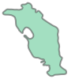

*Lesson 09 October 2020*
{: .no_toc }

## Table of contents
{: .no_toc .text-delta }

1. TOC
{:toc}

---
# Retrieving data from spatial database infrastructures

**goals of the tutorial**
- geocoding / reverse geocoding
- OGC services
- ESRI ArcGIS RestAPI

**based on the open data of:**
- [national repertoire of territorial data](https://geodati.gov.it/geoportale/)
- [national cartographic portal](http://www.pcn.minambiente.it/mattm/)
- [geoportal of Trentino](http://www.territorio.provincia.tn.it/portal/server.pt/community/portale_geocartografico_trentino/254)
- [italian civil protection department](http://www.protezionecivile.gov.it/)

**requirements**
- python knowledge
- geopandas
- gis concepts


**status**

*looking for data*

---

# Geocoding / reverse geocoding

**Setup**


```bash
!pip install geopandas
```

    Collecting geopandas
    [?25l  Downloading https://files.pythonhosted.org/packages/f7/a4/e66aafbefcbb717813bf3a355c8c4fc3ed04ea1dd7feb2920f2f4f868921/geopandas-0.8.1-py2.py3-none-any.whl (962kB)
         |████████████████████████████████| 972kB 2.8MB/s 
    [?25hRequirement already satisfied: pandas>=0.23.0 in /usr/local/lib/python3.6/dist-packages (from geopandas) (1.1.2)
    Requirement already satisfied: shapely in /usr/local/lib/python3.6/dist-packages (from geopandas) (1.7.1)
    Collecting pyproj>=2.2.0
    [?25l  Downloading https://files.pythonhosted.org/packages/e5/c3/071e080230ac4b6c64f1a2e2f9161c9737a2bc7b683d2c90b024825000c0/pyproj-2.6.1.post1-cp36-cp36m-manylinux2010_x86_64.whl (10.9MB)
         |████████████████████████████████| 10.9MB 16.8MB/s 
    [?25hCollecting fiona
    [?25l  Downloading https://files.pythonhosted.org/packages/36/8b/e8b2c11bed5373c8e98edb85ce891b09aa1f4210fd451d0fb3696b7695a2/Fiona-1.8.17-cp36-cp36m-manylinux1_x86_64.whl (14.8MB)
         |████████████████████████████████| 14.8MB 257kB/s 
    [?25hRequirement already satisfied: numpy>=1.15.4 in /usr/local/lib/python3.6/dist-packages (from pandas>=0.23.0->geopandas) (1.18.5)
    Requirement already satisfied: pytz>=2017.2 in /usr/local/lib/python3.6/dist-packages (from pandas>=0.23.0->geopandas) (2018.9)
    Requirement already satisfied: python-dateutil>=2.7.3 in /usr/local/lib/python3.6/dist-packages (from pandas>=0.23.0->geopandas) (2.8.1)
    Collecting click-plugins>=1.0
      Downloading https://files.pythonhosted.org/packages/e9/da/824b92d9942f4e472702488857914bdd50f73021efea15b4cad9aca8ecef/click_plugins-1.1.1-py2.py3-none-any.whl
    Requirement already satisfied: click<8,>=4.0 in /usr/local/lib/python3.6/dist-packages (from fiona->geopandas) (7.1.2)
    Collecting munch
      Downloading https://files.pythonhosted.org/packages/cc/ab/85d8da5c9a45e072301beb37ad7f833cd344e04c817d97e0cc75681d248f/munch-2.5.0-py2.py3-none-any.whl
    Collecting cligj>=0.5
      Downloading https://files.pythonhosted.org/packages/e4/be/30a58b4b0733850280d01f8bd132591b4668ed5c7046761098d665ac2174/cligj-0.5.0-py3-none-any.whl
    Requirement already satisfied: attrs>=17 in /usr/local/lib/python3.6/dist-packages (from fiona->geopandas) (20.2.0)
    Requirement already satisfied: six>=1.7 in /usr/local/lib/python3.6/dist-packages (from fiona->geopandas) (1.15.0)
    Installing collected packages: pyproj, click-plugins, munch, cligj, fiona, geopandas
    Successfully installed click-plugins-1.1.1 cligj-0.5.0 fiona-1.8.17 geopandas-0.8.1 munch-2.5.0 pyproj-2.6.1.post1

only for visualization purpouse
```bash
!pip install git+https://github.com/python-visualization/folium
```
    Collecting git+https://github.com/python-visualization/folium
      Cloning https://github.com/python-visualization/folium to /tmp/pip-req-build-k6ylhcjy
      Running command git clone -q https://github.com/python-visualization/folium /tmp/pip-req-build-k6ylhcjy
    Requirement already satisfied: branca>=0.3.0 in /usr/local/lib/python3.6/dist-packages (from folium==0.11.0+20.gb70efc6) (0.4.1)
    Requirement already satisfied: jinja2>=2.9 in /usr/local/lib/python3.6/dist-packages (from folium==0.11.0+20.gb70efc6) (2.11.2)
    Requirement already satisfied: numpy in /usr/local/lib/python3.6/dist-packages (from folium==0.11.0+20.gb70efc6) (1.18.5)
    Requirement already satisfied: requests in /usr/local/lib/python3.6/dist-packages (from folium==0.11.0+20.gb70efc6) (2.23.0)
    Requirement already satisfied: MarkupSafe>=0.23 in /usr/local/lib/python3.6/dist-packages (from jinja2>=2.9->folium==0.11.0+20.gb70efc6) (1.1.1)
    Requirement already satisfied: urllib3!=1.25.0,!=1.25.1,<1.26,>=1.21.1 in /usr/local/lib/python3.6/dist-packages (from requests->folium==0.11.0+20.gb70efc6) (1.24.3)
    Requirement already satisfied: idna<3,>=2.5 in /usr/local/lib/python3.6/dist-packages (from requests->folium==0.11.0+20.gb70efc6) (2.10)
    Requirement already satisfied: chardet<4,>=3.0.2 in /usr/local/lib/python3.6/dist-packages (from requests->folium==0.11.0+20.gb70efc6) (3.0.4)
    Requirement already satisfied: certifi>=2017.4.17 in /usr/local/lib/python3.6/dist-packages (from requests->folium==0.11.0+20.gb70efc6) (2020.6.20)
    Building wheels for collected packages: folium
      Building wheel for folium (setup.py) ... [?25l[?25hdone
      Created wheel for folium: filename=folium-0.11.0+20.gb70efc6-py2.py3-none-any.whl size=97529 sha256=75c71d7148cea4759efa8db94265d317abfa62e40107aa85ee10dd7217ef583f
      Stored in directory: /tmp/pip-ephem-wheel-cache-poe5zey1/wheels/1e/e1/75/ecbc91fd5dd5d90befb0b533bf7492d38acffa033310731862
    Successfully built folium
    ERROR: datascience 0.10.6 has requirement folium==0.2.1, but you'll have folium 0.11.0+20.gb70efc6 which is incompatible.
    Installing collected packages: folium
      Found existing installation: folium 0.8.3
        Uninstalling folium-0.8.3:
          Successfully uninstalled folium-0.8.3
    Successfully installed folium-0.11.0+20.gb70efc6

```python
import geopandas as gpd
```

**GEOCODING service**


- the geopandas module is based on [geopy](https://geopy.readthedocs.io/en/stable/)
- all the goecoders service are available [here](https://geopy.readthedocs.io/en/stable/#module-geopy.geocoders)

**NOTE**

Attention to the Rate Limit in Pandas<br/>
more info [here](https://geopy.readthedocs.io/en/stable/#usage-with-pandas)

**choose the right service**
<br/><br/>


<br/><br/>
visit [getlon.lat](https://getlon.lat/)

## geocoding

```python
cols = ['city']
names = [('Roma'),('Palermo'),('Trento'),('Genova'),('Bari'),('Trieste'),('Napoli'),('Cagliari'),('Messina'),('Lecce')]
cities = gpd.GeoDataFrame(names,columns=cols)
```

```python
cities
```


<div>
<style scoped>
    .dataframe tbody tr th:only-of-type {
        vertical-align: middle;
    }

    .dataframe tbody tr th {
        vertical-align: top;
    }

    .dataframe thead th {
        text-align: right;
    }
</style>
<table border="1" class="dataframe">
  <thead>
    <tr style="text-align: right;">
      <th></th>
      <th>city</th>
    </tr>
  </thead>
  <tbody>
    <tr>
      <th>0</th>
      <td>Roma</td>
    </tr>
    <tr>
      <th>1</th>
      <td>Palermo</td>
    </tr>
    <tr>
      <th>2</th>
      <td>Trento</td>
    </tr>
    <tr>
      <th>3</th>
      <td>Genova</td>
    </tr>
    <tr>
      <th>4</th>
      <td>Bari</td>
    </tr>
    <tr>
      <th>5</th>
      <td>Trieste</td>
    </tr>
    <tr>
      <th>6</th>
      <td>Napoli</td>
    </tr>
    <tr>
      <th>7</th>
      <td>Cagliari</td>
    </tr>
    <tr>
      <th>8</th>
      <td>Messina</td>
    </tr>
    <tr>
      <th>9</th>
      <td>Lecce</td>
    </tr>
  </tbody>
</table>
</div>


```python
geo_cities = gpd.tools.geocode(cities.city, provider="arcgis")
```

```python
geo_cities
```

<div>
<style scoped>
    .dataframe tbody tr th:only-of-type {
        vertical-align: middle;
    }

    .dataframe tbody tr th {
        vertical-align: top;
    }

    .dataframe thead th {
        text-align: right;
    }
</style>
<table border="1" class="dataframe">
  <thead>
    <tr style="text-align: right;">
      <th></th>
      <th>geometry</th>
      <th>address</th>
    </tr>
  </thead>
  <tbody>
    <tr>
      <th>0</th>
      <td>POINT (12.49565 41.90322)</td>
      <td>Roma</td>
    </tr>
    <tr>
      <th>1</th>
      <td>POINT (13.36112 38.12207)</td>
      <td>Palermo</td>
    </tr>
    <tr>
      <th>2</th>
      <td>POINT (11.11926 46.07005)</td>
      <td>Trento</td>
    </tr>
    <tr>
      <th>3</th>
      <td>POINT (8.93898 44.41039)</td>
      <td>Genova</td>
    </tr>
    <tr>
      <th>4</th>
      <td>POINT (16.86666 41.12587)</td>
      <td>Bari</td>
    </tr>
    <tr>
      <th>5</th>
      <td>POINT (13.77269 45.65757)</td>
      <td>Trieste</td>
    </tr>
    <tr>
      <th>6</th>
      <td>POINT (14.25226 40.84014)</td>
      <td>Napoli</td>
    </tr>
    <tr>
      <th>7</th>
      <td>POINT (9.11049 39.21454)</td>
      <td>Cagliari</td>
    </tr>
    <tr>
      <th>8</th>
      <td>POINT (15.55308 38.17837)</td>
      <td>Messina</td>
    </tr>
    <tr>
      <th>9</th>
      <td>POINT (18.16802 40.35796)</td>
      <td>Lecce</td>
    </tr>
  </tbody>
</table>
</div>


```python
geo_cities.plot()
```
    

    

## reverse geocoding

```python
from geopy.geocoders import Nominatim
```

```python
geo_cities
```

<div>
<style scoped>
    .dataframe tbody tr th:only-of-type {
        vertical-align: middle;
    }

    .dataframe tbody tr th {
        vertical-align: top;
    }

    .dataframe thead th {
        text-align: right;
    }
</style>
<table border="1" class="dataframe">
  <thead>
    <tr style="text-align: right;">
      <th></th>
      <th>geometry</th>
      <th>address</th>
    </tr>
  </thead>
  <tbody>
    <tr>
      <th>0</th>
      <td>POINT (12.49565 41.90322)</td>
      <td>Roma</td>
    </tr>
    <tr>
      <th>1</th>
      <td>POINT (13.36112 38.12207)</td>
      <td>Palermo</td>
    </tr>
    <tr>
      <th>2</th>
      <td>POINT (11.11926 46.07005)</td>
      <td>Trento</td>
    </tr>
    <tr>
      <th>3</th>
      <td>POINT (8.93898 44.41039)</td>
      <td>Genova</td>
    </tr>
    <tr>
      <th>4</th>
      <td>POINT (16.86666 41.12587)</td>
      <td>Bari</td>
    </tr>
    <tr>
      <th>5</th>
      <td>POINT (13.77269 45.65757)</td>
      <td>Trieste</td>
    </tr>
    <tr>
      <th>6</th>
      <td>POINT (14.25226 40.84014)</td>
      <td>Napoli</td>
    </tr>
    <tr>
      <th>7</th>
      <td>POINT (9.11049 39.21454)</td>
      <td>Cagliari</td>
    </tr>
    <tr>
      <th>8</th>
      <td>POINT (15.55308 38.17837)</td>
      <td>Messina</td>
    </tr>
    <tr>
      <th>9</th>
      <td>POINT (18.16802 40.35796)</td>
      <td>Lecce</td>
    </tr>
  </tbody>
</table>
</div>


```python
point = geo_cities.geometry[2]
```

```python
point.wkt
```

    'POINT (11.11926000000005 46.07005000000004)'
    
```python
type(point.x)
```

    float

```python
latlon = str(point.y) + "," + str(point.x)
```

```python
geolocator = Nominatim(user_agent="Example for the course")
```

.. but better if use a user agent like

*Mozilla/5.0 (Linux; Android 10) AppleWebKit/537.36 (KHTML, like Gecko) Chrome/86.0.4240.75 Mobile Safari/537.36*

Eg

*geolocator = Nominatim(user_agent="Mozilla/5.0 (Linux; Android10) AppleWebKit/537.36 (KHTML, like Gecko) Chrome/86.0.4240.75 Mobile Safari/537.36")*


```python
location = geolocator.reverse(latlon)
```

the raw method contains all the data available from the geocoder

```python
location.raw
```

    {'address': {'city': 'Trento',
      'country': 'Italia',
      'country_code': 'it',
      'county': 'Provincia di Trento',
      'house_number': '15',
      'municipality': "Territorio Val d'Adige",
      'postcode': '38122',
      'road': 'Via Torre Vanga',
      'state': 'Trentino-Alto Adige/Südtirol',
      'suburb': 'Centro storico Trento',
      'tourism': 'Giovane Europa'},
     'boundingbox': ['46.0700951', '46.0703188', '11.119026', '11.1194422'],
     'display_name': "Giovane Europa, 15, Via Torre Vanga, Centro storico Trento, Trento, Territorio Val d'Adige, Provincia di Trento, Trentino-Alto Adige/Südtirol, 38122, Italia",
     'lat': '46.070178',
     'licence': 'Data © OpenStreetMap contributors, ODbL 1.0. https://osm.org/copyright',
     'lon': '11.119240793834841',
     'osm_id': 73293763,
     'osm_type': 'way',
     'place_id': 104813655}


## suggestion for a good geocoding
more details you add and more fortune you have to obtain a good result

```python
q="Via Verdi, 26"
```

```python
point = gpd.tools.geocode(q, provider="arcgis")
```

import of folium to show the map


```python
import folium
```

```python
map_point = folium.Map([point.geometry.y,point.geometry.x], zoom_start=18)
folium.GeoJson(point.to_json()).add_to(map_point)
map_point
```

<iframe 
    width="100%"
    height="300" src="https://napo.github.io/geospatial_course_unitn/docs/html/via_verdi_26.html"
    style="border:none;"
    allowfullscreen webkitallowfullscreen mozallowfullscreen>
</iframe>


add details like city and State


```python
q="Via Verdi, 26, Trento, Italia"
```

```python
point = gpd.tools.geocode(q, provider="arcgis")
```

```python
point
```


<div>
<style scoped>
    .dataframe tbody tr th:only-of-type {
        vertical-align: middle;
    }

    .dataframe tbody tr th {
        vertical-align: top;
    }

    .dataframe thead th {
        text-align: right;
    }
</style>
<table border="1" class="dataframe">
  <thead>
    <tr style="text-align: right;">
      <th></th>
      <th>geometry</th>
      <th>address</th>
    </tr>
  </thead>
  <tbody>
    <tr>
      <th>0</th>
      <td>POINT (11.11966 46.06665)</td>
      <td>Via Giuseppe Verdi 26, 38122, Trento</td>
    </tr>
  </tbody>
</table>
</div>


```python
map_point = folium.Map([point.geometry.y,point.geometry.x], zoom_start=18)
folium.GeoJson(point.to_json()).add_to(map_point)
map_point
```

<iframe 
    width="100%"
    height="300" src="https://napo.github.io/geospatial_course_unitn/docs/html/via_verdi_26_trento_arcgis.html"
    style="border:none;"
    allowfullscreen webkitallowfullscreen mozallowfullscreen>
</iframe>


Try a different geocoder


```python
point_nominatim = gpd.tools.geocode(q, provider="Nominatim",user_agent="Example for the course")
```


```python
point_nominatim
```


<div>
<style scoped>
    .dataframe tbody tr th:only-of-type {
        vertical-align: middle;
    }

    .dataframe tbody tr th {
        vertical-align: top;
    }

    .dataframe thead th {
        text-align: right;
    }
</style>
<table border="1" class="dataframe">
  <thead>
    <tr style="text-align: right;">
      <th></th>
      <th>geometry</th>
      <th>address</th>
    </tr>
  </thead>
  <tbody>
    <tr>
      <th>0</th>
      <td>POINT (10.76813 46.31650)</td>
      <td>Via Verdi, Ognano, Stavel, Pellizzano, Comunit...</td>
    </tr>
  </tbody>
</table>
</div>


```python
map_point = folium.Map([point_nominatim.geometry.y,point_nominatim.geometry.x], zoom_start=18)
folium.GeoJson(point.to_json()).add_to(map_point)
map_point
```

<iframe 
    width="100%"
    height="300" src="https://napo.github.io/geospatial_course_unitn/docs/html/via_verdi_26_trento_arcgis.html"
    style="border:none;"
    allowfullscreen webkitallowfullscreen mozallowfullscreen>
</iframe>


```python
q="Via Giuseppe Verdi, 26, Trento, Italia"
```


```python
point_nominatim = gpd.tools.geocode(q, provider="Nominatim",user_agent="Example for the course")
```


```python
point_nominatim
```

<div>
<style scoped>
    .dataframe tbody tr th:only-of-type {
        vertical-align: middle;
    }

    .dataframe tbody tr th {
        vertical-align: top;
    }

    .dataframe thead th {
        text-align: right;
    }
</style>
<table border="1" class="dataframe">
  <thead>
    <tr style="text-align: right;">
      <th></th>
      <th>geometry</th>
      <th>address</th>
    </tr>
  </thead>
  <tbody>
    <tr>
      <th>0</th>
      <td>POINT (11.11971 46.06641)</td>
      <td>Dipartimento di Sociologia e Ricerca Sociale, ...</td>
    </tr>
  </tbody>
</table>
</div>


```python
map_point = folium.Map([point_nominatim.geometry.y,point.geometry.x], zoom_start=18)
folium.GeoJson(point_nominatim.to_json()).add_to(map_point)
map_point
```

<iframe 
    width="100%"
    height="300" src="https://napo.github.io/geospatial_course_unitn/docs/html/via_giuseppe_verdi_26_trento_nominatim.html"
    style="border:none;"
    allowfullscreen webkitallowfullscreen mozallowfullscreen>
</iframe>


calculate the distance between the two points


```python
distance = point.to_crs('epsg:32632').geometry.distance(point_nominatim.geometry.to_crs('epsg:32632')).values[0]
```

```python
distance
```
    26.522713658370346


## Summary

- geocoding is, first of all, an NLP problem
- geocoding services try to normalize the query by identifying the object you are looking for
- the more information of a geographic hierarchical order the better the geocoder results
- it is difficult to have an always updated address database
- many geocoders, where they do not find the value, return a value inferred from the interpopulation
- accuracy depends on what you are looking for
- a geocoder always tries to give an answer<br/>&nbsp;an excellent geocoder also returns the value of the precision estimate


#OGC Services


---

##Catalog Service for the Web


---

https://siat.provincia.tn.it/geonetwork/srv/eng/catalog.search


**Setup** 

https://geopython.github.io/OWSLib/


```python
pip install owslib
```

    Collecting owslib
    [?25l  Downloading https://files.pythonhosted.org/packages/c4/6a/428d73506f6f5281408b518249b90d7c96a1394c6d954a2069cbd5a4ac39/OWSLib-0.20.0-py2.py3-none-any.whl (197kB)
         |████████████████████████████████| 204kB 2.8MB/s 
    [?25hRequirement already satisfied: pyproj>=2 in /usr/local/lib/python3.6/dist-packages (from owslib) (2.6.1.post1)
    Requirement already satisfied: requests>=1.0 in /usr/local/lib/python3.6/dist-packages (from owslib) (2.23.0)
    Requirement already satisfied: python-dateutil>=1.5 in /usr/local/lib/python3.6/dist-packages (from owslib) (2.8.1)
    Requirement already satisfied: pyyaml in /usr/local/lib/python3.6/dist-packages (from owslib) (3.13)
    Requirement already satisfied: pytz in /usr/local/lib/python3.6/dist-packages (from owslib) (2018.9)
    Requirement already satisfied: chardet<4,>=3.0.2 in /usr/local/lib/python3.6/dist-packages (from requests>=1.0->owslib) (3.0.4)
    Requirement already satisfied: idna<3,>=2.5 in /usr/local/lib/python3.6/dist-packages (from requests>=1.0->owslib) (2.10)
    Requirement already satisfied: certifi>=2017.4.17 in /usr/local/lib/python3.6/dist-packages (from requests>=1.0->owslib) (2020.6.20)
    Requirement already satisfied: urllib3!=1.25.0,!=1.25.1,<1.26,>=1.21.1 in /usr/local/lib/python3.6/dist-packages (from requests>=1.0->owslib) (1.24.3)
    Requirement already satisfied: six>=1.5 in /usr/local/lib/python3.6/dist-packages (from python-dateutil>=1.5->owslib) (1.15.0)
    Installing collected packages: owslib
    Successfully installed owslib-0.20.0

```python
from owslib.csw import CatalogueServiceWeb
```

```python
csw = CatalogueServiceWeb("http://geodati.gov.it/RNDT/csw")
```

```python
csw.service
```
    'CSW'

```python
[op.name for op in csw.operations]
```

    ['GetCapabilities',
     'DescribeRecord',
     'GetRecords',
     'GetRecordById',
     'Transaction',
     'Harvest']

```python
from owslib.fes import PropertyIsLike, BBox
```

fields to query

|                |                            |
|---             |---                         |
|field           | description                |
|*dc:title*      | title of the dataset       |
|*dc:description*| description of the dataset |
|*dc:subject*    | subject of the dataset     |
|*csw:AnyText*   | in all the fields          |

*PropertyIsLike* means that you can use the *LIKE* syntax of SQL

Eg. *%rento* => each word that ends with 'rento'


```python
trento_query = PropertyIsLike('csw:AnyText', 'Trento')
```

```python
csw.getrecords2(constraints=[trento_query],maxrecords=100)
```

```python
csw.results
```

    {'matches': 95, 'nextrecord': 0, 'returned': 95}

```python
for rec in csw.records:
  print(rec + " - " + csw.records[rec].title)
```

    agea:00129:20090724:090446 - Ortofotocarta Trento 2003
    agea:00377:20090911:093144 - Ortofotocarta Trento 2008
    agea:00128:20090724:085449 - Ortofotocarta Trento 1997
    p_TN:377793f1-1094-4e81-810e-403897418b23 - Limite Provinciale della Provincia Autonoma di Trento
    c_l378:toponomastica - Stradario, civici e toponimi del Comune di Trento
    c_l378:ortofoto2009 - Ortofoto 2009
    [...]
    p_TN:cfa55552-a520-48d3-824c-2941b3c4d98d - Carta Topografica Generale - CTP 1998 singole sezioni - livello altimetria
    p_TN:9905ac49-d9cc-4317-b44b-a8450cc37b20 - Carta Topografica Generale - CTP 1998 singole sezioni - livello planimetria
    p_TN:8131f518-c808-4a30-912f-e34892aa0f1a - Carta Topografica Generale - CTP 00 singole sezioni livello altimetria
    p_TN:aa677704-2c39-4edd-ba64-b69282bff778 - Carta Topografica Generale - CTP 00 singole sezioni livello edifici
    p_TN:6a7806d8-63fa-4445-b009-9412c99d8fd2 - Edifici P.A.T. 3D
    p_TN:fbbc1e07-0b8e-46c9-b961-a02d8bebb217 - Ortofoto PAT 1973 in scala di grigi
    [...]
    p_TN:628a228e-d13c-41c8-803a-272883e3931e - Quadro d'unione sezioni 1:10.000 della 1° edizione della Carta Topografica Generale taglio ED50
    p_TN:c0518563-b53e-44da-870e-8719ef4a5215 - Piano Urbanistico Provinciale - PUP formato raster
    p_TN:335f1205-9d6e-4e75-b4cf-35b9385e4fae - LiDAR Padergnone 2007
    [...]
    p_TN:abea13d9-c73a-46f1-b997-9c41267d06c5 - Aree di sintesi geologica
    p_TN:ea66f90c-426f-497c-9044-f870ce7a7f4b - Cave dismesse
    p_TN:fb95e841-df80-41b5-af08-8a31896533cc - Iperspettrale Paneveggio 2007
    p_TN:33db32ef-7ce4-43e3-bbf5-11440f4c9757 - Iperspettrale Padergnone 2007
    [...]
    p_TN:054e1af3-2dd8-4496-8b83-261cccc2674c - Ortofoto Ravina 2007 RGB
    p_TN:44cd8a88-ba6e-4299-8075-df9996401006 - Ortofoto Padergnone 2007 RGB
    p_TN:85fb88cb-80c8-47f3-9e50-4142655cf461 - LiDAR dato grezzo - Padergnone 2007
    p_TN:b7db2c50-b463-4d30-a40f-b52ba92887ff - LiDAR DSM - Modello Digitale delle Superfici - Padergnone 2007
    [...]
    p_TN:b0cdad84-3c7d-4422-8f7a-7cb762af3da1 - LiDAR DSM - Modello Digitale delle Superfici - Val di Sella 2007
    p_TN:152ad4d1-3263-4ae9-bce9-1265f019a784 - LiDAR DTM - Modello Digitale del Terreno - Val di Sella 2007
    p_TN:b388eaa7-4e27-4970-9b28-b541fe480bf0 - LiDAR dato grezzo - Val di Sella 2007
    p_TN:f2e88f1b-05d9-4942-93ee-857a0a9e1f0b - Ortofoto PAT 2015 RGB
    p_TN:441525c1-a100-405c-b6fc-1f0c319bacbb - Grotte
 

```python
p_TN:441525c1-a100-405c-b6fc-1f0c319bacbb => Grotte
```

*grotte* means *caves* in italian language

```python
s="p_TN:441525c1-a100-405c-b6fc-1f0c319bacbb" #caves
```

```python
record = csw.records[s]
```

```python
record.title
```

    'Grotte'

```python
record.abstract
```

    "Catasto delle grotte naturali della Provincia autonoma di Trento.L'istituzione del catasto delle grotte e delle aree carsiche della Provincia di Trento è stata prevista dalla Legge provinciale n. 37 del 31/10/1983 (Protezione del patrimonio mineralogico, paleontologico, paletnologico, speleologico e carsico); l'articolo 14 della citata legge demanda alla Giunta provinciale l'emanazione delle norme attinenti all'impianto, al funzionamento, all'aggiornamento e all'accesso al catasto stesso.Il catasto delle grotte del Trentino è stato ufficialmente attivato in data 14 marzo 2008 tramite specifica delibera della Giunta Provinciale."


```python
for reference in record.references:
  print(reference['scheme'])
  print(reference['url'])
```

    urn:x-esri:specification:ServiceType:ArcIMS:Metadata:Server
    https://siat.provincia.tn.it/IDT/vector/public/p_tn_441525c1-a100-405c-b6fc-1f0c319bacbb.zip
    urn:x-esri:specification:ServiceType:ArcIMS:Metadata:Document
    https://geodati.gov.it/geoportalRNDTPA/csw?getxml=%7BF3EB7695-7DCD-49B9-8450-E19B2A86F69D%7D

```python
caves = gpd.read_file('https://siat.provincia.tn.it/IDT/vector/public/p_tn_441525c1-a100-405c-b6fc-1f0c319bacbb.zip')
```

```python
caves.head(5)
```

<div>
<style scoped>
    .dataframe tbody tr th:only-of-type {
        vertical-align: middle;
    }

    .dataframe tbody tr th {
        vertical-align: top;
    }

    .dataframe thead th {
        text-align: right;
    }
</style>
<table border="1" class="dataframe">
  <thead>
    <tr style="text-align: right;">
      <th></th>
      <th>objectid</th>
      <th>id_grotta</th>
      <th>nome</th>
      <th>n_vt</th>
      <th>nome_local</th>
      <th>comune</th>
      <th>localita</th>
      <th>valle</th>
      <th>monte</th>
      <th>dominio_ca</th>
      <th>area_cars_</th>
      <th>cod_pat</th>
      <th>unita_geol</th>
      <th>eta_o_pian</th>
      <th>id_sezione</th>
      <th>sezione_ct</th>
      <th>ediz_ctp</th>
      <th>coord_x</th>
      <th>coord_y</th>
      <th>quota_ingr</th>
      <th>svil_spaz</th>
      <th>svil_plan</th>
      <th>disl_tot</th>
      <th>disl_pos</th>
      <th>disl_neg</th>
      <th>geosito</th>
      <th>invariante</th>
      <th>annotazion</th>
      <th>agg_riliev</th>
      <th>notizie</th>
      <th>storia</th>
      <th>paleontolo</th>
      <th>paletnolog</th>
      <th>meteorolog</th>
      <th>biologia</th>
      <th>idrologia</th>
      <th>mineralogi</th>
      <th>geologia</th>
      <th>scheda_arm</th>
      <th>bibliograf</th>
      <th>accesso</th>
      <th>geometry</th>
    </tr>
  </thead>
  <tbody>
    <tr>
      <th>0</th>
      <td>2</td>
      <td>107.0</td>
      <td>Antro ai Murazzi</td>
      <td>107.0</td>
      <td>Bus dela Vecia</td>
      <td>BESENELLO</td>
      <td>Murazzi - Dosso della Soga</td>
      <td>Valle dell'Adige</td>
      <td>Vigolana</td>
      <td>M.MARZOLA, VIGOLANA</td>
      <td>None</td>
      <td>DPR</td>
      <td>DOLOMIA PRINCIPALE</td>
      <td>NORICO-RETICO</td>
      <td>81020.0</td>
      <td>ALDENO</td>
      <td>1983</td>
      <td>663703.0</td>
      <td>5090951.0</td>
      <td>320.0</td>
      <td>10.0</td>
      <td>NaN</td>
      <td>NaN</td>
      <td>NaN</td>
      <td>NaN</td>
      <td>Si</td>
      <td>Si</td>
      <td>None</td>
      <td>29/07/98 registrato da Roberto Frisinghelli</td>
      <td>None</td>
      <td>None</td>
      <td>None</td>
      <td>None</td>
      <td>None</td>
      <td>None</td>
      <td>None</td>
      <td>None</td>
      <td>None</td>
      <td>None</td>
      <td>None</td>
      <td>None</td>
      <td>POINT (663703.000 5090951.000)</td>
    </tr>
    <tr>
      <th>1</th>
      <td>3</td>
      <td>108.0</td>
      <td>Caverna Besenello</td>
      <td>108.0</td>
      <td>None</td>
      <td>BESENELLO</td>
      <td>Crocetta</td>
      <td>Val della Scaletta</td>
      <td>Vigolana</td>
      <td>M.MARZOLA, VIGOLANA</td>
      <td>None</td>
      <td>DPR</td>
      <td>DOLOMIA PRINCIPALE</td>
      <td>NORICO-RETICO</td>
      <td>81060.0</td>
      <td>CALLIANO</td>
      <td>1983</td>
      <td>664946.0</td>
      <td>5090337.0</td>
      <td>590.0</td>
      <td>63.0</td>
      <td>34.0</td>
      <td>20.0</td>
      <td>20.0</td>
      <td>NaN</td>
      <td>No</td>
      <td>No</td>
      <td>None</td>
      <td>19/06/98 registrato da Roberto Frisinghelli</td>
      <td>Indicata e segnata sulle carte IGM e CTR</td>
      <td>None</td>
      <td>None</td>
      <td>None</td>
      <td>None</td>
      <td>None</td>
      <td>None</td>
      <td>None</td>
      <td>None</td>
      <td>None</td>
      <td>None</td>
      <td>None</td>
      <td>POINT (664946.000 5090337.000)</td>
    </tr>
    <tr>
      <th>2</th>
      <td>4</td>
      <td>110.0</td>
      <td>Bus de l' Avel</td>
      <td>110.0</td>
      <td>None</td>
      <td>CONCEI</td>
      <td>Gombie</td>
      <td>None</td>
      <td>None</td>
      <td>V.DI LEDRO, V.DI CONCEI, TREMALZO</td>
      <td>None</td>
      <td>ZUU1</td>
      <td>b'CALCARE DI ZU - Membro del Grost\xe8'</td>
      <td>NORICO?-RETICO</td>
      <td>80050.0</td>
      <td>CONCEI</td>
      <td>1983</td>
      <td>632924.0</td>
      <td>5085983.0</td>
      <td>1310.0</td>
      <td>56.0</td>
      <td>NaN</td>
      <td>34.0</td>
      <td>0.0</td>
      <td>34.0</td>
      <td>No</td>
      <td>No</td>
      <td>None</td>
      <td>16/09/98 registrato da Roberto Frisinghelli</td>
      <td>None</td>
      <td>None</td>
      <td>None</td>
      <td>None</td>
      <td>None</td>
      <td>None</td>
      <td>None</td>
      <td>None</td>
      <td>None</td>
      <td>None</td>
      <td>None</td>
      <td>None</td>
      <td>POINT (632924.000 5085983.000)</td>
    </tr>
    <tr>
      <th>3</th>
      <td>5</td>
      <td>120.0</td>
      <td>La Camerona</td>
      <td>120.0</td>
      <td>None</td>
      <td>FIAVE'</td>
      <td>Ballino</td>
      <td>None</td>
      <td>Monte Misone</td>
      <td>V.DI LEDRO, V.DI CONCEI, TREMALZO</td>
      <td>None</td>
      <td>MIS</td>
      <td>GRUPPO DEI CALCARI GRIGI - CALCARE DEL MISONE</td>
      <td>SINEMURIANO-PLIENSBACHIANO</td>
      <td>80020.0</td>
      <td>BALLINO</td>
      <td>1983</td>
      <td>640808.0</td>
      <td>5091808.0</td>
      <td>950.0</td>
      <td>90.0</td>
      <td>NaN</td>
      <td>35.0</td>
      <td>35.0</td>
      <td>NaN</td>
      <td>Si</td>
      <td>Si</td>
      <td>None</td>
      <td>29/07/98 registrato da Roberto Frisinghelli</td>
      <td>None</td>
      <td>None</td>
      <td>None</td>
      <td>None</td>
      <td>None</td>
      <td>None</td>
      <td>None</td>
      <td>None</td>
      <td>None</td>
      <td>None</td>
      <td>None</td>
      <td>None</td>
      <td>POINT (640808.000 5091808.000)</td>
    </tr>
    <tr>
      <th>4</th>
      <td>6</td>
      <td>125.0</td>
      <td>Grotta Cesare Battisti</td>
      <td>125.0</td>
      <td>None</td>
      <td>ZAMBANA</td>
      <td>None</td>
      <td>None</td>
      <td>Paganella</td>
      <td>M.PAGANELLA, M.GAZZA</td>
      <td>AREA CARSICA DELLA PAGANELLA</td>
      <td>RTZ</td>
      <td>Formazione di Rotzo</td>
      <td>Sinemuriano - Pliensbachiano</td>
      <td>60050.0</td>
      <td>PAGANELLA</td>
      <td>1983</td>
      <td>658146.0</td>
      <td>5112357.0</td>
      <td>1880.0</td>
      <td>2342.0</td>
      <td>NaN</td>
      <td>204.0</td>
      <td>22.0</td>
      <td>182.0</td>
      <td>Si</td>
      <td>Si</td>
      <td>None</td>
      <td>29/07/98 registrato da Roberto Frisinghelli</td>
      <td>Individuata come SIC-Sito di importanza comuni...</td>
      <td>None</td>
      <td>None</td>
      <td>None</td>
      <td>None</td>
      <td>None</td>
      <td>None</td>
      <td>None</td>
      <td>None</td>
      <td>None</td>
      <td>b"Mosna, Ezio - L'esplorazione speleologica de...</td>
      <td>None</td>
      <td>POINT (658146.000 5112357.000)</td>
    </tr>
  </tbody>
</table>
</div>


```python
caves.crs
```

    <Projected CRS: EPSG:25832>
    Name: ETRS89 / UTM zone 32N
    Axis Info [cartesian]:
    - E[east]: Easting (metre)
    - N[north]: Northing (metre)
    Area of Use:
    - name: Europe - 6°E to 12°E and ETRS89 by country
    - bounds: (6.0, 38.76, 12.0, 83.92)
    Coordinate Operation:
    - name: UTM zone 32N
    - method: Transverse Mercator
    Datum: European Terrestrial Reference System 1989
    - Ellipsoid: GRS 1980
    - Prime Meridian: Greenwich

```python
caves.plot()
```
   

  

we can search by bounding box


https://boundingbox.klokantech.com/


```python
csw = CatalogueServiceWeb("http://www.pcn.minambiente.it/geoportal/csw")
```

```python
bbox_query = BBox([10.770062,45.866839,11.022748,46.083374])
```

```python
csw.getrecords2(constraints=[bbox_query],maxrecords=100)
```

```python
csw.results
```

    {'matches': 117, 'nextrecord': 101, 'returned': 100}


```python
for rec in csw.records:
  print(rec + " - " + csw.records[rec].title)
```

    m_amte:299FN3:f451a878-27b3-43be-bc19-6eeb1362392a - DSM FIRST LiDAR con risoluzione a terra 1 metro - Regione Veneto
    m_amte:299FN3:554245de-46c5-4ff9-a214-43eb794baad8 - DSM LAST LiDAR con risoluzione a terra 1 metro - Regione Veneto
    m_amte:299FN3:6ad216c2-614b-4eb6-94d8-deefee09ba48 - DTM LiDAR con risoluzione a terra 1 metro - Regione Veneto
    m_amte:299FN3:046e201a-1864-4fb0-cd36-1cf75fbac550 - INTENSITY LiDAR con risoluzione a terra 1 metro - Regione Veneto
    [...]
    m_amte:299FN3:cbd1bd6d-4f0a-4707-aa42-fa97cf5a9a6e - Prodotti LiDAR - Regione Lombardia
    m_amte:299FN3:4dca3621-4baa-49ee-90b5-33ca42a4bb4e - Ortofoto in bianco e nero anni 1994-1996 - Regioni zona WGS84-UTM32
    m_amte:299FN3:21d09438-3f4c-4642-a9ea-064a60488b88 - Ortofoto a colori anno 2006 - Regioni zona WGS84-UTM32
    m_amte:299FN3:a1197b44-5b11-4a49-def8-ae45e2c5e6ae - Ortofoto in bianco e nero anni 1988-1989 - Regioni zona WGS84-UTM32
    m_amte:299FN3:2637cb18-6d0c-4508-bd6e-64804e85a550 - Ortofoto a colori anno 2000 - Regioni zona WGS84-UTM32
    m_amte:299FN3:55d73e34-780e-45a3-ba77-6292b307a597 - Numeri civici dei capoluoghi di provincia
    [...]
    m_amte:299FN3:8345a338-17c9-444b-c598-fe508d1cb45e - Scuole pubbliche per l'infanzia, primarie e secondarie sul territorio nazionale
    m_amte:299FN3:2b8ed8fd-6ae1-4594-cd25-405c36569685 - Carta fitoclimatica d'Italia
    m_amte:299FN3:1d117feb-517b-4688-aa75-da586566aa36 - Quadro di unione delle tavole LiDAR - Grigliato 2x2
    m_amte:299FN3:f9f310e3-2a7d-4b04-f3f1-f827e8c67339 - Quadro di unione delle tavole LiDAR - Grigliato 1x1
    m_amte:8HCH2C:c52b8f8b-1bee-4b73-984a-7c37bcb9b575 - Quadro di unione COSMO SKY-MED Descending - PST 2013
    [...]
    m_amte:299FN3:80437fc1-bbed-41f9-84dc-ee091b9080e4 - Date ortofoto in bianco e nero anni 1988-1989
    m_amte:299FN3:c5dd5d00-555e-493f-8380-080dc164633c - Cartografia di base IGM 25.000 - Regioni zona WGS84-UTM32
    m_amte:299FN3:d36c3fd9-6c45-4ada-f497-a2f827f575cf - Cartografia di base IGM 25.000 - Regioni zona WGS84-UTM33
    m_amte:299FN3:3c22e603-6c67-41e1-bb03-ae29c1b86c03 - Cartografia di base  IGM 100.000 - Regioni zona WGS84-UTM33
    m_amte:299FN3:cfa9e368-0773-4b4c-8bd6-65b7ca5d4dbc - Cartografia di base Atlante DeAgostini
    m_amte:299FN3:62b0784a-3eac-47e8-c85a-24db8e0b7ea8 - Cartografia di base  IGM 100.000 - Regioni zona WGS84-UTM32
    m_amte:299FN3:68dd5028-f5a0-42dd-8b6e-52b6223b0d3b - Servizio di conversione di coordinate del Geoportale Nazionale
    [..]
    m_amte:299FN3:e0c36031-607f-4abb-9d1d-b9a1b60a2c6d - Zonazione sismogenetica ZS9
    m_amte:299FN3:068c1a67-d08e-4e7c-d4f3-6d54c849a584 - Sezioni di censimento - ISTAT 1991
    m_amte:299FN3:bbea45fd-e678-4d17-f3f4-ddbbc6c3e60c - Zonazione sismogenetica ZS9  - Limiti
    m_amte:299FN3:e090c6d1-2538-46be-ed51-667a16c4b1d2 - Sezioni censimento 2001
    m_amte:299FN3:d3b47a56-367c-4824-d306-beef43897a2a - Quadro di unione ERS Ascending
    m_amte:299FN3:d958e301-9f33-4bed-c853-a9faacf5e5b1 - Classificazione sismica dei comuni italiani al 2010
    m_amte:299FN3:48ce2a5f-d6d6-4ebf-bdfb-a9dfe7f10375 - AIB - Zonizzazione dei Parchi Nazionali
    m_amte:299FN3:600cc327-f2e4-4932-c00e-60d45d0a090d - Catalogo frane - Direzioni
    m_amte:299FN3:2d16fb84-4e88-4480-ae1f-0cf03c068233 - AIB - Vegetazione nei Parchi Nazionali
    m_amte:299FN3:559ff4c0-454e-4a05-fc97-807690e6f515 - Bacini idrografici secondari
    m_amte:299FN3:99622692-1e7a-452b-86d7-3ae4fe96c385 - Zone umide di importanza internazionale (RAMSAR)
    m_amte:299FN3:3291bd68-7059-4c5a-8074-f33989c46e7d - Carta ecopedologica d'Italia
    m_amte:299FN3:bd587278-b36b-4c88-ded1-cdff9039267c - Indice di variazione delle velocità medie - Confronto ERS ENVISAT Ascending
	[...]
    m_amte:299FN3:5237cf1e-4d49-486c-a688-152bc4473508 - Laghi e altri specchi d'acqua
    m_amte:299FN3:e7e8b6c8-a109-4fb6-b3bc-861740e00a82 - AIB - Rischio incendi periodo invernale
    m_amte:299FN3:408000e2-8a33-4acd-a05a-b3bf77dd9924 - AIB - Rischio incendi periodo estivo
    m_amte:299FN3:6a3bf67a-470f-43d1-80c9-79bb7cb36b27 - AIB - Incendi 2001-2005 (test da satellite)
    m_amte:299FN3:468e02b1-d783-400f-fd83-b9ae2b6a47ca - AIB - Zone rosse prioritarie
    m_amte:299FN3:a31da965-7b90-4cbe-eac2-32a687bb2509 - Aree importanti per l'avifauna (IBA - Important Birds Areas)
    m_amte:299FN3:d4ef3032-5c9e-4263-b3a1-56a60e7124dc - Servizio di ricerca del catalogo metadati del Geoportale nazionale
    m_amte:299FN3:4168a1a3-3b3e-475e-cb8e-9a161a702e83 - AIB - Modelli di combustibile
    m_amte:299FN3:79cbfd04-955b-4f8c-9de1-65a44ff0bdd9 - Corine Land Cover anno 2006


```python
s="m_amte:299FN3:d0439890-8379-45ac-f70b-3d7f11f20ce9" #water
```


```python
record = csw.records[s]
```


```python
record.title
```

    'Bacini idrografici principali'


```python
record.abstract
```

    'Sulla base dello strato informativo dei bacini idrografici a scala nazionale 1:250.000, congruente con il reticolo idrografico, sono stati individuati, secondo quanto previsto dal D.Lgs.152/99 e successivamente dalla Direttiva Quadro sulle Acque 2000/60/CE, i bacini idrografici dei corsi d’acqua scolanti a mare con superficie maggiore o uguale a 200 Kmq.'


```python
for reference in record.references:
  print(reference['scheme'])
  print(reference['url'])
```

    urn:x-esri:specification:ServiceType:ArcIMS:Metadata:Server
    http://wms.pcn.minambiente.it/ogc?map=/ms_ogc/WMS_v1.3/Vettoriali/Bacini_idrografici.map
    urn:x-esri:specification:ServiceType:ArcIMS:Metadata:Server
    http://www.pcn.minambiente.it/viewer/index.php?services=bacini_idrografici
    urn:x-esri:specification:ServiceType:ArcIMS:Metadata:Server
    http://wms.pcn.minambiente.it/ogc?map=/ms_ogc/wfs/Bacini_idrografici.map&Service=WFS
    urn:x-esri:specification:ServiceType:ArcIMS:Metadata:Thumbnail
    http://www.pcn.minambiente.it/anteprima/bacini_idrografici.gif
    urn:x-esri:specification:ServiceType:ArcIMS:Metadata:Document
    http://www.pcn.minambiente.it/geoportal/csw?getxml=%7BB10A04E2-2B67-434B-AD0E-30ED272F63E9%7D
    OGC:WMS
    http://wms.pcn.minambiente.it/ogc?map=/ms_ogc/WMS_v1.3/Vettoriali/Bacini_idrografici.map
    OGC:WFS
    http://wms.pcn.minambiente.it/ogc?map=/ms_ogc/wfs/Bacini_idrografici.map&Service=WFS


## Web Feature Server (WFS)


```python
from owslib.wfs import WebFeatureService
```


```python
url="http://wms.pcn.minambiente.it/ogc?map=/ms_ogc/wfs/Specchi_Acqua.map&Service=WFS"
```


```python
wfs = WebFeatureService(url=url,version="1.1.0") #version can be: 1.0.0, 1.1.0, 2.0.0
```


```python
wfs.identification.title
```

    "Specchi d'acqua interni"

```python
[operation.name for operation in wfs.operations]
```

    ['GetCapabilities', 'DescribeFeatureType', 'GetFeature']

```python
list(wfs.contents)
```

    ['ID.ACQUEFISICHE.SPECCHI.ACQUA']


```python
capabilities = wfs.getcapabilities().read()
```

```xml
<WFS_Capabilities xmlns="http://www.opengis.net/wfs" xmlns:ogc="http://www.opengis.net/ogc" xmlns:ows="http://www.opengis.net/ows" xmlns:xlink="http://www.w3.org/1999/xlink" xmlns:xsi="http://www.w3.org/2001/XMLSchema-instance" version="1.1.0" xmlns:inspire_common="http://inspire.ec.europa.eu/schemas/common/1.0" xmlns:inspire_dls="http://inspire.ec.europa.eu/schemas/inspire_dls/1.0" xsi:schemaLocation="http://www.opengis.net/wfs http://schemas.opengis.net/wfs/1.1.0/wfs.xsd http://inspire.ec.europa.eu/schemas/inspire_dls/1.0 http://inspire.ec.europa.eu/schemas/inspire_dls/1.0/inspire_dls.xsd">
  <ows:ServiceIdentification>
    <ows:Title>Specchi d\'acqua interni</ows:Title>
    <ows:Abstract>Elementi poligonali appartenenti al DBPrior10K  rappresentanti gli specchi d\'acqua interni come laghi, lagune, stagni, bacini artificiali, ecc.</ows:Abstract>
    <ows:ServiceType codeSpace="OGC">OGC WFS</ows:ServiceType>
    <ows:ServiceTypeVersion>1.1.0</ows:ServiceTypeVersion>
    <ows:Fees>Nessuna condizione applicata</ows:Fees>
    <ows:AccessConstraints>Nessuno</ows:AccessConstraints>
  </ows:ServiceIdentification>
  <ows:ServiceProvider>
    <ows:ProviderName>Geoportale Nazionale - Ministero dell\'Ambiente e della Tutela del Territorio e del Mare</ows:ProviderName>
    <ows:ProviderSite xlink:href="http://wms.pcn.minambiente.it/ogc?map=/ms_ogc/wfs/Specchi_Acqua.map" xlink:type="simple" />
    <ows:ServiceContact>
      <ows:IndividualName>Geoportale Nazionale - Ministero dell\'Ambiente e della Tutela del Territorio e del Mare</ows:IndividualName>
      <ows:PositionName>Distributore</ows:PositionName>
      <ows:ContactInfo>
        <ows:Phone>
          <ows:Voice>+390657223140</ows:Voice>
          <ows:Facsimile />
        </ows:Phone>
        <ows:Address>
          <ows:DeliveryPoint>Via Cristoforo Colombo, 44</ows:DeliveryPoint>
          <ows:City>Roma</ows:City>
          <ows:AdministrativeArea>RM</ows:AdministrativeArea>
          <ows:PostalCode>00147</ows:PostalCode>
          <ows:Country>Italia</ows:Country>
          <ows:ElectronicMailAddress>pcn@minambiente.it</ows:ElectronicMailAddress>
        </ows:Address>
        <ows:OnlineResource xlink:href="http://wms.pcn.minambiente.it/ogc?map=/ms_ogc/wfs/Specchi_Acqua.map" xlink:type="simple" />
        <ows:HoursOfService />
        <ows:ContactInstructions />
      </ows:ContactInfo>
      <ows:Role />
    </ows:ServiceContact>
  </ows:ServiceProvider>
  <ows:OperationsMetadata>
    <ows:Operation name="GetCapabilities">
      <ows:DCP>
        <ows:HTTP>
          <ows:Get xlink:href="http://wms.pcn.minambiente.it/ogc?map=/ms_ogc/wfs/Specchi_Acqua.map&amp;" xlink:type="simple" />
          <ows:Post xlink:href="http://wms.pcn.minambiente.it/ogc?map=/ms_ogc/wfs/Specchi_Acqua.map&amp;" xlink:type="simple" />
        </ows:HTTP>
      </ows:DCP>
      <ows:Parameter name="service">
        <ows:Value>WFS</ows:Value>
      </ows:Parameter>
      <ows:Parameter name="AcceptVersions">
        <ows:Value>1.0.0</ows:Value>
        <ows:Value>1.1.0</ows:Value>
      </ows:Parameter>
      <ows:Parameter name="AcceptFormats">
        <ows:Value>text/xml</ows:Value>
      </ows:Parameter>
    </ows:Operation>
    <ows:Operation name="DescribeFeatureType">
      <ows:DCP>
        <ows:HTTP>
          <ows:Get xlink:href="http://wms.pcn.minambiente.it/ogc?map=/ms_ogc/wfs/Specchi_Acqua.map&amp;" xlink:type="simple" />
          <ows:Post xlink:href="http://wms.pcn.minambiente.it/ogc?map=/ms_ogc/wfs/Specchi_Acqua.map&amp;" xlink:type="simple" />
        </ows:HTTP>
      </ows:DCP>
      <ows:Parameter name="outputFormat">
        <ows:Value>XMLSCHEMA</ows:Value>
        <ows:Value>text/xml; subtype=gml/2.1.2</ows:Value>
        <ows:Value>text/xml; subtype=gml/3.1.1</ows:Value>
      </ows:Parameter>
    </ows:Operation>
    <ows:Operation name="GetFeature">
      <ows:DCP>
        <ows:HTTP>
          <ows:Get xlink:href="http://wms.pcn.minambiente.it/ogc?map=/ms_ogc/wfs/Specchi_Acqua.map&amp;" xlink:type="simple" />
          <ows:Post xlink:href="http://wms.pcn.minambiente.it/ogc?map=/ms_ogc/wfs/Specchi_Acqua.map&amp;" xlink:type="simple" />
        </ows:HTTP>
      </ows:DCP>
      <ows:Parameter name="resultType">
        <ows:Value>results</ows:Value>
        <ows:Value>hits</ows:Value>
      </ows:Parameter>
      <ows:Parameter name="outputFormat">
        <ows:Value>text/xml; subtype=gml/3.1.1</ows:Value>
      </ows:Parameter>
    </ows:Operation>
<ows:ExtendedCapabilities><inspire_dls:ExtendedCapabilities><inspire_common:ResourceLocator xsi:type="inspire_common:resourceLocatorType"><inspire_common:URL>http://wms.pcn.minambiente.it/cgi-bin/mapserv.exe?map=/ms_ogc/wfs/Bacini_idrografici.map</inspire_common:URL><inspire_common:MediaType>application/vnd.ogc.wfs_xml</inspire_common:MediaType></inspire_common:ResourceLocator><inspire_common:ResourceType>service</inspire_common:ResourceType><inspire_common:TemporalReference><inspire_common:DateOfCreation>2011-09-20</inspire_common:DateOfCreation></inspire_common:TemporalReference><inspire_common:TemporalReference><inspire_common:DateOfPublication>2011-09-20</inspire_common:DateOfPublication></inspire_common:TemporalReference><inspire_common:TemporalReference><inspire_common:DateOfLastRevision>2013-01-23</inspire_common:DateOfLastRevision></inspire_common:TemporalReference><inspire_common:Conformity><inspire_common:Specification><inspire_common:Title>REGOLAMENTO (UE) N. 1089/2010 DELLA COMMISSIONE del 23 novembre 2010 recante attuazione della direttiva 2007/2/CE del Parlamento europeo e del Consiglio per quanto riguarda l\'interoperabilit&#224; dei set di dati territoriali e dei servizi di dati territoriali</inspire_common:Title><inspire_common:DateOfPublication>2010-12-08</inspire_common:DateOfPublication><inspire_common:URI>OJ:L:2010:323:0011:0102:IT:PDF</inspire_common:URI><inspire_common:ResourceLocator><inspire_common:URL>http://eur-lex.europa.eu/LexUriServ/LexUriServ.do?uri=OJ:L:2010:323:0011:0102:IT:PDF</inspire_common:URL><inspire_common:MediaType>application/pdf</inspire_common:MediaType></inspire_common:ResourceLocator></inspire_common:Specification><inspire_common:Degree>notConformant</inspire_common:Degree></inspire_common:Conformity><inspire_common:MetadataPointOfContact><inspire_common:OrganisationName>Ministero dell\'Ambiente e della Tutela del Territorio e del Mare - Geoportale Nazionale</inspire_common:OrganisationName><inspire_common:EmailAddress>pcn@minambiente.it</inspire_common:EmailAddress></inspire_common:MetadataPointOfContact><inspire_common:MetadataDate>2011-04-28</inspire_common:MetadataDate><inspire_common:SpatialDataServiceType>Download</inspire_common:SpatialDataServiceType><inspire_common:MandatoryKeyword><inspire_common:KeywordValue>infoFeatureAccessService</inspire_common:KeywordValue></inspire_common:MandatoryKeyword><inspire_common:Keyword xsi:type="inspire_common:inspireTheme_ita"><inspire_common:OriginatingControlledVocabulary><inspire_common:Title>GEMET - INSPIRE themes</inspire_common:Title><inspire_common:DateOfPublication>2008-06-01</inspire_common:DateOfPublication></inspire_common:OriginatingControlledVocabulary><inspire_common:KeywordValue>Idrografia</inspire_common:KeywordValue></inspire_common:Keyword><inspire_common:Keyword><inspire_common:KeywordValue>Acque interne</inspire_common:KeywordValue></inspire_common:Keyword><inspire_common:Keyword><inspire_common:OriginatingControlledVocabulary><inspire_common:Title>GEMET - Themes, version 2.4</inspire_common:Title><inspire_common:DateOfPublication>2010-01-13</inspire_common:DateOfPublication></inspire_common:OriginatingControlledVocabulary><inspire_common:KeywordValue>Acqua</inspire_common:KeywordValue></inspire_common:Keyword><inspire_common:Keyword><inspire_common:OriginatingControlledVocabulary><inspire_common:Title>GEMET - Concepts, version 2.4</inspire_common:Title><inspire_common:DateOfPublication>2010-01-13</inspire_common:DateOfPublication></inspire_common:OriginatingControlledVocabulary><inspire_common:KeywordValue>Lago</inspire_common:KeywordValue></inspire_common:Keyword><inspire_common:Keyword><inspire_common:OriginatingControlledVocabulary><inspire_common:Title>GEMET - Concepts, version 2.4</inspire_common:Title><inspire_common:DateOfPublication>2010-01-13</inspire_common:DateOfPublication></inspire_common:OriginatingControlledVocabulary><inspire_common:KeywordValue>Lago artificiale</inspire_common:KeywordValue></inspire_common:Keyword><inspire_common:Keyword><inspire_common:OriginatingControlledVocabulary><inspire_common:Title>GEMET - Concepts, version 2.4</inspire_common:Title><inspire_common:DateOfPublication>2010-01-13</inspire_common:DateOfPublication></inspire_common:OriginatingControlledVocabulary><inspire_common:KeywordValue>Laguna</inspire_common:KeywordValue></inspire_common:Keyword><inspire_common:SupportedLanguages><inspire_common:DefaultLanguage><inspire_common:Language>ita</inspire_common:Language></inspire_common:DefaultLanguage><inspire_common:SupportedLanguage><inspire_common:Language>ita</inspire_common:Language></inspire_common:SupportedLanguage></inspire_common:SupportedLanguages><inspire_common:ResponseLanguage><inspire_common:Language>ita</inspire_common:Language></inspire_common:ResponseLanguage></inspire_dls:ExtendedCapabilities></ows:ExtendedCapabilities></ows:OperationsMetadata>
  <FeatureTypeList>
    <Operations>
      <Operation>Query</Operation>
    </Operations>
    <FeatureType>
      <Name>ID.ACQUEFISICHE.SPECCHI.ACQUA</Name>
      <Title>Specchi d\'acqua interni</Title>
      <Abstract>La tabella associata contiene le seguenti informazioni: NOME,  informazione, non sempre presente, relativa al nome allo specchio d\'acqua; ORIGINE, origine del dato spaziale; NATURA SPECCHIO D\'ACQUA, individua la natura dello specchio d\'acqua (lago, laguna, bacino artificiale, ecc.); AREA_mq, area, espressa in mq, dello specchio d\'acqua; PERIMETRO_m, perimetro, espresso in metri, dello specchio d\'acqua.</Abstract>
      <ows:Keywords>
        <ows:Keyword>Idrografia</ows:Keyword>
        <ows:Keyword> Acqua</ows:Keyword>
        <ows:Keyword> Lago</ows:Keyword>
        <ows:Keyword> Lago artificiale</ows:Keyword>
        <ows:Keyword> Laguna</ows:Keyword>
      </ows:Keywords>
      <DefaultSRS>urn:ogc:def:crs:EPSG::4326</DefaultSRS>
      <OutputFormats>
        <Format>text/xml; subtype=gml/3.1.1</Format>
      </OutputFormats>
      <ows:WGS84BoundingBox dimensions="2">
        <ows:LowerCorner>6 34.5</ows:LowerCorner>
        <ows:UpperCorner>19 49</ows:UpperCorner>
      </ows:WGS84BoundingBox>
      <MetadataURL format="ISO19115:2003" type="text/xml">http://www.pcn.minambiente.it/geoportal/csw?SERVICE=CSW&amp;VERSION=2.0.2&amp;REQUEST=GetRecordById&amp;outputSchema=http%3A%2F%2Fwww.isotc211.org%2F2005%2Fgmd&amp;elementSetName=full&amp;ID=m_amte:8HCH2C:5e1ddddd-9414-4a3f-9460-ccb88eef00c2</MetadataURL>
    </FeatureType>
  </FeatureTypeList>
  <ogc:Filter_Capabilities>
    <ogc:Spatial_Capabilities>
      <ogc:GeometryOperands>
        <ogc:GeometryOperand>gml:Point</ogc:GeometryOperand>
        <ogc:GeometryOperand>gml:LineString</ogc:GeometryOperand>
        <ogc:GeometryOperand>gml:Polygon</ogc:GeometryOperand>
        <ogc:GeometryOperand>gml:Envelope</ogc:GeometryOperand>
      </ogc:GeometryOperands>
      <ogc:SpatialOperators>
        <ogc:SpatialOperator name="Equals" />
        <ogc:SpatialOperator name="Disjoint" />
        <ogc:SpatialOperator name="Touches" />
        <ogc:SpatialOperator name="Within" />
        <ogc:SpatialOperator name="Overlaps" />
        <ogc:SpatialOperator name="Crosses" />
        <ogc:SpatialOperator name="Intersects" />
        <ogc:SpatialOperator name="Contains" />
        <ogc:SpatialOperator name="DWithin" />
        <ogc:SpatialOperator name="Beyond" />
        <ogc:SpatialOperator name="BBOX" />
      </ogc:SpatialOperators>
    </ogc:Spatial_Capabilities>
    <ogc:Scalar_Capabilities>
      <ogc:LogicalOperators />
      <ogc:ComparisonOperators>
        <ogc:ComparisonOperator>LessThan</ogc:ComparisonOperator>
        <ogc:ComparisonOperator>GreaterThan</ogc:ComparisonOperator>
        <ogc:ComparisonOperator>LessThanEqualTo</ogc:ComparisonOperator>
        <ogc:ComparisonOperator>GreaterThanEqualTo</ogc:ComparisonOperator>
        <ogc:ComparisonOperator>EqualTo</ogc:ComparisonOperator>
        <ogc:ComparisonOperator>NotEqualTo</ogc:ComparisonOperator>
        <ogc:ComparisonOperator>Like</ogc:ComparisonOperator>
        <ogc:ComparisonOperator>Between</ogc:ComparisonOperator>
      </ogc:ComparisonOperators>
    </ogc:Scalar_Capabilities>
    <ogc:Id_Capabilities>
      <ogc:EID />
      <ogc:FID />
    </ogc:Id_Capabilities>
  </ogc:Filter_Capabilities>
</WFS_Capabilities>
```


```python
for layer, meta in wfs.items():
    print(meta.__dict__)
    print(meta.title)
    print(meta.abstract)
    print(meta.crsOptions)
    print(meta.outputFormats)
    
```

    {'auth': <Authentication shared=False username=None password=None cert=None verify=True>, 'headers': None, 'id': 'ID.ACQUEFISICHE.SPECCHI.ACQUA', 'title': "Specchi d'acqua interni", 'abstract': "La tabella associata contiene le seguenti informazioni: NOME,  informazione, non sempre presente, relativa al nome allo specchio d'acqua; ORIGINE, origine del dato spaziale; NATURA SPECCHIO D'ACQUA, individua la natura dello specchio d'acqua (lago, laguna, bacino artificiale, ecc.); AREA_mq, area, espressa in mq, dello specchio d'acqua; PERIMETRO_m, perimetro, espresso in metri, dello specchio d'acqua.", 'keywords': ['Idrografia', ' Acqua', ' Lago', ' Lago artificiale', ' Laguna'], 'boundingBoxWGS84': (6.0, 34.5, 19.0, 49.0), 'crsOptions': [urn:ogc:def:crs:EPSG::4326], 'verbOptions': [], 'outputFormats': ['text/xml; subtype=gml/3.1.1'], 'metadataUrls': [{'type': 'text/xml', 'format': 'ISO19115:2003', 'url': 'http://www.pcn.minambiente.it/geoportal/csw?SERVICE=CSW&VERSION=2.0.2&REQUEST=GetRecordById&outputSchema=http%3A%2F%2Fwww.isotc211.org%2F2005%2Fgmd&elementSetName=full&ID=m_amte:8HCH2C:5e1ddddd-9414-4a3f-9460-ccb88eef00c2'}], 'styles': None, 'timepositions': None, 'defaulttimeposition': None}
    Specchi d'acqua interni
    La tabella associata contiene le seguenti informazioni: NOME,  informazione, non sempre presente, relativa al nome allo specchio d'acqua; ORIGINE, origine del dato spaziale; NATURA SPECCHIO D'ACQUA, individua la natura dello specchio d'acqua (lago, laguna, bacino artificiale, ecc.); AREA_mq, area, espressa in mq, dello specchio d'acqua; PERIMETRO_m, perimetro, espresso in metri, dello specchio d'acqua.
    [urn:ogc:def:crs:EPSG::4326]
    ['text/xml; subtype=gml/3.1.1']


```python
layer = list(wfs.contents)[0]
```


```python
layer
```

    'ID.ACQUEFISICHE.SPECCHI.ACQUA'


```python
response = wfs.getfeature(typename=layer, bbox=(10.7976,45.8649,10.9851,46.0496),srsname='urn:ogc:def:crs:EPSG::4326')
%time
```

    CPU times: user 2 µs, sys: 0 ns, total: 2 µs
    Wall time: 4.53 µs


```python
out = open('lakes_inbbox.gml', 'wb')
out.write(response.read())
out.close()
```


```python
lakes_inbbox = gpd.read_file("lakes_inbbox.gml")
```


```python
lakes_inbbox.head(5)
```


<div>
<style scoped>
    .dataframe tbody tr th:only-of-type {
        vertical-align: middle;
    }

    .dataframe tbody tr th {
        vertical-align: top;
    }

    .dataframe thead th {
        text-align: right;
    }
</style>
<table border="1" class="dataframe">
  <thead>
    <tr style="text-align: right;">
      <th></th>
      <th>gml_id</th>
      <th>nome</th>
      <th>origine</th>
      <th>descrizione_origine</th>
      <th>nasp</th>
      <th>natura_specchio_acqua</th>
      <th>geometry</th>
    </tr>
  </thead>
  <tbody>
    <tr>
      <th>0</th>
      <td>ID.ACQUEFISICHE.SPECCHI.ACQUA.54186</td>
      <td>LAGO DI LOPPIO</td>
      <td>0</td>
      <td>Non codificato</td>
      <td>0</td>
      <td>Non codificato</td>
      <td>MULTIPOLYGON (((45.85832 10.92376, 45.85823 10...</td>
    </tr>
    <tr>
      <th>1</th>
      <td>ID.ACQUEFISICHE.SPECCHI.ACQUA.54162</td>
      <td>LAGO DEI BAGATOI (DRO)</td>
      <td>0</td>
      <td>Non codificato</td>
      <td>0</td>
      <td>Non codificato</td>
      <td>MULTIPOLYGON (((45.98244 10.92241, 45.98238 10...</td>
    </tr>
    <tr>
      <th>2</th>
      <td>ID.ACQUEFISICHE.SPECCHI.ACQUA.54164</td>
      <td>LAGO SOLO</td>
      <td>0</td>
      <td>Non codificato</td>
      <td>0</td>
      <td>Non codificato</td>
      <td>MULTIPOLYGON (((45.97719 10.93186, 45.97714 10...</td>
    </tr>
    <tr>
      <th>3</th>
      <td>ID.ACQUEFISICHE.SPECCHI.ACQUA.54159</td>
      <td>LAGO TORBIERA DI FIAVE' 2?</td>
      <td>0</td>
      <td>Non codificato</td>
      <td>0</td>
      <td>Non codificato</td>
      <td>MULTIPOLYGON (((45.99459 10.83050, 45.99450 10...</td>
    </tr>
    <tr>
      <th>4</th>
      <td>ID.ACQUEFISICHE.SPECCHI.ACQUA.54160</td>
      <td>LAGO TORBIERA DI FIAVE' 3?</td>
      <td>0</td>
      <td>Non codificato</td>
      <td>0</td>
      <td>Non codificato</td>
      <td>MULTIPOLYGON (((45.99366 10.83341, 45.99362 10...</td>
    </tr>
  </tbody>
</table>
</div>


```python
lakes_inbbox.unary_union.centroid.x
```

    45.873490909948416

```python
map_lakes = folium.Map([lakes_inbbox.unary_union.centroid.y,lakes_inbbox.unary_union.centroid.x], zoom_start=12)
folium.GeoJson(lakes_inbbox.to_json()).add_to(map_lakes)
map_lakes
```
<iframe 
    width="100%"
    height="300" src="https://napo.github.io/geospatial_course_unitn/docs/html/map_lakes_wrong.html"
    style="border:none;"
    allowfullscreen webkitallowfullscreen mozallowfullscreen>
</iframe>


There is a problem with the orientation of the axes<br/>
This is a false problem because the official order of coordinates in EPSG:4326 is latitude and longitude.<br/>
Usually Geopandas corrects it alone.<br/>
In this case we need an operation to change the axes orientation<br/>
This function is supplied in the shapely package.<br/>

```python
import shapely
```

example with a geometry

```python
lakes_inbbox.geometry[0]
```
    

    

```python
shapely.ops.transform(lambda x, y: (y, x),lakes_inbbox.geometry[0])
```

    

    


creation of a function to be use in the *apply* method of pandas


```python
def swapxy(geometry):
  geometry = shapely.ops.transform(lambda x, y: (y, x),geometry)
  return geometry
```


```python
swapxy(lakes_inbbox.geometry[0])
```


    

    


```python
lakes_inbbox['geometry'] = lakes_inbbox['geometry'].apply(lambda geometry: swapxy(geometry))
```


```python
map_lakes = folium.Map([lakes_inbbox.unary_union.centroid.y,lakes_inbbox.unary_union.centroid.x], zoom_start=11)
folium.GeoJson(lakes_inbbox.to_json()).add_to(map_lakes)
map_lakes
```

<iframe 
    width="100%"
    height="300" src="https://napo.github.io/geospatial_course_unitn/docs/html/map_lakes_right.html"
    style="border:none;"
    allowfullscreen webkitallowfullscreen mozallowfullscreen>
</iframe>


** Summary WFS **

- there are different versions
- from the version 1.1.0 you can have the problem of the axis inverted
- check always the boundary: more is big and more you have to wait.. more you have to wait and more the connection can go in timeout
- if the dataset is available as geojson you can load directly in geopandas
- otherwise you need to download in another format (eg. gml), save it and load as normal file


# ESRI ArcGIS Online RESTAPI


http://opendatadpc.maps.arcgis.com/apps/opsdashboard/index.html#/b0c68bce2cce478eaac82fe38d4138b1


https://services6.arcgis.com/L1SotImj1AAZY1eK/ArcGIS/rest/services

Documentation of the ESRI API's<br/>https://developers.arcgis.com/rest/


```bash
pip install pyshp
```

    Collecting pyshp
    [?25l  Downloading https://files.pythonhosted.org/packages/ca/1f/e9cc2c3fce32e2926581f8b6905831165235464c858ba550b6e9b8ef78c3/pyshp-2.1.2.tar.gz (217kB)
         |████████████████████████████████| 225kB 2.7MB/s 
    [?25hBuilding wheels for collected packages: pyshp
      Building wheel for pyshp (setup.py) ... [?25l[?25hdone
      Created wheel for pyshp: filename=pyshp-2.1.2-cp36-none-any.whl size=36216 sha256=85e492a6f395812ab045ec8977cb99613e91b04496cfd48891d1c59b9a9c5859
      Stored in directory: /root/.cache/pip/wheels/96/6c/53/4112475adf3b831da97f083163d0f38ee6daac9c1b13f7afea
    Successfully built pyshp
    Installing collected packages: pyshp
    Successfully installed pyshp-2.1.2


```bash
pip install bmi-arcgis-restapi
```

    Collecting bmi-arcgis-restapi
    [?25l  Downloading https://files.pythonhosted.org/packages/ae/60/ff56525684d55cc7eff6d494799f4f6858e877be252b2138462a2f3bf95b/bmi-arcgis-restapi-2.0.1.tar.gz (486kB)
         |████████████████████████████████| 491kB 2.8MB/s 
    [?25hRequirement already satisfied: munch in /usr/local/lib/python3.6/dist-packages (from bmi-arcgis-restapi) (2.5.0)
    Requirement already satisfied: requests in /usr/local/lib/python3.6/dist-packages (from bmi-arcgis-restapi) (2.23.0)
    Requirement already satisfied: urllib3 in /usr/local/lib/python3.6/dist-packages (from bmi-arcgis-restapi) (1.24.3)
    Requirement already satisfied: six in /usr/local/lib/python3.6/dist-packages (from munch->bmi-arcgis-restapi) (1.15.0)
    Requirement already satisfied: chardet<4,>=3.0.2 in /usr/local/lib/python3.6/dist-packages (from requests->bmi-arcgis-restapi) (3.0.4)
    Requirement already satisfied: idna<3,>=2.5 in /usr/local/lib/python3.6/dist-packages (from requests->bmi-arcgis-restapi) (2.10)
    Requirement already satisfied: certifi>=2017.4.17 in /usr/local/lib/python3.6/dist-packages (from requests->bmi-arcgis-restapi) (2020.6.20)
    Building wheels for collected packages: bmi-arcgis-restapi
      Building wheel for bmi-arcgis-restapi (setup.py) ... [?25l[?25hdone
      Created wheel for bmi-arcgis-restapi: filename=bmi_arcgis_restapi-2.0.1-cp36-none-any.whl size=493541 sha256=9ebcdeec249b97ac1fd7b73af7f83caed60c8c7fae4f31bdcfd0fae928766861
      Stored in directory: /root/.cache/pip/wheels/e4/02/dc/526efc9aa697406a1aff272a704703ac88f790d599a1a23814
    Successfully built bmi-arcgis-restapi
    Installing collected packages: bmi-arcgis-restapi
    Successfully installed bmi-arcgis-restapi-2.0.1


```python
import os
# we need this to inform the bmi-arcgis-restapi to use pyshp and not arcpy
os.environ['RESTAPI_USE_ARCPY'] = 'FALSE'
import restapi
```

    arcpy import error:  


    /usr/local/lib/python3.6/dist-packages/restapi/common_types.py:35: UserWarning: No Arcpy found, some limitations in functionality may apply.
      warnings.warn('No Arcpy found, some limitations in functionality may apply.')


[bmi-arcgis-restapi](https://github.com/Bolton-and-Menk-GIS/restapi) can use [arcpy](https://desktop.arcgis.com/en/arcmap/10.3/analyze/arcpy/what-is-arcpy-.htm) (proprietary software) o *pyshp* (opensource).

**pyshp** *faster* but with the *basic* functions


```python
rest_url = 'https://services6.arcgis.com/L1SotImj1AAZY1eK/ArcGIS/rest/services'

# no authentication is required, so no username and password are supplied
ags = restapi.ArcServer(rest_url)
```


```python
ags.services
```

    [{
      "name": "campi_scuola_2018",
      "type": "FeatureServer",
      "url": "https://services6.arcgis.com/L1SotImj1AAZY1eK/ArcGIS/rest/services/campi_scuola_2018/FeatureServer"
    },
    [...]
     {
      "name": "CapoluoghiProvincia",
      "type": "FeatureServer",
      "url": "https://services6.arcgis.com/L1SotImj1AAZY1eK/ArcGIS/rest/services/CapoluoghiProvincia/FeatureServer"
    },
     {
      "name": "Comuni_Terremotati",
      "type": "FeatureServer",
      "url": "https://services6.arcgis.com/L1SotImj1AAZY1eK/ArcGIS/rest/services/Comuni_Terremotati/FeatureServer"
    },
     {
      "name": "Comuni_terremoto",
      "type": "FeatureServer",
      "url": "https://services6.arcgis.com/L1SotImj1AAZY1eK/ArcGIS/rest/services/Comuni_terremoto/FeatureServer"
    },
     {
      "name": "ComuniDemografia",
      "type": "FeatureServer",
      "url": "https://services6.arcgis.com/L1SotImj1AAZY1eK/ArcGIS/rest/services/ComuniDemografia/FeatureServer"
    },
     {
      "name": "ComuniIstruzione",
      "type": "FeatureServer",
      "url": "https://services6.arcgis.com/L1SotImj1AAZY1eK/ArcGIS/rest/services/ComuniIstruzione/FeatureServer"
    },
     {
      "name": "ComuniTurismo",
      "type": "FeatureServer",
      "url": "https://services6.arcgis.com/L1SotImj1AAZY1eK/ArcGIS/rest/services/ComuniTurismo/FeatureServer"
    },
    [...]
     {
      "name": "DPC_COVID19_Regioni",
      "type": "FeatureServer",
      "url": "https://services6.arcgis.com/L1SotImj1AAZY1eK/ArcGIS/rest/services/DPC_COVID19_Regioni/FeatureServer"
    },
     {
      "name": "DPC_dati_COVID19_andamento_nazionale",
      "type": "FeatureServer",
      "url": "https://services6.arcgis.com/L1SotImj1AAZY1eK/ArcGIS/rest/services/DPC_dati_COVID19_andamento_nazionale/FeatureServer"
    },
     {
      "name": "DPC_dati_COVID19_Province",
      "type": "FeatureServer",
      "url": "https://services6.arcgis.com/L1SotImj1AAZY1eK/ArcGIS/rest/services/DPC_dati_COVID19_Province/FeatureServer"
    },
    [...]
     {
      "name": "dpc_regioni_covid19",
      "type": "FeatureServer",
      "url": "https://services6.arcgis.com/L1SotImj1AAZY1eK/ArcGIS/rest/services/dpc_regioni_covid19/FeatureServer"
    },
     {
      "name": "Interventi_Strade",
      "type": "FeatureServer",
      "url": "https://services6.arcgis.com/L1SotImj1AAZY1eK/ArcGIS/rest/services/Interventi_Strade/FeatureServer"
    },
     {
      "name": "istituti_scolastici",
      "type": "FeatureServer",
      "url": "https://services6.arcgis.com/L1SotImj1AAZY1eK/ArcGIS/rest/services/istituti_scolastici/FeatureServer"
    },
     {
      "name": "Limiti_regionali_ISTA_2019",
      "type": "FeatureServer",
      "url": "https://services6.arcgis.com/L1SotImj1AAZY1eK/ArcGIS/rest/services/Limiti_regionali_ISTA_2019/FeatureServer"
    },
     {
      "name": "LimitiProvince",
      "type": "FeatureServer",
      "url": "https://services6.arcgis.com/L1SotImj1AAZY1eK/ArcGIS/rest/services/LimitiProvince/FeatureServer"
    },
     {
      "name": "Localita_terremoto",
      "type": "FeatureServer",
      "url": "https://services6.arcgis.com/L1SotImj1AAZY1eK/ArcGIS/rest/services/Localita_terremoto/FeatureServer"
    },
     {
      "name": "MesseSicurezza_MIBACT",
      "type": "FeatureServer",
      "url": "https://services6.arcgis.com/L1SotImj1AAZY1eK/ArcGIS/rest/services/MesseSicurezza_MIBACT/FeatureServer"
    },
     {
      "name": "MiBACT_LuoghiCultura",
      "type": "FeatureServer",
      "url": "https://services6.arcgis.com/L1SotImj1AAZY1eK/ArcGIS/rest/services/MiBACT_LuoghiCultura/FeatureServer"
    },
	[...]
     {
      "name": "Servizio_Demografia",
      "type": "FeatureServer",
      "url": "https://services6.arcgis.com/L1SotImj1AAZY1eK/ArcGIS/rest/services/Servizio_Demografia/FeatureServer"
    },
     {
      "name": "Servizio_Sfondo",
      "type": "FeatureServer",
      "url": "https://services6.arcgis.com/L1SotImj1AAZY1eK/ArcGIS/rest/services/Servizio_Sfondo/FeatureServer"
    }]


```python
# access "CapoluoghiProvincia" service 
ags_service = ags.getService('CapoluoghiProvincia')
ags_service.list_layers()
```
    ['CapoluoghiProvincia']

```python
provincial_capitals = ags_service.layer('CapoluoghiProvincia') #not case sensitive, also supports wildcard search (*)
```


```python
provincial_capitals.list_fields()
```

    ['FID',
     'OBJECTID',
     'COD_ISTAT',
     'COD_REG',
     'COD_PRO',
     'PRO_COM',
     'LOC2011',
     'LOC',
     'TIPO_LOC',
     'DENOMINAZI',
     'ALTITUDINE',
     'CENTRO_CL',
     'POPRES',
     'MASCHI',
     'FAMIGLIE',
     'ABITAZIONI',
     'EDIFICI',
     'Shape_Leng',
     'Shape_Area',
     'FID_1',
     'COD_RIP',
     'COD_REG_1',
     'COD_PROV',
     'COD_CM',
     'COD_PCM',
     'DEN_PROV',
     'DEN_CM',
     'DEN_PCM',
     'SIGLA',
     'Shape_Le_1',
     'Shape_Ar_1',
     'ORIG_FID']

```python
# export layer to shapefile in WGS 1984 projection
provincial_capitals.export_layer('provincial_capitals.shp', outSR=4326)
```

    Created: "provincial_capitals.shp"
    'provincial_capitals.shp'

```python
gpd_provincial_capitals = gpd.read_file('provincial_capitals.shp')
```


```python
gpd_provincial_capitals.plot()
```
  

   


---
# Exercises
- find the administrative border of "comunità di valle" (community of valley) of Province Autonomous of Trento
- identify all the rivers inside the smallest community of valley of Trentino
- repeat the same exercise with the layer "Comuni Terremotati" (municipalities affected by earthquake) of the italian Civil Protection by choosing the smallest municipality contained on the layer
