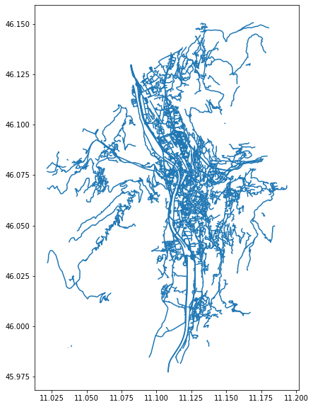
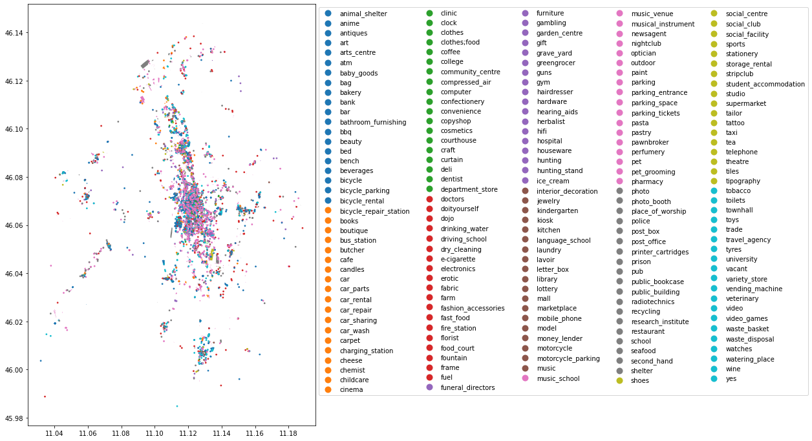

*Lesson 16 October 2020*
{: .no_toc }

## Table of contents
{: .no_toc .text-delta }

1. TOC
{:toc}

---
# **Retrieving data from OpenStreetMap**

## goals of the tutorial
- understand openstreetmap
- understand the openstreetmap data model
- manage openstreetmap data in geopandas

### requirements
- python knowledge
- geopandas
- gis concepts

### status
"OpenStreetMap is a commons"
---

# Setup


```
!pip install -U pygeos
```

    Requirement already up-to-date: pygeos in /usr/local/lib/python3.6/dist-packages (0.8)
    Requirement already satisfied, skipping upgrade: numpy>=1.10 in /usr/local/lib/python3.6/dist-packages (from pygeos) (1.18.5)


```
!pip install geopandas
```

    Collecting geopandas
    [?25l  Downloading https://files.pythonhosted.org/packages/f7/a4/e66aafbefcbb717813bf3a355c8c4fc3ed04ea1dd7feb2920f2f4f868921/geopandas-0.8.1-py2.py3-none-any.whl (962kB)
         |████████████████████████████████| 972kB 2.8MB/s 
    [?25hRequirement already satisfied: pandas>=0.23.0 in /usr/local/lib/python3.6/dist-packages (from geopandas) (1.1.2)
    Collecting pyproj>=2.2.0
    [?25l  Downloading https://files.pythonhosted.org/packages/e5/c3/071e080230ac4b6c64f1a2e2f9161c9737a2bc7b683d2c90b024825000c0/pyproj-2.6.1.post1-cp36-cp36m-manylinux2010_x86_64.whl (10.9MB)
         |████████████████████████████████| 10.9MB 15.0MB/s 
    [?25hCollecting fiona
    [?25l  Downloading https://files.pythonhosted.org/packages/36/8b/e8b2c11bed5373c8e98edb85ce891b09aa1f4210fd451d0fb3696b7695a2/Fiona-1.8.17-cp36-cp36m-manylinux1_x86_64.whl (14.8MB)
         |████████████████████████████████| 14.8MB 314kB/s 
    [?25hRequirement already satisfied: shapely in /usr/local/lib/python3.6/dist-packages (from geopandas) (1.7.1)
    Requirement already satisfied: numpy>=1.15.4 in /usr/local/lib/python3.6/dist-packages (from pandas>=0.23.0->geopandas) (1.18.5)
    Requirement already satisfied: python-dateutil>=2.7.3 in /usr/local/lib/python3.6/dist-packages (from pandas>=0.23.0->geopandas) (2.8.1)
    Requirement already satisfied: pytz>=2017.2 in /usr/local/lib/python3.6/dist-packages (from pandas>=0.23.0->geopandas) (2018.9)
    Collecting cligj>=0.5
      Downloading https://files.pythonhosted.org/packages/e4/be/30a58b4b0733850280d01f8bd132591b4668ed5c7046761098d665ac2174/cligj-0.5.0-py3-none-any.whl
    Collecting click-plugins>=1.0
      Downloading https://files.pythonhosted.org/packages/e9/da/824b92d9942f4e472702488857914bdd50f73021efea15b4cad9aca8ecef/click_plugins-1.1.1-py2.py3-none-any.whl
    Collecting munch
      Downloading https://files.pythonhosted.org/packages/cc/ab/85d8da5c9a45e072301beb37ad7f833cd344e04c817d97e0cc75681d248f/munch-2.5.0-py2.py3-none-any.whl
    Requirement already satisfied: six>=1.7 in /usr/local/lib/python3.6/dist-packages (from fiona->geopandas) (1.15.0)
    Requirement already satisfied: click<8,>=4.0 in /usr/local/lib/python3.6/dist-packages (from fiona->geopandas) (7.1.2)
    Requirement already satisfied: attrs>=17 in /usr/local/lib/python3.6/dist-packages (from fiona->geopandas) (20.2.0)
    Installing collected packages: pyproj, cligj, click-plugins, munch, fiona, geopandas
    Successfully installed click-plugins-1.1.1 cligj-0.5.0 fiona-1.8.17 geopandas-0.8.1 munch-2.5.0 pyproj-2.6.1.post1


```
!pip install pyrosm
```

    Collecting pyrosm
    [?25l  Downloading https://files.pythonhosted.org/packages/7c/ba/10de4eac775235554f52b9d02f21bcddd32deaeec027b1029553dc6befdc/pyrosm-0.5.3.tar.gz (2.0MB)
         |████████████████████████████████| 2.0MB 2.7MB/s 
    [?25h  Installing build dependencies ... [?25l[?25hdone
      Getting requirements to build wheel ... [?25l[?25hdone
      Installing backend dependencies ... [?25l[?25hdone
        Preparing wheel metadata ... [?25l[?25hdone
    Requirement already satisfied: geopandas in /usr/local/lib/python3.6/dist-packages (from pyrosm) (0.8.1)
    WARNING: Retrying (Retry(total=4, connect=None, read=None, redirect=None, status=None)) after connection broken by 'ProtocolError('Connection aborted.', ConnectionResetError(104, 'Connection reset by peer'))': /simple/python-rapidjson/
    Collecting python-rapidjson
      Using cached https://files.pythonhosted.org/packages/9e/cb/085b893850110d4e20ef3624808ccaec0515c07da0400e58bdd3ca73c5e3/python_rapidjson-0.9.1-cp36-cp36m-manylinux2010_x86_64.whl
    Requirement already satisfied: pygeos in /usr/local/lib/python3.6/dist-packages (from pyrosm) (0.8)
    Requirement already satisfied: setuptools>=18.0 in /usr/local/lib/python3.6/dist-packages (from pyrosm) (50.3.0)
    Processing /root/.cache/pip/wheels/12/d5/09/836011d00b6e694dfade8025669266260834574f47cfe18f62/cykhash-1.0.2-cp36-cp36m-linux_x86_64.whl
    Processing /root/.cache/pip/wheels/a2/2b/e3/1800624884ba9461b903a05a809ff1c10317603a6ee8e74155/pyrobuf-0.9.3-cp36-cp36m-linux_x86_64.whl
    Requirement already satisfied: pandas>=0.23.0 in /usr/local/lib/python3.6/dist-packages (from geopandas->pyrosm) (1.1.2)
    Requirement already satisfied: shapely in /usr/local/lib/python3.6/dist-packages (from geopandas->pyrosm) (1.7.1)
    Requirement already satisfied: pyproj>=2.2.0 in /usr/local/lib/python3.6/dist-packages (from geopandas->pyrosm) (2.6.1.post1)
    Requirement already satisfied: fiona in /usr/local/lib/python3.6/dist-packages (from geopandas->pyrosm) (1.8.17)
    Requirement already satisfied: numpy>=1.10 in /usr/local/lib/python3.6/dist-packages (from pygeos->pyrosm) (1.18.5)
    Requirement already satisfied: cython>=0.23 in /usr/local/lib/python3.6/dist-packages (from pyrobuf->pyrosm) (0.29.21)
    Requirement already satisfied: jinja2>=2.8 in /usr/local/lib/python3.6/dist-packages (from pyrobuf->pyrosm) (2.11.2)
    Requirement already satisfied: python-dateutil>=2.7.3 in /usr/local/lib/python3.6/dist-packages (from pandas>=0.23.0->geopandas->pyrosm) (2.8.1)
    Requirement already satisfied: pytz>=2017.2 in /usr/local/lib/python3.6/dist-packages (from pandas>=0.23.0->geopandas->pyrosm) (2018.9)
    Requirement already satisfied: attrs>=17 in /usr/local/lib/python3.6/dist-packages (from fiona->geopandas->pyrosm) (20.2.0)
    Requirement already satisfied: six>=1.7 in /usr/local/lib/python3.6/dist-packages (from fiona->geopandas->pyrosm) (1.15.0)
    Requirement already satisfied: munch in /usr/local/lib/python3.6/dist-packages (from fiona->geopandas->pyrosm) (2.5.0)
    Requirement already satisfied: click<8,>=4.0 in /usr/local/lib/python3.6/dist-packages (from fiona->geopandas->pyrosm) (7.1.2)
    Requirement already satisfied: click-plugins>=1.0 in /usr/local/lib/python3.6/dist-packages (from fiona->geopandas->pyrosm) (1.1.1)
    Requirement already satisfied: cligj>=0.5 in /usr/local/lib/python3.6/dist-packages (from fiona->geopandas->pyrosm) (0.5.0)
    Requirement already satisfied: MarkupSafe>=0.23 in /usr/local/lib/python3.6/dist-packages (from jinja2>=2.8->pyrobuf->pyrosm) (1.1.1)
    Building wheels for collected packages: pyrosm
      Building wheel for pyrosm (PEP 517) ... [?25l[?25hdone
      Created wheel for pyrosm: filename=pyrosm-0.5.3-cp36-cp36m-linux_x86_64.whl size=5013177 sha256=aba675d00a87e3ae4a3d820ab8d110a59bdc5284806d9d15fb2e770965415093
      Stored in directory: /root/.cache/pip/wheels/a8/ca/18/ff3b302d589113fac92b89d73c135eeb5d0c62c06ae32441e8
    Successfully built pyrosm
    Installing collected packages: python-rapidjson, cykhash, pyrobuf, pyrosm
    Successfully installed cykhash-1.0.2 pyrobuf-0.9.3 pyrosm-0.5.3 python-rapidjson-0.9.1


# OpenStreetMap


[slide](https://docs.google.com/presentation/d/e/2PACX-1vT91FHgpKShrTx4H6AlsmLmAb00Pe0QUB_LKugBdoP1N6pAl_sdFKKnDu0msDzmTwxjI7OXh-dbPb-K/pub?start=false&loop=false&delayms=3000)

# Raw Data
OSM XML


...


...


## OverPass API


http://overpass-turbo.eu/

## Protocol Buffer
https://developers.google.com/protocol-buffers 


Export from HOTOSM


https://export.hotosm.org/en/v3/exports/91f6bf76-f310-46fe-a6dd-8f230489d1aa

# PYROSM

OpenStreetMap PBF data parser for Python

note: install it always after geopandas


```
import pyrosm
from pyrosm.data import sources
```

    /usr/local/lib/python3.6/dist-packages/geopandas/_compat.py:88: UserWarning: The Shapely GEOS version (3.8.0-CAPI-1.13.1 ) is incompatible with the GEOS version PyGEOS was compiled with (3.8.1-CAPI-1.13.3). Conversions between both will be slow.
      shapely_geos_version, geos_capi_version_string
    /usr/local/lib/python3.6/dist-packages/pyrosm/utils/_compat.py:12: UserWarning: The Shapely GEOS version (3.8.0-CAPI-1.13.1 ) is incompatible with the GEOS version PyGEOS was compiled with (3.8.1-CAPI-1.13.3). The tool will work but it runs a bit slower.
      shapely_geos_version, geos_capi_version_string


Print available source categories


```
sources.available.keys()
```


    dict_keys(['africa', 'antarctica', 'asia', 'australia_oceania', 'central_america', 'europe', 'north_america', 'south_america', 'cities', 'subregions'])


Prints a list of countries in Europa that can be downloaded


```
sources.europe.available
```


    ['albania',
     'andorra',
     'austria',
     'azores',
     'belarus',
     'belgium',
     'bosnia_herzegovina',
     'bulgaria',
     'croatia',
     'cyprus',
     'czech_republic',
     'denmark',
     'estonia',
     'faroe_islands',
     'finland',
     'france',
     'georgia',
     'germany',
     'great_britain',
     'greece',
     'hungary',
     'iceland',
     'ireland_and_northern_ireland',
     'isle_of_man',
     'italy',
     'kosovo',
     'latvia',
     'liechtenstein',
     'lithuania',
     'luxembourg',
     'macedonia',
     'malta',
     'moldova',
     'monaco',
     'montenegro',
     'netherlands',
     'norway',
     'poland',
     'portugal',
     'romania',
     'russia',
     'serbia',
     'slovakia',
     'slovenia',
     'spain',
     'sweden',
     'switzerland',
     'turkey',
     'ukraine']


Print a list of all cities that can be downloaded


```
sources.cities.available
```


    ['Aachen',
     'Aarhus',
     'Adelaide',
     'Albuquerque',
     'Alexandria',
     'Amsterdam',
     'Antwerpen',
     'Arnhem',
     'Auckland',
     'Augsburg',
     'Austin',
     'Baghdad',
     'Baku',
     'Balaton',
     'Bamberg',
     'Bangkok',
     'Barcelona',
     'Basel',
     'Beijing',
     'Beirut',
     'Berkeley',
     'Berlin',
     'Bern',
     'Bielefeld',
     'Birmingham',
     'Bochum',
     'Bogota',
     'Bombay',
     'Bonn',
     'Bordeaux',
     'Boulder',
     'BrandenburgHavel',
     'Braunschweig',
     'Bremen',
     'Bremerhaven',
     'Brisbane',
     'Bristol',
     'Brno',
     'Bruegge',
     'Bruessel',
     'Budapest',
     'BuenosAires',
     'Cairo',
     'Calgary',
     'Cambridge',
     'CambridgeMa',
     'Canberra',
     'CapeTown',
     'Chemnitz',
     'Chicago',
     'ClermontFerrand',
     'Colmar',
     'Copenhagen',
     'Cork',
     'Corsica',
     'Corvallis',
     'Cottbus',
     'Cracow',
     'CraterLake',
     'Curitiba',
     'Cusco',
     'Dallas',
     'Darmstadt',
     'Davis',
     'DenHaag',
     'Denver',
     'Dessau',
     'Dortmund',
     'Dresden',
     'Dublin',
     'Duesseldorf',
     'Duisburg',
     'Edinburgh',
     'Eindhoven',
     'Emden',
     'Erfurt',
     'Erlangen',
     'Eugene',
     'Flensburg',
     'FortCollins',
     'Frankfurt',
     'FrankfurtOder',
     'Freiburg',
     'Gdansk',
     'Genf',
     'Gent',
     'Gera',
     'Glasgow',
     'Gliwice',
     'Goerlitz',
     'Goeteborg',
     'Goettingen',
     'Graz',
     'Groningen',
     'Halifax',
     'Halle',
     'Hamburg',
     'Hamm',
     'Hannover',
     'Heilbronn',
     'Helsinki',
     'Hertogenbosch',
     'Huntsville',
     'Innsbruck',
     'Istanbul',
     'Jena',
     'Jerusalem',
     'Johannesburg',
     'Kaiserslautern',
     'Karlsruhe',
     'Kassel',
     'Katowice',
     'Kaunas',
     'Kiel',
     'Kiew',
     'Koblenz',
     'Koeln',
     'Konstanz',
     'LaPaz',
     'LaPlata',
     'LakeGarda',
     'Lausanne',
     'Leeds',
     'Leipzig',
     'Lima',
     'Linz',
     'Lisbon',
     'Liverpool',
     'Ljubljana',
     'Lodz',
     'London',
     'Luebeck',
     'Luxemburg',
     'Lyon',
     'Maastricht',
     'Madison',
     'Madrid',
     'Magdeburg',
     'Mainz',
     'Malmoe',
     'Manchester',
     'Mannheim',
     'Marseille',
     'Melbourne',
     'Memphis',
     'MexicoCity',
     'Miami',
     'Moenchengladbach',
     'Montevideo',
     'Montpellier',
     'Montreal',
     'Moscow',
     'Muenchen',
     'Muenster',
     'NewDelhi',
     'NewOrleans',
     'NewYorkCity',
     'Nuernberg',
     'Oldenburg',
     'Oranienburg',
     'Orlando',
     'Oslo',
     'Osnabrueck',
     'Ostrava',
     'Ottawa',
     'Paderborn',
     'Palma',
     'PaloAlto',
     'Paris',
     'Perth',
     'Philadelphia',
     'PhnomPenh',
     'Portland',
     'PortlandME',
     'Porto',
     'PortoAlegre',
     'Potsdam',
     'Poznan',
     'Prag',
     'Providence',
     'Regensburg',
     'Riga',
     'RiodeJaneiro',
     'Rostock',
     'Rotterdam',
     'Ruegen',
     'Saarbruecken',
     'Sacramento',
     'Saigon',
     'Salzburg',
     'SanFrancisco',
     'SanJose',
     'SanktPetersburg',
     'SantaBarbara',
     'SantaCruz',
     'Santiago',
     'Sarajewo',
     'Schwerin',
     'Seattle',
     'Seoul',
     'Sheffield',
     'Singapore',
     'Sofia',
     'Stockholm',
     'Stockton',
     'Strassburg',
     'Stuttgart',
     'Sucre',
     'Sydney',
     'Szczecin',
     'Tallinn',
     'Tehran',
     'Tilburg',
     'Tokyo',
     'Toronto',
     'Toulouse',
     'Trondheim',
     'Tucson',
     'Turin',
     'UlanBator',
     'Ulm',
     'Usedom',
     'Utrecht',
     'Vancouver',
     'Victoria',
     'WarenMueritz',
     'Warsaw',
     'WashingtonDC',
     'Waterloo',
     'Wien',
     'Wroclaw',
     'Wuerzburg',
     'Wuppertal',
     'Zagreb',
     'Zuerich']


Check all countries having sub-regions


```
sources.subregions.available.keys()
```


    dict_keys(['brazil', 'canada', 'france', 'germany', 'great_britain', 'italy', 'japan', 'netherlands', 'poland', 'russia', 'usa'])


Check sub-regions in Italy


```
sources.subregions.italy.available

```


    ['centro', 'isole', 'nord_est', 'nord_ovest', 'sud']


there aren't other subregions or cities ... 


```
!wget https://github.com/napo/geospatial_course_unitn/raw/master/data/openstreetmap/trento.osm.pbf
```

    --2020-10-16 09:56:46--  https://github.com/napo/geospatial_course_unitn/raw/master/data/openstreetmap/trento.osm.pbf
    Resolving github.com (github.com)... 52.192.72.89
    Connecting to github.com (github.com)|52.192.72.89|:443... connected.
    HTTP request sent, awaiting response... 302 Found
    Location: https://raw.githubusercontent.com/napo/geospatial_course_unitn/master/data/openstreetmap/trento.osm.pbf [following]
    --2020-10-16 09:56:47--  https://raw.githubusercontent.com/napo/geospatial_course_unitn/master/data/openstreetmap/trento.osm.pbf
    Resolving raw.githubusercontent.com (raw.githubusercontent.com)... 151.101.0.133, 151.101.64.133, 151.101.128.133, ...
    Connecting to raw.githubusercontent.com (raw.githubusercontent.com)|151.101.0.133|:443... connected.
    HTTP request sent, awaiting response... 200 OK
    Length: 11180448 (11M) [application/octet-stream]
    Saving to: ‘trento.osm.pbf’
    
    trento.osm.pbf      100%[===================>]  10.66M  20.9MB/s    in 0.5s    
    
    2020-10-16 09:56:49 (20.9 MB/s) - ‘trento.osm.pbf’ saved [11180448/11180448]
    


```
!wget https://github.com/napo/geospatial_course_unitn/raw/master/data/openstreetmap/trento_boundary.geojson
```

    --2020-10-16 09:56:55--  https://github.com/napo/geospatial_course_unitn/raw/master/data/openstreetmap/trento_boundary.geojson
    Resolving github.com (github.com)... 52.192.72.89
    Connecting to github.com (github.com)|52.192.72.89|:443... connected.
    HTTP request sent, awaiting response... 302 Found
    Location: https://raw.githubusercontent.com/napo/geospatial_course_unitn/master/data/openstreetmap/trento_boundary.geojson [following]
    --2020-10-16 09:56:55--  https://raw.githubusercontent.com/napo/geospatial_course_unitn/master/data/openstreetmap/trento_boundary.geojson
    Resolving raw.githubusercontent.com (raw.githubusercontent.com)... 151.101.0.133, 151.101.64.133, 151.101.128.133, ...
    Connecting to raw.githubusercontent.com (raw.githubusercontent.com)|151.101.0.133|:443... connected.
    HTTP request sent, awaiting response... 200 OK
    Length: 11532 (11K) [text/plain]
    Saving to: ‘trento_boundary.geojson’
    
    trento_boundary.geo 100%[===================>]  11.26K  --.-KB/s    in 0s      
    
    2020-10-16 09:56:55 (96.0 MB/s) - ‘trento_boundary.geojson’ saved [11532/11532]
    


```
!pwd
```

    /content


```
import geopandas as gpd
```


```
trento_boundary = gpd.read_file("trento_boundary.geojson")
```


```
bbox_geom = trento_boundary['geometry'].values[0]
```


```
# Get the shapely geometry from GeoDataFrame
bbox_geom = trento_boundary['geometry'].values[0]
```


```
bbox_geom
```


    

    


```
osm = pyrosm.OSM("/content/trento.osm.pbf",bounding_box=bbox_geom)
```


```
osm.conf.tags.available
```


    ['aerialway',
     'aeroway',
     'amenity',
     'boundary',
     'building',
     'craft',
     'emergency',
     'geological',
     'highway',
     'historic',
     'landuse',
     'leisure',
     'natural',
     'office',
     'power',
     'public_transport',
     'railway',
     'route',
     'place',
     'shop',
     'tourism',
     'waterway']


```
osm.conf.tags.amenity
```


    ['addr:city',
     'addr:country',
     'addr:full',
     'addr:housenumber',
     'addr:housename',
     'addr:postcode',
     'addr:place',
     'addr:street',
     'email',
     'name',
     'opening_hours',
     'operator',
     'phone',
     'ref',
     'url',
     'website',
     'yes',
     'amenity',
     'arts_centre',
     'atm',
     'bank',
     'bicycle_parking',
     'bicycle_rental',
     'bicycle_repair_station',
     'bar',
     'bbq',
     'biergarten',
     'brothel',
     'building',
     'building:levels',
     'bureau_de_change',
     'bus_station',
     'bus_stop',
     'cafe',
     'car_rental',
     'car_repair',
     'car_sharing',
     'car_wash',
     'casino',
     'charging_station',
     'childcare',
     'cinema',
     'clinic',
     'college',
     'dentist',
     'doctors',
     'driving_school',
     'drinking_water',
     'fast_food',
     'ferry_terminal',
     'fire_station',
     'food_court',
     'fountain',
     'fuel',
     'gambling',
     'hospital',
     'ice_cream',
     'internet_access',
     'kindergarten',
     'landuse',
     'language_school',
     'library',
     'music_school',
     'nightclub',
     'nursing_home',
     'office',
     'operator',
     'parking',
     'pharmasy',
     'planetarium',
     'police',
     'post_office',
     'pub',
     'public_bath',
     'rescue_station',
     'restaurant',
     'retirement_home',
     'school',
     'social_centre',
     'social_facility',
     'source',
     'spa',
     'start_date',
     'stripclub',
     'taxi',
     'theatre',
     'university',
     'wikipedia']


```
buildings = osm.get_buildings()
buildings.plot(figsize=(12,12))
%time
```

    CPU times: user 2 µs, sys: 0 ns, total: 2 µs
    Wall time: 4.77 µs


    

    


```
buildings.head(4)
```


<div>
<style scoped>
    .dataframe tbody tr th:only-of-type {
        vertical-align: middle;
    }

    .dataframe tbody tr th {
        vertical-align: top;
    }

    .dataframe thead th {
        text-align: right;
    }
</style>
<table border="1" class="dataframe">
  <thead>
    <tr style="text-align: right;">
      <th></th>
      <th>addr:city</th>
      <th>addr:country</th>
      <th>addr:housenumber</th>
      <th>addr:housename</th>
      <th>addr:postcode</th>
      <th>addr:place</th>
      <th>addr:street</th>
      <th>email</th>
      <th>name</th>
      <th>opening_hours</th>
      <th>operator</th>
      <th>phone</th>
      <th>url</th>
      <th>website</th>
      <th>building</th>
      <th>amenity</th>
      <th>building:levels</th>
      <th>building:material</th>
      <th>building:min_level</th>
      <th>building:use</th>
      <th>craft</th>
      <th>height</th>
      <th>internet_access</th>
      <th>landuse</th>
      <th>office</th>
      <th>shop</th>
      <th>source</th>
      <th>start_date</th>
      <th>wikipedia</th>
      <th>id</th>
      <th>timestamp</th>
      <th>version</th>
      <th>tags</th>
      <th>geometry</th>
      <th>osm_type</th>
      <th>levels</th>
      <th>changeset</th>
    </tr>
  </thead>
  <tbody>
    <tr>
      <th>0</th>
      <td>None</td>
      <td>None</td>
      <td>18</td>
      <td>None</td>
      <td>38122</td>
      <td>None</td>
      <td>Piazza del Duomo</td>
      <td>None</td>
      <td>Palazzo Pretorio</td>
      <td>None</td>
      <td>None</td>
      <td>+39 0461 234419</td>
      <td>None</td>
      <td>http://museodiocesanotridentino.it</td>
      <td>yes</td>
      <td>None</td>
      <td>None</td>
      <td>None</td>
      <td>None</td>
      <td>None</td>
      <td>None</td>
      <td>None</td>
      <td>None</td>
      <td>None</td>
      <td>None</td>
      <td>None</td>
      <td>None</td>
      <td>None</td>
      <td>it:Palazzo_Pretorio_(Trento)</td>
      <td>24785843</td>
      <td>1594291784</td>
      <td>8</td>
      <td>{"access":"customers","castle_type":"palace","...</td>
      <td>POLYGON ((11.12216 46.06701, 11.12205 46.06701...</td>
      <td>way</td>
      <td>NaN</td>
      <td>NaN</td>
    </tr>
    <tr>
      <th>1</th>
      <td>None</td>
      <td>None</td>
      <td>None</td>
      <td>None</td>
      <td>None</td>
      <td>None</td>
      <td>None</td>
      <td>None</td>
      <td>P3 - Garage Autosilo Buonconsiglio</td>
      <td>None</td>
      <td>Trentino Mobilità S.p.A.</td>
      <td>None</td>
      <td>None</td>
      <td>None</td>
      <td>parking</td>
      <td>parking</td>
      <td>None</td>
      <td>None</td>
      <td>None</td>
      <td>None</td>
      <td>None</td>
      <td>20</td>
      <td>None</td>
      <td>None</td>
      <td>None</td>
      <td>None</td>
      <td>None</td>
      <td>None</td>
      <td>None</td>
      <td>24860487</td>
      <td>1545761896</td>
      <td>17</td>
      <td>{"capacity":"480","capacity:disabled":"yes","c...</td>
      <td>POLYGON ((11.12432 46.07414, 11.12430 46.07420...</td>
      <td>way</td>
      <td>NaN</td>
      <td>NaN</td>
    </tr>
    <tr>
      <th>2</th>
      <td>None</td>
      <td>None</td>
      <td>None</td>
      <td>None</td>
      <td>None</td>
      <td>None</td>
      <td>None</td>
      <td>None</td>
      <td>Laboratori Ingegneria</td>
      <td>None</td>
      <td>None</td>
      <td>None</td>
      <td>None</td>
      <td>None</td>
      <td>university</td>
      <td>None</td>
      <td>None</td>
      <td>None</td>
      <td>None</td>
      <td>None</td>
      <td>None</td>
      <td>None</td>
      <td>None</td>
      <td>None</td>
      <td>None</td>
      <td>None</td>
      <td>None</td>
      <td>None</td>
      <td>None</td>
      <td>24862284</td>
      <td>1593194970</td>
      <td>4</td>
      <td>None</td>
      <td>POLYGON ((11.13954 46.06698, 11.13948 46.06644...</td>
      <td>way</td>
      <td>NaN</td>
      <td>NaN</td>
    </tr>
    <tr>
      <th>3</th>
      <td>None</td>
      <td>None</td>
      <td>None</td>
      <td>None</td>
      <td>None</td>
      <td>None</td>
      <td>None</td>
      <td>None</td>
      <td>Mensa e bar Mesiano</td>
      <td>None</td>
      <td>None</td>
      <td>None</td>
      <td>None</td>
      <td>None</td>
      <td>university</td>
      <td>restaurant</td>
      <td>None</td>
      <td>None</td>
      <td>None</td>
      <td>None</td>
      <td>None</td>
      <td>None</td>
      <td>None</td>
      <td>None</td>
      <td>None</td>
      <td>None</td>
      <td>None</td>
      <td>None</td>
      <td>None</td>
      <td>24862387</td>
      <td>1593194970</td>
      <td>2</td>
      <td>None</td>
      <td>POLYGON ((11.13982 46.06637, 11.13981 46.06612...</td>
      <td>way</td>
      <td>NaN</td>
      <td>NaN</td>
    </tr>
  </tbody>
</table>
</div>


```
drive_net = osm.get_network(network_type="driving")
drive_net.plot(figsize=(10,10))
%time
```

    CPU times: user 6 µs, sys: 1e+03 ns, total: 7 µs
    Wall time: 7.15 µs


    

    


```
walk = osm.get_network("walking")
walk.plot(color="k", figsize=(12,12), lw=0.7, alpha=0.6)
```


    <matplotlib.axes._subplots.AxesSubplot at 0x7f5624666b70>


    

    


```
custom_filter = {'amenity': True, "shop": True}
pois = osm.get_pois(custom_filter=custom_filter)

# Gather info about POI type (combines the tag info from "amenity" and "shop")
pois["poi_type"] = pois["amenity"]
pois["poi_type"] = pois["poi_type"].fillna(pois["shop"])

# Plot
ax = pois.plot(column='poi_type', markersize=3, figsize=(12,12), legend=True, legend_kwds=dict(loc='upper left', ncol=5, bbox_to_anchor=(1, 1)))

%time
```

    CPU times: user 2 µs, sys: 0 ns, total: 2 µs
    Wall time: 4.53 µs


    

    


```
natural = osm.get_natural()
natural.plot(column='natural', legend=True, figsize=(12,12))
```


    <matplotlib.axes._subplots.AxesSubplot at 0x7f5624416320>


    

    


---
# Exercises
- download from OpenStreetMap all supermarkets inside the bounding box of the city with these coordinates <br/>latitude: 46.21209<br/>
longitude: 11.09351<br/>
- identify the longest road of the city (state roads, walking routes, motorways are excluded).<br/>
Please use "unclassified"
- How many drinking water are in this city?
- how many benches in this city have the backrest?

suggestion: on the website http://www.geodati.fmach.it/italia_osm.html you can find PBF at regional level of Italy

