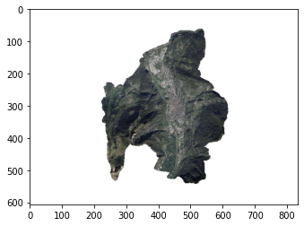
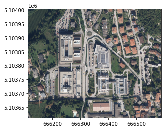
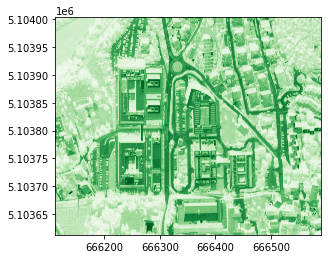
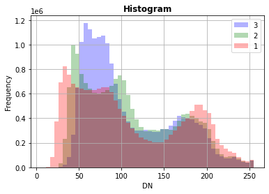
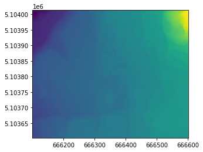
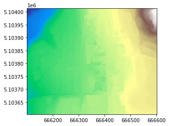
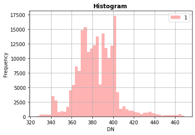
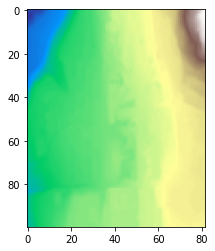
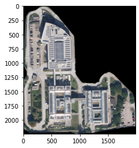

*Lesson 30 October 2020*

{: .no_toc }

## Table of contents
{: .no_toc .text-delta }

1. TOC
{:toc}

---
# Basic operations on raster data

based on rasterio
goals of the tutorial

- manage raster data
- manipulate raster with vector data

based on the open data of:
- [orthophotos](https://www.comune.trento.it/Aree-tematiche/Cartografia/Download/Ortofoto-2019) of Municipality of Trento 
- [DTM](http://www.territorio.provincia.tn.it/portal/server.pt/community/lidar/847/lidar/23954) - Autonomous Province of Trento

requirements
- python knowledge
- geopandas

status<br/>
*the world in a matrix*

# Introduction


small summary:
view the [slides](https://docs.google.com/presentation/d/e/2PACX-1vT_my7vYOE2_xOdD-eZOtjxEFrbi1BfMcx_84jwomsVgI5wOfPxBO6sPNhxPtaLuEhrrkxmPbiv5Na0/pub?start=false&loop=false&delayms=3000) from the page 11 until 19


# Setup


```bash
!pip install geopandas
```

    Collecting geopandas
    [?25l  Downloading https://files.pythonhosted.org/packages/f7/a4/e66aafbefcbb717813bf3a355c8c4fc3ed04ea1dd7feb2920f2f4f868921/geopandas-0.8.1-py2.py3-none-any.whl (962kB)
         |████████████████████████████████| 972kB 2.8MB/s 
    [?25hCollecting pyproj>=2.2.0
    [?25l  Downloading https://files.pythonhosted.org/packages/e5/c3/071e080230ac4b6c64f1a2e2f9161c9737a2bc7b683d2c90b024825000c0/pyproj-2.6.1.post1-cp36-cp36m-manylinux2010_x86_64.whl (10.9MB)
         |████████████████████████████████| 10.9MB 15.8MB/s 
    [?25hRequirement already satisfied: pandas>=0.23.0 in /usr/local/lib/python3.6/dist-packages (from geopandas) (1.1.3)
    Requirement already satisfied: shapely in /usr/local/lib/python3.6/dist-packages (from geopandas) (1.7.1)
    Collecting fiona
    [?25l  Downloading https://files.pythonhosted.org/packages/36/8b/e8b2c11bed5373c8e98edb85ce891b09aa1f4210fd451d0fb3696b7695a2/Fiona-1.8.17-cp36-cp36m-manylinux1_x86_64.whl (14.8MB)
         |████████████████████████████████| 14.8MB 266kB/s 
    [?25hRequirement already satisfied: python-dateutil>=2.7.3 in /usr/local/lib/python3.6/dist-packages (from pandas>=0.23.0->geopandas) (2.8.1)
    Requirement already satisfied: pytz>=2017.2 in /usr/local/lib/python3.6/dist-packages (from pandas>=0.23.0->geopandas) (2018.9)
    Requirement already satisfied: numpy>=1.15.4 in /usr/local/lib/python3.6/dist-packages (from pandas>=0.23.0->geopandas) (1.18.5)
    Requirement already satisfied: attrs>=17 in /usr/local/lib/python3.6/dist-packages (from fiona->geopandas) (20.2.0)
    Collecting click-plugins>=1.0
      Downloading https://files.pythonhosted.org/packages/e9/da/824b92d9942f4e472702488857914bdd50f73021efea15b4cad9aca8ecef/click_plugins-1.1.1-py2.py3-none-any.whl
    Requirement already satisfied: click<8,>=4.0 in /usr/local/lib/python3.6/dist-packages (from fiona->geopandas) (7.1.2)
    Collecting cligj>=0.5
      Downloading https://files.pythonhosted.org/packages/ba/06/e3440b1f2dc802d35f329f299ba96153e9fcbfdef75e17f4b61f79430c6a/cligj-0.7.0-py3-none-any.whl
    Requirement already satisfied: six>=1.7 in /usr/local/lib/python3.6/dist-packages (from fiona->geopandas) (1.15.0)
    Collecting munch
      Downloading https://files.pythonhosted.org/packages/cc/ab/85d8da5c9a45e072301beb37ad7f833cd344e04c817d97e0cc75681d248f/munch-2.5.0-py2.py3-none-any.whl
    Installing collected packages: pyproj, click-plugins, cligj, munch, fiona, geopandas
    Successfully installed click-plugins-1.1.1 cligj-0.7.0 fiona-1.8.17 geopandas-0.8.1 munch-2.5.0 pyproj-2.6.1.post1


```bash
!pip install rasterio

```

    Collecting rasterio
    [?25l  Downloading https://files.pythonhosted.org/packages/33/1a/51baddc8581ead98fcef591624b4b2521b581943a9178912a2ac576e0235/rasterio-1.1.8-1-cp36-cp36m-manylinux1_x86_64.whl (18.3MB)
         |████████████████████████████████| 18.3MB 1.3MB/s 
    [?25hRequirement already satisfied: click-plugins in /usr/local/lib/python3.6/dist-packages (from rasterio) (1.1.1)
    Requirement already satisfied: numpy in /usr/local/lib/python3.6/dist-packages (from rasterio) (1.18.5)
    Requirement already satisfied: click<8,>=4.0 in /usr/local/lib/python3.6/dist-packages (from rasterio) (7.1.2)
    Requirement already satisfied: cligj>=0.5 in /usr/local/lib/python3.6/dist-packages (from rasterio) (0.7.0)
    Requirement already satisfied: attrs in /usr/local/lib/python3.6/dist-packages (from rasterio) (20.2.0)
    Collecting snuggs>=1.4.1
      Downloading https://files.pythonhosted.org/packages/cc/0e/d27d6e806d6c0d1a2cfdc5d1f088e42339a0a54a09c3343f7f81ec8947ea/snuggs-1.4.7-py3-none-any.whl
    Collecting affine
      Downloading https://files.pythonhosted.org/packages/ac/a6/1a39a1ede71210e3ddaf623982b06ecfc5c5c03741ae659073159184cd3e/affine-2.3.0-py2.py3-none-any.whl
    Requirement already satisfied: pyparsing>=2.1.6 in /usr/local/lib/python3.6/dist-packages (from snuggs>=1.4.1->rasterio) (2.4.7)
    Installing collected packages: snuggs, affine, rasterio
    Successfully installed affine-2.3.0 rasterio-1.1.8 snuggs-1.4.7


# Data

Orthophoto of Trento 2019

https://www.comune.trento.it/Aree-tematiche/Cartografia/Download/Ortofoto-2019

- data acquisition: 3th October 2019
- scale 1:2.000
- resolution 1px = 10cm
- [tiff file](https://webapps.comune.trento.it/gis/raster/ortofoto_2019.tif) size 3,5Gb
- crs ETRS89 / UTM zone 32N - EPSG:[25832](https://epsg.io/25832)
- [tfw file](https://webapps.comune.trento.it/gis/raster/ortofoto_2019.tfw)


... file too big for our purpose

The municipality of Trento [offers](https://www.comune.trento.it/Aree-tematiche/Cartografia/Servizi-WMS-e-WFS) also a WMS service

Please check the lesson "[Retrieving data from spatial database infrastructures](https://napo.github.io/geospatial_course_unitn/lessons/retrieving_data_from_sdi)" 


The end point of the WMS is http://webapps.comune.trento.it/ogc

---


```bash
!pip install owslib
```

    Collecting owslib
    [?25l  Downloading https://files.pythonhosted.org/packages/c4/6a/428d73506f6f5281408b518249b90d7c96a1394c6d954a2069cbd5a4ac39/OWSLib-0.20.0-py2.py3-none-any.whl (197kB)
         |████████████████████████████████| 204kB 2.8MB/s 
    [?25hRequirement already satisfied: pyproj>=2 in /usr/local/lib/python3.6/dist-packages (from owslib) (2.6.1.post1)
    Requirement already satisfied: pytz in /usr/local/lib/python3.6/dist-packages (from owslib) (2018.9)
    Requirement already satisfied: python-dateutil>=1.5 in /usr/local/lib/python3.6/dist-packages (from owslib) (2.8.1)
    Requirement already satisfied: requests>=1.0 in /usr/local/lib/python3.6/dist-packages (from owslib) (2.23.0)
    Requirement already satisfied: pyyaml in /usr/local/lib/python3.6/dist-packages (from owslib) (3.13)
    Requirement already satisfied: six>=1.5 in /usr/local/lib/python3.6/dist-packages (from python-dateutil>=1.5->owslib) (1.15.0)
    Requirement already satisfied: urllib3!=1.25.0,!=1.25.1,<1.26,>=1.21.1 in /usr/local/lib/python3.6/dist-packages (from requests>=1.0->owslib) (1.24.3)
    Requirement already satisfied: certifi>=2017.4.17 in /usr/local/lib/python3.6/dist-packages (from requests>=1.0->owslib) (2020.6.20)
    Requirement already satisfied: idna<3,>=2.5 in /usr/local/lib/python3.6/dist-packages (from requests>=1.0->owslib) (2.10)
    Requirement already satisfied: chardet<4,>=3.0.2 in /usr/local/lib/python3.6/dist-packages (from requests>=1.0->owslib) (3.0.4)
    Installing collected packages: owslib
    Successfully installed owslib-0.20.0


```python
from owslib.wms import WebMapService
```


```python
wms_trento = "http://webapps.comune.trento.it/ogc"
wms = WebMapService(wms_trento)
```


```python
list(wms.contents)
```


    ['ogc_services',
     'ortofoto2009',
     'ortofoto2015',
     'ortofoto2016',
     'ortofoto2019',
     'ortofoto2016infrarosso',
     'ortofoto2019infrarosso',
     'ct2000',
     'ct2000_colori',
     'carta_semplificata',
     'ombreDTM',
     'ombreDSM',
     'toponomastica',
     'grafo',
     'civici',
     'civici_principali',
     'toponimi',
     'prg_vigente',
     'adunata_alpini',
     'pric']


```python
wms['ortofoto2019'].crsOptions
```


    ['EPSG:25832', 'EPSG:3857', 'EPSG:4326']


```python
wms['ortofoto2019'].boundingBox
```


    (648300.0, 5090700.0, 677500.0, 5116000.0, 'EPSG:25832')


```python
request = wms.getmap(
    layers=['ortofoto2019'],
    srs='EPSG:25832',
    format='image/jpeg',
    bbox=(648300.0, 5090700.0, 677500.0, 5116000.0),
    size=(833,606)
    )
```


```python
from rasterio import MemoryFile
from rasterio.plot import show

```


```python
image = MemoryFile(request).open()
```

    /usr/local/lib/python3.6/dist-packages/rasterio/io.py:130: NotGeoreferencedWarning: Dataset has no geotransform set. The identity matrix may be returned.
      return DatasetReader(mempath, driver=driver, sharing=sharing, **kwargs)


```python
show(image)
```


    



# Manage a raster

Here you can find a cutted version of the geotiff of the muncipality of Trento around the scientific hub area in Povo - Trento

(where the lessons of this course are held)

- [ortophoto](https://github.com/napo/geospatial_course_unitn/raw/master/data/raster/trento_scientifc_hub_povo.tif)
- [dtm](https://github.com/napo/geospatial_course_unitn/raw/master/data/raster/trento_scientifc_hub_povo_dtm.tif)

---


## investigate an orthophoto


```python
import rasterio
```


```bash
!wget https://github.com/napo/geospatial_course_unitn/raw/master/data/raster/trento_scientifc_hub_povo.tif
```

    --2020-10-31 13:22:36--  https://github.com/napo/geospatial_course_unitn/raw/master/data/raster/trento_scientifc_hub_povo.tif
    Resolving github.com (github.com)... 140.82.114.3
    Connecting to github.com (github.com)|140.82.114.3|:443... connected.
    HTTP request sent, awaiting response... 302 Found
    Location: https://raw.githubusercontent.com/napo/geospatial_course_unitn/master/data/raster/trento_scientifc_hub_povo.tif [following]
    --2020-10-31 13:22:37--  https://raw.githubusercontent.com/napo/geospatial_course_unitn/master/data/raster/trento_scientifc_hub_povo.tif
    Resolving raw.githubusercontent.com (raw.githubusercontent.com)... 151.101.0.133, 151.101.64.133, 151.101.128.133, ...
    Connecting to raw.githubusercontent.com (raw.githubusercontent.com)|151.101.0.133|:443... connected.
    HTTP request sent, awaiting response... 200 OK
    Length: 8279208 (7.9M) [application/octet-stream]
    Saving to: ‘trento_scientifc_hub_povo.tif’
    
    trento_scientifc_hu 100%[===================>]   7.90M  23.7MB/s    in 0.3s    
    
    2020-10-31 13:22:37 (23.7 MB/s) - ‘trento_scientifc_hub_povo.tif’ saved [8279208/8279208]
    


```python
file_scientific_hub_povo = "trento_scientifc_hub_povo.tif"
```


```python
raster = rasterio.open(file_scientific_hub_povo)
```


```python
show(raster)
```


    

    


dimension of the image in pixel


```python
raster.width
```


    4761


```python
raster.height
```


    3900


```python
raster.crs
```


    CRS.from_epsg(25832)


```python
raster.res
```


    (0.09999999999999999, 0.09999999999999999)


```python
raster.bounds
```


    BoundingBox(left=666113.0, bottom=5103613.0, right=666589.1, top=5104003.0)


```python
raster.meta
```


    {'count': 3,
     'crs': CRS.from_epsg(25832),
     'driver': 'GTiff',
     'dtype': 'uint8',
     'height': 3900,
     'nodata': None,
     'transform': Affine(0.09999999999999999, 0.0, 666113.0,
           0.0, -0.09999999999999999, 5104003.0),
     'width': 4761}


```python
raster.count
```


    3


```python
raster.indexes # the values start from 1 !
```


    (1, 2, 3)


```python
show((raster, 1), cmap='Reds')
```


    

    


```python
show((raster, 2), cmap='Greens')
```


    

    


```python
show((raster, 3), cmap='Blues')
```


    

    


```python
raster.colorinterp[0]
```


    <ColorInterp.red: 3>


```python
from rasterio.plot import show_hist
```


```python
show_hist(raster, bins=50, lw=0.0, stacked=False, alpha=0.3,histtype='stepfilled', title="Histogram")
```


    

    


## investigate an DTM file


```python
!wget https://github.com/napo/geospatial_course_unitn/raw/master/data/raster/trento_scientifc_hub_povo_dtm.asc
```

    --2020-10-31 13:22:56--  https://github.com/napo/geospatial_course_unitn/raw/master/data/raster/trento_scientifc_hub_povo_dtm.asc
    Resolving github.com (github.com)... 140.82.114.3
    Connecting to github.com (github.com)|140.82.114.3|:443... connected.
    HTTP request sent, awaiting response... 302 Found
    Location: https://raw.githubusercontent.com/napo/geospatial_course_unitn/master/data/raster/trento_scientifc_hub_povo_dtm.asc [following]
    --2020-10-31 13:22:56--  https://raw.githubusercontent.com/napo/geospatial_course_unitn/master/data/raster/trento_scientifc_hub_povo_dtm.asc
    Resolving raw.githubusercontent.com (raw.githubusercontent.com)... 151.101.0.133, 151.101.64.133, 151.101.128.133, ...
    Connecting to raw.githubusercontent.com (raw.githubusercontent.com)|151.101.0.133|:443... connected.
    HTTP request sent, awaiting response... 200 OK
    Length: 820541 (801K) [text/plain]
    Saving to: ‘trento_scientifc_hub_povo_dtm.asc’
    
    trento_scientifc_hu 100%[===================>] 801.31K  --.-KB/s    in 0.1s    
    
    2020-10-31 13:22:56 (6.96 MB/s) - ‘trento_scientifc_hub_povo_dtm.asc’ saved [820541/820541]
    


```python
!wget https://github.com/napo/geospatial_course_unitn/raw/master/data/raster/trento_scientifc_hub_povo_dtm.prj
```

    --2020-10-31 13:22:56--  https://github.com/napo/geospatial_course_unitn/raw/master/data/raster/trento_scientifc_hub_povo_dtm.prj
    Resolving github.com (github.com)... 140.82.114.3
    Connecting to github.com (github.com)|140.82.114.3|:443... connected.
    HTTP request sent, awaiting response... 302 Found
    Location: https://raw.githubusercontent.com/napo/geospatial_course_unitn/master/data/raster/trento_scientifc_hub_povo_dtm.prj [following]
    --2020-10-31 13:22:56--  https://raw.githubusercontent.com/napo/geospatial_course_unitn/master/data/raster/trento_scientifc_hub_povo_dtm.prj
    Resolving raw.githubusercontent.com (raw.githubusercontent.com)... 151.101.0.133, 151.101.64.133, 151.101.128.133, ...
    Connecting to raw.githubusercontent.com (raw.githubusercontent.com)|151.101.0.133|:443... connected.
    HTTP request sent, awaiting response... 200 OK
    Length: 403 [text/plain]
    Saving to: ‘trento_scientifc_hub_povo_dtm.prj’
    
    trento_scientifc_hu 100%[===================>]     403  --.-KB/s    in 0s      
    
    2020-10-31 13:22:56 (19.0 MB/s) - ‘trento_scientifc_hub_povo_dtm.prj’ saved [403/403]
    


```python
dtm = "trento_scientifc_hub_povo_dtm.asc"
```


```python
raster_dtm = rasterio.open(dtm)
```


```python
show(raster_dtm)
```


    

    


```python
show(raster_dtm,cmap="Greys")
```


    

    


```python
raster_dtm.crs
```


    CRS.from_wkt('PROJCS["ETRS_1989_UTM_Zone_32N",GEOGCS["GCS_ETRS_1989",DATUM["European_Terrestrial_Reference_System_1989",SPHEROID["GRS_1980",6378137.0,298.257222101]],PRIMEM["Greenwich",0.0],UNIT["Degree",0.0174532925199433]],PROJECTION["Transverse_Mercator"],PARAMETER["False_Easting",500000.0],PARAMETER["False_Northing",0.0],PARAMETER["Central_Meridian",9.0],PARAMETER["Scale_Factor",0.9996],PARAMETER["Latitude_Of_Origin",0.0],UNIT["Meter",1.0]]')


```python
raster_dtm.meta
```


    {'count': 1,
     'crs': CRS.from_wkt('PROJCS["ETRS_1989_UTM_Zone_32N",GEOGCS["GCS_ETRS_1989",DATUM["European_Terrestrial_Reference_System_1989",SPHEROID["GRS_1980",6378137.0,298.257222101]],PRIMEM["Greenwich",0.0],UNIT["Degree",0.0174532925199433]],PROJECTION["Transverse_Mercator"],PARAMETER["False_Easting",500000.0],PARAMETER["False_Northing",0.0],PARAMETER["Central_Meridian",9.0],PARAMETER["Scale_Factor",0.9996],PARAMETER["Latitude_Of_Origin",0.0],UNIT["Meter",1.0]]'),
     'driver': 'AAIGrid',
     'dtype': 'float32',
     'height': 410,
     'nodata': None,
     'transform': Affine(1.0, 0.0, 666100.6735466761,
           0.0, -1.0, 5104013.23583161),
     'width': 500}


```python
raster_dtm.res
```


    (1.0, 1.0)


```python
raster_dtm.count
```


    1


```python
show(raster_dtm, cmap='terrain')
```


    

    


```python
show(raster)
```


    

    


```python
show_hist(raster_dtm, bins=50, lw=0.0, stacked=False, alpha=0.3,histtype='stepfilled', title="Histogram")
```


    

    


```python
data = raster_dtm.read(1)
```


```python
type(data)
```


    numpy.ndarray


Which altitude is?


<br/>
this image is generated with QGIS and the plugin qgis2threejs


```python
data.mean()
```


    383.85464


```python
data.min()
```


    326.0


```python
data.max()
```


    469.0


## find the value on a given point

Example:<br/>
the position of "Via Sommarive 18, Trento" (the address of FBK)


```python
import shapely
import pyproj
from geopy.geocoders import Nominatim
from shapely.ops import transform
```

... identify the point wiht a geocoder


```python
geolocator = Nominatim(user_agent="geospatial course")
location = geolocator.geocode("Via Sommarive 18, Trento")
```


```python
x = location.longitude
y = location.latitude
```


```python
y
```


    46.06692965


transform the coordinate from EPSG 4326 to 25832


```python
wgs84 = pyproj.CRS('EPSG:4326')
crs_dtm = pyproj.CRS('EPSG:25832')
projection_transform = pyproj.Transformer.from_crs(wgs84, crs_dtm, always_xy=False).transform
```


```python
point_location = shapely.geometry.Point(y,x)
```


```python
point_location_crs_dtm = transform(projection_transform,point_location)
```


```python
x = point_location_crs_dtm.x
y = point_location_crs_dtm.y
```


```python
y
```


    5103733.953099297


```python
row,col = rasterio.transform.rowcol(raster_dtm.transform,(x),(y))
```


```python
col
```


    282


Identify the value


```python
data[row][col]
```


    381.0


## Resampling

Downsampling to 1/5 of the resolution can be done withupscale_factor = 1/5


```python
raster_dtm.profile
```


    {'driver': 'AAIGrid', 'dtype': 'float32', 'nodata': None, 'width': 500, 'height': 410, 'count': 1, 'crs': CRS.from_wkt('PROJCS["ETRS_1989_UTM_Zone_32N",GEOGCS["GCS_ETRS_1989",DATUM["European_Terrestrial_Reference_System_1989",SPHEROID["GRS_1980",6378137.0,298.257222101]],PRIMEM["Greenwich",0.0],UNIT["Degree",0.0174532925199433]],PROJECTION["Transverse_Mercator"],PARAMETER["False_Easting",500000.0],PARAMETER["False_Northing",0.0],PARAMETER["Central_Meridian",9.0],PARAMETER["Scale_Factor",0.9996],PARAMETER["Latitude_Of_Origin",0.0],UNIT["Meter",1.0]]'), 'transform': Affine(1.0, 0.0, 666100.6735466761,
           0.0, -1.0, 5104013.23583161), 'tiled': False}


```python
from rasterio.enums import Resampling

upscale_factor = 1/5

# resample data to target shape
data_s = raster_dtm.read(
        out_shape=(
            raster_dtm.count,
            int(raster_dtm.width * upscale_factor),
            int(raster_dtm.height * upscale_factor)
        ),
        resampling=Resampling.bilinear
    )
profile =raster_dtm.profile
profile.update(dtype=rasterio.uint8, count=1, compress='lzw')

with rasterio.open('resampled_area.tif', 'w', **profile) as dst:
  dst.write(data_s.astype(rasterio.uint8))
```


```python
#uncomment if you want download with colab
#from google.colab import files
#files.download('resampled_area.tif')
```


```python
show(data_s, cmap='terrain')
```



    


```python
show_hist(data_s, bins=50, lw=0.0, stacked=False, alpha=0.3,histtype='stepfilled', title="Histogram")
```


    

    


```python
show_hist(raster_dtm, bins=50, lw=0.0, stacked=False, alpha=0.3,histtype='stepfilled', title="Histogram")
```


    

    


# Masking / clipping raster

One common task in raster processing is to clip raster files based on a Polygon

We start to extract the polygon of the area held by Bruno Kessler Foundation (research center in front of the university)


http://overpass-turbo.eu/s/Zw8

geojson exported:

https://raw.githubusercontent.com/napo/geospatial_course_unitn/master/data/openstreetmap/boundary_fbk_povo.geojson


```python
import geopandas as gpd
```


```python
fbk = gpd.read_file("https://raw.githubusercontent.com/napo/geospatial_course_unitn/master/data/openstreetmap/boundary_fbk_povo.geojson")
```


```python
fbk.plot()
```


    

    


```python
fbk
```


<div>
<style scoped>
    .dataframe tbody tr th:only-of-type {
        vertical-align: middle;
    }

    .dataframe tbody tr th {
        vertical-align: top;
    }

    .dataframe thead th {
        text-align: right;
    }
</style>
<table border="1" class="dataframe">
  <thead>
    <tr style="text-align: right;">
      <th></th>
      <th>id</th>
      <th>@id</th>
      <th>addr:city</th>
      <th>addr:housenumber</th>
      <th>addr:postcode</th>
      <th>addr:street</th>
      <th>amenity</th>
      <th>name</th>
      <th>website</th>
      <th>geometry</th>
    </tr>
  </thead>
  <tbody>
    <tr>
      <th>0</th>
      <td>way/813142998</td>
      <td>way/813142998</td>
      <td>Povo</td>
      <td>18</td>
      <td>38123</td>
      <td>Via Sommarive</td>
      <td>research_institute</td>
      <td>Fondazione Bruno Kessler</td>
      <td>https://www.fbk.eu/</td>
      <td>POLYGON ((11.15071 46.06837, 11.15065 46.06832...</td>
    </tr>
  </tbody>
</table>
</div>


```python
def getFeatures(gdf):
    """Function to parse features from GeoDataFrame in such a manner that rasterio wants them"""
    import json
    return [json.loads(gdf.to_json())['features'][0]['geometry']]
```


```python
coords = getFeatures(fbk.to_crs(epsg=25832))
```


```python
coords
```


    [{'coordinates': [[[666327.6121890642, 5103893.127195438],
        [666323.144271185, 5103886.635365136],
        [666321.3931118533, 5103876.125343578],
        [666319.0792195683, 5103840.3496225],
        [666318.08261142, 5103799.36152162],
        [666323.7228536663, 5103790.552413938],
        [666323.834530518, 5103782.416574045],
        [666318.6225224709, 5103775.104085964],
        [666318.6091393529, 5103688.31146606],
        [666327.0838932644, 5103682.87013375],
        [666327.1737856156, 5103681.549444295],
        [666400.6669444224, 5103682.9926035525],
        [666410.7295525032, 5103679.7958390545],
        [666425.7927338771, 5103680.570343598],
        [666441.5815165223, 5103681.987167167],
        [666451.6897212835, 5103683.683917669],
        [666470.004685441, 5103686.414475457],
        [666490.3886287892, 5103690.4797439],
        [666515.9557992362, 5103693.195510002],
        [666513.463898501, 5103736.924514817],
        [666513.0686339957, 5103742.662169834],
        [666510.3745651151, 5103750.694746069],
        [666494.0244603785, 5103766.874524173],
        [666477.6265348198, 5103783.1086405795],
        [666469.0809623703, 5103788.592324361],
        [666459.7905892088, 5103784.994140762],
        [666453.9315266104, 5103779.576428253],
        [666449.464622381, 5103770.760729854],
        [666444.5186840823, 5103768.492087739],
        [666429.606833359, 5103768.711182879],
        [666421.1696051476, 5103769.906057021],
        [666414.1192751501, 5103778.765877374],
        [666410.1262133094, 5103785.329032989],
        [666407.6113483374, 5103850.527577802],
        [666394.591997934, 5103866.61982207],
        [666380.3336598724, 5103884.457557872],
        [666366.2872835831, 5103898.754201977],
        [666361.8118494606, 5103902.268938324],
        [666356.7947404401, 5103903.778783713],
        [666349.1976195035, 5103903.1062985],
        [666344.027126861, 5103899.986640299],
        [666339.1182247801, 5103896.351484859],
        [666327.6121890642, 5103893.127195438]]],
      'type': 'Polygon'}]


```python
from rasterio.mask import mask
```


```python
out_img, out_transform = mask(raster, coords, crop=True)
```


```python
out_meta = raster.meta
```


```python
show(out_img)
```


    

    


```python
out_meta.update({"driver": "GTiff",
                 "height": out_img.shape[1],
                 "width": out_img.shape[2],
                 "transform": out_transform})

with rasterio.open("fbk_orthophoto.tif", "w", **out_meta) as dest:
    dest.write(out_img)

```

## raster to vector


```python
resampled_area = rasterio.open('resampled_area.tif')
```


```python
from rasterio.features import shapes
mask = None
image = resampled_area.read(1) # first band
results = (
  {'properties': {'raster_val': v}, 'geometry': s}
  for i, (s, v) 
    in enumerate(
      shapes(image, mask=mask, transform=resampled_area.transform)))
```


```python
geoms = list(results)
%time
```

    CPU times: user 2 µs, sys: 0 ns, total: 2 µs
    Wall time: 4.53 µs


```python
geoms
```


    [{'geometry': {'coordinates': [[(666100.6735466761, 5104013.23583161),
         (666100.6735466761, 5104008.23583161),
         (666107.6735466761, 5104008.23583161),
         (666107.6735466761, 5104013.23583161),
         (666100.6735466761, 5104013.23583161)]],
       'type': 'Polygon'},
      'properties': {'raster_val': 77.0}},
     {'geometry': {'coordinates': [[(666107.6735466761, 5104013.23583161),
         (666107.6735466761, 5104008.23583161),
         (666113.6735466761, 5104008.23583161),
         (666113.6735466761, 5104013.23583161),
         (666107.6735466761, 5104013.23583161)]],
       'type': 'Polygon'},
      'properties': {'raster_val': 76.0}},
     {'geometry': {'coordinates': [[(666137.6735466761, 5104013.23583161),
         (666137.6735466761, 5104008.23583161),
         (666143.6735466761, 5104008.23583161),
         (666143.6735466761, 5104013.23583161),
         (666137.6735466761, 5104013.23583161)]],
       'type': 'Polygon'},
      'properties': {'raster_val': 76.0}},
     {'geometry': {'coordinates': [[(666143.6735466761, 5104013.23583161),
         (666143.6735466761, 5104008.23583161),
         (666149.6735466761, 5104008.23583161),
         (666149.6735466761, 5104013.23583161),
         (666143.6735466761, 5104013.23583161)]],
       'type': 'Polygon'},
      'properties': {'raster_val': 78.0}},
     {'geometry': {'coordinates': [[(666149.6735466761, 5104013.23583161),
         (666149.6735466761, 5104008.23583161),
         (666155.6735466761, 5104008.23583161),
         (666155.6735466761, 5104013.23583161),
         (666149.6735466761, 5104013.23583161)]],
       'type': 'Polygon'},
      'properties': {'raster_val': 81.0}},
     {'geometry': {'coordinates': [[(666155.6735466761, 5104013.23583161),
         (666155.6735466761, 5104008.23583161),
         (666161.6735466761, 5104008.23583161),
         (666161.6735466761, 5104013.23583161),
         (666155.6735466761, 5104013.23583161)]],
       'type': 'Polygon'},
      'properties': {'raster_val': 84.0}},
     {'geometry': {'coordinates': [[(666161.6735466761, 5104013.23583161),
         (666161.6735466761, 5104008.23583161),
         (666168.6735466761, 5104008.23583161),
         (666168.6735466761, 5104013.23583161),
         (666161.6735466761, 5104013.23583161)]],
       'type': 'Polygon'},
      'properties': {'raster_val': 86.0}},
     {'geometry': {'coordinates': [[(666204.6735466761, 5104013.23583161),
         (666204.6735466761, 5104008.23583161),
         (666210.6735466761, 5104008.23583161),
         (666210.6735466761, 5104013.23583161),
         (666204.6735466761, 5104013.23583161)]],
       'type': 'Polygon'},
      'properties': {'raster_val': 92.0}},
     {'geometry': {'coordinates': [[(666210.6735466761, 5104013.23583161),
         (666210.6735466761, 5104008.23583161),
         (666216.6735466761, 5104008.23583161),
         (666216.6735466761, 5104013.23583161),
         (666210.6735466761, 5104013.23583161)]],
       'type': 'Polygon'},
      'properties': {'raster_val': 95.0}},
     {'geometry': {'coordinates': [[(666216.6735466761, 5104013.23583161),
         (666216.6735466761, 5104008.23583161),
         (666222.6735466761, 5104008.23583161),
         (666222.6735466761, 5104013.23583161),
         (666216.6735466761, 5104013.23583161)]],
       'type': 'Polygon'},
      'properties': {'raster_val': 99.0}},
     {'geometry': {'coordinates': [[(666222.6735466761, 5104013.23583161),
         (666222.6735466761, 5104008.23583161),
         (666229.6735466761, 5104008.23583161),
         (666229.6735466761, 5104013.23583161),
         (666222.6735466761, 5104013.23583161)]],
       'type': 'Polygon'},
      'properties': {'raster_val': 101.0}},
     {'geometry': {'coordinates': [[(666229.6735466761, 5104013.23583161),
         (666229.6735466761, 5104008.23583161),
         (666235.6735466761, 5104008.23583161),
         (666235.6735466761, 5104013.23583161),
         (666229.6735466761, 5104013.23583161)]],
       'type': 'Polygon'},
      'properties': {'raster_val': 103.0}},
     {'geometry': {'coordinates': [[(666241.6735466761, 5104013.23583161),
         (666241.6735466761, 5104008.23583161),
         (666247.6735466761, 5104008.23583161),
         (666247.6735466761, 5104013.23583161),
         (666241.6735466761, 5104013.23583161)]],
       'type': 'Polygon'},
      'properties': {'raster_val': 109.0}},
     {'geometry': {'coordinates': [[(666247.6735466761, 5104013.23583161),
         (666247.6735466761, 5104008.23583161),
         (666253.6735466761, 5104008.23583161),
         (666253.6735466761, 5104013.23583161),
         (666247.6735466761, 5104013.23583161)]],
       'type': 'Polygon'},
      'properties': {'raster_val': 111.0}},
     {'geometry': {'coordinates': [[(666296.6735466761, 5104013.23583161),
         (666296.6735466761, 5104008.23583161),
         (666302.6735466761, 5104008.23583161),
         (666302.6735466761, 5104013.23583161),
         (666296.6735466761, 5104013.23583161)]],
       'type': 'Polygon'},
      'properties': {'raster_val': 121.0}},
     {'geometry': {'coordinates': [[(666338.6735466761, 5104013.23583161),
         (666338.6735466761, 5104008.23583161),
         (666344.6735466761, 5104008.23583161),
         (666344.6735466761, 5104013.23583161),
         (666338.6735466761, 5104013.23583161)]],
       'type': 'Polygon'},
      'properties': {'raster_val': 133.0}},
     {'geometry': {'coordinates': [[(666479.6735466761, 5104013.23583161),
         (666479.6735466761, 5104008.23583161),
         (666485.6735466761, 5104008.23583161),
         (666485.6735466761, 5104013.23583161),
         (666479.6735466761, 5104013.23583161)]],
       'type': 'Polygon'},
      'properties': {'raster_val': 149.0}},
     {'geometry': {'coordinates': [[(666485.6735466761, 5104013.23583161),
         (666485.6735466761, 5104008.23583161),
         (666491.6735466761, 5104008.23583161),
         (666491.6735466761, 5104013.23583161),
         (666485.6735466761, 5104013.23583161)]],
       'type': 'Polygon'},
      'properties': {'raster_val': 150.0}},
     {'geometry': {'coordinates': [[(666533.6735466761, 5104013.23583161),
         (666533.6735466761, 5104008.23583161),
         (666540.6735466761, 5104008.23583161),
         (666540.6735466761, 5104013.23583161),
         (666533.6735466761, 5104013.23583161)]],
       'type': 'Polygon'},
      'properties': {'raster_val': 171.0}},
     {'geometry': {'coordinates': [[(666540.6735466761, 5104013.23583161),
         (666540.6735466761, 5104008.23583161),
         (666546.6735466761, 5104008.23583161),
         (666546.6735466761, 5104013.23583161),
         (666540.6735466761, 5104013.23583161)]],
       'type': 'Polygon'},
      'properties': {'raster_val': 176.0}},
     {'geometry': {'coordinates': [[(666558.6735466761, 5104013.23583161),
         (666558.6735466761, 5104008.23583161),
         (666564.6735466761, 5104008.23583161),
         (666564.6735466761, 5104013.23583161),
         (666558.6735466761, 5104013.23583161)]],
       'type': 'Polygon'},
      'properties': {'raster_val': 186.0}},
     {'geometry': {'coordinates': [[(666564.6735466761, 5104013.23583161),
         (666564.6735466761, 5104008.23583161),
         (666570.6735466761, 5104008.23583161),
         (666570.6735466761, 5104013.23583161),
         (666564.6735466761, 5104013.23583161)]],
       'type': 'Polygon'},
      'properties': {'raster_val': 188.0}},
     {'geometry': {'coordinates': [[(666576.6735466761, 5104013.23583161),
         (666576.6735466761, 5104008.23583161),
         (666582.6735466761, 5104008.23583161),
         (666582.6735466761, 5104013.23583161),
         (666576.6735466761, 5104013.23583161)]],
       'type': 'Polygon'},
      'properties': {'raster_val': 196.0}},
     {'geometry': {'coordinates': [[(666582.6735466761, 5104013.23583161),
         (666582.6735466761, 5104008.23583161),
         (666588.6735466761, 5104008.23583161),
         (666588.6735466761, 5104013.23583161),
         (666582.6735466761, 5104013.23583161)]],
       'type': 'Polygon'},
      'properties': {'raster_val': 201.0}},
     {'geometry': {'coordinates': [[(666588.6735466761, 5104013.23583161),
         (666588.6735466761, 5104008.23583161),
         (666594.6735466761, 5104008.23583161),
         (666594.6735466761, 5104013.23583161),
         (666588.6735466761, 5104013.23583161)]],
       'type': 'Polygon'},
      'properties': {'raster_val': 207.0}},
     {'geometry': {'coordinates': [[(666594.6735466761, 5104013.23583161),
         (666594.6735466761, 5104008.23583161),
         (666600.6735466761, 5104008.23583161),
         (666600.6735466761, 5104013.23583161),
         (666594.6735466761, 5104013.23583161)]],
       'type': 'Polygon'},
      'properties': {'raster_val': 211.0}},
     {'geometry': {'coordinates': [[(666113.6735466761, 5104013.23583161),
         (666113.6735466761, 5104008.23583161),
         (666119.6735466761, 5104008.23583161),
         (666119.6735466761, 5104004.23583161),
         (666125.6735466761, 5104004.23583161),
         (666125.6735466761, 5104008.23583161),
         (666136.6735466761, 5104008.23583161),
         (666137.6735466761, 5104008.23583161),
         (666137.6735466761, 5104013.23583161),
         (666113.6735466761, 5104013.23583161)]],
       'type': 'Polygon'},
      'properties': {'raster_val': 75.0}},
     {'geometry': {'coordinates': [[(666198.6735466761, 5104013.23583161),
         (666198.6735466761, 5104004.23583161),
         (666204.6735466761, 5104004.23583161),
         (666204.6735466761, 5104013.23583161),
         (666198.6735466761, 5104013.23583161)]],
       'type': 'Polygon'},
      'properties': {'raster_val': 91.0}},
     {'geometry': {'coordinates': [[(666235.6735466761, 5104013.23583161),
         (666235.6735466761, 5104004.23583161),
         (666241.6735466761, 5104004.23583161),
         (666241.6735466761, 5104013.23583161),
         (666235.6735466761, 5104013.23583161)]],
       'type': 'Polygon'},
      'properties': {'raster_val': 107.0}},
     {'geometry': {'coordinates': [[(666277.6735466761, 5104013.23583161),
         (666277.6735466761, 5104004.23583161),
         (666283.6735466761, 5104004.23583161),
         (666283.6735466761, 5104013.23583161),
         (666277.6735466761, 5104013.23583161)]],
       'type': 'Polygon'},
      'properties': {'raster_val': 116.0}},
     {'geometry': {'coordinates': [[(666302.6735466761, 5104013.23583161),
         (666302.6735466761, 5104004.23583161),
         (666308.6735466761, 5104004.23583161),
         (666308.6735466761, 5104013.23583161),
         (666302.6735466761, 5104013.23583161)]],
       'type': 'Polygon'},
      'properties': {'raster_val': 122.0}},
     {'geometry': {'coordinates': [[(666308.6735466761, 5104013.23583161),
         (666308.6735466761, 5104004.23583161),
         (666314.6735466761, 5104004.23583161),
         (666314.6735466761, 5104013.23583161),
         (666308.6735466761, 5104013.23583161)]],
       'type': 'Polygon'},
      'properties': {'raster_val': 124.0}},
     {'geometry': {'coordinates': [[(666314.6735466761, 5104013.23583161),
         (666314.6735466761, 5104000.23583161),
         (666320.6735466761, 5104000.23583161),
         (666320.6735466761, 5104013.23583161),
         (666314.6735466761, 5104013.23583161)]],
       'type': 'Polygon'},
      'properties': {'raster_val': 125.0}},
     {'geometry': {'coordinates': [[(666320.6735466761, 5104013.23583161),
         (666320.6735466761, 5104000.23583161),
         (666326.6735466761, 5104000.23583161),
         (666326.6735466761, 5104013.23583161),
         (666320.6735466761, 5104013.23583161)]],
       'type': 'Polygon'},
      'properties': {'raster_val': 126.0}},
     {'geometry': {'coordinates': [[(666448.6735466761, 5104013.23583161),
         (666448.6735466761, 5104004.23583161),
         (666454.6735466761, 5104004.23583161),
         (666454.6735466761, 5104013.23583161),
         (666448.6735466761, 5104013.23583161)]],
       'type': 'Polygon'},
      'properties': {'raster_val': 144.0}},
     {'geometry': {'coordinates': [[(666466.6735466761, 5104013.23583161),
         (666466.6735466761, 5104000.23583161),
         (666472.6735466761, 5104000.23583161),
         (666472.6735466761, 5104013.23583161),
         (666466.6735466761, 5104013.23583161)]],
       'type': 'Polygon'},
      'properties': {'raster_val': 146.0}},
     {'geometry': {'coordinates': [[(666472.6735466761, 5104013.23583161),
         (666472.6735466761, 5104004.23583161),
         (666479.6735466761, 5104004.23583161),
         (666479.6735466761, 5104000.23583161),
         (666485.6735466761, 5104000.23583161),
         (666485.6735466761, 5104008.23583161),
         (666479.6735466761, 5104008.23583161),
         (666479.6735466761, 5104013.23583161),
         (666472.6735466761, 5104013.23583161)]],
       'type': 'Polygon'},
      'properties': {'raster_val': 148.0}},
     {'geometry': {'coordinates': [[(666491.6735466761, 5104013.23583161),
         (666491.6735466761, 5104004.23583161),
         (666497.6735466761, 5104004.23583161),
         (666497.6735466761, 5104013.23583161),
         (666491.6735466761, 5104013.23583161)]],
       'type': 'Polygon'},
      'properties': {'raster_val': 151.0}},
     {'geometry': {'coordinates': [[(666497.6735466761, 5104013.23583161),
         (666497.6735466761, 5104004.23583161),
         (666503.6735466761, 5104004.23583161),
         (666503.6735466761, 5104013.23583161),
         (666497.6735466761, 5104013.23583161)]],
       'type': 'Polygon'},
      'properties': {'raster_val': 152.0}},
     {'geometry': {'coordinates': [[(666503.6735466761, 5104013.23583161),
         (666503.6735466761, 5104004.23583161),
         (666509.6735466761, 5104004.23583161),
         (666509.6735466761, 5104013.23583161),
         (666503.6735466761, 5104013.23583161)]],
       'type': 'Polygon'},
      'properties': {'raster_val': 153.0}},
     {'geometry': {'coordinates': [[(666509.6735466761, 5104013.23583161),
         (666509.6735466761, 5104004.23583161),
         (666515.6735466761, 5104004.23583161),
         (666515.6735466761, 5104013.23583161),
         (666509.6735466761, 5104013.23583161)]],
       'type': 'Polygon'},
      'properties': {'raster_val': 154.0}},
     {'geometry': {'coordinates': [[(666521.6735466761, 5104013.23583161),
         (666521.6735466761, 5104004.23583161),
         (666527.6735466761, 5104004.23583161),
         (666527.6735466761, 5104013.23583161),
         (666521.6735466761, 5104013.23583161)]],
       'type': 'Polygon'},
      'properties': {'raster_val': 163.0}},
     {'geometry': {'coordinates': [[(666527.6735466761, 5104013.23583161),
         (666527.6735466761, 5104004.23583161),
         (666533.6735466761, 5104004.23583161),
         (666533.6735466761, 5104013.23583161),
         (666527.6735466761, 5104013.23583161)]],
       'type': 'Polygon'},
      'properties': {'raster_val': 168.0}},
     {'geometry': {'coordinates': [[(666546.6735466761, 5104013.23583161),
         (666546.6735466761, 5104004.23583161),
         (666552.6735466761, 5104004.23583161),
         (666552.6735466761, 5104013.23583161),
         (666546.6735466761, 5104013.23583161)]],
       'type': 'Polygon'},
      'properties': {'raster_val': 180.0}},
     {'geometry': {'coordinates': [[(666552.6735466761, 5104013.23583161),
         (666552.6735466761, 5104004.23583161),
         (666558.6735466761, 5104004.23583161),
         (666558.6735466761, 5104013.23583161),
         (666552.6735466761, 5104013.23583161)]],
       'type': 'Polygon'},
      'properties': {'raster_val': 183.0}},
     {'geometry': {'coordinates': [[(666570.6735466761, 5104013.23583161),
         (666570.6735466761, 5104004.23583161),
         (666576.6735466761, 5104004.23583161),
         (666576.6735466761, 5104013.23583161),
         (666570.6735466761, 5104013.23583161)]],
       'type': 'Polygon'},
      'properties': {'raster_val': 192.0}},
     {'geometry': {'coordinates': [[(666100.6735466761, 5104008.23583161),
         (666100.6735466761, 5104004.23583161),
         (666107.6735466761, 5104004.23583161),
         (666107.6735466761, 5104008.23583161),
         (666100.6735466761, 5104008.23583161)]],
       'type': 'Polygon'},
      'properties': {'raster_val': 74.0}},
     {'geometry': {'coordinates': [[(666107.6735466761, 5104008.23583161),
         (666107.6735466761, 5104004.23583161),
         (666113.6735466761, 5104004.23583161),
         (666113.6735466761, 5104008.23583161),
         (666107.6735466761, 5104008.23583161)]],
       'type': 'Polygon'},
      'properties': {'raster_val': 73.0}},
     {'geometry': {'coordinates': [[(666113.6735466761, 5104008.23583161),
         (666113.6735466761, 5104000.23583161),
         (666119.6735466761, 5104000.23583161),
         (666119.6735466761, 5104008.23583161),
         (666113.6735466761, 5104008.23583161)]],
       'type': 'Polygon'},
      'properties': {'raster_val': 74.0}},
     {'geometry': {'coordinates': [[(666125.6735466761, 5104008.23583161),
         (666125.6735466761, 5104004.23583161),
         (666131.6735466761, 5104004.23583161),
         (666131.6735466761, 5104008.23583161),
         (666125.6735466761, 5104008.23583161)]],
       'type': 'Polygon'},
      'properties': {'raster_val': 76.0}},
     {'geometry': {'coordinates': [[(666131.6735466761, 5104008.23583161),
         (666131.6735466761, 5104004.23583161),
         (666137.6735466761, 5104004.23583161),
         (666137.6735466761, 5104008.23583161),
         (666131.6735466761, 5104008.23583161)]],
       'type': 'Polygon'},
      'properties': {'raster_val': 77.0}},
     {'geometry': {'coordinates': [[(666137.6735466761, 5104008.23583161),
         (666137.6735466761, 5104004.23583161),
         (666143.6735466761, 5104004.23583161),
         (666143.6735466761, 5104008.23583161),
         (666137.6735466761, 5104008.23583161)]],
       'type': 'Polygon'},
      'properties': {'raster_val': 78.0}},
     {'geometry': {'coordinates': [[(666143.6735466761, 5104008.23583161),
         (666143.6735466761, 5104004.23583161),
         (666149.6735466761, 5104004.23583161),
         (666149.6735466761, 5104008.23583161),
         (666143.6735466761, 5104008.23583161)]],
       'type': 'Polygon'},
      'properties': {'raster_val': 81.0}},
     {'geometry': {'coordinates': [[(666149.6735466761, 5104008.23583161),
         (666149.6735466761, 5104004.23583161),
         (666155.6735466761, 5104004.23583161),
         (666155.6735466761, 5104008.23583161),
         (666149.6735466761, 5104008.23583161)]],
       'type': 'Polygon'},
      'properties': {'raster_val': 83.0}},
     {'geometry': {'coordinates': [[(666155.6735466761, 5104008.23583161),
         (666155.6735466761, 5104000.23583161),
         (666161.6735466761, 5104000.23583161),
         (666161.6735466761, 5104008.23583161),
         (666155.6735466761, 5104008.23583161)]],
       'type': 'Polygon'},
      'properties': {'raster_val': 86.0}},
     {'geometry': {'coordinates': [[(666204.6735466761, 5104008.23583161),
         (666204.6735466761, 5104004.23583161),
         (666210.6735466761, 5104004.23583161),
         (666210.6735466761, 5104008.23583161),
         (666204.6735466761, 5104008.23583161)]],
       'type': 'Polygon'},
      'properties': {'raster_val': 93.0}},
     {'geometry': {'coordinates': [[(666210.6735466761, 5104008.23583161),
         (666210.6735466761, 5104004.23583161),
         (666216.6735466761, 5104004.23583161),
         (666216.6735466761, 5104008.23583161),
         (666210.6735466761, 5104008.23583161)]],
       'type': 'Polygon'},
      'properties': {'raster_val': 96.0}},
     {'geometry': {'coordinates': [[(666216.6735466761, 5104008.23583161),
         (666216.6735466761, 5104004.23583161),
         (666222.6735466761, 5104004.23583161),
         (666222.6735466761, 5104008.23583161),
         (666216.6735466761, 5104008.23583161)]],
       'type': 'Polygon'},
      'properties': {'raster_val': 100.0}},
     {'geometry': {'coordinates': [[(666222.6735466761, 5104008.23583161),
         (666222.6735466761, 5104004.23583161),
         (666229.6735466761, 5104004.23583161),
         (666229.6735466761, 5104008.23583161),
         (666222.6735466761, 5104008.23583161)]],
       'type': 'Polygon'},
      'properties': {'raster_val': 102.0}},
     {'geometry': {'coordinates': [[(666229.6735466761, 5104008.23583161),
         (666229.6735466761, 5104004.23583161),
         (666235.6735466761, 5104004.23583161),
         (666235.6735466761, 5104008.23583161),
         (666229.6735466761, 5104008.23583161)]],
       'type': 'Polygon'},
      'properties': {'raster_val': 105.0}},
     {'geometry': {'coordinates': [[(666241.6735466761, 5104008.23583161),
         (666241.6735466761, 5104000.23583161),
         (666247.6735466761, 5104000.23583161),
         (666247.6735466761, 5104008.23583161),
         (666241.6735466761, 5104008.23583161)]],
       'type': 'Polygon'},
      'properties': {'raster_val': 110.0}},
     {'geometry': {'coordinates': [[(666296.6735466761, 5104008.23583161),
         (666296.6735466761, 5104000.23583161),
         (666302.6735466761, 5104000.23583161),
         (666302.6735466761, 5104008.23583161),
         (666296.6735466761, 5104008.23583161)]],
       'type': 'Polygon'},
      'properties': {'raster_val': 120.0}},
     {'geometry': {'coordinates': [[(666485.6735466761, 5104008.23583161),
         (666485.6735466761, 5104000.23583161),
         (666491.6735466761, 5104000.23583161),
         (666491.6735466761, 5104008.23583161),
         (666485.6735466761, 5104008.23583161)]],
       'type': 'Polygon'},
      'properties': {'raster_val': 149.0}},
     {'geometry': {'coordinates': [[(666533.6735466761, 5104008.23583161),
         (666533.6735466761, 5104004.23583161),
         (666540.6735466761, 5104004.23583161),
         (666540.6735466761, 5104008.23583161),
         (666533.6735466761, 5104008.23583161)]],
       'type': 'Polygon'},
      'properties': {'raster_val': 173.0}},
     {'geometry': {'coordinates': [[(666540.6735466761, 5104008.23583161),
         (666540.6735466761, 5104004.23583161),
         (666546.6735466761, 5104004.23583161),
         (666546.6735466761, 5104008.23583161),
         (666540.6735466761, 5104008.23583161)]],
       'type': 'Polygon'},
      'properties': {'raster_val': 177.0}},
     {'geometry': {'coordinates': [[(666564.6735466761, 5104008.23583161),
         (666564.6735466761, 5104000.23583161),
         (666570.6735466761, 5104000.23583161),
         (666570.6735466761, 5104008.23583161),
         (666564.6735466761, 5104008.23583161)]],
       'type': 'Polygon'},
      'properties': {'raster_val': 189.0}},
     {'geometry': {'coordinates': [[(666576.6735466761, 5104008.23583161),
         (666576.6735466761, 5104004.23583161),
         (666582.6735466761, 5104004.23583161),
         (666582.6735466761, 5104008.23583161),
         (666576.6735466761, 5104008.23583161)]],
       'type': 'Polygon'},
      'properties': {'raster_val': 197.0}},
     {'geometry': {'coordinates': [[(666582.6735466761, 5104008.23583161),
         (666582.6735466761, 5104004.23583161),
         (666588.6735466761, 5104004.23583161),
         (666588.6735466761, 5104008.23583161),
         (666582.6735466761, 5104008.23583161)]],
       'type': 'Polygon'},
      'properties': {'raster_val': 204.0}},
     {'geometry': {'coordinates': [[(666588.6735466761, 5104008.23583161),
         (666588.6735466761, 5104004.23583161),
         (666594.6735466761, 5104004.23583161),
         (666594.6735466761, 5104008.23583161),
         (666588.6735466761, 5104008.23583161)]],
       'type': 'Polygon'},
      'properties': {'raster_val': 209.0}},
     {'geometry': {'coordinates': [[(666594.6735466761, 5104008.23583161),
         (666594.6735466761, 5104004.23583161),
         (666600.6735466761, 5104004.23583161),
         (666600.6735466761, 5104008.23583161),
         (666594.6735466761, 5104008.23583161)]],
       'type': 'Polygon'},
      'properties': {'raster_val': 212.0}},
     {'geometry': {'coordinates': [[(666100.6735466761, 5104004.23583161),
         (666100.6735466761, 5104000.23583161),
         (666107.6735466761, 5104000.23583161),
         (666107.6735466761, 5104004.23583161),
         (666100.6735466761, 5104004.23583161)]],
       'type': 'Polygon'},
      'properties': {'raster_val': 72.0}},
     {'geometry': {'coordinates': [[(666107.6735466761, 5104004.23583161),
         (666107.6735466761, 5104000.23583161),
         (666113.6735466761, 5104000.23583161),
         (666113.6735466761, 5104004.23583161),
         (666107.6735466761, 5104004.23583161)]],
       'type': 'Polygon'},
      'properties': {'raster_val': 71.0}},
     {'geometry': {'coordinates': [[(666119.6735466761, 5104004.23583161),
         (666119.6735466761, 5104000.23583161),
         (666125.6735466761, 5104000.23583161),
         (666125.6735466761, 5104004.23583161),
         (666119.6735466761, 5104004.23583161)]],
       'type': 'Polygon'},
      'properties': {'raster_val': 77.0}},
     {'geometry': {'coordinates': [[(666125.6735466761, 5104004.23583161),
         (666125.6735466761, 5104000.23583161),
         (666131.6735466761, 5104000.23583161),
         (666131.6735466761, 5104004.23583161),
         (666125.6735466761, 5104004.23583161)]],
       'type': 'Polygon'},
      'properties': {'raster_val': 79.0}},
     {'geometry': {'coordinates': [[(666131.6735466761, 5104004.23583161),
         (666131.6735466761, 5104000.23583161),
         (666137.6735466761, 5104000.23583161),
         (666137.6735466761, 5104004.23583161),
         (666131.6735466761, 5104004.23583161)]],
       'type': 'Polygon'},
      'properties': {'raster_val': 80.0}},
     {'geometry': {'coordinates': [[(666137.6735466761, 5104004.23583161),
         (666137.6735466761, 5104000.23583161),
         (666143.6735466761, 5104000.23583161),
         (666143.6735466761, 5104004.23583161),
         (666137.6735466761, 5104004.23583161)]],
       'type': 'Polygon'},
      'properties': {'raster_val': 81.0}},
     {'geometry': {'coordinates': [[(666143.6735466761, 5104004.23583161),
         (666143.6735466761, 5104000.23583161),
         (666149.6735466761, 5104000.23583161),
         (666149.6735466761, 5104004.23583161),
         (666143.6735466761, 5104004.23583161)]],
       'type': 'Polygon'},
      'properties': {'raster_val': 83.0}},
     {'geometry': {'coordinates': [[(666149.6735466761, 5104004.23583161),
         (666149.6735466761, 5104000.23583161),
         (666155.6735466761, 5104000.23583161),
         (666155.6735466761, 5104004.23583161),
         (666149.6735466761, 5104004.23583161)]],
       'type': 'Polygon'},
      'properties': {'raster_val': 85.0}},
     {'geometry': {'coordinates': [[(666198.6735466761, 5104004.23583161),
         (666198.6735466761, 5104000.23583161),
         (666204.6735466761, 5104000.23583161),
         (666204.6735466761, 5104004.23583161),
         (666198.6735466761, 5104004.23583161)]],
       'type': 'Polygon'},
      'properties': {'raster_val': 92.0}},
     {'geometry': {'coordinates': [[(666204.6735466761, 5104004.23583161),
         (666204.6735466761, 5104000.23583161),
         (666210.6735466761, 5104000.23583161),
         (666210.6735466761, 5104004.23583161),
         (666204.6735466761, 5104004.23583161)]],
       'type': 'Polygon'},
      'properties': {'raster_val': 95.0}},
     {'geometry': {'coordinates': [[(666210.6735466761, 5104004.23583161),
         (666210.6735466761, 5104000.23583161),
         (666216.6735466761, 5104000.23583161),
         (666216.6735466761, 5104004.23583161),
         (666210.6735466761, 5104004.23583161)]],
       'type': 'Polygon'},
      'properties': {'raster_val': 98.0}},
     {'geometry': {'coordinates': [[(666216.6735466761, 5104004.23583161),
         (666216.6735466761, 5104000.23583161),
         (666222.6735466761, 5104000.23583161),
         (666222.6735466761, 5104004.23583161),
         (666216.6735466761, 5104004.23583161)]],
       'type': 'Polygon'},
      'properties': {'raster_val': 101.0}},
     {'geometry': {'coordinates': [[(666222.6735466761, 5104004.23583161),
         (666222.6735466761, 5104000.23583161),
         (666229.6735466761, 5104000.23583161),
         (666229.6735466761, 5104004.23583161),
         (666222.6735466761, 5104004.23583161)]],
       'type': 'Polygon'},
      'properties': {'raster_val': 103.0}},
     {'geometry': {'coordinates': [[(666229.6735466761, 5104004.23583161),
         (666229.6735466761, 5104000.23583161),
         (666235.6735466761, 5104000.23583161),
         (666235.6735466761, 5104004.23583161),
         (666229.6735466761, 5104004.23583161)]],
       'type': 'Polygon'},
      'properties': {'raster_val': 106.0}},
     {'geometry': {'coordinates': [[(666235.6735466761, 5104004.23583161),
         (666235.6735466761, 5104000.23583161),
         (666241.6735466761, 5104000.23583161),
         (666241.6735466761, 5104004.23583161),
         (666235.6735466761, 5104004.23583161)]],
       'type': 'Polygon'},
      'properties': {'raster_val': 108.0}},
     {'geometry': {'coordinates': [[(666472.6735466761, 5104004.23583161),
         (666472.6735466761, 5104000.23583161),
         (666479.6735466761, 5104000.23583161),
         (666479.6735466761, 5104004.23583161),
         (666472.6735466761, 5104004.23583161)]],
       'type': 'Polygon'},
      'properties': {'raster_val': 147.0}},
     {'geometry': {'coordinates': [[(666491.6735466761, 5104004.23583161),
         (666491.6735466761, 5104000.23583161),
         (666497.6735466761, 5104000.23583161),
         (666497.6735466761, 5104004.23583161),
         (666491.6735466761, 5104004.23583161)]],
       'type': 'Polygon'},
      'properties': {'raster_val': 150.0}},
     {'geometry': {'coordinates': [[(666521.6735466761, 5104004.23583161),
         (666521.6735466761, 5104000.23583161),
         (666527.6735466761, 5104000.23583161),
         (666527.6735466761, 5104004.23583161),
         (666521.6735466761, 5104004.23583161)]],
       'type': 'Polygon'},
      'properties': {'raster_val': 164.0}},
     {'geometry': {'coordinates': [[(666570.6735466761, 5104004.23583161),
         (666570.6735466761, 5104000.23583161),
         (666576.6735466761, 5104000.23583161),
         (666576.6735466761, 5104004.23583161),
         (666570.6735466761, 5104004.23583161)]],
       'type': 'Polygon'},
      'properties': {'raster_val': 194.0}},
     {'geometry': {'coordinates': [[(666576.6735466761, 5104004.23583161),
         (666576.6735466761, 5104000.23583161),
         (666582.6735466761, 5104000.23583161),
         (666582.6735466761, 5104004.23583161),
         (666576.6735466761, 5104004.23583161)]],
       'type': 'Polygon'},
      'properties': {'raster_val': 202.0}},
     {'geometry': {'coordinates': [[(666283.6735466761, 5104013.23583161),
         (666283.6735466761, 5103992.23583161),
         (666290.6735466761, 5103992.23583161),
         (666290.6735466761, 5104013.23583161),
         (666283.6735466761, 5104013.23583161)]],
       'type': 'Polygon'},
      'properties': {'raster_val': 117.0}},
     {'geometry': {'coordinates': [[(666326.6735466761, 5104013.23583161),
         (666326.6735466761, 5103996.23583161),
         (666332.6735466761, 5103996.23583161),
         (666332.6735466761, 5104013.23583161),
         (666326.6735466761, 5104013.23583161)]],
       'type': 'Polygon'},
      'properties': {'raster_val': 128.0}},
     {'geometry': {'coordinates': [[(666332.6735466761, 5104013.23583161),
         (666332.6735466761, 5103996.23583161),
         (666338.6735466761, 5103996.23583161),
         (666338.6735466761, 5104013.23583161),
         (666332.6735466761, 5104013.23583161)]],
       'type': 'Polygon'},
      'properties': {'raster_val': 131.0}},
     {'geometry': {'coordinates': [[(666411.6735466761, 5104013.23583161),
         (666411.6735466761, 5104000.23583161),
         (666418.6735466761, 5104000.23583161),
         (666418.6735466761, 5103992.23583161),
         (666424.6735466761, 5103992.23583161),
         (666424.6735466761, 5104013.23583161),
         (666411.6735466761, 5104013.23583161)]],
       'type': 'Polygon'},
      'properties': {'raster_val': 139.0}},
     {'geometry': {'coordinates': [[(666338.6735466761, 5104008.23583161),
         (666338.6735466761, 5103996.23583161),
         (666344.6735466761, 5103996.23583161),
         (666344.6735466761, 5104008.23583161),
         (666338.6735466761, 5104008.23583161)]],
       'type': 'Polygon'},
      'properties': {'raster_val': 134.0}},
     {'geometry': {'coordinates': [[(666192.6735466761, 5104013.23583161),
         (666192.6735466761, 5104004.23583161),
         (666191.6735466761, 5104004.23583161),
         (666186.6735466761, 5104004.23583161),
         (666186.6735466761, 5103992.23583161),
         (666192.6735466761, 5103992.23583161),
         (666192.6735466761, 5104000.23583161),
         (666197.6735466761, 5104000.23583161),
         (666198.6735466761, 5104000.23583161),
         (666198.6735466761, 5104013.23583161),
         (666192.6735466761, 5104013.23583161)]],
       'type': 'Polygon'},
      'properties': {'raster_val': 90.0}},
     {'geometry': {'coordinates': [[(666448.6735466761, 5104004.23583161),
         (666448.6735466761, 5103992.23583161),
         (666454.6735466761, 5103992.23583161),
         (666454.6735466761, 5104004.23583161),
         (666448.6735466761, 5104004.23583161)]],
       'type': 'Polygon'},
      'properties': {'raster_val': 143.0}},
     {'geometry': {'coordinates': [[(666497.6735466761, 5104004.23583161),
         (666497.6735466761, 5103996.23583161),
         (666503.6735466761, 5103996.23583161),
         (666503.6735466761, 5104004.23583161),
         (666497.6735466761, 5104004.23583161)]],
       'type': 'Polygon'},
      'properties': {'raster_val': 151.0}},
     {'geometry': {'coordinates': [[(666503.6735466761, 5104004.23583161),
         (666503.6735466761, 5103992.23583161),
         (666509.6735466761, 5103992.23583161),
         (666509.6735466761, 5104004.23583161),
         (666503.6735466761, 5104004.23583161)]],
       'type': 'Polygon'},
      'properties': {'raster_val': 152.0}},
     {'geometry': {'coordinates': [[(666527.6735466761, 5104004.23583161),
         (666527.6735466761, 5103996.23583161),
         (666533.6735466761, 5103996.23583161),
         (666533.6735466761, 5104004.23583161),
         (666527.6735466761, 5104004.23583161)]],
       'type': 'Polygon'},
      'properties': {'raster_val': 169.0}},
     {'geometry': {'coordinates': [[(666533.6735466761, 5104004.23583161),
         (666533.6735466761, 5103992.23583161),
         (666540.6735466761, 5103992.23583161),
         (666540.6735466761, 5104004.23583161),
         (666533.6735466761, 5104004.23583161)]],
       'type': 'Polygon'},
      'properties': {'raster_val': 174.0}},
     {'geometry': {'coordinates': [[(666540.6735466761, 5104004.23583161),
         (666540.6735466761, 5103992.23583161),
         (666546.6735466761, 5103992.23583161),
         (666546.6735466761, 5104004.23583161),
         (666540.6735466761, 5104004.23583161)]],
       'type': 'Polygon'},
      'properties': {'raster_val': 178.0}},
     {'geometry': {'coordinates': [[(666552.6735466761, 5104004.23583161),
         (666552.6735466761, 5103996.23583161),
         (666558.6735466761, 5103996.23583161),
         (666558.6735466761, 5104004.23583161),
         (666552.6735466761, 5104004.23583161)]],
       'type': 'Polygon'},
      'properties': {'raster_val': 184.0}},
     {'geometry': {'coordinates': [[(666582.6735466761, 5104004.23583161),
         (666582.6735466761, 5103996.23583161),
         (666588.6735466761, 5103996.23583161),
         (666588.6735466761, 5104004.23583161),
         (666582.6735466761, 5104004.23583161)]],
       'type': 'Polygon'},
      'properties': {'raster_val': 208.0}},
     {'geometry': {'coordinates': [[(666588.6735466761, 5104004.23583161),
         (666588.6735466761, 5103996.23583161),
         (666594.6735466761, 5103996.23583161),
         (666594.6735466761, 5104004.23583161),
         (666588.6735466761, 5104004.23583161)]],
       'type': 'Polygon'},
      'properties': {'raster_val': 210.0}},
     {'geometry': {'coordinates': [[(666594.6735466761, 5104004.23583161),
         (666594.6735466761, 5103996.23583161),
         (666600.6735466761, 5103996.23583161),
         (666600.6735466761, 5104004.23583161),
         (666594.6735466761, 5104004.23583161)]],
       'type': 'Polygon'},
      'properties': {'raster_val': 211.0}},
     {'geometry': {'coordinates': [[(666100.6735466761, 5104000.23583161),
         (666100.6735466761, 5103996.23583161),
         (666107.6735466761, 5103996.23583161),
         (666107.6735466761, 5104000.23583161),
         (666100.6735466761, 5104000.23583161)]],
       'type': 'Polygon'},
      'properties': {'raster_val': 73.0}},
     {'geometry': {'coordinates': [[(666107.6735466761, 5104000.23583161),
         (666107.6735466761, 5103996.23583161),
         (666113.6735466761, 5103996.23583161),
         (666113.6735466761, 5104000.23583161),
         (666107.6735466761, 5104000.23583161)]],
       'type': 'Polygon'},
      'properties': {'raster_val': 72.0}},
     {'geometry': {'coordinates': [[(666113.6735466761, 5104000.23583161),
         (666113.6735466761, 5103996.23583161),
         (666119.6735466761, 5103996.23583161),
         (666119.6735466761, 5104000.23583161),
         (666113.6735466761, 5104000.23583161)]],
       'type': 'Polygon'},
      'properties': {'raster_val': 75.0}},
     {'geometry': {'coordinates': [[(666119.6735466761, 5104000.23583161),
         (666119.6735466761, 5103996.23583161),
         (666125.6735466761, 5103996.23583161),
         (666125.6735466761, 5104000.23583161),
         (666119.6735466761, 5104000.23583161)]],
       'type': 'Polygon'},
      'properties': {'raster_val': 79.0}},
     {'geometry': {'coordinates': [[(666125.6735466761, 5104000.23583161),
         (666125.6735466761, 5103996.23583161),
         (666131.6735466761, 5103996.23583161),
         (666131.6735466761, 5104000.23583161),
         (666125.6735466761, 5104000.23583161)]],
       'type': 'Polygon'},
      'properties': {'raster_val': 81.0}},
     {'geometry': {'coordinates': [[(666131.6735466761, 5104000.23583161),
         (666131.6735466761, 5103996.23583161),
         (666137.6735466761, 5103996.23583161),
         (666137.6735466761, 5104000.23583161),
         (666131.6735466761, 5104000.23583161)]],
       'type': 'Polygon'},
      'properties': {'raster_val': 82.0}},
     {'geometry': {'coordinates': [[(666137.6735466761, 5104000.23583161),
         (666137.6735466761, 5103996.23583161),
         (666143.6735466761, 5103996.23583161),
         (666143.6735466761, 5104000.23583161),
         (666137.6735466761, 5104000.23583161)]],
       'type': 'Polygon'},
      'properties': {'raster_val': 83.0}},
     {'geometry': {'coordinates': [[(666143.6735466761, 5104000.23583161),
         (666143.6735466761, 5103996.23583161),
         (666149.6735466761, 5103996.23583161),
         (666149.6735466761, 5104000.23583161),
         (666143.6735466761, 5104000.23583161)]],
       'type': 'Polygon'},
      'properties': {'raster_val': 85.0}},
     {'geometry': {'coordinates': [[(666192.6735466761, 5104000.23583161),
         (666192.6735466761, 5103992.23583161),
         (666198.6735466761, 5103992.23583161),
         (666198.6735466761, 5104000.23583161),
         (666192.6735466761, 5104000.23583161)]],
       'type': 'Polygon'},
      'properties': {'raster_val': 91.0}},
     {'geometry': {'coordinates': [[(666198.6735466761, 5104000.23583161),
         (666198.6735466761, 5103996.23583161),
         (666204.6735466761, 5103996.23583161),
         (666204.6735466761, 5104000.23583161),
         (666198.6735466761, 5104000.23583161)]],
       'type': 'Polygon'},
      'properties': {'raster_val': 93.0}},
     {'geometry': {'coordinates': [[(666204.6735466761, 5104000.23583161),
         (666204.6735466761, 5103996.23583161),
         (666210.6735466761, 5103996.23583161),
         (666210.6735466761, 5104000.23583161),
         (666204.6735466761, 5104000.23583161)]],
       'type': 'Polygon'},
      'properties': {'raster_val': 96.0}},
     {'geometry': {'coordinates': [[(666210.6735466761, 5104000.23583161),
         (666210.6735466761, 5103996.23583161),
         (666216.6735466761, 5103996.23583161),
         (666216.6735466761, 5104000.23583161),
         (666210.6735466761, 5104000.23583161)]],
       'type': 'Polygon'},
      'properties': {'raster_val': 99.0}},
     {'geometry': {'coordinates': [[(666216.6735466761, 5104000.23583161),
         (666216.6735466761, 5103992.23583161),
         (666222.6735466761, 5103992.23583161),
         (666222.6735466761, 5104000.23583161),
         (666216.6735466761, 5104000.23583161)]],
       'type': 'Polygon'},
      'properties': {'raster_val': 102.0}},
     {'geometry': {'coordinates': [[(666222.6735466761, 5104000.23583161),
         (666222.6735466761, 5103996.23583161),
         (666229.6735466761, 5103996.23583161),
         (666229.6735466761, 5104000.23583161),
         (666222.6735466761, 5104000.23583161)]],
       'type': 'Polygon'},
      'properties': {'raster_val': 104.0}},
     {'geometry': {'coordinates': [[(666229.6735466761, 5104000.23583161),
         (666229.6735466761, 5103996.23583161),
         (666235.6735466761, 5103996.23583161),
         (666235.6735466761, 5104000.23583161),
         (666229.6735466761, 5104000.23583161)]],
       'type': 'Polygon'},
      'properties': {'raster_val': 107.0}},
     {'geometry': {'coordinates': [[(666235.6735466761, 5104000.23583161),
         (666235.6735466761, 5103996.23583161),
         (666241.6735466761, 5103996.23583161),
         (666241.6735466761, 5104000.23583161),
         (666235.6735466761, 5104000.23583161)]],
       'type': 'Polygon'},
      'properties': {'raster_val': 109.0}},
     {'geometry': {'coordinates': [[(666241.6735466761, 5104000.23583161),
         (666241.6735466761, 5103996.23583161),
         (666247.6735466761, 5103996.23583161),
         (666247.6735466761, 5104000.23583161),
         (666241.6735466761, 5104000.23583161)]],
       'type': 'Polygon'},
      'properties': {'raster_val': 111.0}},
     {'geometry': {'coordinates': [[(666320.6735466761, 5104000.23583161),
         (666320.6735466761, 5103992.23583161),
         (666326.6735466761, 5103992.23583161),
         (666326.6735466761, 5104000.23583161),
         (666320.6735466761, 5104000.23583161)]],
       'type': 'Polygon'},
      'properties': {'raster_val': 125.0}},
     {'geometry': {'coordinates': [[(666472.6735466761, 5104000.23583161),
         (666472.6735466761, 5103992.23583161),
         (666479.6735466761, 5103992.23583161),
         (666479.6735466761, 5104000.23583161),
         (666472.6735466761, 5104000.23583161)]],
       'type': 'Polygon'},
      'properties': {'raster_val': 146.0}},
     {'geometry': {'coordinates': [[(666485.6735466761, 5104000.23583161),
         (666485.6735466761, 5103996.23583161),
         (666497.6735466761, 5103996.23583161),
         (666497.6735466761, 5104000.23583161),
         (666485.6735466761, 5104000.23583161)]],
       'type': 'Polygon'},
      'properties': {'raster_val': 148.0}},
     {'geometry': {'coordinates': [[(666564.6735466761, 5104000.23583161),
         (666564.6735466761, 5103996.23583161),
         (666570.6735466761, 5103996.23583161),
         (666570.6735466761, 5104000.23583161),
         (666564.6735466761, 5104000.23583161)]],
       'type': 'Polygon'},
      'properties': {'raster_val': 190.0}},
     {'geometry': {'coordinates': [[(666570.6735466761, 5104000.23583161),
         (666570.6735466761, 5103992.23583161),
         (666576.6735466761, 5103992.23583161),
         (666576.6735466761, 5104000.23583161),
         (666570.6735466761, 5104000.23583161)]],
       'type': 'Polygon'},
      'properties': {'raster_val': 196.0}},
     {'geometry': {'coordinates': [[(666576.6735466761, 5104000.23583161),
         (666576.6735466761, 5103996.23583161),
         (666582.6735466761, 5103996.23583161),
         (666582.6735466761, 5104000.23583161),
         (666576.6735466761, 5104000.23583161)]],
       'type': 'Polygon'},
      'properties': {'raster_val': 203.0}},
     {'geometry': {'coordinates': [[(666100.6735466761, 5103996.23583161),
         (666100.6735466761, 5103992.23583161),
         (666107.6735466761, 5103992.23583161),
         (666107.6735466761, 5103996.23583161),
         (666100.6735466761, 5103996.23583161)]],
       'type': 'Polygon'},
      'properties': {'raster_val': 74.0}},
     {'geometry': {'coordinates': [[(666107.6735466761, 5103996.23583161),
         (666107.6735466761, 5103992.23583161),
         (666113.6735466761, 5103992.23583161),
         (666113.6735466761, 5103996.23583161),
         (666107.6735466761, 5103996.23583161)]],
       'type': 'Polygon'},
      'properties': {'raster_val': 73.0}},
     {'geometry': {'coordinates': [[(666113.6735466761, 5103996.23583161),
         (666113.6735466761, 5103992.23583161),
         (666119.6735466761, 5103992.23583161),
         (666119.6735466761, 5103996.23583161),
         (666113.6735466761, 5103996.23583161)]],
       'type': 'Polygon'},
      'properties': {'raster_val': 76.0}},
     {'geometry': {'coordinates': [[(666119.6735466761, 5103996.23583161),
         (666119.6735466761, 5103992.23583161),
         (666125.6735466761, 5103992.23583161),
         (666125.6735466761, 5103996.23583161),
         (666119.6735466761, 5103996.23583161)]],
       'type': 'Polygon'},
      'properties': {'raster_val': 80.0}},
     {'geometry': {'coordinates': [[(666125.6735466761, 5103996.23583161),
         (666125.6735466761, 5103992.23583161),
         (666131.6735466761, 5103992.23583161),
         (666131.6735466761, 5103996.23583161),
         (666125.6735466761, 5103996.23583161)]],
       'type': 'Polygon'},
      'properties': {'raster_val': 82.0}},
     {'geometry': {'coordinates': [[(666131.6735466761, 5103996.23583161),
         (666131.6735466761, 5103992.23583161),
         (666137.6735466761, 5103992.23583161),
         (666137.6735466761, 5103996.23583161),
         (666131.6735466761, 5103996.23583161)]],
       'type': 'Polygon'},
      'properties': {'raster_val': 84.0}},
     {'geometry': {'coordinates': [[(666198.6735466761, 5103996.23583161),
         (666198.6735466761, 5103992.23583161),
         (666204.6735466761, 5103992.23583161),
         (666204.6735466761, 5103996.23583161),
         (666198.6735466761, 5103996.23583161)]],
       'type': 'Polygon'},
      'properties': {'raster_val': 94.0}},
     {'geometry': {'coordinates': [[(666204.6735466761, 5103996.23583161),
         (666204.6735466761, 5103992.23583161),
         (666210.6735466761, 5103992.23583161),
         (666210.6735466761, 5103996.23583161),
         (666204.6735466761, 5103996.23583161)]],
       'type': 'Polygon'},
      'properties': {'raster_val': 98.0}},
     {'geometry': {'coordinates': [[(666210.6735466761, 5103996.23583161),
         (666210.6735466761, 5103992.23583161),
         (666216.6735466761, 5103992.23583161),
         (666216.6735466761, 5103996.23583161),
         (666210.6735466761, 5103996.23583161)]],
       'type': 'Polygon'},
      'properties': {'raster_val': 101.0}},
     {'geometry': {'coordinates': [[(666222.6735466761, 5103996.23583161),
         (666222.6735466761, 5103992.23583161),
         (666229.6735466761, 5103992.23583161),
         (666229.6735466761, 5103996.23583161),
         (666222.6735466761, 5103996.23583161)]],
       'type': 'Polygon'},
      'properties': {'raster_val': 105.0}},
     {'geometry': {'coordinates': [[(666229.6735466761, 5103996.23583161),
         (666229.6735466761, 5103992.23583161),
         (666235.6735466761, 5103992.23583161),
         (666235.6735466761, 5103996.23583161),
         (666229.6735466761, 5103996.23583161)]],
       'type': 'Polygon'},
      'properties': {'raster_val': 108.0}},
     {'geometry': {'coordinates': [[(666332.6735466761, 5103996.23583161),
         (666332.6735466761, 5103992.23583161),
         (666338.6735466761, 5103992.23583161),
         (666338.6735466761, 5103996.23583161),
         (666332.6735466761, 5103996.23583161)]],
       'type': 'Polygon'},
      'properties': {'raster_val': 130.0}},
     {'geometry': {'coordinates': [[(666344.6735466761, 5103996.23583161),
         (666344.6735466761, 5103992.23583161),
         (666350.6735466761, 5103992.23583161),
         (666350.6735466761, 5103996.23583161),
         (666344.6735466761, 5103996.23583161)]],
       'type': 'Polygon'},
      'properties': {'raster_val': 134.0}},
     {'geometry': {'coordinates': [[(666497.6735466761, 5103996.23583161),
         (666497.6735466761, 5103992.23583161),
         (666503.6735466761, 5103992.23583161),
         (666503.6735466761, 5103996.23583161),
         (666497.6735466761, 5103996.23583161)]],
       'type': 'Polygon'},
      'properties': {'raster_val': 149.0}},
     {'geometry': {'coordinates': [[(666552.6735466761, 5103996.23583161),
         (666552.6735466761, 5103992.23583161),
         (666558.6735466761, 5103992.23583161),
         (666558.6735466761, 5103996.23583161),
         (666552.6735466761, 5103996.23583161)]],
       'type': 'Polygon'},
      'properties': {'raster_val': 185.0}},
     {'geometry': {'coordinates': [[(666564.6735466761, 5103996.23583161),
         (666564.6735466761, 5103992.23583161),
         (666570.6735466761, 5103992.23583161),
         (666570.6735466761, 5103996.23583161),
         (666564.6735466761, 5103996.23583161)]],
       'type': 'Polygon'},
      'properties': {'raster_val': 191.0}},
     {'geometry': {'coordinates': [[(666576.6735466761, 5103996.23583161),
         (666576.6735466761, 5103992.23583161),
         (666582.6735466761, 5103992.23583161),
         (666582.6735466761, 5103996.23583161),
         (666576.6735466761, 5103996.23583161)]],
       'type': 'Polygon'},
      'properties': {'raster_val': 201.0}},
     {'geometry': {'coordinates': [[(666582.6735466761, 5103996.23583161),
         (666582.6735466761, 5103992.23583161),
         (666588.6735466761, 5103992.23583161),
         (666588.6735466761, 5103996.23583161),
         (666582.6735466761, 5103996.23583161)]],
       'type': 'Polygon'},
      'properties': {'raster_val': 207.0}},
     {'geometry': {'coordinates': [[(666515.6735466761, 5104013.23583161),
         (666515.6735466761, 5103984.23583161),
         (666521.6735466761, 5103984.23583161),
         (666521.6735466761, 5104013.23583161),
         (666515.6735466761, 5104013.23583161)]],
       'type': 'Polygon'},
      'properties': {'raster_val': 157.0}},
     {'geometry': {'coordinates': [[(666558.6735466761, 5104008.23583161),
         (666558.6735466761, 5103988.23583161),
         (666564.6735466761, 5103988.23583161),
         (666564.6735466761, 5104008.23583161),
         (666558.6735466761, 5104008.23583161)]],
       'type': 'Polygon'},
      'properties': {'raster_val': 187.0}},
     {'geometry': {'coordinates': [[(666308.6735466761, 5104004.23583161),
         (666308.6735466761, 5103988.23583161),
         (666314.6735466761, 5103988.23583161),
         (666314.6735466761, 5104004.23583161),
         (666308.6735466761, 5104004.23583161)]],
       'type': 'Polygon'},
      'properties': {'raster_val': 123.0}},
     {'geometry': {'coordinates': [[(666546.6735466761, 5104004.23583161),
         (666546.6735466761, 5103988.23583161),
         (666552.6735466761, 5103988.23583161),
         (666552.6735466761, 5104004.23583161),
         (666546.6735466761, 5104004.23583161)]],
       'type': 'Polygon'},
      'properties': {'raster_val': 181.0}},
     {'geometry': {'coordinates': [[(666479.6735466761, 5104000.23583161),
         (666479.6735466761, 5103992.23583161),
         (666491.6735466761, 5103992.23583161),
         (666491.6735466761, 5103988.23583161),
         (666497.6735466761, 5103988.23583161),
         (666497.6735466761, 5103996.23583161),
         (666485.6735466761, 5103996.23583161),
         (666485.6735466761, 5104000.23583161),
         (666479.6735466761, 5104000.23583161)]],
       'type': 'Polygon'},
      'properties': {'raster_val': 147.0}},
     {'geometry': {'coordinates': [[(666521.6735466761, 5104000.23583161),
         (666521.6735466761, 5103984.23583161),
         (666527.6735466761, 5103984.23583161),
         (666527.6735466761, 5104000.23583161),
         (666521.6735466761, 5104000.23583161)]],
       'type': 'Polygon'},
      'properties': {'raster_val': 163.0}},
     {'geometry': {'coordinates': [[(666235.6735466761, 5103996.23583161),
         (666235.6735466761, 5103988.23583161),
         (666241.6735466761, 5103988.23583161),
         (666241.6735466761, 5103996.23583161),
         (666235.6735466761, 5103996.23583161)]],
       'type': 'Polygon'},
      'properties': {'raster_val': 110.0}},
     {'geometry': {'coordinates': [[(666326.6735466761, 5103996.23583161),
         (666326.6735466761, 5103988.23583161),
         (666332.6735466761, 5103988.23583161),
         (666332.6735466761, 5103996.23583161),
         (666326.6735466761, 5103996.23583161)]],
       'type': 'Polygon'},
      'properties': {'raster_val': 127.0}},
     {'geometry': {'coordinates': [[(666527.6735466761, 5103996.23583161),
         (666527.6735466761, 5103988.23583161),
         (666533.6735466761, 5103988.23583161),
         (666533.6735466761, 5103996.23583161),
         (666527.6735466761, 5103996.23583161)]],
       'type': 'Polygon'},
      'properties': {'raster_val': 168.0}},
     {'geometry': {'coordinates': [[(666588.6735466761, 5103996.23583161),
         (666588.6735466761, 5103988.23583161),
         (666594.6735466761, 5103988.23583161),
         (666594.6735466761, 5103996.23583161),
         (666588.6735466761, 5103996.23583161)]],
       'type': 'Polygon'},
      'properties': {'raster_val': 209.0}},
     {'geometry': {'coordinates': [[(666594.6735466761, 5103996.23583161),
         (666594.6735466761, 5103988.23583161),
         (666600.6735466761, 5103988.23583161),
         (666600.6735466761, 5103996.23583161),
         (666594.6735466761, 5103996.23583161)]],
       'type': 'Polygon'},
      'properties': {'raster_val': 210.0}},
     {'geometry': {'coordinates': [[(666100.6735466761, 5103992.23583161),
         (666100.6735466761, 5103988.23583161),
         (666107.6735466761, 5103988.23583161),
         (666107.6735466761, 5103992.23583161),
         (666100.6735466761, 5103992.23583161)]],
       'type': 'Polygon'},
      'properties': {'raster_val': 76.0}},
     {'geometry': {'coordinates': [[(666107.6735466761, 5103992.23583161),
         (666107.6735466761, 5103988.23583161),
         (666113.6735466761, 5103988.23583161),
         (666113.6735466761, 5103992.23583161),
         (666107.6735466761, 5103992.23583161)]],
       'type': 'Polygon'},
      'properties': {'raster_val': 75.0}},
     {'geometry': {'coordinates': [[(666113.6735466761, 5103992.23583161),
         (666113.6735466761, 5103988.23583161),
         (666119.6735466761, 5103988.23583161),
         (666119.6735466761, 5103992.23583161),
         (666113.6735466761, 5103992.23583161)]],
       'type': 'Polygon'},
      'properties': {'raster_val': 78.0}},
     {'geometry': {'coordinates': [[(666119.6735466761, 5103992.23583161),
         (666119.6735466761, 5103988.23583161),
         (666125.6735466761, 5103988.23583161),
         (666125.6735466761, 5103992.23583161),
         (666119.6735466761, 5103992.23583161)]],
       'type': 'Polygon'},
      'properties': {'raster_val': 81.0}},
     {'geometry': {'coordinates': [[(666125.6735466761, 5103992.23583161),
         (666125.6735466761, 5103988.23583161),
         (666131.6735466761, 5103988.23583161),
         (666131.6735466761, 5103992.23583161),
         (666125.6735466761, 5103992.23583161)]],
       'type': 'Polygon'},
      'properties': {'raster_val': 84.0}},
     {'geometry': {'coordinates': [[(666180.6735466761, 5103992.23583161),
         (666180.6735466761, 5103984.23583161),
         (666186.6735466761, 5103984.23583161),
         (666186.6735466761, 5103992.23583161),
         (666180.6735466761, 5103992.23583161)]],
       'type': 'Polygon'},
      'properties': {'raster_val': 90.0}},
     {'geometry': {'coordinates': [[(666186.6735466761, 5103992.23583161),
         (666186.6735466761, 5103988.23583161),
         (666192.6735466761, 5103988.23583161),
         (666192.6735466761, 5103992.23583161),
         (666186.6735466761, 5103992.23583161)]],
       'type': 'Polygon'},
      'properties': {'raster_val': 91.0}},
     {'geometry': {'coordinates': [[(666192.6735466761, 5103992.23583161),
         (666192.6735466761, 5103988.23583161),
         (666198.6735466761, 5103988.23583161),
         (666198.6735466761, 5103992.23583161),
         (666192.6735466761, 5103992.23583161)]],
       'type': 'Polygon'},
      'properties': {'raster_val': 93.0}},
     {'geometry': {'coordinates': [[(666198.6735466761, 5103992.23583161),
         (666198.6735466761, 5103988.23583161),
         (666204.6735466761, 5103988.23583161),
         (666204.6735466761, 5103992.23583161),
         (666198.6735466761, 5103992.23583161)]],
       'type': 'Polygon'},
      'properties': {'raster_val': 96.0}},
     {'geometry': {'coordinates': [[(666204.6735466761, 5103992.23583161),
         (666204.6735466761, 5103988.23583161),
         (666210.6735466761, 5103988.23583161),
         (666210.6735466761, 5103992.23583161),
         (666204.6735466761, 5103992.23583161)]],
       'type': 'Polygon'},
      'properties': {'raster_val': 100.0}},
     {'geometry': {'coordinates': [[(666210.6735466761, 5103992.23583161),
         (666210.6735466761, 5103984.23583161),
         (666216.6735466761, 5103984.23583161),
         (666216.6735466761, 5103992.23583161),
         (666210.6735466761, 5103992.23583161)]],
       'type': 'Polygon'},
      'properties': {'raster_val': 102.0}},
     {'geometry': {'coordinates': [[(666216.6735466761, 5103992.23583161),
         (666216.6735466761, 5103988.23583161),
         (666222.6735466761, 5103988.23583161),
         (666222.6735466761, 5103992.23583161),
         (666216.6735466761, 5103992.23583161)]],
       'type': 'Polygon'},
      'properties': {'raster_val': 103.0}},
     {'geometry': {'coordinates': [[(666222.6735466761, 5103992.23583161),
         (666222.6735466761, 5103988.23583161),
         (666229.6735466761, 5103988.23583161),
         (666229.6735466761, 5103992.23583161),
         (666222.6735466761, 5103992.23583161)]],
       'type': 'Polygon'},
      'properties': {'raster_val': 106.0}},
     {'geometry': {'coordinates': [[(666229.6735466761, 5103992.23583161),
         (666229.6735466761, 5103984.23583161),
         (666235.6735466761, 5103984.23583161),
         (666235.6735466761, 5103992.23583161),
         (666229.6735466761, 5103992.23583161)]],
       'type': 'Polygon'},
      'properties': {'raster_val': 109.0}},
     {'geometry': {'coordinates': [[(666320.6735466761, 5103992.23583161),
         (666320.6735466761, 5103988.23583161),
         (666326.6735466761, 5103988.23583161),
         (666326.6735466761, 5103992.23583161),
         (666320.6735466761, 5103992.23583161)]],
       'type': 'Polygon'},
      'properties': {'raster_val': 126.0}},
     {'geometry': {'coordinates': [[(666332.6735466761, 5103992.23583161),
         (666332.6735466761, 5103988.23583161),
         (666338.6735466761, 5103988.23583161),
         (666338.6735466761, 5103992.23583161),
         (666332.6735466761, 5103992.23583161)]],
       'type': 'Polygon'},
      'properties': {'raster_val': 131.0}},
     {'geometry': {'coordinates': [[(666497.6735466761, 5103992.23583161),
         (666497.6735466761, 5103988.23583161),
         (666503.6735466761, 5103988.23583161),
         (666503.6735466761, 5103992.23583161),
         (666497.6735466761, 5103992.23583161)]],
       'type': 'Polygon'},
      'properties': {'raster_val': 148.0}},
     {'geometry': {'coordinates': [[(666533.6735466761, 5103992.23583161),
         (666533.6735466761, 5103988.23583161),
         (666540.6735466761, 5103988.23583161),
         (666540.6735466761, 5103992.23583161),
         (666533.6735466761, 5103992.23583161)]],
       'type': 'Polygon'},
      'properties': {'raster_val': 173.0}},
     {'geometry': {'coordinates': [[(666540.6735466761, 5103992.23583161),
         (666540.6735466761, 5103988.23583161),
         (666546.6735466761, 5103988.23583161),
         (666546.6735466761, 5103992.23583161),
         (666540.6735466761, 5103992.23583161)]],
       'type': 'Polygon'},
      'properties': {'raster_val': 177.0}},
     {'geometry': {'coordinates': [[(666552.6735466761, 5103992.23583161),
         (666552.6735466761, 5103988.23583161),
         (666558.6735466761, 5103988.23583161),
         (666558.6735466761, 5103992.23583161),
         (666552.6735466761, 5103992.23583161)]],
       'type': 'Polygon'},
      'properties': {'raster_val': 184.0}},
     {'geometry': {'coordinates': [[(666564.6735466761, 5103992.23583161),
         (666564.6735466761, 5103988.23583161),
         (666570.6735466761, 5103988.23583161),
         (666570.6735466761, 5103992.23583161),
         (666564.6735466761, 5103992.23583161)]],
       'type': 'Polygon'},
      'properties': {'raster_val': 190.0}},
     {'geometry': {'coordinates': [[(666570.6735466761, 5103992.23583161),
         (666570.6735466761, 5103988.23583161),
         (666576.6735466761, 5103988.23583161),
         (666576.6735466761, 5103992.23583161),
         (666570.6735466761, 5103992.23583161)]],
       'type': 'Polygon'},
      'properties': {'raster_val': 195.0}},
     {'geometry': {'coordinates': [[(666576.6735466761, 5103992.23583161),
         (666576.6735466761, 5103988.23583161),
         (666582.6735466761, 5103988.23583161),
         (666582.6735466761, 5103992.23583161),
         (666576.6735466761, 5103992.23583161)]],
       'type': 'Polygon'},
      'properties': {'raster_val': 199.0}},
     {'geometry': {'coordinates': [[(666582.6735466761, 5103992.23583161),
         (666582.6735466761, 5103988.23583161),
         (666588.6735466761, 5103988.23583161),
         (666588.6735466761, 5103992.23583161),
         (666582.6735466761, 5103992.23583161)]],
       'type': 'Polygon'},
      'properties': {'raster_val': 205.0}},
     {'geometry': {'coordinates': [[(666100.6735466761, 5103988.23583161),
         (666100.6735466761, 5103984.23583161),
         (666107.6735466761, 5103984.23583161),
         (666107.6735466761, 5103988.23583161),
         (666100.6735466761, 5103988.23583161)]],
       'type': 'Polygon'},
      'properties': {'raster_val': 77.0}},
     {'geometry': {'coordinates': [[(666107.6735466761, 5103988.23583161),
         (666107.6735466761, 5103984.23583161),
         (666113.6735466761, 5103984.23583161),
         (666113.6735466761, 5103988.23583161),
         (666107.6735466761, 5103988.23583161)]],
       'type': 'Polygon'},
      'properties': {'raster_val': 78.0}},
     {'geometry': {'coordinates': [[(666113.6735466761, 5103988.23583161),
         (666113.6735466761, 5103984.23583161),
         (666119.6735466761, 5103984.23583161),
         (666119.6735466761, 5103988.23583161),
         (666113.6735466761, 5103988.23583161)]],
       'type': 'Polygon'},
      'properties': {'raster_val': 80.0}},
     {'geometry': {'coordinates': [[(666119.6735466761, 5103988.23583161),
         (666119.6735466761, 5103984.23583161),
         (666125.6735466761, 5103984.23583161),
         (666125.6735466761, 5103988.23583161),
         (666119.6735466761, 5103988.23583161)]],
       'type': 'Polygon'},
      'properties': {'raster_val': 83.0}},
     {'geometry': {'coordinates': [[(666186.6735466761, 5103988.23583161),
         (666186.6735466761, 5103984.23583161),
         (666192.6735466761, 5103984.23583161),
         (666192.6735466761, 5103988.23583161),
         (666186.6735466761, 5103988.23583161)]],
       'type': 'Polygon'},
      'properties': {'raster_val': 92.0}},
     {'geometry': {'coordinates': [[(666192.6735466761, 5103988.23583161),
         (666192.6735466761, 5103984.23583161),
         (666198.6735466761, 5103984.23583161),
         (666198.6735466761, 5103988.23583161),
         (666192.6735466761, 5103988.23583161)]],
       'type': 'Polygon'},
      'properties': {'raster_val': 95.0}},
     {'geometry': {'coordinates': [[(666198.6735466761, 5103988.23583161),
         (666198.6735466761, 5103984.23583161),
         (666204.6735466761, 5103984.23583161),
         (666204.6735466761, 5103988.23583161),
         (666198.6735466761, 5103988.23583161)]],
       'type': 'Polygon'},
      'properties': {'raster_val': 98.0}},
     {'geometry': {'coordinates': [[(666204.6735466761, 5103988.23583161),
         (666204.6735466761, 5103984.23583161),
         (666210.6735466761, 5103984.23583161),
         (666210.6735466761, 5103988.23583161),
         (666204.6735466761, 5103988.23583161)]],
       'type': 'Polygon'},
      'properties': {'raster_val': 101.0}},
     {'geometry': {'coordinates': [[(666216.6735466761, 5103988.23583161),
         (666216.6735466761, 5103984.23583161),
         (666222.6735466761, 5103984.23583161),
         (666222.6735466761, 5103988.23583161),
         (666216.6735466761, 5103988.23583161)]],
       'type': 'Polygon'},
      'properties': {'raster_val': 105.0}},
     {'geometry': {'coordinates': [[(666222.6735466761, 5103988.23583161),
         (666222.6735466761, 5103984.23583161),
         (666229.6735466761, 5103984.23583161),
         (666229.6735466761, 5103988.23583161),
         (666222.6735466761, 5103988.23583161)]],
       'type': 'Polygon'},
      'properties': {'raster_val': 107.0}},
     {'geometry': {'coordinates': [[(666235.6735466761, 5103988.23583161),
         (666235.6735466761, 5103984.23583161),
         (666241.6735466761, 5103984.23583161),
         (666241.6735466761, 5103988.23583161),
         (666235.6735466761, 5103988.23583161)]],
       'type': 'Polygon'},
      'properties': {'raster_val': 111.0}},
     {'geometry': {'coordinates': [[(666320.6735466761, 5103988.23583161),
         (666320.6735466761, 5103984.23583161),
         (666326.6735466761, 5103984.23583161),
         (666326.6735466761, 5103988.23583161),
         (666320.6735466761, 5103988.23583161)]],
       'type': 'Polygon'},
      'properties': {'raster_val': 127.0}},
     {'geometry': {'coordinates': [[(666326.6735466761, 5103988.23583161),
         (666326.6735466761, 5103984.23583161),
         (666332.6735466761, 5103984.23583161),
         (666332.6735466761, 5103988.23583161),
         (666326.6735466761, 5103988.23583161)]],
       'type': 'Polygon'},
      'properties': {'raster_val': 129.0}},
     {'geometry': {'coordinates': [[(666527.6735466761, 5103988.23583161),
         (666527.6735466761, 5103984.23583161),
         (666533.6735466761, 5103984.23583161),
         (666533.6735466761, 5103988.23583161),
         (666527.6735466761, 5103988.23583161)]],
       'type': 'Polygon'},
      'properties': {'raster_val': 167.0}},
     {'geometry': {'coordinates': [[(666533.6735466761, 5103988.23583161),
         (666533.6735466761, 5103984.23583161),
         (666540.6735466761, 5103984.23583161),
         (666540.6735466761, 5103988.23583161),
         (666533.6735466761, 5103988.23583161)]],
       'type': 'Polygon'},
      'properties': {'raster_val': 172.0}},
     {'geometry': {'coordinates': [[(666540.6735466761, 5103988.23583161),
         (666540.6735466761, 5103984.23583161),
         (666546.6735466761, 5103984.23583161),
         (666546.6735466761, 5103988.23583161),
         (666540.6735466761, 5103988.23583161)]],
       'type': 'Polygon'},
      'properties': {'raster_val': 176.0}},
     {'geometry': {'coordinates': [[(666546.6735466761, 5103988.23583161),
         (666546.6735466761, 5103984.23583161),
         (666552.6735466761, 5103984.23583161),
         (666552.6735466761, 5103988.23583161),
         (666546.6735466761, 5103988.23583161)]],
       'type': 'Polygon'},
      'properties': {'raster_val': 180.0}},
     {'geometry': {'coordinates': [[(666558.6735466761, 5103988.23583161),
         (666558.6735466761, 5103984.23583161),
         (666564.6735466761, 5103984.23583161),
         (666564.6735466761, 5103988.23583161),
         (666558.6735466761, 5103988.23583161)]],
       'type': 'Polygon'},
      'properties': {'raster_val': 186.0}},
     {'geometry': {'coordinates': [[(666564.6735466761, 5103988.23583161),
         (666564.6735466761, 5103984.23583161),
         (666570.6735466761, 5103984.23583161),
         (666570.6735466761, 5103988.23583161),
         (666564.6735466761, 5103988.23583161)]],
       'type': 'Polygon'},
      'properties': {'raster_val': 189.0}},
     {'geometry': {'coordinates': [[(666570.6735466761, 5103988.23583161),
         (666570.6735466761, 5103984.23583161),
         (666576.6735466761, 5103984.23583161),
         (666576.6735466761, 5103988.23583161),
         (666570.6735466761, 5103988.23583161)]],
       'type': 'Polygon'},
      'properties': {'raster_val': 193.0}},
     {'geometry': {'coordinates': [[(666576.6735466761, 5103988.23583161),
         (666576.6735466761, 5103984.23583161),
         (666582.6735466761, 5103984.23583161),
         (666582.6735466761, 5103988.23583161),
         (666576.6735466761, 5103988.23583161)]],
       'type': 'Polygon'},
      'properties': {'raster_val': 198.0}},
     {'geometry': {'coordinates': [[(666582.6735466761, 5103988.23583161),
         (666582.6735466761, 5103984.23583161),
         (666588.6735466761, 5103984.23583161),
         (666588.6735466761, 5103988.23583161),
         (666582.6735466761, 5103988.23583161)]],
       'type': 'Polygon'},
      'properties': {'raster_val': 203.0}},
     {'geometry': {'coordinates': [[(666588.6735466761, 5103988.23583161),
         (666588.6735466761, 5103984.23583161),
         (666594.6735466761, 5103984.23583161),
         (666594.6735466761, 5103988.23583161),
         (666588.6735466761, 5103988.23583161)]],
       'type': 'Polygon'},
      'properties': {'raster_val': 208.0}},
     {'geometry': {'coordinates': [[(666344.6735466761, 5104013.23583161),
         (666344.6735466761, 5103996.23583161),
         (666350.6735466761, 5103996.23583161),
         (666350.6735466761, 5103992.23583161),
         (666357.6735466761, 5103992.23583161),
         (666357.6735466761, 5103988.23583161),
         (666363.6735466761, 5103988.23583161),
         (666363.6735466761, 5103992.23583161),
         (666369.6735466761, 5103992.23583161),
         (666369.6735466761, 5103976.23583161),
         (666374.6735466761, 5103976.23583161),
         (666375.6735466761, 5103976.23583161),
         (666375.6735466761, 5104004.23583161),
         (666369.6735466761, 5104004.23583161),
         (666369.6735466761, 5104013.23583161),
         (666344.6735466761, 5104013.23583161)]],
       'type': 'Polygon'},
      'properties': {'raster_val': 135.0}},
     {'geometry': {'coordinates': [[(666302.6735466761, 5104004.23583161),
         (666302.6735466761, 5103980.23583161),
         (666308.6735466761, 5103980.23583161),
         (666308.6735466761, 5104004.23583161),
         (666302.6735466761, 5104004.23583161)]],
       'type': 'Polygon'},
      'properties': {'raster_val': 121.0}},
     {'geometry': {'coordinates': [[(666350.6735466761, 5103992.23583161),
         (666350.6735466761, 5103984.23583161),
         (666357.6735466761, 5103984.23583161),
         (666357.6735466761, 5103980.23583161),
         (666369.6735466761, 5103980.23583161),
         (666369.6735466761, 5103992.23583161),
         (666363.6735466761, 5103992.23583161),
         (666363.6735466761, 5103988.23583161),
         (666357.6735466761, 5103988.23583161),
         (666357.6735466761, 5103992.23583161),
         (666350.6735466761, 5103992.23583161)]],
       'type': 'Polygon'},
      'properties': {'raster_val': 134.0}},
     {'geometry': {'coordinates': [[(666448.6735466761, 5103992.23583161),
         (666448.6735466761, 5103976.23583161),
         (666454.6735466761, 5103976.23583161),
         (666454.6735466761, 5103992.23583161),
         (666448.6735466761, 5103992.23583161)]],
       'type': 'Polygon'},
      'properties': {'raster_val': 142.0}},
     {'geometry': {'coordinates': [[(666503.6735466761, 5103992.23583161),
         (666503.6735466761, 5103980.23583161),
         (666509.6735466761, 5103980.23583161),
         (666509.6735466761, 5103992.23583161),
         (666503.6735466761, 5103992.23583161)]],
       'type': 'Polygon'},
      'properties': {'raster_val': 151.0}},
     {'geometry': {'coordinates': [[(666137.6735466761, 5103996.23583161),
         (666137.6735466761, 5103992.23583161),
         (666136.6735466761, 5103992.23583161),
         (666131.6735466761, 5103992.23583161),
         (666131.6735466761, 5103988.23583161),
         (666130.6735466761, 5103988.23583161),
         (666125.6735466761, 5103988.23583161),
         (666125.6735466761, 5103980.23583161),
         (666131.6735466761, 5103980.23583161),
         (666131.6735466761, 5103984.23583161),
         (666136.6735466761, 5103984.23583161),
         (666137.6735466761, 5103984.23583161),
         (666137.6735466761, 5103988.23583161),
         (666142.6735466761, 5103988.23583161),
         (666143.6735466761, 5103988.23583161),
         (666143.6735466761, 5103996.23583161),
         (666137.6735466761, 5103996.23583161)]],
       'type': 'Polygon'},
      'properties': {'raster_val': 85.0}},
     {'geometry': {'coordinates': [[(666332.6735466761, 5103988.23583161),
         (666332.6735466761, 5103976.23583161),
         (666338.6735466761, 5103976.23583161),
         (666338.6735466761, 5103984.23583161),
         (666343.6735466761, 5103984.23583161),
         (666344.6735466761, 5103984.23583161),
         (666344.6735466761, 5103988.23583161),
         (666332.6735466761, 5103988.23583161)]],
       'type': 'Polygon'},
      'properties': {'raster_val': 132.0}},
     {'geometry': {'coordinates': [[(666552.6735466761, 5103988.23583161),
         (666552.6735466761, 5103980.23583161),
         (666558.6735466761, 5103980.23583161),
         (666558.6735466761, 5103988.23583161),
         (666552.6735466761, 5103988.23583161)]],
       'type': 'Polygon'},
      'properties': {'raster_val': 183.0}},
     {'geometry': {'coordinates': [[(666594.6735466761, 5103988.23583161),
         (666594.6735466761, 5103980.23583161),
         (666600.6735466761, 5103980.23583161),
         (666600.6735466761, 5103988.23583161),
         (666594.6735466761, 5103988.23583161)]],
       'type': 'Polygon'},
      'properties': {'raster_val': 209.0}},
     {'geometry': {'coordinates': [[(666100.6735466761, 5103984.23583161),
         (666100.6735466761, 5103980.23583161),
         (666107.6735466761, 5103980.23583161),
         (666107.6735466761, 5103984.23583161),
         (666100.6735466761, 5103984.23583161)]],
       'type': 'Polygon'},
      'properties': {'raster_val': 79.0}},
     {'geometry': {'coordinates': [[(666107.6735466761, 5103984.23583161),
         (666107.6735466761, 5103980.23583161),
         (666113.6735466761, 5103980.23583161),
         (666113.6735466761, 5103984.23583161),
         (666107.6735466761, 5103984.23583161)]],
       'type': 'Polygon'},
      'properties': {'raster_val': 80.0}},
     {'geometry': {'coordinates': [[(666113.6735466761, 5103984.23583161),
         (666113.6735466761, 5103980.23583161),
         (666119.6735466761, 5103980.23583161),
         (666119.6735466761, 5103984.23583161),
         (666113.6735466761, 5103984.23583161)]],
       'type': 'Polygon'},
      'properties': {'raster_val': 82.0}},
     {'geometry': {'coordinates': [[(666119.6735466761, 5103984.23583161),
         (666119.6735466761, 5103980.23583161),
         (666125.6735466761, 5103980.23583161),
         (666125.6735466761, 5103984.23583161),
         (666119.6735466761, 5103984.23583161)]],
       'type': 'Polygon'},
      'properties': {'raster_val': 84.0}},
     {'geometry': {'coordinates': [[(666174.6735466761, 5103984.23583161),
         (666174.6735466761, 5103976.23583161),
         (666180.6735466761, 5103976.23583161),
         (666180.6735466761, 5103984.23583161),
         (666174.6735466761, 5103984.23583161)]],
       'type': 'Polygon'},
      'properties': {'raster_val': 90.0}},
     {'geometry': {'coordinates': [[(666180.6735466761, 5103984.23583161),
         (666180.6735466761, 5103980.23583161),
         (666186.6735466761, 5103980.23583161),
         (666186.6735466761, 5103984.23583161),
         (666180.6735466761, 5103984.23583161)]],
       'type': 'Polygon'},
      'properties': {'raster_val': 91.0}},
     {'geometry': {'coordinates': [[(666186.6735466761, 5103984.23583161),
         (666186.6735466761, 5103980.23583161),
         (666192.6735466761, 5103980.23583161),
         (666192.6735466761, 5103984.23583161),
         (666186.6735466761, 5103984.23583161)]],
       'type': 'Polygon'},
      'properties': {'raster_val': 93.0}},
     {'geometry': {'coordinates': [[(666192.6735466761, 5103984.23583161),
         (666192.6735466761, 5103980.23583161),
         (666198.6735466761, 5103980.23583161),
         (666198.6735466761, 5103984.23583161),
         (666192.6735466761, 5103984.23583161)]],
       'type': 'Polygon'},
      'properties': {'raster_val': 97.0}},
     {'geometry': {'coordinates': [[(666198.6735466761, 5103984.23583161),
         (666198.6735466761, 5103980.23583161),
         (666204.6735466761, 5103980.23583161),
         (666204.6735466761, 5103984.23583161),
         (666198.6735466761, 5103984.23583161)]],
       'type': 'Polygon'},
      'properties': {'raster_val': 100.0}},
     {'geometry': {'coordinates': [[(666204.6735466761, 5103984.23583161),
         (666204.6735466761, 5103976.23583161),
         (666210.6735466761, 5103976.23583161),
         (666210.6735466761, 5103984.23583161),
         (666204.6735466761, 5103984.23583161)]],
       'type': 'Polygon'},
      'properties': {'raster_val': 102.0}},
     {'geometry': {'coordinates': [[(666210.6735466761, 5103984.23583161),
         (666210.6735466761, 5103980.23583161),
         (666216.6735466761, 5103980.23583161),
         (666216.6735466761, 5103984.23583161),
         (666210.6735466761, 5103984.23583161)]],
       'type': 'Polygon'},
      'properties': {'raster_val': 103.0}},
     {'geometry': {'coordinates': [[(666216.6735466761, 5103984.23583161),
         (666216.6735466761, 5103980.23583161),
         (666222.6735466761, 5103980.23583161),
         (666222.6735466761, 5103984.23583161),
         (666216.6735466761, 5103984.23583161)]],
       'type': 'Polygon'},
      'properties': {'raster_val': 106.0}},
     {'geometry': {'coordinates': [[(666222.6735466761, 5103984.23583161),
         (666222.6735466761, 5103980.23583161),
         (666229.6735466761, 5103980.23583161),
         (666229.6735466761, 5103984.23583161),
         (666222.6735466761, 5103984.23583161)]],
       'type': 'Polygon'},
      'properties': {'raster_val': 108.0}},
     {'geometry': {'coordinates': [[(666229.6735466761, 5103984.23583161),
         (666229.6735466761, 5103980.23583161),
         (666235.6735466761, 5103980.23583161),
         (666235.6735466761, 5103984.23583161),
         (666229.6735466761, 5103984.23583161)]],
       'type': 'Polygon'},
      'properties': {'raster_val': 110.0}},
     {'geometry': {'coordinates': [[(666320.6735466761, 5103984.23583161),
         (666320.6735466761, 5103980.23583161),
         (666326.6735466761, 5103980.23583161),
         (666326.6735466761, 5103984.23583161),
         (666320.6735466761, 5103984.23583161)]],
       'type': 'Polygon'},
      'properties': {'raster_val': 128.0}},
     {'geometry': {'coordinates': [[(666326.6735466761, 5103984.23583161),
         (666326.6735466761, 5103976.23583161),
         (666332.6735466761, 5103976.23583161),
         (666332.6735466761, 5103984.23583161),
         (666326.6735466761, 5103984.23583161)]],
       'type': 'Polygon'},
      'properties': {'raster_val': 130.0}},
     {'geometry': {'coordinates': [[(666515.6735466761, 5103984.23583161),
         (666515.6735466761, 5103980.23583161),
         (666521.6735466761, 5103980.23583161),
         (666521.6735466761, 5103984.23583161),
         (666515.6735466761, 5103984.23583161)]],
       'type': 'Polygon'},
      'properties': {'raster_val': 158.0}},
     {'geometry': {'coordinates': [[(666521.6735466761, 5103984.23583161),
         (666521.6735466761, 5103980.23583161),
         (666527.6735466761, 5103980.23583161),
         (666527.6735466761, 5103984.23583161),
         (666521.6735466761, 5103984.23583161)]],
       'type': 'Polygon'},
      'properties': {'raster_val': 162.0}},
     {'geometry': {'coordinates': [[(666527.6735466761, 5103984.23583161),
         (666527.6735466761, 5103980.23583161),
         (666533.6735466761, 5103980.23583161),
         (666533.6735466761, 5103984.23583161),
         (666527.6735466761, 5103984.23583161)]],
       'type': 'Polygon'},
      'properties': {'raster_val': 166.0}},
     {'geometry': {'coordinates': [[(666533.6735466761, 5103984.23583161),
         (666533.6735466761, 5103980.23583161),
         (666540.6735466761, 5103980.23583161),
         (666540.6735466761, 5103984.23583161),
         (666533.6735466761, 5103984.23583161)]],
       'type': 'Polygon'},
      'properties': {'raster_val': 170.0}},
     {'geometry': {'coordinates': [[(666540.6735466761, 5103984.23583161),
         (666540.6735466761, 5103980.23583161),
         (666546.6735466761, 5103980.23583161),
         (666546.6735466761, 5103984.23583161),
         (666540.6735466761, 5103984.23583161)]],
       'type': 'Polygon'},
      'properties': {'raster_val': 175.0}},
     {'geometry': {'coordinates': [[(666546.6735466761, 5103984.23583161),
         (666546.6735466761, 5103980.23583161),
         (666552.6735466761, 5103980.23583161),
         (666552.6735466761, 5103984.23583161),
         (666546.6735466761, 5103984.23583161)]],
       'type': 'Polygon'},
      'properties': {'raster_val': 179.0}},
     {'geometry': {'coordinates': [[(666558.6735466761, 5103984.23583161),
         (666558.6735466761, 5103980.23583161),
         (666564.6735466761, 5103980.23583161),
         (666564.6735466761, 5103984.23583161),
         (666558.6735466761, 5103984.23583161)]],
       'type': 'Polygon'},
      'properties': {'raster_val': 185.0}},
     {'geometry': {'coordinates': [[(666564.6735466761, 5103984.23583161),
         (666564.6735466761, 5103980.23583161),
         (666570.6735466761, 5103980.23583161),
         (666570.6735466761, 5103984.23583161),
         (666564.6735466761, 5103984.23583161)]],
       'type': 'Polygon'},
      'properties': {'raster_val': 188.0}},
     {'geometry': {'coordinates': [[(666570.6735466761, 5103984.23583161),
         (666570.6735466761, 5103976.23583161),
         (666576.6735466761, 5103976.23583161),
         (666576.6735466761, 5103984.23583161),
         (666570.6735466761, 5103984.23583161)]],
       'type': 'Polygon'},
      'properties': {'raster_val': 191.0}},
     {'geometry': {'coordinates': [[(666582.6735466761, 5103984.23583161),
         (666582.6735466761, 5103976.23583161),
         (666588.6735466761, 5103976.23583161),
         (666588.6735466761, 5103984.23583161),
         (666582.6735466761, 5103984.23583161)]],
       'type': 'Polygon'},
      'properties': {'raster_val': 202.0}},
     {'geometry': {'coordinates': [[(666588.6735466761, 5103984.23583161),
         (666588.6735466761, 5103980.23583161),
         (666594.6735466761, 5103980.23583161),
         (666594.6735466761, 5103984.23583161),
         (666588.6735466761, 5103984.23583161)]],
       'type': 'Polygon'},
      'properties': {'raster_val': 207.0}},
     {'geometry': {'coordinates': [[(666100.6735466761, 5103980.23583161),
         (666100.6735466761, 5103976.23583161),
         (666107.6735466761, 5103976.23583161),
         (666107.6735466761, 5103980.23583161),
         (666100.6735466761, 5103980.23583161)]],
       'type': 'Polygon'},
      'properties': {'raster_val': 81.0}},
     {'geometry': {'coordinates': [[(666107.6735466761, 5103980.23583161),
         (666107.6735466761, 5103976.23583161),
         (666113.6735466761, 5103976.23583161),
         (666113.6735466761, 5103980.23583161),
         (666107.6735466761, 5103980.23583161)]],
       'type': 'Polygon'},
      'properties': {'raster_val': 83.0}},
     {'geometry': {'coordinates': [[(666113.6735466761, 5103980.23583161),
         (666113.6735466761, 5103976.23583161),
         (666119.6735466761, 5103976.23583161),
         (666119.6735466761, 5103980.23583161),
         (666113.6735466761, 5103980.23583161)]],
       'type': 'Polygon'},
      'properties': {'raster_val': 84.0}},
     {'geometry': {'coordinates': [[(666180.6735466761, 5103980.23583161),
         (666180.6735466761, 5103976.23583161),
         (666186.6735466761, 5103976.23583161),
         (666186.6735466761, 5103980.23583161),
         (666180.6735466761, 5103980.23583161)]],
       'type': 'Polygon'},
      'properties': {'raster_val': 92.0}},
     {'geometry': {'coordinates': [[(666186.6735466761, 5103980.23583161),
         (666186.6735466761, 5103976.23583161),
         (666192.6735466761, 5103976.23583161),
         (666192.6735466761, 5103980.23583161),
         (666186.6735466761, 5103980.23583161)]],
       'type': 'Polygon'},
      'properties': {'raster_val': 96.0}},
     {'geometry': {'coordinates': [[(666192.6735466761, 5103980.23583161),
         (666192.6735466761, 5103976.23583161),
         (666198.6735466761, 5103976.23583161),
         (666198.6735466761, 5103980.23583161),
         (666192.6735466761, 5103980.23583161)]],
       'type': 'Polygon'},
      'properties': {'raster_val': 99.0}},
     {'geometry': {'coordinates': [[(666198.6735466761, 5103980.23583161),
         (666198.6735466761, 5103976.23583161),
         (666204.6735466761, 5103976.23583161),
         (666204.6735466761, 5103980.23583161),
         (666198.6735466761, 5103980.23583161)]],
       'type': 'Polygon'},
      'properties': {'raster_val': 101.0}},
     {'geometry': {'coordinates': [[(666210.6735466761, 5103980.23583161),
         (666210.6735466761, 5103976.23583161),
         (666216.6735466761, 5103976.23583161),
         (666216.6735466761, 5103980.23583161),
         (666210.6735466761, 5103980.23583161)]],
       'type': 'Polygon'},
      'properties': {'raster_val': 105.0}},
     {'geometry': {'coordinates': [[(666216.6735466761, 5103980.23583161),
         (666216.6735466761, 5103976.23583161),
         (666222.6735466761, 5103976.23583161),
         (666222.6735466761, 5103980.23583161),
         (666216.6735466761, 5103980.23583161)]],
       'type': 'Polygon'},
      'properties': {'raster_val': 107.0}},
     {'geometry': {'coordinates': [[(666222.6735466761, 5103980.23583161),
         (666222.6735466761, 5103976.23583161),
         (666229.6735466761, 5103976.23583161),
         (666229.6735466761, 5103980.23583161),
         (666222.6735466761, 5103980.23583161)]],
       'type': 'Polygon'},
      'properties': {'raster_val': 109.0}},
     {'geometry': {'coordinates': [[(666320.6735466761, 5103980.23583161),
         (666320.6735466761, 5103976.23583161),
         (666326.6735466761, 5103976.23583161),
         (666326.6735466761, 5103980.23583161),
         (666320.6735466761, 5103980.23583161)]],
       'type': 'Polygon'},
      'properties': {'raster_val': 129.0}},
     {'geometry': {'coordinates': [[(666503.6735466761, 5103980.23583161),
         (666503.6735466761, 5103976.23583161),
         (666509.6735466761, 5103976.23583161),
         (666509.6735466761, 5103980.23583161),
         (666503.6735466761, 5103980.23583161)]],
       'type': 'Polygon'},
      'properties': {'raster_val': 150.0}},
     {'geometry': {'coordinates': [[(666521.6735466761, 5103980.23583161),
         (666521.6735466761, 5103976.23583161),
         (666527.6735466761, 5103976.23583161),
         (666527.6735466761, 5103980.23583161),
         (666521.6735466761, 5103980.23583161)]],
       'type': 'Polygon'},
      'properties': {'raster_val': 161.0}},
     {'geometry': {'coordinates': [[(666527.6735466761, 5103980.23583161),
         (666527.6735466761, 5103976.23583161),
         (666533.6735466761, 5103976.23583161),
         (666533.6735466761, 5103980.23583161),
         (666527.6735466761, 5103980.23583161)]],
       'type': 'Polygon'},
      'properties': {'raster_val': 164.0}},
     {'geometry': {'coordinates': [[(666533.6735466761, 5103980.23583161),
         (666533.6735466761, 5103976.23583161),
         (666540.6735466761, 5103976.23583161),
         (666540.6735466761, 5103980.23583161),
         (666533.6735466761, 5103980.23583161)]],
       'type': 'Polygon'},
      'properties': {'raster_val': 168.0}},
     {'geometry': {'coordinates': [[(666540.6735466761, 5103980.23583161),
         (666540.6735466761, 5103976.23583161),
         (666546.6735466761, 5103976.23583161),
         (666546.6735466761, 5103980.23583161),
         (666540.6735466761, 5103980.23583161)]],
       'type': 'Polygon'},
      'properties': {'raster_val': 174.0}},
     {'geometry': {'coordinates': [[(666546.6735466761, 5103980.23583161),
         (666546.6735466761, 5103976.23583161),
         (666552.6735466761, 5103976.23583161),
         (666552.6735466761, 5103980.23583161),
         (666546.6735466761, 5103980.23583161)]],
       'type': 'Polygon'},
      'properties': {'raster_val': 178.0}},
     {'geometry': {'coordinates': [[(666552.6735466761, 5103980.23583161),
         (666552.6735466761, 5103976.23583161),
         (666558.6735466761, 5103976.23583161),
         (666558.6735466761, 5103980.23583161),
         (666552.6735466761, 5103980.23583161)]],
       'type': 'Polygon'},
      'properties': {'raster_val': 182.0}},
     {'geometry': {'coordinates': [[(666558.6735466761, 5103980.23583161),
         (666558.6735466761, 5103976.23583161),
         (666564.6735466761, 5103976.23583161),
         (666564.6735466761, 5103980.23583161),
         (666558.6735466761, 5103980.23583161)]],
       'type': 'Polygon'},
      'properties': {'raster_val': 184.0}},
     {'geometry': {'coordinates': [[(666564.6735466761, 5103980.23583161),
         (666564.6735466761, 5103976.23583161),
         (666570.6735466761, 5103976.23583161),
         (666570.6735466761, 5103980.23583161),
         (666564.6735466761, 5103980.23583161)]],
       'type': 'Polygon'},
      'properties': {'raster_val': 186.0}},
     {'geometry': {'coordinates': [[(666594.6735466761, 5103980.23583161),
         (666594.6735466761, 5103976.23583161),
         (666600.6735466761, 5103976.23583161),
         (666600.6735466761, 5103980.23583161),
         (666594.6735466761, 5103980.23583161)]],
       'type': 'Polygon'},
      'properties': {'raster_val': 208.0}},
     {'geometry': {'coordinates': [[(666290.6735466761, 5104013.23583161),
         (666290.6735466761, 5103972.23583161),
         (666296.6735466761, 5103972.23583161),
         (666296.6735466761, 5104013.23583161),
         (666290.6735466761, 5104013.23583161)]],
       'type': 'Polygon'},
      'properties': {'raster_val': 118.0}},
     {'geometry': {'coordinates': [[(666308.6735466761, 5103988.23583161),
         (666308.6735466761, 5103972.23583161),
         (666314.6735466761, 5103972.23583161),
         (666314.6735466761, 5103988.23583161),
         (666308.6735466761, 5103988.23583161)]],
       'type': 'Polygon'},
      'properties': {'raster_val': 122.0}},
     {'geometry': {'coordinates': [[(666497.6735466761, 5103988.23583161),
         (666497.6735466761, 5103984.23583161),
         (666496.6735466761, 5103984.23583161),
         (666491.6735466761, 5103984.23583161),
         (666491.6735466761, 5103980.23583161),
         (666497.6735466761, 5103980.23583161),
         (666497.6735466761, 5103972.23583161),
         (666502.6735466761, 5103972.23583161),
         (666503.6735466761, 5103972.23583161),
         (666503.6735466761, 5103988.23583161),
         (666497.6735466761, 5103988.23583161)]],
       'type': 'Polygon'},
      'properties': {'raster_val': 147.0}},
     {'geometry': {'coordinates': [[(666576.6735466761, 5103984.23583161),
         (666576.6735466761, 5103972.23583161),
         (666582.6735466761, 5103972.23583161),
         (666582.6735466761, 5103984.23583161),
         (666576.6735466761, 5103984.23583161)]],
       'type': 'Polygon'},
      'properties': {'raster_val': 196.0}},
     {'geometry': {'coordinates': [[(666588.6735466761, 5103980.23583161),
         (666588.6735466761, 5103972.23583161),
         (666594.6735466761, 5103972.23583161),
         (666594.6735466761, 5103980.23583161),
         (666588.6735466761, 5103980.23583161)]],
       'type': 'Polygon'},
      'properties': {'raster_val': 206.0}},
     {'geometry': {'coordinates': [[(666100.6735466761, 5103976.23583161),
         (666100.6735466761, 5103972.23583161),
         (666107.6735466761, 5103972.23583161),
         (666107.6735466761, 5103976.23583161),
         (666100.6735466761, 5103976.23583161)]],
       'type': 'Polygon'},
      'properties': {'raster_val': 83.0}},
     {'geometry': {'coordinates': [[(666107.6735466761, 5103976.23583161),
         (666107.6735466761, 5103972.23583161),
         (666113.6735466761, 5103972.23583161),
         (666113.6735466761, 5103976.23583161),
         (666107.6735466761, 5103976.23583161)]],
       'type': 'Polygon'},
      'properties': {'raster_val': 84.0}},
     {'geometry': {'coordinates': [[(666174.6735466761, 5103976.23583161),
         (666174.6735466761, 5103972.23583161),
         (666180.6735466761, 5103972.23583161),
         (666180.6735466761, 5103976.23583161),
         (666174.6735466761, 5103976.23583161)]],
       'type': 'Polygon'},
      'properties': {'raster_val': 91.0}},
     {'geometry': {'coordinates': [[(666180.6735466761, 5103976.23583161),
         (666180.6735466761, 5103972.23583161),
         (666186.6735466761, 5103972.23583161),
         (666186.6735466761, 5103976.23583161),
         (666180.6735466761, 5103976.23583161)]],
       'type': 'Polygon'},
      'properties': {'raster_val': 94.0}},
     {'geometry': {'coordinates': [[(666186.6735466761, 5103976.23583161),
         (666186.6735466761, 5103972.23583161),
         (666192.6735466761, 5103972.23583161),
         (666192.6735466761, 5103976.23583161),
         (666186.6735466761, 5103976.23583161)]],
       'type': 'Polygon'},
      'properties': {'raster_val': 98.0}},
     {'geometry': {'coordinates': [[(666204.6735466761, 5103976.23583161),
         (666204.6735466761, 5103972.23583161),
         (666210.6735466761, 5103972.23583161),
         (666210.6735466761, 5103976.23583161),
         (666204.6735466761, 5103976.23583161)]],
       'type': 'Polygon'},
      'properties': {'raster_val': 103.0}},
     {'geometry': {'coordinates': [[(666210.6735466761, 5103976.23583161),
         (666210.6735466761, 5103972.23583161),
         (666216.6735466761, 5103972.23583161),
         (666216.6735466761, 5103976.23583161),
         (666210.6735466761, 5103976.23583161)]],
       'type': 'Polygon'},
      'properties': {'raster_val': 106.0}},
     {'geometry': {'coordinates': [[(666216.6735466761, 5103976.23583161),
         (666216.6735466761, 5103972.23583161),
         (666222.6735466761, 5103972.23583161),
         (666222.6735466761, 5103976.23583161),
         (666216.6735466761, 5103976.23583161)]],
       'type': 'Polygon'},
      'properties': {'raster_val': 108.0}},
     {'geometry': {'coordinates': [[(666320.6735466761, 5103976.23583161),
         (666320.6735466761, 5103972.23583161),
         (666326.6735466761, 5103972.23583161),
         (666326.6735466761, 5103976.23583161),
         (666320.6735466761, 5103976.23583161)]],
       'type': 'Polygon'},
      'properties': {'raster_val': 128.0}},
     {'geometry': {'coordinates': [[(666326.6735466761, 5103976.23583161),
         (666326.6735466761, 5103972.23583161),
         (666332.6735466761, 5103972.23583161),
         (666332.6735466761, 5103976.23583161),
         (666326.6735466761, 5103976.23583161)]],
       'type': 'Polygon'},
      'properties': {'raster_val': 129.0}},
     {'geometry': {'coordinates': [[(666332.6735466761, 5103976.23583161),
         (666332.6735466761, 5103972.23583161),
         (666338.6735466761, 5103972.23583161),
         (666338.6735466761, 5103976.23583161),
         (666332.6735466761, 5103976.23583161)]],
       'type': 'Polygon'},
      'properties': {'raster_val': 131.0}},
     {'geometry': {'coordinates': [[(666527.6735466761, 5103976.23583161),
         (666527.6735466761, 5103972.23583161),
         (666533.6735466761, 5103972.23583161),
         (666533.6735466761, 5103976.23583161),
         (666527.6735466761, 5103976.23583161)]],
       'type': 'Polygon'},
      'properties': {'raster_val': 163.0}},
     {'geometry': {'coordinates': [[(666533.6735466761, 5103976.23583161),
         (666533.6735466761, 5103972.23583161),
         (666540.6735466761, 5103972.23583161),
         (666540.6735466761, 5103976.23583161),
         (666533.6735466761, 5103976.23583161)]],
       'type': 'Polygon'},
      'properties': {'raster_val': 166.0}},
     {'geometry': {'coordinates': [[(666540.6735466761, 5103976.23583161),
         (666540.6735466761, 5103972.23583161),
         (666546.6735466761, 5103972.23583161),
         (666546.6735466761, 5103976.23583161),
         (666540.6735466761, 5103976.23583161)]],
       'type': 'Polygon'},
      'properties': {'raster_val': 171.0}},
     {'geometry': {'coordinates': [[(666546.6735466761, 5103976.23583161),
         (666546.6735466761, 5103972.23583161),
         (666552.6735466761, 5103972.23583161),
         (666552.6735466761, 5103976.23583161),
         (666546.6735466761, 5103976.23583161)]],
       'type': 'Polygon'},
      'properties': {'raster_val': 177.0}},
     {'geometry': {'coordinates': [[(666552.6735466761, 5103976.23583161),
         (666552.6735466761, 5103972.23583161),
         (666558.6735466761, 5103972.23583161),
         (666558.6735466761, 5103976.23583161),
         (666552.6735466761, 5103976.23583161)]],
       'type': 'Polygon'},
      'properties': {'raster_val': 180.0}},
     {'geometry': {'coordinates': [[(666558.6735466761, 5103976.23583161),
         (666558.6735466761, 5103972.23583161),
         (666564.6735466761, 5103972.23583161),
         (666564.6735466761, 5103976.23583161),
         (666558.6735466761, 5103976.23583161)]],
       'type': 'Polygon'},
      'properties': {'raster_val': 183.0}},
     {'geometry': {'coordinates': [[(666564.6735466761, 5103976.23583161),
         (666564.6735466761, 5103972.23583161),
         (666570.6735466761, 5103972.23583161),
         (666570.6735466761, 5103976.23583161),
         (666564.6735466761, 5103976.23583161)]],
       'type': 'Polygon'},
      'properties': {'raster_val': 184.0}},
     {'geometry': {'coordinates': [[(666570.6735466761, 5103976.23583161),
         (666570.6735466761, 5103972.23583161),
         (666576.6735466761, 5103972.23583161),
         (666576.6735466761, 5103976.23583161),
         (666570.6735466761, 5103976.23583161)]],
       'type': 'Polygon'},
      'properties': {'raster_val': 190.0}},
     {'geometry': {'coordinates': [[(666582.6735466761, 5103976.23583161),
         (666582.6735466761, 5103972.23583161),
         (666588.6735466761, 5103972.23583161),
         (666588.6735466761, 5103976.23583161),
         (666582.6735466761, 5103976.23583161)]],
       'type': 'Polygon'},
      'properties': {'raster_val': 201.0}},
     {'geometry': {'coordinates': [[(666509.6735466761, 5104004.23583161),
         (666509.6735466761, 5103967.23583161),
         (666515.6735466761, 5103967.23583161),
         (666515.6735466761, 5104004.23583161),
         (666509.6735466761, 5104004.23583161)]],
       'type': 'Polygon'},
      'properties': {'raster_val': 153.0}},
     {'geometry': {'coordinates': [[(666424.6735466761, 5103992.23583161),
         (666424.6735466761, 5103963.23583161),
         (666430.6735466761, 5103963.23583161),
         (666430.6735466761, 5103992.23583161),
         (666424.6735466761, 5103992.23583161)]],
       'type': 'Polygon'},
      'properties': {'raster_val': 139.0}},
     {'geometry': {'coordinates': [[(666393.6735466761, 5104013.23583161),
         (666393.6735466761, 5104008.23583161),
         (666405.6735466761, 5104008.23583161),
         (666405.6735466761, 5103988.23583161),
         (666404.6735466761, 5103988.23583161),
         (666393.6735466761, 5103988.23583161),
         (666393.6735466761, 5103980.23583161),
         (666399.6735466761, 5103980.23583161),
         (666399.6735466761, 5103972.23583161),
         (666405.6735466761, 5103972.23583161),
         (666405.6735466761, 5103963.23583161),
         (666411.6735466761, 5103963.23583161),
         (666411.6735466761, 5103967.23583161),
         (666418.6735466761, 5103967.23583161),
         (666418.6735466761, 5103963.23583161),
         (666423.6735466761, 5103963.23583161),
         (666424.6735466761, 5103963.23583161),
         (666424.6735466761, 5103992.23583161),
         (666418.6735466761, 5103992.23583161),
         (666418.6735466761, 5104000.23583161),
         (666411.6735466761, 5104000.23583161),
         (666411.6735466761, 5104013.23583161),
         (666393.6735466761, 5104013.23583161)]],
       'type': 'Polygon'},
      'properties': {'raster_val': 138.0}},
     {'geometry': {'coordinates': [[(666229.6735466761, 5103980.23583161),
         (666229.6735466761, 5103967.23583161),
         (666235.6735466761, 5103967.23583161),
         (666235.6735466761, 5103980.23583161),
         (666229.6735466761, 5103980.23583161)]],
       'type': 'Polygon'},
      'properties': {'raster_val': 111.0}},
     {'geometry': {'coordinates': [[(666515.6735466761, 5103980.23583161),
         (666515.6735466761, 5103967.23583161),
         (666521.6735466761, 5103967.23583161),
         (666521.6735466761, 5103980.23583161),
         (666515.6735466761, 5103980.23583161)]],
       'type': 'Polygon'},
      'properties': {'raster_val': 157.0}},
     {'geometry': {'coordinates': [[(666168.6735466761, 5103976.23583161),
         (666168.6735466761, 5103967.23583161),
         (666174.6735466761, 5103967.23583161),
         (666174.6735466761, 5103976.23583161),
         (666168.6735466761, 5103976.23583161)]],
       'type': 'Polygon'},
      'properties': {'raster_val': 90.0}},
     {'geometry': {'coordinates': [[(666192.6735466761, 5103976.23583161),
         (666192.6735466761, 5103967.23583161),
         (666198.6735466761, 5103967.23583161),
         (666198.6735466761, 5103976.23583161),
         (666192.6735466761, 5103976.23583161)]],
       'type': 'Polygon'},
      'properties': {'raster_val': 101.0}},
     {'geometry': {'coordinates': [[(666198.6735466761, 5103976.23583161),
         (666198.6735466761, 5103967.23583161),
         (666204.6735466761, 5103967.23583161),
         (666204.6735466761, 5103976.23583161),
         (666198.6735466761, 5103976.23583161)]],
       'type': 'Polygon'},
      'properties': {'raster_val': 102.0}},
     {'geometry': {'coordinates': [[(666222.6735466761, 5103976.23583161),
         (666222.6735466761, 5103967.23583161),
         (666229.6735466761, 5103967.23583161),
         (666229.6735466761, 5103976.23583161),
         (666222.6735466761, 5103976.23583161)]],
       'type': 'Polygon'},
      'properties': {'raster_val': 110.0}},
     {'geometry': {'coordinates': [[(666338.6735466761, 5103976.23583161),
         (666338.6735466761, 5103972.23583161),
         (666344.6735466761, 5103972.23583161),
         (666344.6735466761, 5103967.23583161),
         (666350.6735466761, 5103967.23583161),
         (666350.6735466761, 5103972.23583161),
         (666356.6735466761, 5103972.23583161),
         (666357.6735466761, 5103972.23583161),
         (666357.6735466761, 5103976.23583161),
         (666338.6735466761, 5103976.23583161)]],
       'type': 'Polygon'},
      'properties': {'raster_val': 132.0}},
     {'geometry': {'coordinates': [[(666503.6735466761, 5103976.23583161),
         (666503.6735466761, 5103967.23583161),
         (666509.6735466761, 5103967.23583161),
         (666509.6735466761, 5103976.23583161),
         (666503.6735466761, 5103976.23583161)]],
       'type': 'Polygon'},
      'properties': {'raster_val': 149.0}},
     {'geometry': {'coordinates': [[(666521.6735466761, 5103976.23583161),
         (666521.6735466761, 5103967.23583161),
         (666527.6735466761, 5103967.23583161),
         (666527.6735466761, 5103976.23583161),
         (666521.6735466761, 5103976.23583161)]],
       'type': 'Polygon'},
      'properties': {'raster_val': 160.0}},
     {'geometry': {'coordinates': [[(666594.6735466761, 5103976.23583161),
         (666594.6735466761, 5103967.23583161),
         (666600.6735466761, 5103967.23583161),
         (666600.6735466761, 5103976.23583161),
         (666594.6735466761, 5103976.23583161)]],
       'type': 'Polygon'},
      'properties': {'raster_val': 207.0}},
     {'geometry': {'coordinates': [[(666100.6735466761, 5103972.23583161),
         (666100.6735466761, 5103963.23583161),
         (666107.6735466761, 5103963.23583161),
         (666107.6735466761, 5103972.23583161),
         (666100.6735466761, 5103972.23583161)]],
       'type': 'Polygon'},
      'properties': {'raster_val': 84.0}},
     {'geometry': {'coordinates': [[(666174.6735466761, 5103972.23583161),
         (666174.6735466761, 5103967.23583161),
         (666180.6735466761, 5103967.23583161),
         (666180.6735466761, 5103972.23583161),
         (666174.6735466761, 5103972.23583161)]],
       'type': 'Polygon'},
      'properties': {'raster_val': 93.0}},
     {'geometry': {'coordinates': [[(666180.6735466761, 5103972.23583161),
         (666180.6735466761, 5103967.23583161),
         (666186.6735466761, 5103967.23583161),
         (666186.6735466761, 5103972.23583161),
         (666180.6735466761, 5103972.23583161)]],
       'type': 'Polygon'},
      'properties': {'raster_val': 97.0}},
     {'geometry': {'coordinates': [[(666186.6735466761, 5103972.23583161),
         (666186.6735466761, 5103967.23583161),
         (666192.6735466761, 5103967.23583161),
         (666192.6735466761, 5103972.23583161),
         (666186.6735466761, 5103972.23583161)]],
       'type': 'Polygon'},
      'properties': {'raster_val': 100.0}},
     {'geometry': {'coordinates': [[(666204.6735466761, 5103972.23583161),
         (666204.6735466761, 5103967.23583161),
         (666210.6735466761, 5103967.23583161),
         (666210.6735466761, 5103972.23583161),
         (666204.6735466761, 5103972.23583161)]],
       'type': 'Polygon'},
      'properties': {'raster_val': 105.0}},
     {'geometry': {'coordinates': [[(666210.6735466761, 5103972.23583161),
         (666210.6735466761, 5103967.23583161),
         (666216.6735466761, 5103967.23583161),
         (666216.6735466761, 5103972.23583161),
         (666210.6735466761, 5103972.23583161)]],
       'type': 'Polygon'},
      'properties': {'raster_val': 107.0}},
     {'geometry': {'coordinates': [[(666216.6735466761, 5103972.23583161),
         (666216.6735466761, 5103967.23583161),
         (666222.6735466761, 5103967.23583161),
         (666222.6735466761, 5103972.23583161),
         (666216.6735466761, 5103972.23583161)]],
       'type': 'Polygon'},
      'properties': {'raster_val': 109.0}},
     {'geometry': {'coordinates': [[(666308.6735466761, 5103972.23583161),
         (666308.6735466761, 5103963.23583161),
         (666314.6735466761, 5103963.23583161),
         (666314.6735466761, 5103972.23583161),
         (666308.6735466761, 5103972.23583161)]],
       'type': 'Polygon'},
      'properties': {'raster_val': 123.0}},
     {'geometry': {'coordinates': [[(666320.6735466761, 5103972.23583161),
         (666320.6735466761, 5103963.23583161),
         (666326.6735466761, 5103963.23583161),
         (666326.6735466761, 5103972.23583161),
         (666320.6735466761, 5103972.23583161)]],
       'type': 'Polygon'},
      'properties': {'raster_val': 126.0}},
     {'geometry': {'coordinates': [[(666332.6735466761, 5103972.23583161),
         (666332.6735466761, 5103967.23583161),
         (666338.6735466761, 5103967.23583161),
         (666338.6735466761, 5103972.23583161),
         (666332.6735466761, 5103972.23583161)]],
       'type': 'Polygon'},
      'properties': {'raster_val': 130.0}},
     {'geometry': {'coordinates': [[(666338.6735466761, 5103972.23583161),
         (666338.6735466761, 5103967.23583161),
         (666344.6735466761, 5103967.23583161),
         (666344.6735466761, 5103972.23583161),
         (666338.6735466761, 5103972.23583161)]],
       'type': 'Polygon'},
      'properties': {'raster_val': 131.0}},
     {'geometry': {'coordinates': [[(666350.6735466761, 5103972.23583161),
         (666350.6735466761, 5103967.23583161),
         (666357.6735466761, 5103967.23583161),
         (666357.6735466761, 5103972.23583161),
         (666350.6735466761, 5103972.23583161)]],
       'type': 'Polygon'},
      'properties': {'raster_val': 131.0}},
     {'geometry': {'coordinates': [[(666527.6735466761, 5103972.23583161),
         (666527.6735466761, 5103967.23583161),
         (666533.6735466761, 5103967.23583161),
         (666533.6735466761, 5103972.23583161),
         (666527.6735466761, 5103972.23583161)]],
       'type': 'Polygon'},
      'properties': {'raster_val': 162.0}},
     {'geometry': {'coordinates': [[(666533.6735466761, 5103972.23583161),
         (666533.6735466761, 5103963.23583161),
         (666540.6735466761, 5103963.23583161),
         (666540.6735466761, 5103972.23583161),
         (666533.6735466761, 5103972.23583161)]],
       'type': 'Polygon'},
      'properties': {'raster_val': 164.0}},
     {'geometry': {'coordinates': [[(666540.6735466761, 5103972.23583161),
         (666540.6735466761, 5103967.23583161),
         (666546.6735466761, 5103967.23583161),
         (666546.6735466761, 5103972.23583161),
         (666540.6735466761, 5103972.23583161)]],
       'type': 'Polygon'},
      'properties': {'raster_val': 169.0}},
     {'geometry': {'coordinates': [[(666546.6735466761, 5103972.23583161),
         (666546.6735466761, 5103967.23583161),
         (666552.6735466761, 5103967.23583161),
         (666552.6735466761, 5103972.23583161),
         (666546.6735466761, 5103972.23583161)]],
       'type': 'Polygon'},
      'properties': {'raster_val': 175.0}},
     {'geometry': {'coordinates': [[(666552.6735466761, 5103972.23583161),
         (666552.6735466761, 5103967.23583161),
         (666558.6735466761, 5103967.23583161),
         (666558.6735466761, 5103972.23583161),
         (666552.6735466761, 5103972.23583161)]],
       'type': 'Polygon'},
      'properties': {'raster_val': 178.0}},
     {'geometry': {'coordinates': [[(666558.6735466761, 5103972.23583161),
         (666558.6735466761, 5103967.23583161),
         (666564.6735466761, 5103967.23583161),
         (666564.6735466761, 5103972.23583161),
         (666558.6735466761, 5103972.23583161)]],
       'type': 'Polygon'},
      'properties': {'raster_val': 181.0}},
     {'geometry': {'coordinates': [[(666564.6735466761, 5103972.23583161),
         (666564.6735466761, 5103967.23583161),
         (666570.6735466761, 5103967.23583161),
         (666570.6735466761, 5103972.23583161),
         (666564.6735466761, 5103972.23583161)]],
       'type': 'Polygon'},
      'properties': {'raster_val': 183.0}},
     {'geometry': {'coordinates': [[(666570.6735466761, 5103972.23583161),
         (666570.6735466761, 5103967.23583161),
         (666576.6735466761, 5103967.23583161),
         (666576.6735466761, 5103972.23583161),
         (666570.6735466761, 5103972.23583161)]],
       'type': 'Polygon'},
      'properties': {'raster_val': 187.0}},
     {'geometry': {'coordinates': [[(666576.6735466761, 5103972.23583161),
         (666576.6735466761, 5103967.23583161),
         (666582.6735466761, 5103967.23583161),
         (666582.6735466761, 5103972.23583161),
         (666576.6735466761, 5103972.23583161)]],
       'type': 'Polygon'},
      'properties': {'raster_val': 192.0}},
     {'geometry': {'coordinates': [[(666582.6735466761, 5103972.23583161),
         (666582.6735466761, 5103967.23583161),
         (666588.6735466761, 5103967.23583161),
         (666588.6735466761, 5103972.23583161),
         (666582.6735466761, 5103972.23583161)]],
       'type': 'Polygon'},
      'properties': {'raster_val': 199.0}},
     {'geometry': {'coordinates': [[(666588.6735466761, 5103972.23583161),
         (666588.6735466761, 5103963.23583161),
         (666594.6735466761, 5103963.23583161),
         (666594.6735466761, 5103972.23583161),
         (666588.6735466761, 5103972.23583161)]],
       'type': 'Polygon'},
      'properties': {'raster_val': 205.0}},
     {'geometry': {'coordinates': [[(666168.6735466761, 5103967.23583161),
         (666168.6735466761, 5103963.23583161),
         (666174.6735466761, 5103963.23583161),
         (666174.6735466761, 5103967.23583161),
         (666168.6735466761, 5103967.23583161)]],
       'type': 'Polygon'},
      'properties': {'raster_val': 92.0}},
     {'geometry': {'coordinates': [[(666174.6735466761, 5103967.23583161),
         (666174.6735466761, 5103963.23583161),
         (666180.6735466761, 5103963.23583161),
         (666180.6735466761, 5103967.23583161),
         (666174.6735466761, 5103967.23583161)]],
       'type': 'Polygon'},
      'properties': {'raster_val': 95.0}},
     {'geometry': {'coordinates': [[(666180.6735466761, 5103967.23583161),
         (666180.6735466761, 5103963.23583161),
         (666186.6735466761, 5103963.23583161),
         (666186.6735466761, 5103967.23583161),
         (666180.6735466761, 5103967.23583161)]],
       'type': 'Polygon'},
      'properties': {'raster_val': 99.0}},
     {'geometry': {'coordinates': [[(666186.6735466761, 5103967.23583161),
         (666186.6735466761, 5103963.23583161),
         (666192.6735466761, 5103963.23583161),
         (666192.6735466761, 5103967.23583161),
         (666186.6735466761, 5103967.23583161)]],
       'type': 'Polygon'},
      'properties': {'raster_val': 101.0}},
     {'geometry': {'coordinates': [[(666198.6735466761, 5103967.23583161),
         (666198.6735466761, 5103963.23583161),
         (666204.6735466761, 5103963.23583161),
         (666204.6735466761, 5103967.23583161),
         (666198.6735466761, 5103967.23583161)]],
       'type': 'Polygon'},
      'properties': {'raster_val': 103.0}},
     {'geometry': {'coordinates': [[(666204.6735466761, 5103967.23583161),
         (666204.6735466761, 5103963.23583161),
         (666210.6735466761, 5103963.23583161),
         (666210.6735466761, 5103967.23583161),
         (666204.6735466761, 5103967.23583161)]],
       'type': 'Polygon'},
      'properties': {'raster_val': 106.0}},
     {'geometry': {'coordinates': [[(666210.6735466761, 5103967.23583161),
         (666210.6735466761, 5103963.23583161),
         (666216.6735466761, 5103963.23583161),
         (666216.6735466761, 5103967.23583161),
         (666210.6735466761, 5103967.23583161)]],
       'type': 'Polygon'},
      'properties': {'raster_val': 108.0}},
     {'geometry': {'coordinates': [[(666509.6735466761, 5103967.23583161),
         (666509.6735466761, 5103963.23583161),
         (666515.6735466761, 5103963.23583161),
         (666515.6735466761, 5103967.23583161),
         (666509.6735466761, 5103967.23583161)]],
       'type': 'Polygon'},
      'properties': {'raster_val': 152.0}},
     {'geometry': {'coordinates': [[(666515.6735466761, 5103967.23583161),
         (666515.6735466761, 5103963.23583161),
         (666521.6735466761, 5103963.23583161),
         (666521.6735466761, 5103967.23583161),
         (666515.6735466761, 5103967.23583161)]],
       'type': 'Polygon'},
      'properties': {'raster_val': 156.0}},
     {'geometry': {'coordinates': [[(666540.6735466761, 5103967.23583161),
         (666540.6735466761, 5103963.23583161),
         (666546.6735466761, 5103963.23583161),
         (666546.6735466761, 5103967.23583161),
         (666540.6735466761, 5103967.23583161)]],
       'type': 'Polygon'},
      'properties': {'raster_val': 168.0}},
     {'geometry': {'coordinates': [[(666546.6735466761, 5103967.23583161),
         (666546.6735466761, 5103963.23583161),
         (666552.6735466761, 5103963.23583161),
         (666552.6735466761, 5103967.23583161),
         (666546.6735466761, 5103967.23583161)]],
       'type': 'Polygon'},
      'properties': {'raster_val': 173.0}},
     {'geometry': {'coordinates': [[(666552.6735466761, 5103967.23583161),
         (666552.6735466761, 5103963.23583161),
         (666558.6735466761, 5103963.23583161),
         (666558.6735466761, 5103967.23583161),
         (666552.6735466761, 5103967.23583161)]],
       'type': 'Polygon'},
      'properties': {'raster_val': 177.0}},
     {'geometry': {'coordinates': [[(666558.6735466761, 5103967.23583161),
         (666558.6735466761, 5103963.23583161),
         (666564.6735466761, 5103963.23583161),
         (666564.6735466761, 5103967.23583161),
         (666558.6735466761, 5103967.23583161)]],
       'type': 'Polygon'},
      'properties': {'raster_val': 180.0}},
     {'geometry': {'coordinates': [[(666564.6735466761, 5103967.23583161),
         (666564.6735466761, 5103963.23583161),
         (666570.6735466761, 5103963.23583161),
         (666570.6735466761, 5103967.23583161),
         (666564.6735466761, 5103967.23583161)]],
       'type': 'Polygon'},
      'properties': {'raster_val': 181.0}},
     {'geometry': {'coordinates': [[(666570.6735466761, 5103967.23583161),
         (666570.6735466761, 5103963.23583161),
         (666576.6735466761, 5103963.23583161),
         (666576.6735466761, 5103967.23583161),
         (666570.6735466761, 5103967.23583161)]],
       'type': 'Polygon'},
      'properties': {'raster_val': 183.0}},
     {'geometry': {'coordinates': [[(666576.6735466761, 5103967.23583161),
         (666576.6735466761, 5103963.23583161),
         (666582.6735466761, 5103963.23583161),
         (666582.6735466761, 5103967.23583161),
         (666576.6735466761, 5103967.23583161)]],
       'type': 'Polygon'},
      'properties': {'raster_val': 187.0}},
     {'geometry': {'coordinates': [[(666582.6735466761, 5103967.23583161),
         (666582.6735466761, 5103963.23583161),
         (666588.6735466761, 5103963.23583161),
         (666588.6735466761, 5103967.23583161),
         (666582.6735466761, 5103967.23583161)]],
       'type': 'Polygon'},
      'properties': {'raster_val': 198.0}},
     {'geometry': {'coordinates': [[(666594.6735466761, 5103967.23583161),
         (666594.6735466761, 5103963.23583161),
         (666600.6735466761, 5103963.23583161),
         (666600.6735466761, 5103967.23583161),
         (666594.6735466761, 5103967.23583161)]],
       'type': 'Polygon'},
      'properties': {'raster_val': 206.0}},
     {'geometry': {'coordinates': [[(666216.6735466761, 5103967.23583161),
         (666216.6735466761, 5103959.23583161),
         (666222.6735466761, 5103959.23583161),
         (666222.6735466761, 5103967.23583161),
         (666216.6735466761, 5103967.23583161)]],
       'type': 'Polygon'},
      'properties': {'raster_val': 110.0}},
     {'geometry': {'coordinates': [[(666332.6735466761, 5103967.23583161),
         (666332.6735466761, 5103959.23583161),
         (666338.6735466761, 5103959.23583161),
         (666338.6735466761, 5103967.23583161),
         (666332.6735466761, 5103967.23583161)]],
       'type': 'Polygon'},
      'properties': {'raster_val': 129.0}},
     {'geometry': {'coordinates': [[(666521.6735466761, 5103967.23583161),
         (666521.6735466761, 5103959.23583161),
         (666527.6735466761, 5103959.23583161),
         (666527.6735466761, 5103967.23583161),
         (666521.6735466761, 5103967.23583161)]],
       'type': 'Polygon'},
      'properties': {'raster_val': 159.0}},
     {'geometry': {'coordinates': [[(666527.6735466761, 5103967.23583161),
         (666527.6735466761, 5103959.23583161),
         (666533.6735466761, 5103959.23583161),
         (666533.6735466761, 5103967.23583161),
         (666527.6735466761, 5103967.23583161)]],
       'type': 'Polygon'},
      'properties': {'raster_val': 161.0}},
     {'geometry': {'coordinates': [[(666161.6735466761, 5103963.23583161),
         (666161.6735466761, 5103959.23583161),
         (666168.6735466761, 5103959.23583161),
         (666168.6735466761, 5103963.23583161),
         (666161.6735466761, 5103963.23583161)]],
       'type': 'Polygon'},
      'properties': {'raster_val': 90.0}},
     {'geometry': {'coordinates': [[(666168.6735466761, 5103963.23583161),
         (666168.6735466761, 5103959.23583161),
         (666174.6735466761, 5103959.23583161),
         (666174.6735466761, 5103963.23583161),
         (666168.6735466761, 5103963.23583161)]],
       'type': 'Polygon'},
      'properties': {'raster_val': 93.0}},
     {'geometry': {'coordinates': [[(666174.6735466761, 5103963.23583161),
         (666174.6735466761, 5103959.23583161),
         (666180.6735466761, 5103959.23583161),
         (666180.6735466761, 5103963.23583161),
         (666174.6735466761, 5103963.23583161)]],
       'type': 'Polygon'},
      'properties': {'raster_val': 97.0}},
     {'geometry': {'coordinates': [[(666180.6735466761, 5103963.23583161),
         (666180.6735466761, 5103959.23583161),
         (666186.6735466761, 5103959.23583161),
         (666186.6735466761, 5103963.23583161),
         (666180.6735466761, 5103963.23583161)]],
       'type': 'Polygon'},
      'properties': {'raster_val': 100.0}},
     {'geometry': {'coordinates': [[(666192.6735466761, 5103967.23583161),
         (666192.6735466761, 5103963.23583161),
         (666191.6735466761, 5103963.23583161),
         (666186.6735466761, 5103963.23583161),
         (666186.6735466761, 5103955.23583161),
         (666192.6735466761, 5103955.23583161),
         (666192.6735466761, 5103959.23583161),
         (666197.6735466761, 5103959.23583161),
         (666198.6735466761, 5103959.23583161),
         (666198.6735466761, 5103967.23583161),
         (666192.6735466761, 5103967.23583161)]],
       'type': 'Polygon'},
      'properties': {'raster_val': 102.0}},
     {'geometry': {'coordinates': [[(666198.6735466761, 5103963.23583161),
         (666198.6735466761, 5103959.23583161),
         (666204.6735466761, 5103959.23583161),
         (666204.6735466761, 5103963.23583161),
         (666198.6735466761, 5103963.23583161)]],
       'type': 'Polygon'},
      'properties': {'raster_val': 105.0}},
     {'geometry': {'coordinates': [[(666204.6735466761, 5103963.23583161),
         (666204.6735466761, 5103959.23583161),
         (666210.6735466761, 5103959.23583161),
         (666210.6735466761, 5103963.23583161),
         (666204.6735466761, 5103963.23583161)]],
       'type': 'Polygon'},
      'properties': {'raster_val': 107.0}},
     {'geometry': {'coordinates': [[(666210.6735466761, 5103963.23583161),
         (666210.6735466761, 5103955.23583161),
         (666216.6735466761, 5103955.23583161),
         (666216.6735466761, 5103963.23583161),
         (666210.6735466761, 5103963.23583161)]],
       'type': 'Polygon'},
      'properties': {'raster_val': 109.0}},
     {'geometry': {'coordinates': [[(666320.6735466761, 5103963.23583161),
         (666320.6735466761, 5103955.23583161),
         (666326.6735466761, 5103955.23583161),
         (666326.6735466761, 5103963.23583161),
         (666320.6735466761, 5103963.23583161)]],
       'type': 'Polygon'},
      'properties': {'raster_val': 127.0}},
     {'geometry': {'coordinates': [[(666515.6735466761, 5103963.23583161),
         (666515.6735466761, 5103959.23583161),
         (666521.6735466761, 5103959.23583161),
         (666521.6735466761, 5103963.23583161),
         (666515.6735466761, 5103963.23583161)]],
       'type': 'Polygon'},
      'properties': {'raster_val': 155.0}},
     {'geometry': {'coordinates': [[(666533.6735466761, 5103963.23583161),
         (666533.6735466761, 5103955.23583161),
         (666540.6735466761, 5103955.23583161),
         (666540.6735466761, 5103963.23583161),
         (666533.6735466761, 5103963.23583161)]],
       'type': 'Polygon'},
      'properties': {'raster_val': 163.0}},
     {'geometry': {'coordinates': [[(666540.6735466761, 5103963.23583161),
         (666540.6735466761, 5103959.23583161),
         (666546.6735466761, 5103959.23583161),
         (666546.6735466761, 5103963.23583161),
         (666540.6735466761, 5103963.23583161)]],
       'type': 'Polygon'},
      'properties': {'raster_val': 167.0}},
     {'geometry': {'coordinates': [[(666546.6735466761, 5103963.23583161),
         (666546.6735466761, 5103959.23583161),
         (666552.6735466761, 5103959.23583161),
         (666552.6735466761, 5103963.23583161),
         (666546.6735466761, 5103963.23583161)]],
       'type': 'Polygon'},
      'properties': {'raster_val': 171.0}},
     {'geometry': {'coordinates': [[(666552.6735466761, 5103963.23583161),
         (666552.6735466761, 5103959.23583161),
         (666558.6735466761, 5103959.23583161),
         (666558.6735466761, 5103963.23583161),
         (666552.6735466761, 5103963.23583161)]],
       'type': 'Polygon'},
      'properties': {'raster_val': 175.0}},
     {'geometry': {'coordinates': [[(666558.6735466761, 5103963.23583161),
         (666558.6735466761, 5103959.23583161),
         (666564.6735466761, 5103959.23583161),
         (666564.6735466761, 5103963.23583161),
         (666558.6735466761, 5103963.23583161)]],
       'type': 'Polygon'},
      'properties': {'raster_val': 178.0}},
     {'geometry': {'coordinates': [[(666564.6735466761, 5103963.23583161),
         (666564.6735466761, 5103959.23583161),
         (666570.6735466761, 5103959.23583161),
         (666570.6735466761, 5103963.23583161),
         (666564.6735466761, 5103963.23583161)]],
       'type': 'Polygon'},
      'properties': {'raster_val': 180.0}},
     {'geometry': {'coordinates': [[(666570.6735466761, 5103963.23583161),
         (666570.6735466761, 5103959.23583161),
         (666576.6735466761, 5103959.23583161),
         (666576.6735466761, 5103963.23583161),
         (666570.6735466761, 5103963.23583161)]],
       'type': 'Polygon'},
      'properties': {'raster_val': 181.0}},
     {'geometry': {'coordinates': [[(666576.6735466761, 5103963.23583161),
         (666576.6735466761, 5103959.23583161),
         (666582.6735466761, 5103959.23583161),
         (666582.6735466761, 5103963.23583161),
         (666576.6735466761, 5103963.23583161)]],
       'type': 'Polygon'},
      'properties': {'raster_val': 184.0}},
     {'geometry': {'coordinates': [[(666582.6735466761, 5103963.23583161),
         (666582.6735466761, 5103959.23583161),
         (666588.6735466761, 5103959.23583161),
         (666588.6735466761, 5103963.23583161),
         (666582.6735466761, 5103963.23583161)]],
       'type': 'Polygon'},
      'properties': {'raster_val': 197.0}},
     {'geometry': {'coordinates': [[(666588.6735466761, 5103963.23583161),
         (666588.6735466761, 5103959.23583161),
         (666594.6735466761, 5103959.23583161),
         (666594.6735466761, 5103963.23583161),
         (666588.6735466761, 5103963.23583161)]],
       'type': 'Polygon'},
      'properties': {'raster_val': 204.0}},
     {'geometry': {'coordinates': [[(666594.6735466761, 5103963.23583161),
         (666594.6735466761, 5103959.23583161),
         (666600.6735466761, 5103959.23583161),
         (666600.6735466761, 5103963.23583161),
         (666594.6735466761, 5103963.23583161)]],
       'type': 'Polygon'},
      'properties': {'raster_val': 205.0}},
     {'geometry': {'coordinates': [[(666161.6735466761, 5103959.23583161),
         (666161.6735466761, 5103955.23583161),
         (666168.6735466761, 5103955.23583161),
         (666168.6735466761, 5103959.23583161),
         (666161.6735466761, 5103959.23583161)]],
       'type': 'Polygon'},
      'properties': {'raster_val': 91.0}},
     {'geometry': {'coordinates': [[(666168.6735466761, 5103959.23583161),
         (666168.6735466761, 5103955.23583161),
         (666174.6735466761, 5103955.23583161),
         (666174.6735466761, 5103959.23583161),
         (666168.6735466761, 5103959.23583161)]],
       'type': 'Polygon'},
      'properties': {'raster_val': 95.0}},
     {'geometry': {'coordinates': [[(666174.6735466761, 5103959.23583161),
         (666174.6735466761, 5103955.23583161),
         (666180.6735466761, 5103955.23583161),
         (666180.6735466761, 5103959.23583161),
         (666174.6735466761, 5103959.23583161)]],
       'type': 'Polygon'},
      'properties': {'raster_val': 99.0}},
     {'geometry': {'coordinates': [[(666180.6735466761, 5103959.23583161),
         (666180.6735466761, 5103955.23583161),
         (666186.6735466761, 5103955.23583161),
         (666186.6735466761, 5103959.23583161),
         (666180.6735466761, 5103959.23583161)]],
       'type': 'Polygon'},
      'properties': {'raster_val': 101.0}},
     {'geometry': {'coordinates': [[(666192.6735466761, 5103959.23583161),
         (666192.6735466761, 5103955.23583161),
         (666198.6735466761, 5103955.23583161),
         (666198.6735466761, 5103959.23583161),
         (666192.6735466761, 5103959.23583161)]],
       'type': 'Polygon'},
      'properties': {'raster_val': 103.0}},
     {'geometry': {'coordinates': [[(666198.6735466761, 5103959.23583161),
         (666198.6735466761, 5103955.23583161),
         (666204.6735466761, 5103955.23583161),
         (666204.6735466761, 5103959.23583161),
         (666198.6735466761, 5103959.23583161)]],
       'type': 'Polygon'},
      'properties': {'raster_val': 106.0}},
     {'geometry': {'coordinates': [[(666204.6735466761, 5103959.23583161),
         (666204.6735466761, 5103955.23583161),
         (666210.6735466761, 5103955.23583161),
         (666210.6735466761, 5103959.23583161),
         (666204.6735466761, 5103959.23583161)]],
       'type': 'Polygon'},
      'properties': {'raster_val': 108.0}},
     {'geometry': {'coordinates': [[(666515.6735466761, 5103959.23583161),
         (666515.6735466761, 5103955.23583161),
         (666521.6735466761, 5103955.23583161),
         (666521.6735466761, 5103959.23583161),
         (666515.6735466761, 5103959.23583161)]],
       'type': 'Polygon'},
      'properties': {'raster_val': 153.0}},
     {'geometry': {'coordinates': [[(666558.6735466761, 5103959.23583161),
         (666558.6735466761, 5103955.23583161),
         (666564.6735466761, 5103955.23583161),
         (666564.6735466761, 5103959.23583161),
         (666558.6735466761, 5103959.23583161)]],
       'type': 'Polygon'},
      'properties': {'raster_val': 177.0}},
     {'geometry': {'coordinates': [[(666564.6735466761, 5103959.23583161),
         (666564.6735466761, 5103955.23583161),
         (666570.6735466761, 5103955.23583161),
         (666570.6735466761, 5103959.23583161),
         (666564.6735466761, 5103959.23583161)]],
       'type': 'Polygon'},
      'properties': {'raster_val': 179.0}},
     {'geometry': {'coordinates': [[(666570.6735466761, 5103959.23583161),
         (666570.6735466761, 5103955.23583161),
         (666576.6735466761, 5103955.23583161),
         (666576.6735466761, 5103959.23583161),
         (666570.6735466761, 5103959.23583161)]],
       'type': 'Polygon'},
      'properties': {'raster_val': 180.0}},
     {'geometry': {'coordinates': [[(666576.6735466761, 5103959.23583161),
         (666576.6735466761, 5103955.23583161),
         (666582.6735466761, 5103955.23583161),
         (666582.6735466761, 5103959.23583161),
         (666576.6735466761, 5103959.23583161)]],
       'type': 'Polygon'},
      'properties': {'raster_val': 182.0}},
     {'geometry': {'coordinates': [[(666582.6735466761, 5103959.23583161),
         (666582.6735466761, 5103955.23583161),
         (666588.6735466761, 5103955.23583161),
         (666588.6735466761, 5103959.23583161),
         (666582.6735466761, 5103959.23583161)]],
       'type': 'Polygon'},
      'properties': {'raster_val': 193.0}},
     {'geometry': {'coordinates': [[(666588.6735466761, 5103959.23583161),
         (666588.6735466761, 5103955.23583161),
         (666594.6735466761, 5103955.23583161),
         (666594.6735466761, 5103959.23583161),
         (666588.6735466761, 5103959.23583161)]],
       'type': 'Polygon'},
      'properties': {'raster_val': 202.0}},
     {'geometry': {'coordinates': [[(666594.6735466761, 5103959.23583161),
         (666594.6735466761, 5103955.23583161),
         (666600.6735466761, 5103955.23583161),
         (666600.6735466761, 5103959.23583161),
         (666594.6735466761, 5103959.23583161)]],
       'type': 'Polygon'},
      'properties': {'raster_val': 204.0}},
     {'geometry': {'coordinates': [[(666296.6735466761, 5104000.23583161),
         (666296.6735466761, 5103947.23583161),
         (666302.6735466761, 5103947.23583161),
         (666302.6735466761, 5104000.23583161),
         (666296.6735466761, 5104000.23583161)]],
       'type': 'Polygon'},
      'properties': {'raster_val': 119.0}},
     {'geometry': {'coordinates': [[(666338.6735466761, 5103996.23583161),
         (666338.6735466761, 5103988.23583161),
         (666344.6735466761, 5103988.23583161),
         (666344.6735466761, 5103984.23583161),
         (666343.6735466761, 5103984.23583161),
         (666338.6735466761, 5103984.23583161),
         (666338.6735466761, 5103976.23583161),
         (666357.6735466761, 5103976.23583161),
         (666357.6735466761, 5103972.23583161),
         (666363.6735466761, 5103972.23583161),
         (666363.6735466761, 5103947.23583161),
         (666368.6735466761, 5103947.23583161),
         (666369.6735466761, 5103947.23583161),
         (666369.6735466761, 5103980.23583161),
         (666357.6735466761, 5103980.23583161),
         (666357.6735466761, 5103984.23583161),
         (666350.6735466761, 5103984.23583161),
         (666350.6735466761, 5103992.23583161),
         (666344.6735466761, 5103992.23583161),
         (666344.6735466761, 5103996.23583161),
         (666338.6735466761, 5103996.23583161)]],
       'type': 'Polygon'},
      'properties': {'raster_val': 133.0}},
     {'geometry': {'coordinates': [[(666326.6735466761, 5103972.23583161),
         (666326.6735466761, 5103951.23583161),
         (666332.6735466761, 5103951.23583161),
         (666332.6735466761, 5103972.23583161),
         (666326.6735466761, 5103972.23583161)]],
       'type': 'Polygon'},
      'properties': {'raster_val': 128.0}},
     {'geometry': {'coordinates': [[(666357.6735466761, 5103972.23583161),
         (666357.6735466761, 5103947.23583161),
         (666363.6735466761, 5103947.23583161),
         (666363.6735466761, 5103972.23583161),
         (666357.6735466761, 5103972.23583161)]],
       'type': 'Polygon'},
      'properties': {'raster_val': 132.0}},
     {'geometry': {'coordinates': [[(666454.6735466761, 5103967.23583161),
         (666454.6735466761, 5103951.23583161),
         (666460.6735466761, 5103951.23583161),
         (666460.6735466761, 5103967.23583161),
         (666454.6735466761, 5103967.23583161)]],
       'type': 'Polygon'},
      'properties': {'raster_val': 143.0}},
     {'geometry': {'coordinates': [[(666497.6735466761, 5103963.23583161),
         (666497.6735466761, 5103951.23583161),
         (666503.6735466761, 5103951.23583161),
         (666503.6735466761, 5103963.23583161),
         (666497.6735466761, 5103963.23583161)]],
       'type': 'Polygon'},
      'properties': {'raster_val': 147.0}},
     {'geometry': {'coordinates': [[(666509.6735466761, 5103963.23583161),
         (666509.6735466761, 5103951.23583161),
         (666515.6735466761, 5103951.23583161),
         (666515.6735466761, 5103963.23583161),
         (666509.6735466761, 5103963.23583161)]],
       'type': 'Polygon'},
      'properties': {'raster_val': 149.0}},
     {'geometry': {'coordinates': [[(666521.6735466761, 5103959.23583161),
         (666521.6735466761, 5103951.23583161),
         (666527.6735466761, 5103951.23583161),
         (666527.6735466761, 5103959.23583161),
         (666521.6735466761, 5103959.23583161)]],
       'type': 'Polygon'},
      'properties': {'raster_val': 158.0}},
     {'geometry': {'coordinates': [[(666527.6735466761, 5103959.23583161),
         (666527.6735466761, 5103951.23583161),
         (666533.6735466761, 5103951.23583161),
         (666533.6735466761, 5103959.23583161),
         (666527.6735466761, 5103959.23583161)]],
       'type': 'Polygon'},
      'properties': {'raster_val': 160.0}},
     {'geometry': {'coordinates': [[(666540.6735466761, 5103959.23583161),
         (666540.6735466761, 5103947.23583161),
         (666546.6735466761, 5103947.23583161),
         (666546.6735466761, 5103959.23583161),
         (666540.6735466761, 5103959.23583161)]],
       'type': 'Polygon'},
      'properties': {'raster_val': 166.0}},
     {'geometry': {'coordinates': [[(666546.6735466761, 5103959.23583161),
         (666546.6735466761, 5103951.23583161),
         (666552.6735466761, 5103951.23583161),
         (666552.6735466761, 5103959.23583161),
         (666546.6735466761, 5103959.23583161)]],
       'type': 'Polygon'},
      'properties': {'raster_val': 170.0}},
     {'geometry': {'coordinates': [[(666552.6735466761, 5103959.23583161),
         (666552.6735466761, 5103951.23583161),
         (666558.6735466761, 5103951.23583161),
         (666558.6735466761, 5103959.23583161),
         (666552.6735466761, 5103959.23583161)]],
       'type': 'Polygon'},
      'properties': {'raster_val': 174.0}},
     {'geometry': {'coordinates': [[(666155.6735466761, 5103955.23583161),
         (666155.6735466761, 5103951.23583161),
         (666161.6735466761, 5103951.23583161),
         (666161.6735466761, 5103955.23583161),
         (666155.6735466761, 5103955.23583161)]],
       'type': 'Polygon'},
      'properties': {'raster_val': 90.0}},
     {'geometry': {'coordinates': [[(666161.6735466761, 5103955.23583161),
         (666161.6735466761, 5103951.23583161),
         (666168.6735466761, 5103951.23583161),
         (666168.6735466761, 5103955.23583161),
         (666161.6735466761, 5103955.23583161)]],
       'type': 'Polygon'},
      'properties': {'raster_val': 93.0}},
     {'geometry': {'coordinates': [[(666168.6735466761, 5103955.23583161),
         (666168.6735466761, 5103951.23583161),
         (666174.6735466761, 5103951.23583161),
         (666174.6735466761, 5103955.23583161),
         (666168.6735466761, 5103955.23583161)]],
       'type': 'Polygon'},
      'properties': {'raster_val': 96.0}},
     {'geometry': {'coordinates': [[(666174.6735466761, 5103955.23583161),
         (666174.6735466761, 5103951.23583161),
         (666180.6735466761, 5103951.23583161),
         (666180.6735466761, 5103955.23583161),
         (666174.6735466761, 5103955.23583161)]],
       'type': 'Polygon'},
      'properties': {'raster_val': 100.0}},
     {'geometry': {'coordinates': [[(666180.6735466761, 5103955.23583161),
         (666180.6735466761, 5103947.23583161),
         (666186.6735466761, 5103947.23583161),
         (666186.6735466761, 5103955.23583161),
         (666180.6735466761, 5103955.23583161)]],
       'type': 'Polygon'},
      'properties': {'raster_val': 102.0}},
     {'geometry': {'coordinates': [[(666186.6735466761, 5103955.23583161),
         (666186.6735466761, 5103947.23583161),
         (666192.6735466761, 5103947.23583161),
         (666192.6735466761, 5103955.23583161),
         (666186.6735466761, 5103955.23583161)]],
       'type': 'Polygon'},
      'properties': {'raster_val': 103.0}},
     {'geometry': {'coordinates': [[(666192.6735466761, 5103955.23583161),
         (666192.6735466761, 5103951.23583161),
         (666198.6735466761, 5103951.23583161),
         (666198.6735466761, 5103955.23583161),
         (666192.6735466761, 5103955.23583161)]],
       'type': 'Polygon'},
      'properties': {'raster_val': 105.0}},
     {'geometry': {'coordinates': [[(666198.6735466761, 5103955.23583161),
         (666198.6735466761, 5103951.23583161),
         (666204.6735466761, 5103951.23583161),
         (666204.6735466761, 5103955.23583161),
         (666198.6735466761, 5103955.23583161)]],
       'type': 'Polygon'},
      'properties': {'raster_val': 107.0}},
     {'geometry': {'coordinates': [[(666204.6735466761, 5103955.23583161),
         (666204.6735466761, 5103947.23583161),
         (666210.6735466761, 5103947.23583161),
         (666210.6735466761, 5103955.23583161),
         (666204.6735466761, 5103955.23583161)]],
       'type': 'Polygon'},
      'properties': {'raster_val': 109.0}},
     {'geometry': {'coordinates': [[(666210.6735466761, 5103955.23583161),
         (666210.6735466761, 5103947.23583161),
         (666216.6735466761, 5103947.23583161),
         (666216.6735466761, 5103955.23583161),
         (666210.6735466761, 5103955.23583161)]],
       'type': 'Polygon'},
      'properties': {'raster_val': 110.0}},
     {'geometry': {'coordinates': [[(666418.6735466761, 5103955.23583161),
         (666418.6735466761, 5103951.23583161),
         (666424.6735466761, 5103951.23583161),
         (666424.6735466761, 5103955.23583161),
         (666418.6735466761, 5103955.23583161)]],
       'type': 'Polygon'},
      'properties': {'raster_val': 136.0}},
     {'geometry': {'coordinates': [[(666515.6735466761, 5103955.23583161),
         (666515.6735466761, 5103947.23583161),
         (666521.6735466761, 5103947.23583161),
         (666521.6735466761, 5103955.23583161),
         (666515.6735466761, 5103955.23583161)]],
       'type': 'Polygon'},
      'properties': {'raster_val': 151.0}},
     {'geometry': {'coordinates': [[(666558.6735466761, 5103955.23583161),
         (666558.6735466761, 5103951.23583161),
         (666564.6735466761, 5103951.23583161),
         (666564.6735466761, 5103955.23583161),
         (666558.6735466761, 5103955.23583161)]],
       'type': 'Polygon'},
      'properties': {'raster_val': 176.0}},
     {'geometry': {'coordinates': [[(666564.6735466761, 5103955.23583161),
         (666564.6735466761, 5103951.23583161),
         (666570.6735466761, 5103951.23583161),
         (666570.6735466761, 5103955.23583161),
         (666564.6735466761, 5103955.23583161)]],
       'type': 'Polygon'},
      'properties': {'raster_val': 177.0}},
     {'geometry': {'coordinates': [[(666570.6735466761, 5103955.23583161),
         (666570.6735466761, 5103951.23583161),
         (666576.6735466761, 5103951.23583161),
         (666576.6735466761, 5103955.23583161),
         (666570.6735466761, 5103955.23583161)]],
       'type': 'Polygon'},
      'properties': {'raster_val': 179.0}},
     {'geometry': {'coordinates': [[(666576.6735466761, 5103955.23583161),
         (666576.6735466761, 5103951.23583161),
         (666582.6735466761, 5103951.23583161),
         (666582.6735466761, 5103955.23583161),
         (666576.6735466761, 5103955.23583161)]],
       'type': 'Polygon'},
      'properties': {'raster_val': 181.0}},
     {'geometry': {'coordinates': [[(666582.6735466761, 5103955.23583161),
         (666582.6735466761, 5103951.23583161),
         (666588.6735466761, 5103951.23583161),
         (666588.6735466761, 5103955.23583161),
         (666582.6735466761, 5103955.23583161)]],
       'type': 'Polygon'},
      'properties': {'raster_val': 190.0}},
     {'geometry': {'coordinates': [[(666588.6735466761, 5103955.23583161),
         (666588.6735466761, 5103951.23583161),
         (666594.6735466761, 5103951.23583161),
         (666594.6735466761, 5103955.23583161),
         (666588.6735466761, 5103955.23583161)]],
       'type': 'Polygon'},
      'properties': {'raster_val': 200.0}},
     {'geometry': {'coordinates': [[(666594.6735466761, 5103955.23583161),
         (666594.6735466761, 5103951.23583161),
         (666600.6735466761, 5103951.23583161),
         (666600.6735466761, 5103955.23583161),
         (666594.6735466761, 5103955.23583161)]],
       'type': 'Polygon'},
      'properties': {'raster_val': 202.0}},
     {'geometry': {'coordinates': [[(666168.6735466761, 5103951.23583161),
         (666168.6735466761, 5103947.23583161),
         (666174.6735466761, 5103947.23583161),
         (666174.6735466761, 5103951.23583161),
         (666168.6735466761, 5103951.23583161)]],
       'type': 'Polygon'},
      'properties': {'raster_val': 98.0}},
     {'geometry': {'coordinates': [[(666174.6735466761, 5103951.23583161),
         (666174.6735466761, 5103947.23583161),
         (666180.6735466761, 5103947.23583161),
         (666180.6735466761, 5103951.23583161),
         (666174.6735466761, 5103951.23583161)]],
       'type': 'Polygon'},
      'properties': {'raster_val': 101.0}},
     {'geometry': {'coordinates': [[(666192.6735466761, 5103951.23583161),
         (666192.6735466761, 5103947.23583161),
         (666198.6735466761, 5103947.23583161),
         (666198.6735466761, 5103951.23583161),
         (666192.6735466761, 5103951.23583161)]],
       'type': 'Polygon'},
      'properties': {'raster_val': 106.0}},
     {'geometry': {'coordinates': [[(666198.6735466761, 5103951.23583161),
         (666198.6735466761, 5103947.23583161),
         (666204.6735466761, 5103947.23583161),
         (666204.6735466761, 5103951.23583161),
         (666198.6735466761, 5103951.23583161)]],
       'type': 'Polygon'},
      'properties': {'raster_val': 108.0}},
     {'geometry': {'coordinates': [[(666332.6735466761, 5103951.23583161),
         (666332.6735466761, 5103947.23583161),
         (666338.6735466761, 5103947.23583161),
         (666338.6735466761, 5103951.23583161),
         (666332.6735466761, 5103951.23583161)]],
       'type': 'Polygon'},
      'properties': {'raster_val': 129.0}},
     {'geometry': {'coordinates': [[(666418.6735466761, 5103951.23583161),
         (666418.6735466761, 5103947.23583161),
         (666424.6735466761, 5103947.23583161),
         (666424.6735466761, 5103951.23583161),
         (666418.6735466761, 5103951.23583161)]],
       'type': 'Polygon'},
      'properties': {'raster_val': 135.0}},
     {'geometry': {'coordinates': [[(666527.6735466761, 5103951.23583161),
         (666527.6735466761, 5103947.23583161),
         (666533.6735466761, 5103947.23583161),
         (666533.6735466761, 5103951.23583161),
         (666527.6735466761, 5103951.23583161)]],
       'type': 'Polygon'},
      'properties': {'raster_val': 159.0}},
     {'geometry': {'coordinates': [[(666552.6735466761, 5103951.23583161),
         (666552.6735466761, 5103947.23583161),
         (666558.6735466761, 5103947.23583161),
         (666558.6735466761, 5103951.23583161),
         (666552.6735466761, 5103951.23583161)]],
       'type': 'Polygon'},
      'properties': {'raster_val': 173.0}},
     {'geometry': {'coordinates': [[(666558.6735466761, 5103951.23583161),
         (666558.6735466761, 5103947.23583161),
         (666564.6735466761, 5103947.23583161),
         (666564.6735466761, 5103951.23583161),
         (666558.6735466761, 5103951.23583161)]],
       'type': 'Polygon'},
      'properties': {'raster_val': 174.0}},
     {'geometry': {'coordinates': [[(666564.6735466761, 5103951.23583161),
         (666564.6735466761, 5103947.23583161),
         (666570.6735466761, 5103947.23583161),
         (666570.6735466761, 5103951.23583161),
         (666564.6735466761, 5103951.23583161)]],
       'type': 'Polygon'},
      'properties': {'raster_val': 176.0}},
     {'geometry': {'coordinates': [[(666570.6735466761, 5103951.23583161),
         (666570.6735466761, 5103947.23583161),
         (666576.6735466761, 5103947.23583161),
         (666576.6735466761, 5103951.23583161),
         (666570.6735466761, 5103951.23583161)]],
       'type': 'Polygon'},
      'properties': {'raster_val': 178.0}},
     {'geometry': {'coordinates': [[(666576.6735466761, 5103951.23583161),
         (666576.6735466761, 5103947.23583161),
         (666582.6735466761, 5103947.23583161),
         (666582.6735466761, 5103951.23583161),
         (666576.6735466761, 5103951.23583161)]],
       'type': 'Polygon'},
      'properties': {'raster_val': 180.0}},
     {'geometry': {'coordinates': [[(666582.6735466761, 5103951.23583161),
         (666582.6735466761, 5103947.23583161),
         (666588.6735466761, 5103947.23583161),
         (666588.6735466761, 5103951.23583161),
         (666582.6735466761, 5103951.23583161)]],
       'type': 'Polygon'},
      'properties': {'raster_val': 184.0}},
     {'geometry': {'coordinates': [[(666588.6735466761, 5103951.23583161),
         (666588.6735466761, 5103947.23583161),
         (666594.6735466761, 5103947.23583161),
         (666594.6735466761, 5103951.23583161),
         (666588.6735466761, 5103951.23583161)]],
       'type': 'Polygon'},
      'properties': {'raster_val': 196.0}},
     {'geometry': {'coordinates': [[(666594.6735466761, 5103951.23583161),
         (666594.6735466761, 5103947.23583161),
         (666600.6735466761, 5103947.23583161),
         (666600.6735466761, 5103951.23583161),
         (666594.6735466761, 5103951.23583161)]],
       'type': 'Polygon'},
      'properties': {'raster_val': 199.0}},
     {'geometry': {'coordinates': [[(666308.6735466761, 5103963.23583161),
         (666308.6735466761, 5103939.23583161),
         (666314.6735466761, 5103939.23583161),
         (666314.6735466761, 5103963.23583161),
         (666308.6735466761, 5103963.23583161)]],
       'type': 'Polygon'},
      'properties': {'raster_val': 122.0}},
     {'geometry': {'coordinates': [[(666180.6735466761, 5104013.23583161),
         (666180.6735466761, 5104000.23583161),
         (666179.6735466761, 5104000.23583161),
         (666174.6735466761, 5104000.23583161),
         (666174.6735466761, 5103988.23583161),
         (666173.6735466761, 5103988.23583161),
         (666168.6735466761, 5103988.23583161),
         (666168.6735466761, 5103980.23583161),
         (666167.6735466761, 5103980.23583161),
         (666161.6735466761, 5103980.23583161),
         (666161.6735466761, 5103972.23583161),
         (666160.6735466761, 5103972.23583161),
         (666155.6735466761, 5103972.23583161),
         (666155.6735466761, 5103959.23583161),
         (666154.6735466761, 5103959.23583161),
         (666149.6735466761, 5103959.23583161),
         (666149.6735466761, 5103939.23583161),
         (666155.6735466761, 5103939.23583161),
         (666155.6735466761, 5103955.23583161),
         (666160.6735466761, 5103955.23583161),
         (666161.6735466761, 5103955.23583161),
         (666161.6735466761, 5103963.23583161),
         (666167.6735466761, 5103963.23583161),
         (666168.6735466761, 5103963.23583161),
         (666168.6735466761, 5103976.23583161),
         (666173.6735466761, 5103976.23583161),
         (666174.6735466761, 5103976.23583161),
         (666174.6735466761, 5103984.23583161),
         (666179.6735466761, 5103984.23583161),
         (666180.6735466761, 5103984.23583161),
         (666180.6735466761, 5103992.23583161),
         (666185.6735466761, 5103992.23583161),
         (666186.6735466761, 5103992.23583161),
         (666186.6735466761, 5104004.23583161),
         (666191.6735466761, 5104004.23583161),
         (666192.6735466761, 5104004.23583161),
         (666192.6735466761, 5104013.23583161),
         (666180.6735466761, 5104013.23583161)]],
       'type': 'Polygon'},
      'properties': {'raster_val': 89.0}},
     {'geometry': {'coordinates': [[(666155.6735466761, 5103951.23583161),
         (666155.6735466761, 5103943.23583161),
         (666161.6735466761, 5103943.23583161),
         (666161.6735466761, 5103951.23583161),
         (666155.6735466761, 5103951.23583161)]],
       'type': 'Polygon'},
      'properties': {'raster_val': 91.0}},
     {'geometry': {'coordinates': [[(666161.6735466761, 5103951.23583161),
         (666161.6735466761, 5103943.23583161),
         (666168.6735466761, 5103943.23583161),
         (666168.6735466761, 5103951.23583161),
         (666161.6735466761, 5103951.23583161)]],
       'type': 'Polygon'},
      'properties': {'raster_val': 95.0}},
     {'geometry': {'coordinates': [[(666454.6735466761, 5103951.23583161),
         (666454.6735466761, 5103939.23583161),
         (666460.6735466761, 5103939.23583161),
         (666460.6735466761, 5103951.23583161),
         (666454.6735466761, 5103951.23583161)]],
       'type': 'Polygon'},
      'properties': {'raster_val': 142.0}},
     {'geometry': {'coordinates': [[(666521.6735466761, 5103951.23583161),
         (666521.6735466761, 5103943.23583161),
         (666527.6735466761, 5103943.23583161),
         (666527.6735466761, 5103951.23583161),
         (666521.6735466761, 5103951.23583161)]],
       'type': 'Polygon'},
      'properties': {'raster_val': 157.0}},
     {'geometry': {'coordinates': [[(666546.6735466761, 5103951.23583161),
         (666546.6735466761, 5103943.23583161),
         (666552.6735466761, 5103943.23583161),
         (666552.6735466761, 5103951.23583161),
         (666546.6735466761, 5103951.23583161)]],
       'type': 'Polygon'},
      'properties': {'raster_val': 169.0}},
     {'geometry': {'coordinates': [[(666168.6735466761, 5103947.23583161),
         (666168.6735466761, 5103943.23583161),
         (666174.6735466761, 5103943.23583161),
         (666174.6735466761, 5103947.23583161),
         (666168.6735466761, 5103947.23583161)]],
       'type': 'Polygon'},
      'properties': {'raster_val': 100.0}},
     {'geometry': {'coordinates': [[(666174.6735466761, 5103947.23583161),
         (666174.6735466761, 5103939.23583161),
         (666180.6735466761, 5103939.23583161),
         (666180.6735466761, 5103947.23583161),
         (666174.6735466761, 5103947.23583161)]],
       'type': 'Polygon'},
      'properties': {'raster_val': 102.0}},
     {'geometry': {'coordinates': [[(666180.6735466761, 5103947.23583161),
         (666180.6735466761, 5103939.23583161),
         (666186.6735466761, 5103939.23583161),
         (666186.6735466761, 5103947.23583161),
         (666180.6735466761, 5103947.23583161)]],
       'type': 'Polygon'},
      'properties': {'raster_val': 103.0}},
     {'geometry': {'coordinates': [[(666186.6735466761, 5103947.23583161),
         (666186.6735466761, 5103943.23583161),
         (666192.6735466761, 5103943.23583161),
         (666192.6735466761, 5103947.23583161),
         (666186.6735466761, 5103947.23583161)]],
       'type': 'Polygon'},
      'properties': {'raster_val': 104.0}},
     {'geometry': {'coordinates': [[(666192.6735466761, 5103947.23583161),
         (666192.6735466761, 5103943.23583161),
         (666198.6735466761, 5103943.23583161),
         (666198.6735466761, 5103947.23583161),
         (666192.6735466761, 5103947.23583161)]],
       'type': 'Polygon'},
      'properties': {'raster_val': 107.0}},
     {'geometry': {'coordinates': [[(666198.6735466761, 5103947.23583161),
         (666198.6735466761, 5103939.23583161),
         (666204.6735466761, 5103939.23583161),
         (666204.6735466761, 5103947.23583161),
         (666198.6735466761, 5103947.23583161)]],
       'type': 'Polygon'},
      'properties': {'raster_val': 109.0}},
     {'geometry': {'coordinates': [[(666204.6735466761, 5103947.23583161),
         (666204.6735466761, 5103939.23583161),
         (666210.6735466761, 5103939.23583161),
         (666210.6735466761, 5103947.23583161),
         (666204.6735466761, 5103947.23583161)]],
       'type': 'Polygon'},
      'properties': {'raster_val': 110.0}},
     {'geometry': {'coordinates': [[(666357.6735466761, 5103947.23583161),
         (666357.6735466761, 5103939.23583161),
         (666363.6735466761, 5103939.23583161),
         (666363.6735466761, 5103947.23583161),
         (666357.6735466761, 5103947.23583161)]],
       'type': 'Polygon'},
      'properties': {'raster_val': 131.0}},
     {'geometry': {'coordinates': [[(666515.6735466761, 5103947.23583161),
         (666515.6735466761, 5103939.23583161),
         (666521.6735466761, 5103939.23583161),
         (666521.6735466761, 5103947.23583161),
         (666515.6735466761, 5103947.23583161)]],
       'type': 'Polygon'},
      'properties': {'raster_val': 150.0}},
     {'geometry': {'coordinates': [[(666527.6735466761, 5103947.23583161),
         (666527.6735466761, 5103939.23583161),
         (666533.6735466761, 5103939.23583161),
         (666533.6735466761, 5103947.23583161),
         (666527.6735466761, 5103947.23583161)]],
       'type': 'Polygon'},
      'properties': {'raster_val': 160.0}},
     {'geometry': {'coordinates': [[(666552.6735466761, 5103947.23583161),
         (666552.6735466761, 5103943.23583161),
         (666558.6735466761, 5103943.23583161),
         (666558.6735466761, 5103947.23583161),
         (666552.6735466761, 5103947.23583161)]],
       'type': 'Polygon'},
      'properties': {'raster_val': 172.0}},
     {'geometry': {'coordinates': [[(666558.6735466761, 5103947.23583161),
         (666558.6735466761, 5103943.23583161),
         (666564.6735466761, 5103943.23583161),
         (666564.6735466761, 5103947.23583161),
         (666558.6735466761, 5103947.23583161)]],
       'type': 'Polygon'},
      'properties': {'raster_val': 173.0}},
     {'geometry': {'coordinates': [[(666564.6735466761, 5103947.23583161),
         (666564.6735466761, 5103943.23583161),
         (666570.6735466761, 5103943.23583161),
         (666570.6735466761, 5103947.23583161),
         (666564.6735466761, 5103947.23583161)]],
       'type': 'Polygon'},
      'properties': {'raster_val': 175.0}},
     {'geometry': {'coordinates': [[(666570.6735466761, 5103947.23583161),
         (666570.6735466761, 5103943.23583161),
         (666576.6735466761, 5103943.23583161),
         (666576.6735466761, 5103947.23583161),
         (666570.6735466761, 5103947.23583161)]],
       'type': 'Polygon'},
      'properties': {'raster_val': 177.0}},
     {'geometry': {'coordinates': [[(666582.6735466761, 5103947.23583161),
         (666582.6735466761, 5103943.23583161),
         (666588.6735466761, 5103943.23583161),
         (666588.6735466761, 5103947.23583161),
         (666582.6735466761, 5103947.23583161)]],
       'type': 'Polygon'},
      'properties': {'raster_val': 182.0}},
     {'geometry': {'coordinates': [[(666588.6735466761, 5103947.23583161),
         (666588.6735466761, 5103943.23583161),
         (666594.6735466761, 5103943.23583161),
         (666594.6735466761, 5103947.23583161),
         (666588.6735466761, 5103947.23583161)]],
       'type': 'Polygon'},
      'properties': {'raster_val': 192.0}},
     {'geometry': {'coordinates': [[(666594.6735466761, 5103947.23583161),
         (666594.6735466761, 5103943.23583161),
         (666600.6735466761, 5103943.23583161),
         (666600.6735466761, 5103947.23583161),
         (666594.6735466761, 5103947.23583161)]],
       'type': 'Polygon'},
      'properties': {'raster_val': 195.0}},
     {'geometry': {'coordinates': [[(666155.6735466761, 5103943.23583161),
         (666155.6735466761, 5103939.23583161),
         (666161.6735466761, 5103939.23583161),
         (666161.6735466761, 5103943.23583161),
         (666155.6735466761, 5103943.23583161)]],
       'type': 'Polygon'},
      'properties': {'raster_val': 92.0}},
     {'geometry': {'coordinates': [[(666161.6735466761, 5103943.23583161),
         (666161.6735466761, 5103939.23583161),
         (666168.6735466761, 5103939.23583161),
         (666168.6735466761, 5103943.23583161),
         (666161.6735466761, 5103943.23583161)]],
       'type': 'Polygon'},
      'properties': {'raster_val': 96.0}},
     {'geometry': {'coordinates': [[(666168.6735466761, 5103943.23583161),
         (666168.6735466761, 5103939.23583161),
         (666174.6735466761, 5103939.23583161),
         (666174.6735466761, 5103943.23583161),
         (666168.6735466761, 5103943.23583161)]],
       'type': 'Polygon'},
      'properties': {'raster_val': 101.0}},
     {'geometry': {'coordinates': [[(666186.6735466761, 5103943.23583161),
         (666186.6735466761, 5103939.23583161),
         (666192.6735466761, 5103939.23583161),
         (666192.6735466761, 5103943.23583161),
         (666186.6735466761, 5103943.23583161)]],
       'type': 'Polygon'},
      'properties': {'raster_val': 106.0}},
     {'geometry': {'coordinates': [[(666192.6735466761, 5103943.23583161),
         (666192.6735466761, 5103939.23583161),
         (666198.6735466761, 5103939.23583161),
         (666198.6735466761, 5103943.23583161),
         (666192.6735466761, 5103943.23583161)]],
       'type': 'Polygon'},
      'properties': {'raster_val': 108.0}},
     {'geometry': {'coordinates': [[(666521.6735466761, 5103943.23583161),
         (666521.6735466761, 5103939.23583161),
         (666527.6735466761, 5103939.23583161),
         (666527.6735466761, 5103943.23583161),
         (666521.6735466761, 5103943.23583161)]],
       'type': 'Polygon'},
      'properties': {'raster_val': 154.0}},
     {'geometry': {'coordinates': [[(666552.6735466761, 5103943.23583161),
         (666552.6735466761, 5103939.23583161),
         (666558.6735466761, 5103939.23583161),
         (666558.6735466761, 5103943.23583161),
         (666552.6735466761, 5103943.23583161)]],
       'type': 'Polygon'},
      'properties': {'raster_val': 171.0}},
     {'geometry': {'coordinates': [[(666570.6735466761, 5103943.23583161),
         (666570.6735466761, 5103939.23583161),
         (666576.6735466761, 5103939.23583161),
         (666576.6735466761, 5103943.23583161),
         (666570.6735466761, 5103943.23583161)]],
       'type': 'Polygon'},
      'properties': {'raster_val': 176.0}},
     {'geometry': {'coordinates': [[(666588.6735466761, 5103943.23583161),
         (666588.6735466761, 5103939.23583161),
         (666594.6735466761, 5103939.23583161),
         (666594.6735466761, 5103943.23583161),
         (666588.6735466761, 5103943.23583161)]],
       'type': 'Polygon'},
      'properties': {'raster_val': 189.0}},
     {'geometry': {'coordinates': [[(666594.6735466761, 5103943.23583161),
         (666594.6735466761, 5103939.23583161),
         (666600.6735466761, 5103939.23583161),
         (666600.6735466761, 5103943.23583161),
         (666594.6735466761, 5103943.23583161)]],
       'type': 'Polygon'},
      'properties': {'raster_val': 193.0}},
     {'geometry': {'coordinates': [[(666436.6735466761, 5104013.23583161),
         (666436.6735466761, 5103967.23583161),
         (666442.6735466761, 5103967.23583161),
         (666442.6735466761, 5103931.23583161),
         (666448.6735466761, 5103931.23583161),
         (666448.6735466761, 5103939.23583161),
         (666453.6735466761, 5103939.23583161),
         (666454.6735466761, 5103939.23583161),
         (666454.6735466761, 5103976.23583161),
         (666448.6735466761, 5103976.23583161),
         (666448.6735466761, 5104013.23583161),
         (666436.6735466761, 5104013.23583161)]],
       'type': 'Polygon'},
      'properties': {'raster_val': 141.0}},
     {'geometry': {'coordinates': [[(666314.6735466761, 5104000.23583161),
         (666314.6735466761, 5103931.23583161),
         (666320.6735466761, 5103931.23583161),
         (666320.6735466761, 5104000.23583161),
         (666314.6735466761, 5104000.23583161)]],
       'type': 'Polygon'},
      'properties': {'raster_val': 124.0}},
     {'geometry': {'coordinates': [[(666424.6735466761, 5103963.23583161),
         (666424.6735466761, 5103931.23583161),
         (666430.6735466761, 5103931.23583161),
         (666430.6735466761, 5103963.23583161),
         (666424.6735466761, 5103963.23583161)]],
       'type': 'Polygon'},
      'properties': {'raster_val': 138.0}},
     {'geometry': {'coordinates': [[(666430.6735466761, 5103963.23583161),
         (666430.6735466761, 5103931.23583161),
         (666436.6735466761, 5103931.23583161),
         (666436.6735466761, 5103963.23583161),
         (666430.6735466761, 5103963.23583161)]],
       'type': 'Polygon'},
      'properties': {'raster_val': 139.0}},
     {'geometry': {'coordinates': [[(666320.6735466761, 5103955.23583161),
         (666320.6735466761, 5103935.23583161),
         (666326.6735466761, 5103935.23583161),
         (666326.6735466761, 5103955.23583161),
         (666320.6735466761, 5103955.23583161)]],
       'type': 'Polygon'},
      'properties': {'raster_val': 126.0}},
     {'geometry': {'coordinates': [[(666533.6735466761, 5103955.23583161),
         (666533.6735466761, 5103931.23583161),
         (666540.6735466761, 5103931.23583161),
         (666540.6735466761, 5103955.23583161),
         (666533.6735466761, 5103955.23583161)]],
       'type': 'Polygon'},
      'properties': {'raster_val': 162.0}},
     {'geometry': {'coordinates': [[(666326.6735466761, 5103951.23583161),
         (666326.6735466761, 5103931.23583161),
         (666338.6735466761, 5103931.23583161),
         (666338.6735466761, 5103939.23583161),
         (666332.6735466761, 5103939.23583161),
         (666332.6735466761, 5103951.23583161),
         (666326.6735466761, 5103951.23583161)]],
       'type': 'Polygon'},
      'properties': {'raster_val': 127.0}},
     {'geometry': {'coordinates': [[(666460.6735466761, 5103951.23583161),
         (666460.6735466761, 5103931.23583161),
         (666466.6735466761, 5103931.23583161),
         (666466.6735466761, 5103951.23583161),
         (666460.6735466761, 5103951.23583161)]],
       'type': 'Polygon'},
      'properties': {'raster_val': 143.0}},
     {'geometry': {'coordinates': [[(666363.6735466761, 5103947.23583161),
         (666363.6735466761, 5103935.23583161),
         (666369.6735466761, 5103935.23583161),
         (666369.6735466761, 5103947.23583161),
         (666363.6735466761, 5103947.23583161)]],
       'type': 'Polygon'},
      'properties': {'raster_val': 132.0}},
     {'geometry': {'coordinates': [[(666503.6735466761, 5103947.23583161),
         (666503.6735466761, 5103931.23583161),
         (666509.6735466761, 5103931.23583161),
         (666509.6735466761, 5103947.23583161),
         (666503.6735466761, 5103947.23583161)]],
       'type': 'Polygon'},
      'properties': {'raster_val': 147.0}},
     {'geometry': {'coordinates': [[(666540.6735466761, 5103947.23583161),
         (666540.6735466761, 5103931.23583161),
         (666546.6735466761, 5103931.23583161),
         (666546.6735466761, 5103947.23583161),
         (666540.6735466761, 5103947.23583161)]],
       'type': 'Polygon'},
      'properties': {'raster_val': 165.0}},
     {'geometry': {'coordinates': [[(666546.6735466761, 5103943.23583161),
         (666546.6735466761, 5103931.23583161),
         (666552.6735466761, 5103931.23583161),
         (666552.6735466761, 5103943.23583161),
         (666546.6735466761, 5103943.23583161)]],
       'type': 'Polygon'},
      'properties': {'raster_val': 168.0}},
     {'geometry': {'coordinates': [[(666558.6735466761, 5103943.23583161),
         (666558.6735466761, 5103931.23583161),
         (666564.6735466761, 5103931.23583161),
         (666564.6735466761, 5103943.23583161),
         (666558.6735466761, 5103943.23583161)]],
       'type': 'Polygon'},
      'properties': {'raster_val': 172.0}},
     {'geometry': {'coordinates': [[(666564.6735466761, 5103943.23583161),
         (666564.6735466761, 5103935.23583161),
         (666570.6735466761, 5103935.23583161),
         (666570.6735466761, 5103943.23583161),
         (666564.6735466761, 5103943.23583161)]],
       'type': 'Polygon'},
      'properties': {'raster_val': 174.0}},
     {'geometry': {'coordinates': [[(666582.6735466761, 5103943.23583161),
         (666582.6735466761, 5103935.23583161),
         (666588.6735466761, 5103935.23583161),
         (666588.6735466761, 5103943.23583161),
         (666582.6735466761, 5103943.23583161)]],
       'type': 'Polygon'},
      'properties': {'raster_val': 181.0}},
     {'geometry': {'coordinates': [[(666149.6735466761, 5103939.23583161),
         (666149.6735466761, 5103931.23583161),
         (666155.6735466761, 5103931.23583161),
         (666155.6735466761, 5103939.23583161),
         (666149.6735466761, 5103939.23583161)]],
       'type': 'Polygon'},
      'properties': {'raster_val': 90.0}},
     {'geometry': {'coordinates': [[(666155.6735466761, 5103939.23583161),
         (666155.6735466761, 5103935.23583161),
         (666161.6735466761, 5103935.23583161),
         (666161.6735466761, 5103939.23583161),
         (666155.6735466761, 5103939.23583161)]],
       'type': 'Polygon'},
      'properties': {'raster_val': 93.0}},
     {'geometry': {'coordinates': [[(666161.6735466761, 5103939.23583161),
         (666161.6735466761, 5103935.23583161),
         (666168.6735466761, 5103935.23583161),
         (666168.6735466761, 5103939.23583161),
         (666161.6735466761, 5103939.23583161)]],
       'type': 'Polygon'},
      'properties': {'raster_val': 98.0}},
     {'geometry': {'coordinates': [[(666168.6735466761, 5103939.23583161),
         (666168.6735466761, 5103931.23583161),
         (666174.6735466761, 5103931.23583161),
         (666174.6735466761, 5103939.23583161),
         (666168.6735466761, 5103939.23583161)]],
       'type': 'Polygon'},
      'properties': {'raster_val': 102.0}},
     {'geometry': {'coordinates': [[(666180.6735466761, 5103939.23583161),
         (666180.6735466761, 5103935.23583161),
         (666186.6735466761, 5103935.23583161),
         (666186.6735466761, 5103939.23583161),
         (666180.6735466761, 5103939.23583161)]],
       'type': 'Polygon'},
      'properties': {'raster_val': 104.0}},
     {'geometry': {'coordinates': [[(666186.6735466761, 5103939.23583161),
         (666186.6735466761, 5103931.23583161),
         (666192.6735466761, 5103931.23583161),
         (666192.6735466761, 5103939.23583161),
         (666186.6735466761, 5103939.23583161)]],
       'type': 'Polygon'},
      'properties': {'raster_val': 107.0}},
     {'geometry': {'coordinates': [[(666198.6735466761, 5103939.23583161),
         (666198.6735466761, 5103931.23583161),
         (666204.6735466761, 5103931.23583161),
         (666204.6735466761, 5103939.23583161),
         (666198.6735466761, 5103939.23583161)]],
       'type': 'Polygon'},
      'properties': {'raster_val': 110.0}},
     {'geometry': {'coordinates': [[(666308.6735466761, 5103939.23583161),
         (666308.6735466761, 5103935.23583161),
         (666314.6735466761, 5103935.23583161),
         (666314.6735466761, 5103939.23583161),
         (666308.6735466761, 5103939.23583161)]],
       'type': 'Polygon'},
      'properties': {'raster_val': 123.0}},
     {'geometry': {'coordinates': [[(666521.6735466761, 5103939.23583161),
         (666521.6735466761, 5103935.23583161),
         (666527.6735466761, 5103935.23583161),
         (666527.6735466761, 5103939.23583161),
         (666521.6735466761, 5103939.23583161)]],
       'type': 'Polygon'},
      'properties': {'raster_val': 152.0}},
     {'geometry': {'coordinates': [[(666527.6735466761, 5103939.23583161),
         (666527.6735466761, 5103935.23583161),
         (666533.6735466761, 5103935.23583161),
         (666533.6735466761, 5103939.23583161),
         (666527.6735466761, 5103939.23583161)]],
       'type': 'Polygon'},
      'properties': {'raster_val': 159.0}},
     {'geometry': {'coordinates': [[(666552.6735466761, 5103939.23583161),
         (666552.6735466761, 5103931.23583161),
         (666558.6735466761, 5103931.23583161),
         (666558.6735466761, 5103939.23583161),
         (666552.6735466761, 5103939.23583161)]],
       'type': 'Polygon'},
      'properties': {'raster_val': 170.0}},
     {'geometry': {'coordinates': [[(666570.6735466761, 5103939.23583161),
         (666570.6735466761, 5103931.23583161),
         (666576.6735466761, 5103931.23583161),
         (666576.6735466761, 5103939.23583161),
         (666570.6735466761, 5103939.23583161)]],
       'type': 'Polygon'},
      'properties': {'raster_val': 177.0}},
     {'geometry': {'coordinates': [[(666588.6735466761, 5103939.23583161),
         (666588.6735466761, 5103935.23583161),
         (666594.6735466761, 5103935.23583161),
         (666594.6735466761, 5103939.23583161),
         (666588.6735466761, 5103939.23583161)]],
       'type': 'Polygon'},
      'properties': {'raster_val': 187.0}},
     {'geometry': {'coordinates': [[(666594.6735466761, 5103939.23583161),
         (666594.6735466761, 5103935.23583161),
         (666600.6735466761, 5103935.23583161),
         (666600.6735466761, 5103939.23583161),
         (666594.6735466761, 5103939.23583161)]],
       'type': 'Polygon'},
      'properties': {'raster_val': 190.0}},
     {'geometry': {'coordinates': [[(666155.6735466761, 5103935.23583161),
         (666155.6735466761, 5103931.23583161),
         (666161.6735466761, 5103931.23583161),
         (666161.6735466761, 5103935.23583161),
         (666155.6735466761, 5103935.23583161)]],
       'type': 'Polygon'},
      'properties': {'raster_val': 94.0}},
     {'geometry': {'coordinates': [[(666161.6735466761, 5103935.23583161),
         (666161.6735466761, 5103931.23583161),
         (666168.6735466761, 5103931.23583161),
         (666168.6735466761, 5103935.23583161),
         (666161.6735466761, 5103935.23583161)]],
       'type': 'Polygon'},
      'properties': {'raster_val': 99.0}},
     {'geometry': {'coordinates': [[(666363.6735466761, 5103935.23583161),
         (666363.6735466761, 5103931.23583161),
         (666369.6735466761, 5103931.23583161),
         (666369.6735466761, 5103935.23583161),
         (666363.6735466761, 5103935.23583161)]],
       'type': 'Polygon'},
      'properties': {'raster_val': 131.0}},
     {'geometry': {'coordinates': [[(666521.6735466761, 5103935.23583161),
         (666521.6735466761, 5103931.23583161),
         (666527.6735466761, 5103931.23583161),
         (666527.6735466761, 5103935.23583161),
         (666521.6735466761, 5103935.23583161)]],
       'type': 'Polygon'},
      'properties': {'raster_val': 150.0}},
     {'geometry': {'coordinates': [[(666527.6735466761, 5103935.23583161),
         (666527.6735466761, 5103931.23583161),
         (666533.6735466761, 5103931.23583161),
         (666533.6735466761, 5103935.23583161),
         (666527.6735466761, 5103935.23583161)]],
       'type': 'Polygon'},
      'properties': {'raster_val': 157.0}},
     {'geometry': {'coordinates': [[(666564.6735466761, 5103935.23583161),
         (666564.6735466761, 5103931.23583161),
         (666570.6735466761, 5103931.23583161),
         (666570.6735466761, 5103935.23583161),
         (666564.6735466761, 5103935.23583161)]],
       'type': 'Polygon'},
      'properties': {'raster_val': 175.0}},
     {'geometry': {'coordinates': [[(666588.6735466761, 5103935.23583161),
         (666588.6735466761, 5103931.23583161),
         (666594.6735466761, 5103931.23583161),
         (666594.6735466761, 5103935.23583161),
         (666588.6735466761, 5103935.23583161)]],
       'type': 'Polygon'},
      'properties': {'raster_val': 186.0}},
     {'geometry': {'coordinates': [[(666594.6735466761, 5103935.23583161),
         (666594.6735466761, 5103931.23583161),
         (666600.6735466761, 5103931.23583161),
         (666600.6735466761, 5103935.23583161),
         (666594.6735466761, 5103935.23583161)]],
       'type': 'Polygon'},
      'properties': {'raster_val': 188.0}},
     {'geometry': {'coordinates': [[(666369.6735466761, 5104013.23583161),
         (666369.6735466761, 5104004.23583161),
         (666375.6735466761, 5104004.23583161),
         (666375.6735466761, 5103976.23583161),
         (666381.6735466761, 5103976.23583161),
         (666381.6735466761, 5103955.23583161),
         (666387.6735466761, 5103955.23583161),
         (666387.6735466761, 5103951.23583161),
         (666393.6735466761, 5103951.23583161),
         (666393.6735466761, 5103943.23583161),
         (666399.6735466761, 5103943.23583161),
         (666399.6735466761, 5103922.23583161),
         (666405.6735466761, 5103922.23583161),
         (666405.6735466761, 5103947.23583161),
         (666399.6735466761, 5103947.23583161),
         (666399.6735466761, 5103967.23583161),
         (666393.6735466761, 5103967.23583161),
         (666393.6735466761, 5103972.23583161),
         (666387.6735466761, 5103972.23583161),
         (666387.6735466761, 5103984.23583161),
         (666381.6735466761, 5103984.23583161),
         (666381.6735466761, 5104013.23583161),
         (666369.6735466761, 5104013.23583161)]],
       'type': 'Polygon'},
      'properties': {'raster_val': 136.0}},
     {'geometry': {'coordinates': [[(666424.6735466761, 5104013.23583161),
         (666424.6735466761, 5103992.23583161),
         (666430.6735466761, 5103992.23583161),
         (666430.6735466761, 5103963.23583161),
         (666436.6735466761, 5103963.23583161),
         (666436.6735466761, 5103926.23583161),
         (666448.6735466761, 5103926.23583161),
         (666448.6735466761, 5103922.23583161),
         (666454.6735466761, 5103922.23583161),
         (666454.6735466761, 5103939.23583161),
         (666448.6735466761, 5103939.23583161),
         (666448.6735466761, 5103931.23583161),
         (666442.6735466761, 5103931.23583161),
         (666442.6735466761, 5103967.23583161),
         (666436.6735466761, 5103967.23583161),
         (666436.6735466761, 5104013.23583161),
         (666424.6735466761, 5104013.23583161)]],
       'type': 'Polygon'},
      'properties': {'raster_val': 140.0}},
     {'geometry': {'coordinates': [[(666302.6735466761, 5103980.23583161),
         (666302.6735466761, 5103922.23583161),
         (666308.6735466761, 5103922.23583161),
         (666308.6735466761, 5103980.23583161),
         (666302.6735466761, 5103980.23583161)]],
       'type': 'Polygon'},
      'properties': {'raster_val': 120.0}},
     {'geometry': {'coordinates': [[(666375.6735466761, 5103976.23583161),
         (666375.6735466761, 5103939.23583161),
         (666381.6735466761, 5103939.23583161),
         (666381.6735466761, 5103926.23583161),
         (666393.6735466761, 5103926.23583161),
         (666393.6735466761, 5103922.23583161),
         (666399.6735466761, 5103922.23583161),
         (666399.6735466761, 5103943.23583161),
         (666393.6735466761, 5103943.23583161),
         (666393.6735466761, 5103951.23583161),
         (666387.6735466761, 5103951.23583161),
         (666387.6735466761, 5103955.23583161),
         (666381.6735466761, 5103955.23583161),
         (666381.6735466761, 5103976.23583161),
         (666375.6735466761, 5103976.23583161)]],
       'type': 'Polygon'},
      'properties': {'raster_val': 135.0}},
     {'geometry': {'coordinates': [[(666503.6735466761, 5103967.23583161),
         (666503.6735466761, 5103947.23583161),
         (666509.6735466761, 5103947.23583161),
         (666509.6735466761, 5103926.23583161),
         (666515.6735466761, 5103926.23583161),
         (666515.6735466761, 5103951.23583161),
         (666509.6735466761, 5103951.23583161),
         (666509.6735466761, 5103967.23583161),
         (666503.6735466761, 5103967.23583161)]],
       'type': 'Polygon'},
      'properties': {'raster_val': 148.0}},
     {'geometry': {'coordinates': [[(666296.6735466761, 5103947.23583161),
         (666296.6735466761, 5103926.23583161),
         (666302.6735466761, 5103926.23583161),
         (666302.6735466761, 5103947.23583161),
         (666296.6735466761, 5103947.23583161)]],
       'type': 'Polygon'},
      'properties': {'raster_val': 118.0}},
     {'geometry': {'coordinates': [[(666332.6735466761, 5103947.23583161),
         (666332.6735466761, 5103939.23583161),
         (666338.6735466761, 5103939.23583161),
         (666338.6735466761, 5103926.23583161),
         (666344.6735466761, 5103926.23583161),
         (666344.6735466761, 5103943.23583161),
         (666338.6735466761, 5103943.23583161),
         (666338.6735466761, 5103947.23583161),
         (666332.6735466761, 5103947.23583161)]],
       'type': 'Polygon'},
      'properties': {'raster_val': 128.0}},
     {'geometry': {'coordinates': [[(666576.6735466761, 5103947.23583161),
         (666576.6735466761, 5103926.23583161),
         (666582.6735466761, 5103926.23583161),
         (666582.6735466761, 5103947.23583161),
         (666576.6735466761, 5103947.23583161)]],
       'type': 'Polygon'},
      'properties': {'raster_val': 179.0}},
     {'geometry': {'coordinates': [[(666192.6735466761, 5103939.23583161),
         (666192.6735466761, 5103926.23583161),
         (666198.6735466761, 5103926.23583161),
         (666198.6735466761, 5103939.23583161),
         (666192.6735466761, 5103939.23583161)]],
       'type': 'Polygon'},
      'properties': {'raster_val': 109.0}},
     {'geometry': {'coordinates': [[(666515.6735466761, 5103939.23583161),
         (666515.6735466761, 5103926.23583161),
         (666521.6735466761, 5103926.23583161),
         (666521.6735466761, 5103922.23583161),
         (666527.6735466761, 5103922.23583161),
         (666527.6735466761, 5103931.23583161),
         (666521.6735466761, 5103931.23583161),
         (666521.6735466761, 5103939.23583161),
         (666515.6735466761, 5103939.23583161)]],
       'type': 'Polygon'},
      'properties': {'raster_val': 149.0}},
     {'geometry': {'coordinates': [[(666308.6735466761, 5103935.23583161),
         (666308.6735466761, 5103922.23583161),
         (666314.6735466761, 5103922.23583161),
         (666314.6735466761, 5103935.23583161),
         (666308.6735466761, 5103935.23583161)]],
       'type': 'Polygon'},
      'properties': {'raster_val': 122.0}},
     {'geometry': {'coordinates': [[(666582.6735466761, 5103935.23583161),
         (666582.6735466761, 5103926.23583161),
         (666588.6735466761, 5103926.23583161),
         (666588.6735466761, 5103935.23583161),
         (666582.6735466761, 5103935.23583161)]],
       'type': 'Polygon'},
      'properties': {'raster_val': 182.0}},
     {'geometry': {'coordinates': [[(666149.6735466761, 5103931.23583161),
         (666149.6735466761, 5103926.23583161),
         (666155.6735466761, 5103926.23583161),
         (666155.6735466761, 5103931.23583161),
         (666149.6735466761, 5103931.23583161)]],
       'type': 'Polygon'},
      'properties': {'raster_val': 92.0}},
     {'geometry': {'coordinates': [[(666155.6735466761, 5103931.23583161),
         (666155.6735466761, 5103926.23583161),
         (666161.6735466761, 5103926.23583161),
         (666161.6735466761, 5103931.23583161),
         (666155.6735466761, 5103931.23583161)]],
       'type': 'Polygon'},
      'properties': {'raster_val': 95.0}},
     {'geometry': {'coordinates': [[(666161.6735466761, 5103931.23583161),
         (666161.6735466761, 5103926.23583161),
         (666168.6735466761, 5103926.23583161),
         (666168.6735466761, 5103931.23583161),
         (666161.6735466761, 5103931.23583161)]],
       'type': 'Polygon'},
      'properties': {'raster_val': 100.0}},
     {'geometry': {'coordinates': [[(666186.6735466761, 5103931.23583161),
         (666186.6735466761, 5103922.23583161),
         (666192.6735466761, 5103922.23583161),
         (666192.6735466761, 5103931.23583161),
         (666186.6735466761, 5103931.23583161)]],
       'type': 'Polygon'},
      'properties': {'raster_val': 108.0}},
     {'geometry': {'coordinates': [[(666320.6735466761, 5103935.23583161),
         (666320.6735466761, 5103931.23583161),
         (666319.6735466761, 5103931.23583161),
         (666314.6735466761, 5103931.23583161),
         (666314.6735466761, 5103922.23583161),
         (666320.6735466761, 5103922.23583161),
         (666320.6735466761, 5103926.23583161),
         (666325.6735466761, 5103926.23583161),
         (666326.6735466761, 5103926.23583161),
         (666326.6735466761, 5103935.23583161),
         (666320.6735466761, 5103935.23583161)]],
       'type': 'Polygon'},
      'properties': {'raster_val': 125.0}},
     {'geometry': {'coordinates': [[(666527.6735466761, 5103931.23583161),
         (666527.6735466761, 5103926.23583161),
         (666533.6735466761, 5103926.23583161),
         (666533.6735466761, 5103931.23583161),
         (666527.6735466761, 5103931.23583161)]],
       'type': 'Polygon'},
      'properties': {'raster_val': 155.0}},
     {'geometry': {'coordinates': [[(666533.6735466761, 5103931.23583161),
         (666533.6735466761, 5103926.23583161),
         (666540.6735466761, 5103926.23583161),
         (666540.6735466761, 5103931.23583161),
         (666533.6735466761, 5103931.23583161)]],
       'type': 'Polygon'},
      'properties': {'raster_val': 160.0}},
     {'geometry': {'coordinates': [[(666540.6735466761, 5103931.23583161),
         (666540.6735466761, 5103926.23583161),
         (666546.6735466761, 5103926.23583161),
         (666546.6735466761, 5103931.23583161),
         (666540.6735466761, 5103931.23583161)]],
       'type': 'Polygon'},
      'properties': {'raster_val': 164.0}},
     {'geometry': {'coordinates': [[(666546.6735466761, 5103931.23583161),
         (666546.6735466761, 5103926.23583161),
         (666552.6735466761, 5103926.23583161),
         (666552.6735466761, 5103931.23583161),
         (666546.6735466761, 5103931.23583161)]],
       'type': 'Polygon'},
      'properties': {'raster_val': 167.0}},
     {'geometry': {'coordinates': [[(666552.6735466761, 5103931.23583161),
         (666552.6735466761, 5103926.23583161),
         (666558.6735466761, 5103926.23583161),
         (666558.6735466761, 5103931.23583161),
         (666552.6735466761, 5103931.23583161)]],
       'type': 'Polygon'},
      'properties': {'raster_val': 169.0}},
     {'geometry': {'coordinates': [[(666558.6735466761, 5103931.23583161),
         (666558.6735466761, 5103926.23583161),
         (666564.6735466761, 5103926.23583161),
         (666564.6735466761, 5103931.23583161),
         (666558.6735466761, 5103931.23583161)]],
       'type': 'Polygon'},
      'properties': {'raster_val': 171.0}},
     {'geometry': {'coordinates': [[(666564.6735466761, 5103931.23583161),
         (666564.6735466761, 5103926.23583161),
         (666570.6735466761, 5103926.23583161),
         (666570.6735466761, 5103931.23583161),
         (666564.6735466761, 5103931.23583161)]],
       'type': 'Polygon'},
      'properties': {'raster_val': 174.0}},
     {'geometry': {'coordinates': [[(666570.6735466761, 5103931.23583161),
         (666570.6735466761, 5103926.23583161),
         (666576.6735466761, 5103926.23583161),
         (666576.6735466761, 5103931.23583161),
         (666570.6735466761, 5103931.23583161)]],
       'type': 'Polygon'},
      'properties': {'raster_val': 176.0}},
     {'geometry': {'coordinates': [[(666588.6735466761, 5103931.23583161),
         (666588.6735466761, 5103926.23583161),
         (666594.6735466761, 5103926.23583161),
         (666594.6735466761, 5103931.23583161),
         (666588.6735466761, 5103931.23583161)]],
       'type': 'Polygon'},
      'properties': {'raster_val': 184.0}},
     {'geometry': {'coordinates': [[(666594.6735466761, 5103931.23583161),
         (666594.6735466761, 5103926.23583161),
         (666600.6735466761, 5103926.23583161),
         (666600.6735466761, 5103931.23583161),
         (666594.6735466761, 5103931.23583161)]],
       'type': 'Polygon'},
      'properties': {'raster_val': 186.0}},
     {'geometry': {'coordinates': [[(666143.6735466761, 5103926.23583161),
         (666143.6735466761, 5103922.23583161),
         (666149.6735466761, 5103922.23583161),
         (666149.6735466761, 5103926.23583161),
         (666143.6735466761, 5103926.23583161)]],
       'type': 'Polygon'},
      'properties': {'raster_val': 89.0}},
     {'geometry': {'coordinates': [[(666149.6735466761, 5103926.23583161),
         (666149.6735466761, 5103922.23583161),
         (666155.6735466761, 5103922.23583161),
         (666155.6735466761, 5103926.23583161),
         (666149.6735466761, 5103926.23583161)]],
       'type': 'Polygon'},
      'properties': {'raster_val': 93.0}},
     {'geometry': {'coordinates': [[(666155.6735466761, 5103926.23583161),
         (666155.6735466761, 5103922.23583161),
         (666161.6735466761, 5103922.23583161),
         (666161.6735466761, 5103926.23583161),
         (666155.6735466761, 5103926.23583161)]],
       'type': 'Polygon'},
      'properties': {'raster_val': 97.0}},
     {'geometry': {'coordinates': [[(666296.6735466761, 5103926.23583161),
         (666296.6735466761, 5103922.23583161),
         (666302.6735466761, 5103922.23583161),
         (666302.6735466761, 5103926.23583161),
         (666296.6735466761, 5103926.23583161)]],
       'type': 'Polygon'},
      'properties': {'raster_val': 119.0}},
     {'geometry': {'coordinates': [[(666436.6735466761, 5103926.23583161),
         (666436.6735466761, 5103922.23583161),
         (666448.6735466761, 5103922.23583161),
         (666448.6735466761, 5103926.23583161),
         (666436.6735466761, 5103926.23583161)]],
       'type': 'Polygon'},
      'properties': {'raster_val': 139.0}},
     {'geometry': {'coordinates': [[(666527.6735466761, 5103926.23583161),
         (666527.6735466761, 5103922.23583161),
         (666533.6735466761, 5103922.23583161),
         (666533.6735466761, 5103926.23583161),
         (666527.6735466761, 5103926.23583161)]],
       'type': 'Polygon'},
      'properties': {'raster_val': 153.0}},
     {'geometry': {'coordinates': [[(666533.6735466761, 5103926.23583161),
         (666533.6735466761, 5103922.23583161),
         (666540.6735466761, 5103922.23583161),
         (666540.6735466761, 5103926.23583161),
         (666533.6735466761, 5103926.23583161)]],
       'type': 'Polygon'},
      'properties': {'raster_val': 158.0}},
     {'geometry': {'coordinates': [[(666540.6735466761, 5103926.23583161),
         (666540.6735466761, 5103922.23583161),
         (666546.6735466761, 5103922.23583161),
         (666546.6735466761, 5103926.23583161),
         (666540.6735466761, 5103926.23583161)]],
       'type': 'Polygon'},
      'properties': {'raster_val': 162.0}},
     {'geometry': {'coordinates': [[(666546.6735466761, 5103926.23583161),
         (666546.6735466761, 5103922.23583161),
         (666552.6735466761, 5103922.23583161),
         (666552.6735466761, 5103926.23583161),
         (666546.6735466761, 5103926.23583161)]],
       'type': 'Polygon'},
      'properties': {'raster_val': 165.0}},
     {'geometry': {'coordinates': [[(666552.6735466761, 5103926.23583161),
         (666552.6735466761, 5103922.23583161),
         (666558.6735466761, 5103922.23583161),
         (666558.6735466761, 5103926.23583161),
         (666552.6735466761, 5103926.23583161)]],
       'type': 'Polygon'},
      'properties': {'raster_val': 168.0}},
     {'geometry': {'coordinates': [[(666558.6735466761, 5103926.23583161),
         (666558.6735466761, 5103922.23583161),
         (666564.6735466761, 5103922.23583161),
         (666564.6735466761, 5103926.23583161),
         (666558.6735466761, 5103926.23583161)]],
       'type': 'Polygon'},
      'properties': {'raster_val': 170.0}},
     {'geometry': {'coordinates': [[(666564.6735466761, 5103926.23583161),
         (666564.6735466761, 5103922.23583161),
         (666570.6735466761, 5103922.23583161),
         (666570.6735466761, 5103926.23583161),
         (666564.6735466761, 5103926.23583161)]],
       'type': 'Polygon'},
      'properties': {'raster_val': 173.0}},
     {'geometry': {'coordinates': [[(666570.6735466761, 5103926.23583161),
         (666570.6735466761, 5103922.23583161),
         (666576.6735466761, 5103922.23583161),
         (666576.6735466761, 5103926.23583161),
         (666570.6735466761, 5103926.23583161)]],
       'type': 'Polygon'},
      'properties': {'raster_val': 175.0}},
     {'geometry': {'coordinates': [[(666576.6735466761, 5103926.23583161),
         (666576.6735466761, 5103922.23583161),
         (666582.6735466761, 5103922.23583161),
         (666582.6735466761, 5103926.23583161),
         (666576.6735466761, 5103926.23583161)]],
       'type': 'Polygon'},
      'properties': {'raster_val': 178.0}},
     {'geometry': {'coordinates': [[(666582.6735466761, 5103926.23583161),
         (666582.6735466761, 5103922.23583161),
         (666588.6735466761, 5103922.23583161),
         (666588.6735466761, 5103926.23583161),
         (666582.6735466761, 5103926.23583161)]],
       'type': 'Polygon'},
      'properties': {'raster_val': 180.0}},
     {'geometry': {'coordinates': [[(666588.6735466761, 5103926.23583161),
         (666588.6735466761, 5103922.23583161),
         (666594.6735466761, 5103922.23583161),
         (666594.6735466761, 5103926.23583161),
         (666588.6735466761, 5103926.23583161)]],
       'type': 'Polygon'},
      'properties': {'raster_val': 182.0}},
     {'geometry': {'coordinates': [[(666594.6735466761, 5103926.23583161),
         (666594.6735466761, 5103922.23583161),
         (666600.6735466761, 5103922.23583161),
         (666600.6735466761, 5103926.23583161),
         (666594.6735466761, 5103926.23583161)]],
       'type': 'Polygon'},
      'properties': {'raster_val': 184.0}},
     {'geometry': {'coordinates': [[(666174.6735466761, 5104013.23583161),
         (666174.6735466761, 5104004.23583161),
         (666173.6735466761, 5104004.23583161),
         (666168.6735466761, 5104004.23583161),
         (666168.6735466761, 5103996.23583161),
         (666167.6735466761, 5103996.23583161),
         (666161.6735466761, 5103996.23583161),
         (666161.6735466761, 5103984.23583161),
         (666160.6735466761, 5103984.23583161),
         (666155.6735466761, 5103984.23583161),
         (666155.6735466761, 5103976.23583161),
         (666154.6735466761, 5103976.23583161),
         (666149.6735466761, 5103976.23583161),
         (666149.6735466761, 5103967.23583161),
         (666148.6735466761, 5103967.23583161),
         (666143.6735466761, 5103967.23583161),
         (666143.6735466761, 5103959.23583161),
         (666142.6735466761, 5103959.23583161),
         (666137.6735466761, 5103959.23583161),
         (666137.6735466761, 5103914.23583161),
         (666143.6735466761, 5103914.23583161),
         (666143.6735466761, 5103926.23583161),
         (666148.6735466761, 5103926.23583161),
         (666149.6735466761, 5103926.23583161),
         (666149.6735466761, 5103959.23583161),
         (666154.6735466761, 5103959.23583161),
         (666155.6735466761, 5103959.23583161),
         (666155.6735466761, 5103972.23583161),
         (666160.6735466761, 5103972.23583161),
         (666161.6735466761, 5103972.23583161),
         (666161.6735466761, 5103980.23583161),
         (666167.6735466761, 5103980.23583161),
         (666168.6735466761, 5103980.23583161),
         (666168.6735466761, 5103988.23583161),
         (666173.6735466761, 5103988.23583161),
         (666174.6735466761, 5103988.23583161),
         (666174.6735466761, 5104000.23583161),
         (666179.6735466761, 5104000.23583161),
         (666180.6735466761, 5104000.23583161),
         (666180.6735466761, 5104013.23583161),
         (666174.6735466761, 5104013.23583161)]],
       'type': 'Polygon'},
      'properties': {'raster_val': 88.0}},
     {'geometry': {'coordinates': [[(666338.6735466761, 5103967.23583161),
         (666338.6735466761, 5103959.23583161),
         (666337.6735466761, 5103959.23583161),
         (666332.6735466761, 5103959.23583161),
         (666332.6735466761, 5103951.23583161),
         (666338.6735466761, 5103951.23583161),
         (666338.6735466761, 5103947.23583161),
         (666344.6735466761, 5103947.23583161),
         (666344.6735466761, 5103951.23583161),
         (666350.6735466761, 5103951.23583161),
         (666350.6735466761, 5103926.23583161),
         (666357.6735466761, 5103926.23583161),
         (666357.6735466761, 5103914.23583161),
         (666362.6735466761, 5103914.23583161),
         (666363.6735466761, 5103914.23583161),
         (666363.6735466761, 5103939.23583161),
         (666357.6735466761, 5103939.23583161),
         (666357.6735466761, 5103967.23583161),
         (666338.6735466761, 5103967.23583161)]],
       'type': 'Polygon'},
      'properties': {'raster_val': 130.0}},
     {'geometry': {'coordinates': [[(666344.6735466761, 5103951.23583161),
         (666344.6735466761, 5103947.23583161),
         (666343.6735466761, 5103947.23583161),
         (666338.6735466761, 5103947.23583161),
         (666338.6735466761, 5103943.23583161),
         (666344.6735466761, 5103943.23583161),
         (666344.6735466761, 5103922.23583161),
         (666350.6735466761, 5103922.23583161),
         (666350.6735466761, 5103918.23583161),
         (666356.6735466761, 5103918.23583161),
         (666357.6735466761, 5103918.23583161),
         (666357.6735466761, 5103926.23583161),
         (666350.6735466761, 5103926.23583161),
         (666350.6735466761, 5103951.23583161),
         (666344.6735466761, 5103951.23583161)]],
       'type': 'Polygon'},
      'properties': {'raster_val': 129.0}},
     {'geometry': {'coordinates': [[(666454.6735466761, 5103939.23583161),
         (666454.6735466761, 5103918.23583161),
         (666460.6735466761, 5103918.23583161),
         (666460.6735466761, 5103939.23583161),
         (666454.6735466761, 5103939.23583161)]],
       'type': 'Polygon'},
      'properties': {'raster_val': 141.0}},
     {'geometry': {'coordinates': [[(666222.6735466761, 5103967.23583161),
         (666222.6735466761, 5103959.23583161),
         (666221.6735466761, 5103959.23583161),
         (666216.6735466761, 5103959.23583161),
         (666216.6735466761, 5103947.23583161),
         (666215.6735466761, 5103947.23583161),
         (666210.6735466761, 5103947.23583161),
         (666210.6735466761, 5103939.23583161),
         (666209.6735466761, 5103939.23583161),
         (666204.6735466761, 5103939.23583161),
         (666204.6735466761, 5103931.23583161),
         (666203.6735466761, 5103931.23583161),
         (666198.6735466761, 5103931.23583161),
         (666198.6735466761, 5103914.23583161),
         (666204.6735466761, 5103914.23583161),
         (666204.6735466761, 5103922.23583161),
         (666209.6735466761, 5103922.23583161),
         (666210.6735466761, 5103922.23583161),
         (666210.6735466761, 5103931.23583161),
         (666215.6735466761, 5103931.23583161),
         (666216.6735466761, 5103931.23583161),
         (666216.6735466761, 5103943.23583161),
         (666221.6735466761, 5103943.23583161),
         (666222.6735466761, 5103943.23583161),
         (666222.6735466761, 5103955.23583161),
         (666228.6735466761, 5103955.23583161),
         (666229.6735466761, 5103955.23583161),
         (666229.6735466761, 5103967.23583161),
         (666222.6735466761, 5103967.23583161)]],
       'type': 'Polygon'},
      'properties': {'raster_val': 111.0}},
     {'geometry': {'coordinates': [[(666363.6735466761, 5103931.23583161),
         (666363.6735466761, 5103914.23583161),
         (666369.6735466761, 5103914.23583161),
         (666369.6735466761, 5103931.23583161),
         (666363.6735466761, 5103931.23583161)]],
       'type': 'Polygon'},
      'properties': {'raster_val': 132.0}},
     {'geometry': {'coordinates': [[(666161.6735466761, 5103926.23583161),
         (666161.6735466761, 5103918.23583161),
         (666168.6735466761, 5103918.23583161),
         (666168.6735466761, 5103926.23583161),
         (666161.6735466761, 5103926.23583161)]],
       'type': 'Polygon'},
      'properties': {'raster_val': 101.0}},
     {'geometry': {'coordinates': [[(666192.6735466761, 5103926.23583161),
         (666192.6735466761, 5103914.23583161),
         (666198.6735466761, 5103914.23583161),
         (666198.6735466761, 5103926.23583161),
         (666192.6735466761, 5103926.23583161)]],
       'type': 'Polygon'},
      'properties': {'raster_val': 110.0}},
     {'geometry': {'coordinates': [[(666509.6735466761, 5103926.23583161),
         (666509.6735466761, 5103918.23583161),
         (666515.6735466761, 5103918.23583161),
         (666515.6735466761, 5103926.23583161),
         (666509.6735466761, 5103926.23583161)]],
       'type': 'Polygon'},
      'properties': {'raster_val': 147.0}},
     {'geometry': {'coordinates': [[(666515.6735466761, 5103926.23583161),
         (666515.6735466761, 5103918.23583161),
         (666521.6735466761, 5103918.23583161),
         (666521.6735466761, 5103914.23583161),
         (666527.6735466761, 5103914.23583161),
         (666527.6735466761, 5103922.23583161),
         (666521.6735466761, 5103922.23583161),
         (666521.6735466761, 5103926.23583161),
         (666515.6735466761, 5103926.23583161)]],
       'type': 'Polygon'},
      'properties': {'raster_val': 148.0}},
     {'geometry': {'coordinates': [[(666143.6735466761, 5103922.23583161),
         (666143.6735466761, 5103918.23583161),
         (666149.6735466761, 5103918.23583161),
         (666149.6735466761, 5103922.23583161),
         (666143.6735466761, 5103922.23583161)]],
       'type': 'Polygon'},
      'properties': {'raster_val': 90.0}},
     {'geometry': {'coordinates': [[(666149.6735466761, 5103922.23583161),
         (666149.6735466761, 5103918.23583161),
         (666155.6735466761, 5103918.23583161),
         (666155.6735466761, 5103922.23583161),
         (666149.6735466761, 5103922.23583161)]],
       'type': 'Polygon'},
      'properties': {'raster_val': 94.0}},
     {'geometry': {'coordinates': [[(666155.6735466761, 5103922.23583161),
         (666155.6735466761, 5103918.23583161),
         (666161.6735466761, 5103918.23583161),
         (666161.6735466761, 5103922.23583161),
         (666155.6735466761, 5103922.23583161)]],
       'type': 'Polygon'},
      'properties': {'raster_val': 98.0}},
     {'geometry': {'coordinates': [[(666186.6735466761, 5103922.23583161),
         (666186.6735466761, 5103914.23583161),
         (666192.6735466761, 5103914.23583161),
         (666192.6735466761, 5103922.23583161),
         (666186.6735466761, 5103922.23583161)]],
       'type': 'Polygon'},
      'properties': {'raster_val': 107.0}},
     {'geometry': {'coordinates': [[(666344.6735466761, 5103922.23583161),
         (666344.6735466761, 5103918.23583161),
         (666350.6735466761, 5103918.23583161),
         (666350.6735466761, 5103922.23583161),
         (666344.6735466761, 5103922.23583161)]],
       'type': 'Polygon'},
      'properties': {'raster_val': 128.0}},
     {'geometry': {'coordinates': [[(666448.6735466761, 5103922.23583161),
         (666448.6735466761, 5103918.23583161),
         (666454.6735466761, 5103918.23583161),
         (666454.6735466761, 5103922.23583161),
         (666448.6735466761, 5103922.23583161)]],
       'type': 'Polygon'},
      'properties': {'raster_val': 139.0}},
     {'geometry': {'coordinates': [[(666527.6735466761, 5103922.23583161),
         (666527.6735466761, 5103918.23583161),
         (666533.6735466761, 5103918.23583161),
         (666533.6735466761, 5103922.23583161),
         (666527.6735466761, 5103922.23583161)]],
       'type': 'Polygon'},
      'properties': {'raster_val': 152.0}},
     {'geometry': {'coordinates': [[(666533.6735466761, 5103922.23583161),
         (666533.6735466761, 5103918.23583161),
         (666540.6735466761, 5103918.23583161),
         (666540.6735466761, 5103922.23583161),
         (666533.6735466761, 5103922.23583161)]],
       'type': 'Polygon'},
      'properties': {'raster_val': 157.0}},
     {'geometry': {'coordinates': [[(666540.6735466761, 5103922.23583161),
         (666540.6735466761, 5103918.23583161),
         (666546.6735466761, 5103918.23583161),
         (666546.6735466761, 5103922.23583161),
         (666540.6735466761, 5103922.23583161)]],
       'type': 'Polygon'},
      'properties': {'raster_val': 160.0}},
     {'geometry': {'coordinates': [[(666546.6735466761, 5103922.23583161),
         (666546.6735466761, 5103918.23583161),
         (666552.6735466761, 5103918.23583161),
         (666552.6735466761, 5103922.23583161),
         (666546.6735466761, 5103922.23583161)]],
       'type': 'Polygon'},
      'properties': {'raster_val': 163.0}},
     {'geometry': {'coordinates': [[(666552.6735466761, 5103922.23583161),
         (666552.6735466761, 5103918.23583161),
         (666558.6735466761, 5103918.23583161),
         (666558.6735466761, 5103922.23583161),
         (666552.6735466761, 5103922.23583161)]],
       'type': 'Polygon'},
      'properties': {'raster_val': 166.0}},
     {'geometry': {'coordinates': [[(666558.6735466761, 5103922.23583161),
         (666558.6735466761, 5103918.23583161),
         (666564.6735466761, 5103918.23583161),
         (666564.6735466761, 5103922.23583161),
         (666558.6735466761, 5103922.23583161)]],
       'type': 'Polygon'},
      'properties': {'raster_val': 168.0}},
     {'geometry': {'coordinates': [[(666564.6735466761, 5103922.23583161),
         (666564.6735466761, 5103918.23583161),
         (666570.6735466761, 5103918.23583161),
         (666570.6735466761, 5103922.23583161),
         (666564.6735466761, 5103922.23583161)]],
       'type': 'Polygon'},
      'properties': {'raster_val': 171.0}},
     {'geometry': {'coordinates': [[(666570.6735466761, 5103922.23583161),
         (666570.6735466761, 5103918.23583161),
         (666576.6735466761, 5103918.23583161),
         (666576.6735466761, 5103922.23583161),
         (666570.6735466761, 5103922.23583161)]],
       'type': 'Polygon'},
      'properties': {'raster_val': 174.0}},
     {'geometry': {'coordinates': [[(666576.6735466761, 5103922.23583161),
         (666576.6735466761, 5103918.23583161),
         (666582.6735466761, 5103918.23583161),
         (666582.6735466761, 5103922.23583161),
         (666576.6735466761, 5103922.23583161)]],
       'type': 'Polygon'},
      'properties': {'raster_val': 177.0}},
     {'geometry': {'coordinates': [[(666582.6735466761, 5103922.23583161),
         (666582.6735466761, 5103918.23583161),
         (666588.6735466761, 5103918.23583161),
         (666588.6735466761, 5103922.23583161),
         (666582.6735466761, 5103922.23583161)]],
       'type': 'Polygon'},
      'properties': {'raster_val': 178.0}},
     {'geometry': {'coordinates': [[(666588.6735466761, 5103922.23583161),
         (666588.6735466761, 5103918.23583161),
         (666594.6735466761, 5103918.23583161),
         (666594.6735466761, 5103922.23583161),
         (666588.6735466761, 5103922.23583161)]],
       'type': 'Polygon'},
      'properties': {'raster_val': 180.0}},
     {'geometry': {'coordinates': [[(666594.6735466761, 5103922.23583161),
         (666594.6735466761, 5103918.23583161),
         (666600.6735466761, 5103918.23583161),
         (666600.6735466761, 5103922.23583161),
         (666594.6735466761, 5103922.23583161)]],
       'type': 'Polygon'},
      'properties': {'raster_val': 181.0}},
     {'geometry': {'coordinates': [[(666143.6735466761, 5103918.23583161),
         (666143.6735466761, 5103914.23583161),
         (666149.6735466761, 5103914.23583161),
         (666149.6735466761, 5103918.23583161),
         (666143.6735466761, 5103918.23583161)]],
       'type': 'Polygon'},
      'properties': {'raster_val': 91.0}},
     {'geometry': {'coordinates': [[(666149.6735466761, 5103918.23583161),
         (666149.6735466761, 5103914.23583161),
         (666155.6735466761, 5103914.23583161),
         (666155.6735466761, 5103918.23583161),
         (666149.6735466761, 5103918.23583161)]],
       'type': 'Polygon'},
      'properties': {'raster_val': 95.0}},
     {'geometry': {'coordinates': [[(666155.6735466761, 5103918.23583161),
         (666155.6735466761, 5103914.23583161),
         (666161.6735466761, 5103914.23583161),
         (666161.6735466761, 5103918.23583161),
         (666155.6735466761, 5103918.23583161)]],
       'type': 'Polygon'},
      'properties': {'raster_val': 99.0}},
     {'geometry': {'coordinates': [[(666460.6735466761, 5103918.23583161),
         (666460.6735466761, 5103914.23583161),
         (666466.6735466761, 5103914.23583161),
         (666466.6735466761, 5103918.23583161),
         (666460.6735466761, 5103918.23583161)]],
       'type': 'Polygon'},
      'properties': {'raster_val': 142.0}},
     {'geometry': {'coordinates': [[(666527.6735466761, 5103918.23583161),
         (666527.6735466761, 5103914.23583161),
         (666533.6735466761, 5103914.23583161),
         (666533.6735466761, 5103918.23583161),
         (666527.6735466761, 5103918.23583161)]],
       'type': 'Polygon'},
      'properties': {'raster_val': 150.0}},
     {'geometry': {'coordinates': [[(666533.6735466761, 5103918.23583161),
         (666533.6735466761, 5103914.23583161),
         (666540.6735466761, 5103914.23583161),
         (666540.6735466761, 5103918.23583161),
         (666533.6735466761, 5103918.23583161)]],
       'type': 'Polygon'},
      'properties': {'raster_val': 156.0}},
     {'geometry': {'coordinates': [[(666540.6735466761, 5103918.23583161),
         (666540.6735466761, 5103914.23583161),
         (666546.6735466761, 5103914.23583161),
         (666546.6735466761, 5103918.23583161),
         (666540.6735466761, 5103918.23583161)]],
       'type': 'Polygon'},
      'properties': {'raster_val': 158.0}},
     {'geometry': {'coordinates': [[(666546.6735466761, 5103918.23583161),
         (666546.6735466761, 5103914.23583161),
         (666552.6735466761, 5103914.23583161),
         (666552.6735466761, 5103918.23583161),
         (666546.6735466761, 5103918.23583161)]],
       'type': 'Polygon'},
      'properties': {'raster_val': 161.0}},
     {'geometry': {'coordinates': [[(666552.6735466761, 5103918.23583161),
         (666552.6735466761, 5103914.23583161),
         (666558.6735466761, 5103914.23583161),
         (666558.6735466761, 5103918.23583161),
         (666552.6735466761, 5103918.23583161)]],
       'type': 'Polygon'},
      'properties': {'raster_val': 164.0}},
     {'geometry': {'coordinates': [[(666558.6735466761, 5103918.23583161),
         (666558.6735466761, 5103914.23583161),
         (666564.6735466761, 5103914.23583161),
         (666564.6735466761, 5103918.23583161),
         (666558.6735466761, 5103918.23583161)]],
       'type': 'Polygon'},
      'properties': {'raster_val': 167.0}},
     {'geometry': {'coordinates': [[(666564.6735466761, 5103918.23583161),
         (666564.6735466761, 5103914.23583161),
         (666570.6735466761, 5103914.23583161),
         (666570.6735466761, 5103918.23583161),
         (666564.6735466761, 5103918.23583161)]],
       'type': 'Polygon'},
      'properties': {'raster_val': 169.0}},
     {'geometry': {'coordinates': [[(666570.6735466761, 5103918.23583161),
         (666570.6735466761, 5103914.23583161),
         (666576.6735466761, 5103914.23583161),
         (666576.6735466761, 5103918.23583161),
         (666570.6735466761, 5103918.23583161)]],
       'type': 'Polygon'},
      'properties': {'raster_val': 172.0}},
     {'geometry': {'coordinates': [[(666576.6735466761, 5103918.23583161),
         (666576.6735466761, 5103914.23583161),
         (666582.6735466761, 5103914.23583161),
         (666582.6735466761, 5103918.23583161),
         (666576.6735466761, 5103918.23583161)]],
       'type': 'Polygon'},
      'properties': {'raster_val': 175.0}},
     {'geometry': {'coordinates': [[(666582.6735466761, 5103918.23583161),
         (666582.6735466761, 5103914.23583161),
         (666588.6735466761, 5103914.23583161),
         (666588.6735466761, 5103918.23583161),
         (666582.6735466761, 5103918.23583161)]],
       'type': 'Polygon'},
      'properties': {'raster_val': 176.0}},
     {'geometry': {'coordinates': [[(666588.6735466761, 5103918.23583161),
         (666588.6735466761, 5103914.23583161),
         (666594.6735466761, 5103914.23583161),
         (666594.6735466761, 5103918.23583161),
         (666588.6735466761, 5103918.23583161)]],
       'type': 'Polygon'},
      'properties': {'raster_val': 177.0}},
     {'geometry': {'coordinates': [[(666594.6735466761, 5103918.23583161),
         (666594.6735466761, 5103914.23583161),
         (666600.6735466761, 5103914.23583161),
         (666600.6735466761, 5103918.23583161),
         (666594.6735466761, 5103918.23583161)]],
       'type': 'Polygon'},
      'properties': {'raster_val': 178.0}},
     {'geometry': {'coordinates': [[(666308.6735466761, 5103922.23583161),
         (666308.6735466761, 5103910.23583161),
         (666314.6735466761, 5103910.23583161),
         (666314.6735466761, 5103922.23583161),
         (666308.6735466761, 5103922.23583161)]],
       'type': 'Polygon'},
      'properties': {'raster_val': 121.0}},
     {'geometry': {'coordinates': [[(666137.6735466761, 5103914.23583161),
         (666137.6735466761, 5103910.23583161),
         (666143.6735466761, 5103910.23583161),
         (666143.6735466761, 5103914.23583161),
         (666137.6735466761, 5103914.23583161)]],
       'type': 'Polygon'},
      'properties': {'raster_val': 89.0}},
     {'geometry': {'coordinates': [[(666143.6735466761, 5103914.23583161),
         (666143.6735466761, 5103910.23583161),
         (666149.6735466761, 5103910.23583161),
         (666149.6735466761, 5103914.23583161),
         (666143.6735466761, 5103914.23583161)]],
       'type': 'Polygon'},
      'properties': {'raster_val': 93.0}},
     {'geometry': {'coordinates': [[(666149.6735466761, 5103914.23583161),
         (666149.6735466761, 5103910.23583161),
         (666155.6735466761, 5103910.23583161),
         (666155.6735466761, 5103914.23583161),
         (666149.6735466761, 5103914.23583161)]],
       'type': 'Polygon'},
      'properties': {'raster_val': 96.0}},
     {'geometry': {'coordinates': [[(666155.6735466761, 5103914.23583161),
         (666155.6735466761, 5103910.23583161),
         (666161.6735466761, 5103910.23583161),
         (666161.6735466761, 5103914.23583161),
         (666155.6735466761, 5103914.23583161)]],
       'type': 'Polygon'},
      'properties': {'raster_val': 100.0}},
     {'geometry': {'coordinates': [[(666198.6735466761, 5103914.23583161),
         (666198.6735466761, 5103910.23583161),
         (666204.6735466761, 5103910.23583161),
         (666204.6735466761, 5103914.23583161),
         (666198.6735466761, 5103914.23583161)]],
       'type': 'Polygon'},
      'properties': {'raster_val': 110.0}},
     {'geometry': {'coordinates': [[(666363.6735466761, 5103914.23583161),
         (666363.6735466761, 5103910.23583161),
         (666369.6735466761, 5103910.23583161),
         (666369.6735466761, 5103914.23583161),
         (666363.6735466761, 5103914.23583161)]],
       'type': 'Polygon'},
      'properties': {'raster_val': 131.0}},
     {'geometry': {'coordinates': [[(666460.6735466761, 5103914.23583161),
         (666460.6735466761, 5103910.23583161),
         (666466.6735466761, 5103910.23583161),
         (666466.6735466761, 5103914.23583161),
         (666460.6735466761, 5103914.23583161)]],
       'type': 'Polygon'},
      'properties': {'raster_val': 141.0}},
     {'geometry': {'coordinates': [[(666466.6735466761, 5103914.23583161),
         (666466.6735466761, 5103906.23583161),
         (666472.6735466761, 5103906.23583161),
         (666472.6735466761, 5103914.23583161),
         (666466.6735466761, 5103914.23583161)]],
       'type': 'Polygon'},
      'properties': {'raster_val': 142.0}},
     {'geometry': {'coordinates': [[(666533.6735466761, 5103914.23583161),
         (666533.6735466761, 5103910.23583161),
         (666540.6735466761, 5103910.23583161),
         (666540.6735466761, 5103914.23583161),
         (666533.6735466761, 5103914.23583161)]],
       'type': 'Polygon'},
      'properties': {'raster_val': 154.0}},
     {'geometry': {'coordinates': [[(666540.6735466761, 5103914.23583161),
         (666540.6735466761, 5103910.23583161),
         (666546.6735466761, 5103910.23583161),
         (666546.6735466761, 5103914.23583161),
         (666540.6735466761, 5103914.23583161)]],
       'type': 'Polygon'},
      'properties': {'raster_val': 156.0}},
     {'geometry': {'coordinates': [[(666546.6735466761, 5103914.23583161),
         (666546.6735466761, 5103910.23583161),
         (666552.6735466761, 5103910.23583161),
         (666552.6735466761, 5103914.23583161),
         (666546.6735466761, 5103914.23583161)]],
       'type': 'Polygon'},
      'properties': {'raster_val': 159.0}},
     {'geometry': {'coordinates': [[(666552.6735466761, 5103914.23583161),
         (666552.6735466761, 5103910.23583161),
         (666558.6735466761, 5103910.23583161),
         (666558.6735466761, 5103914.23583161),
         (666552.6735466761, 5103914.23583161)]],
       'type': 'Polygon'},
      'properties': {'raster_val': 163.0}},
     {'geometry': {'coordinates': [[(666558.6735466761, 5103914.23583161),
         (666558.6735466761, 5103910.23583161),
         (666564.6735466761, 5103910.23583161),
         (666564.6735466761, 5103914.23583161),
         (666558.6735466761, 5103914.23583161)]],
       'type': 'Polygon'},
      'properties': {'raster_val': 165.0}},
     {'geometry': {'coordinates': [[(666564.6735466761, 5103914.23583161),
         (666564.6735466761, 5103910.23583161),
         (666570.6735466761, 5103910.23583161),
         (666570.6735466761, 5103914.23583161),
         (666564.6735466761, 5103914.23583161)]],
       'type': 'Polygon'},
      'properties': {'raster_val': 167.0}},
     {'geometry': {'coordinates': [[(666570.6735466761, 5103914.23583161),
         (666570.6735466761, 5103910.23583161),
         (666576.6735466761, 5103910.23583161),
         (666576.6735466761, 5103914.23583161),
         (666570.6735466761, 5103914.23583161)]],
       'type': 'Polygon'},
      'properties': {'raster_val': 170.0}},
     {'geometry': {'coordinates': [[(666576.6735466761, 5103914.23583161),
         (666576.6735466761, 5103910.23583161),
         (666582.6735466761, 5103910.23583161),
         (666582.6735466761, 5103914.23583161),
         (666576.6735466761, 5103914.23583161)]],
       'type': 'Polygon'},
      'properties': {'raster_val': 172.0}},
     {'geometry': {'coordinates': [[(666582.6735466761, 5103914.23583161),
         (666582.6735466761, 5103910.23583161),
         (666594.6735466761, 5103910.23583161),
         (666594.6735466761, 5103914.23583161),
         (666582.6735466761, 5103914.23583161)]],
       'type': 'Polygon'},
      'properties': {'raster_val': 173.0}},
     {'geometry': {'coordinates': [[(666594.6735466761, 5103914.23583161),
         (666594.6735466761, 5103910.23583161),
         (666600.6735466761, 5103910.23583161),
         (666600.6735466761, 5103914.23583161),
         (666594.6735466761, 5103914.23583161)]],
       'type': 'Polygon'},
      'properties': {'raster_val': 174.0}},
     {'geometry': {'coordinates': [[(666131.6735466761, 5103910.23583161),
         (666131.6735466761, 5103906.23583161),
         (666137.6735466761, 5103906.23583161),
         (666137.6735466761, 5103910.23583161),
         (666131.6735466761, 5103910.23583161)]],
       'type': 'Polygon'},
      'properties': {'raster_val': 88.0}},
     {'geometry': {'coordinates': [[(666137.6735466761, 5103910.23583161),
         (666137.6735466761, 5103906.23583161),
         (666143.6735466761, 5103906.23583161),
         (666143.6735466761, 5103910.23583161),
         (666137.6735466761, 5103910.23583161)]],
       'type': 'Polygon'},
      'properties': {'raster_val': 91.0}},
     {'geometry': {'coordinates': [[(666143.6735466761, 5103910.23583161),
         (666143.6735466761, 5103906.23583161),
         (666149.6735466761, 5103906.23583161),
         (666149.6735466761, 5103910.23583161),
         (666143.6735466761, 5103910.23583161)]],
       'type': 'Polygon'},
      'properties': {'raster_val': 94.0}},
     {'geometry': {'coordinates': [[(666149.6735466761, 5103910.23583161),
         (666149.6735466761, 5103906.23583161),
         (666155.6735466761, 5103906.23583161),
         (666155.6735466761, 5103910.23583161),
         (666149.6735466761, 5103910.23583161)]],
       'type': 'Polygon'},
      'properties': {'raster_val': 97.0}},
     {'geometry': {'coordinates': [[(666363.6735466761, 5103910.23583161),
         (666363.6735466761, 5103906.23583161),
         (666369.6735466761, 5103906.23583161),
         (666369.6735466761, 5103910.23583161),
         (666363.6735466761, 5103910.23583161)]],
       'type': 'Polygon'},
      'properties': {'raster_val': 130.0}},
     {'geometry': {'coordinates': [[(666369.6735466761, 5103910.23583161),
         (666369.6735466761, 5103906.23583161),
         (666375.6735466761, 5103906.23583161),
         (666375.6735466761, 5103910.23583161),
         (666369.6735466761, 5103910.23583161)]],
       'type': 'Polygon'},
      'properties': {'raster_val': 132.0}},
     {'geometry': {'coordinates': [[(666533.6735466761, 5103910.23583161),
         (666533.6735466761, 5103906.23583161),
         (666540.6735466761, 5103906.23583161),
         (666540.6735466761, 5103910.23583161),
         (666533.6735466761, 5103910.23583161)]],
       'type': 'Polygon'},
      'properties': {'raster_val': 153.0}},
     {'geometry': {'coordinates': [[(666546.6735466761, 5103910.23583161),
         (666546.6735466761, 5103906.23583161),
         (666552.6735466761, 5103906.23583161),
         (666552.6735466761, 5103910.23583161),
         (666546.6735466761, 5103910.23583161)]],
       'type': 'Polygon'},
      'properties': {'raster_val': 157.0}},
     {'geometry': {'coordinates': [[(666552.6735466761, 5103910.23583161),
         (666552.6735466761, 5103906.23583161),
         (666558.6735466761, 5103906.23583161),
         (666558.6735466761, 5103910.23583161),
         (666552.6735466761, 5103910.23583161)]],
       'type': 'Polygon'},
      'properties': {'raster_val': 160.0}},
     {'geometry': {'coordinates': [[(666558.6735466761, 5103910.23583161),
         (666558.6735466761, 5103906.23583161),
         (666564.6735466761, 5103906.23583161),
         (666564.6735466761, 5103910.23583161),
         (666558.6735466761, 5103910.23583161)]],
       'type': 'Polygon'},
      'properties': {'raster_val': 163.0}},
     {'geometry': {'coordinates': [[(666564.6735466761, 5103910.23583161),
         (666564.6735466761, 5103906.23583161),
         (666570.6735466761, 5103906.23583161),
         (666570.6735466761, 5103910.23583161),
         (666564.6735466761, 5103910.23583161)]],
       'type': 'Polygon'},
      'properties': {'raster_val': 165.0}},
     {'geometry': {'coordinates': [[(666570.6735466761, 5103910.23583161),
         (666570.6735466761, 5103906.23583161),
         (666576.6735466761, 5103906.23583161),
         (666576.6735466761, 5103910.23583161),
         (666570.6735466761, 5103910.23583161)]],
       'type': 'Polygon'},
      'properties': {'raster_val': 168.0}},
     {'geometry': {'coordinates': [[(666576.6735466761, 5103910.23583161),
         (666576.6735466761, 5103906.23583161),
         (666582.6735466761, 5103906.23583161),
         (666582.6735466761, 5103910.23583161),
         (666576.6735466761, 5103910.23583161)]],
       'type': 'Polygon'},
      'properties': {'raster_val': 169.0}},
     {'geometry': {'coordinates': [[(666582.6735466761, 5103910.23583161),
         (666582.6735466761, 5103906.23583161),
         (666600.6735466761, 5103906.23583161),
         (666600.6735466761, 5103910.23583161),
         (666582.6735466761, 5103910.23583161)]],
       'type': 'Polygon'},
      'properties': {'raster_val': 170.0}},
     {'geometry': {'coordinates': [[(666369.6735466761, 5103976.23583161),
         (666369.6735466761, 5103918.23583161),
         (666375.6735466761, 5103918.23583161),
         (666375.6735466761, 5103914.23583161),
         (666381.6735466761, 5103914.23583161),
         (666381.6735466761, 5103906.23583161),
         (666393.6735466761, 5103906.23583161),
         (666393.6735466761, 5103902.23583161),
         (666399.6735466761, 5103902.23583161),
         (666399.6735466761, 5103922.23583161),
         (666393.6735466761, 5103922.23583161),
         (666393.6735466761, 5103926.23583161),
         (666381.6735466761, 5103926.23583161),
         (666381.6735466761, 5103939.23583161),
         (666375.6735466761, 5103939.23583161),
         (666375.6735466761, 5103976.23583161),
         (666369.6735466761, 5103976.23583161)]],
       'type': 'Polygon'},
      'properties': {'raster_val': 134.0}},
     {'geometry': {'coordinates': [[(666168.6735466761, 5104013.23583161),
         (666168.6735466761, 5104008.23583161),
         (666167.6735466761, 5104008.23583161),
         (666161.6735466761, 5104008.23583161),
         (666161.6735466761, 5104000.23583161),
         (666160.6735466761, 5104000.23583161),
         (666155.6735466761, 5104000.23583161),
         (666155.6735466761, 5103988.23583161),
         (666154.6735466761, 5103988.23583161),
         (666149.6735466761, 5103988.23583161),
         (666149.6735466761, 5103980.23583161),
         (666148.6735466761, 5103980.23583161),
         (666143.6735466761, 5103980.23583161),
         (666143.6735466761, 5103976.23583161),
         (666142.6735466761, 5103976.23583161),
         (666137.6735466761, 5103976.23583161),
         (666137.6735466761, 5103972.23583161),
         (666136.6735466761, 5103972.23583161),
         (666131.6735466761, 5103972.23583161),
         (666131.6735466761, 5103951.23583161),
         (666130.6735466761, 5103951.23583161),
         (666125.6735466761, 5103951.23583161),
         (666125.6735466761, 5103902.23583161),
         (666131.6735466761, 5103902.23583161),
         (666131.6735466761, 5103910.23583161),
         (666136.6735466761, 5103910.23583161),
         (666137.6735466761, 5103910.23583161),
         (666137.6735466761, 5103959.23583161),
         (666142.6735466761, 5103959.23583161),
         (666143.6735466761, 5103959.23583161),
         (666143.6735466761, 5103967.23583161),
         (666148.6735466761, 5103967.23583161),
         (666149.6735466761, 5103967.23583161),
         (666149.6735466761, 5103976.23583161),
         (666154.6735466761, 5103976.23583161),
         (666155.6735466761, 5103976.23583161),
         (666155.6735466761, 5103984.23583161),
         (666160.6735466761, 5103984.23583161),
         (666161.6735466761, 5103984.23583161),
         (666161.6735466761, 5103996.23583161),
         (666167.6735466761, 5103996.23583161),
         (666168.6735466761, 5103996.23583161),
         (666168.6735466761, 5104004.23583161),
         (666173.6735466761, 5104004.23583161),
         (666174.6735466761, 5104004.23583161),
         (666174.6735466761, 5104013.23583161),
         (666168.6735466761, 5104013.23583161)]],
       'type': 'Polygon'},
      'properties': {'raster_val': 87.0}},
     {'geometry': {'coordinates': [[(666149.6735466761, 5104000.23583161),
         (666149.6735466761, 5103996.23583161),
         (666148.6735466761, 5103996.23583161),
         (666143.6735466761, 5103996.23583161),
         (666143.6735466761, 5103988.23583161),
         (666142.6735466761, 5103988.23583161),
         (666137.6735466761, 5103988.23583161),
         (666137.6735466761, 5103984.23583161),
         (666136.6735466761, 5103984.23583161),
         (666131.6735466761, 5103984.23583161),
         (666131.6735466761, 5103980.23583161),
         (666130.6735466761, 5103980.23583161),
         (666125.6735466761, 5103980.23583161),
         (666125.6735466761, 5103972.23583161),
         (666124.6735466761, 5103972.23583161),
         (666119.6735466761, 5103972.23583161),
         (666119.6735466761, 5103939.23583161),
         (666118.6735466761, 5103939.23583161),
         (666113.6735466761, 5103939.23583161),
         (666113.6735466761, 5103898.23583161),
         (666119.6735466761, 5103898.23583161),
         (666119.6735466761, 5103902.23583161),
         (666124.6735466761, 5103902.23583161),
         (666125.6735466761, 5103902.23583161),
         (666125.6735466761, 5103951.23583161),
         (666130.6735466761, 5103951.23583161),
         (666131.6735466761, 5103951.23583161),
         (666131.6735466761, 5103972.23583161),
         (666136.6735466761, 5103972.23583161),
         (666137.6735466761, 5103972.23583161),
         (666137.6735466761, 5103976.23583161),
         (666142.6735466761, 5103976.23583161),
         (666143.6735466761, 5103976.23583161),
         (666143.6735466761, 5103980.23583161),
         (666148.6735466761, 5103980.23583161),
         (666149.6735466761, 5103980.23583161),
         (666149.6735466761, 5103988.23583161),
         (666154.6735466761, 5103988.23583161),
         (666155.6735466761, 5103988.23583161),
         (666155.6735466761, 5104000.23583161),
         (666149.6735466761, 5104000.23583161)]],
       'type': 'Polygon'},
      'properties': {'raster_val': 86.0}},
     {'geometry': {'coordinates': [[(666454.6735466761, 5103996.23583161),
         (666454.6735466761, 5103967.23583161),
         (666460.6735466761, 5103967.23583161),
         (666460.6735466761, 5103951.23583161),
         (666466.6735466761, 5103951.23583161),
         (666466.6735466761, 5103931.23583161),
         (666465.6735466761, 5103931.23583161),
         (666460.6735466761, 5103931.23583161),
         (666460.6735466761, 5103918.23583161),
         (666479.6735466761, 5103918.23583161),
         (666479.6735466761, 5103914.23583161),
         (666485.6735466761, 5103914.23583161),
         (666485.6735466761, 5103902.23583161),
         (666491.6735466761, 5103902.23583161),
         (666491.6735466761, 5103898.23583161),
         (666496.6735466761, 5103898.23583161),
         (666497.6735466761, 5103898.23583161),
         (666497.6735466761, 5103910.23583161),
         (666491.6735466761, 5103910.23583161),
         (666491.6735466761, 5103918.23583161),
         (666485.6735466761, 5103918.23583161),
         (666485.6735466761, 5103922.23583161),
         (666479.6735466761, 5103922.23583161),
         (666479.6735466761, 5103926.23583161),
         (666472.6735466761, 5103926.23583161),
         (666472.6735466761, 5103963.23583161),
         (666466.6735466761, 5103963.23583161),
         (666466.6735466761, 5103984.23583161),
         (666460.6735466761, 5103984.23583161),
         (666460.6735466761, 5103996.23583161),
         (666454.6735466761, 5103996.23583161)]],
       'type': 'Polygon'},
      'properties': {'raster_val': 144.0}},
     {'geometry': {'coordinates': [[(666326.6735466761, 5103931.23583161),
         (666326.6735466761, 5103926.23583161),
         (666325.6735466761, 5103926.23583161),
         (666320.6735466761, 5103926.23583161),
         (666320.6735466761, 5103922.23583161),
         (666326.6735466761, 5103922.23583161),
         (666326.6735466761, 5103910.23583161),
         (666332.6735466761, 5103910.23583161),
         (666332.6735466761, 5103902.23583161),
         (666337.6735466761, 5103902.23583161),
         (666338.6735466761, 5103902.23583161),
         (666338.6735466761, 5103931.23583161),
         (666326.6735466761, 5103931.23583161)]],
       'type': 'Polygon'},
      'properties': {'raster_val': 126.0}},
     {'geometry': {'coordinates': [[(666247.6735466761, 5104008.23583161),
         (666247.6735466761, 5103996.23583161),
         (666246.6735466761, 5103996.23583161),
         (666241.6735466761, 5103996.23583161),
         (666241.6735466761, 5103984.23583161),
         (666240.6735466761, 5103984.23583161),
         (666235.6735466761, 5103984.23583161),
         (666235.6735466761, 5103967.23583161),
         (666234.6735466761, 5103967.23583161),
         (666229.6735466761, 5103967.23583161),
         (666229.6735466761, 5103955.23583161),
         (666228.6735466761, 5103955.23583161),
         (666222.6735466761, 5103955.23583161),
         (666222.6735466761, 5103943.23583161),
         (666221.6735466761, 5103943.23583161),
         (666216.6735466761, 5103943.23583161),
         (666216.6735466761, 5103931.23583161),
         (666215.6735466761, 5103931.23583161),
         (666210.6735466761, 5103931.23583161),
         (666210.6735466761, 5103922.23583161),
         (666209.6735466761, 5103922.23583161),
         (666204.6735466761, 5103922.23583161),
         (666204.6735466761, 5103902.23583161),
         (666210.6735466761, 5103902.23583161),
         (666210.6735466761, 5103918.23583161),
         (666215.6735466761, 5103918.23583161),
         (666216.6735466761, 5103918.23583161),
         (666216.6735466761, 5103922.23583161),
         (666221.6735466761, 5103922.23583161),
         (666222.6735466761, 5103922.23583161),
         (666222.6735466761, 5103931.23583161),
         (666228.6735466761, 5103931.23583161),
         (666229.6735466761, 5103931.23583161),
         (666229.6735466761, 5103943.23583161),
         (666234.6735466761, 5103943.23583161),
         (666235.6735466761, 5103943.23583161),
         (666235.6735466761, 5103959.23583161),
         (666240.6735466761, 5103959.23583161),
         (666241.6735466761, 5103959.23583161),
         (666241.6735466761, 5103976.23583161),
         (666246.6735466761, 5103976.23583161),
         (666247.6735466761, 5103976.23583161),
         (666247.6735466761, 5103992.23583161),
         (666252.6735466761, 5103992.23583161),
         (666253.6735466761, 5103992.23583161),
         (666253.6735466761, 5104008.23583161),
         (666247.6735466761, 5104008.23583161)]],
       'type': 'Polygon'},
      'properties': {'raster_val': 112.0}},
     {'geometry': {'coordinates': [[(666161.6735466761, 5103918.23583161),
         (666161.6735466761, 5103902.23583161),
         (666168.6735466761, 5103902.23583161),
         (666168.6735466761, 5103918.23583161),
         (666161.6735466761, 5103918.23583161)]],
       'type': 'Polygon'},
      'properties': {'raster_val': 102.0}},
     {'geometry': {'coordinates': [[(666369.6735466761, 5103918.23583161),
         (666369.6735466761, 5103910.23583161),
         (666375.6735466761, 5103910.23583161),
         (666375.6735466761, 5103902.23583161),
         (666381.6735466761, 5103902.23583161),
         (666381.6735466761, 5103898.23583161),
         (666387.6735466761, 5103898.23583161),
         (666387.6735466761, 5103902.23583161),
         (666392.6735466761, 5103902.23583161),
         (666393.6735466761, 5103902.23583161),
         (666393.6735466761, 5103906.23583161),
         (666381.6735466761, 5103906.23583161),
         (666381.6735466761, 5103914.23583161),
         (666375.6735466761, 5103914.23583161),
         (666375.6735466761, 5103918.23583161),
         (666369.6735466761, 5103918.23583161)]],
       'type': 'Polygon'},
      'properties': {'raster_val': 133.0}},
     {'geometry': {'coordinates': [[(666454.6735466761, 5103918.23583161),
         (666454.6735466761, 5103902.23583161),
         (666460.6735466761, 5103902.23583161),
         (666460.6735466761, 5103898.23583161),
         (666466.6735466761, 5103898.23583161),
         (666466.6735466761, 5103910.23583161),
         (666460.6735466761, 5103910.23583161),
         (666460.6735466761, 5103918.23583161),
         (666454.6735466761, 5103918.23583161)]],
       'type': 'Polygon'},
      'properties': {'raster_val': 140.0}},
     {'geometry': {'coordinates': [[(666155.6735466761, 5103910.23583161),
         (666155.6735466761, 5103902.23583161),
         (666161.6735466761, 5103902.23583161),
         (666161.6735466761, 5103910.23583161),
         (666155.6735466761, 5103910.23583161)]],
       'type': 'Polygon'},
      'properties': {'raster_val': 101.0}},
     {'geometry': {'coordinates': [[(666198.6735466761, 5103910.23583161),
         (666198.6735466761, 5103902.23583161),
         (666204.6735466761, 5103902.23583161),
         (666204.6735466761, 5103910.23583161),
         (666198.6735466761, 5103910.23583161)]],
       'type': 'Polygon'},
      'properties': {'raster_val': 109.0}},
     {'geometry': {'coordinates': [[(666448.6735466761, 5103910.23583161),
         (666448.6735466761, 5103902.23583161),
         (666454.6735466761, 5103902.23583161),
         (666454.6735466761, 5103910.23583161),
         (666448.6735466761, 5103910.23583161)]],
       'type': 'Polygon'},
      'properties': {'raster_val': 139.0}},
     {'geometry': {'coordinates': [[(666540.6735466761, 5103910.23583161),
         (666540.6735466761, 5103898.23583161),
         (666546.6735466761, 5103898.23583161),
         (666546.6735466761, 5103910.23583161),
         (666540.6735466761, 5103910.23583161)]],
       'type': 'Polygon'},
      'properties': {'raster_val': 155.0}},
     {'geometry': {'coordinates': [[(666131.6735466761, 5103906.23583161),
         (666131.6735466761, 5103902.23583161),
         (666137.6735466761, 5103902.23583161),
         (666137.6735466761, 5103906.23583161),
         (666131.6735466761, 5103906.23583161)]],
       'type': 'Polygon'},
      'properties': {'raster_val': 90.0}},
     {'geometry': {'coordinates': [[(666137.6735466761, 5103906.23583161),
         (666137.6735466761, 5103902.23583161),
         (666143.6735466761, 5103902.23583161),
         (666143.6735466761, 5103906.23583161),
         (666137.6735466761, 5103906.23583161)]],
       'type': 'Polygon'},
      'properties': {'raster_val': 93.0}},
     {'geometry': {'coordinates': [[(666143.6735466761, 5103906.23583161),
         (666143.6735466761, 5103902.23583161),
         (666149.6735466761, 5103902.23583161),
         (666149.6735466761, 5103906.23583161),
         (666143.6735466761, 5103906.23583161)]],
       'type': 'Polygon'},
      'properties': {'raster_val': 96.0}},
     {'geometry': {'coordinates': [[(666149.6735466761, 5103906.23583161),
         (666149.6735466761, 5103902.23583161),
         (666155.6735466761, 5103902.23583161),
         (666155.6735466761, 5103906.23583161),
         (666149.6735466761, 5103906.23583161)]],
       'type': 'Polygon'},
      'properties': {'raster_val': 99.0}},
     {'geometry': {'coordinates': [[(666369.6735466761, 5103906.23583161),
         (666369.6735466761, 5103902.23583161),
         (666375.6735466761, 5103902.23583161),
         (666375.6735466761, 5103906.23583161),
         (666369.6735466761, 5103906.23583161)]],
       'type': 'Polygon'},
      'properties': {'raster_val': 131.0}},
     {'geometry': {'coordinates': [[(666558.6735466761, 5103906.23583161),
         (666558.6735466761, 5103902.23583161),
         (666564.6735466761, 5103902.23583161),
         (666564.6735466761, 5103906.23583161),
         (666558.6735466761, 5103906.23583161)]],
       'type': 'Polygon'},
      'properties': {'raster_val': 160.0}},
     {'geometry': {'coordinates': [[(666564.6735466761, 5103906.23583161),
         (666564.6735466761, 5103902.23583161),
         (666570.6735466761, 5103902.23583161),
         (666570.6735466761, 5103906.23583161),
         (666564.6735466761, 5103906.23583161)]],
       'type': 'Polygon'},
      'properties': {'raster_val': 164.0}},
     {'geometry': {'coordinates': [[(666570.6735466761, 5103906.23583161),
         (666570.6735466761, 5103902.23583161),
         (666576.6735466761, 5103902.23583161),
         (666576.6735466761, 5103906.23583161),
         (666570.6735466761, 5103906.23583161)]],
       'type': 'Polygon'},
      'properties': {'raster_val': 165.0}},
     {'geometry': {'coordinates': [[(666576.6735466761, 5103906.23583161),
         (666576.6735466761, 5103902.23583161),
         (666582.6735466761, 5103902.23583161),
         (666582.6735466761, 5103906.23583161),
         (666576.6735466761, 5103906.23583161)]],
       'type': 'Polygon'},
      'properties': {'raster_val': 167.0}},
     {'geometry': {'coordinates': [[(666582.6735466761, 5103906.23583161),
         (666582.6735466761, 5103902.23583161),
         (666594.6735466761, 5103902.23583161),
         (666594.6735466761, 5103906.23583161),
         (666582.6735466761, 5103906.23583161)]],
       'type': 'Polygon'},
      'properties': {'raster_val': 168.0}},
     {'geometry': {'coordinates': [[(666594.6735466761, 5103906.23583161),
         (666594.6735466761, 5103902.23583161),
         (666600.6735466761, 5103902.23583161),
         (666600.6735466761, 5103906.23583161),
         (666594.6735466761, 5103906.23583161)]],
       'type': 'Polygon'},
      'properties': {'raster_val': 167.0}},
     {'geometry': {'coordinates': [[(666119.6735466761, 5103902.23583161),
         (666119.6735466761, 5103898.23583161),
         (666125.6735466761, 5103898.23583161),
         (666125.6735466761, 5103902.23583161),
         (666119.6735466761, 5103902.23583161)]],
       'type': 'Polygon'},
      'properties': {'raster_val': 87.0}},
     {'geometry': {'coordinates': [[(666125.6735466761, 5103902.23583161),
         (666125.6735466761, 5103898.23583161),
         (666131.6735466761, 5103898.23583161),
         (666131.6735466761, 5103902.23583161),
         (666125.6735466761, 5103902.23583161)]],
       'type': 'Polygon'},
      'properties': {'raster_val': 89.0}},
     {'geometry': {'coordinates': [[(666131.6735466761, 5103902.23583161),
         (666131.6735466761, 5103898.23583161),
         (666137.6735466761, 5103898.23583161),
         (666137.6735466761, 5103902.23583161),
         (666131.6735466761, 5103902.23583161)]],
       'type': 'Polygon'},
      'properties': {'raster_val': 92.0}},
     {'geometry': {'coordinates': [[(666137.6735466761, 5103902.23583161),
         (666137.6735466761, 5103898.23583161),
         (666143.6735466761, 5103898.23583161),
         (666143.6735466761, 5103902.23583161),
         (666137.6735466761, 5103902.23583161)]],
       'type': 'Polygon'},
      'properties': {'raster_val': 95.0}},
     {'geometry': {'coordinates': [[(666143.6735466761, 5103902.23583161),
         (666143.6735466761, 5103898.23583161),
         (666149.6735466761, 5103898.23583161),
         (666149.6735466761, 5103902.23583161),
         (666143.6735466761, 5103902.23583161)]],
       'type': 'Polygon'},
      'properties': {'raster_val': 98.0}},
     {'geometry': {'coordinates': [[(666149.6735466761, 5103902.23583161),
         (666149.6735466761, 5103898.23583161),
         (666155.6735466761, 5103898.23583161),
         (666155.6735466761, 5103902.23583161),
         (666149.6735466761, 5103902.23583161)]],
       'type': 'Polygon'},
      'properties': {'raster_val': 100.0}},
     {'geometry': {'coordinates': [[(666375.6735466761, 5103902.23583161),
         (666375.6735466761, 5103898.23583161),
         (666381.6735466761, 5103898.23583161),
         (666381.6735466761, 5103902.23583161),
         (666375.6735466761, 5103902.23583161)]],
       'type': 'Polygon'},
      'properties': {'raster_val': 132.0}},
     {'geometry': {'coordinates': [[(666393.6735466761, 5103902.23583161),
         (666393.6735466761, 5103898.23583161),
         (666399.6735466761, 5103898.23583161),
         (666399.6735466761, 5103902.23583161),
         (666393.6735466761, 5103902.23583161)]],
       'type': 'Polygon'},
      'properties': {'raster_val': 133.0}},
     {'geometry': {'coordinates': [[(666454.6735466761, 5103902.23583161),
         (666454.6735466761, 5103898.23583161),
         (666460.6735466761, 5103898.23583161),
         (666460.6735466761, 5103902.23583161),
         (666454.6735466761, 5103902.23583161)]],
       'type': 'Polygon'},
      'properties': {'raster_val': 139.0}},
     {'geometry': {'coordinates': [[(666558.6735466761, 5103902.23583161),
         (666558.6735466761, 5103898.23583161),
         (666564.6735466761, 5103898.23583161),
         (666564.6735466761, 5103902.23583161),
         (666558.6735466761, 5103902.23583161)]],
       'type': 'Polygon'},
      'properties': {'raster_val': 158.0}},
     {'geometry': {'coordinates': [[(666564.6735466761, 5103902.23583161),
         (666564.6735466761, 5103898.23583161),
         (666570.6735466761, 5103898.23583161),
         (666570.6735466761, 5103902.23583161),
         (666564.6735466761, 5103902.23583161)]],
       'type': 'Polygon'},
      'properties': {'raster_val': 160.0}},
     {'geometry': {'coordinates': [[(666570.6735466761, 5103902.23583161),
         (666570.6735466761, 5103898.23583161),
         (666576.6735466761, 5103898.23583161),
         (666576.6735466761, 5103902.23583161),
         (666570.6735466761, 5103902.23583161)]],
       'type': 'Polygon'},
      'properties': {'raster_val': 163.0}},
     {'geometry': {'coordinates': [[(666576.6735466761, 5103902.23583161),
         (666576.6735466761, 5103898.23583161),
         (666582.6735466761, 5103898.23583161),
         (666582.6735466761, 5103902.23583161),
         (666576.6735466761, 5103902.23583161)]],
       'type': 'Polygon'},
      'properties': {'raster_val': 164.0}},
     {'geometry': {'coordinates': [[(666582.6735466761, 5103902.23583161),
         (666582.6735466761, 5103898.23583161),
         (666588.6735466761, 5103898.23583161),
         (666588.6735466761, 5103902.23583161),
         (666582.6735466761, 5103902.23583161)]],
       'type': 'Polygon'},
      'properties': {'raster_val': 165.0}},
     {'geometry': {'coordinates': [[(666588.6735466761, 5103902.23583161),
         (666588.6735466761, 5103898.23583161),
         (666600.6735466761, 5103898.23583161),
         (666600.6735466761, 5103902.23583161),
         (666588.6735466761, 5103902.23583161)]],
       'type': 'Polygon'},
      'properties': {'raster_val': 164.0}},
     {'geometry': {'coordinates': [[(666119.6735466761, 5103980.23583161),
         (666119.6735466761, 5103976.23583161),
         (666118.6735466761, 5103976.23583161),
         (666113.6735466761, 5103976.23583161),
         (666113.6735466761, 5103972.23583161),
         (666112.6735466761, 5103972.23583161),
         (666107.6735466761, 5103972.23583161),
         (666107.6735466761, 5103963.23583161),
         (666106.6735466761, 5103963.23583161),
         (666100.6735466761, 5103963.23583161),
         (666100.6735466761, 5103890.23583161),
         (666107.6735466761, 5103890.23583161),
         (666107.6735466761, 5103898.23583161),
         (666112.6735466761, 5103898.23583161),
         (666113.6735466761, 5103898.23583161),
         (666113.6735466761, 5103939.23583161),
         (666118.6735466761, 5103939.23583161),
         (666119.6735466761, 5103939.23583161),
         (666119.6735466761, 5103972.23583161),
         (666124.6735466761, 5103972.23583161),
         (666125.6735466761, 5103972.23583161),
         (666125.6735466761, 5103980.23583161),
         (666119.6735466761, 5103980.23583161)]],
       'type': 'Polygon'},
      'properties': {'raster_val': 85.0}},
     {'geometry': {'coordinates': [[(666320.6735466761, 5103922.23583161),
         (666320.6735466761, 5103906.23583161),
         (666326.6735466761, 5103906.23583161),
         (666326.6735466761, 5103894.23583161),
         (666332.6735466761, 5103894.23583161),
         (666332.6735466761, 5103898.23583161),
         (666337.6735466761, 5103898.23583161),
         (666338.6735466761, 5103898.23583161),
         (666338.6735466761, 5103902.23583161),
         (666332.6735466761, 5103902.23583161),
         (666332.6735466761, 5103910.23583161),
         (666326.6735466761, 5103910.23583161),
         (666326.6735466761, 5103922.23583161),
         (666320.6735466761, 5103922.23583161)]],
       'type': 'Polygon'},
      'properties': {'raster_val': 125.0}},
     {'geometry': {'coordinates': [[(666430.6735466761, 5103931.23583161),
         (666430.6735466761, 5103922.23583161),
         (666429.6735466761, 5103922.23583161),
         (666418.6735466761, 5103922.23583161),
         (666418.6735466761, 5103918.23583161),
         (666424.6735466761, 5103918.23583161),
         (666424.6735466761, 5103902.23583161),
         (666430.6735466761, 5103902.23583161),
         (666430.6735466761, 5103898.23583161),
         (666436.6735466761, 5103898.23583161),
         (666436.6735466761, 5103894.23583161),
         (666442.6735466761, 5103894.23583161),
         (666442.6735466761, 5103898.23583161),
         (666453.6735466761, 5103898.23583161),
         (666454.6735466761, 5103898.23583161),
         (666454.6735466761, 5103902.23583161),
         (666448.6735466761, 5103902.23583161),
         (666448.6735466761, 5103910.23583161),
         (666453.6735466761, 5103910.23583161),
         (666454.6735466761, 5103910.23583161),
         (666454.6735466761, 5103918.23583161),
         (666448.6735466761, 5103918.23583161),
         (666448.6735466761, 5103922.23583161),
         (666436.6735466761, 5103922.23583161),
         (666436.6735466761, 5103931.23583161),
         (666430.6735466761, 5103931.23583161)]],
       'type': 'Polygon'},
      'properties': {'raster_val': 138.0}},
     {'geometry': {'coordinates': [[(666350.6735466761, 5103918.23583161),
         (666350.6735466761, 5103894.23583161),
         (666357.6735466761, 5103894.23583161),
         (666357.6735466761, 5103918.23583161),
         (666350.6735466761, 5103918.23583161)]],
       'type': 'Polygon'},
      'properties': {'raster_val': 128.0}},
     {'geometry': {'coordinates': [[(666466.6735466761, 5103918.23583161),
         (666466.6735466761, 5103914.23583161),
         (666472.6735466761, 5103914.23583161),
         (666472.6735466761, 5103894.23583161),
         (666479.6735466761, 5103894.23583161),
         (666479.6735466761, 5103898.23583161),
         (666490.6735466761, 5103898.23583161),
         (666491.6735466761, 5103898.23583161),
         (666491.6735466761, 5103902.23583161),
         (666485.6735466761, 5103902.23583161),
         (666485.6735466761, 5103914.23583161),
         (666479.6735466761, 5103914.23583161),
         (666479.6735466761, 5103918.23583161),
         (666466.6735466761, 5103918.23583161)]],
       'type': 'Polygon'},
      'properties': {'raster_val': 143.0}},
     {'geometry': {'coordinates': [[(666357.6735466761, 5103914.23583161),
         (666357.6735466761, 5103894.23583161),
         (666363.6735466761, 5103894.23583161),
         (666363.6735466761, 5103898.23583161),
         (666368.6735466761, 5103898.23583161),
         (666369.6735466761, 5103898.23583161),
         (666369.6735466761, 5103906.23583161),
         (666363.6735466761, 5103906.23583161),
         (666363.6735466761, 5103914.23583161),
         (666357.6735466761, 5103914.23583161)]],
       'type': 'Polygon'},
      'properties': {'raster_val': 129.0}},
     {'geometry': {'coordinates': [[(666527.6735466761, 5103914.23583161),
         (666527.6735466761, 5103890.23583161),
         (666533.6735466761, 5103890.23583161),
         (666533.6735466761, 5103914.23583161),
         (666527.6735466761, 5103914.23583161)]],
       'type': 'Polygon'},
      'properties': {'raster_val': 149.0}},
     {'geometry': {'coordinates': [[(666466.6735466761, 5103906.23583161),
         (666466.6735466761, 5103894.23583161),
         (666472.6735466761, 5103894.23583161),
         (666472.6735466761, 5103906.23583161),
         (666466.6735466761, 5103906.23583161)]],
       'type': 'Polygon'},
      'properties': {'raster_val': 141.0}},
     {'geometry': {'coordinates': [[(666533.6735466761, 5103906.23583161),
         (666533.6735466761, 5103890.23583161),
         (666540.6735466761, 5103890.23583161),
         (666540.6735466761, 5103906.23583161),
         (666533.6735466761, 5103906.23583161)]],
       'type': 'Polygon'},
      'properties': {'raster_val': 152.0}},
     {'geometry': {'coordinates': [[(666546.6735466761, 5103906.23583161),
         (666546.6735466761, 5103890.23583161),
         (666552.6735466761, 5103890.23583161),
         (666552.6735466761, 5103906.23583161),
         (666546.6735466761, 5103906.23583161)]],
       'type': 'Polygon'},
      'properties': {'raster_val': 156.0}},
     {'geometry': {'coordinates': [[(666552.6735466761, 5103906.23583161),
         (666552.6735466761, 5103890.23583161),
         (666558.6735466761, 5103890.23583161),
         (666558.6735466761, 5103894.23583161),
         (666563.6735466761, 5103894.23583161),
         (666564.6735466761, 5103894.23583161),
         (666564.6735466761, 5103898.23583161),
         (666558.6735466761, 5103898.23583161),
         (666558.6735466761, 5103906.23583161),
         (666552.6735466761, 5103906.23583161)]],
       'type': 'Polygon'},
      'properties': {'raster_val': 157.0}},
     {'geometry': {'coordinates': [[(666155.6735466761, 5103902.23583161),
         (666155.6735466761, 5103894.23583161),
         (666161.6735466761, 5103894.23583161),
         (666161.6735466761, 5103902.23583161),
         (666155.6735466761, 5103902.23583161)]],
       'type': 'Polygon'},
      'properties': {'raster_val': 102.0}},
     {'geometry': {'coordinates': [[(666174.6735466761, 5103939.23583161),
         (666174.6735466761, 5103931.23583161),
         (666173.6735466761, 5103931.23583161),
         (666168.6735466761, 5103931.23583161),
         (666168.6735466761, 5103902.23583161),
         (666167.6735466761, 5103902.23583161),
         (666161.6735466761, 5103902.23583161),
         (666161.6735466761, 5103894.23583161),
         (666168.6735466761, 5103894.23583161),
         (666168.6735466761, 5103898.23583161),
         (666173.6735466761, 5103898.23583161),
         (666174.6735466761, 5103898.23583161),
         (666174.6735466761, 5103926.23583161),
         (666179.6735466761, 5103926.23583161),
         (666180.6735466761, 5103926.23583161),
         (666180.6735466761, 5103939.23583161),
         (666174.6735466761, 5103939.23583161)]],
       'type': 'Polygon'},
      'properties': {'raster_val': 103.0}},
     {'geometry': {'coordinates': [[(666204.6735466761, 5103902.23583161),
         (666204.6735466761, 5103890.23583161),
         (666210.6735466761, 5103890.23583161),
         (666210.6735466761, 5103902.23583161),
         (666204.6735466761, 5103902.23583161)]],
       'type': 'Polygon'},
      'properties': {'raster_val': 111.0}},
     {'geometry': {'coordinates': [[(666107.6735466761, 5103898.23583161),
         (666107.6735466761, 5103894.23583161),
         (666113.6735466761, 5103894.23583161),
         (666113.6735466761, 5103898.23583161),
         (666107.6735466761, 5103898.23583161)]],
       'type': 'Polygon'},
      'properties': {'raster_val': 86.0}},
     {'geometry': {'coordinates': [[(666113.6735466761, 5103898.23583161),
         (666113.6735466761, 5103894.23583161),
         (666119.6735466761, 5103894.23583161),
         (666119.6735466761, 5103898.23583161),
         (666113.6735466761, 5103898.23583161)]],
       'type': 'Polygon'},
      'properties': {'raster_val': 87.0}},
     {'geometry': {'coordinates': [[(666119.6735466761, 5103898.23583161),
         (666119.6735466761, 5103894.23583161),
         (666125.6735466761, 5103894.23583161),
         (666125.6735466761, 5103898.23583161),
         (666119.6735466761, 5103898.23583161)]],
       'type': 'Polygon'},
      'properties': {'raster_val': 90.0}},
     {'geometry': {'coordinates': [[(666125.6735466761, 5103898.23583161),
         (666125.6735466761, 5103894.23583161),
         (666131.6735466761, 5103894.23583161),
         (666131.6735466761, 5103898.23583161),
         (666125.6735466761, 5103898.23583161)]],
       'type': 'Polygon'},
      'properties': {'raster_val': 92.0}},
     {'geometry': {'coordinates': [[(666131.6735466761, 5103898.23583161),
         (666131.6735466761, 5103894.23583161),
         (666137.6735466761, 5103894.23583161),
         (666137.6735466761, 5103898.23583161),
         (666131.6735466761, 5103898.23583161)]],
       'type': 'Polygon'},
      'properties': {'raster_val': 94.0}},
     {'geometry': {'coordinates': [[(666137.6735466761, 5103898.23583161),
         (666137.6735466761, 5103894.23583161),
         (666143.6735466761, 5103894.23583161),
         (666143.6735466761, 5103898.23583161),
         (666137.6735466761, 5103898.23583161)]],
       'type': 'Polygon'},
      'properties': {'raster_val': 97.0}},
     {'geometry': {'coordinates': [[(666143.6735466761, 5103898.23583161),
         (666143.6735466761, 5103894.23583161),
         (666149.6735466761, 5103894.23583161),
         (666149.6735466761, 5103898.23583161),
         (666143.6735466761, 5103898.23583161)]],
       'type': 'Polygon'},
      'properties': {'raster_val': 99.0}},
     {'geometry': {'coordinates': [[(666149.6735466761, 5103898.23583161),
         (666149.6735466761, 5103894.23583161),
         (666155.6735466761, 5103894.23583161),
         (666155.6735466761, 5103898.23583161),
         (666149.6735466761, 5103898.23583161)]],
       'type': 'Polygon'},
      'properties': {'raster_val': 101.0}},
     {'geometry': {'coordinates': [[(666332.6735466761, 5103898.23583161),
         (666332.6735466761, 5103894.23583161),
         (666338.6735466761, 5103894.23583161),
         (666338.6735466761, 5103898.23583161),
         (666332.6735466761, 5103898.23583161)]],
       'type': 'Polygon'},
      'properties': {'raster_val': 126.0}},
     {'geometry': {'coordinates': [[(666369.6735466761, 5103902.23583161),
         (666369.6735466761, 5103898.23583161),
         (666368.6735466761, 5103898.23583161),
         (666363.6735466761, 5103898.23583161),
         (666363.6735466761, 5103890.23583161),
         (666369.6735466761, 5103890.23583161),
         (666369.6735466761, 5103894.23583161),
         (666374.6735466761, 5103894.23583161),
         (666375.6735466761, 5103894.23583161),
         (666375.6735466761, 5103902.23583161),
         (666369.6735466761, 5103902.23583161)]],
       'type': 'Polygon'},
      'properties': {'raster_val': 130.0}},
     {'geometry': {'coordinates': [[(666491.6735466761, 5103898.23583161),
         (666491.6735466761, 5103894.23583161),
         (666497.6735466761, 5103894.23583161),
         (666497.6735466761, 5103898.23583161),
         (666491.6735466761, 5103898.23583161)]],
       'type': 'Polygon'},
      'properties': {'raster_val': 143.0}},
     {'geometry': {'coordinates': [[(666540.6735466761, 5103898.23583161),
         (666540.6735466761, 5103890.23583161),
         (666546.6735466761, 5103890.23583161),
         (666546.6735466761, 5103898.23583161),
         (666540.6735466761, 5103898.23583161)]],
       'type': 'Polygon'},
      'properties': {'raster_val': 154.0}},
     {'geometry': {'coordinates': [[(666564.6735466761, 5103898.23583161),
         (666564.6735466761, 5103894.23583161),
         (666570.6735466761, 5103894.23583161),
         (666570.6735466761, 5103898.23583161),
         (666564.6735466761, 5103898.23583161)]],
       'type': 'Polygon'},
      'properties': {'raster_val': 159.0}},
     {'geometry': {'coordinates': [[(666570.6735466761, 5103898.23583161),
         (666570.6735466761, 5103894.23583161),
         (666576.6735466761, 5103894.23583161),
         (666576.6735466761, 5103898.23583161),
         (666570.6735466761, 5103898.23583161)]],
       'type': 'Polygon'},
      'properties': {'raster_val': 160.0}},
     {'geometry': {'coordinates': [[(666576.6735466761, 5103898.23583161),
         (666576.6735466761, 5103894.23583161),
         (666582.6735466761, 5103894.23583161),
         (666582.6735466761, 5103898.23583161),
         (666576.6735466761, 5103898.23583161)]],
       'type': 'Polygon'},
      'properties': {'raster_val': 161.0}},
     {'geometry': {'coordinates': [[(666107.6735466761, 5103894.23583161),
         (666107.6735466761, 5103890.23583161),
         (666113.6735466761, 5103890.23583161),
         (666113.6735466761, 5103894.23583161),
         (666107.6735466761, 5103894.23583161)]],
       'type': 'Polygon'},
      'properties': {'raster_val': 87.0}},
     {'geometry': {'coordinates': [[(666113.6735466761, 5103894.23583161),
         (666113.6735466761, 5103890.23583161),
         (666119.6735466761, 5103890.23583161),
         (666119.6735466761, 5103894.23583161),
         (666113.6735466761, 5103894.23583161)]],
       'type': 'Polygon'},
      'properties': {'raster_val': 89.0}},
     {'geometry': {'coordinates': [[(666119.6735466761, 5103894.23583161),
         (666119.6735466761, 5103890.23583161),
         (666125.6735466761, 5103890.23583161),
         (666125.6735466761, 5103894.23583161),
         (666119.6735466761, 5103894.23583161)]],
       'type': 'Polygon'},
      'properties': {'raster_val': 92.0}},
     {'geometry': {'coordinates': [[(666125.6735466761, 5103894.23583161),
         (666125.6735466761, 5103890.23583161),
         (666131.6735466761, 5103890.23583161),
         (666131.6735466761, 5103894.23583161),
         (666125.6735466761, 5103894.23583161)]],
       'type': 'Polygon'},
      'properties': {'raster_val': 94.0}},
     {'geometry': {'coordinates': [[(666131.6735466761, 5103894.23583161),
         (666131.6735466761, 5103890.23583161),
         (666137.6735466761, 5103890.23583161),
         (666137.6735466761, 5103894.23583161),
         (666131.6735466761, 5103894.23583161)]],
       'type': 'Polygon'},
      'properties': {'raster_val': 97.0}},
     {'geometry': {'coordinates': [[(666137.6735466761, 5103894.23583161),
         (666137.6735466761, 5103890.23583161),
         (666143.6735466761, 5103890.23583161),
         (666143.6735466761, 5103894.23583161),
         (666137.6735466761, 5103894.23583161)]],
       'type': 'Polygon'},
      'properties': {'raster_val': 99.0}},
     {'geometry': {'coordinates': [[(666143.6735466761, 5103894.23583161),
         (666143.6735466761, 5103890.23583161),
         (666149.6735466761, 5103890.23583161),
         (666149.6735466761, 5103894.23583161),
         (666143.6735466761, 5103894.23583161)]],
       'type': 'Polygon'},
      'properties': {'raster_val': 101.0}},
     {'geometry': {'coordinates': [[(666149.6735466761, 5103894.23583161),
         (666149.6735466761, 5103890.23583161),
         (666155.6735466761, 5103890.23583161),
         (666155.6735466761, 5103894.23583161),
         (666149.6735466761, 5103894.23583161)]],
       'type': 'Polygon'},
      'properties': {'raster_val': 103.0}},
     {'geometry': {'coordinates': [[(666174.6735466761, 5103926.23583161),
         (666174.6735466761, 5103898.23583161),
         (666173.6735466761, 5103898.23583161),
         (666168.6735466761, 5103898.23583161),
         (666168.6735466761, 5103894.23583161),
         (666167.6735466761, 5103894.23583161),
         (666155.6735466761, 5103894.23583161),
         (666155.6735466761, 5103890.23583161),
         (666174.6735466761, 5103890.23583161),
         (666174.6735466761, 5103894.23583161),
         (666179.6735466761, 5103894.23583161),
         (666180.6735466761, 5103894.23583161),
         (666180.6735466761, 5103926.23583161),
         (666174.6735466761, 5103926.23583161)]],
       'type': 'Polygon'},
      'properties': {'raster_val': 104.0}},
     {'geometry': {'coordinates': [[(666454.6735466761, 5104013.23583161),
         (666454.6735466761, 5103996.23583161),
         (666460.6735466761, 5103996.23583161),
         (666460.6735466761, 5103984.23583161),
         (666466.6735466761, 5103984.23583161),
         (666466.6735466761, 5103963.23583161),
         (666472.6735466761, 5103963.23583161),
         (666472.6735466761, 5103926.23583161),
         (666479.6735466761, 5103926.23583161),
         (666479.6735466761, 5103922.23583161),
         (666485.6735466761, 5103922.23583161),
         (666485.6735466761, 5103918.23583161),
         (666491.6735466761, 5103918.23583161),
         (666491.6735466761, 5103910.23583161),
         (666497.6735466761, 5103910.23583161),
         (666497.6735466761, 5103894.23583161),
         (666503.6735466761, 5103894.23583161),
         (666503.6735466761, 5103881.23583161),
         (666509.6735466761, 5103881.23583161),
         (666509.6735466761, 5103902.23583161),
         (666503.6735466761, 5103902.23583161),
         (666503.6735466761, 5103918.23583161),
         (666497.6735466761, 5103918.23583161),
         (666497.6735466761, 5103931.23583161),
         (666491.6735466761, 5103931.23583161),
         (666491.6735466761, 5103935.23583161),
         (666496.6735466761, 5103935.23583161),
         (666497.6735466761, 5103935.23583161),
         (666497.6735466761, 5103943.23583161),
         (666491.6735466761, 5103943.23583161),
         (666491.6735466761, 5103939.23583161),
         (666485.6735466761, 5103939.23583161),
         (666485.6735466761, 5103959.23583161),
         (666479.6735466761, 5103959.23583161),
         (666479.6735466761, 5103992.23583161),
         (666472.6735466761, 5103992.23583161),
         (666472.6735466761, 5104000.23583161),
         (666466.6735466761, 5104000.23583161),
         (666466.6735466761, 5104013.23583161),
         (666454.6735466761, 5104013.23583161)]],
       'type': 'Polygon'},
      'properties': {'raster_val': 145.0}},
     {'geometry': {'coordinates': [[(666314.6735466761, 5103922.23583161),
         (666314.6735466761, 5103894.23583161),
         (666320.6735466761, 5103894.23583161),
         (666320.6735466761, 5103885.23583161),
         (666326.6735466761, 5103885.23583161),
         (666326.6735466761, 5103906.23583161),
         (666320.6735466761, 5103906.23583161),
         (666320.6735466761, 5103922.23583161),
         (666314.6735466761, 5103922.23583161)]],
       'type': 'Polygon'},
      'properties': {'raster_val': 124.0}},
     {'geometry': {'coordinates': [[(666253.6735466761, 5104013.23583161),
         (666253.6735466761, 5103992.23583161),
         (666252.6735466761, 5103992.23583161),
         (666247.6735466761, 5103992.23583161),
         (666247.6735466761, 5103976.23583161),
         (666246.6735466761, 5103976.23583161),
         (666241.6735466761, 5103976.23583161),
         (666241.6735466761, 5103959.23583161),
         (666240.6735466761, 5103959.23583161),
         (666235.6735466761, 5103959.23583161),
         (666235.6735466761, 5103943.23583161),
         (666234.6735466761, 5103943.23583161),
         (666229.6735466761, 5103943.23583161),
         (666229.6735466761, 5103931.23583161),
         (666228.6735466761, 5103931.23583161),
         (666222.6735466761, 5103931.23583161),
         (666222.6735466761, 5103922.23583161),
         (666221.6735466761, 5103922.23583161),
         (666216.6735466761, 5103922.23583161),
         (666216.6735466761, 5103918.23583161),
         (666215.6735466761, 5103918.23583161),
         (666210.6735466761, 5103918.23583161),
         (666210.6735466761, 5103881.23583161),
         (666216.6735466761, 5103881.23583161),
         (666216.6735466761, 5103894.23583161),
         (666221.6735466761, 5103894.23583161),
         (666222.6735466761, 5103894.23583161),
         (666222.6735466761, 5103918.23583161),
         (666229.6735466761, 5103918.23583161),
         (666229.6735466761, 5103914.23583161),
         (666234.6735466761, 5103914.23583161),
         (666235.6735466761, 5103914.23583161),
         (666235.6735466761, 5103922.23583161),
         (666240.6735466761, 5103922.23583161),
         (666241.6735466761, 5103922.23583161),
         (666241.6735466761, 5103935.23583161),
         (666246.6735466761, 5103935.23583161),
         (666247.6735466761, 5103935.23583161),
         (666247.6735466761, 5103943.23583161),
         (666252.6735466761, 5103943.23583161),
         (666253.6735466761, 5103943.23583161),
         (666253.6735466761, 5103972.23583161),
         (666258.6735466761, 5103972.23583161),
         (666259.6735466761, 5103972.23583161),
         (666259.6735466761, 5104013.23583161),
         (666253.6735466761, 5104013.23583161)]],
       'type': 'Polygon'},
      'properties': {'raster_val': 113.0}},
     {'geometry': {'coordinates': [[(666454.6735466761, 5103898.23583161),
         (666454.6735466761, 5103885.23583161),
         (666460.6735466761, 5103885.23583161),
         (666460.6735466761, 5103898.23583161),
         (666454.6735466761, 5103898.23583161)]],
       'type': 'Polygon'},
      'properties': {'raster_val': 138.0}},
     {'geometry': {'coordinates': [[(666460.6735466761, 5103898.23583161),
         (666460.6735466761, 5103885.23583161),
         (666466.6735466761, 5103885.23583161),
         (666466.6735466761, 5103898.23583161),
         (666460.6735466761, 5103898.23583161)]],
       'type': 'Polygon'},
      'properties': {'raster_val': 139.0}},
     {'geometry': {'coordinates': [[(666582.6735466761, 5103898.23583161),
         (666582.6735466761, 5103890.23583161),
         (666588.6735466761, 5103890.23583161),
         (666588.6735466761, 5103881.23583161),
         (666594.6735466761, 5103881.23583161),
         (666594.6735466761, 5103894.23583161),
         (666588.6735466761, 5103894.23583161),
         (666588.6735466761, 5103898.23583161),
         (666582.6735466761, 5103898.23583161)]],
       'type': 'Polygon'},
      'properties': {'raster_val': 162.0}},
     {'geometry': {'coordinates': [[(666588.6735466761, 5103898.23583161),
         (666588.6735466761, 5103894.23583161),
         (666594.6735466761, 5103894.23583161),
         (666594.6735466761, 5103881.23583161),
         (666600.6735466761, 5103881.23583161),
         (666600.6735466761, 5103898.23583161),
         (666588.6735466761, 5103898.23583161)]],
       'type': 'Polygon'},
      'properties': {'raster_val': 163.0}},
     {'geometry': {'coordinates': [[(666326.6735466761, 5103894.23583161),
         (666326.6735466761, 5103885.23583161),
         (666332.6735466761, 5103885.23583161),
         (666332.6735466761, 5103894.23583161),
         (666326.6735466761, 5103894.23583161)]],
       'type': 'Polygon'},
      'properties': {'raster_val': 126.0}},
     {'geometry': {'coordinates': [[(666375.6735466761, 5103898.23583161),
         (666375.6735466761, 5103894.23583161),
         (666374.6735466761, 5103894.23583161),
         (666369.6735466761, 5103894.23583161),
         (666369.6735466761, 5103881.23583161),
         (666375.6735466761, 5103881.23583161),
         (666375.6735466761, 5103885.23583161),
         (666380.6735466761, 5103885.23583161),
         (666381.6735466761, 5103885.23583161),
         (666381.6735466761, 5103890.23583161),
         (666386.6735466761, 5103890.23583161),
         (666387.6735466761, 5103890.23583161),
         (666387.6735466761, 5103894.23583161),
         (666381.6735466761, 5103894.23583161),
         (666381.6735466761, 5103898.23583161),
         (666375.6735466761, 5103898.23583161)]],
       'type': 'Polygon'},
      'properties': {'raster_val': 131.0}},
     {'geometry': {'coordinates': [[(666497.6735466761, 5103894.23583161),
         (666497.6735466761, 5103885.23583161),
         (666503.6735466761, 5103885.23583161),
         (666503.6735466761, 5103894.23583161),
         (666497.6735466761, 5103894.23583161)]],
       'type': 'Polygon'},
      'properties': {'raster_val': 144.0}},
     {'geometry': {'coordinates': [[(666558.6735466761, 5103894.23583161),
         (666558.6735466761, 5103890.23583161),
         (666564.6735466761, 5103890.23583161),
         (666564.6735466761, 5103885.23583161),
         (666570.6735466761, 5103885.23583161),
         (666570.6735466761, 5103894.23583161),
         (666558.6735466761, 5103894.23583161)]],
       'type': 'Polygon'},
      'properties': {'raster_val': 158.0}},
     {'geometry': {'coordinates': [[(666570.6735466761, 5103894.23583161),
         (666570.6735466761, 5103885.23583161),
         (666576.6735466761, 5103885.23583161),
         (666576.6735466761, 5103894.23583161),
         (666570.6735466761, 5103894.23583161)]],
       'type': 'Polygon'},
      'properties': {'raster_val': 159.0}},
     {'geometry': {'coordinates': [[(666576.6735466761, 5103894.23583161),
         (666576.6735466761, 5103885.23583161),
         (666582.6735466761, 5103885.23583161),
         (666582.6735466761, 5103894.23583161),
         (666576.6735466761, 5103894.23583161)]],
       'type': 'Polygon'},
      'properties': {'raster_val': 160.0}},
     {'geometry': {'coordinates': [[(666100.6735466761, 5103890.23583161),
         (666100.6735466761, 5103885.23583161),
         (666107.6735466761, 5103885.23583161),
         (666107.6735466761, 5103890.23583161),
         (666100.6735466761, 5103890.23583161)]],
       'type': 'Polygon'},
      'properties': {'raster_val': 86.0}},
     {'geometry': {'coordinates': [[(666107.6735466761, 5103890.23583161),
         (666107.6735466761, 5103885.23583161),
         (666113.6735466761, 5103885.23583161),
         (666113.6735466761, 5103890.23583161),
         (666107.6735466761, 5103890.23583161)]],
       'type': 'Polygon'},
      'properties': {'raster_val': 88.0}},
     {'geometry': {'coordinates': [[(666113.6735466761, 5103890.23583161),
         (666113.6735466761, 5103885.23583161),
         (666119.6735466761, 5103885.23583161),
         (666119.6735466761, 5103890.23583161),
         (666113.6735466761, 5103890.23583161)]],
       'type': 'Polygon'},
      'properties': {'raster_val': 91.0}},
     {'geometry': {'coordinates': [[(666119.6735466761, 5103890.23583161),
         (666119.6735466761, 5103885.23583161),
         (666125.6735466761, 5103885.23583161),
         (666125.6735466761, 5103890.23583161),
         (666119.6735466761, 5103890.23583161)]],
       'type': 'Polygon'},
      'properties': {'raster_val': 94.0}},
     {'geometry': {'coordinates': [[(666125.6735466761, 5103890.23583161),
         (666125.6735466761, 5103885.23583161),
         (666131.6735466761, 5103885.23583161),
         (666131.6735466761, 5103890.23583161),
         (666125.6735466761, 5103890.23583161)]],
       'type': 'Polygon'},
      'properties': {'raster_val': 96.0}},
     {'geometry': {'coordinates': [[(666131.6735466761, 5103890.23583161),
         (666131.6735466761, 5103885.23583161),
         (666137.6735466761, 5103885.23583161),
         (666137.6735466761, 5103890.23583161),
         (666131.6735466761, 5103890.23583161)]],
       'type': 'Polygon'},
      'properties': {'raster_val': 98.0}},
     {'geometry': {'coordinates': [[(666137.6735466761, 5103890.23583161),
         (666137.6735466761, 5103885.23583161),
         (666143.6735466761, 5103885.23583161),
         (666143.6735466761, 5103890.23583161),
         (666137.6735466761, 5103890.23583161)]],
       'type': 'Polygon'},
      'properties': {'raster_val': 100.0}},
     {'geometry': {'coordinates': [[(666143.6735466761, 5103890.23583161),
         (666143.6735466761, 5103885.23583161),
         (666149.6735466761, 5103885.23583161),
         (666149.6735466761, 5103890.23583161),
         (666143.6735466761, 5103890.23583161)]],
       'type': 'Polygon'},
      'properties': {'raster_val': 103.0}},
     {'geometry': {'coordinates': [[(666149.6735466761, 5103890.23583161),
         (666149.6735466761, 5103885.23583161),
         (666155.6735466761, 5103885.23583161),
         (666155.6735466761, 5103890.23583161),
         (666149.6735466761, 5103890.23583161)]],
       'type': 'Polygon'},
      'properties': {'raster_val': 106.0}},
     {'geometry': {'coordinates': [[(666155.6735466761, 5103890.23583161),
         (666155.6735466761, 5103885.23583161),
         (666168.6735466761, 5103885.23583161),
         (666168.6735466761, 5103890.23583161),
         (666155.6735466761, 5103890.23583161)]],
       'type': 'Polygon'},
      'properties': {'raster_val': 107.0}},
     {'geometry': {'coordinates': [[(666180.6735466761, 5103935.23583161),
         (666180.6735466761, 5103894.23583161),
         (666179.6735466761, 5103894.23583161),
         (666174.6735466761, 5103894.23583161),
         (666174.6735466761, 5103890.23583161),
         (666173.6735466761, 5103890.23583161),
         (666168.6735466761, 5103890.23583161),
         (666168.6735466761, 5103885.23583161),
         (666185.6735466761, 5103885.23583161),
         (666186.6735466761, 5103885.23583161),
         (666186.6735466761, 5103935.23583161),
         (666180.6735466761, 5103935.23583161)]],
       'type': 'Polygon'},
      'properties': {'raster_val': 105.0}},
     {'geometry': {'coordinates': [[(666204.6735466761, 5103890.23583161),
         (666204.6735466761, 5103881.23583161),
         (666210.6735466761, 5103881.23583161),
         (666210.6735466761, 5103890.23583161),
         (666204.6735466761, 5103890.23583161)]],
       'type': 'Polygon'},
      'properties': {'raster_val': 110.0}},
     {'geometry': {'coordinates': [[(666357.6735466761, 5103890.23583161),
         (666357.6735466761, 5103881.23583161),
         (666363.6735466761, 5103881.23583161),
         (666363.6735466761, 5103890.23583161),
         (666357.6735466761, 5103890.23583161)]],
       'type': 'Polygon'},
      'properties': {'raster_val': 126.0}},
     {'geometry': {'coordinates': [[(666363.6735466761, 5103890.23583161),
         (666363.6735466761, 5103885.23583161),
         (666369.6735466761, 5103885.23583161),
         (666369.6735466761, 5103890.23583161),
         (666363.6735466761, 5103890.23583161)]],
       'type': 'Polygon'},
      'properties': {'raster_val': 129.0}},
     {'geometry': {'coordinates': [[(666540.6735466761, 5103890.23583161),
         (666540.6735466761, 5103881.23583161),
         (666558.6735466761, 5103881.23583161),
         (666558.6735466761, 5103885.23583161),
         (666546.6735466761, 5103885.23583161),
         (666546.6735466761, 5103890.23583161),
         (666540.6735466761, 5103890.23583161)]],
       'type': 'Polygon'},
      'properties': {'raster_val': 153.0}},
     {'geometry': {'coordinates': [[(666546.6735466761, 5103890.23583161),
         (666546.6735466761, 5103885.23583161),
         (666552.6735466761, 5103885.23583161),
         (666552.6735466761, 5103890.23583161),
         (666546.6735466761, 5103890.23583161)]],
       'type': 'Polygon'},
      'properties': {'raster_val': 154.0}},
     {'geometry': {'coordinates': [[(666552.6735466761, 5103890.23583161),
         (666552.6735466761, 5103885.23583161),
         (666564.6735466761, 5103885.23583161),
         (666564.6735466761, 5103890.23583161),
         (666552.6735466761, 5103890.23583161)]],
       'type': 'Polygon'},
      'properties': {'raster_val': 156.0}},
     {'geometry': {'coordinates': [[(666582.6735466761, 5103890.23583161),
         (666582.6735466761, 5103885.23583161),
         (666588.6735466761, 5103885.23583161),
         (666588.6735466761, 5103890.23583161),
         (666582.6735466761, 5103890.23583161)]],
       'type': 'Polygon'},
      'properties': {'raster_val': 161.0}},
     {'geometry': {'coordinates': [[(666100.6735466761, 5103885.23583161),
         (666100.6735466761, 5103881.23583161),
         (666107.6735466761, 5103881.23583161),
         (666107.6735466761, 5103885.23583161),
         (666100.6735466761, 5103885.23583161)]],
       'type': 'Polygon'},
      'properties': {'raster_val': 87.0}},
     {'geometry': {'coordinates': [[(666107.6735466761, 5103885.23583161),
         (666107.6735466761, 5103881.23583161),
         (666113.6735466761, 5103881.23583161),
         (666113.6735466761, 5103885.23583161),
         (666107.6735466761, 5103885.23583161)]],
       'type': 'Polygon'},
      'properties': {'raster_val': 90.0}},
     {'geometry': {'coordinates': [[(666113.6735466761, 5103885.23583161),
         (666113.6735466761, 5103881.23583161),
         (666119.6735466761, 5103881.23583161),
         (666119.6735466761, 5103885.23583161),
         (666113.6735466761, 5103885.23583161)]],
       'type': 'Polygon'},
      'properties': {'raster_val': 93.0}},
     {'geometry': {'coordinates': [[(666119.6735466761, 5103885.23583161),
         (666119.6735466761, 5103881.23583161),
         (666125.6735466761, 5103881.23583161),
         (666125.6735466761, 5103885.23583161),
         (666119.6735466761, 5103885.23583161)]],
       'type': 'Polygon'},
      'properties': {'raster_val': 95.0}},
     {'geometry': {'coordinates': [[(666125.6735466761, 5103885.23583161),
         (666125.6735466761, 5103881.23583161),
         (666131.6735466761, 5103881.23583161),
         (666131.6735466761, 5103885.23583161),
         (666125.6735466761, 5103885.23583161)]],
       'type': 'Polygon'},
      'properties': {'raster_val': 97.0}},
     {'geometry': {'coordinates': [[(666131.6735466761, 5103885.23583161),
         (666131.6735466761, 5103881.23583161),
         (666137.6735466761, 5103881.23583161),
         (666137.6735466761, 5103885.23583161),
         (666131.6735466761, 5103885.23583161)]],
       'type': 'Polygon'},
      'properties': {'raster_val': 100.0}},
     {'geometry': {'coordinates': [[(666137.6735466761, 5103885.23583161),
         (666137.6735466761, 5103881.23583161),
         (666143.6735466761, 5103881.23583161),
         (666143.6735466761, 5103885.23583161),
         (666137.6735466761, 5103885.23583161)]],
       'type': 'Polygon'},
      'properties': {'raster_val': 102.0}},
     {'geometry': {'coordinates': [[(666143.6735466761, 5103885.23583161),
         (666143.6735466761, 5103881.23583161),
         (666149.6735466761, 5103881.23583161),
         (666149.6735466761, 5103885.23583161),
         (666143.6735466761, 5103885.23583161)]],
       'type': 'Polygon'},
      'properties': {'raster_val': 105.0}},
     {'geometry': {'coordinates': [[(666149.6735466761, 5103885.23583161),
         (666149.6735466761, 5103881.23583161),
         (666155.6735466761, 5103881.23583161),
         (666155.6735466761, 5103885.23583161),
         (666149.6735466761, 5103885.23583161)]],
       'type': 'Polygon'},
      'properties': {'raster_val': 108.0}},
     {'geometry': {'coordinates': [[(666168.6735466761, 5103885.23583161),
         (666168.6735466761, 5103881.23583161),
         (666174.6735466761, 5103881.23583161),
         (666174.6735466761, 5103885.23583161),
         (666168.6735466761, 5103885.23583161)]],
       'type': 'Polygon'},
      'properties': {'raster_val': 108.0}},
     {'geometry': {'coordinates': [[(666363.6735466761, 5103885.23583161),
         (666363.6735466761, 5103881.23583161),
         (666369.6735466761, 5103881.23583161),
         (666369.6735466761, 5103885.23583161),
         (666363.6735466761, 5103885.23583161)]],
       'type': 'Polygon'},
      'properties': {'raster_val': 127.0}},
     {'geometry': {'coordinates': [[(666558.6735466761, 5103885.23583161),
         (666558.6735466761, 5103881.23583161),
         (666564.6735466761, 5103881.23583161),
         (666564.6735466761, 5103885.23583161),
         (666558.6735466761, 5103885.23583161)]],
       'type': 'Polygon'},
      'properties': {'raster_val': 154.0}},
     {'geometry': {'coordinates': [[(666564.6735466761, 5103885.23583161),
         (666564.6735466761, 5103881.23583161),
         (666570.6735466761, 5103881.23583161),
         (666570.6735466761, 5103885.23583161),
         (666564.6735466761, 5103885.23583161)]],
       'type': 'Polygon'},
      'properties': {'raster_val': 155.0}},
     {'geometry': {'coordinates': [[(666570.6735466761, 5103885.23583161),
         (666570.6735466761, 5103881.23583161),
         (666576.6735466761, 5103881.23583161),
         (666576.6735466761, 5103885.23583161),
         (666570.6735466761, 5103885.23583161)]],
       'type': 'Polygon'},
      'properties': {'raster_val': 156.0}},
     {'geometry': {'coordinates': [[(666576.6735466761, 5103885.23583161),
         (666576.6735466761, 5103881.23583161),
         (666582.6735466761, 5103881.23583161),
         (666582.6735466761, 5103885.23583161),
         (666576.6735466761, 5103885.23583161)]],
       'type': 'Polygon'},
      'properties': {'raster_val': 159.0}},
     {'geometry': {'coordinates': [[(666582.6735466761, 5103885.23583161),
         (666582.6735466761, 5103881.23583161),
         (666588.6735466761, 5103881.23583161),
         (666588.6735466761, 5103885.23583161),
         (666582.6735466761, 5103885.23583161)]],
       'type': 'Polygon'},
      'properties': {'raster_val': 160.0}},
     {'geometry': {'coordinates': [[(666381.6735466761, 5104013.23583161),
         (666381.6735466761, 5103984.23583161),
         (666387.6735466761, 5103984.23583161),
         (666387.6735466761, 5103972.23583161),
         (666393.6735466761, 5103972.23583161),
         (666393.6735466761, 5103967.23583161),
         (666399.6735466761, 5103967.23583161),
         (666399.6735466761, 5103947.23583161),
         (666405.6735466761, 5103947.23583161),
         (666405.6735466761, 5103910.23583161),
         (666411.6735466761, 5103910.23583161),
         (666411.6735466761, 5103906.23583161),
         (666418.6735466761, 5103906.23583161),
         (666418.6735466761, 5103894.23583161),
         (666430.6735466761, 5103894.23583161),
         (666430.6735466761, 5103885.23583161),
         (666436.6735466761, 5103885.23583161),
         (666436.6735466761, 5103877.23583161),
         (666448.6735466761, 5103877.23583161),
         (666448.6735466761, 5103885.23583161),
         (666453.6735466761, 5103885.23583161),
         (666454.6735466761, 5103885.23583161),
         (666454.6735466761, 5103898.23583161),
         (666442.6735466761, 5103898.23583161),
         (666442.6735466761, 5103894.23583161),
         (666436.6735466761, 5103894.23583161),
         (666436.6735466761, 5103898.23583161),
         (666430.6735466761, 5103898.23583161),
         (666430.6735466761, 5103902.23583161),
         (666424.6735466761, 5103902.23583161),
         (666424.6735466761, 5103918.23583161),
         (666418.6735466761, 5103918.23583161),
         (666418.6735466761, 5103922.23583161),
         (666429.6735466761, 5103922.23583161),
         (666430.6735466761, 5103922.23583161),
         (666430.6735466761, 5103931.23583161),
         (666424.6735466761, 5103931.23583161),
         (666424.6735466761, 5103947.23583161),
         (666418.6735466761, 5103947.23583161),
         (666418.6735466761, 5103955.23583161),
         (666423.6735466761, 5103955.23583161),
         (666424.6735466761, 5103955.23583161),
         (666424.6735466761, 5103963.23583161),
         (666418.6735466761, 5103963.23583161),
         (666418.6735466761, 5103967.23583161),
         (666411.6735466761, 5103967.23583161),
         (666411.6735466761, 5103963.23583161),
         (666405.6735466761, 5103963.23583161),
         (666405.6735466761, 5103972.23583161),
         (666399.6735466761, 5103972.23583161),
         (666399.6735466761, 5103980.23583161),
         (666393.6735466761, 5103980.23583161),
         (666393.6735466761, 5103988.23583161),
         (666404.6735466761, 5103988.23583161),
         (666405.6735466761, 5103988.23583161),
         (666405.6735466761, 5104008.23583161),
         (666393.6735466761, 5104008.23583161),
         (666393.6735466761, 5104013.23583161),
         (666381.6735466761, 5104013.23583161)]],
       'type': 'Polygon'},
      'properties': {'raster_val': 137.0}},
     {'geometry': {'coordinates': [[(666338.6735466761, 5103926.23583161),
         (666338.6735466761, 5103894.23583161),
         (666337.6735466761, 5103894.23583161),
         (666332.6735466761, 5103894.23583161),
         (666332.6735466761, 5103881.23583161),
         (666344.6735466761, 5103881.23583161),
         (666344.6735466761, 5103877.23583161),
         (666350.6735466761, 5103877.23583161),
         (666350.6735466761, 5103881.23583161),
         (666356.6735466761, 5103881.23583161),
         (666357.6735466761, 5103881.23583161),
         (666357.6735466761, 5103890.23583161),
         (666362.6735466761, 5103890.23583161),
         (666363.6735466761, 5103890.23583161),
         (666363.6735466761, 5103894.23583161),
         (666350.6735466761, 5103894.23583161),
         (666350.6735466761, 5103918.23583161),
         (666344.6735466761, 5103918.23583161),
         (666344.6735466761, 5103926.23583161),
         (666338.6735466761, 5103926.23583161)]],
       'type': 'Polygon'},
      'properties': {'raster_val': 127.0}},
     {'geometry': {'coordinates': [[(666472.6735466761, 5103894.23583161),
         (666472.6735466761, 5103873.23583161),
         (666479.6735466761, 5103873.23583161),
         (666479.6735466761, 5103894.23583161),
         (666472.6735466761, 5103894.23583161)]],
       'type': 'Polygon'},
      'properties': {'raster_val': 141.0}},
     {'geometry': {'coordinates': [[(666533.6735466761, 5103890.23583161),
         (666533.6735466761, 5103873.23583161),
         (666540.6735466761, 5103873.23583161),
         (666540.6735466761, 5103890.23583161),
         (666533.6735466761, 5103890.23583161)]],
       'type': 'Polygon'},
      'properties': {'raster_val': 151.0}},
     {'geometry': {'coordinates': [[(666186.6735466761, 5103914.23583161),
         (666186.6735466761, 5103885.23583161),
         (666185.6735466761, 5103885.23583161),
         (666174.6735466761, 5103885.23583161),
         (666174.6735466761, 5103881.23583161),
         (666180.6735466761, 5103881.23583161),
         (666180.6735466761, 5103877.23583161),
         (666186.6735466761, 5103877.23583161),
         (666186.6735466761, 5103881.23583161),
         (666191.6735466761, 5103881.23583161),
         (666192.6735466761, 5103881.23583161),
         (666192.6735466761, 5103914.23583161),
         (666186.6735466761, 5103914.23583161)]],
       'type': 'Polygon'},
      'properties': {'raster_val': 106.0}},
     {'geometry': {'coordinates': [[(666320.6735466761, 5103885.23583161),
         (666320.6735466761, 5103877.23583161),
         (666326.6735466761, 5103877.23583161),
         (666326.6735466761, 5103873.23583161),
         (666344.6735466761, 5103873.23583161),
         (666344.6735466761, 5103877.23583161),
         (666332.6735466761, 5103877.23583161),
         (666332.6735466761, 5103885.23583161),
         (666320.6735466761, 5103885.23583161)]],
       'type': 'Polygon'},
      'properties': {'raster_val': 125.0}},
     {'geometry': {'coordinates': [[(666448.6735466761, 5103885.23583161),
         (666448.6735466761, 5103877.23583161),
         (666454.6735466761, 5103877.23583161),
         (666454.6735466761, 5103885.23583161),
         (666448.6735466761, 5103885.23583161)]],
       'type': 'Polygon'},
      'properties': {'raster_val': 138.0}},
     {'geometry': {'coordinates': [[(666454.6735466761, 5103885.23583161),
         (666454.6735466761, 5103877.23583161),
         (666466.6735466761, 5103877.23583161),
         (666466.6735466761, 5103881.23583161),
         (666460.6735466761, 5103881.23583161),
         (666460.6735466761, 5103885.23583161),
         (666454.6735466761, 5103885.23583161)]],
       'type': 'Polygon'},
      'properties': {'raster_val': 139.0}},
     {'geometry': {'coordinates': [[(666466.6735466761, 5103894.23583161),
         (666466.6735466761, 5103885.23583161),
         (666465.6735466761, 5103885.23583161),
         (666460.6735466761, 5103885.23583161),
         (666460.6735466761, 5103881.23583161),
         (666466.6735466761, 5103881.23583161),
         (666466.6735466761, 5103877.23583161),
         (666471.6735466761, 5103877.23583161),
         (666472.6735466761, 5103877.23583161),
         (666472.6735466761, 5103894.23583161),
         (666466.6735466761, 5103894.23583161)]],
       'type': 'Polygon'},
      'properties': {'raster_val': 140.0}},
     {'geometry': {'coordinates': [[(666100.6735466761, 5103881.23583161),
         (666100.6735466761, 5103877.23583161),
         (666107.6735466761, 5103877.23583161),
         (666107.6735466761, 5103881.23583161),
         (666100.6735466761, 5103881.23583161)]],
       'type': 'Polygon'},
      'properties': {'raster_val': 89.0}},
     {'geometry': {'coordinates': [[(666107.6735466761, 5103881.23583161),
         (666107.6735466761, 5103877.23583161),
         (666113.6735466761, 5103877.23583161),
         (666113.6735466761, 5103881.23583161),
         (666107.6735466761, 5103881.23583161)]],
       'type': 'Polygon'},
      'properties': {'raster_val': 91.0}},
     {'geometry': {'coordinates': [[(666113.6735466761, 5103881.23583161),
         (666113.6735466761, 5103877.23583161),
         (666119.6735466761, 5103877.23583161),
         (666119.6735466761, 5103881.23583161),
         (666113.6735466761, 5103881.23583161)]],
       'type': 'Polygon'},
      'properties': {'raster_val': 94.0}},
     {'geometry': {'coordinates': [[(666119.6735466761, 5103881.23583161),
         (666119.6735466761, 5103877.23583161),
         (666125.6735466761, 5103877.23583161),
         (666125.6735466761, 5103881.23583161),
         (666119.6735466761, 5103881.23583161)]],
       'type': 'Polygon'},
      'properties': {'raster_val': 97.0}},
     {'geometry': {'coordinates': [[(666125.6735466761, 5103881.23583161),
         (666125.6735466761, 5103877.23583161),
         (666131.6735466761, 5103877.23583161),
         (666131.6735466761, 5103881.23583161),
         (666125.6735466761, 5103881.23583161)]],
       'type': 'Polygon'},
      'properties': {'raster_val': 100.0}},
     {'geometry': {'coordinates': [[(666131.6735466761, 5103881.23583161),
         (666131.6735466761, 5103877.23583161),
         (666137.6735466761, 5103877.23583161),
         (666137.6735466761, 5103881.23583161),
         (666131.6735466761, 5103881.23583161)]],
       'type': 'Polygon'},
      'properties': {'raster_val': 102.0}},
     {'geometry': {'coordinates': [[(666137.6735466761, 5103881.23583161),
         (666137.6735466761, 5103877.23583161),
         (666143.6735466761, 5103877.23583161),
         (666143.6735466761, 5103881.23583161),
         (666137.6735466761, 5103881.23583161)]],
       'type': 'Polygon'},
      'properties': {'raster_val': 105.0}},
     {'geometry': {'coordinates': [[(666143.6735466761, 5103881.23583161),
         (666143.6735466761, 5103877.23583161),
         (666149.6735466761, 5103877.23583161),
         (666149.6735466761, 5103881.23583161),
         (666143.6735466761, 5103881.23583161)]],
       'type': 'Polygon'},
      'properties': {'raster_val': 108.0}},
     {'geometry': {'coordinates': [[(666174.6735466761, 5103881.23583161),
         (666174.6735466761, 5103877.23583161),
         (666180.6735466761, 5103877.23583161),
         (666180.6735466761, 5103881.23583161),
         (666174.6735466761, 5103881.23583161)]],
       'type': 'Polygon'},
      'properties': {'raster_val': 108.0}},
     {'geometry': {'coordinates': [[(666192.6735466761, 5103914.23583161),
         (666192.6735466761, 5103881.23583161),
         (666191.6735466761, 5103881.23583161),
         (666186.6735466761, 5103881.23583161),
         (666186.6735466761, 5103873.23583161),
         (666197.6735466761, 5103873.23583161),
         (666198.6735466761, 5103873.23583161),
         (666198.6735466761, 5103914.23583161),
         (666192.6735466761, 5103914.23583161)]],
       'type': 'Polygon'},
      'properties': {'raster_val': 107.0}},
     {'geometry': {'coordinates': [[(666210.6735466761, 5103881.23583161),
         (666210.6735466761, 5103873.23583161),
         (666216.6735466761, 5103873.23583161),
         (666216.6735466761, 5103881.23583161),
         (666210.6735466761, 5103881.23583161)]],
       'type': 'Polygon'},
      'properties': {'raster_val': 112.0}},
     {'geometry': {'coordinates': [[(666332.6735466761, 5103881.23583161),
         (666332.6735466761, 5103877.23583161),
         (666344.6735466761, 5103877.23583161),
         (666344.6735466761, 5103881.23583161),
         (666332.6735466761, 5103881.23583161)]],
       'type': 'Polygon'},
      'properties': {'raster_val': 126.0}},
     {'geometry': {'coordinates': [[(666350.6735466761, 5103881.23583161),
         (666350.6735466761, 5103877.23583161),
         (666357.6735466761, 5103877.23583161),
         (666357.6735466761, 5103881.23583161),
         (666350.6735466761, 5103881.23583161)]],
       'type': 'Polygon'},
      'properties': {'raster_val': 126.0}},
     {'geometry': {'coordinates': [[(666357.6735466761, 5103881.23583161),
         (666357.6735466761, 5103877.23583161),
         (666363.6735466761, 5103877.23583161),
         (666363.6735466761, 5103881.23583161),
         (666357.6735466761, 5103881.23583161)]],
       'type': 'Polygon'},
      'properties': {'raster_val': 127.0}},
     {'geometry': {'coordinates': [[(666363.6735466761, 5103881.23583161),
         (666363.6735466761, 5103873.23583161),
         (666369.6735466761, 5103873.23583161),
         (666369.6735466761, 5103881.23583161),
         (666363.6735466761, 5103881.23583161)]],
       'type': 'Polygon'},
      'properties': {'raster_val': 125.0}},
     {'geometry': {'coordinates': [[(666369.6735466761, 5103881.23583161),
         (666369.6735466761, 5103877.23583161),
         (666375.6735466761, 5103877.23583161),
         (666375.6735466761, 5103881.23583161),
         (666369.6735466761, 5103881.23583161)]],
       'type': 'Polygon'},
      'properties': {'raster_val': 130.0}},
     {'geometry': {'coordinates': [[(666570.6735466761, 5103881.23583161),
         (666570.6735466761, 5103877.23583161),
         (666576.6735466761, 5103877.23583161),
         (666576.6735466761, 5103881.23583161),
         (666570.6735466761, 5103881.23583161)]],
       'type': 'Polygon'},
      'properties': {'raster_val': 154.0}},
     {'geometry': {'coordinates': [[(666576.6735466761, 5103881.23583161),
         (666576.6735466761, 5103877.23583161),
         (666582.6735466761, 5103877.23583161),
         (666582.6735466761, 5103881.23583161),
         (666576.6735466761, 5103881.23583161)]],
       'type': 'Polygon'},
      'properties': {'raster_val': 157.0}},
     {'geometry': {'coordinates': [[(666582.6735466761, 5103881.23583161),
         (666582.6735466761, 5103877.23583161),
         (666588.6735466761, 5103877.23583161),
         (666588.6735466761, 5103881.23583161),
         (666582.6735466761, 5103881.23583161)]],
       'type': 'Polygon'},
      'properties': {'raster_val': 159.0}},
     {'geometry': {'coordinates': [[(666588.6735466761, 5103881.23583161),
         (666588.6735466761, 5103877.23583161),
         (666594.6735466761, 5103877.23583161),
         (666594.6735466761, 5103881.23583161),
         (666588.6735466761, 5103881.23583161)]],
       'type': 'Polygon'},
      'properties': {'raster_val': 161.0}},
     {'geometry': {'coordinates': [[(666594.6735466761, 5103881.23583161),
         (666594.6735466761, 5103877.23583161),
         (666600.6735466761, 5103877.23583161),
         (666600.6735466761, 5103881.23583161),
         (666594.6735466761, 5103881.23583161)]],
       'type': 'Polygon'},
      'properties': {'raster_val': 162.0}},
     {'geometry': {'coordinates': [[(666107.6735466761, 5103877.23583161),
         (666107.6735466761, 5103873.23583161),
         (666113.6735466761, 5103873.23583161),
         (666113.6735466761, 5103877.23583161),
         (666107.6735466761, 5103877.23583161)]],
       'type': 'Polygon'},
      'properties': {'raster_val': 92.0}},
     {'geometry': {'coordinates': [[(666113.6735466761, 5103877.23583161),
         (666113.6735466761, 5103873.23583161),
         (666119.6735466761, 5103873.23583161),
         (666119.6735466761, 5103877.23583161),
         (666113.6735466761, 5103877.23583161)]],
       'type': 'Polygon'},
      'properties': {'raster_val': 96.0}},
     {'geometry': {'coordinates': [[(666119.6735466761, 5103877.23583161),
         (666119.6735466761, 5103873.23583161),
         (666125.6735466761, 5103873.23583161),
         (666125.6735466761, 5103877.23583161),
         (666119.6735466761, 5103877.23583161)]],
       'type': 'Polygon'},
      'properties': {'raster_val': 101.0}},
     {'geometry': {'coordinates': [[(666125.6735466761, 5103877.23583161),
         (666125.6735466761, 5103873.23583161),
         (666131.6735466761, 5103873.23583161),
         (666131.6735466761, 5103877.23583161),
         (666125.6735466761, 5103877.23583161)]],
       'type': 'Polygon'},
      'properties': {'raster_val': 104.0}},
     {'geometry': {'coordinates': [[(666131.6735466761, 5103877.23583161),
         (666131.6735466761, 5103873.23583161),
         (666137.6735466761, 5103873.23583161),
         (666137.6735466761, 5103877.23583161),
         (666131.6735466761, 5103877.23583161)]],
       'type': 'Polygon'},
      'properties': {'raster_val': 106.0}},
     {'geometry': {'coordinates': [[(666174.6735466761, 5103877.23583161),
         (666174.6735466761, 5103873.23583161),
         (666180.6735466761, 5103873.23583161),
         (666180.6735466761, 5103877.23583161),
         (666174.6735466761, 5103877.23583161)]],
       'type': 'Polygon'},
      'properties': {'raster_val': 109.0}},
     {'geometry': {'coordinates': [[(666180.6735466761, 5103877.23583161),
         (666180.6735466761, 5103873.23583161),
         (666186.6735466761, 5103873.23583161),
         (666186.6735466761, 5103877.23583161),
         (666180.6735466761, 5103877.23583161)]],
       'type': 'Polygon'},
      'properties': {'raster_val': 108.0}},
     {'geometry': {'coordinates': [[(666344.6735466761, 5103877.23583161),
         (666344.6735466761, 5103873.23583161),
         (666350.6735466761, 5103873.23583161),
         (666350.6735466761, 5103877.23583161),
         (666344.6735466761, 5103877.23583161)]],
       'type': 'Polygon'},
      'properties': {'raster_val': 126.0}},
     {'geometry': {'coordinates': [[(666350.6735466761, 5103877.23583161),
         (666350.6735466761, 5103873.23583161),
         (666357.6735466761, 5103873.23583161),
         (666357.6735466761, 5103877.23583161),
         (666350.6735466761, 5103877.23583161)]],
       'type': 'Polygon'},
      'properties': {'raster_val': 125.0}},
     {'geometry': {'coordinates': [[(666369.6735466761, 5103877.23583161),
         (666369.6735466761, 5103873.23583161),
         (666375.6735466761, 5103873.23583161),
         (666375.6735466761, 5103877.23583161),
         (666369.6735466761, 5103877.23583161)]],
       'type': 'Polygon'},
      'properties': {'raster_val': 129.0}},
     {'geometry': {'coordinates': [[(666466.6735466761, 5103877.23583161),
         (666466.6735466761, 5103873.23583161),
         (666472.6735466761, 5103873.23583161),
         (666472.6735466761, 5103877.23583161),
         (666466.6735466761, 5103877.23583161)]],
       'type': 'Polygon'},
      'properties': {'raster_val': 139.0}},
     {'geometry': {'coordinates': [[(666582.6735466761, 5103877.23583161),
         (666582.6735466761, 5103873.23583161),
         (666588.6735466761, 5103873.23583161),
         (666588.6735466761, 5103877.23583161),
         (666582.6735466761, 5103877.23583161)]],
       'type': 'Polygon'},
      'properties': {'raster_val': 155.0}},
     {'geometry': {'coordinates': [[(666588.6735466761, 5103877.23583161),
         (666588.6735466761, 5103873.23583161),
         (666594.6735466761, 5103873.23583161),
         (666594.6735466761, 5103877.23583161),
         (666588.6735466761, 5103877.23583161)]],
       'type': 'Polygon'},
      'properties': {'raster_val': 157.0}},
     {'geometry': {'coordinates': [[(666594.6735466761, 5103877.23583161),
         (666594.6735466761, 5103873.23583161),
         (666600.6735466761, 5103873.23583161),
         (666600.6735466761, 5103877.23583161),
         (666594.6735466761, 5103877.23583161)]],
       'type': 'Polygon'},
      'properties': {'raster_val': 160.0}},
     {'geometry': {'coordinates': [[(666479.6735466761, 5103992.23583161),
         (666479.6735466761, 5103959.23583161),
         (666485.6735466761, 5103959.23583161),
         (666485.6735466761, 5103939.23583161),
         (666491.6735466761, 5103939.23583161),
         (666491.6735466761, 5103943.23583161),
         (666497.6735466761, 5103943.23583161),
         (666497.6735466761, 5103935.23583161),
         (666496.6735466761, 5103935.23583161),
         (666491.6735466761, 5103935.23583161),
         (666491.6735466761, 5103931.23583161),
         (666497.6735466761, 5103931.23583161),
         (666497.6735466761, 5103918.23583161),
         (666503.6735466761, 5103918.23583161),
         (666503.6735466761, 5103902.23583161),
         (666509.6735466761, 5103902.23583161),
         (666509.6735466761, 5103881.23583161),
         (666515.6735466761, 5103881.23583161),
         (666515.6735466761, 5103869.23583161),
         (666520.6735466761, 5103869.23583161),
         (666521.6735466761, 5103869.23583161),
         (666521.6735466761, 5103894.23583161),
         (666515.6735466761, 5103894.23583161),
         (666515.6735466761, 5103918.23583161),
         (666509.6735466761, 5103918.23583161),
         (666509.6735466761, 5103931.23583161),
         (666503.6735466761, 5103931.23583161),
         (666503.6735466761, 5103951.23583161),
         (666497.6735466761, 5103951.23583161),
         (666497.6735466761, 5103963.23583161),
         (666502.6735466761, 5103963.23583161),
         (666503.6735466761, 5103963.23583161),
         (666503.6735466761, 5103972.23583161),
         (666497.6735466761, 5103972.23583161),
         (666497.6735466761, 5103980.23583161),
         (666491.6735466761, 5103980.23583161),
         (666491.6735466761, 5103984.23583161),
         (666496.6735466761, 5103984.23583161),
         (666497.6735466761, 5103984.23583161),
         (666497.6735466761, 5103988.23583161),
         (666491.6735466761, 5103988.23583161),
         (666491.6735466761, 5103992.23583161),
         (666479.6735466761, 5103992.23583161)]],
       'type': 'Polygon'},
      'properties': {'raster_val': 146.0}},
     {'geometry': {'coordinates': [[(666515.6735466761, 5103918.23583161),
         (666515.6735466761, 5103894.23583161),
         (666521.6735466761, 5103894.23583161),
         (666521.6735466761, 5103865.23583161),
         (666527.6735466761, 5103865.23583161),
         (666527.6735466761, 5103914.23583161),
         (666521.6735466761, 5103914.23583161),
         (666521.6735466761, 5103918.23583161),
         (666515.6735466761, 5103918.23583161)]],
       'type': 'Polygon'},
      'properties': {'raster_val': 147.0}},
     {'geometry': {'coordinates': [[(666479.6735466761, 5103898.23583161),
         (666479.6735466761, 5103873.23583161),
         (666491.6735466761, 5103873.23583161),
         (666491.6735466761, 5103869.23583161),
         (666497.6735466761, 5103869.23583161),
         (666497.6735466761, 5103894.23583161),
         (666491.6735466761, 5103894.23583161),
         (666491.6735466761, 5103898.23583161),
         (666479.6735466761, 5103898.23583161)]],
       'type': 'Polygon'},
      'properties': {'raster_val': 142.0}},
     {'geometry': {'coordinates': [[(666259.6735466761, 5104013.23583161),
         (666259.6735466761, 5103972.23583161),
         (666258.6735466761, 5103972.23583161),
         (666253.6735466761, 5103972.23583161),
         (666253.6735466761, 5103943.23583161),
         (666252.6735466761, 5103943.23583161),
         (666247.6735466761, 5103943.23583161),
         (666247.6735466761, 5103935.23583161),
         (666246.6735466761, 5103935.23583161),
         (666241.6735466761, 5103935.23583161),
         (666241.6735466761, 5103922.23583161),
         (666240.6735466761, 5103922.23583161),
         (666235.6735466761, 5103922.23583161),
         (666235.6735466761, 5103914.23583161),
         (666234.6735466761, 5103914.23583161),
         (666229.6735466761, 5103914.23583161),
         (666229.6735466761, 5103918.23583161),
         (666222.6735466761, 5103918.23583161),
         (666222.6735466761, 5103894.23583161),
         (666221.6735466761, 5103894.23583161),
         (666216.6735466761, 5103894.23583161),
         (666216.6735466761, 5103865.23583161),
         (666222.6735466761, 5103865.23583161),
         (666222.6735466761, 5103869.23583161),
         (666228.6735466761, 5103869.23583161),
         (666229.6735466761, 5103869.23583161),
         (666229.6735466761, 5103877.23583161),
         (666234.6735466761, 5103877.23583161),
         (666235.6735466761, 5103877.23583161),
         (666235.6735466761, 5103885.23583161),
         (666240.6735466761, 5103885.23583161),
         (666241.6735466761, 5103885.23583161),
         (666241.6735466761, 5103914.23583161),
         (666246.6735466761, 5103914.23583161),
         (666247.6735466761, 5103914.23583161),
         (666247.6735466761, 5103918.23583161),
         (666252.6735466761, 5103918.23583161),
         (666253.6735466761, 5103918.23583161),
         (666253.6735466761, 5103926.23583161),
         (666258.6735466761, 5103926.23583161),
         (666259.6735466761, 5103926.23583161),
         (666259.6735466761, 5103955.23583161),
         (666264.6735466761, 5103955.23583161),
         (666265.6735466761, 5103955.23583161),
         (666265.6735466761, 5103976.23583161),
         (666270.6735466761, 5103976.23583161),
         (666271.6735466761, 5103976.23583161),
         (666271.6735466761, 5104013.23583161),
         (666259.6735466761, 5104013.23583161)]],
       'type': 'Polygon'},
      'properties': {'raster_val': 114.0}},
     {'geometry': {'coordinates': [[(666393.6735466761, 5103894.23583161),
         (666393.6735466761, 5103869.23583161),
         (666399.6735466761, 5103869.23583161),
         (666399.6735466761, 5103865.23583161),
         (666405.6735466761, 5103865.23583161),
         (666405.6735466761, 5103873.23583161),
         (666399.6735466761, 5103873.23583161),
         (666399.6735466761, 5103894.23583161),
         (666393.6735466761, 5103894.23583161)]],
       'type': 'Polygon'},
      'properties': {'raster_val': 133.0}},
     {'geometry': {'coordinates': [[(666497.6735466761, 5103885.23583161),
         (666497.6735466761, 5103869.23583161),
         (666503.6735466761, 5103869.23583161),
         (666503.6735466761, 5103885.23583161),
         (666497.6735466761, 5103885.23583161)]],
       'type': 'Polygon'},
      'properties': {'raster_val': 143.0}},
     {'geometry': {'coordinates': [[(666204.6735466761, 5103881.23583161),
         (666204.6735466761, 5103869.23583161),
         (666210.6735466761, 5103869.23583161),
         (666210.6735466761, 5103881.23583161),
         (666204.6735466761, 5103881.23583161)]],
       'type': 'Polygon'},
      'properties': {'raster_val': 109.0}},
     {'geometry': {'coordinates': [[(666509.6735466761, 5103881.23583161),
         (666509.6735466761, 5103869.23583161),
         (666515.6735466761, 5103869.23583161),
         (666515.6735466761, 5103881.23583161),
         (666509.6735466761, 5103881.23583161)]],
       'type': 'Polygon'},
      'properties': {'raster_val': 145.0}},
     {'geometry': {'coordinates': [[(666100.6735466761, 5103877.23583161),
         (666100.6735466761, 5103869.23583161),
         (666107.6735466761, 5103869.23583161),
         (666107.6735466761, 5103877.23583161),
         (666100.6735466761, 5103877.23583161)]],
       'type': 'Polygon'},
      'properties': {'raster_val': 90.0}},
     {'geometry': {'coordinates': [[(666155.6735466761, 5103885.23583161),
         (666155.6735466761, 5103881.23583161),
         (666154.6735466761, 5103881.23583161),
         (666149.6735466761, 5103881.23583161),
         (666149.6735466761, 5103877.23583161),
         (666148.6735466761, 5103877.23583161),
         (666143.6735466761, 5103877.23583161),
         (666143.6735466761, 5103869.23583161),
         (666155.6735466761, 5103869.23583161),
         (666155.6735466761, 5103873.23583161),
         (666160.6735466761, 5103873.23583161),
         (666161.6735466761, 5103873.23583161),
         (666161.6735466761, 5103877.23583161),
         (666173.6735466761, 5103877.23583161),
         (666174.6735466761, 5103877.23583161),
         (666174.6735466761, 5103881.23583161),
         (666168.6735466761, 5103881.23583161),
         (666168.6735466761, 5103885.23583161),
         (666155.6735466761, 5103885.23583161)]],
       'type': 'Polygon'},
      'properties': {'raster_val': 109.0}},
     {'geometry': {'coordinates': [[(666357.6735466761, 5103877.23583161),
         (666357.6735466761, 5103869.23583161),
         (666369.6735466761, 5103869.23583161),
         (666369.6735466761, 5103873.23583161),
         (666363.6735466761, 5103873.23583161),
         (666363.6735466761, 5103877.23583161),
         (666357.6735466761, 5103877.23583161)]],
       'type': 'Polygon'},
      'properties': {'raster_val': 126.0}},
     {'geometry': {'coordinates': [[(666375.6735466761, 5103877.23583161),
         (666375.6735466761, 5103869.23583161),
         (666381.6735466761, 5103869.23583161),
         (666381.6735466761, 5103877.23583161),
         (666375.6735466761, 5103877.23583161)]],
       'type': 'Polygon'},
      'properties': {'raster_val': 131.0}},
     {'geometry': {'coordinates': [[(666546.6735466761, 5103877.23583161),
         (666546.6735466761, 5103873.23583161),
         (666552.6735466761, 5103873.23583161),
         (666552.6735466761, 5103865.23583161),
         (666558.6735466761, 5103865.23583161),
         (666558.6735466761, 5103877.23583161),
         (666546.6735466761, 5103877.23583161)]],
       'type': 'Polygon'},
      'properties': {'raster_val': 151.0}},
     {'geometry': {'coordinates': [[(666107.6735466761, 5103873.23583161),
         (666107.6735466761, 5103869.23583161),
         (666113.6735466761, 5103869.23583161),
         (666113.6735466761, 5103873.23583161),
         (666107.6735466761, 5103873.23583161)]],
       'type': 'Polygon'},
      'properties': {'raster_val': 94.0}},
     {'geometry': {'coordinates': [[(666113.6735466761, 5103873.23583161),
         (666113.6735466761, 5103869.23583161),
         (666119.6735466761, 5103869.23583161),
         (666119.6735466761, 5103873.23583161),
         (666113.6735466761, 5103873.23583161)]],
       'type': 'Polygon'},
      'properties': {'raster_val': 99.0}},
     {'geometry': {'coordinates': [[(666119.6735466761, 5103873.23583161),
         (666119.6735466761, 5103869.23583161),
         (666125.6735466761, 5103869.23583161),
         (666125.6735466761, 5103873.23583161),
         (666119.6735466761, 5103873.23583161)]],
       'type': 'Polygon'},
      'properties': {'raster_val': 104.0}},
     {'geometry': {'coordinates': [[(666125.6735466761, 5103873.23583161),
         (666125.6735466761, 5103869.23583161),
         (666131.6735466761, 5103869.23583161),
         (666131.6735466761, 5103873.23583161),
         (666125.6735466761, 5103873.23583161)]],
       'type': 'Polygon'},
      'properties': {'raster_val': 106.0}},
     {'geometry': {'coordinates': [[(666198.6735466761, 5103902.23583161),
         (666198.6735466761, 5103873.23583161),
         (666197.6735466761, 5103873.23583161),
         (666186.6735466761, 5103873.23583161),
         (666186.6735466761, 5103869.23583161),
         (666203.6735466761, 5103869.23583161),
         (666204.6735466761, 5103869.23583161),
         (666204.6735466761, 5103902.23583161),
         (666198.6735466761, 5103902.23583161)]],
       'type': 'Polygon'},
      'properties': {'raster_val': 108.0}},
     {'geometry': {'coordinates': [[(666332.6735466761, 5103873.23583161),
         (666332.6735466761, 5103869.23583161),
         (666344.6735466761, 5103869.23583161),
         (666344.6735466761, 5103865.23583161),
         (666363.6735466761, 5103865.23583161),
         (666363.6735466761, 5103869.23583161),
         (666357.6735466761, 5103869.23583161),
         (666357.6735466761, 5103873.23583161),
         (666332.6735466761, 5103873.23583161)]],
       'type': 'Polygon'},
      'properties': {'raster_val': 127.0}},
     {'geometry': {'coordinates': [[(666369.6735466761, 5103873.23583161),
         (666369.6735466761, 5103869.23583161),
         (666375.6735466761, 5103869.23583161),
         (666375.6735466761, 5103873.23583161),
         (666369.6735466761, 5103873.23583161)]],
       'type': 'Polygon'},
      'properties': {'raster_val': 128.0}},
     {'geometry': {'coordinates': [[(666460.6735466761, 5103877.23583161),
         (666460.6735466761, 5103873.23583161),
         (666459.6735466761, 5103873.23583161),
         (666454.6735466761, 5103873.23583161),
         (666454.6735466761, 5103869.23583161),
         (666460.6735466761, 5103869.23583161),
         (666460.6735466761, 5103865.23583161),
         (666471.6735466761, 5103865.23583161),
         (666472.6735466761, 5103865.23583161),
         (666472.6735466761, 5103873.23583161),
         (666466.6735466761, 5103873.23583161),
         (666466.6735466761, 5103877.23583161),
         (666460.6735466761, 5103877.23583161)]],
       'type': 'Polygon'},
      'properties': {'raster_val': 136.0}},
     {'geometry': {'coordinates': [[(666472.6735466761, 5103873.23583161),
         (666472.6735466761, 5103869.23583161),
         (666479.6735466761, 5103869.23583161),
         (666479.6735466761, 5103873.23583161),
         (666472.6735466761, 5103873.23583161)]],
       'type': 'Polygon'},
      'properties': {'raster_val': 139.0}},
     {'geometry': {'coordinates': [[(666533.6735466761, 5103873.23583161),
         (666533.6735466761, 5103869.23583161),
         (666540.6735466761, 5103869.23583161),
         (666540.6735466761, 5103873.23583161),
         (666533.6735466761, 5103873.23583161)]],
       'type': 'Polygon'},
      'properties': {'raster_val': 149.0}},
     {'geometry': {'coordinates': [[(666540.6735466761, 5103873.23583161),
         (666540.6735466761, 5103869.23583161),
         (666546.6735466761, 5103869.23583161),
         (666546.6735466761, 5103865.23583161),
         (666552.6735466761, 5103865.23583161),
         (666552.6735466761, 5103873.23583161),
         (666540.6735466761, 5103873.23583161)]],
       'type': 'Polygon'},
      'properties': {'raster_val': 150.0}},
     {'geometry': {'coordinates': [[(666100.6735466761, 5103869.23583161),
         (666100.6735466761, 5103865.23583161),
         (666107.6735466761, 5103865.23583161),
         (666107.6735466761, 5103869.23583161),
         (666100.6735466761, 5103869.23583161)]],
       'type': 'Polygon'},
      'properties': {'raster_val': 92.0}},
     {'geometry': {'coordinates': [[(666107.6735466761, 5103869.23583161),
         (666107.6735466761, 5103865.23583161),
         (666113.6735466761, 5103865.23583161),
         (666113.6735466761, 5103869.23583161),
         (666107.6735466761, 5103869.23583161)]],
       'type': 'Polygon'},
      'properties': {'raster_val': 96.0}},
     {'geometry': {'coordinates': [[(666113.6735466761, 5103869.23583161),
         (666113.6735466761, 5103865.23583161),
         (666119.6735466761, 5103865.23583161),
         (666119.6735466761, 5103869.23583161),
         (666113.6735466761, 5103869.23583161)]],
       'type': 'Polygon'},
      'properties': {'raster_val': 101.0}},
     {'geometry': {'coordinates': [[(666119.6735466761, 5103869.23583161),
         (666119.6735466761, 5103865.23583161),
         (666125.6735466761, 5103865.23583161),
         (666125.6735466761, 5103869.23583161),
         (666119.6735466761, 5103869.23583161)]],
       'type': 'Polygon'},
      'properties': {'raster_val': 105.0}},
     {'geometry': {'coordinates': [[(666137.6735466761, 5103869.23583161),
         (666137.6735466761, 5103865.23583161),
         (666143.6735466761, 5103865.23583161),
         (666143.6735466761, 5103869.23583161),
         (666137.6735466761, 5103869.23583161)]],
       'type': 'Polygon'},
      'properties': {'raster_val': 109.0}},
     {'geometry': {'coordinates': [[(666186.6735466761, 5103869.23583161),
         (666186.6735466761, 5103865.23583161),
         (666192.6735466761, 5103865.23583161),
         (666192.6735466761, 5103869.23583161),
         (666186.6735466761, 5103869.23583161)]],
       'type': 'Polygon'},
      'properties': {'raster_val': 110.0}},
     {'geometry': {'coordinates': [[(666192.6735466761, 5103869.23583161),
         (666192.6735466761, 5103865.23583161),
         (666204.6735466761, 5103865.23583161),
         (666204.6735466761, 5103869.23583161),
         (666192.6735466761, 5103869.23583161)]],
       'type': 'Polygon'},
      'properties': {'raster_val': 109.0}},
     {'geometry': {'coordinates': [[(666363.6735466761, 5103869.23583161),
         (666363.6735466761, 5103865.23583161),
         (666369.6735466761, 5103865.23583161),
         (666369.6735466761, 5103869.23583161),
         (666363.6735466761, 5103869.23583161)]],
       'type': 'Polygon'},
      'properties': {'raster_val': 128.0}},
     {'geometry': {'coordinates': [[(666381.6735466761, 5103869.23583161),
         (666381.6735466761, 5103865.23583161),
         (666387.6735466761, 5103865.23583161),
         (666387.6735466761, 5103869.23583161),
         (666381.6735466761, 5103869.23583161)]],
       'type': 'Polygon'},
      'properties': {'raster_val': 131.0}},
     {'geometry': {'coordinates': [[(666405.6735466761, 5103910.23583161),
         (666405.6735466761, 5103902.23583161),
         (666411.6735466761, 5103902.23583161),
         (666411.6735466761, 5103890.23583161),
         (666418.6735466761, 5103890.23583161),
         (666418.6735466761, 5103885.23583161),
         (666424.6735466761, 5103885.23583161),
         (666424.6735466761, 5103877.23583161),
         (666430.6735466761, 5103877.23583161),
         (666430.6735466761, 5103873.23583161),
         (666442.6735466761, 5103873.23583161),
         (666442.6735466761, 5103861.23583161),
         (666448.6735466761, 5103861.23583161),
         (666448.6735466761, 5103877.23583161),
         (666436.6735466761, 5103877.23583161),
         (666436.6735466761, 5103885.23583161),
         (666430.6735466761, 5103885.23583161),
         (666430.6735466761, 5103894.23583161),
         (666418.6735466761, 5103894.23583161),
         (666418.6735466761, 5103906.23583161),
         (666411.6735466761, 5103906.23583161),
         (666411.6735466761, 5103910.23583161),
         (666405.6735466761, 5103910.23583161)]],
       'type': 'Polygon'},
      'properties': {'raster_val': 136.0}},
     {'geometry': {'coordinates': [[(666314.6735466761, 5103894.23583161),
         (666314.6735466761, 5103857.23583161),
         (666320.6735466761, 5103857.23583161),
         (666320.6735466761, 5103894.23583161),
         (666314.6735466761, 5103894.23583161)]],
       'type': 'Polygon'},
      'properties': {'raster_val': 123.0}},
     {'geometry': {'coordinates': [[(666540.6735466761, 5103881.23583161),
         (666540.6735466761, 5103873.23583161),
         (666546.6735466761, 5103873.23583161),
         (666546.6735466761, 5103877.23583161),
         (666558.6735466761, 5103877.23583161),
         (666558.6735466761, 5103861.23583161),
         (666563.6735466761, 5103861.23583161),
         (666564.6735466761, 5103861.23583161),
         (666564.6735466761, 5103881.23583161),
         (666540.6735466761, 5103881.23583161)]],
       'type': 'Polygon'},
      'properties': {'raster_val': 152.0}},
     {'geometry': {'coordinates': [[(666564.6735466761, 5103881.23583161),
         (666564.6735466761, 5103861.23583161),
         (666570.6735466761, 5103861.23583161),
         (666570.6735466761, 5103869.23583161),
         (666575.6735466761, 5103869.23583161),
         (666576.6735466761, 5103869.23583161),
         (666576.6735466761, 5103877.23583161),
         (666570.6735466761, 5103877.23583161),
         (666570.6735466761, 5103881.23583161),
         (666564.6735466761, 5103881.23583161)]],
       'type': 'Polygon'},
      'properties': {'raster_val': 153.0}},
     {'geometry': {'coordinates': [[(666210.6735466761, 5103873.23583161),
         (666210.6735466761, 5103861.23583161),
         (666216.6735466761, 5103861.23583161),
         (666216.6735466761, 5103873.23583161),
         (666210.6735466761, 5103873.23583161)]],
       'type': 'Polygon'},
      'properties': {'raster_val': 111.0}},
     {'geometry': {'coordinates': [[(666594.6735466761, 5103873.23583161),
         (666594.6735466761, 5103861.23583161),
         (666600.6735466761, 5103861.23583161),
         (666600.6735466761, 5103873.23583161),
         (666594.6735466761, 5103873.23583161)]],
       'type': 'Polygon'},
      'properties': {'raster_val': 156.0}},
     {'geometry': {'coordinates': [[(666137.6735466761, 5103877.23583161),
         (666137.6735466761, 5103873.23583161),
         (666136.6735466761, 5103873.23583161),
         (666131.6735466761, 5103873.23583161),
         (666131.6735466761, 5103869.23583161),
         (666130.6735466761, 5103869.23583161),
         (666125.6735466761, 5103869.23583161),
         (666125.6735466761, 5103861.23583161),
         (666131.6735466761, 5103861.23583161),
         (666131.6735466761, 5103865.23583161),
         (666136.6735466761, 5103865.23583161),
         (666137.6735466761, 5103865.23583161),
         (666137.6735466761, 5103869.23583161),
         (666142.6735466761, 5103869.23583161),
         (666143.6735466761, 5103869.23583161),
         (666143.6735466761, 5103877.23583161),
         (666137.6735466761, 5103877.23583161)]],
       'type': 'Polygon'},
      'properties': {'raster_val': 108.0}},
     {'geometry': {'coordinates': [[(666497.6735466761, 5103869.23583161),
         (666497.6735466761, 5103861.23583161),
         (666503.6735466761, 5103861.23583161),
         (666503.6735466761, 5103869.23583161),
         (666497.6735466761, 5103869.23583161)]],
       'type': 'Polygon'},
      'properties': {'raster_val': 142.0}},
     {'geometry': {'coordinates': [[(666540.6735466761, 5103869.23583161),
         (666540.6735466761, 5103861.23583161),
         (666552.6735466761, 5103861.23583161),
         (666552.6735466761, 5103865.23583161),
         (666546.6735466761, 5103865.23583161),
         (666546.6735466761, 5103869.23583161),
         (666540.6735466761, 5103869.23583161)]],
       'type': 'Polygon'},
      'properties': {'raster_val': 149.0}},
     {'geometry': {'coordinates': [[(666100.6735466761, 5103865.23583161),
         (666100.6735466761, 5103861.23583161),
         (666107.6735466761, 5103861.23583161),
         (666107.6735466761, 5103865.23583161),
         (666100.6735466761, 5103865.23583161)]],
       'type': 'Polygon'},
      'properties': {'raster_val': 94.0}},
     {'geometry': {'coordinates': [[(666107.6735466761, 5103865.23583161),
         (666107.6735466761, 5103861.23583161),
         (666113.6735466761, 5103861.23583161),
         (666113.6735466761, 5103865.23583161),
         (666107.6735466761, 5103865.23583161)]],
       'type': 'Polygon'},
      'properties': {'raster_val': 98.0}},
     {'geometry': {'coordinates': [[(666113.6735466761, 5103865.23583161),
         (666113.6735466761, 5103861.23583161),
         (666119.6735466761, 5103861.23583161),
         (666119.6735466761, 5103865.23583161),
         (666113.6735466761, 5103865.23583161)]],
       'type': 'Polygon'},
      'properties': {'raster_val': 103.0}},
     {'geometry': {'coordinates': [[(666119.6735466761, 5103865.23583161),
         (666119.6735466761, 5103861.23583161),
         (666125.6735466761, 5103861.23583161),
         (666125.6735466761, 5103865.23583161),
         (666119.6735466761, 5103865.23583161)]],
       'type': 'Polygon'},
      'properties': {'raster_val': 107.0}},
     {'geometry': {'coordinates': [[(666204.6735466761, 5103869.23583161),
         (666204.6735466761, 5103865.23583161),
         (666203.6735466761, 5103865.23583161),
         (666192.6735466761, 5103865.23583161),
         (666192.6735466761, 5103861.23583161),
         (666209.6735466761, 5103861.23583161),
         (666210.6735466761, 5103861.23583161),
         (666210.6735466761, 5103869.23583161),
         (666204.6735466761, 5103869.23583161)]],
       'type': 'Polygon'},
      'properties': {'raster_val': 110.0}},
     {'geometry': {'coordinates': [[(666216.6735466761, 5103865.23583161),
         (666216.6735466761, 5103861.23583161),
         (666222.6735466761, 5103861.23583161),
         (666222.6735466761, 5103865.23583161),
         (666216.6735466761, 5103865.23583161)]],
       'type': 'Polygon'},
      'properties': {'raster_val': 113.0}},
     {'geometry': {'coordinates': [[(666369.6735466761, 5103869.23583161),
         (666369.6735466761, 5103865.23583161),
         (666368.6735466761, 5103865.23583161),
         (666363.6735466761, 5103865.23583161),
         (666363.6735466761, 5103857.23583161),
         (666369.6735466761, 5103857.23583161),
         (666369.6735466761, 5103861.23583161),
         (666374.6735466761, 5103861.23583161),
         (666375.6735466761, 5103861.23583161),
         (666375.6735466761, 5103865.23583161),
         (666380.6735466761, 5103865.23583161),
         (666381.6735466761, 5103865.23583161),
         (666381.6735466761, 5103869.23583161),
         (666369.6735466761, 5103869.23583161)]],
       'type': 'Polygon'},
      'properties': {'raster_val': 130.0}},
     {'geometry': {'coordinates': [[(666381.6735466761, 5103865.23583161),
         (666381.6735466761, 5103861.23583161),
         (666387.6735466761, 5103861.23583161),
         (666387.6735466761, 5103865.23583161),
         (666381.6735466761, 5103865.23583161)]],
       'type': 'Polygon'},
      'properties': {'raster_val': 130.0}},
     {'geometry': {'coordinates': [[(666503.6735466761, 5103865.23583161),
         (666503.6735466761, 5103857.23583161),
         (666509.6735466761, 5103857.23583161),
         (666509.6735466761, 5103865.23583161),
         (666503.6735466761, 5103865.23583161)]],
       'type': 'Polygon'},
      'properties': {'raster_val': 143.0}},
     {'geometry': {'coordinates': [[(666521.6735466761, 5103865.23583161),
         (666521.6735466761, 5103857.23583161),
         (666527.6735466761, 5103857.23583161),
         (666527.6735466761, 5103865.23583161),
         (666521.6735466761, 5103865.23583161)]],
       'type': 'Polygon'},
      'properties': {'raster_val': 146.0}},
     {'geometry': {'coordinates': [[(666527.6735466761, 5103865.23583161),
         (666527.6735466761, 5103857.23583161),
         (666533.6735466761, 5103857.23583161),
         (666533.6735466761, 5103865.23583161),
         (666527.6735466761, 5103865.23583161)]],
       'type': 'Polygon'},
      'properties': {'raster_val': 147.0}},
     {'geometry': {'coordinates': [[(666552.6735466761, 5103865.23583161),
         (666552.6735466761, 5103861.23583161),
         (666558.6735466761, 5103861.23583161),
         (666558.6735466761, 5103865.23583161),
         (666552.6735466761, 5103865.23583161)]],
       'type': 'Polygon'},
      'properties': {'raster_val': 150.0}},
     {'geometry': {'coordinates': [[(666100.6735466761, 5103861.23583161),
         (666100.6735466761, 5103857.23583161),
         (666107.6735466761, 5103857.23583161),
         (666107.6735466761, 5103861.23583161),
         (666100.6735466761, 5103861.23583161)]],
       'type': 'Polygon'},
      'properties': {'raster_val': 97.0}},
     {'geometry': {'coordinates': [[(666107.6735466761, 5103861.23583161),
         (666107.6735466761, 5103857.23583161),
         (666113.6735466761, 5103857.23583161),
         (666113.6735466761, 5103861.23583161),
         (666107.6735466761, 5103861.23583161)]],
       'type': 'Polygon'},
      'properties': {'raster_val': 101.0}},
     {'geometry': {'coordinates': [[(666113.6735466761, 5103861.23583161),
         (666113.6735466761, 5103857.23583161),
         (666119.6735466761, 5103857.23583161),
         (666119.6735466761, 5103861.23583161),
         (666113.6735466761, 5103861.23583161)]],
       'type': 'Polygon'},
      'properties': {'raster_val': 105.0}},
     {'geometry': {'coordinates': [[(666198.6735466761, 5103861.23583161),
         (666198.6735466761, 5103857.23583161),
         (666210.6735466761, 5103857.23583161),
         (666210.6735466761, 5103861.23583161),
         (666198.6735466761, 5103861.23583161)]],
       'type': 'Polygon'},
      'properties': {'raster_val': 111.0}},
     {'geometry': {'coordinates': [[(666357.6735466761, 5103861.23583161),
         (666357.6735466761, 5103857.23583161),
         (666363.6735466761, 5103857.23583161),
         (666363.6735466761, 5103861.23583161),
         (666357.6735466761, 5103861.23583161)]],
       'type': 'Polygon'},
      'properties': {'raster_val': 129.0}},
     {'geometry': {'coordinates': [[(666558.6735466761, 5103861.23583161),
         (666558.6735466761, 5103857.23583161),
         (666564.6735466761, 5103857.23583161),
         (666564.6735466761, 5103861.23583161),
         (666558.6735466761, 5103861.23583161)]],
       'type': 'Polygon'},
      'properties': {'raster_val': 150.0}},
     {'geometry': {'coordinates': [[(666564.6735466761, 5103861.23583161),
         (666564.6735466761, 5103857.23583161),
         (666570.6735466761, 5103857.23583161),
         (666570.6735466761, 5103861.23583161),
         (666564.6735466761, 5103861.23583161)]],
       'type': 'Polygon'},
      'properties': {'raster_val': 152.0}},
     {'geometry': {'coordinates': [[(666570.6735466761, 5103861.23583161),
         (666570.6735466761, 5103857.23583161),
         (666576.6735466761, 5103857.23583161),
         (666576.6735466761, 5103861.23583161),
         (666570.6735466761, 5103861.23583161)]],
       'type': 'Polygon'},
      'properties': {'raster_val': 153.0}},
     {'geometry': {'coordinates': [[(666503.6735466761, 5103881.23583161),
         (666503.6735466761, 5103865.23583161),
         (666509.6735466761, 5103865.23583161),
         (666509.6735466761, 5103853.23583161),
         (666515.6735466761, 5103853.23583161),
         (666515.6735466761, 5103869.23583161),
         (666509.6735466761, 5103869.23583161),
         (666509.6735466761, 5103881.23583161),
         (666503.6735466761, 5103881.23583161)]],
       'type': 'Polygon'},
      'properties': {'raster_val': 144.0}},
     {'geometry': {'coordinates': [[(666326.6735466761, 5103873.23583161),
         (666326.6735466761, 5103849.23583161),
         (666332.6735466761, 5103849.23583161),
         (666332.6735466761, 5103873.23583161),
         (666326.6735466761, 5103873.23583161)]],
       'type': 'Polygon'},
      'properties': {'raster_val': 126.0}},
     {'geometry': {'coordinates': [[(666515.6735466761, 5103869.23583161),
         (666515.6735466761, 5103853.23583161),
         (666527.6735466761, 5103853.23583161),
         (666527.6735466761, 5103857.23583161),
         (666521.6735466761, 5103857.23583161),
         (666521.6735466761, 5103869.23583161),
         (666515.6735466761, 5103869.23583161)]],
       'type': 'Polygon'},
      'properties': {'raster_val': 145.0}},
     {'geometry': {'coordinates': [[(666576.6735466761, 5103877.23583161),
         (666576.6735466761, 5103869.23583161),
         (666575.6735466761, 5103869.23583161),
         (666570.6735466761, 5103869.23583161),
         (666570.6735466761, 5103861.23583161),
         (666576.6735466761, 5103861.23583161),
         (666576.6735466761, 5103853.23583161),
         (666582.6735466761, 5103853.23583161),
         (666582.6735466761, 5103869.23583161),
         (666587.6735466761, 5103869.23583161),
         (666588.6735466761, 5103869.23583161),
         (666588.6735466761, 5103873.23583161),
         (666582.6735466761, 5103873.23583161),
         (666582.6735466761, 5103877.23583161),
         (666576.6735466761, 5103877.23583161)]],
       'type': 'Polygon'},
      'properties': {'raster_val': 154.0}},
     {'geometry': {'coordinates': [[(666588.6735466761, 5103873.23583161),
         (666588.6735466761, 5103869.23583161),
         (666587.6735466761, 5103869.23583161),
         (666582.6735466761, 5103869.23583161),
         (666582.6735466761, 5103853.23583161),
         (666588.6735466761, 5103853.23583161),
         (666588.6735466761, 5103849.23583161),
         (666599.6735466761, 5103849.23583161),
         (666600.6735466761, 5103849.23583161),
         (666600.6735466761, 5103861.23583161),
         (666594.6735466761, 5103861.23583161),
         (666594.6735466761, 5103873.23583161),
         (666588.6735466761, 5103873.23583161)]],
       'type': 'Polygon'},
      'properties': {'raster_val': 155.0}},
     {'geometry': {'coordinates': [[(666405.6735466761, 5103865.23583161),
         (666405.6735466761, 5103853.23583161),
         (666411.6735466761, 5103853.23583161),
         (666411.6735466761, 5103865.23583161),
         (666405.6735466761, 5103865.23583161)]],
       'type': 'Polygon'},
      'properties': {'raster_val': 133.0}},
     {'geometry': {'coordinates': [[(666479.6735466761, 5103865.23583161),
         (666479.6735466761, 5103853.23583161),
         (666485.6735466761, 5103853.23583161),
         (666485.6735466761, 5103865.23583161),
         (666479.6735466761, 5103865.23583161)]],
       'type': 'Polygon'},
      'properties': {'raster_val': 140.0}},
     {'geometry': {'coordinates': [[(666216.6735466761, 5103861.23583161),
         (666216.6735466761, 5103849.23583161),
         (666222.6735466761, 5103849.23583161),
         (666222.6735466761, 5103861.23583161),
         (666216.6735466761, 5103861.23583161)]],
       'type': 'Polygon'},
      'properties': {'raster_val': 114.0}},
     {'geometry': {'coordinates': [[(666100.6735466761, 5103857.23583161),
         (666100.6735466761, 5103853.23583161),
         (666107.6735466761, 5103853.23583161),
         (666107.6735466761, 5103857.23583161),
         (666100.6735466761, 5103857.23583161)]],
       'type': 'Polygon'},
      'properties': {'raster_val': 99.0}},
     {'geometry': {'coordinates': [[(666107.6735466761, 5103857.23583161),
         (666107.6735466761, 5103849.23583161),
         (666113.6735466761, 5103849.23583161),
         (666113.6735466761, 5103857.23583161),
         (666107.6735466761, 5103857.23583161)]],
       'type': 'Polygon'},
      'properties': {'raster_val': 103.0}},
     {'geometry': {'coordinates': [[(666113.6735466761, 5103857.23583161),
         (666113.6735466761, 5103853.23583161),
         (666119.6735466761, 5103853.23583161),
         (666119.6735466761, 5103857.23583161),
         (666113.6735466761, 5103857.23583161)]],
       'type': 'Polygon'},
      'properties': {'raster_val': 106.0}},
     {'geometry': {'coordinates': [[(666210.6735466761, 5103861.23583161),
         (666210.6735466761, 5103857.23583161),
         (666209.6735466761, 5103857.23583161),
         (666198.6735466761, 5103857.23583161),
         (666198.6735466761, 5103853.23583161),
         (666215.6735466761, 5103853.23583161),
         (666216.6735466761, 5103853.23583161),
         (666216.6735466761, 5103861.23583161),
         (666210.6735466761, 5103861.23583161)]],
       'type': 'Polygon'},
      'properties': {'raster_val': 112.0}},
     {'geometry': {'coordinates': [[(666363.6735466761, 5103857.23583161),
         (666363.6735466761, 5103849.23583161),
         (666369.6735466761, 5103849.23583161),
         (666369.6735466761, 5103857.23583161),
         (666363.6735466761, 5103857.23583161)]],
       'type': 'Polygon'},
      'properties': {'raster_val': 129.0}},
     {'geometry': {'coordinates': [[(666527.6735466761, 5103857.23583161),
         (666527.6735466761, 5103853.23583161),
         (666533.6735466761, 5103853.23583161),
         (666533.6735466761, 5103857.23583161),
         (666527.6735466761, 5103857.23583161)]],
       'type': 'Polygon'},
      'properties': {'raster_val': 146.0}},
     {'geometry': {'coordinates': [[(666570.6735466761, 5103857.23583161),
         (666570.6735466761, 5103853.23583161),
         (666576.6735466761, 5103853.23583161),
         (666576.6735466761, 5103857.23583161),
         (666570.6735466761, 5103857.23583161)]],
       'type': 'Polygon'},
      'properties': {'raster_val': 151.0}},
     {'geometry': {'coordinates': [[(666533.6735466761, 5103853.23583161),
         (666533.6735466761, 5103849.23583161),
         (666540.6735466761, 5103849.23583161),
         (666540.6735466761, 5103853.23583161),
         (666533.6735466761, 5103853.23583161)]],
       'type': 'Polygon'},
      'properties': {'raster_val': 147.0}},
     {'geometry': {'coordinates': [[(666576.6735466761, 5103853.23583161),
         (666576.6735466761, 5103849.23583161),
         (666582.6735466761, 5103849.23583161),
         (666582.6735466761, 5103853.23583161),
         (666576.6735466761, 5103853.23583161)]],
       'type': 'Polygon'},
      'properties': {'raster_val': 151.0}},
     {'geometry': {'coordinates': [[(666582.6735466761, 5103853.23583161),
         (666582.6735466761, 5103849.23583161),
         (666588.6735466761, 5103849.23583161),
         (666588.6735466761, 5103853.23583161),
         (666582.6735466761, 5103853.23583161)]],
       'type': 'Polygon'},
      'properties': {'raster_val': 154.0}},
     {'geometry': {'coordinates': [[(666527.6735466761, 5103890.23583161),
         (666527.6735466761, 5103865.23583161),
         (666533.6735466761, 5103865.23583161),
         (666533.6735466761, 5103853.23583161),
         (666540.6735466761, 5103853.23583161),
         (666540.6735466761, 5103840.23583161),
         (666552.6735466761, 5103840.23583161),
         (666552.6735466761, 5103853.23583161),
         (666557.6735466761, 5103853.23583161),
         (666558.6735466761, 5103853.23583161),
         (666558.6735466761, 5103861.23583161),
         (666540.6735466761, 5103861.23583161),
         (666540.6735466761, 5103869.23583161),
         (666533.6735466761, 5103869.23583161),
         (666533.6735466761, 5103890.23583161),
         (666527.6735466761, 5103890.23583161)]],
       'type': 'Polygon'},
      'properties': {'raster_val': 148.0}},
     {'geometry': {'coordinates': [[(666387.6735466761, 5103865.23583161),
         (666387.6735466761, 5103844.23583161),
         (666405.6735466761, 5103844.23583161),
         (666405.6735466761, 5103849.23583161),
         (666399.6735466761, 5103849.23583161),
         (666399.6735466761, 5103853.23583161),
         (666393.6735466761, 5103853.23583161),
         (666393.6735466761, 5103865.23583161),
         (666387.6735466761, 5103865.23583161)]],
       'type': 'Polygon'},
      'properties': {'raster_val': 131.0}},
     {'geometry': {'coordinates': [[(666119.6735466761, 5103861.23583161),
         (666119.6735466761, 5103844.23583161),
         (666125.6735466761, 5103844.23583161),
         (666125.6735466761, 5103861.23583161),
         (666119.6735466761, 5103861.23583161)]],
       'type': 'Polygon'},
      'properties': {'raster_val': 108.0}},
     {'geometry': {'coordinates': [[(666381.6735466761, 5103857.23583161),
         (666381.6735466761, 5103840.23583161),
         (666393.6735466761, 5103840.23583161),
         (666393.6735466761, 5103844.23583161),
         (666387.6735466761, 5103844.23583161),
         (666387.6735466761, 5103857.23583161),
         (666381.6735466761, 5103857.23583161)]],
       'type': 'Polygon'},
      'properties': {'raster_val': 130.0}},
     {'geometry': {'coordinates': [[(666100.6735466761, 5103853.23583161),
         (666100.6735466761, 5103844.23583161),
         (666107.6735466761, 5103844.23583161),
         (666107.6735466761, 5103853.23583161),
         (666100.6735466761, 5103853.23583161)]],
       'type': 'Polygon'},
      'properties': {'raster_val': 100.0}},
     {'geometry': {'coordinates': [[(666113.6735466761, 5103853.23583161),
         (666113.6735466761, 5103844.23583161),
         (666119.6735466761, 5103844.23583161),
         (666119.6735466761, 5103853.23583161),
         (666113.6735466761, 5103853.23583161)]],
       'type': 'Polygon'},
      'properties': {'raster_val': 107.0}},
     {'geometry': {'coordinates': [[(666485.6735466761, 5103853.23583161),
         (666485.6735466761, 5103840.23583161),
         (666491.6735466761, 5103840.23583161),
         (666491.6735466761, 5103853.23583161),
         (666485.6735466761, 5103853.23583161)]],
       'type': 'Polygon'},
      'properties': {'raster_val': 140.0}},
     {'geometry': {'coordinates': [[(666515.6735466761, 5103853.23583161),
         (666515.6735466761, 5103849.23583161),
         (666521.6735466761, 5103849.23583161),
         (666521.6735466761, 5103844.23583161),
         (666527.6735466761, 5103844.23583161),
         (666527.6735466761, 5103840.23583161),
         (666533.6735466761, 5103840.23583161),
         (666533.6735466761, 5103853.23583161),
         (666515.6735466761, 5103853.23583161)]],
       'type': 'Polygon'},
      'properties': {'raster_val': 144.0}},
     {'geometry': {'coordinates': [[(666107.6735466761, 5103849.23583161),
         (666107.6735466761, 5103840.23583161),
         (666113.6735466761, 5103840.23583161),
         (666113.6735466761, 5103849.23583161),
         (666107.6735466761, 5103849.23583161)]],
       'type': 'Polygon'},
      'properties': {'raster_val': 104.0}},
     {'geometry': {'coordinates': [[(666326.6735466761, 5103849.23583161),
         (666326.6735466761, 5103840.23583161),
         (666332.6735466761, 5103840.23583161),
         (666332.6735466761, 5103849.23583161),
         (666326.6735466761, 5103849.23583161)]],
       'type': 'Polygon'},
      'properties': {'raster_val': 125.0}},
     {'geometry': {'coordinates': [[(666533.6735466761, 5103849.23583161),
         (666533.6735466761, 5103840.23583161),
         (666540.6735466761, 5103840.23583161),
         (666540.6735466761, 5103849.23583161),
         (666533.6735466761, 5103849.23583161)]],
       'type': 'Polygon'},
      'properties': {'raster_val': 146.0}},
     {'geometry': {'coordinates': [[(666582.6735466761, 5103849.23583161),
         (666582.6735466761, 5103844.23583161),
         (666588.6735466761, 5103844.23583161),
         (666588.6735466761, 5103849.23583161),
         (666582.6735466761, 5103849.23583161)]],
       'type': 'Polygon'},
      'properties': {'raster_val': 151.0}},
     {'geometry': {'coordinates': [[(666588.6735466761, 5103849.23583161),
         (666588.6735466761, 5103844.23583161),
         (666594.6735466761, 5103844.23583161),
         (666594.6735466761, 5103849.23583161),
         (666588.6735466761, 5103849.23583161)]],
       'type': 'Polygon'},
      'properties': {'raster_val': 152.0}},
     {'geometry': {'coordinates': [[(666594.6735466761, 5103849.23583161),
         (666594.6735466761, 5103844.23583161),
         (666600.6735466761, 5103844.23583161),
         (666600.6735466761, 5103849.23583161),
         (666594.6735466761, 5103849.23583161)]],
       'type': 'Polygon'},
      'properties': {'raster_val': 154.0}},
     {'geometry': {'coordinates': [[(666100.6735466761, 5103844.23583161),
         (666100.6735466761, 5103840.23583161),
         (666107.6735466761, 5103840.23583161),
         (666107.6735466761, 5103844.23583161),
         (666100.6735466761, 5103844.23583161)]],
       'type': 'Polygon'},
      'properties': {'raster_val': 101.0}},
     {'geometry': {'coordinates': [[(666375.6735466761, 5103865.23583161),
         (666375.6735466761, 5103861.23583161),
         (666374.6735466761, 5103861.23583161),
         (666369.6735466761, 5103861.23583161),
         (666369.6735466761, 5103857.23583161),
         (666375.6735466761, 5103857.23583161),
         (666375.6735466761, 5103844.23583161),
         (666374.6735466761, 5103844.23583161),
         (666369.6735466761, 5103844.23583161),
         (666369.6735466761, 5103840.23583161),
         (666380.6735466761, 5103840.23583161),
         (666381.6735466761, 5103840.23583161),
         (666381.6735466761, 5103857.23583161),
         (666386.6735466761, 5103857.23583161),
         (666387.6735466761, 5103857.23583161),
         (666387.6735466761, 5103861.23583161),
         (666381.6735466761, 5103861.23583161),
         (666381.6735466761, 5103865.23583161),
         (666375.6735466761, 5103865.23583161)]],
       'type': 'Polygon'},
      'properties': {'raster_val': 129.0}},
     {'geometry': {'coordinates': [[(666393.6735466761, 5103844.23583161),
         (666393.6735466761, 5103840.23583161),
         (666399.6735466761, 5103840.23583161),
         (666399.6735466761, 5103844.23583161),
         (666393.6735466761, 5103844.23583161)]],
       'type': 'Polygon'},
      'properties': {'raster_val': 129.0}},
     {'geometry': {'coordinates': [[(666594.6735466761, 5103844.23583161),
         (666594.6735466761, 5103840.23583161),
         (666600.6735466761, 5103840.23583161),
         (666600.6735466761, 5103844.23583161),
         (666594.6735466761, 5103844.23583161)]],
       'type': 'Polygon'},
      'properties': {'raster_val': 153.0}},
     {'geometry': {'coordinates': [[(666332.6735466761, 5103869.23583161),
         (666332.6735466761, 5103853.23583161),
         (666338.6735466761, 5103853.23583161),
         (666338.6735466761, 5103861.23583161),
         (666350.6735466761, 5103861.23583161),
         (666350.6735466761, 5103840.23583161),
         (666357.6735466761, 5103840.23583161),
         (666357.6735466761, 5103836.23583161),
         (666381.6735466761, 5103836.23583161),
         (666381.6735466761, 5103840.23583161),
         (666369.6735466761, 5103840.23583161),
         (666369.6735466761, 5103844.23583161),
         (666374.6735466761, 5103844.23583161),
         (666375.6735466761, 5103844.23583161),
         (666375.6735466761, 5103857.23583161),
         (666369.6735466761, 5103857.23583161),
         (666369.6735466761, 5103849.23583161),
         (666363.6735466761, 5103849.23583161),
         (666363.6735466761, 5103857.23583161),
         (666357.6735466761, 5103857.23583161),
         (666357.6735466761, 5103861.23583161),
         (666362.6735466761, 5103861.23583161),
         (666363.6735466761, 5103861.23583161),
         (666363.6735466761, 5103865.23583161),
         (666344.6735466761, 5103865.23583161),
         (666344.6735466761, 5103869.23583161),
         (666332.6735466761, 5103869.23583161)]],
       'type': 'Polygon'},
      'properties': {'raster_val': 128.0}},
     {'geometry': {'coordinates': [[(666479.6735466761, 5103853.23583161),
         (666479.6735466761, 5103836.23583161),
         (666485.6735466761, 5103836.23583161),
         (666485.6735466761, 5103853.23583161),
         (666479.6735466761, 5103853.23583161)]],
       'type': 'Polygon'},
      'properties': {'raster_val': 139.0}},
     {'geometry': {'coordinates': [[(666113.6735466761, 5103844.23583161),
         (666113.6735466761, 5103832.23583161),
         (666119.6735466761, 5103832.23583161),
         (666119.6735466761, 5103844.23583161),
         (666113.6735466761, 5103844.23583161)]],
       'type': 'Polygon'},
      'properties': {'raster_val': 108.0}},
     {'geometry': {'coordinates': [[(666100.6735466761, 5103840.23583161),
         (666100.6735466761, 5103836.23583161),
         (666107.6735466761, 5103836.23583161),
         (666107.6735466761, 5103840.23583161),
         (666100.6735466761, 5103840.23583161)]],
       'type': 'Polygon'},
      'properties': {'raster_val': 102.0}},
     {'geometry': {'coordinates': [[(666107.6735466761, 5103840.23583161),
         (666107.6735466761, 5103836.23583161),
         (666113.6735466761, 5103836.23583161),
         (666113.6735466761, 5103840.23583161),
         (666107.6735466761, 5103840.23583161)]],
       'type': 'Polygon'},
      'properties': {'raster_val': 106.0}},
     {'geometry': {'coordinates': [[(666326.6735466761, 5103840.23583161),
         (666326.6735466761, 5103832.23583161),
         (666332.6735466761, 5103832.23583161),
         (666332.6735466761, 5103840.23583161),
         (666326.6735466761, 5103840.23583161)]],
       'type': 'Polygon'},
      'properties': {'raster_val': 126.0}},
     {'geometry': {'coordinates': [[(666332.6735466761, 5103840.23583161),
         (666332.6735466761, 5103836.23583161),
         (666338.6735466761, 5103836.23583161),
         (666338.6735466761, 5103840.23583161),
         (666332.6735466761, 5103840.23583161)]],
       'type': 'Polygon'},
      'properties': {'raster_val': 128.0}},
     {'geometry': {'coordinates': [[(666533.6735466761, 5103840.23583161),
         (666533.6735466761, 5103836.23583161),
         (666540.6735466761, 5103836.23583161),
         (666540.6735466761, 5103840.23583161),
         (666533.6735466761, 5103840.23583161)]],
       'type': 'Polygon'},
      'properties': {'raster_val': 145.0}},
     {'geometry': {'coordinates': [[(666540.6735466761, 5103840.23583161),
         (666540.6735466761, 5103836.23583161),
         (666546.6735466761, 5103836.23583161),
         (666546.6735466761, 5103840.23583161),
         (666540.6735466761, 5103840.23583161)]],
       'type': 'Polygon'},
      'properties': {'raster_val': 147.0}},
     {'geometry': {'coordinates': [[(666558.6735466761, 5103857.23583161),
         (666558.6735466761, 5103853.23583161),
         (666557.6735466761, 5103853.23583161),
         (666552.6735466761, 5103853.23583161),
         (666552.6735466761, 5103840.23583161),
         (666551.6735466761, 5103840.23583161),
         (666546.6735466761, 5103840.23583161),
         (666546.6735466761, 5103836.23583161),
         (666558.6735466761, 5103836.23583161),
         (666558.6735466761, 5103832.23583161),
         (666563.6735466761, 5103832.23583161),
         (666564.6735466761, 5103832.23583161),
         (666564.6735466761, 5103844.23583161),
         (666569.6735466761, 5103844.23583161),
         (666570.6735466761, 5103844.23583161),
         (666570.6735466761, 5103857.23583161),
         (666558.6735466761, 5103857.23583161)]],
       'type': 'Polygon'},
      'properties': {'raster_val': 149.0}},
     {'geometry': {'coordinates': [[(666594.6735466761, 5103840.23583161),
         (666594.6735466761, 5103836.23583161),
         (666600.6735466761, 5103836.23583161),
         (666600.6735466761, 5103840.23583161),
         (666594.6735466761, 5103840.23583161)]],
       'type': 'Polygon'},
      'properties': {'raster_val': 152.0}},
     {'geometry': {'coordinates': [[(666100.6735466761, 5103836.23583161),
         (666100.6735466761, 5103832.23583161),
         (666107.6735466761, 5103832.23583161),
         (666107.6735466761, 5103836.23583161),
         (666100.6735466761, 5103836.23583161)]],
       'type': 'Polygon'},
      'properties': {'raster_val': 104.0}},
     {'geometry': {'coordinates': [[(666387.6735466761, 5103836.23583161),
         (666387.6735466761, 5103832.23583161),
         (666393.6735466761, 5103832.23583161),
         (666393.6735466761, 5103836.23583161),
         (666387.6735466761, 5103836.23583161)]],
       'type': 'Polygon'},
      'properties': {'raster_val': 126.0}},
     {'geometry': {'coordinates': [[(666533.6735466761, 5103836.23583161),
         (666533.6735466761, 5103832.23583161),
         (666540.6735466761, 5103832.23583161),
         (666540.6735466761, 5103836.23583161),
         (666533.6735466761, 5103836.23583161)]],
       'type': 'Polygon'},
      'properties': {'raster_val': 144.0}},
     {'geometry': {'coordinates': [[(666540.6735466761, 5103836.23583161),
         (666540.6735466761, 5103832.23583161),
         (666546.6735466761, 5103832.23583161),
         (666546.6735466761, 5103836.23583161),
         (666540.6735466761, 5103836.23583161)]],
       'type': 'Polygon'},
      'properties': {'raster_val': 145.0}},
     {'geometry': {'coordinates': [[(666546.6735466761, 5103836.23583161),
         (666546.6735466761, 5103832.23583161),
         (666552.6735466761, 5103832.23583161),
         (666552.6735466761, 5103836.23583161),
         (666546.6735466761, 5103836.23583161)]],
       'type': 'Polygon'},
      'properties': {'raster_val': 147.0}},
     {'geometry': {'coordinates': [[(666552.6735466761, 5103836.23583161),
         (666552.6735466761, 5103832.23583161),
         (666558.6735466761, 5103832.23583161),
         (666558.6735466761, 5103836.23583161),
         (666552.6735466761, 5103836.23583161)]],
       'type': 'Polygon'},
      'properties': {'raster_val': 148.0}},
     {'geometry': {'coordinates': [[(666320.6735466761, 5103877.23583161),
         (666320.6735466761, 5103828.23583161),
         (666326.6735466761, 5103828.23583161),
         (666326.6735466761, 5103877.23583161),
         (666320.6735466761, 5103877.23583161)]],
       'type': 'Polygon'},
      'properties': {'raster_val': 124.0}},
     {'geometry': {'coordinates': [[(666448.6735466761, 5103877.23583161),
         (666448.6735466761, 5103857.23583161),
         (666454.6735466761, 5103857.23583161),
         (666454.6735466761, 5103828.23583161),
         (666460.6735466761, 5103828.23583161),
         (666460.6735466761, 5103836.23583161),
         (666465.6735466761, 5103836.23583161),
         (666466.6735466761, 5103836.23583161),
         (666466.6735466761, 5103844.23583161),
         (666460.6735466761, 5103844.23583161),
         (666460.6735466761, 5103857.23583161),
         (666471.6735466761, 5103857.23583161),
         (666472.6735466761, 5103857.23583161),
         (666472.6735466761, 5103865.23583161),
         (666460.6735466761, 5103865.23583161),
         (666460.6735466761, 5103869.23583161),
         (666454.6735466761, 5103869.23583161),
         (666454.6735466761, 5103873.23583161),
         (666459.6735466761, 5103873.23583161),
         (666460.6735466761, 5103873.23583161),
         (666460.6735466761, 5103877.23583161),
         (666448.6735466761, 5103877.23583161)]],
       'type': 'Polygon'},
      'properties': {'raster_val': 137.0}},
     {'geometry': {'coordinates': [[(666448.6735466761, 5103857.23583161),
         (666448.6735466761, 5103853.23583161),
         (666447.6735466761, 5103853.23583161),
         (666442.6735466761, 5103853.23583161),
         (666442.6735466761, 5103849.23583161),
         (666448.6735466761, 5103849.23583161),
         (666448.6735466761, 5103828.23583161),
         (666453.6735466761, 5103828.23583161),
         (666454.6735466761, 5103828.23583161),
         (666454.6735466761, 5103857.23583161),
         (666448.6735466761, 5103857.23583161)]],
       'type': 'Polygon'},
      'properties': {'raster_val': 136.0}},
     {'geometry': {'coordinates': [[(666399.6735466761, 5103844.23583161),
         (666399.6735466761, 5103828.23583161),
         (666405.6735466761, 5103828.23583161),
         (666405.6735466761, 5103844.23583161),
         (666399.6735466761, 5103844.23583161)]],
       'type': 'Polygon'},
      'properties': {'raster_val': 130.0}},
     {'geometry': {'coordinates': [[(666479.6735466761, 5103873.23583161),
         (666479.6735466761, 5103865.23583161),
         (666485.6735466761, 5103865.23583161),
         (666485.6735466761, 5103853.23583161),
         (666491.6735466761, 5103853.23583161),
         (666491.6735466761, 5103840.23583161),
         (666490.6735466761, 5103840.23583161),
         (666485.6735466761, 5103840.23583161),
         (666485.6735466761, 5103832.23583161),
         (666491.6735466761, 5103832.23583161),
         (666491.6735466761, 5103828.23583161),
         (666503.6735466761, 5103828.23583161),
         (666503.6735466761, 5103832.23583161),
         (666497.6735466761, 5103832.23583161),
         (666497.6735466761, 5103836.23583161),
         (666502.6735466761, 5103836.23583161),
         (666503.6735466761, 5103836.23583161),
         (666503.6735466761, 5103861.23583161),
         (666497.6735466761, 5103861.23583161),
         (666497.6735466761, 5103869.23583161),
         (666491.6735466761, 5103869.23583161),
         (666491.6735466761, 5103873.23583161),
         (666479.6735466761, 5103873.23583161)]],
       'type': 'Polygon'},
      'properties': {'raster_val': 141.0}},
     {'geometry': {'coordinates': [[(666107.6735466761, 5103836.23583161),
         (666107.6735466761, 5103828.23583161),
         (666113.6735466761, 5103828.23583161),
         (666113.6735466761, 5103836.23583161),
         (666107.6735466761, 5103836.23583161)]],
       'type': 'Polygon'},
      'properties': {'raster_val': 107.0}},
     {'geometry': {'coordinates': [[(666472.6735466761, 5103869.23583161),
         (666472.6735466761, 5103857.23583161),
         (666471.6735466761, 5103857.23583161),
         (666460.6735466761, 5103857.23583161),
         (666460.6735466761, 5103844.23583161),
         (666466.6735466761, 5103844.23583161),
         (666466.6735466761, 5103836.23583161),
         (666465.6735466761, 5103836.23583161),
         (666460.6735466761, 5103836.23583161),
         (666460.6735466761, 5103828.23583161),
         (666472.6735466761, 5103828.23583161),
         (666472.6735466761, 5103836.23583161),
         (666478.6735466761, 5103836.23583161),
         (666479.6735466761, 5103836.23583161),
         (666479.6735466761, 5103869.23583161),
         (666472.6735466761, 5103869.23583161)]],
       'type': 'Polygon'},
      'properties': {'raster_val': 138.0}},
     {'geometry': {'coordinates': [[(666472.6735466761, 5103836.23583161),
         (666472.6735466761, 5103828.23583161),
         (666479.6735466761, 5103828.23583161),
         (666479.6735466761, 5103836.23583161),
         (666472.6735466761, 5103836.23583161)]],
       'type': 'Polygon'},
      'properties': {'raster_val': 139.0}},
     {'geometry': {'coordinates': [[(666479.6735466761, 5103836.23583161),
         (666479.6735466761, 5103828.23583161),
         (666491.6735466761, 5103828.23583161),
         (666491.6735466761, 5103832.23583161),
         (666485.6735466761, 5103832.23583161),
         (666485.6735466761, 5103836.23583161),
         (666479.6735466761, 5103836.23583161)]],
       'type': 'Polygon'},
      'properties': {'raster_val': 140.0}},
     {'geometry': {'coordinates': [[(666100.6735466761, 5103832.23583161),
         (666100.6735466761, 5103828.23583161),
         (666107.6735466761, 5103828.23583161),
         (666107.6735466761, 5103832.23583161),
         (666100.6735466761, 5103832.23583161)]],
       'type': 'Polygon'},
      'properties': {'raster_val': 105.0}},
     {'geometry': {'coordinates': [[(666174.6735466761, 5103861.23583161),
         (666174.6735466761, 5103857.23583161),
         (666173.6735466761, 5103857.23583161),
         (666155.6735466761, 5103857.23583161),
         (666155.6735466761, 5103853.23583161),
         (666154.6735466761, 5103853.23583161),
         (666149.6735466761, 5103853.23583161),
         (666149.6735466761, 5103832.23583161),
         (666155.6735466761, 5103832.23583161),
         (666155.6735466761, 5103836.23583161),
         (666168.6735466761, 5103836.23583161),
         (666168.6735466761, 5103832.23583161),
         (666167.6735466761, 5103832.23583161),
         (666161.6735466761, 5103832.23583161),
         (666161.6735466761, 5103824.23583161),
         (666168.6735466761, 5103824.23583161),
         (666168.6735466761, 5103828.23583161),
         (666173.6735466761, 5103828.23583161),
         (666174.6735466761, 5103828.23583161),
         (666174.6735466761, 5103832.23583161),
         (666179.6735466761, 5103832.23583161),
         (666180.6735466761, 5103832.23583161),
         (666180.6735466761, 5103844.23583161),
         (666168.6735466761, 5103844.23583161),
         (666168.6735466761, 5103840.23583161),
         (666155.6735466761, 5103840.23583161),
         (666155.6735466761, 5103849.23583161),
         (666167.6735466761, 5103849.23583161),
         (666168.6735466761, 5103849.23583161),
         (666168.6735466761, 5103853.23583161),
         (666191.6735466761, 5103853.23583161),
         (666192.6735466761, 5103853.23583161),
         (666192.6735466761, 5103857.23583161),
         (666197.6735466761, 5103857.23583161),
         (666198.6735466761, 5103857.23583161),
         (666198.6735466761, 5103861.23583161),
         (666174.6735466761, 5103861.23583161)]],
       'type': 'Polygon'},
      'properties': {'raster_val': 112.0}},
     {'geometry': {'coordinates': [[(666357.6735466761, 5103832.23583161),
         (666357.6735466761, 5103828.23583161),
         (666369.6735466761, 5103828.23583161),
         (666369.6735466761, 5103832.23583161),
         (666357.6735466761, 5103832.23583161)]],
       'type': 'Polygon'},
      'properties': {'raster_val': 125.0}},
     {'geometry': {'coordinates': [[(666369.6735466761, 5103832.23583161),
         (666369.6735466761, 5103828.23583161),
         (666387.6735466761, 5103828.23583161),
         (666387.6735466761, 5103832.23583161),
         (666369.6735466761, 5103832.23583161)]],
       'type': 'Polygon'},
      'properties': {'raster_val': 126.0}},
     {'geometry': {'coordinates': [[(666558.6735466761, 5103832.23583161),
         (666558.6735466761, 5103828.23583161),
         (666564.6735466761, 5103828.23583161),
         (666564.6735466761, 5103832.23583161),
         (666558.6735466761, 5103832.23583161)]],
       'type': 'Polygon'},
      'properties': {'raster_val': 147.0}},
     {'geometry': {'coordinates': [[(666564.6735466761, 5103832.23583161),
         (666564.6735466761, 5103828.23583161),
         (666570.6735466761, 5103828.23583161),
         (666570.6735466761, 5103832.23583161),
         (666564.6735466761, 5103832.23583161)]],
       'type': 'Polygon'},
      'properties': {'raster_val': 149.0}},
     {'geometry': {'coordinates': [[(666357.6735466761, 5103828.23583161),
         (666357.6735466761, 5103824.23583161),
         (666369.6735466761, 5103824.23583161),
         (666369.6735466761, 5103828.23583161),
         (666357.6735466761, 5103828.23583161)]],
       'type': 'Polygon'},
      'properties': {'raster_val': 126.0}},
     {'geometry': {'coordinates': [[(666369.6735466761, 5103828.23583161),
         (666369.6735466761, 5103824.23583161),
         (666375.6735466761, 5103824.23583161),
         (666375.6735466761, 5103828.23583161),
         (666369.6735466761, 5103828.23583161)]],
       'type': 'Polygon'},
      'properties': {'raster_val': 127.0}},
     {'geometry': {'coordinates': [[(666375.6735466761, 5103828.23583161),
         (666375.6735466761, 5103824.23583161),
         (666381.6735466761, 5103824.23583161),
         (666381.6735466761, 5103828.23583161),
         (666375.6735466761, 5103828.23583161)]],
       'type': 'Polygon'},
      'properties': {'raster_val': 128.0}},
     {'geometry': {'coordinates': [[(666393.6735466761, 5103828.23583161),
         (666393.6735466761, 5103824.23583161),
         (666399.6735466761, 5103824.23583161),
         (666399.6735466761, 5103828.23583161),
         (666393.6735466761, 5103828.23583161)]],
       'type': 'Polygon'},
      'properties': {'raster_val': 130.0}},
     {'geometry': {'coordinates': [[(666570.6735466761, 5103828.23583161),
         (666570.6735466761, 5103824.23583161),
         (666576.6735466761, 5103824.23583161),
         (666576.6735466761, 5103828.23583161),
         (666570.6735466761, 5103828.23583161)]],
       'type': 'Polygon'},
      'properties': {'raster_val': 148.0}},
     {'geometry': {'coordinates': [[(666570.6735466761, 5103853.23583161),
         (666570.6735466761, 5103844.23583161),
         (666569.6735466761, 5103844.23583161),
         (666564.6735466761, 5103844.23583161),
         (666564.6735466761, 5103832.23583161),
         (666570.6735466761, 5103832.23583161),
         (666570.6735466761, 5103828.23583161),
         (666576.6735466761, 5103828.23583161),
         (666576.6735466761, 5103824.23583161),
         (666588.6735466761, 5103824.23583161),
         (666588.6735466761, 5103820.23583161),
         (666594.6735466761, 5103820.23583161),
         (666594.6735466761, 5103832.23583161),
         (666582.6735466761, 5103832.23583161),
         (666582.6735466761, 5103840.23583161),
         (666587.6735466761, 5103840.23583161),
         (666588.6735466761, 5103840.23583161),
         (666588.6735466761, 5103844.23583161),
         (666582.6735466761, 5103844.23583161),
         (666582.6735466761, 5103849.23583161),
         (666576.6735466761, 5103849.23583161),
         (666576.6735466761, 5103853.23583161),
         (666570.6735466761, 5103853.23583161)]],
       'type': 'Polygon'},
      'properties': {'raster_val': 150.0}},
     {'geometry': {'coordinates': [[(666588.6735466761, 5103844.23583161),
         (666588.6735466761, 5103840.23583161),
         (666587.6735466761, 5103840.23583161),
         (666582.6735466761, 5103840.23583161),
         (666582.6735466761, 5103832.23583161),
         (666594.6735466761, 5103832.23583161),
         (666594.6735466761, 5103820.23583161),
         (666599.6735466761, 5103820.23583161),
         (666600.6735466761, 5103820.23583161),
         (666600.6735466761, 5103836.23583161),
         (666594.6735466761, 5103836.23583161),
         (666594.6735466761, 5103844.23583161),
         (666588.6735466761, 5103844.23583161)]],
       'type': 'Polygon'},
      'properties': {'raster_val': 151.0}},
     {'geometry': {'coordinates': [[(666503.6735466761, 5103857.23583161),
         (666503.6735466761, 5103836.23583161),
         (666502.6735466761, 5103836.23583161),
         (666497.6735466761, 5103836.23583161),
         (666497.6735466761, 5103832.23583161),
         (666503.6735466761, 5103832.23583161),
         (666503.6735466761, 5103828.23583161),
         (666509.6735466761, 5103828.23583161),
         (666509.6735466761, 5103820.23583161),
         (666520.6735466761, 5103820.23583161),
         (666521.6735466761, 5103820.23583161),
         (666521.6735466761, 5103832.23583161),
         (666509.6735466761, 5103832.23583161),
         (666509.6735466761, 5103857.23583161),
         (666503.6735466761, 5103857.23583161)]],
       'type': 'Polygon'},
      'properties': {'raster_val': 142.0}},
     {'geometry': {'coordinates': [[(666497.6735466761, 5103828.23583161),
         (666497.6735466761, 5103820.23583161),
         (666503.6735466761, 5103820.23583161),
         (666503.6735466761, 5103828.23583161),
         (666497.6735466761, 5103828.23583161)]],
       'type': 'Polygon'},
      'properties': {'raster_val': 140.0}},
     {'geometry': {'coordinates': [[(666503.6735466761, 5103828.23583161),
         (666503.6735466761, 5103820.23583161),
         (666509.6735466761, 5103820.23583161),
         (666509.6735466761, 5103828.23583161),
         (666503.6735466761, 5103828.23583161)]],
       'type': 'Polygon'},
      'properties': {'raster_val': 141.0}},
     {'geometry': {'coordinates': [[(666155.6735466761, 5103824.23583161),
         (666155.6735466761, 5103820.23583161),
         (666161.6735466761, 5103820.23583161),
         (666161.6735466761, 5103824.23583161),
         (666155.6735466761, 5103824.23583161)]],
       'type': 'Polygon'},
      'properties': {'raster_val': 112.0}},
     {'geometry': {'coordinates': [[(666582.6735466761, 5103824.23583161),
         (666582.6735466761, 5103820.23583161),
         (666588.6735466761, 5103820.23583161),
         (666588.6735466761, 5103824.23583161),
         (666582.6735466761, 5103824.23583161)]],
       'type': 'Polygon'},
      'properties': {'raster_val': 148.0}},
     {'geometry': {'coordinates': [[(666344.6735466761, 5103820.23583161),
         (666344.6735466761, 5103816.23583161),
         (666350.6735466761, 5103816.23583161),
         (666350.6735466761, 5103820.23583161),
         (666344.6735466761, 5103820.23583161)]],
       'type': 'Polygon'},
      'properties': {'raster_val': 126.0}},
     {'geometry': {'coordinates': [[(666594.6735466761, 5103820.23583161),
         (666594.6735466761, 5103816.23583161),
         (666600.6735466761, 5103816.23583161),
         (666600.6735466761, 5103820.23583161),
         (666594.6735466761, 5103820.23583161)]],
       'type': 'Polygon'},
      'properties': {'raster_val': 149.0}},
     {'geometry': {'coordinates': [[(666393.6735466761, 5103898.23583161),
         (666393.6735466761, 5103894.23583161),
         (666399.6735466761, 5103894.23583161),
         (666399.6735466761, 5103873.23583161),
         (666405.6735466761, 5103873.23583161),
         (666405.6735466761, 5103865.23583161),
         (666411.6735466761, 5103865.23583161),
         (666411.6735466761, 5103853.23583161),
         (666418.6735466761, 5103853.23583161),
         (666418.6735466761, 5103836.23583161),
         (666424.6735466761, 5103836.23583161),
         (666424.6735466761, 5103828.23583161),
         (666430.6735466761, 5103828.23583161),
         (666430.6735466761, 5103820.23583161),
         (666436.6735466761, 5103820.23583161),
         (666436.6735466761, 5103808.23583161),
         (666442.6735466761, 5103808.23583161),
         (666442.6735466761, 5103832.23583161),
         (666436.6735466761, 5103832.23583161),
         (666436.6735466761, 5103849.23583161),
         (666430.6735466761, 5103849.23583161),
         (666430.6735466761, 5103857.23583161),
         (666424.6735466761, 5103857.23583161),
         (666424.6735466761, 5103865.23583161),
         (666418.6735466761, 5103865.23583161),
         (666418.6735466761, 5103877.23583161),
         (666411.6735466761, 5103877.23583161),
         (666411.6735466761, 5103881.23583161),
         (666405.6735466761, 5103881.23583161),
         (666405.6735466761, 5103898.23583161),
         (666393.6735466761, 5103898.23583161)]],
       'type': 'Polygon'},
      'properties': {'raster_val': 134.0}},
     {'geometry': {'coordinates': [[(666326.6735466761, 5103832.23583161),
         (666326.6735466761, 5103808.23583161),
         (666332.6735466761, 5103808.23583161),
         (666332.6735466761, 5103832.23583161),
         (666326.6735466761, 5103832.23583161)]],
       'type': 'Polygon'},
      'properties': {'raster_val': 125.0}},
     {'geometry': {'coordinates': [[(666381.6735466761, 5103828.23583161),
         (666381.6735466761, 5103824.23583161),
         (666380.6735466761, 5103824.23583161),
         (666375.6735466761, 5103824.23583161),
         (666375.6735466761, 5103812.23583161),
         (666387.6735466761, 5103812.23583161),
         (666387.6735466761, 5103824.23583161),
         (666392.6735466761, 5103824.23583161),
         (666393.6735466761, 5103824.23583161),
         (666393.6735466761, 5103828.23583161),
         (666381.6735466761, 5103828.23583161)]],
       'type': 'Polygon'},
      'properties': {'raster_val': 129.0}},
     {'geometry': {'coordinates': [[(666363.6735466761, 5103824.23583161),
         (666363.6735466761, 5103820.23583161),
         (666362.6735466761, 5103820.23583161),
         (666357.6735466761, 5103820.23583161),
         (666357.6735466761, 5103812.23583161),
         (666369.6735466761, 5103812.23583161),
         (666369.6735466761, 5103808.23583161),
         (666386.6735466761, 5103808.23583161),
         (666387.6735466761, 5103808.23583161),
         (666387.6735466761, 5103812.23583161),
         (666375.6735466761, 5103812.23583161),
         (666375.6735466761, 5103824.23583161),
         (666363.6735466761, 5103824.23583161)]],
       'type': 'Polygon'},
      'properties': {'raster_val': 128.0}},
     {'geometry': {'coordinates': [[(666149.6735466761, 5103816.23583161),
         (666149.6735466761, 5103808.23583161),
         (666155.6735466761, 5103808.23583161),
         (666155.6735466761, 5103816.23583161),
         (666149.6735466761, 5103816.23583161)]],
       'type': 'Polygon'},
      'properties': {'raster_val': 112.0}},
     {'geometry': {'coordinates': [[(666344.6735466761, 5103816.23583161),
         (666344.6735466761, 5103808.23583161),
         (666350.6735466761, 5103808.23583161),
         (666350.6735466761, 5103816.23583161),
         (666344.6735466761, 5103816.23583161)]],
       'type': 'Polygon'},
      'properties': {'raster_val': 125.0}},
     {'geometry': {'coordinates': [[(666350.6735466761, 5103812.23583161),
         (666350.6735466761, 5103808.23583161),
         (666357.6735466761, 5103808.23583161),
         (666357.6735466761, 5103812.23583161),
         (666350.6735466761, 5103812.23583161)]],
       'type': 'Polygon'},
      'properties': {'raster_val': 126.0}},
     {'geometry': {'coordinates': [[(666387.6735466761, 5103812.23583161),
         (666387.6735466761, 5103808.23583161),
         (666393.6735466761, 5103808.23583161),
         (666393.6735466761, 5103812.23583161),
         (666387.6735466761, 5103812.23583161)]],
       'type': 'Polygon'},
      'properties': {'raster_val': 129.0}},
     {'geometry': {'coordinates': [[(666320.6735466761, 5103828.23583161),
         (666320.6735466761, 5103803.23583161),
         (666326.6735466761, 5103803.23583161),
         (666326.6735466761, 5103828.23583161),
         (666320.6735466761, 5103828.23583161)]],
       'type': 'Polygon'},
      'properties': {'raster_val': 123.0}},
     {'geometry': {'coordinates': [[(666485.6735466761, 5103828.23583161),
         (666485.6735466761, 5103824.23583161),
         (666491.6735466761, 5103824.23583161),
         (666491.6735466761, 5103812.23583161),
         (666497.6735466761, 5103812.23583161),
         (666497.6735466761, 5103803.23583161),
         (666503.6735466761, 5103803.23583161),
         (666503.6735466761, 5103820.23583161),
         (666497.6735466761, 5103820.23583161),
         (666497.6735466761, 5103828.23583161),
         (666485.6735466761, 5103828.23583161)]],
       'type': 'Polygon'},
      'properties': {'raster_val': 139.0}},
     {'geometry': {'coordinates': [[(666357.6735466761, 5103812.23583161),
         (666357.6735466761, 5103803.23583161),
         (666363.6735466761, 5103803.23583161),
         (666363.6735466761, 5103808.23583161),
         (666368.6735466761, 5103808.23583161),
         (666369.6735466761, 5103808.23583161),
         (666369.6735466761, 5103812.23583161),
         (666357.6735466761, 5103812.23583161)]],
       'type': 'Polygon'},
      'properties': {'raster_val': 127.0}},
     {'geometry': {'coordinates': [[(666350.6735466761, 5103808.23583161),
         (666350.6735466761, 5103803.23583161),
         (666357.6735466761, 5103803.23583161),
         (666357.6735466761, 5103808.23583161),
         (666350.6735466761, 5103808.23583161)]],
       'type': 'Polygon'},
      'properties': {'raster_val': 125.0}},
     {'geometry': {'coordinates': [[(666363.6735466761, 5103808.23583161),
         (666363.6735466761, 5103803.23583161),
         (666381.6735466761, 5103803.23583161),
         (666381.6735466761, 5103808.23583161),
         (666363.6735466761, 5103808.23583161)]],
       'type': 'Polygon'},
      'properties': {'raster_val': 126.0}},
     {'geometry': {'coordinates': [[(666381.6735466761, 5103808.23583161),
         (666381.6735466761, 5103803.23583161),
         (666387.6735466761, 5103803.23583161),
         (666387.6735466761, 5103808.23583161),
         (666381.6735466761, 5103808.23583161)]],
       'type': 'Polygon'},
      'properties': {'raster_val': 127.0}},
     {'geometry': {'coordinates': [[(666411.6735466761, 5103853.23583161),
         (666411.6735466761, 5103828.23583161),
         (666418.6735466761, 5103828.23583161),
         (666418.6735466761, 5103812.23583161),
         (666424.6735466761, 5103812.23583161),
         (666424.6735466761, 5103808.23583161),
         (666430.6735466761, 5103808.23583161),
         (666430.6735466761, 5103799.23583161),
         (666436.6735466761, 5103799.23583161),
         (666436.6735466761, 5103795.23583161),
         (666442.6735466761, 5103795.23583161),
         (666442.6735466761, 5103808.23583161),
         (666436.6735466761, 5103808.23583161),
         (666436.6735466761, 5103820.23583161),
         (666430.6735466761, 5103820.23583161),
         (666430.6735466761, 5103828.23583161),
         (666424.6735466761, 5103828.23583161),
         (666424.6735466761, 5103836.23583161),
         (666418.6735466761, 5103836.23583161),
         (666418.6735466761, 5103853.23583161),
         (666411.6735466761, 5103853.23583161)]],
       'type': 'Polygon'},
      'properties': {'raster_val': 133.0}},
     {'geometry': {'coordinates': [[(666338.6735466761, 5103861.23583161),
         (666338.6735466761, 5103853.23583161),
         (666337.6735466761, 5103853.23583161),
         (666332.6735466761, 5103853.23583161),
         (666332.6735466761, 5103840.23583161),
         (666338.6735466761, 5103840.23583161),
         (666338.6735466761, 5103836.23583161),
         (666337.6735466761, 5103836.23583161),
         (666332.6735466761, 5103836.23583161),
         (666332.6735466761, 5103799.23583161),
         (666344.6735466761, 5103799.23583161),
         (666344.6735466761, 5103820.23583161),
         (666350.6735466761, 5103820.23583161),
         (666350.6735466761, 5103812.23583161),
         (666357.6735466761, 5103812.23583161),
         (666357.6735466761, 5103820.23583161),
         (666362.6735466761, 5103820.23583161),
         (666363.6735466761, 5103820.23583161),
         (666363.6735466761, 5103824.23583161),
         (666357.6735466761, 5103824.23583161),
         (666357.6735466761, 5103832.23583161),
         (666386.6735466761, 5103832.23583161),
         (666387.6735466761, 5103832.23583161),
         (666387.6735466761, 5103836.23583161),
         (666393.6735466761, 5103836.23583161),
         (666393.6735466761, 5103832.23583161),
         (666392.6735466761, 5103832.23583161),
         (666387.6735466761, 5103832.23583161),
         (666387.6735466761, 5103828.23583161),
         (666398.6735466761, 5103828.23583161),
         (666399.6735466761, 5103828.23583161),
         (666399.6735466761, 5103840.23583161),
         (666381.6735466761, 5103840.23583161),
         (666381.6735466761, 5103836.23583161),
         (666357.6735466761, 5103836.23583161),
         (666357.6735466761, 5103840.23583161),
         (666350.6735466761, 5103840.23583161),
         (666350.6735466761, 5103861.23583161),
         (666338.6735466761, 5103861.23583161)]],
       'type': 'Polygon'},
      'properties': {'raster_val': 127.0}},
     {'geometry': {'coordinates': [[(666387.6735466761, 5103824.23583161),
         (666387.6735466761, 5103812.23583161),
         (666393.6735466761, 5103812.23583161),
         (666393.6735466761, 5103799.23583161),
         (666399.6735466761, 5103799.23583161),
         (666399.6735466761, 5103820.23583161),
         (666393.6735466761, 5103820.23583161),
         (666393.6735466761, 5103824.23583161),
         (666387.6735466761, 5103824.23583161)]],
       'type': 'Polygon'},
      'properties': {'raster_val': 130.0}},
     {'geometry': {'coordinates': [[(666503.6735466761, 5103820.23583161),
         (666503.6735466761, 5103799.23583161),
         (666509.6735466761, 5103799.23583161),
         (666509.6735466761, 5103820.23583161),
         (666503.6735466761, 5103820.23583161)]],
       'type': 'Polygon'},
      'properties': {'raster_val': 140.0}},
     {'geometry': {'coordinates': [[(666509.6735466761, 5103820.23583161),
         (666509.6735466761, 5103795.23583161),
         (666515.6735466761, 5103795.23583161),
         (666515.6735466761, 5103820.23583161),
         (666509.6735466761, 5103820.23583161)]],
       'type': 'Polygon'},
      'properties': {'raster_val': 141.0}},
     {'geometry': {'coordinates': [[(666509.6735466761, 5103853.23583161),
         (666509.6735466761, 5103832.23583161),
         (666521.6735466761, 5103832.23583161),
         (666521.6735466761, 5103820.23583161),
         (666520.6735466761, 5103820.23583161),
         (666515.6735466761, 5103820.23583161),
         (666515.6735466761, 5103799.23583161),
         (666521.6735466761, 5103799.23583161),
         (666521.6735466761, 5103816.23583161),
         (666532.6735466761, 5103816.23583161),
         (666533.6735466761, 5103816.23583161),
         (666533.6735466761, 5103828.23583161),
         (666539.6735466761, 5103828.23583161),
         (666540.6735466761, 5103828.23583161),
         (666540.6735466761, 5103832.23583161),
         (666533.6735466761, 5103832.23583161),
         (666533.6735466761, 5103840.23583161),
         (666527.6735466761, 5103840.23583161),
         (666527.6735466761, 5103844.23583161),
         (666521.6735466761, 5103844.23583161),
         (666521.6735466761, 5103849.23583161),
         (666515.6735466761, 5103849.23583161),
         (666515.6735466761, 5103853.23583161),
         (666509.6735466761, 5103853.23583161)]],
       'type': 'Polygon'},
      'properties': {'raster_val': 143.0}},
     {'geometry': {'coordinates': [[(666326.6735466761, 5103808.23583161),
         (666326.6735466761, 5103799.23583161),
         (666332.6735466761, 5103799.23583161),
         (666332.6735466761, 5103808.23583161),
         (666326.6735466761, 5103808.23583161)]],
       'type': 'Polygon'},
      'properties': {'raster_val': 124.0}},
     {'geometry': {'coordinates': [[(666344.6735466761, 5103808.23583161),
         (666344.6735466761, 5103799.23583161),
         (666350.6735466761, 5103799.23583161),
         (666350.6735466761, 5103808.23583161),
         (666344.6735466761, 5103808.23583161)]],
       'type': 'Polygon'},
      'properties': {'raster_val': 124.0}},
     {'geometry': {'coordinates': [[(666387.6735466761, 5103808.23583161),
         (666387.6735466761, 5103795.23583161),
         (666393.6735466761, 5103795.23583161),
         (666393.6735466761, 5103808.23583161),
         (666387.6735466761, 5103808.23583161)]],
       'type': 'Polygon'},
      'properties': {'raster_val': 128.0}},
     {'geometry': {'coordinates': [[(666442.6735466761, 5103808.23583161),
         (666442.6735466761, 5103795.23583161),
         (666448.6735466761, 5103795.23583161),
         (666448.6735466761, 5103808.23583161),
         (666442.6735466761, 5103808.23583161)]],
       'type': 'Polygon'},
      'properties': {'raster_val': 134.0}},
     {'geometry': {'coordinates': [[(666540.6735466761, 5103808.23583161),
         (666540.6735466761, 5103795.23583161),
         (666546.6735466761, 5103795.23583161),
         (666546.6735466761, 5103808.23583161),
         (666540.6735466761, 5103808.23583161)]],
       'type': 'Polygon'},
      'properties': {'raster_val': 143.0}},
     {'geometry': {'coordinates': [[(666357.6735466761, 5103803.23583161),
         (666357.6735466761, 5103799.23583161),
         (666381.6735466761, 5103799.23583161),
         (666381.6735466761, 5103803.23583161),
         (666357.6735466761, 5103803.23583161)]],
       'type': 'Polygon'},
      'properties': {'raster_val': 124.0}},
     {'geometry': {'coordinates': [[(666381.6735466761, 5103803.23583161),
         (666381.6735466761, 5103795.23583161),
         (666387.6735466761, 5103795.23583161),
         (666387.6735466761, 5103803.23583161),
         (666381.6735466761, 5103803.23583161)]],
       'type': 'Polygon'},
      'properties': {'raster_val': 125.0}},
     {'geometry': {'coordinates': [[(666326.6735466761, 5103799.23583161),
         (666326.6735466761, 5103795.23583161),
         (666332.6735466761, 5103795.23583161),
         (666332.6735466761, 5103799.23583161),
         (666326.6735466761, 5103799.23583161)]],
       'type': 'Polygon'},
      'properties': {'raster_val': 123.0}},
     {'geometry': {'coordinates': [[(666332.6735466761, 5103799.23583161),
         (666332.6735466761, 5103795.23583161),
         (666344.6735466761, 5103795.23583161),
         (666344.6735466761, 5103799.23583161),
         (666332.6735466761, 5103799.23583161)]],
       'type': 'Polygon'},
      'properties': {'raster_val': 125.0}},
     {'geometry': {'coordinates': [[(666393.6735466761, 5103799.23583161),
         (666393.6735466761, 5103795.23583161),
         (666399.6735466761, 5103795.23583161),
         (666399.6735466761, 5103799.23583161),
         (666393.6735466761, 5103799.23583161)]],
       'type': 'Polygon'},
      'properties': {'raster_val': 127.0}},
     {'geometry': {'coordinates': [[(666161.6735466761, 5103816.23583161),
         (666161.6735466761, 5103799.23583161),
         (666168.6735466761, 5103799.23583161),
         (666168.6735466761, 5103791.23583161),
         (666174.6735466761, 5103791.23583161),
         (666174.6735466761, 5103808.23583161),
         (666168.6735466761, 5103808.23583161),
         (666168.6735466761, 5103816.23583161),
         (666161.6735466761, 5103816.23583161)]],
       'type': 'Polygon'},
      'properties': {'raster_val': 114.0}},
     {'geometry': {'coordinates': [[(666161.6735466761, 5103877.23583161),
         (666161.6735466761, 5103873.23583161),
         (666160.6735466761, 5103873.23583161),
         (666155.6735466761, 5103873.23583161),
         (666155.6735466761, 5103869.23583161),
         (666154.6735466761, 5103869.23583161),
         (666143.6735466761, 5103869.23583161),
         (666143.6735466761, 5103865.23583161),
         (666142.6735466761, 5103865.23583161),
         (666137.6735466761, 5103865.23583161),
         (666137.6735466761, 5103857.23583161),
         (666136.6735466761, 5103857.23583161),
         (666131.6735466761, 5103857.23583161),
         (666131.6735466761, 5103840.23583161),
         (666130.6735466761, 5103840.23583161),
         (666125.6735466761, 5103840.23583161),
         (666125.6735466761, 5103816.23583161),
         (666131.6735466761, 5103816.23583161),
         (666131.6735466761, 5103808.23583161),
         (666130.6735466761, 5103808.23583161),
         (666125.6735466761, 5103808.23583161),
         (666125.6735466761, 5103791.23583161),
         (666131.6735466761, 5103791.23583161),
         (666131.6735466761, 5103787.23583161),
         (666148.6735466761, 5103787.23583161),
         (666149.6735466761, 5103787.23583161),
         (666149.6735466761, 5103791.23583161),
         (666137.6735466761, 5103791.23583161),
         (666137.6735466761, 5103849.23583161),
         (666142.6735466761, 5103849.23583161),
         (666143.6735466761, 5103849.23583161),
         (666143.6735466761, 5103857.23583161),
         (666148.6735466761, 5103857.23583161),
         (666149.6735466761, 5103857.23583161),
         (666149.6735466761, 5103861.23583161),
         (666160.6735466761, 5103861.23583161),
         (666161.6735466761, 5103861.23583161),
         (666161.6735466761, 5103865.23583161),
         (666173.6735466761, 5103865.23583161),
         (666174.6735466761, 5103865.23583161),
         (666174.6735466761, 5103869.23583161),
         (666185.6735466761, 5103869.23583161),
         (666186.6735466761, 5103869.23583161),
         (666186.6735466761, 5103873.23583161),
         (666174.6735466761, 5103873.23583161),
         (666174.6735466761, 5103877.23583161),
         (666161.6735466761, 5103877.23583161)]],
       'type': 'Polygon'},
      'properties': {'raster_val': 110.0}},
     {'geometry': {'coordinates': [[(666283.6735466761, 5103992.23583161),
         (666283.6735466761, 5103988.23583161),
         (666282.6735466761, 5103988.23583161),
         (666277.6735466761, 5103988.23583161),
         (666277.6735466761, 5103967.23583161),
         (666276.6735466761, 5103967.23583161),
         (666271.6735466761, 5103967.23583161),
         (666271.6735466761, 5103959.23583161),
         (666283.6735466761, 5103959.23583161),
         (666283.6735466761, 5103947.23583161),
         (666282.6735466761, 5103947.23583161),
         (666277.6735466761, 5103947.23583161),
         (666277.6735466761, 5103943.23583161),
         (666276.6735466761, 5103943.23583161),
         (666265.6735466761, 5103943.23583161),
         (666265.6735466761, 5103918.23583161),
         (666264.6735466761, 5103918.23583161),
         (666259.6735466761, 5103918.23583161),
         (666259.6735466761, 5103910.23583161),
         (666258.6735466761, 5103910.23583161),
         (666253.6735466761, 5103910.23583161),
         (666253.6735466761, 5103906.23583161),
         (666252.6735466761, 5103906.23583161),
         (666247.6735466761, 5103906.23583161),
         (666247.6735466761, 5103869.23583161),
         (666246.6735466761, 5103869.23583161),
         (666241.6735466761, 5103869.23583161),
         (666241.6735466761, 5103861.23583161),
         (666240.6735466761, 5103861.23583161),
         (666235.6735466761, 5103861.23583161),
         (666235.6735466761, 5103840.23583161),
         (666234.6735466761, 5103840.23583161),
         (666222.6735466761, 5103840.23583161),
         (666222.6735466761, 5103820.23583161),
         (666221.6735466761, 5103820.23583161),
         (666216.6735466761, 5103820.23583161),
         (666216.6735466761, 5103808.23583161),
         (666215.6735466761, 5103808.23583161),
         (666210.6735466761, 5103808.23583161),
         (666210.6735466761, 5103799.23583161),
         (666216.6735466761, 5103799.23583161),
         (666216.6735466761, 5103791.23583161),
         (666222.6735466761, 5103791.23583161),
         (666222.6735466761, 5103795.23583161),
         (666228.6735466761, 5103795.23583161),
         (666229.6735466761, 5103795.23583161),
         (666229.6735466761, 5103803.23583161),
         (666222.6735466761, 5103803.23583161),
         (666222.6735466761, 5103812.23583161),
         (666234.6735466761, 5103812.23583161),
         (666235.6735466761, 5103812.23583161),
         (666235.6735466761, 5103828.23583161),
         (666240.6735466761, 5103828.23583161),
         (666241.6735466761, 5103828.23583161),
         (666241.6735466761, 5103849.23583161),
         (666246.6735466761, 5103849.23583161),
         (666247.6735466761, 5103849.23583161),
         (666247.6735466761, 5103853.23583161),
         (666258.6735466761, 5103853.23583161),
         (666259.6735466761, 5103853.23583161),
         (666259.6735466761, 5103873.23583161),
         (666264.6735466761, 5103873.23583161),
         (666265.6735466761, 5103873.23583161),
         (666265.6735466761, 5103906.23583161),
         (666270.6735466761, 5103906.23583161),
         (666271.6735466761, 5103906.23583161),
         (666271.6735466761, 5103914.23583161),
         (666276.6735466761, 5103914.23583161),
         (666277.6735466761, 5103914.23583161),
         (666277.6735466761, 5103922.23583161),
         (666282.6735466761, 5103922.23583161),
         (666283.6735466761, 5103922.23583161),
         (666283.6735466761, 5103935.23583161),
         (666289.6735466761, 5103935.23583161),
         (666290.6735466761, 5103935.23583161),
         (666290.6735466761, 5103992.23583161),
         (666283.6735466761, 5103992.23583161)]],
       'type': 'Polygon'},
      'properties': {'raster_val': 116.0}},
     {'geometry': {'coordinates': [[(666399.6735466761, 5103799.23583161),
         (666399.6735466761, 5103791.23583161),
         (666405.6735466761, 5103791.23583161),
         (666405.6735466761, 5103799.23583161),
         (666399.6735466761, 5103799.23583161)]],
       'type': 'Polygon'},
      'properties': {'raster_val': 128.0}},
     {'geometry': {'coordinates': [[(666363.6735466761, 5103795.23583161),
         (666363.6735466761, 5103791.23583161),
         (666381.6735466761, 5103791.23583161),
         (666381.6735466761, 5103795.23583161),
         (666363.6735466761, 5103795.23583161)]],
       'type': 'Polygon'},
      'properties': {'raster_val': 124.0}},
     {'geometry': {'coordinates': [[(666393.6735466761, 5103795.23583161),
         (666393.6735466761, 5103791.23583161),
         (666399.6735466761, 5103791.23583161),
         (666399.6735466761, 5103795.23583161),
         (666393.6735466761, 5103795.23583161)]],
       'type': 'Polygon'},
      'properties': {'raster_val': 126.0}},
     {'geometry': {'coordinates': [[(666436.6735466761, 5103795.23583161),
         (666436.6735466761, 5103791.23583161),
         (666442.6735466761, 5103791.23583161),
         (666442.6735466761, 5103795.23583161),
         (666436.6735466761, 5103795.23583161)]],
       'type': 'Polygon'},
      'properties': {'raster_val': 134.0}},
     {'geometry': {'coordinates': [[(666210.6735466761, 5103791.23583161),
         (666210.6735466761, 5103787.23583161),
         (666216.6735466761, 5103787.23583161),
         (666216.6735466761, 5103791.23583161),
         (666210.6735466761, 5103791.23583161)]],
       'type': 'Polygon'},
      'properties': {'raster_val': 116.0}},
     {'geometry': {'coordinates': [[(666174.6735466761, 5103869.23583161),
         (666174.6735466761, 5103865.23583161),
         (666173.6735466761, 5103865.23583161),
         (666161.6735466761, 5103865.23583161),
         (666161.6735466761, 5103861.23583161),
         (666160.6735466761, 5103861.23583161),
         (666149.6735466761, 5103861.23583161),
         (666149.6735466761, 5103857.23583161),
         (666148.6735466761, 5103857.23583161),
         (666143.6735466761, 5103857.23583161),
         (666143.6735466761, 5103849.23583161),
         (666142.6735466761, 5103849.23583161),
         (666137.6735466761, 5103849.23583161),
         (666137.6735466761, 5103791.23583161),
         (666149.6735466761, 5103791.23583161),
         (666149.6735466761, 5103783.23583161),
         (666155.6735466761, 5103783.23583161),
         (666155.6735466761, 5103808.23583161),
         (666149.6735466761, 5103808.23583161),
         (666149.6735466761, 5103816.23583161),
         (666154.6735466761, 5103816.23583161),
         (666155.6735466761, 5103816.23583161),
         (666155.6735466761, 5103824.23583161),
         (666160.6735466761, 5103824.23583161),
         (666161.6735466761, 5103824.23583161),
         (666161.6735466761, 5103832.23583161),
         (666167.6735466761, 5103832.23583161),
         (666168.6735466761, 5103832.23583161),
         (666168.6735466761, 5103836.23583161),
         (666155.6735466761, 5103836.23583161),
         (666155.6735466761, 5103832.23583161),
         (666149.6735466761, 5103832.23583161),
         (666149.6735466761, 5103853.23583161),
         (666154.6735466761, 5103853.23583161),
         (666155.6735466761, 5103853.23583161),
         (666155.6735466761, 5103857.23583161),
         (666173.6735466761, 5103857.23583161),
         (666174.6735466761, 5103857.23583161),
         (666174.6735466761, 5103861.23583161),
         (666191.6735466761, 5103861.23583161),
         (666192.6735466761, 5103861.23583161),
         (666192.6735466761, 5103865.23583161),
         (666186.6735466761, 5103865.23583161),
         (666186.6735466761, 5103869.23583161),
         (666174.6735466761, 5103869.23583161)]],
       'type': 'Polygon'},
      'properties': {'raster_val': 111.0}},
     {'geometry': {'coordinates': [[(666198.6735466761, 5103849.23583161),
         (666198.6735466761, 5103832.23583161),
         (666197.6735466761, 5103832.23583161),
         (666192.6735466761, 5103832.23583161),
         (666192.6735466761, 5103824.23583161),
         (666191.6735466761, 5103824.23583161),
         (666186.6735466761, 5103824.23583161),
         (666186.6735466761, 5103803.23583161),
         (666185.6735466761, 5103803.23583161),
         (666180.6735466761, 5103803.23583161),
         (666180.6735466761, 5103787.23583161),
         (666186.6735466761, 5103787.23583161),
         (666186.6735466761, 5103783.23583161),
         (666198.6735466761, 5103783.23583161),
         (666198.6735466761, 5103791.23583161),
         (666192.6735466761, 5103791.23583161),
         (666192.6735466761, 5103803.23583161),
         (666197.6735466761, 5103803.23583161),
         (666198.6735466761, 5103803.23583161),
         (666198.6735466761, 5103812.23583161),
         (666203.6735466761, 5103812.23583161),
         (666204.6735466761, 5103812.23583161),
         (666204.6735466761, 5103824.23583161),
         (666209.6735466761, 5103824.23583161),
         (666210.6735466761, 5103824.23583161),
         (666210.6735466761, 5103844.23583161),
         (666215.6735466761, 5103844.23583161),
         (666216.6735466761, 5103844.23583161),
         (666216.6735466761, 5103849.23583161),
         (666198.6735466761, 5103849.23583161)]],
       'type': 'Polygon'},
      'properties': {'raster_val': 114.0}},
     {'geometry': {'coordinates': [[(666271.6735466761, 5104013.23583161),
         (666271.6735466761, 5103976.23583161),
         (666270.6735466761, 5103976.23583161),
         (666265.6735466761, 5103976.23583161),
         (666265.6735466761, 5103955.23583161),
         (666264.6735466761, 5103955.23583161),
         (666259.6735466761, 5103955.23583161),
         (666259.6735466761, 5103926.23583161),
         (666258.6735466761, 5103926.23583161),
         (666253.6735466761, 5103926.23583161),
         (666253.6735466761, 5103918.23583161),
         (666252.6735466761, 5103918.23583161),
         (666247.6735466761, 5103918.23583161),
         (666247.6735466761, 5103914.23583161),
         (666246.6735466761, 5103914.23583161),
         (666241.6735466761, 5103914.23583161),
         (666241.6735466761, 5103885.23583161),
         (666240.6735466761, 5103885.23583161),
         (666235.6735466761, 5103885.23583161),
         (666235.6735466761, 5103877.23583161),
         (666234.6735466761, 5103877.23583161),
         (666229.6735466761, 5103877.23583161),
         (666229.6735466761, 5103869.23583161),
         (666228.6735466761, 5103869.23583161),
         (666222.6735466761, 5103869.23583161),
         (666222.6735466761, 5103849.23583161),
         (666221.6735466761, 5103849.23583161),
         (666216.6735466761, 5103849.23583161),
         (666216.6735466761, 5103844.23583161),
         (666215.6735466761, 5103844.23583161),
         (666210.6735466761, 5103844.23583161),
         (666210.6735466761, 5103824.23583161),
         (666209.6735466761, 5103824.23583161),
         (666204.6735466761, 5103824.23583161),
         (666204.6735466761, 5103812.23583161),
         (666203.6735466761, 5103812.23583161),
         (666198.6735466761, 5103812.23583161),
         (666198.6735466761, 5103803.23583161),
         (666197.6735466761, 5103803.23583161),
         (666192.6735466761, 5103803.23583161),
         (666192.6735466761, 5103791.23583161),
         (666198.6735466761, 5103791.23583161),
         (666198.6735466761, 5103783.23583161),
         (666204.6735466761, 5103783.23583161),
         (666204.6735466761, 5103787.23583161),
         (666209.6735466761, 5103787.23583161),
         (666210.6735466761, 5103787.23583161),
         (666210.6735466761, 5103791.23583161),
         (666215.6735466761, 5103791.23583161),
         (666216.6735466761, 5103791.23583161),
         (666216.6735466761, 5103799.23583161),
         (666210.6735466761, 5103799.23583161),
         (666210.6735466761, 5103808.23583161),
         (666215.6735466761, 5103808.23583161),
         (666216.6735466761, 5103808.23583161),
         (666216.6735466761, 5103820.23583161),
         (666221.6735466761, 5103820.23583161),
         (666222.6735466761, 5103820.23583161),
         (666222.6735466761, 5103840.23583161),
         (666234.6735466761, 5103840.23583161),
         (666235.6735466761, 5103840.23583161),
         (666235.6735466761, 5103861.23583161),
         (666240.6735466761, 5103861.23583161),
         (666241.6735466761, 5103861.23583161),
         (666241.6735466761, 5103869.23583161),
         (666246.6735466761, 5103869.23583161),
         (666247.6735466761, 5103869.23583161),
         (666247.6735466761, 5103906.23583161),
         (666252.6735466761, 5103906.23583161),
         (666253.6735466761, 5103906.23583161),
         (666253.6735466761, 5103910.23583161),
         (666258.6735466761, 5103910.23583161),
         (666259.6735466761, 5103910.23583161),
         (666259.6735466761, 5103918.23583161),
         (666264.6735466761, 5103918.23583161),
         (666265.6735466761, 5103918.23583161),
         (666265.6735466761, 5103943.23583161),
         (666276.6735466761, 5103943.23583161),
         (666277.6735466761, 5103943.23583161),
         (666277.6735466761, 5103947.23583161),
         (666282.6735466761, 5103947.23583161),
         (666283.6735466761, 5103947.23583161),
         (666283.6735466761, 5103959.23583161),
         (666271.6735466761, 5103959.23583161),
         (666271.6735466761, 5103967.23583161),
         (666276.6735466761, 5103967.23583161),
         (666277.6735466761, 5103967.23583161),
         (666277.6735466761, 5103988.23583161),
         (666282.6735466761, 5103988.23583161),
         (666283.6735466761, 5103988.23583161),
         (666283.6735466761, 5104004.23583161),
         (666277.6735466761, 5104004.23583161),
         (666277.6735466761, 5104013.23583161),
         (666271.6735466761, 5104013.23583161)]],
       'type': 'Polygon'},
      'properties': {'raster_val': 115.0}},
     {'geometry': {'coordinates': [[(666357.6735466761, 5103791.23583161),
         (666357.6735466761, 5103779.23583161),
         (666363.6735466761, 5103779.23583161),
         (666363.6735466761, 5103791.23583161),
         (666357.6735466761, 5103791.23583161)]],
       'type': 'Polygon'},
      'properties': {'raster_val': 124.0}},
     {'geometry': {'coordinates': [[(666363.6735466761, 5103791.23583161),
         (666363.6735466761, 5103779.23583161),
         (666369.6735466761, 5103779.23583161),
         (666369.6735466761, 5103791.23583161),
         (666363.6735466761, 5103791.23583161)]],
       'type': 'Polygon'},
      'properties': {'raster_val': 125.0}},
     {'geometry': {'coordinates': [[(666369.6735466761, 5103791.23583161),
         (666369.6735466761, 5103779.23583161),
         (666375.6735466761, 5103779.23583161),
         (666375.6735466761, 5103783.23583161),
         (666380.6735466761, 5103783.23583161),
         (666381.6735466761, 5103783.23583161),
         (666381.6735466761, 5103791.23583161),
         (666369.6735466761, 5103791.23583161)]],
       'type': 'Polygon'},
      'properties': {'raster_val': 126.0}},
     {'geometry': {'coordinates': [[(666387.6735466761, 5103791.23583161),
         (666387.6735466761, 5103783.23583161),
         (666393.6735466761, 5103783.23583161),
         (666393.6735466761, 5103791.23583161),
         (666387.6735466761, 5103791.23583161)]],
       'type': 'Polygon'},
      'properties': {'raster_val': 128.0}},
     {'geometry': {'coordinates': [[(666393.6735466761, 5103783.23583161),
         (666393.6735466761, 5103779.23583161),
         (666399.6735466761, 5103779.23583161),
         (666399.6735466761, 5103783.23583161),
         (666393.6735466761, 5103783.23583161)]],
       'type': 'Polygon'},
      'properties': {'raster_val': 128.0}},
     {'geometry': {'coordinates': [[(666131.6735466761, 5103865.23583161),
         (666131.6735466761, 5103861.23583161),
         (666130.6735466761, 5103861.23583161),
         (666125.6735466761, 5103861.23583161),
         (666125.6735466761, 5103844.23583161),
         (666124.6735466761, 5103844.23583161),
         (666119.6735466761, 5103844.23583161),
         (666119.6735466761, 5103832.23583161),
         (666118.6735466761, 5103832.23583161),
         (666113.6735466761, 5103832.23583161),
         (666113.6735466761, 5103820.23583161),
         (666119.6735466761, 5103820.23583161),
         (666119.6735466761, 5103775.23583161),
         (666125.6735466761, 5103775.23583161),
         (666125.6735466761, 5103771.23583161),
         (666131.6735466761, 5103771.23583161),
         (666131.6735466761, 5103775.23583161),
         (666148.6735466761, 5103775.23583161),
         (666149.6735466761, 5103775.23583161),
         (666149.6735466761, 5103787.23583161),
         (666131.6735466761, 5103787.23583161),
         (666131.6735466761, 5103791.23583161),
         (666125.6735466761, 5103791.23583161),
         (666125.6735466761, 5103808.23583161),
         (666130.6735466761, 5103808.23583161),
         (666131.6735466761, 5103808.23583161),
         (666131.6735466761, 5103816.23583161),
         (666125.6735466761, 5103816.23583161),
         (666125.6735466761, 5103840.23583161),
         (666130.6735466761, 5103840.23583161),
         (666131.6735466761, 5103840.23583161),
         (666131.6735466761, 5103857.23583161),
         (666136.6735466761, 5103857.23583161),
         (666137.6735466761, 5103857.23583161),
         (666137.6735466761, 5103865.23583161),
         (666131.6735466761, 5103865.23583161)]],
       'type': 'Polygon'},
      'properties': {'raster_val': 109.0}},
     {'geometry': {'coordinates': [[(666107.6735466761, 5103828.23583161),
         (666107.6735466761, 5103791.23583161),
         (666113.6735466761, 5103791.23583161),
         (666113.6735466761, 5103775.23583161),
         (666119.6735466761, 5103775.23583161),
         (666119.6735466761, 5103820.23583161),
         (666113.6735466761, 5103820.23583161),
         (666113.6735466761, 5103828.23583161),
         (666107.6735466761, 5103828.23583161)]],
       'type': 'Polygon'},
      'properties': {'raster_val': 108.0}},
     {'geometry': {'coordinates': [[(666588.6735466761, 5103820.23583161),
         (666588.6735466761, 5103791.23583161),
         (666594.6735466761, 5103791.23583161),
         (666594.6735466761, 5103775.23583161),
         (666600.6735466761, 5103775.23583161),
         (666600.6735466761, 5103816.23583161),
         (666594.6735466761, 5103816.23583161),
         (666594.6735466761, 5103820.23583161),
         (666588.6735466761, 5103820.23583161)]],
       'type': 'Polygon'},
      'properties': {'raster_val': 148.0}},
     {'geometry': {'coordinates': [[(666393.6735466761, 5103791.23583161),
         (666393.6735466761, 5103783.23583161),
         (666399.6735466761, 5103783.23583161),
         (666399.6735466761, 5103775.23583161),
         (666405.6735466761, 5103775.23583161),
         (666405.6735466761, 5103791.23583161),
         (666393.6735466761, 5103791.23583161)]],
       'type': 'Polygon'},
      'properties': {'raster_val': 129.0}},
     {'geometry': {'coordinates': [[(666405.6735466761, 5103791.23583161),
         (666405.6735466761, 5103775.23583161),
         (666411.6735466761, 5103775.23583161),
         (666411.6735466761, 5103791.23583161),
         (666405.6735466761, 5103791.23583161)]],
       'type': 'Polygon'},
      'properties': {'raster_val': 130.0}},
     {'geometry': {'coordinates': [[(666460.6735466761, 5103828.23583161),
         (666460.6735466761, 5103824.23583161),
         (666466.6735466761, 5103824.23583161),
         (666466.6735466761, 5103816.23583161),
         (666472.6735466761, 5103816.23583161),
         (666472.6735466761, 5103791.23583161),
         (666479.6735466761, 5103791.23583161),
         (666479.6735466761, 5103787.23583161),
         (666478.6735466761, 5103787.23583161),
         (666472.6735466761, 5103787.23583161),
         (666472.6735466761, 5103783.23583161),
         (666479.6735466761, 5103783.23583161),
         (666479.6735466761, 5103771.23583161),
         (666485.6735466761, 5103771.23583161),
         (666485.6735466761, 5103783.23583161),
         (666490.6735466761, 5103783.23583161),
         (666491.6735466761, 5103783.23583161),
         (666491.6735466761, 5103791.23583161),
         (666485.6735466761, 5103791.23583161),
         (666485.6735466761, 5103816.23583161),
         (666479.6735466761, 5103816.23583161),
         (666479.6735466761, 5103824.23583161),
         (666472.6735466761, 5103824.23583161),
         (666472.6735466761, 5103828.23583161),
         (666460.6735466761, 5103828.23583161)]],
       'type': 'Polygon'},
      'properties': {'raster_val': 137.0}},
     {'geometry': {'coordinates': [[(666363.6735466761, 5103779.23583161),
         (666363.6735466761, 5103775.23583161),
         (666369.6735466761, 5103775.23583161),
         (666369.6735466761, 5103779.23583161),
         (666363.6735466761, 5103779.23583161)]],
       'type': 'Polygon'},
      'properties': {'raster_val': 124.0}},
     {'geometry': {'coordinates': [[(666369.6735466761, 5103779.23583161),
         (666369.6735466761, 5103775.23583161),
         (666375.6735466761, 5103775.23583161),
         (666375.6735466761, 5103779.23583161),
         (666369.6735466761, 5103779.23583161)]],
       'type': 'Polygon'},
      'properties': {'raster_val': 125.0}},
     {'geometry': {'coordinates': [[(666375.6735466761, 5103779.23583161),
         (666375.6735466761, 5103775.23583161),
         (666381.6735466761, 5103775.23583161),
         (666381.6735466761, 5103779.23583161),
         (666375.6735466761, 5103779.23583161)]],
       'type': 'Polygon'},
      'properties': {'raster_val': 126.0}},
     {'geometry': {'coordinates': [[(666369.6735466761, 5103775.23583161),
         (666369.6735466761, 5103771.23583161),
         (666381.6735466761, 5103771.23583161),
         (666381.6735466761, 5103775.23583161),
         (666369.6735466761, 5103775.23583161)]],
       'type': 'Polygon'},
      'properties': {'raster_val': 124.0}},
     {'geometry': {'coordinates': [[(666100.6735466761, 5103828.23583161),
         (666100.6735466761, 5103783.23583161),
         (666107.6735466761, 5103783.23583161),
         (666107.6735466761, 5103771.23583161),
         (666113.6735466761, 5103771.23583161),
         (666113.6735466761, 5103762.23583161),
         (666119.6735466761, 5103762.23583161),
         (666119.6735466761, 5103775.23583161),
         (666113.6735466761, 5103775.23583161),
         (666113.6735466761, 5103791.23583161),
         (666107.6735466761, 5103791.23583161),
         (666107.6735466761, 5103828.23583161),
         (666100.6735466761, 5103828.23583161)]],
       'type': 'Polygon'},
      'properties': {'raster_val': 107.0}},
     {'geometry': {'coordinates': [[(666515.6735466761, 5103799.23583161),
         (666515.6735466761, 5103767.23583161),
         (666521.6735466761, 5103767.23583161),
         (666521.6735466761, 5103799.23583161),
         (666515.6735466761, 5103799.23583161)]],
       'type': 'Polygon'},
      'properties': {'raster_val': 142.0}},
     {'geometry': {'coordinates': [[(666381.6735466761, 5103795.23583161),
         (666381.6735466761, 5103783.23583161),
         (666380.6735466761, 5103783.23583161),
         (666375.6735466761, 5103783.23583161),
         (666375.6735466761, 5103779.23583161),
         (666381.6735466761, 5103779.23583161),
         (666381.6735466761, 5103775.23583161),
         (666387.6735466761, 5103775.23583161),
         (666387.6735466761, 5103762.23583161),
         (666393.6735466761, 5103762.23583161),
         (666393.6735466761, 5103767.23583161),
         (666398.6735466761, 5103767.23583161),
         (666399.6735466761, 5103767.23583161),
         (666399.6735466761, 5103779.23583161),
         (666393.6735466761, 5103779.23583161),
         (666393.6735466761, 5103783.23583161),
         (666387.6735466761, 5103783.23583161),
         (666387.6735466761, 5103791.23583161),
         (666392.6735466761, 5103791.23583161),
         (666393.6735466761, 5103791.23583161),
         (666393.6735466761, 5103795.23583161),
         (666381.6735466761, 5103795.23583161)]],
       'type': 'Polygon'},
      'properties': {'raster_val': 127.0}},
     {'geometry': {'coordinates': [[(666119.6735466761, 5103775.23583161),
         (666119.6735466761, 5103762.23583161),
         (666125.6735466761, 5103762.23583161),
         (666125.6735466761, 5103775.23583161),
         (666119.6735466761, 5103775.23583161)]],
       'type': 'Polygon'},
      'properties': {'raster_val': 108.0}},
     {'geometry': {'coordinates': [[(666399.6735466761, 5103775.23583161),
         (666399.6735466761, 5103767.23583161),
         (666405.6735466761, 5103767.23583161),
         (666405.6735466761, 5103775.23583161),
         (666399.6735466761, 5103775.23583161)]],
       'type': 'Polygon'},
      'properties': {'raster_val': 128.0}},
     {'geometry': {'coordinates': [[(666436.6735466761, 5103791.23583161),
         (666436.6735466761, 5103771.23583161),
         (666442.6735466761, 5103771.23583161),
         (666442.6735466761, 5103758.23583161),
         (666448.6735466761, 5103758.23583161),
         (666448.6735466761, 5103762.23583161),
         (666453.6735466761, 5103762.23583161),
         (666454.6735466761, 5103762.23583161),
         (666454.6735466761, 5103771.23583161),
         (666448.6735466761, 5103771.23583161),
         (666448.6735466761, 5103775.23583161),
         (666442.6735466761, 5103775.23583161),
         (666442.6735466761, 5103791.23583161),
         (666436.6735466761, 5103791.23583161)]],
       'type': 'Polygon'},
      'properties': {'raster_val': 133.0}},
     {'geometry': {'coordinates': [[(666155.6735466761, 5103779.23583161),
         (666155.6735466761, 5103762.23583161),
         (666161.6735466761, 5103762.23583161),
         (666161.6735466761, 5103754.23583161),
         (666168.6735466761, 5103754.23583161),
         (666168.6735466761, 5103758.23583161),
         (666173.6735466761, 5103758.23583161),
         (666174.6735466761, 5103758.23583161),
         (666174.6735466761, 5103767.23583161),
         (666161.6735466761, 5103767.23583161),
         (666161.6735466761, 5103779.23583161),
         (666155.6735466761, 5103779.23583161)]],
       'type': 'Polygon'},
      'properties': {'raster_val': 111.0}},
     {'geometry': {'coordinates': [[(666405.6735466761, 5103771.23583161),
         (666405.6735466761, 5103754.23583161),
         (666411.6735466761, 5103754.23583161),
         (666411.6735466761, 5103771.23583161),
         (666405.6735466761, 5103771.23583161)]],
       'type': 'Polygon'},
      'properties': {'raster_val': 130.0}},
     {'geometry': {'coordinates': [[(666399.6735466761, 5103767.23583161),
         (666399.6735466761, 5103758.23583161),
         (666405.6735466761, 5103758.23583161),
         (666405.6735466761, 5103767.23583161),
         (666399.6735466761, 5103767.23583161)]],
       'type': 'Polygon'},
      'properties': {'raster_val': 127.0}},
     {'geometry': {'coordinates': [[(666375.6735466761, 5103762.23583161),
         (666375.6735466761, 5103758.23583161),
         (666381.6735466761, 5103758.23583161),
         (666381.6735466761, 5103762.23583161),
         (666375.6735466761, 5103762.23583161)]],
       'type': 'Polygon'},
      'properties': {'raster_val': 124.0}},
     {'geometry': {'coordinates': [[(666424.6735466761, 5103762.23583161),
         (666424.6735466761, 5103754.23583161),
         (666442.6735466761, 5103754.23583161),
         (666442.6735466761, 5103758.23583161),
         (666430.6735466761, 5103758.23583161),
         (666430.6735466761, 5103762.23583161),
         (666424.6735466761, 5103762.23583161)]],
       'type': 'Polygon'},
      'properties': {'raster_val': 133.0}},
     {'geometry': {'coordinates': [[(666387.6735466761, 5103902.23583161),
         (666387.6735466761, 5103898.23583161),
         (666386.6735466761, 5103898.23583161),
         (666381.6735466761, 5103898.23583161),
         (666381.6735466761, 5103894.23583161),
         (666387.6735466761, 5103894.23583161),
         (666387.6735466761, 5103890.23583161),
         (666386.6735466761, 5103890.23583161),
         (666381.6735466761, 5103890.23583161),
         (666381.6735466761, 5103885.23583161),
         (666380.6735466761, 5103885.23583161),
         (666375.6735466761, 5103885.23583161),
         (666375.6735466761, 5103877.23583161),
         (666381.6735466761, 5103877.23583161),
         (666381.6735466761, 5103869.23583161),
         (666387.6735466761, 5103869.23583161),
         (666387.6735466761, 5103865.23583161),
         (666393.6735466761, 5103865.23583161),
         (666393.6735466761, 5103853.23583161),
         (666399.6735466761, 5103853.23583161),
         (666399.6735466761, 5103849.23583161),
         (666405.6735466761, 5103849.23583161),
         (666405.6735466761, 5103803.23583161),
         (666411.6735466761, 5103803.23583161),
         (666411.6735466761, 5103799.23583161),
         (666418.6735466761, 5103799.23583161),
         (666418.6735466761, 5103750.23583161),
         (666424.6735466761, 5103750.23583161),
         (666424.6735466761, 5103746.23583161),
         (666430.6735466761, 5103746.23583161),
         (666430.6735466761, 5103754.23583161),
         (666424.6735466761, 5103754.23583161),
         (666424.6735466761, 5103762.23583161),
         (666430.6735466761, 5103762.23583161),
         (666430.6735466761, 5103758.23583161),
         (666441.6735466761, 5103758.23583161),
         (666442.6735466761, 5103758.23583161),
         (666442.6735466761, 5103771.23583161),
         (666436.6735466761, 5103771.23583161),
         (666436.6735466761, 5103799.23583161),
         (666430.6735466761, 5103799.23583161),
         (666430.6735466761, 5103808.23583161),
         (666424.6735466761, 5103808.23583161),
         (666424.6735466761, 5103812.23583161),
         (666418.6735466761, 5103812.23583161),
         (666418.6735466761, 5103828.23583161),
         (666411.6735466761, 5103828.23583161),
         (666411.6735466761, 5103853.23583161),
         (666405.6735466761, 5103853.23583161),
         (666405.6735466761, 5103865.23583161),
         (666399.6735466761, 5103865.23583161),
         (666399.6735466761, 5103869.23583161),
         (666393.6735466761, 5103869.23583161),
         (666393.6735466761, 5103902.23583161),
         (666387.6735466761, 5103902.23583161)]],
       'type': 'Polygon'},
      'properties': {'raster_val': 132.0}},
     {'geometry': {'coordinates': [[(666381.6735466761, 5103775.23583161),
         (666381.6735466761, 5103754.23583161),
         (666393.6735466761, 5103754.23583161),
         (666393.6735466761, 5103750.23583161),
         (666399.6735466761, 5103750.23583161),
         (666399.6735466761, 5103754.23583161),
         (666404.6735466761, 5103754.23583161),
         (666405.6735466761, 5103754.23583161),
         (666405.6735466761, 5103758.23583161),
         (666399.6735466761, 5103758.23583161),
         (666399.6735466761, 5103767.23583161),
         (666393.6735466761, 5103767.23583161),
         (666393.6735466761, 5103762.23583161),
         (666387.6735466761, 5103762.23583161),
         (666387.6735466761, 5103775.23583161),
         (666381.6735466761, 5103775.23583161)]],
       'type': 'Polygon'},
      'properties': {'raster_val': 126.0}},
     ...]


```
gpd_polygonized_raster  = gpd.GeoDataFrame.from_features(geoms)
%time
```

    CPU times: user 4 µs, sys: 0 ns, total: 4 µs
    Wall time: 7.39 µs


```
gpd_polygonized_raster.shape
```


    (1330, 2)


```python
gpd_polygonized_raster.geometry.area.max()
```


    5847.0


```python
gpd_polygonized_raster.geometry[1]
```


    

    


# Exercises

- clip the area with the shape of Polo Ferrari (in front on FBK)
- create the altitude profile of the street "Via Sommarive"
- find the area FBK in the WMS of municipality of Trento - layer "Carta Tecnica 1:2.000 alta risoluzione" and vectorize it

