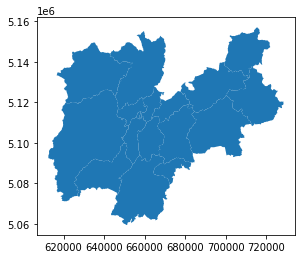
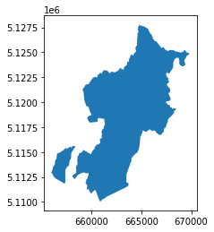
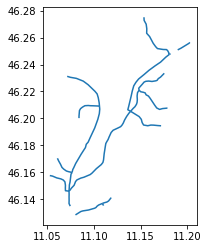

*Solution of exercise after the lesson of 09 October 2020*
{: .no_toc }

## Table of contents
{: .no_toc .text-delta }

1. TOC
{:toc}

---
# Setup

you can use pygeos or rtree but you need to install before geopandas


```
!pip install pygeos
```

    Collecting pygeos
    [?25l  Downloading https://files.pythonhosted.org/packages/66/06/2cfcf6e90814da1fdb4585534f03a36531f00cbad65f11b417337d69fe60/pygeos-0.8-cp36-cp36m-manylinux1_x86_64.whl (1.6MB)
         |████████████████████████████████| 1.6MB 5.7MB/s 
    [?25hRequirement already satisfied: numpy>=1.10 in /usr/local/lib/python3.6/dist-packages (from pygeos) (1.18.5)
    Installing collected packages: pygeos
    Successfully installed pygeos-0.8


```
!pip install geopandas
```

    Collecting geopandas
    [?25l  Downloading https://files.pythonhosted.org/packages/f7/a4/e66aafbefcbb717813bf3a355c8c4fc3ed04ea1dd7feb2920f2f4f868921/geopandas-0.8.1-py2.py3-none-any.whl (962kB)
         |████████████████████████████████| 972kB 7.4MB/s 
    [?25hCollecting fiona
    [?25l  Downloading https://files.pythonhosted.org/packages/36/8b/e8b2c11bed5373c8e98edb85ce891b09aa1f4210fd451d0fb3696b7695a2/Fiona-1.8.17-cp36-cp36m-manylinux1_x86_64.whl (14.8MB)
         |████████████████████████████████| 14.8MB 306kB/s 
    [?25hCollecting pyproj>=2.2.0
    [?25l  Downloading https://files.pythonhosted.org/packages/e5/c3/071e080230ac4b6c64f1a2e2f9161c9737a2bc7b683d2c90b024825000c0/pyproj-2.6.1.post1-cp36-cp36m-manylinux2010_x86_64.whl (10.9MB)
         |████████████████████████████████| 10.9MB 45.5MB/s 
    [?25hRequirement already satisfied: shapely in /usr/local/lib/python3.6/dist-packages (from geopandas) (1.7.1)
    Requirement already satisfied: pandas>=0.23.0 in /usr/local/lib/python3.6/dist-packages (from geopandas) (1.1.2)
    Collecting click-plugins>=1.0
      Downloading https://files.pythonhosted.org/packages/e9/da/824b92d9942f4e472702488857914bdd50f73021efea15b4cad9aca8ecef/click_plugins-1.1.1-py2.py3-none-any.whl
    Collecting cligj>=0.5
      Downloading https://files.pythonhosted.org/packages/e4/be/30a58b4b0733850280d01f8bd132591b4668ed5c7046761098d665ac2174/cligj-0.5.0-py3-none-any.whl
    Requirement already satisfied: attrs>=17 in /usr/local/lib/python3.6/dist-packages (from fiona->geopandas) (20.2.0)
    Requirement already satisfied: six>=1.7 in /usr/local/lib/python3.6/dist-packages (from fiona->geopandas) (1.15.0)
    Requirement already satisfied: click<8,>=4.0 in /usr/local/lib/python3.6/dist-packages (from fiona->geopandas) (7.1.2)
    Collecting munch
      Downloading https://files.pythonhosted.org/packages/cc/ab/85d8da5c9a45e072301beb37ad7f833cd344e04c817d97e0cc75681d248f/munch-2.5.0-py2.py3-none-any.whl
    Requirement already satisfied: numpy>=1.15.4 in /usr/local/lib/python3.6/dist-packages (from pandas>=0.23.0->geopandas) (1.18.5)
    Requirement already satisfied: python-dateutil>=2.7.3 in /usr/local/lib/python3.6/dist-packages (from pandas>=0.23.0->geopandas) (2.8.1)
    Requirement already satisfied: pytz>=2017.2 in /usr/local/lib/python3.6/dist-packages (from pandas>=0.23.0->geopandas) (2018.9)
    Installing collected packages: click-plugins, cligj, munch, fiona, pyproj, geopandas
    Successfully installed click-plugins-1.1.1 cligj-0.5.0 fiona-1.8.17 geopandas-0.8.1 munch-2.5.0 pyproj-2.6.1.post1


```
!pip install owslib
```

    Collecting owslib
    [?25l  Downloading https://files.pythonhosted.org/packages/c4/6a/428d73506f6f5281408b518249b90d7c96a1394c6d954a2069cbd5a4ac39/OWSLib-0.20.0-py2.py3-none-any.whl (197kB)
         |████████████████████████████████| 204kB 6.3MB/s 
    [?25hRequirement already satisfied: pytz in /usr/local/lib/python3.6/dist-packages (from owslib) (2018.9)
    Requirement already satisfied: pyyaml in /usr/local/lib/python3.6/dist-packages (from owslib) (3.13)
    Requirement already satisfied: requests>=1.0 in /usr/local/lib/python3.6/dist-packages (from owslib) (2.23.0)
    Requirement already satisfied: python-dateutil>=1.5 in /usr/local/lib/python3.6/dist-packages (from owslib) (2.8.1)
    Requirement already satisfied: pyproj>=2 in /usr/local/lib/python3.6/dist-packages (from owslib) (2.6.1.post1)
    Requirement already satisfied: certifi>=2017.4.17 in /usr/local/lib/python3.6/dist-packages (from requests>=1.0->owslib) (2020.6.20)
    Requirement already satisfied: idna<3,>=2.5 in /usr/local/lib/python3.6/dist-packages (from requests>=1.0->owslib) (2.10)
    Requirement already satisfied: urllib3!=1.25.0,!=1.25.1,<1.26,>=1.21.1 in /usr/local/lib/python3.6/dist-packages (from requests>=1.0->owslib) (1.24.3)
    Requirement already satisfied: chardet<4,>=3.0.2 in /usr/local/lib/python3.6/dist-packages (from requests>=1.0->owslib) (3.0.4)
    Requirement already satisfied: six>=1.5 in /usr/local/lib/python3.6/dist-packages (from python-dateutil>=1.5->owslib) (1.15.0)
    Installing collected packages: owslib
    Successfully installed owslib-0.20.0


```
!pip install pyshp
```

    Collecting pyshp
    [?25l  Downloading https://files.pythonhosted.org/packages/ca/1f/e9cc2c3fce32e2926581f8b6905831165235464c858ba550b6e9b8ef78c3/pyshp-2.1.2.tar.gz (217kB)
         |████████████████████████████████| 225kB 8.5MB/s 
    [?25hBuilding wheels for collected packages: pyshp
      Building wheel for pyshp (setup.py) ... [?25l[?25hdone
      Created wheel for pyshp: filename=pyshp-2.1.2-cp36-none-any.whl size=36216 sha256=bad82c6b1a93c88b9ed84aa5dc2110b494f1bd8b640bfc8230c7f0b501f037a9
      Stored in directory: /root/.cache/pip/wheels/96/6c/53/4112475adf3b831da97f083163d0f38ee6daac9c1b13f7afea
    Successfully built pyshp
    Installing collected packages: pyshp
    Successfully installed pyshp-2.1.2


```
!pip install bmi-arcgis-restapi
```

    Collecting bmi-arcgis-restapi
    [?25l  Downloading https://files.pythonhosted.org/packages/ae/60/ff56525684d55cc7eff6d494799f4f6858e877be252b2138462a2f3bf95b/bmi-arcgis-restapi-2.0.1.tar.gz (486kB)
         |████████████████████████████████| 491kB 5.1MB/s 
    [?25hRequirement already satisfied: munch in /usr/local/lib/python3.6/dist-packages (from bmi-arcgis-restapi) (2.5.0)
    Requirement already satisfied: requests in /usr/local/lib/python3.6/dist-packages (from bmi-arcgis-restapi) (2.23.0)
    Requirement already satisfied: urllib3 in /usr/local/lib/python3.6/dist-packages (from bmi-arcgis-restapi) (1.24.3)
    Requirement already satisfied: six in /usr/local/lib/python3.6/dist-packages (from munch->bmi-arcgis-restapi) (1.15.0)
    Requirement already satisfied: idna<3,>=2.5 in /usr/local/lib/python3.6/dist-packages (from requests->bmi-arcgis-restapi) (2.10)
    Requirement already satisfied: chardet<4,>=3.0.2 in /usr/local/lib/python3.6/dist-packages (from requests->bmi-arcgis-restapi) (3.0.4)
    Requirement already satisfied: certifi>=2017.4.17 in /usr/local/lib/python3.6/dist-packages (from requests->bmi-arcgis-restapi) (2020.6.20)
    Building wheels for collected packages: bmi-arcgis-restapi
      Building wheel for bmi-arcgis-restapi (setup.py) ... [?25l[?25hdone
      Created wheel for bmi-arcgis-restapi: filename=bmi_arcgis_restapi-2.0.1-cp36-none-any.whl size=493541 sha256=e7fb342e7452cb841bbd169ac41760b50b87e9841cf6805e3c9a82c49370cc2f
      Stored in directory: /root/.cache/pip/wheels/e4/02/dc/526efc9aa697406a1aff272a704703ac88f790d599a1a23814
    Successfully built bmi-arcgis-restapi
    Installing collected packages: bmi-arcgis-restapi
    Successfully installed bmi-arcgis-restapi-2.0.1


```
!pip install git+https://github.com/python-visualization/folium 
```

    Collecting git+https://github.com/python-visualization/folium
      Cloning https://github.com/python-visualization/folium to /tmp/pip-req-build-d9tn7arx
      Running command git clone -q https://github.com/python-visualization/folium /tmp/pip-req-build-d9tn7arx
    Requirement already satisfied: branca>=0.3.0 in /usr/local/lib/python3.6/dist-packages (from folium==0.11.0+20.gb70efc6) (0.4.1)
    Requirement already satisfied: jinja2>=2.9 in /usr/local/lib/python3.6/dist-packages (from folium==0.11.0+20.gb70efc6) (2.11.2)
    Requirement already satisfied: numpy in /usr/local/lib/python3.6/dist-packages (from folium==0.11.0+20.gb70efc6) (1.18.5)
    Requirement already satisfied: requests in /usr/local/lib/python3.6/dist-packages (from folium==0.11.0+20.gb70efc6) (2.23.0)
    Requirement already satisfied: MarkupSafe>=0.23 in /usr/local/lib/python3.6/dist-packages (from jinja2>=2.9->folium==0.11.0+20.gb70efc6) (1.1.1)
    Requirement already satisfied: idna<3,>=2.5 in /usr/local/lib/python3.6/dist-packages (from requests->folium==0.11.0+20.gb70efc6) (2.10)
    Requirement already satisfied: certifi>=2017.4.17 in /usr/local/lib/python3.6/dist-packages (from requests->folium==0.11.0+20.gb70efc6) (2020.6.20)
    Requirement already satisfied: chardet<4,>=3.0.2 in /usr/local/lib/python3.6/dist-packages (from requests->folium==0.11.0+20.gb70efc6) (3.0.4)
    Requirement already satisfied: urllib3!=1.25.0,!=1.25.1,<1.26,>=1.21.1 in /usr/local/lib/python3.6/dist-packages (from requests->folium==0.11.0+20.gb70efc6) (1.24.3)
    Building wheels for collected packages: folium
      Building wheel for folium (setup.py) ... [?25l[?25hdone
      Created wheel for folium: filename=folium-0.11.0+20.gb70efc6-py2.py3-none-any.whl size=97529 sha256=2bb16e07f2f9b55169da3492df9996cc34c1d8ba4c3e7f335f2803f9c0d2707e
      Stored in directory: /tmp/pip-ephem-wheel-cache-gnib11ft/wheels/1e/e1/75/ecbc91fd5dd5d90befb0b533bf7492d38acffa033310731862
    Successfully built folium
    ERROR: datascience 0.10.6 has requirement folium==0.2.1, but you'll have folium 0.11.0+20.gb70efc6 which is incompatible.
    Installing collected packages: folium
      Found existing installation: folium 0.8.3
        Uninstalling folium-0.8.3:
          Successfully uninstalled folium-0.8.3
    Successfully installed folium-0.11.0+20.gb70efc6


# Exercise

- find the administrative border of “comunità di valle” (community of valley) of Province Autonomous of Trento
- identify all the rivers inside the smallest community of valley of Trentino
- repeat the same exercise with the layer “Comuni Terremotati” (municipalities affected by earthquake) of the italian Civil Protection by choosing the smallest municipality contained on the layer

## find the administrative border of “comunità di valle” (community of valley) of Province Autonomous of Trento


```
from owslib.csw import CatalogueServiceWeb
from owslib.fes import PropertyIsLike, BBox
import geopandas as gpd
import folium
```

    /usr/local/lib/python3.6/dist-packages/geopandas/_compat.py:88: UserWarning: The Shapely GEOS version (3.8.0-CAPI-1.13.1 ) is incompatible with the GEOS version PyGEOS was compiled with (3.8.1-CAPI-1.13.3). Conversions between both will be slow.
      shapely_geos_version, geos_capi_version_string


We start from the italian national repository - http://geodati.gov.it


```
csw = CatalogueServiceWeb("http://geodati.gov.it/RNDT/csw")
```


```
query = PropertyIsLike('csw:AnyText', 'Comunità di valle')
```


```
csw.getrecords2(constraints=[query],maxrecords=5)
```


```
for rec in csw.records:
  print(rec + " - " + csw.records[rec].title)
```

    p_TN:58604ed2-ac1d-4f78-a00c-514fd3562c51 - Limite Comunità di valle
    r_emiro:2015-06-04T161431 - Itinerari geologico-ambientali nella Valle del Marecchia
    cnz_pvdt:4D17C962-1863-4C5F-8B01-AB8308A8CBB0 - Parco Ticino area della riserva della biosfera MAB Ticino Valley
    p_bz:b4ee7976-5fa9-4fab-bbd6-4064bf568767 - Amministrazione: comunità comprensoriali
    r_lombar:DC961855-02B4-46A8-93A9-1FE3D5E4FB4F - Alpeggi


```
id_record="p_TN:58604ed2-ac1d-4f78-a00c-514fd3562c51"
```


```
record = csw.records[id_record]
```


```
record.abstract
```


    "Rappresenta il limite delle Comunità di valle, le quali sono enti pubblici locali a struttura associativa costituiti obbligatoriamente dai comuni compresi in ciascun territorio individuato ai sensi dell'art.12 comma 2 (LP3-2006 art 14 comma2) ad esse e ai Comuni di Trento e Rovereto sono trasferite numerose competenze che ora sono in capo alla Provincia, ovviamente fatte salve le competenze dei comuni e delle amministrazioni separate dei beni di usi civico.Intesa tra la Provincia e il Consiglio delle Autonomie locali approvato nella seduta del 16 marzo 2007 concernente Individuazione dei territori delle Comunità ai sensi dell'articolo 12 della legge provinciale 16 giugno 2006, n. 3 (Norme in materia di governo dell'autonomia del Trentino).NB: PER LA TABELLA DEGLI ATTRIBUTI E' STATO UTILIZZATO IL SET DI CARATTERI UNICODE UTF-8"


```
for reference in record.references:
  print(reference['scheme'])
  print(reference['url'])
```

    urn:x-esri:specification:ServiceType:ArcIMS:Metadata:Server
    http://www.territorio.provincia.tn.it
    urn:x-esri:specification:ServiceType:ArcIMS:Metadata:Server
    https://siat.provincia.tn.it/IDT/vector/public/p_tn_58604ed2-ac1d-4f78-a00c-514fd3562c51.zip
    urn:x-esri:specification:ServiceType:ArcIMS:Metadata:Document
    https://geodati.gov.it/geoportalRNDTPA/csw?getxml=%7BA0C53BE3-34E8-4EC1-9FD9-348BFE2833AD%7D


```
valley_communities = gpd.read_file('https://siat.provincia.tn.it/IDT/vector/public/p_tn_58604ed2-ac1d-4f78-a00c-514fd3562c51.zip')
```


```
valley_communities.head(5)
```


<div>
<style scoped>
    .dataframe tbody tr th:only-of-type {
        vertical-align: middle;
    }

    .dataframe tbody tr th {
        vertical-align: top;
    }

    .dataframe thead th {
        text-align: right;
    }
</style>
<table border="1" class="dataframe">
  <thead>
    <tr style="text-align: right;">
      <th></th>
      <th>objectid</th>
      <th>classid</th>
      <th>sede</th>
      <th>nome</th>
      <th>struttura</th>
      <th>struttura_</th>
      <th>dataini</th>
      <th>datafine</th>
      <th>fkfonte</th>
      <th>fktfonte_d</th>
      <th>fktipoelab</th>
      <th>fktipoel_d</th>
      <th>fkscala</th>
      <th>fkscala_d</th>
      <th>geometry</th>
    </tr>
  </thead>
  <tbody>
    <tr>
      <th>0</th>
      <td>181</td>
      <td>AMB002_14</td>
      <td>ANDALO</td>
      <td>COMUNITÀ DELLA PAGANELLA</td>
      <td>S133</td>
      <td>Servizio Catasto</td>
      <td>2020/01/01 00:00:00.000</td>
      <td>None</td>
      <td>05</td>
      <td>altre fonti</td>
      <td>01</td>
      <td>manuale</td>
      <td>03</td>
      <td>10000</td>
      <td>POLYGON ((659718.849 5118603.995, 659717.453 5...</td>
    </tr>
    <tr>
      <th>1</th>
      <td>182</td>
      <td>AMB002_8</td>
      <td>TIONE DI TRENTO</td>
      <td>COMUNITÀ DELLE GIUDICARIE</td>
      <td>S133</td>
      <td>Servizio Catasto</td>
      <td>2020/01/01 00:00:00.000</td>
      <td>None</td>
      <td>05</td>
      <td>altre fonti</td>
      <td>01</td>
      <td>manuale</td>
      <td>03</td>
      <td>10000</td>
      <td>POLYGON ((626847.878 5074565.314, 626878.525 5...</td>
    </tr>
    <tr>
      <th>2</th>
      <td>183</td>
      <td>AMB002_12</td>
      <td>LAVARONE</td>
      <td>MAGNIFICA COMUNITÀ DEGLI ALTIPIANI CIMBRI</td>
      <td>S133</td>
      <td>Servizio Catasto</td>
      <td>2020/01/01 00:00:00.000</td>
      <td>None</td>
      <td>05</td>
      <td>altre fonti</td>
      <td>01</td>
      <td>manuale</td>
      <td>03</td>
      <td>10000</td>
      <td>POLYGON ((675134.859 5087715.705, 675136.500 5...</td>
    </tr>
    <tr>
      <th>3</th>
      <td>184</td>
      <td>AMB002_15</td>
      <td>TRENTO</td>
      <td>TERRITORIO VAL D'ADIGE</td>
      <td>S133</td>
      <td>Servizio Catasto</td>
      <td>2020/01/01 00:00:00.000</td>
      <td>None</td>
      <td>05</td>
      <td>altre fonti</td>
      <td>01</td>
      <td>manuale</td>
      <td>03</td>
      <td>10000</td>
      <td>POLYGON ((663458.060 5094288.411, 663453.437 5...</td>
    </tr>
    <tr>
      <th>4</th>
      <td>185</td>
      <td>AMB002_1</td>
      <td>CAVALESE</td>
      <td>COMUNITÀ TERRITORIALE DELLA VAL DI FIEMME</td>
      <td>S133</td>
      <td>Servizio Catasto</td>
      <td>2020/01/01 00:00:00.000</td>
      <td>None</td>
      <td>05</td>
      <td>altre fonti</td>
      <td>01</td>
      <td>manuale</td>
      <td>03</td>
      <td>10000</td>
      <td>POLYGON ((681770.000 5126270.500, 681789.000 5...</td>
    </tr>
  </tbody>
</table>
</div>


```
valley_communities.plot()
```


    <matplotlib.axes._subplots.AxesSubplot at 0x7efcb953d588>


    

    


```
valley_communities.head(5)
```


<div>
<style scoped>
    .dataframe tbody tr th:only-of-type {
        vertical-align: middle;
    }

    .dataframe tbody tr th {
        vertical-align: top;
    }

    .dataframe thead th {
        text-align: right;
    }
</style>
<table border="1" class="dataframe">
  <thead>
    <tr style="text-align: right;">
      <th></th>
      <th>objectid</th>
      <th>classid</th>
      <th>sede</th>
      <th>nome</th>
      <th>struttura</th>
      <th>struttura_</th>
      <th>dataini</th>
      <th>datafine</th>
      <th>fkfonte</th>
      <th>fktfonte_d</th>
      <th>fktipoelab</th>
      <th>fktipoel_d</th>
      <th>fkscala</th>
      <th>fkscala_d</th>
      <th>geometry</th>
    </tr>
  </thead>
  <tbody>
    <tr>
      <th>0</th>
      <td>181</td>
      <td>AMB002_14</td>
      <td>ANDALO</td>
      <td>COMUNITÀ DELLA PAGANELLA</td>
      <td>S133</td>
      <td>Servizio Catasto</td>
      <td>2020/01/01 00:00:00.000</td>
      <td>None</td>
      <td>05</td>
      <td>altre fonti</td>
      <td>01</td>
      <td>manuale</td>
      <td>03</td>
      <td>10000</td>
      <td>POLYGON ((659718.849 5118603.995, 659717.453 5...</td>
    </tr>
    <tr>
      <th>1</th>
      <td>182</td>
      <td>AMB002_8</td>
      <td>TIONE DI TRENTO</td>
      <td>COMUNITÀ DELLE GIUDICARIE</td>
      <td>S133</td>
      <td>Servizio Catasto</td>
      <td>2020/01/01 00:00:00.000</td>
      <td>None</td>
      <td>05</td>
      <td>altre fonti</td>
      <td>01</td>
      <td>manuale</td>
      <td>03</td>
      <td>10000</td>
      <td>POLYGON ((626847.878 5074565.314, 626878.525 5...</td>
    </tr>
    <tr>
      <th>2</th>
      <td>183</td>
      <td>AMB002_12</td>
      <td>LAVARONE</td>
      <td>MAGNIFICA COMUNITÀ DEGLI ALTIPIANI CIMBRI</td>
      <td>S133</td>
      <td>Servizio Catasto</td>
      <td>2020/01/01 00:00:00.000</td>
      <td>None</td>
      <td>05</td>
      <td>altre fonti</td>
      <td>01</td>
      <td>manuale</td>
      <td>03</td>
      <td>10000</td>
      <td>POLYGON ((675134.859 5087715.705, 675136.500 5...</td>
    </tr>
    <tr>
      <th>3</th>
      <td>184</td>
      <td>AMB002_15</td>
      <td>TRENTO</td>
      <td>TERRITORIO VAL D'ADIGE</td>
      <td>S133</td>
      <td>Servizio Catasto</td>
      <td>2020/01/01 00:00:00.000</td>
      <td>None</td>
      <td>05</td>
      <td>altre fonti</td>
      <td>01</td>
      <td>manuale</td>
      <td>03</td>
      <td>10000</td>
      <td>POLYGON ((663458.060 5094288.411, 663453.437 5...</td>
    </tr>
    <tr>
      <th>4</th>
      <td>185</td>
      <td>AMB002_1</td>
      <td>CAVALESE</td>
      <td>COMUNITÀ TERRITORIALE DELLA VAL DI FIEMME</td>
      <td>S133</td>
      <td>Servizio Catasto</td>
      <td>2020/01/01 00:00:00.000</td>
      <td>None</td>
      <td>05</td>
      <td>altre fonti</td>
      <td>01</td>
      <td>manuale</td>
      <td>03</td>
      <td>10000</td>
      <td>POLYGON ((681770.000 5126270.500, 681789.000 5...</td>
    </tr>
  </tbody>
</table>
</div>


## identify all the rivers inside the smallest community of valley of Trentino

### identify the smallest community of valley


```
smallest_community = valley_communities[valley_communities.area == valley_communities.area.min()]
```


```
smallest_community
```


<div>
<style scoped>
    .dataframe tbody tr th:only-of-type {
        vertical-align: middle;
    }

    .dataframe tbody tr th {
        vertical-align: top;
    }

    .dataframe thead th {
        text-align: right;
    }
</style>
<table border="1" class="dataframe">
  <thead>
    <tr style="text-align: right;">
      <th></th>
      <th>objectid</th>
      <th>classid</th>
      <th>sede</th>
      <th>nome</th>
      <th>struttura</th>
      <th>struttura_</th>
      <th>dataini</th>
      <th>datafine</th>
      <th>fkfonte</th>
      <th>fktfonte_d</th>
      <th>fktipoelab</th>
      <th>fktipoel_d</th>
      <th>fkscala</th>
      <th>fkscala_d</th>
      <th>geometry</th>
    </tr>
  </thead>
  <tbody>
    <tr>
      <th>10</th>
      <td>191</td>
      <td>AMB002_13</td>
      <td>MEZZOCORONA</td>
      <td>COMUNITÀ ROTALIANA-KÖNIGSBERG</td>
      <td>S133</td>
      <td>Servizio Catasto</td>
      <td>2020/01/01 00:00:00.000</td>
      <td>None</td>
      <td>05</td>
      <td>altre fonti</td>
      <td>01</td>
      <td>manuale</td>
      <td>03</td>
      <td>10000</td>
      <td>MULTIPOLYGON (((656059.164 5112838.836, 656030...</td>
    </tr>
  </tbody>
</table>
</div>


```
smallest_community.nome
```


    10    COMUNITÀ ROTALIANA-KÖNIGSBERG
    Name: nome, dtype: object


```
smallest_community.plot()
```


    <matplotlib.axes._subplots.AxesSubplot at 0x7efcb607c550>


    

    


add it on a map ... only to understand where is the area on the bottom left corner ;)


```
centery = smallest_community.geometry.centroid.to_crs(epsg=4326).y
centerx = smallest_community.geometry.centroid.to_crs(epsg=4326).x
json_geometry = smallest_community.to_crs(epsg=4326).to_json()
```


```
map_area = folium.Map([centery,centerx], zoom_start=12,tiles='Stamen Terrain')
folium.GeoJson(json_geometry).add_to(map_area)
map_area
```


<iframe 
    width="100%"
    height="300" src="https://napo.github.io/geospatial_course_unitn/docs/html/rotaliana.html"
    style="border:none;"
    allowfullscreen webkitallowfullscreen mozallowfullscreen>
</iframe>


### find a layer with the rivers for the area


identify the bounding box


```
smallest_community.to_crs(epsg=4326).bounds
```


<div>
<style scoped>
    .dataframe tbody tr th:only-of-type {
        vertical-align: middle;
    }

    .dataframe tbody tr th {
        vertical-align: top;
    }

    .dataframe thead th {
        text-align: right;
    }
</style>
<table border="1" class="dataframe">
  <thead>
    <tr style="text-align: right;">
      <th></th>
      <th>minx</th>
      <th>miny</th>
      <th>maxx</th>
      <th>maxy</th>
    </tr>
  </thead>
  <tbody>
    <tr>
      <th>10</th>
      <td>11.019439</td>
      <td>46.12501</td>
      <td>11.203875</td>
      <td>46.283791</td>
    </tr>
  </tbody>
</table>
</div>


```
bbox = list(smallest_community.to_crs(epsg=4326).bounds.values[0])
```


```
bbox
```


    [11.01943938362622, 46.12500990155531, 11.203874962508163, 46.283790799274264]


in this case we can use the WFS of [the national cartographic portal of the Italian Ministry of the Environment](http://www.pcn.minambiente.it/)


```
#if you want use the CSW you can go here
csw = CatalogueServiceWeb("http://www.pcn.minambiente.it/geoportal/csw")
```


[ ... ] 


```
from owslib.wfs import WebFeatureService
```


```
wfs_url="http://wms.pcn.minambiente.it/ogc?map=/ms_ogc/wfs/Aste_fluviali.map"
```


```
wfs = WebFeatureService(url=wfs_url,version="1.1.0")
```


```
wfs.identification.title
```


    'Reticolo idrografico'


```
wfs.contents
```


    {'ID.RETICOLO.CORSI_ACQUA': <owslib.feature.wfs110.ContentMetadata at 0x7efcb95e9a20>,
     'ID.RETICOLO.ELEMENTI_IDRICI': <owslib.feature.wfs110.ContentMetadata at 0x7efcb4dad470>,
     'ID.RETICOLO.FIUMI_PRINCIPALI_SECONDARI': <owslib.feature.wfs110.ContentMetadata at 0x7efcb95e96a0>,
     'ID.RETICOLO.FIUMI_TORRENTI': <owslib.feature.wfs110.ContentMetadata at 0x7efcb95e9a90>}


```
layer = list(wfs.contents)[2]
```


```
response = wfs.getfeature(typename=layer, bbox=bbox,srsname='urn:ogc:def:crs:EPSG::4326')
```


```
out = open('rivers_inbox.gml', 'wb')
out.write(response.read())
out.close()
```


```
rivers = gpd.read_file("rivers_inbox.gml")
```


```
rivers.head(3)
```


<div>
<style scoped>
    .dataframe tbody tr th:only-of-type {
        vertical-align: middle;
    }

    .dataframe tbody tr th {
        vertical-align: top;
    }

    .dataframe thead th {
        text-align: right;
    }
</style>
<table border="1" class="dataframe">
  <thead>
    <tr style="text-align: right;">
      <th></th>
      <th>gml_id</th>
      <th>id_fiume</th>
      <th>id_tratta</th>
      <th>tipo</th>
      <th>nome</th>
      <th>foglio_igm</th>
      <th>sottotipo</th>
      <th>ordine</th>
      <th>bacino_pri</th>
      <th>bacino</th>
      <th>da</th>
      <th>tipo_da</th>
      <th>a</th>
      <th>tipo_a</th>
      <th>annotazion</th>
      <th>enabled</th>
      <th>geometry</th>
    </tr>
  </thead>
  <tbody>
    <tr>
      <th>0</th>
      <td>ID.RETICOLO.CORSI_ACQUA.9878</td>
      <td>2241</td>
      <td>11503</td>
      <td></td>
      <td></td>
      <td>BOLZANO</td>
      <td>1</td>
      <td>3</td>
      <td>ADIGE</td>
      <td></td>
      <td>SORGENTE</td>
      <td>1</td>
      <td>NOCE</td>
      <td>3</td>
      <td></td>
      <td>1</td>
      <td>LINESTRING (46.17313 11.05670, 46.17069 11.060...</td>
    </tr>
    <tr>
      <th>1</th>
      <td>ID.RETICOLO.CORSI_ACQUA.16150</td>
      <td>688</td>
      <td>14645</td>
      <td></td>
      <td></td>
      <td>BOLZANO</td>
      <td>1</td>
      <td>2</td>
      <td>ADIGE</td>
      <td></td>
      <td>SORGENTE</td>
      <td>1</td>
      <td>ADIGE</td>
      <td>3</td>
      <td></td>
      <td>1</td>
      <td>LINESTRING (46.15510 11.03917, 46.15664 11.041...</td>
    </tr>
    <tr>
      <th>2</th>
      <td>ID.RETICOLO.CORSI_ACQUA.20273</td>
      <td>885</td>
      <td>21041</td>
      <td>TORRENTE</td>
      <td>AVISIO</td>
      <td>BOLZANO</td>
      <td>1</td>
      <td>2</td>
      <td>ADIGE</td>
      <td></td>
      <td>19357</td>
      <td>3</td>
      <td>21042</td>
      <td>3</td>
      <td></td>
      <td>1</td>
      <td>LINESTRING (46.17089 11.23801, 46.17053 11.237...</td>
    </tr>
  </tbody>
</table>
</div>


```
rivers.plot()
```


    <matplotlib.axes._subplots.AxesSubplot at 0x7efcb34cf860>


    

    


there is always the problem of the inverted axes
We can solve it with this function


```
import shapely
```


```
def swapxy(geometry):
  geometry = shapely.ops.transform(lambda x, y: (y, x),geometry)
  return geometry
```


```
rivers['geometry'] = rivers['geometry'].apply(lambda geometry: swapxy(geometry))
```


```
rivers.plot()
```


    <matplotlib.axes._subplots.AxesSubplot at 0x7efcb34b59b0>


    

    


we are ready to plot on a map


```
y = rivers.unary_union.centroid.y
x = rivers.unary_union.centroid.x
```


```
map_rivers = folium.Map([y,x], zoom_start=11,tiles='Stamen Terrain')
folium.GeoJson(rivers.to_json()).add_to(map_rivers)
map_rivers
```

<iframe 
    width="100%"
    height="300" src="https://napo.github.io/geospatial_course_unitn/docs/html/rivers_rotaliana_bbox.html"
    style="border:none;"
    allowfullscreen webkitallowfullscreen mozallowfullscreen>
</iframe>


**CLIP**

we need to have all the rivers inside the area and not the bounding box


```
gpd.clip(rivers, smallest_community)
```

    /usr/local/lib/python3.6/dist-packages/ipykernel_launcher.py:1: UserWarning: CRS mismatch between the CRS of left geometries and the CRS of right geometries.
    Use `to_crs()` to reproject one of the input geometries to match the CRS of the other.
    
    Left CRS: EPSG:4326
    Right CRS: EPSG:25832
    
      """Entry point for launching an IPython kernel.


<div>
<style scoped>
    .dataframe tbody tr th:only-of-type {
        vertical-align: middle;
    }

    .dataframe tbody tr th {
        vertical-align: top;
    }

    .dataframe thead th {
        text-align: right;
    }
</style>
<table border="1" class="dataframe">
  <thead>
    <tr style="text-align: right;">
      <th></th>
      <th>gml_id</th>
      <th>id_fiume</th>
      <th>id_tratta</th>
      <th>tipo</th>
      <th>nome</th>
      <th>foglio_igm</th>
      <th>sottotipo</th>
      <th>ordine</th>
      <th>bacino_pri</th>
      <th>bacino</th>
      <th>da</th>
      <th>tipo_da</th>
      <th>a</th>
      <th>tipo_a</th>
      <th>annotazion</th>
      <th>enabled</th>
      <th>geometry</th>
    </tr>
  </thead>
  <tbody>
  </tbody>
</table>
</div>


the geodatamews have to use the same projection


```
rivers_rotaliana = gpd.clip(rivers.to_crs(epsg=4326), smallest_community.to_crs(epsg=4326))
```


```
rivers.plot()
```


    <matplotlib.axes._subplots.AxesSubplot at 0x7efcb3426ba8>


    

    


```
rivers_rotaliana.plot()
```


    <matplotlib.axes._subplots.AxesSubplot at 0x7efcb346e9b0>


    

    


show the rivers on the map


```
folium.GeoJson(rivers_rotaliana.to_json()).add_to(map_area)

```


    <folium.features.GeoJson at 0x7efcb33b7e80>


```
map_rivers
```


<iframe 
    width="100%"
    height="300" src="https://napo.github.io/geospatial_course_unitn/docs/html/fiumi_rotaliana.html"
    style="border:none;"
    allowfullscreen webkitallowfullscreen mozallowfullscreen>
</iframe>


---


# repeat the same exercise with the layer “Comuni Terremotati” (municipalities affected by earthquake) of the italian Civil Protection by choosing the smallest municipality contained on the layer


```
import os
os.environ['RESTAPI_USE_ARCPY'] = 'FALSE'
import restapi
```

    arcpy import error:  


    /usr/local/lib/python3.6/dist-packages/restapi/common_types.py:35: UserWarning: No Arcpy found, some limitations in functionality may apply.
      warnings.warn('No Arcpy found, some limitations in functionality may apply.')


```
rest_url = 'https://services6.arcgis.com/L1SotImj1AAZY1eK/ArcGIS/rest/services'
ags = restapi.ArcServer(rest_url)
```


```
agc_service_name = ""
for service in ags.services:
  if service.name == 'Comuni_Terremotati':
    agc_service_name = service.name
    print(service.name)
```

    Comuni_Terremotati


```
ags_service = ags.getService(agc_service_name)
ags_service.list_layers()
```


    ['comuni_terremotatiDD']


```
municipalities_affected_earthquake = ags_service.layer('comuni_terremotatiDD')
```

we can ask ArcGIS RestAPI to transform the source from the native projection to the [EPSG:25832](http://epsg.io/25832)


```
municipalities_affected_earthquake.export_layer('municipalities_affected_earthquake.shp', outSR=25832)
```

    Created: "municipalities_affected_earthquake.shp"


    'municipalities_affected_earthquake.shp'


```
geo_municipalities_affected_earthquake = gpd.read_file('municipalities_affected_earthquake.shp')
```


```
geo_municipalities_affected_earthquake.geometry
```


    0     POLYGON ((825823.375 4744510.000, 825831.875 4...
    1     POLYGON ((822188.875 4732801.000, 822431.125 4...
    2     POLYGON ((836677.625 4755035.500, 838169.875 4...
    3     POLYGON ((832493.438 4758169.000, 833177.312 4...
    4     POLYGON ((858381.688 4751290.000, 858885.000 4...
    5     POLYGON ((849760.438 4750082.500, 849961.000 4...
    6     POLYGON ((846041.812 4765924.000, 846232.938 4...
    7     POLYGON ((856514.062 4756610.000, 856643.063 4...
    8     POLYGON ((850434.125 4761465.000, 850516.562 4...
    9     POLYGON ((850348.125 4740939.500, 850545.437 4...
    10    POLYGON ((856495.187 4734432.500, 856419.937 4...
    11    POLYGON ((832470.375 4704205.500, 832598.125 4...
    12    POLYGON ((860575.250 4723655.500, 860818.500 4...
    13    POLYGON ((853776.938 4720760.500, 853849.438 4...
    14    POLYGON ((845010.250 4723372.000, 845251.438 4...
    15    POLYGON ((873001.312 4740017.500, 873145.937 4...
    16    POLYGON ((871474.125 4750509.500, 871638.438 4...
    Name: geometry, dtype: geometry


the values of the coordinates seems to be in meters


```
geo_municipalities_affected_earthquake.crs
```


    <Geographic 2D CRS: EPSG:4326>
    Name: WGS 84
    Axis Info [ellipsoidal]:
    - Lat[north]: Geodetic latitude (degree)
    - Lon[east]: Geodetic longitude (degree)
    Area of Use:
    - name: World
    - bounds: (-180.0, -90.0, 180.0, 90.0)
    Datum: World Geodetic System 1984
    - Ellipsoid: WGS 84
    - Prime Meridian: Greenwich


.. but the CRS is EPSG:426 ... we need to rewrite it!!!


```
geo_municipalities_affected_earthquake = geo_municipalities_affected_earthquake.set_crs(epsg=25832,allow_override=True)
```


```
geo_municipalities_affected_earthquake.crs
```


    <Projected CRS: EPSG:25832>
    Name: ETRS89 / UTM zone 32N
    Axis Info [cartesian]:
    - E[east]: Easting (metre)
    - N[north]: Northing (metre)
    Area of Use:
    - name: Europe - 6°E to 12°E and ETRS89 by country
    - bounds: (6.0, 38.76, 12.0, 83.92)
    Coordinate Operation:
    - name: UTM zone 32N
    - method: Transverse Mercator
    Datum: European Terrestrial Reference System 1989
    - Ellipsoid: GRS 1980
    - Prime Meridian: Greenwich


Now is ok!


```
centery = geo_municipalities_affected_earthquake.to_crs(epsg=4326).geometry.unary_union.centroid.y
centerx = geo_municipalities_affected_earthquake.to_crs(epsg=4326).geometry.unary_union.centroid.x
json_geometry = geo_municipalities_affected_earthquake.to_crs(epsg=4326).to_json()
```


```
map_area = folium.Map([centery,centerx], zoom_start=10,tiles='Stamen Terrain')
folium.GeoJson(json_geometry).add_to(map_area)
map_area
```

<iframe 
    width="100%"
    height="300" src="https://napo.github.io/geospatial_course_unitn/docs/html/comuni_terremotati.html"
    style="border:none;"
    allowfullscreen webkitallowfullscreen mozallowfullscreen>
</iframe>


```
minarea = geo_municipalities_affected_earthquake.geometry.area.min()
```


```
minarea
```


    30665483.55191904


```
smallest_municipality = geo_municipalities_affected_earthquake[geo_municipalities_affected_earthquake.geometry.area == minarea]
```


```
smallest_municipality.plot()
```


    <matplotlib.axes._subplots.AxesSubplot at 0x7efcb2cbf470>


    

    


```
centery = smallest_municipality.to_crs(epsg=4326).geometry.unary_union.centroid.y
centerx = smallest_municipality.to_crs(epsg=4326).geometry.unary_union.centroid.x
json_geometry = smallest_municipality.to_crs(epsg=4326).to_json()
```


```
map_area = folium.Map([centery,centerx], zoom_start=13,tiles='Stamen Terrain')
folium.GeoJson(json_geometry).add_to(map_area)
map_area
```


<iframe 
    width="100%"
    height="300" src="https://napo.github.io/geospatial_course_unitn/docs/html/capitignano.html"
    style="border:none;"
    allowfullscreen webkitallowfullscreen mozallowfullscreen>
</iframe>


```
smallest_municipality.COMUNE
```


    13    Capitignano
    Name: COMUNE, dtype: object


we can use the same WFS resource used before with the new bounding box


```
bbox= list(smallest_municipality.to_crs(epsg=4326).bounds.values[0])
```


```
response = wfs.getfeature(typename=layer, bbox=bbox,srsname='urn:ogc:def:crs:EPSG::4326')
```


```
out = open('rivers_capitignano.gml', 'wb')
out.write(response.read())
out.close()
```


```
rivers_capitignano = gpd.read_file("rivers_capitignano.gml")
```


```
rivers_capitignano.plot()
```


    <matplotlib.axes._subplots.AxesSubplot at 0x7efcb2c48048>


    

    


... and we need always to invert the axes


```
rivers_capitignano['geometry'] = rivers_capitignano['geometry'].apply(lambda geometry: swapxy(geometry))
```


```
rivers_capitignano.plot()
```


    <matplotlib.axes._subplots.AxesSubplot at 0x7efcb2bc7320>


    

    

