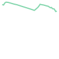
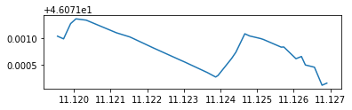
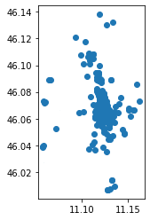

*Solution of exercise after the lesson of 23 October 2020*
{: .no_toc }

## Table of contents
{: .no_toc .text-delta }

1. TOC
{:toc}

# Setup


```bash
try:
  import rtree
except ModuleNotFoundError as e:
  !apt-get install libspatialindex-dev
  !pip install rtree
  import rtree
```

    Reading package lists... Done
    Building dependency tree       
    Reading state information... Done
    The following additional packages will be installed:
      libspatialindex-c4v5 libspatialindex4v5
    The following NEW packages will be installed:
      libspatialindex-c4v5 libspatialindex-dev libspatialindex4v5
    0 upgraded, 3 newly installed, 0 to remove and 11 not upgraded.
    Need to get 555 kB of archives.
    After this operation, 3,308 kB of additional disk space will be used.
    Get:1 http://archive.ubuntu.com/ubuntu bionic/universe amd64 libspatialindex4v5 amd64 1.8.5-5 [219 kB]
    Get:2 http://archive.ubuntu.com/ubuntu bionic/universe amd64 libspatialindex-c4v5 amd64 1.8.5-5 [51.7 kB]
    Get:3 http://archive.ubuntu.com/ubuntu bionic/universe amd64 libspatialindex-dev amd64 1.8.5-5 [285 kB]
    Fetched 555 kB in 0s (3,036 kB/s)
    Selecting previously unselected package libspatialindex4v5:amd64.
    (Reading database ... 144628 files and directories currently installed.)
    Preparing to unpack .../libspatialindex4v5_1.8.5-5_amd64.deb ...
    Unpacking libspatialindex4v5:amd64 (1.8.5-5) ...
    Selecting previously unselected package libspatialindex-c4v5:amd64.
    Preparing to unpack .../libspatialindex-c4v5_1.8.5-5_amd64.deb ...
    Unpacking libspatialindex-c4v5:amd64 (1.8.5-5) ...
    Selecting previously unselected package libspatialindex-dev:amd64.
    Preparing to unpack .../libspatialindex-dev_1.8.5-5_amd64.deb ...
    Unpacking libspatialindex-dev:amd64 (1.8.5-5) ...
    Setting up libspatialindex4v5:amd64 (1.8.5-5) ...
    Setting up libspatialindex-c4v5:amd64 (1.8.5-5) ...
    Setting up libspatialindex-dev:amd64 (1.8.5-5) ...
    Processing triggers for libc-bin (2.27-3ubuntu1.2) ...
    /sbin/ldconfig.real: /usr/local/lib/python3.6/dist-packages/ideep4py/lib/libmkldnn.so.0 is not a symbolic link
    
    Collecting rtree
    [?25l  Downloading https://files.pythonhosted.org/packages/56/6f/f1e91001d5ad9fa9bed65875152f5a1c7955c5763168cae309546e6e9fda/Rtree-0.9.4.tar.gz (62kB)
         |████████████████████████████████| 71kB 3.9MB/s 
    [?25hRequirement already satisfied: setuptools in /usr/local/lib/python3.6/dist-packages (from rtree) (50.3.2)
    Building wheels for collected packages: rtree
      Building wheel for rtree (setup.py) ... [?25l[?25hdone
      Created wheel for rtree: filename=Rtree-0.9.4-cp36-none-any.whl size=21768 sha256=4d2dfbf77344b7580fb915f43fb762f542ae6921ed47260b0b4ef0f2c3bbea80
      Stored in directory: /root/.cache/pip/wheels/ff/20/c5/0004ef7acb96745ec99be960053902b0b414a2aa2dcad5834e
    Successfully built rtree
    Installing collected packages: rtree
    Successfully installed rtree-0.9.4


```bash
!pip install osmnx
```

    Requirement already satisfied: osmnx in /usr/local/lib/python3.6/dist-packages (0.16.1)
    Requirement already satisfied: matplotlib>=3.3 in /usr/local/lib/python3.6/dist-packages (from osmnx) (3.3.2)
    Requirement already satisfied: pyproj>=2.6 in /usr/local/lib/python3.6/dist-packages (from osmnx) (2.6.1.post1)
    Requirement already satisfied: pandas>=1.1 in /usr/local/lib/python3.6/dist-packages (from osmnx) (1.1.3)
    Requirement already satisfied: Shapely>=1.7 in /usr/local/lib/python3.6/dist-packages (from osmnx) (1.7.1)
    Requirement already satisfied: numpy>=1.19 in /usr/local/lib/python3.6/dist-packages (from osmnx) (1.19.3)
    Requirement already satisfied: Rtree>=0.9 in /usr/local/lib/python3.6/dist-packages (from osmnx) (0.9.4)
    Requirement already satisfied: descartes>=1.1 in /usr/local/lib/python3.6/dist-packages (from osmnx) (1.1.0)
    Requirement already satisfied: networkx>=2.5 in /usr/local/lib/python3.6/dist-packages (from osmnx) (2.5)
    Requirement already satisfied: geopandas>=0.8 in /usr/local/lib/python3.6/dist-packages (from osmnx) (0.8.1)
    Requirement already satisfied: requests>=2.24 in /usr/local/lib/python3.6/dist-packages (from osmnx) (2.24.0)
    Requirement already satisfied: cycler>=0.10 in /usr/local/lib/python3.6/dist-packages (from matplotlib>=3.3->osmnx) (0.10.0)
    Requirement already satisfied: kiwisolver>=1.0.1 in /usr/local/lib/python3.6/dist-packages (from matplotlib>=3.3->osmnx) (1.2.0)
    Requirement already satisfied: pyparsing!=2.0.4,!=2.1.2,!=2.1.6,>=2.0.3 in /usr/local/lib/python3.6/dist-packages (from matplotlib>=3.3->osmnx) (2.4.7)
    Requirement already satisfied: python-dateutil>=2.1 in /usr/local/lib/python3.6/dist-packages (from matplotlib>=3.3->osmnx) (2.8.1)
    Requirement already satisfied: certifi>=2020.06.20 in /usr/local/lib/python3.6/dist-packages (from matplotlib>=3.3->osmnx) (2020.6.20)
    Requirement already satisfied: pillow>=6.2.0 in /usr/local/lib/python3.6/dist-packages (from matplotlib>=3.3->osmnx) (7.0.0)
    Requirement already satisfied: pytz>=2017.2 in /usr/local/lib/python3.6/dist-packages (from pandas>=1.1->osmnx) (2018.9)
    Requirement already satisfied: setuptools in /usr/local/lib/python3.6/dist-packages (from Rtree>=0.9->osmnx) (50.3.2)
    Requirement already satisfied: decorator>=4.3.0 in /usr/local/lib/python3.6/dist-packages (from networkx>=2.5->osmnx) (4.4.2)
    Requirement already satisfied: fiona in /usr/local/lib/python3.6/dist-packages (from geopandas>=0.8->osmnx) (1.8.17)
    Requirement already satisfied: chardet<4,>=3.0.2 in /usr/local/lib/python3.6/dist-packages (from requests>=2.24->osmnx) (3.0.4)
    Requirement already satisfied: urllib3!=1.25.0,!=1.25.1,<1.26,>=1.21.1 in /usr/local/lib/python3.6/dist-packages (from requests>=2.24->osmnx) (1.24.3)
    Requirement already satisfied: idna<3,>=2.5 in /usr/local/lib/python3.6/dist-packages (from requests>=2.24->osmnx) (2.10)
    Requirement already satisfied: six in /usr/local/lib/python3.6/dist-packages (from cycler>=0.10->matplotlib>=3.3->osmnx) (1.15.0)
    Requirement already satisfied: munch in /usr/local/lib/python3.6/dist-packages (from fiona->geopandas>=0.8->osmnx) (2.5.0)
    Requirement already satisfied: cligj>=0.5 in /usr/local/lib/python3.6/dist-packages (from fiona->geopandas>=0.8->osmnx) (0.7.0)
    Requirement already satisfied: click<8,>=4.0 in /usr/local/lib/python3.6/dist-packages (from fiona->geopandas>=0.8->osmnx) (7.1.2)
    Requirement already satisfied: click-plugins>=1.0 in /usr/local/lib/python3.6/dist-packages (from fiona->geopandas>=0.8->osmnx) (1.1.1)
    Requirement already satisfied: attrs>=17 in /usr/local/lib/python3.6/dist-packages (from fiona->geopandas>=0.8->osmnx) (20.2.0)


## Exercises
- identify the shortest path by walk to reach the Castle of Trento from the main train station
- identify how many bars you can reach by walking in 5 minutes from the main train station of Trento

# identify the shortest path by walk to reach the Castle of Trento from the main train station
- where is the castle in Trento
- where is the main train station

## where is the castle in Trento
THe name of the castle of Trento is *Castello del Buonconsiglio*

https://en.wikipedia.org/wiki/Buonconsiglio_Castle


```python
from geopy.geocoders import Nominatim
```


```python
geolocator = Nominatim(user_agent="geospatial course")
location = geolocator.geocode("Castello del Buonconsiglio")
```


```python
point_castle =  (location.latitude, location.longitude)
```

## where is the main train station in Trento?

https://en.wikipedia.org/wiki/Trento_railway_station


```python
location = geolocator.geocode("Trento stazione fs")
```


```python
point_train_station =  (location.latitude, location.longitude)
```

## create the streets walking graph


```python
import osmnx as ox
```


```python
G = ox.graph_from_place("Trento, Italy", network_type='walk')
```


```python
fig, ax = ox.plot_graph(G)
```


    

    


## identify the shortest path

the points must connetected to the graph


```python
point_nearest_train_station= ox.get_nearest_node(G, point_train_station)
point_nearest_castle = ox.get_nearest_node(G, point_castle)
```

### calculate the shortest path ;)

we use [K shortest path routing](https://en.wikipedia.org/wiki/K_shortest_path_routing) [implemented in OSMnx](k_shortest_paths)

*k=1* we assume to use the first 


```python
route = ox.k_shortest_paths(G, point_nearest_train_station, point_nearest_castle, k=1, weight='length')
```


```python
route = list(route)[0]
```

### show it on the map 


```python
ox.plot_route_folium(G,route,popup_attribute='name',tiles='OpenStreetMap')
```


<iframe 
    width="100%"
    height="300" src="https://napo.github.io/geospatial_course_unitn/docs/html/from_train_station_to_castle.html"
    style="border:none;"
    allowfullscreen webkitallowfullscreen mozallowfullscreen>
</iframe>


*route* contains a list of nodes id of the Graph (*G*)


```python
route
```


    [2591984564,
     885670129,
     1271504902,
     877620756,
     256547316,
     247792032,
     1156723779,
     939851139,
     2390597889,
     247792029,
     1298727142,
     959911004,
     889555297,
     892578959,
     445811740,
     889555354,
     889555637,
     1492679675,
     1492679687,
     1492679714,
     1492679733,
     888452709,
     1492679729,
     2477480071,
     1271504889,
     1755063751,
     1252285137,
     955281037,
     1252285107,
     1252285133,
     2889611593,
     6036162196,
     6036162193,
     858341167,
     858341204]


for example *2591984564*


```python
G.nodes[2591984564]
```


    {'osmid': 2591984564, 'x': 11.1195324, 'y': 46.0720446}


```python
G.nodes[2591984564]['x']
```


    11.1195324


how obtain a LineString of from these ids


```python
from shapely.geometry import Point,LineString
```


```python
points = []
for idnode in route:
  lon = G.nodes[idnode]['x']
  lat = G.nodes[idnode]['y']
  point = Point(lon,lat)
  points.append(point)
```


```python
path = LineString(points)
```


```python
path
```


    

    


.. and manage it in geopandas


```python
import geopandas as gpd
```


```python
data = {'name': ['from train station to the castle'], 'geometry': [path]}
```


```python
gdf_path = gpd.GeoDataFrame(data,crs="EPSG:4326") 
```


```python
gdf_path.crs
```


    <Geographic 2D CRS: EPSG:4326>
    Name: WGS 84
    Axis Info [ellipsoidal]:
    - Lat[north]: Geodetic latitude (degree)
    - Lon[east]: Geodetic longitude (degree)
    Area of Use:
    - name: World
    - bounds: (-180.0, -90.0, 180.0, 90.0)
    Datum: World Geodetic System 1984
    - Ellipsoid: WGS 84
    - Prime Meridian: Greenwich


```python
gdf_path
```


<div>
<style scoped>
    .dataframe tbody tr th:only-of-type {
        vertical-align: middle;
    }

    .dataframe tbody tr th {
        vertical-align: top;
    }

    .dataframe thead th {
        text-align: right;
    }
</style>
<table border="1" class="dataframe">
  <thead>
    <tr style="text-align: right;">
      <th></th>
      <th>name</th>
      <th>geometry</th>
    </tr>
  </thead>
  <tbody>
    <tr>
      <th>0</th>
      <td>from train station to the castle</td>
      <td>LINESTRING (11.11953 46.07204, 11.11957 46.072...</td>
    </tr>
  </tbody>
</table>
</div>


```python
gdf_path.plot()
```


    

    


```python
gdf_path.to_file("path_trainstation2castle_trento.geojson", driver="GeoJSON")
```


```python
#uncomment if you are using Colab
#from google.colab import files
#files.download("path_trainstation2castle_trento.geojson")
```

# identify how many bars you can reach by walking in 5 minutes from the main train station of Trento

OpenStreetMap distingues between [bar](https://wiki.openstreetmap.org/wiki/Tag:amenity%3Dbar) and [cafe](https://wiki.openstreetmap.org/wiki/Tag:amenity%3Dcafe).<br/>
In Italy the difference is minimal, so we have to extract the data from both sources

The steps are:

- download all the *amenity=bar* and *amenity=cafe* from OpenStreetMap
- identify the point of the train station
- calculate the distance of each bar from the train station in walking travel time distance 

## download all the amenity=bar  and amenity=cafe from OpenStreetMap

with osmnx


```python
tags = {'amenity': ['bar','cafe']}
```


```python
trento_bars = ox.geometries_from_place("Trento",tags)
```


```python
trento_bars.shape
```


    (260, 71)


```python
print("In OpenStreetMap, for the city or Trento, there are a total of %s of tags with amenity=bar and amenity=cafe" % str(trento_bars.shape[0]))
```

    In OpenStreetMap, for the city or Trento, there are a total of 260 of tags with amenity=bar and amenity=cafe


the total is

## check the bar nearest by distance to the train stations

identify the linear distance (no street network)

transform the coordinates of the train station from degrees (WGS84 - EPSG:4326) to meters (UTM 32N - EPSG:32632) to calculate the distance


```python
from shapely.ops import transform
import pyproj
```


```python
wgs84 = pyproj.CRS('EPSG:4326')
utm32n = pyproj.CRS('EPSG:32632')
projection_transform = pyproj.Transformer.from_crs(wgs84, utm32n, always_xy=False).transform
```


```python
shapely_point_train_station = Point(point_train_station)
```


```python
point_train_station_utm32n = transform(projection_transform,shapely_point_train_station)
```

and now we have the new point in epsg:32632


```python
point_train_station_utm32n.wkt
```


    'POINT (663888.6956006237 5104257.577081034)'


we want calculate the distance point to point so we need to know the type of geometry in our geodataframe (*trento_bars*)


```python
trento_bars.geometry.type.unique()
```


    array(['Point', 'Polygon'], dtype=object)


```python
trento_bars.geometry.type.value_counts()
```


    Point      251
    Polygon      9
    dtype: int64


we can calculate the distance to the point of the train station to a representative point of each geometry (so we transform the polygons in points)

Are the distances are calculated in meters (UTM 32N)


```python
trento_bars.geometry.to_crs(epsg=32632).representative_point().distance(point_train_station_utm32n)
```


    0      2524.142113
    1       518.512766
    2       542.515407
    3       737.889408
    4       686.542193
              ...     
    255    2813.859928
    256    1554.211774
    257    3799.815530
    258    1653.311307
    259    3378.216513
    Length: 260, dtype: float64


... we store the answers in a new column


```python
trento_bars['haversine_distance_to_train_station'] = trento_bars.geometry.to_crs(epsg=32632).representative_point().distance(point_train_station_utm32n)
```


```python
trento_bars.sort_values(by=['haversine_distance_to_train_station']).head(5)
```


<div>
<style scoped>
    .dataframe tbody tr th:only-of-type {
        vertical-align: middle;
    }

    .dataframe tbody tr th {
        vertical-align: top;
    }

    .dataframe thead th {
        text-align: right;
    }
</style>
<table border="1" class="dataframe">
  <thead>
    <tr style="text-align: right;">
      <th></th>
      <th>unique_id</th>
      <th>osmid</th>
      <th>element_type</th>
      <th>addr:city</th>
      <th>addr:housenumber</th>
      <th>addr:postcode</th>
      <th>addr:street</th>
      <th>amenity</th>
      <th>name</th>
      <th>geometry</th>
      <th>addr:country</th>
      <th>contact:phone</th>
      <th>operator</th>
      <th>outdoor_seating</th>
      <th>ref:vatin</th>
      <th>contact:email</th>
      <th>wheelchair</th>
      <th>fixme</th>
      <th>opening_hours</th>
      <th>brewery</th>
      <th>contact:website</th>
      <th>cost:coffee</th>
      <th>smoking</th>
      <th>source</th>
      <th>created_by</th>
      <th>addr:number</th>
      <th>shop</th>
      <th>phone</th>
      <th>internet_access</th>
      <th>internet_access:fee</th>
      <th>surveillance</th>
      <th>contact:facebook</th>
      <th>contact:tripadvisor</th>
      <th>cuisine</th>
      <th>contact:mobile</th>
      <th>note</th>
      <th>website</th>
      <th>toilets:wheelchair</th>
      <th>alt_name</th>
      <th>contact:company</th>
      <th>ref:vat_in</th>
      <th>contact:name</th>
      <th>contact:fax</th>
      <th>email</th>
      <th>fax</th>
      <th>level</th>
      <th>wifi</th>
      <th>addr:housename</th>
      <th>layer</th>
      <th>name:en</th>
      <th>name:it</th>
      <th>diet:vegan</th>
      <th>diet:vegetarian</th>
      <th>ref:VATIN</th>
      <th>ref:vatin_1</th>
      <th>entrance</th>
      <th>air_conditioning</th>
      <th>payment:cash</th>
      <th>payment:debit_cards</th>
      <th>description</th>
      <th>payment:bancomat</th>
      <th>payment:coins</th>
      <th>payment:notes</th>
      <th>operator:addr:city</th>
      <th>operator:addr:housenumber</th>
      <th>operator:addr:postcode</th>
      <th>operator:addr:street</th>
      <th>ref:rea</th>
      <th>sells:tobacco</th>
      <th>nodes</th>
      <th>building</th>
      <th>haversine_distance_to_train_station</th>
    </tr>
  </thead>
  <tbody>
    <tr>
      <th>96</th>
      <td>node/867377187</td>
      <td>867377187</td>
      <td>node</td>
      <td>Trento</td>
      <td>1</td>
      <td>38122</td>
      <td>Piazza Dante</td>
      <td>bar</td>
      <td>Bar Stazione Buffet Trento</td>
      <td>POINT (11.11946 46.07250)</td>
      <td>IT</td>
      <td>NaN</td>
      <td>Serenissima Ristorazione SPA</td>
      <td>NaN</td>
      <td>IT01617950249</td>
      <td>NaN</td>
      <td>NaN</td>
      <td>NaN</td>
      <td>NaN</td>
      <td>NaN</td>
      <td>NaN</td>
      <td>NaN</td>
      <td>NaN</td>
      <td>NaN</td>
      <td>NaN</td>
      <td>NaN</td>
      <td>NaN</td>
      <td>NaN</td>
      <td>NaN</td>
      <td>NaN</td>
      <td>NaN</td>
      <td>NaN</td>
      <td>NaN</td>
      <td>NaN</td>
      <td>NaN</td>
      <td>NaN</td>
      <td>NaN</td>
      <td>NaN</td>
      <td>NaN</td>
      <td>NaN</td>
      <td>NaN</td>
      <td>NaN</td>
      <td>NaN</td>
      <td>NaN</td>
      <td>NaN</td>
      <td>NaN</td>
      <td>NaN</td>
      <td>NaN</td>
      <td>NaN</td>
      <td>NaN</td>
      <td>NaN</td>
      <td>NaN</td>
      <td>NaN</td>
      <td>NaN</td>
      <td>NaN</td>
      <td>NaN</td>
      <td>NaN</td>
      <td>NaN</td>
      <td>NaN</td>
      <td>NaN</td>
      <td>NaN</td>
      <td>NaN</td>
      <td>NaN</td>
      <td>NaN</td>
      <td>NaN</td>
      <td>NaN</td>
      <td>NaN</td>
      <td>NaN</td>
      <td>NaN</td>
      <td>NaN</td>
      <td>NaN</td>
      <td>31.018800</td>
    </tr>
    <tr>
      <th>253</th>
      <td>way/73089915</td>
      <td>73089915</td>
      <td>way</td>
      <td>Trento</td>
      <td>13</td>
      <td>NaN</td>
      <td>Piazza Dante</td>
      <td>bar</td>
      <td>Flora</td>
      <td>POLYGON ((11.12028 46.07245, 11.12027 46.07241...</td>
      <td>NaN</td>
      <td>NaN</td>
      <td>Sali e Tabacchi Riv. N° 23</td>
      <td>NaN</td>
      <td>NaN</td>
      <td>NaN</td>
      <td>NaN</td>
      <td>NaN</td>
      <td>Mo-Sa 06:00-21:00</td>
      <td>NaN</td>
      <td>NaN</td>
      <td>NaN</td>
      <td>NaN</td>
      <td>NaN</td>
      <td>NaN</td>
      <td>NaN</td>
      <td>tobacco</td>
      <td>NaN</td>
      <td>NaN</td>
      <td>NaN</td>
      <td>NaN</td>
      <td>NaN</td>
      <td>NaN</td>
      <td>NaN</td>
      <td>NaN</td>
      <td>NaN</td>
      <td>NaN</td>
      <td>NaN</td>
      <td>NaN</td>
      <td>NaN</td>
      <td>NaN</td>
      <td>NaN</td>
      <td>NaN</td>
      <td>NaN</td>
      <td>NaN</td>
      <td>NaN</td>
      <td>NaN</td>
      <td>NaN</td>
      <td>NaN</td>
      <td>NaN</td>
      <td>NaN</td>
      <td>NaN</td>
      <td>NaN</td>
      <td>NaN</td>
      <td>NaN</td>
      <td>NaN</td>
      <td>NaN</td>
      <td>NaN</td>
      <td>NaN</td>
      <td>NaN</td>
      <td>NaN</td>
      <td>NaN</td>
      <td>NaN</td>
      <td>NaN</td>
      <td>NaN</td>
      <td>NaN</td>
      <td>NaN</td>
      <td>NaN</td>
      <td>NaN</td>
      <td>[867377189, 867377061, 867377184, 867377320, 8...</td>
      <td>yes</td>
      <td>79.059449</td>
    </tr>
    <tr>
      <th>254</th>
      <td>way/73293759</td>
      <td>73293759</td>
      <td>way</td>
      <td>NaN</td>
      <td>NaN</td>
      <td>NaN</td>
      <td>NaN</td>
      <td>cafe</td>
      <td>Bar Caffetteria Dogana</td>
      <td>POLYGON ((11.12085 46.07342, 11.12075 46.07338...</td>
      <td>NaN</td>
      <td>NaN</td>
      <td>NaN</td>
      <td>NaN</td>
      <td>NaN</td>
      <td>NaN</td>
      <td>NaN</td>
      <td>NaN</td>
      <td>NaN</td>
      <td>NaN</td>
      <td>NaN</td>
      <td>NaN</td>
      <td>NaN</td>
      <td>NaN</td>
      <td>NaN</td>
      <td>NaN</td>
      <td>NaN</td>
      <td>NaN</td>
      <td>NaN</td>
      <td>NaN</td>
      <td>NaN</td>
      <td>NaN</td>
      <td>NaN</td>
      <td>NaN</td>
      <td>NaN</td>
      <td>NaN</td>
      <td>NaN</td>
      <td>NaN</td>
      <td>NaN</td>
      <td>NaN</td>
      <td>NaN</td>
      <td>NaN</td>
      <td>NaN</td>
      <td>NaN</td>
      <td>NaN</td>
      <td>NaN</td>
      <td>NaN</td>
      <td>NaN</td>
      <td>NaN</td>
      <td>NaN</td>
      <td>NaN</td>
      <td>NaN</td>
      <td>NaN</td>
      <td>NaN</td>
      <td>NaN</td>
      <td>NaN</td>
      <td>NaN</td>
      <td>NaN</td>
      <td>NaN</td>
      <td>NaN</td>
      <td>NaN</td>
      <td>NaN</td>
      <td>NaN</td>
      <td>NaN</td>
      <td>NaN</td>
      <td>NaN</td>
      <td>NaN</td>
      <td>NaN</td>
      <td>NaN</td>
      <td>[869314003, 869314081, 869313986, 869314147, 8...</td>
      <td>yes</td>
      <td>173.832806</td>
    </tr>
    <tr>
      <th>97</th>
      <td>node/867377209</td>
      <td>867377209</td>
      <td>node</td>
      <td>Trento</td>
      <td>2</td>
      <td>38122</td>
      <td>Via Dogana</td>
      <td>bar</td>
      <td>Bar Trento-Malé</td>
      <td>POINT (11.12038 46.07375)</td>
      <td>IT</td>
      <td>+39 0461 239398</td>
      <td>Caset Mariarita</td>
      <td>NaN</td>
      <td>IT01556070223</td>
      <td>NaN</td>
      <td>NaN</td>
      <td>NaN</td>
      <td>NaN</td>
      <td>NaN</td>
      <td>NaN</td>
      <td>NaN</td>
      <td>NaN</td>
      <td>NaN</td>
      <td>NaN</td>
      <td>NaN</td>
      <td>NaN</td>
      <td>NaN</td>
      <td>NaN</td>
      <td>NaN</td>
      <td>NaN</td>
      <td>NaN</td>
      <td>NaN</td>
      <td>NaN</td>
      <td>NaN</td>
      <td>NaN</td>
      <td>NaN</td>
      <td>NaN</td>
      <td>NaN</td>
      <td>NaN</td>
      <td>NaN</td>
      <td>NaN</td>
      <td>NaN</td>
      <td>NaN</td>
      <td>NaN</td>
      <td>NaN</td>
      <td>NaN</td>
      <td>NaN</td>
      <td>NaN</td>
      <td>NaN</td>
      <td>NaN</td>
      <td>NaN</td>
      <td>NaN</td>
      <td>NaN</td>
      <td>NaN</td>
      <td>NaN</td>
      <td>NaN</td>
      <td>NaN</td>
      <td>NaN</td>
      <td>NaN</td>
      <td>NaN</td>
      <td>NaN</td>
      <td>NaN</td>
      <td>NaN</td>
      <td>NaN</td>
      <td>NaN</td>
      <td>NaN</td>
      <td>NaN</td>
      <td>NaN</td>
      <td>NaN</td>
      <td>NaN</td>
      <td>186.932583</td>
    </tr>
    <tr>
      <th>231</th>
      <td>node/4264239318</td>
      <td>4264239318</td>
      <td>node</td>
      <td>Trento</td>
      <td>30</td>
      <td>38122</td>
      <td>Piazza Dante</td>
      <td>bar</td>
      <td>Liber Café</td>
      <td>POINT (11.12091 46.07086)</td>
      <td>IT</td>
      <td>NaN</td>
      <td>NaN</td>
      <td>yes</td>
      <td>NaN</td>
      <td>NaN</td>
      <td>NaN</td>
      <td>NaN</td>
      <td>NaN</td>
      <td>NaN</td>
      <td>NaN</td>
      <td>NaN</td>
      <td>NaN</td>
      <td>NaN</td>
      <td>NaN</td>
      <td>NaN</td>
      <td>NaN</td>
      <td>NaN</td>
      <td>NaN</td>
      <td>NaN</td>
      <td>NaN</td>
      <td>NaN</td>
      <td>NaN</td>
      <td>NaN</td>
      <td>NaN</td>
      <td>NaN</td>
      <td>NaN</td>
      <td>NaN</td>
      <td>NaN</td>
      <td>NaN</td>
      <td>NaN</td>
      <td>NaN</td>
      <td>NaN</td>
      <td>NaN</td>
      <td>NaN</td>
      <td>NaN</td>
      <td>NaN</td>
      <td>Palazzina Liberty</td>
      <td>NaN</td>
      <td>NaN</td>
      <td>NaN</td>
      <td>NaN</td>
      <td>NaN</td>
      <td>NaN</td>
      <td>NaN</td>
      <td>NaN</td>
      <td>NaN</td>
      <td>NaN</td>
      <td>NaN</td>
      <td>NaN</td>
      <td>NaN</td>
      <td>NaN</td>
      <td>NaN</td>
      <td>NaN</td>
      <td>NaN</td>
      <td>NaN</td>
      <td>NaN</td>
      <td>NaN</td>
      <td>NaN</td>
      <td>NaN</td>
      <td>NaN</td>
      <td>196.739151</td>
    </tr>
  </tbody>
</table>
</div>


indentify the nearest point (in linear distance) close to the point of the train station 


```python
trento_bars[trento_bars.haversine_distance_to_train_station == trento_bars.haversine_distance_to_train_station.min()].name.values[0]
```


    'Bar Stazione Buffet Trento'


## find the distance of each bar to the train station


## add the weights of speed and travel time


check documentation [module-osmnx.speed](https://osmnx.readthedocs.io/en/stable/osmnx.html#module-osmnx.speed)

---

If edge *maxspeed* attribute has *“mph”* in it, value will automatically be converted from miles per hour to km per hour. 

Any other speed units should be manually converted to km per hour prior to running this function, otherwise there could be unexpected results. 

If “mph” does not appear in the edge’s maxspeed attribute string, then function assumes kph, per OSM guidelines: 

https://wiki.openstreetmap.org/wiki/Map_Features/Units

**hwy_speeds** *(dict)* 

*dict keys* = *OSM highway types and values* = typical  speeds (km per hour) to assign to edges of that highway type for any edges missing speed data. 

Any edges with highway type not in hwy_speeds will be assigned the mean preexisting speed value of all edges of that highway type.

---

we can assume from 2.5 to 3.5 km/h of speed where roads designed for pedestrians are faster than those designed only for cars


```python
hwy_walking_speeds = {
    'motorway ': 0.5,
    'trunk': 0.5,
    'primary': 0.5,
    'secondary': 0.5,
    'tertiary': 0.5,
    'unclassified': 3.5,
    'residential': 3.5,
    'service': 3.5,
    'crossing': 3.5,
    'pedestrian': 3.5,
    'living_street':3.5,
    'steps':3.5,
    'footway': 3.5,
    'track':3.5}
G = ox.add_edge_speeds(G,hwy_speeds=hwy_walking_speeds)
G = ox.add_edge_travel_times(G)
```


```python
point_nearest_train_station= ox.get_nearest_node(G, point_train_station)
```

we identify a nearest point of each representative point of each location we have to reach


```python
trento_bars['nearest_point_to_graph'] = trento_bars.geometry.representative_point().apply(lambda point: ox.get_nearest_node(G, (point.y,point.x)))
```

calculate the short path from the train station to each location


```python
trento_bars['route_from_train_station'] = trento_bars.nearest_point_to_graph.apply(lambda to_point: ox.shortest_path(G, point_nearest_train_station, to_point))
```

create geometry of each path 


```python
# this define the function to create the linestring from the id nodes of the graph
def geometry_from_route(inG,route):
  points = []
  for idnode in route:
    lon = inG.nodes[idnode]['x']
    lat = inG.nodes[idnode]['y']
    point = Point(lon,lat)
    points.append(point)
  return(LineString(points))
```


```python
trento_bars['linestring'] = trento_bars.route_from_train_station.apply(lambda route: geometry_from_route(G,route))
```

Show all the locations


```python
trento_bars.plot()
```


    

    


Show all the paths from the train station to each location


```python
trento_bars.set_geometry('linestring').plot()
```


    

    


calculate time for each path


```python
def travel_time_from_train_station(inG, route):
  edge_times = ox.utils_graph.get_route_edge_attributes(inG, route, 'travel_time')
  return (sum(edge_times))
```


```python
trento_bars['travel_time_from_train_station'] = trento_bars.route_from_train_station.apply(lambda route: travel_time_from_train_station(G,route))
```

and the length for each


```python
def lenght_path_from_train_station(inG, route):
  edge_lengths = ox.utils_graph.get_route_edge_attributes(inG, route, 'length')
  return (sum(edge_lengths))
```


```python
trento_bars['path_lenght_from_train_station'] = trento_bars.route_from_train_station.apply(lambda route: lenght_path_from_train_station(G,route))
```

show the first 5 bars by harvesine distance


```python
trento_bars.sort_values(by=['haversine_distance_to_train_station']).head(5)[['name','haversine_distance_to_train_station']]
```


<div>
<style scoped>
    .dataframe tbody tr th:only-of-type {
        vertical-align: middle;
    }

    .dataframe tbody tr th {
        vertical-align: top;
    }

    .dataframe thead th {
        text-align: right;
    }
</style>
<table border="1" class="dataframe">
  <thead>
    <tr style="text-align: right;">
      <th></th>
      <th>name</th>
      <th>haversine_distance_to_train_station</th>
    </tr>
  </thead>
  <tbody>
    <tr>
      <th>96</th>
      <td>Bar Stazione Buffet Trento</td>
      <td>31.018800</td>
    </tr>
    <tr>
      <th>253</th>
      <td>Flora</td>
      <td>79.059449</td>
    </tr>
    <tr>
      <th>254</th>
      <td>Bar Caffetteria Dogana</td>
      <td>173.832806</td>
    </tr>
    <tr>
      <th>97</th>
      <td>Bar Trento-Malé</td>
      <td>186.932583</td>
    </tr>
    <tr>
      <th>231</th>
      <td>Liber Café</td>
      <td>196.739151</td>
    </tr>
  </tbody>
</table>
</div>


show the first 5 bars by travel time distance (in seconds)


```python
trento_bars.sort_values(by=['travel_time_from_train_station']).head(10)[['name','travel_time_from_train_station']]
```


<div>
<style scoped>
    .dataframe tbody tr th:only-of-type {
        vertical-align: middle;
    }

    .dataframe tbody tr th {
        vertical-align: top;
    }

    .dataframe thead th {
        text-align: right;
    }
</style>
<table border="1" class="dataframe">
  <thead>
    <tr style="text-align: right;">
      <th></th>
      <th>name</th>
      <th>travel_time_from_train_station</th>
    </tr>
  </thead>
  <tbody>
    <tr>
      <th>96</th>
      <td>Bar Stazione Buffet Trento</td>
      <td>42.2</td>
    </tr>
    <tr>
      <th>253</th>
      <td>Flora</td>
      <td>101.4</td>
    </tr>
    <tr>
      <th>97</th>
      <td>Bar Trento-Malé</td>
      <td>264.7</td>
    </tr>
    <tr>
      <th>168</th>
      <td>Giornale &amp; Caffè</td>
      <td>269.8</td>
    </tr>
    <tr>
      <th>80</th>
      <td>Bar Buonconsiglio</td>
      <td>321.1</td>
    </tr>
    <tr>
      <th>107</th>
      <td>Bar Torre Vanga</td>
      <td>377.0</td>
    </tr>
    <tr>
      <th>254</th>
      <td>Bar Caffetteria Dogana</td>
      <td>383.4</td>
    </tr>
    <tr>
      <th>138</th>
      <td>Caffè Al Tempo Perso</td>
      <td>408.6</td>
    </tr>
    <tr>
      <th>143</th>
      <td>BarConad</td>
      <td>419.7</td>
    </tr>
    <tr>
      <th>32</th>
      <td>ENI</td>
      <td>441.4</td>
    </tr>
  </tbody>
</table>
</div>


## all the bar reachable in 5 minutes from the train station of Trento


```python
five_minutes_in_seconds = 5*60
```


```python
five_minutes_in_seconds
```


    300


```python
bars_five_minutes_from_train_station = trento_bars[trento_bars.travel_time_from_train_station <= five_minutes_in_seconds]
```


```python
bars_five_minutes_from_train_station = bars_five_minutes_from_train_station.sort_values(by=['travel_time_from_train_station'])
```


```python
bars_five_minutes_from_train_station
```


<div>
<style scoped>
    .dataframe tbody tr th:only-of-type {
        vertical-align: middle;
    }

    .dataframe tbody tr th {
        vertical-align: top;
    }

    .dataframe thead th {
        text-align: right;
    }
</style>
<table border="1" class="dataframe">
  <thead>
    <tr style="text-align: right;">
      <th></th>
      <th>unique_id</th>
      <th>osmid</th>
      <th>element_type</th>
      <th>addr:city</th>
      <th>addr:housenumber</th>
      <th>addr:postcode</th>
      <th>addr:street</th>
      <th>amenity</th>
      <th>name</th>
      <th>geometry</th>
      <th>addr:country</th>
      <th>contact:phone</th>
      <th>operator</th>
      <th>outdoor_seating</th>
      <th>ref:vatin</th>
      <th>contact:email</th>
      <th>wheelchair</th>
      <th>fixme</th>
      <th>opening_hours</th>
      <th>brewery</th>
      <th>contact:website</th>
      <th>cost:coffee</th>
      <th>smoking</th>
      <th>source</th>
      <th>created_by</th>
      <th>addr:number</th>
      <th>shop</th>
      <th>phone</th>
      <th>internet_access</th>
      <th>internet_access:fee</th>
      <th>surveillance</th>
      <th>contact:facebook</th>
      <th>contact:tripadvisor</th>
      <th>cuisine</th>
      <th>contact:mobile</th>
      <th>note</th>
      <th>website</th>
      <th>toilets:wheelchair</th>
      <th>alt_name</th>
      <th>contact:company</th>
      <th>ref:vat_in</th>
      <th>contact:name</th>
      <th>contact:fax</th>
      <th>email</th>
      <th>fax</th>
      <th>level</th>
      <th>wifi</th>
      <th>addr:housename</th>
      <th>layer</th>
      <th>name:en</th>
      <th>name:it</th>
      <th>diet:vegan</th>
      <th>diet:vegetarian</th>
      <th>ref:VATIN</th>
      <th>ref:vatin_1</th>
      <th>entrance</th>
      <th>air_conditioning</th>
      <th>payment:cash</th>
      <th>payment:debit_cards</th>
      <th>description</th>
      <th>payment:bancomat</th>
      <th>payment:coins</th>
      <th>payment:notes</th>
      <th>operator:addr:city</th>
      <th>operator:addr:housenumber</th>
      <th>operator:addr:postcode</th>
      <th>operator:addr:street</th>
      <th>ref:rea</th>
      <th>sells:tobacco</th>
      <th>nodes</th>
      <th>building</th>
      <th>haversine_distance_to_train_station</th>
      <th>nearest_point_to_graph</th>
      <th>route_from_train_station</th>
      <th>linestring</th>
      <th>travel_time_from_train_station</th>
      <th>path_lenght_from_train_station</th>
    </tr>
  </thead>
  <tbody>
    <tr>
      <th>96</th>
      <td>node/867377187</td>
      <td>867377187</td>
      <td>node</td>
      <td>Trento</td>
      <td>1</td>
      <td>38122</td>
      <td>Piazza Dante</td>
      <td>bar</td>
      <td>Bar Stazione Buffet Trento</td>
      <td>POINT (11.11946 46.07250)</td>
      <td>IT</td>
      <td>NaN</td>
      <td>Serenissima Ristorazione SPA</td>
      <td>NaN</td>
      <td>IT01617950249</td>
      <td>NaN</td>
      <td>NaN</td>
      <td>NaN</td>
      <td>NaN</td>
      <td>NaN</td>
      <td>NaN</td>
      <td>NaN</td>
      <td>NaN</td>
      <td>NaN</td>
      <td>NaN</td>
      <td>NaN</td>
      <td>NaN</td>
      <td>NaN</td>
      <td>NaN</td>
      <td>NaN</td>
      <td>NaN</td>
      <td>NaN</td>
      <td>NaN</td>
      <td>NaN</td>
      <td>NaN</td>
      <td>NaN</td>
      <td>NaN</td>
      <td>NaN</td>
      <td>NaN</td>
      <td>NaN</td>
      <td>NaN</td>
      <td>NaN</td>
      <td>NaN</td>
      <td>NaN</td>
      <td>NaN</td>
      <td>NaN</td>
      <td>NaN</td>
      <td>NaN</td>
      <td>NaN</td>
      <td>NaN</td>
      <td>NaN</td>
      <td>NaN</td>
      <td>NaN</td>
      <td>NaN</td>
      <td>NaN</td>
      <td>NaN</td>
      <td>NaN</td>
      <td>NaN</td>
      <td>NaN</td>
      <td>NaN</td>
      <td>NaN</td>
      <td>NaN</td>
      <td>NaN</td>
      <td>NaN</td>
      <td>NaN</td>
      <td>NaN</td>
      <td>NaN</td>
      <td>NaN</td>
      <td>NaN</td>
      <td>NaN</td>
      <td>NaN</td>
      <td>31.018800</td>
      <td>864509648</td>
      <td>[2591984564, 885670129, 923132120, 864509648]</td>
      <td>LINESTRING (11.1195324 46.0720446, 11.119568 4...</td>
      <td>42.2</td>
      <td>41.043</td>
    </tr>
    <tr>
      <th>253</th>
      <td>way/73089915</td>
      <td>73089915</td>
      <td>way</td>
      <td>Trento</td>
      <td>13</td>
      <td>NaN</td>
      <td>Piazza Dante</td>
      <td>bar</td>
      <td>Flora</td>
      <td>POLYGON ((11.12028 46.07245, 11.12027 46.07241...</td>
      <td>NaN</td>
      <td>NaN</td>
      <td>Sali e Tabacchi Riv. N° 23</td>
      <td>NaN</td>
      <td>NaN</td>
      <td>NaN</td>
      <td>NaN</td>
      <td>NaN</td>
      <td>Mo-Sa 06:00-21:00</td>
      <td>NaN</td>
      <td>NaN</td>
      <td>NaN</td>
      <td>NaN</td>
      <td>NaN</td>
      <td>NaN</td>
      <td>NaN</td>
      <td>tobacco</td>
      <td>NaN</td>
      <td>NaN</td>
      <td>NaN</td>
      <td>NaN</td>
      <td>NaN</td>
      <td>NaN</td>
      <td>NaN</td>
      <td>NaN</td>
      <td>NaN</td>
      <td>NaN</td>
      <td>NaN</td>
      <td>NaN</td>
      <td>NaN</td>
      <td>NaN</td>
      <td>NaN</td>
      <td>NaN</td>
      <td>NaN</td>
      <td>NaN</td>
      <td>NaN</td>
      <td>NaN</td>
      <td>NaN</td>
      <td>NaN</td>
      <td>NaN</td>
      <td>NaN</td>
      <td>NaN</td>
      <td>NaN</td>
      <td>NaN</td>
      <td>NaN</td>
      <td>NaN</td>
      <td>NaN</td>
      <td>NaN</td>
      <td>NaN</td>
      <td>NaN</td>
      <td>NaN</td>
      <td>NaN</td>
      <td>NaN</td>
      <td>NaN</td>
      <td>NaN</td>
      <td>NaN</td>
      <td>NaN</td>
      <td>NaN</td>
      <td>NaN</td>
      <td>[867377189, 867377061, 867377184, 867377320, 8...</td>
      <td>yes</td>
      <td>79.059449</td>
      <td>963740221</td>
      <td>[2591984564, 885670129, 1271504902, 877620756,...</td>
      <td>LINESTRING (11.1195324 46.0720446, 11.119568 4...</td>
      <td>101.4</td>
      <td>98.542</td>
    </tr>
    <tr>
      <th>97</th>
      <td>node/867377209</td>
      <td>867377209</td>
      <td>node</td>
      <td>Trento</td>
      <td>2</td>
      <td>38122</td>
      <td>Via Dogana</td>
      <td>bar</td>
      <td>Bar Trento-Malé</td>
      <td>POINT (11.12038 46.07375)</td>
      <td>IT</td>
      <td>+39 0461 239398</td>
      <td>Caset Mariarita</td>
      <td>NaN</td>
      <td>IT01556070223</td>
      <td>NaN</td>
      <td>NaN</td>
      <td>NaN</td>
      <td>NaN</td>
      <td>NaN</td>
      <td>NaN</td>
      <td>NaN</td>
      <td>NaN</td>
      <td>NaN</td>
      <td>NaN</td>
      <td>NaN</td>
      <td>NaN</td>
      <td>NaN</td>
      <td>NaN</td>
      <td>NaN</td>
      <td>NaN</td>
      <td>NaN</td>
      <td>NaN</td>
      <td>NaN</td>
      <td>NaN</td>
      <td>NaN</td>
      <td>NaN</td>
      <td>NaN</td>
      <td>NaN</td>
      <td>NaN</td>
      <td>NaN</td>
      <td>NaN</td>
      <td>NaN</td>
      <td>NaN</td>
      <td>NaN</td>
      <td>NaN</td>
      <td>NaN</td>
      <td>NaN</td>
      <td>NaN</td>
      <td>NaN</td>
      <td>NaN</td>
      <td>NaN</td>
      <td>NaN</td>
      <td>NaN</td>
      <td>NaN</td>
      <td>NaN</td>
      <td>NaN</td>
      <td>NaN</td>
      <td>NaN</td>
      <td>NaN</td>
      <td>NaN</td>
      <td>NaN</td>
      <td>NaN</td>
      <td>NaN</td>
      <td>NaN</td>
      <td>NaN</td>
      <td>NaN</td>
      <td>NaN</td>
      <td>NaN</td>
      <td>NaN</td>
      <td>NaN</td>
      <td>186.932583</td>
      <td>941909429</td>
      <td>[2591984564, 885670129, 923132120, 864509648, ...</td>
      <td>LINESTRING (11.1195324 46.0720446, 11.119568 4...</td>
      <td>264.7</td>
      <td>257.270</td>
    </tr>
    <tr>
      <th>168</th>
      <td>node/1662768545</td>
      <td>1662768545</td>
      <td>node</td>
      <td>Trento</td>
      <td>29/1</td>
      <td>38122</td>
      <td>Via Clementino Vannetti</td>
      <td>bar</td>
      <td>Giornale &amp; Caffè</td>
      <td>POINT (11.12208 46.07266)</td>
      <td>IT</td>
      <td>NaN</td>
      <td>NaN</td>
      <td>NaN</td>
      <td>NaN</td>
      <td>NaN</td>
      <td>NaN</td>
      <td>NaN</td>
      <td>NaN</td>
      <td>NaN</td>
      <td>NaN</td>
      <td>NaN</td>
      <td>NaN</td>
      <td>NaN</td>
      <td>NaN</td>
      <td>NaN</td>
      <td>NaN</td>
      <td>NaN</td>
      <td>NaN</td>
      <td>NaN</td>
      <td>NaN</td>
      <td>NaN</td>
      <td>NaN</td>
      <td>NaN</td>
      <td>NaN</td>
      <td>NaN</td>
      <td>NaN</td>
      <td>NaN</td>
      <td>NaN</td>
      <td>NaN</td>
      <td>NaN</td>
      <td>NaN</td>
      <td>NaN</td>
      <td>NaN</td>
      <td>NaN</td>
      <td>NaN</td>
      <td>NaN</td>
      <td>NaN</td>
      <td>NaN</td>
      <td>NaN</td>
      <td>NaN</td>
      <td>NaN</td>
      <td>NaN</td>
      <td>NaN</td>
      <td>NaN</td>
      <td>NaN</td>
      <td>NaN</td>
      <td>NaN</td>
      <td>NaN</td>
      <td>NaN</td>
      <td>NaN</td>
      <td>NaN</td>
      <td>NaN</td>
      <td>NaN</td>
      <td>NaN</td>
      <td>NaN</td>
      <td>NaN</td>
      <td>NaN</td>
      <td>NaN</td>
      <td>NaN</td>
      <td>NaN</td>
      <td>218.432987</td>
      <td>975288587</td>
      <td>[2591984564, 885670129, 1271504902, 877620756,...</td>
      <td>LINESTRING (11.1195324 46.0720446, 11.119568 4...</td>
      <td>269.8</td>
      <td>262.236</td>
    </tr>
  </tbody>
</table>
</div>


```python
import datetime
```


```python
maps = []
texts = []
for index, row in bars_five_minutes_from_train_station.iterrows():
    name = row['name']
    travel_time_from_train_station = row['travel_time_from_train_station']
    minutes = str(datetime.timedelta(seconds=travel_time_from_train_station))
    distance = row['path_lenght_from_train_station']
    route = row['route_from_train_station']
    text = "the bar %s is %s meters from the train station and it's reachable in %s minutes" % (name, str(round(distance)), minutes[3:7])
    texts.append(text)
    maps.append(ox.plot_route_folium(G,route,popup_attribute='name',tiles='OpenStreetMap'))
```


```python
len(maps)
```


    4


```python
texts[0]
```


    "the bar Bar Stazione Buffet Trento is 41 meters from the train station and it's reachable in 0:42 minutes"


```python
maps[0]
```


<iframe 
    width="100%"
    height="300" src="https://napo.github.io/geospatial_course_unitn/docs/html/bar1.html"
    style="border:none;"
    allowfullscreen webkitallowfullscreen mozallowfullscreen>
</iframe>


```python
texts[1]
```


    "the bar Flora is 99 meters from the train station and it's reachable in 1:41 minutes"


```python
maps[1]
```


<iframe 
    width="100%"
    height="300" src="https://napo.github.io/geospatial_course_unitn/docs/html/bar2.html"
    style="border:none;"
    allowfullscreen webkitallowfullscreen mozallowfullscreen>
</iframe>


```python
texts[2]
```


    "the bar Bar Trento-Malé is 257 meters from the train station and it's reachable in 4:24 minutes"


```
maps[2]
```


<iframe 
    width="100%"
    height="300" src="https://napo.github.io/geospatial_course_unitn/docs/html/bar3.html"
    style="border:none;"
    allowfullscreen webkitallowfullscreen mozallowfullscreen>
</iframe>


```
texts[3]
```


    "the bar Giornale & Caffè is 262 meters from the train station and it's reachable in 4:29 minutes"


```
maps[3]
```


<iframe 
    width="100%"
    height="300" src="https://napo.github.io/geospatial_course_unitn/docs/html/bar4.html"
    style="border:none;"
    allowfullscreen webkitallowfullscreen mozallowfullscreen>
</iframe>


and if you want share the dataset created you can create a geodaframe to select the columns that you want to share


```python
points = bars_five_minutes_from_train_station[['name','geometry','addr:street','addr:housenumber','addr:city', 'travel_time_from_train_station','path_lenght_from_train_station']].set_geometry("geometry")
```


```python
points
```


<div>
<style scoped>
    .dataframe tbody tr th:only-of-type {
        vertical-align: middle;
    }

    .dataframe tbody tr th {
        vertical-align: top;
    }

    .dataframe thead th {
        text-align: right;
    }
</style>
<table border="1" class="dataframe">
  <thead>
    <tr style="text-align: right;">
      <th></th>
      <th>name</th>
      <th>geometry</th>
      <th>addr:street</th>
      <th>addr:housenumber</th>
      <th>addr:city</th>
      <th>travel_time_from_train_station</th>
      <th>path_lenght_from_train_station</th>
    </tr>
  </thead>
  <tbody>
    <tr>
      <th>96</th>
      <td>Bar Stazione Buffet Trento</td>
      <td>POINT (11.11946 46.07250)</td>
      <td>Piazza Dante</td>
      <td>1</td>
      <td>Trento</td>
      <td>42.2</td>
      <td>41.043</td>
    </tr>
    <tr>
      <th>253</th>
      <td>Flora</td>
      <td>POLYGON ((11.12028 46.07245, 11.12027 46.07241...</td>
      <td>Piazza Dante</td>
      <td>13</td>
      <td>Trento</td>
      <td>101.4</td>
      <td>98.542</td>
    </tr>
    <tr>
      <th>97</th>
      <td>Bar Trento-Malé</td>
      <td>POINT (11.12038 46.07375)</td>
      <td>Via Dogana</td>
      <td>2</td>
      <td>Trento</td>
      <td>264.7</td>
      <td>257.270</td>
    </tr>
    <tr>
      <th>168</th>
      <td>Giornale &amp; Caffè</td>
      <td>POINT (11.12208 46.07266)</td>
      <td>Via Clementino Vannetti</td>
      <td>29/1</td>
      <td>Trento</td>
      <td>269.8</td>
      <td>262.236</td>
    </tr>
  </tbody>
</table>
</div>


```python
points['geometry'] = points.geometry.representative_point()
```


```python
points
```


<div>
<style scoped>
    .dataframe tbody tr th:only-of-type {
        vertical-align: middle;
    }

    .dataframe tbody tr th {
        vertical-align: top;
    }

    .dataframe thead th {
        text-align: right;
    }
</style>
<table border="1" class="dataframe">
  <thead>
    <tr style="text-align: right;">
      <th></th>
      <th>name</th>
      <th>geometry</th>
      <th>addr:street</th>
      <th>addr:housenumber</th>
      <th>addr:city</th>
      <th>travel_time_from_train_station</th>
      <th>path_lenght_from_train_station</th>
    </tr>
  </thead>
  <tbody>
    <tr>
      <th>96</th>
      <td>Bar Stazione Buffet Trento</td>
      <td>POINT (11.11946 46.07250)</td>
      <td>Piazza Dante</td>
      <td>1</td>
      <td>Trento</td>
      <td>42.2</td>
      <td>41.043</td>
    </tr>
    <tr>
      <th>253</th>
      <td>Flora</td>
      <td>POINT (11.12030 46.07243)</td>
      <td>Piazza Dante</td>
      <td>13</td>
      <td>Trento</td>
      <td>101.4</td>
      <td>98.542</td>
    </tr>
    <tr>
      <th>97</th>
      <td>Bar Trento-Malé</td>
      <td>POINT (11.12038 46.07375)</td>
      <td>Via Dogana</td>
      <td>2</td>
      <td>Trento</td>
      <td>264.7</td>
      <td>257.270</td>
    </tr>
    <tr>
      <th>168</th>
      <td>Giornale &amp; Caffè</td>
      <td>POINT (11.12208 46.07266)</td>
      <td>Via Clementino Vannetti</td>
      <td>29/1</td>
      <td>Trento</td>
      <td>269.8</td>
      <td>262.236</td>
    </tr>
  </tbody>
</table>
</div>


show the all the points on a map


```python
import folium
```


```python
y = points.geometry.unary_union.centroid.y
x = points.geometry.unary_union.centroid.x
geojson = points.to_json()
```


```python
map = folium.Map([y,x], zoom_start=16)
folium.GeoJson(geojson).add_to(map)
map

```


<iframe 
    width="100%"
    height="300" src="https://napo.github.io/geospatial_course_unitn/docs/html/all_bars.html"
    style="border:none;"
    allowfullscreen webkitallowfullscreen mozallowfullscreen>
</iframe>


... and create a json to distribute


```python
points.to_file("bar_5_min_to_train_station.geojson",driver="GeoJSON")
```
