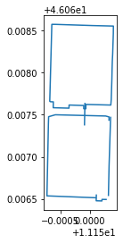
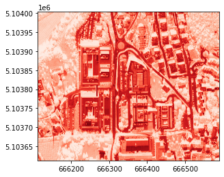
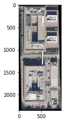
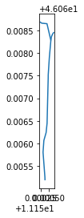
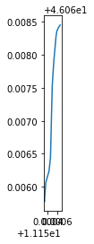
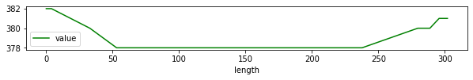
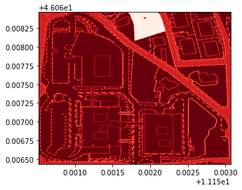
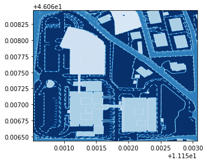

*Solution of exercise after the lesson of 30 October 2020*
{: .no_toc }

## Table of contents
{: .no_toc .text-delta }

1. TOC
{:toc}
# Setup


```bash
!pip install rasterio
```

    Collecting rasterio
    [?25l  Downloading https://files.pythonhosted.org/packages/33/1a/51baddc8581ead98fcef591624b4b2521b581943a9178912a2ac576e0235/rasterio-1.1.8-1-cp36-cp36m-manylinux1_x86_64.whl (18.3MB)
         |████████████████████████████████| 18.3MB 244kB/s 
    [?25hCollecting click-plugins
      Downloading https://files.pythonhosted.org/packages/e9/da/824b92d9942f4e472702488857914bdd50f73021efea15b4cad9aca8ecef/click_plugins-1.1.1-py2.py3-none-any.whl
    Requirement already satisfied: numpy in /usr/local/lib/python3.6/dist-packages (from rasterio) (1.18.5)
    Requirement already satisfied: click<8,>=4.0 in /usr/local/lib/python3.6/dist-packages (from rasterio) (7.1.2)
    Collecting cligj>=0.5
      Downloading https://files.pythonhosted.org/packages/ba/06/e3440b1f2dc802d35f329f299ba96153e9fcbfdef75e17f4b61f79430c6a/cligj-0.7.0-py3-none-any.whl
    Requirement already satisfied: attrs in /usr/local/lib/python3.6/dist-packages (from rasterio) (20.2.0)
    Collecting snuggs>=1.4.1
      Downloading https://files.pythonhosted.org/packages/cc/0e/d27d6e806d6c0d1a2cfdc5d1f088e42339a0a54a09c3343f7f81ec8947ea/snuggs-1.4.7-py3-none-any.whl
    Collecting affine
      Downloading https://files.pythonhosted.org/packages/ac/a6/1a39a1ede71210e3ddaf623982b06ecfc5c5c03741ae659073159184cd3e/affine-2.3.0-py2.py3-none-any.whl
    Requirement already satisfied: pyparsing>=2.1.6 in /usr/local/lib/python3.6/dist-packages (from snuggs>=1.4.1->rasterio) (2.4.7)
    Installing collected packages: click-plugins, cligj, snuggs, affine, rasterio
    Successfully installed affine-2.3.0 click-plugins-1.1.1 cligj-0.7.0 rasterio-1.1.8 snuggs-1.4.7


```bash
!pip install pygeos
```

    Collecting pygeos
    [?25l  Downloading https://files.pythonhosted.org/packages/66/06/2cfcf6e90814da1fdb4585534f03a36531f00cbad65f11b417337d69fe60/pygeos-0.8-cp36-cp36m-manylinux1_x86_64.whl (1.6MB)
         |████████████████████████████████| 1.6MB 9.5MB/s 
    [?25hRequirement already satisfied: numpy>=1.10 in /usr/local/lib/python3.6/dist-packages (from pygeos) (1.18.5)
    Installing collected packages: pygeos
    Successfully installed pygeos-0.8


```bash
!pip install geopandas
```

    Collecting geopandas
    [?25l  Downloading https://files.pythonhosted.org/packages/f7/a4/e66aafbefcbb717813bf3a355c8c4fc3ed04ea1dd7feb2920f2f4f868921/geopandas-0.8.1-py2.py3-none-any.whl (962kB)
         |████████████████████████████████| 972kB 7.1MB/s 
    [?25hCollecting fiona
    [?25l  Downloading https://files.pythonhosted.org/packages/36/8b/e8b2c11bed5373c8e98edb85ce891b09aa1f4210fd451d0fb3696b7695a2/Fiona-1.8.17-cp36-cp36m-manylinux1_x86_64.whl (14.8MB)
         |████████████████████████████████| 14.8MB 330kB/s 
    [?25hRequirement already satisfied: shapely in /usr/local/lib/python3.6/dist-packages (from geopandas) (1.7.1)
    Requirement already satisfied: pandas>=0.23.0 in /usr/local/lib/python3.6/dist-packages (from geopandas) (1.1.4)
    Collecting pyproj>=2.2.0
    [?25l  Downloading https://files.pythonhosted.org/packages/e4/ab/280e80a67cfc109d15428c0ec56391fc03a65857b7727cf4e6e6f99a4204/pyproj-3.0.0.post1-cp36-cp36m-manylinux2010_x86_64.whl (6.4MB)
         |████████████████████████████████| 6.5MB 47.8MB/s 
    [?25hRequirement already satisfied: six>=1.7 in /usr/local/lib/python3.6/dist-packages (from fiona->geopandas) (1.15.0)
    Requirement already satisfied: cligj>=0.5 in /usr/local/lib/python3.6/dist-packages (from fiona->geopandas) (0.7.0)
    Requirement already satisfied: click-plugins>=1.0 in /usr/local/lib/python3.6/dist-packages (from fiona->geopandas) (1.1.1)
    Requirement already satisfied: click<8,>=4.0 in /usr/local/lib/python3.6/dist-packages (from fiona->geopandas) (7.1.2)
    Requirement already satisfied: attrs>=17 in /usr/local/lib/python3.6/dist-packages (from fiona->geopandas) (20.2.0)
    Collecting munch
      Downloading https://files.pythonhosted.org/packages/cc/ab/85d8da5c9a45e072301beb37ad7f833cd344e04c817d97e0cc75681d248f/munch-2.5.0-py2.py3-none-any.whl
    Requirement already satisfied: python-dateutil>=2.7.3 in /usr/local/lib/python3.6/dist-packages (from pandas>=0.23.0->geopandas) (2.8.1)
    Requirement already satisfied: numpy>=1.15.4 in /usr/local/lib/python3.6/dist-packages (from pandas>=0.23.0->geopandas) (1.18.5)
    Requirement already satisfied: pytz>=2017.2 in /usr/local/lib/python3.6/dist-packages (from pandas>=0.23.0->geopandas) (2018.9)
    Requirement already satisfied: certifi in /usr/local/lib/python3.6/dist-packages (from pyproj>=2.2.0->geopandas) (2020.6.20)
    Installing collected packages: munch, fiona, pyproj, geopandas
    Successfully installed fiona-1.8.17 geopandas-0.8.1 munch-2.5.0 pyproj-3.0.0.post1


```bash
!pip install owslib
```

    Collecting owslib
    [?25l  Downloading https://files.pythonhosted.org/packages/c4/6a/428d73506f6f5281408b518249b90d7c96a1394c6d954a2069cbd5a4ac39/OWSLib-0.20.0-py2.py3-none-any.whl (197kB)
         |████████████████████████████████| 204kB 8.0MB/s 
    [?25hRequirement already satisfied: pyproj>=2 in /usr/local/lib/python3.6/dist-packages (from owslib) (3.0.0.post1)
    Requirement already satisfied: pytz in /usr/local/lib/python3.6/dist-packages (from owslib) (2018.9)
    Requirement already satisfied: python-dateutil>=1.5 in /usr/local/lib/python3.6/dist-packages (from owslib) (2.8.1)
    Requirement already satisfied: pyyaml in /usr/local/lib/python3.6/dist-packages (from owslib) (3.13)
    Requirement already satisfied: requests>=1.0 in /usr/local/lib/python3.6/dist-packages (from owslib) (2.23.0)
    Requirement already satisfied: certifi in /usr/local/lib/python3.6/dist-packages (from pyproj>=2->owslib) (2020.6.20)
    Requirement already satisfied: six>=1.5 in /usr/local/lib/python3.6/dist-packages (from python-dateutil>=1.5->owslib) (1.15.0)
    Requirement already satisfied: urllib3!=1.25.0,!=1.25.1,<1.26,>=1.21.1 in /usr/local/lib/python3.6/dist-packages (from requests>=1.0->owslib) (1.24.3)
    Requirement already satisfied: idna<3,>=2.5 in /usr/local/lib/python3.6/dist-packages (from requests>=1.0->owslib) (2.10)
    Requirement already satisfied: chardet<4,>=3.0.2 in /usr/local/lib/python3.6/dist-packages (from requests>=1.0->owslib) (3.0.4)
    Installing collected packages: owslib
    Successfully installed owslib-0.20.0


# Exercises
- clip the area with the shape of Polo Ferrari (in front on FBK)
- create the altitude profile of the street “Via Sommarive”
- find the area FBK in the WMS of municipality of Trento - layer “Carta Tecnica 1:2.000 alta risoluzione” and vectorize it
---


## clip the area with the shape of Polo Ferrari (in front on FBK)
1. identify the area of Polo Ferrari
2. download the raster of scientific hub in Povo
3. clip area


```python
import geopandas as gpd
import rasterio 
from rasterio.mask import mask
from rasterio.plot import show
```


### 1. identify the area of Polo Ferrari


http://overpass-turbo.eu/s/ZzP


[geojson](https://raw.githubusercontent.com/napo/geospatial_course_unitn/master/data/openstreetmap/polo_ferrari_boundary.geojson)


```python
geojson_polo_ferarri = "https://raw.githubusercontent.com/napo/geospatial_course_unitn/master/data/openstreetmap/polo_ferrari_boundary.geojson"
```


```python
polo_ferrari = gpd.read_file(geojson_polo_ferarri)
```


```python
polo_ferrari.plot()
```


    

    


```python
polo_ferrari.geometry.type.unique()
```


    array(['LineString'], dtype=object)


```python
polo_ferrari.geometry.unary_union.envelope
```


    

    


```python
area_polo_ferrari = polo_ferrari.geometry.unary_union.envelope
```


```python
type(area_polo_ferrari)
```


    shapely.geometry.polygon.Polygon


### 2. download the raster of scientific hub in Povo


```bash
!wget https://github.com/napo/geospatial_course_unitn/raw/master/data/raster/trento_scientifc_hub_povo.tif
```

    --2020-11-07 19:42:59--  https://github.com/napo/geospatial_course_unitn/raw/master/data/raster/trento_scientifc_hub_povo.tif
    Resolving github.com (github.com)... 140.82.121.4
    Connecting to github.com (github.com)|140.82.121.4|:443... connected.
    HTTP request sent, awaiting response... 302 Found
    Location: https://raw.githubusercontent.com/napo/geospatial_course_unitn/master/data/raster/trento_scientifc_hub_povo.tif [following]
    --2020-11-07 19:42:59--  https://raw.githubusercontent.com/napo/geospatial_course_unitn/master/data/raster/trento_scientifc_hub_povo.tif
    Resolving raw.githubusercontent.com (raw.githubusercontent.com)... 151.101.0.133, 151.101.64.133, 151.101.128.133, ...
    Connecting to raw.githubusercontent.com (raw.githubusercontent.com)|151.101.0.133|:443... connected.
    HTTP request sent, awaiting response... 200 OK
    Length: 8279208 (7.9M) [application/octet-stream]
    Saving to: ‘trento_scientifc_hub_povo.tif’
    
    trento_scientifc_hu 100%[===================>]   7.90M  37.9MB/s    in 0.2s    
    
    2020-11-07 19:43:00 (37.9 MB/s) - ‘trento_scientifc_hub_povo.tif’ saved [8279208/8279208]
    


```python
file_scientific_hub_povo = "trento_scientifc_hub_povo.tif"
```


```python
raster = rasterio.open(file_scientific_hub_povo)
```


```python
show(raster)
```


    

    


```python
ax = show((raster, 1), cmap='Reds')
ax.set_axis_off()
```


    

    

```python
raster.meta
```


    {'count': 3,
     'crs': CRS.from_epsg(25832),
     'driver': 'GTiff',
     'dtype': 'uint8',
     'height': 3900,
     'nodata': None,
     'transform': Affine(0.09999999999999999, 0.0, 666113.0,
           0.0, -0.09999999999999999, 5104003.0),
     'width': 4761}


### 3. clip area


```python
def getFeatures(gdf):
    """Function to parse features from GeoDataFrame in such a manner that rasterio wants them"""
    import json
    return [json.loads(gdf.to_json())['features'][0]['geometry']]

```


```python
gdf_polo_ferrari_25832 = gpd.GeoSeries([area_polo_ferrari]).set_crs("EPSG:4326").to_crs("EPSG:25832")
```


```python
coords = getFeatures(gdf_polo_ferrari_25832)
```


```python
coords
```


    [{'coordinates': [[[666221.9300357221, 5103679.093307299],
        [666310.1180686228, 5103681.477369573],
        [666303.8138183788, 5103914.6097356975],
        [666215.6291314249, 5103912.225679764],
        [666221.9300357221, 5103679.093307299]]],
      'type': 'Polygon'}]


```python
raster_polo_ferrari, raster_polo_ferrari_transform = mask(raster, coords, crop=True)
```


```python
show(raster_polo_ferrari)
```


    

    


```python
raster_polo_ferrari_meta = raster.meta
```


```python
raster_polo_ferrari_meta.update({"driver": "GTiff",
                 "height": raster_polo_ferrari.shape[1],
                 "width": raster_polo_ferrari.shape[2],
                 "transform": raster_polo_ferrari_transform})

with rasterio.open("polo_ferrari_orthophoto.tif", "w", **raster_polo_ferrari_meta) as dest:
    dest.write(raster_polo_ferrari)
```


```python
!ls -lah polo_ferrari_orthophoto.tif
```

    -rw-r--r-- 1 root root 6.4M Nov  7 19:43 polo_ferrari_orthophoto.tif


## create the altitude profile of the street “Via Sommarive”
1. download the street "Via Sommarive" from OpenStreetMap
1. download the DTM file of the scientific hub of Povo
1. clip the street inside the area covered of the DTM
1. extract the points of the street
1. extract the altitude value for each points
1. show the altitude
---


### 1. download the street "Via Sommarive" from OpenStreetMap


http://overpass-turbo.eu/s/ZA0

[geojson](https://raw.githubusercontent.com/napo/geospatial_course_unitn/master/data/openstreetmap/via_sommarive.geojson)


```python
via_sommarive = gpd.read_file("https://raw.githubusercontent.com/napo/geospatial_course_unitn/master/data/openstreetmap/via_sommarive.geojson")
```


```
via_sommarive.plot()
```


    

    


### 2. download the DTM file of the scientific hub of Povo


```bash
!wget https://github.com/napo/geospatial_course_unitn/raw/master/data/raster/trento_scientifc_hub_povo_dtm.asc
```

    --2020-11-07 19:43:05--  https://github.com/napo/geospatial_course_unitn/raw/master/data/raster/trento_scientifc_hub_povo_dtm.asc
    Resolving github.com (github.com)... 140.82.118.4
    Connecting to github.com (github.com)|140.82.118.4|:443... connected.
    HTTP request sent, awaiting response... 302 Found
    Location: https://raw.githubusercontent.com/napo/geospatial_course_unitn/master/data/raster/trento_scientifc_hub_povo_dtm.asc [following]
    --2020-11-07 19:43:06--  https://raw.githubusercontent.com/napo/geospatial_course_unitn/master/data/raster/trento_scientifc_hub_povo_dtm.asc
    Resolving raw.githubusercontent.com (raw.githubusercontent.com)... 151.101.0.133, 151.101.64.133, 151.101.128.133, ...
    Connecting to raw.githubusercontent.com (raw.githubusercontent.com)|151.101.0.133|:443... connected.
    HTTP request sent, awaiting response... 200 OK
    Length: 820541 (801K) [text/plain]
    Saving to: ‘trento_scientifc_hub_povo_dtm.asc’
    
    trento_scientifc_hu 100%[===================>] 801.31K  --.-KB/s    in 0.06s   
    
    2020-11-07 19:43:06 (13.4 MB/s) - ‘trento_scientifc_hub_povo_dtm.asc’ saved [820541/820541]
    


```bash
!wget https://github.com/napo/geospatial_course_unitn/raw/master/data/raster/trento_scientifc_hub_povo_dtm.prj
```

    --2020-11-07 19:43:06--  https://github.com/napo/geospatial_course_unitn/raw/master/data/raster/trento_scientifc_hub_povo_dtm.prj
    Resolving github.com (github.com)... 140.82.121.4
    Connecting to github.com (github.com)|140.82.121.4|:443... connected.
    HTTP request sent, awaiting response... 302 Found
    Location: https://raw.githubusercontent.com/napo/geospatial_course_unitn/master/data/raster/trento_scientifc_hub_povo_dtm.prj [following]
    --2020-11-07 19:43:06--  https://raw.githubusercontent.com/napo/geospatial_course_unitn/master/data/raster/trento_scientifc_hub_povo_dtm.prj
    Resolving raw.githubusercontent.com (raw.githubusercontent.com)... 151.101.0.133, 151.101.64.133, 151.101.128.133, ...
    Connecting to raw.githubusercontent.com (raw.githubusercontent.com)|151.101.0.133|:443... connected.
    HTTP request sent, awaiting response... 200 OK
    Length: 403 [text/plain]
    Saving to: ‘trento_scientifc_hub_povo_dtm.prj’
    
    trento_scientifc_hu 100%[===================>]     403  --.-KB/s    in 0s      
    
    2020-11-07 19:43:07 (20.1 MB/s) - ‘trento_scientifc_hub_povo_dtm.prj’ saved [403/403]
    


```python
dtm = "trento_scientifc_hub_povo_dtm.asc"
```


```python
raster_dtm = rasterio.open(dtm)
```


```python
show(raster_dtm, cmap='Greys')
```


    

    


### 3. clip the street inside the area covered of the DTM


```python
raster_dtm.bounds
```


    BoundingBox(left=666100.6735466761, bottom=5103603.23583161, right=666600.6735466761, top=5104013.23583161)


```python
minx = raster_dtm.bounds.left
maxx = raster_dtm.bounds.right
miny = raster_dtm.bounds.bottom
maxy = raster_dtm.bounds.top

```


```python
from shapely.geometry import Polygon
```


```python
bbox_raster_dtm = Polygon([[minx, miny], [maxx, miny], [maxx, maxy], [minx, maxy]])
```


```python
geoseries_bbox_raster_dtm = gpd.GeoSeries([bbox_raster_dtm]).set_crs("EPSG:25832").to_crs("EPSG:4326")
```


```python
geoseries_bbox_raster_dtm
```


    0    POLYGON ((11.14767 46.06582, 11.15413 46.06570...
    dtype: geometry


```python
gdf_bbox_raster_dtm = gpd.GeoDataFrame(geometry=geoseries_bbox_raster_dtm)
```


```python
gdf_bbox_raster_dtm
```


<div>
<style scoped>
    .dataframe tbody tr th:only-of-type {
        vertical-align: middle;
    }

    .dataframe tbody tr th {
        vertical-align: top;
    }

    .dataframe thead th {
        text-align: right;
    }
</style>
<table border="1" class="dataframe">
  <thead>
    <tr style="text-align: right;">
      <th></th>
      <th>geometry</th>
    </tr>
  </thead>
  <tbody>
    <tr>
      <th>0</th>
      <td>POLYGON ((11.14767 46.06582, 11.15413 46.06570...</td>
    </tr>
  </tbody>
</table>
</div>


```python
sommarive_street_inside_dtm = gpd.overlay(via_sommarive, gdf_bbox_raster_dtm, how='intersection')
```


```python
sommarive_street_inside_dtm
```


<div>
<style scoped>
    .dataframe tbody tr th:only-of-type {
        vertical-align: middle;
    }

    .dataframe tbody tr th {
        vertical-align: top;
    }

    .dataframe thead th {
        text-align: right;
    }
</style>
<table border="1" class="dataframe">
  <thead>
    <tr style="text-align: right;">
      <th></th>
      <th>id</th>
      <th>@id</th>
      <th>highway</th>
      <th>lit</th>
      <th>maxspeed:type</th>
      <th>name</th>
      <th>surface</th>
      <th>maxspeed</th>
      <th>source:maxspeed</th>
      <th>geometry</th>
    </tr>
  </thead>
  <tbody>
    <tr>
      <th>0</th>
      <td>way/97004470</td>
      <td>way/97004470</td>
      <td>unclassified</td>
      <td>yes</td>
      <td>IT:urban</td>
      <td>Via Sommarive</td>
      <td>asphalt</td>
      <td>None</td>
      <td>None</td>
      <td>LINESTRING (11.15033 46.06577, 11.15033 46.065...</td>
    </tr>
    <tr>
      <th>1</th>
      <td>way/382958545</td>
      <td>way/382958545</td>
      <td>residential</td>
      <td>None</td>
      <td>None</td>
      <td>Via Sommarive</td>
      <td>asphalt</td>
      <td>50</td>
      <td>sign</td>
      <td>LINESTRING (11.15058 46.06828, 11.15045 46.068...</td>
    </tr>
  </tbody>
</table>
</div>


```python
import folium
```


```python
x = sommarive_street_inside_dtm.geometry.unary_union.centroid.x
y = sommarive_street_inside_dtm.geometry.unary_union.centroid.y
```


```python
map = folium.Map([y,x], zoom_start=17)
folium.GeoJson(gdf_bbox_raster_dtm.to_json()).add_to(map)
folium.GeoJson(sommarive_street_inside_dtm.to_json()).add_to(map)
map
```


<iframe 
    width="100%"
    height="300" src="https://napo.github.io/geospatial_course_unitn/docs/html/dtm_clip_street.html"
    style="border:none;"
    allowfullscreen webkitallowfullscreen mozallowfullscreen>
</iframe>


```python
sommarive_street_inside_dtm.highway
```


    0    unclassified
    1     residential
    Name: highway, dtype: object


```python
sommarive_street_inside_dtm[sommarive_street_inside_dtm.highway == 'unclassified'].plot()
```


    

    


```python
sommarive_street_inside_dtm[sommarive_street_inside_dtm.highway == 'unclassified'].geometry.values[0]
```


    

    


```python
linestring_sommarive_street = sommarive_street_inside_dtm[sommarive_street_inside_dtm.highway == 'unclassified'].geometry.values[0]
```

### 4. extract the points of the street
we need to convert the points from WGS84 to ETRS89


```python
import shapely
import pyproj
from shapely.ops import transform
```


```python
wgs84 = pyproj.CRS('EPSG:4326')
crs_dtm = pyproj.CRS('EPSG:25832')
projection_transform = pyproj.Transformer.from_crs(wgs84, crs_dtm, always_xy=False).transform
```


```python
def convert(x,y):
  p = shapely.geometry.Point(y,x)
  p = transform(projection_transform,p)
  return(p)
```


```python
pointsx = []
pointsy = []
for coordinate in linestring_sommarive_street.coords:
  x = coordinate[0]
  y = coordinate[1]
  point = convert(x,y)
  pointsx.append(point.x)
  pointsy.append(point.y)
```


```python
pointsx[0]
```


    666306.4552006973


```python
pointsy[0]
```


    5103603.23091181


### 4. extract the altitude value for each points


```python
import pandas as pd
```


```python
#calculate the distance point-to-point
from shapely.geometry import Point,LineString
lengths = []
previousPoint = None
length = 0
for i in range(len(pointsx)):
  point = shapely.geometry.Point(pointsy[i],pointsx[i])
  if previousPoint is None:
    lengths.append(length)
  else:
    length = LineString([previousPoint,point]).length + length
    lengths.append(length)  
  previousPoint = point 

```


```python
lengths
```


    [0,
     3.951209709379636,
     32.831459096031196,
     52.98060861208776,
     76.0895772860392,
     92.85559295912803,
     165.21088895179275,
     186.20305604231848,
     194.89525293084407,
     237.7301320929318,
     279.66422694854015,
     288.77768975533206,
     295.6826859435214,
     301.98476544998357]


```python
raster_dtm.count
```


    1


```python
data = raster_dtm.read(1)
```


```python
data
```


    array([[335., 335., 335., ..., 468., 469., 469.],
           [334., 334., 334., ..., 469., 469., 469.],
           [334., 334., 334., ..., 469., 469., 469.],
           ...,
           [357., 357., 357., ..., 400., 400., 401.],
           [356., 357., 357., ..., 400., 400., 400.],
           [356., 357., 357., ..., 400., 400., 400.]], dtype=float32)


```python
rows,cols = rasterio.transform.rowcol(raster_dtm.transform,(pointsx),(pointsy))
```


```python
values = []
for i in range(len(rows)):
  values.append(data[rows[i]-1][cols[i]-1]) 
```


```python
values
```


    [382.0,
     382.0,
     380.0,
     378.0,
     378.0,
     378.0,
     378.0,
     378.0,
     378.0,
     378.0,
     380.0,
     380.0,
     381.0,
     381.0]


```python
sommarive_street_3d = pd.DataFrame()
```


```python
sommarive_street_3d['value'] = values
```


```python
sommarive_street_3d['length'] = lengths
```


```python
sommarive_street_3d
```


<div>
<style scoped>
    .dataframe tbody tr th:only-of-type {
        vertical-align: middle;
    }

    .dataframe tbody tr th {
        vertical-align: top;
    }

    .dataframe thead th {
        text-align: right;
    }
</style>
<table border="1" class="dataframe">
  <thead>
    <tr style="text-align: right;">
      <th></th>
      <th>value</th>
      <th>length</th>
    </tr>
  </thead>
  <tbody>
    <tr>
      <th>0</th>
      <td>382.0</td>
      <td>0.000000</td>
    </tr>
    <tr>
      <th>1</th>
      <td>382.0</td>
      <td>3.951210</td>
    </tr>
    <tr>
      <th>2</th>
      <td>380.0</td>
      <td>32.831459</td>
    </tr>
    <tr>
      <th>3</th>
      <td>378.0</td>
      <td>52.980609</td>
    </tr>
    <tr>
      <th>4</th>
      <td>378.0</td>
      <td>76.089577</td>
    </tr>
    <tr>
      <th>5</th>
      <td>378.0</td>
      <td>92.855593</td>
    </tr>
    <tr>
      <th>6</th>
      <td>378.0</td>
      <td>165.210889</td>
    </tr>
    <tr>
      <th>7</th>
      <td>378.0</td>
      <td>186.203056</td>
    </tr>
    <tr>
      <th>8</th>
      <td>378.0</td>
      <td>194.895253</td>
    </tr>
    <tr>
      <th>9</th>
      <td>378.0</td>
      <td>237.730132</td>
    </tr>
    <tr>
      <th>10</th>
      <td>380.0</td>
      <td>279.664227</td>
    </tr>
    <tr>
      <th>11</th>
      <td>380.0</td>
      <td>288.777690</td>
    </tr>
    <tr>
      <th>12</th>
      <td>381.0</td>
      <td>295.682686</td>
    </tr>
    <tr>
      <th>13</th>
      <td>381.0</td>
      <td>301.984765</td>
    </tr>
  </tbody>
</table>
</div>


```python
ax = sommarive_street_3d.plot(y='value',x="length",color='green',figsize=(10,1))
```


    

    


## find the area FBK in the WMS of municipality of Trento - layer “Carta Tecnica 1:2.000 alta risoluzione” and vectorize it

1. create a bounding box based on the FBK area in Povo
1. load the WMS of muncipality of Trento as rasterio on the size of the bounding box
1. vectorize the rasterio
---


### 1. create a bounding box based on the FBK area in Povo
.. we can use the same geojson extracted from OSM used on the lesson


```python
fbk = gpd.read_file("https://raw.githubusercontent.com/napo/geospatial_course_unitn/master/data/openstreetmap/boundary_fbk_povo.geojson")
```


```python
bbox = fbk.geometry[0].bounds
```


```python
bbox
```


    (11.1505197, 46.0664359, 11.1530713, 46.0684635)


```python
fbk.shape
```


    (1, 10)


### 2. load the WMS of muncipality of Trento as rasterio on the size of the bounding box


```python
from owslib.wms import WebMapService
import rasterio.crs
```


```python
wms_trento = "http://webapps.comune.trento.it/ogc"
```


```python
wms = WebMapService(wms_trento)
```


```python
title="Carta Tecnica 1:2.000 alta risoluzione a colori"
```


```python
wms.contents
```


    OrderedDict([('ogc_services',
                  <owslib.map.wms111.ContentMetadata at 0x7f8c70ef9ac8>),
                 ('ortofoto2009',
                  <owslib.map.wms111.ContentMetadata at 0x7f8c70ef9eb8>),
                 ('ortofoto2015',
                  <owslib.map.wms111.ContentMetadata at 0x7f8c70f12198>),
                 ('ortofoto2016',
                  <owslib.map.wms111.ContentMetadata at 0x7f8c70f12550>),
                 ('ortofoto2019',
                  <owslib.map.wms111.ContentMetadata at 0x7f8c70f128d0>),
                 ('ortofoto2016infrarosso',
                  <owslib.map.wms111.ContentMetadata at 0x7f8c70e9a048>),
                 ('ortofoto2019infrarosso',
                  <owslib.map.wms111.ContentMetadata at 0x7f8c70e9a128>),
                 ('ct2000', <owslib.map.wms111.ContentMetadata at 0x7f8c70e9a208>),
                 ('ct2000_colori',
                  <owslib.map.wms111.ContentMetadata at 0x7f8c70e9a320>),
                 ('carta_semplificata',
                  <owslib.map.wms111.ContentMetadata at 0x7f8c70e9a400>),
                 ('ombreDTM',
                  <owslib.map.wms111.ContentMetadata at 0x7f8c70e9a4e0>),
                 ('ombreDSM',
                  <owslib.map.wms111.ContentMetadata at 0x7f8c70e9a5c0>),
                 ('toponomastica',
                  <owslib.map.wms111.ContentMetadata at 0x7f8c70e9a6a0>),
                 ('grafo', <owslib.map.wms111.ContentMetadata at 0x7f8c70e9a780>),
                 ('civici', <owslib.map.wms111.ContentMetadata at 0x7f8c70e9ac88>),
                 ('civici_principali',
                  <owslib.map.wms111.ContentMetadata at 0x7f8c70e9ada0>),
                 ('toponimi',
                  <owslib.map.wms111.ContentMetadata at 0x7f8c70e9ae80>),
                 ('prg_vigente',
                  <owslib.map.wms111.ContentMetadata at 0x7f8c70e9aef0>),
                 ('adunata_alpini',
                  <owslib.map.wms111.ContentMetadata at 0x7f8c70e9acf8>),
                 ('pric', <owslib.map.wms111.ContentMetadata at 0x7f8c70e9afd0>)])


```python
for content in wms.contents:
  layer = wms[content]
  if layer.title == title:
    break

```


```python
content
```


    'ct2000_colori'


```python
layer.crsOptions
```


    ['EPSG:4326', 'EPSG:25832', 'EPSG:3857']


```python
request = wms.getmap(
    layers=[content],
    srs='EPSG:4326',
    format='image/tiff',
    bbox=bbox,
    size=(1024,800)
    )
```


```python
from rasterio import MemoryFile
from rasterio.plot import show
from rasterio import features
```


```python
wms_image = MemoryFile(request).open()
```


```python
wms_image.profile
```


    {'driver': 'GTiff', 'dtype': 'uint8', 'nodata': None, 'width': 1024, 'height': 800, 'count': 3, 'crs': CRS.from_epsg(4326), 'transform': Affine(2.4917968750015575e-06, 0.0, 11.1505197,
           0.0, -2.5344999999997646e-06, 46.0684635), 'tiled': False, 'interleave': 'pixel'}


```python
show(wms_image)
```


    

    


```python
wms_image.count
```


    3


```python
show((wms_image, 1), cmap='Reds')
```


    

    


```python
show((wms_image, 2), cmap='Greens')
```


    

    


```python
show((wms_image, 3), cmap='Blues')
```


    

    


```python
blue = wms_image.read(3)
mask = blue != 255
shapes = features.shapes(blue, mask=mask)

```


```python
from rasterio.features import shapes
image = wms_image.read(3) # first band
mask = blue != 255
results = (
  {'properties': {'raster_val': v}, 'geometry': s}
  for i, (s, v) 
    in enumerate(
      shapes(image, mask=mask, transform=wms_image.transform)))
```


```python
geoms = list(results)
```


```python
fbk_area_vector  = gpd.GeoDataFrame.from_features(geoms)
```


```python
fbk_area_vector.shape
```


    (78339, 2)


```python
fbk_area_vector.plot()
```


    

    


FBK Buildings

North

https://www.openstreetmap.org/?mlat=46.06782&mlon=11.15156#map=19/46.06782/11.15156


West 

https://www.openstreetmap.org/?mlat=46.06689&mlon=11.15116#map=19/46.06689/11.15116

East

https://www.openstreetmap.org/?mlat=46.06684&mlon=11.15200#map=19/46.06684/11.15200


```python
p_north = shapely.geometry.Point(11.15156,46.06782)
```


```python
building_north = fbk_area_vector[fbk_area_vector.geometry.contains(p_north)]
```


```python
building_north
```


<div>
<style scoped>
    .dataframe tbody tr th:only-of-type {
        vertical-align: middle;
    }

    .dataframe tbody tr th {
        vertical-align: top;
    }

    .dataframe thead th {
        text-align: right;
    }
</style>
<table border="1" class="dataframe">
  <thead>
    <tr style="text-align: right;">
      <th></th>
      <th>geometry</th>
      <th>raster_val</th>
    </tr>
  </thead>
  <tbody>
    <tr>
      <th>42228</th>
      <td>POLYGON ((11.15107 46.06820, 11.15107 46.06820...</td>
      <td>181.0</td>
    </tr>
  </tbody>
</table>
</div>


```python
building_north.plot()
```


    

    


```python
p_west = shapely.geometry.Point(11.15116,46.06689)
building_west = fbk_area_vector[fbk_area_vector.geometry.contains(p_west)]
```


```python
p_east = shapely.geometry.Point(11.15200,46.06684)
building_east = fbk_area_vector[fbk_area_vector.geometry.contains(p_east)]
```


```python
building_east
```


<div>
<style scoped>
    .dataframe tbody tr th:only-of-type {
        vertical-align: middle;
    }

    .dataframe tbody tr th {
        vertical-align: top;
    }

    .dataframe thead th {
        text-align: right;
    }
</style>
<table border="1" class="dataframe">
  <thead>
    <tr style="text-align: right;">
      <th></th>
      <th>geometry</th>
      <th>raster_val</th>
    </tr>
  </thead>
  <tbody>
    <tr>
      <th>70295</th>
      <td>POLYGON ((11.15198 46.06710, 11.15198 46.06710...</td>
      <td>193.0</td>
    </tr>
  </tbody>
</table>
</div>


```python
x = building_east.geometry.centroid.x.values[0]
y = building_east.geometry.centroid.y.values[0]
```


```python
import folium
map = folium.Map([y, x],zoom_start=19)
geojson_building_north = folium.features.GeoJson(building_north.to_json())
geojson_building_west = folium.features.GeoJson(building_west.to_json())
geojson_building_east = folium.features.GeoJson(building_east.to_json())
geojson_building_north.add_to(map)
geojson_building_west.add_to(map)
geojson_building_east.add_to(map)
map
```


<iframe 
    width="100%"
    height="300" src="https://napo.github.io/geospatial_course_unitn/docs/html/rasterio_vectors.html"
    style="border:none;"
    allowfullscreen webkitallowfullscreen mozallowfullscreen>
</iframe>


