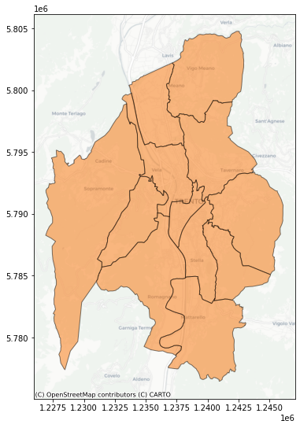
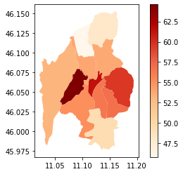
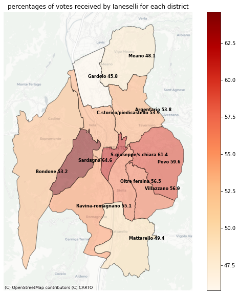
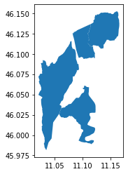
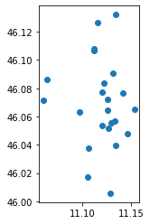
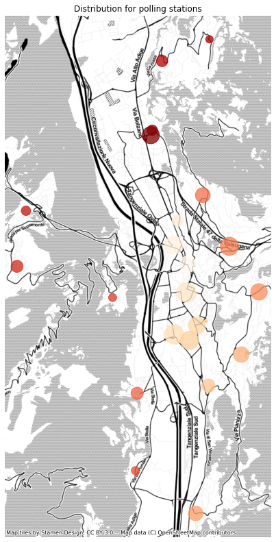
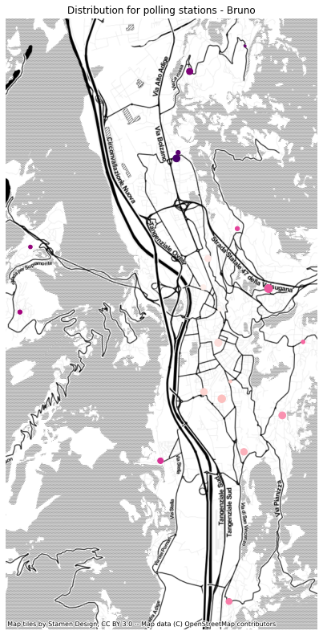

*Solution of exercise after the lesson of 6 November 2020*
{: .no_toc }

## Table of contents
{: .no_toc .text-delta }

1. TOC
{:toc}
# Setup


```bash
!pip install geopandas
```

```bash
!pip install contextily
```

# Exercise
create maps with distribution of votes by polling station (seggi elettorali) of the mayoral candidates of the municipal 2020 of Trento
Data available here:

[election data for mayor of Trento 2020](https://github.com/napo/geospatial_course_unitn/tree/master/data/election_data_trento)

---


1. know the available data
1. indentify the maps

## know the available data


```python
import geopandas as gpd
import pandas as pd
import matplotlib.pyplot as plt
import contextily as ctx
import seaborn as sns
```


```python
urlbase = "https://raw.githubusercontent.com/napo/geospatial_course_unitn/master/data/election_data_trento/"
```


```python
votes_candidate_mayor = pd.read_csv(urlbase +  "voti_sindaco_sezioni.csv",sep=";")
```


```python
votes_candidate_mayor
```


<div>
<style scoped>
    .dataframe tbody tr th:only-of-type {
        vertical-align: middle;
    }

    .dataframe tbody tr th {
        vertical-align: top;
    }

    .dataframe thead th {
        text-align: right;
    }
</style>
<table border="1" class="dataframe">
  <thead>
    <tr style="text-align: right;">
      <th></th>
      <th>sezione</th>
      <th>cod_circoscrizione</th>
      <th>circoscrizione</th>
      <th>sezioni_pervenute</th>
      <th>sezioni _totali</th>
      <th>schede_bianche</th>
      <th>schede_nulle</th>
      <th>schede_contestate_non_attribuite</th>
      <th>prog_sindaco</th>
      <th>cognome_sindaco</th>
      <th>nome_sindaco</th>
      <th>detto _sindaco</th>
      <th>vedova_sindaco</th>
      <th>voti</th>
    </tr>
  </thead>
  <tbody>
    <tr>
      <th>0</th>
      <td>1</td>
      <td>12</td>
      <td>C.STORICO/PIEDICASTELLO</td>
      <td>98</td>
      <td>98</td>
      <td>1</td>
      <td>3</td>
      <td>0</td>
      <td>1</td>
      <td>MARTINI</td>
      <td>CARMEN</td>
      <td>NaN</td>
      <td>N</td>
      <td>3</td>
    </tr>
    <tr>
      <th>1</th>
      <td>1</td>
      <td>12</td>
      <td>C.STORICO/PIEDICASTELLO</td>
      <td>98</td>
      <td>98</td>
      <td>1</td>
      <td>3</td>
      <td>0</td>
      <td>2</td>
      <td>BRUNO</td>
      <td>FRANCO</td>
      <td>NaN</td>
      <td>N</td>
      <td>0</td>
    </tr>
    <tr>
      <th>2</th>
      <td>1</td>
      <td>12</td>
      <td>C.STORICO/PIEDICASTELLO</td>
      <td>98</td>
      <td>98</td>
      <td>1</td>
      <td>3</td>
      <td>0</td>
      <td>3</td>
      <td>IANESELLI</td>
      <td>FRANCO</td>
      <td>NaN</td>
      <td>N</td>
      <td>165</td>
    </tr>
    <tr>
      <th>3</th>
      <td>1</td>
      <td>12</td>
      <td>C.STORICO/PIEDICASTELLO</td>
      <td>98</td>
      <td>98</td>
      <td>1</td>
      <td>3</td>
      <td>0</td>
      <td>4</td>
      <td>PANTANO</td>
      <td>GIULIANO</td>
      <td>NaN</td>
      <td>N</td>
      <td>7</td>
    </tr>
    <tr>
      <th>4</th>
      <td>1</td>
      <td>12</td>
      <td>C.STORICO/PIEDICASTELLO</td>
      <td>98</td>
      <td>98</td>
      <td>1</td>
      <td>3</td>
      <td>0</td>
      <td>5</td>
      <td>ZANETTI</td>
      <td>SILVIA</td>
      <td>NaN</td>
      <td>N</td>
      <td>5</td>
    </tr>
    <tr>
      <th>...</th>
      <td>...</td>
      <td>...</td>
      <td>...</td>
      <td>...</td>
      <td>...</td>
      <td>...</td>
      <td>...</td>
      <td>...</td>
      <td>...</td>
      <td>...</td>
      <td>...</td>
      <td>...</td>
      <td>...</td>
      <td>...</td>
    </tr>
    <tr>
      <th>779</th>
      <td>98</td>
      <td>3</td>
      <td>BONDONE</td>
      <td>98</td>
      <td>98</td>
      <td>16</td>
      <td>17</td>
      <td>0</td>
      <td>4</td>
      <td>PANTANO</td>
      <td>GIULIANO</td>
      <td>NaN</td>
      <td>N</td>
      <td>11</td>
    </tr>
    <tr>
      <th>780</th>
      <td>98</td>
      <td>3</td>
      <td>BONDONE</td>
      <td>98</td>
      <td>98</td>
      <td>16</td>
      <td>17</td>
      <td>0</td>
      <td>5</td>
      <td>ZANETTI</td>
      <td>SILVIA</td>
      <td>NaN</td>
      <td>N</td>
      <td>27</td>
    </tr>
    <tr>
      <th>781</th>
      <td>98</td>
      <td>3</td>
      <td>BONDONE</td>
      <td>98</td>
      <td>98</td>
      <td>16</td>
      <td>17</td>
      <td>0</td>
      <td>6</td>
      <td>MERLER</td>
      <td>ANDREA</td>
      <td>NaN</td>
      <td>N</td>
      <td>237</td>
    </tr>
    <tr>
      <th>782</th>
      <td>98</td>
      <td>3</td>
      <td>BONDONE</td>
      <td>98</td>
      <td>98</td>
      <td>16</td>
      <td>17</td>
      <td>0</td>
      <td>7</td>
      <td>CARLI</td>
      <td>MARCELLO</td>
      <td>NaN</td>
      <td>N</td>
      <td>49</td>
    </tr>
    <tr>
      <th>783</th>
      <td>98</td>
      <td>3</td>
      <td>BONDONE</td>
      <td>98</td>
      <td>98</td>
      <td>16</td>
      <td>17</td>
      <td>0</td>
      <td>8</td>
      <td>DEGASPERI</td>
      <td>FILIPPO</td>
      <td>NaN</td>
      <td>N</td>
      <td>14</td>
    </tr>
  </tbody>
</table>
<p>784 rows × 14 columns</p>
</div>


sezione = electoral section <br/>
cod_circoscrizione = unique code to identify a district<br/>
circoscrizione = district <br/>
sezioni_pervenute = number of sections where the counting was completed<br/>
sezioni_totali = total of sections<br/>
schede_bianche = white ballot<br/>
schede_nulle = null ballot<br/>
schede_contestate_non_attribuite = contested ballots not assigned<br/>
prog_sindaco = mayor program<br/>
cognome_sindaco = lastname of candidate as mayor<br/>
nome_sindaco = name of the candidate as mayor<br/>
detto_sindaco = nickname of the candidate<br/>
vedova_sindaco = name of the candidate as mayor as widow<br/>
voti = votes 


```python
geo_districts = gpd.read_file(urlbase + "circoscrizioni_trento.geojson")
```


```python
geo_districts.plot()
```


    

    


```python
ax = geo_districts.to_crs(epsg=3857).plot(color='xkcd:orange',figsize=(9,9),alpha=0.5,edgecolor='black')
ctx.add_basemap(ax,crs=geo_districts.to_crs(epsg=3857).crs.to_string(),
               source=ctx.providers.CartoDB.Positron)

```


    

    


## list of all the candidate as mayor


```python
votes_candidate_mayor.cognome_sindaco.unique()
```


    array(['MARTINI', 'BRUNO', 'IANESELLI', 'PANTANO', 'ZANETTI', 'MERLER',
           'CARLI', 'DEGASPERI'], dtype=object)


```python
votes_candidate_mayor.groupby(['cognome_sindaco']).voti.sum()
```


    cognome_sindaco
    BRUNO          144
    CARLI         3102
    DEGASPERI     1497
    IANESELLI    31885
    MARTINI       1414
    MERLER       17627
    PANTANO        592
    ZANETTI       2075
    Name: voti, dtype: int64


## ranking of the candidates


```python
ranking = votes_candidate_mayor.groupby(['cognome_sindaco']).voti.sum().to_frame().reset_index()
```


```python
ranking.sort_values(by=['voti'],ascending=False)
```


<div>
<style scoped>
    .dataframe tbody tr th:only-of-type {
        vertical-align: middle;
    }

    .dataframe tbody tr th {
        vertical-align: top;
    }

    .dataframe thead th {
        text-align: right;
    }
</style>
<table border="1" class="dataframe">
  <thead>
    <tr style="text-align: right;">
      <th></th>
      <th>cognome_sindaco</th>
      <th>voti</th>
    </tr>
  </thead>
  <tbody>
    <tr>
      <th>3</th>
      <td>IANESELLI</td>
      <td>31885</td>
    </tr>
    <tr>
      <th>5</th>
      <td>MERLER</td>
      <td>17627</td>
    </tr>
    <tr>
      <th>1</th>
      <td>CARLI</td>
      <td>3102</td>
    </tr>
    <tr>
      <th>7</th>
      <td>ZANETTI</td>
      <td>2075</td>
    </tr>
    <tr>
      <th>2</th>
      <td>DEGASPERI</td>
      <td>1497</td>
    </tr>
    <tr>
      <th>4</th>
      <td>MARTINI</td>
      <td>1414</td>
    </tr>
    <tr>
      <th>6</th>
      <td>PANTANO</td>
      <td>592</td>
    </tr>
    <tr>
      <th>0</th>
      <td>BRUNO</td>
      <td>144</td>
    </tr>
  </tbody>
</table>
</div>


## total votes for districts


```python
totalvotes_districts = votes_candidate_mayor.groupby(['circoscrizione']).voti.sum()
```


```python
totalvotes_districts.to_frame().reset_index()
```


<div>
<style scoped>
    .dataframe tbody tr th:only-of-type {
        vertical-align: middle;
    }

    .dataframe tbody tr th {
        vertical-align: top;
    }

    .dataframe thead th {
        text-align: right;
    }
</style>
<table border="1" class="dataframe">
  <thead>
    <tr style="text-align: right;">
      <th></th>
      <th>circoscrizione</th>
      <th>voti</th>
    </tr>
  </thead>
  <tbody>
    <tr>
      <th>0</th>
      <td>ARGENTARIO</td>
      <td>6989</td>
    </tr>
    <tr>
      <th>1</th>
      <td>BONDONE</td>
      <td>2980</td>
    </tr>
    <tr>
      <th>2</th>
      <td>C.STORICO/PIEDICASTELLO</td>
      <td>9223</td>
    </tr>
    <tr>
      <th>3</th>
      <td>GARDOLO</td>
      <td>6069</td>
    </tr>
    <tr>
      <th>4</th>
      <td>MATTARELLO</td>
      <td>3001</td>
    </tr>
    <tr>
      <th>5</th>
      <td>MEANO</td>
      <td>2649</td>
    </tr>
    <tr>
      <th>6</th>
      <td>OLTRE FERSINA</td>
      <td>9637</td>
    </tr>
    <tr>
      <th>7</th>
      <td>POVO</td>
      <td>3125</td>
    </tr>
    <tr>
      <th>8</th>
      <td>RAVINA-ROMAGNANO</td>
      <td>2673</td>
    </tr>
    <tr>
      <th>9</th>
      <td>S.GIUSEPPE/S.CHIARA</td>
      <td>8391</td>
    </tr>
    <tr>
      <th>10</th>
      <td>SARDAGNA</td>
      <td>690</td>
    </tr>
    <tr>
      <th>11</th>
      <td>VILLAZZANO</td>
      <td>2909</td>
    </tr>
  </tbody>
</table>
</div>


```python
totalvotes_districts = totalvotes_districts.to_frame().reset_index()
```


```python
totalvotes_districts.rename(columns={'voti':'totals'},inplace=True)
```


```python
totalvotes_districts
```


<div>
<style scoped>
    .dataframe tbody tr th:only-of-type {
        vertical-align: middle;
    }

    .dataframe tbody tr th {
        vertical-align: top;
    }

    .dataframe thead th {
        text-align: right;
    }
</style>
<table border="1" class="dataframe">
  <thead>
    <tr style="text-align: right;">
      <th></th>
      <th>circoscrizione</th>
      <th>totals</th>
    </tr>
  </thead>
  <tbody>
    <tr>
      <th>0</th>
      <td>ARGENTARIO</td>
      <td>6989</td>
    </tr>
    <tr>
      <th>1</th>
      <td>BONDONE</td>
      <td>2980</td>
    </tr>
    <tr>
      <th>2</th>
      <td>C.STORICO/PIEDICASTELLO</td>
      <td>9223</td>
    </tr>
    <tr>
      <th>3</th>
      <td>GARDOLO</td>
      <td>6069</td>
    </tr>
    <tr>
      <th>4</th>
      <td>MATTARELLO</td>
      <td>3001</td>
    </tr>
    <tr>
      <th>5</th>
      <td>MEANO</td>
      <td>2649</td>
    </tr>
    <tr>
      <th>6</th>
      <td>OLTRE FERSINA</td>
      <td>9637</td>
    </tr>
    <tr>
      <th>7</th>
      <td>POVO</td>
      <td>3125</td>
    </tr>
    <tr>
      <th>8</th>
      <td>RAVINA-ROMAGNANO</td>
      <td>2673</td>
    </tr>
    <tr>
      <th>9</th>
      <td>S.GIUSEPPE/S.CHIARA</td>
      <td>8391</td>
    </tr>
    <tr>
      <th>10</th>
      <td>SARDAGNA</td>
      <td>690</td>
    </tr>
    <tr>
      <th>11</th>
      <td>VILLAZZANO</td>
      <td>2909</td>
    </tr>
  </tbody>
</table>
</div>


## dataframe with name of district and id code


```python
votes_candidate_mayor[['circoscrizione','cod_circoscrizione']]
```


<div>
<style scoped>
    .dataframe tbody tr th:only-of-type {
        vertical-align: middle;
    }

    .dataframe tbody tr th {
        vertical-align: top;
    }

    .dataframe thead th {
        text-align: right;
    }
</style>
<table border="1" class="dataframe">
  <thead>
    <tr style="text-align: right;">
      <th></th>
      <th>circoscrizione</th>
      <th>cod_circoscrizione</th>
    </tr>
  </thead>
  <tbody>
    <tr>
      <th>0</th>
      <td>C.STORICO/PIEDICASTELLO</td>
      <td>12</td>
    </tr>
    <tr>
      <th>1</th>
      <td>C.STORICO/PIEDICASTELLO</td>
      <td>12</td>
    </tr>
    <tr>
      <th>2</th>
      <td>C.STORICO/PIEDICASTELLO</td>
      <td>12</td>
    </tr>
    <tr>
      <th>3</th>
      <td>C.STORICO/PIEDICASTELLO</td>
      <td>12</td>
    </tr>
    <tr>
      <th>4</th>
      <td>C.STORICO/PIEDICASTELLO</td>
      <td>12</td>
    </tr>
    <tr>
      <th>...</th>
      <td>...</td>
      <td>...</td>
    </tr>
    <tr>
      <th>779</th>
      <td>BONDONE</td>
      <td>3</td>
    </tr>
    <tr>
      <th>780</th>
      <td>BONDONE</td>
      <td>3</td>
    </tr>
    <tr>
      <th>781</th>
      <td>BONDONE</td>
      <td>3</td>
    </tr>
    <tr>
      <th>782</th>
      <td>BONDONE</td>
      <td>3</td>
    </tr>
    <tr>
      <th>783</th>
      <td>BONDONE</td>
      <td>3</td>
    </tr>
  </tbody>
</table>
<p>784 rows × 2 columns</p>
</div>


```python
districts = votes_candidate_mayor[['circoscrizione','cod_circoscrizione']].drop_duplicates()
```


```python
districts
```


<div>
<style scoped>
    .dataframe tbody tr th:only-of-type {
        vertical-align: middle;
    }

    .dataframe tbody tr th {
        vertical-align: top;
    }

    .dataframe thead th {
        text-align: right;
    }
</style>
<table border="1" class="dataframe">
  <thead>
    <tr style="text-align: right;">
      <th></th>
      <th>circoscrizione</th>
      <th>cod_circoscrizione</th>
    </tr>
  </thead>
  <tbody>
    <tr>
      <th>0</th>
      <td>C.STORICO/PIEDICASTELLO</td>
      <td>12</td>
    </tr>
    <tr>
      <th>128</th>
      <td>S.GIUSEPPE/S.CHIARA</td>
      <td>11</td>
    </tr>
    <tr>
      <th>248</th>
      <td>OLTRE FERSINA</td>
      <td>10</td>
    </tr>
    <tr>
      <th>392</th>
      <td>VILLAZZANO</td>
      <td>9</td>
    </tr>
    <tr>
      <th>424</th>
      <td>MATTARELLO</td>
      <td>8</td>
    </tr>
    <tr>
      <th>464</th>
      <td>POVO</td>
      <td>7</td>
    </tr>
    <tr>
      <th>496</th>
      <td>ARGENTARIO</td>
      <td>6</td>
    </tr>
    <tr>
      <th>568</th>
      <td>RAVINA-ROMAGNANO</td>
      <td>5</td>
    </tr>
    <tr>
      <th>600</th>
      <td>SARDAGNA</td>
      <td>4</td>
    </tr>
    <tr>
      <th>608</th>
      <td>BONDONE</td>
      <td>3</td>
    </tr>
    <tr>
      <th>640</th>
      <td>MEANO</td>
      <td>2</td>
    </tr>
    <tr>
      <th>664</th>
      <td>GARDOLO</td>
      <td>1</td>
    </tr>
  </tbody>
</table>
</div>


### add to the total votes the id code of the districts


```python
totalvotes_districts
```


<div>
<style scoped>
    .dataframe tbody tr th:only-of-type {
        vertical-align: middle;
    }

    .dataframe tbody tr th {
        vertical-align: top;
    }

    .dataframe thead th {
        text-align: right;
    }
</style>
<table border="1" class="dataframe">
  <thead>
    <tr style="text-align: right;">
      <th></th>
      <th>circoscrizione</th>
      <th>totals</th>
    </tr>
  </thead>
  <tbody>
    <tr>
      <th>0</th>
      <td>ARGENTARIO</td>
      <td>6989</td>
    </tr>
    <tr>
      <th>1</th>
      <td>BONDONE</td>
      <td>2980</td>
    </tr>
    <tr>
      <th>2</th>
      <td>C.STORICO/PIEDICASTELLO</td>
      <td>9223</td>
    </tr>
    <tr>
      <th>3</th>
      <td>GARDOLO</td>
      <td>6069</td>
    </tr>
    <tr>
      <th>4</th>
      <td>MATTARELLO</td>
      <td>3001</td>
    </tr>
    <tr>
      <th>5</th>
      <td>MEANO</td>
      <td>2649</td>
    </tr>
    <tr>
      <th>6</th>
      <td>OLTRE FERSINA</td>
      <td>9637</td>
    </tr>
    <tr>
      <th>7</th>
      <td>POVO</td>
      <td>3125</td>
    </tr>
    <tr>
      <th>8</th>
      <td>RAVINA-ROMAGNANO</td>
      <td>2673</td>
    </tr>
    <tr>
      <th>9</th>
      <td>S.GIUSEPPE/S.CHIARA</td>
      <td>8391</td>
    </tr>
    <tr>
      <th>10</th>
      <td>SARDAGNA</td>
      <td>690</td>
    </tr>
    <tr>
      <th>11</th>
      <td>VILLAZZANO</td>
      <td>2909</td>
    </tr>
  </tbody>
</table>
</div>


```python
totalvotes_districts= pd.merge(districts,totalvotes_districts)
```


```python
totalvotes_districts
```


<div>
<style scoped>
    .dataframe tbody tr th:only-of-type {
        vertical-align: middle;
    }

    .dataframe tbody tr th {
        vertical-align: top;
    }

    .dataframe thead th {
        text-align: right;
    }
</style>
<table border="1" class="dataframe">
  <thead>
    <tr style="text-align: right;">
      <th></th>
      <th>circoscrizione</th>
      <th>cod_circoscrizione</th>
      <th>totals</th>
    </tr>
  </thead>
  <tbody>
    <tr>
      <th>0</th>
      <td>C.STORICO/PIEDICASTELLO</td>
      <td>12</td>
      <td>9223</td>
    </tr>
    <tr>
      <th>1</th>
      <td>S.GIUSEPPE/S.CHIARA</td>
      <td>11</td>
      <td>8391</td>
    </tr>
    <tr>
      <th>2</th>
      <td>OLTRE FERSINA</td>
      <td>10</td>
      <td>9637</td>
    </tr>
    <tr>
      <th>3</th>
      <td>VILLAZZANO</td>
      <td>9</td>
      <td>2909</td>
    </tr>
    <tr>
      <th>4</th>
      <td>MATTARELLO</td>
      <td>8</td>
      <td>3001</td>
    </tr>
    <tr>
      <th>5</th>
      <td>POVO</td>
      <td>7</td>
      <td>3125</td>
    </tr>
    <tr>
      <th>6</th>
      <td>ARGENTARIO</td>
      <td>6</td>
      <td>6989</td>
    </tr>
    <tr>
      <th>7</th>
      <td>RAVINA-ROMAGNANO</td>
      <td>5</td>
      <td>2673</td>
    </tr>
    <tr>
      <th>8</th>
      <td>SARDAGNA</td>
      <td>4</td>
      <td>690</td>
    </tr>
    <tr>
      <th>9</th>
      <td>BONDONE</td>
      <td>3</td>
      <td>2980</td>
    </tr>
    <tr>
      <th>10</th>
      <td>MEANO</td>
      <td>2</td>
      <td>2649</td>
    </tr>
    <tr>
      <th>11</th>
      <td>GARDOLO</td>
      <td>1</td>
      <td>6069</td>
    </tr>
  </tbody>
</table>
</div>


### votes of Ianeselli


```python
candidate_ianeselli = votes_candidate_mayor[votes_candidate_mayor['cognome_sindaco']=='IANESELLI']
```


```python
candidate_ianeselli
```


<div>
<style scoped>
    .dataframe tbody tr th:only-of-type {
        vertical-align: middle;
    }

    .dataframe tbody tr th {
        vertical-align: top;
    }

    .dataframe thead th {
        text-align: right;
    }
</style>
<table border="1" class="dataframe">
  <thead>
    <tr style="text-align: right;">
      <th></th>
      <th>sezione</th>
      <th>cod_circoscrizione</th>
      <th>circoscrizione</th>
      <th>sezioni_pervenute</th>
      <th>sezioni _totali</th>
      <th>schede_bianche</th>
      <th>schede_nulle</th>
      <th>schede_contestate_non_attribuite</th>
      <th>prog_sindaco</th>
      <th>cognome_sindaco</th>
      <th>nome_sindaco</th>
      <th>detto _sindaco</th>
      <th>vedova_sindaco</th>
      <th>voti</th>
    </tr>
  </thead>
  <tbody>
    <tr>
      <th>2</th>
      <td>1</td>
      <td>12</td>
      <td>C.STORICO/PIEDICASTELLO</td>
      <td>98</td>
      <td>98</td>
      <td>1</td>
      <td>3</td>
      <td>0</td>
      <td>3</td>
      <td>IANESELLI</td>
      <td>FRANCO</td>
      <td>NaN</td>
      <td>N</td>
      <td>165</td>
    </tr>
    <tr>
      <th>10</th>
      <td>2</td>
      <td>12</td>
      <td>C.STORICO/PIEDICASTELLO</td>
      <td>98</td>
      <td>98</td>
      <td>7</td>
      <td>8</td>
      <td>0</td>
      <td>3</td>
      <td>IANESELLI</td>
      <td>FRANCO</td>
      <td>NaN</td>
      <td>N</td>
      <td>350</td>
    </tr>
    <tr>
      <th>18</th>
      <td>3</td>
      <td>12</td>
      <td>C.STORICO/PIEDICASTELLO</td>
      <td>98</td>
      <td>98</td>
      <td>15</td>
      <td>10</td>
      <td>0</td>
      <td>3</td>
      <td>IANESELLI</td>
      <td>FRANCO</td>
      <td>NaN</td>
      <td>N</td>
      <td>322</td>
    </tr>
    <tr>
      <th>26</th>
      <td>4</td>
      <td>12</td>
      <td>C.STORICO/PIEDICASTELLO</td>
      <td>98</td>
      <td>98</td>
      <td>8</td>
      <td>3</td>
      <td>0</td>
      <td>3</td>
      <td>IANESELLI</td>
      <td>FRANCO</td>
      <td>NaN</td>
      <td>N</td>
      <td>369</td>
    </tr>
    <tr>
      <th>34</th>
      <td>5</td>
      <td>12</td>
      <td>C.STORICO/PIEDICASTELLO</td>
      <td>98</td>
      <td>98</td>
      <td>9</td>
      <td>12</td>
      <td>0</td>
      <td>3</td>
      <td>IANESELLI</td>
      <td>FRANCO</td>
      <td>NaN</td>
      <td>N</td>
      <td>290</td>
    </tr>
    <tr>
      <th>...</th>
      <td>...</td>
      <td>...</td>
      <td>...</td>
      <td>...</td>
      <td>...</td>
      <td>...</td>
      <td>...</td>
      <td>...</td>
      <td>...</td>
      <td>...</td>
      <td>...</td>
      <td>...</td>
      <td>...</td>
      <td>...</td>
    </tr>
    <tr>
      <th>746</th>
      <td>94</td>
      <td>12</td>
      <td>C.STORICO/PIEDICASTELLO</td>
      <td>98</td>
      <td>98</td>
      <td>10</td>
      <td>6</td>
      <td>0</td>
      <td>3</td>
      <td>IANESELLI</td>
      <td>FRANCO</td>
      <td>NaN</td>
      <td>N</td>
      <td>230</td>
    </tr>
    <tr>
      <th>754</th>
      <td>95</td>
      <td>5</td>
      <td>RAVINA-ROMAGNANO</td>
      <td>98</td>
      <td>98</td>
      <td>8</td>
      <td>5</td>
      <td>0</td>
      <td>3</td>
      <td>IANESELLI</td>
      <td>FRANCO</td>
      <td>NaN</td>
      <td>N</td>
      <td>225</td>
    </tr>
    <tr>
      <th>762</th>
      <td>96</td>
      <td>2</td>
      <td>MEANO</td>
      <td>98</td>
      <td>98</td>
      <td>12</td>
      <td>16</td>
      <td>0</td>
      <td>3</td>
      <td>IANESELLI</td>
      <td>FRANCO</td>
      <td>NaN</td>
      <td>N</td>
      <td>313</td>
    </tr>
    <tr>
      <th>770</th>
      <td>97</td>
      <td>6</td>
      <td>ARGENTARIO</td>
      <td>98</td>
      <td>98</td>
      <td>17</td>
      <td>15</td>
      <td>0</td>
      <td>3</td>
      <td>IANESELLI</td>
      <td>FRANCO</td>
      <td>NaN</td>
      <td>N</td>
      <td>342</td>
    </tr>
    <tr>
      <th>778</th>
      <td>98</td>
      <td>3</td>
      <td>BONDONE</td>
      <td>98</td>
      <td>98</td>
      <td>16</td>
      <td>17</td>
      <td>0</td>
      <td>3</td>
      <td>IANESELLI</td>
      <td>FRANCO</td>
      <td>NaN</td>
      <td>N</td>
      <td>370</td>
    </tr>
  </tbody>
</table>
<p>98 rows × 14 columns</p>
</div>


```python
votes_by_district_ianeselli = candidate_ianeselli.groupby(['cod_circoscrizione']).sum().reset_index()[['cod_circoscrizione','voti']]
```


```python
votes_by_district_ianeselli
```


<div>
<style scoped>
    .dataframe tbody tr th:only-of-type {
        vertical-align: middle;
    }

    .dataframe tbody tr th {
        vertical-align: top;
    }

    .dataframe thead th {
        text-align: right;
    }
</style>
<table border="1" class="dataframe">
  <thead>
    <tr style="text-align: right;">
      <th></th>
      <th>cod_circoscrizione</th>
      <th>voti</th>
    </tr>
  </thead>
  <tbody>
    <tr>
      <th>0</th>
      <td>1</td>
      <td>2780</td>
    </tr>
    <tr>
      <th>1</th>
      <td>2</td>
      <td>1275</td>
    </tr>
    <tr>
      <th>2</th>
      <td>3</td>
      <td>1586</td>
    </tr>
    <tr>
      <th>3</th>
      <td>4</td>
      <td>446</td>
    </tr>
    <tr>
      <th>4</th>
      <td>5</td>
      <td>1473</td>
    </tr>
    <tr>
      <th>5</th>
      <td>6</td>
      <td>3760</td>
    </tr>
    <tr>
      <th>6</th>
      <td>7</td>
      <td>1864</td>
    </tr>
    <tr>
      <th>7</th>
      <td>8</td>
      <td>1482</td>
    </tr>
    <tr>
      <th>8</th>
      <td>9</td>
      <td>1654</td>
    </tr>
    <tr>
      <th>9</th>
      <td>10</td>
      <td>5441</td>
    </tr>
    <tr>
      <th>10</th>
      <td>11</td>
      <td>5151</td>
    </tr>
    <tr>
      <th>11</th>
      <td>12</td>
      <td>4973</td>
    </tr>
  </tbody>
</table>
</div>


```python
votes_by_district_ianeselli.cod_circoscrizione = votes_by_district_ianeselli.cod_circoscrizione.astype(int)
```


```python
geo_districts.columns
```


    Index(['numero_cir', 'nome', 'geometry'], dtype='object')


### merge the votes with the geometries of the districts


```python
geo_districts.rename(columns={'numero_cir':'cod_circoscrizione'},inplace=True)
```


```python
geo_districts_ianeselli = pd.merge(geo_districts,votes_by_district_ianeselli)
```


```python
geo_districts_ianeselli.plot()
```


    <matplotlib.axes._subplots.AxesSubplot at 0x7ff9705db0b8>


    

    


```python
geo_districts_ianeselli.plot(column="voti",cmap="Greens",legend=True)
plt.show()
```


    

    


but ... this is absolute: we need to scale on the total of votes


```python
totalvotes_districts
```


<div>
<style scoped>
    .dataframe tbody tr th:only-of-type {
        vertical-align: middle;
    }

    .dataframe tbody tr th {
        vertical-align: top;
    }

    .dataframe thead th {
        text-align: right;
    }
</style>
<table border="1" class="dataframe">
  <thead>
    <tr style="text-align: right;">
      <th></th>
      <th>circoscrizione</th>
      <th>cod_circoscrizione</th>
      <th>totals</th>
    </tr>
  </thead>
  <tbody>
    <tr>
      <th>0</th>
      <td>C.STORICO/PIEDICASTELLO</td>
      <td>12</td>
      <td>9223</td>
    </tr>
    <tr>
      <th>1</th>
      <td>S.GIUSEPPE/S.CHIARA</td>
      <td>11</td>
      <td>8391</td>
    </tr>
    <tr>
      <th>2</th>
      <td>OLTRE FERSINA</td>
      <td>10</td>
      <td>9637</td>
    </tr>
    <tr>
      <th>3</th>
      <td>VILLAZZANO</td>
      <td>9</td>
      <td>2909</td>
    </tr>
    <tr>
      <th>4</th>
      <td>MATTARELLO</td>
      <td>8</td>
      <td>3001</td>
    </tr>
    <tr>
      <th>5</th>
      <td>POVO</td>
      <td>7</td>
      <td>3125</td>
    </tr>
    <tr>
      <th>6</th>
      <td>ARGENTARIO</td>
      <td>6</td>
      <td>6989</td>
    </tr>
    <tr>
      <th>7</th>
      <td>RAVINA-ROMAGNANO</td>
      <td>5</td>
      <td>2673</td>
    </tr>
    <tr>
      <th>8</th>
      <td>SARDAGNA</td>
      <td>4</td>
      <td>690</td>
    </tr>
    <tr>
      <th>9</th>
      <td>BONDONE</td>
      <td>3</td>
      <td>2980</td>
    </tr>
    <tr>
      <th>10</th>
      <td>MEANO</td>
      <td>2</td>
      <td>2649</td>
    </tr>
    <tr>
      <th>11</th>
      <td>GARDOLO</td>
      <td>1</td>
      <td>6069</td>
    </tr>
  </tbody>
</table>
</div>


```python
geo_districts_ianeselli = pd.merge(geo_districts_ianeselli,totalvotes_districts)
```


```python
geo_districts_ianeselli
```


<div>
<style scoped>
    .dataframe tbody tr th:only-of-type {
        vertical-align: middle;
    }

    .dataframe tbody tr th {
        vertical-align: top;
    }

    .dataframe thead th {
        text-align: right;
    }
</style>
<table border="1" class="dataframe">
  <thead>
    <tr style="text-align: right;">
      <th></th>
      <th>cod_circoscrizione</th>
      <th>nome</th>
      <th>geometry</th>
      <th>voti</th>
      <th>circoscrizione</th>
      <th>totals</th>
    </tr>
  </thead>
  <tbody>
    <tr>
      <th>0</th>
      <td>1</td>
      <td>GARDOLO</td>
      <td>MULTIPOLYGON (((11.11614 46.10914, 11.11618 46...</td>
      <td>2780</td>
      <td>GARDOLO</td>
      <td>6069</td>
    </tr>
    <tr>
      <th>1</th>
      <td>2</td>
      <td>MEANO</td>
      <td>MULTIPOLYGON (((11.15678 46.11661, 11.15676 46...</td>
      <td>1275</td>
      <td>MEANO</td>
      <td>2649</td>
    </tr>
    <tr>
      <th>2</th>
      <td>3</td>
      <td>BONDONE</td>
      <td>MULTIPOLYGON (((11.08026 46.11571, 11.08039 46...</td>
      <td>1586</td>
      <td>BONDONE</td>
      <td>2980</td>
    </tr>
    <tr>
      <th>3</th>
      <td>4</td>
      <td>SARDAGNA</td>
      <td>MULTIPOLYGON (((11.09034 46.07917, 11.09041 46...</td>
      <td>446</td>
      <td>SARDAGNA</td>
      <td>690</td>
    </tr>
    <tr>
      <th>4</th>
      <td>5</td>
      <td>RAVINA-ROMAGNANO</td>
      <td>MULTIPOLYGON (((11.11591 45.98873, 11.11566 45...</td>
      <td>1473</td>
      <td>RAVINA-ROMAGNANO</td>
      <td>2673</td>
    </tr>
    <tr>
      <th>5</th>
      <td>6</td>
      <td>ARGENTARIO</td>
      <td>MULTIPOLYGON (((11.17163 46.08095, 11.17161 46...</td>
      <td>3760</td>
      <td>ARGENTARIO</td>
      <td>6989</td>
    </tr>
    <tr>
      <th>6</th>
      <td>11</td>
      <td>S.GIUSEPPE-S.CHIARA</td>
      <td>MULTIPOLYGON (((11.11135 46.05878, 11.11174 46...</td>
      <td>5151</td>
      <td>S.GIUSEPPE/S.CHIARA</td>
      <td>8391</td>
    </tr>
    <tr>
      <th>7</th>
      <td>12</td>
      <td>CENTRO STORICO PIEDICASTELLO</td>
      <td>MULTIPOLYGON (((11.12826 46.07593, 11.12815 46...</td>
      <td>4973</td>
      <td>C.STORICO/PIEDICASTELLO</td>
      <td>9223</td>
    </tr>
    <tr>
      <th>8</th>
      <td>10</td>
      <td>OLTREFERSINA</td>
      <td>MULTIPOLYGON (((11.11723 46.04331, 11.11723 46...</td>
      <td>5441</td>
      <td>OLTRE FERSINA</td>
      <td>9637</td>
    </tr>
    <tr>
      <th>9</th>
      <td>8</td>
      <td>MATTARELLO</td>
      <td>MULTIPOLYGON (((11.11591 45.98873, 11.11597 45...</td>
      <td>1482</td>
      <td>MATTARELLO</td>
      <td>3001</td>
    </tr>
    <tr>
      <th>10</th>
      <td>7</td>
      <td>POVO</td>
      <td>MULTIPOLYGON (((11.18467 46.02957, 11.17910 46...</td>
      <td>1864</td>
      <td>POVO</td>
      <td>3125</td>
    </tr>
    <tr>
      <th>11</th>
      <td>9</td>
      <td>VILLAZZANO</td>
      <td>MULTIPOLYGON (((11.15723 46.01684, 11.15706 46...</td>
      <td>1654</td>
      <td>VILLAZZANO</td>
      <td>2909</td>
    </tr>
  </tbody>
</table>
</div>


### calculate the percentage of votes for each district


```python
geo_districts_ianeselli['percentage'] = round(geo_districts_ianeselli['voti'] / geo_districts_ianeselli['totals'] * 100,1)
```


```python
geo_districts_ianeselli
```


<div>
<style scoped>
    .dataframe tbody tr th:only-of-type {
        vertical-align: middle;
    }

    .dataframe tbody tr th {
        vertical-align: top;
    }

    .dataframe thead th {
        text-align: right;
    }
</style>
<table border="1" class="dataframe">
  <thead>
    <tr style="text-align: right;">
      <th></th>
      <th>cod_circoscrizione</th>
      <th>nome</th>
      <th>geometry</th>
      <th>voti</th>
      <th>circoscrizione</th>
      <th>totals</th>
      <th>percentage</th>
    </tr>
  </thead>
  <tbody>
    <tr>
      <th>0</th>
      <td>1</td>
      <td>GARDOLO</td>
      <td>MULTIPOLYGON (((11.11614 46.10914, 11.11618 46...</td>
      <td>2780</td>
      <td>GARDOLO</td>
      <td>6069</td>
      <td>45.8</td>
    </tr>
    <tr>
      <th>1</th>
      <td>2</td>
      <td>MEANO</td>
      <td>MULTIPOLYGON (((11.15678 46.11661, 11.15676 46...</td>
      <td>1275</td>
      <td>MEANO</td>
      <td>2649</td>
      <td>48.1</td>
    </tr>
    <tr>
      <th>2</th>
      <td>3</td>
      <td>BONDONE</td>
      <td>MULTIPOLYGON (((11.08026 46.11571, 11.08039 46...</td>
      <td>1586</td>
      <td>BONDONE</td>
      <td>2980</td>
      <td>53.2</td>
    </tr>
    <tr>
      <th>3</th>
      <td>4</td>
      <td>SARDAGNA</td>
      <td>MULTIPOLYGON (((11.09034 46.07917, 11.09041 46...</td>
      <td>446</td>
      <td>SARDAGNA</td>
      <td>690</td>
      <td>64.6</td>
    </tr>
    <tr>
      <th>4</th>
      <td>5</td>
      <td>RAVINA-ROMAGNANO</td>
      <td>MULTIPOLYGON (((11.11591 45.98873, 11.11566 45...</td>
      <td>1473</td>
      <td>RAVINA-ROMAGNANO</td>
      <td>2673</td>
      <td>55.1</td>
    </tr>
    <tr>
      <th>5</th>
      <td>6</td>
      <td>ARGENTARIO</td>
      <td>MULTIPOLYGON (((11.17163 46.08095, 11.17161 46...</td>
      <td>3760</td>
      <td>ARGENTARIO</td>
      <td>6989</td>
      <td>53.8</td>
    </tr>
    <tr>
      <th>6</th>
      <td>11</td>
      <td>S.GIUSEPPE-S.CHIARA</td>
      <td>MULTIPOLYGON (((11.11135 46.05878, 11.11174 46...</td>
      <td>5151</td>
      <td>S.GIUSEPPE/S.CHIARA</td>
      <td>8391</td>
      <td>61.4</td>
    </tr>
    <tr>
      <th>7</th>
      <td>12</td>
      <td>CENTRO STORICO PIEDICASTELLO</td>
      <td>MULTIPOLYGON (((11.12826 46.07593, 11.12815 46...</td>
      <td>4973</td>
      <td>C.STORICO/PIEDICASTELLO</td>
      <td>9223</td>
      <td>53.9</td>
    </tr>
    <tr>
      <th>8</th>
      <td>10</td>
      <td>OLTREFERSINA</td>
      <td>MULTIPOLYGON (((11.11723 46.04331, 11.11723 46...</td>
      <td>5441</td>
      <td>OLTRE FERSINA</td>
      <td>9637</td>
      <td>56.5</td>
    </tr>
    <tr>
      <th>9</th>
      <td>8</td>
      <td>MATTARELLO</td>
      <td>MULTIPOLYGON (((11.11591 45.98873, 11.11597 45...</td>
      <td>1482</td>
      <td>MATTARELLO</td>
      <td>3001</td>
      <td>49.4</td>
    </tr>
    <tr>
      <th>10</th>
      <td>7</td>
      <td>POVO</td>
      <td>MULTIPOLYGON (((11.18467 46.02957, 11.17910 46...</td>
      <td>1864</td>
      <td>POVO</td>
      <td>3125</td>
      <td>59.6</td>
    </tr>
    <tr>
      <th>11</th>
      <td>9</td>
      <td>VILLAZZANO</td>
      <td>MULTIPOLYGON (((11.15723 46.01684, 11.15706 46...</td>
      <td>1654</td>
      <td>VILLAZZANO</td>
      <td>2909</td>
      <td>56.9</td>
    </tr>
  </tbody>
</table>
</div>


### plot the map


```python
geo_districts_ianeselli.plot(column="percentage",cmap="OrRd",legend=True)
plt.show()
```


    

    


```python
ax = geo_districts_ianeselli.to_crs(epsg=3857).plot(column="percentage",cmap='OrRd',figsize=(9,9),alpha=0.5,edgecolor='black',legend=True)
ctx.add_basemap(ax,crs=geo_districts_ianeselli.to_crs(epsg=3857).crs.to_string(),
               source=ctx.providers.CartoDB.Positron)
```


    

    


### add the labels


```python
geo_districts_ianeselli['label'] = geo_districts_ianeselli['circoscrizione'].str.capitalize() + " " + geo_districts_ianeselli['percentage'].astype(str)

```


```python
geo_districts_ianeselli
```


<div>
<style scoped>
    .dataframe tbody tr th:only-of-type {
        vertical-align: middle;
    }

    .dataframe tbody tr th {
        vertical-align: top;
    }

    .dataframe thead th {
        text-align: right;
    }
</style>
<table border="1" class="dataframe">
  <thead>
    <tr style="text-align: right;">
      <th></th>
      <th>cod_circoscrizione</th>
      <th>nome</th>
      <th>geometry</th>
      <th>voti</th>
      <th>circoscrizione</th>
      <th>totals</th>
      <th>percentage</th>
      <th>label</th>
    </tr>
  </thead>
  <tbody>
    <tr>
      <th>0</th>
      <td>1</td>
      <td>GARDOLO</td>
      <td>MULTIPOLYGON (((11.11614 46.10914, 11.11618 46...</td>
      <td>2780</td>
      <td>GARDOLO</td>
      <td>6069</td>
      <td>45.8</td>
      <td>Gardolo 45.8</td>
    </tr>
    <tr>
      <th>1</th>
      <td>2</td>
      <td>MEANO</td>
      <td>MULTIPOLYGON (((11.15678 46.11661, 11.15676 46...</td>
      <td>1275</td>
      <td>MEANO</td>
      <td>2649</td>
      <td>48.1</td>
      <td>Meano 48.1</td>
    </tr>
    <tr>
      <th>2</th>
      <td>3</td>
      <td>BONDONE</td>
      <td>MULTIPOLYGON (((11.08026 46.11571, 11.08039 46...</td>
      <td>1586</td>
      <td>BONDONE</td>
      <td>2980</td>
      <td>53.2</td>
      <td>Bondone 53.2</td>
    </tr>
    <tr>
      <th>3</th>
      <td>4</td>
      <td>SARDAGNA</td>
      <td>MULTIPOLYGON (((11.09034 46.07917, 11.09041 46...</td>
      <td>446</td>
      <td>SARDAGNA</td>
      <td>690</td>
      <td>64.6</td>
      <td>Sardagna 64.6</td>
    </tr>
    <tr>
      <th>4</th>
      <td>5</td>
      <td>RAVINA-ROMAGNANO</td>
      <td>MULTIPOLYGON (((11.11591 45.98873, 11.11566 45...</td>
      <td>1473</td>
      <td>RAVINA-ROMAGNANO</td>
      <td>2673</td>
      <td>55.1</td>
      <td>Ravina-romagnano 55.1</td>
    </tr>
    <tr>
      <th>5</th>
      <td>6</td>
      <td>ARGENTARIO</td>
      <td>MULTIPOLYGON (((11.17163 46.08095, 11.17161 46...</td>
      <td>3760</td>
      <td>ARGENTARIO</td>
      <td>6989</td>
      <td>53.8</td>
      <td>Argentario 53.8</td>
    </tr>
    <tr>
      <th>6</th>
      <td>11</td>
      <td>S.GIUSEPPE-S.CHIARA</td>
      <td>MULTIPOLYGON (((11.11135 46.05878, 11.11174 46...</td>
      <td>5151</td>
      <td>S.GIUSEPPE/S.CHIARA</td>
      <td>8391</td>
      <td>61.4</td>
      <td>S.giuseppe/s.chiara 61.4</td>
    </tr>
    <tr>
      <th>7</th>
      <td>12</td>
      <td>CENTRO STORICO PIEDICASTELLO</td>
      <td>MULTIPOLYGON (((11.12826 46.07593, 11.12815 46...</td>
      <td>4973</td>
      <td>C.STORICO/PIEDICASTELLO</td>
      <td>9223</td>
      <td>53.9</td>
      <td>C.storico/piedicastello 53.9</td>
    </tr>
    <tr>
      <th>8</th>
      <td>10</td>
      <td>OLTREFERSINA</td>
      <td>MULTIPOLYGON (((11.11723 46.04331, 11.11723 46...</td>
      <td>5441</td>
      <td>OLTRE FERSINA</td>
      <td>9637</td>
      <td>56.5</td>
      <td>Oltre fersina 56.5</td>
    </tr>
    <tr>
      <th>9</th>
      <td>8</td>
      <td>MATTARELLO</td>
      <td>MULTIPOLYGON (((11.11591 45.98873, 11.11597 45...</td>
      <td>1482</td>
      <td>MATTARELLO</td>
      <td>3001</td>
      <td>49.4</td>
      <td>Mattarello 49.4</td>
    </tr>
    <tr>
      <th>10</th>
      <td>7</td>
      <td>POVO</td>
      <td>MULTIPOLYGON (((11.18467 46.02957, 11.17910 46...</td>
      <td>1864</td>
      <td>POVO</td>
      <td>3125</td>
      <td>59.6</td>
      <td>Povo 59.6</td>
    </tr>
    <tr>
      <th>11</th>
      <td>9</td>
      <td>VILLAZZANO</td>
      <td>MULTIPOLYGON (((11.15723 46.01684, 11.15706 46...</td>
      <td>1654</td>
      <td>VILLAZZANO</td>
      <td>2909</td>
      <td>56.9</td>
      <td>Villazzano 56.9</td>
    </tr>
  </tbody>
</table>
</div>


```python
representative_points = gpd.GeoDataFrame(geo_districts_ianeselli.representative_point()).reset_index()
```


```python
labels = geo_districts_ianeselli.label.to_frame().reset_index()
```


```python
labels
```


<div>
<style scoped>
    .dataframe tbody tr th:only-of-type {
        vertical-align: middle;
    }

    .dataframe tbody tr th {
        vertical-align: top;
    }

    .dataframe thead th {
        text-align: right;
    }
</style>
<table border="1" class="dataframe">
  <thead>
    <tr style="text-align: right;">
      <th></th>
      <th>index</th>
      <th>label</th>
    </tr>
  </thead>
  <tbody>
    <tr>
      <th>0</th>
      <td>0</td>
      <td>Gardolo 45.8</td>
    </tr>
    <tr>
      <th>1</th>
      <td>1</td>
      <td>Meano 48.1</td>
    </tr>
    <tr>
      <th>2</th>
      <td>2</td>
      <td>Bondone 53.2</td>
    </tr>
    <tr>
      <th>3</th>
      <td>3</td>
      <td>Sardagna 64.6</td>
    </tr>
    <tr>
      <th>4</th>
      <td>4</td>
      <td>Ravina-romagnano 55.1</td>
    </tr>
    <tr>
      <th>5</th>
      <td>5</td>
      <td>Argentario 53.8</td>
    </tr>
    <tr>
      <th>6</th>
      <td>6</td>
      <td>S.giuseppe/s.chiara 61.4</td>
    </tr>
    <tr>
      <th>7</th>
      <td>7</td>
      <td>C.storico/piedicastello 53.9</td>
    </tr>
    <tr>
      <th>8</th>
      <td>8</td>
      <td>Oltre fersina 56.5</td>
    </tr>
    <tr>
      <th>9</th>
      <td>9</td>
      <td>Mattarello 49.4</td>
    </tr>
    <tr>
      <th>10</th>
      <td>10</td>
      <td>Povo 59.6</td>
    </tr>
    <tr>
      <th>11</th>
      <td>11</td>
      <td>Villazzano 56.9</td>
    </tr>
  </tbody>
</table>
</div>


```python
representative_points = pd.merge(representative_points,labels)
```


```python
representative_points.rename(columns={0:'geometry'},inplace=True)
```


```python
representative_points
```


<div>
<style scoped>
    .dataframe tbody tr th:only-of-type {
        vertical-align: middle;
    }

    .dataframe tbody tr th {
        vertical-align: top;
    }

    .dataframe thead th {
        text-align: right;
    }
</style>
<table border="1" class="dataframe">
  <thead>
    <tr style="text-align: right;">
      <th></th>
      <th>index</th>
      <th>geometry</th>
      <th>label</th>
    </tr>
  </thead>
  <tbody>
    <tr>
      <th>0</th>
      <td>0</td>
      <td>POINT (11.09776 46.11511)</td>
      <td>Gardolo 45.8</td>
    </tr>
    <tr>
      <th>1</th>
      <td>1</td>
      <td>POINT (11.13820 46.12924)</td>
      <td>Meano 48.1</td>
    </tr>
    <tr>
      <th>2</th>
      <td>2</td>
      <td>POINT (11.04517 46.04857)</td>
      <td>Bondone 53.2</td>
    </tr>
    <tr>
      <th>3</th>
      <td>3</td>
      <td>POINT (11.08784 46.05639)</td>
      <td>Sardagna 64.6</td>
    </tr>
    <tr>
      <th>4</th>
      <td>4</td>
      <td>POINT (11.08566 46.02483)</td>
      <td>Ravina-romagnano 55.1</td>
    </tr>
    <tr>
      <th>5</th>
      <td>5</td>
      <td>POINT (11.14525 46.09202)</td>
      <td>Argentario 53.8</td>
    </tr>
    <tr>
      <th>6</th>
      <td>6</td>
      <td>POINT (11.12040 46.06031)</td>
      <td>S.giuseppe/s.chiara 61.4</td>
    </tr>
    <tr>
      <th>7</th>
      <td>7</td>
      <td>POINT (11.10663 46.08986)</td>
      <td>C.storico/piedicastello 53.9</td>
    </tr>
    <tr>
      <th>8</th>
      <td>8</td>
      <td>POINT (11.13004 46.04193)</td>
      <td>Oltre fersina 56.5</td>
    </tr>
    <tr>
      <th>9</th>
      <td>9</td>
      <td>POINT (11.13873 46.00224)</td>
      <td>Mattarello 49.4</td>
    </tr>
    <tr>
      <th>10</th>
      <td>10</td>
      <td>POINT (11.16777 46.05528)</td>
      <td>Povo 59.6</td>
    </tr>
    <tr>
      <th>11</th>
      <td>11</td>
      <td>POINT (11.15455 46.03676)</td>
      <td>Villazzano 56.9</td>
    </tr>
  </tbody>
</table>
</div>


```python
texts = []
f, ax = plt.subplots(1,figsize = (10, 10))
geo_districts_ianeselli.to_crs(epsg=3857).plot(ax=ax,figsize=(10,10), column="percentage",cmap='OrRd',alpha=0.5,edgecolor='black',legend=True)
for x, y, label in zip(representative_points.to_crs(epsg=3857).geometry.x, representative_points.to_crs(epsg=3857).geometry.y, representative_points["label"]):
    texts.append(plt.text(x, y, label, fontsize = 8, color="black",fontweight='bold'))
ax.set_axis_off()
ax.set_title('percentages of votes received by Ianeselli for each district')
ctx.add_basemap(ax,source=ctx.providers.CartoDB.Positron)

```


    

    


## compare two candidates

Martini vs Degasperi


```python
def getdistrict_candidate(geo, votes,candidatefield,candidate):
  districts = votes[['circoscrizione','cod_circoscrizione']].drop_duplicates()
  totalvotes_districts = votes.groupby(['circoscrizione']).voti.sum()
  totalvotes_districts = totalvotes_districts.to_frame().reset_index()
  totalvotes_districts.rename(columns={'voti':'totals'},inplace=True)
  totalvotes_districts= pd.merge(districts,totalvotes_districts)
  candidate = votes[votes[candidatefield]==candidate]
  votes_by_district_candidate = candidate.groupby(['cod_circoscrizione']).sum().reset_index()[['cod_circoscrizione','voti']]
  votes_by_district_candidate.cod_circoscrizione = votes_by_district_candidate.cod_circoscrizione.astype(int)
  geo.rename(columns={'numero_cir':'cod_circoscrizione'},inplace=True)
  geo_districts_candidate = pd.merge(geo,votes_by_district_candidate)
  geo_districts_candidate = pd.merge(geo_districts_candidate,totalvotes_districts)
  geo_districts_candidate['percentage'] = round(geo_districts_candidate['voti'] / geo_districts_candidate['totals'] * 100,1)
  return(geo_districts_candidate)
```


```python
votes_candidate_mayor.cognome_sindaco.unique()
```


    array(['MARTINI', 'BRUNO', 'IANESELLI', 'PANTANO', 'ZANETTI', 'MERLER',
           'CARLI', 'DEGASPERI'], dtype=object)


```python
data_candidates_mayor = {}
for name in votes_candidate_mayor.cognome_sindaco.unique():
  data_candidates_mayor[name] = getdistrict_candidate(geo_districts,votes_candidate_mayor,'cognome_sindaco',name)
```


```python
data_degasperi = data_candidates_mayor['DEGASPERI']
```


```python
data_marini = data_candidates_mayor['MARTINI']
```


```python
map_degasperi = pd.DataFrame()
map_marini = pd.DataFrame()
for cod in data_marini.cod_circoscrizione.unique():
  p_marini = data_marini[data_marini.cod_circoscrizione==cod].percentage.values[0]
  p_degasperi = data_degasperi[data_degasperi.cod_circoscrizione==cod].percentage.values[0]
  v = None
  if (p_marini > p_degasperi):
    v = data_marini[data_marini.cod_circoscrizione==cod]
    map_marini=map_marini.append(v, ignore_index=True)
  elif (p_marini < p_degasperi):
    v = data_degasperi[data_degasperi.cod_circoscrizione==cod]
    map_degasperi=map_degasperi.append(v, ignore_index=True)
```


```python
map_degasperi.plot()
```


    

    


```python
map_marini.plot()
```


    

    


```python
f, ax = plt.subplots(1,figsize = (10, 10))
map_marini.to_crs(epsg=3857).plot(ax=ax,figsize=(10,10), column="percentage",cmap='Greens',alpha=0.8,edgecolor='black',legend=True)
map_degasperi.to_crs(epsg=3857).plot(ax=ax,figsize=(10,10), column="percentage",cmap='Blues',alpha=0.8,edgecolor='black',legend=True)
ax.set_axis_off()
ax.set_title('Marini (green) vs Degasperi (blue)')
ctx.add_basemap(ax,source=ctx.providers.CartoDB.Positron)

```


    

    


## and with the polling stations?


```python
polling_stations = pd.read_csv(urlbase + "polling_places_trento.csv",sep=";")
```


```python
polling_stations
```


<div>
<style scoped>
    .dataframe tbody tr th:only-of-type {
        vertical-align: middle;
    }

    .dataframe tbody tr th {
        vertical-align: top;
    }

    .dataframe thead th {
        text-align: right;
    }
</style>
<table border="1" class="dataframe">
  <thead>
    <tr style="text-align: right;">
      <th></th>
      <th>circoscrizione</th>
      <th>sezione</th>
      <th>seggio</th>
      <th>sede</th>
      <th>via</th>
      <th>citta</th>
      <th>latitude</th>
      <th>longitude</th>
    </tr>
  </thead>
  <tbody>
    <tr>
      <th>0</th>
      <td>12</td>
      <td>1</td>
      <td>1</td>
      <td>Scuola Elementare R. Sanzio</td>
      <td>Piazza Raffaello Sanzio, 13</td>
      <td>Trento</td>
      <td>46.07221</td>
      <td>11.12597</td>
    </tr>
    <tr>
      <th>1</th>
      <td>12</td>
      <td>2</td>
      <td>1</td>
      <td>Scuola Elementare R. Sanzio</td>
      <td>Piazza Raffaello Sanzio, 13</td>
      <td>Trento</td>
      <td>46.07221</td>
      <td>11.12597</td>
    </tr>
    <tr>
      <th>2</th>
      <td>12</td>
      <td>3</td>
      <td>1</td>
      <td>Scuola Elementare R. Sanzio</td>
      <td>Piazza Raffaello Sanzio, 13</td>
      <td>Trento</td>
      <td>46.07221</td>
      <td>11.12597</td>
    </tr>
    <tr>
      <th>3</th>
      <td>12</td>
      <td>4</td>
      <td>1</td>
      <td>Scuola Elementare R. Sanzio</td>
      <td>Piazza Raffaello Sanzio, 13</td>
      <td>Trento</td>
      <td>46.07221</td>
      <td>11.12597</td>
    </tr>
    <tr>
      <th>4</th>
      <td>12</td>
      <td>5</td>
      <td>1</td>
      <td>Scuola Elementare R. Sanzio</td>
      <td>Piazza Raffaello Sanzio, 13</td>
      <td>Trento</td>
      <td>46.07221</td>
      <td>11.12597</td>
    </tr>
    <tr>
      <th>...</th>
      <td>...</td>
      <td>...</td>
      <td>...</td>
      <td>...</td>
      <td>...</td>
      <td>...</td>
      <td>...</td>
      <td>...</td>
    </tr>
    <tr>
      <th>93</th>
      <td>12</td>
      <td>94</td>
      <td>2</td>
      <td>Scuola Elementare S. Bellesini</td>
      <td>Via Antonio Stoppani, 3</td>
      <td>Trento</td>
      <td>46.07725</td>
      <td>11.12063</td>
    </tr>
    <tr>
      <th>94</th>
      <td>5</td>
      <td>95</td>
      <td>16</td>
      <td>Ufficio comunale di Romagnano</td>
      <td>Via sette Fontane, 1</td>
      <td>Trento</td>
      <td>46.01719</td>
      <td>11.10586</td>
    </tr>
    <tr>
      <th>95</th>
      <td>2</td>
      <td>96</td>
      <td>20</td>
      <td>Centro civico di Meano</td>
      <td>Via delle Sugarine, 26</td>
      <td>Trento</td>
      <td>46.12630</td>
      <td>11.11614</td>
    </tr>
    <tr>
      <th>96</th>
      <td>6</td>
      <td>97</td>
      <td>13</td>
      <td>Centro Civico di Cognola</td>
      <td>Via Carlo e Valeria Julg, 9</td>
      <td>Trento</td>
      <td>46.07695</td>
      <td>11.14202</td>
    </tr>
    <tr>
      <th>97</th>
      <td>3</td>
      <td>98</td>
      <td>18</td>
      <td>Centro civico di Sopramonte</td>
      <td>Via di Revolta, 4</td>
      <td>Trento</td>
      <td>46.07162</td>
      <td>11.06042</td>
    </tr>
  </tbody>
</table>
<p>98 rows × 8 columns</p>
</div>


```python
votes_candidate_mayor
```


<div>
<style scoped>
    .dataframe tbody tr th:only-of-type {
        vertical-align: middle;
    }

    .dataframe tbody tr th {
        vertical-align: top;
    }

    .dataframe thead th {
        text-align: right;
    }
</style>
<table border="1" class="dataframe">
  <thead>
    <tr style="text-align: right;">
      <th></th>
      <th>sezione</th>
      <th>cod_circoscrizione</th>
      <th>circoscrizione</th>
      <th>sezioni_pervenute</th>
      <th>sezioni _totali</th>
      <th>schede_bianche</th>
      <th>schede_nulle</th>
      <th>schede_contestate_non_attribuite</th>
      <th>prog_sindaco</th>
      <th>cognome_sindaco</th>
      <th>nome_sindaco</th>
      <th>detto _sindaco</th>
      <th>vedova_sindaco</th>
      <th>voti</th>
    </tr>
  </thead>
  <tbody>
    <tr>
      <th>0</th>
      <td>1</td>
      <td>12</td>
      <td>C.STORICO/PIEDICASTELLO</td>
      <td>98</td>
      <td>98</td>
      <td>1</td>
      <td>3</td>
      <td>0</td>
      <td>1</td>
      <td>MARTINI</td>
      <td>CARMEN</td>
      <td>NaN</td>
      <td>N</td>
      <td>3</td>
    </tr>
    <tr>
      <th>1</th>
      <td>1</td>
      <td>12</td>
      <td>C.STORICO/PIEDICASTELLO</td>
      <td>98</td>
      <td>98</td>
      <td>1</td>
      <td>3</td>
      <td>0</td>
      <td>2</td>
      <td>BRUNO</td>
      <td>FRANCO</td>
      <td>NaN</td>
      <td>N</td>
      <td>0</td>
    </tr>
    <tr>
      <th>2</th>
      <td>1</td>
      <td>12</td>
      <td>C.STORICO/PIEDICASTELLO</td>
      <td>98</td>
      <td>98</td>
      <td>1</td>
      <td>3</td>
      <td>0</td>
      <td>3</td>
      <td>IANESELLI</td>
      <td>FRANCO</td>
      <td>NaN</td>
      <td>N</td>
      <td>165</td>
    </tr>
    <tr>
      <th>3</th>
      <td>1</td>
      <td>12</td>
      <td>C.STORICO/PIEDICASTELLO</td>
      <td>98</td>
      <td>98</td>
      <td>1</td>
      <td>3</td>
      <td>0</td>
      <td>4</td>
      <td>PANTANO</td>
      <td>GIULIANO</td>
      <td>NaN</td>
      <td>N</td>
      <td>7</td>
    </tr>
    <tr>
      <th>4</th>
      <td>1</td>
      <td>12</td>
      <td>C.STORICO/PIEDICASTELLO</td>
      <td>98</td>
      <td>98</td>
      <td>1</td>
      <td>3</td>
      <td>0</td>
      <td>5</td>
      <td>ZANETTI</td>
      <td>SILVIA</td>
      <td>NaN</td>
      <td>N</td>
      <td>5</td>
    </tr>
    <tr>
      <th>...</th>
      <td>...</td>
      <td>...</td>
      <td>...</td>
      <td>...</td>
      <td>...</td>
      <td>...</td>
      <td>...</td>
      <td>...</td>
      <td>...</td>
      <td>...</td>
      <td>...</td>
      <td>...</td>
      <td>...</td>
      <td>...</td>
    </tr>
    <tr>
      <th>779</th>
      <td>98</td>
      <td>3</td>
      <td>BONDONE</td>
      <td>98</td>
      <td>98</td>
      <td>16</td>
      <td>17</td>
      <td>0</td>
      <td>4</td>
      <td>PANTANO</td>
      <td>GIULIANO</td>
      <td>NaN</td>
      <td>N</td>
      <td>11</td>
    </tr>
    <tr>
      <th>780</th>
      <td>98</td>
      <td>3</td>
      <td>BONDONE</td>
      <td>98</td>
      <td>98</td>
      <td>16</td>
      <td>17</td>
      <td>0</td>
      <td>5</td>
      <td>ZANETTI</td>
      <td>SILVIA</td>
      <td>NaN</td>
      <td>N</td>
      <td>27</td>
    </tr>
    <tr>
      <th>781</th>
      <td>98</td>
      <td>3</td>
      <td>BONDONE</td>
      <td>98</td>
      <td>98</td>
      <td>16</td>
      <td>17</td>
      <td>0</td>
      <td>6</td>
      <td>MERLER</td>
      <td>ANDREA</td>
      <td>NaN</td>
      <td>N</td>
      <td>237</td>
    </tr>
    <tr>
      <th>782</th>
      <td>98</td>
      <td>3</td>
      <td>BONDONE</td>
      <td>98</td>
      <td>98</td>
      <td>16</td>
      <td>17</td>
      <td>0</td>
      <td>7</td>
      <td>CARLI</td>
      <td>MARCELLO</td>
      <td>NaN</td>
      <td>N</td>
      <td>49</td>
    </tr>
    <tr>
      <th>783</th>
      <td>98</td>
      <td>3</td>
      <td>BONDONE</td>
      <td>98</td>
      <td>98</td>
      <td>16</td>
      <td>17</td>
      <td>0</td>
      <td>8</td>
      <td>DEGASPERI</td>
      <td>FILIPPO</td>
      <td>NaN</td>
      <td>N</td>
      <td>14</td>
    </tr>
  </tbody>
</table>
<p>784 rows × 14 columns</p>
</div>


### add the column with the polling station to the votes


```python
votes_candidate_mayor['seggio'] = votes_candidate_mayor['sezione'].apply(lambda s: polling_stations[polling_stations['sezione']==s].seggio.unique()[0])
```


```python
votes_candidate_mayor
```


<div>
<style scoped>
    .dataframe tbody tr th:only-of-type {
        vertical-align: middle;
    }

    .dataframe tbody tr th {
        vertical-align: top;
    }

    .dataframe thead th {
        text-align: right;
    }
</style>
<table border="1" class="dataframe">
  <thead>
    <tr style="text-align: right;">
      <th></th>
      <th>sezione</th>
      <th>cod_circoscrizione</th>
      <th>circoscrizione</th>
      <th>sezioni_pervenute</th>
      <th>sezioni _totali</th>
      <th>schede_bianche</th>
      <th>schede_nulle</th>
      <th>schede_contestate_non_attribuite</th>
      <th>prog_sindaco</th>
      <th>cognome_sindaco</th>
      <th>nome_sindaco</th>
      <th>detto _sindaco</th>
      <th>vedova_sindaco</th>
      <th>voti</th>
      <th>seggio</th>
    </tr>
  </thead>
  <tbody>
    <tr>
      <th>0</th>
      <td>1</td>
      <td>12</td>
      <td>C.STORICO/PIEDICASTELLO</td>
      <td>98</td>
      <td>98</td>
      <td>1</td>
      <td>3</td>
      <td>0</td>
      <td>1</td>
      <td>MARTINI</td>
      <td>CARMEN</td>
      <td>NaN</td>
      <td>N</td>
      <td>3</td>
      <td>1</td>
    </tr>
    <tr>
      <th>1</th>
      <td>1</td>
      <td>12</td>
      <td>C.STORICO/PIEDICASTELLO</td>
      <td>98</td>
      <td>98</td>
      <td>1</td>
      <td>3</td>
      <td>0</td>
      <td>2</td>
      <td>BRUNO</td>
      <td>FRANCO</td>
      <td>NaN</td>
      <td>N</td>
      <td>0</td>
      <td>1</td>
    </tr>
    <tr>
      <th>2</th>
      <td>1</td>
      <td>12</td>
      <td>C.STORICO/PIEDICASTELLO</td>
      <td>98</td>
      <td>98</td>
      <td>1</td>
      <td>3</td>
      <td>0</td>
      <td>3</td>
      <td>IANESELLI</td>
      <td>FRANCO</td>
      <td>NaN</td>
      <td>N</td>
      <td>165</td>
      <td>1</td>
    </tr>
    <tr>
      <th>3</th>
      <td>1</td>
      <td>12</td>
      <td>C.STORICO/PIEDICASTELLO</td>
      <td>98</td>
      <td>98</td>
      <td>1</td>
      <td>3</td>
      <td>0</td>
      <td>4</td>
      <td>PANTANO</td>
      <td>GIULIANO</td>
      <td>NaN</td>
      <td>N</td>
      <td>7</td>
      <td>1</td>
    </tr>
    <tr>
      <th>4</th>
      <td>1</td>
      <td>12</td>
      <td>C.STORICO/PIEDICASTELLO</td>
      <td>98</td>
      <td>98</td>
      <td>1</td>
      <td>3</td>
      <td>0</td>
      <td>5</td>
      <td>ZANETTI</td>
      <td>SILVIA</td>
      <td>NaN</td>
      <td>N</td>
      <td>5</td>
      <td>1</td>
    </tr>
    <tr>
      <th>...</th>
      <td>...</td>
      <td>...</td>
      <td>...</td>
      <td>...</td>
      <td>...</td>
      <td>...</td>
      <td>...</td>
      <td>...</td>
      <td>...</td>
      <td>...</td>
      <td>...</td>
      <td>...</td>
      <td>...</td>
      <td>...</td>
      <td>...</td>
    </tr>
    <tr>
      <th>779</th>
      <td>98</td>
      <td>3</td>
      <td>BONDONE</td>
      <td>98</td>
      <td>98</td>
      <td>16</td>
      <td>17</td>
      <td>0</td>
      <td>4</td>
      <td>PANTANO</td>
      <td>GIULIANO</td>
      <td>NaN</td>
      <td>N</td>
      <td>11</td>
      <td>18</td>
    </tr>
    <tr>
      <th>780</th>
      <td>98</td>
      <td>3</td>
      <td>BONDONE</td>
      <td>98</td>
      <td>98</td>
      <td>16</td>
      <td>17</td>
      <td>0</td>
      <td>5</td>
      <td>ZANETTI</td>
      <td>SILVIA</td>
      <td>NaN</td>
      <td>N</td>
      <td>27</td>
      <td>18</td>
    </tr>
    <tr>
      <th>781</th>
      <td>98</td>
      <td>3</td>
      <td>BONDONE</td>
      <td>98</td>
      <td>98</td>
      <td>16</td>
      <td>17</td>
      <td>0</td>
      <td>6</td>
      <td>MERLER</td>
      <td>ANDREA</td>
      <td>NaN</td>
      <td>N</td>
      <td>237</td>
      <td>18</td>
    </tr>
    <tr>
      <th>782</th>
      <td>98</td>
      <td>3</td>
      <td>BONDONE</td>
      <td>98</td>
      <td>98</td>
      <td>16</td>
      <td>17</td>
      <td>0</td>
      <td>7</td>
      <td>CARLI</td>
      <td>MARCELLO</td>
      <td>NaN</td>
      <td>N</td>
      <td>49</td>
      <td>18</td>
    </tr>
    <tr>
      <th>783</th>
      <td>98</td>
      <td>3</td>
      <td>BONDONE</td>
      <td>98</td>
      <td>98</td>
      <td>16</td>
      <td>17</td>
      <td>0</td>
      <td>8</td>
      <td>DEGASPERI</td>
      <td>FILIPPO</td>
      <td>NaN</td>
      <td>N</td>
      <td>14</td>
      <td>18</td>
    </tr>
  </tbody>
</table>
<p>784 rows × 15 columns</p>
</div>


### total of the votes for polling station


```python
total_votes_for_polling_stations = votes_candidate_mayor.groupby(['seggio']).voti.sum().to_frame().reset_index()
```


```python
total_votes_for_polling_stations.rename(columns={'voti':'totals'},inplace=True)
```


```python
total_votes_for_polling_stations
```


<div>
<style scoped>
    .dataframe tbody tr th:only-of-type {
        vertical-align: middle;
    }

    .dataframe tbody tr th {
        vertical-align: top;
    }

    .dataframe thead th {
        text-align: right;
    }
</style>
<table border="1" class="dataframe">
  <thead>
    <tr style="text-align: right;">
      <th></th>
      <th>seggio</th>
      <th>totals</th>
    </tr>
  </thead>
  <tbody>
    <tr>
      <th>0</th>
      <td>1</td>
      <td>3228</td>
    </tr>
    <tr>
      <th>1</th>
      <td>2</td>
      <td>4220</td>
    </tr>
    <tr>
      <th>2</th>
      <td>3</td>
      <td>1775</td>
    </tr>
    <tr>
      <th>3</th>
      <td>4</td>
      <td>4134</td>
    </tr>
    <tr>
      <th>4</th>
      <td>5</td>
      <td>4257</td>
    </tr>
    <tr>
      <th>5</th>
      <td>6</td>
      <td>2943</td>
    </tr>
    <tr>
      <th>6</th>
      <td>7</td>
      <td>4167</td>
    </tr>
    <tr>
      <th>7</th>
      <td>8</td>
      <td>2452</td>
    </tr>
    <tr>
      <th>8</th>
      <td>9</td>
      <td>75</td>
    </tr>
    <tr>
      <th>9</th>
      <td>10</td>
      <td>2909</td>
    </tr>
    <tr>
      <th>10</th>
      <td>11</td>
      <td>3001</td>
    </tr>
    <tr>
      <th>11</th>
      <td>12</td>
      <td>3125</td>
    </tr>
    <tr>
      <th>12</th>
      <td>13</td>
      <td>4153</td>
    </tr>
    <tr>
      <th>13</th>
      <td>14</td>
      <td>2836</td>
    </tr>
    <tr>
      <th>14</th>
      <td>15</td>
      <td>1818</td>
    </tr>
    <tr>
      <th>15</th>
      <td>16</td>
      <td>855</td>
    </tr>
    <tr>
      <th>16</th>
      <td>17</td>
      <td>690</td>
    </tr>
    <tr>
      <th>17</th>
      <td>18</td>
      <td>1923</td>
    </tr>
    <tr>
      <th>18</th>
      <td>19</td>
      <td>1057</td>
    </tr>
    <tr>
      <th>19</th>
      <td>20</td>
      <td>1878</td>
    </tr>
    <tr>
      <th>20</th>
      <td>21</td>
      <td>771</td>
    </tr>
    <tr>
      <th>21</th>
      <td>22</td>
      <td>1652</td>
    </tr>
    <tr>
      <th>22</th>
      <td>23</td>
      <td>4417</td>
    </tr>
  </tbody>
</table>
</div>


### votes for a candidate (Ianeselli)


```python
votes_candidate_ianeselli = votes_candidate_mayor[votes_candidate_mayor['cognome_sindaco'] == 'IANESELLI']
```


```python
votes_candidate_ianeselli
```


<div>
<style scoped>
    .dataframe tbody tr th:only-of-type {
        vertical-align: middle;
    }

    .dataframe tbody tr th {
        vertical-align: top;
    }

    .dataframe thead th {
        text-align: right;
    }
</style>
<table border="1" class="dataframe">
  <thead>
    <tr style="text-align: right;">
      <th></th>
      <th>sezione</th>
      <th>cod_circoscrizione</th>
      <th>circoscrizione</th>
      <th>sezioni_pervenute</th>
      <th>sezioni _totali</th>
      <th>schede_bianche</th>
      <th>schede_nulle</th>
      <th>schede_contestate_non_attribuite</th>
      <th>prog_sindaco</th>
      <th>cognome_sindaco</th>
      <th>nome_sindaco</th>
      <th>detto _sindaco</th>
      <th>vedova_sindaco</th>
      <th>voti</th>
      <th>seggio</th>
    </tr>
  </thead>
  <tbody>
    <tr>
      <th>2</th>
      <td>1</td>
      <td>12</td>
      <td>C.STORICO/PIEDICASTELLO</td>
      <td>98</td>
      <td>98</td>
      <td>1</td>
      <td>3</td>
      <td>0</td>
      <td>3</td>
      <td>IANESELLI</td>
      <td>FRANCO</td>
      <td>NaN</td>
      <td>N</td>
      <td>165</td>
      <td>1</td>
    </tr>
    <tr>
      <th>10</th>
      <td>2</td>
      <td>12</td>
      <td>C.STORICO/PIEDICASTELLO</td>
      <td>98</td>
      <td>98</td>
      <td>7</td>
      <td>8</td>
      <td>0</td>
      <td>3</td>
      <td>IANESELLI</td>
      <td>FRANCO</td>
      <td>NaN</td>
      <td>N</td>
      <td>350</td>
      <td>1</td>
    </tr>
    <tr>
      <th>18</th>
      <td>3</td>
      <td>12</td>
      <td>C.STORICO/PIEDICASTELLO</td>
      <td>98</td>
      <td>98</td>
      <td>15</td>
      <td>10</td>
      <td>0</td>
      <td>3</td>
      <td>IANESELLI</td>
      <td>FRANCO</td>
      <td>NaN</td>
      <td>N</td>
      <td>322</td>
      <td>1</td>
    </tr>
    <tr>
      <th>26</th>
      <td>4</td>
      <td>12</td>
      <td>C.STORICO/PIEDICASTELLO</td>
      <td>98</td>
      <td>98</td>
      <td>8</td>
      <td>3</td>
      <td>0</td>
      <td>3</td>
      <td>IANESELLI</td>
      <td>FRANCO</td>
      <td>NaN</td>
      <td>N</td>
      <td>369</td>
      <td>1</td>
    </tr>
    <tr>
      <th>34</th>
      <td>5</td>
      <td>12</td>
      <td>C.STORICO/PIEDICASTELLO</td>
      <td>98</td>
      <td>98</td>
      <td>9</td>
      <td>12</td>
      <td>0</td>
      <td>3</td>
      <td>IANESELLI</td>
      <td>FRANCO</td>
      <td>NaN</td>
      <td>N</td>
      <td>290</td>
      <td>1</td>
    </tr>
    <tr>
      <th>...</th>
      <td>...</td>
      <td>...</td>
      <td>...</td>
      <td>...</td>
      <td>...</td>
      <td>...</td>
      <td>...</td>
      <td>...</td>
      <td>...</td>
      <td>...</td>
      <td>...</td>
      <td>...</td>
      <td>...</td>
      <td>...</td>
      <td>...</td>
    </tr>
    <tr>
      <th>746</th>
      <td>94</td>
      <td>12</td>
      <td>C.STORICO/PIEDICASTELLO</td>
      <td>98</td>
      <td>98</td>
      <td>10</td>
      <td>6</td>
      <td>0</td>
      <td>3</td>
      <td>IANESELLI</td>
      <td>FRANCO</td>
      <td>NaN</td>
      <td>N</td>
      <td>230</td>
      <td>2</td>
    </tr>
    <tr>
      <th>754</th>
      <td>95</td>
      <td>5</td>
      <td>RAVINA-ROMAGNANO</td>
      <td>98</td>
      <td>98</td>
      <td>8</td>
      <td>5</td>
      <td>0</td>
      <td>3</td>
      <td>IANESELLI</td>
      <td>FRANCO</td>
      <td>NaN</td>
      <td>N</td>
      <td>225</td>
      <td>16</td>
    </tr>
    <tr>
      <th>762</th>
      <td>96</td>
      <td>2</td>
      <td>MEANO</td>
      <td>98</td>
      <td>98</td>
      <td>12</td>
      <td>16</td>
      <td>0</td>
      <td>3</td>
      <td>IANESELLI</td>
      <td>FRANCO</td>
      <td>NaN</td>
      <td>N</td>
      <td>313</td>
      <td>20</td>
    </tr>
    <tr>
      <th>770</th>
      <td>97</td>
      <td>6</td>
      <td>ARGENTARIO</td>
      <td>98</td>
      <td>98</td>
      <td>17</td>
      <td>15</td>
      <td>0</td>
      <td>3</td>
      <td>IANESELLI</td>
      <td>FRANCO</td>
      <td>NaN</td>
      <td>N</td>
      <td>342</td>
      <td>13</td>
    </tr>
    <tr>
      <th>778</th>
      <td>98</td>
      <td>3</td>
      <td>BONDONE</td>
      <td>98</td>
      <td>98</td>
      <td>16</td>
      <td>17</td>
      <td>0</td>
      <td>3</td>
      <td>IANESELLI</td>
      <td>FRANCO</td>
      <td>NaN</td>
      <td>N</td>
      <td>370</td>
      <td>18</td>
    </tr>
  </tbody>
</table>
<p>98 rows × 15 columns</p>
</div>


```python
total_votes_ianeselli = votes_candidate_ianeselli.voti.sum()
```


```python
total_votes_ianeselli
```


    31885


### calculate the votes for polling station for the candidate


```python
votes_by_polling_stations_ianeselli = votes_candidate_ianeselli.groupby(['seggio']).voti.sum().to_frame().reset_index()
```


```python
votes_by_polling_stations_ianeselli
```


<div>
<style scoped>
    .dataframe tbody tr th:only-of-type {
        vertical-align: middle;
    }

    .dataframe tbody tr th {
        vertical-align: top;
    }

    .dataframe thead th {
        text-align: right;
    }
</style>
<table border="1" class="dataframe">
  <thead>
    <tr style="text-align: right;">
      <th></th>
      <th>seggio</th>
      <th>voti</th>
    </tr>
  </thead>
  <tbody>
    <tr>
      <th>0</th>
      <td>1</td>
      <td>1845</td>
    </tr>
    <tr>
      <th>1</th>
      <td>2</td>
      <td>2265</td>
    </tr>
    <tr>
      <th>2</th>
      <td>3</td>
      <td>863</td>
    </tr>
    <tr>
      <th>3</th>
      <td>4</td>
      <td>2585</td>
    </tr>
    <tr>
      <th>4</th>
      <td>5</td>
      <td>2566</td>
    </tr>
    <tr>
      <th>5</th>
      <td>6</td>
      <td>1944</td>
    </tr>
    <tr>
      <th>6</th>
      <td>7</td>
      <td>2241</td>
    </tr>
    <tr>
      <th>7</th>
      <td>8</td>
      <td>1208</td>
    </tr>
    <tr>
      <th>8</th>
      <td>9</td>
      <td>48</td>
    </tr>
    <tr>
      <th>9</th>
      <td>10</td>
      <td>1654</td>
    </tr>
    <tr>
      <th>10</th>
      <td>11</td>
      <td>1482</td>
    </tr>
    <tr>
      <th>11</th>
      <td>12</td>
      <td>1864</td>
    </tr>
    <tr>
      <th>12</th>
      <td>13</td>
      <td>2254</td>
    </tr>
    <tr>
      <th>13</th>
      <td>14</td>
      <td>1506</td>
    </tr>
    <tr>
      <th>14</th>
      <td>15</td>
      <td>1023</td>
    </tr>
    <tr>
      <th>15</th>
      <td>16</td>
      <td>450</td>
    </tr>
    <tr>
      <th>16</th>
      <td>17</td>
      <td>446</td>
    </tr>
    <tr>
      <th>17</th>
      <td>18</td>
      <td>977</td>
    </tr>
    <tr>
      <th>18</th>
      <td>19</td>
      <td>609</td>
    </tr>
    <tr>
      <th>19</th>
      <td>20</td>
      <td>900</td>
    </tr>
    <tr>
      <th>20</th>
      <td>21</td>
      <td>375</td>
    </tr>
    <tr>
      <th>21</th>
      <td>22</td>
      <td>758</td>
    </tr>
    <tr>
      <th>22</th>
      <td>23</td>
      <td>2022</td>
    </tr>
  </tbody>
</table>
</div>


### add the information about sede, latitude and longitude


```python
votes_by_polling_stations_ianeselli['sede'] = votes_by_polling_stations_ianeselli['seggio'].apply(lambda p: polling_stations[polling_stations.seggio==p].sede.unique()[0])
```


```python
votes_by_polling_stations_ianeselli['longitude'] = votes_by_polling_stations_ianeselli['seggio'].apply(lambda p: polling_stations[polling_stations.seggio==p].longitude.unique()[0])
```


```python
votes_by_polling_stations_ianeselli['latitude'] = votes_by_polling_stations_ianeselli['seggio'].apply(lambda p: polling_stations[polling_stations.seggio==p].latitude.unique()[0])
```


```python
votes_by_polling_stations_ianeselli
```


<div>
<style scoped>
    .dataframe tbody tr th:only-of-type {
        vertical-align: middle;
    }

    .dataframe tbody tr th {
        vertical-align: top;
    }

    .dataframe thead th {
        text-align: right;
    }
</style>
<table border="1" class="dataframe">
  <thead>
    <tr style="text-align: right;">
      <th></th>
      <th>seggio</th>
      <th>voti</th>
      <th>sede</th>
      <th>longitude</th>
      <th>latitude</th>
    </tr>
  </thead>
  <tbody>
    <tr>
      <th>0</th>
      <td>1</td>
      <td>1845</td>
      <td>Scuola Elementare R. Sanzio</td>
      <td>11.12597</td>
      <td>46.07221</td>
    </tr>
    <tr>
      <th>1</th>
      <td>2</td>
      <td>2265</td>
      <td>Scuola Elementare S. Bellesini</td>
      <td>11.12063</td>
      <td>46.07725</td>
    </tr>
    <tr>
      <th>2</th>
      <td>3</td>
      <td>863</td>
      <td>Centro Sociale (ex Elementari)</td>
      <td>11.12214</td>
      <td>46.08378</td>
    </tr>
    <tr>
      <th>3</th>
      <td>4</td>
      <td>2585</td>
      <td>Scuola Elementare F. Crispi</td>
      <td>11.12554</td>
      <td>46.06465</td>
    </tr>
    <tr>
      <th>4</th>
      <td>5</td>
      <td>2566</td>
      <td>Scuola Elementare D. Savio</td>
      <td>11.12081</td>
      <td>46.05349</td>
    </tr>
    <tr>
      <th>5</th>
      <td>6</td>
      <td>1944</td>
      <td>Scuola Elementare Nicolodi</td>
      <td>11.12948</td>
      <td>46.05585</td>
    </tr>
    <tr>
      <th>6</th>
      <td>7</td>
      <td>2241</td>
      <td>Scuola Elementare Clarina</td>
      <td>11.12667</td>
      <td>46.05190</td>
    </tr>
    <tr>
      <th>7</th>
      <td>8</td>
      <td>1208</td>
      <td>Scuola Elementare Madonna Bianca</td>
      <td>11.13395</td>
      <td>46.03983</td>
    </tr>
    <tr>
      <th>8</th>
      <td>9</td>
      <td>48</td>
      <td>Centro Ospedaliero Santa Chiara</td>
      <td>11.13303</td>
      <td>46.05708</td>
    </tr>
    <tr>
      <th>9</th>
      <td>10</td>
      <td>1654</td>
      <td>Scuola Elementare G. A. Tomasi</td>
      <td>11.14654</td>
      <td>46.04812</td>
    </tr>
    <tr>
      <th>10</th>
      <td>11</td>
      <td>1482</td>
      <td>ex Caserma dei Carabinieri</td>
      <td>11.12904</td>
      <td>46.00578</td>
    </tr>
    <tr>
      <th>11</th>
      <td>12</td>
      <td>1864</td>
      <td>Centro Civico di Povo</td>
      <td>11.15336</td>
      <td>46.06482</td>
    </tr>
    <tr>
      <th>12</th>
      <td>13</td>
      <td>2254</td>
      <td>Centro Civico di Cognola</td>
      <td>11.14202</td>
      <td>46.07695</td>
    </tr>
    <tr>
      <th>13</th>
      <td>14</td>
      <td>1506</td>
      <td>Scuola elementare di Martignano</td>
      <td>11.13178</td>
      <td>46.09058</td>
    </tr>
    <tr>
      <th>14</th>
      <td>15</td>
      <td>1023</td>
      <td>Centro civico di Ravina</td>
      <td>11.10656</td>
      <td>46.03780</td>
    </tr>
    <tr>
      <th>15</th>
      <td>16</td>
      <td>450</td>
      <td>Ufficio comunale di Romagnano</td>
      <td>11.10586</td>
      <td>46.01719</td>
    </tr>
    <tr>
      <th>16</th>
      <td>17</td>
      <td>446</td>
      <td>Centro civico di Sardagna</td>
      <td>11.09714</td>
      <td>46.06331</td>
    </tr>
    <tr>
      <th>17</th>
      <td>18</td>
      <td>977</td>
      <td>Centro civico di Sopramonte</td>
      <td>11.06042</td>
      <td>46.07162</td>
    </tr>
    <tr>
      <th>18</th>
      <td>19</td>
      <td>609</td>
      <td>Centro civico di Cadine</td>
      <td>11.06386</td>
      <td>46.08642</td>
    </tr>
    <tr>
      <th>19</th>
      <td>20</td>
      <td>900</td>
      <td>Centro civico di Meano</td>
      <td>11.11614</td>
      <td>46.12630</td>
    </tr>
    <tr>
      <th>20</th>
      <td>21</td>
      <td>375</td>
      <td>Centro civico di Vigo Meano</td>
      <td>11.13434</td>
      <td>46.13206</td>
    </tr>
    <tr>
      <th>21</th>
      <td>22</td>
      <td>758</td>
      <td>Centro civico di Gardolo</td>
      <td>11.11235</td>
      <td>46.10785</td>
    </tr>
    <tr>
      <th>22</th>
      <td>23</td>
      <td>2022</td>
      <td>Edificio Pluriuso (ex centro civico)</td>
      <td>11.11181</td>
      <td>46.10654</td>
    </tr>
  </tbody>
</table>
</div>


### calculate the percentage for the candidate


```python
votes_by_polling_stations_ianeselli = pd.merge(votes_by_polling_stations_ianeselli,total_votes_for_polling_stations)
```


```python
votes_by_polling_stations_ianeselli['percentage'] = round(votes_by_polling_stations_ianeselli['voti'] /total_votes_ianeselli * 100,1) 
```


```python
votes_by_polling_stations_ianeselli['total_percentage'] = round(votes_by_polling_stations_ianeselli['voti'] / votes_by_polling_stations_ianeselli['totals'] * 100,1)
```


```python
votes_by_polling_stations_ianeselli.percentage
```


    0     5.8
    1     7.1
    2     2.7
    3     8.1
    4     8.0
    5     6.1
    6     7.0
    7     3.8
    8     0.2
    9     5.2
    10    4.6
    11    5.8
    12    7.1
    13    4.7
    14    3.2
    15    1.4
    16    1.4
    17    3.1
    18    1.9
    19    2.8
    20    1.2
    21    2.4
    22    6.3
    Name: percentage, dtype: float64


```python
votes_by_polling_stations_ianeselli
```


<div>
<style scoped>
    .dataframe tbody tr th:only-of-type {
        vertical-align: middle;
    }

    .dataframe tbody tr th {
        vertical-align: top;
    }

    .dataframe thead th {
        text-align: right;
    }
</style>
<table border="1" class="dataframe">
  <thead>
    <tr style="text-align: right;">
      <th></th>
      <th>seggio</th>
      <th>voti</th>
      <th>sede</th>
      <th>longitude</th>
      <th>latitude</th>
      <th>totals</th>
      <th>percentage</th>
      <th>total_percentage</th>
    </tr>
  </thead>
  <tbody>
    <tr>
      <th>0</th>
      <td>1</td>
      <td>1845</td>
      <td>Scuola Elementare R. Sanzio</td>
      <td>11.12597</td>
      <td>46.07221</td>
      <td>3228</td>
      <td>5.8</td>
      <td>57.2</td>
    </tr>
    <tr>
      <th>1</th>
      <td>2</td>
      <td>2265</td>
      <td>Scuola Elementare S. Bellesini</td>
      <td>11.12063</td>
      <td>46.07725</td>
      <td>4220</td>
      <td>7.1</td>
      <td>53.7</td>
    </tr>
    <tr>
      <th>2</th>
      <td>3</td>
      <td>863</td>
      <td>Centro Sociale (ex Elementari)</td>
      <td>11.12214</td>
      <td>46.08378</td>
      <td>1775</td>
      <td>2.7</td>
      <td>48.6</td>
    </tr>
    <tr>
      <th>3</th>
      <td>4</td>
      <td>2585</td>
      <td>Scuola Elementare F. Crispi</td>
      <td>11.12554</td>
      <td>46.06465</td>
      <td>4134</td>
      <td>8.1</td>
      <td>62.5</td>
    </tr>
    <tr>
      <th>4</th>
      <td>5</td>
      <td>2566</td>
      <td>Scuola Elementare D. Savio</td>
      <td>11.12081</td>
      <td>46.05349</td>
      <td>4257</td>
      <td>8.0</td>
      <td>60.3</td>
    </tr>
    <tr>
      <th>5</th>
      <td>6</td>
      <td>1944</td>
      <td>Scuola Elementare Nicolodi</td>
      <td>11.12948</td>
      <td>46.05585</td>
      <td>2943</td>
      <td>6.1</td>
      <td>66.1</td>
    </tr>
    <tr>
      <th>6</th>
      <td>7</td>
      <td>2241</td>
      <td>Scuola Elementare Clarina</td>
      <td>11.12667</td>
      <td>46.05190</td>
      <td>4167</td>
      <td>7.0</td>
      <td>53.8</td>
    </tr>
    <tr>
      <th>7</th>
      <td>8</td>
      <td>1208</td>
      <td>Scuola Elementare Madonna Bianca</td>
      <td>11.13395</td>
      <td>46.03983</td>
      <td>2452</td>
      <td>3.8</td>
      <td>49.3</td>
    </tr>
    <tr>
      <th>8</th>
      <td>9</td>
      <td>48</td>
      <td>Centro Ospedaliero Santa Chiara</td>
      <td>11.13303</td>
      <td>46.05708</td>
      <td>75</td>
      <td>0.2</td>
      <td>64.0</td>
    </tr>
    <tr>
      <th>9</th>
      <td>10</td>
      <td>1654</td>
      <td>Scuola Elementare G. A. Tomasi</td>
      <td>11.14654</td>
      <td>46.04812</td>
      <td>2909</td>
      <td>5.2</td>
      <td>56.9</td>
    </tr>
    <tr>
      <th>10</th>
      <td>11</td>
      <td>1482</td>
      <td>ex Caserma dei Carabinieri</td>
      <td>11.12904</td>
      <td>46.00578</td>
      <td>3001</td>
      <td>4.6</td>
      <td>49.4</td>
    </tr>
    <tr>
      <th>11</th>
      <td>12</td>
      <td>1864</td>
      <td>Centro Civico di Povo</td>
      <td>11.15336</td>
      <td>46.06482</td>
      <td>3125</td>
      <td>5.8</td>
      <td>59.6</td>
    </tr>
    <tr>
      <th>12</th>
      <td>13</td>
      <td>2254</td>
      <td>Centro Civico di Cognola</td>
      <td>11.14202</td>
      <td>46.07695</td>
      <td>4153</td>
      <td>7.1</td>
      <td>54.3</td>
    </tr>
    <tr>
      <th>13</th>
      <td>14</td>
      <td>1506</td>
      <td>Scuola elementare di Martignano</td>
      <td>11.13178</td>
      <td>46.09058</td>
      <td>2836</td>
      <td>4.7</td>
      <td>53.1</td>
    </tr>
    <tr>
      <th>14</th>
      <td>15</td>
      <td>1023</td>
      <td>Centro civico di Ravina</td>
      <td>11.10656</td>
      <td>46.03780</td>
      <td>1818</td>
      <td>3.2</td>
      <td>56.3</td>
    </tr>
    <tr>
      <th>15</th>
      <td>16</td>
      <td>450</td>
      <td>Ufficio comunale di Romagnano</td>
      <td>11.10586</td>
      <td>46.01719</td>
      <td>855</td>
      <td>1.4</td>
      <td>52.6</td>
    </tr>
    <tr>
      <th>16</th>
      <td>17</td>
      <td>446</td>
      <td>Centro civico di Sardagna</td>
      <td>11.09714</td>
      <td>46.06331</td>
      <td>690</td>
      <td>1.4</td>
      <td>64.6</td>
    </tr>
    <tr>
      <th>17</th>
      <td>18</td>
      <td>977</td>
      <td>Centro civico di Sopramonte</td>
      <td>11.06042</td>
      <td>46.07162</td>
      <td>1923</td>
      <td>3.1</td>
      <td>50.8</td>
    </tr>
    <tr>
      <th>18</th>
      <td>19</td>
      <td>609</td>
      <td>Centro civico di Cadine</td>
      <td>11.06386</td>
      <td>46.08642</td>
      <td>1057</td>
      <td>1.9</td>
      <td>57.6</td>
    </tr>
    <tr>
      <th>19</th>
      <td>20</td>
      <td>900</td>
      <td>Centro civico di Meano</td>
      <td>11.11614</td>
      <td>46.12630</td>
      <td>1878</td>
      <td>2.8</td>
      <td>47.9</td>
    </tr>
    <tr>
      <th>20</th>
      <td>21</td>
      <td>375</td>
      <td>Centro civico di Vigo Meano</td>
      <td>11.13434</td>
      <td>46.13206</td>
      <td>771</td>
      <td>1.2</td>
      <td>48.6</td>
    </tr>
    <tr>
      <th>21</th>
      <td>22</td>
      <td>758</td>
      <td>Centro civico di Gardolo</td>
      <td>11.11235</td>
      <td>46.10785</td>
      <td>1652</td>
      <td>2.4</td>
      <td>45.9</td>
    </tr>
    <tr>
      <th>22</th>
      <td>23</td>
      <td>2022</td>
      <td>Edificio Pluriuso (ex centro civico)</td>
      <td>11.11181</td>
      <td>46.10654</td>
      <td>4417</td>
      <td>6.3</td>
      <td>45.8</td>
    </tr>
  </tbody>
</table>
</div>


```python
geo_votes_by_polling_stations_ianeselli = gpd.GeoDataFrame(
    votes_by_polling_stations_ianeselli,
    crs='EPSG:4326',
    geometry=gpd.points_from_xy(votes_by_polling_stations_ianeselli.longitude, votes_by_polling_stations_ianeselli.latitude))

```


```python
geo_votes_by_polling_stations_ianeselli.plot()
```


    <matplotlib.axes._subplots.AxesSubplot at 0x7ff96ebe2f60>


    

    


https://matplotlib.org/api/markers_api.html#module-matplotlib.markers


```python
markersizefield = geo_votes_by_polling_stations_ianeselli.percentage
```


```python
geo_votes_by_polling_stations_ianeselli.plot(markersize=markersizefield,cmap="Greens",marker="o")
```


    <matplotlib.axes._subplots.AxesSubplot at 0x7ff97057acc0>


    

    


```python
geo_votes_by_polling_stations_ianeselli.plot(markersize=markersizefield*10,cmap="Greens",marker="o")
```


    <matplotlib.axes._subplots.AxesSubplot at 0x7ff96d889748>


    

    


```python
f, ax = plt.subplots(1,figsize = (20, 14))
geo_votes_by_polling_stations_ianeselli.to_crs(epsg=3857).plot(ax=ax, alpha=0.75, cmap='OrRd', markersize=markersizefield*100,marker="o")
ax.set_axis_off()
ax.set_title('Distribution for polling stations')
ctx.add_basemap(ax,source=ctx.providers.Stamen.Toner)
```


    

    


```python
def getvotes_by_polling_stations_candidate(stations,votes,name, fieldname):
  votes['seggio'] = votes['sezione'].apply(lambda s: stations[stations['sezione']==s].seggio.unique()[0])
  votes_by_stations = votes.groupby(['seggio']).voti.sum().to_frame().reset_index()
  votes_by_stations.rename(columns={'voti':'totals'},inplace=True)
  votes_candidate = votes[votes[fieldname] == name]
  votes_by_stations_candidate = votes_candidate.groupby(['seggio']).voti.sum().to_frame().reset_index()
  votes_by_stations_candidate['sede'] = votes_by_stations_candidate['seggio'].apply(lambda p: stations[stations.seggio==p].sede.unique()[0])
  votes_by_stations_candidate['longitude'] = votes_by_stations_candidate['seggio'].apply(lambda p: stations[stations.seggio==p].longitude.unique()[0])
  votes_by_stations_candidate['latitude'] = votes_by_stations_candidate['seggio'].apply(lambda p: stations[stations.seggio==p].latitude.unique()[0])
  votes_by_stations_candidate = pd.merge(votes_by_stations_candidate,votes_by_stations)
  votes_by_stations_candidate['percentage'] = round(votes_by_stations_candidate['voti'] / votes_by_stations_candidate.voti.sum() * 100,1)
  geo_votes_by_stations_candidate = gpd.GeoDataFrame(
    votes_by_stations_candidate,
    crs='EPSG:4326',
    geometry=gpd.points_from_xy(votes_by_stations_candidate.longitude, votes_by_stations_candidate.latitude))
  return(geo_votes_by_stations_candidate)

```


```python
stations_zanetti = getvotes_by_polling_stations_candidate(polling_stations,votes_candidate_mayor,'ZANETTI','cognome_sindaco')
```


```python
stations_merler = getvotes_by_polling_stations_candidate(polling_stations,votes_candidate_mayor,'MERLER','cognome_sindaco')
```


```python
stations_bruno = getvotes_by_polling_stations_candidate(polling_stations,votes_candidate_mayor,'BRUNO','cognome_sindaco')
```


```python
markersizefield = stations_bruno.percentage
f, ax = plt.subplots(1,figsize = (20, 14))
stations_bruno.to_crs(epsg=3857).plot(ax=ax, markersize=markersizefield*10,cmap="RdPu",marker="o")
ax.set_axis_off()
ax.set_title('Distribution for polling stations - Bruno')
ctx.add_basemap(ax,source=ctx.providers.Stamen.Toner)
```


    

    

